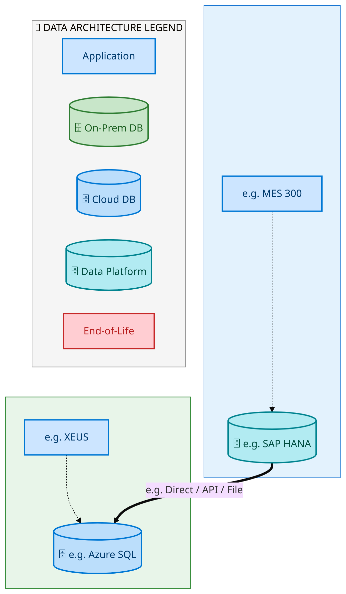
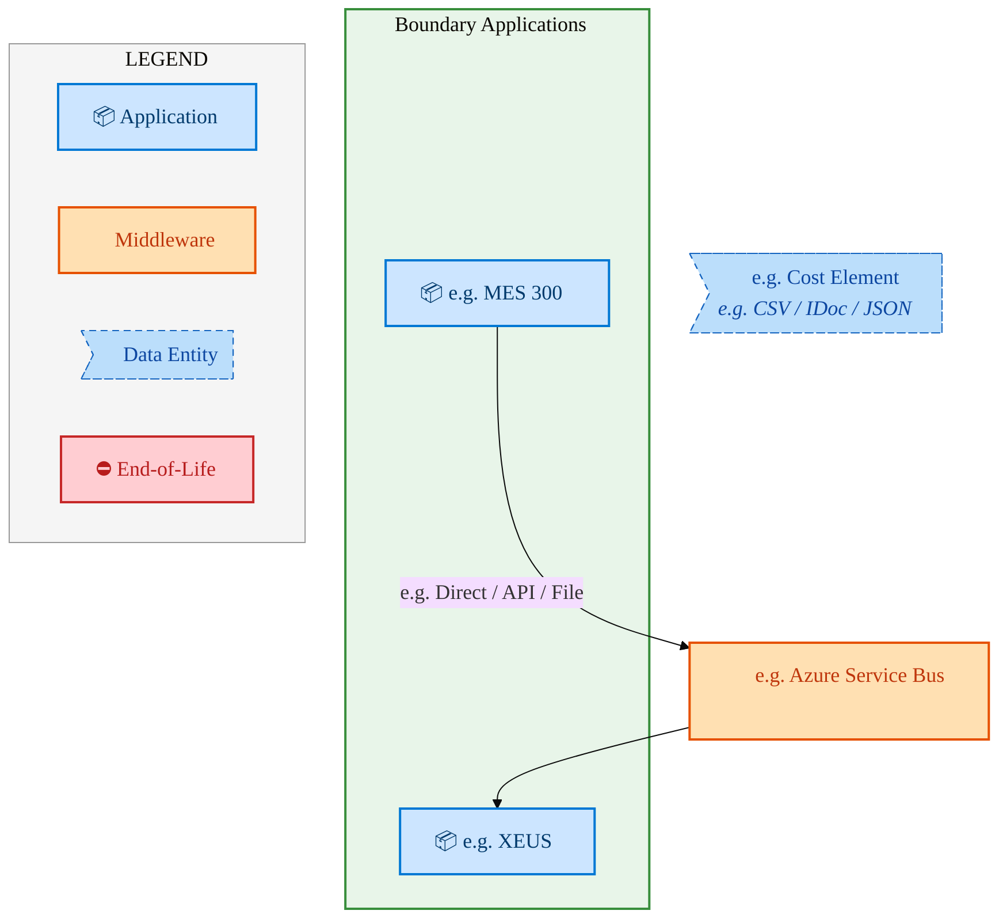
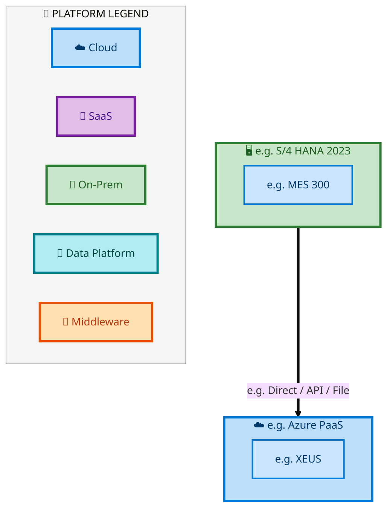

  <img src="data:image/svg+xml;base64,PHN2ZyB4bWxucz0iaHR0cDovL3d3dy53My5vcmcvMjAwMC9zdmciIHZpZXdCb3g9IjAgMCA4MDAgNDgwIiB3aWR0aD0iODAwIiBoZWlnaHQ9IjQ4MCI+DQogIDxkZWZzPg0KICAgIDxsaW5lYXJHcmFkaWVudCBpZD0iYmciIHgxPSIwJSIgeTE9IjAlIiB4Mj0iMTAwJSIgeTI9IjEwMCUiPg0KICAgICAgPHN0b3Agb2Zmc2V0PSIwJSIgc3R5bGU9InN0b3AtY29sb3I6IzAwNzFjNTtzdG9wLW9wYWNpdHk6MSIvPg0KICAgICAgPHN0b3Agb2Zmc2V0PSIxMDAlIiBzdHlsZT0ic3RvcC1jb2xvcjojMDBhZWVmO3N0b3Atb3BhY2l0eToxIi8+DQogICAgPC9saW5lYXJHcmFkaWVudD4NCiAgICA8bGluZWFyR3JhZGllbnQgaWQ9ImFjY2VudCIgeDE9IjAlIiB5MT0iMCUiIHgyPSIwJSIgeTI9IjEwMCUiPg0KICAgICAgPHN0b3Agb2Zmc2V0PSIwJSIgc3R5bGU9InN0b3AtY29sb3I6I2ZmZmZmZjtzdG9wLW9wYWNpdHk6MC4xNSIvPg0KICAgICAgPHN0b3Agb2Zmc2V0PSIxMDAlIiBzdHlsZT0ic3RvcC1jb2xvcjojZmZmZmZmO3N0b3Atb3BhY2l0eTowLjAyIi8+DQogICAgPC9saW5lYXJHcmFkaWVudD4NCiAgICA8cGF0dGVybiBpZD0iZ3JpZCIgd2lkdGg9IjQwIiBoZWlnaHQ9IjQwIiBwYXR0ZXJuVW5pdHM9InVzZXJTcGFjZU9uVXNlIj4NCiAgICAgIDxwYXRoIGQ9Ik0gNDAgMCBMIDAgMCAwIDQwIiBmaWxsPSJub25lIiBzdHJva2U9InJnYmEoMjU1LDI1NSwyNTUsMC4wNykiIHN0cm9rZS13aWR0aD0iMC41Ii8+DQogICAgPC9wYXR0ZXJuPg0KICA8L2RlZnM+DQoNCiAgPCEtLSBCYWNrZ3JvdW5kIC0tPg0KICA8cmVjdCB3aWR0aD0iODAwIiBoZWlnaHQ9IjQ4MCIgZmlsbD0idXJsKCNiZykiIHJ4PSI4Ii8+DQogIDxyZWN0IHdpZHRoPSI4MDAiIGhlaWdodD0iNDgwIiBmaWxsPSJ1cmwoI2dyaWQpIiByeD0iOCIvPg0KICA8cmVjdCB3aWR0aD0iODAwIiBoZWlnaHQ9IjQ4MCIgZmlsbD0idXJsKCNhY2NlbnQpIiByeD0iOCIvPg0KDQogIDwhLS0gRGVjb3JhdGl2ZSBjaXJjdWl0L2FyY2hpdGVjdHVyZSBsaW5lcyAtLT4NCiAgPGcgc3Ryb2tlPSJyZ2JhKDI1NSwyNTUsMjU1LDAuMTIpIiBzdHJva2Utd2lkdGg9IjEuNSIgZmlsbD0ibm9uZSI+DQogICAgPHBhdGggZD0iTSAwIDEwMCBMIDEyMCAxMDAgTCAxNjAgMTQwIEwgMjgwIDE0MCIvPg0KICAgIDxwYXRoIGQ9Ik0gMCAyNjAgTCA4MCAyNjAgTCAxMjAgMjIwIEwgMjAwIDIyMCBMIDI0MCAyNjAgTCAzNjAgMjYwIi8+DQogICAgPHBhdGggZD0iTSA1MjAgMTAwIEwgNjAwIDEwMCBMIDY0MCA2MCBMIDgwMCA2MCIvPg0KICAgIDxwYXRoIGQ9Ik0gNDQwIDM0MCBMIDU2MCAzNDAgTCA2MDAgMzAwIEwgNzIwIDMwMCBMIDc2MCAzNDAgTCA4MDAgMzQwIi8+DQogICAgPHBhdGggZD0iTSA2MDAgNDAwIEwgNjgwIDQwMCBMIDcyMCA0NDAiLz4NCiAgICA8cGF0aCBkPSJNIDAgNDAwIEwgNDAgNDAwIEwgODAgMzYwIi8+DQogICAgPHBhdGggZD0iTSAyMDAgNDIwIEwgMzIwIDQyMCBMIDM2MCAzODAgTCA0ODAgMzgwIi8+DQogICAgPHBhdGggZD0iTSA2NTAgNDQwIEwgNzUwIDQ0MCBMIDgwMCA0ODAiLz4NCiAgPC9nPg0KDQogIDwhLS0gRGVjb3JhdGl2ZSBub2RlcyAtLT4NCiAgPGcgZmlsbD0icmdiYSgyNTUsMjU1LDI1NSwwLjE4KSI+DQogICAgPGNpcmNsZSBjeD0iMTIwIiBjeT0iMTAwIiByPSI0Ii8+DQogICAgPGNpcmNsZSBjeD0iMjgwIiBjeT0iMTQwIiByPSI0Ii8+DQogICAgPGNpcmNsZSBjeD0iMjAwIiBjeT0iMjIwIiByPSI0Ii8+DQogICAgPGNpcmNsZSBjeD0iMzYwIiBjeT0iMjYwIiByPSI0Ii8+DQogICAgPGNpcmNsZSBjeD0iNjAwIiBjeT0iMTAwIiByPSI0Ii8+DQogICAgPGNpcmNsZSBjeD0iNzIwIiBjeT0iMzAwIiByPSI0Ii8+DQogICAgPGNpcmNsZSBjeD0iNTYwIiBjeT0iMzQwIiByPSI0Ii8+DQogICAgPGNpcmNsZSBjeD0iODAiIGN5PSIzNjAiIHI9IjQiLz4NCiAgICA8Y2lyY2xlIGN4PSI0ODAiIGN5PSIzODAiIHI9IjQiLz4NCiAgICA8Y2lyY2xlIGN4PSIzMjAiIGN5PSI0MjAiIHI9IjQiLz4NCiAgPC9nPg0KDQogIDwhLS0gVE9HQUYgQkRBVCBib3hlcyAtLT4NCiAgPGcgZm9udC1mYW1pbHk9IlNlZ29lIFVJLCBBcmlhbCwgc2Fucy1zZXJpZiIgZm9udC1zaXplPSIxNCIgZm9udC13ZWlnaHQ9IjYwMCI+DQogICAgPCEtLSBCIC0tPg0KICAgIDxyZWN0IHg9IjE1MCIgeT0iMTQwIiB3aWR0aD0iMTIwIiBoZWlnaHQ9IjQwIiByeD0iNSIgZmlsbD0icmdiYSgyNTUsMjU1LDI1NSwwLjE4KSIgc3Ryb2tlPSJyZ2JhKDI1NSwyNTUsMjU1LDAuMykiIHN0cm9rZS13aWR0aD0iMSIvPg0KICAgIDx0ZXh0IHg9IjIxMCIgeT0iMTY1IiB0ZXh0LWFuY2hvcj0ibWlkZGxlIiBmaWxsPSIjZmZmIj5CdXNpbmVzczwvdGV4dD4NCiAgICA8IS0tIEQgLS0+DQogICAgPHJlY3QgeD0iMjkwIiB5PSIxNDAiIHdpZHRoPSIxMjAiIGhlaWdodD0iNDAiIHJ4PSI1IiBmaWxsPSJyZ2JhKDI1NSwyNTUsMjU1LDAuMTgpIiBzdHJva2U9InJnYmEoMjU1LDI1NSwyNTUsMC4zKSIgc3Ryb2tlLXdpZHRoPSIxIi8+DQogICAgPHRleHQgeD0iMzUwIiB5PSIxNjUiIHRleHQtYW5jaG9yPSJtaWRkbGUiIGZpbGw9IiNmZmYiPkRhdGE8L3RleHQ+DQogICAgPCEtLSBBIC0tPg0KICAgIDxyZWN0IHg9IjQzMCIgeT0iMTQwIiB3aWR0aD0iMTIwIiBoZWlnaHQ9IjQwIiByeD0iNSIgZmlsbD0icmdiYSgyNTUsMjU1LDI1NSwwLjE4KSIgc3Ryb2tlPSJyZ2JhKDI1NSwyNTUsMjU1LDAuMykiIHN0cm9rZS13aWR0aD0iMSIvPg0KICAgIDx0ZXh0IHg9IjQ5MCIgeT0iMTY1IiB0ZXh0LWFuY2hvcj0ibWlkZGxlIiBmaWxsPSIjZmZmIj5BcHBsaWNhdGlvbjwvdGV4dD4NCiAgICA8IS0tIFQgLS0+DQogICAgPHJlY3QgeD0iNTcwIiB5PSIxNDAiIHdpZHRoPSIxMjAiIGhlaWdodD0iNDAiIHJ4PSI1IiBmaWxsPSJyZ2JhKDI1NSwyNTUsMjU1LDAuMTgpIiBzdHJva2U9InJnYmEoMjU1LDI1NSwyNTUsMC4zKSIgc3Ryb2tlLXdpZHRoPSIxIi8+DQogICAgPHRleHQgeD0iNjMwIiB5PSIxNjUiIHRleHQtYW5jaG9yPSJtaWRkbGUiIGZpbGw9IiNmZmYiPlRlY2hub2xvZ3k8L3RleHQ+DQogIDwvZz4NCg0KICA8IS0tIENvbm5lY3RpbmcgbGluZXMgYmV0d2VlbiBCREFUIGJveGVzIC0tPg0KICA8ZyBzdHJva2U9InJnYmEoMjU1LDI1NSwyNTUsMC4yNSkiIHN0cm9rZS13aWR0aD0iMSI+DQogICAgPGxpbmUgeDE9IjI3MCIgeTE9IjE2MCIgeDI9IjI5MCIgeTI9IjE2MCIvPg0KICAgIDxsaW5lIHgxPSI0MTAiIHkxPSIxNjAiIHgyPSI0MzAiIHkyPSIxNjAiLz4NCiAgICA8bGluZSB4MT0iNTUwIiB5MT0iMTYwIiB4Mj0iNTcwIiB5Mj0iMTYwIi8+DQogIDwvZz4NCg0KICA8IS0tIE1haW4gdGl0bGUgLS0+DQogIDx0ZXh0IHg9IjQwMCIgeT0iMjYwIiB0ZXh0LWFuY2hvcj0ibWlkZGxlIiBmb250LWZhbWlseT0iU2Vnb2UgVUksIEFyaWFsLCBzYW5zLXNlcmlmIiBmb250LXNpemU9IjM2IiBmb250LXdlaWdodD0iNzAwIiBmaWxsPSIjZmZmZmZmIiBsZXR0ZXItc3BhY2luZz0iMSI+DQogICAgSUFPIEFyY2hpdGVjdHVyZQ0KICA8L3RleHQ+DQogIDx0ZXh0IHg9IjQwMCIgeT0iMzAwIiB0ZXh0LWFuY2hvcj0ibWlkZGxlIiBmb250LWZhbWlseT0iU2Vnb2UgVUksIEFyaWFsLCBzYW5zLXNlcmlmIiBmb250LXNpemU9IjE4IiBmb250LXdlaWdodD0iNDAwIiBmaWxsPSJyZ2JhKDI1NSwyNTUsMjU1LDAuOCkiIGxldHRlci1zcGFjaW5nPSIyIj4NCiAgICBUT0dBRiBCREFUIMK3IElBTyBQcm9ncmFtIMK3IElETSAyLjANCiAgPC90ZXh0Pg0KDQogIDwhLS0gQm90dG9tIGFjY2VudCBiYXIgLS0+DQogIDxyZWN0IHg9IjI4MCIgeT0iMzQwIiB3aWR0aD0iMjQwIiBoZWlnaHQ9IjMiIHJ4PSIxLjUiIGZpbGw9InJnYmEoMjU1LDI1NSwyNTUsMC40KSIvPg0KDQogIDwhLS0gSW50ZWwgdGV4dCAtLT4NCiAgPHRleHQgeD0iNDAwIiB5PSIzODAiIHRleHQtYW5jaG9yPSJtaWRkbGUiIGZvbnQtZmFtaWx5PSJTZWdvZSBVSSwgQXJpYWwsIHNhbnMtc2VyaWYiIGZvbnQtc2l6ZT0iMTMiIGZpbGw9InJnYmEoMjU1LDI1NSwyNTUsMC41KSIgbGV0dGVyLXNwYWNpbmc9IjMiPg0KICAgIElOVEVMIENPTkZJREVOVElBTA0KICA8L3RleHQ+DQo8L3N2Zz4NCg==" alt="IAO Architecture" style="width:100%; border-radius:8px;" />
  <h1 style="font-size:36px; margin-top:24px;">E2E-44 — R3 - Intel Owned Consignment with Planning Integration</h1>
  <h2 style="font-size:24px;">Architecture Document (TOGAF BDAT)</h2>
  
End-to-End Integrated Processes (E2E) Tower 
  Capability E2E-44 · Procure to Pay

  
IAO Program · R1 – R5 
  Generated: April 2026 
  Sajiv Francis

  
IAO Architecture Pipeline — Intel Confidential

Page 1<a href="#toc">↑ Back to TOC</a>E2E-44 — R3 - Intel Owned Consignment with Planning Integration

## Table of Contents

<nav class="toc">
<ol>
  <li><a href="#1-executive-summary">1. Executive Summary</a></li>
  <li><a href="#2-business-context-objectives">2. Business Context &amp; Objectives</a>
    <ul>
      <li><a href="#21-classification">2.1 Classification</a></li>
      <li><a href="#22-business-drivers">2.2 Business Drivers</a></li>
      <li><a href="#23-success-criteria">2.3 Success Criteria</a></li>
      <li><a href="#24-companion-documents">2.4 Companion Documents</a></li>
    </ul>
  </li>
  <li><a href="#3-business-architecture-togaf-b">3. Business Architecture (TOGAF &ldquo;B&rdquo;)</a>
    <ul>
      <li><a href="#31-business-process-overview">3.1 Business Process Overview</a></li>
      <li><a href="#32-business-process-diagrams">3.2 Business Process Diagrams</a></li>
      <li><a href="#33-business-roles-responsibilities">3.3 Business Roles &amp; Responsibilities</a></li>
    </ul>
  </li>
  <li><a href="#4-data-architecture-togaf-d">4. Data Architecture (TOGAF &ldquo;D&rdquo;)</a>
    <ul>
      <li><a href="#41-data-entities-ownership">4.1 Data Entities &amp; Ownership</a></li>
      <li><a href="#42-data-flow-diagrams">4.2 Data Flow Diagrams</a></li>
      <li><a href="#43-data-lineage">4.3 Data Lineage</a></li>
      <li><a href="#44-ricefw-data-objects">4.4 RICEFW Data Objects</a></li>
      <li><a href="#45-data-governance-quality">4.5 Data Governance &amp; Quality</a></li>
    </ul>
  </li>
  <li><a href="#5-application-architecture-togaf-a">5. Application Architecture (TOGAF &ldquo;A&rdquo;)</a>
    <ul>
      <li><a href="#51-current-state-current-state-application-landscape">5.1 Current-State Application Landscape</a></li>
      <li><a href="#52-future-state-future-state-application-landscape">5.2 Future-State Application Landscape</a></li>
      <li><a href="#53-change-impact-summary">5.3 Change Impact Summary</a></li>
      <li><a href="#54-component-overview">5.4 Component Overview</a></li>
      <li><a href="#55-development-object-inventory">5.5 Development Object Inventory</a>
        <ul>
          <li><a href="#551-sap-development-objects">5.5.1 SAP Development Objects</a></li>
          <li><a href="#552-eca-development-objects">5.5.2 ECA Development Objects</a></li>
          <li><a href="#553-interface-objects">5.5.3 Interface Objects</a></li>
          <li><a href="#554-middleware-objects">5.5.4 Middleware Objects</a></li>
          <li><a href="#555-scheduling-batch-objects">5.5.5 Scheduling &amp; Batch Objects</a></li>
          <li><a href="#556-boundary-application-dependencies">5.5.6 Boundary Application Dependencies</a></li>
        </ul>
      </li>
      <li><a href="#56-integration-patterns">5.6 Integration Patterns</a></li>
    </ul>
  </li>
  <li><a href="#6-technology-architecture-togaf-t">6. Technology Architecture (TOGAF &ldquo;T&rdquo;)</a>
    <ul>
      <li><a href="#61-platform-infrastructure">6.1 Platform &amp; Infrastructure</a></li>
      <li><a href="#62-sap-development-object-status">6.2 SAP Development Object Status</a></li>
      <li><a href="#63-nfrs-design-principles">6.3 NFRs &amp; Design Principles</a></li>
      <li><a href="#64-security-governance">6.4 Security &amp; Governance</a></li>
      <li><a href="#65-eca-development-object-status">6.5 ECA Development Object Status</a></li>
    </ul>
  </li>
  <li><a href="#7-project-context">7. Project Context</a>
    <ul>
      <li><a href="#71-project-roadmap-go-live-plan">7.1 Project Roadmap &amp; Go-Live Plan</a></li>
      <li><a href="#72-raid-log">7.2 RAID Log</a></li>
      <li><a href="#73-recommendations-next-steps">7.3 Recommendations &amp; Next Steps</a></li>
    </ul>
  </li>
</ol>
</nav>

Page 2<a href="#toc">↑ Back to TOC</a>E2E-44 — R3 - Intel Owned Consignment with Planning Integration

## 1. Executive Summary

This Architecture Document defines the **Business, Data, Application, and Technology** (BDAT) architecture for **E2E-44 R3 - Intel Owned Consignment with Planning Integration** within the IAO program. It includes 5 BPMN process diagram(s) in Section 3.

| Dimension | Value |
|-----------|-------|
| **Tower** | End-to-End Integrated Processes (E2E) |
| **Process Group** | Procure to Pay |
| **Capability** | E2E-44 - R3 - Intel Owned Consignment with Planning Integration |
| **Release** | R1 – R5 |
| **Total Systems** | 2 |
| **System Status** | 0 Deployed, 0 Developing, 0 EOL, 2 Pending IAPM |
| **RICEFW Objects** | Pending — Smartsheet Object Tracker API integration |

**Change Summary**: 0 new flow chains, 0 removed, 0 modified, 1 unchanged between Current-State and Future-State states.

> All system nodes in architecture diagrams are **IAPM-linked** — click any node to open its IAPM page. Diagrams require `securityLevel: 'loose'` for click events.

Page 3<a href="#toc">↑ Back to TOC</a>E2E-44 — R3 - Intel Owned Consignment with Planning Integration

## 2. Business Context & Objectives

### 2.1 Classification

| Level | Value |
|-------|-------|
| **L0 Tower** | End-to-End Integrated Processes |
| **L1 Process** | Procure to Pay |
| **L2 Capability** | E2E-44 - R3 - Intel Owned Consignment with Planning Integration |

### 2.2 Business Drivers

| # | Driver | Description | Strategic Alignment | Priority |
|---|--------|-------------|---------------------|----------|
| 1 | End-to-End Process Integration | Enable cross-tower integrated processes spanning procurement, manufacturing, and fulfillment | IDM 2.0 Process Excellence | High |
| 2 | Intel Foundry Business Enablement | Stand up foundry-specific business processes for external customer engagement | Intel Foundry Services | High |
| 3 | Process Visibility & Monitoring | Provide end-to-end process visibility across tower boundaries with integrated monitoring | Operational Excellence | Medium |
| 4 | E2E-44 Process Migration | Migrate R3 - Intel Owned Consignment with Planning Integration business processes and 2 integrated systems from legacy to S/4 HANA target architecture | IDM 2.0 Cross-Functional / End-to-End | High |

Page 4<a href="#toc">↑ Back to TOC</a>E2E-44 — R3 - Intel Owned Consignment with Planning Integration

### 2.3 Success Criteria

| Metric | Target | Measure | Baseline | Owner |
|--------|--------|---------|----------|-------|
| E2E Process Cycle Time | Per process SLA | End-to-end transaction completion within defined SLA per process | Varies by process | E2E Process Owner |
| Cross-Tower Integration Success | > 99% | Transactions completing across tower boundaries without manual intervention | 92% (current) | Integration Lead |
| Process Exception Rate | < 2% | Transactions requiring manual exception handling | 8% (current) | Operations Manager |
| E2E-44 Migration Completeness | 100% flow chains validated | All 1 flow chains verified in target state | 0% (pre-migration) | Tower Architect |

### 2.4 Companion Documents

| Document | Description |
|----------|-------------|
| **Business Architecture** | Included in this document (Section 3) — process flows from BPMN diagrams |
| **This Document** | Full BDAT Architecture — Business + Data + Application + Technology |

Page 5<a href="#toc">↑ Back to TOC</a>E2E-44 — R3 - Intel Owned Consignment with Planning Integration

## 3. Business Architecture (TOGAF "B")

### 3.1 Business Process Overview

This capability includes **5 business process(es)** modeled in BPMN 2.0, covering the end-to-end workflow for E2E-44 R3 - Intel Owned Consignment with Planning Integration.

| # | Step ID | Process Name | Lanes | Tasks | Gateways |
|---|---------|--------------|-------|-------|----------|
| 1 | E2E-44_R3_CFIN | E2E-44_R3_CFIN | Boundary Apps, CFIN, MBC, SAP S/4 (IP & IF) | 15 | 10 |
| 2 | E2E-44_R3_SAP_Transportation_Management | E2E-44_R3_SAP_Transportation_Management | Boundary Apps, External Partners/

Supplier
, SAP S/4 (IP & IF) | 12 | 6 |

| 3 | E2E_44A_R3_Intel_Owned_Consignment_with_Planning_Integration-Procurement_from_Component_supplier_and | E2E_44A_R3_Intel_Owned_Consignment_with_Planning_Integration-Procurement_from_Component_supplier_and | Boundary Apps, External Partners/Suppliers, SAP S/4HANA IP | 26 | 10 |
| 4 | E2E_44B_R3_-_Intel_Owned_Consignment_with_Planning_Integration-Shipment_of_components_from_Intel_War | E2E_44B_R3_-_Intel_Owned_Consignment_with_Planning_Integration-Shipment_of_components_from_Intel_War | Boundary Apps, External Partner/Supplier, SAP S/4HANA IP | 45 | 28 |
| 5 | E2E_44C_R3_Intel_Owned_Consignment_with_Planning_Integration_-_Subcontracting_Process_with_ODM_Suppl | E2E_44C_R3_Intel_Owned_Consignment_with_Planning_Integration_-_Subcontracting_Process_with_ODM_Suppl | Boundary Apps, External Partners/Supplier, SAP S/4HANA IP | 34 | 14 |

Page 6<a href="#toc">↑ Back to TOC</a>E2E-44 — R3 - Intel Owned Consignment with Planning Integration

### 3.2 Business Process Diagrams

#### BUSINESS ARCHITECTURE — 3.2.1 E2E-44_R3_CFIN — E2E-44_R3_CFIN

**Swim Lanes**: Boundary Apps · CFIN · MBC · SAP S/4 (IP & IF) | **Tasks**: 15 | **Gateways**: 10

```mermaid
%%{init: {'theme': 'base', 'themeVariables': {'fontSize': '14px', 'fontFamily': 'Segoe UI, Arial, sans-serif','primaryColor': '#e8f0fe', 'primaryBorderColor': '#0071c5','lineColor': '#37474F', 'secondaryColor': '#f5f8fc'}, 'flowchart': {'useMaxWidth': false, 'htmlLabels': true, 'curve': 'basis', 'nodeSpacing': 40, 'rankSpacing': 50}} }%%
flowchart LR
    classDef startEvt fill:#4CAF50,stroke:#2E7D32,color:#000,font-weight:bold,stroke-width:2px,rx:20,ry:20
    classDef endEvt fill:#C62828,stroke:#B71C1C,color:#fff,font-weight:bold,stroke-width:2px,rx:20,ry:20
    classDef userTask fill:#E3F2FD,stroke:#1565C0,stroke-width:2px,color:#0D47A1
    classDef serviceTask fill:#FFF3E0,stroke:#E65100,stroke-width:2px,color:#BF360C
    classDef gateway fill:#FFF9C4,stroke:#F57F17,stroke-width:2px,color:#E65100
    classDef subProc fill:#F3E5F5,stroke:#7B1FA2,stroke-width:2px,color:#4A148C
    subgraph lane_0["Boundary Apps"]
        n1["Receive File in Bank"]
        n2["Update Payment Remittance"]
        n17(["fa:fa-stop Payment Data Updated"])
    end
    subgraph lane_1["CFIN"]
        n3["Execute Payment Run"]
        n4["Create APM Memo Record"]
        n5["Process BCM Payment Batching Based on Business Rules"]
        n6["Generate APM Payment File"]
        n7["Route to Approver"]
        n8["Correct APM Correction File"]
        n9["Reverse APP Doc Number and Memo Record Deletion"]
        n10["Fetch Payments Factory (APM, BCM, MBC Monitor)"]
        n11["Review Failed Payment Log"]
        n12["Generate Payment Proposal"]
        n13["Replicate Supplier Invoice Posting"]
        n19(["fa:fa-stop Memo Record Created"])
        n20(["fa:fa-stop APP Doc Reversed"])
        n21{{"fa:fa-code-branch Manual Approval Necessary?"}}
        n22{{"fa:fa-code-branch Approved?"}}
        n23{{"fa:fa-code-branch exclusiveGateway"}}
        n24{{"fa:fa-code-branch Can Be Corrected?"}}
        n25{{"fa:fa-code-branch exclusiveGateway"}}
        n26{{"fa:fa-code-branch exclusiveGateway"}}
        n27{{"fa:fa-code-branch Reversal or Reprocessing?"}}
        n28{{"fa:fa-arrows-alt parallelGateway"}}
        n29{{"fa:fa-arrows-alt parallelGateway"}}
        n30{{"fa:fa-arrows-alt inclusiveGateway"}}
    end
    subgraph lane_2["MBC"]
        n14["Multi-Bank Connectivity (host-to-host)"]
        n15["Multi-Bank Connectivity (host-to-host)"]
    end
    subgraph lane_3["SAP S/4 (IP & IF)"]
        n16(["fa:fa-play Supplier Invoice Posted (Component PO and SubCon Purchase Order to ODM)"])
        n18(["fa:fa-stop Payment Details provided back to Source System (IP/IF)"])
    end
    n12 --> n3
    n3 --> n28
    n4 --> n19
    n5 --> n21
    n21 -->|"No"| n23
    n7 --> n22
    n23 --> n6
    n25 --> n5
    n24 -->|"No"| n26
    n9 --> n20
    n10 --> n29
    n26 --> n9
    n29 --> n11
    n28 --> n4
    n11 --> n27
    n27 -->|"Reversal"| n26
    n2 --> n17
    n6 --> n14
    n29 --> n2
    n8 --> n25
    n13 --> n12
    n29 --> n18
    n21 -->|"Yes"| n7
    n1 -->|"PAIN.002 (Pay-load file)"| n15
    n14 -->|"PAIN.001 (Pay-load file)"| n1
    n28 -->|"Reprocessing"| n25
    n30 --> n8
    n22 -->|"Yes"| n23
    n22 -->|"No"| n24
    n15 --> n10
    n27 -->|"Reprocessing"| n30
    n24 -->|"Yes"| n30
    n16 --> n13
    class n16 startEvt
    class n17 endEvt
    class n18 endEvt
    class n19 endEvt
    class n20 endEvt
    class n21 gateway
    class n22 gateway
    class n23 gateway
    class n24 gateway
    class n25 gateway
    class n26 gateway
    class n27 gateway
    class n28 gateway
    class n29 gateway
    class n30 gateway
```

> **Legend**: ● Start · ● End · User Task · Service Task · ◇ Gateway · Sub-Process

<a href="https://mermaid.live/view#pako:eNqlV21v2zYQ_iuEiswJYK96tWR_2OA3FQHq1IjXDcM8DLRExUJkUaAoJ27q_76jRMqWIn9Ylw-t-Oi5547HuxP9pgU0JNpYu7l5i9OYj9Fbj-_InvTGqLfFOen1UQX8jlmMtwnJe4IT0ZSv428lzbCzV0ETmI_3cXIU6Jo8UYK-3vfRBAyTPspxmg9ywuKo1-9lLN5jdpzRhDLB_kC8SI9Kb_LVlLKQsDNB110jcMA0iVNyhi3Xdm1f2OUkoGnYEI2cyIuC3kkEl9CXYIcZL8MvcrLEr3_EId_BOsJJToCz4_vkM96SROyRs0JgQcEOKhlxLvykkLB1hoM4fQLc1gFiOH0-Q45-OqHTzc0mrZ2iz4-bFMFfkOA8n5MI5RzgxYGjKE6S8Qd7NvEdvZ9zRp_J-IO5cOeW2Q_ETsawdb0vkjt4IfHTjo-3NAkldfAi9jA2s9c-ex2bep8d4d-WL5KGZ0-zoemZXu1p6hozY6Y8RVH0vzxBXtlvOH-WvhaWb_rz2pfhDJ2Z_l5PbXNuuxOjnSfCDnFALkR937cW51Qtho6hXxed-tZQn7VEnzAnL_h4FhzN7FrQd1zfcK8KVv7aURbbFaOBErQWju_Ugu7U8CfmVUF7YtiejBB0nhjOdijBKflH_2ujTWlRFjWaZFm-0f6ueOIvNeD1IwlIfCDIjxOC4hRNoRKbLBNYX7MQdoxW-LgnKUePZB9zjtOAtATdWyBHeBzhQc5pVhvMMceoEgnB5K6ygbLqilqENfPvH5raFqCLVxIUl3EUaZNkC1NGRKyT1RItyZ5CsAFMgibPAZ7IN8lzNJ0ta8Ep5sEOmhAechIiCvkochgXQHssYHQ1VYag8omkhCl_SkYks0l1RaqpiJ1TcRKMHghrUjwRO2WMBLwUk88xBPFeb1QeHWjkwvMKzaF2Hor9ljCE0_By42hOEiJUWkclasMnsF0VdY58HHAKlXIL7vsiL320nM7QksJcp-yuJVBVzyEmL2AIAYb19j_TpxbXvMyUosEBZDTHSYtrlbpZEgeCvC4yeIRt3acHCn2MVjTncEIto1Gr8C4TUBXERd1VZa23TFQaZVrf8Y23N8UXn7zBFoY2ZG-J0wIn8kzh4YGIqoKG-3WjnU6XAma3gKyG8B3f6uaT1yCBojyQT9UQapvZ3WYzDMVMVFV1uHN-zN3wx8zcbrMq-ZBGyuA5q1oUjvtdtN7ZHjNGX_IBTjjKMMNJQpIrTkc_YGTpnUZxem1_V6aaaAHoplbdioG1LBIeD8TghdNJU9Hzh5hDG-6g1AecDsT_7e5z_rvhlcBEv60nK7T-aKPb-xX6Cd37bW_Dc69kCXz3OrsSJsDtjO4zmpbd_aWcROtiC7GhVcHgHgPD6ou4lIkh-GW-vGu1mOFd-3wQDhMmR6JR4hD8bHHwLETWFHRhSBzB-15E_7GKvf2BgQmEBoNf4DTl2qqWpifXdrU2RnLtyPfyNgEPAvi-0R7oRvsumlO-cCXRVESpPFRrqeSotd0SUsSRFNJVxLoEVEjmsALqtbQw6hi9CrCVgiEVXEVwpW_VZc0IZIoMRZf-DLvlUG1VujPV1gy5dcNsR-i1s_in-JSCb-VK4avJ_cPPum6iWzj6QUJxKG5E5K4kG7Uju0k3uumNtJS7Ps-TaudK0JK5ruM0W3HWx12_UcdXJ1ues6G_T3bLraW3a0G5qd8YKvfWxT2xhNW1v4m78oreRL1OdNSFmnonaqibbhM2u2GrG7a7YacbHnbDbjfsdcOjThiOWcJaX9sTtsdxqI3ftPLnKfyEDUmEYaRqp76GC07XxzTQxuXPOK0o767zGMPg3Ffg6V_Ci5jv" title="View full diagram">&#128065; View Diagram</a>

Page 7<a href="#toc">↑ Back to TOC</a>E2E-44 — R3 - Intel Owned Consignment with Planning Integration

#### BUSINESS ARCHITECTURE — 3.2.2 E2E-44_R3_SAP_Transportation_Management — E2E-44_R3_SAP_Transportation_Management

**Swim Lanes**: Boundary Apps · External Partners/
Supplier
 · SAP S/4 (IP & IF) | **Tasks**: 12 | **Gateways**: 6

```mermaid
%%{init: {'theme': 'base', 'themeVariables': {'fontSize': '14px', 'fontFamily': 'Segoe UI, Arial, sans-serif','primaryColor': '#e8f0fe', 'primaryBorderColor': '#0071c5','lineColor': '#37474F', 'secondaryColor': '#f5f8fc'}, 'flowchart': {'useMaxWidth': false, 'htmlLabels': true, 'curve': 'basis', 'nodeSpacing': 40, 'rankSpacing': 50}} }%%
flowchart LR
    classDef startEvt fill:#4CAF50,stroke:#2E7D32,color:#000,font-weight:bold,stroke-width:2px,rx:20,ry:20
    classDef endEvt fill:#C62828,stroke:#B71C1C,color:#fff,font-weight:bold,stroke-width:2px,rx:20,ry:20
    classDef userTask fill:#E3F2FD,stroke:#1565C0,stroke-width:2px,color:#0D47A1
    classDef serviceTask fill:#FFF3E0,stroke:#E65100,stroke-width:2px,color:#BF360C
    classDef gateway fill:#FFF9C4,stroke:#F57F17,stroke-width:2px,color:#E65100
    classDef subProc fill:#F3E5F5,stroke:#7B1FA2,stroke-width:2px,color:#4A148C
    subgraph lane_0["Boundary Apps"]
        n1["Receive/Send Information in Carrier Invoice Reconciliation/Dispute..."]
        n2["Event updates are received in GTT"]
        n17{{"fa:fa-code-branch exclusiveGateway"}}
    end
    subgraph lane_1["External Partners/ Supplier "]
        n11["Feed Rates/Charges Integrators 3rd party service – Redwood"]
        n12["Carrier"]
        n14(["fa:fa-play Process Initiated Based on Rate/Charges Available"])
        n15(["fa:fa-play Events Published"])
        n20{{"fa:fa-arrows-alt parallelGateway"}}
        n21{{"fa:fa-arrows-alt parallelGateway"}}
    end
    subgraph lane_2["SAP S/4 (IP & IF)"]
        n3["Generate Freight Unit (TM)"]
        n4["Create Freight Order (TM)"]
        n5["Perform Carrier Updates and Calculate Charges"]
        n6["Execute Freight Order (TM)"]
        n7["Post Freight Settlement Document (TM)"]
        n8["Create Service PO for FSD (TM)"]
        n9["Post SES with Auto Release (TM)"]
        n10["Create Cost Distribution/Agency Business Document (TM)"]
        n13(["fa:fa-play Component PO and SubCon PO IBD Integration"])
        n16(["fa:fa-stop TM process ended"])
        n18{{"fa:fa-code-branch exclusiveGateway"}}
        n19{{"fa:fa-code-branch exclusiveGateway"}}
        n22{{"fa:fa-arrows-alt inclusiveGateway"}}
    end
    n3 --> n4
    n5 --> n18
    n7 --> n8
    n19 --> n5
    n4 --> n19
    n9 --> n10
    n10 --> n16
    n11 --> n20
    n14 --> n11
    n17 --> n1
    n15 --> n12
    n12 --> n21
    n21 --> n17
    n20 --> n17
    n21 --> n2
    n20 --> n19
    n2 -->|"Event Update"| n18
    n18 --> n6
    n8 --> n9
    n13 --> n3
    n6 --> n22
    n1 --> n22
    n22 --> n7
    class n13 startEvt
    class n14 startEvt
    class n15 startEvt
    class n16 endEvt
    class n17 gateway
    class n18 gateway
    class n19 gateway
    class n20 gateway
    class n21 gateway
    class n22 gateway
```

> **Legend**: ● Start · ● End · User Task · Service Task · ◇ Gateway · Sub-Process

<a href="https://mermaid.live/view#pako:eNqlVm1v4jgQ_itWqh67ErRJSAjlw0kQyKrSrhY13bsPy-lkEgesNXZkO1C2y3-_cV6gpPTu9o4PVefJzDMzT2YcP1uJSIk1sq6vnymneoSeO3pNNqQzQp0lVqTTRRXwG5YULxlRHeOTCa5j-r10c7z8ybgZLMIbyvYGjclKEPTlvovGEMi6SGGueopImnW6nVzSDZb7UDAhjfcVGWZ2VmarH02ETIk8Odh24CQ-hDLKyQnuB17gRSZOkUTw9Iw087NhlnQOpjgmdskaS12WXyjyCT_9TlO9BjvDTBHwWesN-4iXhJketSwMlhRy24hBlcnDQbA4xwnlK8A9GyCJ-bcT5NuHAzpcXy_4MSn6-LDgCH4Jw0pNSYaUBni21SijjI2uvHAc-XZXaSm-kdGVOwumfbebmE5G0LrdNeL2doSu1nq0FCytXXs708PIzZ-68mnk2l25h7-tXISnp0zhwB26w2OmSeCETthkyrLsf2UCXeUjVt_qXLN-5EbTYy7HH_ih_ZqvaXPqBWOnrRORW5qQF6RRFPVnJ6lmA9-x3yadRP2BHbZIV1iTHd6fCO9C70gY-UHkBG8SVvnaVRbLuRRJQ9if-ZF_JAwmTjR23yT0xo43rCsEnpXE-RoxzMmf9teFNRFFOdRonOdqYf1R-Zkfd-DxA0kI3ZLbGN4xuueZkBusqeCIchRiKSmRAG8FSIgezIIklNHS43ZKVV5ocnNzc07rAu1sS7hGRZ6CUAphSZCsEqWG-MPjY6uS4Pl5YWV4lOGeOU96S9iIZI3IU8IKBWEfKsEX1uFQhUG5lzo2Lc2eNJEcMzSHDeFEqlsUF3nOTCuttMY9IlDUg6nzNoRVW0G991wTINVCKtSXKcqBaN9MEloUru30QY10J0TaYjTN17q1nnjvvjYt5gxmx7xvokwyqkFRKGICx2WKQHtTzbGY8RZTZg5O4Hv_ktBvEZaaKzQvloyqNUlb_q590hgKFDvVw0yb3jBjhL1SuApyfi7ojddiVInHcxTfeujd_Rz9gu6j9-f69MHlA4HXBZQokuXxgb6ANujd46eWr2dEluSl52dz2F9w9cF1TqSZ6-M8f2nGEkY-xCwpmGGq9T4PH5TzRJLiX6QKTCqh9NExJloz-PLBJkxFUpT_vA4bnpqJ6wmbf0ZQMIri6QX_uyZNPIvRjuo1GhdawDgyAvNzIcCxTxlCEwiLqyVdFuUWj1eEJ3s0gTXjZhz_plKn35q4UGxywY0zVGzUjItlCPML1v1kelwjSNOe3cGJSWmRo8dPKK_3AUbo1ew6w589H6qwu_8U5roXh57yfzyMeB_1er_CgNamX5nOsLaDym5M566y_dr2ave72q4fO3bjb9fAoAGcCnCPHg2F0wB1yqPdlOQ2gFtTNB5uzekEDWC3gSZr26Gpu6T80XwFqnVbWD9eCOEMq5CmkdpsCJxax35tD-qEx6Jbtls3Ebz4rJYszS3pHPfewP038EF9AzpHg-YacA4PL8N3F2GQ7iLsXIbdBra61obAp5qm1ujZKu_XcAdPSYYLpq1D18JwJsR7nlij8h5qVZ_iKcWwkJsKPPwFcMugtA==" title="View full diagram">&#128065; View Diagram</a>

Page 8<a href="#toc">↑ Back to TOC</a>E2E-44 — R3 - Intel Owned Consignment with Planning Integration

#### BUSINESS ARCHITECTURE — 3.2.3 E2E_44A_R3_Intel_Owned_Consignment_with_Planning_Integration-Procurement_from_Component_supplier_and — E2E_44A_R3_Intel_Owned_Consignment_with_Planning_Integration-Procurement_from_Component_supplier_and

**Swim Lanes**: Boundary Apps · External Partners/Suppliers · SAP S/4HANA IP | **Tasks**: 26 | **Gateways**: 10

```mermaid
%%{init: {'theme': 'base', 'themeVariables': {'fontSize': '14px', 'fontFamily': 'Segoe UI, Arial, sans-serif','primaryColor': '#e8f0fe', 'primaryBorderColor': '#0071c5','lineColor': '#37474F', 'secondaryColor': '#f5f8fc'}, 'flowchart': {'useMaxWidth': false, 'htmlLabels': true, 'curve': 'basis', 'nodeSpacing': 40, 'rankSpacing': 50}} }%%
flowchart LR
    classDef startEvt fill:#4CAF50,stroke:#2E7D32,color:#000,font-weight:bold,stroke-width:2px,rx:20,ry:20
    classDef endEvt fill:#C62828,stroke:#B71C1C,color:#fff,font-weight:bold,stroke-width:2px,rx:20,ry:20
    classDef userTask fill:#E3F2FD,stroke:#1565C0,stroke-width:2px,color:#0D47A1
    classDef serviceTask fill:#FFF3E0,stroke:#E65100,stroke-width:2px,color:#BF360C
    classDef gateway fill:#FFF9C4,stroke:#F57F17,stroke-width:2px,color:#E65100
    classDef subProc fill:#F3E5F5,stroke:#7B1FA2,stroke-width:2px,color:#4A148C
    subgraph lane_0["Boundary Apps"]
        n15["Organize Transport-Intel Routing Guide (IRG)"]
        n16["ReadSoft Validation/Exception Handling based on rules setup"]
        n17["Incoming invoice/ B2B/OpenText/Web suite"]
        n18["Manual invoices through OCR"]
        n33{{"fa:fa-code-branch exclusiveGateway"}}
        n34{{"fa:fa-code-branch B2B/Manual?"}}
        n35{{"fa:fa-code-branch exclusiveGateway"}}
    end
    subgraph lane_1["External Partners/Suppliers"]
        n19["Update Forecast Communication and Commit"]
        n20["Receive PO at Component Supplier"]
        n21["Commit Order Acknowledgement"]
        n22["Send PO communication to ODM Supplier"]
        n23["Select Carrier via Intel Routing Guide hosted Collaboration Portal"]
        n24["Send Order Shipment"]
        n25["Receive Physical Receipt of Material against PO at ODM Supplier"]
        n26["Supplier Invoicing"]
        n28(["fa:fa-stop PO communication to ODM Supplier Sent"])
        n40{{"fa:fa-arrows-alt parallelGateway"}}
    end
    subgraph lane_2["SAP S/4HANA IP"]
        n1["Create Purchase Requisition"]
        n2["Create Manual Purchase Requisition"]
        n3["Approve Purchase Requisition"]
        n4["Create Purchase Order"]
        n5["Trigger GTS Check"]
        n6["Calculate Taxes"]
        n7["Initiate Auto Inbound Delivery"]
        n8["Receive Goods Receipt (Virtual)"]
        n9["Trigger TM Embedded"]
        n10["Evaluate Receipt Settlement (ERS) Self-Billing"]
        n11["Issue Material to ODM Supplier (541)"]
        n12["Post Supplier Invoice"]
        n13["Publish Purchase Order"]
        n14["Acknowledge/Confirm Purchase Order"]
        n27(["fa:fa-play Purchase Requisition Creation Initiated"])
        n29["E2E-44 R3 SAP Transportation Management"]
        n30["E2E-44 R3 CFIN"]
        n31{{"fa:fa-code-branch Invoice Accepted?"}}
        n32{{"fa:fa-code-branch exclusiveGateway"}}
        n36{{"fa:fa-arrows-alt parallelGateway"}}
        n37{{"fa:fa-arrows-alt parallelGateway"}}
        n38{{"fa:fa-arrows-alt parallelGateway"}}
        n39{{"fa:fa-arrows-alt parallelGateway"}}
    end
    n2 --> n3
    n22 --> n28
    n36 --> n5
    n24 -->|"ASN E2Open
Manual"| n25
    n25 --> n7
    n7 --> n37
    n37 --> n8
    n37 --> n9
    n8 --> n38
    n38 --> n10
    n38 --> n11
    n33 --> n16
    n17 --> n35
    n35 --> n33
    n34 --> n18
    n34 --> n17
    n10 --> n33
    n31 -->|"Yes"| n12
    n31 -->|"No"| n26
    n26 --> n34
    n18 --> n35
    n6 --> n39
    n5 --> n39
    n13 --> n40
    n14 --> n23
    n20 --> n21
    n23 --> n15
    n9 --> n29
    n12 --> n30
    n36 --> n6
    n39 --> n13
    n40 -->|"WebPO/
E2Open"| n20
    n15 --> n24
    n16 --> n31
    n4 --> n36
    n40 -->|"Manual/ E2Open/
Power BI"| n22
    n21 --> n14
    n1 --> n32
    n32 --> n4
    n27 --> n2
    n3 --> n32
    class n27 startEvt
    class n28 endEvt
    class n29 startEvt
    class n30 startEvt
    class n31 gateway
    class n32 gateway
    class n33 gateway
    class n34 gateway
    class n35 gateway
    class n36 gateway
    class n37 gateway
    class n38 gateway
    class n39 gateway
    class n40 gateway
```

> **Legend**: ● Start · ● End · User Task · Service Task · ◇ Gateway · Sub-Process

<a href="https://mermaid.live/view#pako:eNqlWFtvIjcU_isWq1WyEoi5AuGhFRBIkTYbFNKtqlJVZsYDVow99XgS0mz-e49nbAjeybbd8oDw53P5zsXHMzy3EpGS1rD1_v0z5VQN0fOZ2pIdORuiszUuyFkb1cBnLCleM1KcaZlMcLWkf1VifpTvtZjGZnhH2ZNGl2QjCPp53kYjUGRtVGBedAoiaXbWPssl3WH5NBFMSC39jgwyL6u8ma2xkCmRRwHP6_tJDKqMcnKEw37Uj2ZaryCJ4OmJ0SzOBlly9qLJMfGYbLFUFf2yINd4_wtN1RbWGWYFAZmt2rGPeE2YjlHJUmNJKR9sMmih_XBI2DLHCeUbwCMPIIn5_RGKvZcX9PL-_YofnKKPtyuO4JMwXBSXJEOFAnj6oFBGGRu-iyajWey1CyXFPRm-C6b9yzBoJzqSIYTutXVyO4-EbrZquBYsNaKdRx3DMMj3bbkfBl5bPsG344vw9Ohp0gsGweDgadz3J_7Eesqy7H95grzKO1zcG1_TcBbMLg--_LgXT7yv7dkwL6P-yHfzROQDTcgro7PZLJweUzXtxb73ttHxLOx5E8foBivyiJ-OBi8m0cHgLO7P_P6bBmt_LstyvZAisQbDaTyLDwb7Y382Ct40GI38aGAYgp2NxPkWMczJH95vq9ZYlFVTo1GeF6vW77Wc_nA_hv0bucEcDiK6gyYsciFVZ84VYehWlAr6EV2VNCXofH579cFR74H6LcHpUmQKfcaMplhRwbvTfUJy_Qv9hHnKtBE9CVIEiCxhAkBRVJk71vpgbc4TsdPylD8IqFoXjYNx9yYn_I7sVfcXsoYIqSKO6gBUrzEvMbOKBVJbKcrNFt1Mbk-lw_D5edXK8DDDHT27OmsIPNkisk9YWdAHclUXd9V6eXmtFjWraYK17x9djfi_OoJz1lRGH8Kb7hWRHAJcwLHnRBbdZZnnjMIvJxkXIP1zDqUgaCYkSXCh0ETsdiWnSVUfBEWpEKpOVQOvKmhCgBta3CBcKeaCE66QdeeoaG61LXSj5y0aJfdcPDKSbmDmc9dDAOJLCFObT05IKYFuLq_fchNWeowkQAlLCQLogWLU1KlbUSiiA2QMr4WsrS-grzFzjEaWTM18uaV5A-X4dVK2TwUQBpcayBUSGbqGTOsLCuENphySXWfuG8Hoc2O3IATdsEDfERqc_2abp1Ai_8eEoWVN_cMrI5F37EDImngsOpgplGOJGSPs3_ZfVbTRAi270U-jTyM0Xzgtp3tAEt1xi1LCfVUQSNCfJS2oZuoEdhQ2R_afdXT1YXxJ8fBvPEQNdKoKn4rput5JutlA7q7ulmiyJcn9qYgu1ASzpGTa2B3eE-ew1TMLOOj9UQklmfO1HrjokjBoGPl0Kj941UtXQqTFoZHOP1OpIBvOjL14RfLuGk13a5KmJHXyr8_t9AGzUtOwFpdEKVadQXQ-vV1-AIBlnTFcMF81m68rOC-Kkhy72W2v8zjy3QtA13IBxw053ezOZ12_RblmtNh-syS-Lt2rAdKdCJ5RufumUtA_npScwaXc1CGoagj9w5Yrdc5KoFM9DaadKEK3IdL9frgRa01oV9w01ELvRHMym39yBPzmi8AkC0amvi9J-tUFEnzfTdX7b6e-Vup_j9Lge5QuvnMo8QB1Oj-AAbs062BggLBXA7EViPT6C7TU8hOaBvoxYsXrobNqfdGj3QrGtWLfrPvGkV2HBhg46wuzHhj5w74BfM8FfAuEBugZwLc-LafQcAptuGFkVAYuYGn6nqvimwT8qgfXF31i3Z1Pok6F5RGYHIaRNTpwiFkBG3zsrH0TWmSD9w3P4FA4wzOw2QhsNqyPCyNwsGlL7zmltrRDo-FbH5FnAoRnxsVNd8VN_atgD8wM9-AQrA3OMjPUw55rtm6jrmkrsL8QjzD_xvPag81z4BteBw_G4KEQJjK7H5g-OOyfylcvDJWUff87xQfmXe0UvWiWDr03cN--4JzCQTMcNsNRMxw3w71muN8MD5rhi0YYambgVru1I3KHadoaPreqfyXgn4uUZLhkqvXSbmG4wpdPPGkNq7f3Vlk9R19SDE9Duxp8-RvplzGK" title="View full diagram">&#128065; View Diagram</a>

Page 9<a href="#toc">↑ Back to TOC</a>E2E-44 — R3 - Intel Owned Consignment with Planning Integration

#### BUSINESS ARCHITECTURE — 3.2.4 E2E_44B_R3_-_Intel_Owned_Consignment_with_Planning_Integration-Shipment_of_components_from_Intel_War — E2E_44B_R3_-_Intel_Owned_Consignment_with_Planning_Integration-Shipment_of_components_from_Intel_War

**Swim Lanes**: Boundary Apps · External Partner/Supplier · SAP S/4HANA IP | **Tasks**: 45 | **Gateways**: 28

> **Legend**: ● Start · ● End · User Task · Service Task · ◇ Gateway · Sub-Process

<a href="https://mermaid.live/view#pako:eNqtGmtP20r2r4xSdaFSKPFznHzYVciDi1RKRNJWq8tqNdgTYtWxvfaYx1L--56x5zhkmNzb-i4fED5z3m-Pee6FWcR7o977989xGosReT4SG77lRyNydMtKftQnDeArK2J2m_DySOKss1Qs4__WaJabP0o0CZuzbZw8SeiS32WcfLnokzEQJn1SsrQ8KXkRr4_6R3kRb1nxNMmSrJDY73iwHqxraeroLCsiXuwQBgNqhR6QJnHKd2CHutSdS7qSh1ka7TFde-tgHR69SOWS7CHcsELU6lclv2SP3-JIbOB5zZKSA85GbJNP7JYn0kZRVBIWVsU9OiMupZwUHLbMWRindwB3BwAqWPp9B_IGLy_k5f37m7QVSlbTm5TAT5iwspzyNSkFgGf3gqzjJBm9cyfjuTfol6LIvvPRO3tGp47dD6UlIzB90JfOPXng8d1GjG6zJFKoJw_ShpGdP_aLx5E96BdP8FuTxdNoJ2ni24EdtJLOqDWxJihpvV7_JUng12LFyu9K1syZ2_NpK8vyfG8yeMsPzZy6dGzpfuLFfRzyV0zn87kz27lq5nvW4DDTs7njDyYa0zsm-AN72jEcTtyW4dyjc4seZNjI07WsbhdFFiJDZ-bNvZYhPbPmY_sgQ3dsuYHSEPjcFSzfkISl_N-D3296Z1lVJzUZ53l50_tXgyd_UseD82se8vieny4hyOQiXWfFlok4S0mckgkripgXAL7PwIfkWlZIGCdxjXE6jcu8Evzjx4_7fH3_-fmmt2ajNTuR3eHkFvI73BD-GCZVCcLOG_fd9F5eGjKQbdLfAv1mj4IXKUvIAvI95cXpssrzBLTSbPEBF_WdZOk6Rjuus0pAXZHzKo746eT6UiOkQLiIw--Ao50E8oSZToZw8ilj0ZsTV7p8kZWCLDZPZRyC3rWDc0GyNbkEu2UvI-yOxSkgLVdXhAlyNb0kZrNcS2lHrmQ3I8tNnG95Ksh5lkUlOVYWf9CobKCacx6Ra5BYnk6ghdzxEuIoOLhXZEVJnCIiObj0CSuE3FT2wHJA3-gBmGscnTqVsu-nK4gVKCKyNjvuY0bOPrufNAoXKJbjhenI28VKOwmOf8fMyRMoMFkUvJSaxwKyDiw6g5kSERlXeGwtG9-zOJHTBfh9eM1wqDFERibtXxN6A41wdg9uL8miuk3icsMjHd_f4Zciy8nskYdVnYC8oURBJ-erFUjPRVW84eLTX62chizoREaHOzLwRvZQnrBEyKxgScITM1Ew6EJkdSGyuxA5XYjcXyM60K5slfHLU_e38ecxuVjsZ7es5UnBZfYtRQY1vYIwlXkG472u7n3suoZj6HywJdWVm2DOlrsigAaitSagWhXx3R2k9vlqSSYbHn7XimynxlUlbuV8IFOeQJoUT_uYTZ0mYZVI5BV75NoEkU13dUlm21seRVzrGdhY-0Q2UcJAzJc8Ak77aAF2zKalXZRlpWEM6zFQ-wkn0fGCF_Wo0jqfJfvvJNtueRHKRrvDLzIjfh0T6SMyXi1qtKgKBRknSRY280O1Fph60CtrVJ2HvXPouILGeJH-kVMtZzd1lc1qRBx_jQtRsUTnLwNWu2U3QEDK66FBjj3X0slk9C4mrQsg2eS8gtQrPoJquezjqdBo_D-LuEVbY09VOMm8qJc98gV6ax1mQzZbMsxLnnBwrrH1W8M90aqxayUxMM61UasBhPiBSeEwGmUlri41p9jNSiFb807vZrRKxZeCiapUdpUkr9PyQmNhv4ofbkSgkrYsHZe6aOew55ZciITXg32ahdX2TWDsV0W7VPN6cXVKZqmA1W654VwnkNFXWbyTMwGDSpk8mJrkQvCt3COuThfjDyQrdin2lSVVXQEaYx_rdRyGRdXkIvKHKuVpyeURVIB46wP6CwH8FosNLKFvYyhT6ZzDLviznVSmVjv4ZVc8Vu1kymEDL2orNSFO00jqPdLQZWUaXbKU3XHDoX24z1_z_1S81GLl7DID3J9Kn_4cnUwKWOuL7P4nJbn-_3u_oof2qz82hNTmNsm1t0ZZ2hpl6OUY-jcrmP1mBatFxn9G52h0bQnUTTfSm61O7mrkP1UXRJbQW1U8jddfKlycYm_FHFgzJ0UGudBcnPxD25G8bjumN-y20Q66kVndyOxuZI6Z7PASkXDdrb7bTbTXjazLxk-7bPy0y8ZPu2z8tMvGT90uRF4XIr8LEe1CFHR8i0ktcnLyd5kd6tkfNgBHPbvNI1W3VvCHIsBndW7hs2LoUQXwaowfN71_ypXuh2wL-snnrD6wUIajmDoBAgIlpSVVAESgqLVuhu-iHUovF4XAdUfD00YedgOwPMRQtnvoCwuNbTGUGhaKtZRYvNyEPxQJ6mErPSg60FZibZRiK8XslgRjgBgUMVAP21OaIsBVTAMMi6s0ddFa31ceQ5IAM6GNrKsDPA3go-rI1EEMBLhKio3ZYCsX-q1iypbA1vVoMTAMKNZTPnVbaz2VSPMr8jfy2_jbGUzEPK9v6H680ldpR1tlMK0wjQLFOWhdr-LpoTKBUtcLdACmgOLpoxCqLLbbZNa0oIrC1iosaHNIRQrNsNBDmA--o5WY01aSpZVBi6pqzrG0gvE0rfyW1UADYKW3AB_jgs8qcBbKcHzNssDVnIUABwHOUOn76oYAr1Bv0nYjSjN5tfBDhkPvQ-h2S2lntz0EWdcJw4RgIdztkRt5Dw5vHrgfYxa1nUXF00WrLOwbjt5IWkeoZ6oXUut8pazVKqswrLb2FA8_0KrTtnQMW-8SbadRGB7qFdjKA-3VMizr9Z23_GIgPVFkW3LtwCuBfDNrcqvVwFUZ4zp77F6bhU2nbcIDJdA9s8n5ddP12-ah9HUQ20F-bZ3jXECJjqth-Og39YxJbe_NCVCg_lQHIY5TgQGmr77L1J0LP7Ptw-kBeHAAPjTDoYmZ4Zb65LYPtY1Qxwh1jVDPCPWNUIpfufbBgRk8NIKhGxjBlhlsm8GOGeyawZ4Z7JvBZit9s5W-2UpqtpKaraRmK6nZSmq2kpqtpGYrqdlKaraSmq0MzFYGZisDs5WB2cqgtbLX78H7_pbFUW_03Kv_cQD-uSDia1YlovfS7zG4YV0-pWFvVH9g71X1Tdo0ZnARv22AL_8D5R_hBw==" title="View full diagram">&#128065; View Diagram</a>

Page 10<a href="#toc">↑ Back to TOC</a>E2E-44 — R3 - Intel Owned Consignment with Planning Integration

#### BUSINESS ARCHITECTURE — 3.2.5 E2E_44C_R3_Intel_Owned_Consignment_with_Planning_Integration_-_Subcontracting_Process_with_ODM_Suppl — E2E_44C_R3_Intel_Owned_Consignment_with_Planning_Integration_-_Subcontracting_Process_with_ODM_Suppl

**Swim Lanes**: Boundary Apps · External Partners/Supplier · SAP S/4HANA IP | **Tasks**: 34 | **Gateways**: 14

```mermaid
%%{init: {'theme': 'base', 'themeVariables': {'fontSize': '14px', 'fontFamily': 'Segoe UI, Arial, sans-serif','primaryColor': '#e8f0fe', 'primaryBorderColor': '#0071c5','lineColor': '#37474F', 'secondaryColor': '#f5f8fc'}, 'flowchart': {'useMaxWidth': false, 'htmlLabels': true, 'curve': 'basis', 'nodeSpacing': 40, 'rankSpacing': 50}} }%%
flowchart TD
    classDef startEvt fill:#4CAF50,stroke:#2E7D32,color:#000,font-weight:bold,stroke-width:2px,rx:20,ry:20
    classDef endEvt fill:#C62828,stroke:#B71C1C,color:#fff,font-weight:bold,stroke-width:2px,rx:20,ry:20
    classDef userTask fill:#E3F2FD,stroke:#1565C0,stroke-width:2px,color:#0D47A1
    classDef serviceTask fill:#FFF3E0,stroke:#E65100,stroke-width:2px,color:#BF360C
    classDef gateway fill:#FFF9C4,stroke:#F57F17,stroke-width:2px,color:#E65100
    classDef subProc fill:#F3E5F5,stroke:#7B1FA2,stroke-width:2px,color:#4A148C
    subgraph lane_0["Boundary Apps"]
        n31["Organize Transport-Intel Routing Guide (IRG)"]
        n32["ReadSoft Validation/Exception Handling based on rules setup"]
        n33["Incoming invoice/ B2B/OpenText/Web suite"]
        n34["Manual invoices through OCR"]
        n48{{"fa:fa-code-branch exclusiveGateway"}}
        n49{{"fa:fa-code-branch B2B/Manual?"}}
        n50{{"fa:fa-code-branch exclusiveGateway"}}
    end
    subgraph lane_1["External Partners/Supplier"]
        n19["Receive PO at ODM Supplier"]
        n20["Commit Order Acknowledgement"]
        n21["Send PO communicatio n to 3PL"]
        n22["Select Carrier via Intel Routing Guide hosted Collaboration Portal"]
        n23["Pick Up Goods (Carrier) Order shipment"]
        n24["Run MRP at ODM End"]
        n25["Execute Real-time Consumption"]
        n26["Copy ASN to 3PL"]
        n27["Receive Physical Receipt at 3PL"]
        n28["Send Shipment to EC via OTC process for direct ship – Manual"]
        n29["Perform ODM Supplier Invoicing"]
        n30["Execute Forecast Communication and Commit"]
        n36(["fa:fa-play Initiate Run MRP at ODM End"])
        n37(["fa:fa-play ODM Updates Received"])
        n39(["fa:fa-stop PO communication to 3PL Sent"])
        n40(["fa:fa-stop Shipment Sent"])
        n46{{"fa:fa-code-branch exclusiveGateway"}}
        n47{{"fa:fa-code-branch exclusiveGateway"}}
        n54{{"fa:fa-arrows-alt parallelGateway"}}
        n55{{"fa:fa-arrows-alt parallelGateway"}}
        n56{{"fa:fa-arrows-alt parallelGateway"}}
    end
    subgraph lane_2["SAP S/4HANA IP"]
        n1["Create Subcon Purchase Order"]
        n2["Trigger GTS Check"]
        n3["Calculate Taxes"]
        n4["Post consumption movement 543"]
        n5["Inbound Delivery with House Air Waybill Number (HAWB)"]
        n6["TM Embedded"]
        n7["Receive Goods Receipt at ODM Location"]
        n8["Stock Transport Order Supplying Loc. – ODM/Rece. Loc. Intel WH"]
        n9["Receive Stock Transport Order"]
        n10["Receive Inbound Delivery at Intel WH"]
        n11["Receive Goods Receipt Stock Unrestricted (Intel WH)"]
        n12["Evaluate Receipt Settlement (ERS) Self-Billing"]
        n13["Post Supplier Invoice"]
        n14["Publish Purchase Order"]
        n15["Acknowledge/Confirm Purchase Order"]
        n16["Create Subcon Purchase Requisition"]
        n17["Create Subcon Purchase Requisition (Manual)"]
        n18["Approve Subcon Purchase Requisition"]
        n35(["fa:fa-play Initiate Creation of Subcon Purchase Requisition (Manual)"])
        n38(["fa:fa-stop Consumption Movement Posted"])
        n41["E2E-44 R3 CFIN"]
        n42["E2E-44 R3 SAP Transportation Management"]
        n43{{"fa:fa-code-branch exclusiveGateway"}}
        n44{{"fa:fa-code-branch Invoice Accepted?"}}
        n45{{"fa:fa-code-branch exclusiveGateway"}}
        n51{{"fa:fa-arrows-alt parallelGateway"}}
        n52{{"fa:fa-arrows-alt parallelGateway"}}
        n53{{"fa:fa-arrows-alt parallelGateway"}}
    end
    n1 --> n51
    n51 --> n2
    n21 --> n39
    n19 --> n20
    n24 --> n25
    n4 --> n38
    n25 -->|"New RICEFW"| n4
    n54 --> n5
    n5 --> n52
    n52 --> n6
    n26 --> n46
    n52 --> n46
    n52 --> n43
    n27 --> n55
    n55 --> n28
    n28 --> n40
    n7 --> n8
    n8 --> n9
    n9 --> n10
    n10 --> n11
    n11 --> n12
    n44 -->|"Yes"| n13
    n13 --> n41
    n47 --> n29
    n44 -->|"No"| n47
    n6 --> n42
    n51 --> n3
    n3 --> n53
    n2 --> n53
    n14 --> n56
    n15 --> n22
    n22 --> n31
    n56 -->|"WebPO/
E2Open"| n19
    n56 -->|"Manual/ E2Open/
Power BI"| n21
    n48 --> n32
    n33 --> n50
    n50 --> n48
    n49 --> n34
    n49 --> n33
    n34 --> n50
    n12 --> n48
    n29 --> n49
    n53 --> n14
    n31 --> n23
    n36 --> n24
    n23 --> n54
    n54 --> n26
    n55 --> n43
    n46 --> n27
    n43 --> n7
    n37 --> n47
    n32 --> n44
    n20 --> n15
    n17 --> n18
    n16 --> n45
    n35 --> n17
    n18 --> n45
    n45 --> n1
    class n35 startEvt
    class n36 startEvt
    class n37 startEvt
    class n38 endEvt
    class n39 endEvt
    class n40 endEvt
    class n41 startEvt
    class n42 startEvt
    class n43 gateway
    class n44 gateway
    class n45 gateway
    class n46 gateway
    class n47 gateway
    class n48 gateway
    class n49 gateway
    class n50 gateway
    class n51 gateway
    class n52 gateway
    class n53 gateway
    class n54 gateway
    class n55 gateway
    class n56 gateway
```

> **Legend**: ● Start · ● End · User Task · Service Task · ◇ Gateway · Sub-Process

<a href="https://mermaid.live/view#pako:eNqlWG1v4joW_isWo1E7ElzyytuHXQGFFmnaIujcanVZrUxwwKqJcx2nL9vpf9_jxE7BDVd3uv0wmpyc57w-59jktRHxDWkMGl-_vtKEygF6PZM7sidnA3S2xhk5a6JS8DsWFK8Zyc6UTswTuaT_LdTcIH1Wako2xXvKXpR0SbacoB-zJhoCkDVRhpOslRFB47PmWSroHouXMWdcKO0vpBc7ceFNvxpxsSHiXcFxum4UApTRhLyL_W7QDaYKl5GIJ5sjo3EY9-Lo7E0Fx_hTtMNCFuHnGbnGz_d0I3fwHGOWEdDZyT37jteEqRylyJUsysWjKQbNlJ8ECrZMcUSTLcgDB0QCJw_votB5e0NvX7-uksopurtYJQj-Ioaz7ILEKJMgnjxKFFPGBl-C8XAaOs1MCv5ABl-8SffC95qRymQAqTtNVdzWE6HbnRysOdto1daTymHgpc9N8TzwnKZ4gX8tXyTZvHsad7ye16s8jbru2B0bT3Ec_1-eoK7iDmcP2tfEn3rTi8qXG3bCsfPRnknzIugOXbtORDzSiBwYnU6n_uS9VJNO6DqnjY6mfscZW0a3WJIn_PJusD8OKoPTsDt1uycNlv7sKPP1XPDIGPQn4TSsDHZH7nTonTQYDN2gpyMEO1uB0x1iOCH_cf5YNUY8L0iNhmmarRr_LvXUX-K78P5WbHECg4jugIRZyoVszRJJGFrwXAIf0WVONwSdzxaX3yy4B_AFwZsljyX6HTO6wZLypD15jkiq_oeucLJhyojaBBsEEpHDBoCmyDy1rPlgbZZEfK_0afLIoWttNPJG7duUJHfkWbbvyRoypJJY0ACg1zjJMTPADMmd4Pl2h27Hi2PtoPf6umrEeBDjltpdrTUkHu0QeY5YntFHclk2d9V4ezuE9ethKsDS9z8tROj8qiOYs7o2qjZNniURCSQ4h7FPiMjayzxNGSXiODu3XzQlImAfzW8Rluj24hrVK3uKIGO-31PQUtsSDaOHhD8xstnCxk6kpa4CWUKQyjA0ap8nNFItRwmSHPnz75a-V-gzEkk0xkKAf_RIMarj145nEhgCq5fhNRcFkdAc2IiZZVTxZE6jB_QjRZecbzJ0ro1_00lkO5rWRK9YssgTdL2Ym7JMoODHSmFRaxLlkiDgNmtJuicQVpLl-4LTln6nqGAK47W8qS9C97Ahu5cMSgbJK0EqVRwfET1T5qVORBmejIva3d6NUQqbgmQZirlAGypUeVXKaJV7juujko2WTUWLOREA2R8RApqhBgYaYc2Uc1CIKQcnOIMuHjQ9QTDcqGSPhe2c_2GInzJYkzO4GFCsKlpX_m-H0K4FVWo_UlgsMNK6ih8w_XdMJnlqs9OQEy1LThxiA8fCViWvU-58bnN0PwULg3cY8Js_ZS3MJEqxwIwRdgIUfgbU-TXQiTVVTPtwjpbt4Gp4M0SzubWa1KgIoniwzNeRmu9cwO0mI-XcWowF7TtBt1vg6OXdEo13JHqweKYMYhblTNm8w8_EOuDUxM9hsQAdqvlFe_5Y7DYUBv6xelicQGt1YKILwqAzcGw-UblDVxwuJmhIBbrHL2s4o9FNvl9DZOdXw_uRdS6qlXAH5AaFzYZYC-ZwG5Tb62AVKLJ_5yVpj2HFSpActl51TOtlVwzyi1qkgPzN7ACw1FaGfyul5ca9vzo2enhU1Bq3-ucc6H-oE4Rf78V1T6ZcOv2RCAJ3GxqpA-DcGLGK6io-TB4xy4s9YgwQKVnZzfPJYvkNBCxujaBBHxaa6xsyWKvPuky4BWnyNaPZ7i8J6iq6HJyXbTgkYgrr9S9BndNDsCB_5jSjH5vvdv8WCJ2Xm9-unOIOXP4Ef_wFn354aocXgSh3PP670Rxt6561cQ_OVnRtZnNeXAfs_VtchLxJKwjQwkfj6ezGmnfvSEEto4rRZcwQE6672gT-51Z7UA_TzILrlLoJk419NQzCzx0J7me2u_cZkP_JIyFxUav1DxWqfg61wNPPnn72-wbQ1wqO0Qi0INQC_ez3jEKoBD9XjRvyhBaz8WR6v2r8BD3jUgMMPtSPJoTQKwUdY69TPgcdS-GjwDeQrrZZ-dBOvCrInoaYtDTCvNevTRV0EVyj7TpaYOro6rq5Josg0FX4lzr2fqoNZ1R97dpgA-3b69vYG15WrqtfmEp4VveMaW05rOpgPbum9KZyrqlL1X8N8SuCdHQs8OtuftteJRNP_eArU-rbSuVSaaNSCbTn_AlW-WhW6HtVxrq8vnHrm8hNgUNd4MA0JNAt8ANbUCUfWDZcz7LhaUhQxa3dusaob8ahMqpL7hkNz0Rq09nrWFyr2BgYG6aNgbZhnn1NgKrPvom88mr4ZgjtaohrcnMNN4yGr8NwjVG3Z2kERuPga0eBMx-vjuWdE_LuCXlPf5g6lvbrpIFTK3XrLQfeCblvvvwci4N6cVgv7tSLu_XiXr24XysGUteK3XqxVy-uzzKszzKszzKssmw0G3si9phuGoPXRvEpGD4Xb0iMcyYbb80GziVfviRRY1B8Mm3kxc-9C4rht8W-FL79D6BEzZM=" title="View full diagram">&#128065; View Diagram</a>

Page 11<a href="#toc">↑ Back to TOC</a>E2E-44 — R3 - Intel Owned Consignment with Planning Integration

### 3.3 Business Roles & Responsibilities

| Role / Lane | Processes Involved | Description |
|------------|-------------------|-------------|
| Boundary Apps | E2E-44_R3_CFIN, E2E-44_R3_SAP_Transportation_Management, E2E_44A_R3_Intel_Owned_Consignment_with_Planning_Integration-Procurement_from_Component_supplier_and, E2E_44B_R3_-_Intel_Owned_Consignment_with_Planning_Integration-Shipment_of_components_from_Intel_War, E2E_44C_R3_Intel_Owned_Consignment_with_Planning_Integration_-_Subcontracting_Process_with_ODM_Suppl | |
| CFIN | E2E-44_R3_CFIN,  | |
| MBC | E2E-44_R3_CFIN,  | |
| SAP S/4 (IP & IF) | E2E-44_R3_CFIN, E2E-44_R3_SAP_Transportation_Management,  | |
| External Partners/

Supplier

 | E2E-44_R3_SAP_Transportation_Management,  | |
| External Partners/Suppliers | E2E_44A_R3_Intel_Owned_Consignment_with_Planning_Integration-Procurement_from_Component_supplier_and,  | |
| SAP S/4HANA IP | E2E_44A_R3_Intel_Owned_Consignment_with_Planning_Integration-Procurement_from_Component_supplier_and, E2E_44B_R3_-_Intel_Owned_Consignment_with_Planning_Integration-Shipment_of_components_from_Intel_War, E2E_44C_R3_Intel_Owned_Consignment_with_Planning_Integration_-_Subcontracting_Process_with_ODM_Suppl | |
| External Partner/Supplier | E2E_44B_R3_-_Intel_Owned_Consignment_with_Planning_Integration-Shipment_of_components_from_Intel_War,  | |
| External Partners/Supplier | E2E_44C_R3_Intel_Owned_Consignment_with_Planning_Integration_-_Subcontracting_Process_with_ODM_Suppl | |

Page 12<a href="#toc">↑ Back to TOC</a>E2E-44 — R3 - Intel Owned Consignment with Planning Integration

## 4. Data Architecture (TOGAF "D")

### 4.1 Data Flows — Source to Target

| # | Flow Chain | Hop | Source App | Target App | Data Description | Frequency |
|---|-----------|-----|-----------|-----------|-----------------|----------|
| 1 | e.g. MES Route to ICOST | 1 | e.g. MES 300 | e.g. XEUS | What data moves | e.g. Near Real-Time |

Page 13<a href="#toc">↑ Back to TOC</a>E2E-44 — R3 - Intel Owned Consignment with Planning Integration

### 4.2 Data Flow Diagrams

> **DATA ARCHITECTURE** — Database-to-database data flows. Applications (blue) sit above their hosting databases (green cylinders). Thick arrows show data movement between databases.

#### 4.2.1 Current-State — Current-State Data Flows

<a href="https://mermaid.live/view#pako:eNqlVYtumzAU_RWLKtImJV0CeRCkVgJs1kq0y0q6TSoTcsAkqA4gHmvSNP8-m0eSpqWtNiMh-_rec6_P8WMjuJFHBEVotTZBGGQK2NhCtiBLYgsKsIUZTlmvzXopcfMkyNYm-UNoOUmjqJ4tQn7gJMAzSlI-zXD8KMys4LGC6g3iVenM7QZeBnRdzlhkHhFwe9kGKgNg4NvCi0YP7gInWYWWp-QKr34GXrbgFh_TlHC_RbakJp4RWqTNkrywhmxZVozdIJxzszTgxgSH9wfG_mC7BdtWyw53ucBUs0PAmktxmkLiAxzHWrQCfkCpcqLraGAY7TRLonuinHS7Ixn2q2HngZemiPGq7UY0Svi0pA71Izxvpq9pDSejoT7ewYloBCWxEa6nDZDYfQlHo9yrADUNIkP7z_ogznCNJyLNEA_wZEk23sDrw_5xgSSie_4MQ4dwj6cPRVmUG_G0UU_vsfpKxDSfzRMcLwASUb-vQ1U3HeLMHfUxT4hjfTfvbIFp_Lv05s0LEuJmQRTuVOWtDleL6F_o1mKB5HR-CnifASiKUor-MgYeZfxkC3buyZLH_p7bt3OfdNmSOVjhBJiTLXzmkJVQb9UBOqed86ZcZSAJK4Q0W1PSSEVFN5KNAdrvL0mWkaQ_p7vHDuU7BFvqxLlQr9V_4vcKWY7U7dYUsyFgw4-wvEv7BsnMB3CfHcd8775Tymss17k-QnLtW3MsGaIBdxz3xqMhFBs5fj0tODs7f6oYggWp4AtQJ5fsbwSU3Z9PzbviSDuTzFn5dweUuV4XQHWqAvVGv7icIn16e4OAib6ia9ggp3mzt5oOF16NYxq4mM--rp3pwAahvoWdSUKWAGr7k7CmzyL1htDyajsMfH6EWGhT1uISm1Cc-VGybNgepoPY0lDodSK_YwY-KZdW3livboWS3foyG_Bvp_x4PH4hu9AWliRZ4sATlE35SLK31iM-zmnGnjkB51lkrUNXUIqHS8hjD2cEBpipuSyN27_8T1fd" title="View full diagram">&#128065; View Diagram</a>

Page 14<a href="#toc">↑ Back to TOC</a>E2E-44 — R3 - Intel Owned Consignment with Planning Integration

#### 4.2.2 Future-State — Future-State Data Flows

<a href="https://mermaid.live/view#pako:eNqlVYtumzAU_RWLKtImJV0CeRCkVgJs1kq0y0q6TSoTcsAkqA4gHmvSNP8-m0eSpqWtNiMh-_rec6_P8WMjuJFHBEVotTZBGGQK2NhCtiBLYgsKsIUZTlmvzXopcfMkyNYm-UNoOUmjqJ4tQn7gJMAzSlI-zXD8KMys4LGC6g3iVenM7QZeBnRdzlhkHhFwe9kGKgNg4NvCi0YP7gInWYWWp-QKr34GXrbgFh_TlHC_RbakJp4RWqTNkrywhmxZVozdIJxzszTgxgSH9wfG_mC7BdtWyw53ucBUs0PAmktxmkLiAxzHWrQCfkCpcqLraGAY7TRLonuinHS7Ixn2q2HngZemiPGq7UY0Svi0pA71Izxvpq9pDSejoT7ewYloBCWxEa6nDZDYfQlHo9yrADUNIkP7z_ogznCNJyLNEA_wZEk23sDrw_5xgSSie_4MQ4dwj6cPRVmUG_G0UU_vsfpKxDSfzRMcLwASUb9vQFU3HeLMHfUxT4hjfTfvbIFp_Lv05s0LEuJmQRTuVOWtDleL6F_o1mKB5HR-CnifASiKUor-MgYeZfxkC3buyZLH_p7bt3OfdNmSOVjhBJiTLXzmkJVQb9UBOqed86ZcZSAJK4Q0W1PSSEVFN5KNAdrvL0mWkaQ_p7vHDuU7BFvqxLlQr9V_4vcKWY7U7dYUsyFgw4-wvEv7BsnMB3CfHcd8775Tymss17k-QnLtW3MsGaIBdxz3xqMhFBs5fj0tODs7f6oYggWp4AtQJ5fsbwSU3Z9PzbviSDuTzFn5dweUuV4XQHWqAvVGv7icIn16e4OAib6ia9ggp3mzt5oOF16NYxq4mM--rp3pwAahvoWdSUKWAGr7k7CmzyL1htDyajsMfH6EWGhT1uISm1Cc-VGybNgepoPY0lDodSK_YwY-KZdW3livboWS3foyG_Bvp_x4PH4hu9AWliRZ4sATlE35SLK31iM-zmnGnjkB51lkrUNXUIqHS8hjD2cEBpipuSyN27-MiFgH" title="View full diagram">&#128065; View Diagram</a>

Page 15<a href="#toc">↑ Back to TOC</a>E2E-44 — R3 - Intel Owned Consignment with Planning Integration

### 4.3 Data Lineage

| # | Source System | Source Schema/Object | Target System | Target Schema/Object | Transformation |
|---|-------------|---------------------|---------------|---------------------|---------------|
| 1 | e.g. MES 300 | e.g. CKMLHD table | e.g. XEUS | e.g. dbo.CostElements | Lineage notes |

### 4.4 RICEFW Data Objects

*RICEFW data objects (Reports and Conversions) will be auto-populated from the Smartsheet Object Tracker when matched to this capability.*

### 4.5 Data Governance & Quality

| Concern | Approach |
|---------|----------|
| Data Ownership | Per-entity owners listed in Section 3.1 |
| Data Classification | Financial data classified as Intel Confidential |
| Data Retention | Per Intel corporate retention policies |
| Data Quality | Validated at source; reconciliation at target |

Page 16<a href="#toc">↑ Back to TOC</a>E2E-44 — R3 - Intel Owned Consignment with Planning Integration

## 5. Application Architecture (TOGAF "A")

### 5.1 Current-State — Current-State Application Landscape

#### Overview

The Current-State architecture represents the **current / legacy** landscape for E2E-44.This view is generated from `CurrentFlows.xlsx` (1 flow hops across 1 flow chains).

#### APPLICATION ARCHITECTURE — Architecture Diagram

> **Click any system node** to open its IAPM application page.
> **Legend**: Deployed · Developing · End-of-Life · No IAPM Match

<a href="https://mermaid.live/view#pako:eNqVlntvozgQwL-KxSp_XdLyCISgKhIPc-qJdKvjdnvScUIOdhJrHUAYts12893X4Dwobff2HCmBmfFvxuPxOM9KVmCiOMpo9ExzWjvgOVHqLdmRRHFAoqwQF09j8cRJ1lS03kfkK2FSyYripO2mfEYVRStGeKsWnHWR1zH9dkRpdvkkjVt5iHaU7aUmJpuCgE-3Y-AKABsDjnI-4aSi60Q5dDNY8ZhtUVUfyQ0nS_T0QHG9bSVrxDhp7bb1jkVoRVgXQl01nTQXS4xLlNF804pNtRVWKP_SE1rq4QAOo1GSn32Bv7wkB2KMRmAyEbFlW7pENQHGlQ5-A-63piKA13tGQMYQ54QLMzmjew_IGqwaTnPCOejGmjLmfAjF8Iwxr6viCxGvc9fWzePr5LFdk6OXT-OsYEXlfFBVdcBEZQkuQzJ9H5pheGaq6swOpj9hGq7lD7AY1WiI9bwAht4Zq5mW6asvsVoPG0xnrnZSY8RFFiu0FxkH5sDZjmLMyCMSGezlBaqefnYGLVNT1XfX4IWGpQ7XQAr2KjVh6AfBBetbuq3b72Nnmq8NsRwhPsRCzYNwdsbOPC109XexU1eb2kNsxooG__-M68OMD7BFXlZkN6gPG1r-_IzV4Sww3o9W80yoi7KTYN6sNhUqtwDqcDr1o7vUK5oco2qfumXJaIZqWuT8n0QBJwXoKxLlXwlqB6YVyVoxiP68SCU5JekmXcI4NVRV0JIG2wYW3xmxALnaXAGhA0IngI7jiGPwJuBv-Cl-c3arGEwlOT6tUhKWDx2jO9tpTKqvNCOp1_A-EGszCZQd4GgFhJWkX2q7Tw5gR_YLXqeQiW6Z14t-lNlUQlsDcDS4WVXXixu6kIr4M7gGt0GRiZ8_4o93N9d0IT22R_flOvqpFF1p8T1ROkjQpV8A3Ptb8R1SJrrz9_9Y_K8kqHUy3IU2pGMJdV3y5_VzOld2aMJLpRq2DQ3_VaW-qs2IbMRmvth3rIII_g7vgl8owCh17--HVdOL7o2Si9Llw7Aslpetf7MU5LwADnc-aHsvzGtxv_Z39DIFfow6X7qFp8IQT4r1JKLroxvR9nr1fEm4TMqpD5rt55zY-Xz-qpErY2VHqh2iWHGe5Z0u_hpgskYNq8VNrKCmLuJ9nilOd7cqTSkCJQFFYhN2Unj4AYR8mV8=" title="View full diagram">&#128065; View Diagram</a>

Page 17<a href="#toc">↑ Back to TOC</a>E2E-44 — R3 - Intel Owned Consignment with Planning Integration

#### Current-State Flow Narrative

| # | Flow Chain | Path | Interface | Freq |
|---|-----------|------|-----------|------|
| 1 | e.g. MES Route to ICOST | e.g. MES 300 → e.g. XEUS | e.g. Direct / API / File | e.g. Near Real-Time |

Page 18<a href="#toc">↑ Back to TOC</a>E2E-44 — R3 - Intel Owned Consignment with Planning Integration

### 5.2 Future-State — Future-State Application Landscape

#### Overview

The Future-State architecture represents the **target** landscape for E2E-44.This view is generated from `FutureFlows.xlsx` (1 flow hops across 1 flow chains).

#### APPLICATION ARCHITECTURE — Architecture Diagram

> **Click any system node** to open its IAPM application page.
> **Legend**: Deployed · Developing · End-of-Life · No IAPM Match

<a href="https://mermaid.live/view#pako:eNqVlntvozgQwL-KxSp_XdLyCISgKhIPc-qJdKvjdnvScUIOOIm1DiBsts12893X4Dwobff2HCmBmfFvxuPxOM9KVuZYcZTR6JkUhDvgOVH4Fu9wojggUVaIiaexeGI4a2rC9xH-iqlU0rI8abspn1FN0Ipi1qoFZ10WPCbfjijNrp6kcSsP0Y7QvdTEeFNi8Ol2DFwBoGPAUMEmDNdknSiHbgYtH7MtqvmR3DC8RE8PJOfbVrJGlOHWbst3NEIrTLsQeN100kIsMa5QRopNKzbVVlij4ktPaKmHAziMRklx9gX-8pICiDEagclExJZtyRJxDIwrHfwG3G9NjQHje4pBRhFjmAkzOaN7D_AarBpGCswY6MaaUOp8CMXwjDHjdfkFi9e5a-vm8XXy2K7J0auncVbSsnY-qKo6YKKqApchmb4PzTA8M1V1ZgfTnzAN1_IH2BxxNMR6XgBD74zVTMv01ZdYrYcNpjNXO6lzxEQWa7QXGQfmwNmO5DnFj0hksJcXqHr62Rm0TE1V312DFxqWOlwDLumr1IShHwQXrG_ptm6_j51pvjbEMoTYEAs1D8LZGTvztNDV38VOXW1qD7EZLZv8_2dcH2Z8gC2Lqsa7QX3Y0PLnZ6wOZ4HxfrSaZ0JdlJ0Es2a1qVG1BVCH02kY3aVe2RQ5qvepW1WUZIiTsmD_JAo4KUBfkSj_SlA7clLjrBWD6M-LVJJTnG7SJYxTQ1UFLWly28jFd4YtgK82V0DogNAJoOM44hi8CfgbforfnN0qBlNxkZ9WKQnLh47Rne00xvVXkuHUa1gfmGszCZQd4GgFhJWkX2q7Tw5gR_ZLxlNIRbcs-KIfZTaV0NYAHA1uVvX14oYspCL-DK7BbVBm4ueP-OPdzTVZSI_t0X25jn4qRVdafE-UDhJ06RcA9_5WfIeEiu78_T8W_ysJap0Md6EN6VhCXZf8ef2czpUdmvBSqYZtQ8N_VamvajPCG7GZL_Y9V0EEf4d3wS8UYJS69_fDqulF90bJRenyYVgWy8vWv1kKcl4AhzsftL0XFlzcr_0dvUyBH6POl27lU2GYT8r1JCLroxvR9nr1fEm4TMqpD5rt55zY-Xz-qpErY2WH6x0iueI8yztd_DXI8Ro1lIubWEENL-N9kSlOd7cqTSUCxQFBYhN2Unj4AdmlmX0=" title="View full diagram">&#128065; View Diagram</a>

Page 19<a href="#toc">↑ Back to TOC</a>E2E-44 — R3 - Intel Owned Consignment with Planning Integration

#### Future-State Flow Narrative

| # | Flow Chain | Path | Interface | Freq |
|---|-----------|------|-----------|------|
| 1 | e.g. MES Route to ICOST | e.g. MES 300 → e.g. XEUS | e.g. Direct / API / File | e.g. Near Real-Time |

Page 20<a href="#toc">↑ Back to TOC</a>E2E-44 — R3 - Intel Owned Consignment with Planning Integration

### 5.3 Change Impact Summary

| Change Type | Flow Chain | Detail |
|-------------|-----------|--------|
| **UNCHANGED** | e.g. MES Route to ICOST | No change |

**Totals**: 0 new - 0 removed - 0 modified - 1 unchanged

### 5.4 Component Overview

#### System Inventory

| System | IAPM ID | Status |
|--------|---------|--------|
| e.g. MES 300 | - | N/A |
| e.g. XEUS | - | N/A |

### 5.5 Development Object Inventory

*Development object inventory will be auto-populated from the Smartsheet S/4 Object Tracker when matched to this capability.*

### 5.6 Integration Patterns

| # | Pattern | Flow Chain | Middleware | Protocol | Auth |
|---|---------|-----------|-----------|----------|------|
| 1 | e.g. Pub-Sub / P2P / ETL | e.g. MES Route to ICOST | e.g. Azure Service Bus | e.g. REST / RFC / SFTP | e.g. OAuth / NTLM / Cert |

Page 21<a href="#toc">↑ Back to TOC</a>E2E-44 — R3 - Intel Owned Consignment with Planning Integration

## 6. Technology Architecture (TOGAF "T")

### 6.1 Platform & Infrastructure

> **TECHNOLOGY / PLATFORM ARCHITECTURE** — Platforms (green) host applications (blue). Thick arrows show platform-to-platform integration flows.

#### 6.1.1 Current-State — Current-State Platform Architecture

<a href="https://mermaid.live/view#pako:eNqllXlvmzAUwL-KRZX_0pYrCUHqJA6zTUqaqLTbpDEhB0yC6mAEZk2a5rvPQEKOhUpVQbLs955_foePjRDQEAu60Ols4iRmOth4AlvgJfYEHXjCDOW81-W9HAdFFrP1CP_FpFYSSvfaasoPlMVoRnBeqjknoglz49cdSlLTVW1cyh20jMm61rh4TjF4-t4FBgdw-LayIvQlWKCM7WhFjsdo9TMO2aKURIjkuLRbsCUZoRkm1bIsKyppwsNyUxTEybwUq2IpzFDyfCTsidst2HY6XtKsBR5NLwH8CwjKcxtHAKWpSVcgignRrywL9hynm7OMPmP9ShQHmq3uhtcvpWu6nK66ASU0K9WK0bfOeClB7Aiowb41bIAyHNiKfApUDkDJ7EFZPANiSg48x7FsW254Vl_WZK3VQXMgWRJ3sCbmxWyeoXQBoAxV1ZqOpj72577xWmTYnyLk_vYEr5D7ouQVERb5yjfzG1CpQan2hD81qPzCOMMBi2kCRg8H6Z5sVORf8KlkVpiyzwG6rtcJr-fgJNz5xtYEtzq2C940beiY71ZH-b867wbv-qr_zbg3fFmUlSr-UFNC3oaod5wF91YFpR0o7T6ciDF0fUUU97ngQ8CHH0zHiauf2l71Gu_R7-6-vO2ctav4wC0wpt9568SEn_e31lK15nuE5zy84xQHoQh4hh6dycMYjOBXeG9_ILMj63y7WoQW4QmhsXVPSitj4J7v58Z0sjcNeBthGUyS62mGl5et7ZOAZhjYiCEw5XdARLOWOeMTZ6QBGMdhSPALynAzoWUn1Enc3wW98m-KPxwOTysvpauLDOtTx-kCcH8-oWRCOGiAA1NyjPbdqBqSql0GTj59e54B7X3IMjQd-ShkTdGcd0JWbfUycNzcx1A0D0DY70mi2Ao0HaUvWkJXWOJsieJQ0Df1y8of6BBHqCCMv40CKhh110kg6NVrJxRpiBi2Y8RP1LIWbv8BHohoYg==" title="View full diagram">&#128065; View Diagram</a>

> **Legend**: 🖥️ Platform · 📦 Application · ⛔ End-of-Life · 📋 Unassigned

Page 22<a href="#toc">↑ Back to TOC</a>E2E-44 — R3 - Intel Owned Consignment with Planning Integration

#### 6.1.2 Future-State — Future-State Platform Architecture

<a href="https://mermaid.live/view#pako:eNqllXlvmzAUwL-KRZX_0pYrCUHqJA6zTUqaqLTbpDEhB0yC6mAEZk2a5rvPQEKOhUpVQbLs955_foePjRDQEAu60Ols4iRmOth4AlvgJfYEHXjCDOW81-W9HAdFFrP1CP_FpFYSSvfaasoPlMVoRnBeqjknoglz49cdSlLTVW1cyh20jMm61rh4TjF4-t4FBgdw-LayIvQlWKCM7WhFjsdo9TMO2aKURIjkuLRbsCUZoRkm1bIsKyppwsNyUxTEybwUq2IpzFDyfCTsidst2HY6XtKsBR5NLwH8CwjKcxtHAKWpSVcgignRrywL9hynm7OMPmP9ShQHmq3uhtcvpWu6nK66ASU0K9WK0bfOeClB7Aiowb41bIAyHNiKfApUDkDJ7EFZPANiSg48x7FsW254Vl_WZK3VQXMgWRJ3sCbmxWyeoXQBoAxV1ZmOpj72577xWmTYnyLk_vYEr5D7ouQVERb5yjfzG1CpQan2hD81qPzCOMMBi2kCRg8H6Z5sVORf8KlkVpiyzwG6rtcJr-fgJNz5xtYEtzq2C940beiY71ZH-b867wbv-qr_zbg3fFmUlSr-UFNC3oaod5wF91YFpR0o7T6ciDF0fUUU97ngQ8CHH0zHiauf2l71Gu_R7-6-vO2ctav4wC0wpt9568SEn_e31lK15nuE5zy84xQHoQh4hh6dycMYjOBXeG9_ILMj63y7WoQW4QmhsXVPSitj4J7v58Z0sjcNeBthGUyS62mGl5et7ZOAZhjYiCEw5XdARLOWOeMTZ6QBGMdhSPALynAzoWUn1Enc3wW98m-KPxwOTysvpauLDOtTx-kCcH8-oWRCOGiAA1NyjPbdqBqSql0GTj59e54B7X3IMjQd-ShkTdGcd0JWbfUycNzcx1A0D0DY70mi2Ao0HaUvWkJXWOJsieJQ0Df1y8of6BBHqCCMv40CKhh110kg6NVrJxRpiBi2Y8RP1LIWbv8B1eJong==" title="View full diagram">&#128065; View Diagram</a>

> **Legend**: 🖥️ Platform · 📦 Application · ⛔ End-of-Life · 📋 Unassigned

#### Platform Inventory

| # | Platform | Type | Systems Using | Environment |
|---|----------|------|--------------|-------------|
| 1 | e.g. Azure PaaS | Cloud / SaaS | e.g. XEUS | DEV,QAS,PRD |
| 2 | e.g. S/4 HANA 2023 | On-Premise | e.g. MES 300 | DEV,QAS,PRD |

Page 23<a href="#toc">↑ Back to TOC</a>E2E-44 — R3 - Intel Owned Consignment with Planning Integration

### 6.2 SAP Development Object Status

| Metric | DEV | QAS | PRD |
|--------|-----|-----|-----|
| Transport Requests | — | — | — |
| Custom Code Objects | — | — | — |
| CDS Views | — | — | — |
| Fiori Apps | — | — | — |
| BAdIs / Enhancements | — | — | — |

### 6.3 NFRs & Design Principles

| Category | Requirement | Target / SLA | Priority |
|----------|-------------|-------------|----------|
| Performance | Order/transaction processing within interactive SLA | < 3 seconds for online transactions | High |
| Availability | Business-critical systems available during extended hours | 99.9% (06:00-22:00 all time zones) | High |
| Scalability | Support seasonal and promotional volume spikes | Handle 2x baseline transaction volume | Medium |
| Recoverability | Customer-facing systems recover within business impact window | RPO < 30 min, RTO < 2 hours | High |
| Data Volume | Support transactional data growth from business expansion | 10M+ documents/year | Medium |
| Latency | Near-real-time integration for order status updates | < 30 seconds for status propagation | Medium |
| Concurrency | Support global user base across business functions | 300+ concurrent users | Medium |

### 6.4 Security & Governance

| Concern | Approach | Standard / Policy | Owner |
|---------|----------|--------------------|-------|
| Authentication | Single Sign-On (SSO) via Intel corporate Azure AD identity | Intel IT Security Policy - Identity Management | IT Security |
| Authorization | Role-based access control (RBAC) with SAP authorization objects | Intel SAP Security Standards - Role Design | SAP Security Team |
| Data Classification | All financial/operational data classified per Intel Data Classification Standard | Intel Data Classification Policy | Data Governance |
| Data Encryption (at rest) | AES-256 encryption for SAP HANA database and file storage | Intel Encryption Standard | Infrastructure Security |
| Data Encryption (in transit) | TLS 1.3 for all system-to-system and user-to-system communication | Intel Network Security Policy | Network Engineering |
| Network Segmentation | SAP systems in dedicated network zones with firewall controls | Intel Network Architecture Standard | Network Security |
| API Security | OAuth 2.0 / certificate-based authentication for all API integrations | Intel API Security Guidelines | Integration Architecture |
| Audit Logging | Comprehensive audit trail for all data changes and user actions (SAP Security Audit Log) | SOX Compliance / Intel Audit Policy | Internal Audit |
| Certificate Management | Automated certificate lifecycle management for system-to-system trust | Intel PKI Standard | Certificate Authority Team |
| Compliance | SOX controls, export control (EAR/ITAR) screening, data privacy (GDPR) | Intel Corporate Compliance Framework | Compliance Office |

### 6.5 ECA Development Object Status

*ECA development object status will be auto-populated when Snowflake SELECT access is provisioned for the PDH-IF and PDH-IP curated layers. This section will provide a DEV/QAS/PRD maturity assessment equivalent to §6.2 for SAP objects.*

Page 24<a href="#toc">↑ Back to TOC</a>E2E-44 — R3 - Intel Owned Consignment with Planning Integration

## 7. Project Context

### 7.1 Project Roadmap & Go-Live Plan

*Project roadmap and RICEFW timelines will be auto-populated from the Smartsheet Object Tracker when matched to this capability.*

### 7.2 RAID Log

*RAID items will be auto-populated from the Smartsheet RAID log when matched to this capability.*

### 7.3 Recommendations & Next Steps

| # | Category | Recommendation | Priority | Owner | Target Date | Status |
|---|----------|---------------|----------|-------|-------------|--------|
| 1 | Architecture | Complete extended flow attributes (Data Entity, Integration Pattern, Tech Platform) in Flows tab for full BDAT coverage | High | Tower Architect | 2026-Q2 | Open |
| 2 | Data | Define data ownership and classification for all 1 flow chains to satisfy Data Architecture (TOGAF D) requirements | Medium | Data Architect | 2026-Q3 | Open |
| 3 | Testing | Develop integration test scenarios covering all 1 flow chains for FUT/SIT readiness | High | Test Lead | 2026-Q3 | Open |
| 4 | Business Architecture | Review and validate Business Architecture process steps against latest Signavio/BIC process models | Medium | Business Analyst | 2026-Q2 | Open |
| 5 | Security | Complete security review for API integrations and data flows per Intel Security Architecture standards | Medium | Security Architect | 2026-Q3 | Open |

---
*E2E-44 — Architecture Document (TOGAF BDAT) · End-to-End Integrated Processes · Generated: April 2026*

Page 25<a href="#toc">↑ Back to TOC</a>E2E-44 — R3 - Intel Owned Consignment with Planning Integration

