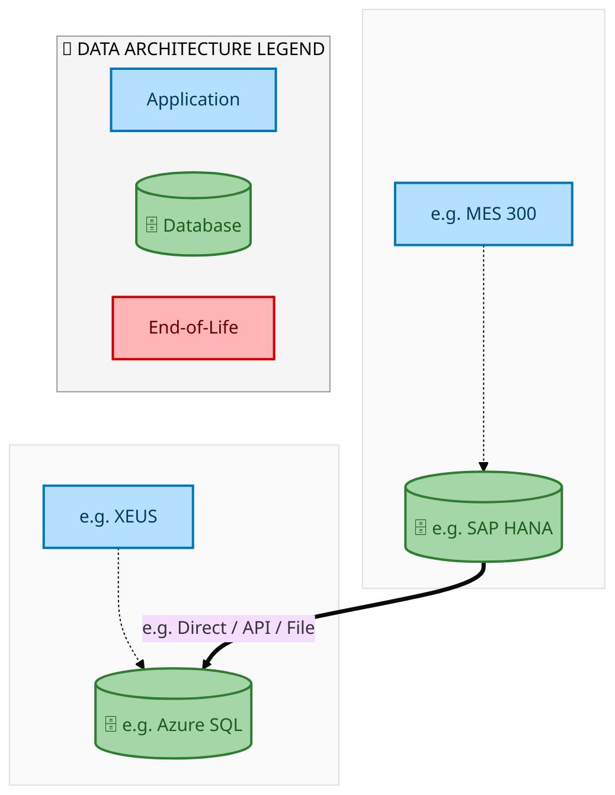
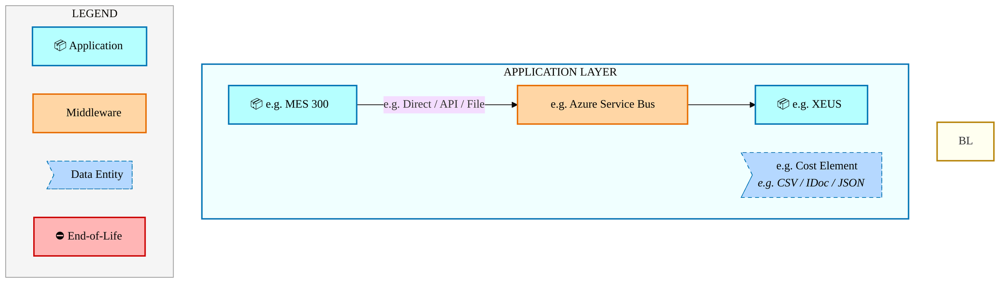
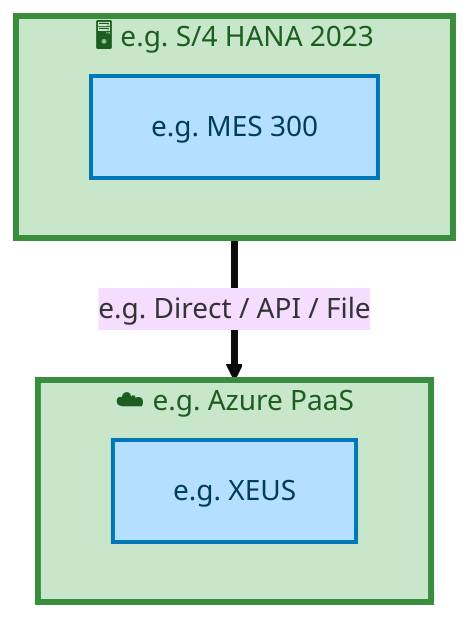

<div style="text-align:center; padding-top:20px;">
  
  <h1 style="font-size:36px; margin-top:24px;">E2E-49 — R3 Purchase Requisition to Payments for procurement with financial planning and asset managem</h1>
  <h2 style="font-size:24px;">Architecture Document (TOGAF BDAT)</h2>
  <p style="font-size:18px; color:#555;">End-to-End Integrated Processes (E2E) Tower<br/>
  Capability E2E-49 · Procure to Pay</p>
  <p style="font-size:14px; color:#888;">IAO Program · Release 2<br/>
  Generated: March 2026<br/>
  Sajiv Francis</p>
  <p style="font-size:12px; color:#aaa;">IAO Architecture Pipeline — Intel Confidential</p>
</div>

<style>
@media print {
  @page { margin: 0.75in; }
  .mermaid { page-break-inside: avoid; overflow: visible; }
  pre, table { page-break-inside: avoid; }
  h2, h3, h4 { page-break-after: avoid; }
}
.mermaid { overflow: visible; }
.mermaid svg { max-width: 100%; height: auto !important; }
.page-footer {
  padding-top: 8px;
  border-top: 1px solid #ddd;
  display: flex;
  justify-content: space-between;
  align-items: center;
  font-size: 11px;
  color: #888;
  position: fixed;
  bottom: 0;
  left: 0;
  right: 0;
  padding: 6px 20px;
  background: #fff;
}
@media print {
  .page-footer { position: fixed; bottom: 0; left: 0.75in; right: 0.75in; }
}
.page-footer a { color: #00aeef; text-decoration: none; font-weight: 500; }
.page-footer a:hover { color: #0071c5; text-decoration: underline; }
</style>

<div class="page-footer"><span>Page 1</span><span><a href="#toc">↑ Back to TOC</a></span><span>E2E-49 — R3 Purchase Requisition to Payments for procurement with financial planning and asset managem</span></div>
<div style="page-break-before: always;"></div>

<a id="toc"></a>

## Table of Contents

1. [Executive Summary](#1-executive-summary)
2. [Business Context & Objectives](#2-business-context--objectives)
   - 2.1 [Classification](#21-classification)
   - 2.2 [Business Drivers](#22-business-drivers)
   - 2.3 [Success Criteria](#23-success-criteria)
   - 2.4 [Companion Documents](#24-companion-documents)
3. [Business Architecture (TOGAF "B")](#3-business-architecture-togaf-b)
   - 3.1 [Business Process Overview](#31-business-process-overview)
   - 3.2 [Business Process Diagrams](#32-business-process-diagrams)
   - 3.3 [Business Roles & Responsibilities](#33-business-roles--responsibilities)
4. [Data Architecture (TOGAF "D")](#4-data-architecture-togaf-d)
   - 4.1 [Data Entities & Ownership](#41-data-entities--ownership)
   - 4.2 [Data Flow Diagrams](#42-data-flow-diagrams)
   - 4.3 [Data Lineage](#43-data-lineage)
   - 4.4 [RICEFW Data Objects](#44-ricefw-data-objects)
   - 4.5 [Data Governance & Quality](#45-data-governance--quality)
5. [Application Architecture (TOGAF "A")](#5-application-architecture-togaf-a)
   - 5.1 [Current-State Application Landscape](#51-current-state--current-state-application-landscape)
   - 5.2 [Future-State Application Landscape](#52-future-state--future-state-application-landscape)
   - 5.3 [Change Impact Summary](#53-change-impact-summary)
   - 5.4 [Component Overview](#54-component-overview)
   - 5.5 [RICEFW Inventory](#55-ricefw-inventory)
   - 5.6 [Integration Patterns](#56-integration-patterns)
6. [Technology Architecture (TOGAF "T")](#6-technology-architecture-togaf-t)
   - 6.1 [Platform & Infrastructure](#61-platform--infrastructure)
   - 6.2 [SAP Development Object Status](#62-sap-development-object-status)
   - 6.3 [NFRs & Design Principles](#63-nfrs--design-principles)
   - 6.4 [Security & Governance](#64-security--governance)
7. [Project Context](#7-project-context)
   - 7.1 [Project Roadmap & Go-Live Plan](#71-project-roadmap--go-live-plan)
   - 7.2 [RAID Log](#72-raid-log)
   - 7.3 [Recommendations & Next Steps](#73-recommendations--next-steps)

<div class="page-footer"><span>Page 2</span><span><a href="#toc">↑ Back to TOC</a></span><span>E2E-49 — R3 Purchase Requisition to Payments for procurement with financial planning and asset managem</span></div>
<div style="page-break-before: always;"></div>

## 1. Executive Summary

This Architecture Document defines the **Business, Data, Application, and Technology** (BDAT) architecture for **E2E-49 R3 Purchase Requisition to Payments for procurement with financial planning and asset managem** within the IAO program. It includes 6 BPMN process diagram(s) in Section 3.
| Dimension | Value |
|-----------|-------|
| **Tower** | End-to-End Integrated Processes (E2E) |
| **Process Group** | Procure to Pay |
| **Capability** | E2E-49 - R3 Purchase Requisition to Payments for procurement with financial planning and asset managem |
| **Release** | Release 2 |
| **Total Systems** | 2 |
| **System Status** | 0 Deployed, 0 Developing, 0 EOL, 2 Pending IAPM |
| **RICEFW Objects** | Pending — Smartsheet Object Tracker API integration |
**Change Summary**: 0 new flow chains, 0 removed, 0 modified, 1 unchanged between Current-State and Future-State states.

> All system nodes in architecture diagrams are **IAPM-linked** — click any node to open its IAPM page. Diagrams require `securityLevel: 'loose'` for click events.

<div class="page-footer"><span>Page 3</span><span><a href="#toc">↑ Back to TOC</a></span><span>E2E-49 — R3 Purchase Requisition to Payments for procurement with financial planning and asset managem</span></div>
<div style="page-break-before: always;"></div>

## 2. Business Context & Objectives

### 2.1 Classification

| Level | Value |
|-------|-------|
| **L0 Tower** | End-to-End Integrated Processes |
| **L1 Process** | Procure to Pay |
| **L2 Capability** | E2E-49 - R3 Purchase Requisition to Payments for procurement with financial planning and asset managem |

### 2.2 Business Drivers

| # | Driver | Description | Strategic Alignment | Priority |
|---|--------|-------------|---------------------|----------|
| 1 | End-to-End Process Integration | Enable cross-tower integrated processes spanning procurement, manufacturing, and fulfillment | IDM 2.0 Process Excellence | High |
| 2 | Intel Foundry Business Enablement | Stand up foundry-specific business processes for external customer engagement | Intel Foundry Services | High |
| 3 | Process Visibility & Monitoring | Provide end-to-end process visibility across tower boundaries with integrated monitoring | Operational Excellence | Medium |
| 4 | E2E-49 Process Migration | Migrate R3 Purchase Requisition to Payments for procurement with financial planning and asset managem business processes and 2 integrated systems from legacy to S/4 HANA target architecture | IDM 2.0 Cross-Functional / End-to-End | High |

<div class="page-footer"><span>Page 4</span><span><a href="#toc">↑ Back to TOC</a></span><span>E2E-49 — R3 Purchase Requisition to Payments for procurement with financial planning and asset managem</span></div>
<div style="page-break-before: always;"></div>

### 2.3 Success Criteria

| Metric | Target | Measure | Baseline | Owner |
|--------|--------|---------|----------|-------|
| E2E Process Cycle Time | Per process SLA | End-to-end transaction completion within defined SLA per process | Varies by process | E2E Process Owner |
| Cross-Tower Integration Success | > 99% | Transactions completing across tower boundaries without manual intervention | 92% (current) | Integration Lead |
| Process Exception Rate | < 2% | Transactions requiring manual exception handling | 8% (current) | Operations Manager |
| E2E-49 Migration Completeness | 100% flow chains validated | All 1 flow chains verified in target state | 0% (pre-migration) | Tower Architect |

### 2.4 Companion Documents

| Document | Description |
|----------|-------------|
| **Business Architecture** | Included in this document (Section 3) — process flows from BPMN diagrams |
| **This Document** | Full BDAT Architecture — Business + Data + Application + Technology |

<div class="page-footer"><span>Page 5</span><span><a href="#toc">↑ Back to TOC</a></span><span>E2E-49 — R3 Purchase Requisition to Payments for procurement with financial planning and asset managem</span></div>
<div style="page-break-before: always;"></div>

## 3. Business Architecture (TOGAF "B")

### 3.1 Business Process Overview

This capability includes **6 business process(es)** modeled in BPMN 2.0, covering the end-to-end workflow for E2E-49 R3 Purchase Requisition to Payments for procurement with financial planning and asset managem.

| # | Step ID | Process Name | Lanes | Tasks | Gateways |
|---|---------|--------------|-------|-------|----------|
| 1 | E2E-49A_R3_Portfolio_and_Project_Management | E2E-49A_R3_Portfolio_and_Project_Management | Boundary Apps, SAC, SAP S/4 (IP & IF) | 15 | 7 |
| 2 | E2E-49B_R3_Project_Systems_1 | E2E-49B_R3_Project_Systems_1 | Boundary Apps, SAP S/4 (IP & IF) | 25 | 14 |
| 3 | E2E-49C_R3_Procurement | E2E-49C_R3_Procurement | Boundary Apps, External Partners/
Supplier
, SAP S/4 (IP & IF) | 22 | 9 |
| 4 | E2E-49D_R3_CFIN | E2E-49D_R3_CFIN | Boundary Apps, CFIN, MBC, SAP S/4 (IP & IF) | 15 | 10 |
| 5 | E2E-49E_R3_SAP_Transportation_Management | E2E-49E_R3_SAP_Transportation_Management | Boundary Apps, External Partners/
Supplier
, SAP S/4 (IP & IF) | 12 | 6 |
| 6 | E2E-49F_R3_Project_Systems_2 | E2E-49F_R3_Project_Systems_2 | SAP S/4 (IP & IF) | 9 | 6 |

### 3.2 Business Process Diagrams

<div class="page-footer"><span>Page 6</span><span><a href="#toc">↑ Back to TOC</a></span><span>E2E-49 — R3 Purchase Requisition to Payments for procurement with financial planning and asset managem</span></div>
<div style="page-break-before: always;"></div>

#### BUSINESS ARCHITECTURE — 3.2.1 E2E-49A_R3_Portfolio_and_Project_Management — E2E-49A_R3_Portfolio_and_Project_Management

**Swim Lanes**: Boundary Apps · SAC · SAP S/4 (IP & IF) | **Tasks**: 15 | **Gateways**: 7

> **Legend**: <span style="color:#000;background:#4CAF50;padding:2px 6px;border-radius:10px;font-weight:bold;font-size:9pt">● Start</span> · <span style="color:#fff;background:#C62828;padding:2px 6px;border-radius:10px;font-weight:bold;font-size:9pt">● End</span> · <span style="background:#E3F2FD;padding:2px 6px;border:1px solid #1565C0;font-size:9pt">User Task</span> · <span style="background:#FFF3E0;padding:2px 6px;border:1px solid #E65100;font-size:9pt">Service Task</span> · <span style="background:#FFF9C4;padding:2px 6px;border:1px solid #F57F17;font-size:9pt">◇ Gateway</span> · <span style="background:#F3E5F5;padding:2px 6px;border:1px solid #7B1FA2;font-size:9pt">Sub-Process</span>

```mermaid
%%{init: {'theme': 'base', 'themeVariables': {'fontSize': '14px', 'fontFamily': 'Segoe UI, Arial, sans-serif','primaryColor': '#e8f0fe', 'primaryBorderColor': '#0071c5','lineColor': '#37474F', 'secondaryColor': '#f5f8fc'}, 'flowchart': {'useMaxWidth': false, 'htmlLabels': true, 'curve': 'basis', 'nodeSpacing': 40, 'rankSpacing': 50}} }%%
flowchart LR
    classDef startEvt fill:#4CAF50,stroke:#2E7D32,color:#000,font-weight:bold,stroke-width:2px,rx:20,ry:20
    classDef endEvt fill:#C62828,stroke:#B71C1C,color:#fff,font-weight:bold,stroke-width:2px,rx:20,ry:20
    classDef userTask fill:#E3F2FD,stroke:#1565C0,stroke-width:2px,color:#0D47A1
    classDef serviceTask fill:#FFF3E0,stroke:#E65100,stroke-width:2px,color:#BF360C
    classDef gateway fill:#FFF9C4,stroke:#F57F17,stroke-width:2px,color:#E65100
    classDef subProc fill:#F3E5F5,stroke:#7B1FA2,stroke-width:2px,color:#4A148C
    subgraph Boundary Apps
        n1["Convert PMIS/Hexagon Strategic Capital Plan to Tactical Operational Plan"]
        n2["Plan SAP IBP Supply Planning"]
        n3["Create/Approve PMIS/Hexagon Project"]
        n17(["fa:fa-stop Input for Supply Planning Received"])
        n20{{"fa:fa-code-branch Construction Project?"}}
        n23{{"fa:fa-arrows-alt parallelGateway"}}
    end
    subgraph SAC
        n14["Project Financial Planning"]
        n15["Perform Strategic Capital Planning / Budgeting"]
        n26{{"fa:fa-arrows-alt parallelGateway"}}
    end
    subgraph SAP S/4 (IP & IF)
        n4["Load Capital budgets into Portfolio/Buckets"]
        n5["Create Project"]
        n6["Distribute Original Budget to Item"]
        n7["Create Capital Funding structure Portfolio/Buckets"]
        n8["Create Portfolio item (Proposal)"]
        n9["Evaluate Proposal (Scoring and Prioritization)"]
        n10["Approve Proposal"]
        n11["Convert to Project (PPM Item"]
        n12["Route for Budget Approval"]
        n13["Approve Project Budget"]
        n16(["fa:fa-play Initiate Capital funding structure"])
        n18(["fa:fa-stop Budget allocated to portfolio line item"])
        n19["E2E-49B R3 Project Systems"]
        n21{{"fa:fa-code-branch exclusiveGateway"}}
        n22{{"fa:fa-code-branch exclusiveGateway"}}
        n24{{"fa:fa-arrows-alt parallelGateway"}}
        n25{{"fa:fa-arrows-alt parallelGateway"}}
    end
    n7 --> n22
    n8 --> n9
    n9 --> n10
    n21 --> n11
    n11 --> n14
    n14 --> n12
    n13 --> n25
    n25 --> n5
    n25 --> n6
    n22 --> n4
    n22 --> n15
    n16 --> n7
    n10 --> n21
    n12 --> n13
    n15 --> n26
    n23 --> n2
    n23 --> n3
    n2 --> n17
    n20 -->|"Yes"| n1
    n1 --> n23
    n3 --> n21
    n6 --> n18
    n20 -->|"No"| n8
    n4 --> n24
    n24 --> n20
    n5 --> n19
    n26 --> n24
    n26 --> n22
    class n16 startEvt
    class n17 endEvt
    class n18 endEvt
    class n19 startEvt
    class n20 gateway
    class n21 gateway
    class n22 gateway
    class n23 gateway
    class n24 gateway
    class n25 gateway
    class n26 gateway
```

<div style="text-align:center; margin:4px 0 8px 0; font-size:11px;"><a href="https://mermaid.live/edit#pako:eNqlV12P4jYU_StWVlNmJdDkkzA8tAKGtEgzXTRsW1WdPpjEAXdMHDkOAzvLf-91YgfIMKq6ywPCJ_eec--xbxJerZgnxBpaV1evNKNyiF47ck02pDNEnSUuSKeLauB3LCheMlJ0VEzKM7mgX6owx893KkxhEd5Qtlfogqw4Qb_NumgEiayLCpwVvYIImna6nVzQDRb7CWdcqOgPZJDaaaWmL425SIg4Bth26MQBpDKakSPshX7oRyqvIDHPkjPSNEgHadw5qOIYf4nXWMiq_LIgD3j3B03kGtYpZgWBmLXcsHu8JEz1KEWpsLgUW2MGLZROBoYtchzTbAW4bwMkcPZ8hAL7cECHq6unrBFF949PGYJPzHBR3JEUFRLg6VailDI2_OBPRlFgdwsp-DMZfnCn4Z3ndmPVyRBat7vK3N4Loau1HC45S3Ro70X1MHTzXVfshq7dFXv4bmmRLDkqTfruwB00SuPQmTgTo5Sm6Xcpga_iMy6etdbUi9zortFygn4wsd_ymTbv_HDktH0iYktjckIaRZE3PVo17QeO_T7pOPL69qRFusKSvOD9kfB24jeEURBGTvguYa3XrrJczgWPDaE3DaKgIQzHTjRy3yX0R44_0BUCz0rgfI3GvKzOMhrleVFfU5_M-evJmvBsS-BMzR9mi5tfyA6veIYWUkBTKxqjCc6pxAzNGc6Q5OgzjiWNAfiUE4ihPNMXn6y_T5hdYK5SFqM5mo3naFHmOdtXkRkc7PNoT9UhCEjeQIWCb8l5OeDGPySW50lOeA1pKR6muFdInqNZlpdwLrloi6FHEhO6JQkQfDwt0n59NQzqxtVbwujFawSWgL1lrLoz2j89WYfDaa53zMVC8Jeih5lEORaYMcJ-rs_EMQmmprUpi9HktBtfOVZroYhmUAjVzr71ywlUMBHQ6-advar6vkHjMlkR-YbA7X9_9bCnNz66ns3RD2gWnfqqWrnnOGkKWlZVFIhmcILmXMiUM8pvxmX8DPB5aUFzFi5vex-u31HYH7osIeaToCuqzmDdqTqiM0k25znhkdOUFMFEKIvqjS4F-a-6Bid1mUhEQQpdQ505LzD7eJ5xCxnTLWal7qWKQdeLmAuljLMEUAoLSb9Uk9TKd2wgaOZB57dCTidYeasP0PV8_nDBB0eN5SNXvqkx0ZbVEm-ovXP1irfOaAX2j3OYM7gPzuDJT0-9Tttet-bQGbQmWRcGZ5HHQJSo1vLGdPXIrpxv01SGu9OefztGj15T9GJfQHBrO13n8uyTXczKAm4Wb2agTnO_Lc3_f_NWJwXfOKRZiHq9H1Wxej2o17d6eVsvHf3cAS80oB-X8EMDvgF8DRhGx9MSgeEIaqC97pu1W6_91toxCU6_BkKztrVCU5TJ8AygJdxGwxTVWpsEQ2Ak3Eri65P1J4HT8RWuGGbNYxK9Vim6VGfQJvqVVzwG1665TdMGMM7rDhyzM26_ndE_38rqHaEyy7zyneOhfj07RwcX0dvLHNCMfqM5h53LsHsZ9i7D_mU4uAz3DWx1rQ0RG0wTa_hqVf8g4F9GQlJcMmkduhYuJV_ss9gaVm_aVpknkHlHMTytNjV4-BdXPOWO" title="Edit in Mermaid Live">&#9998; Edit in Mermaid Live</a></div>

<div class="page-footer"><span>Page 7</span><span><a href="#toc">↑ Back to TOC</a></span><span>E2E-49 — R3 Purchase Requisition to Payments for procurement with financial planning and asset managem</span></div>
<div style="page-break-before: always;"></div>

#### BUSINESS ARCHITECTURE — 3.2.2 E2E-49B_R3_Project_Systems_1 — E2E-49B_R3_Project_Systems_1

**Swim Lanes**: Boundary Apps · SAP S/4 (IP & IF) | **Tasks**: 25 | **Gateways**: 14

> **Legend**: <span style="color:#000;background:#4CAF50;padding:2px 6px;border-radius:10px;font-weight:bold;font-size:9pt">● Start</span> · <span style="color:#fff;background:#C62828;padding:2px 6px;border-radius:10px;font-weight:bold;font-size:9pt">● End</span> · <span style="background:#E3F2FD;padding:2px 6px;border:1px solid #1565C0;font-size:9pt">User Task</span> · <span style="background:#FFF3E0;padding:2px 6px;border:1px solid #E65100;font-size:9pt">Service Task</span> · <span style="background:#FFF9C4;padding:2px 6px;border:1px solid #F57F17;font-size:9pt">◇ Gateway</span> · <span style="background:#F3E5F5;padding:2px 6px;border:1px solid #7B1FA2;font-size:9pt">Sub-Process</span>

```mermaid
%%{init: {'theme': 'base', 'themeVariables': {'fontSize': '14px', 'fontFamily': 'Segoe UI, Arial, sans-serif','primaryColor': '#e8f0fe', 'primaryBorderColor': '#0071c5','lineColor': '#37474F', 'secondaryColor': '#f5f8fc'}, 'flowchart': {'useMaxWidth': false, 'htmlLabels': true, 'curve': 'basis', 'nodeSpacing': 40, 'rankSpacing': 50}} }%%
flowchart TD
    classDef startEvt fill:#4CAF50,stroke:#2E7D32,color:#000,font-weight:bold,stroke-width:2px,rx:20,ry:20
    classDef endEvt fill:#C62828,stroke:#B71C1C,color:#fff,font-weight:bold,stroke-width:2px,rx:20,ry:20
    classDef userTask fill:#E3F2FD,stroke:#1565C0,stroke-width:2px,color:#0D47A1
    classDef serviceTask fill:#FFF3E0,stroke:#E65100,stroke-width:2px,color:#BF360C
    classDef gateway fill:#FFF9C4,stroke:#F57F17,stroke-width:2px,color:#E65100
    classDef subProc fill:#F3E5F5,stroke:#7B1FA2,stroke-width:2px,color:#4A148C
    subgraph Boundary Apps
        n1["Receive WBS Detail Information"]
        n2["Initiate Procurement"]
        n3["Receive Information Hexagon/Smart Reference Design (SRD)"]
        n4["Initiate Change Order"]
        n5["Approve Change Order"]
        n35{{"fa:fa-arrows-alt parallelGateway"}}
        n36{{"fa:fa-arrows-alt parallelGateway"}}
    end
    subgraph SAP S/4 (IP & IF)
        n6["Create Project"]
        n7["Create Work Breakdown Structure and NWA"]
        n8["Assign Cost Centre/Operative Indicators"]
        n9["Define other Objects and Fields (Including EUID from EMS"]
        n10["Establish Original Budget at Level 1 WBS"]
        n11["Establish Original Project Budget at Lower Level WBS Element"]
        n12["Analyze Budgetary Needs for Project"]
        n13["Release Budget"]
        n14["Release WBS Element/NWA"]
        n15["Issue Material"]
        n16["Post Capital Labor"]
        n17["Purchase Requirement/Purchase Orders"]
        n18["Valuate Goods Receipt"]
        n19["Reserve Material"]
        n20["Receive Invoice"]
        n21["Update Interest/Overheads"]
        n22["Process Month/End Transactions"]
        n23["Run Periodic Reports"]
        n24["Obtain Acceptance to place Assets in Service"]
        n25["Purchase Documents"]
        n26(["fa:fa-stop Purchase Documents Updated"])
        n27["E2E-49C R3"]
        n28["E2E-49F R3 Project Systems 2"]
        n29["E2E-49F R3 Project Systems 2"]
        n30["E2E-49A R3 Portfolio and Project Management"]
        n31{{"fa:fa-code-branch Additional Breakdown Required?"}}
        n32{{"fa:fa-code-branch exclusiveGateway"}}
        n33{{"fa:fa-code-branch Additional Budgetary Control Needed?"}}
        n34{{"fa:fa-code-branch exclusiveGateway"}}
        n37{{"fa:fa-arrows-alt parallelGateway"}}
        n38{{"fa:fa-arrows-alt parallelGateway"}}
        n39{{"fa:fa-arrows-alt parallelGateway"}}
        n40{{"fa:fa-arrows-alt parallelGateway"}}
        n41{{"fa:fa-arrows-alt parallelGateway"}}
        n42{{"fa:fa-arrows-alt inclusiveGateway"}}
        n43{{"fa:fa-arrows-alt inclusiveGateway"}}
        n44{{"fa:fa-arrows-alt inclusiveGateway"}}
    end
    n6 --> n7
    n7 --> n37
    n37 --> n8
    n11 --> n32
    n32 --> n33
    n33 -->|"Yes"| n12
    n12 --> n13
    n34 --> n14
    n42 --> n16
    n42 --> n18
    n15 --> n43
    n16 --> n43
    n18 --> n43
    n9 --> n38
    n38 --> n10
    n19 --> n43
    n10 --> n31
    n31 -->|"Yes"| n11
    n42 --> n15
    n42 --> n44
    n43 --> n39
    n44 --> n19
    n8 --> n9
    n13 -->|"Availability 
Control 
Activated"| n34
    n42 --> n41
    n1 --> n2
    n31 -->|"No"| n32
    n33 -->|"No"| n34
    n37 --> n1
    n3 --> n4
    n35 --> n3
    n4 --> n5
    n42 --> n20
    n20 --> n43
    n5 --> n44
    n2 --> n36
    n30 --> n6
    n21 --> n22
    n22 --> n23
    n23 --> n24
    n39 --> n21
    n24 --> n28
    n14 --> n42
    n40 --> n25
    n25 --> n26
    n38 --> n29
    n41 --> n17
    n17 --> n40
    n40 --> n27
    n36 --> n41
    n39 -->|"Planning tool may vary based on Commodity"| n35
    n36 --> n35
    class n26 endEvt
    class n27 startEvt
    class n28 startEvt
    class n29 startEvt
    class n30 startEvt
    class n31 gateway
    class n32 gateway
    class n33 gateway
    class n34 gateway
    class n35 gateway
    class n36 gateway
    class n37 gateway
    class n38 gateway
    class n39 gateway
    class n40 gateway
    class n41 gateway
    class n42 gateway
    class n43 gateway
    class n44 gateway
```

<div style="text-align:center; margin:4px 0 8px 0; font-size:11px;"><a href="https://mermaid.live/edit#pako:eNqlWFtv2zYU_iuEiywtYCOiLr49bHB82QI0TRC3DYZ6D7RE2Vxk0iNpJ26a_75DmVRsVunQLA-B9emc79wPJT02UpHRRr9xcvLIONN99Hiql3RFT_vodE4UPW2iPfCZSEbmBVWnRiYXXE_Z11IMx-sHI2awCVmxYmfQKV0Iij5dNNEAFIsmUoSrlqKS5afN07VkKyJ3Q1EIaaTf0G4e5KU1e-tcyIzKZ4Eg6OA0AdWCcfoMR524E0-MnqKp4NkRaZ7k3Tw9fTLOFeI-XRKpS_c3il6Sh1uW6SVc56RQFGSWelW8J3NamBi13Bgs3citSwZTxg6HhE3XJGV8AXgcACQJv3uGkuDpCT2dnMx4ZRR9HM04gr-0IEqNaI6UBni81ShnRdF_Ew8HkyRoKi3FHe2_CcedURQ2UxNJH0IPmia5rXvKFkvdn4sis6KtexNDP1w_NOVDPwyacgf_PVuUZ8-Whu2wG3YrS-cdPMRDZynP8_9lCfIqPxJ1Z22No0k4GVW2cNJOhsH3fC7MUdwZYD9PVG5ZSg9IJ5NJNH5O1bid4OBl0vNJ1A6GHumCaHpPds-EvWFcEU6SzgR3XiTc2_O93MyvpUgdYTROJklF2DnHk0H4ImE8wHHXegg8C0nWS3QuNmUvo8F6rfb3zB_HX2aNG5pStqXo9nyKRlQTVqALngu5IpoJPmv8dSAfgvwFzDWDiJFxcSNhlrk-looOWA-o0B_0gSwEP5uuTA_f0JxKylMKVhVbcPR2ejN6d8wUH9obLglfUHRlBvlYLAExiEyK7Y-kouTxcdbIST8nLSKluFctUmi0JpIUBS1-31dx1nh6OlRq_5wSDIeX--ngGk3PYvT24hr9gi4m7w7Y2-D4UFKbzb9p6mWy83z_Vsg7dA6_7zJxz9EUFkqqIf2I8Ax9uB0cK3ZNRlSZ1qFQGg2hSJKeXa2phFqUdclYSrSQ6lixB4rQgrAUkYBFLdHV3LilSjMTRotMQSQ8LTYZrCc0_nQxQrkUKzS-nB4z4QCoxrCY5gVTSygIWzBOCnS-yRZUI6LRe7qlBcKm8zxVXK9qc3RIIe7Bxz2RaeBxUdOP2LTtAAh2X6nVNbPwgVIIBtqzPvd438YFhWPLankC8YHAgfGz76qBTYNeKLWh6BJqaQ4wT8A0wnVZKLJmGkKFg0N4_YtNN1xvJBwBYPCG_rNh--k7q8Cy672KYtMLn0mxMV30uxAQczmcaz-cXhmO2ZAvuRkGR5O9FbBKPQlTuU_rzNi64MBBlT672lK5pCTzHAtNWcwSoUqhSzgmlmdjaLKPcPwpkpqN4SuUFdlwdA2-CehfCGQtpPbFTF2u5rDJOBqkKV1rYraMFmhdEPgBc0GhoeHudH8aeOrJYZpHsONMjn0b7bdf3FpQWqzR9wpon4YMFA9HPjRVHIfjVtwbopvIo-1WNydws2r46U5pulIo9MR7PyUeBZX4oBSH3OWiYKIcbqd8SThZ1G11_LwJzVNeaw6FSpdokGXMFMuMdrWebHdmv_nrNKwnoQ-wURS01QtbOPpv29VcD6GVpCjK-a7xIH6dB53XHB7d1yj1XqEUB69Rwq9RCmuVGP9h-uLoVVrxT2pVpy9vo1brVzhA7WVnfxm568gCXXuNsRUInUBogcgBkQG-zRp_UtgF38yp4nStKK5EYwvEFoidRNsHKvvJHogdB277QNcDetZBRxFZARw4jZ5PEVgV7FSwHxP2HUw8IK5iiixZzwEuagdYf9wldgkcbOEZk8xZwfQOzbgb1xkfwNLf7lfmN5NF37RzztYq9KP4IPaKoV8ydyP2ql_lwRpwl7YYLm82MD8V7nUFfniJTrxcuV5y5Y-sgrsOXUTO89CZcIyhdTGsfLTFDV0MofUyrFrKArEjja3V0AUSWj_DttdCYVVT6xh2c4Nt5uLAJ60mq-1Va-8pVOG6IJybh0YtoNwreGHamnVtPgtkSJgH1dUKTnW92xcr8QgdUL4lGafti-gx2qlehY_x7gt4rx6HCtXj2L3tHcNhPRzVw3E9nNTD7Xq4Uw936-FeLQzVq4Xro4zro4zro4yrKBvNxorCSyDLGv3HRvn5Bz4RZTQnm0I3npoNstFiuuNpo19-JmlsyienESPwBrXag0__AtPdkcc=" title="Edit in Mermaid Live">&#9998; Edit in Mermaid Live</a></div>

<div class="page-footer"><span>Page 8</span><span><a href="#toc">↑ Back to TOC</a></span><span>E2E-49 — R3 Purchase Requisition to Payments for procurement with financial planning and asset managem</span></div>
<div style="page-break-before: always;"></div>

#### BUSINESS ARCHITECTURE — 3.2.3 E2E-49C_R3_Procurement — E2E-49C_R3_Procurement

**Swim Lanes**: Boundary Apps · External Partners/
Supplier
 · SAP S/4 (IP & IF) | **Tasks**: 22 | **Gateways**: 9

> **Legend**: <span style="color:#000;background:#4CAF50;padding:2px 6px;border-radius:10px;font-weight:bold;font-size:9pt">● Start</span> · <span style="color:#fff;background:#C62828;padding:2px 6px;border-radius:10px;font-weight:bold;font-size:9pt">● End</span> · <span style="background:#E3F2FD;padding:2px 6px;border:1px solid #1565C0;font-size:9pt">User Task</span> · <span style="background:#FFF3E0;padding:2px 6px;border:1px solid #E65100;font-size:9pt">Service Task</span> · <span style="background:#FFF9C4;padding:2px 6px;border:1px solid #F57F17;font-size:9pt">◇ Gateway</span> · <span style="background:#F3E5F5;padding:2px 6px;border:1px solid #7B1FA2;font-size:9pt">Sub-Process</span>

```mermaid
%%{init: {'theme': 'base', 'themeVariables': {'fontSize': '14px', 'fontFamily': 'Segoe UI, Arial, sans-serif','primaryColor': '#e8f0fe', 'primaryBorderColor': '#0071c5','lineColor': '#37474F', 'secondaryColor': '#f5f8fc'}, 'flowchart': {'useMaxWidth': false, 'htmlLabels': true, 'curve': 'basis', 'nodeSpacing': 40, 'rankSpacing': 50}} }%%
flowchart LR
    classDef startEvt fill:#4CAF50,stroke:#2E7D32,color:#000,font-weight:bold,stroke-width:2px,rx:20,ry:20
    classDef endEvt fill:#C62828,stroke:#B71C1C,color:#fff,font-weight:bold,stroke-width:2px,rx:20,ry:20
    classDef userTask fill:#E3F2FD,stroke:#1565C0,stroke-width:2px,color:#0D47A1
    classDef serviceTask fill:#FFF3E0,stroke:#E65100,stroke-width:2px,color:#BF360C
    classDef gateway fill:#FFF9C4,stroke:#F57F17,stroke-width:2px,color:#E65100
    classDef subProc fill:#F3E5F5,stroke:#7B1FA2,stroke-width:2px,color:#4A148C
    subgraph Boundary Apps
        n1["Purchase Order Collaboration SIRFIS/Web Suite"]
        n2["Receive Information"]
        n3["Receive Manual invoices through OCR"]
        n4["Receive Incoming invoice/ B2B/OpenText/Web suite"]
        n5["ReadSoft Validation/Exception Handling based on rules setup"]
        n29{{"fa:fa-code-branch B2B or OCR?"}}
        n30{{"fa:fa-code-branch exclusiveGateway"}}
    end
    subgraph External Partners/ Supplier 
        n19["Confirm/Select Carriers"]
        n20["Organize Transport"]
        n21["Order Shipment Goods Picked (Carrier)"]
        n22["Receive Supplier invoice"]
        n33{{"fa:fa-code-branch exclusiveGateway"}}
    end
    subgraph SAP S/4 (IP & IF)
        n6["Create Purchase Requisition with WBS"]
        n7["Approve Purchase Requisition"]
        n8["Create Purchase Order with WBS"]
        n9["Trigger GTS Check GTS Trade Compliance"]
        n10["Calculate Tax"]
        n11["Perform Inbound Delivery with House Air Waybill number HAWB"]
        n12["Receive Goods Receipt to Val. Blocked stock"]
        n13["Receive Goods Receipt from Val. Blocked to Unrestricted (Consumption upon GR)"]
        n14["Post Goods Receipt Cost against WBS"]
        n15["Create Equipment Master"]
        n16["Update Equipment Master for Bill of Material Components"]
        n17["Embedded TM"]
        n18["Post Supplier invoice"]
        n23(["fa:fa-stop Equipment Master Updated"])
        n24(["fa:fa-stop endEvent"])
        n25(["fa:fa-stop GTS check completed"])
        n26["E2E-49E R3 SAP Transportation Management"]
        n27["E2E-49D R3 CFIN"]
        n28["E2E-49B R3 Project Systems"]
        n31{{"fa:fa-code-branch Invoice Accepted?"}}
        n32{{"fa:fa-code-branch exclusiveGateway"}}
        n34{{"fa:fa-arrows-alt parallelGateway"}}
        n35{{"fa:fa-arrows-alt parallelGateway"}}
        n36{{"fa:fa-arrows-alt Based on Business Rule"}}
        n37{{"fa:fa-arrows-alt parallelGateway"}}
    end
    n7 --> n32
    n34 --> n9
    n34 --> n10
    n6 --> n7
    n8 --> n34
    n20 --> n21
    n19 --> n20
    n13 --> n36
    n11 --> n37
    n14 --> n35
    n35 --> n13
    n36 -->|"Based on 
Business Rule"| n15
    n12 --> n35
    n16 --> n23
    n36 --> n33
    n15 --> n2
    n5 --> n31
    n31 -->|"Yes"| n18
    n33 --> n22
    n22 --> n29
    n31 -->|"No"| n33
    n28 --> n6
    n21 -->|"ASN update via Web Suite"| n11
    n2 --> n16
    n18 --> n27
    n29 -->|"B2B"| n4
    n30 --> n5
    n3 --> n30
    n4 --> n30
    n29 -->|"OCR"| n3
    n37 --> n17
    n37 --> n12
    n37 --> n14
    n17 --> n26
    n32 --> n8
    n34 --> n1
    n1 --> n32
    n34 --> n19
    n10 --> n24
    n9 --> n25
    class n23 endEvt
    class n24 endEvt
    class n25 endEvt
    class n26 startEvt
    class n27 startEvt
    class n28 startEvt
    class n29 gateway
    class n30 gateway
    class n31 gateway
    class n32 gateway
    class n33 gateway
    class n34 gateway
    class n35 gateway
    class n36 gateway
    class n37 gateway
```

<div style="text-align:center; margin:4px 0 8px 0; font-size:11px;"><a href="https://mermaid.live/edit#pako:eNqlWFtz2kYU_is7yrhOZqBGNwQ8tAMYHGbi2GM58XRCHxZpBVtLu-pKsnEd_nvPSloBa9GZNDyA99P5zv0cSX41Ah4SY2Scnb1SRvMRej3PNyQh5yN0vsIZOe-gCviKBcWrmGTnUibiLPfpP6WY6aRbKSaxOU5o_CJRn6w5QV8WHTQGYtxBGWZZNyOCRued81TQBIuXKY-5kNLvyCDqRaW1-tKEi5CIvUCv55mBC9SYMrKHbc_xnLnkZSTgLDxSGrnRIArOd9K5mD8HGyzy0v0iI9d4-0DDfAPnCMcZAZlNnsSf8IrEMsZcFBILCvGkkkEzaYdBwvwUB5StAXd6AAnMHveQ29vt0O7sbMkao-jT3ZIh-AQxzrJLEqEsB3j2lKOIxvHonTMdz91eJ8sFfySjd9bMu7StTiAjGUHovY5MbveZ0PUmH614HNai3WcZw8hKtx2xHVm9jniBb80WYeHe0rRvDaxBY2nimVNzqixFUfRTliCv4h5nj7WtmT235peNLdPtu9PeW30qzEvHG5t6noh4ogE5UDqfz-3ZPlWzvmv2TiudzO1-b6opXeOcPOOXvcLh1GkUzl1vbnonFVb2dC-L1a3ggVJoz9y52yj0JuZ8bJ1U6IxNZ1B7CHrWAqcbNOFF2ctonKZZdU1-mPltadwWApoqI-hGTgiCdo_xigucU86Qv7ibL_yLB7JCfkFzsjT-PKBbQL8jAaFPBC1YxEVSso6F7AOha8wKHCPKnjhUIUP5RvBivUE307tjknOkOeAJzIKiXaCJNbm4SQm7J9u89C1765tbasChz6McfcUxDUvfLmbbgKRlbB8xC2OpVy6mEAEiClhI0CN5kWqBDl9fl0aERxHuyg3XXcGMBhvpCOJCuv_70tjtDqPutTPINoiLDMK6qppmT4Ox0qo22-ZEMMjXLQw3IyK7gCKkaUyhTIdFHEKoU84iKpILn8QkyNEUCwFimRZGDyRvxBoz2LXoHjzKUi5yTcgshWQv-BuaJoTl6IrzMEO3NHiERL2vlX_QeIfd0PhZ10xrCfvnk-OPb5F_4aD3i1v0C1rMPxzo78uECAJKUNPdd-Tvgma0rPwzzTfoYeIfe-UBC-ZD8Kd22rH0oMVGlbV27bJI94Ku1yBxde-j6YYEj-VfUIeQwNwlkDFIg5YrU9ZsiuOgiKWte7zVrpczTIScPhiVlZx0dEliyCLMe-nLRw6LFI2pQA_4ZQU7BbEiWYEfH8cPE03bYRGrqpenNEc5l2P0K5rEvGyDLIdfjW2fZEeCJ8d80PeFCQJ7jAZ52VacZUVSzWaRwtfVndZiplwLtzzLNeVTCeE1pgx-32TedPelmkE1q5a-xhlMlyYpG-dLGrZJIkgwmsjk8QggQOAxpKwaZyClTZopm2kGSQ5DCO3-Wrs6UHH895xY9vtvak4g3elbpypnQ6Ad9r_laLzylg00Xc7V5GQ7BmVjBrIdSYtqmaKZNes6wxm6s8sxbBZJdc-AJY_XJKnMHVK9hnopqdP54rMmMWgkJlICboJ_yW3mv0CwiZZi22xfIosqk2gcyEVPwjeb2frR5VPRnD0N9h9_zro4zlGKBY5jEp8guf-H1G8lTdRdagJeMpJB-8PtSud6P2aw2avMQ93ubzI79dl2KmConc36YYX1q7NXHwc136nPVq8CrPoRDG5TNaAUmHZN6SvArAGl06xt2q5ywq2dsBVQevF9aTTZWTItP9_lBlAKLU2hWUdhHSuUtyglUZtUeamPtgrLNmsP_iBZZWygrtTxWYpq1datoc79zEtqY9Sqs6kyYynBsf8ZdmO5oJ4oRgfPZdKy8qm2YzaJrdVZKrHWUKXNmpRUVTW7rlqT8DpaVTNHOzeKyic4GYIi1v1kejpg6YCybdaApdy26zgGegsqwomWNVV-TdWDyoRqQffggVsWv36nOUadVtRtRfvNG9gx7p3AByfwoXqZOIKhKq2w2Q5b7bDdDjvtsNsO99thT8FGx0gIvAfQ0Bi9GuWrPvw7ICQRLuLc2HUMXOTcf2GBMSpfiY2qmy8phse6pAJ3_wJ_4faj" title="Edit in Mermaid Live">&#9998; Edit in Mermaid Live</a></div>

<div class="page-footer"><span>Page 9</span><span><a href="#toc">↑ Back to TOC</a></span><span>E2E-49 — R3 Purchase Requisition to Payments for procurement with financial planning and asset managem</span></div>
<div style="page-break-before: always;"></div>

#### BUSINESS ARCHITECTURE — 3.2.4 E2E-49D_R3_CFIN — E2E-49D_R3_CFIN

**Swim Lanes**: Boundary Apps · CFIN · MBC · SAP S/4 (IP & IF) | **Tasks**: 15 | **Gateways**: 10

> **Legend**: <span style="color:#000;background:#4CAF50;padding:2px 6px;border-radius:10px;font-weight:bold;font-size:9pt">● Start</span> · <span style="color:#fff;background:#C62828;padding:2px 6px;border-radius:10px;font-weight:bold;font-size:9pt">● End</span> · <span style="background:#E3F2FD;padding:2px 6px;border:1px solid #1565C0;font-size:9pt">User Task</span> · <span style="background:#FFF3E0;padding:2px 6px;border:1px solid #E65100;font-size:9pt">Service Task</span> · <span style="background:#FFF9C4;padding:2px 6px;border:1px solid #F57F17;font-size:9pt">◇ Gateway</span> · <span style="background:#F3E5F5;padding:2px 6px;border:1px solid #7B1FA2;font-size:9pt">Sub-Process</span>

```mermaid
%%{init: {'theme': 'base', 'themeVariables': {'fontSize': '14px', 'fontFamily': 'Segoe UI, Arial, sans-serif','primaryColor': '#e8f0fe', 'primaryBorderColor': '#0071c5','lineColor': '#37474F', 'secondaryColor': '#f5f8fc'}, 'flowchart': {'useMaxWidth': false, 'htmlLabels': true, 'curve': 'basis', 'nodeSpacing': 40, 'rankSpacing': 50}} }%%
flowchart LR
    classDef startEvt fill:#4CAF50,stroke:#2E7D32,color:#000,font-weight:bold,stroke-width:2px,rx:20,ry:20
    classDef endEvt fill:#C62828,stroke:#B71C1C,color:#fff,font-weight:bold,stroke-width:2px,rx:20,ry:20
    classDef userTask fill:#E3F2FD,stroke:#1565C0,stroke-width:2px,color:#0D47A1
    classDef serviceTask fill:#FFF3E0,stroke:#E65100,stroke-width:2px,color:#BF360C
    classDef gateway fill:#FFF9C4,stroke:#F57F17,stroke-width:2px,color:#E65100
    classDef subProc fill:#F3E5F5,stroke:#7B1FA2,stroke-width:2px,color:#4A148C
    subgraph Boundary Apps
        n1["Receive File in Bank"]
        n2["Update Payment Remittance"]
        n16(["fa:fa-stop Payment Data Updated"])
    end
    subgraph CFIN
        n3["Execute Payment Run"]
        n4["Create APM Memo Record"]
        n5["Process BCM Payment Batching Based on Business Rules"]
        n6["Generate APM Payment File"]
        n7["Route to Approver"]
        n8["Correct APM Correction File"]
        n9["Reverse APP Doc Number and Memo Record Deletion"]
        n10["Fetch Payments Factory (APM, BCM, MBC Monitor)"]
        n11["Review Failed Payment Log"]
        n12["Generate Payment Proposal"]
        n13["Replicate Supplier Invoice Posting"]
        n18(["fa:fa-stop Memo Record Created"])
        n19(["fa:fa-stop APP Doc Reversed"])
        n21{{"fa:fa-code-branch Manual Approval Necessary?"}}
        n22{{"fa:fa-code-branch Approved?"}}
        n23{{"fa:fa-code-branch exclusiveGateway"}}
        n24{{"fa:fa-code-branch Can Be Corrected?"}}
        n25{{"fa:fa-code-branch exclusiveGateway"}}
        n26{{"fa:fa-code-branch exclusiveGateway"}}
        n27{{"fa:fa-code-branch Reversal or Reprocessing?"}}
        n28{{"fa:fa-arrows-alt parallelGateway"}}
        n29{{"fa:fa-arrows-alt parallelGateway"}}
        n30{{"fa:fa-arrows-alt inclusiveGateway"}}
    end
    subgraph MBC
        n14["Multi-Bank Connectivity (host-to-host)"]
        n15["Multi-Bank Connectivity (host-to-host)"]
    end
    subgraph SAP S/4 (IP & IF)
        n17(["fa:fa-stop Payment Details provided back to Source System (IP/IF)"])
        n20["E2E-49C R3"]
    end
    n12 --> n3
    n3 --> n28
    n4 --> n18
    n5 --> n21
    n21 -->|"No"| n23
    n7 --> n22
    n23 --> n6
    n25 --> n5
    n24 -->|"No"| n26
    n9 --> n19
    n10 --> n29
    n26 --> n9
    n29 --> n11
    n28 --> n4
    n11 --> n27
    n27 -->|"Reversal"| n26
    n2 --> n16
    n6 --> n14
    n29 --> n2
    n8 --> n25
    n13 --> n12
    n29 --> n17
    n20 --> n13
    n21 -->|"Yes"| n7
    n1 -->|"PAIN.002 (Pay-load file)"| n15
    n14 -->|"PAIN.001 (Pay-load file)"| n1
    n28 -->|"Reprocessing"| n25
    n30 --> n8
    n22 -->|"Yes"| n23
    n22 -->|"No"| n24
    n15 --> n10
    n27 -->|"Reprocessing"| n30
    n24 -->|"Yes"| n30
    class n16 endEvt
    class n17 endEvt
    class n18 endEvt
    class n19 endEvt
    class n20 startEvt
    class n21 gateway
    class n22 gateway
    class n23 gateway
    class n24 gateway
    class n25 gateway
    class n26 gateway
    class n27 gateway
    class n28 gateway
    class n29 gateway
    class n30 gateway
```

<div style="text-align:center; margin:4px 0 8px 0; font-size:11px;"><a href="https://mermaid.live/edit#pako:eNqlV11v4kYU_Ssjr1KyEnT9iYGHVmDwKlKIUOi2qpo-DPY4WDEea2ZMQrP8997BMwYb56FbHhLP8bnnfsy9Y_vdiGhMjIlxc_Oe5qmYoPee2JId6U1Qb4M56fVRBfyOWYo3GeE9yUloLtbpPyea5RZvkiaxEO_S7CDRNXmmBH2766MpGGZ9xHHOB5ywNOn1ewVLd5gdAppRJtmfyCgxk5M3dWtGWUzYmWCavhV5YJqlOTnDju_6bijtOIloHjdEEy8ZJVHvKIPL6Gu0xUycwi85WeK3P9JYbGGd4IwT4GzFLrvHG5LJHAUrJRaVbK-LkXLpJ4eCrQscpfkz4K4JEMP5yxnyzOMRHW9unvLaKbp_fMoR_KIMcz4nCeIC4MVeoCTNssknN5iGntnngtEXMvlkL_y5Y_cjmckEUjf7sriDV5I-b8VkQ7NYUQevMoeJXbz12dvENvvsAH9bvkgenz0FQ3tkj2pPM98KrEB7SpLkf3mCurLfMH9RvhZOaIfz2pflDb3AvNbTac5df2q160TYPo3IhWgYhs7iXKrF0LPMj0VnoTM0g5boMxbkFR_OguPArQVDzw8t_0PByl87ynKzYjTSgs7CC71a0J9Z4dT-UNCdWu5IRQg6zwwXWzSj5amX0bQoeHVP_nLrryfjkUQk3RMUphlBaY5m0H1Pxt8XLBtY34oYskQrfNiRXKBHskuFwHlEmlRreAvkBE8SPOCCFrXBHAuMKpEYTD5XNtBKrUiD8O7hQs8BtcUbicpL32XedOoCKWBExjddLdGS7CgEGMHEN3ke8GRdCedoFixrwRkW0RaGDS44iRGFGpQcjgWgPZZwRDVVhqDyleSEaX9aRhawSfVleamMXVBZekb3hDUpIxk7ZYxE4iSmrlMI4lpvfNou0ODS8wrNoUceyt2GMITz-DJxNCcZkSqt7TFBISSQro6aoxBHgkJr3IL7vqxLHy1nAVpSOL8p-9wSqDpmn5JXMIQA4zr9e_rc4tqXldI02ICCcpy1uM5Jt8jSSJLXZQGXkNZdvqcwr2hFuYAdahmNWs12WYCqIS56rTIZt0x0GVVZ23zben_XfPloG2zgcIbqLXFe4kztKVw8ENlVMGG_PhnH46WA3S2guiG-4jvdfPIWZdCUe_K1OmzaZm63WYChmYnuqg533o-5G_6Ymd9tVhUfykgZXBfViMJ2X0U7OttjxugrH-BMoAIznGUk-8Dp-AeMHLPTKM0_yu_6JIMhumw8eUgty0ykA3nAwo7kuZzzfSpg9LbQ3gNBB_J_e-K8_254Hcx6ukLrLy66vVuhn9Bd2JgJ_6MzmwgYcY5kp6YxjPoGRy_yKFvTksFQrg9ckJ3U_CIVW5Mjj5qFvRi44wA9OtexwfmABoNfoNZq7VRLe6TWbrW29NpT99UzHS4k8P3JeKBPxnc5OuqGr4i2JirloV4rJU-v3ZaQJo5VBGMdsamUNWAPK6Bea4s6xlEFuFrBUgq-JvjKt56BZgSqRJZeK3-W23KoU1XubJ2apVK37HaEdQAqJ8tpl_VP-eSDYDRT46vp3cPPpmmjW2iUQUZxLF9UyOcT2ao9u0261U1v1OlUhvP4V6XQgo4KVLeDbbfirPe_vqP3s66-2njLvK5-y61jtptDu3Eu39bk1qgX4ibqd6KjTnTchcK-6Jf6Jm7p980mbHfDTjfsdsNeNzzshv1ueNQNjzth2FUFG31jR9gOp7ExeTdOH4nwIRmTBMPhZxz7Bi4FXR_yyJicPqaM8vQ2OU8xHHG7Cjz-C4VlbpU=" title="Edit in Mermaid Live">&#9998; Edit in Mermaid Live</a></div>

<div class="page-footer"><span>Page 10</span><span><a href="#toc">↑ Back to TOC</a></span><span>E2E-49 — R3 Purchase Requisition to Payments for procurement with financial planning and asset managem</span></div>
<div style="page-break-before: always;"></div>

#### BUSINESS ARCHITECTURE — 3.2.5 E2E-49E_R3_SAP_Transportation_Management — E2E-49E_R3_SAP_Transportation_Management

**Swim Lanes**: Boundary Apps · External Partners/
Supplier
 · SAP S/4 (IP & IF) | **Tasks**: 12 | **Gateways**: 6

> **Legend**: <span style="color:#000;background:#4CAF50;padding:2px 6px;border-radius:10px;font-weight:bold;font-size:9pt">● Start</span> · <span style="color:#fff;background:#C62828;padding:2px 6px;border-radius:10px;font-weight:bold;font-size:9pt">● End</span> · <span style="background:#E3F2FD;padding:2px 6px;border:1px solid #1565C0;font-size:9pt">User Task</span> · <span style="background:#FFF3E0;padding:2px 6px;border:1px solid #E65100;font-size:9pt">Service Task</span> · <span style="background:#FFF9C4;padding:2px 6px;border:1px solid #F57F17;font-size:9pt">◇ Gateway</span> · <span style="background:#F3E5F5;padding:2px 6px;border:1px solid #7B1FA2;font-size:9pt">Sub-Process</span>

```mermaid
%%{init: {'theme': 'base', 'themeVariables': {'fontSize': '14px', 'fontFamily': 'Segoe UI, Arial, sans-serif','primaryColor': '#e8f0fe', 'primaryBorderColor': '#0071c5','lineColor': '#37474F', 'secondaryColor': '#f5f8fc'}, 'flowchart': {'useMaxWidth': false, 'htmlLabels': true, 'curve': 'basis', 'nodeSpacing': 40, 'rankSpacing': 50}} }%%
flowchart LR
    classDef startEvt fill:#4CAF50,stroke:#2E7D32,color:#000,font-weight:bold,stroke-width:2px,rx:20,ry:20
    classDef endEvt fill:#C62828,stroke:#B71C1C,color:#fff,font-weight:bold,stroke-width:2px,rx:20,ry:20
    classDef userTask fill:#E3F2FD,stroke:#1565C0,stroke-width:2px,color:#0D47A1
    classDef serviceTask fill:#FFF3E0,stroke:#E65100,stroke-width:2px,color:#BF360C
    classDef gateway fill:#FFF9C4,stroke:#F57F17,stroke-width:2px,color:#E65100
    classDef subProc fill:#F3E5F5,stroke:#7B1FA2,stroke-width:2px,color:#4A148C
    subgraph Boundary Apps
        n1["Receive/Send Information in Carrier Invoice Reconciliation/Dispute..."]
        n2["Event updates are received in GTT"]
        n17{{"fa:fa-code-branch exclusiveGateway"}}
    end
    subgraph External Partners/ Supplier 
        n11["Feed Rates/Charges Integrators 3rd party service – Redwood"]
        n12["Carrier"]
        n13(["fa:fa-play Process Initiated Based on Rate/Charges Available"])
        n14(["fa:fa-play Events Published"])
        n20{{"fa:fa-arrows-alt parallelGateway"}}
        n21{{"fa:fa-arrows-alt parallelGateway"}}
    end
    subgraph SAP S/4 (IP & IF)
        n3["Generate Freight Unit (TM)"]
        n4["Create Freight Order (TM)"]
        n5["Perform Carrier Updates and Calculate Charges"]
        n6["Execute Freight Order (TM)"]
        n7["Post Freight Settlement Document (TM)"]
        n8["Create Service PO for FSD (TM)"]
        n9["Post SES with Auto Release (TM)"]
        n10["Create Cost Distribution/Agency Business Document (TM)"]
        n15(["fa:fa-stop TM process ended"])
        n16["E2E-49C R3"]
        n18{{"fa:fa-code-branch exclusiveGateway"}}
        n19{{"fa:fa-code-branch exclusiveGateway"}}
        n22{{"fa:fa-arrows-alt inclusiveGateway"}}
    end
    n3 --> n4
    n5 --> n18
    n7 --> n8
    n19 --> n5
    n6 --> n22
    n4 --> n19
    n9 --> n10
    n10 --> n15
    n11 --> n20
    n13 --> n11
    n17 --> n1
    n14 --> n12
    n12 --> n21
    n21 --> n17
    n20 --> n17
    n21 --> n2
    n1 --> n22
    n20 --> n19
    n2 -->|"Event Update"| n18
    n16 --> n3
    n18 --> n6
    n8 --> n9
    n22 --> n7
    class n13 startEvt
    class n14 startEvt
    class n15 endEvt
    class n16 startEvt
    class n17 gateway
    class n18 gateway
    class n19 gateway
    class n20 gateway
    class n21 gateway
    class n22 gateway
```

<div style="text-align:center; margin:4px 0 8px 0; font-size:11px;"><a href="https://mermaid.live/edit#pako:eNqlVtuO2zYQ_RVCwdYJYGdFXSzbDwV8U7BAFjFWm_Yh7gMtUTYRWhJIypdu_O8dSpRv622b1g-LnaOZMzOHw8uLFecJtQbW3d0Ly5gaoJeWWtE1bQ1Qa0EkbbVRDfxGBCMLTmVL-6R5piL2Z-WGvWKn3TQWkjXje41GdJlT9PWhjYYQyNtIkkx2JBUsbbVbhWBrIvbjnOdCe7-jvdROq2zm0ygXCRUnB9sOcOxDKGcZPcFu4AVeqOMkjfMsuSBN_bSXxq2DLo7n23hFhKrKLyV9JLvfWaJWYKeESwo-K7Xmn8mCct2jEqXG4lJsGjGY1HkyECwqSMyyJeCeDZAg2fcT5NuHAzrc3c2zY1L0-WmeIfjFnEg5oSmSCuDpRqGUcT54542HoW-3pRL5dzp450yDieu0Y93JAFq321rczpay5UoNFjlPjGtnq3sYOMWuLXYDx26LPfy9ykWz5JRp3HV6Tu-YaRTgMR43mdI0_V-ZQFfxTOR3k2vqhk44OebCftcf26_5mjYnXjDE1zpRsWExPSMNw9CdnqSadn1sv006Ct2uPb4iXRJFt2R_IuyPvSNh6AchDt4krPNdV1kuZiKPG0J36of-kTAY4XDovEnoDbHXMxUCz1KQYoVGeVnNMhoWhay_6V-Gv82tJxpTtqH3EawresjSXKyJYnmGWIbGRAhGBcCbHGRDT3pTxIyzyuN-wmRRKvrx48e59ccZrQO00w3NFCqLBMSRiAiKRJ0o0cSfnp8vQ3Dw8jK3UjJISUefIZ0F7IJ4hegu5qWEsE-1yHPrcKjDoNyrLqc7RUVGOJrBZsiokPcoKouC6w7OU-muQwqFPOna7sewpZZQ40OmKBCpXEjkigQVwLJvJgbNS8fGLiiQbPM8uSpeN2y0uvrivv_WtFVwmBG9rlTqZEyBilDECI7FBIHeuppjMcMNYVwfkMD34ZzQuyKsdJZoVi44kyuaXPk79klXKDDfyg7hSvdGOKf8lap1EP65oNdLEQ1nKLr30PuHGfoFPYTnJbnQwCcK6wM0KBTV0YC-gh7o_fPjh0v9PC2soOeeX_RBfsPVB9cZFXp-j3P7tRk_GO0x4XHJNZPR-DK8q2d2R-PyX6QKdKpcqqNjRJXicKvBxE_yuKz-eR3WOzUTmamafUFQMAqjyQ3_fpMmmkZoy9QKDUuVwwhyCjNzIwDbpwxjHQgbVAm2KKvdOlzSLN6jEWynTI_g31SK_dOUSZUX6PkRFWZyYbFfTRmu1HOmHa8_Rk_uFVnvZ7d2Hdb_T2GOc3N2WfaP50jmok7nV5g5Y_q1iXvGDmq7MXG_tn1jd2vTcYztmfC-sY07tpt42wANAcaG4ehhCsK4AUwJR7vJ0eTEjqFoPBzDiYMGsK-BJmtDcdXGMaDpo0rxozng6x02t36cCYWNFG5j92q7a2xjHglN0cHZLVg13zxqLnHvDdw3D5NLtPuGd9Dc2pdw7zbcvwmDNDdhfBt2GthqW2sKtyxLrMGLVT2H4cmc0JSUXFmHtkVgm0f7LLYG1bPRqm_RCSNwuK5r8PAX76aEqQ==" title="Edit in Mermaid Live">&#9998; Edit in Mermaid Live</a></div>

<div class="page-footer"><span>Page 11</span><span><a href="#toc">↑ Back to TOC</a></span><span>E2E-49 — R3 Purchase Requisition to Payments for procurement with financial planning and asset managem</span></div>
<div style="page-break-before: always;"></div>

#### BUSINESS ARCHITECTURE — 3.2.6 E2E-49F_R3_Project_Systems_2 — E2E-49F_R3_Project_Systems_2

**Swim Lanes**: SAP S/4 (IP & IF) | **Tasks**: 9 | **Gateways**: 6

> **Legend**: <span style="color:#000;background:#4CAF50;padding:2px 6px;border-radius:10px;font-weight:bold;font-size:9pt">● Start</span> · <span style="color:#fff;background:#C62828;padding:2px 6px;border-radius:10px;font-weight:bold;font-size:9pt">● End</span> · <span style="background:#E3F2FD;padding:2px 6px;border:1px solid #1565C0;font-size:9pt">User Task</span> · <span style="background:#FFF3E0;padding:2px 6px;border:1px solid #E65100;font-size:9pt">Service Task</span> · <span style="background:#FFF9C4;padding:2px 6px;border:1px solid #F57F17;font-size:9pt">◇ Gateway</span> · <span style="background:#F3E5F5;padding:2px 6px;border:1px solid #7B1FA2;font-size:9pt">Sub-Process</span>

```mermaid
%%{init: {'theme': 'base', 'themeVariables': {'fontSize': '14px', 'fontFamily': 'Segoe UI, Arial, sans-serif','primaryColor': '#e8f0fe', 'primaryBorderColor': '#0071c5','lineColor': '#37474F', 'secondaryColor': '#f5f8fc'}, 'flowchart': {'useMaxWidth': false, 'htmlLabels': true, 'curve': 'basis', 'nodeSpacing': 40, 'rankSpacing': 50}} }%%
flowchart TD
    classDef startEvt fill:#4CAF50,stroke:#2E7D32,color:#000,font-weight:bold,stroke-width:2px,rx:20,ry:20
    classDef endEvt fill:#C62828,stroke:#B71C1C,color:#fff,font-weight:bold,stroke-width:2px,rx:20,ry:20
    classDef userTask fill:#E3F2FD,stroke:#1565C0,stroke-width:2px,color:#0D47A1
    classDef serviceTask fill:#FFF3E0,stroke:#E65100,stroke-width:2px,color:#BF360C
    classDef gateway fill:#FFF9C4,stroke:#F57F17,stroke-width:2px,color:#E65100
    classDef subProc fill:#F3E5F5,stroke:#7B1FA2,stroke-width:2px,color:#4A148C
    subgraph SAP S/4 (IP & IF)
        n1["Create Settlement Rules"]
        n2["Run Settlements"]
        n3["Place Assets in Service"]
        n4["Obtain Acceptance for Project Closure"]
        n5["Capitalize Final Asset"]
        n6["Create Final Asset"]
        n7["Update UTP/Depreciation Start Date (DSD) on Final Asset"]
        n8["Post Cap Asset Creation and accounting entry"]
        n9["Retire Assets"]
        n10(["fa:fa-stop Project is Closed"])
        n11["E2E-49B R3 Project Systems 1"]
        n12["E2E-49B R3 Project Systems 1"]
        n13{{"fa:fa-code-branch Settlement Required?"}}
        n14{{"fa:fa-code-branch Availability Control Activated"}}
        n15{{"fa:fa-code-branch exclusiveGateway"}}
        n16{{"fa:fa-arrows-alt parallelGateway"}}
        n17{{"fa:fa-arrows-alt parallelGateway"}}
        n18{{"fa:fa-arrows-alt parallelGateway"}}
    end
    n1 --> n2
    n2 --> n14
    n14 --> n3
    n13 -->|"Yes"| n15
    n15 --> n1
    n3 --> n16
    n16 --> n4
    n4 --> n10
    n13 -->|"No"| n14
    n11 --> n13
    n16 --> n5
    n12 --> n17
    n17 -->|"EUID updates"| n6
    n17 -->|"UTP Date from WBS"| n7
    n18 --> n8
    n8 --> n9
    n7 --> n18
    n6 --> n18
    n9 --> n15
    n5 --> n14
    class n10 endEvt
    class n11 startEvt
    class n12 startEvt
    class n13 gateway
    class n14 gateway
    class n15 gateway
    class n16 gateway
    class n17 gateway
    class n18 gateway
```

<div style="text-align:center; margin:4px 0 8px 0; font-size:11px;"><a href="https://mermaid.live/edit#pako:eNqlVttu4zYQ_RVCQeosIGN1l6OHFrZkFQHabhAnXRR1H2iKitnQopaknLhe__uSutiRaj9s6wfDc-bMmYs8pPYGYhk2IuP6ek8KIiOwH8k13uBRBEYrKPDIBA3wO-QErigWI83JWSEX5J-aZnvlm6ZpLIUbQncaXeBnhsHTnQmmKpCaQMBCjAXmJB-Zo5KTDeS7mFHGNfsKT3Irr7O1rhnjGeYngmWFNvJVKCUFPsFu6IVequMERqzIeqK5n09yNDro4ih7RWvIZV1-JfCv8O0zyeRa2TmkAivOWm7oL3CFqe5R8kpjqOLbbhhE6DyFGtiihIgUzwr3LAVxWLycIN86HMDh-npZHJOCx2RZAPVBFAqR4BwIqeD5VoKcUBpdefE09S1TSM5ecHTlzMPEdUykO4lU65aphzt-xeR5LaMVo1lLHb_qHiKnfDP5W-RYJt-p70EuXGSnTHHgTJzJMdMstGM77jLlef6_Mqm58kcoXtpcczd10uSYy_YDP7b-rde1mXjh1B7OCfMtQfidaJqm7vw0qnng29Zl0VnqBlY8EH2GEr_C3UnwNvaOgqkfpnZ4UbDJN6yyWt1zhjpBd-6n_lEwnNnp1Lko6E1tb9JWqHSeOSzXYDG9B4uPHri5uwc_gLv0Q-PXn8L-c2nEHKsewAJLSdVyFhI8VGo3l8Zf74iOIj5UxTvWgOAqwj2FCIOpEFgKQDS5Hnif6Cnip5WEyj9FCJcSFiooZxyotv_GSIKYMlHxQZivK4UlkZCqswKkpIC0SdXnBaeOLnJCxXkqM815erz_mOCSY0SgJEzVrJcJJNp3kyySD0BhF4UmumkmVMmwbPygzq2FYJEBiBCrCql2WS2O5Lt-9K2eKZaEdzPru23rRhFyGOVwLCQrj_Mhoh4RzhS_9zD105w787F3OwMP7pG_2AmJNwLYA33n--juft-Vow_68UodVWjd-9_gL5XqJvtpaRwO70O986HTLSQUrgglcgdidVZwpsaMJNmq8WdDEf-8CH5DtBJki39uNnEYFpzCIOfsVYwhlaCEHFKK6YWg8L8ETb4vSB2lzY_CBuPxj2rHWtNpTNvr3F4DuJ3tavvr0vhDb-lXPZrO47ehre22ZtD5gwbolFth2xoq_8Ya4WMJbYm2O1A6Zu6KDjsgbKXmT3cJqOpta6oNhgy1g83C5ZxtwOfZoqYdhSaN8qS1W_O2NcM2b-cOBvZta3eF-v3h1seunkB7s_VR-3i39nHnAu5210Ef9s7D_nk4OA-H5-FJBxumscF8A0lmRHujfs9S72IZzmFFpXEwDVhJttgVyIjq9xGjeSYJgeqa2DTg4RtWXQGn" title="Edit in Mermaid Live">&#9998; Edit in Mermaid Live</a></div>

<div class="page-footer"><span>Page 12</span><span><a href="#toc">↑ Back to TOC</a></span><span>E2E-49 — R3 Purchase Requisition to Payments for procurement with financial planning and asset managem</span></div>
<div style="page-break-before: always;"></div>

### 3.3 Business Roles & Responsibilities

| Role / Lane | Processes Involved | Description |
|------------|-------------------|-------------|
| Boundary Apps | E2E-49A_R3_Portfolio_and_Project_Management, E2E-49B_R3_Project_Systems_1, E2E-49C_R3_Procurement, E2E-49D_R3_CFIN, E2E-49E_R3_SAP_Transportation_Management,  | |
| SAC | E2E-49A_R3_Portfolio_and_Project_Management,  | |
| SAP S/4 (IP & IF) | E2E-49A_R3_Portfolio_and_Project_Management, E2E-49B_R3_Project_Systems_1, E2E-49C_R3_Procurement, E2E-49D_R3_CFIN, E2E-49E_R3_SAP_Transportation_Management, E2E-49F_R3_Project_Systems_2 | |
| External Partners/
Supplier
 | E2E-49C_R3_Procurement, E2E-49E_R3_SAP_Transportation_Management,  | |
| CFIN | E2E-49D_R3_CFIN,  | |
| MBC | E2E-49D_R3_CFIN,  | |

<div class="page-footer"><span>Page 13</span><span><a href="#toc">↑ Back to TOC</a></span><span>E2E-49 — R3 Purchase Requisition to Payments for procurement with financial planning and asset managem</span></div>
<div style="page-break-before: always;"></div>

## 4. Data Architecture (TOGAF "D")

### 4.1 Data Entities & Ownership

| # | Data Entity | Source System | Target System | Data Owner | Classification | Volume | Master/Transaction |
|---|-------------|---------------|---------------|------------|----------------|--------|-------------------|
| 1 | e.g. Cost Element | e.g. MES 300 | e.g. XEUS | Data steward | e.g. Intel Confidential | e.g. 10K rows/day | Master / Transaction |

<div class="page-footer"><span>Page 14</span><span><a href="#toc">↑ Back to TOC</a></span><span>E2E-49 — R3 Purchase Requisition to Payments for procurement with financial planning and asset managem</span></div>
<div style="page-break-before: always;"></div>

### 4.2 Data Flow Diagrams

> **DATA ARCHITECTURE** — Database-to-database data flows. Applications (blue) sit above their hosting databases (green cylinders). Thick arrows show data movement between databases.

#### 4.2.1 Current-State — Current-State Data Flows



<div style="text-align:center; margin:4px 0 8px 0; font-size:11px;"><a href="https://mermaid.live/edit#pako:eNqdlY9vmkAUx_-Vyy3GLdGOatFJ0ian4NqENl2x25KykBMeeukJBI5Va_3fdwdKNytd07uEeO_H9z0-j5xr7McBYAM3GmsWMWGgdVPMYQFNAzWnNINmCzUz8POUiZUNv4ErB4_j0lOEfqcpo1MOWVNlh3EkHPZYCBzryVKFKduYLhhfKasDsxjQ7UULEZnImxsVweMHf05TUWjkGVzS5Q8WiLk8h5RnIGPmYsFtOgWuCok0V7ZIdu8k1GfRTBq7ujSlNLp_Np3omw3aNBpuVJVAk6EbIbl8TrPMhBDRJBnGSxQyzo0PQ90cj8etTKTxPRgfNK3fH_a2x_aD6snoJMuWH_M4Ve6uqe_rBdPRim_liG72SL-S61h9s9uplTse6lZH25ODmD-3Nx4P9aFe6Y1Gmly1er2ecrtRqZjl01lKkzmyOtbJYGSSke2BN_PIY56C53yz71yMXPyrjFYrYCn4gsVRBU2tXTopsn9at45MhKPZEVK_pYBhGCXTlznmXsWPLnbz4Es3kM_AP3HzEDT5ykqsCEIyyMWflGSB9bUuUPuofVZXqUyEKNiyECsOtSB2sInaFWxLU_tf2MfJ8n94HXLtnZMr8i66l5bjdTVtB1gekTy-hXFV9hXEMgapmLcQ3nZyCPKu1FsY72LfhfhwWXR6eva0BWQWTNFnRK4v5HPMOLj4qf6j2BudDTPZ_t1fxPxAQyaZEERuRucXE2s0ub2xkG19ta7MmmnaN89W21NzJ0nCmU-V9_DobM-smZNJBVU38eER2Z4l5a0oaMdh22YhlPLllXFwHOUb7ujralf0B4PBC_S4hReQLigLsLHGxY0v_y8CCGnOBd60MM1F7KwiHxvFpYzzJKACTEYl0UVp3PwBl471lQ==" title="Edit in Mermaid Live">&#9998; Edit in Mermaid Live</a></div>

<div class="page-footer"><span>Page 15</span><span><a href="#toc">↑ Back to TOC</a></span><span>E2E-49 — R3 Purchase Requisition to Payments for procurement with financial planning and asset managem</span></div>
<div style="page-break-before: always;"></div>

#### 4.2.2 Future-State — Future-State Data Flows


<div style="text-align:center; margin:4px 0 8px 0; font-size:11px;"><a href="https://mermaid.live/edit#pako:eNqdlY9vmkAUx_-Vyy3GLdGOatFJ0ianwNqENl2x25KykBMeeukJBI5Va_3fdwdKN6td07uEeO_H9z0-j5wrHCQhYAM3GisWM2GgVVPMYA5NAzUnNIdmCzVzCIqMiaUDv4ErB0-SylOGfqcZoxMOeVNlR0ksXPZYChzr6UKFKZtN54wvldWFaQLo9qKFiEzkzbWK4MlDMKOZKDWKHC7p4gcLxUyeI8pzkDEzMecOnQBXhURWKFssu3dTGrB4Ko1dXZoyGt8_m0709RqtGw0vrkug8dCLkVwBp3luQoRomg6TBYoY58aHoW7att3KRZbcg_FB0_r9YW9zbD-onoxOumgFCU8y5e6a-q5eOBkt-UaO6GaP9Gu5jtU3u52DcsdD3epoO3KQ8Of2bHuoD_VabzTS5Dqo1-sptxdXinkxmWY0nSGrY50MbJOMHB_8qU8eiwx895tz52Hk4V9VtFohyyAQLIlraGpt00mZ_dO6dWUiHE2PkPotBQzDqJi-zDF3Kn70sFeEX7qhfIbBiVdEoMlXVmJlEJJBHv6kJEusr3WB2kfts0OVqkSIww0LseRwEMQWNlG7hm1pav8L-zhd_A-vS679c3JF3kX30nL9rqZtAcsjkse3MK7LvoJYxiAV8xbCm072Qd6Wegvjbey7EO8vi05Pz542gMySKfqMyPWFfNqMg4efDn8UO6NzYCrbv_uLWBBqyCRjgsjN6PxibI3GtzcWcqyv1pV5YJrOzbPV8dXcSZpyFlDl3T86xzcPzMmkgqqbeP-IHN-S8lYctpOo7bAIKvnqytg7juoNt_R1tWv6g8HgBXrcwnPI5pSF2Fjh8saX_xchRLTgAq9bmBYicZdxgI3yUsZFGlIBJqOS6Lwyrv8AE0L1vw==" title="Edit in Mermaid Live">&#9998; Edit in Mermaid Live</a></div>

<div class="page-footer"><span>Page 16</span><span><a href="#toc">↑ Back to TOC</a></span><span>E2E-49 — R3 Purchase Requisition to Payments for procurement with financial planning and asset managem</span></div>
<div style="page-break-before: always;"></div>

### 4.3 Data Lineage

| # | Source System | Source Schema/Object | Target System | Target Schema/Object | Transformation |
|---|-------------|---------------------|---------------|---------------------|---------------|
| 1 | e.g. MES 300 | e.g. CKMLHD table | e.g. XEUS | e.g. dbo.CostElements | Lineage notes |

### 4.4 RICEFW Data Objects

Reports and Conversions for this capability will be populated from the Smartsheet Object Tracker via automated API extraction.

| Object ID | Type | Description | Status | Source | Target | Complexity |
|-----------|------|-------------|--------|--------|--------|-----------|
| E2E-49-R001 | Report | R3 Purchase Requisition to Payments for procurement with financial planning and asset managem operational report | Planned | SAP S/4HANA | Analytics | Medium |
| E2E-49-C001 | Conversion | Legacy data migration for R3 Purchase Requisition to Payments for procurement with financial planning and asset managem | Planned | Legacy ERP | SAP S/4HANA | High |

> *Pending: Smartsheet API integration to auto-populate live RICEFW data (see Build Requirements).*

### 4.5 Data Governance & Quality

| Concern | Approach |
|---------|----------|
| Data Ownership | Per-entity owners listed in Section 3.1 |
| Data Classification | Financial data classified as Intel Confidential |
| Data Retention | Per Intel corporate retention policies |
| Data Quality | Validated at source; reconciliation at target |

<div class="page-footer"><span>Page 17</span><span><a href="#toc">↑ Back to TOC</a></span><span>E2E-49 — R3 Purchase Requisition to Payments for procurement with financial planning and asset managem</span></div>
<div style="page-break-before: always;"></div>

## 5. Application Architecture (TOGAF "A")

### 5.1 Current-State — Current-State Application Landscape

#### Overview

The Current-State architecture represents the **current / legacy** landscape for E2E-49.This view is generated from `CurrentFlows.xlsx` (1 flow hops across 1 flow chains).

#### APPLICATION ARCHITECTURE — Architecture Diagram (ArchiMate-Inspired)

> **Click any system node** to open its IAPM application page.
> **Legend**: <span style="background:#C8E6C9;padding:2px 6px;border:1px solid #2E7D32;font-size:9pt">Deployed</span> · <span style="background:#E3F2FD;padding:2px 6px;border:1px solid #1565C0;font-size:9pt">Developing</span> · <span style="background:#FFCDD2;padding:2px 6px;border:1px solid #C62828;font-size:9pt">End-of-Life</span> · <span style="background:#ECEFF1;padding:2px 6px;border:1px solid #78909C;font-size:9pt;border-style:dashed">No IAPM Match</span>



<div style="text-align:center; margin:4px 0 8px 0; font-size:11px;"><a href="https://mermaid.live/edit#pako:eNqVVW1P4kAQ_iubGsIX0Kq8NoakpeXCpaixvtzluDRLd4CNS9t0tyoi__12W6RYNHhLUtKZZ57ZPjOzu9KCiIBmaJXKioZUGGhVFXNYQNVA1QnmUK2hKocgTahYuvAETDlYFOWeDHqPE4onDHhVRU-jUHj0NSM4bcUvCqZsA7ygbKmsHswiQHfDGjJlIKshjkNe55DQaXWt0Cx6DuY4ERlfymGEXx4oEXP5PsWMg8TMxYK5eAJMJRVJqmyh_BIvxgENZ9LY0KUpweFjYWrq6zVaVyrjcJsC3VrjEMlVqaB6XW4omNMRFlCnIY9pAgRxsWSAAoY5By4xOTx7t2GKJimnIXCOsjWljBlHA7msZo2LJHoE48jqdFq6tXmtP6svMc7il1oQsSgxjnRdL3HiOEbFyjmtpmLdcup6u221_oOTYIH3Oe3OAc7TD5zvPoK5FC_BS6kpapYyLSghDJ5xAruK2C2zUMRptwYF2zd2DxHbU0RpvKNyv6_rhzhzVp5OZgmO58h0_4y1cUo650Q-yXkTmdfX7rBv3g6vLpFr_nZuxtrfPEgtIhsiEDQKkXtTWJ0zp9Ht--DP_JHj-ee6vssaQAvB8ewYSR-SPkloGIas8KcEv5w779No5fgydPSQBZuvaQK-B8kTDcC3Uv7h607bOVOGQhsUkqictqhamd12MvZ-xIXvMDnvoejtbjFo5MQKgDaAi0ly0rugvdzh3aMTNLSjQP799K4uL05oL8-qujLPByF5r8--oHLsem9jLWOzsyJIJvN6KJ8DymCsvR1QYpf4K4xKUq6F2tKmabJjwHJ3RnygHxrx3VBzG6p_Z5L3mtWFmdToQ3MQHbnOD-fS_kaXur7s7XJrmXHMaIAV-JPmcv3RQ7mFRkWbfNk2rm875Q6x1fHjhELeIuXK5yHOVT6MZy3SkEBSj6Z1l043aeT877RJIWouyruwTfXbCtvtdvfOMq2mLSBZYEo0Y6Vlt5e8-whMccqEtq5pOBWRtwwDzcguFS2N5UbBplgWYZEb1_8AMS09kQ==" title="Edit in Mermaid Live">&#9998; Edit in Mermaid Live</a></div>

<div class="page-footer"><span>Page 18</span><span><a href="#toc">↑ Back to TOC</a></span><span>E2E-49 — R3 Purchase Requisition to Payments for procurement with financial planning and asset managem</span></div>
<div style="page-break-before: always;"></div>

#### Current-State Flow Narrative

| # | Flow Chain | Path | Interface | Freq |
|---|-----------|------|-----------|------|
| 1 | e.g. MES Route to ICOST | e.g. MES 300 → e.g. XEUS | e.g. Direct / API / File | e.g. Near Real-Time |

<div class="page-footer"><span>Page 19</span><span><a href="#toc">↑ Back to TOC</a></span><span>E2E-49 — R3 Purchase Requisition to Payments for procurement with financial planning and asset managem</span></div>
<div style="page-break-before: always;"></div>

### 5.2 Future-State — Future-State Application Landscape

#### Overview

The Future-State architecture represents the **target** landscape for E2E-49.This view is generated from `FutureFlows.xlsx` (1 flow hops across 1 flow chains).

#### APPLICATION ARCHITECTURE — Architecture Diagram (ArchiMate-Inspired)

> **Click any system node** to open its IAPM application page.
> **Legend**: <span style="background:#C8E6C9;padding:2px 6px;border:1px solid #2E7D32;font-size:9pt">Deployed</span> · <span style="background:#E3F2FD;padding:2px 6px;border:1px solid #1565C0;font-size:9pt">Developing</span> · <span style="background:#FFCDD2;padding:2px 6px;border:1px solid #C62828;font-size:9pt">End-of-Life</span> · <span style="background:#ECEFF1;padding:2px 6px;border:1px solid #78909C;font-size:9pt;border-style:dashed">No IAPM Match</span>


<div style="text-align:center; margin:4px 0 8px 0; font-size:11px;"><a href="https://mermaid.live/edit#pako:eNqVVW1P4kAQ_iubGsIX0Kq8Noak0HLhUtRYX-5yXJqlO8DGpW26WxWR_367LdJaNHhLUtKZZ57ZPjOzu9b8kIBmaJXKmgZUGGhdFQtYQtVA1SnmUK2hKgc_ialYOfAETDlYGGaeFHqPY4qnDHhVRc_CQLj0NSU4bUUvCqZsQ7ykbKWsLsxDQHejGjJlIKshjgNe5xDTWXWj0Cx89hc4FilfwmGMXx4oEQv5PsOMg8QsxJI5eApMJRVxomyB_BI3wj4N5tLY0KUpxsFjbmrqmw3aVCqTYJcC3fYnAZKrUkH1utyQv6BjLKBOAx7RGAjiYsUA-QxzDlxiMnj6bsEMTRNOA-AcpWtGGTOOhnL1mzUu4vARjKN-p9PS-9vX-rP6EuMseqn5IQtj40jX9RInjiKUr4yz31SsO05db7f7rf_gJFjgfU6rc4Dz9APnu49gLsWL8UpqipqlTEtKCINnHENREatl5orY7dYwZ_vG7iFke4oojQsqDwa6fogzY-XJdB7jaIFM589EmySkc07kk5w3kXl97YwG5u3o6hI55m_7ZqL9zYLUIrIhfEHDADk3udU-sxvdoQfe3Bvbrneu60VWH1oIjufHSPqQ9ElCwzBkhT8l-GXfuZ9GK8eXoeOHNNh8TWLwXIifqA9eP-Efvu60nTGlKLRFIYnKaPOqldktO2UfhFx4NpPzHohecYt-IyNWALQFXEzjk94F7WUO9x6doJEV-vLvp3t1eXFCe1lW1ZVZPgjIe332BZVj13ubaCmblRZBMpnXI_kcUgYT7e2AEkXirzAqSbkWakvbpkmPgb5TGPGhfmjEi6HmLlT_ziTvNasDc6nRh-YgOnLsH_al9Y0udTzZ2-XWMqOIUR8r8CfN5Xjjh3ILjfM2-bJtHM-yyx1iqePHDoS8RcqVz0Lsq2wYz1qkIYGkHs7qDp1t08j5L7RJLmomyruwTfXbCdvtdvfOMq2mLSFeYko0Y62lt5e8-wjMcMKEtqlpOBGhuwp8zUgvFS2J5EbBolgWYZkZN_8Ad549qQ==" title="Edit in Mermaid Live">&#9998; Edit in Mermaid Live</a></div>

<div class="page-footer"><span>Page 20</span><span><a href="#toc">↑ Back to TOC</a></span><span>E2E-49 — R3 Purchase Requisition to Payments for procurement with financial planning and asset managem</span></div>
<div style="page-break-before: always;"></div>

#### Future-State Flow Narrative

| # | Flow Chain | Path | Interface | Freq |
|---|-----------|------|-----------|------|
| 1 | e.g. MES Route to ICOST | e.g. MES 300 → e.g. XEUS | e.g. Direct / API / File | e.g. Near Real-Time |

<div class="page-footer"><span>Page 21</span><span><a href="#toc">↑ Back to TOC</a></span><span>E2E-49 — R3 Purchase Requisition to Payments for procurement with financial planning and asset managem</span></div>
<div style="page-break-before: always;"></div>

### 5.3 Change Impact Summary

| Change Type | Flow Chain | Detail |
|-------------|-----------|--------|
| **UNCHANGED** | e.g. MES Route to ICOST | No change |

**Totals**: 0 new - 0 removed - 0 modified - 1 unchanged

### 5.4 Component Overview

#### System Inventory

| System | IAPM ID | Status |
|--------|---------|--------|
| e.g. MES 300 | - | N/A |
| e.g. XEUS | - | N/A |

<div class="page-footer"><span>Page 22</span><span><a href="#toc">↑ Back to TOC</a></span><span>E2E-49 — R3 Purchase Requisition to Payments for procurement with financial planning and asset managem</span></div>
<div style="page-break-before: always;"></div>

### 5.5 RICEFW Inventory

RICEFW objects for this capability will be auto-populated from the Smartsheet S/4 Object Tracker.

| Object ID | Type | Description | Status | Source → Target | Middleware | Complexity |
|-----------|------|-------------|--------|----------------|-----------|-----------|
| E2E-49-I001 | Interface | R3 Purchase Requisition to Payments for procurement with financial planning and asset managem inbound data interface | Planned | Legacy → SAP S/4HANA | MuleSoft / CPI | Medium |
| E2E-49-E001 | Enhancement | R3 Purchase Requisition to Payments for procurement with financial planning and asset managem custom business logic | Planned | SAP S/4HANA | N/A | Medium |
| E2E-49-F001 | Form/Report | R3 Purchase Requisition to Payments for procurement with financial planning and asset managem operational output | Planned | SAP S/4HANA | N/A | Low |

> *Pending: Smartsheet API integration to auto-populate live RICEFW inventory (see Build Requirements).*

<div class="page-footer"><span>Page 23</span><span><a href="#toc">↑ Back to TOC</a></span><span>E2E-49 — R3 Purchase Requisition to Payments for procurement with financial planning and asset managem</span></div>
<div style="page-break-before: always;"></div>

### 5.6 Integration Patterns

| # | Pattern | Flow Chain | Middleware | Protocol | Auth |
|---|---------|-----------|-----------|----------|------|
| 1 | e.g. Pub-Sub / P2P / ETL | e.g. MES Route to ICOST | e.g. Azure Service Bus | e.g. REST / RFC / SFTP | e.g. OAuth / NTLM / Cert |

<div class="page-footer"><span>Page 24</span><span><a href="#toc">↑ Back to TOC</a></span><span>E2E-49 — R3 Purchase Requisition to Payments for procurement with financial planning and asset managem</span></div>
<div style="page-break-before: always;"></div>

## 6. Technology Architecture (TOGAF "T")

### 6.1 Platform & Infrastructure

> **TECHNOLOGY / PLATFORM ARCHITECTURE** — Platforms (green) host applications (blue). Thick arrows show platform-to-platform integration flows.

#### 6.1.1 Current-State — Current-State Platform Architecture



<div style="text-align:center; margin:4px 0 8px 0; font-size:11px;"><a href="https://mermaid.live/edit#pako:eNqtlGFvmzAQhv-K5SriC2sJhDRF6iQgoFVKp2is26QxIQeOxKqDEZg1acp_nw1pslZKpWrzB4t77_z49Vl4h1OeAXbwYLCjBRUO2mliBWvQHKQtSA2ajrQa0qaiYjuD38BUgnHeZ7rSb6SiZMGg1tTqnBcioo8dYDgqN6pMaSFZU7ZVagRLDujuRkeuXMi0VlUw_pCuSCU6RlPDLdl8p5lYyTgnrAZZsxJrNiMLYGojUTVKK6T7qCQpLZZSHBlSqkhxf5Rso21ROxjExWEL9NWLCyRHykhdTyFHpCw9vkE5Zcw58-xpGIZ6LSp-D86ZYVxeeuN9-OFBeXLMcqOnnPFKpa2p_ZpXMiKOQH8SjP2rA9CaTALLfwm0jsChZwem8QoInB15YejZnn3g-b4hx0mD47FKx0VPrJvFsiLlCgVmMLry57N5AskycR-bCpI5IdHPGMeNOTaGcZODIXc-X56jLo1UOsa_epAaGa0gFZQXaPblqD6T3Y78I7hTzA6jviXAcZy-4f0aKLK9N7FlcNLYPzXzzcNHySj55H52E9Mwre782cTK5JwR--8uRBcjpOqQqnt3I26DKLEM47kXMkQyfGc7Xlj9Dx15i359_fFpb3banQ9dIHd-I-eQMojx08mrwjpeQ7UmNMPODndvhHxhMshJwwRudUwawaNtkWKn-41xU2ZEwJQSeT3rXmz_ALP_boI=" title="Edit in Mermaid Live">&#9998; Edit in Mermaid Live</a></div>

> **Legend**: <span style="background:#C8E6C9;padding:2px 8px;border:2px solid #388E3C;font-size:9pt">🖥️ Platform</span> · <span style="background:#B5DFFF;padding:2px 8px;border:2px solid #0077B6;font-size:9pt">📦 Application</span> · <span style="background:#FFB5B5;padding:2px 8px;border:2px solid #CC0000;font-size:9pt">⛔ End-of-Life</span> · <span style="background:#FFF9C4;padding:2px 8px;border:2px solid #F9A825;font-size:9pt">📋 Unassigned</span>

<div class="page-footer"><span>Page 25</span><span><a href="#toc">↑ Back to TOC</a></span><span>E2E-49 — R3 Purchase Requisition to Payments for procurement with financial planning and asset managem</span></div>
<div style="page-break-before: always;"></div>

#### 6.1.2 Future-State — Future-State Platform Architecture


<div style="text-align:center; margin:4px 0 8px 0; font-size:11px;"><a href="https://mermaid.live/edit#pako:eNqtlGFvmzAQhv-K5SriC2sJhDRF6iRIQKuUTtFYt0ljQg4ciVWDEZg1acp_nw1pslZKpWrzB4t77_z49Vl4hxOeAnbwYLCjBRUO2mliDTloDtKWpAZNR1oNSVNRsZ3Db2AqwTjvM13pN1JRsmRQa2p1xgsR0scOMByVG1WmtIDklG2VGsKKA7q70ZErFzKtVRWMPyRrUomO0dRwSzbfaSrWMs4Iq0HWrEXO5mQJTG0kqkZphXQfliShxUqKI0NKFSnuj5JttC1qB4OoOGyBvnpRgeRIGKnrGWSIlKXHNyijjDlnnj0LgkCvRcXvwTkzjMtLb7wPPzwoT45ZbvSEM16ptDWzX_NKRsQROJ344-nVAWhNJr41fQm0jsChZ_um8QoInB15QeDZnn3gTaeGHCcNjscqHRU9sW6Wq4qUa-Sb_ugqWMwXMcSr2H1sKogXhIQ_Ixw15tgYRk0Ghtz5fHWOujRS6Qj_6kFqpLSCRFBeoPmXo_pMdjvyD_9OMTuM-pYAx3H6hvdroEj33sSWwUlj_9TMNw8fxqP4k_vZjU3DtLrzpxMrlXNK7L-7EF6MkKpDqu7djbj1w9gyjOdeyBDJ8J3teGH1P3TkLfr19cenvdlZdz50gdzFjZwDyiDCTyevCus4hyonNMXODndvhHxhUshIwwRudUwawcNtkWCn-41xU6ZEwIwSeT15L7Z_ANbQbpo=" title="Edit in Mermaid Live">&#9998; Edit in Mermaid Live</a></div>

> **Legend**: <span style="background:#C8E6C9;padding:2px 8px;border:2px solid #388E3C;font-size:9pt">🖥️ Platform</span> · <span style="background:#B5DFFF;padding:2px 8px;border:2px solid #0077B6;font-size:9pt">📦 Application</span> · <span style="background:#FFB5B5;padding:2px 8px;border:2px solid #CC0000;font-size:9pt">⛔ End-of-Life</span> · <span style="background:#FFF9C4;padding:2px 8px;border:2px solid #F9A825;font-size:9pt">📋 Unassigned</span>

#### Platform Inventory

| # | Platform | Type | Systems Using | Environment |
|---|----------|------|--------------|-------------|
| 1 | e.g. Azure PaaS | Cloud / SaaS | e.g. XEUS | DEV,QAS,PRD |
| 2 | e.g. S/4 HANA 2023 | On-Premise | e.g. MES 300 | DEV,QAS,PRD |

<div class="page-footer"><span>Page 26</span><span><a href="#toc">↑ Back to TOC</a></span><span>E2E-49 — R3 Purchase Requisition to Payments for procurement with financial planning and asset managem</span></div>
<div style="page-break-before: always;"></div>

### 6.2 SAP Development Object Status

**RICEFW Status Summary** — E2E Tower (0 objects)
*Data source: Smartsheet Object Tracker (cached 2026-03-26)*

| Status | Count | % |
|--------|------:|----:|
| **Total** | **0** | **100%** |

**RICEFW by Type:**

| Type | Count |
|------|------:|
| **Total** | **0** |

### 6.3 NFRs & Design Principles

| Category | Requirement | Target / SLA | Priority |
|----------|-------------|-------------|----------|
| Performance | Order/transaction processing within interactive SLA | < 3 seconds for online transactions | High |
| Availability | Business-critical systems available during extended hours | 99.9% (06:00-22:00 all time zones) | High |
| Scalability | Support seasonal and promotional volume spikes | Handle 2x baseline transaction volume | Medium |
| Recoverability | Customer-facing systems recover within business impact window | RPO < 30 min, RTO < 2 hours | High |
| Data Volume | Support transactional data growth from business expansion | 10M+ documents/year | Medium |
| Latency | Near-real-time integration for order status updates | < 30 seconds for status propagation | Medium |
| Concurrency | Support global user base across business functions | 300+ concurrent users | Medium |

### 6.4 Security & Governance

| Concern | Approach | Standard / Policy | Owner |
|---------|----------|--------------------|-------|
| Authentication | Single Sign-On (SSO) via Intel corporate Azure AD identity | Intel IT Security Policy - Identity Management | IT Security |
| Authorization | Role-based access control (RBAC) with SAP authorization objects | Intel SAP Security Standards - Role Design | SAP Security Team |
| Data Classification | All financial/operational data classified per Intel Data Classification Standard | Intel Data Classification Policy | Data Governance |
| Data Encryption (at rest) | AES-256 encryption for SAP HANA database and file storage | Intel Encryption Standard | Infrastructure Security |
| Data Encryption (in transit) | TLS 1.3 for all system-to-system and user-to-system communication | Intel Network Security Policy | Network Engineering |
| Network Segmentation | SAP systems in dedicated network zones with firewall controls | Intel Network Architecture Standard | Network Security |
| API Security | OAuth 2.0 / certificate-based authentication for all API integrations | Intel API Security Guidelines | Integration Architecture |
| Audit Logging | Comprehensive audit trail for all data changes and user actions (SAP Security Audit Log) | SOX Compliance / Intel Audit Policy | Internal Audit |
| Certificate Management | Automated certificate lifecycle management for system-to-system trust | Intel PKI Standard | Certificate Authority Team |
| Compliance | SOX controls, export control (EAR/ITAR) screening, data privacy (GDPR) | Intel Corporate Compliance Framework | Compliance Office |

<div class="page-footer"><span>Page 27</span><span><a href="#toc">↑ Back to TOC</a></span><span>E2E-49 — R3 Purchase Requisition to Payments for procurement with financial planning and asset managem</span></div>
<div style="page-break-before: always;"></div>

## 7. Project Context

### 7.1 Project Roadmap & Go-Live Plan

*No timeline data available for this capability.*

### 7.2 RAID Log

*Live data from Smartsheet Master RAID Log — extracted 2026-03-26*

**RAID Summary:** 15 open items (0 capability-specific, 15 tower-level), 56 closed

| Severity | Capability | Tower-Wide | Total Open |
|----------|----------:|-----------:|-----------:|
| P1 - High | 0 | 3 | 3 |
| P2 - Medium | 0 | 10 | 10 |
| P3 - Low | 0 | 2 | 2 |
| **Total** | **0** | **15** | **15** |

**Other E2E Tower RAID Items** (15 open):

| RAID ID | Type | Severity | Title | Status | Assigned To | Due Date |
|---------|------|----------|-------|--------|-------------|----------|
| 03591 | Risk | P1 - High | R3 E2E scenario execution | In Progress | Test Management | 2026-04-03 |
| 03681 | Risk | P1 - High | ITC Execution: Planning run availability - Prerequisite for ... | In Progress | E2E | 2026-03-27 |
| 03762 | Risk | P1 - High | FTS-IF (esp SCP) related test cases/sequencing are not accur... | In Progress | FTS IF | 2026-04-03 |
| 01733 | Risk | P2 - Medium | Tariffs impacts Item/BOM design which is impacting ERP/SCP (... | In Progress | E2E | 2026-03-06 |
| 03592 | Risk | P2 - Medium | Lack of Defined IMO Owner for CBA Mask Billing and Materials... | In Progress | E2E | 2026-03-27 |
| 03625 | Risk | P2 - Medium | Item/ BOM MC1 delta load | In Progress | Cutover | 2026-04-10 |
| 03628 | Risk | P2 - Medium | R3 Returns Rework Process Causing Finance Double Counting in... | In Progress | E2E | 2026-03-27 |
| 03642 | Issue | P2 - Medium | E2E Process with Anafi on order/invoice point.  Need IFS SC ... | In Progress | E2E | 2026-03-24 |
| 03736 | Action | P2 - Medium | Golden Data/Test Data Readiness | In Progress | Master Data | 2026-04-22 |
| 03743 | Issue | P2 - Medium | FD-Share with Entitlements -  Interface File Paths for MC1 | Roadblock / At Risk | PMO | 2026-03-20 |
| 03753 | Risk | P2 - Medium | PDF-SMH IF test cases are not available in JIRA | To Be Reviewed | B-Apps | 2026-03-25 |
| 03756 | Risk | P2 - Medium | LE101-1001 Operation Support Ownership for SIMS/Tester Front... | In Progress | E2E | 2026-04-24 |
| 03769 | Action | P2 - Medium | Need a Labs SPOC owner to define IP Labs enterprise and mate... | In Progress | E2E | 2026-04-17 |
| 03216 | Action | P3 - Low | Mask Expense vs. Invoice | In Progress | E2E | 2026-03-06 |
| 03315 | Risk | P3 - Low | BPMG – SCP L3/L4 flow standards | In Progress | Business Process Mgmt | 2026-03-27 |

### 7.3 Recommendations & Next Steps

| # | Category | Recommendation | Priority | Owner | Target Date | Status |
|---|----------|---------------|----------|-------|-------------|--------|
| 1 | Architecture | Complete extended flow attributes (Data Entity, Integration Pattern, Tech Platform) in Flows tab for full BDAT coverage | High | Tower Architect | 2026-Q2 | Open |
| 2 | Data | Define data ownership and classification for all 1 flow chains to satisfy Data Architecture (TOGAF D) requirements | Medium | Data Architect | 2026-Q3 | Open |
| 3 | Testing | Develop integration test scenarios covering all 1 flow chains for FUT/SIT readiness | High | Test Lead | 2026-Q3 | Open |
| 4 | Business Architecture | Review and validate Business Architecture process steps against latest Signavio/BIC process models | Medium | Business Analyst | 2026-Q2 | Open |
| 5 | Security | Complete security review for API integrations and data flows per Intel Security Architecture standards | Medium | Security Architect | 2026-Q3 | Open |

---
*E2E-49 — Architecture Document (TOGAF BDAT) · End-to-End Integrated Processes · Generated: March 2026*

