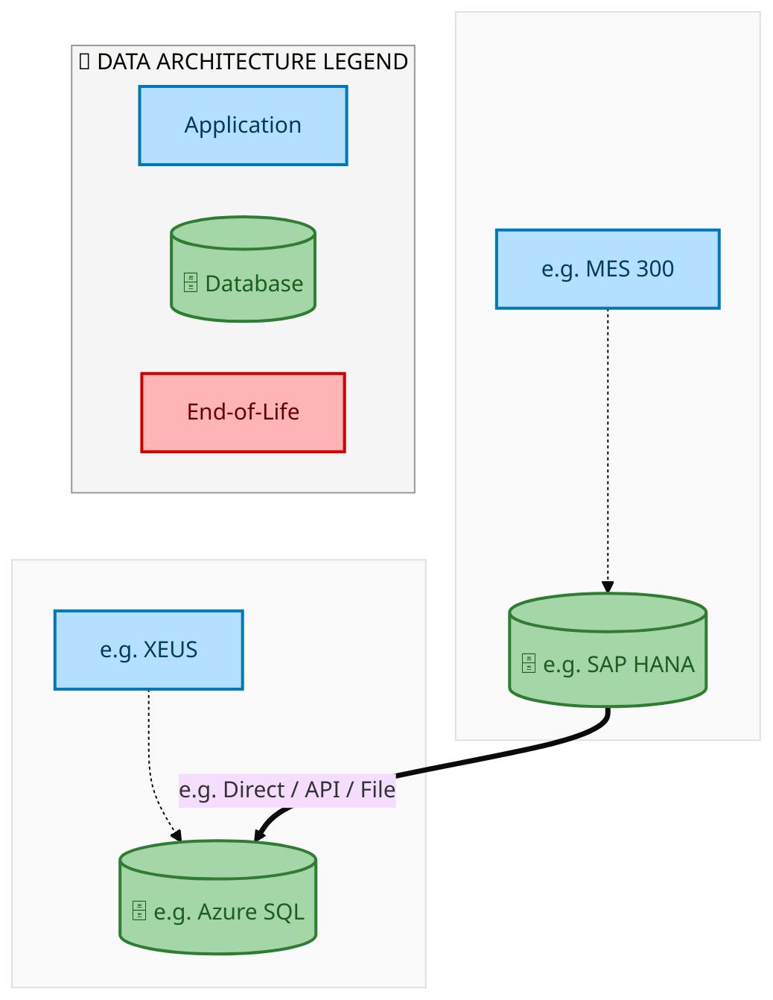
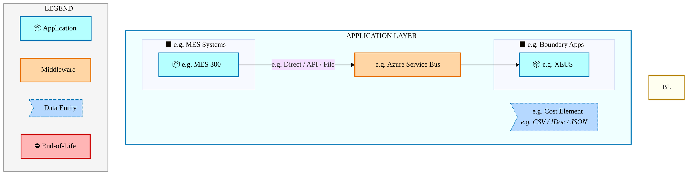
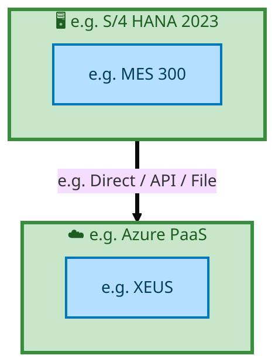

  <img src="data:image/svg+xml;base64,PHN2ZyB4bWxucz0iaHR0cDovL3d3dy53My5vcmcvMjAwMC9zdmciIHZpZXdCb3g9IjAgMCA4MDAgNDgwIiB3aWR0aD0iODAwIiBoZWlnaHQ9IjQ4MCI+DQogIDxkZWZzPg0KICAgIDxsaW5lYXJHcmFkaWVudCBpZD0iYmciIHgxPSIwJSIgeTE9IjAlIiB4Mj0iMTAwJSIgeTI9IjEwMCUiPg0KICAgICAgPHN0b3Agb2Zmc2V0PSIwJSIgc3R5bGU9InN0b3AtY29sb3I6IzAwNzFjNTtzdG9wLW9wYWNpdHk6MSIvPg0KICAgICAgPHN0b3Agb2Zmc2V0PSIxMDAlIiBzdHlsZT0ic3RvcC1jb2xvcjojMDBhZWVmO3N0b3Atb3BhY2l0eToxIi8+DQogICAgPC9saW5lYXJHcmFkaWVudD4NCiAgICA8bGluZWFyR3JhZGllbnQgaWQ9ImFjY2VudCIgeDE9IjAlIiB5MT0iMCUiIHgyPSIwJSIgeTI9IjEwMCUiPg0KICAgICAgPHN0b3Agb2Zmc2V0PSIwJSIgc3R5bGU9InN0b3AtY29sb3I6I2ZmZmZmZjtzdG9wLW9wYWNpdHk6MC4xNSIvPg0KICAgICAgPHN0b3Agb2Zmc2V0PSIxMDAlIiBzdHlsZT0ic3RvcC1jb2xvcjojZmZmZmZmO3N0b3Atb3BhY2l0eTowLjAyIi8+DQogICAgPC9saW5lYXJHcmFkaWVudD4NCiAgICA8cGF0dGVybiBpZD0iZ3JpZCIgd2lkdGg9IjQwIiBoZWlnaHQ9IjQwIiBwYXR0ZXJuVW5pdHM9InVzZXJTcGFjZU9uVXNlIj4NCiAgICAgIDxwYXRoIGQ9Ik0gNDAgMCBMIDAgMCAwIDQwIiBmaWxsPSJub25lIiBzdHJva2U9InJnYmEoMjU1LDI1NSwyNTUsMC4wNykiIHN0cm9rZS13aWR0aD0iMC41Ii8+DQogICAgPC9wYXR0ZXJuPg0KICA8L2RlZnM+DQoNCiAgPCEtLSBCYWNrZ3JvdW5kIC0tPg0KICA8cmVjdCB3aWR0aD0iODAwIiBoZWlnaHQ9IjQ4MCIgZmlsbD0idXJsKCNiZykiIHJ4PSI4Ii8+DQogIDxyZWN0IHdpZHRoPSI4MDAiIGhlaWdodD0iNDgwIiBmaWxsPSJ1cmwoI2dyaWQpIiByeD0iOCIvPg0KICA8cmVjdCB3aWR0aD0iODAwIiBoZWlnaHQ9IjQ4MCIgZmlsbD0idXJsKCNhY2NlbnQpIiByeD0iOCIvPg0KDQogIDwhLS0gRGVjb3JhdGl2ZSBjaXJjdWl0L2FyY2hpdGVjdHVyZSBsaW5lcyAtLT4NCiAgPGcgc3Ryb2tlPSJyZ2JhKDI1NSwyNTUsMjU1LDAuMTIpIiBzdHJva2Utd2lkdGg9IjEuNSIgZmlsbD0ibm9uZSI+DQogICAgPHBhdGggZD0iTSAwIDEwMCBMIDEyMCAxMDAgTCAxNjAgMTQwIEwgMjgwIDE0MCIvPg0KICAgIDxwYXRoIGQ9Ik0gMCAyNjAgTCA4MCAyNjAgTCAxMjAgMjIwIEwgMjAwIDIyMCBMIDI0MCAyNjAgTCAzNjAgMjYwIi8+DQogICAgPHBhdGggZD0iTSA1MjAgMTAwIEwgNjAwIDEwMCBMIDY0MCA2MCBMIDgwMCA2MCIvPg0KICAgIDxwYXRoIGQ9Ik0gNDQwIDM0MCBMIDU2MCAzNDAgTCA2MDAgMzAwIEwgNzIwIDMwMCBMIDc2MCAzNDAgTCA4MDAgMzQwIi8+DQogICAgPHBhdGggZD0iTSA2MDAgNDAwIEwgNjgwIDQwMCBMIDcyMCA0NDAiLz4NCiAgICA8cGF0aCBkPSJNIDAgNDAwIEwgNDAgNDAwIEwgODAgMzYwIi8+DQogICAgPHBhdGggZD0iTSAyMDAgNDIwIEwgMzIwIDQyMCBMIDM2MCAzODAgTCA0ODAgMzgwIi8+DQogICAgPHBhdGggZD0iTSA2NTAgNDQwIEwgNzUwIDQ0MCBMIDgwMCA0ODAiLz4NCiAgPC9nPg0KDQogIDwhLS0gRGVjb3JhdGl2ZSBub2RlcyAtLT4NCiAgPGcgZmlsbD0icmdiYSgyNTUsMjU1LDI1NSwwLjE4KSI+DQogICAgPGNpcmNsZSBjeD0iMTIwIiBjeT0iMTAwIiByPSI0Ii8+DQogICAgPGNpcmNsZSBjeD0iMjgwIiBjeT0iMTQwIiByPSI0Ii8+DQogICAgPGNpcmNsZSBjeD0iMjAwIiBjeT0iMjIwIiByPSI0Ii8+DQogICAgPGNpcmNsZSBjeD0iMzYwIiBjeT0iMjYwIiByPSI0Ii8+DQogICAgPGNpcmNsZSBjeD0iNjAwIiBjeT0iMTAwIiByPSI0Ii8+DQogICAgPGNpcmNsZSBjeD0iNzIwIiBjeT0iMzAwIiByPSI0Ii8+DQogICAgPGNpcmNsZSBjeD0iNTYwIiBjeT0iMzQwIiByPSI0Ii8+DQogICAgPGNpcmNsZSBjeD0iODAiIGN5PSIzNjAiIHI9IjQiLz4NCiAgICA8Y2lyY2xlIGN4PSI0ODAiIGN5PSIzODAiIHI9IjQiLz4NCiAgICA8Y2lyY2xlIGN4PSIzMjAiIGN5PSI0MjAiIHI9IjQiLz4NCiAgPC9nPg0KDQogIDwhLS0gVE9HQUYgQkRBVCBib3hlcyAtLT4NCiAgPGcgZm9udC1mYW1pbHk9IlNlZ29lIFVJLCBBcmlhbCwgc2Fucy1zZXJpZiIgZm9udC1zaXplPSIxNCIgZm9udC13ZWlnaHQ9IjYwMCI+DQogICAgPCEtLSBCIC0tPg0KICAgIDxyZWN0IHg9IjE1MCIgeT0iMTQwIiB3aWR0aD0iMTIwIiBoZWlnaHQ9IjQwIiByeD0iNSIgZmlsbD0icmdiYSgyNTUsMjU1LDI1NSwwLjE4KSIgc3Ryb2tlPSJyZ2JhKDI1NSwyNTUsMjU1LDAuMykiIHN0cm9rZS13aWR0aD0iMSIvPg0KICAgIDx0ZXh0IHg9IjIxMCIgeT0iMTY1IiB0ZXh0LWFuY2hvcj0ibWlkZGxlIiBmaWxsPSIjZmZmIj5CdXNpbmVzczwvdGV4dD4NCiAgICA8IS0tIEQgLS0+DQogICAgPHJlY3QgeD0iMjkwIiB5PSIxNDAiIHdpZHRoPSIxMjAiIGhlaWdodD0iNDAiIHJ4PSI1IiBmaWxsPSJyZ2JhKDI1NSwyNTUsMjU1LDAuMTgpIiBzdHJva2U9InJnYmEoMjU1LDI1NSwyNTUsMC4zKSIgc3Ryb2tlLXdpZHRoPSIxIi8+DQogICAgPHRleHQgeD0iMzUwIiB5PSIxNjUiIHRleHQtYW5jaG9yPSJtaWRkbGUiIGZpbGw9IiNmZmYiPkRhdGE8L3RleHQ+DQogICAgPCEtLSBBIC0tPg0KICAgIDxyZWN0IHg9IjQzMCIgeT0iMTQwIiB3aWR0aD0iMTIwIiBoZWlnaHQ9IjQwIiByeD0iNSIgZmlsbD0icmdiYSgyNTUsMjU1LDI1NSwwLjE4KSIgc3Ryb2tlPSJyZ2JhKDI1NSwyNTUsMjU1LDAuMykiIHN0cm9rZS13aWR0aD0iMSIvPg0KICAgIDx0ZXh0IHg9IjQ5MCIgeT0iMTY1IiB0ZXh0LWFuY2hvcj0ibWlkZGxlIiBmaWxsPSIjZmZmIj5BcHBsaWNhdGlvbjwvdGV4dD4NCiAgICA8IS0tIFQgLS0+DQogICAgPHJlY3QgeD0iNTcwIiB5PSIxNDAiIHdpZHRoPSIxMjAiIGhlaWdodD0iNDAiIHJ4PSI1IiBmaWxsPSJyZ2JhKDI1NSwyNTUsMjU1LDAuMTgpIiBzdHJva2U9InJnYmEoMjU1LDI1NSwyNTUsMC4zKSIgc3Ryb2tlLXdpZHRoPSIxIi8+DQogICAgPHRleHQgeD0iNjMwIiB5PSIxNjUiIHRleHQtYW5jaG9yPSJtaWRkbGUiIGZpbGw9IiNmZmYiPlRlY2hub2xvZ3k8L3RleHQ+DQogIDwvZz4NCg0KICA8IS0tIENvbm5lY3RpbmcgbGluZXMgYmV0d2VlbiBCREFUIGJveGVzIC0tPg0KICA8ZyBzdHJva2U9InJnYmEoMjU1LDI1NSwyNTUsMC4yNSkiIHN0cm9rZS13aWR0aD0iMSI+DQogICAgPGxpbmUgeDE9IjI3MCIgeTE9IjE2MCIgeDI9IjI5MCIgeTI9IjE2MCIvPg0KICAgIDxsaW5lIHgxPSI0MTAiIHkxPSIxNjAiIHgyPSI0MzAiIHkyPSIxNjAiLz4NCiAgICA8bGluZSB4MT0iNTUwIiB5MT0iMTYwIiB4Mj0iNTcwIiB5Mj0iMTYwIi8+DQogIDwvZz4NCg0KICA8IS0tIE1haW4gdGl0bGUgLS0+DQogIDx0ZXh0IHg9IjQwMCIgeT0iMjYwIiB0ZXh0LWFuY2hvcj0ibWlkZGxlIiBmb250LWZhbWlseT0iU2Vnb2UgVUksIEFyaWFsLCBzYW5zLXNlcmlmIiBmb250LXNpemU9IjM2IiBmb250LXdlaWdodD0iNzAwIiBmaWxsPSIjZmZmZmZmIiBsZXR0ZXItc3BhY2luZz0iMSI+DQogICAgSUFPIEFyY2hpdGVjdHVyZQ0KICA8L3RleHQ+DQogIDx0ZXh0IHg9IjQwMCIgeT0iMzAwIiB0ZXh0LWFuY2hvcj0ibWlkZGxlIiBmb250LWZhbWlseT0iU2Vnb2UgVUksIEFyaWFsLCBzYW5zLXNlcmlmIiBmb250LXNpemU9IjE4IiBmb250LXdlaWdodD0iNDAwIiBmaWxsPSJyZ2JhKDI1NSwyNTUsMjU1LDAuOCkiIGxldHRlci1zcGFjaW5nPSIyIj4NCiAgICBUT0dBRiBCREFUIMK3IElBTyBQcm9ncmFtIMK3IElETSAyLjANCiAgPC90ZXh0Pg0KDQogIDwhLS0gQm90dG9tIGFjY2VudCBiYXIgLS0+DQogIDxyZWN0IHg9IjI4MCIgeT0iMzQwIiB3aWR0aD0iMjQwIiBoZWlnaHQ9IjMiIHJ4PSIxLjUiIGZpbGw9InJnYmEoMjU1LDI1NSwyNTUsMC40KSIvPg0KDQogIDwhLS0gSW50ZWwgdGV4dCAtLT4NCiAgPHRleHQgeD0iNDAwIiB5PSIzODAiIHRleHQtYW5jaG9yPSJtaWRkbGUiIGZvbnQtZmFtaWx5PSJTZWdvZSBVSSwgQXJpYWwsIHNhbnMtc2VyaWYiIGZvbnQtc2l6ZT0iMTMiIGZpbGw9InJnYmEoMjU1LDI1NSwyNTUsMC41KSIgbGV0dGVyLXNwYWNpbmc9IjMiPg0KICAgIElOVEVMIENPTkZJREVOVElBTA0KICA8L3RleHQ+DQo8L3N2Zz4NCg==" alt="IAO Architecture" style="width:100%; border-radius:8px;" />
  <h1 style="font-size:36px; margin-top:24px;">E2E-52 — Purchase Requisition to Payments for Indirect Non-Mfg. &amp; Mfg. procurement</h1>
  <h2 style="font-size:24px;">Architecture Document (TOGAF BDAT)</h2>
  
End-to-End Integrated Processes (E2E) Tower 
  Capability E2E-52 · Procure to Pay

  
IAO Program · R1 – R5 
  Generated: April 2026 
  Sajiv Francis

  
IAO Architecture Pipeline — Intel Confidential

Page 1<a href="#toc">↑ Back to TOC</a>E2E-52 — Purchase Requisition to Payments for Indirect Non-Mfg. &amp; Mfg. procurement

## Table of Contents

<nav class="toc">
<ol>
  <li><a href="#1-executive-summary">1. Executive Summary</a></li>
  <li><a href="#2-business-context-objectives">2. Business Context &amp; Objectives</a>
    <ul>
      <li><a href="#21-classification">2.1 Classification</a></li>
      <li><a href="#22-business-drivers">2.2 Business Drivers</a></li>
      <li><a href="#23-success-criteria">2.3 Success Criteria</a></li>
      <li><a href="#24-companion-documents">2.4 Companion Documents</a></li>
    </ul>
  </li>
  <li><a href="#3-business-architecture-togaf-b">3. Business Architecture (TOGAF &ldquo;B&rdquo;)</a>
    <ul>
      <li><a href="#31-business-process-overview">3.1 Business Process Overview</a></li>
      <li><a href="#32-business-process-diagrams">3.2 Business Process Diagrams</a></li>
      <li><a href="#33-business-roles-responsibilities">3.3 Business Roles &amp; Responsibilities</a></li>
    </ul>
  </li>
  <li><a href="#4-data-architecture-togaf-d">4. Data Architecture (TOGAF &ldquo;D&rdquo;)</a>
    <ul>
      <li><a href="#41-data-entities-ownership">4.1 Data Entities &amp; Ownership</a></li>
      <li><a href="#42-data-flow-diagrams">4.2 Data Flow Diagrams</a></li>
      <li><a href="#43-data-lineage">4.3 Data Lineage</a></li>
      <li><a href="#44-ricefw-data-objects">4.4 RICEFW Data Objects</a></li>
      <li><a href="#45-data-governance-quality">4.5 Data Governance &amp; Quality</a></li>
    </ul>
  </li>
  <li><a href="#5-application-architecture-togaf-a">5. Application Architecture (TOGAF &ldquo;A&rdquo;)</a>
    <ul>
      <li><a href="#51-current-state-current-state-application-landscape">5.1 Current-State Application Landscape</a></li>
      <li><a href="#52-future-state-future-state-application-landscape">5.2 Future-State Application Landscape</a></li>
      <li><a href="#53-change-impact-summary">5.3 Change Impact Summary</a></li>
      <li><a href="#54-component-overview">5.4 Component Overview</a></li>
      <li><a href="#55-ricefw-inventory">5.5 RICEFW Inventory</a></li>
      <li><a href="#56-integration-patterns">5.6 Integration Patterns</a></li>
    </ul>
  </li>
  <li><a href="#6-technology-architecture-togaf-t">6. Technology Architecture (TOGAF &ldquo;T&rdquo;)</a>
    <ul>
      <li><a href="#61-platform-infrastructure">6.1 Platform &amp; Infrastructure</a></li>
      <li><a href="#62-sap-development-object-status">6.2 SAP Development Object Status</a></li>
      <li><a href="#63-nfrs-design-principles">6.3 NFRs &amp; Design Principles</a></li>
      <li><a href="#64-security-governance">6.4 Security &amp; Governance</a></li>
    </ul>
  </li>
  <li><a href="#7-project-context">7. Project Context</a>
    <ul>
      <li><a href="#71-project-roadmap-go-live-plan">7.1 Project Roadmap &amp; Go-Live Plan</a></li>
      <li><a href="#72-raid-log">7.2 RAID Log</a></li>
      <li><a href="#73-recommendations-next-steps">7.3 Recommendations &amp; Next Steps</a></li>
    </ul>
  </li>
</ol>
</nav>

Page 2<a href="#toc">↑ Back to TOC</a>E2E-52 — Purchase Requisition to Payments for Indirect Non-Mfg. &amp; Mfg. procurement

## 1. Executive Summary

This Architecture Document defines the **Business, Data, Application, and Technology** (BDAT) architecture for **E2E-52 Purchase Requisition to Payments for Indirect Non-Mfg. &amp; Mfg. procurement** within the IAO program. It includes 1 BPMN process diagram(s) in Section 3.

| Dimension | Value |
|-----------|-------|
| **Tower** | End-to-End Integrated Processes (E2E) |
| **Process Group** | Procure to Pay |
| **Capability** | E2E-52 - Purchase Requisition to Payments for Indirect Non-Mfg. &amp; Mfg. procurement |
| **Release** | R1 – R5 |
| **Total Systems** | 2 |
| **System Status** | 0 Deployed, 0 Developing, 0 EOL, 2 Pending IAPM |
| **RICEFW Objects** | Pending — Smartsheet Object Tracker API integration |

**Change Summary**: 0 new flow chains, 0 removed, 0 modified, 1 unchanged between Current-State and Future-State states.

> All system nodes in architecture diagrams are **IAPM-linked** — click any node to open its IAPM page. Diagrams require `securityLevel: 'loose'` for click events.

Page 3<a href="#toc">↑ Back to TOC</a>E2E-52 — Purchase Requisition to Payments for Indirect Non-Mfg. &amp; Mfg. procurement

## 2. Business Context & Objectives

### 2.1 Classification

| Level | Value |
|-------|-------|
| **L0 Tower** | End-to-End Integrated Processes |
| **L1 Process** | Procure to Pay |
| **L2 Capability** | E2E-52 - Purchase Requisition to Payments for Indirect Non-Mfg. &amp; Mfg. procurement |

### 2.2 Business Drivers

| # | Driver | Description | Strategic Alignment | Priority |
|---|--------|-------------|---------------------|----------|
| 1 | End-to-End Process Integration | Enable cross-tower integrated processes spanning procurement, manufacturing, and fulfillment | IDM 2.0 Process Excellence | High |
| 2 | Intel Foundry Business Enablement | Stand up foundry-specific business processes for external customer engagement | Intel Foundry Services | High |
| 3 | Process Visibility & Monitoring | Provide end-to-end process visibility across tower boundaries with integrated monitoring | Operational Excellence | Medium |
| 4 | E2E-52 Process Migration | Migrate Purchase Requisition to Payments for Indirect Non-Mfg. &amp; Mfg. procurement business processes and 2 integrated systems from legacy to S/4 HANA target architecture | IDM 2.0 Cross-Functional / End-to-End | High |

Page 4<a href="#toc">↑ Back to TOC</a>E2E-52 — Purchase Requisition to Payments for Indirect Non-Mfg. &amp; Mfg. procurement

### 2.3 Success Criteria

| Metric | Target | Measure | Baseline | Owner |
|--------|--------|---------|----------|-------|
| E2E Process Cycle Time | Per process SLA | End-to-end transaction completion within defined SLA per process | Varies by process | E2E Process Owner |
| Cross-Tower Integration Success | > 99% | Transactions completing across tower boundaries without manual intervention | 92% (current) | Integration Lead |
| Process Exception Rate | < 2% | Transactions requiring manual exception handling | 8% (current) | Operations Manager |
| E2E-52 Migration Completeness | 100% flow chains validated | All 1 flow chains verified in target state | 0% (pre-migration) | Tower Architect |

### 2.4 Companion Documents

| Document | Description |
|----------|-------------|
| **Business Architecture** | Included in this document (Section 3) — process flows from BPMN diagrams |
| **This Document** | Full BDAT Architecture — Business + Data + Application + Technology |

Page 5<a href="#toc">↑ Back to TOC</a>E2E-52 — Purchase Requisition to Payments for Indirect Non-Mfg. &amp; Mfg. procurement

## 3. Business Architecture (TOGAF "B")

### 3.1 Business Process Overview

This capability includes **1 business process(es)** modeled in BPMN 2.0, covering the end-to-end workflow for E2E-52 Purchase Requisition to Payments for Indirect Non-Mfg. &amp; Mfg. procurement.

| # | Step ID | Process Name | Lanes | Tasks | Gateways |
|---|---------|--------------|-------|-------|----------|
| 1 | E2E-52_Purchase_Requisition_to_Payments_for_Indirect_Non-Mfg._&amp;_Mfg._procurement | E2E-52_Purchase_Requisition_to_Payments_for_Indirect_Non-Mfg._&amp;_Mfg._procurement | Boundary Apps, MBC, SAP Ariba, SAP Ariba Network, SAP CFIN, SAP Fieldglass, SAP Fieldglass Network

, SAP S/4 (IP & IF) 

 | 50 | 20 |

Page 6<a href="#toc">↑ Back to TOC</a>E2E-52 — Purchase Requisition to Payments for Indirect Non-Mfg. &amp; Mfg. procurement

### 3.2 Business Process Diagrams

#### BUSINESS ARCHITECTURE — 3.2.1 E2E-52_Purchase_Requisition_to_Payments_for_Indirect_Non-Mfg._&amp;_Mfg._procurement — E2E-52_Purchase_Requisition_to_Payments_for_Indirect_Non-Mfg._&amp;_Mfg._procurement

**Swim Lanes**: Boundary Apps · MBC · SAP Ariba · SAP Ariba Network · SAP CFIN · SAP Fieldglass · SAP Fieldglass Network
 · SAP S/4 (IP & IF) 

 | **Tasks**: 50 | **Gateways**: 20

```mermaid
%%{init: {'theme': 'base', 'themeVariables': {'fontSize': '14px', 'fontFamily': 'Segoe UI, Arial, sans-serif','primaryColor': '#e8f0fe', 'primaryBorderColor': '#0071c5','lineColor': '#37474F', 'secondaryColor': '#f5f8fc'}, 'flowchart': {'useMaxWidth': false, 'htmlLabels': true, 'curve': 'basis', 'nodeSpacing': 40, 'rankSpacing': 50}} }%%
flowchart LR
    classDef startEvt fill:#4CAF50,stroke:#2E7D32,color:#000,font-weight:bold,stroke-width:2px,rx:20,ry:20
    classDef endEvt fill:#C62828,stroke:#B71C1C,color:#fff,font-weight:bold,stroke-width:2px,rx:20,ry:20
    classDef userTask fill:#E3F2FD,stroke:#1565C0,stroke-width:2px,color:#0D47A1
    classDef serviceTask fill:#FFF3E0,stroke:#E65100,stroke-width:2px,color:#BF360C
    classDef gateway fill:#FFF9C4,stroke:#F57F17,stroke-width:2px,color:#E65100
    classDef subProc fill:#F3E5F5,stroke:#7B1FA2,stroke-width:2px,color:#4A148C
    subgraph lane_0["Boundary Apps"]
        n4["Validate/Handle Exception Based on Rules setup in Readsoft"]
        n5["Receive Invoice/ B2B/OpenText/Web suite/ Email"]
        n6["Receive File in Bank"]
        n7["Payment Received"]
        n8["Hard Copy to be processed through optical character recognition (OCR)"]
        n54(["fa:fa-stop Payment Data Updated"])
        n61{{"fa:fa-code-branch exclusiveGateway"}}
    end
    subgraph lane_1["MBC"]
        n48["Multi-Bank Connectivity (host-to-host)"]
        n49["Multi-Bank Connectivity (host-to-host)"]
    end
    subgraph lane_2["SAP Ariba"]
        n16["Create Ariba Operational Contract"]
        n17["Publish Contract Catalogue"]
        n18["Create Text Material without catalogs"]
        n19["Create Indirect Purchase Requisition"]
        n20["Create Non-PO Contract Purchases"]
        n21["Create Integrated Catalog within Spot Buy"]
        n22["Punchout Catalog item"]
        n23["Select Intel Internal Catalog"]
        n24["Select item from Hosted Catalog"]
        n25["Validate Purchase Requisition Budget Check in Ariba (Capital Item Only),..."]
        n26["Create Indirect Purchase Requisition"]
        n27["Approve Indirect Purchase Requisition"]
        n28["Initiate Purchase Order Creation"]
        n29["Purchase Order Created"]
        n30["Replicate Goods Receipt"]
        n31["Reconcile Supplier Invoice"]
        n51(["fa:fa-play Ariba Operational Contract Initiated"])
        n52(["fa:fa-play Initiate Non-PO Contract Purchases"])
        n58(["fa:fa-stop Goods Receipt Replicated"])
        n65{{"fa:fa-code-branch exclusiveGateway"}}
        n75{{"fa:fa-arrows-alt parallelGateway"}}
        n76{{"fa:fa-arrows-alt parallelGateway"}}
        n77{{"fa:fa-arrows-alt parallelGateway"}}
        n78{{"fa:fa-arrows-alt parallelGateway"}}
    end
    subgraph lane_3["SAP Ariba Network"]
        n1["Receive Purchase Order"]
        n2["Send Purchase Order Confirmation"]
        n3["Create/Submit/Validate Supplier Invoice"]
    end
    subgraph lane_4["SAP CFIN"]
        n37["Replicate Supplier Invoice Posting"]
        n38["Generate Payment Proposal"]
        n39["Execute Payment Run"]
        n40["Create APM Memo Record"]
        n41["Process BCM Payment Batching Based on Business Rules"]
        n42["Generate APM Payment File"]
        n43["Route to Approver"]
        n44["Correct APM Correction File"]
        n45["Reverse APP Doc Number and Memo Record Deletion"]
        n46["Payments Factory (APM, BCM, MBC Monitor)"]
        n47["Review Failed Payment Log"]
        n59(["fa:fa-stop Memo Record Created"])
        n60(["fa:fa-stop APP Doc Reversed"])
        n66{{"fa:fa-code-branch Manual Approval Necessary?"}}
        n67{{"fa:fa-code-branch Approved?"}}
        n68{{"fa:fa-code-branch exclusiveGateway"}}
        n69{{"fa:fa-code-branch Can Be Corrected?"}}
        n70{{"fa:fa-code-branch exclusiveGateway"}}
        n71{{"fa:fa-code-branch exclusiveGateway"}}
        n72{{"fa:fa-code-branch exclusiveGateway"}}
        n73{{"fa:fa-code-branch Reversal or Reprocessing?"}}
        n79{{"fa:fa-arrows-alt parallelGateway"}}
        n80{{"fa:fa-arrows-alt parallelGateway"}}
    end
    subgraph lane_5["SAP Fieldglass"]
        n32["Update SOW/Work Order"]
        n33["Validate Document Against SOW and Approval"]
        n34["Create SOW/Work Order"]
        n53(["fa:fa-play SOW/Work Order Creation Initiated"])
    end
    subgraph lane_6["SAP Fieldglass Network "]
        n35["Add Details About Work Performed Against SOW"]
        n36["Submit Timesheet, Expense Receipt, Another Document per SOW"]
    end
    subgraph lane_7["SAP S/4 (IP & IF)  "]
        n9["Validate Replicate Requisition Budget Check in SAP S/4 (Capital Item Only),..."]
        n10["Replicate Indirect Purchase Requisition"]
        n11["Replicate Indirect Purchase Order"]
        n12["Calculate Taxes"]
        n13["Post Goods Receipt"]
        n14["Instruct Supplier About Rejected Invoice"]
        n15["Post Supplier invoice"]
        n50[["fa:fa-cog Send Supplier Invoice"]]
        n55(["fa:fa-stop Payment Details provided back to Source System (IP/IF)"])
        n56(["fa:fa-stop Indirect Purchase Requisition Replicated"])
        n57(["fa:fa-stop Taxes Calculated"])
        n62{{"fa:fa-code-branch exclusiveGateway"}}
        n63{{"fa:fa-code-branch Invoice Accepted?"}}
        n64{{"fa:fa-code-branch Indirect Material/Service?"}}
        n74{{"fa:fa-arrows-alt parallelGateway"}}
    end
    n16 --> n17
    n25 --> n9
    n26 --> n27
    n28 --> n11
    n35 --> n36
    n36 --> n33
    n65 --> n25
    n62 --> n64
    n29 --> n75
    n13 --> n30
    n30 --> n58
    n5 --> n61
    n63 -->|"No"| n14
    n15 --> n37
    n38 --> n39
    n39 --> n79
    n40 --> n59
    n79 -->|"Reprocessing"| n70
    n41 --> n66
    n66 -->|"No"| n68
    n66 -->|"Yes"| n43
    n43 --> n67
    n67 -->|"No"| n69
    n70 --> n41
    n67 -->|"Yes"| n68
    n71 --> n45
    n72 --> n44
    n75 --> n32
    n79 --> n40
    n76 --> n10
    n76 --> n28
    n74 --> n29
    n80 --> n47
    n42 --> n48
    n44 --> n70
    n7 --> n54
    n52 --> n20
    n18 --> n65
    n20 --> n3
    n34 --> n18
    n77 --> n21
    n77 --> n22
    n77 --> n23
    n77 --> n24
    n21 --> n78
    n22 --> n78
    n23 --> n78
    n24 --> n78
    n78 --> n65
    n27 --> n76
    n73 -->|"Reversal"| n71
    n73 -->|"Reprocessing"| n72
    n2 --> n62
    n17 --> n19
    n75 --> n1
    n1 --> n2
    n51 --> n16
    n19 --> n77
    n9 --> n26
    n33 --> n62
    n3 --> n31
    n49 --> n46
    n80 --> n55
    n32 --> n35
    n37 --> n38
    n69 -->|"Yes"| n72
    n12 --> n57
    n53 --> n34
    n69 -->|"No"| n71
    n46 --> n80
    n47 --> n73
    n45 --> n60
    n68 --> n42
    n6 -->|"PAIN.002 (Pay-load file)"| n49
    n48 -->|"PAIN.001 (Pay-load file)"| n6
    n80 --> n7
    n10 --> n56
    n11 --> n74
    n74 --> n12
    n64 -->|"Service"| n50
    n64 -->|"Material"| n13
    n63 -->|"Yes"| n15
    n61 --> n4
    n4 --> n63
    n8 --> n61
    n31 --> n5
    class n50 serviceTask
    class n51 startEvt
    class n52 startEvt
    class n53 startEvt
    class n54 endEvt
    class n55 endEvt
    class n56 endEvt
    class n57 endEvt
    class n58 endEvt
    class n59 endEvt
    class n60 endEvt
    class n61 gateway
    class n62 gateway
    class n63 gateway
    class n64 gateway
    class n65 gateway
    class n66 gateway
    class n67 gateway
    class n68 gateway
    class n69 gateway
    class n70 gateway
    class n71 gateway
    class n72 gateway
    class n73 gateway
    class n74 gateway
    class n75 gateway
    class n76 gateway
    class n77 gateway
    class n78 gateway
    class n79 gateway
    class n80 gateway
```

> **Legend**: ● Start · ● End · User Task · Service Task · ◇ Gateway · Sub-Process

<a href="https://mermaid.live/view#pako:eNqtWVtv28oR_isLHaR2ACnm8i49tJBkKzEQ24KVc4IiLooVuZLYUFyWF9uq4__eWXKHEldU2rjNgyMO5375dki-9AIR8t6o9-7dS5RExYi8nBUbvuVnI3K2ZDk_65Oa8AfLIraMeX4meVYiKRbRvyo2aqfPkk3SZmwbxTtJXfC14OT36z4Zg2DcJzlL8kHOs2h11j9Ls2jLst1UxCKT3L9xf2WsKmvq1kRkIc_2DIbh0cAB0ThK-J5sebZnz6RczgORhC2lK2flr4KzV-lcLJ6CDcuKyv0y5zfs-WsUFhu4XrE458CzKbbxZ7bksYyxyEpJC8rsEZMR5dJOAglbpCyIkjXQbQNIGUu-70mO8fpKXt-9e0gao-Tz_UNC4F8Qszy_5CuSF0C-eizIKorj0W_2dDxzjH5eZOI7H_1mXnmXltkPZCQjCN3oy-QOnni03hSjpYhDxTp4kjGMzPS5nz2PTKOf7eCvZosn4d7S1DV9028sTTw6pVO0tFqt_idLkNfsC8u_K1tX1sycXTa2qOM6U-NYH4Z5aXtjqueJZ49RwA-UzmYz62qfqivXocZppZOZ5RpTTemaFfyJ7fYKh1O7UThzvBn1Tiqs7elelst5JgJUaF05M6dR6E3obGyeVGiPqe0rD0HPOmPphsQs4X83vj30JqKsmpqM0zR_6P2t5pP_Ehtu_8HiKIRoLj6xJIw5uXoOeFpEIiETGN6QwI_7EoYW8liUKYngkrMwF6uircsBXfc84NEjJ9fJo4CUX5CJObm4S3nyhT8XF1_5EtyLwBS52rIobsu7B_KzCByJpAfJ9zaXB1xzttvypCCKO2xz-MDxiWUhmYp0RwpBlpykkFmey2iKTSbK9YYICDFgMZGzxYKCZySD4V8DfsnIz--m9--18OxzULxioxUb5IVICXpxyQpGfk9lCqUn7w9Doi8vKCNBcrCEMQ82hD8HcZmD6x_rLnrovb7WYjBnXWWkYPpmMtWKJyO9KeMiGsg8QbxJwoMieoyKHTnfiLwYFGIg_9dCsYe_LnjCMRM0LcZzCdBL1rZCZUGnGYcQ69sEGiFjMr-Qd7BZyMRrMlV5y2Uc5ZuGhUwhw7FYl1xj9vcGZH-RG_glDwryFBUbURYkqAW1pqfDvdx1EkZQ-ILMywxaIefQVP8so7xqg7aYaezFbkUymN_tPURpzZJJDy0VHBIHTYLxVG5Cky9SUZBJudNkzSoV0C4yEhSB4dlqfJYsAY9lENJGXP3NqhzXQhq_veeX2sgqE1vyCYq990yTcA5QojNR4H245uDlhgff5dzW9T6fsjQCheRa2rlL4t37_ocPHzTt7tuqITsFAC0Tj78mJ5vmWo55K5g7uSmQyo1jkWFViWNOHXkso4KwNAZkAeUfhQjzGqRSrc8tWoOdSAKJdIsyBSFQq3BTQx66R540hjPn9DQRjExHIsfUdDQp-FkrtzT4Gv61wiNN2EcY6PwqBtY4fyDGskw85QMWFyQFtI5jHp8Qct8i5L1FyP81oRPwaR3CJ7nlxZPItAOPHhyL7SbUurQa6yQ86mmRrKJs29HXVjN4F4tyuY2Ki2bITzbkiThsFcd0dn2rGfFaM6ErJnMAHth5NSE5pB95IhucNwctrEepyJm2NlhyOq-eeVAesN6XWqz2AXiP5zfkhm-F7F14QtAYZb7n9bpAJtObRuWEFQGg9Xq_FU2gfRPJVq1HmhrzMAJpEfXI1UbjlYW4F9J_2FYUpmnVtWWGpyKrUE6qU78l-HZorHcx0JJL43NyCYvlbbldQuJhyTuMnlzCUXDcG7a737NyMgNgELBAnoPlvsxKn8A2Qm4EgIjI9O2irvhjxJ9AEHwLm9g_60eLM9RA5dCzPca28MTQRDA-Fe8Rv9uNPzcsKQE563TDj1suSw5r8l-0UXe9bgWqUOERv_8mwHOH3WJTBp3Gsd7H5jzjbfhK3yZmvk3M6harawbZF5k8QeqxgyE7CnL4Boz2jf8LRjsK22YRj8O1fFzTAEiOer3_k8Xd14uvAOFdAG1Zh2sUdGxZzcR4zaIkL6RoNZvYkJqwvcevnxlxLO2cbzM3G07XonAifvcofjyoiOajzNQ4lJBSwNznZLyUq2tlfc6zlci2gAUH8WrilaHqICJfoi3PN5wXfXgchcfHaqOrFg14F5QIeJuU7TMIe1BL24k4PBXH4sIm59dz8idyPXtPtBiGhzXaH1s_23Ubnf_NtkvbK-IvLK6U_gfJjm6gsjWnLA7KuHpIYs_6OUVlU8oz-GfbKrWrnRnePpRgsDnC6_Le839UuNS9u1IH9TdiUeeOa3z7tgeINak2mY4tpCXjnHoiV_0nBykKwbUlg1LB2boQkCwYoF0uSwRNcAEtoO-5rqb1pzU6vfc6nqanyj5pqnF0Tr0NWd0TyIr71TiQb3M6Tin7lJyKFh-mLxb167MjSLbfiK7wYoAMBn-WD_uKYDo1YYjXisFsGHwloV7tAdTUBMtFghKxLEVwFYfpIMGsCa6NSoc1wUMOaikdBio1aoLjK4LS6aIbbiXx46F3Kx56P-SgoCr0DyOwVAQWxmihdSTYaAwJ3lApPzwYKzMeOmhT5RCmwXXbDrm-fuOvEgF-yKUTdaioXXTV9TQdjUPKQ5vqnKi0Mecpx2zMraeyb2OGPMyQ2QpX5gEJ2CY6wWys2IqAHvroIcZio1kUsZVIk0JPZR39cpQEvpeGt0wqPxiKqYxgAi2lkjZuKZ0m1QmmTrB0QtOcKoEeKjVNnWDpBFsjeEeeKysetotnNS1W72F1e9Hj23oHYiQ4VHhNlQk61OqMOlVcyO-oa4ouUZwLLKG6NptJtzSTOLVowcZGcrWucDAPlvLaagjKa6sZl6HW2U3AVMk66J-D9m1dVs1Pk05b9a_fjC_Wo5lFBBjkcFUJbTSPYzwfX99-MAyTnMOhN4gFC-WHA_6-nu0GU_w2O-1k1_OEkVHMW1MbbEpbG0DauGcrg-rQqPQ7hn4Xz5YaNC0dTTHptMFuhBOMS6UJJX0Nly3F7xx8Y5F-HH4Kat-izde0Nt08QbdO0G31paxNdTqpbifV66T6ndRhF9U1OqkUP1m1yWY32eom291kp5vsdpO9brLfTR52kuEs6iR3R-l1R-l1R-l1R-l1R-l1R-l1R-l1R-l1R-k3Ufb6vS2Ht3hR2Bu99Kqv6fDFPeQrBp9xeq_9HisLsdglQW9UfXXuldUD6WXE4AloWxNf_w00iaEN" title="View full diagram">&#128065; View Diagram</a>

Page 7<a href="#toc">↑ Back to TOC</a>E2E-52 — Purchase Requisition to Payments for Indirect Non-Mfg. &amp; Mfg. procurement

### 3.3 Business Roles & Responsibilities

| Role / Lane | Processes Involved | Description |
|------------|-------------------|-------------|
| Boundary Apps | E2E-52_Purchase_Requisition_to_Payments_for_Indirect_Non-Mfg._&amp;_Mfg._procurement | |
| MBC | E2E-52_Purchase_Requisition_to_Payments_for_Indirect_Non-Mfg._&amp;_Mfg._procurement | |
| SAP Ariba | E2E-52_Purchase_Requisition_to_Payments_for_Indirect_Non-Mfg._&amp;_Mfg._procurement | |
| SAP Ariba Network | E2E-52_Purchase_Requisition_to_Payments_for_Indirect_Non-Mfg._&amp;_Mfg._procurement | |
| SAP CFIN | E2E-52_Purchase_Requisition_to_Payments_for_Indirect_Non-Mfg._&amp;_Mfg._procurement | |
| SAP Fieldglass | E2E-52_Purchase_Requisition_to_Payments_for_Indirect_Non-Mfg._&amp;_Mfg._procurement | |
| SAP Fieldglass Network
 | E2E-52_Purchase_Requisition_to_Payments_for_Indirect_Non-Mfg._&amp;_Mfg._procurement | |
| SAP S/4 (IP & IF) 
 | E2E-52_Purchase_Requisition_to_Payments_for_Indirect_Non-Mfg._&amp;_Mfg._procurement | |

Page 8<a href="#toc">↑ Back to TOC</a>E2E-52 — Purchase Requisition to Payments for Indirect Non-Mfg. &amp; Mfg. procurement

## 4. Data Architecture (TOGAF "D")

### 4.1 Data Entities & Ownership

| # | Data Entity | Source System | Target System | Data Owner | Classification | Volume | Master/Transaction |
|---|-------------|---------------|---------------|------------|----------------|--------|-------------------|
| 1 | e.g. Cost Element | e.g. MES 300 | e.g. XEUS | Data steward | e.g. Intel Confidential | e.g. 10K rows/day | Master / Transaction |

Page 9<a href="#toc">↑ Back to TOC</a>E2E-52 — Purchase Requisition to Payments for Indirect Non-Mfg. &amp; Mfg. procurement

### 4.2 Data Flow Diagrams

> **DATA ARCHITECTURE** — Database-to-database data flows. Applications (blue) sit above their hosting databases (green cylinders). Thick arrows show data movement between databases.

#### 4.2.1 Current-State — Current-State Data Flows

<a href="https://mermaid.live/view#pako:eNqdlYtO2zAUhl_FMqq0SS0LLWlHJJCc20AKiJGyTSJT5CZOa-EmUeKMltJ3n50brDQMYUuRfS7_cb4TORsYJCGBGuz1NjSmXAMbD_IFWRIPasCDM5yLVV-schIUGeVrh_whrHKyJGm8ZcoPnFE8YySXbqETJTF36WMtdaSmqypY2m28pGxdeVwyTwi4vegDJASE-LaMYslDsMAZr9WKnFzi1U8a8oW0RJjlRMYt-JI5eEZYWZZnRWmNxWu5KQ5oPJfmkSqNGY7vXxiP1e0WbHs9L25rganuxUCMgOE8N0kEcJrqyQpElDHtQFdN27b7Oc-Se6IdKMpkoo_r7eBBHk0bpqt-kLAkk-6Rqe7qhTNjzWo5pJpjNGnlhtbEHA075Y501RoqO3IkYc_Hs21d1dVWzzAUMTr1xmPp9uJKMS9m8wynC2ANLXVomMhwfOLPffRYZMR3vzt3HhQIf1fRcoQ0IwGnSdxCk6NJR2X2L-vWFYnkcH4I5FoIaJpWMX2dY-5U_ORBrwi_jkLxDINjr4iIIl5ZipVBQAR58LOULLG-dQowOBycdVWqEkkc1iz4mpFOEA1sJGcL21Lk_Bf2kfji_4PXRdf-ObpCH6J7abn-SFEawGILxPY9jNuybyAWMUDGvIdwfZJ9kJtS72HcxH4I8f6y4PT07KkGZJZMwReAri_E06ZM3E1P3R_FTuscMhfHv3tBLAgVYKIpAujGOL-YWsb09sYCjvXNujI7uuncPFsdX_YdpSmjAZbe_a1zfLOjTybmuLqi97XI8S0hb8XhIIkGDo1IJV9dGXvbUb1hQ1-Vs6V_cnLyCj3swyXJlpiGUNtUPwHxLwlJhAvGxTUOccETdx0HUCsvZlikIebEpFgQXVbG7V_4rv7F" title="View full diagram">&#128065; View Diagram</a>

Page 10<a href="#toc">↑ Back to TOC</a>E2E-52 — Purchase Requisition to Payments for Indirect Non-Mfg. &amp; Mfg. procurement

#### 4.2.2 Future-State — Future-State Data Flows

<a href="https://mermaid.live/view#pako:eNqdlQ1L4zAYx79KiAzuYPPqZrezoJCt7SlU8ey8O7BHydp0C2ZNadNzc-67X9I3vbl6YgIleV7-T_p7SrqBAQ8JNGCns6ExFQbYeFAsyJJ40AAenOFMrrpylZEgT6lYO-QPYaWTcV57i5QfOKV4xkim3FIn4rFw6WMldaQnqzJY2W28pGxdelwy5wTcXnQBkgJSfFtEMf4QLHAqKrU8I5d49ZOGYqEsEWYZUXELsWQOnhFWlBVpXlhj-VpuggMaz5V5oCtjiuP7F8ZjfbsF207Hi5taYDr2YiBHwHCWmSQCOEnGfAUiyphxMNZN27a7mUj5PTEONG00Gg-rbe9BHc3oJ6tuwBlPlXtg6rt64WyyZpUc0s0hGjVyfWtkDvqtckdj3eprO3KEs-fj2fZYH-uN3mSiydGqNxwqtxeXilk-m6c4WQCrb-l920QTxyf-3EePeUp897tz50GJ8HcZrUZIUxIIyuMGmhp1Oiqyf1m3rkwkh_NDoNZSwDCMkunrHHOn4icPenn4dRDKZxgce3lENPnKSqwIAjLIg5-VZIH1rVOA3mHvrK1SmUjisGIh1oy0gqhhIzUb2Jam5r-wj-QX_x-8Lrr2z9EV-hDdS8v1B5pWA5ZbILfvYdyUfQOxjAEq5j2Eq5Psg1yXeg_jOvZDiPeXBaenZ08VILNgCr4AdH0hnzZl8m56av8odlrnkLk8_t0LYkGoARNNEUA3k_OLqTWZ3t5YwLG-WVdmSzedm2er46u-oyRhNMDKu791jm-29MnEApdX9L4WOb4l5a047PGo59CIlPLllbG3HeUb1vR1NRv6Jycnr9DDLlySdIlpCI1N-ROQ_5KQRDhnQl7jEOeCu-s4gEZxMcM8CbEgJsWS6LI0bv8CdGL-7w==" title="View full diagram">&#128065; View Diagram</a>

Page 11<a href="#toc">↑ Back to TOC</a>E2E-52 — Purchase Requisition to Payments for Indirect Non-Mfg. &amp; Mfg. procurement

### 4.3 Data Lineage

| # | Source System | Source Schema/Object | Target System | Target Schema/Object | Transformation |
|---|-------------|---------------------|---------------|---------------------|---------------|
| 1 | e.g. MES 300 | e.g. CKMLHD table | e.g. XEUS | e.g. dbo.CostElements | Lineage notes |

### 4.4 RICEFW Data Objects

Reports and Conversions for this capability will be populated from the Smartsheet Object Tracker via automated API extraction.

| Object ID | Type | Description | Status | Source | Target | Complexity |
|-----------|------|-------------|--------|--------|--------|-----------|
| E2E-52-R001 | Report | Purchase Requisition to Payments for Indirect Non-Mfg. &amp; Mfg. procurement operational report | Planned | SAP S/4HANA | Analytics | Medium |
| E2E-52-C001 | Conversion | Legacy data migration for Purchase Requisition to Payments for Indirect Non-Mfg. &amp; Mfg. procurement | Planned | Legacy ERP | SAP S/4HANA | High |

> *Pending: Smartsheet API integration to auto-populate live RICEFW data (see Build Requirements).*

### 4.5 Data Governance & Quality

| Concern | Approach |
|---------|----------|
| Data Ownership | Per-entity owners listed in Section 3.1 |
| Data Classification | Financial data classified as Intel Confidential |
| Data Retention | Per Intel corporate retention policies |
| Data Quality | Validated at source; reconciliation at target |

Page 12<a href="#toc">↑ Back to TOC</a>E2E-52 — Purchase Requisition to Payments for Indirect Non-Mfg. &amp; Mfg. procurement

## 5. Application Architecture (TOGAF "A")

### 5.1 Current-State — Current-State Application Landscape

#### Overview

The Current-State architecture represents the **current / legacy** landscape for E2E-52.This view is generated from `CurrentFlows.xlsx` (1 flow hops across 1 flow chains).

#### APPLICATION ARCHITECTURE — Architecture Diagram (ArchiMate-Inspired)

> **Click any system node** to open its IAPM application page.
> **Legend**: Deployed · Developing · End-of-Life · No IAPM Match

<a href="https://mermaid.live/view#pako:eNqdlv9v2joQwP8VKxW_wZrSQtuoQkpIeOIptNWyre_pZYpMfIA1k0Sxs5Z1_O87xxRSWEXfjATJffnc5XI-82ylOQPLsVqtZ55x5ZDn2FILWEJsOSS2plTiVRuvJKRVydUqhO8gjFLk-Yu2dvlCS06nAqRWI2eWZyriPzaos37xZIy1fESXXKyMJoJ5DuTzuE1cBIg2kTSTHQkln8XWuvYQ-WO6oKXakCsJE_r0wJlaaMmMCgnabqGWIqRTEHUKqqxqaYaPGBU05dlciy9sLSxp9q0h7NnrNVm3WnG2jUU-eXFGcLVapNPB3NIFn1AFHZ7JgpfAiFQrASQVVEqQaGPM63sfZmRaSZ6BlKReMy6EczLC5fXaUpX5N3BOvKurvu1tbjuP-oGcbvHUTnORl86Jbdt7TFoUZLcM0-tp6pZp25eXXv9_MBlV9JDpXx1hnr1ivugYlVi8kq6wpqS3F2nJGRPwSEtoVsTvu7uKBJf90Y72juwhFwcV0TVuVHk4tO1jTEOV1XRe0mJB3PC_2IordnXO8Jud94h7fx-Oh-6n8d0tCd1_g4-x9dU46cWwIVLF84yEH3fSLS7oBr3uMLxNIJknXl5ljJarxC0KiWFIXHWnZ1MCH-YfyIuSaOWrEG-H0ctEqPn_BJ-jZvYp9A1bKxDpOA620c4dMnYs5UkQJdFKKlgeJIwqslH9WbqafW7bv81Yw1F3LGlDmzzUPPdHVUISQfmdp5B4lXz1Js8uDbm2IhsrglYmxq5D9-l-UNOHuVRJIHDcZWrQTDm9MGBtQDYGN9PydHDDB0YRfSGnZOznKf78Hd3d3pzygYmqd6CJVz-WuTwsEY6Ywc_Yqml-XVokufdj_B5xgXP255FKNMFv2egg-92kU9pskHrkeWFjnI3sY-Os6epuXe33TK2DjRnCHGv0qlmYTcLgr-DWf8eODBPcx_uthltN8JRq4990WphMHvZbaLJrkzfbJkz8YL9DfD1qg0zhQbr_5o1LcGcGT7fPLtCQdfJZJ-SzTRicdY022RXVFOWlsD392Rb2-vr6YG5bbWsJ5ZJyZjnP5vDG_wAMZrQSCo9ci1Yqj1ZZajn1IWpVBSYKPqf4EpZGuP4F_R6Kpw==" title="View full diagram">&#128065; View Diagram</a>

Page 13<a href="#toc">↑ Back to TOC</a>E2E-52 — Purchase Requisition to Payments for Indirect Non-Mfg. &amp; Mfg. procurement

#### Current-State Flow Narrative

| # | Flow Chain | Path | Interface | Freq |
|---|-----------|------|-----------|------|
| 1 | e.g. MES Route to ICOST | e.g. MES 300 → e.g. XEUS | e.g. Direct / API / File | e.g. Near Real-Time |

Page 14<a href="#toc">↑ Back to TOC</a>E2E-52 — Purchase Requisition to Payments for Indirect Non-Mfg. &amp; Mfg. procurement

### 5.2 Future-State — Future-State Application Landscape

#### Overview

The Future-State architecture represents the **target** landscape for E2E-52.This view is generated from `FutureFlows.xlsx` (1 flow hops across 1 flow chains).

#### APPLICATION ARCHITECTURE — Architecture Diagram (ArchiMate-Inspired)

> **Click any system node** to open its IAPM application page.
> **Legend**: Deployed · Developing · End-of-Life · No IAPM Match

<a href="https://mermaid.live/view#pako:eNqdln1v2jwQwL-KlYr_YE1poW1UISVNmJhCWy3buunJFJn4AGsmiWJnLev47jvHFFJYRZ8ZCZJ7-d3lcj7zZKU5A8uxWq0nnnHlkKfYUnNYQGw5JLYmVOJVG68kpFXJ1TKEnyCMUuT5s7Z2-UJLTicCpFYjZ5pnKuK_1qiTfvFojLV8SBdcLI0mglkO5POoTVwEiDaRNJMdCSWfxtaq9hD5QzqnpVqTKwlj-njPmZpryZQKCdpurhYipBMQdQqqrGppho8YFTTl2UyLz2wtLGn2oyHs2asVWbVacbaJRT55cUZwtVqk08Hc0jkfUwUdnsmCl8CIVEsBJBVUSpBoY8zrex-mZFJJnoGUpF5TLoRzNMTl9dpSlfkPcI68i4u-7a1vOw_6gZxu8dhOc5GXzpFt2ztMWhRkuwzT62nqhmnb5-de_38wGVV0n-lfHGCevGA-6xiVWLySLrGmpLcTacEZE_BAS2hWxO-724oE5_3hlvaG7CEXexXRNW5U-fratg8xDVVWk1lJizlxw_9iK67YxSnDb3baI-7dXTi6dj-Nbm9I6H4LPsbWd-OkF8OGSBXPMxJ-3Eo3uKAb9LrD8CaBZJZ4eZUxWi4TtygkhiFx1Z2cTAi8m70jz0qilS9CvB5GLxOh5n8NPkfN7FPoG7ZWINJxHGyjrTtk7FDK4yBKoqVUsNhLGFVkrfq3dDX71Lb_mrGGo-5Q0oY2vq957q-qhCSC8idPIfEq-eJNnpwbcm1F1lYErUyMbYfu0v2gpl_nUiWBwHGXqUEz5fTMgLUBWRtcTcrjwRUfGEX0hRyTkZ-n-PMhur25OuYDE1XvQBOvfixzuV8iHDGD37FV0_y6tEhy70b4PeQC5-zvA5Vogl-z0UF2u0mntN4g9cjzwsY4G9qHxlnT1d242m-ZWnsbM4QZ1uhFszCbhMH74MZ_w44ME9zHu62GW03wlGrjv3RamIzvd1tovG2TV9smTPxgt0N8PWqDTOFBuvvmjUtwawZPt8_O0JB18mkn5NN1GJx1jTbZFtUU5bmwPf3ZFPby8nJvblttawHlgnJmOU_m8Mb_AAymtBIKj1yLViqPlllqOfUhalUFJgo-p_gSFka4-gNgG4rF" title="View full diagram">&#128065; View Diagram</a>

Page 15<a href="#toc">↑ Back to TOC</a>E2E-52 — Purchase Requisition to Payments for Indirect Non-Mfg. &amp; Mfg. procurement

#### Future-State Flow Narrative

| # | Flow Chain | Path | Interface | Freq |
|---|-----------|------|-----------|------|
| 1 | e.g. MES Route to ICOST | e.g. MES 300 → e.g. XEUS | e.g. Direct / API / File | e.g. Near Real-Time |

Page 16<a href="#toc">↑ Back to TOC</a>E2E-52 — Purchase Requisition to Payments for Indirect Non-Mfg. &amp; Mfg. procurement

### 5.3 Change Impact Summary

| Change Type | Flow Chain | Detail |
|-------------|-----------|--------|
| **UNCHANGED** | e.g. MES Route to ICOST | No change |

**Totals**: 0 new - 0 removed - 0 modified - 1 unchanged

### 5.4 Component Overview

#### System Inventory

| System | IAPM ID | Status |
|--------|---------|--------|
| e.g. MES 300 | - | N/A |
| e.g. XEUS | - | N/A |

Page 17<a href="#toc">↑ Back to TOC</a>E2E-52 — Purchase Requisition to Payments for Indirect Non-Mfg. &amp; Mfg. procurement

### 5.5 RICEFW Inventory

RICEFW objects for this capability will be auto-populated from the Smartsheet S/4 Object Tracker.

| Object ID | Type | Description | Status | Source → Target | Middleware | Complexity |
|-----------|------|-------------|--------|----------------|-----------|-----------|
| E2E-52-I001 | Interface | Purchase Requisition to Payments for Indirect Non-Mfg. &amp; Mfg. procurement inbound data interface | Planned | Legacy → SAP S/4HANA | MuleSoft / CPI | Medium |
| E2E-52-E001 | Enhancement | Purchase Requisition to Payments for Indirect Non-Mfg. &amp; Mfg. procurement custom business logic | Planned | SAP S/4HANA | N/A | Medium |
| E2E-52-F001 | Form/Report | Purchase Requisition to Payments for Indirect Non-Mfg. &amp; Mfg. procurement operational output | Planned | SAP S/4HANA | N/A | Low |

> *Pending: Smartsheet API integration to auto-populate live RICEFW inventory (see Build Requirements).*

Page 18<a href="#toc">↑ Back to TOC</a>E2E-52 — Purchase Requisition to Payments for Indirect Non-Mfg. &amp; Mfg. procurement

### 5.6 Integration Patterns

| # | Pattern | Flow Chain | Middleware | Protocol | Auth |
|---|---------|-----------|-----------|----------|------|
| 1 | e.g. Pub-Sub / P2P / ETL | e.g. MES Route to ICOST | e.g. Azure Service Bus | e.g. REST / RFC / SFTP | e.g. OAuth / NTLM / Cert |

Page 19<a href="#toc">↑ Back to TOC</a>E2E-52 — Purchase Requisition to Payments for Indirect Non-Mfg. &amp; Mfg. procurement

## 6. Technology Architecture (TOGAF "T")

### 6.1 Platform & Infrastructure

> **TECHNOLOGY / PLATFORM ARCHITECTURE** — Platforms (green) host applications (blue). Thick arrows show platform-to-platform integration flows.

#### 6.1.1 Current-State — Current-State Platform Architecture

<a href="https://mermaid.live/view#pako:eNqtlF1r2zAUhv-KUMld1jp2nKaCDmzHZoV0hLndBvMwin2ciMqWseU1aZr_PsnOR1tIoWy6ENL7Hj06OkLa4ESkgAnu9TasYJKgTYTlEnKIMEERntNajfpqVEPSVEyup_AHeGdyIfZuu-Q7rRidc6i1rTiZKGTInnaowbBcdcFaD2jO-LpzQlgIQPc3feQogIJv2yguHpMlreSO1tRwS1c_WCqXWskor0HHLWXOp3QOvN1WVk2rFupYYUkTViy0PDS0WNHi4YVoG9st2vZ6UXHYC925UYFUSzit6wlkiJalK1YoY5yTM9eeBEHQr2UlHoCcGcblpTvaTT896tSIWa76ieCi0rY1sd_ySk7lEeiN_ZF3dQBa47Fvea-B1hE4cG3fNN4AQfAjLwhc27UPPM8zVDuZ4Gik7ajoiHUzX1S0XCLf9G3Tm01nMcSL2HlqKohnlIa_Ihw15sgYRE0Ghtr5fHGOWhtpO8K_O5BuKasgkUwUaPrtqO7JTkv-6d9rZovRYwUghHQF79ZAke5yk2sOJxP7p2K-e_gwHsZfnK9ObBqm1Z4_HVup6lNqv6xCeDFEOg7puA8X4tYPY8sw9rVQU6SmHyzHq1T_Q0Xeo19ff37eJTtpz4cukDO7UX3AuHrvzyevCvdxDlVOWYrJpvs21O-TQkYbLtXDx7SRIlwXCSbtU8ZNmVIJE0bV9eSduP0LmaZ31g==" title="View full diagram">&#128065; View Diagram</a>

> **Legend**: 🖥️ Platform · 📦 Application · ⛔ End-of-Life · 📋 Unassigned

Page 20<a href="#toc">↑ Back to TOC</a>E2E-52 — Purchase Requisition to Payments for Indirect Non-Mfg. &amp; Mfg. procurement

#### 6.1.2 Future-State — Future-State Platform Architecture

<a href="https://mermaid.live/view#pako:eNqtlF1r2zAUhv-KUMld1jp2nGaGDuzEZoV0hHndBvMwin2ciMqSkeU1aZr_PsnOR1tooWy6ENL7Hj06OkLa4kzkgD3c620pp8pD2wSrFZSQYA8leEFqPerrUQ1ZI6nazOAPsM5kQhzcdsl3IilZMKiNrTmF4CqmD3vUYFitu2CjR6SkbNM5MSwFoNvrPvI1QMN3bRQT99mKSLWnNTXckPUPmquVUQrCajBxK1WyGVkAa7dVsmlVro8VVySjfGnkoWVESfjdE9G1dju06_USftwLfQsSjnTLGKnrKRSIVFUg1qigjHlngTuNoqhfKynuwDuzrMvLYLSffrg3qXl2te5ngglpbGfqvuRVjKgTcDIOR5OPR6AzHofO5DnQOQEHgRva1gsgCHbiRVHgBu6RN5lYur2a4Ghk7IR3xLpZLCWpVii0Q9eO5rN5Cuky9R8aCemckPhXgpPGHlmDpCnA0jufL89RayNjJ_h3BzItpxIyRQVHs68n9UD2W_LP8NYwW4wZa4DneV3BuzXA831uasPg1cT-qZhvHj5Oh-ln_4uf2pbttOfPx06u-5y4T6sQXwyRiUMm7t2FuAnj1LGsQy30FOnpO8vxLNX_UJG36FdXnx73yU7b86EL5M-vdR9Rpt_746tXhfu4BFkSmmNv230b-vfJoSANU_rhY9IoEW94hr32KeOmyomCKSX6espO3P0FvHd37g==" title="View full diagram">&#128065; View Diagram</a>

> **Legend**: 🖥️ Platform · 📦 Application · ⛔ End-of-Life · 📋 Unassigned

#### Platform Inventory

| # | Platform | Type | Systems Using | Environment |
|---|----------|------|--------------|-------------|
| 1 | e.g. Azure PaaS | Cloud / SaaS | e.g. XEUS | DEV,QAS,PRD |
| 2 | e.g. S/4 HANA 2023 | On-Premise | e.g. MES 300 | DEV,QAS,PRD |

Page 21<a href="#toc">↑ Back to TOC</a>E2E-52 — Purchase Requisition to Payments for Indirect Non-Mfg. &amp; Mfg. procurement

### 6.2 SAP Development Object Status

| Metric | DEV | QAS | PRD |
|--------|-----|-----|-----|
| Transport Requests | — | — | — |
| Custom Code Objects | — | — | — |
| CDS Views | — | — | — |
| Fiori Apps | — | — | — |
| BAdIs / Enhancements | — | — | — |

### 6.3 NFRs & Design Principles

| Category | Requirement | Target / SLA | Priority |
|----------|-------------|-------------|----------|
| Performance | Order/transaction processing within interactive SLA | < 3 seconds for online transactions | High |
| Availability | Business-critical systems available during extended hours | 99.9% (06:00-22:00 all time zones) | High |
| Scalability | Support seasonal and promotional volume spikes | Handle 2x baseline transaction volume | Medium |
| Recoverability | Customer-facing systems recover within business impact window | RPO < 30 min, RTO < 2 hours | High |
| Data Volume | Support transactional data growth from business expansion | 10M+ documents/year | Medium |
| Latency | Near-real-time integration for order status updates | < 30 seconds for status propagation | Medium |
| Concurrency | Support global user base across business functions | 300+ concurrent users | Medium |

### 6.4 Security & Governance

| Concern | Approach | Standard / Policy | Owner |
|---------|----------|--------------------|-------|
| Authentication | Single Sign-On (SSO) via Intel corporate Azure AD identity | Intel IT Security Policy - Identity Management | IT Security |
| Authorization | Role-based access control (RBAC) with SAP authorization objects | Intel SAP Security Standards - Role Design | SAP Security Team |
| Data Classification | All financial/operational data classified per Intel Data Classification Standard | Intel Data Classification Policy | Data Governance |
| Data Encryption (at rest) | AES-256 encryption for SAP HANA database and file storage | Intel Encryption Standard | Infrastructure Security |
| Data Encryption (in transit) | TLS 1.3 for all system-to-system and user-to-system communication | Intel Network Security Policy | Network Engineering |
| Network Segmentation | SAP systems in dedicated network zones with firewall controls | Intel Network Architecture Standard | Network Security |
| API Security | OAuth 2.0 / certificate-based authentication for all API integrations | Intel API Security Guidelines | Integration Architecture |
| Audit Logging | Comprehensive audit trail for all data changes and user actions (SAP Security Audit Log) | SOX Compliance / Intel Audit Policy | Internal Audit |
| Certificate Management | Automated certificate lifecycle management for system-to-system trust | Intel PKI Standard | Certificate Authority Team |
| Compliance | SOX controls, export control (EAR/ITAR) screening, data privacy (GDPR) | Intel Corporate Compliance Framework | Compliance Office |

Page 22<a href="#toc">↑ Back to TOC</a>E2E-52 — Purchase Requisition to Payments for Indirect Non-Mfg. &amp; Mfg. procurement

## 7. Project Context

### 7.1 Project Roadmap & Go-Live Plan

Project delivery milestones for E2E-52 RICEFW objects:

| Phase | Planned Start | Planned End | Status | Notes |
|-------|---------------|-------------|--------|-------|
| Functional Specification (FS) | Per project plan | Per project plan | In Progress | Tower-level FS schedule |
| Technical Design (TDD) | FS + 2 weeks | FS + 6 weeks | Planned | Dependent on FS completion |
| Build & Unit Test (TUT) | TDD + 1 week | TDD + 8 weeks | Planned | Includes S/4 + Middleware |
| Functional User Test (FUT) | Build + 1 week | Build + 4 weeks | Planned | Tower-led validation |
| Go-Live (R1 – R5) | Per release plan | Per release plan | Planned | End-to-End Integrated Processes release |

> *Detailed object-level timelines will be auto-populated from the Smartsheet Object Tracker via API integration.*

Page 23<a href="#toc">↑ Back to TOC</a>E2E-52 — Purchase Requisition to Payments for Indirect Non-Mfg. &amp; Mfg. procurement

### 7.2 RAID Log

Standard RAID items for E2E-52 (End-to-End Integrated Processes):

| # | Category | Description | Status | Owner | Priority |
|---|----------|-------------|--------|-------|----------|
| 1 | Risk | Data migration completeness — validate all legacy Purchase Requisition to Payments for Indirect Non-Mfg. &amp; Mfg. procurement data maps to S/4 target structures | Open | Tower Architect | High |
| 2 | Risk | Integration testing coverage — ensure all 2 integrated systems are validated end-to-end | Open | Integration Lead | High |
| 3 | Assumption | Target SAP S/4HANA system available in DEV/QAS per release schedule | Active | SAP Basis | Medium |
| 4 | Issue | API access provisioning — SAP OData, Smartsheet, and IAPM API credentials required for automation | Open | EA Pipeline Team | High |
| 5 | Dependency | Upstream BPMN process models validated and signed off by business process owners | Active | Process Owner | Medium |

> *Live RAID data will be auto-populated from the Smartsheet RAID log via API integration.*

### 7.3 Recommendations & Next Steps

| # | Category | Recommendation | Priority | Owner | Target Date | Status |
|---|----------|---------------|----------|-------|-------------|--------|
| 1 | Architecture | Complete extended flow attributes (Data Entity, Integration Pattern, Tech Platform) in Flows tab for full BDAT coverage | High | Tower Architect | 2026-Q2 | Open |
| 2 | Data | Define data ownership and classification for all 1 flow chains to satisfy Data Architecture (TOGAF D) requirements | Medium | Data Architect | 2026-Q3 | Open |
| 3 | Testing | Develop integration test scenarios covering all 1 flow chains for FUT/SIT readiness | High | Test Lead | 2026-Q3 | Open |
| 4 | Business Architecture | Review and validate Business Architecture process steps against latest Signavio/BIC process models | Medium | Business Analyst | 2026-Q2 | Open |
| 5 | Security | Complete security review for API integrations and data flows per Intel Security Architecture standards | Medium | Security Architect | 2026-Q3 | Open |

---
*E2E-52 — Architecture Document (TOGAF BDAT) · End-to-End Integrated Processes · Generated: April 2026*

Page 24<a href="#toc">↑ Back to TOC</a>E2E-52 — Purchase Requisition to Payments for Indirect Non-Mfg. &amp; Mfg. procurement

