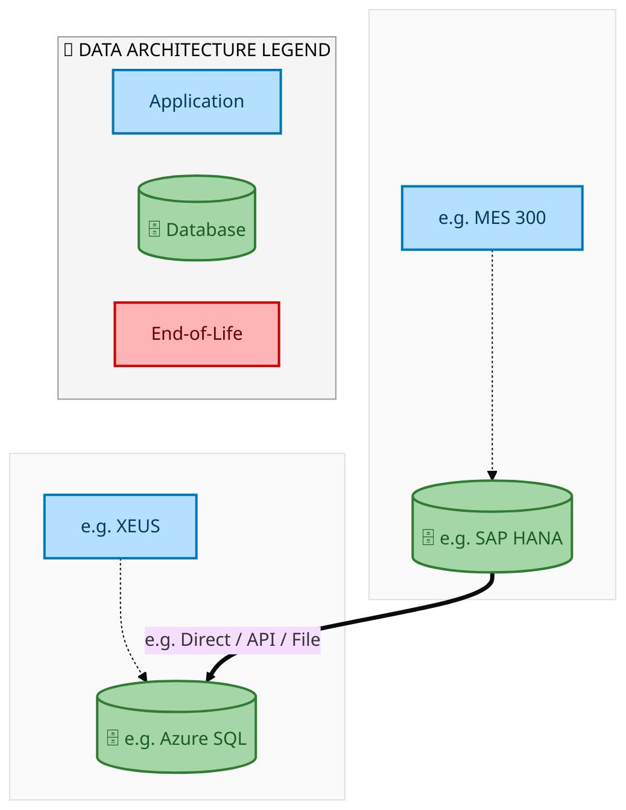
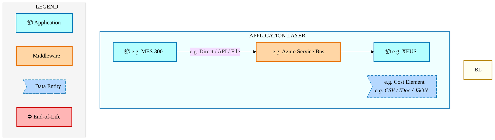
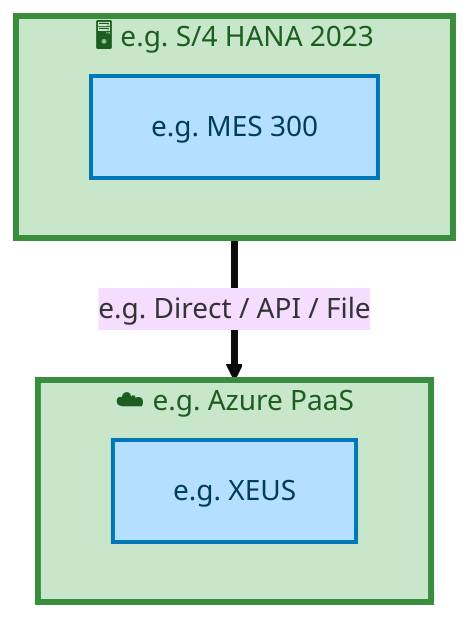

<div style="text-align:center; padding-top:20px;">
  
  <h1 style="font-size:36px; margin-top:24px;">E2E-57 — R3 Subcontracting with Planning integration- Foundry,OSAT,ODM</h1>
  <h2 style="font-size:24px;">Architecture Document (TOGAF BDAT)</h2>
  <p style="font-size:18px; color:#555;">End-to-End Integrated Processes (E2E) Tower<br/>
  Capability E2E-57 · Procure to Pay</p>
  <p style="font-size:14px; color:#888;">IAO Program · Release 2<br/>
  Generated: March 2026<br/>
  Sajiv Francis</p>
  <p style="font-size:12px; color:#aaa;">IAO Architecture Pipeline — Intel Confidential</p>
</div>

<style>
@media print {
  @page { margin: 0.75in; }
  .mermaid { page-break-inside: avoid; overflow: visible; }
  pre, table { page-break-inside: avoid; }
  h2, h3, h4 { page-break-after: avoid; }
}
.mermaid { overflow: visible; }
.mermaid svg { max-width: 100%; height: auto !important; }
.page-footer {
  padding-top: 8px;
  border-top: 1px solid #ddd;
  display: flex;
  justify-content: space-between;
  align-items: center;
  font-size: 11px;
  color: #888;
  position: fixed;
  bottom: 0;
  left: 0;
  right: 0;
  padding: 6px 20px;
  background: #fff;
}
@media print {
  .page-footer { position: fixed; bottom: 0; left: 0.75in; right: 0.75in; }
}
.page-footer a { color: #00aeef; text-decoration: none; font-weight: 500; }
.page-footer a:hover { color: #0071c5; text-decoration: underline; }
</style>

<div class="page-footer"><span>Page 1</span><span><a href="#toc">↑ Back to TOC</a></span><span>E2E-57 — R3 Subcontracting with Planning integration- Foundry,OSAT,ODM</span></div>
<div style="page-break-before: always;"></div>

<a id="toc"></a>

## Table of Contents

1. [Executive Summary](#1-executive-summary)
2. [Business Context & Objectives](#2-business-context--objectives)
   - 2.1 [Classification](#21-classification)
   - 2.2 [Business Drivers](#22-business-drivers)
   - 2.3 [Success Criteria](#23-success-criteria)
   - 2.4 [Companion Documents](#24-companion-documents)
3. [Business Architecture (TOGAF "B")](#3-business-architecture-togaf-b)
   - 3.1 [Business Process Overview](#31-business-process-overview)
   - 3.2 [Business Process Diagrams](#32-business-process-diagrams)
   - 3.3 [Business Roles & Responsibilities](#33-business-roles--responsibilities)
4. [Data Architecture (TOGAF "D")](#4-data-architecture-togaf-d)
   - 4.1 [Data Entities & Ownership](#41-data-entities--ownership)
   - 4.2 [Data Flow Diagrams](#42-data-flow-diagrams)
   - 4.3 [Data Lineage](#43-data-lineage)
   - 4.4 [RICEFW Data Objects](#44-ricefw-data-objects)
   - 4.5 [Data Governance & Quality](#45-data-governance--quality)
5. [Application Architecture (TOGAF "A")](#5-application-architecture-togaf-a)
   - 5.1 [Current-State Application Landscape](#51-current-state--current-state-application-landscape)
   - 5.2 [Future-State Application Landscape](#52-future-state--future-state-application-landscape)
   - 5.3 [Change Impact Summary](#53-change-impact-summary)
   - 5.4 [Component Overview](#54-component-overview)
   - 5.5 [RICEFW Inventory](#55-ricefw-inventory)
   - 5.6 [Integration Patterns](#56-integration-patterns)
6. [Technology Architecture (TOGAF "T")](#6-technology-architecture-togaf-t)
   - 6.1 [Platform & Infrastructure](#61-platform--infrastructure)
   - 6.2 [SAP Development Object Status](#62-sap-development-object-status)
   - 6.3 [NFRs & Design Principles](#63-nfrs--design-principles)
   - 6.4 [Security & Governance](#64-security--governance)
7. [Project Context](#7-project-context)
   - 7.1 [Project Roadmap & Go-Live Plan](#71-project-roadmap--go-live-plan)
   - 7.2 [RAID Log](#72-raid-log)
   - 7.3 [Recommendations & Next Steps](#73-recommendations--next-steps)

<div class="page-footer"><span>Page 2</span><span><a href="#toc">↑ Back to TOC</a></span><span>E2E-57 — R3 Subcontracting with Planning integration- Foundry,OSAT,ODM</span></div>
<div style="page-break-before: always;"></div>

## 1. Executive Summary

This Architecture Document defines the **Business, Data, Application, and Technology** (BDAT) architecture for **E2E-57 R3 Subcontracting with Planning integration- Foundry,OSAT,ODM** within the IAO program. It includes 5 BPMN process diagram(s) in Section 3.
| Dimension | Value |
|-----------|-------|
| **Tower** | End-to-End Integrated Processes (E2E) |
| **Process Group** | Procure to Pay |
| **Capability** | E2E-57 - R3 Subcontracting with Planning integration- Foundry,OSAT,ODM |
| **Release** | Release 2 |
| **Total Systems** | 2 |
| **System Status** | 0 Deployed, 0 Developing, 0 EOL, 2 Pending IAPM |
| **RICEFW Objects** | Pending — Smartsheet Object Tracker API integration |
**Change Summary**: 0 new flow chains, 0 removed, 0 modified, 1 unchanged between Current-State and Future-State states.

> All system nodes in architecture diagrams are **IAPM-linked** — click any node to open its IAPM page. Diagrams require `securityLevel: 'loose'` for click events.

<div class="page-footer"><span>Page 3</span><span><a href="#toc">↑ Back to TOC</a></span><span>E2E-57 — R3 Subcontracting with Planning integration- Foundry,OSAT,ODM</span></div>
<div style="page-break-before: always;"></div>

## 2. Business Context & Objectives

### 2.1 Classification

| Level | Value |
|-------|-------|
| **L0 Tower** | End-to-End Integrated Processes |
| **L1 Process** | Procure to Pay |
| **L2 Capability** | E2E-57 - R3 Subcontracting with Planning integration- Foundry,OSAT,ODM |

### 2.2 Business Drivers

| # | Driver | Description | Strategic Alignment | Priority |
|---|--------|-------------|---------------------|----------|
| 1 | End-to-End Process Integration | Enable cross-tower integrated processes spanning procurement, manufacturing, and fulfillment | IDM 2.0 Process Excellence | High |
| 2 | Intel Foundry Business Enablement | Stand up foundry-specific business processes for external customer engagement | Intel Foundry Services | High |
| 3 | Process Visibility & Monitoring | Provide end-to-end process visibility across tower boundaries with integrated monitoring | Operational Excellence | Medium |
| 4 | E2E-57 Process Migration | Migrate R3 Subcontracting with Planning integration- Foundry,OSAT,ODM business processes and 2 integrated systems from legacy to S/4 HANA target architecture | IDM 2.0 Cross-Functional / End-to-End | High |

<div class="page-footer"><span>Page 4</span><span><a href="#toc">↑ Back to TOC</a></span><span>E2E-57 — R3 Subcontracting with Planning integration- Foundry,OSAT,ODM</span></div>
<div style="page-break-before: always;"></div>

### 2.3 Success Criteria

| Metric | Target | Measure | Baseline | Owner |
|--------|--------|---------|----------|-------|
| E2E Process Cycle Time | Per process SLA | End-to-end transaction completion within defined SLA per process | Varies by process | E2E Process Owner |
| Cross-Tower Integration Success | > 99% | Transactions completing across tower boundaries without manual intervention | 92% (current) | Integration Lead |
| Process Exception Rate | < 2% | Transactions requiring manual exception handling | 8% (current) | Operations Manager |
| E2E-57 Migration Completeness | 100% flow chains validated | All 1 flow chains verified in target state | 0% (pre-migration) | Tower Architect |

### 2.4 Companion Documents

| Document | Description |
|----------|-------------|
| **Business Architecture** | Included in this document (Section 3) — process flows from BPMN diagrams |
| **This Document** | Full BDAT Architecture — Business + Data + Application + Technology |

<div class="page-footer"><span>Page 5</span><span><a href="#toc">↑ Back to TOC</a></span><span>E2E-57 — R3 Subcontracting with Planning integration- Foundry,OSAT,ODM</span></div>
<div style="page-break-before: always;"></div>

## 3. Business Architecture (TOGAF "B")

### 3.1 Business Process Overview

This capability includes **5 business process(es)** modeled in BPMN 2.0, covering the end-to-end workflow for E2E-57 R3 Subcontracting with Planning integration- Foundry,OSAT,ODM.

| # | Step ID | Process Name | Lanes | Tasks | Gateways |
|---|---------|--------------|-------|-------|----------|
| 1 | E2E_57A_R3_OSAT_Manufacturing_with_Planning_Integration_-_HVM | E2E_57A_R3_OSAT_Manufacturing_with_Planning_Integration_-_HVM | Boundary Apps, OSAT, SAP S/4 (IP & IF) | 20 | 9 |
| 2 | E2E_57B_R3_OSAT_Manufacturing_with_Planning_Integration_-_HVM | E2E_57B_R3_OSAT_Manufacturing_with_Planning_Integration_-_HVM | Boundary Apps, Intel Product Receiver site, Intel Product Sender site, OSAT | 20 | 10 |
| 3 | E2E_57C_R3_Intel_Product_to_Intel_Foundry_–_HVM | E2E_57C_R3_Intel_Product_to_Intel_Foundry_–_HVM | Boundary Apps, SAP S/4 Intel Foundry, SAP S/4 Intel Foundry Virtual Plant LE101 | 23 | 15 |
| 4 | E2E_57D_Intel_Product_to_Intel_Foundry_–_HVM | E2E_57D_Intel_Product_to_Intel_Foundry_–_HVM | SAP S/4 Intel Foundry, SAP S/4 Intel Product (Virtual Site) | 17 | 6 |
| 5 | E2E_57E_R3_Intel_Product_to_Intel_Foundry_–_HVM | E2E_57E_R3_Intel_Product_to_Intel_Foundry_–_HVM | Boundary Apps, Intel Product Virtual site, Intel Product Warehouse, SAP S/4 Intel Foundry | 19 | 7 |

### 3.2 Business Process Diagrams

<div class="page-footer"><span>Page 6</span><span><a href="#toc">↑ Back to TOC</a></span><span>E2E-57 — R3 Subcontracting with Planning integration- Foundry,OSAT,ODM</span></div>
<div style="page-break-before: always;"></div>

#### BUSINESS ARCHITECTURE — 3.2.1 E2E_57A_R3_OSAT_Manufacturing_with_Planning_Integration_-_HVM — E2E_57A_R3_OSAT_Manufacturing_with_Planning_Integration_-_HVM

**Swim Lanes**: Boundary Apps · OSAT · SAP S/4 (IP & IF) | **Tasks**: 20 | **Gateways**: 9

> **Legend**: <span style="color:#000;background:#4CAF50;padding:2px 6px;border-radius:10px;font-weight:bold;font-size:9pt">● Start</span> · <span style="color:#fff;background:#C62828;padding:2px 6px;border-radius:10px;font-weight:bold;font-size:9pt">● End</span> · <span style="background:#E3F2FD;padding:2px 6px;border:1px solid #1565C0;font-size:9pt">User Task</span> · <span style="background:#FFF3E0;padding:2px 6px;border:1px solid #E65100;font-size:9pt">Service Task</span> · <span style="background:#FFF9C4;padding:2px 6px;border:1px solid #F57F17;font-size:9pt">◇ Gateway</span> · <span style="background:#F3E5F5;padding:2px 6px;border:1px solid #7B1FA2;font-size:9pt">Sub-Process</span>

```mermaid
%%{init: {'theme': 'base', 'themeVariables': {'fontSize': '14px', 'fontFamily': 'Segoe UI, Arial, sans-serif','primaryColor': '#e8f0fe', 'primaryBorderColor': '#0071c5','lineColor': '#37474F', 'secondaryColor': '#f5f8fc'}, 'flowchart': {'useMaxWidth': false, 'htmlLabels': true, 'curve': 'basis', 'nodeSpacing': 40, 'rankSpacing': 50}} }%%
flowchart LR
    classDef startEvt fill:#4CAF50,stroke:#2E7D32,color:#000,font-weight:bold,stroke-width:2px,rx:20,ry:20
    classDef endEvt fill:#C62828,stroke:#B71C1C,color:#fff,font-weight:bold,stroke-width:2px,rx:20,ry:20
    classDef userTask fill:#E3F2FD,stroke:#1565C0,stroke-width:2px,color:#0D47A1
    classDef serviceTask fill:#FFF3E0,stroke:#E65100,stroke-width:2px,color:#BF360C
    classDef gateway fill:#FFF9C4,stroke:#F57F17,stroke-width:2px,color:#E65100
    classDef subProc fill:#F3E5F5,stroke:#7B1FA2,stroke-width:2px,color:#4A148C
    subgraph Boundary Apps
        n1["Generate Forecast Planning Data Hub"]
        n21(["fa:fa-play Forecast Planning Initiated"])
        n30{{"fa:fa-arrows-alt parallelGateway"}}
        n31{{"fa:fa-arrows-alt parallelGateway"}}
        n38{{"fa:fa-arrows-alt inclusiveGateway"}}
    end
    subgraph OSAT
        n12["Text PO/ Build instructions received with commercial info"]
        n13["Text PO Acknowledgement"]
        n14["Production Order Commit"]
        n15["Receive STO with Build Instruction info"]
        n16["Execute Manufacturing at OSAT"]
        n17["Component consumption"]
        n18["Scrap confirmation for Lot"]
        n19["OSAT Production order complete"]
        n20["Perform PRF-RTF Process"]
        n23(["fa:fa-play Start Manufacturing at OSAT"])
        n28(["fa:fa-stop STO Information Recieved"])
        n29["E2E 57B R3 OSAT to Intel 3PL/Warehouse Physical Inventory Movement - HVM"]
        n34{{"fa:fa-arrows-alt parallelGateway"}}
        n35{{"fa:fa-arrows-alt parallelGateway"}}
        n36{{"fa:fa-arrows-alt parallelGateway"}}
        n37{{"fa:fa-arrows-alt parallelGateway"}}
    end
    subgraph SAP S/4 (IP & IF)
        n2["Create/Release Production Order"]
        n3["Create Text Item Purchase Requisition"]
        n4["Create Text Item Purchase Order"]
        n5["Calculate Taxes"]
        n6["Trigger GTS Check"]
        n7["Post Goods Issue"]
        n8["Create Stock Transport Request (With Prod. Order Reference)"]
        n9["Create Stock Transport Order"]
        n10["Scrap confirmation against production order"]
        n11["Purchase Order Confirmed"]
        n22(["fa:fa-play Stock Transport Request to be Initiated"])
        n24(["fa:fa-stop Purchase Order Created"])
        n25(["fa:fa-stop Purchase Order Confirmation Received"])
        n26(["fa:fa-stop Consumption Posted in S/4"])
        n27(["fa:fa-stop Consumption Posted in S/4"])
        n32{{"fa:fa-arrows-alt parallelGateway"}}
        n33{{"fa:fa-arrows-alt parallelGateway"}}
    end
    n4 --> n32
    n32 --> n5
    n32 --> n6
    n6 --> n33
    n5 --> n33
    n30 --> n2
    n12 --> n34
    n13 --> n35
    n22 --> n8
    n8 --> n9
    n33 --> n24
    n2 -->|"Text PO Process"| n3
    n34 --> n13
    n34 --> n35
    n35 --> n14
    n32 -->|"PIP 3A4 via E2Open
with commercial info"| n12
    n16 --> n17
    n17 --> n36
    n38 --> n30
    n21 --> n1
    n31 --> n20
    n31 --> n38
    n36 --> n18
    n36 -->|"PIP 7B1 via E2Open"| n7
    n1 -->|"Forecast 4A5"| n31
    n20 -->|"Forecast 4A3"| n38
    n3 --> n4
    n14 --> n11
    n11 --> n25
    n9 -->|"PIP 3A13 via E2Open"| n15
    n15 --> n28
    n23 --> n16
    n7 --> n26
    n10 --> n27
    n19 -->|"PIP 7B1 via E2Open"| n29
    n18 --> n37
    n37 --> n19
    n37 -->|"PIP 7B1 Via E2Open"| n10
    class n21 startEvt
    class n22 startEvt
    class n23 startEvt
    class n24 endEvt
    class n25 endEvt
    class n26 endEvt
    class n27 endEvt
    class n28 endEvt
    class n29 startEvt
    class n30 gateway
    class n31 gateway
    class n32 gateway
    class n33 gateway
    class n34 gateway
    class n35 gateway
    class n36 gateway
    class n37 gateway
    class n38 gateway
```

<div style="text-align:center; margin:4px 0 8px 0; font-size:11px;"><a href="https://mermaid.live/view#pako:eNqlWF1v4kYU_Ssjr1J2JWj8iYGHSkBwFilRENDdh6YPgz2GUYzHHduQNMt_7x17BrAxWzXlIZIP95x77_G9Y5N3zWcB0Qbazc07jWk2QO-tbEO2pDVArRVOSauNSuAb5hSvIpK2REzI4mxB_y7CDDt5FWEC8_CWRm8CXZA1I-j3aRsNgRi1UYrjtJMSTsNWu5VwusX8bcwixkX0J9IL9bDIJr8aMR4QfgrQddfwHaBGNCYn2HJt1_YELyU-i4OKaOiEvdBvHURxEdv7G8yzovw8JY_49TsNsg1chzhKCcRssm30gFckEj1mPBeYn_OdMoOmIk8Mhi0S7NN4DbitA8Rx_HKCHP1wQIebm-f4mBQ9zJ9jBB8_wml6R0KUZgBPdhkKaRQNPtnjoefo7TTj7IUMPpkT984y277oZACt621hbmdP6HqTDVYsCmRoZy96GJjJa5u_Dky9zd_gby0XiYNTpnHX7Jm9Y6aRa4yNscoUhuH_ygS-8iVOX2SuieWZ3t0xl-F0nbF-qafavLPdoVH3ifAd9cmZqOd51uRk1aTrGPp10ZFndfVxTXSNM7LHbyfB_tg-CnqO6xnuVcEyX73KfDXjzFeC1sTxnKOgOzK8oXlV0B4adk9WCDprjpMNGrG8mGU0TJK0_E58YuOPZ-2exIRDB8hjnPg4zdAswnEMw4fucIbR13z1rP15RjKNz0AL8SDEnSSCvi-JU9h9CpoBML-cUS39_V1RMedsn3ZwlKEEcxxFJLovjXzWDodzkvERUq-RRGM_ylO6IxcsmOqaaU-L4fLcKxO6XpJXaPPpFo1yGgUgB7ch9zPK4hSBCQSUA7Sn2Qb5bLsl3IezCqJCVrXQsE5aaOi_xGwfkWAN52Kc1SJtiIRhCMos6EkcY2gM4rQe6UDkvKwBLZZPZRllndNTnU3VdIE5eSV-DlPwiOM8xH6Wc3EjcVbaUI13IR5KSFgM9UKncZpvEyFei-tB3MIHM0VMSPkWFxWEjKMHVi-_D8EiFzrrtji0hZVJRDJSG0NdOEM4qG3RbO515ktPcH2SprVIqzawC3FaXu30fGDN3omaZiwpjJ3GImfZCxhOye5i0E3RzcScIMcdoblVSKOMATUjEbJmD7ffMScbBiccmm3eUurDnEzjHfjJYE0f2a6YBdRBX789Vrux7I-sg_MRUvcjJPe_kS73bjGcocWtjT5PZ-gXNPUqvorJ4wREbuckIljYV1uOmltHAir2bZoRmJacw3MUuHPyV05Tejm69k9pDXnE8o1x5OdRwcGvpDaEYseWnK7XMND3ywUab4j_Ug0RazVjcI7eMxakaJqmeW3me6eyFhnzX9AS3hXShME0i1YIcD9_F2svTPlVHhZzEhJOYp98qYr1r4s1NGjozcuM11icgiipbW2NLZ40Vf_gECtkit05v8XmxbY2dwrrtCJXHzWmXdvcevai8wuW8y-s89blYXuh0a1pjE8HJBL3l4gHhxjxOtH9INEyP7Ko1gcXNbZRp_ObyCqvLbMEnNp1V153Zbwlr53ataWXgNIzJN-yFWBJQGUwZURPXvfKy74SlPGmEijCf5weucfHxA8IViTZllEHjlktWbhhVxoF3RkcVdbQRjuK0cR8Skj8HDe_BfwQ7am2pDGGqwBXZlTOWbIxS1eNGJKiAuS1enU-ApayxlJJqoAsGl4mz4sW5R2LkWHHtzt76JSGqeSmfhlilSHHZGXy441UHisJQ9WvPO5XHIUbX6vOUIGGvBmmSmXKXIYyT5ppqmtDjdmxw_7PnTDVPBnqNiimJbWNfgU4k_pWK_v8Fb-4jeoXWxU3r-DWFdyWv8aqqNOIdhtRtxHtNaL95ipgf-VPoCpsNMNmM2w1w3Yz7DTD3WbYbYZ7CtbaGqzpFtNAG7xrxT8otIEWkBDnUaYd2hrOM7Z4i31tUPyQ1_IkAOYdxfDKsi3Bwz8d9jZU" title="View in Mermaid Live">&#128065; View in Mermaid Live</a></div>

<div class="page-footer"><span>Page 7</span><span><a href="#toc">↑ Back to TOC</a></span><span>E2E-57 — R3 Subcontracting with Planning integration- Foundry,OSAT,ODM</span></div>
<div style="page-break-before: always;"></div>

#### BUSINESS ARCHITECTURE — 3.2.2 E2E_57B_R3_OSAT_Manufacturing_with_Planning_Integration_-_HVM — E2E_57B_R3_OSAT_Manufacturing_with_Planning_Integration_-_HVM

**Swim Lanes**: Boundary Apps · Intel Product Receiver site · Intel Product Sender site · OSAT | **Tasks**: 20 | **Gateways**: 10

```mermaid
%%{init: {'theme': 'base', 'themeVariables': {'fontSize': '14px', 'fontFamily': 'Segoe UI, Arial, sans-serif','primaryColor': '#e8f0fe', 'primaryBorderColor': '#0071c5','lineColor': '#37474F', 'secondaryColor': '#f5f8fc'}, 'flowchart': {'useMaxWidth': false, 'htmlLabels': true, 'curve': 'basis', 'nodeSpacing': 40, 'rankSpacing': 50}} }%%
flowchart LR
    classDef startEvt fill:#4CAF50,stroke:#2E7D32,color:#000,font-weight:bold,stroke-width:2px,rx:20,ry:20
    classDef endEvt fill:#C62828,stroke:#B71C1C,color:#fff,font-weight:bold,stroke-width:2px,rx:20,ry:20
    classDef userTask fill:#E3F2FD,stroke:#1565C0,stroke-width:2px,color:#0D47A1
    classDef serviceTask fill:#FFF3E0,stroke:#E65100,stroke-width:2px,color:#BF360C
    classDef gateway fill:#FFF9C4,stroke:#F57F17,stroke-width:2px,color:#E65100
    classDef subProc fill:#F3E5F5,stroke:#7B1FA2,stroke-width:2px,color:#4A148C
    subgraph Boundary Apps
        n1["Planning Data Hub"]
        n2["Receive Manual invoices through OCR"]
        n3["Receive Incoming invoice/ B2B/OpenText/Web suite"]
        n4["ReadSoft Validation/Exception Handling based on rules setup"]
        n29{{"fa:fa-code-branch B2B or OCR?"}}
        n30{{"fa:fa-code-branch exclusiveGateway"}}
    end
    subgraph Intel Product Receiver site
        n16["Inbound Del. Created at Receiving Site"]
        n17["Post Goods Receipt against STO"]
        n27(["fa:fa-stop Goods Receipt Posted"])
        n38{{"fa:fa-arrows-alt inclusiveGateway"}}
    end
    subgraph Intel Product Sender site
        n5["Perform Outbound Delivery"]
        n6["Perform Pick and Pack Updates"]
        n7["Post Goods Issue (Virtual)"]
        n8["IC Invoice Trading Str Dependent"]
        n9["Goods receipt against prod order"]
        n10["Prod order confirmation Partial/Full (TECO for final shipment)"]
        n11["Evaluated Receipt Settlement (ERS) Self-Billing"]
        n12["Goods Receipt against Text PO"]
        n13["Export Invoice"]
        n14["Create Commercial Invoice (Proforma)"]
        n15["Post Supplier invoice"]
        n23(["fa:fa-stop IC Invoice Generated"])
        n24(["fa:fa-stop Export Invoice Generated"])
        n25(["fa:fa-stop Commercial Invoice Generated"])
        n26(["fa:fa-stop Supplier Invoice Posted"])
        n28["E2E 57A R3 OSAT Manufacturing with Planning Integration"]
        n31{{"fa:fa-code-branch Invoice Accepted?"}}
        n33{{"fa:fa-arrows-alt parallelGateway"}}
        n34{{"fa:fa-arrows-alt parallelGateway"}}
        n35{{"fa:fa-arrows-alt parallelGateway"}}
        n36{{"fa:fa-arrows-alt parallelGateway"}}
        n37{{"fa:fa-arrows-alt parallelGateway"}}
    end
    subgraph OSAT
        n18["Goods Picked up ASN w.r.t STO"]
        n19["Physical Receipt at 3PL"]
        n20["Supplier Invoice"]
        n21(["fa:fa-play Initiate Goods Receipt at 3PL Upon arrival of shipment"])
        n22(["fa:fa-play Raise/Correct Supplier Invoice"])
        n32{{"fa:fa-code-branch exclusiveGateway"}}
    end
    n5 --> n6
    n6 --> n7
    n7 --> n33
    n33 --> n16
    n17 --> n27
    n8 --> n23
    n13 --> n24
    n36 --> n14
    n36 --> n13
    n28 --> n34
    n34 --> n9
    n34 --> n10
    n9 --> n35
    n10 --> n35
    n35 --> n12
    n16 --> n38
    n12 --> n37
    n37 --> n18
    n33 --> n36
    n14 --> n25
    n37 --> n11
    n21 --> n19
    n31 -->|"Yes"| n15
    n4 --> n31
    n15 --> n26
    n29 -->|"OCR"| n2
    n3 --> n30
    n29 -->|"B2B"| n3
    n20 --> n29
    n30 --> n4
    n2 --> n30
    n11 --> n30
    n31 -->|"No"| n32
    n32 --> n20
    n18 --> n5
    n22 --> n32
    n33 -->|"Applicable for Diff. Company Code"| n8
    n38 --> n17
    n19 -->|"Upon Physical Receipt
4B2"| n38
    class n21 startEvt
    class n22 startEvt
    class n23 endEvt
    class n24 endEvt
    class n25 endEvt
    class n26 endEvt
    class n27 endEvt
    class n28 startEvt
    class n29 gateway
    class n30 gateway
    class n31 gateway
    class n32 gateway
    class n33 gateway
    class n34 gateway
    class n35 gateway
    class n36 gateway
    class n37 gateway
    class n38 gateway
```

> **Legend**: <span style="color:#000;background:#4CAF50;padding:2px 6px;border-radius:10px;font-weight:bold;font-size:9pt">● Start</span> · <span style="color:#fff;background:#C62828;padding:2px 6px;border-radius:10px;font-weight:bold;font-size:9pt">● End</span> · <span style="background:#E3F2FD;padding:2px 6px;border:1px solid #1565C0;font-size:9pt">User Task</span> · <span style="background:#FFF3E0;padding:2px 6px;border:1px solid #E65100;font-size:9pt">Service Task</span> · <span style="background:#FFF9C4;padding:2px 6px;border:1px solid #F57F17;font-size:9pt">◇ Gateway</span> · <span style="background:#F3E5F5;padding:2px 6px;border:1px solid #7B1FA2;font-size:9pt">Sub-Process</span>



<div style="text-align:center; margin:4px 0 8px 0; font-size:11px;"><a href="https://mermaid.live/view#pako:eNqlWF1v4jgU_StWRhUdCVriJITysCugMFNpZlqVzoxWwz6YxClWTRI5Tgvb4b_vdbADmPRhu31o8eGe-32vk746URZTZ-Ccnb2ylMkBem3JJV3R1gC1FqSgrTbaAT-IYGTBadFSMkmWyhn7pxJz_XytxBQ2JSvGNwqd0ceMou83bTQEIm-jgqRFp6CCJa12KxdsRcRmnPFMKOkPtJ90k8qa_mqUiZiKvUC3G7pRAFTOUrqHvdAP_aniFTTK0vhIaRIk_SRqbZVzPHuJlkTIyv2yoF_J-ieL5RLOCeEFBZmlXPEvZEG5ilGKUmFRKZ5NMlih7KSQsFlOIpY-Au53ARIkfdpDQXe7Rduzs3laG0Vf7ucpgp-Ik6K4pgkqJMCTZ4kSxvnggz8eToNuu5Aie6KDD3gSXnu4HalIBhB6t62S23mh7HEpB4uMx1q086JiGOB83RbrAe62xQZ-W7ZoGu8tjXu4j_u1pVHojt2xsZQkyf-yBHkVD6R40rYm3hRPr2tbbtALxt1TfSbMaz8cunaeqHhmET1QOp1Ovck-VZNe4HbfVjqaer3u2FL6SCR9IZu9wquxXyucBuHUDd9UuLNne1ku7kQWGYXeJJgGtcJw5E6H-E2F_tD1-9pD0PMoSL5Eo6ysehkN87zYfad-UvfX3LnjJE2h1dA1kQR9Lhdz5-8DEQwi9zSi7JmiryQtCUcsfc4giQWSS5GVj0t0O74_JnkHpJs0ylZKv6ZdohEeXd7mNH2ga3n5ky7ATybpsQa_0kDiWZZI9INwFhPJsvRyso5orj6hzySNudKr9kqMABEl7BMosSxzK4ar19e5k5BBQjpqQXUWMGLRUjmCMqHc_3PubLeHAXSbGXQd8bKAsD7tar6nwVRYSb9JJeUIChmXkUQ6HQIVKtaDEvQg0pt0oSqErim_QGNBQXmMiCGpIGcnGXJDVbyskOhTlsXFTjaXiDwSlgI6e7i1shCe_zIxFTLLLZ5SRWOgfDzMQ3-fByJE9lJ0CJdQyvemYQYCp0kIVChUJJlYodtS1slQCdscR9E7EL1j0ROCNkB3BD58z6FHaHEsbiXppihKis5_MCGhkz8ey_ZVJcbgcNWn6EGQuEq9FOBLrhxP5THjChg7xcLKfg7xourOsarWVQ7VXyK4ZBImVlVzQxhCwuV2OS05R-cPk_EtgjhhDaQwdcWS5SvwwHLaVTM8eSa8rJrGVHNGpeRUyaPzyf3sIwA86YxgoUBIlgZcR2H3kJpQdGf1kaume7LOM7iIdK4sATW8uy5G42y1oiKCqOq8nkP4qnzEjiQwtZqVec4ZZIc1qcee1ccHNftEUyrIaR9j3-Ic-_82L7B4DfG8ye1Z3Dosw2wcOazacIInKAiH6N5Dt7PhQ7V5ExLJUqiOfGFyieq9rQYMRk11kLWF3eYlZswPI7VLaXyy_LzGoc-JIJxTfjLzO5L_HlLwHlLvPaTwv5FO95iqw2G39uupUWsIRq_M0XD2Db1ciIuG7euqXXG33BQsgt6pB00i7-6L1d9qRdi9Yom4-9bKOTx63MDDNlPzZs1xpR42IywXiJrBmkBZUq8Su_OwpfWesIJejjMB202iBpeOrgr87iszDVCn8wfsdn3s7Y6hPoa7o-fps-ftANfIu1oCG0Zfnw3D1QzsGxXahHsCGArWOrxawt8BV9bZ1U9v6ZUmBMZo1wI8HaaLjYQ26vUNgDVgAvF0ZG7fit2rY9du4MCmuCYSVwO15xXwe-78pW7L32rz6m-0Ls9QXe0xNtbwlaZWj3xANaEYt7q2IDxjVYJ1XnVWcO2NBkyesaXJdS2gdv9bttNc-6CpuKbqGprwsNGNj7IJqoaqtSP1QlrduNcsSS7Urs9JuoG_Ma0s1UXQel1TJtdEW02aPeXz1B_hnav9gyf9qjLmxe0Yx2_gnn75Okb9RjRoRHuNaNiI9t_w4sq88RzBUMdG2G2GcTPsNcN-Mxw0w71mOGyG-wZ22g7c7SvCYmfw6lT_pnAGTkwTUnLpbNsOKWU226SRM6he552yeuK8ZgRuiNUO3P4L4u45Rg==" title="View in Mermaid Live">&#128065; View in Mermaid Live</a></div>

<div class="page-footer"><span>Page 8</span><span><a href="#toc">↑ Back to TOC</a></span><span>E2E-57 — R3 Subcontracting with Planning integration- Foundry,OSAT,ODM</span></div>
<div style="page-break-before: always;"></div>

#### BUSINESS ARCHITECTURE — 3.2.3 E2E_57C_R3_Intel_Product_to_Intel_Foundry_–_HVM — E2E_57C_R3_Intel_Product_to_Intel_Foundry_–_HVM

**Swim Lanes**: Boundary Apps · SAP S/4 Intel Foundry · SAP S/4 Intel Foundry Virtual Plant LE101 | **Tasks**: 23 | **Gateways**: 15

```mermaid
%%{init: {'theme': 'base', 'themeVariables': {'fontSize': '14px', 'fontFamily': 'Segoe UI, Arial, sans-serif','primaryColor': '#e8f0fe', 'primaryBorderColor': '#0071c5','lineColor': '#37474F', 'secondaryColor': '#f5f8fc'}, 'flowchart': {'useMaxWidth': false, 'htmlLabels': true, 'curve': 'basis', 'nodeSpacing': 40, 'rankSpacing': 50}} }%%
flowchart LR
    classDef startEvt fill:#4CAF50,stroke:#2E7D32,color:#000,font-weight:bold,stroke-width:2px,rx:20,ry:20
    classDef endEvt fill:#C62828,stroke:#B71C1C,color:#fff,font-weight:bold,stroke-width:2px,rx:20,ry:20
    classDef userTask fill:#E3F2FD,stroke:#1565C0,stroke-width:2px,color:#0D47A1
    classDef serviceTask fill:#FFF3E0,stroke:#E65100,stroke-width:2px,color:#BF360C
    classDef gateway fill:#FFF9C4,stroke:#F57F17,stroke-width:2px,color:#E65100
    classDef subProc fill:#F3E5F5,stroke:#7B1FA2,stroke-width:2px,color:#4A148C
    subgraph Boundary Apps
        n1["Generate Forecast Planning Data Hub"]
        n24(["fa:fa-play Initiate Process"])
    end
    subgraph SAP S/4 Intel Foundry
        n9["Update UDF Table"]
        n10["Capture Sales Order via utility"]
        n11["Validate Order"]
        n12["Derive MMID from CPN"]
        n13["Credit Check (via FSCM)"]
        n14["Trigger GTS check"]
        n15["Hold"]
        n16["Calculate Pricing (for customs)"]
        n17["CTP Check"]
        n18["Partially Confirmed"]
        n19["Unconfirmed"]
        n20["Order Confirmed"]
        n21["Tax Calculations"]
        n22["Manual Price Override"]
        n23["Manage Back orders"]
        n26(["fa:fa-stop Sales Orders are Managed"])
        n27(["fa:fa-stop Tax Calculated"])
        n28["E2E 57E R3 Intel Product to Intel Foundry – HVM"]
        n29["E2E 57D Intel Product to Intel Foundry – HVM"]
        n30{{"fa:fa-code-branch exclusiveGateway"}}
        n35{{"fa:fa-arrows-alt parallelGateway"}}
        n36{{"fa:fa-arrows-alt parallelGateway"}}
        n37{{"fa:fa-arrows-alt parallelGateway"}}
        n38{{"fa:fa-arrows-alt parallelGateway"}}
        n39{{"fa:fa-arrows-alt parallelGateway"}}
        n40{{"fa:fa-arrows-alt parallelGateway"}}
        n41{{"fa:fa-arrows-alt parallelGateway"}}
        n42{{"fa:fa-arrows-alt parallelGateway"}}
        n43{{"fa:fa-arrows-alt parallelGateway"}}
        n44{{"fa:fa-arrows-alt inclusiveGateway"}}
    end
    subgraph SAP S/4 Intel Foundry Virtual Plant LE101
        n2["Create/Release Production Order"]
        n3["Build Instructions Enhanced IDOC with Commercial Info"]
        n4["Text item Purchase Requisition"]
        n5["Create Text Item Purchase Order"]
        n6["Trigger GTS Check"]
        n7["Tax Calculations"]
        n8["Purchase Order Created"]
        n25(["fa:fa-stop Text Purchase Order Created"])
        n31{{"fa:fa-arrows-alt parallelGateway"}}
        n32{{"fa:fa-arrows-alt parallelGateway"}}
        n33{{"fa:fa-arrows-alt parallelGateway"}}
        n34{{"fa:fa-arrows-alt parallelGateway"}}
    end
    n24 --> n1
    n10 --> n11
    n11 --> n12
    n12 --> n13
    n14 --> n36
    n36 --> n41
    n36 --> n35
    n16 --> n40
    n19 --> n37
    n37 --> n23
    n18 --> n38
    n38 --> n37
    n38 --> n39
    n30 --> n39
    n40 --> n17
    n41 --> n16
    n31 --> n3
    n2 --> n32
    n32 --> n4
    n4 --> n5
    n5 --> n33
    n33 --> n6
    n9 --> n42
    n42 --> n28
    n42 --> n10
    n44 --> n11
    n43 --> n14
    n13 --> n43
    n43 --> n35
    n41 --> n22
    n22 --> n40
    n40 --> n21
    n33 --> n7
    n7 --> n34
    n6 --> n34
    n34 --> n8
    n35 --> n15
    n8 --> n25
    n30 -->|"Confrimed"| n18
    n17 --> n30
    n30 -->|"Unconfirmed"| n19
    n23 --> n26
    n39 --> n20
    n15 --> n44
    n20 --> n29
    n21 --> n27
    n33 --> n31
    n32 --> n31
    n3 -->|"Customized XML (via E2Open)"| n9
    class n24 startEvt
    class n25 endEvt
    class n26 endEvt
    class n27 endEvt
    class n28 startEvt
    class n29 startEvt
    class n30 gateway
    class n31 gateway
    class n32 gateway
    class n33 gateway
    class n34 gateway
    class n35 gateway
    class n36 gateway
    class n37 gateway
    class n38 gateway
    class n39 gateway
    class n40 gateway
    class n41 gateway
    class n42 gateway
    class n43 gateway
    class n44 gateway
```

> **Legend**: <span style="color:#000;background:#4CAF50;padding:2px 6px;border-radius:10px;font-weight:bold;font-size:9pt">● Start</span> · <span style="color:#fff;background:#C62828;padding:2px 6px;border-radius:10px;font-weight:bold;font-size:9pt">● End</span> · <span style="background:#E3F2FD;padding:2px 6px;border:1px solid #1565C0;font-size:9pt">User Task</span> · <span style="background:#FFF3E0;padding:2px 6px;border:1px solid #E65100;font-size:9pt">Service Task</span> · <span style="background:#FFF9C4;padding:2px 6px;border:1px solid #F57F17;font-size:9pt">◇ Gateway</span> · <span style="background:#F3E5F5;padding:2px 6px;border:1px solid #7B1FA2;font-size:9pt">Sub-Process</span>



<div style="text-align:center; margin:4px 0 8px 0; font-size:11px;"><a href="https://mermaid.live/view#pako:eNqlWF1v2zYU_SuEisAtYKMSSVm2HwYkttUWaNYgTrMByx4YibKJyJJHSUm81P99lxIp25yMbV4eAujonnM_eHlF-s2J8pg7E-fi4k1kopygt1654mvem6DeIyt4r48a4J5JwR5TXvSUTZJn5UL8WZt5dPOqzBQWsrVItwpd8GXO0fcvfXQJxLSPCpYVg4JLkfT6vY0Uaya30zzNpbJ-x0eJm9Te9KurXMZc7g1cN_AiH6ipyPgeJgENaKh4BY_yLD4STfxklES9nQouzV-iFZNlHX5V8Gv2-ouIyxU8JywtONisynX6lT3yVOVYykphUSWfTTFEofxkULDFhkUiWwJOXYAky572kO_udmh3cfGQtU7R19uHDMFflLKimPEEFSXA8-cSJSJNJ-_o9DL03X5RyvyJT97heTAjuB-pTCaQuttXxR28cLFclZPHPI216eBF5TDBm9e-fJ1gty-38N_yxbN472k6xCM8aj1dBd7UmxpPSZL8L09QV3nHiifta05CHM5aX54_9Kfu3_VMmjMaXHp2nbh8FhE_EA3DkMz3pZoPfc89LXoVkqE7tUSXrOQvbLsXHE9pKxj6QegFJwUbf3aU1eONzCMjSOZ-6LeCwZUXXuKTgvTSoyMdIegsJdus0FVe1b2MLjebonmn_jLvtwfnE8-4hAxQmEsesaJENynLMmg-NGMlQ5-rxwfn9wMSpu-BlrBJwgabFPL-AjtdKAUVNC8KMP_Q2EOrWJEsLm_Q4iMFTslTcAlxye2B-Bikv29ipfZ9FqI7NSOO3XsumEzZpqwkRwsGIwR9U3sbPQuGqlKkotxaDJXmPUtFLVsbWwYYDGYwS545ur7-MkOJzNdoevOzZUaUZ8ljUaLpikdP6L3yGS6m1x8sSwqWd1IslxDXp7sFipS5ZeODzWfYERY8rNNLoyptSirUHEDvk1yiqCrKfF3YzgLFuLtpYrLejeDdDcwGmJnpFk3zLBFyzW2fddWzqPstVgVvSnyCj1WB79grMnGLPCssE1Xia5ZVLK1zgnV45lKK2FpdTBo7tuToikGJ67ltiw33HQgV2Ry2QYEY9EWjEO87seEFFu8w5r9bq9rN8Rz5wRzdEt2y0ONxFZWozI97GD1U2PUI-nx_bQU7bmVm52oQ9-3NBK6-sINH-EZEK8Rfo7QqoG0_NSPowdntDmn-nsakzF-KAUtLtGESuoGnJ0jDc0jBOaTROaTxGSTqnkPyziHhc0jkHBLtJInsVEv8y2GM7oUs620KnwE4asw91zts52YGgvjHW55yONOZdoZN3zVc1Ya-qkQagxv4aDWGBZpnK2hhDujs2xS9iHIF02W95jKCUQWmSX4sU09U_goJlnyNbioJJyHwfcv_qEQhlOaxvd_GiWralyNaR5xDa2R3TNPgH8dcPW6PnKAmCHti-vYkUjGeZB6OJXJOW5Jz2pKc05aE_jdS25VwrkCDwU_wNdLPnqufW8DTADYA1gAxgJYgQw2QYQNQzwKIbyjGwjXAWFsEhhI0AG69jLTFyFiMbIoBxgZwLYCa5AyFmuTa0DVgvOpciUmeaIAagebR5OVrc0MnpAGMvM6SGjmq5fDIAjxTGEqt9aBa0jMheBqgxLJoq22yxMYtxlb5TWGwZwVuCqVXgxinQ-uZ6DDbxdGV8EwMem2wf7Q2P2BcwOkGbotqx_1Qq2yyMh5dm3B0ZFIUs7pYx4zbxdTlxm2X6aioCRubvFsNU6rAKgTxrA7YAyaR-pwI9-kY_Xr9tTmlzvG3Dc8-1HGOD-4b9b4z18dj3NdXvWN02IkGnejohPK4G4fC6rvUMex1w7gbJt0w7Yb9bnjYDQfd8KgbHnfCtDtL2p0l7c6SdmdJ2yydvgMf0zUTsTN5c-rfXJyJE_OEVWnp7PoOq8p8sc0iZ1L_NuFU9a1rJhicDdYNuPsLFx9gmw==" title="View in Mermaid Live">&#128065; View in Mermaid Live</a></div>

<div class="page-footer"><span>Page 9</span><span><a href="#toc">↑ Back to TOC</a></span><span>E2E-57 — R3 Subcontracting with Planning integration- Foundry,OSAT,ODM</span></div>
<div style="page-break-before: always;"></div>

#### BUSINESS ARCHITECTURE — 3.2.4 E2E_57D_Intel_Product_to_Intel_Foundry_–_HVM — E2E_57D_Intel_Product_to_Intel_Foundry_–_HVM

**Swim Lanes**: SAP S/4 Intel Foundry · SAP S/4 Intel Product (Virtual Site) | **Tasks**: 17 | **Gateways**: 6

> **Legend**: <span style="color:#000;background:#4CAF50;padding:2px 6px;border-radius:10px;font-weight:bold;font-size:9pt">● Start</span> · <span style="color:#fff;background:#C62828;padding:2px 6px;border-radius:10px;font-weight:bold;font-size:9pt">● End</span> · <span style="background:#E3F2FD;padding:2px 6px;border:1px solid #1565C0;font-size:9pt">User Task</span> · <span style="background:#FFF3E0;padding:2px 6px;border:1px solid #E65100;font-size:9pt">Service Task</span> · <span style="background:#FFF9C4;padding:2px 6px;border:1px solid #F57F17;font-size:9pt">◇ Gateway</span> · <span style="background:#F3E5F5;padding:2px 6px;border:1px solid #7B1FA2;font-size:9pt">Sub-Process</span>

```mermaid
%%{init: {'theme': 'base', 'themeVariables': {'fontSize': '14px', 'fontFamily': 'Segoe UI, Arial, sans-serif','primaryColor': '#e8f0fe', 'primaryBorderColor': '#0071c5','lineColor': '#37474F', 'secondaryColor': '#f5f8fc'}, 'flowchart': {'useMaxWidth': false, 'htmlLabels': true, 'curve': 'basis', 'nodeSpacing': 40, 'rankSpacing': 50}} }%%
flowchart TD
    classDef startEvt fill:#4CAF50,stroke:#2E7D32,color:#000,font-weight:bold,stroke-width:2px,rx:20,ry:20
    classDef endEvt fill:#C62828,stroke:#B71C1C,color:#fff,font-weight:bold,stroke-width:2px,rx:20,ry:20
    classDef userTask fill:#E3F2FD,stroke:#1565C0,stroke-width:2px,color:#0D47A1
    classDef serviceTask fill:#FFF3E0,stroke:#E65100,stroke-width:2px,color:#BF360C
    classDef gateway fill:#FFF9C4,stroke:#F57F17,stroke-width:2px,color:#E65100
    classDef subProc fill:#F3E5F5,stroke:#7B1FA2,stroke-width:2px,color:#4A148C
    subgraph SAP S/4 Intel Foundry
        n8["Production Order (SO Line item)"]
        n9["Production Order Release"]
        n10["Manufacturing Execution"]
        n11["Component Consumption"]
        n12["Yield Confirmation"]
        n13["Goods Receipt (Value Added)"]
        n14["Outbound delivery"]
        n15["Pick Pack Updates"]
        n16["Post Goods Issue"]
        n17["TM Embedded"]
        n20(["fa:fa-stop Transportation Management Process Initiated"])
        n22["E2E 57E R3 Intel Product to Intel Foundry – HVM"]
        n26{{"fa:fa-arrows-alt parallelGateway"}}
        n27{{"fa:fa-arrows-alt parallelGateway"}}
        n28{{"fa:fa-arrows-alt parallelGateway"}}
        n29{{"fa:fa-arrows-alt parallelGateway"}}
    end
    subgraph SAP S/4 Intel Product (Virtual Site)
        n1["Goods Issue against Production Order"]
        n2["Goods Issue against Production Order"]
        n3["Goods Receipt against Production Order"]
        n4["Prod Order Confirmation Partial/Full (TECO for final shipment)"]
        n5["Goods Receipt against Text PO"]
        n6["Evaluated Receipt Settlement (ERS Self Billing)"]
        n7["Order Confirmation Feed"]
        n18(["fa:fa-stop Consumption Posted in S/4"])
        n19(["fa:fa-stop Consumption Posted in S/4"])
        n21["E2E 57E R3 Intel Product to Intel Foundry – HVM"]
        n23["E2E 57C R3 OSAT Manufacturing with Planning Integration - HVM"]
        n24{{"fa:fa-arrows-alt parallelGateway"}}
        n25{{"fa:fa-arrows-alt parallelGateway"}}
    end
    n8 --> n9
    n9 --> n10
    n10 --> n11
    n11 --> n26
    n26 --> n12
    n12 --> n27
    n27 --> n13
    n13 -->|"Value Addition to Product
Product Costing Steps 
Execution"| n14
    n5 --> n6
    n27 -->|"PIP 7B1 via E2Open"| n2
    n26 -->|"PIP 7B1 via E2Open"| n1
    n14 --> n28
    n28 --> n15
    n6 --> n21
    n16 --> n29
    n1 --> n18
    n2 --> n19
    n23 --> n7
    n28 --> n17
    n17 --> n20
    n29 --> n22
    n15 --> n16
    n29 -->|"PIP 3B2 via E2Open"| n25
    n25 --> n4
    n25 --> n3
    n3 --> n24
    n4 --> n24
    n24 --> n5
    class n18 endEvt
    class n19 endEvt
    class n20 endEvt
    class n21 startEvt
    class n22 startEvt
    class n23 startEvt
    class n24 gateway
    class n25 gateway
    class n26 gateway
    class n27 gateway
    class n28 gateway
    class n29 gateway
```

<div style="text-align:center; margin:4px 0 8px 0; font-size:11px;"><a href="https://mermaid.live/view#pako:eNqtV11v4jgU_StWRhUdCTSJkxDgYSVKk9lKU1ENTFerZR9M4oBV40S204_p8N_3GpwUMrDa7S4PCJ-c-3Xse2NenbTIqDNyLi5emWB6hF47ek03tDNCnSVRtNNFe-CeSEaWnKqO4eSF0DP2fUfzgvLZ0AyWkA3jLwad0VVB0bebLhqDIe8iRYTqKSpZ3ul2Ssk2RL5MCl5Iw_5AB7mb76LZR1eFzKh8I7hu5KUhmHIm6BvsR0EUJMZO0bQQ2ZHTPMwHedrZmuR48ZSuidS79CtFb8nzbyzTa1jnhCsKnLXe8C9kSbmpUcvKYGklH2sxmDJxBAg2K0nKxArwwAVIEvHwBoXudou2FxcL0QRF8-uFQPBJOVHqmuZIaYDjR41yxvnoQzAZJ6HbVVoWD3T0AcfRtY-7qalkBKW7XSNu74my1VqPlgXPLLX3ZGoY4fK5K59H2O3KF_huxaIie4s06eMBHjSRriJv4k3qSHme_6dIoKucE_VgY8V-gpPrJpYX9sOJ-7O_uszrIBp7bZ2ofGQpPXCaJIkfv0kV90PPPe_0KvH77qTldEU0fSIvbw6Hk6BxmIRR4kVnHe7jtbOslneySGuHfhwmYeMwuvKSMT7rMBh7wcBmCH5WkpRrNBvfodmnAN0ITTlKikpk8mXPMR8x-GPhQMSsSjUrBJqaXkGXsyn6At2BmKabjwvnzwOD4SmDr5RT6PFjpucC9ZaIKiepriScaRQ_07Qydi2mB8xJsSkLQYVGk0KoalOe4GHg_c4ozwwnZ3JDTpB8IH0uikxBWillpUaX94RXFI2zjGatcrwA2NNKL40yKKOcPVIQ6JgTmppZ-oDuCHx9KzPYdtXi9A2nUBrtQ98oVbX1iIAyv0XxZklNJsdPsXsJj3MyyklP6aJEcxgGqiyk3tWIQEiygvEJ-pgTQhXEgDnLIBXj6eOhKyNTjGMURjH66tu9t5uGdHF8GNCiwq7no1_vb1sZ9V9f64yIlMWT6hGuUUkk4Zzyz_uzv3C220Oj6D1Gg_cYDf-dEQyvv-2NWp_LeyZ1RTiawek_lNVrztVucxFZESaURu1uaKn4Lqufz_A_swtsd9q-POwSOLwSjgv_lFSco8t5PJmivJAwagQUq9asNIer1R7h2Tzm9BmSmR7TTRPEj9Bs5lQ2JjOqNd8f3cv46wzWPEdXMOFgJLTimRY5kXpC2-3iDVrtcjA0kOlDiM-E2d5Wc3jDdxpi7__pKr9xMzFuprPxHB1PySem1-iOEyHMyriF87rLr3fCX_Ce3gnf2TtigHq9X-AtYJfD_dKz7zH4YQGvBrw9gPsWwH3LwDUDW0ZUMyLL8GuGb4AfC6cZ42ynBmhu5V-Ieh8msINGtZmmpUILcfDG-WGmvXUZ7kP0j0JChLubOwSvWfTICIrxtKR7O3yU_HleU3VgaxrUhlY3L7SAVQE3FjVQK2t18xoPdl0_x_4eiNoRasCzMtZ3K3BtgUZ5q4LXP2LY8vwr_JMMdfbYWgatdb1jNjdcPw9aa2yB8OD6Y2q1N8xjdHgKxe5J1Gvuw8c4PoP7Z_Cgvtodw-FpuH8ajk7Dg9PwsIadrrOhMPlY5oxend1_JvhfldGcVFw7265DKl3MXkTqjHb_LZxqdyG5ZgTGxGYPbv8CX7QrAg==" title="View in Mermaid Live">&#128065; View in Mermaid Live</a></div>

<div class="page-footer"><span>Page 10</span><span><a href="#toc">↑ Back to TOC</a></span><span>E2E-57 — R3 Subcontracting with Planning integration- Foundry,OSAT,ODM</span></div>
<div style="page-break-before: always;"></div>

#### BUSINESS ARCHITECTURE — 3.2.5 E2E_57E_R3_Intel_Product_to_Intel_Foundry_–_HVM — E2E_57E_R3_Intel_Product_to_Intel_Foundry_–_HVM

**Swim Lanes**: Boundary Apps · Intel Product Virtual site · Intel Product Warehouse · SAP S/4 Intel Foundry | **Tasks**: 19 | **Gateways**: 7

> **Legend**: <span style="color:#000;background:#4CAF50;padding:2px 6px;border-radius:10px;font-weight:bold;font-size:9pt">● Start</span> · <span style="color:#fff;background:#C62828;padding:2px 6px;border-radius:10px;font-weight:bold;font-size:9pt">● End</span> · <span style="background:#E3F2FD;padding:2px 6px;border:1px solid #1565C0;font-size:9pt">User Task</span> · <span style="background:#FFF3E0;padding:2px 6px;border:1px solid #E65100;font-size:9pt">Service Task</span> · <span style="background:#FFF9C4;padding:2px 6px;border:1px solid #F57F17;font-size:9pt">◇ Gateway</span> · <span style="background:#F3E5F5;padding:2px 6px;border:1px solid #7B1FA2;font-size:9pt">Sub-Process</span>


<div style="text-align:center; margin:4px 0 8px 0; font-size:11px;"><a href="https://mermaid.live/view#pako:eNqlWFtv4jgU_itWRhUdCba5EuBhV9wygzRVUenMaLXsg0mcYjXEWcehsB3--x4HJxAXtNqdPrT443zn8vkcO-mbEbKIGAPj5uaNplQM0FtLrMmGtAaotcI5abXREfiGOcWrhOQtaROzVCzo36WZ5WY7aSaxAG9ospfogjwzgr7O2mgIxKSNcpzmnZxwGrfarYzTDeb7MUsYl9YfSC824zKa-mrEeET4ycA0fSv0gJrQlJxgx3d9N5C8nIQsjRpOYy_uxWHrIJNL2Gu4xlyU6Rc5uce77zQSa1jHOMkJ2KzFJvmCVySRNQpeSCws-LYSg-YyTgqCLTIc0vQZcNcEiOP05QR55uGADjc3y7QOir48LlMEP2GC83xCYpQLgKdbgWKaJIMP7ngYeGY7F5y9kMEHe-pPHLsdykoGULrZluJ2Xgl9XovBiiWRMu28yhoGdrZr893ANtt8D7-1WCSNTpHGXbtn9-pII98aW-MqUhzHPxUJdOVPOH9RsaZOYAeTOpbldb2x-d5fVebE9YeWrhPhWxqSM6dBEDjTk1TTrmeZ152OAqdrjjWnz1iQV7w_OeyP3dph4PmB5V91eIynZ1ms5pyFlUNn6gVe7dAfWcHQvurQHVpuT2UIfp45ztZoxIqyl9Ewy_Ljd_Intf5YGp9ISjhUgALGSYhzgeYJTlNoPjTBAqPPxWpp_HlGsoH0SEJCtwTd47TACaLploGsORJrzornNXoYPzZJzhlploZsI_0r2h0a2aO7h4ykT2Qn7r6TFWROBWl6cEsPOFqwWKBvOKERFpSld9NdSDL5CX3GaZRIv_KkiRAgvIATBjZdFJlWg3kL7mI8iHEnS2Dv7kEBebCcipfnFwU0AubH80qst7eKKk-7zgrmNVzLGhDjsvLflsbhcM6wLzPILkyKHBT5dGygEw1GTNvBWSoIJMdZVIRQPuVC6p5LlU6BPKhpTnjM-AY9FGIldx1NSAIh-L4pQPfMdE7DFwTaoTmGD18zEJbkTXNfmjPojU-MRTma5XlB0K1K42PTtge2szFkXG4ueuI4knouBIdcYJMjkoomow-M6S5jcLIpVvN7ywSDMSeyS8dssyE8lFtVRbgFWWQhWEvEku093eKkkNuIyvbLBFoQIRK4glKBbqePi48AJHFnBLMGaWoe7KruRZFlCSW86lmtnexTO-WCZeis_mq-9D6yHY3TVOA6z9V4FxS5yvU0bl1WxZTFvqfJLZ3aU-T5E60TBVNAIJsNTphlYZuWgz5_u9cOAOfyEFSBh6EcYxK9Gx7vxMOcs9e8gxOBMsxxkpDk3egcSd3_Rvq3efuOOVkzuI7Oe6N5pDWHrTxGtC633OYQVf2InzFNZYs9PWgE79T2C8FgNgVolpdd8kj-KgiQbl-pWJd5ogf5hIM4ifUxkLN-5D_V_NJYa-Ku1hzNNC93Rr_ujDF6dP53c_g_u1-L4Rwt7txmvHMR5AkGCsP8lkeFvDA0mWSTz9f7nIYwSfXmwEAGmqGseVyARJvT4GhSWtr1MlOXib71QhPoawa3FihA4dRCDJ4E1jTbHM_Lhuy-PsdQ2exUGVJ9-e7uMuvtmv7Mdrn_-0KDmxd1Or-CimrtHZddtewel75a-sel46m1o8wtRwGWewTsykFPrW217qt1RXBUBMvUgH7l0VEGbgVUMasQlmI4VZaOStNrrH9AO83myBmCxy3FaGrLR5yl8UN2Y-WqpyzLjde7b5m6I_tIqJKx-1oytirYqgR1lMBOnb_Kzq6DKkZTVEhiKC-DUL6WIWglNKFx_Iu8XjKc7uFvRMpcetpeOLUuKrJdJ1tFqimWilQ-H4KvapeU5o6tG8JTVWlYb599tKxDaETL0gElmFPr4yjXv8uHHKltbaqc2ZUwqrecOrgCrH7D10nr8gm-7PHqhayJW1dwW71UNVHnIupeRL2LaPci6l9Ee1dy61_GnSs1ws6p96EmbF-Gncuwexn2LsPdy7BfwUbbgKN6g2lkDN6M8v8PxsCISIyLRBiHtoELwRb7NDQG5Xu6UZTPwBOK4XLZHMHDP8PbKbs=" title="View in Mermaid Live">&#128065; View in Mermaid Live</a></div>

<div class="page-footer"><span>Page 11</span><span><a href="#toc">↑ Back to TOC</a></span><span>E2E-57 — R3 Subcontracting with Planning integration- Foundry,OSAT,ODM</span></div>
<div style="page-break-before: always;"></div>

### 3.3 Business Roles & Responsibilities

| Role / Lane | Processes Involved | Description |
|------------|-------------------|-------------|
| Boundary Apps | E2E_57A_R3_OSAT_Manufacturing_with_Planning_Integration_-_HVM, E2E_57B_R3_OSAT_Manufacturing_with_Planning_Integration_-_HVM, E2E_57C_R3_Intel_Product_to_Intel_Foundry_–_HVM, E2E_57E_R3_Intel_Product_to_Intel_Foundry_–_HVM | |
| OSAT | E2E_57A_R3_OSAT_Manufacturing_with_Planning_Integration_-_HVM, E2E_57B_R3_OSAT_Manufacturing_with_Planning_Integration_-_HVM,  | |
| SAP S/4 (IP & IF) | E2E_57A_R3_OSAT_Manufacturing_with_Planning_Integration_-_HVM,  | |
| Intel Product Receiver site | E2E_57B_R3_OSAT_Manufacturing_with_Planning_Integration_-_HVM,  | |
| Intel Product Sender site | E2E_57B_R3_OSAT_Manufacturing_with_Planning_Integration_-_HVM,  | |
| SAP S/4 Intel Foundry | E2E_57C_R3_Intel_Product_to_Intel_Foundry_–_HVM, E2E_57D_Intel_Product_to_Intel_Foundry_–_HVM, E2E_57E_R3_Intel_Product_to_Intel_Foundry_–_HVM | |
| SAP S/4 Intel Foundry Virtual Plant LE101 | E2E_57C_R3_Intel_Product_to_Intel_Foundry_–_HVM,  | |
| SAP S/4 Intel Product (Virtual Site) | E2E_57D_Intel_Product_to_Intel_Foundry_–_HVM,  | |
| Intel Product Virtual site | E2E_57E_R3_Intel_Product_to_Intel_Foundry_–_HVM | |
| Intel Product Warehouse | E2E_57E_R3_Intel_Product_to_Intel_Foundry_–_HVM | |

<div class="page-footer"><span>Page 12</span><span><a href="#toc">↑ Back to TOC</a></span><span>E2E-57 — R3 Subcontracting with Planning integration- Foundry,OSAT,ODM</span></div>
<div style="page-break-before: always;"></div>

## 4. Data Architecture (TOGAF "D")

### 4.1 Data Entities & Ownership

| # | Data Entity | Source System | Target System | Data Owner | Classification | Volume | Master/Transaction |
|---|-------------|---------------|---------------|------------|----------------|--------|-------------------|
| 1 | e.g. Cost Element | e.g. MES 300 | e.g. XEUS | Data steward | e.g. Intel Confidential | e.g. 10K rows/day | Master / Transaction |

<div class="page-footer"><span>Page 13</span><span><a href="#toc">↑ Back to TOC</a></span><span>E2E-57 — R3 Subcontracting with Planning integration- Foundry,OSAT,ODM</span></div>
<div style="page-break-before: always;"></div>

### 4.2 Data Flow Diagrams

> **DATA ARCHITECTURE** — Database-to-database data flows. Applications (blue) sit above their hosting databases (green cylinders). Thick arrows show data movement between databases.

#### 4.2.1 Current-State — Current-State Data Flows



<div style="text-align:center; margin:4px 0 8px 0; font-size:11px;"><a href="https://mermaid.live/view#pako:eNqdlY9P2kAUx_-VyxnCloCrYGE20eRoyzSpxlncltilOdpXuHi0TXtVEPnfd9cCbkid8S5puPfj-14_rzmWOEhCwAZuNJYsZsJAy6aYwgyaBmqOaQ7NFmrmEBQZEwsHHoArB0-SylOG_qAZo2MOeVNlR0ksXPZUChzp6VyFKduQzhhfKKsLkwTQ7UULEZnImysVwZPHYEozUWoUOVzS-U8Wiqk8R5TnIGOmYsYdOgauComsULZYdu-mNGDxRBq7ujRlNL5_MR3rqxVaNRpevC2BRgMvRnIFnOa5BRGiaTpI5ihinBsHA90aDoetXGTJPRgHmtbvD3rrY_tR9WR00nkrSHiSKXfX0nf1wrG54Gs5ols90t_Kdey-1e3Uyh0NdLuj7chBwl_aGw4H-kDf6pmmJletXq-n3F5cKebFeJLRdIrsjq33TYuYjg_-xCdPRQa--9258zDy8O8qWq2QZRAIlsRbaGpt0kmZ_cu-dWUiHE4OkfotBQzDqJi-zrF2Kn7ysFeEX7uhfIbBsVdEoMlXVmJlEJJBHv6sJEusb3WB2ofts7pKVSLE4ZqFWHCoBbGBTdTewrY1tf-FfZTO_4fXJdf-ObkiH6J7abt-V9M2gOURyeN7GG_LvoFYxiAV8x7C6072Qd6Ueg_jTeyHEO8vi05Pz57XgKySKfqCyPWFfA4ZBw8_138UO6NzYCLbv_uLWBBqyCIjgsiNeX4xss3R7Y2NHPubfWXVTNO5ebE6vpo7SVPOAqq8-0fn-FbNnCwqqLqJ94_I8W0pb8dhO4naDougkq-ujL3jqN5wQ19Xe0v_5OTkFXrcwjPIZpSF2Fji8saX_xchRLTgAq9amBYicRdxgI3yUsZFGlIBFqOS6Kwyrv4Ablf1hw==" title="View in Mermaid Live">&#128065; View in Mermaid Live</a></div>

<div class="page-footer"><span>Page 14</span><span><a href="#toc">↑ Back to TOC</a></span><span>E2E-57 — R3 Subcontracting with Planning integration- Foundry,OSAT,ODM</span></div>
<div style="page-break-before: always;"></div>

#### 4.2.2 Future-State — Future-State Data Flows


<div style="text-align:center; margin:4px 0 8px 0; font-size:11px;"><a href="https://mermaid.live/view#pako:eNqdlY9P2kAUx_-VyxnCloCrYGE20eSg7TSpxlncltilOdpXuHi0TXtVEPnfd9dC3RCc8S5puPfj-14_rzmWOEhCwAZuNJYsZsJAy6aYwgyaBmqOaQ7NFmrmEBQZEwsHHoArB0-SylOG_qAZo2MOeVNlR0ksXPZUChzp6VyFKZtNZ4wvlNWFSQLo9qKFiEzkzZWK4MljMKWZKDWKHC7p_CcLxVSeI8pzkDFTMeMOHQNXhURWKFssu3dTGrB4Io1dXZoyGt-_mI711QqtGg0vrkug0cCLkVwBp3luQoRomg6SOYoY58bBQDdt227lIkvuwTjQtH5_0Fsf24-qJ6OTzltBwpNMubumvq0XjocLvpYjutkj_VquY_XNbmev3NFAtzralhwk_KU92x7oA73WGw41ufbq9XrK7cWVYl6MJxlNp8jqWHrfNsnQ8cGf-OSpyMB3vzt3HkYe_l1FqxWyDALBkriGptYmnZTZv6xbVybC4eQQqd9SwDCMiunrHHOr4icPe0X4tRvKZxgce0UEmnxlJVYGIRnk4c9KssT6Vheofdg-21epSoQ4XLMQCw57QWxgE7Vr2Jam9r-wj9L5__C65No_J1fkQ3QvLdfvatoGsDwieXwP47rsG4hlDFIx7yG87mQX5E2p9zDexH4I8e6y6PT07HkNyCyZoi-IXF_Ip804ePh5_0exNToHJrL9u7-IBaGGTDIiiNwMzy9G1nB0e2Mhx_pmXZl7puncvFgdX82dpClnAVXe3aNzfHPPnEwqqLqJd4_I8S0pb8VhO4naDougkq-ujJ3jqN5wQ19Xu6Z_cnLyCj1u4RlkM8pCbCxxeePL_4sQIlpwgVctTAuRuIs4wEZ5KeMiDakAk1FJdFYZV38A6fz1sQ==" title="View in Mermaid Live">&#128065; View in Mermaid Live</a></div>

<div class="page-footer"><span>Page 15</span><span><a href="#toc">↑ Back to TOC</a></span><span>E2E-57 — R3 Subcontracting with Planning integration- Foundry,OSAT,ODM</span></div>
<div style="page-break-before: always;"></div>

### 4.3 Data Lineage

| # | Source System | Source Schema/Object | Target System | Target Schema/Object | Transformation |
|---|-------------|---------------------|---------------|---------------------|---------------|
| 1 | e.g. MES 300 | e.g. CKMLHD table | e.g. XEUS | e.g. dbo.CostElements | Lineage notes |

### 4.4 RICEFW Data Objects

Reports and Conversions for this capability will be populated from the Smartsheet Object Tracker via automated API extraction.

| Object ID | Type | Description | Status | Source | Target | Complexity |
|-----------|------|-------------|--------|--------|--------|-----------|
| E2E-57-R001 | Report | R3 Subcontracting with Planning integration- Foundry,OSAT,ODM operational report | Planned | SAP S/4HANA | Analytics | Medium |
| E2E-57-C001 | Conversion | Legacy data migration for R3 Subcontracting with Planning integration- Foundry,OSAT,ODM | Planned | Legacy ERP | SAP S/4HANA | High |

> *Pending: Smartsheet API integration to auto-populate live RICEFW data (see Build Requirements).*

### 4.5 Data Governance & Quality

| Concern | Approach |
|---------|----------|
| Data Ownership | Per-entity owners listed in Section 3.1 |
| Data Classification | Financial data classified as Intel Confidential |
| Data Retention | Per Intel corporate retention policies |
| Data Quality | Validated at source; reconciliation at target |

<div class="page-footer"><span>Page 16</span><span><a href="#toc">↑ Back to TOC</a></span><span>E2E-57 — R3 Subcontracting with Planning integration- Foundry,OSAT,ODM</span></div>
<div style="page-break-before: always;"></div>

## 5. Application Architecture (TOGAF "A")

### 5.1 Current-State — Current-State Application Landscape

#### Overview

The Current-State architecture represents the **current / legacy** landscape for E2E-57.This view is generated from `CurrentFlows.xlsx` (1 flow hops across 1 flow chains).

#### APPLICATION ARCHITECTURE — Architecture Diagram (ArchiMate-Inspired)

> **Click any system node** to open its IAPM application page.
> **Legend**: <span style="background:#C8E6C9;padding:2px 6px;border:1px solid #2E7D32;font-size:9pt">Deployed</span> · <span style="background:#E3F2FD;padding:2px 6px;border:1px solid #1565C0;font-size:9pt">Developing</span> · <span style="background:#FFCDD2;padding:2px 6px;border:1px solid #C62828;font-size:9pt">End-of-Life</span> · <span style="background:#ECEFF1;padding:2px 6px;border:1px solid #78909C;font-size:9pt;border-style:dashed">No IAPM Match</span>


<div style="text-align:center; margin:4px 0 8px 0; font-size:11px;"><a href="https://mermaid.live/view#pako:eNqVVW1vokAQ_isbGuMXbemLLyWNCQhevGDblL7c5byQlR100xUIu7S11v9-u2DFYht7a4Jh5plnlmdmdpdaEBPQDK1WW9KICgMt62IGc6gbqD7BHOoNVOcQZCkVCxeegCkHi-PCk0PvcUrxhAGvq-gwjoRHX3OC43byomDKNsBzyhbK6sE0BnQ3bCBTBrIG4jjiTQ4pDesrhWbxczDDqcj5Mg4j_PJAiZjJ9xAzDhIzE3Pm4gkwlVSkmbJF8ku8BAc0mkrjmS5NKY4eS1NLX63QqlYbR5sU6NYaR0iuWg01m3JDwYyOsIAmjXhCUyCIiwUDFDDMOXCJKeD5uw0hmmScRsA5yldIGTMOBnJZrQYXafwIxoHV7bZ1a_3afFZfYpwkL40gZnFqHOi6XuHESYLKVXBaLcW64dT1Tsdq_wcnwQLvctrdPZzHHzjffQRzKV6KF1JT1KpkmlNCGDzjFLYVsdtmqYjTaQ9Ktm_sHmK2o4jSeEvlfl_X93EWrDybTFOczJDp_hlr44x0T4l8ktMWMq-v3WHfvB1eXSLX_O3cjLW_RZBaRDZEIGgcIfemtDonTqvT98Gf-iPH8091fZs1gDaCw-khkj4kfZLQMAxZ4U8Jfjl33qfRyvFl6OghDzZfsxR8D9InGoBvZfzD1x13CqYchdYoJFEFbVm1Krvt5Oz9mAvfYXLeI9Hb3mJwVhArAFoDLibpUe-C9gqHd4-O0NCOA_n307u6vDiivSKr6soiH0TkvT67gsqx672NtZzNzosgmczroXwOKIOx9rZHiW3irzAqSbUWakvrpsmPAcvdGvGBvm_Et0PNTaj-nUneaVYXplKjD81BdOQ6P5xL-xtd6vqyt6utZSYJowFW4E-ay_VHD9UWGpVt8mXbuL7tVDvEVsePEwl5i1QrX4Q4V8UwnrTJmQSSZhw2XRqu08j532qTUtRClHdhW-q3Efb8_HznLNMa2hzSOaZEM5ZafnvJu49AiDMmtFVDw5mIvUUUaEZ-qWhZIjcKNsWyCPPCuPoHGbI9iQ==" title="View in Mermaid Live">&#128065; View in Mermaid Live</a></div>

<div class="page-footer"><span>Page 17</span><span><a href="#toc">↑ Back to TOC</a></span><span>E2E-57 — R3 Subcontracting with Planning integration- Foundry,OSAT,ODM</span></div>
<div style="page-break-before: always;"></div>

#### Current-State Flow Narrative

| # | Flow Chain | Path | Interface | Freq |
|---|-----------|------|-----------|------|
| 1 | e.g. MES Route to ICOST | e.g. MES 300 → e.g. XEUS | e.g. Direct / API / File | e.g. Near Real-Time |

<div class="page-footer"><span>Page 18</span><span><a href="#toc">↑ Back to TOC</a></span><span>E2E-57 — R3 Subcontracting with Planning integration- Foundry,OSAT,ODM</span></div>
<div style="page-break-before: always;"></div>

### 5.2 Future-State — Future-State Application Landscape

#### Overview

The Future-State architecture represents the **target** landscape for E2E-57.This view is generated from `FutureFlows.xlsx` (1 flow hops across 1 flow chains).

#### APPLICATION ARCHITECTURE — Architecture Diagram (ArchiMate-Inspired)

> **Click any system node** to open its IAPM application page.
> **Legend**: <span style="background:#C8E6C9;padding:2px 6px;border:1px solid #2E7D32;font-size:9pt">Deployed</span> · <span style="background:#E3F2FD;padding:2px 6px;border:1px solid #1565C0;font-size:9pt">Developing</span> · <span style="background:#FFCDD2;padding:2px 6px;border:1px solid #C62828;font-size:9pt">End-of-Life</span> · <span style="background:#ECEFF1;padding:2px 6px;border:1px solid #78909C;font-size:9pt;border-style:dashed">No IAPM Match</span>



<div style="text-align:center; margin:4px 0 8px 0; font-size:11px;"><a href="https://mermaid.live/view#pako:eNqVVW1vokAQ_isbGuMXbemLLyWNCQhevGDblL7c5byQlR100xUIu7S11v9-u2DFYht7a4Jh5plnlmdmdpdaEBPQDK1WW9KICgMt62IGc6gbqD7BHOoNVOcQZCkVCxeegCkHi-PCk0PvcUrxhAGvq-gwjoRHX3OC43byomDKNsBzyhbK6sE0BnQ3bCBTBrIG4jjiTQ4pDesrhWbxczDDqcj5Mg4j_PJAiZjJ9xAzDhIzE3Pm4gkwlVSkmbJF8ku8BAc0mkrjmS5NKY4eS1NLX63QqlYbR5sU6NYaR0iuWg01m3JDwYyOsIAmjXhCUyCIiwUDFDDMOXCJKeD5uw0hmmScRsA5yldIGTMOBnJZrQYXafwIxoHV7bZ1a_3afFZfYpwkL40gZnFqHOi6XuHESYLKVXBaLcW64dT1Tsdq_wcnwQLvctrdPZzHHzjffQRzKV6KF1JT1KpkmlNCGDzjFLYVsdtmqYjTaQ9Ktm_sHmK2o4jSeEvlfl_X93EWrDybTFOczJDp_hlr44x0T4l8ktMWMq-v3WHfvB1eXSLX_O3cjLW_RZBaRDZEIGgcIfemtDonTqsz8MGf-iPH8091fZs1gDaCw-khkj4kfZLQMAxZ4U8Jfjl33qfRyvFl6OghDzZfsxR8D9InGoBvZfzD1x13CqYchdYoJFEFbVm1Krvt5Oz9mAvfYXLeI9Hb3mJwVhArAFoDLibpUe-C9gqHd4-O0NCOA_n307u6vDiivSKr6soiH0TkvT67gsqx672NtZzNzosgmczroXwOKIOx9rZHiW3irzAqSbUWakvrpsmPAcvdGvGBvm_Et0PNTaj-nUneaVYXplKjD81BdOQ6P5xL-xtd6vqyt6utZSYJowFW4E-ay_VHD9UWGpVt8mXbuL7tVDvEVsePEwl5i1QrX4Q4V8UwnrTJmQSSZhw2XRqu08j532qTUtRClHdhW-q3Efb8_HznLNMa2hzSOaZEM5ZafnvJu49AiDMmtFVDw5mIvUUUaEZ-qWhZIjcKNsWyCPPCuPoHYCM9oQ==" title="View in Mermaid Live">&#128065; View in Mermaid Live</a></div>

<div class="page-footer"><span>Page 19</span><span><a href="#toc">↑ Back to TOC</a></span><span>E2E-57 — R3 Subcontracting with Planning integration- Foundry,OSAT,ODM</span></div>
<div style="page-break-before: always;"></div>

#### Future-State Flow Narrative

| # | Flow Chain | Path | Interface | Freq |
|---|-----------|------|-----------|------|
| 1 | e.g. MES Route to ICOST | e.g. MES 300 → e.g. XEUS | e.g. Direct / API / File | e.g. Near Real-Time |

<div class="page-footer"><span>Page 20</span><span><a href="#toc">↑ Back to TOC</a></span><span>E2E-57 — R3 Subcontracting with Planning integration- Foundry,OSAT,ODM</span></div>
<div style="page-break-before: always;"></div>

### 5.3 Change Impact Summary

| Change Type | Flow Chain | Detail |
|-------------|-----------|--------|
| **UNCHANGED** | e.g. MES Route to ICOST | No change |

**Totals**: 0 new - 0 removed - 0 modified - 1 unchanged

### 5.4 Component Overview

#### System Inventory

| System | IAPM ID | Status |
|--------|---------|--------|
| e.g. MES 300 | - | N/A |
| e.g. XEUS | - | N/A |

<div class="page-footer"><span>Page 21</span><span><a href="#toc">↑ Back to TOC</a></span><span>E2E-57 — R3 Subcontracting with Planning integration- Foundry,OSAT,ODM</span></div>
<div style="page-break-before: always;"></div>

### 5.5 RICEFW Inventory

RICEFW objects for this capability will be auto-populated from the Smartsheet S/4 Object Tracker.

| Object ID | Type | Description | Status | Source → Target | Middleware | Complexity |
|-----------|------|-------------|--------|----------------|-----------|-----------|
| E2E-57-I001 | Interface | R3 Subcontracting with Planning integration- Foundry,OSAT,ODM inbound data interface | Planned | Legacy → SAP S/4HANA | MuleSoft / CPI | Medium |
| E2E-57-E001 | Enhancement | R3 Subcontracting with Planning integration- Foundry,OSAT,ODM custom business logic | Planned | SAP S/4HANA | N/A | Medium |
| E2E-57-F001 | Form/Report | R3 Subcontracting with Planning integration- Foundry,OSAT,ODM operational output | Planned | SAP S/4HANA | N/A | Low |

> *Pending: Smartsheet API integration to auto-populate live RICEFW inventory (see Build Requirements).*

<div class="page-footer"><span>Page 22</span><span><a href="#toc">↑ Back to TOC</a></span><span>E2E-57 — R3 Subcontracting with Planning integration- Foundry,OSAT,ODM</span></div>
<div style="page-break-before: always;"></div>

### 5.6 Integration Patterns

| # | Pattern | Flow Chain | Middleware | Protocol | Auth |
|---|---------|-----------|-----------|----------|------|
| 1 | e.g. Pub-Sub / P2P / ETL | e.g. MES Route to ICOST | e.g. Azure Service Bus | e.g. REST / RFC / SFTP | e.g. OAuth / NTLM / Cert |

<div class="page-footer"><span>Page 23</span><span><a href="#toc">↑ Back to TOC</a></span><span>E2E-57 — R3 Subcontracting with Planning integration- Foundry,OSAT,ODM</span></div>
<div style="page-break-before: always;"></div>

## 6. Technology Architecture (TOGAF "T")

### 6.1 Platform & Infrastructure

> **TECHNOLOGY / PLATFORM ARCHITECTURE** — Platforms (green) host applications (blue). Thick arrows show platform-to-platform integration flows.

#### 6.1.1 Current-State — Current-State Platform Architecture



<div style="text-align:center; margin:4px 0 8px 0; font-size:11px;"><a href="https://mermaid.live/view#pako:eNqtlGFvmzAQhv-K5SriC2sJhCRD6iQgoFVKp2is26QxIQeOxKqDEZg2acp_nw1tslZKpWrzB4t77_z49Vl4j1OeAXbwYLCnBRUO2mtiDRvQHKQtSQ2ajrQa0qaiYjeHO2AqwTjvM13pd1JRsmRQa2p1zgsR0YcOMByVW1WmtJBsKNspNYIVB3RzpSNXLmRaqyoYv0_XpBIdo6nhmmx_0EysZZwTVoOsWYsNm5MlMLWRqBqlFdJ9VJKUFispjgwpVaS4PUq20baoHQzi4rAF-ubFBZIjZaSuZ5AjUpYe36KcMuacefYsDEO9FhW_BefMMCYTb_wUfrhXnhyz3OopZ7xSaWtmv-aVjIgj0J8GY__jAWhNp4HlvwRaR-DQswPTeAUEzo68MPRszz7wfN-Q46TB8Vil46In1s1yVZFyjQIzsCf-Yr5IIFkl7kNTQbIgJPoV47gxx8YwbnIw5M7nq3PUpZFKx_h3D1IjoxWkgvICzb8e1Wey25F_BjeK2WHUtwQ4jtM3vF8DRfbkTewYnDT2T8188_BRMko-u1_cxDRMqzt_NrUyOWfE_rsL0cUIqTqk6t7diOsgSizDeO6FDJEM39mOF1b_Q0feol9efnp8MjvrzocukLu4knNIGcT48eRVYR1voNoQmmFnj7s3Qr4wGeSkYQK3OiaN4NGuSLHT_ca4KTMiYEaJvJ5NL7Z_AKhkbno=" title="View in Mermaid Live">&#128065; View in Mermaid Live</a></div>

> **Legend**: <span style="background:#C8E6C9;padding:2px 8px;border:2px solid #388E3C;font-size:9pt">🖥️ Platform</span> · <span style="background:#B5DFFF;padding:2px 8px;border:2px solid #0077B6;font-size:9pt">📦 Application</span> · <span style="background:#FFB5B5;padding:2px 8px;border:2px solid #CC0000;font-size:9pt">⛔ End-of-Life</span> · <span style="background:#FFF9C4;padding:2px 8px;border:2px solid #F9A825;font-size:9pt">📋 Unassigned</span>

<div class="page-footer"><span>Page 24</span><span><a href="#toc">↑ Back to TOC</a></span><span>E2E-57 — R3 Subcontracting with Planning integration- Foundry,OSAT,ODM</span></div>
<div style="page-break-before: always;"></div>

#### 6.1.2 Future-State — Future-State Platform Architecture


<div style="text-align:center; margin:4px 0 8px 0; font-size:11px;"><a href="https://mermaid.live/view#pako:eNqtlGFvmzAQhv-K5SriC2sJhCRD6iRIQKuUTtFYt0ljQg4ciVWDEZg2acp_nw1tslZKpWrzB4t77_z49Vl4jxOeAnbwYLCnBRUO2mtiAzloDtJWpAZNR1oNSVNRsVvAHTCVYJz3ma70O6koWTGoNbU644UI6UMHGI7KrSpTWkByynZKDWHNAd1c6ciVC5nWqgrG75MNqUTHaGq4JtsfNBUbGWeE1SBrNiJnC7ICpjYSVaO0QroPS5LQYi3FkSGlihS3R8k22ha1g0FUHLZA37yoQHIkjNT1HDJEytLjW5RRxpwzz54HQaDXouK34JwZxmTijZ_CD_fKk2OWWz3hjFcqbc3t17ySEXEEzqb-ePbxALSmU9-avQRaR-DQs33TeAUEzo68IPBszz7wZjNDjpMGx2OVjoqeWDerdUXKDfJN354Ey8Uyhngduw9NBfGSkPBXhKPGHBvDqMnAkDufr89Rl0YqHeHfPUiNlFaQCMoLtPh6VJ_Jbkf-6d8oZodR3xLgOE7f8H4NFOmTN7FjcNLYPzXzzcOH8Sj-7H5xY9Mwre786dRK5ZwS--8uhBcjpOqQqnt3I679MLYM47kXMkQyfGc7Xlj9Dx15i355-enxyey8Ox-6QO7ySs4BZRDhx5NXhXWcQ5UTmmJnj7s3Qr4wKWSkYQK3OiaN4OGuSLDT_ca4KVMiYE6JvJ68F9s_yzVukg==" title="View in Mermaid Live">&#128065; View in Mermaid Live</a></div>

> **Legend**: <span style="background:#C8E6C9;padding:2px 8px;border:2px solid #388E3C;font-size:9pt">🖥️ Platform</span> · <span style="background:#B5DFFF;padding:2px 8px;border:2px solid #0077B6;font-size:9pt">📦 Application</span> · <span style="background:#FFB5B5;padding:2px 8px;border:2px solid #CC0000;font-size:9pt">⛔ End-of-Life</span> · <span style="background:#FFF9C4;padding:2px 8px;border:2px solid #F9A825;font-size:9pt">📋 Unassigned</span>

#### Platform Inventory

| # | Platform | Type | Systems Using | Environment |
|---|----------|------|--------------|-------------|
| 1 | e.g. Azure PaaS | Cloud / SaaS | e.g. XEUS | DEV,QAS,PRD |
| 2 | e.g. S/4 HANA 2023 | On-Premise | e.g. MES 300 | DEV,QAS,PRD |

<div class="page-footer"><span>Page 25</span><span><a href="#toc">↑ Back to TOC</a></span><span>E2E-57 — R3 Subcontracting with Planning integration- Foundry,OSAT,ODM</span></div>
<div style="page-break-before: always;"></div>

### 6.2 SAP Development Object Status

**RICEFW Status Summary** — E2E Tower (0 objects)
*Data source: Smartsheet Object Tracker (cached 2026-03-27)*

| Status | Count | % |
|--------|------:|----:|
| **Total** | **0** | **100%** |

**RICEFW by Type:**

| Type | Count |
|------|------:|
| **Total** | **0** |

### 6.3 NFRs & Design Principles

| Category | Requirement | Target / SLA | Priority |
|----------|-------------|-------------|----------|
| Performance | Order/transaction processing within interactive SLA | < 3 seconds for online transactions | High |
| Availability | Business-critical systems available during extended hours | 99.9% (06:00-22:00 all time zones) | High |
| Scalability | Support seasonal and promotional volume spikes | Handle 2x baseline transaction volume | Medium |
| Recoverability | Customer-facing systems recover within business impact window | RPO < 30 min, RTO < 2 hours | High |
| Data Volume | Support transactional data growth from business expansion | 10M+ documents/year | Medium |
| Latency | Near-real-time integration for order status updates | < 30 seconds for status propagation | Medium |
| Concurrency | Support global user base across business functions | 300+ concurrent users | Medium |

### 6.4 Security & Governance

| Concern | Approach | Standard / Policy | Owner |
|---------|----------|--------------------|-------|
| Authentication | Single Sign-On (SSO) via Intel corporate Azure AD identity | Intel IT Security Policy - Identity Management | IT Security |
| Authorization | Role-based access control (RBAC) with SAP authorization objects | Intel SAP Security Standards - Role Design | SAP Security Team |
| Data Classification | All financial/operational data classified per Intel Data Classification Standard | Intel Data Classification Policy | Data Governance |
| Data Encryption (at rest) | AES-256 encryption for SAP HANA database and file storage | Intel Encryption Standard | Infrastructure Security |
| Data Encryption (in transit) | TLS 1.3 for all system-to-system and user-to-system communication | Intel Network Security Policy | Network Engineering |
| Network Segmentation | SAP systems in dedicated network zones with firewall controls | Intel Network Architecture Standard | Network Security |
| API Security | OAuth 2.0 / certificate-based authentication for all API integrations | Intel API Security Guidelines | Integration Architecture |
| Audit Logging | Comprehensive audit trail for all data changes and user actions (SAP Security Audit Log) | SOX Compliance / Intel Audit Policy | Internal Audit |
| Certificate Management | Automated certificate lifecycle management for system-to-system trust | Intel PKI Standard | Certificate Authority Team |
| Compliance | SOX controls, export control (EAR/ITAR) screening, data privacy (GDPR) | Intel Corporate Compliance Framework | Compliance Office |

<div class="page-footer"><span>Page 26</span><span><a href="#toc">↑ Back to TOC</a></span><span>E2E-57 — R3 Subcontracting with Planning integration- Foundry,OSAT,ODM</span></div>
<div style="page-break-before: always;"></div>

## 7. Project Context

### 7.1 Project Roadmap & Go-Live Plan

*No timeline data available for this capability.*

### 7.2 RAID Log

*Live data from Smartsheet Master RAID Log — extracted 2026-03-27*

**RAID Summary:** 15 open items (0 capability-specific, 15 tower-level), 56 closed

| Severity | Capability | Tower-Wide | Total Open |
|----------|----------:|-----------:|-----------:|
| P1 - High | 0 | 3 | 3 |
| P2 - Medium | 0 | 10 | 10 |
| P3 - Low | 0 | 2 | 2 |
| **Total** | **0** | **15** | **15** |

**Other E2E Tower RAID Items** (15 open):

| RAID ID | Type | Severity | Title | Status | Assigned To | Due Date |
|---------|------|----------|-------|--------|-------------|----------|
| 03591 | Risk | P1 - High | R3 E2E scenario execution | In Progress | Test Management | 2026-04-03 |
| 03681 | Risk | P1 - High | ITC Execution: Planning run availability - Prerequisite for ... | In Progress | E2E | 2026-03-27 |
| 03762 | Risk | P1 - High | FTS-IF (esp SCP) related test cases/sequencing are not accur... | In Progress | FTS IF | 2026-04-03 |
| 01733 | Risk | P2 - Medium | Tariffs impacts Item/BOM design which is impacting ERP/SCP (... | In Progress | E2E | 2026-03-06 |
| 03592 | Risk | P2 - Medium | Lack of Defined IMO Owner for CBA Mask Billing and Materials... | In Progress | E2E | 2026-03-27 |
| 03625 | Risk | P2 - Medium | Item/ BOM MC1 delta load | In Progress | Cutover | 2026-04-10 |
| 03628 | Risk | P2 - Medium | R3 Returns Rework Process Causing Finance Double Counting in... | In Progress | E2E | 2026-03-27 |
| 03642 | Issue | P2 - Medium | E2E Process with Anafi on order/invoice point.  Need IFS SC ... | In Progress | E2E | 2026-03-24 |
| 03736 | Action | P2 - Medium | Golden Data/Test Data Readiness | In Progress | Master Data | 2026-04-22 |
| 03743 | Issue | P2 - Medium | FD-Share with Entitlements -  Interface File Paths for MC1 | Roadblock / At Risk | PMO | 2026-03-20 |
| 03753 | Risk | P2 - Medium | PDF-SMH IF test cases are not available in JIRA | To Be Reviewed | B-Apps | 2026-03-25 |
| 03756 | Risk | P2 - Medium | LE101-1001 Operation Support Ownership for SIMS/Tester Front... | In Progress | E2E | 2026-04-24 |
| 03769 | Action | P2 - Medium | Need a Labs SPOC owner to define IP Labs enterprise and mate... | In Progress | E2E | 2026-04-17 |
| 03216 | Action | P3 - Low | Mask Expense vs. Invoice | In Progress | E2E | 2026-03-06 |
| 03315 | Risk | P3 - Low | BPMG – SCP L3/L4 flow standards | In Progress | Business Process Mgmt | 2026-03-27 |

### 7.3 Recommendations & Next Steps

| # | Category | Recommendation | Priority | Owner | Target Date | Status |
|---|----------|---------------|----------|-------|-------------|--------|
| 1 | Architecture | Complete extended flow attributes (Data Entity, Integration Pattern, Tech Platform) in Flows tab for full BDAT coverage | High | Tower Architect | 2026-Q2 | Open |
| 2 | Data | Define data ownership and classification for all 1 flow chains to satisfy Data Architecture (TOGAF D) requirements | Medium | Data Architect | 2026-Q3 | Open |
| 3 | Testing | Develop integration test scenarios covering all 1 flow chains for FUT/SIT readiness | High | Test Lead | 2026-Q3 | Open |
| 4 | Business Architecture | Review and validate Business Architecture process steps against latest Signavio/BIC process models | Medium | Business Analyst | 2026-Q2 | Open |
| 5 | Security | Complete security review for API integrations and data flows per Intel Security Architecture standards | Medium | Security Architect | 2026-Q3 | Open |

---
*E2E-57 — Architecture Document (TOGAF BDAT) · End-to-End Integrated Processes · Generated: March 2026*

