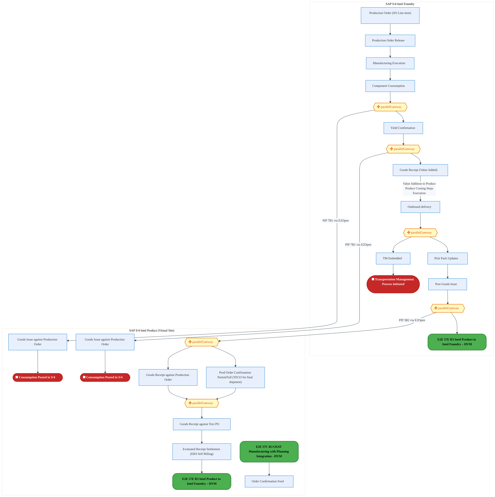
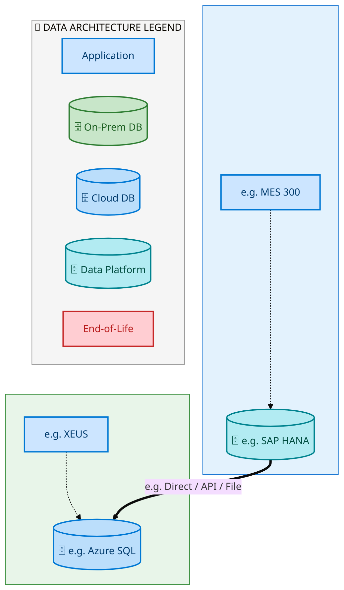
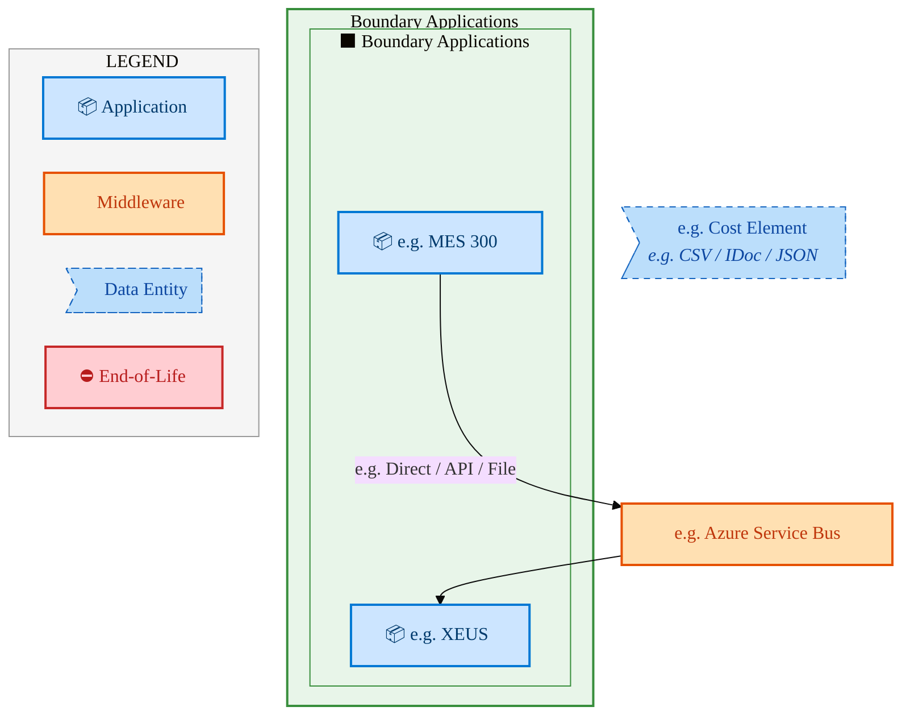
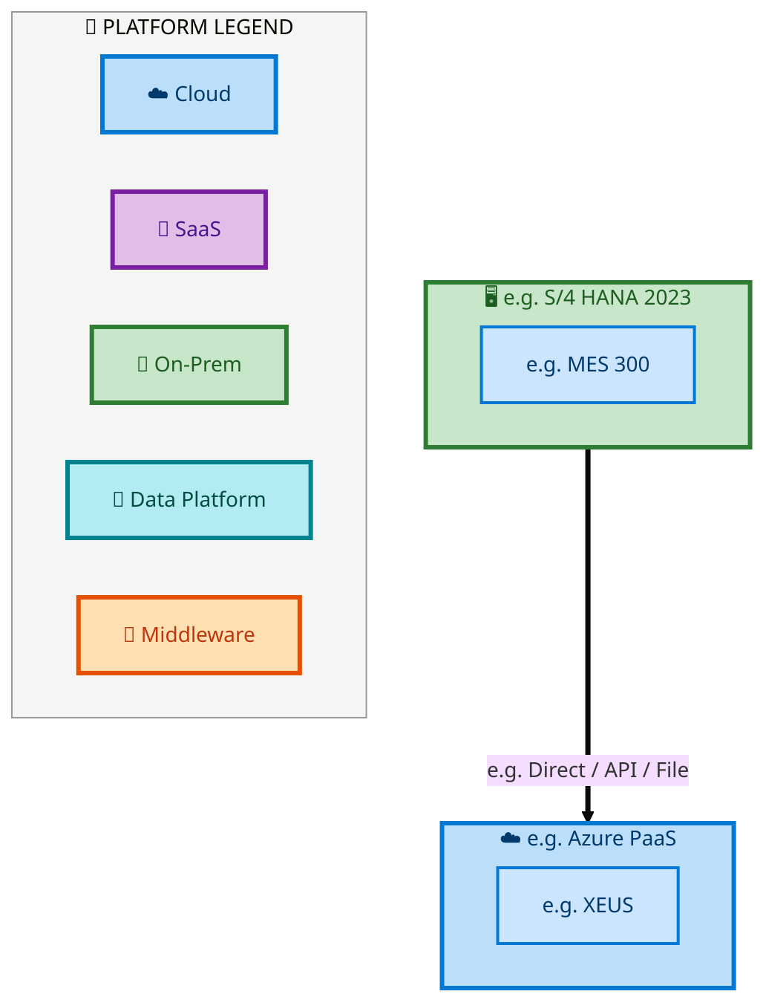

  <img src="data:image/svg+xml;base64,PHN2ZyB4bWxucz0iaHR0cDovL3d3dy53My5vcmcvMjAwMC9zdmciIHZpZXdCb3g9IjAgMCA4MDAgNDgwIiB3aWR0aD0iODAwIiBoZWlnaHQ9IjQ4MCI+DQogIDxkZWZzPg0KICAgIDxsaW5lYXJHcmFkaWVudCBpZD0iYmciIHgxPSIwJSIgeTE9IjAlIiB4Mj0iMTAwJSIgeTI9IjEwMCUiPg0KICAgICAgPHN0b3Agb2Zmc2V0PSIwJSIgc3R5bGU9InN0b3AtY29sb3I6IzAwNzFjNTtzdG9wLW9wYWNpdHk6MSIvPg0KICAgICAgPHN0b3Agb2Zmc2V0PSIxMDAlIiBzdHlsZT0ic3RvcC1jb2xvcjojMDBhZWVmO3N0b3Atb3BhY2l0eToxIi8+DQogICAgPC9saW5lYXJHcmFkaWVudD4NCiAgICA8bGluZWFyR3JhZGllbnQgaWQ9ImFjY2VudCIgeDE9IjAlIiB5MT0iMCUiIHgyPSIwJSIgeTI9IjEwMCUiPg0KICAgICAgPHN0b3Agb2Zmc2V0PSIwJSIgc3R5bGU9InN0b3AtY29sb3I6I2ZmZmZmZjtzdG9wLW9wYWNpdHk6MC4xNSIvPg0KICAgICAgPHN0b3Agb2Zmc2V0PSIxMDAlIiBzdHlsZT0ic3RvcC1jb2xvcjojZmZmZmZmO3N0b3Atb3BhY2l0eTowLjAyIi8+DQogICAgPC9saW5lYXJHcmFkaWVudD4NCiAgICA8cGF0dGVybiBpZD0iZ3JpZCIgd2lkdGg9IjQwIiBoZWlnaHQ9IjQwIiBwYXR0ZXJuVW5pdHM9InVzZXJTcGFjZU9uVXNlIj4NCiAgICAgIDxwYXRoIGQ9Ik0gNDAgMCBMIDAgMCAwIDQwIiBmaWxsPSJub25lIiBzdHJva2U9InJnYmEoMjU1LDI1NSwyNTUsMC4wNykiIHN0cm9rZS13aWR0aD0iMC41Ii8+DQogICAgPC9wYXR0ZXJuPg0KICA8L2RlZnM+DQoNCiAgPCEtLSBCYWNrZ3JvdW5kIC0tPg0KICA8cmVjdCB3aWR0aD0iODAwIiBoZWlnaHQ9IjQ4MCIgZmlsbD0idXJsKCNiZykiIHJ4PSI4Ii8+DQogIDxyZWN0IHdpZHRoPSI4MDAiIGhlaWdodD0iNDgwIiBmaWxsPSJ1cmwoI2dyaWQpIiByeD0iOCIvPg0KICA8cmVjdCB3aWR0aD0iODAwIiBoZWlnaHQ9IjQ4MCIgZmlsbD0idXJsKCNhY2NlbnQpIiByeD0iOCIvPg0KDQogIDwhLS0gRGVjb3JhdGl2ZSBjaXJjdWl0L2FyY2hpdGVjdHVyZSBsaW5lcyAtLT4NCiAgPGcgc3Ryb2tlPSJyZ2JhKDI1NSwyNTUsMjU1LDAuMTIpIiBzdHJva2Utd2lkdGg9IjEuNSIgZmlsbD0ibm9uZSI+DQogICAgPHBhdGggZD0iTSAwIDEwMCBMIDEyMCAxMDAgTCAxNjAgMTQwIEwgMjgwIDE0MCIvPg0KICAgIDxwYXRoIGQ9Ik0gMCAyNjAgTCA4MCAyNjAgTCAxMjAgMjIwIEwgMjAwIDIyMCBMIDI0MCAyNjAgTCAzNjAgMjYwIi8+DQogICAgPHBhdGggZD0iTSA1MjAgMTAwIEwgNjAwIDEwMCBMIDY0MCA2MCBMIDgwMCA2MCIvPg0KICAgIDxwYXRoIGQ9Ik0gNDQwIDM0MCBMIDU2MCAzNDAgTCA2MDAgMzAwIEwgNzIwIDMwMCBMIDc2MCAzNDAgTCA4MDAgMzQwIi8+DQogICAgPHBhdGggZD0iTSA2MDAgNDAwIEwgNjgwIDQwMCBMIDcyMCA0NDAiLz4NCiAgICA8cGF0aCBkPSJNIDAgNDAwIEwgNDAgNDAwIEwgODAgMzYwIi8+DQogICAgPHBhdGggZD0iTSAyMDAgNDIwIEwgMzIwIDQyMCBMIDM2MCAzODAgTCA0ODAgMzgwIi8+DQogICAgPHBhdGggZD0iTSA2NTAgNDQwIEwgNzUwIDQ0MCBMIDgwMCA0ODAiLz4NCiAgPC9nPg0KDQogIDwhLS0gRGVjb3JhdGl2ZSBub2RlcyAtLT4NCiAgPGcgZmlsbD0icmdiYSgyNTUsMjU1LDI1NSwwLjE4KSI+DQogICAgPGNpcmNsZSBjeD0iMTIwIiBjeT0iMTAwIiByPSI0Ii8+DQogICAgPGNpcmNsZSBjeD0iMjgwIiBjeT0iMTQwIiByPSI0Ii8+DQogICAgPGNpcmNsZSBjeD0iMjAwIiBjeT0iMjIwIiByPSI0Ii8+DQogICAgPGNpcmNsZSBjeD0iMzYwIiBjeT0iMjYwIiByPSI0Ii8+DQogICAgPGNpcmNsZSBjeD0iNjAwIiBjeT0iMTAwIiByPSI0Ii8+DQogICAgPGNpcmNsZSBjeD0iNzIwIiBjeT0iMzAwIiByPSI0Ii8+DQogICAgPGNpcmNsZSBjeD0iNTYwIiBjeT0iMzQwIiByPSI0Ii8+DQogICAgPGNpcmNsZSBjeD0iODAiIGN5PSIzNjAiIHI9IjQiLz4NCiAgICA8Y2lyY2xlIGN4PSI0ODAiIGN5PSIzODAiIHI9IjQiLz4NCiAgICA8Y2lyY2xlIGN4PSIzMjAiIGN5PSI0MjAiIHI9IjQiLz4NCiAgPC9nPg0KDQogIDwhLS0gVE9HQUYgQkRBVCBib3hlcyAtLT4NCiAgPGcgZm9udC1mYW1pbHk9IlNlZ29lIFVJLCBBcmlhbCwgc2Fucy1zZXJpZiIgZm9udC1zaXplPSIxNCIgZm9udC13ZWlnaHQ9IjYwMCI+DQogICAgPCEtLSBCIC0tPg0KICAgIDxyZWN0IHg9IjE1MCIgeT0iMTQwIiB3aWR0aD0iMTIwIiBoZWlnaHQ9IjQwIiByeD0iNSIgZmlsbD0icmdiYSgyNTUsMjU1LDI1NSwwLjE4KSIgc3Ryb2tlPSJyZ2JhKDI1NSwyNTUsMjU1LDAuMykiIHN0cm9rZS13aWR0aD0iMSIvPg0KICAgIDx0ZXh0IHg9IjIxMCIgeT0iMTY1IiB0ZXh0LWFuY2hvcj0ibWlkZGxlIiBmaWxsPSIjZmZmIj5CdXNpbmVzczwvdGV4dD4NCiAgICA8IS0tIEQgLS0+DQogICAgPHJlY3QgeD0iMjkwIiB5PSIxNDAiIHdpZHRoPSIxMjAiIGhlaWdodD0iNDAiIHJ4PSI1IiBmaWxsPSJyZ2JhKDI1NSwyNTUsMjU1LDAuMTgpIiBzdHJva2U9InJnYmEoMjU1LDI1NSwyNTUsMC4zKSIgc3Ryb2tlLXdpZHRoPSIxIi8+DQogICAgPHRleHQgeD0iMzUwIiB5PSIxNjUiIHRleHQtYW5jaG9yPSJtaWRkbGUiIGZpbGw9IiNmZmYiPkRhdGE8L3RleHQ+DQogICAgPCEtLSBBIC0tPg0KICAgIDxyZWN0IHg9IjQzMCIgeT0iMTQwIiB3aWR0aD0iMTIwIiBoZWlnaHQ9IjQwIiByeD0iNSIgZmlsbD0icmdiYSgyNTUsMjU1LDI1NSwwLjE4KSIgc3Ryb2tlPSJyZ2JhKDI1NSwyNTUsMjU1LDAuMykiIHN0cm9rZS13aWR0aD0iMSIvPg0KICAgIDx0ZXh0IHg9IjQ5MCIgeT0iMTY1IiB0ZXh0LWFuY2hvcj0ibWlkZGxlIiBmaWxsPSIjZmZmIj5BcHBsaWNhdGlvbjwvdGV4dD4NCiAgICA8IS0tIFQgLS0+DQogICAgPHJlY3QgeD0iNTcwIiB5PSIxNDAiIHdpZHRoPSIxMjAiIGhlaWdodD0iNDAiIHJ4PSI1IiBmaWxsPSJyZ2JhKDI1NSwyNTUsMjU1LDAuMTgpIiBzdHJva2U9InJnYmEoMjU1LDI1NSwyNTUsMC4zKSIgc3Ryb2tlLXdpZHRoPSIxIi8+DQogICAgPHRleHQgeD0iNjMwIiB5PSIxNjUiIHRleHQtYW5jaG9yPSJtaWRkbGUiIGZpbGw9IiNmZmYiPlRlY2hub2xvZ3k8L3RleHQ+DQogIDwvZz4NCg0KICA8IS0tIENvbm5lY3RpbmcgbGluZXMgYmV0d2VlbiBCREFUIGJveGVzIC0tPg0KICA8ZyBzdHJva2U9InJnYmEoMjU1LDI1NSwyNTUsMC4yNSkiIHN0cm9rZS13aWR0aD0iMSI+DQogICAgPGxpbmUgeDE9IjI3MCIgeTE9IjE2MCIgeDI9IjI5MCIgeTI9IjE2MCIvPg0KICAgIDxsaW5lIHgxPSI0MTAiIHkxPSIxNjAiIHgyPSI0MzAiIHkyPSIxNjAiLz4NCiAgICA8bGluZSB4MT0iNTUwIiB5MT0iMTYwIiB4Mj0iNTcwIiB5Mj0iMTYwIi8+DQogIDwvZz4NCg0KICA8IS0tIE1haW4gdGl0bGUgLS0+DQogIDx0ZXh0IHg9IjQwMCIgeT0iMjYwIiB0ZXh0LWFuY2hvcj0ibWlkZGxlIiBmb250LWZhbWlseT0iU2Vnb2UgVUksIEFyaWFsLCBzYW5zLXNlcmlmIiBmb250LXNpemU9IjM2IiBmb250LXdlaWdodD0iNzAwIiBmaWxsPSIjZmZmZmZmIiBsZXR0ZXItc3BhY2luZz0iMSI+DQogICAgSUFPIEFyY2hpdGVjdHVyZQ0KICA8L3RleHQ+DQogIDx0ZXh0IHg9IjQwMCIgeT0iMzAwIiB0ZXh0LWFuY2hvcj0ibWlkZGxlIiBmb250LWZhbWlseT0iU2Vnb2UgVUksIEFyaWFsLCBzYW5zLXNlcmlmIiBmb250LXNpemU9IjE4IiBmb250LXdlaWdodD0iNDAwIiBmaWxsPSJyZ2JhKDI1NSwyNTUsMjU1LDAuOCkiIGxldHRlci1zcGFjaW5nPSIyIj4NCiAgICBUT0dBRiBCREFUIMK3IElBTyBQcm9ncmFtIMK3IElETSAyLjANCiAgPC90ZXh0Pg0KDQogIDwhLS0gQm90dG9tIGFjY2VudCBiYXIgLS0+DQogIDxyZWN0IHg9IjI4MCIgeT0iMzQwIiB3aWR0aD0iMjQwIiBoZWlnaHQ9IjMiIHJ4PSIxLjUiIGZpbGw9InJnYmEoMjU1LDI1NSwyNTUsMC40KSIvPg0KDQogIDwhLS0gSW50ZWwgdGV4dCAtLT4NCiAgPHRleHQgeD0iNDAwIiB5PSIzODAiIHRleHQtYW5jaG9yPSJtaWRkbGUiIGZvbnQtZmFtaWx5PSJTZWdvZSBVSSwgQXJpYWwsIHNhbnMtc2VyaWYiIGZvbnQtc2l6ZT0iMTMiIGZpbGw9InJnYmEoMjU1LDI1NSwyNTUsMC41KSIgbGV0dGVyLXNwYWNpbmc9IjMiPg0KICAgIElOVEVMIENPTkZJREVOVElBTA0KICA8L3RleHQ+DQo8L3N2Zz4NCg==" alt="IAO Architecture" style="width:100%; border-radius:8px;" />
  <h1 style="font-size:36px; margin-top:24px;">E2E-57 — R3 Subcontracting with Planning integration- Foundry,OSAT,ODM</h1>
  <h2 style="font-size:24px;">Architecture Document (TOGAF BDAT)</h2>
  
End-to-End Integrated Processes (E2E) Tower 
  Capability E2E-57 · Procure to Pay

  
IAO Program · R1 – R5 
  Generated: April 2026 
  Sajiv Francis

  
IAO Architecture Pipeline — Intel Confidential

Page 1<a href="#toc">↑ Back to TOC</a>E2E-57 — R3 Subcontracting with Planning integration- Foundry,OSAT,ODM

## Table of Contents

<nav class="toc">
<ol>
  <li><a href="#1-executive-summary">1. Executive Summary</a></li>
  <li><a href="#2-business-context-objectives">2. Business Context &amp; Objectives</a>
    <ul>
      <li><a href="#21-classification">2.1 Classification</a></li>
      <li><a href="#22-business-drivers">2.2 Business Drivers</a></li>
      <li><a href="#23-success-criteria">2.3 Success Criteria</a></li>
      <li><a href="#24-companion-documents">2.4 Companion Documents</a></li>
    </ul>
  </li>
  <li><a href="#3-business-architecture-togaf-b">3. Business Architecture (TOGAF &ldquo;B&rdquo;)</a>
    <ul>
      <li><a href="#31-business-process-overview">3.1 Business Process Overview</a></li>
      <li><a href="#32-business-process-diagrams">3.2 Business Process Diagrams</a></li>
      <li><a href="#33-business-roles-responsibilities">3.3 Business Roles &amp; Responsibilities</a></li>
    </ul>
  </li>
  <li><a href="#4-data-architecture-togaf-d">4. Data Architecture (TOGAF &ldquo;D&rdquo;)</a>
    <ul>
      <li><a href="#41-data-entities-ownership">4.1 Data Entities &amp; Ownership</a></li>
      <li><a href="#42-data-flow-diagrams">4.2 Data Flow Diagrams</a></li>
      <li><a href="#43-data-lineage">4.3 Data Lineage</a></li>
      <li><a href="#44-ricefw-data-objects">4.4 RICEFW Data Objects</a></li>
      <li><a href="#45-data-governance-quality">4.5 Data Governance &amp; Quality</a></li>
    </ul>
  </li>
  <li><a href="#5-application-architecture-togaf-a">5. Application Architecture (TOGAF &ldquo;A&rdquo;)</a>
    <ul>
      <li><a href="#51-current-state-current-state-application-landscape">5.1 Current-State Application Landscape</a></li>
      <li><a href="#52-future-state-future-state-application-landscape">5.2 Future-State Application Landscape</a></li>
      <li><a href="#53-change-impact-summary">5.3 Change Impact Summary</a></li>
      <li><a href="#54-component-overview">5.4 Component Overview</a></li>
      <li><a href="#55-ricefw-inventory">5.5 RICEFW Inventory</a></li>
      <li><a href="#56-integration-patterns">5.6 Integration Patterns</a></li>
    </ul>
  </li>
  <li><a href="#6-technology-architecture-togaf-t">6. Technology Architecture (TOGAF &ldquo;T&rdquo;)</a>
    <ul>
      <li><a href="#61-platform-infrastructure">6.1 Platform &amp; Infrastructure</a></li>
      <li><a href="#62-sap-development-object-status">6.2 SAP Development Object Status</a></li>
      <li><a href="#63-nfrs-design-principles">6.3 NFRs &amp; Design Principles</a></li>
      <li><a href="#64-security-governance">6.4 Security &amp; Governance</a></li>
    </ul>
  </li>
  <li><a href="#7-project-context">7. Project Context</a>
    <ul>
      <li><a href="#71-project-roadmap-go-live-plan">7.1 Project Roadmap &amp; Go-Live Plan</a></li>
      <li><a href="#72-raid-log">7.2 RAID Log</a></li>
      <li><a href="#73-recommendations-next-steps">7.3 Recommendations &amp; Next Steps</a></li>
    </ul>
  </li>
</ol>
</nav>

Page 2<a href="#toc">↑ Back to TOC</a>E2E-57 — R3 Subcontracting with Planning integration- Foundry,OSAT,ODM

## 1. Executive Summary

This Architecture Document defines the **Business, Data, Application, and Technology** (BDAT) architecture for **E2E-57 R3 Subcontracting with Planning integration- Foundry,OSAT,ODM** within the IAO program. It includes 5 BPMN process diagram(s) in Section 3.

| Dimension | Value |
|-----------|-------|
| **Tower** | End-to-End Integrated Processes (E2E) |
| **Process Group** | Procure to Pay |
| **Capability** | E2E-57 - R3 Subcontracting with Planning integration- Foundry,OSAT,ODM |
| **Release** | R1 – R5 |
| **Total Systems** | 2 |
| **System Status** | 0 Deployed, 0 Developing, 0 EOL, 2 Pending IAPM |
| **RICEFW Objects** | Pending — Smartsheet Object Tracker API integration |

**Change Summary**: 0 new flow chains, 0 removed, 0 modified, 1 unchanged between Current-State and Future-State states.

> All system nodes in architecture diagrams are **IAPM-linked** — click any node to open its IAPM page. Diagrams require `securityLevel: 'loose'` for click events.

Page 3<a href="#toc">↑ Back to TOC</a>E2E-57 — R3 Subcontracting with Planning integration- Foundry,OSAT,ODM

## 2. Business Context & Objectives

### 2.1 Classification

| Level | Value |
|-------|-------|
| **L0 Tower** | End-to-End Integrated Processes |
| **L1 Process** | Procure to Pay |
| **L2 Capability** | E2E-57 - R3 Subcontracting with Planning integration- Foundry,OSAT,ODM |

### 2.2 Business Drivers

| # | Driver | Description | Strategic Alignment | Priority |
|---|--------|-------------|---------------------|----------|
| 1 | End-to-End Process Integration | Enable cross-tower integrated processes spanning procurement, manufacturing, and fulfillment | IDM 2.0 Process Excellence | High |
| 2 | Intel Foundry Business Enablement | Stand up foundry-specific business processes for external customer engagement | Intel Foundry Services | High |
| 3 | Process Visibility & Monitoring | Provide end-to-end process visibility across tower boundaries with integrated monitoring | Operational Excellence | Medium |
| 4 | E2E-57 Process Migration | Migrate R3 Subcontracting with Planning integration- Foundry,OSAT,ODM business processes and 2 integrated systems from legacy to S/4 HANA target architecture | IDM 2.0 Cross-Functional / End-to-End | High |

Page 4<a href="#toc">↑ Back to TOC</a>E2E-57 — R3 Subcontracting with Planning integration- Foundry,OSAT,ODM

### 2.3 Success Criteria

| Metric | Target | Measure | Baseline | Owner |
|--------|--------|---------|----------|-------|
| E2E Process Cycle Time | Per process SLA | End-to-end transaction completion within defined SLA per process | Varies by process | E2E Process Owner |
| Cross-Tower Integration Success | > 99% | Transactions completing across tower boundaries without manual intervention | 92% (current) | Integration Lead |
| Process Exception Rate | < 2% | Transactions requiring manual exception handling | 8% (current) | Operations Manager |
| E2E-57 Migration Completeness | 100% flow chains validated | All 1 flow chains verified in target state | 0% (pre-migration) | Tower Architect |

### 2.4 Companion Documents

| Document | Description |
|----------|-------------|
| **Business Architecture** | Included in this document (Section 3) — process flows from BPMN diagrams |
| **This Document** | Full BDAT Architecture — Business + Data + Application + Technology |

Page 5<a href="#toc">↑ Back to TOC</a>E2E-57 — R3 Subcontracting with Planning integration- Foundry,OSAT,ODM

## 3. Business Architecture (TOGAF "B")

### 3.1 Business Process Overview

This capability includes **5 business process(es)** modeled in BPMN 2.0, covering the end-to-end workflow for E2E-57 R3 Subcontracting with Planning integration- Foundry,OSAT,ODM.

| # | Step ID | Process Name | Lanes | Tasks | Gateways |
|---|---------|--------------|-------|-------|----------|
| 1 | E2E_57A_R3_OSAT_Manufacturing_with_Planning_Integration_-_HVM | E2E_57A_R3_OSAT_Manufacturing_with_Planning_Integration_-_HVM | Boundary Apps, OSAT, SAP S/4 (IP & IF) | 20 | 9 |
| 2 | E2E_57B_R3_OSAT_Manufacturing_with_Planning_Integration_-_HVM | E2E_57B_R3_OSAT_Manufacturing_with_Planning_Integration_-_HVM | Boundary Apps, Intel Product Receiver site, Intel Product Sender site, OSAT | 20 | 10 |
| 3 | E2E_57C_R3_Intel_Product_to_Intel_Foundry_–_HVM | E2E_57C_R3_Intel_Product_to_Intel_Foundry_–_HVM | Boundary Apps, SAP S/4 Intel Foundry, SAP S/4 Intel Foundry Virtual Plant LE101 | 23 | 15 |
| 4 | E2E_57D_Intel_Product_to_Intel_Foundry_–_HVM | E2E_57D_Intel_Product_to_Intel_Foundry_–_HVM | SAP S/4 Intel Foundry, SAP S/4 Intel Product (Virtual Site) | 17 | 6 |
| 5 | E2E_57E_R3_Intel_Product_to_Intel_Foundry_–_HVM | E2E_57E_R3_Intel_Product_to_Intel_Foundry_–_HVM | Boundary Apps, Intel Product Virtual site, Intel Product Warehouse, SAP S/4 Intel Foundry | 19 | 7 |

Page 6<a href="#toc">↑ Back to TOC</a>E2E-57 — R3 Subcontracting with Planning integration- Foundry,OSAT,ODM

### 3.2 Business Process Diagrams

#### BUSINESS ARCHITECTURE — 3.2.1 E2E_57A_R3_OSAT_Manufacturing_with_Planning_Integration_-_HVM — E2E_57A_R3_OSAT_Manufacturing_with_Planning_Integration_-_HVM

**Swim Lanes**: Boundary Apps · OSAT · SAP S/4 (IP & IF) | **Tasks**: 20 | **Gateways**: 9

> **Legend**: ● Start · ● End · User Task · Service Task · ◇ Gateway · Sub-Process

<a href="https://mermaid.live/view#pako:eNqlWFtv4kYU_isjVim7EjS-YuChEhCcRUoUBHT3oamqwR7DKMbjjm1ImuW_94w9w2UwrZrmIdJ8Od-5fHPOsZ33RsBC0ug3bm7eaULzPnpv5muyIc0-ai5xRpotVAHfMKd4GZOsKWwiluRz-ldpZjrpqzATmI83NH4T6JysGEG_TlpoAMS4hTKcZO2McBo1W82U0w3mbyMWMy6sP5FuZERlNPmnIeMh4UcDw_DMwAVqTBNyhG3P8Rxf8DISsCQ8cxq5UTcKmnuRXMx2wRrzvEy_yMgjfv1Ow3wN5wjHGQGbdb6JH_CSxKLGnBcCCwq-VWLQTMRJQLB5igOarAB3DIA4Tl6OkGvs92h_c_OcHIKih9lzguAniHGW3ZEIZTnA422OIhrH_U_OaOC7RivLOXsh_U_W2LuzrVYgKulD6UZLiNveEbpa5_0li0Np2t6JGvpW-trir33LaPE3-K3FIkl4jDTqWF2re4g09MyROVKRoij6X5FAV77A2YuMNbZ9y787xDLdjjsyLv2pMu8cb2DqOhG-pQE5cer7vj0-SjXuuKZx3enQtzvGSHO6wjnZ4bejw97IOTj0Xc83vasOq3h6lsVyylmgHNpj13cPDr2h6Q-sqw6dgel0ZYbgZ8VxukYxTsgfxm_PjSEryqZGgzTNnhu_V3biJzHhz_ckIRyqQT7jJMBZjqZATaAR0R3OMfpaLM9JlvkZaBHuR7idxqDBJXECe4CCzxCYX06otvH-rqiYc7bL2jjOUYo5jmMS31eiPjf2-1OS-RFSt5ZEkyAuMrolFyzo8DoBhUJP88FC080CeEFeoeSnWzQsaByCa7ieIsgpSzIEghCIEqIdzdcoYJsN4QHsMLCKmObLPvpCg-AlYbuYhCvYl0muWTpgCU0SVlHQk1hvaATOqW7pguWsygHNF09VGlWek2Oeddl0gDl-JUEBHfGIkyLCQV5wcak4RzVKeGAPKaQsgXyh0iQrNqlwrtl1wW4egLDCJqJ8g8sMIsbRA9PT70nV0Um15TIXUqYxyYnWkqLPp4SDtw2azvz2bOELbkAyreMtW2veudiiVys9bV6re6RmOUtLYSeJiFnVAoJTsr1oektUM7bGyPWGaGaXrlHOgJqTGNnTh9vvmJM1g82Hpuu3jAbQJ5NkC3oymNpHti17AbXR12-P59XYzkdGw_0IqfMRkvffSFdmUAzbfDBF81sHfZ5M0U9o4n_RrlV0ISfg8HZGYoKFlNqgaModCKicvUlOoHMKDs9a4M7InwXN6GUbO_9Iq4kjBnGE46CISw5-JVpDinlbcLpaQXPfL-ZotCbBy7mJGLEpg_16z1iYoUmWFVr_d49pzXMWvKAFvE9kKYPOFqUQ4H7-LlaAEOVnuThmJCKcJAHRtOxdd1ZToGnUDzZeYbERUapNsMYW-_VcP1hopZtyjk6v2LqY3PpKYbSW5OojyHK0Kdajl5VfsNx_YZ2WLhfvhY-O5mN0XJZI3C8RDxHR5TrR-yDRtj4ytPYHhzZxULv9i4gqz7ZVAa527shzR9rb8uxqZ9uoAOXPlHzbUYAtARXBkhZdee5Wx55yKO0t5aA0_3F8_B4eGT_AWJFkWaYOHKLaMnHTOSsU_E5hW9kDB20pRmPrKSXJc1L_RvBDlKfKksKYngI8GVEpZ8vCbEMVYkqKMpBn9Xp9AGwlja2CnAMyaXjhPE1apHdIRpod3vqcgVsJpoJbxqWJXZkcglXBDxepNFYuTJW_0rh3pihcvJadqQxNeRmWCmXJWKYST4ppqbOp2uxQYe-flbBUP5nqGhTTlr7N3hlw4uqblvbpZ0B5jeqr7hy3ruD2FdyRX2znqFuLdmpRrxbt1qK9-ixgfuVn0jls1sNWPWzXw0497NbDnXrYq4e7Cm60GjCmG0zDRv-9Uf4TA_7REZIIF3He2LcauMjZ_C0JGv3yY79RpCEw7yiG15dNBe7_BvCPQgA=" title="View full diagram">&#128065; View Diagram</a>

Page 7<a href="#toc">↑ Back to TOC</a>E2E-57 — R3 Subcontracting with Planning integration- Foundry,OSAT,ODM

#### BUSINESS ARCHITECTURE — 3.2.2 E2E_57B_R3_OSAT_Manufacturing_with_Planning_Integration_-_HVM — E2E_57B_R3_OSAT_Manufacturing_with_Planning_Integration_-_HVM

**Swim Lanes**: Boundary Apps · Intel Product Receiver site · Intel Product Sender site · OSAT | **Tasks**: 20 | **Gateways**: 10

> **Legend**: ● Start · ● End · User Task · Service Task · ◇ Gateway · Sub-Process

<a href="https://mermaid.live/view#pako:eNqlWFtv2kgU_isjqohUgoQZ25jwsCuubaS2QSFttSqr1WCPw6jGtsbjBDblv-8ZM2PCYB6a5SHBn8937ueMzUsjSEPW6DcuLl54wmUfvTTliq1Zs4-aS5qzZgvtgW9UcLqMWd5UMlGayDn_txTDbrZRYgqb0jWPtwqds8eUoa-3LTQAYtxCOU3yds4Ej5qtZib4mortKI1ToaTfsV7UiUpr-tYwFSETB4FOx8eBB9SYJ-wAO77ru1PFy1mQJuGR0siLelHQ3Cnn4vQ5WFEhS_eLnH2mm-88lCu4jmicM5BZyXX8iS5ZrGKUolBYUIgnkwyeKzsJJGye0YAnj4C7HYAETX4eIK-z26HdxcUiqYyiT_eLBMEniGmej1mEcgnw5EmiiMdx_507Gky9TiuXIv3J-u_IxB87pBWoSPoQeqelktt-ZvxxJfvLNA61aPtZxdAn2aYlNn3SaYkt_LVssSQ8WBp1SY_0KktDH4_wyFiKouh_WYK8igea_9S2Js6UTMeVLex1vVHnVJ8Jc-z6A2zniYknHrBXSqfTqTM5pGrS9XDnvNLh1Ol2RpbSRyrZM90eFN6M3Erh1POn2D-rcG_P9rJYzkQaGIXOxJt6lUJ_iKcDclahO8BuT3sIeh4FzVYopgn7p_Nj0RimRdnUaJBl-aLx915OfRIMt2cgmEDboTGVFH0slsciBETuWcD4E0OfaVLQGPHkKYWE5kiuRFo8rtDd6P6Y5Lwi3SZBulb6Ne0aDcnw-i5jyQPbyOvvbAk-c8mONbilBhrO00iibzTmIZU8Ta4nm4Bl6hv6SJMwVnrVjgkRIKKA3QLllkVmxXDz8rJoRLQf0bZaVu0ljFuwUo6gVCj3_1w0drvXAXTqGWwTxEUOYX3Y1_9AgwmpK4DK8G0iWYygumERSKTzIlB-EjTultJLVTA0ZvEVGgkGhkJEDU8FPD8l-qqQaS7RhzQN871sJhF9pDwBdP5wZ2XEv_xh4stlmlk8pYqFQHn_Oie9Q06oEOlz3qaxhLL-ZkrISUrmIFmbEE-FxUSUijW6K2SVGJW_7bFo95XojAc_EbQHmlH48jWD3mFW51sJu83zgqHLb1xI6PD3x7I95fAIGrnsX_QgaFiWQQrwJVO-J_KYcQOMvWJhVSKDkFF5LlkVVJM6q24iOIgiLtZl00MYQsIBeD0t4hhdPkxGdwjihFWRwDTmK56twQPLaaw6b_JE46JsIFPZOZMyZkoeXU7u5-8BiKP2EJYOhGRpIFUUdj-pyUUzq6ewmvrJJkvhsNK5sgTUUO87Go3S9ZqJAKKq8noJ4avyUTsSz9RqXmRZzCE7vE49cayeflWzDyxhgp72NHEtzrH_53mexauJ5yy3a3GrsAyzdvyIasMJmSDPH6B7B93NBw_lRo5oIAuhOvKZyxWq9rmaMRg71UHWdsb1y82YHwRqx7LwZCk6tQsgo4LGMYtP5n9Pct9C8t5C6r6F5P8e6cxOU62vCmJ1bq-aILWSYAyLDA3mX9Dzlbiq2cpY7Y3ZapvzAPqoGjqJnNknq9fVurD7xhLBhzbLYnhUuYWHc65mz5rpUj1sSVg0kAEOKwOlUbVW7C4kltZ7ynN2PUoFbDqJalw6OkLIm4_VxEPt9h-w5_Vld3_p60t_f-k4-tpx9gA28lhLEMPo6WvDwJpBXKNCm8AngKEQrcOpJNw9cGNdY_20l9xogmeMdizA0WFiYiS0UadnAKIBE4ijI8M9K3anil27QTybgk0kWAOV5yXwa9H4S52cv9QW1ne0LsdQsfaYGGvkRlPLx0KgmlCMWx1bEJ7DSsEqrzorpPJGAybPxNKEsQVU7n9J95orHzSVVFRdQxMeMbrJUTZB1UC1dqBeYMvTd8yj6Ert_YwmW_gfstJSVQStF5syYRNtOWn2lC8Sd0j2rvZevRmUlTEvesc4OYM7-mXtGHVrUa8W7daifi3aO-PFjXlDOoKhjrUwrodJPezUw2497NXD3XrYr4d7Bm60GnDOrykPG_2XRvmzBvz0EbKIFrFs7FoNWsh0vk2CRr98_W8U5dPnmFM4LdZ7cPcflFBI2A==" title="View full diagram">&#128065; View Diagram</a>

Page 8<a href="#toc">↑ Back to TOC</a>E2E-57 — R3 Subcontracting with Planning integration- Foundry,OSAT,ODM

#### BUSINESS ARCHITECTURE — 3.2.3 E2E_57C_R3_Intel_Product_to_Intel_Foundry_–_HVM — E2E_57C_R3_Intel_Product_to_Intel_Foundry_–_HVM

**Swim Lanes**: Boundary Apps · SAP S/4 Intel Foundry · SAP S/4 Intel Foundry Virtual Plant LE101 | **Tasks**: 23 | **Gateways**: 15

> **Legend**: ● Start · ● End · User Task · Service Task · ◇ Gateway · Sub-Process

<a href="https://mermaid.live/view#pako:eNqlWGtv2zYU_SuEi8AtYKMSSVm2PwyIH2oD1G0Qp9mAZRhoibKJyJJHSXks9X_fpUTKMStjmJcPAXR0zn3x8or0ayfMIt4Zdy4uXkUqijF67RYbvuXdMequWM67PVQDd0wKtkp43lWcOEuLpfi7orl096xoCgvYViQvCl3ydcbR96seugRh0kM5S_N-zqWIu73uTootky_TLMmkYr_jw9iJK2_61SSTEZcHguP4buiBNBEpP8DEpz4NlC7nYZZGR0ZjLx7GYXevgkuyp3DDZFGFX-Z8wZ5_FVGxgeeYJTkHzqbYJl_Yiicqx0KWCgtL-WiKIXLlJ4WCLXcsFOkacOoAJFn6cIA8Z79H-4uL-7Rxir7c3KcI_sKE5fmMxygvAJ4_FigWSTJ-R6eXgef08kJmD3z8Ds_9GcG9UGUyhtSdnipu_4mL9aYYr7Ik0tT-k8phjHfPPfk8xk5PvsB_yxdPo4On6QAP8bDxNPHdqTs1nuI4_l-eoK7yluUP2tecBDiYNb5cb-BNnZ_tmTRn1L907Tpx-ShC_sZoEARkfijVfOC5zmmjk4AMnKlldM0K_sReDgZHU9oYDDw_cP2TBmt_dpTl6lpmoTFI5l7gNQb9iRtc4pMG6aVLhzpCsLOWbLdBCUv5n87v951JVlZNjS53u_y-80fNU3-pC68_8ZRLyAYFmeQhywt0DdIUGhHNWMHQ53J1LML0PchiNo5Zf5dADa5g1wtlQSXAc-XjQ82HtmmLSrldXl6j5UcK4oIn4BtilC_HjkZA-76LlOXvswDdqtlhxa_ym7JdUUqOlgxGC_qm9jx6FAyVhUhEYdl0le87lojKbEW2CBgIM5gxjxwtFlczFMtsi6bXXy0aUZ4lj0SBphsePqD3ymewnC4-WEwKzFsp1muI69PtEoWKbnE84HyGnWLBgyq9JCyTurxCzQf0Ps4kCsu8yLa57cxXitvrOibr3RDeXcPMgFmavKBplsZCbrnts6p6Gra_xargdYlP6LEq8C17RiZukaVW12FV4gVLS5ZUOcE6PHIpRWStLiY1j605mjAocTXPbWODQzdCRXZv2yBHDPqithAdurLW-Zbubcw_s1Xt5niOPH-ObojuWuj3qAwLVGTHbYzuS-y4BH2-W1jBjhozs3NtEOf11QSuvrz9FXw7wg3iz2FS5tC2n-rRdN_Z79_KvIOMSZk95X2WFGjHJHQDT06IBueI_HNEw3NEozNE1DlH5J4jwueIyDki2ioS6amWODGY8anBjO6ELKr9Cjw4i8xdx7Vau56H4OjjDU84nPtMa8MAaBu0anNPSpFE4Ak-bDUxR_N0A-3MAZ19m6InUWxg0my3XIYwtoAaZ8dmqunKnyHZgm_RdSnhtAS-b_hfpciFsnnM95o4USW7OpK1xDmwxnfLZPX_deRVo_fICaqDsKenZ08lFeNJ5dsRRc5pUXJOi5JzWpTQ_yZqOhTOG6jf_wW-TPrZdfRzA7gawAbAGiAG0CbIQANkUAPUtQDiGYlhOAYYaYZvJH4N4MbLUDOGhjG0JQYYGcCxAGqSMxJqkmtC14DxqnMlJnmiAWoM1I8mL0_TjZyQGjDmdZbUmKPaHB5agGsKQ6m1HlSbdE0IrgYosRhNtU2W2LjF2Cq_KQx2rcBNofRqEON0YD0THWazOLoSrolBrw32jtbmB4wLOOnAjVLtuB9qlU1WxqNjC46OT0piVhfrmHGzmLrcuOkyHRU1YWOTd2PDlMq3CkFcqwMOgEmkOjPCnTtCvy2-1CfWOf624-mHKs7RmztJte_MFfMY9_R18BgdtKJ-Kzo8YXnUjkNh9X3rGHbbYdwOk3aYtsNeOzxoh_12eNgOj1ph2p4lbc-StmdJ27OkTZadXgc-plsmos74tVP9LgO_3UQ8ZmVSdPa9DiuLbPmShp1x9ftFp6xuYDPB4JywrcH9P7qvbEc=" title="View full diagram">&#128065; View Diagram</a>

Page 9<a href="#toc">↑ Back to TOC</a>E2E-57 — R3 Subcontracting with Planning integration- Foundry,OSAT,ODM

#### BUSINESS ARCHITECTURE — 3.2.4 E2E_57D_Intel_Product_to_Intel_Foundry_–_HVM — E2E_57D_Intel_Product_to_Intel_Foundry_–_HVM

**Swim Lanes**: SAP S/4 Intel Foundry · SAP S/4 Intel Product (Virtual Site) | **Tasks**: 17 | **Gateways**: 6

> **Legend**: ● Start · ● End · User Task · Service Task · ◇ Gateway · Sub-Process

<a href="https://mermaid.live/view#pako:eNqtV21v6jYU_itWrio6CXQTJyHAh0mUJneVbkV14XaaxjSZxAGrxolspy_r5b_vGJwUUpC2bnxA-Mlz3h6f45hXJy0y6oyci4tXJpgeodeOXtMN7YxQZ0kU7XTRHrgnkpElp6pjOHkh9Iz9taN5QflsaAZLyIbxF4PO6Kqg6PtNF43BkHeRIkL1FJUs73Q7pWQbIl8mBS-kYX-ig9zNd9Hso6tCZlS-EVw38tIQTDkT9A32oyAKEmOnaFqI7MhpHuaDPO1sTXK8eErXROpd-pWit-T5V5bpNaxzwhUFzlpv-FeypNzUqGVlsLSSj7UYTJk4AgSblSRlYgV44AIkiXh4g0J3u0Xbi4uFaIKi-fVCIPiknCh1TXOkNMDxo0Y543z0KZiMk9DtKi2LBzr6hOPo2sfd1FQygtLdrhG390TZaq1Hy4Jnltp7MjWMcPnclc8j7HblC3y3YlGRvUWa9PEAD5pIV5E38SZ1pDzP_1Mk0FXOiXqwsWI_wcl1E8sL--HEfe-vLvM6iMZeWycqH1lKD5wmSeLHb1LF_dBzzzu9Svy-O2k5XRFNn8jLm8PhJGgcJmGUeNFZh_t47Syr5Z0s0tqhH4dJ2DiMrrxkjM86DMZeMLAZgp-VJOUacSLon-7vC2c2vkOzzwG6EZpylBSVyOTLwvljzzcfMQAaRM-qVLNCoKmZG3Q5m6KvMCmIabr56dhgeMrgG-UU5v2Y6ZkUbomocpLqSkJ_o_iZppWxazE9YE6KTVkIKjSaFEJVm_IEDwPvN0Z5Zjg5kxtyguQD6UtRZArSSikrNbq8J7yiaJxlNGuV4wXAnlZ6acRBGeXskbY18kJTM0sf0B2Br-9lBi2gWpy-4RRKo33oG6Wqth4RUOa3KN4sqcnk-Cl2L-FxTkY56SldlGgOB4MqC6l3NSIQkqzgKAV9TLdQBTHgzGWQivH006ErI1OMYxRGMfrm2-23m4Z0cdwPaFFh1_PRL_e3rYz6r691RkTK4kn1CNeoJJJwTvmX_RwsnO320Cj6iNHgI0bDf2cEB9mpOfHezUkt1OU9k7oiHM1gDNpt0_TYbqMRWREmlEbtyWgp-iGr9_38z-wCO6l2Rg8nBhpZQuvwz0nFObqcx5MpygsJR5CAetWalabRWjWHZ_OY02dIZnpMNwMRP8LgmQ5tTGZUa75v48v42wzWPEdXcPLB8dCKZ8blROoJbY-ON2iNzsEBgsxMQnwmzA63BsUbftAQe__PhPmNm4lxM52N5-j4xHxieo3uoFOFWRm30Lu7_Hon_AUfmaPwg3MkBqjX-xneCHY53C89-36DHxbwasDbA7hvAdy3DFwzsGVENSOyDL9m-Ab4sXCaI53t1ADNrfwLUe_DBHbQqDbTtFRoIQ7ePj_MyW9dhvsQ_aOQEOHu5g7B6xc9MoJiPC3p3g4fJX-e11Qd2JoGtaHVzQstYFXAjUUN1Mpa3bzGg13Xz7G_B6J2hBrwrIz1nQtcW6BR3qrg9Y8Ytjz_Cr-Toc4eW8ugta53zOaG6-dBa40tEB5ci0yt9uZ5jA5Podg9iXrNPfkYx2dw_wwe1Fe-Yzg8DfdPw9FpeHAaHtaw03U2FE4-ljmjV2f3Xwr-b2U0JxXXzrbrkEoXsxeROqPdfw6n2l1OrhmBY2KzB7d_A8UUMsk=" title="View full diagram">&#128065; View Diagram</a>

Page 10<a href="#toc">↑ Back to TOC</a>E2E-57 — R3 Subcontracting with Planning integration- Foundry,OSAT,ODM

#### BUSINESS ARCHITECTURE — 3.2.5 E2E_57E_R3_Intel_Product_to_Intel_Foundry_–_HVM — E2E_57E_R3_Intel_Product_to_Intel_Foundry_–_HVM

**Swim Lanes**: Boundary Apps · Intel Product Virtual site · Intel Product Warehouse · SAP S/4 Intel Foundry | **Tasks**: 19 | **Gateways**: 7

```mermaid
%%{init: {'theme': 'base', 'themeVariables': {'fontSize': '14px', 'fontFamily': 'Segoe UI, Arial, sans-serif','primaryColor': '#e8f0fe', 'primaryBorderColor': '#0071c5','lineColor': '#37474F', 'secondaryColor': '#f5f8fc'}, 'flowchart': {'useMaxWidth': false, 'htmlLabels': true, 'curve': 'basis', 'nodeSpacing': 40, 'rankSpacing': 50}} }%%
flowchart LR
    classDef startEvt fill:#4CAF50,stroke:#2E7D32,color:#000,font-weight:bold,stroke-width:2px,rx:20,ry:20
    classDef endEvt fill:#C62828,stroke:#B71C1C,color:#fff,font-weight:bold,stroke-width:2px,rx:20,ry:20
    classDef userTask fill:#E3F2FD,stroke:#1565C0,stroke-width:2px,color:#0D47A1
    classDef serviceTask fill:#FFF3E0,stroke:#E65100,stroke-width:2px,color:#BF360C
    classDef gateway fill:#FFF9C4,stroke:#F57F17,stroke-width:2px,color:#E65100
    classDef subProc fill:#F3E5F5,stroke:#7B1FA2,stroke-width:2px,color:#4A148C
    subgraph lane_0["Boundary Apps"]
        n1["Generate Forecast Planning Data Hub"]
        n2["Receive Manual invoices through OCR"]
        n3["Receive Incoming invoice/ B2B/OpenText/Web suite"]
        n4["ReadSoft Validation/Exception Handling based on rules setup"]
        n20(["fa:fa-play Material Planning initiated"])
        n31{{"fa:fa-code-branch B2B or OCR?"}}
        n32{{"fa:fa-code-branch exclusiveGateway"}}
    end
    subgraph lane_1["Intel Product Virtual site"]
        n5["Perform Outbound Delivery"]
        n6["Perform Pick and Pack Updates"]
        n7["Post Goods Issue (Virtual)"]
        n8["IC Invoice Trading Str Dependent"]
        n9["Export Invoice"]
        n10["Create Commercial Invoice (Proforma)"]
        n11["Evaluated Receipt Settlement (ERS) Self-Billing"]
        n12["Post Supplier invoice"]
        n22(["fa:fa-stop IC Invoice Generated"])
        n23(["fa:fa-stop Export Invoice Generated"])
        n24(["fa:fa-stop Commercial Invoice Generated"])
        n25(["fa:fa-stop Supplier Invoice Posted"])
        n28["E2E 57D Intel Product to Intel Foundry – HVM"]
        n33{{"fa:fa-code-branch Invoice Accepted?"}}
        n35{{"fa:fa-arrows-alt parallelGateway"}}
        n36{{"fa:fa-arrows-alt parallelGateway"}}
    end
    subgraph lane_2["Intel Product Warehouse"]
        n13["Receive Inbound Delivery Plant"]
        n14["Post Goods Receipt against STO"]
        n15["Create Stock transport Request (with Prod Order ref)"]
        n16["Stock Transport Order"]
        n26(["fa:fa-stop Goods Receipt Posted"])
        n29["E2E 57C R3 Intel Product to Intel Foundry – HVM"]
        n37{{"fa:fa-arrows-alt parallelGateway"}}
    end
    subgraph lane_3["SAP S/4 Intel Foundry"]
        n17["STO information"]
        n18["Physical Receipt at IF"]
        n19["Customer Invoice"]
        n21(["fa:fa-play Initiate Goods Receipt at Intel Foundry Upon arrival of shipment"])
        n27(["fa:fa-stop STO Information Received"])
        n30["E2E 57E R3 Intel Product to Intel Foundry – HVM"]
        n34{{"fa:fa-code-branch exclusiveGateway"}}
    end
    n20 --> n1
    n5 --> n6
    n6 --> n7
    n7 --> n35
    n35 --> n13
    n14 --> n26
    n8 --> n22
    n9 --> n23
    n36 --> n10
    n36 --> n9
    n13 --> n14
    n15 --> n16
    n16 --> n37
    n37 --> n5
    n37 -->|"PIP 3A13 via E2Open"| n17
    n18 -->|"Upon Physical Receipt
4B2"| n14
    n29 --> n16
    n28 --> n11
    n30 --> n34
    n17 --> n27
    n1 --> n15
    n35 -->|"Applicable for Diff. Company Code"| n8
    n35 --> n36
    n10 --> n24
    n21 --> n18
    n31 -->|"OCR"| n2
    n3 --> n32
    n31 -->|"B2B"| n3
    n32 --> n4
    n2 --> n32
    n11 --> n32
    n19 --> n31
    n33 -->|"Yes"| n12
    n12 --> n25
    n4 --> n33
    n34 --> n19
    n33 --> n34
    class n20 startEvt
    class n21 startEvt
    class n22 endEvt
    class n23 endEvt
    class n24 endEvt
    class n25 endEvt
    class n26 endEvt
    class n27 endEvt
    class n28 startEvt
    class n29 startEvt
    class n30 startEvt
    class n31 gateway
    class n32 gateway
    class n33 gateway
    class n34 gateway
    class n35 gateway
    class n36 gateway
    class n37 gateway
```

> **Legend**: ● Start · ● End · User Task · Service Task · ◇ Gateway · Sub-Process

<a href="https://mermaid.live/view#pako:eNqtWNtu4zYQ_RVCi8BZwG50tWw_tPBNmwAbxIizuyjqoqAlKiYiiypFJXaz_vcOZUqOGPmhu_VDEo7nzPXMUMqrEbKIGCPj4uKVplSM0GtHbMiWdEaos8Y56XTRUfAVc4rXCck7UidmqVjSf0o1y812Uk3KArylyV5Kl-SREfTlpovGAEy6KMdp3ssJp3Gn28k43WK-n7KEcan9gQxiMy69qa8mjEeEnxRM07dCD6AJTclJ7Piu7wYSl5OQpVHDaOzFgzjsHGRwCXsJN5iLMvwiJ7d4941GYgPnGCc5AZ2N2Caf8ZokMkfBCykLC_5cFYPm0k8KBVtmOKTpI8hdE0Qcp08nkWceDuhwcbFKa6fo8_0qRfAJE5znMxKjXIB4_ixQTJNk9MGdjgPP7OaCsycy-mDP_Zljd0OZyQhSN7uyuL0XQh83YrRmSaRUey8yh5Gd7bp8N7LNLt_DT80XSaOTp2nfHtiD2tPEt6bWtPIUx_FPeYK68gecPylfcyewg1nty_L63tR8b69Kc-b6Y0uvE-HPNCRvjAZB4MxPpZr3Pcs8b3QSOH1zqhl9xIK84P3J4HDq1gYDzw8s_6zBoz89ymK94CysDDpzL_Bqg_7ECsb2WYPu2HIHKkKw88hxtkEJTslf5h8rY8KKktRonGX5yvjzqCc_qQVffyIp4ZANChgnIc4FWgA0BSKiGRYYXRfrJsgG0D0JCX0m6BanBU4QTZ8ZlDhHYsNZ8bhBd9P7Jsh5A7pJQ7aV9hXsCk3sydVdRtIHshNX38gasqCCNC24pQUcLVks0Fec0AgLytKr-S4kmfwLXeM0SqRduXUiBBJewLYBAogi03IwL8FcjEcx7mUJ9PEWKiCXzCl5ucsoSCNAfnybifX6WkHl5uutYXbDjcwBMS4z_21lHA5vEXY7guzCpMihIp-OZDrBYNzauinbdZMKAlFyFhUh1IFyIRuQvyuXB7oLwmPGt-iuEGtJAjQjCbjj-6Zq_43qgoZPCOqIFhj--JJBkYlGGl-qM-DJJ8aiHN3keUHQpYrkY1N3ICOeQsfLRqMHjiNZ26XgEAs0PCKpaCKGgJjvMgYbT6E0ykpKTzmRjJ2y7ZbwULat8nAJlZGJYC0QS9Zu_oyTQrYUlVTMBFoSIRK4mlKBLuf3y48gSOLeBGYQwtQs2FXeyyLLEkp4xV-NWvaJWrlgGXqTfzVrOqdsR8M0K3Ae52q4loqcxXoatk6rQspk38NkS-f2HHn-DDXJKJgSBJJssHBWhW1aDrr-eqstA6d9ICrH41CONIneDZJ3wmHO2Uvew4lAGeY4SUjyboyOoP5_A52ZPfvd7H3DnGwY3FcaT5qrrjl45XrRGG-5zYGquIkfMU0l3R7uNIB3GoGlYDCnAuqXl4y5J38XBECXL1RsylDRnXwKQpzE-kjIuT_iH2p8qawRuq8RpRlmO0uGNUum6N75YaL4_0vvZEeW4wVaXrlNx1pB5GaDasNclytEXiqahiT_YrPPaQgTVjcKBjXQFGX-0wLKtT0NlFZWS7uCbtSFo9NAaMX6ksHNBtWgsM0QgyeHDc22xz3aaIGvzzdkdnPKDCmOvrvfzLp1859pnfvDlx7czqjX-xWqqM7e8dhXx_7x6Kujfzw6njo7St1ylMByjwK7MjBQZ1udh-pcARzlwTI1wbCy6CgFtxJUPisXlkI4VZSOCtNrnL8DnW4WyBmDxWeK0dyWj0Er47tkY2VqoDTLxuvsW6XuxD4CqmDsoRaMrRK2qoI6qsBOHb-Kzq6dKkSzqBDEWF4SoXyNQ0AlNKNx_Iu8djKc7uF3RMpYBlovnLouyrNdB1t5qiGW8lQ-Q4Ktqkuq5o6tK8KTV6lYt88-atYuNKBl6QJVMKeuj6NM_y4ffmRta1VlzK4Ko7jl1M6VwBo2bJ1qXT7xlxyvXuCacuuM3FYvYU2p0yp1W6Veq7TfKvVbpYMzsQ3b5c6ZHKFz6v2pKbbbxU672G0Xe-3ifrvYr8RG14BVvcU0MkavRvn_CvifRkRiXCTCOHQNXAi23KehMSrf642ifDaeUQwXzfYoPPwLmcE5TQ==" title="View full diagram">&#128065; View Diagram</a>

Page 11<a href="#toc">↑ Back to TOC</a>E2E-57 — R3 Subcontracting with Planning integration- Foundry,OSAT,ODM

### 3.3 Business Roles & Responsibilities

| Role / Lane | Processes Involved | Description |
|------------|-------------------|-------------|
| Boundary Apps | E2E_57A_R3_OSAT_Manufacturing_with_Planning_Integration_-_HVM, E2E_57B_R3_OSAT_Manufacturing_with_Planning_Integration_-_HVM, E2E_57C_R3_Intel_Product_to_Intel_Foundry_–_HVM, E2E_57E_R3_Intel_Product_to_Intel_Foundry_–_HVM | |
| OSAT | E2E_57A_R3_OSAT_Manufacturing_with_Planning_Integration_-_HVM, E2E_57B_R3_OSAT_Manufacturing_with_Planning_Integration_-_HVM,  | |
| SAP S/4 (IP & IF) | E2E_57A_R3_OSAT_Manufacturing_with_Planning_Integration_-_HVM,  | |
| Intel Product Receiver site | E2E_57B_R3_OSAT_Manufacturing_with_Planning_Integration_-_HVM,  | |
| Intel Product Sender site | E2E_57B_R3_OSAT_Manufacturing_with_Planning_Integration_-_HVM,  | |
| SAP S/4 Intel Foundry | E2E_57C_R3_Intel_Product_to_Intel_Foundry_–_HVM, E2E_57D_Intel_Product_to_Intel_Foundry_–_HVM, E2E_57E_R3_Intel_Product_to_Intel_Foundry_–_HVM | |
| SAP S/4 Intel Foundry Virtual Plant LE101 | E2E_57C_R3_Intel_Product_to_Intel_Foundry_–_HVM,  | |
| SAP S/4 Intel Product (Virtual Site) | E2E_57D_Intel_Product_to_Intel_Foundry_–_HVM,  | |
| Intel Product Virtual site | E2E_57E_R3_Intel_Product_to_Intel_Foundry_–_HVM | |
| Intel Product Warehouse | E2E_57E_R3_Intel_Product_to_Intel_Foundry_–_HVM | |

Page 12<a href="#toc">↑ Back to TOC</a>E2E-57 — R3 Subcontracting with Planning integration- Foundry,OSAT,ODM

## 4. Data Architecture (TOGAF "D")

### 4.1 Data Flows — Source to Target

| # | Flow Chain | Hop | Source App | Source DB | Target App | Target DB | Data Description | Frequency | Classification |
|---|-----------|-----|-----------|----------|-----------|----------|-----------------|-----------|---------------|
| 1 | e.g. MES Route to ICOST | 1 | e.g. MES 300 | e.g. SAP HANA | e.g. XEUS | e.g. Azure SQL | What data moves | e.g. Near Real-Time | e.g. Intel Confidential |

Page 13<a href="#toc">↑ Back to TOC</a>E2E-57 — R3 Subcontracting with Planning integration- Foundry,OSAT,ODM

### 4.2 Data Flow Diagrams

> **DATA ARCHITECTURE** — Database-to-database data flows. Applications (blue) sit above their hosting databases (green cylinders). Thick arrows show data movement between databases.

#### 4.2.1 Current-State — Current-State Data Flows

<a href="https://mermaid.live/view#pako:eNqlVYtumzAU_RWLKtImJV0CeRCkVgJs1kq0y5p0m1Qm5IBJUM1DPNakaf59No8kTUtbbUZC9vW9516f48dGcCKXCIrQam380M8UsLGEbEkCYgkKsIQ5TlmvzXopcfLEz9Ym-UNoOUmjqJ4tQn7gxMdzSlI-zXC8KMym_mMF1RvEq9KZ2w0c-HRdzkzJIiLg9rINVAbAwLeFF40enCVOsgotT8kVXv303WzJLR6mKeF-yyygJp4TWqTNkrywhmxZ0xg7frjgZmnAjQkO7w-M_cF2C7atlhXucoGZZoWANYfiNIXEAziOtWgFPJ9S5UTX0cAw2mmWRPdEOel2RzLsV8POAy9NEeNV24lolPBpSR3qR3juXF_TGk5GQ328gxPRCEpiI1xPGyCx-xKORrlbAWoaRIb2n_VBnOEaT0SaIR7gyZJsvIHXh_3jAklE9_wZhg7hHk8firIoN-Jpo57eY_WViGk-XyQ4XgIkosFIh6pu2sRe2OpjnhB7-t28swSm8e_SmzfXT4iT-VG4U5W3Olwton-h2ykLJKeLU8D7DEBRlFL0lzHwKOMnS7ByV5Zc9nedvpV7pMuWzMEKJ8CcLOEzh6yEeqsO0DntnDflKgNJWCGk2ZqSRioqupFsDNB-f0myjCT9Od09dijfIXiqTuwL9Vr9J36v0NSWut2aYjYEbPgRlndp3yCZ-QDus-OY7913SnmN5TrXR0iufWuOJUM04I7j3ng0hGIjx6-nBWdn508VQ7AgFXwB6uSS_Q2fsvvzqXlXHGlnkgUr_-6AMsftAqjOVKDe6BeXM6TPbm8QMNFXdA0b5DRv9lbT5sKrcUx9B_PZ17Uzbdgg1LewM0lIAKC2Pwlr-ixSbwgtr7bDwOdHiIU2ZS0usQnFmRclQcP2MG3EloZCtxN5HdP3SLm08sZ6dSuU7NaX2YB_O-XH4_EL2YW2EJAkwL4rKJvykWRvrUs8nNOMPXMCzrNoug4dQSkeLiGPXZwR6GOmZlAat38BvNxYFQ==" title="View full diagram">&#128065; View Diagram</a>

Page 14<a href="#toc">↑ Back to TOC</a>E2E-57 — R3 Subcontracting with Planning integration- Foundry,OSAT,ODM

#### 4.2.2 Future-State — Future-State Data Flows

<a href="https://mermaid.live/view#pako:eNqlVYtumzAU_RWLKtImJV0CeRCkVgJs1kq0y5p0m1Qm5IBJUM1DPNakaf59No8kTUtbbUZC9vW9516f48dGcCKXCIrQam380M8UsLGEbEkCYgkKsIQ5TlmvzXopcfLEz9Ym-UNoOUmjqJ4tQn7gxMdzSlI-zXC8KMym_mMF1RvEq9KZ2w0c-HRdzkzJIiLg9rINVAbAwLeFF40enCVOsgotT8kVXv303WzJLR6mKeF-yyygJp4TWqTNkrywhmxZ0xg7frjgZmnAjQkO7w-M_cF2C7atlhXucoGZZoWANYfiNIXEAziOtWgFPJ9S5UTX0cAw2mmWRPdEOel2RzLsV8POAy9NEeNV24lolPBpSR3qR3juXF_TGk5GQ328gxPRCEpiI1xPGyCx-xKORrlbAWoaRIb2n_VBnOEaT0SaIR7gyZJsvIHXh_3jAklE9_wZhg7hHk8firIoN-Jpo57eY_WViGk-XyQ4XgIkosHIgKpu2sRe2OpjnhB7-t28swSm8e_SmzfXT4iT-VG4U5W3Olwton-h2ykLJKeLU8D7DEBRlFL0lzHwKOMnS7ByV5Zc9nedvpV7pMuWzMEKJ8CcLOEzh6yEeqsO0DntnDflKgNJWCGk2ZqSRioqupFsDNB-f0myjCT9Od09dijfIXiqTuwL9Vr9J36v0NSWut2aYjYEbPgRlndp3yCZ-QDus-OY7913SnmN5TrXR0iufWuOJUM04I7j3ng0hGIjx6-nBWdn508VQ7AgFXwB6uSS_Q2fsvvzqXlXHGlnkgUr_-6AMsftAqjOVKDe6BeXM6TPbm8QMNFXdA0b5DRv9lbT5sKrcUx9B_PZ17Uzbdgg1LewM0lIAKC2Pwlr-ixSbwgtr7bDwOdHiIU2ZS0usQnFmRclQcP2MG3EloZCtxN5HdP3SLm08sZ6dSuU7NaX2YB_O-XH4_EL2YW2EJAkwL4rKJvykWRvrUs8nNOMPXMCzrNoug4dQSkeLiGPXZwR6GOmZlAat38BTRVYPw==" title="View full diagram">&#128065; View Diagram</a>

Page 15<a href="#toc">↑ Back to TOC</a>E2E-57 — R3 Subcontracting with Planning integration- Foundry,OSAT,ODM

### 4.3 Data Lineage

| # | Source System | Source Schema/Object | Target System | Target Schema/Object | Transformation |
|---|-------------|---------------------|---------------|---------------------|---------------|
| 1 | e.g. MES 300 | e.g. CKMLHD table | e.g. XEUS | e.g. dbo.CostElements | Lineage notes |

### 4.4 RICEFW Data Objects

Reports and Conversions for this capability will be populated from the Smartsheet Object Tracker via automated API extraction.

| Object ID | Type | Description | Status | Source | Target | Complexity |
|-----------|------|-------------|--------|--------|--------|-----------|
| E2E-57-R001 | Report | R3 Subcontracting with Planning integration- Foundry,OSAT,ODM operational report | Planned | SAP S/4HANA | Analytics | Medium |
| E2E-57-C001 | Conversion | Legacy data migration for R3 Subcontracting with Planning integration- Foundry,OSAT,ODM | Planned | Legacy ERP | SAP S/4HANA | High |

> *Pending: Smartsheet API integration to auto-populate live RICEFW data (see Build Requirements).*

### 4.5 Data Governance & Quality

| Concern | Approach |
|---------|----------|
| Data Ownership | Per-entity owners listed in Section 3.1 |
| Data Classification | Financial data classified as Intel Confidential |
| Data Retention | Per Intel corporate retention policies |
| Data Quality | Validated at source; reconciliation at target |

Page 16<a href="#toc">↑ Back to TOC</a>E2E-57 — R3 Subcontracting with Planning integration- Foundry,OSAT,ODM

## 5. Application Architecture (TOGAF "A")

### 5.1 Current-State — Current-State Application Landscape

#### Overview

The Current-State architecture represents the **current / legacy** landscape for E2E-57.This view is generated from `CurrentFlows.xlsx` (1 flow hops across 1 flow chains).

#### APPLICATION ARCHITECTURE — Architecture Diagram

> **Click any system node** to open its IAPM application page.
> **Legend**: Deployed · Developing · End-of-Life · No IAPM Match

<a href="https://mermaid.live/view#pako:eNqVlnuPmzgQwL-KRZW_LtnlEQhBq0g8zGlPZLs62u5J5YQccBKrDiAM3U23-e41OA_CJn04ErFnxr-xh_HgVynJUyxZ0mDwSjJSWeA1kqo13uBIskAkLRDjvSHvMZzUJam2Af6KqVDSPD9o2ymfUEnQgmLWqDlnmWdVSL7tUYpRvAjjRu6jDaFboQnxKsfg4_0Q2BxAh4ChjI0YLskyknbtDJo_J2tUVntyzfAcvTyRtFo3kiWiDDd262pDA7TAtF1CVdatNONbDAuUkGzViDW5EZYo-9IV6rsd2A0GUXb0BT44UQZ4GwzAaMTXlqzJHFUYaDcq-AvY3-oSA1ZtKQYJRYxhxs3EjHbs4SVY1IxkmDHQtiWh1Hrn8-ZoQ1aV-RfMh1PbVPX9cPTc7MlSi5dhktO8tN7JstxjoqIApyaYrgt13z8yZXlieuOfMDXbcHvYFFWoj3UcD_rOEavohu7K51ilg_XGE1s5qFPEeBRLtLWADvSesw1JU4qfEY9gJy5QdtSjM2joiixf3YPja4bc3wPO6ZvQ-L7reSesa6imal7HThRX6WMZQqyPhYoD4eSInTiKb6tXsWNbGZt9bELzOv3ziKv9iPeweVaUeNPLDxMa7vSIVeHE066vVnF0qPK0E2BWL1YlKtYAqlCfuB9iJ6-zFJXb2C4KShJUkTxjnyPpIAddeST9LzAXUMHDVRaIanWhLMCvmU1LSYmTRgWCf881wlGM41U8h2GsyTKHR3Vqail_JtgA-GZ1A7iO1wWZgy3L4gfsKuQ_-DG8SGgUF6bjLBWDtiO6Ajd_aoFtGYlDXH4lCY6dmnXpqTIRdFFs9laAWwlXp2PUJXuwJbs5q2JIeWHOqll3yclYQBsDsDe4W5S3szsyE4rwE7gF916e8L9_wvcPd7dkJjw2VeJ8H93Y8gI4-x5JLcRr3wkH2I_3_OkTyj8E33-x-d8JUOOk_0qaJe2ztS3IP03Vwwk2fR2ezoRmmlBz35yJt9RrWfv7WKXB9g5XgFc8Rc5SK5VBAP-GD95Zvl_O9SC2Hx_7idlZ3YXUDOL5Uz_Z5qeEuphgYp4H-_nkNR8PmFX8gtDNk9MU-D5ofalGOuaG6ShfjgKy3LvhdbtzSk4BF0E5FHK9-R0DO51O30RVGkobXG4QSSXrVVxK-N0mxUtU04pfJSRUV3m4zRLJai8HUl3whWKPIP4SNkK4-wGxAdbL" title="View full diagram">&#128065; View Diagram</a>

Page 17<a href="#toc">↑ Back to TOC</a>E2E-57 — R3 Subcontracting with Planning integration- Foundry,OSAT,ODM

#### Current-State Flow Narrative

| # | Flow Chain | Path | Interface | Freq |
|---|-----------|------|-----------|------|
| 1 | e.g. MES Route to ICOST | e.g. MES 300 → e.g. XEUS | e.g. Direct / API / File | e.g. Near Real-Time |

Page 18<a href="#toc">↑ Back to TOC</a>E2E-57 — R3 Subcontracting with Planning integration- Foundry,OSAT,ODM

### 5.2 Future-State — Future-State Application Landscape

#### Overview

The Future-State architecture represents the **target** landscape for E2E-57.This view is generated from `FutureFlows.xlsx` (1 flow hops across 1 flow chains).

#### APPLICATION ARCHITECTURE — Architecture Diagram

> **Click any system node** to open its IAPM application page.
> **Legend**: Deployed · Developing · End-of-Life · No IAPM Match

<a href="https://mermaid.live/view#pako:eNqVlnuPmzgQwL-KRZW_LtnlEQhBq0g8zGlPZLs62u5J5YQccBKrDiAM3U23-e41OA_CJn04ErFnxr-xh_HgVynJUyxZ0mDwSjJSWeA1kqo13uBIskAkLRDjvSHvMZzUJam2Af6KqVDSPD9o2ymfUEnQgmLWqDlnmWdVSL7tUYpRvAjjRu6jDaFboQnxKsfg4_0Q2BxAh4ChjI0YLskyknbtDJo_J2tUVntyzfAcvTyRtFo3kiWiDDd262pDA7TAtF1CVdatNONbDAuUkGzViDW5EZYo-9IV6rsd2A0GUXb0BT44UQZ4GwzAaMTXlqzJHFUYaDcq-AvY3-oSA1ZtKQYJRYxhxs3EjHbs4SVY1IxkmDHQtiWh1Hrn8-ZoQ1aV-RfMh1PbVPX9cPTc7MlSi5dhktO8tN7JstxjoqIApyaYrgt13z8yZXlieuOfMDXbcHvYFFWoj3UcD_rOEavohu7K51ilg_XGE1s5qFPEeBRLtLWADvSesw1JU4qfEY9gJy5QdtSjM2joiixf3YPja4bc3wPO6ZvQ-L7reSesa6imal7HThRX6WMZQqyPhYoD4eSInTiKb6tXsWNbGZt9bELzOv3ziKv9iPeweVaUeNPLDxMa7vSIVeHE066vVnF0qPK0E2BWL1YlKtYAqlCf-B9iJ6-zFJXb2C4KShJUkTxjnyPpIAddeST9LzAXUMHDVRaIanWhLMCvmU1LSYmTRgWCf881wlGM41U8h2GsyTKHR3Vqail_JtgA-GZ1A7iO1wWZgy3L4gfsKuQ_-DG8SGgUF6bjLBWDtiO6Ajd_aoFtGYlDXH4lCY6dmnXpqTIRdFFs9laAWwlXp2PUJXuwJbs5q2JIeWHOqll3yclYQBsDsDe4W5S3szsyE4rwE7gF916e8L9_wvcPd7dkJjw2VeJ8H93Y8gI4-x5JLcRr3wkH2I_3_OkTyj8E33-x-d8JUOOk_0qaJe2ztS3IP03Vwwk2fR2ezoRmmlBz35yJt9RrWfv7WKXB9g5XgFc8Rc5SK5VBAP-GD95Zvl_O9SC2Hx_7idlZ3YXUDOL5Uz_Z5qeEuphgYp4H-_nkNR8PmFX8gtDNk9MU-D5ofalGOuaG6ShfjgKy3LvhdbtzSk4BF0E5FHK9-R0DO51O30RVGkobXG4QSSXrVVxK-N0mxUtU04pfJSRUV3m4zRLJai8HUl3whWKPIP4SNkK4-wElUNbv" title="View full diagram">&#128065; View Diagram</a>

Page 19<a href="#toc">↑ Back to TOC</a>E2E-57 — R3 Subcontracting with Planning integration- Foundry,OSAT,ODM

#### Future-State Flow Narrative

| # | Flow Chain | Path | Interface | Freq |
|---|-----------|------|-----------|------|
| 1 | e.g. MES Route to ICOST | e.g. MES 300 → e.g. XEUS | e.g. Direct / API / File | e.g. Near Real-Time |

Page 20<a href="#toc">↑ Back to TOC</a>E2E-57 — R3 Subcontracting with Planning integration- Foundry,OSAT,ODM

### 5.3 Change Impact Summary

| Change Type | Flow Chain | Detail |
|-------------|-----------|--------|
| **UNCHANGED** | e.g. MES Route to ICOST | No change |

**Totals**: 0 new - 0 removed - 0 modified - 1 unchanged

### 5.4 Component Overview

#### System Inventory

| System | IAPM ID | Status |
|--------|---------|--------|
| e.g. MES 300 | - | N/A |
| e.g. XEUS | - | N/A |

Page 21<a href="#toc">↑ Back to TOC</a>E2E-57 — R3 Subcontracting with Planning integration- Foundry,OSAT,ODM

### 5.5 RICEFW Inventory

RICEFW objects for this capability will be auto-populated from the Smartsheet S/4 Object Tracker.

| Object ID | Type | Description | Status | Source → Target | Middleware | Complexity |
|-----------|------|-------------|--------|----------------|-----------|-----------|
| E2E-57-I001 | Interface | R3 Subcontracting with Planning integration- Foundry,OSAT,ODM inbound data interface | Planned | Legacy → SAP S/4HANA | MuleSoft / CPI | Medium |
| E2E-57-E001 | Enhancement | R3 Subcontracting with Planning integration- Foundry,OSAT,ODM custom business logic | Planned | SAP S/4HANA | N/A | Medium |
| E2E-57-F001 | Form/Report | R3 Subcontracting with Planning integration- Foundry,OSAT,ODM operational output | Planned | SAP S/4HANA | N/A | Low |

> *Pending: Smartsheet API integration to auto-populate live RICEFW inventory (see Build Requirements).*

Page 22<a href="#toc">↑ Back to TOC</a>E2E-57 — R3 Subcontracting with Planning integration- Foundry,OSAT,ODM

### 5.6 Integration Patterns

| # | Pattern | Flow Chain | Middleware | Protocol | Auth |
|---|---------|-----------|-----------|----------|------|
| 1 | e.g. Pub-Sub / P2P / ETL | e.g. MES Route to ICOST | e.g. Azure Service Bus | e.g. REST / RFC / SFTP | e.g. OAuth / NTLM / Cert |

Page 23<a href="#toc">↑ Back to TOC</a>E2E-57 — R3 Subcontracting with Planning integration- Foundry,OSAT,ODM

## 6. Technology Architecture (TOGAF "T")

### 6.1 Platform & Infrastructure

> **TECHNOLOGY / PLATFORM ARCHITECTURE** — Platforms (green) host applications (blue). Thick arrows show platform-to-platform integration flows.

#### 6.1.1 Current-State — Current-State Platform Architecture

<a href="https://mermaid.live/view#pako:eNqllXlvmzAUwL-KRZX_0pYrCUHqJA6zTUqaqLTbpDEhB0xi1QEEZk2a5rvPQEKOhUpVQbLs955_foePjRAkIRZ0odPZkJgwHWw8gS3wEnuCDjxhhnLe6_JejoMiI2w9wn8xrZU0SfbaasoPlBE0ozgv1ZwTJTFzyesOJanpqjYu5Q5aErquNS6eJxg8fe8CgwM4fFtZ0eQlWKCM7WhFjsdo9ZOEbFFKIkRzXNot2JKO0AzTalmWFZU05mG5KQpIPC_FqlgKMxQ_Hwl74nYLtp2OFzdrgUfTiwH_Aory3MYRQGlqJisQEUr1K8uCPcfp5ixLnrF-JYoDzVZ3w-uX0jVdTlfdIKFJVqoVo2-d8VKK2BFQg31r2ABlOLAV-RSoHICS2YOyeAbECT3wHMeybbnhWX1Zk7VWB82BZEncwZqYF7N5htIFgDLsDazpaOpjf-4br0WG_SlC7m9P8Aq5L0peEWGRr3wzvwGVGpRqT_hTg8ovJBkOGEliMHo4SPdkoyL_gk8ls8KUfQ7Qdb1OeD0Hx-HON7amuNWxXfCmaUPHfLc6yv_VeTd411f9b8a94cuirFTxh5oS8jZEveMsuLcqKO1AaffhRIyh6yuiuM8FHwI-_GA6Tlz91Paq13iPfnf35W3nrF3FB26BMf3OW4dQft7fWkvVmu8RnvPwjlMchCLgGXp0Jg9jMIJf4b39gcyOrPPtatGkCE8Ija17UloZA_d8Pzemk71pwNsIy2ASX08zvLxsbZ8ENMPARgyBKb8DoiRrmTM-cUYagDEJQ4pfUIabCS07oU7i_i7olX9T_OFweFp5KV1dZFifOk4XgPvzCSUTwkEDHJiSY7TvRtWQVO0ycPLp2_MMaO9DlqHpyEcha4rmvBOyaquXgePmPoaieQDCfk8SxVag6Sh90RK6whJnS0RCQd_ULyt_oEMcoYIy_jYKqGCJu44DQa9eO6FIQ8SwTRA_UctauP0HE3Nosg==" title="View full diagram">&#128065; View Diagram</a>

> **Legend**: 🖥️ Platform · 📦 Application · ⛔ End-of-Life · 📋 Unassigned

Page 24<a href="#toc">↑ Back to TOC</a>E2E-57 — R3 Subcontracting with Planning integration- Foundry,OSAT,ODM

#### 6.1.2 Future-State — Future-State Platform Architecture

<a href="https://mermaid.live/view#pako:eNqllXlvmzAUwL-KRZX_0pYrCUHqJA6zTUqaqLTbpDEhB0xi1QEEZk2a5rvPQEKOhUpVQbLs955_foePjRAkIRZ0odPZkJgwHWw8gS3wEnuCDjxhhnLe6_JejoMiI2w9wn8xrZU0SfbaasoPlBE0ozgv1ZwTJTFzyesOJanpqjYu5Q5aErquNS6eJxg8fe8CgwM4fFtZ0eQlWKCM7WhFjsdo9ZOEbFFKIkRzXNot2JKO0AzTalmWFZU05mG5KQpIPC_FqlgKMxQ_Hwl74nYLtp2OFzdrgUfTiwH_Aory3MYRQGlqJisQEUr1K8uCPcfp5ixLnrF-JYoDzVZ3w-uX0jVdTlfdIKFJVqoVo2-d8VKK2BFQg31r2ABlOLAV-RSoHICS2YOyeAbECT3wHMeybbnhWX1Zk7VWB82BZEncwZqYF7N5htIFgDLsDZzpaOpjf-4br0WG_SlC7m9P8Aq5L0peEWGRr3wzvwGVGpRqT_hTg8ovJBkOGEliMHo4SPdkoyL_gk8ls8KUfQ7Qdb1OeD0Hx-HON7amuNWxXfCmaUPHfLc6yv_VeTd411f9b8a94cuirFTxh5oS8jZEveMsuLcqKO1AaffhRIyh6yuiuM8FHwI-_GA6Tlz91Paq13iPfnf35W3nrF3FB26BMf3OW4dQft7fWkvVmu8RnvPwjlMchCLgGXp0Jg9jMIJf4b39gcyOrPPtatGkCE8Ija17UloZA_d8Pzemk71pwNsIy2ASX08zvLxsbZ8ENMPARgyBKb8DoiRrmTM-cUYagDEJQ4pfUIabCS07oU7i_i7olX9T_OFweFp5KV1dZFifOk4XgPvzCSUTwkEDHJiSY7TvRtWQVO0ycPLp2_MMaO9DlqHpyEcha4rmvBOyaquXgePmPoaieQDCfk8SxVag6Sh90RK6whJnS0RCQd_ULyt_oEMcoYIy_jYKqGCJu44DQa9eO6FIQ8SwTRA_UctauP0Hys1o7g==" title="View full diagram">&#128065; View Diagram</a>

> **Legend**: 🖥️ Platform · 📦 Application · ⛔ End-of-Life · 📋 Unassigned

#### Platform Inventory

| # | Platform | Type | Systems Using | Environment |
|---|----------|------|--------------|-------------|
| 1 | e.g. Azure PaaS | Cloud / SaaS | e.g. XEUS | DEV,QAS,PRD |
| 2 | e.g. S/4 HANA 2023 | On-Premise | e.g. MES 300 | DEV,QAS,PRD |

Page 25<a href="#toc">↑ Back to TOC</a>E2E-57 — R3 Subcontracting with Planning integration- Foundry,OSAT,ODM

### 6.2 SAP Development Object Status

| Metric | DEV | QAS | PRD |
|--------|-----|-----|-----|
| Transport Requests | — | — | — |
| Custom Code Objects | — | — | — |
| CDS Views | — | — | — |
| Fiori Apps | — | — | — |
| BAdIs / Enhancements | — | — | — |

### 6.3 NFRs & Design Principles

| Category | Requirement | Target / SLA | Priority |
|----------|-------------|-------------|----------|
| Performance | Order/transaction processing within interactive SLA | < 3 seconds for online transactions | High |
| Availability | Business-critical systems available during extended hours | 99.9% (06:00-22:00 all time zones) | High |
| Scalability | Support seasonal and promotional volume spikes | Handle 2x baseline transaction volume | Medium |
| Recoverability | Customer-facing systems recover within business impact window | RPO < 30 min, RTO < 2 hours | High |
| Data Volume | Support transactional data growth from business expansion | 10M+ documents/year | Medium |
| Latency | Near-real-time integration for order status updates | < 30 seconds for status propagation | Medium |
| Concurrency | Support global user base across business functions | 300+ concurrent users | Medium |

### 6.4 Security & Governance

| Concern | Approach | Standard / Policy | Owner |
|---------|----------|--------------------|-------|
| Authentication | Single Sign-On (SSO) via Intel corporate Azure AD identity | Intel IT Security Policy - Identity Management | IT Security |
| Authorization | Role-based access control (RBAC) with SAP authorization objects | Intel SAP Security Standards - Role Design | SAP Security Team |
| Data Classification | All financial/operational data classified per Intel Data Classification Standard | Intel Data Classification Policy | Data Governance |
| Data Encryption (at rest) | AES-256 encryption for SAP HANA database and file storage | Intel Encryption Standard | Infrastructure Security |
| Data Encryption (in transit) | TLS 1.3 for all system-to-system and user-to-system communication | Intel Network Security Policy | Network Engineering |
| Network Segmentation | SAP systems in dedicated network zones with firewall controls | Intel Network Architecture Standard | Network Security |
| API Security | OAuth 2.0 / certificate-based authentication for all API integrations | Intel API Security Guidelines | Integration Architecture |
| Audit Logging | Comprehensive audit trail for all data changes and user actions (SAP Security Audit Log) | SOX Compliance / Intel Audit Policy | Internal Audit |
| Certificate Management | Automated certificate lifecycle management for system-to-system trust | Intel PKI Standard | Certificate Authority Team |
| Compliance | SOX controls, export control (EAR/ITAR) screening, data privacy (GDPR) | Intel Corporate Compliance Framework | Compliance Office |

Page 26<a href="#toc">↑ Back to TOC</a>E2E-57 — R3 Subcontracting with Planning integration- Foundry,OSAT,ODM

## 7. Project Context

### 7.1 Project Roadmap & Go-Live Plan

Project delivery milestones for E2E-57 RICEFW objects:

| Phase | Planned Start | Planned End | Status | Notes |
|-------|---------------|-------------|--------|-------|
| Functional Specification (FS) | Per project plan | Per project plan | In Progress | Tower-level FS schedule |
| Technical Design (TDD) | FS + 2 weeks | FS + 6 weeks | Planned | Dependent on FS completion |
| Build & Unit Test (TUT) | TDD + 1 week | TDD + 8 weeks | Planned | Includes S/4 + Middleware |
| Functional User Test (FUT) | Build + 1 week | Build + 4 weeks | Planned | Tower-led validation |
| Go-Live (R1 – R5) | Per release plan | Per release plan | Planned | End-to-End Integrated Processes release |

> *Detailed object-level timelines will be auto-populated from the Smartsheet Object Tracker via API integration.*

Page 27<a href="#toc">↑ Back to TOC</a>E2E-57 — R3 Subcontracting with Planning integration- Foundry,OSAT,ODM

### 7.2 RAID Log

Standard RAID items for E2E-57 (End-to-End Integrated Processes):

| # | Category | Description | Status | Owner | Priority |
|---|----------|-------------|--------|-------|----------|
| 1 | Risk | Data migration completeness — validate all legacy R3 Subcontracting with Planning integration- Foundry,OSAT,ODM data maps to S/4 target structures | Open | Tower Architect | High |
| 2 | Risk | Integration testing coverage — ensure all 2 integrated systems are validated end-to-end | Open | Integration Lead | High |
| 3 | Assumption | Target SAP S/4HANA system available in DEV/QAS per release schedule | Active | SAP Basis | Medium |
| 4 | Issue | API access provisioning — SAP OData, Smartsheet, and IAPM API credentials required for automation | Open | EA Pipeline Team | High |
| 5 | Dependency | Upstream BPMN process models validated and signed off by business process owners | Active | Process Owner | Medium |

> *Live RAID data will be auto-populated from the Smartsheet RAID log via API integration.*

### 7.3 Recommendations & Next Steps

| # | Category | Recommendation | Priority | Owner | Target Date | Status |
|---|----------|---------------|----------|-------|-------------|--------|
| 1 | Architecture | Complete extended flow attributes (Data Entity, Integration Pattern, Tech Platform) in Flows tab for full BDAT coverage | High | Tower Architect | 2026-Q2 | Open |
| 2 | Data | Define data ownership and classification for all 1 flow chains to satisfy Data Architecture (TOGAF D) requirements | Medium | Data Architect | 2026-Q3 | Open |
| 3 | Testing | Develop integration test scenarios covering all 1 flow chains for FUT/SIT readiness | High | Test Lead | 2026-Q3 | Open |
| 4 | Business Architecture | Review and validate Business Architecture process steps against latest Signavio/BIC process models | Medium | Business Analyst | 2026-Q2 | Open |
| 5 | Security | Complete security review for API integrations and data flows per Intel Security Architecture standards | Medium | Security Architect | 2026-Q3 | Open |

---
*E2E-57 — Architecture Document (TOGAF BDAT) · End-to-End Integrated Processes · Generated: April 2026*

Page 28<a href="#toc">↑ Back to TOC</a>E2E-57 — R3 Subcontracting with Planning integration- Foundry,OSAT,ODM

