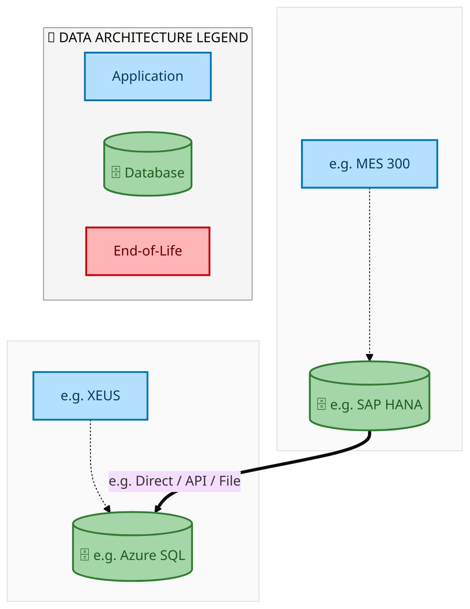
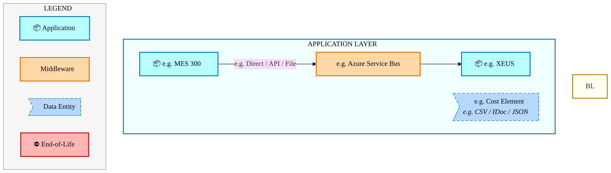
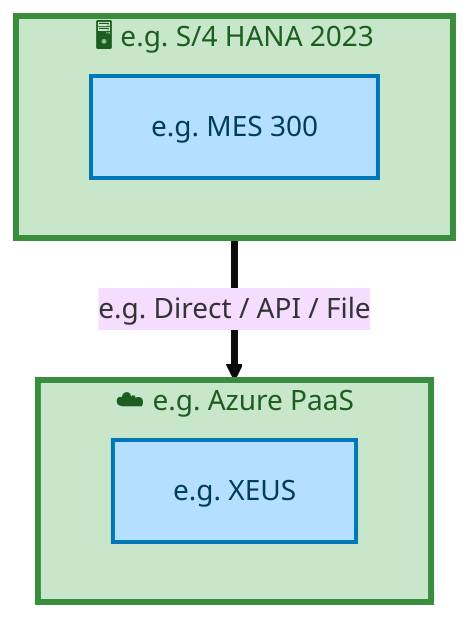

<div class="page-section">
<div style="text-align:center; padding-top:20px;">
  
  <h1 style="font-size:36px; margin-top:24px;">E2E-61 — R3 Consignment Material - Vendor</h1>
  <h2 style="font-size:24px;">Architecture Document (TOGAF BDAT)</h2>
  <p style="font-size:18px; color:#555;">End-to-End Integrated Processes (E2E) Tower<br/>
  Capability E2E-61 · Procure to Pay</p>
  <p style="font-size:14px; color:#888;">IAO Program · Release 2<br/>
  Generated: March 2026<br/>
  Sajiv Francis</p>
  <p style="font-size:12px; color:#aaa;">IAO Architecture Pipeline — Intel Confidential</p>
</div>

<style>
@media print {
  @page { margin: 0.75in; }
  .mermaid { page-break-inside: avoid; overflow: visible; }
  pre, table { page-break-inside: avoid; }
  h2, h3, h4 { page-break-after: avoid; }
}
.mermaid { overflow: visible; }
.mermaid svg { max-width: 100%; height: auto !important; }
.page-section {
  display: flex;
  flex-direction: column;
  min-height: calc(100vh - 40px);
  box-sizing: border-box;
}
.page-footer {
  margin-top: auto;
  padding-top: 8px;
  border-top: 1px solid #ddd;
  display: flex;
  justify-content: space-between;
  align-items: center;
  font-size: 11px;
  color: #888;
  padding: 6px 12px;
  background: #fff;
}
@media print {
  .page-section {
    min-height: 100vh;
  }
  .page-footer {
    page-break-inside: avoid;
    break-inside: avoid;
  }
}
.page-footer a { color: #00aeef; text-decoration: none; font-weight: 500; }
.page-footer a:hover { color: #0071c5; text-decoration: underline; }
nav.toc { margin: 16px 0 24px 0; }
nav.toc ol, nav.toc ul { list-style: none; padding-left: 0; margin: 0; }
nav.toc > ol > li { margin-bottom: 6px; font-weight: 600; font-size: 14px; }
nav.toc > ol > li > ul { padding-left: 28px; margin-top: 4px; }
nav.toc > ol > li > ul > li { font-weight: 400; font-size: 13px; margin-bottom: 2px; }
nav.toc a { color: #0071c5; text-decoration: none; }
nav.toc a:hover { text-decoration: underline; }
</style>

<div class="page-footer"><span>Page 1</span><span><a href="#toc">↑ Back to TOC</a></span><span>E2E-61 — R3 Consignment Material - Vendor</span></div>
</div>
<div style="page-break-before: always;"></div>
<div class="page-section">


<a id="toc"></a>

## Table of Contents

<nav class="toc">
<ol>
  <li><a href="#1-executive-summary">1. Executive Summary</a></li>
  <li><a href="#2-business-context-objectives">2. Business Context &amp; Objectives</a>
    <ul>
      <li><a href="#21-classification">2.1 Classification</a></li>
      <li><a href="#22-business-drivers">2.2 Business Drivers</a></li>
      <li><a href="#23-success-criteria">2.3 Success Criteria</a></li>
      <li><a href="#24-companion-documents">2.4 Companion Documents</a></li>
    </ul>
  </li>
  <li><a href="#3-business-architecture-togaf-b">3. Business Architecture (TOGAF &ldquo;B&rdquo;)</a>
    <ul>
      <li><a href="#31-business-process-overview">3.1 Business Process Overview</a></li>
      <li><a href="#32-business-process-diagrams">3.2 Business Process Diagrams</a></li>
      <li><a href="#33-business-roles-responsibilities">3.3 Business Roles &amp; Responsibilities</a></li>
    </ul>
  </li>
  <li><a href="#4-data-architecture-togaf-d">4. Data Architecture (TOGAF &ldquo;D&rdquo;)</a>
    <ul>
      <li><a href="#41-data-entities-ownership">4.1 Data Entities &amp; Ownership</a></li>
      <li><a href="#42-data-flow-diagrams">4.2 Data Flow Diagrams</a></li>
      <li><a href="#43-data-lineage">4.3 Data Lineage</a></li>
      <li><a href="#44-ricefw-data-objects">4.4 RICEFW Data Objects</a></li>
      <li><a href="#45-data-governance-quality">4.5 Data Governance &amp; Quality</a></li>
    </ul>
  </li>
  <li><a href="#5-application-architecture-togaf-a">5. Application Architecture (TOGAF &ldquo;A&rdquo;)</a>
    <ul>
      <li><a href="#51-current-state-current-state-application-landscape">5.1 Current-State Application Landscape</a></li>
      <li><a href="#52-future-state-future-state-application-landscape">5.2 Future-State Application Landscape</a></li>
      <li><a href="#53-change-impact-summary">5.3 Change Impact Summary</a></li>
      <li><a href="#54-component-overview">5.4 Component Overview</a></li>
      <li><a href="#55-ricefw-inventory">5.5 RICEFW Inventory</a></li>
      <li><a href="#56-integration-patterns">5.6 Integration Patterns</a></li>
    </ul>
  </li>
  <li><a href="#6-technology-architecture-togaf-t">6. Technology Architecture (TOGAF &ldquo;T&rdquo;)</a>
    <ul>
      <li><a href="#61-platform-infrastructure">6.1 Platform &amp; Infrastructure</a></li>
      <li><a href="#62-sap-development-object-status">6.2 SAP Development Object Status</a></li>
      <li><a href="#63-nfrs-design-principles">6.3 NFRs &amp; Design Principles</a></li>
      <li><a href="#64-security-governance">6.4 Security &amp; Governance</a></li>
    </ul>
  </li>
  <li><a href="#7-project-context">7. Project Context</a>
    <ul>
      <li><a href="#71-project-roadmap-go-live-plan">7.1 Project Roadmap &amp; Go-Live Plan</a></li>
      <li><a href="#72-raid-log">7.2 RAID Log</a></li>
      <li><a href="#73-recommendations-next-steps">7.3 Recommendations &amp; Next Steps</a></li>
    </ul>
  </li>
</ol>
</nav>

<div class="page-footer"><span>Page 2</span><span><a href="#toc">↑ Back to TOC</a></span><span>E2E-61 — R3 Consignment Material - Vendor</span></div>
</div>
<div style="page-break-before: always;"></div>
<div class="page-section">


## 1. Executive Summary

This Architecture Document defines the **Business, Data, Application, and Technology** (BDAT) architecture for **E2E-61 R3 Consignment Material - Vendor** within the IAO program. It includes 1 BPMN process diagram(s) in Section 3.
| Dimension | Value |
|-----------|-------|
| **Tower** | End-to-End Integrated Processes (E2E) |
| **Process Group** | Procure to Pay |
| **Capability** | E2E-61 - R3 Consignment Material - Vendor |
| **Release** | Release 2 |
| **Total Systems** | 2 |
| **System Status** | 0 Deployed, 0 Developing, 0 EOL, 2 Pending IAPM |
| **RICEFW Objects** | Pending — Smartsheet Object Tracker API integration |
**Change Summary**: 0 new flow chains, 0 removed, 0 modified, 1 unchanged between Current-State and Future-State states.

> All system nodes in architecture diagrams are **IAPM-linked** — click any node to open its IAPM page. Diagrams require `securityLevel: 'loose'` for click events.

<div class="page-footer"><span>Page 3</span><span><a href="#toc">↑ Back to TOC</a></span><span>E2E-61 — R3 Consignment Material - Vendor</span></div>
</div>
<div style="page-break-before: always;"></div>
<div class="page-section">


## 2. Business Context & Objectives

### 2.1 Classification

| Level | Value |
|-------|-------|
| **L0 Tower** | End-to-End Integrated Processes |
| **L1 Process** | Procure to Pay |
| **L2 Capability** | E2E-61 - R3 Consignment Material - Vendor |

### 2.2 Business Drivers

| # | Driver | Description | Strategic Alignment | Priority |
|---|--------|-------------|---------------------|----------|
| 1 | End-to-End Process Integration | Enable cross-tower integrated processes spanning procurement, manufacturing, and fulfillment | IDM 2.0 Process Excellence | High |
| 2 | Intel Foundry Business Enablement | Stand up foundry-specific business processes for external customer engagement | Intel Foundry Services | High |
| 3 | Process Visibility & Monitoring | Provide end-to-end process visibility across tower boundaries with integrated monitoring | Operational Excellence | Medium |
| 4 | E2E-61 Process Migration | Migrate R3 Consignment Material - Vendor business processes and 2 integrated systems from legacy to S/4 HANA target architecture | IDM 2.0 Cross-Functional / End-to-End | High |

<div class="page-footer"><span>Page 4</span><span><a href="#toc">↑ Back to TOC</a></span><span>E2E-61 — R3 Consignment Material - Vendor</span></div>
</div>
<div style="page-break-before: always;"></div>
<div class="page-section">


### 2.3 Success Criteria

| Metric | Target | Measure | Baseline | Owner |
|--------|--------|---------|----------|-------|
| E2E Process Cycle Time | Per process SLA | End-to-end transaction completion within defined SLA per process | Varies by process | E2E Process Owner |
| Cross-Tower Integration Success | > 99% | Transactions completing across tower boundaries without manual intervention | 92% (current) | Integration Lead |
| Process Exception Rate | < 2% | Transactions requiring manual exception handling | 8% (current) | Operations Manager |
| E2E-61 Migration Completeness | 100% flow chains validated | All 1 flow chains verified in target state | 0% (pre-migration) | Tower Architect |

### 2.4 Companion Documents

| Document | Description |
|----------|-------------|
| **Business Architecture** | Included in this document (Section 3) — process flows from BPMN diagrams |
| **This Document** | Full BDAT Architecture — Business + Data + Application + Technology |

<div class="page-footer"><span>Page 5</span><span><a href="#toc">↑ Back to TOC</a></span><span>E2E-61 — R3 Consignment Material - Vendor</span></div>
</div>
<div style="page-break-before: always;"></div>
<div class="page-section">


## 3. Business Architecture (TOGAF "B")

### 3.1 Business Process Overview

This capability includes **1 business process(es)** modeled in BPMN 2.0, covering the end-to-end workflow for E2E-61 R3 Consignment Material - Vendor.

| # | Step ID | Process Name | Lanes | Tasks | Gateways |
|---|---------|--------------|-------|-------|----------|
| 1 | E2E-61_R3_Consignment_Material_-_Vendor | E2E-61_R3_Consignment_Material_-_Vendor | Boundary Apps, CFIN, External Supplier/Partner, MBC, SAP S/4HANA (IF/IP) | 44 | 24 |

<div class="page-footer"><span>Page 6</span><span><a href="#toc">↑ Back to TOC</a></span><span>E2E-61 — R3 Consignment Material - Vendor</span></div>
</div>
<div style="page-break-before: always;"></div>
<div class="page-section">


### 3.2 Business Process Diagrams


#### BUSINESS ARCHITECTURE — 3.2.1 E2E-61_R3_Consignment_Material_-_Vendor — E2E-61_R3_Consignment_Material_-_Vendor

**Swim Lanes**: Boundary Apps · CFIN · External Supplier/Partner · MBC · SAP S/4HANA (IF/IP) | **Tasks**: 44 | **Gateways**: 24

> **Legend**: <span style="color:#000;background:#4CAF50;padding:2px 6px;border-radius:10px;font-weight:bold;font-size:9pt">● Start</span> · <span style="color:#fff;background:#C62828;padding:2px 6px;border-radius:10px;font-weight:bold;font-size:9pt">● End</span> · <span style="background:#E3F2FD;padding:2px 6px;border:1px solid #1565C0;font-size:9pt">User Task</span> · <span style="background:#FFF3E0;padding:2px 6px;border:1px solid #E65100;font-size:9pt">Service Task</span> · <span style="background:#FFF9C4;padding:2px 6px;border:1px solid #F57F17;font-size:9pt">◇ Gateway</span> · <span style="background:#F3E5F5;padding:2px 6px;border:1px solid #7B1FA2;font-size:9pt">Sub-Process</span>

```mermaid
%%{init: {'theme': 'base', 'themeVariables': {'fontSize': '14px', 'fontFamily': 'Segoe UI, Arial, sans-serif','primaryColor': '#e8f0fe', 'primaryBorderColor': '#0071c5','lineColor': '#37474F', 'secondaryColor': '#f5f8fc'}, 'flowchart': {'useMaxWidth': false, 'htmlLabels': true, 'curve': 'basis', 'nodeSpacing': 40, 'rankSpacing': 50}} }%%
flowchart TD
    classDef startEvt fill:#4CAF50,stroke:#2E7D32,color:#000,font-weight:bold,stroke-width:2px,rx:20,ry:20
    classDef endEvt fill:#C62828,stroke:#B71C1C,color:#fff,font-weight:bold,stroke-width:2px,rx:20,ry:20
    classDef userTask fill:#E3F2FD,stroke:#1565C0,stroke-width:2px,color:#0D47A1
    classDef serviceTask fill:#FFF3E0,stroke:#E65100,stroke-width:2px,color:#BF360C
    classDef gateway fill:#FFF9C4,stroke:#F57F17,stroke-width:2px,color:#E65100
    classDef subProc fill:#F3E5F5,stroke:#7B1FA2,stroke-width:2px,color:#4A148C
    subgraph Boundary Apps
        n8["Perform Exceptional Handling/Read Soft Validation Based on Rules Setup"]
        n9["Receive Incoming invoice/ B2B/OpenText/Web suite"]
        n10["Receive File in Bank"]
        n11["WebSuite Payment Tracker/ SAP Business Network / OpenText Payment Remittance"]
        n44["Obtain Manual Invoices Through OCR"]
        n48(["fa:fa-stop Payment Data Updated"])
        n54{{"fa:fa-code-branch exclusiveGateway"}}
    end
    subgraph CFIN
        n31["Replicate Supplier Invoice Posting"]
        n32["Generate Payment Proposal"]
        n33["Execute Payment Run"]
        n34["Create APM Memo Record"]
        n35["Process BCM Payment Batching Based on Business Rules"]
        n36["Generate APM Payment File"]
        n37["Route to Approver"]
        n38["Correct APM Correction File"]
        n39["Reverse APP Doc Number and Memo Record Deletion"]
        n40["Fetch Payments Factory (APM, BCM, MBC Monitor)"]
        n41["Review Failed Payment Log"]
        n52(["fa:fa-stop Memo Record Created"])
        n53(["fa:fa-stop APP Doc Reversed"])
        n61{{"fa:fa-code-branch Manual Approval Necessary?"}}
        n62{{"fa:fa-code-branch Approved?"}}
        n63{{"fa:fa-code-branch exclusiveGateway"}}
        n64{{"fa:fa-code-branch Can Be Corrected?"}}
        n65{{"fa:fa-code-branch exclusiveGateway"}}
        n66{{"fa:fa-code-branch exclusiveGateway"}}
        n67{{"fa:fa-code-branch exclusiveGateway"}}
        n68{{"fa:fa-code-branch Reversal or Reprocessing?"}}
        n75{{"fa:fa-arrows-alt parallelGateway"}}
        n76{{"fa:fa-arrows-alt parallelGateway"}}
    end
    subgraph External Supplier/Partner
        n1["Receive Purchase Order at Supplier End"]
        n2["Acknowledge/Review Purchase Order"]
        n3["Order Shipment"]
        n4["Receive Physical Receipt at 3PL"]
        n5["Copy ASN to 3PL"]
        n6["Communicate PO to 3PL"]
        n7["Supplier Invoice"]
        n45(["fa:fa-play Shipment Notification Initiated from Supplier"])
        n47(["fa:fa-stop Communication Complete to 3PL"])
        n69{{"fa:fa-arrows-alt parallelGateway"}}
        n77{{"fa:fa-arrows-alt inclusiveGateway"}}
    end
    subgraph MBC
        n42["Multi-Bank Connectivity (host-to-host)"]
        n43["Multi-Bank Connectivity (host-to-host)"]
    end
    subgraph SAP S/4HANA (IF/IP)
        n12["Update Consignment Purchase Info Record"]
        n13["Create Consignment Purchase Requisition"]
        n14["Run MRP Planning"]
        n15["Create Inbound Delivery"]
        n16["Receive Goods in Consigned Inventory"]
        n17["Distribute Inbound Delivery to EWM"]
        n18["Perform Unloading EWM"]
        n19["Create Handling Unit EWM"]
        n20["Create/Confirm Put-Away Task EWM"]
        n21["Issue/Withdraw Consigned Inventory"]
        n22["Transfer Inventory Consignment Stock to Intel Owned Stock"]
        n23["Create Consignment Purchase Order"]
        n24["Update Consignment Purchase Order/Update acknowledgement"]
        n25["Settle Consignment"]
        n26["Post Supplier Invoice"]
        n27["Trigger GTS Check"]
        n28["Calculate Taxes"]
        n29["Post Goods Receipt EWM Consigned Inventory"]
        n30["Publish Purchase Order"]
        n46(["fa:fa-play Initiate Consignment Process"])
        n49(["fa:fa-stop Stock Available in EWM"])
        n50(["fa:fa-stop Acknowledgement Updated in PO"])
        n51(["fa:fa-stop Payment Details provided back to Source System (IP/IF)"])
        n55{{"fa:fa-code-branch Goods Receipt Intel/ 3PL?"}}
        n56{{"fa:fa-code-branch IM/ EWM?"}}
        n57{{"fa:fa-code-branch Issue or Transfer of Consignment Inventory?"}}
        n58{{"fa:fa-code-branch exclusiveGateway"}}
        n59{{"fa:fa-code-branch exclusiveGateway"}}
        n60{{"fa:fa-code-branch Invoice Accepted?"}}
        n70{{"fa:fa-arrows-alt parallelGateway"}}
        n71{{"fa:fa-arrows-alt parallelGateway"}}
        n72{{"fa:fa-arrows-alt parallelGateway"}}
        n73{{"fa:fa-arrows-alt parallelGateway"}}
        n74{{"fa:fa-arrows-alt parallelGateway"}}
    end
    n12 --> n14
    n13 --> n23
    n1 --> n2
    n56 -->|"IM"| n59
    n16 --> n74
    n3 --> n69
    n21 --> n58
    n58 --> n25
    n19 --> n20
    n20 --> n49
    n14 --> n13
    n24 --> n50
    n55 -->|"Intel"| n56
    n59 --> n16
    n18 --> n29
    n69 -->|"ASN Via WebSuite"| n15
    n69 -->|"3PL"| n5
    n4 -->|"4B2"| n59
    n25 --> n54
    n8 --> n60
    n44 --> n54
    n71 --> n28
    n28 --> n70
    n27 --> n70
    n71 --> n27
    n77 --> n4
    n55 -->|"3PL"| n77
    n56 -->|"EWM"| n17
    n32 --> n33
    n33 --> n75
    n34 --> n52
    n75 -->|"Reprocessing"| n65
    n35 --> n61
    n61 -->|"No"| n63
    n37 --> n62
    n63 --> n36
    n62 -->|"No"| n64
    n65 --> n35
    n64 -->|"No"| n66
    n39 --> n53
    n40 --> n76
    n66 --> n39
    n67 --> n38
    n76 --> n41
    n75 --> n34
    n60 -->|"Yes"| n26
    n61 -->|"Yes"| n37
    n72 --> n19
    n29 --> n72
    n62 -->|"Yes"| n63
    n36 --> n42
    n26 --> n31
    n43 --> n40
    n41 --> n68
    n68 -->|"Reversal"| n66
    n68 -->|"Reprocessing"| n67
    n38 --> n65
    n76 --> n11
    n76 --> n51
    n23 --> n71
    n46 --> n12
    n6 --> n47
    n5 --> n77
    n15 -->|"Intel WH"| n55
    n17 --> n18
    n7 --> n9
    n31 --> n32
    n54 --> n8
    n9 --> n44
    n64 -->|"Yes"| n67
    n11 --> n48
    n60 -->|"No"| n7
    n10 -->|"PAIN.002 (Pay-load file)"| n43
    n42 -->|"PAIN.001 (Pay-load file)"| n10
    n70 --> n30
    n30 --> n73
    n73 -->|"E2 Open / OpenText"| n6
    n73 --> n1
    n2 --> n24
    n45 --> n3
    n22 --> n58
    n57 -->|"Transfer"| n22
    n74 --> n57
    n72 --> n74
    n57 -->|"Issue/Withdrawal"| n21
    class n45 startEvt
    class n46 startEvt
    class n47 endEvt
    class n48 endEvt
    class n49 endEvt
    class n50 endEvt
    class n51 endEvt
    class n52 endEvt
    class n53 endEvt
    class n54 gateway
    class n55 gateway
    class n56 gateway
    class n57 gateway
    class n58 gateway
    class n59 gateway
    class n60 gateway
    class n61 gateway
    class n62 gateway
    class n63 gateway
    class n64 gateway
    class n65 gateway
    class n66 gateway
    class n67 gateway
    class n68 gateway
    class n69 gateway
    class n70 gateway
    class n71 gateway
    class n72 gateway
    class n73 gateway
    class n74 gateway
    class n75 gateway
    class n76 gateway
    class n77 gateway
```

<div style="text-align:center; margin:4px 0 8px 0; font-size:11px;"><a href="https://mermaid.live/view#pako:eNqlWVtz2koS_itTpFJOquCgu4CH3QIMCVWxTRknqVObfRjECFQWGo408mUd__ftlmaENMgnG9YPCWp1f33vaUkvnYBvWGfUef_-JUoiMSIvF2LH9uxiRC7WNGMXXVISvtE0ouuYZRfIE_JErKL_FGymc3hCNqTN6T6Kn5G6YlvOyNdFl4xBMO6SjCZZL2NpFF50Lw5ptKfp85THPEXud2wQGmGhTd6a8HTD0iODYfhm4IJoHCXsSLZ9x3fmKJexgCebBmjohoMwuHhF42L-GOxoKgrz84xd0afv0Ubs4DqkccaAZyf28Re6ZjH6KNIcaUGePqhgRBnqSSBgqwMNomQLdMcAUkqT-yPJNV5fyev79z-SSim5u_yREPgLYppllywkmQDy7EGQMIrj0TtnOp67RjcTKb9no3fWzL-0rW6AnozAdaOLwe09smi7E6M1jzeStfeIPoysw1M3fRpZRjd9hn81XSzZHDVNPWtgDSpNE9-cmlOlKQzD_0sTxDW9o9m91DWz59b8stJlup47NU7xlJuXjj829Tix9CEKWA10Pp_bs2OoZp5rGm-DTua2Z0w10C0V7JE-HwGHU6cCnLv-3PTfBCz16Vbm62XKAwVoz9y5WwH6E3M-tt4EdMamM5AWAs42pYcdmfC8qGUyPhyy8h7-JYN__egsWRrydE9mTwE7iIgnNCafabKBxtj2bxndkBUPBflG42hD8T6ZQCNvCPy4zaGByYqJ_PCj8-8a7hBwb1nAogdGFknA94BFouSBQ-z7ZGJN-jcHltyxJ9H_ztZgZyRYE8E0ahDzKGYgDoqTe43NBDaAWCECWdLnPUugPVIa3LO0T1bjJZnkGbR4lpFrJh55ek_6RCmvBG7ZPhKCJoFmheMA_M1aUFB-RZMcQrMovcjI3S7l-XZHbqa3mtDgA0iFdBTSXib4odJySQUlXw8QRbYBkY81Gdd5eVEyOEJ7axgCwY6wpyAG-x_Yp7LGfnReX0sx6EItydP54roGaZtFBA9xFIAsWeUH-MlS5QBZ8kxAWpq22xYIfWIJS2ktnlCMB57RWOO1gXf2xIK8xnqbJxoXhnCaMsQbL6_IFdtziHcA81hjdLEYoewxV5PpVQU5oSLYYQFVdVeltChADcare4AaFQ5WkcbrY4g42i849kbKH1iq8WCPTHmaskAUcPI3NkILYln5gJKh8iW5hDa-zvdrCDz0VN17cslihjBa9WDhzxm4rAzPyJwGgkP3fgD9XYxNl1xNpuSKwxHL048aQJn3h4g9giBYuKki8IVr6XYtrVTr9pVJO6lUWxNRXkqvdX7PbK9s2U5l0OHHNcPEw4z657HGSwCrHUCma3PCb_9uK5Vib3TglEK9MZX1FnXueeq888T888QG7WJlziD6PIXfh7L5oNV0J_2akzRN-WPWo7EgB5rSOGZxu1Lf-z2h04k2exIsxfNIDa_-EtYcaO36CVA7J5Z5CvsRdN4NLnuEiuPUmyXauMFBNw7uE_4IHbJlfdkxTQitufEwKJBXu-iAHaV1Xt2U3XMGgzcmBeEg0Bh7-UVrv2K0HOBYXl3jBDph8AqG_T5PyiG-vGllwzGmz3fNNPfYtYcYdhXlAbnmIgoRHQfaAgZKhE1PwpTvq-hpLe342gg4moggcHWAycaOpjbmwfCcUvJbhaLkfz8dYWDWXcD0X-WxiHq4VIDNSYJD_SESMGZ3cDT2BO_h__p0tX9f8NQY3EtWfefz-HpMPizm_cWyHiITjSv3BMTPom1SHsOqNhdJ2H6GmvbxsG2VvGV_5VEWnR47ZlG8Oaw5t0uyjGmSnOwGpnsEXyRrXCnxDIPwp88ap1frhE-cbzLc3qRBUFxQomAVPxHDOr6MYLON1nmLEiyo2fcrTai-w35NYk43uCuc8g2P1qv1FvgjccpqGRVrH4wOI0Be5qI3xiW_eHQ4FcExtMiynPW_R2K3Senjr_21MM-wqyZZWPZtydTI3Erw4B4dXySCxeTmEfEKoob1q8y3zDPL-UWdFTJ9yUGPw_J09FlYG_AgIOIGlMaEZYFrJ_n7YWX5RVyi7RY4Pt2tyHTHTvwt1jIaB3mMxt3RJ30RtIZKW1mBahBD7n6dGhtLYJmv4yjb_W0MHU8brGqENiNanqz6HB1qc7RM9vgBtjZ8N4JNU1ZaYwEz9AWsmRj1hIHSyxtd2Hzr2YTBQ06cEdypog1Ir2lZdysO3sPjw3Mm2B6G1bK_mH_UUd_YgZqBLyq4j0eCvl64byxDi6s-BuCE_Y0lqOg_XGWqnuJhIw1Vsk8QB2etVe7wvG3MeMN--WQ2DvBJ_HTV9I1zjk7zHCHrHCH7HCHnzCURTknS6_0DTy5FsEuCZSuCvJaXrofXP2FOQ0v9xOwpPq9k9BWSBPIUgyWR3IGCGkhoV0EMJcFQIkZJcColjjRXWWdJgqtEXFfZh41SmuipexLfVARTWaDwvaGUxl3yW0SJeitSAJmuzlZsZqhC3nAk3ZlYzehYrrRTRUdq9pTdjqMx-CrwKlyWFPGr6PgaoRLxFUFyOHpwlN2-r6e1GJXoq7pjywqxVchtmVhfOW0r01WN-EpN_WmoQPUqGRkPz1QhNaXMNS85K3XSB0-he1K_rbLoWZqocteTSuwqb47GqSBsWRmu0urIyvMrJbK87apUpF22yo8vORyzEQaMjxIxpPo_8Zj9iWe57r26Y1cpVA1aVZI01bd095XsMXTKIsVqKSeUiY6MpVOVoSwhT3nlDapclk-5zcDVbuuprgpIlbqrBco0NYKrCJYqscpOJVI5Le2u6lcKqGuzMQbI989lO1aTRibPrJJXXqsg2zIMdjX2ZI0rfpkEx9Erq0pCZYmEcgZ6FcgirBgVfTleXP9hGBb5AHtFD3dxfIfNPhbcTlWhVpPdbGU3q9kgC9pWBFtVuAL0bTUCrOLdbu0Vb-lRgw-gVbLk0FGhcFTZq_uWPvd9qUhtGGUvVNNDjRO9BaqTpQJoPivI2rTqnysKc9R3nSbde4Puy28zTeqglTpso7pGK9VspVqtVLuV6qiPJE2y20722sl-O3nQTh62kqGEW8lmO9lqJ9vt5HYvvXYvvXYvvXYvvXYvvXYv_XYv_XYv_XYv_XYv_XYv_XYv_XYv_crLTrezZ-meRpvO6KVTfBuG78cbFlJ4ydJ57XZoLvjqOQk6o-IbaicvHm8uIwqvUvYl8fW_a6NBrA==" title="View full diagram">&#128065; View Full Diagram</a></div>


<div class="page-footer"><span>Page 7</span><span><a href="#toc">↑ Back to TOC</a></span><span>E2E-61 — R3 Consignment Material - Vendor</span></div>
</div>
<div style="page-break-before: always;"></div>
<div class="page-section">


### 3.3 Business Roles & Responsibilities

| Role / Lane | Processes Involved | Description |
|------------|-------------------|-------------|
| Boundary Apps | E2E-61_R3_Consignment_Material_-_Vendor | |
| CFIN | E2E-61_R3_Consignment_Material_-_Vendor | |
| External Supplier/Partner | E2E-61_R3_Consignment_Material_-_Vendor | |
| MBC | E2E-61_R3_Consignment_Material_-_Vendor | |
| SAP S/4HANA (IF/IP) | E2E-61_R3_Consignment_Material_-_Vendor | |

<div class="page-footer"><span>Page 8</span><span><a href="#toc">↑ Back to TOC</a></span><span>E2E-61 — R3 Consignment Material - Vendor</span></div>
</div>
<div style="page-break-before: always;"></div>
<div class="page-section">


## 4. Data Architecture (TOGAF "D")

### 4.1 Data Entities & Ownership

| # | Data Entity | Source System | Target System | Data Owner | Classification | Volume | Master/Transaction |
|---|-------------|---------------|---------------|------------|----------------|--------|-------------------|
| 1 | e.g. Cost Element | e.g. MES 300 | e.g. XEUS | Data steward | e.g. Intel Confidential | e.g. 10K rows/day | Master / Transaction |

<div class="page-footer"><span>Page 9</span><span><a href="#toc">↑ Back to TOC</a></span><span>E2E-61 — R3 Consignment Material - Vendor</span></div>
</div>
<div style="page-break-before: always;"></div>
<div class="page-section">


### 4.2 Data Flow Diagrams

> **DATA ARCHITECTURE** — Database-to-database data flows. Applications (blue) sit above their hosting databases (green cylinders). Thick arrows show data movement between databases.


#### 4.2.1 Current-State — Current-State Data Flows



<div style="text-align:center; margin:4px 0 8px 0; font-size:11px;"><a href="https://mermaid.live/view#pako:eNqdlYtq2zAUhl9FqAQ2SDonqZPV0IJ8yRpwS1en26AeRrHlRFSxjS2vSdO8-yTf2qVxVyqBkc7lP_J3jLyFfhwQqMFOZ0sjyjWwdSFfkhVxoQZcOMeZWHXFKiN-nlK-sckfwkoni-PaW6T8wCnFc0Yy6RY6YRxxhz5WUn01WZfB0j7BK8o2pcchi5iA22kXICEgxHdFFIsf_CVOeaWWZ-QSr3_SgC-lJcQsIzJuyVfMxnPCirI8zQtrJF7LSbBPo4U0D1VpTHF0_8J4ou52YNfpuFFTC8x0NwJi-AxnmUlCgJNEj9cgpIxpR7pqTiaTbsbT-J5oR4oyHuujatt7kEfTBsm668csTqV7aKr7esHc2LBKDqnmCI0buYE1NoeDVrm-rloDZU-OxOz5eJOJrupqo2cYihiteqORdLtRqZjl80WKkyWwBtaob5jIsD3iLTz0mKfEc77bdy4UCH-X0XIENCU-p3HUQJOjTkdF9i_r1hGJ5HhxDORaCGiaVjJ9nWPuVfzkQjcPvg4D8Qz8EzcPiSJeWYoVQUAEufCzlCywvnUK0DvunbdVKhNJFFQs-IaRVhA1bCRnA9tS5PwXdl988f_B66Br7wJdoQ_RvbQcb6goNWCxBWL7HsZN2TcQixggY95DuDrJIch1qfcwrmM_hPhwWXB2dv5UATILpuALQNdT8ZxQJu6mp_aPYq91NlmI49-9IOYHCjDRDAF0Y1xMZ5Yxu72xgG19s67Mlm7aN89W25N9R0nCqI-l93DrbM9s6ZOJOS6v6EMtsj1LyFtR0IvDnk1DUsqXV8bBdpRvWNNX5Wzon56evkIPu3BF0hWmAdS25U9A_EsCEuKccXGNQ5zz2NlEPtSKixnmSYA5MSkWRFelcfcX-Lz-xQ==" title="View full diagram">&#128065; View Full Diagram</a></div>


<div class="page-footer"><span>Page 10</span><span><a href="#toc">↑ Back to TOC</a></span><span>E2E-61 — R3 Consignment Material - Vendor</span></div>
</div>
<div style="page-break-before: always;"></div>
<div class="page-section">


#### 4.2.2 Future-State — Future-State Data Flows


<div style="text-align:center; margin:4px 0 8px 0; font-size:11px;"><a href="https://mermaid.live/view#pako:eNqdlQ1rozAYx79KyCjcQbuz7Wxvwgax6q3gxm52dwfzkFRjG5aqaLy16_rdL_Ftu67uxhKQ5Hn5P_H3SNxCPw4I1GCns6UR5RrYupAvyYq4UAMunONMrLpilRE_Tynf2OQPYaWTxXHtLVJ-4JTiOSOZdAudMI64Qx8rqb6arMtgabfwirJN6XHIIibgdtoFSAgI8V0RxeIHf4lTXqnlGbnE65804EtpCTHLiIxb8hWz8ZywoixP88IaiddyEuzTaCHNQ1UaUxzdvzCeqLsd2HU6btTUAjPdjYAYPsNZZpAQ4CTR4zUIKWPaka4almV1M57G90Q7UpTxWB9V296DPJo2SNZdP2ZxKt1DQ93XC-aTDavkkGqM0LiRG5hjYzholevrqjlQ9uRIzJ6PZ1m6qquN3mSiiNGqNxpJtxuVilk-X6Q4WQJzYI76loEmtke8hYce85R4znf7zoUC4e8yWo6ApsTnNI4aaHLU6ajI_mXeOiKRHC-OgVwLAU3TSqavc4y9ip9c6ObB12EgnoF_4uYhUcQrS7EiCIggF36WkgXWt04Bese987ZKZSKJgooF3zDSCqKGjeRsYJuKnP_C7osv_j94HXTtXaAr9CG6l6bjDRWlBiy2QGzfw7gp-wZiEQNkzHsIVyc5BLku9R7GdeyHEB8uC87Ozp8qQEbBFHwB6HoqnhZl4m56av8o9lpnk4U4_t0LYn6gAAPNEEA3k4vpzJzMbm9MYJvfzCujpZv2zbPV9mTfUZIw6mPpPdw62zNa-mRgjssr-lCLbM8U8mYU9OKwZ9OQlPLllXGwHeUb1vRVORv6p6enr9DDLlyRdIVpALVt-RMQ_5KAhDhnXFzjEOc8djaRD7XiYoZ5EmBODIoF0VVp3P0FdHD-7w==" title="View full diagram">&#128065; View Full Diagram</a></div>


<div class="page-footer"><span>Page 11</span><span><a href="#toc">↑ Back to TOC</a></span><span>E2E-61 — R3 Consignment Material - Vendor</span></div>
</div>
<div style="page-break-before: always;"></div>
<div class="page-section">


### 4.3 Data Lineage

| # | Source System | Source Schema/Object | Target System | Target Schema/Object | Transformation |
|---|-------------|---------------------|---------------|---------------------|---------------|
| 1 | e.g. MES 300 | e.g. CKMLHD table | e.g. XEUS | e.g. dbo.CostElements | Lineage notes |

### 4.4 RICEFW Data Objects

Reports and Conversions for this capability will be populated from the Smartsheet Object Tracker via automated API extraction.

| Object ID | Type | Description | Status | Source | Target | Complexity |
|-----------|------|-------------|--------|--------|--------|-----------|
| E2E-61-R001 | Report | R3 Consignment Material - Vendor operational report | Planned | SAP S/4HANA | Analytics | Medium |
| E2E-61-C001 | Conversion | Legacy data migration for R3 Consignment Material - Vendor | Planned | Legacy ERP | SAP S/4HANA | High |

> *Pending: Smartsheet API integration to auto-populate live RICEFW data (see Build Requirements).*

### 4.5 Data Governance & Quality

| Concern | Approach |
|---------|----------|
| Data Ownership | Per-entity owners listed in Section 3.1 |
| Data Classification | Financial data classified as Intel Confidential |
| Data Retention | Per Intel corporate retention policies |
| Data Quality | Validated at source; reconciliation at target |

<div class="page-footer"><span>Page 12</span><span><a href="#toc">↑ Back to TOC</a></span><span>E2E-61 — R3 Consignment Material - Vendor</span></div>
</div>
<div style="page-break-before: always;"></div>
<div class="page-section">


## 5. Application Architecture (TOGAF "A")

### 5.1 Current-State — Current-State Application Landscape

#### Overview

The Current-State architecture represents the **current / legacy** landscape for E2E-61.This view is generated from `CurrentFlows.xlsx` (1 flow hops across 1 flow chains).

#### APPLICATION ARCHITECTURE — Architecture Diagram (ArchiMate-Inspired)

> **Click any system node** to open its IAPM application page.
> **Legend**: <span style="background:#C8E6C9;padding:2px 6px;border:1px solid #2E7D32;font-size:9pt">Deployed</span> · <span style="background:#E3F2FD;padding:2px 6px;border:1px solid #1565C0;font-size:9pt">Developing</span> · <span style="background:#FFCDD2;padding:2px 6px;border:1px solid #C62828;font-size:9pt">End-of-Life</span> · <span style="background:#ECEFF1;padding:2px 6px;border:1px solid #78909C;font-size:9pt;border-style:dashed">No IAPM Match</span>



<div style="text-align:center; margin:4px 0 8px 0; font-size:11px;"><a href="https://mermaid.live/view#pako:eNqVVWtP2zAU_StWUL-1IzzaQoQqpU06dUoBETY2LVPkxretNTeJYgco0P--67jQ0IJgrpQm93Gufe6x_WglGQPLsRqNR55y5ZDHyFJzWEBkOSSyJlTiWxPfJCRlwdUygFsQximy7NlbpfygBacTAVK7EWeapSrkD2uog05-b4K1fUgXXCyNJ4RZBuT7qElcBBBNImkqWxIKPo2sVZUhsrtkTgu1Ri4ljOn9DWdqri1TKiTouLlaiIBOQFRTUEVZWVNcYpjThKczbT62tbGg6d-asW2vVmTVaETpSy1y3Y9SgqPRIK0Wzi2Z8zFV0OKpzHkBjEi1FEASQaUEiTEmvPr2YEompeQpSEmqMeVCOHtDHP12U6oi-wvOXv_kpGP315-tO70g5zC_byaZyApnz7btLUya52QzDGa_rVFfMG272-13_gOTUUV3Mb2TDzAPXmE--xiVSF5Bl8gpaW9VWnDGBNzRAuqMeB13w4jf7Qw3aJ-YPWRihxHNcY3lwcC2P8I0qLKczAqaz4kb_I6sqGQnRwyf7KhN3MvLYDRwr0cX5yRwf_lXkfXHJOnBUBCJ4llKgquN1T_0OweDGOJZPPbD-Mi266gJdAh8mX0h6CPoQ0DHcbDDbwL89L-Hb2Zrx7up45sq2X0oC4hDKG55AnG_lK9Wd9A1SFUUWUcRjDKwm65to3t-hT7IpIp9gUdAqnr1KSbHBlgHkHXA2aTY753xnnGEP8g-GXlZgn_fwovzs33eM1W1Kk09SNlzf3YJxW3Xe4qsCs2rmoBI7uUIn0Mu8Ox5-oCJOvB7MbrIdi_0lNaiqY6BflDb4kP7oy1eT3VfUu3P7OQdsQYwQ45eiYPZJPC_-ufeJ1QaxKjtbWm5eS54QnXwG-IK4vHNtoTGG5m8K5sg9vxthXj6-PFThZfLdudNin9hNuNhhx1jIGtl01bAp-syuP9rMtmQakh5Jratfy_Enp6e7pxlVtNaQLGgnFnOo7nQ8F5kMKWlUHgNWbRUWbhME8upLharzHGi4HGKTVgY4-oflLtG5Q==" title="View full diagram">&#128065; View Full Diagram</a></div>


<div class="page-footer"><span>Page 13</span><span><a href="#toc">↑ Back to TOC</a></span><span>E2E-61 — R3 Consignment Material - Vendor</span></div>
</div>
<div style="page-break-before: always;"></div>
<div class="page-section">


#### Current-State Flow Narrative

| # | Flow Chain | Path | Interface | Freq |
|---|-----------|------|-----------|------|
| 1 | e.g. MES Route to ICOST | e.g. MES 300 → e.g. XEUS | e.g. Direct / API / File | e.g. Near Real-Time |

<div class="page-footer"><span>Page 14</span><span><a href="#toc">↑ Back to TOC</a></span><span>E2E-61 — R3 Consignment Material - Vendor</span></div>
</div>
<div style="page-break-before: always;"></div>
<div class="page-section">


### 5.2 Future-State — Future-State Application Landscape

#### Overview

The Future-State architecture represents the **target** landscape for E2E-61.This view is generated from `FutureFlows.xlsx` (1 flow hops across 1 flow chains).

#### APPLICATION ARCHITECTURE — Architecture Diagram (ArchiMate-Inspired)

> **Click any system node** to open its IAPM application page.
> **Legend**: <span style="background:#C8E6C9;padding:2px 6px;border:1px solid #2E7D32;font-size:9pt">Deployed</span> · <span style="background:#E3F2FD;padding:2px 6px;border:1px solid #1565C0;font-size:9pt">Developing</span> · <span style="background:#FFCDD2;padding:2px 6px;border:1px solid #C62828;font-size:9pt">End-of-Life</span> · <span style="background:#ECEFF1;padding:2px 6px;border:1px solid #78909C;font-size:9pt;border-style:dashed">No IAPM Match</span>


<div style="text-align:center; margin:4px 0 8px 0; font-size:11px;"><a href="https://mermaid.live/view#pako:eNqVVW1P6jAU_ivNDN9A5wuoiyEZbtxwM9Q4X-7N3c1S1gM0lm1ZOxWV_35PV5QJGr0lGdt5eU77nKfts5VkDCzHajSeecqVQ54jS01hBpHlkMgaUYlvTXyTkJQFV_MA7kEYp8iyV2-VckMLTkcCpHYjzjhLVcifllC7nfzRBGt7n864mBtPCJMMyPWgSVwEEE0iaSpbEgo-jqxFlSGyh2RKC7VELiUM6eMtZ2qqLWMqJOi4qZqJgI5AVFNQRVlZU1ximNOEpxNtPrC1saDpXc3YthcLsmg0ovStFrnqRSnB0WiQVgvnlkz5kCpo8VTmvABGpJoLIImgUoLEGBNefXswJqNS8hSkJNUYcyGcrT6OXrspVZHdgbPVOzrq2L3lZ-tBL8jZyx-bSSaywtmybXsNk-Y5WQ2D2Wtr1DdM2z487HX-A5NRRTcxvaMvMHffYb76GJVIXkHnyClpr1WaccYEPNAC6ox4HXfFiH_Y6a_QvjF7yMQGI5rjGsunp7b9FaZBleVoUtB8StzgT2RFJTvaZ_hk-23iXlwEg1P3anB-RgL3t38ZWX9Nkh4MBZEonqUkuFxZ_T2_s9uPIZ7EQz-M9227jppAh8D2ZJugj6APAR3HwQ5_CPDLvw4_zNaOT1OHt1Wy-1QWEIdQ3PME4l4p361u99AgVVFkGUUwysCuuraO7vkV-mkmVewLPAJS1a1PMTkwwDqALANORsVO94R3jSO8ITtk4GUJ_v0Mz89OdnjXVNWqNPUgZa_92SQUt133JbIqNK9qAiK5FwN89rnAs-flCybqwJ_F6CLrvdBTWoqmOgZ6QW2L9-2vtng91X1Ltb-zkzfEGsAEOXonDmaTwP_hn3nfUGkQo7bXpeXmueAJ1cEfiCuIh7frEhquZPKpbILY89cV4unjx08VXi7rnTcp_rnZjHsddoCBrJWNWwEfL8vg_q_JZEWqIeWV2Lb-vRF7fHy8cZZZTWsGxYxyZjnP5kLDe5HBmJZC4TVk0VJl4TxNLKe6WKwyx4mCxyk2YWaMi3_bLEb9" title="View full diagram">&#128065; View Full Diagram</a></div>


<div class="page-footer"><span>Page 15</span><span><a href="#toc">↑ Back to TOC</a></span><span>E2E-61 — R3 Consignment Material - Vendor</span></div>
</div>
<div style="page-break-before: always;"></div>
<div class="page-section">


#### Future-State Flow Narrative

| # | Flow Chain | Path | Interface | Freq |
|---|-----------|------|-----------|------|
| 1 | e.g. MES Route to ICOST | e.g. MES 300 → e.g. XEUS | e.g. Direct / API / File | e.g. Near Real-Time |

<div class="page-footer"><span>Page 16</span><span><a href="#toc">↑ Back to TOC</a></span><span>E2E-61 — R3 Consignment Material - Vendor</span></div>
</div>
<div style="page-break-before: always;"></div>
<div class="page-section">


### 5.3 Change Impact Summary

| Change Type | Flow Chain | Detail |
|-------------|-----------|--------|
| **UNCHANGED** | e.g. MES Route to ICOST | No change |

**Totals**: 0 new - 0 removed - 0 modified - 1 unchanged

### 5.4 Component Overview

#### System Inventory

| System | IAPM ID | Status |
|--------|---------|--------|
| e.g. MES 300 | - | N/A |
| e.g. XEUS | - | N/A |

<div class="page-footer"><span>Page 17</span><span><a href="#toc">↑ Back to TOC</a></span><span>E2E-61 — R3 Consignment Material - Vendor</span></div>
</div>
<div style="page-break-before: always;"></div>
<div class="page-section">


### 5.5 RICEFW Inventory

RICEFW objects for this capability will be auto-populated from the Smartsheet S/4 Object Tracker.

| Object ID | Type | Description | Status | Source → Target | Middleware | Complexity |
|-----------|------|-------------|--------|----------------|-----------|-----------|
| E2E-61-I001 | Interface | R3 Consignment Material - Vendor inbound data interface | Planned | Legacy → SAP S/4HANA | MuleSoft / CPI | Medium |
| E2E-61-E001 | Enhancement | R3 Consignment Material - Vendor custom business logic | Planned | SAP S/4HANA | N/A | Medium |
| E2E-61-F001 | Form/Report | R3 Consignment Material - Vendor operational output | Planned | SAP S/4HANA | N/A | Low |

> *Pending: Smartsheet API integration to auto-populate live RICEFW inventory (see Build Requirements).*

<div class="page-footer"><span>Page 18</span><span><a href="#toc">↑ Back to TOC</a></span><span>E2E-61 — R3 Consignment Material - Vendor</span></div>
</div>
<div style="page-break-before: always;"></div>
<div class="page-section">


### 5.6 Integration Patterns

| # | Pattern | Flow Chain | Middleware | Protocol | Auth |
|---|---------|-----------|-----------|----------|------|
| 1 | e.g. Pub-Sub / P2P / ETL | e.g. MES Route to ICOST | e.g. Azure Service Bus | e.g. REST / RFC / SFTP | e.g. OAuth / NTLM / Cert |

<div class="page-footer"><span>Page 19</span><span><a href="#toc">↑ Back to TOC</a></span><span>E2E-61 — R3 Consignment Material - Vendor</span></div>
</div>
<div style="page-break-before: always;"></div>
<div class="page-section">


## 6. Technology Architecture (TOGAF "T")

### 6.1 Platform & Infrastructure

> **TECHNOLOGY / PLATFORM ARCHITECTURE** — Platforms (green) host applications (blue). Thick arrows show platform-to-platform integration flows.


#### 6.1.1 Current-State — Current-State Platform Architecture



<div style="text-align:center; margin:4px 0 8px 0; font-size:11px;"><a href="https://mermaid.live/view#pako:eNqtlF1r2zAUhv-KUMld1ip27GaGDmzHZoV0hHndBvMwin2ciMqWseU1aZr_PsnOR1tooWy6ENL7Hj06OkLa4lRkgB08GGxZyaSDtjGWKyggxg6K8YI2ajRUowbStmZyM4M_wHuTC3FwuyXfac3ogkOjbcXJRSkj9rBHjcbVug_WekgLxje9E8FSALq9HiJXARR810VxcZ-uaC33tLaBG7r-wTK50kpOeQM6biULPqML4N22sm47tVTHiiqasnKp5THRYk3LuyeiRXY7tBsM4vK4F_rmxSVSLeW0aaaQI1pVnlijnHHunHnWNAzDYSNrcQfOGSGXl569n36416k5RrUepoKLWtvm1HrJqziVJ6A_CWz_4xFoTiaB6T8HmifgyLMCg7wAguAnXhh6lmcdeb5PVHs1QdvWdlz2xKZdLGtarVBgBPbIn8_mCSTLxH1oa0jmlEa_Yhy3hk1GcZsDUTufL89RZyNtx_h3D9ItYzWkkokSzb6e1APZ7cg_g1vN7DB6rACO4_QF79dAme1zkxsOryb2T8V88_BRMk4-u1_cxCCG2Z0_m5iZ6jNqPa1CdDFGOg7puHcX4iaIEpOQQy3UFKnpO8vxLNX_UJG36FdXnx73yU6786EL5M6vVR8yrt7746tXhYe4gLqgLMPOtv821O-TQU5bLtXDx7SVItqUKXa6p4zbKqMSpoyq6yl6cfcXma531g==" title="View full diagram">&#128065; View Full Diagram</a></div>


> **Legend**: <span style="background:#C8E6C9;padding:2px 8px;border:2px solid #388E3C;font-size:9pt">🖥️ Platform</span> · <span style="background:#B5DFFF;padding:2px 8px;border:2px solid #0077B6;font-size:9pt">📦 Application</span> · <span style="background:#FFB5B5;padding:2px 8px;border:2px solid #CC0000;font-size:9pt">⛔ End-of-Life</span> · <span style="background:#FFF9C4;padding:2px 8px;border:2px solid #F9A825;font-size:9pt">📋 Unassigned</span>


<div class="page-footer"><span>Page 20</span><span><a href="#toc">↑ Back to TOC</a></span><span>E2E-61 — R3 Consignment Material - Vendor</span></div>
</div>
<div style="page-break-before: always;"></div>
<div class="page-section">


#### 6.1.2 Future-State — Future-State Platform Architecture


<div style="text-align:center; margin:4px 0 8px 0; font-size:11px;"><a href="https://mermaid.live/view#pako:eNqtlF1r2zAUhv-KUMld1jp27KaCDuzEZoV0hLndBvMwin2ciMqWseU1aZr_PsnOR1tIoWy6ENL7Hj06OkLa4ESkgAnu9TasYJKgTYTlEnKIMEERntNajfpqVEPSVEyup_AHeGdyIfZuu-Q7rRidc6i1rTiZKGTInnaowbBcdcFaD2jO-LpzQlgIQPc3feQqgIJv2yguHpMlreSO1tRwS1c_WCqXWskor0HHLWXOp3QOvN1WVk2rFupYYUkTViy0PDS0WNHi4YVoG9st2vZ6UXHYC915UYFUSzit6wlkiJalJ1YoY5yTM8-eBEHQr2UlHoCcGcblpefspp8edWrELFf9RHBRadua2G95JafyCByPfGd8dQBao5FvjV8DrSNw4Nm-abwBguBHXhB4tmcfeOOxodrJBB1H21HREetmvqhouUS-6TuDYDadxRAvYvepqSCeURr-inDUmI4xiJoMDLXz-eIctTbSdoR_dyDdUlZBIpko0PTbUd2T3Zb807_XzBajxwpACOkK3q2BIt3lJtccTib2T8V89_BhPIy_uF_d2DRMqz1_OrJS1afUflmF8GKIdBzScR8uxK0fxpZh7GuhpkhNP1iOV6n-h4q8R7--_vy8S3bSng9dIHd2o_qAcfXen09eFe7jHKqcshSTTfdtqN8nhYw2XKqHj2kjRbguEkzap4ybMqUSJoyq68k7cfsXvH937g==" title="View full diagram">&#128065; View Full Diagram</a></div>


> **Legend**: <span style="background:#C8E6C9;padding:2px 8px;border:2px solid #388E3C;font-size:9pt">🖥️ Platform</span> · <span style="background:#B5DFFF;padding:2px 8px;border:2px solid #0077B6;font-size:9pt">📦 Application</span> · <span style="background:#FFB5B5;padding:2px 8px;border:2px solid #CC0000;font-size:9pt">⛔ End-of-Life</span> · <span style="background:#FFF9C4;padding:2px 8px;border:2px solid #F9A825;font-size:9pt">📋 Unassigned</span>


#### Platform Inventory

| # | Platform | Type | Systems Using | Environment |
|---|----------|------|--------------|-------------|
| 1 | e.g. Azure PaaS | Cloud / SaaS | e.g. XEUS | DEV,QAS,PRD |
| 2 | e.g. S/4 HANA 2023 | On-Premise | e.g. MES 300 | DEV,QAS,PRD |

<div class="page-footer"><span>Page 21</span><span><a href="#toc">↑ Back to TOC</a></span><span>E2E-61 — R3 Consignment Material - Vendor</span></div>
</div>
<div style="page-break-before: always;"></div>
<div class="page-section">


### 6.2 SAP Development Object Status

| Metric | DEV | QAS | PRD |
|--------|-----|-----|-----|
| Transport Requests | — | — | — |
| Custom Code Objects | — | — | — |
| CDS Views | — | — | — |
| Fiori Apps | — | — | — |
| BAdIs / Enhancements | — | — | — |

### 6.3 NFRs & Design Principles

| Category | Requirement | Target / SLA | Priority |
|----------|-------------|-------------|----------|
| Performance | Order/transaction processing within interactive SLA | < 3 seconds for online transactions | High |
| Availability | Business-critical systems available during extended hours | 99.9% (06:00-22:00 all time zones) | High |
| Scalability | Support seasonal and promotional volume spikes | Handle 2x baseline transaction volume | Medium |
| Recoverability | Customer-facing systems recover within business impact window | RPO < 30 min, RTO < 2 hours | High |
| Data Volume | Support transactional data growth from business expansion | 10M+ documents/year | Medium |
| Latency | Near-real-time integration for order status updates | < 30 seconds for status propagation | Medium |
| Concurrency | Support global user base across business functions | 300+ concurrent users | Medium |

### 6.4 Security & Governance

| Concern | Approach | Standard / Policy | Owner |
|---------|----------|--------------------|-------|
| Authentication | Single Sign-On (SSO) via Intel corporate Azure AD identity | Intel IT Security Policy - Identity Management | IT Security |
| Authorization | Role-based access control (RBAC) with SAP authorization objects | Intel SAP Security Standards - Role Design | SAP Security Team |
| Data Classification | All financial/operational data classified per Intel Data Classification Standard | Intel Data Classification Policy | Data Governance |
| Data Encryption (at rest) | AES-256 encryption for SAP HANA database and file storage | Intel Encryption Standard | Infrastructure Security |
| Data Encryption (in transit) | TLS 1.3 for all system-to-system and user-to-system communication | Intel Network Security Policy | Network Engineering |
| Network Segmentation | SAP systems in dedicated network zones with firewall controls | Intel Network Architecture Standard | Network Security |
| API Security | OAuth 2.0 / certificate-based authentication for all API integrations | Intel API Security Guidelines | Integration Architecture |
| Audit Logging | Comprehensive audit trail for all data changes and user actions (SAP Security Audit Log) | SOX Compliance / Intel Audit Policy | Internal Audit |
| Certificate Management | Automated certificate lifecycle management for system-to-system trust | Intel PKI Standard | Certificate Authority Team |
| Compliance | SOX controls, export control (EAR/ITAR) screening, data privacy (GDPR) | Intel Corporate Compliance Framework | Compliance Office |

<div class="page-footer"><span>Page 22</span><span><a href="#toc">↑ Back to TOC</a></span><span>E2E-61 — R3 Consignment Material - Vendor</span></div>
</div>
<div style="page-break-before: always;"></div>
<div class="page-section">


## 7. Project Context

### 7.1 Project Roadmap & Go-Live Plan

Project delivery milestones for E2E-61 RICEFW objects:

| Phase | Planned Start | Planned End | Status | Notes |
|-------|---------------|-------------|--------|-------|
| Functional Specification (FS) | Per project plan | Per project plan | In Progress | Tower-level FS schedule |
| Technical Design (TDD) | FS + 2 weeks | FS + 6 weeks | Planned | Dependent on FS completion |
| Build & Unit Test (TUT) | TDD + 1 week | TDD + 8 weeks | Planned | Includes S/4 + Middleware |
| Functional User Test (FUT) | Build + 1 week | Build + 4 weeks | Planned | Tower-led validation |
| Go-Live (Release 2) | Per release plan | Per release plan | Planned | End-to-End Integrated Processes release |

> *Detailed object-level timelines will be auto-populated from the Smartsheet Object Tracker via API integration.*

<div class="page-footer"><span>Page 23</span><span><a href="#toc">↑ Back to TOC</a></span><span>E2E-61 — R3 Consignment Material - Vendor</span></div>
</div>
<div style="page-break-before: always;"></div>
<div class="page-section">


### 7.2 RAID Log

Standard RAID items for E2E-61 (End-to-End Integrated Processes):

| # | Category | Description | Status | Owner | Priority |
|---|----------|-------------|--------|-------|----------|
| 1 | Risk | Data migration completeness — validate all legacy R3 Consignment Material - Vendor data maps to S/4 target structures | Open | Tower Architect | High |
| 2 | Risk | Integration testing coverage — ensure all 2 integrated systems are validated end-to-end | Open | Integration Lead | High |
| 3 | Assumption | Target SAP S/4HANA system available in DEV/QAS per release schedule | Active | SAP Basis | Medium |
| 4 | Issue | API access provisioning — SAP OData, Smartsheet, and IAPM API credentials required for automation | Open | EA Pipeline Team | High |
| 5 | Dependency | Upstream BPMN process models validated and signed off by business process owners | Active | Process Owner | Medium |

> *Live RAID data will be auto-populated from the Smartsheet RAID log via API integration.*

### 7.3 Recommendations & Next Steps

| # | Category | Recommendation | Priority | Owner | Target Date | Status |
|---|----------|---------------|----------|-------|-------------|--------|
| 1 | Architecture | Complete extended flow attributes (Data Entity, Integration Pattern, Tech Platform) in Flows tab for full BDAT coverage | High | Tower Architect | 2026-Q2 | Open |
| 2 | Data | Define data ownership and classification for all 1 flow chains to satisfy Data Architecture (TOGAF D) requirements | Medium | Data Architect | 2026-Q3 | Open |
| 3 | Testing | Develop integration test scenarios covering all 1 flow chains for FUT/SIT readiness | High | Test Lead | 2026-Q3 | Open |
| 4 | Business Architecture | Review and validate Business Architecture process steps against latest Signavio/BIC process models | Medium | Business Analyst | 2026-Q2 | Open |
| 5 | Security | Complete security review for API integrations and data flows per Intel Security Architecture standards | Medium | Security Architect | 2026-Q3 | Open |

---
*E2E-61 — Architecture Document (TOGAF BDAT) · End-to-End Integrated Processes · Generated: March 2026*
<div class="page-footer"><span>Page 24</span><span><a href="#toc">↑ Back to TOC</a></span><span>E2E-61 — R3 Consignment Material - Vendor</span></div>
</div>
