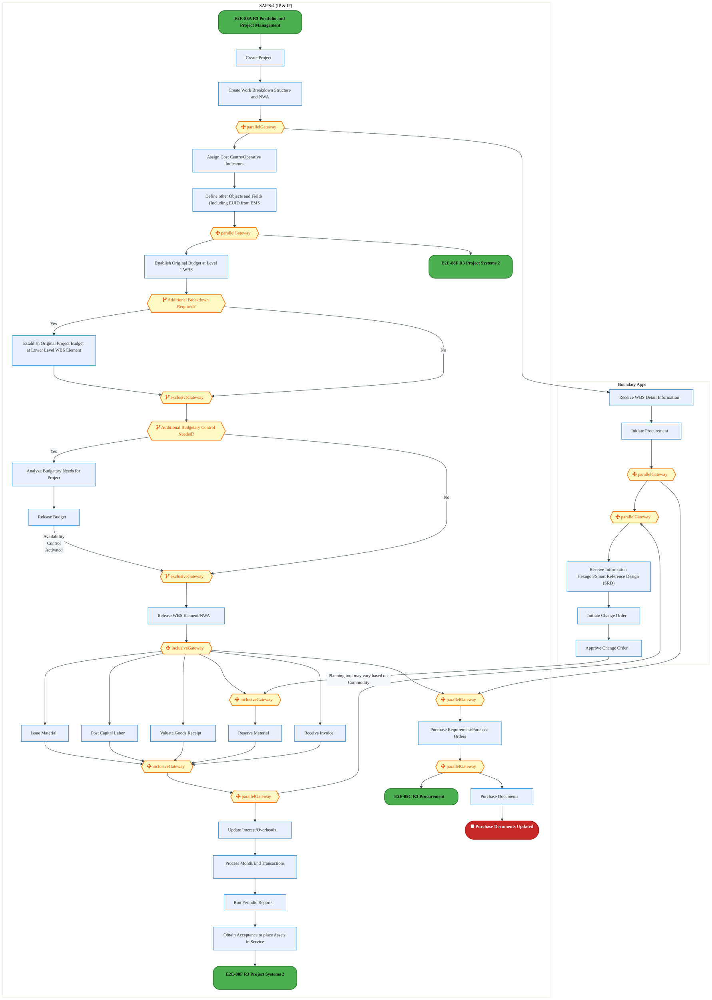
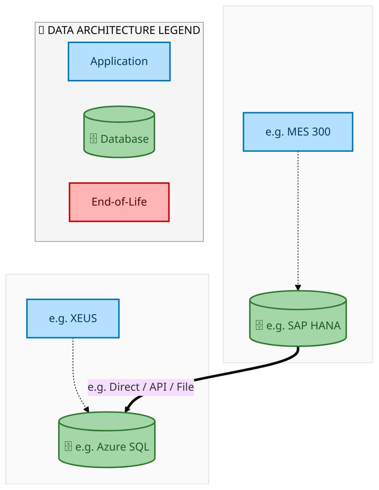
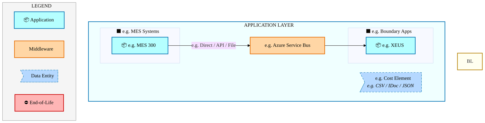
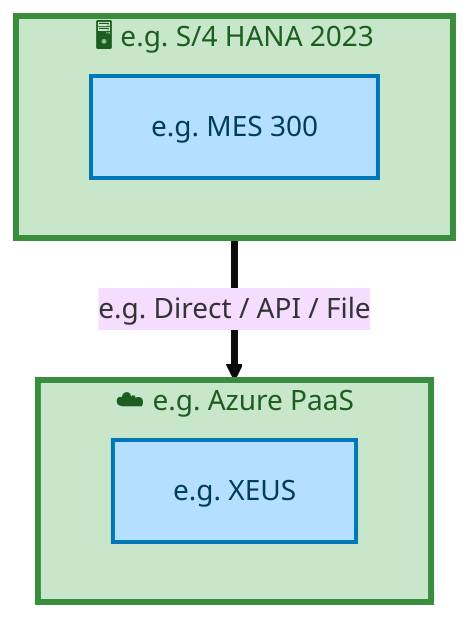

  
  <img src="data:image/svg+xml;base64,PHN2ZyB4bWxucz0iaHR0cDovL3d3dy53My5vcmcvMjAwMC9zdmciIHZpZXdCb3g9IjAgMCA4MDAgNDgwIiB3aWR0aD0iODAwIiBoZWlnaHQ9IjQ4MCI+CiAgPGRlZnM+CiAgICA8bGluZWFyR3JhZGllbnQgaWQ9ImJnIiB4MT0iMCUiIHkxPSIwJSIgeDI9IjEwMCUiIHkyPSIxMDAlIj4KICAgICAgPHN0b3Agb2Zmc2V0PSIwJSIgc3R5bGU9InN0b3AtY29sb3I6IzAwNzFjNTtzdG9wLW9wYWNpdHk6MSIvPgogICAgICA8c3RvcCBvZmZzZXQ9IjEwMCUiIHN0eWxlPSJzdG9wLWNvbG9yOiMwMGFlZWY7c3RvcC1vcGFjaXR5OjEiLz4KICAgIDwvbGluZWFyR3JhZGllbnQ+CiAgICA8bGluZWFyR3JhZGllbnQgaWQ9ImFjY2VudCIgeDE9IjAlIiB5MT0iMCUiIHgyPSIwJSIgeTI9IjEwMCUiPgogICAgICA8c3RvcCBvZmZzZXQ9IjAlIiBzdHlsZT0ic3RvcC1jb2xvcjojZmZmZmZmO3N0b3Atb3BhY2l0eTowLjE1Ii8+CiAgICAgIDxzdG9wIG9mZnNldD0iMTAwJSIgc3R5bGU9InN0b3AtY29sb3I6I2ZmZmZmZjtzdG9wLW9wYWNpdHk6MC4wMiIvPgogICAgPC9saW5lYXJHcmFkaWVudD4KICAgIDxwYXR0ZXJuIGlkPSJncmlkIiB3aWR0aD0iNDAiIGhlaWdodD0iNDAiIHBhdHRlcm5Vbml0cz0idXNlclNwYWNlT25Vc2UiPgogICAgICA8cGF0aCBkPSJNIDQwIDAgTCAwIDAgMCA0MCIgZmlsbD0ibm9uZSIgc3Ryb2tlPSJyZ2JhKDI1NSwyNTUsMjU1LDAuMDcpIiBzdHJva2Utd2lkdGg9IjAuNSIvPgogICAgPC9wYXR0ZXJuPgogIDwvZGVmcz4KCiAgPCEtLSBCYWNrZ3JvdW5kIC0tPgogIDxyZWN0IHdpZHRoPSI4MDAiIGhlaWdodD0iNDgwIiBmaWxsPSJ1cmwoI2JnKSIgcng9IjgiLz4KICA8cmVjdCB3aWR0aD0iODAwIiBoZWlnaHQ9IjQ4MCIgZmlsbD0idXJsKCNncmlkKSIgcng9IjgiLz4KICA8cmVjdCB3aWR0aD0iODAwIiBoZWlnaHQ9IjQ4MCIgZmlsbD0idXJsKCNhY2NlbnQpIiByeD0iOCIvPgoKICA8IS0tIERlY29yYXRpdmUgY2lyY3VpdC9hcmNoaXRlY3R1cmUgbGluZXMgLS0+CiAgPGcgc3Ryb2tlPSJyZ2JhKDI1NSwyNTUsMjU1LDAuMTIpIiBzdHJva2Utd2lkdGg9IjEuNSIgZmlsbD0ibm9uZSI+CiAgICA8cGF0aCBkPSJNIDAgMTAwIEwgMTIwIDEwMCBMIDE2MCAxNDAgTCAyODAgMTQwIi8+CiAgICA8cGF0aCBkPSJNIDAgMjYwIEwgODAgMjYwIEwgMTIwIDIyMCBMIDIwMCAyMjAgTCAyNDAgMjYwIEwgMzYwIDI2MCIvPgogICAgPHBhdGggZD0iTSA1MjAgMTAwIEwgNjAwIDEwMCBMIDY0MCA2MCBMIDgwMCA2MCIvPgogICAgPHBhdGggZD0iTSA0NDAgMzQwIEwgNTYwIDM0MCBMIDYwMCAzMDAgTCA3MjAgMzAwIEwgNzYwIDM0MCBMIDgwMCAzNDAiLz4KICAgIDxwYXRoIGQ9Ik0gNjAwIDQwMCBMIDY4MCA0MDAgTCA3MjAgNDQwIi8+CiAgICA8cGF0aCBkPSJNIDAgNDAwIEwgNDAgNDAwIEwgODAgMzYwIi8+CiAgICA8cGF0aCBkPSJNIDIwMCA0MjAgTCAzMjAgNDIwIEwgMzYwIDM4MCBMIDQ4MCAzODAiLz4KICAgIDxwYXRoIGQ9Ik0gNjUwIDQ0MCBMIDc1MCA0NDAgTCA4MDAgNDgwIi8+CiAgPC9nPgoKICA8IS0tIERlY29yYXRpdmUgbm9kZXMgLS0+CiAgPGcgZmlsbD0icmdiYSgyNTUsMjU1LDI1NSwwLjE4KSI+CiAgICA8Y2lyY2xlIGN4PSIxMjAiIGN5PSIxMDAiIHI9IjQiLz4KICAgIDxjaXJjbGUgY3g9IjI4MCIgY3k9IjE0MCIgcj0iNCIvPgogICAgPGNpcmNsZSBjeD0iMjAwIiBjeT0iMjIwIiByPSI0Ii8+CiAgICA8Y2lyY2xlIGN4PSIzNjAiIGN5PSIyNjAiIHI9IjQiLz4KICAgIDxjaXJjbGUgY3g9IjYwMCIgY3k9IjEwMCIgcj0iNCIvPgogICAgPGNpcmNsZSBjeD0iNzIwIiBjeT0iMzAwIiByPSI0Ii8+CiAgICA8Y2lyY2xlIGN4PSI1NjAiIGN5PSIzNDAiIHI9IjQiLz4KICAgIDxjaXJjbGUgY3g9IjgwIiBjeT0iMzYwIiByPSI0Ii8+CiAgICA8Y2lyY2xlIGN4PSI0ODAiIGN5PSIzODAiIHI9IjQiLz4KICAgIDxjaXJjbGUgY3g9IjMyMCIgY3k9IjQyMCIgcj0iNCIvPgogIDwvZz4KCiAgPCEtLSBUT0dBRiBCREFUIGJveGVzIC0tPgogIDxnIGZvbnQtZmFtaWx5PSJTZWdvZSBVSSwgQXJpYWwsIHNhbnMtc2VyaWYiIGZvbnQtc2l6ZT0iMTQiIGZvbnQtd2VpZ2h0PSI2MDAiPgogICAgPCEtLSBCIC0tPgogICAgPHJlY3QgeD0iMTUwIiB5PSIxNDAiIHdpZHRoPSIxMjAiIGhlaWdodD0iNDAiIHJ4PSI1IiBmaWxsPSJyZ2JhKDI1NSwyNTUsMjU1LDAuMTgpIiBzdHJva2U9InJnYmEoMjU1LDI1NSwyNTUsMC4zKSIgc3Ryb2tlLXdpZHRoPSIxIi8+CiAgICA8dGV4dCB4PSIyMTAiIHk9IjE2NSIgdGV4dC1hbmNob3I9Im1pZGRsZSIgZmlsbD0iI2ZmZiI+QnVzaW5lc3M8L3RleHQ+CiAgICA8IS0tIEQgLS0+CiAgICA8cmVjdCB4PSIyOTAiIHk9IjE0MCIgd2lkdGg9IjEyMCIgaGVpZ2h0PSI0MCIgcng9IjUiIGZpbGw9InJnYmEoMjU1LDI1NSwyNTUsMC4xOCkiIHN0cm9rZT0icmdiYSgyNTUsMjU1LDI1NSwwLjMpIiBzdHJva2Utd2lkdGg9IjEiLz4KICAgIDx0ZXh0IHg9IjM1MCIgeT0iMTY1IiB0ZXh0LWFuY2hvcj0ibWlkZGxlIiBmaWxsPSIjZmZmIj5EYXRhPC90ZXh0PgogICAgPCEtLSBBIC0tPgogICAgPHJlY3QgeD0iNDMwIiB5PSIxNDAiIHdpZHRoPSIxMjAiIGhlaWdodD0iNDAiIHJ4PSI1IiBmaWxsPSJyZ2JhKDI1NSwyNTUsMjU1LDAuMTgpIiBzdHJva2U9InJnYmEoMjU1LDI1NSwyNTUsMC4zKSIgc3Ryb2tlLXdpZHRoPSIxIi8+CiAgICA8dGV4dCB4PSI0OTAiIHk9IjE2NSIgdGV4dC1hbmNob3I9Im1pZGRsZSIgZmlsbD0iI2ZmZiI+QXBwbGljYXRpb248L3RleHQ+CiAgICA8IS0tIFQgLS0+CiAgICA8cmVjdCB4PSI1NzAiIHk9IjE0MCIgd2lkdGg9IjEyMCIgaGVpZ2h0PSI0MCIgcng9IjUiIGZpbGw9InJnYmEoMjU1LDI1NSwyNTUsMC4xOCkiIHN0cm9rZT0icmdiYSgyNTUsMjU1LDI1NSwwLjMpIiBzdHJva2Utd2lkdGg9IjEiLz4KICAgIDx0ZXh0IHg9IjYzMCIgeT0iMTY1IiB0ZXh0LWFuY2hvcj0ibWlkZGxlIiBmaWxsPSIjZmZmIj5UZWNobm9sb2d5PC90ZXh0PgogIDwvZz4KCiAgPCEtLSBDb25uZWN0aW5nIGxpbmVzIGJldHdlZW4gQkRBVCBib3hlcyAtLT4KICA8ZyBzdHJva2U9InJnYmEoMjU1LDI1NSwyNTUsMC4yNSkiIHN0cm9rZS13aWR0aD0iMSI+CiAgICA8bGluZSB4MT0iMjcwIiB5MT0iMTYwIiB4Mj0iMjkwIiB5Mj0iMTYwIi8+CiAgICA8bGluZSB4MT0iNDEwIiB5MT0iMTYwIiB4Mj0iNDMwIiB5Mj0iMTYwIi8+CiAgICA8bGluZSB4MT0iNTUwIiB5MT0iMTYwIiB4Mj0iNTcwIiB5Mj0iMTYwIi8+CiAgPC9nPgoKICA8IS0tIE1haW4gdGl0bGUgLS0+CiAgPHRleHQgeD0iNDAwIiB5PSIyNjAiIHRleHQtYW5jaG9yPSJtaWRkbGUiIGZvbnQtZmFtaWx5PSJTZWdvZSBVSSwgQXJpYWwsIHNhbnMtc2VyaWYiIGZvbnQtc2l6ZT0iMzYiIGZvbnQtd2VpZ2h0PSI3MDAiIGZpbGw9IiNmZmZmZmYiIGxldHRlci1zcGFjaW5nPSIxIj4KICAgIElBTyBBcmNoaXRlY3R1cmUKICA8L3RleHQ+CiAgPHRleHQgeD0iNDAwIiB5PSIzMDAiIHRleHQtYW5jaG9yPSJtaWRkbGUiIGZvbnQtZmFtaWx5PSJTZWdvZSBVSSwgQXJpYWwsIHNhbnMtc2VyaWYiIGZvbnQtc2l6ZT0iMTgiIGZvbnQtd2VpZ2h0PSI0MDAiIGZpbGw9InJnYmEoMjU1LDI1NSwyNTUsMC44KSIgbGV0dGVyLXNwYWNpbmc9IjIiPgogICAgVE9HQUYgQkRBVCDCtyBJQU8gUHJvZ3JhbSDCtyBJRE0gMi4wCiAgPC90ZXh0PgoKICA8IS0tIEJvdHRvbSBhY2NlbnQgYmFyIC0tPgogIDxyZWN0IHg9IjI4MCIgeT0iMzQwIiB3aWR0aD0iMjQwIiBoZWlnaHQ9IjMiIHJ4PSIxLjUiIGZpbGw9InJnYmEoMjU1LDI1NSwyNTUsMC40KSIvPgoKICA8IS0tIEludGVsIHRleHQgLS0+CiAgPHRleHQgeD0iNDAwIiB5PSIzODAiIHRleHQtYW5jaG9yPSJtaWRkbGUiIGZvbnQtZmFtaWx5PSJTZWdvZSBVSSwgQXJpYWwsIHNhbnMtc2VyaWYiIGZvbnQtc2l6ZT0iMTMiIGZpbGw9InJnYmEoMjU1LDI1NSwyNTUsMC41KSIgbGV0dGVyLXNwYWNpbmc9IjMiPgogICAgSU5URUwgQ09ORklERU5USUFMCiAgPC90ZXh0Pgo8L3N2Zz4K" alt="IAO Architecture" style="width:100%; border-radius:8px;" />
  <h1 style="font-size:36px; margin-top:24px;">E2E-88 — R3 Construction materials & equipment procurement process inclusive of OFCI (Like equipme</h1>
  <h2 style="font-size:24px;">Architecture Document (TOGAF BDAT)</h2>
  
End-to-End Integrated Processes (E2E) Tower 
  Capability E2E-88 · Procure to Pay

  
IAO Program · R1 – R5 
  Generated: April 2026 
  Sajiv Francis

  
IAO Architecture Pipeline — Intel Confidential

Page 1<a href="#toc">↑ Back to TOC</a>E2E-88 — R3 Construction materials & equipment procurement process inclusive of OFCI (Like equipme

## Table of Contents

<nav class="toc">
<ol>
  <li><a href="#1-executive-summary">1. Executive Summary</a></li>
  <li><a href="#2-business-context-objectives">2. Business Context &amp; Objectives</a>
    <ul>
      <li><a href="#21-classification">2.1 Classification</a></li>
      <li><a href="#22-business-drivers">2.2 Business Drivers</a></li>
      <li><a href="#23-success-criteria">2.3 Success Criteria</a></li>
      <li><a href="#24-companion-documents">2.4 Companion Documents</a></li>
    </ul>
  </li>
  <li><a href="#3-business-architecture-togaf-b">3. Business Architecture (TOGAF &ldquo;B&rdquo;)</a>
    <ul>
      <li><a href="#31-business-process-overview">3.1 Business Process Overview</a></li>
      <li><a href="#32-business-process-diagrams">3.2 Business Process Diagrams</a></li>
      <li><a href="#33-business-roles-responsibilities">3.3 Business Roles &amp; Responsibilities</a></li>
    </ul>
  </li>
  <li><a href="#4-data-architecture-togaf-d">4. Data Architecture (TOGAF &ldquo;D&rdquo;)</a>
    <ul>
      <li><a href="#41-data-entities-ownership">4.1 Data Entities &amp; Ownership</a></li>
      <li><a href="#42-data-flow-diagrams">4.2 Data Flow Diagrams</a></li>
      <li><a href="#43-data-lineage">4.3 Data Lineage</a></li>
      <li><a href="#44-ricefw-data-objects">4.4 RICEFW Data Objects</a></li>
      <li><a href="#45-data-governance-quality">4.5 Data Governance &amp; Quality</a></li>
    </ul>
  </li>
  <li><a href="#5-application-architecture-togaf-a">5. Application Architecture (TOGAF &ldquo;A&rdquo;)</a>
    <ul>
      <li><a href="#51-current-state-current-state-application-landscape">5.1 Current-State Application Landscape</a></li>
      <li><a href="#52-future-state-future-state-application-landscape">5.2 Future-State Application Landscape</a></li>
      <li><a href="#53-change-impact-summary">5.3 Change Impact Summary</a></li>
      <li><a href="#54-component-overview">5.4 Component Overview</a></li>
      <li><a href="#55-ricefw-inventory">5.5 RICEFW Inventory</a></li>
      <li><a href="#56-integration-patterns">5.6 Integration Patterns</a></li>
    </ul>
  </li>
  <li><a href="#6-technology-architecture-togaf-t">6. Technology Architecture (TOGAF &ldquo;T&rdquo;)</a>
    <ul>
      <li><a href="#61-platform-infrastructure">6.1 Platform &amp; Infrastructure</a></li>
      <li><a href="#62-sap-development-object-status">6.2 SAP Development Object Status</a></li>
      <li><a href="#63-nfrs-design-principles">6.3 NFRs &amp; Design Principles</a></li>
      <li><a href="#64-security-governance">6.4 Security &amp; Governance</a></li>
    </ul>
  </li>
  <li><a href="#7-project-context">7. Project Context</a>
    <ul>
      <li><a href="#71-project-roadmap-go-live-plan">7.1 Project Roadmap &amp; Go-Live Plan</a></li>
      <li><a href="#72-raid-log">7.2 RAID Log</a></li>
      <li><a href="#73-recommendations-next-steps">7.3 Recommendations &amp; Next Steps</a></li>
    </ul>
  </li>
</ol>
</nav>

Page 2<a href="#toc">↑ Back to TOC</a>E2E-88 — R3 Construction materials & equipment procurement process inclusive of OFCI (Like equipme

## 1. Executive Summary

This Architecture Document defines the **Business, Data, Application, and Technology** (BDAT) architecture for **E2E-88 R3 Construction materials & equipment procurement process inclusive of OFCI (Like equipme** within the IAO program. It includes 6 BPMN process diagram(s) in Section 3.

| Dimension | Value |
|-----------|-------|
| **Tower** | End-to-End Integrated Processes (E2E) |
| **Process Group** | Procure to Pay |
| **Capability** | E2E-88 - R3 Construction materials & equipment procurement process inclusive of OFCI (Like equipme |
| **Release** | R1 – R5 |
| **Total Systems** | 2 |
| **System Status** | 0 Deployed, 0 Developing, 0 EOL, 2 Pending IAPM |
| **RICEFW Objects** | Pending — Smartsheet Object Tracker API integration |

**Change Summary**: 0 new flow chains, 0 removed, 0 modified, 1 unchanged between Current-State and Future-State states.

> All system nodes in architecture diagrams are **IAPM-linked** — click any node to open its IAPM page. Diagrams require `securityLevel: 'loose'` for click events.

Page 3<a href="#toc">↑ Back to TOC</a>E2E-88 — R3 Construction materials & equipment procurement process inclusive of OFCI (Like equipme

## 2. Business Context & Objectives

### 2.1 Classification

| Level | Value |
|-------|-------|
| **L0 Tower** | End-to-End Integrated Processes |
| **L1 Process** | Procure to Pay |
| **L2 Capability** | E2E-88 - R3 Construction materials & equipment procurement process inclusive of OFCI (Like equipme |

### 2.2 Business Drivers

| # | Driver | Description | Strategic Alignment | Priority |
|---|--------|-------------|---------------------|----------|
| 1 | End-to-End Process Integration | Enable cross-tower integrated processes spanning procurement, manufacturing, and fulfillment | IDM 2.0 Process Excellence | High |
| 2 | Intel Foundry Business Enablement | Stand up foundry-specific business processes for external customer engagement | Intel Foundry Services | High |
| 3 | Process Visibility & Monitoring | Provide end-to-end process visibility across tower boundaries with integrated monitoring | Operational Excellence | Medium |
| 4 | E2E-88 Process Migration | Migrate R3 Construction materials & equipment procurement process inclusive of OFCI (Like equipme business processes and 2 integrated systems from legacy to S/4 HANA target architecture | IDM 2.0 Cross-Functional / End-to-End | High |

Page 4<a href="#toc">↑ Back to TOC</a>E2E-88 — R3 Construction materials & equipment procurement process inclusive of OFCI (Like equipme

### 2.3 Success Criteria

| Metric | Target | Measure | Baseline | Owner |
|--------|--------|---------|----------|-------|
| E2E Process Cycle Time | Per process SLA | End-to-end transaction completion within defined SLA per process | Varies by process | E2E Process Owner |
| Cross-Tower Integration Success | > 99% | Transactions completing across tower boundaries without manual intervention | 92% (current) | Integration Lead |
| Process Exception Rate | < 2% | Transactions requiring manual exception handling | 8% (current) | Operations Manager |
| E2E-88 Migration Completeness | 100% flow chains validated | All 1 flow chains verified in target state | 0% (pre-migration) | Tower Architect |

### 2.4 Companion Documents

| Document | Description |
|----------|-------------|
| **Business Architecture** | Included in this document (Section 3) — process flows from BPMN diagrams |
| **This Document** | Full BDAT Architecture — Business + Data + Application + Technology |

Page 5<a href="#toc">↑ Back to TOC</a>E2E-88 — R3 Construction materials & equipment procurement process inclusive of OFCI (Like equipme

## 3. Business Architecture (TOGAF "B")

### 3.1 Business Process Overview

This capability includes **6 business process(es)** modeled in BPMN 2.0, covering the end-to-end workflow for E2E-88 R3 Construction materials & equipment procurement process inclusive of OFCI (Like equipme.

| # | Step ID | Process Name | Lanes | Tasks | Gateways |
|---|---------|--------------|-------|-------|----------|
| 1 | E2E-88A_R3_Portfolio_and_Project_Management | E2E-88A_R3_Portfolio_and_Project_Management | Boundary Apps, SAC, SAP S/4 (IP & IF) | 15 | 6 |
| 2 | E2E-88B_R3_Project_Systems_1 | E2E-88B_R3_Project_Systems_1 | Boundary Apps, SAP S/4 (IP & IF) | 25 | 14 |
| 3 | E2E-88C_R3_Procurement | E2E-88C_R3_Procurement | Boundary Apps, External Partners/

Supplier
, SAP S/4 (IP & IF) | 24 | 11 |

| 4 | E2E-88D_R3_CFIN | E2E-88D_R3_CFIN | Boundary Apps, CFIN, MBC, SAP S/4 (IP & IF) | 15 | 10 |
| 5 | E2E-88E_R3_SAP_Transportation_Management | E2E-88E_R3_SAP_Transportation_Management | Boundary Apps, External Partners/

Supplier
, SAP S/4 (IP & IF) | 12 | 6 |

| 6 | E2E-88F_R3_Project_Systems_2 | E2E-88F_R3_Project_Systems_2 | SAP S/4 (IP & IF) | 9 | 6 |

Page 6<a href="#toc">↑ Back to TOC</a>E2E-88 — R3 Construction materials & equipment procurement process inclusive of OFCI (Like equipme

### 3.2 Business Process Diagrams

#### BUSINESS ARCHITECTURE — 3.2.1 E2E-88A_R3_Portfolio_and_Project_Management — E2E-88A_R3_Portfolio_and_Project_Management

**Swim Lanes**: Boundary Apps · SAC · SAP S/4 (IP & IF) | **Tasks**: 15 | **Gateways**: 6

> **Legend**: ● Start · ● End · User Task · Service Task · ◇ Gateway · Sub-Process

<a href="https://mermaid.live/view#pako:eNqlV9tu4zYQ_RVCi9RZwEZ0tWQ_tPBNrYGka8TbFkVdFLRE2WxoUaAox16v_71DifJFcVB0m4cgPJo5Z-aQIyoHI-IxMfrG3d2BplT20aEl12RDWn3UWuKctNqoAn7FguIlI3lLxSQ8lXP6pQyz3GynwhQW4g1le4XOyYoT9Mu0jQaQyNoox2neyYmgSavdygTdYLEfccaFiv5AgsRMSjX9aMhFTMQ5wDR9K_IgldGUnGHHd303VHk5iXgaX5EmXhIkUeuoimP8NVpjIcvyi5w84d1vNJZrWCeY5QRi1nLDHvGSMNWjFIXCokJsazNornRSMGye4YimK8BdEyCB05cz5JnHIzre3S3Skyh6fF6kCH4ihvN8TBKUS4AnW4kSylj_gzsahJ7ZzqXgL6T_wZ74Y8duR6qTPrRutpW5nVdCV2vZX3IW69DOq-qhb2e7ttj1bbMt9vC7oUXS-Kw06tqBHZyUhr41ska1UpIk_0sJfBWfcf6itSZOaIfjk5bldb2R-ZavbnPs-gOr6RMRWxqRC9IwDJ3J2apJ17PM90mHodM1Rw3SFZbkFe_PhL2ReyIMPT-0_HcJK71mlcVyJnhUEzoTL_ROhP7QCgf2u4TuwHIDXSHwrATO1ojhlPxl_rEwhrwoDzUaZFm-MP6s4tRPasHjEU-3BM7X7Gk6f_iJ7PCKp2guBTS4ohEa4YxKzNAM-JDk6DOOJI0A-JQRiKE81Q-vmW1gLlPmgxmaDmdoXmQZ25eRKRzy62hH1SEISD5AkYJvyXU54MzfJJKN4v17SEtwP8GdXPIMTdOsgDPKRVMMPZOI0C2JgeDjZZHm4VAzqJdYZwljGK0RWAJWF5Hqrtb-YWEcj5e59jkXC8Ff8w5mEmVYYMYI-7E6H-ckmKBbG6R2YD4YNTpzlXuVLgppCkVR7fJb7yxPBRMBfW_e2bfSgwc0LOIVkZcE7xRll0XBnj246H46Q9-hafjxWlVV-MhxfNJZluQ5oikckhkXMuGM8odhEb0AfJ3snbb79s524fmYwhbQZQExnwRdUXXMqgbUKZxKsrnO8c-cdUkhnHvVebWXhSD_VldwUVcdiShIoXuoM-M5Zg0bepAx2WJW6F7KGHQ_j7hQyjiNAaWwkPRLOSyNfEsN6OnI6_xGyOWQKm_1ubifzZ5u-GCpzXvmyjc1CdqySuINtXOtXvJWGY3A7nnUMgavvSlc9PTS66TpdWPUrKAxrLowGBYeAVGsWstOpqsbunS-SVMabk86QTBEz86p6Pk-f-OEbd2ebrKLWJHD6-DNjFZpzn8b7CrJ_ZYk7xtfIamPOp3vlapeB9W6p5e9amnpOwac0IC-GuEPDdQElqsBuwYcLeHVHF4FNNfdeq0Z3MbaqhOsbgX49drUCqeibJ3h1ICWsGvA1hF2Y316rglqCbuU-Lowficw6V_hSc2seWoip1GKLtUKmkQ_85Knxt1mgTVR7bzuwOpd3PalFfXH2zXu6w-tazS4ifZuc0Cp-tvkGrZuw_Zt2LkNu7dhr4aNtrEhYoNpbPQPRvnRD_8YxCTBBZPGsW3gQvL5Po2MfvlxbBRZDJljiuH22VTg8R_ogs9J" title="View full diagram">&#128065; View Diagram</a>

Page 7<a href="#toc">↑ Back to TOC</a>E2E-88 — R3 Construction materials & equipment procurement process inclusive of OFCI (Like equipme

#### BUSINESS ARCHITECTURE — 3.2.2 E2E-88B_R3_Project_Systems_1 — E2E-88B_R3_Project_Systems_1

**Swim Lanes**: Boundary Apps · SAP S/4 (IP & IF) | **Tasks**: 25 | **Gateways**: 14

> **Legend**: ● Start · ● End · User Task · Service Task · ◇ Gateway · Sub-Process

<a href="https://mermaid.live/view#pako:eNqlWGlv2zYY_iuEiswtYCM6fX3Y4PjoDDRNEPfAUA8DLVE2F5nUKNqJm_q_76VMyjardGjmD4b16Hnvg5KfnJgnxOk7FxdPlFHZR08NuSJr0uijxgIXpNFEB-ATFhQvMlI0FCflTM7o15Lmhfmjoilsgtc02yl0RpacoI_TJhqAYNZEBWZFqyCCpo1mIxd0jcVuyDMuFPsV6aZuWlrTt664SIg4Ely348URiGaUkSMcdMJOOFFyBYk5S86UplHaTePGXjmX8Yd4hYUs3d8U5Bo_fqaJXMF1irOCAGcl19k7vCCZilGKjcLijdiaZNBC2WGQsFmOY8qWgIcuQAKz-yMUufs92l9czFllFH0YzRmCT5zhohiRFBUS4PFWopRmWf9VOBxMIrdZSMHvSf-VP-6MAr8Zq0j6ELrbVMltPRC6XMn-gmeJprYeVAx9P39sise-7zbFDr4tW4QlR0vDtt_1u5Wlq4439IbGUpqm_8sS5FV8wMW9tjUOJv5kVNnyonY0dL_XZ8IchZ2BZ-eJiC2NyYnSyWQSjI-pGrcjz31e6dUkaLtDS-kSS_KAd0eFvWFYKZxEnYnXeVbhwZ7t5WZxK3hsFAbjaBJVCjtX3mTgP6swHHhhV3sIepYC5yuUYUb-cr_MnSu-KZsaDfK8mDt_Hnjqwzy4fUdiQrcEfb6aoRGRmGZoylIu1lhSzs75PvCnMOMUokfK3Y2AuWbynBWcaD1RhX4nj3jJ2eVsrfr5jqREEBYTsFrQJUOvZ3ejN-eawlN7wxVmS4Ju1FCf0yKgQXCCb3_ECqKnp7mT4n6KW1gI_lC0cCZRjgXOMpK9PVR07uz3p0LtnxOCQamrg0r0bHCLZpchej29Rb-g6cSKtQ2UoSA6s3-T2Mpq53j_Mxf36Ap-3yf8gaEZLJpYQikQZgl6_3lwLthV2SnKFA95IdEQCibI5U1OBNSlrFFCYyy5sLqjB4LQmrAsEYcFLtDNQrlVlGYmlGRJAcGwONsksLbQ-ON0hFLB12h8PbP6TPXhGBbWIqPFCopDl5ThDF1tkiWRCEv0jmxJhjzVhZaoVy-qc3Sqgj-AjwdFqpnHWU1veqqFB6Bg95VoWTUa7wmBYKBV63PvHVo6I3CcaSmLEJ4QToxfflcNTzXrtCg2BF1DLdXBZhFUI9yWhcI5lRAqHCjc6mVPdcPtRsDRAAbvyD8bepjEywosJ8Ced9ULn3C2UV30lnOIuRzU3A6nV4ajNudzbvru2ZRvOaxYi6Eq9zFPlK0pAx2kkJc3WyJWBCeWY74qi1oopCjQNRwfq8sxNNkHOBYLHKvtYQuUFdkwdAu-cehfCCTnQto0VZebBWw1hgZxTHKJ1caRHOUZhh8wFwQaGu7ODqeEJR6dpnkE-07l2LbRfv3FrIhC8hx9L4AOaUhA8M2ppKri2B-3ut0hugue36h-tyJONLFs_tmukGRdIN-i936KHrgVfVDSIY8pzygvB90IX2OGl3Xb3jtuSPUk2FpA0eIVGiQJVYVTY16tKt2pyW_2mvXrlZBH2C4FtNgz2zn4b9vVjA-hrQTPylmv8SB8mQedlxwq3ZcI9V4gFLovEfJeIuTXClH2w_SFwYukwp-Uqk5l1kat1q9wmOrLzuEyMNeBBrr62vM0wTcEXwOBAQIFfJs7fxDYC9_UCWNkNdWrqKEGQg2EhtG2gcp-dABCo8Nr20DXAnraQaMi0ATPNRI9W4WrRTwj4tkxebaDkQWEVUyBVtYzgInaANofc-mZBA628OyJFzSjcofmzIzrnA3gANge1uc3lUXbtHFO18q3o3jPD4K-XTJzI7SqX-VBGzCXuhgmbzowOxXmlQZ-WImOrFyZXjLlD7SAufZNRMZz35gwGn3tol_5qIvrmxh87aVftZQGQqM01FZ9E4iv_fTbVgv5VU21Y56ZG09nLnRtpdVkta1qHTyFKtzCEzJTD5CSQ7nX8FK1Veta_XWQIK4eWtdrOOHl7lCsyFJogPJNSjmtX1bP0U71unyOd5_Be_U4VKge98wb4Tns18NBPRzWw1E93K6HO_Vwtx7u1cJQvVq4PsqwPsqwPsqwitJpOmsCL4c0cfpPTvkXkdN3EpLiTSadfdPBG8lnOxY7_fKvFGdTPkWNKIY3q_UB3P8LsACeTg==" title="View full diagram">&#128065; View Diagram</a>

Page 8<a href="#toc">↑ Back to TOC</a>E2E-88 — R3 Construction materials & equipment procurement process inclusive of OFCI (Like equipme

#### BUSINESS ARCHITECTURE — 3.2.3 E2E-88C_R3_Procurement — E2E-88C_R3_Procurement

**Swim Lanes**: Boundary Apps · External Partners/
Supplier
 · SAP S/4 (IP & IF) | **Tasks**: 24 | **Gateways**: 11

> **Legend**: ● Start · ● End · User Task · Service Task · ◇ Gateway · Sub-Process

<a href="https://mermaid.live/view#pako:eNqtWG1v4kYQ_isrn1LuJCjYxhj40AoIziFdLijOXVRdqmqx17CN2XXXdkKa47931l4b2DhXKS0fIPt4nnmfsZ1nI-AhMcbG2dkzZTQbo-dWtiFb0hqj1gqnpNVGJfAVC4pXMUlbUibiLPPp34WY2U92UkxiHt7S-EmiPllzgr4s2mgCxLiNUszSTkoEjVrtViLoFounGY-5kNLvyDDqRYU1dWnKRUjEQaDXc83AAWpMGTnAttt3-57kpSTgLDxRGjnRMApae-lczB-DDRZZ4X6ekku8u6VhtoFzhOOUgMwm28af8IrEMsZM5BILcvFQJYOm0g6DhPkJDihbA97vASQwuz9ATm-_R_uzsztWG0Wfru8Ygk8Q4zQ9JxFKM4DnDxmKaByP3_VnE8_ptdNM8HsyfmfN3XPbagcykjGE3mvL5HYeCV1vsvGKx6ES7TzKGMZWsmuL3djqtcUTfGu2CAsPlmYDa2gNa0tT15yZs8pSFEX_yRLkVdzg9F7Zmtue5Z3Xtkxn4Mx6L_VVYZ733Ymp54mIBxqQI6We59nzQ6rmA8fsva506tmD3kxTusYZecRPB4WjWb9W6DmuZ7qvKizt6V7mq6XgQaXQnjueUyt0p6Y3sV5V2J-Y_aHyEPSsBU42KMaM_NH7dmdMeV40NZokSXpn_F7KyQ8z4fIyF9BgKUFXcloQtH6MV1zgjHKG_MW1t_C7t2SF_Jxm5JRuAf2aBIQ-ELRgERfbgnUqZB8JXWKW4xhR9sChIinKNoLn6w26ml2fkvonmgO-hbmoaF00tabdq4SwG7LLCt_Sl745hQYc-jzK0Fcc07DwrTvfBSQpYvuIWRhLvXJJhQgQkcNygn7J8kQLdPT8fGdEeBzhjtx2nRXMa7CRjiAupPu_3hn7_XHUvWYG2QVxnkJYF2UDHWgwYk0VlCWa7zIiGCRuCRPPiEi7UI0kiSnUS3NUis84i6jYdn0SkyBDMywESGqlt2TxrsQaM9jB6Aa8SxMuMk3ILoRkX_gbmmwJy9AF52GKljS4h6S9V8o_aLzj-tWuqvpp7WH9T4mS8fiTJfK7ffR-sUQ_oYWnuTWQyREEFKK666_JXzlNadERjzTboNupf8pygQWjI_hDM-1Uethgo8xgs_YRyN8Iul6DxMWNj2YbEtwXf0FNQgLzuIXsQUq0vJlytGc4DvJY2rrBO-16OdurmKYbzRNNUCZuEtwz_hiTcE26qn1-TJKNsSRCzjwM6EquGHROYqgXLJoi0o8cVjmaUIFu8dMKthpi-XYFUX6c3E41bcftUvZXcUoylHE5vD-jacyLhksz-NXYzqvsSPDtKR_0fWGCwCalQVY0MGdpvi03Qp7A18W11jWmbJslTzNN-UxCeI0pg98XdTXdQyPMoVfK4bnEafYil7JlviRhkySCBKOpTB6PAAIEHoSKnuAMpPR1XjTTJZpDnsOQhNpQ9qo4fjyRlvP-WzWRkO7kpVOls1L9h2OezNPcmneGwzm6tpEcxnqvlLcT2P94TaQqzaRbU88ldeYtPmsSw1piKiXgXvmnXG7-E3i0TZGpbRWzeassyoDRJJB3ARK-WNv2gQebjT-mHRxnKMECxzGJX-yiktR_C8l5C2nQSJpWN7ApbExGUuhRuJPpXPctBodvIY0aSZT960ZnLup0foElqo62XZ5H2tlUT09sUJ5ddRyVR7uvzkN1ttXZ7GkCdl8pNCsJUwHqbFnl2apUWErAsiqGItTnilGrdJTRQQWoKOzKbVOFYTuVW4pi1kAh8R0e5qpS3zGt2N_lzqkUqsCtim-qzFiDE4Xy9ltJqNRX58rpKgrbVB78RtLCWPXkDioUs0qqpZJqjXTuZ15Qa6OW8rPyyrKV4MT_DNu4WIkPFKOj508ZZl0LlaWqXSxVXqvKg3LErl3VztZI2SseQKVn-gV4wisu1A2jTNSFUWkzRzpQM1Tqzbr8lVd1lw_18lfA6OglQVZTvYedooP6TfAUd1_Bh6_go-ql5gSGgBthsxm2mmG7Ge43w04zPGiG3WZ42AzXURptY0vgjYWGxvjZKP5BYYyNkEQ4jzNj3zZwnnH_iQXGuHiRN8p-PKcYHjq3Jbj_B7lmMZ8=" title="View full diagram">&#128065; View Diagram</a>

Page 9<a href="#toc">↑ Back to TOC</a>E2E-88 — R3 Construction materials & equipment procurement process inclusive of OFCI (Like equipme

#### BUSINESS ARCHITECTURE — 3.2.4 E2E-88D_R3_CFIN — E2E-88D_R3_CFIN

**Swim Lanes**: Boundary Apps · CFIN · MBC · SAP S/4 (IP & IF) | **Tasks**: 15 | **Gateways**: 10

> **Legend**: ● Start · ● End · User Task · Service Task · ◇ Gateway · Sub-Process

<a href="https://mermaid.live/view#pako:eNqlV9tu4zYQ_RVCi9RZwO7qasl-aOGbFgHWgRF3WxRNUdASFRORRYGinHiz_vcOLVK2FPmhWz8k4tGZM8PhzJh-MyIWE2Ns3Ny80YyKMXrriS3Zkd4Y9Ta4IL0-qoDfMad4k5KiJzkJy8SafjvRLDd_lTSJhXhH04NE1-SJEfT1ro8mYJj2UYGzYlAQTpNev5dzusP8MGMp45L9gQSJmZy8qVdTxmPCzwTT9K3IA9OUZuQMO77ru6G0K0jEsrghmnhJkES9owwuZS_RFnNxCr8syBK__kFjsYV1gtOCAGcrdukXvCGp3KPgpcSiku91Mmgh_WSQsHWOI5o9Ae6aAHGcPZ8hzzwe0fHm5jGrnaIvD48Zgk-U4qKYkwQVAuDFXqCEpun4gzubhJ7ZLwRnz2T8wV74c8fuR3InY9i62ZfJHbwQ-rQV4w1LY0UdvMg9jO38tc9fx7bZ5wf42_JFsvjsaTa0AzuoPU19a2bNtKckSf6XJ8gr_w0Xz8rXwgntcF77sryhNzPf6-ltzl1_YrXzRPieRuRCNAxDZ3FO1WLoWeZ10WnoDM1ZS_QJC_KCD2fB0cytBUPPDy3_qmDlrx1luVlxFmlBZ-GFXi3oT61wYl8VdCeWG6gIQeeJ43yLUpyRf8y_Ho0pK09FjSZ5Xjwaf1c8-ckseP1AIkL3BIU0JYhmaAqV2GTZwPqax7BjtMKHHckEeiA7KgTOItISHN4COcHjBA8KwfLaYI4FRpVIDCYfKxsoq66oZViz8O6-qe0AunglUXkZR5k1Sa405UTGOlkt0ZLsGAQbwSRo8jzgyXyTokDT2bIWnGIRbaEJ4aEgMWKQj7KAcQG0hxJGV1NlCCqfSUa49qdlZDKbVF-mmsnYBZMnwdme8CYlkLEzzkkkTmLqmUIQ7_VGp6MDjUJ6XqE51M59udsQjnAWX24czUlKpErrqGRthAS2q6MuUIgjwaBSbsF9X-alj5bTGVoymOuMf2wJVNWzp-QFDCHAuN7-F_bU4tqXmdI0OICcFThtcZ2Tbp7SSJLXZQ6PsK27bM-gj9GKFQJOqGUUtArvMgFVQVzUXWUyapnoNKq0tvm29fam-fIrb7CBoQ3ZW-KsxKk6U3i4J7KqoOF-fTSOx0sBu1tAVUP8ju9088lrlEJR7snnagi1zdxusxmGYia6qjrceT_mbvhjZn63WZV8SCPj8JxXLQrH_S7a4GyPOWcvxQCnAuWY4zQl6RWnox8wcsxOI5pd29-VqSZbALqpVbdyYC3LVNCBHLxwOlkme35PBbThFkp9INhA_m93n_ffDa8EJvttPVmh9ScX3d6t0E_oLmx786_NdSKg9QskK5jGMAI2OHqWI27NSg7Nuj4Uguyk7KdKtNFRcgQt7MUgCGbowZHzAC5LRAq_jxlmCBoMfoHzUGunWtqBWrvV2tJrT71X9wF4kMD3R-OePRrfZXupF74i2pqolId6rZQ8vXZbQpo4UhGMdMSmUtaAPayAeq0t6hiDCnC1gqUUfE3wlW_dJ80IVIosvVb-LLflUG9VubP11iy1dctuR1gHoPZkOe20_im_HSEYzdT4anJ3_7Np2ugWimaQMhzLSw75eCJbtWe3Sbe66Y08ndJwHhFVKrSgowLV5WDbrTjr86_f6POss68O3jLfZ7_l1jHbxaHdOJc3PXk06jLdRP1ONOhER10onIv-QdDELX1XbcJ2N-x0w2437HXDw27Y74aDbnjUCcOpKtjoGzvCd5jGxvjNOP3AhB-hMUkwDEXj2DdwKdj6kEXG-PRDzChPt885xTD6dhV4_BeQQYLe" title="View full diagram">&#128065; View Diagram</a>

Page 10<a href="#toc">↑ Back to TOC</a>E2E-88 — R3 Construction materials & equipment procurement process inclusive of OFCI (Like equipme

#### BUSINESS ARCHITECTURE — 3.2.5 E2E-88E_R3_SAP_Transportation_Management — E2E-88E_R3_SAP_Transportation_Management

**Swim Lanes**: Boundary Apps · External Partners/
Supplier
 · SAP S/4 (IP & IF) | **Tasks**: 12 | **Gateways**: 6

> **Legend**: ● Start · ● End · User Task · Service Task · ◇ Gateway · Sub-Process

<a href="https://mermaid.live/view#pako:eNqlVm1v4jgQ_itWqh67ErRxXgjlw0kQSFVpq0VNe_dhOZ1M4oBVk0S2A2W7_Pcb5wVKSk-3e3yoOk9mnpl5MmPn1YiymBpD4_LylaVMDdFrR63omnaGqLMgkna6qAL-IIKRBaeyo32SLFUh-166YSd_0W4aC8ia8Z1GQ7rMKHq666IRBPIukiSVPUkFSzrdTi7Ymoidn_FMaO8LOkjMpMxWPxpnIqbi6GCaHo5cCOUspUfY9hzPCXScpFGWxiekiZsMkqiz18XxbButiFBl-YWk9-TlTxarFdgJ4ZKCz0qt-ReyoFz3qEShsagQm0YMJnWeFAQLcxKxdAm4YwIkSPp8hFxzv0f7y8t5ekiKvjzMUwS_iBMpJzRBUgE83SiUMM6HF44_ClyzK5XInunwwpp6E9vqRrqTIbRudrW4vS1ly5UaLjIe1669re5haOUvXfEytMyu2MHfVi6axsdMft8aWINDprGHfew3mZIk-V-ZQFfxSORznWtqB1YwOeTCbt_1zfd8TZsTxxvhtk5UbFhE35AGQWBPj1JN-y42PyYdB3bf9FukS6LoluyOhDe-cyAMXC_A3oeEVb52lcViJrKoIbSnbuAeCL0xDkbWh4TOCDuDukLgWQqSrxAnKf3b_DY3xllRDjUa5bmcG39VfvqXYnj8QCPKNvQ6hHeM7tIkE2uiWJYiliKfCMGoAHiTgYToQS9IxDgrPa4nTOaFoldXV6e0FtBONzRVqMhjEEoiIigSVaJYE98-PrYq8V5f50ZChgnp6fOkt4CNiFaIvkS8kBB2Wwk-N_b7KgzKPdexbmn6oqhICUcz2JCUCnmNwiLPuW6llVa7BxSKetB1Xvuwakuo9y5VFEhVJiSyRYxyINo1k4TmhWViG9SIt1kWtxh187VurSf2p29NizmH2dHvm0qdjClQFIoYw3EZI9BeV3MoZrQhjOuDE_g-vyV0WoSl5hLNigVnckXjlr-FjxpDgdlW9ghXujfCOeXvFK6CrJ8L-uC1aFXC0QyF1w76dDdDv6G74POpPja43FJ4XUCJAlEeH-gJtEGfHu9bvo4WWdC3nl_1YX_G1QXXGRV6rg_z_NSMJYy8T3hUcM1U630a3i_niUbFf0jl6VSZVAfHkCrF4eaDTZhkUVH-8z5scGwmrCds9hVBwSgIJ2f8b5o04TREW6ZWaFSoDMaRU5ifMwHYPGbwdSAsrhJsUZRbPFrSNNqhMaxZqsfxXyrF7nHipMpy9HiP8nqK4cW_mzhcqmdNe4OBjx7scuILUQrSIh787PpXYTe_FGaZv3zYpDbq9X6HAaxNtzLxoLa9ym5MfFPZbm33K7O59VKnDr-p7dodN8-xWQMNAcY1A26AuiB8AOoSDnaTw2oAq6ZoAKsGsNcAuA00IQ1Fq41DQNNH6f-juQWqdZsbP94IhWsp7MYeVHa_tmvzQFgL4b25Nsvmm6-gU9z5AHfrL5lTtP-Bt9dc86fw4Dx8cxaGws_C-DxsNbDRNdYUrmIWG8NXo_x-hm_smCak4MrYdw0COx_u0sgYlt-ZRnXVThiBU3ddgft_AJmNlTw=" title="View full diagram">&#128065; View Diagram</a>

Page 11<a href="#toc">↑ Back to TOC</a>E2E-88 — R3 Construction materials & equipment procurement process inclusive of OFCI (Like equipme

#### BUSINESS ARCHITECTURE — 3.2.6 E2E-88F_R3_Project_Systems_2 — E2E-88F_R3_Project_Systems_2

**Swim Lanes**: SAP S/4 (IP & IF) | **Tasks**: 9 | **Gateways**: 6

> **Legend**: ● Start · ● End · User Task · Service Task · ◇ Gateway · Sub-Process

<a href="https://mermaid.live/view#pako:eNqlVmtv4jgU_StWqi6tFDR5kpAPu4KErCrtoyrtjlbLamUcp3hr4ozt0DIM_31s8qBk4MPs8gFxj8859_qGa2dnIJZhIzKur3ekIDICu4Fc4TUeRGCwhAIPTFADf0BO4JJiMdCcnBVyTj4faLZXvmmaxlK4JnSr0Tl-Zhg83ZlgooTUBAIWYigwJ_nAHJScrCHfxowyrtlXOMyt_JCtWZoynmF-JFhWYCNfSSkp8BF2Ay_wUq0TGLEiOzHN_TzM0WCvi6PsFa0gl4fyK4F_hW8fSSZXKs4hFVhxVnJNf4FLTPUeJa80hiq-aZtBhM5TqIbNS4hI8axwz1IQh8XLEfKt_R7sr68XRZcUPCaLAqgPolCIBOdASAXPNhLkhNLoyosnqW-ZQnL2gqMrZxYkrmMivZNIbd0ydXOHr5g8r2S0ZDRrqMNXvYfIKd9M_hY5lsm36ruXCxfZMVM8ckIn7DJNAzu24zZTnuf_K5PqK3-E4qXJNXNTJ026XLY_8mPrW792m4kXTOx-nzDfEITfmaZp6s6OrZqNfNu6bDpN3ZEV90yfocSvcHs0HMdeZ5j6QWoHFw3rfP0qq-U9Z6g1dGd-6neGwdROJ85FQ29ie2FTofJ55rBcAQoL_I_118KYT-7B_IMHbu7uwQ_gLr1dGH_XXP0pbEWJOVb7AXMsJVWDWkjwUKk5PSU6ivhQFe9YPYKrCPcUIgwmQmApANHkQ_NPiZ4i_r6UUK1PEMKlhIUS5YwD1YJ_MZIgpkxUvCfzdaWwJBJSdW6AlBSQ1qlOeaPjji5yAsV5KjPNeXq8_5DgkmNEoCRM1awHCyR67SaZJ7dAYReNQr1pJlTJsKzXwSG3NoJFBiBCrCqkmms1RJJvT9Vj3VMsCW971ns21o0i5DDK4VBIVnb9IeLQIpwp_u17gd0T1BWhrmvfCPRTnTmzYRhOwYPbJZhvhcRrAexeQe730b3dri1H3xLDpTrn0Orkj4Y_VWr72U8LY79_L_XPSycbSChcEkrkFsTqoOFMPRckyUY9r6xvMjpvgt8QrQTZ4J_rMe7LgqMMcs5exRBSCUrIIaWYXhCF_0U0_j6ROofrH4UNhsMf1VA2oVOHtt8u-zXgtrGn4y8L40891l90a9qVUSNtYrcJg3Y9qAGvib1m3eo7_8Zq47aEpgLb7hl1JbY1hy0QNk6zp7sEVIfprIsd9RlqZusBzTlbg4_T-YHWlTyunVvjsA7HTdjUYbfxqBc36mOH2pZ4785s3YHmWjxF7bOo013Xp7h7AffaG-YU9s_Do_NwcB4Oz8PjFjZMY435GpLMiHbG4dVNvd5lOIcVlcbeNGAl2XxbICM6vOIY9aNKCFQ3z7oG918BhAobqw==" title="View full diagram">&#128065; View Diagram</a>

Page 12<a href="#toc">↑ Back to TOC</a>E2E-88 — R3 Construction materials & equipment procurement process inclusive of OFCI (Like equipme

### 3.3 Business Roles & Responsibilities

| Role / Lane | Processes Involved | Description |
|------------|-------------------|-------------|
| Boundary Apps | E2E-88A_R3_Portfolio_and_Project_Management, E2E-88B_R3_Project_Systems_1, E2E-88C_R3_Procurement, E2E-88D_R3_CFIN, E2E-88E_R3_SAP_Transportation_Management,  | |
| SAC | E2E-88A_R3_Portfolio_and_Project_Management,  | |
| SAP S/4 (IP & IF) | E2E-88A_R3_Portfolio_and_Project_Management, E2E-88B_R3_Project_Systems_1, E2E-88C_R3_Procurement, E2E-88D_R3_CFIN, E2E-88E_R3_SAP_Transportation_Management, E2E-88F_R3_Project_Systems_2 | |
| External Partners/

Supplier

 | E2E-88C_R3_Procurement, E2E-88E_R3_SAP_Transportation_Management,  | |
| CFIN | E2E-88D_R3_CFIN,  | |
| MBC | E2E-88D_R3_CFIN,  | |

Page 13<a href="#toc">↑ Back to TOC</a>E2E-88 — R3 Construction materials & equipment procurement process inclusive of OFCI (Like equipme

## 4. Data Architecture (TOGAF "D")

### 4.1 Data Entities & Ownership

| # | Data Entity | Source System | Target System | Data Owner | Classification | Volume | Master/Transaction |
|---|-------------|---------------|---------------|------------|----------------|--------|-------------------|
| 1 | e.g. Cost Element | e.g. MES 300 | e.g. XEUS | Data steward | e.g. Intel Confidential | e.g. 10K rows/day | Master / Transaction |

Page 14<a href="#toc">↑ Back to TOC</a>E2E-88 — R3 Construction materials & equipment procurement process inclusive of OFCI (Like equipme

### 4.2 Data Flow Diagrams

> **DATA ARCHITECTURE** — Database-to-database data flows. Applications (blue) sit above their hosting databases (green cylinders). Thick arrows show data movement between databases.

#### 4.2.1 Current-State — Current-State Data Flows

<a href="https://mermaid.live/view#pako:eNqdlYtO2zAUhl_FMqq0SS0LLWkhEkjObSAFxEjZJpEpchOntXCTKHFGS-m7z84N1jUMYUuRfS7_cb4TORsYJCGBGuz1NjSmXAMbD_IFWRIPasCDM5yLVV-schIUGeVrh_wmrHKyJGm8Zcp3nFE8YySXbqETJTF36VMtdaSmqypY2m28pGxdeVwyTwi4u-wDJASE-LaMYsljsMAZr9WKnFzh1Q8a8oW0RJjlRMYt-JI5eEZYWZZnRWmNxWu5KQ5oPJfmkSqNGY4fXhmP1e0WbHs9L25rganuxUCMgOE8N0kEcJrqyQpElDHtQFdN27b7Oc-SB6IdKMpkoo_r7eBRHk0bpqt-kLAkk-6Rqe7qhTNjzWo5pJpjNGnlhtbEHA075Y501RoqO3IkYS_Hs21d1dVWzzAUMTr1xmPp9uJKMS9m8wynC2ANrZMTw0SG4xN_7qOnIiO--82596BA-KuKliOkGQk4TeIWmhxNOiqzf1p3rkgkh_NDINdCQNO0ium_OeZOxU8e9IrwZBSKZxgce0VEFPHKUqwMAiLIg5-lZIn1rVOAweHgvKtSlUjisGbB14x0gmhgIzlb2JYi59-wj8QX_x-8LrrxL9A1-hDdK8v1R4rSABZbILbvYdyWfQOxiAEy5j2E65Psg9yUeg_jJvZDiPeXBWdn5881ILNkCr4AdHMpnjZl4m567v4odlrnkLk4_v0rYkGoABNNEUC3xsXl1DKmd7cWcKyv1rXZ0U3n9sXq-LLvKE0ZDbD07m-d45sdfTIxx9UVva9Fjm8JeSsOB0k0cGhEKvnqytjbjuoNG_qqnC3909PTf9DDPlySbIlpCLVN9RMQ_5KQRLhgXFzjEBc8cddxALXyYoZFGmJOTIoF0WVl3P4BbGP_Qw==" title="View full diagram">&#128065; View Diagram</a>

Page 15<a href="#toc">↑ Back to TOC</a>E2E-88 — R3 Construction materials & equipment procurement process inclusive of OFCI (Like equipme

#### 4.2.2 Future-State — Future-State Data Flows

<a href="https://mermaid.live/view#pako:eNqdlQ1L4zAYx79KiAzuYPPqZjctKKRrewpVPDvvDuxRsjbdgllT2vTcnPvul_RNb7d5YgIleV7-T_p7SrqGIY8INGCns6YJFQZY-1DMyYL40AA-nOJcrrpylZOwyKhYueQ3YZWTcd54y5TvOKN4ykiu3FIn5onw6FMtdaSnyypY2R28oGxVeTwy4wTcXXYBkgJSfFNGMf4YznEmarUiJ1d4-YNGYq4sMWY5UXFzsWAunhJWlhVZUVoT-VpeikOazJR5oCtjhpOHV8ZjfbMBm07HT9paYGL6CZAjZDjPLRIDnKYmX4KYMmYcmLrlOE43Fxl_IMaBpo1G5rDe9h7V0Yx-uuyGnPFMuQeWvq0XTccrVssh3RqiUSvXt0fWoL9X7sjU7b62JUc4ezme45i6qbd647Emx1694VC5_aRSzIvpLMPpHNh9--TEsdDYDUgwC9BTkZHA--be-1Ai_FVFqxHRjISC8qSFpkaTjsrsn_adJxPJ4ewQqLUUMAyjYvpvjrVV8ZMP_SI6GUTyGYXHfhETTb6yEiuDgAzy4WclWWJ96xSgd9g731epSiRJVLMQK0b2gmhgIzVb2Lam5t-wj-QX_x-8HroJLtA1-hDdK9sLBprWAJZbILfvYdyWfQOxjAEq5j2E65PsgtyUeg_jJvZDiHeXBWdn5881IKtkCr4AdHMpnw5l8m563v9RbLXOJTN5_PtXxMJIAxaaIIBuxxeXE3s8ubu1gWt_ta-tPd10b1-sbqD6jtKU0RAr7-7WuYG1p08WFri6one1yA1sKW8nUY_HPZfGpJKvroyd7ajesKGvq9nSPz09_Qc97MIFyRaYRtBYVz8B-S-JSIwLJuQ1DnEhuLdKQmiUFzMs0ggLYlEsiS4q4-YP6Aj_bQ==" title="View full diagram">&#128065; View Diagram</a>

Page 16<a href="#toc">↑ Back to TOC</a>E2E-88 — R3 Construction materials & equipment procurement process inclusive of OFCI (Like equipme

### 4.3 Data Lineage

| # | Source System | Source Schema/Object | Target System | Target Schema/Object | Transformation |
|---|-------------|---------------------|---------------|---------------------|---------------|
| 1 | e.g. MES 300 | e.g. CKMLHD table | e.g. XEUS | e.g. dbo.CostElements | Lineage notes |

### 4.4 RICEFW Data Objects

Reports and Conversions for this capability will be populated from the Smartsheet Object Tracker via automated API extraction.

| Object ID | Type | Description | Status | Source | Target | Complexity |
|-----------|------|-------------|--------|--------|--------|-----------|
| E2E-88-R001 | Report | R3 Construction materials & equipment procurement process inclusive of OFCI (Like equipme operational report | Planned | SAP S/4HANA | Analytics | Medium |
| E2E-88-C001 | Conversion | Legacy data migration for R3 Construction materials & equipment procurement process inclusive of OFCI (Like equipme | Planned | Legacy ERP | SAP S/4HANA | High |

> *Pending: Smartsheet API integration to auto-populate live RICEFW data (see Build Requirements).*

### 4.5 Data Governance & Quality

| Concern | Approach |
|---------|----------|
| Data Ownership | Per-entity owners listed in Section 3.1 |
| Data Classification | Financial data classified as Intel Confidential |
| Data Retention | Per Intel corporate retention policies |
| Data Quality | Validated at source; reconciliation at target |

Page 17<a href="#toc">↑ Back to TOC</a>E2E-88 — R3 Construction materials & equipment procurement process inclusive of OFCI (Like equipme

## 5. Application Architecture (TOGAF "A")

### 5.1 Current-State — Current-State Application Landscape

#### Overview

The Current-State architecture represents the **current / legacy** landscape for E2E-88.This view is generated from `CurrentFlows.xlsx` (1 flow hops across 1 flow chains).

#### APPLICATION ARCHITECTURE — Architecture Diagram (ArchiMate-Inspired)

> **Click any system node** to open its IAPM application page.
> **Legend**: Deployed · Developing · End-of-Life · No IAPM Match

<a href="https://mermaid.live/view#pako:eNqdlm1v2kgQgP_KyhHfoHFeIMSKkGxsTpxMEtVtc6dzZS3eAVZdbMu7bkJT_ntnvQQcaESuiwT2vDwzHs_O8mylOQPLsVqtZ55x5ZDn2FILWEJsOSS2plTiVRuvJKRVydUqhO8gjFLk-Yu2dvlCS06nAqRWI2eWZyriPzaos17xZIy1fESXXKyMJoJ5DuTzuE1cBIg2kTSTHQkln8XWuvYQ-WO6oKXakCsJE_r0wJlaaMmMCgnabqGWIqRTEHUKqqxqaYaPGBU05dlciy9tLSxp9q0h7NrrNVm3WnG2jUU-eXFGcLVapNPB3NIFn1AFHZ7JgpfAiFQrASQVVEqQaGPM63sfZmRaSZ6BlKReMy6EczLC5XXbUpX5N3BOvH6_Z3ub286jfiDnvHhqp7nIS-fEtu09Ji0KsluG6XU1dcu07asrr_c_mIwqesj0-0eYZ6-YLzpGJRavpCusKenuRVpyxgQ80hKaFfF77q4iwVVvtKO9I3vIxUFFdI0bVR4ObfsY01BlNZ2XtFgQN_wvtuKK9S8YfrOLLnHv78Px0P00vrsloftv8DG2vhonvRg2RKp4npHw4066xQXnQb8_DG8TSOaJl1cZo-UqcYtCYhgSV-fTsymBD_MP5EVJtPJViLfD6GUi1Px_gs9RM_sUeoatFYh0HAfbaOcOGTuW8iSIkmglFSwPEkYV2aj-LF3NvrDt32as4ag7lrShTR5qnvujKiGJoPzOU0i8Sr56k2dXhlxbkY0VQSsTY9eh-3Q_qOnDXKokEDjuMjVoppxeGrA2IBuDm2l5OrjhA6OIvpBTMvbzFH_-ju5ub075wETVO9DEqx_LXB6WCEfM4Gds1TS_Li2S3Psxfo-4wDn780glmuC3bHSQ_W7SKW02SD3yvLAxzkb2sXHWdHW3rvZ7ptbBxgxhjjV61SzMJmHwV3Drv2NHhgnu4_1Ww60meEq18W86LUwmD_stNNm1yZttEyZ-sN8hvh61QabwIN1_88YluDOD57zHLtGQdfJZJ-SzTRicdY022RXVFOWlsF392Rb2-vr6YG5bbWsJ5ZJyZjnP5vDG_wAMZrQSCo9ci1Yqj1ZZajn1IWpVBSYKPqf4EpZGuP4FJn6LAQ==" title="View full diagram">&#128065; View Diagram</a>

Page 18<a href="#toc">↑ Back to TOC</a>E2E-88 — R3 Construction materials & equipment procurement process inclusive of OFCI (Like equipme

#### Current-State Flow Narrative

| # | Flow Chain | Path | Interface | Freq |
|---|-----------|------|-----------|------|
| 1 | e.g. MES Route to ICOST | e.g. MES 300 → e.g. XEUS | e.g. Direct / API / File | e.g. Near Real-Time |

Page 19<a href="#toc">↑ Back to TOC</a>E2E-88 — R3 Construction materials & equipment procurement process inclusive of OFCI (Like equipme

### 5.2 Future-State — Future-State Application Landscape

#### Overview

The Future-State architecture represents the **target** landscape for E2E-88.This view is generated from `FutureFlows.xlsx` (1 flow hops across 1 flow chains).

#### APPLICATION ARCHITECTURE — Architecture Diagram (ArchiMate-Inspired)

> **Click any system node** to open its IAPM application page.
> **Legend**: Deployed · Developing · End-of-Life · No IAPM Match

<a href="https://mermaid.live/view#pako:eNqdln1v2jwQwL-KlYr_YE1foDSqkJImTEyhrZZt3fRkikx8gDWTRLGzlnV8951jCimsos-MBMm9_O5yOZ95stKcgeVYrdYTz7hyyFNsqTksILYcElsTKvGqjVcS0qrkahnCTxBGKfL8WVu7fKElpxMBUquRM80zFfFfa9RJr3g0xlo-pAsulkYTwSwH8nnUJi4CRJtImsmOhJJPY2tVe4j8IZ3TUq3JlYQxfbznTM21ZEqFBG03VwsR0gmIOgVVVrU0w0eMCprybKbF57YWljT70RB27dWKrFqtONvEIp-8OCO4Wi3S6WBu6ZyPqYIOz2TBS2BEqqUAkgoqJUi0Meb1vQ9TMqkkz0BKUq8pF8I5GuLyum2pyvwHOEdev9-zvfVt50E_kHNaPLbTXOSlc2Tb9g6TFgXZLsP0upq6Ydr2xYXX-x9MRhXdZ_r9A8yTF8xnHaMSi1fSJdaUdHciLThjAh5oCc2K-D13W5Hgojfc0t6QPeRiryK6xo0qX1_b9iGmocpqMitpMSdu-F9sxRXrnzH8Zmdd4t7dhaNr99Po9oaE7rfgY2x9N056MWyIVPE8I-HHrXSDC06Dfn8Y3iSQzBIvrzJGy2XiFoXEMCSuTicnEwLvZu_Is5Jo5YsQr4fRy0So-V-Dz1Ez-xR6hq0ViHQcB9to6w4ZO5TyOIiSaCkVLPYSRhVZq_4tXc0-s-2_ZqzhqDuUtKGN72ue-6sqIYmg_MlTSLxKvniTJxeGXFuRtRVBKxNj26G7dD-o6de5VEkgcNxlatBMOT03YG1A1gZXk_J4cMUHRhF9Icdk5Ocp_nyIbm-ujvnARNU70MSrH8tc7pcIR8zgd2zVNL8uLZLcuxF-D7nAOfv7QCWa4NdsdJDdbtIprTdIPfK8sDHOhvahcdZ0dTeu9lum1t7GDGGGNXrRLMwmYfA-uPHfsCPDBPfxbqvhVhM8pdr4L50WJuP73RYab9vk1bYJEz_Y7RBfj9ogU3iQ7r554xLcmsFz2mPnaMg6-bQT8uk6DM66Rptsi2qK8lzYrv5sCnt5ebk3t622tYByQTmznCdzeON_AAZTWgmFR65FK5VHyyy1nPoQtaoCEwWfU3wJCyNc_QGJbIsf" title="View full diagram">&#128065; View Diagram</a>

Page 20<a href="#toc">↑ Back to TOC</a>E2E-88 — R3 Construction materials & equipment procurement process inclusive of OFCI (Like equipme

#### Future-State Flow Narrative

| # | Flow Chain | Path | Interface | Freq |
|---|-----------|------|-----------|------|
| 1 | e.g. MES Route to ICOST | e.g. MES 300 → e.g. XEUS | e.g. Direct / API / File | e.g. Near Real-Time |

Page 21<a href="#toc">↑ Back to TOC</a>E2E-88 — R3 Construction materials & equipment procurement process inclusive of OFCI (Like equipme

### 5.3 Change Impact Summary

| Change Type | Flow Chain | Detail |
|-------------|-----------|--------|
| **UNCHANGED** | e.g. MES Route to ICOST | No change |

**Totals**: 0 new - 0 removed - 0 modified - 1 unchanged

### 5.4 Component Overview

#### System Inventory

| System | IAPM ID | Status |
|--------|---------|--------|
| e.g. MES 300 | - | N/A |
| e.g. XEUS | - | N/A |

Page 22<a href="#toc">↑ Back to TOC</a>E2E-88 — R3 Construction materials & equipment procurement process inclusive of OFCI (Like equipme

### 5.5 RICEFW Inventory

RICEFW objects for this capability will be auto-populated from the Smartsheet S/4 Object Tracker.

| Object ID | Type | Description | Status | Source → Target | Middleware | Complexity |
|-----------|------|-------------|--------|----------------|-----------|-----------|
| E2E-88-I001 | Interface | R3 Construction materials & equipment procurement process inclusive of OFCI (Like equipme inbound data interface | Planned | Legacy → SAP S/4HANA | MuleSoft / CPI | Medium |
| E2E-88-E001 | Enhancement | R3 Construction materials & equipment procurement process inclusive of OFCI (Like equipme custom business logic | Planned | SAP S/4HANA | N/A | Medium |
| E2E-88-F001 | Form/Report | R3 Construction materials & equipment procurement process inclusive of OFCI (Like equipme operational output | Planned | SAP S/4HANA | N/A | Low |

> *Pending: Smartsheet API integration to auto-populate live RICEFW inventory (see Build Requirements).*

Page 23<a href="#toc">↑ Back to TOC</a>E2E-88 — R3 Construction materials & equipment procurement process inclusive of OFCI (Like equipme

### 5.6 Integration Patterns

| # | Pattern | Flow Chain | Middleware | Protocol | Auth |
|---|---------|-----------|-----------|----------|------|
| 1 | e.g. Pub-Sub / P2P / ETL | e.g. MES Route to ICOST | e.g. Azure Service Bus | e.g. REST / RFC / SFTP | e.g. OAuth / NTLM / Cert |

Page 24<a href="#toc">↑ Back to TOC</a>E2E-88 — R3 Construction materials & equipment procurement process inclusive of OFCI (Like equipme

## 6. Technology Architecture (TOGAF "T")

### 6.1 Platform & Infrastructure

> **TECHNOLOGY / PLATFORM ARCHITECTURE** — Platforms (green) host applications (blue). Thick arrows show platform-to-platform integration flows.

#### 6.1.1 Current-State — Current-State Platform Architecture

<a href="https://mermaid.live/view#pako:eNqtlF1r2zAUhv-KUMld1jp2nHqGDmzHZoV0hHndBvMwin2ciMqSseU1aZr_PsnOR1tooWy6ENL7Hj06OkLa4kzkgF08GGwpp9JF2wTLFZSQYBcleEEaNRqqUQNZW1O5mcEfYL3JhDi43ZLvpKZkwaDRtuIUgsuYPuxRo3G17oO1HpGSsk3vxLAUgG6vh8hTAAXfdVFM3GcrUss9rW3ghqx_0FyutFIQ1oCOW8mSzcgCWLetrNtO5epYcUUyypdaHhtarAm_eyLaxm6HdoNBwo97oW9-wpFqGSNNM4UCkaryxRoVlDH3zLenURQNG1mLO3DPDOPy0p_spx_udWquWa2HmWCi1rY1tV_yKkbkCRg44ST4eARajhNawXOgdQKOfDs0jRdAEOzEiyLf9u0jLwgM1V5NcDLRdsJ7YtMuljWpVig0Q8cJ5rN5Cuky9R7aGtI5IfGvBCetOTFGSVuAoXY-X56jzkbaTvDvHqRbTmvIJBUczb6e1APZ68g_w1vN7DB6rACu6_YF79cAz_e5yQ2DVxP7p2K-efg4HaefvS9eahqm1Z0_d6xc9Tmxn1YhvhgjHYd03LsLcRPGqWUYh1qoKVLTd5bjWar_oSJv0a-uPj3uk51250MXyJtfqz6iTL33x1evCg9xCXVJaI7dbf9tqN8nh4K0TKqHj0krRbzhGXa7p4zbKicSppSo6yl7cfcXAoh4Hg==" title="View full diagram">&#128065; View Diagram</a>

> **Legend**: 🖥️ Platform · 📦 Application · ⛔ End-of-Life · 📋 Unassigned

Page 25<a href="#toc">↑ Back to TOC</a>E2E-88 — R3 Construction materials & equipment procurement process inclusive of OFCI (Like equipme

#### 6.1.2 Future-State — Future-State Platform Architecture

<a href="https://mermaid.live/view#pako:eNqtlF1r2zAUhv-KUMld1jp2nLqCDuzEZoV0hLndBvMwin2ciMqWseU1aZr_PsnOR1tIoWy6ENL7Hj06OkLa4ESkgAnu9TasYJKgTYTlEnKIMEERntNajfpqVEPSVEyup_AHeGdyIfZuu-Q7rRidc6i1rTiZKGTInnaowbBcdcFaD2jO-LpzQlgIQPc3feQqgIJv2yguHpMlreSO1tRwS1c_WCqXWskor0HHLWXOp3QOvN1WVk2rFupYYUkTViy0PDS0WNHi4YVoG9st2vZ6UXHYC915UYFUSzit6wlkiJalJ1YoY5yTM8-eBEHQr2UlHoCcGcblpTfaTT896tSIWa76ieCi0rY1sd_ySk7lETh2_NH46gC0HMe3xq-B1hE48GzfNN4AQfAjLwg827MPvPHYUO1kgqORtqOiI9bNfFHRcol803ecYDadxRAvYvepqSCeURr-inDUmCNjEDUZGGrn88U5am2k7Qj_7kC6payCRDJRoOm3o7onuy35p3-vmS1GjxWAENIVvFsDRbrLTa45nEzsn4r57uHDeBh_cb-6sWmYVnv-1LFS1afUflmF8GKIdBzScR8uxK0fxpZh7GuhpkhNP1iOV6n-h4q8R7--_vy8S3bSng9dIHd2o_qAcfXen09eFe7jHKqcshSTTfdtqN8nhYw2XKqHj2kjRbguEkzap4ybMqUSJoyq68k7cfsXJVl4Ng==" title="View full diagram">&#128065; View Diagram</a>

> **Legend**: 🖥️ Platform · 📦 Application · ⛔ End-of-Life · 📋 Unassigned

#### Platform Inventory

| # | Platform | Type | Systems Using | Environment |
|---|----------|------|--------------|-------------|
| 1 | e.g. Azure PaaS | Cloud / SaaS | e.g. XEUS | DEV,QAS,PRD |
| 2 | e.g. S/4 HANA 2023 | On-Premise | e.g. MES 300 | DEV,QAS,PRD |

Page 26<a href="#toc">↑ Back to TOC</a>E2E-88 — R3 Construction materials & equipment procurement process inclusive of OFCI (Like equipme

### 6.2 SAP Development Object Status

**RICEFW Active Items** — E2E Tower (0 of 0 objects)
*Data source: Smartsheet Object Tracker (cached 2026-04-06)*

**All 0 objects are completed** — no active items requiring attention.

### 6.3 NFRs & Design Principles

| Category | Requirement | Target / SLA | Priority |
|----------|-------------|-------------|----------|
| Performance | Order/transaction processing within interactive SLA | < 3 seconds for online transactions | High |
| Availability | Business-critical systems available during extended hours | 99.9% (06:00-22:00 all time zones) | High |
| Scalability | Support seasonal and promotional volume spikes | Handle 2x baseline transaction volume | Medium |
| Recoverability | Customer-facing systems recover within business impact window | RPO < 30 min, RTO < 2 hours | High |
| Data Volume | Support transactional data growth from business expansion | 10M+ documents/year | Medium |
| Latency | Near-real-time integration for order status updates | < 30 seconds for status propagation | Medium |
| Concurrency | Support global user base across business functions | 300+ concurrent users | Medium |

### 6.4 Security & Governance

| Concern | Approach | Standard / Policy | Owner |
|---------|----------|--------------------|-------|
| Authentication | Single Sign-On (SSO) via Intel corporate Azure AD identity | Intel IT Security Policy - Identity Management | IT Security |
| Authorization | Role-based access control (RBAC) with SAP authorization objects | Intel SAP Security Standards - Role Design | SAP Security Team |
| Data Classification | All financial/operational data classified per Intel Data Classification Standard | Intel Data Classification Policy | Data Governance |
| Data Encryption (at rest) | AES-256 encryption for SAP HANA database and file storage | Intel Encryption Standard | Infrastructure Security |
| Data Encryption (in transit) | TLS 1.3 for all system-to-system and user-to-system communication | Intel Network Security Policy | Network Engineering |
| Network Segmentation | SAP systems in dedicated network zones with firewall controls | Intel Network Architecture Standard | Network Security |
| API Security | OAuth 2.0 / certificate-based authentication for all API integrations | Intel API Security Guidelines | Integration Architecture |
| Audit Logging | Comprehensive audit trail for all data changes and user actions (SAP Security Audit Log) | SOX Compliance / Intel Audit Policy | Internal Audit |
| Certificate Management | Automated certificate lifecycle management for system-to-system trust | Intel PKI Standard | Certificate Authority Team |
| Compliance | SOX controls, export control (EAR/ITAR) screening, data privacy (GDPR) | Intel Corporate Compliance Framework | Compliance Office |

Page 27<a href="#toc">↑ Back to TOC</a>E2E-88 — R3 Construction materials & equipment procurement process inclusive of OFCI (Like equipme

## 7. Project Context

### 7.1 Project Roadmap & Go-Live Plan

*No timeline data available for this capability.*

### 7.2 RAID Log

*Live data from Smartsheet Master RAID Log — extracted 2026-04-06*

**RAID Summary:** 17 open items (0 capability-specific, 17 tower-level), 57 closed

| Severity | Capability | Tower-Wide | Total Open |
|----------|----------:|-----------:|-----------:|
| P1 - High | 0 | 4 | 4 |
| P2 - Medium | 0 | 10 | 10 |
| P3 - Low | 0 | 3 | 3 |
| **Total** | **0** | **17** | **17** |

**Other E2E Tower RAID Items** (17 open):

| RAID ID | Type | Severity | Title | Status | Assigned To | Due Date |
|---------|------|----------|-------|--------|-------------|----------|
| 03591 | Risk | P1 - High | R3 E2E scenario execution | In Progress | Test Management | 2026-04-15 |
| 03681 | Risk | P1 - High | ITC Execution: Planning run availability - Prerequisite for ... | In Progress | E2E | 2026-04-10 |
| 03762 | Risk | P1 - High | FTS-IF (esp SCP) related test cases/sequencing are not accur... | In Progress | FTS IF | 2026-04-10 |
| 03805 | Key Decision | P1 - High | BY - OTC IF : Replace virtual plant on SO with actual plant | Not Started | E2E | 2026-04-03 |
| 01733 | Risk | P2 - Medium | Tariffs impacts Item/BOM design which is impacting ERP/SCP (... | In Progress | E2E | 2026-03-06 |
| 03592 | Risk | P2 - Medium | Lack of Defined IMO Owner for CBA Mask Billing and Materials... | In Progress | E2E | 2026-11-02 |
| 03625 | Risk | P2 - Medium | Item/ BOM MC1 delta load | In Progress | Cutover | 2026-04-10 |
| 03628 | Risk | P2 - Medium | R3 Returns Rework Process Causing Finance Double Counting in... | In Progress | E2E | 2026-03-27 |
| 03642 | Issue | P2 - Medium | E2E Process with Anafi on order/invoice point.  Need IFS SC ... | In Progress | E2E | 2026-03-24 |
| 03736 | Action | P2 - Medium | Golden Data/Test Data Readiness | In Progress | Master Data | 2026-04-22 |
| 03743 | Issue | P2 - Medium | FD-Share with Entitlements -  Interface File Paths for MC1 | Roadblock / At Risk | PMO | 2026-03-20 |
| 03756 | Risk | P2 - Medium | LE101-1001 Operation Support Ownership for SIMS/Tester Front... | In Progress | E2E | 2026-04-24 |
| 03802 | Risk | P2 - Medium | Automated Bailed Value Calculation | In Progress | E2E | 2026-04-10 |
| 03808 | Action | P2 - Medium | Shipping Transformation test strategy is skipping ITC1 | To Be Reviewed | FTS IF | 2026-04-03 |
| 03216 | Action | P3 - Low | Mask Expense vs. Invoice | In Progress | E2E | 2026-03-06 |
| 03315 | Risk | P3 - Low | BPMG – SCP L3/L4 flow standards | In Progress | Business Process Mgmt | 2026-03-27 |
| 03769 | Action | P3 - Low | Need a Labs SPOC owner to define IP Labs enterprise and mate... | In Progress | E2E | 2026-04-17 |

### 7.3 Recommendations & Next Steps

| # | Category | Recommendation | Priority | Owner | Target Date | Status |
|---|----------|---------------|----------|-------|-------------|--------|
| 1 | Architecture | Complete extended flow attributes (Data Entity, Integration Pattern, Tech Platform) in Flows tab for full BDAT coverage | High | Tower Architect | 2026-Q2 | Open |
| 2 | Data | Define data ownership and classification for all 1 flow chains to satisfy Data Architecture (TOGAF D) requirements | Medium | Data Architect | 2026-Q3 | Open |
| 3 | Testing | Develop integration test scenarios covering all 1 flow chains for FUT/SIT readiness | High | Test Lead | 2026-Q3 | Open |
| 4 | Business Architecture | Review and validate Business Architecture process steps against latest Signavio/BIC process models | Medium | Business Analyst | 2026-Q2 | Open |
| 5 | Security | Complete security review for API integrations and data flows per Intel Security Architecture standards | Medium | Security Architect | 2026-Q3 | Open |

---
*E2E-88 — Architecture Document (TOGAF BDAT) · End-to-End Integrated Processes · Generated: April 2026*

Page 28<a href="#toc">↑ Back to TOC</a>E2E-88 — R3 Construction materials & equipment procurement process inclusive of OFCI (Like equipme

