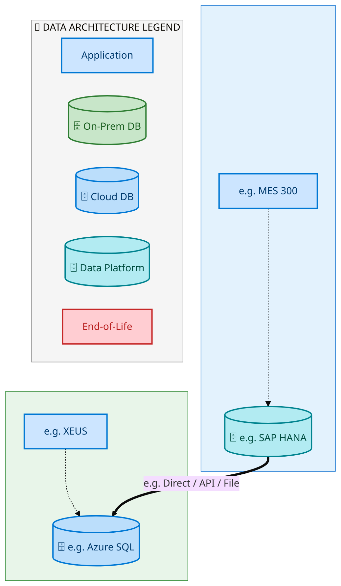
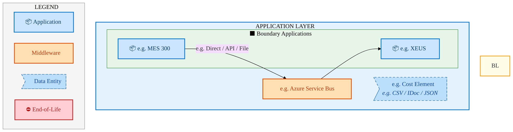
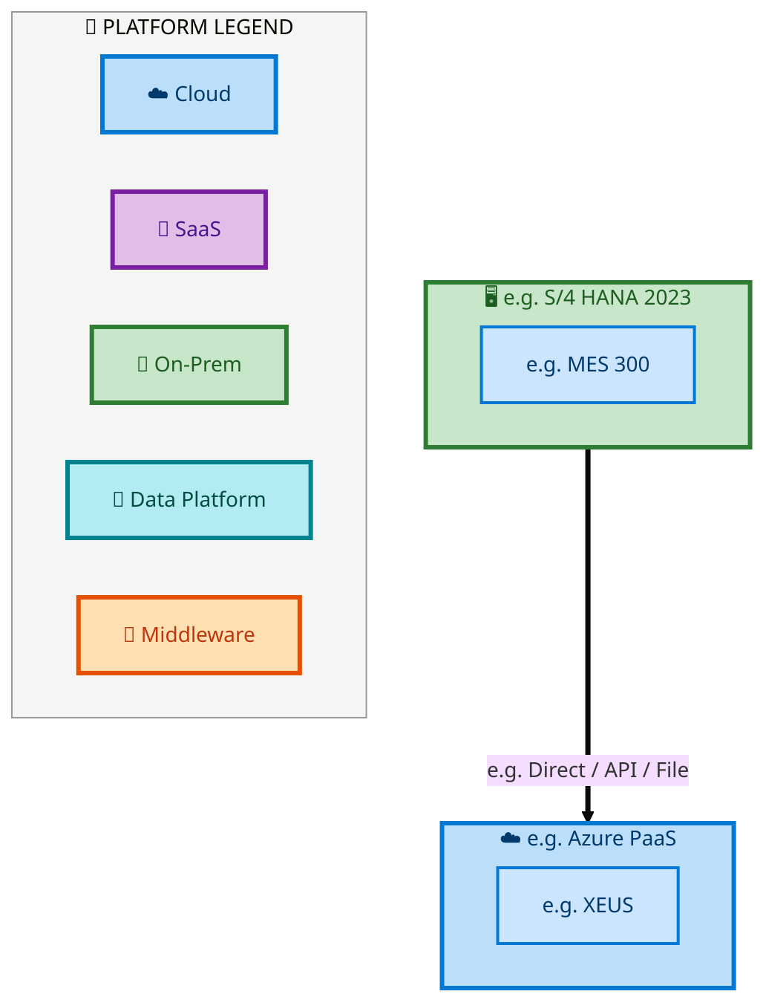

  <img src="data:image/svg+xml;base64,PHN2ZyB4bWxucz0iaHR0cDovL3d3dy53My5vcmcvMjAwMC9zdmciIHZpZXdCb3g9IjAgMCA4MDAgNDgwIiB3aWR0aD0iODAwIiBoZWlnaHQ9IjQ4MCI+DQogIDxkZWZzPg0KICAgIDxsaW5lYXJHcmFkaWVudCBpZD0iYmciIHgxPSIwJSIgeTE9IjAlIiB4Mj0iMTAwJSIgeTI9IjEwMCUiPg0KICAgICAgPHN0b3Agb2Zmc2V0PSIwJSIgc3R5bGU9InN0b3AtY29sb3I6IzAwNzFjNTtzdG9wLW9wYWNpdHk6MSIvPg0KICAgICAgPHN0b3Agb2Zmc2V0PSIxMDAlIiBzdHlsZT0ic3RvcC1jb2xvcjojMDBhZWVmO3N0b3Atb3BhY2l0eToxIi8+DQogICAgPC9saW5lYXJHcmFkaWVudD4NCiAgICA8bGluZWFyR3JhZGllbnQgaWQ9ImFjY2VudCIgeDE9IjAlIiB5MT0iMCUiIHgyPSIwJSIgeTI9IjEwMCUiPg0KICAgICAgPHN0b3Agb2Zmc2V0PSIwJSIgc3R5bGU9InN0b3AtY29sb3I6I2ZmZmZmZjtzdG9wLW9wYWNpdHk6MC4xNSIvPg0KICAgICAgPHN0b3Agb2Zmc2V0PSIxMDAlIiBzdHlsZT0ic3RvcC1jb2xvcjojZmZmZmZmO3N0b3Atb3BhY2l0eTowLjAyIi8+DQogICAgPC9saW5lYXJHcmFkaWVudD4NCiAgICA8cGF0dGVybiBpZD0iZ3JpZCIgd2lkdGg9IjQwIiBoZWlnaHQ9IjQwIiBwYXR0ZXJuVW5pdHM9InVzZXJTcGFjZU9uVXNlIj4NCiAgICAgIDxwYXRoIGQ9Ik0gNDAgMCBMIDAgMCAwIDQwIiBmaWxsPSJub25lIiBzdHJva2U9InJnYmEoMjU1LDI1NSwyNTUsMC4wNykiIHN0cm9rZS13aWR0aD0iMC41Ii8+DQogICAgPC9wYXR0ZXJuPg0KICA8L2RlZnM+DQoNCiAgPCEtLSBCYWNrZ3JvdW5kIC0tPg0KICA8cmVjdCB3aWR0aD0iODAwIiBoZWlnaHQ9IjQ4MCIgZmlsbD0idXJsKCNiZykiIHJ4PSI4Ii8+DQogIDxyZWN0IHdpZHRoPSI4MDAiIGhlaWdodD0iNDgwIiBmaWxsPSJ1cmwoI2dyaWQpIiByeD0iOCIvPg0KICA8cmVjdCB3aWR0aD0iODAwIiBoZWlnaHQ9IjQ4MCIgZmlsbD0idXJsKCNhY2NlbnQpIiByeD0iOCIvPg0KDQogIDwhLS0gRGVjb3JhdGl2ZSBjaXJjdWl0L2FyY2hpdGVjdHVyZSBsaW5lcyAtLT4NCiAgPGcgc3Ryb2tlPSJyZ2JhKDI1NSwyNTUsMjU1LDAuMTIpIiBzdHJva2Utd2lkdGg9IjEuNSIgZmlsbD0ibm9uZSI+DQogICAgPHBhdGggZD0iTSAwIDEwMCBMIDEyMCAxMDAgTCAxNjAgMTQwIEwgMjgwIDE0MCIvPg0KICAgIDxwYXRoIGQ9Ik0gMCAyNjAgTCA4MCAyNjAgTCAxMjAgMjIwIEwgMjAwIDIyMCBMIDI0MCAyNjAgTCAzNjAgMjYwIi8+DQogICAgPHBhdGggZD0iTSA1MjAgMTAwIEwgNjAwIDEwMCBMIDY0MCA2MCBMIDgwMCA2MCIvPg0KICAgIDxwYXRoIGQ9Ik0gNDQwIDM0MCBMIDU2MCAzNDAgTCA2MDAgMzAwIEwgNzIwIDMwMCBMIDc2MCAzNDAgTCA4MDAgMzQwIi8+DQogICAgPHBhdGggZD0iTSA2MDAgNDAwIEwgNjgwIDQwMCBMIDcyMCA0NDAiLz4NCiAgICA8cGF0aCBkPSJNIDAgNDAwIEwgNDAgNDAwIEwgODAgMzYwIi8+DQogICAgPHBhdGggZD0iTSAyMDAgNDIwIEwgMzIwIDQyMCBMIDM2MCAzODAgTCA0ODAgMzgwIi8+DQogICAgPHBhdGggZD0iTSA2NTAgNDQwIEwgNzUwIDQ0MCBMIDgwMCA0ODAiLz4NCiAgPC9nPg0KDQogIDwhLS0gRGVjb3JhdGl2ZSBub2RlcyAtLT4NCiAgPGcgZmlsbD0icmdiYSgyNTUsMjU1LDI1NSwwLjE4KSI+DQogICAgPGNpcmNsZSBjeD0iMTIwIiBjeT0iMTAwIiByPSI0Ii8+DQogICAgPGNpcmNsZSBjeD0iMjgwIiBjeT0iMTQwIiByPSI0Ii8+DQogICAgPGNpcmNsZSBjeD0iMjAwIiBjeT0iMjIwIiByPSI0Ii8+DQogICAgPGNpcmNsZSBjeD0iMzYwIiBjeT0iMjYwIiByPSI0Ii8+DQogICAgPGNpcmNsZSBjeD0iNjAwIiBjeT0iMTAwIiByPSI0Ii8+DQogICAgPGNpcmNsZSBjeD0iNzIwIiBjeT0iMzAwIiByPSI0Ii8+DQogICAgPGNpcmNsZSBjeD0iNTYwIiBjeT0iMzQwIiByPSI0Ii8+DQogICAgPGNpcmNsZSBjeD0iODAiIGN5PSIzNjAiIHI9IjQiLz4NCiAgICA8Y2lyY2xlIGN4PSI0ODAiIGN5PSIzODAiIHI9IjQiLz4NCiAgICA8Y2lyY2xlIGN4PSIzMjAiIGN5PSI0MjAiIHI9IjQiLz4NCiAgPC9nPg0KDQogIDwhLS0gVE9HQUYgQkRBVCBib3hlcyAtLT4NCiAgPGcgZm9udC1mYW1pbHk9IlNlZ29lIFVJLCBBcmlhbCwgc2Fucy1zZXJpZiIgZm9udC1zaXplPSIxNCIgZm9udC13ZWlnaHQ9IjYwMCI+DQogICAgPCEtLSBCIC0tPg0KICAgIDxyZWN0IHg9IjE1MCIgeT0iMTQwIiB3aWR0aD0iMTIwIiBoZWlnaHQ9IjQwIiByeD0iNSIgZmlsbD0icmdiYSgyNTUsMjU1LDI1NSwwLjE4KSIgc3Ryb2tlPSJyZ2JhKDI1NSwyNTUsMjU1LDAuMykiIHN0cm9rZS13aWR0aD0iMSIvPg0KICAgIDx0ZXh0IHg9IjIxMCIgeT0iMTY1IiB0ZXh0LWFuY2hvcj0ibWlkZGxlIiBmaWxsPSIjZmZmIj5CdXNpbmVzczwvdGV4dD4NCiAgICA8IS0tIEQgLS0+DQogICAgPHJlY3QgeD0iMjkwIiB5PSIxNDAiIHdpZHRoPSIxMjAiIGhlaWdodD0iNDAiIHJ4PSI1IiBmaWxsPSJyZ2JhKDI1NSwyNTUsMjU1LDAuMTgpIiBzdHJva2U9InJnYmEoMjU1LDI1NSwyNTUsMC4zKSIgc3Ryb2tlLXdpZHRoPSIxIi8+DQogICAgPHRleHQgeD0iMzUwIiB5PSIxNjUiIHRleHQtYW5jaG9yPSJtaWRkbGUiIGZpbGw9IiNmZmYiPkRhdGE8L3RleHQ+DQogICAgPCEtLSBBIC0tPg0KICAgIDxyZWN0IHg9IjQzMCIgeT0iMTQwIiB3aWR0aD0iMTIwIiBoZWlnaHQ9IjQwIiByeD0iNSIgZmlsbD0icmdiYSgyNTUsMjU1LDI1NSwwLjE4KSIgc3Ryb2tlPSJyZ2JhKDI1NSwyNTUsMjU1LDAuMykiIHN0cm9rZS13aWR0aD0iMSIvPg0KICAgIDx0ZXh0IHg9IjQ5MCIgeT0iMTY1IiB0ZXh0LWFuY2hvcj0ibWlkZGxlIiBmaWxsPSIjZmZmIj5BcHBsaWNhdGlvbjwvdGV4dD4NCiAgICA8IS0tIFQgLS0+DQogICAgPHJlY3QgeD0iNTcwIiB5PSIxNDAiIHdpZHRoPSIxMjAiIGhlaWdodD0iNDAiIHJ4PSI1IiBmaWxsPSJyZ2JhKDI1NSwyNTUsMjU1LDAuMTgpIiBzdHJva2U9InJnYmEoMjU1LDI1NSwyNTUsMC4zKSIgc3Ryb2tlLXdpZHRoPSIxIi8+DQogICAgPHRleHQgeD0iNjMwIiB5PSIxNjUiIHRleHQtYW5jaG9yPSJtaWRkbGUiIGZpbGw9IiNmZmYiPlRlY2hub2xvZ3k8L3RleHQ+DQogIDwvZz4NCg0KICA8IS0tIENvbm5lY3RpbmcgbGluZXMgYmV0d2VlbiBCREFUIGJveGVzIC0tPg0KICA8ZyBzdHJva2U9InJnYmEoMjU1LDI1NSwyNTUsMC4yNSkiIHN0cm9rZS13aWR0aD0iMSI+DQogICAgPGxpbmUgeDE9IjI3MCIgeTE9IjE2MCIgeDI9IjI5MCIgeTI9IjE2MCIvPg0KICAgIDxsaW5lIHgxPSI0MTAiIHkxPSIxNjAiIHgyPSI0MzAiIHkyPSIxNjAiLz4NCiAgICA8bGluZSB4MT0iNTUwIiB5MT0iMTYwIiB4Mj0iNTcwIiB5Mj0iMTYwIi8+DQogIDwvZz4NCg0KICA8IS0tIE1haW4gdGl0bGUgLS0+DQogIDx0ZXh0IHg9IjQwMCIgeT0iMjYwIiB0ZXh0LWFuY2hvcj0ibWlkZGxlIiBmb250LWZhbWlseT0iU2Vnb2UgVUksIEFyaWFsLCBzYW5zLXNlcmlmIiBmb250LXNpemU9IjM2IiBmb250LXdlaWdodD0iNzAwIiBmaWxsPSIjZmZmZmZmIiBsZXR0ZXItc3BhY2luZz0iMSI+DQogICAgSUFPIEFyY2hpdGVjdHVyZQ0KICA8L3RleHQ+DQogIDx0ZXh0IHg9IjQwMCIgeT0iMzAwIiB0ZXh0LWFuY2hvcj0ibWlkZGxlIiBmb250LWZhbWlseT0iU2Vnb2UgVUksIEFyaWFsLCBzYW5zLXNlcmlmIiBmb250LXNpemU9IjE4IiBmb250LXdlaWdodD0iNDAwIiBmaWxsPSJyZ2JhKDI1NSwyNTUsMjU1LDAuOCkiIGxldHRlci1zcGFjaW5nPSIyIj4NCiAgICBUT0dBRiBCREFUIMK3IElBTyBQcm9ncmFtIMK3IElETSAyLjANCiAgPC90ZXh0Pg0KDQogIDwhLS0gQm90dG9tIGFjY2VudCBiYXIgLS0+DQogIDxyZWN0IHg9IjI4MCIgeT0iMzQwIiB3aWR0aD0iMjQwIiBoZWlnaHQ9IjMiIHJ4PSIxLjUiIGZpbGw9InJnYmEoMjU1LDI1NSwyNTUsMC40KSIvPg0KDQogIDwhLS0gSW50ZWwgdGV4dCAtLT4NCiAgPHRleHQgeD0iNDAwIiB5PSIzODAiIHRleHQtYW5jaG9yPSJtaWRkbGUiIGZvbnQtZmFtaWx5PSJTZWdvZSBVSSwgQXJpYWwsIHNhbnMtc2VyaWYiIGZvbnQtc2l6ZT0iMTMiIGZpbGw9InJnYmEoMjU1LDI1NSwyNTUsMC41KSIgbGV0dGVyLXNwYWNpbmc9IjMiPg0KICAgIElOVEVMIENPTkZJREVOVElBTA0KICA8L3RleHQ+DQo8L3N2Zz4NCg==" alt="IAO Architecture" style="width:100%; border-radius:8px;" />
  <h1 style="font-size:36px; margin-top:24px;">E2E-98 — R3 Equipment Product Supporting Items (PSI) Procurement</h1>
  <h2 style="font-size:24px;">Architecture Document (TOGAF BDAT)</h2>
  
End-to-End Integrated Processes (E2E) Tower 
  Capability E2E-98 · Procure to Pay

  
IAO Program · R1 – R5 
  Generated: April 2026 
  Sajiv Francis

  
IAO Architecture Pipeline — Intel Confidential

Page 1<a href="#toc">↑ Back to TOC</a>E2E-98 — R3 Equipment Product Supporting Items (PSI) Procurement

## Table of Contents

<nav class="toc">
<ol>
  <li><a href="#1-executive-summary">1. Executive Summary</a></li>
  <li><a href="#2-business-context-objectives">2. Business Context &amp; Objectives</a>
    <ul>
      <li><a href="#21-classification">2.1 Classification</a></li>
      <li><a href="#22-business-drivers">2.2 Business Drivers</a></li>
      <li><a href="#23-success-criteria">2.3 Success Criteria</a></li>
      <li><a href="#24-companion-documents">2.4 Companion Documents</a></li>
    </ul>
  </li>
  <li><a href="#3-business-architecture-togaf-b">3. Business Architecture (TOGAF &ldquo;B&rdquo;)</a>
    <ul>
      <li><a href="#31-business-process-overview">3.1 Business Process Overview</a></li>
      <li><a href="#32-business-process-diagrams">3.2 Business Process Diagrams</a></li>
      <li><a href="#33-business-roles-responsibilities">3.3 Business Roles &amp; Responsibilities</a></li>
    </ul>
  </li>
  <li><a href="#4-data-architecture-togaf-d">4. Data Architecture (TOGAF &ldquo;D&rdquo;)</a>
    <ul>
      <li><a href="#41-data-entities-ownership">4.1 Data Entities &amp; Ownership</a></li>
      <li><a href="#42-data-flow-diagrams">4.2 Data Flow Diagrams</a></li>
      <li><a href="#43-data-lineage">4.3 Data Lineage</a></li>
      <li><a href="#44-ricefw-data-objects">4.4 RICEFW Data Objects</a></li>
      <li><a href="#45-data-governance-quality">4.5 Data Governance &amp; Quality</a></li>
    </ul>
  </li>
  <li><a href="#5-application-architecture-togaf-a">5. Application Architecture (TOGAF &ldquo;A&rdquo;)</a>
    <ul>
      <li><a href="#51-current-state-current-state-application-landscape">5.1 Current-State Application Landscape</a></li>
      <li><a href="#52-future-state-future-state-application-landscape">5.2 Future-State Application Landscape</a></li>
      <li><a href="#53-change-impact-summary">5.3 Change Impact Summary</a></li>
      <li><a href="#54-component-overview">5.4 Component Overview</a></li>
      <li><a href="#55-ricefw-inventory">5.5 RICEFW Inventory</a></li>
      <li><a href="#56-integration-patterns">5.6 Integration Patterns</a></li>
    </ul>
  </li>
  <li><a href="#6-technology-architecture-togaf-t">6. Technology Architecture (TOGAF &ldquo;T&rdquo;)</a>
    <ul>
      <li><a href="#61-platform-infrastructure">6.1 Platform &amp; Infrastructure</a></li>
      <li><a href="#62-sap-development-object-status">6.2 SAP Development Object Status</a></li>
      <li><a href="#63-nfrs-design-principles">6.3 NFRs &amp; Design Principles</a></li>
      <li><a href="#64-security-governance">6.4 Security &amp; Governance</a></li>
    </ul>
  </li>
  <li><a href="#7-project-context">7. Project Context</a>
    <ul>
      <li><a href="#71-project-roadmap-go-live-plan">7.1 Project Roadmap &amp; Go-Live Plan</a></li>
      <li><a href="#72-raid-log">7.2 RAID Log</a></li>
      <li><a href="#73-recommendations-next-steps">7.3 Recommendations &amp; Next Steps</a></li>
    </ul>
  </li>
</ol>
</nav>

Page 2<a href="#toc">↑ Back to TOC</a>E2E-98 — R3 Equipment Product Supporting Items (PSI) Procurement

## 1. Executive Summary

This Architecture Document defines the **Business, Data, Application, and Technology** (BDAT) architecture for **E2E-98 R3 Equipment Product Supporting Items (PSI) Procurement** within the IAO program. It includes 3 BPMN process diagram(s) in Section 3.

| Dimension | Value |
|-----------|-------|
| **Tower** | End-to-End Integrated Processes (E2E) |
| **Process Group** | Procure to Pay |
| **Capability** | E2E-98 - R3 Equipment Product Supporting Items (PSI) Procurement |
| **Release** | R1 – R5 |
| **Total Systems** | 2 |
| **System Status** | 0 Deployed, 0 Developing, 0 EOL, 2 Pending IAPM |
| **RICEFW Objects** | Pending — Smartsheet Object Tracker API integration |

**Change Summary**: 0 new flow chains, 0 removed, 0 modified, 1 unchanged between Current-State and Future-State states.

> All system nodes in architecture diagrams are **IAPM-linked** — click any node to open its IAPM page. Diagrams require `securityLevel: 'loose'` for click events.

Page 3<a href="#toc">↑ Back to TOC</a>E2E-98 — R3 Equipment Product Supporting Items (PSI) Procurement

## 2. Business Context & Objectives

### 2.1 Classification

| Level | Value |
|-------|-------|
| **L0 Tower** | End-to-End Integrated Processes |
| **L1 Process** | Procure to Pay |
| **L2 Capability** | E2E-98 - R3 Equipment Product Supporting Items (PSI) Procurement |

### 2.2 Business Drivers

| # | Driver | Description | Strategic Alignment | Priority |
|---|--------|-------------|---------------------|----------|
| 1 | End-to-End Process Integration | Enable cross-tower integrated processes spanning procurement, manufacturing, and fulfillment | IDM 2.0 Process Excellence | High |
| 2 | Intel Foundry Business Enablement | Stand up foundry-specific business processes for external customer engagement | Intel Foundry Services | High |
| 3 | Process Visibility & Monitoring | Provide end-to-end process visibility across tower boundaries with integrated monitoring | Operational Excellence | Medium |
| 4 | E2E-98 Process Migration | Migrate R3 Equipment Product Supporting Items (PSI) Procurement business processes and 2 integrated systems from legacy to S/4 HANA target architecture | IDM 2.0 Cross-Functional / End-to-End | High |

Page 4<a href="#toc">↑ Back to TOC</a>E2E-98 — R3 Equipment Product Supporting Items (PSI) Procurement

### 2.3 Success Criteria

| Metric | Target | Measure | Baseline | Owner |
|--------|--------|---------|----------|-------|
| E2E Process Cycle Time | Per process SLA | End-to-end transaction completion within defined SLA per process | Varies by process | E2E Process Owner |
| Cross-Tower Integration Success | > 99% | Transactions completing across tower boundaries without manual intervention | 92% (current) | Integration Lead |
| Process Exception Rate | < 2% | Transactions requiring manual exception handling | 8% (current) | Operations Manager |
| E2E-98 Migration Completeness | 100% flow chains validated | All 1 flow chains verified in target state | 0% (pre-migration) | Tower Architect |

### 2.4 Companion Documents

| Document | Description |
|----------|-------------|
| **Business Architecture** | Included in this document (Section 3) — process flows from BPMN diagrams |
| **This Document** | Full BDAT Architecture — Business + Data + Application + Technology |

Page 5<a href="#toc">↑ Back to TOC</a>E2E-98 — R3 Equipment Product Supporting Items (PSI) Procurement

## 3. Business Architecture (TOGAF "B")

### 3.1 Business Process Overview

This capability includes **3 business process(es)** modeled in BPMN 2.0, covering the end-to-end workflow for E2E-98 R3 Equipment Product Supporting Items (PSI) Procurement.

| # | Step ID | Process Name | Lanes | Tasks | Gateways |
|---|---------|--------------|-------|-------|----------|
| 1 | E2E-98A_R3_Equipment_Product_Supporting_Items_(PSI)_Procurement | E2E-98A_R3_Equipment_Product_Supporting_Items_(PSI)_Procurement | Boundary Apps, External Partners/Supplier

, SAP S/4HANA IF | 26 | 15 |

| 2 | E2E-98B_R3_CFIN | E2E-98B_R3_CFIN | Boundary Apps, CFIN, MBC, SAP S/4 (IP & IF) | 17 | 10 |
| 3 | E2E-98C_R3_SAP_Transportation_Management | E2E-98C_R3_SAP_Transportation_Management | Boundary Apps, External Partners/

Supplier
, SAP S/4 (IP & IF) | 12 | 6 |

Page 6<a href="#toc">↑ Back to TOC</a>E2E-98 — R3 Equipment Product Supporting Items (PSI) Procurement

### 3.2 Business Process Diagrams

#### BUSINESS ARCHITECTURE — 3.2.1 E2E-98A_R3_Equipment_Product_Supporting_Items_(PSI)_Procurement — E2E-98A_R3_Equipment_Product_Supporting_Items_(PSI)_Procurement

**Swim Lanes**: Boundary Apps · External Partners/Supplier
 · SAP S/4HANA IF | **Tasks**: 26 | **Gateways**: 15

```mermaid
%%{init: {'theme': 'base', 'themeVariables': {'fontSize': '14px', 'fontFamily': 'Segoe UI, Arial, sans-serif','primaryColor': '#e8f0fe', 'primaryBorderColor': '#0071c5','lineColor': '#37474F', 'secondaryColor': '#f5f8fc'}, 'flowchart': {'useMaxWidth': false, 'htmlLabels': true, 'curve': 'basis', 'nodeSpacing': 40, 'rankSpacing': 50}} }%%
flowchart LR
    classDef startEvt fill:#4CAF50,stroke:#2E7D32,color:#000,font-weight:bold,stroke-width:2px,rx:20,ry:20
    classDef endEvt fill:#C62828,stroke:#B71C1C,color:#fff,font-weight:bold,stroke-width:2px,rx:20,ry:20
    classDef userTask fill:#E3F2FD,stroke:#1565C0,stroke-width:2px,color:#0D47A1
    classDef serviceTask fill:#FFF3E0,stroke:#E65100,stroke-width:2px,color:#BF360C
    classDef gateway fill:#FFF9C4,stroke:#F57F17,stroke-width:2px,color:#E65100
    classDef subProc fill:#F3E5F5,stroke:#7B1FA2,stroke-width:2px,color:#4A148C
    subgraph lane_0["Boundary Apps"]
        n1["Perform Supply Planning ICS (Phoenix)"]
        n2["Receive Procurement Planning Information"]
        n3["Review and Approve Procurement Planning Proposal by Intel Product BUs"]
        n4["Receive Information in ECA"]
        n5["Organize Transport-Intel Routing Guide (IRG)"]
        n6["Receive Manual invoices through OCR"]
        n7["Receive Incoming invoice/ B2B/OpenText/Web suite"]
        n8["ReadSoft Validation/Exception Handling based on rules setup"]
        n27(["fa:fa-play Initiate Supply Planning Process"])
        n28(["fa:fa-stop Information Received"])
        n31{{"fa:fa-code-branch exclusiveGateway"}}
        n32{{"fa:fa-code-branch B2B or OCR?"}}
        n33{{"fa:fa-code-branch exclusiveGateway"}}
        n38{{"fa:fa-arrows-alt parallelGateway"}}
    end
    subgraph lane_1["External Partners/Supplier "]
        n22["Perform Purchase Order Collaboration via SIFRIS"]
        n23["Perform Carrier Selection via Intel Routing Guide hosted Collaboration Portal"]
        n24["Pick Goods (Carrier) Order shipment"]
        n25["Forecast Communication and Commit"]
        n26["Raise Invoice (Supplier End)"]
        n36{{"fa:fa-code-branch exclusiveGateway"}}
        n37{{"fa:fa-code-branch exclusiveGateway"}}
        n45{{"fa:fa-arrows-alt parallelGateway"}}
    end
    subgraph lane_2["SAP S/4HANA IF"]
        n9["Create Purchase Requisition Change ( Pull-in/Push-out)"]
        n10["Receive Purchase Requisition Approval"]
        n11["Create Purchase Order"]
        n12["Purchase Order Change (Quantity/Schedule Dates)"]
        n13["Purchase Order Line-Item Deletion"]
        n14["Trigger GTS Check"]
        n15["Calculate Taxes"]
        n16["Publish Purchase Order"]
        n17["Acknowledge/Confirm Purchase Order"]
        n18["Create Inbound Delivery with House Airway bill number (HAWB)"]
        n19["TM Embedded"]
        n20["Post Goods Receipt"]
        n21["Post Supplier invoice"]
        n29["E2E-98C R3 SAP Transportation Management"]
        n30["E2E-98B R3 CFIN"]
        n34{{"fa:fa-code-branch Purchase Order Amendment Needed?"}}
        n35{{"fa:fa-code-branch Invoice Accepted?"}}
        n39{{"fa:fa-arrows-alt parallelGateway"}}
        n40{{"fa:fa-arrows-alt parallelGateway"}}
        n41{{"fa:fa-arrows-alt parallelGateway"}}
        n42{{"fa:fa-arrows-alt parallelGateway"}}
        n43{{"fa:fa-arrows-alt parallelGateway"}}
        n44{{"fa:fa-arrows-alt parallelGateway"}}
    end
    n9 --> n43
    n10 --> n39
    n39 --> n34
    n34 -->|"Pull-In/Push-Out"| n12
    n34 -->|"Cancellation"| n13
    n31 --> n2
    n13 --> n36
    n11 --> n42
    n1 --> n31
    n2 --> n38
    n27 --> n1
    n38 --> n3
    n38 --> n4
    n4 --> n28
    n3 --> n9
    n40 --> n14
    n40 --> n15
    n15 --> n41
    n14 --> n41
    n41 --> n16
    n23 --> n5
    n17 -->|"For Intel Qwned 
Transport only"| n23
    n5 --> n24
    n42 --> n40
    n43 --> n10
    n24 -->|"3B2 / E2Open"| n18
    n18 --> n44
    n44 --> n19
    n44 --> n20
    n19 --> n29
    n25 -->|"Supplier Responses via SIRFIS"| n31
    n38 -->|"Forecast sharing via SIRFIS"| n25
    n33 --> n8
    n6 --> n33
    n32 -->|"OCR"| n6
    n21 --> n30
    n8 --> n35
    n37 --> n26
    n35 -->|"No"| n37
    n26 --> n32
    n7 --> n33
    n35 -->|"Yes"| n21
    n42 --> n31
    n43 --> n31
    n22 --> n45
    n45 --> n17
    n16 --> n36
    n36 --> n22
    n12 --> n36
    n32 -->|"B2B"| n7
    n39 --> n11
    class n27 startEvt
    class n28 endEvt
    class n29 startEvt
    class n30 startEvt
    class n31 gateway
    class n32 gateway
    class n33 gateway
    class n34 gateway
    class n35 gateway
    class n36 gateway
    class n37 gateway
    class n38 gateway
    class n39 gateway
    class n40 gateway
    class n41 gateway
    class n42 gateway
    class n43 gateway
    class n44 gateway
    class n45 gateway
```

> **Legend**: ● Start · ● End · User Task · Service Task · ◇ Gateway · Sub-Process

<a href="https://mermaid.live/view#pako:eNqtWG1v4joW_isWo1E7Eoi8QSgfdgUp6SDNTLnQe0er7WplEgesBjvXSQpsp_99jxM7gJuutN3th0o8Oc95P8dOXjoRj0ln3Pn8-YUyWozRy1WxJTtyNUZXa5yTqy6qgT-woHidkvxKyiScFSv6r0rM9rKDFJNYiHc0PUp0RTacoN_nXTQBYtpFOWZ5LyeCJlfdq0zQHRbHgKdcSOlPZJRYSWVNPZpyERNxErAs344GQE0pIyfY9T3fCyUvJxFn8YXSZJCMkujqVTqX8n20xaKo3C9z8h0fftK42MLvBKc5AZltsUu_4TVJZYyFKCUWleJZJ4Pm0g6DhK0yHFG2AdyzABKYPZ2ggfX6il4_f35kjVH0bfnIEPxFKc7zW5KgvAB49lyghKbp-JMXTMKB1c0LwZ_I-JMz829dpxvJSMYQutWVye3tCd1si_Gap7ES7e1lDGMnO3TFYexYXXGE_4YtwuKTpWDojJxRY2nq24EdaEtJkvxPliCv4gHnT8rWzA2d8LaxZQ-Gg8B6q0-Heev5E9vMExHPNCJnSsMwdGenVM2GA9t6X-k0dIdWYCjd4ILs8fGk8CbwGoXhwA9t_12FtT3Ty3K9EDzSCt3ZIBw0Cv2pHU6cdxV6E9sbKQ9Bz0bgbItSzMg_rb8_dqa8rJoaTbIsf-z8o5aTf8yGxwsiEi52aFVmWXpEC-Ax6EI0D1boerHlhNHDl0uaA7QliQh9Jkg6XQqYblaccZlUiQvK2SXTrZjPlOwRZrH0SPD3lACY8RynaH0EhQVJJRKXUYGmvxtxeGcOndlGlKFZMLmUHYDsvdhgBrsHPcDc5RkXRa-2sORlIW3flTQm6Hq-vDNCH55Z-o5ZCe5R9syhv3JUbAUvN1t0HywvSf6FexHfSROK1kdTZ9q_zwh7IIei_5OsoYS0IJcaRpUGHK94UqA_cErjKsD-7BCRrAr1K-QzlXrlyo0RIKKEVQvdX5SZUT7_GtQleJzgXpZimV1aUGjoNz0g60Jymewv5_zRiZ8XPLtIuYozNjiu_fKiOfK86K0h89EWkUOUljkQ7uqBeuy8vp7TnHYa5AxxITP9V5PhfszQ6ETDQvB93sNpgTIscJqS9A0JFmLbvMmBmh0KIhg0xgL2MyMi71dppUQgow7O2fgtSgF7PifoXh5aCE6gFK-5qJP6TDFazcPlfGVocM80BOC3NLIiKYkaWltfb3leQI9c2ljAFODU0C8Ha0GjJ3THeZyja2Xji_Iy39JMDq3BkiMWckEinBdgZbcrGY1qK3LqJUJNTjVYmOZyQqrBQNdN2mYsNsbQHX6syv6HaN7g_9IcstyryQKt-t7XyY8JmoeXQd3A80AQOYhNNyzJnyXNaZW7YIvZBvICT9O0R1l_UebbHlTWSI5tne_nNk313jWrbdstDlSFNuSqvjX6Vfn2W4lZQYtjfxVtSQwbCN2Cutz00H2r4RtcynrzguzQLTTw26PDlr34IOhmA8J3DyswSaInQ0Z2XoDTqExlEA_4QMwTb1hZXqc03_7nIOXSnkRPjO9TEm9IP-AsoW8G1SCNThmcs7U8eGU0UAc4fve02KKvHC44aEKFvDys4axHrNytIaLrr5OfUzNNsiMevqMZSMRxtVPPR0aWeQGjrIazqnhmzpWthZppUgePISdNzZxZ72YUoKWLZJ82h2M9unDc4Q15O-6u1VCnkhqE8x-GhNc-dkYHTEB3XN0BfhAC4b5Z7YN2NXphTCJ5GLbwbv678a1n3voIyf4IyfkIyf0IyfvgHmM3qNf7i7SqfttWDbg3CnCVhOtpwJPALzlssKzmalndl9A8v-QKMcUCKCWB86gefCmibbl2rVpTbFeZGmpACXiNhBJQbwLMUb9H-rdfA_q5O1ICxm8di6cc0HzlgI7dU8mwPRMYaIcGSqG2aHsG4CmfbR2Uo4w0KnyVKDhY1aH-257BKf7ImjmFW196rJLn6FCUYadxTeXCszSg7NgacHRF3KmD-mjmyLtpXREdv63z02hV4dg3BqBf7-CJArSEM1Bmmr20JBAEy-HOWl93lqG87vw6q2Ndl19nl4scXo3lvcZgODprropOez5UhW4q7SiN1Z0dmE36dQ_pAHSLNJpVDzma4eqAfvDaa1-r0kZ1e_qmE5r5N3laSfdto1pNBnS1Tq2t66n98lTFbW3eHhrj4irAacbFMSV0VuCaXTnkG1Nun79jV_OkP0Zc4iP14eASvWmXdq13cFu_bV_CTjvstsNeOzxoh4ftsN8Oj9rhm1YYlkMr3B6l1x6l1x6l1x6l10TZ6XZ2BF7VaNwZv3Sqr3Lw5S4mCS7TovPa7eCy4Ksjizrj6utVp8zgTZPcUgz32F0Nvv4bQMYhcw==" title="View full diagram">&#128065; View Diagram</a>

Page 7<a href="#toc">↑ Back to TOC</a>E2E-98 — R3 Equipment Product Supporting Items (PSI) Procurement

#### BUSINESS ARCHITECTURE — 3.2.2 E2E-98B_R3_CFIN — E2E-98B_R3_CFIN

**Swim Lanes**: Boundary Apps · CFIN · MBC · SAP S/4 (IP & IF) | **Tasks**: 17 | **Gateways**: 10

```mermaid
%%{init: {'theme': 'base', 'themeVariables': {'fontSize': '14px', 'fontFamily': 'Segoe UI, Arial, sans-serif','primaryColor': '#e8f0fe', 'primaryBorderColor': '#0071c5','lineColor': '#37474F', 'secondaryColor': '#f5f8fc'}, 'flowchart': {'useMaxWidth': false, 'htmlLabels': true, 'curve': 'basis', 'nodeSpacing': 40, 'rankSpacing': 50}} }%%
flowchart LR
    classDef startEvt fill:#4CAF50,stroke:#2E7D32,color:#000,font-weight:bold,stroke-width:2px,rx:20,ry:20
    classDef endEvt fill:#C62828,stroke:#B71C1C,color:#fff,font-weight:bold,stroke-width:2px,rx:20,ry:20
    classDef userTask fill:#E3F2FD,stroke:#1565C0,stroke-width:2px,color:#0D47A1
    classDef serviceTask fill:#FFF3E0,stroke:#E65100,stroke-width:2px,color:#BF360C
    classDef gateway fill:#FFF9C4,stroke:#F57F17,stroke-width:2px,color:#E65100
    classDef subProc fill:#F3E5F5,stroke:#7B1FA2,stroke-width:2px,color:#4A148C
    subgraph lane_0["Boundary Apps"]
        n1["Receive File in Bank"]
        n2["Update Payment Remittance"]
        n19(["fa:fa-stop Payment Data Updated"])
    end
    subgraph lane_1["CFIN"]
        n3["Execute Payment Run"]
        n4["Create APM Memo Record"]
        n5["Process BCM Payment Batching Based on Business Rules"]
        n6["Generate APM Payment File"]
        n7["Route to Approver"]
        n8["Correct APM Correction File"]
        n9["Reverse APP Doc Number and Memo Record Deletion"]
        n10["Fetch Payments Factory (APM, BCM, MBC Monitor)"]
        n11["Review Failed Payment Log"]
        n12["Generate Payment Proposal"]
        n13["Replicate Supplier Invoice Posting"]
        n14["Post Collateral Expense Chargeback – IF Profit Center (Allocations)"]
        n15["Posted Collateral Cost Charged – IP Profit Center"]
        n18(["fa:fa-play Initiate Charge Back Process"])
        n21(["fa:fa-stop Memo Record Created"])
        n22(["fa:fa-stop APP Doc Reversed"])
        n23(["fa:fa-stop Charge Back Process Completed"])
        n25{{"fa:fa-code-branch Manual Approval Necessary?"}}
        n26{{"fa:fa-code-branch Approved?"}}
        n27{{"fa:fa-code-branch exclusiveGateway"}}
        n28{{"fa:fa-code-branch Can Be Corrected?"}}
        n29{{"fa:fa-code-branch exclusiveGateway"}}
        n30{{"fa:fa-code-branch exclusiveGateway"}}
        n31{{"fa:fa-code-branch Reversal or Reprocessing?"}}
        n32{{"fa:fa-arrows-alt parallelGateway"}}
        n33{{"fa:fa-arrows-alt parallelGateway"}}
        n34{{"fa:fa-arrows-alt inclusiveGateway"}}
    end
    subgraph lane_2["MBC"]
        n16["Multi-Bank Connectivity (host-to-host)"]
        n17["Multi-Bank Connectivity (host-to-host)"]
    end
    subgraph lane_3["SAP S/4 (IP & IF)"]
        n20(["fa:fa-stop Payment Details provided back to Source System (IP/IF)"])
        n24["E2E-98A R3 Equipment Product Supporting Items (PSI) Procurement"]
    end
    n12 --> n3
    n3 --> n32
    n4 --> n21
    n5 --> n25
    n25 -->|"No"| n27
    n7 --> n26
    n27 --> n6
    n29 --> n5
    n28 -->|"No"| n30
    n9 --> n22
    n10 --> n33
    n30 --> n9
    n33 --> n11
    n32 --> n4
    n11 --> n31
    n31 -->|"Reversal"| n30
    n2 --> n19
    n6 --> n16
    n33 --> n2
    n8 --> n29
    n13 --> n12
    n33 --> n20
    n24 --> n13
    n25 -->|"Yes"| n7
    n1 -->|"PAIN.002 (Pay-load file)"| n17
    n16 -->|"PAIN.001 (Pay-load file)"| n1
    n32 -->|"Reprocessing"| n29
    n34 --> n8
    n26 -->|"Yes"| n27
    n26 -->|"No"| n28
    n17 --> n10
    n31 -->|"Reprocessing"| n34
    n28 -->|"Yes"| n34
    n15 --> n23
    n14 -->|"Overhead Expense
 + Service Charges"| n15
    n18 --> n14
    class n18 startEvt
    class n19 endEvt
    class n20 endEvt
    class n21 endEvt
    class n22 endEvt
    class n23 endEvt
    class n24 startEvt
    class n25 gateway
    class n26 gateway
    class n27 gateway
    class n28 gateway
    class n29 gateway
    class n30 gateway
    class n31 gateway
    class n32 gateway
    class n33 gateway
    class n34 gateway
```

> **Legend**: ● Start · ● End · User Task · Service Task · ◇ Gateway · Sub-Process

<a href="https://mermaid.live/view#pako:eNqlWFtvo0YU_isjVqkT1e4ygK8PrXxjZWmdWnG3VVVX1RiGeBTM0AEcu1n_956BGWwIfug2Dwlz-M537gfIm-Fxnxoj4-7ujUUsHaG3Vrqje9oaodaWJLTVRoXgVyIY2YY0aUlMwKN0zf7JYdiJjxImZS7Zs_AkpWv6zCn6smijMSiGbZSQKOkkVLCg1W7Fgu2JOE15yIVEf6CDwAxya-rWhAufigvANPvY64JqyCJ6Edt9p--4Ui-hHo_8CmnQDQaB1zpL50L-6u2ISHP3s4QuyfE35qc7OAckTChgduk-_Ey2NJQxpiKTMi8TB50Mlkg7ESRsHROPRc8gd0wQCRK9XERd83xG57u7TVQaRZ-fNhGCHy8kSTKjAUpSEM8PKQpYGI4-ONOx2zXbSSr4Cx19sOb9mW21PRnJCEI32zK5nVfKnnfpaMtDX0E7rzKGkRUf2-I4ssy2OMHvmi0a-RdL0541sAalpUkfT_FUWwqC4H9ZgryKX0jyomzNbddyZ6Ut3O11p-Z7Ph3mzOmPcT1PVByYR69IXde155dUzXtdbN4mnbh2z5zWSJ9JSl_J6UI4nDolodvtu7h_k7CwV_cy264E9zShPe-63ZKwP8Hu2LpJ6IyxM1AeAs-zIPEOhSSif5l_bIwJz_KmRuM4TjbGnwVO_kQYbj9Rj7IDRS4LKWIRmkAnVlEWoL7EPkSMVuS0p1GKnuiepSmJPFojHN4DOCCjgHSSlMelwoykBBUkPqg8FDrQVk1eS7em7uKxym2DdH6kXnbtRxZVQY5UFVT6Ol4t0ZLuOTjrwSao4rqAk_mmSYIm02VJOCGpt4MhhIuE-ohDPrIE1gXAnjJYXVWWHrB8ohEV2p6mkcmsQvsy1Vz6nnJZCcEPVFQhA-k7F4J6aU6mrhk48Z5vmJcOOBJpeYVm0DuP2X5LBSKRfx04mtGQSpZaqWRvuBTC1V4nyCVeyqFT7sF8W-aljZaTKVpy2OtcPNQIiu45MPoKiuCgX4b_mT_XsNZ1pjQMChDzhIQ1rJ3zxiHzJHidxXAJYS2iA4c5RiuepFChmpIsvLwDWQtD0BMkRPNjTCPIzxQW6DPdEu8FbTLLxDZauNJ4wAAOjgD5_TgMOdiDNCX1OLuKGgK8Ip_mxnJmv6RdVWlrRIPLcMQhLI8FpJXJGAsa6DnwUHXlZUiKGcS1wboucNHwfl3FqqnoNlFt8w5v1_ANXkHU-xi66b1y9-1NK8v3gc4WnmjQWksSZZCsouHh4pFKGthGP22M8_maoNdMoEbFf4fvN-Pp0QthYg_0U7Gh62qDZrUpgUmneuQazA2_yZxtfpsablYrKgdp5AKu46ImMAt1b23rok-E4K9Jh4Qpigk0bkjDG0btb1FyGpVYdCu-Gytf7gdYNbWBkft1mYUp68inElQniuRCPLAUdtQOBrCT8o78Wx_Z_n9XvOGYXEbr8QqtPzroHub7O9gdNWuWeeuhR1PYiwmSHcx8WBP5CoL9v-aZgE22PsFS2UvajwVpZaLkRptb885wMEZPNpr_nbFYr00_g2eE3IxcyF2IFsCToPvVevGQj2omqIS-Dw42Mep0foTCqbOtjpY6O8XZUm9RUVedu-ps5YKvG-ORb4yvcg7Vjb4C9jRQCcrzsDiXRIMqka3eiCKFs7RH2FQuli4rwVCfVQxY-2yrGB3NgBVDCcDKth6oqgdKHWsDPXXu1QxqDwfqqPFYO2TVFUoLKs3Yrqf1d_mOAc7otGpPV-PF4w-maUGRyakTcuLLV0X6kINxie5V4bgZXslTnobLLimqWuZWOTrQfvZqfpb1L-_oxtAqWDUCNt9nv2bWdurNoc2Ud7BuSJ057Cjoz1DKHYVA1WMf7n-P1sXLv3qWFVxYtyBWhcPO1ct4LtbfVlX5UH0HVaSW2SjFjVKrUWo3Sp1mL6BT1MdHVdxrFvebxYNm8bBRDAPXKMbNYqtZbDeLHS022saeij1hvjF6M_L_GMB_FXwaEFjkxrltkCzl61PkGaP8y9rI8s-JGSOwrveF8PwviFgUuQ==" title="View full diagram">&#128065; View Diagram</a>

Page 8<a href="#toc">↑ Back to TOC</a>E2E-98 — R3 Equipment Product Supporting Items (PSI) Procurement

#### BUSINESS ARCHITECTURE — 3.2.3 E2E-98C_R3_SAP_Transportation_Management — E2E-98C_R3_SAP_Transportation_Management

**Swim Lanes**: Boundary Apps · External Partners/
Supplier
 · SAP S/4 (IP & IF) | **Tasks**: 12 | **Gateways**: 6

```mermaid
%%{init: {'theme': 'base', 'themeVariables': {'fontSize': '14px', 'fontFamily': 'Segoe UI, Arial, sans-serif','primaryColor': '#e8f0fe', 'primaryBorderColor': '#0071c5','lineColor': '#37474F', 'secondaryColor': '#f5f8fc'}, 'flowchart': {'useMaxWidth': false, 'htmlLabels': true, 'curve': 'basis', 'nodeSpacing': 40, 'rankSpacing': 50}} }%%
flowchart LR
    classDef startEvt fill:#4CAF50,stroke:#2E7D32,color:#000,font-weight:bold,stroke-width:2px,rx:20,ry:20
    classDef endEvt fill:#C62828,stroke:#B71C1C,color:#fff,font-weight:bold,stroke-width:2px,rx:20,ry:20
    classDef userTask fill:#E3F2FD,stroke:#1565C0,stroke-width:2px,color:#0D47A1
    classDef serviceTask fill:#FFF3E0,stroke:#E65100,stroke-width:2px,color:#BF360C
    classDef gateway fill:#FFF9C4,stroke:#F57F17,stroke-width:2px,color:#E65100
    classDef subProc fill:#F3E5F5,stroke:#7B1FA2,stroke-width:2px,color:#4A148C
    subgraph lane_0["Boundary Apps"]
        n1["Receive/Send Information in Carrier Invoice Reconciliation/Dispute..."]
        n2["Event updates are received in GTT"]
        n17{{"fa:fa-code-branch exclusiveGateway"}}
    end
    subgraph lane_1["External Partners/ Supplier "]
        n11["Feed Rates/Charges Integrators 3rd party service – Redwood"]
        n12["Carrier"]
        n13(["fa:fa-play Process Initiated Based on Rate/Charges Available"])
        n14(["fa:fa-play Events Published"])
        n20{{"fa:fa-arrows-alt parallelGateway"}}
        n21{{"fa:fa-arrows-alt parallelGateway"}}
    end
    subgraph lane_2["SAP S/4 (IP & IF)"]
        n3["Generate Freight Unit (TM)"]
        n4["Create Freight Order (TM)"]
        n5["Perform Carrier Updates and Calculate Charges"]
        n6["Execute Freight Order (TM)"]
        n7["Post Freight Settlement Document (TM)"]
        n8["Create Service PO for FSD (TM)"]
        n9["Post SES with Auto Release (TM)"]
        n10["Create Cost Distribution/Agency Business Document (TM)"]
        n15(["fa:fa-stop TM process ended"])
        n16["E2E-98A R3 Equipment Product Supporting Items (PSI) Procurement"]
        n18{{"fa:fa-code-branch exclusiveGateway"}}
        n19{{"fa:fa-code-branch exclusiveGateway"}}
        n22{{"fa:fa-arrows-alt inclusiveGateway"}}
    end
    n3 --> n4
    n5 --> n18
    n7 --> n8
    n19 --> n5
    n6 --> n22
    n4 --> n19
    n9 --> n10
    n10 --> n15
    n11 --> n20
    n13 --> n11
    n17 --> n1
    n14 --> n12
    n12 --> n21
    n21 --> n17
    n20 --> n17
    n21 --> n2
    n1 --> n22
    n20 --> n19
    n2 -->|"Event Update"| n18
    n18 --> n6
    n8 --> n9
    n22 --> n7
    n16 --> n3
    class n13 startEvt
    class n14 startEvt
    class n15 endEvt
    class n16 startEvt
    class n17 gateway
    class n18 gateway
    class n19 gateway
    class n20 gateway
    class n21 gateway
    class n22 gateway
```

> **Legend**: ● Start · ● End · User Task · Service Task · ◇ Gateway · Sub-Process

<a href="https://mermaid.live/view#pako:eNqlVm2P4jYQ_itWTlv2JLiNQ0KAD5V4ywnpVoc2e-2Ho6pM4oB1JkltB5bu8d87ThxYsmzba_mw2nky88zM4_HLsxVlMbWG1s3NM0uZGqLnltrQLW0NUWtFJG21UQX8QgQjK05lS_skWapC9mfpht38SbtpLCBbxg8aDek6o-jLvI1GEMjbSJJUdiQVLGm1W7lgWyIOk4xnQnu_o_3ETsps5tM4EzEVZwfb9nHkQShnKT3DXd_13UDHSRplaXxBmnhJP4laR10cz_bRhghVll9Iek-efmWx2oCdEC4p-GzUln8iK8p1j0oUGosKsavFYFLnSUGwMCcRS9eAuzZAgqTfzpBnH4_oeHOzTE9J0aeHZYrgF3Ei5ZQmSCqAZzuFEsb58J07GQWe3ZZKZN_o8J0z86ddpx3pTobQut3W4nb2lK03arjKeGxcO3vdw9DJn9riaejYbXGAv41cNI3PmSY9p-_0T5nGPp7gSZ0pSZL_lQl0FY9EfjO5Zt3ACaanXNjreRP7NV_d5tT1R7ipExU7FtEXpEEQdGdnqWY9D9tvk46Dbs-eNEjXRNE9OZwJBxP3RBh4foD9NwmrfM0qi9VCZFFN2J15gXci9Mc4GDlvEroj7PZNhcCzFiTfIE5S-rv9dWmNs6IcajTKc7m0fqv89C_F8PmBRpTt6F0Ia4zmaZKJLVEsSxFL0YQIwagAeJeBhOhBb5CIcVZ63E2ZzAtFP3z4cEnrAO1sR1OFijwGoSQigiJRJYo18cfHx0Yl_vPz0krIMCEdfZ50VrAjog2iTxEvJIR9rARfWsdjFQblXutYtzR7UlSkhKMF7JCUCnmHwiLPuW6lkVa7BxSKetB13k1gq62h3nmqKJCqTEjUFTHKgehQTxJaFo6Nu6BGvM-yuMGomze6Nb50b7_WLeYcZkevN5U6GVOgKBQxhuMyRqC9ruZUzGhHGNcHJ_C9f0noNghLzSVaFCvO5IbGDX_HPmsMBWZ72SFc6d4I55S_UrgKwj8W9MayaFXC0QKFdy66nS_QT2gevL_UpwsuHyksF1CiQJTHB_oC2qDbx_uGr6tFFvSl52d92F9x9cB1QYWe69M8f6nHEkZ-QnhUcM1k9L4M75XzRKPiX6TydapMqpNjSJXicPPBTphmUVH-8zqsf24mNBO2-IygYBSE0yv-gzpNOAvRnqkNGhUqg3HkFObnSgC2zxkmOhA2rhJsVZS7eLSmaXRAY9hmqR7Hv6kUe-eJkyrL0eM9ys0Uw8K_mjhcqufMOoP-CD100eyPguUlN8x-XESq3JeZUHDtobmiW4luF-H8fbk1ClEq16ig_6PnRBU2-E9hjnN1-Fn6j4dS2kWdzs8wqMb0KhP3je1Xdm3iQWV7xu5VpuMY2zXhA2Mbd2zX8bYBagKMDcPJwxSEcQ2YEk52naPOiR1DUXs4hhP7NWA3gTprTdFo4xRQ91Gm-F7fFtW2XFrfXwiF-1VIz9jGPBGYIusKsFGu--J6LZuvX0uXuPsG7pkXzyXae8Pbr58Dl3D_Ojy4CoM0V2F8HXZq2GpbWwpXNout4bNVvrPhLR7ThBRcWce2ReBsCA9pZA3L96hVXclTRuB03lbg8S97BqO-" title="View full diagram">&#128065; View Diagram</a>

Page 9<a href="#toc">↑ Back to TOC</a>E2E-98 — R3 Equipment Product Supporting Items (PSI) Procurement

### 3.3 Business Roles & Responsibilities

| Role / Lane | Processes Involved | Description |
|------------|-------------------|-------------|
| Boundary Apps | E2E-98A_R3_Equipment_Product_Supporting_Items_(PSI)_Procurement, E2E-98B_R3_CFIN, E2E-98C_R3_SAP_Transportation_Management | |
| External Partners/Supplier
 | E2E-98A_R3_Equipment_Product_Supporting_Items_(PSI)_Procurement,  | |
| SAP S/4HANA IF | E2E-98A_R3_Equipment_Product_Supporting_Items_(PSI)_Procurement,  | |
| CFIN | E2E-98B_R3_CFIN,  | |
| MBC | E2E-98B_R3_CFIN,  | |
| SAP S/4 (IP & IF) | E2E-98B_R3_CFIN, E2E-98C_R3_SAP_Transportation_Management | |
| External Partners/

Supplier

 | E2E-98C_R3_SAP_Transportation_Management | |

Page 10<a href="#toc">↑ Back to TOC</a>E2E-98 — R3 Equipment Product Supporting Items (PSI) Procurement

## 4. Data Architecture (TOGAF "D")

### 4.1 Data Flows — Source to Target

| # | Flow Chain | Hop | Source App | Source DB | Target App | Target DB | Data Description | Frequency | Classification |
|---|-----------|-----|-----------|----------|-----------|----------|-----------------|-----------|---------------|
| 1 | e.g. MES Route to ICOST | 1 | e.g. MES 300 | e.g. SAP HANA | e.g. XEUS | e.g. Azure SQL | What data moves | e.g. Near Real-Time | e.g. Intel Confidential |

Page 11<a href="#toc">↑ Back to TOC</a>E2E-98 — R3 Equipment Product Supporting Items (PSI) Procurement

### 4.2 Data Flow Diagrams

> **DATA ARCHITECTURE** — Database-to-database data flows. Applications (blue) sit above their hosting databases (green cylinders). Thick arrows show data movement between databases.

#### 4.2.1 Current-State — Current-State Data Flows

<a href="https://mermaid.live/view#pako:eNqlVYtumzAU_RWLKtImJV0CeRCkVgJs1kq0y0q6TSoTcsAkqA4gHmvSNP8-m0eSpqWtNiMh-_rec6_P8WMjuJFHBEVotTZBGGQK2NhCtiBLYgsKsIUZTlmvzXopcfMkyNYm-UNoOUmjqJ4tQn7gJMAzSlI-zXD8KMys4LGC6g3iVenM7QZeBnRdzlhkHhFwe9kGKgNg4NvCi0YP7gInWYWWp-QKr34GXrbgFh_TlHC_RbakJp4RWqTNkrywhmxZVozdIJxzszTgxgSH9wfG_mC7BdtWyw53ucBUs0PAmktxmkLiAxzHWrQCfkCpcqLraGAY7TRLonuinHS7Ixn2q2HngZemiPGq7UY0Svi0pA71Izxvpq9pDSejoT7ewYloBCWxEa6nDZDYfQlHo9yrADUNIkP7z_ogznCNJyLNEA_wZEk23sDrw_5xgSSie_4MQ4dwj6cPRVmUG_G0UU_vsfpKxDSfzRMcLwAS0VjWoaqbDnHmjvqYJ8Sxvpt3tsA0_l168-YFCXGzIAp3qvJWh6tF9C90a7FAcjo_BbzPABRFKUV_GQOPMn6yBTv3ZMljf8_t27lPumzJHKxwAszJFj5zyEqot-oAndPOeVOuMpCEFUKarSlppKKiG8nGAO33lyTLSNKf091jh_Idgi114lyo1-o_8XuFLEfqdmuK2RCw4UdY3qV9g2TmA7jPjmO-d98p5TWW61wfIbn2rTmWDNGAO45749EQio0cv54WnJ2dP1UMwYJU8AWok0v2NwLK7s-n5l1xpJ1J5qz8uwPKXK8LoDpVgXqjX1xOkT69vUHARF_RNWyQ07zZW02HC6_GMQ1czGdf1850YINQ38LOJCFLALX9SVjTZ5F6Q2h5tR0GPj9CLLQpa3GJTSjO_ChZNmwP00FsaSj0OpHfMQOflEsrb6xXt0LJbn2ZDfi3U348Hr-QXWgLS5IsceAJyqZ8JNlb6xEf5zRjz5yA8yyy1qErKMXDJeSxhzMCA8zUXJbG7V-tr1hb" title="View full diagram">&#128065; View Diagram</a>

Page 12<a href="#toc">↑ Back to TOC</a>E2E-98 — R3 Equipment Product Supporting Items (PSI) Procurement

#### 4.2.2 Future-State — Future-State Data Flows

<a href="https://mermaid.live/view#pako:eNqlVYtumzAU_RWLKtImJV0CeRCkVgJs1kq0y0q6TSoTcsAkqA4gHmvSNP8-m0eSpqWtNiMh-_rec6_P8WMjuJFHBEVotTZBGGQK2NhCtiBLYgsKsIUZTlmvzXopcfMkyNYm-UNoOUmjqJ4tQn7gJMAzSlI-zXD8KMys4LGC6g3iVenM7QZeBnRdzlhkHhFwe9kGKgNg4NvCi0YP7gInWYWWp-QKr34GXrbgFh_TlHC_RbakJp4RWqTNkrywhmxZVozdIJxzszTgxgSH9wfG_mC7BdtWyw53ucBUs0PAmktxmkLiAxzHWrQCfkCpcqLraGAY7TRLonuinHS7Ixn2q2HngZemiPGq7UY0Svi0pA71Izxvpq9pDSejoT7ewYloBCWxEa6nDZDYfQlHo9yrADUNIkP7z_ogznCNJyLNEA_wZEk23sDrw_5xgSSie_4MQ4dwj6cPRVmUG_G0UU_vsfpKxDSfzRMcLwAS0Vg2oKqbDnHmjvqYJ8Sxvpt3tsA0_l168-YFCXGzIAp3qvJWh6tF9C90a7FAcjo_BbzPABRFKUV_GQOPMn6yBTv3ZMljf8_t27lPumzJHKxwAszJFj5zyEqot-oAndPOeVOuMpCEFUKarSlppKKiG8nGAO33lyTLSNKf091jh_Idgi114lyo1-o_8XuFLEfqdmuK2RCw4UdY3qV9g2TmA7jPjmO-d98p5TWW61wfIbn2rTmWDNGAO45749EQio0cv54WnJ2dP1UMwYJU8AWok0v2NwLK7s-n5l1xpJ1J5qz8uwPKXK8LoDpVgXqjX1xOkT69vUHARF_RNWyQ07zZW02HC6_GMQ1czGdf1850YINQ38LOJCFLALX9SVjTZ5F6Q2h5tR0GPj9CLLQpa3GJTSjO_ChZNmwP00FsaSj0OpHfMQOflEsrb6xXt0LJbn2ZDfi3U348Hr-QXWgLS5IsceAJyqZ8JNlb6xEf5zRjz5yA8yyy1qErKMXDJeSxhzMCA8zUXJbG7V896FiF" title="View full diagram">&#128065; View Diagram</a>

Page 13<a href="#toc">↑ Back to TOC</a>E2E-98 — R3 Equipment Product Supporting Items (PSI) Procurement

### 4.3 Data Lineage

| # | Source System | Source Schema/Object | Target System | Target Schema/Object | Transformation |
|---|-------------|---------------------|---------------|---------------------|---------------|
| 1 | e.g. MES 300 | e.g. CKMLHD table | e.g. XEUS | e.g. dbo.CostElements | Lineage notes |

### 4.4 RICEFW Data Objects

Reports and Conversions for this capability will be populated from the Smartsheet Object Tracker via automated API extraction.

| Object ID | Type | Description | Status | Source | Target | Complexity |
|-----------|------|-------------|--------|--------|--------|-----------|
| E2E-98-R001 | Report | R3 Equipment Product Supporting Items (PSI) Procurement operational report | Planned | SAP S/4HANA | Analytics | Medium |
| E2E-98-C001 | Conversion | Legacy data migration for R3 Equipment Product Supporting Items (PSI) Procurement | Planned | Legacy ERP | SAP S/4HANA | High |

> *Pending: Smartsheet API integration to auto-populate live RICEFW data (see Build Requirements).*

### 4.5 Data Governance & Quality

| Concern | Approach |
|---------|----------|
| Data Ownership | Per-entity owners listed in Section 3.1 |
| Data Classification | Financial data classified as Intel Confidential |
| Data Retention | Per Intel corporate retention policies |
| Data Quality | Validated at source; reconciliation at target |

Page 14<a href="#toc">↑ Back to TOC</a>E2E-98 — R3 Equipment Product Supporting Items (PSI) Procurement

## 5. Application Architecture (TOGAF "A")

### 5.1 Current-State — Current-State Application Landscape

#### Overview

The Current-State architecture represents the **current / legacy** landscape for E2E-98.This view is generated from `CurrentFlows.xlsx` (1 flow hops across 1 flow chains).

#### APPLICATION ARCHITECTURE — Architecture Diagram

> **Click any system node** to open its IAPM application page.
> **Legend**: Deployed · Developing · End-of-Life · No IAPM Match

<a href="https://mermaid.live/view#pako:eNqVluuO2joQgF_FSsWvwm4uJIRohZSLc8RR2F2VttvqpIpMYsCqSaI46S7d8u51Yi4hLK2OkSDxzHxjj2cGv0pxlmDJknq9V5KS0gKvoVSu8QaHkgVCaYEYf-rzJ4bjqiDlNsA_MBVCmmUHaWPyGRUELShmtZhzlllazsnPPUox8hehXM_7aEPoVkjmeJVh8GnaBzYH0D5gKGUDhguyDKVdY0Gz53iNinJPrhieoZcnkpTremaJKMO13rrc0AAtMG2WUBZVM5vyLc5zFJN0VU9rcj1ZoPR7e1Lf7cCu1wvToy_w0QlTwEevBwYDvrZ4TWaoxEC7UcF7YP-sCgxYuaUYxBQxhhlXExbNu4eXYFExkmLGQDOWhFLrnc-Ho_VZWWTfMX8d26aq718Hz_WeLDV_6ccZzQrrnSzLHSbKc3Aagum6UPf9I1OWR6Y3_ANTsw23g01QibpYx_Gg7xyxim7ornyOVVpYbziylYM4QYxHsUBbC-hA7zjbkCSh-BnxCLbiAmVHPTqDhq7I8tU9OL5myN094IxehMb3Xc87YV1DNVXzOnakuEoXyxBiXSxUHAhHR-zIUXxbvYod2srQ7GJjmlXJ_4-42o14B5uleYE3nfwwoeGOj1gVjjzt-moVR4cqTzsBZtViVaB8Dezgv1AKq8TUEv6daDqwHx-DqWt_nD7cg8D-Cj-E0jdhdGYIVTg23eA-crIqTVCxjew8pyRGJclSxqEgrNSFsgAHOWjLz5j1SEiB41oEgg_nEuEowtEqmsF5pMlye8UxNgC-Wd0ALuNdQOZgy7J4OV2FfIGf5m8SasEb5jhNTi-CM3tqSE23iOa4-EFiHDkVOwulMhJY0VP2WoBrCR-naunSPdjQ3YyVEaS8B6flpL3eeCjAtQLYK9wtitvJHZkIwfwzuAVTL4v5z7_zh_u7WzIRXuuGIPw12xKPlxHmTW_yK5QamtecDCfZj1P-7RPKm_-vv0SiDb6mUzvpHky9pH2GNk3YCU4N1muV5pUG2za1D6ZQ81Xf-1sfPff75-w-gE1fh6cC1EwTau5FJ70ouQCvePDPUjCRQQD_gffeWV28XRNBxCu0m8Ct1b2RwkE0e-rm5uyUf1fzMYg82E09r_5LgWnJrw3dlBIm8EG0FNVIhlwxGWTLQUCWeze8m7fy7xRwEZTDYev15xjY8Xh8EVWpL21wsUEkkaxXcVXhN54EL1FFS37BkFBVZvNtGktWc2WQqpwvFHsE8UPYiMndb0L01yM=" title="View full diagram">&#128065; View Diagram</a>

Page 15<a href="#toc">↑ Back to TOC</a>E2E-98 — R3 Equipment Product Supporting Items (PSI) Procurement

#### Current-State Flow Narrative

| # | Flow Chain | Path | Interface | Freq |
|---|-----------|------|-----------|------|
| 1 | e.g. MES Route to ICOST | e.g. MES 300 → e.g. XEUS | e.g. Direct / API / File | e.g. Near Real-Time |

Page 16<a href="#toc">↑ Back to TOC</a>E2E-98 — R3 Equipment Product Supporting Items (PSI) Procurement

### 5.2 Future-State — Future-State Application Landscape

#### Overview

The Future-State architecture represents the **target** landscape for E2E-98.This view is generated from `FutureFlows.xlsx` (1 flow hops across 1 flow chains).

#### APPLICATION ARCHITECTURE — Architecture Diagram

> **Click any system node** to open its IAPM application page.
> **Legend**: Deployed · Developing · End-of-Life · No IAPM Match

<a href="https://mermaid.live/view#pako:eNqVluuO2joQgF_FSsWvwm4uJIRohZSLc8RR2F2VttvqpIpMYsCqSaI46S7d8u51Yi4hLK2OkSDxzHxjj2cGv0pxlmDJknq9V5KS0gKvoVSu8QaHkgVCaYEYf-rzJ4bjqiDlNsA_MBVCmmUHaWPyGRUELShmtZhzlllazsnPPUox8hehXM_7aEPoVkjmeJVh8GnaBzYH0D5gKGUDhguyDKVdY0Gz53iNinJPrhieoZcnkpTremaJKMO13rrc0AAtMG2WUBZVM5vyLc5zFJN0VU9rcj1ZoPR7e1Lf7cCu1wvToy_w0QlTwEevBwYDvrZ4TWaoxEC7UcF7YP-sCgxYuaUYxBQxhhlXExbNu4eXYFExkmLGQDOWhFLrnc-Ho_VZWWTfMX8d26aq718Hz_WeLDV_6ccZzQrrnSzLHSbKc3Aagum6UPf9I1OWR6Y3_ANTsw23g01QibpYx_Gg7xyxim7ornyOVVpYbziylYM4QYxHsUBbC-hA7zjbkCSh-BnxCLbiAmVHPTqDhq7I8tU9OL5myN094IxehMb3Xc87YV1DNVXzOnakuEoXyxBiXSxUHAhHR-zIUXxbvYod2srQ7GJjmlXJ_4-42o14B5uleYE3nfwwoeGOj1gVjjzt-moVR4cqTzsBZtViVaB8Dezgv1AKq8TUEv6daDqwHx-DqWt_nD7cg8D-Cj-E0jdhdGYIVTg2_eA-crIqTVCxjew8pyRGJclSxqEgrNSFsgAHOWjLz5j1SEiB41oEgg_nEuEowtEqmsF5pMlye8UxNgC-Wd0ALuNdQOZgy7J4OV2FfIGf5m8SasEb5jhNTi-CM3tqSE23iOa4-EFiHDkVOwulMhJY0VP2WoBrCR-naunSPdjQ3YyVEaS8B6flpL3eeCjAtQLYK9wtitvJHZkIwfwzuAVTL4v5z7_zh_u7WzIRXuuGIPw12xKPlxHmTW_yK5QamtecDCfZj1P-7RPKm_-vv0SiDb6mUzvpHky9pH2GNk3YCU4N1muV5pUG2za1D6ZQ81Xf-1sfPff75-w-gE1fh6cC1EwTau5FJ70ouQCvePDPUjCRQQD_gffeWV28XRNBxCu0m8Ct1b2RwkE0e-rm5uyUf1fzMYg82E09r_5LgWnJrw3dlBIm8EG0FNVIhlwxGWTLQUCWeze8m7fy7xRwEZTDYev15xjY8Xh8EVWpL21wsUEkkaxXcVXhN54EL1FFS37BkFBVZvNtGktWc2WQqpwvFHsE8UPYiMndb6X310E=" title="View full diagram">&#128065; View Diagram</a>

Page 17<a href="#toc">↑ Back to TOC</a>E2E-98 — R3 Equipment Product Supporting Items (PSI) Procurement

#### Future-State Flow Narrative

| # | Flow Chain | Path | Interface | Freq |
|---|-----------|------|-----------|------|
| 1 | e.g. MES Route to ICOST | e.g. MES 300 → e.g. XEUS | e.g. Direct / API / File | e.g. Near Real-Time |

Page 18<a href="#toc">↑ Back to TOC</a>E2E-98 — R3 Equipment Product Supporting Items (PSI) Procurement

### 5.3 Change Impact Summary

| Change Type | Flow Chain | Detail |
|-------------|-----------|--------|
| **UNCHANGED** | e.g. MES Route to ICOST | No change |

**Totals**: 0 new - 0 removed - 0 modified - 1 unchanged

### 5.4 Component Overview

#### System Inventory

| System | IAPM ID | Status |
|--------|---------|--------|
| e.g. MES 300 | - | N/A |
| e.g. XEUS | - | N/A |

Page 19<a href="#toc">↑ Back to TOC</a>E2E-98 — R3 Equipment Product Supporting Items (PSI) Procurement

### 5.5 RICEFW Inventory

RICEFW objects for this capability will be auto-populated from the Smartsheet S/4 Object Tracker.

| Object ID | Type | Description | Status | Source → Target | Middleware | Complexity |
|-----------|------|-------------|--------|----------------|-----------|-----------|
| E2E-98-I001 | Interface | R3 Equipment Product Supporting Items (PSI) Procurement inbound data interface | Planned | Legacy → SAP S/4HANA | MuleSoft / CPI | Medium |
| E2E-98-E001 | Enhancement | R3 Equipment Product Supporting Items (PSI) Procurement custom business logic | Planned | SAP S/4HANA | N/A | Medium |
| E2E-98-F001 | Form/Report | R3 Equipment Product Supporting Items (PSI) Procurement operational output | Planned | SAP S/4HANA | N/A | Low |

> *Pending: Smartsheet API integration to auto-populate live RICEFW inventory (see Build Requirements).*

Page 20<a href="#toc">↑ Back to TOC</a>E2E-98 — R3 Equipment Product Supporting Items (PSI) Procurement

### 5.6 Integration Patterns

| # | Pattern | Flow Chain | Middleware | Protocol | Auth |
|---|---------|-----------|-----------|----------|------|
| 1 | e.g. Pub-Sub / P2P / ETL | e.g. MES Route to ICOST | e.g. Azure Service Bus | e.g. REST / RFC / SFTP | e.g. OAuth / NTLM / Cert |

Page 21<a href="#toc">↑ Back to TOC</a>E2E-98 — R3 Equipment Product Supporting Items (PSI) Procurement

## 6. Technology Architecture (TOGAF "T")

### 6.1 Platform & Infrastructure

> **TECHNOLOGY / PLATFORM ARCHITECTURE** — Platforms (green) host applications (blue). Thick arrows show platform-to-platform integration flows.

#### 6.1.1 Current-State — Current-State Platform Architecture

<a href="https://mermaid.live/view#pako:eNqllXlvmzAUwL-KRZX_0pYrCUHqJA6zTUqaqLTbpDEhB0yC6mAEZk2a5rvPQEKOhUpVQbLs955_foePjRDQEAu60Ols4iRmOth4AlvgJfYEHXjCDOW81-W9HAdFFrP1CP_FpFYSSvfaasoPlMVoRnBeqjknoglz49cdSlLTVW1cyh20jMm61rh4TjF4-t4FBgdw-LayIvQlWKCM7WhFjsdo9TMO2aKURIjkuLRbsCUZoRkm1bIsKyppwsNyUxTEybwUq2IpzFDyfCTsidst2HY6XtKsBR5NLwH8CwjKcxtHAKWpSVcgignRrywL9hynm7OMPmP9ShQHmq3uhtcvpWu6nK66ASU0K9WK0bfOeClB7Aiowb41bIAyHNiKfApUDkDJ7EFZPANiSg48x7FsW254Vl_WZK3VQXMgWRJ3sCbmxWyeoXQBoAyHmjUdTX3sz33jtciwP0XI_e0JXiH3RckrIizylW_mN6BSg1LtCX9qUPmFcYYDFtMEjB4O0j3ZqMi_4FPJrDBlnwN0Xa8TXs_BSbjzja0JbnVsF7xp2tAx362O8n913g3e9VX_m3Fv-LIoK1X8oaaEvA1R7zgL7q0KSjtQ2n04EWPo-ooo7nPBh4APP5iOE1c_tb3qNd6j3919eds5a1fxgVtgTL_z1okJP-9vraVqzfcIz3l4xykOQhHwDD06k4cxGMGv8N7-QGZH1vl2tQgtwhNCY-uelFbGwD3fz43pZG8a8DbCMpgk19MMLy9b2ycBzTCwEUNgyu-AiGYtc8YnzkgDMI7DkOAXlOFmQstOqJO4vwt65d8UfzgcnlZeSlcXGdanjtMF4P58QsmEcNAAB6bkGO27UTUkVbsMnHz69jwD2vuQZWg68lHImqI574Ss2upl4Li5j6FoHoCw35NEsRVoOkpftISusMTZEsWhoG_ql5U_0CGOUEEYfxsFVDDqrpNA0KvXTijSEDFsx4ifqGUt3P4DRcxpFg==" title="View full diagram">&#128065; View Diagram</a>

> **Legend**: 🖥️ Platform · 📦 Application · ⛔ End-of-Life · 📋 Unassigned

Page 22<a href="#toc">↑ Back to TOC</a>E2E-98 — R3 Equipment Product Supporting Items (PSI) Procurement

#### 6.1.2 Future-State — Future-State Platform Architecture

<a href="https://mermaid.live/view#pako:eNqllXlvmzAUwL-KRZX_0pYrCUHqJA6zTUqaqLTbpDEhB0yC6mAEZk2a5rvPQEKOhUpVQbLs955_foePjRDQEAu60Ols4iRmOth4AlvgJfYEHXjCDOW81-W9HAdFFrP1CP_FpFYSSvfaasoPlMVoRnBeqjknoglz49cdSlLTVW1cyh20jMm61rh4TjF4-t4FBgdw-LayIvQlWKCM7WhFjsdo9TMO2aKURIjkuLRbsCUZoRkm1bIsKyppwsNyUxTEybwUq2IpzFDyfCTsidst2HY6XtKsBR5NLwH8CwjKcxtHAKWpSVcgignRrywL9hynm7OMPmP9ShQHmq3uhtcvpWu6nK66ASU0K9WK0bfOeClB7Aiowb41bIAyHNiKfApUDkDJ7EFZPANiSg48x7FsW254Vl_WZK3VQXMgWRJ3sCbmxWyeoXQBoAyHmjMdTX3sz33jtciwP0XI_e0JXiH3RckrIizylW_mN6BSg1LtCX9qUPmFcYYDFtMEjB4O0j3ZqMi_4FPJrDBlnwN0Xa8TXs_BSbjzja0JbnVsF7xp2tAx362O8n913g3e9VX_m3Fv-LIoK1X8oaaEvA1R7zgL7q0KSjtQ2n04EWPo-ooo7nPBh4APP5iOE1c_tb3qNd6j3919eds5a1fxgVtgTL_z1okJP-9vraVqzfcIz3l4xykOQhHwDD06k4cxGMGv8N7-QGZH1vl2tQgtwhNCY-uelFbGwD3fz43pZG8a8DbCMpgk19MMLy9b2ycBzTCwEUNgyu-AiGYtc8YnzkgDMI7DkOAXlOFmQstOqJO4vwt65d8UfzgcnlZeSlcXGdanjtMF4P58QsmEcNAAB6bkGO27UTUkVbsMnHz69jwD2vuQZWg68lHImqI574Ss2upl4Li5j6FoHoCw35NEsRVoOkpftISusMTZEsWhoG_ql5U_0CGOUEEYfxsFVDDqrpNA0KvXTijSEDFsx4ifqGUt3P4D_SZpUg==" title="View full diagram">&#128065; View Diagram</a>

> **Legend**: 🖥️ Platform · 📦 Application · ⛔ End-of-Life · 📋 Unassigned

#### Platform Inventory

| # | Platform | Type | Systems Using | Environment |
|---|----------|------|--------------|-------------|
| 1 | e.g. Azure PaaS | Cloud / SaaS | e.g. XEUS | DEV,QAS,PRD |
| 2 | e.g. S/4 HANA 2023 | On-Premise | e.g. MES 300 | DEV,QAS,PRD |

Page 23<a href="#toc">↑ Back to TOC</a>E2E-98 — R3 Equipment Product Supporting Items (PSI) Procurement

### 6.2 SAP Development Object Status

| Metric | DEV | QAS | PRD |
|--------|-----|-----|-----|
| Transport Requests | — | — | — |
| Custom Code Objects | — | — | — |
| CDS Views | — | — | — |
| Fiori Apps | — | — | — |
| BAdIs / Enhancements | — | — | — |

### 6.3 NFRs & Design Principles

| Category | Requirement | Target / SLA | Priority |
|----------|-------------|-------------|----------|
| Performance | Order/transaction processing within interactive SLA | < 3 seconds for online transactions | High |
| Availability | Business-critical systems available during extended hours | 99.9% (06:00-22:00 all time zones) | High |
| Scalability | Support seasonal and promotional volume spikes | Handle 2x baseline transaction volume | Medium |
| Recoverability | Customer-facing systems recover within business impact window | RPO < 30 min, RTO < 2 hours | High |
| Data Volume | Support transactional data growth from business expansion | 10M+ documents/year | Medium |
| Latency | Near-real-time integration for order status updates | < 30 seconds for status propagation | Medium |
| Concurrency | Support global user base across business functions | 300+ concurrent users | Medium |

### 6.4 Security & Governance

| Concern | Approach | Standard / Policy | Owner |
|---------|----------|--------------------|-------|
| Authentication | Single Sign-On (SSO) via Intel corporate Azure AD identity | Intel IT Security Policy - Identity Management | IT Security |
| Authorization | Role-based access control (RBAC) with SAP authorization objects | Intel SAP Security Standards - Role Design | SAP Security Team |
| Data Classification | All financial/operational data classified per Intel Data Classification Standard | Intel Data Classification Policy | Data Governance |
| Data Encryption (at rest) | AES-256 encryption for SAP HANA database and file storage | Intel Encryption Standard | Infrastructure Security |
| Data Encryption (in transit) | TLS 1.3 for all system-to-system and user-to-system communication | Intel Network Security Policy | Network Engineering |
| Network Segmentation | SAP systems in dedicated network zones with firewall controls | Intel Network Architecture Standard | Network Security |
| API Security | OAuth 2.0 / certificate-based authentication for all API integrations | Intel API Security Guidelines | Integration Architecture |
| Audit Logging | Comprehensive audit trail for all data changes and user actions (SAP Security Audit Log) | SOX Compliance / Intel Audit Policy | Internal Audit |
| Certificate Management | Automated certificate lifecycle management for system-to-system trust | Intel PKI Standard | Certificate Authority Team |
| Compliance | SOX controls, export control (EAR/ITAR) screening, data privacy (GDPR) | Intel Corporate Compliance Framework | Compliance Office |

Page 24<a href="#toc">↑ Back to TOC</a>E2E-98 — R3 Equipment Product Supporting Items (PSI) Procurement

## 7. Project Context

### 7.1 Project Roadmap & Go-Live Plan

Project delivery milestones for E2E-98 RICEFW objects:

| Phase | Planned Start | Planned End | Status | Notes |
|-------|---------------|-------------|--------|-------|
| Functional Specification (FS) | Per project plan | Per project plan | In Progress | Tower-level FS schedule |
| Technical Design (TDD) | FS + 2 weeks | FS + 6 weeks | Planned | Dependent on FS completion |
| Build & Unit Test (TUT) | TDD + 1 week | TDD + 8 weeks | Planned | Includes S/4 + Middleware |
| Functional User Test (FUT) | Build + 1 week | Build + 4 weeks | Planned | Tower-led validation |
| Go-Live (R1 – R5) | Per release plan | Per release plan | Planned | End-to-End Integrated Processes release |

> *Detailed object-level timelines will be auto-populated from the Smartsheet Object Tracker via API integration.*

Page 25<a href="#toc">↑ Back to TOC</a>E2E-98 — R3 Equipment Product Supporting Items (PSI) Procurement

### 7.2 RAID Log

Standard RAID items for E2E-98 (End-to-End Integrated Processes):

| # | Category | Description | Status | Owner | Priority |
|---|----------|-------------|--------|-------|----------|
| 1 | Risk | Data migration completeness — validate all legacy R3 Equipment Product Supporting Items (PSI) Procurement data maps to S/4 target structures | Open | Tower Architect | High |
| 2 | Risk | Integration testing coverage — ensure all 2 integrated systems are validated end-to-end | Open | Integration Lead | High |
| 3 | Assumption | Target SAP S/4HANA system available in DEV/QAS per release schedule | Active | SAP Basis | Medium |
| 4 | Issue | API access provisioning — SAP OData, Smartsheet, and IAPM API credentials required for automation | Open | EA Pipeline Team | High |
| 5 | Dependency | Upstream BPMN process models validated and signed off by business process owners | Active | Process Owner | Medium |

> *Live RAID data will be auto-populated from the Smartsheet RAID log via API integration.*

### 7.3 Recommendations & Next Steps

| # | Category | Recommendation | Priority | Owner | Target Date | Status |
|---|----------|---------------|----------|-------|-------------|--------|
| 1 | Architecture | Complete extended flow attributes (Data Entity, Integration Pattern, Tech Platform) in Flows tab for full BDAT coverage | High | Tower Architect | 2026-Q2 | Open |
| 2 | Data | Define data ownership and classification for all 1 flow chains to satisfy Data Architecture (TOGAF D) requirements | Medium | Data Architect | 2026-Q3 | Open |
| 3 | Testing | Develop integration test scenarios covering all 1 flow chains for FUT/SIT readiness | High | Test Lead | 2026-Q3 | Open |
| 4 | Business Architecture | Review and validate Business Architecture process steps against latest Signavio/BIC process models | Medium | Business Analyst | 2026-Q2 | Open |
| 5 | Security | Complete security review for API integrations and data flows per Intel Security Architecture standards | Medium | Security Architect | 2026-Q3 | Open |

---
*E2E-98 — Architecture Document (TOGAF BDAT) · End-to-End Integrated Processes · Generated: April 2026*

Page 26<a href="#toc">↑ Back to TOC</a>E2E-98 — R3 Equipment Product Supporting Items (PSI) Procurement

