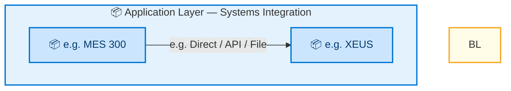
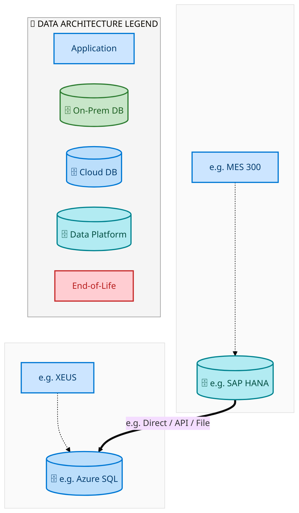
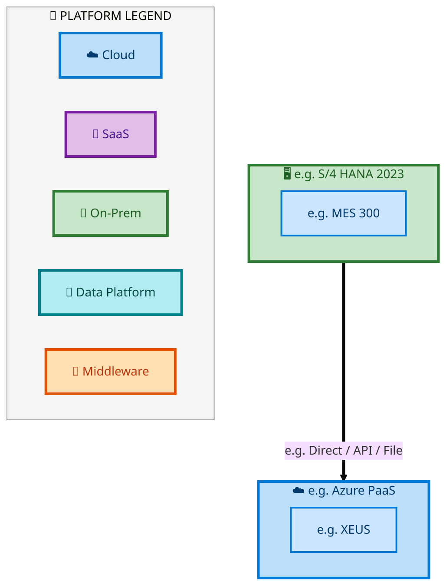

  
  <h1 style="font-size:36px; margin-top:24px;">Forecast to Stock</h1>
  <h2 style="font-size:24px;">TOGAF BDAT — Aggregated Architecture View</h2>
  
Tower: End-to-End Integrated Processes (E2E) · Process: Forecast to Stock · R1 – R5

  
IAO Program · R1 – R5 
  Generated: April 2026 
  Sajiv Francis

  
IAO Architecture Pipeline — Intel Confidential

Page 1<a href="#toc">↑ Back to TOC</a>Forecast to Stock

## Table of Contents

- [1. Executive Summary](#1-executive-summary)
- [2. Capability Inventory](#2-capability-inventory)
- [3. Current-State Architecture](#3-current-state-architecture)
   - [3.1 Application Architecture](#31-application-architecture)
   - [3.2 Data Architecture](#32-data-architecture)
   - [3.3 Technology Architecture](#33-technology-architecture)
- [4. Future-State Architecture](#4-future-state-architecture)
   - [4.1 Application Architecture](#41-application-architecture)
   - [4.2 Data Architecture](#42-data-architecture)
   - [4.3 Technology Architecture](#43-technology-architecture)
- [5. Transformation Analysis](#5-transformation-analysis)
   - [5.1 System Landscape Changes](#51-system-landscape-changes)
   - [5.2 Integration Complexity Delta](#52-integration-complexity-delta)
- [6. Capability Detail Reference](#6-capability-detail-reference)

Page 2<a href="#toc">↑ Back to TOC</a>Forecast to Stock

## 1 Executive Summary

This **L1** summary aggregates architecture diagrams from **16** L2 capabilities across **Tower: End-to-End Integrated Processes (E2E) · Process: Forecast to Stock · R1 – R5**.

The diagrams below show the consolidated current-state and future-state system landscape **without duplicates** — each system and connection appears only once even when shared across capabilities. For detailed data flows, integration patterns, technology stacks, and business architecture, refer to the individual L2 capability documents linked in [§6 Capability Detail Reference](#6-capability-detail-reference).

| Metric | Current-State | Future-State | Delta |
|--------|:---:|:---:|:---:|
| **Unique Systems** | 2 | 2 | +0 |
| **System Connections** | 1 | 1 | +0 |
| **Total Flow Hops** | 16 | 16 | +0 |
| **Capabilities Covered** | 16 | 16 | — |

Page 3<a href="#toc">↑ Back to TOC</a>Forecast to Stock

## 2 Capability Inventory

The following **16** capabilities are aggregated in this summary.
Click a capability ID to view its full TOGAF BDAT architecture document.

| # | Capability ID | Capability Name | L1 Process Group | Current Hops | Future Hops |
|:---:|:---:|---|---|:---:|:---:|
| 1 | [E2E-08](../../../Forecast to Stock/E2E-08/output/docs/systems-architecture/E2E-08-Architecture.html) | E2E-08 | Forecast to Stock | 1 | 1 |
| 2 | [E2E-110](../../../Forecast to Stock/E2E-110/output/docs/systems-architecture/E2E-110-Architecture.html) | IMR Flow | Forecast to Stock | 1 | 1 |
| 3 | [E2E-113](../../../Forecast to Stock/E2E-113/output/docs/systems-architecture/E2E-113-Architecture.html) | R3 IMR Labs Process | Forecast to Stock | 1 | 1 |
| 4 | [E2E-117](../../../Forecast to Stock/E2E-117/output/docs/systems-architecture/E2E-117-Architecture.html) | E2E-117 | Forecast to Stock | 1 | 1 |
| 5 | [E2E-118](../../../Forecast to Stock/E2E-118/output/docs/systems-architecture/E2E-118-Architecture.html) | E2E-118 | Forecast to Stock | 1 | 1 |
| 6 | [E2E-122](../../../Forecast to Stock/E2E-122/output/docs/systems-architecture/E2E-122-Architecture.html) | E2E-122 | Forecast to Stock | 1 | 1 |
| 7 | [E2E-45](../../../Forecast to Stock/E2E-45/output/docs/systems-architecture/E2E-45-Architecture.html) | E2E-45 | Forecast to Stock | 1 | 1 |
| 8 | [E2E-67](../../../Forecast to Stock/E2E-67/output/docs/systems-architecture/E2E-67-Architecture.html) | E2E-67 | Forecast to Stock | 1 | 1 |
| 9 | [E2E-68](../../../Forecast to Stock/E2E-68/output/docs/systems-architecture/E2E-68-Architecture.html) | -Intel Foundry   NPI planning and execution processes | Forecast to Stock | 1 | 1 |
| 10 | [E2E-71](../../../Forecast to Stock/E2E-71/output/docs/systems-architecture/E2E-71-Architecture.html) | E2E-71 | Forecast to Stock | 1 | 1 |
| 11 | [E2E-72](../../../Forecast to Stock/E2E-72/output/docs/systems-architecture/E2E-72-Architecture.html) | IP | Forecast to Stock | 1 | 1 |
| 12 | [E2E-73](../../../Forecast to Stock/E2E-73/output/docs/systems-architecture/E2E-73-Architecture.html) | R3 Hybrid Manufacturing process with external Wafer Procurement & Internal processing of | Forecast to Stock | 1 | 1 |
| 13 | [E2E-74](../../../Forecast to Stock/E2E-74/output/docs/systems-architecture/E2E-74-Architecture.html) | R3 Internal manufacturing process for Finished Goods in Intel Foundry with Planning integrati | Forecast to Stock | 1 | 1 |
| 14 | [E2E-76](../../../Forecast to Stock/E2E-76/output/docs/systems-architecture/E2E-76-Architecture.html) | Internal manufacturing process for Finished Goods in Intel Foundry with sales to External cus | Forecast to Stock | 1 | 1 |
| 15 | [E2E-84](../../../Forecast to Stock/E2E-84/output/docs/systems-architecture/E2E-84-Architecture.html) | Intel Foundry - Inventory Transfer  Shipment of goods through Stock transfer (Interim State) | Forecast to Stock | 1 | 1 |
| 16 | [E2E-94](../../../Forecast to Stock/E2E-94/output/docs/systems-architecture/E2E-94-Architecture.html) | R3 Intel Foundry Maintenance process through spare parts (SWAP) | Forecast to Stock | 1 | 1 |

Page 4<a href="#toc">↑ Back to TOC</a>Forecast to Stock

## 3 Current-State Architecture

Aggregated current-state: **2** systems, **1** connections, **16** flow hops.

### 3.1 Application Architecture

> System-to-system integration flows. Color indicates IAPM lifecycle status (green = deployed, blue = developing, red = end-of-life).

<a href="https://mermaid.live/view#pako:eNqVlG1r2zAQx7-KUOmrpZlsxw_1i4Fsy1BIYSwbDOYRVOuSmPkJS6bL2n73KfHiJGqzsXshkE7_3-lO0j3hvBGAQ7zueLtBn6OsRtqur9HNDaJdvinuuQLkTG30DtFffQdIqm0JKC-5lCD1tkGxnyewQg-9LGqQEu1tVZRleJVqi5yJVF3zA_T0lga2-2d681gItQnt9uckb8qmC68IIQaTty062sCMY-am6cgkxA-S2V-YDvViAyu44iY2ihKWRiPWcj03JudY6wSbzHxqHdyCyw3vOr4NkYtcI1hVCFHCI9cVPKkLI5E9BmOeaxFyMYcodTxi5gBN-ao0aRonyREbe3ZgB5exvhVbJlZyLk0ssyLG_BHrR1ZK7YvYGbVmgYnNy6YX_19x26y4gW3qtoPKeB8B8-LbEWszP3Eun9aKXGbrZzeAZf8w_Ac6_5bhrBeBI_SYg4do25ZFzlXR1GjOt9ChrLeJNUOLrVRQSXRXK9Di3YYMfx94OxNFB_kg-3RcXcR0Ccv1cnnPFkuHEDMcTNdTpH1I-85wo_Ar-7J4U7VzjBKoxSE5M6T-wh-eM7zXJPtDoveIfrzTY1qUkOHn82AHzr76r2n6r77p30mPzqGJRPNjg0hOntaFBnEqpQcpc1I7Tf7VB_AEV9BVvBA4fMJqA9Wu6QlY8b5U-GWCea-axbbOcai6Hia4b3V3gKTg-i6rYfHlNybVltg=" title="View full diagram">&#128065; View Diagram</a>

### 3.2 Data Architecture

> Applications (blue) sit above their hosting databases (green cylinders). Thick arrows show data movement between databases.

<a href="https://mermaid.live/view#pako:eNqlVQ1vmzAQ_SsWU6RNSjpCkjZBaiU-10q0y0q6TSoTcsAkVg1GYNakaf77bAhJk4ZW22wJ2ee7d-f3jL2SAhoiSZVarRVOMFPBypPYHMXIk1TgSVOY81Gbj3IUFBlmSwf9RqRaJJTWq2XId5hhOCUoF8scJ6IJc_HTBqo7SBeVs7DbMMZkWa24aEYRuLtqA40DcPB16UXoYzCHGdugFTm6hosfOGRzYYkgyZHwm7OYOHCKSJmWZUVpTfi23BQGOJkJc28gjBlMHl4Y-4P1GqxbLS_Z5gIT3UsAbwGBeW6iCMA01ekCRJgQ9YNhWAPbbucsow9I_SDLZ0Ozv5l2HkVpqpIu2gElNBPLPe3UOMALp8aS1HBD69QYbeEU68zsKY1wXX1gKfJrOEKLcAOo66Zl6_9ZnwkZrPEUS7eVF3jD3tB-A69v9g8LRJTs-LNtwzR3eMapMlSGjXj6Wdfo8voqxLyYzjKYzoFrmIbjI3_ma09Fhnz3m3PvSVzeX5WjaCHOUMAwTbaCisYjtTLwp3Xn8hh0MjsBYsxjVVWtpN5zNw_yfPQkrwiHvZB_w6DvFRGS-R4FTukEuJMnfRJoG2UasoPOSefiSIbKHSWbuJwtCTq245pQTfQtoZYs-j6hXf7bNVPoamP_UrvR_pbBa8v1e7Jck8ingE_f4XGb7A0auQ8QPlsWxXFsLuCAxzrDOzTWbv_E4qtk4Pz84nlDhFnSBj4DbXzFvzYm_Pp7Pir0gSYOmvF6718wE4QyMLWJBrRb4_JqYhmTu1sLONYX68Zs0Mq53VkdX6iqpSnBARSrx9VxfLNBj69JZ5yhGJj67kgvyV6k0RBaXUovA_f_BR7alLW8fsYEsohmccMpcHyLb81Kwg6NOg6OULW16q45qn3Fbq33QPSt3qPR6JXYUluKURZDHErqqnre-CsZoggWhPEHSoIFo-4yCSS1fHKkIg0hQyaGXM24Mq7_ABLlSS4=" title="View full diagram">&#128065; View Diagram</a>

### 3.3 Technology Architecture

> Applications grouped by hosting platform. Cloud platforms marked with ☁️.

<a href="https://mermaid.live/view#pako:eNqllWtvmzAUhv-KRZVvacstCUHqJK5bpaSJSrtNGhNywCSoDkZg2qRp_vtsyI2kqToVJGSfc_z4vD42XgkhiZCgC63WKkkTqoOVL9AZmiNf0IEvTGDBWm3WKlBY5gldDtAzwrUTE7L1VkN-wjyBE4wK7macmKTUS143KEnNFnUwt7twnuBl7fHQlCDweNsGBgMw-LqKwuQlnMGcbmhlgYZw8SuJ6IxbYogLxONmdI4HcIJwNS3Ny8qaMlleBsMknXKzKnJjDtOnA2NHXK_ButXy091c4MH0U8CeEMOisFEMYJaZZAHiBGP9wrKcjuu2C5qTJ6RfiGJPs9VN9_KFp6bL2aIdEkxy7laMrnXEyzCkB0DN6Vr9HVB2erYiN4HKHiiZHUcWj4CI4D3PdS3blnc8qytrsnY2QbMnWRJLsCYW5WSaw2wGPGs8DlAwDYzXMkfBGELvjy_4pdwVJb-MkcgmvZpegcoNuNsX_tYM_kRJjkKakBQM7vdWBjUq6G_nkeMqAm-zsbqu18tch6M02mRElxi9l85GrWnajmt-WA7ltBzn1HqBGvww7oxAFmWlEhxpSsS-EewcyvauVcDjAI_7H-VDxwsUUdyKZ13Aup_X30jwSxuoxp8B39x8e9ukaFeCwDUwxrfs6yaYHea39yry3rIO0JRJOVzJMBLBeGA8uKP7IRg43507-3MLOLCOd6CFSRk1BvMwr1E3mS3e8e7kUaNtVMi-MZLBKL0c52h-Emg3kp8gYEMKwZgd4Zjkp-HDxuxSDwyTKMLoBeZoF3ta3HqZtge4w99dPfv9frOYUrY4Hm596TQ0WduT5Uim4_R2rJ4pucb5baUakqqdsEZf_sftWfZWo-yYrnygUVM09wONqq2esIa7f6UjmnuW0-1IoniWZbpKV7SEtjBH-RwmkaCv6luPXZ4RimGJKbu3BFhS4i3TUNCrm0goswhSZCeQnYp5bVz_A9mNUh4=" title="View full diagram">&#128065; View Diagram</a>

Page 5<a href="#toc">↑ Back to TOC</a>Forecast to Stock

## 4 Future-State Architecture

Aggregated future-state: **2** systems, **1** connections, **16** flow hops.

### 4.1 Application Architecture

> System-to-system integration flows. Color indicates IAPM lifecycle status (green = deployed, blue = developing, red = end-of-life).

<a href="https://mermaid.live/view#pako:eNqVlG1r2zAQx7-KUOmrpZlsxw_1i4EfJCikMJYNBvMIqnVJzPyEJdNlbb_7lHhxErXZ2L0QSKf_73Qn6Z5w3gjAIV53vN2gz3FWI23X1-jmBkVdvinuuQLkTG30DkW_-g6QVNsSUF5yKUHqbYNiP09hhR56WdQgJdrbqijL8Ippi52JVF3zA_T0Ngps98_05rEQahPa7c9J3pRNF14RQgwmb1t0tIGZJNRlbGQS4gfp7C9MJ_ISAyu44iY2jlPK4hFruZ6bkHOsdYJNZ35kHdyCyw3vOr4NkYtcI1hVCFHCI9cVPKkLJbE9BqOeaxFyMYeYOR4xc4CmfFUaxpI0PWITzw7s4DLWtxLLxErOpYmlVkypP2L92GKRfRE7i6xZYGLzsunF_1fcNituYJu67aAy3kdAveR2xNrUT53Lp7Vil9r62Q1g2T8M_yGaf8tw1ovAEXrMwUNR25ZFzlXR1GjOt9ChrLeJNUOLrVRQSXRXK9Di3YYMfx94OxNFB_kg-3RcXbBoCcv1cnlPF0uHEDMcTNdTpH1I-85wo_Ar_bJ4U7VzjBKoxSE5M6T-wh-eM7zXpPtDovco-ninR1aUkOHn82AHzr76r2n6r77p30mPzqGJxPNjg0hPntaFBnEqjQ5S6jCbpf_qA3iCK-gqXggcPmG1gWrX9ASseF8q_DLBvFfNYlvnOFRdDxPct7o7QFpwfZfVsPjyGzwRluo=" title="View full diagram">&#128065; View Diagram</a>

### 4.2 Data Architecture

> Applications (blue) sit above their hosting databases (green cylinders). Thick arrows show data movement between databases.

<a href="https://mermaid.live/view#pako:eNqlVQ1vmzAQ_SsWU6RNSjpCkjZBaiU-10q0y0q6TSoTcsAkVg1GYNakaf77bAhJk4ZW22wJ2ee7d-f3jL2SAhoiSZVarRVOMFPBypPYHMXIk1TgSVOY81Gbj3IUFBlmSwf9RqRaJJTWq2XId5hhOCUoF8scJ6IJc_HTBqo7SBeVs7DbMMZkWa24aEYRuLtqA40DcPB16UXoYzCHGdugFTm6hosfOGRzYYkgyZHwm7OYOHCKSJmWZUVpTfi23BQGOJkJc28gjBlMHl4Y-4P1GqxbLS_Z5gIT3UsAbwGBeW6iCMA01ekCRJgQ9YNhWAPbbucsow9I_SDLZ0Ozv5l2HkVpqpIu2gElNBPLPe3UOMALp8aS1HBD69QYbeEU68zsKY1wXX1gKfJrOEKLcAOo66Zl6_9ZnwkZrPEUS7eVF3jD3tB-A69v9g8LRJTs-LNtwzR3eMapMlSGjXj6Wdfo8voqxLyYzjKYzoFrm4bjI3_ma09Fhnz3m3PvSVzeX5WjaCHOUMAwTbaCisYjtTLwp3Xn8hh0MjsBYsxjVVWtpN5zNw_yfPQkrwiHvZB_w6DvFRGS-R4FTukEuJMnfRJoG2UasoPOSefiSIbKHSWbuJwtCTq245pQTfQtoZYs-j6hXf7bNVPoamP_UrvR_pbBa8v1e7Jck8ingE_f4XGb7A0auQ8QPlsWxXFsLuCAxzrDOzTWbv_E4qtk4Pz84nlDhFnSBj4DbXzFvzYm_Pp7Pir0gSYOmvF6718wE4QyMLWJBrRb4_JqYhmTu1sLONYX68Zs0Mq53VkdX6iqpSnBARSrx9VxfLNBj69JZ5yhGJj67kgvyV6k0RBaXUovA_f_BR7alLW8fsYEsohmccMpcHyLb81Kwg6NOg6OULW16q45qn3Fbq33QPSt3qPR6JXYUluKURZDHErqqnre-CsZoggWhPEHSoIFo-4yCSS1fHKkIg0hQyaGXM24Mq7_AJ2QSVg=" title="View full diagram">&#128065; View Diagram</a>

### 4.3 Technology Architecture

> Applications grouped by hosting platform. Cloud platforms marked with ☁️.

<a href="https://mermaid.live/view#pako:eNqllWtvmzAUhv-KRZVvacstCUHqJK5bpaSJSrtNGhNywCSoDkZg2qRp_vtsyI2kqToVJGSfc_z4vD42XgkhiZCgC63WKkkTqoOVL9AZmiNf0IEvTGDBWm3WKlBY5gldDtAzwrUTE7L1VkN-wjyBE4wK7macmKTUS143KEnNFnUwt7twnuBl7fHQlCDweNsGBgMw-LqKwuQlnMGcbmhlgYZw8SuJ6IxbYogLxONmdI4HcIJwNS3Ny8qaMlleBsMknXKzKnJjDtOnA2NHXK_ButXy091c4MH0U8CeEMOisFEMYJaZZAHiBGP9wrKcjuu2C5qTJ6RfiGJPs9VN9_KFp6bL2aIdEkxy7laMrnXEyzCkB0DN6Vr9HVB2erYiN4HKHiiZHUcWj4CI4D3PdS3blnc8qytrsnY2QbMnWRJLsCYW5WSaw2wGPHc8DlAwDYzXMkfBGELvjy_4pdwVJb-MkcgmvZpegcoNuNsX_tYM_kRJjkKakBQM7vdWBjUq6G_nkeMqAm-zsbqu18tch6M02mRElxi9l85GrWnajmt-WA7ltBzn1HqBGvww7oxAFmWlEhxpSsS-EewcyvauVcDjAI_7H-VDxwsUUdyKZ13Aup_X30jwSxuoxp8B39x8e9ukaFeCwDUwxrfs6yaYHea39yry3rIO0JRJOVzJMBLBeGA8uKP7IRg43507-3MLOLCOd6CFSRk1BvMwr1E3mS3e8e7kUaNtVMi-MZLBKL0c52h-Emg3kp8gYEMKwZgd4Zjkp-HDxuxSDwyTKMLoBeZoF3ta3HqZtge4w99dPfv9frOYUrY4Hm596TQ0WduT5Uim4_R2rJ4pucb5baUakqqdsEZf_sftWfZWo-yYrnygUVM09wONqq2esIa7f6UjmnuW0-1IoniWZbpKV7SEtjBH-RwmkaCv6luPXZ4RimGJKbu3BFhS4i3TUNCrm0goswhSZCeQnYp5bVz_A4WYUlo=" title="View full diagram">&#128065; View Diagram</a>

Page 6<a href="#toc">↑ Back to TOC</a>Forecast to Stock

## 5 Transformation Analysis

### 5.1 System Landscape Changes

| Category | Count | Systems |
|----------|:---:|---|
| **New Systems** | 0 | — |
| **Retiring Systems** | 0 | — |
| **Continuing Systems** | 2 | — |

### 5.2 Integration Complexity Delta

Page 7<a href="#toc">↑ Back to TOC</a>Forecast to Stock

## 6 Capability Detail Reference

For detailed architecture information, navigate to the individual L2 capability documents.
Each L2 document contains the full TOGAF BDAT analysis including:

- **Business Architecture** — BPMN process flows, business drivers, success criteria
- **Data Architecture** — Source-to-target data flows with DB platforms
- **Application Architecture** — Integration patterns, middleware, protocols
- **Technology Architecture** — Platform inventory, deployment topology
- **RICEFW / Clean Core** — SAP development object tracking

| # | Capability | L1 Process | Architecture Doc |
|:---:|---|---|---|
| 1 | E2E-08 | Forecast to Stock | [E2E-08](../../../Forecast to Stock/E2E-08/output/docs/systems-architecture/E2E-08-Architecture.html) |
| 2 | IMR Flow | Forecast to Stock | [E2E-110](../../../Forecast to Stock/E2E-110/output/docs/systems-architecture/E2E-110-Architecture.html) |
| 3 | R3 IMR Labs Process | Forecast to Stock | [E2E-113](../../../Forecast to Stock/E2E-113/output/docs/systems-architecture/E2E-113-Architecture.html) |
| 4 | E2E-117 | Forecast to Stock | [E2E-117](../../../Forecast to Stock/E2E-117/output/docs/systems-architecture/E2E-117-Architecture.html) |
| 5 | E2E-118 | Forecast to Stock | [E2E-118](../../../Forecast to Stock/E2E-118/output/docs/systems-architecture/E2E-118-Architecture.html) |
| 6 | E2E-122 | Forecast to Stock | [E2E-122](../../../Forecast to Stock/E2E-122/output/docs/systems-architecture/E2E-122-Architecture.html) |
| 7 | E2E-45 | Forecast to Stock | [E2E-45](../../../Forecast to Stock/E2E-45/output/docs/systems-architecture/E2E-45-Architecture.html) |
| 8 | E2E-67 | Forecast to Stock | [E2E-67](../../../Forecast to Stock/E2E-67/output/docs/systems-architecture/E2E-67-Architecture.html) |
| 9 | -Intel Foundry   NPI planning and execution processes | Forecast to Stock | [E2E-68](../../../Forecast to Stock/E2E-68/output/docs/systems-architecture/E2E-68-Architecture.html) |
| 10 | E2E-71 | Forecast to Stock | [E2E-71](../../../Forecast to Stock/E2E-71/output/docs/systems-architecture/E2E-71-Architecture.html) |
| 11 | IP | Forecast to Stock | [E2E-72](../../../Forecast to Stock/E2E-72/output/docs/systems-architecture/E2E-72-Architecture.html) |
| 12 | R3 Hybrid Manufacturing process with external Wafer Procurement & Internal processing of | Forecast to Stock | [E2E-73](../../../Forecast to Stock/E2E-73/output/docs/systems-architecture/E2E-73-Architecture.html) |
| 13 | R3 Internal manufacturing process for Finished Goods in Intel Foundry with Planning integrati | Forecast to Stock | [E2E-74](../../../Forecast to Stock/E2E-74/output/docs/systems-architecture/E2E-74-Architecture.html) |
| 14 | Internal manufacturing process for Finished Goods in Intel Foundry with sales to External cus | Forecast to Stock | [E2E-76](../../../Forecast to Stock/E2E-76/output/docs/systems-architecture/E2E-76-Architecture.html) |
| 15 | Intel Foundry - Inventory Transfer  Shipment of goods through Stock transfer (Interim State) | Forecast to Stock | [E2E-84](../../../Forecast to Stock/E2E-84/output/docs/systems-architecture/E2E-84-Architecture.html) |
| 16 | R3 Intel Foundry Maintenance process through spare parts (SWAP) | Forecast to Stock | [E2E-94](../../../Forecast to Stock/E2E-94/output/docs/systems-architecture/E2E-94-Architecture.html) |

