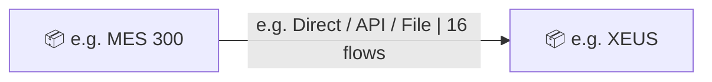
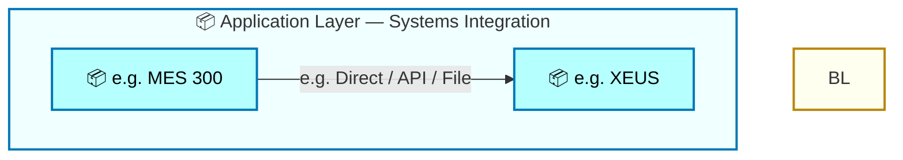

  <h1 style="font-size:36px; margin-top:24px;">Forecast to Stock</h1>
  <h2 style="font-size:24px;">TOGAF BDAT — Systems Integration Summary</h2>
  
Tower: End-to-End Integrated Processes (E2E) · Process: Forecast to Stock · R1 – R5

  
IAO Program · R1 – R5 
  Generated: April 2026 
  Sajiv Francis

  
IAO Architecture Pipeline — Intel Confidential

Page 1<a href="#toc">↑ Back to TOC</a>Forecast to Stock

## Table of Contents

- [1. Executive Summary](#1-executive-summary)
- [2. Capability Inventory](#2-capability-inventory)
- [3. Current-State Architecture](#3-current-state-architecture)
   - [3.1 System Integration Map](#31-system-integration-map)
   - [3.2 ArchiMate Application View](#32-archimate-application-view)
   - [3.3 Data Entities](#33-data-entities)
   - [3.4 Integration Patterns](#34-integration-patterns)
   - [3.5 Technology Stack](#35-technology-stack)
- [4. Future-State Architecture](#4-future-state-architecture)
   - [4.1 System Integration Map](#41-system-integration-map)
   - [4.2 ArchiMate Application View](#42-archimate-application-view)
   - [4.3 Data Entities](#43-data-entities)
   - [4.4 Integration Patterns](#44-integration-patterns)
   - [4.5 Technology Stack](#45-technology-stack)
- [5. Transformation Analysis](#5-transformation-analysis)
   - [5.1 System Landscape Changes](#51-system-landscape-changes)
   - [5.2 Integration Complexity](#52-integration-complexity)
- [6. System Inventory](#6-system-inventory)

Page 2<a href="#toc">↑ Back to TOC</a>Forecast to Stock

## 1 Executive Summary

This document provides a **L1** summary view of the systems architecture for **Tower: End-to-End Integrated Processes (E2E) · Process: Forecast to Stock · R1 – R5**.

| Metric | Current-State | Future-State | Delta |
|--------|:---:|:---:|:---:|
| **Unique Systems** | 2 | 2 | +0 |
| **System Connections** | 1 | 1 | +0 |
| **Total Flow Hops** | 16 | 16 | +0 |
| **Capabilities Covered** | 16 | 16 | — |

Page 3<a href="#toc">↑ Back to TOC</a>Forecast to Stock

## 2 Capability Inventory

The following **16** capabilities are aggregated in this summary.
Click a capability ID to view its full TOGAF BDAT architecture document.

| # | Capability ID | Capability Name | L1 Process Group | Current Hops | Future Hops |
|:---:|:---:|---|---|:---:|:---:|
| 1 | [E2E-08](towers/E2E/Forecast to Stock/E2E-08/output/docs/systems-architecture/E2E-08-Architecture.html) | E2E-08 | Forecast to Stock | 1 | 1 |
| 2 | [E2E-110](towers/E2E/Forecast to Stock/E2E-110/output/docs/systems-architecture/E2E-110-Architecture.html) | IMR Flow | Forecast to Stock | 1 | 1 |
| 3 | [E2E-113](towers/E2E/Forecast to Stock/E2E-113/output/docs/systems-architecture/E2E-113-Architecture.html) | R3 IMR Labs Process | Forecast to Stock | 1 | 1 |
| 4 | [E2E-117](towers/E2E/Forecast to Stock/E2E-117/output/docs/systems-architecture/E2E-117-Architecture.html) | E2E-117 | Forecast to Stock | 1 | 1 |
| 5 | [E2E-118](towers/E2E/Forecast to Stock/E2E-118/output/docs/systems-architecture/E2E-118-Architecture.html) | E2E-118 | Forecast to Stock | 1 | 1 |
| 6 | [E2E-122](towers/E2E/Forecast to Stock/E2E-122/output/docs/systems-architecture/E2E-122-Architecture.html) | E2E-122 | Forecast to Stock | 1 | 1 |
| 7 | [E2E-45](towers/E2E/Forecast to Stock/E2E-45/output/docs/systems-architecture/E2E-45-Architecture.html) | E2E-45 | Forecast to Stock | 1 | 1 |
| 8 | [E2E-67](towers/E2E/Forecast to Stock/E2E-67/output/docs/systems-architecture/E2E-67-Architecture.html) | E2E-67 | Forecast to Stock | 1 | 1 |
| 9 | [E2E-68](towers/E2E/Forecast to Stock/E2E-68/output/docs/systems-architecture/E2E-68-Architecture.html) | -Intel Foundry   NPI planning and execution processes | Forecast to Stock | 1 | 1 |
| 10 | [E2E-71](towers/E2E/Forecast to Stock/E2E-71/output/docs/systems-architecture/E2E-71-Architecture.html) | E2E-71 | Forecast to Stock | 1 | 1 |
| 11 | [E2E-72](towers/E2E/Forecast to Stock/E2E-72/output/docs/systems-architecture/E2E-72-Architecture.html) | IP | Forecast to Stock | 1 | 1 |
| 12 | [E2E-73](towers/E2E/Forecast to Stock/E2E-73/output/docs/systems-architecture/E2E-73-Architecture.html) | R3 Hybrid Manufacturing process with external Wafer Procurement & Internal processing of | Forecast to Stock | 1 | 1 |
| 13 | [E2E-74](towers/E2E/Forecast to Stock/E2E-74/output/docs/systems-architecture/E2E-74-Architecture.html) | R3 Internal manufacturing process for Finished Goods in Intel Foundry with Planning integrati | Forecast to Stock | 1 | 1 |
| 14 | [E2E-76](towers/E2E/Forecast to Stock/E2E-76/output/docs/systems-architecture/E2E-76-Architecture.html) | Internal manufacturing process for Finished Goods in Intel Foundry with sales to External cus | Forecast to Stock | 1 | 1 |
| 15 | [E2E-84](towers/E2E/Forecast to Stock/E2E-84/output/docs/systems-architecture/E2E-84-Architecture.html) | Intel Foundry - Inventory Transfer  Shipment of goods through Stock transfer (Interim State) | Forecast to Stock | 1 | 1 |
| 16 | [E2E-94](towers/E2E/Forecast to Stock/E2E-94/output/docs/systems-architecture/E2E-94-Architecture.html) | R3 Intel Foundry Maintenance process through spare parts (SWAP) | Forecast to Stock | 1 | 1 |

Page 4<a href="#toc">↑ Back to TOC</a>Forecast to Stock

## 3 Current-State Architecture

Aggregated current-state view of **2** systems with **1** unique connections across **16** flow hops.

Page 5<a href="#toc">↑ Back to TOC</a>Forecast to Stock

### 3.1 System Integration Map

Page 6<a href="#toc">↑ Back to TOC</a>Forecast to Stock

### 3.2 ArchiMate Application View

Page 7<a href="#toc">↑ Back to TOC</a>Forecast to Stock

### 3.3 Data Entities

**1** data entities in current-state flows.

| # | Data Entity | Source | Target | Owner | Classification | Volume | Master/Txn |
|:---:|---|---|---|---|---|---|---|
| 1 | e.g. Cost Element | e.g. MES 300 | e.g. XEUS | Data steward | e.g. Intel Confidential | e.g. 10K rows/day | Master / Transaction |

Page 8<a href="#toc">↑ Back to TOC</a>Forecast to Stock

### 3.4 Integration Patterns

**1** integration patterns in current-state.

| # | Pattern | Middleware | Protocol | Auth Method | Flow Chain |
|:---:|---|---|---|---|---|
| 1 | e.g. Pub-Sub / P2P / ETL | e.g. Azure Service Bus | e.g. REST / RFC / SFTP | e.g. OAuth / NTLM / Cert | e.g. MES Route to ICOST |

Page 9<a href="#toc">↑ Back to TOC</a>Forecast to Stock

### 3.5 Technology Stack

**2** technology platforms in current-state.

| # | Platform | Type | Systems | Environment |
|:---:|---|---|---|---|
| 1 | e.g. Azure PaaS | Cloud / SaaS | e.g. XEUS | DEV,QAS,PRD |
| 2 | e.g. S/4 HANA 2023 | On-Premise | e.g. MES 300 | DEV,QAS,PRD |

Page 10<a href="#toc">↑ Back to TOC</a>Forecast to Stock

## 4 Future-State Architecture

Aggregated future-state view of **2** systems with **1** unique connections across **16** flow hops.

Page 11<a href="#toc">↑ Back to TOC</a>Forecast to Stock

### 4.1 System Integration Map

Page 12<a href="#toc">↑ Back to TOC</a>Forecast to Stock

### 4.2 ArchiMate Application View

Page 13<a href="#toc">↑ Back to TOC</a>Forecast to Stock

### 4.3 Data Entities

**1** data entities in future-state flows.

| # | Data Entity | Source | Target | Owner | Classification | Volume | Master/Txn |
|:---:|---|---|---|---|---|---|---|
| 1 | e.g. Cost Element | e.g. MES 300 | e.g. XEUS | Data steward | e.g. Intel Confidential | e.g. 10K rows/day | Master / Transaction |

Page 14<a href="#toc">↑ Back to TOC</a>Forecast to Stock

### 4.4 Integration Patterns

**1** integration patterns in future-state.

| # | Pattern | Middleware | Protocol | Auth Method | Flow Chain |
|:---:|---|---|---|---|---|
| 1 | e.g. Pub-Sub / P2P / ETL | e.g. Azure Service Bus | e.g. REST / RFC / SFTP | e.g. OAuth / NTLM / Cert | e.g. MES Route to ICOST |

Page 15<a href="#toc">↑ Back to TOC</a>Forecast to Stock

### 4.5 Technology Stack

**2** technology platforms in future-state.

| # | Platform | Type | Systems | Environment |
|:---:|---|---|---|---|
| 1 | e.g. Azure PaaS | Cloud / SaaS | e.g. XEUS | DEV,QAS,PRD |
| 2 | e.g. S/4 HANA 2023 | On-Premise | e.g. MES 300 | DEV,QAS,PRD |

Page 16<a href="#toc">↑ Back to TOC</a>Forecast to Stock

## 5 Transformation Analysis

Page 17<a href="#toc">↑ Back to TOC</a>Forecast to Stock

### 5.1 System Landscape Changes

**Continuing Systems:** 2

Page 18<a href="#toc">↑ Back to TOC</a>Forecast to Stock

### 5.2 Integration Complexity

| System | Current Connections | Future Connections | Delta |
|---|:---:|:---:|:---:|
| e.g. MES 300 | 1 | 1 | — |
| e.g. XEUS | 1 | 1 | — |

Page 19<a href="#toc">↑ Back to TOC</a>Forecast to Stock

## 6 System Inventory

| # | System | IAPM ID | Status |
|:---:|---|---|---|
| 1 | e.g. MES 300 | - | N/A |
| 2 | e.g. XEUS | - | N/A |

