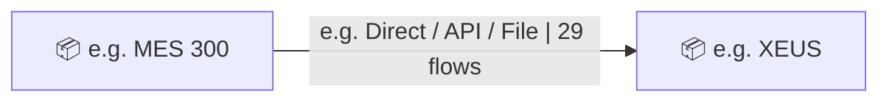
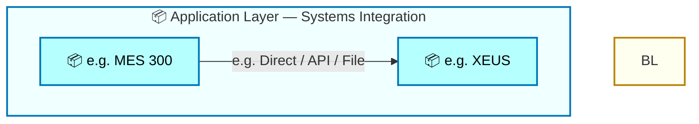

  <h1 style="font-size:36px; margin-top:24px;">Procure to Pay</h1>
  <h2 style="font-size:24px;">TOGAF BDAT — Systems Integration Summary</h2>
  
Tower: End-to-End Integrated Processes (E2E) · Process: Procure to Pay · R1 – R5

  
IAO Program · R1 – R5 
  Generated: April 2026 
  Sajiv Francis

  
IAO Architecture Pipeline — Intel Confidential

Page 1<a href="#toc">↑ Back to TOC</a>Procure to Pay

## Table of Contents

- [1. Executive Summary](#1-executive-summary)
- [2. Capability Inventory](#2-capability-inventory)
- [3. Current-State Architecture](#3-current-state-architecture)
   - [3.1 System Integration Map](#31-system-integration-map)
   - [3.2 ArchiMate Application View](#32-archimate-application-view)
   - [3.3 Data Entities](#33-data-entities)
   - [3.4 Integration Patterns](#34-integration-patterns)
   - [3.5 Technology Stack](#35-technology-stack)
- [4. Future-State Architecture](#4-future-state-architecture)
   - [4.1 System Integration Map](#41-system-integration-map)
   - [4.2 ArchiMate Application View](#42-archimate-application-view)
   - [4.3 Data Entities](#43-data-entities)
   - [4.4 Integration Patterns](#44-integration-patterns)
   - [4.5 Technology Stack](#45-technology-stack)
- [5. Transformation Analysis](#5-transformation-analysis)
   - [5.1 System Landscape Changes](#51-system-landscape-changes)
   - [5.2 Integration Complexity](#52-integration-complexity)
- [6. System Inventory](#6-system-inventory)

Page 2<a href="#toc">↑ Back to TOC</a>Procure to Pay

## 1 Executive Summary

This document provides a **L1** summary view of the systems architecture for **Tower: End-to-End Integrated Processes (E2E) · Process: Procure to Pay · R1 – R5**.

| Metric | Current-State | Future-State | Delta |
|--------|:---:|:---:|:---:|
| **Unique Systems** | 2 | 2 | +0 |
| **System Connections** | 1 | 1 | +0 |
| **Total Flow Hops** | 29 | 29 | +0 |
| **Capabilities Covered** | 29 | 29 | — |

Page 3<a href="#toc">↑ Back to TOC</a>Procure to Pay

## 2 Capability Inventory

The following **29** capabilities are aggregated in this summary.
Click a capability ID to view its full TOGAF BDAT architecture document.

| # | Capability ID | Capability Name | L1 Process Group | Current Hops | Future Hops |
|:---:|:---:|---|---|:---:|:---:|
| 1 | [E2E-100](towers/E2E/Procure to Pay/E2E-100/output/docs/systems-architecture/E2E-100-Architecture.html) | R3 - Purchase Requisition to Payments for Direct procurement with Planning Integration (Box | Procure to Pay | 1 | 1 |
| 2 | [E2E-103](towers/E2E/Procure to Pay/E2E-103/output/docs/systems-architecture/E2E-103-Architecture.html) | R3 Procurement of WIINGS Replacement Related Commodities | Procure to Pay | 1 | 1 |
| 3 | [E2E-107](towers/E2E/Procure to Pay/E2E-107/output/docs/systems-architecture/E2E-107-Architecture.html) | R3 - Partner Owned Equipment Order | Procure to Pay | 1 | 1 |
| 4 | [E2E-112](towers/E2E/Procure to Pay/E2E-112/output/docs/systems-architecture/E2E-112-Architecture.html) | R3 Raw Silicon Procurement | Procure to Pay | 1 | 1 |
| 5 | [E2E-114](towers/E2E/Procure to Pay/E2E-114/output/docs/systems-architecture/E2E-114-Architecture.html) | R4 SIMS Harvest Process | Procure to Pay | 1 | 1 |
| 6 | [E2E-115](towers/E2E/Procure to Pay/E2E-115/output/docs/systems-architecture/E2E-115-Architecture.html) | R3 Inter-company Asset Transfer Process | Procure to Pay | 1 | 1 |
| 7 | [E2E-116](towers/E2E/Procure to Pay/E2E-116/output/docs/systems-architecture/E2E-116-Architecture.html) | R3 Wafer Reclaim Process | Procure to Pay | 1 | 1 |
| 8 | [E2E-119](towers/E2E/Procure to Pay/E2E-119/output/docs/systems-architecture/E2E-119-Architecture.html) | R3 Shipping Rejects Inventory Movement | Procure to Pay | 1 | 1 |
| 9 | [E2E-121](towers/E2E/Procure to Pay/E2E-121/output/docs/systems-architecture/E2E-121-Architecture.html) | R3 RM Bailed Inventory Movement (Straddle) | Procure to Pay | 1 | 1 |
| 10 | [E2E-123](towers/E2E/Procure to Pay/E2E-123/output/docs/systems-architecture/E2E-123-Architecture.html) | TD Substrates Manufacturing Process | Procure to Pay | 1 | 1 |
| 11 | [E2E-40](towers/E2E/Procure to Pay/E2E-40/output/docs/systems-architecture/E2E-40-Architecture.html) | R3 Sourcing Request-Project to Contracts for Direct-Capital on Ariba with Pricing Updates | Procure to Pay | 1 | 1 |
| 12 | [E2E-41](towers/E2E/Procure to Pay/E2E-41/output/docs/systems-architecture/E2E-41-Architecture.html) | R3 Sourcing Request | Procure to Pay | 1 | 1 |
| 13 | [E2E-43](towers/E2E/Procure to Pay/E2E-43/output/docs/systems-architecture/E2E-43-Architecture.html) | Process Procurement Card Invoice | Procure to Pay | 1 | 1 |
| 14 | [E2E-44](towers/E2E/Procure to Pay/E2E-44/output/docs/systems-architecture/E2E-44-Architecture.html) | R3 - Intel Owned Consignment with Planning Integration | Procure to Pay | 1 | 1 |
| 15 | [E2E-46](towers/E2E/Procure to Pay/E2E-46/output/docs/systems-architecture/E2E-46-Architecture.html) | R3 Direct procurement with Planning Integration-AT | Procure to Pay | 1 | 1 |
| 16 | [E2E-47](towers/E2E/Procure to Pay/E2E-47/output/docs/systems-architecture/E2E-47-Architecture.html) | Purchase Requisition to Payments for Direct procurement with planning integration - Fab Mater | Procure to Pay | 1 | 1 |
| 17 | [E2E-49](towers/E2E/Procure to Pay/E2E-49/output/docs/systems-architecture/E2E-49-Architecture.html) | R3 Purchase Requisition to Payments for procurement with financial planning and asset managem | Procure to Pay | 1 | 1 |
| 18 | [E2E-50](towers/E2E/Procure to Pay/E2E-50/output/docs/systems-architecture/E2E-50-Architecture.html) | Purchase Requisition to Payments for Indirect - Construction (Small Construction IPCS, Mainte | Procure to Pay | 1 | 1 |
| 19 | [E2E-51](towers/E2E/Procure to Pay/E2E-51/output/docs/systems-architecture/E2E-51-Architecture.html) | Purchase Requisition to Payments for Indirect Materials (Non-IPN and Non-Inventoried) ​ | Procure to Pay | 1 | 1 |
| 20 | [E2E-52](towers/E2E/Procure to Pay/E2E-52/output/docs/systems-architecture/E2E-52-Architecture.html) | Purchase Requisition to Payments for Indirect Non-Mfg. &amp; Mfg. procurement | Procure to Pay | 1 | 1 |
| 21 | [E2E-53](towers/E2E/Procure to Pay/E2E-53/output/docs/systems-architecture/E2E-53-Architecture.html) | Purchase Requisition to Payments for Indirect procurement (simple material or services like H | Procure to Pay | 1 | 1 |
| 22 | [E2E-57](towers/E2E/Procure to Pay/E2E-57/output/docs/systems-architecture/E2E-57-Architecture.html) | R3 Subcontracting with Planning integration- Foundry,OSAT,ODM | Procure to Pay | 1 | 1 |
| 23 | [E2E-59](towers/E2E/Procure to Pay/E2E-59/output/docs/systems-architecture/E2E-59-Architecture.html) | R3 Rework Re-localization in Factory​ | Procure to Pay | 1 | 1 |
| 24 | [E2E-61](towers/E2E/Procure to Pay/E2E-61/output/docs/systems-architecture/E2E-61-Architecture.html) | R3 Consignment Material - Vendor | Procure to Pay | 1 | 1 |
| 25 | [E2E-62](towers/E2E/Procure to Pay/E2E-62/output/docs/systems-architecture/E2E-62-Architecture.html) | R3 Vendor Return for Direct Material | Procure to Pay | 1 | 1 |
| 26 | [E2E-70](towers/E2E/Procure to Pay/E2E-70/output/docs/systems-architecture/E2E-70-Architecture.html) | R3 - Substrates - (PTP) PR to PO scope for Internal Manufacturing (Intel Foundry) & Exte | Procure to Pay | 1 | 1 |
| 27 | [E2E-88](towers/E2E/Procure to Pay/E2E-88/output/docs/systems-architecture/E2E-88-Architecture.html) | R3 Construction materials & equipment procurement process inclusive of OFCI (Like equipme | Procure to Pay | 1 | 1 |
| 28 | [E2E-96](towers/E2E/Procure to Pay/E2E-96/output/docs/systems-architecture/E2E-96-Architecture.html) | R3 Straddle & R4 SIMS Design with Returns | Procure to Pay | 1 | 1 |
| 29 | [E2E-98](towers/E2E/Procure to Pay/E2E-98/output/docs/systems-architecture/E2E-98-Architecture.html) | R3 Equipment Product Supporting Items (PSI) Procurement | Procure to Pay | 1 | 1 |

Page 4<a href="#toc">↑ Back to TOC</a>Procure to Pay

## 3 Current-State Architecture

Aggregated current-state view of **2** systems with **1** unique connections across **29** flow hops.

Page 5<a href="#toc">↑ Back to TOC</a>Procure to Pay

### 3.1 System Integration Map

Page 6<a href="#toc">↑ Back to TOC</a>Procure to Pay

### 3.2 ArchiMate Application View

Page 7<a href="#toc">↑ Back to TOC</a>Procure to Pay

### 3.3 Data Entities

**1** data entities in current-state flows.

| # | Data Entity | Source | Target | Owner | Classification | Volume | Master/Txn |
|:---:|---|---|---|---|---|---|---|
| 1 | e.g. Cost Element | e.g. MES 300 | e.g. XEUS | Data steward | e.g. Intel Confidential | e.g. 10K rows/day | Master / Transaction |

Page 8<a href="#toc">↑ Back to TOC</a>Procure to Pay

### 3.4 Integration Patterns

**1** integration patterns in current-state.

| # | Pattern | Middleware | Protocol | Auth Method | Flow Chain |
|:---:|---|---|---|---|---|
| 1 | e.g. Pub-Sub / P2P / ETL | e.g. Azure Service Bus | e.g. REST / RFC / SFTP | e.g. OAuth / NTLM / Cert | e.g. MES Route to ICOST |

Page 9<a href="#toc">↑ Back to TOC</a>Procure to Pay

### 3.5 Technology Stack

**2** technology platforms in current-state.

| # | Platform | Type | Systems | Environment |
|:---:|---|---|---|---|
| 1 | e.g. Azure PaaS | Cloud / SaaS | e.g. XEUS | DEV,QAS,PRD |
| 2 | e.g. S/4 HANA 2023 | On-Premise | e.g. MES 300 | DEV,QAS,PRD |

Page 10<a href="#toc">↑ Back to TOC</a>Procure to Pay

## 4 Future-State Architecture

Aggregated future-state view of **2** systems with **1** unique connections across **29** flow hops.

Page 11<a href="#toc">↑ Back to TOC</a>Procure to Pay

### 4.1 System Integration Map

Page 12<a href="#toc">↑ Back to TOC</a>Procure to Pay

### 4.2 ArchiMate Application View

Page 13<a href="#toc">↑ Back to TOC</a>Procure to Pay

### 4.3 Data Entities

**1** data entities in future-state flows.

| # | Data Entity | Source | Target | Owner | Classification | Volume | Master/Txn |
|:---:|---|---|---|---|---|---|---|
| 1 | e.g. Cost Element | e.g. MES 300 | e.g. XEUS | Data steward | e.g. Intel Confidential | e.g. 10K rows/day | Master / Transaction |

Page 14<a href="#toc">↑ Back to TOC</a>Procure to Pay

### 4.4 Integration Patterns

**1** integration patterns in future-state.

| # | Pattern | Middleware | Protocol | Auth Method | Flow Chain |
|:---:|---|---|---|---|---|
| 1 | e.g. Pub-Sub / P2P / ETL | e.g. Azure Service Bus | e.g. REST / RFC / SFTP | e.g. OAuth / NTLM / Cert | e.g. MES Route to ICOST |

Page 15<a href="#toc">↑ Back to TOC</a>Procure to Pay

### 4.5 Technology Stack

**2** technology platforms in future-state.

| # | Platform | Type | Systems | Environment |
|:---:|---|---|---|---|
| 1 | e.g. Azure PaaS | Cloud / SaaS | e.g. XEUS | DEV,QAS,PRD |
| 2 | e.g. S/4 HANA 2023 | On-Premise | e.g. MES 300 | DEV,QAS,PRD |

Page 16<a href="#toc">↑ Back to TOC</a>Procure to Pay

## 5 Transformation Analysis

Page 17<a href="#toc">↑ Back to TOC</a>Procure to Pay

### 5.1 System Landscape Changes

**Continuing Systems:** 2

Page 18<a href="#toc">↑ Back to TOC</a>Procure to Pay

### 5.2 Integration Complexity

| System | Current Connections | Future Connections | Delta |
|---|:---:|:---:|:---:|
| e.g. MES 300 | 1 | 1 | — |
| e.g. XEUS | 1 | 1 | — |

Page 19<a href="#toc">↑ Back to TOC</a>Procure to Pay

## 6 System Inventory

| # | System | IAPM ID | Status |
|:---:|---|---|---|
| 1 | e.g. MES 300 | - | N/A |
| 2 | e.g. XEUS | - | N/A |

