  <img src="data:image/svg+xml;base64,PHN2ZyB4bWxucz0iaHR0cDovL3d3dy53My5vcmcvMjAwMC9zdmciIHZpZXdCb3g9IjAgMCA4MDAgNDgwIiB3aWR0aD0iODAwIiBoZWlnaHQ9IjQ4MCI+DQogIDxkZWZzPg0KICAgIDxsaW5lYXJHcmFkaWVudCBpZD0iYmciIHgxPSIwJSIgeTE9IjAlIiB4Mj0iMTAwJSIgeTI9IjEwMCUiPg0KICAgICAgPHN0b3Agb2Zmc2V0PSIwJSIgc3R5bGU9InN0b3AtY29sb3I6IzAwNzFjNTtzdG9wLW9wYWNpdHk6MSIvPg0KICAgICAgPHN0b3Agb2Zmc2V0PSIxMDAlIiBzdHlsZT0ic3RvcC1jb2xvcjojMDBhZWVmO3N0b3Atb3BhY2l0eToxIi8+DQogICAgPC9saW5lYXJHcmFkaWVudD4NCiAgICA8bGluZWFyR3JhZGllbnQgaWQ9ImFjY2VudCIgeDE9IjAlIiB5MT0iMCUiIHgyPSIwJSIgeTI9IjEwMCUiPg0KICAgICAgPHN0b3Agb2Zmc2V0PSIwJSIgc3R5bGU9InN0b3AtY29sb3I6I2ZmZmZmZjtzdG9wLW9wYWNpdHk6MC4xNSIvPg0KICAgICAgPHN0b3Agb2Zmc2V0PSIxMDAlIiBzdHlsZT0ic3RvcC1jb2xvcjojZmZmZmZmO3N0b3Atb3BhY2l0eTowLjAyIi8+DQogICAgPC9saW5lYXJHcmFkaWVudD4NCiAgICA8cGF0dGVybiBpZD0iZ3JpZCIgd2lkdGg9IjQwIiBoZWlnaHQ9IjQwIiBwYXR0ZXJuVW5pdHM9InVzZXJTcGFjZU9uVXNlIj4NCiAgICAgIDxwYXRoIGQ9Ik0gNDAgMCBMIDAgMCAwIDQwIiBmaWxsPSJub25lIiBzdHJva2U9InJnYmEoMjU1LDI1NSwyNTUsMC4wNykiIHN0cm9rZS13aWR0aD0iMC41Ii8+DQogICAgPC9wYXR0ZXJuPg0KICA8L2RlZnM+DQoNCiAgPCEtLSBCYWNrZ3JvdW5kIC0tPg0KICA8cmVjdCB3aWR0aD0iODAwIiBoZWlnaHQ9IjQ4MCIgZmlsbD0idXJsKCNiZykiIHJ4PSI4Ii8+DQogIDxyZWN0IHdpZHRoPSI4MDAiIGhlaWdodD0iNDgwIiBmaWxsPSJ1cmwoI2dyaWQpIiByeD0iOCIvPg0KICA8cmVjdCB3aWR0aD0iODAwIiBoZWlnaHQ9IjQ4MCIgZmlsbD0idXJsKCNhY2NlbnQpIiByeD0iOCIvPg0KDQogIDwhLS0gRGVjb3JhdGl2ZSBjaXJjdWl0L2FyY2hpdGVjdHVyZSBsaW5lcyAtLT4NCiAgPGcgc3Ryb2tlPSJyZ2JhKDI1NSwyNTUsMjU1LDAuMTIpIiBzdHJva2Utd2lkdGg9IjEuNSIgZmlsbD0ibm9uZSI+DQogICAgPHBhdGggZD0iTSAwIDEwMCBMIDEyMCAxMDAgTCAxNjAgMTQwIEwgMjgwIDE0MCIvPg0KICAgIDxwYXRoIGQ9Ik0gMCAyNjAgTCA4MCAyNjAgTCAxMjAgMjIwIEwgMjAwIDIyMCBMIDI0MCAyNjAgTCAzNjAgMjYwIi8+DQogICAgPHBhdGggZD0iTSA1MjAgMTAwIEwgNjAwIDEwMCBMIDY0MCA2MCBMIDgwMCA2MCIvPg0KICAgIDxwYXRoIGQ9Ik0gNDQwIDM0MCBMIDU2MCAzNDAgTCA2MDAgMzAwIEwgNzIwIDMwMCBMIDc2MCAzNDAgTCA4MDAgMzQwIi8+DQogICAgPHBhdGggZD0iTSA2MDAgNDAwIEwgNjgwIDQwMCBMIDcyMCA0NDAiLz4NCiAgICA8cGF0aCBkPSJNIDAgNDAwIEwgNDAgNDAwIEwgODAgMzYwIi8+DQogICAgPHBhdGggZD0iTSAyMDAgNDIwIEwgMzIwIDQyMCBMIDM2MCAzODAgTCA0ODAgMzgwIi8+DQogICAgPHBhdGggZD0iTSA2NTAgNDQwIEwgNzUwIDQ0MCBMIDgwMCA0ODAiLz4NCiAgPC9nPg0KDQogIDwhLS0gRGVjb3JhdGl2ZSBub2RlcyAtLT4NCiAgPGcgZmlsbD0icmdiYSgyNTUsMjU1LDI1NSwwLjE4KSI+DQogICAgPGNpcmNsZSBjeD0iMTIwIiBjeT0iMTAwIiByPSI0Ii8+DQogICAgPGNpcmNsZSBjeD0iMjgwIiBjeT0iMTQwIiByPSI0Ii8+DQogICAgPGNpcmNsZSBjeD0iMjAwIiBjeT0iMjIwIiByPSI0Ii8+DQogICAgPGNpcmNsZSBjeD0iMzYwIiBjeT0iMjYwIiByPSI0Ii8+DQogICAgPGNpcmNsZSBjeD0iNjAwIiBjeT0iMTAwIiByPSI0Ii8+DQogICAgPGNpcmNsZSBjeD0iNzIwIiBjeT0iMzAwIiByPSI0Ii8+DQogICAgPGNpcmNsZSBjeD0iNTYwIiBjeT0iMzQwIiByPSI0Ii8+DQogICAgPGNpcmNsZSBjeD0iODAiIGN5PSIzNjAiIHI9IjQiLz4NCiAgICA8Y2lyY2xlIGN4PSI0ODAiIGN5PSIzODAiIHI9IjQiLz4NCiAgICA8Y2lyY2xlIGN4PSIzMjAiIGN5PSI0MjAiIHI9IjQiLz4NCiAgPC9nPg0KDQogIDwhLS0gVE9HQUYgQkRBVCBib3hlcyAtLT4NCiAgPGcgZm9udC1mYW1pbHk9IlNlZ29lIFVJLCBBcmlhbCwgc2Fucy1zZXJpZiIgZm9udC1zaXplPSIxNCIgZm9udC13ZWlnaHQ9IjYwMCI+DQogICAgPCEtLSBCIC0tPg0KICAgIDxyZWN0IHg9IjE1MCIgeT0iMTQwIiB3aWR0aD0iMTIwIiBoZWlnaHQ9IjQwIiByeD0iNSIgZmlsbD0icmdiYSgyNTUsMjU1LDI1NSwwLjE4KSIgc3Ryb2tlPSJyZ2JhKDI1NSwyNTUsMjU1LDAuMykiIHN0cm9rZS13aWR0aD0iMSIvPg0KICAgIDx0ZXh0IHg9IjIxMCIgeT0iMTY1IiB0ZXh0LWFuY2hvcj0ibWlkZGxlIiBmaWxsPSIjZmZmIj5CdXNpbmVzczwvdGV4dD4NCiAgICA8IS0tIEQgLS0+DQogICAgPHJlY3QgeD0iMjkwIiB5PSIxNDAiIHdpZHRoPSIxMjAiIGhlaWdodD0iNDAiIHJ4PSI1IiBmaWxsPSJyZ2JhKDI1NSwyNTUsMjU1LDAuMTgpIiBzdHJva2U9InJnYmEoMjU1LDI1NSwyNTUsMC4zKSIgc3Ryb2tlLXdpZHRoPSIxIi8+DQogICAgPHRleHQgeD0iMzUwIiB5PSIxNjUiIHRleHQtYW5jaG9yPSJtaWRkbGUiIGZpbGw9IiNmZmYiPkRhdGE8L3RleHQ+DQogICAgPCEtLSBBIC0tPg0KICAgIDxyZWN0IHg9IjQzMCIgeT0iMTQwIiB3aWR0aD0iMTIwIiBoZWlnaHQ9IjQwIiByeD0iNSIgZmlsbD0icmdiYSgyNTUsMjU1LDI1NSwwLjE4KSIgc3Ryb2tlPSJyZ2JhKDI1NSwyNTUsMjU1LDAuMykiIHN0cm9rZS13aWR0aD0iMSIvPg0KICAgIDx0ZXh0IHg9IjQ5MCIgeT0iMTY1IiB0ZXh0LWFuY2hvcj0ibWlkZGxlIiBmaWxsPSIjZmZmIj5BcHBsaWNhdGlvbjwvdGV4dD4NCiAgICA8IS0tIFQgLS0+DQogICAgPHJlY3QgeD0iNTcwIiB5PSIxNDAiIHdpZHRoPSIxMjAiIGhlaWdodD0iNDAiIHJ4PSI1IiBmaWxsPSJyZ2JhKDI1NSwyNTUsMjU1LDAuMTgpIiBzdHJva2U9InJnYmEoMjU1LDI1NSwyNTUsMC4zKSIgc3Ryb2tlLXdpZHRoPSIxIi8+DQogICAgPHRleHQgeD0iNjMwIiB5PSIxNjUiIHRleHQtYW5jaG9yPSJtaWRkbGUiIGZpbGw9IiNmZmYiPlRlY2hub2xvZ3k8L3RleHQ+DQogIDwvZz4NCg0KICA8IS0tIENvbm5lY3RpbmcgbGluZXMgYmV0d2VlbiBCREFUIGJveGVzIC0tPg0KICA8ZyBzdHJva2U9InJnYmEoMjU1LDI1NSwyNTUsMC4yNSkiIHN0cm9rZS13aWR0aD0iMSI+DQogICAgPGxpbmUgeDE9IjI3MCIgeTE9IjE2MCIgeDI9IjI5MCIgeTI9IjE2MCIvPg0KICAgIDxsaW5lIHgxPSI0MTAiIHkxPSIxNjAiIHgyPSI0MzAiIHkyPSIxNjAiLz4NCiAgICA8bGluZSB4MT0iNTUwIiB5MT0iMTYwIiB4Mj0iNTcwIiB5Mj0iMTYwIi8+DQogIDwvZz4NCg0KICA8IS0tIE1haW4gdGl0bGUgLS0+DQogIDx0ZXh0IHg9IjQwMCIgeT0iMjYwIiB0ZXh0LWFuY2hvcj0ibWlkZGxlIiBmb250LWZhbWlseT0iU2Vnb2UgVUksIEFyaWFsLCBzYW5zLXNlcmlmIiBmb250LXNpemU9IjM2IiBmb250LXdlaWdodD0iNzAwIiBmaWxsPSIjZmZmZmZmIiBsZXR0ZXItc3BhY2luZz0iMSI+DQogICAgSUFPIEFyY2hpdGVjdHVyZQ0KICA8L3RleHQ+DQogIDx0ZXh0IHg9IjQwMCIgeT0iMzAwIiB0ZXh0LWFuY2hvcj0ibWlkZGxlIiBmb250LWZhbWlseT0iU2Vnb2UgVUksIEFyaWFsLCBzYW5zLXNlcmlmIiBmb250LXNpemU9IjE4IiBmb250LXdlaWdodD0iNDAwIiBmaWxsPSJyZ2JhKDI1NSwyNTUsMjU1LDAuOCkiIGxldHRlci1zcGFjaW5nPSIyIj4NCiAgICBUT0dBRiBCREFUIMK3IElBTyBQcm9ncmFtIMK3IElETSAyLjANCiAgPC90ZXh0Pg0KDQogIDwhLS0gQm90dG9tIGFjY2VudCBiYXIgLS0+DQogIDxyZWN0IHg9IjI4MCIgeT0iMzQwIiB3aWR0aD0iMjQwIiBoZWlnaHQ9IjMiIHJ4PSIxLjUiIGZpbGw9InJnYmEoMjU1LDI1NSwyNTUsMC40KSIvPg0KDQogIDwhLS0gSW50ZWwgdGV4dCAtLT4NCiAgPHRleHQgeD0iNDAwIiB5PSIzODAiIHRleHQtYW5jaG9yPSJtaWRkbGUiIGZvbnQtZmFtaWx5PSJTZWdvZSBVSSwgQXJpYWwsIHNhbnMtc2VyaWYiIGZvbnQtc2l6ZT0iMTMiIGZpbGw9InJnYmEoMjU1LDI1NSwyNTUsMC41KSIgbGV0dGVyLXNwYWNpbmc9IjMiPg0KICAgIElOVEVMIENPTkZJREVOVElBTA0KICA8L3RleHQ+DQo8L3N2Zz4NCg==" alt="IAO Architecture" style="width:100%; border-radius:8px;" />
  <h1 style="font-size:36px; margin-top:24px;">DC-020 — Manage the General Ledger</h1>
  <h2 style="font-size:24px;">Architecture Document (TOGAF BDAT)</h2>
  
Finance Plan To Report (FPR) Tower 
  Capability DC-020 · DC Manage Accounting and Control Data

  
IAO Program · Release 3 
  Generated: March 2026 
  Sajiv Francis

  
IAO Architecture Pipeline — Intel Confidential

Page 1<a href="#toc">↑ Back to TOC</a>DC-020 — Manage the General Ledger

## Table of Contents

<nav class="toc">
<ol>
  <li><a href="#1-executive-summary">1. Executive Summary</a></li>
  <li><a href="#2-business-context-objectives">2. Business Context &amp; Objectives</a>
    <ul>
      <li><a href="#21-classification">2.1 Classification</a></li>
      <li><a href="#22-business-drivers">2.2 Business Drivers</a></li>
      <li><a href="#23-success-criteria">2.3 Success Criteria</a></li>
      <li><a href="#24-companion-documents">2.4 Companion Documents</a></li>
    </ul>
  </li>
  <li><a href="#3-business-architecture-togaf-b">3. Business Architecture (TOGAF &ldquo;B&rdquo;)</a>
    <ul>
      <li><a href="#31-business-process-overview">3.1 Business Process Overview</a></li>
      <li><a href="#32-business-process-diagrams">3.2 Business Process Diagrams</a></li>
      <li><a href="#33-business-roles-responsibilities">3.3 Business Roles &amp; Responsibilities</a></li>
    </ul>
  </li>
  <li><a href="#4-data-architecture-togaf-d">4. Data Architecture (TOGAF &ldquo;D&rdquo;)</a>
    <ul>
      <li><a href="#41-data-entities-ownership">4.1 Data Entities &amp; Ownership</a></li>
      <li><a href="#42-data-flow-diagrams">4.2 Data Flow Diagrams</a></li>
      <li><a href="#43-data-lineage">4.3 Data Lineage</a></li>
      <li><a href="#44-ricefw-data-objects">4.4 RICEFW Data Objects</a></li>
      <li><a href="#45-data-governance-quality">4.5 Data Governance &amp; Quality</a></li>
    </ul>
  </li>
  <li><a href="#5-application-architecture-togaf-a">5. Application Architecture (TOGAF &ldquo;A&rdquo;)</a>
    <ul>
      <li><a href="#51-current-state-current-state-application-landscape">5.1 Current-State Application Landscape</a></li>
      <li><a href="#52-future-state-future-state-application-landscape">5.2 Future-State Application Landscape</a></li>
      <li><a href="#53-change-impact-summary">5.3 Change Impact Summary</a></li>
      <li><a href="#54-component-overview">5.4 Component Overview</a></li>
      <li><a href="#55-ricefw-inventory">5.5 RICEFW Inventory</a></li>
      <li><a href="#56-integration-patterns">5.6 Integration Patterns</a></li>
    </ul>
  </li>
  <li><a href="#6-technology-architecture-togaf-t">6. Technology Architecture (TOGAF &ldquo;T&rdquo;)</a>
    <ul>
      <li><a href="#61-platform-infrastructure">6.1 Platform &amp; Infrastructure</a></li>
      <li><a href="#62-sap-development-object-status">6.2 SAP Development Object Status</a></li>
      <li><a href="#63-nfrs-design-principles">6.3 NFRs &amp; Design Principles</a></li>
      <li><a href="#64-security-governance">6.4 Security &amp; Governance</a></li>
    </ul>
  </li>
  <li><a href="#7-project-context">7. Project Context</a>
    <ul>
      <li><a href="#71-project-roadmap-go-live-plan">7.1 Project Roadmap &amp; Go-Live Plan</a></li>
      <li><a href="#72-raid-log">7.2 RAID Log</a></li>
      <li><a href="#73-recommendations-next-steps">7.3 Recommendations &amp; Next Steps</a></li>
    </ul>
  </li>
</ol>
</nav>

Page 2<a href="#toc">↑ Back to TOC</a>DC-020 — Manage the General Ledger

## 1. Executive Summary

This Architecture Document defines the **Business, Data, Application, and Technology** (BDAT) architecture for **DC-020 Manage the General Ledger** within the IAO program. It includes 7 BPMN process diagram(s) in Section 3.

| Dimension | Value |
|-----------|-------|
| **Tower** | Finance Plan To Report (FPR) |
| **Process Group** | DC Manage Accounting and Control Data |
| **Capability** | DC-020 - Manage the General Ledger |
| **Release** | Release 3 |
| **Total Systems** | 0 |
| **System Status** | 0 Deployed, 0 Developing, 0 EOL, 0 Pending IAPM |
| **RICEFW Objects** | 17 Reports, 86 Interfaces, 25 Conversions, 219 Enhancements, 1 Forms, 18 Workflows |

**Change Summary**: 0 new flow chains, 0 removed, 0 modified, 0 unchanged between Current-State and Future-State states.

> All system nodes in architecture diagrams are **IAPM-linked** — click any node to open its IAPM page. Diagrams require `securityLevel: 'loose'` for click events.

Page 3<a href="#toc">↑ Back to TOC</a>DC-020 — Manage the General Ledger

## 2. Business Context & Objectives

### 2.1 Classification

| Level | Value |
|-------|-------|
| **L0 Tower** | Finance Plan To Report |
| **L1 Process** | DC Manage Accounting and Control Data |
| **L2 Capability** | DC-020 - Manage the General Ledger |

### 2.2 Business Drivers

| # | Driver | Description | Strategic Alignment | Priority |
|---|--------|-------------|---------------------|----------|
| 1 | S/4 HANA Finance Consolidation | Migrate legacy costing and reporting platforms to unified S/4 HANA finance backbone | IDM 2.0 Core Finance Transformation | High |
| 2 | Real-Time Financial Visibility | Enable real-time cost reporting and variance analysis replacing batch-driven legacy processes | CFO Digital Finance Initiative | High |
| 3 | Regulatory Compliance Readiness | Ensure SOX compliance and audit trail continuity through the ERP transition period | Intel Corporate Compliance | Medium |
| 4 | DC-020 Process Migration | Migrate DC-020 business processes and 0 integrated systems from legacy to S/4 HANA target architecture | IDM 2.0 Finance | High |

Page 4<a href="#toc">↑ Back to TOC</a>DC-020 — Manage the General Ledger

### 2.3 Success Criteria

| Metric | Target | Measure | Baseline | Owner |
|--------|--------|---------|----------|-------|
| Month-End Close Cycle Time | < 3 business days | Calendar days from period close trigger to final posting | 5 business days (legacy) | Finance Controller |
| Cost Variance Accuracy | < 0.5% deviation | Variance between standard and actual cost post-migration | 1.2% (ICOST baseline) | Cost Accounting Lead |
| System Availability (Finance) | 99.9% uptime | S/4 HANA finance module availability during business hours | 99.5% (legacy) | IT Operations |
| DC-020 Migration Completeness | 100% flow chains validated | All 0 flow chains verified in target state | 0% (pre-migration) | Tower Architect |

### 2.4 Companion Documents

| Document | Description |
|----------|-------------|
| **Business Architecture** | Included in this document (Section 3) — process flows from BPMN diagrams |
| **This Document** | Full BDAT Architecture — Business + Data + Application + Technology |

Page 5<a href="#toc">↑ Back to TOC</a>DC-020 — Manage the General Ledger

## 3. Business Architecture (TOGAF "B")

### 3.1 Business Process Overview

This capability includes **7 business process(es)** modeled in BPMN 2.0, covering the end-to-end workflow for DC-020 Manage the General Ledger.

| # | Step ID | Process Name | Lanes | Tasks | Gateways |
|---|---------|--------------|-------|-------|----------|
| 1 | DC-020-010_Maintain_Chart_of_Accounts | DC-020-010_Maintain_Chart_of_Accounts | MDG-F Requestor | 3 | 0 |
| 2 | DC-020-020_Complete_Request_for_Master_Record_Maintenance | DC-020-020_Complete_Request_for_Master_Record_Maintenance | ARC Chair Approver, Cash L2 Approver, Cash Representative, Preparer, Requestor, Treasury Operations Manager | 19 | 6 |
| 3 | DC-020-030_Create_Accounts | DC-020-030_Create_Accounts | ARC Chair Approver, BPM L1 Governance Approver, Cash L2 Approver, Cash Representative, GateKeeper, Requestor, Treasury Operations Manager | 20 | 13 |
| 4 | DC-020-040_Maintain_Account_Groups | DC-020-040_Maintain_Account_Groups | MDG FFID | 3 | 0 |
| 5 | DC-020-060_Maintain_Posting_Blocks | DC-020-060_Maintain_Posting_Blocks | ARC Chair Approver, BPM L1 Governance Approver, Cash L2 Approver, Cash Representative, GateKeeper, Requestor, Treasury Operations Manager | 22 | 11 |
| 6 | DC-020-080_Update_Master_Data | DC-020-080_Update_Master_Data | BPM L1 Governance Approver, Business Analyst, GateKeeper, IT Approver, IT Requestor, MDG Requestor | 19 | 9 |
| 7 | DC-020-110_Maintain_Bank_master_data | DC-020-110_Maintain_Bank_master_data | MDG-F Requestor | 5 | 4 |

Page 6<a href="#toc">↑ Back to TOC</a>DC-020 — Manage the General Ledger

### 3.2 Business Process Diagrams

#### BUSINESS ARCHITECTURE — 3.2.1 DC-020-010_Maintain_Chart_of_Accounts — DC-020-010_Maintain_Chart_of_Accounts

**Swim Lanes**: MDG-F Requestor | **Tasks**: 3 | **Gateways**: 0

```mermaid
%%{init: {'theme': 'base', 'themeVariables': {'fontSize': '14px', 'fontFamily': 'Segoe UI, Arial, sans-serif','primaryColor': '#e8f0fe', 'primaryBorderColor': '#0071c5','lineColor': '#37474F', 'secondaryColor': '#f5f8fc'}, 'flowchart': {'useMaxWidth': false, 'htmlLabels': true, 'curve': 'basis', 'nodeSpacing': 40, 'rankSpacing': 50}} }%%
flowchart TD
    classDef startEvt fill:#4CAF50,stroke:#2E7D32,color:#000,font-weight:bold,stroke-width:2px,rx:20,ry:20
    classDef endEvt fill:#C62828,stroke:#B71C1C,color:#fff,font-weight:bold,stroke-width:2px,rx:20,ry:20
    classDef userTask fill:#E3F2FD,stroke:#1565C0,stroke-width:2px,color:#0D47A1
    classDef serviceTask fill:#FFF3E0,stroke:#E65100,stroke-width:2px,color:#BF360C
    classDef gateway fill:#FFF9C4,stroke:#F57F17,stroke-width:2px,color:#E65100
    classDef subProc fill:#F3E5F5,stroke:#7B1FA2,stroke-width:2px,color:#4A148C
    subgraph MDG-F Requestor
        n1["fa:fa-user Create Change Request for Create/Update Chart of Accounts"]
        n2[["fa:fa-cog Process and Activate Chart of Accounts"]]
        n3[["fa:fa-cog Update Chart of Accounts in the System"]]
        n4(["fa:fa-play Creation of Chart of Accounts Requested (by Business)"])
        n5(["fa:fa-stop Maintenance of Chart of Accounts Completed"])
    end
    n2 --> n3
    n4 --> n1
    n3 --> n5
    n1 --> n2
    class n1 userTask
    class n2 serviceTask
    class n3 serviceTask
    class n4 startEvt
    class n5 endEvt
```

> **Legend**: ● Start · ● End · User Task · Service Task · ◇ Gateway · Sub-Process

<a href="https://mermaid.live/view#pako:eNqllE2P2jAQhv-KlRViVwpqPgnNoRIEUlXqSlXZbQ9LDyYZg7WJndrOAkX899okfG45NQfEvB4_r2fizNbKeA5WbHU6W8qoitG2q5ZQQjdG3TmW0LVRI_zAguJ5AbJrcghnakr_7NPcoFqbNKOluKTFxqhTWHBAz19sNNQbCxtJzGRPgqCka3crQUssNgkvuDDZdzAgDtm7tUsjLnIQpwTHidws1FsLyuAk-1EQBanZJyHjLL-AkpAMSNbdmcMVfJUtsVD749cSHvH6J83VUscEFxJ0zlKVxVc8h8LUqERttKwWb4dmUGl8mG7YtMIZZQutB46WBGavJyl0dju063Rm7GiKnsYzhvSTFVjKMRAklZYnbwoRWhTxXZAM09CxpRL8FeI7bxKNfc_OTCWxLt2xTXN7K6CLpYrnvMjb1N7K1BB71doW69hzbLHRv1dewPKTU9L3Bt7g6DSK3MRNDk6EkP9y0n0VT1i-tl4TP_XS8dHLDfth4rznHcocB9HQve4TiDeawRk0TVN_cmrVpB-6zm3oKPX7TnIFXWAFK7w5AT8mwRGYhlHqRjeBjd_1Kev5N8GzA9CfhGl4BEYjNx16N4HB0A0G7Qk1ZyFwtUSP48-9FH2H3zVIxUWzah7mvswsgmOCe6bZKBGgi0HJErMFHDYgwg8rH56rvE3Q15ATNMwyXjMlZ9avM6r3csRmfIFMMSAlwizXGxR9u4U4Z_iXjFvGiDKkJwqabqSC8ooR3B8ZVaHf0L4IypkBvCe15UKO7ucbNKqlHg1SPmjmwxkzPDF1Lyv0iClTwDDL4N_YhJdVARp7AulPqPnDPNTrfdLFtmHQhO21ZX4Thm3oNqF3dl2MePhMLmTv_K5frPg3V4LjHLmQw_aTt2yrBFFimlvx1tqPcT3qcyC4LpS1sy1cKz7dsMyK9-POqvfvbEyxvoVlI-7-AoVT-Nk=" title="View full diagram">&#128065; View Diagram</a>

Page 7<a href="#toc">↑ Back to TOC</a>DC-020 — Manage the General Ledger

#### BUSINESS ARCHITECTURE — 3.2.2 DC-020-020_Complete_Request_for_Master_Record_Maintenance — DC-020-020_Complete_Request_for_Master_Record_Maintenance

**Swim Lanes**: ARC Chair Approver · Cash L2 Approver · Cash Representative · Preparer · Requestor · Treasury Operations Manager | **Tasks**: 19 | **Gateways**: 6

```mermaid
%%{init: {'theme': 'base', 'themeVariables': {'fontSize': '14px', 'fontFamily': 'Segoe UI, Arial, sans-serif','primaryColor': '#e8f0fe', 'primaryBorderColor': '#0071c5','lineColor': '#37474F', 'secondaryColor': '#f5f8fc'}, 'flowchart': {'useMaxWidth': false, 'htmlLabels': true, 'curve': 'basis', 'nodeSpacing': 40, 'rankSpacing': 50}} }%%
flowchart LR
    classDef startEvt fill:#4CAF50,stroke:#2E7D32,color:#000,font-weight:bold,stroke-width:2px,rx:20,ry:20
    classDef endEvt fill:#C62828,stroke:#B71C1C,color:#fff,font-weight:bold,stroke-width:2px,rx:20,ry:20
    classDef userTask fill:#E3F2FD,stroke:#1565C0,stroke-width:2px,color:#0D47A1
    classDef serviceTask fill:#FFF3E0,stroke:#E65100,stroke-width:2px,color:#BF360C
    classDef gateway fill:#FFF9C4,stroke:#F57F17,stroke-width:2px,color:#E65100
    classDef subProc fill:#F3E5F5,stroke:#7B1FA2,stroke-width:2px,color:#4A148C
    subgraph ARC Chair Approver
        n1["Send Email to Requestor Including the Minutes and Decision Taken for Each GL..."]
        n8["Review the GL Non-Cash Account Creation"]
        n26{{"fa:fa-code-branch Approved?"}}
    end
    subgraph Cash L2 Approver
        n2["Receive Email Notification to Add GL Cash Account"]
    end
    subgraph Cash Representative
        n18["Populate Change Request Template Listing Details for the GL Cash Account to..."]
        n19["Submit Request to MDG to Create Master Data for GL Accounts"]
        n22(["fa:fa-stop Request for Master Data Maintenance Completed"])
        n27{{"fa:fa-code-branch exclusiveGateway"}}
    end
    subgraph Preparer
        n9["Determine Whether to Create/Update Cost Center/Cost Center Group with..."]
        n10["Create Cost Center/Cost Center Group with Hierarchy Assignment Request..."]
        n11["Submit the Template to Preparer through Share Point Tool"]
        n12["Submit Request to MDG to Create Master Data for Cost Center"]
        n13["Determine Whether to Create/Update Profit Center/Profit Center Group with..."]
        n14["Create Profit Center/Profit Center Group with Hierarchy Assignment Request..."]
        n15["Submit the Template to Preparer Through Share Point Tool"]
        n16["Submit Request to MDG to Create Master Data for Profit Center"]
    end
    subgraph Requestor
        n3["Create GL Account Request Template in PowerPoint"]
        n4["Submit the Template to ARC Chair"]
        n5["Present the GL Account Creation in Monthly ARC for Discussion/Review"]
        n6["Determine Whether to Edit and Resubmit or Withdraw the Request"]
        n7["Determine if Cash or Non- Cash Account"]
        n20(["fa:fa-play Request for Master Data Maintenance Initated"])
        n21(["fa:fa-stop Request Withdrawn"])
        n23{{"fa:fa-code-branch Decision made?"}}
        n24{{"fa:fa-code-branch exclusiveGateway"}}
        n25{{"fa:fa-code-branch Type of Account?"}}
        n28{{"fa:fa-arrows-alt parallelGateway"}}
    end
    subgraph Treasury Operations Manager
        n17["Indicate What, Why and When Bank Account Cash GL will be Created using..."]
    end
    n3 --> n4
    n4 --> n5
    n6 --> n23
    n23 -->|"Withdraw"| n21
    n23 -->|"Resubmit"| n24
    n5 --> n8
    n8 --> n26
    n26 -->|"No"| n6
    n26 -->|"Yes"| n1
    n1 --> n27
    n10 --> n11
    n11 --> n12
    n13 --> n14
    n14 --> n15
    n20 --> n28
    n28 --> n9
    n28 --> n13
    n15 --> n16
    n27 --> n22
    n12 --> n27
    n16 --> n27
    n28 --> n7
    n7 --> n25
    n25 -->|"Non-Cash"| n24
    n18 --> n19
    n19 --> n27
    n25 -->|"Cash"| n17
    n2 --> n18
    n17 --> n2
    n24 --> n3
    n9 --> n10
    class n20 startEvt
    class n21 endEvt
    class n22 endEvt
    class n23 gateway
    class n24 gateway
    class n25 gateway
    class n26 gateway
    class n27 gateway
    class n28 gateway
```

> **Legend**: ● Start · ● End · User Task · Service Task · ◇ Gateway · Sub-Process

<a href="https://mermaid.live/view#pako:eNqlV21z4jYQ_isa32RoZ-AOGwyED-0QXtLMJNdMkutN5-gHYa9BEyO5kgyhOf57V7ZlsEOuuWs-JNF699lnn5VW9rMTiBCcoXN29sw400Py3NArWENjSBoLqqDRJLnhDyoZXcSgGsYnElzfs38yN7ebPBk3Y5vRNYt3xnoPSwHk01WTjDAwbhJFuWopkCxqNBuJZGsqd2MRC2m838EgakdZtuLRhZAhyINDu913Ax9DY8bhYO70u_3uzMQpCAQPK6CRHw2ioLE35GKxDVZU6ox-quCGPn1moV7hOqKxAvRZ6XV8TRcQmxq1TI0tSOXGisGUycNRsPuEBowv0d5to0lS_ngw-e39nuzPzua8TEqu7-ac4E8QU6UmEBGl0TzdaBKxOB6-645HM7_dVFqKRxi-86b9ScdrBqaSIZbebhpxW1tgy5UeLkQcFq6tralh6CVPTfk09NpNucPftVzAw0Omcc8beIMy00XfHbtjmymKov-VCXWVD1Q9FrmmnZk3m5S5XL_nj9sv8WyZk25_5NZ1ArlhARyBzmazzvQg1bTnu-3XQS9mnV57XANdUg1bujsAno-7JeDM78_c_quAeb46y3RxK0VgATtTf-aXgP0LdzbyXgXsjtzuoGCIOEtJkxUZ3Y3JeEWZJKMkkWIDMncwP9z9MnfusalkuqYsJlqQO_g7BaWFJFc8iNMQNyLBU0tuGE81KELReQIBU0xw8kAfgZMInac0WJHL6_fv38-dv44SDDDBHWwYbDOUy2vyUfDWmCokFgQi5ZqMJVCNaNVAr_f8PHciOoxoywyW1gKPBuYoigh_nTv7fe6P_Gs1Z_jX3qmKvYxQAGwDRdEfhWYRCzIORoFRGBqexxxLaq-kuoNEggKuEWQDx_qa-m9Fksa4T0wb-BKsxOQB1klmv2ZKG50noJGQygQt1KoopcULfd1z08F0sWa6xMUabiaX5k8mLfaOKg2STKimGTbiFpCqJrr30xcrOu6BpIQ0UccoN5RxDRw7glUJLAM0hIj18zFY_3QH4Qn3lUKdLvOz861G3kpIqKw00BSMQoFc4_Qmn1eASslDsR8-JWGmtUDaY2wJyA9H_5NLKdKEbJlevdSyjdCFZP8dTn5jIKkMVjsyUoot-Ro9rGAvsd1Dn0xry94jcVskPkD05Yrc46AHcitQY_IgRFyD8n6g5Uc11NA6b9MTh1LESkkqq29q2j1o-jaI79TVf4OuD2_TtfcDulaq-MaYKMfqUcLOQZrDiXw5HRhHyluQGe8q5e7rxZdjvxph5LrNZ5UdMfU5bBLe4M29incZiilzwlSQKjPzP-TTvIrae20PTUOkZq6MO1A5TwT7jF0OJc1vhKLcKl6_gseifAxiqLk8Tk_mfOS0D_MLldi9aX5d4csqPTG-3FdmoaXP6wGd0_OuvC3XNISjaysP6n7vkMzD_NNhD7sEiIisOi-yDQ5hVEqxVS0aa4KnhMYxxG8YyA-4SVQqd-T3BE-p2S4KxeR0WX2tMA284qG5Vc1-oLqJv3fZTsDdwckFvuYeNp7pJ27ELb7ykAUURy3EV0C8FI9PfEmHd0ir9Qvu_2LZzZd-sezlS69TrL3M_evcsa2bO19Ng-uP7SbNH1twP0cbFMtBAd6z0b0i-qPI4l7Y_wSVPbDp3AKgb9ft3OCWDoWH61lDUa5rKblFwa6t2CswPMvSK2ie19au1cQtynJLvv0Coszq1Yn2agYLatcWoWTll9Lk73xVYV3LyZJ0z-sJLEAZ7JaPilhbsGuT2-eFRLbeAto9ft_OdLOfT1W7W3zqVK3eSWvHfgVUzd3TZv-0uXfa3D9tHliz03TWOCYpC53hs5N9XuMneAgRTWPt7JsOTbW43_HAGWafoU6aXecTRvE8r3Pj_l88GO7f" title="View full diagram">&#128065; View Diagram</a>

Page 8<a href="#toc">↑ Back to TOC</a>DC-020 — Manage the General Ledger

#### BUSINESS ARCHITECTURE — 3.2.3 DC-020-030_Create_Accounts — DC-020-030_Create_Accounts

**Swim Lanes**: ARC Chair Approver · BPM L1 Governance Approver · Cash L2 Approver · Cash Representative · GateKeeper · Requestor · Treasury Operations Manager | **Tasks**: 20 | **Gateways**: 13

```mermaid
%%{init: {'theme': 'base', 'themeVariables': {'fontSize': '14px', 'fontFamily': 'Segoe UI, Arial, sans-serif','primaryColor': '#e8f0fe', 'primaryBorderColor': '#0071c5','lineColor': '#37474F', 'secondaryColor': '#f5f8fc'}, 'flowchart': {'useMaxWidth': false, 'htmlLabels': true, 'curve': 'basis', 'nodeSpacing': 40, 'rankSpacing': 50}} }%%
flowchart LR
    classDef startEvt fill:#4CAF50,stroke:#2E7D32,color:#000,font-weight:bold,stroke-width:2px,rx:20,ry:20
    classDef endEvt fill:#C62828,stroke:#B71C1C,color:#fff,font-weight:bold,stroke-width:2px,rx:20,ry:20
    classDef userTask fill:#E3F2FD,stroke:#1565C0,stroke-width:2px,color:#0D47A1
    classDef serviceTask fill:#FFF3E0,stroke:#E65100,stroke-width:2px,color:#BF360C
    classDef gateway fill:#FFF9C4,stroke:#F57F17,stroke-width:2px,color:#E65100
    classDef subProc fill:#F3E5F5,stroke:#7B1FA2,stroke-width:2px,color:#4A148C
    subgraph ARC Chair Approver
        n8["fa:fa-user Review the GL Cash Account Request"]
        n11["Send Email to Requestor Including the Minutes and Decision Taken for Each GL..."]
        n20["Review the GL Non-Cash Account Creation"]
        n37{{"fa:fa-code-branch Approved?"}}
        n38{{"fa:fa-code-branch Request Approved?"}}
    end
    subgraph BPM L1 Governance Approver
        n7["fa:fa-user Review the GL Non-Cash Account Request"]
        n10[["fa:fa-cog Create GL Non-Cash/ Cash Account in the System"]]
        n25(["fa:fa-stop GL Account Creation Process Completed"])
        n35{{"fa:fa-code-branch Request Approved?"}}
        n36{{"fa:fa-code-branch exclusiveGateway"}}
    end
    subgraph Cash L2 Approver
        n1["fa:fa-user Review the GL Cash Account Request"]
        n12["Receive Email Notification to Add GL Cash Account"]
        n26{{"fa:fa-code-branch Request Approved ?"}}
    end
    subgraph Cash Representative
        n5["fa:fa-user Submit the GL Cash Account Request"]
        n6["fa:fa-user Determine Whether to Re-Submit or Withdraw the Request"]
        n9[["fa:fa-cog Route the GL Cash Account Request to Pre-defined Approvers (Based on the..."]]
        n19["Populate Change Request Template Listing Details for the GL Cash Account to..."]
        n24(["fa:fa-stop Request Withdrawn"])
        n32{{"fa:fa-code-branch exclusiveGateway"}}
        n33{{"fa:fa-code-branch Decision?"}}
        n34{{"fa:fa-code-branch exclusiveGateway"}}
    end
    subgraph GateKeeper
        n2["fa:fa-user Submit the GL Non-Cash Account Request"]
        n3["fa:fa-user Determine Whether to Re-Submit or Withdraw the Request"]
        n4["fa:fa-user Route the GL Non-Cash Request to Pre-Defined Approvers (Based on the..."]
        n23(["fa:fa-stop Request Withdrawn"])
        n30{{"fa:fa-code-branch exclusiveGateway"}}
        n31{{"fa:fa-code-branch Decision?"}}
    end
    subgraph Requestor
        n13["Create GL Account Request Template in PowerPoint"]
        n14["Submit the Template to ARC Chair"]
        n15["Determine Whether to Edit and Resubmit or Withdraw the Request"]
        n16["Present the GL Account Creation in Monthly ARC for Discussion/Review"]
        n17["Determine if Cash or Non- Cash Account"]
        n21(["fa:fa-play GL Account Creation Requested"])
        n22(["fa:fa-stop Request Withdrawn"])
        n27{{"fa:fa-code-branch Decision made?"}}
        n28{{"fa:fa-code-branch Type of Account?"}}
        n29{{"fa:fa-code-branch exclusiveGateway"}}
    end
    subgraph Treasury Operations Manager
        n18["Indicate What, Why and When Bank Account Cash GL will be Created using..."]
    end
    n21 --> n17
    n17 --> n28
    n13 --> n14
    n14 --> n16
    n20 --> n37
    n15 --> n27
    n29 --> n13
    n11 --> n30
    n4 --> n7
    n7 --> n35
    n18 --> n12
    n12 --> n19
    n19 --> n32
    n5 --> n9
    n32 --> n5
    n8 --> n38
    n30 --> n2
    n37 -->|"No"| n15
    n36 --> n10
    n16 --> n20
    n28 -->|"Cash"| n18
    n1 --> n26
    n3 --> n31
    n6 --> n33
    n31 -->|"Withdraw"| n23
    n10 --> n25
    n35 -->|"No"| n3
    n34 --> n6
    n26 -->|"No"| n34
    n9 --> n1
    n38 -->|"No"| n34
    n35 -->|"Yes"| n36
    n33 -->|"Withdraw"| n24
    n33 -->|"Resubmit"| n32
    n31 -->|"Resubmit"| n30
    n28 -->|"Non- Cash"| n29
    n37 -->|"Yes"| n11
    n26 -->|"Yes"| n8
    n38 -->|"Yes"| n36
    n2 --> n4
    n27 -->|"Resubmit"| n29
    n27 -->|"Withdraw"| n22
    class n1 userTask
    class n2 userTask
    class n3 userTask
    class n4 userTask
    class n5 userTask
    class n6 userTask
    class n7 userTask
    class n8 userTask
    class n9 serviceTask
    class n10 serviceTask
    class n21 startEvt
    class n22 endEvt
    class n23 endEvt
    class n24 endEvt
    class n25 endEvt
    class n26 gateway
    class n27 gateway
    class n28 gateway
    class n29 gateway
    class n30 gateway
    class n31 gateway
    class n32 gateway
    class n33 gateway
    class n34 gateway
    class n35 gateway
    class n36 gateway
    class n37 gateway
    class n38 gateway
```

> **Legend**: ● Start · ● End · User Task · Service Task · ◇ Gateway · Sub-Process

<a href="https://mermaid.live/view#pako:eNqtWFtv2zYU_iuEisAdYLe6WrYfVji-FMWSLkiyFUOzB1qibCIy5ZFSEi_1f9-hRMqWzGTJsjwYyMdz_c6Fkh6tKIuJNbJOTh4po_kIPXbyFVmTzgh1FliQThdVwO-YU7xIiehImSRj-RX9uxRz_M2DFJPYHK9pupXoFVlmBP32pYvGoJh2kcBM9AThNOl0OxtO15hvJ1macSn9jgwSOym9qaPTjMeE7wVsO3SiAFRTysge9kI_9OdST5AoY3HDaBIkgyTq7GRwaXYfrTDPy_ALQc7xwzca5yv4P8GpICCzytfpGV6QVOaY80JiUcHvNBlUSD8MCLva4IiyJeC-DRDH7HYPBfZuh3YnJzesdorOLm8Ygr8oxUJMSYJEDvDsLkcJTdPRO38yngd2V-Q8uyWjd-4snHpuN5KZjCB1uyvJ7d0Tulzlo0WWxkq0dy9zGLmbhy5_GLl2l2_ht-WLsHjvadJ3B-6g9nQaOhNnoj0lSfImT8Arv8biVvmaeXN3Pq19OUE_mNjH9nSaUz8cO22eCL-jETkwOp_Pvdmeqlk_cOynjZ7Ovb49aRld4pzc4-3e4HDi1wbnQTh3wicNVv7aURaLC55F2qA3C-ZBbTA8deZj90mD_tjxBypCsLPkeLNC48sJmqww5Wi82fDsjvBKQP6xwfcbK8GjBPck3-iS3FFyj2BK0eczNMEC1KMoK1gOR38VROQ31p8H6o4D-lfQFGi2xjRFeablMo6-sCgtYmjk0t45ZUVOBMIgPCURFTRj6BrfEoYSEJ7haAU-P3z40PTg2uChGdbXjPUaoU04wTmYa2p64eOjTk5upt4CZgucKBbiTzfWbncoPzDLq4RMepB4i-zTi3N05qDPkmYG6sREevgc6UfZmYm3v3_fB7usKGjof2yWj7LSwdVW5GQNthocB-9rY1C5jTTT5hbJpiRCoEm23qQkJzEY-emQvuDV9FV6fbMeeYDuEfSOfK4m7DnWy0zPXBPXzhsb3C3bLyIQiOrxr1lOExpVrEDDj-O4bavVwv2XMYM-_WuOl2TDiSAsB-935MBH0Ezzqlisaf7yNPtN9SnUl6_hckTfVgSM8Gqwe8osjOs3mq9ijismjSaHzQa9zGD6nwtIurjgpBeTBBzHdS0Fen8KDw8xysoOrhZEo0RDcHSRbYpUTgBsOrasQ0LXBLpV4mdU5HIVQWpQRFHuHFM0eXa8gvzWeGjjmgTWHgX3tS1dqXlmNb0tjybHf_vkSJFfCNk0ZsZ9rpletp-8_7-h_NYkHzZUHVSrmaYvaabDzL3Xltr-b6V2Xlzq45rVN-zhEEjC95dAe7bqMYBr4CK7J_wio-015UiCD2pd68gdp58hWipy7RhrO4vBirzqL4l4RY0duYguqhWna3t0E0EO5_BguUq3ZVxykqdURIWQzH2sNnzLbNiIkybVzIOibJznVrez7wcgY2uMR2VydCO67iubyQ2f7wq0xjFpbwH3iceW6-2GoCzR4R6pDd--PK6BAVHwLfoV9kfJhUDnmOFl8waWz5hfWCyvTNkjOO_C77bsDugYhk7hlWfPqqwFsHwPj79oQdSDTQyvA7C9D-e1DgeKhHq9n2WVFeCEFeAONOApCV8DvgL62oZdAV5tI1A2NOAOlYqnJZRbTz3BM2VTK6ggvEDLD5QBVwOuAoYaUC48LaFi0OeeUtAWlUFPp-mpJLS6V4bw48b6mt1YP2RO-qCvPOvQHQXotzCgTqnKelTKNZlKVFOnuPXU6xZTpjzNk-coU7rtS3NuTaMOug4uaEZd21H81iXrt-R0cXWhtN7gCbna0R9EVCd1Sp4xZL99rJdbpe22E24eH1Fb757K-rBdNR2W47Qz1ieDdopHmaiO0ZG7oSm02nV93MzbPXhFlfXXr-YN2DXDnhn2zXBghvtmODTDAzM8PPwA0MzIfvIIdov-vNLEXfUppIl6RtQ3ooER7esvCk04NMMDMzw0wrAejLBjhl0z7Jlh3wwHZticpWfO0quztLrWGu5wTGNr9GiV3xLheyO8MeAiza1d18JFnl1tWWSNym9uVrGJQXNKMVxY6wrc_QMnanGf" title="View full diagram">&#128065; View Diagram</a>

Page 9<a href="#toc">↑ Back to TOC</a>DC-020 — Manage the General Ledger

#### BUSINESS ARCHITECTURE — 3.2.4 DC-020-040_Maintain_Account_Groups — DC-020-040_Maintain_Account_Groups

**Swim Lanes**: MDG FFID | **Tasks**: 3 | **Gateways**: 0

```mermaid
%%{init: {'theme': 'base', 'themeVariables': {'fontSize': '14px', 'fontFamily': 'Segoe UI, Arial, sans-serif','primaryColor': '#e8f0fe', 'primaryBorderColor': '#0071c5','lineColor': '#37474F', 'secondaryColor': '#f5f8fc'}, 'flowchart': {'useMaxWidth': false, 'htmlLabels': true, 'curve': 'basis', 'nodeSpacing': 40, 'rankSpacing': 50}} }%%
flowchart TD
    classDef startEvt fill:#4CAF50,stroke:#2E7D32,color:#000,font-weight:bold,stroke-width:2px,rx:20,ry:20
    classDef endEvt fill:#C62828,stroke:#B71C1C,color:#fff,font-weight:bold,stroke-width:2px,rx:20,ry:20
    classDef userTask fill:#E3F2FD,stroke:#1565C0,stroke-width:2px,color:#0D47A1
    classDef serviceTask fill:#FFF3E0,stroke:#E65100,stroke-width:2px,color:#BF360C
    classDef gateway fill:#FFF9C4,stroke:#F57F17,stroke-width:2px,color:#E65100
    classDef subProc fill:#F3E5F5,stroke:#7B1FA2,stroke-width:2px,color:#4A148C
    subgraph MDG FFID
        n1["fa:fa-user Create Change Request for Create/Update G/L Account Group"]
        n2[["fa:fa-cog Process and Activate GL Account Group"]]
        n3[["fa:fa-cog Update GL Account Group in the System"]]
        n4(["fa:fa-play Creation of GL Account Group Requested (by Business)"])
        n5(["fa:fa-stop Maintenance of G/L Account Group Completed"])
    end
    n4 --> n1
    n3 --> n5
    n1 --> n2
    n2 --> n3
    class n1 userTask
    class n2 serviceTask
    class n3 serviceTask
    class n4 startEvt
    class n5 endEvt
```

> **Legend**: ● Start · ● End · User Task · Service Task · ◇ Gateway · Sub-Process

<a href="https://mermaid.live/view#pako:eNqllF1v2jAUhv-KlQrRSkHNZ8NyMQkCqSqt0jTa7aLswiTHYDWxM9spsIr_PjuE8FH1arlAnNfHz-tz_PFuZTwHK7Z6vXfKqIrRe1-toIR-jPoLLKFvo73wEwuKFwXIvskhnKkZ_dukuUG1MWlGS3FJi61RZ7DkgJ4fbDTSEwsbSczkQIKgpG_3K0FLLLYJL7gw2VcwJA5p3NqhMRc5iGOC40RuFuqpBWVwlP0oiILUzJOQcZafQUlIhiTr78ziCr7OVlioZvm1hEe8-UVztdIxwYUEnbNSZfENL6AwNSpRGy2rxduhGVQaH6YbNqtwRtlS64GjJYHZ61EKnd0O7Xq9OetM0dNkzpD-sgJLOQGCpNLy9E0hQosivgqSURo6tlSCv0J85U2jie_Zmakk1qU7tmnuYA10uVLxghd5mzpYmxpir9rYYhN7ji22-vfCC1h-dEruvKE37JzGkZu4ycGJEPJfTrqv4gnL19Zr6qdeOum83PAuTJyPvEOZkyAauZd9AvFGMziBpmnqT4-tmt6FrvM5dJz6d05yAV1iBWu8PQK_JEEHTMModaNPgXu_y1XWi--CZwegPw3TsANGYzcdeZ8Cg5EbDNsVas5S4GqFHif3KE0f2lNjPua-zC2CY4IHpssoEaCrQMkKsyWgH_CnBqn3mB9Gbp-r3CTc335DoyzjNVPoXvC6mlu_T6jeS4fN-BKZKkBKhFmuZyn61iA-Ek4R_jni4HsxCVGG9EOCZlupoLxABNcdoir0xjQlUM4QJx9Bba2Qo-vFFo1rqR8EKW808uYEGR6RUvEKPWLKFDDMMmiol21BCS-rAjT2CNIXZ_-HBWgw-Kr3oA39fRi2obsPvTb09qF_ckhMzuFynMne6Qk_G_E_HQm61-NMDtuLbtlWCaLENLfid6t5vPUDnwPBdaGsnW3hWvHZlmVW3DxyVt3s2IRiffbKvbj7B8nN8xE=" title="View full diagram">&#128065; View Diagram</a>

Page 10<a href="#toc">↑ Back to TOC</a>DC-020 — Manage the General Ledger

#### BUSINESS ARCHITECTURE — 3.2.5 DC-020-060_Maintain_Posting_Blocks — DC-020-060_Maintain_Posting_Blocks

**Swim Lanes**: ARC Chair Approver · BPM L1 Governance Approver · Cash L2 Approver · Cash Representative · GateKeeper · Requestor · Treasury Operations Manager | **Tasks**: 22 | **Gateways**: 11

```mermaid
%%{init: {'theme': 'base', 'themeVariables': {'fontSize': '14px', 'fontFamily': 'Segoe UI, Arial, sans-serif','primaryColor': '#e8f0fe', 'primaryBorderColor': '#0071c5','lineColor': '#37474F', 'secondaryColor': '#f5f8fc'}, 'flowchart': {'useMaxWidth': false, 'htmlLabels': true, 'curve': 'basis', 'nodeSpacing': 40, 'rankSpacing': 50}} }%%
flowchart LR
    classDef startEvt fill:#4CAF50,stroke:#2E7D32,color:#000,font-weight:bold,stroke-width:2px,rx:20,ry:20
    classDef endEvt fill:#C62828,stroke:#B71C1C,color:#fff,font-weight:bold,stroke-width:2px,rx:20,ry:20
    classDef userTask fill:#E3F2FD,stroke:#1565C0,stroke-width:2px,color:#0D47A1
    classDef serviceTask fill:#FFF3E0,stroke:#E65100,stroke-width:2px,color:#BF360C
    classDef gateway fill:#FFF9C4,stroke:#F57F17,stroke-width:2px,color:#E65100
    classDef subProc fill:#F3E5F5,stroke:#7B1FA2,stroke-width:2px,color:#4A148C
    subgraph ARC Chair Approver
        n2["fa:fa-user Review the GL Cash Account Block/Unblock Request"]
        n15["Send Email to Requestor Including the Minutes and Decision Taken for Each GL..."]
        n31{{"fa:fa-code-branch Request Approved?"}}
    end
    subgraph BPM L1 Governance Approver
        n12["fa:fa-user Review the Non-Cash Account Request"]
        n14[["fa:fa-cog Update the GL Posting Blocks in the System"]]
        n28(["fa:fa-stop GL Posting Block Maintenance Process Completed"])
        n38{{"fa:fa-code-branch Request Approved?"}}
        n39{{"fa:fa-code-branch exclusiveGateway"}}
    end
    subgraph Cash L2 Approver
        n1["fa:fa-user Review the GL Cash Request"]
        n16["Receive Email Notification to Add or Inactivate GL Cash Posting Block/Unblock"]
        n30{{"fa:fa-code-branch Request Approved ?"}}
    end
    subgraph Cash Representative
        n8["fa:fa-user Submit Request for GL Cash Posting Block"]
        n9["fa:fa-user Perform Block / Unblock Validation"]
        n10["fa:fa-user Determine Whether to Re-Submit or Withdraw the Request"]
        n11["fa:fa-user Withdraw the GL Cash Account Request"]
        n13[["fa:fa-cog Route the GL Cash Request to Pre-defined Approvers (Based on the Business..."]]
        n22["Populate a Template Listing Details for the GL Cash Posting Block to be..."]
        n26(["fa:fa-stop Request Withdrawn"])
        n27(["fa:fa-stop Request Withdrawn"])
        n35{{"fa:fa-code-branch exclusiveGateway"}}
        n36{{"fa:fa-code-branch Validation Successful ?"}}
        n37{{"fa:fa-code-branch Decision?"}}
    end
    subgraph GateKeeper
        n3["fa:fa-user Submit the Non-Cash Block/Unblock Account Request"]
        n4["fa:fa-user Perform Block / Unblock G/L Accounts Validation"]
        n5["fa:fa-user Withdraw the Non-Cash Account Block/Unblock Request"]
        n6["fa:fa-user Route the Non-Cash Account Block/Unblock Request to Pre-defined Approvers..."]
        n7["fa:fa-user Determine Whether to Re-Submit or Withdraw the Request"]
        n24(["fa:fa-stop Request Withdrawn"])
        n25(["fa:fa-stop Request Withdrawn"])
        n32{{"fa:fa-code-branch Validation Successful ?"}}
        n33{{"fa:fa-code-branch exclusiveGateway"}}
        n34{{"fa:fa-code-branch Decision?"}}
    end
    subgraph Requestor
        n17["Determine if GL Cash or Non- Cash Posting Blocks"]
        n18["Create GL Account Posting Blocks Change Request Template in PowerPoint"]
        n19["Submit the Template to ARC Chair"]
        n20["Present the GL Posting Block Changes in Monthly ARC for Discussion/Review"]
        n23(["fa:fa-play Maintenance of GL Posting Blocks Requested"])
        n29{{"fa:fa-code-branch Type of Account?"}}
    end
    subgraph Treasury Operations Manager
        n21["Indicate What, Why and When Bank Account Cash GL Block/ Unblock will be Created"]
    end
    n23 --> n17
    n17 --> n29
    n18 --> n19
    n19 --> n20
    n12 --> n38
    n38 -->|"Yes"| n39
    n21 --> n16
    n16 --> n22
    n22 --> n35
    n8 --> n13
    n35 --> n9
    n2 --> n31
    n39 --> n14
    n9 --> n36
    n3 --> n6
    n29 -->|"Non- Cash"| n18
    n29 -->|"Cash"| n21
    n7 --> n34
    n34 -->|"Withdraw"| n25
    n1 --> n30
    n10 --> n37
    n37 -->|"Withdraw"| n27
    n14 --> n28
    n11 --> n26
    n4 --> n32
    n5 --> n24
    n36 -->|"Yes"| n8
    n33 --> n4
    n32 -->|"Yes"| n3
    n6 --> n12
    n38 -->|"No"| n7
    n36 -->|"No"| n11
    n30 -->|"No"| n10
    n34 -->|"Resubmit"| n33
    n13 --> n1
    n20 --> n15
    n30 -->|"Yes"| n2
    n31 -->|"Yes"| n39
    n32 -->|"No"| n5
    n15 --> n33
    n37 -->|"Resubmit"| n35
    n31 -->|"No"| n35
    class n1 userTask
    class n2 userTask
    class n3 userTask
    class n4 userTask
    class n5 userTask
    class n6 userTask
    class n7 userTask
    class n8 userTask
    class n9 userTask
    class n10 userTask
    class n11 userTask
    class n12 userTask
    class n13 serviceTask
    class n14 serviceTask
    class n23 startEvt
    class n24 endEvt
    class n25 endEvt
    class n26 endEvt
    class n27 endEvt
    class n28 endEvt
    class n29 gateway
    class n30 gateway
    class n31 gateway
    class n32 gateway
    class n33 gateway
    class n34 gateway
    class n35 gateway
    class n36 gateway
    class n37 gateway
    class n38 gateway
    class n39 gateway
```

> **Legend**: ● Start · ● End · User Task · Service Task · ◇ Gateway · Sub-Process

<a href="https://mermaid.live/view#pako:eNqtWFtv2zYU_iuEisAdYDe6WrYfNvgaFEs6I0lbDM0eaImyiciSJ0pOvNT_fYcSSVsKnSbr8uDEn86N37nwRE9GkIbEGBhnZ080ofkAPbXyFVmT1gC1FpiRVhtVwBecUbyICWtxmShN8hv6TylmuZtHLsaxGV7TeMfRG7JMCfr8sY2GoBi3EcMJ6zCS0ajVbm0yusbZbpzGacal35FeZEalN_FolGYhyQ4CpulbgQeqMU3IAXZ813dnXI-RIE3CmtHIi3pR0Nrz4OL0IVjhLC_DLxi5wo9faZiv4HuEY0ZAZpWv40u8IDE_Y54VHAuKbCvJoIz7SYCwmw0OaLIE3DUBynByf4A8c79H-7Ozu0Q5RZfXdwmCnyDGjE1IhFgO8HSbo4jG8eCdOx7OPLPN8iy9J4N39tSfOHY74CcZwNHNNie380DocpUPFmkcCtHOAz_DwN48trPHgW22sx18NnyRJDx4Gnftnt1Tnka-NbbG0lMURT_lCXjNbjG7F76mzsyeTZQvy-t6Y_O5PXnMiesPrSZPJNvSgBwZnc1mzvRA1bTrWeZpo6OZ0zXHDaNLnJMHvDsY7I9dZXDm-TPLP2mw8teMsljMszSQBp2pN_OUQX9kzYb2SYPu0HJ7IkKws8zwZoWG12M0XmGaoeFmk6VbklUC_Cexv90ZER5EuMP5RtdkS8kDgi5FF5dojBmoB0FaJDkaxWlwf_45WfDfIPh3QVh-Z_x1ZMzywNoNlAiarjGNUZ5KuTRDH5MgLkIo69L6FU2KnDCEQXhCAspomqBbfE8SFIHwFAcriODDhw91D4719CQD5tOms4B-AVHhRp4w_O3O2O8rPQinQchofoUuLXTBqUhAneiIsU4z8ylNOjVq9GS4374dQl2iz5sQSkVSO09ZzrkoWWWIJuWDmx3LyRrsHBuye--VIWBy80wdXWGa5KQ6Cq8dwhgap-tNTHISgrVfjhnsvZnBSq-v1yOPkFZGt-SiaoSXiC9Ju7S1dP-wDvUkd0HvmgQEAhBF9ynNaUQDnPOKggochiEqyw8HOd3yFEiLNRJlZTfqzXwdW-i3H577mmwywkiSQ2RbcuSjVz_6TbFYU1VTZTdoA64H2q8bmZMMFNeiPs6RbNsvOKZhSU2DR7OuP4HKydZwO6KvKwJZyKpe7ojgIKavNF-FGa5ypM9NI6c1jeZ00Vtw6i10nRaHDjouCh7dPCOdkEQQc6gKjKH3I1g8oACq_hpBpSbQHdVcqTUZb_d5uiliXiEY3RJoH_7nJa04B0aguliZj-MI6p0IcSzIs6lldxsdLMOWlCSNJrX9Nyo43lu7s1Lr6tUOZQLlGPB5EhUxejYSfL22nOcv9gQP6HdCNrUp4GhboTZz69fQi-Xjvq4nLs4vpR12skG8F2r52X3wiquy25h3qrJfZ-xkwT-rPf__b2zbfWs5e28tZ_un6tL5b83g_kQ5qz3neHxx7g-E00gNDaCZ51kzQVhjAvLLYZwRcW3JmmhsD7DdJUuVrMPsgq1inj6QbJ7CftAwzC-Mo_5SOvzGlAtjI-38jphXd5h2jRFxlNvMFWz-q3hX2uIjc0JZUDBO43l1tzdsO4cKgTh2tZUmjTQbkzjss_3GPrGn3O42pSVB4YvJvAXCWZHt0B8wnspyYxBQgpf11Znfbx-TkO8avJ1w3obPXbnSQnMlaAT_yqmUlamGY1TtrIbPA2z5cGWgKsehYkUFBdSgTudXXk0CsPwKsPsS6AkJBfSFhCkBuwKcngCcUuX7nfEngYr7ztc76c4SxrpStyuM2VJCGvMEIN070rhXAcqkkLfkcxGe5QpAfHekS3Fi-dXui2BVz5QhW73mc_XIlq4EVY705LhCVE6eSlyeRJzdUbyZApDcO75WX6XGFVzJ0Cxh0ZZnEQKOJFNQZasAu43EqIwJUpSg3cygeCDSZdnNVH9KSzm_6UnglkqP2XhgNsm7JqycHJVf6diShSrTIsizvKZhGbIK0TpVjeqUIhaVKMGbcq4SU4_Na3oQduSD8r9unnf5tqEG23rY0cOuHvb0cFcP-3q4p4f7ehjKVo-fOKd14qCQ0aN3JvVH7slHMLDkG6k67oq3R3XU06JdLepr0Z4W7ctXM_XcmXrY0sO2Hnb0sKuHPT3c1cO-Hu7pYXVKo22sYdHANDQGT0b5mhVexcJ-iIs4N_ZtAxd5erNLAmNQvo40ivJ9xIRiuPPWFbj_FxFV0QM=" title="View full diagram">&#128065; View Diagram</a>

Page 11<a href="#toc">↑ Back to TOC</a>DC-020 — Manage the General Ledger

#### BUSINESS ARCHITECTURE — 3.2.6 DC-020-080_Update_Master_Data — DC-020-080_Update_Master_Data

**Swim Lanes**: BPM L1 Governance Approver · Business Analyst · GateKeeper · IT Approver · IT Requestor · MDG Requestor | **Tasks**: 19 | **Gateways**: 9

```mermaid
%%{init: {'theme': 'base', 'themeVariables': {'fontSize': '14px', 'fontFamily': 'Segoe UI, Arial, sans-serif','primaryColor': '#e8f0fe', 'primaryBorderColor': '#0071c5','lineColor': '#37474F', 'secondaryColor': '#f5f8fc'}, 'flowchart': {'useMaxWidth': false, 'htmlLabels': true, 'curve': 'basis', 'nodeSpacing': 40, 'rankSpacing': 50}} }%%
flowchart LR
    classDef startEvt fill:#4CAF50,stroke:#2E7D32,color:#000,font-weight:bold,stroke-width:2px,rx:20,ry:20
    classDef endEvt fill:#C62828,stroke:#B71C1C,color:#fff,font-weight:bold,stroke-width:2px,rx:20,ry:20
    classDef userTask fill:#E3F2FD,stroke:#1565C0,stroke-width:2px,color:#0D47A1
    classDef serviceTask fill:#FFF3E0,stroke:#E65100,stroke-width:2px,color:#BF360C
    classDef gateway fill:#FFF9C4,stroke:#F57F17,stroke-width:2px,color:#E65100
    classDef subProc fill:#F3E5F5,stroke:#7B1FA2,stroke-width:2px,color:#4A148C
    subgraph BPM L1 Governance Approver
        n6["fa:fa-user Review the Master Data Updates"]
        n7["fa:fa-user Check If Corrections are to be Performed."]
        n21(["fa:fa-stop End of the Master Data Update Process"])
        n28{{"fa:fa-code-branch exclusiveGateway"}}
        n29{{"fa:fa-code-branch Corrections to be Performed ?"}}
    end
    subgraph Business Analyst
        n14["fa:fa-user Copy the Hierarchy to 'Existing Hierarchy' and Update the Validity Period in..."]
        n15["fa:fa-user Import the Hierarchy Excel file from MDG System in Manage Global Hierarchies..."]
        n23(["fa:fa-stop Hierarchy Maintenance in Manage Global Hierarchies Process Completed"])
    end
    subgraph GateKeeper
        n5["fa:fa-user Reconcile the Master Data Updates"]
    end
    subgraph IT Approver
        n13["fa:fa-user Review the Request"]
        n18[["fa:fa-cog Perform Mass Update/ File Upload of G/L Accounts/PC/CC"]]
        n19[["fa:fa-cog Update Master Data in the System"]]
        n32{{"fa:fa-code-branch Request Approved ?"}}
    end
    subgraph IT Requestor
        n8["fa:fa-user Route the Request to Pre-defined Approvers (Based on the Business Rules..."]
        n9["fa:fa-user Create Change Request for File Upload / Mass Process"]
        n10["fa:fa-user Check If Changes are Not Replicated Properly, Retrigger the Replication Process"]
        n11["fa:fa-user Determine Whether to Resubmit or Withdraw the Request"]
        n12["fa:fa-user Withdraw the Request"]
        n22(["fa:fa-stop Request Withdrawn"])
        n30{{"fa:fa-code-branch Decision?"}}
        n31{{"fa:fa-code-branch Retrigger the Replication ?"}}
    end
    subgraph MDG Requestor
        n1["fa:fa-user Export the Hierarchy into Excel File from Manage Global Hierarchies Fiori..."]
        n2["fa:fa-user Set report relevancy for Set Based Hierarchies in GUI by using T-code:..."]
        n3["fa:fa-user Replicate Runtime Hierarchy: Schedule jobs in GUI using T-code:HRRP_REP for..."]
        n4["fa:fa-user Import Hierarchy in Fiori MGH App for the First Time in the System"]
        n16[["fa:fa-cog Replicate the Master Data Updates"]]
        n17[["fa:fa-cog Schedule a Weekly Job in GUI to Automatically Execute the Program:..."]]
        n20(["fa:fa-play Master Data Update Initiated"])
        n24{{"fa:fa-code-branch Does Profit Center/Cost Center Hierarchy Need to be Updated?"}}
        n25{{"fa:fa-code-branch Is it a Create or Update Request?"}}
        n26{{"fa:fa-code-branch exclusiveGateway"}}
        n27{{"fa:fa-code-branch exclusiveGateway"}}
    end
    n12 --> n22
    n9 --> n8
    n11 --> n30
    n6 --> n28
    n28 --> n7
    n8 --> n13
    n16 --> n24
    n13 --> n32
    n17 --> n1
    n14 --> n15
    n2 --> n3
    n3 --> n4
    n4 --> n26
    n15 --> n23
    n27 --> n16
    n20 --> n27
    n7 --> n29
    n32 -->|"Yes"| n18
    n24 -->|"Yes"| n25
    n24 -->|"No"| n5
    n25 -->|"Create"| n2
    n1 --> n14
    n32 -->|"No"| n11
    n25 -->|"Update"| n26
    n30 -->|"Resubmit"| n28
    n5 --> n6
    n10 --> n31
    n29 -->|"Yes"| n10
    n18 --> n19
    n19 --> n27
    n29 -->|"No"| n21
    n31 -->|"No"| n9
    n31 -->|"Yes"| n27
    n30 -->|"Withdraw"| n12
    n26 --> n17
    class n1 userTask
    class n2 userTask
    class n3 userTask
    class n4 userTask
    class n5 userTask
    class n6 userTask
    class n7 userTask
    class n8 userTask
    class n9 userTask
    class n10 userTask
    class n11 userTask
    class n12 userTask
    class n13 userTask
    class n14 userTask
    class n15 userTask
    class n16 serviceTask
    class n17 serviceTask
    class n18 serviceTask
    class n19 serviceTask
    class n20 startEvt
    class n21 endEvt
    class n22 endEvt
    class n23 endEvt
    class n24 gateway
    class n25 gateway
    class n26 gateway
    class n27 gateway
    class n28 gateway
    class n29 gateway
    class n30 gateway
    class n31 gateway
    class n32 gateway
```

> **Legend**: ● Start · ● End · User Task · Service Task · ◇ Gateway · Sub-Process

<a href="https://mermaid.live/view#pako:eNqlWG1v2zYQ_iuEi8AdYDd6tWx_WOHYVpotKQInaTA0w0BLlM1FFjVKTuyl_u87WqTeLLXYlg9F-ZD33N3Du5Ost47HfNIZd87O3mhE0zF666ZrsiHdMeoucUK6PZQBXzCneBmSpCvOBCxK7-jfx2O6Fe_EMYG5eEPDvUDvyIoR9HDVQxMwDHsowVHSTwinQbfXjTndYL6fspBxcfodGQZacPQmty4Y9wkvDmiao3s2mIY0IgVsOpZjucIuIR6L_AppYAfDwOseRHAhe_XWmKfH8LcJucG7R-qna1gHOEwInFmnm_AaL0kockz5VmDelr8oMWgi_EQg2F2MPRqtALc0gDiOngvI1g4HdDg7e4pyp-h68RQh-PNCnCQzEqAkBXj-kqKAhuH4nTWduLbWS1LOnsn4nTF3ZqbR80QmY0hd6wlx-6-ErtbpeMlCXx7tv4ocxka86_Hd2NB6fA__1nyRyC88TQfG0Bjmni4cfapPlacgCP6XJ9CV3-PkWfqam67hznJfuj2wp9opn0pzZjkTva4T4S_UIyVS13XNeSHVfGDrWjvphWsOtGmNdIVT8or3BeFoauWEru24utNKmPmrR7ld3nLmKUJzbrt2Tuhc6O7EaCW0Jro1lBECz4rjeI0ubm_QtY4u2QvhEY48giZxzMUqOyj-osHXp06AxwHuC93RgrxQ8oqgW9ENTlJAZjjF6CH2Id3kqfN7ydSpmk7XxHtGVwGaMs6Jl1IWJQhzglKGlgTdEh4wviH-hyqLob_PeZKUxWge-YgFLSEgIRFJRCQ_lUmGb2-KRAyj_hLayVsjsvPCbUJfyGV2W0-dw6FsNmo2K2dQix59LDigJ-qSg7MIwkOTCIf7JC350q2aXCzeH5P8RAnH3FvvhavufEeTFGZAAXcRBkVk-sLgCw6pT9O9CIoyH9How4eaqLpddXa1iRlMkKq7-c4joSg3ggLONuhmdonuIGiyAUrQPsIrgi5DtsRhbkVJcuLMMGs3WLi4wTRKSVZ83-NU1wqqbOKQpMQvLvhUZXGZvxISVwrZrhcyTHJP5PajWj7lv7pv6hTdbG2VBflrS-C2q3cw_Pq1KK6VKiERSyKDOEeuiPAhDhk-Fv3l-TWaeB7bRmlyfjs9n06Bs0I6qpLKsijnBzqLmLKbrJmbRnPBywRU2j-octBHGrCyQMOaPmwrC1axQ33fctL3SQBN4ucaJ-j9BbwlgABZ5HkTLbZhQ7mNan3EiVBgusbRqnAFSle0Pc9kL6ZHWVOtbZAdObMh9pmlQB6H1ANvviCC8gv3PQBTTlcrsMtSzY7A6GhxpledzaDY-QbyRY9rAgxcqLQgoPWGpgiyeKTp2uf4e4VmVCl_bGEYtY5VsinTqDZfTa25bmbEownk-rE2WE29rc7axPpuwYnJ1FRxNS3nu4YpBwOIyVHnFqOudRC5lHF6OuKqju5Iijg5OuMkJC-Q2_5YcmIjq-UyJ3Tk5cMVWu6RqOwVuj9qMj7xcjJgZLlBI0Qp3ZSyGqM7b0186A_0J1vmHir0nxaL2z8W81sR2Ikrq_H5UFYtUwLdXH4SjXrMTgjrUg51ci-iqQ-a8sUMqmOqSKV9Glfsnap9ni1Gj4Q8h3v0C1uqrOF-J9uUbaCQPByG4sFGPDV7oAmhhjZS7MqdakUTxCHeN71tXMHPGYorj6PM1mrpB5Y9ywLo3SmBRx8_n7JE_b-k72cCNZK9WmSu_HoLGXaziyu47RR0kHMPrkXGKhvkhGfw316NnH9rlrctDCTU7_8sxowERtl6qPb1bG3KV-BoIM-rA8YwAxy5lkvdVATKwFKAKRmVR92RJmptybWtXEgDuZT2ik-eNgbK3JaAOm8ofnXC0OQJFbM8YIyUh6PHb0-d30S1fxPvB8rUqu0Ydn3nMztu5Lgt8awIMiMVqgzMqvuVHLpeJ8nqJyNR6Zia3FSPomxbhSzlyOWRyZs596ierLpqXd2l0kUf1YTLbWXAhiI19erGqI7n-jn1LNRzLYtFSWXIMtKd0k8xoaD6CVqBjWbYbIatZthuhgfNsNMMD5vhUTMMl9OMt-SptySqt2Sqt6Sqt-QKzVv6QV7dctq3hu1bo9Yt6Er1kaSK6_KDRhU1GlGzEbXUF4AqbDfDg2bYaYaHzfCoEYYib4T1ZthQcKfX2cCrJ6Z-Z_zWOX6fg2948HKOt2HaOfQ6GB6qd_vI64yP37E62-OcmFEsHqgZePgHmCJLlQ==" title="View full diagram">&#128065; View Diagram</a>

Page 12<a href="#toc">↑ Back to TOC</a>DC-020 — Manage the General Ledger

#### BUSINESS ARCHITECTURE — 3.2.7 DC-020-110_Maintain_Bank_master_data — DC-020-110_Maintain_Bank_master_data

**Swim Lanes**: MDG-F Requestor | **Tasks**: 5 | **Gateways**: 4

```mermaid
%%{init: {'theme': 'base', 'themeVariables': {'fontSize': '14px', 'fontFamily': 'Segoe UI, Arial, sans-serif','primaryColor': '#e8f0fe', 'primaryBorderColor': '#0071c5','lineColor': '#37474F', 'secondaryColor': '#f5f8fc'}, 'flowchart': {'useMaxWidth': false, 'htmlLabels': true, 'curve': 'basis', 'nodeSpacing': 40, 'rankSpacing': 50}} }%%
flowchart TD
    classDef startEvt fill:#4CAF50,stroke:#2E7D32,color:#000,font-weight:bold,stroke-width:2px,rx:20,ry:20
    classDef endEvt fill:#C62828,stroke:#B71C1C,color:#fff,font-weight:bold,stroke-width:2px,rx:20,ry:20
    classDef userTask fill:#E3F2FD,stroke:#1565C0,stroke-width:2px,color:#0D47A1
    classDef serviceTask fill:#FFF3E0,stroke:#E65100,stroke-width:2px,color:#BF360C
    classDef gateway fill:#FFF9C4,stroke:#F57F17,stroke-width:2px,color:#E65100
    classDef subProc fill:#F3E5F5,stroke:#7B1FA2,stroke-width:2px,color:#4A148C
    subgraph MDG-F Requestor
        n1["fa:fa-user Create Bank Master Data via Manage Bank App"]
        n2["fa:fa-user Display Modified Bank Master Data in the System via Manage Banks App"]
        n3["fa:fa-user Update Bank Master Data via Manage Bank App"]
        n4["fa:fa-user Mark for Deletion of Bank Master Data via Manage Bank App"]
        n5["fa:fa-user Verify if Changes have Taken Effect via Manage Bank Apps"]
        n6(["fa:fa-play Service now Request Received to Create/Update/Delete Bank Master"])
        n7(["fa:fa-stop Create/Update/Delete of Bank Master Data Process Completed"])
        n8["Requestor Notified that the Bank Master Create/Change/Delete Request has..."]
        n9{{"fa:fa-code-branch Errors Found?"}}
        n10{{"fa:fa-code-branch exclusiveGateway"}}
        n11{{"fa:fa-arrows-alt Activity Type?"}}
        n12{{"fa:fa-arrows-alt inclusiveGateway"}}
    end
    n2 --> n5
    n6 --> n10
    n1 --> n12
    n4 --> n12
    n5 --> n9
    n12 --> n2
    n3 --> n12
    n8 --> n7
    n9 -->|"No"| n8
    n9 -->|"Yes"| n10
    n11 -->|"Update"| n3
    n11 -->|"Create"| n1
    n11 -->|"Delete"| n4
    n10 --> n11
    class n1 userTask
    class n2 userTask
    class n3 userTask
    class n4 userTask
    class n5 userTask
    class n6 startEvt
    class n7 endEvt
    class n8 startEvt
    class n9 gateway
    class n10 gateway
    class n11 gateway
    class n12 gateway
```

> **Legend**: ● Start · ● End · User Task · Service Task · ◇ Gateway · Sub-Process

<a href="https://mermaid.live/view#pako:eNqlVl2P4jYU_StWRiNaKcwmISGQh1ZMIKtKZVUts1tVpQ8msYk1wU5th4-y_Pe18wEkk3nZ5gG45957ju_1xc7ZiFmCjMB4fDwTSmQAzgOZoh0aBGCwgQINTFABXyEncJMhMdAxmFG5Iv-VYbabH3WYxiK4I9lJoyu0ZQh8-c0EM5WYmUBAKoYCcYIH5iDnZAf5KWQZ4zr6AU2whUu12vXMeIL4LcCyfDv2VGpGKLrBI9_13UjnCRQzmrRIsYcnOB5c9OIydohTyGW5_EKgJTz-SRKZKhvDTCAVk8pd9jvcoEzXKHmhsbjg-6YZRGgdqhq2ymFM6FbhrqUgDunrDfKsywVcHh_X9CoKXuZrCtQTZ1CIOcJASAUv9hJgkmXBgxvOIs8yheTsFQUPzsKfjxwz1pUEqnTL1M0dHhDZpjLYsCypQ4cHXUPg5EeTHwPHMvlJfXa0EE1uSuHYmTiTq9Kzb4d22ChhjP-Xkuorf4HitdZajCInml-1bG_shdZbvqbMuevP7G6fEN-TGN2RRlE0WtxatRh7tvU-6XM0Glthh3QLJTrA041wGrpXwsjzI9t_l7DS666y2PzBWdwQjhZe5F0J_Wc7mjnvEroz253UK1Q8Ww7zFCznH4cR-Iz-LZCQjFde_VD777WBYYDhUDcbhBypYsCzmkCwhEIqaA4lBHsClU3htvbN8nxt_HPH47R55kTkmWrJkiUEE5S8ZSQUqIMArE4K2nX5xVuBUVvgS5782ELdNs8ScjUJTGWjDEnCKGD4B1i9NutXfS6dAMEgTCHdIgFSuEfgBb4iChYYo1j2cYo26finK2vZzFU1vICyQ7OX6jtGZK8aLFm9eR-q1nwoC2p1SLH_fEfv3-jVUOT96X3d0LOJhAAh2-U6KOkQTxTvddbAJyarEZAplOWe3xPWolWbGtGmuBSKp6endlOm53Ozan3XDDfqtIxTsOCccQEiVtDk17VxudzPuNWfg45xVgjVvY_VH7ibZt_SoKI_iCHMJJjFkuyJPIGXU47eSDm9OYS-p6QO0-oHdcBw-IuapNocV6Zdnw3Urm2ntt2O7VX2tAmv6Rr3qBM-qWy_Nqfa_LY2PrG18U15O_BfSJT4bTV27ammpXSOur5qb6vErq_a6dLnNj6rXuP9oa0Lb66BFuz0w6N-2O2HvX54fL1PW7BfX30tcNIfO21uhXYtVj9s98NOAxumsUN8B0liBGejfIFSL1kJwrDIpHExDVhItjrR2AjKFw2jKLdlTqA6_3cVePkO4gAMQQ==" title="View full diagram">&#128065; View Diagram</a>

Page 13<a href="#toc">↑ Back to TOC</a>DC-020 — Manage the General Ledger

### 3.3 Business Roles & Responsibilities

| Role / Lane | Processes Involved | Description |
|------------|-------------------|-------------|
| MDG-F Requestor | DC-020-010_Maintain_Chart_of_Accounts, DC-020-110_Maintain_Bank_master_data | |
| ARC Chair Approver | DC-020-020_Complete_Request_for_Master_Record_Maintenance, DC-020-030_Create_Accounts, DC-020-060_Maintain_Posting_Blocks,  | |
| Cash L2 Approver | DC-020-020_Complete_Request_for_Master_Record_Maintenance, DC-020-030_Create_Accounts, DC-020-060_Maintain_Posting_Blocks,  | |
| Cash Representative | DC-020-020_Complete_Request_for_Master_Record_Maintenance, DC-020-030_Create_Accounts, DC-020-060_Maintain_Posting_Blocks,  | |
| Preparer | DC-020-020_Complete_Request_for_Master_Record_Maintenance,  | |
| Requestor | DC-020-020_Complete_Request_for_Master_Record_Maintenance, DC-020-030_Create_Accounts, DC-020-060_Maintain_Posting_Blocks,  | |
| Treasury Operations Manager | DC-020-020_Complete_Request_for_Master_Record_Maintenance, DC-020-030_Create_Accounts, DC-020-060_Maintain_Posting_Blocks,  | |
| BPM L1 Governance Approver | DC-020-030_Create_Accounts, DC-020-060_Maintain_Posting_Blocks, DC-020-080_Update_Master_Data,  | |
| GateKeeper | DC-020-030_Create_Accounts, DC-020-060_Maintain_Posting_Blocks, DC-020-080_Update_Master_Data,  | |
| MDG FFID | DC-020-040_Maintain_Account_Groups,  | |
| Business Analyst | DC-020-080_Update_Master_Data,  | |
| IT Approver | DC-020-080_Update_Master_Data,  | |
| IT Requestor | DC-020-080_Update_Master_Data,  | |
| MDG Requestor | DC-020-080_Update_Master_Data,  | |

Page 14<a href="#toc">↑ Back to TOC</a>DC-020 — Manage the General Ledger

## 4. Data Architecture (TOGAF "D")

### 4.1 Data Entities & Ownership

The following data entities are derived from the system integration flows for DC-020. Tower architects should validate ownership and classification.

| # | Data Entity | Source System | Target System | Data Owner | Classification | Volume | Master/Transaction |
|---|-------------|---------------|---------------|------------|----------------|--------|-------------------|

Page 15<a href="#toc">↑ Back to TOC</a>DC-020 — Manage the General Ledger

### 4.2 Data Flow Diagrams

> **DATA ARCHITECTURE** — Database-to-database data flows. Applications (blue) sit above their hosting databases (green cylinders). Thick arrows show data movement between databases.

### 4.3 Data Lineage

Data lineage traces the origin and transformation path of key data objects across integrated systems.

| # | Source System | Source Schema/Object | Target System | Target Schema/Object | Transformation |
|---|-------------|---------------------|---------------|---------------------|---------------|

> *Lineage detail will be refined when tower architects validate source/target schema object mappings.*

### 4.4 RICEFW Data Objects

Data-centric RICEFW objects (Reports and Conversions) from the Object Tracker:

| Object ID | Type | Description | Status | Source | Target | Complexity |
|-----------|------|-------------|--------|--------|--------|-----------|
| FPRR1514_IP | Report | To generate reports out of the ITT documents that was created | 10. Object Complete |  |  | 03.Medium |
| FPRR1514_IF | Report | To generate reports out of the ITT documents that was created | 10. Object Complete |  |  | 04.Low |
| FPRR1240 | Report | Custom report for Revenue Recognition by Stage for Product/Services Sale​ act... | 10. Object Complete |  |  | 03.Medium |
| FPRR1211 | Report | Report for searching on and viewing government contract timesheets for Intel ... | 10. Object Complete |  |  | 03.Medium |
| FPRR1210 | Report | Report for searching on and viewing government contract timesheet changes for... | 10. Object Complete |  |  | 03.Medium |
| FPRR0907_IP | Report | Workflow Status Report ( Order Request / Approval Request / Others ) | 10. Object Complete |  |  | 03.Medium |
| FPRR0907_IF | Report | Workflow Status Report ( Order Request / Approval Request / Others ) | 10. Object Complete |  |  | 04.Low |
| FPRR0497 | Report | CFR - Report to support multiple Treasury Funding requests from Multiple Inte... | 10. Object Complete |  |  | 03.Medium |
| FPRR0496 | Report | TPR-Report to support multiple Treasury Payment Requests from Multiple Intel ... | 10. Object Complete |  |  | 03.Medium |
| FPRR0461 | Report | Inter-company Outage Pre-consolidate Report (ACDOCA) | 10. Object Complete | NA | NA | 03.Medium |
| FPRR0380 | Report | GL Interface – Reconciliation Report/Dashboard | 10. Object Complete | NA | NA | 02.High |
| FPRR0327_IP | Report | Report to display the requests/change IDs and status of the workflow approval... | 10. Object Complete | NA | NA | 02.High |
| FPRR0327_IF | Report | Report to display the requests/change IDs and status of the workflow approval... | 10. Object Complete | NA | NA | 03.Medium |
| FPRR0288_IP | Report | Operational Report to display whether supporting documents are attached to JEs | 10. Object Complete | NA | NA | 03.Medium |
| FPRR0288_IF | Report | Operational Report to display whether supporting documents are attached to JEs | 10. Object Complete | NA | NA | 03.Medium |
| FPRR0288_CFIN | Report | Operational Report to display whether supporting documents are attached to JEs | 10. Object Complete | NA | NA | 02.High |
| FPRR0027 | Report | In House Cash – Loan Account balance Detailed report | 10. Object Complete | NA | NA | 01.Very High |
| FPRM003 | Conversion | Revenue Recognition Rules | 10. Object Complete |  |  | N/A |
| FPRM002 | Conversion | Revenue Contracts | 10. Object Complete |  |  | N/A |
| FPRM001 | Conversion | Bank Master | 10. Object Complete | ECC | CFIN | N/A |
| FPRC1724_IP | Conversion | Creation of output template with consumption data | 06. Dev In Progress |  |  | 02.High |
| FPRC1724_IF | Conversion | Creation of output template with consumption data | 06. Dev In Progress |  |  | 03.Medium |
| FPRC1565 | Conversion | Convert active delegate relationships for Timesheet approval | 10. Object Complete |  |  | 02.High |
| FPRC1493 | Conversion | Conversion of WIP values as per Component structure in S/4 - IP | 10. Object Complete |  |  | 02.High |
| FPRC1491 | Conversion | Conversion of WIP values as per Component structure in S/4 - Back End IF | 10. Object Complete |  |  | 02.High |
| FPRC1464_IP | Conversion | Project Actuals Conversion (Non- Intel Federal) | 10. Object Complete |  |  | 02.High |
| FPRC1464_IF | Conversion | Project Actuals Conversion (Non- Intel Federal) | 10. Object Complete |  |  | 02.High |
| FPRC1442 | Conversion | Conversion of Actual Labor hours for Intel Federal Projects | 10. Object Complete |  |  | 02.High |
| FPRC1441 | Conversion | Conversion of ECC project hierarchy (WBS element master data) to S/4HANA proj... | 10. Object Complete |  |  | 02.High |
| FPRC1212 | Conversion | Project Actuals Conversion including Intel Federal | 10. Object Complete |  |  | 03.Medium |
| FPRC0908_IP | Conversion | Project Budget Conversion | 10. Object Complete |  |  | 03.Medium |
| FPRC0908_IF | Conversion | Project Budget Conversion | 10. Object Complete |  |  | 03.Medium |
| FPRC0196_IP | Conversion | Asset Transaction data conversion | 10. Object Complete | NA | NA | 02.High |
| FPRC0196_IF | Conversion | Asset Transaction data conversion | 10. Object Complete | NA | NA | 02.High |
| FPRC0195_IP | Conversion | Asset Master data conversion | 10. Object Complete | NA | NA | 03.Medium |
| FPRC0195_IF | Conversion | Asset Master data conversion | 10. Object Complete | NA | NA | 03.Medium |
| FPRC0174_IP | Conversion | Conversion of ECC project hierarchy (WBS element master data) to S/4HANA proj... | 10. Object Complete | ECC | S4 | 02.High |
| FPRC0174_IF | Conversion | Conversion of ECC project hierarchy (WBS element master data) to S/4HANA proj... | 10. Object Complete | ECC | S4 | 03.Medium |
| FPRC0117 | Conversion | Conversion – In House Cash: Current Account creation and Current Account Bala... | 10. Object Complete | ECC | CFIN | 02.High |
| FPRC0116 | Conversion | Conversion – Migration of Existing Bank Guarantees and Intercompany Loans to ... | 10. Object Complete | Quantum | CFIN | 03.Medium |
| FPRC0035_IP | Conversion | Convert existing ECC & MDG hierarchy to S4HANA PPM hierarchy (Portfolio & buc... | 10. Object Complete |  | MDG | 03.Medium |
| FPRC0035_IF | Conversion | Convert existing ECC & MDG hierarchy to S4HANA PPM hierarchy (Portfolio & buc... | 10. Object Complete |  | MDG | 04.Low |

### 4.5 Data Governance & Quality

| Concern | Approach |
|---------|----------|
| Data Ownership | Per-entity owners listed in Section 3.1 |
| Data Classification | Financial data classified as Intel Confidential |
| Data Retention | Per Intel corporate retention policies |
| Data Quality | Validated at source; reconciliation at target |

Page 16<a href="#toc">↑ Back to TOC</a>DC-020 — Manage the General Ledger

## 5. Application Architecture (TOGAF "A")

### 5.1 Current-State — Current-State Application Landscape

#### Overview

The Current-State architecture represents the **current / legacy** landscape for DC-020.

#### Current-State Flow Narrative

*(No current-state flows defined.)*

### 5.2 Future-State — Future-State Application Landscape

#### Overview

The Future-State architecture represents the **target** landscape for DC-020.

#### Future-State Flow Narrative

*(No future-state flows defined.)*

### 5.3 Change Impact Summary

| Change Type | Flow Chain | Detail |
|-------------|-----------|--------|

**Totals**: 0 new - 0 removed - 0 modified - 0 unchanged

### 5.4 Component Overview

#### System Inventory

| System | IAPM ID | Status |
|--------|---------|--------|

Page 17<a href="#toc">↑ Back to TOC</a>DC-020 — Manage the General Ledger

### 5.5 RICEFW Inventory

| Object ID | Type | Description | Status | Source → Target | Middleware | Complexity |
|-----------|------|-------------|--------|----------------|-----------|-----------|
| FPRW1449 | Workflow | TPR : Workflow to handle Memo creation and cancellation process | 10. Object Complete | NA → NA | NA | 03.Medium |
| FPRW1444 | Workflow | TFR: Workflow to handle Memo creation and cancellation process | 10. Object Complete |  | NA | 03.Medium |
| FPRW1064_IP | Workflow | Custom Workflow will also be created with some predefined process/rules for a... | 10. Object Complete |  | NA | 01.Very High |
| FPRW1064_IF | Workflow | Custom Workflow will also be created with some predefined process/rules for a... | 10. Object Complete |  | NA | 02.High |
| FPRW0930 | Workflow | Workflow for Counterparty Approval | 10. Object Complete |  | NA | 03.Medium |
| FPRW0906_IP | Workflow | Custom workflow: Change Order Create and Change Approval | 10. Object Complete |  | NA | 03.Medium |
| FPRW0906_IF | Workflow | Custom workflow: Change Order Create and Change Approval | 10. Object Complete |  | NA | 03.Medium |
| FPRW0904_IP | Workflow | Custom Workflow - WBS Element Request approval with WBS Element creation | 10. Object Complete |  | NA | 03.Medium |
| FPRW0904_IF | Workflow | Custom Workflow - WBS Element Request approval with WBS Element creation | 10. Object Complete |  | NA | 03.Medium |
| FPRW0900_IP | Workflow | Custom Workflow: Approval for Project creation and create a Project def and l... | 10. Object Complete |  | NA | 03.Medium |
| FPRW0900_IF | Workflow | Custom Workflow: Approval for Project creation and create a Project def and l... | 10. Object Complete |  | NA | 03.Medium |
| FPRW0445_IP | Workflow | Project budget approval workflow (Capex)​ | 10. Object Complete |  | NA | 03.Medium |
| FPRW0445_IF | Workflow | Project budget approval workflow (Capex)​ | 10. Object Complete |  | NA | 03.Medium |
| FPRW0325_IP | Workflow | Custom workflow to manage the approval process in bulk/individual requests | 10. Object Complete | NA → NA | NA | 02.High |
| FPRW0325_IF | Workflow | Custom workflow to manage the approval process in bulk/individual requests | 10. Object Complete | NA → NA | NA | 02.High |
| FPRW0165_IP | Workflow | Workflow is required to trigger the approvers based on the business requireme... | 10. Object Complete | NA → NA | NA | 02.High |
| FPRW0165_IF | Workflow | Workflow is required to trigger the approvers based on the business requireme... | 10. Object Complete | NA → NA | NA | 03.Medium |
| FPRW0165_CFIN | Workflow | Workflow is required to trigger the approvers based on the business requireme... | 10. Object Complete | NA → NA | NA | 02.High |
| FPRR1514_IP | Report | To generate reports out of the ITT documents that was created | 10. Object Complete |  | NA | 03.Medium |
| FPRR1514_IF | Report | To generate reports out of the ITT documents that was created | 10. Object Complete |  | NA | 04.Low |
| FPRR1240 | Report | Custom report for Revenue Recognition by Stage for Product/Services Sale​ act... | 10. Object Complete |  | NA | 03.Medium |
| FPRR1211 | Report | Report for searching on and viewing government contract timesheets for Intel ... | 10. Object Complete |  | NA | 03.Medium |
| FPRR1210 | Report | Report for searching on and viewing government contract timesheet changes for... | 10. Object Complete |  | NA | 03.Medium |
| FPRR0907_IP | Report | Workflow Status Report ( Order Request / Approval Request / Others ) | 10. Object Complete |  | NA | 03.Medium |
| FPRR0907_IF | Report | Workflow Status Report ( Order Request / Approval Request / Others ) | 10. Object Complete |  | NA | 04.Low |
| FPRR0497 | Report | CFR - Report to support multiple Treasury Funding requests from Multiple Inte... | 10. Object Complete |  | NA | 03.Medium |
| FPRR0496 | Report | TPR-Report to support multiple Treasury Payment Requests from Multiple Intel ... | 10. Object Complete |  | NA | 03.Medium |
| FPRR0461 | Report | Inter-company Outage Pre-consolidate Report (ACDOCA) | 10. Object Complete | NA → NA | NA | 03.Medium |
| FPRR0380 | Report | GL Interface – Reconciliation Report/Dashboard | 10. Object Complete | NA → NA | NA | 02.High |
| FPRR0327_IP | Report | Report to display the requests/change IDs and status of the workflow approval... | 10. Object Complete | NA → NA | NA | 02.High |
| FPRR0327_IF | Report | Report to display the requests/change IDs and status of the workflow approval... | 10. Object Complete | NA → NA | NA | 03.Medium |
| FPRR0288_IP | Report | Operational Report to display whether supporting documents are attached to JEs | 10. Object Complete | NA → NA | NA | 03.Medium |
| FPRR0288_IF | Report | Operational Report to display whether supporting documents are attached to JEs | 10. Object Complete | NA → NA | NA | 03.Medium |
| FPRR0288_CFIN | Report | Operational Report to display whether supporting documents are attached to JEs | 10. Object Complete | NA → NA | NA | 02.High |
| FPRR0027 | Report | In House Cash – Loan Account balance Detailed report | 10. Object Complete | NA → NA | NA | 01.Very High |
| FPRM003 | Conversion | Revenue Recognition Rules | 10. Object Complete |  | NA | N/A |
| FPRM002 | Conversion | Revenue Contracts | 10. Object Complete |  | NA | N/A |
| FPRM001 | Conversion | Bank Master | 10. Object Complete | ECC → CFIN | NA | N/A |
| FPRI1725_IP | Interface | Interface to be developed to transfer the files from Denodo to FS share path ... | 10. Object Complete |  | Intel MW | 03.Medium |
| FPRI1725_IF | Interface | Interface to be developed to transfer the files from Denodo to FS share path ... | 10. Object Complete |  | Intel MW | 04.Low |
| FPRI1704 | Interface | Automated Tool MUP Excess Capacity calculation and associated PCOS/OCOS Split... | 10. Object Complete |  | BODS | 03.Medium |
| FPRI1670 | Interface | Import Dot process/stage details from MDG into S4. ​ | 10. Object Complete |  | NA | 03.Medium |
| FPRI1669 | Interface | Import Xeus/Mars volumes from ECA into S4.​ | 07. FUT Roadblock |  | BODS | 03.Medium |
| FPRI1504 | Interface | Asset Delete from EMS to S4 through APIGEE | 10. Object Complete |  | APIGEE | 03.Medium |
| FPRI1503 | Interface | Asset Display from EMS to S4 through APIGEE | 10. Object Complete |  | APIGEE | 03.Medium |
| FPRI1502 | Interface | Asset Change from EMS to S4 through APIGEE | 10. Object Complete |  | APIGEE | 03.Medium |
| FPRI1463 | Interface | Interface to upload payroll data from Workday to S/4 IP for legal entity 199 ... | 10. Object Complete |  | MULESOFT | 03.Medium |
| FPRI1447 | Interface | GL Interface –Create Inbound IDOCs to CFIN from IF system | 10. Object Complete | IF → CFIN | NA | 03.Medium |
| FPRI1446 | Interface | GL Interface –Create Inbound IDOCs to CFIN from IP system | 10. Object Complete | IP → CFIN | NA | 03.Medium |
| FPRI1439 | Interface | Receive planned production quantities per production version from ECA to S/4 ... | 10. Object Complete |  | APIGEE | 03.Medium |
| FPRI1338 | Interface | Outbound Interface to view the Cleared Customer Invoices from CFIN System to ... | 10. Object Complete | S/4 → WOM | MULESOFT | 03.Medium |
| FPRI1315 | Interface | Asset Create from EMS to S4 through APIGEE | 10. Object Complete |  | APIGEE | 03.Medium |
| FPRI1306 | Interface | Interface for importing GL transactional data from SAP CFIN system into SAP IF | 10. Object Complete | CFIN → S/4 | NA | 03.Medium |
| FPRI1305 | Interface | Interface for importing GL transactional data from SAP CFIN system into SAP IP | 10. Object Complete | CFIN → S/4 | NA | 03.Medium |
| FPRI1288 | Interface | Activity Inbound interface from ECA to S4 IP | 10. Object Complete | ECA → S/4 | MuleSoft | 03.Medium |
| FPRI1287 | Interface | Production quantity update in WAC custom table from ECA to S4 IF | 10. Object Complete | ECA → S/4 | MuleSoft | 03.Medium |
| FPRI1286_IP | Interface | Interface between SAP IP and IF boxes for Outbound IDOC flow_IP | 10. Object Complete | MULESOFT → S/4 | SFT | 03.Medium |
| FPRI1286_IF | Interface | Interface between SAP IP and IF boxes for Outbound IDOC flow_IF | 10. Object Complete | MULESOFT → S/4 | SFT | 04.Low |
| FPRI1273 | Interface | Activity Quantity Inbound interface from ECA to S4 IF | 10. Object Complete | ECA → S/4 | MuleSoft | 03.Medium |
| FPRI1241 | Interface | Disti Rebate percentage of gross for Unissued Returns and Intransit Deferral | 10. Object Complete | ECA → S/4 | BODS | 03.Medium |
| FPRI1238 | Interface | Pull Foundry WBS from HAT and create in LE 199 in IP S/4 for Foundry Employee... | 10. Object Complete | Head Count Assignment Tool → S/4 | BODS | 03.Medium |
| FPRI1105 | Interface | Interface for automatic creation of B2B customer related payment advice | 10. Object Complete |  | MULESOFT | 03.Medium |
| FPRI0981_IP | Interface | Interface of SAP PPM module to SPEED | 10. Object Complete | ECA → S/4 | BODS | 03.Medium |
| FPRI0981_IF | Interface | Interface of SAP PPM module to SPEED | 10. Object Complete | ECA → S/4 | BODS | 04.Low |
| FPRI0913_IP | Interface | Export the Planning data from the SAC table to PPM standard tables using the ... | 10. Object Complete | SAC → S/4 | NA | 02.High |
| FPRI0913_IF | Interface | Export the Planning data from the SAC table to PPM standard tables using the ... | 10. Object Complete | SAC → S/4 | NA | 03.Medium |
| FPRI0909_IP | Interface | Interface for importing the Headcount details by Person# and WBS element comb... | 10. Object Complete | ECA → S/4 | BODS | 03.Medium |
| FPRI0909_IF | Interface | Interface for importing the Headcount details by Person# and WBS element comb... | 10. Object Complete | ECA → S/4 | BODS | 04.Low |
| FPRI0895 | Interface | Import Tool Sharing Forecasted Data from FCS to S4 & derive FTQ data by Capex... | 10. Object Complete | FCS → S/4 | BODS | 02.High |
| FPRI0894 | Interface | Planned Volume from IP-BY will be utilized as a KP26 quantity to split 'Overh... | 10. Object Complete | ICS → S/4 | BODS | 02.High |
| FPRI0869 | Interface | Interface for automatic creation of WOM related payment advice | 10. Object Complete | S/4 → WOM | MULESOFT | 03.Medium |
| FPRI0867 | Interface | Outbound Interface to view the open & Cleared Customer Invoices from CFIN Sys... | 10. Object Complete | S/4 → WOM | MULESOFT | 03.Medium |
| FPRI0866 | Interface | Interface to Obtains the payer associated to the sold to from CFIN System to ... | 10. Object Complete | S/4 → WOM | MULESOFT | 03.Medium |
| FPRI0865 | Interface | Interface to transfer the Uploaded WCP Grant Amount from CFIN to WOM and Defe... | 10. Object Complete | S/4 → WOM | MULESOFT | 03.Medium |
| FPRI0864_IP | Interface | Interface between SAP IP and IF boxes for Inbound IDOC flow_IP | 10. Object Complete | MULESOFT → S/4 | SFT | 03.Medium |
| FPRI0864_IF | Interface | Interface between SAP IP and IF boxes for Inbound IDOC flow_IF | 10. Object Complete | MULESOFT → S/4 | SFT | 04.Low |
| FPRI0863_IP | Interface | Interface between SAP & ECA to provide information for auto certification in ... | 10. Object Complete | ECA → BLACKLINE | APIGEE;DENODO | 03.Medium |
| FPRI0863_IF | Interface | Interface between SAP & ECA to provide information for auto certification in ... | 10. Object Complete | ECA → BLACKLINE | APIGEE;DENODO | 04.Low |
| FPRI0863_CFIN | Interface | Interface between SAP & ECA to provide information for auto certification in ... | 10. Object Complete | ECA → BLACKLINE | APIGEE;DENODO | 03.Medium |
| FPRI0862 | Interface | Interface to transfer the details of selected invoice from WOM to CFIN ( Inbo... | 10. Object Complete | WOM → S/4 | MULESOFT | 03.Medium |
| FPRI0778_IP | Interface | Continue to auto-certify a BL task when the related JE is approved | 10. Object Complete | BLACKLINE → S/4 | MULESOFT | 03.Medium |
| FPRI0778_IF | Interface | Continue to auto-certify a BL task when the related JE is approved | 10. Object Complete | BLACKLINE → S/4 | MULESOFT | 03.Medium |
| FPRI0778_CFIN | Interface | Continue to auto-certify a BL task when the related JE is approved | 10. Object Complete | BLACKLINE → S/4 | MULESOFT | 02.High |
| FPRI0770_IP | Interface | To enable auto-certify a BL [Blackline] task when the related JE is approved | 10. Object Complete | BLACKLINE → ECA | NA | 03.Medium |
| FPRI0770_IF | Interface | To enable auto-certify a BL [Blackline] task when the related JE is approved | 10. Object Complete | BLACKLINE → ECA | NA | 03.Medium |
| FPRI0770_CFIN | Interface | To enable auto-certify a BL [Blackline] task when the related JE is approved | 10. Object Complete | BLACKLINE → ECA | NA | 02.High |
| FPRI0704 | Interface | IF-IP Integration Actual Cost - Inbound Interface | 10. Object Complete | OpenText → S/4 | SFT | 02.High |
| FPRI0703 | Interface | IF-IP Integration Actual Cost - Outbound Interface | 10. Object Complete | S/4 → OpenText | SFT | 02.High |
| FPRI0696_IP | Interface | Interface between ONESOURCE and Readsoft Process Director built on the back o... | 10. Object Complete | ONESOURCE → READSOFT | NA | 02.High |
| FPRI0696_IF | Interface | Interface between ONESOURCE and Readsoft Process Director built on the back o... | 10. Object Complete | ONESOURCE → READSOFT | NA | 03.Medium |
| FPRI0695 | Interface | Reference Interest Rates - S4 converted data from MDG to CFIN | 10. Object Complete | S/4 MDG → CFIN | NA | 03.Medium |
| FPRI0694 | Interface | Exchange Rates N - S4 converted data from MuleSoft to Treasury Suite | 10. Object Complete | MULESOFT → TREASURY SUITE | MULESOFT | 03.Medium |
| FPRI0693 | Interface | Exchange Rates L - S4 converted data from MuleSoft to Treasury Suite | 10. Object Complete | Treasury Suite → MULESOFT | MULESOFT | 03.Medium |
| FPRI0600_IP | Interface | Continuation to use Blackline Account Reconciliations Tool (ART), Blackline M... | 10. Object Complete | BLACKLINE → S/4 | MULESOFT | 04.Low |
| FPRI0600_IF | Interface | Continuation to use Blackline Account Reconciliations Tool (ART), Blackline M... | 10. Object Complete | BLACKLINE → S/4 | MULESOFT | 04.Low |
| FPRI0600_CFIN | Interface | Continuation to use Blackline Account Reconciliations Tool (ART), Blackline M... | 10. Object Complete | BLACKLINE → S/4 | MULESOFT | 03.Medium |
| FPRI0599_IP | Interface | ServiceNow Asset change | 10. Object Complete | SERVICENOW → S/4 | MULESOFT | 03.Medium |
| FPRI0599_IF | Interface | ServiceNow Asset change | 10. Object Complete | SERVICENOW → S/4 | MULESOFT | 04.Low |
| FPRI0598 | Interface | N rate from Mulesoft to MDG | 10. Object Complete | MULESOFT → S/4 MDG | MULESOFT | 04.Low |
| FPRI0597 | Interface | N rate from Mulesoft to Bloomberg | 10. Object Complete | MULESOFT → BLOOMBERG | MULESOFT | 03.Medium |
| FPRI0596 | Interface | N rate from Mulesoft to Treasury Suite | 10. Object Complete | MULESOFT → TREASURY SUITE | MULESOFT | 03.Medium |
| FPRI0554 | Interface | SKF Interface to get file from ECA and send to S4 via BODS - IF | 10. Object Complete | ECA → S/4 | MuleSoft | 02.High |
| FPRI0545 | Interface | IF-IP Integration - Interface to send Cost Idoc from S4 If to S4 IP | 10. Object Complete | S/4 → S/4 | SFT | 03.Medium |
| FPRI0544 | Interface | IF-IP Integration - Interface to receive Cost Idoc from S4 If to S4 IP | 10. Object Complete | S/4 → S/4 | SFT | 03.Medium |
| FPRI0533 | Interface | Reference Interest Rates from MuleSoft to S4 MDG | 10. Object Complete | Bloomberg → S/4 MDG | MULESOFT | 03.Medium |
| FPRI0532 | Interface | Request for Reference Interest Rates from MuleSoft to Bloomberg | 10. Object Complete | MULESOFT → BLOOMBERG | MULESOFT | 03.Medium |
| FPRI0531 | Interface | L Rates from MuleSoft to S4 MDG | 10. Object Complete | Bloomberg → S/4 MDG | MULESOFT | 03.Medium |
| FPRI0530 | Interface | Request for L Rates from MuleSoft to Bloomberg | 10. Object Complete | MULESOFT → BLOOMBERG | MULESOFT | 03.Medium |
| FPRI0529 | Interface | L Rates from MuleSoft to Quantum | 10. Object Complete | MULESOFT → QUANTUM | MULESOFT | 03.Medium |
| FPRI0528 | Interface | L Rates from MuleSoft to Treasury Suite | 10. Object Complete | MULESOFT → TREASURY SUITE | MULESOFT | 03.Medium |
| FPRI0527 | Interface | Reference Interest Rates from MuleSoft to Quantum | 10. Object Complete | MULESOFT → QUANTUM | MULESOFT | 03.Medium |
| FPRI0526 | Interface | Reference Interest Rates from MuleSoft to Treasury Suite | 10. Object Complete | MULESOFT → TREASURY SUITE | MULESOFT | 03.Medium |
| FPRI0505 | Interface | Interface – Copp Clark Holiday Calendar Integration with SAP | 10. Object Complete | Copp Clark → S/4 | SFT | 03.Medium |
| FPRI0379 | Interface | GL Interface – File processing in MuleSoft-Payroll | 10. Object Complete | PAYROLL → S/4 | MULESOFT | 02.High |
| FPRI0378_IP | Interface | GL Interface - SAP API IP | 10. Object Complete | API → S/4 | MULESOFT | 02.High |
| FPRI0378_IF | Interface | GL Interface - SAP API IF | 10. Object Complete | API → S/4 | MULESOFT | 03.Medium |
| FPRI0377 | Interface | GL Interface - File Processing in Mulesoft | 10. Object Complete | CONCUR → S/4 | MULESOFT | 02.High |
| FPRI0376 | Interface | GL Interface - File Processing in Mulesoft | 10. Object Complete | ICOST → S/4 | MULESOFT | 02.High |
| FPRI0323_IP | Interface | Create a common API for Asset updates, transfer, retire and Mass upload | 10. Object Complete |  | NA | 02.High |
| FPRI0323_IF | Interface | Create a common API for Asset updates, transfer, retire and Mass upload | 10. Object Complete |  | NA | 03.Medium |
| FPRI0227 | Interface | Outbound Interface from CFIN to QTM in relation to not only QTM payment ackno... | 10. Object Complete | S/4 → Quantum | SFT | 03.Medium |
| FPRI0226 | Interface | Inbound Interface from QTM to CFIN in relation to QTM payment files and MT me... | 10. Object Complete | Quantum → S/4 | SFT | 03.Medium |
| FPRI0224 | Interface | Outbound Interface - SAP to Quantum for Transmitting Cash Management Relevant... | 10. Object Complete | S/4 → Quantum | SFT | 02.High |
| FPRI0188 | Interface | Inbound Interface from EMS to S/4 to create WBS element and Update WBS elemen... | 10. Object Complete | XEUS → S/4 | APIGEE | 02.High |
| FPRF0230 | Form | Invoice output Layout - America | 10. Object Complete | NA → NA | NA | 02.High |
| FPRE1723_IP | Enhancement | Intel BRF+ - Create Function Modules in S/4HANA(FM and BRF+) | 07. FUT Roadblock |  | NA | 04.Low |
| FPRE1723_IF | Enhancement | Intel BRF+ - Create Function Modules in S/4HANA(FM and BRF+) | 07. FUT Roadblock |  | NA | 04.Low |
| FPRE1722_IP | Enhancement | Intel BRF+ - Create Function Modules in S/4HANA (FM and components) | 07. FUT Roadblock |  | NA | 04.Low |
| FPRE1722_IF | Enhancement | Intel BRF+ - Create Function Modules in S/4HANA (FM and components) | 07. FUT Roadblock |  | NA | 04.Low |
| FPRE1711 | Enhancement | BADI Enhancement to change Order Type from Product cost Collector from IP & I... | 10. Object Complete |  | NA | 03.Medium |
| FPRE1706 | Enhancement | Enhancement to create Cash Management relevant data from F110 Payment Run for... | 10. Object Complete |  | NA | 03.Medium |
| FPRE1705 | Enhancement | Enhancement to do Cash App post EBS load with the corresponding payment advice. | 10. Object Complete |  | NA | 03.Medium |
| FPRE1695 | Enhancement | Custom Fiori app - Change WBS Element Request Form with ALV Input​ | 10. Object Complete |  | NA | 03.Medium |
| FPRE1671_IP | Enhancement | S4, Perform required calculations, summarizations, mappings and post the allo... | 10. Object Complete |  | NA | 03.Medium |
| FPRE1671_IF | Enhancement | S4, Perform required calculations, summarizations, mappings and post the allo... | 10. Object Complete |  | NA | 04.Low |
| FPRE1661_IP | Enhancement | WBS transfer tool | 07. FUT Roadblock |  | NA | 02.High |
| FPRE1661_IF | Enhancement | WBS transfer tool | 07. FUT Roadblock |  | NA | 03.Medium |
| FPRE1660 | Enhancement | Enhancement for Revenue Recognition by Stage postings for Product/Services Sa... | 10. Object Complete |  | NA | 02.High |
| FPRE1659 | Enhancement | Enhancement for Revenue Recognition by Stage postings for Product/Services Sa... | 10. Object Complete |  | NA | 02.High |
| FPRE1650_IP | Enhancement | (FTQ Input to drive Disaggregation to Allocation Cycle) for Forecast.​ | 10. Object Complete |  | NA | 03.Medium |
| FPRE1650_IF | Enhancement | (FTQ Input to drive Disaggregation to Allocation Cycle) for Forecast.​ | 10. Object Complete |  | NA | 04.Low |
| FPRE1620_IP | Enhancement | Implement OSS Note 2358961 to allow COGS split based on Aux CCS at time of de... | 99. Rejected/Cancelled/On Hold |  | NA | 03.Medium |
| FPRE1620_IF | Enhancement | Implement OSS Note 2358961 to allow COGS split based on Aux CCS at time of de... | 99. Rejected/Cancelled/On Hold |  | NA | 04.Low |
| FPRE1600 | Enhancement | Custom Fiori app - Create WBS Element Request Form with ALV Input​ | 10. Object Complete |  | NA | 03.Medium |
| FPRE1599_IP | Enhancement | Update existing custom table ZTFPR_ACRENG02 to store the calculation of PO li... | 07. FUT Roadblock |  | NA | 03.Medium |
| FPRE1599_IF | Enhancement | Update existing custom table ZTFPR_ACRENG02 to store the calculation of PO li... | 07. FUT Roadblock |  | NA | 04.Low |
| FPRE1564 | Enhancement | Employee Notification for timesheet entry | 10. Object Complete |  | NA | 03.Medium |
| FPRE1563 | Enhancement | Manager notification for timesheet approval | 10. Object Complete |  | NA | 03.Medium |
| FPRE1562 | Enhancement | Manage Delegates for approval | 10. Object Complete |  | NA | 03.Medium |
| FPRE1561 | Enhancement | Timesheet approval | 10. Object Complete |  | NA | 02.High |
| FPRE1560 | Enhancement | Timesheet entry for Intel Federal employees | 10. Object Complete |  | NA | 01.Very High |
| FPRE1553 | Enhancement | Custom Fiori app - Change WBS Element Request Form with ALV Input​ | 10. Object Complete |  | NA | 03.Medium |
| FPRE1519_IP | Enhancement | Project Change Order - Edit and Submit of draft request with change functiona... | 10. Object Complete |  | NA | 02.High |
| FPRE1519_IF | Enhancement | Project Change Order - Edit and Submit of draft request with change functiona... | 10. Object Complete |  | NA | 03.Medium |
| FPRE1518_IP | Enhancement | Project Change Order - Change existing Purchase Orders during creation of Pro... | 10. Object Complete |  | NA | 02.High |
| FPRE1518_IF | Enhancement | Project Change Order - Change existing Purchase Orders during creation of Pro... | 10. Object Complete |  | NA | 03.Medium |
| FPRE1517_IP | Enhancement | Project Change Order - Create Purchase Orders during creation of Project Chan... | 10. Object Complete |  | NA | 02.High |
| FPRE1517_IF | Enhancement | Project Change Order - Create Purchase Orders during creation of Project Chan... | 10. Object Complete |  | NA | 03.Medium |
| FPRE1516_IP | Enhancement | Enhancement to enable user decision action to be taken from email directly fo... | 10. Object Complete |  | NA | 03.Medium |
| FPRE1516_IF | Enhancement | Enhancement to enable user decision action to be taken from email directly fo... | 10. Object Complete |  | NA | 04.Low |
| FPRE1515_IP | Enhancement | Enhancement to display popup screen to trigger project creation workflow | 10. Object Complete |  | NA | 03.Medium |
| FPRE1515_IF | Enhancement | Enhancement to display popup screen to trigger project creation workflow | 10. Object Complete |  | NA | 04.Low |
| FPRE1513_IP | Enhancement | Generate and download JV file for JE posting | 10. Object Complete |  | NA | 03.Medium |
| FPRE1513_IF | Enhancement | Generate and download JV file for JE posting | 10. Object Complete |  | NA | 04.Low |
| FPRE1513_CFIN | Enhancement | Generate and download JV file for JE posting | 99. Rejected/Cancelled/On Hold |  | NA | 03.Medium |
| FPRE1512_IP | Enhancement | Query confirm ITT document to determine the Capital/Expense and tax code manu... | 10. Object Complete |  | NA | 03.Medium |
| FPRE1512_IF | Enhancement | Query confirm ITT document to determine the Capital/Expense and tax code manu... | 10. Object Complete |  | NA | 04.Low |
| FPRE1511_IP | Enhancement | Query existing draft ITT document and make changes | 10. Object Complete |  | NA | 03.Medium |
| FPRE1511_IF | Enhancement | Query existing draft ITT document and make changes | 10. Object Complete |  | NA | 04.Low |
| FPRE1510_IP | Enhancement | ITT document creation | 10. Object Complete |  | NA | 03.Medium |
| FPRE1510_IF | Enhancement | ITT document creation | 10. Object Complete |  | NA | 04.Low |
| FPRE1448 | Enhancement | FIORI screen to take care of TPR Display/ Change/ cancellation options | 10. Object Complete | NA → NA | NA | 03.Medium |
| FPRE1443 | Enhancement | FIORI screen to take care of TFR Display/ Change/ cancellation options | 10. Object Complete |  | NA | 03.Medium |
| FPRE1438 | Enhancement | Update mixing ratio for Procurement alternative for Cross site transfer based... | 10. Object Complete |  | NA | 03.Medium |
| FPRE1419 | Enhancement | Update Procurement alternatives based on production version & PIR for cross s... | 10. Object Complete |  | NA | 03.Medium |
| FPRE1328 | Enhancement | Legal Valuation standard cost calculation enhancement | 99. Rejected/Cancelled/On Hold |  | NA | 03.Medium |
| FPRE1239 | Enhancement | Enhancement for Revenue Recognition by Stage postings for Product/Services Sa... | 10. Object Complete |  | NA | 02.High |
| FPRE1235_IP | Enhancement | Add custom fields to CJI3 and CJI5 reports (SAP S/4HANA Project Systems modul... | 10. Object Complete |  | NA | 03.Medium |
| FPRE1235_IF | Enhancement | Add custom fields to CJI3 and CJI5 reports (SAP S/4HANA Project Systems modul... | 10. Object Complete |  | NA | 04.Low |
| FPRE1209 | Enhancement | Upload adjustments to time sheet entries in bulk for Intel Federal. | 10. Object Complete |  | NA | 02.High |
| FPRE1104_IP | Enhancement | WBS with custom attributes will be created in the PS module. The master data ... | 10. Object Complete |  | NA | 02.High |
| FPRE1104_IF | Enhancement | WBS with custom attributes will be created in the PS module. The master data ... | 10. Object Complete |  | NA | 03.Medium |
| FPRE1025_IP | Enhancement | Custom Fiori app will be created using Free style model to display WBS/AUC re... | 10. Object Complete |  | NA | 03.Medium |
| FPRE1025_IF | Enhancement | Custom Fiori app will be created using Free style model to display WBS/AUC re... | 10. Object Complete |  | NA | 04.Low |
| FPRE0942_IP | Enhancement | Interface of SAP PPM module to ATLAS | 10. Object Complete | S4 → ATLAS | NA | 03.Medium |
| FPRE0942_IF | Enhancement | Interface of SAP PPM module to ATLAS | 10. Object Complete | S4 → ATLAS | NA | 04.Low |
| FPRE0931_IP | Enhancement | Rebuild Boundary Application ITT in S/4 | 10. Object Complete |  | NA | 03.Medium |
| FPRE0931_IF | Enhancement | Rebuild Boundary Application ITT in S/4 | 10. Object Complete |  | NA | 03.Medium |
| FPRE0931_CFIN | Enhancement | Rebuild Boundary Application ITT in S/4 | 10. Object Complete |  | NA | 02.High |
| FPRE0929 | Enhancement | Fiori UI for Counterparty Maintenance and User Exit to trigger replication to... | 10. Object Complete |  | NA | 02.High |
| FPRE0928 | Enhancement | Enhancement for automatic derivation and population of Purpose Of Payment (PO... | 10. Object Complete |  | NA | 03.Medium |
| FPRE0899_IP | Enhancement | Custom Enhancement to disaggregate: Owner CC-DPN $ to WBS elements using Cape... | 10. Object Complete |  | NA | 02.High |
| FPRE0899_IF | Enhancement | Custom Enhancement to disaggregate:Owner CC-DPN $ to WBS elements using Capex... | 10. Object Complete |  | NA | 03.Medium |
| FPRE0892 | Enhancement | Derive ICS FTQ data by Capex WBS L2 & Mfr. Process Node CC​ | 10. Object Complete |  | NA | 03.Medium |
| FPRE0891 | Enhancement | Split from primary Cost centers to PCOS & R&D/OCOS | 99. Rejected/Cancelled/On Hold |  | NA | 04.Low |
| FPRE0890_IP | Enhancement | Investment type creation and automatic settlement rule generation for Opex Pr... | 10. Object Complete |  | NA | 03.Medium |
| FPRE0890_IF | Enhancement | Investment type creation and automatic settlement rule generation for Opex Pr... | 10. Object Complete |  | NA | 04.Low |
| FPRE0889_IP | Enhancement | Custom table needs to be created to hold allocation %s based on LOB Profit ce... | 10. Object Complete |  | NA | 04.Low |
| FPRE0889_IF | Enhancement | Custom table needs to be created to hold allocation %s based on LOB Profit ce... | 10. Object Complete |  | NA | 04.Low |
| FPRE0888_IP | Enhancement | Mass Update Fields in WBS Elements | 10. Object Complete |  | NA | 02.High |
| FPRE0888_IF | Enhancement | Mass Update Fields in WBS Elements | 10. Object Complete |  | NA | 03.Medium |
| FPRE0887_IP | Enhancement | WBS Element field synchronization to AUC and Fixed assets - Construction ID -... | 10. Object Complete |  | NA | 03.Medium |
| FPRE0887_IF | Enhancement | WBS Element field synchronization to AUC and Fixed assets - Construction ID -... | 10. Object Complete |  | NA | 04.Low |
| FPRE0886_IP | Enhancement | Project Change Order - Create Project Change Order via custom Fiori Screens w... | 10. Object Complete |  | NA | 02.High |
| FPRE0886_IF | Enhancement | Project Change Order - Create Project Change Order via custom Fiori Screens w... | 10. Object Complete |  | NA | 03.Medium |
| FPRE0885 | Enhancement | Custom Fiori app - Create WBS Element Request Form with ALV Input​ | 10. Object Complete |  | NA | 03.Medium |
| FPRE0884_IP | Enhancement | Custom Fiori app - CPA (Project Budget) approval request using PPM Item decis... | 10. Object Complete |  | NA | 02.High |
| FPRE0884_IF | Enhancement | Custom Fiori app - CPA (Project Budget) approval request using PPM Item decis... | 10. Object Complete |  | NA | 03.Medium |
| FPRE0883_IP | Enhancement | (FTQ Input to drive Disaggregation to Allocation Cycle) for Actuals.​ | 10. Object Complete |  | NA | 03.Medium |
| FPRE0883_IF | Enhancement | (FTQ Input to drive Disaggregation to Allocation Cycle) for Actuals.​ | 10. Object Complete |  | NA | 04.Low |
| FPRE0882 | Enhancement | Derive FCS FTQ data by Capex WBS L2 & Mfr. Process Node CC​ | 10. Object Complete |  | NA | 03.Medium |
| FPRE0881 | Enhancement | DMEE User Exits Required in the payment files- APAC​ | 10. Object Complete |  | NA | 04.Low |
| FPRE0880 | Enhancement | Cash concentration functionality for cross-currency current accounts | 07. FUT Roadblock |  | NA | 04.Low |
| FPRE0879 | Enhancement | File Formatting and processing to support MBC and APM integration | 10. Object Complete |  | NA | 04.Low |
| FPRE0877_IP | Enhancement | Automation to set TECO and CLSD status on Project/ WBS | 10. Object Complete |  | NA | 02.High |
| FPRE0877_IF | Enhancement | Automation to set TECO and CLSD status on Project/ WBS | 10. Object Complete |  | NA | 03.Medium |
| FPRE0870 | Enhancement | Smart Exporter Interface to CFIN | 10. Object Complete | EY Smart Exporter Tool → S4 | NA | 04.Low |
| FPRE0827 | Enhancement | MT3xx and MT5xx Files - Adjust SWIFT Parameters for MBC | 10. Object Complete |  | NA | 04.Low |
| FPRE0786 | Enhancement | Enhancement to Mass upload of WOM payment advice. | 10. Object Complete |  | NA | 03.Medium |
| FPRE0785 | Enhancement | Enhancement to upload WCP Grant Amount in CFIN sys | 10. Object Complete |  | NA | 03.Medium |
| FPRE0784_IP | Enhancement | Reclass program for XIU/ SIU to reclass expense to inventory accounts (cost c... | 10. Object Complete |  | NA | 03.Medium |
| FPRE0784_IF | Enhancement | Reclass program for XIU/ SIU to reclass expense to inventory accounts (cost c... | 10. Object Complete |  | NA | 04.Low |
| FPRE0783_IP | Enhancement | Asset creation from PO (S4 / Ariba / EMS, etc.) | 10. Object Complete | Ariba → S4 | NA | 03.Medium |
| FPRE0783_IF | Enhancement | Asset creation from PO (S4 / Ariba / EMS, etc.) | 10. Object Complete | Ariba → S4 | NA | 04.Low |
| FPRE0781_IP | Enhancement | Import Standard Cost from S4 tables into SAC using Custom CDS view. | 10. Object Complete |  | NA | 03.Medium |
| FPRE0781_IF | Enhancement | Import Standard Cost from S4 tables into SAC using Custom CDS view. | 10. Object Complete |  | NA | 04.Low |
| FPRE0780_IP | Enhancement | Read the workday file from AL11 in IP, IF | 10. Object Complete |  | NA | 03.Medium |
| FPRE0780_IF | Enhancement | Read the workday file from AL11 in IP, IF | 10. Object Complete |  | NA | 04.Low |
| FPRE0779_IP | Enhancement | Enhance the details in workday file to meet AE format in IP, IF | 10. Object Complete |  | NA | 03.Medium |
| FPRE0779_IF | Enhancement | Enhance the details in workday file to meet AE format in IP, IF | 10. Object Complete |  | NA | 04.Low |
| FPRE0777_IP | Enhancement | Add a field in ACDOCA to store Cert ID to continue auto-certify a BL task whe... | 10. Object Complete |  | NA | 04.Low |
| FPRE0777_IF | Enhancement | Add a field in ACDOCA to store Cert ID to continue auto-certify a BL task whe... | 10. Object Complete |  | NA | 04.Low |
| FPRE0777_CFIN | Enhancement | Add a field in ACDOCA to store Cert ID to continue auto-certify a BL task whe... | 10. Object Complete |  | NA | 04.Low |
| FPRE0764_IP | Enhancement | Import Headcount details by cost center and update in S4 for HR benefits spen... | 10. Object Complete |  | NA | 03.Medium |
| FPRE0764_IF | Enhancement | Import Headcount details by cost center and update in S4 for HR benefits spen... | 10. Object Complete |  | NA | 04.Low |
| FPRE0763 | Enhancement | Placeholder - BADI for Memo Records with different Planning Levels/Types gene... | 10. Object Complete |  | NA | 03.Medium |
| FPRE0761 | Enhancement | Branch Name and Address for Payments instead of entity Name and Address | 10. Object Complete |  | NA | 03.Medium |
| FPRE0760_IP | Enhancement | SAP RAR and TM Integration to trigger POD Event | 10. Object Complete |  | NA | 03.Medium |
| FPRE0760_IF | Enhancement | SAP RAR and TM Integration to trigger POD Event | 10. Object Complete |  | NA | 04.Low |
| FPRE0702 | Enhancement | Calculation of variance to be loaded for Group Actual Costing | 10. Object Complete |  | NA | 03.Medium |
| FPRE0701_IP | Enhancement | Mixed Costing ratio auto update | 10. Object Complete |  | NA | 03.Medium |
| FPRE0701_IF | Enhancement | Mixed Costing ratio auto update | 10. Object Complete |  | NA | 04.Low |
| FPRE0700_IP | Enhancement | Representative material ID – Q2-Q8 Forecast | 10. Object Complete |  | NA | 03.Medium |
| FPRE0700_IF | Enhancement | Representative material ID – Q2-Q8 Forecast | 10. Object Complete |  | NA | 04.Low |
| FPRE0699 | Enhancement | Enhancement for Excess Capacity – Fixed Spending Adjustment | 10. Object Complete |  | NA | 02.High |
| FPRE0698 | Enhancement | Legal Valuation standard cost calculation enhancement | 10. Object Complete |  | NA | 04.Low |
| FPRE0697 | Enhancement | RAR Balance sheet posting with MM & Sold To ID | 10. Object Complete |  | NA | 03.Medium |
| FPRE0648_IP | Enhancement | RD04 - Intercompany invoice billing posting to different GL accounts | 10. Object Complete |  | NA | 03.Medium |
| FPRE0648_IF | Enhancement | RD04 - Intercompany invoice billing posting to different GL accounts | 10. Object Complete |  | NA | 04.Low |
| FPRE0647_IP | Enhancement | Intercompany - Subledger Posting template & Approval Workflow | 10. Object Complete |  | NA | 03.Medium |
| FPRE0647_IF | Enhancement | Intercompany - Subledger Posting template & Approval Workflow | 10. Object Complete |  | NA | 04.Low |
| FPRE0647_CFIN | Enhancement | Intercompany - Subledger Posting template & Approval Workflow | 10. Object Complete |  | NA | 03.Medium |
| FPRE0646_IP | Enhancement | An automated solution to record the depreciation amount in a monthly basis fo... | 10. Object Complete |  | NA | 03.Medium |
| FPRE0646_IF | Enhancement | An automated solution to record the depreciation amount in a monthly basis fo... | 10. Object Complete |  | NA | 04.Low |
| FPRE0645_IP | Enhancement | Need to identify a Mass settlement upload tool. Today, the capital life cycle... | 10. Object Complete |  | NA | 01.Very High |
| FPRE0645_IF | Enhancement | Need to identify a Mass settlement upload tool. Today, the capital life cycle... | 10. Object Complete |  | NA | 03.Medium |
| FPRE0624 | Enhancement | Portal Remittance Automation- Retrofitting | 10. Object Complete |  | NA | 04.Low |
| FPRE0623 | Enhancement | Payment Advice Bot Success & Exception Report | 10. Object Complete |  | NA | 04.Low |
| FPRE0622 | Enhancement | Exception Handling & Trigger Set up | 10. Object Complete |  | NA | 04.Low |
| FPRE0621 | Enhancement | Payment Advice CSV Creation & Upload | 10. Object Complete |  | NA | 04.Low |
| FPRE0620 | Enhancement | Model Integration & Export | 10. Object Complete |  | NA | 04.Low |
| FPRE0619 | Enhancement | UiPath OCR - Model Validation | 10. Object Complete |  | NA | 04.Low |
| FPRE0618 | Enhancement | UiPath OCR - Iterative Model Training | 10. Object Complete |  | NA | 04.Low |
| FPRE0617 | Enhancement | UiPath OCR - Classification & Extraction | 10. Object Complete |  | NA | 04.Low |
| FPRE0616 | Enhancement | UiPath OCR - Taxonomy & Digitize | 10. Object Complete |  | NA | 04.Low |
| FPRE0605_IP | Enhancement | H2RA - 13th month bonus & Quarterly Performance Bonus (QPB) bonus accrual pos... | 10. Object Complete |  | NA | 03.Medium |
| FPRE0605_IF | Enhancement | H2RA - 13th month bonus & Quarterly Performance Bonus (QPB) bonus accrual pos... | 10. Object Complete |  | NA | 04.Low |
| FPRE0604_IP | Enhancement | H2RA - Annual Performance Bonus (APB) ER taxes accrual & Quarterly Performanc... | 10. Object Complete |  | NA | 03.Medium |
| FPRE0604_IF | Enhancement | H2RA - Annual Performance Bonus (APB) ER taxes accrual & Quarterly Performanc... | 10. Object Complete |  | NA | 04.Low |
| FPRE0602 | Enhancement | Reclassification of Vendor transactions from Default to Actual within CFIN | 10. Object Complete |  | NA | 03.Medium |
| FPRE0601 | Enhancement | Reclassification of Customer transactions from Default to Actual within CFIN | 10. Object Complete |  | NA | 03.Medium |
| FPRE0574_IP | Enhancement | Margin analysis Dimensions creation | 10. Object Complete |  | NA | 04.Low |
| FPRE0573_IP | Enhancement | Mass Asset Documents Reversal | 10. Object Complete |  | NA | 02.High |
| FPRE0573_IF | Enhancement | Mass Asset Documents Reversal | 10. Object Complete |  | NA | 03.Medium |
| FPRE0572_IP | Enhancement | Mass Asset Capitalization | 10. Object Complete |  | NA | 02.High |
| FPRE0572_IF | Enhancement | Mass Asset Capitalization | 10. Object Complete |  | NA | 03.Medium |
| FPRE0571_IP | Enhancement | DSD Matrix Rules to Update Depreciation Start Date in the Direct Cap Asset Ma... | 10. Object Complete |  | NA | 03.Medium |
| FPRE0571_IF | Enhancement | DSD Matrix Rules to Update Depreciation Start Date in the Direct Cap Asset Ma... | 10. Object Complete |  | NA | 03.Medium |
| FPRE0551 | Enhancement | SKF Actual Driver volume update from actual activity confirmation Automation | 10. Object Complete |  | NA | 03.Medium |
| FPRE0550 | Enhancement | Enhancement to update additive cost in IP based on Idoc of IF cost | 10. Object Complete |  | NA | 03.Medium |
| FPRE0549 | Enhancement | Enhancement to a) update Cost and Production volume in custom table, b) calcu... | 10. Object Complete |  | NA | 03.Medium |
| FPRE0500_IP | Enhancement | Rule for Transaction Price Allocation in BRIM vs SD | 10. Object Complete |  | NA | 03.Medium |
| FPRE0500_IF | Enhancement | Rule for Transaction Price Allocation in BRIM vs SD | 10. Object Complete |  | NA | 03.Medium |
| FPRE0499_IP | Enhancement | Substitution and Validation rule user exit | 10. Object Complete |  | NA | 03.Medium |
| FPRE0499_IF | Enhancement | Substitution and Validation rule user exit | 10. Object Complete |  | NA | 04.Low |
| FPRE0495_IP | Enhancement | Custom Fields in WBS element Master Data | 10. Object Complete |  | NA | 03.Medium |
| FPRE0495_IF | Enhancement | Custom Fields in WBS element Master Data | 10. Object Complete |  | NA | 04.Low |
| FPRE0477 | Enhancement | Rebate for Direct Customer to Rebate of Intransit deferrals for Direct & Dist... | 10. Object Complete | NA → NA | NA | 03.Medium |
| FPRE0476 | Enhancement | Accounting for Stock Rotation | 10. Object Complete | NA → NA | NA | 03.Medium |
| FPRE0475 | Enhancement | Accounting for reserves for unissued returns credit note & Rebate Return Accr... | 10. Object Complete | NA → NA | NA | 03.Medium |
| FPRE0474 | Enhancement | Accounting for technical return reserve | 10. Object Complete | NA → NA | NA | 03.Medium |
| FPRE0462 | Enhancement | Enhancement to develop automatic creation of payment advice number in the AR ... | 10. Object Complete | NA → NA | NA | 03.Medium |
| FPRE0430 | Enhancement | Enhancement for automatic creation of MT210 (pre-advice) message for IC settl... | 10. Object Complete | NA → NA | NA | 03.Medium |
| FPRE0429_IP | Enhancement | Utility program to look up inactive cost center and derive replacement cost c... | 10. Object Complete | NA → NA | NA | 04.Low |
| FPRE0429_IF | Enhancement | Utility program to look up inactive cost center and derive replacement cost c... | 10. Object Complete | NA → NA | NA | 04.Low |
| FPRE0429_CFIN | Enhancement | Utility program to look up inactive cost center and derive replacement cost c... | 10. Object Complete | NA → NA | NA | 03.Medium |
| FPRE0428_IP | Enhancement | Program to replace inactive cost centers in Assets | 10. Object Complete | NA → NA | NA | 03.Medium |
| FPRE0428_IF | Enhancement | Program to replace inactive cost centers in Assets | 10. Object Complete | NA → NA | NA | 04.Low |
| FPRE0425 | Enhancement | Treasury Funding - Enhancement to support multiple Treasury Funding scenarios... | 10. Object Complete |  | NA | 02.High |
| FPRE0407_IP | Enhancement | Period Close in CFin, IP & IF | 10. Object Complete |  | NA | 04.Low |
| FPRE0407_IF | Enhancement | Period Close in CFin, IP & IF | 10. Object Complete |  | NA | 04.Low |
| FPRE0407_CFIN | Enhancement | Period Close in CFin, IP & IF | 10. Object Complete |  | NA | 03.Medium |
| FPRE0375_IP | Enhancement | GL Interface – IDOC status from IF & IP | 10. Object Complete | NA → NA | NA | 03.Medium |
| FPRE0375_IF | Enhancement | GL Interface – IDOC status from IF & IP | 10. Object Complete | NA → NA | NA | 04.Low |
| FPRE0375_CFIN | Enhancement | GL Interface – IDOC status from IF & IP | 10. Object Complete | NA → NA | NA | 03.Medium |
| FPRE0374_IP | Enhancement | GL Interface- Managing 999+ GL line items | 10. Object Complete | NA → NA | NA | 04.Low |
| FPRE0374_IF | Enhancement | GL Interface- Managing 999+ GL line items | 10. Object Complete | NA → NA | NA | 04.Low |
| FPRE0374_CFIN | Enhancement | GL Interface- Managing 999+ GL line items | 10. Object Complete | NA → NA | NA | 03.Medium |
| FPRE0373 | Enhancement | GL Interface – Splitting of enriched files and populating staging table | 10. Object Complete | NA → NA | NA | 02.High |
| FPRE0372 | Enhancement | GL Interface - Incoming file processing and Simulation | 10. Object Complete | NA → NA | NA | 02.High |
| FPRE0360_IP | Enhancement | Reclassify GL Accounts for Balance Carryforwards - IP | 10. Object Complete |  | NA | 04.Low |
| FPRE0360_IF | Enhancement | Reclassify GL Accounts for Balance Carryforwards - IF | 10. Object Complete |  | NA | 04.Low |
| FPRE0328_IP | Enhancement | Validations on Asset updates, transfer and retirement | 10. Object Complete | NA → NA | NA | 03.Medium |
| FPRE0328_IF | Enhancement | Validations on Asset updates, transfer and retirement | 10. Object Complete | NA → NA | NA | 04.Low |
| FPRE0326_IP | Enhancement | Mass upload tool to asset update, transfer and retire (S4 Fiori functionality... | 10. Object Complete | NA → NA | NA | 03.Medium |
| FPRE0326_IF | Enhancement | Mass upload tool to asset update, transfer and retire (S4 Fiori functionality... | 10. Object Complete | NA → NA | NA | 04.Low |
| FPRE0324_IP | Enhancement | Custom Fiori App for Asset update, transfer, scrap, and retire based on Repor... | 10. Object Complete | NA → NA | NA | 02.High |
| FPRE0324_IF | Enhancement | Custom Fiori App for Asset update, transfer, scrap, and retire based on Repor... | 10. Object Complete | NA → NA | NA | 03.Medium |
| FPRE0322_IP | Enhancement | Fiori Dashboard to display/edit pre-paid amortization for PO​ | 10. Object Complete | NA → NA | NA | 02.High |
| FPRE0322_IF | Enhancement | Fiori Dashboard to display/edit pre-paid amortization for PO​ | 10. Object Complete | NA → NA | NA | 03.Medium |
| FPRE0321_IP | Enhancement | Fiori Dashboard to display/edit accruals for PO​ | 10. Object Complete | NA → NA | NA | 02.High |
| FPRE0321_IF | Enhancement | Fiori Dashboard to display/edit accruals for PO​ | 10. Object Complete | NA → NA | NA | 03.Medium |
| FPRE0320_IP | Enhancement | Enhancement to read PO data and create manual accrual object​ | 10. Object Complete | NA → NA | NA | 03.Medium |
| FPRE0320_IF | Enhancement | Enhancement to read PO data and create manual accrual object​ | 10. Object Complete | NA → NA | NA | 04.Low |
| FPRE0319_IP | Enhancement | Enhancement for accrual posting notification​ | 10. Object Complete | NA → NA | NA | 03.Medium |
| FPRE0319_IF | Enhancement | Enhancement for accrual posting notification​ | 10. Object Complete | NA → NA | NA | 03.Medium |
| FPRE0315_IP | Enhancement | Activation of custom enhancement tab on portfolio bucket for custom fields. | 10. Object Complete | NA → NA | NA | 03.Medium |
| FPRE0315_IF | Enhancement | Activation of custom enhancement tab on portfolio bucket for custom fields. | 10. Object Complete | NA → NA | NA | 04.Low |
| FPRE0314_IP | Enhancement | Smart numbering for portfolio items. | 10. Object Complete | NA → NA | NA | 03.Medium |
| FPRE0314_IF | Enhancement | Smart numbering for portfolio items. | 10. Object Complete | NA → NA | NA | 04.Low |
| FPRE0289_IP | Enhancement | Update XREF1, XREF2 and XREF3 fields in subledger line items | 10. Object Complete | NA → NA | NA | 04.Low |
| FPRE0289_IF | Enhancement | Update XREF1, XREF2 and XREF3 fields in subledger line items | 10. Object Complete | NA → NA | NA | 04.Low |
| FPRE0289_CFIN | Enhancement | Update XREF1, XREF2 and XREF3 fields in subledger line items | 10. Object Complete | NA → NA | NA | 03.Medium |
| FPRE0287_IP | Enhancement | Need to enhance Fiori screen to capture business process and the approver whi... | 10. Object Complete | NA → NA | NA | 04.Low |
| FPRE0287_IF | Enhancement | Need to enhance Fiori screen to capture business process and the approver whi... | 10. Object Complete | NA → NA | NA | 04.Low |
| FPRE0287_CFIN | Enhancement | Need to enhance Fiori screen to capture business process and the approver whi... | 10. Object Complete | NA → NA | NA | 03.Medium |
| FPRE0286_IP | Enhancement | Mass upload of the same supporting document as an attachment to multiple JEs | 10. Object Complete | NA → NA | NA | 04.Low |
| FPRE0286_IF | Enhancement | Mass upload of the same supporting document as an attachment to multiple JEs | 10. Object Complete | NA → NA | NA | 04.Low |
| FPRE0286_CFIN | Enhancement | Mass upload of the same supporting document as an attachment to multiple JEs | 10. Object Complete | NA → NA | NA | 03.Medium |
| FPRE0285 | Enhancement | Cash App rules engine for matching incoming payments with payment advice | 10. Object Complete |  | NA | 01.Very High |
| FPRE0284 | Enhancement | Mass upload of payment advice | 10. Object Complete |  | NA | 03.Medium |
| FPRE0282 | Enhancement | RPA BOT for collecting and transforming customer payment advice into standard... | 10. Object Complete |  | NA | 04.Low |
| FPRE0240 | Enhancement | Treasury Payment/funding Request - Enhancement to support multiple Treasury P... | 10. Object Complete | NA → NA | NA | 02.High |
| FPRE0049 | Enhancement | Enhancement - Custom Fields in Manage bank Accounts | 10. Object Complete | NA → NA | NA | 03.Medium |
| FPRC1724_IP | Conversion | Creation of output template with consumption data | 06. Dev In Progress |  | NA | 02.High |
| FPRC1724_IF | Conversion | Creation of output template with consumption data | 06. Dev In Progress |  | NA | 03.Medium |
| FPRC1565 | Conversion | Convert active delegate relationships for Timesheet approval | 10. Object Complete |  | NA | 02.High |
| FPRC1493 | Conversion | Conversion of WIP values as per Component structure in S/4 - IP | 10. Object Complete |  | NA | 02.High |
| FPRC1491 | Conversion | Conversion of WIP values as per Component structure in S/4 - Back End IF | 10. Object Complete |  | NA | 02.High |
| FPRC1464_IP | Conversion | Project Actuals Conversion (Non- Intel Federal) | 10. Object Complete |  | NA | 02.High |
| FPRC1464_IF | Conversion | Project Actuals Conversion (Non- Intel Federal) | 10. Object Complete |  | NA | 02.High |
| FPRC1442 | Conversion | Conversion of Actual Labor hours for Intel Federal Projects | 10. Object Complete |  | NA | 02.High |
| FPRC1441 | Conversion | Conversion of ECC project hierarchy (WBS element master data) to S/4HANA proj... | 10. Object Complete |  | NA | 02.High |
| FPRC1212 | Conversion | Project Actuals Conversion including Intel Federal | 10. Object Complete |  | NA | 03.Medium |
| FPRC0908_IP | Conversion | Project Budget Conversion | 10. Object Complete |  | NA | 03.Medium |
| FPRC0908_IF | Conversion | Project Budget Conversion | 10. Object Complete |  | NA | 03.Medium |
| FPRC0196_IP | Conversion | Asset Transaction data conversion | 10. Object Complete | NA → NA | NA | 02.High |
| FPRC0196_IF | Conversion | Asset Transaction data conversion | 10. Object Complete | NA → NA | NA | 02.High |
| FPRC0195_IP | Conversion | Asset Master data conversion | 10. Object Complete | NA → NA | NA | 03.Medium |
| FPRC0195_IF | Conversion | Asset Master data conversion | 10. Object Complete | NA → NA | NA | 03.Medium |
| FPRC0174_IP | Conversion | Conversion of ECC project hierarchy (WBS element master data) to S/4HANA proj... | 10. Object Complete | ECC → S4 | NA | 02.High |
| FPRC0174_IF | Conversion | Conversion of ECC project hierarchy (WBS element master data) to S/4HANA proj... | 10. Object Complete | ECC → S4 | NA | 03.Medium |
| FPRC0117 | Conversion | Conversion – In House Cash: Current Account creation and Current Account Bala... | 10. Object Complete | ECC → CFIN | NA | 02.High |
| FPRC0116 | Conversion | Conversion – Migration of Existing Bank Guarantees and Intercompany Loans to ... | 10. Object Complete | Quantum → CFIN | NA | 03.Medium |
| FPRC0035_IP | Conversion | Convert existing ECC & MDG hierarchy to S4HANA PPM hierarchy (Portfolio & buc... | 10. Object Complete |  → MDG | NA | 03.Medium |
| FPRC0035_IF | Conversion | Convert existing ECC & MDG hierarchy to S4HANA PPM hierarchy (Portfolio & buc... | 10. Object Complete |  → MDG | NA | 04.Low |

**Summary**: 17 Reports, 86 Interfaces, 25 Conversions, 219 Enhancements, 1 Forms, 18 Workflows

Page 18<a href="#toc">↑ Back to TOC</a>DC-020 — Manage the General Ledger

### 5.6 Integration Patterns

Integration patterns identified from the system flow analysis for DC-020:

| # | Pattern | Flow Chain | Middleware | Protocol | Auth |
|---|---------|-----------|-----------|----------|------|

> *Integration pattern details will be refined when tower architects validate middleware assignments.*

Page 19<a href="#toc">↑ Back to TOC</a>DC-020 — Manage the General Ledger

## 6. Technology Architecture (TOGAF "T")

### 6.1 Platform & Infrastructure

> **TECHNOLOGY / PLATFORM ARCHITECTURE** — Platforms (green) host applications (blue). Thick arrows show platform-to-platform integration flows.

#### Platform Inventory

Platform landscape inferred from integrated systems for DC-020:

| # | Platform | Type | Systems Using | Environment |
|---|----------|------|--------------|-------------|
| 1 | SAP S/4HANA | On-Premise (HEC) | SAP S/4 modules | DEV, QAS, PRD |
| 2 | SAP BTP (Integration Suite) | Cloud / PaaS | CPI, API Management | DEV, QAS, PRD |
| 3 | MuleSoft Anypoint | Cloud / iPaaS | API-led integrations | DEV, QAS, PRD |

> *Platform assignments will be validated when tower architects populate technology platform columns.*

Page 20<a href="#toc">↑ Back to TOC</a>DC-020 — Manage the General Ledger

### 6.2 SAP Development Object Status

| Metric | DEV | QAS | PRD |
|--------|-----|-----|-----|
| Transport Requests | — | — | — |
| Custom Code Objects | — | — | — |
| CDS Views | — | — | — |
| Fiori Apps | — | — | — |
| BAdIs / Enhancements | — | — | — |

### 6.3 NFRs & Design Principles

| Category | Requirement | Target / SLA | Priority |
|----------|-------------|-------------|----------|
| Performance | Month-end batch costing/closing completes within SLA window | < 4 hours end-to-end batch window | High |
| Availability | S/4 HANA finance modules available during business hours | 99.9% (Mon-Fri 06:00-22:00 PST) | High |
| Scalability | Support 2x transaction volume growth over 3-year horizon | Handle 500K+ journal entries/day | Medium |
| Recoverability | RPO/RTO for financial systems meets audit requirements | RPO < 1 hour, RTO < 4 hours | High |
| Data Volume | Support growing data volumes from legacy migration + BAU | 50M+ records in material ledger | Medium |
| Latency | Near-real-time posting for financial transactions | < 5 seconds for online postings | Medium |
| Concurrency | Support concurrent month-end users across time zones | 200+ concurrent finance users | Medium |

### 6.4 Security & Governance

| Concern | Approach | Standard / Policy | Owner |
|---------|----------|--------------------|-------|
| Authentication | Single Sign-On (SSO) via Intel corporate Azure AD identity | Intel IT Security Policy - Identity Management | IT Security |
| Authorization | Role-based access control (RBAC) with SAP authorization objects | Intel SAP Security Standards - Role Design | SAP Security Team |
| Data Classification | All financial/operational data classified per Intel Data Classification Standard | Intel Data Classification Policy | Data Governance |
| Data Encryption (at rest) | AES-256 encryption for SAP HANA database and file storage | Intel Encryption Standard | Infrastructure Security |
| Data Encryption (in transit) | TLS 1.3 for all system-to-system and user-to-system communication | Intel Network Security Policy | Network Engineering |
| Network Segmentation | SAP systems in dedicated network zones with firewall controls | Intel Network Architecture Standard | Network Security |
| API Security | OAuth 2.0 / certificate-based authentication for all API integrations | Intel API Security Guidelines | Integration Architecture |
| Audit Logging | Comprehensive audit trail for all data changes and user actions (SAP Security Audit Log) | SOX Compliance / Intel Audit Policy | Internal Audit |
| Certificate Management | Automated certificate lifecycle management for system-to-system trust | Intel PKI Standard | Certificate Authority Team |
| Compliance | SOX controls, export control (EAR/ITAR) screening, data privacy (GDPR) | Intel Corporate Compliance Framework | Compliance Office |

Page 21<a href="#toc">↑ Back to TOC</a>DC-020 — Manage the General Ledger

## 7. Project Context

### 7.1 Project Roadmap & Go-Live Plan

| ID | Description | FS | TDD | Build | FUT | Status |
|----|-------------|----|-----|-------|-----|--------|
| FPRW1449 | TPR : Workflow to handle Memo creation and cancellation process | Jul-25 (100%) | Sep-25 (100%) | Sep-25 (100%) | Nov-25 (100%) | 1. On Track |
| FPRW1444 | TFR: Workflow to handle Memo creation and cancellation process | Jun-25 (100%) | Sep-25 (100%) | Sep-25 (100%) | Oct-25 (100%) | 1. On Track |
| FPRW1064_IP | Custom Workflow will also be created with some predefined process/rules for a... | Mar-25 (100%) | Nov-25 (100%) | Nov-25 (100%) | Feb-26 (100%) | 1. On Track |
| FPRW1064_IF | Custom Workflow will also be created with some predefined process/rules for a... | Mar-25 (100%) | Nov-25 (100%) | Nov-25 (100%) | Feb-26 (100%) | 1. On Track |
| FPRW0930 | Workflow for Counterparty Approval | Apr-25 (100%) | Dec-25 (100%) | Dec-25 (100%) | Dec-25 (100%) | 5. Not Dispositioned |
| FPRW0906_IP | Custom workflow: Change Order Create and Change Approval | Mar-25 (100%) | Nov-25 (100%) | Nov-25 (100%) | Mar-26 (100%) | 1. On Track |
| FPRW0906_IF | Custom workflow: Change Order Create and Change Approval | Mar-25 (100%) | Nov-25 (100%) | Nov-25 (100%) | Mar-26 (100%) | 1. On Track |
| FPRW0904_IP | Custom Workflow - WBS Element Request approval with WBS Element creation | Mar-25 (100%) | Oct-25 (100%) | Oct-25 (100%) | Nov-25 (100%) | 1. On Track |
| FPRW0904_IF | Custom Workflow - WBS Element Request approval with WBS Element creation | Mar-25 (100%) | Oct-25 (100%) | Oct-25 (100%) | Nov-25 (100%) | 1. On Track |
| FPRW0900_IP | Custom Workflow: Approval for Project creation and create a Project def and l... | Feb-25 (100%) | Sep-25 (100%) | Sep-25 (100%) | Nov-25 (100%) | 3. Off Track |
| FPRW0900_IF | Custom Workflow: Approval for Project creation and create a Project def and l... | Feb-25 (100%) | Sep-25 (100%) | Sep-25 (100%) | Nov-25 (100%) | 1. On Track |
| FPRW0445_IP | Project budget approval workflow (Capex)​ | Aug-24 (100%) | Aug-25 (100%) | Aug-25 (100%) | Sep-25 (100%) | 1. On Track |
| FPRW0445_IF | Project budget approval workflow (Capex)​ | Aug-24 (100%) | Aug-25 (100%) | Aug-25 (100%) | Sep-25 (100%) | 1. On Track |
| FPRW0325_IP | Custom workflow to manage the approval process in bulk/individual requests | Jul-24 (100%) | Feb-25 (100%) | Feb-25 (100%) | Mar-25 (100%) |  |
| FPRW0325_IF | Custom workflow to manage the approval process in bulk/individual requests | Jul-24 (100%) | Feb-25 (100%) | Feb-25 (100%) | Mar-25 (100%) |  |
| FPRW0165_IP | Workflow is required to trigger the approvers based on the business requireme... | May-24 (100%) | Aug-24 (100%) | Aug-24 (100%) | Sep-24 (100%) |  |
| FPRW0165_IF | Workflow is required to trigger the approvers based on the business requireme... | May-24 (100%) | Aug-24 (100%) | Aug-24 (100%) | Sep-24 (100%) |  |
| FPRW0165_CFIN | Workflow is required to trigger the approvers based on the business requireme... | May-24 (100%) | Aug-24 (100%) | Aug-24 (100%) | Sep-24 (100%) |  |
| FPRR1514_IP | To generate reports out of the ITT documents that was created | Aug-25 (100%) | Nov-25 (100%) | Nov-25 (100%) | Dec-25 (100%) | 4. Completed |
| FPRR1514_IF | To generate reports out of the ITT documents that was created | Aug-25 (100%) | Nov-25 (100%) | Nov-25 (100%) | Dec-25 (100%) | 4. Completed |

*... and 346 more objects (see full Object Tracker)*

Page 22<a href="#toc">↑ Back to TOC</a>DC-020 — Manage the General Ledger

### 7.2 RAID Log

Standard RAID items for DC-020 (Finance Plan To Report):

| # | Category | Description | Status | Owner | Priority |
|---|----------|-------------|--------|-------|----------|
| 1 | Risk | Data migration completeness — validate all legacy Manage the General Ledger data maps to S/4 target structures | Open | Tower Architect | High |
| 2 | Risk | Integration testing coverage — ensure all 0 integrated systems are validated end-to-end | Open | Integration Lead | High |
| 3 | Assumption | Target SAP S/4HANA system available in DEV/QAS per release schedule | Active | SAP Basis | Medium |
| 4 | Issue | API access provisioning — SAP OData, Smartsheet, and IAPM API credentials required for automation | Open | EA Pipeline Team | High |
| 5 | Dependency | Upstream BPMN process models validated and signed off by business process owners | Active | Process Owner | Medium |

> *Live RAID data will be auto-populated from the Smartsheet RAID log via API integration.*

### 7.3 Recommendations & Next Steps

| # | Category | Recommendation | Priority | Owner | Target Date | Status |
|---|----------|---------------|----------|-------|-------------|--------|
| 1 | Architecture | Complete extended flow attributes (Data Entity, Integration Pattern, Tech Platform) in Flows tab for full BDAT coverage | High | Tower Architect | 2026-Q2 | Open |
| 2 | Data | Define data ownership and classification for all 0 flow chains to satisfy Data Architecture (TOGAF D) requirements | Medium | Data Architect | 2026-Q3 | Open |
| 3 | Testing | Develop integration test scenarios covering all 0 flow chains for FUT/SIT readiness | High | Test Lead | 2026-Q3 | Open |
| 4 | Business Architecture | Review and validate Business Architecture process steps against latest Signavio/BIC process models | Medium | Business Analyst | 2026-Q2 | Open |
| 5 | Security | Complete security review for API integrations and data flows per Intel Security Architecture standards | Medium | Security Architect | 2026-Q3 | Open |

---
*DC-020 — Architecture Document (TOGAF BDAT) · Finance Plan To Report · Generated: March 2026*

Page 23<a href="#toc">↑ Back to TOC</a>DC-020 — Manage the General Ledger

