<div style="text-align:center; padding-top:20px;">
  <img src="data:image/svg+xml;base64,PHN2ZyB4bWxucz0iaHR0cDovL3d3dy53My5vcmcvMjAwMC9zdmciIHZpZXdCb3g9IjAgMCA4MDAgNDgwIiB3aWR0aD0iODAwIiBoZWlnaHQ9IjQ4MCI+DQogIDxkZWZzPg0KICAgIDxsaW5lYXJHcmFkaWVudCBpZD0iYmciIHgxPSIwJSIgeTE9IjAlIiB4Mj0iMTAwJSIgeTI9IjEwMCUiPg0KICAgICAgPHN0b3Agb2Zmc2V0PSIwJSIgc3R5bGU9InN0b3AtY29sb3I6IzAwNzFjNTtzdG9wLW9wYWNpdHk6MSIvPg0KICAgICAgPHN0b3Agb2Zmc2V0PSIxMDAlIiBzdHlsZT0ic3RvcC1jb2xvcjojMDBhZWVmO3N0b3Atb3BhY2l0eToxIi8+DQogICAgPC9saW5lYXJHcmFkaWVudD4NCiAgICA8bGluZWFyR3JhZGllbnQgaWQ9ImFjY2VudCIgeDE9IjAlIiB5MT0iMCUiIHgyPSIwJSIgeTI9IjEwMCUiPg0KICAgICAgPHN0b3Agb2Zmc2V0PSIwJSIgc3R5bGU9InN0b3AtY29sb3I6I2ZmZmZmZjtzdG9wLW9wYWNpdHk6MC4xNSIvPg0KICAgICAgPHN0b3Agb2Zmc2V0PSIxMDAlIiBzdHlsZT0ic3RvcC1jb2xvcjojZmZmZmZmO3N0b3Atb3BhY2l0eTowLjAyIi8+DQogICAgPC9saW5lYXJHcmFkaWVudD4NCiAgICA8cGF0dGVybiBpZD0iZ3JpZCIgd2lkdGg9IjQwIiBoZWlnaHQ9IjQwIiBwYXR0ZXJuVW5pdHM9InVzZXJTcGFjZU9uVXNlIj4NCiAgICAgIDxwYXRoIGQ9Ik0gNDAgMCBMIDAgMCAwIDQwIiBmaWxsPSJub25lIiBzdHJva2U9InJnYmEoMjU1LDI1NSwyNTUsMC4wNykiIHN0cm9rZS13aWR0aD0iMC41Ii8+DQogICAgPC9wYXR0ZXJuPg0KICA8L2RlZnM+DQoNCiAgPCEtLSBCYWNrZ3JvdW5kIC0tPg0KICA8cmVjdCB3aWR0aD0iODAwIiBoZWlnaHQ9IjQ4MCIgZmlsbD0idXJsKCNiZykiIHJ4PSI4Ii8+DQogIDxyZWN0IHdpZHRoPSI4MDAiIGhlaWdodD0iNDgwIiBmaWxsPSJ1cmwoI2dyaWQpIiByeD0iOCIvPg0KICA8cmVjdCB3aWR0aD0iODAwIiBoZWlnaHQ9IjQ4MCIgZmlsbD0idXJsKCNhY2NlbnQpIiByeD0iOCIvPg0KDQogIDwhLS0gRGVjb3JhdGl2ZSBjaXJjdWl0L2FyY2hpdGVjdHVyZSBsaW5lcyAtLT4NCiAgPGcgc3Ryb2tlPSJyZ2JhKDI1NSwyNTUsMjU1LDAuMTIpIiBzdHJva2Utd2lkdGg9IjEuNSIgZmlsbD0ibm9uZSI+DQogICAgPHBhdGggZD0iTSAwIDEwMCBMIDEyMCAxMDAgTCAxNjAgMTQwIEwgMjgwIDE0MCIvPg0KICAgIDxwYXRoIGQ9Ik0gMCAyNjAgTCA4MCAyNjAgTCAxMjAgMjIwIEwgMjAwIDIyMCBMIDI0MCAyNjAgTCAzNjAgMjYwIi8+DQogICAgPHBhdGggZD0iTSA1MjAgMTAwIEwgNjAwIDEwMCBMIDY0MCA2MCBMIDgwMCA2MCIvPg0KICAgIDxwYXRoIGQ9Ik0gNDQwIDM0MCBMIDU2MCAzNDAgTCA2MDAgMzAwIEwgNzIwIDMwMCBMIDc2MCAzNDAgTCA4MDAgMzQwIi8+DQogICAgPHBhdGggZD0iTSA2MDAgNDAwIEwgNjgwIDQwMCBMIDcyMCA0NDAiLz4NCiAgICA8cGF0aCBkPSJNIDAgNDAwIEwgNDAgNDAwIEwgODAgMzYwIi8+DQogICAgPHBhdGggZD0iTSAyMDAgNDIwIEwgMzIwIDQyMCBMIDM2MCAzODAgTCA0ODAgMzgwIi8+DQogICAgPHBhdGggZD0iTSA2NTAgNDQwIEwgNzUwIDQ0MCBMIDgwMCA0ODAiLz4NCiAgPC9nPg0KDQogIDwhLS0gRGVjb3JhdGl2ZSBub2RlcyAtLT4NCiAgPGcgZmlsbD0icmdiYSgyNTUsMjU1LDI1NSwwLjE4KSI+DQogICAgPGNpcmNsZSBjeD0iMTIwIiBjeT0iMTAwIiByPSI0Ii8+DQogICAgPGNpcmNsZSBjeD0iMjgwIiBjeT0iMTQwIiByPSI0Ii8+DQogICAgPGNpcmNsZSBjeD0iMjAwIiBjeT0iMjIwIiByPSI0Ii8+DQogICAgPGNpcmNsZSBjeD0iMzYwIiBjeT0iMjYwIiByPSI0Ii8+DQogICAgPGNpcmNsZSBjeD0iNjAwIiBjeT0iMTAwIiByPSI0Ii8+DQogICAgPGNpcmNsZSBjeD0iNzIwIiBjeT0iMzAwIiByPSI0Ii8+DQogICAgPGNpcmNsZSBjeD0iNTYwIiBjeT0iMzQwIiByPSI0Ii8+DQogICAgPGNpcmNsZSBjeD0iODAiIGN5PSIzNjAiIHI9IjQiLz4NCiAgICA8Y2lyY2xlIGN4PSI0ODAiIGN5PSIzODAiIHI9IjQiLz4NCiAgICA8Y2lyY2xlIGN4PSIzMjAiIGN5PSI0MjAiIHI9IjQiLz4NCiAgPC9nPg0KDQogIDwhLS0gVE9HQUYgQkRBVCBib3hlcyAtLT4NCiAgPGcgZm9udC1mYW1pbHk9IlNlZ29lIFVJLCBBcmlhbCwgc2Fucy1zZXJpZiIgZm9udC1zaXplPSIxNCIgZm9udC13ZWlnaHQ9IjYwMCI+DQogICAgPCEtLSBCIC0tPg0KICAgIDxyZWN0IHg9IjE1MCIgeT0iMTQwIiB3aWR0aD0iMTIwIiBoZWlnaHQ9IjQwIiByeD0iNSIgZmlsbD0icmdiYSgyNTUsMjU1LDI1NSwwLjE4KSIgc3Ryb2tlPSJyZ2JhKDI1NSwyNTUsMjU1LDAuMykiIHN0cm9rZS13aWR0aD0iMSIvPg0KICAgIDx0ZXh0IHg9IjIxMCIgeT0iMTY1IiB0ZXh0LWFuY2hvcj0ibWlkZGxlIiBmaWxsPSIjZmZmIj5CdXNpbmVzczwvdGV4dD4NCiAgICA8IS0tIEQgLS0+DQogICAgPHJlY3QgeD0iMjkwIiB5PSIxNDAiIHdpZHRoPSIxMjAiIGhlaWdodD0iNDAiIHJ4PSI1IiBmaWxsPSJyZ2JhKDI1NSwyNTUsMjU1LDAuMTgpIiBzdHJva2U9InJnYmEoMjU1LDI1NSwyNTUsMC4zKSIgc3Ryb2tlLXdpZHRoPSIxIi8+DQogICAgPHRleHQgeD0iMzUwIiB5PSIxNjUiIHRleHQtYW5jaG9yPSJtaWRkbGUiIGZpbGw9IiNmZmYiPkRhdGE8L3RleHQ+DQogICAgPCEtLSBBIC0tPg0KICAgIDxyZWN0IHg9IjQzMCIgeT0iMTQwIiB3aWR0aD0iMTIwIiBoZWlnaHQ9IjQwIiByeD0iNSIgZmlsbD0icmdiYSgyNTUsMjU1LDI1NSwwLjE4KSIgc3Ryb2tlPSJyZ2JhKDI1NSwyNTUsMjU1LDAuMykiIHN0cm9rZS13aWR0aD0iMSIvPg0KICAgIDx0ZXh0IHg9IjQ5MCIgeT0iMTY1IiB0ZXh0LWFuY2hvcj0ibWlkZGxlIiBmaWxsPSIjZmZmIj5BcHBsaWNhdGlvbjwvdGV4dD4NCiAgICA8IS0tIFQgLS0+DQogICAgPHJlY3QgeD0iNTcwIiB5PSIxNDAiIHdpZHRoPSIxMjAiIGhlaWdodD0iNDAiIHJ4PSI1IiBmaWxsPSJyZ2JhKDI1NSwyNTUsMjU1LDAuMTgpIiBzdHJva2U9InJnYmEoMjU1LDI1NSwyNTUsMC4zKSIgc3Ryb2tlLXdpZHRoPSIxIi8+DQogICAgPHRleHQgeD0iNjMwIiB5PSIxNjUiIHRleHQtYW5jaG9yPSJtaWRkbGUiIGZpbGw9IiNmZmYiPlRlY2hub2xvZ3k8L3RleHQ+DQogIDwvZz4NCg0KICA8IS0tIENvbm5lY3RpbmcgbGluZXMgYmV0d2VlbiBCREFUIGJveGVzIC0tPg0KICA8ZyBzdHJva2U9InJnYmEoMjU1LDI1NSwyNTUsMC4yNSkiIHN0cm9rZS13aWR0aD0iMSI+DQogICAgPGxpbmUgeDE9IjI3MCIgeTE9IjE2MCIgeDI9IjI5MCIgeTI9IjE2MCIvPg0KICAgIDxsaW5lIHgxPSI0MTAiIHkxPSIxNjAiIHgyPSI0MzAiIHkyPSIxNjAiLz4NCiAgICA8bGluZSB4MT0iNTUwIiB5MT0iMTYwIiB4Mj0iNTcwIiB5Mj0iMTYwIi8+DQogIDwvZz4NCg0KICA8IS0tIE1haW4gdGl0bGUgLS0+DQogIDx0ZXh0IHg9IjQwMCIgeT0iMjYwIiB0ZXh0LWFuY2hvcj0ibWlkZGxlIiBmb250LWZhbWlseT0iU2Vnb2UgVUksIEFyaWFsLCBzYW5zLXNlcmlmIiBmb250LXNpemU9IjM2IiBmb250LXdlaWdodD0iNzAwIiBmaWxsPSIjZmZmZmZmIiBsZXR0ZXItc3BhY2luZz0iMSI+DQogICAgSUFPIEFyY2hpdGVjdHVyZQ0KICA8L3RleHQ+DQogIDx0ZXh0IHg9IjQwMCIgeT0iMzAwIiB0ZXh0LWFuY2hvcj0ibWlkZGxlIiBmb250LWZhbWlseT0iU2Vnb2UgVUksIEFyaWFsLCBzYW5zLXNlcmlmIiBmb250LXNpemU9IjE4IiBmb250LXdlaWdodD0iNDAwIiBmaWxsPSJyZ2JhKDI1NSwyNTUsMjU1LDAuOCkiIGxldHRlci1zcGFjaW5nPSIyIj4NCiAgICBUT0dBRiBCREFUIMK3IElBTyBQcm9ncmFtIMK3IElETSAyLjANCiAgPC90ZXh0Pg0KDQogIDwhLS0gQm90dG9tIGFjY2VudCBiYXIgLS0+DQogIDxyZWN0IHg9IjI4MCIgeT0iMzQwIiB3aWR0aD0iMjQwIiBoZWlnaHQ9IjMiIHJ4PSIxLjUiIGZpbGw9InJnYmEoMjU1LDI1NSwyNTUsMC40KSIvPg0KDQogIDwhLS0gSW50ZWwgdGV4dCAtLT4NCiAgPHRleHQgeD0iNDAwIiB5PSIzODAiIHRleHQtYW5jaG9yPSJtaWRkbGUiIGZvbnQtZmFtaWx5PSJTZWdvZSBVSSwgQXJpYWwsIHNhbnMtc2VyaWYiIGZvbnQtc2l6ZT0iMTMiIGZpbGw9InJnYmEoMjU1LDI1NSwyNTUsMC41KSIgbGV0dGVyLXNwYWNpbmc9IjMiPg0KICAgIElOVEVMIENPTkZJREVOVElBTA0KICA8L3RleHQ+DQo8L3N2Zz4NCg==" alt="IAO Architecture" style="width:100%; border-radius:8px;" />
  <h1 style="font-size:36px; margin-top:24px;">DC-050 — Project Accounting</h1>
  <h2 style="font-size:24px;">Architecture Document (TOGAF BDAT)</h2>
  <p style="font-size:18px; color:#555;">Finance Plan To Report (FPR) Tower<br/>
  Capability DC-050 · DC Manage Accounting and Control Data</p>
  <p style="font-size:14px; color:#888;">IAO Program · R1 – R5<br/>
  Generated: April 2026<br/>
  Sajiv Francis</p>
  <p style="font-size:12px; color:#aaa;">IAO Architecture Pipeline — Intel Confidential</p>
</div>

<style>
@media print {
  @page { size: A4; margin: 10mm 15mm; }
  .mermaid { page-break-inside: avoid; overflow: visible; }
  pre, table { page-break-inside: avoid; }
  h2, h3, h4 { page-break-after: avoid; }
  p { orphans: 3; widows: 3; }
  table { table-layout: fixed; word-wrap: break-word; font-size: 8pt; }
  td, th { overflow: hidden; text-overflow: ellipsis; padding: 3px 4px; }
}
.mermaid { overflow: visible; }
.mermaid svg { max-width: 100%; height: auto !important; }
nav.toc { margin: 16px 0 24px 0; }
nav.toc ol, nav.toc ul { list-style: none; padding-left: 0; margin: 0; }
nav.toc > ol > li { margin-bottom: 6px; font-weight: 600; font-size: 14px; }
nav.toc > ol > li > ul { padding-left: 28px; margin-top: 4px; }
nav.toc > ol > li > ul > li { font-weight: 400; font-size: 13px; margin-bottom: 2px; }
nav.toc a { color: #0071c5; text-decoration: none; }
nav.toc a:hover { text-decoration: underline; }
</style>


<div class="page-footer"><span>Page 1</span><span><a href="#toc">↑ Back to TOC</a></span><span>DC-050 — Project Accounting</span></div>
<div style="page-break-before: always;"></div>


<a id="toc"></a>

## Table of Contents

<nav class="toc">
<ol>
  <li><a href="#1-executive-summary">1. Executive Summary</a></li>
  <li><a href="#2-business-context-objectives">2. Business Context &amp; Objectives</a>
    <ul>
      <li><a href="#21-classification">2.1 Classification</a></li>
      <li><a href="#22-business-drivers">2.2 Business Drivers</a></li>
      <li><a href="#23-success-criteria">2.3 Success Criteria</a></li>
      <li><a href="#24-companion-documents">2.4 Companion Documents</a></li>
    </ul>
  </li>
  <li><a href="#3-business-architecture-togaf-b">3. Business Architecture (TOGAF &ldquo;B&rdquo;)</a>
    <ul>
      <li><a href="#31-business-process-overview">3.1 Business Process Overview</a></li>
      <li><a href="#32-business-process-diagrams">3.2 Business Process Diagrams</a></li>
      <li><a href="#33-business-roles-responsibilities">3.3 Business Roles &amp; Responsibilities</a></li>
    </ul>
  </li>
  <li><a href="#4-data-architecture-togaf-d">4. Data Architecture (TOGAF &ldquo;D&rdquo;)</a>
    <ul>
      <li><a href="#41-data-entities-ownership">4.1 Data Entities &amp; Ownership</a></li>
      <li><a href="#42-data-flow-diagrams">4.2 Data Flow Diagrams</a></li>
      <li><a href="#43-data-lineage">4.3 Data Lineage</a></li>
      <li><a href="#44-ricefw-data-objects">4.4 RICEFW Data Objects</a></li>
      <li><a href="#45-data-governance-quality">4.5 Data Governance &amp; Quality</a></li>
    </ul>
  </li>
  <li><a href="#5-application-architecture-togaf-a">5. Application Architecture (TOGAF &ldquo;A&rdquo;)</a>
    <ul>
      <li><a href="#54-component-overview">5.4 Component Overview</a></li>
      <li><a href="#55-development-object-inventory">5.5 Development Object Inventory</a>
        <ul>
          <li><a href="#551-sap-development-objects">5.5.1 SAP Development Objects</a></li>
          <li><a href="#552-eca-development-objects">5.5.2 ECA Development Objects</a></li>
          <li><a href="#553-interface-objects">5.5.3 Interface Objects</a></li>
          <li><a href="#554-middleware-objects">5.5.4 Middleware Objects</a></li>
          <li><a href="#555-scheduling-batch-objects">5.5.5 Scheduling &amp; Batch Objects</a></li>
          <li><a href="#556-boundary-application-dependencies">5.5.6 Boundary Application Dependencies</a></li>
        </ul>
      </li>
      <li><a href="#56-integration-patterns">5.6 Integration Patterns</a></li>
    </ul>
  </li>
  <li><a href="#6-technology-architecture-togaf-t">6. Technology Architecture (TOGAF &ldquo;T&rdquo;)</a>
    <ul>
      <li><a href="#61-platform-infrastructure">6.1 Platform &amp; Infrastructure</a></li>
      <li><a href="#62-sap-development-object-status">6.2 SAP Development Object Status</a></li>
      <li><a href="#63-nfrs-design-principles">6.3 NFRs &amp; Design Principles</a></li>
      <li><a href="#64-security-governance">6.4 Security &amp; Governance</a></li>
      <li><a href="#65-eca-development-object-status">6.5 ECA Development Object Status</a></li>
    </ul>
  </li>
  <li><a href="#7-project-context">7. Project Context</a>
    <ul>
      <li><a href="#71-project-roadmap-go-live-plan">7.1 Project Roadmap &amp; Go-Live Plan</a></li>
      <li><a href="#72-raid-log">7.2 RAID Log</a></li>
      <li><a href="#73-recommendations-next-steps">7.3 Recommendations &amp; Next Steps</a></li>
    </ul>
  </li>
</ol>
</nav>


<div class="page-footer"><span>Page 2</span><span><a href="#toc">↑ Back to TOC</a></span><span>DC-050 — Project Accounting</span></div>
<div style="page-break-before: always;"></div>


## 1. Executive Summary

This Architecture Document defines the **Business, Data, Application, and Technology** (BDAT) architecture for **DC-050 Project Accounting** within the IAO program. It includes 25 BPMN process diagram(s) in Section 3.

| Dimension | Value |
|-----------|-------|
| **Tower** | Finance Plan To Report (FPR) |
| **Process Group** | DC Manage Accounting and Control Data |
| **Capability** | DC-050 - Project Accounting |
| **Release** | R1 – R5 |
| **Total Systems** | 0 |
| **System Status** | 0 Deployed, 0 Developing, 0 EOL, 0 Pending IAPM |
| **RICEFW Objects** | 4 Reports, 9 Interfaces, 12 Conversions, 52 Enhancements, 10 Workflows |

> All system nodes in architecture diagrams are **IAPM-linked** — click any node to open its IAPM page. Diagrams require `securityLevel: 'loose'` for click events.


<div class="page-footer"><span>Page 3</span><span><a href="#toc">↑ Back to TOC</a></span><span>DC-050 — Project Accounting</span></div>
<div style="page-break-before: always;"></div>


## 2. Business Context & Objectives

### 2.1 Classification

| Level | Value |
|-------|-------|
| **L0 Tower** | Finance Plan To Report |
| **L1 Process** | DC Manage Accounting and Control Data |
| **L2 Capability** | DC-050 - Project Accounting |

### 2.2 Business Drivers

| # | Driver | Description | Strategic Alignment | Priority |
|---|--------|-------------|---------------------|----------|
| 1 | S/4 HANA Finance Consolidation | Migrate legacy costing and reporting platforms to unified S/4 HANA finance backbone | IDM 2.0 Core Finance Transformation | High |
| 2 | Real-Time Financial Visibility | Enable real-time cost reporting and variance analysis replacing batch-driven legacy processes | CFO Digital Finance Initiative | High |
| 3 | Regulatory Compliance Readiness | Ensure SOX compliance and audit trail continuity through the ERP transition period | Intel Corporate Compliance | Medium |
| 4 | DC-050 Process Migration | Migrate DC-050 business processes and 0 integrated systems from legacy to S/4 HANA target architecture | IDM 2.0 Finance | High |


<div class="page-footer"><span>Page 4</span><span><a href="#toc">↑ Back to TOC</a></span><span>DC-050 — Project Accounting</span></div>
<div style="page-break-before: always;"></div>


### 2.3 Success Criteria

| Metric | Target | Measure | Baseline | Owner |
|--------|--------|---------|----------|-------|
| Month-End Close Cycle Time | < 3 business days | Calendar days from period close trigger to final posting | 5 business days (legacy) | Finance Controller |
| Cost Variance Accuracy | < 0.5% deviation | Variance between standard and actual cost post-migration | 1.2% (ICOST baseline) | Cost Accounting Lead |
| System Availability (Finance) | 99.9% uptime | S/4 HANA finance module availability during business hours | 99.5% (legacy) | IT Operations |
| DC-050 Migration Completeness | 100% flow chains validated | All 0 flow chains verified in target state | 0% (pre-migration) | Tower Architect |

### 2.4 Companion Documents

| Document | Description |
|----------|-------------|
| **Business Architecture** | Included in this document (Section 3) — process flows from BPMN diagrams |
| **This Document** | Full BDAT Architecture — Business + Data + Application + Technology |


<div class="page-footer"><span>Page 5</span><span><a href="#toc">↑ Back to TOC</a></span><span>DC-050 — Project Accounting</span></div>
<div style="page-break-before: always;"></div>


## 3. Business Architecture (TOGAF "B")

### 3.1 Business Process Overview

This capability includes **25 business process(es)** modeled in BPMN 2.0, covering the end-to-end workflow for DC-050 Project Accounting.

| # | Step ID | Process Name | Lanes | Tasks | Gateways |
|---|---------|--------------|-------|-------|----------|
| 1 | DC-050-110_Perform_Implementation_Audit | DC-050-110_Perform_Implementation_Audit | Capital Analyst | 5 | 0 |
| 2 | DC-050-120_Close_Project | DC-050-120_Close_Project | Batch User, CCF Analyst, CES / Intel Products Capital Finance, Capital Analyst, Capital Enterprise Solutions (CES) Analyst, Capital Finance Analyst, Finance Analyst | 18 | 10 |
| 3 | DC-050-300_Manage_IM_Program_Positions_(PPM_Portfolio_and_Buckets) | DC-050-300_Manage_IM_Program_Positions_(PPM_Portfolio_and_Buckets) | Capital Central Finance Analyst | 6 | 9 |
| 4 | DC-050-310_Manage_IM_Program_Position_Budget_(PPM_Portfolio_and_Buckets) | DC-050-310_Manage_IM_Program_Position_Budget_(PPM_Portfolio_and_Buckets) | Capital Central Finance Analyst | 10 | 6 |
| 5 | DC-050-340_Workflow_project_for_approval | DC-050-340_Workflow_project_for_approval | Capital Analyst | 3 | 2 |
| 6 | DC-050-350_Distribute_Project_budget_to_account_assignment_WBS | DC-050-350_Distribute_Project_budget_to_account_assignment_WBS | Capital Analyst | 5 | 3 |
| 7 | DC-050-410_Simulate_Depreciation | DC-050-410_Simulate_Depreciation | CES / Intel Products Capital Finance, Capital Analyst | 3 | 0 |
| 8 | DC-050-520_Form_Core_Project_Team | DC-050-520_Form_Core_Project_Team | CES / Intel Products Capital Finance, Capital Analyst, Capital Central Finance Analyst | 6 | 6 |
| 9 | DC-050-530_Assign_Resources_to_Tasks | DC-050-530_Assign_Resources_to_Tasks | CES / Intel Products Capital Finance, Capital Analyst | 2 | 2 |
| 10 | DC-050-560_Determine_Total_Planned_Project_Costs | DC-050-560_Determine_Total_Planned_Project_Costs | BU Analyst, Corp. FP&A Analyst | 21 | 3 |
| 11 | DC-050-570_Load_Project_Plan_(Forecast) | DC-050-570_Load_Project_Plan_(Forecast) | BU Analyst, Corp. FP&A Analyst | 18 | 10 |
| 12 | DC-050-580_Validate_Plan | DC-050-580_Validate_Plan | Analyst, Capital Analyst | 14 | 7 |
| 13 | DC-050-590_Copy_Plan_Version | DC-050-590_Copy_Plan_Version | Analyst, Corp. FP&A Analyst | 11 | 7 |
| 14 | DC-050-600_Reload_Cost_Plan | DC-050-600_Reload_Cost_Plan | BU Analyst, Corp. FP&A Analyst | 8 | 7 |
| 15 | DC-050-610_Define_a_Budget | DC-050-610_Define_a_Budget | Capital Analyst | 3 | 4 |
| 16 | DC-050-620_Release_a_Budget | DC-050-620_Release_a_Budget | Capital Analyst | 3 | 4 |
| 17 | DC-050-630_Display_Available_Budget | DC-050-630_Display_Available_Budget | Capital Analyst | 1 | 0 |
| 18 | DC-050-660_Process_month-end_adjustments | DC-050-660_Process_month-end_adjustments | Finance Analyst | 3 | 0 |
| 19 | DC-050-670_Release_WBS | DC-050-670_Release_WBS | Boundary Apps, Capital Finance Project Analyst | 2 | 8 |
| 20 | DC-050-690_Validate_Project_Reports | DC-050-690_Validate_Project_Reports | Capital Analyst | 1 | 2 |
| 21 | DC-050-700_Supplement_Budget | DC-050-700_Supplement_Budget | Capital Finance Project Analyst, Corporate Capital Finance Analyst, Finance Analyst | 5 | 7 |
| 22 | DC-050-720_Run_Periodic_reports_(if_needed) | DC-050-720_Run_Periodic_reports_(if_needed) | Capital Analyst | 6 | 3 |
| 23 | DC-050-740_Obtain_Acceptance_for_Project_Closure | DC-050-740_Obtain_Acceptance_for_Project_Closure | Capital Analyst | 2 | 3 |
| 24 | DC-050-780_Reduce_Budget | DC-050-780_Reduce_Budget | Corporate Capital Finance Analyst | 3 | 3 |
| 25 | DC-050-790_Transfer_Budget | DC-050-790_Transfer_Budget | Capital Analyst, Corporate Capital Finance Analyst | 6 | 3 |


<div class="page-footer"><span>Page 6</span><span><a href="#toc">↑ Back to TOC</a></span><span>DC-050 — Project Accounting</span></div>
<div style="page-break-before: always;"></div>


### 3.2 Business Process Diagrams


#### BUSINESS ARCHITECTURE — 3.2.1 DC-050-110_Perform_Implementation_Audit — DC-050-110_Perform_Implementation_Audit

**Swim Lanes**: Capital Analyst | **Tasks**: 5 | **Gateways**: 0

> **Legend**: <span style="color:#000;background:#4CAF50;padding:2px 6px;border-radius:10px;font-weight:bold;font-size:9pt">● Start</span> · <span style="color:#fff;background:#C62828;padding:2px 6px;border-radius:10px;font-weight:bold;font-size:9pt">● End</span> · <span style="background:#E3F2FD;padding:2px 6px;border:1px solid #1565C0;font-size:9pt">User Task</span> · <span style="background:#FFF3E0;padding:2px 6px;border:1px solid #E65100;font-size:9pt">Service Task</span> · <span style="background:#FFF9C4;padding:2px 6px;border:1px solid #F57F17;font-size:9pt">◇ Gateway</span> · <span style="background:#F3E5F5;padding:2px 6px;border:1px solid #7B1FA2;font-size:9pt">Sub-Process</span>

```mermaid
%%{init: {"theme": "base", "themeVariables": {"fontSize": "14px", "fontFamily": "Segoe UI, Arial, sans-serif","primaryColor": "#e8f0fe", "primaryBorderColor": "#0071c5","lineColor": "#37474F", "secondaryColor": "#f5f8fc"}, "flowchart": {"useMaxWidth": false, "htmlLabels": true, "curve": "basis", "nodeSpacing": 40, "rankSpacing": 50}} }%%
flowchart TD
    classDef startEvt fill:#4CAF50,stroke:#2E7D32,color:#000,font-weight:bold,stroke-width:2px,rx:20,ry:20
    classDef endEvt fill:#C62828,stroke:#B71C1C,color:#fff,font-weight:bold,stroke-width:2px,rx:20,ry:20
    classDef userTask fill:#E3F2FD,stroke:#1565C0,stroke-width:2px,color:#0D47A1
    classDef serviceTask fill:#FFF3E0,stroke:#E65100,stroke-width:2px,color:#BF360C
    classDef gateway fill:#FFF9C4,stroke:#F57F17,stroke-width:2px,color:#E65100
    classDef subProc fill:#F3E5F5,stroke:#7B1FA2,stroke-width:2px,color:#4A148C
    subgraph Capital Analyst
        n1["fa:fa-user Restrict Labour/Expense booking through user status"]
        n2["fa:fa-user Generate open PO report"]
        n3["fa:fa-user Perform Final Settlements"]
        n4["fa:fa-user Check that all Invoices have been Received"]
        n5["fa:fa-user Check AuC Balances are Zero"]
        n6["Close Project"]
        n7["Run Periodic reports"]
    end
    n3 --> n6
    n1 --> n2
    n7 --> n1
    n4 --> n3
    n2 --> n5
    n5 --> n4
    class n1 userTask
    class n2 userTask
    class n3 userTask
    class n4 userTask
    class n5 userTask
    class n6 startEvt
    class n7 startEvt
```

<div style="text-align:center; margin:4px 0 8px 0; font-size:11px;"><a href="https://mermaid.live/view#pako:eNqlVV2P2jgU_StWRiNegjafhOahEgSyqrSrHQ3TVmpnVRnnhrgYO7IdBjriv69NAkwo87R5QNyTe8-59-TGeXWIKMBJnfv7V8qpTtHrQFewgUGKBkusYOCiFviCJcVLBmpgc0rB9YL-Oqb5Ub2zaRbL8YayvUUXsBKAPn9y0cQUMhcpzNVQgaTlwB3Ukm6w3GeCCWmz72BceuVRrbs1FbIAeUnwvMQnsSlllMMFDpMoiXJbp4AIXvRIy7gcl2RwsM0x8UIqLPWx_UbB33j3lRa6MnGJmQKTU-kN-wsvgdkZtWwsRhq5PZlBldXhxrBFjQnlK4NHnoEk5usLFHuHAzrc3z_zsyh6mj1zZC7CsFIzKJHSBp5vNSopY-ldlE3y2HOVlmIN6V0wT2Zh4BI7SWpG91xr7vAF6KrS6VKwoksdvtgZ0qDeuXKXBp4r9-b3Sgt4cVHKRsE4GJ-Vpomf-dlJqSzL_6VkfJVPWK07rXmYB_nsrOXHozjzfuc7jTmLkol_7RPILSXwhjTP83B-sWo-in3vfdJpHo687Ip0hTW84P2F8EMWnQnzOMn95F3CVu-6y2b5IAU5EYbzOI_PhMnUzyfBu4TRxI_GXYeGZyVxXSGGOfzwvj87Ga6pxgxNOGZ7pZ-df9tMe3HfJJQ4LfHQGo8ewWhQopFZYtHIP-a7GrgCtBRibVYT6UqKZlUdn5JdQN2oPl_Q5_sTOEhjFRKGBz38gyTUQl71EPZrHkCWQm5QTk3DaAFaM3N4cH2lFPWrsgrI2vSHNcKMoU98K8xDV6jCW9M-GPVHIEC3UPRp4ls0kyZDU2wctAxYAvoGUvTrRtZZJow35rH9BHI1U2JuPzbcDkNFQUk3-GUG80a1f3iIhsOPhrAL_TYMujBpw26pedSGYRcGbRh3YdyG0ZvdsoSnd6oHB7fh8DYc3Ybj2_DofDj14OQMO66zAbnBtHDSV-f4dTBfkAJK3DDtHFwHN1os9pw46fEUdZq6MGs0o9gs96YFD_8BRv0RFw==" title="View full diagram">&#128065; View Diagram</a></div>


<div class="page-footer"><span>Page 7</span><span><a href="#toc">↑ Back to TOC</a></span><span>DC-050 — Project Accounting</span></div>
<div style="page-break-before: always;"></div>


#### BUSINESS ARCHITECTURE — 3.2.2 DC-050-120_Close_Project — DC-050-120_Close_Project

**Swim Lanes**: Batch User · CCF Analyst · CES / Intel Products Capital Finance · Capital Analyst · Capital Enterprise Solutions (CES) Analyst · Capital Finance Analyst · Finance Analyst | **Tasks**: 18 | **Gateways**: 10

> **Legend**: <span style="color:#000;background:#4CAF50;padding:2px 6px;border-radius:10px;font-weight:bold;font-size:9pt">● Start</span> · <span style="color:#fff;background:#C62828;padding:2px 6px;border-radius:10px;font-weight:bold;font-size:9pt">● End</span> · <span style="background:#E3F2FD;padding:2px 6px;border:1px solid #1565C0;font-size:9pt">User Task</span> · <span style="background:#FFF3E0;padding:2px 6px;border:1px solid #E65100;font-size:9pt">Service Task</span> · <span style="background:#FFF9C4;padding:2px 6px;border:1px solid #F57F17;font-size:9pt">◇ Gateway</span> · <span style="background:#F3E5F5;padding:2px 6px;border:1px solid #7B1FA2;font-size:9pt">Sub-Process</span>

```mermaid
%%{init: {'theme': 'base', 'themeVariables': {'fontSize': '14px', 'fontFamily': 'Segoe UI, Arial, sans-serif','primaryColor': '#e8f0fe', 'primaryBorderColor': '#0071c5','lineColor': '#37474F', 'secondaryColor': '#f5f8fc'}, 'flowchart': {'useMaxWidth': false, 'htmlLabels': true, 'curve': 'basis', 'nodeSpacing': 40, 'rankSpacing': 50}} }%%
flowchart LR
    classDef startEvt fill:#4CAF50,stroke:#2E7D32,color:#000,font-weight:bold,stroke-width:2px,rx:20,ry:20
    classDef endEvt fill:#C62828,stroke:#B71C1C,color:#fff,font-weight:bold,stroke-width:2px,rx:20,ry:20
    classDef userTask fill:#E3F2FD,stroke:#1565C0,stroke-width:2px,color:#0D47A1
    classDef serviceTask fill:#FFF3E0,stroke:#E65100,stroke-width:2px,color:#BF360C
    classDef gateway fill:#FFF9C4,stroke:#F57F17,stroke-width:2px,color:#E65100
    classDef subProc fill:#F3E5F5,stroke:#7B1FA2,stroke-width:2px,color:#4A148C
    subgraph lane_0["Batch User"]
        n14[["fa:fa-cog Send List of WBS Elements TECO Candidates for Approval (Based on DSD)"]]
    end
    subgraph lane_1["CCF Analyst"]
        n16["Send Error Reports via Email to CCF"]
    end
    subgraph lane_2["CES / Intel Products Capital Finance"]
        n6["fa:fa-user Resolve WBS Element Closure Error"]
        n31{{"fa:fa-code-branch exclusiveGateway"}}
    end
    subgraph lane_3["Capital Analyst"]
        n1["Close PPM item (PS/PPM autosync function)"]
        n4["fa:fa-user Run Automatic WBS Element Close Program (via Batch Job)"]
        n5["fa:fa-user Approve WBS Elements for Closed Status"]
        n9[["fa:fa-cog Update WBS System Status to TECO Based on Approval"]]
        n10[["fa:fa-cog Update WBS System Status To TECO Based on Project Definition Finish Date"]]
        n11[["fa:fa-cog Close Individual WBS Elements (L1/L2) X Days After Last TECO Date"]]
        n12[["fa:fa-cog Close the Project Definition"]]
        n13[["fa:fa-cog Send List of Potential WBS Elements to be Closed for Approval (Based on X..."]]
        n20(["fa:fa-stop Email notification sent to Requestor/CES team"])
        n23{{"fa:fa-code-branch Capital Related Expense Project?"}}
        n24{{"fa:fa-code-branch AUC Is Zero?"}}
        n25{{"fa:fa-code-branch exclusiveGateway"}}
        n26{{"fa:fa-code-branch exclusiveGateway"}}
        n27{{"fa:fa-code-branch WBS Element Closed Successfully?"}}
        n28{{"fa:fa-code-branch All Individual WBS Elements Closed?"}}
        n29{{"fa:fa-code-branch exclusiveGateway"}}
        n32[["fa:fa-folder-open Perform Implementation Audit"]]
        n33[["fa:fa-folder-open A Run Project Settlement"]]
    end
    subgraph lane_4["Capital Enterprise Solutions (CES) Analyst"]
        n15["Send Error Reports via Email to Capital Analyst"]
        n30{{"fa:fa-code-branch Budget Remaining on Level 1?"}}
    end
    subgraph lane_5["Capital Finance Analyst"]
        n7["fa:fa-user Approve WBS Elements for TECO"]
    end
    subgraph lane_6["Finance Analyst"]
        n2["fa:fa-user Set User Status to CNLD and System Status to TECO"]
        n3["fa:fa-user Set System Status of Project to CLSD"]
        n8[["fa:fa-cog Set Portfolio Item Status to CLSD"]]
        n17["Obtain Approval from Project Manager to Close Project"]
        n18["Identify Project for Deactivation"]
        n19(["fa:fa-stop Project closed"])
        n21["Perform Implementation Audit"]
        n22{{"fa:fa-code-branch CAPEX or OPEX?"}}
    end
    n2 --> n3
    n21 --> n22
    n17 --> n2
    n8 --> n19
    n22 -->|"OPEX"| n18
    n3 --> n8
    n18 --> n17
    n4 --> n24
    n32 --> n23
    n25 --> n32
    n23 -->|"Yes"| n10
    n24 -->|"No"| n25
    n26 --> n13
    n11 --> n27
    n27 -->|"Yes"| n28
    n27 -->|"No"| n30
    n30 -->|"No"| n15
    n15 --> n31
    n16 --> n31
    n31 --> n6
    n28 -->|"No"| n26
    n6 --> n26
    n24 -->|"Yes"| n29
    n33 --> n4
    n10 --> n29
    n30 -->|"Yes"| n16
    n28 -->|"Yes"| n12
    n22 -->|"CAPEX"| n25
    n29 --> n26
    n9 --> n33
    n23 -->|"No"| n14
    n14 --> n7
    n7 --> n9
    n13 --> n5
    n5 --> n11
    n1 --> n20
    n12 --> n1
    class n2 userTask
    class n3 userTask
    class n4 userTask
    class n5 userTask
    class n6 userTask
    class n7 userTask
    class n8 serviceTask
    class n9 serviceTask
    class n10 serviceTask
    class n11 serviceTask
    class n12 serviceTask
    class n13 serviceTask
    class n14 serviceTask
    class n19 endEvt
    class n20 endEvt
    class n21 startEvt
    class n22 gateway
    class n23 gateway
    class n24 gateway
    class n25 gateway
    class n26 gateway
    class n27 gateway
    class n28 gateway
    class n29 gateway
    class n30 gateway
    class n31 gateway
    class n32 subProc
    class n33 subProc
```

<div style="text-align:center; margin:4px 0 8px 0; font-size:11px;"><a href="https://mermaid.live/view#pako:eNqlWG1v2zYQ_iuEi8ANYDd6tWx_WOHXIYPbBnGzdmuGgZYoW6sseiTlxEv933eUSNmS5aTr8qGF7njPc3x4d5T81PBpQBr9xsXFU5REoo-emmJF1qTZR80F5qTZQrnhV8wivIgJb8o1IU3EPPonW2Y6m0e5TNqmeB3FO2mdkyUl6O66hQYQGLcQxwlvc8KisNlqbli0xmw3ojFlcvUr0g2NMGNTriFlAWGHBYbhmb4LoXGUkIPZ9hzPmco4TnyaBCXQ0A27od_cy-Ri-uCvMBNZ-ikn7_DjpygQK3gOccwJrFmJdTzDCxLLPQqWSpufsq0WI-KSJwHB5hvsR8kS7I4BJoaTrweTa-z3aH9xcZ8UpGh2e58g-PNjzPmYhIgLME-2AoVRHPdfOaPB1DVaXDD6lfRfWRNvbFstX-6kD1s3WlLc9gOJlivRX9A4UEvbD3IPfWvz2GKPfctosR38W-EiSXBgGnWsrtUtmIaeOTJHmikMw__FBLqyj5h_VVwTe2pNxwWX6XbckXGKp7c5dryBWdWJsG3kkyPQ6XRqTw5STTquaZwHHU7tjjGqgC6xIA94dwDsjZwCcOp6U9M7C5jzVbNMFzeM-hrQnrhTtwD0huZ0YJ0FdAam01UZAs6S4c0KxTghfxpf7htDLPwVugMZ7ht_5IvkX2I6X8Ab4n6I2z5dojkcMppFXCAaok_DOZrE0LSJ4OjjZPQBjXASRAFsm6OQMjTYbBjd4hi9HkKPB4gmaDwfXwKF4gC0uoxM4ByNpmiQ4HjHRSWlDnizPCaMAckt2VAGCWwjjCZrHMVIUATRRdQZEkuSTOboCl0ngsQIlA1SH4BGeBMJSHoaJTjxSZm9U8ghixDIOY235FgKNIopTxnJ0ytH2-bT00HOgLQX0NMgPHn045RHW_JzXjL3jf3-2eRtmbzKs14luQASIejm5h2KBFmj1zfzK_mAU0H5LoEyShNfRDS5LIc6lS2mCRpAyBqLyD_ZKJG6QWIALw8gr6Nf6KKC6ZYx88Ig5QqSFZNBBmgusEh5GaJXrsS7jayzDGEOu4f95UHy9LNaLEpOV-Gh7HKFjO8E_FgFhB3_RXyBoCXlZQYKylqJ-AqNAaFKY5ZpctGuoU-2UZDC8ZU0eD0zr2bWJfoMUDuOBqEAtWYY-i1LoQ7fqsOHu7QmzWqo_Uxz31ABGUXVBEHdBdHHdKbHP79586ZCZRmvCyou6EZ1akJFFEY-zjTksqYA_5b8nRJYxK5kewqC1wB2eQxm13eRbohbEoNOMB8eNyThhRBvD12Vwzj1MIO7Ebrm6HfC6EmI-1_7Nw_r_FiYVx920oPQMKnvE87DNI53J0l3z-wzjs_WYQ57gtT7oX3YRyUawlVPWJvCyaAbwqCC1uh6vcl58zoYpEEkKvVj2_UQg2w86UqfEyFypBevGOdogE5g_jN4H4RSmdM4lUlAJ0LxXZ6Zre733EDPTWfbqBdymAZLIgAQUBJ4zZPdNCNbuJ3Mty_eCe7RltTdVc_ufecwliPnpVtU3ofPklllMjii7DXjaFqP3s_GCF4c6ud4RbhTtHKUnFyqGiT0bD4uA3SrI0_ApGMCaiqi6LpMr6JLRy-1-7AQcDyHyRcyui5Y3-EELyE1Ga_vR-molFAXcK4DOWHDXRErRR8TDJfyFqt5fRzTq8xQHeZnzVodkvIN4IUOO15unZmpg5vJZwR5fYD_62owsVC7_ROcjH4082fLUgbTUwb13M0fzZ4OyAC-gazAcN_4JsVRLjtfqh9NHeopg6OQHb1e5WIVybgqOU1u2YrsN8JzLkN7HOV5TzOH5WpHR7FqUFPvUKdheRVQq1v1KFBbs9lG2WFqNlNnbGpDp2KwFX1Hc3QriWuHCiyeix0WaeojsJXQWkfTUKG9arqFbCfshceqnmtWQhVNe5Xc1LNtV89J61Okps5ca6-KSydqqp1oIqWmWaipePU5mKpijr8HZUnrL8yS2a43O_Vmt97cqTd79ebu8ZdpydM764HTO-syz7us8y77vMs57-qpXwTK0hq1VrP4paJst_RHdNls15uderNbb-7Um716c7fe3Ks1Q7_Ums16s6W_7MtmW5sbrcaaMHgnCBr9p0b2Oxn8lhaQEKexaOxbDflJN4dPukY_-z2pkWbfMuMIyy-z3Lj_F2BVFBw=" title="View full diagram">&#128065; View Diagram</a></div>


<div class="page-footer"><span>Page 8</span><span><a href="#toc">↑ Back to TOC</a></span><span>DC-050 — Project Accounting</span></div>
<div style="page-break-before: always;"></div>


#### BUSINESS ARCHITECTURE — 3.2.3 DC-050-300_Manage_IM_Program_Positions_(PPM_Portfolio_and_Buckets) — DC-050-300_Manage_IM_Program_Positions_(PPM_Portfolio_and_Buckets)

**Swim Lanes**: Capital Central Finance Analyst | **Tasks**: 6 | **Gateways**: 9

> **Legend**: <span style="color:#000;background:#4CAF50;padding:2px 6px;border-radius:10px;font-weight:bold;font-size:9pt">● Start</span> · <span style="color:#fff;background:#C62828;padding:2px 6px;border-radius:10px;font-weight:bold;font-size:9pt">● End</span> · <span style="background:#E3F2FD;padding:2px 6px;border:1px solid #1565C0;font-size:9pt">User Task</span> · <span style="background:#FFF3E0;padding:2px 6px;border:1px solid #E65100;font-size:9pt">Service Task</span> · <span style="background:#FFF9C4;padding:2px 6px;border:1px solid #F57F17;font-size:9pt">◇ Gateway</span> · <span style="background:#F3E5F5;padding:2px 6px;border:1px solid #7B1FA2;font-size:9pt">Sub-Process</span>

```mermaid
%%{init: {'theme': 'base', 'themeVariables': {'fontSize': '14px', 'fontFamily': 'Segoe UI, Arial, sans-serif','primaryColor': '#e8f0fe', 'primaryBorderColor': '#0071c5','lineColor': '#37474F', 'secondaryColor': '#f5f8fc'}, 'flowchart': {'useMaxWidth': false, 'htmlLabels': true, 'curve': 'basis', 'nodeSpacing': 40, 'rankSpacing': 50}} }%%
flowchart TD
    classDef startEvt fill:#4CAF50,stroke:#2E7D32,color:#000,font-weight:bold,stroke-width:2px,rx:20,ry:20
    classDef endEvt fill:#C62828,stroke:#B71C1C,color:#fff,font-weight:bold,stroke-width:2px,rx:20,ry:20
    classDef userTask fill:#E3F2FD,stroke:#1565C0,stroke-width:2px,color:#0D47A1
    classDef serviceTask fill:#FFF3E0,stroke:#E65100,stroke-width:2px,color:#BF360C
    classDef gateway fill:#FFF9C4,stroke:#F57F17,stroke-width:2px,color:#E65100
    classDef subProc fill:#F3E5F5,stroke:#7B1FA2,stroke-width:2px,color:#4A148C
    subgraph lane_0["Capital Central Finance Analyst"]
        n1["fa:fa-user Create Portfolio"]
        n2["fa:fa-user Maintain Portfolio"]
        n3["fa:fa-user Create Bucket and Sub-Buckets"]
        n4["fa:fa-user Maintain Bucket and Sub-Buckets"]
        n5["fa:fa-user Create Classification Hierarchy"]
        n6[["fa:fa-cog Send Bucket and Sub Bucket Details to SAC System"]]
        n7(["fa:fa-play IM Program Positions needs to be Managed"])
        n8(["fa:fa-stop Sent to SAP SAC"])
        n9["- Manage IM Program Position Budget (PPM Porfolio and Buckets)"]
        n10["Changes Needed are Determined by Affected Teams"]
        n11["Changes are made after Affected Team Communicates and Collaborates with CES Team"]
        n12{{"fa:fa-code-branch exclusiveGateway"}}
        n13{{"fa:fa-code-branch Is Classification Hierarchy Required?"}}
        n14{{"fa:fa-code-branch CAPEX Hierarchy Available?"}}
        n15{{"fa:fa-code-branch exclusiveGateway"}}
        n16{{"fa:fa-code-branch Reorganization Required?"}}
        n17{{"fa:fa-code-branch exclusiveGateway"}}
        n18{{"fa:fa-arrows-alt parallelGateway"}}
        n19{{"fa:fa-arrows-alt parallelGateway"}}
        n20{{"fa:fa-arrows-alt parallelGateway"}}
    end
    n1 --> n2
    n2 --> n3
    n12 --> n1
    n13 -->|"No"| n15
    n5 --> n12
    n13 -->|"Yes"| n5
    n7 --> n14
    n14 -->|"Yes"| n12
    n15 --> n9
    n3 --> n18
    n16 -->|"No"| n17
    n18 --> n16
    n19 --> n6
    n17 --> n13
    n4 --> n20
    n20 --> n17
    n20 --> n19
    n16 -->|"Yes"| n10
    n11 --> n4
    n14 -->|"No"| n15
    n10 --> n11
    n18 --> n19
    n6 --> n8
    class n1 userTask
    class n2 userTask
    class n3 userTask
    class n4 userTask
    class n5 userTask
    class n6 serviceTask
    class n7 startEvt
    class n8 endEvt
    class n9 startEvt
    class n10 startEvt
    class n11 startEvt
    class n12 gateway
    class n13 gateway
    class n14 gateway
    class n15 gateway
    class n16 gateway
    class n17 gateway
    class n18 gateway
    class n19 gateway
    class n20 gateway
```

<div style="text-align:center; margin:4px 0 8px 0; font-size:11px;"><a href="https://mermaid.live/view#pako:eNqlV3mP4jYc_SpWRiN2JZBykpA_WjGBtCPtrNAyvbRTVSb5BawxDrWdYViW7147B0cmSO0UicPP773fYScxeyPJUzBC4_Z2TxiRIdr35ArW0AtRb4EF9PqoAn7FnOAFBdHTnCxnck6-lTTL3bxqmsZivCZ0p9E5LHNAv9z30VgJaR8JzMRAACdZr9_bcLLGfBflNOeafQNBZmZltHrqLucp8BPBNH0r8ZSUEgYn2PFd3421TkCSs_TCNPOyIEt6B50czbfJCnNZpl8IeMCvv5FUrtQ4w1SA4qzkmn7CC6C6RskLjSUFf2maQYSOw1TD5hucELZUuGsqiGP2fII883BAh9vbJ3YMih4nTwypV0KxEBPIkJAKnr5IlBFKwxs3Gsee2ReS588Q3thTf-LY_URXEqrSzb5u7mALZLmS4SKnaU0dbHUNob157fPX0Db7fKc-W7GApadI0dAO7OAY6c63IitqImVZ9r8iqb7yRyye61hTJ7bjyTGW5Q29yHzr15Q5cf2x1e4T8BeSwJlpHMfO9NSq6dCzzOumd7EzNKOW6RJL2OLdyXAUuUfD2PNjy79qWMVrZ1ksZjxPGkNn6sXe0dC_s-KxfdXQHVtuUGeofJYcb1aIYgZ_mV-fjAhviMQURcAkV98xYZglgMYM052QT8aflVK_mKUEGQ4zPNALgSIOqlA0y7nMckryS7J9SX7AhEn1vkZ3Or3viuQZJMIsRfNiMaiG4lLpXgn0b7ReZ9RI951kJMGS5Az9TIBjnqx2l9rh16M4yZdori6DVsxmOAGVEBVI5mg-jtBcNRbWyuzczf9wdNtQtXfuH5BacrVaa9UxQXQiAjGAtLRZgKqT4SWkyubjmU1wshEy3-isZBV3pmO32CNFHtROXRFVAelSFfBhNnvQC1euW1ld3c2PrQ1SbqkVZksQ6LNKFlKEOegGAF-rG2uKFjs0zjJIpPr9CHjdWhDLOnPQ0jVOAeFM6S91KMrX64LpNdJMlZK6L1O8yHkJbIlcoWg6L7mtEPZ-f1q4FAYLdX9NVgheE1oI8gI_VZfvk3E4nMucbtm9uLpf0Bf4uyAc0h_bXm63VzSeTX8_049f1L7RT8U3Bt77ahh2y75AzpeYkW9VAVfT9t8XNTjJMOf5VgwwlWiD1Q2HAr0iGr1DZJv_TaQu2eoHs9Bg8IMyqId2NXSa2XpsNWNHj78_GZ_VXey7Xo56wqt5dpv4B4iS2RD9mug2RLdFPFnUnqN67NTKoJkftnLxm4mgZg4bYFQBx3GTRFOmWzfBbLpg1gS_DYzawY9pN1qr7uibAtstsxpPq513E2RYjYOzh6JesOYwcAHb3bDTDbvdsNcND89PCxcz_vG8dQEH9dHoAhx1c1UbunHrCm43x4xL2OmG3W7Y64aH3bDfDQfd8KgTVluoho2-sVZPBUxSI9wb5Z8A9UchhQwXVBqHvoELmc93LDHC8rBsFJtUKScE62dUBR7-AZKU4iw=" title="View full diagram">&#128065; View Diagram</a></div>


<div class="page-footer"><span>Page 9</span><span><a href="#toc">↑ Back to TOC</a></span><span>DC-050 — Project Accounting</span></div>
<div style="page-break-before: always;"></div>


#### BUSINESS ARCHITECTURE — 3.2.4 DC-050-310_Manage_IM_Program_Position_Budget_(PPM_Portfolio_and_Buckets) — DC-050-310_Manage_IM_Program_Position_Budget_(PPM_Portfolio_and_Buckets)

**Swim Lanes**: Capital Central Finance Analyst | **Tasks**: 10 | **Gateways**: 6

> **Legend**: <span style="color:#000;background:#4CAF50;padding:2px 6px;border-radius:10px;font-weight:bold;font-size:9pt">● Start</span> · <span style="color:#fff;background:#C62828;padding:2px 6px;border-radius:10px;font-weight:bold;font-size:9pt">● End</span> · <span style="background:#E3F2FD;padding:2px 6px;border:1px solid #1565C0;font-size:9pt">User Task</span> · <span style="background:#FFF3E0;padding:2px 6px;border:1px solid #E65100;font-size:9pt">Service Task</span> · <span style="background:#FFF9C4;padding:2px 6px;border:1px solid #F57F17;font-size:9pt">◇ Gateway</span> · <span style="background:#F3E5F5;padding:2px 6px;border:1px solid #7B1FA2;font-size:9pt">Sub-Process</span>

```mermaid
%%{init: {"theme": "base", "themeVariables": {"fontSize": "14px", "fontFamily": "Segoe UI, Arial, sans-serif","primaryColor": "#e8f0fe", "primaryBorderColor": "#0071c5","lineColor": "#37474F", "secondaryColor": "#f5f8fc"}, "flowchart": {"useMaxWidth": false, "htmlLabels": true, "curve": "basis", "nodeSpacing": 40, "rankSpacing": 50}} }%%
flowchart TD
    classDef startEvt fill:#4CAF50,stroke:#2E7D32,color:#000,font-weight:bold,stroke-width:2px,rx:20,ry:20
    classDef endEvt fill:#C62828,stroke:#B71C1C,color:#fff,font-weight:bold,stroke-width:2px,rx:20,ry:20
    classDef userTask fill:#E3F2FD,stroke:#1565C0,stroke-width:2px,color:#0D47A1
    classDef serviceTask fill:#FFF3E0,stroke:#E65100,stroke-width:2px,color:#BF360C
    classDef gateway fill:#FFF9C4,stroke:#F57F17,stroke-width:2px,color:#E65100
    classDef subProc fill:#F3E5F5,stroke:#7B1FA2,stroke-width:2px,color:#4A148C
    subgraph Capital Central Finance Analyst
        n1["fa:fa-user Review Original Budget (Portfolio and Bucket)"]
        n2["fa:fa-user Review Updated Budget Values (Portfolio and Bucket)"]
        n3["fa:fa-user Input Original Plan or Budget (Portfolio and Bucket)"]
        n4["fa:fa-user Input Updates to Budget Values (Portfolio and Bucket)"]
        n5["fa:fa-user Update Original Budget (Portfolio and Bucket)"]
        n6["fa:fa-user Make Necessary Changes to the Updated Budget Values"]
        n7["fa:fa-user Distribute Original Budget Values Within BU"]
        n8["fa:fa-user Distribute Original Budget Values to BU's"]
        n9[["fa:fa-cog Consume Original Budget (Portfolio and Bucket)"]]
        n10[["fa:fa-cog Consume Budget Updates (Portfolio and Buckets) from SAC"]]
        n11["-Distribute IM Program Position Budget to Projects/WBS"]
        n12["Manage IM Program Positions (PPM Portfolio and Buckets)"]
        n13{{"fa:fa-code-branch Approved?"}}
        n14{{"fa:fa-code-branch Approved?"}}
        n15{{"fa:fa-code-branch exclusiveGateway"}}
        n16{{"fa:fa-code-branch exclusiveGateway"}}
        n17{{"fa:fa-code-branch Are Updates Required?"}}
        n18{{"fa:fa-code-branch exclusiveGateway"}}
    end
    n7 --> n17
    n17 -->|"Yes"| n4
    n8 --> n7
    n17 -->|"No"| n18
    n18 --> n11
    n10 --> n18
    n12 --> n3
    n1 --> n13
    n2 --> n14
    n13 -->|"Yes"| n9
    n14 -->|"Yes"| n10
    n13 -->|"No"| n5
    n15 --> n1
    n5 --> n15
    n3 --> n15
    n14 -->|"No"| n6
    n16 --> n2
    n6 --> n16
    n4 --> n16
    n9 --> n8
    class n1 userTask
    class n2 userTask
    class n3 userTask
    class n4 userTask
    class n5 userTask
    class n6 userTask
    class n7 userTask
    class n8 userTask
    class n9 serviceTask
    class n10 serviceTask
    class n11 startEvt
    class n12 startEvt
    class n13 gateway
    class n14 gateway
    class n15 gateway
    class n16 gateway
    class n17 gateway
    class n18 gateway
```

<div style="text-align:center; margin:4px 0 8px 0; font-size:11px;"><a href="https://mermaid.live/view#pako:eNqlVm2P4jYQ_itWVit6UlDzSrL50AoCqVbqXlfH7a2qo6pM4oC7waa2wy7l-O-1SQwkF6Sy5QMwz8w888wkftkZKc2QERm3tztMsIjArieWaIV6EejNIUc9E1TAF8gwnBeI91RMTomY4n8OYba3flNhCkvgChdbhU7RgiLwdG-CoUwsTMAh4X2OGM57Zm_N8AqybUwLylT0DQpzKz9Uq10jyjLETgGWFdipL1MLTNAJdgMv8BKVx1FKSdYgzf08zNPeXokr6Gu6hEwc5JccPcC3Z5yJpbRzWHAkY5ZiVfwK56hQPQpWKiwt2UYPA3NVh8iBTdcwxWQhcc-SEIPk5QT51n4P9re3M3IsCj6PZwTIT1pAzscoB1xIeLIRIMdFEd148TDxLZMLRl9QdONMgrHrmKnqJJKtW6Yabv8V4cVSRHNaZHVo_1X1EDnrN5O9RY5lsq38btVCJDtVigdO6ITHSqPAju1YV8rz_H9VknNlnyF_qWtN3MRJxsdatj_wY-t7Pt3m2AuGdntOiG1wis5IkyRxJ6dRTQa-bV0mHSXuwIpbpAso0CvcngjvYu9ImPhBYgcXCat6bZXl_JHRVBO6Ez_xj4TByE6GzkVCb2h7Ya1Q8iwYXC9BAQn60_o6M2K4xgIWIEZEMPmbYAJJisCQwGLLxcz4o8pUH2LLhBxGOeyrBwE-oQ1Gr-A3hhcyqwCjMlsgAX54pEzktMAUQJJJNH1B4kOTyelkelpncnKZJvoCixLx_8TnNvnuyboUJ2GPsl1A2TUCvS7CSh8Hgr5Dot9krLjeNbxBk-kBviDwEaWIc7k7gXgJyaISKTfW7pk2-YIm3xjLVwnPyw51dbvPWCwxAaOnJk94LY-a41Ovpebu65EmpQsQU8LL1RWDarywVjdZzaGfZycX_wByRldgOozbrGod9M_au38AcnnKlbUCj5RjgSnRJWSL0vUXSgX_8Xk0ba0ntQweIIGLTg4l7FHCneJaTO5ud2o0Q_25PDPSJRiu14xuUPbzzNjvz-O9K-P97nj0lhYlxxv0S7XltdMG70sLLqhj6PjMPqG_S8w6lIbXlpTHV_WHBKDf_0mVr237AHybGb-rJfNN7gq1I6wCv4v7SA9hdqgddaBta8CqgWOEUwGutmu_tmu3rSvbbkvSnXZ4LYdttVNqdb7G_Zq7trWp_W7LPlaoeQYaH1SBTm3Xpq39Xsu-q-zw7IxTfeuzvQE73bDbDXvdsN8ND7rhoBsOu-G78xtEsyPrsss-3s-auHMBd_WVogl73bDfDQ-64aAbDjVsmMYKsRXEmRHtjMNdXd7nM5TDshDG3jRgKeh0S1IjOtxpjfKwQscYqs2sAvf_AgCFzb4=" title="View full diagram">&#128065; View Diagram</a></div>


<div class="page-footer"><span>Page 10</span><span><a href="#toc">↑ Back to TOC</a></span><span>DC-050 — Project Accounting</span></div>
<div style="page-break-before: always;"></div>


#### BUSINESS ARCHITECTURE — 3.2.5 DC-050-340_Workflow_project_for_approval — DC-050-340_Workflow_project_for_approval

**Swim Lanes**: Capital Analyst | **Tasks**: 3 | **Gateways**: 2

> **Legend**: <span style="color:#000;background:#4CAF50;padding:2px 6px;border-radius:10px;font-weight:bold;font-size:9pt">● Start</span> · <span style="color:#fff;background:#C62828;padding:2px 6px;border-radius:10px;font-weight:bold;font-size:9pt">● End</span> · <span style="background:#E3F2FD;padding:2px 6px;border:1px solid #1565C0;font-size:9pt">User Task</span> · <span style="background:#FFF3E0;padding:2px 6px;border:1px solid #E65100;font-size:9pt">Service Task</span> · <span style="background:#FFF9C4;padding:2px 6px;border:1px solid #F57F17;font-size:9pt">◇ Gateway</span> · <span style="background:#F3E5F5;padding:2px 6px;border:1px solid #7B1FA2;font-size:9pt">Sub-Process</span>

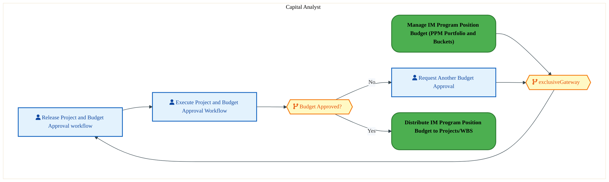

<div style="text-align:center; margin:4px 0 8px 0; font-size:11px;"><a href="https://mermaid.live/view#pako:eNqlVV2v4jYQ_StWrq5opaDNJ6F52AoCqVbqra7Kbq-qsqpMMgEXY6e2w0dZ_vvaJIEblrsvzUPEnMw5Z2bIOEcr4zlYsfX4eCSMqBgde2oFG-jFqLfAEno2qoE_sCB4QUH2TE7BmZqR_85pblDuTZrBUrwh9GDQGSw5oE8fbDTSRGojiZnsSxCk6Nm9UpANFoeEUy5M9gMMC6c4uzWPxlzkIK4JjhO5WaiplDC4wn4UREFqeBIyzvKOaBEWwyLrnUxxlO-yFRbqXH4l4QnvX0iuVjouMJWgc1ZqQ3_FC6CmRyUqg2WV2LbDINL4MD2wWYkzwpYaDxwNCczWVyh0Tid0enycs4sp-jiZM6SvjGIpJ1AgqTQ83SpUEErjhyAZpaFjSyX4GuIHbxpNfM_OTCexbt2xzXD7OyDLlYoXnOZNan9neoi9cm-Lfew5tjjo-40XsPzqlAy8oTe8OI0jN3GT1qkoiv_lpOcqPmK5brymfuqlk4uXGw7CxPlWr21zEkQj93ZOILYkg1eiaZr60-uopoPQdd4WHaf-wEluRJdYwQ4froI_JcFFMA2j1I3eFKz9bqusFs-CZ62gPw3T8CIYjd105L0pGIzcYNhUqHWWApcrRDGDv52_5laCS6IwRSOG6UGqufW5zjQXc3VCgeMC983g0e9AQa8s0qX8A5lCmOVoXOVLUGhUloJvtc6Oi7V5LbtCXldouoesUt8Xerkr5N9W9G8FUrMY14eIuBXpcgPNnRA9JrIw5h-ejL8exwY9c0kU4azlK96WJt-9jGddmVDLPGGGl9-V-OH5WT_kQhWcEt50mK1ByR-7coPjsW3JHJX9hV72bNXtBPKf59bp9IoV3WfBPqOVJFv4pX4Dryy9o_UPFqJ-_71WaEK3Dr0m9Opw0IQDE36ZW7_xufVFj7-BozqrWSbmdyVb0p8gz6zg1dtsDNst7sDefdi_DweXA64Dh_fhQbuRHTRqUcu2NiA2mORWfLTOXyP9xcqhwBVV1sm2cKX47MAyKz6f2lZV5po5Idj89TV4-grhTDgw" title="View full diagram">&#128065; View Diagram</a></div>


#### BUSINESS ARCHITECTURE — 3.2.6 DC-050-350_Distribute_Project_budget_to_account_assignment_WBS — DC-050-350_Distribute_Project_budget_to_account_assignment_WBS

**Swim Lanes**: Capital Analyst | **Tasks**: 5 | **Gateways**: 3

> **Legend**: <span style="color:#000;background:#4CAF50;padding:2px 6px;border-radius:10px;font-weight:bold;font-size:9pt">● Start</span> · <span style="color:#fff;background:#C62828;padding:2px 6px;border-radius:10px;font-weight:bold;font-size:9pt">● End</span> · <span style="background:#E3F2FD;padding:2px 6px;border:1px solid #1565C0;font-size:9pt">User Task</span> · <span style="background:#FFF3E0;padding:2px 6px;border:1px solid #E65100;font-size:9pt">Service Task</span> · <span style="background:#FFF9C4;padding:2px 6px;border:1px solid #F57F17;font-size:9pt">◇ Gateway</span> · <span style="background:#F3E5F5;padding:2px 6px;border:1px solid #7B1FA2;font-size:9pt">Sub-Process</span>

```mermaid
%%{init: {'theme': 'base', 'themeVariables': {'fontSize': '14px', 'fontFamily': 'Segoe UI, Arial, sans-serif','primaryColor': '#e8f0fe', 'primaryBorderColor': '#0071c5','lineColor': '#37474F', 'secondaryColor': '#f5f8fc'}, 'flowchart': {'useMaxWidth': false, 'htmlLabels': true, 'curve': 'basis', 'nodeSpacing': 40, 'rankSpacing': 50}} }%%
flowchart TD
    classDef startEvt fill:#4CAF50,stroke:#2E7D32,color:#000,font-weight:bold,stroke-width:2px,rx:20,ry:20
    classDef endEvt fill:#C62828,stroke:#B71C1C,color:#fff,font-weight:bold,stroke-width:2px,rx:20,ry:20
    classDef userTask fill:#E3F2FD,stroke:#1565C0,stroke-width:2px,color:#0D47A1
    classDef serviceTask fill:#FFF3E0,stroke:#E65100,stroke-width:2px,color:#BF360C
    classDef gateway fill:#FFF9C4,stroke:#F57F17,stroke-width:2px,color:#E65100
    classDef subProc fill:#F3E5F5,stroke:#7B1FA2,stroke-width:2px,color:#4A148C
    subgraph lane_0["Capital Analyst"]
        n1["fa:fa-user Distribute Project budget to lower level WBS element"]
        n2["fa:fa-user Execute Report to Validate Budget Amount on WBS Element"]
        n3["fa:fa-user Update the Budget Amount on the Required WBS Element"]
        n4["fa:fa-user Approve Budget for L2 WBS Element"]
        n5["fa:fa-user Approve Budget for L4 WBS Element"]
        n6(["fa:fa-stop Account Assignment/Lower Level WBS is budgeted"])
        n7(["fa:fa-stop L1 WBS element Budgeted"])
        n8["Release a Budget"]
        n9{{"fa:fa-code-branch Distribute Budget to Lower Lever WBS Element? (Small Construction only?)"}}
        n10{{"fa:fa-code-branch Updates Required?"}}
        n11{{"fa:fa-code-branch exclusiveGateway"}}
    end
    n8 --> n9
    n1 --> n11
    n9 -->|"No"| n7
    n2 --> n10
    n10 -->|"Yes"| n6
    n11 --> n2
    n3 --> n11
    n4 --> n5
    n9 -->|"Yes"| n4
    n5 --> n1
    n10 -->|"No"| n3
    class n1 userTask
    class n2 userTask
    class n3 userTask
    class n4 userTask
    class n5 userTask
    class n6 endEvt
    class n7 endEvt
    class n8 startEvt
    class n9 gateway
    class n10 gateway
    class n11 gateway
```

<div style="text-align:center; margin:4px 0 8px 0; font-size:11px;"><a href="https://mermaid.live/view#pako:eNqlVluP4jYY_StWRiN2paDmSpg8dBQCqSqxVTXsRVWpKpM44I6xU9thoCz_vXZuQAbUh-YB4ZNzznex8yVHI2UZMkLj8fGIKZYhOA7kBm3RIASDFRRoYIIa-Ao5hiuCxEBzckblAv9T0Wyv2GuaxhK4xeSg0QVaMwS-_GyCSAmJCQSkYigQx_nAHBQcbyE_xIwwrtkPaJxbeRWtuTVhPEP8TLCswE59JSWYojPsBl7gJVonUMpodmWa-_k4TwcnnRxhb-kGclmlXwr0Ce6_4Uxu1DqHRCDF2cgtmcMVIrpGyUuNpSXftc3AQsehqmGLAqaYrhXuWQrikL6eId86ncDp8XFJu6Dg83RJgbpSAoWYohwIqeDZToIcExI-eHGU-JYpJGevKHxwZsHUdcxUVxKq0i1TN3f4hvB6I8MVI1lDHb7pGkKn2Jt8HzqWyQ_qtxcL0ewcKR45Y2fcRZoEdmzHbaQ8z_9XJNVX_hmK1ybWzE2cZNrFsv2RH1vv_doyp14Q2f0-Ib7DKbowTZLEnZ1bNRv5tnXfdJK4Iyvuma6hRG_wcDZ8ir3OMPGDxA7uGtbx-lmWq185S1tDd-YnfmcYTOwkcu4aepHtjZsMlc-aw2IDCKToT-v3pRHDAktIQEQhOQi5NP6omfqitiLkMMzhUDceTLGKgVelREBl8xdKJViV2RpJIBlQR1FRCNohAr5NFgAR9VDTnqFzbTjbo1S7vaCC8crlKyQ4U90Dk9o42rKSSsBo5Tm75elee34pKr2aKe89NPiC_i4xR9l9Q-_aMCoKznadW844mDv31f5_q7376tGHTi4kK0CUplXykRB4TTX_h3nV6HnXaCyaXUCZ8vp4YRb0zOb25c40Kb1TjZXoRXHUcAawIV0n-XQ8tr56ug9Xaj6lm8vjMemOxTlbfln1M_iw2EJCQMyoUpWpxGp_GCWH549L43S6PITW7XD1RotuQ5_7Ovu2Du1TUgq8Qz_VT-lZpuZY_YeOwXD4oyq0Wdr10m6GB33S6-9L4xe2NL6rPjew09CsVmY1vN-QqIij9kZj6DRrt-fv1Wu_F6618Rrcb2T9cE1a7sUQ0TW0w_MKdm7D7m3Yuw37t-FR82a4AoNb4Lh7X13BT-0kva7Eug3bLWyYxhbxLcSZER6N6utCfYFkKIclkcbJNGAp2eJAUyOs3sJGWR2lKYZqOG5r8PQvq2bFBg==" title="View full diagram">&#128065; View Diagram</a></div>


<div class="page-footer"><span>Page 11</span><span><a href="#toc">↑ Back to TOC</a></span><span>DC-050 — Project Accounting</span></div>
<div style="page-break-before: always;"></div>


#### BUSINESS ARCHITECTURE — 3.2.7 DC-050-410_Simulate_Depreciation — DC-050-410_Simulate_Depreciation

**Swim Lanes**: CES / Intel Products Capital Finance · Capital Analyst | **Tasks**: 3 | **Gateways**: 0

> **Legend**: <span style="color:#000;background:#4CAF50;padding:2px 6px;border-radius:10px;font-weight:bold;font-size:9pt">● Start</span> · <span style="color:#fff;background:#C62828;padding:2px 6px;border-radius:10px;font-weight:bold;font-size:9pt">● End</span> · <span style="background:#E3F2FD;padding:2px 6px;border:1px solid #1565C0;font-size:9pt">User Task</span> · <span style="background:#FFF3E0;padding:2px 6px;border:1px solid #E65100;font-size:9pt">Service Task</span> · <span style="background:#FFF9C4;padding:2px 6px;border:1px solid #F57F17;font-size:9pt">◇ Gateway</span> · <span style="background:#F3E5F5;padding:2px 6px;border:1px solid #7B1FA2;font-size:9pt">Sub-Process</span>

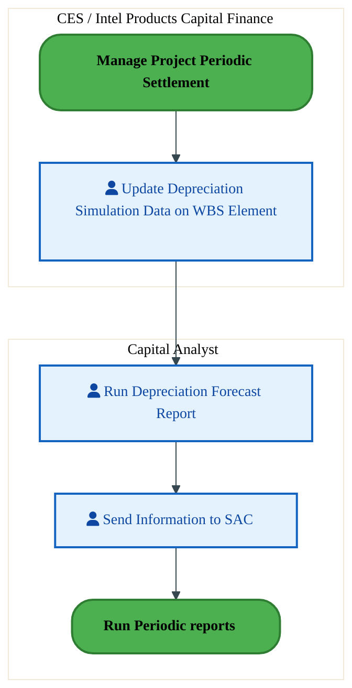

<div style="text-align:center; margin:4px 0 8px 0; font-size:11px;"><a href="https://mermaid.live/view#pako:eNqlVNtu2zgQ_RVCQeAXGdU1cvWwgC1bQIEWKKpeHprFYkwNbTY0KZBUEm_gf1_S8qV2k6fVg6Q5mnPOzIjkS0BVi0EZ3N6-cMltSV5Gdo0bHJVktASDo5AMwHfQHJYCzcjnMCVtw__dp8VZ9-zTPFbDhoutRxtcKSTfPoRk6ogiJAakGRvUnI3CUaf5BvS2UkJpn32DExaxvdvh00zpFvU5IYqKmOaOKrjEM5wWWZHVnmeQKtleiLKcTRgd7XxxQj3RNWi7L783-Amef_DWrl3MQBh0OWu7ER9hicL3aHXvMdrrx-MwuPE-0g2s6YByuXJ4FjlIg3w4Q3m025Hd7e29PJmSr_N7SdxFBRgzR0aMdfDi0RLGhShvsmpa51ForFYPWN4ki2KeJiH1nZSu9Sj0wx0_IV-tbblUoj2kjp98D2XSPYf6uUyiUG_d_coLZXt2qu6SSTI5Oc2KuIqroxNj7H85ubnqr2AeDl6LtE7q-ckrzu_yKvpT79jmPCum8fWcUD9yir-J1nWdLs6jWtzlcfS26KxO76LqSnQFFp9gexZ8X2UnwTov6rh4U3Dwu66yX37Wih4F00Ve5yfBYhbX0-RNwWwaZ5NDhU5npaFbEwES_4l-3gfVoiHvyAdpURBn0fbUGlJBxy0IUnMJkuJ98PdA95dMHYtByWDs_wb51rWuWzLHTiPlYLmSpOGbXgyvc7BA3PPHrCEL4fa5tJdyuZP7BBJW6P1_IbXks9vEquWUNGjtFcettddaiX0rh6qnEsTWXNnEl1V_6eVlybVy72As-YKd0lfk5JLcuCLcyJjSm4FsFWmm1SUncxzvcmpG74XNn53InIzHf7nBHsJ0CA8rVcZDmBzCZAiz31aIzznujAs4eR1OX4ez06FxAecnOAiDDbqeeRuUL8H-1HYne4sMemGDXRhAb1WzlTQo96db0O_XxpyD-1ObAdz9B21s8tw=" title="View full diagram">&#128065; View Diagram</a></div>


<div class="page-footer"><span>Page 12</span><span><a href="#toc">↑ Back to TOC</a></span><span>DC-050 — Project Accounting</span></div>
<div style="page-break-before: always;"></div>


#### BUSINESS ARCHITECTURE — 3.2.8 DC-050-520_Form_Core_Project_Team — DC-050-520_Form_Core_Project_Team

**Swim Lanes**: CES / Intel Products Capital Finance · Capital Analyst · Capital Central Finance Analyst | **Tasks**: 6 | **Gateways**: 6

> **Legend**: <span style="color:#000;background:#4CAF50;padding:2px 6px;border-radius:10px;font-weight:bold;font-size:9pt">● Start</span> · <span style="color:#fff;background:#C62828;padding:2px 6px;border-radius:10px;font-weight:bold;font-size:9pt">● End</span> · <span style="background:#E3F2FD;padding:2px 6px;border:1px solid #1565C0;font-size:9pt">User Task</span> · <span style="background:#FFF3E0;padding:2px 6px;border:1px solid #E65100;font-size:9pt">Service Task</span> · <span style="background:#FFF9C4;padding:2px 6px;border:1px solid #F57F17;font-size:9pt">◇ Gateway</span> · <span style="background:#F3E5F5;padding:2px 6px;border:1px solid #7B1FA2;font-size:9pt">Sub-Process</span>


<div style="text-align:center; margin:4px 0 8px 0; font-size:11px;"><a href="https://mermaid.live/view#pako:eNqtVmtv6jYY_itWjipOJWiTkBDKh03cclap3apyLh_GNJnEAa_GzrGdtozy3_c6JAHSMGk664dKfvI-z3s33lqRiIk1sC4utpRTPUDbll6RNWkNUGuBFWm10R74iiXFC0ZUy9gkgusZ_Ts3c7z01ZgZLMRryjYGnZGlIOjLbRsNgcjaSGGuOopImrTarVTSNZabsWBCGusPpJ_YSe6t-DQSMibyYGDbgRP5QGWUkwPcDbzACw1PkUjw-EQ08ZN-ErV2JjgmXqIVljoPP1PkHr9-o7FewTnBTBGwWek1u8MLwkyOWmYGizL5XBaDKuOHQ8FmKY4oXwLu2QBJzJ8OkG_vdmh3cTHnlVN09zjnCP4ihpWakAQpDfD0WaOEMjb44I2HoW-3lZbiiQw-uNNg0nXbkclkAKnbbVPczguhy5UeLASLC9POi8lh4Kavbfk6cO223MD_mi_C44Oncc_tu_3K0yhwxs649JQkyQ95grrKz1g9Fb6m3dANJ5Uvx-_5Y_u9XpnmxAuGTr1ORD7TiByJhmHYnR5KNe35jn1edBR2e_a4JrrEmrzgzUHwZuxVgqEfhE5wVnDvrx5ltniQIioFu1M_9CvBYOSEQ_esoDd0vH4RIegsJU5XiGFO_rR_n1vj6Qxdo1uuCUPgIs4irdAYp1RjhkLKMY_I3PpjTzd_3ANWggcJ7phuoKFSdMnRdJ0ysSFEoY8g8xeJNPo2ml2eUv1G6hgGQmIgPBIlMhkRdcrqNbIeiFSCG04quKJwcxw832OOl0ReIi3QUTSnsjcgW2hVjg3BjEItAsdUakKeCRMpmvIl3BBwz_DldSk-IUanRnKB9BUzGsM0VGHMYO8jnclaUZ3edltmaW7MzgJ2PlqhL4rEaLExNVI5k0LOQqLf4M6U6ue5tdsdq_QPKlhK8aI6mGmUYokZI-zTfiwPJFjcprlwzFwUIzDkmG2UrkV72pEqyX0514TX7IOPFSFlsBehkGtISR7K8pngNUwh1RR0YmBfHtH7wN63FN3eGwrEukYPQtG8HKMsXhIN3X-Aj0LqRDAqEOYxfImeiFa1KXScf9VT_0Gpe6ZrqSmHgrn6nlFJ4nd98pp5MKOmubn7ojC_UCKxjFabdxrB_9Jr96jXY2IWsVr75t67jdtYbdD1o4DfcJRAGsMIzmq_3oIhrIsqojuzSYdt_SRFltYq2z31si9o4Qw24gfcXV1d1ZroNzeDvEYsU_SZnC8ljBLqdH4yzSiB4twtz10DvM2tX8XceoNRPsEhz_LsF8TiHBRHr_xeAG55dguDSrBfAL0C8PZnv_zuFYE0Dlce2yGJ0ja_M9-OvPQKJ3Zp2Sss9_dRblwGUGR0Uzc9vspyQpljURKnDNk9Pec_hqbC5SPgBHab4W4z7DXDfjPca4aD6pF1Aveb4Ztm2LHP4M4Z3D2Dd8tXxynsNcN-M9xrhoNmuF_CVttaE7nGNLYGWyt_zsOTPyYJzpi2dm0LZ1rMNjyyBvmz18ryfZ5QbG7ePbj7B58U3OU=" title="View full diagram">&#128065; View Diagram</a></div>


<div class="page-footer"><span>Page 13</span><span><a href="#toc">↑ Back to TOC</a></span><span>DC-050 — Project Accounting</span></div>
<div style="page-break-before: always;"></div>


#### BUSINESS ARCHITECTURE — 3.2.9 DC-050-530_Assign_Resources_to_Tasks — DC-050-530_Assign_Resources_to_Tasks

**Swim Lanes**: CES / Intel Products Capital Finance · Capital Analyst | **Tasks**: 2 | **Gateways**: 2

> **Legend**: <span style="color:#000;background:#4CAF50;padding:2px 6px;border-radius:10px;font-weight:bold;font-size:9pt">● Start</span> · <span style="color:#fff;background:#C62828;padding:2px 6px;border-radius:10px;font-weight:bold;font-size:9pt">● End</span> · <span style="background:#E3F2FD;padding:2px 6px;border:1px solid #1565C0;font-size:9pt">User Task</span> · <span style="background:#FFF3E0;padding:2px 6px;border:1px solid #E65100;font-size:9pt">Service Task</span> · <span style="background:#FFF9C4;padding:2px 6px;border:1px solid #F57F17;font-size:9pt">◇ Gateway</span> · <span style="background:#F3E5F5;padding:2px 6px;border:1px solid #7B1FA2;font-size:9pt">Sub-Process</span>

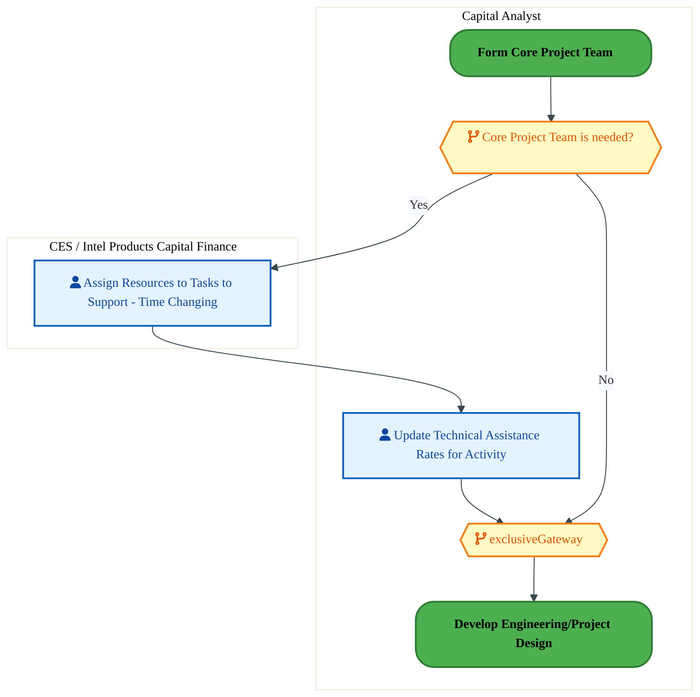

<div style="text-align:center; margin:4px 0 8px 0; font-size:11px;"><a href="https://mermaid.live/view#pako:eNqlVV2P4jYU_StWRiNegjafhM1DKyaQaqW2qhZ2q6pUlXFuiDuOHdkOA2X577UhgQk781QeED4595zjy7VzdIgowEmdx8cj5VSn6DjSFdQwStFogxWMXHQBvmJJ8YaBGllOKbhe0n_PND9q9pZmsRzXlB0suoStAPTlk4tmppC5SGGuxgokLUfuqJG0xvKQCSakZT_AtPTKs1v36EnIAuSN4HmJT2JTyiiHGxwmURLltk4BEbwYiJZxOS3J6GTDMfFCKiz1OX6r4Be8_50WujLrEjMFhlPpmv2MN8DsHrVsLUZaueubQZX14aZhywYTyrcGjzwDScyfb1DsnU7o9Pi45ldTtJqvOTIfwrBScyiR0gZe7DQqKWPpQ5TN8thzlZbiGdKHYJHMw8Aldiep2brn2uaOX4BuK51uBCs66vjF7iENmr0r92ngufJgvu-8gBc3p2wSTIPp1ekp8TM_653KsvxfTqavcoXVc-e1CPMgn1-9_HgSZ973ev0251Ey8-_7BHJHCbwSzfM8XNxatZjEvve-6FMeTrzsTnSLNbzgw03wYxZdBfM4yf3kXcGL333KdvObFKQXDBdxHl8Fkyc_nwXvCkYzP5p2CY3OVuKmQgxz-Nv7c-1kiyX6gD5xDQwZi6IlWqEMN1RjhnLKMSewdv66lNsPD0xVidMSj-2_gWZK0S1Hn0GJVhJQSAtku3n-sWybRpjxHKMVrQFlFeZbM8RXQTM5bwXzbbAuw4xjdlB6mMEfZvjSFKbjaAWk4pTYIhPKnACTHX02TxQqhUlKNN1RfRhKhUZqDjtgokELmw7MFcK3H0wz_gGi0Rzs_oY1kanJhaxRJiSgnrkCXA958fHY57TX4HhjDjKpvq9CVCHjW0Dx49o5nV4pTN5WgD1hraI7-Okyabeqa0e5j8bjH4xCtwwuy27-eXRZxt0ytstva-cPUGvnm2F3-ORCC-9ov4oza_JqTK1hfzwHcPA2HF6vqAEcvQ3H_ZkaoJMedVynBlljWjjp0Tm_T8w7p4ASt0w7J9fBrRbLAydOer53nfY8MXOKzdTVF_D0H5alI_0=" title="View full diagram">&#128065; View Diagram</a></div>


<div class="page-footer"><span>Page 14</span><span><a href="#toc">↑ Back to TOC</a></span><span>DC-050 — Project Accounting</span></div>
<div style="page-break-before: always;"></div>


#### BUSINESS ARCHITECTURE — 3.2.10 DC-050-560_Determine_Total_Planned_Project_Costs — DC-050-560_Determine_Total_Planned_Project_Costs

**Swim Lanes**: BU Analyst · Corp. FP&A Analyst | **Tasks**: 21 | **Gateways**: 3

> **Legend**: <span style="color:#000;background:#4CAF50;padding:2px 6px;border-radius:10px;font-weight:bold;font-size:9pt">● Start</span> · <span style="color:#fff;background:#C62828;padding:2px 6px;border-radius:10px;font-weight:bold;font-size:9pt">● End</span> · <span style="background:#E3F2FD;padding:2px 6px;border:1px solid #1565C0;font-size:9pt">User Task</span> · <span style="background:#FFF3E0;padding:2px 6px;border:1px solid #E65100;font-size:9pt">Service Task</span> · <span style="background:#FFF9C4;padding:2px 6px;border:1px solid #F57F17;font-size:9pt">◇ Gateway</span> · <span style="background:#F3E5F5;padding:2px 6px;border:1px solid #7B1FA2;font-size:9pt">Sub-Process</span>


<div style="text-align:center; margin:4px 0 8px 0; font-size:11px;"><a href="https://mermaid.live/view#pako:eNq9WGFz2kYQ_Ss3ZFySGXB1QgLMh3ZAoNYdJ6bBaToTdzqHdIKLD4ncnbCpw3_vnqQDS5bappkJH2z0bu_t7rvdPeCxFSQhbY1aZ2ePLGZqhB7bak03tD1C7SWRtN1BOfAbEYwsOZVtbRMlsVqwvzIz7GwftJnGfLJhfK_RBV0lFL277KAxbOQdJEksu5IKFrU77a1gGyL2XsIToa1f0GFkRZm3YmmSiJCKk4FlDXDgwlbOYnqCewNn4Ph6n6RBEocl0siNhlHQPujgeHIfrIlQWfippK_Jw3sWqjU8R4RLCjZrteFXZEm5zlGJVGNBKnZGDCa1nxgEW2xJwOIV4I4FkCDx3QlyrcMBHc7ObuOjU3QzvY0RvAJOpJzSCEkF8GynUMQ4H71wvLHvWh2pRHJHRy_s2WDaszuBzmQEqVsdLW73nrLVWo2WCQ8L0-69zmFkbx864mFkWx2xh78VXzQOT568vj20h0dPkwH2sGc8RVH0VZ5AV3FD5F3ha9bzbX969IXdvutZz_lMmlNnMMZVnajYsYA-IfV9vzc7STXru9hqJp34vb7lVUhXRNF7sj8RXnjOkdB3Bz4eNBLm_qpRpsu5SAJD2Ju5vnskHEywP7YbCZ0xdoZFhMCzEmS7RpzE9E_rw21r8g6NY8L3Ut22_siN9CvGsBaRUUS6WnM0pyJKxAZBFDsmWRKjJEIe2TJFOJo9bGksKZoDaww1im7oZstBA6QSNIsV7PfG89nvmUHZjV12Mw4_plIhPxE0IPCGxCF4UdDqAoYBYjEQ3sx99HKcqnUHeclmw5TsoAUEEML_a-968arsoVf2MJMK2h9Cu0l06FnINNR5faSBAkapJFpSSJaiX1PoISr4HnnzMVqkyw2TOveKUv0PRxdBskJXCQkh8YSjK7qj_HtDnT0dUwOfedBAVmIblNnmKeeQN_qZSQUiBBBzvg9NiSJa4Ms4O5kMzcQX8KbKOqxnHQcqheGUb84ZI5EAmVMhsO2XRwI42j2aUlBmA6PyH4W8hJHPQG0dz6undM7j4ymekHaXMOKCdVEmiUDX8P_H29bhkG_SGdUUsC5SLxHbc-TPvxvXF7JTOf9YpnC0cOWgSx-9nmYldhnvqFQbGsMg3W-prvYAHsiKIgLG4AIOrcLrNvJOBdtRIREcC3qTxN1tIclbqnsiNO0iM-7xjjCu770ye7_MDp2mDH2udx1xURjLfaY-8qhuvTLv4N94542c7yeLTKw5NEWs9zb5GJZ9TJkkq5Wgq2Ig6B7VzaS00jMGrkG9T1CG2lIJtkxVNl8E0p8PQpTE5-fnZQ8XZQ-vyR0cVLwvxoc-R6n3_5KGK5o_sQgy-pQykZXi086wylw3UIgyayityVzQ7pjzJMi0MB0315mfYNDm6nqCYCzBu_lkDBNgxYKKm-o8ZbtE1cheHQ-Z4guaFRW07DS5j7Pz9d6-6zyTBVemabeL-1ap4udfU_G49w2KBzv_52xF_dm6TaKrJtHll4t-UR6tHuFBml9-4Ojtm1zvvOjNiJ4UhY18zra6rGiW0-kQqtPX-gY-cNnH80YgX9wIvGiEkp_e6SaBK237H28SuOq3nNbcJG79TQKlDtle-k8ukdy-X29PHwKeShjcP-Wf3WruHrgEoaV-0LeXARwNfIZLSN9bt63PUA7FEs5Ncd889wtgYIBBAQwNMCzYDXn-2Kv6ujaubNcsucXSpZ8tmPCcnMGYufmjiagIyMRjwrkw4VzkgAmviM4sF6vYMuZWAeBnQc1zYUxeuEgMm8xwr0jccNmGyySCi0zsI7mR1-SGC8A22dlFerbx0qsYYLcMZJ-19bmZ7xgl2K6He_WwUw-79XC_Hh7Uw8N6-KIehmOpxxvyxA2J4oZMcUOquCFXaIMn37jKS4PmpWHz0kXjEpRR4xJuXrKP353LeK_4nltGHfNlrwy79XDfwK1OawNTj7CwNXpsZT-AwI8kIY1IylXr0GmRVCWLfRy0RtkPBa10G8LOKSPw8XeTg4e_ATy5ewk=" title="View full diagram">&#128065; View Diagram</a></div>


<div class="page-footer"><span>Page 15</span><span><a href="#toc">↑ Back to TOC</a></span><span>DC-050 — Project Accounting</span></div>
<div style="page-break-before: always;"></div>


#### BUSINESS ARCHITECTURE — 3.2.11 DC-050-570_Load_Project_Plan_(Forecast) — DC-050-570_Load_Project_Plan_(Forecast)

**Swim Lanes**: BU Analyst · Corp. FP&A Analyst | **Tasks**: 18 | **Gateways**: 10

> **Legend**: <span style="color:#000;background:#4CAF50;padding:2px 6px;border-radius:10px;font-weight:bold;font-size:9pt">● Start</span> · <span style="color:#fff;background:#C62828;padding:2px 6px;border-radius:10px;font-weight:bold;font-size:9pt">● End</span> · <span style="background:#E3F2FD;padding:2px 6px;border:1px solid #1565C0;font-size:9pt">User Task</span> · <span style="background:#FFF3E0;padding:2px 6px;border:1px solid #E65100;font-size:9pt">Service Task</span> · <span style="background:#FFF9C4;padding:2px 6px;border:1px solid #F57F17;font-size:9pt">◇ Gateway</span> · <span style="background:#F3E5F5;padding:2px 6px;border:1px solid #7B1FA2;font-size:9pt">Sub-Process</span>

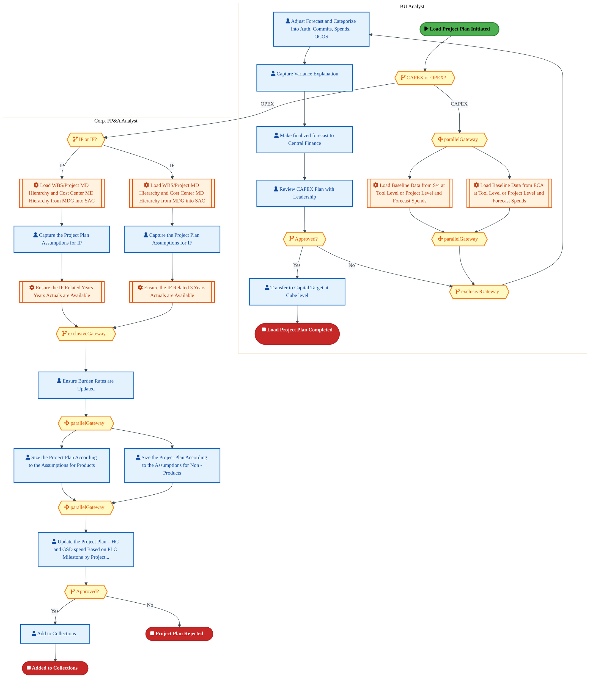

<div style="text-align:center; margin:4px 0 8px 0; font-size:11px;"><a href="https://mermaid.live/view#pako:eNq9WG1v2kYc_yonqoxNgtSPGHixCQxuIyUtKum6qpmmwz6DF-OzzmcIS_nu-599NrFzSG1WjRcJ9_s_P57NY8enAemMOxcXj1ES8TF67PIN2ZLuGHVXOCPdHiqB3zGL8ComWVfwhDThy-ifgk230gfBJjAPb6P4INAlWVOCPl710AQE4x7KcJL1M8KisNvrpizaYnZwaUyZ4H5FhqEWFtYkaUpZQNiJQdMc3bdBNI4ScoJNx3IsT8hlxKdJ0FAa2uEw9LtH4VxM9_4GM164n2fkBj98igK-gXOI44wAz4Zv42u8IrGIkbNcYH7OdlUyokzYSSBhyxT7UbIG3NIAYji5P0G2djyi48XFXVIbRbezuwTBx49xls1IiDIO8HzHURjF8fiV5U48W-tlnNF7Mn5lzJ2ZafR8EckYQtd6Irn9PYnWGz5e0TiQrP29iGFspA899jA2tB47wN-WLZIEJ0vuwBgaw9rS1NFd3a0shWH4nyxBXtktzu6lrbnpGd6stqXbA9vVnuurwpxZzkRv54mwXeSTJ0o9zzPnp1TNB7aunVc69cyB5raUrjEne3w4KRy5Vq3Qsx1Pd84qLO21vcxXC0b9SqE5tz27VuhMdW9inFVoTXRrKD0EPWuG0w2KcUL-0r7cdaYf0STB8SHjd50_SybxSXSghXgc4r7IOZoEf-cZRx5lxMfwBScBciHKNWUwpShKOEWTnG96yKXbbcSzHlqm0Bfw_737ftnUbTR1uzjlOSOo2ACJT9D8IQX_MI9o0hQ0m4IfyC4ie-ROFvM_0AJE0D7iG3RNMEx2tonSprTVlL6FqcpC-AKugwsRxzG6xWxNIDqO3HxFUEx2JG4qsZtKbvA9gapABiENAQqr_AidJOEMdHpAhaha6TW_1Ip8ukbXFAdoCvtQbB80wxyjkNEtWr62hDe3lMYQF3iDKEPQCn8Tn0tAlKKuS5l0sNUwZn2bsbk7-QHGRj_XxqCMh9JapaWo0hVcBBE0TwCivzztC-0kmnGaKkShu9KYKETNx8dTiAHpr6C6_kb2BoTxHv7_dtc5Hp8KWWoh8uDHeRbtyJtyjttitlpskqaM7kjwzMzoxI8Zo_usj2OOUgzdEZNYbcTUvk8IKqEacTHGLmXpJfIWP03Uoz5QjyPcys3cT7Is36ZiKjPR6OjKa-pxXqpn0dQzbOqZJ5lQM83hvk7QBwg8QxiAj2kge-iJ7KgpKx4hFA74Plz-cJmKMRXUtkfAHeQ-z1ozq_0Q5e9ogvpnLLS2bhnicxt3uaHpJnrrFvP4ZjlDmRjFYqYDBPoX1y66ieBhilOY8NWhEr-8vGxZNNp7Pih2F4Um8wufW_y2YpV8mi5fV_7dzNDbiDDM_M2hvCUobAqxC8W2fEosVs7N7E15eSwnbnuRDP4_U07TlGw5kfcrD66ZWDQaMtFnglkGFeY5PNEVTTjZ4SgWj61tjcPzGhe1xlLft2s19NaChHIRRcEam9FoyTQ66QMR35-v04F6xYHvxeA_W3HOyzbp8Ps2qam_ZJMaL9ykcJWhfv9XcblIwLBKQK8YJL0il0dbHk1Jrc6GLYCvd53PBIr0FR5IJEFqrZ52T4zvaMFnVIyGKQniNitJg4o0kCSxlb-KQX1GWJSESkK3S7P1eVCeHXmWR706O_I8rPiH0u2KwZAcNYPTYpACZpU-U-Zv1DrrVSJk_s0qwbrWAkyZcr2uSFWS2gnJYVQcxrCVXKNNqMqj1xTph26261A8XpRqRm3mqmi67AOzikq3WoApw6rrLCtjPnkLEM1Wvf00YEMNm2rYUsO2Gh6oYUcND9XwSA1DLdX4mTj1M4FCep-8wzVJ1nmSfZ40OE9yzpOG50mj-m28WTlNvjk3UV2JGkrUrF41m7Clhm01PFDDjhoequGREobOVsK6GjYquNPrbAnb4ijojB87xe9D8BtSQEKcx7xz7HVwzunykPidcfE7SicvnpRmEYZn320JHv8Fa8_Ckg==" title="View full diagram">&#128065; View Diagram</a></div>


<div class="page-footer"><span>Page 16</span><span><a href="#toc">↑ Back to TOC</a></span><span>DC-050 — Project Accounting</span></div>
<div style="page-break-before: always;"></div>


#### BUSINESS ARCHITECTURE — 3.2.12 DC-050-580_Validate_Plan — DC-050-580_Validate_Plan

**Swim Lanes**: Analyst · Capital Analyst | **Tasks**: 14 | **Gateways**: 7

> **Legend**: <span style="color:#000;background:#4CAF50;padding:2px 6px;border-radius:10px;font-weight:bold;font-size:9pt">● Start</span> · <span style="color:#fff;background:#C62828;padding:2px 6px;border-radius:10px;font-weight:bold;font-size:9pt">● End</span> · <span style="background:#E3F2FD;padding:2px 6px;border:1px solid #1565C0;font-size:9pt">User Task</span> · <span style="background:#FFF3E0;padding:2px 6px;border:1px solid #E65100;font-size:9pt">Service Task</span> · <span style="background:#FFF9C4;padding:2px 6px;border:1px solid #F57F17;font-size:9pt">◇ Gateway</span> · <span style="background:#F3E5F5;padding:2px 6px;border:1px solid #7B1FA2;font-size:9pt">Sub-Process</span>


<div style="text-align:center; margin:4px 0 8px 0; font-size:11px;"><a href="https://mermaid.live/view#pako:eNq1V2tv2zYU_SuEusAtIHeiHpbtDxsc2WoDtKtRZ-2GZRhoibLZyJJGUk681P99l3o5UuSt7TB_EMwj8px7D3mvpActSEOqTbWLiweWMDlFDwO5pTs6mKLBmgg60FEJfCCckXVMxUDNidJErthfxTRsZ_dqmsJ8smPxQaErukkp-vlKRzNYGOtIkEQMBeUsGuiDjLMd4QcvjVOuZj-j48iICrXq1mXKQ8pPEwzDxYEDS2OW0BNsubZr-2qdoEGahC3SyInGUTA4quDi9C7YEi6L8HNB35L7jyyUWxhHJBYU5mzlLn5D1jRWOUqeKyzI-b42gwmlk4Bhq4wELNkAbhsAcZLcniDHOB7R8eLiJmlE0fX8JkHwC2IixJxGSEiAF3uJIhbH02e2N_MdQxeSp7d0-sxcuHPL1AOVyRRSN3Rl7vCOss1WTtdpHFZTh3cqh6mZ3ev8fmoaOj_AtaNFk_Ck5I3MsTlulC5d7GGvVoqi6D8pga_8mojbSmth-aY_b7SwM3I84ylfnebcdme46xPlexbQR6S-71uLk1WLkYON86SXvjUyvA7phkh6Rw4nwolnN4S-4_rYPUtY6nWjzNdLngY1obVwfKchdC-xPzPPEtozbI-rCIFnw0m2RTFJ6B_GbzfaLCHxQcgb7fdyhvolLtyIyDQiQ2U4mgUBFQK9Wy5-QX7KaUCE_H4JFOg9FWnOAwp__swZhzJOJCJJiL5Ds12aJ1Kg9QG99nT0ajXXX7582dYZt3Xe04hTsUVQ-HDS0ZxIgliCFnvKN5zSpBFvs0zaLEvKo5TvkJd6qGgqSQCFdpUEKc9SDjvToGhxn0EWRLI0EW1ObPSTfrzyUWkZE0WiO3JL0Sz8lAtZJC9TYGVCqgT6w8W4Tb3K1zsmS3eX794j0EFvKIHmJLYsQ7Ms4-mexB0Ss2vdntG7IqIPJGahShNOzCcaQG9Y-p3FVnvxNWebjYokIZnYprLRVBRq6zvL7fbyN2lwey5X93kzV8g0exScOj4VPWzVLouppGGRvHICaF485lEn5W0eSzY8UMIbtdPKtq5pPjzUuuoBNFxDCw22aM5CJRrmYMujIwsRbEmyoQjUCacIHkhwnUUQTUjWLGbyAEoJVBhhMPvHG-14fKxm9avR-yDOBdvTV2U_6C6z-5c1J6HcBnAFauh0Ip6oO1-rDv26rx2oc-mRjEnY-N62gHvbgjer433eag4vVNjecoZmudymHB7moa72Cw672ml1VFcZVb3iSV8w_72ii_VfWdTW_1bTdm9Jn5z5opp2vqqk0fWWp_lmW1jsHYKYlrJCQOJt4tGX16tzqldw8XCmXq_gTY6RsupaZTr6hnIvXOoSTfrPdOlo1SOeFILxbWWI_0nri-qwKSgwEA2HP6gEamCigM9QWWWanwGqb5VT65cc-FMB9bgcWtXQKod2NbTLoVMNK12zJjdxpfsrFYXqqLoxqgIcdSf-lBbzmnCayN_VgbvVHbfSagI1O1pmHfO4nFmbYVY5jKvxpIqlkawcwI1FlUe4lsKVKWZtA64kzNoIs96BOgZcOYXr8HEVBa45TLtjgdW90STmdFOuluDxozc2tbX1m2oLNvthqx-2-2GnHx71w24_PO6HJ_0w7Es_fiZPfCZRfCZTfCZVqKb6O6aNj6pvjjbq9qLjMxyT-jW9vUVGP4z7YbMftvphux92aljTtR3lO8JCbfqgFZ_F8Okc0ojAq4921DWSy3R1SAJtWnw-anmmuuucEXiM70rw-DcwQdkP" title="View full diagram">&#128065; View Diagram</a></div>


<div class="page-footer"><span>Page 17</span><span><a href="#toc">↑ Back to TOC</a></span><span>DC-050 — Project Accounting</span></div>
<div style="page-break-before: always;"></div>


#### BUSINESS ARCHITECTURE — 3.2.13 DC-050-590_Copy_Plan_Version — DC-050-590_Copy_Plan_Version

**Swim Lanes**: Analyst · Corp. FP&A Analyst | **Tasks**: 11 | **Gateways**: 7

> **Legend**: <span style="color:#000;background:#4CAF50;padding:2px 6px;border-radius:10px;font-weight:bold;font-size:9pt">● Start</span> · <span style="color:#fff;background:#C62828;padding:2px 6px;border-radius:10px;font-weight:bold;font-size:9pt">● End</span> · <span style="background:#E3F2FD;padding:2px 6px;border:1px solid #1565C0;font-size:9pt">User Task</span> · <span style="background:#FFF3E0;padding:2px 6px;border:1px solid #E65100;font-size:9pt">Service Task</span> · <span style="background:#FFF9C4;padding:2px 6px;border:1px solid #F57F17;font-size:9pt">◇ Gateway</span> · <span style="background:#F3E5F5;padding:2px 6px;border:1px solid #7B1FA2;font-size:9pt">Sub-Process</span>

```mermaid
%%{init: {'theme': 'base', 'themeVariables': {'fontSize': '14px', 'fontFamily': 'Segoe UI, Arial, sans-serif','primaryColor': '#e8f0fe', 'primaryBorderColor': '#0071c5','lineColor': '#37474F', 'secondaryColor': '#f5f8fc'}, 'flowchart': {'useMaxWidth': false, 'htmlLabels': true, 'curve': 'basis', 'nodeSpacing': 40, 'rankSpacing': 50}} }%%
flowchart LR
    classDef startEvt fill:#4CAF50,stroke:#2E7D32,color:#000,font-weight:bold,stroke-width:2px,rx:20,ry:20
    classDef endEvt fill:#C62828,stroke:#B71C1C,color:#fff,font-weight:bold,stroke-width:2px,rx:20,ry:20
    classDef userTask fill:#E3F2FD,stroke:#1565C0,stroke-width:2px,color:#0D47A1
    classDef serviceTask fill:#FFF3E0,stroke:#E65100,stroke-width:2px,color:#BF360C
    classDef gateway fill:#FFF9C4,stroke:#F57F17,stroke-width:2px,color:#E65100
    classDef subProc fill:#F3E5F5,stroke:#7B1FA2,stroke-width:2px,color:#4A148C
    subgraph lane_0["Analyst"]
        n1["fa:fa-user Access Existing Plan Data"]
        n2["fa:fa-user Copy Exiting Plan Data"]
        n3["fa:fa-user Create an Empty Version"]
        n4["fa:fa-user Copy Only the Data that is Visible Based on the Current Story and Page Filters"]
        n5["fa:fa-user Change the Filter Values for the New Version"]
        n6["fa:fa-user Hard Lock the Forecasted Data and Create a Public Version"]
        n7["fa:fa-user Soft Lock the Forecasted Data and Create a Private/shared Version"]
        n12(["fa:fa-play Copy Plan Version Initiated"])
        n13(["fa:fa-stop Copy Plan Version Completed"])
        n15{{"fa:fa-code-branch Hard Lock Creation Required?"}}
        n16{{"fa:fa-code-branch CAPEX or OPEX?"}}
        n17{{"fa:fa-code-branch Unlock and Edit Required?"}}
        n18{{"fa:fa-code-branch exclusiveGateway"}}
        n19{{"fa:fa-code-branch exclusiveGateway"}}
    end
    subgraph lane_1["Corp. FP&A Analyst"]
        n8["fa:fa-user Add the Initial Project Plan as per PLC Material Requirements and Headcount..."]
        n9["fa:fa-user Update the Required Comments"]
        n10["fa:fa-user Identify Deltas through Actuals vs POR Forecast Spend and HC Comparison"]
        n11["fa:fa-user Update the Status Field for WIP or Approved or Archived"]
        n14(["fa:fa-stop Copy Plan Version Completed"])
        n20{{"fa:fa-code-branch exclusiveGateway"}}
        n21{{"fa:fa-code-branch Approved?"}}
    end
    n12 --> n16
    n1 --> n2
    n2 --> n3
    n3 --> n4
    n4 --> n5
    n5 --> n19
    n15 -->|"Yes"| n6
    n16 -->|"CAPEX"| n1
    n7 --> n17
    n15 -->|"No"| n7
    n6 --> n18
    n18 --> n13
    n19 --> n15
    n17 -->|"Yes"| n19
    n17 -->|"No"| n18
    n20 --> n8
    n8 --> n9
    n9 --> n10
    n10 --> n11
    n11 --> n21
    n21 -->|"No"| n20
    n21 -->|"Yes"| n14
    n16 -->|"OPEX"| n20
    class n1 userTask
    class n2 userTask
    class n3 userTask
    class n4 userTask
    class n5 userTask
    class n6 userTask
    class n7 userTask
    class n8 userTask
    class n9 userTask
    class n10 userTask
    class n11 userTask
    class n12 startEvt
    class n13 endEvt
    class n14 endEvt
    class n15 gateway
    class n16 gateway
    class n17 gateway
    class n18 gateway
    class n19 gateway
    class n20 gateway
    class n21 gateway
```

<div style="text-align:center; margin:4px 0 8px 0; font-size:11px;"><a href="https://mermaid.live/view#pako:eNqlV2Fz4jYQ_Ssa36S0M5DaxsbAh94Qg3uZyV2Y0OTaaTodYcugxliuJJPQHP-9K9uCmCid9sqHxHrafW-1Wq3lZytmCbHG1tnZM82pHKPnjlyTDemMUWeJBel0UQ3cYU7xMiOio2xSlssF_asyc7ziSZkpLMIbmu0UuiArRtDtZRdNwDHrIoFz0ROE07TT7RScbjDfhSxjXFm_I8PUTiu1ZuqC8YTwo4FtB07sg2tGc3KE-4EXeJHyEyRmedIiTf10mMadvQouY4_xGnNZhV8K8hE_faaJXMM4xZkgYLOWm-wKL0mm1ih5qbC45FudDCqUTg4JWxQ4pvkKcM8GiOP84Qj59n6P9mdn9_lBFF3d3OcIfnGGhZiSFAkJ8GwrUUqzbPzOCyeRb3eF5OyBjN-5s2Dad7uxWskYlm53VXJ7j4Su1nK8ZFnSmPYe1RrGbvHU5U9j1-7yHfw90SJ5clQKB-7QHR6ULgIndEKtlKbp_1KCvPKfsHhotGb9yI2mBy3HH_ih_ZpPL3PqBRPnNE-Eb2lMXpBGUdSfHVM1G_iO_TbpRdQf2OEJ6QpL8oh3R8JR6B0IIz-InOBNwlrvNMpyOecs1oT9mR_5B8Lgwokm7puE3sTxhk2EwLPiuFijDOfkd_vXe2uS42wn5L31W22hfrkDEykep7inEo4mcUyEQLMnKiSUIJqDN5piidtebtsrZMVO-fyTS__EhRPIHALT2aaQO3RHuKAsb_t4BpnrPNshaCOVBDxgiahAd1RQ6CjoAvpMglheWYQl5ySXaCEZ34FUguZ4RVBEMwlqbSn_RGqNczBVLLU5usNZSQRKGa_QT-TRHPOgTfQB8wRdsfih5mKcxFhIiLEKX8WkM4Hm5TKjsZk1aLMuWCr_LSunW3j6XkDzAAMju-N-e-AvMqjmKtPVRjb26BI6OgWeBDy_e-naP7oKyQqDa8g2RUYMrv7zs3ZVr47eEppfvH6RsmoRiuKG_FlSCP_9vbXfv6QYmCnCyXz2M4Ktuob_r5wCs9NtnilRlb1ZQuXbokOzP3mKs1LQLfmx7gmnbqP_6gbN1nSW1ZENGS_OUTT_ZoKMx3p4cqyTpKqUehczKAr2B4llvU9YoAJs5lch-gghqFesXvsGjo-oMvKB4CRmZS7Pz8_bUqO21G2RqMJTajqBqgIqppOqs9uelwnY0HSHpiSTEJRcc1au1tCTZAmvVbQVaH59c6h2tCggQXVwYVVkcK0Qr0rbeTO8hcSyFHC-SZZU5_rz5VzVzKQoONuqNgLPPF7D1iQnpN5XF71rf1XxuI7ZTcf63lA1cKxRr_eDOiUaqMduM2ym-82wXw-9ZujVQ78Z-g3XSHNVwJd76xcC-_oFGp-eGDQT1SGsppo3cR40HMEpxydW2Wl80NgNtd2wAXSozqgBdHROcBLNMc6grXEgde2aQ48bDe2nFWzN05g7ejGOzqYGXKetpK80x4lDcN5prq51qlr3ILVj-h7Ugl0z3DfDnhn2zfDADAdmeGiGR2YYkmjG31gnVLC-3bbxfnMTbaOeEfX1Ja0ND8xwYIaHZnhkhKG0jLCjYatrbQjfYJpY42er-iiCD6eEpLjMpLXvWriUbLHLY2tcfTxYZdW2phTDe2BTg_u_AbV0N9M=" title="View full diagram">&#128065; View Diagram</a></div>


<div class="page-footer"><span>Page 18</span><span><a href="#toc">↑ Back to TOC</a></span><span>DC-050 — Project Accounting</span></div>
<div style="page-break-before: always;"></div>


#### BUSINESS ARCHITECTURE — 3.2.14 DC-050-600_Reload_Cost_Plan — DC-050-600_Reload_Cost_Plan

**Swim Lanes**: BU Analyst · Corp. FP&A Analyst | **Tasks**: 8 | **Gateways**: 7

> **Legend**: <span style="color:#000;background:#4CAF50;padding:2px 6px;border-radius:10px;font-weight:bold;font-size:9pt">● Start</span> · <span style="color:#fff;background:#C62828;padding:2px 6px;border-radius:10px;font-weight:bold;font-size:9pt">● End</span> · <span style="background:#E3F2FD;padding:2px 6px;border:1px solid #1565C0;font-size:9pt">User Task</span> · <span style="background:#FFF3E0;padding:2px 6px;border:1px solid #E65100;font-size:9pt">Service Task</span> · <span style="background:#FFF9C4;padding:2px 6px;border:1px solid #F57F17;font-size:9pt">◇ Gateway</span> · <span style="background:#F3E5F5;padding:2px 6px;border:1px solid #7B1FA2;font-size:9pt">Sub-Process</span>

```mermaid
%%{init: {'theme': 'base', 'themeVariables': {'fontSize': '14px', 'fontFamily': 'Segoe UI, Arial, sans-serif','primaryColor': '#e8f0fe', 'primaryBorderColor': '#0071c5','lineColor': '#37474F', 'secondaryColor': '#f5f8fc'}, 'flowchart': {'useMaxWidth': false, 'htmlLabels': true, 'curve': 'basis', 'nodeSpacing': 40, 'rankSpacing': 50}} }%%
flowchart LR
    classDef startEvt fill:#4CAF50,stroke:#2E7D32,color:#000,font-weight:bold,stroke-width:2px,rx:20,ry:20
    classDef endEvt fill:#C62828,stroke:#B71C1C,color:#fff,font-weight:bold,stroke-width:2px,rx:20,ry:20
    classDef userTask fill:#E3F2FD,stroke:#1565C0,stroke-width:2px,color:#0D47A1
    classDef serviceTask fill:#FFF3E0,stroke:#E65100,stroke-width:2px,color:#BF360C
    classDef gateway fill:#FFF9C4,stroke:#F57F17,stroke-width:2px,color:#E65100
    classDef subProc fill:#F3E5F5,stroke:#7B1FA2,stroke-width:2px,color:#4A148C
    subgraph lane_0["BU Analyst"]
        n1["fa:fa-user Access Existing Plan Data"]
        n2["fa:fa-user Review Actualized and forecasted spends"]
        n3["fa:fa-user Input Judgement to Reconcile Spends, Auth, Commits as Part of TPF"]
        n4["fa:fa-user Reload Adjusted Plan"]
        n9(["fa:fa-play Reload Cost Plan Initiated"])
        n10(["fa:fa-stop Plan Reloaded"])
        n12{{"fa:fa-code-branch Review Successful?"}}
        n13{{"fa:fa-code-branch CAPEX or OPEX?"}}
        n14{{"fa:fa-code-branch Approved?"}}
        n15{{"fa:fa-code-branch exclusiveGateway"}}
        n16{{"fa:fa-code-branch exclusiveGateway"}}
    end
    subgraph lane_1["Corp. FP&A Analyst"]
        n5["fa:fa-user Revise the Forecast by Adding New Project Plan, Edit Existing Project Plan..."]
        n6["fa:fa-user Add Required Comments for the Plan Changes"]
        n7["fa:fa-user Update the Status Field for WIP or Archived"]
        n8["fa:fa-user Reports to Summarize and Compare the Current Version vs Snapshot Versions..."]
        n11(["fa:fa-stop Plan Reloaded"])
        n17{{"fa:fa-code-branch exclusiveGateway"}}
        n18{{"fa:fa-code-branch Approved?"}}
    end
    n9 --> n13
    n1 --> n2
    n2 --> n12
    n13 -->|"CAPEX"| n16
    n3 --> n14
    n12 -->|"Yes"| n15
    n14 -->|"Yes"| n4
    n15 --> n3
    n14 -->|"No"| n15
    n4 --> n10
    n17 --> n5
    n5 --> n6
    n6 --> n7
    n7 --> n8
    n8 --> n18
    n18 -->|"Yes"| n11
    n18 -->|"No"| n17
    n13 -->|"OPEX"| n17
    n16 --> n1
    n12 -->|"No"| n16
    class n1 userTask
    class n2 userTask
    class n3 userTask
    class n4 userTask
    class n5 userTask
    class n6 userTask
    class n7 userTask
    class n8 userTask
    class n9 startEvt
    class n10 endEvt
    class n11 endEvt
    class n12 gateway
    class n13 gateway
    class n14 gateway
    class n15 gateway
    class n16 gateway
    class n17 gateway
    class n18 gateway
```

<div style="text-align:center; margin:4px 0 8px 0; font-size:11px;"><a href="https://mermaid.live/view#pako:eNqlVm1v2zYQ_iuEgswbIAd6tRR92KDI1pCha426aTfMw0BLlM1GFlWScuy5_u8j9WZLVoB184cE9_Ce547HO1JHJSIxUjzl9vaIM8w9cBzxDdqikQdGK8jQSAUV8BFSDFcpYiPpk5CML_DfpZtu5XvpJrEQbnF6kOgCrQkCT48q8AUxVQGDGRszRHEyUkc5xVtIDwFJCZXeN8hNtKSMVi89EBojenbQNEePbEFNcYbOsOlYjhVKHkMRyeKOaGInbhKNTjK5lLxEG0h5mX7B0K9w_wnHfCPsBKYMCZ8N36Zv4Aqlco-cFhKLCrprioGZjJOJgi1yGOFsLXBLExCF2fMZsrXTCZxub5dZGxS8eb_MgPhFKWRsihLAuIBnOw4SnKbejRX4oa2pjFPyjLwbY-ZMTUON5E48sXVNlcUdvyC83nBvRdK4dh2_yD14Rr5X6d4zNJUexN9eLJTF50jBxHANt4304OiBHjSRkiT5X5FEXekHyJ7rWDMzNMJpG0u3J3agXes125xajq_364ToDkfoQjQMQ3N2LtVsYuva66IPoTnRgp7oGnL0Ag9nwfvAagVD2wl151XBKl4_y2I1pyRqBM2ZHdqtoPOgh77xqqDl65ZbZyh01hTmG5DCDP2l_bFUHp6An8H0wPhS-bNykr9MF2sJ9BI4ljUHfhQhxsBsjxkXXQjmQgBMIYddltFlvUc7jF4EmRcwFdMcA5jFICEURZBxYbJc9A7raphdjccsLzj4pYjX4pLIOOBEyIpJjHCKwKLkiyug4BsVBGS7xZwByMBcDgVJwId52FW3-hmmBMbAjz8XZUJyX13C_fctI0_FmdaMgDBeVeFRXGtYHHgseD9cVlA7MxkneeVd0a-djeOxcZY35nglZj7aNBVcFGX9kyL9aamcTpdEc5gY-PPZb4BQ8E78vyJZwyQ_zynZofjK3x72R_soLRjeoZ-rhu_TJt9KE6c51KiyGQNC8zsQzr_zhxvWvm49hoB4WkBY9xtYHcRBx7J934qaioH6jKLqEFUwizG_aO-Ltbu7u26kSW804lhE-1JgiuKyBUWXMtnkZfDy0IMNzNao1-dOV-Ypj0U1Ss6CQ14wEGKUltMCPj3O5VH6NNqIqsVdHbe_8ZxQkYCYk0WxFS-dmLty7ERqOaRVhKCgVA7TR0QZJhnYMbDIYM42pMXY1b51_Vsa2vlvLeP-685seyW7B-Pxj3IUaluvbKM2jXq5sXVTAl9FS8kZWSpfZafWa2btazW-Ru37uzw-6Wk3K1ZvpaXYlYbZd3xLugpWHUtrHJ0KaNZrnSa1SWU6tVk7u7Xp1mKNrbv9xPX-SpOP06_Lu7Ys7VIdXO-XpdGYXDxY8gCah7oDG8OwOQxbw7A9DE-GYWcYdofh-_azqbsdrf7E6aL6IGo0r38XNodhaxi2h-HJMOwMw24DK6qyRXQLcax4R6X82hZf5DFKYJFy5aQqsOBkccgixSu_SpWivIumGIo7eFuBp38A0mOxvQ==" title="View full diagram">&#128065; View Diagram</a></div>


<div class="page-footer"><span>Page 19</span><span><a href="#toc">↑ Back to TOC</a></span><span>DC-050 — Project Accounting</span></div>
<div style="page-break-before: always;"></div>


#### BUSINESS ARCHITECTURE — 3.2.15 DC-050-610_Define_a_Budget — DC-050-610_Define_a_Budget

**Swim Lanes**: Capital Analyst | **Tasks**: 3 | **Gateways**: 4

> **Legend**: <span style="color:#000;background:#4CAF50;padding:2px 6px;border-radius:10px;font-weight:bold;font-size:9pt">● Start</span> · <span style="color:#fff;background:#C62828;padding:2px 6px;border-radius:10px;font-weight:bold;font-size:9pt">● End</span> · <span style="background:#E3F2FD;padding:2px 6px;border:1px solid #1565C0;font-size:9pt">User Task</span> · <span style="background:#FFF3E0;padding:2px 6px;border:1px solid #E65100;font-size:9pt">Service Task</span> · <span style="background:#FFF9C4;padding:2px 6px;border:1px solid #F57F17;font-size:9pt">◇ Gateway</span> · <span style="background:#F3E5F5;padding:2px 6px;border:1px solid #7B1FA2;font-size:9pt">Sub-Process</span>

```mermaid
%%{init: {"theme": "base", "themeVariables": {"fontSize": "14px", "fontFamily": "Segoe UI, Arial, sans-serif","primaryColor": "#e8f0fe", "primaryBorderColor": "#0071c5","lineColor": "#37474F", "secondaryColor": "#f5f8fc"}, "flowchart": {"useMaxWidth": false, "htmlLabels": true, "curve": "basis", "nodeSpacing": 40, "rankSpacing": 50}} }%%
flowchart TD
    classDef startEvt fill:#4CAF50,stroke:#2E7D32,color:#000,font-weight:bold,stroke-width:2px,rx:20,ry:20
    classDef endEvt fill:#C62828,stroke:#B71C1C,color:#fff,font-weight:bold,stroke-width:2px,rx:20,ry:20
    classDef userTask fill:#E3F2FD,stroke:#1565C0,stroke-width:2px,color:#0D47A1
    classDef serviceTask fill:#FFF3E0,stroke:#E65100,stroke-width:2px,color:#BF360C
    classDef gateway fill:#FFF9C4,stroke:#F57F17,stroke-width:2px,color:#E65100
    classDef subProc fill:#F3E5F5,stroke:#7B1FA2,stroke-width:2px,color:#4A148C
    subgraph Capital Analyst
        n1["fa:fa-user Allocate Project Budget - Overall"]
        n2["fa:fa-user Allocate Budget by calendar year"]
        n3["fa:fa-user Validate the Budget Amount"]
        n4["Distribute Project budget to account assignment WBS"]
        n5["Distribute IM Program Position Budget to Projects/WBS"]
        n6{{"fa:fa-code-branch Overall Budget Distribution Required?"}}
        n7{{"fa:fa-code-branch exclusiveGateway"}}
        n8{{"fa:fa-code-branch Any Update Required?"}}
        n9{{"fa:fa-code-branch exclusiveGateway"}}
    end
    n6 -->|"Yes"| n1
    n1 --> n7
    n2 --> n7
    n7 --> n3
    n3 --> n8
    n8 -->|"No"| n4
    n5 --> n9
    n9 --> n6
    n6 -->|"No"| n2
    n8 -->|"Yes"| n9
    class n1 userTask
    class n2 userTask
    class n3 userTask
    class n4 startEvt
    class n5 startEvt
    class n6 gateway
    class n7 gateway
    class n8 gateway
    class n9 gateway
```

<div style="text-align:center; margin:4px 0 8px 0; font-size:11px;"><a href="https://mermaid.live/view#pako:eNqlVduu4jYU_RUrR0e8BDVXEvLQCgKpRuq0ozIXVaWqHMcB9zg2tR0OKcO_1yYJnDDwUDUPUfZir7X23vhytBAvsJVYz89HwohKwHGktrjCowSMcijxyAYt8BkKAnOK5cjklJypFfnnnOYGu4NJM1gGK0Ibg67whmPw6Z0NZppIbSAhk2OJBSlH9mgnSAVFk3LKhcl-wnHplGe37qc5FwUW1wTHiVwUaiolDF9hPwqiIDM8iRFnxUC0DMu4RKOTKY7yV7SFQp3LryV-Dw9fSKG2Oi4hlVjnbFVFf4I5pqZHJWqDoVrs-2EQaXyYHthqBxFhG40HjoYEZC9XKHROJ3B6fl6ziyn4uFgzoB9EoZQLXAKpNLzcK1ASSpOnIJ1loWNLJfgLTp68ZbTwPRuZThLdumOb4Y5fMdlsVZJzWnSp41fTQ-LtDrY4JJ5ji0a_b7wwK65O6cSLvfjiNI_c1E17p7Is_5eTnqv4COVL57X0My9bXLzccBKmzrd6fZuLIJq5t3PCYk8QfiOaZZm_vI5qOQld57HoPPMnTnojuoEKv8LmKjhNg4tgFkaZGz0UbP1uq6zzD4KjXtBfhll4EYzmbjbzHgoGMzeIuwq1zkbA3RZQyPCfzu9rK4U7oiAFMwZpI9Xa-qPNNA9zdUIJkxKOzeDBjFKOdGtA1_IXRgrM62KDFRiDX_ZYQEqHbO8Bu2PlDUCQYrOlQIOhGJL9IfkzpKQwZH1W9AKzitfspuJA0xZEj4Lk9ZtC85ahOIAIGRbQgyUbVmH9-WW-GoqEQ5F3742OnlsFPnBJFOGsL0ELdhbyu29kJsdj34M5BMe53sZo28-ql7gYGdlf8d81Ebj4YW2dTm-kovtS-IBoLcke_9guuBtWfJ81Yw34tDtP85Hf9L_66b-x_WATMB5__3Vt_Ybl2vqq11CHuwbXnXShNwyjNvS70G_DuAvjTvNnfpYMOjhss6ZdOG3DyU0hHcm70errm77ZaqbK_ogZwN592L8PB5fTdwCH9-FJf1wM0OguGt9Fpz1q2VaFRQVJYSVH63yt6qu3wCWsqbJOtgVrxVcNQ1Zyvn6s-rwMFgSa1d2Cp38BSxd2XQ==" title="View full diagram">&#128065; View Diagram</a></div>


#### BUSINESS ARCHITECTURE — 3.2.16 DC-050-620_Release_a_Budget — DC-050-620_Release_a_Budget

**Swim Lanes**: Capital Analyst | **Tasks**: 3 | **Gateways**: 4

> **Legend**: <span style="color:#000;background:#4CAF50;padding:2px 6px;border-radius:10px;font-weight:bold;font-size:9pt">● Start</span> · <span style="color:#fff;background:#C62828;padding:2px 6px;border-radius:10px;font-weight:bold;font-size:9pt">● End</span> · <span style="background:#E3F2FD;padding:2px 6px;border:1px solid #1565C0;font-size:9pt">User Task</span> · <span style="background:#FFF3E0;padding:2px 6px;border:1px solid #E65100;font-size:9pt">Service Task</span> · <span style="background:#FFF9C4;padding:2px 6px;border:1px solid #F57F17;font-size:9pt">◇ Gateway</span> · <span style="background:#F3E5F5;padding:2px 6px;border:1px solid #7B1FA2;font-size:9pt">Sub-Process</span>

```mermaid
%%{init: {"theme": "base", "themeVariables": {"fontSize": "14px", "fontFamily": "Segoe UI, Arial, sans-serif","primaryColor": "#e8f0fe", "primaryBorderColor": "#0071c5","lineColor": "#37474F", "secondaryColor": "#f5f8fc"}, "flowchart": {"useMaxWidth": false, "htmlLabels": true, "curve": "basis", "nodeSpacing": 40, "rankSpacing": 50}} }%%
flowchart TD
    classDef startEvt fill:#4CAF50,stroke:#2E7D32,color:#000,font-weight:bold,stroke-width:2px,rx:20,ry:20
    classDef endEvt fill:#C62828,stroke:#B71C1C,color:#fff,font-weight:bold,stroke-width:2px,rx:20,ry:20
    classDef userTask fill:#E3F2FD,stroke:#1565C0,stroke-width:2px,color:#0D47A1
    classDef serviceTask fill:#FFF3E0,stroke:#E65100,stroke-width:2px,color:#BF360C
    classDef gateway fill:#FFF9C4,stroke:#F57F17,stroke-width:2px,color:#E65100
    classDef subProc fill:#F3E5F5,stroke:#7B1FA2,stroke-width:2px,color:#4A148C
    subgraph Capital Analyst
        n1["fa:fa-user Determine Budget Cap for Partial Budget Release"]
        n2["fa:fa-user Release Budget based on budget Cap"]
        n3["fa:fa-user Update Budget Cap"]
        n4["Display Available Budget"]
        n5["Distribute Project budget to account assignment WBS"]
        n6{{"fa:fa-code-branch Update Required?"}}
        n7{{"fa:fa-code-branch exclusiveGateway"}}
        n8{{"fa:fa-code-branch Release Budget Required?"}}
        n9{{"fa:fa-code-branch exclusiveGateway"}}
    end
    n5 --> n8
    n2 --> n6
    n1 --> n7
    n6 -->|"No"| n9
    n6 -->|"Yes"| n3
    n7 --> n2
    n3 --> n7
    n8 -->|"Yes"| n1
    n9 --> n4
    n8 -->|"No"| n9
    class n1 userTask
    class n2 userTask
    class n3 userTask
    class n4 startEvt
    class n5 startEvt
    class n6 gateway
    class n7 gateway
    class n8 gateway
    class n9 gateway
```

<div style="text-align:center; margin:4px 0 8px 0; font-size:11px;"><a href="https://mermaid.live/view#pako:eNqlVV2P4jYU_StWRiNegpRPwuShFQRSVWqr1bIfqkq1Msk1uGNsajsMLMt_X5skMEmZh1XzgHIP555zfeNrn5xClOCkzuPjiXKqU3Qa6A1sYZCiwQorGLioBj5hSfGKgRpYDhFcL-jXC82PdgdLs1iOt5QdLbqAtQD08VcXTUwic5HCXA0VSEoG7mAn6RbLYyaYkJb9AGPikYtb89dUyBLkjeB5iV_EJpVRDjc4TKIkym2egkLwsiNKYjImxeBsi2PipdhgqS_lVwp-x4fPtNQbExPMFBjORm_Zb3gFzK5Ry8piRSX3bTOosj7cNGyxwwXla4NHnoEk5s83KPbOZ3R-fFzyqyn6MFtyZJ6CYaVmQJDSBp7vNSKUsfQhyiZ57LlKS_EM6UMwT2Zh4BZ2JalZuufa5g5fgK43Ol0JVjbU4YtdQxrsDq48pIHnyqP57XkBL29O2SgYB-Or0zTxMz9rnQgh_8vJ9FV-wOq58ZqHeZDPrl5-PIoz77967TJnUTLx-30CuacFvBLN8zyc31o1H8W-97boNA9HXtYTXWMNL_h4E3zKoqtgHie5n7wpWPv1q6xW76QoWsFwHufxVTCZ-vkkeFMwmvjRuKnQ6Kwl3m0Qwxy-eH8tnQzvqMYMTThmR6WXzt810z7cNwSCU4KHtvFoBhrk1owHmlblGjQyyYgIid6ZvWZmsIXfAwMz2l2toKvVcNoUexSUSHC0uip308Nu-sddaXr8qo4uOzLsGVU7Zj7CZI8psydLw-4y45qpJV1VRtB0-R8odFuGFggXhai4RuZL0DXfgnn9PF10RUanU1udPe6GKzOwxaYt8j38W1EJ5c9L53x-lZXcz4JDwSpF9_BLvYt6WeP7Wb1-vuX59KOeZrbrFx6j4fAn49-EQR2OmtCvw6QJRzb8tnT-EEvnm7HtwX-CuuBhgyd1dtCEYVds3MtqZpg_1bSoR-t6XmbI1teeHR04uA-H9-Hoeqx24Pg-PGrPgQ6a3EXHd9GnFnVcZ2tGD9PSSU_O5b40d2oJBFdMO2fXwZUWiyMvnPRyrzjVZevNKDbjvq3B83ffD2eK" title="View full diagram">&#128065; View Diagram</a></div>


<div class="page-footer"><span>Page 20</span><span><a href="#toc">↑ Back to TOC</a></span><span>DC-050 — Project Accounting</span></div>
<div style="page-break-before: always;"></div>


#### BUSINESS ARCHITECTURE — 3.2.17 DC-050-630_Display_Available_Budget — DC-050-630_Display_Available_Budget

**Swim Lanes**: Capital Analyst | **Tasks**: 1 | **Gateways**: 0

> **Legend**: <span style="color:#000;background:#4CAF50;padding:2px 6px;border-radius:10px;font-weight:bold;font-size:9pt">● Start</span> · <span style="color:#fff;background:#C62828;padding:2px 6px;border-radius:10px;font-weight:bold;font-size:9pt">● End</span> · <span style="background:#E3F2FD;padding:2px 6px;border:1px solid #1565C0;font-size:9pt">User Task</span> · <span style="background:#FFF3E0;padding:2px 6px;border:1px solid #E65100;font-size:9pt">Service Task</span> · <span style="background:#FFF9C4;padding:2px 6px;border:1px solid #F57F17;font-size:9pt">◇ Gateway</span> · <span style="background:#F3E5F5;padding:2px 6px;border:1px solid #7B1FA2;font-size:9pt">Sub-Process</span>

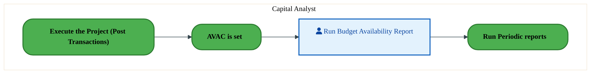

<div style="text-align:center; margin:4px 0 8px 0; font-size:11px;"><a href="https://mermaid.live/view#pako:eNqlVNuO2jAQ_RUrK5RWClKuhOahUghEqtRKq2W7fShVZRwb3DV2ZDtAivj32lzCQstT8xBljs-c45mMvXOQqLCTOb3ejnKqM7Bz9RKvsJsBdw4Vdj1wBF6gpHDOsHIthwiup_T3gRbE9dbSLFbCFWWtRad4ITD4-skDuUlkHlCQq77CkhLXc2tJV1C2hWBCWvYDHhKfHNxOSyMhKywvBN9PA5SYVEY5vsBRGqdxafMURoJXV6IkIUOC3L3dHBMbtIRSH7bfKPwFbr_RSi9NTCBT2HCWesU-wzlmtkYtG4uhRq7PzaDK-nDTsGkNEeULg8e-gSTkrxco8fd7sO_1ZrwzBc_jGQfmQQwqNcYEKG3gyVoDQhnLHuIiLxPfU1qKV5w9hJN0HIUespVkpnTfs83tbzBdLHU2F6w6UfsbW0MW1ltPbrPQ92Rr3jdemFcXp2IQDsNh5zRKgyIozk6EkP9yMn2Vz1C9nrwmURmW484rSAZJ4f-tdy5zHKd5cNsnLNcU4TeiZVlGk0urJoMk8O-Ljspo4Bc3oguo8Qa2F8EPRdwJlklaBuldwaPf7S6b-aMU6CwYTZIy6QTTUVDm4V3BOA_i4WmHRmchYb0EDHL80_8-cwpYUw0ZyDlkrdIz58eRaR8eGAKBGYF923jw1HAwaqoF1iBfQ8rgnDKqW_CEayFvUkOTavmP5kCKiiIgDyR1zYoMK3_JC0CV-RM3ErFZnGwxajQG5ooApgO_MNLg3aNQZuLNoVAQaSq4et8lmlE8fvAY9PsfjcMpDI5heAqjY_h2GiznPF9XcNgdpis4-jccd7DjOSssV5BWTrZzDpecuQgrTGDDtLP3HNhoMW05crLDZeA0dWUGZ0yh-UerI7j_A6rvrmk=" title="View full diagram">&#128065; View Diagram</a></div>


#### BUSINESS ARCHITECTURE — 3.2.18 DC-050-660_Process_month-end_adjustments — DC-050-660_Process_month-end_adjustments

**Swim Lanes**: Finance Analyst | **Tasks**: 3 | **Gateways**: 0

> **Legend**: <span style="color:#000;background:#4CAF50;padding:2px 6px;border-radius:10px;font-weight:bold;font-size:9pt">● Start</span> · <span style="color:#fff;background:#C62828;padding:2px 6px;border-radius:10px;font-weight:bold;font-size:9pt">● End</span> · <span style="background:#E3F2FD;padding:2px 6px;border:1px solid #1565C0;font-size:9pt">User Task</span> · <span style="background:#FFF3E0;padding:2px 6px;border:1px solid #E65100;font-size:9pt">Service Task</span> · <span style="background:#FFF9C4;padding:2px 6px;border:1px solid #F57F17;font-size:9pt">◇ Gateway</span> · <span style="background:#F3E5F5;padding:2px 6px;border:1px solid #7B1FA2;font-size:9pt">Sub-Process</span>

```mermaid
%%{init: {"theme": "base", "themeVariables": {"fontSize": "14px", "fontFamily": "Segoe UI, Arial, sans-serif","primaryColor": "#e8f0fe", "primaryBorderColor": "#0071c5","lineColor": "#37474F", "secondaryColor": "#f5f8fc"}, "flowchart": {"useMaxWidth": false, "htmlLabels": true, "curve": "basis", "nodeSpacing": 40, "rankSpacing": 50}} }%%
flowchart TD
    classDef startEvt fill:#4CAF50,stroke:#2E7D32,color:#000,font-weight:bold,stroke-width:2px,rx:20,ry:20
    classDef endEvt fill:#C62828,stroke:#B71C1C,color:#fff,font-weight:bold,stroke-width:2px,rx:20,ry:20
    classDef userTask fill:#E3F2FD,stroke:#1565C0,stroke-width:2px,color:#0D47A1
    classDef serviceTask fill:#FFF3E0,stroke:#E65100,stroke-width:2px,color:#BF360C
    classDef gateway fill:#FFF9C4,stroke:#F57F17,stroke-width:2px,color:#E65100
    classDef subProc fill:#F3E5F5,stroke:#7B1FA2,stroke-width:2px,color:#4A148C
    subgraph Finance Analyst
        n1["fa:fa-user Execute Journal Entries"]
        n2["fa:fa-user Execute Reassignment of Cost"]
        n3["fa:fa-user Execute Overhead Allocations"]
        n4["Manage Project Periodic Settlement"]
        n5["Execute the Project (Post Transactions)"]
    end
    n1 --> n2
    n2 --> n3
    n3 --> n4
    n5 --> n1
    class n1 userTask
    class n2 userTask
    class n3 userTask
    class n4 startEvt
    class n5 startEvt
```

<div style="text-align:center; margin:4px 0 8px 0; font-size:11px;"><a href="https://mermaid.live/view#pako:eNqlVNuO2jAQ_RUrK0QrBSlXQvNQCQKRWnXVVdm2D6WqjDMGd42NbIdLEf9em0tY6O5T8xAxhznnzIwms_OIrMDLvVZrxwQzOdq1zRwW0M5Re4o1tH10BL5hxfCUg267HCqFGbM_h7QwWW5cmsNKvGB869AxzCSgrx981LdE7iONhe5oUIy2_fZSsQVW20JyqVz2HfRoQA9up78GUlWgLglBkIUktVTOBFzgOEuypHQ8DUSK6kqUprRHSXvviuNyTeZYmUP5tYZ7vPnOKjO3McVcg82ZmwX_hKfAXY9G1Q4jtVqdh8G08xF2YOMlJkzMLJ4EFlJYPF2gNNjv0b7VmojGFD0OJwLZh3Cs9RAo0sbCo5VBlHGe3yVFv0wDXxslnyC_i0bZMI584jrJbeuB74bbWQObzU0-lbw6pXbWroc8Wm58tcmjwFdb-77xAlFdnIpu1It6jdMgC4uwODtRSv_Lyc5VPWL9dPIaxWVUDhuvMO2mRfCv3rnNYZL1w9s5gVoxAs9Ey7KMR5dRjbppGLwuOijjblDciM6wgTXeXgTfFUkjWKZZGWavCh79bquspw9KkrNgPErLtBHMBmHZj14VTPph0jtVaHVmCi_niGMBv4IfE69kAgsCqC8w32oz8X4eM90jQptAcU5xxw0ejTZAagPoo6yVTUcjYRQDfc2JXuZ8AdsKm4kFCIMkRYW8NYtfJn5egZoDrlCfc0mwYVLcOCaWeI8FngGyQ_oNxKAHewZkxQgagzEcnOk1J7Wcs4M9Pw3xzYOtCz3aD05jcvB62xDtmh9_iBB1Ou9tq6cwOobxKYyPYXIK02P4fPGcwnmVr-DoZTh-GU6ar_wKThvY870FqAVmlZfvvMOZtae4Aoprbry97-HayPFWEC8_nCOvXlZ2dYcM2y1ZHMH9X9lR2YE=" title="View full diagram">&#128065; View Diagram</a></div>


<div class="page-footer"><span>Page 21</span><span><a href="#toc">↑ Back to TOC</a></span><span>DC-050 — Project Accounting</span></div>
<div style="page-break-before: always;"></div>


#### BUSINESS ARCHITECTURE — 3.2.19 DC-050-670_Release_WBS — DC-050-670_Release_WBS

**Swim Lanes**: Boundary Apps · Capital Finance Project Analyst | **Tasks**: 2 | **Gateways**: 8

> **Legend**: <span style="color:#000;background:#4CAF50;padding:2px 6px;border-radius:10px;font-weight:bold;font-size:9pt">● Start</span> · <span style="color:#fff;background:#C62828;padding:2px 6px;border-radius:10px;font-weight:bold;font-size:9pt">● End</span> · <span style="background:#E3F2FD;padding:2px 6px;border:1px solid #1565C0;font-size:9pt">User Task</span> · <span style="background:#FFF3E0;padding:2px 6px;border:1px solid #E65100;font-size:9pt">Service Task</span> · <span style="background:#FFF9C4;padding:2px 6px;border:1px solid #F57F17;font-size:9pt">◇ Gateway</span> · <span style="background:#F3E5F5;padding:2px 6px;border:1px solid #7B1FA2;font-size:9pt">Sub-Process</span>

```mermaid
%%{init: {"theme": "base", "themeVariables": {"fontSize": "14px", "fontFamily": "Segoe UI, Arial, sans-serif","primaryColor": "#e8f0fe", "primaryBorderColor": "#0071c5","lineColor": "#37474F", "secondaryColor": "#f5f8fc"}, "flowchart": {"useMaxWidth": false, "htmlLabels": true, "curve": "basis", "nodeSpacing": 40, "rankSpacing": 50}} }%%
flowchart LR
    classDef startEvt fill:#4CAF50,stroke:#2E7D32,color:#000,font-weight:bold,stroke-width:2px,rx:20,ry:20
    classDef endEvt fill:#C62828,stroke:#B71C1C,color:#fff,font-weight:bold,stroke-width:2px,rx:20,ry:20
    classDef userTask fill:#E3F2FD,stroke:#1565C0,stroke-width:2px,color:#0D47A1
    classDef serviceTask fill:#FFF3E0,stroke:#E65100,stroke-width:2px,color:#BF360C
    classDef gateway fill:#FFF9C4,stroke:#F57F17,stroke-width:2px,color:#E65100
    classDef subProc fill:#F3E5F5,stroke:#7B1FA2,stroke-width:2px,color:#4A148C
    subgraph Boundary Apps
        n2[["fa:fa-cog Initiate 'WBS Element Release' Automatically"]]
        n3["WBS not Released"]
        n4["Execute the Project (Post Transactions)"]
        n5["WBS Released for Commitment and Actuals"]
        n6["AUC Created Automatically in Background"]
        n7["Validate Project Structure"]
        n8{{"fa:fa-code-branch CAPEX?"}}
        n9{{"fa:fa-code-branch Project Budgeted?"}}
        n10{{"fa:fa-code-branch exclusiveGateway"}}
        n11{{"fa:fa-code-branch exclusiveGateway"}}
        n12{{"fa:fa-code-branch EMS"}}
        n13{{"fa:fa-code-branch exclusiveGateway"}}
        n14{{"fa:fa-code-branch CAPEX or OPEX?"}}
        n15{{"fa:fa-code-branch exclusiveGateway"}}
    end
    subgraph Capital Finance Project Analyst
        n1["fa:fa-user Initiate 'WBS Element Release' Manually"]
    end
    n7 --> n10
    n8 -->|"Yes"| n9
    n9 -->|"Yes"| n11
    n9 -->|"No"| n3
    n10 --> n12
    n8 -->|"No"| n11
    n12 -->|"No"| n1
    n13 --> n8
    n1 --> n13
    n11 --> n5
    n5 --> n14
    n15 --> n4
    n6 --> n15
    n3 --> n10
    n14 -->|"CAPEX"| n6
    n14 -->|"OPEX"| n15
    n12 -->|"Yes"| n2
    n2 --> n13
    class n1 userTask
    class n2 serviceTask
    class n3 startEvt
    class n4 startEvt
    class n5 startEvt
    class n6 startEvt
    class n7 startEvt
    class n8 gateway
    class n9 gateway
    class n10 gateway
    class n11 gateway
    class n12 gateway
    class n13 gateway
    class n14 gateway
    class n15 gateway
```

<div style="text-align:center; margin:4px 0 8px 0; font-size:11px;"><a href="https://mermaid.live/view#pako:eNqlVm2PozYQ_isWq1VaiUiYl5DlQytCQnXSbW91uZdWl6pywCTuOiYyZjdpLv-9YwJkoWyrXvMhkp-ZeZ6ZscfmZCR5So3AuL09McFUgE4jtaU7OgrQaE0KOjLRBfhEJCNrTouR9slyoZbsz8oNu_uDdtNYTHaMHzW6pJucoo9vTBRCIDdRQUQxLqhk2cgc7SXbEXmMcp5L7X1Dp5mVVWq1aZbLlMqrg2X5OPEglDNBr7Dju74b67iCJrlIO6SZl02zZHTWyfH8OdkSqar0y4Lek8NnlqotrDPCCwo-W7Xjb8macl2jkqXGklI-Nc1ghdYR0LDlniRMbAB3LYAkEY9XyLPOZ3S-vV2JVhS9fb8SCH4JJ0UxpxkqFMCLJ4Uyxnlw40Zh7FlmoWT-SIMbe-HPHdtMdCUBlG6ZurnjZ8o2WxWsc57WruNnXUNg7w-mPAS2Zcoj_Pe0qEivStHEntrTVmnm4whHjVKWZf9LCfoqP5DisdZaOLEdz1st7E28yPo7X1Pm3PVD3O8TlU8soS9I4zh2FtdWLSYetl4nncXOxIp6pBui6DM5XgnvIrcljD0_xv6rhBe9fpbl-kHmSUPoLLzYawn9GY5D-1VCN8TutM4QeDaS7LeIE0F_t76sjFleVocahft9sTJ-u_jpn7C_gD0jQUbGSb5Bb2B8GRSGRp9nS7TgMLNCofeUUz3GKCxVviOKJYTzIxC9ZHKASAeJvA1Iu1oueCwONCmBH64DBNX-QROFvnvIC4U-wAAUJFEsF8X33UCvpm5oUZZLFOW7HVNVfkSkKExUCSPYDZxAYPgxQpGkUFTazR8xgWYkedxI3Z5uoA-Bnwhnqe5Fk-cSxhlUJO36Tk-nawtTOl5DIckWReHD4pcfV8b5_ML3bti3UZiV6YZCov0wbA3H0UPCy4I90Z8uh7Efhr8tzB4OW9wv-57Otwm4_9AyBHv7bqB12PuvWnBlDU0Ehr2NyJ4pwlHMBJBctzgUhB8L1d1g3I6Ivpr-bUbuiSjr8eilIXw0Hv-gd7NeT_X668r4lcK5_Qqno8bvejjGPcPPeYU7NYytmtjuEdd-bTy2e4YGdy4E02Zd87UCNeDVa6-2u429Bpr1pLY3_k6vcOzWeVQ7XqUy6ZveNZaWpc2-6UtTrt1Nt7pRdRHNS9KB7ZfPQcfitA9qB3aHYW8YngzD_jA8bZ6RDno3iMIuD8J4GLaHYWcYdodhr4EN09hRuSMsNYKTUX3MwQdfSjNScmWcTYPA1bo8isQIqo8eo9zru3POCEze7gKe_wJ78i9E" title="View full diagram">&#128065; View Diagram</a></div>


<div class="page-footer"><span>Page 22</span><span><a href="#toc">↑ Back to TOC</a></span><span>DC-050 — Project Accounting</span></div>
<div style="page-break-before: always;"></div>


#### BUSINESS ARCHITECTURE — 3.2.20 DC-050-690_Validate_Project_Reports — DC-050-690_Validate_Project_Reports

**Swim Lanes**: Capital Analyst | **Tasks**: 1 | **Gateways**: 2

> **Legend**: <span style="color:#000;background:#4CAF50;padding:2px 6px;border-radius:10px;font-weight:bold;font-size:9pt">● Start</span> · <span style="color:#fff;background:#C62828;padding:2px 6px;border-radius:10px;font-weight:bold;font-size:9pt">● End</span> · <span style="background:#E3F2FD;padding:2px 6px;border:1px solid #1565C0;font-size:9pt">User Task</span> · <span style="background:#FFF3E0;padding:2px 6px;border:1px solid #E65100;font-size:9pt">Service Task</span> · <span style="background:#FFF9C4;padding:2px 6px;border:1px solid #F57F17;font-size:9pt">◇ Gateway</span> · <span style="background:#F3E5F5;padding:2px 6px;border:1px solid #7B1FA2;font-size:9pt">Sub-Process</span>

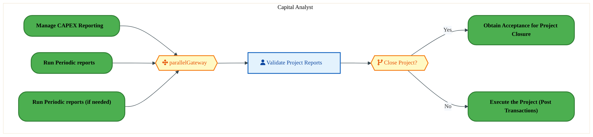

<div style="text-align:center; margin:4px 0 8px 0; font-size:11px;"><a href="https://mermaid.live/view#pako:eNqlVe-P4jYQ_VesrFZcpSAlISE0H1qxgVSVetfV7d21VamqwZmAu8aObGeBcvzvZ_MjbCj7qXxAzMt782YGj7PzqCzRy7z7-x0TzGRk1zNLXGEvI705aOz55Ah8AcVgzlH3HKeSwjyxfw-0MK43juawAlaMbx36hAuJ5PPPPhlbIfeJBqH7GhWren6vVmwFaptLLpVj3-GoCqqD2-nRg1QlqgshCNKQJlbKmcALPEjjNC6cTiOVouwkrZJqVNHe3hXH5ZouQZlD-Y3G97D5jZVmaeMKuEbLWZoV_wXmyF2PRjUOo416OQ-Daecj7MCeaqBMLCweBxZSIJ4vUBLs92R_fz8TrSn5NJkJYj-Ug9YTrIg2Fp6-GFIxzrO7OB8XSeBro-QzZnfRNJ0MIp-6TjLbeuC74fbXyBZLk80lL0_U_tr1kEX1xlebLAp8tbXfV14oyotTPoxG0ah1ekjDPMzPTlVV_S8nO1f1CfTzyWs6KKJi0nqFyTDJg__mO7c5idNxeD0nVC-M4qukRVEMppdRTYdJGLyd9KEYDIP8KukCDK5he0n4fR63CYskLcL0zYRHv-sqm_mjkvSccDBNiqRNmD6ExTh6M2E8DuPRqUKbZ6GgXhIOAv8O_px5OdTMACdjAXyrzcz768h0HxFaQgVZBX03ePIFOCtta8TW8g9SQz5iLZXRXVFkRb_ODTBBxpRibUBQJJVUrSznUjcKu7KBlU03SBub314ILfndo9T2fNsV0EANk0J_1xXGVvgeBCyQ5OPH6e-nquyudHmJ5X1sBHm0V4QsGSXqVvXDN1jkHauIQCyxvPJPd7vzlNxd15_bUuny0GTbxY8zb79_pRldNKCUXOs-cENqUMA58p-Ox-eisQt2_CFC0u__YD1PYXwMR6dwdAxPZ1wk3afDbpi68OvM-wPtCL7a_-0K_yAP8ODVUXT-5xXswFF733TgwW04vg0nt-HhbTg9b1kHHZ1Rz_dWqFbASi_beYc3jH0LlVhBw4239z1ojHzaCuplh5vYa2p3tCcM7IKsjuD-GyTvJbU=" title="View full diagram">&#128065; View Diagram</a></div>


<div class="page-footer"><span>Page 23</span><span><a href="#toc">↑ Back to TOC</a></span><span>DC-050 — Project Accounting</span></div>
<div style="page-break-before: always;"></div>


#### BUSINESS ARCHITECTURE — 3.2.21 DC-050-700_Supplement_Budget — DC-050-700_Supplement_Budget

**Swim Lanes**: Capital Finance Project Analyst · Corporate Capital Finance Analyst · Finance Analyst | **Tasks**: 5 | **Gateways**: 7

> **Legend**: <span style="color:#000;background:#4CAF50;padding:2px 6px;border-radius:10px;font-weight:bold;font-size:9pt">● Start</span> · <span style="color:#fff;background:#C62828;padding:2px 6px;border-radius:10px;font-weight:bold;font-size:9pt">● End</span> · <span style="background:#E3F2FD;padding:2px 6px;border:1px solid #1565C0;font-size:9pt">User Task</span> · <span style="background:#FFF3E0;padding:2px 6px;border:1px solid #E65100;font-size:9pt">Service Task</span> · <span style="background:#FFF9C4;padding:2px 6px;border:1px solid #F57F17;font-size:9pt">◇ Gateway</span> · <span style="background:#F3E5F5;padding:2px 6px;border:1px solid #7B1FA2;font-size:9pt">Sub-Process</span>

```mermaid
%%{init: {'theme': 'base', 'themeVariables': {'fontSize': '14px', 'fontFamily': 'Segoe UI, Arial, sans-serif','primaryColor': '#e8f0fe', 'primaryBorderColor': '#0071c5','lineColor': '#37474F', 'secondaryColor': '#f5f8fc'}, 'flowchart': {'useMaxWidth': false, 'htmlLabels': true, 'curve': 'basis', 'nodeSpacing': 40, 'rankSpacing': 50}} }%%
flowchart LR
    classDef startEvt fill:#4CAF50,stroke:#2E7D32,color:#000,font-weight:bold,stroke-width:2px,rx:20,ry:20
    classDef endEvt fill:#C62828,stroke:#B71C1C,color:#fff,font-weight:bold,stroke-width:2px,rx:20,ry:20
    classDef userTask fill:#E3F2FD,stroke:#1565C0,stroke-width:2px,color:#0D47A1
    classDef serviceTask fill:#FFF3E0,stroke:#E65100,stroke-width:2px,color:#BF360C
    classDef gateway fill:#FFF9C4,stroke:#F57F17,stroke-width:2px,color:#E65100
    classDef subProc fill:#F3E5F5,stroke:#7B1FA2,stroke-width:2px,color:#4A148C
    subgraph lane_0["Capital Finance Project Analyst"]
        n5["fa:fa-user Assign Supplement Budget to Lower Level WBS Element"]
    end
    subgraph lane_1["Corporate Capital Finance Analyst"]
        n1["fa:fa-user Allocate Supplemental Budget from Program to Item"]
        n2["fa:fa-user Transfer Supplemental Budget from Item to Project"]
        n3["fa:fa-user Allocate Budget Supplemental by Year"]
        n6["Release a Budget"]
        n7["Execute the Project (Post Transactions)"]
        n8["Workflow project for approval"]
        n9{{"fa:fa-code-branch Yearly Budget Allocation Required?"}}
        n10{{"fa:fa-code-branch Budget Release Required?"}}
        n11{{"fa:fa-code-branch exclusiveGateway"}}
        n12{{"fa:fa-code-branch Supplement Budget Required for Lower level WBS Element?"}}
        n13{{"fa:fa-code-branch exclusiveGateway"}}
    end
    subgraph lane_2["Finance Analyst"]
        n4["fa:fa-user Approve Workflow for Small Construction"]
        n14{{"fa:fa-code-branch Supplement Budget Require for Small Construction ?"}}
        n15{{"fa:fa-code-branch exclusiveGateway"}}
    end
    n8 --> n1
    n1 --> n2
    n2 --> n9
    n9 -->|"Yes"| n3
    n10 -->|"Yes"| n6
    n10 -->|"No"| n7
    n11 --> n12
    n3 --> n11
    n9 -->|"No"| n11
    n13 --> n10
    n12 -->|"Yes"| n14
    n5 --> n13
    n12 -->|"No"| n13
    n15 --> n5
    n14 -->|"Yes"| n4
    n4 --> n15
    n14 -->|"No"| n15
    class n1 userTask
    class n2 userTask
    class n3 userTask
    class n4 userTask
    class n5 userTask
    class n6 startEvt
    class n7 startEvt
    class n8 startEvt
    class n9 gateway
    class n10 gateway
    class n11 gateway
    class n12 gateway
    class n13 gateway
    class n14 gateway
    class n15 gateway
```

<div style="text-align:center; margin:4px 0 8px 0; font-size:11px;"><a href="https://mermaid.live/view#pako:eNqlVmuP4jYU_StWRiNaKUh5EsiHVsCQaqXZajVsO1qVqjKJA-4YO7UdHmX577XBCZMQKm3Lh9Hck3vPOffajnO0UpYhK7YeH4-YYhmDY0-u0Qb1YtBbQoF6NrgAv0KO4ZIg0dM5OaNyjv8-p7lBsddpGkvgBpODRudoxRD45YMNxqqQ2EBAKvoCcZz37F7B8Qbyw5QRxnX2AxrmTn5WM48mjGeIXxMcJ3LTUJUSTNEV9qMgChJdJ1DKaNYgzcN8mKe9kzZH2C5dQy7P9kuBPsL9K87kWsU5JAKpnLXckGe4RET3KHmpsbTk22oYWGgdqgY2L2CK6UrhgaMgDunbFQqd0wmcHh8XtBYFzy8LCtQvJVCIJ5QDIRU820qQY0Lih2A6TkLHFpKzNxQ_eLPoyffsVHcSq9YdWw-3v0N4tZbxkpHMpPZ3uofYK_Y238eeY_OD-tvSQjS7Kk0H3tAb1kqTyJ2600opz_P_paTmyj9D8Wa0Zn7iJU-1lhsOwqlzy1e1-RREY7c9J8S3OEXvSJMk8WfXUc0GoevcJ50k_sCZtkhXUKIdPFwJR9OgJkzCKHGju4QXvbbLcvmJs7Qi9GdhEtaE0cRNxt5dwmDsBkPjUPGsOCzWgECK_nB-W1hTWGAJCUgwhTRFQMn8iVIJxhSSg5AL6_dLpf7RUBXkMM5hXy8EGAuBVxTMy6Ig6gRTCSZltkISSAae2U5lPKMtIuB1MgezS0bNp_ZMlyVXW2K8YFyNELTNdZpyW6YIYakuvtpSDMZYztlGt6gUN9rlB4k2TTavyfZZHT2Rq3_usmkKTWUG12Tz73gzBA3S5QF8QZA3CQaK4AURpN6UAJqyZkakMmZ7lJaKVr1I6wX87hMT8uIfphIzKr5vFg5V4Svjb_olAgpTlTMOYKGiLSTN9NHxWPWiX-n9pWJO12fL5FA1ZBpUauAF_VVijrIfF9bp9H65nG4iw1A1e7fc7S5H-5SUAm_RT5ez1y7zustu924lfB7FZReT9i6-MeV_q6k721_vvn_d7EFrQ52XCoF6HbXp-QYSAqZqxdUdc1761oEJvnEWd1jBzRjC_zwGOgT9_g-KwoTuJfRM6F3CkQlHOvy6sL4gsbC-qmNWVTmtB4P2g5_ZGY8q3Oi4lZBvYrelZOpq3K0SnQrwWtJuYJ6EJtNvZ1ac9QOTGVZx0KKsGAPDeJNYMYbvrg89y-rabMBeN-x3w0E3HHbDg_r7owFH3fCwGx5V92izG6cbdrthrxv2u-GgGw4r2LKtDeIbiDMrPlrn71b1bZuhHJZEWifbgqVk8wNNrfj8fWeVRaYqnzDUN84FPP0Dt2WJsw==" title="View full diagram">&#128065; View Diagram</a></div>


<div class="page-footer"><span>Page 24</span><span><a href="#toc">↑ Back to TOC</a></span><span>DC-050 — Project Accounting</span></div>
<div style="page-break-before: always;"></div>


#### BUSINESS ARCHITECTURE — 3.2.22 DC-050-720_Run_Periodic_reports_(if_needed) — DC-050-720_Run_Periodic_reports_(if_needed)

**Swim Lanes**: Capital Analyst | **Tasks**: 6 | **Gateways**: 3

> **Legend**: <span style="color:#000;background:#4CAF50;padding:2px 6px;border-radius:10px;font-weight:bold;font-size:9pt">● Start</span> · <span style="color:#fff;background:#C62828;padding:2px 6px;border-radius:10px;font-weight:bold;font-size:9pt">● End</span> · <span style="background:#E3F2FD;padding:2px 6px;border:1px solid #1565C0;font-size:9pt">User Task</span> · <span style="background:#FFF3E0;padding:2px 6px;border:1px solid #E65100;font-size:9pt">Service Task</span> · <span style="background:#FFF9C4;padding:2px 6px;border:1px solid #F57F17;font-size:9pt">◇ Gateway</span> · <span style="background:#F3E5F5;padding:2px 6px;border:1px solid #7B1FA2;font-size:9pt">Sub-Process</span>

```mermaid
%%{init: {'theme': 'base', 'themeVariables': {'fontSize': '14px', 'fontFamily': 'Segoe UI, Arial, sans-serif','primaryColor': '#e8f0fe', 'primaryBorderColor': '#0071c5','lineColor': '#37474F', 'secondaryColor': '#f5f8fc'}, 'flowchart': {'useMaxWidth': false, 'htmlLabels': true, 'curve': 'basis', 'nodeSpacing': 40, 'rankSpacing': 50}} }%%
flowchart TD
    classDef startEvt fill:#4CAF50,stroke:#2E7D32,color:#000,font-weight:bold,stroke-width:2px,rx:20,ry:20
    classDef endEvt fill:#C62828,stroke:#B71C1C,color:#fff,font-weight:bold,stroke-width:2px,rx:20,ry:20
    classDef userTask fill:#E3F2FD,stroke:#1565C0,stroke-width:2px,color:#0D47A1
    classDef serviceTask fill:#FFF3E0,stroke:#E65100,stroke-width:2px,color:#BF360C
    classDef gateway fill:#FFF9C4,stroke:#F57F17,stroke-width:2px,color:#E65100
    classDef subProc fill:#F3E5F5,stroke:#7B1FA2,stroke-width:2px,color:#4A148C
    subgraph lane_0["Capital Analyst"]
        n1["fa:fa-user Execute Adhoc Project Structure Reports"]
        n2["fa:fa-user Execute Adhoc Project Line Item Reports"]
        n3["fa:fa-user Execute Adhoc Project Commitment Line Items Report"]
        n4["fa:fa-user Execute Adhoc Summary Reports for Budget, Spends and Commitments"]
        n5["fa:fa-user Execute Adhoc Settlement Report"]
        n6["fa:fa-user Execute Adhoc Summary Reports for Spend and Commitments (F)"]
        n7(["fa:fa-play CAPEX and OPEX Reporting Started"])
        n8(["fa:fa-stop Project Structure Report Validated"])
        n9(["fa:fa-stop Line item Report Validated"])
        n10(["fa:fa-stop Summary information Validated"])
        n11(["fa:fa-stop Commitment Line Item Report Validated"])
        n12(["fa:fa-stop Settlement Report Validated"])
        n13{{"fa:fa-code-branch CAPEX?"}}
        n14{{"fa:fa-code-branch exclusiveGateway"}}
        n15{{"fa:fa-arrows-alt inclusiveGateway"}}
    end
    n1 --> n8
    n2 --> n9
    n6 --> n14
    n7 --> n15
    n14 --> n10
    n4 --> n14
    n15 --> n5
    n3 --> n11
    n15 --> n13
    n15 --> n3
    n15 --> n2
    n15 --> n1
    n5 --> n12
    n13 -->|"Yes"| n4
    n13 -->|"No"| n6
    class n1 userTask
    class n2 userTask
    class n3 userTask
    class n4 userTask
    class n5 userTask
    class n6 userTask
    class n7 startEvt
    class n8 endEvt
    class n9 endEvt
    class n10 endEvt
    class n11 endEvt
    class n12 endEvt
    class n13 gateway
    class n14 gateway
    class n15 gateway
```

<div style="text-align:center; margin:4px 0 8px 0; font-size:11px;"><a href="https://mermaid.live/view#pako:eNqlVm2v2jYY_StWrq5opSDFeSHcfNgEgUyVuq0qXbdpTJNJHPCu40S2c4FR_nvtvBBIQ9dp-YB4jp9znuPHjp2TEecJNgLj8fFEGJEBOI3kDmd4FIDRBgk8MkENfEScoA3FYqRz0pzJFfmnSoNucdBpGotQRuhRoyu8zTH45Y0JZopITSAQE2OBOUlH5qjgJEP8GOY05zr7AU9TK62qNUPznCeYdwmW5cPYU1RKGO5gx3d9N9I8geOcJTeiqZdO03h01uZovo93iMvKfinwj-jwK0nkTsUpogKrnJ3M6Fu0wVTPUfJSY3HJX9pmEKHrMNWwVYFiwrYKdy0FccSeO8izzmdwfnxcs0tR8GGxZkA9MUVCLHAKhFTw8kWClFAaPLjhLPIsU0ieP-PgwV76C8c2Yz2TQE3dMnVzx3tMtjsZbHKaNKnjvZ5DYBcHkx8C2zL5Uf32amGWdJXCiT21p5dKcx-GMGwrpWn6vyqpvvIPSDw3tZZOZEeLSy3oTbzQ-lKvnebC9Wew3yfMX0iMr0SjKHKWXauWEw9a90XnkTOxwp7oFkm8R8dO8Cl0L4KR50fQvytY1-u7LDfveB63gs7Si7yLoD-H0cy-K-jOoDttHCqdLUfFDlDE8F_WH2sjRAWRiIIZQ_Qo5Nr4s87UD4MqIUVBisa68WB5wHEpMZglO-VFGfobxxKs1E6OZckxeI-LnEtxq2F_i8Zb9c6BNxJnwxrOt2iEeZYRmWF2JScavVs592tyqzLTx0NrBKQ5B_My2WJpglWhtroAiCVX1Xpeva-KYykprjwOGZv8V2OVob4f8Cp6favrv7oIF1Tty3D2bvlbRftZ_6kV1eGi1lKdGjhR7NdX9GlHFzIv7q48-IgoSdCXAk89gWp9SLfcd4nQ6jHbJhCmpp8hSXJ2nwx75KEd8q8O7L6D_hLepzqnU0vVt-B4o87xeFd3__u1cT5fJ7vDyfgQ01KQF_xDfab0aV5HQ5znezFGVKr23GOp_VL_YRCMx9-pxW1Cuw6fmnBSh9BtYr-JvZbtNkBzVDG3R4BeDbQEpxmHvXHo9IB-bPcJTdyGl_Gqwqe18TtWr-Qn5ag_8FNe4ZOrw1W3ob1UbmB7GHaGYXcY9obhyTDsXy7tG3ja3K834NMQCK1BFA6i9iDqtHfXLewOw14LG6aRYfU-ksQITkb1Pae--RKcopJK42waqJT56shiI6i-e4yy0G_MgiB1HWU1eP4MOrI28g==" title="View full diagram">&#128065; View Diagram</a></div>


<div class="page-footer"><span>Page 25</span><span><a href="#toc">↑ Back to TOC</a></span><span>DC-050 — Project Accounting</span></div>
<div style="page-break-before: always;"></div>


#### BUSINESS ARCHITECTURE — 3.2.23 DC-050-740_Obtain_Acceptance_for_Project_Closure — DC-050-740_Obtain_Acceptance_for_Project_Closure

**Swim Lanes**: Capital Analyst | **Tasks**: 2 | **Gateways**: 3

> **Legend**: <span style="color:#000;background:#4CAF50;padding:2px 6px;border-radius:10px;font-weight:bold;font-size:9pt">● Start</span> · <span style="color:#fff;background:#C62828;padding:2px 6px;border-radius:10px;font-weight:bold;font-size:9pt">● End</span> · <span style="background:#E3F2FD;padding:2px 6px;border:1px solid #1565C0;font-size:9pt">User Task</span> · <span style="background:#FFF3E0;padding:2px 6px;border:1px solid #E65100;font-size:9pt">Service Task</span> · <span style="background:#FFF9C4;padding:2px 6px;border:1px solid #F57F17;font-size:9pt">◇ Gateway</span> · <span style="background:#F3E5F5;padding:2px 6px;border:1px solid #7B1FA2;font-size:9pt">Sub-Process</span>

```mermaid
%%{init: {'theme': 'base', 'themeVariables': {'fontSize': '14px', 'fontFamily': 'Segoe UI, Arial, sans-serif','primaryColor': '#e8f0fe', 'primaryBorderColor': '#0071c5','lineColor': '#37474F', 'secondaryColor': '#f5f8fc'}, 'flowchart': {'useMaxWidth': false, 'htmlLabels': true, 'curve': 'basis', 'nodeSpacing': 40, 'rankSpacing': 50}} }%%
flowchart TD
    classDef startEvt fill:#4CAF50,stroke:#2E7D32,color:#000,font-weight:bold,stroke-width:2px,rx:20,ry:20
    classDef endEvt fill:#C62828,stroke:#B71C1C,color:#fff,font-weight:bold,stroke-width:2px,rx:20,ry:20
    classDef userTask fill:#E3F2FD,stroke:#1565C0,stroke-width:2px,color:#0D47A1
    classDef serviceTask fill:#FFF3E0,stroke:#E65100,stroke-width:2px,color:#BF360C
    classDef gateway fill:#FFF9C4,stroke:#F57F17,stroke-width:2px,color:#E65100
    classDef subProc fill:#F3E5F5,stroke:#7B1FA2,stroke-width:2px,color:#4A148C
    subgraph lane_0["Capital Analyst"]
        n1["Trigger Decision Point 'Close Project' in PPM item by Requestor"]
        n2["Obtain Acceptance for Closure of the Project"]
        n3(["fa:fa-play Acceptance for Project Closure Initiated"])
        n4(["fa:fa-stop Acceptance for Project Closure Obtained"])
        n5(["fa:fa-stop Sent Back to Requestor"])
        n6["Workflow Triggered to Cube Owner for Approval of Closure of Project"]
        n7["Workflow Triggered to Central Capital Finance for Approval of Closure of Project"]
        n8{{"fa:fa-code-branch Approved by Cube Owner?"}}
        n9{{"fa:fa-code-branch Approved by Cube Owner?"}}
        n10{{"fa:fa-code-branch exclusiveGateway"}}
    end
    n2 --> n4
    n3 --> n1
    n1 --> n6
    n6 --> n8
    n7 --> n9
    n8 -->|"Yes"| n7
    n8 -->|"No"| n10
    n9 -->|"Yes"| n2
    n9 -->|"No"| n10
    n10 --> n5
    class n3 startEvt
    class n4 endEvt
    class n5 endEvt
    class n6 startEvt
    class n7 startEvt
    class n8 gateway
    class n9 gateway
    class n10 gateway
```

<div style="text-align:center; margin:4px 0 8px 0; font-size:11px;"><a href="https://mermaid.live/view#pako:eNqlVWuv4jYQ_StWrq7SSkFKQkIgH1pBINVK3e3VcttVVarKOA64GDt1HB5l-e87JuGV5aqqNh8QczLnnJmxPDlYRGbUiq3n5wMTTMfoYOslXVM7RvYcl9R2UA38hhXDc05L2-TkUugp-_eU5gXFzqQZLMVrxvcGndKFpOjXdw4aApE7qMSi7JRUsdx27EKxNVb7RHKpTPYT7edufnJrXo2kyqi6Jrhu5JEQqJwJeoW7URAFqeGVlEiR3YnmYd7PiX00xXG5JUus9Kn8qqTv8e4Ty_QS4hzzkkLOUq_5z3hOuelRq8pgpFKb8zBYaXwEDGxaYMLEAvDABUhhsbpCoXs8ouPz80xcTNHreCYQPITjshzTHJUa4MlGo5xxHj8FyTANXafUSq5o_ORPonHXd4jpJIbWXccMt7OlbLHU8VzyrEntbE0PsV_sHLWLfddRe_hteVGRXZ2Snt_3-xenUeQlXnJ2yvP8m5xgruoVl6vGa9JN_XR88fLCXpi4X-ud2xwH0dBrz4mqDSP0RjRN0-7kOqpJL_Tct0VHabfnJi3RBdZ0i_dXwUESXATTMEq96E3B2q9dZTV_UZKcBbuTMA0vgtHIS4f-m4LB0Av6TYWgs1C4WCKOBf3L_WNmJbhgGnM0FJjvSz2z_qwzzSM8SHhVbLGgCo0pYSWTAr1IJjSyEy5LiqCqvynRNmLw4uU9Ypqu0XyPPtJ_Klpqqe4FfRD8Za4xZA8JoYXGglCUS4WMXKUokjmCdXDWvWd3vwN6juMcdwoO421JNJyL1DvYNwxOIgOV729kgqsMVFj8l0xd71cqYUtlSmEqI0xWSMu79m9JPeB8kmplLi5qJkszw0iqOVhtBUzaFDEsCiU3cC4wj5vRPBxL9LYo1KRA5HzIKROXNv-PQ_9wOPdq1nlnDguJLBsJsIIDv9b_48w6Hm_Ig28he-5jNt0RXpVsQ3-qr9qVBsuo_iN81On8AMfdhN06bBaA8Oqw14S9Ouw3YVSHgybsm_DzzPqdljPrM7xu4R_kCfaaeysGrXy_hbfzPbf2C2_uvan4vMXv4KBZuHdg-AjsPRaIHsP98966QwcPUSi4gS3HWlO1xiyz4oN1-pTD5z6jOa64to6OhSstp3tBrPj0ybOqIgPmmGHYROsaPH4BbEmatA==" title="View full diagram">&#128065; View Diagram</a></div>


#### BUSINESS ARCHITECTURE — 3.2.24 DC-050-780_Reduce_Budget — DC-050-780_Reduce_Budget

**Swim Lanes**: Corporate Capital Finance Analyst | **Tasks**: 3 | **Gateways**: 3

> **Legend**: <span style="color:#000;background:#4CAF50;padding:2px 6px;border-radius:10px;font-weight:bold;font-size:9pt">● Start</span> · <span style="color:#fff;background:#C62828;padding:2px 6px;border-radius:10px;font-weight:bold;font-size:9pt">● End</span> · <span style="background:#E3F2FD;padding:2px 6px;border:1px solid #1565C0;font-size:9pt">User Task</span> · <span style="background:#FFF3E0;padding:2px 6px;border:1px solid #E65100;font-size:9pt">Service Task</span> · <span style="background:#FFF9C4;padding:2px 6px;border:1px solid #F57F17;font-size:9pt">◇ Gateway</span> · <span style="background:#F3E5F5;padding:2px 6px;border:1px solid #7B1FA2;font-size:9pt">Sub-Process</span>

```mermaid
%%{init: {'theme': 'base', 'themeVariables': {'fontSize': '14px', 'fontFamily': 'Segoe UI, Arial, sans-serif','primaryColor': '#e8f0fe', 'primaryBorderColor': '#0071c5','lineColor': '#37474F', 'secondaryColor': '#f5f8fc'}, 'flowchart': {'useMaxWidth': false, 'htmlLabels': true, 'curve': 'basis', 'nodeSpacing': 40, 'rankSpacing': 50}} }%%
flowchart TD
    classDef startEvt fill:#4CAF50,stroke:#2E7D32,color:#000,font-weight:bold,stroke-width:2px,rx:20,ry:20
    classDef endEvt fill:#C62828,stroke:#B71C1C,color:#fff,font-weight:bold,stroke-width:2px,rx:20,ry:20
    classDef userTask fill:#E3F2FD,stroke:#1565C0,stroke-width:2px,color:#0D47A1
    classDef serviceTask fill:#FFF3E0,stroke:#E65100,stroke-width:2px,color:#BF360C
    classDef gateway fill:#FFF9C4,stroke:#F57F17,stroke-width:2px,color:#E65100
    classDef subProc fill:#F3E5F5,stroke:#7B1FA2,stroke-width:2px,color:#4A148C
    subgraph lane_0["Corporate Capital Finance Analyst"]
        n1["fa:fa-user Return Budget to Level 1 WBS Element"]
        n2["fa:fa-user Return Budget from Item to Program"]
        n3[["fa:fa-cog Transfer Budget Return from Project to Item"]]
        n4(["fa:fa-stop Budget Return not Required"])
        n5["Manage IM Program Position Budget (PPM Portfolio and Buckets)"]
        n6["Execute the Project (Post Transactions)"]
        n7{{"fa:fa-code-branch Budget Return Required?"}}
        n8{{"fa:fa-code-branch Budget Allocated below Level 1 WBS Element?"}}
        n9{{"fa:fa-code-branch exclusiveGateway"}}
    end
    n6 --> n7
    n7 -->|"Yes"| n8
    n8 -->|"Yes"| n1
    n1 --> n3
    n3 --> n9
    n7 -->|"No"| n4
    n9 --> n2
    n2 --> n5
    n8 -->|"No"| n9
    class n1 userTask
    class n2 userTask
    class n3 serviceTask
    class n4 endEvt
    class n5 startEvt
    class n6 startEvt
    class n7 gateway
    class n8 gateway
    class n9 gateway
```

<div style="text-align:center; margin:4px 0 8px 0; font-size:11px;"><a href="https://mermaid.live/view#pako:eNqllV2P4jYUhv-KldGIWSlISUgI5KIVX6lG2qlGZdpVtVSVcU7AHWNT2-GjLP-9NgkBUmZvmguE35z3Oec48cnBISIDJ3EeHw-UU52gQ0svYQWtBLXmWEHLRaXwG5YUzxmolo3JBddT-s8pzA_XOxtmtRSvKNtbdQoLAejXZxcNjJG5SGGu2gokzVtuay3pCsv9SDAhbfQD9HIvP2Wrbg2FzEBeAjwv9klkrIxyuMidOIzD1PoUEMGzG2ge5b2ctI62OCa2ZImlPpVfKHjBuy8000uzzjFTYGKWesU-4zkw26OWhdVIITfnzaDK5uFmw6ZrTChfGD30jCQxf79IkXc8ouPj44zXSdHbeMaRuQjDSo0hR0obebLRKKeMJQ_haJBGnqu0FO-QPASTeNwJXGI7SUzrnms3t70FuljqZC5YVoW2t7aHJFjvXLlLAs-Ve_PbyAU8u2QadYNe0KszDWN_5I_OmfI8_1-ZzL7KN6zeq1yTThqk4zqXH3Wjkfdf3rnNcRgP_OY-gdxQAlfQNE07k8tWTbqR730MHaadrjdqQBdYwxbvL8D-KKyBaRSnfvwhsMzXrLKYv0pBzsDOJEqjGhgP_XQQfAgMB37Yqyo0nIXE6yVimMOf3teZMxJyLaSpF43wmmrMUEo55gTQgGO2V3rm_FF67cV9Y8lxkuO2fRToF9CF5GhYZAvQSAv0GTbAkI--DKdowsyx5g1A8D1ALsUKPWtYWZRp2NS6urV3vtZ-IhbozZwMlRtOBahwJ47x_wXkVJVFGs41KHyqQUqLdQPAhf37d0ElZMb46coYGd8L5ngB6PnlXCR6FYpqKupOnl5fzU0hdS4YFQjzzNwh76DVp9uGugY32QEpzBMwc7Cu-skQddkfJpbcNMaHw2UnMmjPTShZNvo49_DjzDker8y975oHjAliXokMmVkltvceahPYvw-EHWGFohv4qTwRF5eZGeUf3kXt9g-mn2oZ2-W3mfM7qJnzzZRa6b2GXh1k7pf2TrXslMt-g_azOJnCSu6XUUG1DMpl1EhVmfpXh9HmOw-hGzm4L3euB8zNnbAamzdiVM_tG7l7X47Pg-ZG7d1V-2fVcZ0VyBWmmZMcnNOn13yeM8hxwbRzdB1caDHdc-Ikp0-UU6wz4xxTbF_0Ujz-C7vRgSY=" title="View full diagram">&#128065; View Diagram</a></div>


<div class="page-footer"><span>Page 26</span><span><a href="#toc">↑ Back to TOC</a></span><span>DC-050 — Project Accounting</span></div>
<div style="page-break-before: always;"></div>


#### BUSINESS ARCHITECTURE — 3.2.25 DC-050-790_Transfer_Budget — DC-050-790_Transfer_Budget

**Swim Lanes**: Capital Analyst · Corporate Capital Finance Analyst | **Tasks**: 6 | **Gateways**: 3

> **Legend**: <span style="color:#000;background:#4CAF50;padding:2px 6px;border-radius:10px;font-weight:bold;font-size:9pt">● Start</span> · <span style="color:#fff;background:#C62828;padding:2px 6px;border-radius:10px;font-weight:bold;font-size:9pt">● End</span> · <span style="background:#E3F2FD;padding:2px 6px;border:1px solid #1565C0;font-size:9pt">User Task</span> · <span style="background:#FFF3E0;padding:2px 6px;border:1px solid #E65100;font-size:9pt">Service Task</span> · <span style="background:#FFF9C4;padding:2px 6px;border:1px solid #F57F17;font-size:9pt">◇ Gateway</span> · <span style="background:#F3E5F5;padding:2px 6px;border:1px solid #7B1FA2;font-size:9pt">Sub-Process</span>

```mermaid
%%{init: {'theme': 'base', 'themeVariables': {'fontSize': '14px', 'fontFamily': 'Segoe UI, Arial, sans-serif','primaryColor': '#e8f0fe', 'primaryBorderColor': '#0071c5','lineColor': '#37474F', 'secondaryColor': '#f5f8fc'}, 'flowchart': {'useMaxWidth': false, 'htmlLabels': true, 'curve': 'basis', 'nodeSpacing': 40, 'rankSpacing': 50}} }%%
flowchart LR
    classDef startEvt fill:#4CAF50,stroke:#2E7D32,color:#000,font-weight:bold,stroke-width:2px,rx:20,ry:20
    classDef endEvt fill:#C62828,stroke:#B71C1C,color:#fff,font-weight:bold,stroke-width:2px,rx:20,ry:20
    classDef userTask fill:#E3F2FD,stroke:#1565C0,stroke-width:2px,color:#0D47A1
    classDef serviceTask fill:#FFF3E0,stroke:#E65100,stroke-width:2px,color:#BF360C
    classDef gateway fill:#FFF9C4,stroke:#F57F17,stroke-width:2px,color:#E65100
    classDef subProc fill:#F3E5F5,stroke:#7B1FA2,stroke-width:2px,color:#4A148C
    subgraph lane_0["Capital Analyst"]
        n1["fa:fa-user Maintain List of Workflow Approvers"]
        n2["fa:fa-user Release Budget Transfer Request to Workflow"]
        n9["Run Periodic reports"]
        n12{{"fa:fa-code-branch exclusiveGateway"}}
    end
    subgraph lane_1["Corporate Capital Finance Analyst"]
        n3[["fa:fa-cog Return Sender Project Budget to Item"]]
        n4[["fa:fa-cog Allocate Budget from Program to Receiver Item"]]
        n5[["fa:fa-cog Return Budget from Sender Item to Program"]]
        n6[["fa:fa-cog Transfer Supplement Budget from Item to Project"]]
        n7(["fa:fa-stop Budget Transfer Rejected"])
        n8["Execute the Project (Post Transactions)"]
        n10{{"fa:fa-code-branch Budget Transfer Approved?"}}
        n11{{"fa:fa-code-branch Additional Information Required?"}}
    end
    n5 --> n4
    n4 --> n6
    n3 --> n5
    n10 -->|"Yes"| n3
    n6 --> n8
    n10 -->|"No"| n11
    n11 -->|"No"| n7
    n12 --> n2
    n1 --> n12
    n2 --> n10
    n11 -->|"Yes"| n12
    n9 --> n1
    class n1 userTask
    class n2 userTask
    class n3 serviceTask
    class n4 serviceTask
    class n5 serviceTask
    class n6 serviceTask
    class n7 endEvt
    class n8 startEvt
    class n9 startEvt
    class n10 gateway
    class n11 gateway
    class n12 gateway
```

<div style="text-align:center; margin:4px 0 8px 0; font-size:11px;"><a href="https://mermaid.live/view#pako:eNqlVm2P4jYQ_itWVivupCAlISFsPrQCllQr7Z1Wy7WnaqkqkzjgrrFT22GhHP-9Y_ICSeFTI4E0z8w8z8xk4uRgJSIlVmTd3x8opzpCh55ekw3pRai3xIr0bFQCv2FJ8ZIR1TMxmeB6Tv85hbl-vjNhBovxhrK9QedkJQj69clGY0hkNlKYq74ikmY9u5dLusFyPxVMSBN9R0aZk53UKtdEyJTIc4DjhG4SQCqjnJzhQeiHfmzyFEkET1ukWZCNsqR3NMUx8ZGssdSn8gtFvuDdd5rqNdgZZopAzFpv2DNeEmZ61LIwWFLIbT0MqowOh4HNc5xQvgLcdwCSmL-focA5HtHx_n7BG1H0_LrgCK6EYaUeSYaUBni21SijjEV3_nQcB46ttBTvJLrzZuHjwLMT00kErTu2GW7_g9DVWkdLwdIqtP9heoi8fGfLXeQ5ttzDf0eL8PSsNB16I2_UKE1Cd-pOa6Usy_6XEsxVfsPqvdKaDWIvfmy03GAYTJ3_8tVtPvrh2O3OicgtTcgFaRzHg9l5VLNh4Dq3SSfxYOhMO6QrrMkH3p8JH6Z-QxgHYeyGNwlLvW6VxfJFiqQmHMyCOGgIw4kbj72bhP7Y9UdVhcCzkjhfI4Y5-dN5W1hTnFONGRpzzPZKL6w_ykhzcRcCMhxluG8Gj75gyjX80DNVGokMfRfy3ewgGue5FFsiVTvfa-e_EkbgkUeTIl0Rjb7BWqvshP9dEGDUomFs8zwAz2vB0Qs83SKlCZIkF1J31FzvcKj1zKnTX4JAskZkl7BC0S35pbwtC-t4LNNgca_NxbQ9FRIkIAHVE4opBzpyfVKDt7ez9Ao60oXkaA4C0B_cur9Iouu-oc0nTTZAcMngtxnGjInEyFdJmRQbQwRlbgzDK0kItCSvUQVXi7kkqgozuYas4u3QDNs0ze2aF3nO4MTmusV5QWa67ZCFnxoypUV-ZQdMEkkh7fNF2giyZjuSFDAJeE00o_z0IlSVjRNNBVefO8vgXF-Grm61uenP560o893r-eM0pUYPFuKJZ0JusLFOK0xli6ZZLh6gfv8nuMOV6ZfmsDIHpRlUpusY-8fC-p3Afv8Af-UYlnGjbtxXcQpz3drhth1hjXslgVfbpenWduV2nS5PXUgT-VBFXhxShq4-nFuwdx0eXB68LY9_0xPc9AxvesLq5dQCR83bsQU_XIdh0NV53obd67BXw5ZtbQjsB02t6GCdvnHgOyglGS6Yto62hQst5nueWNHpW8Aq8hQyHyk2z2IJHv8Ff1X0Ig==" title="View full diagram">&#128065; View Diagram</a></div>


<div class="page-footer"><span>Page 27</span><span><a href="#toc">↑ Back to TOC</a></span><span>DC-050 — Project Accounting</span></div>
<div style="page-break-before: always;"></div>


### 3.3 Business Roles & Responsibilities

| Role / Lane | Processes Involved | Description |
|------------|-------------------|-------------|
| Capital Analyst | DC-050-110_Perform_Implementation_Audit, DC-050-120_Close_Project, DC-050-340_Workflow_project_for_approval, DC-050-350_Distribute_Project_budget_to_account_assignment_WBS, DC-050-410_Simulate_Depreciation, DC-050-520_Form_Core_Project_Team, DC-050-530_Assign_Resources_to_Tasks, DC-050-580_Validate_Plan, DC-050-610_Define_a_Budget, DC-050-620_Release_a_Budget, DC-050-630_Display_Available_Budget, DC-050-690_Validate_Project_Reports, DC-050-720_Run_Periodic_reports_(if_needed), DC-050-740_Obtain_Acceptance_for_Project_Closure, DC-050-790_Transfer_Budget | |
| Batch User | DC-050-120_Close_Project,  | |
| CCF Analyst | DC-050-120_Close_Project,  | |
| CES / Intel Products Capital Finance | DC-050-120_Close_Project, DC-050-410_Simulate_Depreciation, DC-050-520_Form_Core_Project_Team, DC-050-530_Assign_Resources_to_Tasks,  | |
| Capital Enterprise Solutions (CES) Analyst | DC-050-120_Close_Project,  | |
| Capital Finance Analyst | DC-050-120_Close_Project,  | |
| Finance Analyst | DC-050-120_Close_Project, DC-050-660_Process_month-end_adjustments, DC-050-700_Supplement_Budget,  | |
| Capital Central Finance Analyst | DC-050-300_Manage_IM_Program_Positions_(PPM_Portfolio_and_Buckets), DC-050-310_Manage_IM_Program_Position_Budget_(PPM_Portfolio_and_Buckets), DC-050-520_Form_Core_Project_Team,  | |
| BU Analyst | DC-050-560_Determine_Total_Planned_Project_Costs, DC-050-570_Load_Project_Plan_(Forecast), DC-050-600_Reload_Cost_Plan,  | |
| Corp. FP&A Analyst | DC-050-560_Determine_Total_Planned_Project_Costs, DC-050-570_Load_Project_Plan_(Forecast), DC-050-590_Copy_Plan_Version, DC-050-600_Reload_Cost_Plan,  | |
| Analyst | DC-050-580_Validate_Plan, DC-050-590_Copy_Plan_Version,  | |
| Boundary Apps | DC-050-670_Release_WBS,  | |
| Capital Finance Project Analyst | DC-050-670_Release_WBS, DC-050-700_Supplement_Budget,  | |
| Corporate Capital Finance Analyst | DC-050-700_Supplement_Budget, DC-050-780_Reduce_Budget, DC-050-790_Transfer_Budget | |


<div class="page-footer"><span>Page 28</span><span><a href="#toc">↑ Back to TOC</a></span><span>DC-050 — Project Accounting</span></div>
<div style="page-break-before: always;"></div>


## 4. Data Architecture (TOGAF "D")

### 4.1 Data Flows — Source to Target

*Data flows with DB platform details will be populated when tower architects complete the extended flow template columns (42-47) via the Input Portal.*


### 4.2 Data Flow Diagrams

> **DATA ARCHITECTURE** — Database-to-database data flows. Applications (blue) sit above their hosting databases (green cylinders). Thick arrows show data movement between databases.


### 4.3 Data Lineage

*Data lineage (source schema/object → target schema/object mappings) will be populated when tower architects provide validated schema details via the Input Portal.*

### 4.4 RICEFW Data Objects

Data-centric RICEFW objects (Reports and Conversions) from the Object Tracker:

| Object ID | Type | Description | Status | Source → Target | Complexity |
|-----------|------|-------------|--------|----------------|----------|
| FPRR1211 | Report | Report for searching on and viewing government contract timesheets for Intel ... | 10. Object Complete |  | 03.Medium |
| FPRR1210 | Report | Report for searching on and viewing government contract timesheet changes for... | 10. Object Complete |  | 03.Medium |
| FPRR0907_IP | Report | Workflow Status Report ( Order Request / Approval Request / Others ) | 10. Object Complete |  | 03.Medium |
| FPRR0907_IF | Report | Workflow Status Report ( Order Request / Approval Request / Others ) | 10. Object Complete |  | 04.Low |
| FPRC1565 | Conversion | Convert active delegate relationships for Timesheet approval | 10. Object Complete |  | 02.High |
| FPRC1464_IP | Conversion | Project Actuals Conversion (Non- Intel Federal) | 10. Object Complete |  | 02.High |
| FPRC1464_IF | Conversion | Project Actuals Conversion (Non- Intel Federal) | 10. Object Complete |  | 02.High |
| FPRC1442 | Conversion | Conversion of Actual Labor hours for Intel Federal Projects | 10. Object Complete |  | 02.High |
| FPRC1441 | Conversion | Conversion of ECC project hierarchy (WBS element master data) to S/4HANA proj... | 10. Object Complete |  | 02.High |
| FPRC1212 | Conversion | Project Actuals Conversion including Intel Federal | 10. Object Complete |  | 03.Medium |
| FPRC0908_IP | Conversion | Project Budget Conversion | 10. Object Complete |  | 03.Medium |
| FPRC0908_IF | Conversion | Project Budget Conversion | 10. Object Complete |  | 03.Medium |
| FPRC0174_IP | Conversion | Conversion of ECC project hierarchy (WBS element master data) to S/4HANA proj... | 10. Object Complete | ECC → S4 | 02.High |
| FPRC0174_IF | Conversion | Conversion of ECC project hierarchy (WBS element master data) to S/4HANA proj... | 10. Object Complete | ECC → S4 | 03.Medium |
| FPRC0035_IP | Conversion | Convert existing ECC & MDG hierarchy to S4HANA PPM hierarchy (Portfolio & buc... | 10. Object Complete |  → MDG | 03.Medium |
| FPRC0035_IF | Conversion | Convert existing ECC & MDG hierarchy to S4HANA PPM hierarchy (Portfolio & buc... | 10. Object Complete |  → MDG | 04.Low |

### 4.5 Data Governance & Quality

| Concern | Approach |
|---------|----------|
| Data Ownership | Per-entity owners listed in Section 3.1 |
| Data Classification | Financial data classified as Intel Confidential |
| Data Retention | Per Intel corporate retention policies |
| Data Quality | Validated at source; reconciliation at target |


<div class="page-footer"><span>Page 29</span><span><a href="#toc">↑ Back to TOC</a></span><span>DC-050 — Project Accounting</span></div>
<div style="page-break-before: always;"></div>


## 5. Application Architecture (TOGAF "A")


### 5.4 Component Overview

#### System Inventory

| System | IAPM ID | Status |
|--------|---------|--------|

### 5.5 Development Object Inventory

**Summary**: 83 SAP, 4 ECA, 9 Interfaces | RICEFW: 4 Reports, 9 Interfaces, 12 Conversions, 52 Enhancements, 10 Workflows


#### 5.5.1 SAP Development Objects

SAP platform objects (Reports, Interfaces, Conversions, Enhancements, Forms, Workflows) developed on S/4, MDG, or S/4 BOT:

| Object ID | Type | Description | Status | Dev System | Complexity |
|-----------|------|-------------|--------|-----------|----------|
| FPRW1064_IP | Workflow | Custom Workflow will also be created with some predefined process/rules for a... | 10. Object Complete | 01.S4 | 01.Very High |
| FPRW1064_IF | Workflow | Custom Workflow will also be created with some predefined process/rules for a... | 10. Object Complete | 01.S4 | 02.High |
| FPRW0906_IP | Workflow | Custom workflow: Change Order Create and Change Approval | 10. Object Complete | 01.S4 | 03.Medium |
| FPRW0906_IF | Workflow | Custom workflow: Change Order Create and Change Approval | 10. Object Complete | 01.S4 | 03.Medium |
| FPRW0904_IP | Workflow | Custom Workflow - WBS Element Request approval with WBS Element creation | 10. Object Complete | 01.S4 | 03.Medium |
| FPRW0904_IF | Workflow | Custom Workflow - WBS Element Request approval with WBS Element creation | 10. Object Complete | 01.S4 | 03.Medium |
| FPRW0900_IP | Workflow | Custom Workflow: Approval for Project creation and create a Project def and l... | 10. Object Complete | 01.S4 | 03.Medium |
| FPRW0900_IF | Workflow | Custom Workflow: Approval for Project creation and create a Project def and l... | 10. Object Complete | 01.S4 | 03.Medium |
| FPRW0445_IP | Workflow | Project budget approval workflow (Capex)​ | 10. Object Complete | 01.S4 | 03.Medium |
| FPRW0445_IF | Workflow | Project budget approval workflow (Capex)​ | 10. Object Complete | 01.S4 | 03.Medium |
| FPRR1211 | Report | Report for searching on and viewing government contract timesheets for Intel ... | 10. Object Complete | 01.S4 | 03.Medium |
| FPRR1210 | Report | Report for searching on and viewing government contract timesheet changes for... | 10. Object Complete | 01.S4 | 03.Medium |
| FPRR0907_IP | Report | Workflow Status Report ( Order Request / Approval Request / Others ) | 10. Object Complete | 01.S4 | 03.Medium |
| FPRR0907_IF | Report | Workflow Status Report ( Order Request / Approval Request / Others ) | 10. Object Complete | 01.S4 | 04.Low |
| FPRI1670 | Interface | Import Dot process/stage details from MDG into S4. ​ | 10. Object Complete | 01.S4 | 03.Medium |
| FPRI1669 | Interface | Import Xeus/Mars volumes from ECA into S4.​ | 10. Object Complete | 01.S4 | 03.Medium |
| FPRI1463 | Interface | Interface to upload payroll data from Workday to S/4 IP for legal entity 199 ... | 10. Object Complete | 01.S4 | 03.Medium |
| FPRI1238 | Interface | Pull Foundry WBS from HAT and create in LE 199 in IP S/4 for Foundry Employee... | 10. Object Complete | 01.S4 | 03.Medium |
| FPRI0188 | Interface | Inbound Interface from EMS to S/4 to create WBS element and Update WBS elemen... | 10. Object Complete | 01.S4 | 02.High |
| FPRE1695 | Enhancement | Custom Fiori app - Change WBS Element Request Form with ALV Input​ | 10. Object Complete | 01.S4 | 03.Medium |
| FPRE1671_IP | Enhancement | S4, Perform required calculations, summarizations, mappings and post the allo... | 10. Object Complete | 01.S4 | 03.Medium |
| FPRE1671_IF | Enhancement | S4, Perform required calculations, summarizations, mappings and post the allo... | 10. Object Complete | 01.S4 | 04.Low |
| FPRE1661_IP | Enhancement | WBS transfer tool | 10. Object Complete | 01.S4 | 02.High |
| FPRE1661_IF | Enhancement | WBS transfer tool | 09. FUT Overdue | 01.S4 | 03.Medium |
| FPRE1600 | Enhancement | Custom Fiori app - Create WBS Element Request Form with ALV Input​ | 10. Object Complete | 01.S4 | 03.Medium |
| FPRE1564 | Enhancement | Employee Notification for timesheet entry | 10. Object Complete | 01.S4 | 03.Medium |
| FPRE1563 | Enhancement | Manager notification for timesheet approval | 10. Object Complete | 01.S4 | 03.Medium |
| FPRE1562 | Enhancement | Manage Delegates for approval | 10. Object Complete | 01.S4 | 03.Medium |
| FPRE1561 | Enhancement | Timesheet approval | 10. Object Complete | 01.S4 | 02.High |
| FPRE1560 | Enhancement | Timesheet entry for Intel Federal employees | 10. Object Complete | 01.S4 | 01.Very High |
| FPRE1553 | Enhancement | Custom Fiori app - Change WBS Element Request Form with ALV Input​ | 10. Object Complete | 01.S4 | 03.Medium |
| FPRE1519_IP | Enhancement | Project Change Order - Edit and Submit of draft request with change functiona... | 10. Object Complete | 01.S4 | 02.High |
| FPRE1519_IF | Enhancement | Project Change Order - Edit and Submit of draft request with change functiona... | 10. Object Complete | 01.S4 | 03.Medium |
| FPRE1518_IP | Enhancement | Project Change Order - Change existing Purchase Orders during creation of Pro... | 10. Object Complete | 01.S4 | 02.High |
| FPRE1518_IF | Enhancement | Project Change Order - Change existing Purchase Orders during creation of Pro... | 10. Object Complete | 01.S4 | 03.Medium |
| FPRE1517_IP | Enhancement | Project Change Order - Create Purchase Orders during creation of Project Chan... | 10. Object Complete | 01.S4 | 02.High |
| FPRE1517_IF | Enhancement | Project Change Order - Create Purchase Orders during creation of Project Chan... | 10. Object Complete | 01.S4 | 03.Medium |
| FPRE1516_IP | Enhancement | Enhancement to enable user decision action to be taken from email directly fo... | 10. Object Complete | 01.S4 | 03.Medium |
| FPRE1516_IF | Enhancement | Enhancement to enable user decision action to be taken from email directly fo... | 10. Object Complete | 01.S4 | 04.Low |
| FPRE1515_IP | Enhancement | Enhancement to display popup screen to trigger project creation workflow | 10. Object Complete | 01.S4 | 03.Medium |
| FPRE1515_IF | Enhancement | Enhancement to display popup screen to trigger project creation workflow | 10. Object Complete | 01.S4 | 04.Low |
| FPRE1235_IP | Enhancement | Add custom fields to CJI3 and CJI5 reports (SAP S/4HANA Project Systems modul... | 10. Object Complete | 01.S4 | 03.Medium |
| FPRE1235_IF | Enhancement | Add custom fields to CJI3 and CJI5 reports (SAP S/4HANA Project Systems modul... | 10. Object Complete | 01.S4 | 04.Low |
| FPRE1209 | Enhancement | Upload adjustments to time sheet entries in bulk for Intel Federal. | 10. Object Complete | 01.S4 | 02.High |
| FPRE1104_IP | Enhancement | WBS with custom attributes will be created in the PS module. The master data ... | 10. Object Complete | 01.S4 | 02.High |
| FPRE1104_IF | Enhancement | WBS with custom attributes will be created in the PS module. The master data ... | 10. Object Complete | 01.S4 | 03.Medium |
| FPRE1025_IP | Enhancement | Custom Fiori app will be created using Free style model to display WBS/AUC re... | 10. Object Complete | 01.S4 | 03.Medium |
| FPRE1025_IF | Enhancement | Custom Fiori app will be created using Free style model to display WBS/AUC re... | 10. Object Complete | 01.S4 | 04.Low |
| FPRE0942_IP | Enhancement | Interface of SAP PPM module to ATLAS | 10. Object Complete | 01.S4 | 03.Medium |
| FPRE0942_IF | Enhancement | Interface of SAP PPM module to ATLAS | 10. Object Complete | 01.S4 | 04.Low |
| FPRE0891 | Enhancement | Split from primary Cost centers to PCOS & R&D/OCOS | 99. Rejected/Cancelled/On Hold | 01.S4 | 04.Low |
| FPRE0890_IP | Enhancement | Investment type creation and automatic settlement rule generation for Opex Pr... | 10. Object Complete | 01.S4 | 03.Medium |
| FPRE0890_IF | Enhancement | Investment type creation and automatic settlement rule generation for Opex Pr... | 10. Object Complete | 01.S4 | 04.Low |
| FPRE0888_IP | Enhancement | Mass Update Fields in WBS Elements | 10. Object Complete | 01.S4 | 02.High |
| FPRE0888_IF | Enhancement | Mass Update Fields in WBS Elements | 10. Object Complete | 01.S4 | 03.Medium |
| FPRE0887_IP | Enhancement | WBS Element field synchronization to AUC and Fixed assets - Construction ID -... | 10. Object Complete | 01.S4 | 03.Medium |
| FPRE0887_IF | Enhancement | WBS Element field synchronization to AUC and Fixed assets - Construction ID -... | 10. Object Complete | 01.S4 | 04.Low |
| FPRE0886_IP | Enhancement | Project Change Order - Create Project Change Order via custom Fiori Screens w... | 10. Object Complete | 01.S4 | 02.High |
| FPRE0886_IF | Enhancement | Project Change Order - Create Project Change Order via custom Fiori Screens w... | 10. Object Complete | 01.S4 | 03.Medium |
| FPRE0885 | Enhancement | Custom Fiori app - Create WBS Element Request Form with ALV Input​ | 10. Object Complete | 01.S4 | 03.Medium |
| FPRE0884_IP | Enhancement | Custom Fiori app - CPA (Project Budget) approval request using PPM Item decis... | 10. Object Complete | 01.S4 | 02.High |
| FPRE0884_IF | Enhancement | Custom Fiori app - CPA (Project Budget) approval request using PPM Item decis... | 10. Object Complete | 01.S4 | 03.Medium |
| FPRE0877_IP | Enhancement | Automation to set TECO and CLSD status on Project/ WBS | 10. Object Complete | 01.S4 | 02.High |
| FPRE0877_IF | Enhancement | Automation to set TECO and CLSD status on Project/ WBS | 10. Object Complete | 01.S4 | 03.Medium |
| FPRE0495_IP | Enhancement | Custom Fields in WBS element Master Data | 10. Object Complete | 01.S4 | 03.Medium |
| FPRE0495_IF | Enhancement | Custom Fields in WBS element Master Data | 10. Object Complete | 01.S4 | 04.Low |
| FPRE0315_IP | Enhancement | Activation of custom enhancement tab on portfolio bucket for custom fields. | 10. Object Complete | 01.S4 | 03.Medium |
| FPRE0315_IF | Enhancement | Activation of custom enhancement tab on portfolio bucket for custom fields. | 10. Object Complete | 01.S4 | 04.Low |
| FPRE0314_IP | Enhancement | Smart numbering for portfolio items. | 10. Object Complete | 01.S4 | 03.Medium |
| FPRE0314_IF | Enhancement | Smart numbering for portfolio items. | 10. Object Complete | 01.S4 | 04.Low |
| FPRC1565 | Conversion | Convert active delegate relationships for Timesheet approval | 10. Object Complete | 01.S4 | 02.High |
| FPRC1464_IP | Conversion | Project Actuals Conversion (Non- Intel Federal) | 10. Object Complete | 01.S4 | 02.High |
| FPRC1464_IF | Conversion | Project Actuals Conversion (Non- Intel Federal) | 10. Object Complete | 01.S4 | 02.High |
| FPRC1442 | Conversion | Conversion of Actual Labor hours for Intel Federal Projects | 10. Object Complete | 01.S4 | 02.High |
| FPRC1441 | Conversion | Conversion of ECC project hierarchy (WBS element master data) to S/4HANA proj... | 10. Object Complete | 01.S4 | 02.High |
| FPRC1212 | Conversion | Project Actuals Conversion including Intel Federal | 10. Object Complete | 01.S4 | 03.Medium |
| FPRC0908_IP | Conversion | Project Budget Conversion | 10. Object Complete | 01.S4 | 03.Medium |
| FPRC0908_IF | Conversion | Project Budget Conversion | 10. Object Complete | 01.S4 | 03.Medium |
| FPRC0174_IP | Conversion | Conversion of ECC project hierarchy (WBS element master data) to S/4HANA proj... | 10. Object Complete | 01.S4 | 02.High |
| FPRC0174_IF | Conversion | Conversion of ECC project hierarchy (WBS element master data) to S/4HANA proj... | 10. Object Complete | 01.S4 | 03.Medium |
| FPRC0035_IP | Conversion | Convert existing ECC & MDG hierarchy to S4HANA PPM hierarchy (Portfolio & buc... | 10. Object Complete | 01.S4 | 03.Medium |
| FPRC0035_IF | Conversion | Convert existing ECC & MDG hierarchy to S4HANA PPM hierarchy (Portfolio & buc... | 10. Object Complete | 01.S4 | 04.Low |
| FPRE1741 | Enhancement | Mobile timesheet approval for Intel Federal employees. | 01. Pending Approval | 01.S4 | 01.Very High |

#### 5.5.2 ECA Development Objects

**Enterprise Cloud Analytics (ECA)** platform objects (Databricks/Snowflake) — views, tables, and ETL jobs with Source or Target System = ECA:

| Object ID | Type | Description | Status | Source → Target | Complexity |
|-----------|------|-------------|--------|----------------|----------|
| FPRI0981_IP | Interface | Interface of SAP PPM module to SPEED | 10. Object Complete | ECA → S/4 | 03.Medium |
| FPRI0981_IF | Interface | Interface of SAP PPM module to SPEED | 10. Object Complete | ECA → S/4 | 04.Low |
| FPRI0909_IP | Interface | Interface for importing the Headcount details by Person# and WBS element comb... | 10. Object Complete | ECA → S/4 | 03.Medium |
| FPRI0909_IF | Interface | Interface for importing the Headcount details by Person# and WBS element comb... | 10. Object Complete | ECA → S/4 | 04.Low |

#### 5.5.3 Interface Objects

Holistic view of all interface objects by L2 capability — includes ECA → S/4, S/4 → ECA, boundary system, and inter-platform interfaces with middleware and integration approach:

| Object ID | Description | Source → Target | Middleware | Approach | Status |
|-----------|-------------|----------------|-----------|----------|--------|
| FPRI1670 | Import Dot process/stage details from MDG into S4. ​ |  | NA |  | 10. Object Complete |
| FPRI1669 | Import Xeus/Mars volumes from ECA into S4.​ |  | BODS |  | 10. Object Complete |
| FPRI1463 | Interface to upload payroll data from Workday to S/4 IP for legal entity 199 ... |  | MULESOFT |  | 10. Object Complete |
| FPRI1238 | Pull Foundry WBS from HAT and create in LE 199 in IP S/4 for Foundry Employee... | Head Count Assignment Tool → S/4 | BODS |  | 10. Object Complete |
| FPRI0981_IP | Interface of SAP PPM module to SPEED | ECA → S/4 | BODS |  | 10. Object Complete |
| FPRI0981_IF | Interface of SAP PPM module to SPEED | ECA → S/4 | BODS |  | 10. Object Complete |
| FPRI0909_IP | Interface for importing the Headcount details by Person# and WBS element comb... | ECA → S/4 | BODS |  | 10. Object Complete |
| FPRI0909_IF | Interface for importing the Headcount details by Person# and WBS element comb... | ECA → S/4 | BODS |  | 10. Object Complete |
| FPRI0188 | Inbound Interface from EMS to S/4 to create WBS element and Update WBS elemen... | XEUS → S/4 | APIGEE |  | 10. Object Complete |


#### 5.5.5 Scheduling & Batch Objects

*Scheduling and batch job objects (AutoSys, CWA) will be populated when job scheduler metadata is available. This section will map batch dependencies to RICEFW and ECA objects.*

#### 5.5.6 Boundary Application Dependencies

The following development objects integrate with **boundary applications** (external systems outside the S/4 HANA core):

| Object ID | Description | Boundary Application | Source → Target |
|-----------|------------|---------------------|----------------|
| FPRI1463 | Interface to upload payroll data from Workday to S/4 IP for legal entity 199 ... | Workday |  |
| FPRI1238 | Pull Foundry WBS from HAT and create in LE 199 in IP S/4 for Foundry Employee... | Head Count Assignment Tool | Head Count Assignment Tool → S/4 |
| FPRI0981_IP | Interface of SAP PPM module to SPEED | SPEED | ECA → S/4 |
| FPRI0981_IF | Interface of SAP PPM module to SPEED | SPEED | ECA → S/4 |
| FPRI0909_IP | Interface for importing the Headcount details by Person# and WBS element comb... | Head Count Assignment Tool | ECA → S/4 |
| FPRI0909_IF | Interface for importing the Headcount details by Person# and WBS element comb... | Head Count Assignment Tool | ECA → S/4 |
| FPRI0188 | Inbound Interface from EMS to S/4 to create WBS element and Update WBS elemen... | Equipment Management System | XEUS → S/4 |
| FPRC0174_IP | Conversion of ECC project hierarchy (WBS element master data) to S/4HANA proj... | ECC | ECC → S4 |
| FPRC0174_IF | Conversion of ECC project hierarchy (WBS element master data) to S/4HANA proj... | ECC | ECC → S4 |


<div class="page-footer"><span>Page 30</span><span><a href="#toc">↑ Back to TOC</a></span><span>DC-050 — Project Accounting</span></div>
<div style="page-break-before: always;"></div>


### 5.6 Integration Patterns

*Integration patterns will be populated when tower architects provide validated middleware and protocol details via the extended flow template.*


## 6. Technology Architecture (TOGAF "T")

### 6.1 Platform & Infrastructure

> **TECHNOLOGY / PLATFORM ARCHITECTURE** — Platforms (green) host applications (blue). Thick arrows show platform-to-platform integration flows.


#### Platform Inventory

*Platform inventory will be populated when tower architects provide validated technology platform details via the extended flow template.*


### 6.2 SAP Development Object Status

| Metric | DEV | QAS | PRD |
|--------|-----|-----|-----|
| Transport Requests | — | — | — |
| Custom Code Objects | — | — | — |
| CDS Views | — | — | — |
| Fiori Apps | — | — | — |
| BAdIs / Enhancements | — | — | — |

### 6.3 NFRs & Design Principles

| Category | Requirement | Target / SLA | Priority |
|----------|-------------|-------------|----------|
| Performance | Month-end batch costing/closing completes within SLA window | < 4 hours end-to-end batch window | High |
| Availability | S/4 HANA finance modules available during business hours | 99.9% (Mon-Fri 06:00-22:00 PST) | High |
| Scalability | Support 2x transaction volume growth over 3-year horizon | Handle 500K+ journal entries/day | Medium |
| Recoverability | RPO/RTO for financial systems meets audit requirements | RPO < 1 hour, RTO < 4 hours | High |
| Data Volume | Support growing data volumes from legacy migration + BAU | 50M+ records in material ledger | Medium |
| Latency | Near-real-time posting for financial transactions | < 5 seconds for online postings | Medium |
| Concurrency | Support concurrent month-end users across time zones | 200+ concurrent finance users | Medium |

### 6.4 Security & Governance

| Concern | Approach | Standard / Policy | Owner |
|---------|----------|--------------------|-------|
| Authentication | Single Sign-On (SSO) via Intel corporate Azure AD identity | Intel IT Security Policy - Identity Management | IT Security |
| Authorization | Role-based access control (RBAC) with SAP authorization objects | Intel SAP Security Standards - Role Design | SAP Security Team |
| Data Classification | All financial/operational data classified per Intel Data Classification Standard | Intel Data Classification Policy | Data Governance |
| Data Encryption (at rest) | AES-256 encryption for SAP HANA database and file storage | Intel Encryption Standard | Infrastructure Security |
| Data Encryption (in transit) | TLS 1.3 for all system-to-system and user-to-system communication | Intel Network Security Policy | Network Engineering |
| Network Segmentation | SAP systems in dedicated network zones with firewall controls | Intel Network Architecture Standard | Network Security |
| API Security | OAuth 2.0 / certificate-based authentication for all API integrations | Intel API Security Guidelines | Integration Architecture |
| Audit Logging | Comprehensive audit trail for all data changes and user actions (SAP Security Audit Log) | SOX Compliance / Intel Audit Policy | Internal Audit |
| Certificate Management | Automated certificate lifecycle management for system-to-system trust | Intel PKI Standard | Certificate Authority Team |
| Compliance | SOX controls, export control (EAR/ITAR) screening, data privacy (GDPR) | Intel Corporate Compliance Framework | Compliance Office |

### 6.5 ECA Development Object Status

| Metric | Count |
|--------|-------|
| ECA Objects (this capability) | 4 |
| ECA Interfaces | 4 |
| Total ECA + SAP Interface Dependencies | 9 |


<div class="page-footer"><span>Page 31</span><span><a href="#toc">↑ Back to TOC</a></span><span>DC-050 — Project Accounting</span></div>
<div style="page-break-before: always;"></div>


## 7. Project Context

### 7.1 Project Roadmap & Go-Live Plan

| ID | Description | FS | TDD | Build | FUT | Status |
|----|-------------|----|-----|-------|-----|--------|
| FPRW1064_IP | Custom Workflow will also be created with some predefined process/rules for a... | 2025-03-21 00:00:00 (100%) | 2025-11-21 00:00:00 (100%) | 2025-11-21 00:00:00 (100%) | 2026-02-04 00:00:00 (100%) | 1. On Track |
| FPRW1064_IF | Custom Workflow will also be created with some predefined process/rules for a... | 2025-03-21 00:00:00 (100%) | 2025-11-05 00:00:00 (100%) | 2025-11-05 00:00:00 (100%) | 2026-02-04 00:00:00 (100%) | 1. On Track |
| FPRW0906_IP | Custom workflow: Change Order Create and Change Approval | 2025-03-21 00:00:00 (100%) | 2025-11-21 00:00:00 (100%) | 2025-11-21 00:00:00 (100%) | 2026-03-12 00:00:00 (100%) | 1. On Track |
| FPRW0906_IF | Custom workflow: Change Order Create and Change Approval | 2025-03-21 00:00:00 (100%) | 2025-11-21 00:00:00 (100%) | 2025-11-21 00:00:00 (100%) | 2026-03-12 00:00:00 (100%) | 1. On Track |
| FPRW0904_IP | Custom Workflow - WBS Element Request approval with WBS Element creation | 2025-03-21 00:00:00 (100%) | 2025-10-03 00:00:00 (100%) | 2025-10-03 00:00:00 (100%) | 2025-11-05 00:00:00 (100%) | 1. On Track |
| FPRW0904_IF | Custom Workflow - WBS Element Request approval with WBS Element creation | 2025-03-21 00:00:00 (100%) | 2025-10-03 00:00:00 (100%) | 2025-10-03 00:00:00 (100%) | 2025-11-05 00:00:00 (100%) | 1. On Track |
| FPRW0900_IP | Custom Workflow: Approval for Project creation and create a Project def and l... | 2025-02-21 00:00:00 (100%) | 2025-09-05 00:00:00 (100%) | 2025-09-05 00:00:00 (100%) | 2025-11-05 00:00:00 (100%) | 3. Off Track |
| FPRW0900_IF | Custom Workflow: Approval for Project creation and create a Project def and l... | 2025-02-21 00:00:00 (100%) | 2025-09-05 00:00:00 (100%) | 2025-09-05 00:00:00 (100%) | 2025-11-05 00:00:00 (100%) | 1. On Track |
| FPRW0445_IP | Project budget approval workflow (Capex)​ | 2024-08-23 00:00:00 (100%) | 2025-08-29 00:00:00 (100%) | 2025-08-29 00:00:00 (100%) | 2025-09-10 00:00:00 (100%) | 1. On Track |
| FPRW0445_IF | Project budget approval workflow (Capex)​ | 2024-08-23 00:00:00 (100%) | 2025-08-29 00:00:00 (100%) | 2025-08-29 00:00:00 (100%) | 2025-09-10 00:00:00 (100%) | 1. On Track |
| FPRR1211 | Report for searching on and viewing government contract timesheets for Intel ... | 2025-04-18 00:00:00 (100%) | 2025-11-05 00:00:00 (100%) | 2025-11-05 00:00:00 (100%) | 2025-12-03 00:00:00 (100%) | 1. On Track |
| FPRR1210 | Report for searching on and viewing government contract timesheet changes for... | 2025-04-18 00:00:00 (100%) | 2025-11-05 00:00:00 (100%) | 2025-11-05 00:00:00 (100%) | 2026-02-04 00:00:00 (100%) | 4. Completed |
| FPRR0907_IP | Workflow Status Report ( Order Request / Approval Request / Others ) | 2025-03-21 00:00:00 (100%) | 2025-08-13 00:00:00 (100%) | 2025-08-13 00:00:00 (100%) | 2025-10-01 00:00:00 (100%) | 2. At Risk |
| FPRR0907_IF | Workflow Status Report ( Order Request / Approval Request / Others ) | 2025-03-21 00:00:00 (100%) | 2025-08-13 00:00:00 (100%) | 2025-08-13 00:00:00 (100%) | 2025-10-01 00:00:00 (100%) | 1. On Track |
| FPRI1670 | Import Dot process/stage details from MDG into S4. ​ | 2025-12-03 00:00:00 (100%) | 2026-01-16 00:00:00 (100%) | 2026-01-16 00:00:00 (100%) | 2026-02-04 00:00:00 (100%) | 3. Off Track |
| FPRI1669 | Import Xeus/Mars volumes from ECA into S4.​ | 2025-12-03 00:00:00 (100%) | 2026-02-04 00:00:00 (100%) | 2026-02-04 00:00:00 (100%) | 2026-03-27 00:00:00 (100%) | 3. Off Track |
| FPRI1463 | Interface to upload payroll data from Workday to S/4 IP for legal entity 199 ... | 2025-07-16 00:00:00 (100%) | 2025-09-05 00:00:00 (100%) | 2025-09-05 00:00:00 (100%) | 2025-11-05 00:00:00 (100%) | 1. On Track |
| FPRI1238 | Pull Foundry WBS from HAT and create in LE 199 in IP S/4 for Foundry Employee... | 2025-03-21 00:00:00 (100%) | 2025-04-23 00:00:00 (100%) | 2025-04-23 00:00:00 (100%) | 2025-08-13 00:00:00 (100%) |  |
| FPRI0981_IP | Interface of SAP PPM module to SPEED | 2025-02-21 00:00:00 (100%) | 2025-04-04 00:00:00 (100%) | 2025-04-04 00:00:00 (100%) | 2025-09-10 00:00:00 (100%) |  |
| FPRI0981_IF | Interface of SAP PPM module to SPEED | 2025-02-21 00:00:00 (100%) | 2025-04-02 00:00:00 (100%) | 2025-04-02 00:00:00 (100%) | 2025-09-10 00:00:00 (100%) |  |

*... and 67 more objects (see full Object Tracker)*


<div class="page-footer"><span>Page 32</span><span><a href="#toc">↑ Back to TOC</a></span><span>DC-050 — Project Accounting</span></div>
<div style="page-break-before: always;"></div>


### 7.2 RAID Log

*RAID items will be auto-populated from the Smartsheet RAID log when matched to this capability.*

### 7.3 Recommendations & Next Steps

| # | Category | Recommendation | Priority | Owner | Target Date | Status |
|---|----------|---------------|----------|-------|-------------|--------|
| 1 | Architecture | Complete extended flow attributes (Data Entity, Integration Pattern, Tech Platform) in Flows tab for full BDAT coverage | High | Tower Architect | 2026-Q2 | Open |
| 2 | Data | Define data ownership and classification for all 0 flow chains to satisfy Data Architecture (TOGAF D) requirements | Medium | Data Architect | 2026-Q3 | Open |
| 3 | Testing | Develop integration test scenarios covering all 0 flow chains for FUT/SIT readiness | High | Test Lead | 2026-Q3 | Open |
| 4 | Business Architecture | Review and validate Business Architecture process steps against latest Signavio/BIC process models | Medium | Business Analyst | 2026-Q2 | Open |
| 5 | Security | Complete security review for API integrations and data flows per Intel Security Architecture standards | Medium | Security Architect | 2026-Q3 | Open |

---
*DC-050 — Architecture Document (TOGAF BDAT) · Finance Plan To Report · Generated: April 2026*

<div class="page-footer"><span>Page 33</span><span><a href="#toc">↑ Back to TOC</a></span><span>DC-050 — Project Accounting</span></div>
