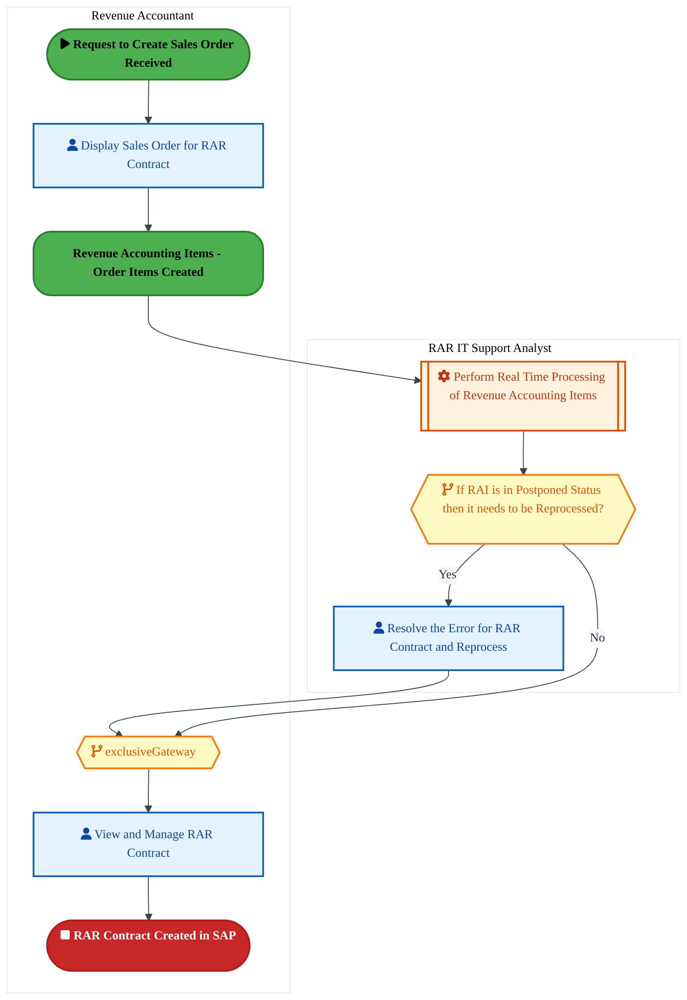
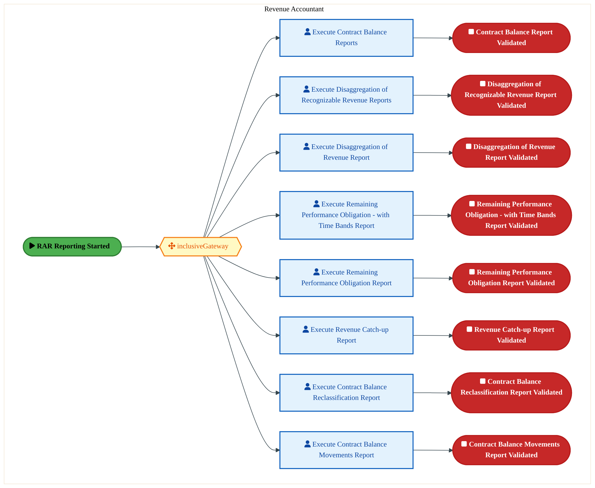
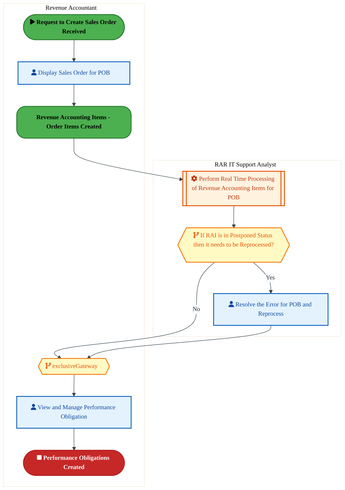
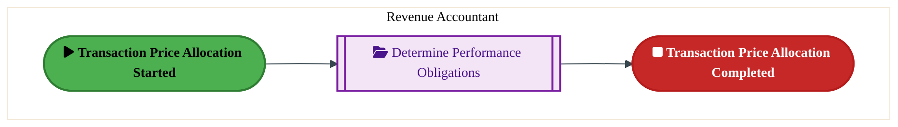

  <img src="data:image/svg+xml;base64,PHN2ZyB4bWxucz0iaHR0cDovL3d3dy53My5vcmcvMjAwMC9zdmciIHZpZXdCb3g9IjAgMCA4MDAgNDgwIiB3aWR0aD0iODAwIiBoZWlnaHQ9IjQ4MCI+DQogIDxkZWZzPg0KICAgIDxsaW5lYXJHcmFkaWVudCBpZD0iYmciIHgxPSIwJSIgeTE9IjAlIiB4Mj0iMTAwJSIgeTI9IjEwMCUiPg0KICAgICAgPHN0b3Agb2Zmc2V0PSIwJSIgc3R5bGU9InN0b3AtY29sb3I6IzAwNzFjNTtzdG9wLW9wYWNpdHk6MSIvPg0KICAgICAgPHN0b3Agb2Zmc2V0PSIxMDAlIiBzdHlsZT0ic3RvcC1jb2xvcjojMDBhZWVmO3N0b3Atb3BhY2l0eToxIi8+DQogICAgPC9saW5lYXJHcmFkaWVudD4NCiAgICA8bGluZWFyR3JhZGllbnQgaWQ9ImFjY2VudCIgeDE9IjAlIiB5MT0iMCUiIHgyPSIwJSIgeTI9IjEwMCUiPg0KICAgICAgPHN0b3Agb2Zmc2V0PSIwJSIgc3R5bGU9InN0b3AtY29sb3I6I2ZmZmZmZjtzdG9wLW9wYWNpdHk6MC4xNSIvPg0KICAgICAgPHN0b3Agb2Zmc2V0PSIxMDAlIiBzdHlsZT0ic3RvcC1jb2xvcjojZmZmZmZmO3N0b3Atb3BhY2l0eTowLjAyIi8+DQogICAgPC9saW5lYXJHcmFkaWVudD4NCiAgICA8cGF0dGVybiBpZD0iZ3JpZCIgd2lkdGg9IjQwIiBoZWlnaHQ9IjQwIiBwYXR0ZXJuVW5pdHM9InVzZXJTcGFjZU9uVXNlIj4NCiAgICAgIDxwYXRoIGQ9Ik0gNDAgMCBMIDAgMCAwIDQwIiBmaWxsPSJub25lIiBzdHJva2U9InJnYmEoMjU1LDI1NSwyNTUsMC4wNykiIHN0cm9rZS13aWR0aD0iMC41Ii8+DQogICAgPC9wYXR0ZXJuPg0KICA8L2RlZnM+DQoNCiAgPCEtLSBCYWNrZ3JvdW5kIC0tPg0KICA8cmVjdCB3aWR0aD0iODAwIiBoZWlnaHQ9IjQ4MCIgZmlsbD0idXJsKCNiZykiIHJ4PSI4Ii8+DQogIDxyZWN0IHdpZHRoPSI4MDAiIGhlaWdodD0iNDgwIiBmaWxsPSJ1cmwoI2dyaWQpIiByeD0iOCIvPg0KICA8cmVjdCB3aWR0aD0iODAwIiBoZWlnaHQ9IjQ4MCIgZmlsbD0idXJsKCNhY2NlbnQpIiByeD0iOCIvPg0KDQogIDwhLS0gRGVjb3JhdGl2ZSBjaXJjdWl0L2FyY2hpdGVjdHVyZSBsaW5lcyAtLT4NCiAgPGcgc3Ryb2tlPSJyZ2JhKDI1NSwyNTUsMjU1LDAuMTIpIiBzdHJva2Utd2lkdGg9IjEuNSIgZmlsbD0ibm9uZSI+DQogICAgPHBhdGggZD0iTSAwIDEwMCBMIDEyMCAxMDAgTCAxNjAgMTQwIEwgMjgwIDE0MCIvPg0KICAgIDxwYXRoIGQ9Ik0gMCAyNjAgTCA4MCAyNjAgTCAxMjAgMjIwIEwgMjAwIDIyMCBMIDI0MCAyNjAgTCAzNjAgMjYwIi8+DQogICAgPHBhdGggZD0iTSA1MjAgMTAwIEwgNjAwIDEwMCBMIDY0MCA2MCBMIDgwMCA2MCIvPg0KICAgIDxwYXRoIGQ9Ik0gNDQwIDM0MCBMIDU2MCAzNDAgTCA2MDAgMzAwIEwgNzIwIDMwMCBMIDc2MCAzNDAgTCA4MDAgMzQwIi8+DQogICAgPHBhdGggZD0iTSA2MDAgNDAwIEwgNjgwIDQwMCBMIDcyMCA0NDAiLz4NCiAgICA8cGF0aCBkPSJNIDAgNDAwIEwgNDAgNDAwIEwgODAgMzYwIi8+DQogICAgPHBhdGggZD0iTSAyMDAgNDIwIEwgMzIwIDQyMCBMIDM2MCAzODAgTCA0ODAgMzgwIi8+DQogICAgPHBhdGggZD0iTSA2NTAgNDQwIEwgNzUwIDQ0MCBMIDgwMCA0ODAiLz4NCiAgPC9nPg0KDQogIDwhLS0gRGVjb3JhdGl2ZSBub2RlcyAtLT4NCiAgPGcgZmlsbD0icmdiYSgyNTUsMjU1LDI1NSwwLjE4KSI+DQogICAgPGNpcmNsZSBjeD0iMTIwIiBjeT0iMTAwIiByPSI0Ii8+DQogICAgPGNpcmNsZSBjeD0iMjgwIiBjeT0iMTQwIiByPSI0Ii8+DQogICAgPGNpcmNsZSBjeD0iMjAwIiBjeT0iMjIwIiByPSI0Ii8+DQogICAgPGNpcmNsZSBjeD0iMzYwIiBjeT0iMjYwIiByPSI0Ii8+DQogICAgPGNpcmNsZSBjeD0iNjAwIiBjeT0iMTAwIiByPSI0Ii8+DQogICAgPGNpcmNsZSBjeD0iNzIwIiBjeT0iMzAwIiByPSI0Ii8+DQogICAgPGNpcmNsZSBjeD0iNTYwIiBjeT0iMzQwIiByPSI0Ii8+DQogICAgPGNpcmNsZSBjeD0iODAiIGN5PSIzNjAiIHI9IjQiLz4NCiAgICA8Y2lyY2xlIGN4PSI0ODAiIGN5PSIzODAiIHI9IjQiLz4NCiAgICA8Y2lyY2xlIGN4PSIzMjAiIGN5PSI0MjAiIHI9IjQiLz4NCiAgPC9nPg0KDQogIDwhLS0gVE9HQUYgQkRBVCBib3hlcyAtLT4NCiAgPGcgZm9udC1mYW1pbHk9IlNlZ29lIFVJLCBBcmlhbCwgc2Fucy1zZXJpZiIgZm9udC1zaXplPSIxNCIgZm9udC13ZWlnaHQ9IjYwMCI+DQogICAgPCEtLSBCIC0tPg0KICAgIDxyZWN0IHg9IjE1MCIgeT0iMTQwIiB3aWR0aD0iMTIwIiBoZWlnaHQ9IjQwIiByeD0iNSIgZmlsbD0icmdiYSgyNTUsMjU1LDI1NSwwLjE4KSIgc3Ryb2tlPSJyZ2JhKDI1NSwyNTUsMjU1LDAuMykiIHN0cm9rZS13aWR0aD0iMSIvPg0KICAgIDx0ZXh0IHg9IjIxMCIgeT0iMTY1IiB0ZXh0LWFuY2hvcj0ibWlkZGxlIiBmaWxsPSIjZmZmIj5CdXNpbmVzczwvdGV4dD4NCiAgICA8IS0tIEQgLS0+DQogICAgPHJlY3QgeD0iMjkwIiB5PSIxNDAiIHdpZHRoPSIxMjAiIGhlaWdodD0iNDAiIHJ4PSI1IiBmaWxsPSJyZ2JhKDI1NSwyNTUsMjU1LDAuMTgpIiBzdHJva2U9InJnYmEoMjU1LDI1NSwyNTUsMC4zKSIgc3Ryb2tlLXdpZHRoPSIxIi8+DQogICAgPHRleHQgeD0iMzUwIiB5PSIxNjUiIHRleHQtYW5jaG9yPSJtaWRkbGUiIGZpbGw9IiNmZmYiPkRhdGE8L3RleHQ+DQogICAgPCEtLSBBIC0tPg0KICAgIDxyZWN0IHg9IjQzMCIgeT0iMTQwIiB3aWR0aD0iMTIwIiBoZWlnaHQ9IjQwIiByeD0iNSIgZmlsbD0icmdiYSgyNTUsMjU1LDI1NSwwLjE4KSIgc3Ryb2tlPSJyZ2JhKDI1NSwyNTUsMjU1LDAuMykiIHN0cm9rZS13aWR0aD0iMSIvPg0KICAgIDx0ZXh0IHg9IjQ5MCIgeT0iMTY1IiB0ZXh0LWFuY2hvcj0ibWlkZGxlIiBmaWxsPSIjZmZmIj5BcHBsaWNhdGlvbjwvdGV4dD4NCiAgICA8IS0tIFQgLS0+DQogICAgPHJlY3QgeD0iNTcwIiB5PSIxNDAiIHdpZHRoPSIxMjAiIGhlaWdodD0iNDAiIHJ4PSI1IiBmaWxsPSJyZ2JhKDI1NSwyNTUsMjU1LDAuMTgpIiBzdHJva2U9InJnYmEoMjU1LDI1NSwyNTUsMC4zKSIgc3Ryb2tlLXdpZHRoPSIxIi8+DQogICAgPHRleHQgeD0iNjMwIiB5PSIxNjUiIHRleHQtYW5jaG9yPSJtaWRkbGUiIGZpbGw9IiNmZmYiPlRlY2hub2xvZ3k8L3RleHQ+DQogIDwvZz4NCg0KICA8IS0tIENvbm5lY3RpbmcgbGluZXMgYmV0d2VlbiBCREFUIGJveGVzIC0tPg0KICA8ZyBzdHJva2U9InJnYmEoMjU1LDI1NSwyNTUsMC4yNSkiIHN0cm9rZS13aWR0aD0iMSI+DQogICAgPGxpbmUgeDE9IjI3MCIgeTE9IjE2MCIgeDI9IjI5MCIgeTI9IjE2MCIvPg0KICAgIDxsaW5lIHgxPSI0MTAiIHkxPSIxNjAiIHgyPSI0MzAiIHkyPSIxNjAiLz4NCiAgICA8bGluZSB4MT0iNTUwIiB5MT0iMTYwIiB4Mj0iNTcwIiB5Mj0iMTYwIi8+DQogIDwvZz4NCg0KICA8IS0tIE1haW4gdGl0bGUgLS0+DQogIDx0ZXh0IHg9IjQwMCIgeT0iMjYwIiB0ZXh0LWFuY2hvcj0ibWlkZGxlIiBmb250LWZhbWlseT0iU2Vnb2UgVUksIEFyaWFsLCBzYW5zLXNlcmlmIiBmb250LXNpemU9IjM2IiBmb250LXdlaWdodD0iNzAwIiBmaWxsPSIjZmZmZmZmIiBsZXR0ZXItc3BhY2luZz0iMSI+DQogICAgSUFPIEFyY2hpdGVjdHVyZQ0KICA8L3RleHQ+DQogIDx0ZXh0IHg9IjQwMCIgeT0iMzAwIiB0ZXh0LWFuY2hvcj0ibWlkZGxlIiBmb250LWZhbWlseT0iU2Vnb2UgVUksIEFyaWFsLCBzYW5zLXNlcmlmIiBmb250LXNpemU9IjE4IiBmb250LXdlaWdodD0iNDAwIiBmaWxsPSJyZ2JhKDI1NSwyNTUsMjU1LDAuOCkiIGxldHRlci1zcGFjaW5nPSIyIj4NCiAgICBUT0dBRiBCREFUIMK3IElBTyBQcm9ncmFtIMK3IElETSAyLjANCiAgPC90ZXh0Pg0KDQogIDwhLS0gQm90dG9tIGFjY2VudCBiYXIgLS0+DQogIDxyZWN0IHg9IjI4MCIgeT0iMzQwIiB3aWR0aD0iMjQwIiBoZWlnaHQ9IjMiIHJ4PSIxLjUiIGZpbGw9InJnYmEoMjU1LDI1NSwyNTUsMC40KSIvPg0KDQogIDwhLS0gSW50ZWwgdGV4dCAtLT4NCiAgPHRleHQgeD0iNDAwIiB5PSIzODAiIHRleHQtYW5jaG9yPSJtaWRkbGUiIGZvbnQtZmFtaWx5PSJTZWdvZSBVSSwgQXJpYWwsIHNhbnMtc2VyaWYiIGZvbnQtc2l6ZT0iMTMiIGZpbGw9InJnYmEoMjU1LDI1NSwyNTUsMC41KSIgbGV0dGVyLXNwYWNpbmc9IjMiPg0KICAgIElOVEVMIENPTkZJREVOVElBTA0KICA8L3RleHQ+DQo8L3N2Zz4NCg==" alt="IAO Architecture" style="width:100%; border-radius:8px;" />
  <h1 style="font-size:36px; margin-top:24px;">DC-100 — Revenue Recognition</h1>
  <h2 style="font-size:24px;">Architecture Document (TOGAF BDAT)</h2>
  
Finance Plan To Report (FPR) Tower 
  Capability DC-100 · DC Manage Accounting and Control Data

  
IAO Program · R1 – R5 
  Generated: April 2026 
  Sajiv Francis

  
IAO Architecture Pipeline — Intel Confidential

Page 1<a href="#toc">↑ Back to TOC</a>DC-100 — Revenue Recognition

## Table of Contents

<nav class="toc">
<ol>
  <li><a href="#1-executive-summary">1. Executive Summary</a></li>
  <li><a href="#2-business-context-objectives">2. Business Context &amp; Objectives</a>
    <ul>
      <li><a href="#21-classification">2.1 Classification</a></li>
      <li><a href="#22-business-drivers">2.2 Business Drivers</a></li>
      <li><a href="#23-success-criteria">2.3 Success Criteria</a></li>
      <li><a href="#24-companion-documents">2.4 Companion Documents</a></li>
    </ul>
  </li>
  <li><a href="#3-business-architecture-togaf-b">3. Business Architecture (TOGAF &ldquo;B&rdquo;)</a>
    <ul>
      <li><a href="#31-business-process-overview">3.1 Business Process Overview</a></li>
      <li><a href="#32-business-process-diagrams">3.2 Business Process Diagrams</a></li>
      <li><a href="#33-business-roles-responsibilities">3.3 Business Roles &amp; Responsibilities</a></li>
    </ul>
  </li>
  <li><a href="#4-data-architecture-togaf-d">4. Data Architecture (TOGAF &ldquo;D&rdquo;)</a>
    <ul>
      <li><a href="#41-data-entities-ownership">4.1 Data Entities &amp; Ownership</a></li>
      <li><a href="#42-data-flow-diagrams">4.2 Data Flow Diagrams</a></li>
      <li><a href="#43-data-lineage">4.3 Data Lineage</a></li>
      <li><a href="#44-ricefw-data-objects">4.4 RICEFW Data Objects</a></li>
      <li><a href="#45-data-governance-quality">4.5 Data Governance &amp; Quality</a></li>
    </ul>
  </li>
  <li><a href="#5-application-architecture-togaf-a">5. Application Architecture (TOGAF &ldquo;A&rdquo;)</a>
    <ul>
      <li><a href="#54-component-overview">5.4 Component Overview</a></li>
      <li><a href="#55-ricefw-inventory">5.5 RICEFW Inventory</a></li>
      <li><a href="#56-integration-patterns">5.6 Integration Patterns</a></li>
    </ul>
  </li>
  <li><a href="#6-technology-architecture-togaf-t">6. Technology Architecture (TOGAF &ldquo;T&rdquo;)</a>
    <ul>
      <li><a href="#61-platform-infrastructure">6.1 Platform &amp; Infrastructure</a></li>
      <li><a href="#62-sap-development-object-status">6.2 SAP Development Object Status</a></li>
      <li><a href="#63-nfrs-design-principles">6.3 NFRs &amp; Design Principles</a></li>
      <li><a href="#64-security-governance">6.4 Security &amp; Governance</a></li>
    </ul>
  </li>
  <li><a href="#7-project-context">7. Project Context</a>
    <ul>
      <li><a href="#71-project-roadmap-go-live-plan">7.1 Project Roadmap &amp; Go-Live Plan</a></li>
      <li><a href="#72-raid-log">7.2 RAID Log</a></li>
      <li><a href="#73-recommendations-next-steps">7.3 Recommendations &amp; Next Steps</a></li>
    </ul>
  </li>
</ol>
</nav>

Page 2<a href="#toc">↑ Back to TOC</a>DC-100 — Revenue Recognition

## 1. Executive Summary

This Architecture Document defines the **Business, Data, Application, and Technology** (BDAT) architecture for **DC-100 Revenue Recognition** within the IAO program. It includes 6 BPMN process diagram(s) in Section 3.

| Dimension | Value |
|-----------|-------|
| **Tower** | Finance Plan To Report (FPR) |
| **Process Group** | DC Manage Accounting and Control Data |
| **Capability** | DC-100 - Revenue Recognition |
| **Release** | R1 – R5 |
| **Total Systems** | 0 |
| **System Status** | 0 Deployed, 0 Developing, 0 EOL, 0 Pending IAPM |
| **RICEFW Objects** | 1 Reports, 1 Interfaces, 12 Enhancements |

> All system nodes in architecture diagrams are **IAPM-linked** — click any node to open its IAPM page. Diagrams require `securityLevel: 'loose'` for click events.

Page 3<a href="#toc">↑ Back to TOC</a>DC-100 — Revenue Recognition

## 2. Business Context & Objectives

### 2.1 Classification

| Level | Value |
|-------|-------|
| **L0 Tower** | Finance Plan To Report |
| **L1 Process** | DC Manage Accounting and Control Data |
| **L2 Capability** | DC-100 - Revenue Recognition |

### 2.2 Business Drivers

| # | Driver | Description | Strategic Alignment | Priority |
|---|--------|-------------|---------------------|----------|
| 1 | S/4 HANA Finance Consolidation | Migrate legacy costing and reporting platforms to unified S/4 HANA finance backbone | IDM 2.0 Core Finance Transformation | High |
| 2 | Real-Time Financial Visibility | Enable real-time cost reporting and variance analysis replacing batch-driven legacy processes | CFO Digital Finance Initiative | High |
| 3 | Regulatory Compliance Readiness | Ensure SOX compliance and audit trail continuity through the ERP transition period | Intel Corporate Compliance | Medium |
| 4 | DC-100 Process Migration | Migrate DC-100 business processes and 0 integrated systems from legacy to S/4 HANA target architecture | IDM 2.0 Finance | High |

Page 4<a href="#toc">↑ Back to TOC</a>DC-100 — Revenue Recognition

### 2.3 Success Criteria

| Metric | Target | Measure | Baseline | Owner |
|--------|--------|---------|----------|-------|
| Month-End Close Cycle Time | < 3 business days | Calendar days from period close trigger to final posting | 5 business days (legacy) | Finance Controller |
| Cost Variance Accuracy | < 0.5% deviation | Variance between standard and actual cost post-migration | 1.2% (ICOST baseline) | Cost Accounting Lead |
| System Availability (Finance) | 99.9% uptime | S/4 HANA finance module availability during business hours | 99.5% (legacy) | IT Operations |
| DC-100 Migration Completeness | 100% flow chains validated | All 0 flow chains verified in target state | 0% (pre-migration) | Tower Architect |

### 2.4 Companion Documents

| Document | Description |
|----------|-------------|
| **Business Architecture** | Included in this document (Section 3) — process flows from BPMN diagrams |
| **This Document** | Full BDAT Architecture — Business + Data + Application + Technology |

Page 5<a href="#toc">↑ Back to TOC</a>DC-100 — Revenue Recognition

## 3. Business Architecture (TOGAF "B")

### 3.1 Business Process Overview

This capability includes **6 business process(es)** modeled in BPMN 2.0, covering the end-to-end workflow for DC-100 Revenue Recognition.

| # | Step ID | Process Name | Lanes | Tasks | Gateways |
|---|---------|--------------|-------|-------|----------|
| 1 | DC-100-010_Create_Revenue_Accounting_Contracts | DC-100-010_Create_Revenue_Accounting_Contracts | RAR IT Support Analyst, Revenue Accountant | 4 | 2 |
| 2 | DC-100-030_RAR_Closing_and_Reconciliation | DC-100-030_RAR_Closing_and_Reconciliation | Revenue Accountant | 15 | 12 |
| 3 | DC-100-040_RAR_Reports | DC-100-040_RAR_Reports | Revenue Accountant | 8 | 1 |
| 4 | DC-100-050_Define_Transaction_Price | DC-100-050_Define_Transaction_Price | Revenue Accountant | 0 | 0 |
| 5 | DC-100-060_Determine_Performance_Obligations | DC-100-060_Determine_Performance_Obligations | RAR IT Support Analyst, Revenue Accountant | 4 | 2 |
| 6 | DC-100-070_Allocate_Transaction_Price | DC-100-070_Allocate_Transaction_Price | Revenue Accountant | 0 | 0 |

Page 6<a href="#toc">↑ Back to TOC</a>DC-100 — Revenue Recognition

### 3.2 Business Process Diagrams

#### BUSINESS ARCHITECTURE — 3.2.1 DC-100-010_Create_Revenue_Accounting_Contracts — DC-100-010_Create_Revenue_Accounting_Contracts

**Swim Lanes**: RAR IT Support Analyst · Revenue Accountant | **Tasks**: 4 | **Gateways**: 2

> **Legend**: ● Start · ● End · User Task · Service Task · ◇ Gateway · Sub-Process

<a href="https://mermaid.live/view#pako:eNqlVWuP4jYU_StWRiNaKUhJSAjkQ6tMIBVSd4tgdqtqqSqT3IA1iZ3aDo-y_Pe1SXiEYT41Ekjn5N5zr4_tm4ORsBSMwHh-PhBKZIAOHbmGAjoB6iyxgI6JauIr5gQvcxAdHZMxKufkv1OY7ZY7Haa5GBck32t2DisG6MvERKFKzE0kMBVdAZxkHbNTclJgvo9YzriOfoJBZmWnas2rF8ZT4NcAy_LtxFOpOaFwpXu-67uxzhOQMJq2RDMvG2RJ56iby9k2WWMuT-1XAj7h3Z8klWuFM5wLUDFrWeS_4yXkeo2SV5pLKr45m0GErkOVYfMSJ4SuFO9aiuKYvl0pzzoe0fH5eUEvRdHraEGRepIcCzGCDAmp6PFGoozkefDkRmHsWaaQnL1B8OSM_VHPMRO9kkAt3TK1ud0tkNVaBkuWp01od6vXEDjlzuS7wLFMvlf_d7WAptdKUd8ZOINLpRffjuzoXCnLsv9VSfnKX7F4a2qNe7ETjy61bK_vRdZ7vfMyR64f2vc-Ad-QBG5E4zjuja9WjfuebX0s-hL3-lZ0J7rCErZ4fxUcRu5FMPb82PY_FKzr3XdZLaecJWfB3tiLvYug_2LHofOhoBva7qDpUOmsOC7XKMcU_rG-LYxZOEOTVzSvypKpcxRSnO-FXBh_1wn6obaKy3CQ4a72H81AsHwDSF1bNOaccZSpnxaK1NZynEiEaarCStUyCNEWc79d1BK2QlPgKrtQ0ThHr6QANK2z1FlHLFP8BmgFKEwSVlGp2YmEQoveqg4Oh6tqCt2lujLJGk2UQDhBRCBC0ZQJWTIKKZpLLCuhF0ARkYgCpAoxtIRr15D-ujCOx7qGOuGPDNTG3DWI6Z15Ttu8rwS2J3s-YYpX0LKtndhrJ46IKHN1puZYzUj0hx5e73xvC3g_XRROmTP4twIh9UIjDuqItrRmkADZQKo0fr4R6V9FhGRle5trmVSbOw-nd5n-e3Muu4e6TdUaNTrt9oePtxR2SV4J1elv9SV7sEnUQ93uL8rBBvZq6DfQqWG_gcMaOg20azhs4EDD7wvjL1BH7rt63fBuHTZooF9D9y7rMzslDW-us65wHmMt2nlM9x7T7u3kar3xLrO_RfebMd0i_cexg_MEa7HDM2uYRgG8wCQ1goNx-nqrL3wKGa5yaRxNA1eSzfc0MYLTV86oylRljghWd6eoyeMP8Z-V5A==" title="View full diagram">&#128065; View Diagram</a>

Page 7<a href="#toc">↑ Back to TOC</a>DC-100 — Revenue Recognition

#### BUSINESS ARCHITECTURE — 3.2.2 DC-100-030_RAR_Closing_and_Reconciliation — DC-100-030_RAR_Closing_and_Reconciliation

**Swim Lanes**: Revenue Accountant | **Tasks**: 15 | **Gateways**: 12

```mermaid
%%{init: {'theme': 'base', 'themeVariables': {'fontSize': '14px', 'fontFamily': 'Segoe UI, Arial, sans-serif','primaryColor': '#e8f0fe', 'primaryBorderColor': '#0071c5','lineColor': '#37474F', 'secondaryColor': '#f5f8fc'}, 'flowchart': {'useMaxWidth': false, 'htmlLabels': true, 'curve': 'basis', 'nodeSpacing': 40, 'rankSpacing': 50}} }%%
flowchart TD
    classDef startEvt fill:#4CAF50,stroke:#2E7D32,color:#000,font-weight:bold,stroke-width:2px,rx:20,ry:20
    classDef endEvt fill:#C62828,stroke:#B71C1C,color:#fff,font-weight:bold,stroke-width:2px,rx:20,ry:20
    classDef userTask fill:#E3F2FD,stroke:#1565C0,stroke-width:2px,color:#0D47A1
    classDef serviceTask fill:#FFF3E0,stroke:#E65100,stroke-width:2px,color:#BF360C
    classDef gateway fill:#FFF9C4,stroke:#F57F17,stroke-width:2px,color:#E65100
    classDef subProc fill:#F3E5F5,stroke:#7B1FA2,stroke-width:2px,color:#4A148C
    subgraph lane_0["Revenue Accountant"]
        n1["fa:fa-user Change Status to 'In Closing' for RAR Period"]
        n2["fa:fa-user Go to Monitor for Parallel Processing Run and Make Required Corrections"]
        n3["fa:fa-user Go to Shift Contract to Next Period"]
        n4["fa:fa-user Go to Monitor for Parallel Processing Run and Make Required Corrections"]
        n5["fa:fa-user Go to Shift Contract to Next Period"]
        n6["fa:fa-user Go to Monitor for Parallel Processing Run and Make Required Corrections"]
        n7["fa:fa-user Go to Shift Contract to Next Period"]
        n8["fa:fa-user Rerun Batch Job A"]
        n9["fa:fa-user Rerun Batch Job B"]
        n10["fa:fa-user Rerun Batch Job C"]
        n11["fa:fa-user Update fulfilment of Manual Fulfilment based Performance Obligation"]
        n12[["fa:fa-cog Run Batch Job A : Transfer Revenue"]]
        n13[["fa:fa-cog Run Batch Job B : Calculate Contract Asset and Liability"]]
        n14[["fa:fa-cog Run Batch Job C: Revenue Posting Run"]]
        n15[["fa:fa-cog Run Batch Job C for Close Revenue Period"]]
        n16(["fa:fa-play RAR Closing and Reconciliation Initiated"])
        n17(["fa:fa-stop Contract Shifted"])
        n18(["fa:fa-stop Contract Shifted"])
        n19(["fa:fa-stop Contract Shifted"])
        n20(["fa:fa-stop RAR Closing and Reconciliation Completed"])
        n21["Revenue Posting Completed in FI-GL"]
        n22{{"fa:fa-code-branch IF Any Error Occurred that needs to be Resolved ?"}}
        n23{{"fa:fa-code-branch Error Resolved?"}}
        n24{{"fa:fa-code-branch Does Revenue Accounting Require Contract Shift to Next Period?"}}
        n25{{"fa:fa-code-branch exclusiveGateway"}}
        n26{{"fa:fa-code-branch IF Any Error Occurred that needs to be Resolved ?"}}
        n27{{"fa:fa-code-branch Error Resolved?"}}
        n28{{"fa:fa-code-branch Does Revenue Accounting Require Contract Shift to Next Period?"}}
        n29{{"fa:fa-code-branch exclusiveGateway"}}
        n30{{"fa:fa-code-branch IF Any Error Occurred that needs to be Resolved ?"}}
        n31{{"fa:fa-code-branch Error Resolved?"}}
        n32{{"fa:fa-code-branch Does Revenue Accounting Require Contract Shift to Next Period?"}}
        n33{{"fa:fa-code-branch exclusiveGateway"}}
    end
    n16 --> n11
    n1 --> n12
    n12 --> n22
    n22 -->|"Yes"| n2
    n2 --> n23
    n23 -->|"No"| n24
    n24 -->|"Yes"| n3
    n3 --> n17
    n25 --> n13
    n24 -->|"No"| n25
    n23 -->|"Yes"| n8
    n26 -->|"Yes"| n4
    n4 --> n27
    n28 -->|"Yes"| n5
    n5 --> n18
    n29 --> n14
    n27 -->|"Yes"| n9
    n13 --> n26
    n27 -->|"No"| n28
    n30 -->|"Yes"| n6
    n6 --> n31
    n31 -->|"No"| n32
    n32 -->|"Yes"| n7
    n7 --> n19
    n14 --> n30
    n33 --> n15
    n21 --> n20
    n32 -->|"No"| n33
    n28 -->|"No"| n29
    n15 --> n21
    n31 -->|"Yes"| n10
    n8 --> n25
    n22 -->|"No"| n25
    n26 -->|"No"| n29
    n9 --> n29
    n30 -->|"No"| n33
    n10 --> n33
    n11 --> n1
    class n1 userTask
    class n2 userTask
    class n3 userTask
    class n4 userTask
    class n5 userTask
    class n6 userTask
    class n7 userTask
    class n8 userTask
    class n9 userTask
    class n10 userTask
    class n11 userTask
    class n12 serviceTask
    class n13 serviceTask
    class n14 serviceTask
    class n15 serviceTask
    class n16 startEvt
    class n17 endEvt
    class n18 endEvt
    class n19 endEvt
    class n20 endEvt
    class n21 startEvt
    class n22 gateway
    class n23 gateway
    class n24 gateway
    class n25 gateway
    class n26 gateway
    class n27 gateway
    class n28 gateway
    class n29 gateway
    class n30 gateway
    class n31 gateway
    class n32 gateway
    class n33 gateway
```

> **Legend**: ● Start · ● End · User Task · Service Task · ◇ Gateway · Sub-Process

<a href="https://mermaid.live/view#pako:eNq9WGFv2zYQ_SuEisAbYAOSKFmyPmyw5ajIkLaB024YmmGgJSoWQpOeRCXxUv_3kbIoWwydoS0afzCsx7t3d49H0tSTlbIMW5F1dvZU0IJH4GnAV3iNBxEYLFGFB0OwB35HZYGWBFcDaZMzyq-Lfxszx9s8SjOJJWhdkK1Er_Etw-DTxRBMhSMZggrRalThssgHw8GmLNao3MaMsFJav8FhbudNtHZoxsoMlwcD2w6c1BeupKD4AMPAC7xE-lU4ZTTrkeZ-HubpYCeTI-whXaGSN-nXFX6HHv8oMr4SzzkiFRY2K74ml2iJiayRl7XE0rq8V2IUlYxDhWDXG5QW9Fbgni2gEtG7A-Tbux3YnZ3d0C4o-Di_oUB8UoKqao5zUHEBn99zkBeERG-8eJr49rDiJbvD0Rv3PJhDd5jKSiJRuj2U4o4ecHG74tGSkaw1HT3IGiJ38zgsHyPXHpZb8a3FwjQ7RIrHbuiGXaRZ4MROrCLlef5dkYSu5UdU3bWxzmHiJvMuluOP_dh-zqfKnHvB1NF1wuV9keIj0iRJ4PlBqvOx79inSWcJHNuxRnqLOH5A2wPhJPY6wsQPEic4SbiPp2dZL69KlipCeO4nfkcYzJxk6p4k9KaOF7YZCp7bEm1WgCCK_7Y_31gLfI9pjcE0TVlNOaL8xvprbyw_1BE2OYpyNJLag3iF6C0G1xzxugKcgcEFBTFhlWxNkLMSLKYLcCVWIcv6RG6f6C2T3u-Y2BOEk3S8QiUiBBMgK8WVZASLmgJEM_AO3WGwwP_URYkzELOyxCkvGK36MaApxvWqyLnwobxEKZfIe_zIjTl6r5Cj_505jl8hx-A7cwz7_gtcivgzxNMV-I0twbRvPXnZeqY1pP2yeayZaw38aZOJxQnymoi1tMaUA5YLWWiNCEgOoDyaMlmbUHSNaIrBhyUpxLoWYmkB3M9dhJTtpT4qFUTgo9i-q7xJtVlrwr9HAF8imAmCGJG0JjLtTv1pVWHeTOmlODULUvCtTuu9RBtHKhtwxSre9ohO4b9I0XSbXPv4wKWaoUcz_qmj2RCxLcotot0zmhIW8mRNRRGNvOBC9LL4iSXPz8c8wYGn4mxzUKNpzef24VfaT77O3rU1-_-pK2brDcEGHudoH1az0RmDgoLkYvT2UttO3aenw9xkeLQUXSZm5iIBU7oF52UpJudDKv5eyJXOV4gDinHW7NlLOWEVI_di5Ncba7c75oVm3j2hcnvm5Zm95gxXQDtiml7bb0Gawtqe8iyIbw6CH1NSV8U9frs_dnW38Q9SKvgmpcLXUGryTUpB-8coBZ1vUQq6r6AUhF-rlPizu_8h9jUwGv0ijxgFtM-uenb3gKsAtwG-3Fh_YnHifhGAGmgNoXqGreF7trfz1ICnMSgP2MYOlKHfAlD3VJS-HktRhmpgrA2oJLw22y5WqBkqapVDxzhpga6cQPOcKOnaetyxbqnSV5zQ1iiURzs7UM0OdPoMUIkP9VlRdQVttl1SbeHQVp5K9U7LtgVcW-dWQaGumaqnC9KK5j7LW6XnKPKwtfT19no2xeMTwdr56J47MfV0HbstvQNUsx_dVOQKUDe0HuyaYWiGPTPsm-GxGQ7McGiGJ2ZYVG3GT9QpFvzRfbI_BE8PeaeH_NND4-6O38eD9j7eR0MjOjGhrm1EHXM80XTtdbcPQzPsmWHfDI_NcGCGQzM8McKi1Y2wY4bNVcKuSmtorbG4KhSZFT1ZzRst8dYrwzmqCbd2QwvVnF1vaWpFzZsfq24uIvMCiQv5eg_u_gOGfP58" title="View full diagram">&#128065; View Diagram</a>

Page 8<a href="#toc">↑ Back to TOC</a>DC-100 — Revenue Recognition

#### BUSINESS ARCHITECTURE — 3.2.3 DC-100-040_RAR_Reports — DC-100-040_RAR_Reports

**Swim Lanes**: Revenue Accountant | **Tasks**: 8 | **Gateways**: 1

> **Legend**: ● Start · ● End · User Task · Service Task · ◇ Gateway · Sub-Process

<a href="https://mermaid.live/view#pako:eNqllm2P4jYQx7-KldWKVgpSnpPNi0oQSFWpp55ge31Rqso4Dlgb7MhxeDjEd68NCSw5R8tdebHa-XvmN57JxPHRQCzDRmw8Px8JJSIGx4FY4w0exGCwhBUemOAifIGcwGWBq4HyyRkVc_L17GZ75V65KS2FG1IclDrHK4bBn7-ZYCQDCxNUkFbDCnOSD8xByckG8kPCCsaV9xOOcis_Z2uWxoxnmN8cLCu0kS9DC0LxTXZDL_RSFVdhxGh2B839PMrR4KQ2V7AdWkMuztuvK_wJ7v8imVhLO4dFhaXPWmyK3-ESF6pGwWuloZpv22aQSuWhsmHzEiJCV1L3LClxSN9ukm-dTuD0_Lyg16TgdbKgQP5QAatqgnNQCSlPtwLkpCjiJy8Zpb5lVoKzNxw_OdNw4jomUpXEsnTLVM0d7jBZrUW8ZEXWuA53qobYKfcm38eOZfKD_NvJhWl2y5QETuRE10zj0E7spM2U5_n_yiT7yl9h9dbkmrqpk06uuWw_8BPrW15b5sQLR3a3T5hvCcLvoGmautNbq6aBb1v90HHqBlbSga6gwDt4uAFfEu8KTP0wtcNe4CVfd5f18jNnqAW6Uz_1r8BwbKcjpxfojWwvanYoOSsOyzUoIMX_Wn8vjBneYlpjMEKI1VRAKhbGPxdn9aO29MlhnMOh6j2Y7jGqBQaJfIgcIgHGUKIQBjNcMi6q-2BHHzwhFVytOJZtIowClstoxFaUfFUHAGi3pEW6jyPfU-4hnh4ywxsoDym6Ap8xzxnfnCv7Y1mQBjsEOyLW4JVssCycZpWW7v8gXccK-liX4hIo0HpYl9rY8OFHd54zkhPUv5HoQdgntpWHORX61rz8dMWUhXxBZqNZ46f6MldnFs5kyM_vJ9C6BVWClX2zB77AgmRQA7A7gO-av36s8wD2MZLbIf3wIPan8L43xUdA_xugdiT7AcHHj1U7l_3E8CNidzj7UdHx2KIg52xXDWEhAKGoqCuyxb9eDviFcTpdouQn8PIPtcFw-Iua2sZ2Grv58NCXxo4a221sp42PLoLbsbvrLc9rzNbfb2yv4-83dtCs-531oLHDZr2123Rhx79rRx3be_cJU11pP913sqOXXb3s6WVfLwd6OdTLkV5-uV6k7suxmkvPvWprVUerulrV06q-Vg20aqhVo_ZOYpjGBsu3nWRGfDTON295O89wDutCGCfTgLVg8wNFRny-oRp1qV6QCYHy4rC5iKf_AGnmxZQ=" title="View full diagram">&#128065; View Diagram</a>

Page 9<a href="#toc">↑ Back to TOC</a>DC-100 — Revenue Recognition

#### BUSINESS ARCHITECTURE — 3.2.4 DC-100-050_Define_Transaction_Price — DC-100-050_Define_Transaction_Price

**Swim Lanes**: Revenue Accountant | **Tasks**: 0 | **Gateways**: 0

> **Legend**: ● Start · ● End · User Task · Service Task · ◇ Gateway · Sub-Process

<a href="https://mermaid.live/view#pako:eNqlVF2P2jAQ_CtWTiitFKR8EpqHShCIVKlVT-XaPhxVZZI1WOfYke1wUMR_74bPO6p7ah4QHmZndgdvdk6pKnAyp9fbccltRnauXUENbkbcBTXgeuQI_KCa04UA43YcpqSd8T8HWhA3m47WYQWtudh26AyWCsj3Tx4ZYaHwiKHS9A1ozlzPbTSvqd7mSijdse9gyHx2cDv9NFa6An0l-H4alAmWCi7hCkdpnMZFV2egVLJ6JcoSNmSlu--aE-q5XFFtD-23Br7QzU9e2RWeGRUGkLOytfhMFyC6Ga1uO6xs9focBjedj8TAZg0tuVwiHvsIaSqfrlDi7_dk3-vN5cWUPEzmkuBTCmrMBBgxFuHp2hLGhcju4nxUJL5nrFZPkN2F03QShV7ZTZLh6L7Xhdt_Br5c2WyhRHWi9p-7GbKw2Xh6k4W-p7f4eeMFsro65YNwGA4vTuM0yIP87MQY-y8nzFU_UPN08ppGRVhMLl5BMkhy_1-985iTOB0FtzmBXvMSXogWRRFNr1FNB0ngvy06LqKBn9-ILqmFZ7q9Cn7I44tgkaRFkL4pePS77bJd3GtVngWjaVIkF8F0HBSj8E3BeBTEw1OHqLPUtFkRQSX89h_nzjdYg2yBjMpStdJSaefOryO5e2TwDkmMZoz2G4EjzSiuKPna7Q7JNeCgFRa8f1ERXiuMVQ15wNtraGm5kuReY9YEJ8Idu62LHi91DK8F6L5qQCLZgq6RT-5BM6VrKlHi60JwTBk1zbwNfX-BYqe28TYev8iA9PsfUfh0jI7H8EW2Hee8Ka_g8HSpX4HR-X9wPKfGpiivnGznHF5f-IqrgNFWWGfvObS1araVpZMd1txpmwqTmnCK6ddHcP8XHLak0w==" title="View full diagram">&#128065; View Diagram</a>

Page 10<a href="#toc">↑ Back to TOC</a>DC-100 — Revenue Recognition

#### BUSINESS ARCHITECTURE — 3.2.5 DC-100-060_Determine_Performance_Obligations — DC-100-060_Determine_Performance_Obligations

**Swim Lanes**: RAR IT Support Analyst · Revenue Accountant | **Tasks**: 4 | **Gateways**: 2

> **Legend**: ● Start · ● End · User Task · Service Task · ◇ Gateway · Sub-Process

<a href="https://mermaid.live/view#pako:eNqlVWuP4jYU_StWRiNaKUhJSAjkQyteqUbqdhBMd7VaqsokN2CNsVPb4VGW_16bBEJY5lMjgXSO7z33-vh1tBKeghVZz89HwoiK0LGl1rCBVoRaSyyhZaOS-IwFwUsKsmViMs7UnPx7DnP9fG_CDBfjDaEHw85hxQH9-WKjgU6kNpKYybYEQbKW3coF2WBxGHHKhYl-gl7mZOdq1dCQixREHeA4oZsEOpUSBjXdCf3Qj02ehISztCGaBVkvS1on0xzlu2SNhTq3X0j4hPdfSKrWGmeYStAxa7Whv-MlUDNHJQrDJYXYXswg0tRh2rB5jhPCVpr3HU0JzN5rKnBOJ3R6fl6wa1H0Nl4wpL-EYinHkCGpND3ZKpQRSqMnfzSIA8eWSvB3iJ68STjueHZiZhLpqTu2Mbe9A7Jaq2jJaVqFtndmDpGX722xjzzHFgf9f1cLWFpXGnW9nte7VhqG7sgdXSplWfa_KmlfxRuW71WtSSf24vG1lht0g5Hzo95lmmM_HLj3PoHYkgRuROM47kxqqybdwHU-Fh3Gna4zuhNdYQU7fKgF-yP_KhgHYeyGHwqW9e67LJZTwZOLYGcSxMFVMBy68cD7UNAfuH6v6lDrrATO14hiBn873xbWbDBDL29oXuQ51_towDA9SLWw_ioTzMdcHZfhKMNt4z-ageR0C0gfWzQRgguU6d_0dYgwS_VorjsFKZsa_rerSMJXaApCJ210NKbojWwATcssvcURzzS_BVYAGiQJL5gy7IuCjbyU0uK36r3jsVZPob3UJyZZoxctNHhBRCLC0JRLlXMGKZorrApp-meIKMQAUo04WkLdPaS_LqzTqayhN_gj_4wvd41idued1_TuM4Hd2aZPmOEVXHzQ3QJ6XVKidw7hrCnRaUqMicyp3lxzrC9L9GpusRtXbvKCn66J54QZ_FOAVGamIwF6izYkZpAA2UKqNX6-EenWIlLx_IOG5aLwHGdZ6d5rhD_6VC9ou6pfolrgJr__eHVhn9BC6p5_K4_bg_ViAWq3f9EWVrBTwrCCYQn9Cnol7FbQL2Gvgv0SehXsGfh9Yf3BF9Z3PXpHfwV55qv7hrlldv_mYBvycqE1aO8x3XlM-7d3WGMkuL4CDbpbXdgNMnwc27vcZQ22f2Et29qA3g0ktaKjdX7H9VufQoYLqqyTbeFC8fmBJVZ0fu-sIk915phgfYw2JXn6D65SmnM=" title="View full diagram">&#128065; View Diagram</a>

#### BUSINESS ARCHITECTURE — 3.2.6 DC-100-070_Allocate_Transaction_Price — DC-100-070_Allocate_Transaction_Price

**Swim Lanes**: Revenue Accountant | **Tasks**: 0 | **Gateways**: 0

> **Legend**: ● Start · ● End · User Task · Service Task · ◇ Gateway · Sub-Process

<a href="https://mermaid.live/view#pako:eNqllNuK2zAQhl9FeAlpwQEf49QXhcSJodDSpdm2F5tSFHmUiJUlI8k5NOTdK-W4m2V7U18Y6_fo-2fGY-08Iivwcq_T2THBTI52XbOEGro56s6xhq6PjsIPrBiec9BdF0OlMFP25xAWJs3GhTmtxDXjW6dOYSEBff_ko6HdyH2ksdA9DYrRrt9tFKux2haSS-Wi72BAA3pwO70aSVWBugYEQRaS1G7lTMBVjrMkS0q3TwORonoBpSkdUNLdu-S4XJMlVuaQfqvhC978ZJVZ2jXFXIONWZqaf8Zz4K5Go1qnkVatzs1g2vkI27BpgwkTC6sngZUUFk9XKQ32e7TvdGbiYooexjOB7EU41noMFGlj5cnKIMo4z--SYlimga-Nkk-Q30WTbBxHPnGV5Lb0wHfN7a2BLZYmn0tenUJ7a1dDHjUbX23yKPDV1t5vvEBUV6eiHw2iwcVplIVFWJydKKX_5WT7qh6wfjp5TeIyKscXrzDtp0Xwmncuc5xkw_C2T6BWjMAzaFmW8eTaqkk_DYO3oaMy7gfFDXSBDazx9gr8UCQXYJlmZZi9CTz63WbZzu-VJGdgPEnL9ALMRmE5jN4EJsMwGZwytJyFws0ScSzgd_A4877BCkQLaEiIbIXBwsy8X8dgd4nwnQ2iOKe413Bb0oOdRY2JYVKge2U7h4acS4IPwtQNHVSW8P4ZIroitJHNvxGFrBsOryHx4wVC7dCA6skGBBrbUFXbPxbdg6JS1VhY3tc5Z4sDT8_aKAjmFnYqys7q8UHEqNf7aLM7LcPjMn7WeSee_6MXcnQa-RdifP5Knu_VNinMKi_feYfDzR6AFVDccuPtfQ-3Rk63gnj54RDw2qayAzNm2H6b-iju_wK7hLCx" title="View full diagram">&#128065; View Diagram</a>

Page 11<a href="#toc">↑ Back to TOC</a>DC-100 — Revenue Recognition

### 3.3 Business Roles & Responsibilities

| Role / Lane | Processes Involved | Description |
|------------|-------------------|-------------|
| RAR IT Support Analyst | DC-100-010_Create_Revenue_Accounting_Contracts, DC-100-060_Determine_Performance_Obligations,  | |
| Revenue Accountant | DC-100-010_Create_Revenue_Accounting_Contracts, DC-100-030_RAR_Closing_and_Reconciliation, DC-100-040_RAR_Reports, DC-100-050_Define_Transaction_Price, DC-100-060_Determine_Performance_Obligations, DC-100-070_Allocate_Transaction_Price | |

Page 12<a href="#toc">↑ Back to TOC</a>DC-100 — Revenue Recognition

## 4. Data Architecture (TOGAF "D")

### 4.1 Data Flows — Source to Target

The following data flows are derived from the system integration hops for DC-100. Each row shows source application on its database flowing to a target application on its database.

| # | Flow Chain | Hop | Source App | Source DB | Target App | Target DB | Data Description | Frequency | Classification |
|---|-----------|-----|-----------|----------|-----------|----------|-----------------|-----------|---------------|

> *DB platforms will be populated when tower architects complete the extended flow template columns (42-47).*

Page 13<a href="#toc">↑ Back to TOC</a>DC-100 — Revenue Recognition

### 4.2 Data Flow Diagrams

> **DATA ARCHITECTURE** — Database-to-database data flows. Applications (blue) sit above their hosting databases (green cylinders). Thick arrows show data movement between databases.

### 4.3 Data Lineage

Data lineage traces the origin and transformation path of key data objects across integrated systems.

| # | Source System | Source Schema/Object | Target System | Target Schema/Object | Transformation |
|---|-------------|---------------------|---------------|---------------------|---------------|

> *Lineage detail will be refined when tower architects validate source/target schema object mappings.*

### 4.4 RICEFW Data Objects

Data-centric RICEFW objects (Reports and Conversions) from the Object Tracker:

| Object ID | Type | Description | Status | Source | Target | Complexity |
|-----------|------|-------------|--------|--------|--------|-----------|
| FPRR1240 | Report | Custom report for Revenue Recognition by Stage for Product/Services Sale​ act... | 10. Object Complete |  |  | 03.Medium |

### 4.5 Data Governance & Quality

| Concern | Approach |
|---------|----------|
| Data Ownership | Per-entity owners listed in Section 3.1 |
| Data Classification | Financial data classified as Intel Confidential |
| Data Retention | Per Intel corporate retention policies |
| Data Quality | Validated at source; reconciliation at target |

Page 14<a href="#toc">↑ Back to TOC</a>DC-100 — Revenue Recognition

## 5. Application Architecture (TOGAF "A")

### 5.4 Component Overview

#### System Inventory

| System | IAPM ID | Status |
|--------|---------|--------|

Page 15<a href="#toc">↑ Back to TOC</a>DC-100 — Revenue Recognition

### 5.5 RICEFW Inventory

| Object ID | Type | Description | Status | Source → Target | Middleware | Complexity |
|-----------|------|-------------|--------|----------------|-----------|-----------|
| FPRR1240 | Report | Custom report for Revenue Recognition by Stage for Product/Services Sale​ act... | 10. Object Complete |  | NA | 03.Medium |
| FPRI1241 | Interface | Disti Rebate percentage of gross for Unissued Returns and Intransit Deferral | 10. Object Complete | ECA → S/4 | BODS | 03.Medium |
| FPRE1660 | Enhancement | Enhancement for Revenue Recognition by Stage postings for Product/Services Sa... | 10. Object Complete |  | NA | 02.High |
| FPRE1659 | Enhancement | Enhancement for Revenue Recognition by Stage postings for Product/Services Sa... | 10. Object Complete |  | NA | 02.High |
| FPRE1239 | Enhancement | Enhancement for Revenue Recognition by Stage postings for Product/Services Sa... | 10. Object Complete |  | NA | 02.High |
| FPRE0760_IP | Enhancement | SAP RAR and TM Integration to trigger POD Event | 10. Object Complete |  | NA | 03.Medium |
| FPRE0760_IF | Enhancement | SAP RAR and TM Integration to trigger POD Event | 10. Object Complete |  | NA | 04.Low |
| FPRE0697 | Enhancement | RAR Balance sheet posting with MM & Sold To ID | 10. Object Complete |  | NA | 03.Medium |
| FPRE0500_IP | Enhancement | Rule for Transaction Price Allocation in BRIM vs SD | 10. Object Complete |  | NA | 03.Medium |
| FPRE0500_IF | Enhancement | Rule for Transaction Price Allocation in BRIM vs SD | 10. Object Complete |  | NA | 03.Medium |
| FPRE0477 | Enhancement | Rebate for Direct Customer to Rebate of Intransit deferrals for Direct & Dist... | 10. Object Complete | NA → NA | NA | 03.Medium |
| FPRE0476 | Enhancement | Accounting for Stock Rotation | 10. Object Complete | NA → NA | NA | 03.Medium |
| FPRE0475 | Enhancement | Accounting for reserves for unissued returns credit note & Rebate Return Accr... | 10. Object Complete | NA → NA | NA | 03.Medium |
| FPRE0474 | Enhancement | Accounting for technical return reserve | 10. Object Complete | NA → NA | NA | 03.Medium |

**Summary**: 1 Reports, 1 Interfaces, 12 Enhancements

Page 16<a href="#toc">↑ Back to TOC</a>DC-100 — Revenue Recognition

### 5.6 Integration Patterns

Integration patterns identified from the system flow analysis for DC-100:

| # | Pattern | Flow Chain | Middleware | Protocol | Auth |
|---|---------|-----------|-----------|----------|------|

> *Integration pattern details will be refined when tower architects validate middleware assignments.*

Page 17<a href="#toc">↑ Back to TOC</a>DC-100 — Revenue Recognition

## 6. Technology Architecture (TOGAF "T")

### 6.1 Platform & Infrastructure

> **TECHNOLOGY / PLATFORM ARCHITECTURE** — Platforms (green) host applications (blue). Thick arrows show platform-to-platform integration flows.

#### Platform Inventory

Platform landscape inferred from integrated systems for DC-100:

| # | Platform | Type | Systems Using | Environment |
|---|----------|------|--------------|-------------|
| 1 | SAP S/4HANA | On-Premise (HEC) | SAP S/4 modules | DEV, QAS, PRD |
| 2 | SAP BTP (Integration Suite) | Cloud / PaaS | CPI, API Management | DEV, QAS, PRD |
| 3 | MuleSoft Anypoint | Cloud / iPaaS | API-led integrations | DEV, QAS, PRD |

> *Platform assignments will be validated when tower architects populate technology platform columns.*

Page 18<a href="#toc">↑ Back to TOC</a>DC-100 — Revenue Recognition

### 6.2 SAP Development Object Status

| Metric | DEV | QAS | PRD |
|--------|-----|-----|-----|
| Transport Requests | — | — | — |
| Custom Code Objects | — | — | — |
| CDS Views | — | — | — |
| Fiori Apps | — | — | — |
| BAdIs / Enhancements | — | — | — |

### 6.3 NFRs & Design Principles

| Category | Requirement | Target / SLA | Priority |
|----------|-------------|-------------|----------|
| Performance | Month-end batch costing/closing completes within SLA window | < 4 hours end-to-end batch window | High |
| Availability | S/4 HANA finance modules available during business hours | 99.9% (Mon-Fri 06:00-22:00 PST) | High |
| Scalability | Support 2x transaction volume growth over 3-year horizon | Handle 500K+ journal entries/day | Medium |
| Recoverability | RPO/RTO for financial systems meets audit requirements | RPO < 1 hour, RTO < 4 hours | High |
| Data Volume | Support growing data volumes from legacy migration + BAU | 50M+ records in material ledger | Medium |
| Latency | Near-real-time posting for financial transactions | < 5 seconds for online postings | Medium |
| Concurrency | Support concurrent month-end users across time zones | 200+ concurrent finance users | Medium |

### 6.4 Security & Governance

| Concern | Approach | Standard / Policy | Owner |
|---------|----------|--------------------|-------|
| Authentication | Single Sign-On (SSO) via Intel corporate Azure AD identity | Intel IT Security Policy - Identity Management | IT Security |
| Authorization | Role-based access control (RBAC) with SAP authorization objects | Intel SAP Security Standards - Role Design | SAP Security Team |
| Data Classification | All financial/operational data classified per Intel Data Classification Standard | Intel Data Classification Policy | Data Governance |
| Data Encryption (at rest) | AES-256 encryption for SAP HANA database and file storage | Intel Encryption Standard | Infrastructure Security |
| Data Encryption (in transit) | TLS 1.3 for all system-to-system and user-to-system communication | Intel Network Security Policy | Network Engineering |
| Network Segmentation | SAP systems in dedicated network zones with firewall controls | Intel Network Architecture Standard | Network Security |
| API Security | OAuth 2.0 / certificate-based authentication for all API integrations | Intel API Security Guidelines | Integration Architecture |
| Audit Logging | Comprehensive audit trail for all data changes and user actions (SAP Security Audit Log) | SOX Compliance / Intel Audit Policy | Internal Audit |
| Certificate Management | Automated certificate lifecycle management for system-to-system trust | Intel PKI Standard | Certificate Authority Team |
| Compliance | SOX controls, export control (EAR/ITAR) screening, data privacy (GDPR) | Intel Corporate Compliance Framework | Compliance Office |

Page 19<a href="#toc">↑ Back to TOC</a>DC-100 — Revenue Recognition

## 7. Project Context

### 7.1 Project Roadmap & Go-Live Plan

| ID | Description | FS | TDD | Build | FUT | Status |
|----|-------------|----|-----|-------|-----|--------|
| FPRR1240 | Custom report for Revenue Recognition by Stage for Product/Services Sale​ act... | 2025-03-21 00:00:00 (100%) | 2025-11-05 00:00:00 (100%) | 2025-11-05 00:00:00 (100%) | 2026-03-04 00:00:00 (100%) | 4. Completed |
| FPRI1241 | Disti Rebate percentage of gross for Unissued Returns and Intransit Deferral | 2025-03-21 00:00:00 (100%) | 2025-05-15 00:00:00 (100%) | 2025-05-15 00:00:00 (100%) | 2025-07-16 00:00:00 (100%) |  |
| FPRE1660 | Enhancement for Revenue Recognition by Stage postings for Product/Services Sa... | 2025-12-03 00:00:00 (100%) | 2026-01-07 00:00:00 (100%) | 2026-01-07 00:00:00 (100%) | 2026-03-04 00:00:00 (100%) | 1. On Track |
| FPRE1659 | Enhancement for Revenue Recognition by Stage postings for Product/Services Sa... | 2025-12-03 00:00:00 (100%) | 2026-01-07 00:00:00 (100%) | 2026-01-07 00:00:00 (100%) | 2026-02-04 00:00:00 (100%) | 1. On Track |
| FPRE1239 | Enhancement for Revenue Recognition by Stage postings for Product/Services Sa... | 2025-03-21 00:00:00 (100%) | 2025-11-05 00:00:00 (100%) | 2025-11-05 00:00:00 (100%) | 2026-02-04 00:00:00 (100%) | 4. Completed |
| FPRE0760_IP | SAP RAR and TM Integration to trigger POD Event | 2025-01-24 00:00:00 (100%) | 2025-04-24 00:00:00 (100%) | 2025-04-24 00:00:00 (100%) | 2025-06-11 00:00:00 (100%) |  |
| FPRE0760_IF | SAP RAR and TM Integration to trigger POD Event | 2025-01-24 00:00:00 (100%) | 2025-04-24 00:00:00 (100%) | 2025-04-24 00:00:00 (100%) | 2025-06-11 00:00:00 (100%) |  |
| FPRE0697 | RAR Balance sheet posting with MM & Sold To ID | 2024-11-15 00:00:00 (100%) | 2025-03-28 00:00:00 (100%) | 2025-03-28 00:00:00 (100%) | 2025-05-16 00:00:00 (100%) |  |
| FPRE0500_IP | Rule for Transaction Price Allocation in BRIM vs SD | 2024-09-20 00:00:00 (100%) | 2024-12-20 00:00:00 (100%) | 2024-12-20 00:00:00 (100%) | 2025-03-21 00:00:00 (100%) | 1. On Track |
| FPRE0500_IF | Rule for Transaction Price Allocation in BRIM vs SD | 2024-09-20 00:00:00 (100%) | 2024-12-20 00:00:00 (100%) | 2024-12-20 00:00:00 (100%) | 2025-03-21 00:00:00 (100%) | 1. On Track |
| FPRE0477 | Rebate for Direct Customer to Rebate of Intransit deferrals for Direct & Dist... | 2024-09-20 00:00:00 (100%) | 2025-06-20 00:00:00 (100%) | 2025-06-20 00:00:00 (100%) | 2025-07-16 00:00:00 (100%) |  |
| FPRE0476 | Accounting for Stock Rotation | 2024-08-23 00:00:00 (100%) | 2024-12-20 00:00:00 (100%) | 2024-12-20 00:00:00 (100%) | 2025-02-21 00:00:00 (100%) |  |
| FPRE0475 | Accounting for reserves for unissued returns credit note & Rebate Return Accr... | 2024-09-20 00:00:00 (100%) | 2025-01-17 00:00:00 (100%) | 2025-01-17 00:00:00 (100%) | 2025-03-21 00:00:00 (100%) |  |
| FPRE0474 | Accounting for technical return reserve | 2024-08-23 00:00:00 (100%) | 2024-12-20 00:00:00 (100%) | 2024-12-20 00:00:00 (100%) | 2025-02-21 00:00:00 (100%) |  |

Page 20<a href="#toc">↑ Back to TOC</a>DC-100 — Revenue Recognition

### 7.2 RAID Log

Standard RAID items for DC-100 (Finance Plan To Report):

| # | Category | Description | Status | Owner | Priority |
|---|----------|-------------|--------|-------|----------|
| 1 | Risk | Data migration completeness — validate all legacy Revenue Recognition data maps to S/4 target structures | Open | Tower Architect | High |
| 2 | Risk | Integration testing coverage — ensure all 0 integrated systems are validated end-to-end | Open | Integration Lead | High |
| 3 | Assumption | Target SAP S/4HANA system available in DEV/QAS per release schedule | Active | SAP Basis | Medium |
| 4 | Issue | API access provisioning — SAP OData, Smartsheet, and IAPM API credentials required for automation | Open | EA Pipeline Team | High |
| 5 | Dependency | Upstream BPMN process models validated and signed off by business process owners | Active | Process Owner | Medium |

> *Live RAID data will be auto-populated from the Smartsheet RAID log via API integration.*

### 7.3 Recommendations & Next Steps

| # | Category | Recommendation | Priority | Owner | Target Date | Status |
|---|----------|---------------|----------|-------|-------------|--------|
| 1 | Architecture | Complete extended flow attributes (Data Entity, Integration Pattern, Tech Platform) in Flows tab for full BDAT coverage | High | Tower Architect | 2026-Q2 | Open |
| 2 | Data | Define data ownership and classification for all 0 flow chains to satisfy Data Architecture (TOGAF D) requirements | Medium | Data Architect | 2026-Q3 | Open |
| 3 | Testing | Develop integration test scenarios covering all 0 flow chains for FUT/SIT readiness | High | Test Lead | 2026-Q3 | Open |
| 4 | Business Architecture | Review and validate Business Architecture process steps against latest Signavio/BIC process models | Medium | Business Analyst | 2026-Q2 | Open |
| 5 | Security | Complete security review for API integrations and data flows per Intel Security Architecture standards | Medium | Security Architect | 2026-Q3 | Open |

---
*DC-100 — Architecture Document (TOGAF BDAT) · Finance Plan To Report · Generated: April 2026*

Page 21<a href="#toc">↑ Back to TOC</a>DC-100 — Revenue Recognition

