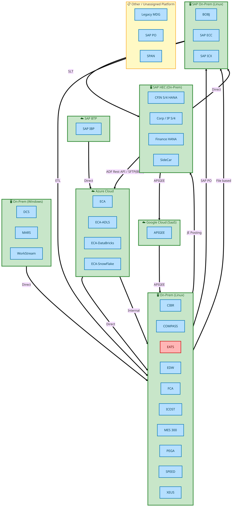

<div style="text-align:center; padding-top:20px;">
  
  <h1 style="font-size:36px; margin-top:24px;">DS-020 — Perform Product Costing and Inventory Valuation</h1>
  <h2 style="font-size:24px;">Architecture Document (TOGAF BDAT)</h2>
  <p style="font-size:18px; color:#555;">Finance Plan To Report (FPR) Tower<br/>
  Capability DS-020 · DS Provide Decision Support</p>
  <p style="font-size:14px; color:#888;">IAO Program · Release 3<br/>
  Generated: March 2026<br/>
  Sajiv Francis</p>
  <p style="font-size:12px; color:#aaa;">IAO Architecture Pipeline — Intel Confidential</p>
</div>

<style>
@media print {
  @page { margin: 0.75in; }
  .mermaid { page-break-inside: avoid; overflow: visible; }
  pre, table { page-break-inside: avoid; }
  h2, h3, h4 { page-break-after: avoid; }
}
.mermaid { overflow: visible; }
.mermaid svg { max-width: 100%; height: auto !important; }
.page-footer {
  padding-top: 8px;
  border-top: 1px solid #ddd;
  display: flex;
  justify-content: space-between;
  align-items: center;
  font-size: 11px;
  color: #888;
  position: fixed;
  bottom: 0;
  left: 0;
  right: 0;
  padding: 6px 20px;
  background: #fff;
}
@media print {
  .page-footer { position: fixed; bottom: 0; left: 0.75in; right: 0.75in; }
}
.page-footer a { color: #00aeef; text-decoration: none; font-weight: 500; }
.page-footer a:hover { color: #0071c5; text-decoration: underline; }
</style>

<div class="page-footer"><span>Page 1</span><span><a href="#toc">↑ Back to TOC</a></span><span>DS-020 — Perform Product Costing and Inventory Valuation</span></div>
<div style="page-break-before: always;"></div>

<a id="toc"></a>

## Table of Contents

1. [Executive Summary](#1-executive-summary)
2. [Business Context & Objectives](#2-business-context--objectives)
   - 2.1 [Classification](#21-classification)
   - 2.2 [Business Drivers](#22-business-drivers)
   - 2.3 [Success Criteria](#23-success-criteria)
   - 2.4 [Companion Documents](#24-companion-documents)
3. [Business Architecture (TOGAF "B")](#3-business-architecture-togaf-b)
   - 3.1 [Business Process Overview](#31-business-process-overview)
   - 3.2 [Business Process Diagrams](#32-business-process-diagrams)
   - 3.3 [Business Roles & Responsibilities](#33-business-roles--responsibilities)
4. [Data Architecture (TOGAF "D")](#4-data-architecture-togaf-d)
   - 4.1 [Data Entities & Ownership](#41-data-entities--ownership)
   - 4.2 [Data Flow Diagrams](#42-data-flow-diagrams)
   - 4.3 [Data Lineage](#43-data-lineage)
   - 4.4 [RICEFW Data Objects](#44-ricefw-data-objects)
   - 4.5 [Data Governance & Quality](#45-data-governance--quality)
5. [Application Architecture (TOGAF "A")](#5-application-architecture-togaf-a)
   - 5.1 [Current-State Application Landscape](#51-icost--current-state-application-landscape)
   - 5.2 [Future-State Application Landscape](#52-s/4-hana--future-state-application-landscape)
   - 5.3 [Change Impact Summary](#53-change-impact-summary)
   - 5.4 [Component Overview](#54-component-overview)
   - 5.5 [RICEFW Inventory](#55-ricefw-inventory)
   - 5.6 [Integration Patterns](#56-integration-patterns)
6. [Technology Architecture (TOGAF "T")](#6-technology-architecture-togaf-t)
   - 6.1 [Platform & Infrastructure](#61-platform--infrastructure)
   - 6.2 [SAP Development Object Status](#62-sap-development-object-status)
   - 6.3 [NFRs & Design Principles](#63-nfrs--design-principles)
   - 6.4 [Security & Governance](#64-security--governance)
7. [Project Context](#7-project-context)
   - 7.1 [Project Roadmap & Go-Live Plan](#71-project-roadmap--go-live-plan)
   - 7.2 [RAID Log](#72-raid-log)
   - 7.3 [Recommendations & Next Steps](#73-recommendations--next-steps)

<div class="page-footer"><span>Page 2</span><span><a href="#toc">↑ Back to TOC</a></span><span>DS-020 — Perform Product Costing and Inventory Valuation</span></div>
<div style="page-break-before: always;"></div>

## 1. Executive Summary

This Architecture Document defines the **Business, Data, Application, and Technology** (BDAT) architecture for **DS-020 Perform Product Costing and Inventory Valuation** within the IAO program. It includes 15 BPMN process diagram(s) in Section 3.
| Dimension | Value |
|-----------|-------|
| **Tower** | Finance Plan To Report (FPR) |
| **Process Group** | DS Provide Decision Support |
| **Capability** | DS-020 - Perform Product Costing and Inventory Valuation |
| **Release** | Release 3 |
| **Total Systems** | 60 |
| **System Status** | 46 Deployed, 8 Developing, 4 EOL, 2 Pending IAPM |
| **RICEFW Objects** | 10 Interfaces, 2 Conversions, 15 Enhancements |
**Change Summary**: 22 new flow chains, 27 removed, 0 modified, 0 unchanged between ICOST and S/4 HANA states.

> All system nodes in architecture diagrams are **IAPM-linked** — click any node to open its IAPM page. Diagrams require `securityLevel: 'loose'` for click events.

<div class="page-footer"><span>Page 3</span><span><a href="#toc">↑ Back to TOC</a></span><span>DS-020 — Perform Product Costing and Inventory Valuation</span></div>
<div style="page-break-before: always;"></div>

## 2. Business Context & Objectives

### 2.1 Classification

| Level | Value |
|-------|-------|
| **L0 Tower** | Finance Plan To Report |
| **L1 Process** | DS Provide Decision Support |
| **L2 Capability** | DS-020 - Perform Product Costing and Inventory Valuation |

### 2.2 Business Drivers

| # | Driver | Description | Strategic Alignment | Priority |
|---|--------|-------------|---------------------|----------|
| 1 | S/4 HANA Finance Consolidation | Migrate legacy costing and reporting platforms to unified S/4 HANA finance backbone | IDM 2.0 Core Finance Transformation | High |
| 2 | Real-Time Financial Visibility | Enable real-time cost reporting and variance analysis replacing batch-driven legacy processes | CFO Digital Finance Initiative | High |
| 3 | Regulatory Compliance Readiness | Ensure SOX compliance and audit trail continuity through the ERP transition period | Intel Corporate Compliance | Medium |
| 4 | DS-020 Process Migration | Migrate Perform Product Costing and Inventory Valuation business processes and 42 integrated systems from legacy to S/4 HANA target architecture | IDM 2.0 Finance | High |

<div class="page-footer"><span>Page 4</span><span><a href="#toc">↑ Back to TOC</a></span><span>DS-020 — Perform Product Costing and Inventory Valuation</span></div>
<div style="page-break-before: always;"></div>

### 2.3 Success Criteria

| Metric | Target | Measure | Baseline | Owner |
|--------|--------|---------|----------|-------|
| Month-End Close Cycle Time | < 3 business days | Calendar days from period close trigger to final posting | 5 business days (legacy) | Finance Controller |
| Cost Variance Accuracy | < 0.5% deviation | Variance between standard and actual cost post-migration | 1.2% (ICOST baseline) | Cost Accounting Lead |
| System Availability (Finance) | 99.9% uptime | S/4 HANA finance module availability during business hours | 99.5% (legacy) | IT Operations |
| DS-020 Migration Completeness | 100% flow chains validated | All 22 flow chains verified in target state | 0% (pre-migration) | Tower Architect |

### 2.4 Companion Documents

| Document | Description |
|----------|-------------|
| **Business Architecture** | Included in this document (Section 3) — process flows from BPMN diagrams |
| **This Document** | Full BDAT Architecture — Business + Data + Application + Technology |

<div class="page-footer"><span>Page 5</span><span><a href="#toc">↑ Back to TOC</a></span><span>DS-020 — Perform Product Costing and Inventory Valuation</span></div>
<div style="page-break-before: always;"></div>

## 3. Business Architecture (TOGAF "B")

### 3.1 Business Process Overview

This capability includes **15 business process(es)** modeled in BPMN 2.0, covering the end-to-end workflow for DS-020 Perform Product Costing and Inventory Valuation.

| # | Step ID | Process Name | Lanes | Tasks | Gateways |
|---|---------|--------------|-------|-------|----------|
| 1 | DS-020-020 | Perform Cumulative Costing Run | Cost Analyst | 10 | 3 |
| 2 | DS-020-030 | Analyze and Review Cost Estimates for Accuracy | Cost Accountant | 7 | 7 |
| 3 | DS-020-040 | Release Cost Estimates | Cost Accountant | 8 | 2 |
| 4 | DS-020-050 | Perform Off-Cycle, Unplanned Costing Run | Cost Accountant | 9 | 4 |
| 5 | DS-020-060 | Analyze Material Ledger | Cost Accountant | 4 | 4 |
| 6 | DS-020-080 | Verify Standard Cost | Cost Accountant | 10 | 10 |
| 7 | DS-020-090 | Review Production Orders | Cost Accountant | 7 | 9 |
| 8 | DS-020-100 | Actual Costing | Cost Accountant | 8 | 0 |
| 9 | DS-020-110 | Material Ledger Reports | Cost Accountant | 3 | 4 |
| 10 | DS-020-120 | Calculate and apply overhead for all MFG orders | Cost Accountant | 6 | 2 |
| 11 | DS-020-130 | Calculate WIP | Cost Accountant | 4 | 4 |
| 12 | DS-020-140 | Calculate Variances | Cost Accountant | 10 | 11 |
| 13 | DS-020-150 | Generate Variances Report | Cost Accountant | 12 | 11 |
| 14 | DS-020-160 | Execute Order Settlement | Cost Accountant | 4 | 3 |
| 15 | DS-020-170 | Product Costing Reports | TBD | 7 | 0 |

### 3.2 Business Process Diagrams

<div class="page-footer"><span>Page 6</span><span><a href="#toc">↑ Back to TOC</a></span><span>DS-020 — Perform Product Costing and Inventory Valuation</span></div>
<div style="page-break-before: always;"></div>

#### BUSINESS ARCHITECTURE — 3.2.1 DS-020-020 — Perform Cumulative Costing Run

**Swim Lanes**: Cost Analyst | **Tasks**: 10 | **Gateways**: 3

> **Legend**: <span style="color:#000;background:#4CAF50;padding:2px 6px;border-radius:10px;font-weight:bold;font-size:9pt">● Start</span> · <span style="color:#fff;background:#C62828;padding:2px 6px;border-radius:10px;font-weight:bold;font-size:9pt">● End</span> · <span style="background:#E3F2FD;padding:2px 6px;border:1px solid #1565C0;font-size:9pt">User Task</span> · <span style="background:#FFF3E0;padding:2px 6px;border:1px solid #E65100;font-size:9pt">Service Task</span> · <span style="background:#FFF9C4;padding:2px 6px;border:1px solid #F57F17;font-size:9pt">◇ Gateway</span> · <span style="background:#F3E5F5;padding:2px 6px;border:1px solid #7B1FA2;font-size:9pt">Sub-Process</span>


<div style="text-align:center; margin:4px 0 8px 0; font-size:11px;"><a href="svg/DS-020-diagram-1.svg" title="Open full-size SVG">&#128269; View full-size SVG</a> &nbsp;|&nbsp; <a href="https://mermaid.live/edit#pako:eNqtVm2P4jYQ_itWTivupCDllbCR2goCqVa6bVfL3lXV0Q8mcSBax0a2w0I5_nvHJAHChat0bT5A5vHM88xMEo_3RsJTYoTG3d0-Z7kK0b6nVqQgvRD1FliSnokq4DMWOV5QInvaJ-NMzfK_j262t95qN43FuMjpTqMzsuQEfXow0QgCqYkkZrIvicizntlbi7zAYhdxyoX2fkeGmZUd1eqlMRcpEWcHywrsxIdQmjNyht3AC7xYx0mScJa2SDM_G2ZJ76CTo_wtWWGhjumXkjzi7R95qlZgZ5hKAj4rVdCPeEGorlGJUmNJKTZNM3KpdRg0bLbGSc6WgHsWQAKz1zPkW4cDOtzdzdlJFL1M5gzBlVAs5YRkSCqApxuFspzS8J0XjWLfMqUS_JWE75xpMHEdM9GVhFC6Zerm9t9IvlypcMFpWrv233QNobPemmIbOpYpdvB7pUVYelaKBs7QGZ6UxoEd2VGjlGXZf1KCvooXLF9rrakbO_HkpGX7Az-yvuVrypx4wci-7hMRmzwhF6RxHLvTc6umA9-2bpOOY3dgRVekS6zIG96dCe8j70QY-0FsBzcJK73rLMvFk-BJQ-hO_dg_EQZjOx45Nwm9ke0N6wyBZynweoUiLhUaMUx3UlVL-mL2l7mR4TDDfd1pFK1I8ooeoRr9icGNhDs0wQrPjb8uwpyuMEg4LROVc4Y-EyH1_8uKMDTdriEvgsZQC-LZiV6i9-PfHz8gzFL0zEsFL3tbxb1SwTQpKQQj2D_QTGH9caYgC48TjWFrSRFIAuVtRu8W4y22p4dnxAV6opgx0qxe1FC3qK3it1U-rdP_XWLQKfHDfQm6nmcGWU23udTu1fszhftCC-klLfYEGfK0zTVscz0TSdTRuZtLfpfs_suJLeHLiwf2yDeaarQhAi9JXWzD1LQOuC7JbKvNVnfth6js9yeqNYUvH5KHkAJFZaETzDfkWKYmfi4ZeoBRmAOVLu_DJY9z5pGKr_-NJ-LFmpIOHne_P5eWkv4CRkiyQg-yrieCTVhwin5CM_TL3DgcLoO97wRzGFgwrRmMnN2aQPz0m3C_O5xsE1pKqODXanc8h8H8qG6gj6jf_xn-G7s23cZ2NfB1bvxJ5Nz4Cm_q9cJv_IjfN7jXxr1rvCFy6gWnUmwEvcr0a9OtzEHD4tf5NdGN3fgPruz72q73dzas7SatoLKHDb_Vjj_OA92VZg62YKcbdrthrxv2u-FBNxx0w8Nu-P5y2rYrsm4v2aezTBt36nNHG3Wb4duGvW7Yb2DDNAoiCpynRrg3jgdSOLSmJMMlVcbBNHCp-GzHEiM8HtyM8rhZTHIM87SowMM_2fl10w==" title="Edit in Mermaid Live">&#9998; Edit in Mermaid Live</a></div>

<div class="page-footer"><span>Page 7</span><span><a href="#toc">↑ Back to TOC</a></span><span>DS-020 — Perform Product Costing and Inventory Valuation</span></div>
<div style="page-break-before: always;"></div>

#### BUSINESS ARCHITECTURE — 3.2.2 DS-020-030 — Analyze and Review Cost Estimates for Accuracy

**Swim Lanes**: Cost Accountant | **Tasks**: 7 | **Gateways**: 7

> **Legend**: <span style="color:#000;background:#4CAF50;padding:2px 6px;border-radius:10px;font-weight:bold;font-size:9pt">● Start</span> · <span style="color:#fff;background:#C62828;padding:2px 6px;border-radius:10px;font-weight:bold;font-size:9pt">● End</span> · <span style="background:#E3F2FD;padding:2px 6px;border:1px solid #1565C0;font-size:9pt">User Task</span> · <span style="background:#FFF3E0;padding:2px 6px;border:1px solid #E65100;font-size:9pt">Service Task</span> · <span style="background:#FFF9C4;padding:2px 6px;border:1px solid #F57F17;font-size:9pt">◇ Gateway</span> · <span style="background:#F3E5F5;padding:2px 6px;border:1px solid #7B1FA2;font-size:9pt">Sub-Process</span>


<div style="text-align:center; margin:4px 0 8px 0; font-size:11px;"><a href="svg/DS-020-diagram-2.svg" title="Open full-size SVG">&#128269; View full-size SVG</a> &nbsp;|&nbsp; <a href="https://mermaid.live/edit#pako:eNqlVltv4jgU_itWRhW7Eki5EpqHXdFAVtVOp1XpzGq17INJnGLV2JHtQBmG_77HkHAJoQ-zPKD4O-d85-JzbG-sVGTEiqybmw3lVEdo09FzsiCdCHVmWJFOF-2Bb1hSPGNEdYxOLrie0O87Nccv3o2awRK8oGxt0Al5FQR9ve-iIRiyLlKYq54ikuadbqeQdIHlOhZMSKP9iQxyO995q0R3QmZEHhVsO3TSAEwZ5eQIe6Ef-omxUyQVPDsjzYN8kKedrQmOiVU6x1Lvwi8VecDvf9FMz2GdY6YI6Mz1gn3GM8JMjlqWBktLuayLQZXxw6FgkwKnlL8C7tsASczfjlBgb7doe3Mz5Qen6GU05Qh-KcNKjUiOlAZ4vNQop4xFn_x4mAR2V2kp3kj0yR2HI8_tpiaTCFK3u6a4vRWhr3MdzQTLKtXeyuQQucV7V75Hrt2Va_hv-CI8O3qK--7AHRw83YVO7MS1pzzP_5cnqKt8weqt8jX2EjcZHXw5QT-I7Uu-Os2RHw6dZp2IXNKUnJAmSeKNj6Ua9wPHvk56l3h9O26QvmJNVnh9JLyN_QNhEoSJE14l3PtrRlnOnqRIa0JvHCTBgTC8c5Khe5XQHzr-oIoQeF4lLuYoFkqjYZqKkmvM9V5qftz5Z2rlOMpxzxQbxXOSviGYUGQCKCVMKod2WxcEPUCWZvTgQ8HX1Pr3hMa9RnP3-HCu6V3THKaaLqleg2fYIYVyIdGzKDVMQS2jRJ2T-Vejv39GlH8cc3DNeAI1gsnP9pEgke9R6HsTyxMzFTxj6l8voiGIMUtLhjUVHGGFClAxwm-YlXtwdxg2ScNzUtCmGaTzQYR1tuc8g18ORAWDLh1yzNbfCQIG9EyWlKz27TFWGk5KXVUemqWUOF2jezjGKcAZsP56Qnt7pFVaFB9uXywWheDQSWr3ycglnWMD3RORYLZAj3nei9cpgxPzK4egOSfZLkhD9lzy8wQdZ7OpQzHXT28GB2g6R_fqsonv-VxAOY0gK1NT_N-n1nZ7yua2s520R0FS01On5H-StdkUXaoLPq-dj7ynrFR0Sf7Ynx5NM__nzIJ2sxFVqSQFfMMMoQTOgewi0P7PeQyPZlhKsVI9zDQqsMSMEXZhBFO0_-AO6vV-M9tXrQfV2qvlO4UfU-tvM_Y_jKum5IvYC9xa4FUc9Trcrw-UbmU4eXncWQaVoLbzq7XfjKUC6giCSt6v1v3GuvLr1PxOcB7xbY33G44Pioek7UYuda5uM8RDbuUMhoVrGF8zMDsWv6n0RVzr451-_-RGMjtV38RnsNsOe-2w3w4H7XC_HQ7b4cHhAXQG31ZvlfNk7HZlaKrqIj-H3XbYa4f9djhoh_vtcFjDVtdaELnANLOijbV7OMPjOiM5Lpm2tl0Ll1pM1jy1ot0D0yoLc0eMKIZ7f7EHt_8BioqrBQ==" title="Edit in Mermaid Live">&#9998; Edit in Mermaid Live</a></div>

<div class="page-footer"><span>Page 8</span><span><a href="#toc">↑ Back to TOC</a></span><span>DS-020 — Perform Product Costing and Inventory Valuation</span></div>
<div style="page-break-before: always;"></div>

#### BUSINESS ARCHITECTURE — 3.2.3 DS-020-040 — Release Cost Estimates

**Swim Lanes**: Cost Accountant | **Tasks**: 8 | **Gateways**: 2

> **Legend**: <span style="color:#000;background:#4CAF50;padding:2px 6px;border-radius:10px;font-weight:bold;font-size:9pt">● Start</span> · <span style="color:#fff;background:#C62828;padding:2px 6px;border-radius:10px;font-weight:bold;font-size:9pt">● End</span> · <span style="background:#E3F2FD;padding:2px 6px;border:1px solid #1565C0;font-size:9pt">User Task</span> · <span style="background:#FFF3E0;padding:2px 6px;border:1px solid #E65100;font-size:9pt">Service Task</span> · <span style="background:#FFF9C4;padding:2px 6px;border:1px solid #F57F17;font-size:9pt">◇ Gateway</span> · <span style="background:#F3E5F5;padding:2px 6px;border:1px solid #7B1FA2;font-size:9pt">Sub-Process</span>


<div style="text-align:center; margin:4px 0 8px 0; font-size:11px;"><a href="svg/DS-020-diagram-3.svg" title="Open full-size SVG">&#128269; View full-size SVG</a> &nbsp;|&nbsp; <a href="https://mermaid.live/edit#pako:eNqlVl2P4jYU_StWRiNaKUj5JJk8tGICqVbqrFbLtlVV-mAcByyMQ21nBpblv_fmE5LNqA_NA_I9ueec64tzk4tB8pQakfH4eGGC6QhdJnpHD3QSockGKzoxUQ38jiXDG07VpMzJcqFX7GuVZnvHU5lWYgk-MH4u0RXd5hT99sFEcyByEyks1FRRybKJOTlKdsDyHOc8l2X2Aw0zK6vcmlvPuUypvCVYVmATH6icCXqD3cALvKTkKUpykfZEMz8LMzK5lsXx_I3ssNRV-YWiL_j0B0v1DuIMc0UhZ6cP_Fe8obzco5ZFiZFCvrbNYKr0EdCw1RETJraAexZAEov9DfKt6xVdHx_XojNFXxZrgeAiHCu1oBlSGuDlq0YZ4zx68OJ54lum0jLf0-jBWQYL1zFJuZMItm6ZZXOnb5Rtdzra5DxtUqdv5R4i53gy5SlyLFOe4XfgRUV6c4pnTuiEndNzYMd23DplWfa_nKCv8gtW-8Zr6SZOsui8bH_mx9b3eu02F14wt4d9ovKVEXonmiSJu7y1ajnzbet90efEnVnxQHSLNX3D55vgU-x1gokfJHbwrmDtN6yy2HySOWkF3aWf-J1g8Gwnc-ddQW9ue2FTIehsJT7uUJwrjeaE5IXQWOj6bnkJ-6-1keEow9Oy2SiWFDaDcMWA84c-F2Jt_H1HcPqEFeWUaPQCrPK5VCjLZUvuE90-cXmipACr0VyvnzsXmJ-_UgSTo8pXKMacFBxM0z7R7xNfsNx3LLQEpwNw-pRZn_IZNgSD6r9YwaBvO0pqp08SzhdiomsJLBSs-vRwWOeegvM_BZM0BVspoaksF6rPevqhox05HLi21l6dCn2Aycua3vx4_19bN77S-XHIa-S-o9mXS0srx_t0AwOK7BA9EV4o9kp_qc__2rhe72nOOG3BFJH0CGsGngkcyfTnGxWGS70QT2g6_QlkmtCtQ68JZ3UYNKFdh04T-nU4a0KnkWq17CbdbWKvud_S7YrwbW18zNfGN5Br8HCgEzSxNeT9SVVFDO8e7LLIdqD1YGccdsdhbxz2x-HZOByMw-E4_NS9XvrbsZpXQR-123nYh50WNkzjQOUBs9SILkb1MQAfDCnNcMG1cTUNXOh8dRbEiKqXplEcU2AuGIZZdqjB67-mKKZ0" title="Edit in Mermaid Live">&#9998; Edit in Mermaid Live</a></div>

<div class="page-footer"><span>Page 9</span><span><a href="#toc">↑ Back to TOC</a></span><span>DS-020 — Perform Product Costing and Inventory Valuation</span></div>
<div style="page-break-before: always;"></div>

#### BUSINESS ARCHITECTURE — 3.2.4 DS-020-050 — Perform Off-Cycle, Unplanned Costing Run

**Swim Lanes**: Cost Accountant | **Tasks**: 9 | **Gateways**: 4

> **Legend**: <span style="color:#000;background:#4CAF50;padding:2px 6px;border-radius:10px;font-weight:bold;font-size:9pt">● Start</span> · <span style="color:#fff;background:#C62828;padding:2px 6px;border-radius:10px;font-weight:bold;font-size:9pt">● End</span> · <span style="background:#E3F2FD;padding:2px 6px;border:1px solid #1565C0;font-size:9pt">User Task</span> · <span style="background:#FFF3E0;padding:2px 6px;border:1px solid #E65100;font-size:9pt">Service Task</span> · <span style="background:#FFF9C4;padding:2px 6px;border:1px solid #F57F17;font-size:9pt">◇ Gateway</span> · <span style="background:#F3E5F5;padding:2px 6px;border:1px solid #7B1FA2;font-size:9pt">Sub-Process</span>


<div style="text-align:center; margin:4px 0 8px 0; font-size:11px;"><a href="svg/DS-020-diagram-4.svg" title="Open full-size SVG">&#128269; View full-size SVG</a> &nbsp;|&nbsp; <a href="https://mermaid.live/edit#pako:eNqlVl2P4jYU_StWRiNaKUj5JJCHVkwg1Uqd7aqzu1VV-mAcByyMQ21nBsry33tNEiBp0KrbPCDu8T3n-N4k1zlapMioFVuPj0cmmI7RcaDXdEsHMRossaIDG1XAZywZXnKqBiYnL4R-YX-f09xgtzdpBkvxlvGDQV_oqqDo0zsbTYHIbaSwUENFJcsH9mAn2RbLQ1LwQprsBzrOnfzsVi89FTKj8prgOJFLQqByJugV9qMgClLDU5QUImuJ5mE-zsngZDbHizeyxlKft18q-oz3v7FMryHOMVcUctZ6y3_GS8pNjVqWBiOlfG2awZTxEdCwlx0mTKwADxyAJBabKxQ6pxM6PT4uxMUUfZwtBIKLcKzUjOZIaYDnrxrljPP4IUimaejYSstiQ-MHbx7NfM8mppIYSnds09zhG2WrtY6XBc_q1OGbqSH2dntb7mPPseUBfjteVGRXp2Tkjb3xxekpchM3aZzyPP9fTtBX-RGrTe0191MvnV283HAUJs6_9ZoyZ0E0dbt9ovKVEXojmqapP7-2aj4KXee-6FPqj5ykI7rCmr7hw1VwkgQXwTSMUje6K1j5dXdZLj_IgjSC_jxMw4tg9OSmU--uYDB1g3G9Q9BZSbxbo6RQGk0JKUqhsdDVqrmE-8fCynGc46FpNvqMOcugHAQv6ZkFzyD6lXKAMvSMlYacGdZ4Yf15I-K1RRJJjcTZdA4SW4jaBL9NeMYbCi5_lUyCTVJISYlmhVBtVtBlyc1ln3eMwjYFKqEwhb7GGnXqWVNSOX2Q8PAgJsAbOgFzqO5Jmx59U3XjNmu-p6TUNzehFO38yZ07ZwjtTNf57pK74_Cg_pLnw-RAOEykTwIQIc4buxihdzC7mbnnIPT9rZJ7VVK62H1dKSm2O057lLzjsVEyZ8ZwCVOPrNGMKSLpDv4zqlAKD2z248I6nW6pfj-V7gkvFXulP1XvY5cWfLtj-F8dYUZWf4SLhsMfTL1N7NSA3wB-DdSx31kPqjisw7AKRw3bM_GXhfW-WFhf4FWs8XGVNqlDrxZtVNxaZlzHUWd9UsdBkx-0bRp8VOe53e38TtU50e8KNAvRzcwzXWpmfQv2-mG_Hw764bAfHvXDUT887ocn_TDc5OZEbuNufXq2Ua85Qtqw3w8H_XDYwJZtbancYpZZ8dE6f23BF1lGc1xybZ1sC5e6eDkIYsXnrxKr3JnBMWMYDottBZ7-AVDaE0I=" title="Edit in Mermaid Live">&#9998; Edit in Mermaid Live</a></div>

<div class="page-footer"><span>Page 10</span><span><a href="#toc">↑ Back to TOC</a></span><span>DS-020 — Perform Product Costing and Inventory Valuation</span></div>
<div style="page-break-before: always;"></div>

#### BUSINESS ARCHITECTURE — 3.2.5 DS-020-060 — Analyze Material Ledger

**Swim Lanes**: Cost Accountant | **Tasks**: 4 | **Gateways**: 4

> **Legend**: <span style="color:#000;background:#4CAF50;padding:2px 6px;border-radius:10px;font-weight:bold;font-size:9pt">● Start</span> · <span style="color:#fff;background:#C62828;padding:2px 6px;border-radius:10px;font-weight:bold;font-size:9pt">● End</span> · <span style="background:#E3F2FD;padding:2px 6px;border:1px solid #1565C0;font-size:9pt">User Task</span> · <span style="background:#FFF3E0;padding:2px 6px;border:1px solid #E65100;font-size:9pt">Service Task</span> · <span style="background:#FFF9C4;padding:2px 6px;border:1px solid #F57F17;font-size:9pt">◇ Gateway</span> · <span style="background:#F3E5F5;padding:2px 6px;border:1px solid #7B1FA2;font-size:9pt">Sub-Process</span>



<div style="text-align:center; margin:4px 0 8px 0; font-size:11px;"><a href="svg/DS-020-diagram-5.svg" title="Open full-size SVG">&#128269; View full-size SVG</a> &nbsp;|&nbsp; <a href="https://mermaid.live/edit#pako:eNqlVl2P4jYU_StWRiNaKUj5JEweWjGBSCvttKOyu1VV-mAcB6IxNrIdGJblv_c6JAGy4aHbPCB8fM65H4lvcrSIyKgVW4-Px4IXOkbHgV7TDR3EaLDEig5sdAa-YFngJaNqYDi54HpefK1obrB9NzSDpXhTsINB53QlKPr8wUYTEDIbKczVUFFZ5AN7sJXFBstDIpiQhv1Ax7mTV9HqrWchMyovBMeJXBKClBWcXmA_CqIgNTpFieDZjWke5uOcDE4mOSb2ZI2lrtIvFX3B738WmV7DOsdMUeCs9YZ9xEvKTI1algYjpdw1zSiUicOhYfMtJgVfAR44AEnM3y5Q6JxO6PT4uOBtUPRpuuAILsKwUlOaI6UBnu00ygvG4ocgmaShYystxRuNH7xZNPU9m5hKYijdsU1zh3tarNY6XgqW1dTh3tQQe9t3W77HnmPLA_x2YlGeXSIlI2_sjdtIz5GbuEkTKc_z_xUJ-io_YfVWx5r5qZdO21huOAoT53u_psxpEE3cbp-o3BWEXpmmaerPLq2ajULXuW_6nPojJ-mYrrCme3y4GD4lQWuYhlHqRncNz_G6WZbLVylIY-jPwjRsDaNnN514dw2DiRuM6wzBZyXxdo0SoTSaECJKrjHX511zcffvhZXjOMdD02z0B90VdI_mwIJnP0OvErqFRI7g0KIXqNMcPpQLWQGvsBTZwvrnytDrNWylL2IHp59rdavye1XVkOCEdshBL3lCdAkBqlI7Cd_Kw59a_ZbBbWtz-0izFfhNOGYHOJ3oA0ywAjZNhT9fGYwuBkqL7X2DRGy2jH5vEIG-In2lCBrdVFClPlMaBpamquoy3LNSYnK4rWAM-loDz0lWEl0Ijn43E67TqidgJpiRkoHlvX66jsnn0j6YOx2Cezw2FZsBP1zCiCLr9mkpCXiqvGS_LqzT6Vro_ajQ_1Fh8N-FMNDOf3iIhsNfwKReuvWyXVfAt4X1l2nhN3jYmw2vs-HXG17t0BL9DjGoN_ya2AiDet3su0FHOOrm9Juo8KibUo2PuxnU-FM3QI2710PJtKIZxjew1w_7_XDQD4ft6-sGHtVvmhsw6ueO--Gnfth17uBuM8tvYa8f9vvhoIEt29pQucFFZsVHq_rsgU-jjOa4ZNo62RYutZgfOLHi6vPAKrcZKKcFhqm9OYOnfwHJ0fMF" title="Edit in Mermaid Live">&#9998; Edit in Mermaid Live</a></div>

<div class="page-footer"><span>Page 11</span><span><a href="#toc">↑ Back to TOC</a></span><span>DS-020 — Perform Product Costing and Inventory Valuation</span></div>
<div style="page-break-before: always;"></div>

```mermaid
%%{init: {'theme': 'base', 'themeVariables': {'fontSize': '14px', 'fontFamily': 'Segoe UI, Arial, sans-serif','primaryColor': '#e8f0fe', 'primaryBorderColor': '#0071c5','lineColor': '#37474F', 'secondaryColor': '#f5f8fc'}, 'flowchart': {'useMaxWidth': false, 'htmlLabels': true, 'curve': 'basis', 'nodeSpacing': 40, 'rankSpacing': 50}} }%%
flowchart TD
    classDef startEvt fill:#4CAF50,stroke:#2E7D32,color:#000,font-weight:bold,stroke-width:2px,rx:20,ry:20
    classDef endEvt fill:#C62828,stroke:#B71C1C,color:#fff,font-weight:bold,stroke-width:2px,rx:20,ry:20
    classDef userTask fill:#E3F2FD,stroke:#1565C0,stroke-width:2px,color:#0D47A1
    classDef serviceTask fill:#FFF3E0,stroke:#E65100,stroke-width:2px,color:#BF360C
    classDef gateway fill:#FFF9C4,stroke:#F57F17,stroke-width:2px,color:#E65100
    classDef subProc fill:#F3E5F5,stroke:#7B1FA2,stroke-width:2px,color:#4A148C
    subgraph Cost Accountant
        n1["fa:fa-user Review Standard Price of the Material for the Period"]
        n2["fa:fa-user Review Material Movements"]
        n3["fa:fa-user Review Variances"]
        n4["fa:fa-user Review Actual Cost of the Material"]
        n5(["fa:fa-play Material Ledger Analysis Initiated"])
        n6(["fa:fa-stop Material Ledger Analysis Completed"])
        n7["Analyze and Review Cost Estimates for Accuracy"]
        n8["Review Production Orders"]
        n9["Calculate Variances"]
        n10["Actual Costing"]
        n11{{"fa:fa-code-branch Review Successful?"}}
        n12{{"fa:fa-code-branch Review Successful?"}}
        n13{{"fa:fa-code-branch Review Successful?"}}
        n14{{"fa:fa-code-branch Review Successful?"}}
    end
    n5 --> n1
    n1 --> n11
    n11 -->|"Yes"| n2
    n12 -->|"Yes"| n3
    n2 --> n12
    n13 -->|"Yes"| n4
    n3 --> n13
    n4 --> n14
    n14 -->|"Yes"| n6
    n11 -->|"No"| n7
    n12 -->|"No"| n8
    n13 -->|"No"| n9
    n14 -->|"No"| n10
    class n1 userTask
    class n2 userTask
    class n3 userTask
    class n4 userTask
    class n5 startEvt
    class n6 endEvt
    class n7 startEvt
    class n8 startEvt
    class n9 startEvt
    class n10 startEvt
    class n11 gateway
    class n12 gateway
    class n13 gateway
    class n14 gateway
```

#### BUSINESS ARCHITECTURE — 3.2.6 DS-020-080 — Verify Standard Cost

**Swim Lanes**: Cost Accountant | **Tasks**: 10 | **Gateways**: 10

```mermaid
%%{init: {'theme': 'base', 'themeVariables': {'fontSize': '14px', 'fontFamily': 'Segoe UI, Arial, sans-serif','primaryColor': '#e8f0fe', 'primaryBorderColor': '#0071c5','lineColor': '#37474F', 'secondaryColor': '#f5f8fc'}, 'flowchart': {'useMaxWidth': false, 'htmlLabels': true, 'curve': 'basis', 'nodeSpacing': 40, 'rankSpacing': 50}} }%%
flowchart TD
    classDef startEvt fill:#4CAF50,stroke:#2E7D32,color:#000,font-weight:bold,stroke-width:2px,rx:20,ry:20
    classDef endEvt fill:#C62828,stroke:#B71C1C,color:#fff,font-weight:bold,stroke-width:2px,rx:20,ry:20
    classDef userTask fill:#E3F2FD,stroke:#1565C0,stroke-width:2px,color:#0D47A1
    classDef serviceTask fill:#FFF3E0,stroke:#E65100,stroke-width:2px,color:#BF360C
    classDef gateway fill:#FFF9C4,stroke:#F57F17,stroke-width:2px,color:#E65100
    classDef subProc fill:#F3E5F5,stroke:#7B1FA2,stroke-width:2px,color:#4A148C
    subgraph Cost Accountant
        n1["fa:fa-user Check the Material Price"]
        n2["fa:fa-user Verify the Cost Planning"]
        n3["fa:fa-user Make Required Corrections to Cost Planning"]
        n4["fa:fa-user Verify the Activity Planning"]
        n5["fa:fa-user Verify the SKF Planning"]
        n6["fa:fa-user Validate Cost Split"]
        n7["fa:fa-user Validate the Plan Rates"]
        n8["fa:fa-user Verify Standard Cost"]
        n9["fa:fa-user Make Required Corrections to Activity Planning"]
        n10["fa:fa-user Make Required Corrections to SKF Planning"]
        n11(["fa:fa-play Cost Run Creation Initiated"])
        n12(["fa:fa-stop Standard Prices Updated in Material Master"])
        n13{{"fa:fa-code-branch Discrepancies Found?"}}
        n14{{"fa:fa-code-branch exclusiveGateway"}}
        n15{{"fa:fa-code-branch Discrepancies Found?"}}
        n16{{"fa:fa-code-branch Discrepancies Found?"}}
        n17{{"fa:fa-code-branch Discrepancies Found?"}}
        n18{{"fa:fa-code-branch Discrepancies Found?"}}
        n19{{"fa:fa-code-branch Discrepancies Found?"}}
        n20{{"fa:fa-code-branch exclusiveGateway"}}
        n21{{"fa:fa-code-branch exclusiveGateway"}}
        n22{{"fa:fa-code-branch exclusiveGateway"}}
    end
    n1 --> n14
    n2 --> n13
    n14 --> n2
    n11 --> n22
    n3 --> n14
    n4 --> n15
    n13 -->|"No"| n20
    n13 -->|"Yes"| n3
    n5 --> n16
    n15 -->|"No"| n21
    n6 --> n17
    n7 --> n18
    n8 --> n19
    n19 -->|"No"| n12
    n20 --> n4
    n9 --> n20
    n21 --> n5
    n10 --> n21
    n16 -->|"Yes"| n10
    n15 -->|"Yes"| n9
    n17 -->|"Yes"| n14
    n18 -->|"Yes"| n14
    n22 --> n1
    n17 -->|"No"| n7
    n18 -->|"No"| n8
    n16 -->|"No"| n6
    n19 -->|"Yes"| n22
    class n1 userTask
    class n2 userTask
    class n3 userTask
    class n4 userTask
    class n5 userTask
    class n6 userTask
    class n7 userTask
    class n8 userTask
    class n9 userTask
    class n10 userTask
    class n11 startEvt
    class n12 endEvt
    class n13 gateway
    class n14 gateway
    class n15 gateway
    class n16 gateway
    class n17 gateway
    class n18 gateway
    class n19 gateway
    class n20 gateway
    class n21 gateway
    class n22 gateway
```

> **Legend**: <span style="color:#000;background:#4CAF50;padding:2px 6px;border-radius:10px;font-weight:bold;font-size:9pt">● Start</span> · <span style="color:#fff;background:#C62828;padding:2px 6px;border-radius:10px;font-weight:bold;font-size:9pt">● End</span> · <span style="background:#E3F2FD;padding:2px 6px;border:1px solid #1565C0;font-size:9pt">User Task</span> · <span style="background:#FFF3E0;padding:2px 6px;border:1px solid #E65100;font-size:9pt">Service Task</span> · <span style="background:#FFF9C4;padding:2px 6px;border:1px solid #F57F17;font-size:9pt">◇ Gateway</span> · <span style="background:#F3E5F5;padding:2px 6px;border:1px solid #7B1FA2;font-size:9pt">Sub-Process</span>



<div style="text-align:center; margin:4px 0 8px 0; font-size:11px;"><a href="svg/DS-020-diagram-6.svg" title="Open full-size SVG">&#128269; View full-size SVG</a> &nbsp;|&nbsp; <a href="https://mermaid.live/edit#pako:eNqlV12P4jYU_StWViNaKUix80keWjGBVKvuVKNhd6uq9MEkzmBNcKjtzAxl-e-1QwyTNLQaygPCx_ecc--NHZu9lVU5sWLr5mZPGZUx2I_kmmzIKAajFRZkZIMj8BVzilclESMdU1RMLuhfTRj0tq86TGMp3tByp9EFeawI-PLRBlNFLG0gMBNjQTgtRvZoy-kG811SlRXX0R9IVDhF49ZO3VY8J_wc4DghzHxFLSkjZ9gNvdBLNU-QrGJ5R7Twi6jIRgedXFm9ZGvMZZN-Lcgdfv2V5nKtxgUuBVExa7kpP-EVKXWNktcay2r-bJpBhfZhqmGLLc4oe1S45yiIY_Z0hnzncACHm5slO5mCz7MlA-qTlViIGSmAkAqeP0tQ0LKMP3jJNPUdW0hePZH4A5qHMxfZma4kVqU7tm7u-IXQx7WMV1WZt6HjF11DjLavNn-NkWPznfrueRGWn52SAEUoOjndhjCBiXEqiuJ_Oam-8s9YPLVeczdF6ezkBf3AT5x_6pkyZ144hf0-Ef5MM_JGNE1Td35u1TzwoXNZ9DZ1AyfpiT5iSV7w7iw4SbyTYOqHKQwvCh79-lnWq3teZUbQnfupfxIMb2E6RRcFvSn0ojZDpfPI8XYNkkpIMM2yqmYSM3mc1R8Gf19aBY4LPNbNBsmaZE9A7VBwp4rSOw3cc9WwpfXHGxLqkr7qXbhrWI3RfYkZU4u3S3K7pDv8RMAD-bOmnOSKxznJJK2YALL6NxnvovdU8Z-p3F0g-heJi5_TC5ygx8ElzVVfjvkttiWV3fjwQrx20Q7gQY1ElxMN5rVQz0m9ffLGqkuYvKOR_9ET6LxD63KbIPzupLMt1U5o-vNQM5BwgrUA-KhOA6qKzxXz-7dUdKYKWW3PhTfrToAvW93BHFB2XpJ3WKhffSV3vzdK-hQar9R7NFuDGRUZJ1v1myq5VG2B_MeldTi8pXrDVPKalbWgz-Sn4w7v0_zrHYPrqeH11Oh66uRqKnKu6i6C19HQe2nqPDv-YBCMxz_o5dCOUTt2zbx3BJAZtwRkALcn0MZD3xCagG9L65dqaX3TrelP_KZfD2rGWPqtQmAC_Z5Ce8KxoA0M23HYjqN2HLXjiRGadIWgqQE5x0hTw6St0aSK2qJPNbXxp0xg0KsFOv3kzcwpmbBPMe4wujSDzNPpa7QFhX2FFo_6abZ40G-McTRPtzme9SIx15IOjIZhdxj2hmF_GA6G4XAYjobhyTCsHt8wDk-Xyi6O2gtgF3XNLagLe8OwPwwHw3A4DEfD8GQQVqt6EIbDMDKwZVsbwjeY5la8t5q_LurvTU4KXJfSOtgWrmW12LHMipsrvlU359WMYnXz2hzBw98_VBcQ" title="Edit in Mermaid Live">&#9998; Edit in Mermaid Live</a></div>

<div class="page-footer"><span>Page 12</span><span><a href="#toc">↑ Back to TOC</a></span><span>DS-020 — Perform Product Costing and Inventory Valuation</span></div>
<div style="page-break-before: always;"></div>

#### BUSINESS ARCHITECTURE — 3.2.7 DS-020-090 — Review Production Orders

**Swim Lanes**: Cost Accountant | **Tasks**: 7 | **Gateways**: 9

> **Legend**: <span style="color:#000;background:#4CAF50;padding:2px 6px;border-radius:10px;font-weight:bold;font-size:9pt">● Start</span> · <span style="color:#fff;background:#C62828;padding:2px 6px;border-radius:10px;font-weight:bold;font-size:9pt">● End</span> · <span style="background:#E3F2FD;padding:2px 6px;border:1px solid #1565C0;font-size:9pt">User Task</span> · <span style="background:#FFF3E0;padding:2px 6px;border:1px solid #E65100;font-size:9pt">Service Task</span> · <span style="background:#FFF9C4;padding:2px 6px;border:1px solid #F57F17;font-size:9pt">◇ Gateway</span> · <span style="background:#F3E5F5;padding:2px 6px;border:1px solid #7B1FA2;font-size:9pt">Sub-Process</span>


<div style="text-align:center; margin:4px 0 8px 0; font-size:11px;"><a href="svg/DS-020-diagram-7.svg" title="Open full-size SVG">&#128269; View full-size SVG</a> &nbsp;|&nbsp; <a href="https://mermaid.live/edit#pako:eNqlV1uP4jYU_itWViN2JZDiXCEPrRggo5E67eyybVWVPpjEGawxcWQ7MJTlv9cODpdMUnVpHhD-zvm-c_FJ4uythKXYiqy7uz3JiYzAvidXeI17EegtkcC9PjgCvyFO0JJi0dM-GcvlnPxduUGveNNuGovRmtCdRuf4hWHw62MfjBWR9oFAuRgIzEnW6_cKTtaI7yaMMq69P-BhZmdVNGO6ZzzF_Oxg2yFMfEWlJMdn2A290Is1T-CE5emVaOZnwyzpHXRylG2TFeKySr8U-Am9_U5SuVLrDFGBlc9KrulPaImprlHyUmNJyTd1M4jQcXLVsHmBEpK_KNyzFcRR_nqGfPtwAIe7u0V-Cgq-Thc5UFdCkRBTnAEhFTzbSJARSqMP3mQc-3ZfSM5ecfTBmYVT1-knupJIlW73dXMHW0xeVjJaMpoa18FW1xA5xVufv0WO3ec79duIhfP0HGkSOENneIp0H8IJnNSRsiz7X5FUX_lXJF5NrJkbO_H0FAv6gT-x3-vVZU69cAybfcJ8QxJ8IRrHsTs7t2oW-NDuFr2P3cCeNERfkMRbtDsLjibeSTD2wxiGnYLHeM0sy-UzZ0kt6M782D8JhvcwHjudgt4YekOTodJ54ahYgQkTEoyThJW5RLk8WvWVwz8XVoaiDA10s8GUiIKqUo6EHNGdGlPAMqDySctEEpaDX_SdtLD-ulBx2lX-neRek77gDcFb8ExRnuP0mAHK0xPwuVSZE7m7FvFaRcaJLBEFn-Wukqi0MsZPeKuU3yVFNsq3EhGVinqAtdUTtPK185Ql5RrnUlXxwFgqwBPbYA2Ia4WwU6HZSTCXSJYN-vDjid_aflErqi19VE9nouY2VRKfLjRGZw0hWdGtMWHrguL3AtBWArM3nJTyOu0Cc6T_CfDxMf50nTmE_4H03CQ5t0Ryb4mkp2yCaFJS1bJqpFBR0B1Q28hXGKXVWCBKwVP8AKo3TWNroB4ufU9jIcwMfMEJJoWaS87Wl5m05Bx8B_ld7nqoJizPCF_Xm6Y9G_d0Xb4Zr5YkhrfpvMtntN_XE6YPC4Olet0lq3qs5mWiy8xK-uPCOhwunzH2rUR4K9G5lejeSvTORMQ524oBohIUiKvhwvTh-KJpkvxbSMEtpPD7SOqkcPyTO2Aw-EFtvlkOj0vHLH2zrM2u8R6ZNTyuXbP0jLtdm0ca-Law_sDqtvumHOqodsPgG0NgFOoEHNhwDGqD0zCExhAahTonx204jq6S01tbe5r0od0E6vId0w_oNAG3WdjPrArm1IU5pjL4DjhVZDKHYRMYNkupxcNmM2pD0GyfMUDv4kCjt68-yF3BTjvstsNeO-y3w0E7HLbDw9P5-QoemaPudTF2uzOEHbjTgbsduNeB-x140IGHHXhHsWpOzTn2epPsdhi2w0477LbDXjvst8NBOxzWsNW31pivEUmtaG9VX5nqSzTFGSqptA59C5WSzXd5YkXV15hVFqliTglSh-T1ETz8A7qQpQk=" title="Edit in Mermaid Live">&#9998; Edit in Mermaid Live</a></div>

<div class="page-footer"><span>Page 13</span><span><a href="#toc">↑ Back to TOC</a></span><span>DS-020 — Perform Product Costing and Inventory Valuation</span></div>
<div style="page-break-before: always;"></div>

#### BUSINESS ARCHITECTURE — 3.2.8 DS-020-100 — Actual Costing

**Swim Lanes**: Cost Accountant | **Tasks**: 8 | **Gateways**: 0

> **Legend**: <span style="color:#000;background:#4CAF50;padding:2px 6px;border-radius:10px;font-weight:bold;font-size:9pt">● Start</span> · <span style="color:#fff;background:#C62828;padding:2px 6px;border-radius:10px;font-weight:bold;font-size:9pt">● End</span> · <span style="background:#E3F2FD;padding:2px 6px;border:1px solid #1565C0;font-size:9pt">User Task</span> · <span style="background:#FFF3E0;padding:2px 6px;border:1px solid #E65100;font-size:9pt">Service Task</span> · <span style="background:#FFF9C4;padding:2px 6px;border:1px solid #F57F17;font-size:9pt">◇ Gateway</span> · <span style="background:#F3E5F5;padding:2px 6px;border:1px solid #7B1FA2;font-size:9pt">Sub-Process</span>


<div style="text-align:center; margin:4px 0 8px 0; font-size:11px;"><a href="svg/DS-020-diagram-8.svg" title="Open full-size SVG">&#128269; View full-size SVG</a> &nbsp;|&nbsp; <a href="https://mermaid.live/edit#pako:eNqlVduO2joU_RUroxGtFNRcSSYPlZhApEqtOipzTh_O9ME4Nlg4dmQ7M9AR_16bhEtopuehPABrea-1L0l2Xh0kSuxkzu3tK-VUZ-B1pNe4wqMMjJZQ4ZELWuJfKClcMqxGNoYIrhf05yHMj-qtDbNcASvKdpZd4JXA4J9PLpgaIXOBglyNFZaUjNxRLWkF5S4XTEgbfYNT4pFDtu7oXsgSy3OA5yU-io2UUY7PdJhESVRYncJI8LJnSmKSEjTa2-KYeEFrKPWh_EbhL3D7nZZ6bTCBTGETs9YV-wyXmNketWwshxr5fBwGVTYPNwNb1BBRvjJ85BlKQr45U7G334P97e0TPyUFj7MnDswHMajUDBOgtKHnzxoQylh2E-XTIvZcpaXY4OwmmCezMHCR7SQzrXuuHe74BdPVWmdLwcoudPxie8iCeuvKbRZ4rtyZ76tcmJfnTPkkSIP0lOk-8XM_P2YihPxVJjNX-QjVpss1D4ugmJ1y-fEkzr3f_Y5tzqJk6l_PCctnivCFaVEU4fw8qvkk9r23Te-LcOLlV6YrqPEL3J0N7_LoZFjESeEnbxq2-a6rbJYPUqCjYTiPi_hkmNz7xTR40zCa-lHaVWh8VhLWa5ALpcEUIdFwDbluT-2H-_89OQRmBI7tsMF8i1GjsYnVDWT2hz5TvQMP0kwNfADfTKsghww1DGoq-JPz48Is6Jsd4zD4LuQGUG5sxEpipfqysC97wJIIWR1rsLWbJwF8a66yRX2ZOQczasZCl40tDeQ7xHBfEg93e1hGHP2hs8nvuR5xVR-amzIm0IAm-d-2wKJmVNvu-sp0uEwzvbJBh96-2m0GFlhrZpapuaI9_d27k4EpcXc9SbuZqam8NKr3l_eCd9YpLeprXb7GaHOpMpug_cN9MB5_NDdAB9MWhh2ctDDqYNTCpIN3LZx0MGhh3MGkhd2DzOMWph0Mu9PLJ8hWc9wcPToYpsNhOhqm42F6Mkwnw3Q6TN-d9ni_Ha_buY7rVFhWkJZO9uoc3qPmXVtiAhumnb3rwEaLxY4jJzu8b5ymLs11nlFo1kDVkvtfyultXQ==" title="Edit in Mermaid Live">&#9998; Edit in Mermaid Live</a></div>

#### BUSINESS ARCHITECTURE — 3.2.9 DS-020-110 — Material Ledger Reports

**Swim Lanes**: Cost Accountant | **Tasks**: 3 | **Gateways**: 4

> **Legend**: <span style="color:#000;background:#4CAF50;padding:2px 6px;border-radius:10px;font-weight:bold;font-size:9pt">● Start</span> · <span style="color:#fff;background:#C62828;padding:2px 6px;border-radius:10px;font-weight:bold;font-size:9pt">● End</span> · <span style="background:#E3F2FD;padding:2px 6px;border:1px solid #1565C0;font-size:9pt">User Task</span> · <span style="background:#FFF3E0;padding:2px 6px;border:1px solid #E65100;font-size:9pt">Service Task</span> · <span style="background:#FFF9C4;padding:2px 6px;border:1px solid #F57F17;font-size:9pt">◇ Gateway</span> · <span style="background:#F3E5F5;padding:2px 6px;border:1px solid #7B1FA2;font-size:9pt">Sub-Process</span>


<div style="text-align:center; margin:4px 0 8px 0; font-size:11px;"><a href="svg/DS-020-diagram-9.svg" title="Open full-size SVG">&#128269; View full-size SVG</a> &nbsp;|&nbsp; <a href="https://mermaid.live/edit#pako:eNqlVV2P2jgU_StWRiO6UpDySUIetmICWVVqV1Vpd7Va-mAcG6wxdmQ7fJTy39cmAYY0I63aPCDu8bnnXN_E10cHiRI7mfP4eKSc6gwcB3qNN3iQgcESKjxwQQP8BSWFS4bVwHKI4HpOv51pflTtLc1iBdxQdrDoHK8EBl_euWBiEpkLFORqqLCkZOAOKkk3UB5ywYS07AecEo-c3dqlJyFLLG8Ez0t8FJtURjm-wWESJVFh8xRGgpd3oiQmKUGDky2OiR1aQ6nP5dcKf4D7v2mp1yYmkClsOGu9Ye_hEjO7Ry1ri6Fabi_NoMr6cNOweQUR5SuDR56BJOTPNyj2Tidwenxc8Ksp-DxdcGAexKBSU0yA0gaebTUglLHsIconRey5SkvxjLOHYJZMw8BFdieZ2brn2uYOd5iu1jpbCla21OHO7iELqr0r91ngufJgfjtemJc3p3wUpEF6dXpK_NzPL06EkF9yMn2Vn6F6br1mYREU06uXH4_i3PtR77LNaZRM_G6fsNxShF-IFkURzm6tmo1i33td9KkIR17eEV1BjXfwcBMc59FVsIiTwk9eFWz8ulXWy49SoItgOIuL-CqYPPnFJHhVMJr4UdpWaHRWElZrkAulwQQhUXMNuW5W7cP9fxcOgRmBQ9ts8AlvKd6B8-nkCKuF8_UFOeglz42kOSgl-ChNa8FWGSddQ9bEytAqIfW9Utir9IXDpRJyicvXKojeXBMrZlr-qebcHBMgCPhg3oIdDeA9LldnTWsL3pkxRM1SaYR-e6EU35SUFtX_UMrFpmL4R6WREZpwyA7fcDf1vvjkeLxY2jE5XJqDjtbXNtbIbFeRmr1dOKfTi7z0J_PGP5nne_2JeI9YregW_9F88Lc0MxKaPzwCw-Hv5ktpw7AJx20YNGHShn4Tpm04tuH3hfOPfevfzStq8bSDhy2edHD_Ius1uqMO70_R0LyObhcf9-Pn42mLvoylOzjoh8N-OLpO7Ds4bofrHTjq5yaXuXOHpr3ouBc1fWphx3U2WG4gLZ3s6JwvaHOJl5jAmmnn5Dqw1mJ-4MjJzheZU1elyZxSaObLpgFP_wGOeIp7" title="Edit in Mermaid Live">&#9998; Edit in Mermaid Live</a></div>

<div class="page-footer"><span>Page 14</span><span><a href="#toc">↑ Back to TOC</a></span><span>DS-020 — Perform Product Costing and Inventory Valuation</span></div>
<div style="page-break-before: always;"></div>

#### BUSINESS ARCHITECTURE — 3.2.10 DS-020-120 — Calculate and apply overhead for all MFG orders

**Swim Lanes**: Cost Accountant | **Tasks**: 6 | **Gateways**: 2

> **Legend**: <span style="color:#000;background:#4CAF50;padding:2px 6px;border-radius:10px;font-weight:bold;font-size:9pt">● Start</span> · <span style="color:#fff;background:#C62828;padding:2px 6px;border-radius:10px;font-weight:bold;font-size:9pt">● End</span> · <span style="background:#E3F2FD;padding:2px 6px;border:1px solid #1565C0;font-size:9pt">User Task</span> · <span style="background:#FFF3E0;padding:2px 6px;border:1px solid #E65100;font-size:9pt">Service Task</span> · <span style="background:#FFF9C4;padding:2px 6px;border:1px solid #F57F17;font-size:9pt">◇ Gateway</span> · <span style="background:#F3E5F5;padding:2px 6px;border:1px solid #7B1FA2;font-size:9pt">Sub-Process</span>


<div style="text-align:center; margin:4px 0 8px 0; font-size:11px;"><a href="svg/DS-020-diagram-10.svg" title="Open full-size SVG">&#128269; View full-size SVG</a> &nbsp;|&nbsp; <a href="https://mermaid.live/edit#pako:eNqlVV2P4jYU_StWRiNaKUj5JEweKjGBtCt1Ndsyu_uw9ME4Dlhj7Mh2YCjiv9fOB0kYqFQ1D5B77HPOvRd8fbIQz7AVW4-PJ8KIisFppLZ4h0cxGK2hxCMb1MA3KAhcUyxHZk_OmVqSv6ttblC8m20GS-GO0KNBl3jDMfj6yQYzTaQ2kJDJscSC5CN7VAiyg-KYcMqF2f2Ap7mTV27N0jMXGRbdBseJXBRqKiUMd7AfBVGQGp7EiLNsIJqH-TRHo7NJjvID2kKhqvRLiT_D9-8kU1sd55BKrPds1Y7-DteYmhqVKA2GSrFvm0Gk8WG6YcsCIsI2Gg8cDQnI3joodM5ncH58XLGLKXidrxjQD6JQyjnOgVQaXuwVyAml8UOQzNLQsaUS_A3HD94imvuejUwlsS7dsU1zxwdMNlsVrznNmq3jg6kh9op3W7zHnmOLo_688sIs65ySiTf1phen58hN3KR1yvP8fznpvopXKN8ar4Wfeun84uWGkzBxPuq1Zc6DaOZe9wmLPUG4J5qmqb_oWrWYhK5zX_Q59SdOciW6gQof4LETfEqCi2AaRqkb3RWs_a6zLNdfBEetoL8I0_AiGD276cy7KxjM3GDaZKh1NgIWW5BwqcAMIV4yBZmqV83D3B8rK4dxDsem2eALFjkXO_CKdwXVZYEZpRxBRTgDegEkL7-trL96fO82f4ZUCan5InuijuBPo5VAikpaiQ1F_H8VMcnrozCkBD8uHMQ3F4puW1aiKt0Xc-C7DBLOciJ2rXtfKxxqfS2yqvKW-UepW2ZezADLgJa-1R3FP5jLpl19r8nQa1YU9AiW-kfRoyYDL3ssthhmVb-kseppfkjoSjr66SKtszt2Yr2-g096KhMtnmnyzz3ytCNLxYvb5ITruvFH8tPp1JKhEPwgx5AqUEABKcX01_p4rKzzuf_Hc_4bSU-d-oVFYDz-RZs2oVuHYRNO6tBrwqc6DIZhMxZY0ITNAWThVew6NTBpYq8O_Sb063DaO74mn3ZsDWDvNuzfhoP-pBqshHdXJndXosv9MICnzSgfgE_tOBsW5bSwZVs7rM8Ryaz4ZFV3ub7vM5zDkirrbFuwVHx5ZMiKqzvPKqvjNCdQj6JdDZ7_AS-ing4=" title="Edit in Mermaid Live">&#9998; Edit in Mermaid Live</a></div>

<div class="page-footer"><span>Page 15</span><span><a href="#toc">↑ Back to TOC</a></span><span>DS-020 — Perform Product Costing and Inventory Valuation</span></div>
<div style="page-break-before: always;"></div>

#### BUSINESS ARCHITECTURE — 3.2.11 DS-020-130 — Calculate WIP

**Swim Lanes**: Cost Accountant | **Tasks**: 4 | **Gateways**: 4

> **Legend**: <span style="color:#000;background:#4CAF50;padding:2px 6px;border-radius:10px;font-weight:bold;font-size:9pt">● Start</span> · <span style="color:#fff;background:#C62828;padding:2px 6px;border-radius:10px;font-weight:bold;font-size:9pt">● End</span> · <span style="background:#E3F2FD;padding:2px 6px;border:1px solid #1565C0;font-size:9pt">User Task</span> · <span style="background:#FFF3E0;padding:2px 6px;border:1px solid #E65100;font-size:9pt">Service Task</span> · <span style="background:#FFF9C4;padding:2px 6px;border:1px solid #F57F17;font-size:9pt">◇ Gateway</span> · <span style="background:#F3E5F5;padding:2px 6px;border:1px solid #7B1FA2;font-size:9pt">Sub-Process</span>



<div style="text-align:center; margin:4px 0 8px 0; font-size:11px;"><a href="svg/DS-020-diagram-11.svg" title="Open full-size SVG">&#128269; View full-size SVG</a> &nbsp;|&nbsp; <a href="https://mermaid.live/edit#pako:eNqlVl2P4jYU_StWRiNaKUhJSEjIQysmkGql3XZUtruqSh-Mcw3WmBjZDh9l-e-1QwIDk2kflgfEPb7nnHsv8k2ODhEFOKnz-HhkJdMpOvb0CtbQS1FvgRX0XHQGvmDJ8IKD6tkcKko9Y__UaX642ds0i-V4zfjBojNYCkB_fHDR2BC5ixQuVV-BZLTn9jaSrbE8ZIILabMfIKEerd2aoychC5DXBM-LfRIZKmclXOFBHMZhbnkKiCiLG1Ea0YSS3skWx8WOrLDUdfmVgk94_5UVemViirkCk7PSa_4RL4DbHrWsLEYquW2HwZT1Kc3AZhtMWLk0eOgZSOLy5QpF3umETo-P8_Jiij5P5iUyH8KxUhOgSGkDT7caUcZ5-hBm4zzyXKWleIH0IZjGk0HgEttJalr3XDvc_g7YcqXTheBFk9rf2R7SYLN35T4NPFcezPedF5TF1SkbBkmQXJyeYj_zs9aJUvpdTmau8jNWL43XdJAH-eTi5UfDKPPe6rVtTsJ47N_PCeSWEXglmuf5YHod1XQY-d77ok_5YOhld6JLrGGHD1fBURZeBPMozv34XcGz332V1eJZCtIKDqZRHl0E4yc_HwfvCoZjP0yaCo3OUuLNCmVCaTQmRFSlxqU-n9pP6f81dyhOKe7bYaPpHkilAWWYk4pjzUSJBEVfPzzPnb9f0YJb2hfMWWGmgMzdtslovLZWiApZQ1klJZj42dxXUdxKDf5H6nfYglSYt5qmHHv0LGHLRKU6NcNbTSPBYGcooqhI3dNvdhugj0aav20u-uFC33Dzv74dBprZ-wbW9cdXxOGVqLTYdBEzsd5weEuNDfOdMtVtdcnx2JrYZdtfmHVBVu3cLGtWEQJK0Yr_PHdOp1fc0Xdwfa-b3FT9H0S_mwh7wivFtvDL-f5caWbDnH-UEer3fzISTeifw6AJg3OYNOHgHI6aMLHht7nzJ5gJfjPHDT66w8MGDxsvrzXz7hKH7UFTRnyf-Kuo83z_zukeT7rx-v7bJtu9dwMH3fCgGw674ejypLiBh81SvwHj7tyk3Xc36KgTNZPphP0WdlxnDXKNWeGkR6d-MzBvDwVQXHHtnFwHV1rMDiVx0voJ6lQbuxwmDJvFtj6Dp38BkEKuuA==" title="Edit in Mermaid Live">&#9998; Edit in Mermaid Live</a></div>

<div class="page-footer"><span>Page 16</span><span><a href="#toc">↑ Back to TOC</a></span><span>DS-020 — Perform Product Costing and Inventory Valuation</span></div>
<div style="page-break-before: always;"></div>

```mermaid
%%{init: {'theme': 'base', 'themeVariables': {'fontSize': '14px', 'fontFamily': 'Segoe UI, Arial, sans-serif','primaryColor': '#e8f0fe', 'primaryBorderColor': '#0071c5','lineColor': '#37474F', 'secondaryColor': '#f5f8fc'}, 'flowchart': {'useMaxWidth': false, 'htmlLabels': true, 'curve': 'basis', 'nodeSpacing': 40, 'rankSpacing': 50}} }%%
flowchart TD
    classDef startEvt fill:#4CAF50,stroke:#2E7D32,color:#000,font-weight:bold,stroke-width:2px,rx:20,ry:20
    classDef endEvt fill:#C62828,stroke:#B71C1C,color:#fff,font-weight:bold,stroke-width:2px,rx:20,ry:20
    classDef userTask fill:#E3F2FD,stroke:#1565C0,stroke-width:2px,color:#0D47A1
    classDef serviceTask fill:#FFF3E0,stroke:#E65100,stroke-width:2px,color:#BF360C
    classDef gateway fill:#FFF9C4,stroke:#F57F17,stroke-width:2px,color:#E65100
    classDef subProc fill:#F3E5F5,stroke:#7B1FA2,stroke-width:2px,color:#4A148C
    subgraph Cost Accountant
        n1["fa:fa-user Execute Calculation of WIP"]
        n2["fa:fa-user Validate the WIP Amount for the Current Period"]
        n3["fa:fa-user Validate the WIP Reversal Amount of the Previous Period"]
        n4["fa:fa-user Review Production Order Level WIP"]
        n5(["fa:fa-play Calculation of WIP Started"])
        n6(["fa:fa-stop Calculation of WIP Completed"])
        n7["Review Production Orders"]
        n8{{"fa:fa-code-branch Validation Successful?"}}
        n9{{"fa:fa-code-branch Validation Successful?"}}
        n10{{"fa:fa-code-branch Review Successful?"}}
        n11{{"fa:fa-code-branch exclusiveGateway"}}
    end
    n5 --> n1
    n1 --> n2
    n2 --> n8
    n3 --> n9
    n8 -->|"Yes"| n3
    n9 -->|"Yes"| n4
    n4 --> n10
    n10 -->|"Yes"| n6
    n11 --> n7
    n10 -->|"No"| n11
    n9 -->|"No"| n11
    n8 -->|"No"| n11
    class n1 userTask
    class n2 userTask
    class n3 userTask
    class n4 userTask
    class n5 startEvt
    class n6 endEvt
    class n7 startEvt
    class n8 gateway
    class n9 gateway
    class n10 gateway
    class n11 gateway
```

#### BUSINESS ARCHITECTURE — 3.2.12 DS-020-140 — Calculate Variances

**Swim Lanes**: Cost Accountant | **Tasks**: 10 | **Gateways**: 11

```mermaid
%%{init: {'theme': 'base', 'themeVariables': {'fontSize': '14px', 'fontFamily': 'Segoe UI, Arial, sans-serif','primaryColor': '#e8f0fe', 'primaryBorderColor': '#0071c5','lineColor': '#37474F', 'secondaryColor': '#f5f8fc'}, 'flowchart': {'useMaxWidth': false, 'htmlLabels': true, 'curve': 'basis', 'nodeSpacing': 40, 'rankSpacing': 50}} }%%
flowchart TD
    classDef startEvt fill:#4CAF50,stroke:#2E7D32,color:#000,font-weight:bold,stroke-width:2px,rx:20,ry:20
    classDef endEvt fill:#C62828,stroke:#B71C1C,color:#fff,font-weight:bold,stroke-width:2px,rx:20,ry:20
    classDef userTask fill:#E3F2FD,stroke:#1565C0,stroke-width:2px,color:#0D47A1
    classDef serviceTask fill:#FFF3E0,stroke:#E65100,stroke-width:2px,color:#BF360C
    classDef gateway fill:#FFF9C4,stroke:#F57F17,stroke-width:2px,color:#E65100
    classDef subProc fill:#F3E5F5,stroke:#7B1FA2,stroke-width:2px,color:#4A148C
    subgraph Cost Accountant
        n1["fa:fa-user Display Cost Analysis of Production Order"]
        n2["fa:fa-user Display Production Order"]
        n3["fa:fa-user Review Planned Cost and Planned Quantity"]
        n4["fa:fa-user Review Actual Qty and Cost for Actual Quantity"]
        n5["fa:fa-user Review Activity Costs for the Order"]
        n6["fa:fa-user Review the Documented Goods Movements"]
        n7["fa:fa-user Review the Production Order Status"]
        n8["fa:fa-user Execute Variance Calculation Test mode"]
        n9["fa:fa-user Review Variance Amounts Calculated"]
        n10["fa:fa-user Calculate Variances Without Test"]
        n11(["fa:fa-play Variances Calculation is Initiated"])
        n12(["fa:fa-play Production Orders Review is Initiated"])
        n13(["fa:fa-stop Production Orders Review Completed"])
        n14(["fa:fa-stop Variances Calculation is Completed"])
        n15["Execute Production Operations (IF)"]
        n16["Execute Production Operations (IP)"]
        n17["Execute Production Operations (IF)"]
        n18["Execute Production Operations (IP)"]
        n19["Calculate and apply overhead for all MFG orders"]
        n20["Process Goods Receipt from Production (IF)"]
        n21["Process Goods Receipt from Production (IP)"]
        n22["Confirm Completion of Production Operation Order (IF)"]
        n23["Confirm Completion of Production Operation Order (IP)"]
        n24{{"fa:fa-code-branch Review Successful?"}}
        n25{{"fa:fa-code-branch Review Successful?"}}
        n26{{"fa:fa-code-branch Review Successful?"}}
        n27{{"fa:fa-code-branch Review Successful?"}}
        n28{{"fa:fa-code-branch Review Successful?"}}
        n29{{"fa:fa-code-branch Amounts are Correct?"}}
        n30{{"fa:fa-code-branch exclusiveGateway"}}
        n31{{"fa:fa-arrows-alt parallelGateway"}}
        n32{{"fa:fa-arrows-alt parallelGateway"}}
        n33{{"fa:fa-arrows-alt parallelGateway"}}
        n34{{"fa:fa-arrows-alt parallelGateway"}}
        n35[["fa:fa-folder-open Review Production Orders"]]
    end
    n2 --> n1
    n12 --> n2
    n5 --> n26
    n3 --> n24
    n1 --> n3
    n4 --> n25
    n24 -->|"Yes"| n4
    n25 -->|"Yes"| n5
    n6 --> n27
    n26 -->|"Yes"| n6
    n27 -->|"Yes"| n7
    n7 --> n28
    n28 -->|"Yes"| n13
    n24 --> n31
    n31 --> n15
    n31 --> n16
    n32 --> n17
    n32 --> n18
    n25 -->|"No"| n32
    n33 --> n20
    n33 --> n21
    n34 --> n22
    n34 --> n23
    n28 -->|"No"| n34
    n27 -->|"No"| n33
    n26 -->|"No"| n19
    n11 --> n30
    n35 --> n8
    n8 --> n9
    n9 --> n29
    n29 -->|"Yes"| n10
    n30 --> n35
    n29 -->|"No"| n30
    n10 --> n14
    class n1 userTask
    class n2 userTask
    class n3 userTask
    class n4 userTask
    class n5 userTask
    class n6 userTask
    class n7 userTask
    class n8 userTask
    class n9 userTask
    class n10 userTask
    class n11 startEvt
    class n12 startEvt
    class n13 endEvt
    class n14 endEvt
    class n15 startEvt
    class n16 startEvt
    class n17 startEvt
    class n18 startEvt
    class n19 startEvt
    class n20 startEvt
    class n21 startEvt
    class n22 startEvt
    class n23 startEvt
    class n24 gateway
    class n25 gateway
    class n26 gateway
    class n27 gateway
    class n28 gateway
    class n29 gateway
    class n30 gateway
    class n31 gateway
    class n32 gateway
    class n33 gateway
    class n34 gateway
    class n35 subProc
```

> **Legend**: <span style="color:#000;background:#4CAF50;padding:2px 6px;border-radius:10px;font-weight:bold;font-size:9pt">● Start</span> · <span style="color:#fff;background:#C62828;padding:2px 6px;border-radius:10px;font-weight:bold;font-size:9pt">● End</span> · <span style="background:#E3F2FD;padding:2px 6px;border:1px solid #1565C0;font-size:9pt">User Task</span> · <span style="background:#FFF3E0;padding:2px 6px;border:1px solid #E65100;font-size:9pt">Service Task</span> · <span style="background:#FFF9C4;padding:2px 6px;border:1px solid #F57F17;font-size:9pt">◇ Gateway</span> · <span style="background:#F3E5F5;padding:2px 6px;border:1px solid #7B1FA2;font-size:9pt">Sub-Process</span>



<div style="text-align:center; margin:4px 0 8px 0; font-size:11px;"><a href="svg/DS-020-diagram-12.svg" title="Open full-size SVG">&#128269; View full-size SVG</a> &nbsp;|&nbsp; <a href="https://mermaid.live/edit#pako:eNqlWF1v2zYU_SuEisAtYAP6luyHDY5tFQWWrW26FUOzB0aiYiGUKJCUEy_1fx8pi7LFUMXm-SEID-8590OXFKkXKyUZshbW1dVLURV8AV4mfItKNFmAyT1kaDIFR-APSAt4jxGbSJucVPy2-Ls1c_z6WZpJLIFlgfcSvUUPBIHfP0zBUhDxFDBYsRlDtMgn00lNixLS_YpgQqX1GxTndt5666auCc0QPRnYduSkgaDiokIn2Iv8yE8kj6GUVNlANA_yOE8nBxkcJk_pFlLeht8wdAOfvxYZ34pxDjFDwmbLS_wLvEdY5shpI7G0oTtVjIJJP5Uo2G0N06J6ELhvC4jC6vEEBfbhAA5XV3dV7xR8Wd9VQPxSDBlboxwwLuDNjoO8wHjxxl8tk8CeMk7JI1q8cTfR2nOnqcxkIVK3p7K4sydUPGz54p7grDOdPckcFm79PKXPC9ee0r34q_lCVXbytArd2I17T9eRs3JWylOe5__Lk6gr_QLZY-dr4yVusu59OUEYrOzXeirNtR8tHb1OiO6KFJ2JJknibU6l2oSBY4-LXideaK800QfI0RPcnwTnK78XTIIocaJRwaM_Pcrm_iMlqRL0NkES9ILRtZMs3VFBf-n4cReh0HmgsN6CFWEcLNOUNBWHFT_Oyl_lfLuzcrjI4UwWG6wLVmORypFQQbwXbQpIDkQ8WZPyglTgN7mS7qy_zlRcs8qPSd6Q9BntCvQEPmJYVSg7RgCrrAc-NSLygu-HIr5RZJnyBmLwie9biVYrJ7THjVLBmFSxE7atCGtVxAZmyic08qXxmqRNiSousnhPSMbADdkhCbChQjSqoFcS3HLIG40eD-mbZ5Q2HIF2q61SBFYQpw2GrcoXJEpSir1nKDE3RtArLEvZQaxXQtmQ7thDfm_XSzDwteBb0vA2Ao3tvO3pbf-cSOehi4b8IN4tRef-3bmCqynodWMqpR-JeCcRxkk9LrIiZY2RQcHXFEYTGVWQzage4Ln_GtGWzMDbD8k7rX7hvyB91EnRJZ7iSzzJ5jp1hFyYsK7xHojFQLcIZu3ighiDm-Q9aN_XWoO7sr3kzogY61bSZ5Sioharm5LyPJLXMbvOfyDrsbtyh1uRKi9oqR6atNR2RpV-t0gNQXiX6byKx395UR0mj1yze3FoSLeqMW-bVKaZN_jnO-twOCcGlxLDS4nRpcT4UuLcTFS7F6RiLySUopTrVM82U9FzihtW7ND747tepzknGqSUPLEZxBzUkIp2RniE5F5C8i4h-ZeQgm_9JpaLgxuiM1Kjqn9P65uiaNCuQ8UB8fhP5YLZ7Cex8ruh043dbhx0w7Abe93YV_bHsdcN_W46UOot8P3O-hMJ79-FgZoItAnFCDuFSBmGmqGKxI20CcWIOoVYGcaaoeMNopO9obLr0nECHejzV_WKdCDWM_uVtN48VUpP1c7Wgd69Kp-rA56eixL39WqoCU-vXzfhzNWTU4-uD6d71iqR-DhU9vMuFDV253pZeyG7Uw50UxWcsnQ6S8c_O17LplLXigHsmmHPDPtmODDDoRmOzHBshudmWGRpxp3-UjjE3RHc6y52Q9Q3osGIRjiCRyN4PILPzbhrj-AjubojubreCO6ru9wQDsxwaIYjMxyb4bkRFl1uhB0z7JphzwybsxQrtLt3WlOrRLSERWYtXqz2c434pJOhHDaYW4epBRtObvdVai3azxpWU2dCcF1Acdssj-DhH_Viqe0=" title="Edit in Mermaid Live">&#9998; Edit in Mermaid Live</a></div>

<div class="page-footer"><span>Page 17</span><span><a href="#toc">↑ Back to TOC</a></span><span>DS-020 — Perform Product Costing and Inventory Valuation</span></div>
<div style="page-break-before: always;"></div>

#### BUSINESS ARCHITECTURE — 3.2.13 DS-020-150 — Generate Variances Report

**Swim Lanes**: Cost Accountant | **Tasks**: 12 | **Gateways**: 11

> **Legend**: <span style="color:#000;background:#4CAF50;padding:2px 6px;border-radius:10px;font-weight:bold;font-size:9pt">● Start</span> · <span style="color:#fff;background:#C62828;padding:2px 6px;border-radius:10px;font-weight:bold;font-size:9pt">● End</span> · <span style="background:#E3F2FD;padding:2px 6px;border:1px solid #1565C0;font-size:9pt">User Task</span> · <span style="background:#FFF3E0;padding:2px 6px;border:1px solid #E65100;font-size:9pt">Service Task</span> · <span style="background:#FFF9C4;padding:2px 6px;border:1px solid #F57F17;font-size:9pt">◇ Gateway</span> · <span style="background:#F3E5F5;padding:2px 6px;border:1px solid #7B1FA2;font-size:9pt">Sub-Process</span>


<div style="text-align:center; margin:4px 0 8px 0; font-size:11px;"><a href="svg/DS-020-diagram-13.svg" title="Open full-size SVG">&#128269; View full-size SVG</a> &nbsp;|&nbsp; <a href="https://mermaid.live/edit#pako:eNqlWF1v2zYU_SuEisAtYAMiJVmyHzY4thUUWLe26VYMzR4YiYqFyqJAUU7c1P99pEzKFkN1m5eHIDq859wPXt5QenYSmhJn7lxdPedlzufgecQ3ZEtGczC6xzUZjcER-AOzHN8XpB5Jm4yW_Db_1ppBv3qSZhKL8TYv9hK9JQ-UgN_fjsFCEIsxqHFZT2rC8mw0HlUs32K2X9KCMmn9ikSZm7Xe1NI1ZSlhJwPXDWESCGqRl-QEe6Ef-rHk1SShZdoTzYIsypLRQQZX0Mdkgxlvw29q8g4_fc5TvhHPGS5qImw2fFv8gu9JIXPkrJFY0rCdLkZeSz-lKNhthZO8fBC47wqI4fLrCQrcwwEcrq7uys4p-LS6K4H4SQpc1yuSgZoLeL3jIMuLYv7KXy7iwB3XnNGvZP4KrcOVh8aJzGQuUnfHsriTR5I_bPj8nhapMp08yhzmqHoas6c5csdsL34bvkiZnjwtpyhCUefpOoRLuNSesiz7X55EXdknXH9VvtZejOJV5wsG02DpvtTTaa78cAHNOhG2yxNyJhrHsbc-lWo9DaA7LHode1N3aYg-YE4e8f4kOFv6nWAchDEMBwWP_swom_v3jCZa0FsHcdAJhtcwXqBBQX8B_UhFKHQeGK42YElrDhZJQpuS45IfV-VPCb_cOesnkjScgI-koozXIKMMtOezTEh95_x1Zo6E-aLExf4bAeIcD5l5wizD8wxP5BaCVV5XhSjQMQxJF80PaAZElmmT8JyW4Dd5Pvsqvl3lx6SgT_pIdjl5BO8LXJYkPUaAy7QDPjSiHjnf90WmVpFFwhtcgA9830q0WrJWGrdKhUNS-U7YtiLHistyWvKJrHxpvKJJsyUlF1ncUJrW4B3dEQkYmzEbVDArCW455o1Bh26fr7tFbz1Y4iJpCtzKfCKiJlsx0gwNaI2hk1hsZWfWnRRJDT7q8zu7UwOCzznf0Ia3IRhs73VHbzuo83vseHBDSsKOCYi-fCv-ceUqhjfnMv6ATN0rwY8UAkPB3IBaV-ZHItOTSM1p9Q_ZLOm2KohFJjRkBmMZVIgGAnlRj0GF2dn0OfdfqQRq8Ppt_MYYQe6_IL03SfAST-gST3L2nfpTDgpcVcUeiMPJNgSn7WHHRQHexTegvZWYM1bOPTn_SV2rk_2RJCSvxLRhdHseiSXm4D-QX8Qu596SllnOtnrTpKUxqXX6amhYgggv03kRT_T8rDtMXiwn9-JqlGx0Y942iUwza4qf75zD4Zw4u5DouZcS4aVEdCnRsxP1LMVMjGbKGEn4C6pvp5KnpGjqfEdujjcakxacaJgx-lhPcMFBhZloZ1IMkKaXkMJLSNElpNmXbohl4npK2IRWpLT9hxG92buduHamvnGY4_REFxfo4x-lDyaTn0QQ6hEGx2dfPYdqWd0PS7WMIvXsHZ8D9ThVyzP1jCIJfL9z_pTBfxcGemFmLIRqIVIOoXbgGoadZ2gsaJ8zpYC0ITIMYdiLTnaVNlXpwZkB6PcC0UsKgCaAzMx-pa03T6fsqVoi3wQ69yoeNDWB0MxFi7-ohl4IzfqpBdTttN55HY7vquR1rlADOlcIFUVreJ5Z2q7oSt13TVMdoHYLkfKiU4Gqp7xuE9SOdmGoouiCq9Xp2SuMbEz96taDfTsc2OGpHQ7tcGSHZ3ZYVNeOwwEcDeBe9-rdx_0BPBjAp-q1uo-GVjSyojO7MnIHcDiAowF8IFM0kCkayBRNB_BwAI_0-3UfnllhceCsMLTDyA57dti3w4Edntrh0A7bsxSHT30L6J8jV8PO2NkStsV56syfnfbLmvj6lpIMNwV3DmMHN5ze7svEmbdfoJymSoWfVY7Fh4HtETz8DV6YLGE=" title="Edit in Mermaid Live">&#9998; Edit in Mermaid Live</a></div>

<div class="page-footer"><span>Page 18</span><span><a href="#toc">↑ Back to TOC</a></span><span>DS-020 — Perform Product Costing and Inventory Valuation</span></div>
<div style="page-break-before: always;"></div>

#### BUSINESS ARCHITECTURE — 3.2.14 DS-020-160 — Execute Order Settlement

**Swim Lanes**: Cost Accountant | **Tasks**: 4 | **Gateways**: 3

> **Legend**: <span style="color:#000;background:#4CAF50;padding:2px 6px;border-radius:10px;font-weight:bold;font-size:9pt">● Start</span> · <span style="color:#fff;background:#C62828;padding:2px 6px;border-radius:10px;font-weight:bold;font-size:9pt">● End</span> · <span style="background:#E3F2FD;padding:2px 6px;border:1px solid #1565C0;font-size:9pt">User Task</span> · <span style="background:#FFF3E0;padding:2px 6px;border:1px solid #E65100;font-size:9pt">Service Task</span> · <span style="background:#FFF9C4;padding:2px 6px;border:1px solid #F57F17;font-size:9pt">◇ Gateway</span> · <span style="background:#F3E5F5;padding:2px 6px;border:1px solid #7B1FA2;font-size:9pt">Sub-Process</span>


<div style="text-align:center; margin:4px 0 8px 0; font-size:11px;"><a href="svg/DS-020-diagram-14.svg" title="Open full-size SVG">&#128269; View full-size SVG</a> &nbsp;|&nbsp; <a href="https://mermaid.live/edit#pako:eNqlVWuP2jgU_StWRiN2pSDlSUI-bMUEsqq0j6pMu1ot_WAcB6wxdmQ7PJby32vnwSPDVJWaD4h7cs85vjf29dFCPMdWYj0-HgkjKgHHgVrjDR4kYLCEEg9s0ACfoSBwSbEcmJyCMzUn_9dpblDuTZrBMrgh9GDQOV5xDD69t8FEE6kNJGRyKLEgxcAelIJsoDiknHJhsh9wXDhF7da-euIix-KS4DiRi0JNpYThC-xHQRRkhicx4iy_ES3CIi7Q4GQWR_kOraFQ9fIrif-E-39IrtY6LiCVWOes1Yb-AZeYmhqVqAyGKrHtmkGk8WG6YfMSIsJWGg8cDQnIXi5Q6JxO4PT4uGBnU_A8XTCgH0ShlFNcAKk0PNsqUBBKk4cgnWShY0sl-AtOHrxZNPU9G5lKEl26Y5vmDneYrNYqWXKat6nDnakh8cq9LfaJ59jioH97XpjlF6d05MVefHZ6itzUTTunoih-ykn3VTxD-dJ6zfzMy6ZnLzcchanzWq8rcxpEE7ffJyy2BOEr0SzL_NmlVbNR6Dpviz5l_shJe6IrqPAOHi6C4zQ4C2ZhlLnRm4KNX3-V1fKD4KgT9GdhFp4Foyc3m3hvCgYTN4jbFWqdlYDlGqRcKjBBiFdMQaaat-Zh7n8Lq4BJAYem2WC2x6hSGPxtTguYY6WoPqxMAcLApzLXhYKPFVtYX64kvFuJz5CSOrH107sYTDmqjMwt0X-DqAfEtbXGKyxvqcGPL_sZ69pfLTr85axQUv3tXjEbScIZeK8HGdHryrXCr1cSo4uEVLz8nkTKNyXFryUirfARbwneAf3B8wrV2bVQr-D4eOzMzIgdLvWQQOuuZ4Y1rxDCUhYVfbewTqcr7vgnuK5zn4z3iFaSbPHvzea_0PR4aP4wFwyHv-n90YZ-E8Zt6DXhuA2DJvTbMGzCoA3HJvy6sP41G-Gr7n2Lxz3c7aydhh_1-H_xJs3p8Xt4fRJNAd0EuoG9-7B_Hw7uw-F5Zt_Ao3a83oDR_dy4mzw36PguqhvSwpZtbbDYQJJbydGqL2N9Yee4gBVV1sm2YKX4_MCQldSXllXV535KoJ4lmwY8fQOY6obN" title="Edit in Mermaid Live">&#9998; Edit in Mermaid Live</a></div>

#### BUSINESS ARCHITECTURE — 3.2.15 DS-020-170 — Product Costing Reports

**Swim Lanes**: TBD | **Tasks**: 7 | **Gateways**: 0

> **Legend**: <span style="color:#000;background:#4CAF50;padding:2px 6px;border-radius:10px;font-weight:bold;font-size:9pt">● Start</span> · <span style="color:#fff;background:#C62828;padding:2px 6px;border-radius:10px;font-weight:bold;font-size:9pt">● End</span> · <span style="background:#E3F2FD;padding:2px 6px;border:1px solid #1565C0;font-size:9pt">User Task</span> · <span style="background:#FFF3E0;padding:2px 6px;border:1px solid #E65100;font-size:9pt">Service Task</span> · <span style="background:#FFF9C4;padding:2px 6px;border:1px solid #F57F17;font-size:9pt">◇ Gateway</span> · <span style="background:#F3E5F5;padding:2px 6px;border:1px solid #7B1FA2;font-size:9pt">Sub-Process</span>


<div style="text-align:center; margin:4px 0 8px 0; font-size:11px;"><a href="svg/DS-020-diagram-15.svg" title="Open full-size SVG">&#128269; View full-size SVG</a> &nbsp;|&nbsp; <a href="https://mermaid.live/edit#pako:eNqlVduK2zAU_BXhJbgFB3y344dC4sSwsKWl2bYPTR8UW07EKpKR5Fwa8u-VYudapxTqB5OZnJmRjnXZGzkrkJEYvd4eUywTsDflEq2QmQBzDgUyLdAQ3yDHcE6QMHVNyaic4l_HMsevtrpMcxlcYbLT7BQtGAJfny0wVEJiAQGp6AvEcWlaZsXxCvJdygjjuvoJxaVdHtPav0aMF4hfCmw7cvJASQmm6EJ7kR_5mdYJlDNa3JiWQRmXuXnQgyNsky8hl8fh1wJ9hNvvuJBLhUtIBFI1S7kiL3COiJ6j5LXm8pqvT83AQudQ1bBpBXNMF4r3bUVxSN8uVGAfDuDQ683oORS8jmcUqCcnUIgxKoGQip6sJSgxIcmTnw6zwLaE5OwNJU_uJBp7rpXrmSRq6ralm9vfILxYymTOSNGW9jd6DolbbS2-TVzb4jv1vstCtLgkpaEbu_E5aRQ5qZOeksqy_K8k1Vf-CsVbmzXxMjcbn7OcIAxS-0-_0zTHfjR07vuE-Brn6Mo0yzJvcmnVJAwc-7HpKPNCO70zXUCJNnB3MRyk_tkwC6LMiR4aNnn3o6znnznLT4beJMiCs2E0crKh-9DQHzp-3I5Q-Sw4rJbgddQuGP1Q58fMKGFSwr5uMJhsUV5LBFRkUecSpExItfTAF1QxLsXM-Hmldbu1WgNSRKXiOnXeXzMxo-CT3qDdYr9bPM3V5LoVQbfieOrQHHWLwm7RR_V59ZkDXlCxeDTEqFv7TNeqKYzvulXxu7OsImoFPfgErZ3u0lRvdFQom_dXPoOLj5Cs-geflK0qgm6c1L5uftAY9Psf1LduodvAdi9Rp4FeC70G-i30Gxi0MGhg2MKwgVELowYOrta_9j_t-xva7aa9btrvpoNuOuymo246Ph-3N_SgPRkNy1ghvoK4MJK9cbzt1I1YoBLWRBoHy4C1ZNMdzY3keCsYdVWoJTbGUG3WVUMefgOVTlPN" title="Edit in Mermaid Live">&#9998; Edit in Mermaid Live</a></div>

<div class="page-footer"><span>Page 19</span><span><a href="#toc">↑ Back to TOC</a></span><span>DS-020 — Perform Product Costing and Inventory Valuation</span></div>
<div style="page-break-before: always;"></div>

### 3.3 Business Roles & Responsibilities

| Role / Lane | Processes Involved | Description |
|------------|-------------------|-------------|
| Cost Analyst | DS-020-020,  | |
| Cost Accountant | DS-020-030, DS-020-040, DS-020-050, DS-020-060, DS-020-080, DS-020-090, DS-020-100, DS-020-110, DS-020-120, DS-020-130, DS-020-140, DS-020-150, DS-020-160,  | |
| TBD | DS-020-170 | |

<div class="page-footer"><span>Page 20</span><span><a href="#toc">↑ Back to TOC</a></span><span>DS-020 — Perform Product Costing and Inventory Valuation</span></div>
<div style="page-break-before: always;"></div>

## 4. Data Architecture (TOGAF "D")

### 4.1 Data Entities & Ownership

The following data entities are derived from the system integration flows for DS-020. Tower architects should validate ownership and classification.

| # | Data Entity | Source System | Target System | Data Owner | Classification | Volume | Master/Transaction |
|---|-------------|---------------|---------------|------------|----------------|--------|-------------------|
| 1 | APIGEE Business Data | APIGEE | SAP S/4HANA | FPR Data Steward | Intel Confidential | Per transaction | Transaction |
| 2 | ATCR Business Data | ATCR | SAP S/4HANA | FPR Data Steward | Intel Confidential | Per transaction | Transaction |
| 3 | BOBJ Business Data | BOBJ | SAP S/4HANA | FPR Data Steward | Intel Confidential | Per transaction | Transaction |
| 4 | CFIN S/4 HANA Business Data | CFIN S/4 HANA | SAP S/4HANA | FPR Data Steward | Intel Confidential | Per transaction | Transaction |
| 5 | CIBR Business Data | CIBR | SAP S/4HANA | FPR Data Steward | Intel Confidential | Per transaction | Transaction |
| 6 | COMPASS Business Data | COMPASS | SAP S/4HANA | FPR Data Steward | Intel Confidential | Per transaction | Transaction |
| 7 | Capacity Forecast Data Store Business Data | Capacity Forecast Data Store | SAP S/4HANA | FPR Data Steward | Intel Confidential | Per transaction | Transaction |
| 8 | Corp / IP S/4 Business Data | Corp / IP S/4 | SAP S/4HANA | FPR Data Steward | Intel Confidential | Per transaction | Transaction |

<div class="page-footer"><span>Page 21</span><span><a href="#toc">↑ Back to TOC</a></span><span>DS-020 — Perform Product Costing and Inventory Valuation</span></div>
<div style="page-break-before: always;"></div>

### 4.2 Data Flow Diagrams

> **DATA ARCHITECTURE** — Database-to-database data flows. Applications (blue) sit above their hosting databases (green cylinders). Thick arrows show data movement between databases.

#### 4.2.1 ICOST — Current-State Data Flows

```mermaid
%%{init: {'theme': 'base', 'securityLevel': 'loose', 'themeVariables': {'fontSize': '15px', 'fontFamily': 'Segoe UI, Arial'}, 'flowchart': {'useMaxWidth': false, 'htmlLabels': true, 'nodeSpacing': 35, 'rankSpacing': 45}} }%%
flowchart TB
    classDef appBox fill:#B5DFFF,stroke:#0077B6,stroke-width:2px,color:#003D5B
    classDef dbCyl fill:#A5D6A7,stroke:#2E7D32,stroke-width:2px,color:#1B5E20
    classDef eolBox fill:#FFB5B5,stroke:#CC0000,stroke-width:2px,color:#660000

    subgraph DS020CDACL_Azure_Data_Lake[" "]
        direction TB
        DS020CDAA_ECA_ADLS["ECA-ADLS"]:::appBox
        DS020CDAD_Azure_Data_Lake[("🗄️ Azure Data Lake")]:::dbCyl
        DS020CDAA_ECA_ADLS -.-> DS020CDAD_Azure_Data_Lake
    end
    style DS020CDACL_Azure_Data_Lake fill:#FAFAFA,stroke:#E0E0E0,stroke-width:1px

    subgraph DS020CDACL_Delta_Lake[" "]
        direction TB
        DS020CDAA_ECA_DataBricks["ECA-DataBricks"]:::appBox
        DS020CDAD_Delta_Lake[("🗄️ Delta Lake")]:::dbCyl
        DS020CDAA_ECA_DataBricks -.-> DS020CDAD_Delta_Lake
    end
    style DS020CDACL_Delta_Lake fill:#FAFAFA,stroke:#E0E0E0,stroke-width:1px

    subgraph DS020CDACL_MSSQL[" "]
        direction TB
        DS020CDAA_MARS["MARS"]:::appBox
        DS020CDAA_WorkStream["WorkStream"]:::appBox
        DS020CDAD_MSSQL[("🗄️ MSSQL")]:::dbCyl
        DS020CDAA_MARS -.-> DS020CDAD_MSSQL
        DS020CDAA_WorkStream -.-> DS020CDAD_MSSQL
    end
    style DS020CDACL_MSSQL fill:#FAFAFA,stroke:#E0E0E0,stroke-width:1px

    subgraph DS020CDACL_Oracle_DB[" "]
        direction TB
        DS020CDAA_CIBR["CIBR"]:::appBox
        DS020CDAA_COMPASS["COMPASS"]:::appBox
        DS020CDAA_DCS["DCS"]:::appBox
        DS020CDAA_EATS["EATS"]:::eolBox
        DS020CDAA_FCA["FCA"]:::appBox
        DS020CDAA_ICOST["ICOST"]:::appBox
        DS020CDAA_SAP_ECC["SAP ECC"]:::appBox
        DS020CDAA_SAP_ICX["SAP ICX"]:::appBox
        DS020CDAA_SPEED["SPEED"]:::appBox
        DS020CDAD_Oracle_DB[("🗄️ Oracle DB")]:::dbCyl
        DS020CDAA_CIBR -.-> DS020CDAD_Oracle_DB
        DS020CDAA_COMPASS -.-> DS020CDAD_Oracle_DB
        DS020CDAA_DCS -.-> DS020CDAD_Oracle_DB
        DS020CDAA_EATS -.-> DS020CDAD_Oracle_DB
        DS020CDAA_FCA -.-> DS020CDAD_Oracle_DB
        DS020CDAA_ICOST -.-> DS020CDAD_Oracle_DB
        DS020CDAA_SAP_ECC -.-> DS020CDAD_Oracle_DB
        DS020CDAA_SAP_ICX -.-> DS020CDAD_Oracle_DB
        DS020CDAA_SPEED -.-> DS020CDAD_Oracle_DB
    end
    style DS020CDACL_Oracle_DB fill:#FAFAFA,stroke:#E0E0E0,stroke-width:1px

    subgraph DS020CDACL_PostgreSQL[" "]
        direction TB
        DS020CDAA_MES_300["MES 300"]:::appBox
        DS020CDAA_PEGA["PEGA"]:::appBox
        DS020CDAA_XEUS["XEUS"]:::appBox
        DS020CDAD_PostgreSQL[("🗄️ PostgreSQL")]:::dbCyl
        DS020CDAA_MES_300 -.-> DS020CDAD_PostgreSQL
        DS020CDAA_PEGA -.-> DS020CDAD_PostgreSQL
        DS020CDAA_XEUS -.-> DS020CDAD_PostgreSQL
    end
    style DS020CDACL_PostgreSQL fill:#FAFAFA,stroke:#E0E0E0,stroke-width:1px

    subgraph DS020CDACL_SAP_HANA[" "]
        direction TB
        DS020CDAA_BOBJ["BOBJ"]:::appBox
        DS020CDAA_CFIN_S_4_HANA["CFIN S/4 HANA"]:::appBox
        DS020CDAA_Corp_IP_S_4["Corp / IP S/4"]:::appBox
        DS020CDAA_Finance_HANA["Finance HANA"]:::appBox
        DS020CDAA_SAP_IBP["SAP IBP"]:::appBox
        DS020CDAA_SideCar["SideCar"]:::appBox
        DS020CDAD_SAP_HANA[("🗄️ SAP HANA")]:::dbCyl
        DS020CDAA_BOBJ -.-> DS020CDAD_SAP_HANA
        DS020CDAA_CFIN_S_4_HANA -.-> DS020CDAD_SAP_HANA
        DS020CDAA_Corp_IP_S_4 -.-> DS020CDAD_SAP_HANA
        DS020CDAA_Finance_HANA -.-> DS020CDAD_SAP_HANA
        DS020CDAA_SAP_IBP -.-> DS020CDAD_SAP_HANA
        DS020CDAA_SideCar -.-> DS020CDAD_SAP_HANA
    end
    style DS020CDACL_SAP_HANA fill:#FAFAFA,stroke:#E0E0E0,stroke-width:1px

    subgraph DS020CDACL_Snowflake[" "]
        direction TB
        DS020CDAA_ECA["ECA"]:::appBox
        DS020CDAA_ECA_SnowFlake["ECA-SnowFlake"]:::appBox
        DS020CDAD_Snowflake[("🗄️ Snowflake")]:::dbCyl
        DS020CDAA_ECA -.-> DS020CDAD_Snowflake
        DS020CDAA_ECA_SnowFlake -.-> DS020CDAD_Snowflake
    end
    style DS020CDACL_Snowflake fill:#FAFAFA,stroke:#E0E0E0,stroke-width:1px

    subgraph DS020CDACL_Teradata[" "]
        direction TB
        DS020CDAA_EDW["EDW"]:::appBox
        DS020CDAD_Teradata[("🗄️ Teradata")]:::dbCyl
        DS020CDAA_EDW -.-> DS020CDAD_Teradata
    end
    style DS020CDACL_Teradata fill:#FAFAFA,stroke:#E0E0E0,stroke-width:1px

    DS020CDAA_Legacy_MDG["Legacy MDG"]:::appBox
    DS020CDAA_APIGEE["APIGEE"]:::appBox
    DS020CDAA_SAP_PO["SAP PO"]:::appBox
    DS020CDAA_SPAN["SPAN"]:::appBox

    DS020CDAD_PostgreSQL ==>|"Direct"| DS020CDAD_Oracle_DB
    DS020CDAD_MSSQL ==>|"Direct"| DS020CDAD_Oracle_DB
    DS020CDAD_Oracle_DB ==>|"Direct"| DS020CDAD_Teradata
    DS020CDAD_Oracle_DB ==>|"SLT"| DS020CDAD_SAP_HANA
    DS020CDAD_SAP_HANA ==>|"ADF Rest API / SFTP(Blob)"| DS020CDAD_Azure_Data_Lake
    DS020CDAD_Azure_Data_Lake ==>|"Unity Catalog"| DS020CDAD_Delta_Lake
    DS020CDAD_Delta_Lake ==>|"Snowflake Connector / Snowpipe"| DS020CDAD_Snowflake
    DS020CDAD_Snowflake ==>|"Direct"| DS020CDAD_Oracle_DB
    DS020CDAD_Snowflake ==>|"Internal"| DS020CDAD_Oracle_DB
    DS020CDAD_Oracle_DB ==>|"JE Posting"| DS020CDAD_SAP_HANA
    DS020CDAD_Oracle_DB ==>|"ETL"| DS020CDAD_Teradata
    DS020CDAD_Teradata ==>|"ETL"| DS020CDAD_Oracle_DB
    DS020CDAD_SAP_HANA ==>|"Direct"| DS020CDAD_Snowflake

    subgraph Legend["📐 DATA ARCHITECTURE LEGEND"]
        direction LR
        L_A["Application"]:::appBox
        L_D[("🗄️ Database")]:::dbCyl
        L_E["End-of-Life"]:::eolBox
    end
    style Legend fill:#F5F5F5,stroke:#999,stroke-width:1px
```



<div style="text-align:center; margin:4px 0 8px 0; font-size:11px;"><a href="svg/DS-020-diagram-16.svg" title="Open full-size SVG">&#128269; View full-size SVG</a> &nbsp;|&nbsp; <a href="https://mermaid.live/edit#pako:eNqtWAtv2kgQ_isrVxGtBFfyILkgtZJfpFRO8GFyqVROaLEXYsXYljGX0JT_fjN-grFZnAtI7Ov7Zne_mR3sfRVMz2JCVzg5ebVdO-yS10b4yBas0SWNKV2yRpM0lsxcBXa41ti_zMEBx_PikQj6Nw1sOnXYsoHsmeeGhv0rMnDa8V8Qhn09urCdNfYabO4xct9vEhGITmODCMd7Nh9pEEY2Vkt2S18ebCt8hPaMOksGmMdw4Wh0yhycKAxW2OfC6g2fmrY7h87zDnQF1H3Kuy46mw3ZnJyM3WwKMpLGLoGP6dDlUmEzQn1f8l7IzHac7gepo_R6veYyDLwn1v3Qbl9dSZdJs_WMa-qe-S9N03O8AIfPlU7RnjWV105iTuwol-JVZu5MvVLOzyrNnUod9axdMMc8J19eryd1pE5mT5bb8Km0d3mJw2M3trhcTecB9R-JYrTP2rIiytpE_LUK2EShIZ1o9In9HAtkLPwT4_Fj2QEzQ9tzM9nwkxoQJ6osTkRFM4AI1RZWgd_tdmNR9ynK3pQfx8J4Zf15bsGvZV6MVzPWnpEIRRBFEDUWPqHVSNpD6yCtP1pfqyeLqcy1EkXCtcMOyJGKLuI3E11t43dX9FP_5ZDMCnP-j8K4ICmwzadlonPewVN7a-ZyoSPA0RrnExeVzifiiZwj303fW8P4S6st7a04xMDF4rCM4uTBC56MMGB0AYS8wVM_Xle58NEYT3NcW1HpmHhwkQco1X6JQO_mkkFATQfOklTbLXJfGgIJC55b5MGtLhroxKTGIygyguGXB1TFUZTUoIihcRoug_ZkEZDwy7PZlwfGCKBRyQMbog4nTgY41AjUjiH05R8JAWpcgq6qCsKx5EVy7s7yaI7HiSLxIhrdWgzPzPgBH9figINr4dHNtQjg7Vr4yOW1GIn_a3PA8fU46H0OozpnZMB3yxu6twznAXtTPleNyXm7jSldNQjUeCdAV2_w6GLBg_5Q7zEfYME7Kls7KD8rOYCb_uMdFd2zZaBiV_UYuCseozoGcuS7BQEG8jfxTqwdAtJA-g4kLLj_Hb3-3cSYXKQTYZsYny8ItrlkL_AnfR35SIUW-Uz6OvJ51J7tUtdk6bRJ86hZo_Mt6WmKl3QuwbaYTAMkxDVe7GbCl0cuThsv9HDcov7FgEpNc31Ri5j7oQ5t2wd1eIkDalFi4Q9Tqg9Xinu_o-V6zzPnjW8i8esH99kJXhRwml4yDb6xZG1uBGbrqwjBdPyI15U90TMub9Uc5gF_pcB3c9iIBdSC1676_lIeUHzlgSd5NkO54ukwV3DloShbRuWoluLeJFq-Ao3Nqbme3Co3sPG4QaCxv_-cIur9G1UFeFw5BMWjqA-S5KsPDkJ18S56shbvdmG7wO1_WfLly9ff8GoSOXUs_K5-Giu81r2FmD-2VZN3fVfNNbTRLnE3te33JzxR6ZEhW4YElIc_T6M30j9Kjjf9tGut9AancjixfQ-XmWsiQ6_jzXftFe8pykbSnWVnWfZcFwTyAlwo9Pq2zwqb3k0QJQNv8VOR3HdDFrjUeaObv6vRsyfcjR7nsSJfHWnHxUh2nit41RvejZEysbaULiRNOPGQYn5uJTHTahNFHIlEHMrf-iNVHt0PVaKpN-qdUpFLtWHeCxeCmBl837FNiqPlmRSutKou10ADvEcvT53aBBOP6lotb9bS7Bnbv2kopMx4h2mW7OA3y5LX19d7KVJoCgsWLKhtCd1XIbqvh9t-i83oygmFTVOgq9Az1q4pdKMrdWHlg9uYYlNQdBF3bv4DUw8BPA==" title="Edit in Mermaid Live">&#9998; Edit in Mermaid Live</a></div>

<div class="page-footer"><span>Page 22</span><span><a href="#toc">↑ Back to TOC</a></span><span>DS-020 — Perform Product Costing and Inventory Valuation</span></div>
<div style="page-break-before: always;"></div>

#### 4.2.2 S/4 HANA — Future-State Data Flows

```mermaid
%%{init: {"theme": "base", "securityLevel": "loose", "themeVariables": {"fontSize": "15px", "fontFamily": "Segoe UI, Arial"}, "flowchart": {"useMaxWidth": false, "htmlLabels": true, "nodeSpacing": 35, "rankSpacing": 45}} }%%
flowchart TB
    classDef appBox fill:#B5DFFF,stroke:#0077B6,stroke-width:2px,color:#003D5B
    classDef dbCyl fill:#A5D6A7,stroke:#2E7D32,stroke-width:2px,color:#1B5E20
    classDef eolBox fill:#FFB5B5,stroke:#CC0000,stroke-width:2px,color:#660000

    subgraph DS020FDACL_Azure_Data_Lake[" "]
        direction TB
        DS020FDAA_ECA_ADLS["ECA-ADLS"]:::appBox
        DS020FDAD_Azure_Data_Lake[("🗄️ Azure Data Lake")]:::dbCyl
        DS020FDAA_ECA_ADLS -.-> DS020FDAD_Azure_Data_Lake
    end
    style DS020FDACL_Azure_Data_Lake fill:#FAFAFA,stroke:#E0E0E0,stroke-width:1px

    subgraph DS020FDACL_Delta_Lake[" "]
        direction TB
        DS020FDAA_ECA_DataBricks["ECA-DataBricks"]:::appBox
        DS020FDAD_Delta_Lake[("🗄️ Delta Lake")]:::dbCyl
        DS020FDAA_ECA_DataBricks -.-> DS020FDAD_Delta_Lake
    end
    style DS020FDACL_Delta_Lake fill:#FAFAFA,stroke:#E0E0E0,stroke-width:1px

    subgraph DS020FDACL_MSSQL[" "]
        direction TB
        DS020FDAA_GraphiteConnect["GraphiteConnect"]:::appBox
        DS020FDAA_MARS["MARS"]:::appBox
        DS020FDAA_PDF_SMH["PDF-SMH"]:::appBox
        DS020FDAA_WSPW["WSPW"]:::appBox
        DS020FDAA_WorkStream["WorkStream"]:::appBox
        DS020FDAD_MSSQL[("🗄️ MSSQL")]:::dbCyl
        DS020FDAA_GraphiteConnect -.-> DS020FDAD_MSSQL
        DS020FDAA_MARS -.-> DS020FDAD_MSSQL
        DS020FDAA_PDF_SMH -.-> DS020FDAD_MSSQL
        DS020FDAA_WSPW -.-> DS020FDAD_MSSQL
        DS020FDAA_WorkStream -.-> DS020FDAD_MSSQL
    end
    style DS020FDACL_MSSQL fill:#FAFAFA,stroke:#E0E0E0,stroke-width:1px

    subgraph DS020FDACL_Oracle_DB[" "]
        direction TB
        DS020FDAA_SPEED["SPEED"]:::appBox
        DS020FDAD_Oracle_DB[("🗄️ Oracle DB")]:::dbCyl
        DS020FDAA_SPEED -.-> DS020FDAD_Oracle_DB
    end
    style DS020FDACL_Oracle_DB fill:#FAFAFA,stroke:#E0E0E0,stroke-width:1px

    subgraph DS020FDACL_PostgreSQL[" "]
        direction TB
        DS020FDAA_MES_300["MES 300"]:::appBox
        DS020FDAA_XEUS["XEUS"]:::appBox
        DS020FDAD_PostgreSQL[("🗄️ PostgreSQL")]:::dbCyl
        DS020FDAA_MES_300 -.-> DS020FDAD_PostgreSQL
        DS020FDAA_XEUS -.-> DS020FDAD_PostgreSQL
    end
    style DS020FDACL_PostgreSQL fill:#FAFAFA,stroke:#E0E0E0,stroke-width:1px

    subgraph DS020FDACL_SAP_HANA[" "]
        direction TB
        DS020FDAA_CFIN_S_4_HANA["CFIN S/4 HANA"]:::appBox
        DS020FDAA_Corp_IP_S_4_HANA["Corp / IP S/4 HANA"]:::appBox
        DS020FDAA_IF_S_4_HANA["IF S/4 HANA"]:::appBox
        DS020FDAA_SAP_BOBJ["SAP BOBJ"]:::eolBox
        DS020FDAA_SAP_IBP["SAP IBP"]:::appBox
        DS020FDAA_SAP_PAPM["SAP PAPM"]:::appBox
        DS020FDAA_SAP_S_4_MDG["SAP S/4 MDG"]:::appBox
        DS020FDAA_SideCar["SideCar"]:::appBox
        DS020FDAD_SAP_HANA[("🗄️ SAP HANA")]:::dbCyl
        DS020FDAA_CFIN_S_4_HANA -.-> DS020FDAD_SAP_HANA
        DS020FDAA_Corp_IP_S_4_HANA -.-> DS020FDAD_SAP_HANA
        DS020FDAA_IF_S_4_HANA -.-> DS020FDAD_SAP_HANA
        DS020FDAA_SAP_BOBJ -.-> DS020FDAD_SAP_HANA
        DS020FDAA_SAP_IBP -.-> DS020FDAD_SAP_HANA
        DS020FDAA_SAP_PAPM -.-> DS020FDAD_SAP_HANA
        DS020FDAA_SAP_S_4_MDG -.-> DS020FDAD_SAP_HANA
        DS020FDAA_SideCar -.-> DS020FDAD_SAP_HANA
    end
    style DS020FDACL_SAP_HANA fill:#FAFAFA,stroke:#E0E0E0,stroke-width:1px

    subgraph DS020FDACL_SAP_HANA_Cloud[" "]
        direction TB
        DS020FDAA_SAP_Ariba["SAP Ariba"]:::appBox
        DS020FDAA_SAP_SAC["SAP SAC"]:::appBox
        DS020FDAD_SAP_HANA_Cloud[("🗄️ SAP HANA Cloud")]:::dbCyl
        DS020FDAA_SAP_Ariba -.-> DS020FDAD_SAP_HANA_Cloud
        DS020FDAA_SAP_SAC -.-> DS020FDAD_SAP_HANA_Cloud
    end
    style DS020FDACL_SAP_HANA_Cloud fill:#FAFAFA,stroke:#E0E0E0,stroke-width:1px

    subgraph DS020FDACL_Snowflake[" "]
        direction TB
        DS020FDAA_ECA_SnowFlake["ECA-SnowFlake"]:::appBox
        DS020FDAA_Power_BI_DARC["Power BI (DARC)"]:::appBox
        DS020FDAD_Snowflake[("🗄️ Snowflake")]:::dbCyl
        DS020FDAA_ECA_SnowFlake -.-> DS020FDAD_Snowflake
        DS020FDAA_Power_BI_DARC -.-> DS020FDAD_Snowflake
    end
    style DS020FDACL_Snowflake fill:#FAFAFA,stroke:#E0E0E0,stroke-width:1px

    DS020FDAA_ECM_Windchill["ECM (Windchill)"]:::appBox
    DS020FDAA_PDM_Translator["PDM Translator"]:::appBox
    DS020FDAA_FCS["FCS"]:::eolBox
    DS020FDAA_Capacity_Forecast_Data_Store["Capacity Forecast Data Store"]:::appBox
    DS020FDAA_ICS_Phoenix["ICS (Phoenix)"]:::appBox
    DS020FDAA_ATCR["ATCR"]:::appBox
    DS020FDAA_SCS["SCS"]:::eolBox
    DS020FDAA_DXCR["DXCR"]:::appBox
    DS020FDAA_DMOCR["DMOCR"]:::appBox
    DS020FDAA_IF_Blue_Yonder["IF Blue Yonder"]:::appBox
    DS020FDAA_IF_PDH_Raw["IF PDH Raw"]:::appBox
    DS020FDAA_IF_PDH_Foundational["IF PDH Foundational"]:::appBox
    DS020FDAA_IF_PDH_Consumptional["IF PDH Consumptional"]:::appBox
    DS020FDAA_IP_Blue_Yonder["IP Blue Yonder"]:::appBox
    DS020FDAA_IP_PDH_Raw["IP PDH Raw"]:::appBox
    DS020FDAA_IP_PDH_Foundational["IP PDH Foundational"]:::appBox
    DS020FDAA_IP_PDH_Consumptional["IP PDH Consumptional"]:::appBox
    DS020FDAA_PDH_Raw["PDH Raw"]:::appBox
    DS020FDAA_PDH_Foundational["PDH Foundational"]:::appBox
    DS020FDAA_PDH_Consumptional["PDH Consumptional"]:::appBox

    DS020FDAD_PostgreSQL ==>|"Direct"| DS020FDAD_MSSQL
    DS020FDAD_MSSQL ==>|"EAI Connector"| DS020FDAD_SAP_HANA
    DS020FDAD_Oracle_DB ==>|"ADF Rest API / SFTP(Blob)"| DS020FDAD_Azure_Data_Lake
    DS020FDAD_Azure_Data_Lake ==>|"Unity Catalog"| DS020FDAD_Delta_Lake
    DS020FDAD_Delta_Lake ==>|"Snowflake Connector / Snowpipe"| DS020FDAD_Snowflake
    DS020FDAD_MSSQL ==>|"MuleSoft & Reltio"| DS020FDAD_SAP_HANA
    DS020FDAD_SAP_HANA ==>|"ADF Rest API / SFTP(Blob)"| DS020FDAD_Azure_Data_Lake
    DS020FDAD_Snowflake ==>|"MuleSoft/BODS"| DS020FDAD_SAP_HANA
    DS020FDAD_MSSQL ==>|"Direct"| DS020FDAD_Snowflake
    DS020FDAD_Snowflake ==>|"Remote Function Adapter / M..."| DS020FDAD_SAP_HANA
    DS020FDAD_SAP_HANA_Cloud ==>|"SAC Data Export Service (AP..."| DS020FDAD_Snowflake
    DS020FDAD_SAP_HANA_Cloud ==>|"SAP Odata services with con..."| DS020FDAD_SAP_HANA
    DS020FDAD_SAP_HANA_Cloud ==>|"Apigee / MuleSoft"| DS020FDAD_SAP_HANA

    subgraph Legend["📐 DATA ARCHITECTURE LEGEND"]
        direction LR
        L_A["Application"]:::appBox
        L_D[("🗄️ Database")]:::dbCyl
        L_E["End-of-Life"]:::eolBox
    end
    style Legend fill:#F5F5F5,stroke:#999,stroke-width:1px
```



<div style="text-align:center; margin:4px 0 8px 0; font-size:11px;"><a href="svg/DS-020-diagram-17.svg" title="Open full-size SVG">&#128269; View full-size SVG</a> &nbsp;|&nbsp; <a href="https://mermaid.live/edit#pako:eNqtWQtv2kgQ_isrVzlSKUlpEpIrUiv52XCCxofJpadyshZ7ASuL1_KjSZrmv9-ObWwwftECEt6dnW925ptde9a8CBazidAXjo5eHNcJ--ilEy7JinT6qDPDAemcoE5ArMh3wuch-U4oDFDGkpFY9R_sO3hGSdAB9Jy5oeH8iA2873lPoAYyDa8c-gxSgywYQXeDEyRyIO28ggZlj9YS-2FsIwrICD_dO3a45P05pgHhOstwRYd4RihMFPoRyFzuveFhy3EXXHjR4yIfuw-56LL3-opej46mbjYFmkhTF_GPRXEQKGSOsOdJ7AnNHUr7b6SeomnaSRD67IH033S719fSVdo9fQSf-ufe04nFKPNh-ELpFe3ZM_mZpubEnnIlXmfmztVr5eK80tx7qaeedwvmCKO5e5om9aReZk-Wu_xTae_qCoanbmIxiGYLH3tLpBjd866miPLQFH9EPjEVHGJziB_It6mApsJ_iT58bMcnVugwN6MNPmsDoqnKoikqQ4MDefMUmhzf7_cTUnchys6Ux1NhGtl_Xtj817Yup9GcdOco1kKghUBrKrwFqzG1dX6g07PTT9WTJVDi2ikj4TMlNXSsSRfhm5GuduG7Tfp776mOZoXQ32EYHJJ8x3oIUp5zQRPbGzOXEx0rtOY4n7jIdD5RE8m55sH4HRnG38O9qf0MZpyQyMx1uSLHFyT15IrmSBzDyodLk6quaKYxuuHavHXKW02Ae0O_59pwaVRl_oMR-gSvAJB1mpZGQlr5qojHmhZEga3iikhsVNDWWjklrrU-ENZeOSOrBlK9kmOlgy3iWx9blN99pL0XsqGrqsJR8bUp7fk05alPxpEiNaU_nq3IW2a9ibtM8WD86SwIFz75lTvBSDXMi24X9rJqIN5q2nJf1TvY-XBp4nvDrXLCc4UmxlM3i5xvGKhwtQlRnaZc82B5MkTdvBG_iHtnSdYGX0zDvFyjoY-Md5cI-k0Zk5nvmQN9C89F6B0a6K2NDLRN_EBrDYSYpVvpL9ikoo6gmUCS6q4KMpD0FMFbbebQRX2UIqDZBgIBjZTPKQoC4r1GoGMTGfsASlpNuyBLevkegKkTHut3wNYSKK7q9Rxt0r8PdiPr-8DWOd8Xw1O9LwRyvS8mzftesCTX9ZDqe8la7-B3ElOmLLL3f2xyOD-EznC69uN2qy0jyuvtIsptV37qZP36R7FS45N37XhVJpK5atxvA2xOZKJ9uHS67HFOf_WQBGgtRcMZKes3lubskfimNDAVcQx5jftIGqBjELxtzG_mdUVq1-NtzleZ0zsJyqw0RdCArMnqWvGXEroZx8i8d1zbWnIzcTJG6DgTlPC5WeyPzAl_hRNQHDI_PiyNUC6og2oyFGT8d_e5uvEUwPBqKHw2NcYXFA7C5KxvcNuwbNbDaD2cvICIh-vmHsiGqS8ZcZ0nKAtkAx2n3dpoxYk85vpwqVMz4siM-siUr7EtuNTZUka3iR5ca0PSTIlGxPyXuTbxk2IHBCgRNEB15cYc48cExjuId1pANBa5NoZ9jmmO3ZS2MMJPo0G08opWtsS1ZvRi5HrryPXNyPVWkeulkev7Ra6XR67vF3nuewvHS7zex-Uyfxuc3TaxeYhBHz9--skXdfyUmAo_y8_xBWEKUsUBSl9gwA3mZ2VdU3LGTU2IiobGhN8tRH3AzxOGNtGPJcpmb7fNlb6LrBxObd-5cD-SuZSyxba94hu3spHUSn5rz0IFR7nUczxSiHr7eVHO2iiixGDzEP3BI6c8W-2YyyrAQxKXB7ft2zvpVjHa-bUZWtkqquSkOPeYrFhIkBa5Sbki2tgLCZA9Ojs724-ktLpKM8hrtvhhpD55jP-LYRD_u2MRdCzqu4YrvS23rKNbG0wHic0APTrhElnM_T2XRc9ZEAKhpwmpslWoCIdkwYuUbxvFlGV3kSJORMTLm5vBRJUnd2MVDdXP6helok4cjnMpf68Pj1nPo44V35rKSzr-ZrrqHTlnB_4OK6_ghqYKVY5rn7L56dCZk93ndKHoSiJcl1k9-GZl1ocPH3ZqLOFEWBF_hR1b6L8I8d9u_E87m8xxREPh9UTAUciMZ9cS-vE_Y0Lk8YQSxcGc0VUifP0fplRBAQ==" title="Edit in Mermaid Live">&#9998; Edit in Mermaid Live</a></div>

<div class="page-footer"><span>Page 23</span><span><a href="#toc">↑ Back to TOC</a></span><span>DS-020 — Perform Product Costing and Inventory Valuation</span></div>
<div style="page-break-before: always;"></div>

### 4.3 Data Lineage

Data lineage traces the origin and transformation path of key data objects across integrated systems.

| # | Source System | Source Schema/Object | Target System | Target Schema/Object | Transformation |
|---|-------------|---------------------|---------------|---------------------|---------------|
| 1 | MES 300 | MES 300 master tables | XEUS | XEUS staging tables | ETL / API replication |
| 2 | XEUS | XEUS master tables | ICOST | ICOST staging tables | ETL / API replication |
| 3 | WorkStream | WorkStream master tables | MARS | MARS staging tables | ETL / API replication |
| 4 | MARS | MARS master tables | ICOST | ICOST staging tables | ETL / API replication |
| 5 | EATS | EATS master tables | ICOST | ICOST staging tables | ETL / API replication |
| 6 | SPEED | SPEED master tables | SAP ECC | SAP ECC staging tables | ETL / API replication |

> *Lineage detail will be refined when tower architects validate source/target schema object mappings.*

### 4.4 RICEFW Data Objects

Data-centric RICEFW objects (Reports and Conversions) from the Object Tracker:

| Object ID | Type | Description | Status | Source | Target | Complexity |
|-----------|------|-------------|--------|--------|--------|-----------|
| FPRC1493 | Conversion | Conversion of WIP values as per Component structure in S/4 - IP | 10. Object Complete |  |  | 02.High |
| FPRC1491 | Conversion | Conversion of WIP values as per Component structure in S/4 - Back End IF | 10. Object Complete |  |  | 02.High |

### 4.5 Data Governance & Quality

| Concern | Approach |
|---------|----------|
| Data Ownership | Per-entity owners listed in Section 3.1 |
| Data Classification | Financial data classified as Intel Confidential |
| Data Retention | Per Intel corporate retention policies |
| Data Quality | Validated at source; reconciliation at target |

<div class="page-footer"><span>Page 24</span><span><a href="#toc">↑ Back to TOC</a></span><span>DS-020 — Perform Product Costing and Inventory Valuation</span></div>
<div style="page-break-before: always;"></div>

## 5. Application Architecture (TOGAF "A")

### 5.1 ICOST — Current-State Application Landscape

#### Overview

The ICOST architecture represents the **current / legacy** landscape for DS-020. Legacy and transitional product costing landscape. ICOST remains the primary costing engine during Release 3, with ECC as the book-of-record ERP.This view is generated from `R3_CurrentFlows.xlsx` (42 flow hops across 27 flow chains).

#### APPLICATION ARCHITECTURE — Architecture Diagram (ArchiMate-Inspired)

> **Click any system node** to open its IAPM application page.
> **Legend**: <span style="background:#C8E6C9;padding:2px 6px;border:1px solid #2E7D32;font-size:9pt">Deployed</span> · <span style="background:#E3F2FD;padding:2px 6px;border:1px solid #1565C0;font-size:9pt">Developing</span> · <span style="background:#FFCDD2;padding:2px 6px;border:1px solid #C62828;font-size:9pt">End-of-Life</span> · <span style="background:#ECEFF1;padding:2px 6px;border:1px solid #78909C;font-size:9pt;border-style:dashed">No IAPM Match</span>



<div style="text-align:center; margin:4px 0 8px 0; font-size:11px;"><a href="svg/DS-020-diagram-18.svg" title="Open full-size SVG">&#128269; View full-size SVG</a> &nbsp;|&nbsp; <a href="https://mermaid.live/edit#pako:eNqlWQtv4jgQ_itWqqp7UinhXdCqUsijxwpa1HS3ezpOyBBTooYEJeG63bb__fxKSEgcjI6VVurMfPPF4_F4bL8ry8BBykA5P393fTcegPeLeI026GIALhYwQheX4CJCy13oxm9j9C_yiMILAqahpj9g6MKFh6ILgl4Ffmy7v6mDRnf7i5gRmQU3rvdGpDZ6DhD4ProEGgZ6lyCCflSLUOiuLj6JtRe8LtcwjKm_XYQm8NeT68Rr_PcKehHCNut4443hAnmENA53RObjkdhbuHT9Zyxsq1gUQv9lL-qon5_g8_x85qcU4HE48wH-nZ-DWg1_0HLtTmCMaq4fbd0QOSCK3zwElh6MIhRhG2ZO_zbQCix2keujKAL0t3I9b3Bm4d-wcxnFYfCCBmfD6-uuOuR_1l7JSAbN7a_LZeAF4eBMVdUDn3C7Bfsf8znsEK-pT1Xt9YbdE3w6MIZFn8b1EZ-NnM9E58AIBy-EbzimoHPAtHEdx0OvMETZiBhdbR8Rs9e19t4kvh4FXiEiJMaZKOu6qh7zybxGu8VzCLdroI3_nimznXPdcvD_TqsDtOl0PNK1x9H9HRhrf5kPM-UfBiI_ByfEMnYDH4wf9lLDVpuqPtemo1vTzDpcoi5gUuxlMBjgaS2ghvfDb4cYIhMjdGt0N7fn7fmf2p12CCVKYNfbgCgrfIyGDwUollUg7idTzbYLICauwAXhdj6akg8uYLEK1MFoSj746yKs33x1bwzzx9e6eyN2aOiFj8Aisb2pPRYARJYQmvfjPSFOs6IDvRBlLKog1LW5ZoztElCNyKuRBl6mw9BdvkRl-L222ovtB6-WB19QmZNUWeHDeCogjSexvVWMkVUVI8v1ob9EpSnMdUcyeKTf24-HUCoUY8boGS7f5hPj9hDINABrxOiJ9lCYUyKrQJj2vKWqBZBpAywW46bmbSEqRCZG2NoUz7t-CMJiPON6NW40nJbhsPgITv9ZitN_VuOm92Ww6X0FaqrdFTBYVoUwTaMIwcIKjOsgHYYFFBOLcU9B-GLHIYKbQ-heI0b_NL8XsorIDhDId5LdK59cuCG5-ZgpBt2ZZspH1m_OnghExmzd-KWDEmFo6vsH60OegJRgeWs6ddw8yZaPg-QXAgr-SSnzS-tCgniwwBdSa8ED2nruEtI93wrhBl1dXR2hJvto1aeSBeIX15LoY49QyASPeUi-afyYsc41E3mOrKYUm6wMv7iIuL1mWDiCUUy6ILzT29bj9MvQCxZ_ZCeDb5f57OBC7uc7Ppi8AR1PiBc8H2AzW6Iv3EuT78c734rsfLj38H0ctyAkn4WlW3eLDhzvt0m_vJ85MaA5n6LZo02YYKpHfoxCH3rV60rXTjGnEg6wXHzOIUc-50j6ZUHfTDANohifr6SCkM9F83FcsSzx36V2JYMWWBaiaaXR-Z_rJtvA5BkyimQV8CPAR_6kkIMxkQhAN_8jLIUB0VPEEVBpgcICv7Bnn1R8WVchLL_6QaVhZwj5icH9_ilbh3aXWCN8QxDwyv7DDeMd9NzftLj_UfSRnEBx_TiYpXWIT6QzZR3H22hQr7twu7ly8WrzrpbBpn5Wx7t2vdns9XGLB5LZJJcLI206AWeJZr7w8OVECQuZOCmORq_baVAOCkkZErmQIV_bZajazX6_RalyJ8w9Z2Ig5iSFTCpyrR4jYpUviRqVir3zHJIKW7fd6jOKNPOSyHGVmCdT_qXi1mh1edyyp91M3LiBkJEku9So2u1umzKx5ZGMiIuF_mkjJkXQYEHjnVviv1EZL7IdScWplbrXs1nVOu6fNQpSmdXp9dsJSY33F0l-cV0lU6ahkJv8duc65ct1I-nsM4tK1n3TIEPa6lw3GilptuHgnImBmBPvplLDUxuswrHtNxkSkwq9W7IZ0e7zAmrlMoKLxf6zu9xppS1783BCZWPtkAxVX1VZPiQdFKfgciFD5oAiNzFql_Hs7zWyE8S0QjZ6kJNKtVaH12p-9ksyjMvFDPzsKreImr0OI2H3JtnVw1RCHtI3yZYfXqYpJFt_qqtz0iNKlR9cy9hI-L1MpvpwVSUPaankpr-n9lMe1oilc89U1Tz4MHr6eNgR9pTx4KbydBraiUqzkN5PkqPDQ8baxT1Dpzpe9J5BarE0Oo0ep2B3E8lq4QoxBz9Tn1bM9idx2TqWufORGlDvusc2mtxlUTIqrhWy0fsouQ2t22hSHn6Fle5jTJ4w8Lcd-lo3HGde4iz12EtcFqqlUFXmwa3wpoRLLr6sy13pOSoYm7fmnSHxmDTGh4zCfay2TW-hSm4Sx_NJ7rbeafTAJH2DY4D9m1wWZ5g3WaZlG9CjkenH-L6FAcmzYRaCn0soV7PrtLGhUwtWtbG7QgfvJ_S-ch9UFpQksB3yLw1sv98vPDkql8oGhRvoOsrgXaGPzPiJ2kEruPNi5fNSgbs4sN_8pTKgb7_Kbos_FBkuxJOwYcLP_wBNnfrw" title="Edit in Mermaid Live">&#9998; Edit in Mermaid Live</a></div>

<div class="page-footer"><span>Page 25</span><span><a href="#toc">↑ Back to TOC</a></span><span>DS-020 — Perform Product Costing and Inventory Valuation</span></div>
<div style="page-break-before: always;"></div>

```mermaid
%%{init: {'theme': 'base', 'securityLevel': 'loose', 'themeVariables': {'fontSize': '16px', 'fontFamily': 'Segoe UI, Arial, sans-serif'}, 'flowchart': {'useMaxWidth': false, 'htmlLabels': true, 'nodeSpacing': 40, 'rankSpacing': 50}} }%%
flowchart TB
    %% -- ArchiMate-inspired style classes --
    classDef business      fill:#FFFFB5,stroke:#B8860B,stroke-width:2px,color:#000
    classDef app           fill:#B5FFFF,stroke:#0077B6,stroke-width:2px,color:#000
    classDef data          fill:#B5D8FF,stroke:#0077B6,stroke-width:1px,color:#000,stroke-dasharray: 5 5
    classDef middleware    fill:#FFD6A5,stroke:#E76F00,stroke-width:2px,color:#000
    classDef eol           fill:#FFB5B5,stroke:#CC0000,stroke-width:2px,color:#000

    subgraph AL["🔵 APPLICATION LAYER"]
        direction LR
        DS020C_APIGEE["📦 APIGEE"]:::app
        DS020C_BOBJ["📦 BOBJ"]:::app
        DS020C_CFIN_S_4_HANA["📦 CFIN S/4 HANA"]:::app
        DS020C_CIBR["📦 CIBR"]:::app
        DS020C_COMPASS["📦 COMPASS"]:::app
        DS020C_Corp_IP_S_4["📦 Corp / IP S/4<br/><i>DEV</i>"]:::app
        DS020C_DCS["📦 DCS"]:::app
        DS020C_EATS["📦 EATS<br/><i>EOL</i>"]:::eol
        DS020C_ECA["📦 ECA"]:::app
        DS020C_ECA_ADLS["📦 ECA-ADLS"]:::app
        DS020C_ECA_DataBricks["📦 ECA-DataBricks"]:::app
        DS020C_ECA_SnowFlake["📦 ECA-SnowFlake"]:::app
        DS020C_EDW["📦 EDW"]:::app
        DS020C_FCA["📦 FCA"]:::app
        DS020C_Finance_HANA["📦 Finance HANA"]:::app
        DS020C_ICOST["📦 ICOST"]:::app
        DS020C_Legacy_MDG["📦 Legacy MDG"]:::app
        DS020C_MARS["📦 MARS"]:::app
        DS020C_MES_300["📦 MES 300"]:::app
        DS020C_PEGA["📦 PEGA"]:::app
        DS020C_SAP_ECC["📦 SAP ECC"]:::app
        DS020C_SAP_IBP["📦 SAP IBP"]:::app
        DS020C_SAP_ICX["📦 SAP ICX"]:::app
        DS020C_SAP_PO["📦 SAP PO"]:::app
        DS020C_SPAN["📦 SPAN"]:::app
        DS020C_SPEED["📦 SPEED"]:::app
        DS020C_SideCar["📦 SideCar"]:::app
        DS020C_WorkStream["📦 WorkStream"]:::app
        DS020C_XEUS["📦 XEUS"]:::app
    end

    DS020C_MES_300 -->|"Direct"| DS020C_XEUS
    DS020C_XEUS -->|"Direct"| DS020C_ICOST
    DS020C_WorkStream -->|"Direct"| DS020C_MARS
    DS020C_MARS -->|"Direct"| DS020C_ICOST
    DS020C_EATS -->|"Direct"| DS020C_ICOST
    DS020C_SPEED -->|"SAP PO"| DS020C_SAP_ECC
    DS020C_SPEED -->|"Direct"| DS020C_EDW
    DS020C_Legacy_MDG -->|"DRF (Data Replication Frame..."| DS020C_SAP_ECC
    DS020C_CIBR -->|"SAP PO"| DS020C_SAP_ICX
    DS020C_SAP_ICX -->|"Direct"| DS020C_SAP_ECC
    DS020C_CIBR -->|"Direct"| DS020C_ICOST
    DS020C_SAP_ECC -->|"SLT"| DS020C_CFIN_S_4_HANA
    DS020C_CFIN_S_4_HANA -->|"SLT"| DS020C_SideCar
    DS020C_SideCar -->|"ADF Rest API / SFTP(Blob)"| DS020C_ECA_ADLS
    DS020C_ECA_ADLS -->|"Unity Catalog"| DS020C_ECA_DataBricks
    DS020C_ECA_DataBricks -->|"Snowflake Connector / Snowpipe"| DS020C_ECA_SnowFlake
    DS020C_Corp_IP_S_4 -->|"SLT"| DS020C_CFIN_S_4_HANA
    DS020C_ECA_SnowFlake -->|"Direct"| DS020C_CIBR
    DS020C_CIBR -->|"Internal"| DS020C_ICOST
    DS020C_ECA -->|"Internal"| DS020C_ICOST
    DS020C_ICOST -->|"File based"| DS020C_SAP_ECC
    DS020C_ICOST -->|"JE Posting"| DS020C_CFIN_S_4_HANA
    DS020C_SAP_ECC -->|"ETL"| DS020C_EDW
    DS020C_EDW -->|"ETL"| DS020C_ICOST
    DS020C_EDW -->|"ETL"| DS020C_CIBR
    DS020C_FCA -->|"Direct"| DS020C_ICOST
    DS020C_SAP_ECC -->|"SLT"| DS020C_Finance_HANA
    DS020C_Finance_HANA -->|"APIGEE"| DS020C_APIGEE
    DS020C_APIGEE -->|"APIGEE"| DS020C_PEGA
    DS020C_Finance_HANA -->|"Direct"| DS020C_BOBJ
    DS020C_Finance_HANA -->|"SAP PO"| DS020C_SAP_PO
    DS020C_SAP_PO -->|"SAP PO"| DS020C_SAP_ECC
    DS020C_SAP_IBP -->|"Direct"| DS020C_ECA
    DS020C_COMPASS -->|"Direct"| DS020C_ICOST
    DS020C_DCS -->|"Direct"| DS020C_ICOST
    DS020C_SPAN -->|"Denodo (Data Virtualization)"| DS020C_ICOST

    click DS020C_APIGEE href "https://iapm.intel.com/#/app/22790" "APIGEE -- IAPM #22790" _blank
    click DS020C_BOBJ href "https://iapm.intel.com/#/app/17651" "BOBJ -- IAPM #17651" _blank
    click DS020C_CFIN_S_4_HANA href "https://iapm.intel.com/#/app/42993" "CFIN S/4 HANA -- IAPM #42993" _blank
    click DS020C_CIBR href "https://iapm.intel.com/#/app/237" "CIBR -- IAPM #237" _blank
    click DS020C_COMPASS href "https://iapm.intel.com/#/app/16439" "COMPASS -- IAPM #16439" _blank
    click DS020C_Corp_IP_S_4 href "https://iapm.intel.com/#/app/41363" "Corp / IP S/4 -- IAPM #41363" _blank
    click DS020C_DCS href "https://iapm.intel.com/#/app/14464" "DCS -- IAPM #14464" _blank
    click DS020C_EATS href "https://iapm.intel.com/#/app/119" "EATS -- IAPM #119" _blank
    click DS020C_ECA href "https://iapm.intel.com/#/app/43119" "ECA -- IAPM #43119" _blank
    click DS020C_ECA_ADLS href "https://iapm.intel.com/#/app/25794" "ECA-ADLS -- IAPM #25794" _blank
    click DS020C_ECA_DataBricks href "https://iapm.intel.com/#/app/41458" "ECA-DataBricks -- IAPM #41458" _blank
    click DS020C_ECA_SnowFlake href "https://iapm.intel.com/#/app/35811" "ECA-SnowFlake -- IAPM #35811" _blank
    click DS020C_EDW href "https://iapm.intel.com/#/app/4010" "EDW -- IAPM #4010" _blank
    click DS020C_FCA href "https://iapm.intel.com/#/app/44990" "FCA -- IAPM #44990" _blank
    click DS020C_Finance_HANA href "https://iapm.intel.com/#/app/42993" "Finance HANA -- IAPM #42993" _blank
    click DS020C_ICOST href "https://iapm.intel.com/#/app/9008" "ICOST -- IAPM #9008" _blank
    click DS020C_Legacy_MDG href "https://iapm.intel.com/#/app/40068" "Legacy MDG -- IAPM #40068" _blank
    click DS020C_MARS href "https://iapm.intel.com/#/app/33537" "MARS -- IAPM #33537" _blank
    click DS020C_MES_300 href "https://iapm.intel.com/#/app/41275" "MES 300 -- IAPM #41275" _blank
    click DS020C_PEGA href "https://iapm.intel.com/#/app/43163" "PEGA -- IAPM #43163" _blank
    click DS020C_SAP_ECC href "https://iapm.intel.com/#/app/21195" "SAP ECC -- IAPM #21195" _blank
    click DS020C_SAP_IBP href "https://iapm.intel.com/#/app/40709" "SAP IBP -- IAPM #40709" _blank
    click DS020C_SAP_ICX href "https://iapm.intel.com/#/app/21195" "SAP ICX -- IAPM #21195" _blank
    click DS020C_SAP_PO href "https://iapm.intel.com/#/app/21195" "SAP PO -- IAPM #21195" _blank
    click DS020C_SPAN href "https://iapm.intel.com/#/app/21159" "SPAN -- IAPM #21159" _blank
    click DS020C_SPEED href "https://iapm.intel.com/#/app/31517" "SPEED -- IAPM #31517" _blank
    click DS020C_SideCar href "https://iapm.intel.com/#/app/42993" "SideCar -- IAPM #42993" _blank
    click DS020C_WorkStream href "https://iapm.intel.com/#/app/37871" "WorkStream -- IAPM #37871" _blank
    click DS020C_XEUS href "https://iapm.intel.com/#/app/35612" "XEUS -- IAPM #35612" _blank

    style BL fill:#FFFFF0,stroke:#B8860B,stroke-width:2px
    style AL fill:#F0FFFF,stroke:#0077B6,stroke-width:2px

    subgraph Legend["📐 LEGEND"]
        direction LR
        L_APP["📦 Application"]:::app
        L_MW["🔗 Middleware"]:::middleware
        L_DE>"📄 Data Entity"]:::data
        L_EOL["⛔ End-of-Life"]:::eol
    end
    style Legend fill:#F5F5F5,stroke:#999,stroke-width:1px
```

#### ICOST Flow Narrative

| # | Flow Chain | Path | Interface | Freq |
|---|-----------|------|-----------|------|
| 1 | ATM Cycle Times to ICOST | EATS → ICOST | Direct | Near Real-Time |
| 2 | CIBR Inv to ICOST | CIBR → ICOST | Direct | Event-Driven |
| 3 | CIBR RM Inv to ECC | CIBR → SAP ICX → SAP ECC | SAP PO → Direct | Near Real-Time |
| 4 | COMPASS LRP to ICOST | COMPASS → ICOST | Direct | Batch |
| 5 | DCS MyDeals to ICOST | DCS → ICOST | Direct | Batch |
| 6 | ECA Costing Chain | CIBR → ICOST | Internal (×2) | Near Real-Time |
| 7 | ECC BOH to EDW | SAP ECC → EDW | ETL | Batch |
| 8 | ECC GL to EDW | SAP ECC → EDW | ETL | Batch |
| 9 | ECC Replication to ECA | SAP ECC → CFIN S/4 HANA → SideCar → ECA-ADLS → ECA-DataBricks → ECA-SnowFlake | SLT (×2) → ADF Rest API / SFTP(Blob) → Unity Catalog → Snowflake Connector / Snowpipe | Batch / Near Real-Time / Real-Time/NRT |
| 10 | ECC to EDW Reporting | SAP ECC → EDW | ETL | Batch |
| 11 | ECC to Finance HANA | SAP ECC → Finance HANA | SLT | Real-Time/NRT |
| 12 | EDW Feedback to CIBR | EDW → CIBR | ETL | Batch |
| 13 | EDW Feedback to ICOST | EDW → ICOST | ETL | Batch |
| 14 | FCA to ICOST | FCA → ICOST | Direct | Batch |
| 15 | Finance HANA to BOBJ | Finance HANA → BOBJ | Direct | Batch |
| 16 | GL Posting to CFIN | ICOST → CFIN S/4 HANA | JE Posting | Batch |
| 17 | GL Posting to ECC | ICOST → SAP ECC | File based | Batch |
| 18 | IBP Demand Planning (Legacy) | SAP IBP → ECA | Direct | Event-Driven |
| 19 | MES Route to ICOST | MES 300 → XEUS → ICOST | Direct (×2) | Near Real-Time |
| 20 | Master Data to ECC | Legacy MDG → SAP ECC | DRF (Data Replication Framework) with Web Services (SOAP/File/Idoc/RFC) | Event-Driven |
| 21 | RM Std Cost Update to ECC | Finance HANA → SAP PO → SAP ECC | SAP PO (×2) | Event-Driven |
| 22 | RM Std Fluctuations Alert | Finance HANA → APIGEE → PEGA | APIGEE (×2) | Event-Driven |
| 23 | S/4 Inv. Mvt to CIBR | Corp / IP S/4 → CFIN S/4 HANA → SideCar → ECA-ADLS → ECA-DataBricks → ECA-SnowFlake → CIBR | SLT (×2) → ADF Rest API / SFTP(Blob) → Unity Catalog → Snowflake Connector / Snowpipe → Direct | Near Real-Time |
| 24 | SPAN Planning to ICOST | SPAN → ICOST | Denodo (Data Virtualization) | Batch |
| 25 | SPEED BOM to ECC | SPEED → SAP ECC | SAP PO | Event-Driven |
| 26 | SPEED BOM to EDW | SPEED → EDW | Direct | Batch |
| 27 | WorkStream Routes to ICOST | WorkStream → MARS → ICOST | Direct (×2) | Near Real-Time |

<div class="page-footer"><span>Page 26</span><span><a href="#toc">↑ Back to TOC</a></span><span>DS-020 — Perform Product Costing and Inventory Valuation</span></div>
<div style="page-break-before: always;"></div>

### 5.2 S/4 HANA — Future-State Application Landscape

#### Overview

The S/4 HANA architecture represents the **target** landscape for DS-020. Target S/4 HANA-based landscape with SAP PAPM for allocation, ECA lakehouse for analytics, and Power BI for self-service reporting.This view is generated from `R3_FutureFlows.xlsx` (114 flow hops across 22 flow chains).

#### APPLICATION ARCHITECTURE — Architecture Diagram (ArchiMate-Inspired)

> **Click any system node** to open its IAPM application page.
> **Legend**: <span style="background:#C8E6C9;padding:2px 6px;border:1px solid #2E7D32;font-size:9pt">Deployed</span> · <span style="background:#E3F2FD;padding:2px 6px;border:1px solid #1565C0;font-size:9pt">Developing</span> · <span style="background:#FFCDD2;padding:2px 6px;border:1px solid #C62828;font-size:9pt">End-of-Life</span> · <span style="background:#ECEFF1;padding:2px 6px;border:1px solid #78909C;font-size:9pt;border-style:dashed">No IAPM Match</span>



<div style="text-align:center; margin:4px 0 8px 0; font-size:11px;"><a href="svg/DS-020-diagram-19.svg" title="Open full-size SVG">&#128269; View full-size SVG</a> &nbsp;|&nbsp; <a href="https://mermaid.live/edit#pako:eNq9Wwtvo7gW_itWqm67UtOQ90OjSiQkM1klU1Q6O11trhANToNKAAHZtnem__3aYMC8jGlmb1daTc_x-T77-PjgY7s_Gltbh41J4_z8h2EZ_gT8uPD38AAvJuDiUfPgxRW48OD26Br-2wr-A02sMG071ARN_9RcQ3s0oXeBrXe25SvGfwOA9sB5xc2wbKEdDPMNSxX4ZEPwbXkFRGRoXgFPs7ymB11jd_GOW5v2y3avuX6Ad_TgWnv9buj-Hv2-00wPojZ7_2CutEdoYlLfPWKZhUaiONrWsJ6QsCcgkatZz4moL7y_g_fz840VU4D76cYC6Of8HDSbqEPbvbHWfNg0LM8xXKgDz38zIdiamudBD7UJmwe_S3AHHo-eYUHPA8HPzjDNydkC_Uz7V57v2s9wcjYdjQbClPzafMEjmXSc16utbdru5EwQhAym5jgg-Qkxp32MGmMKwnA4HdTA1DVfy2NKowrMdgoz0umah5znam_Ip6CfYToYum7CF82FtEekgZh4ZD4cLBI0jt5D28x5BPuY8vJsJghVmCGqd3x8cjVnD8TV35vG5qiPujr6v97tA1GWV8uZeL-8_QpW4l_zu03jP6ER_tFRQGx9w7bA6i6RSorQERaqeD-7o-G2cACwDCFMJhM0pTmL2WL5VVXUnvpF_CpmTbESKK0ewEoGhoaj239TFzbqm-b5qoQmWlV89GsOkrQFUVuA24KgLYPBdh11KZd3FOlBCyzluLefHt3WzSfjRpr_-all3JRDS-vbvM8CIcPmocDkgWUxn4mqKK2UrBWSN7GcbYldNHWN7bNXZJ9o2SiKZb8sTO0ZFoHEShbGWv1uWDrKTqaZx1iDy1j7eznKYpZzAhJF0zW_XSXThRZczvwzXjSGD2e2ZaF1kIXKqMu7sZwpqry3oWW8ZjGQClwSHWMgy4U6NY9Q_cu2dOjmQBYAa0GoZaLI0hcU4JZ3PDh4XWtmARZqA1JtKhEX9tFC-ZYFSDepxLvTXkpgkIZpXbZokXnt1YpyAMvpMqfTZQ6ny3mn1-lm5RzIuTmoC180JXI0Jdxga_EutyKxjGExV9SuIOSM5gpA4nI7WULBsP6StUPiJhJzd7hy6moslqpZ4l8mJRNSuUBkaa3eoy2iZ2roG5g3X4NEy0CxX6CrTpeqJN7NciBYCaZLcIm1jJSmiLKKtsOPWhYBKUCgYNtOb6d_FJliOXeGx0DLqVyEg8TsDsiivC4yxHLu-MJAOGetpc9FWDhnIVWFvTgrtBVnDLv8l1Gp8WVU5PlcygFgIYPS0OFMy0UdEZfbfVfk71kjLGNY2O6z4rtQO-TsYk259cP8W843WJaxgJYe7a_TqQqVTDc_Nw0p2DtvGj9p3FR7LChrTNJXqj2REZO5uARk54EX68-Cj2DKmpITBGV1T9mlNucpy8RpZb0NUriVyfN1hpba7hHDbDr6WZzFMi6iVVVA1OJLoVDyaBB3C5TQcPFwBx3T2AYZGixc7QCvr685vH8CZLYeSePiNXeCw2h7UVqgvqAqSZSXqMBRFvfy5dS0H3-noKLaIjN7oZDgfLNwzTVDQzPtp4wtVT9YpYVHFJ-oTNjhMiGJc9wtJHUMB2aAk5rCKt_BE-D10YSKvfPBb2i8JvI7R0xULZ8ojVmMSpLfkF6L3FZEdupsogqpbOmyiu_0ABgNqf61gDQFqXBBovt9Ov5LQy6e8sy0tqa3ksKTEZOy7OQB44OPk0GUX-B5fDRwOgg-kjgZBX-ky0DKl2y61K0Klpmdy79kc5wFJeK60VdQ4RYh0_qKNFhUhRdBphr8upRYtHLu4MH2IVgcrfC0T9Q1x4cYep32RrTvTfdXPmnG5OIZkz88Y3LFjMm1Z0yumjH535yxf8kPv9oJ_-eYLcv27O1SWC5FPUP_CnZg81fHRlcjCnT_MbYQXIpy_hNU3LMsoAxug4sHL4TywIvh78HWtmpsE-vDMcdcy3mlRcBHe8YExKmEQlxaPkQXFUEKUo5o24bj5KDxu-4jeJXxgg4CftFXKD7yiPAc4wniTkXTwTlMXozaYcG9VFNHQGWb0OxpTVQub1G181y81d276O5r09j7vuNNWi1Dcw7XBppF83prH1pnLVR9t3ptod_ZNFCz1JURvs1c4vk_ixqojya6DS3iZO1OebrQHXZGvbALjCumpEdR-_IeZSsFPkd0B92wF7krKdobYatS7nCzx0PY7kbDjjaIhCNSlHM81Kd4qMUQ16Bcnuu22-OAJboTo_xFdEwmqlatz5cqdOuwJsu1Pim91Pk56VMZroUxGg77hDN1R0etBdKklBXXnzxc4854GFCFBSuBJ9JS9OyJANeoBt3xKKDKnydEoyJNSnnpYpNrIYx7w3B4qStCakWQBuWM6UKKM7X2hJA0daWYyq1BCxZrfiPIxS0Me8OIO3erQvWAtKvqQWpr-6EOZDbHNfnxjv1DtOFWvwbbBz8a1JVoja9FptjjjKpumIjSd6apqOqOK1g_HFV9IeJmR1Vf4OjBR6Iq3YHSqOLirxFVadpsVLHZgvN7rtTY7XfD6CVH_lE-JPJyBnJZwhdAHfJVIde-dOR02F-T6NKEh6c_7ozCtUGuiROeSMXgOS3pnZLxTkx3J-S6jyW6-lkuVW9wsQ26g36YdDI30glr1KSUNam1-L7Y_UHIGN9g01_rUMnkwkUSH1W7SzYH0Y03xUR0TCZc03LOmZCMKayEkzkTKkcUFOR8S7wntGMiUsfHazzUMZnw2QRf6UYThScacZXGw0Mu8fi8JwxGCVd4l097MFSX83HuhDuoOiLhQG-FI3E5fnD5x-W1dr9NGMiFYeQzoijnIOcBXP7qjMdh_k1OESJfEVUpT3DZwBdppCoi1xNxkLFrIeoSnC_MRsMwzFK353GkhdpStuBpABdPf9AOD0PIa4KIgcgjBvIQOHjaPV1Rz7YXQtWzbdpUjE0FntfZuQfIK_iE3k2kXlfoAljNP8-_Shwvj1cqeq-ce3PsxNfnBY86Vuo69XpEbw_BOn6wHRokD7hpO2l-QzNte-Ss2PLReU9oiE9AaRP0bibg6gz0HmqoN-1dc2XsYOYhTfB0JHFq6JTIsX38X-zY8Xice5_euGocoHvQDL0x-dEI_iIB_T2DDnfa0fQb71cN7ejbypu1bUyCPxRoHB3UUSgZGpqEQyh8_x_s6cBs" title="Edit in Mermaid Live">&#9998; Edit in Mermaid Live</a></div>

<div class="page-footer"><span>Page 27</span><span><a href="#toc">↑ Back to TOC</a></span><span>DS-020 — Perform Product Costing and Inventory Valuation</span></div>
<div style="page-break-before: always;"></div>

```mermaid
%%{init: {'theme': 'base', 'securityLevel': 'loose', 'themeVariables': {'fontSize': '16px', 'fontFamily': 'Segoe UI, Arial, sans-serif'}, 'flowchart': {'useMaxWidth': false, 'htmlLabels': true, 'nodeSpacing': 40, 'rankSpacing': 50}} }%%
flowchart TB
    %% -- ArchiMate-inspired style classes --
    classDef business      fill:#FFFFB5,stroke:#B8860B,stroke-width:2px,color:#000
    classDef app           fill:#B5FFFF,stroke:#0077B6,stroke-width:2px,color:#000
    classDef data          fill:#B5D8FF,stroke:#0077B6,stroke-width:1px,color:#000,stroke-dasharray: 5 5
    classDef middleware    fill:#FFD6A5,stroke:#E76F00,stroke-width:2px,color:#000
    classDef eol           fill:#FFB5B5,stroke:#CC0000,stroke-width:2px,color:#000

    subgraph AL["🔵 APPLICATION LAYER"]
        direction LR
        DS020F_ATCR["📦 ATCR"]:::app
        DS020F_CFIN_S_4_HANA["📦 CFIN S/4 HANA"]:::app
        DS020F_Capacity_Forecast_Data_Store["📦 Capacity Forecast Data Store"]:::app
        DS020F_Corp_IP_S_4_HANA["📦 Corp / IP S/4 HANA<br/><i>DEV</i>"]:::app
        DS020F_DMOCR["📦 DMOCR"]:::app
        DS020F_DXCR["📦 DXCR"]:::app
        DS020F_ECA_ADLS["📦 ECA-ADLS"]:::app
        DS020F_ECA_DataBricks["📦 ECA-DataBricks"]:::app
        DS020F_ECA_SnowFlake["📦 ECA-SnowFlake"]:::app
        DS020F_ECM_Windchill["📦 ECM (Windchill)"]:::app
        DS020F_FCS["📦 FCS<br/><i>EOL</i>"]:::eol
        DS020F_GraphiteConnect["📦 GraphiteConnect"]:::app
        DS020F_ICS_Phoenix["📦 ICS (Phoenix)"]:::app
        DS020F_IF_Blue_Yonder["📦 IF Blue Yonder"]:::app
        DS020F_IF_PDH_Consumptional["📦 IF PDH Consumptional"]:::app
        DS020F_IF_PDH_Foundational["📦 IF PDH Foundational"]:::app
        DS020F_IF_PDH_Raw["📦 IF PDH Raw"]:::app
        DS020F_IF_S_4_HANA["📦 IF S/4 HANA<br/><i>DEV</i>"]:::app
        DS020F_IP_Blue_Yonder["📦 IP Blue Yonder"]:::app
        DS020F_IP_PDH_Consumptional["📦 IP PDH Consumptional<br/><i>DEV</i>"]:::app
        DS020F_IP_PDH_Foundational["📦 IP PDH Foundational<br/><i>DEV</i>"]:::app
        DS020F_IP_PDH_Raw["📦 IP PDH Raw<br/><i>DEV</i>"]:::app
        DS020F_MARS["📦 MARS"]:::app
        DS020F_MES_300["📦 MES 300"]:::app
        DS020F_PDF_SMH["📦 PDF-SMH<br/><i>DEV</i>"]:::app
        DS020F_PDH_Consumptional["📦 PDH Consumptional"]:::app
        DS020F_PDH_Foundational["📦 PDH Foundational"]:::app
        DS020F_PDH_Raw["📦 PDH Raw"]:::app
        DS020F_PDM_Translator["📦 PDM Translator"]:::app
        DS020F_Power_BI_DARC["📦 Power BI (DARC)"]:::app
        DS020F_SAP_Ariba["📦 SAP Ariba"]:::app
        DS020F_SAP_BOBJ["📦 SAP BOBJ<br/><i>EOL</i>"]:::eol
        DS020F_SAP_IBP["📦 SAP IBP"]:::app
        DS020F_SAP_PAPM["📦 SAP PAPM<br/><i>DEV</i>"]:::app
        DS020F_SAP_S_4_MDG["📦 SAP S/4 MDG"]:::app
        DS020F_SAP_SAC["📦 SAP SAC"]:::app
        DS020F_SCS["📦 SCS<br/><i>EOL</i>"]:::eol
        DS020F_SPEED["📦 SPEED"]:::app
        DS020F_SideCar["📦 SideCar"]:::app
        DS020F_WSPW["📦 WSPW"]:::app
        DS020F_WorkStream["📦 WorkStream"]:::app
        DS020F_XEUS["📦 XEUS"]:::app
    end

    DS020F_MES_300 -->|"Direct"| DS020F_XEUS
    DS020F_XEUS -->|"Direct"| DS020F_PDF_SMH
    DS020F_PDF_SMH -->|"EAI Connector"| DS020F_IF_S_4_HANA
    DS020F_IF_S_4_HANA -->|"SLT"| DS020F_CFIN_S_4_HANA
    DS020F_WorkStream -->|"Direct"| DS020F_MARS
    DS020F_MARS -->|"Direct"| DS020F_PDF_SMH
    DS020F_ECM_Windchill -->|"PDM Translator"| DS020F_PDM_Translator
    DS020F_PDM_Translator -->|"PDM Translator"| DS020F_SAP_S_4_MDG
    DS020F_SAP_S_4_MDG -->|"DRF (Data Replication Frame..."| DS020F_IF_S_4_HANA
    DS020F_SAP_S_4_MDG -->|"DRF (Data Replication Frame..."| DS020F_Corp_IP_S_4_HANA
    DS020F_SPEED -->|"PDM Translator"| DS020F_PDM_Translator
    DS020F_SPEED -->|"ADF Rest API / SFTP(Blob)"| DS020F_ECA_ADLS
    DS020F_ECA_ADLS -->|"Unity Catalog"| DS020F_ECA_DataBricks
    DS020F_ECA_DataBricks -->|"Snowflake Connector / Snowpipe"| DS020F_ECA_SnowFlake
    DS020F_GraphiteConnect -->|"MuleSoft & Reltio"| DS020F_SAP_S_4_MDG
    DS020F_IF_S_4_HANA -->|"SLT"| DS020F_SideCar
    DS020F_Corp_IP_S_4_HANA -->|"SLT"| DS020F_SideCar
    DS020F_CFIN_S_4_HANA -->|"SLT"| DS020F_SideCar
    DS020F_SideCar -->|"ADF Rest API / SFTP(Blob)"| DS020F_ECA_ADLS
    DS020F_FCS -->|"Direct"| DS020F_Capacity_Forecast_Data_Store
    DS020F_Capacity_Forecast_Data_Store -->|"ADF / DB Unity Catalog / Th..."| DS020F_ECA_ADLS
    DS020F_ECA_SnowFlake -->|"MuleSoft/BODS"| DS020F_IF_S_4_HANA
    DS020F_ICS_Phoenix -->|"Direct"| DS020F_Capacity_Forecast_Data_Store
    DS020F_ATCR -->|"Direct"| DS020F_Capacity_Forecast_Data_Store
    DS020F_SCS -->|"Direct"| DS020F_Capacity_Forecast_Data_Store
    DS020F_DXCR -->|"Direct"| DS020F_Capacity_Forecast_Data_Store
    DS020F_DMOCR -->|"Direct"| DS020F_Capacity_Forecast_Data_Store
    DS020F_WSPW -->|"Direct"| DS020F_ECA_SnowFlake
    DS020F_IF_Blue_Yonder -->|"ADF / DB Unity Catalog / Co..."| DS020F_IF_PDH_Raw
    DS020F_IF_PDH_Raw -->|"ADF / DB Unity Catalog / Th..."| DS020F_IF_PDH_Foundational
    DS020F_IF_PDH_Foundational -->|"Unity Catalog"| DS020F_IF_PDH_Consumptional
    DS020F_IF_PDH_Consumptional -->|"Snowflake Connector / Snowpipe"| DS020F_ECA_SnowFlake
    DS020F_ECA_SnowFlake -->|"Remote Function Adapter / M..."| DS020F_SAP_PAPM
    DS020F_IP_Blue_Yonder -->|"ADF / DB Unity Catalog / Co..."| DS020F_IP_PDH_Raw
    DS020F_IP_PDH_Raw -->|"ADF / DB Unity Catalog / Th..."| DS020F_IP_PDH_Foundational
    DS020F_IP_PDH_Foundational -->|"Unity Catalog"| DS020F_IP_PDH_Consumptional
    DS020F_IP_PDH_Consumptional -->|"Snowflake Connector / Snowpipe"| DS020F_ECA_SnowFlake
    DS020F_PDH_Raw -->|"ADF / DB Unity Catalog / Th..."| DS020F_IP_PDH_Foundational
    DS020F_PDH_Foundational -->|"Unity Catalog"| DS020F_IP_PDH_Consumptional
    DS020F_PDH_Consumptional -->|"Snowflake Connector / Snowpipe"| DS020F_ECA_SnowFlake
    DS020F_ECA_SnowFlake -->|"MuleSoft/BODS"| DS020F_Corp_IP_S_4_HANA
    DS020F_SAP_SAC -->|"SAC Data Export Service (AP..."| DS020F_ECA_SnowFlake
    DS020F_SAP_SAC -->|"SAP Odata services with con..."| DS020F_IF_S_4_HANA
    DS020F_SAP_SAC -->|"SAP Odata services with con..."| DS020F_Corp_IP_S_4_HANA
    DS020F_ECA_SnowFlake -->|"MuleSoft/BODS"| DS020F_CFIN_S_4_HANA
    DS020F_SAP_SAC -->|"SAP Odata services with con..."| DS020F_CFIN_S_4_HANA
    DS020F_SAP_PAPM -->|"SAP Integration Suite / Sma..."| DS020F_IF_S_4_HANA
    DS020F_SAP_PAPM -->|"SAP Integration Suite / Sma..."| DS020F_Corp_IP_S_4_HANA
    DS020F_SAP_IBP -->|"ADF / DB Unity Catalog / Co..."| DS020F_IF_PDH_Raw
    DS020F_SAP_Ariba -->|"Apigee / MuleSoft"| DS020F_IF_S_4_HANA
    DS020F_SAP_Ariba -->|"Apigee / MuleSoft"| DS020F_Corp_IP_S_4_HANA
    DS020F_ECA_SnowFlake -->|"Snowflake Connector / Snowpipe"| DS020F_Power_BI_DARC
    DS020F_SideCar --> DS020F_SAP_BOBJ

    click DS020F_CFIN_S_4_HANA href "https://iapm.intel.com/#/app/41052" "CFIN S/4 HANA -- IAPM #41052" _blank
    click DS020F_Capacity_Forecast_Data_Store href "https://iapm.intel.com/#/app/37284" "Capacity Forecast Data Store -- IAPM #37284" _blank
    click DS020F_Corp_IP_S_4_HANA href "https://iapm.intel.com/#/app/41363" "Corp / IP S/4 HANA -- IAPM #41363" _blank
    click DS020F_DMOCR href "https://iapm.intel.com/#/app/13284" "DMOCR -- IAPM #13284" _blank
    click DS020F_DXCR href "https://iapm.intel.com/#/app/13284" "DXCR -- IAPM #13284" _blank
    click DS020F_ECA_ADLS href "https://iapm.intel.com/#/app/43119" "ECA-ADLS -- IAPM #43119" _blank
    click DS020F_ECA_DataBricks href "https://iapm.intel.com/#/app/43119" "ECA-DataBricks -- IAPM #43119" _blank
    click DS020F_ECA_SnowFlake href "https://iapm.intel.com/#/app/43119" "ECA-SnowFlake -- IAPM #43119" _blank
    click DS020F_ECM_Windchill href "https://iapm.intel.com/#/app/38775" "ECM (Windchill) -- IAPM #38775" _blank
    click DS020F_FCS href "https://iapm.intel.com/#/app/9297" "FCS -- IAPM #9297" _blank
    click DS020F_GraphiteConnect href "https://iapm.intel.com/#/app/36398" "GraphiteConnect -- IAPM #36398" _blank
    click DS020F_ICS_Phoenix href "https://iapm.intel.com/#/app/19477" "ICS (Phoenix) -- IAPM #19477" _blank
    click DS020F_IF_Blue_Yonder href "https://iapm.intel.com/#/app/41040" "IF Blue Yonder -- IAPM #41040" _blank
    click DS020F_IF_PDH_Consumptional href "https://iapm.intel.com/#/app/40747" "IF PDH Consumptional -- IAPM #40747" _blank
    click DS020F_IF_PDH_Foundational href "https://iapm.intel.com/#/app/40747" "IF PDH Foundational -- IAPM #40747" _blank
    click DS020F_IF_PDH_Raw href "https://iapm.intel.com/#/app/40747" "IF PDH Raw -- IAPM #40747" _blank
    click DS020F_IF_S_4_HANA href "https://iapm.intel.com/#/app/41363" "IF S/4 HANA -- IAPM #41363" _blank
    click DS020F_IP_Blue_Yonder href "https://iapm.intel.com/#/app/41039" "IP Blue Yonder -- IAPM #41039" _blank
    click DS020F_IP_PDH_Consumptional href "https://iapm.intel.com/#/app/40750" "IP PDH Consumptional -- IAPM #40750" _blank
    click DS020F_IP_PDH_Foundational href "https://iapm.intel.com/#/app/40750" "IP PDH Foundational -- IAPM #40750" _blank
    click DS020F_IP_PDH_Raw href "https://iapm.intel.com/#/app/40750" "IP PDH Raw -- IAPM #40750" _blank
    click DS020F_MARS href "https://iapm.intel.com/#/app/33537" "MARS -- IAPM #33537" _blank
    click DS020F_MES_300 href "https://iapm.intel.com/#/app/41275" "MES 300 -- IAPM #41275" _blank
    click DS020F_PDF_SMH href "https://iapm.intel.com/#/app/59283" "PDF-SMH -- IAPM #59283" _blank
    click DS020F_PDH_Consumptional href "https://iapm.intel.com/#/app/40747" "PDH Consumptional -- IAPM #40747" _blank
    click DS020F_PDH_Foundational href "https://iapm.intel.com/#/app/40747" "PDH Foundational -- IAPM #40747" _blank
    click DS020F_PDH_Raw href "https://iapm.intel.com/#/app/40747" "PDH Raw -- IAPM #40747" _blank
    click DS020F_Power_BI_DARC href "https://iapm.intel.com/#/app/63659" "Power BI (DARC) -- IAPM #63659" _blank
    click DS020F_SAP_Ariba href "https://iapm.intel.com/#/app/19569" "SAP Ariba -- IAPM #19569" _blank
    click DS020F_SAP_BOBJ href "https://iapm.intel.com/#/app/11377" "SAP BOBJ -- IAPM #11377" _blank
    click DS020F_SAP_IBP href "https://iapm.intel.com/#/app/40709" "SAP IBP -- IAPM #40709" _blank
    click DS020F_SAP_PAPM href "https://iapm.intel.com/#/app/41401" "SAP PAPM -- IAPM #41401" _blank
    click DS020F_SAP_SAC href "https://iapm.intel.com/#/app/37401" "SAP SAC -- IAPM #37401" _blank
    click DS020F_SAP_S_4_MDG href "https://iapm.intel.com/#/app/40068" "SAP S/4 MDG -- IAPM #40068" _blank
    click DS020F_SCS href "https://iapm.intel.com/#/app/21327" "SCS -- IAPM #21327" _blank
    click DS020F_SPEED href "https://iapm.intel.com/#/app/31517" "SPEED -- IAPM #31517" _blank
    click DS020F_SideCar href "https://iapm.intel.com/#/app/42993" "SideCar -- IAPM #42993" _blank
    click DS020F_WSPW href "https://iapm.intel.com/#/app/4119" "WSPW -- IAPM #4119" _blank
    click DS020F_WorkStream href "https://iapm.intel.com/#/app/37871" "WorkStream -- IAPM #37871" _blank
    click DS020F_XEUS href "https://iapm.intel.com/#/app/35612" "XEUS -- IAPM #35612" _blank

    style BL fill:#FFFFF0,stroke:#B8860B,stroke-width:2px
    style AL fill:#F0FFFF,stroke:#0077B6,stroke-width:2px

    subgraph Legend["📐 LEGEND"]
        direction LR
        L_APP["📦 Application"]:::app
        L_MW["🔗 Middleware"]:::middleware
        L_DE>"📄 Data Entity"]:::data
        L_EOL["⛔ End-of-Life"]:::eol
    end
    style Legend fill:#F5F5F5,stroke:#999,stroke-width:1px
```

#### S/4 HANA Flow Narrative

| # | Flow Chain | Path | Interface | Freq |
|---|-----------|------|-----------|------|
| 1 | Ariba Procurement to S/4 | SAP Ariba → IF S/4 HANA → Corp / IP S/4 HANA | Apigee / MuleSoft (×2) | Event-Driven |
| 2 | Blue Yonder Demand to ECA | IF Blue Yonder → IF PDH Raw / IP PDH Raw → IF PDH Foundational / IP PDH Foundational → IF PDH Consumptional / IP PDH Consumptional → ECA-SnowFlake → SAP PAPM → IF S/4 HANA → Corp / IP S/4 HANA | ADF / DB Unity Catalog / Connectors /Third Party (e.g., APIs with Mule) (×6) → ADF / DB Unity Catalog / Third Party (e.g., Denodo) (×6) → Unity Catalog (×6) → Snowflake Connector / Snowpipe (×6) → Remote Function Adapter / MuleSoft / SAP Integration Suite (×4) → MuleSoft/BODS (×2) | NRT / Batch / On demand |
| 3 | Data Products to Power BI | ECA-SnowFlake → Power BI (DARC) | Snowflake Connector / Snowpipe | Batch / On-demand |
| 4 | ECM to S/4 via MDG | ECM (Windchill) → PDM Translator → SAP S/4 MDG → IF S/4 HANA → Corp / IP S/4 HANA | PDM Translator (×2) → DRF (Data Replication Framework) with Web Services (SOAP/File/Idoc/RFC) (×2) | Batch / On-demand |
| 5 | ERP to SideCar | IF S/4 HANA → SideCar | SLT (×3) | Trigger based (SLT) |
| 6 | Factory Rpt to ECA (ATCR) | ATCR → Capacity Forecast Data Store → ECA-ADLS → ECA-DataBricks → ECA-SnowFlake → IF S/4 HANA | Direct → ADF / DB Unity Catalog / Third Party (e.g., Denodo) → Unity Catalog → Snowflake Connector / Snowpipe → MuleSoft/BODS | Batch / On-demand |
| 7 | Factory Rpt to ECA (DMOCR) | DMOCR → Capacity Forecast Data Store → ECA-ADLS → ECA-DataBricks → ECA-SnowFlake → IF S/4 HANA | Direct → ADF / DB Unity Catalog / Third Party (e.g., Denodo) → Unity Catalog → Snowflake Connector / Snowpipe → MuleSoft/BODS | Batch / On-demand |
| 8 | Factory Rpt to ECA (DXCR) | DXCR → Capacity Forecast Data Store → ECA-ADLS → ECA-DataBricks → ECA-SnowFlake → IF S/4 HANA | Direct → ADF / DB Unity Catalog / Third Party (e.g., Denodo) → Unity Catalog → Snowflake Connector / Snowpipe → MuleSoft/BODS | Batch / On-demand |
| 9 | Factory Rpt to ECA (FCS) | FCS → Capacity Forecast Data Store → ECA-ADLS → ECA-DataBricks → ECA-SnowFlake → IF S/4 HANA | Direct → ADF / DB Unity Catalog / Third Party (e.g., Denodo) → Unity Catalog → Snowflake Connector / Snowpipe → MuleSoft/BODS | Batch / On-demand |
| 10 | Factory Rpt to ECA (ICS) | ICS (Phoenix) → Capacity Forecast Data Store → ECA-ADLS → ECA-DataBricks → ECA-SnowFlake → IF S/4 HANA | Direct → ADF / DB Unity Catalog / Third Party (e.g., Denodo) → Unity Catalog → Snowflake Connector / Snowpipe → MuleSoft/BODS | Batch / On-demand |
| 11 | Factory Rpt to ECA (SCS) | SCS → Capacity Forecast Data Store → ECA-ADLS → ECA-DataBricks → ECA-SnowFlake → IF S/4 HANA | Direct → ADF / DB Unity Catalog / Third Party (e.g., Denodo) → Unity Catalog → Snowflake Connector / Snowpipe → MuleSoft/BODS | Batch / On-demand |
| 12 | GraphiteConnect Vendor MD | GraphiteConnect → SAP S/4 MDG → IF S/4 HANA → Corp / IP S/4 HANA | MuleSoft & Reltio → DRF (Data Replication Framework) with Web Services (SOAP/File/Idoc/RFC) (×2) | Batch / On-demand |
| 13 | IBP to ECA (Legacy Overlap) | SAP IBP → IF PDH Raw → IF PDH Foundational → IF PDH Consumptional → ECA-SnowFlake → SAP PAPM | ADF / DB Unity Catalog / Connectors /Third Party (e.g., APIs with Mule) (×2) → ADF / DB Unity Catalog / Third Party (e.g., Denodo) (×2) → Unity Catalog (×2) → Snowflake Connector / Snowpipe (×2) → Remote Function Adapter / MuleSoft / SAP Integration Suite | NRT / Batch / On demand |
| 14 | MES Routes to S/4 | MES 300 → XEUS → PDF-SMH → IF S/4 HANA → CFIN S/4 HANA | Direct (×2) → EAI Connector → SLT | Batch / On-demand |
| 15 | SAC Planning to S/4 | SAP SAC → ECA-SnowFlake → IF S/4 HANA → Corp / IP S/4 HANA → CFIN S/4 HANA → IF S/4 HANA → Corp / IP S/4 HANA → CFIN S/4 HANA | SAC Data Export Service (API) - Direct Write (Speed Layer in Snowflake / Use ADF / MuleSoft for DataBricks (×3) → MuleSoft/BODS (×3) → SAP Odata services with connector (×3) | Batch / On-demand |
| 16 | SAP PAPM to S/4 | SAP PAPM → IF S/4 HANA → Corp / IP S/4 HANA | SAP Integration Suite / Smart Data Integration/BTP Destinations (HTTP) (×2) | Batch / On-demand |
| 17 | SPEED BOMs to ECA | SPEED → ECA-ADLS → ECA-DataBricks → ECA-SnowFlake | ADF Rest API / SFTP(Blob) → Unity Catalog → Snowflake Connector / Snowpipe | Batch / On-demand |
| 18 | SPEED to S/4 via MDG | SPEED → PDM Translator → SAP S/4 MDG → IF S/4 HANA → Corp / IP S/4 HANA | PDM Translator (×2) → DRF (Data Replication Framework) with Web Services (SOAP/File/Idoc/RFC) (×2) | Batch / On-demand |
| 19 | SideCar to ECA | SideCar → ECA-ADLS → ECA-DataBricks → ECA-SnowFlake | ADF Rest API / SFTP(Blob) → Unity Catalog → Snowflake Connector / Snowpipe | NRT / Batch / On-demand |
| 20 | SideCar to SAP BOBJ | SideCar → SAP BOBJ | - | - |
| 21 | WSPW Direct to ECA | WSPW → ECA-SnowFlake → IF S/4 HANA | Direct → MuleSoft/BODS | Batch / On-demand |
| 22 | WorkStream Routes to S/4 | WorkStream → MARS → PDF-SMH → IF S/4 HANA → CFIN S/4 HANA | Direct (×2) → EAI Connector → SLT | Batch / On-demand |

<div class="page-footer"><span>Page 28</span><span><a href="#toc">↑ Back to TOC</a></span><span>DS-020 — Perform Product Costing and Inventory Valuation</span></div>
<div style="page-break-before: always;"></div>

### 5.3 Change Impact Summary

| Change Type | Flow Chain | Detail |
|-------------|-----------|--------|
| **NEW** | Ariba Procurement to S/4 | Added in future state |
| **NEW** | Blue Yonder Demand to ECA | Added in future state |
| **NEW** | Data Products to Power BI | Added in future state |
| **NEW** | ECM to S/4 via MDG | Added in future state |
| **NEW** | ERP to SideCar | Added in future state |
| **NEW** | Factory Rpt to ECA (ATCR) | Added in future state |
| **NEW** | Factory Rpt to ECA (DMOCR) | Added in future state |
| **NEW** | Factory Rpt to ECA (DXCR) | Added in future state |
| **NEW** | Factory Rpt to ECA (FCS) | Added in future state |
| **NEW** | Factory Rpt to ECA (ICS) | Added in future state |
| **NEW** | Factory Rpt to ECA (SCS) | Added in future state |
| **NEW** | GraphiteConnect Vendor MD | Added in future state |
| **NEW** | IBP to ECA (Legacy Overlap) | Added in future state |
| **NEW** | MES Routes to S/4 | Added in future state |
| **NEW** | SAC Planning to S/4 | Added in future state |
| **NEW** | SAP PAPM to S/4 | Added in future state |
| **NEW** | SPEED BOMs to ECA | Added in future state |
| **NEW** | SPEED to S/4 via MDG | Added in future state |
| **NEW** | SideCar to ECA | Added in future state |
| **NEW** | SideCar to SAP BOBJ | Added in future state |
| **NEW** | WSPW Direct to ECA | Added in future state |
| **NEW** | WorkStream Routes to S/4 | Added in future state |
| **REMOVED** | ATM Cycle Times to ICOST | Not present in future state |
| **REMOVED** | CIBR Inv to ICOST | Not present in future state |
| **REMOVED** | CIBR RM Inv to ECC | Not present in future state |
| **REMOVED** | COMPASS LRP to ICOST | Not present in future state |
| **REMOVED** | DCS MyDeals to ICOST | Not present in future state |
| **REMOVED** | ECA Costing Chain | Not present in future state |
| **REMOVED** | ECC BOH to EDW | Not present in future state |
| **REMOVED** | ECC GL to EDW | Not present in future state |
| **REMOVED** | ECC Replication to ECA | Not present in future state |
| **REMOVED** | ECC to EDW Reporting | Not present in future state |
| **REMOVED** | ECC to Finance HANA | Not present in future state |
| **REMOVED** | EDW Feedback to CIBR | Not present in future state |
| **REMOVED** | EDW Feedback to ICOST | Not present in future state |
| **REMOVED** | FCA to ICOST | Not present in future state |
| **REMOVED** | Finance HANA to BOBJ | Not present in future state |
| **REMOVED** | GL Posting to CFIN | Not present in future state |
| **REMOVED** | GL Posting to ECC | Not present in future state |
| **REMOVED** | IBP Demand Planning (Legacy) | Not present in future state |
| **REMOVED** | MES Route to ICOST | Not present in future state |
| **REMOVED** | Master Data to ECC | Not present in future state |
| **REMOVED** | RM Std Cost Update to ECC | Not present in future state |
| **REMOVED** | RM Std Fluctuations Alert | Not present in future state |
| **REMOVED** | S/4 Inv. Mvt to CIBR | Not present in future state |
| **REMOVED** | SPAN Planning to ICOST | Not present in future state |
| **REMOVED** | SPEED BOM to ECC | Not present in future state |
| **REMOVED** | SPEED BOM to EDW | Not present in future state |
| **REMOVED** | WorkStream Routes to ICOST | Not present in future state |

**Totals**: 22 new - 27 removed - 0 modified - 0 unchanged

### 5.4 Component Overview

#### System Inventory

| System | IAPM ID | Status |
|--------|---------|--------|
| APIGEE | 22790 | Deployed |
| ATCR | - | N/A |
| BOBJ | 17651 | Deployed |
| CFIN S/4 HANA | 42993 | Deployed |
| CIBR | 237 | Deployed |
| COMPASS | 16439 | Deployed |
| Capacity Forecast Data Store | 37284 | Deployed |
| Corp / IP S/4 | 41363 | Developing |
| Corp / IP S/4 HANA | 41363 | Developing |
| DCS | 14464 | Deployed |
| DMOCR | 13284 | Deployed |
| DXCR | 13284 | Deployed |
| EATS | 119 | End of Life |
| ECA | 43119 | Deployed |
| ECA-ADLS | 25794 | Deployed |
| ECA-DataBricks | 41458 | Deployed |
| ECA-SnowFlake | 35811 | Deployed |
| ECM (Windchill) | 38775 | Deployed |
| EDW | 4010 | Deployed |
| FCA | 44990 | Deployed |
| FCS | 9297 | End of Life |
| Finance HANA | 42993 | Deployed |
| GraphiteConnect | 36398 | Deployed |
| ICOST | 9008 | Deployed |
| ICS (Phoenix) | 19477 | Deployed |
| IF Blue Yonder | 41040 | Deployed |
| IF PDH Consumptional | 40747 | Deployed |
| IF PDH Foundational | 40747 | Deployed |
| IF PDH Raw | 40747 | Deployed |
| IF S/4 HANA | 41363 | Developing |
| IP Blue Yonder | 41039 | Deployed |
| IP PDH Consumptional | 40750 | Developing |
| IP PDH Foundational | 40750 | Developing |
| IP PDH Raw | 40750 | Developing |
| Legacy MDG | 40068 | Deployed |
| MARS | 33537 | Deployed |
| MES 300 | 41275 | Deployed |
| PDF-SMH | 59283 | Developing |
| PDH Consumptional | 40747 | Deployed |
| PDH Foundational | 40747 | Deployed |
| PDH Raw | 40747 | Deployed |
| PDM Translator | - | N/A |
| PEGA | 43163 | Deployed |
| Power BI (DARC) | 63659 | Deployed |
| SAP Ariba | 19569 | Deployed |
| SAP BOBJ | 11377 | End of Life |
| SAP ECC | 21195 | Deployed |
| SAP IBP | 40709 | Deployed |
| SAP ICX | 21195 | Deployed |
| SAP PAPM | 41401 | Developing |
| SAP PO | 21195 | Deployed |
| SAP S/4 MDG | 40068 | Deployed |
| SAP SAC | 37401 | Deployed |
| SCS | 21327 | End of Life |
| SPAN | 21159 | Deployed |
| SPEED | 31517 | Deployed |
| SideCar | 42993 | Deployed |
| WSPW | 4119 | Deployed |
| WorkStream | 37871 | Deployed |
| XEUS | 35612 | Deployed |

<div class="page-footer"><span>Page 29</span><span><a href="#toc">↑ Back to TOC</a></span><span>DS-020 — Perform Product Costing and Inventory Valuation</span></div>
<div style="page-break-before: always;"></div>

### 5.5 RICEFW Inventory

| Object ID | Type | Description | Status | Source → Target | Middleware | Complexity |
|-----------|------|-------------|--------|----------------|-----------|-----------|
| FPRI1704 | Interface | Automated Tool MUP Excess Capacity calculation and associated PCOS/OCOS Split... | 10. Object Complete |  | BODS | 03.Medium |
| FPRI1439 | Interface | Receive planned production quantities per production version from ECA to S/4 ... | 10. Object Complete |  | APIGEE | 03.Medium |
| FPRI1288 | Interface | Activity Inbound interface from ECA to S4 IP | 10. Object Complete | ECA → S/4 | MuleSoft | 03.Medium |
| FPRI1287 | Interface | Production quantity update in WAC custom table from ECA to S4 IF | 10. Object Complete | ECA → S/4 | MuleSoft | 03.Medium |
| FPRI1273 | Interface | Activity Quantity Inbound interface from ECA to S4 IF | 10. Object Complete | ECA → S/4 | MuleSoft | 03.Medium |
| FPRI0704 | Interface | IF-IP Integration Actual Cost - Inbound Interface | 10. Object Complete | OpenText → S/4 | SFT | 02.High |
| FPRI0703 | Interface | IF-IP Integration Actual Cost - Outbound Interface | 10. Object Complete | S/4 → OpenText | SFT | 02.High |
| FPRI0554 | Interface | SKF Interface to get file from ECA and send to S4 via BODS - IF | 10. Object Complete | ECA → S/4 | MuleSoft | 02.High |
| FPRI0545 | Interface | IF-IP Integration - Interface to send Cost Idoc from S4 If to S4 IP | 10. Object Complete | S/4 → S/4 | SFT | 03.Medium |
| FPRI0544 | Interface | IF-IP Integration - Interface to receive Cost Idoc from S4 If to S4 IP | 10. Object Complete | S/4 → S/4 | SFT | 03.Medium |
| FPRE1620_IP | Enhancement | Implement OSS Note 2358961 to allow COGS split based on Aux CCS at time of de... | 99. Rejected/Cancelled/On Hold |  | NA | 03.Medium |
| FPRE1620_IF | Enhancement | Implement OSS Note 2358961 to allow COGS split based on Aux CCS at time of de... | 99. Rejected/Cancelled/On Hold |  | NA | 04.Low |
| FPRE1438 | Enhancement | Update mixing ratio for Procurement alternative for Cross site transfer based... | 10. Object Complete |  | NA | 03.Medium |
| FPRE1419 | Enhancement | Update Procurement alternatives based on production version & PIR for cross s... | 10. Object Complete |  | NA | 03.Medium |
| FPRE1328 | Enhancement | Legal Valuation standard cost calculation enhancement | 99. Rejected/Cancelled/On Hold |  | NA | 03.Medium |
| FPRE0702 | Enhancement | Calculation of variance to be loaded for Group Actual Costing | 10. Object Complete |  | NA | 03.Medium |
| FPRE0701_IP | Enhancement | Mixed Costing ratio auto update | 10. Object Complete |  | NA | 03.Medium |
| FPRE0701_IF | Enhancement | Mixed Costing ratio auto update | 10. Object Complete |  | NA | 04.Low |
| FPRE0700_IP | Enhancement | Representative material ID – Q2-Q8 Forecast | 10. Object Complete |  | NA | 03.Medium |
| FPRE0700_IF | Enhancement | Representative material ID – Q2-Q8 Forecast | 10. Object Complete |  | NA | 04.Low |
| FPRE0699 | Enhancement | Enhancement for Excess Capacity – Fixed Spending Adjustment | 10. Object Complete |  | NA | 02.High |
| FPRE0698 | Enhancement | Legal Valuation standard cost calculation enhancement | 10. Object Complete |  | NA | 04.Low |
| FPRE0551 | Enhancement | SKF Actual Driver volume update from actual activity confirmation Automation | 10. Object Complete |  | NA | 03.Medium |
| FPRE0550 | Enhancement | Enhancement to update additive cost in IP based on Idoc of IF cost | 10. Object Complete |  | NA | 03.Medium |
| FPRE0549 | Enhancement | Enhancement to a) update Cost and Production volume in custom table, b) calcu... | 10. Object Complete |  | NA | 03.Medium |
| FPRC1493 | Conversion | Conversion of WIP values as per Component structure in S/4 - IP | 10. Object Complete |  | NA | 02.High |
| FPRC1491 | Conversion | Conversion of WIP values as per Component structure in S/4 - Back End IF | 10. Object Complete |  | NA | 02.High |

**Summary**: 10 Interfaces, 2 Conversions, 15 Enhancements

<div class="page-footer"><span>Page 30</span><span><a href="#toc">↑ Back to TOC</a></span><span>DS-020 — Perform Product Costing and Inventory Valuation</span></div>
<div style="page-break-before: always;"></div>

### 5.6 Integration Patterns

Integration patterns identified from the system flow analysis for DS-020:

| # | Pattern | Flow Chain | Middleware | Protocol | Auth |
|---|---------|-----------|-----------|----------|------|
| 1 | Point-to-Point | MES Route to ICOST | Direct | REST / IDoc | SSO / Certificate |
| 2 | Point-to-Point | MES Route to ICOST | Direct | REST / IDoc | SSO / Certificate |
| 3 | Point-to-Point | WorkStream Routes to ICOST | Direct | REST / IDoc | SSO / Certificate |
| 4 | Point-to-Point | WorkStream Routes to ICOST | Direct | REST / IDoc | SSO / Certificate |
| 5 | Point-to-Point | ATM Cycle Times to ICOST | Direct | REST / IDoc | SSO / Certificate |
| 6 | API-Led | SPEED BOM to ECC | SAP PO | REST / IDoc | SSO / Certificate |
| 7 | Point-to-Point | SPEED BOM to EDW | Direct | REST / IDoc | SSO / Certificate |
| 8 | API-Led | Master Data to ECC | DRF (Data Replicatio | REST / IDoc | SSO / Certificate |

> *Integration pattern details will be refined when tower architects validate middleware assignments.*

<div class="page-footer"><span>Page 31</span><span><a href="#toc">↑ Back to TOC</a></span><span>DS-020 — Perform Product Costing and Inventory Valuation</span></div>
<div style="page-break-before: always;"></div>

## 6. Technology Architecture (TOGAF "T")

### 6.1 Platform & Infrastructure

> **TECHNOLOGY / PLATFORM ARCHITECTURE** — Platforms (green) host applications (blue). Thick arrows show platform-to-platform integration flows.

#### 6.1.1 ICOST — Current-State Platform Architecture



<div style="text-align:center; margin:4px 0 8px 0; font-size:11px;"><a href="svg/DS-020-diagram-20.svg" title="Open full-size SVG">&#128269; View full-size SVG</a> &nbsp;|&nbsp; <a href="https://mermaid.live/edit#pako:eNq9WGlP4zoU_StWRqiMVDShC5RI86SsTEeFRqS8Ir0-RW7ilgjXrrIMdKD__V0n6UKXSQPqy4d4ybnH9rnXW14lj_tEUqSTk9eABbGCXivxI5mQioIqQxyRShVVIuIlYRDPOuQXoeID5Tz7kkL_xmGAh5REFWE94ix2gt8pwXlj-iJgos7Ck4DORK1Dxpyg-3YVqWBIK3OBoPzZe8RhnHIkEbnBL_3Ajx-hPMI0IoB5jCe0g4eEiobiMBF1DHrvTLEXsDFUNmSoCjF7WlU15fkczU9OBmzZBOppA4bg8SiOIoOMEJ5ONf6CRgGlyhetaViWVY3ikD8R5YssX15qF3nx7Fn0SalNX6oepzwUn-tGc5NvSnG8ItRb5oV-tSSst1pmXX9PWF8RnmtNsyZvEBJOV3yWpTW15pJP12V49nbw4kJ8HrCMMUqG4xBPH5HhyDVZtzu2q_5OQuLqlCf-PwNpkNQu5PNBMiLyCKWfUPppIP2bMYjHD0LixQFnqHO3ql1Qqq6pq0AFb7BSFCWTdw_QVY2Ok6HPRPYQEwPHWAsD7ynKDVcVh5g7jD9bFD-R3HpZ3jYmzM-Fi2eU7FbtU27e65Zrzsc0b8F1MHY2nZMBMu-gU4H4WspJqt2-Nk1gzTIlxr7VteMo0GWuHZKJ2wlY8pKO3m_VfXj7uJlr0GVnAoJOU0y58ett7Q5YRVIUNHr3xlYd4YE8Vxhlai-NaUgyaDaBd0KNvkAa_SJOK51UVvGkautdpwfQNC0C35iOW5dlgEMOQa7IwDavRT9EUgR1bNM0AJumReAH815IJpISofguRo4bhv2A-fw5KgjEHFUuFA1dDB3ehd5S7wRSJEXQPg-fnDgkeAIGq8IHtM2HdBx1HdV2tZ69ubhBNYLqUioKqrYmqIQ15EqMNe_G8cb4w9QXgu6OINFnAKHTPJRKLmZW-9Z13Ib7Q70V01OUkfOtgUS5cHnj4dRt28JemEIJfUNtW9gXLkoBw8wji2bz4kGtOoFPdBwKd2W5ku5aU_R4bjtgDxKO-8w-pHW1n8AskkLJoEemrucRDrlDDNr6w2JK6A8lNf4fltd7BmfcYMyIvy6v5w1RF24XIUTiCoFsOFiPeDgpJXCHjLE3c2-Ma2ghKyAoHKKd3c2ls7vFm516m-516m0JkdfGtjjcW1d6Y6mudaW2as29h_um0ZDrlwt19y_d37__9QYbTCrUQHrbt4Huo8ncn5Es1Hj7U6hsEm3HUk7W6W0zrU3sXTzr8z5jUQ0L3ZEoRnCShXhxrJ59qlE-_Pqee-3Ivsm7fpr_oFbbFG0Wk5Bh-knBrQAiRlzF_ZKi7yL7aSKbRzHcjUvrvovO7HVKjG6P9_Lrx9ufbhibVNtXkP1kH-jTLu8fFOTiDLGfYi1GpKo0IeEEB76kvErpfxT4C-OTEU5oLM2rEk5i7syYJynprw4pmfo4JkaAYQGdZJXz_wAuQmW_" title="Edit in Mermaid Live">&#9998; Edit in Mermaid Live</a></div>

> **Legend**: <span style="background:#C8E6C9;padding:2px 8px;border:2px solid #388E3C;font-size:9pt">🖥️ Platform</span> · <span style="background:#B5DFFF;padding:2px 8px;border:2px solid #0077B6;font-size:9pt">📦 Application</span> · <span style="background:#FFB5B5;padding:2px 8px;border:2px solid #CC0000;font-size:9pt">⛔ End-of-Life</span> · <span style="background:#FFF9C4;padding:2px 8px;border:2px solid #F9A825;font-size:9pt">📋 Unassigned</span>

<div class="page-footer"><span>Page 32</span><span><a href="#toc">↑ Back to TOC</a></span><span>DS-020 — Perform Product Costing and Inventory Valuation</span></div>
<div style="page-break-before: always;"></div>

#### 6.1.2 S/4 HANA — Future-State Platform Architecture

```mermaid
%%{init: {'theme': 'base', 'securityLevel': 'loose', 'themeVariables': {'fontSize': '14px', 'fontFamily': 'Segoe UI, Arial'}, 'flowchart': {'useMaxWidth': false, 'htmlLabels': true, 'nodeSpacing': 40, 'rankSpacing': 50}} }%%
flowchart TB
    classDef appBox fill:#B5DFFF,stroke:#0077B6,stroke-width:2px,color:#003D5B
    classDef platBox fill:#C8E6C9,stroke:#388E3C,stroke-width:3px,color:#1B5E20
    classDef eolBox fill:#FFB5B5,stroke:#CC0000,stroke-width:2px,color:#660000

    subgraph DS020FPLP_Azure_Cloud["☁️ Azure Cloud"]
        direction LR
        DS020FPLA_ECA_ADLS["ECA-ADLS"]:::appBox
        DS020FPLA_ECA_DataBricks["ECA-DataBricks"]:::appBox
        DS020FPLA_ECA_SnowFlake["ECA-SnowFlake"]:::appBox
        DS020FPLA_GraphiteConnect["GraphiteConnect"]:::appBox
        DS020FPLA_IF_Blue_Yonder["IF Blue Yonder"]:::appBox
        DS020FPLA_IP_Blue_Yonder["IP Blue Yonder"]:::appBox
        DS020FPLA_Power_BI_DARC["Power BI (DARC)"]:::appBox
    end
    style DS020FPLP_Azure_Cloud fill:#C8E6C9,stroke:#388E3C,stroke-width:3px,color:#1B5E20

    subgraph DS020FPLP_On_Prem_Linux["🖥️ On-Prem (Linux)"]
        direction LR
        DS020FPLA_MES_300["MES 300"]:::appBox
        DS020FPLA_SPEED["SPEED"]:::appBox
        DS020FPLA_XEUS["XEUS"]:::appBox
    end
    style DS020FPLP_On_Prem_Linux fill:#C8E6C9,stroke:#388E3C,stroke-width:3px,color:#1B5E20

    subgraph DS020FPLP_On_Prem_Windows["🖥️ On-Prem (Windows)"]
        direction LR
        DS020FPLA_MARS["MARS"]:::appBox
        DS020FPLA_PDF_SMH["PDF-SMH"]:::appBox
        DS020FPLA_WSPW["WSPW"]:::appBox
        DS020FPLA_WorkStream["WorkStream"]:::appBox
    end
    style DS020FPLP_On_Prem_Windows fill:#C8E6C9,stroke:#388E3C,stroke-width:3px,color:#1B5E20

    subgraph DS020FPLP_SAP_BTP["☁️ SAP BTP"]
        direction LR
        DS020FPLA_SAP_IBP["SAP IBP"]:::appBox
        DS020FPLA_SAP_PAPM["SAP PAPM"]:::appBox
        DS020FPLA_SAP_SAC["SAP SAC"]:::appBox
    end
    style DS020FPLP_SAP_BTP fill:#C8E6C9,stroke:#388E3C,stroke-width:3px,color:#1B5E20

    subgraph DS020FPLP_SAP_Cloud_SaaS["☁️ SAP Cloud (SaaS)"]
        direction LR
        DS020FPLA_SAP_Ariba["SAP Ariba"]:::appBox
    end
    style DS020FPLP_SAP_Cloud_SaaS fill:#C8E6C9,stroke:#388E3C,stroke-width:3px,color:#1B5E20

    subgraph DS020FPLP_SAP_HEC_On_Prem["🖥️ SAP HEC (On-Prem)"]
        direction LR
        DS020FPLA_CFIN_S_4_HANA["CFIN S/4 HANA"]:::appBox
        DS020FPLA_Corp_IP_S_4_HANA["Corp / IP S/4 HANA"]:::appBox
        DS020FPLA_IF_S_4_HANA["IF S/4 HANA"]:::appBox
        DS020FPLA_SAP_S_4_MDG["SAP S/4 MDG"]:::appBox
        DS020FPLA_SideCar["SideCar"]:::appBox
    end
    style DS020FPLP_SAP_HEC_On_Prem fill:#C8E6C9,stroke:#388E3C,stroke-width:3px,color:#1B5E20

    subgraph DS020FPLP_SAP_On_Prem_Linux["🖥️ SAP On-Prem (Linux)"]
        direction LR
        DS020FPLA_SAP_BOBJ["SAP BOBJ"]:::eolBox
    end
    style DS020FPLP_SAP_On_Prem_Linux fill:#C8E6C9,stroke:#388E3C,stroke-width:3px,color:#1B5E20

    subgraph DS020FPLP_Unassigned["📋 Other / Unassigned Platform"]
        direction LR
        DS020FPLA_ECM_Windchill["ECM (Windchill)"]:::appBox
        DS020FPLA_PDM_Translator["PDM Translator"]:::appBox
        DS020FPLA_FCS["FCS"]:::eolBox
        DS020FPLA_Capacity_Forecast_Data_Store["Capacity Forecast Data Store"]:::appBox
        DS020FPLA_ICS_Phoenix["ICS (Phoenix)"]:::appBox
        DS020FPLA_ATCR["ATCR"]:::appBox
        DS020FPLA_SCS["SCS"]:::eolBox
        DS020FPLA_DXCR["DXCR"]:::appBox
        DS020FPLA_DMOCR["DMOCR"]:::appBox
        DS020FPLA_IF_PDH_Raw["IF PDH Raw"]:::appBox
        DS020FPLA_IF_PDH_Foundational["IF PDH Foundational"]:::appBox
        DS020FPLA_IF_PDH_Consumptional["IF PDH Consumptional"]:::appBox
        DS020FPLA_IP_PDH_Raw["IP PDH Raw"]:::appBox
        DS020FPLA_IP_PDH_Foundational["IP PDH Foundational"]:::appBox
        DS020FPLA_IP_PDH_Consumptional["IP PDH Consumptional"]:::appBox
        DS020FPLA_PDH_Raw["PDH Raw"]:::appBox
        DS020FPLA_PDH_Foundational["PDH Foundational"]:::appBox
        DS020FPLA_PDH_Consumptional["PDH Consumptional"]:::appBox
    end
    style DS020FPLP_Unassigned fill:#FFF9C4,stroke:#F9A825,stroke-width:2px,color:#5D4037

    DS020FPLP_On_Prem_Linux ==>|"Direct"| DS020FPLP_On_Prem_Windows
    DS020FPLP_On_Prem_Windows ==>|"EAI Connector"| DS020FPLP_SAP_HEC_On_Prem
    DS020FPLP_On_Prem_Linux ==>|"ADF Rest API / SFTP(Blob)"| DS020FPLP_Azure_Cloud
    DS020FPLP_Azure_Cloud ==>|"MuleSoft & Reltio"| DS020FPLP_SAP_HEC_On_Prem
    DS020FPLP_SAP_HEC_On_Prem ==>|"ADF Rest API / SFTP(Blob)"| DS020FPLP_Azure_Cloud
    DS020FPLP_Azure_Cloud ==>|"MuleSoft/BODS"| DS020FPLP_SAP_HEC_On_Prem
    DS020FPLP_On_Prem_Windows ==>|"Direct"| DS020FPLP_Azure_Cloud
    DS020FPLP_Azure_Cloud ==>|"Remote Function Adapter / M..."| DS020FPLP_SAP_BTP
    DS020FPLP_SAP_BTP ==>|"SAC Data Export Service (AP..."| DS020FPLP_Azure_Cloud
    DS020FPLP_SAP_BTP ==>|"SAP Odata services with con..."| DS020FPLP_SAP_HEC_On_Prem
    DS020FPLP_SAP_BTP ==>|"SAP Integration Suite / Sma..."| DS020FPLP_SAP_HEC_On_Prem
    DS020FPLP_SAP_Cloud_SaaS ==>|"Apigee / MuleSoft"| DS020FPLP_SAP_HEC_On_Prem
    DS020FPLP_SAP_HEC_On_Prem ==> DS020FPLP_SAP_On_Prem_Linux

```

<div style="text-align:center; margin:4px 0 8px 0; font-size:11px;"><a href="svg/DS-020-diagram-21.svg" title="Open full-size SVG">&#128269; View full-size SVG</a> &nbsp;|&nbsp; <a href="https://mermaid.live/edit#pako:eNq9WG1v2zgM_iuCh15SoN28pum6ADvAL_GaoVmNqLvucDkYiq00Rh3J8MvSrut_P1J2mjRNZntDLx9iidLzmKQokfK95suAaz1tb-8-FGHWI_etbMbnvNUjrQlLeeuAtFLu50mY3Z3zbzzCgUjKYkRN_YslIZtEPG0heipFRsPviuDtcXyL01DmsHkY3aGU8mvJyZfBATEAGLUecEYkF_6MJZniyFM-ZLdXYZDNoD9lUcphziybR-dswiN8UZbkKBOgPY2ZH4prEB7rIEqYuFmJuvrDA3nY2xuLx1eQS3MsCPz8iKWpzaeExbEpb8k0jKLeK7NrO45zkGaJvOG9V7r-7p15UnYPF6hT7yi-PfBlJBMc7tjdTb44YtmK0Drtn1jvHwk7p6f9jvWUsLMifGt2-0f6BiGX0YrPccyu2X3ksywdfjsVPDnB4bEoGNN8cp2weEZsqh_pjnvuesb3POGeFck8-GesjfOjE_3tOJ9yfUrUEFFDY-3fggF_QZhwPwulIOejlXRJaXh9y_AM-5wCHzQPsQn4Xq9XOHoXxGYZM5PQv0lL4EpQB06FXDgRu-El-rFfBf6IHgkzbkkhwC6Ab0iqCAaOZ0Y59_6WIuAJ4AcOQQEpBJVwdxPuNoG7csETzxx4tjGyAK36xByQNgr2n8O5CMpoyO4ivj0Ufit2d8bahfDchM-981DktyragtNOAP8B65YxdyEOcQppqzn7jeJu2KdeR9eBGFoEWlWuo26_b8N09aya_LX_BSMaHw18-sTkl_XqVSgCuUgr_FrOauhZY4S246MyHG3Ho8MzDETbOYRWFeCKulcwGx-VU2VyQ7OEszkCHju_sBylF15mQagBO_rS3TxOQUxA3MjxSDUwkQrR0KoMaQC4hjssEdisA6GGVSKg1cCfpakv50d1GnmUMbrNncVZ1cbh_cZ-hfJjwkqrVbuh3SvVXs78s761jNnt-xqVh0mkXW7wZm6wnMFnj3rH3pnx2YAXYJ_QN8cE-1VxY8kkxuS1jgcReUMggdUlgdy5hofEWReoohaQQ_vjMnIBCb1KYBhwi2GeLVsNl31tSV5u3WtkSjT5d7Kl2roX5qfSe9gsPFFUmzU88T_kti8CSuDwWvBg3Qm-PyEXcPlIINZWM4gLdfdUJvOGxepQZQN_Bvqr0nFYJEkl2K9Od0PvEu4cKbxbJirrDclKUAV3LDzX4P-56zc2G8M7TXbnORLsYWmmymWPwjuw4F0Ok-UwwWGihiu3oEU9dya5CDHSoEfaZbfSeuPSGgEGH5XbTllKqy21vypOfFRx2sOLYi4-a5w0rn3mjdiiOGigQ6BTE-bIXAQM44hFK_y6tCYR3CnSfB5vMj0R17gxrJni1jbF3WqK29wUd7spbnNTVnbUNGKLBU3V36Z7DcV3noVrR9Dyiu68t44fD0HnvXF61N15Re_ax3rn3fIQ3HV1-PDhzx8Q6eo0G2s_dte0u2iWJW9B1DcGpLze4in1Y3eSq6OWYTtkxOHUMdwBnMnUuXTbZiQn-0-Z1y6Ym6zrd8-Cc5hHnMppRv4A6ggWpZGWm5n65fV8Y17Y9Jc8-XRlti1xI4VGfC4zTpxcFHnPCFicqVw5fP369XMN8U6yxXtY1heEcCUo0kn_NpbwAY3y5Fvoc9I23GeEP9F0kxTKlwBZ04IuJYswmxFfiq1aVqz1U-KByDiUEsp8msOXHFzsOfsV4rUqv4yhOLzmSLhc-N-Ny59VVdqBNufJnIWB1rvX1PdW-Fob8CnLo0x7ONBYnkl6J3ytpz6JankMPuV2yMD8eSF8-A_lya7n" title="Edit in Mermaid Live">&#9998; Edit in Mermaid Live</a></div>

> **Legend**: <span style="background:#C8E6C9;padding:2px 8px;border:2px solid #388E3C;font-size:9pt">🖥️ Platform</span> · <span style="background:#B5DFFF;padding:2px 8px;border:2px solid #0077B6;font-size:9pt">📦 Application</span> · <span style="background:#FFB5B5;padding:2px 8px;border:2px solid #CC0000;font-size:9pt">⛔ End-of-Life</span> · <span style="background:#FFF9C4;padding:2px 8px;border:2px solid #F9A825;font-size:9pt">📋 Unassigned</span>

#### Platform Inventory

Platform landscape inferred from integrated systems for DS-020:

| # | Platform | Type | Systems Using | Environment |
|---|----------|------|--------------|-------------|
| 1 | SAP S/4HANA | On-Premise (HEC) | SAP S/4 modules | DEV, QAS, PRD |
| 2 | SAP BTP (Integration Suite) | Cloud / PaaS | CPI, API Management | DEV, QAS, PRD |
| 3 | MuleSoft Anypoint | Cloud / iPaaS | API-led integrations | DEV, QAS, PRD |
| 4 | APIGEE Platform | On-Premise | APIGEE | DEV, QAS, PRD |
| 5 | ATCR Platform | On-Premise | ATCR | DEV, QAS, PRD |
| 6 | BOBJ Platform | On-Premise | BOBJ | DEV, QAS, PRD |
| 8 | CIBR Platform | On-Premise | CIBR | DEV, QAS, PRD |
| 9 | COMPASS Platform | On-Premise | COMPASS | DEV, QAS, PRD |
| 10 | Capacity Forecast Data Store Platform | On-Premise | Capacity Forecast Data Store | DEV, QAS, PRD |
| 13 | DCS Platform | On-Premise | DCS | DEV, QAS, PRD |
| 14 | DMOCR Platform | On-Premise | DMOCR | DEV, QAS, PRD |
| 15 | DXCR Platform | On-Premise | DXCR | DEV, QAS, PRD |
| 16 | EATS Platform | On-Premise | EATS | DEV, QAS, PRD |
| 17 | ECA Platform | On-Premise | ECA | DEV, QAS, PRD |
| 18 | ECA-ADLS Platform | On-Premise | ECA-ADLS | DEV, QAS, PRD |
| 19 | ECA-DataBricks Platform | On-Premise | ECA-DataBricks | DEV, QAS, PRD |
| 20 | ECA-SnowFlake Platform | On-Premise | ECA-SnowFlake | DEV, QAS, PRD |
| 21 | ECM (Windchill) Platform | On-Premise | ECM (Windchill) | DEV, QAS, PRD |
| 22 | EDW Platform | On-Premise | EDW | DEV, QAS, PRD |
| 23 | FCA Platform | On-Premise | FCA | DEV, QAS, PRD |
| 24 | FCS Platform | On-Premise | FCS | DEV, QAS, PRD |
| 25 | Finance HANA Platform | On-Premise | Finance HANA | DEV, QAS, PRD |
| 26 | GraphiteConnect Platform | On-Premise | GraphiteConnect | DEV, QAS, PRD |
| 27 | ICOST Platform | On-Premise | ICOST | DEV, QAS, PRD |
| 28 | ICS (Phoenix) Platform | On-Premise | ICS (Phoenix) | DEV, QAS, PRD |
| 29 | IF Blue Yonder Platform | On-Premise | IF Blue Yonder | DEV, QAS, PRD |
| 30 | IF PDH Consumptional Platform | On-Premise | IF PDH Consumptional | DEV, QAS, PRD |
| 31 | IF PDH Foundational Platform | On-Premise | IF PDH Foundational | DEV, QAS, PRD |
| 32 | IF PDH Raw Platform | On-Premise | IF PDH Raw | DEV, QAS, PRD |
| 34 | IP Blue Yonder Platform | On-Premise | IP Blue Yonder | DEV, QAS, PRD |
| 35 | IP PDH Consumptional Platform | On-Premise | IP PDH Consumptional | DEV, QAS, PRD |
| 36 | IP PDH Foundational Platform | On-Premise | IP PDH Foundational | DEV, QAS, PRD |
| 37 | IP PDH Raw Platform | On-Premise | IP PDH Raw | DEV, QAS, PRD |
| 38 | Legacy MDG Platform | On-Premise | Legacy MDG | DEV, QAS, PRD |
| 39 | MARS Platform | On-Premise | MARS | DEV, QAS, PRD |
| 40 | MES 300 Platform | On-Premise | MES 300 | DEV, QAS, PRD |
| 41 | PDF-SMH Platform | On-Premise | PDF-SMH | DEV, QAS, PRD |
| 42 | PDH Consumptional Platform | On-Premise | PDH Consumptional | DEV, QAS, PRD |
| 43 | PDH Foundational Platform | On-Premise | PDH Foundational | DEV, QAS, PRD |
| 44 | PDH Raw Platform | On-Premise | PDH Raw | DEV, QAS, PRD |
| 45 | PDM Translator Platform | On-Premise | PDM Translator | DEV, QAS, PRD |
| 46 | PEGA Platform | On-Premise | PEGA | DEV, QAS, PRD |
| 47 | Power BI (DARC) Platform | On-Premise | Power BI (DARC) | DEV, QAS, PRD |
| 57 | SCS Platform | On-Premise | SCS | DEV, QAS, PRD |
| 58 | SPAN Platform | On-Premise | SPAN | DEV, QAS, PRD |
| 59 | SPEED Platform | On-Premise | SPEED | DEV, QAS, PRD |
| 60 | SideCar Platform | On-Premise | SideCar | DEV, QAS, PRD |
| 61 | WSPW Platform | On-Premise | WSPW | DEV, QAS, PRD |
| 62 | WorkStream Platform | On-Premise | WorkStream | DEV, QAS, PRD |
| 63 | XEUS Platform | On-Premise | XEUS | DEV, QAS, PRD |

> *Platform assignments will be validated when tower architects populate technology platform columns.*

<div class="page-footer"><span>Page 33</span><span><a href="#toc">↑ Back to TOC</a></span><span>DS-020 — Perform Product Costing and Inventory Valuation</span></div>
<div style="page-break-before: always;"></div>

### 6.2 SAP Development Object Status

**Capability RICEFW Status** (27 objects)
*Data source: Smartsheet Object Tracker (cached 2026-03-26)*

| Status | Count | % |
|--------|------:|----:|
| 10. Object Complete | 24 | 88.9% |
| 99. Rejected/Cancelled/On Hold | 3 | 11.1% |
| **Total** | **27** | **100%** |

**RICEFW by Type:**

| Type | Count |
|------|------:|
| Interface (I) | 10 |
| Conversion (C) | 2 |
| Enhancement (E) | 15 |
| **Total** | **27** |

**Technical Complexity:**

| Complexity | Count |
|------------|------:|
| 02.High | 6 |
| 03.Medium | 17 |
| 04.Low | 4 |

**Tower Context:** FPR has 366 total RICEFW objects (349 complete, 17 active/other)

### 6.3 NFRs & Design Principles

| Category | Requirement | Target / SLA | Priority |
|----------|-------------|-------------|----------|
| Performance | Month-end batch costing/closing completes within SLA window | < 4 hours end-to-end batch window | High |
| Availability | S/4 HANA finance modules available during business hours | 99.9% (Mon-Fri 06:00-22:00 PST) | High |
| Scalability | Support 2x transaction volume growth over 3-year horizon | Handle 500K+ journal entries/day | Medium |
| Recoverability | RPO/RTO for financial systems meets audit requirements | RPO < 1 hour, RTO < 4 hours | High |
| Data Volume | Support growing data volumes from legacy migration + BAU | 50M+ records in material ledger | Medium |
| Latency | Near-real-time posting for financial transactions | < 5 seconds for online postings | Medium |
| Concurrency | Support concurrent month-end users across time zones | 200+ concurrent finance users | Medium |

### 6.4 Security & Governance

| Concern | Approach | Standard / Policy | Owner |
|---------|----------|--------------------|-------|
| Authentication | Single Sign-On (SSO) via Intel corporate Azure AD identity | Intel IT Security Policy - Identity Management | IT Security |
| Authorization | Role-based access control (RBAC) with SAP authorization objects | Intel SAP Security Standards - Role Design | SAP Security Team |
| Data Classification | All financial/operational data classified per Intel Data Classification Standard | Intel Data Classification Policy | Data Governance |
| Data Encryption (at rest) | AES-256 encryption for SAP HANA database and file storage | Intel Encryption Standard | Infrastructure Security |
| Data Encryption (in transit) | TLS 1.3 for all system-to-system and user-to-system communication | Intel Network Security Policy | Network Engineering |
| Network Segmentation | SAP systems in dedicated network zones with firewall controls | Intel Network Architecture Standard | Network Security |
| API Security | OAuth 2.0 / certificate-based authentication for all API integrations | Intel API Security Guidelines | Integration Architecture |
| Audit Logging | Comprehensive audit trail for all data changes and user actions (SAP Security Audit Log) | SOX Compliance / Intel Audit Policy | Internal Audit |
| Certificate Management | Automated certificate lifecycle management for system-to-system trust | Intel PKI Standard | Certificate Authority Team |
| Compliance | SOX controls, export control (EAR/ITAR) screening, data privacy (GDPR) | Intel Corporate Compliance Framework | Compliance Office |

<div class="page-footer"><span>Page 34</span><span><a href="#toc">↑ Back to TOC</a></span><span>DS-020 — Perform Product Costing and Inventory Valuation</span></div>
<div style="page-break-before: always;"></div>

## 7. Project Context

### 7.1 Project Roadmap & Go-Live Plan

*25 objects with timeline data (source: Object Tracker)*

| ID | Description | FS | TDD | Build | FUT | Status |
|----|-------------|----|-----|-------|-----|--------|
| FPRI1704 | Automated Tool MUP Excess Capacity calculation and associated PCOS/OCOS Split for the forecast. | Feb-26 (100%) | Feb-26 (100%) | Feb-26 (100%) | Mar-26 (100%) | 3. Off Track |
| FPRI1439 | Receive planned production quantities per production version from ECA to S/4 for mixed costing | Jul-25 (100%) | Oct-25 (100%) | Oct-25 (100%) | Nov-25 (100%) | 4. Completed |
| FPRI1288 | Activity Inbound interface from ECA to S4 IP | Apr-25 (100%) | May-25 (100%) | May-25 (100%) | Feb-26 (100%) | 4. Completed |
| FPRI1287 | Production quantity update in WAC custom table from ECA to S4 IF | Apr-25 (100%) | May-25 (100%) | May-25 (100%) | Feb-26 (100%) | 4. Completed |
| FPRI1273 | Activity Quantity Inbound interface from ECA to S4 IF | Apr-25 (100%) | May-25 (100%) | May-25 (100%) | Feb-26 (100%) | 4. Completed |
| FPRI0704 | IF-IP Integration Actual Cost - Inbound Interface | Feb-25 (100%) | Apr-25 (100%) | Apr-25 (100%) | Jun-25 (100%) | 3. Off Track |
| FPRI0703 | IF-IP Integration Actual Cost - Outbound Interface | Feb-25 (100%) | Apr-25 (100%) | Apr-25 (100%) | Sep-25 (100%) | 3. Off Track |
| FPRI0554 | SKF Interface to get file from ECA and send to S4 via BODS - IF | Mar-25 (100%) | May-25 (100%) | May-25 (100%) | Feb-26 (100%) | 4. Completed |
| FPRI0545 | IF-IP Integration - Interface to send Cost Idoc from S4 If to S4 IP | Sep-24 (100%) | Mar-25 (100%) | Mar-25 (100%) | Apr-25 (100%) |  |
| FPRI0544 | IF-IP Integration - Interface to receive Cost Idoc from S4 If to S4 IP | Sep-24 (100%) | Mar-25 (100%) | Mar-25 (100%) | Apr-25 (100%) | 1. On Track |
| FPRE1438 | Update mixing ratio for Procurement alternative for Cross site transfer based on production volume from BY | Jul-25 (100%) | Sep-25 (100%) | Sep-25 (100%) | Dec-25 (100%) | 1. On Track |
| FPRE1419 | Update Procurement alternatives based on production version & PIR for cross site transfer scenario | Jun-25 (100%) | Oct-25 (100%) | Oct-25 (100%) | Dec-25 (100%) | 4. Completed |
| FPRE1328 | Legal Valuation standard cost calculation enhancement | Feb-25 (100%) | Apr-25 (100%) | Apr-25 (100%) | — | 1. On Track |
| FPRE0702 | Calculation of variance to be loaded for Group Actual Costing | Feb-25 (100%) | Apr-25 (100%) | Apr-25 (100%) | Aug-25 (100%) | 1. On Track |
| FPRE0701_IP | Mixed Costing ratio auto update | Jan-25 (100%) | May-25 (100%) | May-25 (100%) | Jul-25 (100%) |  |
| FPRE0701_IF | Mixed Costing ratio auto update | Jan-25 (100%) | May-25 (100%) | May-25 (100%) | Jul-25 (100%) |  |
| FPRE0700_IP | Representative material ID – Q2-Q8 Forecast | Jan-25 (100%) | May-25 (100%) | May-25 (100%) | Jul-25 (100%) | 2. At Risk |
| FPRE0700_IF | Representative material ID – Q2-Q8 Forecast | Jan-25 (100%) | May-25 (100%) | May-25 (100%) | Jun-25 (100%) |  |
| FPRE0699 | Enhancement for Excess Capacity – Fixed Spending Adjustment | Feb-25 (100%) | Oct-25 (100%) | Oct-25 (100%) | Dec-25 (100%) | 4. Completed |
| FPRE0698 | Legal Valuation standard cost calculation enhancement | Feb-25 (100%) | Apr-25 (100%) | Apr-25 (100%) | May-25 (100%) | 1. On Track |
| FPRE0551 | SKF Actual Driver volume update from actual activity confirmation Automation | Sep-24 (100%) | Feb-25 (100%) | Feb-25 (100%) | Mar-25 (100%) |  |
| FPRE0550 | Enhancement to update additive cost in IP based on Idoc of IF cost | Sep-24 (100%) | May-25 (100%) | May-25 (100%) | Aug-25 (100%) |  |
| FPRE0549 | Enhancement to a) update Cost and Production volume in custom table, b) calculate WAC in Custom table and send Idoc to IP system | Sep-24 (100%) | Mar-25 (100%) | Mar-25 (100%) | Apr-25 (100%) |  |
| FPRC1493 | Conversion of WIP values as per Component structure in S/4 - IP | Jul-25 (100%) | Sep-25 (100%) | Nov-25 (100%) | Dec-25 (100%) | 4. Completed |
| FPRC1491 | Conversion of WIP values as per Component structure in S/4 - Back End IF | Jul-25 (100%) | Sep-25 (100%) | Nov-25 (100%) | Dec-25 (100%) | 4. Completed |

### 7.2 RAID Log

*Live data from Smartsheet Master RAID Log — extracted 2026-03-26*

**Mapped sub-tower(s):** 3.7 FPR - Product Costing and Inventory Valuation

**RAID Summary:** 18 open items (0 capability-specific, 18 tower-level), 234 closed

| Severity | Capability | Tower-Wide | Total Open |
|----------|----------:|-----------:|-----------:|
| P1 - High | 0 | 1 | 1 |
| P2 - Medium | 0 | 14 | 14 |
| P3 - Low | 0 | 3 | 3 |
| **Total** | **0** | **18** | **18** |

**Other FPR Tower RAID Items** (18 open):

| RAID ID | Type | Severity | Title | Status | Assigned To | Due Date |
|---------|------|----------|-------|--------|-------------|----------|
| 03591 | Risk | P1 - High | R3 E2E scenario execution | In Progress | Test Management | 2026-04-03 |
| 03197 | Issue | P2 - Medium | Company Code address disappearing in DI0 250 | Not Started |  |  |
| 03729 | Action | P2 - Medium | AN and CC invoices are fetching wrong tax codes and posting ... | In Progress | FPR | 2026-03-23 |
| 03564 | Risk | P2 - Medium | Development of the AMT impacting FPR Capital Tool report | In Progress | FTS IP | 2026-03-27 |
| 03624 | Issue | P2 - Medium | Test Data not provided for CR "INT-Build-CR0918" | In Progress | FPR | 2026-03-20 |
| 03625 | Risk | P2 - Medium | Item/ BOM MC1 delta load | In Progress | Cutover | 2026-04-10 |
| 03628 | Risk | P2 - Medium | R3 Returns Rework Process Causing Finance Double Counting in... | In Progress | E2E | 2026-03-27 |
| 03629 | Risk | P2 - Medium | Consensus Demand Data for ICOST | In Progress | FTS IP | 2026-03-27 |
| 03633 | Action | P2 - Medium | Conversion RICEFW (FPRC1724_IF/IP) has dependency on the enh... | In Progress | FPR | 2026-03-13 |
| 02680 | Action | P2 - Medium | T042A table config in IP and IF | In Progress | FPR | 2026-04-03 |
| 02799 | Risk | P2 - Medium | Deloite FPR objects FPRXV490, FPRXV038 and FPRXV048 are dela... | In Progress | FPR | 2026-03-25 |
| 03736 | Action | P2 - Medium | Golden Data/Test Data Readiness | In Progress | Master Data | 2026-04-22 |
| 03740 | Action | P2 - Medium | Provide count of report with list of names due in ITC1 and I... | In Progress | FPR | 2026-03-20 |
| 03743 | Issue | P2 - Medium | FD-Share with Entitlements -  Interface File Paths for MC1 | Roadblock / At Risk | PMO | 2026-03-20 |
| 03782 | Risk | P2 - Medium | Auto processing of JPMC lockbox BAI2 for AR Cashapp not work... | Not Started | FPR | 2026-04-10 |
| 03333 |  | P3 - Low | FPR NRT : IF and IP  Power BI Workspace Provisioning | In Progress | Analytics (Reporting) | 2026-01-12 |
| 03473 | Action | P3 - Low | Manual Service PIR creation for IP-IF Service Procurement. | In Progress | FPR | 2026-05-29 |
| 02226 | Action | P3 - Low | DMEE related FPR objects not ready for development | In Progress | FPR | 2026-03-31 |

### 7.3 Recommendations & Next Steps

| # | Category | Recommendation | Priority | Owner | Target Date | Status |
|---|----------|---------------|----------|-------|-------------|--------|
| 1 | Architecture | Complete extended flow attributes (Data Entity, Integration Pattern, Tech Platform) in Flows tab for full BDAT coverage | High | Tower Architect | 2026-Q2 | Open |
| 2 | Integration | Validate integration patterns and middleware for high-complexity flows across 42 systems (ATCR, CFIN S/4 HANA, Capacity Forecast Data Store, Corp / IP S/4 HANA, DMOCR...) | High | Integration Architect | 2026-Q2 | Open |
| 3 | Data | Define data ownership and classification for all 22 flow chains to satisfy Data Architecture (TOGAF D) requirements | Medium | Data Architect | 2026-Q3 | Open |
| 4 | Testing | Develop integration test scenarios covering all 22 flow chains for FUT/SIT readiness | High | Test Lead | 2026-Q3 | Open |
| 5 | Business Architecture | Review and validate Business Architecture process steps against latest Signavio/BIC process models | Medium | Business Analyst | 2026-Q2 | Open |
| 6 | Security | Complete security review for API integrations and data flows per Intel Security Architecture standards | Medium | Security Architect | 2026-Q3 | Open |

---
*DS-020 — Architecture Document (TOGAF BDAT) · Finance Plan To Report · Generated: March 2026*

