<div style="text-align:center; padding-top:20px;">
  <img src="data:image/svg+xml;base64,PHN2ZyB4bWxucz0iaHR0cDovL3d3dy53My5vcmcvMjAwMC9zdmciIHZpZXdCb3g9IjAgMCA4MDAgNDgwIiB3aWR0aD0iODAwIiBoZWlnaHQ9IjQ4MCI+DQogIDxkZWZzPg0KICAgIDxsaW5lYXJHcmFkaWVudCBpZD0iYmciIHgxPSIwJSIgeTE9IjAlIiB4Mj0iMTAwJSIgeTI9IjEwMCUiPg0KICAgICAgPHN0b3Agb2Zmc2V0PSIwJSIgc3R5bGU9InN0b3AtY29sb3I6IzAwNzFjNTtzdG9wLW9wYWNpdHk6MSIvPg0KICAgICAgPHN0b3Agb2Zmc2V0PSIxMDAlIiBzdHlsZT0ic3RvcC1jb2xvcjojMDBhZWVmO3N0b3Atb3BhY2l0eToxIi8+DQogICAgPC9saW5lYXJHcmFkaWVudD4NCiAgICA8bGluZWFyR3JhZGllbnQgaWQ9ImFjY2VudCIgeDE9IjAlIiB5MT0iMCUiIHgyPSIwJSIgeTI9IjEwMCUiPg0KICAgICAgPHN0b3Agb2Zmc2V0PSIwJSIgc3R5bGU9InN0b3AtY29sb3I6I2ZmZmZmZjtzdG9wLW9wYWNpdHk6MC4xNSIvPg0KICAgICAgPHN0b3Agb2Zmc2V0PSIxMDAlIiBzdHlsZT0ic3RvcC1jb2xvcjojZmZmZmZmO3N0b3Atb3BhY2l0eTowLjAyIi8+DQogICAgPC9saW5lYXJHcmFkaWVudD4NCiAgICA8cGF0dGVybiBpZD0iZ3JpZCIgd2lkdGg9IjQwIiBoZWlnaHQ9IjQwIiBwYXR0ZXJuVW5pdHM9InVzZXJTcGFjZU9uVXNlIj4NCiAgICAgIDxwYXRoIGQ9Ik0gNDAgMCBMIDAgMCAwIDQwIiBmaWxsPSJub25lIiBzdHJva2U9InJnYmEoMjU1LDI1NSwyNTUsMC4wNykiIHN0cm9rZS13aWR0aD0iMC41Ii8+DQogICAgPC9wYXR0ZXJuPg0KICA8L2RlZnM+DQoNCiAgPCEtLSBCYWNrZ3JvdW5kIC0tPg0KICA8cmVjdCB3aWR0aD0iODAwIiBoZWlnaHQ9IjQ4MCIgZmlsbD0idXJsKCNiZykiIHJ4PSI4Ii8+DQogIDxyZWN0IHdpZHRoPSI4MDAiIGhlaWdodD0iNDgwIiBmaWxsPSJ1cmwoI2dyaWQpIiByeD0iOCIvPg0KICA8cmVjdCB3aWR0aD0iODAwIiBoZWlnaHQ9IjQ4MCIgZmlsbD0idXJsKCNhY2NlbnQpIiByeD0iOCIvPg0KDQogIDwhLS0gRGVjb3JhdGl2ZSBjaXJjdWl0L2FyY2hpdGVjdHVyZSBsaW5lcyAtLT4NCiAgPGcgc3Ryb2tlPSJyZ2JhKDI1NSwyNTUsMjU1LDAuMTIpIiBzdHJva2Utd2lkdGg9IjEuNSIgZmlsbD0ibm9uZSI+DQogICAgPHBhdGggZD0iTSAwIDEwMCBMIDEyMCAxMDAgTCAxNjAgMTQwIEwgMjgwIDE0MCIvPg0KICAgIDxwYXRoIGQ9Ik0gMCAyNjAgTCA4MCAyNjAgTCAxMjAgMjIwIEwgMjAwIDIyMCBMIDI0MCAyNjAgTCAzNjAgMjYwIi8+DQogICAgPHBhdGggZD0iTSA1MjAgMTAwIEwgNjAwIDEwMCBMIDY0MCA2MCBMIDgwMCA2MCIvPg0KICAgIDxwYXRoIGQ9Ik0gNDQwIDM0MCBMIDU2MCAzNDAgTCA2MDAgMzAwIEwgNzIwIDMwMCBMIDc2MCAzNDAgTCA4MDAgMzQwIi8+DQogICAgPHBhdGggZD0iTSA2MDAgNDAwIEwgNjgwIDQwMCBMIDcyMCA0NDAiLz4NCiAgICA8cGF0aCBkPSJNIDAgNDAwIEwgNDAgNDAwIEwgODAgMzYwIi8+DQogICAgPHBhdGggZD0iTSAyMDAgNDIwIEwgMzIwIDQyMCBMIDM2MCAzODAgTCA0ODAgMzgwIi8+DQogICAgPHBhdGggZD0iTSA2NTAgNDQwIEwgNzUwIDQ0MCBMIDgwMCA0ODAiLz4NCiAgPC9nPg0KDQogIDwhLS0gRGVjb3JhdGl2ZSBub2RlcyAtLT4NCiAgPGcgZmlsbD0icmdiYSgyNTUsMjU1LDI1NSwwLjE4KSI+DQogICAgPGNpcmNsZSBjeD0iMTIwIiBjeT0iMTAwIiByPSI0Ii8+DQogICAgPGNpcmNsZSBjeD0iMjgwIiBjeT0iMTQwIiByPSI0Ii8+DQogICAgPGNpcmNsZSBjeD0iMjAwIiBjeT0iMjIwIiByPSI0Ii8+DQogICAgPGNpcmNsZSBjeD0iMzYwIiBjeT0iMjYwIiByPSI0Ii8+DQogICAgPGNpcmNsZSBjeD0iNjAwIiBjeT0iMTAwIiByPSI0Ii8+DQogICAgPGNpcmNsZSBjeD0iNzIwIiBjeT0iMzAwIiByPSI0Ii8+DQogICAgPGNpcmNsZSBjeD0iNTYwIiBjeT0iMzQwIiByPSI0Ii8+DQogICAgPGNpcmNsZSBjeD0iODAiIGN5PSIzNjAiIHI9IjQiLz4NCiAgICA8Y2lyY2xlIGN4PSI0ODAiIGN5PSIzODAiIHI9IjQiLz4NCiAgICA8Y2lyY2xlIGN4PSIzMjAiIGN5PSI0MjAiIHI9IjQiLz4NCiAgPC9nPg0KDQogIDwhLS0gVE9HQUYgQkRBVCBib3hlcyAtLT4NCiAgPGcgZm9udC1mYW1pbHk9IlNlZ29lIFVJLCBBcmlhbCwgc2Fucy1zZXJpZiIgZm9udC1zaXplPSIxNCIgZm9udC13ZWlnaHQ9IjYwMCI+DQogICAgPCEtLSBCIC0tPg0KICAgIDxyZWN0IHg9IjE1MCIgeT0iMTQwIiB3aWR0aD0iMTIwIiBoZWlnaHQ9IjQwIiByeD0iNSIgZmlsbD0icmdiYSgyNTUsMjU1LDI1NSwwLjE4KSIgc3Ryb2tlPSJyZ2JhKDI1NSwyNTUsMjU1LDAuMykiIHN0cm9rZS13aWR0aD0iMSIvPg0KICAgIDx0ZXh0IHg9IjIxMCIgeT0iMTY1IiB0ZXh0LWFuY2hvcj0ibWlkZGxlIiBmaWxsPSIjZmZmIj5CdXNpbmVzczwvdGV4dD4NCiAgICA8IS0tIEQgLS0+DQogICAgPHJlY3QgeD0iMjkwIiB5PSIxNDAiIHdpZHRoPSIxMjAiIGhlaWdodD0iNDAiIHJ4PSI1IiBmaWxsPSJyZ2JhKDI1NSwyNTUsMjU1LDAuMTgpIiBzdHJva2U9InJnYmEoMjU1LDI1NSwyNTUsMC4zKSIgc3Ryb2tlLXdpZHRoPSIxIi8+DQogICAgPHRleHQgeD0iMzUwIiB5PSIxNjUiIHRleHQtYW5jaG9yPSJtaWRkbGUiIGZpbGw9IiNmZmYiPkRhdGE8L3RleHQ+DQogICAgPCEtLSBBIC0tPg0KICAgIDxyZWN0IHg9IjQzMCIgeT0iMTQwIiB3aWR0aD0iMTIwIiBoZWlnaHQ9IjQwIiByeD0iNSIgZmlsbD0icmdiYSgyNTUsMjU1LDI1NSwwLjE4KSIgc3Ryb2tlPSJyZ2JhKDI1NSwyNTUsMjU1LDAuMykiIHN0cm9rZS13aWR0aD0iMSIvPg0KICAgIDx0ZXh0IHg9IjQ5MCIgeT0iMTY1IiB0ZXh0LWFuY2hvcj0ibWlkZGxlIiBmaWxsPSIjZmZmIj5BcHBsaWNhdGlvbjwvdGV4dD4NCiAgICA8IS0tIFQgLS0+DQogICAgPHJlY3QgeD0iNTcwIiB5PSIxNDAiIHdpZHRoPSIxMjAiIGhlaWdodD0iNDAiIHJ4PSI1IiBmaWxsPSJyZ2JhKDI1NSwyNTUsMjU1LDAuMTgpIiBzdHJva2U9InJnYmEoMjU1LDI1NSwyNTUsMC4zKSIgc3Ryb2tlLXdpZHRoPSIxIi8+DQogICAgPHRleHQgeD0iNjMwIiB5PSIxNjUiIHRleHQtYW5jaG9yPSJtaWRkbGUiIGZpbGw9IiNmZmYiPlRlY2hub2xvZ3k8L3RleHQ+DQogIDwvZz4NCg0KICA8IS0tIENvbm5lY3RpbmcgbGluZXMgYmV0d2VlbiBCREFUIGJveGVzIC0tPg0KICA8ZyBzdHJva2U9InJnYmEoMjU1LDI1NSwyNTUsMC4yNSkiIHN0cm9rZS13aWR0aD0iMSI+DQogICAgPGxpbmUgeDE9IjI3MCIgeTE9IjE2MCIgeDI9IjI5MCIgeTI9IjE2MCIvPg0KICAgIDxsaW5lIHgxPSI0MTAiIHkxPSIxNjAiIHgyPSI0MzAiIHkyPSIxNjAiLz4NCiAgICA8bGluZSB4MT0iNTUwIiB5MT0iMTYwIiB4Mj0iNTcwIiB5Mj0iMTYwIi8+DQogIDwvZz4NCg0KICA8IS0tIE1haW4gdGl0bGUgLS0+DQogIDx0ZXh0IHg9IjQwMCIgeT0iMjYwIiB0ZXh0LWFuY2hvcj0ibWlkZGxlIiBmb250LWZhbWlseT0iU2Vnb2UgVUksIEFyaWFsLCBzYW5zLXNlcmlmIiBmb250LXNpemU9IjM2IiBmb250LXdlaWdodD0iNzAwIiBmaWxsPSIjZmZmZmZmIiBsZXR0ZXItc3BhY2luZz0iMSI+DQogICAgSUFPIEFyY2hpdGVjdHVyZQ0KICA8L3RleHQ+DQogIDx0ZXh0IHg9IjQwMCIgeT0iMzAwIiB0ZXh0LWFuY2hvcj0ibWlkZGxlIiBmb250LWZhbWlseT0iU2Vnb2UgVUksIEFyaWFsLCBzYW5zLXNlcmlmIiBmb250LXNpemU9IjE4IiBmb250LXdlaWdodD0iNDAwIiBmaWxsPSJyZ2JhKDI1NSwyNTUsMjU1LDAuOCkiIGxldHRlci1zcGFjaW5nPSIyIj4NCiAgICBUT0dBRiBCREFUIMK3IElBTyBQcm9ncmFtIMK3IElETSAyLjANCiAgPC90ZXh0Pg0KDQogIDwhLS0gQm90dG9tIGFjY2VudCBiYXIgLS0+DQogIDxyZWN0IHg9IjI4MCIgeT0iMzQwIiB3aWR0aD0iMjQwIiBoZWlnaHQ9IjMiIHJ4PSIxLjUiIGZpbGw9InJnYmEoMjU1LDI1NSwyNTUsMC40KSIvPg0KDQogIDwhLS0gSW50ZWwgdGV4dCAtLT4NCiAgPHRleHQgeD0iNDAwIiB5PSIzODAiIHRleHQtYW5jaG9yPSJtaWRkbGUiIGZvbnQtZmFtaWx5PSJTZWdvZSBVSSwgQXJpYWwsIHNhbnMtc2VyaWYiIGZvbnQtc2l6ZT0iMTMiIGZpbGw9InJnYmEoMjU1LDI1NSwyNTUsMC41KSIgbGV0dGVyLXNwYWNpbmc9IjMiPg0KICAgIElOVEVMIENPTkZJREVOVElBTA0KICA8L3RleHQ+DQo8L3N2Zz4NCg==" alt="IAO Architecture" style="width:100%; border-radius:8px;" />
  <h1 style="font-size:36px; margin-top:24px;">DS-020 — Perform Product Costing and Inventory Valuation</h1>
  <h2 style="font-size:24px;">Architecture Document (TOGAF BDAT)</h2>
  <p style="font-size:18px; color:#555;">Finance Plan To Report (FPR) Tower<br/>
  Capability DS-020 · DS Provide Decision Support</p>
  <p style="font-size:14px; color:#888;">IAO Program · R1 – R5<br/>
  Generated: April 2026<br/>
  Sajiv Francis</p>
  <p style="font-size:12px; color:#aaa;">IAO Architecture Pipeline — Intel Confidential</p>
</div>

<style>
@media print {
  @page { size: A4; margin: 10mm 0; }
  .mermaid { page-break-inside: avoid; overflow: visible; }
  pre, table { page-break-inside: avoid; }
  h2, h3, h4 { page-break-after: avoid; }
}
.mermaid { overflow: visible; }
.mermaid svg { max-width: 100%; height: auto !important; }
nav.toc { margin: 16px 0 24px 0; }
nav.toc ol, nav.toc ul { list-style: none; padding-left: 0; margin: 0; }
nav.toc > ol > li { margin-bottom: 6px; font-weight: 600; font-size: 14px; }
nav.toc > ol > li > ul { padding-left: 28px; margin-top: 4px; }
nav.toc > ol > li > ul > li { font-weight: 400; font-size: 13px; margin-bottom: 2px; }
nav.toc a { color: #0071c5; text-decoration: none; }
nav.toc a:hover { text-decoration: underline; }
</style>


<div class="page-footer"><span>Page 1</span><span><a href="#toc">↑ Back to TOC</a></span><span>DS-020 — Perform Product Costing and Inventory Valuation</span></div>
<div style="page-break-before: always;"></div>


<a id="toc"></a>

## Table of Contents

<nav class="toc">
<ol>
  <li><a href="#1-executive-summary">1. Executive Summary</a></li>
  <li><a href="#2-business-context-objectives">2. Business Context &amp; Objectives</a>
    <ul>
      <li><a href="#21-classification">2.1 Classification</a></li>
      <li><a href="#22-business-drivers">2.2 Business Drivers</a></li>
      <li><a href="#23-success-criteria">2.3 Success Criteria</a></li>
      <li><a href="#24-companion-documents">2.4 Companion Documents</a></li>
    </ul>
  </li>
  <li><a href="#3-business-architecture-togaf-b">3. Business Architecture (TOGAF &ldquo;B&rdquo;)</a>
    <ul>
      <li><a href="#31-business-process-overview">3.1 Business Process Overview</a></li>
      <li><a href="#32-business-process-diagrams">3.2 Business Process Diagrams</a></li>
      <li><a href="#33-business-roles-responsibilities">3.3 Business Roles &amp; Responsibilities</a></li>
    </ul>
  </li>
  <li><a href="#4-data-architecture-togaf-d">4. Data Architecture (TOGAF &ldquo;D&rdquo;)</a>
    <ul>
      <li><a href="#41-data-entities-ownership">4.1 Data Entities &amp; Ownership</a></li>
      <li><a href="#42-data-flow-diagrams">4.2 Data Flow Diagrams</a></li>
      <li><a href="#43-data-lineage">4.3 Data Lineage</a></li>
      <li><a href="#44-ricefw-data-objects">4.4 RICEFW Data Objects</a></li>
      <li><a href="#45-data-governance-quality">4.5 Data Governance &amp; Quality</a></li>
    </ul>
  </li>
  <li><a href="#5-application-architecture-togaf-a">5. Application Architecture (TOGAF &ldquo;A&rdquo;)</a>
    <ul>
      <li><a href="#51-icost-current-state-application-landscape">5.1 Current-State Application Landscape</a></li>
      <li><a href="#52-s/4-hana-future-state-application-landscape">5.2 Future-State Application Landscape</a></li>
      <li><a href="#53-change-impact-summary">5.3 Change Impact Summary</a></li>
      <li><a href="#54-component-overview">5.4 Component Overview</a></li>
      <li><a href="#55-ricefw-inventory">5.5 RICEFW Inventory</a></li>
      <li><a href="#56-integration-patterns">5.6 Integration Patterns</a></li>
    </ul>
  </li>
  <li><a href="#6-technology-architecture-togaf-t">6. Technology Architecture (TOGAF &ldquo;T&rdquo;)</a>
    <ul>
      <li><a href="#61-platform-infrastructure">6.1 Platform &amp; Infrastructure</a></li>
      <li><a href="#62-sap-development-object-status">6.2 SAP Development Object Status</a></li>
      <li><a href="#63-nfrs-design-principles">6.3 NFRs &amp; Design Principles</a></li>
      <li><a href="#64-security-governance">6.4 Security &amp; Governance</a></li>
    </ul>
  </li>
  <li><a href="#7-project-context">7. Project Context</a>
    <ul>
      <li><a href="#71-project-roadmap-go-live-plan">7.1 Project Roadmap &amp; Go-Live Plan</a></li>
      <li><a href="#72-raid-log">7.2 RAID Log</a></li>
      <li><a href="#73-recommendations-next-steps">7.3 Recommendations &amp; Next Steps</a></li>
    </ul>
  </li>
</ol>
</nav>


<div class="page-footer"><span>Page 2</span><span><a href="#toc">↑ Back to TOC</a></span><span>DS-020 — Perform Product Costing and Inventory Valuation</span></div>
<div style="page-break-before: always;"></div>


## 1. Executive Summary

This Architecture Document defines the **Business, Data, Application, and Technology** (BDAT) architecture for **DS-020 Perform Product Costing and Inventory Valuation** within the IAO program. It includes 15 BPMN process diagram(s) in Section 3.

| Dimension | Value |
|-----------|-------|
| **Tower** | Finance Plan To Report (FPR) |
| **Process Group** | DS Provide Decision Support |
| **Capability** | DS-020 - Perform Product Costing and Inventory Valuation |
| **Release** | R1 – R5 |
| **Total Systems** | 61 |
| **System Status** | 47 Deployed, 8 Developing, 4 EOL, 2 Pending IAPM |
| **RICEFW Objects** | 10 Interfaces, 2 Conversions, 15 Enhancements |

**Change Summary**: 22 new flow chains, 24 removed, 0 modified, 0 unchanged between ICOST and S/4 HANA states.

> All system nodes in architecture diagrams are **IAPM-linked** — click any node to open its IAPM page. Diagrams require `securityLevel: 'loose'` for click events.


<div class="page-footer"><span>Page 3</span><span><a href="#toc">↑ Back to TOC</a></span><span>DS-020 — Perform Product Costing and Inventory Valuation</span></div>
<div style="page-break-before: always;"></div>


## 2. Business Context & Objectives

### 2.1 Classification

| Level | Value |
|-------|-------|
| **L0 Tower** | Finance Plan To Report |
| **L1 Process** | DS Provide Decision Support |
| **L2 Capability** | DS-020 - Perform Product Costing and Inventory Valuation |

### 2.2 Business Drivers

| # | Driver | Description | Strategic Alignment | Priority |
|---|--------|-------------|---------------------|----------|
| 1 | S/4 HANA Finance Consolidation | Migrate legacy costing and reporting platforms to unified S/4 HANA finance backbone | IDM 2.0 Core Finance Transformation | High |
| 2 | Real-Time Financial Visibility | Enable real-time cost reporting and variance analysis replacing batch-driven legacy processes | CFO Digital Finance Initiative | High |
| 3 | Regulatory Compliance Readiness | Ensure SOX compliance and audit trail continuity through the ERP transition period | Intel Corporate Compliance | Medium |
| 4 | DS-020 Process Migration | Migrate Perform Product Costing and Inventory Valuation business processes and 42 integrated systems from legacy to S/4 HANA target architecture | IDM 2.0 Finance | High |


<div class="page-footer"><span>Page 4</span><span><a href="#toc">↑ Back to TOC</a></span><span>DS-020 — Perform Product Costing and Inventory Valuation</span></div>
<div style="page-break-before: always;"></div>


### 2.3 Success Criteria

| Metric | Target | Measure | Baseline | Owner |
|--------|--------|---------|----------|-------|
| Month-End Close Cycle Time | < 3 business days | Calendar days from period close trigger to final posting | 5 business days (legacy) | Finance Controller |
| Cost Variance Accuracy | < 0.5% deviation | Variance between standard and actual cost post-migration | 1.2% (ICOST baseline) | Cost Accounting Lead |
| System Availability (Finance) | 99.9% uptime | S/4 HANA finance module availability during business hours | 99.5% (legacy) | IT Operations |
| DS-020 Migration Completeness | 100% flow chains validated | All 22 flow chains verified in target state | 0% (pre-migration) | Tower Architect |

### 2.4 Companion Documents

| Document | Description |
|----------|-------------|
| **Business Architecture** | Included in this document (Section 3) — process flows from BPMN diagrams |
| **This Document** | Full BDAT Architecture — Business + Data + Application + Technology |


<div class="page-footer"><span>Page 5</span><span><a href="#toc">↑ Back to TOC</a></span><span>DS-020 — Perform Product Costing and Inventory Valuation</span></div>
<div style="page-break-before: always;"></div>


## 3. Business Architecture (TOGAF "B")

### 3.1 Business Process Overview

This capability includes **15 business process(es)** modeled in BPMN 2.0, covering the end-to-end workflow for DS-020 Perform Product Costing and Inventory Valuation.

| # | Step ID | Process Name | Lanes | Tasks | Gateways |
|---|---------|--------------|-------|-------|----------|
| 1 | DS-020-020 | Perform Cumulative Costing Run | Cost Analyst | 10 | 3 |
| 2 | DS-020-030 | Analyze and Review Cost Estimates for Accuracy | Cost Accountant | 7 | 7 |
| 3 | DS-020-040 | Release Cost Estimates | Cost Accountant | 8 | 2 |
| 4 | DS-020-050 | Perform Off-Cycle, Unplanned Costing Run | Cost Accountant | 9 | 4 |
| 5 | DS-020-060 | Analyze Material Ledger | Cost Accountant | 4 | 4 |
| 6 | DS-020-080 | Verify Standard Cost | Cost Accountant | 10 | 10 |
| 7 | DS-020-090 | Review Production Orders | Cost Accountant | 7 | 9 |
| 8 | DS-020-100 | Actual Costing | Cost Accountant | 8 | 0 |
| 9 | DS-020-110 | Material Ledger Reports | Cost Accountant | 3 | 4 |
| 10 | DS-020-120 | Calculate and apply overhead for all MFG orders | Cost Accountant | 6 | 2 |
| 11 | DS-020-130 | Calculate WIP | Cost Accountant | 4 | 4 |
| 12 | DS-020-140 | Calculate Variances | Cost Accountant | 10 | 11 |
| 13 | DS-020-150 | Generate Variances Report | Cost Accountant | 12 | 11 |
| 14 | DS-020-160 | Execute Order Settlement | Cost Accountant | 4 | 3 |
| 15 | DS-020-170 | Product Costing Reports | TBD | 7 | 0 |


<div class="page-footer"><span>Page 6</span><span><a href="#toc">↑ Back to TOC</a></span><span>DS-020 — Perform Product Costing and Inventory Valuation</span></div>
<div style="page-break-before: always;"></div>


### 3.2 Business Process Diagrams


#### BUSINESS ARCHITECTURE — 3.2.1 DS-020-020 — Perform Cumulative Costing Run

**Swim Lanes**: Cost Analyst | **Tasks**: 10 | **Gateways**: 3

> **Legend**: <span style="color:#000;background:#4CAF50;padding:2px 6px;border-radius:10px;font-weight:bold;font-size:9pt">● Start</span> · <span style="color:#fff;background:#C62828;padding:2px 6px;border-radius:10px;font-weight:bold;font-size:9pt">● End</span> · <span style="background:#E3F2FD;padding:2px 6px;border:1px solid #1565C0;font-size:9pt">User Task</span> · <span style="background:#FFF3E0;padding:2px 6px;border:1px solid #E65100;font-size:9pt">Service Task</span> · <span style="background:#FFF9C4;padding:2px 6px;border:1px solid #F57F17;font-size:9pt">◇ Gateway</span> · <span style="background:#F3E5F5;padding:2px 6px;border:1px solid #7B1FA2;font-size:9pt">Sub-Process</span>


<div style="text-align:center; margin:4px 0 8px 0; font-size:11px;"><a href="https://mermaid.live/view#pako:eNqtVn-P4jYQ_SpWTivupCDlJ2EjtRUEUq3UbVfL3lXVUVUmcSBax0a2w0I5vnvHIQHChat0bf6AzPPMezOTxOO9kfCUGKFxd7fPWa5CtO-pFSlIL0S9BZakZ6Ij8AmLHC8okT3tk3GmZvnflZvtrbfaTWMxLnK60-iMLDlBHx9MNIJAaiKJmexLIvKsZ_bWIi-w2EWccqG935FhZmWVWr005iIl4uxgWYGd-BBKc0bOsBt4gRfrOEkSztIWaeZnwyzpHXRylL8lKyxUlX4pySPe_p6nagV2hqkk4LNSBf0FLwjVNSpRaiwpxaZpRi61DoOGzdY4ydkScM8CSGD2eoZ863BAh7u7OTuJopfJnCG4EoqlnJAMSQXwdKNQllMavvOiUexbplSCv5LwnTMNJq5jJrqSEEq3TN3c_hvJlysVLjhNa9f-m64hdNZbU2xDxzLFDn6vtAhLz0rRwBk6w5PSOLAjO2qUsiz7T0rQV_GC5WutNXVjJ56ctGx_4EfW13xNmRMvGNnXfSJikyfkgjSOY3d6btV04NvWbdJx7A6s6Ip0iRV5w7sz4X3knQhjP4jt4CbhUe86y3LxJHjSELpTP_ZPhMHYjkfOTUJvZHvDOkPgWQq8XiGKGfnL-jw3Ii4VGjFMd1LNjT-PbvpiNqxmOMxwX3cdRSuSvKJHqEx_bnAj4Q5NsMLtMKcrDJJPy0TlnKFPREj9_7IiDE23a8iRoDHUhXh2opfo_fi3xw8IsxQ981LBi99Wca9UME1KCsEI9hI0U1h_qCnIwqNFY9hmUgSSQHmb0bvFeIvt6eEZcYGeoJWMNKsXNdQtaqv4bZWP6_R_lxh0Snx3X4Ku55lBVtNtLrU7ql6hKdwXWkgvabEnyJCnba5hm-uZSKIq524u-U2y-88ntoQvLx7YI99oqtGGCLwkdbENU9M64Gq97Fabre7ad1HZ709Uawq7ACQPIQWKykInmG9IVaYmfi4ZeoCxmAOVLu_DJY9z5pGKr_-NJ-LFmpIOHne_P5eWkv4CxkmyQg-yrieCDVlwin5AM_TT3DgcLoO9bwRzGF4wuRmMn92aQPz0q3C_O5xsE1pKqODn4055DoNZcryBPqJ-_0f4b-zadBvb1cCXufEHkXPjC7yp1wu_8gq_b3CvjXvXeEPk1AvOUbER9I6mX5vu0Rw0LH6dXxPd2I3_4Mq-r-16r2fD2m7SCo72sOG32vHVbNBdaWZiC3a6Ybcb9rphvxsedMNBNzzshu8vJ2-7Iuv2kn0617Rxpz6DtFG3GcRt2OuG_QY2TKMgosB5aoR7ozqcwgE2JRkuqTIOpoFLxWc7lhhhdYgzymqzmOQYZmtxBA__AF4zebY=" title="View full diagram">&#128065; View Diagram</a></div>


<div class="page-footer"><span>Page 7</span><span><a href="#toc">↑ Back to TOC</a></span><span>DS-020 — Perform Product Costing and Inventory Valuation</span></div>
<div style="page-break-before: always;"></div>


#### BUSINESS ARCHITECTURE — 3.2.2 DS-020-030 — Analyze and Review Cost Estimates for Accuracy

**Swim Lanes**: Cost Accountant | **Tasks**: 7 | **Gateways**: 7

> **Legend**: <span style="color:#000;background:#4CAF50;padding:2px 6px;border-radius:10px;font-weight:bold;font-size:9pt">● Start</span> · <span style="color:#fff;background:#C62828;padding:2px 6px;border-radius:10px;font-weight:bold;font-size:9pt">● End</span> · <span style="background:#E3F2FD;padding:2px 6px;border:1px solid #1565C0;font-size:9pt">User Task</span> · <span style="background:#FFF3E0;padding:2px 6px;border:1px solid #E65100;font-size:9pt">Service Task</span> · <span style="background:#FFF9C4;padding:2px 6px;border:1px solid #F57F17;font-size:9pt">◇ Gateway</span> · <span style="background:#F3E5F5;padding:2px 6px;border:1px solid #7B1FA2;font-size:9pt">Sub-Process</span>


<div style="text-align:center; margin:4px 0 8px 0; font-size:11px;"><a href="https://mermaid.live/view#pako:eNqlVm2P4jYQ_itWTitaCaQk5IXlQys2kGrV7u1q2buqKlVlEmex1tiR7cByHP-945DwEsJ-uPIBxc_MPPPiGdtbKxEpsYbWzc2WcqqHaNvRC7IknSHqzLEinS7aA1-xpHjOiOoYnUxwPaXfSjXHy9-NmsFivKRsY9ApeRUEfbnvohEYsi5SmKueIpJmnW4nl3SJ5SYSTEij_YkMMjsrvVWiOyFTIo8Kth06iQ-mjHJyhPuhF3qxsVMkETw9I838bJAlnZ0Jjol1ssBSl-EXijzg9z9pqhewzjBTBHQWesn-wHPCTI5aFgZLCrmqi0GV8cOhYNMcJ5S_Au7ZAEnM346Qb-92aHdzM-MHp-hlPOMIfgnDSo1JhpQGeLLSKKOMDT950Sj27a7SUryR4Sd3Eo77bjcxmQwhdbtrittbE_q60MO5YGml2lubHIZu_t6V70PX7soN_Dd8EZ4ePUWBO3AHB093oRM5Ue0py7L_5QnqKl-weqt8TfqxG48Pvhw_8CP7kq9Oc-yFI6dZJyJXNCEnpHEc9yfHUk0C37Gvk97F_cCOGqSvWJM13hwJbyPvQBj7YeyEVwn3_ppRFvMnKZKasD_xY_9AGN458ci9SuiNHG9QRQg8rxLnC8QwJ__af8-sSCiNRkkiCq4x1zPrn72m-XEHFDI8zHDPFB5FC5K8IZhWZIIpJEwth9bb5AQ9QMZmDOFDwdc5jXuN5u7x4Vyzf01zlGi6onoDnmG3FMqERM-i0DARtYwSdU7mXY3-_hlR_nHM_jXjKZQJToF0HwkS2R6FGTCxPLGLIgbXi2gIIsySgmFNBUdYoRxUjPArZsUeLA_GJml4TgraNIV0PoiwzvacZ_DTgShn0LEjjtnmG0HAgJ7JipI1KjtkojScmrqqPPRLIXGyQfdwpFOAU2D9-YT29kirtMg_3L5ILHPBoZNU-cnIJZ1jOvWJSDBboscs60WbhMHp-YVD0JyTtAzSkD0XvNHCznZbh2Kuot4cDtNkge7VZRPf84WAchpBWiSm-L_OrN3ulM1tZztpj5wkpqdOyX8nG7MpulAXfP12PvKesELRFfltf5I0zbwfM_PbzcZUJZLk8A0zhGI4CtKLQIMf8xgezbCUYq16mGmUY4kZI-zCCKZo_8Ed1Ov9YravWg-qdb-WlwrfZ9ZfZuy_G1dNyWexF7i1oF9x1Otwvz5QupXh9OWxtPQrQW3nVWuvGUsF1BH4lTyo1kFjXfl1an7HP4_4tsaDhuOD4iFpu5FLnavbDPGQWzGHYeEaxtcMTMniNZU-i2t9XOoHJ7eT2an6Vj6D3Xa43w577bDfDgftcNgODw6PoTP4tnq3nCdjtytDU1WX-jnstsP9dthrh_12OGiHwxq2utaSyCWmqTXcWuUjGh7aKclwwbS161q40GK64Yk1LB-bVpGbO2JMMbwBlntw9x-c5a7o" title="View full diagram">&#128065; View Diagram</a></div>


<div class="page-footer"><span>Page 8</span><span><a href="#toc">↑ Back to TOC</a></span><span>DS-020 — Perform Product Costing and Inventory Valuation</span></div>
<div style="page-break-before: always;"></div>


#### BUSINESS ARCHITECTURE — 3.2.3 DS-020-040 — Release Cost Estimates

**Swim Lanes**: Cost Accountant | **Tasks**: 8 | **Gateways**: 2

> **Legend**: <span style="color:#000;background:#4CAF50;padding:2px 6px;border-radius:10px;font-weight:bold;font-size:9pt">● Start</span> · <span style="color:#fff;background:#C62828;padding:2px 6px;border-radius:10px;font-weight:bold;font-size:9pt">● End</span> · <span style="background:#E3F2FD;padding:2px 6px;border:1px solid #1565C0;font-size:9pt">User Task</span> · <span style="background:#FFF3E0;padding:2px 6px;border:1px solid #E65100;font-size:9pt">Service Task</span> · <span style="background:#FFF9C4;padding:2px 6px;border:1px solid #F57F17;font-size:9pt">◇ Gateway</span> · <span style="background:#F3E5F5;padding:2px 6px;border:1px solid #7B1FA2;font-size:9pt">Sub-Process</span>


<div style="text-align:center; margin:4px 0 8px 0; font-size:11px;"><a href="https://mermaid.live/view#pako:eNqlVu-P4jYQ_VesrFa0UpDyk7D50IoNpDqpW52Oa6uqVJVxJmCtcajt7MJx_O8dkwQ2HKt-aD4gz8u898aDM8nBYVUBTurc3x-45CYlh4FZwwYGKRksqYaBSxrgN6o4XQrQA5tTVtLM-ZdTmh9tdzbNYjndcLG36BxWFZBfP7hkgkThEk2lHmpQvBy4g63iG6r2WSUqZbPvYFx65cmtvfVYqQLUJcHzEp_FSBVcwgUOkyiJcsvTwCpZ9ETLuByXbHC0xYnqla2pMqfyaw1PdPc7L8wa45IKDZizNhvxM12CsHs0qrYYq9VL1wyurY_Ehs23lHG5QjzyEFJUPl-g2DseyfH-fiHPpuTzdCEJXkxQradQEm0Qnr0YUnIh0rsom-Sx52qjqmdI74JZMg0Dl9mdpLh1z7XNHb4CX61NuqxE0aYOX-0e0mC7c9UuDTxX7fH3ygtkcXHKRsE4GJ-dHhM_87POqSzL_-WEfVWfqX5uvWZhHuTTs5cfj-LM-1av2-Y0Sib-dZ9AvXAGb0TzPA9nl1bNRrHvvS_6mIcjL7sSXVEDr3R_EXzIorNgHie5n7wr2PhdV1kvP6qKdYLhLM7js2Dy6OeT4F3BaOJH47ZC1Fkpul0TQSX87f25cLJKGzJhrKqlodIsnL-aTHtJHxNKmpZ0aBtPMgW4MUKJJeFZJJ9q2ScEfcIcBDBDnpBln1FNykp15D4x7BNnO2A1Wt3Mjfq5E0nF_gsQnCKnfE0yKlgt0LToE-M-8Ymq5zOLzNBpg5w-ZdSnfMIN4dD6L1Zy1bc1sMbpo8KzRrg8twQXGld9-vi6zmdA539qrqBAW6WwqbySus96-O5M2wo8fF2tvTo1-YBTmLe9-f7tf-1d-NpU22teK_cNzT8cOpod9cMlDiu2JrBjotb8BX5qnoWFczy-pQW3aVOumYItrjl65ngqix8vVBw0zUI-kOHwB5Rpw7AJozYcNWHShn4TBm0YN-GoDYNWqtPy2_SwjaP2fkf3T4SvC-eXauF8RbkWH1_pJG3sXfP-AH0ijt885LbIbrj14OA2HN6Go9twfBse3YaT2_D4NvxwftX0t-O1r4U-6nezsQ8HHey4zgbUhvLCSQ_O6cMAPx4KKGktjHN0HVqbar6XzElPL1Cn3hbInHKKc23TgMd_AWPLqlc=" title="View full diagram">&#128065; View Diagram</a></div>


<div class="page-footer"><span>Page 9</span><span><a href="#toc">↑ Back to TOC</a></span><span>DS-020 — Perform Product Costing and Inventory Valuation</span></div>
<div style="page-break-before: always;"></div>


#### BUSINESS ARCHITECTURE — 3.2.4 DS-020-050 — Perform Off-Cycle, Unplanned Costing Run

**Swim Lanes**: Cost Accountant | **Tasks**: 9 | **Gateways**: 4

> **Legend**: <span style="color:#000;background:#4CAF50;padding:2px 6px;border-radius:10px;font-weight:bold;font-size:9pt">● Start</span> · <span style="color:#fff;background:#C62828;padding:2px 6px;border-radius:10px;font-weight:bold;font-size:9pt">● End</span> · <span style="background:#E3F2FD;padding:2px 6px;border:1px solid #1565C0;font-size:9pt">User Task</span> · <span style="background:#FFF3E0;padding:2px 6px;border:1px solid #E65100;font-size:9pt">Service Task</span> · <span style="background:#FFF9C4;padding:2px 6px;border:1px solid #F57F17;font-size:9pt">◇ Gateway</span> · <span style="background:#F3E5F5;padding:2px 6px;border:1px solid #7B1FA2;font-size:9pt">Sub-Process</span>


<div style="text-align:center; margin:4px 0 8px 0; font-size:11px;"><a href="https://mermaid.live/view#pako:eNqlVu-P4jYQ_VesrFa0UpDyk0A-tGIDqU7qtqfu3VVVqSrjOGBhnNR2dqEc_3vHkABJg0695gNiXua95xkn4xwsUmTUiq3HxwMTTMfoMNBruqWDGA2WWNGBjc7AJywZXnKqBiYnL4R-YX-f0tyg3Jk0g6V4y_jeoC90VVD08Z2NpkDkNlJYqKGikuUDe1BKtsVynxS8kCb7gY5zJz-51beeCplReU1wnMglIVA5E_QK-1EQBanhKUoKkbVE8zAf52RwNIvjxRtZY6lPy68Ufca7X1mm1xDnmCsKOWu95T_iJeWmRi0rg5FKvjbNYMr4CGjYS4kJEyvAAwcgicXmCoXO8YiOj48LcTFFH2YLgeAiHCs1ozlSGuD5q0Y54zx-CJJpGjq20rLY0PjBm0cz37OJqSSG0h3bNHf4RtlqreNlwbM6dfhmaoi9cmfLXew5ttzDb8eLiuzqlIy8sTe-OD1FbuImjVOe5__LCfoqP2C1qb3mfuqls4uXG47CxPm3XlPmLIimbrdPVL4yQm9E0zT159dWzUeh69wXfUr9kZN0RFdY0ze8vwpOkuAimIZR6kZ3Bc9-3VVWy_eyII2gPw_T8CIYPbnp1LsrGEzdYFyvEHRWEpdrxLGgfzq_L6ykUBpNCSkqobHQC-uPc6a5hAsJOY5zPDSNR58wZxmUhuCFRYYIzyP6hXKAMvSMlYacGda4LeK1RRJJjcTJdw4SW4jaBL9NeMYbCi5_VUyCTVJISYlmhVBtVtBlyc1lnXeMwjYFKqEwkb7EGnXqWVNydnov4UFCTIA3dAJmUt2TNj36qurGbdZ8R0mlbzahEu38yZ2dM4TOHjvfXHJLDg_tz3k-TPaEw3T6KAAR4rSwixF6B3OcmT0HoW9vldyrktJF-WWlpNiWnPYoeYdDo2TOj-ESJiBZoxlTRNIS_jOqUArPbPb9wjoeb6l-P5XuCK8Ue6U_nN_NLi34esfwvzrCvDz_ES4aDr8z9TaxUwN-A_g1UMd-535wjsM6DM_hqGF7Jv68sH4qFtZneBVrfHxOm9ShV4s2Km4tM67jqHN_UsdBkx-0bRp8VOe53eX8RtUp0e8KNDeim_lnutTM_Rbs9cN-Pxz0w2E_POqHo3543A9P-mHY5OZ0buNufZK2Ua85Ttqw3w8H_XDYwJZtbancYpZZ8cE6fXnB11lGc1xxbR1tC1e6eNkLYsWnLxSrKs3gmDEMB8f2DB7_AWrLFyU=" title="View full diagram">&#128065; View Diagram</a></div>


<div class="page-footer"><span>Page 10</span><span><a href="#toc">↑ Back to TOC</a></span><span>DS-020 — Perform Product Costing and Inventory Valuation</span></div>
<div style="page-break-before: always;"></div>


#### BUSINESS ARCHITECTURE — 3.2.5 DS-020-060 — Analyze Material Ledger

**Swim Lanes**: Cost Accountant | **Tasks**: 4 | **Gateways**: 4

> **Legend**: <span style="color:#000;background:#4CAF50;padding:2px 6px;border-radius:10px;font-weight:bold;font-size:9pt">● Start</span> · <span style="color:#fff;background:#C62828;padding:2px 6px;border-radius:10px;font-weight:bold;font-size:9pt">● End</span> · <span style="background:#E3F2FD;padding:2px 6px;border:1px solid #1565C0;font-size:9pt">User Task</span> · <span style="background:#FFF3E0;padding:2px 6px;border:1px solid #E65100;font-size:9pt">Service Task</span> · <span style="background:#FFF9C4;padding:2px 6px;border:1px solid #F57F17;font-size:9pt">◇ Gateway</span> · <span style="background:#F3E5F5;padding:2px 6px;border:1px solid #7B1FA2;font-size:9pt">Sub-Process</span>


<div style="text-align:center; margin:4px 0 8px 0; font-size:11px;"><a href="https://mermaid.live/view#pako:eNqlVl2P4jYU_StWRiNaKUj5JEweWjGBSCvtbEdl26oqVWUcB6IxNrIdGJblv_c6JAGy4aHbPCB8fM65H4lvcrSIyKgVW4-Px4IXOkbHgV7TDR3EaLDEig5sdAZ-x7LAS0bVwHBywfW8-FLR3GD7bmgGS_GmYAeDzulKUPTbBxtNQMhspDBXQ0VlkQ_swVYWGywPiWBCGvYDHedOXkWrt56FzKi8EBwnckkIUlZweoH9KIiC1OgUJYJnN6Z5mI9zMjiZ5JjYkzWWukq_VPQFv_9RZHoN6xwzRYGz1hv2ES8pMzVqWRqMlHLXNKNQJg6Hhs23mBR8BXjgACQxf7tAoXM6odPj44K3QdHn6YIjuAjDSk1pjpQGeLbTKC8Yix-CZJKGjq20FG80fvBm0dT3bGIqiaF0xzbNHe5psVrreClYVlOHe1ND7G3fbfkee44tD_DbiUV5domUjLyxN24jPUdu4iZNpDzP_1ck6Kv8jNVbHWvmp146bWO54ShMnG_9mjKnQTRxu32iclcQemWapqk_u7RqNgpd577pc-qPnKRjusKa7vHhYviUBK1hGkapG901PMfrZlkuX6UgjaE_C9OwNYye3XTi3TUMJm4wrjMEn5XE2zVimNN_nL8WViKURhNCRMk15nph_X1mmou7QMhxnOOhaTz6le4KukdzIMI5yNCrhM4hkSM4wOgFajYHEeVCVsArLEV2a-j1GrbSF7GDScC1ulX5vapqYHBCO-SglzwhuoQAVbWdhG_l4Q-tfsvgFra5faTZCvwmHLMDnFT0AaZZAZumwh-vDEYXA6XF9r5BIjZbRr81iEBfkb5QBI1uKqhSnykNw0tTVXUZblspMTncVjAGfa2BZyYriS4ER7-Yaddp1ZO5_5iRkoHlvX665im5ah_MoA7BPR6bis2wHy5hXJF1-7SUBDxVXrKfF9bpdC30vlfof68w-O9CGG7nPzxEw-FPYFIv3XrZrivg68L607TwKzzszYbX2fDrDa92aIl-hxjUG35NbIRBvW723aAjHHVz-iQqPOqmVOPjbgY1_tQNUOPu9YAyrWgG8w3s9cN-Pxz0w2H7KruBR_Vb5waM-rnjfvipH3adO7jbzPVb2OuH_X44aGDLtjZUbnCRWfHRqj6B4DMpozkumbZOtoVLLeYHTqy4-lSwym0GymmBYYJvzuDpXxUu9ug=" title="View full diagram">&#128065; View Diagram</a></div>


<div class="page-footer"><span>Page 11</span><span><a href="#toc">↑ Back to TOC</a></span><span>DS-020 — Perform Product Costing and Inventory Valuation</span></div>
<div style="page-break-before: always;"></div>


#### BUSINESS ARCHITECTURE — 3.2.6 DS-020-080 — Verify Standard Cost

**Swim Lanes**: Cost Accountant | **Tasks**: 10 | **Gateways**: 10

> **Legend**: <span style="color:#000;background:#4CAF50;padding:2px 6px;border-radius:10px;font-weight:bold;font-size:9pt">● Start</span> · <span style="color:#fff;background:#C62828;padding:2px 6px;border-radius:10px;font-weight:bold;font-size:9pt">● End</span> · <span style="background:#E3F2FD;padding:2px 6px;border:1px solid #1565C0;font-size:9pt">User Task</span> · <span style="background:#FFF3E0;padding:2px 6px;border:1px solid #E65100;font-size:9pt">Service Task</span> · <span style="background:#FFF9C4;padding:2px 6px;border:1px solid #F57F17;font-size:9pt">◇ Gateway</span> · <span style="background:#F3E5F5;padding:2px 6px;border:1px solid #7B1FA2;font-size:9pt">Sub-Process</span>


<div style="text-align:center; margin:4px 0 8px 0; font-size:11px;"><a href="https://mermaid.live/view#pako:eNqlV-9v6jYU_VesPFVsUpBi5yf5sIkGMj1tnary3pumMU0mcYrV4DA7act4_O-zgw1NFjaV8QHh43vOuffGjs3eyqqcWLF1c7OnjNYx2I_qNdmQUQxGKyzIyAZH4AvmFK9KIkYqpqhYvaB_tWHQ276qMIWleEPLnUIX5LEi4PNHG0wlsbSBwEyMBeG0GNmjLacbzHdJVVZcRX8gUeEUrZueuq14Tvg5wHFCmPmSWlJGzrAbeqGXKp4gWcXyjmjhF1GRjQ4qubJ6ydaY1236jSB3-PUXmtdrOS5wKYiMWdeb8ie8IqWqseaNwrKGP5tmUKF8mGzYYoszyh4l7jkS4pg9nSHfORzA4eZmyU6m4NNsyYD8ZCUWYkYKIGoJz59rUNCyjD94yTT1HVvUvHoi8Qc0D2cusjNVSSxLd2zV3PELoY_rOl5VZa5Dxy-qhhhtX23-GiPH5jv53fMiLD87JQGKUHRyug1hAhPjVBTF_3KSfeWfsHjSXnM3Rens5AX9wE-cf-qZMmdeOIX9PhH-TDPyRjRNU3d-btU88KFzWfQ2dQMn6Yk-4pq84N1ZcJJ4J8HUD1MYXhQ8-vWzbFb3vMqMoDv3U_8kGN7CdIouCnpT6EU6Q6nzyPF2DUrMyB_Ob0srqUQNpllWNazGrF5avx8j1YdBGVDguMBj1XiQrEn2BORuBXeyQLXrwD2XzeuSUJf0Re3IXctqve6lNZMLuUtyu6Q7_ETAA_mzoZzkksc5yWpaMQHq6t9kvIveU8l_pvXuAtG_SFz8mF7gBD0OLmku-3LMb7Etaa-b4YV45aIcwIMciS4nGsxrIR-VfBPlrVWXMHlHI_-jJ9B5h9blNkH4zUlnW8pd0fbnoWEg4QQrAfBRngxUFp9L5rdvqehMFXW1PRferjsBPm9VB3NA2XlJ3mEhf_WV3P3eKKkTabyS79RsDWZUZJxs5W8q5VK5C_Lvl9bh8JbqDVPJa1Y2gj6TH467vU_zr3cMrqeG11Oj66mTq6nIuaq7CF5HQ--lybPt-INBMB5_p5aDHiM9ds28dwSQGWsCMoDbE9Dx0DeENuDr0vq5WlpfVWv6E7-q14OcMZa-VghMoN9T0KcdC3RgqMehHkd6HOnxxAhNukLQ1ICcY6SpYaJrNKkiXfSpJh1_ygQGvVqg00_ezJySCfsU4w6jSzPIPJ2-hi4o7CtoPOqnqfGg3xjjaJ5ue1SrRWKuKB0YDcPuMOwNw_4wHAzD4TAcDcOTYVg-vmEcni6YXRzpy2AXdc2NqAt7w7A_DAfDcDgMR8PwZBCWq3oQhsMwMrBlWxvCN5jmVry32r8x8q9OTgrclLV1sC3c1NVixzIrbq_7VtOeVzOK5S1scwQPfwMuTxrz" title="View full diagram">&#128065; View Diagram</a></div>


<div class="page-footer"><span>Page 12</span><span><a href="#toc">↑ Back to TOC</a></span><span>DS-020 — Perform Product Costing and Inventory Valuation</span></div>
<div style="page-break-before: always;"></div>


#### BUSINESS ARCHITECTURE — 3.2.7 DS-020-090 — Review Production Orders

**Swim Lanes**: Cost Accountant | **Tasks**: 7 | **Gateways**: 9

> **Legend**: <span style="color:#000;background:#4CAF50;padding:2px 6px;border-radius:10px;font-weight:bold;font-size:9pt">● Start</span> · <span style="color:#fff;background:#C62828;padding:2px 6px;border-radius:10px;font-weight:bold;font-size:9pt">● End</span> · <span style="background:#E3F2FD;padding:2px 6px;border:1px solid #1565C0;font-size:9pt">User Task</span> · <span style="background:#FFF3E0;padding:2px 6px;border:1px solid #E65100;font-size:9pt">Service Task</span> · <span style="background:#FFF9C4;padding:2px 6px;border:1px solid #F57F17;font-size:9pt">◇ Gateway</span> · <span style="background:#F3E5F5;padding:2px 6px;border:1px solid #7B1FA2;font-size:9pt">Sub-Process</span>


<div style="text-align:center; margin:4px 0 8px 0; font-size:11px;"><a href="https://mermaid.live/view#pako:eNqlV2uP4jYU_StWRiN2JZDiPCEfWjFARiN1trPLtlVVqsokzmCNiSPbgaEs_712cGDIJFWX5gPC595z7sM3ibO3EpZiK7Jub_ckJzIC-55c4TXuRaC3RAL3-uAI_Io4QUuKRU_7ZCyXc_J35Qa94lW7aSxGa0J3Gp3jZ4bBLw99MFZE2gcC5WIgMCdZr98rOFkjvpswyrj2vsHDzM6qaMZ0x3iK-dnBtkOY-IpKSY7PsBt6oRdrnsAJy9ML0czPhlnSO-jkKNsmK8RllX4p8CN6_Y2kcqXWGaICK5-VXNOf0BJTXaPkpcaSkm_qZhCh4-SqYfMCJSR_VrhnK4ij_OUM-fbhAA63t4v8FBR8nS5yoK6EIiGmOANCKni2kSAjlEY33mQc-3ZfSM5ecHTjzMKp6_QTXUmkSrf7urmDLSbPKxktGU2N62Cra4ic4rXPXyPH7vOd-m3Ewnl6jjQJnKEzPEW6C-EETupIWZb9r0iqr_wrEi8m1syNnXh6igX9wJ_Y7_XqMqdeOIbNPmG-IQl-IxrHsTs7t2oW-NDuFr2L3cCeNESfkcRbtDsLjibeSTD2wxiGnYLHeM0sy-UTZ0kt6M782D8JhncwHjudgt4YekOTodJ55qhYAYpy_Jf9x8KaMCHBOElYmUuUy4X159FTXzlUDhmKMjTQjQdTIgqqyjpyckR3amQBy4DKLS0TSVgOftZ31aWK067y7yT3kvQFbwjegieVd47TYwYoT0_A51IlT-TuUsRrFRknskQUfJa7SqLSyhg_4a1SfpcU2SjfSkRUKuph1lZP0MrXzlOWlGucS1XFPWOpAI9sgzUgLhXCToVmJ8FcIlk26MMPJ35r-0WtqLb0QT2piZrhVEl8fKMxOmsIyYpujQlbFxS_F4B65GavOCnlZdoF5kj_E-DDQ_yxMYXwP5CemiTnmkjuNZH0lE0QTUqqWlaNFCoKugNqG_kKo7QaC0QpeIzvQfXWaWwN1MOl728shJmBLzjBpFBzydn6bSYtOQffQX6Xe1g9AvKM8HW9adqzcU_X5ZvxaklieJ3Ou3xG-309YfrgMFiqV1-yqsdqXia6zKykPy6sw-HtM8a-lgivJTrXEt1rid6ZiDhnWzFAVIICcTVcmN4fXzpNkn8NKbiGFH4fSZ0ajn9yBwwGP6jNN8vhcemYpW-Wtdk13iOzhse1a5aecbdr80gD3xbW71jddt-UQx3Vbhh8YwiMQp2AAxuOQW1wGobQGEKjUOfkuA3H0UVyemtrT5M-tJtAXb5j-gGdJuA2C_vEqmBOXZhjKoPvgFNFJnMYNoFhs5RaPGw2ozYEzfYZA_TeHG709tWHugvYaYfddthrh_12OGiHw3Z4eDpLX8Ajc-y9LMZud4awA3c6cLcD9zpwvwMPOvCwA-8oVs2pOdNebpLdDsN22GmH3XbYa4f9djhoh8MatvrWGvM1IqkV7a3qi1N9laY4QyWV1qFvoVKy-S5PrKj6MrPKIlXMKUHqwLw-god_ACWVqOw=" title="View full diagram">&#128065; View Diagram</a></div>


<div class="page-footer"><span>Page 13</span><span><a href="#toc">↑ Back to TOC</a></span><span>DS-020 — Perform Product Costing and Inventory Valuation</span></div>
<div style="page-break-before: always;"></div>


#### BUSINESS ARCHITECTURE — 3.2.8 DS-020-100 — Actual Costing

**Swim Lanes**: Cost Accountant | **Tasks**: 8 | **Gateways**: 0

```mermaid
%%{init: {'theme': 'base', 'themeVariables': {'fontSize': '14px', 'fontFamily': 'Segoe UI, Arial, sans-serif','primaryColor': '#e8f0fe', 'primaryBorderColor': '#0071c5','lineColor': '#37474F', 'secondaryColor': '#f5f8fc'}, 'flowchart': {'useMaxWidth': false, 'htmlLabels': true, 'curve': 'basis', 'nodeSpacing': 40, 'rankSpacing': 50}} }%%
flowchart TD
    classDef startEvt fill:#4CAF50,stroke:#2E7D32,color:#000,font-weight:bold,stroke-width:2px,rx:20,ry:20
    classDef endEvt fill:#C62828,stroke:#B71C1C,color:#fff,font-weight:bold,stroke-width:2px,rx:20,ry:20
    classDef userTask fill:#E3F2FD,stroke:#1565C0,stroke-width:2px,color:#0D47A1
    classDef serviceTask fill:#FFF3E0,stroke:#E65100,stroke-width:2px,color:#BF360C
    classDef gateway fill:#FFF9C4,stroke:#F57F17,stroke-width:2px,color:#E65100
    classDef subProc fill:#F3E5F5,stroke:#7B1FA2,stroke-width:2px,color:#4A148C
    subgraph lane_0["Cost Accountant"]
        n1["fa:fa-user Execute Actual Activity Price / Rate Calculation"]
        n2["fa:fa-user Calculate Work in Progress"]
        n3["fa:fa-user Perform Actual Costing Run"]
        n4["fa:fa-user Run Distribution Cycle"]
        n5["fa:fa-user Execute Variance Calculation"]
        n6["fa:fa-user Run Template Allocation"]
        n7["fa:fa-user Perform Actual Cost Splitting"]
        n8["fa:fa-user Execute Production Order Settlement"]
        n9(["fa:fa-play Actual Costing initiated"])
        n10(["fa:fa-stop Actual Costing Checked"])
    end
    n1 --> n2
    n8 --> n3
    n6 --> n4
    n4 --> n7
    n9 --> n6
    n2 --> n5
    n7 --> n1
    n5 --> n8
    n3 --> n10
    class n1 userTask
    class n2 userTask
    class n3 userTask
    class n4 userTask
    class n5 userTask
    class n6 userTask
    class n7 userTask
    class n8 userTask
    class n9 startEvt
    class n10 endEvt
```

> **Legend**: <span style="color:#000;background:#4CAF50;padding:2px 6px;border-radius:10px;font-weight:bold;font-size:9pt">● Start</span> · <span style="color:#fff;background:#C62828;padding:2px 6px;border-radius:10px;font-weight:bold;font-size:9pt">● End</span> · <span style="background:#E3F2FD;padding:2px 6px;border:1px solid #1565C0;font-size:9pt">User Task</span> · <span style="background:#FFF3E0;padding:2px 6px;border:1px solid #E65100;font-size:9pt">Service Task</span> · <span style="background:#FFF9C4;padding:2px 6px;border:1px solid #F57F17;font-size:9pt">◇ Gateway</span> · <span style="background:#F3E5F5;padding:2px 6px;border:1px solid #7B1FA2;font-size:9pt">Sub-Process</span>



<div style="text-align:center; margin:4px 0 8px 0; font-size:11px;"><a href="https://mermaid.live/view#pako:eNqlVV1vszYY_SsWVZVNIhqfgXIxKSVBmrRp1Ztu78U6TY55SKwYG9mmTVblv88OJCl56XYxLhLO4Tnn-QAe3h0iSnAy5_7-nXKqM_Q-0VuoYZKhyRormLioI37HkuI1AzWxMZXgekX_PoX5UbO3YZYrcE3ZwbIr2AhAv_3korkRMhcpzNVUgaTVxJ00ktZYHnLBhLTRd5BWXnXK1l96FLIEeQ3wvMQnsZEyyuFKh0mURIXVKSCClwPTKq7SikyOtjgm3sgWS30qv1XwC95_paXeGlxhpsDEbHXNfsZrYLZHLVvLkVa-nodBlc3DzcBWDSaUbwwfeYaSmO-uVOwdj-h4f__CL0nR8-KFI3MQhpVaQIWUNvTyVaOKMpbdRfm8iD1XaSl2kN0Fy2QRBi6xnWSmdc-1w52-Ad1sdbYWrOxDp2-2hyxo9q7cZ4HnyoP5vckFvLxmymdBGqSXTI-Jn_v5OVNVVf8rk5mrfMZq1-dahkVQLC65_HgW5963fuc2F1Ey92_nBPKVEvhgWhRFuLyOajmLfe9z08cinHn5jekGa3jDh6vhQx5dDIs4KfzkU8Mu322V7fpJCnI2DJdxEV8Mk0e_mAefGkZzP0r7Co3PRuJmixjm8Jf3x4uTC6XRnBDRco25fnH-7CLtwX0TUOGswlM7eLTcA2k1mHDdYmb_6CvVB_QkzQTRD-iLaRvlmJGWYU0FH5oFQ7NzHKCvQu4Q5cZGbCQoNZSFQ9kTyErI-lyDLd-8FehLe5MtGsrMdbSgZkR03drSUH4gDIaSeLzb02Li5F86m32b6xnq5tTcnDFBRjTJf7aFVg2j2nY3VKbjZZrplS059far3WxoBVozs1hvb-rDdxcDU-LhdpJ2S1NTeWlU3398FryrTmnR3OryLZDdR5XZCt0J99F0-qN5AHqYdjDs4ayDUQ-jDiY9fOjgrIdBB-MeJh3sX2oedzDtYdhf_fg22WrOW2RAB-N0OE5H43Q8Ts_G6WScTsfph8tOH7bj9fvXcZ0aZI1p6WTvzumbar67JVS4Zdo5ug5utVgdOHGy07fHaZvS3OcFxWYl1B15_AeKsHFA" title="View full diagram">&#128065; View Diagram</a></div>


#### BUSINESS ARCHITECTURE — 3.2.9 DS-020-110 — Material Ledger Reports

**Swim Lanes**: Cost Accountant | **Tasks**: 3 | **Gateways**: 4

> **Legend**: <span style="color:#000;background:#4CAF50;padding:2px 6px;border-radius:10px;font-weight:bold;font-size:9pt">● Start</span> · <span style="color:#fff;background:#C62828;padding:2px 6px;border-radius:10px;font-weight:bold;font-size:9pt">● End</span> · <span style="background:#E3F2FD;padding:2px 6px;border:1px solid #1565C0;font-size:9pt">User Task</span> · <span style="background:#FFF3E0;padding:2px 6px;border:1px solid #E65100;font-size:9pt">Service Task</span> · <span style="background:#FFF9C4;padding:2px 6px;border:1px solid #F57F17;font-size:9pt">◇ Gateway</span> · <span style="background:#F3E5F5;padding:2px 6px;border:1px solid #7B1FA2;font-size:9pt">Sub-Process</span>


<div style="text-align:center; margin:4px 0 8px 0; font-size:11px;"><a href="https://mermaid.live/view#pako:eNqlVWuL2zgU_SvCw5BdcMDP2PGHXTJOvBTaUpp2S9ksiyJLiRhFMpKcR9P895ViJ5m4Hli6_hByj8895-rKujo6SJTYyZzHxyPlVGfgONBrvMGDDAyWUOGBCxrgTygpXDKsBpZDBNdz-u1M86Nqb2kWK-CGsoNF53glMPj8xgUTk8hcoCBXQ4UlJQN3UEm6gfKQCyakZT_glHjk7Na-ehKyxPJG8LzER7FJZZTjGxwmURIVNk9hJHh5J0pikhI0ONnimNihNZT6XH6t8Du4_0JLvTYxgUxhw1nrDXsLl5jZNWpZWwzVcntpBlXWh5uGzSuIKF8ZPPIMJCF_vkGxdzqB0-Pjgl9NwafpggPzIAaVmmIClDbwbKsBoYxlD1E-KWLPVVqKZ5w9BLNkGgYusivJzNI91zZ3uMN0tdbZUrCypQ53dg1ZUO1duc8Cz5UH89vxwry8OeWjIA3Sq9NT4ud-fnEihPwvJ9NX-Qmq59ZrFhZBMb16-fEozr0f9S7LnEbJxO_2CcstRfiFaFEU4ezWqtko9r3XRZ-KcOTlHdEV1HgHDzfBcR5dBYs4KfzkVcHGr1tlvfwgBboIhrO4iK-CyZNfTIJXBaOJH6VthUZnJWG1Bgxy_I_318LJhdJggpCouYZcL5y_G6Z9uG8IBGYEDm3jwUe8pXgHzieVI6zuyUEveW5UzaEpwQdp2gy2ypjpGrImVoZWCdmxDXuVPnO4VEIucflaBdEv18SKmfZ_rDk3RwYIAt6ZHbFjArzF5eqsaW3BGzOSqHlVGqFfXyjFNyWlRfUflHKxqRj-UWlkhCYcssM33E29Lz45Hi-WdmQOl-bQo_W1jTUyy1WkZr8vnNPpRV76k3njn8zzvf5EvEesVnSL_2g-_luaGQ_NHx6B4fA386W0YdiE4zYMmjBpQ78J0zYc2_D7wvlqd_272aIWTzt42OJJB_cvsl6jO-rw3ouG5nV0u_i4Hz8fVVv0ZUTdwUE_HPbD0XV638FxO2jvwFE_N7nMoDs07UXHvajpUws7rrPBcgNp6WRH53xZmwu9xATWTDsn14G1FvMDR052vtScuipN5pRCM2s2DXj6F6g5jl4=" title="View full diagram">&#128065; View Diagram</a></div>


<div class="page-footer"><span>Page 14</span><span><a href="#toc">↑ Back to TOC</a></span><span>DS-020 — Perform Product Costing and Inventory Valuation</span></div>
<div style="page-break-before: always;"></div>


#### BUSINESS ARCHITECTURE — 3.2.10 DS-020-120 — Calculate and apply overhead for all MFG orders

**Swim Lanes**: Cost Accountant | **Tasks**: 6 | **Gateways**: 2

> **Legend**: <span style="color:#000;background:#4CAF50;padding:2px 6px;border-radius:10px;font-weight:bold;font-size:9pt">● Start</span> · <span style="color:#fff;background:#C62828;padding:2px 6px;border-radius:10px;font-weight:bold;font-size:9pt">● End</span> · <span style="background:#E3F2FD;padding:2px 6px;border:1px solid #1565C0;font-size:9pt">User Task</span> · <span style="background:#FFF3E0;padding:2px 6px;border:1px solid #E65100;font-size:9pt">Service Task</span> · <span style="background:#FFF9C4;padding:2px 6px;border:1px solid #F57F17;font-size:9pt">◇ Gateway</span> · <span style="background:#F3E5F5;padding:2px 6px;border:1px solid #7B1FA2;font-size:9pt">Sub-Process</span>


<div style="text-align:center; margin:4px 0 8px 0; font-size:11px;"><a href="https://mermaid.live/view#pako:eNqlVV2P4jYU_StWRiNaKUj5JEweKmUCaVdqNdtldvuwVJVxHLDG2JHtwFDEf6-dD0gYqFSVB-Ae33POvRd8c7QQz7EVW4-PR8KIisFxpDZ4i0cxGK2gxCMbNMA3KAhcUSxHJqfgTC3I33WaG5TvJs1gGdwSejDoAq85Bl8_2SDRRGoDCZkcSyxIMbJHpSBbKA4pp1yY7Ac8LZyidmuPnrnIsbgkOE7kolBTKWH4AvtREAWZ4UmMOMsHokVYTAs0OpniKN-jDRSqLr-S-Df4_gfJ1UbHBaQS65yN2tJf4QpT06MSlcFQJXbdMIg0PkwPbFFCRNha44GjIQHZ2wUKndMJnB4fl-xsCl5nSwb0C1Eo5QwXQCoNz3cKFITS-CFIkyx0bKkEf8PxgzePZr5nI9NJrFt3bDPc8R6T9UbFK07zNnW8Nz3EXvlui_fYc2xx0O9XXpjlF6d04k296dnpOXJTN-2ciqL4X056ruIVyrfWa-5nXjY7e7nhJEydj3pdm7MgStzrOWGxIwj3RLMs8-eXUc0noevcF33O_ImTXomuocJ7eLgIPqXBWTALo8yN7go2ftdVVqvPgqNO0J-HWXgWjJ7dLPHuCgaJG0zbCrXOWsByAyhk-C_n-9JKuVQgQYhXTEGmltafTaZ5MVcnFDAu4NgMHnzGouBiC17xtqS6RZBQyhFUhDOgD0D68suQ793mJ0hVkJoPsiPqAL4YrRRSVNFabCji_6uIqV9fiyEl-H7mIL4-U_QI8wrV5b6Yy3-pIOWsIGLbufe1wqHW1zKvO--Yv1d6auaLWWY50NK3pqP4B3PZjqvvNRl6JWVJD2Chfxe9dnLwssNig2Fez0saq57mh4KupKMfztK6usNFrDd38ElvaKLFc03-sUeeXshS8fI2OeW6b_yR_HQ8dmQoBN_LMaQKlFBASjH9ubkqS-t06v_xnP9G0huo-cIiMB7_pE3b0G3CsA0nTei14VMTBsOwXREsaMP2MrLwKnadBpi0sdeEfhv6TTjtXWVTT7fCBrB3G_Zvw0F_aw1Owrsnk7sn0flZMYCn7VofgE_dahs25XSwZVtbrO8Rya34aNXPdf3sz3EBK6qsk23BSvHFgSErrp9_VlVfpxmBei1tG_D0D_CEofE=" title="View full diagram">&#128065; View Diagram</a></div>


<div class="page-footer"><span>Page 15</span><span><a href="#toc">↑ Back to TOC</a></span><span>DS-020 — Perform Product Costing and Inventory Valuation</span></div>
<div style="page-break-before: always;"></div>


#### BUSINESS ARCHITECTURE — 3.2.11 DS-020-130 — Calculate WIP

**Swim Lanes**: Cost Accountant | **Tasks**: 4 | **Gateways**: 4

> **Legend**: <span style="color:#000;background:#4CAF50;padding:2px 6px;border-radius:10px;font-weight:bold;font-size:9pt">● Start</span> · <span style="color:#fff;background:#C62828;padding:2px 6px;border-radius:10px;font-weight:bold;font-size:9pt">● End</span> · <span style="background:#E3F2FD;padding:2px 6px;border:1px solid #1565C0;font-size:9pt">User Task</span> · <span style="background:#FFF3E0;padding:2px 6px;border:1px solid #E65100;font-size:9pt">Service Task</span> · <span style="background:#FFF9C4;padding:2px 6px;border:1px solid #F57F17;font-size:9pt">◇ Gateway</span> · <span style="background:#F3E5F5;padding:2px 6px;border:1px solid #7B1FA2;font-size:9pt">Sub-Process</span>


<div style="text-align:center; margin:4px 0 8px 0; font-size:11px;"><a href="https://mermaid.live/view#pako:eNqlVu-P4jYQ_VesrFa0UpCSkJCQD63YQKqTru2qXO9UlaoyzhisNTGyHX6U43-vDQls2Gz74fiAmOd5780M8iRHh4gCnNR5fDyykukUHXt6BWvopai3wAp6LroAn7FkeMFB9WwOFaWesX_OaX642ds0i-V4zfjBojNYCkC_f3DR2BC5ixQuVV-BZLTn9jaSrbE8ZIILabMfIKEePbvVR09CFiBvCZ4X-yQyVM5KuMGDOIzD3PIUEFEWLVEa0YSS3skWx8WOrLDU5_IrBT_j_RdW6JWJKeYKTM5Kr_lHvABue9Syship5LYZBlPWpzQDm20wYeXS4KFnIInLlxsUeacTOj0-zsurKfo0mZfIfAjHSk2AIqUNPN1qRBnn6UOYjfPIc5WW4gXSh2AaTwaBS2wnqWndc-1w-ztgy5VOF4IXdWp_Z3tIg83elfs08Fx5MN93XlAWN6dsGCRBcnV6iv3MzxonSuk3OZm5yk9YvdRe00Ee5JOrlx8No8x7q9e0OQnjsX8_J5BbRuCVaJ7ng-ltVNNh5Hvviz7lg6GX3YkusYYdPtwER1l4FcyjOPfjdwUvfvdVVotnKUgjOJhGeXQVjJ_8fBy8KxiO_TCpKzQ6S4k3K8RxCX97f86dTCiNxoSIqtS41HPnr0um_ZS-SaA4pbhvB4-meyCVBpRhTiqONRMlEhR9-fDcpgVt2mfMWWEmgsw9t8lovLZuiAp5hrJKSjDxs7m7omhLDf5H6jfYglSYN5qmHHv0LGHLRKU6NcO2ppFgsDMUUVTk3NOvdjOgj0aav20u-u5K33DzH78dBprZuwfW9ftXxOGNqLTYdBEzsd5weEuNDfOdMlW7uuR4bEzs4u0vzOogq2ZuljWrCAGlaMV_nDun0yvu6Bu4vtdNrqv-D6LfTYQ94ZViW_jpcpduNLNtLj_KCPX7PxiJOvQvYVCHwSVM6nBwCUd1mNjw69z5A8wEv5rjGh_d4WGNh7WX15h5d4nD5qAuI75P_EWc83z_zukeT7rx8y6wTTY7sAUH3fCgGw674ej61GjBw3rBt8C4Ozdpdl8LHXWiZjKdsN_AjuusQa4xK5z06JzfEsybRAEUV1w7J9fBlRazQ0mc9Pw0daqNXQ4Ths2SW1_A07-AbLKb" title="View full diagram">&#128065; View Diagram</a></div>


<div class="page-footer"><span>Page 16</span><span><a href="#toc">↑ Back to TOC</a></span><span>DS-020 — Perform Product Costing and Inventory Valuation</span></div>
<div style="page-break-before: always;"></div>


#### BUSINESS ARCHITECTURE — 3.2.12 DS-020-140 — Calculate Variances

**Swim Lanes**: Cost Accountant | **Tasks**: 10 | **Gateways**: 11

> **Legend**: <span style="color:#000;background:#4CAF50;padding:2px 6px;border-radius:10px;font-weight:bold;font-size:9pt">● Start</span> · <span style="color:#fff;background:#C62828;padding:2px 6px;border-radius:10px;font-weight:bold;font-size:9pt">● End</span> · <span style="background:#E3F2FD;padding:2px 6px;border:1px solid #1565C0;font-size:9pt">User Task</span> · <span style="background:#FFF3E0;padding:2px 6px;border:1px solid #E65100;font-size:9pt">Service Task</span> · <span style="background:#FFF9C4;padding:2px 6px;border:1px solid #F57F17;font-size:9pt">◇ Gateway</span> · <span style="background:#F3E5F5;padding:2px 6px;border:1px solid #7B1FA2;font-size:9pt">Sub-Process</span>


<div style="text-align:center; margin:4px 0 8px 0; font-size:11px;"><a href="https://mermaid.live/view#pako:eNqlWGtv2zYU_SuEisAtYAN6S_aHDY5tBQXWrm26FUMzDIxExUIoUSApJ17q_z5SFmWLpYrN84cgPLzn3IcuKVIvVkoyZC2sq6uXoir4ArxM-BaVaLIAk3vI0GQKjsDvkBbwHiM2kTY5qfht8Xdr5vj1szSTWALLAu8leoseCAK_vZ2CpSDiKWCwYjOGaJFPppOaFiWk-xXBhErrVyjO7bz11k1dE5ohejKw7chJA0HFRYVOsBf5kZ9IHkMpqbKBaB7kcZ5ODjI4TJ7SLaS8Db9h6B18_lJkfCvGOcQMCZstL_Ev8B5hmSOnjcTShu5UMQom_VSiYLc1TIvqQeC-LSAKq8cTFNiHAzhcXd1VvVPweX1XAfFLMWRsjXLAuIA3Ow7yAuPFK3-1TAJ7yjglj2jxyt1Ea8-dpjKThUjdnsrizp5Q8bDli3uCs8509iRzWLj185Q-L1x7Svfir-YLVdnJ0yp0YzfuPV1HzspZKU95nv8vT6Ku9DNkj52vjZe4ybr35QRhsLK_11Nprv1o6eh1QnRXpOhMNEkSb3Mq1SYMHHtc9DrxQnuliT5Ajp7g_iQ4X_m9YBJEiRONCh796VE29x8oSZWgtwmSoBeMrp1k6Y4K-kvHj7sIhc4DhfUWYFihv-yvd9aKMA6WaUqaisOK31l_Hi3lr3KEQQ4XOZzJwoN1wWos0jpyKoj3omUByYGILWtSXpAK_CpX1VDFNav8mOQNSZ_QrkBP4IOIu0LZMQJYZT3wsRHBF3w_FPGNIsuUNxCDj3zfSrRaOaE9bpQKxqSKnbBtRVirIjYzUz6hkS-N1yRtSlRxkcUNIRkD78gOSYANFaJRBb2S4JZD3mj0eEjfPKO04Qi0226VIrCCOG0wbFU-I1GSUuxDQ4m5MYJeYVnKJmK9Esq0brKH_N6ul2DgS8G3pOFtBBrbed3T2_45kc5DFw35Vrxnis79m3MFV1PQ68ZUSj8S8U4ijJN6XGRFyhojg4KvKYwmMqogm1E9wHP_NaItmYHXb5M3Wv3Cf0H6oJOiSzzFl3iSzXXqCLkwYV3jPRCLgW4RzNrFBTEG75Ib0L67tQZ3ZXvJXRIx1q2kTyhFRS1WNyXleSTfx-w6_4Gsx-667UZa5QUt1UOTltrOqNLvFqkhCO8yne_i8V9eVIfJ49fsXhwg0q1qzNsmlWnmDf75zjoczonBpcTwUmJ0KTG-lDg3E9XuBanYCwmlKOU61bPNVPSc4oYVO3RzfO_rNOdEg5SSJzaDmIMaUtHOCI-Q3EtI3iUk_xJS8LXfxHJxiEN0RmpU9e9pfVMUDdp1qDgsHv-pXDCb_SRWfjd0urHbjYNuGHZjrxv7yv449rqh300HSr0Fvt1ZfyDh_ZswUBOBNqEYYacQKcNQM1SRuJE2oRhRpxArw1gzdLxBdLI3VHZdOk6gA33-ql6RDsR6Zu9J681TpfRU7Wwd6N2r8rk64Om5KHFfr4aa8PT6dRPOXD059ej6cLpnrRKJj0NlP-9CUWN3rpe1F7I75UA3VcEpS6ezdPyzo7ZsKnXFGMCuGfbMsG-GAzMcmuHIDMdmeG6GRZZm3OkviEPcHcG97pI3RH0jGoxohCN4NILHI_jcjLv2CD6SqzuSq-uN4L661w3hwAyHZjgyw7EZnhth0eVG2DHDrhn2zLA5S7FCuzuoNbVKREtYZNbixWo_3YjPOxnKYYO5dZhasOHkdl-l1qL9xGE1dSYE1wUUN8_yCB7-ASXlrdA=" title="View full diagram">&#128065; View Diagram</a></div>


<div class="page-footer"><span>Page 17</span><span><a href="#toc">↑ Back to TOC</a></span><span>DS-020 — Perform Product Costing and Inventory Valuation</span></div>
<div style="page-break-before: always;"></div>


#### BUSINESS ARCHITECTURE — 3.2.13 DS-020-150 — Generate Variances Report

**Swim Lanes**: Cost Accountant | **Tasks**: 12 | **Gateways**: 11

> **Legend**: <span style="color:#000;background:#4CAF50;padding:2px 6px;border-radius:10px;font-weight:bold;font-size:9pt">● Start</span> · <span style="color:#fff;background:#C62828;padding:2px 6px;border-radius:10px;font-weight:bold;font-size:9pt">● End</span> · <span style="background:#E3F2FD;padding:2px 6px;border:1px solid #1565C0;font-size:9pt">User Task</span> · <span style="background:#FFF3E0;padding:2px 6px;border:1px solid #E65100;font-size:9pt">Service Task</span> · <span style="background:#FFF9C4;padding:2px 6px;border:1px solid #F57F17;font-size:9pt">◇ Gateway</span> · <span style="background:#F3E5F5;padding:2px 6px;border:1px solid #7B1FA2;font-size:9pt">Sub-Process</span>


<div style="text-align:center; margin:4px 0 8px 0; font-size:11px;"><a href="https://mermaid.live/view#pako:eNqlWGtv2zYU_SuEisAdYAOi3vaHDY4dBQXWrW26FUMzDIxExUJlUSApJ27q_z5SJuWIobrN84cgPLzn3AcvKUpPTkZy7Cyci4unsi75AjxN-AZv8WQBJneI4ckUHIHfES3RXYXZRNoUpOY35dfODAbNozSTWIq2ZbWX6A2-Jxj89mYKloJYTQFDNZsxTMtiMp00tNwiul-RilBp_QonhVt03tTUJaE5picD141hFgpqVdb4BPtxEAep5DGckTofiBZhkRTZ5CCDq8hDtkGUd-G3DL9Fj5_KnG_EuEAVw8Jmw7fVz-gOVzJHTluJZS3d6WKUTPqpRcFuGpSV9b3AA1dAFNVfTlDoHg7gcHFxW_dOwcf1bQ3EL6sQY2tcAMYFfLXjoCiravEqWC3T0J0yTskXvHjlXcVr35tmMpOFSN2dyuLOHnB5v-GLO1LlynT2IHNYeM3jlD4uPHdK9-Kv4QvX-cnTKvISL-k9XcZwBVfaU1EU_8uTqCv9iNgX5evKT7103fuCYRSu3Jd6Os11EC-hWSdMd2WGn4mmaepfnUp1FYXQHRe9TP3IXRmi94jjB7Q_Cc5XQS-YhnEK41HBoz8zyvbuHSWZFvSvwjTsBeNLmC69UcFgCYNERSh07ilqNqBCNf7L_XzrrAjjYJllpK05qvmt8-fRUv5qKAyuHnHWcgw-4IZQzkBBKOj2ap1hNjT3hPmyRtX-KwZiT4-Z-cKsQIsCzeRygnXJmkoU6xiJpIuNAEgBRMZ5m_GS1OBXuVeHKoFd5fukcEj6gHclfgDvRDVqnB8jQHXeA-9bUZKS74cikVVkmfEWVeA933cSnZaslcatUvGYVLkTtp3IseKynJZ8EitfGq9J1m5xzUUW14TkDLwlOywBYzHmowpmJcENR7w16NAd8nW36KUHK1RlbYU6mY9Y1GQrjjdDA1pj6CWWW9mcrJfCucH3hvze7tSA4FPJN6TlXQgG23_d07sO6v0eOx5c4xrTYwKiL9-Ih1ipYvjhuUwwIsMGJfieQmgomAvAdGW-JxKdRBgnzT9ksyLbpsIWmdiQGY1lVCEZCeRFPUYV5s9On-f-G5UAA6_fpD8YR5D7L0jvTBI8x5N3jid59p36Ux4UqGmqPRCbk24wyrvNjqoKvE2vQXdDMc9Yee7JZwFmTO3sDzjDZSNOG0q2zyOxxBz-B_KL2KPucVEXJd3qRZOWxkmt01eHhiWI-DydF_EkT0-6w-Qlc3YnrknZRjfmTZvJNIu2-unWORyeE-dnEn33XCI8l-idS_TtRH2WIiqOZkIpzvgLamCn4sesalm5w9fH241JC080RCl5YDNUcdAgKtoZVyOk6BxSfA4pOYc0_9wfYoW4qmI6Iw2ubU8Y0ZuD24lrZ-obh3mcnujiMn38pw7AbPajCEINYXgcB2ocq2l1V6zVtJeosX8ch2oYqem5GnuJBL7dOn_I4L8JAz0xNyZiNZEoh1A7cA3D3jM0JrTPuVLwtKFnGMJ4EJ3sKm2q0oNzA9DvCKKXFABNwDMz-4V03nydsq9q6QUm0LtX8XiRCcRmLlr8RTX0RGzWT014_UrrldfhBK5KXucKNaBzhVBRtIbvm6Xti67UA9c01QFqt9BTXnQqUPWU3y-CWtE-DFUUXXA1Gz17nZGNqV_jBnBgh0M7HNnh2A4ndnhuh0V17Tgcwb0R3O9fw4d4MIKHI3ikXrGHaGxFEys6tyt77ggOR3BvBB_J1BvJ1BvJ1ItG8HgET_S79hCeW2Gx4awwtMOeHfbtcGCHQzsc2eHYDtuzFJtPfRcY7iNXw87U2WK6RWXuLJ6c7iub-BKX4wK1FXcOUwe1nNzs68xZdF-jnLbJhZ91icRHgu0RPPwNCxYwRA==" title="View full diagram">&#128065; View Diagram</a></div>


<div class="page-footer"><span>Page 18</span><span><a href="#toc">↑ Back to TOC</a></span><span>DS-020 — Perform Product Costing and Inventory Valuation</span></div>
<div style="page-break-before: always;"></div>


#### BUSINESS ARCHITECTURE — 3.2.14 DS-020-160 — Execute Order Settlement

**Swim Lanes**: Cost Accountant | **Tasks**: 4 | **Gateways**: 3

> **Legend**: <span style="color:#000;background:#4CAF50;padding:2px 6px;border-radius:10px;font-weight:bold;font-size:9pt">● Start</span> · <span style="color:#fff;background:#C62828;padding:2px 6px;border-radius:10px;font-weight:bold;font-size:9pt">● End</span> · <span style="background:#E3F2FD;padding:2px 6px;border:1px solid #1565C0;font-size:9pt">User Task</span> · <span style="background:#FFF3E0;padding:2px 6px;border:1px solid #E65100;font-size:9pt">Service Task</span> · <span style="background:#FFF9C4;padding:2px 6px;border:1px solid #F57F17;font-size:9pt">◇ Gateway</span> · <span style="background:#F3E5F5;padding:2px 6px;border:1px solid #7B1FA2;font-size:9pt">Sub-Process</span>


<div style="text-align:center; margin:4px 0 8px 0; font-size:11px;"><a href="https://mermaid.live/view#pako:eNqlVWuL4zYU_SvCw5AWHPAzdvyhJePEZaHbls3sltKUoshyIkaRjCTn0Wz-eyU_krEnUwrrDyb35J5z7r22rs8W4jm2Euvx8UwYUQk4j9QW7_AoAaM1lHhkgwb4AgWBa4rlyOQUnKkl-adOc4PyaNIMlsEdoSeDLvGGY_D5gw1mmkhtICGTY4kFKUb2qBRkB8Up5ZQLk_2A48Iparf2rycucixuCY4TuSjUVEoYvsF-FERBZngSI87ynmgRFnGBRhdTHOUHtIVC1eVXEn-Ex99JrrY6LiCVWOds1Y7-DNeYmh6VqAyGKrHvhkGk8WF6YMsSIsI2Gg8cDQnIXm5Q6Fwu4PL4uGJXU_A8XzGgL0ShlHNcAKk0vNgrUBBKk4cgnWWhY0sl-AtOHrxFNPc9G5lOEt26Y5vhjg-YbLYqWXOat6njg-kh8cqjLY6J59jipO8DL8zym1M68WIvvjo9RW7qpp1TURTf5KTnKp6hfGm9Fn7mZfOrlxtOwtR5q9e1OQ-imTucExZ7gvAr0SzL_MVtVItJ6Drviz5l_sRJB6IbqPABnm6C0zS4CmZhlLnRu4KN37DKav2b4KgT9BdhFl4Foyc3m3nvCgYzN4jbCrXORsByCyhk-G_nz5WVcqnADCFeMQWZWll_NZnmYq5OKGBSwLEZPFgcMaoUBr-akwOWWCmqDy5TgDDwucx10-BTxfoSXl_iC6SkTmwt9RsN5hxVRqZP9N8h6mXx2lrjFZZ9avD_y37Guv03RYffXRVKqp_jG2YjSTgDH_RSI7quXCt8_0picpOQipf_JZHyXUnxW4lIK3zCe4IPQD_8vEJ1di00aDg-nzszs27Ha70w0LabmWEtK4SwlEVFf1xZl8sr7vQbuK5zn4yPiFaS7PFPzUG40fSqaH4wF4zHP-j3ow39Jozb0GvCaRsGTei3YdiEQRtOTfh1Zf1hXoSvevYtHg9wt7N2Gn404P_CmzRnwB_g9ak0DXTbqAd792H_Phzch8Pr_u7Bk3bV9sDofm7cbaEeOr2L6oG0sGVbOyx2kORWcrbqD7P-eOe4gBVV1sW2YKX48sSQldQfMKuqz_2cQL1Xdg14-Rdk74qw" title="View full diagram">&#128065; View Diagram</a></div>


#### BUSINESS ARCHITECTURE — 3.2.15 DS-020-170 — Product Costing Reports

**Swim Lanes**: TBD | **Tasks**: 7 | **Gateways**: 0

```mermaid
%%{init: {'theme': 'base', 'themeVariables': {'fontSize': '14px', 'fontFamily': 'Segoe UI, Arial, sans-serif','primaryColor': '#e8f0fe', 'primaryBorderColor': '#0071c5','lineColor': '#37474F', 'secondaryColor': '#f5f8fc'}, 'flowchart': {'useMaxWidth': false, 'htmlLabels': true, 'curve': 'basis', 'nodeSpacing': 40, 'rankSpacing': 50}} }%%
flowchart TD
    classDef startEvt fill:#4CAF50,stroke:#2E7D32,color:#000,font-weight:bold,stroke-width:2px,rx:20,ry:20
    classDef endEvt fill:#C62828,stroke:#B71C1C,color:#fff,font-weight:bold,stroke-width:2px,rx:20,ry:20
    classDef userTask fill:#E3F2FD,stroke:#1565C0,stroke-width:2px,color:#0D47A1
    classDef serviceTask fill:#FFF3E0,stroke:#E65100,stroke-width:2px,color:#BF360C
    classDef gateway fill:#FFF9C4,stroke:#F57F17,stroke-width:2px,color:#E65100
    classDef subProc fill:#F3E5F5,stroke:#7B1FA2,stroke-width:2px,color:#4A148C
    subgraph lane_0["TBD"]
        n1["fa:fa-user Execute Product Costing Reports"]
        n2["fa:fa-user Execute Cost Center Reports"]
        n3["fa:fa-user Execute Production Order Reports"]
        n4["fa:fa-user Execute Scrap Reports"]
        n5["fa:fa-user Execute Variance Reports"]
        n6["fa:fa-user Execute Material Ledger Reports"]
        n7["fa:fa-user Execute Inventory Reports"]
        n8(["fa:fa-play Product Costing Reports Execution Started"])
        n9(["fa:fa-stop Product Costing Reports Execution Completed"])
    end
    n8 --> n2
    n2 --> n1
    n1 --> n3
    n3 --> n4
    n4 --> n5
    n5 --> n6
    n6 --> n7
    n7 --> n9
    class n1 userTask
    class n2 userTask
    class n3 userTask
    class n4 userTask
    class n5 userTask
    class n6 userTask
    class n7 userTask
    class n8 startEvt
    class n9 endEvt
```

> **Legend**: <span style="color:#000;background:#4CAF50;padding:2px 6px;border-radius:10px;font-weight:bold;font-size:9pt">● Start</span> · <span style="color:#fff;background:#C62828;padding:2px 6px;border-radius:10px;font-weight:bold;font-size:9pt">● End</span> · <span style="background:#E3F2FD;padding:2px 6px;border:1px solid #1565C0;font-size:9pt">User Task</span> · <span style="background:#FFF3E0;padding:2px 6px;border:1px solid #E65100;font-size:9pt">Service Task</span> · <span style="background:#FFF9C4;padding:2px 6px;border:1px solid #F57F17;font-size:9pt">◇ Gateway</span> · <span style="background:#F3E5F5;padding:2px 6px;border:1px solid #7B1FA2;font-size:9pt">Sub-Process</span>



<div style="text-align:center; margin:4px 0 8px 0; font-size:11px;"><a href="https://mermaid.live/view#pako:eNqlVV1v2jAU_StWqopNClK-A3mYBIFIlVptGt32MKbJJDdg1diR7bSwiv8-mwQoLEyTlgfEObnnHPs6tl-tnBdgJdbt7SthRCXotadWsIZegnoLLKFno4b4igXBCwqyZ2pKztSM_NqXuUG1MWWGy_Ca0K1hZ7DkgL7c2WikhdRGEjPZlyBI2bN7lSBrLLYpp1yY6hsYlE65T2tfjbkoQJwKHCd281BLKWFwov04iIPM6CTknBVnpmVYDsq8tzODo_wlX2Gh9sOvJTzgzTdSqJXGJaYSdM1Krek9XgA1c1SiNlxei-dDM4g0OUw3bFbhnLCl5gNHUwKzpxMVOrsd2t3eztkxFD1O5gzpJ6dYygmUSCpNT58VKgmlyU2QjrLQsaUS_AmSG28aT3zPzs1MEj11xzbN7b8AWa5UsuC0aEv7L2YOiVdtbLFJPMcWW_17kQWsOCWlkTfwBsekceymbnpIKsvyv5J0X8Ujlk9t1tTPvGxyzHLDKEydP_0O05wE8ci97BOIZ5LDG9Msy_zpqVXTKHSd66bjzI-c9MJ0iRW84O3JcJgGR8MsjDM3vmrY5F2Osl58Ejw_GPrTMAuPhvHYzUbeVcNg5AaDdoTaZylwtUIUM_jpfJ9bj-PJ3PrRvDUPczVZ4qTEfdNsNN1AXitAOr6oc4VSLpX-DNFnqLhQ8lzrdWuNBqXAlOY6df5fMwln6KPZrN3ioFs8y_VEuxVht2J_ArEcukVRt-hBL7U5f9A9FMtrQ4y7tXfsWTeFi223avDuKKuo_pquLEFrZ7o0M5seCm3z_o3P8OQjFa_-wSfl64rCmZPe480fNkD9_ge91i30GtjuK-Y20G-h38CghUEDwxaGDYxaGDUwbmHcwOGbvWD8D2fAGe110343HXTTYTcdddNxNz04Hr1n9LA9JS3bWoNYY1JYyau1v_n07VhAiWuqrJ1t4Vrx2ZblVrK_Iay6KvQnNiFYb9x1Q-5-A_KgV7A=" title="View full diagram">&#128065; View Diagram</a></div>


<div class="page-footer"><span>Page 19</span><span><a href="#toc">↑ Back to TOC</a></span><span>DS-020 — Perform Product Costing and Inventory Valuation</span></div>
<div style="page-break-before: always;"></div>


### 3.3 Business Roles & Responsibilities

| Role / Lane | Processes Involved | Description |
|------------|-------------------|-------------|
| Cost Analyst | DS-020-020,  | |
| Cost Accountant | DS-020-030, DS-020-040, DS-020-050, DS-020-060, DS-020-080, DS-020-090, DS-020-100, DS-020-110, DS-020-120, DS-020-130, DS-020-140, DS-020-150, DS-020-160,  | |
| TBD | DS-020-170 | |


<div class="page-footer"><span>Page 20</span><span><a href="#toc">↑ Back to TOC</a></span><span>DS-020 — Perform Product Costing and Inventory Valuation</span></div>
<div style="page-break-before: always;"></div>


## 4. Data Architecture (TOGAF "D")

### 4.1 Data Entities & Ownership

The following data entities are derived from the system integration flows for DS-020. Tower architects should validate ownership and classification.

| # | Data Entity | Source System | Target System | Data Owner | Classification | Volume | Master/Transaction |
|---|-------------|---------------|---------------|------------|----------------|--------|-------------------|
| 1 | APIGEE Business Data | APIGEE | SAP S/4HANA | FPR Data Steward | Intel Confidential | Per transaction | Transaction |
| 2 | ATCR Business Data | ATCR | SAP S/4HANA | FPR Data Steward | Intel Confidential | Per transaction | Transaction |
| 3 | Azure ADF Business Data | Azure ADF | SAP S/4HANA | FPR Data Steward | Intel Confidential | Per transaction | Transaction |
| 4 | BOBJ Business Data | BOBJ | SAP S/4HANA | FPR Data Steward | Intel Confidential | Per transaction | Transaction |
| 5 | CFIN S/4 Business Data | CFIN S/4 | SAP S/4HANA | FPR Data Steward | Intel Confidential | Per transaction | Transaction |
| 6 | CFIN S/4 HANA Business Data | CFIN S/4 HANA | SAP S/4HANA | FPR Data Steward | Intel Confidential | Per transaction | Transaction |
| 7 | CIBR Business Data | CIBR | SAP S/4HANA | FPR Data Steward | Intel Confidential | Per transaction | Transaction |
| 8 | Capacity Forecast Data Store Business Data | Capacity Forecast Data Store | SAP S/4HANA | FPR Data Steward | Intel Confidential | Per transaction | Transaction |


<div class="page-footer"><span>Page 21</span><span><a href="#toc">↑ Back to TOC</a></span><span>DS-020 — Perform Product Costing and Inventory Valuation</span></div>
<div style="page-break-before: always;"></div>


### 4.2 Data Flow Diagrams

> **DATA ARCHITECTURE** — Database-to-database data flows. Applications (blue) sit above their hosting databases (green cylinders). Thick arrows show data movement between databases.


#### 4.2.1 ICOST — Current-State Data Flows

```mermaid
%%{init: {"theme": "base", "securityLevel": "loose", "themeVariables": {"fontSize": "15px", "fontFamily": "Segoe UI, Arial"}, "flowchart": {"useMaxWidth": false, "htmlLabels": true, "nodeSpacing": 35, "rankSpacing": 45}} }%%
flowchart TB
    classDef appBox fill:#B5DFFF,stroke:#0077B6,stroke-width:2px,color:#003D5B
    classDef dbCyl fill:#A5D6A7,stroke:#2E7D32,stroke-width:2px,color:#1B5E20
    classDef eolBox fill:#FFB5B5,stroke:#CC0000,stroke-width:2px,color:#660000

    subgraph DS020CDACL_MSSQL[" "]
        direction TB
        DS020CDAA_MARS["MARS"]:::appBox
        DS020CDAA_WorkStream["WorkStream"]:::appBox
        DS020CDAD_MSSQL[("🗄️ MSSQL")]:::dbCyl
        DS020CDAA_MARS -.-> DS020CDAD_MSSQL
        DS020CDAA_WorkStream -.-> DS020CDAD_MSSQL
    end
    style DS020CDACL_MSSQL fill:#FAFAFA,stroke:#E0E0E0,stroke-width:1px

    subgraph DS020CDACL_Oracle_DB[" "]
        direction TB
        DS020CDAA_CIBR["CIBR"]:::appBox
        DS020CDAA_EATS["EATS"]:::eolBox
        DS020CDAA_FCA["FCA"]:::appBox
        DS020CDAA_ICOST["ICOST"]:::appBox
        DS020CDAA_SAP_ECC["SAP ECC"]:::appBox
        DS020CDAA_SPEED["SPEED"]:::appBox
        DS020CDAD_Oracle_DB[("🗄️ Oracle DB")]:::dbCyl
        DS020CDAA_CIBR -.-> DS020CDAD_Oracle_DB
        DS020CDAA_EATS -.-> DS020CDAD_Oracle_DB
        DS020CDAA_FCA -.-> DS020CDAD_Oracle_DB
        DS020CDAA_ICOST -.-> DS020CDAD_Oracle_DB
        DS020CDAA_SAP_ECC -.-> DS020CDAD_Oracle_DB
        DS020CDAA_SPEED -.-> DS020CDAD_Oracle_DB
    end
    style DS020CDACL_Oracle_DB fill:#FAFAFA,stroke:#E0E0E0,stroke-width:1px

    subgraph DS020CDACL_PostgreSQL[" "]
        direction TB
        DS020CDAA_MES_300["MES 300"]:::appBox
        DS020CDAA_PEGA["PEGA"]:::appBox
        DS020CDAA_XEUS["XEUS"]:::appBox
        DS020CDAD_PostgreSQL[("🗄️ PostgreSQL")]:::dbCyl
        DS020CDAA_MES_300 -.-> DS020CDAD_PostgreSQL
        DS020CDAA_PEGA -.-> DS020CDAD_PostgreSQL
        DS020CDAA_XEUS -.-> DS020CDAD_PostgreSQL
    end
    style DS020CDACL_PostgreSQL fill:#FAFAFA,stroke:#E0E0E0,stroke-width:1px

    subgraph DS020CDACL_SAP_HANA[" "]
        direction TB
        DS020CDAA_BOBJ["BOBJ"]:::appBox
        DS020CDAA_Corp_IP_S_4["Corp / IP S/4"]:::appBox
        DS020CDAA_Finance_HANA["Finance HANA"]:::appBox
        DS020CDAA_SAP_IBP["SAP IBP"]:::appBox
        DS020CDAA_SideCar["SideCar"]:::appBox
        DS020CDAD_SAP_HANA[("🗄️ SAP HANA")]:::dbCyl
        DS020CDAA_BOBJ -.-> DS020CDAD_SAP_HANA
        DS020CDAA_Corp_IP_S_4 -.-> DS020CDAD_SAP_HANA
        DS020CDAA_Finance_HANA -.-> DS020CDAD_SAP_HANA
        DS020CDAA_SAP_IBP -.-> DS020CDAD_SAP_HANA
        DS020CDAA_SideCar -.-> DS020CDAD_SAP_HANA
    end
    style DS020CDACL_SAP_HANA fill:#FAFAFA,stroke:#E0E0E0,stroke-width:1px

    subgraph DS020CDACL_Snowflake[" "]
        direction TB
        DS020CDAA_ECA["ECA"]:::appBox
        DS020CDAD_Snowflake[("🗄️ Snowflake")]:::dbCyl
        DS020CDAA_ECA -.-> DS020CDAD_Snowflake
    end
    style DS020CDACL_Snowflake fill:#FAFAFA,stroke:#E0E0E0,stroke-width:1px

    subgraph DS020CDACL_Teradata[" "]
        direction TB
        DS020CDAA_EDW["EDW"]:::appBox
        DS020CDAD_Teradata[("🗄️ Teradata")]:::dbCyl
        DS020CDAA_EDW -.-> DS020CDAD_Teradata
    end
    style DS020CDACL_Teradata fill:#FAFAFA,stroke:#E0E0E0,stroke-width:1px

    DS020CDAA_SAP_PO["SAP PO"]:::appBox
    DS020CDAA_Legacy_MDG["Legacy MDG"]:::appBox
    DS020CDAA_Azure_ADF["Azure ADF"]:::appBox
    DS020CDAA_DataBricks["DataBricks"]:::appBox
    DS020CDAA_SnowFlake["SnowFlake"]:::appBox
    DS020CDAA_SAP_BODS["SAP BODS"]:::appBox
    DS020CDAA_CFIN_S_4["CFIN S/4"]:::appBox
    DS020CDAA_APIGEE["APIGEE"]:::appBox

    DS020CDAD_PostgreSQL ==>|"Internal"| DS020CDAD_Oracle_DB
    DS020CDAD_MSSQL ==>|"Internal"| DS020CDAD_Oracle_DB
    DS020CDAD_Oracle_DB ==>|"Direct"| DS020CDAD_Teradata
    DS020CDAD_Oracle_DB ==>|"SLT"| DS020CDAD_SAP_HANA
    DS020CDAD_SAP_HANA ==>|"SLT"| DS020CDAD_Snowflake
    DS020CDAD_Snowflake ==>|"Internal"| DS020CDAD_Oracle_DB
    DS020CDAD_Oracle_DB ==>|"ETL"| DS020CDAD_Teradata
    DS020CDAD_Teradata ==>|"ETL"| DS020CDAD_Oracle_DB
    DS020CDAD_SAP_HANA ==>|"Direct"| DS020CDAD_Snowflake

    subgraph Legend["📐 DATA ARCHITECTURE LEGEND"]
        direction LR
        L_A["Application"]:::appBox
        L_D[("🗄️ Database")]:::dbCyl
        L_E["End-of-Life"]:::eolBox
    end
    style Legend fill:#F5F5F5,stroke:#999,stroke-width:1px
```



<div style="text-align:center; margin:4px 0 8px 0; font-size:11px;"><a href="https://mermaid.live/view#pako:eNqtWA1vozgQ_SsWq0p3UntLP9JukXYlwKabFW2yIb2ctJyQC06LSiACcm222_9-Hr6SEMBLVSLFY3ve4Hl-HhJeJDfymKRIBwcvfuinCnqxpfSBLZgtKciW7mjCrUNuJcxdxX66Ntl_LMgngygqZzPI3zT26V3AEpjmceZRmFr-zyLU8WD5nDvDuEEXfrDOZyx2HzF0OzxEKg_Ag79mXkH05D7QOC2irRJ2TZ9nvpc-wMicBgkDv4d0EZj0jgXZbdN4lY2GPC1rSV0_vIfh0wEMxjR83Bo8G7y-oteDAzus7oWmmh0ifrkBTRLM5ogul1r0jOZ-ECgftAE2DOMwSePokSkfZPniQjsvukdPsDTlZPl86EZBFMP0KR7U43l3-joowqkDfK5eVOFOyAU-PWkNd6wNyIlcC8eiYLM8w9AG2qCKp-syv1rjnZ_DtB3mEZPV3X1Mlw8IW_KJrGNVN51ry_pu_rAlTt2_uRdcnh8zN_WjsCILrhKmOtfqxOIgaDhOUZScwibXWRQ_WmnM6IIDNp1uGC7W9Yct2Svv06nHvz33zF7NmTxH2Zwt_QkRMq7bloiO_jr6Ug_avcgOCAu9gsd0HbA9EssNUuFTbRCR4bO7Qcf8lHRsySimbsAcrPXeFn2oTTgIGtG2EHUKOwhN7pqrrMnV0FXuyb9FMYf6yJpy16wVOVvq2CG6zt25hbglBIwJweAOrUg-Gw6bJZTPI6yJZARc1jVRBW8jtheAE9vLP2O3F6Kguh8GWBYg2g9E5fhuh2IcJel9zN5UrIjlnMoy1CtiIW6JlDYmV6B4aESu_5BbOEbQiCS5lUGzJjcOwtqWZ1Tfnq0ALVn1Q0BWIkS7Bjae7yYCEPJX9UbtLQFtpH3jIGhEO6pH8dIZjh3LOYNSynvoIxqOkfXxTAQ1_JCGLiuXWHQRdH-nGg61cVENuSUE-B7TaQyA3BLJr-KuWXxw23yh3dIDCuuaKEML6OwD26ayD67gsRck568b0i7z0u_9RB5GT_OAPrLeKifZg5qIHtR46xYtYijnRWog-8-uDVZEXOn4bsxNWUw9mtL-xOEZEIdnIuKqOzTzVk4LacOzOm0VVMBa6fcm0nbPyXhUlJvxaD_vjavJ7qm7dq7xFXfPO4h3uiDqz1XMHBUbHJHZiNtdAMwz0mLffUw4YtPpgoB8jOKYVHYngKesjbBVJA1ml7tuDG_KhwA3m-v_Vsrj4RUhkG9m7LruOm8_RNHnz19-8V_MYcriEP4X_2r_uVX7U_I26OaXWQ7H2dHYBe9qsR1rmdNd4G7N3B9vxe3WjIaJ90mWTM3fy7Q6ZS241jvWMm1idyvZWinjh4sf_B9bpcX1ZITVqYrUif51OCX69HZCkEmuyA1uqXDmZDNqOvBAUJfLwHcpzDbXN9PBLQUNjmL-fqipoJkOCJ6E3lE0PzL9Odv_J1krZHmGZe0awKeqXZeXl3uFSzqUFixeUN-TlJf8DRR_keWxOV0FKX-HJNFVGlnr0JWU7K2QtFrybWPYp5zRRT74-j-GiYaA" title="View full diagram">&#128065; View Diagram</a></div>


<div class="page-footer"><span>Page 22</span><span><a href="#toc">↑ Back to TOC</a></span><span>DS-020 — Perform Product Costing and Inventory Valuation</span></div>
<div style="page-break-before: always;"></div>


#### 4.2.2 S/4 HANA — Future-State Data Flows

```mermaid
%%{init: {"theme": "base", "securityLevel": "loose", "themeVariables": {"fontSize": "15px", "fontFamily": "Segoe UI, Arial"}, "flowchart": {"useMaxWidth": false, "htmlLabels": true, "nodeSpacing": 35, "rankSpacing": 45}} }%%
flowchart TB
    classDef appBox fill:#B5DFFF,stroke:#0077B6,stroke-width:2px,color:#003D5B
    classDef dbCyl fill:#A5D6A7,stroke:#2E7D32,stroke-width:2px,color:#1B5E20
    classDef eolBox fill:#FFB5B5,stroke:#CC0000,stroke-width:2px,color:#660000

    subgraph DS020FDACL_Azure_Data_Lake[" "]
        direction TB
        DS020FDAA_ECA_ADLS["ECA-ADLS"]:::appBox
        DS020FDAD_Azure_Data_Lake[("🗄️ Azure Data Lake")]:::dbCyl
        DS020FDAA_ECA_ADLS -.-> DS020FDAD_Azure_Data_Lake
    end
    style DS020FDACL_Azure_Data_Lake fill:#FAFAFA,stroke:#E0E0E0,stroke-width:1px

    subgraph DS020FDACL_Delta_Lake[" "]
        direction TB
        DS020FDAA_ECA_DataBricks["ECA-DataBricks"]:::appBox
        DS020FDAD_Delta_Lake[("🗄️ Delta Lake")]:::dbCyl
        DS020FDAA_ECA_DataBricks -.-> DS020FDAD_Delta_Lake
    end
    style DS020FDACL_Delta_Lake fill:#FAFAFA,stroke:#E0E0E0,stroke-width:1px

    subgraph DS020FDACL_MSSQL[" "]
        direction TB
        DS020FDAA_GraphiteConnect["GraphiteConnect"]:::appBox
        DS020FDAA_MARS["MARS"]:::appBox
        DS020FDAA_PDF_SMH["PDF-SMH"]:::appBox
        DS020FDAA_WSPW["WSPW"]:::appBox
        DS020FDAA_WorkStream["WorkStream"]:::appBox
        DS020FDAD_MSSQL[("🗄️ MSSQL")]:::dbCyl
        DS020FDAA_GraphiteConnect -.-> DS020FDAD_MSSQL
        DS020FDAA_MARS -.-> DS020FDAD_MSSQL
        DS020FDAA_PDF_SMH -.-> DS020FDAD_MSSQL
        DS020FDAA_WSPW -.-> DS020FDAD_MSSQL
        DS020FDAA_WorkStream -.-> DS020FDAD_MSSQL
    end
    style DS020FDACL_MSSQL fill:#FAFAFA,stroke:#E0E0E0,stroke-width:1px

    subgraph DS020FDACL_Oracle_DB[" "]
        direction TB
        DS020FDAA_SPEED["SPEED"]:::appBox
        DS020FDAD_Oracle_DB[("🗄️ Oracle DB")]:::dbCyl
        DS020FDAA_SPEED -.-> DS020FDAD_Oracle_DB
    end
    style DS020FDACL_Oracle_DB fill:#FAFAFA,stroke:#E0E0E0,stroke-width:1px

    subgraph DS020FDACL_PostgreSQL[" "]
        direction TB
        DS020FDAA_MES_300["MES 300"]:::appBox
        DS020FDAA_XEUS["XEUS"]:::appBox
        DS020FDAD_PostgreSQL[("🗄️ PostgreSQL")]:::dbCyl
        DS020FDAA_MES_300 -.-> DS020FDAD_PostgreSQL
        DS020FDAA_XEUS -.-> DS020FDAD_PostgreSQL
    end
    style DS020FDACL_PostgreSQL fill:#FAFAFA,stroke:#E0E0E0,stroke-width:1px

    subgraph DS020FDACL_SAP_HANA[" "]
        direction TB
        DS020FDAA_CFIN_S_4_HANA["CFIN S/4 HANA"]:::appBox
        DS020FDAA_Corp_IP_S_4_HANA["Corp / IP S/4 HANA"]:::appBox
        DS020FDAA_IF_S_4_HANA["IF S/4 HANA"]:::appBox
        DS020FDAA_SAP_BOBJ["SAP BOBJ"]:::eolBox
        DS020FDAA_SAP_IBP["SAP IBP"]:::appBox
        DS020FDAA_SAP_PAPM["SAP PAPM"]:::appBox
        DS020FDAA_SAP_S_4_MDG["SAP S/4 MDG"]:::appBox
        DS020FDAA_SideCar["SideCar"]:::appBox
        DS020FDAD_SAP_HANA[("🗄️ SAP HANA")]:::dbCyl
        DS020FDAA_CFIN_S_4_HANA -.-> DS020FDAD_SAP_HANA
        DS020FDAA_Corp_IP_S_4_HANA -.-> DS020FDAD_SAP_HANA
        DS020FDAA_IF_S_4_HANA -.-> DS020FDAD_SAP_HANA
        DS020FDAA_SAP_BOBJ -.-> DS020FDAD_SAP_HANA
        DS020FDAA_SAP_IBP -.-> DS020FDAD_SAP_HANA
        DS020FDAA_SAP_PAPM -.-> DS020FDAD_SAP_HANA
        DS020FDAA_SAP_S_4_MDG -.-> DS020FDAD_SAP_HANA
        DS020FDAA_SideCar -.-> DS020FDAD_SAP_HANA
    end
    style DS020FDACL_SAP_HANA fill:#FAFAFA,stroke:#E0E0E0,stroke-width:1px

    subgraph DS020FDACL_SAP_HANA_Cloud[" "]
        direction TB
        DS020FDAA_SAP_Ariba["SAP Ariba"]:::appBox
        DS020FDAA_SAP_SAC["SAP SAC"]:::appBox
        DS020FDAD_SAP_HANA_Cloud[("🗄️ SAP HANA Cloud")]:::dbCyl
        DS020FDAA_SAP_Ariba -.-> DS020FDAD_SAP_HANA_Cloud
        DS020FDAA_SAP_SAC -.-> DS020FDAD_SAP_HANA_Cloud
    end
    style DS020FDACL_SAP_HANA_Cloud fill:#FAFAFA,stroke:#E0E0E0,stroke-width:1px

    subgraph DS020FDACL_Snowflake[" "]
        direction TB
        DS020FDAA_ECA_SnowFlake["ECA-SnowFlake"]:::appBox
        DS020FDAA_Power_BI_DARC["Power BI (DARC)"]:::appBox
        DS020FDAD_Snowflake[("🗄️ Snowflake")]:::dbCyl
        DS020FDAA_ECA_SnowFlake -.-> DS020FDAD_Snowflake
        DS020FDAA_Power_BI_DARC -.-> DS020FDAD_Snowflake
    end
    style DS020FDACL_Snowflake fill:#FAFAFA,stroke:#E0E0E0,stroke-width:1px

    DS020FDAA_ECM_Windchill["ECM (Windchill)"]:::appBox
    DS020FDAA_PDM_Translator["PDM Translator"]:::appBox
    DS020FDAA_FCS["FCS"]:::eolBox
    DS020FDAA_Capacity_Forecast_Data_Store["Capacity Forecast Data Store"]:::appBox
    DS020FDAA_ICS_Phoenix["ICS (Phoenix)"]:::appBox
    DS020FDAA_ATCR["ATCR"]:::appBox
    DS020FDAA_SCS["SCS"]:::eolBox
    DS020FDAA_DXCR["DXCR"]:::appBox
    DS020FDAA_DMOCR["DMOCR"]:::appBox
    DS020FDAA_IF_Blue_Yonder["IF Blue Yonder"]:::appBox
    DS020FDAA_IF_PDH_Raw["IF PDH Raw"]:::appBox
    DS020FDAA_IF_PDH_Foundational["IF PDH Foundational"]:::appBox
    DS020FDAA_IF_PDH_Consumptional["IF PDH Consumptional"]:::appBox
    DS020FDAA_IP_Blue_Yonder["IP Blue Yonder"]:::appBox
    DS020FDAA_IP_PDH_Raw["IP PDH Raw"]:::appBox
    DS020FDAA_IP_PDH_Foundational["IP PDH Foundational"]:::appBox
    DS020FDAA_IP_PDH_Consumptional["IP PDH Consumptional"]:::appBox
    DS020FDAA_PDH_Raw["PDH Raw"]:::appBox
    DS020FDAA_PDH_Foundational["PDH Foundational"]:::appBox
    DS020FDAA_PDH_Consumptional["PDH Consumptional"]:::appBox

    DS020FDAD_PostgreSQL ==>|"Direct"| DS020FDAD_MSSQL
    DS020FDAD_MSSQL ==>|"EAI Connector"| DS020FDAD_SAP_HANA
    DS020FDAD_Oracle_DB ==>|"ADF Rest API / SFTP(Blob)"| DS020FDAD_Azure_Data_Lake
    DS020FDAD_Azure_Data_Lake ==>|"Unity Catalog"| DS020FDAD_Delta_Lake
    DS020FDAD_Delta_Lake ==>|"Snowflake Connector / Snowpipe"| DS020FDAD_Snowflake
    DS020FDAD_MSSQL ==>|"MuleSoft & Reltio"| DS020FDAD_SAP_HANA
    DS020FDAD_SAP_HANA ==>|"ADF Rest API / SFTP(Blob)"| DS020FDAD_Azure_Data_Lake
    DS020FDAD_Snowflake ==>|"MuleSoft/BODS"| DS020FDAD_SAP_HANA
    DS020FDAD_MSSQL ==>|"Direct"| DS020FDAD_Snowflake
    DS020FDAD_Snowflake ==>|"Remote Function Adapter / M..."| DS020FDAD_SAP_HANA
    DS020FDAD_SAP_HANA_Cloud ==>|"SAC Data Export Service (AP..."| DS020FDAD_Snowflake
    DS020FDAD_SAP_HANA_Cloud ==>|"SAP Odata services with con..."| DS020FDAD_SAP_HANA
    DS020FDAD_SAP_HANA_Cloud ==>|"Apigee / MuleSoft"| DS020FDAD_SAP_HANA

    subgraph Legend["📐 DATA ARCHITECTURE LEGEND"]
        direction LR
        L_A["Application"]:::appBox
        L_D[("🗄️ Database")]:::dbCyl
        L_E["End-of-Life"]:::eolBox
    end
    style Legend fill:#F5F5F5,stroke:#999,stroke-width:1px
```



<div style="text-align:center; margin:4px 0 8px 0; font-size:11px;"><a href="https://mermaid.live/view#pako:eNqtWQtvm0gQ_isrqpxSKU7dJE6ullqJZ-OT3XDGufRUn9Aa1jEKZhGPJmma_347LAYb82ztSGF3dr7ZmW92YRZeBIvaRBgKR0cvjudEQ_QyF6IVWZO5MERzYYFD1jphrZBYceBEz2Pynbh80KV0M5pA_sGBgxcuCWGY2VlSLzKcH6mp9wP_iSuDXMNrx33mIwa5pwTdjk6QyAww46-JlksfrRUOotRaHJIJfrpz7GgFkiV2QwJ6q2jtjvGCuMm0URAnUo-FZfjYcrx7EJ8PQBhg72FLeDF4fUWvR0dzL5sLzaS5h9jPcnEYKmSJsO9L9AktHdcdvpEGiqZpJ2EU0AcyfNPvX11Jl2m39wiuDc_8pxOLujSA4XNlULRnL-RnNzUnDpRL8Sozd6ZeKednlebeSwP1rF8wR6ibu6dp0kAaZPZkuc9-lfYuL2F47nGLYby4D7C_QorRP-triiiPTfFHHBBTwRE2x_iBfJsLjMT_uD78bCcgVuRQL6MNfhsDoqnKoikqY4MBWbMHTYYfDoec1H2Isjfl8VyYx_af5zb7b1sX83hJ-kuUaCHQQqA1F96C1YTaOj9Q77T3qXoyDiWenTISPbukho4N6SL8ZaSrffjbJf09W_k1NCvE_R2GwSEpcKyHMOU5FzSxvTVzOdGJQmuO84mLTOcTNZGcax6M34lh_D3uTO1nMONERKaexxQZviCpJ1c0J-IUVj5cmlR1RTONyTXTZq0eazUB7gz9jmnDpVGVBg9GFBC8BkDWaVoanLTyVZGMNS2IAlvFFcFtVNDWWjklrrU-ENZeOSOrBlK9khOlgy3imwBbLrv7SJ0XsqGrqsJQybUp7fk05ann40iRmtKfzFbkLbPexF2meDD-dBpG9wH5lTvBRDXM834f9rJqINZq2nJf1VvY-XBp4nvLrXLCc4UmxlM3i5xvGahwtQlRnaZc82B5MkTdvBa_iJ2zJGujL6ZhXmzQ0EfGuwsE_aaMyTTwzZG-g2ci9A6N9NZGRto2fqS1BkLM0o30F2xSUUfQ5BBe3VVBRpKeIlirzRy6qE9SBDTbQCCgifI5RUFArNcIdGwi4wBAvNW0C7Kkl-8BmJrzWL8DdpZAcVVv5miT_i7Yrax3gW1y3hXDUt0VArnuiknz3gnGc10Pqb6XbPQOficxZZfGdvfHJoOz8-gCp2s_abfaMqK82S6i3Hblp07Wr3-UKDU-eTeOV2WCz1XjfhtgcyK59uHS6dHHpfurhyRAaykazkhZv7E0p48kMKWRqYhTyGvSR9IIHYPgbWN-M68rUrsZb3O-ypzeS1BmpSmCBmRNVjeKv5TQ7Tgm5p3j2daKmUmSMUHHmaCEz-1if2LO2Duc0MURDZLD0gTlgjqoJkNBxv7vP1e3ngIY3g1Fz6ZG2YLCYcTP-gazDctmM4w2w_wFRDJcN_dINkx9RYnnPEFZIBvoOO3WRivO5CnTh0udmpFEZtRHpnxNbMGlzpYyueF6cK0NSTMlNybmv9SzScCLHRAgLmiA6sq1OcWPHMY6iHVaQDQaezaGfY7dHLstbWGEnUbDeO0XreyIa83oxcj11pHr25HrrSLXSyPXu0Wul0eud4s8972F4yVed3G5zN8GZ3dNbB9i0MePn36yRZ08JebCz_JzfEGYglRxhNIXGHCD-VlZ15SccVMToqKhKWF3C1EfsfOEoc30Y8mli7e75krfRVYOp7ZvPbgfyUzq0vtde8U3bmUjqZX81p6FCo4yqe_4pBD17vOinLVJ7BKDLiP0B4vcZdlqx1xWAR6SuDy4Xd_eSTeK0c6v7dDKVlElJ8W5p2RNI4K02OPlimhjPyJA9uT09LQbSWl1lWaQ1WzJw0h98in7imGQ4LtjEXQs6vuGK70tt6yjGxtMh9xmiB6daIUs6v2ey6Lv3BMCoacJqbJVqAjH5J4VKd-2iinL7iNFnImIlTfXo5kqz26nKhqrn9UvSkWdOJ7mUvZeHx6zvu86VnJrKi_p2JvpqnfkjB3-naysghubKlQ5nt2jy97YWZL953Sh6OIRbsqsAfxlZdaHDx_2aizhRFiTYI0dWxi-8C9x7IOeTZY4diP2LU3AcUSNZ88ShsnXMSH2WUKJ4mDG6JoLX_8H0KpKhQ==" title="View full diagram">&#128065; View Diagram</a></div>


<div class="page-footer"><span>Page 23</span><span><a href="#toc">↑ Back to TOC</a></span><span>DS-020 — Perform Product Costing and Inventory Valuation</span></div>
<div style="page-break-before: always;"></div>


### 4.3 Data Lineage

Data lineage traces the origin and transformation path of key data objects across integrated systems.

| # | Source System | Source Schema/Object | Target System | Target Schema/Object | Transformation |
|---|-------------|---------------------|---------------|---------------------|---------------|
| 1 | MES 300 | MES 300 master tables | XEUS | XEUS staging tables | ETL / API replication |
| 2 | XEUS | XEUS master tables | ICOST | ICOST staging tables | ETL / API replication |
| 3 | WorkStream | WorkStream master tables | MARS | MARS staging tables | ETL / API replication |
| 4 | MARS | MARS master tables | ICOST | ICOST staging tables | ETL / API replication |
| 5 | EATS | EATS master tables | ICOST | ICOST staging tables | ETL / API replication |
| 6 | SPEED | SPEED master tables | SAP PO | SAP PO staging tables | ETL / API replication |

> *Lineage detail will be refined when tower architects validate source/target schema object mappings.*

### 4.4 RICEFW Data Objects

Data-centric RICEFW objects (Reports and Conversions) from the Object Tracker:

| Object ID | Type | Description | Status | Source | Target | Complexity |
|-----------|------|-------------|--------|--------|--------|-----------|
| FPRC1493 | Conversion | Conversion of WIP values as per Component structure in S/4 - IP | 10. Object Complete |  |  | 02.High |
| FPRC1491 | Conversion | Conversion of WIP values as per Component structure in S/4 - Back End IF | 10. Object Complete |  |  | 02.High |

### 4.5 Data Governance & Quality

| Concern | Approach |
|---------|----------|
| Data Ownership | Per-entity owners listed in Section 3.1 |
| Data Classification | Financial data classified as Intel Confidential |
| Data Retention | Per Intel corporate retention policies |
| Data Quality | Validated at source; reconciliation at target |


<div class="page-footer"><span>Page 24</span><span><a href="#toc">↑ Back to TOC</a></span><span>DS-020 — Perform Product Costing and Inventory Valuation</span></div>
<div style="page-break-before: always;"></div>


## 5. Application Architecture (TOGAF "A")

### 5.1 ICOST — Current-State Application Landscape

#### Overview

The ICOST architecture represents the **current / legacy** landscape for DS-020. Legacy and transitional product costing landscape. ICOST remains the primary costing engine during Release 3, with ECC as the book-of-record ERP.This view is generated from `CurrentFlows.xlsx` (36 flow hops across 24 flow chains).

#### APPLICATION ARCHITECTURE — Architecture Diagram (ArchiMate-Inspired)

> **Click any system node** to open its IAPM application page.
> **Legend**: <span style="background:#C8E6C9;padding:2px 6px;border:1px solid #2E7D32;font-size:9pt">Deployed</span> · <span style="background:#E3F2FD;padding:2px 6px;border:1px solid #1565C0;font-size:9pt">Developing</span> · <span style="background:#FFCDD2;padding:2px 6px;border:1px solid #C62828;font-size:9pt">End-of-Life</span> · <span style="background:#ECEFF1;padding:2px 6px;border:1px solid #78909C;font-size:9pt;border-style:dashed">No IAPM Match</span>



<div style="text-align:center; margin:4px 0 8px 0; font-size:11px;"><a href="https://mermaid.live/view#pako:eNqdWQtvozgQ_isWVU93Ursh7yZaVSKBdHOiLWq62ztdTsgBp0ElgIBcN9v2v59fgAmPkLLSKp3xzOcZz4zH9ptk-TaSxtL5-ZvjOfEYvC2leIO2aCmNwVJawQj_usC_ImTtQife6-g_5DKm6_sJl4r8gKEDVy6KCBvrWftevHB-cVXtQfCTDSb0Gdw67p5xFujZR-D7_AIoWIF7ASLoRZcRCp31UvqgEq7_am1gGHPNuwjdwp9Pjh1vCGUN3QiRcZt46-pwhVw6hTjcUaqHTVwE0HK8Z0LuyYQYQu9FIPbljw_wcX6-9FIs8DhZegB_5-fg8hLPzdo4tzBGl44XBU6IbBDFexcBy4VRhCI8hg2nf6toDVa7yPFQFAH6rR3XHZ_N8DfpX0Rx6L-g8dnk6mogT_ifl6_EoHEn-Hlh-a4fjs9kWT7QCYMAZB_TOekTralOWR4OJ4MTdNowhkWd6tURne2czoRnwwg7L4R77FPQP0DaOrbtolcYItEj6kDJPKINB7NMW4PZI98teIT4WPDydCrLx3QyrdFu9RzCYAMU_Z-ltNzZV10b_293-0AxDH0-VR7n93dAV_7WHpbSv0yIfDYOCCt2fA_oDxk1Vacu5I481e_Mib_zbBjuTSUIXMeCRCTCUGC566zaK5DwgcjPIVWjkY8BmbfKw0I0wEIDQGhY03g8xkFUKrUwNE09FKPEerm_tO8FNEIrkUKeXeeeqevvbNMIfXtnxZGpo2do7QX3UD5I-OB3NuCP0x20UAxzPjEKxioGwOTTJ67iHDKfcGBvfFychBkTBkgZp09U-bULkamos8OpUgbAjPq1IfiT0LFeokMFGadew8zxoGch85typxzq4DxAeEdiy_NfZy58QQWXJ4zTna5NFdNwYbz2w63gckwGCfl0h0_nk4fDORJavXma8lhIAUL7ugpb11-da-1e_9pyrpkSXLLKlUwLDsakeuD59H7xeChFiZ_w54NhLvZRjLZiScJUwKmf8OZsfmcuzF7Bo5gOFq1evXFTPwzMuVGqALNAC8wNoiXxsqr9yLxcGYk49bXptCz1Mfl0r91qixKvYernvUZUdmW5UMGxTkyuN-_JD18WcYjg9lA843zCyHTnNudejDCXzF-0N9vafwPCkE9UPGN-o2mFckep9aaz3cC8VW8OpRkHYM7x2Jjcq4uy4CD049LGfZmscX9E0rHRFIYFUUY-fbkeUOCHMe5thRVKaacvyeR-8ufh3AjtSE1UnwrlTH06stkUS-DsWAk0tJuCEKHVuY3-YD_zOYfb-Ov3paRSlyyld7HHyY0nBD6YhHvoQVcYziqwV5qXVRC0QfMOurhTIMiGc8p42tpxgSRK3_PBnB9PSXUCpIBWIRTsJcHglaYvl6DpWqufbMwnGoBVJBL6ozic55pXTEs-fjqfCePTxiwnkVK5DPllOAFy8UlQEBZ6L6-0Watexqxf8sp3ylLrSB_h5VuNagja7lS4uVkg1mkvDqcUYRlZpX0_LMqFpSTEerFCPOYCAFfE5IwlWs9blhpB7VGviWP8d-m4Ej9VjCwswCx1aCGLStK6JsrFZj6PIDCS2OVb7nt-Z87HOyVVCdAqfASlYBDdWI4INU12fJarrD4kI5K7BJxyBxZtQny3QG6U4iAat1oODLZfHBzM7hfL37bOWnhbaXU6w5FMNlgpdQOYK8YtOEs45srF90xlKGmdaATUH456DCg59QlYnFmJRRzaCKY9HPTbFIaKpAgJvRIhSZlGKL223O9QlOQQkCElvGokUokauaw7ZBisdCW-otRq7UIVbWZKd9BlMOJxRLSHDahEFCp-M8Be_4oC5raKFI1xK9Fog9AoEtojisI7iiQOKLVaOy5SjYzopuppWUtm3z2mH1fLRvrlNstKVl4T9YxaqX3WdPa9EU_6WW72nFytX6xijYA6oxELLvGWRUDk_EpEtq02gRrJMouqZCfmEJxeiSB0bM0WRh4wnOw8Ji4Q41ai0Xa4CU632-fZzztojpDQqxH4GaBZKnaGfQbCjuViHjJWJQ7ZF5umCi8wVETMlfq6krZHjbJ91JGZv5I2Ssh5zqtFIt1Gw6LcHaRArEfJKjNl1eKQ7bxZoA3lUYrDmoA0yhirFgcfchqZgwtWP4WhJ6PEGs6pRqEHo0bB3O63-eLww1QSzZxRjcFPL6cVm-zM07TOpCeSZvb0r9qsycjkMps4sxJLOEU3AhteDRlY7vidoHFuJRo94zczatBmPQ2_FkjtYfQEgb8y0XfDiS68Cc7kY2-CoqiSispNnv4Kr1u4_OILkNydiS0DXbvR7tQGz1o6bpILTyfCg1XJxYtu3uYug-z2ULgyZALZ66Aop2rXIpLVY08qmhfj12gmSB4wRRF82U6xOgO7hwfal_76UnfW6OD2Pb0MYk5lTkkc2yf_UseORqPC46d0IW1RuIWOLY3f2As4fki30Rru3Bi_W0twF_uLvWdJY_oSLe0CPFGkOhAvwpYRP_4HxXsmnA==" title="View full diagram">&#128065; View Diagram</a></div>


<div class="page-footer"><span>Page 25</span><span><a href="#toc">↑ Back to TOC</a></span><span>DS-020 — Perform Product Costing and Inventory Valuation</span></div>
<div style="page-break-before: always;"></div>


```mermaid
%%{init: {"theme": "base", "securityLevel": "loose", "themeVariables": {"fontSize": "16px", "fontFamily": "Segoe UI, Arial, sans-serif"}, "flowchart": {"useMaxWidth": false, "htmlLabels": true, "nodeSpacing": 40, "rankSpacing": 50}} }%%
flowchart TB
    %% -- ArchiMate-inspired style classes --
    classDef business      fill:#FFFFB5,stroke:#B8860B,stroke-width:2px,color:#000
    classDef app           fill:#B5FFFF,stroke:#0077B6,stroke-width:2px,color:#000
    classDef data          fill:#B5D8FF,stroke:#0077B6,stroke-width:1px,color:#000,stroke-dasharray: 5 5
    classDef middleware    fill:#FFD6A5,stroke:#E76F00,stroke-width:2px,color:#000
    classDef eol           fill:#FFB5B5,stroke:#CC0000,stroke-width:2px,color:#000

    subgraph AL["🔵 APPLICATION LAYER"]
        direction LR
        subgraph DS020CLN_Boundary_Applications[" ⬛ Boundary Applications"]
            direction LR
            DS020C_MARS["📦 MARS"]:::app
            DS020C_SPEED["📦 SPEED"]:::app
            DS020C_XEUS["📦 XEUS"]:::app
        end
        subgraph DS020CLN_Cloud_Products_Legacy[" ⬛ Cloud Products (Legacy)"]
            direction LR
            DS020C_SAP_IBP["📦 SAP IBP"]:::app
        end
        subgraph DS020CLN_Data_Warehouse[" ⬛ Data Warehouse"]
            direction LR
            DS020C_Azure_ADF["📦 Azure ADF"]:::app
            DS020C_DataBricks["📦 DataBricks"]:::app
            DS020C_Finance_HANA["📦 Finance HANA"]:::app
            DS020C_SnowFlake["📦 SnowFlake"]:::app
        end
        subgraph DS020CLN_ECA_Platform[" ⬛ ECA Platform"]
            direction LR
            DS020C_CIBR["📦 CIBR"]:::app
            DS020C_EATS["📦 EATS<br/><i>EOL</i>"]:::eol
            DS020C_ECA["📦 ECA"]:::app
            DS020C_ICOST["📦 ICOST"]:::app
        end
        subgraph DS020CLN_ERP_Systems[" ⬛ ERP Systems"]
            direction LR
            DS020C_CFIN_S_4["📦 CFIN S/4"]:::app
            DS020C_Corp_IP_S_4["📦 Corp / IP S/4<br/><i>DEV</i>"]:::app
            DS020C_SAP_ECC["📦 SAP ECC"]:::app
        end
        subgraph DS020CLN_MES_Systems[" ⬛ MES Systems"]
            direction LR
            DS020C_MES_300["📦 MES 300"]:::app
            DS020C_WorkStream["📦 WorkStream"]:::app
        end
        subgraph DS020CLN_Middleware_Integration[" ⬛ Middleware & Integration"]
            direction LR
            DS020C_APIGEE["📦 APIGEE"]:::app
            DS020C_Legacy_MDG["📦 Legacy MDG"]:::app
            DS020C_SAP_BODS["📦 SAP BODS"]:::app
            DS020C_SAP_PO["📦 SAP PO"]:::app
            DS020C_SideCar["📦 SideCar"]:::app
        end
        subgraph DS020CLN_Reporting[" ⬛ Reporting"]
            direction LR
            DS020C_BOBJ["📦 BOBJ"]:::app
            DS020C_EDW["📦 EDW"]:::app
            DS020C_FCA["📦 FCA"]:::app
            DS020C_PEGA["📦 PEGA"]:::app
        end
    end

    DS020C_MES_300 -->|"Direct"| DS020C_XEUS
    DS020C_XEUS -->|"Internal"| DS020C_ICOST
    DS020C_WorkStream -->|"Direct"| DS020C_MARS
    DS020C_MARS -->|"Internal"| DS020C_ICOST
    DS020C_EATS -->|"Internal"| DS020C_ICOST
    DS020C_SPEED -->|"SAP PO"| DS020C_SAP_PO
    DS020C_SAP_PO -->|"SAP PO"| DS020C_SAP_ECC
    DS020C_SPEED -->|"Direct"| DS020C_EDW
    DS020C_Legacy_MDG -->|"MDG"| DS020C_SAP_ECC
    DS020C_CIBR -->|"SAP PO"| DS020C_SAP_PO
    DS020C_SAP_ECC -->|"SLT"| DS020C_SideCar
    DS020C_SideCar -->|"CIF"| DS020C_Azure_ADF
    DS020C_Azure_ADF -->|"ADF Pipeline"| DS020C_DataBricks
    DS020C_DataBricks -->|"Internal"| DS020C_SnowFlake
    DS020C_Corp_IP_S_4 -->|"SLT"| DS020C_ECA
    DS020C_ECA -->|"Internal"| DS020C_CIBR
    DS020C_CIBR -->|"Internal"| DS020C_ICOST
    DS020C_ECA -->|"Internal"| DS020C_ICOST
    DS020C_ICOST -->|"SAP BODS"| DS020C_SAP_BODS
    DS020C_SAP_BODS -->|"SAP BODS"| DS020C_SAP_ECC
    DS020C_SAP_ECC -->|"Replication"| DS020C_CFIN_S_4
    DS020C_SAP_ECC -->|"ETL"| DS020C_EDW
    DS020C_EDW -->|"ETL"| DS020C_ICOST
    DS020C_EDW -->|"ETL"| DS020C_CIBR
    DS020C_FCA -->|"Direct"| DS020C_ICOST
    DS020C_SAP_ECC -->|"SLT"| DS020C_Finance_HANA
    DS020C_Finance_HANA -->|"APIGEE"| DS020C_APIGEE
    DS020C_APIGEE -->|"APIGEE"| DS020C_PEGA
    DS020C_Finance_HANA -->|"Direct"| DS020C_BOBJ
    DS020C_Finance_HANA -->|"SAP PO"| DS020C_SAP_PO
    DS020C_SAP_IBP -->|"Direct"| DS020C_ECA

    click DS020C_APIGEE href "https://iapm.intel.com/#/app/22790" "APIGEE -- IAPM #22790" _blank
    click DS020C_Azure_ADF href "https://iapm.intel.com/#/app/25794" "Azure ADF -- IAPM #25794" _blank
    click DS020C_BOBJ href "https://iapm.intel.com/#/app/17651" "BOBJ -- IAPM #17651" _blank
    click DS020C_CFIN_S_4 href "https://iapm.intel.com/#/app/41052" "CFIN S/4 -- IAPM #41052" _blank
    click DS020C_CIBR href "https://iapm.intel.com/#/app/237" "CIBR -- IAPM #237" _blank
    click DS020C_Corp_IP_S_4 href "https://iapm.intel.com/#/app/41363" "Corp / IP S/4 -- IAPM #41363" _blank
    click DS020C_DataBricks href "https://iapm.intel.com/#/app/41458" "DataBricks -- IAPM #41458" _blank
    click DS020C_EATS href "https://iapm.intel.com/#/app/119" "EATS -- IAPM #119" _blank
    click DS020C_ECA href "https://iapm.intel.com/#/app/43119" "ECA -- IAPM #43119" _blank
    click DS020C_EDW href "https://iapm.intel.com/#/app/4010" "EDW -- IAPM #4010" _blank
    click DS020C_FCA href "https://iapm.intel.com/#/app/44990" "FCA -- IAPM #44990" _blank
    click DS020C_Finance_HANA href "https://iapm.intel.com/#/app/42993" "Finance HANA -- IAPM #42993" _blank
    click DS020C_ICOST href "https://iapm.intel.com/#/app/9008" "ICOST -- IAPM #9008" _blank
    click DS020C_Legacy_MDG href "https://iapm.intel.com/#/app/40068" "Legacy MDG -- IAPM #40068" _blank
    click DS020C_MARS href "https://iapm.intel.com/#/app/33537" "MARS -- IAPM #33537" _blank
    click DS020C_MES_300 href "https://iapm.intel.com/#/app/41275" "MES 300 -- IAPM #41275" _blank
    click DS020C_PEGA href "https://iapm.intel.com/#/app/43163" "PEGA -- IAPM #43163" _blank
    click DS020C_SAP_BODS href "https://iapm.intel.com/#/app/19207" "SAP BODS -- IAPM #19207" _blank
    click DS020C_SAP_ECC href "https://iapm.intel.com/#/app/23736" "SAP ECC -- IAPM #23736" _blank
    click DS020C_SAP_IBP href "https://iapm.intel.com/#/app/40709" "SAP IBP -- IAPM #40709" _blank
    click DS020C_SAP_PO href "https://iapm.intel.com/#/app/21195" "SAP PO -- IAPM #21195" _blank
    click DS020C_SPEED href "https://iapm.intel.com/#/app/31517" "SPEED -- IAPM #31517" _blank
    click DS020C_SideCar href "https://iapm.intel.com/#/app/42993" "SideCar -- IAPM #42993" _blank
    click DS020C_SnowFlake href "https://iapm.intel.com/#/app/35811" "SnowFlake -- IAPM #35811" _blank
    click DS020C_WorkStream href "https://iapm.intel.com/#/app/37871" "WorkStream -- IAPM #37871" _blank
    click DS020C_XEUS href "https://iapm.intel.com/#/app/35612" "XEUS -- IAPM #35612" _blank

    style BL fill:#FFFFF0,stroke:#B8860B,stroke-width:2px
    style AL fill:#F0FFFF,stroke:#0077B6,stroke-width:2px

    subgraph Legend["📐 LEGEND"]
        direction LR
        L_APP["📦 Application"]:::app
        L_MW["🔗 Middleware"]:::middleware
        L_DE>"📄 Data Entity"]:::data
        L_EOL["⛔ End-of-Life"]:::eol
    end
    style Legend fill:#F5F5F5,stroke:#999,stroke-width:1px
```

#### ICOST Flow Narrative

| # | Flow Chain | Path | Interface | Freq |
|---|-----------|------|-----------|------|
| 1 | ATM Cycle Times to ICOST | EATS → ICOST | Internal | Near Real-Time |
| 2 | CIBR RM Inv to ECC | CIBR → SAP PO → SAP ECC | SAP PO (×2) | Event-Driven / Near Real-Time |
| 3 | Corp/IP Inv Mvt to ECA | Corp / IP S/4 → ECA | SLT | Near Real-Time |
| 4 | Corp/IP Master Data to ECA | Corp / IP S/4 → ECA | SLT | Near Real-Time |
| 5 | ECA Costing Chain | ECA → CIBR → ICOST | Internal (×3) | Near Real-Time |
| 6 | ECC BOH to EDW | SAP ECC → EDW | ETL | Batch |
| 7 | ECC GL to EDW | SAP ECC → EDW | ETL | Batch |
| 8 | ECC Replication to DWH | SAP ECC → SideCar → Azure ADF → DataBricks → SnowFlake | SLT → CIF → ADF Pipeline → Internal | Batch / Near Real-Time / Real-Time/NRT |
| 9 | ECC to EDW Reporting | SAP ECC → EDW | ETL | Batch |
| 10 | ECC to Finance HANA | SAP ECC → Finance HANA | SLT | Real-Time/NRT |
| 11 | EDW Feedback to CIBR | EDW → CIBR | ETL | Batch |
| 12 | EDW Feedback to ICOST | EDW → ICOST | ETL | Batch |
| 13 | FCA to ICOST | FCA → ICOST | Direct | Batch |
| 14 | Finance HANA to BOBJ | Finance HANA → BOBJ | Direct | Batch |
| 15 | GL Posting to ECC/CFIN | ICOST → SAP BODS → SAP ECC → CFIN S/4 | SAP BODS (×2) → Replication | Batch / Near Real-Time |
| 16 | IBP Demand Planning (Legacy) | SAP IBP → ECA | Direct | Event-Driven |
| 17 | MES Route to ICOST | MES 300 → XEUS → ICOST | Direct → Internal | Near Real-Time |
| 18 | Master Data to ECC | Legacy MDG → SAP ECC | MDG | Event-Driven |
| 19 | RM Std Cost Update to ECC | Finance HANA → SAP PO → SAP ECC | SAP PO (×2) | Event-Driven |
| 20 | RM Std Fluctuations Alert | Finance HANA → APIGEE → PEGA | APIGEE (×2) | Event-Driven |
| 21 | SPEED BOM to ECC | SPEED → SAP PO → SAP ECC | SAP PO (×2) | Event-Driven |
| 22 | SPEED BOM to EDW | SPEED → EDW | Direct | Batch |
| 23 | WS Forecast to ICOST | MARS → ICOST | Internal | Near Real-Time |
| 24 | WorkStream Route to ICOST | WorkStream → MARS | Direct | Near Real-Time |


<div class="page-footer"><span>Page 26</span><span><a href="#toc">↑ Back to TOC</a></span><span>DS-020 — Perform Product Costing and Inventory Valuation</span></div>
<div style="page-break-before: always;"></div>


### 5.2 S/4 HANA — Future-State Application Landscape

#### Overview

The S/4 HANA architecture represents the **target** landscape for DS-020. Target S/4 HANA-based landscape with SAP PAPM for allocation, ECA lakehouse for analytics, and Power BI for self-service reporting.This view is generated from `FutureFlows.xlsx` (114 flow hops across 22 flow chains).

#### APPLICATION ARCHITECTURE — Architecture Diagram (ArchiMate-Inspired)

> **Click any system node** to open its IAPM application page.
> **Legend**: <span style="background:#C8E6C9;padding:2px 6px;border:1px solid #2E7D32;font-size:9pt">Deployed</span> · <span style="background:#E3F2FD;padding:2px 6px;border:1px solid #1565C0;font-size:9pt">Developing</span> · <span style="background:#FFCDD2;padding:2px 6px;border:1px solid #C62828;font-size:9pt">End-of-Life</span> · <span style="background:#ECEFF1;padding:2px 6px;border:1px solid #78909C;font-size:9pt;border-style:dashed">No IAPM Match</span>



<div style="text-align:center; margin:4px 0 8px 0; font-size:11px;"><a href="https://mermaid.live/view#pako:eNq9Wwtv2zgS_iuEixxSIInld2wUBWTLbr2wE8FKt12cDwJt0YkQWTIkeZNcm_9-pEhJ1Juyu5cFFu7McD5yOBxyhtTPxtYxUGPUuLj4adqmPwI_1w3_Ce3RujEC68YGevjXFf7loe3RNf23BfobWZRpOU7IDZr8CV0TbizkETbWs3NsXzP_y1S1-odXKkzoM7g3rTfK0dCjg8C3-RWQsQLrCnjQ9q495Jq7deM9aGE5L9sn6PpM89FDS_j63TT8J0LZQctDRO7J31sLuEFW0AXfPQZUGw9RO8CtaT8SclciRBfazxyxJ72_g_eLi7UdYYGH8doG-O_iAlxf475tn8wl9NG1aXsH00UG8Pw3C4GtBT0PeViGigf_VtAObI6eaSPPA8HfzrSs0YcZ_hv3rjzfdZ7R6MP49rYvjdk_r1_IgEbtw-vV1rEcd_RBkqSUTng4gPiP6hz3iNZIpyQNBuN-DZ0G9GFWp3JbobOV0BnyDOhh47nwDdsU9FJIe9MwLPQCXcRbROnLsUWmg_4s1ibQe-RYGYsQG3NWnkwkqUon1eodN48uPDwBefHvdWN9NG47Bv6_0ekBWVUX84n8ML-_Awv5r-lq3fgPbUT-DOwQW990bLBYxdRInaJJbWm2uNPHztE2oPumy4eDZW4haeJhKLA-tjetDQj5gOcnkIrRyB8F0qeTpf7dtA3sspbFj2SL-gAzwWXE_Yi1j0Yj7Fi5mr6Q_ps-mji2jTHTulLscl1LeaWlFRBaeStNnU6VdLOAWN7ux_RbBo3Qcloh2yibtInlHA1ddR3juPX52QoYIGTUn6b5TB9bR6T_5dgGctOdnc8A4QLKLR_sXC3VpIpr0mRVx3F4AzMml1UQMKrbz8dqXmtMrm6ryuoyrzGhf9q4zc-fzM_K9M9PTfNztTJNnuTpwuT6XjCdyLpqQX_nuHvOBzAZhOT6HjCBZA_y3_SZgyWh5-sKjsa65uN_pnseyoJQFhBZEMiWm4J0XVYWWjYSyNeEXt2aII1dc_vs5emIudWaNNt5mVnwGeUpipgV3j7TVeWrjoOOd9wfiH2hlbN6sAxIyAhpnQUhuFQpLyKkcwVfClRhTuXKrh6rmh1rrbXCQEqHrmaGfgpEniXU0BLVCmusUQJXsE7BJeZ9rL9aKyeipsdV2byerxWYt9jLqoy5Unn7rdQTwttsfqdrelf_Kt_JmXiGmUBrdgFhlg9t4rgH4kGFqjAfNIknhfrq-easUDNepuIqqw2qT199ZHvYZDjGQzyxlmOjpJVBJAIuY5kTvDXYAPGwlsqX3E0QDwuz6g9jCe3jDm59nA_aj3hAODP0gwG9eT7a8-ejhCSIJAGTrD-k5VTTO5KUOURONYDJ5ZP83XGfNd9FcJ9uHnPONcYKHRzXJ7-qjBFJnm4M-WGySg-F0MrNoCzvs80CYkW7HznNflS1mk0yhw5MClfS9H4RryScyOUvzommq08Oss3XzOKcaDiUU15FHqNlO6LV7Mh3Tf2ecR1MO8FpojxYn9s-wlwyz7yvxInyvwAncsqWhce-_JrdFGbXmFwrSqrKUn_AdRMP76KOm9W4BDG3vk2iBcGZIaKdMG7nBbn6eK4r8iqTAwRMMJ6DS8L9WJ1HjO_Hf-TFUEKv9qGKkWumgSbQ1b9CG-rKmBs_4wDCAcr4hC2AKsh0nZLLJin4QX8mYy-uc33-tW4oAfS68YtPtxPyhFAkzLwyIc9orMlUngNWVCDe9Ctnq0605uhMg7Z44NolTiKJlnH0L-ptUKOwU4WMOkNLlGNYw_R6-ZW_zFIm4llVirj9P6GFo4eDWM3wUiDJJF5xYdkJzFy4Rzc3NwLWP0Nl-miX1EvKPGcYjG8vKzPcF5w1y-ocnxW12YN6ObaczUdOVZgop2aPEpmebzbJwSd4aJbzmGrLJcJ2YQYd-ifOdXck1439nHQLUw_mAaUUx4mxXVycY4qXRwtpzs7HW8cKWdjuAj5RtXzCiGGXHMrFG_JrUbhVGAzPnE18_ChaumXFmOQASgS5_jVxzAYJd8Gkh6ek_xe6XDTlqWltju8VTSQixuemswdMjpVnK9F-g-XJifN8JeS0e7YWcvQrUlK8ZJMl3ypnmTiZ-Muy_LRSRq7rfTk1rzzNPL8iDObV5vJUJgR-X0jMWzkrtHd8BGZHmx6WZAMefERUL5PWCOvPyf6qZ82Ymj9j6skzplbMmFp7xtSqGVP_yRn7h-zwu43wf_bZomhfflyiVx5hz_Cv4AQ2fSVpFNCQ-7e5ReBSVrNbUH7P0gpVcB_cFntUlQdeTP8JbB27xjGxvrrSMdcyXmEScGrPShWSUMJp5PJ4oB3xsY34yR6Km-4UfZX-gi_lftMuFN0chvoO5iMinQqnQ3CYojpqu4XwUk0UD4oOoen6QJgub3G285x_1H1y8YMF8kzFP3ijZtOEh_2NiWfRutk6--aHJk7Fm92W1GuTEkAjUR8nT1DmZP4_hAL6xsJvWPIwy06nIl3oDNq3XdqFkivHuEehfHGP0pmCmCE6_Q7tRaa6z1uDShVi08OeCGCrEw47PCAyjJBRjPGjPsSPWghRDipkuU6rNQxQwgtezl6MV4rE5ar18RKJbh3UeLnWB-WXujgmX5URWhi3g0GPYSbe0HBrgYkUopL8UwRr2B4OAiiasDL1jFqoPV0REBpVvzO8DaCy9YRwVEykEJdPNoUWwrA7oMNL1PC5FcEEihGTiZRgaO1KFDTxtCYRWwOJMtTsQVAIWxp0ByF25pqY6wGTq-pB4mh7UgdSh-Oa-OTEfhIsPerXQDtx0-AubmvsFqlkT9CrOjQQJZ9ZJbyqM6xAPdmrelKIXe5VPUmgB6d4VbIDhV4lhF_Dq5Kwaa8qRwvq90KhsdPrUO9lJf8wHjJ6MQK7LBFzoDbbVdg9Nu857fLdJLw0EcHpDdu3dG2w278YJ2SV4JwX9M6JeGeGuzNi3WmBrn6US-QbQmj9Tr9Hg07qLjNGDUUKUeNcS2zH7vUpYvQQlN-tKbMUiyRJYlCtDjschHesHBLjlSKRnFZwzqR4TDQTjudMqhxRkJCLLfGu1IqAWB4frXHKK0UitQmx1I0HohWNKEsTwWGXeGLWk_q3MRZ9TsRbkLKL8QRPwm2cHTF34I_CIblYf3D5J2S1Vq_FENiFYWgzxijGYPUAIXu1h0Maf-MqQmgrxirECS4bxDyNZUXseiJysvJciLsEF3Oz2wF1s8TteeRplFuIFjwNEMLp9Vu0GMJeE4QIjB4isK83gu9xxgvuW5uZVPWtDd9UjppKIp_UZL4aWaBH_G4i8drCkMBi-mV6pwh8LrLQ8UcmmRdd8YcgOe81Fvoy8SbJaA24x0O0QfzVDd9OmX7mkbZdViu2fVzvoQ1JBZRvgl-4BFjtvtHFgsa1s7temDuUevISvSGhRqVGCQ3bI_9Fhh0Oh5mPihpXjT1y99A0GqOf9Msy_IGagXbwaPn4e7AGPPqO9mZvG6PgC6_G8YA7ihQT4knYU-L7_wB9smPu" title="View full diagram">&#128065; View Diagram</a></div>


<div class="page-footer"><span>Page 27</span><span><a href="#toc">↑ Back to TOC</a></span><span>DS-020 — Perform Product Costing and Inventory Valuation</span></div>
<div style="page-break-before: always;"></div>


```mermaid
%%{init: {"theme": "base", "securityLevel": "loose", "themeVariables": {"fontSize": "16px", "fontFamily": "Segoe UI, Arial, sans-serif"}, "flowchart": {"useMaxWidth": false, "htmlLabels": true, "nodeSpacing": 40, "rankSpacing": 50}} }%%
flowchart TB
    %% -- ArchiMate-inspired style classes --
    classDef business      fill:#FFFFB5,stroke:#B8860B,stroke-width:2px,color:#000
    classDef app           fill:#B5FFFF,stroke:#0077B6,stroke-width:2px,color:#000
    classDef data          fill:#B5D8FF,stroke:#0077B6,stroke-width:1px,color:#000,stroke-dasharray: 5 5
    classDef middleware    fill:#FFD6A5,stroke:#E76F00,stroke-width:2px,color:#000
    classDef eol           fill:#FFB5B5,stroke:#CC0000,stroke-width:2px,color:#000

    subgraph AL["🔵 APPLICATION LAYER"]
        direction LR
        subgraph DS020FLN_Boundary_Applications[" ⬛ Boundary Applications"]
            direction LR
            DS020F_ECM_Windchill["📦 ECM (Windchill)"]:::app
            DS020F_GraphiteConnect["📦 GraphiteConnect"]:::app
            DS020F_MARS["📦 MARS"]:::app
            DS020F_SPEED["📦 SPEED"]:::app
            DS020F_XEUS["📦 XEUS"]:::app
        end
        subgraph DS020FLN_Cloud_Products[" ⬛ Cloud Products"]
            direction LR
            DS020F_IF_Blue_Yonder["📦 IF Blue Yonder"]:::app
            DS020F_IP_Blue_Yonder["📦 IP Blue Yonder"]:::app
            DS020F_SAP_Ariba["📦 SAP Ariba"]:::app
            DS020F_SAP_IBP["📦 SAP IBP"]:::app
            DS020F_SAP_PAPM["📦 SAP PAPM<br/><i>DEV</i>"]:::app
            DS020F_SAP_SAC["📦 SAP SAC"]:::app
        end
        subgraph DS020FLN_ECA_Platform[" ⬛ ECA Platform"]
            direction LR
            DS020F_Capacity_Forecast_Data_Store["📦 Capacity Forecast Data Store"]:::app
            DS020F_ECA_ADLS["📦 ECA-ADLS"]:::app
            DS020F_ECA_DataBricks["📦 ECA-DataBricks"]:::app
            DS020F_ECA_SnowFlake["📦 ECA-SnowFlake"]:::app
            DS020F_IF_PDH_Consumptional["📦 IF PDH Consumptional"]:::app
            DS020F_IF_PDH_Foundational["📦 IF PDH Foundational"]:::app
            DS020F_IF_PDH_Raw["📦 IF PDH Raw"]:::app
            DS020F_IP_PDH_Consumptional["📦 IP PDH Consumptional<br/><i>DEV</i>"]:::app
            DS020F_IP_PDH_Foundational["📦 IP PDH Foundational<br/><i>DEV</i>"]:::app
            DS020F_IP_PDH_Raw["📦 IP PDH Raw<br/><i>DEV</i>"]:::app
        end
        subgraph DS020FLN_ECA_Platform_PDH[" ⬛ ECA Platform (PDH)"]
            direction LR
            DS020F_PDH_Consumptional["📦 PDH Consumptional"]:::app
            DS020F_PDH_Foundational["📦 PDH Foundational"]:::app
            DS020F_PDH_Raw["📦 PDH Raw"]:::app
        end
        subgraph DS020FLN_ERP[" ⬛ ERP"]
            direction LR
            DS020F_CFIN_S_4_HANA["📦 CFIN S/4 HANA"]:::app
            DS020F_Corp_IP_S_4_HANA["📦 Corp / IP S/4 HANA<br/><i>DEV</i>"]:::app
            DS020F_IF_S_4_HANA["📦 IF S/4 HANA<br/><i>DEV</i>"]:::app
        end
        subgraph DS020FLN_ERP_Extension_Standalone[" ⬛ ERP Extension (Standalone)"]
            direction LR
            DS020F_SAP_S_4_MDG["📦 SAP S/4 MDG"]:::app
        end
        subgraph DS020FLN_Manufacturing_Execution_Systems[" ⬛ Manufacturing Execution Systems"]
            direction LR
            DS020F_MES_300["📦 MES 300"]:::app
            DS020F_WorkStream["📦 WorkStream"]:::app
        end
        subgraph DS020FLN_Manufacturing_Reporting_Systems[" ⬛ Manufacturing Reporting Systems"]
            direction LR
            DS020F_ATCR["📦 ATCR"]:::app
            DS020F_DMOCR["📦 DMOCR"]:::app
            DS020F_DXCR["📦 DXCR"]:::app
            DS020F_FCS["📦 FCS<br/><i>EOL</i>"]:::eol
            DS020F_ICS_Phoenix["📦 ICS (Phoenix)"]:::app
            DS020F_SCS["📦 SCS<br/><i>EOL</i>"]:::eol
            DS020F_WSPW["📦 WSPW"]:::app
        end
        subgraph DS020FLN_Middleware_Integration[" ⬛ Middleware & Integration"]
            direction LR
            DS020F_PDF_SMH["📦 PDF-SMH<br/><i>DEV</i>"]:::app
            DS020F_PDM_Translator["📦 PDM Translator"]:::app
        end
        subgraph DS020FLN_Reporting[" ⬛ Reporting"]
            direction LR
            DS020F_Power_BI_DARC["📦 Power BI (DARC)"]:::app
            DS020F_SAP_BOBJ["📦 SAP BOBJ<br/><i>EOL</i>"]:::eol
        end
        subgraph DS020FLN_SideCar_Hana_DB[" ⬛ SideCar Hana DB"]
            direction LR
            DS020F_SideCar["📦 SideCar"]:::app
        end
    end

    DS020F_MES_300 -->|"Direct"| DS020F_XEUS
    DS020F_XEUS -->|"Direct"| DS020F_PDF_SMH
    DS020F_PDF_SMH -->|"EAI Connector"| DS020F_IF_S_4_HANA
    DS020F_IF_S_4_HANA -->|"SLT"| DS020F_CFIN_S_4_HANA
    DS020F_WorkStream -->|"Direct"| DS020F_MARS
    DS020F_MARS -->|"Direct"| DS020F_PDF_SMH
    DS020F_ECM_Windchill -->|"PDM Translator"| DS020F_PDM_Translator
    DS020F_PDM_Translator -->|"PDM Translator"| DS020F_SAP_S_4_MDG
    DS020F_SAP_S_4_MDG -->|"DRF (Data Replication Frame..."| DS020F_IF_S_4_HANA
    DS020F_SAP_S_4_MDG -->|"DRF (Data Replication Frame..."| DS020F_Corp_IP_S_4_HANA
    DS020F_SPEED -->|"PDM Translator"| DS020F_PDM_Translator
    DS020F_SPEED -->|"ADF Rest API / SFTP(Blob)"| DS020F_ECA_ADLS
    DS020F_ECA_ADLS -->|"Unity Catalog"| DS020F_ECA_DataBricks
    DS020F_ECA_DataBricks -->|"Snowflake Connector / Snowpipe"| DS020F_ECA_SnowFlake
    DS020F_GraphiteConnect -->|"MuleSoft & Reltio"| DS020F_SAP_S_4_MDG
    DS020F_IF_S_4_HANA -->|"SLT"| DS020F_SideCar
    DS020F_Corp_IP_S_4_HANA -->|"SLT"| DS020F_SideCar
    DS020F_CFIN_S_4_HANA -->|"SLT"| DS020F_SideCar
    DS020F_SideCar -->|"ADF Rest API / SFTP(Blob)"| DS020F_ECA_ADLS
    DS020F_FCS -->|"Direct"| DS020F_Capacity_Forecast_Data_Store
    DS020F_Capacity_Forecast_Data_Store -->|"ADF / DB Unity Catalog / Th..."| DS020F_ECA_ADLS
    DS020F_ECA_SnowFlake -->|"MuleSoft/BODS"| DS020F_IF_S_4_HANA
    DS020F_ICS_Phoenix -->|"Direct"| DS020F_Capacity_Forecast_Data_Store
    DS020F_ATCR -->|"Direct"| DS020F_Capacity_Forecast_Data_Store
    DS020F_SCS -->|"Direct"| DS020F_Capacity_Forecast_Data_Store
    DS020F_DXCR -->|"Direct"| DS020F_Capacity_Forecast_Data_Store
    DS020F_DMOCR -->|"Direct"| DS020F_Capacity_Forecast_Data_Store
    DS020F_WSPW -->|"Direct"| DS020F_ECA_SnowFlake
    DS020F_IF_Blue_Yonder -->|"ADF / DB Unity Catalog / Co..."| DS020F_IF_PDH_Raw
    DS020F_IF_PDH_Raw -->|"ADF / DB Unity Catalog / Th..."| DS020F_IF_PDH_Foundational
    DS020F_IF_PDH_Foundational -->|"Unity Catalog"| DS020F_IF_PDH_Consumptional
    DS020F_IF_PDH_Consumptional -->|"Snowflake Connector / Snowpipe"| DS020F_ECA_SnowFlake
    DS020F_ECA_SnowFlake -->|"Remote Function Adapter / M..."| DS020F_SAP_PAPM
    DS020F_IP_Blue_Yonder -->|"ADF / DB Unity Catalog / Co..."| DS020F_IP_PDH_Raw
    DS020F_IP_PDH_Raw -->|"ADF / DB Unity Catalog / Th..."| DS020F_IP_PDH_Foundational
    DS020F_IP_PDH_Foundational -->|"Unity Catalog"| DS020F_IP_PDH_Consumptional
    DS020F_IP_PDH_Consumptional -->|"Snowflake Connector / Snowpipe"| DS020F_ECA_SnowFlake
    DS020F_PDH_Raw -->|"ADF / DB Unity Catalog / Th..."| DS020F_IP_PDH_Foundational
    DS020F_PDH_Foundational -->|"Unity Catalog"| DS020F_IP_PDH_Consumptional
    DS020F_PDH_Consumptional -->|"Snowflake Connector / Snowpipe"| DS020F_ECA_SnowFlake
    DS020F_ECA_SnowFlake -->|"MuleSoft/BODS"| DS020F_Corp_IP_S_4_HANA
    DS020F_SAP_SAC -->|"SAC Data Export Service (AP..."| DS020F_ECA_SnowFlake
    DS020F_SAP_SAC -->|"SAP Odata services with con..."| DS020F_IF_S_4_HANA
    DS020F_SAP_SAC -->|"SAP Odata services with con..."| DS020F_Corp_IP_S_4_HANA
    DS020F_ECA_SnowFlake -->|"MuleSoft/BODS"| DS020F_CFIN_S_4_HANA
    DS020F_SAP_SAC -->|"SAP Odata services with con..."| DS020F_CFIN_S_4_HANA
    DS020F_SAP_PAPM -->|"SAP Integration Suite / Sma..."| DS020F_IF_S_4_HANA
    DS020F_SAP_PAPM -->|"SAP Integration Suite / Sma..."| DS020F_Corp_IP_S_4_HANA
    DS020F_SAP_IBP -->|"ADF / DB Unity Catalog / Co..."| DS020F_IF_PDH_Raw
    DS020F_SAP_Ariba -->|"Apigee / MuleSoft"| DS020F_IF_S_4_HANA
    DS020F_SAP_Ariba -->|"Apigee / MuleSoft"| DS020F_Corp_IP_S_4_HANA
    DS020F_ECA_SnowFlake -->|"Snowflake Connector / Snowpipe"| DS020F_Power_BI_DARC
    DS020F_SideCar --> DS020F_SAP_BOBJ

    click DS020F_CFIN_S_4_HANA href "https://iapm.intel.com/#/app/41052" "CFIN S/4 HANA -- IAPM #41052" _blank
    click DS020F_Capacity_Forecast_Data_Store href "https://iapm.intel.com/#/app/37284" "Capacity Forecast Data Store -- IAPM #37284" _blank
    click DS020F_Corp_IP_S_4_HANA href "https://iapm.intel.com/#/app/41363" "Corp / IP S/4 HANA -- IAPM #41363" _blank
    click DS020F_DMOCR href "https://iapm.intel.com/#/app/13284" "DMOCR -- IAPM #13284" _blank
    click DS020F_DXCR href "https://iapm.intel.com/#/app/13284" "DXCR -- IAPM #13284" _blank
    click DS020F_ECA_ADLS href "https://iapm.intel.com/#/app/43119" "ECA-ADLS -- IAPM #43119" _blank
    click DS020F_ECA_DataBricks href "https://iapm.intel.com/#/app/43119" "ECA-DataBricks -- IAPM #43119" _blank
    click DS020F_ECA_SnowFlake href "https://iapm.intel.com/#/app/43119" "ECA-SnowFlake -- IAPM #43119" _blank
    click DS020F_ECM_Windchill href "https://iapm.intel.com/#/app/38775" "ECM (Windchill) -- IAPM #38775" _blank
    click DS020F_FCS href "https://iapm.intel.com/#/app/9297" "FCS -- IAPM #9297" _blank
    click DS020F_GraphiteConnect href "https://iapm.intel.com/#/app/36398" "GraphiteConnect -- IAPM #36398" _blank
    click DS020F_ICS_Phoenix href "https://iapm.intel.com/#/app/19477" "ICS (Phoenix) -- IAPM #19477" _blank
    click DS020F_IF_Blue_Yonder href "https://iapm.intel.com/#/app/41040" "IF Blue Yonder -- IAPM #41040" _blank
    click DS020F_IF_PDH_Consumptional href "https://iapm.intel.com/#/app/40747" "IF PDH Consumptional -- IAPM #40747" _blank
    click DS020F_IF_PDH_Foundational href "https://iapm.intel.com/#/app/40747" "IF PDH Foundational -- IAPM #40747" _blank
    click DS020F_IF_PDH_Raw href "https://iapm.intel.com/#/app/40747" "IF PDH Raw -- IAPM #40747" _blank
    click DS020F_IF_S_4_HANA href "https://iapm.intel.com/#/app/41363" "IF S/4 HANA -- IAPM #41363" _blank
    click DS020F_IP_Blue_Yonder href "https://iapm.intel.com/#/app/41039" "IP Blue Yonder -- IAPM #41039" _blank
    click DS020F_IP_PDH_Consumptional href "https://iapm.intel.com/#/app/40750" "IP PDH Consumptional -- IAPM #40750" _blank
    click DS020F_IP_PDH_Foundational href "https://iapm.intel.com/#/app/40750" "IP PDH Foundational -- IAPM #40750" _blank
    click DS020F_IP_PDH_Raw href "https://iapm.intel.com/#/app/40750" "IP PDH Raw -- IAPM #40750" _blank
    click DS020F_MARS href "https://iapm.intel.com/#/app/33537" "MARS -- IAPM #33537" _blank
    click DS020F_MES_300 href "https://iapm.intel.com/#/app/41275" "MES 300 -- IAPM #41275" _blank
    click DS020F_PDF_SMH href "https://iapm.intel.com/#/app/59283" "PDF-SMH -- IAPM #59283" _blank
    click DS020F_PDH_Consumptional href "https://iapm.intel.com/#/app/40747" "PDH Consumptional -- IAPM #40747" _blank
    click DS020F_PDH_Foundational href "https://iapm.intel.com/#/app/40747" "PDH Foundational -- IAPM #40747" _blank
    click DS020F_PDH_Raw href "https://iapm.intel.com/#/app/40747" "PDH Raw -- IAPM #40747" _blank
    click DS020F_Power_BI_DARC href "https://iapm.intel.com/#/app/63659" "Power BI (DARC) -- IAPM #63659" _blank
    click DS020F_SAP_Ariba href "https://iapm.intel.com/#/app/19569" "SAP Ariba -- IAPM #19569" _blank
    click DS020F_SAP_BOBJ href "https://iapm.intel.com/#/app/11377" "SAP BOBJ -- IAPM #11377" _blank
    click DS020F_SAP_IBP href "https://iapm.intel.com/#/app/40709" "SAP IBP -- IAPM #40709" _blank
    click DS020F_SAP_PAPM href "https://iapm.intel.com/#/app/41401" "SAP PAPM -- IAPM #41401" _blank
    click DS020F_SAP_SAC href "https://iapm.intel.com/#/app/37401" "SAP SAC -- IAPM #37401" _blank
    click DS020F_SAP_S_4_MDG href "https://iapm.intel.com/#/app/40068" "SAP S/4 MDG -- IAPM #40068" _blank
    click DS020F_SCS href "https://iapm.intel.com/#/app/21327" "SCS -- IAPM #21327" _blank
    click DS020F_SPEED href "https://iapm.intel.com/#/app/31517" "SPEED -- IAPM #31517" _blank
    click DS020F_SideCar href "https://iapm.intel.com/#/app/42993" "SideCar -- IAPM #42993" _blank
    click DS020F_WSPW href "https://iapm.intel.com/#/app/4119" "WSPW -- IAPM #4119" _blank
    click DS020F_WorkStream href "https://iapm.intel.com/#/app/37871" "WorkStream -- IAPM #37871" _blank
    click DS020F_XEUS href "https://iapm.intel.com/#/app/35612" "XEUS -- IAPM #35612" _blank

    style BL fill:#FFFFF0,stroke:#B8860B,stroke-width:2px
    style AL fill:#F0FFFF,stroke:#0077B6,stroke-width:2px

    subgraph Legend["📐 LEGEND"]
        direction LR
        L_APP["📦 Application"]:::app
        L_MW["🔗 Middleware"]:::middleware
        L_DE>"📄 Data Entity"]:::data
        L_EOL["⛔ End-of-Life"]:::eol
    end
    style Legend fill:#F5F5F5,stroke:#999,stroke-width:1px
```

#### S/4 HANA Flow Narrative

| # | Flow Chain | Path | Interface | Freq |
|---|-----------|------|-----------|------|
| 1 | Ariba Procurement to S/4 | SAP Ariba → IF S/4 HANA → Corp / IP S/4 HANA | Apigee / MuleSoft (×2) | Event-Driven |
| 2 | Blue Yonder Demand to ECA | IF Blue Yonder → IF PDH Raw / IP PDH Raw → IF PDH Foundational / IP PDH Foundational → IF PDH Consumptional / IP PDH Consumptional → ECA-SnowFlake → SAP PAPM → IF S/4 HANA → Corp / IP S/4 HANA | ADF / DB Unity Catalog / Connectors /Third Party (e.g., APIs with Mule) (×6) → ADF / DB Unity Catalog / Third Party (e.g., Denodo) (×6) → Unity Catalog (×6) → Snowflake Connector / Snowpipe (×6) → Remote Function Adapter / MuleSoft / SAP Integration Suite (×4) → MuleSoft/BODS (×2) | NRT / Batch / On demand |
| 3 | Data Products to Power BI | ECA-SnowFlake → Power BI (DARC) | Snowflake Connector / Snowpipe | Batch / On-demand |
| 4 | ECM to S/4 via MDG | ECM (Windchill) → PDM Translator → SAP S/4 MDG → IF S/4 HANA → Corp / IP S/4 HANA | PDM Translator (×2) → DRF (Data Replication Framework) with Web Services (SOAP/File/Idoc/RFC) (×2) | Batch / On-demand |
| 5 | ERP to SideCar | IF S/4 HANA → SideCar | SLT (×3) | Trigger based (SLT) |
| 6 | Factory Rpt to ECA (ATCR) | ATCR → Capacity Forecast Data Store → ECA-ADLS → ECA-DataBricks → ECA-SnowFlake → IF S/4 HANA | Direct → ADF / DB Unity Catalog / Third Party (e.g., Denodo) → Unity Catalog → Snowflake Connector / Snowpipe → MuleSoft/BODS | Batch / On-demand |
| 7 | Factory Rpt to ECA (DMOCR) | DMOCR → Capacity Forecast Data Store → ECA-ADLS → ECA-DataBricks → ECA-SnowFlake → IF S/4 HANA | Direct → ADF / DB Unity Catalog / Third Party (e.g., Denodo) → Unity Catalog → Snowflake Connector / Snowpipe → MuleSoft/BODS | Batch / On-demand |
| 8 | Factory Rpt to ECA (DXCR) | DXCR → Capacity Forecast Data Store → ECA-ADLS → ECA-DataBricks → ECA-SnowFlake → IF S/4 HANA | Direct → ADF / DB Unity Catalog / Third Party (e.g., Denodo) → Unity Catalog → Snowflake Connector / Snowpipe → MuleSoft/BODS | Batch / On-demand |
| 9 | Factory Rpt to ECA (FCS) | FCS → Capacity Forecast Data Store → ECA-ADLS → ECA-DataBricks → ECA-SnowFlake → IF S/4 HANA | Direct → ADF / DB Unity Catalog / Third Party (e.g., Denodo) → Unity Catalog → Snowflake Connector / Snowpipe → MuleSoft/BODS | Batch / On-demand |
| 10 | Factory Rpt to ECA (ICS) | ICS (Phoenix) → Capacity Forecast Data Store → ECA-ADLS → ECA-DataBricks → ECA-SnowFlake → IF S/4 HANA | Direct → ADF / DB Unity Catalog / Third Party (e.g., Denodo) → Unity Catalog → Snowflake Connector / Snowpipe → MuleSoft/BODS | Batch / On-demand |
| 11 | Factory Rpt to ECA (SCS) | SCS → Capacity Forecast Data Store → ECA-ADLS → ECA-DataBricks → ECA-SnowFlake → IF S/4 HANA | Direct → ADF / DB Unity Catalog / Third Party (e.g., Denodo) → Unity Catalog → Snowflake Connector / Snowpipe → MuleSoft/BODS | Batch / On-demand |
| 12 | GraphiteConnect Vendor MD | GraphiteConnect → SAP S/4 MDG → IF S/4 HANA → Corp / IP S/4 HANA | MuleSoft & Reltio → DRF (Data Replication Framework) with Web Services (SOAP/File/Idoc/RFC) (×2) | Batch / On-demand |
| 13 | IBP to ECA (Legacy Overlap) | SAP IBP → IF PDH Raw → IF PDH Foundational → IF PDH Consumptional → ECA-SnowFlake → SAP PAPM | ADF / DB Unity Catalog / Connectors /Third Party (e.g., APIs with Mule) (×2) → ADF / DB Unity Catalog / Third Party (e.g., Denodo) (×2) → Unity Catalog (×2) → Snowflake Connector / Snowpipe (×2) → Remote Function Adapter / MuleSoft / SAP Integration Suite | NRT / Batch / On demand |
| 14 | MES Routes to S/4 | MES 300 → XEUS → PDF-SMH → IF S/4 HANA → CFIN S/4 HANA | Direct (×2) → EAI Connector → SLT | Batch / On-demand |
| 15 | SAC Planning to S/4 | SAP SAC → ECA-SnowFlake → IF S/4 HANA → Corp / IP S/4 HANA → CFIN S/4 HANA → IF S/4 HANA → Corp / IP S/4 HANA → CFIN S/4 HANA | SAC Data Export Service (API) - Direct Write (Speed Layer in Snowflake / Use ADF / MuleSoft for DataBricks (×3) → MuleSoft/BODS (×3) → SAP Odata services with connector (×3) | Batch / On-demand |
| 16 | SAP PAPM to S/4 | SAP PAPM → IF S/4 HANA → Corp / IP S/4 HANA | SAP Integration Suite / Smart Data Integration/BTP Destinations (HTTP) (×2) | Batch / On-demand |
| 17 | SPEED BOMs to ECA | SPEED → ECA-ADLS → ECA-DataBricks → ECA-SnowFlake | ADF Rest API / SFTP(Blob) → Unity Catalog → Snowflake Connector / Snowpipe | Batch / On-demand |
| 18 | SPEED to S/4 via MDG | SPEED → PDM Translator → SAP S/4 MDG → IF S/4 HANA → Corp / IP S/4 HANA | PDM Translator (×2) → DRF (Data Replication Framework) with Web Services (SOAP/File/Idoc/RFC) (×2) | Batch / On-demand |
| 19 | SideCar to ECA | SideCar → ECA-ADLS → ECA-DataBricks → ECA-SnowFlake | ADF Rest API / SFTP(Blob) → Unity Catalog → Snowflake Connector / Snowpipe | NRT / Batch / On-demand |
| 20 | SideCar to SAP BOBJ | SideCar → SAP BOBJ | - | - |
| 21 | WSPW Direct to ECA | WSPW → ECA-SnowFlake → IF S/4 HANA | Direct → MuleSoft/BODS | Batch / On-demand |
| 22 | WorkStream Routes to S/4 | WorkStream → MARS → PDF-SMH → IF S/4 HANA → CFIN S/4 HANA | Direct (×2) → EAI Connector → SLT | Batch / On-demand |


<div class="page-footer"><span>Page 28</span><span><a href="#toc">↑ Back to TOC</a></span><span>DS-020 — Perform Product Costing and Inventory Valuation</span></div>
<div style="page-break-before: always;"></div>


### 5.3 Change Impact Summary

| Change Type | Flow Chain | Detail |
|-------------|-----------|--------|
| **NEW** | Ariba Procurement to S/4 | Added in future state |
| **NEW** | Blue Yonder Demand to ECA | Added in future state |
| **NEW** | Data Products to Power BI | Added in future state |
| **NEW** | ECM to S/4 via MDG | Added in future state |
| **NEW** | ERP to SideCar | Added in future state |
| **NEW** | Factory Rpt to ECA (ATCR) | Added in future state |
| **NEW** | Factory Rpt to ECA (DMOCR) | Added in future state |
| **NEW** | Factory Rpt to ECA (DXCR) | Added in future state |
| **NEW** | Factory Rpt to ECA (FCS) | Added in future state |
| **NEW** | Factory Rpt to ECA (ICS) | Added in future state |
| **NEW** | Factory Rpt to ECA (SCS) | Added in future state |
| **NEW** | GraphiteConnect Vendor MD | Added in future state |
| **NEW** | IBP to ECA (Legacy Overlap) | Added in future state |
| **NEW** | MES Routes to S/4 | Added in future state |
| **NEW** | SAC Planning to S/4 | Added in future state |
| **NEW** | SAP PAPM to S/4 | Added in future state |
| **NEW** | SPEED BOMs to ECA | Added in future state |
| **NEW** | SPEED to S/4 via MDG | Added in future state |
| **NEW** | SideCar to ECA | Added in future state |
| **NEW** | SideCar to SAP BOBJ | Added in future state |
| **NEW** | WSPW Direct to ECA | Added in future state |
| **NEW** | WorkStream Routes to S/4 | Added in future state |
| **REMOVED** | ATM Cycle Times to ICOST | Not present in future state |
| **REMOVED** | CIBR RM Inv to ECC | Not present in future state |
| **REMOVED** | Corp/IP Inv Mvt to ECA | Not present in future state |
| **REMOVED** | Corp/IP Master Data to ECA | Not present in future state |
| **REMOVED** | ECA Costing Chain | Not present in future state |
| **REMOVED** | ECC BOH to EDW | Not present in future state |
| **REMOVED** | ECC GL to EDW | Not present in future state |
| **REMOVED** | ECC Replication to DWH | Not present in future state |
| **REMOVED** | ECC to EDW Reporting | Not present in future state |
| **REMOVED** | ECC to Finance HANA | Not present in future state |
| **REMOVED** | EDW Feedback to CIBR | Not present in future state |
| **REMOVED** | EDW Feedback to ICOST | Not present in future state |
| **REMOVED** | FCA to ICOST | Not present in future state |
| **REMOVED** | Finance HANA to BOBJ | Not present in future state |
| **REMOVED** | GL Posting to ECC/CFIN | Not present in future state |
| **REMOVED** | IBP Demand Planning (Legacy) | Not present in future state |
| **REMOVED** | MES Route to ICOST | Not present in future state |
| **REMOVED** | Master Data to ECC | Not present in future state |
| **REMOVED** | RM Std Cost Update to ECC | Not present in future state |
| **REMOVED** | RM Std Fluctuations Alert | Not present in future state |
| **REMOVED** | SPEED BOM to ECC | Not present in future state |
| **REMOVED** | SPEED BOM to EDW | Not present in future state |
| **REMOVED** | WS Forecast to ICOST | Not present in future state |
| **REMOVED** | WorkStream Route to ICOST | Not present in future state |

**Totals**: 22 new - 24 removed - 0 modified - 0 unchanged

### 5.4 Component Overview

#### System Inventory

| System | IAPM ID | Status |
|--------|---------|--------|
| APIGEE | 22790 | Deployed |
| ATCR | - | N/A |
| Azure ADF | 25794 | Deployed |
| BOBJ | 17651 | Deployed |
| CFIN S/4 | 41052 | Deployed |
| CFIN S/4 HANA | 41052 | Deployed |
| CIBR | 237 | Deployed |
| Capacity Forecast Data Store | 37284 | Deployed |
| Corp / IP S/4 | 41363 | Developing |
| Corp / IP S/4 HANA | 41363 | Developing |
| DMOCR | 13284 | Deployed |
| DXCR | 13284 | Deployed |
| DataBricks | 41458 | Deployed |
| EATS | 119 | End of Life |
| ECA | 43119 | Deployed |
| ECA-ADLS | 43119 | Deployed |
| ECA-DataBricks | 43119 | Deployed |
| ECA-SnowFlake | 43119 | Deployed |
| ECM (Windchill) | 38775 | Deployed |
| EDW | 4010 | Deployed |
| FCA | 44990 | Deployed |
| FCS | 9297 | End of Life |
| Finance HANA | 42993 | Deployed |
| GraphiteConnect | 36398 | Deployed |
| ICOST | 9008 | Deployed |
| ICS (Phoenix) | 19477 | Deployed |
| IF Blue Yonder | 41040 | Deployed |
| IF PDH Consumptional | 40747 | Deployed |
| IF PDH Foundational | 40747 | Deployed |
| IF PDH Raw | 40747 | Deployed |
| IF S/4 HANA | 41363 | Developing |
| IP Blue Yonder | 41039 | Deployed |
| IP PDH Consumptional | 40750 | Developing |
| IP PDH Foundational | 40750 | Developing |
| IP PDH Raw | 40750 | Developing |
| Legacy MDG | 40068 | Deployed |
| MARS | 33537 | Deployed |
| MES 300 | 41275 | Deployed |
| PDF-SMH | 59283 | Developing |
| PDH Consumptional | 40747 | Deployed |
| PDH Foundational | 40747 | Deployed |
| PDH Raw | 40747 | Deployed |
| PDM Translator | - | N/A |
| PEGA | 43163 | Deployed |
| Power BI (DARC) | 63659 | Deployed |
| SAP Ariba | 19569 | Deployed |
| SAP BOBJ | 11377 | End of Life |
| SAP BODS | 19207 | Deployed |
| SAP ECC | 23736 | Deployed |
| SAP IBP | 40709 | Deployed |
| SAP PAPM | 41401 | Developing |
| SAP PO | 21195 | Deployed |
| SAP S/4 MDG | 40068 | Deployed |
| SAP SAC | 37401 | Deployed |
| SCS | 21327 | End of Life |
| SPEED | 31517 | Deployed |
| SideCar | 42993 | Deployed |
| SnowFlake | 35811 | Deployed |
| WSPW | 4119 | Deployed |
| WorkStream | 37871 | Deployed |
| XEUS | 35612 | Deployed |


<div class="page-footer"><span>Page 29</span><span><a href="#toc">↑ Back to TOC</a></span><span>DS-020 — Perform Product Costing and Inventory Valuation</span></div>
<div style="page-break-before: always;"></div>


### 5.5 RICEFW Inventory

| Object ID | Type | Description | Status | Source → Target | Middleware | Complexity |
|-----------|------|-------------|--------|----------------|-----------|-----------|
| FPRI1704 | Interface | Automated Tool MUP Excess Capacity calculation and associated PCOS/OCOS Split... | 10. Object Complete |  | BODS | 03.Medium |
| FPRI1439 | Interface | Receive planned production quantities per production version from ECA to S/4 ... | 10. Object Complete |  | APIGEE | 03.Medium |
| FPRI1288 | Interface | Activity Inbound interface from ECA to S4 IP | 10. Object Complete | ECA → S/4 | MuleSoft | 03.Medium |
| FPRI1287 | Interface | Production quantity update in WAC custom table from ECA to S4 IF | 10. Object Complete | ECA → S/4 | MuleSoft | 03.Medium |
| FPRI1273 | Interface | Activity Quantity Inbound interface from ECA to S4 IF | 10. Object Complete | ECA → S/4 | MuleSoft | 03.Medium |
| FPRI0704 | Interface | IF-IP Integration Actual Cost - Inbound Interface | 10. Object Complete | OpenText → S/4 | SFT | 02.High |
| FPRI0703 | Interface | IF-IP Integration Actual Cost - Outbound Interface | 10. Object Complete | S/4 → OpenText | SFT | 02.High |
| FPRI0554 | Interface | SKF Interface to get file from ECA and send to S4 via BODS - IF | 10. Object Complete | ECA → S/4 | MuleSoft | 02.High |
| FPRI0545 | Interface | IF-IP Integration - Interface to send Cost Idoc from S4 If to S4 IP | 10. Object Complete | S/4 → S/4 | SFT | 03.Medium |
| FPRI0544 | Interface | IF-IP Integration - Interface to receive Cost Idoc from S4 If to S4 IP | 10. Object Complete | S/4 → S/4 | SFT | 03.Medium |
| FPRE1620_IP | Enhancement | Implement OSS Note 2358961 to allow COGS split based on Aux CCS at time of de... | 99. Rejected/Cancelled/On Hold |  | NA | 03.Medium |
| FPRE1620_IF | Enhancement | Implement OSS Note 2358961 to allow COGS split based on Aux CCS at time of de... | 99. Rejected/Cancelled/On Hold |  | NA | 04.Low |
| FPRE1438 | Enhancement | Update mixing ratio for Procurement alternative for Cross site transfer based... | 10. Object Complete |  | NA | 03.Medium |
| FPRE1419 | Enhancement | Update Procurement alternatives based on production version & PIR for cross s... | 10. Object Complete |  | NA | 03.Medium |
| FPRE1328 | Enhancement | Legal Valuation standard cost calculation enhancement | 99. Rejected/Cancelled/On Hold |  | NA | 03.Medium |
| FPRE0702 | Enhancement | Calculation of variance to be loaded for Group Actual Costing | 10. Object Complete |  | NA | 03.Medium |
| FPRE0701_IP | Enhancement | Mixed Costing ratio auto update | 10. Object Complete |  | NA | 03.Medium |
| FPRE0701_IF | Enhancement | Mixed Costing ratio auto update | 10. Object Complete |  | NA | 04.Low |
| FPRE0700_IP | Enhancement | Representative material ID – Q2-Q8 Forecast | 10. Object Complete |  | NA | 03.Medium |
| FPRE0700_IF | Enhancement | Representative material ID – Q2-Q8 Forecast | 10. Object Complete |  | NA | 04.Low |
| FPRE0699 | Enhancement | Enhancement for Excess Capacity – Fixed Spending Adjustment | 10. Object Complete |  | NA | 02.High |
| FPRE0698 | Enhancement | Legal Valuation standard cost calculation enhancement | 10. Object Complete |  | NA | 04.Low |
| FPRE0551 | Enhancement | SKF Actual Driver volume update from actual activity confirmation Automation | 10. Object Complete |  | NA | 03.Medium |
| FPRE0550 | Enhancement | Enhancement to update additive cost in IP based on Idoc of IF cost | 10. Object Complete |  | NA | 03.Medium |
| FPRE0549 | Enhancement | Enhancement to a) update Cost and Production volume in custom table, b) calcu... | 10. Object Complete |  | NA | 03.Medium |
| FPRC1493 | Conversion | Conversion of WIP values as per Component structure in S/4 - IP | 10. Object Complete |  | NA | 02.High |
| FPRC1491 | Conversion | Conversion of WIP values as per Component structure in S/4 - Back End IF | 10. Object Complete |  | NA | 02.High |

**Summary**: 10 Interfaces, 2 Conversions, 15 Enhancements


<div class="page-footer"><span>Page 30</span><span><a href="#toc">↑ Back to TOC</a></span><span>DS-020 — Perform Product Costing and Inventory Valuation</span></div>
<div style="page-break-before: always;"></div>


### 5.6 Integration Patterns

Integration patterns identified from the system flow analysis for DS-020:

| # | Pattern | Flow Chain | Middleware | Protocol | Auth |
|---|---------|-----------|-----------|----------|------|
| 1 | Point-to-Point | MES Route to ICOST | Direct | REST / IDoc | SSO / Certificate |
| 2 | Point-to-Point | MES Route to ICOST | Internal | REST / IDoc | SSO / Certificate |
| 3 | Point-to-Point | WorkStream Route to ICOST | Direct | REST / IDoc | SSO / Certificate |
| 4 | Point-to-Point | WS Forecast to ICOST | Internal | REST / IDoc | SSO / Certificate |
| 5 | Point-to-Point | ATM Cycle Times to ICOST | Internal | REST / IDoc | SSO / Certificate |
| 6 | API-Led | SPEED BOM to ECC | SAP PO | REST / IDoc | SSO / Certificate |
| 7 | API-Led | SPEED BOM to ECC | SAP PO | REST / IDoc | SSO / Certificate |
| 8 | Point-to-Point | SPEED BOM to EDW | Direct | REST / IDoc | SSO / Certificate |

> *Integration pattern details will be refined when tower architects validate middleware assignments.*


<div class="page-footer"><span>Page 31</span><span><a href="#toc">↑ Back to TOC</a></span><span>DS-020 — Perform Product Costing and Inventory Valuation</span></div>
<div style="page-break-before: always;"></div>


## 6. Technology Architecture (TOGAF "T")

### 6.1 Platform & Infrastructure

> **TECHNOLOGY / PLATFORM ARCHITECTURE** — Platforms (green) host applications (blue). Thick arrows show platform-to-platform integration flows.


#### 6.1.1 ICOST — Current-State Platform Architecture

```mermaid
%%{init: {"theme": "base", "securityLevel": "loose", "themeVariables": {"fontSize": "14px", "fontFamily": "Segoe UI, Arial"}, "flowchart": {"useMaxWidth": false, "htmlLabels": true, "nodeSpacing": 40, "rankSpacing": 50}} }%%
flowchart TB
    classDef appBox fill:#B5DFFF,stroke:#0077B6,stroke-width:2px,color:#003D5B
    classDef platBox fill:#C8E6C9,stroke:#388E3C,stroke-width:3px,color:#1B5E20
    classDef eolBox fill:#FFB5B5,stroke:#CC0000,stroke-width:2px,color:#660000

    subgraph DS020CPLP_Azure_Cloud["☁️ Azure Cloud"]
        direction LR
        DS020CPLA_ECA["ECA"]:::appBox
    end
    style DS020CPLP_Azure_Cloud fill:#C8E6C9,stroke:#388E3C,stroke-width:3px,color:#1B5E20

    subgraph DS020CPLP_Google_Cloud_SaaS["☁️ Google Cloud (SaaS)"]
        direction LR
        DS020CPLA_APIGEE["APIGEE"]:::appBox
    end
    style DS020CPLP_Google_Cloud_SaaS fill:#C8E6C9,stroke:#388E3C,stroke-width:3px,color:#1B5E20

    subgraph DS020CPLP_On_Prem_Linux["🖥️ On-Prem (Linux)"]
        direction LR
        DS020CPLA_CIBR["CIBR"]:::appBox
        DS020CPLA_EATS["EATS"]:::eolBox
        DS020CPLA_EDW["EDW"]:::appBox
        DS020CPLA_FCA["FCA"]:::appBox
        DS020CPLA_ICOST["ICOST"]:::appBox
        DS020CPLA_MES_300["MES 300"]:::appBox
        DS020CPLA_PEGA["PEGA"]:::appBox
        DS020CPLA_SPEED["SPEED"]:::appBox
        DS020CPLA_XEUS["XEUS"]:::appBox
    end
    style DS020CPLP_On_Prem_Linux fill:#C8E6C9,stroke:#388E3C,stroke-width:3px,color:#1B5E20

    subgraph DS020CPLP_On_Prem_Windows["🖥️ On-Prem (Windows)"]
        direction LR
        DS020CPLA_MARS["MARS"]:::appBox
        DS020CPLA_WorkStream["WorkStream"]:::appBox
    end
    style DS020CPLP_On_Prem_Windows fill:#C8E6C9,stroke:#388E3C,stroke-width:3px,color:#1B5E20

    subgraph DS020CPLP_SAP_BTP["☁️ SAP BTP"]
        direction LR
        DS020CPLA_SAP_IBP["SAP IBP"]:::appBox
    end
    style DS020CPLP_SAP_BTP fill:#C8E6C9,stroke:#388E3C,stroke-width:3px,color:#1B5E20

    subgraph DS020CPLP_SAP_HEC_On_Prem["🖥️ SAP HEC (On-Prem)"]
        direction LR
        DS020CPLA_Corp_IP_S_4["Corp / IP S/4"]:::appBox
        DS020CPLA_Finance_HANA["Finance HANA"]:::appBox
        DS020CPLA_SideCar["SideCar"]:::appBox
    end
    style DS020CPLP_SAP_HEC_On_Prem fill:#C8E6C9,stroke:#388E3C,stroke-width:3px,color:#1B5E20

    subgraph DS020CPLP_SAP_On_Prem_Linux["🖥️ SAP On-Prem (Linux)"]
        direction LR
        DS020CPLA_BOBJ["BOBJ"]:::appBox
        DS020CPLA_SAP_ECC["SAP ECC"]:::appBox
    end
    style DS020CPLP_SAP_On_Prem_Linux fill:#C8E6C9,stroke:#388E3C,stroke-width:3px,color:#1B5E20

    subgraph DS020CPLP_Unassigned["📋 Other / Unassigned Platform"]
        direction LR
        DS020CPLA_SAP_PO["SAP PO"]:::appBox
        DS020CPLA_Legacy_MDG["Legacy MDG"]:::appBox
        DS020CPLA_Azure_ADF["Azure ADF"]:::appBox
        DS020CPLA_DataBricks["DataBricks"]:::appBox
        DS020CPLA_SnowFlake["SnowFlake"]:::appBox
        DS020CPLA_SAP_BODS["SAP BODS"]:::appBox
        DS020CPLA_CFIN_S_4["CFIN S/4"]:::appBox
    end
    style DS020CPLP_Unassigned fill:#FFF9C4,stroke:#F9A825,stroke-width:2px,color:#5D4037

    DS020CPLP_On_Prem_Windows ==>|"Internal"| DS020CPLP_On_Prem_Linux
    DS020CPLP_SAP_On_Prem_Linux ==>|"SLT"| DS020CPLP_SAP_HEC_On_Prem
    DS020CPLP_SAP_HEC_On_Prem ==>|"SLT"| DS020CPLP_Azure_Cloud
    DS020CPLP_Azure_Cloud ==>|"Internal"| DS020CPLP_On_Prem_Linux
    DS020CPLP_SAP_On_Prem_Linux ==>|"ETL"| DS020CPLP_On_Prem_Linux
    DS020CPLP_SAP_HEC_On_Prem ==>|"APIGEE"| DS020CPLP_Google_Cloud_SaaS
    DS020CPLP_Google_Cloud_SaaS ==>|"APIGEE"| DS020CPLP_On_Prem_Linux
    DS020CPLP_SAP_HEC_On_Prem ==>|"Direct"| DS020CPLP_SAP_On_Prem_Linux
    DS020CPLP_SAP_BTP ==>|"Direct"| DS020CPLP_Azure_Cloud

```



<div style="text-align:center; margin:4px 0 8px 0; font-size:11px;"><a href="https://mermaid.live/view#pako:eNq9V21v4jgQ_itWVpV6EqtNeSuNtCfltcuJLlFDj5Mup8gkBiKCjZzkCtvy32-chEIDXDa7x_EBj-3HT2aeTCaTF8lnAZEU6erqJaRhoqAXV0rmZElcSUGuNMExWA2wYuKnPEw2A_I3ifLNiLHdbnbkd8xDPIlILLaBZ8po4oTfCqqb9mqdg8W6hZdhtMl3HDJjBD31G0gFAiDfZqiIPftzzJOCLY3JA16PwyCZi5UpjmIicPNkGQ3whETZZROeZqsUwnJW2A_pTCy3ZbHIMV0cLHbk7RZtr65c-nYtNNJciuDnRziODTJFeLXS2BpNwyhSPmgdw7KsRpxwtiDKB1m-vdW6xfTjs3BNaa7WDZ9FjIvtltEp860inOwJ9Z7Z1e_eCFu9ntnS3xO29oQ3WsdsyiVCwqI9n2VpHa3zxqfrMvzOOtjtim2X5oxxOplxvJojw5Gbsm4PbE_9lnLi6RFLgz9dyU2bXfnGTadEnqJsC2VbrvRXziB-QciJn4SMosHjfnVHqXqmrgIV_MMpRVFyeXMgoUHhSbKJyGk3fkq3s3HeMzaLiit4DsZOOdockIeLrgXil1pRq3b_3jSBNTdqxH7k2mUUGFLP5mTpDUKarrPog14rgP8AdwoNhvSjgKDrDFMvfr2vPQKrGI5jLyWIOhLyiyGH5gl-EmqMBdIYV3FaWdJZp5LuPbCvD50RQLOxCvxgOl5LlgEOFgKr6oBt3gs_xFAFdWzTNACbjVXgP8wnIZkYamTWu1t-2awahzRgz3FFXhWoepn1oD6K2MVQJdOY8YWTcIKXcGA_-QHJCk8vI5qj2p42ssslCJYRLNcSR1D1NUElToNVI9bCjcvF-MXUd4KeTgzhM4DQdZEhNUsO4yuvD5fy2qLywAx9Qn0bOZ_aleUipJj6xPuifs3qRj5FYlr53IYB0TEXiudWTcUPRLmc8t9R7IX2P1PwtaH2GzCLoVIy8MjU9SJJwaop2f9Qx54oNFvhjJLgUC3fn6AhdL4cEmuPQDZ0eFPGl7WfVHtYaGAPqzQbkBn2N96DcQ9H8gmCSdWxvJFSDUt0IlkDB3bVIQMnWOOhvxD1ez-pvK2UPVsRXhAR1M7-nlzQhoZTCCHMqiO61f-6e8jBPP18n02gg_u266CtO739ljnWndprds520B2jLbdud5lz_kXx-fOvr9BV0IRwKr5wXs-9h8tExwmeUzmD0XuWUvE4xXNYW86wHHTaZYbDJvw_D8ccDWqyHAeza61f_617LlMdt9fnyX7AJyN77I_vVCWVePOepzi4F1JDWhK-xGEgKS_5dzh8zgdkitMogS9pCacJczbUl5Ts21hKVwFOiBFiKHLLfHH7D0kz5Oc=" title="View full diagram">&#128065; View Diagram</a></div>


> **Legend**: <span style="background:#C8E6C9;padding:2px 8px;border:2px solid #388E3C;font-size:9pt">🖥️ Platform</span> · <span style="background:#B5DFFF;padding:2px 8px;border:2px solid #0077B6;font-size:9pt">📦 Application</span> · <span style="background:#FFB5B5;padding:2px 8px;border:2px solid #CC0000;font-size:9pt">⛔ End-of-Life</span> · <span style="background:#FFF9C4;padding:2px 8px;border:2px solid #F9A825;font-size:9pt">📋 Unassigned</span>


<div class="page-footer"><span>Page 32</span><span><a href="#toc">↑ Back to TOC</a></span><span>DS-020 — Perform Product Costing and Inventory Valuation</span></div>
<div style="page-break-before: always;"></div>


#### 6.1.2 S/4 HANA — Future-State Platform Architecture

```mermaid
%%{init: {"theme": "base", "securityLevel": "loose", "themeVariables": {"fontSize": "14px", "fontFamily": "Segoe UI, Arial"}, "flowchart": {"useMaxWidth": false, "htmlLabels": true, "nodeSpacing": 40, "rankSpacing": 50}} }%%
flowchart TB
    classDef appBox fill:#B5DFFF,stroke:#0077B6,stroke-width:2px,color:#003D5B
    classDef platBox fill:#C8E6C9,stroke:#388E3C,stroke-width:3px,color:#1B5E20
    classDef eolBox fill:#FFB5B5,stroke:#CC0000,stroke-width:2px,color:#660000

    subgraph DS020FPLP_Azure_Cloud["☁️ Azure Cloud"]
        direction LR
        DS020FPLA_ECA_ADLS["ECA-ADLS"]:::appBox
        DS020FPLA_ECA_DataBricks["ECA-DataBricks"]:::appBox
        DS020FPLA_ECA_SnowFlake["ECA-SnowFlake"]:::appBox
        DS020FPLA_GraphiteConnect["GraphiteConnect"]:::appBox
        DS020FPLA_IF_Blue_Yonder["IF Blue Yonder"]:::appBox
        DS020FPLA_IP_Blue_Yonder["IP Blue Yonder"]:::appBox
        DS020FPLA_Power_BI_DARC["Power BI (DARC)"]:::appBox
    end
    style DS020FPLP_Azure_Cloud fill:#C8E6C9,stroke:#388E3C,stroke-width:3px,color:#1B5E20

    subgraph DS020FPLP_On_Prem_Linux["🖥️ On-Prem (Linux)"]
        direction LR
        DS020FPLA_MES_300["MES 300"]:::appBox
        DS020FPLA_SPEED["SPEED"]:::appBox
        DS020FPLA_XEUS["XEUS"]:::appBox
    end
    style DS020FPLP_On_Prem_Linux fill:#C8E6C9,stroke:#388E3C,stroke-width:3px,color:#1B5E20

    subgraph DS020FPLP_On_Prem_Windows["🖥️ On-Prem (Windows)"]
        direction LR
        DS020FPLA_MARS["MARS"]:::appBox
        DS020FPLA_PDF_SMH["PDF-SMH"]:::appBox
        DS020FPLA_WSPW["WSPW"]:::appBox
        DS020FPLA_WorkStream["WorkStream"]:::appBox
    end
    style DS020FPLP_On_Prem_Windows fill:#C8E6C9,stroke:#388E3C,stroke-width:3px,color:#1B5E20

    subgraph DS020FPLP_SAP_BTP["☁️ SAP BTP"]
        direction LR
        DS020FPLA_SAP_IBP["SAP IBP"]:::appBox
        DS020FPLA_SAP_PAPM["SAP PAPM"]:::appBox
        DS020FPLA_SAP_SAC["SAP SAC"]:::appBox
    end
    style DS020FPLP_SAP_BTP fill:#C8E6C9,stroke:#388E3C,stroke-width:3px,color:#1B5E20

    subgraph DS020FPLP_SAP_Cloud_SaaS["☁️ SAP Cloud (SaaS)"]
        direction LR
        DS020FPLA_SAP_Ariba["SAP Ariba"]:::appBox
    end
    style DS020FPLP_SAP_Cloud_SaaS fill:#C8E6C9,stroke:#388E3C,stroke-width:3px,color:#1B5E20

    subgraph DS020FPLP_SAP_HEC_On_Prem["🖥️ SAP HEC (On-Prem)"]
        direction LR
        DS020FPLA_CFIN_S_4_HANA["CFIN S/4 HANA"]:::appBox
        DS020FPLA_Corp_IP_S_4_HANA["Corp / IP S/4 HANA"]:::appBox
        DS020FPLA_IF_S_4_HANA["IF S/4 HANA"]:::appBox
        DS020FPLA_SAP_S_4_MDG["SAP S/4 MDG"]:::appBox
        DS020FPLA_SideCar["SideCar"]:::appBox
    end
    style DS020FPLP_SAP_HEC_On_Prem fill:#C8E6C9,stroke:#388E3C,stroke-width:3px,color:#1B5E20

    subgraph DS020FPLP_SAP_On_Prem_Linux["🖥️ SAP On-Prem (Linux)"]
        direction LR
        DS020FPLA_SAP_BOBJ["SAP BOBJ"]:::eolBox
    end
    style DS020FPLP_SAP_On_Prem_Linux fill:#C8E6C9,stroke:#388E3C,stroke-width:3px,color:#1B5E20

    subgraph DS020FPLP_Unassigned["📋 Other / Unassigned Platform"]
        direction LR
        DS020FPLA_ECM_Windchill["ECM (Windchill)"]:::appBox
        DS020FPLA_PDM_Translator["PDM Translator"]:::appBox
        DS020FPLA_FCS["FCS"]:::eolBox
        DS020FPLA_Capacity_Forecast_Data_Store["Capacity Forecast Data Store"]:::appBox
        DS020FPLA_ICS_Phoenix["ICS (Phoenix)"]:::appBox
        DS020FPLA_ATCR["ATCR"]:::appBox
        DS020FPLA_SCS["SCS"]:::eolBox
        DS020FPLA_DXCR["DXCR"]:::appBox
        DS020FPLA_DMOCR["DMOCR"]:::appBox
        DS020FPLA_IF_PDH_Raw["IF PDH Raw"]:::appBox
        DS020FPLA_IF_PDH_Foundational["IF PDH Foundational"]:::appBox
        DS020FPLA_IF_PDH_Consumptional["IF PDH Consumptional"]:::appBox
        DS020FPLA_IP_PDH_Raw["IP PDH Raw"]:::appBox
        DS020FPLA_IP_PDH_Foundational["IP PDH Foundational"]:::appBox
        DS020FPLA_IP_PDH_Consumptional["IP PDH Consumptional"]:::appBox
        DS020FPLA_PDH_Raw["PDH Raw"]:::appBox
        DS020FPLA_PDH_Foundational["PDH Foundational"]:::appBox
        DS020FPLA_PDH_Consumptional["PDH Consumptional"]:::appBox
    end
    style DS020FPLP_Unassigned fill:#FFF9C4,stroke:#F9A825,stroke-width:2px,color:#5D4037

    DS020FPLP_On_Prem_Linux ==>|"Direct"| DS020FPLP_On_Prem_Windows
    DS020FPLP_On_Prem_Windows ==>|"EAI Connector"| DS020FPLP_SAP_HEC_On_Prem
    DS020FPLP_On_Prem_Linux ==>|"ADF Rest API / SFTP(Blob)"| DS020FPLP_Azure_Cloud
    DS020FPLP_Azure_Cloud ==>|"MuleSoft & Reltio"| DS020FPLP_SAP_HEC_On_Prem
    DS020FPLP_SAP_HEC_On_Prem ==>|"ADF Rest API / SFTP(Blob)"| DS020FPLP_Azure_Cloud
    DS020FPLP_Azure_Cloud ==>|"MuleSoft/BODS"| DS020FPLP_SAP_HEC_On_Prem
    DS020FPLP_On_Prem_Windows ==>|"Direct"| DS020FPLP_Azure_Cloud
    DS020FPLP_Azure_Cloud ==>|"Remote Function Adapter / M..."| DS020FPLP_SAP_BTP
    DS020FPLP_SAP_BTP ==>|"SAC Data Export Service (AP..."| DS020FPLP_Azure_Cloud
    DS020FPLP_SAP_BTP ==>|"SAP Odata services with con..."| DS020FPLP_SAP_HEC_On_Prem
    DS020FPLP_SAP_BTP ==>|"SAP Integration Suite / Sma..."| DS020FPLP_SAP_HEC_On_Prem
    DS020FPLP_SAP_Cloud_SaaS ==>|"Apigee / MuleSoft"| DS020FPLP_SAP_HEC_On_Prem
    DS020FPLP_SAP_HEC_On_Prem ==> DS020FPLP_SAP_On_Prem_Linux

```

<div style="text-align:center; margin:4px 0 8px 0; font-size:11px;"><a href="https://mermaid.live/view#pako:eNq9WG1P4zgQ_itWVpyKBLtZSoGttCflpVm6oktUs8eerqfITVwakdpRXrawwH-_GSelpbSbBMT1Q2OP_TyZGY8949xpvgy41tV2du5CEWZdcjfSsimf8ZHWJSNtzFJo7UEr5X6ehNntGf_Jo2IwknIxqiB_sSRk44inOAw8EykyGv4qqT4exjfFZJQ7bBZGt8UI5VeSk-_9PWIAAZA_qFmRnPtTlmQlW57yAbu5DINsipIJi1KO86bZLDpjYx6p12ZJrqQCzKIx80NxheJDHYUJE9crwo7-8EAednZG4vFd5MIcCQI_P2JpavMJYXFsyhsyCaOo-87s2I7j7KVZIq95952uHx-bR2V3f46qdQ_imz1fRjLB4bbdWeeLI5YtCa2T3pH16ZGwfXLSa1tPCdtLwo9mp3egrxFyGS35HMfsmJ1HPsvS4bdVwaMjHB6JgjHNx1cJi6fEpvqB7rhnrmf8yhPuWZHMg39G2ig_ONI_jvIJ1ydEDRE1NNL-LRjwF4QJ97NQCnI2XEoXlIbXswzPsM8o8EFzH5uA73a7haO3QWyWMTMJ_eu0BC4FdeBUyLkTsWteoh_7VeAv6JEw45YUAuwC-JqkiqDveGaUc-9vKQKeAL7vEBSQQlAJd9fhbhO4K-c88cy-ZxtDC9CqT8w-aaFg9zmci6CMhuw24ptD4VWxuzXWzoXnJnzmnYUiv1HRFpy0A_gPWKeMuXOxj1NIS83ZbRR3gx712roOxNAi0KpyHXV7PRumq2fV5B-97xjR-Gjg0ycmv61XL0MRyHla4ddyVkPPGkO0HR-V4Wg7Hh2cYiDazj60qgCX1L2E2fionCqTa5olnM0Q8Nh5wXKUXnibBaEG7OgLd_04BTEBcSPHI1XfRCpEQ6sypAHgGu6gRGCzDoQaVomAVgN_lqa-nR_VaeRRxugmdxZnVQuHdxv7FSqRMSutVu2Gdi9VezvzT3vWImY372tUHiaRVrnBm7nBcvrfPOodeqfGNwNegH1CPxwS7FfFjSWTGJPXKh5E5AOBBFaXBHLnCh4SZ12gilpADuwvi8gFJPQqgWHALYZ5tmw1XPaVJXm7da-RKdHk12RLtXXPza-l97BZeKKoNmt44n_Ibd8FlMDhleDBqhN8f0zO4T6SQKwtZxAX6u6JTGYNi9WBygb-FPRXpeOgSJJKsFud7gbeBVw6Uni3TFTWG5CloAruWHiuwf9z169tNoaXmuzWcyTYw9JMlcsehXdgwbsYJothgsNEDVduQYt67lRyEWKkQY-0ym6l9caFNQQMPiq3nbKUVltq_1Cc-KjitAfnxVx81jhpXPvUG7J5cdBAh0CnJsyRuQgYxhGLlvhVaU0iuFOk-SxeZ3oirnFjWDHFrW2Ku9EUt7kp7mZT3OamLO2oacQGC5qqv0n3GopvPQtXjqDFFd35ZB0-HoLOJ-PkoLP1it6xD_X28eIQ3HZ1-Pz5z3uIdHWajbT77TXtNppFyVsQ9Yw-Ka-3eErdb09yddQybIcMOZw6htuHM5k6F27LjOR49ynzygVznXX17llwDvKIUznJyB9AHcGiNNJyPVO_vZ4fzHObvsiTT1dm0xI3UmjIZzLjxMlFkfeMgMWZypWD9-_fP9cQ7yQbvIdlfUEIV4IinfRuYgkf0ChPfoY-Jy3DfUb4G03XSaF8CZA1LehSMg-zKfGl2KhlxVo_Je6LjEMpocynOXzJwcWesZcQr1T5ZQzF4RVHwsXCvzYuf1dVaXvajCczFgZa9674BAtfcgM-YXmUwUdUjeWZpLfC17rqs6iWx-BTbocMzJ8Vwof_ALIVuGs=" title="View full diagram">&#128065; View Diagram</a></div>


> **Legend**: <span style="background:#C8E6C9;padding:2px 8px;border:2px solid #388E3C;font-size:9pt">🖥️ Platform</span> · <span style="background:#B5DFFF;padding:2px 8px;border:2px solid #0077B6;font-size:9pt">📦 Application</span> · <span style="background:#FFB5B5;padding:2px 8px;border:2px solid #CC0000;font-size:9pt">⛔ End-of-Life</span> · <span style="background:#FFF9C4;padding:2px 8px;border:2px solid #F9A825;font-size:9pt">📋 Unassigned</span>


#### Platform Inventory

Platform landscape inferred from integrated systems for DS-020:

| # | Platform | Type | Systems Using | Environment |
|---|----------|------|--------------|-------------|
| 1 | SAP S/4HANA | On-Premise (HEC) | SAP S/4 modules | DEV, QAS, PRD |
| 2 | SAP BTP (Integration Suite) | Cloud / PaaS | CPI, API Management | DEV, QAS, PRD |
| 3 | MuleSoft Anypoint | Cloud / iPaaS | API-led integrations | DEV, QAS, PRD |
| 4 | APIGEE Platform | On-Premise | APIGEE | DEV, QAS, PRD |
| 5 | ATCR Platform | On-Premise | ATCR | DEV, QAS, PRD |
| 6 | Azure ADF Platform | On-Premise | Azure ADF | DEV, QAS, PRD |
| 7 | BOBJ Platform | On-Premise | BOBJ | DEV, QAS, PRD |
| 10 | CIBR Platform | On-Premise | CIBR | DEV, QAS, PRD |
| 11 | Capacity Forecast Data Store Platform | On-Premise | Capacity Forecast Data Store | DEV, QAS, PRD |
| 14 | DMOCR Platform | On-Premise | DMOCR | DEV, QAS, PRD |
| 15 | DXCR Platform | On-Premise | DXCR | DEV, QAS, PRD |
| 16 | DataBricks Platform | On-Premise | DataBricks | DEV, QAS, PRD |
| 17 | EATS Platform | On-Premise | EATS | DEV, QAS, PRD |
| 18 | ECA Platform | On-Premise | ECA | DEV, QAS, PRD |
| 19 | ECA-ADLS Platform | On-Premise | ECA-ADLS | DEV, QAS, PRD |
| 20 | ECA-DataBricks Platform | On-Premise | ECA-DataBricks | DEV, QAS, PRD |
| 21 | ECA-SnowFlake Platform | On-Premise | ECA-SnowFlake | DEV, QAS, PRD |
| 22 | ECM (Windchill) Platform | On-Premise | ECM (Windchill) | DEV, QAS, PRD |
| 23 | EDW Platform | On-Premise | EDW | DEV, QAS, PRD |
| 24 | FCA Platform | On-Premise | FCA | DEV, QAS, PRD |
| 25 | FCS Platform | On-Premise | FCS | DEV, QAS, PRD |
| 26 | Finance HANA Platform | On-Premise | Finance HANA | DEV, QAS, PRD |
| 27 | GraphiteConnect Platform | On-Premise | GraphiteConnect | DEV, QAS, PRD |
| 28 | ICOST Platform | On-Premise | ICOST | DEV, QAS, PRD |
| 29 | ICS (Phoenix) Platform | On-Premise | ICS (Phoenix) | DEV, QAS, PRD |
| 30 | IF Blue Yonder Platform | On-Premise | IF Blue Yonder | DEV, QAS, PRD |
| 31 | IF PDH Consumptional Platform | On-Premise | IF PDH Consumptional | DEV, QAS, PRD |
| 32 | IF PDH Foundational Platform | On-Premise | IF PDH Foundational | DEV, QAS, PRD |
| 33 | IF PDH Raw Platform | On-Premise | IF PDH Raw | DEV, QAS, PRD |
| 35 | IP Blue Yonder Platform | On-Premise | IP Blue Yonder | DEV, QAS, PRD |
| 36 | IP PDH Consumptional Platform | On-Premise | IP PDH Consumptional | DEV, QAS, PRD |
| 37 | IP PDH Foundational Platform | On-Premise | IP PDH Foundational | DEV, QAS, PRD |
| 38 | IP PDH Raw Platform | On-Premise | IP PDH Raw | DEV, QAS, PRD |
| 39 | Legacy MDG Platform | On-Premise | Legacy MDG | DEV, QAS, PRD |
| 40 | MARS Platform | On-Premise | MARS | DEV, QAS, PRD |
| 41 | MES 300 Platform | On-Premise | MES 300 | DEV, QAS, PRD |
| 42 | PDF-SMH Platform | On-Premise | PDF-SMH | DEV, QAS, PRD |
| 43 | PDH Consumptional Platform | On-Premise | PDH Consumptional | DEV, QAS, PRD |
| 44 | PDH Foundational Platform | On-Premise | PDH Foundational | DEV, QAS, PRD |
| 45 | PDH Raw Platform | On-Premise | PDH Raw | DEV, QAS, PRD |
| 46 | PDM Translator Platform | On-Premise | PDM Translator | DEV, QAS, PRD |
| 47 | PEGA Platform | On-Premise | PEGA | DEV, QAS, PRD |
| 48 | Power BI (DARC) Platform | On-Premise | Power BI (DARC) | DEV, QAS, PRD |
| 58 | SCS Platform | On-Premise | SCS | DEV, QAS, PRD |
| 59 | SPEED Platform | On-Premise | SPEED | DEV, QAS, PRD |
| 60 | SideCar Platform | On-Premise | SideCar | DEV, QAS, PRD |
| 61 | SnowFlake Platform | On-Premise | SnowFlake | DEV, QAS, PRD |
| 62 | WSPW Platform | On-Premise | WSPW | DEV, QAS, PRD |
| 63 | WorkStream Platform | On-Premise | WorkStream | DEV, QAS, PRD |
| 64 | XEUS Platform | On-Premise | XEUS | DEV, QAS, PRD |

> *Platform assignments will be validated when tower architects populate technology platform columns.*


<div class="page-footer"><span>Page 33</span><span><a href="#toc">↑ Back to TOC</a></span><span>DS-020 — Perform Product Costing and Inventory Valuation</span></div>
<div style="page-break-before: always;"></div>


### 6.2 SAP Development Object Status

| Metric | DEV | QAS | PRD |
|--------|-----|-----|-----|
| Transport Requests | — | — | — |
| Custom Code Objects | — | — | — |
| CDS Views | — | — | — |
| Fiori Apps | — | — | — |
| BAdIs / Enhancements | — | — | — |

### 6.3 NFRs & Design Principles

| Category | Requirement | Target / SLA | Priority |
|----------|-------------|-------------|----------|
| Performance | Month-end batch costing/closing completes within SLA window | < 4 hours end-to-end batch window | High |
| Availability | S/4 HANA finance modules available during business hours | 99.9% (Mon-Fri 06:00-22:00 PST) | High |
| Scalability | Support 2x transaction volume growth over 3-year horizon | Handle 500K+ journal entries/day | Medium |
| Recoverability | RPO/RTO for financial systems meets audit requirements | RPO < 1 hour, RTO < 4 hours | High |
| Data Volume | Support growing data volumes from legacy migration + BAU | 50M+ records in material ledger | Medium |
| Latency | Near-real-time posting for financial transactions | < 5 seconds for online postings | Medium |
| Concurrency | Support concurrent month-end users across time zones | 200+ concurrent finance users | Medium |

### 6.4 Security & Governance

| Concern | Approach | Standard / Policy | Owner |
|---------|----------|--------------------|-------|
| Authentication | Single Sign-On (SSO) via Intel corporate Azure AD identity | Intel IT Security Policy - Identity Management | IT Security |
| Authorization | Role-based access control (RBAC) with SAP authorization objects | Intel SAP Security Standards - Role Design | SAP Security Team |
| Data Classification | All financial/operational data classified per Intel Data Classification Standard | Intel Data Classification Policy | Data Governance |
| Data Encryption (at rest) | AES-256 encryption for SAP HANA database and file storage | Intel Encryption Standard | Infrastructure Security |
| Data Encryption (in transit) | TLS 1.3 for all system-to-system and user-to-system communication | Intel Network Security Policy | Network Engineering |
| Network Segmentation | SAP systems in dedicated network zones with firewall controls | Intel Network Architecture Standard | Network Security |
| API Security | OAuth 2.0 / certificate-based authentication for all API integrations | Intel API Security Guidelines | Integration Architecture |
| Audit Logging | Comprehensive audit trail for all data changes and user actions (SAP Security Audit Log) | SOX Compliance / Intel Audit Policy | Internal Audit |
| Certificate Management | Automated certificate lifecycle management for system-to-system trust | Intel PKI Standard | Certificate Authority Team |
| Compliance | SOX controls, export control (EAR/ITAR) screening, data privacy (GDPR) | Intel Corporate Compliance Framework | Compliance Office |


<div class="page-footer"><span>Page 34</span><span><a href="#toc">↑ Back to TOC</a></span><span>DS-020 — Perform Product Costing and Inventory Valuation</span></div>
<div style="page-break-before: always;"></div>


## 7. Project Context

### 7.1 Project Roadmap & Go-Live Plan

| ID | Description | FS | TDD | Build | FUT | Status |
|----|-------------|----|-----|-------|-----|--------|
| FPRI1704 | Automated Tool MUP Excess Capacity calculation and associated PCOS/OCOS Split... | Feb-26 (100%) | Feb-26 (100%) | Feb-26 (100%) | Mar-26 (100%) | 3. Off Track |
| FPRI1439 | Receive planned production quantities per production version from ECA to S/4 ... | Jul-25 (100%) | Oct-25 (100%) | Oct-25 (100%) | Nov-25 (100%) | 4. Completed |
| FPRI1288 | Activity Inbound interface from ECA to S4 IP | Apr-25 (100%) | May-25 (100%) | May-25 (100%) | Feb-26 (100%) | 4. Completed |
| FPRI1287 | Production quantity update in WAC custom table from ECA to S4 IF | Apr-25 (100%) | May-25 (100%) | May-25 (100%) | Feb-26 (100%) | 4. Completed |
| FPRI1273 | Activity Quantity Inbound interface from ECA to S4 IF | Apr-25 (100%) | May-25 (100%) | May-25 (100%) | Feb-26 (100%) | 4. Completed |
| FPRI0704 | IF-IP Integration Actual Cost - Inbound Interface | Feb-25 (100%) | Apr-25 (100%) | Apr-25 (100%) | Jun-25 (100%) | 3. Off Track |
| FPRI0703 | IF-IP Integration Actual Cost - Outbound Interface | Feb-25 (100%) | Apr-25 (100%) | Apr-25 (100%) | Sep-25 (100%) | 3. Off Track |
| FPRI0554 | SKF Interface to get file from ECA and send to S4 via BODS - IF | Mar-25 (100%) | May-25 (100%) | May-25 (100%) | Feb-26 (100%) | 4. Completed |
| FPRI0545 | IF-IP Integration - Interface to send Cost Idoc from S4 If to S4 IP | Sep-24 (100%) | Mar-25 (100%) | Mar-25 (100%) | Apr-25 (100%) |  |
| FPRI0544 | IF-IP Integration - Interface to receive Cost Idoc from S4 If to S4 IP | Sep-24 (100%) | Mar-25 (100%) | Mar-25 (100%) | Apr-25 (100%) | 1. On Track |
| FPRE1620_IP | Implement OSS Note 2358961 to allow COGS split based on Aux CCS at time of de... | — | — | — | — |  |
| FPRE1620_IF | Implement OSS Note 2358961 to allow COGS split based on Aux CCS at time of de... | — | — | — | — |  |
| FPRE1438 | Update mixing ratio for Procurement alternative for Cross site transfer based... | Jul-25 (100%) | Sep-25 (100%) | Sep-25 (100%) | Dec-25 (100%) | 1. On Track |
| FPRE1419 | Update Procurement alternatives based on production version & PIR for cross s... | Jun-25 (100%) | Oct-25 (100%) | Oct-25 (100%) | Dec-25 (100%) | 4. Completed |
| FPRE1328 | Legal Valuation standard cost calculation enhancement | Feb-25 (100%) | Apr-25 (100%) | Apr-25 (100%) | — | 1. On Track |
| FPRE0702 | Calculation of variance to be loaded for Group Actual Costing | Feb-25 (100%) | Apr-25 (100%) | Apr-25 (100%) | Aug-25 (100%) | 1. On Track |
| FPRE0701_IP | Mixed Costing ratio auto update | Jan-25 (100%) | May-25 (100%) | May-25 (100%) | Jul-25 (100%) |  |
| FPRE0701_IF | Mixed Costing ratio auto update | Jan-25 (100%) | May-25 (100%) | May-25 (100%) | Jul-25 (100%) |  |
| FPRE0700_IP | Representative material ID – Q2-Q8 Forecast | Jan-25 (100%) | May-25 (100%) | May-25 (100%) | Jul-25 (100%) | 2. At Risk |
| FPRE0700_IF | Representative material ID – Q2-Q8 Forecast | Jan-25 (100%) | May-25 (100%) | May-25 (100%) | Jun-25 (100%) |  |

*... and 7 more objects (see full Object Tracker)*


<div class="page-footer"><span>Page 35</span><span><a href="#toc">↑ Back to TOC</a></span><span>DS-020 — Perform Product Costing and Inventory Valuation</span></div>
<div style="page-break-before: always;"></div>


### 7.2 RAID Log

Standard RAID items for DS-020 (Finance Plan To Report):

| # | Category | Description | Status | Owner | Priority |
|---|----------|-------------|--------|-------|----------|
| 1 | Risk | Data migration completeness — validate all legacy Perform Product Costing and Inventory Valuation data maps to S/4 target structures | Open | Tower Architect | High |
| 2 | Risk | Integration testing coverage — ensure all 61 integrated systems are validated end-to-end | Open | Integration Lead | High |
| 3 | Assumption | Target SAP S/4HANA system available in DEV/QAS per release schedule | Active | SAP Basis | Medium |
| 4 | Issue | API access provisioning — SAP OData, Smartsheet, and IAPM API credentials required for automation | Open | EA Pipeline Team | High |
| 5 | Dependency | Upstream BPMN process models validated and signed off by business process owners | Active | Process Owner | Medium |

> *Live RAID data will be auto-populated from the Smartsheet RAID log via API integration.*

### 7.3 Recommendations & Next Steps

| # | Category | Recommendation | Priority | Owner | Target Date | Status |
|---|----------|---------------|----------|-------|-------------|--------|
| 1 | Architecture | Complete extended flow attributes (Data Entity, Integration Pattern, Tech Platform) in Flows tab for full BDAT coverage | High | Tower Architect | 2026-Q2 | Open |
| 2 | Integration | Validate integration patterns and middleware for high-complexity flows across 42 systems (ATCR, CFIN S/4 HANA, Capacity Forecast Data Store, Corp / IP S/4 HANA, DMOCR...) | High | Integration Architect | 2026-Q2 | Open |
| 3 | Data | Define data ownership and classification for all 22 flow chains to satisfy Data Architecture (TOGAF D) requirements | Medium | Data Architect | 2026-Q3 | Open |
| 4 | Testing | Develop integration test scenarios covering all 22 flow chains for FUT/SIT readiness | High | Test Lead | 2026-Q3 | Open |
| 5 | Business Architecture | Review and validate Business Architecture process steps against latest Signavio/BIC process models | Medium | Business Analyst | 2026-Q2 | Open |
| 6 | Security | Complete security review for API integrations and data flows per Intel Security Architecture standards | Medium | Security Architect | 2026-Q3 | Open |

---
*DS-020 — Architecture Document (TOGAF BDAT) · Finance Plan To Report · Generated: April 2026*

<div class="page-footer"><span>Page 36</span><span><a href="#toc">↑ Back to TOC</a></span><span>DS-020 — Perform Product Costing and Inventory Valuation</span></div>
