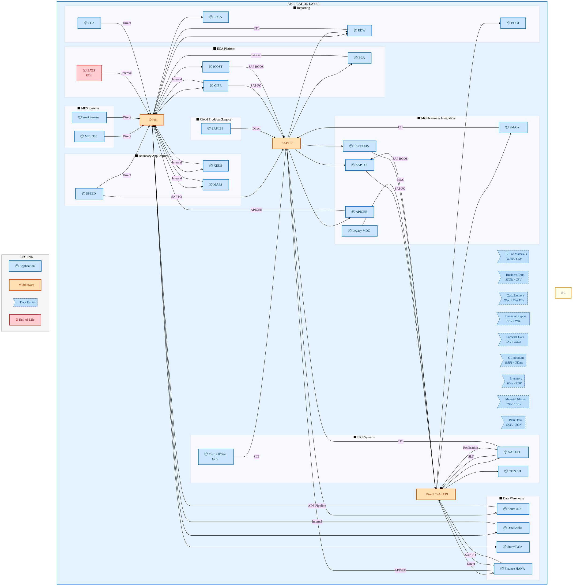

<div style="text-align:center; padding-top:20px;">
  <img src="data:image/svg+xml;base64,PHN2ZyB4bWxucz0iaHR0cDovL3d3dy53My5vcmcvMjAwMC9zdmciIHZpZXdCb3g9IjAgMCA4MDAgNDgwIiB3aWR0aD0iODAwIiBoZWlnaHQ9IjQ4MCI+DQogIDxkZWZzPg0KICAgIDxsaW5lYXJHcmFkaWVudCBpZD0iYmciIHgxPSIwJSIgeTE9IjAlIiB4Mj0iMTAwJSIgeTI9IjEwMCUiPg0KICAgICAgPHN0b3Agb2Zmc2V0PSIwJSIgc3R5bGU9InN0b3AtY29sb3I6IzAwNzFjNTtzdG9wLW9wYWNpdHk6MSIvPg0KICAgICAgPHN0b3Agb2Zmc2V0PSIxMDAlIiBzdHlsZT0ic3RvcC1jb2xvcjojMDBhZWVmO3N0b3Atb3BhY2l0eToxIi8+DQogICAgPC9saW5lYXJHcmFkaWVudD4NCiAgICA8bGluZWFyR3JhZGllbnQgaWQ9ImFjY2VudCIgeDE9IjAlIiB5MT0iMCUiIHgyPSIwJSIgeTI9IjEwMCUiPg0KICAgICAgPHN0b3Agb2Zmc2V0PSIwJSIgc3R5bGU9InN0b3AtY29sb3I6I2ZmZmZmZjtzdG9wLW9wYWNpdHk6MC4xNSIvPg0KICAgICAgPHN0b3Agb2Zmc2V0PSIxMDAlIiBzdHlsZT0ic3RvcC1jb2xvcjojZmZmZmZmO3N0b3Atb3BhY2l0eTowLjAyIi8+DQogICAgPC9saW5lYXJHcmFkaWVudD4NCiAgICA8cGF0dGVybiBpZD0iZ3JpZCIgd2lkdGg9IjQwIiBoZWlnaHQ9IjQwIiBwYXR0ZXJuVW5pdHM9InVzZXJTcGFjZU9uVXNlIj4NCiAgICAgIDxwYXRoIGQ9Ik0gNDAgMCBMIDAgMCAwIDQwIiBmaWxsPSJub25lIiBzdHJva2U9InJnYmEoMjU1LDI1NSwyNTUsMC4wNykiIHN0cm9rZS13aWR0aD0iMC41Ii8+DQogICAgPC9wYXR0ZXJuPg0KICA8L2RlZnM+DQoNCiAgPCEtLSBCYWNrZ3JvdW5kIC0tPg0KICA8cmVjdCB3aWR0aD0iODAwIiBoZWlnaHQ9IjQ4MCIgZmlsbD0idXJsKCNiZykiIHJ4PSI4Ii8+DQogIDxyZWN0IHdpZHRoPSI4MDAiIGhlaWdodD0iNDgwIiBmaWxsPSJ1cmwoI2dyaWQpIiByeD0iOCIvPg0KICA8cmVjdCB3aWR0aD0iODAwIiBoZWlnaHQ9IjQ4MCIgZmlsbD0idXJsKCNhY2NlbnQpIiByeD0iOCIvPg0KDQogIDwhLS0gRGVjb3JhdGl2ZSBjaXJjdWl0L2FyY2hpdGVjdHVyZSBsaW5lcyAtLT4NCiAgPGcgc3Ryb2tlPSJyZ2JhKDI1NSwyNTUsMjU1LDAuMTIpIiBzdHJva2Utd2lkdGg9IjEuNSIgZmlsbD0ibm9uZSI+DQogICAgPHBhdGggZD0iTSAwIDEwMCBMIDEyMCAxMDAgTCAxNjAgMTQwIEwgMjgwIDE0MCIvPg0KICAgIDxwYXRoIGQ9Ik0gMCAyNjAgTCA4MCAyNjAgTCAxMjAgMjIwIEwgMjAwIDIyMCBMIDI0MCAyNjAgTCAzNjAgMjYwIi8+DQogICAgPHBhdGggZD0iTSA1MjAgMTAwIEwgNjAwIDEwMCBMIDY0MCA2MCBMIDgwMCA2MCIvPg0KICAgIDxwYXRoIGQ9Ik0gNDQwIDM0MCBMIDU2MCAzNDAgTCA2MDAgMzAwIEwgNzIwIDMwMCBMIDc2MCAzNDAgTCA4MDAgMzQwIi8+DQogICAgPHBhdGggZD0iTSA2MDAgNDAwIEwgNjgwIDQwMCBMIDcyMCA0NDAiLz4NCiAgICA8cGF0aCBkPSJNIDAgNDAwIEwgNDAgNDAwIEwgODAgMzYwIi8+DQogICAgPHBhdGggZD0iTSAyMDAgNDIwIEwgMzIwIDQyMCBMIDM2MCAzODAgTCA0ODAgMzgwIi8+DQogICAgPHBhdGggZD0iTSA2NTAgNDQwIEwgNzUwIDQ0MCBMIDgwMCA0ODAiLz4NCiAgPC9nPg0KDQogIDwhLS0gRGVjb3JhdGl2ZSBub2RlcyAtLT4NCiAgPGcgZmlsbD0icmdiYSgyNTUsMjU1LDI1NSwwLjE4KSI+DQogICAgPGNpcmNsZSBjeD0iMTIwIiBjeT0iMTAwIiByPSI0Ii8+DQogICAgPGNpcmNsZSBjeD0iMjgwIiBjeT0iMTQwIiByPSI0Ii8+DQogICAgPGNpcmNsZSBjeD0iMjAwIiBjeT0iMjIwIiByPSI0Ii8+DQogICAgPGNpcmNsZSBjeD0iMzYwIiBjeT0iMjYwIiByPSI0Ii8+DQogICAgPGNpcmNsZSBjeD0iNjAwIiBjeT0iMTAwIiByPSI0Ii8+DQogICAgPGNpcmNsZSBjeD0iNzIwIiBjeT0iMzAwIiByPSI0Ii8+DQogICAgPGNpcmNsZSBjeD0iNTYwIiBjeT0iMzQwIiByPSI0Ii8+DQogICAgPGNpcmNsZSBjeD0iODAiIGN5PSIzNjAiIHI9IjQiLz4NCiAgICA8Y2lyY2xlIGN4PSI0ODAiIGN5PSIzODAiIHI9IjQiLz4NCiAgICA8Y2lyY2xlIGN4PSIzMjAiIGN5PSI0MjAiIHI9IjQiLz4NCiAgPC9nPg0KDQogIDwhLS0gVE9HQUYgQkRBVCBib3hlcyAtLT4NCiAgPGcgZm9udC1mYW1pbHk9IlNlZ29lIFVJLCBBcmlhbCwgc2Fucy1zZXJpZiIgZm9udC1zaXplPSIxNCIgZm9udC13ZWlnaHQ9IjYwMCI+DQogICAgPCEtLSBCIC0tPg0KICAgIDxyZWN0IHg9IjE1MCIgeT0iMTQwIiB3aWR0aD0iMTIwIiBoZWlnaHQ9IjQwIiByeD0iNSIgZmlsbD0icmdiYSgyNTUsMjU1LDI1NSwwLjE4KSIgc3Ryb2tlPSJyZ2JhKDI1NSwyNTUsMjU1LDAuMykiIHN0cm9rZS13aWR0aD0iMSIvPg0KICAgIDx0ZXh0IHg9IjIxMCIgeT0iMTY1IiB0ZXh0LWFuY2hvcj0ibWlkZGxlIiBmaWxsPSIjZmZmIj5CdXNpbmVzczwvdGV4dD4NCiAgICA8IS0tIEQgLS0+DQogICAgPHJlY3QgeD0iMjkwIiB5PSIxNDAiIHdpZHRoPSIxMjAiIGhlaWdodD0iNDAiIHJ4PSI1IiBmaWxsPSJyZ2JhKDI1NSwyNTUsMjU1LDAuMTgpIiBzdHJva2U9InJnYmEoMjU1LDI1NSwyNTUsMC4zKSIgc3Ryb2tlLXdpZHRoPSIxIi8+DQogICAgPHRleHQgeD0iMzUwIiB5PSIxNjUiIHRleHQtYW5jaG9yPSJtaWRkbGUiIGZpbGw9IiNmZmYiPkRhdGE8L3RleHQ+DQogICAgPCEtLSBBIC0tPg0KICAgIDxyZWN0IHg9IjQzMCIgeT0iMTQwIiB3aWR0aD0iMTIwIiBoZWlnaHQ9IjQwIiByeD0iNSIgZmlsbD0icmdiYSgyNTUsMjU1LDI1NSwwLjE4KSIgc3Ryb2tlPSJyZ2JhKDI1NSwyNTUsMjU1LDAuMykiIHN0cm9rZS13aWR0aD0iMSIvPg0KICAgIDx0ZXh0IHg9IjQ5MCIgeT0iMTY1IiB0ZXh0LWFuY2hvcj0ibWlkZGxlIiBmaWxsPSIjZmZmIj5BcHBsaWNhdGlvbjwvdGV4dD4NCiAgICA8IS0tIFQgLS0+DQogICAgPHJlY3QgeD0iNTcwIiB5PSIxNDAiIHdpZHRoPSIxMjAiIGhlaWdodD0iNDAiIHJ4PSI1IiBmaWxsPSJyZ2JhKDI1NSwyNTUsMjU1LDAuMTgpIiBzdHJva2U9InJnYmEoMjU1LDI1NSwyNTUsMC4zKSIgc3Ryb2tlLXdpZHRoPSIxIi8+DQogICAgPHRleHQgeD0iNjMwIiB5PSIxNjUiIHRleHQtYW5jaG9yPSJtaWRkbGUiIGZpbGw9IiNmZmYiPlRlY2hub2xvZ3k8L3RleHQ+DQogIDwvZz4NCg0KICA8IS0tIENvbm5lY3RpbmcgbGluZXMgYmV0d2VlbiBCREFUIGJveGVzIC0tPg0KICA8ZyBzdHJva2U9InJnYmEoMjU1LDI1NSwyNTUsMC4yNSkiIHN0cm9rZS13aWR0aD0iMSI+DQogICAgPGxpbmUgeDE9IjI3MCIgeTE9IjE2MCIgeDI9IjI5MCIgeTI9IjE2MCIvPg0KICAgIDxsaW5lIHgxPSI0MTAiIHkxPSIxNjAiIHgyPSI0MzAiIHkyPSIxNjAiLz4NCiAgICA8bGluZSB4MT0iNTUwIiB5MT0iMTYwIiB4Mj0iNTcwIiB5Mj0iMTYwIi8+DQogIDwvZz4NCg0KICA8IS0tIE1haW4gdGl0bGUgLS0+DQogIDx0ZXh0IHg9IjQwMCIgeT0iMjYwIiB0ZXh0LWFuY2hvcj0ibWlkZGxlIiBmb250LWZhbWlseT0iU2Vnb2UgVUksIEFyaWFsLCBzYW5zLXNlcmlmIiBmb250LXNpemU9IjM2IiBmb250LXdlaWdodD0iNzAwIiBmaWxsPSIjZmZmZmZmIiBsZXR0ZXItc3BhY2luZz0iMSI+DQogICAgSUFPIEFyY2hpdGVjdHVyZQ0KICA8L3RleHQ+DQogIDx0ZXh0IHg9IjQwMCIgeT0iMzAwIiB0ZXh0LWFuY2hvcj0ibWlkZGxlIiBmb250LWZhbWlseT0iU2Vnb2UgVUksIEFyaWFsLCBzYW5zLXNlcmlmIiBmb250LXNpemU9IjE4IiBmb250LXdlaWdodD0iNDAwIiBmaWxsPSJyZ2JhKDI1NSwyNTUsMjU1LDAuOCkiIGxldHRlci1zcGFjaW5nPSIyIj4NCiAgICBUT0dBRiBCREFUIMK3IElBTyBQcm9ncmFtIMK3IElETSAyLjANCiAgPC90ZXh0Pg0KDQogIDwhLS0gQm90dG9tIGFjY2VudCBiYXIgLS0+DQogIDxyZWN0IHg9IjI4MCIgeT0iMzQwIiB3aWR0aD0iMjQwIiBoZWlnaHQ9IjMiIHJ4PSIxLjUiIGZpbGw9InJnYmEoMjU1LDI1NSwyNTUsMC40KSIvPg0KDQogIDwhLS0gSW50ZWwgdGV4dCAtLT4NCiAgPHRleHQgeD0iNDAwIiB5PSIzODAiIHRleHQtYW5jaG9yPSJtaWRkbGUiIGZvbnQtZmFtaWx5PSJTZWdvZSBVSSwgQXJpYWwsIHNhbnMtc2VyaWYiIGZvbnQtc2l6ZT0iMTMiIGZpbGw9InJnYmEoMjU1LDI1NSwyNTUsMC41KSIgbGV0dGVyLXNwYWNpbmc9IjMiPg0KICAgIElOVEVMIENPTkZJREVOVElBTA0KICA8L3RleHQ+DQo8L3N2Zz4NCg==" alt="IAO Architecture" style="width:100%; border-radius:8px;" />
  <h1 style="font-size:36px; margin-top:24px;">DS-020 — Perform Product Costing and Inventory Valuation</h1>
  <h2 style="font-size:24px;">Architecture Document (TOGAF BDAT)</h2>
  <p style="font-size:18px; color:#555;">Finance Plan To Report (FPR) Tower<br/>
  Capability DS-020 · DS Provide Decision Support</p>
  <p style="font-size:14px; color:#888;">IAO Program · R1 – R5<br/>
  Generated: April 2026<br/>
  Sajiv Francis</p>
  <p style="font-size:12px; color:#aaa;">IAO Architecture Pipeline — Intel Confidential</p>
</div>

<style>
@media print {
  @page { size: A4; margin: 10mm 0; }
  .mermaid { page-break-inside: avoid; overflow: visible; }
  pre, table { page-break-inside: avoid; }
  h2, h3, h4 { page-break-after: avoid; }
}
.mermaid { overflow: visible; }
.mermaid svg { max-width: 100%; height: auto !important; }
nav.toc { margin: 16px 0 24px 0; }
nav.toc ol, nav.toc ul { list-style: none; padding-left: 0; margin: 0; }
nav.toc > ol > li { margin-bottom: 6px; font-weight: 600; font-size: 14px; }
nav.toc > ol > li > ul { padding-left: 28px; margin-top: 4px; }
nav.toc > ol > li > ul > li { font-weight: 400; font-size: 13px; margin-bottom: 2px; }
nav.toc a { color: #0071c5; text-decoration: none; }
nav.toc a:hover { text-decoration: underline; }
</style>


<div class="page-footer"><span>Page 1</span><span><a href="#toc">↑ Back to TOC</a></span><span>DS-020 — Perform Product Costing and Inventory Valuation</span></div>
<div style="page-break-before: always;"></div>


<a id="toc"></a>

## Table of Contents

<nav class="toc">
<ol>
  <li><a href="#1-executive-summary">1. Executive Summary</a></li>
  <li><a href="#2-business-context-objectives">2. Business Context &amp; Objectives</a>
    <ul>
      <li><a href="#21-classification">2.1 Classification</a></li>
      <li><a href="#22-business-drivers">2.2 Business Drivers</a></li>
      <li><a href="#23-success-criteria">2.3 Success Criteria</a></li>
      <li><a href="#24-companion-documents">2.4 Companion Documents</a></li>
    </ul>
  </li>
  <li><a href="#3-business-architecture-togaf-b">3. Business Architecture (TOGAF &ldquo;B&rdquo;)</a>
    <ul>
      <li><a href="#31-business-process-overview">3.1 Business Process Overview</a></li>
      <li><a href="#32-business-process-diagrams">3.2 Business Process Diagrams</a></li>
      <li><a href="#33-business-roles-responsibilities">3.3 Business Roles &amp; Responsibilities</a></li>
    </ul>
  </li>
  <li><a href="#4-data-architecture-togaf-d">4. Data Architecture (TOGAF &ldquo;D&rdquo;)</a>
    <ul>
      <li><a href="#41-data-entities-ownership">4.1 Data Entities &amp; Ownership</a></li>
      <li><a href="#42-data-flow-diagrams">4.2 Data Flow Diagrams</a></li>
      <li><a href="#43-data-lineage">4.3 Data Lineage</a></li>
      <li><a href="#44-ricefw-data-objects">4.4 RICEFW Data Objects</a></li>
      <li><a href="#45-data-governance-quality">4.5 Data Governance &amp; Quality</a></li>
    </ul>
  </li>
  <li><a href="#5-application-architecture-togaf-a">5. Application Architecture (TOGAF &ldquo;A&rdquo;)</a>
    <ul>
      <li><a href="#51-icost-current-state-application-landscape">5.1 Current-State Application Landscape</a></li>
      <li><a href="#52-s/4-hana-future-state-application-landscape">5.2 Future-State Application Landscape</a></li>
      <li><a href="#53-change-impact-summary">5.3 Change Impact Summary</a></li>
      <li><a href="#54-component-overview">5.4 Component Overview</a></li>
      <li><a href="#55-ricefw-inventory">5.5 RICEFW Inventory</a></li>
      <li><a href="#56-integration-patterns">5.6 Integration Patterns</a></li>
    </ul>
  </li>
  <li><a href="#6-technology-architecture-togaf-t">6. Technology Architecture (TOGAF &ldquo;T&rdquo;)</a>
    <ul>
      <li><a href="#61-platform-infrastructure">6.1 Platform &amp; Infrastructure</a></li>
      <li><a href="#62-sap-development-object-status">6.2 SAP Development Object Status</a></li>
      <li><a href="#63-nfrs-design-principles">6.3 NFRs &amp; Design Principles</a></li>
      <li><a href="#64-security-governance">6.4 Security &amp; Governance</a></li>
    </ul>
  </li>
  <li><a href="#7-project-context">7. Project Context</a>
    <ul>
      <li><a href="#71-project-roadmap-go-live-plan">7.1 Project Roadmap &amp; Go-Live Plan</a></li>
      <li><a href="#72-raid-log">7.2 RAID Log</a></li>
      <li><a href="#73-recommendations-next-steps">7.3 Recommendations &amp; Next Steps</a></li>
    </ul>
  </li>
</ol>
</nav>


<div class="page-footer"><span>Page 2</span><span><a href="#toc">↑ Back to TOC</a></span><span>DS-020 — Perform Product Costing and Inventory Valuation</span></div>
<div style="page-break-before: always;"></div>


## 1. Executive Summary

This Architecture Document defines the **Business, Data, Application, and Technology** (BDAT) architecture for **DS-020 Perform Product Costing and Inventory Valuation** within the IAO program. It includes 15 BPMN process diagram(s) in Section 3.

| Dimension | Value |
|-----------|-------|
| **Tower** | Finance Plan To Report (FPR) |
| **Process Group** | DS Provide Decision Support |
| **Capability** | DS-020 - Perform Product Costing and Inventory Valuation |
| **Release** | R1 – R5 |
| **Total Systems** | 61 |
| **System Status** | 47 Deployed, 8 Developing, 4 EOL, 2 Pending IAPM |
| **RICEFW Objects** | 10 Interfaces, 2 Conversions, 15 Enhancements |

**Change Summary**: 22 new flow chains, 24 removed, 0 modified, 0 unchanged between ICOST and S/4 HANA states.

> All system nodes in architecture diagrams are **IAPM-linked** — click any node to open its IAPM page. Diagrams require `securityLevel: 'loose'` for click events.


<div class="page-footer"><span>Page 3</span><span><a href="#toc">↑ Back to TOC</a></span><span>DS-020 — Perform Product Costing and Inventory Valuation</span></div>
<div style="page-break-before: always;"></div>


## 2. Business Context & Objectives

### 2.1 Classification

| Level | Value |
|-------|-------|
| **L0 Tower** | Finance Plan To Report |
| **L1 Process** | DS Provide Decision Support |
| **L2 Capability** | DS-020 - Perform Product Costing and Inventory Valuation |

### 2.2 Business Drivers

| # | Driver | Description | Strategic Alignment | Priority |
|---|--------|-------------|---------------------|----------|
| 1 | S/4 HANA Finance Consolidation | Migrate legacy costing and reporting platforms to unified S/4 HANA finance backbone | IDM 2.0 Core Finance Transformation | High |
| 2 | Real-Time Financial Visibility | Enable real-time cost reporting and variance analysis replacing batch-driven legacy processes | CFO Digital Finance Initiative | High |
| 3 | Regulatory Compliance Readiness | Ensure SOX compliance and audit trail continuity through the ERP transition period | Intel Corporate Compliance | Medium |
| 4 | DS-020 Process Migration | Migrate Perform Product Costing and Inventory Valuation business processes and 42 integrated systems from legacy to S/4 HANA target architecture | IDM 2.0 Finance | High |


<div class="page-footer"><span>Page 4</span><span><a href="#toc">↑ Back to TOC</a></span><span>DS-020 — Perform Product Costing and Inventory Valuation</span></div>
<div style="page-break-before: always;"></div>


### 2.3 Success Criteria

| Metric | Target | Measure | Baseline | Owner |
|--------|--------|---------|----------|-------|
| Month-End Close Cycle Time | < 3 business days | Calendar days from period close trigger to final posting | 5 business days (legacy) | Finance Controller |
| Cost Variance Accuracy | < 0.5% deviation | Variance between standard and actual cost post-migration | 1.2% (ICOST baseline) | Cost Accounting Lead |
| System Availability (Finance) | 99.9% uptime | S/4 HANA finance module availability during business hours | 99.5% (legacy) | IT Operations |
| DS-020 Migration Completeness | 100% flow chains validated | All 22 flow chains verified in target state | 0% (pre-migration) | Tower Architect |

### 2.4 Companion Documents

| Document | Description |
|----------|-------------|
| **Business Architecture** | Included in this document (Section 3) — process flows from BPMN diagrams |
| **This Document** | Full BDAT Architecture — Business + Data + Application + Technology |


<div class="page-footer"><span>Page 5</span><span><a href="#toc">↑ Back to TOC</a></span><span>DS-020 — Perform Product Costing and Inventory Valuation</span></div>
<div style="page-break-before: always;"></div>


## 3. Business Architecture (TOGAF "B")

### 3.1 Business Process Overview

This capability includes **15 business process(es)** modeled in BPMN 2.0, covering the end-to-end workflow for DS-020 Perform Product Costing and Inventory Valuation.

| # | Step ID | Process Name | Lanes | Tasks | Gateways |
|---|---------|--------------|-------|-------|----------|
| 1 | DS-020-020 | Perform Cumulative Costing Run | Cost Analyst | 10 | 3 |
| 2 | DS-020-030 | Analyze and Review Cost Estimates for Accuracy | Cost Accountant | 7 | 7 |
| 3 | DS-020-040 | Release Cost Estimates | Cost Accountant | 8 | 2 |
| 4 | DS-020-050 | Perform Off-Cycle, Unplanned Costing Run | Cost Accountant | 9 | 4 |
| 5 | DS-020-060 | Analyze Material Ledger | Cost Accountant | 4 | 4 |
| 6 | DS-020-080 | Verify Standard Cost | Cost Accountant | 10 | 10 |
| 7 | DS-020-090 | Review Production Orders | Cost Accountant | 7 | 9 |
| 8 | DS-020-100 | Actual Costing | Cost Accountant | 8 | 0 |
| 9 | DS-020-110 | Material Ledger Reports | Cost Accountant | 3 | 4 |
| 10 | DS-020-120 | Calculate and apply overhead for all MFG orders | Cost Accountant | 6 | 2 |
| 11 | DS-020-130 | Calculate WIP | Cost Accountant | 4 | 4 |
| 12 | DS-020-140 | Calculate Variances | Cost Accountant | 10 | 11 |
| 13 | DS-020-150 | Generate Variances Report | Cost Accountant | 12 | 11 |
| 14 | DS-020-160 | Execute Order Settlement | Cost Accountant | 4 | 3 |
| 15 | DS-020-170 | Product Costing Reports | TBD | 7 | 0 |


<div class="page-footer"><span>Page 6</span><span><a href="#toc">↑ Back to TOC</a></span><span>DS-020 — Perform Product Costing and Inventory Valuation</span></div>
<div style="page-break-before: always;"></div>


### 3.2 Business Process Diagrams


#### BUSINESS ARCHITECTURE — 3.2.1 DS-020-020 — Perform Cumulative Costing Run

**Swim Lanes**: Cost Analyst | **Tasks**: 10 | **Gateways**: 3

```mermaid
%%{init: {'theme': 'base', 'themeVariables': {'fontSize': '14px', 'fontFamily': 'Segoe UI, Arial, sans-serif','primaryColor': '#e8f0fe', 'primaryBorderColor': '#0071c5','lineColor': '#37474F', 'secondaryColor': '#f5f8fc'}, 'flowchart': {'useMaxWidth': false, 'htmlLabels': true, 'curve': 'basis', 'nodeSpacing': 40, 'rankSpacing': 50}} }%%
flowchart TD
    classDef startEvt fill:#4CAF50,stroke:#2E7D32,color:#000,font-weight:bold,stroke-width:2px,rx:20,ry:20
    classDef endEvt fill:#C62828,stroke:#B71C1C,color:#fff,font-weight:bold,stroke-width:2px,rx:20,ry:20
    classDef userTask fill:#E3F2FD,stroke:#1565C0,stroke-width:2px,color:#0D47A1
    classDef serviceTask fill:#FFF3E0,stroke:#E65100,stroke-width:2px,color:#BF360C
    classDef gateway fill:#FFF9C4,stroke:#F57F17,stroke-width:2px,color:#E65100
    classDef subProc fill:#F3E5F5,stroke:#7B1FA2,stroke-width:2px,color:#4A148C
    subgraph lane_0["Cost Analyst"]
        n1["fa:fa-user Check Material Master Data"]
        n2["fa:fa-user Check Production Version Then Explore Bill of Materials (BOM) and Routing"]
        n3["fa:fa-user Calculate the Standard Price Based on BOM and Routing"]
        n4["fa:fa-user Calculate Standard Price Based on PIR or Planned Price of Material Master"]
        n5["fa:fa-user Update Standard Price Based on PIR or Planned Price of Material Master"]
        n6["fa:fa-user Update the Standard Price Based on BOM and Routing"]
        n7["fa:fa-user Check for Existing Cost Estimate for the Period"]
        n8["fa:fa-user Reset the Existing Cost Estimates for the Period"]
        n9[["fa:fa-cog Calculate Moving Average Price for the Material"]]
        n10[["fa:fa-cog Update Moving Average Price for the Material"]]
        n11(["fa:fa-play Perform Cumulative Costing Run Initiated"])
        n12(["fa:fa-stop Perform Cumulative Costing Run Completed"])
        n13{{"fa:fa-code-branch Is Price Control = S ?"}}
        n14{{"fa:fa-code-branch Is Procurement Type = E?"}}
        n15{{"fa:fa-code-branch exclusiveGateway"}}
    end
    n11 --> n1
    n1 --> n13
    n13 -->|"Yes"| n7
    n13 -->|"No"| n9
    n14 -->|"No"| n4
    n14 -->|"Yes"| n2
    n2 --> n3
    n4 --> n5
    n3 --> n6
    n15 --> n12
    n5 --> n15
    n6 --> n15
    n9 --> n10
    n8 --> n14
    n7 --> n8
    n10 --> n15
    class n1 userTask
    class n2 userTask
    class n3 userTask
    class n4 userTask
    class n5 userTask
    class n6 userTask
    class n7 userTask
    class n8 userTask
    class n9 serviceTask
    class n10 serviceTask
    class n11 startEvt
    class n12 endEvt
    class n13 gateway
    class n14 gateway
    class n15 gateway
```

> **Legend**: <span style="color:#000;background:#4CAF50;padding:2px 6px;border-radius:10px;font-weight:bold;font-size:9pt">● Start</span> · <span style="color:#fff;background:#C62828;padding:2px 6px;border-radius:10px;font-weight:bold;font-size:9pt">● End</span> · <span style="background:#E3F2FD;padding:2px 6px;border:1px solid #1565C0;font-size:9pt">User Task</span> · <span style="background:#FFF3E0;padding:2px 6px;border:1px solid #E65100;font-size:9pt">Service Task</span> · <span style="background:#FFF9C4;padding:2px 6px;border:1px solid #F57F17;font-size:9pt">◇ Gateway</span> · <span style="background:#F3E5F5;padding:2px 6px;border:1px solid #7B1FA2;font-size:9pt">Sub-Process</span>



<div style="text-align:center; margin:4px 0 8px 0; font-size:11px;"><a href="https://mermaid.live/view#pako:eNqtVn-P4jYQ_SpWTivupCDlJ2EjtRUEUq3UbVfL3lXVUVUmcSBax0a2w0I5vnvHIQHChat0bf6AzPPMezOTxOO9kfCUGKFxd7fPWa5CtO-pFSlIL0S9BZakZ6Ij8AmLHC8okT3tk3GmZvnflZvtrbfaTWMxLnK60-iMLDlBHx9MNIJAaiKJmexLIvKsZ_bWIi-w2EWccqG935FhZmWVWr005iIl4uxgWYGd-BBKc0bOsBt4gRfrOEkSztIWaeZnwyzpHXRylL8lKyxUlX4pySPe_p6nagV2hqkk4LNSBf0FLwjVNSpRaiwpxaZpRi61DoOGzdY4ydkScM8CSGD2eoZ863BAh7u7OTuJopfJnCG4EoqlnJAMSQXwdKNQllMavvOiUexbplSCv5LwnTMNJq5jJrqSEEq3TN3c_hvJlysVLjhNa9f-m64hdNZbU2xDxzLFDn6vtAhLz0rRwBk6w5PSOLAjO2qUsiz7T0rQV_GC5WutNXVjJ56ctGx_4EfW13xNmRMvGNnXfSJikyfkgjSOY3d6btV04NvWbdJx7A6s6Ip0iRV5w7sz4X3knQhjP4jt4CbhUe86y3LxJHjSELpTP_ZPhMHYjkfOTUJvZHvDOkPgWQq8XiGKGfnL-jw3Ii4VGjFMd1LNjT-PbvpiNqxmOMxwX3cdRSuSvKJHqEx_bnAj4Q5NsMLtMKcrDJJPy0TlnKFPREj9_7IiDE23a8iRoDHUhXh2opfo_fi3xw8IsxQ981LBi99Wca9UME1KCsEI9hI0U1h_qCnIwqNFY9hmUgSSQHmb0bvFeIvt6eEZcYGeoJWMNKsXNdQtaqv4bZWP6_R_lxh0Snx3X4Ku55lBVtNtLrU7ql6hKdwXWkgvabEnyJCnba5hm-uZSKIq524u-U2y-88ntoQvLx7YI99oqtGGCLwkdbENU9M64Gq97Fabre7ad1HZ709Uawq7ACQPIQWKykInmG9IVaYmfi4ZeoCxmAOVLu_DJY9z5pGKr_-NJ-LFmpIOHne_P5eWkv4CxkmyQg-yrieCDVlwin5AM_TT3DgcLoO9bwRzGF4wuRmMn92aQPz0q3C_O5xsE1pKqODn4055DoNZcryBPqJ-_0f4b-zadBvb1cCXufEHkXPjC7yp1wu_8gq_b3CvjXvXeEPk1AvOUbER9I6mX5vu0Rw0LH6dXxPd2I3_4Mq-r-16r2fD2m7SCo72sOG32vHVbNBdaWZiC3a6Ybcb9rphvxsedMNBNzzshu8vJ2-7Iuv2kn0617Rxpz6DtFG3GcRt2OuG_QY2TKMgosB5aoR7ozqcwgE2JRkuqTIOpoFLxWc7lhhhdYgzymqzmOQYZmtxBA__AF4zebY=" title="View full diagram">&#128065; View Diagram</a></div>


<div class="page-footer"><span>Page 7</span><span><a href="#toc">↑ Back to TOC</a></span><span>DS-020 — Perform Product Costing and Inventory Valuation</span></div>
<div style="page-break-before: always;"></div>


#### BUSINESS ARCHITECTURE — 3.2.2 DS-020-030 — Analyze and Review Cost Estimates for Accuracy

**Swim Lanes**: Cost Accountant | **Tasks**: 7 | **Gateways**: 7

> **Legend**: <span style="color:#000;background:#4CAF50;padding:2px 6px;border-radius:10px;font-weight:bold;font-size:9pt">● Start</span> · <span style="color:#fff;background:#C62828;padding:2px 6px;border-radius:10px;font-weight:bold;font-size:9pt">● End</span> · <span style="background:#E3F2FD;padding:2px 6px;border:1px solid #1565C0;font-size:9pt">User Task</span> · <span style="background:#FFF3E0;padding:2px 6px;border:1px solid #E65100;font-size:9pt">Service Task</span> · <span style="background:#FFF9C4;padding:2px 6px;border:1px solid #F57F17;font-size:9pt">◇ Gateway</span> · <span style="background:#F3E5F5;padding:2px 6px;border:1px solid #7B1FA2;font-size:9pt">Sub-Process</span>


<div style="text-align:center; margin:4px 0 8px 0; font-size:11px;"><a href="https://mermaid.live/view#pako:eNqlVm2P4jYQ_itWTitaCaQk5IXlQys2kGrV7u1q2buqKlVlEmex1tiR7cByHP-945DwEsJ-uPIBxc_MPPPiGdtbKxEpsYbWzc2WcqqHaNvRC7IknSHqzLEinS7aA1-xpHjOiOoYnUxwPaXfSjXHy9-NmsFivKRsY9ApeRUEfbnvohEYsi5SmKueIpJmnW4nl3SJ5SYSTEij_YkMMjsrvVWiOyFTIo8Kth06iQ-mjHJyhPuhF3qxsVMkETw9I838bJAlnZ0Jjol1ssBSl-EXijzg9z9pqhewzjBTBHQWesn-wHPCTI5aFgZLCrmqi0GV8cOhYNMcJ5S_Au7ZAEnM346Qb-92aHdzM-MHp-hlPOMIfgnDSo1JhpQGeLLSKKOMDT950Sj27a7SUryR4Sd3Eo77bjcxmQwhdbtrittbE_q60MO5YGml2lubHIZu_t6V70PX7soN_Dd8EZ4ePUWBO3AHB093oRM5Ue0py7L_5QnqKl-weqt8TfqxG48Pvhw_8CP7kq9Oc-yFI6dZJyJXNCEnpHEc9yfHUk0C37Gvk97F_cCOGqSvWJM13hwJbyPvQBj7YeyEVwn3_ppRFvMnKZKasD_xY_9AGN458ci9SuiNHG9QRQg8rxLnC8QwJ__af8-sSCiNRkkiCq4x1zPrn72m-XEHFDI8zHDPFB5FC5K8IZhWZIIpJEwth9bb5AQ9QMZmDOFDwdc5jXuN5u7x4Vyzf01zlGi6onoDnmG3FMqERM-i0DARtYwSdU7mXY3-_hlR_nHM_jXjKZQJToF0HwkS2R6FGTCxPLGLIgbXi2gIIsySgmFNBUdYoRxUjPArZsUeLA_GJml4TgraNIV0PoiwzvacZ_DTgShn0LEjjtnmG0HAgJ7JipI1KjtkojScmrqqPPRLIXGyQfdwpFOAU2D9-YT29kirtMg_3L5ILHPBoZNU-cnIJZ1jOvWJSDBboscs60WbhMHp-YVD0JyTtAzSkD0XvNHCznZbh2Kuot4cDtNkge7VZRPf84WAchpBWiSm-L_OrN3ulM1tZztpj5wkpqdOyX8nG7MpulAXfP12PvKesELRFfltf5I0zbwfM_PbzcZUJZLk8A0zhGI4CtKLQIMf8xgezbCUYq16mGmUY4kZI-zCCKZo_8Ed1Ov9YravWg-qdb-WlwrfZ9ZfZuy_G1dNyWexF7i1oF9x1Otwvz5QupXh9OWxtPQrQW3nVWuvGUsF1BH4lTyo1kFjXfl1an7HP4_4tsaDhuOD4iFpu5FLnavbDPGQWzGHYeEaxtcMTMniNZU-i2t9XOoHJ7eT2an6Vj6D3Xa43w577bDfDgftcNgODw6PoTP4tnq3nCdjtytDU1WX-jnstsP9dthrh_12OGiHwxq2utaSyCWmqTXcWuUjGh7aKclwwbS161q40GK64Yk1LB-bVpGbO2JMMbwBlntw9x-c5a7o" title="View full diagram">&#128065; View Diagram</a></div>


<div class="page-footer"><span>Page 8</span><span><a href="#toc">↑ Back to TOC</a></span><span>DS-020 — Perform Product Costing and Inventory Valuation</span></div>
<div style="page-break-before: always;"></div>


#### BUSINESS ARCHITECTURE — 3.2.3 DS-020-040 — Release Cost Estimates

**Swim Lanes**: Cost Accountant | **Tasks**: 8 | **Gateways**: 2

> **Legend**: <span style="color:#000;background:#4CAF50;padding:2px 6px;border-radius:10px;font-weight:bold;font-size:9pt">● Start</span> · <span style="color:#fff;background:#C62828;padding:2px 6px;border-radius:10px;font-weight:bold;font-size:9pt">● End</span> · <span style="background:#E3F2FD;padding:2px 6px;border:1px solid #1565C0;font-size:9pt">User Task</span> · <span style="background:#FFF3E0;padding:2px 6px;border:1px solid #E65100;font-size:9pt">Service Task</span> · <span style="background:#FFF9C4;padding:2px 6px;border:1px solid #F57F17;font-size:9pt">◇ Gateway</span> · <span style="background:#F3E5F5;padding:2px 6px;border:1px solid #7B1FA2;font-size:9pt">Sub-Process</span>


<div style="text-align:center; margin:4px 0 8px 0; font-size:11px;"><a href="https://mermaid.live/view#pako:eNqlVu-P4jYQ_VesrFa0UpDyk7D50IoNpDqpW52Oa6uqVJVxJmCtcajt7MJx_O8dkwQ2HKt-aD4gz8u898aDM8nBYVUBTurc3x-45CYlh4FZwwYGKRksqYaBSxrgN6o4XQrQA5tTVtLM-ZdTmh9tdzbNYjndcLG36BxWFZBfP7hkgkThEk2lHmpQvBy4g63iG6r2WSUqZbPvYFx65cmtvfVYqQLUJcHzEp_FSBVcwgUOkyiJcsvTwCpZ9ETLuByXbHC0xYnqla2pMqfyaw1PdPc7L8wa45IKDZizNhvxM12CsHs0qrYYq9VL1wyurY_Ehs23lHG5QjzyEFJUPl-g2DseyfH-fiHPpuTzdCEJXkxQradQEm0Qnr0YUnIh0rsom-Sx52qjqmdI74JZMg0Dl9mdpLh1z7XNHb4CX61NuqxE0aYOX-0e0mC7c9UuDTxX7fH3ygtkcXHKRsE4GJ-dHhM_87POqSzL_-WEfVWfqX5uvWZhHuTTs5cfj-LM-1av2-Y0Sib-dZ9AvXAGb0TzPA9nl1bNRrHvvS_6mIcjL7sSXVEDr3R_EXzIorNgHie5n7wr2PhdV1kvP6qKdYLhLM7js2Dy6OeT4F3BaOJH47ZC1Fkpul0TQSX87f25cLJKGzJhrKqlodIsnL-aTHtJHxNKmpZ0aBtPMgW4MUKJJeFZJJ9q2ScEfcIcBDBDnpBln1FNykp15D4x7BNnO2A1Wt3Mjfq5E0nF_gsQnCKnfE0yKlgt0LToE-M-8Ymq5zOLzNBpg5w-ZdSnfMIN4dD6L1Zy1bc1sMbpo8KzRrg8twQXGld9-vi6zmdA539qrqBAW6WwqbySus96-O5M2wo8fF2tvTo1-YBTmLe9-f7tf-1d-NpU22teK_cNzT8cOpod9cMlDiu2JrBjotb8BX5qnoWFczy-pQW3aVOumYItrjl65ngqix8vVBw0zUI-kOHwB5Rpw7AJozYcNWHShn4TBm0YN-GoDYNWqtPy2_SwjaP2fkf3T4SvC-eXauF8RbkWH1_pJG3sXfP-AH0ijt885LbIbrj14OA2HN6Go9twfBse3YaT2_D4NvxwftX0t-O1r4U-6nezsQ8HHey4zgbUhvLCSQ_O6cMAPx4KKGktjHN0HVqbar6XzElPL1Cn3hbInHKKc23TgMd_AWPLqlc=" title="View full diagram">&#128065; View Diagram</a></div>


<div class="page-footer"><span>Page 9</span><span><a href="#toc">↑ Back to TOC</a></span><span>DS-020 — Perform Product Costing and Inventory Valuation</span></div>
<div style="page-break-before: always;"></div>


#### BUSINESS ARCHITECTURE — 3.2.4 DS-020-050 — Perform Off-Cycle, Unplanned Costing Run

**Swim Lanes**: Cost Accountant | **Tasks**: 9 | **Gateways**: 4

```mermaid
%%{init: {'theme': 'base', 'themeVariables': {'fontSize': '14px', 'fontFamily': 'Segoe UI, Arial, sans-serif','primaryColor': '#e8f0fe', 'primaryBorderColor': '#0071c5','lineColor': '#37474F', 'secondaryColor': '#f5f8fc'}, 'flowchart': {'useMaxWidth': false, 'htmlLabels': true, 'curve': 'basis', 'nodeSpacing': 40, 'rankSpacing': 50}} }%%
flowchart TD
    classDef startEvt fill:#4CAF50,stroke:#2E7D32,color:#000,font-weight:bold,stroke-width:2px,rx:20,ry:20
    classDef endEvt fill:#C62828,stroke:#B71C1C,color:#fff,font-weight:bold,stroke-width:2px,rx:20,ry:20
    classDef userTask fill:#E3F2FD,stroke:#1565C0,stroke-width:2px,color:#0D47A1
    classDef serviceTask fill:#FFF3E0,stroke:#E65100,stroke-width:2px,color:#BF360C
    classDef gateway fill:#FFF9C4,stroke:#F57F17,stroke-width:2px,color:#E65100
    classDef subProc fill:#F3E5F5,stroke:#7B1FA2,stroke-width:2px,color:#4A148C
    subgraph lane_0["Cost Accountant"]
        n1["fa:fa-user Validate the Costing Related Master Data"]
        n2["fa:fa-user Create Cost Estimate"]
        n3["fa:fa-user Make Required Corrections"]
        n4["fa:fa-user Mark the Cost Estimate"]
        n5["fa:fa-user Release the Cost Estimate"]
        n6["fa:fa-user Check the Price in Material Master"]
        n7["fa:fa-user Make Required Corrections"]
        n8["fa:fa-user Execute Costing Run"]
        n9["fa:fa-user Validate Cost"]
        n10(["fa:fa-play Off-Cycle, Unplanned Costing Run Initiated"])
        n11(["fa:fa-stop Off-Cycle, Unplanned Costing Run Completed"])
        n12{{"fa:fa-code-branch Discrepancies Found?"}}
        n13{{"fa:fa-code-branch exclusiveGateway"}}
        n14{{"fa:fa-code-branch Discrepancies Found?"}}
        n15{{"fa:fa-code-branch exclusiveGateway"}}
    end
    n1 --> n12
    n10 --> n13
    n13 --> n1
    n3 --> n13
    n4 --> n5
    n5 --> n6
    n12 -->|"No"| n2
    n8 --> n9
    n2 --> n15
    n15 --> n8
    n7 --> n15
    n9 --> n14
    n14 -->|"No"| n4
    n6 --> n11
    n12 -->|"Yes"| n3
    n14 -->|"Yes"| n7
    class n1 userTask
    class n2 userTask
    class n3 userTask
    class n4 userTask
    class n5 userTask
    class n6 userTask
    class n7 userTask
    class n8 userTask
    class n9 userTask
    class n10 startEvt
    class n11 endEvt
    class n12 gateway
    class n13 gateway
    class n14 gateway
    class n15 gateway
```

> **Legend**: <span style="color:#000;background:#4CAF50;padding:2px 6px;border-radius:10px;font-weight:bold;font-size:9pt">● Start</span> · <span style="color:#fff;background:#C62828;padding:2px 6px;border-radius:10px;font-weight:bold;font-size:9pt">● End</span> · <span style="background:#E3F2FD;padding:2px 6px;border:1px solid #1565C0;font-size:9pt">User Task</span> · <span style="background:#FFF3E0;padding:2px 6px;border:1px solid #E65100;font-size:9pt">Service Task</span> · <span style="background:#FFF9C4;padding:2px 6px;border:1px solid #F57F17;font-size:9pt">◇ Gateway</span> · <span style="background:#F3E5F5;padding:2px 6px;border:1px solid #7B1FA2;font-size:9pt">Sub-Process</span>



<div style="text-align:center; margin:4px 0 8px 0; font-size:11px;"><a href="https://mermaid.live/view#pako:eNqlVu-P4jYQ_VesrFa0UpDyk0A-tGIDqU7qtqfu3VVVqSrjOGBhnNR2dqEc_3vHkABJg0695gNiXua95xkn4xwsUmTUiq3HxwMTTMfoMNBruqWDGA2WWNGBjc7AJywZXnKqBiYnL4R-YX-f0tyg3Jk0g6V4y_jeoC90VVD08Z2NpkDkNlJYqKGikuUDe1BKtsVynxS8kCb7gY5zJz-51beeCplReU1wnMglIVA5E_QK-1EQBanhKUoKkbVE8zAf52RwNIvjxRtZY6lPy68Ufca7X1mm1xDnmCsKOWu95T_iJeWmRi0rg5FKvjbNYMr4CGjYS4kJEyvAAwcgicXmCoXO8YiOj48LcTFFH2YLgeAiHCs1ozlSGuD5q0Y54zx-CJJpGjq20rLY0PjBm0cz37OJqSSG0h3bNHf4RtlqreNlwbM6dfhmaoi9cmfLXew5ttzDb8eLiuzqlIy8sTe-OD1FbuImjVOe5__LCfoqP2C1qb3mfuqls4uXG47CxPm3XlPmLIimbrdPVL4yQm9E0zT159dWzUeh69wXfUr9kZN0RFdY0ze8vwpOkuAimIZR6kZ3Bc9-3VVWy_eyII2gPw_T8CIYPbnp1LsrGEzdYFyvEHRWEpdrxLGgfzq_L6ykUBpNCSkqobHQC-uPc6a5hAsJOY5zPDSNR58wZxmUhuCFRYYIzyP6hXKAMvSMlYacGda4LeK1RRJJjcTJdw4SW4jaBL9NeMYbCi5_VUyCTVJISYlmhVBtVtBlyc1lnXeMwjYFKqEwkb7EGnXqWVNydnov4UFCTIA3dAJmUt2TNj36qurGbdZ8R0mlbzahEu38yZ2dM4TOHjvfXHJLDg_tz3k-TPaEw3T6KAAR4rSwixF6B3OcmT0HoW9vldyrktJF-WWlpNiWnPYoeYdDo2TOj-ESJiBZoxlTRNIS_jOqUArPbPb9wjoeb6l-P5XuCK8Ue6U_nN_NLi34esfwvzrCvDz_ES4aDr8z9TaxUwN-A_g1UMd-535wjsM6DM_hqGF7Jv68sH4qFtZneBVrfHxOm9ShV4s2Km4tM67jqHN_UsdBkx-0bRp8VOe53eX8RtUp0e8KNDeim_lnutTM_Rbs9cN-Pxz0w2E_POqHo3543A9P-mHY5OZ0buNufZK2Ua85Ttqw3w8H_XDYwJZtbancYpZZ8cE6fXnB11lGc1xxbR1tC1e6eNkLYsWnLxSrKs3gmDEMB8f2DB7_AWrLFyU=" title="View full diagram">&#128065; View Diagram</a></div>


<div class="page-footer"><span>Page 10</span><span><a href="#toc">↑ Back to TOC</a></span><span>DS-020 — Perform Product Costing and Inventory Valuation</span></div>
<div style="page-break-before: always;"></div>


#### BUSINESS ARCHITECTURE — 3.2.5 DS-020-060 — Analyze Material Ledger

**Swim Lanes**: Cost Accountant | **Tasks**: 4 | **Gateways**: 4

> **Legend**: <span style="color:#000;background:#4CAF50;padding:2px 6px;border-radius:10px;font-weight:bold;font-size:9pt">● Start</span> · <span style="color:#fff;background:#C62828;padding:2px 6px;border-radius:10px;font-weight:bold;font-size:9pt">● End</span> · <span style="background:#E3F2FD;padding:2px 6px;border:1px solid #1565C0;font-size:9pt">User Task</span> · <span style="background:#FFF3E0;padding:2px 6px;border:1px solid #E65100;font-size:9pt">Service Task</span> · <span style="background:#FFF9C4;padding:2px 6px;border:1px solid #F57F17;font-size:9pt">◇ Gateway</span> · <span style="background:#F3E5F5;padding:2px 6px;border:1px solid #7B1FA2;font-size:9pt">Sub-Process</span>


<div style="text-align:center; margin:4px 0 8px 0; font-size:11px;"><a href="https://mermaid.live/view#pako:eNqlVl2P4jYU_StWRiNaKUj5JEweWjGBSCvtbEdl26oqVWUcB6IxNrIdGJblv_c6JAGy4aHbPCB8fM65H4lvcrSIyKgVW4-Px4IXOkbHgV7TDR3EaLDEig5sdAZ-x7LAS0bVwHBywfW8-FLR3GD7bmgGS_GmYAeDzulKUPTbBxtNQMhspDBXQ0VlkQ_swVYWGywPiWBCGvYDHedOXkWrt56FzKi8EBwnckkIUlZweoH9KIiC1OgUJYJnN6Z5mI9zMjiZ5JjYkzWWukq_VPQFv_9RZHoN6xwzRYGz1hv2ES8pMzVqWRqMlHLXNKNQJg6Hhs23mBR8BXjgACQxf7tAoXM6odPj44K3QdHn6YIjuAjDSk1pjpQGeLbTKC8Yix-CZJKGjq20FG80fvBm0dT3bGIqiaF0xzbNHe5psVrreClYVlOHe1ND7G3fbfkee44tD_DbiUV5domUjLyxN24jPUdu4iZNpDzP_1ck6Kv8jNVbHWvmp146bWO54ShMnG_9mjKnQTRxu32iclcQemWapqk_u7RqNgpd577pc-qPnKRjusKa7vHhYviUBK1hGkapG901PMfrZlkuX6UgjaE_C9OwNYye3XTi3TUMJm4wrjMEn5XE2zVimNN_nL8WViKURhNCRMk15nph_X1mmou7QMhxnOOhaTz6le4KukdzIMI5yNCrhM4hkSM4wOgFajYHEeVCVsArLEV2a-j1GrbSF7GDScC1ulX5vapqYHBCO-SglzwhuoQAVbWdhG_l4Q-tfsvgFra5faTZCvwmHLMDnFT0AaZZAZumwh-vDEYXA6XF9r5BIjZbRr81iEBfkb5QBI1uKqhSnykNw0tTVXUZblspMTncVjAGfa2BZyYriS4ER7-Yaddp1ZO5_5iRkoHlvX665im5ah_MoA7BPR6bis2wHy5hXJF1-7SUBDxVXrKfF9bpdC30vlfof68w-O9CGG7nPzxEw-FPYFIv3XrZrivg68L607TwKzzszYbX2fDrDa92aIl-hxjUG35NbIRBvW723aAjHHVz-iQqPOqmVOPjbgY1_tQNUOPu9YAyrWgG8w3s9cN-Pxz0w2H7KruBR_Vb5waM-rnjfvipH3adO7jbzPVb2OuH_X44aGDLtjZUbnCRWfHRqj6B4DMpozkumbZOtoVLLeYHTqy4-lSwym0GymmBYYJvzuDpXxUu9ug=" title="View full diagram">&#128065; View Diagram</a></div>


<div class="page-footer"><span>Page 11</span><span><a href="#toc">↑ Back to TOC</a></span><span>DS-020 — Perform Product Costing and Inventory Valuation</span></div>
<div style="page-break-before: always;"></div>


#### BUSINESS ARCHITECTURE — 3.2.6 DS-020-080 — Verify Standard Cost

**Swim Lanes**: Cost Accountant | **Tasks**: 10 | **Gateways**: 10

> **Legend**: <span style="color:#000;background:#4CAF50;padding:2px 6px;border-radius:10px;font-weight:bold;font-size:9pt">● Start</span> · <span style="color:#fff;background:#C62828;padding:2px 6px;border-radius:10px;font-weight:bold;font-size:9pt">● End</span> · <span style="background:#E3F2FD;padding:2px 6px;border:1px solid #1565C0;font-size:9pt">User Task</span> · <span style="background:#FFF3E0;padding:2px 6px;border:1px solid #E65100;font-size:9pt">Service Task</span> · <span style="background:#FFF9C4;padding:2px 6px;border:1px solid #F57F17;font-size:9pt">◇ Gateway</span> · <span style="background:#F3E5F5;padding:2px 6px;border:1px solid #7B1FA2;font-size:9pt">Sub-Process</span>


<div style="text-align:center; margin:4px 0 8px 0; font-size:11px;"><a href="https://mermaid.live/view#pako:eNqlV-9v6jYU_VesPFVsUpBi5yf5sIkGMj1tnary3pumMU0mcYrV4DA7act4_O-zgw1NFjaV8QHh43vOuffGjs3eyqqcWLF1c7OnjNYx2I_qNdmQUQxGKyzIyAZH4AvmFK9KIkYqpqhYvaB_tWHQ276qMIWleEPLnUIX5LEi4PNHG0wlsbSBwEyMBeG0GNmjLacbzHdJVVZcRX8gUeEUrZueuq14Tvg5wHFCmPmSWlJGzrAbeqGXKp4gWcXyjmjhF1GRjQ4qubJ6ydaY1236jSB3-PUXmtdrOS5wKYiMWdeb8ie8IqWqseaNwrKGP5tmUKF8mGzYYoszyh4l7jkS4pg9nSHfORzA4eZmyU6m4NNsyYD8ZCUWYkYKIGoJz59rUNCyjD94yTT1HVvUvHoi8Qc0D2cusjNVSSxLd2zV3PELoY_rOl5VZa5Dxy-qhhhtX23-GiPH5jv53fMiLD87JQGKUHRyug1hAhPjVBTF_3KSfeWfsHjSXnM3Rens5AX9wE-cf-qZMmdeOIX9PhH-TDPyRjRNU3d-btU88KFzWfQ2dQMn6Yk-4pq84N1ZcJJ4J8HUD1MYXhQ8-vWzbFb3vMqMoDv3U_8kGN7CdIouCnpT6EU6Q6nzyPF2DUrMyB_Ob0srqUQNpllWNazGrF5avx8j1YdBGVDguMBj1XiQrEn2BORuBXeyQLXrwD2XzeuSUJf0Re3IXctqve6lNZMLuUtyu6Q7_ETAA_mzoZzkksc5yWpaMQHq6t9kvIveU8l_pvXuAtG_SFz8mF7gBD0OLmku-3LMb7Etaa-b4YV45aIcwIMciS4nGsxrIR-VfBPlrVWXMHlHI_-jJ9B5h9blNkH4zUlnW8pd0fbnoWEg4QQrAfBRngxUFp9L5rdvqehMFXW1PRferjsBPm9VB3NA2XlJ3mEhf_WV3P3eKKkTabyS79RsDWZUZJxs5W8q5VK5C_Lvl9bh8JbqDVPJa1Y2gj6TH467vU_zr3cMrqeG11Oj66mTq6nIuaq7CF5HQ--lybPt-INBMB5_p5aDHiM9ds28dwSQGWsCMoDbE9Dx0DeENuDr0vq5WlpfVWv6E7-q14OcMZa-VghMoN9T0KcdC3RgqMehHkd6HOnxxAhNukLQ1ICcY6SpYaJrNKkiXfSpJh1_ygQGvVqg00_ezJySCfsU4w6jSzPIPJ2-hi4o7CtoPOqnqfGg3xjjaJ5ue1SrRWKuKB0YDcPuMOwNw_4wHAzD4TAcDcOTYVg-vmEcni6YXRzpy2AXdc2NqAt7w7A_DAfDcDgMR8PwZBCWq3oQhsMwMrBlWxvCN5jmVry32r8x8q9OTgrclLV1sC3c1NVixzIrbq_7VtOeVzOK5S1scwQPfwMuTxrz" title="View full diagram">&#128065; View Diagram</a></div>


<div class="page-footer"><span>Page 12</span><span><a href="#toc">↑ Back to TOC</a></span><span>DS-020 — Perform Product Costing and Inventory Valuation</span></div>
<div style="page-break-before: always;"></div>


#### BUSINESS ARCHITECTURE — 3.2.7 DS-020-090 — Review Production Orders

**Swim Lanes**: Cost Accountant | **Tasks**: 7 | **Gateways**: 9

> **Legend**: <span style="color:#000;background:#4CAF50;padding:2px 6px;border-radius:10px;font-weight:bold;font-size:9pt">● Start</span> · <span style="color:#fff;background:#C62828;padding:2px 6px;border-radius:10px;font-weight:bold;font-size:9pt">● End</span> · <span style="background:#E3F2FD;padding:2px 6px;border:1px solid #1565C0;font-size:9pt">User Task</span> · <span style="background:#FFF3E0;padding:2px 6px;border:1px solid #E65100;font-size:9pt">Service Task</span> · <span style="background:#FFF9C4;padding:2px 6px;border:1px solid #F57F17;font-size:9pt">◇ Gateway</span> · <span style="background:#F3E5F5;padding:2px 6px;border:1px solid #7B1FA2;font-size:9pt">Sub-Process</span>


<div style="text-align:center; margin:4px 0 8px 0; font-size:11px;"><a href="https://mermaid.live/view#pako:eNqlV2uP4jYU_StWRiN2JZDiPCEfWjFARiN1trPLtlVVqsokzmCNiSPbgaEs_712cGDIJFWX5gPC595z7sM3ibO3EpZiK7Jub_ckJzIC-55c4TXuRaC3RAL3-uAI_Io4QUuKRU_7ZCyXc_J35Qa94lW7aSxGa0J3Gp3jZ4bBLw99MFZE2gcC5WIgMCdZr98rOFkjvpswyrj2vsHDzM6qaMZ0x3iK-dnBtkOY-IpKSY7PsBt6oRdrnsAJy9ML0czPhlnSO-jkKNsmK8RllX4p8CN6_Y2kcqXWGaICK5-VXNOf0BJTXaPkpcaSkm_qZhCh4-SqYfMCJSR_VrhnK4ij_OUM-fbhAA63t4v8FBR8nS5yoK6EIiGmOANCKni2kSAjlEY33mQc-3ZfSM5ecHTjzMKp6_QTXUmkSrf7urmDLSbPKxktGU2N62Cra4ic4rXPXyPH7vOd-m3Ewnl6jjQJnKEzPEW6C-EETupIWZb9r0iqr_wrEi8m1syNnXh6igX9wJ_Y7_XqMqdeOIbNPmG-IQl-IxrHsTs7t2oW-NDuFr2L3cCeNESfkcRbtDsLjibeSTD2wxiGnYLHeM0sy-UTZ0kt6M782D8JhncwHjudgt4YekOTodJ55qhYAYpy_Jf9x8KaMCHBOElYmUuUy4X159FTXzlUDhmKMjTQjQdTIgqqyjpyckR3amQBy4DKLS0TSVgOftZ31aWK067y7yT3kvQFbwjegieVd47TYwYoT0_A51IlT-TuUsRrFRknskQUfJa7SqLSyhg_4a1SfpcU2SjfSkRUKuph1lZP0MrXzlOWlGucS1XFPWOpAI9sgzUgLhXCToVmJ8FcIlk26MMPJ35r-0WtqLb0QT2piZrhVEl8fKMxOmsIyYpujQlbFxS_F4B65GavOCnlZdoF5kj_E-DDQ_yxMYXwP5CemiTnmkjuNZH0lE0QTUqqWlaNFCoKugNqG_kKo7QaC0QpeIzvQfXWaWwN1MOl728shJmBLzjBpFBzydn6bSYtOQffQX6Xe1g9AvKM8HW9adqzcU_X5ZvxaklieJ3Ou3xG-309YfrgMFiqV1-yqsdqXia6zKykPy6sw-HtM8a-lgivJTrXEt1rid6ZiDhnWzFAVIICcTVcmN4fXzpNkn8NKbiGFH4fSZ0ajn9yBwwGP6jNN8vhcemYpW-Wtdk13iOzhse1a5aecbdr80gD3xbW71jddt-UQx3Vbhh8YwiMQp2AAxuOQW1wGobQGEKjUOfkuA3H0UVyemtrT5M-tJtAXb5j-gGdJuA2C_vEqmBOXZhjKoPvgFNFJnMYNoFhs5RaPGw2ozYEzfYZA_TeHG709tWHugvYaYfddthrh_12OGiHw3Z4eDpLX8Ajc-y9LMZud4awA3c6cLcD9zpwvwMPOvCwA-8oVs2pOdNebpLdDsN22GmH3XbYa4f9djhoh8MatvrWGvM1IqkV7a3qi1N9laY4QyWV1qFvoVKy-S5PrKj6MrPKIlXMKUHqwLw-god_ACWVqOw=" title="View full diagram">&#128065; View Diagram</a></div>


<div class="page-footer"><span>Page 13</span><span><a href="#toc">↑ Back to TOC</a></span><span>DS-020 — Perform Product Costing and Inventory Valuation</span></div>
<div style="page-break-before: always;"></div>


#### BUSINESS ARCHITECTURE — 3.2.8 DS-020-100 — Actual Costing

**Swim Lanes**: Cost Accountant | **Tasks**: 8 | **Gateways**: 0

> **Legend**: <span style="color:#000;background:#4CAF50;padding:2px 6px;border-radius:10px;font-weight:bold;font-size:9pt">● Start</span> · <span style="color:#fff;background:#C62828;padding:2px 6px;border-radius:10px;font-weight:bold;font-size:9pt">● End</span> · <span style="background:#E3F2FD;padding:2px 6px;border:1px solid #1565C0;font-size:9pt">User Task</span> · <span style="background:#FFF3E0;padding:2px 6px;border:1px solid #E65100;font-size:9pt">Service Task</span> · <span style="background:#FFF9C4;padding:2px 6px;border:1px solid #F57F17;font-size:9pt">◇ Gateway</span> · <span style="background:#F3E5F5;padding:2px 6px;border:1px solid #7B1FA2;font-size:9pt">Sub-Process</span>


<div style="text-align:center; margin:4px 0 8px 0; font-size:11px;"><a href="https://mermaid.live/view#pako:eNqlVV1vszYY_SsWVZVNIhqfgXIxKSVBmrRp1Ztu78U6TY55SKwYG9mmTVblv88OJCl56XYxLhLO4Tnn-QAe3h0iSnAy5_7-nXKqM_Q-0VuoYZKhyRormLioI37HkuI1AzWxMZXgekX_PoX5UbO3YZYrcE3ZwbIr2AhAv_3korkRMhcpzNVUgaTVxJ00ktZYHnLBhLTRd5BWXnXK1l96FLIEeQ3wvMQnsZEyyuFKh0mURIXVKSCClwPTKq7SikyOtjgm3sgWS30qv1XwC95_paXeGlxhpsDEbHXNfsZrYLZHLVvLkVa-nodBlc3DzcBWDSaUbwwfeYaSmO-uVOwdj-h4f__CL0nR8-KFI3MQhpVaQIWUNvTyVaOKMpbdRfm8iD1XaSl2kN0Fy2QRBi6xnWSmdc-1w52-Ad1sdbYWrOxDp2-2hyxo9q7cZ4HnyoP5vckFvLxmymdBGqSXTI-Jn_v5OVNVVf8rk5mrfMZq1-dahkVQLC65_HgW5963fuc2F1Ey92_nBPKVEvhgWhRFuLyOajmLfe9z08cinHn5jekGa3jDh6vhQx5dDIs4KfzkU8Mu322V7fpJCnI2DJdxEV8Mk0e_mAefGkZzP0r7Co3PRuJmixjm8Jf3x4uTC6XRnBDRco25fnH-7CLtwX0TUOGswlM7eLTcA2k1mHDdYmb_6CvVB_QkzQTRD-iLaRvlmJGWYU0FH5oFQ7NzHKCvQu4Q5cZGbCQoNZSFQ9kTyErI-lyDLd-8FehLe5MtGsrMdbSgZkR03drSUH4gDIaSeLzb02Li5F86m32b6xnq5tTcnDFBRjTJf7aFVg2j2nY3VKbjZZrplS059far3WxoBVozs1hvb-rDdxcDU-LhdpJ2S1NTeWlU3398FryrTmnR3OryLZDdR5XZCt0J99F0-qN5AHqYdjDs4ayDUQ-jDiY9fOjgrIdBB-MeJh3sX2oedzDtYdhf_fg22WrOW2RAB-N0OE5H43Q8Ts_G6WScTsfph8tOH7bj9fvXcZ0aZI1p6WTvzumbar67JVS4Zdo5ug5utVgdOHGy07fHaZvS3OcFxWYl1B15_AeKsHFA" title="View full diagram">&#128065; View Diagram</a></div>


#### BUSINESS ARCHITECTURE — 3.2.9 DS-020-110 — Material Ledger Reports

**Swim Lanes**: Cost Accountant | **Tasks**: 3 | **Gateways**: 4

```mermaid
%%{init: {'theme': 'base', 'themeVariables': {'fontSize': '14px', 'fontFamily': 'Segoe UI, Arial, sans-serif','primaryColor': '#e8f0fe', 'primaryBorderColor': '#0071c5','lineColor': '#37474F', 'secondaryColor': '#f5f8fc'}, 'flowchart': {'useMaxWidth': false, 'htmlLabels': true, 'curve': 'basis', 'nodeSpacing': 40, 'rankSpacing': 50}} }%%
flowchart TD
    classDef startEvt fill:#4CAF50,stroke:#2E7D32,color:#000,font-weight:bold,stroke-width:2px,rx:20,ry:20
    classDef endEvt fill:#C62828,stroke:#B71C1C,color:#fff,font-weight:bold,stroke-width:2px,rx:20,ry:20
    classDef userTask fill:#E3F2FD,stroke:#1565C0,stroke-width:2px,color:#0D47A1
    classDef serviceTask fill:#FFF3E0,stroke:#E65100,stroke-width:2px,color:#BF360C
    classDef gateway fill:#FFF9C4,stroke:#F57F17,stroke-width:2px,color:#E65100
    classDef subProc fill:#F3E5F5,stroke:#7B1FA2,stroke-width:2px,color:#4A148C
    subgraph lane_0["Cost Accountant"]
        n1["fa:fa-user Review Variances"]
        n2["fa:fa-user Review Standard Price vs Actual Prices Report"]
        n3["fa:fa-user Review Unabsorbed Variances"]
        n4(["fa:fa-play Running of Material Ledger Report Initiated"])
        n5(["fa:fa-stop Running of Material Ledger Report Completed"])
        n6["Analyze Material Ledger"]
        n7{{"fa:fa-code-branch Review Successful?"}}
        n8{{"fa:fa-code-branch Review Successful?"}}
        n9{{"fa:fa-code-branch Review Successful?"}}
        n10{{"fa:fa-code-branch exclusiveGateway"}}
    end
    n4 --> n2
    n3 --> n9
    n2 --> n7
    n1 --> n8
    n9 -->|"Yes"| n5
    n8 -->|"Yes"| n3
    n7 -->|"Yes"| n1
    n10 --> n6
    n7 -->|"No"| n10
    n8 -->|"No"| n10
    n9 -->|"No"| n10
    class n1 userTask
    class n2 userTask
    class n3 userTask
    class n4 startEvt
    class n5 endEvt
    class n6 startEvt
    class n7 gateway
    class n8 gateway
    class n9 gateway
    class n10 gateway
```

> **Legend**: <span style="color:#000;background:#4CAF50;padding:2px 6px;border-radius:10px;font-weight:bold;font-size:9pt">● Start</span> · <span style="color:#fff;background:#C62828;padding:2px 6px;border-radius:10px;font-weight:bold;font-size:9pt">● End</span> · <span style="background:#E3F2FD;padding:2px 6px;border:1px solid #1565C0;font-size:9pt">User Task</span> · <span style="background:#FFF3E0;padding:2px 6px;border:1px solid #E65100;font-size:9pt">Service Task</span> · <span style="background:#FFF9C4;padding:2px 6px;border:1px solid #F57F17;font-size:9pt">◇ Gateway</span> · <span style="background:#F3E5F5;padding:2px 6px;border:1px solid #7B1FA2;font-size:9pt">Sub-Process</span>



<div style="text-align:center; margin:4px 0 8px 0; font-size:11px;"><a href="https://mermaid.live/view#pako:eNqlVWuL2zgU_SvCw5BdcMDP2PGHXTJOvBTaUpp2S9ksiyJLiRhFMpKcR9P895ViJ5m4Hli6_hByj8895-rKujo6SJTYyZzHxyPlVGfgONBrvMGDDAyWUOGBCxrgTygpXDKsBpZDBNdz-u1M86Nqb2kWK-CGsoNF53glMPj8xgUTk8hcoCBXQ4UlJQN3UEm6gfKQCyakZT_glHjk7Na-ehKyxPJG8LzER7FJZZTjGxwmURIVNk9hJHh5J0pikhI0ONnimNihNZT6XH6t8Du4_0JLvTYxgUxhw1nrDXsLl5jZNWpZWwzVcntpBlXWh5uGzSuIKF8ZPPIMJCF_vkGxdzqB0-Pjgl9NwafpggPzIAaVmmIClDbwbKsBoYxlD1E-KWLPVVqKZ5w9BLNkGgYusivJzNI91zZ3uMN0tdbZUrCypQ53dg1ZUO1duc8Cz5UH89vxwry8OeWjIA3Sq9NT4ud-fnEihPwvJ9NX-Qmq59ZrFhZBMb16-fEozr0f9S7LnEbJxO_2CcstRfiFaFEU4ezWqtko9r3XRZ-KcOTlHdEV1HgHDzfBcR5dBYs4KfzkVcHGr1tlvfwgBboIhrO4iK-CyZNfTIJXBaOJH6VthUZnJWG1Bgxy_I_318LJhdJggpCouYZcL5y_G6Z9uG8IBGYEDm3jwUe8pXgHzieVI6zuyUEveW5UzaEpwQdp2gy2ypjpGrImVoZWCdmxDXuVPnO4VEIucflaBdEv18SKmfZ_rDk3RwYIAt6ZHbFjArzF5eqsaW3BGzOSqHlVGqFfXyjFNyWlRfUflHKxqRj-UWlkhCYcssM33E29Lz45Hi-WdmQOl-bQo_W1jTUyy1WkZr8vnNPpRV76k3njn8zzvf5EvEesVnSL_2g-_luaGQ_NHx6B4fA386W0YdiE4zYMmjBpQ78J0zYc2_D7wvlqd_272aIWTzt42OJJB_cvsl6jO-rw3ouG5nV0u_i4Hz8fVVv0ZUTdwUE_HPbD0XV638FxO2jvwFE_N7nMoDs07UXHvajpUws7rrPBcgNp6WRH53xZmwu9xATWTDsn14G1FvMDR052vtScuipN5pRCM2s2DXj6F6g5jl4=" title="View full diagram">&#128065; View Diagram</a></div>


<div class="page-footer"><span>Page 14</span><span><a href="#toc">↑ Back to TOC</a></span><span>DS-020 — Perform Product Costing and Inventory Valuation</span></div>
<div style="page-break-before: always;"></div>


#### BUSINESS ARCHITECTURE — 3.2.10 DS-020-120 — Calculate and apply overhead for all MFG orders

**Swim Lanes**: Cost Accountant | **Tasks**: 6 | **Gateways**: 2

```mermaid
%%{init: {'theme': 'base', 'themeVariables': {'fontSize': '14px', 'fontFamily': 'Segoe UI, Arial, sans-serif','primaryColor': '#e8f0fe', 'primaryBorderColor': '#0071c5','lineColor': '#37474F', 'secondaryColor': '#f5f8fc'}, 'flowchart': {'useMaxWidth': false, 'htmlLabels': true, 'curve': 'basis', 'nodeSpacing': 40, 'rankSpacing': 50}} }%%
flowchart TD
    classDef startEvt fill:#4CAF50,stroke:#2E7D32,color:#000,font-weight:bold,stroke-width:2px,rx:20,ry:20
    classDef endEvt fill:#C62828,stroke:#B71C1C,color:#fff,font-weight:bold,stroke-width:2px,rx:20,ry:20
    classDef userTask fill:#E3F2FD,stroke:#1565C0,stroke-width:2px,color:#0D47A1
    classDef serviceTask fill:#FFF3E0,stroke:#E65100,stroke-width:2px,color:#BF360C
    classDef gateway fill:#FFF9C4,stroke:#F57F17,stroke-width:2px,color:#E65100
    classDef subProc fill:#F3E5F5,stroke:#7B1FA2,stroke-width:2px,color:#4A148C
    subgraph lane_0["Cost Accountant"]
        n1["fa:fa-user Perform Template Allocation for COH"]
        n2["fa:fa-user Perform Actual Activity Rate Calculation"]
        n3["fa:fa-user Perform Actual Costing"]
        n4[["fa:fa-cog Perform Production Order Activity Confirmation"]]
        n5[["fa:fa-cog Update Activity Quantity based on Template Allocation to Production Orders COH"]]
        n6[["fa:fa-cog Apply Standard Overhead Rates on Production Activity Quantity"]]
        n7(["fa:fa-play Overhead Calculation Initiated"])
        n8(["fa:fa-stop Overhead Calculation Completed"])
        n9{{"fa:fa-arrows-alt parallelGateway"}}
        n10{{"fa:fa-arrows-alt parallelGateway"}}
    end
    n7 --> n9
    n1 --> n5
    n6 --> n2
    n9 --> n4
    n9 --> n1
    n4 --> n10
    n5 --> n10
    n10 --> n6
    n2 --> n3
    n3 --> n8
    class n1 userTask
    class n2 userTask
    class n3 userTask
    class n4 serviceTask
    class n5 serviceTask
    class n6 serviceTask
    class n7 startEvt
    class n8 endEvt
    class n9 gateway
    class n10 gateway
```

> **Legend**: <span style="color:#000;background:#4CAF50;padding:2px 6px;border-radius:10px;font-weight:bold;font-size:9pt">● Start</span> · <span style="color:#fff;background:#C62828;padding:2px 6px;border-radius:10px;font-weight:bold;font-size:9pt">● End</span> · <span style="background:#E3F2FD;padding:2px 6px;border:1px solid #1565C0;font-size:9pt">User Task</span> · <span style="background:#FFF3E0;padding:2px 6px;border:1px solid #E65100;font-size:9pt">Service Task</span> · <span style="background:#FFF9C4;padding:2px 6px;border:1px solid #F57F17;font-size:9pt">◇ Gateway</span> · <span style="background:#F3E5F5;padding:2px 6px;border:1px solid #7B1FA2;font-size:9pt">Sub-Process</span>



<div style="text-align:center; margin:4px 0 8px 0; font-size:11px;"><a href="https://mermaid.live/view#pako:eNqlVV2P4jYU_StWRiNaKUj5JEweKmUCaVdqNdtldvuwVJVxHLDG2JHtwFDEf6-dD0gYqFSVB-Ae33POvRd8c7QQz7EVW4-PR8KIisFxpDZ4i0cxGK2gxCMbNMA3KAhcUSxHJqfgTC3I33WaG5TvJs1gGdwSejDoAq85Bl8_2SDRRGoDCZkcSyxIMbJHpSBbKA4pp1yY7Ac8LZyidmuPnrnIsbgkOE7kolBTKWH4AvtREAWZ4UmMOMsHokVYTAs0OpniKN-jDRSqLr-S-Df4_gfJ1UbHBaQS65yN2tJf4QpT06MSlcFQJXbdMIg0PkwPbFFCRNha44GjIQHZ2wUKndMJnB4fl-xsCl5nSwb0C1Eo5QwXQCoNz3cKFITS-CFIkyx0bKkEf8PxgzePZr5nI9NJrFt3bDPc8R6T9UbFK07zNnW8Nz3EXvlui_fYc2xx0O9XXpjlF6d04k296dnpOXJTN-2ciqL4X056ruIVyrfWa-5nXjY7e7nhJEydj3pdm7MgStzrOWGxIwj3RLMs8-eXUc0noevcF33O_ImTXomuocJ7eLgIPqXBWTALo8yN7go2ftdVVqvPgqNO0J-HWXgWjJ7dLPHuCgaJG0zbCrXOWsByAyhk-C_n-9JKuVQgQYhXTEGmltafTaZ5MVcnFDAu4NgMHnzGouBiC17xtqS6RZBQyhFUhDOgD0D68suQ793mJ0hVkJoPsiPqAL4YrRRSVNFabCji_6uIqV9fiyEl-H7mIL4-U_QI8wrV5b6Yy3-pIOWsIGLbufe1wqHW1zKvO--Yv1d6auaLWWY50NK3pqP4B3PZjqvvNRl6JWVJD2Chfxe9dnLwssNig2Fez0saq57mh4KupKMfztK6usNFrDd38ElvaKLFc03-sUeeXshS8fI2OeW6b_yR_HQ8dmQoBN_LMaQKlFBASjH9ubkqS-t06v_xnP9G0huo-cIiMB7_pE3b0G3CsA0nTei14VMTBsOwXREsaMP2MrLwKnadBpi0sdeEfhv6TTjtXWVTT7fCBrB3G_Zvw0F_aw1Owrsnk7sn0flZMYCn7VofgE_dahs25XSwZVtbrO8Rya34aNXPdf3sz3EBK6qsk23BSvHFgSErrp9_VlVfpxmBei1tG_D0D_CEofE=" title="View full diagram">&#128065; View Diagram</a></div>


<div class="page-footer"><span>Page 15</span><span><a href="#toc">↑ Back to TOC</a></span><span>DS-020 — Perform Product Costing and Inventory Valuation</span></div>
<div style="page-break-before: always;"></div>


#### BUSINESS ARCHITECTURE — 3.2.11 DS-020-130 — Calculate WIP

**Swim Lanes**: Cost Accountant | **Tasks**: 4 | **Gateways**: 4

> **Legend**: <span style="color:#000;background:#4CAF50;padding:2px 6px;border-radius:10px;font-weight:bold;font-size:9pt">● Start</span> · <span style="color:#fff;background:#C62828;padding:2px 6px;border-radius:10px;font-weight:bold;font-size:9pt">● End</span> · <span style="background:#E3F2FD;padding:2px 6px;border:1px solid #1565C0;font-size:9pt">User Task</span> · <span style="background:#FFF3E0;padding:2px 6px;border:1px solid #E65100;font-size:9pt">Service Task</span> · <span style="background:#FFF9C4;padding:2px 6px;border:1px solid #F57F17;font-size:9pt">◇ Gateway</span> · <span style="background:#F3E5F5;padding:2px 6px;border:1px solid #7B1FA2;font-size:9pt">Sub-Process</span>


<div style="text-align:center; margin:4px 0 8px 0; font-size:11px;"><a href="https://mermaid.live/view#pako:eNqlVu-P4jYQ_VesrFa0UpCSkJCQD63YQKqTru2qXO9UlaoyzhisNTGyHX6U43-vDQls2Gz74fiAmOd5780M8iRHh4gCnNR5fDyykukUHXt6BWvopai3wAp6LroAn7FkeMFB9WwOFaWesX_OaX642ds0i-V4zfjBojNYCkC_f3DR2BC5ixQuVV-BZLTn9jaSrbE8ZIILabMfIKEePbvVR09CFiBvCZ4X-yQyVM5KuMGDOIzD3PIUEFEWLVEa0YSS3skWx8WOrLDU5_IrBT_j_RdW6JWJKeYKTM5Kr_lHvABue9Syship5LYZBlPWpzQDm20wYeXS4KFnIInLlxsUeacTOj0-zsurKfo0mZfIfAjHSk2AIqUNPN1qRBnn6UOYjfPIc5WW4gXSh2AaTwaBS2wnqWndc-1w-ztgy5VOF4IXdWp_Z3tIg83elfs08Fx5MN93XlAWN6dsGCRBcnV6iv3MzxonSuk3OZm5yk9YvdRe00Ee5JOrlx8No8x7q9e0OQnjsX8_J5BbRuCVaJ7ng-ltVNNh5Hvviz7lg6GX3YkusYYdPtwER1l4FcyjOPfjdwUvfvdVVotnKUgjOJhGeXQVjJ_8fBy8KxiO_TCpKzQ6S4k3K8RxCX97f86dTCiNxoSIqtS41HPnr0um_ZS-SaA4pbhvB4-meyCVBpRhTiqONRMlEhR9-fDcpgVt2mfMWWEmgsw9t8lovLZuiAp5hrJKSjDxs7m7omhLDf5H6jfYglSYN5qmHHv0LGHLRKU6NcO2ppFgsDMUUVTk3NOvdjOgj0aav20u-u5K33DzH78dBprZuwfW9ftXxOGNqLTYdBEzsd5weEuNDfOdMlW7uuR4bEzs4u0vzOogq2ZuljWrCAGlaMV_nDun0yvu6Bu4vtdNrqv-D6LfTYQ94ZViW_jpcpduNLNtLj_KCPX7PxiJOvQvYVCHwSVM6nBwCUd1mNjw69z5A8wEv5rjGh_d4WGNh7WX15h5d4nD5qAuI75P_EWc83z_zukeT7rx8y6wTTY7sAUH3fCgGw674ej61GjBw3rBt8C4Ozdpdl8LHXWiZjKdsN_AjuusQa4xK5z06JzfEsybRAEUV1w7J9fBlRazQ0mc9Pw0daqNXQ4Ths2SW1_A07-AbLKb" title="View full diagram">&#128065; View Diagram</a></div>


<div class="page-footer"><span>Page 16</span><span><a href="#toc">↑ Back to TOC</a></span><span>DS-020 — Perform Product Costing and Inventory Valuation</span></div>
<div style="page-break-before: always;"></div>


#### BUSINESS ARCHITECTURE — 3.2.12 DS-020-140 — Calculate Variances

**Swim Lanes**: Cost Accountant | **Tasks**: 10 | **Gateways**: 11

> **Legend**: <span style="color:#000;background:#4CAF50;padding:2px 6px;border-radius:10px;font-weight:bold;font-size:9pt">● Start</span> · <span style="color:#fff;background:#C62828;padding:2px 6px;border-radius:10px;font-weight:bold;font-size:9pt">● End</span> · <span style="background:#E3F2FD;padding:2px 6px;border:1px solid #1565C0;font-size:9pt">User Task</span> · <span style="background:#FFF3E0;padding:2px 6px;border:1px solid #E65100;font-size:9pt">Service Task</span> · <span style="background:#FFF9C4;padding:2px 6px;border:1px solid #F57F17;font-size:9pt">◇ Gateway</span> · <span style="background:#F3E5F5;padding:2px 6px;border:1px solid #7B1FA2;font-size:9pt">Sub-Process</span>


<div style="text-align:center; margin:4px 0 8px 0; font-size:11px;"><a href="https://mermaid.live/view#pako:eNqlWGtv2zYU_SuEisAtYAN6S_aHDY5tBQXWrm26FUMzDIxExUIoUSApJ17q_z5SFmWLpYrN84cgPLzn3IcuKVIvVkoyZC2sq6uXoir4ArxM-BaVaLIAk3vI0GQKjsDvkBbwHiM2kTY5qfht8Xdr5vj1szSTWALLAu8leoseCAK_vZ2CpSDiKWCwYjOGaJFPppOaFiWk-xXBhErrVyjO7bz11k1dE5ohejKw7chJA0HFRYVOsBf5kZ9IHkMpqbKBaB7kcZ5ODjI4TJ7SLaS8Db9h6B18_lJkfCvGOcQMCZstL_Ev8B5hmSOnjcTShu5UMQom_VSiYLc1TIvqQeC-LSAKq8cTFNiHAzhcXd1VvVPweX1XAfFLMWRsjXLAuIA3Ow7yAuPFK3-1TAJ7yjglj2jxyt1Ea8-dpjKThUjdnsrizp5Q8bDli3uCs8509iRzWLj185Q-L1x7Svfir-YLVdnJ0yp0YzfuPV1HzspZKU95nv8vT6Ku9DNkj52vjZe4ybr35QRhsLK_11Nprv1o6eh1QnRXpOhMNEkSb3Mq1SYMHHtc9DrxQnuliT5Ajp7g_iQ4X_m9YBJEiRONCh796VE29x8oSZWgtwmSoBeMrp1k6Y4K-kvHj7sIhc4DhfUWYFihv-yvd9aKMA6WaUqaisOK31l_Hi3lr3KEQQ4XOZzJwoN1wWos0jpyKoj3omUByYGILWtSXpAK_CpX1VDFNav8mOQNSZ_QrkBP4IOIu0LZMQJYZT3wsRHBF3w_FPGNIsuUNxCDj3zfSrRaOaE9bpQKxqSKnbBtRVirIjYzUz6hkS-N1yRtSlRxkcUNIRkD78gOSYANFaJRBb2S4JZD3mj0eEjfPKO04Qi0226VIrCCOG0wbFU-I1GSUuxDQ4m5MYJeYVnKJmK9Esq0brKH_N6ul2DgS8G3pOFtBBrbed3T2_45kc5DFw35Vrxnis79m3MFV1PQ68ZUSj8S8U4ijJN6XGRFyhojg4KvKYwmMqogm1E9wHP_NaItmYHXb5M3Wv3Cf0H6oJOiSzzFl3iSzXXqCLkwYV3jPRCLgW4RzNrFBTEG75Ib0L67tQZ3ZXvJXRIx1q2kTyhFRS1WNyXleSTfx-w6_4Gsx-667UZa5QUt1UOTltrOqNLvFqkhCO8yne_i8V9eVIfJ49fsXhwg0q1qzNsmlWnmDf75zjoczonBpcTwUmJ0KTG-lDg3E9XuBanYCwmlKOU61bPNVPSc4oYVO3RzfO_rNOdEg5SSJzaDmIMaUtHOCI-Q3EtI3iUk_xJS8LXfxHJxiEN0RmpU9e9pfVMUDdp1qDgsHv-pXDCb_SRWfjd0urHbjYNuGHZjrxv7yv449rqh300HSr0Fvt1ZfyDh_ZswUBOBNqEYYacQKcNQM1SRuJE2oRhRpxArw1gzdLxBdLI3VHZdOk6gA33-ql6RDsR6Zu9J681TpfRU7Wwd6N2r8rk64Om5KHFfr4aa8PT6dRPOXD059ej6cLpnrRKJj0NlP-9CUWN3rpe1F7I75UA3VcEpS6ezdPyzo7ZsKnXFGMCuGfbMsG-GAzMcmuHIDMdmeG6GRZZm3OkviEPcHcG97pI3RH0jGoxohCN4NILHI_jcjLv2CD6SqzuSq-uN4L661w3hwAyHZjgyw7EZnhth0eVG2DHDrhn2zLA5S7FCuzuoNbVKREtYZNbixWo_3YjPOxnKYYO5dZhasOHkdl-l1qL9xGE1dSYE1wUUN8_yCB7-ASXlrdA=" title="View full diagram">&#128065; View Diagram</a></div>


<div class="page-footer"><span>Page 17</span><span><a href="#toc">↑ Back to TOC</a></span><span>DS-020 — Perform Product Costing and Inventory Valuation</span></div>
<div style="page-break-before: always;"></div>


#### BUSINESS ARCHITECTURE — 3.2.13 DS-020-150 — Generate Variances Report

**Swim Lanes**: Cost Accountant | **Tasks**: 12 | **Gateways**: 11

> **Legend**: <span style="color:#000;background:#4CAF50;padding:2px 6px;border-radius:10px;font-weight:bold;font-size:9pt">● Start</span> · <span style="color:#fff;background:#C62828;padding:2px 6px;border-radius:10px;font-weight:bold;font-size:9pt">● End</span> · <span style="background:#E3F2FD;padding:2px 6px;border:1px solid #1565C0;font-size:9pt">User Task</span> · <span style="background:#FFF3E0;padding:2px 6px;border:1px solid #E65100;font-size:9pt">Service Task</span> · <span style="background:#FFF9C4;padding:2px 6px;border:1px solid #F57F17;font-size:9pt">◇ Gateway</span> · <span style="background:#F3E5F5;padding:2px 6px;border:1px solid #7B1FA2;font-size:9pt">Sub-Process</span>


<div style="text-align:center; margin:4px 0 8px 0; font-size:11px;"><a href="https://mermaid.live/view#pako:eNqlWGtv2zYU_SuEisAdYAOi3vaHDY4dBQXWrW26FUMzDIxExUJlUSApJ27q_z5SJuWIobrN84cgPLzn3AcvKUpPTkZy7Cyci4unsi75AjxN-AZv8WQBJneI4ckUHIHfES3RXYXZRNoUpOY35dfODAbNozSTWIq2ZbWX6A2-Jxj89mYKloJYTQFDNZsxTMtiMp00tNwiul-RilBp_QonhVt03tTUJaE5picD141hFgpqVdb4BPtxEAep5DGckTofiBZhkRTZ5CCDq8hDtkGUd-G3DL9Fj5_KnG_EuEAVw8Jmw7fVz-gOVzJHTluJZS3d6WKUTPqpRcFuGpSV9b3AA1dAFNVfTlDoHg7gcHFxW_dOwcf1bQ3EL6sQY2tcAMYFfLXjoCiravEqWC3T0J0yTskXvHjlXcVr35tmMpOFSN2dyuLOHnB5v-GLO1LlynT2IHNYeM3jlD4uPHdK9-Kv4QvX-cnTKvISL-k9XcZwBVfaU1EU_8uTqCv9iNgX5evKT7103fuCYRSu3Jd6Os11EC-hWSdMd2WGn4mmaepfnUp1FYXQHRe9TP3IXRmi94jjB7Q_Cc5XQS-YhnEK41HBoz8zyvbuHSWZFvSvwjTsBeNLmC69UcFgCYNERSh07ilqNqBCNf7L_XzrrAjjYJllpK05qvmt8-fRUv5qKAyuHnHWcgw-4IZQzkBBKOj2ap1hNjT3hPmyRtX-KwZiT4-Z-cKsQIsCzeRygnXJmkoU6xiJpIuNAEgBRMZ5m_GS1OBXuVeHKoFd5fukcEj6gHclfgDvRDVqnB8jQHXeA-9bUZKS74cikVVkmfEWVeA933cSnZaslcatUvGYVLkTtp3IseKynJZ8EitfGq9J1m5xzUUW14TkDLwlOywBYzHmowpmJcENR7w16NAd8nW36KUHK1RlbYU6mY9Y1GQrjjdDA1pj6CWWW9mcrJfCucH3hvze7tSA4FPJN6TlXQgG23_d07sO6v0eOx5c4xrTYwKiL9-Ih1ipYvjhuUwwIsMGJfieQmgomAvAdGW-JxKdRBgnzT9ksyLbpsIWmdiQGY1lVCEZCeRFPUYV5s9On-f-G5UAA6_fpD8YR5D7L0jvTBI8x5N3jid59p36Ux4UqGmqPRCbk24wyrvNjqoKvE2vQXdDMc9Yee7JZwFmTO3sDzjDZSNOG0q2zyOxxBz-B_KL2KPucVEXJd3qRZOWxkmt01eHhiWI-DydF_EkT0-6w-Qlc3YnrknZRjfmTZvJNIu2-unWORyeE-dnEn33XCI8l-idS_TtRH2WIiqOZkIpzvgLamCn4sesalm5w9fH241JC080RCl5YDNUcdAgKtoZVyOk6BxSfA4pOYc0_9wfYoW4qmI6Iw2ubU8Y0ZuD24lrZ-obh3mcnujiMn38pw7AbPajCEINYXgcB2ocq2l1V6zVtJeosX8ch2oYqem5GnuJBL7dOn_I4L8JAz0xNyZiNZEoh1A7cA3D3jM0JrTPuVLwtKFnGMJ4EJ3sKm2q0oNzA9DvCKKXFABNwDMz-4V03nydsq9q6QUm0LtX8XiRCcRmLlr8RTX0RGzWT014_UrrldfhBK5KXucKNaBzhVBRtIbvm6Xti67UA9c01QFqt9BTXnQqUPWU3y-CWtE-DFUUXXA1Gz17nZGNqV_jBnBgh0M7HNnh2A4ndnhuh0V17Tgcwb0R3O9fw4d4MIKHI3ikXrGHaGxFEys6tyt77ggOR3BvBB_J1BvJ1BvJ1ItG8HgET_S79hCeW2Gx4awwtMOeHfbtcGCHQzsc2eHYDtuzFJtPfRcY7iNXw87U2WK6RWXuLJ6c7iub-BKX4wK1FXcOUwe1nNzs68xZdF-jnLbJhZ91icRHgu0RPPwNCxYwRA==" title="View full diagram">&#128065; View Diagram</a></div>


<div class="page-footer"><span>Page 18</span><span><a href="#toc">↑ Back to TOC</a></span><span>DS-020 — Perform Product Costing and Inventory Valuation</span></div>
<div style="page-break-before: always;"></div>


#### BUSINESS ARCHITECTURE — 3.2.14 DS-020-160 — Execute Order Settlement

**Swim Lanes**: Cost Accountant | **Tasks**: 4 | **Gateways**: 3

> **Legend**: <span style="color:#000;background:#4CAF50;padding:2px 6px;border-radius:10px;font-weight:bold;font-size:9pt">● Start</span> · <span style="color:#fff;background:#C62828;padding:2px 6px;border-radius:10px;font-weight:bold;font-size:9pt">● End</span> · <span style="background:#E3F2FD;padding:2px 6px;border:1px solid #1565C0;font-size:9pt">User Task</span> · <span style="background:#FFF3E0;padding:2px 6px;border:1px solid #E65100;font-size:9pt">Service Task</span> · <span style="background:#FFF9C4;padding:2px 6px;border:1px solid #F57F17;font-size:9pt">◇ Gateway</span> · <span style="background:#F3E5F5;padding:2px 6px;border:1px solid #7B1FA2;font-size:9pt">Sub-Process</span>


<div style="text-align:center; margin:4px 0 8px 0; font-size:11px;"><a href="https://mermaid.live/view#pako:eNqlVWuL4zYU_SvCw5AWHPAzdvyhJePEZaHbls3sltKUoshyIkaRjCTn0Wz-eyU_krEnUwrrDyb35J5z7r22rs8W4jm2Euvx8UwYUQk4j9QW7_AoAaM1lHhkgwb4AgWBa4rlyOQUnKkl-adOc4PyaNIMlsEdoSeDLvGGY_D5gw1mmkhtICGTY4kFKUb2qBRkB8Up5ZQLk_2A48Iparf2rycucixuCY4TuSjUVEoYvsF-FERBZngSI87ynmgRFnGBRhdTHOUHtIVC1eVXEn-Ex99JrrY6LiCVWOds1Y7-DNeYmh6VqAyGKrHvhkGk8WF6YMsSIsI2Gg8cDQnIXm5Q6Fwu4PL4uGJXU_A8XzGgL0ShlHNcAKk0vNgrUBBKk4cgnWWhY0sl-AtOHrxFNPc9G5lOEt26Y5vhjg-YbLYqWXOat6njg-kh8cqjLY6J59jipO8DL8zym1M68WIvvjo9RW7qpp1TURTf5KTnKp6hfGm9Fn7mZfOrlxtOwtR5q9e1OQ-imTucExZ7gvAr0SzL_MVtVItJ6Drviz5l_sRJB6IbqPABnm6C0zS4CmZhlLnRu4KN37DKav2b4KgT9BdhFl4Foyc3m3nvCgYzN4jbCrXORsByCyhk-G_nz5WVcqnADCFeMQWZWll_NZnmYq5OKGBSwLEZPFgcMaoUBr-akwOWWCmqDy5TgDDwucx10-BTxfoSXl_iC6SkTmwt9RsN5hxVRqZP9N8h6mXx2lrjFZZ9avD_y37Guv03RYffXRVKqp_jG2YjSTgDH_RSI7quXCt8_0picpOQipf_JZHyXUnxW4lIK3zCe4IPQD_8vEJ1di00aDg-nzszs27Ha70w0LabmWEtK4SwlEVFf1xZl8sr7vQbuK5zn4yPiFaS7PFPzUG40fSqaH4wF4zHP-j3ow39Jozb0GvCaRsGTei3YdiEQRtOTfh1Zf1hXoSvevYtHg9wt7N2Gn404P_CmzRnwB_g9ak0DXTbqAd792H_Phzch8Pr_u7Bk3bV9sDofm7cbaEeOr2L6oG0sGVbOyx2kORWcrbqD7P-eOe4gBVV1sW2YKX48sSQldQfMKuqz_2cQL1Xdg14-Rdk74qw" title="View full diagram">&#128065; View Diagram</a></div>


#### BUSINESS ARCHITECTURE — 3.2.15 DS-020-170 — Product Costing Reports

**Swim Lanes**: TBD | **Tasks**: 7 | **Gateways**: 0

> **Legend**: <span style="color:#000;background:#4CAF50;padding:2px 6px;border-radius:10px;font-weight:bold;font-size:9pt">● Start</span> · <span style="color:#fff;background:#C62828;padding:2px 6px;border-radius:10px;font-weight:bold;font-size:9pt">● End</span> · <span style="background:#E3F2FD;padding:2px 6px;border:1px solid #1565C0;font-size:9pt">User Task</span> · <span style="background:#FFF3E0;padding:2px 6px;border:1px solid #E65100;font-size:9pt">Service Task</span> · <span style="background:#FFF9C4;padding:2px 6px;border:1px solid #F57F17;font-size:9pt">◇ Gateway</span> · <span style="background:#F3E5F5;padding:2px 6px;border:1px solid #7B1FA2;font-size:9pt">Sub-Process</span>


<div style="text-align:center; margin:4px 0 8px 0; font-size:11px;"><a href="https://mermaid.live/view#pako:eNqlVV1v2jAU_StWqopNClK-A3mYBIFIlVptGt32MKbJJDdg1diR7bSwiv8-mwQoLEyTlgfEObnnHPs6tl-tnBdgJdbt7SthRCXotadWsIZegnoLLKFno4b4igXBCwqyZ2pKztSM_NqXuUG1MWWGy_Ca0K1hZ7DkgL7c2WikhdRGEjPZlyBI2bN7lSBrLLYpp1yY6hsYlE65T2tfjbkoQJwKHCd281BLKWFwov04iIPM6CTknBVnpmVYDsq8tzODo_wlX2Gh9sOvJTzgzTdSqJXGJaYSdM1Krek9XgA1c1SiNlxei-dDM4g0OUw3bFbhnLCl5gNHUwKzpxMVOrsd2t3eztkxFD1O5gzpJ6dYygmUSCpNT58VKgmlyU2QjrLQsaUS_AmSG28aT3zPzs1MEj11xzbN7b8AWa5UsuC0aEv7L2YOiVdtbLFJPMcWW_17kQWsOCWlkTfwBsekceymbnpIKsvyv5J0X8Ujlk9t1tTPvGxyzHLDKEydP_0O05wE8ci97BOIZ5LDG9Msy_zpqVXTKHSd66bjzI-c9MJ0iRW84O3JcJgGR8MsjDM3vmrY5F2Osl58Ejw_GPrTMAuPhvHYzUbeVcNg5AaDdoTaZylwtUIUM_jpfJ9bj-PJ3PrRvDUPczVZ4qTEfdNsNN1AXitAOr6oc4VSLpX-DNFnqLhQ8lzrdWuNBqXAlOY6df5fMwln6KPZrN3ioFs8y_VEuxVht2J_ArEcukVRt-hBL7U5f9A9FMtrQ4y7tXfsWTeFi223avDuKKuo_pquLEFrZ7o0M5seCm3z_o3P8OQjFa_-wSfl64rCmZPe480fNkD9_ge91i30GtjuK-Y20G-h38CghUEDwxaGDYxaGDUwbmHcwOGbvWD8D2fAGe110343HXTTYTcdddNxNz04Hr1n9LA9JS3bWoNYY1JYyau1v_n07VhAiWuqrJ1t4Vrx2ZblVrK_Iay6KvQnNiFYb9x1Q-5-A_KgV7A=" title="View full diagram">&#128065; View Diagram</a></div>


<div class="page-footer"><span>Page 19</span><span><a href="#toc">↑ Back to TOC</a></span><span>DS-020 — Perform Product Costing and Inventory Valuation</span></div>
<div style="page-break-before: always;"></div>


### 3.3 Business Roles & Responsibilities

| Role / Lane | Processes Involved | Description |
|------------|-------------------|-------------|
| Cost Analyst | DS-020-020,  | |
| Cost Accountant | DS-020-030, DS-020-040, DS-020-050, DS-020-060, DS-020-080, DS-020-090, DS-020-100, DS-020-110, DS-020-120, DS-020-130, DS-020-140, DS-020-150, DS-020-160,  | |
| TBD | DS-020-170 | |


<div class="page-footer"><span>Page 20</span><span><a href="#toc">↑ Back to TOC</a></span><span>DS-020 — Perform Product Costing and Inventory Valuation</span></div>
<div style="page-break-before: always;"></div>


## 4. Data Architecture (TOGAF "D")

### 4.1 Data Flows — Source to Target

| # | Flow Chain | Hop | Source App | Source DB | Target App | Target DB | Data Description | Frequency | Classification |
|---|-----------|-----|-----------|----------|-----------|----------|-----------------|-----------|---------------|
| 1 | MES Route to ICOST | 1 | MES 300 | Oracle DB | XEUS | Oracle DB | MES Routes | Near Real-Time | Intel Confidential |
| 2 | MES Route to ICOST | 2 | XEUS | Oracle DB | ICOST | Oracle DB | FSM/ATM SF Routes & Cycle Times | Near Real-Time | Intel Confidential |
| 3 | WorkStream Route to ICOST | 1 | WorkStream | Oracle DB | MARS | SQL Server | WorkStream Routes | Near Real-Time | Intel Confidential |
| 4 | WS Forecast to ICOST | 2 | MARS | SQL Server | ICOST | Oracle DB | Forecast ASP / Forecast Units | Near Real-Time | Intel Confidential |
| 5 | ATM Cycle Times to ICOST | 1 | EATS | SQL Server | ICOST | Oracle DB | ATM Cycle Times | Near Real-Time | Intel Confidential |
| 6 | SPEED BOM to ECC | 1 | SPEED | SQL Server | SAP PO | Oracle DB | Material Master & BOMs | Event-Driven | Intel Restricted |
| 7 | SPEED BOM to ECC | 2 | SAP PO | Oracle DB | SAP ECC | Oracle DB | Material BOMs, RM Std Cost, RM Inv | Event-Driven | Intel Confidential |
| 8 | SPEED BOM to EDW | 1 | SPEED | SQL Server | EDW | Teradata / Oracle DB | Product BOMs | Batch | Intel Restricted |
| 9 | Master Data to ECC | 1 | Legacy MDG | Oracle DB | SAP ECC | Oracle DB | Master Data | Event-Driven | Intel Confidential |
| 10 | CIBR RM Inv to ECC | 1 | CIBR | SQL Server | SAP PO | Oracle DB | RM Inv Consumption & Subcon Inv Data | Near Real-Time | Intel Restricted |
| 11 | CIBR RM Inv to ECC | 2 | SAP PO | Oracle DB | SAP ECC | Oracle DB | RM Inv Consumption & Subcon Inv Data | Event-Driven | Intel Confidential |
| 12 | ECC Replication to DWH | 1 | SAP ECC | Oracle DB | SideCar | SAP HANA | SLT: Financials, BOMs, Routes | Real-Time/NRT | Intel Restricted |
| 13 | ECC Replication to DWH | 2 | SideCar | SAP HANA | Azure ADF | N/A (ETL) | CIF Data | Near Real-Time | Intel Confidential |
| 14 | ECC Replication to DWH | 3 | Azure ADF | N/A (ETL) | DataBricks | Delta Lake | Transform Data | Batch | Intel Confidential |
| 15 | ECC Replication to DWH | 4 | DataBricks | Delta Lake | SnowFlake | Snowflake Cloud DW | Stores Data | Batch | Intel Confidential |
| 16 | Corp/IP Inv Mvt to ECA | 1 | Corp / IP S/4 | SAP HANA | ECA | Azure Data Lake (ADLS) | Inv Mvt Conf (561 MvT) BOH Transfer | Near Real-Time | Intel Confidential |
| 17 | Corp/IP Master Data to ECA | 1 | Corp / IP S/4 | SAP HANA | ECA | Azure Data Lake (ADLS) | Master data: Finance, Materials (BOM), Plant Calendar | Near Real-Time | Intel Restricted |
| 18 | ECA Costing Chain | 1 | ECA | Azure Data Lake (ADLS) | CIBR | SQL Server | Inv Mvt Conf (ECA to CIBR) | Near Real-Time | Intel Confidential |
| 19 | ECA Costing Chain | 2 | CIBR | SQL Server | ICOST | Oracle DB | WIP & FG | Near Real-Time | Intel Confidential |
| 20 | ECA Costing Chain | 3 | ECA | Azure Data Lake (ADLS) | ICOST | Oracle DB | Cost Data | Near Real-Time | Intel Confidential |
| 21 | GL Posting to ECC/CFIN | 1 | ICOST | Oracle DB | SAP BODS | Oracle DB | GL Postings | Batch | Intel Confidential |
| 22 | GL Posting to ECC/CFIN | 2 | SAP BODS | Oracle DB | SAP ECC | Oracle DB | GL Postings | Batch | Intel Confidential |
| 23 | GL Posting to ECC/CFIN | 3 | SAP ECC | Oracle DB | CFIN S/4 | SAP HANA | Replicated GL Postings | Near Real-Time | Intel Confidential |
| 24 | ECC to EDW Reporting | 1 | SAP ECC | Oracle DB | EDW | Teradata / Oracle DB | Finance Master Data, G/L Spending, BOM, Materials, Order Details | Batch | Intel Restricted |
| 25 | EDW Feedback to ICOST | 1 | EDW | Teradata / Oracle DB | ICOST | Oracle DB | Inventory Data, Cost Data, GL Transactions | Batch | Intel Confidential |
| 26 | EDW Feedback to CIBR | 1 | EDW | Teradata / Oracle DB | CIBR | SQL Server | Cost & Inventory Data | Batch | Intel Confidential |
| 27 | FCA to ICOST | 1 | FCA | SQL Server | ICOST | Oracle DB | Financial Cost Data | Batch | Intel Confidential |
| 28 | ECC to Finance HANA | 1 | SAP ECC | Oracle DB | Finance HANA | SAP HANA | Finance Data | Real-Time/NRT | Intel Confidential |
| 29 | RM Std Fluctuations Alert | 1 | Finance HANA | SAP HANA | APIGEE | N/A (API Gateway) | RM Std Major Fluctuations | Event-Driven | Intel Confidential |
| 30 | RM Std Fluctuations Alert | 2 | APIGEE | N/A (API Gateway) | PEGA | PostgreSQL | RM Std Major Fluctuations | Event-Driven | Intel Confidential |
| 31 | Finance HANA to BOBJ | 1 | Finance HANA | SAP HANA | BOBJ | SAP HANA | Financial Analytics Data | Batch | Intel Confidential |
| 32 | RM Std Cost Update to ECC | 1 | Finance HANA | SAP HANA | SAP PO | Oracle DB | RM Std Cost Update | Event-Driven | Intel Confidential |
| 33 | RM Std Cost Update to ECC | 2 | SAP PO | Oracle DB | SAP ECC | Oracle DB | RM Std Cost Update | Event-Driven | Intel Confidential |
| 34 | IBP Demand Planning (Legacy) | 1 | SAP IBP | SAP HANA Cloud | ECA | Azure Data Lake (ADLS) | LCM Reserves, Financial Projections | Event-Driven | Intel Confidential |
| 35 | ECC GL to EDW | 1 | SAP ECC | Oracle DB | EDW | Teradata / Oracle DB | G/L Spending | Batch | Intel Confidential |
| 36 | ECC BOH to EDW | 1 | SAP ECC | Oracle DB | EDW | Teradata / Oracle DB | BOH Transfer 711 MvT | Batch | Intel Confidential |
| 37 | MES Routes to S/4 | 1 | MES 300 | Oracle DB | XEUS | Oracle DB | MES Routes | Batch / On-demand | Intel Confidential |
| 38 | MES Routes to S/4 | 2 | XEUS | Oracle DB | PDF-SMH | N/A (Middleware) | MES Routes | Batch / On-demand | Intel Confidential |
| 39 | MES Routes to S/4 | 3 | PDF-SMH | N/A (Middleware) | IF S/4 HANA | SAP HANA | Ops Confirmations & Route Data | Batch / On-demand | Intel Confidential |
| 40 | MES Routes to S/4 | 4 | IF S/4 HANA | SAP HANA | CFIN S/4 HANA | SAP HANA | Replicated Postings | Batch / On-demand | Intel Confidential |
| 41 | WorkStream Routes to S/4 | 1 | WorkStream | Oracle DB | MARS | SQL Server | WorkStream Routes | Batch / On-demand | Intel Confidential |
| 42 | WorkStream Routes to S/4 | 2 | MARS | SQL Server | PDF-SMH | N/A (Middleware) | WorkStream Routes | Batch / On-demand | Intel Confidential |
| 43 | WorkStream Routes to S/4 | 3 | PDF-SMH | N/A (Middleware) | IF S/4 HANA | SAP HANA | Ops Confirmations & Route Data | Batch / On-demand | Intel Confidential |
| 44 | WorkStream Routes to S/4 | 4 | IF S/4 HANA | SAP HANA | CFIN S/4 HANA | SAP HANA | Replicated Postings | Batch / On-demand | Intel Confidential |
| 45 | ECM to S/4 via MDG | 1 | ECM (Windchill) | Oracle DB | PDM Translator | SQL Server | Factory Equipment Configurations | Batch / On-demand | Intel Confidential |
| 46 | ECM to S/4 via MDG | 2 | PDM Translator | SQL Server | SAP S/4 MDG | SAP HANA | Factory Equipment Configurations | Batch / On-demand | Intel Confidential |
| 47 | ECM to S/4 via MDG | 3 | SAP S/4 MDG | SAP HANA | IF S/4 HANA | SAP HANA | Governed Master Data | Batch / On-demand | Intel Restricted |
| 48 | ECM to S/4 via MDG | 3 | SAP S/4 MDG | SAP HANA | Corp / IP S/4 HANA | SAP HANA | Governed Master Data | Batch / On-demand | Intel Restricted |
| 49 | SPEED to S/4 via MDG | 1 | SPEED | SQL Server | PDM Translator | SQL Server | Product Master & BOM Data | Batch / On-demand | Intel Restricted |
| 50 | SPEED to S/4 via MDG | 2 | PDM Translator | SQL Server | SAP S/4 MDG | SAP HANA | Translated Product Master & BOM | Batch / On-demand | Intel Restricted |
| 51 | SPEED to S/4 via MDG | 3 | SAP S/4 MDG | SAP HANA | IF S/4 HANA | SAP HANA | Governed Master Data | Batch / On-demand | Intel Restricted |
| 52 | SPEED to S/4 via MDG | 4 | SAP S/4 MDG | SAP HANA | Corp / IP S/4 HANA | SAP HANA | Governed Master Data | Batch / On-demand | Intel Restricted |
| 53 | SPEED BOMs to ECA | 1 | SPEED | SQL Server | ECA-ADLS | Azure Data Lake (ADLS) | Product BOMs | Batch / On-demand | Intel Confidential |
| 54 | SPEED BOMs to ECA | 2 | ECA-ADLS | Azure Data Lake (ADLS) | ECA-DataBricks | Delta Lake | Product BOMs | Batch / On-demand | Intel Restricted |
| 55 | SPEED BOMs to ECA | 3 | ECA-DataBricks | Delta Lake | ECA-SnowFlake | Snowflake Cloud DW | Product BOMs | Batch / On-demand | Intel Restricted |
| 56 | GraphiteConnect Vendor MD | 1 | GraphiteConnect | N/A (SaaS) | SAP S/4 MDG | SAP HANA | Vendor Master Data | Batch / On-demand | Intel Confidential |
| 57 | GraphiteConnect Vendor MD | 2 | SAP S/4 MDG | SAP HANA | IF S/4 HANA | SAP HANA | Governed Vendor Master Data | Batch / On-demand | Intel Confidential |
| 58 | GraphiteConnect Vendor MD | 3 | SAP S/4 MDG | SAP HANA | Corp / IP S/4 HANA | SAP HANA | Governed Vendor Master Data | Batch / On-demand | Intel Confidential |
| 59 | ERP to SideCar | 1 | IF S/4 HANA | SAP HANA | SideCar | SAP HANA | Master & Transactional Data | Trigger based (SLT) | Intel Confidential |
| 60 | ERP to SideCar | 2 | Corp / IP S/4 HANA | SAP HANA | SideCar | SAP HANA | Master & Transactional Data | Trigger based (SLT) | Intel Confidential |
| 61 | ERP to SideCar | 3 | CFIN S/4 HANA | SAP HANA | SideCar | SAP HANA | Master & Transactional Data | Trigger based (SLT) | Intel Confidential |
| 62 | SideCar to ECA | 1 | SideCar | SAP HANA | ECA-ADLS | Azure Data Lake (ADLS) | Master & Transactional Data | NRT / Batch / On-demand | Intel Confidential |
| 63 | SideCar to ECA | 2 | ECA-ADLS | Azure Data Lake (ADLS) | ECA-DataBricks | Delta Lake | Master & Transactional Data | NRT / Batch / On-demand | Intel Confidential |
| 64 | SideCar to ECA | 3 | ECA-DataBricks | Delta Lake | ECA-SnowFlake | Snowflake Cloud DW | Master & Transactional Data | NRT / Batch / On-demand | Intel Confidential |
| 65 | Factory Rpt to ECA (FCS) | 1 | FCS | SQL Server | Capacity Forecast Data Store | SQL Server | Response to Forecast (RTF)load | Batch / On-demand | Intel Confidential |
| 66 | Factory Rpt to ECA (FCS) | 2 | Capacity Forecast Data Store | SQL Server | ECA-ADLS | Azure Data Lake (ADLS) | Response to Forecast (RTF)load | Batch / On-demand | Intel Confidential |
| 67 | Factory Rpt to ECA (FCS) | 3 | ECA-ADLS | Azure Data Lake (ADLS) | ECA-DataBricks | Delta Lake | Response to Forecast (RTF)load | Batch / On-demand | Intel Confidential |
| 68 | Factory Rpt to ECA (FCS) | 4 | ECA-DataBricks | Delta Lake | ECA-SnowFlake | Snowflake Cloud DW | Response to Forecast (RTF)load | Batch / On-demand | Intel Confidential |
| 69 | Factory Rpt to ECA (FCS) | 5 | ECA-SnowFlake | Snowflake Cloud DW | IF S/4 HANA | SAP HANA | Response to Forecast (RTF)load | Batch / On-demand | Intel Confidential |
| 70 | Factory Rpt to ECA (ICS) | 1 | ICS (Phoenix) | Oracle DB | Capacity Forecast Data Store | SQL Server | Response to Forecast (RTF)load | Batch / On-demand | Intel Confidential |
| 71 | Factory Rpt to ECA (ICS) | 2 | Capacity Forecast Data Store | SQL Server | ECA-ADLS | Azure Data Lake (ADLS) | Response to Forecast (RTF)load | Batch / On-demand | Intel Confidential |
| 72 | Factory Rpt to ECA (ICS) | 3 | ECA-ADLS | Azure Data Lake (ADLS) | ECA-DataBricks | Delta Lake | Response to Forecast (RTF)load | Batch / On-demand | Intel Confidential |
| 73 | Factory Rpt to ECA (ICS) | 4 | ECA-DataBricks | Delta Lake | ECA-SnowFlake | Snowflake Cloud DW | Response to Forecast (RTF)load | Batch / On-demand | Intel Confidential |
| 74 | Factory Rpt to ECA (ICS) | 5 | ECA-SnowFlake | Snowflake Cloud DW | IF S/4 HANA | SAP HANA | Response to Forecast (RTF)load | Batch / On-demand | Intel Confidential |
| 75 | Factory Rpt to ECA (ATCR) | 1 | ATCR | SQL Server | Capacity Forecast Data Store | SQL Server | Response to Forecast (RTF)load | Batch / On-demand | Intel Confidential |
| 76 | Factory Rpt to ECA (ATCR) | 2 | Capacity Forecast Data Store | SQL Server | ECA-ADLS | Azure Data Lake (ADLS) | Response to Forecast (RTF)load | Batch / On-demand | Intel Confidential |
| 77 | Factory Rpt to ECA (ATCR) | 3 | ECA-ADLS | Azure Data Lake (ADLS) | ECA-DataBricks | Delta Lake | Response to Forecast (RTF)load | Batch / On-demand | Intel Confidential |
| 78 | Factory Rpt to ECA (ATCR) | 4 | ECA-DataBricks | Delta Lake | ECA-SnowFlake | Snowflake Cloud DW | Response to Forecast (RTF)load | Batch / On-demand | Intel Confidential |
| 79 | Factory Rpt to ECA (ATCR) | 5 | ECA-SnowFlake | Snowflake Cloud DW | IF S/4 HANA | SAP HANA | Response to Forecast (RTF)load | Batch / On-demand | Intel Confidential |
| 80 | Factory Rpt to ECA (SCS) | 1 | SCS | SQL Server | Capacity Forecast Data Store | SQL Server | Response to Forecast (RTF)load | Batch / On-demand | Intel Confidential |
| 81 | Factory Rpt to ECA (SCS) | 2 | Capacity Forecast Data Store | SQL Server | ECA-ADLS | Azure Data Lake (ADLS) | Response to Forecast (RTF)load | Batch / On-demand | Intel Confidential |
| 82 | Factory Rpt to ECA (SCS) | 3 | ECA-ADLS | Azure Data Lake (ADLS) | ECA-DataBricks | Delta Lake | Response to Forecast (RTF)load | Batch / On-demand | Intel Confidential |
| 83 | Factory Rpt to ECA (SCS) | 4 | ECA-DataBricks | Delta Lake | ECA-SnowFlake | Snowflake Cloud DW | Response to Forecast (RTF)load | Batch / On-demand | Intel Confidential |
| 84 | Factory Rpt to ECA (SCS) | 5 | ECA-SnowFlake | Snowflake Cloud DW | IF S/4 HANA | SAP HANA | Response to Forecast (RTF)load | Batch / On-demand | Intel Confidential |
| 85 | Factory Rpt to ECA (DXCR) | 1 | DXCR | SQL Server | Capacity Forecast Data Store | SQL Server | Response to Forecast (RTF)load | Batch / On-demand | Intel Confidential |
| 86 | Factory Rpt to ECA (DXCR) | 2 | Capacity Forecast Data Store | SQL Server | ECA-ADLS | Azure Data Lake (ADLS) | Response to Forecast (RTF)load | Batch / On-demand | Intel Confidential |
| 87 | Factory Rpt to ECA (DXCR) | 3 | ECA-ADLS | Azure Data Lake (ADLS) | ECA-DataBricks | Delta Lake | Response to Forecast (RTF)load | Batch / On-demand | Intel Confidential |
| 88 | Factory Rpt to ECA (DXCR) | 4 | ECA-DataBricks | Delta Lake | ECA-SnowFlake | Snowflake Cloud DW | Response to Forecast (RTF)load | Batch / On-demand | Intel Confidential |
| 89 | Factory Rpt to ECA (DXCR) | 5 | ECA-SnowFlake | Snowflake Cloud DW | IF S/4 HANA | SAP HANA | Response to Forecast (RTF)load | Batch / On-demand | Intel Confidential |
| 90 | Factory Rpt to ECA (DMOCR) | 1 | DMOCR | SQL Server | Capacity Forecast Data Store | SQL Server | Response to Forecast (RTF)load | Batch / On-demand | Intel Confidential |
| 91 | Factory Rpt to ECA (DMOCR) | 2 | Capacity Forecast Data Store | SQL Server | ECA-ADLS | Azure Data Lake (ADLS) | Response to Forecast (RTF)load | Batch / On-demand | Intel Confidential |
| 92 | Factory Rpt to ECA (DMOCR) | 3 | ECA-ADLS | Azure Data Lake (ADLS) | ECA-DataBricks | Delta Lake | Response to Forecast (RTF)load | Batch / On-demand | Intel Confidential |
| 93 | Factory Rpt to ECA (DMOCR) | 4 | ECA-DataBricks | Delta Lake | ECA-SnowFlake | Snowflake Cloud DW | Response to Forecast (RTF)load | Batch / On-demand | Intel Confidential |
| 94 | Factory Rpt to ECA (DMOCR) | 5 | ECA-SnowFlake | Snowflake Cloud DW | IF S/4 HANA | SAP HANA | Response to Forecast (RTF)load | Batch / On-demand | Intel Confidential |
| 95 | WSPW Direct to ECA | 1 | WSPW | SQL Server | ECA-SnowFlake | Snowflake Cloud DW | EQ CAP & FTQ | Batch / On-demand | Intel Confidential |
| 96 | WSPW Direct to ECA | 2 | ECA-SnowFlake | Snowflake Cloud DW | IF S/4 HANA | SAP HANA | EQ CAP & FTQ | Batch / On-demand | Intel Confidential |
| 97 | Blue Yonder Demand to ECA | 1 | IF Blue Yonder | SQL Server | IF PDH Raw | Oracle DB | Demand Signal | NRT / Batch / On demand | Intel Confidential |
| 98 | Blue Yonder Demand to ECA | 2 | IF PDH Raw | Oracle DB | IF PDH Foundational | Oracle DB | Demand Signal | NRT / Batch / On demand | Intel Confidential |
| 99 | Blue Yonder Demand to ECA | 3 | IF PDH Foundational | Oracle DB | IF PDH Consumptional | Oracle DB | Demand Signal | NRT / Batch / On demand | Intel Confidential |
| 100 | Blue Yonder Demand to ECA | 4 | IF PDH Consumptional | Oracle DB | ECA-SnowFlake | Snowflake Cloud DW | Demand Signal | NRT / Batch / On demand | Intel Confidential |
| 101 | Blue Yonder Demand to ECA | 5 | ECA-SnowFlake | Snowflake Cloud DW | SAP PAPM | SAP HANA | Demand Signal | NRT / Batch / On demand | Intel Confidential |
| 102 | Blue Yonder Demand to ECA | 1 | IP Blue Yonder | SQL Server | IP PDH Raw | Oracle DB | Demand Signal | NRT / Batch / On demand | Intel Confidential |
| 103 | Blue Yonder Demand to ECA | 2 | IP PDH Raw | Oracle DB | IP PDH Foundational | Oracle DB | Demand Signal | NRT / Batch / On demand | Intel Confidential |
| 104 | Blue Yonder Demand to ECA | 3 | IP PDH Foundational | Oracle DB | IP PDH Consumptional | Oracle DB | Demand Signal | NRT / Batch / On demand | Intel Confidential |
| 105 | Blue Yonder Demand to ECA | 4 | IP PDH Consumptional | Oracle DB | ECA-SnowFlake | Snowflake Cloud DW | Demand Signal | NRT / Batch / On demand | Intel Confidential |
| 106 | Blue Yonder Demand to ECA | 2 | PDH Raw | Oracle DB | IP PDH Foundational | Oracle DB | Forecast Quantity | NRT / Batch / On demand | Intel Confidential |
| 107 | Blue Yonder Demand to ECA | 3 | PDH Foundational | Oracle DB | IP PDH Consumptional | Oracle DB | Forecast Quantity | NRT / Batch / On demand | Intel Confidential |
| 108 | Blue Yonder Demand to ECA | 4 | PDH Consumptional | Oracle DB | ECA-SnowFlake | Snowflake Cloud DW | Forecast Quantity | NRT / Batch / On demand | Intel Confidential |
| 109 | Blue Yonder Demand to ECA | 5 | ECA-SnowFlake | Snowflake Cloud DW | IF S/4 HANA | SAP HANA | Build Planned Orders | NRT / Batch / On demand | Intel Confidential |
| 110 | Blue Yonder Demand to ECA | 5 | ECA-SnowFlake | Snowflake Cloud DW | Corp / IP S/4 HANA | SAP HANA | Distribution/Supply/Replenishment Planning | NRT / Batch / On demand | Intel Confidential |
| 111 | SAC Planning to S/4 | 1 | SAP SAC | SAP HANA Cloud | ECA-SnowFlake | Snowflake Cloud DW | Forecast Spending/Forecast Splits/Actual Splits | Batch / On-demand | Intel Confidential |
| 112 | SAC Planning to S/4 | 2 | ECA-SnowFlake | Snowflake Cloud DW | IF S/4 HANA | SAP HANA | Forecast Spending/Forecast Splits/Actual Splits | Batch / On-demand | Intel Confidential |
| 113 | SAC Planning to S/4 | 3 | SAP SAC | SAP HANA Cloud | IF S/4 HANA | SAP HANA | Forecast Spending/Forecast Splits/Actual Splits | Batch / On-demand | Intel Confidential |
| 114 | SAC Planning to S/4 | 2 | ECA-SnowFlake | Snowflake Cloud DW | Corp / IP S/4 HANA | SAP HANA | Forecast Spending/Forecast Splits/Actual Splits | Batch / On-demand | Intel Confidential |
| 115 | SAC Planning to S/4 | 3 | SAP SAC | SAP HANA Cloud | Corp / IP S/4 HANA | SAP HANA | Forecast Spending/Forecast Splits/Actual Splits | Batch / On-demand | Intel Confidential |
| 116 | SAC Planning to S/4 | 2 | ECA-SnowFlake | Snowflake Cloud DW | CFIN S/4 HANA | SAP HANA | Forecast Spending/Forecast Splits/Actual Splits | Batch / On-demand | Intel Confidential |
| 117 | SAC Planning to S/4 | 3 | SAP SAC | SAP HANA Cloud | CFIN S/4 HANA | SAP HANA | Forecast Spending/Forecast Splits/Actual Splits | Batch / On-demand | Intel Confidential |
| 118 | SAP PAPM to S/4 | 1 | SAP PAPM | SAP HANA | IF S/4 HANA | SAP HANA | Inventory Reserve Allocations | Batch / On-demand | Intel Confidential |
| 119 | SAP PAPM to S/4 | 2 | SAP PAPM | SAP HANA | Corp / IP S/4 HANA | SAP HANA | Inventory Reserve Allocations | Batch / On-demand | Intel Confidential |
| 120 | IBP to ECA (Legacy Overlap) | 1 | SAP IBP | SAP HANA Cloud | IF PDH Raw | Oracle DB | Build Planned Orders | NRT / Batch / On demand | Intel Restricted |
| 121 | IBP to ECA (Legacy Overlap) | 2 | IF PDH Raw | Oracle DB | IF PDH Foundational | Oracle DB | Build Planned Orders | NRT / Batch / On demand | Intel Restricted |
| 122 | IBP to ECA (Legacy Overlap) | 3 | IF PDH Foundational | Oracle DB | IF PDH Consumptional | Oracle DB | Build Planned Orders | NRT / Batch / On demand | Intel Restricted |
| 123 | IBP to ECA (Legacy Overlap) | 4 | IF PDH Consumptional | Oracle DB | ECA-SnowFlake | Snowflake Cloud DW | Build Planned Orders | NRT / Batch / On demand | Intel Restricted |
| 124 | IBP to ECA (Legacy Overlap) | 5 | ECA-SnowFlake | Snowflake Cloud DW | SAP PAPM | SAP HANA | ASP & Sales Forecast | NRT / Batch / On demand | Intel Confidential |
| 125 | Ariba Procurement to S/4 | 1 | SAP Ariba | SAP HANA Cloud | IF S/4 HANA | SAP HANA | Purchase Requisitions | Event-Driven | Intel Confidential |
| 126 | Ariba Procurement to S/4 | 2 | SAP Ariba | SAP HANA Cloud | Corp / IP S/4 HANA | SAP HANA | Purchase Requisitions | Event-Driven | Intel Confidential |
| 127 | Data Products to Power BI | 1 | ECA-SnowFlake | Snowflake Cloud DW | Power BI (DARC) | Azure Analysis Services | Reporting Layer - Finance | Batch / On-demand | Intel Confidential |
| 128 | SideCar to SAP BOBJ | 1 | SideCar | SAP HANA | SAP BOBJ | SAP HANA | Business Data | — | Intel Confidential |


<div class="page-footer"><span>Page 21</span><span><a href="#toc">↑ Back to TOC</a></span><span>DS-020 — Perform Product Costing and Inventory Valuation</span></div>
<div style="page-break-before: always;"></div>


### 4.2 Data Flow Diagrams

> **DATA ARCHITECTURE** — Database-to-database data flows. Applications (blue) sit above their hosting databases (green cylinders). Thick arrows show data movement between databases.


#### 4.2.1 ICOST — Current-State Data Flows

```mermaid
%%{init: {"theme": "base", "securityLevel": "loose", "themeVariables": {"fontSize": "15px", "fontFamily": "Segoe UI, Arial"}, "flowchart": {"useMaxWidth": false, "htmlLabels": true, "nodeSpacing": 35, "rankSpacing": 45}} }%%
flowchart TB
    classDef appBox fill:#CCE5FF,stroke:#0078D4,stroke-width:2px,color:#003A6C
    classDef dbCyl fill:#C8E6C9,stroke:#2E7D32,stroke-width:2px,color:#1B5E20
    classDef dbCloud fill:#BBDEFB,stroke:#0078D4,stroke-width:2px,color:#003A6C
    classDef dbData fill:#B2EBF2,stroke:#00838F,stroke-width:2px,color:#004D40
    classDef eolBox fill:#FFCDD2,stroke:#C62828,stroke-width:2px,color:#B71C1C

    subgraph DS020CDACL_Azure_Data_Lake_ADLS[" "]
        direction TB
        DS020CDAA_ECA["ECA"]:::appBox
        DS020CDAD_Azure_Data_Lake_ADLS[("🗄️ Azure Data Lake (ADLS)")]:::dbCloud
        DS020CDAA_ECA -.-> DS020CDAD_Azure_Data_Lake_ADLS
    end
    style DS020CDACL_Azure_Data_Lake_ADLS fill:#FAFAFA,stroke:#E0E0E0,stroke-width:1px

    subgraph DS020CDACL_Delta_Lake[" "]
        direction TB
        DS020CDAA_DataBricks["DataBricks"]:::appBox
        DS020CDAD_Delta_Lake[("🗄️ Delta Lake")]:::dbCloud
        DS020CDAA_DataBricks -.-> DS020CDAD_Delta_Lake
    end
    style DS020CDACL_Delta_Lake fill:#FAFAFA,stroke:#E0E0E0,stroke-width:1px

    subgraph DS020CDACL_N_A_API_Gateway[" "]
        direction TB
        DS020CDAA_APIGEE["APIGEE"]:::appBox
        DS020CDAD_N_A_API_Gateway[("🗄️ N/A (API Gateway)")]:::dbCyl
        DS020CDAA_APIGEE -.-> DS020CDAD_N_A_API_Gateway
    end
    style DS020CDACL_N_A_API_Gateway fill:#FAFAFA,stroke:#E0E0E0,stroke-width:1px

    subgraph DS020CDACL_N_A_ETL[" "]
        direction TB
        DS020CDAA_Azure_ADF["Azure ADF"]:::appBox
        DS020CDAD_N_A_ETL[("🗄️ N/A (ETL)")]:::dbCyl
        DS020CDAA_Azure_ADF -.-> DS020CDAD_N_A_ETL
    end
    style DS020CDACL_N_A_ETL fill:#FAFAFA,stroke:#E0E0E0,stroke-width:1px

    subgraph DS020CDACL_Oracle_DB[" "]
        direction TB
        DS020CDAA_ICOST["ICOST"]:::appBox
        DS020CDAA_Legacy_MDG["Legacy MDG"]:::appBox
        DS020CDAA_MES_300["MES 300"]:::appBox
        DS020CDAA_SAP_BODS["SAP BODS"]:::appBox
        DS020CDAA_SAP_ECC["SAP ECC"]:::appBox
        DS020CDAA_SAP_PO["SAP PO"]:::appBox
        DS020CDAA_WorkStream["WorkStream"]:::appBox
        DS020CDAA_XEUS["XEUS"]:::appBox
        DS020CDAD_Oracle_DB[("🗄️ Oracle DB")]:::dbCyl
        DS020CDAA_ICOST -.-> DS020CDAD_Oracle_DB
        DS020CDAA_Legacy_MDG -.-> DS020CDAD_Oracle_DB
        DS020CDAA_MES_300 -.-> DS020CDAD_Oracle_DB
        DS020CDAA_SAP_BODS -.-> DS020CDAD_Oracle_DB
        DS020CDAA_SAP_ECC -.-> DS020CDAD_Oracle_DB
        DS020CDAA_SAP_PO -.-> DS020CDAD_Oracle_DB
        DS020CDAA_WorkStream -.-> DS020CDAD_Oracle_DB
        DS020CDAA_XEUS -.-> DS020CDAD_Oracle_DB
    end
    style DS020CDACL_Oracle_DB fill:#FAFAFA,stroke:#E0E0E0,stroke-width:1px

    subgraph DS020CDACL_PostgreSQL[" "]
        direction TB
        DS020CDAA_PEGA["PEGA"]:::appBox
        DS020CDAD_PostgreSQL[("🗄️ PostgreSQL")]:::dbCyl
        DS020CDAA_PEGA -.-> DS020CDAD_PostgreSQL
    end
    style DS020CDACL_PostgreSQL fill:#FAFAFA,stroke:#E0E0E0,stroke-width:1px

    subgraph DS020CDACL_SAP_HANA[" "]
        direction TB
        DS020CDAA_BOBJ["BOBJ"]:::appBox
        DS020CDAA_CFIN_S_4["CFIN S/4"]:::appBox
        DS020CDAA_Corp_IP_S_4["Corp / IP S/4"]:::appBox
        DS020CDAA_Finance_HANA["Finance HANA"]:::appBox
        DS020CDAA_SideCar["SideCar"]:::appBox
        DS020CDAD_SAP_HANA[("🗄️ SAP HANA")]:::dbData
        DS020CDAA_BOBJ -.-> DS020CDAD_SAP_HANA
        DS020CDAA_CFIN_S_4 -.-> DS020CDAD_SAP_HANA
        DS020CDAA_Corp_IP_S_4 -.-> DS020CDAD_SAP_HANA
        DS020CDAA_Finance_HANA -.-> DS020CDAD_SAP_HANA
        DS020CDAA_SideCar -.-> DS020CDAD_SAP_HANA
    end
    style DS020CDACL_SAP_HANA fill:#FAFAFA,stroke:#E0E0E0,stroke-width:1px

    subgraph DS020CDACL_SAP_HANA_Cloud[" "]
        direction TB
        DS020CDAA_SAP_IBP["SAP IBP"]:::appBox
        DS020CDAD_SAP_HANA_Cloud[("🗄️ SAP HANA Cloud")]:::dbData
        DS020CDAA_SAP_IBP -.-> DS020CDAD_SAP_HANA_Cloud
    end
    style DS020CDACL_SAP_HANA_Cloud fill:#FAFAFA,stroke:#E0E0E0,stroke-width:1px

    subgraph DS020CDACL_SQL_Server[" "]
        direction TB
        DS020CDAA_CIBR["CIBR"]:::appBox
        DS020CDAA_EATS["EATS"]:::eolBox
        DS020CDAA_FCA["FCA"]:::appBox
        DS020CDAA_MARS["MARS"]:::appBox
        DS020CDAA_SPEED["SPEED"]:::appBox
        DS020CDAD_SQL_Server[("🗄️ SQL Server")]:::dbCyl
        DS020CDAA_CIBR -.-> DS020CDAD_SQL_Server
        DS020CDAA_EATS -.-> DS020CDAD_SQL_Server
        DS020CDAA_FCA -.-> DS020CDAD_SQL_Server
        DS020CDAA_MARS -.-> DS020CDAD_SQL_Server
        DS020CDAA_SPEED -.-> DS020CDAD_SQL_Server
    end
    style DS020CDACL_SQL_Server fill:#FAFAFA,stroke:#E0E0E0,stroke-width:1px

    subgraph DS020CDACL_Snowflake_Cloud_DW[" "]
        direction TB
        DS020CDAA_SnowFlake["SnowFlake"]:::appBox
        DS020CDAD_Snowflake_Cloud_DW[("🗄️ Snowflake Cloud DW")]:::dbCloud
        DS020CDAA_SnowFlake -.-> DS020CDAD_Snowflake_Cloud_DW
    end
    style DS020CDACL_Snowflake_Cloud_DW fill:#FAFAFA,stroke:#E0E0E0,stroke-width:1px

    subgraph DS020CDACL_Teradata_Oracle_DB[" "]
        direction TB
        DS020CDAA_EDW["EDW"]:::appBox
        DS020CDAD_Teradata_Oracle_DB[("🗄️ Teradata / Oracle DB")]:::dbData
        DS020CDAA_EDW -.-> DS020CDAD_Teradata_Oracle_DB
    end
    style DS020CDACL_Teradata_Oracle_DB fill:#FAFAFA,stroke:#E0E0E0,stroke-width:1px

    DS020CDAD_Oracle_DB ==>|"Direct"| DS020CDAD_SQL_Server
    DS020CDAD_SQL_Server ==>|"Internal"| DS020CDAD_Oracle_DB
    DS020CDAD_SQL_Server ==>|"SAP PO"| DS020CDAD_Oracle_DB
    DS020CDAD_SQL_Server ==>|"Direct"| DS020CDAD_Teradata_Oracle_DB
    DS020CDAD_Oracle_DB ==>|"SLT"| DS020CDAD_SAP_HANA
    DS020CDAD_SAP_HANA ==>|"CIF"| DS020CDAD_N_A_ETL
    DS020CDAD_N_A_ETL ==>|"ADF Pipeline"| DS020CDAD_Delta_Lake
    DS020CDAD_Delta_Lake ==>|"Internal"| DS020CDAD_Snowflake_Cloud_DW
    DS020CDAD_SAP_HANA ==>|"SLT"| DS020CDAD_Azure_Data_Lake_ADLS
    DS020CDAD_Azure_Data_Lake_ADLS ==>|"Internal"| DS020CDAD_SQL_Server
    DS020CDAD_Azure_Data_Lake_ADLS ==>|"Internal"| DS020CDAD_Oracle_DB
    DS020CDAD_Oracle_DB ==>|"Replication"| DS020CDAD_SAP_HANA
    DS020CDAD_Oracle_DB ==>|"ETL"| DS020CDAD_Teradata_Oracle_DB
    DS020CDAD_Teradata_Oracle_DB ==>|"ETL"| DS020CDAD_Oracle_DB
    DS020CDAD_Teradata_Oracle_DB ==>|"ETL"| DS020CDAD_SQL_Server
    DS020CDAD_SQL_Server ==>|"Direct"| DS020CDAD_Oracle_DB
    DS020CDAD_SAP_HANA ==>|"APIGEE"| DS020CDAD_N_A_API_Gateway
    DS020CDAD_N_A_API_Gateway ==>|"APIGEE"| DS020CDAD_PostgreSQL
    DS020CDAD_SAP_HANA ==>|"SAP PO"| DS020CDAD_Oracle_DB
    DS020CDAD_SAP_HANA_Cloud ==>|"Direct"| DS020CDAD_Azure_Data_Lake_ADLS

    subgraph Legend["📐 DATA ARCHITECTURE LEGEND"]
        direction LR
        L_A["Application"]:::appBox
        L_D[("🗄️ On-Prem DB")]:::dbCyl
        L_DC[("🗄️ Cloud DB")]:::dbCloud
        L_DD[("🗄️ Data Platform")]:::dbData
        L_E["End-of-Life"]:::eolBox
    end
    style Legend fill:#F5F5F5,stroke:#999,stroke-width:1px
```



<div style="text-align:center; margin:4px 0 8px 0; font-size:11px;"><a href="https://mermaid.live/view#pako:eNqtWQtv2kgQ_isrV5FaKbkSQlqC1Ep-5jiR4Mb0clI5WRt7SawYGxnThCb57zfjBwbb68U9QOD17nwz629mX-MXyQldJg2ko6MXL_DiAXmZSvEDm7OpNCBT6Y4uoXQMpSVzVpEXr0fsJ_PTRj8M89YE8jeNPHrnsyU2g55ZGMSW9ytTdXq-eE6Fsd6gc89fpy0Wuw8Z-T48JjIoAOVviZQfPjkPNIozbaslu6LPt54bP2DNjPpLhnIP8dwf0TvmJ2bjaJXUBvBY1oI6XnCP1WfnWBnR4HGrsnf-9kbejo6mwcYWmSjTgMDH8elyqbEZoYuFEj6Tmef7g3eqqp8bxvEyjsJHNnjX6Xzua73s9uQJuzboLp6PndAPI2w-kz-pJX3unbr2c3V9_ZN6sVHX1T9rZ12uulPlXO92qur8cOVmChVF0w3lf_ZPozHN9XV1xehu6euf9Y0GfT2tV-4gC_2CP8NQNa3Qp37q9rt9rj7l86l6Cv1LNS5Xd_cRXTwQzep0O6omqyNb_rWKmI0dtkf0kdmyNrJ-TCVw9b8pCD-uFzEn9sJg41z85FpkW1dlwMA_oAaDQerwqqBWb-39VJqu3P6ZC_-u05uuZqwzI4koSZhEUfIeZT9MpQ9oIfMZpy_k5I-TrwKrKZQFmY5lvPaZiJfcBTJ-Ny7QO_jddcEpDNQG0jXmZ3pbU409UiLPeVwCtLgREb9lsZ7uRCBhWkxxYbbMdGFGxG8heTBWr23Zls2hfUlj9kTXrakF7KWuAywtiCgtm6vn9fqjDKFrDkkmthXBa5_fizKxJWMidkviB6VYn4zaU5uMJlkzkN1kYEN5H4LRWAOx0CwmNLddxyko2IdLEDsYh-OIOj5MLUprFofq2JoAKrk2syfbI3ZPnbV9pV0CIr0hcCOCXemWfdbpAAZKBEoigCWbtjLWcNGAIsHiPhBdVTMElPYBmONM3hyLxG_D6NGKI0bnACluRLB_9O_4FHgRhWbhw_rgTNuJpoiCM3FlOTA32pv92gqW-bUVJndtaxC4tDXGHLeCFG5tBUPnCgD8mWAjeLC5wAyX8X3ErG_tp1RTv8RNF15E0bplpT5cCwFRvKK5Mn9baAGBheTBGMTQ-VO-llvzp4yVvwCEF9HEoBrDa9uyeyCORWJ97AkhYbSwh2aOgjvykQzNfaCGF9DAYflTZbcEb4XzpOcylUY4UaYlUWRs2KuPC5xuU7tZVODOj0dmOSxy3U2MtsIUlLaBbdPZBpcx2Azhh3oud_BAt5NteetwR_hQMbM1FEr7hkZmrzlASHpWEIVJ1gkep_bWiUPMrL19bD8Av9_gx6KfLGrNrTpUbnCUw0U0QnV5gnsMvKSi6eG-NnCTQ7WhCkf9lXyDOvEinCBMXdcwBvAqjICCEY73YR5PBUTLBlJT8fpGPY-odgijevBvBiBh7RAJbSJIQ-RuJA8XtUH4NPMxQZGMBlu7bT8zgArDT3MRm7IwNqp2OTGSC6ZTBNFuxfmFTS8qVFesCimvIA5G_YRF1MX80O8f6PTEXTpy0kx3ja16unNB2G1UzyC8aRk6UGa6alDEdBXxW0zXbMvJly9fXyHZlZA5lV4bxl5dSwYfBjGLAsyNv_L3_g34_Oj5e-i6zvM45lNgjSal59_ZjVTrM5w6NHZxO6mPSnWGwpSJ6S2Y7wVsF15O89W1NNLOG8jcJ6g8OT-n2yzT3C1uOLVWtbdPb9jC9xyKs8R-vi0rQD-2jKuascrRdQAVLcZo3Sjhj7HdCMmTtq-irCm3uUFR-YjLj9NWs8TuTpbPQX2wl5YmSAzB7Pxja1lw3A7R5IlM5Bv1z-FEVyffb3Qy0i_1a42zTo1uilp4CYLp2sVWfNatUpDL52XBghMzYnNuGgyQKgeabRYU3mYBoDyrySsj06fxLIzmnLVvZGOeXw_ck3B2MvJmrLoZL610Kbv5knaO382SdnFxUVnPpGNpzqI59Vxp8JK-3IV3xC6b0ZUfw-tZia7i0FoHjjRIXrhKqwUMJ6Z5FLw5Tyvf_gOavOy6" title="View full diagram">&#128065; View Diagram</a></div>


<div class="page-footer"><span>Page 22</span><span><a href="#toc">↑ Back to TOC</a></span><span>DS-020 — Perform Product Costing and Inventory Valuation</span></div>
<div style="page-break-before: always;"></div>


#### 4.2.2 S/4 HANA — Future-State Data Flows

```mermaid
%%{init: {"theme": "base", "securityLevel": "loose", "themeVariables": {"fontSize": "15px", "fontFamily": "Segoe UI, Arial"}, "flowchart": {"useMaxWidth": false, "htmlLabels": true, "nodeSpacing": 35, "rankSpacing": 45}} }%%
flowchart TB
    classDef appBox fill:#CCE5FF,stroke:#0078D4,stroke-width:2px,color:#003A6C
    classDef dbCyl fill:#C8E6C9,stroke:#2E7D32,stroke-width:2px,color:#1B5E20
    classDef dbCloud fill:#BBDEFB,stroke:#0078D4,stroke-width:2px,color:#003A6C
    classDef dbData fill:#B2EBF2,stroke:#00838F,stroke-width:2px,color:#004D40
    classDef eolBox fill:#FFCDD2,stroke:#C62828,stroke-width:2px,color:#B71C1C

    subgraph DS020FDACL_Azure_Analysis_Services[" "]
        direction TB
        DS020FDAA_Power_BI_DARC["Power BI (DARC)"]:::appBox
        DS020FDAD_Azure_Analysis_Services[("🗄️ Azure Analysis Services")]:::dbCloud
        DS020FDAA_Power_BI_DARC -.-> DS020FDAD_Azure_Analysis_Services
    end
    style DS020FDACL_Azure_Analysis_Services fill:#FAFAFA,stroke:#E0E0E0,stroke-width:1px

    subgraph DS020FDACL_Azure_Data_Lake_ADLS[" "]
        direction TB
        DS020FDAA_ECA_ADLS["ECA-ADLS"]:::appBox
        DS020FDAD_Azure_Data_Lake_ADLS[("🗄️ Azure Data Lake (ADLS)")]:::dbCloud
        DS020FDAA_ECA_ADLS -.-> DS020FDAD_Azure_Data_Lake_ADLS
    end
    style DS020FDACL_Azure_Data_Lake_ADLS fill:#FAFAFA,stroke:#E0E0E0,stroke-width:1px

    subgraph DS020FDACL_Delta_Lake[" "]
        direction TB
        DS020FDAA_ECA_DataBricks["ECA-DataBricks"]:::appBox
        DS020FDAD_Delta_Lake[("🗄️ Delta Lake")]:::dbCloud
        DS020FDAA_ECA_DataBricks -.-> DS020FDAD_Delta_Lake
    end
    style DS020FDACL_Delta_Lake fill:#FAFAFA,stroke:#E0E0E0,stroke-width:1px

    subgraph DS020FDACL_N_A_Middleware[" "]
        direction TB
        DS020FDAA_PDF_SMH["PDF-SMH"]:::appBox
        DS020FDAD_N_A_Middleware[("🗄️ N/A (Middleware)")]:::dbCyl
        DS020FDAA_PDF_SMH -.-> DS020FDAD_N_A_Middleware
    end
    style DS020FDACL_N_A_Middleware fill:#FAFAFA,stroke:#E0E0E0,stroke-width:1px

    subgraph DS020FDACL_N_A_SaaS[" "]
        direction TB
        DS020FDAA_GraphiteConnect["GraphiteConnect"]:::appBox
        DS020FDAD_N_A_SaaS[("🗄️ N/A (SaaS)")]:::dbCyl
        DS020FDAA_GraphiteConnect -.-> DS020FDAD_N_A_SaaS
    end
    style DS020FDACL_N_A_SaaS fill:#FAFAFA,stroke:#E0E0E0,stroke-width:1px

    subgraph DS020FDACL_Oracle_DB[" "]
        direction TB
        DS020FDAA_ECM_Windchill["ECM (Windchill)"]:::appBox
        DS020FDAA_ICS_Phoenix["ICS (Phoenix)"]:::appBox
        DS020FDAA_IF_PDH_Consumptional["IF PDH Consumptional"]:::appBox
        DS020FDAA_IF_PDH_Foundational["IF PDH Foundational"]:::appBox
        DS020FDAA_IF_PDH_Raw["IF PDH Raw"]:::appBox
        DS020FDAA_IP_PDH_Consumptional["IP PDH Consumptional"]:::appBox
        DS020FDAA_IP_PDH_Foundational["IP PDH Foundational"]:::appBox
        DS020FDAA_IP_PDH_Raw["IP PDH Raw"]:::appBox
        DS020FDAA_MES_300["MES 300"]:::appBox
        DS020FDAA_PDH_Consumptional["PDH Consumptional"]:::appBox
        DS020FDAA_PDH_Foundational["PDH Foundational"]:::appBox
        DS020FDAA_PDH_Raw["PDH Raw"]:::appBox
        DS020FDAA_WorkStream["WorkStream"]:::appBox
        DS020FDAA_XEUS["XEUS"]:::appBox
        DS020FDAD_Oracle_DB[("🗄️ Oracle DB")]:::dbCyl
        DS020FDAA_ECM_Windchill -.-> DS020FDAD_Oracle_DB
        DS020FDAA_ICS_Phoenix -.-> DS020FDAD_Oracle_DB
        DS020FDAA_IF_PDH_Consumptional -.-> DS020FDAD_Oracle_DB
        DS020FDAA_IF_PDH_Foundational -.-> DS020FDAD_Oracle_DB
        DS020FDAA_IF_PDH_Raw -.-> DS020FDAD_Oracle_DB
        DS020FDAA_IP_PDH_Consumptional -.-> DS020FDAD_Oracle_DB
        DS020FDAA_IP_PDH_Foundational -.-> DS020FDAD_Oracle_DB
        DS020FDAA_IP_PDH_Raw -.-> DS020FDAD_Oracle_DB
        DS020FDAA_MES_300 -.-> DS020FDAD_Oracle_DB
        DS020FDAA_PDH_Consumptional -.-> DS020FDAD_Oracle_DB
        DS020FDAA_PDH_Foundational -.-> DS020FDAD_Oracle_DB
        DS020FDAA_PDH_Raw -.-> DS020FDAD_Oracle_DB
        DS020FDAA_WorkStream -.-> DS020FDAD_Oracle_DB
        DS020FDAA_XEUS -.-> DS020FDAD_Oracle_DB
    end
    style DS020FDACL_Oracle_DB fill:#FAFAFA,stroke:#E0E0E0,stroke-width:1px

    subgraph DS020FDACL_SAP_HANA[" "]
        direction TB
        DS020FDAA_CFIN_S_4_HANA["CFIN S/4 HANA"]:::appBox
        DS020FDAA_Corp_IP_S_4_HANA["Corp / IP S/4 HANA"]:::appBox
        DS020FDAA_IF_S_4_HANA["IF S/4 HANA"]:::appBox
        DS020FDAA_SAP_BOBJ["SAP BOBJ"]:::eolBox
        DS020FDAA_SAP_PAPM["SAP PAPM"]:::appBox
        DS020FDAA_SAP_S_4_MDG["SAP S/4 MDG"]:::appBox
        DS020FDAA_SideCar["SideCar"]:::appBox
        DS020FDAD_SAP_HANA[("🗄️ SAP HANA")]:::dbData
        DS020FDAA_CFIN_S_4_HANA -.-> DS020FDAD_SAP_HANA
        DS020FDAA_Corp_IP_S_4_HANA -.-> DS020FDAD_SAP_HANA
        DS020FDAA_IF_S_4_HANA -.-> DS020FDAD_SAP_HANA
        DS020FDAA_SAP_BOBJ -.-> DS020FDAD_SAP_HANA
        DS020FDAA_SAP_PAPM -.-> DS020FDAD_SAP_HANA
        DS020FDAA_SAP_S_4_MDG -.-> DS020FDAD_SAP_HANA
        DS020FDAA_SideCar -.-> DS020FDAD_SAP_HANA
    end
    style DS020FDACL_SAP_HANA fill:#FAFAFA,stroke:#E0E0E0,stroke-width:1px

    subgraph DS020FDACL_SAP_HANA_Cloud[" "]
        direction TB
        DS020FDAA_SAP_Ariba["SAP Ariba"]:::appBox
        DS020FDAA_SAP_IBP["SAP IBP"]:::appBox
        DS020FDAA_SAP_SAC["SAP SAC"]:::appBox
        DS020FDAD_SAP_HANA_Cloud[("🗄️ SAP HANA Cloud")]:::dbData
        DS020FDAA_SAP_Ariba -.-> DS020FDAD_SAP_HANA_Cloud
        DS020FDAA_SAP_IBP -.-> DS020FDAD_SAP_HANA_Cloud
        DS020FDAA_SAP_SAC -.-> DS020FDAD_SAP_HANA_Cloud
    end
    style DS020FDACL_SAP_HANA_Cloud fill:#FAFAFA,stroke:#E0E0E0,stroke-width:1px

    subgraph DS020FDACL_SQL_Server[" "]
        direction TB
        DS020FDAA_ATCR["ATCR"]:::appBox
        DS020FDAA_Capacity_Forecast_Data_Store["Capacity Forecast Data Store"]:::appBox
        DS020FDAA_DMOCR["DMOCR"]:::appBox
        DS020FDAA_DXCR["DXCR"]:::appBox
        DS020FDAA_FCS["FCS"]:::eolBox
        DS020FDAA_IF_Blue_Yonder["IF Blue Yonder"]:::appBox
        DS020FDAA_IP_Blue_Yonder["IP Blue Yonder"]:::appBox
        DS020FDAA_MARS["MARS"]:::appBox
        DS020FDAA_PDM_Translator["PDM Translator"]:::appBox
        DS020FDAA_SCS["SCS"]:::eolBox
        DS020FDAA_SPEED["SPEED"]:::appBox
        DS020FDAA_WSPW["WSPW"]:::appBox
        DS020FDAD_SQL_Server[("🗄️ SQL Server")]:::dbCyl
        DS020FDAA_ATCR -.-> DS020FDAD_SQL_Server
        DS020FDAA_Capacity_Forecast_Data_Store -.-> DS020FDAD_SQL_Server
        DS020FDAA_DMOCR -.-> DS020FDAD_SQL_Server
        DS020FDAA_DXCR -.-> DS020FDAD_SQL_Server
        DS020FDAA_FCS -.-> DS020FDAD_SQL_Server
        DS020FDAA_IF_Blue_Yonder -.-> DS020FDAD_SQL_Server
        DS020FDAA_IP_Blue_Yonder -.-> DS020FDAD_SQL_Server
        DS020FDAA_MARS -.-> DS020FDAD_SQL_Server
        DS020FDAA_PDM_Translator -.-> DS020FDAD_SQL_Server
        DS020FDAA_SCS -.-> DS020FDAD_SQL_Server
        DS020FDAA_SPEED -.-> DS020FDAD_SQL_Server
        DS020FDAA_WSPW -.-> DS020FDAD_SQL_Server
    end
    style DS020FDACL_SQL_Server fill:#FAFAFA,stroke:#E0E0E0,stroke-width:1px

    subgraph DS020FDACL_Snowflake_Cloud_DW[" "]
        direction TB
        DS020FDAA_ECA_SnowFlake["ECA-SnowFlake"]:::appBox
        DS020FDAD_Snowflake_Cloud_DW[("🗄️ Snowflake Cloud DW")]:::dbCloud
        DS020FDAA_ECA_SnowFlake -.-> DS020FDAD_Snowflake_Cloud_DW
    end
    style DS020FDACL_Snowflake_Cloud_DW fill:#FAFAFA,stroke:#E0E0E0,stroke-width:1px

    DS020FDAD_Oracle_DB ==>|"Direct"| DS020FDAD_N_A_Middleware
    DS020FDAD_N_A_Middleware ==>|"EAI Connector"| DS020FDAD_SAP_HANA
    DS020FDAD_Oracle_DB ==>|"Direct"| DS020FDAD_SQL_Server
    DS020FDAD_SQL_Server ==>|"Direct"| DS020FDAD_N_A_Middleware
    DS020FDAD_Oracle_DB ==>|"PDM Translator"| DS020FDAD_SQL_Server
    DS020FDAD_SQL_Server ==>|"PDM Translator"| DS020FDAD_SAP_HANA
    DS020FDAD_SQL_Server ==>|"ADF Rest API / SFTP(Blob)"| DS020FDAD_Azure_Data_Lake_ADLS
    DS020FDAD_Azure_Data_Lake_ADLS ==>|"Unity Catalog"| DS020FDAD_Delta_Lake
    DS020FDAD_Delta_Lake ==>|"Snowflake Connector / Snowpipe"| DS020FDAD_Snowflake_Cloud_DW
    DS020FDAD_N_A_SaaS ==>|"MuleSoft & Reltio"| DS020FDAD_SAP_HANA
    DS020FDAD_SAP_HANA ==>|"ADF Rest API / SFTP(Blob)"| DS020FDAD_Azure_Data_Lake_ADLS
    DS020FDAD_SQL_Server ==>|"ADF / DB Unity Catalog / Th..."| DS020FDAD_Azure_Data_Lake_ADLS
    DS020FDAD_Snowflake_Cloud_DW ==>|"MuleSoft/BODS"| DS020FDAD_SAP_HANA
    DS020FDAD_SQL_Server ==>|"Direct"| DS020FDAD_Snowflake_Cloud_DW
    DS020FDAD_SQL_Server ==>|"ADF / DB Unity Catalog / Co..."| DS020FDAD_Oracle_DB
    DS020FDAD_Oracle_DB ==>|"Snowflake Connector / Snowpipe"| DS020FDAD_Snowflake_Cloud_DW
    DS020FDAD_Snowflake_Cloud_DW ==>|"Remote Function Adapter / M..."| DS020FDAD_SAP_HANA
    DS020FDAD_SAP_HANA_Cloud ==>|"SAC Data Export Service (AP..."| DS020FDAD_Snowflake_Cloud_DW
    DS020FDAD_SAP_HANA_Cloud ==>|"SAP Odata services with con..."| DS020FDAD_SAP_HANA
    DS020FDAD_SAP_HANA_Cloud ==>|"ADF / DB Unity Catalog / Co..."| DS020FDAD_Oracle_DB
    DS020FDAD_SAP_HANA_Cloud ==>|"Apigee / MuleSoft"| DS020FDAD_SAP_HANA
    DS020FDAD_Snowflake_Cloud_DW ==>|"Snowflake Connector / Snowpipe"| DS020FDAD_Azure_Analysis_Services

    subgraph Legend["📐 DATA ARCHITECTURE LEGEND"]
        direction LR
        L_A["Application"]:::appBox
        L_D[("🗄️ On-Prem DB")]:::dbCyl
        L_DC[("🗄️ Cloud DB")]:::dbCloud
        L_DD[("🗄️ Data Platform")]:::dbData
        L_E["End-of-Life"]:::eolBox
    end
    style Legend fill:#F5F5F5,stroke:#999,stroke-width:1px
```



<div style="text-align:center; margin:4px 0 8px 0; font-size:11px;"><a href="https://mermaid.live/view#pako:eNqtWgtPo0oU_isTNt5oYrVW3dUmuwnPtTetskWv3mxvyAhTS6TQAF3tuv73ew6PPih0oNYmAjPnO-8zL3gTLN9mQlvY23tzPCdqk7eBEI3YmA2ENhkIjzSEu0O4C5k1DZxo1mW_mJt0ur6f9caQf2jg0EeXhdgNfIa-FxnO75TVyfnkNSHGdo2OHXeW9BjsyWfkrnNIRGAAzN9jKtd_sUY0iFJu05D16Ou9Y0cjbBlSN2RIN4rGbpc-MjcWGwXTuNUDs4wJtRzvCZtPz7ExoN7zUuPZ-fs7ed_bG3hzWeRWGngE_iyXhqHChoROJpL_SoaO67Y_ybJ6rmmHYRT4z6z9qdn8cqGcpY-NF1St3Zq8Hlq-6wfYfSp-lnP87Ed55mbsLtTP8uWcXUv9opy2StmdSOdqq7nOzvWndspQkhRVkz6on0IjmvFrqZLWWuJ3cXqhbeB3ppzlFWS-u_CfpsmKsuAnf25dtC5K-UlfTuQT0C_hGE4fnwI6GRHFaLaamiLKXVP8PQ2YKXrUnYVOaBos-OVYLPw5ECDa_yU4_LOdgFmR43vz-OJfxkg0df-FBabUMRWxLwM6fiZSh-xjwwHwarfbSSasw5VSNfYHwmBqX5za8N-2zgbTIWsOSUxNMmqSUQ-EA5SSBpSrJWkcNb7xdUj4MC9lGEYzl1XwYBYvEX_zeKlN_K3G6wSqmhshTCmzS59BktI1aodHlcUMCLcNvK0WkpzcTfGIsx5JyT7SHvDDkWlVHIlV0dXCsIrZWQwU5qZ8t_I8aiUFjvUcpv5fNPCisCS52PcxQez2av5eiM57fSGK5-sF5c48fG2KZs-xbZe90KC-l3VFM43eFQ48itaAO55fc_KKfXt9LJL9BdVSRs_cDVrkHbsqi-fcVeqdOtigtP7Q8R05ORGTfc8DQsDnWqq4Opa8wcnYz3VvTm6Rm5FPFQcj3c5cexNQy4WxR9picOiZ945nWyNQJR4bemR_3sCZNUWzIxumPvKZ57wCGJ7IfvrIh2qQrVcmuDKcjieoIkUFOhqBZrLSXJGV5k89m-Y5LbdWZNSnLws8PHBherEp-ham6IWm6PVN0ZdN0aua0lMN87TZBAzcEbjjAYoMr211gcl17V0YW9HSez94NqKA0TFgFg882IN6hyMYXnjDzqIqi8edpJ8oEm_YWSnS_KAzl8Kpz3q4guLchsFyBLfBQxzrwfSP6q1_UG99K73TsquF-ZihH7JyGxMXJVYLhoXGAZRPtHPCnc20hqibV-K1WHuilbXOtWmYZxkan4lxfEbwmTfoyH4wwdRaxkMTOSYwsldlAiW1hIfZrSoQbZZupL8BBbcEbxNIci5QBtFFvZdC8LaKFNSvp3xPUagfPHGBjs1kGiAoueONy_MYFg_LKDpxSzoq44aFG9J8jmZCqoSzDnYpinVgWQzrYjBydTFpFGvBkshthpTXeUa38zI3451s7WJHOJyDPtI0k-P7KgXQkfQUAneVKkaUs2oR5aqJn1q1Of1JsonnFcHc1LLYmaWHAanB2wHB3CpAfs6Yy4evO8icH934BI4FtbNGvJX7AMILd0KgeAQezWAKB540jJJzJyPy46OLrJtk3cnRWNzNY630bmI14iuX-CGhfeCTajKum-E_b-6AEU5yp8z81_fs2IswVWEDSRoqbHxycL0OvCf2UU-88LccPfMW3keELgXHxjuPHlk0cMs3dojBd4ihq6qCpHjlbmsM_R43NHDhDgeLVC0ZCn50SULA26Fgzq6V45x93QyuxylO1JqQh7oIyNt6gNUsronVt8di4tZDrKZxPaxR1y1xDteDYCrzEBuG-Tnl7oZ4z38ZunjEH08dpnK_1Zk8stHc5EQfj-Tnz9y6XZdfUr8ZYTKXE-W-2gn9XJM1t69J5rp_DbFVGAr2fuTr129_YOqJPT0Q_nCOu8t6Uzaq2CHpqS6O3H9KF6H1NMnnaVHP1obkFchPP1sqspFNiS_WmIiKRvoMFh6i3oFtqqHd6vuS6z8erPIrf8-2mSaVcufhIkeGLtd_WuWcf5dU1JNyWSqTLANQZWidOBOWc0BJBay_BEiZ96YuM_xhRP4Cf7gwJFR0aLaj2bk7C0N1DKeQZMWb0HQ7Ojo62kLAesmvuuJYulGMLfOqsMi4Malus-yv2Zw7bSqvv93mUakb-2zsR4xoUy-ZYUSbTiKGonpruvPSK938pPrDlireJ6ivEx--o0k_JICX6fo6Y77-xSJ0cmOjjDD7SuHFiUbE8r2P6b6TgBZznjhPjKF30_StqGVZ-OpkSekHIbnFSZc9wRT8c2kRYNlNooi3IoHPTK46t6p8e9dXSVf9rl4rJSuVbn_RCl8z4E50MnEdKz4gLl6TwIv4sncbXkMP2Lj05QYg5RJoulaRytYqAC2TGmevDvPW0A_GJUcXXVPFBZdnN_xho-sM2fr2K7ecSbybrVvO8Tdft1xeXq4tWoRDYcyCMXVsof2WfFYHX-fZbEinbgQfxgl0GvnGzLOEdvypmzCdQEkwxaEQzXHS-P4_W8jN4A==" title="View full diagram">&#128065; View Diagram</a></div>


<div class="page-footer"><span>Page 23</span><span><a href="#toc">↑ Back to TOC</a></span><span>DS-020 — Perform Product Costing and Inventory Valuation</span></div>
<div style="page-break-before: always;"></div>


### 4.3 Data Lineage

| # | Source System | Source Schema/Object | Target System | Target Schema/Object | Transformation |
|---|-------------|---------------------|---------------|---------------------|---------------|
| 1 | MES 300 | MES300_PROD.MES_Routes | XEUS | XEUS_PROD.MES_Routes | MES 300 → XEUS: MES Routes |
| 2 | XEUS | XEUS_PROD.FSM_ATM_SF_Routes_&_Cycle_Time | ICOST | ICOST_PROD.FSM_ATM_SF_Routes_&_Cycle_Time | XEUS → ICOST: FSM/ATM SF Routes & Cycle Times |
| 3 | WorkStream | WS_PROD.WorkStream_Routes | MARS | MARS_PROD.WorkStream_Routes | WorkStream → MARS: WorkStream Routes |
| 4 | MARS | MARS_PROD.Forecast_ASP___Forecast_Units | ICOST | ICOST_PROD.Forecast_ASP___Forecast_Units | MARS → ICOST: Forecast ASP / Forecast Units |
| 5 | EATS | EATS_PROD.ATM_Cycle_Times | ICOST | ICOST_PROD.ATM_Cycle_Times | EATS → ICOST: ATM Cycle Times |
| 6 | SPEED | SPEED_PROD.Material_Master_&_BOMs | SAP PO | SAPPO.Material_Master_&_BOMs | SPEED → SAP PO: Material Master & BOMs |
| 7 | SAP PO | SAPPO.Material_BOMs,_RM_Std_Cost,_RM | SAP ECC | SAPSR3.Material_BOMs,_RM_Std_Cost,_RM | SAP PO → SAP ECC: Material BOMs, RM Std Cost, RM Inv |
| 8 | SPEED | SPEED_PROD.Product_BOMs | EDW | EDW_PROD.Product_BOMs | SPEED → EDW: Product BOMs |
| 9 | Legacy MDG | SAPSR3.Master_Data | SAP ECC | SAPSR3.Master_Data | Legacy MDG → SAP ECC: Master Data |
| 10 | CIBR | CIBR_PROD.RM_Inv_Consumption_&_Subcon_In | SAP PO | SAPPO.RM_Inv_Consumption_&_Subcon_In | CIBR → SAP PO: RM Inv Consumption & Subcon Inv Data |
| 11 | SAP PO | SAPPO.RM_Inv_Consumption_&_Subcon_In | SAP ECC | SAPSR3.RM_Inv_Consumption_&_Subcon_In | SAP PO → SAP ECC: RM Inv Consumption & Subcon Inv Data |
| 12 | SAP ECC | SAPSR3.SLT:_Financials,_BOMs,_Routes | SideCar | SIDECAR_DB.SLT:_Financials,_BOMs,_Routes | SAP ECC → SideCar: SLT: Financials, BOMs, Routes |
| 13 | SideCar | SIDECAR_DB.CIF_Data | Azure ADF | N/A | SideCar → Azure ADF: CIF Data |
| 14 | Azure ADF | N/A | DataBricks | unity_catalog.Transform_Data | Azure ADF → DataBricks: Transform Data |
| 15 | DataBricks | unity_catalog.Stores_Data | SnowFlake | INTEL_DW.Stores_Data | DataBricks → SnowFlake: Stores Data |
| 16 | Corp / IP S/4 | SAPHANADB.Inv_Mvt_Conf_(561_MvT)_BOH_Tra | ECA | ECA_LAKE.Inv_Mvt_Conf_(561_MvT)_BOH_Tra | Corp / IP S/4 → ECA: Inv Mvt Conf (561 MvT) BOH Transfer |
| 17 | Corp / IP S/4 | SAPHANADB.Master_data:_Finance,_Material | ECA | ECA_LAKE.Master_data:_Finance,_Material | Corp / IP S/4 → ECA: Master data: Finance, Materials (BOM), Plant Calendar |
| 18 | ECA | ECA_LAKE.Inv_Mvt_Conf_(ECA_to_CIBR) | CIBR | CIBR_PROD.Inv_Mvt_Conf_(ECA_to_CIBR) | ECA → CIBR: Inv Mvt Conf (ECA to CIBR) |
| 19 | CIBR | CIBR_PROD.WIP_&_FG | ICOST | ICOST_PROD.WIP_&_FG | CIBR → ICOST: WIP & FG |
| 20 | ECA | ECA_LAKE.Cost_Data | ICOST | ICOST_PROD.Cost_Data | ECA → ICOST: Cost Data |
| 21 | ICOST | ICOST_PROD.GL_Postings | SAP BODS | BODS_REPO.GL_Postings | ICOST → SAP BODS: GL Postings |
| 22 | SAP BODS | BODS_REPO.GL_Postings | SAP ECC | SAPSR3.GL_Postings | SAP BODS → SAP ECC: GL Postings |
| 23 | SAP ECC | SAPSR3.Replicated_GL_Postings | CFIN S/4 | SAPHANADB.Replicated_GL_Postings | SAP ECC → CFIN S/4: Replicated GL Postings |
| 24 | SAP ECC | SAPSR3.Finance_Master_Data,_G_L_Spend | EDW | EDW_PROD.Finance_Master_Data,_G_L_Spend | SAP ECC → EDW: Finance Master Data, G/L Spending, BOM, Materials, Order Details |
| 25 | EDW | EDW_PROD.Inventory_Data,_Cost_Data,_GL_ | ICOST | ICOST_PROD.Inventory_Data,_Cost_Data,_GL_ | EDW → ICOST: Inventory Data, Cost Data, GL Transactions |
| 26 | EDW | EDW_PROD.Cost_&_Inventory_Data | CIBR | CIBR_PROD.Cost_&_Inventory_Data | EDW → CIBR: Cost & Inventory Data |
| 27 | FCA | FCA_PROD.Financial_Cost_Data | ICOST | ICOST_PROD.Financial_Cost_Data | FCA → ICOST: Financial Cost Data |
| 28 | SAP ECC | SAPSR3.Finance_Data | Finance HANA | FINANCE_DB.Finance_Data | SAP ECC → Finance HANA: Finance Data |
| 29 | Finance HANA | FINANCE_DB.RM_Std_Major_Fluctuations | APIGEE | N/A | Finance HANA → APIGEE: RM Std Major Fluctuations |
| 30 | APIGEE | N/A | PEGA | PEGA_PROD.RM_Std_Major_Fluctuations | APIGEE → PEGA: RM Std Major Fluctuations |
| 31 | Finance HANA | FINANCE_DB.Financial_Analytics_Data | BOBJ | BOBJ_CMS.Financial_Analytics_Data | Finance HANA → BOBJ: Financial Analytics Data |
| 32 | Finance HANA | FINANCE_DB.RM_Std_Cost_Update | SAP PO | SAPPO.RM_Std_Cost_Update | Finance HANA → SAP PO: RM Std Cost Update |
| 33 | SAP PO | SAPPO.RM_Std_Cost_Update | SAP ECC | SAPSR3.RM_Std_Cost_Update | SAP PO → SAP ECC: RM Std Cost Update |
| 34 | SAP IBP | IBP_HANA.LCM_Reserves,_Financial_Projec | ECA | ECA_LAKE.LCM_Reserves,_Financial_Projec | SAP IBP → ECA: LCM Reserves, Financial Projections |
| 35 | SAP ECC | SAPSR3.G_L_Spending | EDW | EDW_PROD.G_L_Spending | SAP ECC → EDW: G/L Spending |
| 36 | SAP ECC | SAPSR3.BOH_Transfer_711_MvT | EDW | EDW_PROD.BOH_Transfer_711_MvT | SAP ECC → EDW: BOH Transfer 711 MvT |
| 37 | XEUS | XEUS_PROD.MES_Routes | PDF-SMH | N/A | XEUS → PDF-SMH: MES Routes |
| 38 | PDF-SMH | N/A | IF S/4 HANA | SAPHANADB.Ops_Confirmations_&_Route_Data | PDF-SMH → IF S/4 HANA: Ops Confirmations & Route Data |
| 39 | IF S/4 HANA | SAPHANADB.Replicated_Postings | CFIN S/4 HANA | SAPHANADB.Replicated_Postings | IF S/4 HANA → CFIN S/4 HANA: Replicated Postings |
| 40 | MARS | MARS_PROD.WorkStream_Routes | PDF-SMH | N/A | MARS → PDF-SMH: WorkStream Routes |
| 41 | ECM (Windchill) | WINDCHILL_PROD.Factory_Equipment_Configuratio | PDM Translator | PDM_TRANS.Factory_Equipment_Configuratio | ECM (Windchill) → PDM Translator: Factory Equipment Configurations |
| 42 | PDM Translator | PDM_TRANS.Factory_Equipment_Configuratio | SAP S/4 MDG | SAPHANADB.Factory_Equipment_Configuratio | PDM Translator → SAP S/4 MDG: Factory Equipment Configurations |
| 43 | SAP S/4 MDG | SAPHANADB.Governed_Master_Data | IF S/4 HANA | SAPHANADB.Governed_Master_Data | SAP S/4 MDG → IF S/4 HANA: Governed Master Data |
| 44 | SAP S/4 MDG | SAPHANADB.Governed_Master_Data | Corp / IP S/4 HANA | SAPHANADB.Governed_Master_Data | SAP S/4 MDG → Corp / IP S/4 HANA: Governed Master Data |
| 45 | SPEED | SPEED_PROD.Product_Master_&_BOM_Data | PDM Translator | PDM_TRANS.Product_Master_&_BOM_Data | SPEED → PDM Translator: Product Master & BOM Data |
| 46 | PDM Translator | PDM_TRANS.Translated_Product_Master_&_BO | SAP S/4 MDG | SAPHANADB.Translated_Product_Master_&_BO | PDM Translator → SAP S/4 MDG: Translated Product Master & BOM |
| 47 | SPEED | SPEED_PROD.Product_BOMs | ECA-ADLS | ECA_RAW.Product_BOMs | SPEED → ECA-ADLS: Product BOMs |
| 48 | ECA-ADLS | ECA_RAW.Product_BOMs | ECA-DataBricks | unity_catalog.eca.Product_BOMs | ECA-ADLS → ECA-DataBricks: Product BOMs |
| 49 | ECA-DataBricks | unity_catalog.eca.Product_BOMs | ECA-SnowFlake | ECA_DW.Product_BOMs | ECA-DataBricks → ECA-SnowFlake: Product BOMs |
| 50 | GraphiteConnect | N/A | SAP S/4 MDG | SAPHANADB.Vendor_Master_Data | GraphiteConnect → SAP S/4 MDG: Vendor Master Data |
| 51 | SAP S/4 MDG | SAPHANADB.Governed_Vendor_Master_Data | IF S/4 HANA | SAPHANADB.Governed_Vendor_Master_Data | SAP S/4 MDG → IF S/4 HANA: Governed Vendor Master Data |
| 52 | SAP S/4 MDG | SAPHANADB.Governed_Vendor_Master_Data | Corp / IP S/4 HANA | SAPHANADB.Governed_Vendor_Master_Data | SAP S/4 MDG → Corp / IP S/4 HANA: Governed Vendor Master Data |
| 53 | IF S/4 HANA | SAPHANADB.Master_&_Transactional_Data | SideCar | SIDECAR_DB.Master_&_Transactional_Data | IF S/4 HANA → SideCar: Master & Transactional Data |
| 54 | Corp / IP S/4 HANA | SAPHANADB.Master_&_Transactional_Data | SideCar | SIDECAR_DB.Master_&_Transactional_Data | Corp / IP S/4 HANA → SideCar: Master & Transactional Data |
| 55 | CFIN S/4 HANA | SAPHANADB.Master_&_Transactional_Data | SideCar | SIDECAR_DB.Master_&_Transactional_Data | CFIN S/4 HANA → SideCar: Master & Transactional Data |
| 56 | SideCar | SIDECAR_DB.Master_&_Transactional_Data | ECA-ADLS | ECA_RAW.Master_&_Transactional_Data | SideCar → ECA-ADLS: Master & Transactional Data |
| 57 | ECA-ADLS | ECA_RAW.Master_&_Transactional_Data | ECA-DataBricks | unity_catalog.eca.Master_&_Transactional_Data | ECA-ADLS → ECA-DataBricks: Master & Transactional Data |
| 58 | ECA-DataBricks | unity_catalog.eca.Master_&_Transactional_Data | ECA-SnowFlake | ECA_DW.Master_&_Transactional_Data | ECA-DataBricks → ECA-SnowFlake: Master & Transactional Data |
| 59 | FCS | FCS_PROD.Response_to_Forecast_(RTF)load | Capacity Forecast Data Store | CAP_FCST.Response_to_Forecast_(RTF)load | FCS → Capacity Forecast Data Store: Response to Forecast (RTF)load |
| 60 | Capacity Forecast Data Store | CAP_FCST.Response_to_Forecast_(RTF)load | ECA-ADLS | ECA_RAW.Response_to_Forecast_(RTF)load | Capacity Forecast Data Store → ECA-ADLS: Response to Forecast (RTF)load |
| 61 | ECA-ADLS | ECA_RAW.Response_to_Forecast_(RTF)load | ECA-DataBricks | unity_catalog.eca.Response_to_Forecast_(RTF)load | ECA-ADLS → ECA-DataBricks: Response to Forecast (RTF)load |
| 62 | ECA-DataBricks | unity_catalog.eca.Response_to_Forecast_(RTF)load | ECA-SnowFlake | ECA_DW.Response_to_Forecast_(RTF)load | ECA-DataBricks → ECA-SnowFlake: Response to Forecast (RTF)load |
| 63 | ECA-SnowFlake | ECA_DW.Response_to_Forecast_(RTF)load | IF S/4 HANA | SAPHANADB.Response_to_Forecast_(RTF)load | ECA-SnowFlake → IF S/4 HANA: Response to Forecast (RTF)load |
| 64 | ICS (Phoenix) | PHOENIX_PROD.Response_to_Forecast_(RTF)load | Capacity Forecast Data Store | CAP_FCST.Response_to_Forecast_(RTF)load | ICS (Phoenix) → Capacity Forecast Data Store: Response to Forecast (RTF)load |
| 65 | ATCR | ATCR_PROD.Response_to_Forecast_(RTF)load | Capacity Forecast Data Store | CAP_FCST.Response_to_Forecast_(RTF)load | ATCR → Capacity Forecast Data Store: Response to Forecast (RTF)load |
| 66 | SCS | SCS_PROD.Response_to_Forecast_(RTF)load | Capacity Forecast Data Store | CAP_FCST.Response_to_Forecast_(RTF)load | SCS → Capacity Forecast Data Store: Response to Forecast (RTF)load |
| 67 | DXCR | DXCR_PROD.Response_to_Forecast_(RTF)load | Capacity Forecast Data Store | CAP_FCST.Response_to_Forecast_(RTF)load | DXCR → Capacity Forecast Data Store: Response to Forecast (RTF)load |
| 68 | DMOCR | DMOCR_PROD.Response_to_Forecast_(RTF)load | Capacity Forecast Data Store | CAP_FCST.Response_to_Forecast_(RTF)load | DMOCR → Capacity Forecast Data Store: Response to Forecast (RTF)load |
| 69 | WSPW | WSPW_PROD.EQ_CAP_&_FTQ | ECA-SnowFlake | ECA_DW.EQ_CAP_&_FTQ | WSPW → ECA-SnowFlake: EQ CAP & FTQ |
| 70 | ECA-SnowFlake | ECA_DW.EQ_CAP_&_FTQ | IF S/4 HANA | SAPHANADB.EQ_CAP_&_FTQ | ECA-SnowFlake → IF S/4 HANA: EQ CAP & FTQ |
| 71 | IF Blue Yonder | BY_PROD.Demand_Signal | IF PDH Raw | PDH_IF.Demand_Signal | IF Blue Yonder → IF PDH Raw: Demand Signal |
| 72 | IF PDH Raw | PDH_IF.Demand_Signal | IF PDH Foundational | PDH_IF.Demand_Signal | IF PDH Raw → IF PDH Foundational: Demand Signal |
| 73 | IF PDH Foundational | PDH_IF.Demand_Signal | IF PDH Consumptional | PDH_IF.Demand_Signal | IF PDH Foundational → IF PDH Consumptional: Demand Signal |
| 74 | IF PDH Consumptional | PDH_IF.Demand_Signal | ECA-SnowFlake | ECA_DW.Demand_Signal | IF PDH Consumptional → ECA-SnowFlake: Demand Signal |
| 75 | ECA-SnowFlake | ECA_DW.Demand_Signal | SAP PAPM | SAPHANADB.Demand_Signal | ECA-SnowFlake → SAP PAPM: Demand Signal |
| 76 | IP Blue Yonder | BY_PROD.Demand_Signal | IP PDH Raw | PDH_IP.Demand_Signal | IP Blue Yonder → IP PDH Raw: Demand Signal |
| 77 | IP PDH Raw | PDH_IP.Demand_Signal | IP PDH Foundational | PDH_IP.Demand_Signal | IP PDH Raw → IP PDH Foundational: Demand Signal |
| 78 | IP PDH Foundational | PDH_IP.Demand_Signal | IP PDH Consumptional | PDH_IP.Demand_Signal | IP PDH Foundational → IP PDH Consumptional: Demand Signal |
| 79 | IP PDH Consumptional | PDH_IP.Demand_Signal | ECA-SnowFlake | ECA_DW.Demand_Signal | IP PDH Consumptional → ECA-SnowFlake: Demand Signal |
| 80 | IF Blue Yonder | BY_PROD.Forecast_Quantity | IF PDH Raw | PDH_IF.Forecast_Quantity | IF Blue Yonder → IF PDH Raw: Forecast Quantity |
| 81 | IF PDH Raw | PDH_IF.Forecast_Quantity | IF PDH Foundational | PDH_IF.Forecast_Quantity | IF PDH Raw → IF PDH Foundational: Forecast Quantity |
| 82 | IF PDH Foundational | PDH_IF.Forecast_Quantity | IF PDH Consumptional | PDH_IF.Forecast_Quantity | IF PDH Foundational → IF PDH Consumptional: Forecast Quantity |
| 83 | IF PDH Consumptional | PDH_IF.Forecast_Quantity | ECA-SnowFlake | ECA_DW.Forecast_Quantity | IF PDH Consumptional → ECA-SnowFlake: Forecast Quantity |
| 84 | ECA-SnowFlake | ECA_DW.Forecast_Quantity | SAP PAPM | SAPHANADB.Forecast_Quantity | ECA-SnowFlake → SAP PAPM: Forecast Quantity |
| 85 | IP Blue Yonder | BY_PROD.Forecast_Quantity | IP PDH Raw | PDH_IP.Forecast_Quantity | IP Blue Yonder → IP PDH Raw: Forecast Quantity |
| 86 | PDH Raw | PDH_PROD.Forecast_Quantity | IP PDH Foundational | PDH_IP.Forecast_Quantity | PDH Raw → IP PDH Foundational: Forecast Quantity |
| 87 | PDH Foundational | PDH_PROD.Forecast_Quantity | IP PDH Consumptional | PDH_IP.Forecast_Quantity | PDH Foundational → IP PDH Consumptional: Forecast Quantity |
| 88 | PDH Consumptional | PDH_PROD.Forecast_Quantity | ECA-SnowFlake | ECA_DW.Forecast_Quantity | PDH Consumptional → ECA-SnowFlake: Forecast Quantity |
| 89 | IF Blue Yonder | BY_PROD.Build_Planned_Orders | IF PDH Raw | PDH_IF.Build_Planned_Orders | IF Blue Yonder → IF PDH Raw: Build Planned Orders |
| 90 | IF PDH Raw | PDH_IF.Build_Planned_Orders | IF PDH Foundational | PDH_IF.Build_Planned_Orders | IF PDH Raw → IF PDH Foundational: Build Planned Orders |
| 91 | IF PDH Foundational | PDH_IF.Build_Planned_Orders | IF PDH Consumptional | PDH_IF.Build_Planned_Orders | IF PDH Foundational → IF PDH Consumptional: Build Planned Orders |
| 92 | IF PDH Consumptional | PDH_IF.Build_Planned_Orders | ECA-SnowFlake | ECA_DW.Build_Planned_Orders | IF PDH Consumptional → ECA-SnowFlake: Build Planned Orders |
| 93 | ECA-SnowFlake | ECA_DW.Build_Planned_Orders | IF S/4 HANA | SAPHANADB.Build_Planned_Orders | ECA-SnowFlake → IF S/4 HANA: Build Planned Orders |
| 94 | IP Blue Yonder | BY_PROD.Distribution_Supply_Replenishm | IP PDH Raw | PDH_IP.Distribution_Supply_Replenishm | IP Blue Yonder → IP PDH Raw: Distribution/Supply/Replenishment Planning |
| 95 | IP PDH Raw | PDH_IP.Distribution_Supply_Replenishm | IP PDH Foundational | PDH_IP.Distribution_Supply_Replenishm | IP PDH Raw → IP PDH Foundational: Distribution/Supply/Replenishment Planning |
| 96 | IP PDH Foundational | PDH_IP.Distribution_Supply_Replenishm | IP PDH Consumptional | PDH_IP.Distribution_Supply_Replenishm | IP PDH Foundational → IP PDH Consumptional: Distribution/Supply/Replenishment Planning |
| 97 | IP PDH Consumptional | PDH_IP.Distribution_Supply_Replenishm | ECA-SnowFlake | ECA_DW.Distribution_Supply_Replenishm | IP PDH Consumptional → ECA-SnowFlake: Distribution/Supply/Replenishment Planning |
| 98 | ECA-SnowFlake | ECA_DW.Distribution_Supply_Replenishm | Corp / IP S/4 HANA | SAPHANADB.Distribution_Supply_Replenishm | ECA-SnowFlake → Corp / IP S/4 HANA: Distribution/Supply/Replenishment Planning |
| 99 | SAP SAC | N/A | ECA-SnowFlake | ECA_DW.Forecast_Spending_Forecast_Spl | SAP SAC → ECA-SnowFlake: Forecast Spending/Forecast Splits/Actual Splits |
| 100 | ECA-SnowFlake | ECA_DW.Forecast_Spending_Forecast_Spl | IF S/4 HANA | SAPHANADB.Forecast_Spending_Forecast_Spl | ECA-SnowFlake → IF S/4 HANA: Forecast Spending/Forecast Splits/Actual Splits |
| 101 | SAP SAC | N/A | IF S/4 HANA | SAPHANADB.Forecast_Spending_Forecast_Spl | SAP SAC → IF S/4 HANA: Forecast Spending/Forecast Splits/Actual Splits |
| 102 | ECA-SnowFlake | ECA_DW.Forecast_Spending_Forecast_Spl | Corp / IP S/4 HANA | SAPHANADB.Forecast_Spending_Forecast_Spl | ECA-SnowFlake → Corp / IP S/4 HANA: Forecast Spending/Forecast Splits/Actual Splits |
| 103 | SAP SAC | N/A | Corp / IP S/4 HANA | SAPHANADB.Forecast_Spending_Forecast_Spl | SAP SAC → Corp / IP S/4 HANA: Forecast Spending/Forecast Splits/Actual Splits |
| 104 | ECA-SnowFlake | ECA_DW.Forecast_Spending_Forecast_Spl | CFIN S/4 HANA | SAPHANADB.Forecast_Spending_Forecast_Spl | ECA-SnowFlake → CFIN S/4 HANA: Forecast Spending/Forecast Splits/Actual Splits |
| 105 | SAP SAC | N/A | CFIN S/4 HANA | SAPHANADB.Forecast_Spending_Forecast_Spl | SAP SAC → CFIN S/4 HANA: Forecast Spending/Forecast Splits/Actual Splits |
| 106 | SAP PAPM | SAPHANADB.Inventory_Reserve_Allocations | IF S/4 HANA | SAPHANADB.Inventory_Reserve_Allocations | SAP PAPM → IF S/4 HANA: Inventory Reserve Allocations |
| 107 | SAP PAPM | SAPHANADB.Inventory_Reserve_Allocations | Corp / IP S/4 HANA | SAPHANADB.Inventory_Reserve_Allocations | SAP PAPM → Corp / IP S/4 HANA: Inventory Reserve Allocations |
| 108 | SAP IBP | IBP_HANA.Build_Planned_Orders | IF PDH Raw | PDH_IF.Build_Planned_Orders | SAP IBP → IF PDH Raw: Build Planned Orders |
| 109 | SAP IBP | IBP_HANA.ASP_&_Sales_Forecast | IF PDH Raw | PDH_IF.ASP_&_Sales_Forecast | SAP IBP → IF PDH Raw: ASP & Sales Forecast |
| 110 | IF PDH Raw | PDH_IF.ASP_&_Sales_Forecast | IF PDH Foundational | PDH_IF.ASP_&_Sales_Forecast | IF PDH Raw → IF PDH Foundational: ASP & Sales Forecast |
| 111 | IF PDH Foundational | PDH_IF.ASP_&_Sales_Forecast | IF PDH Consumptional | PDH_IF.ASP_&_Sales_Forecast | IF PDH Foundational → IF PDH Consumptional: ASP & Sales Forecast |
| 112 | IF PDH Consumptional | PDH_IF.ASP_&_Sales_Forecast | ECA-SnowFlake | ECA_DW.ASP_&_Sales_Forecast | IF PDH Consumptional → ECA-SnowFlake: ASP & Sales Forecast |
| 113 | ECA-SnowFlake | ECA_DW.ASP_&_Sales_Forecast | SAP PAPM | SAPHANADB.ASP_&_Sales_Forecast | ECA-SnowFlake → SAP PAPM: ASP & Sales Forecast |
| 114 | SAP Ariba | N/A | IF S/4 HANA | SAPHANADB.Purchase_Requisitions | SAP Ariba → IF S/4 HANA: Purchase Requisitions |
| 115 | SAP Ariba | N/A | Corp / IP S/4 HANA | SAPHANADB.Purchase_Requisitions | SAP Ariba → Corp / IP S/4 HANA: Purchase Requisitions |
| 116 | ECA-SnowFlake | ECA_DW.Reporting_Layer_-_Finance | Power BI (DARC) | N/A | ECA-SnowFlake → Power BI (DARC): Reporting Layer - Finance |
| 117 | SideCar | SIDECAR_DB | SAP BOBJ | BOBJ_CMS | SideCar → SAP BOBJ: |

### 4.4 RICEFW Data Objects

Data-centric RICEFW objects (Reports and Conversions) from the Object Tracker:

| Object ID | Type | Description | Status | Source | Target | Complexity |
|-----------|------|-------------|--------|--------|--------|-----------|
| FPRC1493 | Conversion | Conversion of WIP values as per Component structure in S/4 - IP | 10. Object Complete |  |  | 02.High |
| FPRC1491 | Conversion | Conversion of WIP values as per Component structure in S/4 - Back End IF | 10. Object Complete |  |  | 02.High |

### 4.5 Data Governance & Quality

| Concern | Approach |
|---------|----------|
| Data Ownership | Per-entity owners listed in Section 3.1 |
| Data Classification | Financial data classified as Intel Confidential |
| Data Retention | Per Intel corporate retention policies |
| Data Quality | Validated at source; reconciliation at target |


<div class="page-footer"><span>Page 24</span><span><a href="#toc">↑ Back to TOC</a></span><span>DS-020 — Perform Product Costing and Inventory Valuation</span></div>
<div style="page-break-before: always;"></div>


## 5. Application Architecture (TOGAF "A")

### 5.1 ICOST — Current-State Application Landscape

#### Overview

The ICOST architecture represents the **current / legacy** landscape for DS-020. Legacy and transitional product costing landscape. ICOST remains the primary costing engine during Release 3, with ECC as the book-of-record ERP.This view is generated from `CurrentFlows.xlsx` (36 flow hops across 24 flow chains).

#### APPLICATION ARCHITECTURE — Architecture Diagram (ArchiMate-Inspired)

> **Click any system node** to open its IAPM application page.
> **Legend**: <span style="background:#C8E6C9;padding:2px 6px;border:1px solid #2E7D32;font-size:9pt">Deployed</span> · <span style="background:#E3F2FD;padding:2px 6px;border:1px solid #1565C0;font-size:9pt">Developing</span> · <span style="background:#FFCDD2;padding:2px 6px;border:1px solid #C62828;font-size:9pt">End-of-Life</span> · <span style="background:#ECEFF1;padding:2px 6px;border:1px solid #78909C;font-size:9pt;border-style:dashed">No IAPM Match</span>



<div style="text-align:center; margin:4px 0 8px 0; font-size:11px;"><a href="https://mermaid.live/view#pako:eNqtWgtvo0gS_istj7K60yUTwG9rFIln1isnQXF2s6fzCRFoT1AwWIB3xjuT_37VL4x52NgXR4rsKur7uqu7q6ua_tHxYh93Jp2Lix9BFGQT9GPRyV7xCi86E7TovLgpfLuEbyn2NkmQbWf4LxwyZRjHQktN_nCTwH0JcUrUgLOMo2we_M2h5MH6O3uYyC13FYRbppnjrzFGv08vkQoA4SVK3Si9SnESLBedd2oRxt-8VzfJOPImxXfu9-fAz16JZOmGKSbPvWarcOa-4JA2IUs2VBpBF-dr1wuir0Tck4gwcaO3grAvvb-j94uLRZRzoSdtESH4XFygqytom_ca3LkZRt3PCvoXUv_eJBil2TbEyAvdNMUpPMYs6G8DL9HLJg0inKaIfpZBGE4-WfDRupdplsRvGH6O1ZHS5z-vvpE-TZT190svDuNk8kmSpBKmu16j3Ydh6rrZt6wcU5KGI6N3ALOrDvQSrO9mbhlW0wzT0nJYuT_o69I-rFyANXpDVRZq303Bi4m7BeeifolsFfh-iL-54MGCX0xJU3Iyc9CXJamxD5rVHUjlPuA4rLjGsnTD2MHqA2WkjJphh7Iul2FT103LsKasmeYwhx1qsqUqjbA9Ve6NyrBeGG_80z2ulD1ego2jdYJXpfkxMgf6OIdVzKHRbW6trPVNBaYdA043L18Td_2K1Nl_Fp3Fxh91ffjvd_tIte3ZVFefpg_3aKb-23xcdP7LjMjHDxLsZUEcodnjTprDGXNJkfTZvaPFm8h3k62jrtdh4LnEJAUqtNgoL_ILEnpU1O8xNbORDyNy7tTHebEDHh4gIgOkyWQCq6rWam6bplE2o8LDdn-av1fYiKzGCkf-IffoZJo4dhL7Gy9LnRn-6nrbgnuoHgk9-gd74J-nO2iu2s5UsyudVW0E4tMbbkBEcZ5hjb_GELALLSYKlCtObygNvY5qWOWmspgMisNjQ_i1JPDe0jLATnMYwQoiN_Kw86t6r5YxuA4R3ZG5FcXfrNB9wxWXC8XpTjd11bFDN1vGyargchAjIT7d4fpUeyy3kcgOd89UnypLgMi-vCTXN1-CG_Nh9uU6uGEgELrrQfSKg0F0mHiqP8yfylZUeIY_H21nvk0zvCqGJJAiLj3Dm9b03pk7vYpHQY7m173DndPjZO1M7VoAUKFrNLUJivCyYf6x83LjTISlb-p63dIH8eleuzPnNV4D6fleI5BdSapEcMAE8eHuPcfJ2zxLsLsqm-80Z3QyT2KcaZRh0JL2F_u7y3J-QYVHzoh49vTWNCvhjkoPd53tBs6dcVu2ZhoEmuNzQ3sw5nWTg8iPW9sPdbb2wxHLwMe6m1RMmfj04XrE6zjJIN8vjFAuO31ItAftt3LbiOxITDSeK-HMeD6y2VRDoHUsBNrmbcWIyI65jZnfPTsG7f9ewicPEZMykF0O32hOR1-3p_UwEKrIPAB9C8AGpJYAhulokAg78dIhJRwpM9Obonu8HiIPoHiJ8gdEBJ0asQdt1eeFQEqqpToSXu_RFKNCIIpBohTgv80hd24Hrsdp5pghVNpRVsYmOsR1pXZDIpFBUhLiowQsc4Gu87VSJsn1fN0IImg88NiGdZwhhoF3oRt1_hHKPf8wbOKlo-C3M0f1PCgWKg2_nSGuEbAaxE7AfaBUx4Cn0V_g1jjZlnFzxRlTRUwz-AI7YlKGFmrE1GcQQLoX1fqZKE7wMY0P7Ov-VgzHHTc_Fx0RE36WV3_RJhcSo2KNtAdMBByVbJdJ5Ibn4LJUL6pNAP7vRtOSMSrVlac1mmbGJ5rQkpPbiN3zZyU8llrPpcXms_14H5qKmrH3Y3mtg5qYSPLY1Ivzh4DsmFFtjsOhaU7Tqge0tDnJraJfwmj29CHO4llNVE2AOJE-tc4b8bxa3gPPpRyefLODNQ5hizpnTAqVc1Rban_Aut6VxVF9QdQwJq1dRSrLaL_4_IBm00q5Yc61Xf40pBXmKUu8zw0A1DqqyfEPMRxYRPtLApIDcUz3EUtDlMsHGM2n2ZkDXook8LsBsmZMrHx2nBbK6hpSPFDaJykoxFLlZd9ZwYDZRpXashm75Syn1cWRljf66eRJQSutI2wfu5XVbJpwKtrcsZxDHM9DECy5_DWB43ry1ipbp5Pr68Bdrz4HEBDCz168uv50DWXataIMxxIpWDv5OKGpat-hT0LjvEA-91bHkof4VkT94bjHiMQpaoGLKxu5yHi0opGH8F6H0lCTnEHIGxlEGGjF0pOlvkJZxKHajknomplIeG7lsu6QcbB4LnxFpc3ohe2qXVe6gy6jKR7vFfvDHmhkLOzB7Qh7_REl3Nu8czambWSjuW2rmSCPKQtPhsU8oNJmdIi5rTrRzeFplBat7x7Dhw2gFb4ks1XJdgwBz6SN6Fbb1vfGfNFbe63n4mb8YhBsRaSMx2xyFd9aFBi5vpGR5SVtqMaSxGaVSGU4BZc3MhSS-3YDIw0Yz-58szhATNvIRou5Njzdbp-vfl7_cQYhb2bgxXO7pagM-4yEHXMX1yFTNfKQ_bjtUuEBhpoU18rhuJInja1W-1iRmL9EcllY81x3kIlkey2DcneQE7EccReZqeogD9nU2020oTTOeVgqkM8ypjrIAxV3q-5AwOrnNLRMF73hmmYWWmy3msxyX-aDwwt0MZu5opmD16inBZtdZds2zuSlX7v-9EcySzJ2drs-cWUjV-GwqBXZcDRkZHunTIKNaxvZ6JlXu04NZJbT8GOyvD9MLhj4rQ16MUmb7S4dGYXrKg2XjoqmqjA1u5ZiGcfuFlVui0D4hZPDvXcQvoRm5q15b7S4JgJnuXblKkLhAkjNi4yZc_dcfj-wewXX_Ipg5hhm-YyUXlEwowxuvNUdss4ceHlNuZSB34MH_at4eTULlrj0Njt_ucKcypwixqRP_nLHjsfjytWqzmVnhZOVG_idyQ92yw4u6_l46W7CDO7GddxNFs-3kdeZ0Ntunc0aGoqNwIVBWDHh-_8AmjOlNw==" title="View full diagram">&#128065; View Diagram</a></div>


<div class="page-footer"><span>Page 25</span><span><a href="#toc">↑ Back to TOC</a></span><span>DS-020 — Perform Product Costing and Inventory Valuation</span></div>
<div style="page-break-before: always;"></div>


#### ICOST Flow Narrative

| # | Flow Chain | Path | Interface | Freq |
|---|-----------|------|-----------|------|
| 1 | ATM Cycle Times to ICOST | EATS → ICOST | Internal | Near Real-Time |
| 2 | CIBR RM Inv to ECC | CIBR → SAP PO → SAP ECC | SAP PO (×2) | Event-Driven / Near Real-Time |
| 3 | Corp/IP Inv Mvt to ECA | Corp / IP S/4 → ECA | SLT | Near Real-Time |
| 4 | Corp/IP Master Data to ECA | Corp / IP S/4 → ECA | SLT | Near Real-Time |
| 5 | ECA Costing Chain | ECA → CIBR → ICOST | Internal (×3) | Near Real-Time |
| 6 | ECC BOH to EDW | SAP ECC → EDW | ETL | Batch |
| 7 | ECC GL to EDW | SAP ECC → EDW | ETL | Batch |
| 8 | ECC Replication to DWH | SAP ECC → SideCar → Azure ADF → DataBricks → SnowFlake | SLT → CIF → ADF Pipeline → Internal | Batch / Near Real-Time / Real-Time/NRT |
| 9 | ECC to EDW Reporting | SAP ECC → EDW | ETL | Batch |
| 10 | ECC to Finance HANA | SAP ECC → Finance HANA | SLT | Real-Time/NRT |
| 11 | EDW Feedback to CIBR | EDW → CIBR | ETL | Batch |
| 12 | EDW Feedback to ICOST | EDW → ICOST | ETL | Batch |
| 13 | FCA to ICOST | FCA → ICOST | Direct | Batch |
| 14 | Finance HANA to BOBJ | Finance HANA → BOBJ | Direct | Batch |
| 15 | GL Posting to ECC/CFIN | ICOST → SAP BODS → SAP ECC → CFIN S/4 | SAP BODS (×2) → Replication | Batch / Near Real-Time |
| 16 | IBP Demand Planning (Legacy) | SAP IBP → ECA | Direct | Event-Driven |
| 17 | MES Route to ICOST | MES 300 → XEUS → ICOST | Direct → Internal | Near Real-Time |
| 18 | Master Data to ECC | Legacy MDG → SAP ECC | MDG | Event-Driven |
| 19 | RM Std Cost Update to ECC | Finance HANA → SAP PO → SAP ECC | SAP PO (×2) | Event-Driven |
| 20 | RM Std Fluctuations Alert | Finance HANA → APIGEE → PEGA | APIGEE (×2) | Event-Driven |
| 21 | SPEED BOM to ECC | SPEED → SAP PO → SAP ECC | SAP PO (×2) | Event-Driven |
| 22 | SPEED BOM to EDW | SPEED → EDW | Direct | Batch |
| 23 | WS Forecast to ICOST | MARS → ICOST | Internal | Near Real-Time |
| 24 | WorkStream Route to ICOST | WorkStream → MARS | Direct | Near Real-Time |


<div class="page-footer"><span>Page 26</span><span><a href="#toc">↑ Back to TOC</a></span><span>DS-020 — Perform Product Costing and Inventory Valuation</span></div>
<div style="page-break-before: always;"></div>


### 5.2 S/4 HANA — Future-State Application Landscape

#### Overview

The S/4 HANA architecture represents the **target** landscape for DS-020. Target S/4 HANA-based landscape with SAP PAPM for allocation, ECA lakehouse for analytics, and Power BI for self-service reporting.This view is generated from `FutureFlows.xlsx` (114 flow hops across 22 flow chains).

#### APPLICATION ARCHITECTURE — Architecture Diagram (ArchiMate-Inspired)

> **Click any system node** to open its IAPM application page.
> **Legend**: <span style="background:#C8E6C9;padding:2px 6px;border:1px solid #2E7D32;font-size:9pt">Deployed</span> · <span style="background:#E3F2FD;padding:2px 6px;border:1px solid #1565C0;font-size:9pt">Developing</span> · <span style="background:#FFCDD2;padding:2px 6px;border:1px solid #C62828;font-size:9pt">End-of-Life</span> · <span style="background:#ECEFF1;padding:2px 6px;border:1px solid #78909C;font-size:9pt;border-style:dashed">No IAPM Match</span>



<div style="text-align:center; margin:4px 0 8px 0; font-size:11px;"><a href="https://mermaid.live/view#pako:eNrFXAtv2zgS_iuEiy5aXNPI7zhYFJD1aL2wG12UNl1cDoJi04kQWTIkedNst__9hiIpUW_JSXEpsEhmyPmGw-GQM6T2R2_tb3DvvPf69Q_Hc6Jz9OOmF93jHb7pnaOb3q0dwm_v4LcQrw-BEz0t8V_YpUzX9zk37vLVDhz71sUhYYOcre9FpvM3E9Wf7L_TxoSu2zvHfaIcE9_5GH1ZvEMyCHDfodD2wpMQB872pvcz7uH6j-t7O4iY5EOIV_b3a2cT3RPK1nZDTNrdRzt3ad9iN1YhCg4x1YMhmnt77Xh3hDySCDGwvQeBOJZ-_kQ_X7--8RIsdDW_8RD8vH6NTk5At_W9s7IjjIbvB-hfSP77EGAURk8uRmvXDkMcQjPaI_5bxVt0ewgdD4chin-2juuev9LhZz58F0aB_4Dhz5l8NhizP08eyZjOB_vv79a-6wfnryRJysm093uU_lCZiqKNdT2RKUnTM3VUI3MoT5Sc2I0d2Xmx87mq6fNEbH88GStSVmxfEKuOpnKfszd2CFYM7CcwLhrnwHbOZuPiRxssKNhFk-aDBEybjPuSVDmGuT6cSPkxYN8tmEbXFVVNxSqTwdngrFrstK_082JD2w7zYrX-XNOmidjpvK_Lg0qxI7k_OsuLXbv-YdPd4oO8xXNifW8f4F3OP860iTJLxA60qTqs1rY_H2sDcDsqODzc3gX2_h7Jy__c9G4Om7PhBv67GY6RbBjLhSJfLS4-o6X8p3Z50_sv7UR-Nk6A15Hje2h5mVITcaopDSR9-dma-wdvYwdPlrzfu87aJl1CgEI3h8Ft_xZxPhL5GaRqNPJDgSxNWVnXjreBZey64kjWeIKAid4k3Lcg_fz8HFZaqaSPRH8nworveYCZl5Vj18tayZdmXgCh1fcyDU1T891iYn2_b9qXAhqhlfTC3qZu0hTivJYR-JvDOhJnK2Ygzug-TQvdmrsHbP3pexsc5JVd6IhwEeXWD3Zh1Eoy2ksyZcOCvenWLphcNlDMaO6_mBtlvYHc3NeQjVVZZ0L__TY4_fC780HVvv5-6nxoFmbKSpksIHf3Ak2RLcO1o60f7AQfADLi5O4eoNhkX46eLN2HlnYYWSrsTZYZwZ95zXlbxNsi0hbFbetNQVSX1aVZjATyCaE39yZI88BZP4RlMlJusyTT8x91137AZYISZoO365ahfrIg6ISH3Z7Y13ZLVg-0QZk2raTqcQiuFSo2aSXz0n6sEAWcxpXdPFajONZOa4WB1A7dKAz9GIgySxjcEs0CO6xRAlexTtEb4L3tvlobJ6KjxzXZvJuvVZi32suajHlpiPa7NI4Ib_ris2VaI-uT_FkuxDNgIvN0hAizfmiKH-yJB1WKAj46JZ7E5XXzTb1SMizT9iKbDWpp3yPshWAyiPE2TKzrezhrZZQ0QW_SNkd4a7wBwrBW6sfSTRCGBazuw1jZ3mFrryPIkb07GBBky1E8oKcwwjvxfJRpiZKWiLXsPqSVZlpDSSocIjUTAbl-kq_94MGMAmzv8t1TznONcYn3fhCR35qMkbQ83hjylXKZHwqh1ZtBXV0Uu8XEhn7fSrp9a-qlK4VDB5D4StIululKgoS2fHEqpmXc-9hzvhcWp2JCKKe8hjzGLCpidlTk2jSuC64DtCOcJikJWAsvwsAl8yz6Sloz-A0JTY7ZsmDsq0_FTUE_AXKnKGmoK-sKakkh7KJ-UJS4Qim3u02SBSGYIaEdMW7_EQfWfGGp8mUhB4iZaL5Abwj3bXMeMb-Y_1EWQwm92YcaRm46G6zYgfXJ9mxLnQvjZxxEOEidH7EFUAEF1Sm5aZKokNW1pcY4mYpIf4oolQpJi1yV3WNDKsaiXAzs3sSgwG8hcHVwselvI0v2nva-4xVU4w0Qb9BCaIV6LbVSNWsO1RTL31qkcEqKu-EH0ezrESINkL9FSQPuOgvVX4MBFFNYhaRGWQbCqqxxRlYA4CVYwuTC_zChYtVOuOJDAqq5UN_2orxswkOMl9MbMrYI6Y6LGwF0x7O9NQydLfc8SMJnS58DgfKAA0GrGUHMowvixcQ5K5tYqVH4wvsLRu8HT3nBCeOIGeXeAL_AQSDIi-ZsRNlHAEDW45WagzCONYVxgDsCuDGxLoJNUWnORTE3p_O31bJR_L8PtkvKIpd47QebvHjGRZR7hElMG65uylWPWUfr_RUCqB9UTCVldprIOB7TX7NHYLh_-fDPTY_H4H_y0VbskxBJJ7E8mhFMCM-Wyo4bGcGMxmRr8gKxajE5JvxTCMA5DEYVQYR0LQMk0BmYubwqGUUFUpYpAmbS2Axkmjo823RxJdzLlcu7SM1W_VnP_LHsmCkVj325mRVZzYitZ1hIXTOAAp1b5lKHUxypg8KOwW9MkB7YO_z-_fuXmPwKb6t3mFy9IjsIcndxzPRkesqqDkOGvUwGaDg86VfGm7nr3749Zo55gTjnTpTIAL94JOQqYGrXvzsWRKgUe5UlZr54oRi8JcXgNF6QgQJ17-zxsRqkJWav-pqLaZAcI38DU7vgWRnQwik0h1_gt_DwWq_ix3avpjLWOfBlg1v37jxH6eKVreNAqV9CAeHZwbbu3iVrnZqGwphPIT1DmRUCpKv78hBUcP3EJ3N-dzq_UM2X87nKfTOtsHTab0ixqVMHs9vMxTWnbh1IHatTD1LA6dQhe2fb5AKKn3eB584gq_LndWLkl3DJ0gVTcjlWpoLIf6l9o-y2rww70-Al9pDStXmJdz48jNIPHq28yBt7D8d5kLp60anmd-HZkRr_T-czyp3P-PXOZzQ4n_HrnM9ocj7jFznfCxr1Jazza0bZ5HP1B2n6woPrAb_FiYD2nZSOkImDv5w1Rm9k40WXQfUhMq-PgS7il4Yh1SREj050j9a-1ykzqbdPZWbK44egjXCRgMwDnHbJPO3s9trwxz0vHHjSN0dc8N65w0Q73q2DrLKY_fKZROZ6oeo8_OzUk1898BLQGhLch_Jz-30AzyHJq-BoH56fnjr2fvceTIPd92t_d_rqFKr8p6O-NB6Q24Ve5uqdvPhdEE95xRtYt1AZfCjDrDsNt1FhOB2cjagKNa-ZUo14-2qN8vlPO0MMJ0OqReHhgGgN2qoSm5422wD2h3zY_ITKMDijGuNbd4hvnRCSNL-V5Yb9_ixG4W_HBHsxXi2SkOV3x8uUCLqgpgGhO6gYTNpjipW4VgvjbDodM8zM81xhLbAmlagkMW6DNRvMpjEUzaSZeEatlJ4vkbQa1WQ4O4uhigUWPirWpBJXzE5bLYTZaEqHl3keIKwI1qAaMZvitQytI4mCZl7tZmJr3KIOtXjEaoUtTUdTjl14gSZowNo1aZA5KB6lQO6o2RGfHHqPgqWn5Q5oR24awpuwDrtFLndr6VVDGoiyL7gzXjWcNaAe7VVjiWPXe9VYaqHBMV6VVaDSq1rhd_CqLGzeq-rR4kubVqFxOB5S72X3PDweMno1ArsAbOdAA7arsCdyoucM6ncTfm3XBmc8G5zRtcEeFqU4nFWD87yg95yI98xw94xYd1yg6x7lMolKK7TJcDKmQSf3TCpF5U0qUdOErt2OPZ5QxOQbE3G3psxaLJIktYPqD9nhgD_fEpAYrxaJZL8t50xKx0Rz5nTOpMYRxal7uyU-kvoJEMv4kzVOebVIpGLRLnUTgWidI8nS2uCwe9t21pMmZykWfaksWpCyq_FanoQHkB0xdxCPwpxcLT--iG1ltf64zxDY5S23GWNUY7BCQit7DWYzGn_T8gO3FWNV4sQ3IO08jWVF7M4kcbL6XEh4ItHOzc6m1M0ybysST6PcSrT4FUsrnPGkT4sh7OELR2B0jsA-DI2_fZ4v0--aVeGL2IrvmsWuMu-qDfWBrjZ9vlz4IHWJ7-AtUOYh50ZCS-2j9llt8SXq0oLvVwuPxdNvTEuegi6t1XXhXWX6_rHyPeTSUrX8yydal_UiqPeUPZ9aWvB4NsYaTDYjaLg58bcnS2eLc69pk-ep1KjUKHxOxuRfYtjZbFb4erv3rrfDwc52Nr3zH_RDfvj_AWzw1j64EXx-37MPkW8-eeveefxBfe-wB0Wx6tgwCTtK_Pk_7T057g==" title="View full diagram">&#128065; View Diagram</a></div>


<div class="page-footer"><span>Page 27</span><span><a href="#toc">↑ Back to TOC</a></span><span>DS-020 — Perform Product Costing and Inventory Valuation</span></div>
<div style="page-break-before: always;"></div>


```mermaid
%%{init: {"theme": "base", "securityLevel": "loose", "themeVariables": {"fontSize": "16px", "fontFamily": "Segoe UI, Arial, sans-serif"}, "flowchart": {"useMaxWidth": false, "htmlLabels": true, "nodeSpacing": 40, "rankSpacing": 50}} }%%
flowchart TB
    %% -- ArchiMate 3.2 + Azure style classes --
    classDef business      fill:#FFFFB3,stroke:#F9A825,stroke-width:2px,color:#000
    classDef app           fill:#CCE5FF,stroke:#0078D4,stroke-width:2px,color:#003A6C
    classDef data          fill:#BBDEFB,stroke:#1565C0,stroke-width:1px,color:#0D47A1,stroke-dasharray: 5 5
    classDef middleware    fill:#FFE0B2,stroke:#E65100,stroke-width:2px,color:#BF360C
    classDef eol           fill:#FFCDD2,stroke:#C62828,stroke-width:2px,color:#B71C1C
    classDef saas          fill:#E1BEE7,stroke:#7B1FA2,stroke-width:2px,color:#4A148C
    classDef cloud         fill:#BBDEFB,stroke:#1565C0,stroke-width:2px,color:#0D47A1
    classDef onprem        fill:#C8E6C9,stroke:#2E7D32,stroke-width:2px,color:#1B5E20

    subgraph AL["🔵 APPLICATION LAYER"]
        direction LR
        subgraph DS020FLN_Boundary_Applications[" ⬛ Boundary Applications"]
            direction LR
            DS020F_ECM_Windchill["📦 ECM (Windchill)"]:::app
            DS020F_GraphiteConnect["📦 GraphiteConnect"]:::app
            DS020F_MARS["📦 MARS"]:::app
            DS020F_SPEED["📦 SPEED"]:::app
            DS020F_XEUS["📦 XEUS"]:::app
        end
        subgraph DS020FLN_Cloud_Products[" ⬛ Cloud Products"]
            direction LR
            DS020F_IF_Blue_Yonder["📦 IF Blue Yonder"]:::app
            DS020F_IP_Blue_Yonder["📦 IP Blue Yonder"]:::app
            DS020F_SAP_Ariba["📦 SAP Ariba"]:::app
            DS020F_SAP_IBP["📦 SAP IBP"]:::app
            DS020F_SAP_PAPM["📦 SAP PAPM<br/><i>DEV</i>"]:::app
            DS020F_SAP_SAC["📦 SAP SAC"]:::app
        end
        subgraph DS020FLN_ECA_Platform[" ⬛ ECA Platform"]
            direction LR
            DS020F_Capacity_Forecast_Data_Store["📦 Capacity Forecast Data Store"]:::app
            DS020F_ECA_ADLS["📦 ECA-ADLS"]:::app
            DS020F_ECA_DataBricks["📦 ECA-DataBricks"]:::app
            DS020F_ECA_SnowFlake["📦 ECA-SnowFlake"]:::app
            DS020F_IF_PDH_Consumptional["📦 IF PDH Consumptional"]:::app
            DS020F_IF_PDH_Foundational["📦 IF PDH Foundational"]:::app
            DS020F_IF_PDH_Raw["📦 IF PDH Raw"]:::app
            DS020F_IP_PDH_Consumptional["📦 IP PDH Consumptional<br/><i>DEV</i>"]:::app
            DS020F_IP_PDH_Foundational["📦 IP PDH Foundational<br/><i>DEV</i>"]:::app
            DS020F_IP_PDH_Raw["📦 IP PDH Raw<br/><i>DEV</i>"]:::app
        end
        subgraph DS020FLN_ECA_Platform_PDH[" ⬛ ECA Platform (PDH)"]
            direction LR
            DS020F_PDH_Consumptional["📦 PDH Consumptional"]:::app
            DS020F_PDH_Foundational["📦 PDH Foundational"]:::app
            DS020F_PDH_Raw["📦 PDH Raw"]:::app
        end
        subgraph DS020FLN_ERP[" ⬛ ERP"]
            direction LR
            DS020F_CFIN_S_4_HANA["📦 CFIN S/4 HANA"]:::app
            DS020F_Corp_IP_S_4_HANA["📦 Corp / IP S/4 HANA<br/><i>DEV</i>"]:::app
            DS020F_IF_S_4_HANA["📦 IF S/4 HANA<br/><i>DEV</i>"]:::app
        end
        subgraph DS020FLN_ERP_Extension_Standalone[" ⬛ ERP Extension (Standalone)"]
            direction LR
            DS020F_SAP_S_4_MDG["📦 SAP S/4 MDG"]:::app
        end
        subgraph DS020FLN_Manufacturing_Execution_Systems[" ⬛ Manufacturing Execution Systems"]
            direction LR
            DS020F_MES_300["📦 MES 300"]:::app
            DS020F_WorkStream["📦 WorkStream"]:::app
        end
        subgraph DS020FLN_Manufacturing_Reporting_Systems[" ⬛ Manufacturing Reporting Systems"]
            direction LR
            DS020F_ATCR["📦 ATCR"]:::app
            DS020F_DMOCR["📦 DMOCR"]:::app
            DS020F_DXCR["📦 DXCR"]:::app
            DS020F_FCS["📦 FCS<br/><i>EOL</i>"]:::eol
            DS020F_ICS_Phoenix["📦 ICS (Phoenix)"]:::app
            DS020F_SCS["📦 SCS<br/><i>EOL</i>"]:::eol
            DS020F_WSPW["📦 WSPW"]:::app
        end
        subgraph DS020FLN_Middleware_Integration[" ⬛ Middleware & Integration"]
            direction LR
            DS020F_PDF_SMH["📦 PDF-SMH<br/><i>DEV</i>"]:::app
            DS020F_PDM_Translator["📦 PDM Translator"]:::app
        end
        subgraph DS020FLN_Reporting[" ⬛ Reporting"]
            direction LR
            DS020F_Power_BI_DARC["📦 Power BI (DARC)"]:::app
            DS020F_SAP_BOBJ["📦 SAP BOBJ<br/><i>EOL</i>"]:::eol
        end
        subgraph DS020FLN_SideCar_Hana_DB[" ⬛ SideCar Hana DB"]
            direction LR
            DS020F_SideCar["📦 SideCar"]:::app
        end
        DS020FMW_Direct["🔗 Direct"]:::middleware
        DS020FMW_Direct_SAP_CPI["🔗 Direct / SAP CPI"]:::middleware
        DS020FMW_MuleSoft_Anypoint["🔗 MuleSoft Anypoint"]:::middleware
        DS020FMW_SAP_CPI["🔗 SAP CPI"]:::middleware
        DS020FDE_Bill_of_Materials>"📄 Bill of Materials<br/><i>IDoc / CSV</i>"]:::data
        DS020FDE_Business_Data>"📄 Business Data<br/><i>JSON / CSV</i>"]:::data
        DS020FDE_Cost_Element>"📄 Cost Element<br/><i>IDoc / Flat File</i>"]:::data
        DS020FDE_Financial_Report>"📄 Financial Report<br/><i>CSV / PDF</i>"]:::data
        DS020FDE_Forecast_Data>"📄 Forecast Data<br/><i>CSV / JSON</i>"]:::data
        DS020FDE_Inventory>"📄 Inventory<br/><i>IDoc / CSV</i>"]:::data
        DS020FDE_Material_Master>"📄 Material Master<br/><i>IDoc / CSV</i>"]:::data
        DS020FDE_Plan_Data>"📄 Plan Data<br/><i>CSV / JSON</i>"]:::data
        DS020FDE_Purchase_Order>"📄 Purchase Order<br/><i>IDoc / XML</i>"]:::data
        DS020FDE_Quality_Record>"📄 Quality Record<br/><i>IDoc / CSV</i>"]:::data
        DS020FDE_Sales_Order>"📄 Sales Order<br/><i>IDoc / XML</i>"]:::data
        DS020FDE_Vendor_Master>"📄 Vendor Master<br/><i>IDoc / CSV</i>"]:::data
    end

    DS020F_MES_300 -->|"Direct"| DS020FMW_Direct
    DS020FMW_Direct --> DS020F_XEUS
    DS020F_XEUS -->|"Direct"| DS020FMW_Direct
    DS020FMW_Direct --> DS020F_PDF_SMH
    DS020F_PDF_SMH -->|"EAI Connector"| DS020FMW_SAP_CPI
    DS020FMW_SAP_CPI --> DS020F_IF_S_4_HANA
    DS020F_IF_S_4_HANA -->|"SLT"| DS020FMW_Direct_SAP_CPI
    DS020FMW_Direct_SAP_CPI --> DS020F_CFIN_S_4_HANA
    DS020F_WorkStream -->|"Direct"| DS020FMW_Direct
    DS020FMW_Direct --> DS020F_MARS
    DS020F_MARS -->|"Direct"| DS020FMW_Direct
    DS020F_ECM_Windchill -->|"PDM Translator"| DS020FMW_Direct
    DS020FMW_Direct --> DS020F_PDM_Translator
    DS020F_PDM_Translator -->|"PDM Translator"| DS020FMW_SAP_CPI
    DS020FMW_SAP_CPI --> DS020F_SAP_S_4_MDG
    DS020F_SAP_S_4_MDG -->|"DRF (Data Replication Frame..."| DS020FMW_Direct_SAP_CPI
    DS020FMW_Direct_SAP_CPI --> DS020F_IF_S_4_HANA
    DS020FMW_Direct_SAP_CPI --> DS020F_Corp_IP_S_4_HANA
    DS020F_SPEED -->|"PDM Translator"| DS020FMW_Direct
    DS020F_SPEED -->|"ADF Rest API / SFTP(Blob)"| DS020FMW_Direct
    DS020FMW_Direct --> DS020F_ECA_ADLS
    DS020F_ECA_ADLS -->|"Unity Catalog"| DS020FMW_Direct
    DS020FMW_Direct --> DS020F_ECA_DataBricks
    DS020F_ECA_DataBricks -->|"Snowflake Connector / Snowpipe"| DS020FMW_Direct
    DS020FMW_Direct --> DS020F_ECA_SnowFlake
    DS020F_GraphiteConnect -->|"MuleSoft & Reltio"| DS020FMW_MuleSoft_Anypoint
    DS020FMW_MuleSoft_Anypoint --> DS020F_SAP_S_4_MDG
    DS020FMW_Direct_SAP_CPI --> DS020F_SideCar
    DS020F_Corp_IP_S_4_HANA -->|"SLT"| DS020FMW_Direct_SAP_CPI
    DS020F_CFIN_S_4_HANA -->|"SLT"| DS020FMW_Direct_SAP_CPI
    DS020F_SideCar -->|"ADF Rest API / SFTP(Blob)"| DS020FMW_SAP_CPI
    DS020FMW_SAP_CPI --> DS020F_ECA_ADLS
    DS020F_FCS -->|"Direct"| DS020FMW_Direct
    DS020FMW_Direct --> DS020F_Capacity_Forecast_Data_Store
    DS020F_Capacity_Forecast_Data_Store -->|"ADF / DB Unity Catalog / Th..."| DS020FMW_Direct
    DS020F_ECA_SnowFlake -->|"MuleSoft/BODS"| DS020FMW_MuleSoft_Anypoint
    DS020FMW_MuleSoft_Anypoint --> DS020F_IF_S_4_HANA
    DS020F_ICS_Phoenix -->|"Direct"| DS020FMW_Direct
    DS020F_ATCR -->|"Direct"| DS020FMW_Direct
    DS020F_SCS -->|"Direct"| DS020FMW_Direct
    DS020F_DXCR -->|"Direct"| DS020FMW_Direct
    DS020F_DMOCR -->|"Direct"| DS020FMW_Direct
    DS020F_WSPW -->|"Direct"| DS020FMW_Direct
    DS020F_IF_Blue_Yonder -->|"ADF / DB Unity Catalog / Co..."| DS020FMW_MuleSoft_Anypoint
    DS020FMW_MuleSoft_Anypoint --> DS020F_IF_PDH_Raw
    DS020F_IF_PDH_Raw -->|"ADF / DB Unity Catalog / Th..."| DS020FMW_Direct
    DS020FMW_Direct --> DS020F_IF_PDH_Foundational
    DS020F_IF_PDH_Foundational -->|"Unity Catalog"| DS020FMW_Direct
    DS020FMW_Direct --> DS020F_IF_PDH_Consumptional
    DS020F_IF_PDH_Consumptional -->|"Snowflake Connector / Snowpipe"| DS020FMW_Direct
    DS020F_ECA_SnowFlake -->|"Remote Function Adapter / M..."| DS020FMW_MuleSoft_Anypoint
    DS020FMW_MuleSoft_Anypoint --> DS020F_SAP_PAPM
    DS020F_IP_Blue_Yonder -->|"ADF / DB Unity Catalog / Co..."| DS020FMW_MuleSoft_Anypoint
    DS020FMW_MuleSoft_Anypoint --> DS020F_IP_PDH_Raw
    DS020F_IP_PDH_Raw -->|"ADF / DB Unity Catalog / Th..."| DS020FMW_Direct
    DS020FMW_Direct --> DS020F_IP_PDH_Foundational
    DS020F_IP_PDH_Foundational -->|"Unity Catalog"| DS020FMW_Direct
    DS020FMW_Direct --> DS020F_IP_PDH_Consumptional
    DS020F_IP_PDH_Consumptional -->|"Snowflake Connector / Snowpipe"| DS020FMW_Direct
    DS020F_PDH_Raw -->|"ADF / DB Unity Catalog / Th..."| DS020FMW_Direct
    DS020F_PDH_Foundational -->|"Unity Catalog"| DS020FMW_Direct
    DS020F_PDH_Consumptional -->|"Snowflake Connector / Snowpipe"| DS020FMW_Direct
    DS020FMW_MuleSoft_Anypoint --> DS020F_Corp_IP_S_4_HANA
    DS020F_SAP_SAC -->|"SAC Data Export Service (AP..."| DS020FMW_MuleSoft_Anypoint
    DS020FMW_MuleSoft_Anypoint --> DS020F_ECA_SnowFlake
    DS020F_SAP_SAC -->|"SAP Odata services with con..."| DS020FMW_Direct_SAP_CPI
    DS020FMW_MuleSoft_Anypoint --> DS020F_CFIN_S_4_HANA
    DS020F_SAP_PAPM -->|"SAP Integration Suite / Sma..."| DS020FMW_Direct_SAP_CPI
    DS020F_SAP_IBP -->|"ADF / DB Unity Catalog / Co..."| DS020FMW_MuleSoft_Anypoint
    DS020F_SAP_Ariba -->|"Apigee / MuleSoft"| DS020FMW_MuleSoft_Anypoint
    DS020F_ECA_SnowFlake -->|"Snowflake Connector / Snowpipe"| DS020FMW_Direct
    DS020FMW_Direct --> DS020F_Power_BI_DARC
    DS020F_SideCar --> DS020FMW_Direct_SAP_CPI
    DS020FMW_Direct_SAP_CPI --> DS020F_SAP_BOBJ

    click DS020F_CFIN_S_4_HANA href "https://iapm.intel.com/#/app/41052" "CFIN S/4 HANA -- IAPM #41052" _blank
    click DS020F_Capacity_Forecast_Data_Store href "https://iapm.intel.com/#/app/37284" "Capacity Forecast Data Store -- IAPM #37284" _blank
    click DS020F_Corp_IP_S_4_HANA href "https://iapm.intel.com/#/app/41363" "Corp / IP S/4 HANA -- IAPM #41363" _blank
    click DS020F_DMOCR href "https://iapm.intel.com/#/app/13284" "DMOCR -- IAPM #13284" _blank
    click DS020F_DXCR href "https://iapm.intel.com/#/app/13284" "DXCR -- IAPM #13284" _blank
    click DS020F_ECA_ADLS href "https://iapm.intel.com/#/app/43119" "ECA-ADLS -- IAPM #43119" _blank
    click DS020F_ECA_DataBricks href "https://iapm.intel.com/#/app/43119" "ECA-DataBricks -- IAPM #43119" _blank
    click DS020F_ECA_SnowFlake href "https://iapm.intel.com/#/app/43119" "ECA-SnowFlake -- IAPM #43119" _blank
    click DS020F_ECM_Windchill href "https://iapm.intel.com/#/app/38775" "ECM (Windchill) -- IAPM #38775" _blank
    click DS020F_FCS href "https://iapm.intel.com/#/app/9297" "FCS -- IAPM #9297" _blank
    click DS020F_GraphiteConnect href "https://iapm.intel.com/#/app/36398" "GraphiteConnect -- IAPM #36398" _blank
    click DS020F_ICS_Phoenix href "https://iapm.intel.com/#/app/19477" "ICS (Phoenix) -- IAPM #19477" _blank
    click DS020F_IF_Blue_Yonder href "https://iapm.intel.com/#/app/41040" "IF Blue Yonder -- IAPM #41040" _blank
    click DS020F_IF_PDH_Consumptional href "https://iapm.intel.com/#/app/40747" "IF PDH Consumptional -- IAPM #40747" _blank
    click DS020F_IF_PDH_Foundational href "https://iapm.intel.com/#/app/40747" "IF PDH Foundational -- IAPM #40747" _blank
    click DS020F_IF_PDH_Raw href "https://iapm.intel.com/#/app/40747" "IF PDH Raw -- IAPM #40747" _blank
    click DS020F_IF_S_4_HANA href "https://iapm.intel.com/#/app/41363" "IF S/4 HANA -- IAPM #41363" _blank
    click DS020F_IP_Blue_Yonder href "https://iapm.intel.com/#/app/41039" "IP Blue Yonder -- IAPM #41039" _blank
    click DS020F_IP_PDH_Consumptional href "https://iapm.intel.com/#/app/40750" "IP PDH Consumptional -- IAPM #40750" _blank
    click DS020F_IP_PDH_Foundational href "https://iapm.intel.com/#/app/40750" "IP PDH Foundational -- IAPM #40750" _blank
    click DS020F_IP_PDH_Raw href "https://iapm.intel.com/#/app/40750" "IP PDH Raw -- IAPM #40750" _blank
    click DS020F_MARS href "https://iapm.intel.com/#/app/33537" "MARS -- IAPM #33537" _blank
    click DS020F_MES_300 href "https://iapm.intel.com/#/app/41275" "MES 300 -- IAPM #41275" _blank
    click DS020F_PDF_SMH href "https://iapm.intel.com/#/app/59283" "PDF-SMH -- IAPM #59283" _blank
    click DS020F_PDH_Consumptional href "https://iapm.intel.com/#/app/40747" "PDH Consumptional -- IAPM #40747" _blank
    click DS020F_PDH_Foundational href "https://iapm.intel.com/#/app/40747" "PDH Foundational -- IAPM #40747" _blank
    click DS020F_PDH_Raw href "https://iapm.intel.com/#/app/40747" "PDH Raw -- IAPM #40747" _blank
    click DS020F_Power_BI_DARC href "https://iapm.intel.com/#/app/63659" "Power BI (DARC) -- IAPM #63659" _blank
    click DS020F_SAP_Ariba href "https://iapm.intel.com/#/app/19569" "SAP Ariba -- IAPM #19569" _blank
    click DS020F_SAP_BOBJ href "https://iapm.intel.com/#/app/11377" "SAP BOBJ -- IAPM #11377" _blank
    click DS020F_SAP_IBP href "https://iapm.intel.com/#/app/40709" "SAP IBP -- IAPM #40709" _blank
    click DS020F_SAP_PAPM href "https://iapm.intel.com/#/app/41401" "SAP PAPM -- IAPM #41401" _blank
    click DS020F_SAP_SAC href "https://iapm.intel.com/#/app/37401" "SAP SAC -- IAPM #37401" _blank
    click DS020F_SAP_S_4_MDG href "https://iapm.intel.com/#/app/40068" "SAP S/4 MDG -- IAPM #40068" _blank
    click DS020F_SCS href "https://iapm.intel.com/#/app/21327" "SCS -- IAPM #21327" _blank
    click DS020F_SPEED href "https://iapm.intel.com/#/app/31517" "SPEED -- IAPM #31517" _blank
    click DS020F_SideCar href "https://iapm.intel.com/#/app/42993" "SideCar -- IAPM #42993" _blank
    click DS020F_WSPW href "https://iapm.intel.com/#/app/4119" "WSPW -- IAPM #4119" _blank
    click DS020F_WorkStream href "https://iapm.intel.com/#/app/37871" "WorkStream -- IAPM #37871" _blank
    click DS020F_XEUS href "https://iapm.intel.com/#/app/35612" "XEUS -- IAPM #35612" _blank

    style BL fill:#FFFDE7,stroke:#F9A825,stroke-width:2px
    style AL fill:#E3F2FD,stroke:#0078D4,stroke-width:2px

    subgraph Legend["📐 LEGEND"]
        direction LR
        L_APP["📦 Application"]:::app
        L_MW["🔗 Middleware"]:::middleware
        L_DE>"📄 Data Entity"]:::data
        L_EOL["⛔ End-of-Life"]:::eol
    end
    style Legend fill:#F5F5F5,stroke:#999,stroke-width:1px
```

#### S/4 HANA Flow Narrative

| # | Flow Chain | Path | Interface | Freq |
|---|-----------|------|-----------|------|
| 1 | Ariba Procurement to S/4 | SAP Ariba → IF S/4 HANA → Corp / IP S/4 HANA | Apigee / MuleSoft (×2) | Event-Driven |
| 2 | Blue Yonder Demand to ECA | IF Blue Yonder → IF PDH Raw / IP PDH Raw → IF PDH Foundational / IP PDH Foundational → IF PDH Consumptional / IP PDH Consumptional → ECA-SnowFlake → SAP PAPM → IF S/4 HANA → Corp / IP S/4 HANA | ADF / DB Unity Catalog / Connectors /Third Party (e.g., APIs with Mule) (×6) → ADF / DB Unity Catalog / Third Party (e.g., Denodo) (×6) → Unity Catalog (×6) → Snowflake Connector / Snowpipe (×6) → Remote Function Adapter / MuleSoft / SAP Integration Suite (×4) → MuleSoft/BODS (×2) | NRT / Batch / On demand |
| 3 | Data Products to Power BI | ECA-SnowFlake → Power BI (DARC) | Snowflake Connector / Snowpipe | Batch / On-demand |
| 4 | ECM to S/4 via MDG | ECM (Windchill) → PDM Translator → SAP S/4 MDG → IF S/4 HANA → Corp / IP S/4 HANA | PDM Translator (×2) → DRF (Data Replication Framework) with Web Services (SOAP/File/Idoc/RFC) (×2) | Batch / On-demand |
| 5 | ERP to SideCar | IF S/4 HANA → SideCar | SLT (×3) | Trigger based (SLT) |
| 6 | Factory Rpt to ECA (ATCR) | ATCR → Capacity Forecast Data Store → ECA-ADLS → ECA-DataBricks → ECA-SnowFlake → IF S/4 HANA | Direct → ADF / DB Unity Catalog / Third Party (e.g., Denodo) → Unity Catalog → Snowflake Connector / Snowpipe → MuleSoft/BODS | Batch / On-demand |
| 7 | Factory Rpt to ECA (DMOCR) | DMOCR → Capacity Forecast Data Store → ECA-ADLS → ECA-DataBricks → ECA-SnowFlake → IF S/4 HANA | Direct → ADF / DB Unity Catalog / Third Party (e.g., Denodo) → Unity Catalog → Snowflake Connector / Snowpipe → MuleSoft/BODS | Batch / On-demand |
| 8 | Factory Rpt to ECA (DXCR) | DXCR → Capacity Forecast Data Store → ECA-ADLS → ECA-DataBricks → ECA-SnowFlake → IF S/4 HANA | Direct → ADF / DB Unity Catalog / Third Party (e.g., Denodo) → Unity Catalog → Snowflake Connector / Snowpipe → MuleSoft/BODS | Batch / On-demand |
| 9 | Factory Rpt to ECA (FCS) | FCS → Capacity Forecast Data Store → ECA-ADLS → ECA-DataBricks → ECA-SnowFlake → IF S/4 HANA | Direct → ADF / DB Unity Catalog / Third Party (e.g., Denodo) → Unity Catalog → Snowflake Connector / Snowpipe → MuleSoft/BODS | Batch / On-demand |
| 10 | Factory Rpt to ECA (ICS) | ICS (Phoenix) → Capacity Forecast Data Store → ECA-ADLS → ECA-DataBricks → ECA-SnowFlake → IF S/4 HANA | Direct → ADF / DB Unity Catalog / Third Party (e.g., Denodo) → Unity Catalog → Snowflake Connector / Snowpipe → MuleSoft/BODS | Batch / On-demand |
| 11 | Factory Rpt to ECA (SCS) | SCS → Capacity Forecast Data Store → ECA-ADLS → ECA-DataBricks → ECA-SnowFlake → IF S/4 HANA | Direct → ADF / DB Unity Catalog / Third Party (e.g., Denodo) → Unity Catalog → Snowflake Connector / Snowpipe → MuleSoft/BODS | Batch / On-demand |
| 12 | GraphiteConnect Vendor MD | GraphiteConnect → SAP S/4 MDG → IF S/4 HANA → Corp / IP S/4 HANA | MuleSoft & Reltio → DRF (Data Replication Framework) with Web Services (SOAP/File/Idoc/RFC) (×2) | Batch / On-demand |
| 13 | IBP to ECA (Legacy Overlap) | SAP IBP → IF PDH Raw → IF PDH Foundational → IF PDH Consumptional → ECA-SnowFlake → SAP PAPM | ADF / DB Unity Catalog / Connectors /Third Party (e.g., APIs with Mule) (×2) → ADF / DB Unity Catalog / Third Party (e.g., Denodo) (×2) → Unity Catalog (×2) → Snowflake Connector / Snowpipe (×2) → Remote Function Adapter / MuleSoft / SAP Integration Suite | NRT / Batch / On demand |
| 14 | MES Routes to S/4 | MES 300 → XEUS → PDF-SMH → IF S/4 HANA → CFIN S/4 HANA | Direct (×2) → EAI Connector → SLT | Batch / On-demand |
| 15 | SAC Planning to S/4 | SAP SAC → ECA-SnowFlake → IF S/4 HANA → Corp / IP S/4 HANA → CFIN S/4 HANA → IF S/4 HANA → Corp / IP S/4 HANA → CFIN S/4 HANA | SAC Data Export Service (API) - Direct Write (Speed Layer in Snowflake / Use ADF / MuleSoft for DataBricks (×3) → MuleSoft/BODS (×3) → SAP Odata services with connector (×3) | Batch / On-demand |
| 16 | SAP PAPM to S/4 | SAP PAPM → IF S/4 HANA → Corp / IP S/4 HANA | SAP Integration Suite / Smart Data Integration/BTP Destinations (HTTP) (×2) | Batch / On-demand |
| 17 | SPEED BOMs to ECA | SPEED → ECA-ADLS → ECA-DataBricks → ECA-SnowFlake | ADF Rest API / SFTP(Blob) → Unity Catalog → Snowflake Connector / Snowpipe | Batch / On-demand |
| 18 | SPEED to S/4 via MDG | SPEED → PDM Translator → SAP S/4 MDG → IF S/4 HANA → Corp / IP S/4 HANA | PDM Translator (×2) → DRF (Data Replication Framework) with Web Services (SOAP/File/Idoc/RFC) (×2) | Batch / On-demand |
| 19 | SideCar to ECA | SideCar → ECA-ADLS → ECA-DataBricks → ECA-SnowFlake | ADF Rest API / SFTP(Blob) → Unity Catalog → Snowflake Connector / Snowpipe | NRT / Batch / On-demand |
| 20 | SideCar to SAP BOBJ | SideCar → SAP BOBJ | - | - |
| 21 | WSPW Direct to ECA | WSPW → ECA-SnowFlake → IF S/4 HANA | Direct → MuleSoft/BODS | Batch / On-demand |
| 22 | WorkStream Routes to S/4 | WorkStream → MARS → PDF-SMH → IF S/4 HANA → CFIN S/4 HANA | Direct (×2) → EAI Connector → SLT | Batch / On-demand |


<div class="page-footer"><span>Page 28</span><span><a href="#toc">↑ Back to TOC</a></span><span>DS-020 — Perform Product Costing and Inventory Valuation</span></div>
<div style="page-break-before: always;"></div>


### 5.3 Change Impact Summary

| Change Type | Flow Chain | Detail |
|-------------|-----------|--------|
| **NEW** | Ariba Procurement to S/4 | Added in future state |
| **NEW** | Blue Yonder Demand to ECA | Added in future state |
| **NEW** | Data Products to Power BI | Added in future state |
| **NEW** | ECM to S/4 via MDG | Added in future state |
| **NEW** | ERP to SideCar | Added in future state |
| **NEW** | Factory Rpt to ECA (ATCR) | Added in future state |
| **NEW** | Factory Rpt to ECA (DMOCR) | Added in future state |
| **NEW** | Factory Rpt to ECA (DXCR) | Added in future state |
| **NEW** | Factory Rpt to ECA (FCS) | Added in future state |
| **NEW** | Factory Rpt to ECA (ICS) | Added in future state |
| **NEW** | Factory Rpt to ECA (SCS) | Added in future state |
| **NEW** | GraphiteConnect Vendor MD | Added in future state |
| **NEW** | IBP to ECA (Legacy Overlap) | Added in future state |
| **NEW** | MES Routes to S/4 | Added in future state |
| **NEW** | SAC Planning to S/4 | Added in future state |
| **NEW** | SAP PAPM to S/4 | Added in future state |
| **NEW** | SPEED BOMs to ECA | Added in future state |
| **NEW** | SPEED to S/4 via MDG | Added in future state |
| **NEW** | SideCar to ECA | Added in future state |
| **NEW** | SideCar to SAP BOBJ | Added in future state |
| **NEW** | WSPW Direct to ECA | Added in future state |
| **NEW** | WorkStream Routes to S/4 | Added in future state |
| **REMOVED** | ATM Cycle Times to ICOST | Not present in future state |
| **REMOVED** | CIBR RM Inv to ECC | Not present in future state |
| **REMOVED** | Corp/IP Inv Mvt to ECA | Not present in future state |
| **REMOVED** | Corp/IP Master Data to ECA | Not present in future state |
| **REMOVED** | ECA Costing Chain | Not present in future state |
| **REMOVED** | ECC BOH to EDW | Not present in future state |
| **REMOVED** | ECC GL to EDW | Not present in future state |
| **REMOVED** | ECC Replication to DWH | Not present in future state |
| **REMOVED** | ECC to EDW Reporting | Not present in future state |
| **REMOVED** | ECC to Finance HANA | Not present in future state |
| **REMOVED** | EDW Feedback to CIBR | Not present in future state |
| **REMOVED** | EDW Feedback to ICOST | Not present in future state |
| **REMOVED** | FCA to ICOST | Not present in future state |
| **REMOVED** | Finance HANA to BOBJ | Not present in future state |
| **REMOVED** | GL Posting to ECC/CFIN | Not present in future state |
| **REMOVED** | IBP Demand Planning (Legacy) | Not present in future state |
| **REMOVED** | MES Route to ICOST | Not present in future state |
| **REMOVED** | Master Data to ECC | Not present in future state |
| **REMOVED** | RM Std Cost Update to ECC | Not present in future state |
| **REMOVED** | RM Std Fluctuations Alert | Not present in future state |
| **REMOVED** | SPEED BOM to ECC | Not present in future state |
| **REMOVED** | SPEED BOM to EDW | Not present in future state |
| **REMOVED** | WS Forecast to ICOST | Not present in future state |
| **REMOVED** | WorkStream Route to ICOST | Not present in future state |

**Totals**: 22 new - 24 removed - 0 modified - 0 unchanged

### 5.4 Component Overview

#### System Inventory

| System | IAPM ID | Status |
|--------|---------|--------|
| APIGEE | 22790 | Deployed |
| ATCR | - | N/A |
| Azure ADF | 25794 | Deployed |
| BOBJ | 17651 | Deployed |
| CFIN S/4 | 41052 | Deployed |
| CFIN S/4 HANA | 41052 | Deployed |
| CIBR | 237 | Deployed |
| Capacity Forecast Data Store | 37284 | Deployed |
| Corp / IP S/4 | 41363 | Developing |
| Corp / IP S/4 HANA | 41363 | Developing |
| DMOCR | 13284 | Deployed |
| DXCR | 13284 | Deployed |
| DataBricks | 41458 | Deployed |
| EATS | 119 | End of Life |
| ECA | 43119 | Deployed |
| ECA-ADLS | 43119 | Deployed |
| ECA-DataBricks | 43119 | Deployed |
| ECA-SnowFlake | 43119 | Deployed |
| ECM (Windchill) | 38775 | Deployed |
| EDW | 4010 | Deployed |
| FCA | 44990 | Deployed |
| FCS | 9297 | End of Life |
| Finance HANA | 42993 | Deployed |
| GraphiteConnect | 36398 | Deployed |
| ICOST | 9008 | Deployed |
| ICS (Phoenix) | 19477 | Deployed |
| IF Blue Yonder | 41040 | Deployed |
| IF PDH Consumptional | 40747 | Deployed |
| IF PDH Foundational | 40747 | Deployed |
| IF PDH Raw | 40747 | Deployed |
| IF S/4 HANA | 41363 | Developing |
| IP Blue Yonder | 41039 | Deployed |
| IP PDH Consumptional | 40750 | Developing |
| IP PDH Foundational | 40750 | Developing |
| IP PDH Raw | 40750 | Developing |
| Legacy MDG | 40068 | Deployed |
| MARS | 33537 | Deployed |
| MES 300 | 41275 | Deployed |
| PDF-SMH | 59283 | Developing |
| PDH Consumptional | 40747 | Deployed |
| PDH Foundational | 40747 | Deployed |
| PDH Raw | 40747 | Deployed |
| PDM Translator | - | N/A |
| PEGA | 43163 | Deployed |
| Power BI (DARC) | 63659 | Deployed |
| SAP Ariba | 19569 | Deployed |
| SAP BOBJ | 11377 | End of Life |
| SAP BODS | 19207 | Deployed |
| SAP ECC | 23736 | Deployed |
| SAP IBP | 40709 | Deployed |
| SAP PAPM | 41401 | Developing |
| SAP PO | 21195 | Deployed |
| SAP S/4 MDG | 40068 | Deployed |
| SAP SAC | 37401 | Deployed |
| SCS | 21327 | End of Life |
| SPEED | 31517 | Deployed |
| SideCar | 42993 | Deployed |
| SnowFlake | 35811 | Deployed |
| WSPW | 4119 | Deployed |
| WorkStream | 37871 | Deployed |
| XEUS | 35612 | Deployed |


<div class="page-footer"><span>Page 29</span><span><a href="#toc">↑ Back to TOC</a></span><span>DS-020 — Perform Product Costing and Inventory Valuation</span></div>
<div style="page-break-before: always;"></div>


### 5.5 RICEFW Inventory

| Object ID | Type | Description | Status | Source → Target | Middleware | Complexity |
|-----------|------|-------------|--------|----------------|-----------|-----------|
| FPRI1704 | Interface | Automated Tool MUP Excess Capacity calculation and associated PCOS/OCOS Split... | 10. Object Complete |  | BODS | 03.Medium |
| FPRI1439 | Interface | Receive planned production quantities per production version from ECA to S/4 ... | 10. Object Complete |  | APIGEE | 03.Medium |
| FPRI1288 | Interface | Activity Inbound interface from ECA to S4 IP | 10. Object Complete | ECA → S/4 | MuleSoft | 03.Medium |
| FPRI1287 | Interface | Production quantity update in WAC custom table from ECA to S4 IF | 10. Object Complete | ECA → S/4 | MuleSoft | 03.Medium |
| FPRI1273 | Interface | Activity Quantity Inbound interface from ECA to S4 IF | 10. Object Complete | ECA → S/4 | MuleSoft | 03.Medium |
| FPRI0704 | Interface | IF-IP Integration Actual Cost - Inbound Interface | 10. Object Complete | OpenText → S/4 | SFT | 02.High |
| FPRI0703 | Interface | IF-IP Integration Actual Cost - Outbound Interface | 10. Object Complete | S/4 → OpenText | SFT | 02.High |
| FPRI0554 | Interface | SKF Interface to get file from ECA and send to S4 via BODS - IF | 10. Object Complete | ECA → S/4 | MuleSoft | 02.High |
| FPRI0545 | Interface | IF-IP Integration - Interface to send Cost Idoc from S4 If to S4 IP | 10. Object Complete | S/4 → S/4 | SFT | 03.Medium |
| FPRI0544 | Interface | IF-IP Integration - Interface to receive Cost Idoc from S4 If to S4 IP | 10. Object Complete | S/4 → S/4 | SFT | 03.Medium |
| FPRE1620_IP | Enhancement | Implement OSS Note 2358961 to allow COGS split based on Aux CCS at time of de... | 99. Rejected/Cancelled/On Hold |  | NA | 03.Medium |
| FPRE1620_IF | Enhancement | Implement OSS Note 2358961 to allow COGS split based on Aux CCS at time of de... | 99. Rejected/Cancelled/On Hold |  | NA | 04.Low |
| FPRE1438 | Enhancement | Update mixing ratio for Procurement alternative for Cross site transfer based... | 10. Object Complete |  | NA | 03.Medium |
| FPRE1419 | Enhancement | Update Procurement alternatives based on production version & PIR for cross s... | 10. Object Complete |  | NA | 03.Medium |
| FPRE1328 | Enhancement | Legal Valuation standard cost calculation enhancement | 99. Rejected/Cancelled/On Hold |  | NA | 03.Medium |
| FPRE0702 | Enhancement | Calculation of variance to be loaded for Group Actual Costing | 10. Object Complete |  | NA | 03.Medium |
| FPRE0701_IP | Enhancement | Mixed Costing ratio auto update | 10. Object Complete |  | NA | 03.Medium |
| FPRE0701_IF | Enhancement | Mixed Costing ratio auto update | 10. Object Complete |  | NA | 04.Low |
| FPRE0700_IP | Enhancement | Representative material ID – Q2-Q8 Forecast | 10. Object Complete |  | NA | 03.Medium |
| FPRE0700_IF | Enhancement | Representative material ID – Q2-Q8 Forecast | 10. Object Complete |  | NA | 04.Low |
| FPRE0699 | Enhancement | Enhancement for Excess Capacity – Fixed Spending Adjustment | 10. Object Complete |  | NA | 02.High |
| FPRE0698 | Enhancement | Legal Valuation standard cost calculation enhancement | 10. Object Complete |  | NA | 04.Low |
| FPRE0551 | Enhancement | SKF Actual Driver volume update from actual activity confirmation Automation | 10. Object Complete |  | NA | 03.Medium |
| FPRE0550 | Enhancement | Enhancement to update additive cost in IP based on Idoc of IF cost | 10. Object Complete |  | NA | 03.Medium |
| FPRE0549 | Enhancement | Enhancement to a) update Cost and Production volume in custom table, b) calcu... | 10. Object Complete |  | NA | 03.Medium |
| FPRC1493 | Conversion | Conversion of WIP values as per Component structure in S/4 - IP | 10. Object Complete |  | NA | 02.High |
| FPRC1491 | Conversion | Conversion of WIP values as per Component structure in S/4 - Back End IF | 10. Object Complete |  | NA | 02.High |

**Summary**: 10 Interfaces, 2 Conversions, 15 Enhancements


<div class="page-footer"><span>Page 30</span><span><a href="#toc">↑ Back to TOC</a></span><span>DS-020 — Perform Product Costing and Inventory Valuation</span></div>
<div style="page-break-before: always;"></div>


### 5.6 Integration Patterns

| # | Pattern | Flow Chain | Middleware | Protocol | Auth |
|---|---------|-----------|-----------|----------|------|
| 1 | Point-to-Point | MES Route to ICOST | Direct | REST / File | Kerberos / X.509 |
| 2 | Point-to-Point | WorkStream Route to ICOST | Direct | REST / File | Kerberos |
| 3 | Point-to-Point | WS Forecast to ICOST | Direct | REST / File | Kerberos / NTLM |
| 4 | Point-to-Point | ATM Cycle Times to ICOST | Direct | REST / File | Kerberos / NTLM |
| 5 | Point-to-Point | SPEED BOM to ECC | SAP CPI | REST / File | Kerberos / NTLM |
| 6 | Point-to-Point | SPEED BOM to ECC | Direct / SAP CPI | RFC / SOAP / IDoc | X.509 / Basic Auth |
| 7 | Point-to-Point | SPEED BOM to EDW | Direct | REST / File | Kerberos / NTLM |
| 8 | Point-to-Point | Master Data to ECC | Direct / SAP CPI | RFC / IDoc | SAP SSO |
| 9 | Point-to-Point | CIBR RM Inv to ECC | SAP CPI | JDBC / File | Kerberos |
| 10 | Point-to-Point | CIBR RM Inv to ECC | Direct / SAP CPI | RFC / SOAP / IDoc | X.509 / Basic Auth |
| 11 | Point-to-Point | ECC Replication to DWH | Direct / SAP CPI | RFC / IDoc | SAP SSO / SNC |
| 12 | Point-to-Point | ECC Replication to DWH | SAP CPI | HANA SQL / SDA | SAP SSO |
| 13 | Point-to-Point | ECC Replication to DWH | Direct | REST / JDBC / File | Azure AD / Managed Identity |
| 14 | Point-to-Point | Corp/IP Inv Mvt to ECA | SAP CPI | RFC / OData | SAP SSO / X.509 |
| 15 | Point-to-Point | Corp/IP Master Data to ECA | SAP CPI | RFC / OData | SAP SSO / X.509 |
| 16 | Point-to-Point | ECA Costing Chain | Direct | REST / Spark SQL | Azure AD / Service Principal |
| 17 | Point-to-Point | GL Posting to ECC/CFIN | SAP CPI | JDBC / File | NTLM / Kerberos |
| 18 | Point-to-Point | GL Posting to ECC/CFIN | Direct / SAP CPI | JDBC / File / RFC | OS Auth / DB Auth |
| 19 | ETL / Batch | ECC to EDW Reporting | SAP CPI | RFC / IDoc | SAP SSO / SNC |
| 20 | ETL / Batch | EDW Feedback to ICOST | Direct | JDBC / File | LDAP / Kerberos |
| 21 | ETL / Batch | EDW Feedback to CIBR | Direct | JDBC / File | LDAP / Kerberos |
| 22 | Point-to-Point | FCA to ICOST | Direct | JDBC / File | Kerberos / NTLM |
| 23 | Point-to-Point | ECC to Finance HANA | Direct / SAP CPI | RFC / IDoc | SAP SSO / SNC |
| 24 | Point-to-Point | RM Std Fluctuations Alert | SAP CPI | HANA SQL / SDA | SAP SSO / X.509 |
| 25 | Point-to-Point | RM Std Fluctuations Alert | Direct | REST / GraphQL | OAuth 2.0 / API Key |
| 26 | Point-to-Point | Finance HANA to BOBJ | Direct / SAP CPI | HANA SQL / SDA | SAP SSO / X.509 |
| 27 | Point-to-Point | RM Std Cost Update to ECC | Direct / SAP CPI | HANA SQL / SDA | SAP SSO / X.509 |
| 28 | Point-to-Point | IBP Demand Planning (Legacy) | SAP CPI | REST / OData / CPI | OAuth 2.0 / SAML |
| 29 | ETL / Batch | ECC GL to EDW | SAP CPI | RFC / IDoc | SAP SSO / SNC |
| 30 | ETL / Batch | ECC BOH to EDW | SAP CPI | RFC / IDoc | SAP SSO / SNC |
| 31 | Point-to-Point | MES Routes to S/4 | Direct | REST / File | Kerberos / X.509 |
| 32 | Point-to-Point | MES Routes to S/4 | SAP CPI | File / JMS | Service Account / Kerberos |
| 33 | Point-to-Point | MES Routes to S/4 | Direct / SAP CPI | RFC / OData | SAP SSO / X.509 |
| 34 | Point-to-Point | WorkStream Routes to S/4 | Direct | REST / File | Kerberos |
| 35 | Point-to-Point | WorkStream Routes to S/4 | SAP CPI | File / JMS | Service Account / Kerberos |
| 36 | Point-to-Point | WorkStream Routes to S/4 | Direct / SAP CPI | RFC / OData | SAP SSO / X.509 |
| 37 | Point-to-Point | ECM to S/4 via MDG | Direct | REST / SOAP | LDAP / SSO |
| 38 | Point-to-Point | ECM to S/4 via MDG | SAP CPI | File / REST | Kerberos |
| 39 | Point-to-Point | ECM to S/4 via MDG | Direct / SAP CPI | RFC / OData | SAP SSO / X.509 |
| 40 | Point-to-Point | SPEED to S/4 via MDG | Direct | REST / File | Kerberos / NTLM |
| 41 | Point-to-Point | SPEED to S/4 via MDG | SAP CPI | File / REST | Kerberos |
| 42 | Point-to-Point | SPEED to S/4 via MDG | Direct / SAP CPI | RFC / OData | SAP SSO / X.509 |
| 43 | Point-to-Point | SPEED BOMs to ECA | Direct | REST / File | Kerberos / NTLM |
| 44 | Point-to-Point | GraphiteConnect Vendor MD | MuleSoft Anypoint | REST / EDI | OAuth 2.0 / API Key |
| 45 | Point-to-Point | GraphiteConnect Vendor MD | Direct / SAP CPI | RFC / OData | SAP SSO / X.509 |
| 46 | Point-to-Point | ERP to SideCar | Direct / SAP CPI | RFC / OData | SAP SSO / X.509 |
| 47 | Point-to-Point | SideCar to ECA | SAP CPI | HANA SQL / SDA | SAP SSO |
| 48 | Point-to-Point | SideCar to ECA | Direct | ABFS / REST | Azure AD / Managed Identity |
| 49 | Point-to-Point | Factory Rpt to ECA (FCS) | Direct | JDBC / File | Kerberos / NTLM |
| 50 | Point-to-Point | Factory Rpt to ECA (FCS) | MuleSoft Anypoint | SQL / REST | Azure AD / Key Pair |
| 51 | Point-to-Point | Factory Rpt to ECA (ICS) | Direct | REST / File | Kerberos |
| 52 | Point-to-Point | Factory Rpt to ECA (ICS) | MuleSoft Anypoint | SQL / REST | Azure AD / Key Pair |
| 53 | Point-to-Point | Factory Rpt to ECA (ATCR) | Direct | REST / File | Kerberos / NTLM |
| 54 | Point-to-Point | Factory Rpt to ECA (ATCR) | MuleSoft Anypoint | SQL / REST | Azure AD / Key Pair |
| 55 | Point-to-Point | Factory Rpt to ECA (SCS) | Direct | REST / File | Kerberos / NTLM |
| 56 | Point-to-Point | Factory Rpt to ECA (SCS) | MuleSoft Anypoint | SQL / REST | Azure AD / Key Pair |
| 57 | Point-to-Point | Factory Rpt to ECA (DXCR) | Direct | JDBC / File | Kerberos |
| 58 | Point-to-Point | Factory Rpt to ECA (DXCR) | MuleSoft Anypoint | SQL / REST | Azure AD / Key Pair |
| 59 | Point-to-Point | Factory Rpt to ECA (DMOCR) | Direct | JDBC / File | Kerberos |
| 60 | Point-to-Point | Factory Rpt to ECA (DMOCR) | MuleSoft Anypoint | SQL / REST | Azure AD / Key Pair |
| 61 | Point-to-Point | WSPW Direct to ECA | Direct | JDBC / File | Kerberos |
| 62 | Point-to-Point | WSPW Direct to ECA | MuleSoft Anypoint | SQL / REST | Azure AD / Key Pair |
| 63 | Point-to-Point | Blue Yonder Demand to ECA | MuleSoft Anypoint | REST / File | OAuth 2.0 / SAML |
| 64 | Point-to-Point | Blue Yonder Demand to ECA | Direct | REST / File | Kerberos |
| 65 | Point-to-Point | SAC Planning to S/4 | MuleSoft Anypoint | REST / Import API | OAuth 2.0 / SAML SSO |
| 66 | Point-to-Point | SAC Planning to S/4 | Direct / SAP CPI | REST / Import API | OAuth 2.0 / SAML SSO |
| 67 | Point-to-Point | SAP PAPM to S/4 | Direct / SAP CPI | RFC / HANA Views | SAP SSO |
| 68 | Point-to-Point | IBP to ECA (Legacy Overlap) | MuleSoft Anypoint | REST / OData / CPI | OAuth 2.0 / SAML |
| 69 | Point-to-Point | IBP to ECA (Legacy Overlap) | Direct | REST / File | Kerberos |
| 70 | Point-to-Point | Ariba Procurement to S/4 | MuleSoft Anypoint | REST / cXML | OAuth 2.0 / SAML |
| 71 | Point-to-Point | Data Products to Power BI | Direct | SQL / REST | Azure AD / Key Pair |
| 72 | Point-to-Point | SideCar to SAP BOBJ | Direct / SAP CPI | HANA SQL / SDA | SAP SSO |


<div class="page-footer"><span>Page 31</span><span><a href="#toc">↑ Back to TOC</a></span><span>DS-020 — Perform Product Costing and Inventory Valuation</span></div>
<div style="page-break-before: always;"></div>


## 6. Technology Architecture (TOGAF "T")

### 6.1 Platform & Infrastructure

> **TECHNOLOGY / PLATFORM ARCHITECTURE** — Platforms (green) host applications (blue). Thick arrows show platform-to-platform integration flows.


#### 6.1.1 ICOST — Current-State Platform Architecture

```mermaid
%%{init: {"theme": "base", "securityLevel": "loose", "themeVariables": {"fontSize": "14px", "fontFamily": "Segoe UI, Arial"}, "flowchart": {"useMaxWidth": false, "htmlLabels": true, "nodeSpacing": 40, "rankSpacing": 50}} }%%
flowchart TB
    classDef appBox fill:#CCE5FF,stroke:#0078D4,stroke-width:2px,color:#003A6C
    classDef platBox fill:#C8E6C9,stroke:#2E7D32,stroke-width:3px,color:#1B5E20
    classDef eolBox fill:#FFCDD2,stroke:#C62828,stroke-width:2px,color:#B71C1C

    subgraph DS020CPLP_Azure_Data_Factory_Cloud["☁️ Azure Data Factory Cloud"]
        direction LR
        DS020CPLA_Azure_ADF["Azure ADF"]:::appBox
    end
    style DS020CPLP_Azure_Data_Factory_Cloud fill:#BBDEFB,stroke:#0078D4,stroke-width:3px,color:#003A6C

    subgraph DS020CPLP_Databricks_Cloud_SaaS["☁️ Databricks Cloud SaaS"]
        direction LR
        DS020CPLA_DataBricks["DataBricks"]:::appBox
    end
    style DS020CPLP_Databricks_Cloud_SaaS fill:#E1BEE7,stroke:#7B1FA2,stroke-width:3px,color:#4A148C

    subgraph DS020CPLP_Google_Apigee_Cloud["☁️ Google Apigee Cloud"]
        direction LR
        DS020CPLA_APIGEE["APIGEE"]:::appBox
    end
    style DS020CPLP_Google_Apigee_Cloud fill:#FFE0B2,stroke:#E65100,stroke-width:3px,color:#BF360C

    subgraph DS020CPLP_Intel_Custom_On_Premise["🖥️ Intel Custom On-Premise"]
        direction LR
        DS020CPLA_CIBR["CIBR"]:::appBox
        DS020CPLA_EATS["EATS"]:::eolBox
        DS020CPLA_FCA["FCA"]:::appBox
        DS020CPLA_ICOST["ICOST"]:::appBox
        DS020CPLA_MARS["MARS"]:::appBox
        DS020CPLA_SPEED["SPEED"]:::appBox
    end
    style DS020CPLP_Intel_Custom_On_Premise fill:#C8E6C9,stroke:#2E7D32,stroke-width:3px,color:#1B5E20

    subgraph DS020CPLP_Intel_ECA_Platform_Azure_Cloud["☁️ Intel ECA Platform Azure Cloud"]
        direction LR
        DS020CPLA_ECA["ECA"]:::appBox
    end
    style DS020CPLP_Intel_ECA_Platform_Azure_Cloud fill:#BBDEFB,stroke:#0078D4,stroke-width:3px,color:#003A6C

    subgraph DS020CPLP_Intel_EDW_On_Premise["🖥️ Intel EDW On-Premise"]
        direction LR
        DS020CPLA_EDW["EDW"]:::appBox
    end
    style DS020CPLP_Intel_EDW_On_Premise fill:#C8E6C9,stroke:#2E7D32,stroke-width:3px,color:#1B5E20

    subgraph DS020CPLP_Intel_MES_On_Premise["🖥️ Intel MES On-Premise"]
        direction LR
        DS020CPLA_MES_300["MES 300"]:::appBox
        DS020CPLA_WorkStream["WorkStream"]:::appBox
    end
    style DS020CPLP_Intel_MES_On_Premise fill:#C8E6C9,stroke:#2E7D32,stroke-width:3px,color:#1B5E20

    subgraph DS020CPLP_Intel_Middleware_On_Premise["🖥️ Intel Middleware On-Premise"]
        direction LR
        DS020CPLA_XEUS["XEUS"]:::appBox
    end
    style DS020CPLP_Intel_Middleware_On_Premise fill:#C8E6C9,stroke:#2E7D32,stroke-width:3px,color:#1B5E20

    subgraph DS020CPLP_Pega_Cloud_SaaS["☁️ Pega Cloud SaaS"]
        direction LR
        DS020CPLA_PEGA["PEGA"]:::appBox
    end
    style DS020CPLP_Pega_Cloud_SaaS fill:#E1BEE7,stroke:#7B1FA2,stroke-width:3px,color:#4A148C

    subgraph DS020CPLP_SAP_BusinessObjects_On_Premise["🖥️ SAP BusinessObjects On-Premise"]
        direction LR
        DS020CPLA_BOBJ["BOBJ"]:::appBox
    end
    style DS020CPLP_SAP_BusinessObjects_On_Premise fill:#C8E6C9,stroke:#2E7D32,stroke-width:3px,color:#1B5E20

    subgraph DS020CPLP_SAP_Data_Services_On_Premise["🖥️ SAP Data Services On-Premise"]
        direction LR
        DS020CPLA_SAP_BODS["SAP BODS"]:::appBox
    end
    style DS020CPLP_SAP_Data_Services_On_Premise fill:#C8E6C9,stroke:#2E7D32,stroke-width:3px,color:#1B5E20

    subgraph DS020CPLP_SAP_ECC_6_0_On_Premise["🖥️ SAP ECC 6.0 On-Premise"]
        direction LR
        DS020CPLA_SAP_ECC["SAP ECC"]:::appBox
    end
    style DS020CPLP_SAP_ECC_6_0_On_Premise fill:#C8E6C9,stroke:#2E7D32,stroke-width:3px,color:#1B5E20

    subgraph DS020CPLP_SAP_ECC_MDG_On_Premise["🖥️ SAP ECC MDG On-Premise"]
        direction LR
        DS020CPLA_Legacy_MDG["Legacy MDG"]:::appBox
    end
    style DS020CPLP_SAP_ECC_MDG_On_Premise fill:#C8E6C9,stroke:#2E7D32,stroke-width:3px,color:#1B5E20

    subgraph DS020CPLP_SAP_HANA_Sidecar_On_Premise["🖥️ SAP HANA Sidecar On-Premise"]
        direction LR
        DS020CPLA_Finance_HANA["Finance HANA"]:::appBox
        DS020CPLA_SideCar["SideCar"]:::appBox
    end
    style DS020CPLP_SAP_HANA_Sidecar_On_Premise fill:#B2EBF2,stroke:#00838F,stroke-width:3px,color:#004D40

    subgraph DS020CPLP_SAP_IBP_Cloud_SaaS["☁️ SAP IBP Cloud SaaS"]
        direction LR
        DS020CPLA_SAP_IBP["SAP IBP"]:::appBox
    end
    style DS020CPLP_SAP_IBP_Cloud_SaaS fill:#E1BEE7,stroke:#7B1FA2,stroke-width:3px,color:#4A148C

    subgraph DS020CPLP_SAP_Process_Orchestration_On_Premise["🖥️ SAP Process Orchestration On-Premise"]
        direction LR
        DS020CPLA_SAP_PO["SAP PO"]:::appBox
    end
    style DS020CPLP_SAP_Process_Orchestration_On_Premise fill:#C8E6C9,stroke:#2E7D32,stroke-width:3px,color:#1B5E20

    subgraph DS020CPLP_SAP_S_4HANA_Central_Finance["🖥️ SAP S/4HANA Central Finance"]
        direction LR
        DS020CPLA_CFIN_S_4["CFIN S/4"]:::appBox
    end
    style DS020CPLP_SAP_S_4HANA_Central_Finance fill:#C8E6C9,stroke:#2E7D32,stroke-width:3px,color:#1B5E20

    subgraph DS020CPLP_SAP_S_4HANA_On_Premise["🖥️ SAP S/4HANA On-Premise"]
        direction LR
        DS020CPLA_Corp_IP_S_4["Corp / IP S/4"]:::appBox
    end
    style DS020CPLP_SAP_S_4HANA_On_Premise fill:#C8E6C9,stroke:#2E7D32,stroke-width:3px,color:#1B5E20

    subgraph DS020CPLP_Snowflake_Cloud_SaaS["☁️ Snowflake Cloud SaaS"]
        direction LR
        DS020CPLA_SnowFlake["SnowFlake"]:::appBox
    end
    style DS020CPLP_Snowflake_Cloud_SaaS fill:#E1BEE7,stroke:#7B1FA2,stroke-width:3px,color:#4A148C

    DS020CPLP_Intel_MES_On_Premise ==>|"Direct"| DS020CPLP_Intel_Middleware_On_Premise
    DS020CPLP_Intel_Middleware_On_Premise ==>|"Internal"| DS020CPLP_Intel_Custom_On_Premise
    DS020CPLP_Intel_MES_On_Premise ==>|"Direct"| DS020CPLP_Intel_Custom_On_Premise
    DS020CPLP_Intel_Custom_On_Premise ==>|"SAP PO"| DS020CPLP_SAP_Process_Orchestration_On_Premise
    DS020CPLP_SAP_Process_Orchestration_On_Premise ==>|"SAP PO"| DS020CPLP_SAP_ECC_6_0_On_Premise
    DS020CPLP_Intel_Custom_On_Premise ==>|"Direct"| DS020CPLP_Intel_EDW_On_Premise
    DS020CPLP_SAP_ECC_MDG_On_Premise ==>|"MDG"| DS020CPLP_SAP_ECC_6_0_On_Premise
    DS020CPLP_SAP_ECC_6_0_On_Premise ==>|"SLT"| DS020CPLP_SAP_HANA_Sidecar_On_Premise
    DS020CPLP_SAP_HANA_Sidecar_On_Premise ==>|"CIF"| DS020CPLP_Azure_Data_Factory_Cloud
    DS020CPLP_Azure_Data_Factory_Cloud ==>|"ADF Pipeline"| DS020CPLP_Databricks_Cloud_SaaS
    DS020CPLP_Databricks_Cloud_SaaS ==>|"Internal"| DS020CPLP_Snowflake_Cloud_SaaS
    DS020CPLP_SAP_S_4HANA_On_Premise ==>|"SLT"| DS020CPLP_Intel_ECA_Platform_Azure_Cloud
    DS020CPLP_Intel_ECA_Platform_Azure_Cloud ==>|"Internal"| DS020CPLP_Intel_Custom_On_Premise
    DS020CPLP_Intel_Custom_On_Premise ==>|"SAP BODS"| DS020CPLP_SAP_Data_Services_On_Premise
    DS020CPLP_SAP_Data_Services_On_Premise ==>|"SAP BODS"| DS020CPLP_SAP_ECC_6_0_On_Premise
    DS020CPLP_SAP_ECC_6_0_On_Premise ==>|"Replication"| DS020CPLP_SAP_S_4HANA_Central_Finance
    DS020CPLP_SAP_ECC_6_0_On_Premise ==>|"ETL"| DS020CPLP_Intel_EDW_On_Premise
    DS020CPLP_Intel_EDW_On_Premise ==>|"ETL"| DS020CPLP_Intel_Custom_On_Premise
    DS020CPLP_SAP_HANA_Sidecar_On_Premise ==>|"APIGEE"| DS020CPLP_Google_Apigee_Cloud
    DS020CPLP_Google_Apigee_Cloud ==>|"APIGEE"| DS020CPLP_Pega_Cloud_SaaS
    DS020CPLP_SAP_HANA_Sidecar_On_Premise ==>|"Direct"| DS020CPLP_SAP_BusinessObjects_On_Premise
    DS020CPLP_SAP_HANA_Sidecar_On_Premise ==>|"SAP PO"| DS020CPLP_SAP_Process_Orchestration_On_Premise
    DS020CPLP_SAP_IBP_Cloud_SaaS ==>|"Direct"| DS020CPLP_Intel_ECA_Platform_Azure_Cloud

    subgraph DS020CPLLegend["📐 PLATFORM LEGEND"]
        direction LR
        DS020CPLLC["☁️ Cloud"]
        DS020CPLLS["🔮 SaaS"]
        DS020CPLLO["🏢 On-Prem"]
        DS020CPLLD["💾 Data Platform"]
        DS020CPLLM["🔗 Middleware"]
    end
    style DS020CPLLegend fill:#F5F5F5,stroke:#999,stroke-width:1px
    style DS020CPLLC fill:#BBDEFB,stroke:#0078D4,stroke-width:3px,color:#003A6C
    style DS020CPLLS fill:#E1BEE7,stroke:#7B1FA2,stroke-width:3px,color:#4A148C
    style DS020CPLLO fill:#C8E6C9,stroke:#2E7D32,stroke-width:3px,color:#1B5E20
    style DS020CPLLD fill:#B2EBF2,stroke:#00838F,stroke-width:3px,color:#004D40
    style DS020CPLLM fill:#FFE0B2,stroke:#E65100,stroke-width:3px,color:#BF360C
```



<div style="text-align:center; margin:4px 0 8px 0; font-size:11px;"><a href="https://mermaid.live/view#pako:eNq1Wm1vozgQ_isWq37r3pKXpmmkPSm89XJKGlS615MuJ-SC03IlEAHZttv2v98YQ1IS8-KkaaXYwPiZ8ePxMLZ5lZzQJdJAOjl59QIvGaDXmZQ8kAWZSQM0k-5wDLVTqMXEWUVe8jImP4nPHvphmD9Nm_yFIw_f-SSmjwFnHgaJ5f3KoFrd5TMTpvcNvPD8F_bEIvchQT9Gp2gIAAD-nkr54ZPzgKMkQ1vFZIKfbz03eaB35tiPCZV7SBb-GN8RP1WbRKv0bgDdspbY8YJ7ersr05sRDh4_3DyT39_R-8nJLFjrQjfKLEDw5_g4jjUyR3i5VMJnNPd8f_BFVfUzwziNkyh8JIMvsnze17rZ5dcnatqgvXw-dUI_jOjjzrCnbuEtfZx8AOzrPfViDdjWz7VOuwjY2QC2lDO9LW8BktDf4BmGqmntNZ7aa_fb_VIDlfOW2gIDGWK8uruP8PIBaZbcllVzbNrDX6uI2BpOsG1gJwmjF1v1w5X7z0yardo9uTVbzYk8R6kconIok0Op3Ez6l2HTP9eLiJN4YYDG15u7ubJhpmyoGYDOAKEOCIPBgA0Ca0QCN7M3efFJA2MzahRF0w2lcuw6u2NXSg3Vcxd5zmPMtNgWxtY2LxshxgeiQkKkUAQlRQDszYUALVxDM070lqLr52tOzpWWMSx3v-6w1e1XcXIZhvc-DOHSuyeE7ylMBDGRfZzEHF3qOvWQtCLAA8e49aTRZWUzafTeWUuWS1lQjE5PrmJhFCTEt9VVnIQLexrYZkQWXkxSJtx-x4VfF59lfKTCiAmjafA1ExbiRB0p14BOi10-iqL68IY6KS2YKIsePFFDHYIk_NZhjtSpdQOiaVknPBleUwNoUSdqmbqugWxaCgx0Cf8HRdyawdbVoW1CYJ-H0SKLQ1zvZ6MN0iiXzkKn-ETQ0-HRecNTw0yZsceJk5lO7bbhVADJfecBNKWUaLfilBTMO6anTHSrIREguS8RVElHluk8AxCo1U212zB6tJKI4AW02VwI81js3VF59FzXJ08YnLchnesG-7L6t_6Dhi5aiBPDM_c4_JjkHlekJPTxvsmIqV_SoEMLAQa2DDpO6mENTVtZxV5A4nh69x90I651DGiDttrs6xvKVPkTlNBCgJlqo4_jHlRnmiNbJPrpOaQZTWlqn7fYl6S0u1ONumRKPVQFySoz_HhU6apq92y5EUkgi3q_yYfQAxAZO1ATJGfX1OPSMtEuG9MCsvvSMobw4bxQbaCCXVC4PcgpGnw8cv4YXsFoei5xcNSIIdoAZQ32pcnwAhw4JFVO83Z2mULXJtqgWcURdTxWE-S2pL95PtnWFaP9IZ_sd_pGRT7Z1bp1BI8Us-INRxkFiX1fcpmCbBpCTZCNonHHe9uZUQhBEKJg5DwQQMK0T43cLWuJCi0PiVrmNGPLnAqSVdeJ401Sy-6mfquSANT6-fwpZ836ljZAWQOUNRBbqRujK6qZrtahSjEFCSsx-_g8NXGsnKJ99zHCaGmPzJwguELf0Mg8gKWjO1IQPs19_EiqwlEus3dAAgCDAtBJltdFCOEY-QlhqWbt9_3772-wY5n2bSa9NVsRlSBzF09MAZWIAnpo8Fa_BfQphjdE3d1_YsB5mHwTjITbWhpFz2qVuwmjWFfKOSrup_BM5-RjDDRN7cQtLUmAMwLGN7uYJVkLD7gswWHo6sgoopcdRGxDlx5YMFw4_UCmtyQ-rA-LCrhb-tvo_H3_qlnDCxQ8OjjRtYTn6g1HvreVbk9-2oSvmppsUfrWcN3JY6d0jVqn5EAnvyZL33PSELCLXZI2CCnQb8bic527v1qJVzuI9TMyPxt6qz7-2QbmnRCVA25ta4lbyQuf1TtC4jo-822ztbCpfQeUzvqSdArW9pDDfMwuHVdGkAHdGNPrCRrrl_qVJpA5jdXtVGz3lGUtaxWy2jbZTdPWotNc1IHfOWnn6S5fWit06C47Jc-J4beZFIxpnX_YvF43KEn3GIn5weYZ_V-ndxcXF8XcrrV85mKoBx0FcQAPyzc5gNODv5_YAtQO2q3gAE4OOFyWTqUFiRbYc6XBK_u2Bj7Rcckcr_wEvo6R8CoJrZfAkQbp9y7SaunihGgehhm1YDff_wdnAFMG" title="View full diagram">&#128065; View Diagram</a></div>


> **Legend**: <span style="background:#C8E6C9;padding:2px 8px;border:2px solid #388E3C;font-size:9pt">🖥️ Platform</span> · <span style="background:#B5DFFF;padding:2px 8px;border:2px solid #0077B6;font-size:9pt">📦 Application</span> · <span style="background:#FFB5B5;padding:2px 8px;border:2px solid #CC0000;font-size:9pt">⛔ End-of-Life</span> · <span style="background:#FFF9C4;padding:2px 8px;border:2px solid #F9A825;font-size:9pt">📋 Unassigned</span>


<div class="page-footer"><span>Page 32</span><span><a href="#toc">↑ Back to TOC</a></span><span>DS-020 — Perform Product Costing and Inventory Valuation</span></div>
<div style="page-break-before: always;"></div>


#### 6.1.2 S/4 HANA — Future-State Platform Architecture

```mermaid
%%{init: {"theme": "base", "securityLevel": "loose", "themeVariables": {"fontSize": "14px", "fontFamily": "Segoe UI, Arial"}, "flowchart": {"useMaxWidth": false, "htmlLabels": true, "nodeSpacing": 40, "rankSpacing": 50}} }%%
flowchart TB
    classDef appBox fill:#CCE5FF,stroke:#0078D4,stroke-width:2px,color:#003A6C
    classDef platBox fill:#C8E6C9,stroke:#2E7D32,stroke-width:3px,color:#1B5E20
    classDef eolBox fill:#FFCDD2,stroke:#C62828,stroke-width:2px,color:#B71C1C

    subgraph DS020FPLP_Blue_Yonder_Cloud_SaaS["☁️ Blue Yonder Cloud SaaS"]
        direction LR
        DS020FPLA_IF_Blue_Yonder["IF Blue Yonder"]:::appBox
        DS020FPLA_IP_Blue_Yonder["IP Blue Yonder"]:::appBox
    end
    style DS020FPLP_Blue_Yonder_Cloud_SaaS fill:#E1BEE7,stroke:#7B1FA2,stroke-width:3px,color:#4A148C

    subgraph DS020FPLP_Databricks_on_ECA_Azure_Cloud["☁️ Databricks on ECA Azure Cloud"]
        direction LR
        DS020FPLA_ECA_DataBricks["ECA-DataBricks"]:::appBox
    end
    style DS020FPLP_Databricks_on_ECA_Azure_Cloud fill:#BBDEFB,stroke:#0078D4,stroke-width:3px,color:#003A6C

    subgraph DS020FPLP_GraphiteConnect_Cloud_SaaS["☁️ GraphiteConnect Cloud SaaS"]
        direction LR
        DS020FPLA_GraphiteConnect["GraphiteConnect"]:::appBox
    end
    style DS020FPLP_GraphiteConnect_Cloud_SaaS fill:#E1BEE7,stroke:#7B1FA2,stroke-width:3px,color:#4A148C

    subgraph DS020FPLP_Intel_Custom_On_Premise["🖥️ Intel Custom On-Premise"]
        direction LR
        DS020FPLA_ATCR["ATCR"]:::appBox
        DS020FPLA_Capacity_Forecast_Data_Store["Capacity Forecast Data Store"]:::appBox
        DS020FPLA_DMOCR["DMOCR"]:::appBox
        DS020FPLA_DXCR["DXCR"]:::appBox
        DS020FPLA_FCS["FCS"]:::eolBox
        DS020FPLA_MARS["MARS"]:::appBox
        DS020FPLA_SCS["SCS"]:::eolBox
        DS020FPLA_SPEED["SPEED"]:::appBox
        DS020FPLA_WSPW["WSPW"]:::appBox
    end
    style DS020FPLP_Intel_Custom_On_Premise fill:#C8E6C9,stroke:#2E7D32,stroke-width:3px,color:#1B5E20

    subgraph DS020FPLP_Intel_ECA_Platform_Azure_Cloud["☁️ Intel ECA Platform Azure Cloud"]
        direction LR
        DS020FPLA_ECA_ADLS["ECA-ADLS"]:::appBox
    end
    style DS020FPLP_Intel_ECA_Platform_Azure_Cloud fill:#BBDEFB,stroke:#0078D4,stroke-width:3px,color:#003A6C

    subgraph DS020FPLP_Intel_ICS_Phoenix_On_Premise["🖥️ Intel ICS (Phoenix) On-Premise"]
        direction LR
        DS020FPLA_ICS_Phoenix["ICS (Phoenix)"]:::appBox
    end
    style DS020FPLP_Intel_ICS_Phoenix_On_Premise fill:#C8E6C9,stroke:#2E7D32,stroke-width:3px,color:#1B5E20

    subgraph DS020FPLP_Intel_MES_On_Premise["🖥️ Intel MES On-Premise"]
        direction LR
        DS020FPLA_MES_300["MES 300"]:::appBox
        DS020FPLA_WorkStream["WorkStream"]:::appBox
    end
    style DS020FPLP_Intel_MES_On_Premise fill:#C8E6C9,stroke:#2E7D32,stroke-width:3px,color:#1B5E20

    subgraph DS020FPLP_Intel_Middleware_On_Premise["🖥️ Intel Middleware On-Premise"]
        direction LR
        DS020FPLA_XEUS["XEUS"]:::appBox
    end
    style DS020FPLP_Intel_Middleware_On_Premise fill:#C8E6C9,stroke:#2E7D32,stroke-width:3px,color:#1B5E20

    subgraph DS020FPLP_Intel_PDF_SMH_Middleware_On_Premise["🖥️ Intel PDF-SMH Middleware On-Premise"]
        direction LR
        DS020FPLA_PDF_SMH["PDF-SMH"]:::appBox
    end
    style DS020FPLP_Intel_PDF_SMH_Middleware_On_Premise fill:#C8E6C9,stroke:#2E7D32,stroke-width:3px,color:#1B5E20

    subgraph DS020FPLP_Intel_PDH_On_Premise["🖥️ Intel PDH On-Premise"]
        direction LR
        DS020FPLA_IF_PDH_Consumptional["IF PDH Consumptional"]:::appBox
        DS020FPLA_IF_PDH_Foundational["IF PDH Foundational"]:::appBox
        DS020FPLA_IF_PDH_Raw["IF PDH Raw"]:::appBox
        DS020FPLA_IP_PDH_Consumptional["IP PDH Consumptional"]:::appBox
        DS020FPLA_IP_PDH_Foundational["IP PDH Foundational"]:::appBox
        DS020FPLA_IP_PDH_Raw["IP PDH Raw"]:::appBox
        DS020FPLA_PDH_Consumptional["PDH Consumptional"]:::appBox
        DS020FPLA_PDH_Foundational["PDH Foundational"]:::appBox
        DS020FPLA_PDH_Raw["PDH Raw"]:::appBox
    end
    style DS020FPLP_Intel_PDH_On_Premise fill:#C8E6C9,stroke:#2E7D32,stroke-width:3px,color:#1B5E20

    subgraph DS020FPLP_Intel_PDM_On_Premise["🖥️ Intel PDM On-Premise"]
        direction LR
        DS020FPLA_PDM_Translator["PDM Translator"]:::appBox
    end
    style DS020FPLP_Intel_PDM_On_Premise fill:#C8E6C9,stroke:#2E7D32,stroke-width:3px,color:#1B5E20

    subgraph DS020FPLP_Microsoft_Power_BI_SaaS["☁️ Microsoft Power BI SaaS"]
        direction LR
        DS020FPLA_Power_BI_DARC["Power BI (DARC)"]:::appBox
    end
    style DS020FPLP_Microsoft_Power_BI_SaaS fill:#E1BEE7,stroke:#7B1FA2,stroke-width:3px,color:#4A148C

    subgraph DS020FPLP_PTC_Windchill_On_Premise["🖥️ PTC Windchill On-Premise"]
        direction LR
        DS020FPLA_ECM_Windchill["ECM (Windchill)"]:::appBox
    end
    style DS020FPLP_PTC_Windchill_On_Premise fill:#C8E6C9,stroke:#2E7D32,stroke-width:3px,color:#1B5E20

    subgraph DS020FPLP_SAP_Analytics_Cloud_SaaS["☁️ SAP Analytics Cloud SaaS"]
        direction LR
        DS020FPLA_SAP_SAC["SAP SAC"]:::appBox
    end
    style DS020FPLP_SAP_Analytics_Cloud_SaaS fill:#E1BEE7,stroke:#7B1FA2,stroke-width:3px,color:#4A148C

    subgraph DS020FPLP_SAP_Ariba_Cloud_SaaS["☁️ SAP Ariba Cloud SaaS"]
        direction LR
        DS020FPLA_SAP_Ariba["SAP Ariba"]:::appBox
    end
    style DS020FPLP_SAP_Ariba_Cloud_SaaS fill:#E1BEE7,stroke:#7B1FA2,stroke-width:3px,color:#4A148C

    subgraph DS020FPLP_SAP_BusinessObjects_On_Premise["🖥️ SAP BusinessObjects On-Premise"]
        direction LR
        DS020FPLA_SAP_BOBJ["SAP BOBJ"]:::eolBox
    end
    style DS020FPLP_SAP_BusinessObjects_On_Premise fill:#C8E6C9,stroke:#2E7D32,stroke-width:3px,color:#1B5E20

    subgraph DS020FPLP_SAP_HANA_Sidecar_On_Premise["🖥️ SAP HANA Sidecar On-Premise"]
        direction LR
        DS020FPLA_SideCar["SideCar"]:::appBox
    end
    style DS020FPLP_SAP_HANA_Sidecar_On_Premise fill:#B2EBF2,stroke:#00838F,stroke-width:3px,color:#004D40

    subgraph DS020FPLP_SAP_IBP_Cloud_SaaS["☁️ SAP IBP Cloud SaaS"]
        direction LR
        DS020FPLA_SAP_IBP["SAP IBP"]:::appBox
    end
    style DS020FPLP_SAP_IBP_Cloud_SaaS fill:#E1BEE7,stroke:#7B1FA2,stroke-width:3px,color:#4A148C

    subgraph DS020FPLP_SAP_MDG_On_Premise["🖥️ SAP MDG On-Premise"]
        direction LR
        DS020FPLA_SAP_S_4_MDG["SAP S/4 MDG"]:::appBox
    end
    style DS020FPLP_SAP_MDG_On_Premise fill:#C8E6C9,stroke:#2E7D32,stroke-width:3px,color:#1B5E20

    subgraph DS020FPLP_SAP_PaPM_On_Premise["🖥️ SAP PaPM On-Premise"]
        direction LR
        DS020FPLA_SAP_PAPM["SAP PAPM"]:::appBox
    end
    style DS020FPLP_SAP_PaPM_On_Premise fill:#C8E6C9,stroke:#2E7D32,stroke-width:3px,color:#1B5E20

    subgraph DS020FPLP_SAP_S_4HANA_Central_Finance["🖥️ SAP S/4HANA Central Finance"]
        direction LR
        DS020FPLA_CFIN_S_4_HANA["CFIN S/4 HANA"]:::appBox
    end
    style DS020FPLP_SAP_S_4HANA_Central_Finance fill:#C8E6C9,stroke:#2E7D32,stroke-width:3px,color:#1B5E20

    subgraph DS020FPLP_SAP_S_4HANA_On_Premise["🖥️ SAP S/4HANA On-Premise"]
        direction LR
        DS020FPLA_Corp_IP_S_4_HANA["Corp / IP S/4 HANA"]:::appBox
        DS020FPLA_IF_S_4_HANA["IF S/4 HANA"]:::appBox
    end
    style DS020FPLP_SAP_S_4HANA_On_Premise fill:#C8E6C9,stroke:#2E7D32,stroke-width:3px,color:#1B5E20

    subgraph DS020FPLP_Snowflake_on_ECA_Cloud["☁️ Snowflake on ECA Cloud"]
        direction LR
        DS020FPLA_ECA_SnowFlake["ECA-SnowFlake"]:::appBox
    end
    style DS020FPLP_Snowflake_on_ECA_Cloud fill:#B2EBF2,stroke:#00838F,stroke-width:3px,color:#004D40

    DS020FPLP_Intel_MES_On_Premise ==>|"Direct"| DS020FPLP_Intel_Middleware_On_Premise
    DS020FPLP_Intel_Middleware_On_Premise ==>|"Direct"| DS020FPLP_Intel_PDF_SMH_Middleware_On_Premise
    DS020FPLP_Intel_PDF_SMH_Middleware_On_Premise ==>|"EAI Connector"| DS020FPLP_SAP_S_4HANA_On_Premise
    DS020FPLP_SAP_S_4HANA_On_Premise ==>|"SLT"| DS020FPLP_SAP_S_4HANA_Central_Finance
    DS020FPLP_Intel_MES_On_Premise ==>|"Direct"| DS020FPLP_Intel_Custom_On_Premise
    DS020FPLP_Intel_Custom_On_Premise ==>|"Direct"| DS020FPLP_Intel_PDF_SMH_Middleware_On_Premise
    DS020FPLP_PTC_Windchill_On_Premise ==>|"PDM Translator"| DS020FPLP_Intel_PDM_On_Premise
    DS020FPLP_Intel_PDM_On_Premise ==>|"PDM Translator"| DS020FPLP_SAP_MDG_On_Premise
    DS020FPLP_SAP_MDG_On_Premise ==>|"DRF (Data Replication Frame..."| DS020FPLP_SAP_S_4HANA_On_Premise
    DS020FPLP_Intel_Custom_On_Premise ==>|"PDM Translator"| DS020FPLP_Intel_PDM_On_Premise
    DS020FPLP_Intel_Custom_On_Premise ==>|"ADF Rest API / SFTP(Blob)"| DS020FPLP_Intel_ECA_Platform_Azure_Cloud
    DS020FPLP_Intel_ECA_Platform_Azure_Cloud ==>|"Unity Catalog"| DS020FPLP_Databricks_on_ECA_Azure_Cloud
    DS020FPLP_Databricks_on_ECA_Azure_Cloud ==>|"Snowflake Connector / Snowpipe"| DS020FPLP_Snowflake_on_ECA_Cloud
    DS020FPLP_GraphiteConnect_Cloud_SaaS ==>|"MuleSoft & Reltio"| DS020FPLP_SAP_MDG_On_Premise
    DS020FPLP_SAP_S_4HANA_On_Premise ==>|"SLT"| DS020FPLP_SAP_HANA_Sidecar_On_Premise
    DS020FPLP_SAP_S_4HANA_Central_Finance ==>|"SLT"| DS020FPLP_SAP_HANA_Sidecar_On_Premise
    DS020FPLP_SAP_HANA_Sidecar_On_Premise ==>|"ADF Rest API / SFTP(Blob)"| DS020FPLP_Intel_ECA_Platform_Azure_Cloud
    DS020FPLP_Intel_Custom_On_Premise ==>|"ADF / DB Unity Catalog / Th..."| DS020FPLP_Intel_ECA_Platform_Azure_Cloud
    DS020FPLP_Snowflake_on_ECA_Cloud ==>|"MuleSoft/BODS"| DS020FPLP_SAP_S_4HANA_On_Premise
    DS020FPLP_Intel_ICS_Phoenix_On_Premise ==>|"Direct"| DS020FPLP_Intel_Custom_On_Premise
    DS020FPLP_Intel_Custom_On_Premise ==>|"Direct"| DS020FPLP_Snowflake_on_ECA_Cloud
    DS020FPLP_Blue_Yonder_Cloud_SaaS ==>|"ADF / DB Unity Catalog / Co..."| DS020FPLP_Intel_PDH_On_Premise
    DS020FPLP_Intel_PDH_On_Premise ==>|"Snowflake Connector / Snowpipe"| DS020FPLP_Snowflake_on_ECA_Cloud
    DS020FPLP_Snowflake_on_ECA_Cloud ==>|"Remote Function Adapter / M..."| DS020FPLP_SAP_PaPM_On_Premise
    DS020FPLP_SAP_Analytics_Cloud_SaaS ==>|"SAC Data Export Service (AP..."| DS020FPLP_Snowflake_on_ECA_Cloud
    DS020FPLP_SAP_Analytics_Cloud_SaaS ==>|"SAP Odata services with con..."| DS020FPLP_SAP_S_4HANA_On_Premise
    DS020FPLP_Snowflake_on_ECA_Cloud ==>|"MuleSoft/BODS"| DS020FPLP_SAP_S_4HANA_Central_Finance
    DS020FPLP_SAP_Analytics_Cloud_SaaS ==>|"SAP Odata services with con..."| DS020FPLP_SAP_S_4HANA_Central_Finance
    DS020FPLP_SAP_PaPM_On_Premise ==>|"SAP Integration Suite / Sma..."| DS020FPLP_SAP_S_4HANA_On_Premise
    DS020FPLP_SAP_IBP_Cloud_SaaS ==>|"ADF / DB Unity Catalog / Co..."| DS020FPLP_Intel_PDH_On_Premise
    DS020FPLP_SAP_Ariba_Cloud_SaaS ==>|"Apigee / MuleSoft"| DS020FPLP_SAP_S_4HANA_On_Premise
    DS020FPLP_Snowflake_on_ECA_Cloud ==>|"Snowflake Connector / Snowpipe"| DS020FPLP_Microsoft_Power_BI_SaaS
    DS020FPLP_SAP_HANA_Sidecar_On_Premise ==> DS020FPLP_SAP_BusinessObjects_On_Premise

    subgraph DS020FPLLegend["📐 PLATFORM LEGEND"]
        direction LR
        DS020FPLLC["☁️ Cloud"]
        DS020FPLLS["🔮 SaaS"]
        DS020FPLLO["🏢 On-Prem"]
        DS020FPLLD["💾 Data Platform"]
        DS020FPLLM["🔗 Middleware"]
    end
    style DS020FPLLegend fill:#F5F5F5,stroke:#999,stroke-width:1px
    style DS020FPLLC fill:#BBDEFB,stroke:#0078D4,stroke-width:3px,color:#003A6C
    style DS020FPLLS fill:#E1BEE7,stroke:#7B1FA2,stroke-width:3px,color:#4A148C
    style DS020FPLLO fill:#C8E6C9,stroke:#2E7D32,stroke-width:3px,color:#1B5E20
    style DS020FPLLD fill:#B2EBF2,stroke:#00838F,stroke-width:3px,color:#004D40
    style DS020FPLLM fill:#FFE0B2,stroke:#E65100,stroke-width:3px,color:#BF360C
```

<div style="text-align:center; margin:4px 0 8px 0; font-size:11px;"><a href="https://mermaid.live/view#pako:eNrFWwtv4kgS_istVnPKSpkZIOQxSLuSnxNWeLBw5mZOy8lq7Cb4YtyWH5tkZ_Lfr9o2Bozf4LtEArtd_VXX11XdrrL50TOoSXrj3rt3PyzHCsbox6IXrMmGLHpjtOgtsQ9Hl3DkEyP0rOB1Sv4idnzRpnR7NeryT-xZeGkTn10GnBV1As36O4EajNyXWJi1y3hj2a_xFY08UoK-Ti4RBwAA_hZJ2fTZWGMvSNBCnyj45ZtlBmvWssK2T5jcOtjYU7wkdqQ28MKo1QGzNBcblvPImkd91uhh52mv8br_9obe3r1bOKku9MAvHAR_ho19XyQrhF2Xpy9oZdn2-BdBkK5l-dIPPPpExr_0-7d34ig5ff_MhjYeui-XBrWpxy5fcTdCBs-1cbAHeCfdCJ9SwKF0K14NDwGvdoAD_loa9jOAhNo7PFkWRHGY4gk3w7vhXeEA-duBMIABxoh-uHz0sLtGotYf9mV1quq8HRL9X9QxiacLNg1NXcNY-3PRW4TDm_5gEa5If4WYFIqlUCSFmNSi9-8Yl_2ZlkeMwKIOms53rVtFnD6R93WBgom8DwtY4_E4norc7mq2u1renThmYnTwapNKixN2pQEvSbcpu7f8QOaKZ2vEDUZ3ZeyKOMBLzzKefJ06uiRwOvd36JFYb5bknTACFkEYRcIx4Y24ZooYGh-hgR5oeL9raEBWqQEJZzwvSjJfGjJXxyFTyNlndm4FRKCOA1aWeGVGsq1nZmBAS6alAV_Fg-_GwSZOQGxdCP2AbvSZo6se2Vg-iZgy765M-DTxdcJXJIxiYTRz3ifCjcjiHoQ5oLOvqpAVMFuIg1ddpoCJ_SDyJl0L4BQgtpfR9nIUACi6XAUtKrNoGNF3pfD3WPZ7tagsMCeDz1gwXnjzBBVuziTZVxWmFmFq1ZiaKkkiE2XfVajfNPUbyLKvBu5Z4C4nbVUVvsnWDBV2xBX1NmWrX-ycbNXbSp-0_HHiVEsWPnbYmKOiYXez5sU6J4Kmq2tKHOulZixDD3SRdPm1bUjvqWX76j5kY9ryTejSvxRJq0kWSLaliCm56vdZxAMIHFWGJ_WetMAjeMOCND1pzOehdZ3yaJmmTZ4xOHpNOtMObVn9Ln1lMcq-mhOTN9wu-VFFWdeU--Y8Qcf30PEMfCVDAGUJZmPWSo3olr372nTdt17I5EgP3Hv54cZlgtiOEw0GetBcmW7EUDINHRNnkfZbawLN8fOuP5zUSHdyTVFbmKLmmqI2N0XdN0Wta0qeHY2NyLGg6fB3Yy8ceGX03P_PwkWpHS5K--VE0R-gYOLDbQ71Il4UtGtoQY_SOT2KZXjUp6tAV-kzJPD8JDczTMVQJIb4SfO0MFUgcnOBsbNFumANTW6NCgbdTUaoPgj6N8sxjTWgVzoRSKNUuq0jSYKyUxnddCvoIm1owlTR4LtxJo1TdQ5WjtfAMvySOgPIoVSubZWBKdM45kgMDo4a0FI00G48KNLmWUtcRQmTOYWOCCAhJDpuSklmkN3RwYe-5RDfny3_A1b5lWHFLMr0aRtckfoZ_0fCEzs8LiSU0lQ8-O7C6p77AkO3TCjseLXYYh1Q0qE1VdBdwGwnS44a-lPBoLcp_1Di5eFeyn93dSeXpPwjcVTF0oRXK2IMJE6JMOie-A0cNWTjcHDdxZYifq7lISB3Sgxp-oip2q6_H0cMsCElh0PtLnpUrCq1OGGCp5CicqqSMMIOG9KRGWZ3fMDcRbEpECfwsK3LloMdo4QXmN5oQUk6oKRDI34EefIl8hqGxOrVcB75DTtvyFSBAd0zVseJtmS19COBei7LDfepgib0EU3UEr6O0uS9_pAnn0h0517p0OeVjZ_I9rFYbk07ldo-0GtXy2YwMoNJCtrpeRNycgd8hq2tomL522-__4RnL5GVi97PenW8AuTcolWVgtKSV76i8ipZrFDiJih5yMdS5Z-VfphVVeCtMbo2fSjGzCwiZ5mGo0dC-ajHT47OSn9h-hdrydYnflaUIIpmV2kGfbzz581l5t4g4WUuQ7mAPdacE9e2jKhUhWQPb8iHDx_auE35PJyHoSJ0TpTBDnhQy6kTWN41-UG94G26_DVPUdEDtHyVhY_bYs1fHfagWAAibfp4qK30DYWssvLXGZLYSxftNL6ZsdDqWi7JzFnuqprVWvJSQKxSCW2isWrVP4BfG3ykjQM2W0wKcp0y4OzNy3nQi5Kuzl2uzMs_IpFHB04HTQ_ro5htprdgDz70gY_8TNTarwwFD2D_D-t_vdgoeBurYioEWjAVhyX6og3gPidIzh71pbM9JxsaECSHTnzzx5nYDQhTqeRuDJlUKy-QcguEiXGcEL9cI724FF6B1Ij3lwURfMGpx9rqGVelUEUzk2n0Y1U-eraCNTKo03LfO0fsVNw4dWRTDa3ZRHqnkHks5B6Rj2gh7CHMKTe4LYnHZZ1uAi23Opuocq1HwszYTtrZvaFJKBc8mmm4UdUuuBZmlFPyCKnbfo5umH0ECeCDPJsraCp9lr6IDRLHqZDNRY9Tz1RWO6gNDMlxrTEVnW1FDfhckeG2aJAvLR4YtCTxIrTdKvP7KAeDGdzuvTeRdijIcmMSt-9JX7P_NKf99OnTYUI7cF9yMYST3vDKATytdJoDODv5zfIMoHhSGSAHUEnfVZf6_A5Qurke9PuFgLx8ddMXepe9DfE22DJ74x_xrw7gxwsmWeHQDuB3Az0cBlR7dYzeOPolQC90YVEmooUhojZx49t_AdMvgDQ=" title="View full diagram">&#128065; View Diagram</a></div>


> **Legend**: <span style="background:#C8E6C9;padding:2px 8px;border:2px solid #388E3C;font-size:9pt">🖥️ Platform</span> · <span style="background:#B5DFFF;padding:2px 8px;border:2px solid #0077B6;font-size:9pt">📦 Application</span> · <span style="background:#FFB5B5;padding:2px 8px;border:2px solid #CC0000;font-size:9pt">⛔ End-of-Life</span> · <span style="background:#FFF9C4;padding:2px 8px;border:2px solid #F9A825;font-size:9pt">📋 Unassigned</span>


#### Platform Inventory

| # | Platform | Type | Systems Using | Environment |
|---|----------|------|--------------|-------------|
| 1 | Azure Data Factory Cloud | Cloud / SaaS | Azure ADF | DEV, QAS, PRD |
| 2 | Blue Yonder Cloud SaaS | Cloud / SaaS | IF Blue Yonder, IP Blue Yonder | DEV, QAS, PRD |
| 3 | Databricks Cloud SaaS | Cloud / SaaS | DataBricks | DEV, QAS, PRD |
| 4 | Databricks on ECA Azure Cloud | Cloud / SaaS | ECA-DataBricks | DEV, QAS, PRD |
| 5 | Google Apigee Cloud | Cloud / SaaS | APIGEE | DEV, QAS, PRD |
| 6 | GraphiteConnect Cloud SaaS | Cloud / SaaS | GraphiteConnect | DEV, QAS, PRD |
| 7 | Intel Custom On-Premise | On-Premise | ICOST, MARS, EATS, SPEED, CIBR, FCA, FCS, Capacity Forecast Data Store, ATCR, SCS, DXCR, DMOCR, WSPW | DEV, QAS, PRD |
| 8 | Intel ECA Platform Azure Cloud | Cloud / SaaS | ECA, ECA-ADLS | DEV, QAS, PRD |
| 9 | Intel EDW On-Premise | On-Premise | EDW | DEV, QAS, PRD |
| 10 | Intel ICS (Phoenix) On-Premise | On-Premise | ICS (Phoenix) | DEV, QAS, PRD |
| 11 | Intel MES On-Premise | On-Premise | MES 300, WorkStream | DEV, QAS, PRD |
| 12 | Intel Middleware On-Premise | On-Premise | XEUS | DEV, QAS, PRD |
| 13 | Intel PDF-SMH Middleware On-Premise | On-Premise | PDF-SMH | DEV, QAS, PRD |
| 14 | Intel PDH On-Premise | On-Premise | IF PDH Raw, IF PDH Foundational, IF PDH Consumptional, IP PDH Raw, IP PDH Foundational, IP PDH Consumptional | DEV, QAS, PRD |
| 15 | Intel PDM On-Premise | On-Premise | PDM Translator | DEV, QAS, PRD |
| 16 | Microsoft Power BI SaaS | Cloud / SaaS | Power BI (DARC) | DEV, QAS, PRD |
| 17 | PTC Windchill On-Premise | On-Premise | ECM (Windchill) | DEV, QAS, PRD |
| 18 | Pega Cloud SaaS | Cloud / SaaS | PEGA | DEV, QAS, PRD |
| 19 | SAP Analytics Cloud SaaS | Cloud / SaaS | SAP SAC | DEV, QAS, PRD |
| 20 | SAP Ariba Cloud SaaS | Cloud / SaaS | SAP Ariba | DEV, QAS, PRD |
| 21 | SAP BusinessObjects On-Premise | On-Premise | BOBJ, SAP BOBJ | DEV, QAS, PRD |
| 22 | SAP Data Services On-Premise | On-Premise | SAP BODS | DEV, QAS, PRD |
| 23 | SAP ECC 6.0 On-Premise | On-Premise | SAP ECC | DEV, QAS, PRD |
| 24 | SAP ECC MDG On-Premise | On-Premise | Legacy MDG | DEV, QAS, PRD |
| 25 | SAP HANA Sidecar On-Premise | On-Premise | SideCar, Finance HANA | DEV, QAS, PRD |
| 26 | SAP IBP Cloud SaaS | Cloud / SaaS | SAP IBP | DEV, QAS, PRD |
| 27 | SAP MDG On-Premise | On-Premise | SAP S/4 MDG | DEV, QAS, PRD |
| 28 | SAP PaPM On-Premise | On-Premise | SAP PAPM | DEV, QAS, PRD |
| 29 | SAP Process Orchestration On-Premise | On-Premise | SAP PO | DEV, QAS, PRD |
| 30 | SAP S/4HANA Central Finance | On-Premise | CFIN S/4, CFIN S/4 HANA | DEV, QAS, PRD |
| 31 | SAP S/4HANA On-Premise | On-Premise | Corp / IP S/4, IF S/4 HANA, Corp / IP S/4 HANA | DEV, QAS, PRD |
| 32 | Snowflake Cloud SaaS | Cloud / SaaS | SnowFlake | DEV, QAS, PRD |
| 33 | Snowflake on ECA Cloud | Cloud / SaaS | ECA-SnowFlake | DEV, QAS, PRD |


<div class="page-footer"><span>Page 33</span><span><a href="#toc">↑ Back to TOC</a></span><span>DS-020 — Perform Product Costing and Inventory Valuation</span></div>
<div style="page-break-before: always;"></div>


### 6.2 SAP Development Object Status

| Metric | DEV | QAS | PRD |
|--------|-----|-----|-----|
| Transport Requests | — | — | — |
| Custom Code Objects | — | — | — |
| CDS Views | — | — | — |
| Fiori Apps | — | — | — |
| BAdIs / Enhancements | — | — | — |

### 6.3 NFRs & Design Principles

| Category | Requirement | Target / SLA | Priority |
|----------|-------------|-------------|----------|
| Performance | Month-end batch costing/closing completes within SLA window | < 4 hours end-to-end batch window | High |
| Availability | S/4 HANA finance modules available during business hours | 99.9% (Mon-Fri 06:00-22:00 PST) | High |
| Scalability | Support 2x transaction volume growth over 3-year horizon | Handle 500K+ journal entries/day | Medium |
| Recoverability | RPO/RTO for financial systems meets audit requirements | RPO < 1 hour, RTO < 4 hours | High |
| Data Volume | Support growing data volumes from legacy migration + BAU | 50M+ records in material ledger | Medium |
| Latency | Near-real-time posting for financial transactions | < 5 seconds for online postings | Medium |
| Concurrency | Support concurrent month-end users across time zones | 200+ concurrent finance users | Medium |

### 6.4 Security & Governance

| Concern | Approach | Standard / Policy | Owner |
|---------|----------|--------------------|-------|
| Authentication | Single Sign-On (SSO) via Intel corporate Azure AD identity | Intel IT Security Policy - Identity Management | IT Security |
| Authorization | Role-based access control (RBAC) with SAP authorization objects | Intel SAP Security Standards - Role Design | SAP Security Team |
| Data Classification | All financial/operational data classified per Intel Data Classification Standard | Intel Data Classification Policy | Data Governance |
| Data Encryption (at rest) | AES-256 encryption for SAP HANA database and file storage | Intel Encryption Standard | Infrastructure Security |
| Data Encryption (in transit) | TLS 1.3 for all system-to-system and user-to-system communication | Intel Network Security Policy | Network Engineering |
| Network Segmentation | SAP systems in dedicated network zones with firewall controls | Intel Network Architecture Standard | Network Security |
| API Security | OAuth 2.0 / certificate-based authentication for all API integrations | Intel API Security Guidelines | Integration Architecture |
| Audit Logging | Comprehensive audit trail for all data changes and user actions (SAP Security Audit Log) | SOX Compliance / Intel Audit Policy | Internal Audit |
| Certificate Management | Automated certificate lifecycle management for system-to-system trust | Intel PKI Standard | Certificate Authority Team |
| Compliance | SOX controls, export control (EAR/ITAR) screening, data privacy (GDPR) | Intel Corporate Compliance Framework | Compliance Office |


<div class="page-footer"><span>Page 34</span><span><a href="#toc">↑ Back to TOC</a></span><span>DS-020 — Perform Product Costing and Inventory Valuation</span></div>
<div style="page-break-before: always;"></div>


## 7. Project Context

### 7.1 Project Roadmap & Go-Live Plan

| ID | Description | FS | TDD | Build | FUT | Status |
|----|-------------|----|-----|-------|-----|--------|
| FPRI1704 | Automated Tool MUP Excess Capacity calculation and associated PCOS/OCOS Split... | Feb-26 (100%) | Feb-26 (100%) | Feb-26 (100%) | Mar-26 (100%) | 3. Off Track |
| FPRI1439 | Receive planned production quantities per production version from ECA to S/4 ... | Jul-25 (100%) | Oct-25 (100%) | Oct-25 (100%) | Nov-25 (100%) | 4. Completed |
| FPRI1288 | Activity Inbound interface from ECA to S4 IP | Apr-25 (100%) | May-25 (100%) | May-25 (100%) | Feb-26 (100%) | 4. Completed |
| FPRI1287 | Production quantity update in WAC custom table from ECA to S4 IF | Apr-25 (100%) | May-25 (100%) | May-25 (100%) | Feb-26 (100%) | 4. Completed |
| FPRI1273 | Activity Quantity Inbound interface from ECA to S4 IF | Apr-25 (100%) | May-25 (100%) | May-25 (100%) | Feb-26 (100%) | 4. Completed |
| FPRI0704 | IF-IP Integration Actual Cost - Inbound Interface | Feb-25 (100%) | Apr-25 (100%) | Apr-25 (100%) | Jun-25 (100%) | 3. Off Track |
| FPRI0703 | IF-IP Integration Actual Cost - Outbound Interface | Feb-25 (100%) | Apr-25 (100%) | Apr-25 (100%) | Sep-25 (100%) | 3. Off Track |
| FPRI0554 | SKF Interface to get file from ECA and send to S4 via BODS - IF | Mar-25 (100%) | May-25 (100%) | May-25 (100%) | Feb-26 (100%) | 4. Completed |
| FPRI0545 | IF-IP Integration - Interface to send Cost Idoc from S4 If to S4 IP | Sep-24 (100%) | Mar-25 (100%) | Mar-25 (100%) | Apr-25 (100%) |  |
| FPRI0544 | IF-IP Integration - Interface to receive Cost Idoc from S4 If to S4 IP | Sep-24 (100%) | Mar-25 (100%) | Mar-25 (100%) | Apr-25 (100%) | 1. On Track |
| FPRE1620_IP | Implement OSS Note 2358961 to allow COGS split based on Aux CCS at time of de... | — | — | — | — |  |
| FPRE1620_IF | Implement OSS Note 2358961 to allow COGS split based on Aux CCS at time of de... | — | — | — | — |  |
| FPRE1438 | Update mixing ratio for Procurement alternative for Cross site transfer based... | Jul-25 (100%) | Sep-25 (100%) | Sep-25 (100%) | Dec-25 (100%) | 1. On Track |
| FPRE1419 | Update Procurement alternatives based on production version & PIR for cross s... | Jun-25 (100%) | Oct-25 (100%) | Oct-25 (100%) | Dec-25 (100%) | 4. Completed |
| FPRE1328 | Legal Valuation standard cost calculation enhancement | Feb-25 (100%) | Apr-25 (100%) | Apr-25 (100%) | — | 1. On Track |
| FPRE0702 | Calculation of variance to be loaded for Group Actual Costing | Feb-25 (100%) | Apr-25 (100%) | Apr-25 (100%) | Aug-25 (100%) | 1. On Track |
| FPRE0701_IP | Mixed Costing ratio auto update | Jan-25 (100%) | May-25 (100%) | May-25 (100%) | Jul-25 (100%) |  |
| FPRE0701_IF | Mixed Costing ratio auto update | Jan-25 (100%) | May-25 (100%) | May-25 (100%) | Jul-25 (100%) |  |
| FPRE0700_IP | Representative material ID – Q2-Q8 Forecast | Jan-25 (100%) | May-25 (100%) | May-25 (100%) | Jul-25 (100%) | 2. At Risk |
| FPRE0700_IF | Representative material ID – Q2-Q8 Forecast | Jan-25 (100%) | May-25 (100%) | May-25 (100%) | Jun-25 (100%) |  |

*... and 7 more objects (see full Object Tracker)*


<div class="page-footer"><span>Page 35</span><span><a href="#toc">↑ Back to TOC</a></span><span>DS-020 — Perform Product Costing and Inventory Valuation</span></div>
<div style="page-break-before: always;"></div>


### 7.2 RAID Log

Standard RAID items for DS-020 (Finance Plan To Report):

| # | Category | Description | Status | Owner | Priority |
|---|----------|-------------|--------|-------|----------|
| 1 | Risk | Data migration completeness — validate all legacy Perform Product Costing and Inventory Valuation data maps to S/4 target structures | Open | Tower Architect | High |
| 2 | Risk | Integration testing coverage — ensure all 61 integrated systems are validated end-to-end | Open | Integration Lead | High |
| 3 | Assumption | Target SAP S/4HANA system available in DEV/QAS per release schedule | Active | SAP Basis | Medium |
| 4 | Issue | API access provisioning — SAP OData, Smartsheet, and IAPM API credentials required for automation | Open | EA Pipeline Team | High |
| 5 | Dependency | Upstream BPMN process models validated and signed off by business process owners | Active | Process Owner | Medium |

> *Live RAID data will be auto-populated from the Smartsheet RAID log via API integration.*

### 7.3 Recommendations & Next Steps

| # | Category | Recommendation | Priority | Owner | Target Date | Status |
|---|----------|---------------|----------|-------|-------------|--------|
| 1 | Architecture | Complete extended flow attributes (Data Entity, Integration Pattern, Tech Platform) in Flows tab for full BDAT coverage | High | Tower Architect | 2026-Q2 | Open |
| 2 | Integration | Validate integration patterns and middleware for high-complexity flows across 42 systems (ATCR, CFIN S/4 HANA, Capacity Forecast Data Store, Corp / IP S/4 HANA, DMOCR...) | High | Integration Architect | 2026-Q2 | Open |
| 3 | Data | Define data ownership and classification for all 22 flow chains to satisfy Data Architecture (TOGAF D) requirements | Medium | Data Architect | 2026-Q3 | Open |
| 4 | Testing | Develop integration test scenarios covering all 22 flow chains for FUT/SIT readiness | High | Test Lead | 2026-Q3 | Open |
| 5 | Business Architecture | Review and validate Business Architecture process steps against latest Signavio/BIC process models | Medium | Business Analyst | 2026-Q2 | Open |
| 6 | Security | Complete security review for API integrations and data flows per Intel Security Architecture standards | Medium | Security Architect | 2026-Q3 | Open |

---
*DS-020 — Architecture Document (TOGAF BDAT) · Finance Plan To Report · Generated: April 2026*

<div class="page-footer"><span>Page 36</span><span><a href="#toc">↑ Back to TOC</a></span><span>DS-020 — Perform Product Costing and Inventory Valuation</span></div>
