  <img src="data:image/svg+xml;base64,PHN2ZyB4bWxucz0iaHR0cDovL3d3dy53My5vcmcvMjAwMC9zdmciIHZpZXdCb3g9IjAgMCA4MDAgNDgwIiB3aWR0aD0iODAwIiBoZWlnaHQ9IjQ4MCI+DQogIDxkZWZzPg0KICAgIDxsaW5lYXJHcmFkaWVudCBpZD0iYmciIHgxPSIwJSIgeTE9IjAlIiB4Mj0iMTAwJSIgeTI9IjEwMCUiPg0KICAgICAgPHN0b3Agb2Zmc2V0PSIwJSIgc3R5bGU9InN0b3AtY29sb3I6IzAwNzFjNTtzdG9wLW9wYWNpdHk6MSIvPg0KICAgICAgPHN0b3Agb2Zmc2V0PSIxMDAlIiBzdHlsZT0ic3RvcC1jb2xvcjojMDBhZWVmO3N0b3Atb3BhY2l0eToxIi8+DQogICAgPC9saW5lYXJHcmFkaWVudD4NCiAgICA8bGluZWFyR3JhZGllbnQgaWQ9ImFjY2VudCIgeDE9IjAlIiB5MT0iMCUiIHgyPSIwJSIgeTI9IjEwMCUiPg0KICAgICAgPHN0b3Agb2Zmc2V0PSIwJSIgc3R5bGU9InN0b3AtY29sb3I6I2ZmZmZmZjtzdG9wLW9wYWNpdHk6MC4xNSIvPg0KICAgICAgPHN0b3Agb2Zmc2V0PSIxMDAlIiBzdHlsZT0ic3RvcC1jb2xvcjojZmZmZmZmO3N0b3Atb3BhY2l0eTowLjAyIi8+DQogICAgPC9saW5lYXJHcmFkaWVudD4NCiAgICA8cGF0dGVybiBpZD0iZ3JpZCIgd2lkdGg9IjQwIiBoZWlnaHQ9IjQwIiBwYXR0ZXJuVW5pdHM9InVzZXJTcGFjZU9uVXNlIj4NCiAgICAgIDxwYXRoIGQ9Ik0gNDAgMCBMIDAgMCAwIDQwIiBmaWxsPSJub25lIiBzdHJva2U9InJnYmEoMjU1LDI1NSwyNTUsMC4wNykiIHN0cm9rZS13aWR0aD0iMC41Ii8+DQogICAgPC9wYXR0ZXJuPg0KICA8L2RlZnM+DQoNCiAgPCEtLSBCYWNrZ3JvdW5kIC0tPg0KICA8cmVjdCB3aWR0aD0iODAwIiBoZWlnaHQ9IjQ4MCIgZmlsbD0idXJsKCNiZykiIHJ4PSI4Ii8+DQogIDxyZWN0IHdpZHRoPSI4MDAiIGhlaWdodD0iNDgwIiBmaWxsPSJ1cmwoI2dyaWQpIiByeD0iOCIvPg0KICA8cmVjdCB3aWR0aD0iODAwIiBoZWlnaHQ9IjQ4MCIgZmlsbD0idXJsKCNhY2NlbnQpIiByeD0iOCIvPg0KDQogIDwhLS0gRGVjb3JhdGl2ZSBjaXJjdWl0L2FyY2hpdGVjdHVyZSBsaW5lcyAtLT4NCiAgPGcgc3Ryb2tlPSJyZ2JhKDI1NSwyNTUsMjU1LDAuMTIpIiBzdHJva2Utd2lkdGg9IjEuNSIgZmlsbD0ibm9uZSI+DQogICAgPHBhdGggZD0iTSAwIDEwMCBMIDEyMCAxMDAgTCAxNjAgMTQwIEwgMjgwIDE0MCIvPg0KICAgIDxwYXRoIGQ9Ik0gMCAyNjAgTCA4MCAyNjAgTCAxMjAgMjIwIEwgMjAwIDIyMCBMIDI0MCAyNjAgTCAzNjAgMjYwIi8+DQogICAgPHBhdGggZD0iTSA1MjAgMTAwIEwgNjAwIDEwMCBMIDY0MCA2MCBMIDgwMCA2MCIvPg0KICAgIDxwYXRoIGQ9Ik0gNDQwIDM0MCBMIDU2MCAzNDAgTCA2MDAgMzAwIEwgNzIwIDMwMCBMIDc2MCAzNDAgTCA4MDAgMzQwIi8+DQogICAgPHBhdGggZD0iTSA2MDAgNDAwIEwgNjgwIDQwMCBMIDcyMCA0NDAiLz4NCiAgICA8cGF0aCBkPSJNIDAgNDAwIEwgNDAgNDAwIEwgODAgMzYwIi8+DQogICAgPHBhdGggZD0iTSAyMDAgNDIwIEwgMzIwIDQyMCBMIDM2MCAzODAgTCA0ODAgMzgwIi8+DQogICAgPHBhdGggZD0iTSA2NTAgNDQwIEwgNzUwIDQ0MCBMIDgwMCA0ODAiLz4NCiAgPC9nPg0KDQogIDwhLS0gRGVjb3JhdGl2ZSBub2RlcyAtLT4NCiAgPGcgZmlsbD0icmdiYSgyNTUsMjU1LDI1NSwwLjE4KSI+DQogICAgPGNpcmNsZSBjeD0iMTIwIiBjeT0iMTAwIiByPSI0Ii8+DQogICAgPGNpcmNsZSBjeD0iMjgwIiBjeT0iMTQwIiByPSI0Ii8+DQogICAgPGNpcmNsZSBjeD0iMjAwIiBjeT0iMjIwIiByPSI0Ii8+DQogICAgPGNpcmNsZSBjeD0iMzYwIiBjeT0iMjYwIiByPSI0Ii8+DQogICAgPGNpcmNsZSBjeD0iNjAwIiBjeT0iMTAwIiByPSI0Ii8+DQogICAgPGNpcmNsZSBjeD0iNzIwIiBjeT0iMzAwIiByPSI0Ii8+DQogICAgPGNpcmNsZSBjeD0iNTYwIiBjeT0iMzQwIiByPSI0Ii8+DQogICAgPGNpcmNsZSBjeD0iODAiIGN5PSIzNjAiIHI9IjQiLz4NCiAgICA8Y2lyY2xlIGN4PSI0ODAiIGN5PSIzODAiIHI9IjQiLz4NCiAgICA8Y2lyY2xlIGN4PSIzMjAiIGN5PSI0MjAiIHI9IjQiLz4NCiAgPC9nPg0KDQogIDwhLS0gVE9HQUYgQkRBVCBib3hlcyAtLT4NCiAgPGcgZm9udC1mYW1pbHk9IlNlZ29lIFVJLCBBcmlhbCwgc2Fucy1zZXJpZiIgZm9udC1zaXplPSIxNCIgZm9udC13ZWlnaHQ9IjYwMCI+DQogICAgPCEtLSBCIC0tPg0KICAgIDxyZWN0IHg9IjE1MCIgeT0iMTQwIiB3aWR0aD0iMTIwIiBoZWlnaHQ9IjQwIiByeD0iNSIgZmlsbD0icmdiYSgyNTUsMjU1LDI1NSwwLjE4KSIgc3Ryb2tlPSJyZ2JhKDI1NSwyNTUsMjU1LDAuMykiIHN0cm9rZS13aWR0aD0iMSIvPg0KICAgIDx0ZXh0IHg9IjIxMCIgeT0iMTY1IiB0ZXh0LWFuY2hvcj0ibWlkZGxlIiBmaWxsPSIjZmZmIj5CdXNpbmVzczwvdGV4dD4NCiAgICA8IS0tIEQgLS0+DQogICAgPHJlY3QgeD0iMjkwIiB5PSIxNDAiIHdpZHRoPSIxMjAiIGhlaWdodD0iNDAiIHJ4PSI1IiBmaWxsPSJyZ2JhKDI1NSwyNTUsMjU1LDAuMTgpIiBzdHJva2U9InJnYmEoMjU1LDI1NSwyNTUsMC4zKSIgc3Ryb2tlLXdpZHRoPSIxIi8+DQogICAgPHRleHQgeD0iMzUwIiB5PSIxNjUiIHRleHQtYW5jaG9yPSJtaWRkbGUiIGZpbGw9IiNmZmYiPkRhdGE8L3RleHQ+DQogICAgPCEtLSBBIC0tPg0KICAgIDxyZWN0IHg9IjQzMCIgeT0iMTQwIiB3aWR0aD0iMTIwIiBoZWlnaHQ9IjQwIiByeD0iNSIgZmlsbD0icmdiYSgyNTUsMjU1LDI1NSwwLjE4KSIgc3Ryb2tlPSJyZ2JhKDI1NSwyNTUsMjU1LDAuMykiIHN0cm9rZS13aWR0aD0iMSIvPg0KICAgIDx0ZXh0IHg9IjQ5MCIgeT0iMTY1IiB0ZXh0LWFuY2hvcj0ibWlkZGxlIiBmaWxsPSIjZmZmIj5BcHBsaWNhdGlvbjwvdGV4dD4NCiAgICA8IS0tIFQgLS0+DQogICAgPHJlY3QgeD0iNTcwIiB5PSIxNDAiIHdpZHRoPSIxMjAiIGhlaWdodD0iNDAiIHJ4PSI1IiBmaWxsPSJyZ2JhKDI1NSwyNTUsMjU1LDAuMTgpIiBzdHJva2U9InJnYmEoMjU1LDI1NSwyNTUsMC4zKSIgc3Ryb2tlLXdpZHRoPSIxIi8+DQogICAgPHRleHQgeD0iNjMwIiB5PSIxNjUiIHRleHQtYW5jaG9yPSJtaWRkbGUiIGZpbGw9IiNmZmYiPlRlY2hub2xvZ3k8L3RleHQ+DQogIDwvZz4NCg0KICA8IS0tIENvbm5lY3RpbmcgbGluZXMgYmV0d2VlbiBCREFUIGJveGVzIC0tPg0KICA8ZyBzdHJva2U9InJnYmEoMjU1LDI1NSwyNTUsMC4yNSkiIHN0cm9rZS13aWR0aD0iMSI+DQogICAgPGxpbmUgeDE9IjI3MCIgeTE9IjE2MCIgeDI9IjI5MCIgeTI9IjE2MCIvPg0KICAgIDxsaW5lIHgxPSI0MTAiIHkxPSIxNjAiIHgyPSI0MzAiIHkyPSIxNjAiLz4NCiAgICA8bGluZSB4MT0iNTUwIiB5MT0iMTYwIiB4Mj0iNTcwIiB5Mj0iMTYwIi8+DQogIDwvZz4NCg0KICA8IS0tIE1haW4gdGl0bGUgLS0+DQogIDx0ZXh0IHg9IjQwMCIgeT0iMjYwIiB0ZXh0LWFuY2hvcj0ibWlkZGxlIiBmb250LWZhbWlseT0iU2Vnb2UgVUksIEFyaWFsLCBzYW5zLXNlcmlmIiBmb250LXNpemU9IjM2IiBmb250LXdlaWdodD0iNzAwIiBmaWxsPSIjZmZmZmZmIiBsZXR0ZXItc3BhY2luZz0iMSI+DQogICAgSUFPIEFyY2hpdGVjdHVyZQ0KICA8L3RleHQ+DQogIDx0ZXh0IHg9IjQwMCIgeT0iMzAwIiB0ZXh0LWFuY2hvcj0ibWlkZGxlIiBmb250LWZhbWlseT0iU2Vnb2UgVUksIEFyaWFsLCBzYW5zLXNlcmlmIiBmb250LXNpemU9IjE4IiBmb250LXdlaWdodD0iNDAwIiBmaWxsPSJyZ2JhKDI1NSwyNTUsMjU1LDAuOCkiIGxldHRlci1zcGFjaW5nPSIyIj4NCiAgICBUT0dBRiBCREFUIMK3IElBTyBQcm9ncmFtIMK3IElETSAyLjANCiAgPC90ZXh0Pg0KDQogIDwhLS0gQm90dG9tIGFjY2VudCBiYXIgLS0+DQogIDxyZWN0IHg9IjI4MCIgeT0iMzQwIiB3aWR0aD0iMjQwIiBoZWlnaHQ9IjMiIHJ4PSIxLjUiIGZpbGw9InJnYmEoMjU1LDI1NSwyNTUsMC40KSIvPg0KDQogIDwhLS0gSW50ZWwgdGV4dCAtLT4NCiAgPHRleHQgeD0iNDAwIiB5PSIzODAiIHRleHQtYW5jaG9yPSJtaWRkbGUiIGZvbnQtZmFtaWx5PSJTZWdvZSBVSSwgQXJpYWwsIHNhbnMtc2VyaWYiIGZvbnQtc2l6ZT0iMTMiIGZpbGw9InJnYmEoMjU1LDI1NSwyNTUsMC41KSIgbGV0dGVyLXNwYWNpbmc9IjMiPg0KICAgIElOVEVMIENPTkZJREVOVElBTA0KICA8L3RleHQ+DQo8L3N2Zz4NCg==" alt="IAO Architecture" style="width:100%; border-radius:8px;" />
  <h1 style="font-size:36px; margin-top:24px;">DS-020 — Perform Product Costing and Inventory Valuation</h1>
  <h2 style="font-size:24px;">Architecture Document (TOGAF BDAT)</h2>
  
Finance Plan To Report (FPR) Tower 
  Capability DS-020 · DS Provide Decision Support

  
IAO Program · R1 – R5 
  Generated: April 2026 
  Sajiv Francis

  
IAO Architecture Pipeline — Intel Confidential

Page 1<a href="#toc">↑ Back to TOC</a>DS-020 — Perform Product Costing and Inventory Valuation

## Table of Contents

<nav class="toc">
<ol>
  <li><a href="#1-executive-summary">1. Executive Summary</a></li>
  <li><a href="#2-business-context-objectives">2. Business Context &amp; Objectives</a>
    <ul>
      <li><a href="#21-classification">2.1 Classification</a></li>
      <li><a href="#22-business-drivers">2.2 Business Drivers</a></li>
      <li><a href="#23-success-criteria">2.3 Success Criteria</a></li>
      <li><a href="#24-companion-documents">2.4 Companion Documents</a></li>
    </ul>
  </li>
  <li><a href="#3-business-architecture-togaf-b">3. Business Architecture (TOGAF &ldquo;B&rdquo;)</a>
    <ul>
      <li><a href="#31-business-process-overview">3.1 Business Process Overview</a></li>
      <li><a href="#32-business-process-diagrams">3.2 Business Process Diagrams</a></li>
      <li><a href="#33-business-roles-responsibilities">3.3 Business Roles &amp; Responsibilities</a></li>
    </ul>
  </li>
  <li><a href="#4-data-architecture-togaf-d">4. Data Architecture (TOGAF &ldquo;D&rdquo;)</a>
    <ul>
      <li><a href="#41-data-entities-ownership">4.1 Data Entities &amp; Ownership</a></li>
      <li><a href="#42-data-flow-diagrams">4.2 Data Flow Diagrams</a></li>
      <li><a href="#43-data-lineage">4.3 Data Lineage</a></li>
      <li><a href="#44-ricefw-data-objects">4.4 RICEFW Data Objects</a></li>
      <li><a href="#45-data-governance-quality">4.5 Data Governance &amp; Quality</a></li>
    </ul>
  </li>
  <li><a href="#5-application-architecture-togaf-a">5. Application Architecture (TOGAF &ldquo;A&rdquo;)</a>
    <ul>
      <li><a href="#54-component-overview">5.4 Component Overview</a></li>
      <li><a href="#55-development-object-inventory">5.5 Development Object Inventory</a>
        <ul>
          <li><a href="#551-sap-development-objects">5.5.1 SAP Development Objects</a></li>
          <li><a href="#552-eca-development-objects">5.5.2 ECA Development Objects</a></li>
          <li><a href="#553-interface-objects">5.5.3 Interface Objects</a></li>
          <li><a href="#554-middleware-objects">5.5.4 Middleware Objects</a></li>
          <li><a href="#555-scheduling-batch-objects">5.5.5 Scheduling &amp; Batch Objects</a></li>
          <li><a href="#556-boundary-application-dependencies">5.5.6 Boundary Application Dependencies</a></li>
        </ul>
      </li>
      <li><a href="#56-integration-patterns">5.6 Integration Patterns</a></li>
    </ul>
  </li>
  <li><a href="#6-technology-architecture-togaf-t">6. Technology Architecture (TOGAF &ldquo;T&rdquo;)</a>
    <ul>
      <li><a href="#61-platform-infrastructure">6.1 Platform &amp; Infrastructure</a></li>
      <li><a href="#62-sap-development-object-status">6.2 SAP Development Object Status</a></li>
      <li><a href="#63-nfrs-design-principles">6.3 NFRs &amp; Design Principles</a></li>
      <li><a href="#64-security-governance">6.4 Security &amp; Governance</a></li>
      <li><a href="#65-eca-development-object-status">6.5 ECA Development Object Status</a></li>
    </ul>
  </li>
  <li><a href="#7-project-context">7. Project Context</a>
    <ul>
      <li><a href="#71-project-roadmap-go-live-plan">7.1 Project Roadmap &amp; Go-Live Plan</a></li>
      <li><a href="#72-raid-log">7.2 RAID Log</a></li>
      <li><a href="#73-recommendations-next-steps">7.3 Recommendations &amp; Next Steps</a></li>
    </ul>
  </li>
</ol>
</nav>

Page 2<a href="#toc">↑ Back to TOC</a>DS-020 — Perform Product Costing and Inventory Valuation

## 1. Executive Summary

This Architecture Document defines the **Business, Data, Application, and Technology** (BDAT) architecture for **DS-020 Perform Product Costing and Inventory Valuation** within the IAO program. It includes 15 BPMN process diagram(s) in Section 3.

| Dimension | Value |
|-----------|-------|
| **Tower** | Finance Plan To Report (FPR) |
| **Process Group** | DS Provide Decision Support |
| **Capability** | DS-020 - Perform Product Costing and Inventory Valuation |
| **Release** | R1 – R5 |
| **Total Systems** | 0 |
| **System Status** | 0 Deployed, 0 Developing, 0 EOL, 0 Pending IAPM |
| **RICEFW Objects** | 10 Interfaces, 2 Conversions, 15 Enhancements |

> All system nodes in architecture diagrams are **IAPM-linked** — click any node to open its IAPM page. Diagrams require `securityLevel: 'loose'` for click events.

Page 3<a href="#toc">↑ Back to TOC</a>DS-020 — Perform Product Costing and Inventory Valuation

## 2. Business Context & Objectives

### 2.1 Classification

| Level | Value |
|-------|-------|
| **L0 Tower** | Finance Plan To Report |
| **L1 Process** | DS Provide Decision Support |
| **L2 Capability** | DS-020 - Perform Product Costing and Inventory Valuation |

### 2.2 Business Drivers

| # | Driver | Description | Strategic Alignment | Priority |
|---|--------|-------------|---------------------|----------|
| 1 | S/4 HANA Finance Consolidation | Migrate legacy costing and reporting platforms to unified S/4 HANA finance backbone | IDM 2.0 Core Finance Transformation | High |
| 2 | Real-Time Financial Visibility | Enable real-time cost reporting and variance analysis replacing batch-driven legacy processes | CFO Digital Finance Initiative | High |
| 3 | Regulatory Compliance Readiness | Ensure SOX compliance and audit trail continuity through the ERP transition period | Intel Corporate Compliance | Medium |
| 4 | DS-020 Process Migration | Migrate Perform Product Costing and Inventory Valuation business processes and 42 integrated systems from legacy to S/4 HANA target architecture | IDM 2.0 Finance | High |

Page 4<a href="#toc">↑ Back to TOC</a>DS-020 — Perform Product Costing and Inventory Valuation

### 2.3 Success Criteria

| Metric | Target | Measure | Baseline | Owner |
|--------|--------|---------|----------|-------|
| Month-End Close Cycle Time | < 3 business days | Calendar days from period close trigger to final posting | 5 business days (legacy) | Finance Controller |
| Cost Variance Accuracy | < 0.5% deviation | Variance between standard and actual cost post-migration | 1.2% (ICOST baseline) | Cost Accounting Lead |
| System Availability (Finance) | 99.9% uptime | S/4 HANA finance module availability during business hours | 99.5% (legacy) | IT Operations |
| DS-020 Migration Completeness | 100% flow chains validated | All 22 flow chains verified in target state | 0% (pre-migration) | Tower Architect |

### 2.4 Companion Documents

| Document | Description |
|----------|-------------|
| **Business Architecture** | Included in this document (Section 3) — process flows from BPMN diagrams |
| **This Document** | Full BDAT Architecture — Business + Data + Application + Technology |

Page 5<a href="#toc">↑ Back to TOC</a>DS-020 — Perform Product Costing and Inventory Valuation

## 3. Business Architecture (TOGAF "B")

### 3.1 Business Process Overview

This capability includes **15 business process(es)** modeled in BPMN 2.0, covering the end-to-end workflow for DS-020 Perform Product Costing and Inventory Valuation.

| # | Step ID | Process Name | Lanes | Tasks | Gateways |
|---|---------|--------------|-------|-------|----------|
| 1 | DS-020-020 | Perform Cumulative Costing Run | Cost Analyst | 10 | 3 |
| 2 | DS-020-030 | Analyze and Review Cost Estimates for Accuracy | Cost Accountant | 7 | 7 |
| 3 | DS-020-040 | Release Cost Estimates | Cost Accountant | 8 | 2 |
| 4 | DS-020-050 | Perform Off-Cycle, Unplanned Costing Run | Cost Accountant | 9 | 4 |
| 5 | DS-020-060 | Analyze Material Ledger | Cost Accountant | 4 | 4 |
| 6 | DS-020-080 | Verify Standard Cost | Cost Accountant | 10 | 10 |
| 7 | DS-020-090 | Review Production Orders | Cost Accountant | 7 | 9 |
| 8 | DS-020-100 | Actual Costing | Cost Accountant | 8 | 0 |
| 9 | DS-020-110 | Material Ledger Reports | Cost Accountant | 3 | 4 |
| 10 | DS-020-120 | Calculate and apply overhead for all MFG orders | Cost Accountant | 6 | 2 |
| 11 | DS-020-130 | Calculate WIP | Cost Accountant | 4 | 4 |
| 12 | DS-020-140 | Calculate Variances | Cost Accountant | 10 | 11 |
| 13 | DS-020-150 | Generate Variances Report | Cost Accountant | 12 | 11 |
| 14 | DS-020-160 | Execute Order Settlement | Cost Accountant | 4 | 3 |
| 15 | DS-020-170 | Product Costing Reports | TBD | 7 | 0 |

Page 6<a href="#toc">↑ Back to TOC</a>DS-020 — Perform Product Costing and Inventory Valuation

### 3.2 Business Process Diagrams

#### BUSINESS ARCHITECTURE — 3.2.1 DS-020-020 — Perform Cumulative Costing Run

**Swim Lanes**: Cost Analyst | **Tasks**: 10 | **Gateways**: 3

> **Legend**: ● Start · ● End · User Task · Service Task · ◇ Gateway · Sub-Process

<a href="https://mermaid.live/view#pako:eNqtVn-P4jYQ_SpWTivupCDlJ2EjtRUEUq3UbVfL3lXVUVUmcSBax0a2w0I5vnvHIQHChat0bf6AzPPMezOTxOO9kfCUGKFxd7fPWa5CtO-pFSlIL0S9BZakZ6Ij8AmLHC8okT3tk3GmZvnflZvtrbfaTWMxLnK60-iMLDlBHx9MNIJAaiKJmexLIvKsZ_bWIi-w2EWccqG935FhZmWVWr005iIl4uxgWYGd-BBKc0bOsBt4gRfrOEkSztIWaeZnwyzpHXRylL8lKyxUlX4pySPe_p6nagV2hqkk4LNSBf0FLwjVNSpRaiwpxaZpRi61DoOGzdY4ydkScM8CSGD2eoZ863BAh7u7OTuJopfJnCG4EoqlnJAMSQXwdKNQllMavvOiUexbplSCv5LwnTMNJq5jJrqSEEq3TN3c_hvJlysVLjhNa9f-m64hdNZbU2xDxzLFDn6vtAhLz0rRwBk6w5PSOLAjO2qUsiz7T0rQV_GC5WutNXVjJ56ctGx_4EfW13xNmRMvGNnXfSJikyfkgjSOY3d6btV04NvWbdJx7A6s6Ip0iRV5w7sz4X3knQhjP4jt4CbhUe86y3LxJHjSELpTP_ZPhMHYjkfOTUJvZHvDOkPgWQq8XiGKGfnL-jw3Ii4VGjFMd1LNjT-PbvpiNqxmOMxwX3cdRSuSvKJHqEx_bnAj4Q5NsMLtMKcrDJJPy0TlnKFPREj9_7IiDE23a8iRoDHUhXh2opfo_fi3xw8IsxQ981LBi99Wca9UME1KCsEI9hI0U1h_qCnIwqNFY9hmUgSSQHmb0bvFeIvt6eEZcYGeoJWMNKsXNdQtaqv4bZWP6_R_lxh0Snx3X4Ku55lBVtNtLrU7ql6hKdwXWkgvabEnyJCnba5hm-uZSKIq524u-U2y-88ntoQvLx7YI99oqtGGCLwkdbENU9M64Gq97Fabre7ad1HZ709Uawq7ACQPIQWKykInmG9IVaYmfi4ZeoCxmAOVLu_DJY9z5pGKr_-NJ-LFmpIOHne_P5eWkv4CxkmyQg-yrieCDVlwin5AM_TT3DgcLoO9bwRzGF4wuRmMn92aQPz0q3C_O5xsE1pKqODn4055DoNZcryBPqJ-_0f4b-zadBvb1cCXufEHkXPjC7yp1wu_8gq_b3CvjXvXeEPk1AvOUbER9I6mX5vu0Rw0LH6dXxPd2I3_4Mq-r-16r2fD2m7SCo72sOG32vHVbNBdaWZiC3a6Ybcb9rphvxsedMNBNzzshu8vJ2-7Iuv2kn0617Rxpz6DtFG3GcRt2OuG_QY2TKMgosB5aoR7ozqcwgE2JRkuqTIOpoFLxWc7lhhhdYgzymqzmOQYZmtxBA__AF4zebY=" title="View full diagram">&#128065; View Diagram</a>

Page 7<a href="#toc">↑ Back to TOC</a>DS-020 — Perform Product Costing and Inventory Valuation

#### BUSINESS ARCHITECTURE — 3.2.2 DS-020-030 — Analyze and Review Cost Estimates for Accuracy

**Swim Lanes**: Cost Accountant | **Tasks**: 7 | **Gateways**: 7

```mermaid
%%{init: {'theme': 'base', 'themeVariables': {'fontSize': '14px', 'fontFamily': 'Segoe UI, Arial, sans-serif','primaryColor': '#e8f0fe', 'primaryBorderColor': '#0071c5','lineColor': '#37474F', 'secondaryColor': '#f5f8fc'}, 'flowchart': {'useMaxWidth': false, 'htmlLabels': true, 'curve': 'basis', 'nodeSpacing': 40, 'rankSpacing': 50}} }%%
flowchart TD
    classDef startEvt fill:#4CAF50,stroke:#2E7D32,color:#000,font-weight:bold,stroke-width:2px,rx:20,ry:20
    classDef endEvt fill:#C62828,stroke:#B71C1C,color:#fff,font-weight:bold,stroke-width:2px,rx:20,ry:20
    classDef userTask fill:#E3F2FD,stroke:#1565C0,stroke-width:2px,color:#0D47A1
    classDef serviceTask fill:#FFF3E0,stroke:#E65100,stroke-width:2px,color:#BF360C
    classDef gateway fill:#FFF9C4,stroke:#F57F17,stroke-width:2px,color:#E65100
    classDef subProc fill:#F3E5F5,stroke:#7B1FA2,stroke-width:2px,color:#4A148C
    subgraph lane_0["Cost Accountant"]
        n1["fa:fa-user Check the Procurement Type Material Master"]
        n2["fa:fa-user Check the BOM"]
        n3["fa:fa-user Check the Activity Prices for Routing Activities"]
        n4["fa:fa-user Check the PIR in Material Master"]
        n5["fa:fa-user Check the Standard Price of the Sending Plant"]
        n6["fa:fa-user Check the Price Calculation as per the Valuation Variant"]
        n7["fa:fa-user Validate the Standard Price of the Material"]
        n8(["fa:fa-play Analyze and Review Cost Estimates for Accuracy Initiated"])
        n9(["fa:fa-stop Activity Prices for Routing Components Completed"])
        n10["Perform Off-Cycle, Unplanned Costing Run"]
        n11{{"fa:fa-code-branch Is Procurement Type Inhouse Production?"}}
        n12{{"fa:fa-code-branch Check the Special Procurement Key Status?"}}
        n13{{"fa:fa-code-branch exclusiveGateway"}}
        n14{{"fa:fa-code-branch exclusiveGateway"}}
        n15{{"fa:fa-code-branch Discrepancies Found?"}}
        n16{{"fa:fa-code-branch exclusiveGateway"}}
        n17{{"fa:fa-arrows-alt parallelGateway"}}
    end
    n1 --> n11
    n8 --> n13
    n11 -->|"Yes"| n17
    n11 -->|"No"| n12
    n13 --> n1
    n17 --> n3
    n12 -->|"STO"| n5
    n3 --> n14
    n4 --> n13
    n14 --> n7
    n5 --> n16
    n6 --> n16
    n7 --> n15
    n15 -->|"No"| n9
    n16 --> n14
    n15 -->|"Yes"| n10
    n17 --> n2
    n2 --> n13
    n12 -->|"Sub Contracting"| n4
    n12 -->|"No Special Procurement Key"| n6
    class n1 userTask
    class n2 userTask
    class n3 userTask
    class n4 userTask
    class n5 userTask
    class n6 userTask
    class n7 userTask
    class n8 startEvt
    class n9 endEvt
    class n10 startEvt
    class n11 gateway
    class n12 gateway
    class n13 gateway
    class n14 gateway
    class n15 gateway
    class n16 gateway
    class n17 gateway
```

> **Legend**: ● Start · ● End · User Task · Service Task · ◇ Gateway · Sub-Process

<a href="https://mermaid.live/view#pako:eNqlVm2P4jYQ_itWTitaCaQk5IXlQys2kGrV7u1q2buqKlVlEmex1tiR7cByHP-945DwEsJ-uPIBxc_MPPPiGdtbKxEpsYbWzc2WcqqHaNvRC7IknSHqzLEinS7aA1-xpHjOiOoYnUxwPaXfSjXHy9-NmsFivKRsY9ApeRUEfbnvohEYsi5SmKueIpJmnW4nl3SJ5SYSTEij_YkMMjsrvVWiOyFTIo8Kth06iQ-mjHJyhPuhF3qxsVMkETw9I838bJAlnZ0Jjol1ssBSl-EXijzg9z9pqhewzjBTBHQWesn-wHPCTI5aFgZLCrmqi0GV8cOhYNMcJ5S_Au7ZAEnM346Qb-92aHdzM-MHp-hlPOMIfgnDSo1JhpQGeLLSKKOMDT950Sj27a7SUryR4Sd3Eo77bjcxmQwhdbtrittbE_q60MO5YGml2lubHIZu_t6V70PX7soN_Dd8EZ4ePUWBO3AHB093oRM5Ue0py7L_5QnqKl-weqt8TfqxG48Pvhw_8CP7kq9Oc-yFI6dZJyJXNCEnpHEc9yfHUk0C37Gvk97F_cCOGqSvWJM13hwJbyPvQBj7YeyEVwn3_ppRFvMnKZKasD_xY_9AGN458ci9SuiNHG9QRQg8rxLnC8QwJ__af8-sSCiNRkkiCq4x1zPrn72m-XEHFDI8zHDPFB5FC5K8IZhWZIIpJEwth9bb5AQ9QMZmDOFDwdc5jXuN5u7x4Vyzf01zlGi6onoDnmG3FMqERM-i0DARtYwSdU7mXY3-_hlR_nHM_jXjKZQJToF0HwkS2R6FGTCxPLGLIgbXi2gIIsySgmFNBUdYoRxUjPArZsUeLA_GJml4TgraNIV0PoiwzvacZ_DTgShn0LEjjtnmG0HAgJ7JipI1KjtkojScmrqqPPRLIXGyQfdwpFOAU2D9-YT29kirtMg_3L5ILHPBoZNU-cnIJZ1jOvWJSDBboscs60WbhMHp-YVD0JyTtAzSkD0XvNHCznZbh2Kuot4cDtNkge7VZRPf84WAchpBWiSm-L_OrN3ulM1tZztpj5wkpqdOyX8nG7MpulAXfP12PvKesELRFfltf5I0zbwfM_PbzcZUJZLk8A0zhGI4CtKLQIMf8xgezbCUYq16mGmUY4kZI-zCCKZo_8Ed1Ov9YravWg-qdb-WlwrfZ9ZfZuy_G1dNyWexF7i1oF9x1Otwvz5QupXh9OWxtPQrQW3nVWuvGUsF1BH4lTyo1kFjXfl1an7HP4_4tsaDhuOD4iFpu5FLnavbDPGQWzGHYeEaxtcMTMniNZU-i2t9XOoHJ7eT2an6Vj6D3Xa43w577bDfDgftcNgODw6PoTP4tnq3nCdjtytDU1WX-jnstsP9dthrh_12OGiHwxq2utaSyCWmqTXcWuUjGh7aKclwwbS161q40GK64Yk1LB-bVpGbO2JMMbwBlntw9x-c5a7o" title="View full diagram">&#128065; View Diagram</a>

Page 8<a href="#toc">↑ Back to TOC</a>DS-020 — Perform Product Costing and Inventory Valuation

#### BUSINESS ARCHITECTURE — 3.2.3 DS-020-040 — Release Cost Estimates

**Swim Lanes**: Cost Accountant | **Tasks**: 8 | **Gateways**: 2

```mermaid
%%{init: {'theme': 'base', 'themeVariables': {'fontSize': '14px', 'fontFamily': 'Segoe UI, Arial, sans-serif','primaryColor': '#e8f0fe', 'primaryBorderColor': '#0071c5','lineColor': '#37474F', 'secondaryColor': '#f5f8fc'}, 'flowchart': {'useMaxWidth': false, 'htmlLabels': true, 'curve': 'basis', 'nodeSpacing': 40, 'rankSpacing': 50}} }%%
flowchart TD
    classDef startEvt fill:#4CAF50,stroke:#2E7D32,color:#000,font-weight:bold,stroke-width:2px,rx:20,ry:20
    classDef endEvt fill:#C62828,stroke:#B71C1C,color:#fff,font-weight:bold,stroke-width:2px,rx:20,ry:20
    classDef userTask fill:#E3F2FD,stroke:#1565C0,stroke-width:2px,color:#0D47A1
    classDef serviceTask fill:#FFF3E0,stroke:#E65100,stroke-width:2px,color:#BF360C
    classDef gateway fill:#FFF9C4,stroke:#F57F17,stroke-width:2px,color:#E65100
    classDef subProc fill:#F3E5F5,stroke:#7B1FA2,stroke-width:2px,color:#4A148C
    subgraph lane_0["Cost Accountant"]
        n1["fa:fa-user Create a Costing Run"]
        n2["fa:fa-user Select Materials for Costing"]
        n3["fa:fa-user Execute Costing"]
        n4["fa:fa-user Analyze the Costs Calculated"]
        n5["fa:fa-user Mark the Cost Estimate"]
        n6["fa:fa-user Release the Cost Estimate"]
        n7["fa:fa-user Check the Price in Material Master"]
        n8["fa:fa-user Make Required Corrections"]
        n9(["fa:fa-play Release Cost Estimates Initiated"])
        n10(["fa:fa-stop Cost Estimates Released"])
        n11{{"fa:fa-code-branch exclusiveGateway"}}
        n12{{"fa:fa-code-branch Discrepancies Found?"}}
    end
    n9 --> n1
    n3 --> n4
    n6 --> n7
    n1 --> n2
    n5 --> n6
    n2 --> n11
    n11 --> n3
    n4 --> n12
    n12 -->|"No"| n5
    n8 --> n11
    n7 --> n10
    n12 -->|"Yes"| n8
    class n1 userTask
    class n2 userTask
    class n3 userTask
    class n4 userTask
    class n5 userTask
    class n6 userTask
    class n7 userTask
    class n8 userTask
    class n9 startEvt
    class n10 endEvt
    class n11 gateway
    class n12 gateway
```

> **Legend**: ● Start · ● End · User Task · Service Task · ◇ Gateway · Sub-Process

<a href="https://mermaid.live/view#pako:eNqlVu-P4jYQ_VesrFa0UpDyk7D50IoNpDqpW52Oa6uqVJVxJmCtcajt7MJx_O8dkwQ2HKt-aD4gz8u898aDM8nBYVUBTurc3x-45CYlh4FZwwYGKRksqYaBSxrgN6o4XQrQA5tTVtLM-ZdTmh9tdzbNYjndcLG36BxWFZBfP7hkgkThEk2lHmpQvBy4g63iG6r2WSUqZbPvYFx65cmtvfVYqQLUJcHzEp_FSBVcwgUOkyiJcsvTwCpZ9ETLuByXbHC0xYnqla2pMqfyaw1PdPc7L8wa45IKDZizNhvxM12CsHs0qrYYq9VL1wyurY_Ehs23lHG5QjzyEFJUPl-g2DseyfH-fiHPpuTzdCEJXkxQradQEm0Qnr0YUnIh0rsom-Sx52qjqmdI74JZMg0Dl9mdpLh1z7XNHb4CX61NuqxE0aYOX-0e0mC7c9UuDTxX7fH3ygtkcXHKRsE4GJ-dHhM_87POqSzL_-WEfVWfqX5uvWZhHuTTs5cfj-LM-1av2-Y0Sib-dZ9AvXAGb0TzPA9nl1bNRrHvvS_6mIcjL7sSXVEDr3R_EXzIorNgHie5n7wr2PhdV1kvP6qKdYLhLM7js2Dy6OeT4F3BaOJH47ZC1Fkpul0TQSX87f25cLJKGzJhrKqlodIsnL-aTHtJHxNKmpZ0aBtPMgW4MUKJJeFZJJ9q2ScEfcIcBDBDnpBln1FNykp15D4x7BNnO2A1Wt3Mjfq5E0nF_gsQnCKnfE0yKlgt0LToE-M-8Ymq5zOLzNBpg5w-ZdSnfMIN4dD6L1Zy1bc1sMbpo8KzRrg8twQXGld9-vi6zmdA539qrqBAW6WwqbySus96-O5M2wo8fF2tvTo1-YBTmLe9-f7tf-1d-NpU22teK_cNzT8cOpod9cMlDiu2JrBjotb8BX5qnoWFczy-pQW3aVOumYItrjl65ngqix8vVBw0zUI-kOHwB5Rpw7AJozYcNWHShn4TBm0YN-GoDYNWqtPy2_SwjaP2fkf3T4SvC-eXauF8RbkWH1_pJG3sXfP-AH0ijt885LbIbrj14OA2HN6Go9twfBse3YaT2_D4NvxwftX0t-O1r4U-6nezsQ8HHey4zgbUhvLCSQ_O6cMAPx4KKGktjHN0HVqbar6XzElPL1Cn3hbInHKKc23TgMd_AWPLqlc=" title="View full diagram">&#128065; View Diagram</a>

Page 9<a href="#toc">↑ Back to TOC</a>DS-020 — Perform Product Costing and Inventory Valuation

#### BUSINESS ARCHITECTURE — 3.2.4 DS-020-050 — Perform Off-Cycle, Unplanned Costing Run

**Swim Lanes**: Cost Accountant | **Tasks**: 9 | **Gateways**: 4

> **Legend**: ● Start · ● End · User Task · Service Task · ◇ Gateway · Sub-Process

<a href="https://mermaid.live/view#pako:eNqlVu-P4jYQ_VesrFa0UpDyk0A-tGIDqU7qtqfu3VVVqSrjOGBhnNR2dqEc_3vHkABJg0695gNiXua95xkn4xwsUmTUiq3HxwMTTMfoMNBruqWDGA2WWNGBjc7AJywZXnKqBiYnL4R-YX-f0tyg3Jk0g6V4y_jeoC90VVD08Z2NpkDkNlJYqKGikuUDe1BKtsVynxS8kCb7gY5zJz-51beeCplReU1wnMglIVA5E_QK-1EQBanhKUoKkbVE8zAf52RwNIvjxRtZY6lPy68Ufca7X1mm1xDnmCsKOWu95T_iJeWmRi0rg5FKvjbNYMr4CGjYS4kJEyvAAwcgicXmCoXO8YiOj48LcTFFH2YLgeAiHCs1ozlSGuD5q0Y54zx-CJJpGjq20rLY0PjBm0cz37OJqSSG0h3bNHf4RtlqreNlwbM6dfhmaoi9cmfLXew5ttzDb8eLiuzqlIy8sTe-OD1FbuImjVOe5__LCfoqP2C1qb3mfuqls4uXG47CxPm3XlPmLIimbrdPVL4yQm9E0zT159dWzUeh69wXfUr9kZN0RFdY0ze8vwpOkuAimIZR6kZ3Bc9-3VVWy_eyII2gPw_T8CIYPbnp1LsrGEzdYFyvEHRWEpdrxLGgfzq_L6ykUBpNCSkqobHQC-uPc6a5hAsJOY5zPDSNR58wZxmUhuCFRYYIzyP6hXKAMvSMlYacGda4LeK1RRJJjcTJdw4SW4jaBL9NeMYbCi5_VUyCTVJISYlmhVBtVtBlyc1lnXeMwjYFKqEwkb7EGnXqWVNydnov4UFCTIA3dAJmUt2TNj36qurGbdZ8R0mlbzahEu38yZ2dM4TOHjvfXHJLDg_tz3k-TPaEw3T6KAAR4rSwixF6B3OcmT0HoW9vldyrktJF-WWlpNiWnPYoeYdDo2TOj-ESJiBZoxlTRNIS_jOqUArPbPb9wjoeb6l-P5XuCK8Ue6U_nN_NLi34esfwvzrCvDz_ES4aDr8z9TaxUwN-A_g1UMd-535wjsM6DM_hqGF7Jv68sH4qFtZneBVrfHxOm9ShV4s2Km4tM67jqHN_UsdBkx-0bRp8VOe53eX8RtUp0e8KNDeim_lnutTM_Rbs9cN-Pxz0w2E_POqHo3543A9P-mHY5OZ0buNufZK2Ua85Ttqw3w8H_XDYwJZtbancYpZZ8cE6fXnB11lGc1xxbR1tC1e6eNkLYsWnLxSrKs3gmDEMB8f2DB7_AWrLFyU=" title="View full diagram">&#128065; View Diagram</a>

Page 10<a href="#toc">↑ Back to TOC</a>DS-020 — Perform Product Costing and Inventory Valuation

#### BUSINESS ARCHITECTURE — 3.2.5 DS-020-060 — Analyze Material Ledger

**Swim Lanes**: Cost Accountant | **Tasks**: 4 | **Gateways**: 4

> **Legend**: ● Start · ● End · User Task · Service Task · ◇ Gateway · Sub-Process

<a href="https://mermaid.live/view#pako:eNqlVl2P4jYU_StWRiNaKUj5JEweWjGBSCvtbEdl26oqVWUcB6IxNrIdGJblv_c6JAGy4aHbPCB8fM65H4lvcrSIyKgVW4-Px4IXOkbHgV7TDR3EaLDEig5sdAZ-x7LAS0bVwHBywfW8-FLR3GD7bmgGS_GmYAeDzulKUPTbBxtNQMhspDBXQ0VlkQ_swVYWGywPiWBCGvYDHedOXkWrt56FzKi8EBwnckkIUlZweoH9KIiC1OgUJYJnN6Z5mI9zMjiZ5JjYkzWWukq_VPQFv_9RZHoN6xwzRYGz1hv2ES8pMzVqWRqMlHLXNKNQJg6Hhs23mBR8BXjgACQxf7tAoXM6odPj44K3QdHn6YIjuAjDSk1pjpQGeLbTKC8Yix-CZJKGjq20FG80fvBm0dT3bGIqiaF0xzbNHe5psVrreClYVlOHe1ND7G3fbfkee44tD_DbiUV5domUjLyxN24jPUdu4iZNpDzP_1ck6Kv8jNVbHWvmp146bWO54ShMnG_9mjKnQTRxu32iclcQemWapqk_u7RqNgpd577pc-qPnKRjusKa7vHhYviUBK1hGkapG901PMfrZlkuX6UgjaE_C9OwNYye3XTi3TUMJm4wrjMEn5XE2zVimNN_nL8WViKURhNCRMk15nph_X1mmou7QMhxnOOhaTz6le4KukdzIMI5yNCrhM4hkSM4wOgFajYHEeVCVsArLEV2a-j1GrbSF7GDScC1ulX5vapqYHBCO-SglzwhuoQAVbWdhG_l4Q-tfsvgFra5faTZCvwmHLMDnFT0AaZZAZumwh-vDEYXA6XF9r5BIjZbRr81iEBfkb5QBI1uKqhSnykNw0tTVXUZblspMTncVjAGfa2BZyYriS4ER7-Yaddp1ZO5_5iRkoHlvX665im5ah_MoA7BPR6bis2wHy5hXJF1-7SUBDxVXrKfF9bpdC30vlfof68w-O9CGG7nPzxEw-FPYFIv3XrZrivg68L607TwKzzszYbX2fDrDa92aIl-hxjUG35NbIRBvW723aAjHHVz-iQqPOqmVOPjbgY1_tQNUOPu9YAyrWgG8w3s9cN-Pxz0w2H7KruBR_Vb5waM-rnjfvipH3adO7jbzPVb2OuH_X44aGDLtjZUbnCRWfHRqj6B4DMpozkumbZOtoVLLeYHTqy4-lSwym0GymmBYYJvzuDpXxUu9ug=" title="View full diagram">&#128065; View Diagram</a>

Page 11<a href="#toc">↑ Back to TOC</a>DS-020 — Perform Product Costing and Inventory Valuation

#### BUSINESS ARCHITECTURE — 3.2.6 DS-020-080 — Verify Standard Cost

**Swim Lanes**: Cost Accountant | **Tasks**: 10 | **Gateways**: 10

> **Legend**: ● Start · ● End · User Task · Service Task · ◇ Gateway · Sub-Process

<a href="https://mermaid.live/view#pako:eNqlV-9v6jYU_VesPFVsUpBi5yf5sIkGMj1tnary3pumMU0mcYrV4DA7act4_O-zgw1NFjaV8QHh43vOuffGjs3eyqqcWLF1c7OnjNYx2I_qNdmQUQxGKyzIyAZH4AvmFK9KIkYqpqhYvaB_tWHQ276qMIWleEPLnUIX5LEi4PNHG0wlsbSBwEyMBeG0GNmjLacbzHdJVVZcRX8gUeEUrZueuq14Tvg5wHFCmPmSWlJGzrAbeqGXKp4gWcXyjmjhF1GRjQ4qubJ6ydaY1236jSB3-PUXmtdrOS5wKYiMWdeb8ie8IqWqseaNwrKGP5tmUKF8mGzYYoszyh4l7jkS4pg9nSHfORzA4eZmyU6m4NNsyYD8ZCUWYkYKIGoJz59rUNCyjD94yTT1HVvUvHoi8Qc0D2cusjNVSSxLd2zV3PELoY_rOl5VZa5Dxy-qhhhtX23-GiPH5jv53fMiLD87JQGKUHRyug1hAhPjVBTF_3KSfeWfsHjSXnM3Rens5AX9wE-cf-qZMmdeOIX9PhH-TDPyRjRNU3d-btU88KFzWfQ2dQMn6Yk-4pq84N1ZcJJ4J8HUD1MYXhQ8-vWzbFb3vMqMoDv3U_8kGN7CdIouCnpT6EU6Q6nzyPF2DUrMyB_Ob0srqUQNpllWNazGrF5avx8j1YdBGVDguMBj1XiQrEn2BORuBXeyQLXrwD2XzeuSUJf0Re3IXctqve6lNZMLuUtyu6Q7_ETAA_mzoZzkksc5yWpaMQHq6t9kvIveU8l_pvXuAtG_SFz8mF7gBD0OLmku-3LMb7Etaa-b4YV45aIcwIMciS4nGsxrIR-VfBPlrVWXMHlHI_-jJ9B5h9blNkH4zUlnW8pd0fbnoWEg4QQrAfBRngxUFp9L5rdvqehMFXW1PRferjsBPm9VB3NA2XlJ3mEhf_WV3P3eKKkTabyS79RsDWZUZJxs5W8q5VK5C_Lvl9bh8JbqDVPJa1Y2gj6TH467vU_zr3cMrqeG11Oj66mTq6nIuaq7CF5HQ--lybPt-INBMB5_p5aDHiM9ds28dwSQGWsCMoDbE9Dx0DeENuDr0vq5WlpfVWv6E7-q14OcMZa-VghMoN9T0KcdC3RgqMehHkd6HOnxxAhNukLQ1ICcY6SpYaJrNKkiXfSpJh1_ygQGvVqg00_ezJySCfsU4w6jSzPIPJ2-hi4o7CtoPOqnqfGg3xjjaJ5ue1SrRWKuKB0YDcPuMOwNw_4wHAzD4TAcDcOTYVg-vmEcni6YXRzpy2AXdc2NqAt7w7A_DAfDcDgMR8PwZBCWq3oQhsMwMrBlWxvCN5jmVry32r8x8q9OTgrclLV1sC3c1NVixzIrbq_7VtOeVzOK5S1scwQPfwMuTxrz" title="View full diagram">&#128065; View Diagram</a>

Page 12<a href="#toc">↑ Back to TOC</a>DS-020 — Perform Product Costing and Inventory Valuation

#### BUSINESS ARCHITECTURE — 3.2.7 DS-020-090 — Review Production Orders

**Swim Lanes**: Cost Accountant | **Tasks**: 7 | **Gateways**: 9

```mermaid
%%{init: {'theme': 'base', 'themeVariables': {'fontSize': '14px', 'fontFamily': 'Segoe UI, Arial, sans-serif','primaryColor': '#e8f0fe', 'primaryBorderColor': '#0071c5','lineColor': '#37474F', 'secondaryColor': '#f5f8fc'}, 'flowchart': {'useMaxWidth': false, 'htmlLabels': true, 'curve': 'basis', 'nodeSpacing': 40, 'rankSpacing': 50}} }%%
flowchart TD
    classDef startEvt fill:#4CAF50,stroke:#2E7D32,color:#000,font-weight:bold,stroke-width:2px,rx:20,ry:20
    classDef endEvt fill:#C62828,stroke:#B71C1C,color:#fff,font-weight:bold,stroke-width:2px,rx:20,ry:20
    classDef userTask fill:#E3F2FD,stroke:#1565C0,stroke-width:2px,color:#0D47A1
    classDef serviceTask fill:#FFF3E0,stroke:#E65100,stroke-width:2px,color:#BF360C
    classDef gateway fill:#FFF9C4,stroke:#F57F17,stroke-width:2px,color:#E65100
    classDef subProc fill:#F3E5F5,stroke:#7B1FA2,stroke-width:2px,color:#4A148C
    subgraph lane_0["Cost Accountant"]
        n1["fa:fa-user Display Cost Analysis of Production Order"]
        n2["fa:fa-user Display Production Order"]
        n3["fa:fa-user Review Planned Cost and Planned Quantity"]
        n4["fa:fa-user Review Actual Qty and Cost for Actual Quantity"]
        n5["fa:fa-user Review Activity Costs for the Order"]
        n6["fa:fa-user Review the Documented Goods Movements"]
        n7["fa:fa-user Review the Production Order Status"]
        n8(["fa:fa-play Production Orders Review is Initiated"])
        n9(["fa:fa-stop Production Orders Review Completed"])
        n10["Execute Production Operations (IF)"]
        n11["Execute Production Operations (IP)"]
        n12["Execute Production Operations (IF)"]
        n13["Execute Production Operations (IP)"]
        n14["Calculate and apply overhead for all MFG orders"]
        n15["Process Goods Receipt from Production (IF)"]
        n16["Process Goods Receipt from Production (IP)"]
        n17["Confirm Completion of Production Operation Order (IF)"]
        n18["Confirm Completion of Production Operation Order (IP)"]
        n19{{"fa:fa-code-branch Review Successful?"}}
        n20{{"fa:fa-code-branch Review Successful?"}}
        n21{{"fa:fa-code-branch Review Successful?"}}
        n22{{"fa:fa-code-branch Review Successful?"}}
        n23{{"fa:fa-code-branch Review Successful?"}}
        n24{{"fa:fa-arrows-alt parallelGateway"}}
        n25{{"fa:fa-arrows-alt parallelGateway"}}
        n26{{"fa:fa-arrows-alt parallelGateway"}}
        n27{{"fa:fa-arrows-alt parallelGateway"}}
    end
    n2 --> n1
    n8 --> n2
    n5 --> n21
    n3 --> n19
    n1 --> n3
    n4 --> n20
    n19 -->|"Yes"| n4
    n20 -->|"Yes"| n5
    n6 --> n22
    n21 -->|"Yes"| n6
    n22 -->|"Yes"| n7
    n7 --> n23
    n23 -->|"Yes"| n9
    n19 --> n24
    n24 --> n10
    n24 --> n11
    n25 --> n12
    n25 --> n13
    n20 -->|"No"| n25
    n26 --> n15
    n26 --> n16
    n27 --> n17
    n27 --> n18
    n23 -->|"No"| n27
    n22 -->|"No"| n26
    n21 -->|"No"| n14
    class n1 userTask
    class n2 userTask
    class n3 userTask
    class n4 userTask
    class n5 userTask
    class n6 userTask
    class n7 userTask
    class n8 startEvt
    class n9 endEvt
    class n10 startEvt
    class n11 startEvt
    class n12 startEvt
    class n13 startEvt
    class n14 startEvt
    class n15 startEvt
    class n16 startEvt
    class n17 startEvt
    class n18 startEvt
    class n19 gateway
    class n20 gateway
    class n21 gateway
    class n22 gateway
    class n23 gateway
    class n24 gateway
    class n25 gateway
    class n26 gateway
    class n27 gateway
```

> **Legend**: ● Start · ● End · User Task · Service Task · ◇ Gateway · Sub-Process

<a href="https://mermaid.live/view#pako:eNqlV2uP4jYU_StWRiN2JZDiPCEfWjFARiN1trPLtlVVqsokzmCNiSPbgaEs_712cGDIJFWX5gPC595z7sM3ibO3EpZiK7Jub_ckJzIC-55c4TXuRaC3RAL3-uAI_Io4QUuKRU_7ZCyXc_J35Qa94lW7aSxGa0J3Gp3jZ4bBLw99MFZE2gcC5WIgMCdZr98rOFkjvpswyrj2vsHDzM6qaMZ0x3iK-dnBtkOY-IpKSY7PsBt6oRdrnsAJy9ML0czPhlnSO-jkKNsmK8RllX4p8CN6_Y2kcqXWGaICK5-VXNOf0BJTXaPkpcaSkm_qZhCh4-SqYfMCJSR_VrhnK4ij_OUM-fbhAA63t4v8FBR8nS5yoK6EIiGmOANCKni2kSAjlEY33mQc-3ZfSM5ecHTjzMKp6_QTXUmkSrf7urmDLSbPKxktGU2N62Cra4ic4rXPXyPH7vOd-m3Ewnl6jjQJnKEzPEW6C-EETupIWZb9r0iqr_wrEi8m1syNnXh6igX9wJ_Y7_XqMqdeOIbNPmG-IQl-IxrHsTs7t2oW-NDuFr2L3cCeNESfkcRbtDsLjibeSTD2wxiGnYLHeM0sy-UTZ0kt6M782D8JhncwHjudgt4YekOTodJ55qhYAYpy_Jf9x8KaMCHBOElYmUuUy4X159FTXzlUDhmKMjTQjQdTIgqqyjpyckR3amQBy4DKLS0TSVgOftZ31aWK067y7yT3kvQFbwjegieVd47TYwYoT0_A51IlT-TuUsRrFRknskQUfJa7SqLSyhg_4a1SfpcU2SjfSkRUKuph1lZP0MrXzlOWlGucS1XFPWOpAI9sgzUgLhXCToVmJ8FcIlk26MMPJ35r-0WtqLb0QT2piZrhVEl8fKMxOmsIyYpujQlbFxS_F4B65GavOCnlZdoF5kj_E-DDQ_yxMYXwP5CemiTnmkjuNZH0lE0QTUqqWlaNFCoKugNqG_kKo7QaC0QpeIzvQfXWaWwN1MOl728shJmBLzjBpFBzydn6bSYtOQffQX6Xe1g9AvKM8HW9adqzcU_X5ZvxaklieJ3Ou3xG-309YfrgMFiqV1-yqsdqXia6zKykPy6sw-HtM8a-lgivJTrXEt1rid6ZiDhnWzFAVIICcTVcmN4fXzpNkn8NKbiGFH4fSZ0ajn9yBwwGP6jNN8vhcemYpW-Wtdk13iOzhse1a5aecbdr80gD3xbW71jddt-UQx3Vbhh8YwiMQp2AAxuOQW1wGobQGEKjUOfkuA3H0UVyemtrT5M-tJtAXb5j-gGdJuA2C_vEqmBOXZhjKoPvgFNFJnMYNoFhs5RaPGw2ozYEzfYZA_TeHG709tWHugvYaYfddthrh_12OGiHw3Z4eDpLX8Ajc-y9LMZud4awA3c6cLcD9zpwvwMPOvCwA-8oVs2pOdNebpLdDsN22GmH3XbYa4f9djhoh8MatvrWGvM1IqkV7a3qi1N9laY4QyWV1qFvoVKy-S5PrKj6MrPKIlXMKUHqwLw-god_ACWVqOw=" title="View full diagram">&#128065; View Diagram</a>

Page 13<a href="#toc">↑ Back to TOC</a>DS-020 — Perform Product Costing and Inventory Valuation

#### BUSINESS ARCHITECTURE — 3.2.8 DS-020-100 — Actual Costing

**Swim Lanes**: Cost Accountant | **Tasks**: 8 | **Gateways**: 0

> **Legend**: ● Start · ● End · User Task · Service Task · ◇ Gateway · Sub-Process

<a href="https://mermaid.live/view#pako:eNqlVV1vszYY_SsWVZVNIhqfgXIxKSVBmrRp1Ztu78U6TY55SKwYG9mmTVblv88OJCl56XYxLhLO4Tnn-QAe3h0iSnAy5_7-nXKqM_Q-0VuoYZKhyRormLioI37HkuI1AzWxMZXgekX_PoX5UbO3YZYrcE3ZwbIr2AhAv_3korkRMhcpzNVUgaTVxJ00ktZYHnLBhLTRd5BWXnXK1l96FLIEeQ3wvMQnsZEyyuFKh0mURIXVKSCClwPTKq7SikyOtjgm3sgWS30qv1XwC95_paXeGlxhpsDEbHXNfsZrYLZHLVvLkVa-nodBlc3DzcBWDSaUbwwfeYaSmO-uVOwdj-h4f__CL0nR8-KFI3MQhpVaQIWUNvTyVaOKMpbdRfm8iD1XaSl2kN0Fy2QRBi6xnWSmdc-1w52-Ad1sdbYWrOxDp2-2hyxo9q7cZ4HnyoP5vckFvLxmymdBGqSXTI-Jn_v5OVNVVf8rk5mrfMZq1-dahkVQLC65_HgW5963fuc2F1Ey92_nBPKVEvhgWhRFuLyOajmLfe9z08cinHn5jekGa3jDh6vhQx5dDIs4KfzkU8Mu322V7fpJCnI2DJdxEV8Mk0e_mAefGkZzP0r7Co3PRuJmixjm8Jf3x4uTC6XRnBDRco25fnH-7CLtwX0TUOGswlM7eLTcA2k1mHDdYmb_6CvVB_QkzQTRD-iLaRvlmJGWYU0FH5oFQ7NzHKCvQu4Q5cZGbCQoNZSFQ9kTyErI-lyDLd-8FehLe5MtGsrMdbSgZkR03drSUH4gDIaSeLzb02Li5F86m32b6xnq5tTcnDFBRjTJf7aFVg2j2nY3VKbjZZrplS059far3WxoBVozs1hvb-rDdxcDU-LhdpJ2S1NTeWlU3398FryrTmnR3OryLZDdR5XZCt0J99F0-qN5AHqYdjDs4ayDUQ-jDiY9fOjgrIdBB-MeJh3sX2oedzDtYdhf_fg22WrOW2RAB-N0OE5H43Q8Ts_G6WScTsfph8tOH7bj9fvXcZ0aZI1p6WTvzumbar67JVS4Zdo5ug5utVgdOHGy07fHaZvS3OcFxWYl1B15_AeKsHFA" title="View full diagram">&#128065; View Diagram</a>

#### BUSINESS ARCHITECTURE — 3.2.9 DS-020-110 — Material Ledger Reports

**Swim Lanes**: Cost Accountant | **Tasks**: 3 | **Gateways**: 4

> **Legend**: ● Start · ● End · User Task · Service Task · ◇ Gateway · Sub-Process

<a href="https://mermaid.live/view#pako:eNqlVWuL2zgU_SvCw5BdcMDP2PGHXTJOvBTaUpp2S9ksiyJLiRhFMpKcR9P895ViJ5m4Hli6_hByj8895-rKujo6SJTYyZzHxyPlVGfgONBrvMGDDAyWUOGBCxrgTygpXDKsBpZDBNdz-u1M86Nqb2kWK-CGsoNF53glMPj8xgUTk8hcoCBXQ4UlJQN3UEm6gfKQCyakZT_glHjk7Na-ehKyxPJG8LzER7FJZZTjGxwmURIVNk9hJHh5J0pikhI0ONnimNihNZT6XH6t8Du4_0JLvTYxgUxhw1nrDXsLl5jZNWpZWwzVcntpBlXWh5uGzSuIKF8ZPPIMJCF_vkGxdzqB0-Pjgl9NwafpggPzIAaVmmIClDbwbKsBoYxlD1E-KWLPVVqKZ5w9BLNkGgYusivJzNI91zZ3uMN0tdbZUrCypQ53dg1ZUO1duc8Cz5UH89vxwry8OeWjIA3Sq9NT4ud-fnEihPwvJ9NX-Qmq59ZrFhZBMb16-fEozr0f9S7LnEbJxO_2CcstRfiFaFEU4ezWqtko9r3XRZ-KcOTlHdEV1HgHDzfBcR5dBYs4KfzkVcHGr1tlvfwgBboIhrO4iK-CyZNfTIJXBaOJH6VthUZnJWG1Bgxy_I_318LJhdJggpCouYZcL5y_G6Z9uG8IBGYEDm3jwUe8pXgHzieVI6zuyUEveW5UzaEpwQdp2gy2ypjpGrImVoZWCdmxDXuVPnO4VEIucflaBdEv18SKmfZ_rDk3RwYIAt6ZHbFjArzF5eqsaW3BGzOSqHlVGqFfXyjFNyWlRfUflHKxqRj-UWlkhCYcssM33E29Lz45Hi-WdmQOl-bQo_W1jTUyy1WkZr8vnNPpRV76k3njn8zzvf5EvEesVnSL_2g-_luaGQ_NHx6B4fA386W0YdiE4zYMmjBpQ78J0zYc2_D7wvlqd_272aIWTzt42OJJB_cvsl6jO-rw3ouG5nV0u_i4Hz8fVVv0ZUTdwUE_HPbD0XV638FxO2jvwFE_N7nMoDs07UXHvajpUws7rrPBcgNp6WRH53xZmwu9xATWTDsn14G1FvMDR052vtScuipN5pRCM2s2DXj6F6g5jl4=" title="View full diagram">&#128065; View Diagram</a>

Page 14<a href="#toc">↑ Back to TOC</a>DS-020 — Perform Product Costing and Inventory Valuation

#### BUSINESS ARCHITECTURE — 3.2.10 DS-020-120 — Calculate and apply overhead for all MFG orders

**Swim Lanes**: Cost Accountant | **Tasks**: 6 | **Gateways**: 2

> **Legend**: ● Start · ● End · User Task · Service Task · ◇ Gateway · Sub-Process

<a href="https://mermaid.live/view#pako:eNqlVV2P4jYU_StWRiNaKUj5JEweKmUCaVdqNdtldvuwVJVxHLDG2JHtwFDEf6-dD0gYqFSVB-Ae33POvRd8c7QQz7EVW4-PR8KIisFxpDZ4i0cxGK2gxCMbNMA3KAhcUSxHJqfgTC3I33WaG5TvJs1gGdwSejDoAq85Bl8_2SDRRGoDCZkcSyxIMbJHpSBbKA4pp1yY7Ac8LZyidmuPnrnIsbgkOE7kolBTKWH4AvtREAWZ4UmMOMsHokVYTAs0OpniKN-jDRSqLr-S-Df4_gfJ1UbHBaQS65yN2tJf4QpT06MSlcFQJXbdMIg0PkwPbFFCRNha44GjIQHZ2wUKndMJnB4fl-xsCl5nSwb0C1Eo5QwXQCoNz3cKFITS-CFIkyx0bKkEf8PxgzePZr5nI9NJrFt3bDPc8R6T9UbFK07zNnW8Nz3EXvlui_fYc2xx0O9XXpjlF6d04k296dnpOXJTN-2ciqL4X056ruIVyrfWa-5nXjY7e7nhJEydj3pdm7MgStzrOWGxIwj3RLMs8-eXUc0noevcF33O_ImTXomuocJ7eLgIPqXBWTALo8yN7go2ftdVVqvPgqNO0J-HWXgWjJ7dLPHuCgaJG0zbCrXOWsByAyhk-C_n-9JKuVQgQYhXTEGmltafTaZ5MVcnFDAu4NgMHnzGouBiC17xtqS6RZBQyhFUhDOgD0D68suQ793mJ0hVkJoPsiPqAL4YrRRSVNFabCji_6uIqV9fiyEl-H7mIL4-U_QI8wrV5b6Yy3-pIOWsIGLbufe1wqHW1zKvO--Yv1d6auaLWWY50NK3pqP4B3PZjqvvNRl6JWVJD2Chfxe9dnLwssNig2Fez0saq57mh4KupKMfztK6usNFrDd38ElvaKLFc03-sUeeXshS8fI2OeW6b_yR_HQ8dmQoBN_LMaQKlFBASjH9ubkqS-t06v_xnP9G0huo-cIiMB7_pE3b0G3CsA0nTei14VMTBsOwXREsaMP2MrLwKnadBpi0sdeEfhv6TTjtXWVTT7fCBrB3G_Zvw0F_aw1Owrsnk7sn0flZMYCn7VofgE_dahs25XSwZVtbrO8Rya34aNXPdf3sz3EBK6qsk23BSvHFgSErrp9_VlVfpxmBei1tG_D0D_CEofE=" title="View full diagram">&#128065; View Diagram</a>

Page 15<a href="#toc">↑ Back to TOC</a>DS-020 — Perform Product Costing and Inventory Valuation

#### BUSINESS ARCHITECTURE — 3.2.11 DS-020-130 — Calculate WIP

**Swim Lanes**: Cost Accountant | **Tasks**: 4 | **Gateways**: 4

> **Legend**: ● Start · ● End · User Task · Service Task · ◇ Gateway · Sub-Process

<a href="https://mermaid.live/view#pako:eNqlVu-P4jYQ_VesrFa0UpCSkJCQD63YQKqTru2qXO9UlaoyzhisNTGyHX6U43-vDQls2Gz74fiAmOd5780M8iRHh4gCnNR5fDyykukUHXt6BWvopai3wAp6LroAn7FkeMFB9WwOFaWesX_OaX642ds0i-V4zfjBojNYCkC_f3DR2BC5ixQuVV-BZLTn9jaSrbE8ZIILabMfIKEePbvVR09CFiBvCZ4X-yQyVM5KuMGDOIzD3PIUEFEWLVEa0YSS3skWx8WOrLDU5_IrBT_j_RdW6JWJKeYKTM5Kr_lHvABue9Syship5LYZBlPWpzQDm20wYeXS4KFnIInLlxsUeacTOj0-zsurKfo0mZfIfAjHSk2AIqUNPN1qRBnn6UOYjfPIc5WW4gXSh2AaTwaBS2wnqWndc-1w-ztgy5VOF4IXdWp_Z3tIg83elfs08Fx5MN93XlAWN6dsGCRBcnV6iv3MzxonSuk3OZm5yk9YvdRe00Ee5JOrlx8No8x7q9e0OQnjsX8_J5BbRuCVaJ7ng-ltVNNh5Hvviz7lg6GX3YkusYYdPtwER1l4FcyjOPfjdwUvfvdVVotnKUgjOJhGeXQVjJ_8fBy8KxiO_TCpKzQ6S4k3K8RxCX97f86dTCiNxoSIqtS41HPnr0um_ZS-SaA4pbhvB4-meyCVBpRhTiqONRMlEhR9-fDcpgVt2mfMWWEmgsw9t8lovLZuiAp5hrJKSjDxs7m7omhLDf5H6jfYglSYN5qmHHv0LGHLRKU6NcO2ppFgsDMUUVTk3NOvdjOgj0aav20u-u5K33DzH78dBprZuwfW9ftXxOGNqLTYdBEzsd5weEuNDfOdMlW7uuR4bEzs4u0vzOogq2ZuljWrCAGlaMV_nDun0yvu6Bu4vtdNrqv-D6LfTYQ94ZViW_jpcpduNLNtLj_KCPX7PxiJOvQvYVCHwSVM6nBwCUd1mNjw69z5A8wEv5rjGh_d4WGNh7WX15h5d4nD5qAuI75P_EWc83z_zukeT7rx8y6wTTY7sAUH3fCgGw674ej61GjBw3rBt8C4Ozdpdl8LHXWiZjKdsN_AjuusQa4xK5z06JzfEsybRAEUV1w7J9fBlRazQ0mc9Pw0daqNXQ4Ths2SW1_A07-AbLKb" title="View full diagram">&#128065; View Diagram</a>

Page 16<a href="#toc">↑ Back to TOC</a>DS-020 — Perform Product Costing and Inventory Valuation

#### BUSINESS ARCHITECTURE — 3.2.12 DS-020-140 — Calculate Variances

**Swim Lanes**: Cost Accountant | **Tasks**: 10 | **Gateways**: 11

> **Legend**: ● Start · ● End · User Task · Service Task · ◇ Gateway · Sub-Process

<a href="https://mermaid.live/view#pako:eNqlWGtv2zYU_SuEisAtYAN6S_aHDY5tBQXWrm26FUMzDIxExUIoUSApJ17q_z5SFmWLpYrN84cgPLzn3IcuKVIvVkoyZC2sq6uXoir4ArxM-BaVaLIAk3vI0GQKjsDvkBbwHiM2kTY5qfht8Xdr5vj1szSTWALLAu8leoseCAK_vZ2CpSDiKWCwYjOGaJFPppOaFiWk-xXBhErrVyjO7bz11k1dE5ohejKw7chJA0HFRYVOsBf5kZ9IHkMpqbKBaB7kcZ5ODjI4TJ7SLaS8Db9h6B18_lJkfCvGOcQMCZstL_Ev8B5hmSOnjcTShu5UMQom_VSiYLc1TIvqQeC-LSAKq8cTFNiHAzhcXd1VvVPweX1XAfFLMWRsjXLAuIA3Ow7yAuPFK3-1TAJ7yjglj2jxyt1Ea8-dpjKThUjdnsrizp5Q8bDli3uCs8509iRzWLj185Q-L1x7Svfir-YLVdnJ0yp0YzfuPV1HzspZKU95nv8vT6Ku9DNkj52vjZe4ybr35QRhsLK_11Nprv1o6eh1QnRXpOhMNEkSb3Mq1SYMHHtc9DrxQnuliT5Ajp7g_iQ4X_m9YBJEiRONCh796VE29x8oSZWgtwmSoBeMrp1k6Y4K-kvHj7sIhc4DhfUWYFihv-yvd9aKMA6WaUqaisOK31l_Hi3lr3KEQQ4XOZzJwoN1wWos0jpyKoj3omUByYGILWtSXpAK_CpX1VDFNav8mOQNSZ_QrkBP4IOIu0LZMQJYZT3wsRHBF3w_FPGNIsuUNxCDj3zfSrRaOaE9bpQKxqSKnbBtRVirIjYzUz6hkS-N1yRtSlRxkcUNIRkD78gOSYANFaJRBb2S4JZD3mj0eEjfPKO04Qi0226VIrCCOG0wbFU-I1GSUuxDQ4m5MYJeYVnKJmK9Esq0brKH_N6ul2DgS8G3pOFtBBrbed3T2_45kc5DFw35Vrxnis79m3MFV1PQ68ZUSj8S8U4ijJN6XGRFyhojg4KvKYwmMqogm1E9wHP_NaItmYHXb5M3Wv3Cf0H6oJOiSzzFl3iSzXXqCLkwYV3jPRCLgW4RzNrFBTEG75Ib0L67tQZ3ZXvJXRIx1q2kTyhFRS1WNyXleSTfx-w6_4Gsx-667UZa5QUt1UOTltrOqNLvFqkhCO8yne_i8V9eVIfJ49fsXhwg0q1qzNsmlWnmDf75zjoczonBpcTwUmJ0KTG-lDg3E9XuBanYCwmlKOU61bPNVPSc4oYVO3RzfO_rNOdEg5SSJzaDmIMaUtHOCI-Q3EtI3iUk_xJS8LXfxHJxiEN0RmpU9e9pfVMUDdp1qDgsHv-pXDCb_SRWfjd0urHbjYNuGHZjrxv7yv449rqh300HSr0Fvt1ZfyDh_ZswUBOBNqEYYacQKcNQM1SRuJE2oRhRpxArw1gzdLxBdLI3VHZdOk6gA33-ql6RDsR6Zu9J681TpfRU7Wwd6N2r8rk64Om5KHFfr4aa8PT6dRPOXD059ej6cLpnrRKJj0NlP-9CUWN3rpe1F7I75UA3VcEpS6ezdPyzo7ZsKnXFGMCuGfbMsG-GAzMcmuHIDMdmeG6GRZZm3OkviEPcHcG97pI3RH0jGoxohCN4NILHI_jcjLv2CD6SqzuSq-uN4L661w3hwAyHZjgyw7EZnhth0eVG2DHDrhn2zLA5S7FCuzuoNbVKREtYZNbixWo_3YjPOxnKYYO5dZhasOHkdl-l1qL9xGE1dSYE1wUUN8_yCB7-ASXlrdA=" title="View full diagram">&#128065; View Diagram</a>

Page 17<a href="#toc">↑ Back to TOC</a>DS-020 — Perform Product Costing and Inventory Valuation

#### BUSINESS ARCHITECTURE — 3.2.13 DS-020-150 — Generate Variances Report

**Swim Lanes**: Cost Accountant | **Tasks**: 12 | **Gateways**: 11

```mermaid
%%{init: {'theme': 'base', 'themeVariables': {'fontSize': '14px', 'fontFamily': 'Segoe UI, Arial, sans-serif','primaryColor': '#e8f0fe', 'primaryBorderColor': '#0071c5','lineColor': '#37474F', 'secondaryColor': '#f5f8fc'}, 'flowchart': {'useMaxWidth': false, 'htmlLabels': true, 'curve': 'basis', 'nodeSpacing': 40, 'rankSpacing': 50}} }%%
flowchart TD
    classDef startEvt fill:#4CAF50,stroke:#2E7D32,color:#000,font-weight:bold,stroke-width:2px,rx:20,ry:20
    classDef endEvt fill:#C62828,stroke:#B71C1C,color:#fff,font-weight:bold,stroke-width:2px,rx:20,ry:20
    classDef userTask fill:#E3F2FD,stroke:#1565C0,stroke-width:2px,color:#0D47A1
    classDef serviceTask fill:#FFF3E0,stroke:#E65100,stroke-width:2px,color:#BF360C
    classDef gateway fill:#FFF9C4,stroke:#F57F17,stroke-width:2px,color:#E65100
    classDef subProc fill:#F3E5F5,stroke:#7B1FA2,stroke-width:2px,color:#4A148C
    subgraph lane_0["Cost Accountant"]
        n1["Execute Reports for Variances"]
        n2["Analyze the Variances"]
        n3["fa:fa-user Display Cost Analysis of Production Order"]
        n4["fa:fa-user Display Production Order"]
        n5["fa:fa-user Review Planned Cost and Planned Quantity"]
        n6["fa:fa-user Review Actual Qty and Cost for Actual Quantity"]
        n7["fa:fa-user Review Activity Costs for the Order"]
        n8["fa:fa-user Review the Documented Goods Movements"]
        n9["fa:fa-user Review the Production Order Status"]
        n10["fa:fa-user Execute Variance Calculation Test mode"]
        n11["fa:fa-user Review Variance Amounts Calculated"]
        n12["fa:fa-user Calculate Variances Without Test"]
        n13(["fa:fa-play Variance Report Generation is Initiated"])
        n14(["fa:fa-play Variances Calculation is Initiated"])
        n15(["fa:fa-play Production Orders Review is Initiated"])
        n16(["fa:fa-stop Variance Report Generation is Completed"])
        n17(["fa:fa-stop Production Orders Review Completed"])
        n18(["fa:fa-stop Variances Calculation is Completed"])
        n19["Execute Production Operations (IF)"]
        n20["Execute Production Operations (IP)"]
        n21["Execute Production Operations (IF)"]
        n22["Execute Production Operations (IP)"]
        n23["Calculate and apply overhead for all MFG orders"]
        n24["Process Goods Receipt from Production (IF)"]
        n25["Process Goods Receipt from Production (IP)"]
        n26["Confirm Completion of Production Operation Order (IF)"]
        n27["Confirm Completion of Production Operation Order (IP)"]
        n28{{"fa:fa-code-branch Review Successful?"}}
        n29{{"fa:fa-code-branch Review Successful?"}}
        n30{{"fa:fa-code-branch Review Successful?"}}
        n31{{"fa:fa-code-branch Review Successful?"}}
        n32{{"fa:fa-code-branch Review Successful?"}}
        n33{{"fa:fa-code-branch Amounts are Correct?"}}
        n34{{"fa:fa-code-branch exclusiveGateway"}}
        n35{{"fa:fa-arrows-alt parallelGateway"}}
        n36{{"fa:fa-arrows-alt parallelGateway"}}
        n37{{"fa:fa-arrows-alt parallelGateway"}}
        n38{{"fa:fa-arrows-alt parallelGateway"}}
        n39[["fa:fa-folder-open Calculate Variances"]]
        n40[["fa:fa-folder-open Review Production Orders"]]
    end
    n4 --> n3
    n15 --> n4
    n7 --> n30
    n5 --> n28
    n3 --> n5
    n6 --> n29
    n28 -->|"Yes"| n6
    n29 -->|"Yes"| n7
    n8 --> n31
    n30 -->|"Yes"| n8
    n31 -->|"Yes"| n9
    n9 --> n32
    n32 -->|"Yes"| n17
    n28 --> n35
    n35 --> n19
    n35 --> n20
    n36 --> n21
    n36 --> n22
    n29 -->|"No"| n36
    n37 --> n24
    n37 --> n25
    n38 --> n26
    n38 --> n27
    n32 -->|"No"| n38
    n31 -->|"No"| n37
    n30 -->|"No"| n23
    n14 --> n34
    n40 --> n10
    n10 --> n11
    n11 --> n33
    n33 -->|"Yes"| n12
    n34 --> n40
    n33 -->|"No"| n34
    n12 --> n18
    n13 --> n39
    n39 --> n1
    n1 --> n2
    n2 --> n16
    class n3 userTask
    class n4 userTask
    class n5 userTask
    class n6 userTask
    class n7 userTask
    class n8 userTask
    class n9 userTask
    class n10 userTask
    class n11 userTask
    class n12 userTask
    class n13 startEvt
    class n14 startEvt
    class n15 startEvt
    class n16 endEvt
    class n17 endEvt
    class n18 endEvt
    class n19 startEvt
    class n20 startEvt
    class n21 startEvt
    class n22 startEvt
    class n23 startEvt
    class n24 startEvt
    class n25 startEvt
    class n26 startEvt
    class n27 startEvt
    class n28 gateway
    class n29 gateway
    class n30 gateway
    class n31 gateway
    class n32 gateway
    class n33 gateway
    class n34 gateway
    class n35 gateway
    class n36 gateway
    class n37 gateway
    class n38 gateway
    class n39 subProc
    class n40 subProc
```

> **Legend**: ● Start · ● End · User Task · Service Task · ◇ Gateway · Sub-Process

<a href="https://mermaid.live/view#pako:eNqlWGtv2zYU_SuEisAdYAOi3vaHDY4dBQXWrW26FUMzDIxExUJlUSApJ27q_z5SJuWIobrN84cgPLzn3AcvKUpPTkZy7Cyci4unsi75AjxN-AZv8WQBJneI4ckUHIHfES3RXYXZRNoUpOY35dfODAbNozSTWIq2ZbWX6A2-Jxj89mYKloJYTQFDNZsxTMtiMp00tNwiul-RilBp_QonhVt03tTUJaE5picD141hFgpqVdb4BPtxEAep5DGckTofiBZhkRTZ5CCDq8hDtkGUd-G3DL9Fj5_KnG_EuEAVw8Jmw7fVz-gOVzJHTluJZS3d6WKUTPqpRcFuGpSV9b3AA1dAFNVfTlDoHg7gcHFxW_dOwcf1bQ3EL6sQY2tcAMYFfLXjoCiravEqWC3T0J0yTskXvHjlXcVr35tmMpOFSN2dyuLOHnB5v-GLO1LlynT2IHNYeM3jlD4uPHdK9-Kv4QvX-cnTKvISL-k9XcZwBVfaU1EU_8uTqCv9iNgX5evKT7103fuCYRSu3Jd6Os11EC-hWSdMd2WGn4mmaepfnUp1FYXQHRe9TP3IXRmi94jjB7Q_Cc5XQS-YhnEK41HBoz8zyvbuHSWZFvSvwjTsBeNLmC69UcFgCYNERSh07ilqNqBCNf7L_XzrrAjjYJllpK05qvmt8-fRUv5qKAyuHnHWcgw-4IZQzkBBKOj2ap1hNjT3hPmyRtX-KwZiT4-Z-cKsQIsCzeRygnXJmkoU6xiJpIuNAEgBRMZ5m_GS1OBXuVeHKoFd5fukcEj6gHclfgDvRDVqnB8jQHXeA-9bUZKS74cikVVkmfEWVeA933cSnZaslcatUvGYVLkTtp3IseKynJZ8EitfGq9J1m5xzUUW14TkDLwlOywBYzHmowpmJcENR7w16NAd8nW36KUHK1RlbYU6mY9Y1GQrjjdDA1pj6CWWW9mcrJfCucH3hvze7tSA4FPJN6TlXQgG23_d07sO6v0eOx5c4xrTYwKiL9-Ih1ipYvjhuUwwIsMGJfieQmgomAvAdGW-JxKdRBgnzT9ksyLbpsIWmdiQGY1lVCEZCeRFPUYV5s9On-f-G5UAA6_fpD8YR5D7L0jvTBI8x5N3jid59p36Ux4UqGmqPRCbk24wyrvNjqoKvE2vQXdDMc9Yee7JZwFmTO3sDzjDZSNOG0q2zyOxxBz-B_KL2KPucVEXJd3qRZOWxkmt01eHhiWI-DydF_EkT0-6w-Qlc3YnrknZRjfmTZvJNIu2-unWORyeE-dnEn33XCI8l-idS_TtRH2WIiqOZkIpzvgLamCn4sesalm5w9fH241JC080RCl5YDNUcdAgKtoZVyOk6BxSfA4pOYc0_9wfYoW4qmI6Iw2ubU8Y0ZuD24lrZ-obh3mcnujiMn38pw7AbPajCEINYXgcB2ocq2l1V6zVtJeosX8ch2oYqem5GnuJBL7dOn_I4L8JAz0xNyZiNZEoh1A7cA3D3jM0JrTPuVLwtKFnGMJ4EJ3sKm2q0oNzA9DvCKKXFABNwDMz-4V03nydsq9q6QUm0LtX8XiRCcRmLlr8RTX0RGzWT014_UrrldfhBK5KXucKNaBzhVBRtIbvm6Xti67UA9c01QFqt9BTXnQqUPWU3y-CWtE-DFUUXXA1Gz17nZGNqV_jBnBgh0M7HNnh2A4ndnhuh0V17Tgcwb0R3O9fw4d4MIKHI3ikXrGHaGxFEys6tyt77ggOR3BvBB_J1BvJ1BvJ1ItG8HgET_S79hCeW2Gx4awwtMOeHfbtcGCHQzsc2eHYDtuzFJtPfRcY7iNXw87U2WK6RWXuLJ6c7iub-BKX4wK1FXcOUwe1nNzs68xZdF-jnLbJhZ91icRHgu0RPPwNCxYwRA==" title="View full diagram">&#128065; View Diagram</a>

Page 18<a href="#toc">↑ Back to TOC</a>DS-020 — Perform Product Costing and Inventory Valuation

#### BUSINESS ARCHITECTURE — 3.2.14 DS-020-160 — Execute Order Settlement

**Swim Lanes**: Cost Accountant | **Tasks**: 4 | **Gateways**: 3

```mermaid
%%{init: {'theme': 'base', 'themeVariables': {'fontSize': '14px', 'fontFamily': 'Segoe UI, Arial, sans-serif','primaryColor': '#e8f0fe', 'primaryBorderColor': '#0071c5','lineColor': '#37474F', 'secondaryColor': '#f5f8fc'}, 'flowchart': {'useMaxWidth': false, 'htmlLabels': true, 'curve': 'basis', 'nodeSpacing': 40, 'rankSpacing': 50}} }%%
flowchart TD
    classDef startEvt fill:#4CAF50,stroke:#2E7D32,color:#000,font-weight:bold,stroke-width:2px,rx:20,ry:20
    classDef endEvt fill:#C62828,stroke:#B71C1C,color:#fff,font-weight:bold,stroke-width:2px,rx:20,ry:20
    classDef userTask fill:#E3F2FD,stroke:#1565C0,stroke-width:2px,color:#0D47A1
    classDef serviceTask fill:#FFF3E0,stroke:#E65100,stroke-width:2px,color:#BF360C
    classDef gateway fill:#FFF9C4,stroke:#F57F17,stroke-width:2px,color:#E65100
    classDef subProc fill:#F3E5F5,stroke:#7B1FA2,stroke-width:2px,color:#4A148C
    subgraph lane_0["Cost Accountant"]
        n1["fa:fa-user Execute Order Settlement in Update Run"]
        n2["fa:fa-user Validate Accounting Document"]
        n3["fa:fa-user Validate the Settlement Values"]
        n4["fa:fa-user Execute Order Settlement in Test Run"]
        n5(["fa:fa-play Order Settlement Execution Initiated"])
        n6(["fa:fa-stop Order Settlement Execution Completed"])
        n7["Review Production Orders"]
        n8{{"fa:fa-code-branch Validation Successful?"}}
        n9{{"fa:fa-code-branch Validation Successful?"}}
        n10{{"fa:fa-code-branch exclusiveGateway"}}
    end
    n1 --> n2
    n3 --> n8
    n2 --> n9
    n4 --> n3
    n5 --> n4
    n9 -->|"Yes"| n6
    n8 -->|"Yes"| n1
    n10 --> n7
    n9 -->|"No"| n10
    n8 -->|"No"| n10
    class n1 userTask
    class n2 userTask
    class n3 userTask
    class n4 userTask
    class n5 startEvt
    class n6 endEvt
    class n7 startEvt
    class n8 gateway
    class n9 gateway
    class n10 gateway
```

> **Legend**: ● Start · ● End · User Task · Service Task · ◇ Gateway · Sub-Process

<a href="https://mermaid.live/view#pako:eNqlVWuL4zYU_SvCw5AWHPAzdvyhJePEZaHbls3sltKUoshyIkaRjCTn0Wz-eyU_krEnUwrrDyb35J5z7r22rs8W4jm2Euvx8UwYUQk4j9QW7_AoAaM1lHhkgwb4AgWBa4rlyOQUnKkl-adOc4PyaNIMlsEdoSeDLvGGY_D5gw1mmkhtICGTY4kFKUb2qBRkB8Up5ZQLk_2A48Iparf2rycucixuCY4TuSjUVEoYvsF-FERBZngSI87ynmgRFnGBRhdTHOUHtIVC1eVXEn-Ex99JrrY6LiCVWOds1Y7-DNeYmh6VqAyGKrHvhkGk8WF6YMsSIsI2Gg8cDQnIXm5Q6Fwu4PL4uGJXU_A8XzGgL0ShlHNcAKk0vNgrUBBKk4cgnWWhY0sl-AtOHrxFNPc9G5lOEt26Y5vhjg-YbLYqWXOat6njg-kh8cqjLY6J59jipO8DL8zym1M68WIvvjo9RW7qpp1TURTf5KTnKp6hfGm9Fn7mZfOrlxtOwtR5q9e1OQ-imTucExZ7gvAr0SzL_MVtVItJ6Drviz5l_sRJB6IbqPABnm6C0zS4CmZhlLnRu4KN37DKav2b4KgT9BdhFl4Foyc3m3nvCgYzN4jbCrXORsByCyhk-G_nz5WVcqnADCFeMQWZWll_NZnmYq5OKGBSwLEZPFgcMaoUBr-akwOWWCmqDy5TgDDwucx10-BTxfoSXl_iC6SkTmwt9RsN5hxVRqZP9N8h6mXx2lrjFZZ9avD_y37Guv03RYffXRVKqp_jG2YjSTgDH_RSI7quXCt8_0picpOQipf_JZHyXUnxW4lIK3zCe4IPQD_8vEJ1di00aDg-nzszs27Ha70w0LabmWEtK4SwlEVFf1xZl8sr7vQbuK5zn4yPiFaS7PFPzUG40fSqaH4wF4zHP-j3ow39Jozb0GvCaRsGTei3YdiEQRtOTfh1Zf1hXoSvevYtHg9wt7N2Gn404P_CmzRnwB_g9ak0DXTbqAd792H_Phzch8Pr_u7Bk3bV9sDofm7cbaEeOr2L6oG0sGVbOyx2kORWcrbqD7P-eOe4gBVV1sW2YKX48sSQldQfMKuqz_2cQL1Xdg14-Rdk74qw" title="View full diagram">&#128065; View Diagram</a>

#### BUSINESS ARCHITECTURE — 3.2.15 DS-020-170 — Product Costing Reports

**Swim Lanes**: TBD | **Tasks**: 7 | **Gateways**: 0

> **Legend**: ● Start · ● End · User Task · Service Task · ◇ Gateway · Sub-Process

<a href="https://mermaid.live/view#pako:eNqlVV1v2jAU_StWqopNClK-A3mYBIFIlVptGt32MKbJJDdg1diR7bSwiv8-mwQoLEyTlgfEObnnHPs6tl-tnBdgJdbt7SthRCXotadWsIZegnoLLKFno4b4igXBCwqyZ2pKztSM_NqXuUG1MWWGy_Ca0K1hZ7DkgL7c2WikhdRGEjPZlyBI2bN7lSBrLLYpp1yY6hsYlE65T2tfjbkoQJwKHCd281BLKWFwov04iIPM6CTknBVnpmVYDsq8tzODo_wlX2Gh9sOvJTzgzTdSqJXGJaYSdM1Krek9XgA1c1SiNlxei-dDM4g0OUw3bFbhnLCl5gNHUwKzpxMVOrsd2t3eztkxFD1O5gzpJ6dYygmUSCpNT58VKgmlyU2QjrLQsaUS_AmSG28aT3zPzs1MEj11xzbN7b8AWa5UsuC0aEv7L2YOiVdtbLFJPMcWW_17kQWsOCWlkTfwBsekceymbnpIKsvyv5J0X8Ujlk9t1tTPvGxyzHLDKEydP_0O05wE8ci97BOIZ5LDG9Msy_zpqVXTKHSd66bjzI-c9MJ0iRW84O3JcJgGR8MsjDM3vmrY5F2Osl58Ejw_GPrTMAuPhvHYzUbeVcNg5AaDdoTaZylwtUIUM_jpfJ9bj-PJ3PrRvDUPczVZ4qTEfdNsNN1AXitAOr6oc4VSLpX-DNFnqLhQ8lzrdWuNBqXAlOY6df5fMwln6KPZrN3ioFs8y_VEuxVht2J_ArEcukVRt-hBL7U5f9A9FMtrQ4y7tXfsWTeFi223avDuKKuo_pquLEFrZ7o0M5seCm3z_o3P8OQjFa_-wSfl64rCmZPe480fNkD9_ge91i30GtjuK-Y20G-h38CghUEDwxaGDYxaGDUwbmHcwOGbvWD8D2fAGe110343HXTTYTcdddNxNz04Hr1n9LA9JS3bWoNYY1JYyau1v_n07VhAiWuqrJ1t4Vrx2ZblVrK_Iay6KvQnNiFYb9x1Q-5-A_KgV7A=" title="View full diagram">&#128065; View Diagram</a>

Page 19<a href="#toc">↑ Back to TOC</a>DS-020 — Perform Product Costing and Inventory Valuation

### 3.3 Business Roles & Responsibilities

| Role / Lane | Processes Involved | Description |
|------------|-------------------|-------------|
| Cost Analyst | DS-020-020,  | |
| Cost Accountant | DS-020-030, DS-020-040, DS-020-050, DS-020-060, DS-020-080, DS-020-090, DS-020-100, DS-020-110, DS-020-120, DS-020-130, DS-020-140, DS-020-150, DS-020-160,  | |
| TBD | DS-020-170 | |

Page 20<a href="#toc">↑ Back to TOC</a>DS-020 — Perform Product Costing and Inventory Valuation

## 4. Data Architecture (TOGAF "D")

### 4.1 Data Flows — Source to Target

*Data flows with DB platform details will be populated when tower architects complete the extended flow template columns (42-47) via the Input Portal.*

### 4.2 Data Flow Diagrams

> **DATA ARCHITECTURE** — Database-to-database data flows. Applications (blue) sit above their hosting databases (green cylinders). Thick arrows show data movement between databases.

### 4.3 Data Lineage

*Data lineage (source schema/object → target schema/object mappings) will be populated when tower architects provide validated schema details via the Input Portal.*

### 4.4 RICEFW Data Objects

Data-centric RICEFW objects (Reports and Conversions) from the Object Tracker:

| Object ID | Type | Description | Status | Source → Target | Complexity |
|-----------|------|-------------|--------|----------------|----------|
| FPRC1493 | Conversion | Conversion of WIP values as per Component structure in S/4 - IP | 10. Object Complete |  | 02.High |
| FPRC1491 | Conversion | Conversion of WIP values as per Component structure in S/4 - Back End IF | 10. Object Complete |  | 02.High |

### 4.5 Data Governance & Quality

| Concern | Approach |
|---------|----------|
| Data Ownership | Per-entity owners listed in Section 3.1 |
| Data Classification | Financial data classified as Intel Confidential |
| Data Retention | Per Intel corporate retention policies |
| Data Quality | Validated at source; reconciliation at target |

Page 21<a href="#toc">↑ Back to TOC</a>DS-020 — Perform Product Costing and Inventory Valuation

## 5. Application Architecture (TOGAF "A")

### 5.4 Component Overview

#### System Inventory

| System | IAPM ID | Status |
|--------|---------|--------|

### 5.5 Development Object Inventory

**Summary**: 23 SAP, 4 ECA, 10 Interfaces | RICEFW: 10 Interfaces, 2 Conversions, 15 Enhancements

#### 5.5.1 SAP Development Objects

SAP platform objects (Reports, Interfaces, Conversions, Enhancements, Forms, Workflows) developed on S/4, MDG, or S/4 BOT:

| Object ID | Type | Description | Status | Dev System | Complexity |
|-----------|------|-------------|--------|-----------|----------|
| FPRI1704 | Interface | Automated Tool MUP Excess Capacity calculation and associated PCOS/OCOS Split... | 10. Object Complete | 01.S4 | 03.Medium |
| FPRI1439 | Interface | Receive planned production quantities per production version from ECA to S/4 ... | 10. Object Complete | 01.S4 | 03.Medium |
| FPRI0704 | Interface | IF-IP Integration Actual Cost - Inbound Interface | 10. Object Complete | 01.S4 | 02.High |
| FPRI0703 | Interface | IF-IP Integration Actual Cost - Outbound Interface | 10. Object Complete | 01.S4 | 02.High |
| FPRI0545 | Interface | IF-IP Integration - Interface to send Cost Idoc from S4 If to S4 IP | 10. Object Complete | 01.S4 | 03.Medium |
| FPRI0544 | Interface | IF-IP Integration - Interface to receive Cost Idoc from S4 If to S4 IP | 10. Object Complete | 01.S4 | 03.Medium |
| FPRE1620_IP | Enhancement | Implement OSS Note 2358961 to allow COGS split based on Aux CCS at time of de... | 99. Rejected/Cancelled/On Hold | 01.S4 | 03.Medium |
| FPRE1620_IF | Enhancement | Implement OSS Note 2358961 to allow COGS split based on Aux CCS at time of de... | 99. Rejected/Cancelled/On Hold | 01.S4 | 04.Low |
| FPRE1438 | Enhancement | Update mixing ratio for Procurement alternative for Cross site transfer based... | 10. Object Complete | 01.S4 | 03.Medium |
| FPRE1419 | Enhancement | Update Procurement alternatives based on production version & PIR for cross s... | 10. Object Complete | 01.S4 | 03.Medium |
| FPRE1328 | Enhancement | Legal Valuation standard cost calculation enhancement | 99. Rejected/Cancelled/On Hold | 01.S4 | 03.Medium |
| FPRE0702 | Enhancement | Calculation of variance to be loaded for Group Actual Costing | 10. Object Complete | 01.S4 | 03.Medium |
| FPRE0701_IP | Enhancement | Mixed Costing ratio auto update | 10. Object Complete | 01.S4 | 03.Medium |
| FPRE0701_IF | Enhancement | Mixed Costing ratio auto update | 10. Object Complete | 01.S4 | 04.Low |
| FPRE0700_IP | Enhancement | Representative material ID – Q2-Q8 Forecast | 10. Object Complete | 01.S4 | 03.Medium |
| FPRE0700_IF | Enhancement | Representative material ID – Q2-Q8 Forecast | 10. Object Complete | 01.S4 | 04.Low |
| FPRE0699 | Enhancement | Enhancement for Excess Capacity – Fixed Spending Adjustment | 10. Object Complete | 01.S4 | 02.High |
| FPRE0698 | Enhancement | Legal Valuation standard cost calculation enhancement | 10. Object Complete | 01.S4 | 04.Low |
| FPRE0551 | Enhancement | SKF Actual Driver volume update from actual activity confirmation Automation | 10. Object Complete | 01.S4 | 03.Medium |
| FPRE0550 | Enhancement | Enhancement to update additive cost in IP based on Idoc of IF cost | 10. Object Complete | 01.S4 | 03.Medium |
| FPRE0549 | Enhancement | Enhancement to a) update Cost and Production volume in custom table, b) calcu... | 10. Object Complete | 01.S4 | 03.Medium |
| FPRC1493 | Conversion | Conversion of WIP values as per Component structure in S/4 - IP | 10. Object Complete | 01.S4 | 02.High |
| FPRC1491 | Conversion | Conversion of WIP values as per Component structure in S/4 - Back End IF | 10. Object Complete | 01.S4 | 02.High |

#### 5.5.2 ECA Development Objects

**Enterprise Cloud Analytics (ECA)** platform objects (Databricks/Snowflake) — views, tables, and ETL jobs with Source or Target System = ECA:

| Object ID | Type | Description | Status | Source → Target | Complexity |
|-----------|------|-------------|--------|----------------|----------|
| FPRI1288 | Interface | Activity Inbound interface from ECA to S4 IP | 10. Object Complete | ECA → S/4 | 03.Medium |
| FPRI1287 | Interface | Production quantity update in WAC custom table from ECA to S4 IF | 10. Object Complete | ECA → S/4 | 03.Medium |
| FPRI1273 | Interface | Activity Quantity Inbound interface from ECA to S4 IF | 10. Object Complete | ECA → S/4 | 03.Medium |
| FPRI0554 | Interface | SKF Interface to get file from ECA and send to S4 via BODS - IF | 10. Object Complete | ECA → S/4 | 02.High |

#### 5.5.3 Interface Objects

Holistic view of all interface objects by L2 capability — includes ECA → S/4, S/4 → ECA, boundary system, and inter-platform interfaces with middleware and integration approach:

| Object ID | Description | Source → Target | Middleware | Approach | Status |
|-----------|-------------|----------------|-----------|----------|--------|
| FPRI1704 | Automated Tool MUP Excess Capacity calculation and associated PCOS/OCOS Split... |  | BODS |  | 10. Object Complete |
| FPRI1439 | Receive planned production quantities per production version from ECA to S/4 ... |  | APIGEE |  | 10. Object Complete |
| FPRI1288 | Activity Inbound interface from ECA to S4 IP | ECA → S/4 | MuleSoft |  | 10. Object Complete |
| FPRI1287 | Production quantity update in WAC custom table from ECA to S4 IF | ECA → S/4 | MuleSoft |  | 10. Object Complete |
| FPRI1273 | Activity Quantity Inbound interface from ECA to S4 IF | ECA → S/4 | MuleSoft |  | 10. Object Complete |
| FPRI0704 | IF-IP Integration Actual Cost - Inbound Interface | OpenText → S/4 | SFT |  | 10. Object Complete |
| FPRI0703 | IF-IP Integration Actual Cost - Outbound Interface | S/4 → OpenText | SFT |  | 10. Object Complete |
| FPRI0554 | SKF Interface to get file from ECA and send to S4 via BODS - IF | ECA → S/4 | MuleSoft |  | 10. Object Complete |
| FPRI0545 | IF-IP Integration - Interface to send Cost Idoc from S4 If to S4 IP | S/4 → S/4 | SFT |  | 10. Object Complete |
| FPRI0544 | IF-IP Integration - Interface to receive Cost Idoc from S4 If to S4 IP | S/4 → S/4 | SFT |  | 10. Object Complete |

#### 5.5.5 Scheduling & Batch Objects

*Scheduling and batch job objects (AutoSys, CWA) will be populated when job scheduler metadata is available. This section will map batch dependencies to RICEFW and ECA objects.*

#### 5.5.6 Boundary Application Dependencies

The following development objects integrate with **boundary applications** (external systems outside the S/4 HANA core):

| Object ID | Description | Boundary Application | Source → Target |
|-----------|------------|---------------------|----------------|
| FPRI0554 | SKF Interface to get file from ECA and send to S4 via BODS - IF | Wafer Starts Per Week; ISA-VS2012 US (MAPPS); ISA-VS2008 Asia (ATMPS CR and D... | ECA → S/4 |
| FPRE0549 | Enhancement to a) update Cost and Production volume in custom table, b) calcu... | BY-PDH |  |

Page 22<a href="#toc">↑ Back to TOC</a>DS-020 — Perform Product Costing and Inventory Valuation

### 5.6 Integration Patterns

*Integration patterns will be populated when tower architects provide validated middleware and protocol details via the extended flow template.*

## 6. Technology Architecture (TOGAF "T")

### 6.1 Platform & Infrastructure

> **TECHNOLOGY / PLATFORM ARCHITECTURE** — Platforms (green) host applications (blue). Thick arrows show platform-to-platform integration flows.

#### Platform Inventory

*Platform inventory will be populated when tower architects provide validated technology platform details via the extended flow template.*

### 6.2 SAP Development Object Status

*SAP development object status will be auto-populated when SAP OData/ADT API access is provisioned.*

### 6.3 NFRs & Design Principles

| Category | Requirement | Target / SLA | Priority |
|----------|-------------|-------------|----------|
| Performance | Month-end batch costing/closing completes within SLA window | < 4 hours end-to-end batch window | High |
| Availability | S/4 HANA finance modules available during business hours | 99.9% (Mon-Fri 06:00-22:00 PST) | High |
| Scalability | Support 2x transaction volume growth over 3-year horizon | Handle 500K+ journal entries/day | Medium |
| Recoverability | RPO/RTO for financial systems meets audit requirements | RPO < 1 hour, RTO < 4 hours | High |
| Data Volume | Support growing data volumes from legacy migration + BAU | 50M+ records in material ledger | Medium |
| Latency | Near-real-time posting for financial transactions | < 5 seconds for online postings | Medium |
| Concurrency | Support concurrent month-end users across time zones | 200+ concurrent finance users | Medium |

### 6.4 Security & Governance

| Concern | Approach | Standard / Policy | Owner |
|---------|----------|--------------------|-------|
| Authentication | Single Sign-On (SSO) via Intel corporate Azure AD identity | Intel IT Security Policy - Identity Management | IT Security |
| Authorization | Role-based access control (RBAC) with SAP authorization objects | Intel SAP Security Standards - Role Design | SAP Security Team |
| Data Classification | All financial/operational data classified per Intel Data Classification Standard | Intel Data Classification Policy | Data Governance |
| Data Encryption (at rest) | AES-256 encryption for SAP HANA database and file storage | Intel Encryption Standard | Infrastructure Security |
| Data Encryption (in transit) | TLS 1.3 for all system-to-system and user-to-system communication | Intel Network Security Policy | Network Engineering |
| Network Segmentation | SAP systems in dedicated network zones with firewall controls | Intel Network Architecture Standard | Network Security |
| API Security | OAuth 2.0 / certificate-based authentication for all API integrations | Intel API Security Guidelines | Integration Architecture |
| Audit Logging | Comprehensive audit trail for all data changes and user actions (SAP Security Audit Log) | SOX Compliance / Intel Audit Policy | Internal Audit |
| Certificate Management | Automated certificate lifecycle management for system-to-system trust | Intel PKI Standard | Certificate Authority Team |
| Compliance | SOX controls, export control (EAR/ITAR) screening, data privacy (GDPR) | Intel Corporate Compliance Framework | Compliance Office |

### 6.5 ECA Development Object Status

| Metric | Count |
|--------|-------|
| ECA Objects (this capability) | 4 |
| ECA Interfaces | 4 |
| Total ECA + SAP Interface Dependencies | 10 |

Page 23<a href="#toc">↑ Back to TOC</a>DS-020 — Perform Product Costing and Inventory Valuation

## 7. Project Context

### 7.1 Project Roadmap & Go-Live Plan

| ID | Description | FS | TDD | Build | FUT | Status |
|----|-------------|----|-----|-------|-----|--------|
| FPRI1704 | Automated Tool MUP Excess Capacity calculation and associated PCOS/OCOS Split... | 2026-02-18 00:00:00 (100%) | 2026-02-20 00:00:00 (100%) | 2026-02-20 00:00:00 (100%) | 2026-03-04 00:00:00 (100%) | 3. Off Track |
| FPRI1439 | Receive planned production quantities per production version from ECA to S/4 ... | 2025-07-16 00:00:00 (100%) | 2025-10-03 00:00:00 (100%) | 2025-10-03 00:00:00 (100%) | 2025-11-05 00:00:00 (100%) | 4. Completed |
| FPRI1288 | Activity Inbound interface from ECA to S4 IP | 2025-04-18 00:00:00 (100%) | 2025-05-23 00:00:00 (100%) | 2025-05-23 00:00:00 (100%) | 2026-02-04 00:00:00 (100%) | 4. Completed |
| FPRI1287 | Production quantity update in WAC custom table from ECA to S4 IF | 2025-04-18 00:00:00 (100%) | 2025-05-23 00:00:00 (100%) | 2025-05-23 00:00:00 (100%) | 2026-02-04 00:00:00 (100%) | 4. Completed |
| FPRI1273 | Activity Quantity Inbound interface from ECA to S4 IF | 2025-04-18 00:00:00 (100%) | 2025-05-23 00:00:00 (100%) | 2025-05-23 00:00:00 (100%) | 2026-02-04 00:00:00 (100%) | 4. Completed |
| FPRI0704 | IF-IP Integration Actual Cost - Inbound Interface | 2025-02-21 00:00:00 (100%) | 2025-04-11 00:00:00 (100%) | 2025-04-11 00:00:00 (100%) | 2025-06-11 00:00:00 (100%) | 3. Off Track |
| FPRI0703 | IF-IP Integration Actual Cost - Outbound Interface | 2025-02-21 00:00:00 (100%) | 2025-04-11 00:00:00 (100%) | 2025-04-11 00:00:00 (100%) | 2025-09-10 00:00:00 (100%) | 3. Off Track |
| FPRI0554 | SKF Interface to get file from ECA and send to S4 via BODS - IF | 2025-03-21 00:00:00 (100%) | 2025-05-15 00:00:00 (100%) | 2025-05-15 00:00:00 (100%) | 2026-02-04 00:00:00 (100%) | 4. Completed |
| FPRI0545 | IF-IP Integration - Interface to send Cost Idoc from S4 If to S4 IP | 2024-09-20 00:00:00 (100%) | 2025-03-28 00:00:00 (100%) | 2025-03-28 00:00:00 (100%) | 2025-04-18 00:00:00 (100%) |  |
| FPRI0544 | IF-IP Integration - Interface to receive Cost Idoc from S4 If to S4 IP | 2024-09-20 00:00:00 (100%) | 2025-03-27 00:00:00 (100%) | 2025-03-27 00:00:00 (100%) | 2025-04-18 00:00:00 (100%) | 1. On Track |
| FPRE1620_IP | Implement OSS Note 2358961 to allow COGS split based on Aux CCS at time of de... | — | — | — | — |  |
| FPRE1620_IF | Implement OSS Note 2358961 to allow COGS split based on Aux CCS at time of de... | — | — | — | — |  |
| FPRE1438 | Update mixing ratio for Procurement alternative for Cross site transfer based... | 2025-07-16 00:00:00 (100%) | 2025-09-05 00:00:00 (100%) | 2025-09-05 00:00:00 (100%) | 2025-12-03 00:00:00 (100%) | 1. On Track |
| FPRE1419 | Update Procurement alternatives based on production version & PIR for cross s... | 2025-06-11 00:00:00 (100%) | 2025-10-03 00:00:00 (100%) | 2025-10-03 00:00:00 (100%) | 2025-12-03 00:00:00 (100%) | 4. Completed |
| FPRE1328 | Legal Valuation standard cost calculation enhancement | 2025-02-21 00:00:00 (100%) | 2025-04-04 00:00:00 (100%) | 2025-04-04 00:00:00 (100%) | — | 1. On Track |
| FPRE0702 | Calculation of variance to be loaded for Group Actual Costing | 2025-02-21 00:00:00 (100%) | 2025-04-04 00:00:00 (100%) | 2025-04-04 00:00:00 (100%) | 2025-08-13 00:00:00 (100%) | 1. On Track |
| FPRE0701_IP | Mixed Costing ratio auto update | 2025-01-24 00:00:00 (100%) | 2025-05-30 00:00:00 (100%) | 2025-05-30 00:00:00 (100%) | 2025-07-16 00:00:00 (100%) |  |
| FPRE0701_IF | Mixed Costing ratio auto update | 2025-01-24 00:00:00 (100%) | 2025-05-30 00:00:00 (100%) | 2025-05-30 00:00:00 (100%) | 2025-07-16 00:00:00 (100%) |  |
| FPRE0700_IP | Representative material ID – Q2-Q8 Forecast | 2025-01-24 00:00:00 (100%) | 2025-05-23 00:00:00 (100%) | 2025-05-23 00:00:00 (100%) | 2025-07-16 00:00:00 (100%) | 2. At Risk |
| FPRE0700_IF | Representative material ID – Q2-Q8 Forecast | 2025-01-24 00:00:00 (100%) | 2025-05-23 00:00:00 (100%) | 2025-05-23 00:00:00 (100%) | 2025-06-11 00:00:00 (100%) |  |

*... and 7 more objects (see full Object Tracker)*

Page 24<a href="#toc">↑ Back to TOC</a>DS-020 — Perform Product Costing and Inventory Valuation

### 7.2 RAID Log

*RAID items will be auto-populated from the Smartsheet RAID log when matched to this capability.*

### 7.3 Recommendations & Next Steps

| # | Category | Recommendation | Priority | Owner | Target Date | Status |
|---|----------|---------------|----------|-------|-------------|--------|
| 1 | Architecture | Complete extended flow attributes (Data Entity, Integration Pattern, Tech Platform) in Flows tab for full BDAT coverage | High | Tower Architect | 2026-Q2 | Open |
| 2 | Integration | Validate integration patterns and middleware for high-complexity flows across 42 systems (ATCR, CFIN S/4 HANA, Capacity Forecast Data Store, Corp / IP S/4 HANA, DMOCR...) | High | Integration Architect | 2026-Q2 | Open |
| 3 | Data | Define data ownership and classification for all 22 flow chains to satisfy Data Architecture (TOGAF D) requirements | Medium | Data Architect | 2026-Q3 | Open |
| 4 | Testing | Develop integration test scenarios covering all 22 flow chains for FUT/SIT readiness | High | Test Lead | 2026-Q3 | Open |
| 5 | Business Architecture | Review and validate Business Architecture process steps against latest Signavio/BIC process models | Medium | Business Analyst | 2026-Q2 | Open |
| 6 | Security | Complete security review for API integrations and data flows per Intel Security Architecture standards | Medium | Security Architect | 2026-Q3 | Open |

---
*DS-020 — Architecture Document (TOGAF BDAT) · Finance Plan To Report · Generated: April 2026*

Page 25<a href="#toc">↑ Back to TOC</a>DS-020 — Perform Product Costing and Inventory Valuation

