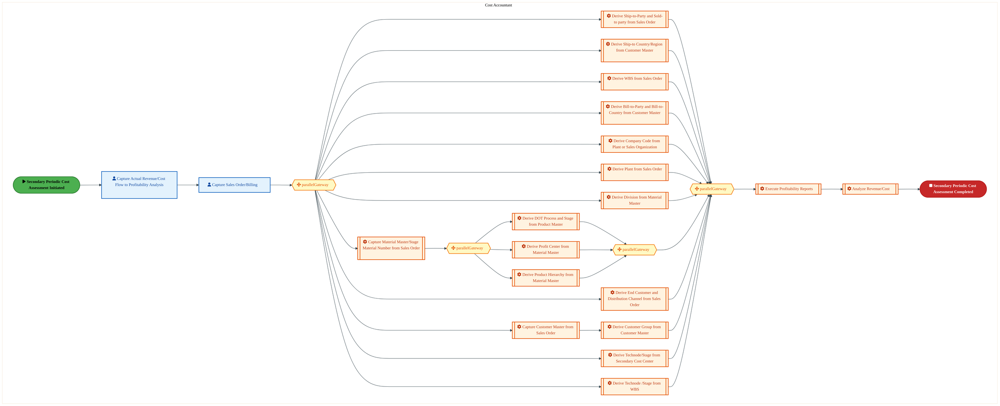

  <img src="data:image/svg+xml;base64,PHN2ZyB4bWxucz0iaHR0cDovL3d3dy53My5vcmcvMjAwMC9zdmciIHZpZXdCb3g9IjAgMCA4MDAgNDgwIiB3aWR0aD0iODAwIiBoZWlnaHQ9IjQ4MCI+DQogIDxkZWZzPg0KICAgIDxsaW5lYXJHcmFkaWVudCBpZD0iYmciIHgxPSIwJSIgeTE9IjAlIiB4Mj0iMTAwJSIgeTI9IjEwMCUiPg0KICAgICAgPHN0b3Agb2Zmc2V0PSIwJSIgc3R5bGU9InN0b3AtY29sb3I6IzAwNzFjNTtzdG9wLW9wYWNpdHk6MSIvPg0KICAgICAgPHN0b3Agb2Zmc2V0PSIxMDAlIiBzdHlsZT0ic3RvcC1jb2xvcjojMDBhZWVmO3N0b3Atb3BhY2l0eToxIi8+DQogICAgPC9saW5lYXJHcmFkaWVudD4NCiAgICA8bGluZWFyR3JhZGllbnQgaWQ9ImFjY2VudCIgeDE9IjAlIiB5MT0iMCUiIHgyPSIwJSIgeTI9IjEwMCUiPg0KICAgICAgPHN0b3Agb2Zmc2V0PSIwJSIgc3R5bGU9InN0b3AtY29sb3I6I2ZmZmZmZjtzdG9wLW9wYWNpdHk6MC4xNSIvPg0KICAgICAgPHN0b3Agb2Zmc2V0PSIxMDAlIiBzdHlsZT0ic3RvcC1jb2xvcjojZmZmZmZmO3N0b3Atb3BhY2l0eTowLjAyIi8+DQogICAgPC9saW5lYXJHcmFkaWVudD4NCiAgICA8cGF0dGVybiBpZD0iZ3JpZCIgd2lkdGg9IjQwIiBoZWlnaHQ9IjQwIiBwYXR0ZXJuVW5pdHM9InVzZXJTcGFjZU9uVXNlIj4NCiAgICAgIDxwYXRoIGQ9Ik0gNDAgMCBMIDAgMCAwIDQwIiBmaWxsPSJub25lIiBzdHJva2U9InJnYmEoMjU1LDI1NSwyNTUsMC4wNykiIHN0cm9rZS13aWR0aD0iMC41Ii8+DQogICAgPC9wYXR0ZXJuPg0KICA8L2RlZnM+DQoNCiAgPCEtLSBCYWNrZ3JvdW5kIC0tPg0KICA8cmVjdCB3aWR0aD0iODAwIiBoZWlnaHQ9IjQ4MCIgZmlsbD0idXJsKCNiZykiIHJ4PSI4Ii8+DQogIDxyZWN0IHdpZHRoPSI4MDAiIGhlaWdodD0iNDgwIiBmaWxsPSJ1cmwoI2dyaWQpIiByeD0iOCIvPg0KICA8cmVjdCB3aWR0aD0iODAwIiBoZWlnaHQ9IjQ4MCIgZmlsbD0idXJsKCNhY2NlbnQpIiByeD0iOCIvPg0KDQogIDwhLS0gRGVjb3JhdGl2ZSBjaXJjdWl0L2FyY2hpdGVjdHVyZSBsaW5lcyAtLT4NCiAgPGcgc3Ryb2tlPSJyZ2JhKDI1NSwyNTUsMjU1LDAuMTIpIiBzdHJva2Utd2lkdGg9IjEuNSIgZmlsbD0ibm9uZSI+DQogICAgPHBhdGggZD0iTSAwIDEwMCBMIDEyMCAxMDAgTCAxNjAgMTQwIEwgMjgwIDE0MCIvPg0KICAgIDxwYXRoIGQ9Ik0gMCAyNjAgTCA4MCAyNjAgTCAxMjAgMjIwIEwgMjAwIDIyMCBMIDI0MCAyNjAgTCAzNjAgMjYwIi8+DQogICAgPHBhdGggZD0iTSA1MjAgMTAwIEwgNjAwIDEwMCBMIDY0MCA2MCBMIDgwMCA2MCIvPg0KICAgIDxwYXRoIGQ9Ik0gNDQwIDM0MCBMIDU2MCAzNDAgTCA2MDAgMzAwIEwgNzIwIDMwMCBMIDc2MCAzNDAgTCA4MDAgMzQwIi8+DQogICAgPHBhdGggZD0iTSA2MDAgNDAwIEwgNjgwIDQwMCBMIDcyMCA0NDAiLz4NCiAgICA8cGF0aCBkPSJNIDAgNDAwIEwgNDAgNDAwIEwgODAgMzYwIi8+DQogICAgPHBhdGggZD0iTSAyMDAgNDIwIEwgMzIwIDQyMCBMIDM2MCAzODAgTCA0ODAgMzgwIi8+DQogICAgPHBhdGggZD0iTSA2NTAgNDQwIEwgNzUwIDQ0MCBMIDgwMCA0ODAiLz4NCiAgPC9nPg0KDQogIDwhLS0gRGVjb3JhdGl2ZSBub2RlcyAtLT4NCiAgPGcgZmlsbD0icmdiYSgyNTUsMjU1LDI1NSwwLjE4KSI+DQogICAgPGNpcmNsZSBjeD0iMTIwIiBjeT0iMTAwIiByPSI0Ii8+DQogICAgPGNpcmNsZSBjeD0iMjgwIiBjeT0iMTQwIiByPSI0Ii8+DQogICAgPGNpcmNsZSBjeD0iMjAwIiBjeT0iMjIwIiByPSI0Ii8+DQogICAgPGNpcmNsZSBjeD0iMzYwIiBjeT0iMjYwIiByPSI0Ii8+DQogICAgPGNpcmNsZSBjeD0iNjAwIiBjeT0iMTAwIiByPSI0Ii8+DQogICAgPGNpcmNsZSBjeD0iNzIwIiBjeT0iMzAwIiByPSI0Ii8+DQogICAgPGNpcmNsZSBjeD0iNTYwIiBjeT0iMzQwIiByPSI0Ii8+DQogICAgPGNpcmNsZSBjeD0iODAiIGN5PSIzNjAiIHI9IjQiLz4NCiAgICA8Y2lyY2xlIGN4PSI0ODAiIGN5PSIzODAiIHI9IjQiLz4NCiAgICA8Y2lyY2xlIGN4PSIzMjAiIGN5PSI0MjAiIHI9IjQiLz4NCiAgPC9nPg0KDQogIDwhLS0gVE9HQUYgQkRBVCBib3hlcyAtLT4NCiAgPGcgZm9udC1mYW1pbHk9IlNlZ29lIFVJLCBBcmlhbCwgc2Fucy1zZXJpZiIgZm9udC1zaXplPSIxNCIgZm9udC13ZWlnaHQ9IjYwMCI+DQogICAgPCEtLSBCIC0tPg0KICAgIDxyZWN0IHg9IjE1MCIgeT0iMTQwIiB3aWR0aD0iMTIwIiBoZWlnaHQ9IjQwIiByeD0iNSIgZmlsbD0icmdiYSgyNTUsMjU1LDI1NSwwLjE4KSIgc3Ryb2tlPSJyZ2JhKDI1NSwyNTUsMjU1LDAuMykiIHN0cm9rZS13aWR0aD0iMSIvPg0KICAgIDx0ZXh0IHg9IjIxMCIgeT0iMTY1IiB0ZXh0LWFuY2hvcj0ibWlkZGxlIiBmaWxsPSIjZmZmIj5CdXNpbmVzczwvdGV4dD4NCiAgICA8IS0tIEQgLS0+DQogICAgPHJlY3QgeD0iMjkwIiB5PSIxNDAiIHdpZHRoPSIxMjAiIGhlaWdodD0iNDAiIHJ4PSI1IiBmaWxsPSJyZ2JhKDI1NSwyNTUsMjU1LDAuMTgpIiBzdHJva2U9InJnYmEoMjU1LDI1NSwyNTUsMC4zKSIgc3Ryb2tlLXdpZHRoPSIxIi8+DQogICAgPHRleHQgeD0iMzUwIiB5PSIxNjUiIHRleHQtYW5jaG9yPSJtaWRkbGUiIGZpbGw9IiNmZmYiPkRhdGE8L3RleHQ+DQogICAgPCEtLSBBIC0tPg0KICAgIDxyZWN0IHg9IjQzMCIgeT0iMTQwIiB3aWR0aD0iMTIwIiBoZWlnaHQ9IjQwIiByeD0iNSIgZmlsbD0icmdiYSgyNTUsMjU1LDI1NSwwLjE4KSIgc3Ryb2tlPSJyZ2JhKDI1NSwyNTUsMjU1LDAuMykiIHN0cm9rZS13aWR0aD0iMSIvPg0KICAgIDx0ZXh0IHg9IjQ5MCIgeT0iMTY1IiB0ZXh0LWFuY2hvcj0ibWlkZGxlIiBmaWxsPSIjZmZmIj5BcHBsaWNhdGlvbjwvdGV4dD4NCiAgICA8IS0tIFQgLS0+DQogICAgPHJlY3QgeD0iNTcwIiB5PSIxNDAiIHdpZHRoPSIxMjAiIGhlaWdodD0iNDAiIHJ4PSI1IiBmaWxsPSJyZ2JhKDI1NSwyNTUsMjU1LDAuMTgpIiBzdHJva2U9InJnYmEoMjU1LDI1NSwyNTUsMC4zKSIgc3Ryb2tlLXdpZHRoPSIxIi8+DQogICAgPHRleHQgeD0iNjMwIiB5PSIxNjUiIHRleHQtYW5jaG9yPSJtaWRkbGUiIGZpbGw9IiNmZmYiPlRlY2hub2xvZ3k8L3RleHQ+DQogIDwvZz4NCg0KICA8IS0tIENvbm5lY3RpbmcgbGluZXMgYmV0d2VlbiBCREFUIGJveGVzIC0tPg0KICA8ZyBzdHJva2U9InJnYmEoMjU1LDI1NSwyNTUsMC4yNSkiIHN0cm9rZS13aWR0aD0iMSI+DQogICAgPGxpbmUgeDE9IjI3MCIgeTE9IjE2MCIgeDI9IjI5MCIgeTI9IjE2MCIvPg0KICAgIDxsaW5lIHgxPSI0MTAiIHkxPSIxNjAiIHgyPSI0MzAiIHkyPSIxNjAiLz4NCiAgICA8bGluZSB4MT0iNTUwIiB5MT0iMTYwIiB4Mj0iNTcwIiB5Mj0iMTYwIi8+DQogIDwvZz4NCg0KICA8IS0tIE1haW4gdGl0bGUgLS0+DQogIDx0ZXh0IHg9IjQwMCIgeT0iMjYwIiB0ZXh0LWFuY2hvcj0ibWlkZGxlIiBmb250LWZhbWlseT0iU2Vnb2UgVUksIEFyaWFsLCBzYW5zLXNlcmlmIiBmb250LXNpemU9IjM2IiBmb250LXdlaWdodD0iNzAwIiBmaWxsPSIjZmZmZmZmIiBsZXR0ZXItc3BhY2luZz0iMSI+DQogICAgSUFPIEFyY2hpdGVjdHVyZQ0KICA8L3RleHQ+DQogIDx0ZXh0IHg9IjQwMCIgeT0iMzAwIiB0ZXh0LWFuY2hvcj0ibWlkZGxlIiBmb250LWZhbWlseT0iU2Vnb2UgVUksIEFyaWFsLCBzYW5zLXNlcmlmIiBmb250LXNpemU9IjE4IiBmb250LXdlaWdodD0iNDAwIiBmaWxsPSJyZ2JhKDI1NSwyNTUsMjU1LDAuOCkiIGxldHRlci1zcGFjaW5nPSIyIj4NCiAgICBUT0dBRiBCREFUIMK3IElBTyBQcm9ncmFtIMK3IElETSAyLjANCiAgPC90ZXh0Pg0KDQogIDwhLS0gQm90dG9tIGFjY2VudCBiYXIgLS0+DQogIDxyZWN0IHg9IjI4MCIgeT0iMzQwIiB3aWR0aD0iMjQwIiBoZWlnaHQ9IjMiIHJ4PSIxLjUiIGZpbGw9InJnYmEoMjU1LDI1NSwyNTUsMC40KSIvPg0KDQogIDwhLS0gSW50ZWwgdGV4dCAtLT4NCiAgPHRleHQgeD0iNDAwIiB5PSIzODAiIHRleHQtYW5jaG9yPSJtaWRkbGUiIGZvbnQtZmFtaWx5PSJTZWdvZSBVSSwgQXJpYWwsIHNhbnMtc2VyaWYiIGZvbnQtc2l6ZT0iMTMiIGZpbGw9InJnYmEoMjU1LDI1NSwyNTUsMC41KSIgbGV0dGVyLXNwYWNpbmc9IjMiPg0KICAgIElOVEVMIENPTkZJREVOVElBTA0KICA8L3RleHQ+DQo8L3N2Zz4NCg==" alt="IAO Architecture" style="width:100%; border-radius:8px;" />
  <h1 style="font-size:36px; margin-top:24px;">DS-030 — Perform Customer and Product Profitability Analysis</h1>
  <h2 style="font-size:24px;">Architecture Document (TOGAF BDAT)</h2>
  
Finance Plan To Report (FPR) Tower 
  Capability DS-030 · DS Provide Decision Support

  
IAO Program · R1 – R5 
  Generated: April 2026 
  Sajiv Francis

  
IAO Architecture Pipeline — Intel Confidential

Page 1<a href="#toc">↑ Back to TOC</a>DS-030 — Perform Customer and Product Profitability Analysis

## Table of Contents

<nav class="toc">
<ol>
  <li><a href="#1-executive-summary">1. Executive Summary</a></li>
  <li><a href="#2-business-context-objectives">2. Business Context &amp; Objectives</a>
    <ul>
      <li><a href="#21-classification">2.1 Classification</a></li>
      <li><a href="#22-business-drivers">2.2 Business Drivers</a></li>
      <li><a href="#23-success-criteria">2.3 Success Criteria</a></li>
      <li><a href="#24-companion-documents">2.4 Companion Documents</a></li>
    </ul>
  </li>
  <li><a href="#3-business-architecture-togaf-b">3. Business Architecture (TOGAF &ldquo;B&rdquo;)</a>
    <ul>
      <li><a href="#31-business-process-overview">3.1 Business Process Overview</a></li>
      <li><a href="#32-business-process-diagrams">3.2 Business Process Diagrams</a></li>
      <li><a href="#33-business-roles-responsibilities">3.3 Business Roles &amp; Responsibilities</a></li>
    </ul>
  </li>
  <li><a href="#4-data-architecture-togaf-d">4. Data Architecture (TOGAF &ldquo;D&rdquo;)</a>
    <ul>
      <li><a href="#41-data-entities-ownership">4.1 Data Entities &amp; Ownership</a></li>
      <li><a href="#42-data-flow-diagrams">4.2 Data Flow Diagrams</a></li>
      <li><a href="#43-data-lineage">4.3 Data Lineage</a></li>
      <li><a href="#44-ricefw-data-objects">4.4 RICEFW Data Objects</a></li>
      <li><a href="#45-data-governance-quality">4.5 Data Governance &amp; Quality</a></li>
    </ul>
  </li>
  <li><a href="#5-application-architecture-togaf-a">5. Application Architecture (TOGAF &ldquo;A&rdquo;)</a>
    <ul>
      <li><a href="#54-component-overview">5.4 Component Overview</a></li>
      <li><a href="#55-ricefw-inventory">5.5 RICEFW Inventory</a>
        <ul>
          <li><a href="#551-eca-dependencies">5.5.1 ECA Dependencies</a></li>
          <li><a href="#552-boundary-application-dependencies">5.5.2 Boundary Application Dependencies</a></li>
        </ul>
      </li>
      <li><a href="#56-integration-patterns">5.6 Integration Patterns</a></li>
    </ul>
  </li>
  <li><a href="#6-technology-architecture-togaf-t">6. Technology Architecture (TOGAF &ldquo;T&rdquo;)</a>
    <ul>
      <li><a href="#61-platform-infrastructure">6.1 Platform &amp; Infrastructure</a></li>
      <li><a href="#62-sap-development-object-status">6.2 SAP Development Object Status</a></li>
      <li><a href="#63-nfrs-design-principles">6.3 NFRs &amp; Design Principles</a></li>
      <li><a href="#64-security-governance">6.4 Security &amp; Governance</a></li>
    </ul>
  </li>
  <li><a href="#7-project-context">7. Project Context</a>
    <ul>
      <li><a href="#71-project-roadmap-go-live-plan">7.1 Project Roadmap &amp; Go-Live Plan</a></li>
      <li><a href="#72-raid-log">7.2 RAID Log</a></li>
      <li><a href="#73-recommendations-next-steps">7.3 Recommendations &amp; Next Steps</a></li>
    </ul>
  </li>
</ol>
</nav>

Page 2<a href="#toc">↑ Back to TOC</a>DS-030 — Perform Customer and Product Profitability Analysis

## 1. Executive Summary

This Architecture Document defines the **Business, Data, Application, and Technology** (BDAT) architecture for **DS-030 Perform Customer and Product Profitability Analysis** within the IAO program. It includes 3 BPMN process diagram(s) in Section 3.

| Dimension | Value |
|-----------|-------|
| **Tower** | Finance Plan To Report (FPR) |
| **Process Group** | DS Provide Decision Support |
| **Capability** | DS-030 - Perform Customer and Product Profitability Analysis |
| **Release** | R1 – R5 |
| **Total Systems** | 0 |
| **System Status** | 0 Deployed, 0 Developing, 0 EOL, 0 Pending IAPM |
| **RICEFW Objects** | 3 Enhancements |

> All system nodes in architecture diagrams are **IAPM-linked** — click any node to open its IAPM page. Diagrams require `securityLevel: 'loose'` for click events.

Page 3<a href="#toc">↑ Back to TOC</a>DS-030 — Perform Customer and Product Profitability Analysis

## 2. Business Context & Objectives

### 2.1 Classification

| Level | Value |
|-------|-------|
| **L0 Tower** | Finance Plan To Report |
| **L1 Process** | DS Provide Decision Support |
| **L2 Capability** | DS-030 - Perform Customer and Product Profitability Analysis |

### 2.2 Business Drivers

| # | Driver | Description | Strategic Alignment | Priority |
|---|--------|-------------|---------------------|----------|
| 1 | S/4 HANA Finance Consolidation | Migrate legacy costing and reporting platforms to unified S/4 HANA finance backbone | IDM 2.0 Core Finance Transformation | High |
| 2 | Real-Time Financial Visibility | Enable real-time cost reporting and variance analysis replacing batch-driven legacy processes | CFO Digital Finance Initiative | High |
| 3 | Regulatory Compliance Readiness | Ensure SOX compliance and audit trail continuity through the ERP transition period | Intel Corporate Compliance | Medium |
| 4 | DS-030 Process Migration | Migrate DS-030 business processes and 0 integrated systems from legacy to S/4 HANA target architecture | IDM 2.0 Finance | High |

Page 4<a href="#toc">↑ Back to TOC</a>DS-030 — Perform Customer and Product Profitability Analysis

### 2.3 Success Criteria

| Metric | Target | Measure | Baseline | Owner |
|--------|--------|---------|----------|-------|
| Month-End Close Cycle Time | < 3 business days | Calendar days from period close trigger to final posting | 5 business days (legacy) | Finance Controller |
| Cost Variance Accuracy | < 0.5% deviation | Variance between standard and actual cost post-migration | 1.2% (ICOST baseline) | Cost Accounting Lead |
| System Availability (Finance) | 99.9% uptime | S/4 HANA finance module availability during business hours | 99.5% (legacy) | IT Operations |
| DS-030 Migration Completeness | 100% flow chains validated | All 0 flow chains verified in target state | 0% (pre-migration) | Tower Architect |

### 2.4 Companion Documents

| Document | Description |
|----------|-------------|
| **Business Architecture** | Included in this document (Section 3) — process flows from BPMN diagrams |
| **This Document** | Full BDAT Architecture — Business + Data + Application + Technology |

Page 5<a href="#toc">↑ Back to TOC</a>DS-030 — Perform Customer and Product Profitability Analysis

## 3. Business Architecture (TOGAF "B")

### 3.1 Business Process Overview

This capability includes **3 business process(es)** modeled in BPMN 2.0, covering the end-to-end workflow for DS-030 Perform Customer and Product Profitability Analysis.

| # | Step ID | Process Name | Lanes | Tasks | Gateways |
|---|---------|--------------|-------|-------|----------|
| 1 | DS-030-010_Create_and_Maintain_Master_Data | DS-030-010_Create_and_Maintain_Master_Data | Cost Accountant, SAP Consultant | 5 | 1 |
| 2 | DS-030-060_Transfer_Costs_from_Accounting | DS-030-060_Transfer_Costs_from_Accounting | Cost Accountant | 20 | 4 |
| 3 | DS-030-110_Analyze_Profitability | DS-030-110_Analyze_Profitability | Cost Accountant | 5 | 2 |

Page 6<a href="#toc">↑ Back to TOC</a>DS-030 — Perform Customer and Product Profitability Analysis

### 3.2 Business Process Diagrams

#### BUSINESS ARCHITECTURE — 3.2.1 DS-030-010_Create_and_Maintain_Master_Data — DS-030-010_Create_and_Maintain_Master_Data

**Swim Lanes**: Cost Accountant · SAP Consultant | **Tasks**: 5 | **Gateways**: 1

> **Legend**: ● Start · ● End · User Task · Service Task · ◇ Gateway · Sub-Process

<a href="https://mermaid.live/view#pako:eNqlVV2P4jYU_StWRiNaKYzySZg8VGICWVXqaldlu30oVXVJHLDG2JHtwFDEf-81CbBhmKfmATiHc8-9vrZvDk4hS-qkzuPjgQlmUnIYmDXd0EFKBkvQdOCSlvgOisGSUz2wmkoKM2f_nmR-VL9ZmeVy2DC-t-ycriQlf_zqkgkGcpdoEHqoqWLVwB3Uim1A7TPJpbLqBzquvOqUrfvrRaqSqqvA8xK_iDGUM0GvdJhESZTbOE0LKcqeaRVX46oYHG1xXO6KNShzKr_R9DO8_clKs0ZcAdcUNWuz4b_BknK7RqMayxWN2p6bwbTNI7Bh8xoKJlbIRx5SCsTrlYq945EcHx8X4pKUfJsuBMGn4KD1lFZEG6RnW0Mqxnn6EGWTPPZcbZR8pelDMEumYeAWdiUpLt1zbXOHO8pWa5MuJS876XBn15AG9Zur3tLAc9UeP29yUVFeM2WjYByML5leEj_zs3Omqqr-Vybsq_oG-rXLNQvzIJ9ecvnxKM68937nZU6jZOLf9omqLSvoD6Z5noeza6tmo9j3PjZ9ycORl92YrsDQHeyvhs9ZdDHM4yT3kw8N23y3VTbLr0oWZ8NwFufxxTB58fNJ8KFhNPGjcVch-qwU1GvCQdB_vL8WTia1IZOikI0wIMzC-btV2kdEKKggrWBoG08yqE2jKPmdbqmwpzf78mnuIqylMng2-8FxP_gzMMzABMGFVMzAknFm9mTKNlRoJgX5Dryhuu8x-ulioo2s0UQb9JqCAfwtYEVLDPi5jcBjeG-VPlrMJ19JJoVu-PtF-v06sd04AD6q8qa-oB870ZqtxA9qYiT5UlMFtj22goKqW4_wbv4pDrIthmFj5gbj6QqPk1Qf1kUAhwDOCQ2FDQL-9PTUz5PY3VYUrUjWYDc3p02x_ezrxla3BrF6pyO4e9jJvvwZ5fZsUq1Rhiocxnd9fe9wOK8UlJI7PQRuSA0KOKf8U3tnFs7xeLOdGEmGw1_w-4xbGHQwaGHcwbiFYQfDFkYdjFo46mDSOXcXToxv8HMfny6kLeA8iHp0cJ8O79PRfTq-T4-6Kdsjk8uY79Hj-_TzfRq7280rx3VwszfASic9OKe3Mr65S1oB3hvn6DrQGDnfi8JJT28vp6lLjJwywOu2acnjfxtQiMw=" title="View full diagram">&#128065; View Diagram</a>

Page 7<a href="#toc">↑ Back to TOC</a>DS-030 — Perform Customer and Product Profitability Analysis

#### BUSINESS ARCHITECTURE — 3.2.2 DS-030-060_Transfer_Costs_from_Accounting — DS-030-060_Transfer_Costs_from_Accounting

**Swim Lanes**: Cost Accountant | **Tasks**: 20 | **Gateways**: 4

> **Legend**: ● Start · ● End · User Task · Service Task · ◇ Gateway · Sub-Process

<a href="https://mermaid.live/view#pako:eNqlV21v2zYQ_iuEgsAbYCOiXizHHwY4stUVaNegztYPzTDQEmUTkUmBopK4gf_7jtaLbVZqss4fbPO5u4d3D4-U-GLFIqHW1Lq8fGGcqSl6GagN3dLBFA1WpKCDIaqAv4hkZJXRYqB9UsHVkn07uGEvf9ZuGovIlmU7jS7pWlD05_shmkFgNkQF4cWooJKlg-Egl2xL5C4UmZDa-4JOUjs9zFabboRMqDw62HaAYx9CM8bpEXYDL_AiHVfQWPDkjDT100kaD_Y6uUw8xRsi1SH9sqAfyfMXlqgNjFOSFRR8NmqbfSArmukalSw1FpfysRGDFXoeDoItcxIzvgbcswGShD8cId_e79H-8vKet5Oiu_k9R_CJM1IUc5qiQgG8eFQoZVk2vfDCWeTbw0JJ8UCnF84imLvOMNaVTKF0e6jFHT1Rtt6o6UpkSe06etI1TJ38eSifp449lDv4NuaiPDnOFI6diTNpZ7oJcIjDZqY0Tf_XTKCrvCPFQz3Xwo2caN7Ohf2xH9rf8zVlzr1ghk2dqHxkMT0hjaLIXRylWox9bPeT3kTu2A4N0jVR9InsjoTXodcSRn4Q4aCXsJrPzLJc3UoRN4Tuwo_8ljC4wdHM6SX0Ztib1BkCz1qSfIMywuk_9td7KxSFQrM4FiVXhKt76-_KU384BoeUTFMy0sKjkOSqlBTcVUky9Jk-Ul7SqwNFBK2IlECQZsoUWbGMqR2acZLtoK_PaZ1u2iWB3Y8-6W15dQOFQrefx7lf28BYrNEc9vojRbdQCzSfFNtTBog8DfW6Qw_JopByBXkcKD7C0unzBP4U6jsav5MmFNuc8B38JrRiqXISss1oTTj7RhQT3GAcdzLq8kdKjG5hE-8Q4UmLhHqh5K6aJiwLJbaQemeyQSf1csPyc-olbEJAUH5AXhFy0q1Ak8g7Kcr8Lcld9y1IUsYK_c6oJDLe7N6yKNju5Ppys3ytGIx_JBGqtb76TNewcG-pCjudhPNPd7q0mBZFpbgi66ZT6oq76YyOXzzTuFTU2GSfaS6kKsxYo-UPW_EbPdu1ZojR3s3GNGp-VdVxN42xileVCi36R7ldvYG8u6vn7JEV7SK90i_dPbyAhWkr1as0Z3CkslWpdy0KN4Rzmr2aXndf39F4o5_r6Opk6aFBjWjH_mH0afCyeRtBh-O3OsJMOvxLS5dn8Dw6Bt0Cs0hYXEXPigJacwsc6D28pDGQLwGuX0-5nCMXaJS_hUufixnt4HJfXhouIqV4KkYkU_r8IVlGs3fV0_Pe2u9Pg7yfCfJ_Jmj834Lg9af6A4Kj0eg36IJ6XA-dehjUQ7cxYxOwDWBsjH1j7BpjpwZwy9gAXgN4dUiTlFMDeGwCfgPUES1Fk1XrUKflGeNrg9E17NjMITBTsE0Am0ATgk1xGw-zrDZpU1vc1NlE4Inh4RkO18a4TWpSAyYBrgufmAGmUk5buNkR-PocOLwi6k5rXo3PYKcbdk9fe88sXq_F77WMey1Br2XSa7nutcDu6DXhfpPTb-rXAfcLgfuVwP1S4H4tcL8YuF8Np18NOIaa69857tRXtXPUbe4r57DXDfvd8LiBraEFD9AtYYk1fbEOV3u4_ic0JWWmrP3QIqUSyx2PrenhCmyVeQKRc0bgZrKtwP2_6cEQLA==" title="View full diagram">&#128065; View Diagram</a>

Page 8<a href="#toc">↑ Back to TOC</a>DS-030 — Perform Customer and Product Profitability Analysis

#### BUSINESS ARCHITECTURE — 3.2.3 DS-030-110_Analyze_Profitability — DS-030-110_Analyze_Profitability

**Swim Lanes**: Cost Accountant | **Tasks**: 5 | **Gateways**: 2

```mermaid
%%{init: {'theme': 'base', 'themeVariables': {'fontSize': '14px', 'fontFamily': 'Segoe UI, Arial, sans-serif','primaryColor': '#e8f0fe', 'primaryBorderColor': '#0071c5','lineColor': '#37474F', 'secondaryColor': '#f5f8fc'}, 'flowchart': {'useMaxWidth': false, 'htmlLabels': true, 'curve': 'basis', 'nodeSpacing': 40, 'rankSpacing': 50}} }%%
flowchart TD
    classDef startEvt fill:#4CAF50,stroke:#2E7D32,color:#000,font-weight:bold,stroke-width:2px,rx:20,ry:20
    classDef endEvt fill:#C62828,stroke:#B71C1C,color:#fff,font-weight:bold,stroke-width:2px,rx:20,ry:20
    classDef userTask fill:#E3F2FD,stroke:#1565C0,stroke-width:2px,color:#0D47A1
    classDef serviceTask fill:#FFF3E0,stroke:#E65100,stroke-width:2px,color:#BF360C
    classDef gateway fill:#FFF9C4,stroke:#F57F17,stroke-width:2px,color:#E65100
    classDef subProc fill:#F3E5F5,stroke:#7B1FA2,stroke-width:2px,color:#4A148C
    subgraph lane_0["Cost Accountant"]
        n1["fa:fa-user Maintain Actual Revenue/Cost Flow to Profitability Analysis"]
        n2["fa:fa-user Capture Sales Order"]
        n3["fa:fa-user Capture Sales Order - Billing (Revenue)"]
        n4["fa:fa-user Execute Profitability Reports"]
        n5["fa:fa-user Analyze Revenue/Cost"]
        n6(["fa:fa-play Report APP Run Request Initiated"])
        n7(["fa:fa-stop Sales Selection and Analysis of COGS GL with Different Combination Complete"])
        n8{{"fa:fa-arrows-alt parallelGateway"}}
        n9{{"fa:fa-arrows-alt parallelGateway"}}
    end
    n6 --> n1
    n1 --> n8
    n8 --> n2
    n8 --> n3
    n2 --> n9
    n3 --> n9
    n9 --> n4
    n4 --> n5
    n5 --> n7
    class n1 userTask
    class n2 userTask
    class n3 userTask
    class n4 userTask
    class n5 userTask
    class n6 startEvt
    class n7 endEvt
    class n8 gateway
    class n9 gateway
```

> **Legend**: ● Start · ● End · User Task · Service Task · ◇ Gateway · Sub-Process

<a href="https://mermaid.live/view#pako:eNqlVe-P4jYQ_VesrFbcSUHNTwL5UAkCWZ10p1st1_bDUVVDMgZrjZ06zgKH-N_rkAAbbldV1XxAeY-Z92ZG9uRgZTJHK7bu7w9MMB2TQ0-vcYO9mPSWUGLPJg3xOygGS45lr46hUug5-3EKc4NiV4fVXAobxvc1O8eVRPLbJ5uMTSK3SQmi7JeoGO3ZvUKxDah9IrlUdfQdDqlDT27tXxOpclTXAMeJ3Cw0qZwJvNJ-FERBWueVmEmRd0RpSIc06x3r4rjcZmtQ-lR-VeIX2P3Bcr02mAIv0cSs9YZ_hiXyuketqprLKvVyHgYrax9hBjYvIGNiZfjAMZQC8XylQud4JMf7-4W4mJJv04Ug5sk4lOUUKSm1oWcvmlDGeXwXJOM0dOxSK_mM8Z03i6a-Z2d1J7Fp3bHr4fa3yFZrHS8lz9vQ_rbuIfaKna12sefYam9-b7xQ5FenZOANveHFaRK5iZucnSil_8vJzFV9g_K59Zr5qZdOL15uOAgT52e9c5vTIBq7t3NC9cIyfCWapqk_u45qNghd533RSeoPnORGdAUat7C_Co6S4CKYhlHqRu8KNn63VVbLRyWzs6A_C9PwIhhN3HTsvSsYjN1g2FZodFYKijXhIPAv5_vCSmSpyTjLZCU0CL2w_mwi60e4JoBCTKFfD558AWaCmDDxugJOnvAFRYW_nDRScxaJlsTUSZmGJeNM78lYAN-bg93V9bq6CRS6UkjmYK4_-Vrfy268_6_xpE8mZjbmgpAPbVkfuxpBV2O2w6zSeFPuExZS6Ztqw27mqaUf2Om-mzD4cMkoOJxVyfjxkTxVwsC_KzQT-2T2ITMnJTfZH1-lR9f0UsuibXOOHDPNpCAg8stciaQk-fowJw-fyZbpNZkySlGh0CSRmyUTcEox7wVHjTdOw8Ph7ARKyW3ZB65JAQo4R_7QnOKFdTy-yhn9txyzG5oXMSD9_q_mTLXQbeCwhcMGel3ot9Br4KiFfheOGhi0MGhg2MKwgdGrK1W7n1dJh_bepv236eBtOnybHlx2coeO2vXZIYfnFdJhR2fWsq0Nqg2w3IoP1unzaT6xOVKouLaOtgWVlvO9yKz49JmxqiI3mVMG5vZvGvL4D85Hbao=" title="View full diagram">&#128065; View Diagram</a>

Page 9<a href="#toc">↑ Back to TOC</a>DS-030 — Perform Customer and Product Profitability Analysis

### 3.3 Business Roles & Responsibilities

| Role / Lane | Processes Involved | Description |
|------------|-------------------|-------------|
| Cost Accountant | DS-030-010_Create_and_Maintain_Master_Data, DS-030-060_Transfer_Costs_from_Accounting, DS-030-110_Analyze_Profitability | |
| SAP Consultant | DS-030-010_Create_and_Maintain_Master_Data,  | |

Page 10<a href="#toc">↑ Back to TOC</a>DS-030 — Perform Customer and Product Profitability Analysis

## 4. Data Architecture (TOGAF "D")

### 4.1 Data Flows — Source to Target

*Data flows with DB platform details will be populated when tower architects complete the extended flow template columns (42-47) via the Input Portal.*

Page 11<a href="#toc">↑ Back to TOC</a>DS-030 — Perform Customer and Product Profitability Analysis

### 4.2 Data Flow Diagrams

> **DATA ARCHITECTURE** — Database-to-database data flows. Applications (blue) sit above their hosting databases (green cylinders). Thick arrows show data movement between databases.

### 4.3 Data Lineage

*Data lineage (source schema/object → target schema/object mappings) will be populated when tower architects provide validated schema details via the Input Portal.*

### 4.4 RICEFW Data Objects

*RICEFW data objects (Reports and Conversions) will be auto-populated from the Smartsheet Object Tracker when matched to this capability.*

### 4.5 Data Governance & Quality

| Concern | Approach |
|---------|----------|
| Data Ownership | Per-entity owners listed in Section 3.1 |
| Data Classification | Financial data classified as Intel Confidential |
| Data Retention | Per Intel corporate retention policies |
| Data Quality | Validated at source; reconciliation at target |

Page 12<a href="#toc">↑ Back to TOC</a>DS-030 — Perform Customer and Product Profitability Analysis

## 5. Application Architecture (TOGAF "A")

### 5.4 Component Overview

#### System Inventory

| System | IAPM ID | Status |
|--------|---------|--------|

Page 13<a href="#toc">↑ Back to TOC</a>DS-030 — Perform Customer and Product Profitability Analysis

### 5.5 RICEFW Inventory

| Object ID | Type | Description | Status | Source → Target | Middleware | Boundary App | Interface Approach | Complexity |
|-----------|------|-------------|--------|----------------|-----------|-------------|-------------------|-----------|
| FPRE0764_IP | Enhancement | Import Headcount details by cost center and update in S4 for HR benefits spen... | 10. Object Complete |  | NA |  |  | 03.Medium |
| FPRE0764_IF | Enhancement | Import Headcount details by cost center and update in S4 for HR benefits spen... | 10. Object Complete |  | NA |  |  | 04.Low |
| FPRE0574_IP | Enhancement | Margin analysis Dimensions creation | 10. Object Complete |  | NA |  |  | 04.Low |

**Summary**: 3 Enhancements

Page 14<a href="#toc">↑ Back to TOC</a>DS-030 — Perform Customer and Product Profitability Analysis

### 5.6 Integration Patterns

*Integration patterns will be populated when tower architects provide validated middleware and protocol details via the extended flow template.*

Page 15<a href="#toc">↑ Back to TOC</a>DS-030 — Perform Customer and Product Profitability Analysis

## 6. Technology Architecture (TOGAF "T")

### 6.1 Platform & Infrastructure

> **TECHNOLOGY / PLATFORM ARCHITECTURE** — Platforms (green) host applications (blue). Thick arrows show platform-to-platform integration flows.

#### Platform Inventory

*Platform inventory will be populated when tower architects provide validated technology platform details via the extended flow template.*

Page 16<a href="#toc">↑ Back to TOC</a>DS-030 — Perform Customer and Product Profitability Analysis

### 6.2 SAP Development Object Status

| Metric | DEV | QAS | PRD |
|--------|-----|-----|-----|
| Transport Requests | — | — | — |
| Custom Code Objects | — | — | — |
| CDS Views | — | — | — |
| Fiori Apps | — | — | — |
| BAdIs / Enhancements | — | — | — |

### 6.3 NFRs & Design Principles

| Category | Requirement | Target / SLA | Priority |
|----------|-------------|-------------|----------|
| Performance | Month-end batch costing/closing completes within SLA window | < 4 hours end-to-end batch window | High |
| Availability | S/4 HANA finance modules available during business hours | 99.9% (Mon-Fri 06:00-22:00 PST) | High |
| Scalability | Support 2x transaction volume growth over 3-year horizon | Handle 500K+ journal entries/day | Medium |
| Recoverability | RPO/RTO for financial systems meets audit requirements | RPO < 1 hour, RTO < 4 hours | High |
| Data Volume | Support growing data volumes from legacy migration + BAU | 50M+ records in material ledger | Medium |
| Latency | Near-real-time posting for financial transactions | < 5 seconds for online postings | Medium |
| Concurrency | Support concurrent month-end users across time zones | 200+ concurrent finance users | Medium |

### 6.4 Security & Governance

| Concern | Approach | Standard / Policy | Owner |
|---------|----------|--------------------|-------|
| Authentication | Single Sign-On (SSO) via Intel corporate Azure AD identity | Intel IT Security Policy - Identity Management | IT Security |
| Authorization | Role-based access control (RBAC) with SAP authorization objects | Intel SAP Security Standards - Role Design | SAP Security Team |
| Data Classification | All financial/operational data classified per Intel Data Classification Standard | Intel Data Classification Policy | Data Governance |
| Data Encryption (at rest) | AES-256 encryption for SAP HANA database and file storage | Intel Encryption Standard | Infrastructure Security |
| Data Encryption (in transit) | TLS 1.3 for all system-to-system and user-to-system communication | Intel Network Security Policy | Network Engineering |
| Network Segmentation | SAP systems in dedicated network zones with firewall controls | Intel Network Architecture Standard | Network Security |
| API Security | OAuth 2.0 / certificate-based authentication for all API integrations | Intel API Security Guidelines | Integration Architecture |
| Audit Logging | Comprehensive audit trail for all data changes and user actions (SAP Security Audit Log) | SOX Compliance / Intel Audit Policy | Internal Audit |
| Certificate Management | Automated certificate lifecycle management for system-to-system trust | Intel PKI Standard | Certificate Authority Team |
| Compliance | SOX controls, export control (EAR/ITAR) screening, data privacy (GDPR) | Intel Corporate Compliance Framework | Compliance Office |

Page 17<a href="#toc">↑ Back to TOC</a>DS-030 — Perform Customer and Product Profitability Analysis

## 7. Project Context

### 7.1 Project Roadmap & Go-Live Plan

| ID | Description | FS | TDD | Build | FUT | Status |
|----|-------------|----|-----|-------|-----|--------|
| FPRE0764_IP | Import Headcount details by cost center and update in S4 for HR benefits spen... | 2024-12-13 00:00:00 (100%) | 2025-05-23 00:00:00 (100%) | 2025-05-23 00:00:00 (100%) | 2025-07-16 00:00:00 (100%) | 1. On Track |
| FPRE0764_IF | Import Headcount details by cost center and update in S4 for HR benefits spen... | 2024-12-13 00:00:00 (100%) | 2025-05-23 00:00:00 (100%) | 2025-05-23 00:00:00 (100%) | 2025-07-16 00:00:00 (100%) | 1. On Track |
| FPRE0574_IP | Margin analysis Dimensions creation | 2024-10-18 00:00:00 (100%) | 2025-01-17 00:00:00 (100%) | 2025-01-17 00:00:00 (100%) | 2024-11-08 00:00:00 (100%) |  |

Page 18<a href="#toc">↑ Back to TOC</a>DS-030 — Perform Customer and Product Profitability Analysis

### 7.2 RAID Log

*RAID items will be auto-populated from the Smartsheet RAID log when matched to this capability.*

### 7.3 Recommendations & Next Steps

| # | Category | Recommendation | Priority | Owner | Target Date | Status |
|---|----------|---------------|----------|-------|-------------|--------|
| 1 | Architecture | Complete extended flow attributes (Data Entity, Integration Pattern, Tech Platform) in Flows tab for full BDAT coverage | High | Tower Architect | 2026-Q2 | Open |
| 2 | Data | Define data ownership and classification for all 0 flow chains to satisfy Data Architecture (TOGAF D) requirements | Medium | Data Architect | 2026-Q3 | Open |
| 3 | Testing | Develop integration test scenarios covering all 0 flow chains for FUT/SIT readiness | High | Test Lead | 2026-Q3 | Open |
| 4 | Business Architecture | Review and validate Business Architecture process steps against latest Signavio/BIC process models | Medium | Business Analyst | 2026-Q2 | Open |
| 5 | Security | Complete security review for API integrations and data flows per Intel Security Architecture standards | Medium | Security Architect | 2026-Q3 | Open |

---
*DS-030 — Architecture Document (TOGAF BDAT) · Finance Plan To Report · Generated: April 2026*

Page 19<a href="#toc">↑ Back to TOC</a>DS-030 — Perform Customer and Product Profitability Analysis

