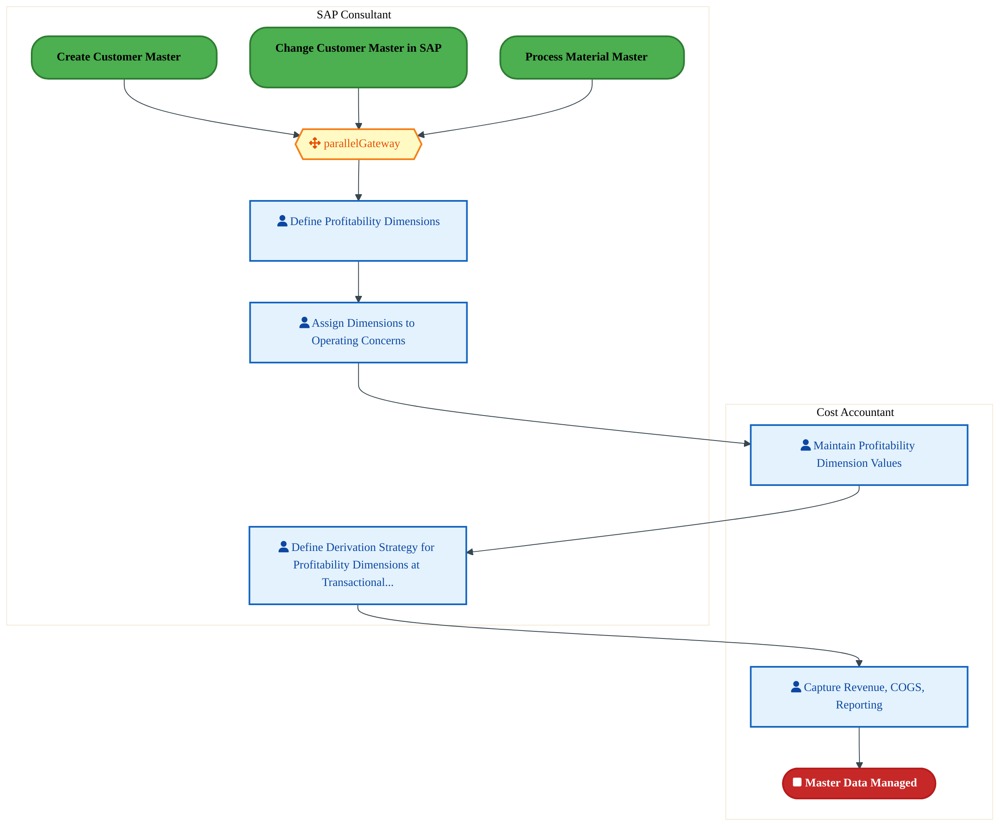

  
  <h1 style="font-size:36px; margin-top:24px;">DS-030 — Perform Customer and Product Profitability Analysis</h1>
  <h2 style="font-size:24px;">Architecture Document (TOGAF BDAT)</h2>
  
Finance Plan To Report (FPR) Tower 
  Capability DS-030 · DS Provide Decision Support

  
IAO Program · Release 3 
  Generated: March 2026 
  Sajiv Francis

  
IAO Architecture Pipeline — Intel Confidential

Page 1<a href="#toc">↑ Back to TOC</a>DS-030 — Perform Customer and Product Profitability Analysis

## Table of Contents

<nav class="toc">
<ol>
  <li><a href="#1-executive-summary">1. Executive Summary</a></li>
  <li><a href="#2-business-context-objectives">2. Business Context &amp; Objectives</a>
    <ul>
      <li><a href="#21-classification">2.1 Classification</a></li>
      <li><a href="#22-business-drivers">2.2 Business Drivers</a></li>
      <li><a href="#23-success-criteria">2.3 Success Criteria</a></li>
      <li><a href="#24-companion-documents">2.4 Companion Documents</a></li>
    </ul>
  </li>
  <li><a href="#3-business-architecture-togaf-b">3. Business Architecture (TOGAF &ldquo;B&rdquo;)</a>
    <ul>
      <li><a href="#31-business-process-overview">3.1 Business Process Overview</a></li>
      <li><a href="#32-business-process-diagrams">3.2 Business Process Diagrams</a></li>
      <li><a href="#33-business-roles-responsibilities">3.3 Business Roles &amp; Responsibilities</a></li>
    </ul>
  </li>
  <li><a href="#4-data-architecture-togaf-d">4. Data Architecture (TOGAF &ldquo;D&rdquo;)</a>
    <ul>
      <li><a href="#41-data-entities-ownership">4.1 Data Entities &amp; Ownership</a></li>
      <li><a href="#42-data-flow-diagrams">4.2 Data Flow Diagrams</a></li>
      <li><a href="#43-data-lineage">4.3 Data Lineage</a></li>
      <li><a href="#44-ricefw-data-objects">4.4 RICEFW Data Objects</a></li>
      <li><a href="#45-data-governance-quality">4.5 Data Governance &amp; Quality</a></li>
    </ul>
  </li>
  <li><a href="#5-application-architecture-togaf-a">5. Application Architecture (TOGAF &ldquo;A&rdquo;)</a>
    <ul>
      <li><a href="#51-current-state-current-state-application-landscape">5.1 Current-State Application Landscape</a></li>
      <li><a href="#52-future-state-future-state-application-landscape">5.2 Future-State Application Landscape</a></li>
      <li><a href="#53-change-impact-summary">5.3 Change Impact Summary</a></li>
      <li><a href="#54-component-overview">5.4 Component Overview</a></li>
      <li><a href="#55-ricefw-inventory">5.5 RICEFW Inventory</a></li>
      <li><a href="#56-integration-patterns">5.6 Integration Patterns</a></li>
    </ul>
  </li>
  <li><a href="#6-technology-architecture-togaf-t">6. Technology Architecture (TOGAF &ldquo;T&rdquo;)</a>
    <ul>
      <li><a href="#61-platform-infrastructure">6.1 Platform &amp; Infrastructure</a></li>
      <li><a href="#62-sap-development-object-status">6.2 SAP Development Object Status</a></li>
      <li><a href="#63-nfrs-design-principles">6.3 NFRs &amp; Design Principles</a></li>
      <li><a href="#64-security-governance">6.4 Security &amp; Governance</a></li>
    </ul>
  </li>
  <li><a href="#7-project-context">7. Project Context</a>
    <ul>
      <li><a href="#71-project-roadmap-go-live-plan">7.1 Project Roadmap &amp; Go-Live Plan</a></li>
      <li><a href="#72-raid-log">7.2 RAID Log</a></li>
      <li><a href="#73-recommendations-next-steps">7.3 Recommendations &amp; Next Steps</a></li>
    </ul>
  </li>
</ol>
</nav>

Page 2<a href="#toc">↑ Back to TOC</a>DS-030 — Perform Customer and Product Profitability Analysis

## 1. Executive Summary

This Architecture Document defines the **Business, Data, Application, and Technology** (BDAT) architecture for **DS-030 Perform Customer and Product Profitability Analysis** within the IAO program. It includes 3 BPMN process diagram(s) in Section 3.
| Dimension | Value |
|-----------|-------|
| **Tower** | Finance Plan To Report (FPR) |
| **Process Group** | DS Provide Decision Support |
| **Capability** | DS-030 - Perform Customer and Product Profitability Analysis |
| **Release** | Release 3 |
| **Total Systems** | 0 |
| **System Status** | 0 Deployed, 0 Developing, 0 EOL, 0 Pending IAPM |
| **RICEFW Objects** | 3 Enhancements |
**Change Summary**: 0 new flow chains, 0 removed, 0 modified, 0 unchanged between Current-State and Future-State states.

> All system nodes in architecture diagrams are **IAPM-linked** — click any node to open its IAPM page. Diagrams require `securityLevel: 'loose'` for click events.

Page 3<a href="#toc">↑ Back to TOC</a>DS-030 — Perform Customer and Product Profitability Analysis

## 2. Business Context & Objectives

### 2.1 Classification

| Level | Value |
|-------|-------|
| **L0 Tower** | Finance Plan To Report |
| **L1 Process** | DS Provide Decision Support |
| **L2 Capability** | DS-030 - Perform Customer and Product Profitability Analysis |

### 2.2 Business Drivers

| # | Driver | Description | Strategic Alignment | Priority |
|---|--------|-------------|---------------------|----------|
| 1 | S/4 HANA Finance Consolidation | Migrate legacy costing and reporting platforms to unified S/4 HANA finance backbone | IDM 2.0 Core Finance Transformation | High |
| 2 | Real-Time Financial Visibility | Enable real-time cost reporting and variance analysis replacing batch-driven legacy processes | CFO Digital Finance Initiative | High |
| 3 | Regulatory Compliance Readiness | Ensure SOX compliance and audit trail continuity through the ERP transition period | Intel Corporate Compliance | Medium |
| 4 | DS-030 Process Migration | Migrate DS-030 business processes and 0 integrated systems from legacy to S/4 HANA target architecture | IDM 2.0 Finance | High |

Page 4<a href="#toc">↑ Back to TOC</a>DS-030 — Perform Customer and Product Profitability Analysis

### 2.3 Success Criteria

| Metric | Target | Measure | Baseline | Owner |
|--------|--------|---------|----------|-------|
| Month-End Close Cycle Time | < 3 business days | Calendar days from period close trigger to final posting | 5 business days (legacy) | Finance Controller |
| Cost Variance Accuracy | < 0.5% deviation | Variance between standard and actual cost post-migration | 1.2% (ICOST baseline) | Cost Accounting Lead |
| System Availability (Finance) | 99.9% uptime | S/4 HANA finance module availability during business hours | 99.5% (legacy) | IT Operations |
| DS-030 Migration Completeness | 100% flow chains validated | All 0 flow chains verified in target state | 0% (pre-migration) | Tower Architect |

### 2.4 Companion Documents

| Document | Description |
|----------|-------------|
| **Business Architecture** | Included in this document (Section 3) — process flows from BPMN diagrams |
| **This Document** | Full BDAT Architecture — Business + Data + Application + Technology |

Page 5<a href="#toc">↑ Back to TOC</a>DS-030 — Perform Customer and Product Profitability Analysis

## 3. Business Architecture (TOGAF "B")

### 3.1 Business Process Overview

This capability includes **3 business process(es)** modeled in BPMN 2.0, covering the end-to-end workflow for DS-030 Perform Customer and Product Profitability Analysis.

| # | Step ID | Process Name | Lanes | Tasks | Gateways |
|---|---------|--------------|-------|-------|----------|
| 1 | DS-030-010_Create_and_Maintain_Master_Data | DS-030-010_Create_and_Maintain_Master_Data | Cost Accountant, SAP Consultant | 5 | 1 |
| 2 | DS-030-060_Transfer_Costs_from_Accounting | DS-030-060_Transfer_Costs_from_Accounting | Cost Accountant | 20 | 4 |
| 3 | DS-030-110_Analyze_Profitability | DS-030-110_Analyze_Profitability | Cost Accountant | 5 | 2 |

Page 6<a href="#toc">↑ Back to TOC</a>DS-030 — Perform Customer and Product Profitability Analysis

### 3.2 Business Process Diagrams

#### BUSINESS ARCHITECTURE — 3.2.1 DS-030-010_Create_and_Maintain_Master_Data — DS-030-010_Create_and_Maintain_Master_Data

**Swim Lanes**: Cost Accountant · SAP Consultant | **Tasks**: 5 | **Gateways**: 1

> **Legend**: ● Start · ● End · User Task · Service Task · ◇ Gateway · Sub-Process

<a href="https://mermaid.live/view#pako:eNqlVU2P4kYQ_Sstj0YkkhnZxsaMD5EYg1eRstpV2GwOIYfCbkNrmm6ruw3DIv57qrGBsZc5hQPwnqveq6r-8NHJZUGdxHl8PDLBTEKOA7OhWzpIyGAFmg5c0hDfQTFYcaoHNqaUwizYj3OYH1ZvNsxyGWwZP1h2QdeSkr9-d8kUE7lLNAg91FSxcuAOKsW2oA6p5FLZ6Ac6Kb3y7NY-epGqoOoW4Hmxn0eYypmgN3oUh3GY2TxNcymKjmgZlZMyH5xscVzu8w0ocy6_1vQzvP3NCrNBXALXFGM2Zsv_gBXltkejasvltdpdhsG09RE4sEUFORNr5EMPKQXi9UZF3ulETo-PS3E1Jd9mS0Hwk3PQekZLog3S850hJeM8eQjTaRZ5rjZKvtLkIZjHs1Hg5raTBFv3XDvc4Z6y9cYkK8mLNnS4tz0kQfXmqrck8Fx1wO-eFxXFzSkdB5NgcnV6if3UTy9OZVn-Lyecq_oG-rX1mo-yIJtdvfxoHKXez3qXNmdhPPX7c6Jqx3L6TjTLstH8Nqr5OPK9j0VfstHYS3uiazB0D4eb4HMaXgWzKM78-EPBxq9fZb36qmR-ERzNoyy6CsYvfjYNPhQMp344aStEnbWCakNSqQ2Z5rmshQFhmqf2I8J_lk4JSQlDO2ySQmVqRcmfdEeF3bHpl08LF2EllcH9uHT-fZccdZM_A0N5JggWXzIDK8aZOZAZ21KhmRTkO_Ca6q7G-JeriDayQhFtUGsGBvC_gDUtMOHXJgO3Xq-zxfQrdid0zXuN-d3acKx40D-qrFdT0M2das3W4l00MZJ8qagCOxJrn1PV1xjd9Z_hhbXDNBzGwmA-XeO2kerDugjgYcf7QENuk4A_PT11fWL0SRVFKZLWOMHteSHsDLtxExu3AbH-KY7giuEYu-HPGG73INUawzAKL927ur53PF46BaXkXg-BG1KBAs4p_9ScjaVzOvWWEDPJcPgb_l5wA4MWBg2MWhg1cNTCUQPDFoYNHLcwbpXbgyUmPfzcxeeDZwu4XDgdOrhPj-7T4X06uk-P29u0Q8bX67xDT-7Tz_dpnG57Lzmug4u9BVY4ydE5v33xDV3QEvDQOCfXgdrIxUHkTnJ-Szl1VWDmjAEesW1Dnv4DyNqBBQ==" title="View full diagram">&#128065; View Full Diagram</a>

Page 7<a href="#toc">↑ Back to TOC</a>DS-030 — Perform Customer and Product Profitability Analysis

#### BUSINESS ARCHITECTURE — 3.2.2 DS-030-060_Transfer_Costs_from_Accounting — DS-030-060_Transfer_Costs_from_Accounting

**Swim Lanes**: Cost Accountant | **Tasks**: 20 | **Gateways**: 4

> **Legend**: ● Start · ● End · User Task · Service Task · ◇ Gateway · Sub-Process

<a href="https://mermaid.live/view#pako:eNqlV11v4jgU_StWRhW7EqhxPgjlYSUayOxIOztV6e48TPfBJA5YNXHkOG1pxX_fa_IBeJJpd5YHwOfee3zv8bUTv1qxSKg1tS4uXlnG1BS9DtSGbulgigYrUtDBEFXA30QysuK0GGifVGRqyV4ObtjLn7WbxiKyZXyn0SVdC4r--jREMwjkQ1SQrBgVVLJ0MBzkkm2J3IWCC6m9P9BJaqeH2WrTtZAJlUcH2w5w7EMoZxk9wm7gBV6k4woaiyw5I039dJLGg71OjouneEOkOqRfFvQzef7KErWBcUp4QcFno7b8D7KiXNeoZKmxuJSPjRis0PNkINgyJzHL1oB7NkCSZA9HyLf3e7S_uLjP2knR3fw-Q_CJOSmKOU1RoQBePCqUMs6nH7xwFvn2sFBSPNDpB2cRzF1nGOtKplC6PdTijp4oW2_UdCV4UruOnnQNUyd_HsrnqWMP5Q6-jblolhxnCsfOxJm0M10HOMRhM1Oapv9rJtBV3pHioZ5r4UZONG_nwv7YD-3v-Zoy514ww6ZOVD6ymJ6QRlHkLo5SLcY-tvtJryN3bIcG6Zoo-kR2R8Kr0GsJIz-IcNBLWM1nZlmubqSIG0J34Ud-Sxhc42jm9BJ6M-xN6gyBZy1JvkGhKBSaxbEoM0UyVVn1J8Pf7q2UTFMy0mKjkOSqlBR8VUk4uqWPNCvp5SE-gvZDSiBILWWKrBhnaodmGeE76OV7658TWqebdklgx6MveiteXkNx0OHnce63NjAWazSH_f1I0Q2HpFEqxfaUASJPQ73u0EOyKKSZgjwOFJ9hufQZAn8K9R2N30kTim1Osh38JrRiqXISss1oTTL2QhQTmcE47mTU5Y-UGN3Axt0hkiUtEupVkrtqmrAslNhC6p3JBp3Uyw3Lz6mXsPEAQfkBeUPISbcCTSIfpSjz9yR31bcgSRkr9Dujksh4s3vPomC7k-vr9fKtYjD-kUSo1vrylq5h4d5TFXY6Cedf7nRpMS2KSnFF1k2n1BV30xkdv3imcamoscluaS6kKsxYo-UPW_GFnu1aM8Ro72ZjGjW_qeq4m8ZYxctKhRb9s9yu3kHe3dVz9siKdpHe6JfuHl7AwrSV6lWaMzhG2arUuxaFG5JllL-ZXndf39F4o5_l6PJk6aFBjWjH_mH0afCyeQOpju_qCDPp8C8tXc7hGXQMugFmkbC4PvyLAlpzCxzoE7yYMZAvAa5fT7mcIxdolL-HS5-LnHZwua-vDReRUjwVI8KVPn8I55R_rJ6Y99Z-fxrk_UyQ_zNB4_8WBK881R8QHI1Gv0EX1ON66NTDoB66jRmbgG0AY2PsG2PXGDs1gFvGBvAawKtDmqScGsBjE_AboI5oKZqsWoc6Lc8YXxmMrmHHZg6BmYJtAtgEmhBsitt4mGW1SZva4qbOJgJPDA_PcLgyxm1SkxowCXBd-MQMMJVy2sLNjsBX58DhtVB3WvM6fAY73bB7-qp7ZvF6LX6vZdxrCXotk17LVa8FdkevCfebnH5Tvw64XwjcrwTulwL3a4H7xcD9ajj9asAx1Fz5znGnvp6do25zRzmHvW7Y74bHDWwNLXiAbglLrOmrdbjOw5U_oSkpubL2Q4uUSix3WWxND9deq8wTiJwzAreRbQXu_wUDZQxJ" title="View full diagram">&#128065; View Full Diagram</a>

Page 8<a href="#toc">↑ Back to TOC</a>DS-030 — Perform Customer and Product Profitability Analysis

#### BUSINESS ARCHITECTURE — 3.2.3 DS-030-110_Analyze_Profitability — DS-030-110_Analyze_Profitability

**Swim Lanes**: Cost Accountant | **Tasks**: 5 | **Gateways**: 2

> **Legend**: ● Start · ● End · User Task · Service Task · ◇ Gateway · Sub-Process

<a href="https://mermaid.live/view#pako:eNqlVduO2kgQ_ZWWRyMSyWh9xeCHlcDgUaREGQ1J9mHZh8KuHlrTdHvb7QGC-Pe0sbmYndFqtX5APsdV51QVfdlbmczRiq37-z0TTMdk39MrXGMvJr0llNizSUP8AMVgybHs1TFUCj1nP49hblBs67CaS2HN-K5m5_gskXz_ZJOxSeQ2KUGU_RIVoz27Vyi2BrVLJJeqjr7DIXXo0a39NJEqR3UJcJzIzUKTypnAC-1HQRSkdV6JmRR5R5SGdEiz3qEujstNtgKlj-VXJX6B7R8s1yuDKfASTcxKr_lnWCKve9SqqrmsUq-nYbCy9hFmYPMCMiaeDR84hlIgXi5U6BwO5HB_vxBnU_JtuhDEPBmHspwiJaU29OxVE8o4j--CZJyGjl1qJV8wvvNm0dT37KzuJDatO3Y93P4G2fNKx0vJ8za0v6l7iL1ia6tt7Dm22pnfGy8U-cUpGXhDb3h2mkRu4iYnJ0rp_3Iyc1XfoHxpvWZ-6qXTs5cbDsLE-afeqc1pEI3d2zmhemUZXommaerPLqOaDULXeV90kvoDJ7kRfQaNG9hdBEdJcBZMwyh1o3cFG7_bKqvlo5LZSdCfhWl4Fowmbjr23hUMxm4wbCs0Os8KihVJZKnJOMtkJTQI3XytH-H-ubAoxBT69bDJF2AmggkTrCvg5AlfUVT421EgNeuPaElMbZRpWDLO9I6MBfCdWcwL668rXa-rm0ChK4VkDmbLk6_1XuzG-_8aT_pkYuZhNgX50Jb1sasRdDVmW8wqjTflPmEhlb6pNuxmHlv6iZ3uuwmDD-eMgsNJlYwfH8lTJQz8u0IzsU_mDGRmdeQm--NVenRJL7Us2jbnyDHTTAoCIj_PlUhKkq8Pc_LwmWyYXpEpoxQVCm3-1vWSCTimmPeCo8Ybp-F-f3ICpeSm7APXpAAFnCN_aFbuwjocrnJG_y3HnAfNixiQfv93s6Za6DZw2MJhA70u9FvoNXDUQr8LRw0MWhg0MGxh2MDoahvV7qfjo0N7b9P-23TwNh2-TQ_O53CHjtojs0MOT8dGhx2dWMu21qjWwHIr3lvHK9NcqzlSqLi2DrYFlZbzncis-Hi1WFWRm8wpA7Pj1w15-AVgLmnH" title="View full diagram">&#128065; View Full Diagram</a>

Page 9<a href="#toc">↑ Back to TOC</a>DS-030 — Perform Customer and Product Profitability Analysis

### 3.3 Business Roles & Responsibilities

| Role / Lane | Processes Involved | Description |
|------------|-------------------|-------------|
| Cost Accountant | DS-030-010_Create_and_Maintain_Master_Data, DS-030-060_Transfer_Costs_from_Accounting, DS-030-110_Analyze_Profitability | |
| SAP Consultant | DS-030-010_Create_and_Maintain_Master_Data,  | |

Page 10<a href="#toc">↑ Back to TOC</a>DS-030 — Perform Customer and Product Profitability Analysis

## 4. Data Architecture (TOGAF "D")

### 4.1 Data Entities & Ownership

The following data entities are derived from the system integration flows for DS-030. Tower architects should validate ownership and classification.

| # | Data Entity | Source System | Target System | Data Owner | Classification | Volume | Master/Transaction |
|---|-------------|---------------|---------------|------------|----------------|--------|-------------------|

Page 11<a href="#toc">↑ Back to TOC</a>DS-030 — Perform Customer and Product Profitability Analysis

### 4.2 Data Flow Diagrams

> **DATA ARCHITECTURE** — Database-to-database data flows. Applications (blue) sit above their hosting databases (green cylinders). Thick arrows show data movement between databases.

### 4.3 Data Lineage

Data lineage traces the origin and transformation path of key data objects across integrated systems.

| # | Source System | Source Schema/Object | Target System | Target Schema/Object | Transformation |
|---|-------------|---------------------|---------------|---------------------|---------------|

> *Lineage detail will be refined when tower architects validate source/target schema object mappings.*

### 4.4 RICEFW Data Objects

Reports and Conversions for this capability will be populated from the Smartsheet Object Tracker via automated API extraction.

| Object ID | Type | Description | Status | Source | Target | Complexity |
|-----------|------|-------------|--------|--------|--------|-----------|
| DS-030-R001 | Report | Perform Customer and Product Profitability Analysis operational report | Planned | SAP S/4HANA | Analytics | Medium |
| DS-030-C001 | Conversion | Legacy data migration for Perform Customer and Product Profitability Analysis | Planned | Legacy ERP | SAP S/4HANA | High |

> *Pending: Smartsheet API integration to auto-populate live RICEFW data (see Build Requirements).*

### 4.5 Data Governance & Quality

| Concern | Approach |
|---------|----------|
| Data Ownership | Per-entity owners listed in Section 3.1 |
| Data Classification | Financial data classified as Intel Confidential |
| Data Retention | Per Intel corporate retention policies |
| Data Quality | Validated at source; reconciliation at target |

Page 12<a href="#toc">↑ Back to TOC</a>DS-030 — Perform Customer and Product Profitability Analysis

## 5. Application Architecture (TOGAF "A")

### 5.1 Current-State — Current-State Application Landscape

#### Overview

The Current-State architecture represents the **current / legacy** landscape for DS-030.

#### Current-State Flow Narrative

*(No current-state flows defined.)*

### 5.2 Future-State — Future-State Application Landscape

#### Overview

The Future-State architecture represents the **target** landscape for DS-030.

#### Future-State Flow Narrative

*(No future-state flows defined.)*

### 5.3 Change Impact Summary

| Change Type | Flow Chain | Detail |
|-------------|-----------|--------|

**Totals**: 0 new - 0 removed - 0 modified - 0 unchanged

### 5.4 Component Overview

#### System Inventory

| System | IAPM ID | Status |
|--------|---------|--------|

Page 13<a href="#toc">↑ Back to TOC</a>DS-030 — Perform Customer and Product Profitability Analysis

### 5.5 RICEFW Inventory

| Object ID | Type | Description | Status | Source → Target | Middleware | Complexity |
|-----------|------|-------------|--------|----------------|-----------|-----------|
| FPRE0764_IP | Enhancement | Import Headcount details by cost center and update in S4 for HR benefits spen... | 10. Object Complete |  | NA | 03.Medium |
| FPRE0764_IF | Enhancement | Import Headcount details by cost center and update in S4 for HR benefits spen... | 10. Object Complete |  | NA | 04.Low |
| FPRE0574_IP | Enhancement | Margin analysis Dimensions creation | 10. Object Complete |  | NA | 04.Low |

**Summary**: 3 Enhancements

Page 14<a href="#toc">↑ Back to TOC</a>DS-030 — Perform Customer and Product Profitability Analysis

### 5.6 Integration Patterns

Integration patterns identified from the system flow analysis for DS-030:

| # | Pattern | Flow Chain | Middleware | Protocol | Auth |
|---|---------|-----------|-----------|----------|------|

> *Integration pattern details will be refined when tower architects validate middleware assignments.*

Page 15<a href="#toc">↑ Back to TOC</a>DS-030 — Perform Customer and Product Profitability Analysis

## 6. Technology Architecture (TOGAF "T")

### 6.1 Platform & Infrastructure

> **TECHNOLOGY / PLATFORM ARCHITECTURE** — Platforms (green) host applications (blue). Thick arrows show platform-to-platform integration flows.

#### Platform Inventory

Platform landscape inferred from integrated systems for DS-030:

| # | Platform | Type | Systems Using | Environment |
|---|----------|------|--------------|-------------|
| 1 | SAP S/4HANA | On-Premise (HEC) | SAP S/4 modules | DEV, QAS, PRD |
| 2 | SAP BTP (Integration Suite) | Cloud / PaaS | CPI, API Management | DEV, QAS, PRD |
| 3 | MuleSoft Anypoint | Cloud / iPaaS | API-led integrations | DEV, QAS, PRD |

> *Platform assignments will be validated when tower architects populate technology platform columns.*

Page 16<a href="#toc">↑ Back to TOC</a>DS-030 — Perform Customer and Product Profitability Analysis

### 6.2 SAP Development Object Status

| Metric | DEV | QAS | PRD |
|--------|-----|-----|-----|
| Transport Requests | — | — | — |
| Custom Code Objects | — | — | — |
| CDS Views | — | — | — |
| Fiori Apps | — | — | — |
| BAdIs / Enhancements | — | — | — |

### 6.3 NFRs & Design Principles

| Category | Requirement | Target / SLA | Priority |
|----------|-------------|-------------|----------|
| Performance | Month-end batch costing/closing completes within SLA window | < 4 hours end-to-end batch window | High |
| Availability | S/4 HANA finance modules available during business hours | 99.9% (Mon-Fri 06:00-22:00 PST) | High |
| Scalability | Support 2x transaction volume growth over 3-year horizon | Handle 500K+ journal entries/day | Medium |
| Recoverability | RPO/RTO for financial systems meets audit requirements | RPO < 1 hour, RTO < 4 hours | High |
| Data Volume | Support growing data volumes from legacy migration + BAU | 50M+ records in material ledger | Medium |
| Latency | Near-real-time posting for financial transactions | < 5 seconds for online postings | Medium |
| Concurrency | Support concurrent month-end users across time zones | 200+ concurrent finance users | Medium |

### 6.4 Security & Governance

| Concern | Approach | Standard / Policy | Owner |
|---------|----------|--------------------|-------|
| Authentication | Single Sign-On (SSO) via Intel corporate Azure AD identity | Intel IT Security Policy - Identity Management | IT Security |
| Authorization | Role-based access control (RBAC) with SAP authorization objects | Intel SAP Security Standards - Role Design | SAP Security Team |
| Data Classification | All financial/operational data classified per Intel Data Classification Standard | Intel Data Classification Policy | Data Governance |
| Data Encryption (at rest) | AES-256 encryption for SAP HANA database and file storage | Intel Encryption Standard | Infrastructure Security |
| Data Encryption (in transit) | TLS 1.3 for all system-to-system and user-to-system communication | Intel Network Security Policy | Network Engineering |
| Network Segmentation | SAP systems in dedicated network zones with firewall controls | Intel Network Architecture Standard | Network Security |
| API Security | OAuth 2.0 / certificate-based authentication for all API integrations | Intel API Security Guidelines | Integration Architecture |
| Audit Logging | Comprehensive audit trail for all data changes and user actions (SAP Security Audit Log) | SOX Compliance / Intel Audit Policy | Internal Audit |
| Certificate Management | Automated certificate lifecycle management for system-to-system trust | Intel PKI Standard | Certificate Authority Team |
| Compliance | SOX controls, export control (EAR/ITAR) screening, data privacy (GDPR) | Intel Corporate Compliance Framework | Compliance Office |

Page 17<a href="#toc">↑ Back to TOC</a>DS-030 — Perform Customer and Product Profitability Analysis

## 7. Project Context

### 7.1 Project Roadmap & Go-Live Plan

| ID | Description | FS | TDD | Build | FUT | Status |
|----|-------------|----|-----|-------|-----|--------|
| FPRE0764_IP | Import Headcount details by cost center and update in S4 for HR benefits spen... | Dec-24 (100%) | May-25 (100%) | May-25 (100%) | Jul-25 (100%) | 1. On Track |
| FPRE0764_IF | Import Headcount details by cost center and update in S4 for HR benefits spen... | Dec-24 (100%) | May-25 (100%) | May-25 (100%) | Jul-25 (100%) | 1. On Track |
| FPRE0574_IP | Margin analysis Dimensions creation | Oct-24 (100%) | Jan-25 (100%) | Jan-25 (100%) | Nov-24 (100%) |  |

Page 18<a href="#toc">↑ Back to TOC</a>DS-030 — Perform Customer and Product Profitability Analysis

### 7.2 RAID Log

Standard RAID items for DS-030 (Finance Plan To Report):

| # | Category | Description | Status | Owner | Priority |
|---|----------|-------------|--------|-------|----------|
| 1 | Risk | Data migration completeness — validate all legacy Perform Customer and Product Profitability Analysis data maps to S/4 target structures | Open | Tower Architect | High |
| 2 | Risk | Integration testing coverage — ensure all 0 integrated systems are validated end-to-end | Open | Integration Lead | High |
| 3 | Assumption | Target SAP S/4HANA system available in DEV/QAS per release schedule | Active | SAP Basis | Medium |
| 4 | Issue | API access provisioning — SAP OData, Smartsheet, and IAPM API credentials required for automation | Open | EA Pipeline Team | High |
| 5 | Dependency | Upstream BPMN process models validated and signed off by business process owners | Active | Process Owner | Medium |

> *Live RAID data will be auto-populated from the Smartsheet RAID log via API integration.*

### 7.3 Recommendations & Next Steps

| # | Category | Recommendation | Priority | Owner | Target Date | Status |
|---|----------|---------------|----------|-------|-------------|--------|
| 1 | Architecture | Complete extended flow attributes (Data Entity, Integration Pattern, Tech Platform) in Flows tab for full BDAT coverage | High | Tower Architect | 2026-Q2 | Open |
| 2 | Data | Define data ownership and classification for all 0 flow chains to satisfy Data Architecture (TOGAF D) requirements | Medium | Data Architect | 2026-Q3 | Open |
| 3 | Testing | Develop integration test scenarios covering all 0 flow chains for FUT/SIT readiness | High | Test Lead | 2026-Q3 | Open |
| 4 | Business Architecture | Review and validate Business Architecture process steps against latest Signavio/BIC process models | Medium | Business Analyst | 2026-Q2 | Open |
| 5 | Security | Complete security review for API integrations and data flows per Intel Security Architecture standards | Medium | Security Architect | 2026-Q3 | Open |

---
*DS-030 — Architecture Document (TOGAF BDAT) · Finance Plan To Report · Generated: March 2026*

Page 19<a href="#toc">↑ Back to TOC</a>DS-030 — Perform Customer and Product Profitability Analysis

