

  
  <h1 style="font-size:36px; margin-top:24px;">MB-070 — MB-070</h1>
  <h2 style="font-size:24px;">Architecture Document (TOGAF BDAT)</h2>
  
Finance Plan To Report (FPR) Tower 
  Capability MB-070 · 

  
IAO Program · Release 3 
  Generated: March 2026 
  Sajiv Francis

  
IAO Architecture Pipeline — Intel Confidential

Page 1<a href="#toc">↑ Back to TOC</a>MB-070 — MB-070

## Table of Contents

1. [Executive Summary](#1-executive-summary)
2. [Business Context & Objectives](#2-business-context--objectives)
   - 2.1 [Classification](#21-classification)
   - 2.2 [Business Drivers](#22-business-drivers)
   - 2.3 [Success Criteria](#23-success-criteria)
   - 2.4 [Companion Documents](#24-companion-documents)
3. [Business Architecture (TOGAF "B")](#3-business-architecture-togaf-b)
   - 3.1 [Business Process Overview](#31-business-process-overview)
   - 3.2 [Business Process Diagrams](#32-business-process-diagrams)
   - 3.3 [Business Roles & Responsibilities](#33-business-roles--responsibilities)
4. [Data Architecture (TOGAF "D")](#4-data-architecture-togaf-d)
   - 4.1 [Data Entities & Ownership](#41-data-entities--ownership)
   - 4.2 [Data Flow Diagrams](#42-data-flow-diagrams)
   - 4.3 [Data Lineage](#43-data-lineage)
   - 4.4 [RICEFW Data Objects](#44-ricefw-data-objects)
   - 4.5 [Data Governance & Quality](#45-data-governance--quality)
5. [Application Architecture (TOGAF "A")](#5-application-architecture-togaf-a)
   - 5.1 [Current-State Application Landscape](#51-current-state--current-state-application-landscape)
   - 5.2 [Future-State Application Landscape](#52-future-state--future-state-application-landscape)
   - 5.3 [Change Impact Summary](#53-change-impact-summary)
   - 5.4 [Component Overview](#54-component-overview)
   - 5.5 [RICEFW Inventory](#55-ricefw-inventory)
   - 5.6 [Integration Patterns](#56-integration-patterns)
6. [Technology Architecture (TOGAF "T")](#6-technology-architecture-togaf-t)
   - 6.1 [Platform & Infrastructure](#61-platform--infrastructure)
   - 6.2 [SAP Development Object Status](#62-sap-development-object-status)
   - 6.3 [NFRs & Design Principles](#63-nfrs--design-principles)
   - 6.4 [Security & Governance](#64-security--governance)
7. [Project Context](#7-project-context)
   - 7.1 [Project Roadmap & Go-Live Plan](#71-project-roadmap--go-live-plan)
   - 7.2 [RAID Log](#72-raid-log)
   - 7.3 [Recommendations & Next Steps](#73-recommendations--next-steps)

Page 2<a href="#toc">↑ Back to TOC</a>MB-070 — MB-070

## 1. Executive Summary

This Architecture Document defines the **Business, Data, Application, and Technology** (BDAT) architecture for **MB-070 MB-070** within the IAO program. It includes 15 BPMN process diagram(s) in Section 3.
| Dimension | Value |
|-----------|-------|
| **Tower** | Finance Plan To Report (FPR) |
| **Process Group** |  |
| **Capability** | MB-070 - MB-070 |
| **Release** | Release 3 |
| **Total Systems** | 0 |
| **System Status** | 0 Deployed, 0 Developing, 0 EOL, 0 Pending IAPM |
| **RICEFW Objects** | 17 Reports, 86 Interfaces, 25 Conversions, 219 Enhancements, 1 Forms, 18 Workflows |
**Change Summary**: 0 new flow chains, 0 removed, 0 modified, 0 unchanged between Current-State and Future-State states.

> All system nodes in architecture diagrams are **IAPM-linked** — click any node to open its IAPM page. Diagrams require `securityLevel: 'loose'` for click events.

Page 3<a href="#toc">↑ Back to TOC</a>MB-070 — MB-070

## 2. Business Context & Objectives

### 2.1 Classification

| Level | Value |
|-------|-------|
| **L0 Tower** | Finance Plan To Report |
| **L1 Process** |  |
| **L2 Capability** | MB-070 - MB-070 |

### 2.2 Business Drivers

| # | Driver | Description | Strategic Alignment | Priority |
|---|--------|-------------|---------------------|----------|
| 1 | S/4 HANA Finance Consolidation | Migrate legacy costing and reporting platforms to unified S/4 HANA finance backbone | IDM 2.0 Core Finance Transformation | High |
| 2 | Real-Time Financial Visibility | Enable real-time cost reporting and variance analysis replacing batch-driven legacy processes | CFO Digital Finance Initiative | High |
| 3 | Regulatory Compliance Readiness | Ensure SOX compliance and audit trail continuity through the ERP transition period | Intel Corporate Compliance | Medium |
| 4 | MB-070 Process Migration | Migrate MB-070 business processes and 0 integrated systems from legacy to S/4 HANA target architecture | IDM 2.0 Finance | High |

Page 4<a href="#toc">↑ Back to TOC</a>MB-070 — MB-070

### 2.3 Success Criteria

| Metric | Target | Measure | Baseline | Owner |
|--------|--------|---------|----------|-------|
| Month-End Close Cycle Time | < 3 business days | Calendar days from period close trigger to final posting | 5 business days (legacy) | Finance Controller |
| Cost Variance Accuracy | < 0.5% deviation | Variance between standard and actual cost post-migration | 1.2% (ICOST baseline) | Cost Accounting Lead |
| System Availability (Finance) | 99.9% uptime | S/4 HANA finance module availability during business hours | 99.5% (legacy) | IT Operations |
| MB-070 Migration Completeness | 100% flow chains validated | All 0 flow chains verified in target state | 0% (pre-migration) | Tower Architect |

### 2.4 Companion Documents

| Document | Description |
|----------|-------------|
| **Business Architecture** | Included in this document (Section 3) — process flows from BPMN diagrams |
| **This Document** | Full BDAT Architecture — Business + Data + Application + Technology |

Page 5<a href="#toc">↑ Back to TOC</a>MB-070 — MB-070

## 3. Business Architecture (TOGAF "B")

### 3.1 Business Process Overview

This capability includes **15 business process(es)** modeled in BPMN 2.0, covering the end-to-end workflow for MB-070 MB-070.

| # | Step ID | Process Name | Lanes | Tasks | Gateways |
|---|---------|--------------|-------|-------|----------|
| 1 | MB-070-010_Determine_Operational_and_Non-core_Operational_Requirements | MB-070-010_Determine_Operational_and_Non-core_Operational_Requirements | Corp. FP&A Analyst, Data Admin | 6 | 2 |
| 2 | MB-070-020_Forecast_Drivers_(use_only_for_activity_based_budgeting) | MB-070-020_Forecast_Drivers_(use_only_for_activity_based_budgeting) | Corp. FP&A Analyst | 7 | 4 |
| 3 | MB-070-040_Preparation_of_Budgeting_Instructions_and_Templates_Package | MB-070-040_Preparation_of_Budgeting_Instructions_and_Templates_Package | BU Analyst, Corp. FP&A Analyst, IT Admin | 8 | 4 |
| 4 | MB-070-050_Input_Operating_Budget | MB-070-050_Input_Operating_Budget | Corp. FP&A Analyst | 7 | 2 |
| 5 | MB-070-060_Collection_and_Consolidation_of_the_Operating_Budgets | MB-070-060_Collection_and_Consolidation_of_the_Operating_Budgets | BU Analyst, Corp. FP&A Analyst | 8 | 4 |
| 6 | MB-070-090_Conduct_Corporate_Consolidation | MB-070-090_Conduct_Corporate_Consolidation | Corp. FP&A Analyst | 4 | 0 |
| 7 | MB-070-100_Review_and_Approve_Budgets | MB-070-100_Review_and_Approve_Budgets | Corp. FP&A Analyst, Corp. Finance Analyst | 6 | 4 |
| 8 | MB-070-110_Prepare_Legal_Entity_Consolidation | MB-070-110_Prepare_Legal_Entity_Consolidation | Corp. FP&A Analyst | 8 | 4 |
| 9 | MB-070-120_Prepare_Updated_Financial_Results | MB-070-120_Prepare_Updated_Financial_Results | Corp. FP&A Analyst | 13 | 8 |
| 10 | MB-070-130_Prepare_Tax_Forecast | MB-070-130_Prepare_Tax_Forecast | Legal Entity Accountant | 7 | 4 |
| 11 | MB-070-150_Present_Updated_Financial_Results_to_Board_of_Directors | MB-070-150_Present_Updated_Financial_Results_to_Board_of_Directors | Corp. FP&A Analyst | 4 | 2 |
| 12 | MB-070-160_Obtain_Executive_Approval | MB-070-160_Obtain_Executive_Approval | Corp. FP&A Analyst, FP&A Analyst, FP&A Lead, IT Admin | 9 | 3 |
| 13 | MB-070-170_Execute_Budget | MB-070-170_Execute_Budget | Corp. FP&A Analyst, IT Admin | 5 | 2 |
| 14 | MB-070-180_Implications_on_Expected_Corporate_Financial_Results_and_Make_Adjustments | MB-070-180_Implications_on_Expected_Corporate_Financial_Results_and_Make_Adjustments | Corp. FP&A Analyst | 8 | 2 |
| 15 | MB-070-190_Prepare_Draft_Budgets_by_Department | MB-070-190_Prepare_Draft_Budgets_by_Department | Corp. FP&A Analyst, FP&A BU Analyst, IT Admin | 6 | 2 |

### 3.2 Business Process Diagrams

Page 6<a href="#toc">↑ Back to TOC</a>MB-070 — MB-070

#### BUSINESS ARCHITECTURE — 3.2.1 MB-070-010_Determine_Operational_and_Non-core_Operational_Requirements — MB-070-010_Determine_Operational_and_Non-core_Operational_Requirements

**Swim Lanes**: Corp. FP&A Analyst · Data Admin | **Tasks**: 6 | **Gateways**: 2

> **Legend**: ● Start · ● End · User Task · Service Task · ◇ Gateway · Sub-Process

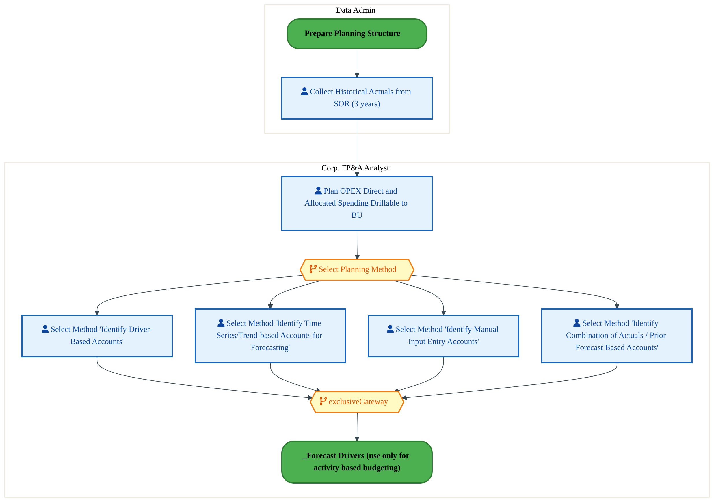

<a href="https://mermaid.live/view#pako:eNqlVmuL6zYQ_SuDl21uwen1M078oZCXexe63NDsbQtNKYotJ2JlKUhyNm7If68U52U3WxbqD4Y5mjlnZiSNvbdSnmErth4f94QRFcO-o9a4wJ0YOkskcceGGvgVCYKWFMuO8ck5U3Py99HNDTY742awBBWEVgad4xXH8O3JhqEOpDZIxGRXYkHyjt3ZCFIgUY055cJ4P-B-7uRHtdPSiIsMi6uD40RuGupQShi-wn4UREFi4iROOcsapHmY9_O0czDJUf6WrpFQx_RLiZ_R7jeSqbW2c0Ql1j5rVdCf0RJTU6MSpcHSUmzPzSDS6DDdsPkGpYStNB44GhKIvV6h0Dkc4PD4uGAXUXiZLBjoJ6VIygnOQSoNT7cKckJp_BCMh0no2FIJ_orjB28aTXzPTk0lsS7dsU1zu2-YrNYqXnKanVy7b6aG2NvsbLGLPccWlX63tDDLrkrjntf3-helUeSO3fFZKc_z_6Wk-ypekHw9aU39xEsmFy037IVj59985zInQTR0233CYktSfEOaJIk_vbZq2gtd533SUeL3nHGLdIUUfkPVlXAwDi6ESRglbvQuYa3XzrJczgRPz4T-NEzCC2E0cpOh9y5hMHSD_ilDzbMSaLOGMRebHyCZfTeEIUO0kqp2MA_z_lhYOYpz1DX9hhlFDL7Opr_DhAicKkAsgyGlPNVlZjDf6P3XJxMmQmdnrjAoDqNvC-vPG06_yTnH1DA9Y7XmGXSeMswUySt4IQXWi4Jg-flFaOKuGRJaLk15yZSEnAtIuE4DSWWuQ1Ml-JjKM2IlovDENqWCKVOiugi0CMOPEY55sSQMKcIZ8FyTKc0v4TPMBLlJGEaNYlpavY9p6TZvsej-J1Wkqf66qNYREj5pXuCMVscuolSRLVEV1B1eltkKm5Z-36Qa7PfntMwo7y71MErX5-zM2WBm8-s0F9bhcBPrOveD8S6lpdRJ_VRflGuY3vHWSZ0ghWCYFYTdEjdbpSfyMZsvRCouSKr39rwFueAFzL_-Ap98qDASslVeXzPNBN4gga_FzPVw1vECX3wveTEXut0f9R05mV5tDk7moDZ7TdNvmkHTDE9mrzbd0-VnfssOWnbYsl2nBqKT3T-t38wSk_55hjZg7z7s34eD-3B4H-7dh6PLN6oB9-_Dg_NQbVbjnGHLtgosCkQyK95bxz8K_deR4RyVVFkH20Kl4vOKpVZ8_PJa5SbTkROC9DEravDwD8z5wzQ=" title="View in Mermaid Live">&#128065; View in Mermaid Live</a>

Page 7<a href="#toc">↑ Back to TOC</a>MB-070 — MB-070

#### BUSINESS ARCHITECTURE — 3.2.2 MB-070-020_Forecast_Drivers_(use_only_for_activity_based_budgeting) — MB-070-020_Forecast_Drivers_(use_only_for_activity_based_budgeting)

**Swim Lanes**: Corp. FP&A Analyst | **Tasks**: 7 | **Gateways**: 4

> **Legend**: ● Start · ● End · User Task · Service Task · ◇ Gateway · Sub-Process

```mermaid
%%{init: {'theme': 'base', 'themeVariables': {'fontSize': '14px', 'fontFamily': 'Segoe UI, Arial, sans-serif','primaryColor': '#e8f0fe', 'primaryBorderColor': '#0071c5','lineColor': '#37474F', 'secondaryColor': '#f5f8fc'}, 'flowchart': {'useMaxWidth': false, 'htmlLabels': true, 'curve': 'basis', 'nodeSpacing': 40, 'rankSpacing': 50}} }%%
flowchart TD
    classDef startEvt fill:#4CAF50,stroke:#2E7D32,color:#000,font-weight:bold,stroke-width:2px,rx:20,ry:20
    classDef endEvt fill:#C62828,stroke:#B71C1C,color:#fff,font-weight:bold,stroke-width:2px,rx:20,ry:20
    classDef userTask fill:#E3F2FD,stroke:#1565C0,stroke-width:2px,color:#0D47A1
    classDef serviceTask fill:#FFF3E0,stroke:#E65100,stroke-width:2px,color:#BF360C
    classDef gateway fill:#FFF9C4,stroke:#F57F17,stroke-width:2px,color:#E65100
    classDef subProc fill:#F3E5F5,stroke:#7B1FA2,stroke-width:2px,color:#4A148C
    subgraph Corp. FP&A Analyst
        n1["fa:fa-user Create the Forecast Drivers"]
        n2["fa:fa-user Determine Forecast Drivers for Each Model"]
        n3["fa:fa-user Create any Additional drivers"]
        n4["fa:fa-user Perform “What If” Scenarios Using Version Management"]
        n5["fa:fa-user Update the Forecast Drivers"]
        n6["fa:fa-user Delete any Redundant drivers"]
        n7["fa:fa-user Select Appropriate Scenario for Final Plan"]
        n8(["fa:fa-play Forecast Drivers Initiated"])
        n9(["fa:fa-stop Forecast Drivers Completed"])
        n10{{"fa:fa-code-branch Creation or Deletion Required?"}}
        n11{{"fa:fa-code-branch exclusiveGateway"}}
        n12{{"fa:fa-code-branch Forecast Drivers need to be Created or Updated?"}}
        n13{{"fa:fa-code-branch exclusiveGateway"}}
    end
    n2 --> n12
    n3 --> n11
    n5 --> n13
    n8 --> n2
    n11 --> n9
    n10 -->|"Create"| n3
    n1 --> n13
    n13 --> n4
    n12 -->|"Create"| n1
    n12 -->|"Update"| n5
    n6 --> n11
    n10 -->|"Delete"| n6
    n4 --> n7
    n7 --> n10
    class n1 userTask
    class n2 userTask
    class n3 userTask
    class n4 userTask
    class n5 userTask
    class n6 userTask
    class n7 userTask
    class n8 startEvt
    class n9 endEvt
    class n10 gateway
    class n11 gateway
    class n12 gateway
    class n13 gateway
```

<a href="https://mermaid.live/view#pako:eNqlVstu4zYU_RVCQeoWkAtRD8vRooUjW0WABgjGk5nFeBa0RNlEaFIlqcSux_9eUg87khWgRbUwfA_vOfdB8kpHK-UZtiLr9vZIGFEROI7UFu_wKAKjNZJ4ZIMa-IIEQWuK5cj45JypJfm7coN-sTduBkvQjtCDQZd4wzF4frDBTBOpDSRiciyxIPnIHhWC7JA4xJxyYbxv8DR38ipas3TPRYbFxcFxQpgGmkoJwxfYC_3QTwxP4pSzrCOaB_k0T0cnkxzlb-kWCVWlX0r8iPZfSaa22s4RlVj7bNWO_onWmJoalSgNlpbitW0GkSYO0w1bFiglbKNx39GQQOzlAgXO6QROt7crdg4KPs9XDOgnpUjKOc6BVBpevCqQE0qjGz-eJYFjSyX4C45u3EU491w7NZVEunTHNs0dv2Gy2apozWnWuI7fTA2RW-xtsY9cxxYH_duLhVl2iRRP3Kk7PUe6D2EM4zZSnuf_K5Luq_iM5EsTa-ElbjI_x4LBJIida722zLkfzmC_T1i8khS_E02SxFtcWrWYBND5WPQ-8SZO3BPdIIXf0OEieBf7Z8EkCBMYfihYx-tnWa6fBE9bQW8RJMFZMLyHycz9UNCfQX_aZKh1NgIVWxBzUfwKkqefZmDGED1IVTuYh8FvKytHUY7Gpt8gFljXA_QtBQkXOEVSgbkgr1jIlfX9Hc_t8uZYYbHTt-mKBnIuwAKlW_CoDzvtqniD0RE7gFmWEUW4zhdkQ_H9LvMJCx1nB1al68D06xYp8JBXRgaWKWZ64HAJnqW-VeCLFtPK4BExtNHTiKmudNCVfi6yf9eSSb8lFDfFfMJZqccJU8O1hF3iUhNTBWZFIbgeYCZ4W0LVzISYrjxRxLoy05_POgXVJ_JqJx70UDZymeb98o54dyFKxYtrYsx3hSmmT4TO8dgyzewfr_X00jtd7aNpMW_aYP5_wn-VRODs95V1Or0XgcMieJ_SUuoE_qhvWJ_mDtOukmcYZ0BxsMbN-cpMWvWuXifj_ddk9ECs_zAXjMe_mcQa22vsZgyxoLG9xp7WdusOYW3ftbZj7B8rq856Zf3Qku1aTwo2sfzWdq-5sL9Wt6BaC5q1SS_lcw71Ya58J82aX_uGjRk21PfjzCTajvEO7A7D3jDsD8PBMDwZhsNheHp-e3bgu-ZF1y3Gaad9F4bDsDsMey1s2dZOD01EMis6WtWHkf54ynCOSqqsk22hUvHlgaVWVH1AWGW1YXOC9Fzf1eDpHwIm_8Q=" title="View in Mermaid Live">&#128065; View in Mermaid Live</a>

Page 8<a href="#toc">↑ Back to TOC</a>MB-070 — MB-070

#### BUSINESS ARCHITECTURE — 3.2.3 MB-070-040_Preparation_of_Budgeting_Instructions_and_Templates_Package — MB-070-040_Preparation_of_Budgeting_Instructions_and_Templates_Package

**Swim Lanes**: BU Analyst · Corp. FP&A Analyst · IT Admin | **Tasks**: 8 | **Gateways**: 4

> **Legend**: ● Start · ● End · User Task · Service Task · ◇ Gateway · Sub-Process

```mermaid
%%{init: {'theme': 'base', 'themeVariables': {'fontSize': '14px', 'fontFamily': 'Segoe UI, Arial, sans-serif','primaryColor': '#e8f0fe', 'primaryBorderColor': '#0071c5','lineColor': '#37474F', 'secondaryColor': '#f5f8fc'}, 'flowchart': {'useMaxWidth': false, 'htmlLabels': true, 'curve': 'basis', 'nodeSpacing': 40, 'rankSpacing': 50}} }%%
flowchart LR
    classDef startEvt fill:#4CAF50,stroke:#2E7D32,color:#000,font-weight:bold,stroke-width:2px,rx:20,ry:20
    classDef endEvt fill:#C62828,stroke:#B71C1C,color:#fff,font-weight:bold,stroke-width:2px,rx:20,ry:20
    classDef userTask fill:#E3F2FD,stroke:#1565C0,stroke-width:2px,color:#0D47A1
    classDef serviceTask fill:#FFF3E0,stroke:#E65100,stroke-width:2px,color:#BF360C
    classDef gateway fill:#FFF9C4,stroke:#F57F17,stroke-width:2px,color:#E65100
    classDef subProc fill:#F3E5F5,stroke:#7B1FA2,stroke-width:2px,color:#4A148C
    subgraph BU Analyst
        n2["fa:fa-user Input Plan Data in SAC Margin Model"]
        n3["fa:fa-user Input Plan Data in SAC Cost Center/WBS Model"]
        n4["fa:fa-user Perform FP and A ATL Adjustments using Input Forms Per Instructions"]
        n5["fa:fa-user Perform FP and A BTL Adjustments using Input Forms per Instruction"]
        n14{{"fa:fa-arrows-alt parallelGateway"}}
    end
    subgraph Corp. FP&A Analyst
        n6["fa:fa-user Input Plan Data in SAC P and L Model"]
        n7["fa:fa-user Perform FP and A Input Guide and BTL Adjustments using Input Forms Per..."]
        n8["fa:fa-user Review Guide and BTL Adjustments"]
        n10(["fa:fa-stop Preparation of Budgeting Instructions and Templates Package Completed"])
        n12{{"fa:fa-code-branch Approved?"}}
    end
    subgraph IT Admin
        n1["fa:fa-user Publish SAC Landing Page with Instructions"]
        n9(["fa:fa-play Preparation of Budgeting Instructions and Templates Package Initiated"])
        n11{{"fa:fa-code-branch exclusiveGateway"}}
        n13{{"fa:fa-arrows-alt parallelGateway"}}
    end
    n9 --> n1
    n1 --> n11
    n13 --> n2
    n2 --> n4
    n3 --> n5
    n4 --> n14
    n5 --> n14
    n14 --> n6
    n6 --> n7
    n7 --> n8
    n8 --> n12
    n11 --> n13
    n12 -->|"No"| n11
    n12 -->|"Yes"| n10
    n13 --> n3
    class n1 userTask
    class n2 userTask
    class n3 userTask
    class n4 userTask
    class n5 userTask
    class n6 userTask
    class n7 userTask
    class n8 userTask
    class n9 startEvt
    class n10 endEvt
    class n11 gateway
    class n12 gateway
    class n13 gateway
    class n14 gateway
```

<a href="https://mermaid.live/view#pako:eNqlVl2P4jYU_StWRlO6UpjmkzB5aBUCWY3EVGiZ7aoqfTCJA-44TmQ7MJTlv9cmCRA2szPq8oC4x_eec--xg7PX4jxBmq_d3u4xxcIH-55Yowz1fNBbQo56OqiAPyDDcEkQ76mcNKdijv89pplO8aLSFBbBDJOdQudolSPw-UEHgSwkOuCQ8j5HDKc9vVcwnEG2C3OSM5V9g4apkR7V6qVRzhLEzgmG4ZmxK0sJpugM257jOZGq4yjOadIiTd10mMa9g2qO5Nt4DZk4tl9y9AhfvuBErGWcQsKRzFmLjEzhEhE1o2ClwuKSbRozMFc6VBo2L2CM6UrijiEhBunzGXKNwwEcbm8X9CQKpp8WFMhPTCDnY5QCLiQ82QiQYkL8GycMItfQuWD5M_JvrIk3ti09VpP4cnRDV-b2twiv1sJf5iSpU_tbNYNvFS86e_EtQ2c7-X2lhWhyVgoH1tAanpRGnhmaYaOUpukPKUlf2RPkz7XWxI6saHzSMt2BGxrf8jVjjh0vMK99QmyDY3RBGkWRPTlbNRm4pvE66SiyB0Z4RbqCAm3h7kx4Hzonwsj1ItN7lbDSu-6yXM5YHjeE9sSN3BOhNzKjwHqV0AlMZ1h3KHlWDBZrMPoMAgrJjotqQX2o9ddCS6Gfwr7yGTzQohRgRiAFYyggwBTMgxA8QraSPx_lMSUL7e-Levtd9WHOBQgRFYj98mU07yJy2kQzxNKcZSCaAUgTEIDgaQqC5J-Si0zycHks5JNR60Uyk6sSGUtLyljgnPI2v_sG_-hN_qLN36Y3nf2-EYCM5Vveh0SAAjJICCIfq9Ox0A6Hqkg-P1fbE-asuJP9_BR0bNPgXTZXs0y77PXeGL9i_FjiBB2R0Xvsvru7a6sM2yqf0Aaj7eusVxYaP5_KucgLMGNI-afMBnkKRmWyQqJq47zLR94nlBVEWiy7gvEzXCHppkSQQInU-HApYp33SV1T_aX8o43XICgKlm9Q8tv3tujhSXafYXrJd-VruSSYr4-7MZWdqW5nqp8tFuvvnM778-hykN0Pjf4g71wMO0Y3u0dHLzGR27tB3xzSqsz-nyeb3oN-_1dJUIdmHZ5iuwKsOraq0KnDetWtQ6eubpbdq9isEwZ1PKhCrw69KhzW4bCubrTNpjm7AY7dfF1ov-cL7etl183Cn4hXK8bVPPbFH7maurnAWrDVDdvdsNMNu93woBv2uuFhN3x_ep1oj2PUV38bNZv7rw1b3bDdDTsNrOlahlgGcaL5e-34qihfJxOUwpII7aBrsBT5fEdjzT--UmllkcjKMYbyOc0q8PAf77pVTg==" title="View in Mermaid Live">&#128065; View in Mermaid Live</a>

Page 9<a href="#toc">↑ Back to TOC</a>MB-070 — MB-070

#### BUSINESS ARCHITECTURE — 3.2.4 MB-070-050_Input_Operating_Budget — MB-070-050_Input_Operating_Budget

**Swim Lanes**: Corp. FP&A Analyst | **Tasks**: 7 | **Gateways**: 2

> **Legend**: ● Start · ● End · User Task · Service Task · ◇ Gateway · Sub-Process

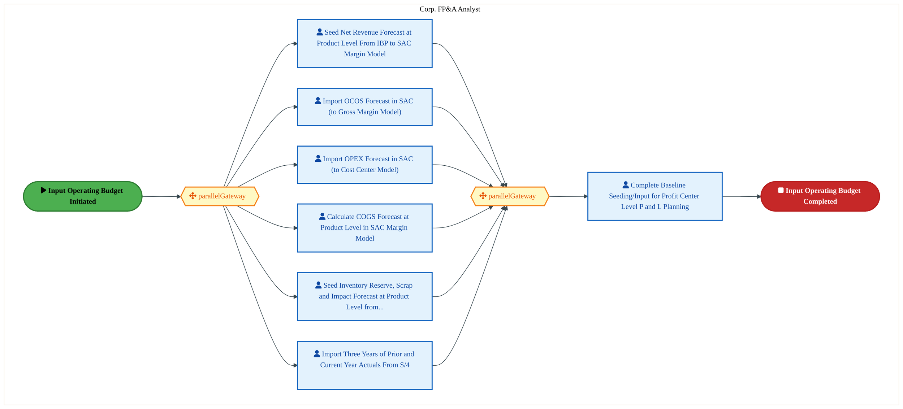

<a href="https://mermaid.live/view#pako:eNqlVl2PokgU_SsVOr3OJNgDCGLzsImidEy6t804-5V1H6qhUNJlFakqtF3jf59bCiosTrJZHozncO85dW8VF_ZGzBNiBMb9_T5jmQrQvqNWZE06Aeq8YUk6JjoRv2GR4TdKZEfHpJypefbPMcx28w8dprkIrzO60-ycLDlBv05NNIREaiKJmexKIrK0Y3Zyka2x2IWccqGj78ggtdKjW3lrxEVCxCXAsnw79iCVZoxc6J7v-m6k8ySJOUtqoqmXDtK4c9CLo3wbr7BQx-UXkrzgj9-zRK0Ap5hKAjErtabP-I1QXaMShebiQmyqZmRS-zBo2DzHccaWwLsWUAKz9wvlWYcDOtzfL9jZFH0bLxiCK6ZYyjFJkVRATzYKpRmlwZ0bDiPPMqUS_J0Ed87EH_ccM9aVBFC6ZermdrckW65U8MZpUoZ2t7qGwMk_TPEROJYpdvDb8CIsuTiFfWfgDM5OI98O7bByStP0fzlBX8U3LN9Lr0kvcqLx2cv2-l5o_VuvKnPs-kO72SciNllMrkSjKOpNLq2a9D3bui06inp9K2yILrEiW7y7CD6G7lkw8vzI9m8KnvyaqyzeZoLHlWBv4kXeWdAf2dHQuSnoDm13UK4QdJYC5ysUcpE_oGj20xANGaY7qU4B-mL2XwsjxUGKu7rfaLrOuT5iK0EI-pNgIRFP0UxkXCDMEhQWQhCmjrfQMFYFHHcUCb5G8y_uwvj7StmpK4d8nVOiCBrBJNDPHZoTksAp_zJleQEnChyg7jRTKAQHyHgmG0LR7Oj7jGYUMwbhdZNewwTTuKCwIyh8fZqjiAsSY6kQVlo7KWJVqmYMzYchesFiCX9f4DGkdWG3tS-v4euVainySXH0JLiUNbnPdT2vrqdrR1O2gUq52KGvRJ9NmBHzGLbsWDE4Ylju7RJS6PrDw0Pdpt9i8wtRYABWBfmB3HETp6MZgmp-3Bq_vTWzyR-trQm5PG9pW2cGn856OYUH6XQcXnMisIL9RqMiWUIFU3ijZLCzCWR_vkp_vKRLxfNb6dXxa6bb1n5f5WMh-FZ2MVUoxwJTSujT6eleGIfDdZL935JgaJ7-sAHqdn_WAiXul7gcAsxtYL-Bew3sNbBzwo8ltK0TdircCLcrooH7DdxrYK-B3Qb2r2aadq1meY122uleO-2201473W-n_XZ6cH6F1ujH8m1XL8aqRn6dtivaMI01EWucJUawN47fO_BNlJAUF1QZB9PAheLzHYuN4PhdYBR5ApnjDMO4Xp_Iw3dNs-zN" title="View in Mermaid Live">&#128065; View in Mermaid Live</a>

Page 10<a href="#toc">↑ Back to TOC</a>MB-070 — MB-070

#### BUSINESS ARCHITECTURE — 3.2.5 MB-070-060_Collection_and_Consolidation_of_the_Operating_Budgets — MB-070-060_Collection_and_Consolidation_of_the_Operating_Budgets

**Swim Lanes**: BU Analyst · Corp. FP&A Analyst | **Tasks**: 8 | **Gateways**: 4

> **Legend**: ● Start · ● End · User Task · Service Task · ◇ Gateway · Sub-Process

```mermaid
%%{init: {'theme': 'base', 'themeVariables': {'fontSize': '14px', 'fontFamily': 'Segoe UI, Arial, sans-serif','primaryColor': '#e8f0fe', 'primaryBorderColor': '#0071c5','lineColor': '#37474F', 'secondaryColor': '#f5f8fc'}, 'flowchart': {'useMaxWidth': false, 'htmlLabels': true, 'curve': 'basis', 'nodeSpacing': 40, 'rankSpacing': 50}} }%%
flowchart LR
    classDef startEvt fill:#4CAF50,stroke:#2E7D32,color:#000,font-weight:bold,stroke-width:2px,rx:20,ry:20
    classDef endEvt fill:#C62828,stroke:#B71C1C,color:#fff,font-weight:bold,stroke-width:2px,rx:20,ry:20
    classDef userTask fill:#E3F2FD,stroke:#1565C0,stroke-width:2px,color:#0D47A1
    classDef serviceTask fill:#FFF3E0,stroke:#E65100,stroke-width:2px,color:#BF360C
    classDef gateway fill:#FFF9C4,stroke:#F57F17,stroke-width:2px,color:#E65100
    classDef subProc fill:#F3E5F5,stroke:#7B1FA2,stroke-width:2px,color:#4A148C
    subgraph BU Analyst
        n1["fa:fa-user Plan for General and Administrative"]
        n2["fa:fa-user Plan for Marketing and Sales"]
        n3["fa:fa-user Plan for R and D"]
        n4["fa:fa-user Plan for Cost Center Functional Spend"]
        n7[["fa:fa-cog Receive Data from Partner Cost Center"]]
        n9(["fa:fa-play Collection and Consolidation of the Operating Budgets Initiated"])
        n13{{"fa:fa-arrows-alt parallelGateway"}}
        n14{{"fa:fa-arrows-alt parallelGateway"}}
    end
    subgraph Corp. FP&A Analyst
        n5["fa:fa-user Perform Review of P and L"]
        n6["fa:fa-user Consolidate Operating Spend Data at LOB or Profit Center P and L"]
        n8[["fa:fa-cog Perform FP and A Adjustments"]]
        n10(["fa:fa-stop Collection and Consolidation of the Operating Budgets Completed"])
        n11{{"fa:fa-code-branch Approved?"}}
        n12{{"fa:fa-code-branch exclusiveGateway"}}
    end
    n9 --> n7
    n7 --> n13
    n13 --> n1
    n13 --> n2
    n13 --> n3
    n13 --> n4
    n1 --> n14
    n2 --> n14
    n3 --> n14
    n4 --> n14
    n14 --> n12
    n5 --> n11
    n12 --> n6
    n11 -->|"Yes"| n10
    n11 -->|"No"| n12
    n6 --> n8
    n8 --> n5
    class n1 userTask
    class n2 userTask
    class n3 userTask
    class n4 userTask
    class n5 userTask
    class n6 userTask
    class n7 serviceTask
    class n8 serviceTask
    class n9 startEvt
    class n10 endEvt
    class n11 gateway
    class n12 gateway
    class n13 gateway
    class n14 gateway
```

<a href="https://mermaid.live/view#pako:eNqlVl2v4jYQ_StWVre0UqjySbh5aAWBrFa6u3t16baqlj6YxAH3OnZkO3Apy3-vnQ8gaXhoywPSHM-c8ZwZ2zkZCUuRERoPDydMsQzBaSR3KEejEIw2UKCRCWrgV8gx3BAkRtonY1Su8F-Vm-0Vb9pNYzHMMTlqdIW2DIEvH0wwU4HEBAJSMRaI42xkjgqOc8iPESOMa-93aJpZWZWtWZozniJ-dbCswE58FUowRVfYDbzAi3WcQAmjaYc087NplozOenOEHZId5LLafinQR_j2G07lTtkZJAIpn53MyRPcIKJrlLzUWFLyfSsGFjoPVYKtCphgulW4ZymIQ_p6hXzrfAbnh4c1vSQFTy9rCtQvIVCIBcqAkApe7iXIMCHhOy-axb5lCsnZKwrfOctg4TpmoisJVemWqcUdHxDe7mS4YSRtXMcHXUPoFG8mfwsdy-RH9d_LhWh6zRRNnKkzvWSaB3ZkR22mLMv-VyalK_8Fitcm19KNnXhxyWX7Ez-y_snXlrnwgpnd1wnxPU7QDWkcx-7yKtVy4tvWfdJ57E6sqEe6hRId4PFK-Bh5F8LYD2I7uEtY5-vvstw8c5a0hO7Sj_0LYTC345lzl9Cb2d602aHi2XJY7MD8C5hRSI5C1gv6R-2vayODYQbHWmfwTCAFGePgPaKIQwIgTcEszdU5VrmgxHu0Nv64iXfuxH-E_BVJNbwVwwqqQ94NdO8EvlQBi66zd8c5YkKCCFGpwLikicRMVQhWhRrPLkPw9UKRsC14QQlStYAFlBBknOXgWZ0dVfItpWK4pXj8_kJRENVpdScQVKWsthwxKhjBKawQlgF1xYHPBdKqKRnmZbpFUoAP6kbEalb0_n64bYR7OrX0kHN2EGNIJCig6gJB5H09XmvjfL4N8v5dkJalOxQR48WPIH7-bjYwHH5PdsSV6LkSb4_RQZf4XFX-1JV60o266nIrR9WiWn6orrLPc6DaqeY9w5eGDpJPu31stxTXzqqI9M9SyFwxiF77bOvaPyFZ8R_7F7G8IGigf_a1Ffr9G2_UDZ7swKwoONuj9Od-65xhf_SWkFKo2bzfPPoIxuOf1Ew3ZlCbttvYttsAPdvp2X1_r7Wb8NZ2erbbs72ebbdAm9Bv7MuGGsZJa1cZv62N3_Ut8U33qr_yidULLeWkZpg25rQ2_Zs7VNfRvh0d2BmG3WHYG4b9YXgyDAe3b05nZXp35fHynneLspq3t4va7QPUhZ1h2B2GvRY2TCNHPIc4NcKTUX2rqe-5FGWwJNI4mwYsJVsdaWKE1TeNURb6fC8wVLdKXoPnvwEzSib7" title="View in Mermaid Live">&#128065; View in Mermaid Live</a>

#### BUSINESS ARCHITECTURE — 3.2.6 MB-070-090_Conduct_Corporate_Consolidation — MB-070-090_Conduct_Corporate_Consolidation

**Swim Lanes**: Corp. FP&A Analyst | **Tasks**: 4 | **Gateways**: 0

> **Legend**: ● Start · ● End · User Task · Service Task · ◇ Gateway · Sub-Process

```mermaid
%%{init: {'theme': 'base', 'themeVariables': {'fontSize': '14px', 'fontFamily': 'Segoe UI, Arial, sans-serif','primaryColor': '#e8f0fe', 'primaryBorderColor': '#0071c5','lineColor': '#37474F', 'secondaryColor': '#f5f8fc'}, 'flowchart': {'useMaxWidth': false, 'htmlLabels': true, 'curve': 'basis', 'nodeSpacing': 40, 'rankSpacing': 50}} }%%
flowchart TD
    classDef startEvt fill:#4CAF50,stroke:#2E7D32,color:#000,font-weight:bold,stroke-width:2px,rx:20,ry:20
    classDef endEvt fill:#C62828,stroke:#B71C1C,color:#fff,font-weight:bold,stroke-width:2px,rx:20,ry:20
    classDef userTask fill:#E3F2FD,stroke:#1565C0,stroke-width:2px,color:#0D47A1
    classDef serviceTask fill:#FFF3E0,stroke:#E65100,stroke-width:2px,color:#BF360C
    classDef gateway fill:#FFF9C4,stroke:#F57F17,stroke-width:2px,color:#E65100
    classDef subProc fill:#F3E5F5,stroke:#7B1FA2,stroke-width:2px,color:#4A148C
    subgraph Corp. FP&A Analyst
        n1["fa:fa-user Finalize P and L Planning for IF"]
        n2["fa:fa-user Finalize P and L Planning for IP"]
        n3["fa:fa-user Perform Sales, COGS, Inventory Imp. and OCOS Eliminations"]
        n4["fa:fa-user Finalize Intel Consolidated P and L"]
        n5(["fa:fa-play Conduct Corporate Consolidation Initiated"])
        n6(["fa:fa-stop Conduct Corporate Consolidation Completed"])
    end
    n5 --> n1
    n1 --> n2
    n2 --> n3
    n3 --> n4
    n4 --> n6
    class n1 userTask
    class n2 userTask
    class n3 userTask
    class n4 userTask
    class n5 startEvt
    class n6 endEvt
```

<a href="https://mermaid.live/view#pako:eNqllduO2jAQhl_FyoqmlUKVI6G5qASBVEhbLRI9XJRemMQGax07ss0CRbx7bRIOoYuqqrmImJ-Z77fHh-ytnBfISqxOZ08YUQnY22qFSmQnwF5AiWwH1MI3KAhcUCRtk4M5UzPy65jmhdXWpBktgyWhO6PO0JIj8HXigIEupA6QkMmuRIJg27ErQUoodimnXJjsB9THLj66NX8NuSiQuCS4buzlkS6lhKGLHMRhHGamTqKcs6IFxRHu49w-mMFRvslXUKjj8NcSfYbb76RQKx1jSCXSOStV0ke4QNTMUYm10fK1eDk1g0jjw3TDZhXMCVtqPXS1JCB7vkiReziAQ6czZ2dT8GU0Z0A_OYVSjhAGUml5_KIAJpQmD2E6yCLXkUrwZ5Q8-ON4FPhObmaS6Km7jmlud4PIcqWSBadFk9rdmDkkfrV1xDbxXUfs9PvGC7Hi4pT2_L7fPzsNYy_10pMTxvi_nHRfxRconxuvcZD52ejs5UW9KHX_5J2mOQrjgXfbJyReSI6uoFmWBeNLq8a9yHPvQ4dZ0HPTG-gSKrSBuwvwQxqegVkUZ158F1j73Y5yvZgKnp-AwTjKojMwHnrZwL8LDAde2G9GqDlLAasVSLmo3oNs-mYABgzSnVR1gnmY92NuYZhg2DX9BhnRGfosgimArACPYEohY3ovAswFmGRz6-dVsf9PxdN2cdAuniKhs0owg_pecED69GnmgAl7QUxxsQOTUs_BUJ_SpxkYU1JqM0U4k21qeGdIE6YQ1a1gklNS6DUrTqNs10dvz4CK6mXVFcU6V8cmcqHrrhjaXXOJIganMe-uOL0LRype_ZWT8rKiqMXRR63-wSLQ7X7Ua9WEXh36TejXYdCEQR2GTRjWYe9qlxnC6XS1ZP91OXhdDl-Xo_N91JJ7zdVhOVaJRAlJYSV76_g50J-MAmG4pso6OBZcKz7bsdxKjtemta7Mco0I1Lu5rMXDb-RVDEU=" title="View in Mermaid Live">&#128065; View in Mermaid Live</a>

Page 11<a href="#toc">↑ Back to TOC</a>MB-070 — MB-070

#### BUSINESS ARCHITECTURE — 3.2.7 MB-070-100_Review_and_Approve_Budgets — MB-070-100_Review_and_Approve_Budgets

**Swim Lanes**: Corp. FP&A Analyst · Corp. Finance Analyst | **Tasks**: 6 | **Gateways**: 4

> **Legend**: ● Start · ● End · User Task · Service Task · ◇ Gateway · Sub-Process

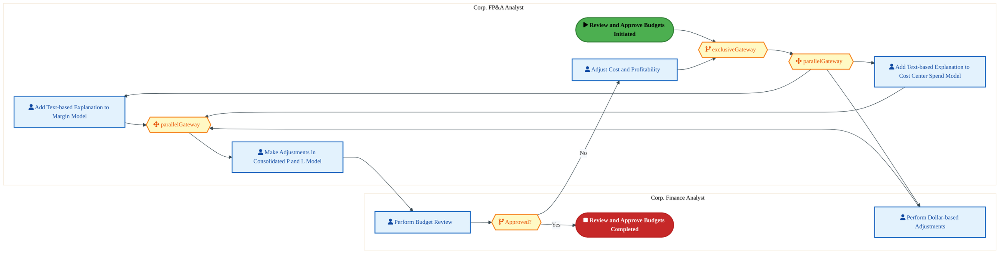

<a href="https://mermaid.live/view#pako:eNqlVl2PozYU_SsWo2laCSo-Q4aHVgkJ1Uoz1WizbVU1fXDAJO4YG9kmH5vNf68dIAksU2nVPES6x_ece--xMZyMlGXIiIzHxxOmWEbgNJJbVKBRBEZrKNDIBDXwO-QYrgkSI52TMyqX-PMlzfHLg07TWAILTI4aXaINQ-C3DyaYKiIxgYBUWAJxnI_MUclxAfkxZoRxnf2AJrmdX6o1SzPGM8RvCbYdOmmgqARTdIO90A_9RPMEShnNOqJ5kE_ydHTWzRG2T7eQy0v7lUAv8PAHzuRWxTkkAqmcrSzIM1wjomeUvNJYWvFdawYWug5Vhi1LmGK6UbhvK4hD-naDAvt8BufHxxW9FgXPH1cUqF9KoBBzlAMhFbzYSZBjQqIHP54mgW0Kydkbih7cRTj3XDPVk0RqdNvU5lp7hDdbGa0ZyZpUa69niNzyYPJD5NomP6r_Xi1Es1uleOxO3Mm10ix0YiduK-V5_r8qKV_5JyjemloLL3GT-bWWE4yD2P5arx1z7odTp-8T4jucojvRJEm8xc2qxThw7PdFZ4k3tuOe6AZKtIfHm-BT7F8FkyBMnPBdwbpev8tq_cpZ2gp6iyAJroLhzEmm7ruC_tTxJ02HSmfDYbkFMePljyB5_W4KphSSo5B1gv5R56-VkcMoh5b2G0yzDHxCB2np5zUDi0NJIIUSMwokAy-QbzAFL-rUkpXx952M-y0yMRMSxIhKlbks1YkaUvS6ii_wDSnZfyohC8UUQPURMyoYwZnagQy8AqiEnoek_H5zWqXuQnOU2zmWcI0JlscuM_z-SlUTHMFHtMNof2FNy5KzHQKzKtsg1c8HdeNh3YlS-OFO4ul0aiX09Wit1QOebgE6pKQSeId-qc_Pyjif77fFudEg52wvLEgkKCGHhCDyDsn9NpJyfvioYKp6RAOnJeg6-Yp4zngB5owQyJvNvtukrpnjYXJtYGNtlzG52S8kK__L_pgVJUFf2-_Yw_43_OznATtoCCzrJ7V1Teg4dez0YreJ3Wa5jZ1-3CR4PX7QxEEv36vjcROOm2W7pdsa-LIy_kTK4S_KpmbhqUls-_R7Y7S8X9mF5t9dPLrp9sLtwO4w7A3D_jAcDMPjYTi8vtA68KR593TAp_b-7c5iD8POMOy2sGEaBeIFxJkRnYzLp4r6nMlQDisijbNpwEqy5ZGmRnR5pRtVqS-fOYbq8Slq8PwvuGfaag==" title="View in Mermaid Live">&#128065; View in Mermaid Live</a>

Page 12<a href="#toc">↑ Back to TOC</a>MB-070 — MB-070

#### BUSINESS ARCHITECTURE — 3.2.8 MB-070-110_Prepare_Legal_Entity_Consolidation — MB-070-110_Prepare_Legal_Entity_Consolidation

**Swim Lanes**: Corp. FP&A Analyst | **Tasks**: 8 | **Gateways**: 4

> **Legend**: ● Start · ● End · User Task · Service Task · ◇ Gateway · Sub-Process

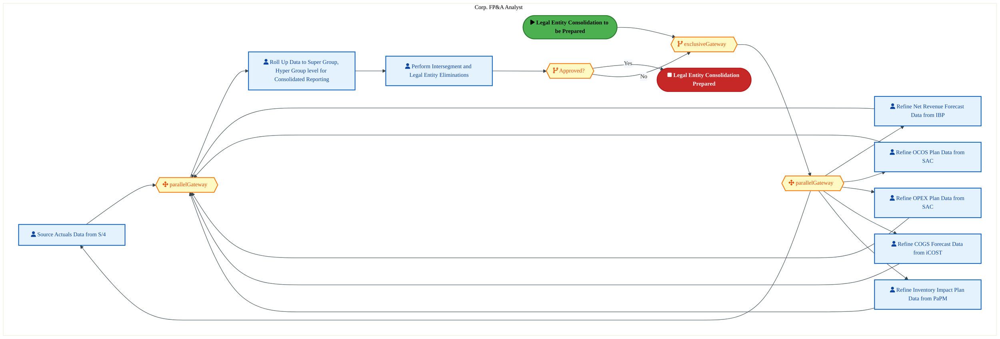

<a href="https://mermaid.live/view#pako:eNqlVm1v6jYY_StWqo5NClteCc2HTTSQrtK9t2j07kVjH0zyBKw6dmQ7tIzLf58DCZAs3TQtHxDn5DnneYljZ28kPAUjNG5v94QRFaL9QG0gh0GIBissYWCiE_EzFgSvKMhBFZNxphbkz2OY7RVvVVjFxTgndFexC1hzQJ8fTTTRQmoiiZkcShAkG5iDQpAci13EKRdV9A2MMys7Zqtv3XORgrgEWFZgJ76WUsLgQruBF3hxpZOQcJa2TDM_G2fJ4FAVR_lrssFCHcsvJXzEb7-QVG00zjCVoGM2Kqcf8Apo1aMSZcUlpdg2wyCyysP0wBYFTghba96zNCUwe7lQvnU4oMPt7ZKdk6Ln6ZIhfSUUSzmFDEml6dlWoYxQGt540ST2LVMqwV8gvHFmwdR1zKTqJNStW2Y13OErkPVGhStO0zp0-Fr1EDrFmyneQscyxU7_dnIBSy-ZopEzdsbnTPeBHdlRkynLsv-VSc9VPGP5UueaubETT8-5bH_kR9bf_Zo2p14wsbtzArElCVyZxnHszi6jmo1823rf9D52R1bUMV1jBa94dzG8i7yzYewHsR28a3jK162yXM0FTxpDd-bH_tkwuLfjifOuoTexvXFdofZZC1xsUMRF8S2K519N0IRhupPqFFBdzP59aWQ4zPCwmjda8FIkgCaJKvVCRlOsMMoEz9HiO29p_HEldNrCnyDT7xL6BEr_3QIrAcVcQIKlunJ5vJ-3Xdxel-jpYdEnJ9HT4rlt4PUaPDJdguJihx5z_S4pNKeYXRnN8fxj28fv9XnSCbvaxSRqS0f90vns13-VBh0ppxR9Lk4KxdGiLDT7IHhZmOjH3RkgqkdMUcaFfrhMckpSvQpTnbrgQumdo51l3M4yB6GV-mEwBULCOtejQpil6AOsMUUzpojaoRklOWFYEZ2gbXf39dmvoHrlt2SXerSw6mEFaC6gwAJSbfPN9dKzLkZS8eKfjN6zsPf7xqI6fIYrvX0mGzQpCsG3kP6wNA6H63inPx7eElpKsoWH09vclbkXGRaCv8ohpgrpijClQN8Ref9NpHfW0x92h4bD76tia2y7NdHB3ft-B4862O1gr8aj2r7Bfgd7Hex2sNPBdhfXBkGNgxMc13Bch5_bO-q_LI3fQK-8L9VCae40mdxu6Cd-inSuNtOqkOYQadFOP-32014_7ffTo3466KfH_fTd-Uhvt2PVx2-btZszqE07_bTbT3sNbZhGDiLHJDXCvXH8XNOfdClkuKTKOJgGLhVf7FhihMfPGqMsqs1nSrA-bfITefgLzY4ipA==" title="View in Mermaid Live">&#128065; View in Mermaid Live</a>

Page 13<a href="#toc">↑ Back to TOC</a>MB-070 — MB-070

#### BUSINESS ARCHITECTURE — 3.2.9 MB-070-120_Prepare_Updated_Financial_Results — MB-070-120_Prepare_Updated_Financial_Results

**Swim Lanes**: Corp. FP&A Analyst | **Tasks**: 13 | **Gateways**: 8

> **Legend**: ● Start · ● End · User Task · Service Task · ◇ Gateway · Sub-Process

```mermaid
%%{init: {'theme': 'base', 'themeVariables': {'fontSize': '14px', 'fontFamily': 'Segoe UI, Arial, sans-serif','primaryColor': '#e8f0fe', 'primaryBorderColor': '#0071c5','lineColor': '#37474F', 'secondaryColor': '#f5f8fc'}, 'flowchart': {'useMaxWidth': false, 'htmlLabels': true, 'curve': 'basis', 'nodeSpacing': 40, 'rankSpacing': 50}} }%%
flowchart TD
    classDef startEvt fill:#4CAF50,stroke:#2E7D32,color:#000,font-weight:bold,stroke-width:2px,rx:20,ry:20
    classDef endEvt fill:#C62828,stroke:#B71C1C,color:#fff,font-weight:bold,stroke-width:2px,rx:20,ry:20
    classDef userTask fill:#E3F2FD,stroke:#1565C0,stroke-width:2px,color:#0D47A1
    classDef serviceTask fill:#FFF3E0,stroke:#E65100,stroke-width:2px,color:#BF360C
    classDef gateway fill:#FFF9C4,stroke:#F57F17,stroke-width:2px,color:#E65100
    classDef subProc fill:#F3E5F5,stroke:#7B1FA2,stroke-width:2px,color:#4A148C
    subgraph Corp. FP&A Analyst
        n1["fa:fa-user Capture Source Actuals Data From S/4"]
        n2["fa:fa-user Roll up data to Super Group, Hyper Group Level for Consolidated Reporting"]
        n3["fa:fa-user Refine COGS Forecast Data from SAC Margin Model"]
        n4["fa:fa-user Refine OCOS Plan Data From SAC Gross Margin Model"]
        n5["fa:fa-user Refine Inventory Impact Plan Data From iCOST/PaPM"]
        n6["fa:fa-user Refine Net Revenue Forecast Data From IBP"]
        n7["fa:fa-user Refine OPEX Plan Data From SAC Cost Center Model"]
        n8["fa:fa-user Recommend Forecast Adjustments"]
        n9["fa:fa-user Review Judgement for Approval"]
        n10["fa:fa-user Create Top Level Guide Adjustments"]
        n11["fa:fa-user Review Consolidated P and L Reports"]
        n12["fa:fa-user Make Necessary Adjustments"]
        n13["fa:fa-user Finalize Consolidated P and L Reports"]
        n14(["fa:fa-play Prepare Updated Financial Results Initiated"])
        n15(["fa:fa-stop Input Operating Budget Completed"])
        n16{{"fa:fa-code-branch Approved?"}}
        n17{{"fa:fa-code-branch exclusiveGateway"}}
        n18{{"fa:fa-code-branch Additional Adjustments Needed?"}}
        n19{{"fa:fa-code-branch exclusiveGateway"}}
        n20{{"fa:fa-arrows-alt parallelGateway"}}
        n21{{"fa:fa-arrows-alt parallelGateway"}}
        n22{{"fa:fa-arrows-alt parallelGateway"}}
        n23{{"fa:fa-arrows-alt parallelGateway"}}
    end
    n14 --> n23
    n6 --> n20
    n4 --> n20
    n7 --> n20
    n3 --> n20
    n5 --> n20
    n2 --> n21
    n20 --> n2
    n1 --> n20
    n21 --> n8
    n8 --> n19
    n9 --> n16
    n21 --> n10
    n22 --> n17
    n10 --> n22
    n11 --> n18
    n17 --> n11
    n18 -->|"No"| n13
    n12 --> n17
    n18 -->|"Yes"| n12
    n13 --> n15
    n23 --> n1
    n23 --> n6
    n23 --> n3
    n23 --> n5
    n23 --> n4
    n23 --> n7
    n19 --> n9
    n16 -->|"Yes"| n22
    n16 -->|"No"| n19
    class n1 userTask
    class n2 userTask
    class n3 userTask
    class n4 userTask
    class n5 userTask
    class n6 userTask
    class n7 userTask
    class n8 userTask
    class n9 userTask
    class n10 userTask
    class n11 userTask
    class n12 userTask
    class n13 userTask
    class n14 startEvt
    class n15 endEvt
    class n16 gateway
    class n17 gateway
    class n18 gateway
    class n19 gateway
    class n20 gateway
    class n21 gateway
    class n22 gateway
    class n23 gateway
```

<a href="https://mermaid.live/view#pako:eNqlV21z4jYQ_isa36S0M9CzjF-AD-0Qg9N0kgtz5PoypR8UWwY3wvJIMoTm-O9dgc2LztzMpXxg2Ifd59ldaS351Yp5Qq2BdXX1muWZGqDXllrQJW0NUOuJSNpqoz3wGxEZeWJUtrRPynM1zf7duWG3eNFuGovIMmMbjU7pnFP06baNhhDI2kiSXHYkFVnaarcKkS2J2ISccaG939Feaqc7teqvay4SKo4Oth3g2INQluX0CHcDN3AjHSdpzPPkjDT10l4at7Y6OcbX8YIItUu_lPSevPyeJWoBdkqYpOCzUEt2R54o0zUqUWosLsWqbkYmtU4ODZsWJM7yOeCuDZAg-fMR8uztFm2vrmb5QRQ9jmY5gk_MiJQjmiKpAB6vFEozxgbv3HAYeXZbKsGf6eCdMw5GXacd60oGULrd1s3trGk2X6jBE2dJ5dpZ6xoGTvHSFi8Dx26LDXwbWjRPjkqh7_Sc3kHpOsAhDmulNE3_lxL0VTwS-VxpjbuRE40OWtjzvdD-kq8uc-QGQ2z2iYpVFtMT0iiKuuNjq8a-h-3LpNdR17dDg3ROFF2TzZGwH7oHwsgLIhxcJNzrmVmWTxPB45qwO_Yi70AYXONo6FwkdIfY7VUZAs9ckGKBQi6KH1E0-W6IhjlhG6n2DvqT479mVkoGKenofqOQFKoUFE15KWKKhrEqYUOjEVEERYIv0fS9O7P-PiFwzgk-csZQWaBERyiOpmUB6I3gZdFGv2wOBrqjK8pQykGT55KzDCJogj7SggsFm_9cpWuo0BQmF4UPN1MUcUFjItU-yXSX5DBE90TMsxzdw4Sxcy63keshfJiiCSP5abHAA9lK-RU2r5HtNl_RXHGxQbdLGGZlMmeg9vh-Qib352x-I9sHquAnMJbUKHdHdns9OWcJmiucjP9oqjDkwBZCuuDaUGDPJIv5cgmPgWMmw-SfUirAlDwP7Zuhq4yu0a9lMqfae7f6w6IQfEUMUWwb-1JQ2B7okdcb56bMEnpZGeNG6bOtNkEEqrirtpxJYOzre_Ks1yGmUsKx8BVhY6dGGYwcHG7fIu1-f-AoGDxaJoIWBIbyU7GP1px5DAchxMuSKQnbLVOZ_g-Yfjil8o5UUkHzbvOiVOgBxpDoIUPXei1g9fmyYLQh3n99reP14d55guMpXlSLRpOfZ9Z2e-ofNPvTl5iVMlvRm_3T0gzrXZBJEqiLQwdPGw7LQJMG7f6btB37GEaE4GvZIUwhaDhhjLILQfgtQc5bgrrfFgSDuf8B2wh1Oj9phgrwK7s6cHLXsAPD7hq2Z9hOZePatiugTsD0r4BeZff2Ju5Xdr-yfcMfHwgqRRzUCrXiQbIOqTVwVRSuk8Q71c8z6wOfWZ_1vNZ_fEFee_5J5d71oFJ1Bnt1YjVg2L5hdw3bjHcN-5BK1Zq6U9g3Ujs2wDfK65_cLvSS1LeqM9hphrvNsNsMe82w3wwHzXCvGe43w7D-zfiFOvGFQvGFSmGE6rv1Oe5V9-Bz1K8vg-dw0Az3muF-Iwyz1QjjZthphrs1bLWtJRVLkiXW4NXavZPBe1tCUwLHibVtW6RUfLrJY2uwe3exyt3RM8oIXCmXe3D7H06HVX4=" title="View in Mermaid Live">&#128065; View in Mermaid Live</a>

Page 14<a href="#toc">↑ Back to TOC</a>MB-070 — MB-070

#### BUSINESS ARCHITECTURE — 3.2.10 MB-070-130_Prepare_Tax_Forecast — MB-070-130_Prepare_Tax_Forecast

**Swim Lanes**: Legal Entity Accountant | **Tasks**: 7 | **Gateways**: 4

> **Legend**: ● Start · ● End · User Task · Service Task · ◇ Gateway · Sub-Process

```mermaid
%%{init: {'theme': 'base', 'themeVariables': {'fontSize': '14px', 'fontFamily': 'Segoe UI, Arial, sans-serif','primaryColor': '#e8f0fe', 'primaryBorderColor': '#0071c5','lineColor': '#37474F', 'secondaryColor': '#f5f8fc'}, 'flowchart': {'useMaxWidth': false, 'htmlLabels': true, 'curve': 'basis', 'nodeSpacing': 40, 'rankSpacing': 50}} }%%
flowchart TD
    classDef startEvt fill:#4CAF50,stroke:#2E7D32,color:#000,font-weight:bold,stroke-width:2px,rx:20,ry:20
    classDef endEvt fill:#C62828,stroke:#B71C1C,color:#fff,font-weight:bold,stroke-width:2px,rx:20,ry:20
    classDef userTask fill:#E3F2FD,stroke:#1565C0,stroke-width:2px,color:#0D47A1
    classDef serviceTask fill:#FFF3E0,stroke:#E65100,stroke-width:2px,color:#BF360C
    classDef gateway fill:#FFF9C4,stroke:#F57F17,stroke-width:2px,color:#E65100
    classDef subProc fill:#F3E5F5,stroke:#7B1FA2,stroke-width:2px,color:#4A148C
    subgraph Legal Entity Accountant
        n1["fa:fa-user Maintain LE and TP"]
        n2["fa:fa-user Adjust R and D Tax Credits, Grants via User Inputs Through SAC Input Forms"]
        n3["fa:fa-user Finalize LE Tax Forecast Calculation for ATM, DISTI, FAB and R and D"]
        n4["fa:fa-user Generate Reports for Pretax Forecast by LE"]
        n5["fa:fa-user Perform Flux Analysis"]
        n6[["fa:fa-cog Aggregate Pre-Tax P and L Data by Legal Entity at Cost Center Level"]]
        n7[["fa:fa-cog Receive Transfer Pricing Markup Percentage"]]
        n8(["fa:fa-play Tax Forecast to be Prepared"])
        n9(["fa:fa-stop Tax Forecast Prepared"])
        n10{{"fa:fa-code-branch Approved?"}}
        n11{{"fa:fa-code-branch exclusiveGateway"}}
        n12{{"fa:fa-arrows-alt parallelGateway"}}
        n13{{"fa:fa-arrows-alt parallelGateway"}}
    end
    n8 --> n12
    n6 --> n13
    n7 --> n2
    n12 --> n6
    n13 --> n7
    n1 --> n13
    n12 --> n1
    n3 --> n10
    n10 -->|"Yes"| n5
    n11 --> n3
    n10 -->|"No"| n11
    n4 --> n9
    n2 --> n11
    n5 --> n4
    class n1 userTask
    class n2 userTask
    class n3 userTask
    class n4 userTask
    class n5 userTask
    class n6 serviceTask
    class n7 serviceTask
    class n8 startEvt
    class n9 endEvt
    class n10 gateway
    class n11 gateway
    class n12 gateway
    class n13 gateway
```

<a href="https://mermaid.live/view#pako:eNqlVl2P4jYU_StWRiNaKUj5JEweWmWAjEaaWY0GdlfV0geTOMEdY0eOw0BZ_nuvSQKEwkNVHhD3-Nxz7rWdS3ZGIlJihMb9_Y5yqkK066klWZFeiHoLXJKeiWrgG5YULxgpe5qTCa6m9O8DzfaKjaZpLMYryrYanZJcEPT12UQRJDITlZiX_ZJImvXMXiHpCsvtSDAhNfuODDMrO7g1S49CpkSeCJYV2IkPqYxycoLdwAu8WOeVJBE87YhmfjbMkt5eF8fEZ7LEUh3Kr0ryijffaaqWEGeYlQQ4S7ViL3hBmO5RyUpjSSXX7WbQUvtw2LBpgRPKc8A9CyCJ-ccJ8q39Hu3v7-f8aIpm4zlH8EkYLssxyVCpAJ6sFcooY-GdN4pi3zJLJcUHCe-cSTB2HTPRnYTQumXqze1_EpovVbgQLG2o_U_dQ-gUG1NuQscy5Ra-L7wIT09Oo4EzdIZHp8fAHtmj1inLsv_lBPsqZ7j8aLwmbuzE46OX7Q_8kfVvvbbNsRdE9uU-EbmmCTkTjePYnZy2ajLwbeu26GPsDqzRhWiOFfnE25Pgw8g7CsZ-ENvBTcHa77LKavEmRdIKuhM_9o-CwaMdR85NQS-yvWFTIejkEhdL9EJyzNCEK6q2KEoSUXGFuapZ-sPtH3Mjw2GG-3rT0SumwKAcvUwQ5imavc2NP8_oTpcepX9VpULvB-4YzfAGjSRJqSpN9ATXWZVoTTH6qrnPvKggni2lqPIlmkajGkKxkKuya-N2bWLKMYMxoavSHpBBEgzGI8ySimFFBUeZgHpmryYaP09nMC_i6PFQVlNc18DrGjwRTiScJnonhZBQpRZ7k0Sdmy224N-V8bsyb0RC4grFrNqgCGrewsPezRj8OKYkIkdRnkui75F26-ve3g7lvqAxVvhgeX6EGFoWum_CFfi9kDVhoH9uEHQN3klC6JqgGZxGmekaJdUDBk5aflSFLjkBMZyTC53hL0edgsEl7-y7EmhxKLnAcNyQ-etZ5sMps1Si6GbeyLGt3e5Udkr6C6g3WaKoKKRYk_T3ubHfn_Pt63yySVhVQsNP9bN5meac0rCU4rPsY6YQVIQZI-xGkvvfkmBO1j_4EPX7v2nXJh40sdvEQR23y7ZTx4M2dus4aOOL9JbfDDve0G2rXbc08HNu_EHgFv6E69ouNEruJfGLOPDsVtGreQ9N2Pq1y34de2djTFfZju8O7FyH3euwdx32r8OD8_neWQlurgyP_50d-KH5m-u2ZLWzvgvb12HnOuy2sGEaKyJXmKZGuDMOr0Xw6pSSDFdMGXvTwJUS0y1PjPDw-mBURQqZY4phqq9qcP8PrR75jA==" title="View in Mermaid Live">&#128065; View in Mermaid Live</a>

Page 15<a href="#toc">↑ Back to TOC</a>MB-070 — MB-070

#### BUSINESS ARCHITECTURE — 3.2.11 MB-070-150_Present_Updated_Financial_Results_to_Board_of_Directors — MB-070-150_Present_Updated_Financial_Results_to_Board_of_Directors

**Swim Lanes**: Corp. FP&A Analyst | **Tasks**: 4 | **Gateways**: 2

> **Legend**: ● Start · ● End · User Task · Service Task · ◇ Gateway · Sub-Process

```mermaid
%%{init: {'theme': 'base', 'themeVariables': {'fontSize': '14px', 'fontFamily': 'Segoe UI, Arial, sans-serif','primaryColor': '#e8f0fe', 'primaryBorderColor': '#0071c5','lineColor': '#37474F', 'secondaryColor': '#f5f8fc'}, 'flowchart': {'useMaxWidth': false, 'htmlLabels': true, 'curve': 'basis', 'nodeSpacing': 40, 'rankSpacing': 50}} }%%
flowchart TD
    classDef startEvt fill:#4CAF50,stroke:#2E7D32,color:#000,font-weight:bold,stroke-width:2px,rx:20,ry:20
    classDef endEvt fill:#C62828,stroke:#B71C1C,color:#fff,font-weight:bold,stroke-width:2px,rx:20,ry:20
    classDef userTask fill:#E3F2FD,stroke:#1565C0,stroke-width:2px,color:#0D47A1
    classDef serviceTask fill:#FFF3E0,stroke:#E65100,stroke-width:2px,color:#BF360C
    classDef gateway fill:#FFF9C4,stroke:#F57F17,stroke-width:2px,color:#E65100
    classDef subProc fill:#F3E5F5,stroke:#7B1FA2,stroke-width:2px,color:#4A148C
    subgraph Corp. FP&A Analyst
        n1["fa:fa-user Consolidate P and L Data at Intel Level for Consolidated Reporting"]
        n2["fa:fa-user Prepare Data Visualizations, Executive Summary and Dashboards"]
        n3["fa:fa-user Review Financial Results and Analyze Key Metrics"]
        n4["fa:fa-user Present Financial Results to Key Decision Maker"]
        n5(["fa:fa-play Present Updated Financial Results to Board of Directors Initiated"])
        n6(["fa:fa-stop Updated Financial Results Presented to Board of Directors"])
        n7{{"fa:fa-code-branch Approved?"}}
        n8{{"fa:fa-code-branch exclusiveGateway"}}
    end
    n5 --> n1
    n1 --> n8
    n2 --> n3
    n3 --> n7
    n8 --> n2
    n7 -->|"Yes"| n4
    n7 -->|"No"| n8
    n4 --> n6
    class n1 userTask
    class n2 userTask
    class n3 userTask
    class n4 userTask
    class n5 startEvt
    class n6 endEvt
    class n7 gateway
    class n8 gateway
```

<a href="https://mermaid.live/view#pako:eNqllV2P4jYUhv-KldGUVgpVEhJCc9EKCKlWO1ONlt2tqtILk5yANcaObIePYfnvtfMBhGV6Uy4izpvj5_U5cU6OVsozsCLr8fFIGFEROvbUGjbQi1BviSX0bFQLX7EgeElB9kxOzpmak7cqzfWLvUkzWoI3hB6MOocVB_Tlg43GeiG1kcRM9iUIkvfsXiHIBovDlFMuTPYDjHInr9yaWxMuMhCXBMcJ3TTQSylhcJEHoR_6iVknIeUs60DzIB_lae9kNkf5Ll1joartlxKe8f5Pkqm1jnNMJeictdrQJ7wEampUojRaWopt2wwijQ_TDZsXOCVspXXf0ZLA7PUiBc7phE6Pjwt2NkWf4wVD-pdSLGUMOZJKy7OtQjmhNHrwp-MkcGypBH-F6MGbhfHAs1NTSaRLd2zT3P4OyGqtoiWnWZPa35kaIq_Y22IfeY4tDvp64wUsuzhNh97IG52dJqE7daetU57n_8tJ91V8xvK18ZoNEi-Jz15uMAymzve8tszYD8fubZ9AbEkKV9AkSQazS6tmw8B13odOksHQmd5AV1jBDh8uwF-m_hmYBGHihu8Ca7_bXZbLF8HTFjiYBUlwBoYTNxl77wL9seuPmh1qzkrgYo2mXBQ_o-TlhzEaM0wPUtUJ5sfcvxdWjqMc902_dS6TnJJMF4VeEGYZekIxVhhhhT4wBRQ9wVZfc97JzdAnKLhQ-tAurH-u8F4X_yKgwAJq5FciS0zJG1ZEk2w020NaKrIFNC835rWt_GMs10uORSa75EGX_Am2BHYoIQyzVM8ILciSKlkxqrLfAH2EA3oGJUh6A_O_26YEpu7QFK8gMaRE6l2jZ_wKossKfjzDCqoPRgv7UtSdugudmAoRz1FMBKSKC6nbTRQxKzT-pyv-8MKXihf_wW2c9b27Djfc8HhsuWaO95d6EqVrNC4KwbeQ_bawTqer9NH9dNintJT6If5evxeXVXpy1H9YgPr9X_XRa0K3DkdN6NXhoAkHdRg24agOvSYMTfhtYf0Fupxv-kHe6H_wSm7Zfr16ePXKGf921HRk7748uC_79-XgPJw78rCZox0xbGdJRx21qmVbGxAbTDIrOlrVd1R_azPIsX7Y1sm2cKn4_MBSK6q-N1ZZHYyYYD0GNrV4-hcKdHV5" title="View in Mermaid Live">&#128065; View in Mermaid Live</a>

Page 16<a href="#toc">↑ Back to TOC</a>MB-070 — MB-070

#### BUSINESS ARCHITECTURE — 3.2.12 MB-070-160_Obtain_Executive_Approval — MB-070-160_Obtain_Executive_Approval

**Swim Lanes**: Corp. FP&A Analyst · FP&A Analyst · FP&A Lead · IT Admin | **Tasks**: 9 | **Gateways**: 3

> **Legend**: ● Start · ● End · User Task · Service Task · ◇ Gateway · Sub-Process

```mermaid
%%{init: {'theme': 'base', 'themeVariables': {'fontSize': '14px', 'fontFamily': 'Segoe UI, Arial, sans-serif','primaryColor': '#e8f0fe', 'primaryBorderColor': '#0071c5','lineColor': '#37474F', 'secondaryColor': '#f5f8fc'}, 'flowchart': {'useMaxWidth': false, 'htmlLabels': true, 'curve': 'basis', 'nodeSpacing': 40, 'rankSpacing': 50}} }%%
flowchart LR
    classDef startEvt fill:#4CAF50,stroke:#2E7D32,color:#000,font-weight:bold,stroke-width:2px,rx:20,ry:20
    classDef endEvt fill:#C62828,stroke:#B71C1C,color:#fff,font-weight:bold,stroke-width:2px,rx:20,ry:20
    classDef userTask fill:#E3F2FD,stroke:#1565C0,stroke-width:2px,color:#0D47A1
    classDef serviceTask fill:#FFF3E0,stroke:#E65100,stroke-width:2px,color:#BF360C
    classDef gateway fill:#FFF9C4,stroke:#F57F17,stroke-width:2px,color:#E65100
    classDef subProc fill:#F3E5F5,stroke:#7B1FA2,stroke-width:2px,color:#4A148C
    subgraph Corp. FP&A Analyst
        n5["fa:fa-user Create Private Version with Appropriate Filters"]
        n6["fa:fa-user Perform Modeling and Analysis"]
        n7["fa:fa-user Share Private Version with Specific FP and A Leads / SME"]
        n8["fa:fa-user Incorporate Feedback and Publish Private Adjustments as Public"]
        n13{{"fa:fa-code-branch First Approval Granted?"}}
        n14{{"fa:fa-code-branch exclusiveGateway"}}
    end
    subgraph FP&A Analyst
        n9["fa:fa-user Seed / Input Forecast Data"]
    end
    subgraph FP&A Lead
        n3["fa:fa-user Issue Additional Guidance in Public Version"]
        n4["fa:fa-user Sign Off on Public Version for Respective Planning Cycle"]
        n12{{"fa:fa-code-branch Reviewed and Approved by Ops?"}}
    end
    subgraph IT Admin
        n1["fa:fa-user Create Public Forecast Version of Respective Planning Cycle"]
        n2["fa:fa-user Lock Public Forecast Version for Respective Planning Cycle"]
        n10(["fa:fa-play Executive Approval Required"])
        n11(["fa:fa-stop Executive Approval Obtained"])
    end
    n10 --> n1
    n5 --> n14
    n6 --> n7
    n7 --> n13
    n8 --> n3
    n3 --> n12
    n4 --> n2
    n2 --> n11
    n9 --> n5
    n1 --> n9
    n13 -->|"Yes"| n8
    n14 --> n6
    n12 -->|"Yes"| n4
    n12 -->|"No"| n14
    n13 -->|"No"| n14
    class n1 userTask
    class n2 userTask
    class n3 userTask
    class n4 userTask
    class n5 userTask
    class n6 userTask
    class n7 userTask
    class n8 userTask
    class n9 userTask
    class n10 startEvt
    class n11 endEvt
    class n12 gateway
    class n13 gateway
    class n14 gateway
```

<a href="https://mermaid.live/view#pako:eNqlVluP6jYQ_itWVltaCdpcCZuHHrFAjlba7aLl9FRV6YNJHHA3ODm2w6Uc_nvHuUHSULVqHkDzzcw3M5_txCctSEKiedr9_YkyKj106skN2ZKeh3orLEivjwrgM-YUr2IieiomSphc0D_zMMNODypMYT7e0vio0AVZJwT9_NRHY0iM-0hgJgaCcBr1-r2U0y3mx0kSJ1xF35FRpEd5tdL1mPCQ8EuArrtG4EBqTBm5wJZru7av8gQJEhY2SCMnGkVB76yai5N9sMFc5u1ngrzgwy80lBuwIxwLAjEbuY2f8YrEakbJM4UFGd9VYlCh6jAQbJHigLI14LYOEMfs_QI5-vmMzvf3S1YXRc9vS4bgCWIsxJRESEiAZzuJIhrH3p09GfuO3heSJ-_EuzNn7tQy-4GaxIPR9b4Sd7AndL2R3iqJwzJ0sFczeGZ66PODZ-p9foTfVi3CwkulydAcmaO60qNrTIxJVSmKov9VCXTln7B4L2vNLN_0p3Utwxk6E_3vfNWYU9sdG22dCN_RgFyR-r5vzS5SzYaOod8mffStoT5pka6xJHt8vBA-TOya0Hdc33BvEhb12l1mqzlPgorQmjm-UxO6j4Y_Nm8S2mPDHpUdAs-a43SDJglPv0f-_JsxGjMcH4UsAtTDnN-WWoS9CA-U3mjCCcyD5pzu1P9nwgVNGNpTuUHjNOUJnCjl8GkswbfUfr_iGja55oRHCd-iF9jkcNDWCLOw7IC2Mt1m5gL2-Y0mFikJaEQDmKfgQ88EhwL9gBYvsybpqEn6xAIQIuF5-4SEKxy85xTzbBVTsanrjcM_MiG3hEmBsCjcQZPasE6nily99AYrOLbBBmThQhZC7XCMPgIqSfhhqZ3P19l2dzY5BHEm6I58LPbUJQ1OXWtRbyznQ0tImBOkeWJpJpGfcBJg6G-KJa7nuUGtVL3itVpaCpEpoUIqYWXUpBkNYQaCKCsFq5atKZzd6o-uGXqNIpS00xBsHfRGBCy3BEXQPMaMqU00OQYxaa2G2a3nG9lRsgcF8o2SLwoYqyN6TcWHfxL36RPMtqXsukb3OSl6rpWtmk-if9u72eR9TmBT3mL9L5Lo39bEaQyvp9mBBFmeVu_ON_Ilo5yEkPnddapxSRUySbtSX1cSw6fzKrUWEUqjweBH-C9tpzTt0h4Wtluabum2SntU2JVplW6ztO3CrkyzdFfFHgrbqXopzIfKzNm-LrVfCbyAvkKxylHSDivbbAXabcdPSY7XU9XULUf-WleNVJ-zBmx2w1Y3bHfDTjc87IbdbnjUDT90w7DG1aWjiRvlBaGJmtVXsglb3bBdwVpf2xK-xTTUvJOW3xzhdhmSCGex1M59DWcyWRxZoHn5DUvL0hAypxTDMd4W4PkvqSFbmA==" title="View in Mermaid Live">&#128065; View in Mermaid Live</a>

Page 17<a href="#toc">↑ Back to TOC</a>MB-070 — MB-070

#### BUSINESS ARCHITECTURE — 3.2.13 MB-070-170_Execute_Budget — MB-070-170_Execute_Budget

**Swim Lanes**: Corp. FP&A Analyst · IT Admin | **Tasks**: 5 | **Gateways**: 2

> **Legend**: ● Start · ● End · User Task · Service Task · ◇ Gateway · Sub-Process

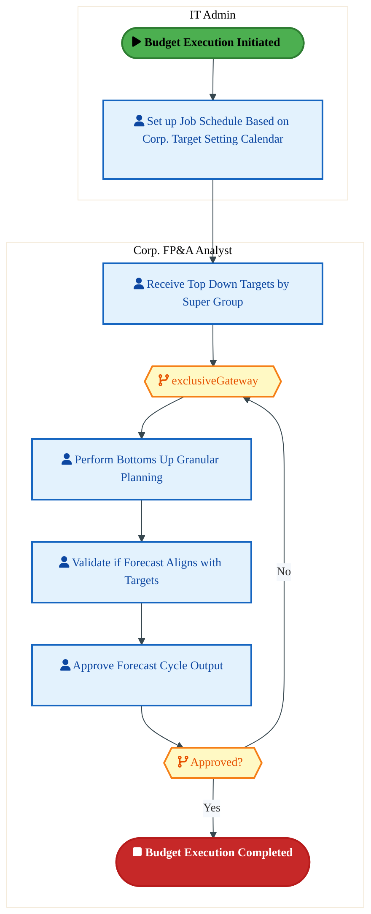

<a href="https://mermaid.live/view#pako:eNqlVV2P4jYU_StWRlNaKVT5JJCHViGQ1aza3VFht6pKH4zjgDWOHdnOAGX577VJAoSdeSoPSPfk3HPvPXZujhbiObZi6_HxSBhRMTgO1BaXeBCDwRpKPLBBA3yFgsA1xXJgOAVnakH-PdPcoNobmsEyWBJ6MOgCbzgGX55skOhEagMJmRxKLEgxsAeVICUUh5RTLgz7AY8LpzhXax9NucixuBIcJ3JRqFMpYfgK-1EQBZnJkxhxlvdEi7AYF2hwMs1RvkNbKNS5_Vri3-H-T5KrrY4LSCXWnK0q6W9wjamZUYnaYKgWr50ZRJo6TBu2qCAibKPxwNGQgOzlCoXO6QROj48rdikKlrMVA_qHKJRyhgsglYbnrwoUhNL4IUiTLHRsqQR_wfGDN49mvmcjM0msR3dsY-5wh8lmq-I1p3lLHe7MDLFX7W2xjz3HFgf9f1cLs_xaKR15Y298qTSN3NRNu0pFUfyvStpXsYTypa019zMvm11queEoTJ3v9boxZ0GUuPc-YfFKEL4RzbLMn1-tmo9C13lfdJr5Iye9E91AhXfwcBWcpMFFMAujzI3eFWzq3XdZr58FR52gPw-z8CIYTd0s8d4VDBI3GLcdap2NgNUWpFxUP4Ps-YcEJAzSg1QNwfyY9_fKKmBcwKHxG_yBESavGCx5BWZ8x8ASig1WEqwPYFFXmvFB8LpaWf_caPh9jWcsCi5KMOVK8VKCL5VOgqymUD-jkDF9tfsCQV_gK6Qk17YCUoCMC4ygVCChZMMk2BG17Zrqi4R9kaSqBNeTXATSA6IYfK5VVat-ZvTjJVUqPfi0zrU8mO8xqhXhTDtYVhQrnOu8n24Sx8djl2hW33Ctx0TbrnT-68o6nW7ok7fpeI9oLbXrH5qrdM3SL9vdWT4tQZKXhN2ouv25F7rzugIf-Ros0BbntR56qpdvDs6DmKvQ2GeYSh8FSCHFZtn1TRldTamovt_fmfKkVzyBPVMu_bIRGA5_0b21oduEXht6TThpQ78JgzYMmjBsw7EJv62sv7A-8G_6tFo8bGjjNpw0oX-X9YmfkyY3L5lpp1suPdh7G_bfhoO34fBteHTZ0j04ahdqDxx3S6WHTjrUsq0SixKS3IqP1vmDqj-6OS5gTZV1si1YK744MGTF5w-PVVfmbZoRqO9Q2YCn_wCbAnFM" title="View in Mermaid Live">&#128065; View in Mermaid Live</a>

Page 18<a href="#toc">↑ Back to TOC</a>MB-070 — MB-070

#### BUSINESS ARCHITECTURE — 3.2.14 MB-070-180_Implications_on_Expected_Corporate_Financial_Results_and_Make_Adjustments — MB-070-180_Implications_on_Expected_Corporate_Financial_Results_and_Make_Adjustments

**Swim Lanes**: Corp. FP&A Analyst | **Tasks**: 8 | **Gateways**: 2

> **Legend**: ● Start · ● End · User Task · Service Task · ◇ Gateway · Sub-Process

```mermaid
%%{init: {'theme': 'base', 'themeVariables': {'fontSize': '14px', 'fontFamily': 'Segoe UI, Arial, sans-serif','primaryColor': '#e8f0fe', 'primaryBorderColor': '#0071c5','lineColor': '#37474F', 'secondaryColor': '#f5f8fc'}, 'flowchart': {'useMaxWidth': false, 'htmlLabels': true, 'curve': 'basis', 'nodeSpacing': 40, 'rankSpacing': 50}} }%%
flowchart TD
    classDef startEvt fill:#4CAF50,stroke:#2E7D32,color:#000,font-weight:bold,stroke-width:2px,rx:20,ry:20
    classDef endEvt fill:#C62828,stroke:#B71C1C,color:#fff,font-weight:bold,stroke-width:2px,rx:20,ry:20
    classDef userTask fill:#E3F2FD,stroke:#1565C0,stroke-width:2px,color:#0D47A1
    classDef serviceTask fill:#FFF3E0,stroke:#E65100,stroke-width:2px,color:#BF360C
    classDef gateway fill:#FFF9C4,stroke:#F57F17,stroke-width:2px,color:#E65100
    classDef subProc fill:#F3E5F5,stroke:#7B1FA2,stroke-width:2px,color:#4A148C
    subgraph Corp. FP&A Analyst
        n1["fa:fa-user Identify Key Drivers (E.g., ASP, Volume, Cost) for Scenario Modeling"]
        n2["fa:fa-user Create Scenarios (Base, Worst, etc.) with Assumptions for Each Driver"]
        n3["fa:fa-user Run Scenario Data Actions"]
        n4["fa:fa-user Analyze Impact to P and L (Revenue, Gross Margin, Op. Income, etc.)"]
        n5["fa:fa-user Identify Key Risks and Opportunities"]
        n6["fa:fa-user Adjust Drivers and Re-run Scenarios"]
        n7["fa:fa-user Consolidate Results for Review"]
        n8["fa:fa-user Make Final Adjustments to Forecast"]
        n9(["fa:fa-play Implications on Expected Corporate Financial \Results and Make Adjustments..."])
        n10(["fa:fa-stop Budget Execution Completed"])
        n11{{"fa:fa-code-branch Approved?"}}
        n12{{"fa:fa-code-branch exclusiveGateway"}}
    end
    n9 --> n1
    n1 --> n2
    n2 --> n3
    n3 --> n4
    n4 --> n5
    n5 --> n12
    n6 --> n7
    n11 -->|"Yes"| n8
    n7 --> n11
    n8 --> n10
    n12 --> n6
    n11 -->|"No"| n12
    class n1 userTask
    class n2 userTask
    class n3 userTask
    class n4 userTask
    class n5 userTask
    class n6 userTask
    class n7 userTask
    class n8 userTask
    class n9 startEvt
    class n10 endEvt
    class n11 gateway
    class n12 gateway
```

<a href="https://mermaid.live/view#pako:eNqlVl2P4jYU_StWVlNmpICSkBAmD60gkNWoO93RsN1VVfpgkhtwJ9iR7fCxLP-9dj6AUKYvzQPintx7zr0ntpODEbMEjMC4uzsQSmSADh25gjV0AtRZYAEdE1XAV8wJXmQgOjonZVTOyPcyzXbznU7TWITXJNtrdAZLBuj3JxONVGFmIoGp6ArgJO2YnZyTNeb7kGWM6-wPMEyttFSrb40ZT4CfEyzLt2NPlWaEwhnu-67vRrpOQMxo0iJNvXSYxp2jbi5j23iFuSzbLwQ84903ksiVilOcCVA5K7nOPuEFZHpGyQuNxQXfNGYQoXWoMmyW45jQpcJdS0Ec07cz5FnHIzre3c3pSRR9mcwpUlecYSEmkCIhFTzdSJSSLAs-uOEo8ixTSM7eIPjgTP1J3zFjPUmgRrdMbW53C2S5ksGCZUmd2t3qGQIn35l8FziWyffq90oLaHJWCgfO0BmelMa-Hdpho5Sm6f9SUr7yL1i81VrTfuREk5OW7Q280Po3XzPmxPVH9rVPwDckhgvSKIr607NV04FnW--TjqP-wAqvSJdYwhbvz4SPoXsijDw_sv13CSu96y6LxQtncUPYn3qRdyL0x3Y0ct4ldEe2O6w7VDxLjvMVChnPeyh6-WmERhRneyGrBH1R-8-5keIgxV3tN3pKgEqS7tGvsEcTTjbABbqf9pY9tfdmLyb6yrJirRZzyIR8QCnjaBYDVfuZoWe1mNWGWs6Nvy4EnLZAyEEZdipS5GOsN8w3xoU0Eci494C2RK7QSIhinUvCqCh1pjhe1S21FfpthdeCnnuaYInRKC5Z2lVuu6p05jugp7XaexJJhl4Qpgn6hO5fYQNUb-CPnAmBnjFfEmqiz8rUJxoz7UbZdpvf-w9jX4l4EyX95zxnXBbqtCRw1eDgqsHk70LI0zPRxa_Q5RfDXtX7V8YrB1hGEu3-K4gik5WtajoC23bpsF36jN8ARUQ5VHexVrMI7VHEOMRYLahW-eP9qT7P1NZQnmYkxtWjZBRNdznEEpJyZTKuO9LsNFZnO5rPm-70iKX0hWiv11NaD5cL2DqrCclyNC6SJUglAnGhJZWK0geld11pHw5NpX5zdRfq7FVrbJTnnG0g-WVuHI-X-c7tfNjFWSHUY_lYHQXnMnVYVn_oI-p2f1YUdWhXoVOHThX267BfhW4dulXo1aFXUzXFgyr2G-qS-8fc-EMvqB_qYdY3_Lqu6WFYx1ZTWHcxuCb6jZU8jWB5UOkRmgO6BTu34f5t2L0Ne7fhwW3Yvw0Pb8OPp9dlexyrfrW1Ubs539uw08CGaayBrzFJjOBglB836gMogRSrJWwcTQMXks32NDaC8iPAKHK9AycEq7N5XYHHfwCvU-x4" title="View in Mermaid Live">&#128065; View in Mermaid Live</a>

Page 19<a href="#toc">↑ Back to TOC</a>MB-070 — MB-070

#### BUSINESS ARCHITECTURE — 3.2.15 MB-070-190_Prepare_Draft_Budgets_by_Department — MB-070-190_Prepare_Draft_Budgets_by_Department

**Swim Lanes**: Corp. FP&A Analyst · FP&A BU Analyst · IT Admin | **Tasks**: 6 | **Gateways**: 2

> **Legend**: ● Start · ● End · User Task · Service Task · ◇ Gateway · Sub-Process

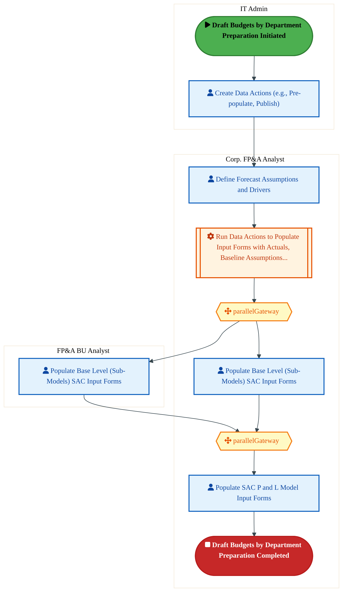

<a href="https://mermaid.live/view#pako:eNqtVk2P4jgQ_StWWr10SwHlk0AOK4VAVi31SGjpmTkMezCJA1Y7dmQ7TTOI_742CZAwIO1qNwdEvVS9V1Uu29kbKcuQERqPj3tMsQzBvic3qEC9EPRWUKCeCWrgG-QYrggSPe2TMyoX-OfRzfbKT-2msQQWmOw0ukBrhsDXFxNEKpCYQEAq-gJxnPfMXslxAfkuZoRx7f2ARrmVH9WaVxPGM8QvDpYV2KmvQgmm6AK7gRd4iY4TKGU065Dmfj7K095BJ0fYNt1ALo_pVwJ9gZ_fcSY3ys4hEUj5bGRBXuEKEV2j5JXG0op_nJqBhdahqmGLEqaYrhXuWQrikL5fIN86HMDh8XFJz6LgbbqkQD0pgUJMUQ6EVPDsQ4IcExI-eHGU-JYpJGfvKHxwZsHUdcxUVxKq0i1TN7e_RXi9keGKkaxx7W91DaFTfpr8M3Qsk-_U75UWotlFKR46I2d0VpoEdmzHJ6U8z_-Tkuorf4PivdGauYmTTM9atj_0Y-tXvlOZUy-I7Os-If6BU9QiTZLEnV1aNRv6tnWfdJK4Qyu-Il1DibZwdyEcx96ZMPGDxA7uEtZ611lWqzln6YnQnfmJfyYMJnYSOXcJvcj2Rk2GimfNYbkBMePlACTz3yIQUUh2QtYO-qHOj6WRwzCHfd1voBJQWwIkjKMUCgkiIaqilJhRASDNwJTjD8TF0virxeF2OeasrIjqCpioPQ9e0Qci4GlRrfpf1LQT8QwWUQxeaFlJrVNckXl3yHTQ_JjDKzgS3acY_jhzpGwN_qwomEIJQZTWhUh2oW2RgC2WG-1UqT1sHrPX50O7B4PBQEm1tUZPZy0hWakaBHMJJlW2RlKA1U51tFS7s0BUgjnX_6FmUotSlARJlCm-5xbfeL8_8UHO2Vb0IZFAhxGCyB_1sC2Nw6EVY1v_Lkjt4asROQ7H5OuN-fD_p7X9VfPlDURZgWm7kK5YzJGW6qzdExqsB6ZuZb9sclFWtSJYbJ67YxBclqYkaof-06V5UXcXhp2lOWdPA9Dv_64ybUy7Np3GdGpz2JjD2hw35rg23a7pN6bfMDfnAXWvbNuqAa-xvdoctY4Pnc_p2OzAzm3YvQ17t2H_Njxsn6udN8H5ZurAo-YS6YDj00HaLcc6wYZpFIgXEGdGuDeOXxHqSyNDOayINA6mASvJFjuaGuHxtjWqMlORUwzVtBU1ePgbPrq-6g==" title="View in Mermaid Live">&#128065; View in Mermaid Live</a>

Page 20<a href="#toc">↑ Back to TOC</a>MB-070 — MB-070

### 3.3 Business Roles & Responsibilities

| Role / Lane | Processes Involved | Description |
|------------|-------------------|-------------|
| Corp. FP&A Analyst | MB-070-010_Determine_Operational_and_Non-core_Operational_Requirements, MB-070-020_Forecast_Drivers_(use_only_for_activity_based_budgeting), MB-070-040_Preparation_of_Budgeting_Instructions_and_Templates_Package, MB-070-050_Input_Operating_Budget, MB-070-060_Collection_and_Consolidation_of_the_Operating_Budgets, MB-070-090_Conduct_Corporate_Consolidation, MB-070-100_Review_and_Approve_Budgets, MB-070-110_Prepare_Legal_Entity_Consolidation, MB-070-120_Prepare_Updated_Financial_Results, MB-070-150_Present_Updated_Financial_Results_to_Board_of_Directors, MB-070-160_Obtain_Executive_Approval, MB-070-170_Execute_Budget, MB-070-180_Implications_on_Expected_Corporate_Financial_Results_and_Make_Adjustments, MB-070-190_Prepare_Draft_Budgets_by_Department | |
| Data Admin | MB-070-010_Determine_Operational_and_Non-core_Operational_Requirements,  | |
| BU Analyst | MB-070-040_Preparation_of_Budgeting_Instructions_and_Templates_Package, MB-070-060_Collection_and_Consolidation_of_the_Operating_Budgets,  | |
| IT Admin | MB-070-040_Preparation_of_Budgeting_Instructions_and_Templates_Package, MB-070-160_Obtain_Executive_Approval, MB-070-170_Execute_Budget, MB-070-190_Prepare_Draft_Budgets_by_Department | |
| Corp. Finance Analyst | MB-070-100_Review_and_Approve_Budgets,  | |
| Legal Entity Accountant | MB-070-130_Prepare_Tax_Forecast,  | |
| FP&A Analyst | MB-070-160_Obtain_Executive_Approval,  | |
| FP&A Lead | MB-070-160_Obtain_Executive_Approval,  | |
| FP&A BU Analyst | MB-070-190_Prepare_Draft_Budgets_by_Department | |

Page 21<a href="#toc">↑ Back to TOC</a>MB-070 — MB-070

## 4. Data Architecture (TOGAF "D")

### 4.1 Data Entities & Ownership

The following data entities are derived from the system integration flows for MB-070. Tower architects should validate ownership and classification.

| # | Data Entity | Source System | Target System | Data Owner | Classification | Volume | Master/Transaction |
|---|-------------|---------------|---------------|------------|----------------|--------|-------------------|

Page 22<a href="#toc">↑ Back to TOC</a>MB-070 — MB-070

### 4.2 Data Flow Diagrams

> **DATA ARCHITECTURE** — Database-to-database data flows. Applications (blue) sit above their hosting databases (green cylinders). Thick arrows show data movement between databases.

### 4.3 Data Lineage

Data lineage traces the origin and transformation path of key data objects across integrated systems.

| # | Source System | Source Schema/Object | Target System | Target Schema/Object | Transformation |
|---|-------------|---------------------|---------------|---------------------|---------------|

> *Lineage detail will be refined when tower architects validate source/target schema object mappings.*

### 4.4 RICEFW Data Objects

Data-centric RICEFW objects (Reports and Conversions) from the Object Tracker:

| Object ID | Type | Description | Status | Source | Target | Complexity |
|-----------|------|-------------|--------|--------|--------|-----------|
| FPRR1514_IP | Report | To generate reports out of the ITT documents that was created | 10. Object Complete |  |  | 03.Medium |
| FPRR1514_IF | Report | To generate reports out of the ITT documents that was created | 10. Object Complete |  |  | 04.Low |
| FPRR1240 | Report | Custom report for Revenue Recognition by Stage for Product/Services Sale​ act... | 10. Object Complete |  |  | 03.Medium |
| FPRR1211 | Report | Report for searching on and viewing government contract timesheets for Intel ... | 10. Object Complete |  |  | 03.Medium |
| FPRR1210 | Report | Report for searching on and viewing government contract timesheet changes for... | 10. Object Complete |  |  | 03.Medium |
| FPRR0907_IP | Report | Workflow Status Report ( Order Request / Approval Request / Others ) | 10. Object Complete |  |  | 03.Medium |
| FPRR0907_IF | Report | Workflow Status Report ( Order Request / Approval Request / Others ) | 10. Object Complete |  |  | 04.Low |
| FPRR0497 | Report | CFR - Report to support multiple Treasury Funding requests from Multiple Inte... | 10. Object Complete |  |  | 03.Medium |
| FPRR0496 | Report | TPR-Report to support multiple Treasury Payment Requests from Multiple Intel ... | 10. Object Complete |  |  | 03.Medium |
| FPRR0461 | Report | Inter-company Outage Pre-consolidate Report (ACDOCA) | 10. Object Complete | NA | NA | 03.Medium |
| FPRR0380 | Report | GL Interface – Reconciliation Report/Dashboard | 10. Object Complete | NA | NA | 02.High |
| FPRR0327_IP | Report | Report to display the requests/change IDs and status of the workflow approval... | 10. Object Complete | NA | NA | 02.High |
| FPRR0327_IF | Report | Report to display the requests/change IDs and status of the workflow approval... | 10. Object Complete | NA | NA | 03.Medium |
| FPRR0288_IP | Report | Operational Report to display whether supporting documents are attached to JEs | 10. Object Complete | NA | NA | 03.Medium |
| FPRR0288_IF | Report | Operational Report to display whether supporting documents are attached to JEs | 10. Object Complete | NA | NA | 03.Medium |
| FPRR0288_CFIN | Report | Operational Report to display whether supporting documents are attached to JEs | 10. Object Complete | NA | NA | 02.High |
| FPRR0027 | Report | In House Cash – Loan Account balance Detailed report | 10. Object Complete | NA | NA | 01.Very High |
| FPRM003 | Conversion | Revenue Recognition Rules | 10. Object Complete |  |  | N/A |
| FPRM002 | Conversion | Revenue Contracts | 10. Object Complete |  |  | N/A |
| FPRM001 | Conversion | Bank Master | 10. Object Complete | ECC | CFIN | N/A |
| FPRC1724_IP | Conversion | Creation of output template with consumption data | 06. Dev In Progress |  |  | 02.High |
| FPRC1724_IF | Conversion | Creation of output template with consumption data | 06. Dev In Progress |  |  | 03.Medium |
| FPRC1565 | Conversion | Convert active delegate relationships for Timesheet approval | 10. Object Complete |  |  | 02.High |
| FPRC1493 | Conversion | Conversion of WIP values as per Component structure in S/4 - IP | 10. Object Complete |  |  | 02.High |
| FPRC1491 | Conversion | Conversion of WIP values as per Component structure in S/4 - Back End IF | 10. Object Complete |  |  | 02.High |
| FPRC1464_IP | Conversion | Project Actuals Conversion (Non- Intel Federal) | 10. Object Complete |  |  | 02.High |
| FPRC1464_IF | Conversion | Project Actuals Conversion (Non- Intel Federal) | 10. Object Complete |  |  | 02.High |
| FPRC1442 | Conversion | Conversion of Actual Labor hours for Intel Federal Projects | 10. Object Complete |  |  | 02.High |
| FPRC1441 | Conversion | Conversion of ECC project hierarchy (WBS element master data) to S/4HANA proj... | 10. Object Complete |  |  | 02.High |
| FPRC1212 | Conversion | Project Actuals Conversion including Intel Federal | 10. Object Complete |  |  | 03.Medium |
| FPRC0908_IP | Conversion | Project Budget Conversion | 10. Object Complete |  |  | 03.Medium |
| FPRC0908_IF | Conversion | Project Budget Conversion | 10. Object Complete |  |  | 03.Medium |
| FPRC0196_IP | Conversion | Asset Transaction data conversion | 10. Object Complete | NA | NA | 02.High |
| FPRC0196_IF | Conversion | Asset Transaction data conversion | 10. Object Complete | NA | NA | 02.High |
| FPRC0195_IP | Conversion | Asset Master data conversion | 10. Object Complete | NA | NA | 03.Medium |
| FPRC0195_IF | Conversion | Asset Master data conversion | 10. Object Complete | NA | NA | 03.Medium |
| FPRC0174_IP | Conversion | Conversion of ECC project hierarchy (WBS element master data) to S/4HANA proj... | 10. Object Complete | ECC | S4 | 02.High |
| FPRC0174_IF | Conversion | Conversion of ECC project hierarchy (WBS element master data) to S/4HANA proj... | 10. Object Complete | ECC | S4 | 03.Medium |
| FPRC0117 | Conversion | Conversion – In House Cash: Current Account creation and Current Account Bala... | 10. Object Complete | ECC | CFIN | 02.High |
| FPRC0116 | Conversion | Conversion – Migration of Existing Bank Guarantees and Intercompany Loans to ... | 10. Object Complete | Quantum | CFIN | 03.Medium |
| FPRC0035_IP | Conversion | Convert existing ECC & MDG hierarchy to S4HANA PPM hierarchy (Portfolio & buc... | 10. Object Complete |  | MDG | 03.Medium |
| FPRC0035_IF | Conversion | Convert existing ECC & MDG hierarchy to S4HANA PPM hierarchy (Portfolio & buc... | 10. Object Complete |  | MDG | 04.Low |

### 4.5 Data Governance & Quality

| Concern | Approach |
|---------|----------|
| Data Ownership | Per-entity owners listed in Section 3.1 |
| Data Classification | Financial data classified as Intel Confidential |
| Data Retention | Per Intel corporate retention policies |
| Data Quality | Validated at source; reconciliation at target |

Page 23<a href="#toc">↑ Back to TOC</a>MB-070 — MB-070

## 5. Application Architecture (TOGAF "A")

### 5.1 Current-State — Current-State Application Landscape

#### Overview

The Current-State architecture represents the **current / legacy** landscape for MB-070.

#### Current-State Flow Narrative

*(No current-state flows defined.)*

### 5.2 Future-State — Future-State Application Landscape

#### Overview

The Future-State architecture represents the **target** landscape for MB-070.

#### Future-State Flow Narrative

*(No future-state flows defined.)*

### 5.3 Change Impact Summary

| Change Type | Flow Chain | Detail |
|-------------|-----------|--------|

**Totals**: 0 new - 0 removed - 0 modified - 0 unchanged

### 5.4 Component Overview

#### System Inventory

| System | IAPM ID | Status |
|--------|---------|--------|

Page 24<a href="#toc">↑ Back to TOC</a>MB-070 — MB-070

### 5.5 RICEFW Inventory

| Object ID | Type | Description | Status | Source → Target | Middleware | Complexity |
|-----------|------|-------------|--------|----------------|-----------|-----------|
| FPRW1449 | Workflow | TPR : Workflow to handle Memo creation and cancellation process | 10. Object Complete | NA → NA | NA | 03.Medium |
| FPRW1444 | Workflow | TFR: Workflow to handle Memo creation and cancellation process | 10. Object Complete |  | NA | 03.Medium |
| FPRW1064_IP | Workflow | Custom Workflow will also be created with some predefined process/rules for a... | 10. Object Complete |  | NA | 01.Very High |
| FPRW1064_IF | Workflow | Custom Workflow will also be created with some predefined process/rules for a... | 10. Object Complete |  | NA | 02.High |
| FPRW0930 | Workflow | Workflow for Counterparty Approval | 10. Object Complete |  | NA | 03.Medium |
| FPRW0906_IP | Workflow | Custom workflow: Change Order Create and Change Approval | 10. Object Complete |  | NA | 03.Medium |
| FPRW0906_IF | Workflow | Custom workflow: Change Order Create and Change Approval | 10. Object Complete |  | NA | 03.Medium |
| FPRW0904_IP | Workflow | Custom Workflow - WBS Element Request approval with WBS Element creation | 10. Object Complete |  | NA | 03.Medium |
| FPRW0904_IF | Workflow | Custom Workflow - WBS Element Request approval with WBS Element creation | 10. Object Complete |  | NA | 03.Medium |
| FPRW0900_IP | Workflow | Custom Workflow: Approval for Project creation and create a Project def and l... | 10. Object Complete |  | NA | 03.Medium |
| FPRW0900_IF | Workflow | Custom Workflow: Approval for Project creation and create a Project def and l... | 10. Object Complete |  | NA | 03.Medium |
| FPRW0445_IP | Workflow | Project budget approval workflow (Capex)​ | 10. Object Complete |  | NA | 03.Medium |
| FPRW0445_IF | Workflow | Project budget approval workflow (Capex)​ | 10. Object Complete |  | NA | 03.Medium |
| FPRW0325_IP | Workflow | Custom workflow to manage the approval process in bulk/individual requests | 10. Object Complete | NA → NA | NA | 02.High |
| FPRW0325_IF | Workflow | Custom workflow to manage the approval process in bulk/individual requests | 10. Object Complete | NA → NA | NA | 02.High |
| FPRW0165_IP | Workflow | Workflow is required to trigger the approvers based on the business requireme... | 10. Object Complete | NA → NA | NA | 02.High |
| FPRW0165_IF | Workflow | Workflow is required to trigger the approvers based on the business requireme... | 10. Object Complete | NA → NA | NA | 03.Medium |
| FPRW0165_CFIN | Workflow | Workflow is required to trigger the approvers based on the business requireme... | 10. Object Complete | NA → NA | NA | 02.High |
| FPRR1514_IP | Report | To generate reports out of the ITT documents that was created | 10. Object Complete |  | NA | 03.Medium |
| FPRR1514_IF | Report | To generate reports out of the ITT documents that was created | 10. Object Complete |  | NA | 04.Low |
| FPRR1240 | Report | Custom report for Revenue Recognition by Stage for Product/Services Sale​ act... | 10. Object Complete |  | NA | 03.Medium |
| FPRR1211 | Report | Report for searching on and viewing government contract timesheets for Intel ... | 10. Object Complete |  | NA | 03.Medium |
| FPRR1210 | Report | Report for searching on and viewing government contract timesheet changes for... | 10. Object Complete |  | NA | 03.Medium |
| FPRR0907_IP | Report | Workflow Status Report ( Order Request / Approval Request / Others ) | 10. Object Complete |  | NA | 03.Medium |
| FPRR0907_IF | Report | Workflow Status Report ( Order Request / Approval Request / Others ) | 10. Object Complete |  | NA | 04.Low |
| FPRR0497 | Report | CFR - Report to support multiple Treasury Funding requests from Multiple Inte... | 10. Object Complete |  | NA | 03.Medium |
| FPRR0496 | Report | TPR-Report to support multiple Treasury Payment Requests from Multiple Intel ... | 10. Object Complete |  | NA | 03.Medium |
| FPRR0461 | Report | Inter-company Outage Pre-consolidate Report (ACDOCA) | 10. Object Complete | NA → NA | NA | 03.Medium |
| FPRR0380 | Report | GL Interface – Reconciliation Report/Dashboard | 10. Object Complete | NA → NA | NA | 02.High |
| FPRR0327_IP | Report | Report to display the requests/change IDs and status of the workflow approval... | 10. Object Complete | NA → NA | NA | 02.High |
| FPRR0327_IF | Report | Report to display the requests/change IDs and status of the workflow approval... | 10. Object Complete | NA → NA | NA | 03.Medium |
| FPRR0288_IP | Report | Operational Report to display whether supporting documents are attached to JEs | 10. Object Complete | NA → NA | NA | 03.Medium |
| FPRR0288_IF | Report | Operational Report to display whether supporting documents are attached to JEs | 10. Object Complete | NA → NA | NA | 03.Medium |
| FPRR0288_CFIN | Report | Operational Report to display whether supporting documents are attached to JEs | 10. Object Complete | NA → NA | NA | 02.High |
| FPRR0027 | Report | In House Cash – Loan Account balance Detailed report | 10. Object Complete | NA → NA | NA | 01.Very High |
| FPRM003 | Conversion | Revenue Recognition Rules | 10. Object Complete |  | NA | N/A |
| FPRM002 | Conversion | Revenue Contracts | 10. Object Complete |  | NA | N/A |
| FPRM001 | Conversion | Bank Master | 10. Object Complete | ECC → CFIN | NA | N/A |
| FPRI1725_IP | Interface | Interface to be developed to transfer the files from Denodo to FS share path ... | 10. Object Complete |  | Intel MW | 03.Medium |
| FPRI1725_IF | Interface | Interface to be developed to transfer the files from Denodo to FS share path ... | 10. Object Complete |  | Intel MW | 04.Low |
| FPRI1704 | Interface | Automated Tool MUP Excess Capacity calculation and associated PCOS/OCOS Split... | 10. Object Complete |  | BODS | 03.Medium |
| FPRI1670 | Interface | Import Dot process/stage details from MDG into S4. ​ | 10. Object Complete |  | NA | 03.Medium |
| FPRI1669 | Interface | Import Xeus/Mars volumes from ECA into S4.​ | 07. FUT Roadblock |  | BODS | 03.Medium |
| FPRI1504 | Interface | Asset Delete from EMS to S4 through APIGEE | 10. Object Complete |  | APIGEE | 03.Medium |
| FPRI1503 | Interface | Asset Display from EMS to S4 through APIGEE | 10. Object Complete |  | APIGEE | 03.Medium |
| FPRI1502 | Interface | Asset Change from EMS to S4 through APIGEE | 10. Object Complete |  | APIGEE | 03.Medium |
| FPRI1463 | Interface | Interface to upload payroll data from Workday to S/4 IP for legal entity 199 ... | 10. Object Complete |  | MULESOFT | 03.Medium |
| FPRI1447 | Interface | GL Interface –Create Inbound IDOCs to CFIN from IF system | 10. Object Complete | IF → CFIN | NA | 03.Medium |
| FPRI1446 | Interface | GL Interface –Create Inbound IDOCs to CFIN from IP system | 10. Object Complete | IP → CFIN | NA | 03.Medium |
| FPRI1439 | Interface | Receive planned production quantities per production version from ECA to S/4 ... | 10. Object Complete |  | APIGEE | 03.Medium |
| FPRI1338 | Interface | Outbound Interface to view the Cleared Customer Invoices from CFIN System to ... | 10. Object Complete | S/4 → WOM | MULESOFT | 03.Medium |
| FPRI1315 | Interface | Asset Create from EMS to S4 through APIGEE | 10. Object Complete |  | APIGEE | 03.Medium |
| FPRI1306 | Interface | Interface for importing GL transactional data from SAP CFIN system into SAP IF | 10. Object Complete | CFIN → S/4 | NA | 03.Medium |
| FPRI1305 | Interface | Interface for importing GL transactional data from SAP CFIN system into SAP IP | 10. Object Complete | CFIN → S/4 | NA | 03.Medium |
| FPRI1288 | Interface | Activity Inbound interface from ECA to S4 IP | 10. Object Complete | ECA → S/4 | MuleSoft | 03.Medium |
| FPRI1287 | Interface | Production quantity update in WAC custom table from ECA to S4 IF | 10. Object Complete | ECA → S/4 | MuleSoft | 03.Medium |
| FPRI1286_IP | Interface | Interface between SAP IP and IF boxes for Outbound IDOC flow_IP | 10. Object Complete | MULESOFT → S/4 | SFT | 03.Medium |
| FPRI1286_IF | Interface | Interface between SAP IP and IF boxes for Outbound IDOC flow_IF | 10. Object Complete | MULESOFT → S/4 | SFT | 04.Low |
| FPRI1273 | Interface | Activity Quantity Inbound interface from ECA to S4 IF | 10. Object Complete | ECA → S/4 | MuleSoft | 03.Medium |
| FPRI1241 | Interface | Disti Rebate percentage of gross for Unissued Returns and Intransit Deferral | 10. Object Complete | ECA → S/4 | BODS | 03.Medium |
| FPRI1238 | Interface | Pull Foundry WBS from HAT and create in LE 199 in IP S/4 for Foundry Employee... | 10. Object Complete | Head Count Assignment Tool → S/4 | BODS | 03.Medium |
| FPRI1105 | Interface | Interface for automatic creation of B2B customer related payment advice | 10. Object Complete |  | MULESOFT | 03.Medium |
| FPRI0981_IP | Interface | Interface of SAP PPM module to SPEED | 10. Object Complete | ECA → S/4 | BODS | 03.Medium |
| FPRI0981_IF | Interface | Interface of SAP PPM module to SPEED | 10. Object Complete | ECA → S/4 | BODS | 04.Low |
| FPRI0913_IP | Interface | Export the Planning data from the SAC table to PPM standard tables using the ... | 10. Object Complete | SAC → S/4 | NA | 02.High |
| FPRI0913_IF | Interface | Export the Planning data from the SAC table to PPM standard tables using the ... | 10. Object Complete | SAC → S/4 | NA | 03.Medium |
| FPRI0909_IP | Interface | Interface for importing the Headcount details by Person# and WBS element comb... | 10. Object Complete | ECA → S/4 | BODS | 03.Medium |
| FPRI0909_IF | Interface | Interface for importing the Headcount details by Person# and WBS element comb... | 10. Object Complete | ECA → S/4 | BODS | 04.Low |
| FPRI0895 | Interface | Import Tool Sharing Forecasted Data from FCS to S4 & derive FTQ data by Capex... | 10. Object Complete | FCS → S/4 | BODS | 02.High |
| FPRI0894 | Interface | Planned Volume from IP-BY will be utilized as a KP26 quantity to split 'Overh... | 10. Object Complete | ICS → S/4 | BODS | 02.High |
| FPRI0869 | Interface | Interface for automatic creation of WOM related payment advice | 10. Object Complete | S/4 → WOM | MULESOFT | 03.Medium |
| FPRI0867 | Interface | Outbound Interface to view the open & Cleared Customer Invoices from CFIN Sys... | 10. Object Complete | S/4 → WOM | MULESOFT | 03.Medium |
| FPRI0866 | Interface | Interface to Obtains the payer associated to the sold to from CFIN System to ... | 10. Object Complete | S/4 → WOM | MULESOFT | 03.Medium |
| FPRI0865 | Interface | Interface to transfer the Uploaded WCP Grant Amount from CFIN to WOM and Defe... | 10. Object Complete | S/4 → WOM | MULESOFT | 03.Medium |
| FPRI0864_IP | Interface | Interface between SAP IP and IF boxes for Inbound IDOC flow_IP | 10. Object Complete | MULESOFT → S/4 | SFT | 03.Medium |
| FPRI0864_IF | Interface | Interface between SAP IP and IF boxes for Inbound IDOC flow_IF | 10. Object Complete | MULESOFT → S/4 | SFT | 04.Low |
| FPRI0863_IP | Interface | Interface between SAP & ECA to provide information for auto certification in ... | 10. Object Complete | ECA → BLACKLINE | APIGEE;DENODO | 03.Medium |
| FPRI0863_IF | Interface | Interface between SAP & ECA to provide information for auto certification in ... | 10. Object Complete | ECA → BLACKLINE | APIGEE;DENODO | 04.Low |
| FPRI0863_CFIN | Interface | Interface between SAP & ECA to provide information for auto certification in ... | 10. Object Complete | ECA → BLACKLINE | APIGEE;DENODO | 03.Medium |
| FPRI0862 | Interface | Interface to transfer the details of selected invoice from WOM to CFIN ( Inbo... | 10. Object Complete | WOM → S/4 | MULESOFT | 03.Medium |
| FPRI0778_IP | Interface | Continue to auto-certify a BL task when the related JE is approved | 10. Object Complete | BLACKLINE → S/4 | MULESOFT | 03.Medium |
| FPRI0778_IF | Interface | Continue to auto-certify a BL task when the related JE is approved | 10. Object Complete | BLACKLINE → S/4 | MULESOFT | 03.Medium |
| FPRI0778_CFIN | Interface | Continue to auto-certify a BL task when the related JE is approved | 10. Object Complete | BLACKLINE → S/4 | MULESOFT | 02.High |
| FPRI0770_IP | Interface | To enable auto-certify a BL [Blackline] task when the related JE is approved | 10. Object Complete | BLACKLINE → ECA | NA | 03.Medium |
| FPRI0770_IF | Interface | To enable auto-certify a BL [Blackline] task when the related JE is approved | 10. Object Complete | BLACKLINE → ECA | NA | 03.Medium |
| FPRI0770_CFIN | Interface | To enable auto-certify a BL [Blackline] task when the related JE is approved | 10. Object Complete | BLACKLINE → ECA | NA | 02.High |
| FPRI0704 | Interface | IF-IP Integration Actual Cost - Inbound Interface | 10. Object Complete | OpenText → S/4 | SFT | 02.High |
| FPRI0703 | Interface | IF-IP Integration Actual Cost - Outbound Interface | 10. Object Complete | S/4 → OpenText | SFT | 02.High |
| FPRI0696_IP | Interface | Interface between ONESOURCE and Readsoft Process Director built on the back o... | 10. Object Complete | ONESOURCE → READSOFT | NA | 02.High |
| FPRI0696_IF | Interface | Interface between ONESOURCE and Readsoft Process Director built on the back o... | 10. Object Complete | ONESOURCE → READSOFT | NA | 03.Medium |
| FPRI0695 | Interface | Reference Interest Rates - S4 converted data from MDG to CFIN | 10. Object Complete | S/4 MDG → CFIN | NA | 03.Medium |
| FPRI0694 | Interface | Exchange Rates N - S4 converted data from MuleSoft to Treasury Suite | 10. Object Complete | MULESOFT → TREASURY SUITE | MULESOFT | 03.Medium |
| FPRI0693 | Interface | Exchange Rates L - S4 converted data from MuleSoft to Treasury Suite | 10. Object Complete | Treasury Suite → MULESOFT | MULESOFT | 03.Medium |
| FPRI0600_IP | Interface | Continuation to use Blackline Account Reconciliations Tool (ART), Blackline M... | 10. Object Complete | BLACKLINE → S/4 | MULESOFT | 04.Low |
| FPRI0600_IF | Interface | Continuation to use Blackline Account Reconciliations Tool (ART), Blackline M... | 10. Object Complete | BLACKLINE → S/4 | MULESOFT | 04.Low |
| FPRI0600_CFIN | Interface | Continuation to use Blackline Account Reconciliations Tool (ART), Blackline M... | 10. Object Complete | BLACKLINE → S/4 | MULESOFT | 03.Medium |
| FPRI0599_IP | Interface | ServiceNow Asset change | 10. Object Complete | SERVICENOW → S/4 | MULESOFT | 03.Medium |
| FPRI0599_IF | Interface | ServiceNow Asset change | 10. Object Complete | SERVICENOW → S/4 | MULESOFT | 04.Low |
| FPRI0598 | Interface | N rate from Mulesoft to MDG | 10. Object Complete | MULESOFT → S/4 MDG | MULESOFT | 04.Low |
| FPRI0597 | Interface | N rate from Mulesoft to Bloomberg | 10. Object Complete | MULESOFT → BLOOMBERG | MULESOFT | 03.Medium |
| FPRI0596 | Interface | N rate from Mulesoft to Treasury Suite | 10. Object Complete | MULESOFT → TREASURY SUITE | MULESOFT | 03.Medium |
| FPRI0554 | Interface | SKF Interface to get file from ECA and send to S4 via BODS - IF | 10. Object Complete | ECA → S/4 | MuleSoft | 02.High |
| FPRI0545 | Interface | IF-IP Integration - Interface to send Cost Idoc from S4 If to S4 IP | 10. Object Complete | S/4 → S/4 | SFT | 03.Medium |
| FPRI0544 | Interface | IF-IP Integration - Interface to receive Cost Idoc from S4 If to S4 IP | 10. Object Complete | S/4 → S/4 | SFT | 03.Medium |
| FPRI0533 | Interface | Reference Interest Rates from MuleSoft to S4 MDG | 10. Object Complete | Bloomberg → S/4 MDG | MULESOFT | 03.Medium |
| FPRI0532 | Interface | Request for Reference Interest Rates from MuleSoft to Bloomberg | 10. Object Complete | MULESOFT → BLOOMBERG | MULESOFT | 03.Medium |
| FPRI0531 | Interface | L Rates from MuleSoft to S4 MDG | 10. Object Complete | Bloomberg → S/4 MDG | MULESOFT | 03.Medium |
| FPRI0530 | Interface | Request for L Rates from MuleSoft to Bloomberg | 10. Object Complete | MULESOFT → BLOOMBERG | MULESOFT | 03.Medium |
| FPRI0529 | Interface | L Rates from MuleSoft to Quantum | 10. Object Complete | MULESOFT → QUANTUM | MULESOFT | 03.Medium |
| FPRI0528 | Interface | L Rates from MuleSoft to Treasury Suite | 10. Object Complete | MULESOFT → TREASURY SUITE | MULESOFT | 03.Medium |
| FPRI0527 | Interface | Reference Interest Rates from MuleSoft to Quantum | 10. Object Complete | MULESOFT → QUANTUM | MULESOFT | 03.Medium |
| FPRI0526 | Interface | Reference Interest Rates from MuleSoft to Treasury Suite | 10. Object Complete | MULESOFT → TREASURY SUITE | MULESOFT | 03.Medium |
| FPRI0505 | Interface | Interface – Copp Clark Holiday Calendar Integration with SAP | 10. Object Complete | Copp Clark → S/4 | SFT | 03.Medium |
| FPRI0379 | Interface | GL Interface – File processing in MuleSoft-Payroll | 10. Object Complete | PAYROLL → S/4 | MULESOFT | 02.High |
| FPRI0378_IP | Interface | GL Interface - SAP API IP | 10. Object Complete | API → S/4 | MULESOFT | 02.High |
| FPRI0378_IF | Interface | GL Interface - SAP API IF | 10. Object Complete | API → S/4 | MULESOFT | 03.Medium |
| FPRI0377 | Interface | GL Interface - File Processing in Mulesoft | 10. Object Complete | CONCUR → S/4 | MULESOFT | 02.High |
| FPRI0376 | Interface | GL Interface - File Processing in Mulesoft | 10. Object Complete | ICOST → S/4 | MULESOFT | 02.High |
| FPRI0323_IP | Interface | Create a common API for Asset updates, transfer, retire and Mass upload | 10. Object Complete |  | NA | 02.High |
| FPRI0323_IF | Interface | Create a common API for Asset updates, transfer, retire and Mass upload | 10. Object Complete |  | NA | 03.Medium |
| FPRI0227 | Interface | Outbound Interface from CFIN to QTM in relation to not only QTM payment ackno... | 10. Object Complete | S/4 → Quantum | SFT | 03.Medium |
| FPRI0226 | Interface | Inbound Interface from QTM to CFIN in relation to QTM payment files and MT me... | 10. Object Complete | Quantum → S/4 | SFT | 03.Medium |
| FPRI0224 | Interface | Outbound Interface - SAP to Quantum for Transmitting Cash Management Relevant... | 10. Object Complete | S/4 → Quantum | SFT | 02.High |
| FPRI0188 | Interface | Inbound Interface from EMS to S/4 to create WBS element and Update WBS elemen... | 10. Object Complete | XEUS → S/4 | APIGEE | 02.High |
| FPRF0230 | Form | Invoice output Layout - America | 10. Object Complete | NA → NA | NA | 02.High |
| FPRE1723_IP | Enhancement | Intel BRF+ - Create Function Modules in S/4HANA(FM and BRF+) | 07. FUT Roadblock |  | NA | 04.Low |
| FPRE1723_IF | Enhancement | Intel BRF+ - Create Function Modules in S/4HANA(FM and BRF+) | 07. FUT Roadblock |  | NA | 04.Low |
| FPRE1722_IP | Enhancement | Intel BRF+ - Create Function Modules in S/4HANA (FM and components) | 07. FUT Roadblock |  | NA | 04.Low |
| FPRE1722_IF | Enhancement | Intel BRF+ - Create Function Modules in S/4HANA (FM and components) | 07. FUT Roadblock |  | NA | 04.Low |
| FPRE1711 | Enhancement | BADI Enhancement to change Order Type from Product cost Collector from IP & I... | 10. Object Complete |  | NA | 03.Medium |
| FPRE1706 | Enhancement | Enhancement to create Cash Management relevant data from F110 Payment Run for... | 10. Object Complete |  | NA | 03.Medium |
| FPRE1705 | Enhancement | Enhancement to do Cash App post EBS load with the corresponding payment advice. | 10. Object Complete |  | NA | 03.Medium |
| FPRE1695 | Enhancement | Custom Fiori app - Change WBS Element Request Form with ALV Input​ | 10. Object Complete |  | NA | 03.Medium |
| FPRE1671_IP | Enhancement | S4, Perform required calculations, summarizations, mappings and post the allo... | 10. Object Complete |  | NA | 03.Medium |
| FPRE1671_IF | Enhancement | S4, Perform required calculations, summarizations, mappings and post the allo... | 10. Object Complete |  | NA | 04.Low |
| FPRE1661_IP | Enhancement | WBS transfer tool | 07. FUT Roadblock |  | NA | 02.High |
| FPRE1661_IF | Enhancement | WBS transfer tool | 07. FUT Roadblock |  | NA | 03.Medium |
| FPRE1660 | Enhancement | Enhancement for Revenue Recognition by Stage postings for Product/Services Sa... | 10. Object Complete |  | NA | 02.High |
| FPRE1659 | Enhancement | Enhancement for Revenue Recognition by Stage postings for Product/Services Sa... | 10. Object Complete |  | NA | 02.High |
| FPRE1650_IP | Enhancement | (FTQ Input to drive Disaggregation to Allocation Cycle) for Forecast.​ | 10. Object Complete |  | NA | 03.Medium |
| FPRE1650_IF | Enhancement | (FTQ Input to drive Disaggregation to Allocation Cycle) for Forecast.​ | 10. Object Complete |  | NA | 04.Low |
| FPRE1620_IP | Enhancement | Implement OSS Note 2358961 to allow COGS split based on Aux CCS at time of de... | 99. Rejected/Cancelled/On Hold |  | NA | 03.Medium |
| FPRE1620_IF | Enhancement | Implement OSS Note 2358961 to allow COGS split based on Aux CCS at time of de... | 99. Rejected/Cancelled/On Hold |  | NA | 04.Low |
| FPRE1600 | Enhancement | Custom Fiori app - Create WBS Element Request Form with ALV Input​ | 10. Object Complete |  | NA | 03.Medium |
| FPRE1599_IP | Enhancement | Update existing custom table ZTFPR_ACRENG02 to store the calculation of PO li... | 07. FUT Roadblock |  | NA | 03.Medium |
| FPRE1599_IF | Enhancement | Update existing custom table ZTFPR_ACRENG02 to store the calculation of PO li... | 07. FUT Roadblock |  | NA | 04.Low |
| FPRE1564 | Enhancement | Employee Notification for timesheet entry | 10. Object Complete |  | NA | 03.Medium |
| FPRE1563 | Enhancement | Manager notification for timesheet approval | 10. Object Complete |  | NA | 03.Medium |
| FPRE1562 | Enhancement | Manage Delegates for approval | 10. Object Complete |  | NA | 03.Medium |
| FPRE1561 | Enhancement | Timesheet approval | 10. Object Complete |  | NA | 02.High |
| FPRE1560 | Enhancement | Timesheet entry for Intel Federal employees | 10. Object Complete |  | NA | 01.Very High |
| FPRE1553 | Enhancement | Custom Fiori app - Change WBS Element Request Form with ALV Input​ | 10. Object Complete |  | NA | 03.Medium |
| FPRE1519_IP | Enhancement | Project Change Order - Edit and Submit of draft request with change functiona... | 10. Object Complete |  | NA | 02.High |
| FPRE1519_IF | Enhancement | Project Change Order - Edit and Submit of draft request with change functiona... | 10. Object Complete |  | NA | 03.Medium |
| FPRE1518_IP | Enhancement | Project Change Order - Change existing Purchase Orders during creation of Pro... | 10. Object Complete |  | NA | 02.High |
| FPRE1518_IF | Enhancement | Project Change Order - Change existing Purchase Orders during creation of Pro... | 10. Object Complete |  | NA | 03.Medium |
| FPRE1517_IP | Enhancement | Project Change Order - Create Purchase Orders during creation of Project Chan... | 10. Object Complete |  | NA | 02.High |
| FPRE1517_IF | Enhancement | Project Change Order - Create Purchase Orders during creation of Project Chan... | 10. Object Complete |  | NA | 03.Medium |
| FPRE1516_IP | Enhancement | Enhancement to enable user decision action to be taken from email directly fo... | 10. Object Complete |  | NA | 03.Medium |
| FPRE1516_IF | Enhancement | Enhancement to enable user decision action to be taken from email directly fo... | 10. Object Complete |  | NA | 04.Low |
| FPRE1515_IP | Enhancement | Enhancement to display popup screen to trigger project creation workflow | 10. Object Complete |  | NA | 03.Medium |
| FPRE1515_IF | Enhancement | Enhancement to display popup screen to trigger project creation workflow | 10. Object Complete |  | NA | 04.Low |
| FPRE1513_IP | Enhancement | Generate and download JV file for JE posting | 10. Object Complete |  | NA | 03.Medium |
| FPRE1513_IF | Enhancement | Generate and download JV file for JE posting | 10. Object Complete |  | NA | 04.Low |
| FPRE1513_CFIN | Enhancement | Generate and download JV file for JE posting | 99. Rejected/Cancelled/On Hold |  | NA | 03.Medium |
| FPRE1512_IP | Enhancement | Query confirm ITT document to determine the Capital/Expense and tax code manu... | 10. Object Complete |  | NA | 03.Medium |
| FPRE1512_IF | Enhancement | Query confirm ITT document to determine the Capital/Expense and tax code manu... | 10. Object Complete |  | NA | 04.Low |
| FPRE1511_IP | Enhancement | Query existing draft ITT document and make changes | 10. Object Complete |  | NA | 03.Medium |
| FPRE1511_IF | Enhancement | Query existing draft ITT document and make changes | 10. Object Complete |  | NA | 04.Low |
| FPRE1510_IP | Enhancement | ITT document creation | 10. Object Complete |  | NA | 03.Medium |
| FPRE1510_IF | Enhancement | ITT document creation | 10. Object Complete |  | NA | 04.Low |
| FPRE1448 | Enhancement | FIORI screen to take care of TPR Display/ Change/ cancellation options | 10. Object Complete | NA → NA | NA | 03.Medium |
| FPRE1443 | Enhancement | FIORI screen to take care of TFR Display/ Change/ cancellation options | 10. Object Complete |  | NA | 03.Medium |
| FPRE1438 | Enhancement | Update mixing ratio for Procurement alternative for Cross site transfer based... | 10. Object Complete |  | NA | 03.Medium |
| FPRE1419 | Enhancement | Update Procurement alternatives based on production version & PIR for cross s... | 10. Object Complete |  | NA | 03.Medium |
| FPRE1328 | Enhancement | Legal Valuation standard cost calculation enhancement | 99. Rejected/Cancelled/On Hold |  | NA | 03.Medium |
| FPRE1239 | Enhancement | Enhancement for Revenue Recognition by Stage postings for Product/Services Sa... | 10. Object Complete |  | NA | 02.High |
| FPRE1235_IP | Enhancement | Add custom fields to CJI3 and CJI5 reports (SAP S/4HANA Project Systems modul... | 10. Object Complete |  | NA | 03.Medium |
| FPRE1235_IF | Enhancement | Add custom fields to CJI3 and CJI5 reports (SAP S/4HANA Project Systems modul... | 10. Object Complete |  | NA | 04.Low |
| FPRE1209 | Enhancement | Upload adjustments to time sheet entries in bulk for Intel Federal. | 10. Object Complete |  | NA | 02.High |
| FPRE1104_IP | Enhancement | WBS with custom attributes will be created in the PS module. The master data ... | 10. Object Complete |  | NA | 02.High |
| FPRE1104_IF | Enhancement | WBS with custom attributes will be created in the PS module. The master data ... | 10. Object Complete |  | NA | 03.Medium |
| FPRE1025_IP | Enhancement | Custom Fiori app will be created using Free style model to display WBS/AUC re... | 10. Object Complete |  | NA | 03.Medium |
| FPRE1025_IF | Enhancement | Custom Fiori app will be created using Free style model to display WBS/AUC re... | 10. Object Complete |  | NA | 04.Low |
| FPRE0942_IP | Enhancement | Interface of SAP PPM module to ATLAS | 10. Object Complete | S4 → ATLAS | NA | 03.Medium |
| FPRE0942_IF | Enhancement | Interface of SAP PPM module to ATLAS | 10. Object Complete | S4 → ATLAS | NA | 04.Low |
| FPRE0931_IP | Enhancement | Rebuild Boundary Application ITT in S/4 | 10. Object Complete |  | NA | 03.Medium |
| FPRE0931_IF | Enhancement | Rebuild Boundary Application ITT in S/4 | 10. Object Complete |  | NA | 03.Medium |
| FPRE0931_CFIN | Enhancement | Rebuild Boundary Application ITT in S/4 | 10. Object Complete |  | NA | 02.High |
| FPRE0929 | Enhancement | Fiori UI for Counterparty Maintenance and User Exit to trigger replication to... | 10. Object Complete |  | NA | 02.High |
| FPRE0928 | Enhancement | Enhancement for automatic derivation and population of Purpose Of Payment (PO... | 10. Object Complete |  | NA | 03.Medium |
| FPRE0899_IP | Enhancement | Custom Enhancement to disaggregate: Owner CC-DPN $ to WBS elements using Cape... | 10. Object Complete |  | NA | 02.High |
| FPRE0899_IF | Enhancement | Custom Enhancement to disaggregate:Owner CC-DPN $ to WBS elements using Capex... | 10. Object Complete |  | NA | 03.Medium |
| FPRE0892 | Enhancement | Derive ICS FTQ data by Capex WBS L2 & Mfr. Process Node CC​ | 10. Object Complete |  | NA | 03.Medium |
| FPRE0891 | Enhancement | Split from primary Cost centers to PCOS & R&D/OCOS | 99. Rejected/Cancelled/On Hold |  | NA | 04.Low |
| FPRE0890_IP | Enhancement | Investment type creation and automatic settlement rule generation for Opex Pr... | 10. Object Complete |  | NA | 03.Medium |
| FPRE0890_IF | Enhancement | Investment type creation and automatic settlement rule generation for Opex Pr... | 10. Object Complete |  | NA | 04.Low |
| FPRE0889_IP | Enhancement | Custom table needs to be created to hold allocation %s based on LOB Profit ce... | 10. Object Complete |  | NA | 04.Low |
| FPRE0889_IF | Enhancement | Custom table needs to be created to hold allocation %s based on LOB Profit ce... | 10. Object Complete |  | NA | 04.Low |
| FPRE0888_IP | Enhancement | Mass Update Fields in WBS Elements | 10. Object Complete |  | NA | 02.High |
| FPRE0888_IF | Enhancement | Mass Update Fields in WBS Elements | 10. Object Complete |  | NA | 03.Medium |
| FPRE0887_IP | Enhancement | WBS Element field synchronization to AUC and Fixed assets - Construction ID -... | 10. Object Complete |  | NA | 03.Medium |
| FPRE0887_IF | Enhancement | WBS Element field synchronization to AUC and Fixed assets - Construction ID -... | 10. Object Complete |  | NA | 04.Low |
| FPRE0886_IP | Enhancement | Project Change Order - Create Project Change Order via custom Fiori Screens w... | 10. Object Complete |  | NA | 02.High |
| FPRE0886_IF | Enhancement | Project Change Order - Create Project Change Order via custom Fiori Screens w... | 10. Object Complete |  | NA | 03.Medium |
| FPRE0885 | Enhancement | Custom Fiori app - Create WBS Element Request Form with ALV Input​ | 10. Object Complete |  | NA | 03.Medium |
| FPRE0884_IP | Enhancement | Custom Fiori app - CPA (Project Budget) approval request using PPM Item decis... | 10. Object Complete |  | NA | 02.High |
| FPRE0884_IF | Enhancement | Custom Fiori app - CPA (Project Budget) approval request using PPM Item decis... | 10. Object Complete |  | NA | 03.Medium |
| FPRE0883_IP | Enhancement | (FTQ Input to drive Disaggregation to Allocation Cycle) for Actuals.​ | 10. Object Complete |  | NA | 03.Medium |
| FPRE0883_IF | Enhancement | (FTQ Input to drive Disaggregation to Allocation Cycle) for Actuals.​ | 10. Object Complete |  | NA | 04.Low |
| FPRE0882 | Enhancement | Derive FCS FTQ data by Capex WBS L2 & Mfr. Process Node CC​ | 10. Object Complete |  | NA | 03.Medium |
| FPRE0881 | Enhancement | DMEE User Exits Required in the payment files- APAC​ | 10. Object Complete |  | NA | 04.Low |
| FPRE0880 | Enhancement | Cash concentration functionality for cross-currency current accounts | 07. FUT Roadblock |  | NA | 04.Low |
| FPRE0879 | Enhancement | File Formatting and processing to support MBC and APM integration | 10. Object Complete |  | NA | 04.Low |
| FPRE0877_IP | Enhancement | Automation to set TECO and CLSD status on Project/ WBS | 10. Object Complete |  | NA | 02.High |
| FPRE0877_IF | Enhancement | Automation to set TECO and CLSD status on Project/ WBS | 10. Object Complete |  | NA | 03.Medium |
| FPRE0870 | Enhancement | Smart Exporter Interface to CFIN | 10. Object Complete | EY Smart Exporter Tool → S4 | NA | 04.Low |
| FPRE0827 | Enhancement | MT3xx and MT5xx Files - Adjust SWIFT Parameters for MBC | 10. Object Complete |  | NA | 04.Low |
| FPRE0786 | Enhancement | Enhancement to Mass upload of WOM payment advice. | 10. Object Complete |  | NA | 03.Medium |
| FPRE0785 | Enhancement | Enhancement to upload WCP Grant Amount in CFIN sys | 10. Object Complete |  | NA | 03.Medium |
| FPRE0784_IP | Enhancement | Reclass program for XIU/ SIU to reclass expense to inventory accounts (cost c... | 10. Object Complete |  | NA | 03.Medium |
| FPRE0784_IF | Enhancement | Reclass program for XIU/ SIU to reclass expense to inventory accounts (cost c... | 10. Object Complete |  | NA | 04.Low |
| FPRE0783_IP | Enhancement | Asset creation from PO (S4 / Ariba / EMS, etc.) | 10. Object Complete | Ariba → S4 | NA | 03.Medium |
| FPRE0783_IF | Enhancement | Asset creation from PO (S4 / Ariba / EMS, etc.) | 10. Object Complete | Ariba → S4 | NA | 04.Low |
| FPRE0781_IP | Enhancement | Import Standard Cost from S4 tables into SAC using Custom CDS view. | 10. Object Complete |  | NA | 03.Medium |
| FPRE0781_IF | Enhancement | Import Standard Cost from S4 tables into SAC using Custom CDS view. | 10. Object Complete |  | NA | 04.Low |
| FPRE0780_IP | Enhancement | Read the workday file from AL11 in IP, IF | 10. Object Complete |  | NA | 03.Medium |
| FPRE0780_IF | Enhancement | Read the workday file from AL11 in IP, IF | 10. Object Complete |  | NA | 04.Low |
| FPRE0779_IP | Enhancement | Enhance the details in workday file to meet AE format in IP, IF | 10. Object Complete |  | NA | 03.Medium |
| FPRE0779_IF | Enhancement | Enhance the details in workday file to meet AE format in IP, IF | 10. Object Complete |  | NA | 04.Low |
| FPRE0777_IP | Enhancement | Add a field in ACDOCA to store Cert ID to continue auto-certify a BL task whe... | 10. Object Complete |  | NA | 04.Low |
| FPRE0777_IF | Enhancement | Add a field in ACDOCA to store Cert ID to continue auto-certify a BL task whe... | 10. Object Complete |  | NA | 04.Low |
| FPRE0777_CFIN | Enhancement | Add a field in ACDOCA to store Cert ID to continue auto-certify a BL task whe... | 10. Object Complete |  | NA | 04.Low |
| FPRE0764_IP | Enhancement | Import Headcount details by cost center and update in S4 for HR benefits spen... | 10. Object Complete |  | NA | 03.Medium |
| FPRE0764_IF | Enhancement | Import Headcount details by cost center and update in S4 for HR benefits spen... | 10. Object Complete |  | NA | 04.Low |
| FPRE0763 | Enhancement | Placeholder - BADI for Memo Records with different Planning Levels/Types gene... | 10. Object Complete |  | NA | 03.Medium |
| FPRE0761 | Enhancement | Branch Name and Address for Payments instead of entity Name and Address | 10. Object Complete |  | NA | 03.Medium |
| FPRE0760_IP | Enhancement | SAP RAR and TM Integration to trigger POD Event | 10. Object Complete |  | NA | 03.Medium |
| FPRE0760_IF | Enhancement | SAP RAR and TM Integration to trigger POD Event | 10. Object Complete |  | NA | 04.Low |
| FPRE0702 | Enhancement | Calculation of variance to be loaded for Group Actual Costing | 10. Object Complete |  | NA | 03.Medium |
| FPRE0701_IP | Enhancement | Mixed Costing ratio auto update | 10. Object Complete |  | NA | 03.Medium |
| FPRE0701_IF | Enhancement | Mixed Costing ratio auto update | 10. Object Complete |  | NA | 04.Low |
| FPRE0700_IP | Enhancement | Representative material ID – Q2-Q8 Forecast | 10. Object Complete |  | NA | 03.Medium |
| FPRE0700_IF | Enhancement | Representative material ID – Q2-Q8 Forecast | 10. Object Complete |  | NA | 04.Low |
| FPRE0699 | Enhancement | Enhancement for Excess Capacity – Fixed Spending Adjustment | 10. Object Complete |  | NA | 02.High |
| FPRE0698 | Enhancement | Legal Valuation standard cost calculation enhancement | 10. Object Complete |  | NA | 04.Low |
| FPRE0697 | Enhancement | RAR Balance sheet posting with MM & Sold To ID | 10. Object Complete |  | NA | 03.Medium |
| FPRE0648_IP | Enhancement | RD04 - Intercompany invoice billing posting to different GL accounts | 10. Object Complete |  | NA | 03.Medium |
| FPRE0648_IF | Enhancement | RD04 - Intercompany invoice billing posting to different GL accounts | 10. Object Complete |  | NA | 04.Low |
| FPRE0647_IP | Enhancement | Intercompany - Subledger Posting template & Approval Workflow | 10. Object Complete |  | NA | 03.Medium |
| FPRE0647_IF | Enhancement | Intercompany - Subledger Posting template & Approval Workflow | 10. Object Complete |  | NA | 04.Low |
| FPRE0647_CFIN | Enhancement | Intercompany - Subledger Posting template & Approval Workflow | 10. Object Complete |  | NA | 03.Medium |
| FPRE0646_IP | Enhancement | An automated solution to record the depreciation amount in a monthly basis fo... | 10. Object Complete |  | NA | 03.Medium |
| FPRE0646_IF | Enhancement | An automated solution to record the depreciation amount in a monthly basis fo... | 10. Object Complete |  | NA | 04.Low |
| FPRE0645_IP | Enhancement | Need to identify a Mass settlement upload tool. Today, the capital life cycle... | 10. Object Complete |  | NA | 01.Very High |
| FPRE0645_IF | Enhancement | Need to identify a Mass settlement upload tool. Today, the capital life cycle... | 10. Object Complete |  | NA | 03.Medium |
| FPRE0624 | Enhancement | Portal Remittance Automation- Retrofitting | 10. Object Complete |  | NA | 04.Low |
| FPRE0623 | Enhancement | Payment Advice Bot Success & Exception Report | 10. Object Complete |  | NA | 04.Low |
| FPRE0622 | Enhancement | Exception Handling & Trigger Set up | 10. Object Complete |  | NA | 04.Low |
| FPRE0621 | Enhancement | Payment Advice CSV Creation & Upload | 10. Object Complete |  | NA | 04.Low |
| FPRE0620 | Enhancement | Model Integration & Export | 10. Object Complete |  | NA | 04.Low |
| FPRE0619 | Enhancement | UiPath OCR - Model Validation | 10. Object Complete |  | NA | 04.Low |
| FPRE0618 | Enhancement | UiPath OCR - Iterative Model Training | 10. Object Complete |  | NA | 04.Low |
| FPRE0617 | Enhancement | UiPath OCR - Classification & Extraction | 10. Object Complete |  | NA | 04.Low |
| FPRE0616 | Enhancement | UiPath OCR - Taxonomy & Digitize | 10. Object Complete |  | NA | 04.Low |
| FPRE0605_IP | Enhancement | H2RA - 13th month bonus & Quarterly Performance Bonus (QPB) bonus accrual pos... | 10. Object Complete |  | NA | 03.Medium |
| FPRE0605_IF | Enhancement | H2RA - 13th month bonus & Quarterly Performance Bonus (QPB) bonus accrual pos... | 10. Object Complete |  | NA | 04.Low |
| FPRE0604_IP | Enhancement | H2RA - Annual Performance Bonus (APB) ER taxes accrual & Quarterly Performanc... | 10. Object Complete |  | NA | 03.Medium |
| FPRE0604_IF | Enhancement | H2RA - Annual Performance Bonus (APB) ER taxes accrual & Quarterly Performanc... | 10. Object Complete |  | NA | 04.Low |
| FPRE0602 | Enhancement | Reclassification of Vendor transactions from Default to Actual within CFIN | 10. Object Complete |  | NA | 03.Medium |
| FPRE0601 | Enhancement | Reclassification of Customer transactions from Default to Actual within CFIN | 10. Object Complete |  | NA | 03.Medium |
| FPRE0574_IP | Enhancement | Margin analysis Dimensions creation | 10. Object Complete |  | NA | 04.Low |
| FPRE0573_IP | Enhancement | Mass Asset Documents Reversal | 10. Object Complete |  | NA | 02.High |
| FPRE0573_IF | Enhancement | Mass Asset Documents Reversal | 10. Object Complete |  | NA | 03.Medium |
| FPRE0572_IP | Enhancement | Mass Asset Capitalization | 10. Object Complete |  | NA | 02.High |
| FPRE0572_IF | Enhancement | Mass Asset Capitalization | 10. Object Complete |  | NA | 03.Medium |
| FPRE0571_IP | Enhancement | DSD Matrix Rules to Update Depreciation Start Date in the Direct Cap Asset Ma... | 10. Object Complete |  | NA | 03.Medium |
| FPRE0571_IF | Enhancement | DSD Matrix Rules to Update Depreciation Start Date in the Direct Cap Asset Ma... | 10. Object Complete |  | NA | 03.Medium |
| FPRE0551 | Enhancement | SKF Actual Driver volume update from actual activity confirmation Automation | 10. Object Complete |  | NA | 03.Medium |
| FPRE0550 | Enhancement | Enhancement to update additive cost in IP based on Idoc of IF cost | 10. Object Complete |  | NA | 03.Medium |
| FPRE0549 | Enhancement | Enhancement to a) update Cost and Production volume in custom table, b) calcu... | 10. Object Complete |  | NA | 03.Medium |
| FPRE0500_IP | Enhancement | Rule for Transaction Price Allocation in BRIM vs SD | 10. Object Complete |  | NA | 03.Medium |
| FPRE0500_IF | Enhancement | Rule for Transaction Price Allocation in BRIM vs SD | 10. Object Complete |  | NA | 03.Medium |
| FPRE0499_IP | Enhancement | Substitution and Validation rule user exit | 10. Object Complete |  | NA | 03.Medium |
| FPRE0499_IF | Enhancement | Substitution and Validation rule user exit | 10. Object Complete |  | NA | 04.Low |
| FPRE0495_IP | Enhancement | Custom Fields in WBS element Master Data | 10. Object Complete |  | NA | 03.Medium |
| FPRE0495_IF | Enhancement | Custom Fields in WBS element Master Data | 10. Object Complete |  | NA | 04.Low |
| FPRE0477 | Enhancement | Rebate for Direct Customer to Rebate of Intransit deferrals for Direct & Dist... | 10. Object Complete | NA → NA | NA | 03.Medium |
| FPRE0476 | Enhancement | Accounting for Stock Rotation | 10. Object Complete | NA → NA | NA | 03.Medium |
| FPRE0475 | Enhancement | Accounting for reserves for unissued returns credit note & Rebate Return Accr... | 10. Object Complete | NA → NA | NA | 03.Medium |
| FPRE0474 | Enhancement | Accounting for technical return reserve | 10. Object Complete | NA → NA | NA | 03.Medium |
| FPRE0462 | Enhancement | Enhancement to develop automatic creation of payment advice number in the AR ... | 10. Object Complete | NA → NA | NA | 03.Medium |
| FPRE0430 | Enhancement | Enhancement for automatic creation of MT210 (pre-advice) message for IC settl... | 10. Object Complete | NA → NA | NA | 03.Medium |
| FPRE0429_IP | Enhancement | Utility program to look up inactive cost center and derive replacement cost c... | 10. Object Complete | NA → NA | NA | 04.Low |
| FPRE0429_IF | Enhancement | Utility program to look up inactive cost center and derive replacement cost c... | 10. Object Complete | NA → NA | NA | 04.Low |
| FPRE0429_CFIN | Enhancement | Utility program to look up inactive cost center and derive replacement cost c... | 10. Object Complete | NA → NA | NA | 03.Medium |
| FPRE0428_IP | Enhancement | Program to replace inactive cost centers in Assets | 10. Object Complete | NA → NA | NA | 03.Medium |
| FPRE0428_IF | Enhancement | Program to replace inactive cost centers in Assets | 10. Object Complete | NA → NA | NA | 04.Low |
| FPRE0425 | Enhancement | Treasury Funding - Enhancement to support multiple Treasury Funding scenarios... | 10. Object Complete |  | NA | 02.High |
| FPRE0407_IP | Enhancement | Period Close in CFin, IP & IF | 10. Object Complete |  | NA | 04.Low |
| FPRE0407_IF | Enhancement | Period Close in CFin, IP & IF | 10. Object Complete |  | NA | 04.Low |
| FPRE0407_CFIN | Enhancement | Period Close in CFin, IP & IF | 10. Object Complete |  | NA | 03.Medium |
| FPRE0375_IP | Enhancement | GL Interface – IDOC status from IF & IP | 10. Object Complete | NA → NA | NA | 03.Medium |
| FPRE0375_IF | Enhancement | GL Interface – IDOC status from IF & IP | 10. Object Complete | NA → NA | NA | 04.Low |
| FPRE0375_CFIN | Enhancement | GL Interface – IDOC status from IF & IP | 10. Object Complete | NA → NA | NA | 03.Medium |
| FPRE0374_IP | Enhancement | GL Interface- Managing 999+ GL line items | 10. Object Complete | NA → NA | NA | 04.Low |
| FPRE0374_IF | Enhancement | GL Interface- Managing 999+ GL line items | 10. Object Complete | NA → NA | NA | 04.Low |
| FPRE0374_CFIN | Enhancement | GL Interface- Managing 999+ GL line items | 10. Object Complete | NA → NA | NA | 03.Medium |
| FPRE0373 | Enhancement | GL Interface – Splitting of enriched files and populating staging table | 10. Object Complete | NA → NA | NA | 02.High |
| FPRE0372 | Enhancement | GL Interface - Incoming file processing and Simulation | 10. Object Complete | NA → NA | NA | 02.High |
| FPRE0360_IP | Enhancement | Reclassify GL Accounts for Balance Carryforwards - IP | 10. Object Complete |  | NA | 04.Low |
| FPRE0360_IF | Enhancement | Reclassify GL Accounts for Balance Carryforwards - IF | 10. Object Complete |  | NA | 04.Low |
| FPRE0328_IP | Enhancement | Validations on Asset updates, transfer and retirement | 10. Object Complete | NA → NA | NA | 03.Medium |
| FPRE0328_IF | Enhancement | Validations on Asset updates, transfer and retirement | 10. Object Complete | NA → NA | NA | 04.Low |
| FPRE0326_IP | Enhancement | Mass upload tool to asset update, transfer and retire (S4 Fiori functionality... | 10. Object Complete | NA → NA | NA | 03.Medium |
| FPRE0326_IF | Enhancement | Mass upload tool to asset update, transfer and retire (S4 Fiori functionality... | 10. Object Complete | NA → NA | NA | 04.Low |
| FPRE0324_IP | Enhancement | Custom Fiori App for Asset update, transfer, scrap, and retire based on Repor... | 10. Object Complete | NA → NA | NA | 02.High |
| FPRE0324_IF | Enhancement | Custom Fiori App for Asset update, transfer, scrap, and retire based on Repor... | 10. Object Complete | NA → NA | NA | 03.Medium |
| FPRE0322_IP | Enhancement | Fiori Dashboard to display/edit pre-paid amortization for PO​ | 10. Object Complete | NA → NA | NA | 02.High |
| FPRE0322_IF | Enhancement | Fiori Dashboard to display/edit pre-paid amortization for PO​ | 10. Object Complete | NA → NA | NA | 03.Medium |
| FPRE0321_IP | Enhancement | Fiori Dashboard to display/edit accruals for PO​ | 10. Object Complete | NA → NA | NA | 02.High |
| FPRE0321_IF | Enhancement | Fiori Dashboard to display/edit accruals for PO​ | 10. Object Complete | NA → NA | NA | 03.Medium |
| FPRE0320_IP | Enhancement | Enhancement to read PO data and create manual accrual object​ | 10. Object Complete | NA → NA | NA | 03.Medium |
| FPRE0320_IF | Enhancement | Enhancement to read PO data and create manual accrual object​ | 10. Object Complete | NA → NA | NA | 04.Low |
| FPRE0319_IP | Enhancement | Enhancement for accrual posting notification​ | 10. Object Complete | NA → NA | NA | 03.Medium |
| FPRE0319_IF | Enhancement | Enhancement for accrual posting notification​ | 10. Object Complete | NA → NA | NA | 03.Medium |
| FPRE0315_IP | Enhancement | Activation of custom enhancement tab on portfolio bucket for custom fields. | 10. Object Complete | NA → NA | NA | 03.Medium |
| FPRE0315_IF | Enhancement | Activation of custom enhancement tab on portfolio bucket for custom fields. | 10. Object Complete | NA → NA | NA | 04.Low |
| FPRE0314_IP | Enhancement | Smart numbering for portfolio items. | 10. Object Complete | NA → NA | NA | 03.Medium |
| FPRE0314_IF | Enhancement | Smart numbering for portfolio items. | 10. Object Complete | NA → NA | NA | 04.Low |
| FPRE0289_IP | Enhancement | Update XREF1, XREF2 and XREF3 fields in subledger line items | 10. Object Complete | NA → NA | NA | 04.Low |
| FPRE0289_IF | Enhancement | Update XREF1, XREF2 and XREF3 fields in subledger line items | 10. Object Complete | NA → NA | NA | 04.Low |
| FPRE0289_CFIN | Enhancement | Update XREF1, XREF2 and XREF3 fields in subledger line items | 10. Object Complete | NA → NA | NA | 03.Medium |
| FPRE0287_IP | Enhancement | Need to enhance Fiori screen to capture business process and the approver whi... | 10. Object Complete | NA → NA | NA | 04.Low |
| FPRE0287_IF | Enhancement | Need to enhance Fiori screen to capture business process and the approver whi... | 10. Object Complete | NA → NA | NA | 04.Low |
| FPRE0287_CFIN | Enhancement | Need to enhance Fiori screen to capture business process and the approver whi... | 10. Object Complete | NA → NA | NA | 03.Medium |
| FPRE0286_IP | Enhancement | Mass upload of the same supporting document as an attachment to multiple JEs | 10. Object Complete | NA → NA | NA | 04.Low |
| FPRE0286_IF | Enhancement | Mass upload of the same supporting document as an attachment to multiple JEs | 10. Object Complete | NA → NA | NA | 04.Low |
| FPRE0286_CFIN | Enhancement | Mass upload of the same supporting document as an attachment to multiple JEs | 10. Object Complete | NA → NA | NA | 03.Medium |
| FPRE0285 | Enhancement | Cash App rules engine for matching incoming payments with payment advice | 10. Object Complete |  | NA | 01.Very High |
| FPRE0284 | Enhancement | Mass upload of payment advice | 10. Object Complete |  | NA | 03.Medium |
| FPRE0282 | Enhancement | RPA BOT for collecting and transforming customer payment advice into standard... | 10. Object Complete |  | NA | 04.Low |
| FPRE0240 | Enhancement | Treasury Payment/funding Request - Enhancement to support multiple Treasury P... | 10. Object Complete | NA → NA | NA | 02.High |
| FPRE0049 | Enhancement | Enhancement - Custom Fields in Manage bank Accounts | 10. Object Complete | NA → NA | NA | 03.Medium |
| FPRC1724_IP | Conversion | Creation of output template with consumption data | 06. Dev In Progress |  | NA | 02.High |
| FPRC1724_IF | Conversion | Creation of output template with consumption data | 06. Dev In Progress |  | NA | 03.Medium |
| FPRC1565 | Conversion | Convert active delegate relationships for Timesheet approval | 10. Object Complete |  | NA | 02.High |
| FPRC1493 | Conversion | Conversion of WIP values as per Component structure in S/4 - IP | 10. Object Complete |  | NA | 02.High |
| FPRC1491 | Conversion | Conversion of WIP values as per Component structure in S/4 - Back End IF | 10. Object Complete |  | NA | 02.High |
| FPRC1464_IP | Conversion | Project Actuals Conversion (Non- Intel Federal) | 10. Object Complete |  | NA | 02.High |
| FPRC1464_IF | Conversion | Project Actuals Conversion (Non- Intel Federal) | 10. Object Complete |  | NA | 02.High |
| FPRC1442 | Conversion | Conversion of Actual Labor hours for Intel Federal Projects | 10. Object Complete |  | NA | 02.High |
| FPRC1441 | Conversion | Conversion of ECC project hierarchy (WBS element master data) to S/4HANA proj... | 10. Object Complete |  | NA | 02.High |
| FPRC1212 | Conversion | Project Actuals Conversion including Intel Federal | 10. Object Complete |  | NA | 03.Medium |
| FPRC0908_IP | Conversion | Project Budget Conversion | 10. Object Complete |  | NA | 03.Medium |
| FPRC0908_IF | Conversion | Project Budget Conversion | 10. Object Complete |  | NA | 03.Medium |
| FPRC0196_IP | Conversion | Asset Transaction data conversion | 10. Object Complete | NA → NA | NA | 02.High |
| FPRC0196_IF | Conversion | Asset Transaction data conversion | 10. Object Complete | NA → NA | NA | 02.High |
| FPRC0195_IP | Conversion | Asset Master data conversion | 10. Object Complete | NA → NA | NA | 03.Medium |
| FPRC0195_IF | Conversion | Asset Master data conversion | 10. Object Complete | NA → NA | NA | 03.Medium |
| FPRC0174_IP | Conversion | Conversion of ECC project hierarchy (WBS element master data) to S/4HANA proj... | 10. Object Complete | ECC → S4 | NA | 02.High |
| FPRC0174_IF | Conversion | Conversion of ECC project hierarchy (WBS element master data) to S/4HANA proj... | 10. Object Complete | ECC → S4 | NA | 03.Medium |
| FPRC0117 | Conversion | Conversion – In House Cash: Current Account creation and Current Account Bala... | 10. Object Complete | ECC → CFIN | NA | 02.High |
| FPRC0116 | Conversion | Conversion – Migration of Existing Bank Guarantees and Intercompany Loans to ... | 10. Object Complete | Quantum → CFIN | NA | 03.Medium |
| FPRC0035_IP | Conversion | Convert existing ECC & MDG hierarchy to S4HANA PPM hierarchy (Portfolio & buc... | 10. Object Complete |  → MDG | NA | 03.Medium |
| FPRC0035_IF | Conversion | Convert existing ECC & MDG hierarchy to S4HANA PPM hierarchy (Portfolio & buc... | 10. Object Complete |  → MDG | NA | 04.Low |

**Summary**: 17 Reports, 86 Interfaces, 25 Conversions, 219 Enhancements, 1 Forms, 18 Workflows

Page 25<a href="#toc">↑ Back to TOC</a>MB-070 — MB-070

### 5.6 Integration Patterns

Integration patterns identified from the system flow analysis for MB-070:

| # | Pattern | Flow Chain | Middleware | Protocol | Auth |
|---|---------|-----------|-----------|----------|------|

> *Integration pattern details will be refined when tower architects validate middleware assignments.*

Page 26<a href="#toc">↑ Back to TOC</a>MB-070 — MB-070

## 6. Technology Architecture (TOGAF "T")

### 6.1 Platform & Infrastructure

> **TECHNOLOGY / PLATFORM ARCHITECTURE** — Platforms (green) host applications (blue). Thick arrows show platform-to-platform integration flows.

#### Platform Inventory

Platform landscape inferred from integrated systems for MB-070:

| # | Platform | Type | Systems Using | Environment |
|---|----------|------|--------------|-------------|
| 1 | SAP S/4HANA | On-Premise (HEC) | SAP S/4 modules | DEV, QAS, PRD |
| 2 | SAP BTP (Integration Suite) | Cloud / PaaS | CPI, API Management | DEV, QAS, PRD |
| 3 | MuleSoft Anypoint | Cloud / iPaaS | API-led integrations | DEV, QAS, PRD |

> *Platform assignments will be validated when tower architects populate technology platform columns.*

Page 27<a href="#toc">↑ Back to TOC</a>MB-070 — MB-070

### 6.2 SAP Development Object Status

**Capability RICEFW Status** (366 objects)
*Data source: Smartsheet Object Tracker (cached 2026-03-27)*

| Status | Count | % |
|--------|------:|----:|
| 10. Object Complete | 349 | 95.4% |
| 07. FUT Roadblock | 10 | 2.7% |
| 99. Rejected/Cancelled/On Hold | 5 | 1.4% |
| 06. Dev In Progress | 2 | 0.5% |
| **Total** | **366** | **100%** |

**RICEFW by Type:**

| Type | Count |
|------|------:|
| Report (R) | 17 |
| Interface (I) | 86 |
| Conversion (C) | 25 |
| Enhancement (E) | 219 |
| Form (F) | 1 |
| Workflow (W) | 18 |
| **Total** | **366** |

**Technical Complexity:**

| Complexity | Count |
|------------|------:|
| 01.Very High | 5 |
| 02.High | 64 |
| 03.Medium | 201 |
| 04.Low | 93 |
| N/A | 3 |

**Active (Non-Complete) Objects:**

| Object ID | Type | Description | Status | Complexity |
|-----------|------|-------------|--------|------------|
| FPRI1669 | 02.Interface | Import Xeus/Mars volumes from ECA into S4.​ | 07. FUT Roadblock | 03.Medium |
| FPRE1723_IP | 04.Enhancement | Intel BRF+ - Create Function Modules in S/4HANA(FM and BRF+) | 07. FUT Roadblock | 04.Low |
| FPRE1723_IF | 04.Enhancement | Intel BRF+ - Create Function Modules in S/4HANA(FM and BRF+) | 07. FUT Roadblock | 04.Low |
| FPRE1722_IP | 04.Enhancement | Intel BRF+ - Create Function Modules in S/4HANA (FM and components) | 07. FUT Roadblock | 04.Low |
| FPRE1722_IF | 04.Enhancement | Intel BRF+ - Create Function Modules in S/4HANA (FM and components) | 07. FUT Roadblock | 04.Low |
| FPRE1661_IP | 04.Enhancement | WBS transfer tool | 07. FUT Roadblock | 02.High |
| FPRE1661_IF | 04.Enhancement | WBS transfer tool | 07. FUT Roadblock | 03.Medium |
| FPRE1599_IP | 04.Enhancement | Update existing custom table ZTFPR_ACRENG02 to store the calculation of PO line ... | 07. FUT Roadblock | 03.Medium |
| FPRE1599_IF | 04.Enhancement | Update existing custom table ZTFPR_ACRENG02 to store the calculation of PO line ... | 07. FUT Roadblock | 04.Low |
| FPRE0880 | 04.Enhancement | Cash concentration functionality for cross-currency current accounts | 07. FUT Roadblock | 04.Low |
| FPRC1724_IP | 03.Conversion | Creation of output template with consumption data | 06. Dev In Progress | 02.High |
| FPRC1724_IF | 03.Conversion | Creation of output template with consumption data | 06. Dev In Progress | 03.Medium |

### 6.3 NFRs & Design Principles

| Category | Requirement | Target / SLA | Priority |
|----------|-------------|-------------|----------|
| Performance | Month-end batch costing/closing completes within SLA window | < 4 hours end-to-end batch window | High |
| Availability | S/4 HANA finance modules available during business hours | 99.9% (Mon-Fri 06:00-22:00 PST) | High |
| Scalability | Support 2x transaction volume growth over 3-year horizon | Handle 500K+ journal entries/day | Medium |
| Recoverability | RPO/RTO for financial systems meets audit requirements | RPO < 1 hour, RTO < 4 hours | High |
| Data Volume | Support growing data volumes from legacy migration + BAU | 50M+ records in material ledger | Medium |
| Latency | Near-real-time posting for financial transactions | < 5 seconds for online postings | Medium |
| Concurrency | Support concurrent month-end users across time zones | 200+ concurrent finance users | Medium |

### 6.4 Security & Governance

| Concern | Approach | Standard / Policy | Owner |
|---------|----------|--------------------|-------|
| Authentication | Single Sign-On (SSO) via Intel corporate Azure AD identity | Intel IT Security Policy - Identity Management | IT Security |
| Authorization | Role-based access control (RBAC) with SAP authorization objects | Intel SAP Security Standards - Role Design | SAP Security Team |
| Data Classification | All financial/operational data classified per Intel Data Classification Standard | Intel Data Classification Policy | Data Governance |
| Data Encryption (at rest) | AES-256 encryption for SAP HANA database and file storage | Intel Encryption Standard | Infrastructure Security |
| Data Encryption (in transit) | TLS 1.3 for all system-to-system and user-to-system communication | Intel Network Security Policy | Network Engineering |
| Network Segmentation | SAP systems in dedicated network zones with firewall controls | Intel Network Architecture Standard | Network Security |
| API Security | OAuth 2.0 / certificate-based authentication for all API integrations | Intel API Security Guidelines | Integration Architecture |
| Audit Logging | Comprehensive audit trail for all data changes and user actions (SAP Security Audit Log) | SOX Compliance / Intel Audit Policy | Internal Audit |
| Certificate Management | Automated certificate lifecycle management for system-to-system trust | Intel PKI Standard | Certificate Authority Team |
| Compliance | SOX controls, export control (EAR/ITAR) screening, data privacy (GDPR) | Intel Corporate Compliance Framework | Compliance Office |

Page 28<a href="#toc">↑ Back to TOC</a>MB-070 — MB-070

## 7. Project Context

### 7.1 Project Roadmap & Go-Live Plan

*364 objects with timeline data (source: Object Tracker)*

| ID | Description | FS | TDD | Build | FUT | Status |
|----|-------------|----|-----|-------|-----|--------|
| FPRW1449 | TPR : Workflow to handle Memo creation and cancellation process | Jul-25 (100%) | Sep-25 (100%) | Sep-25 (100%) | Nov-25 (100%) | 1. On Track |
| FPRW1444 | TFR: Workflow to handle Memo creation and cancellation process | Jun-25 (100%) | Sep-25 (100%) | Sep-25 (100%) | Oct-25 (100%) | 1. On Track |
| FPRW1064_IP | Custom Workflow will also be created with some predefined process/rules for approval/rejection. | Mar-25 (100%) | Nov-25 (100%) | Nov-25 (100%) | Feb-26 (100%) | 1. On Track |
| FPRW1064_IF | Custom Workflow will also be created with some predefined process/rules for approval/rejection. | Mar-25 (100%) | Nov-25 (100%) | Nov-25 (100%) | Feb-26 (100%) | 1. On Track |
| FPRW0930 | Workflow for Counterparty Approval | Apr-25 (100%) | Dec-25 (100%) | Dec-25 (100%) | Dec-25 (100%) | 5. Not Dispositioned |
| FPRW0906_IP | Custom workflow: Change Order Create and Change Approval | Mar-25 (100%) | Nov-25 (100%) | Nov-25 (100%) | Mar-26 (100%) | 1. On Track |
| FPRW0906_IF | Custom workflow: Change Order Create and Change Approval | Mar-25 (100%) | Nov-25 (100%) | Nov-25 (100%) | Mar-26 (100%) | 1. On Track |
| FPRW0904_IP | Custom Workflow - WBS Element Request approval with WBS Element creation | Mar-25 (100%) | Oct-25 (100%) | Oct-25 (100%) | Nov-25 (100%) | 1. On Track |
| FPRW0904_IF | Custom Workflow - WBS Element Request approval with WBS Element creation | Mar-25 (100%) | Oct-25 (100%) | Oct-25 (100%) | Nov-25 (100%) | 1. On Track |
| FPRW0900_IP | Custom Workflow: Approval for Project creation and create a Project def and level n1 after approval using template | Feb-25 (100%) | Sep-25 (100%) | Sep-25 (100%) | Nov-25 (100%) | 3. Off Track |
| FPRW0900_IF | Custom Workflow: Approval for Project creation and create a Project def and level n1 after approval using template | Feb-25 (100%) | Sep-25 (100%) | Sep-25 (100%) | Nov-25 (100%) | 1. On Track |
| FPRW0445_IP | Project budget approval workflow (Capex)​ | Aug-24 (100%) | Aug-25 (100%) | Aug-25 (100%) | Sep-25 (100%) | 1. On Track |
| FPRW0445_IF | Project budget approval workflow (Capex)​ | Aug-24 (100%) | Aug-25 (100%) | Aug-25 (100%) | Sep-25 (100%) | 1. On Track |
| FPRW0325_IP | Custom workflow to manage the approval process in bulk/individual requests | Jul-24 (100%) | Feb-25 (100%) | Feb-25 (100%) | Mar-25 (100%) |  |
| FPRW0325_IF | Custom workflow to manage the approval process in bulk/individual requests | Jul-24 (100%) | Feb-25 (100%) | Feb-25 (100%) | Mar-25 (100%) |  |
| FPRW0165_IP | Workflow is required to trigger the approvers based on the business requirement for Journal entry | May-24 (100%) | Aug-24 (100%) | Aug-24 (100%) | Sep-24 (100%) |  |
| FPRW0165_IF | Workflow is required to trigger the approvers based on the business requirement for Journal entry | May-24 (100%) | Aug-24 (100%) | Aug-24 (100%) | Sep-24 (100%) |  |
| FPRW0165_CFIN | Workflow is required to trigger the approvers based on the business requirement for Journal entry | May-24 (100%) | Aug-24 (100%) | Aug-24 (100%) | Sep-24 (100%) |  |
| FPRR1514_IP | To generate reports out of the ITT documents that was created | Aug-25 (100%) | Nov-25 (100%) | Nov-25 (100%) | Dec-25 (100%) | 4. Completed |
| FPRR1514_IF | To generate reports out of the ITT documents that was created | Aug-25 (100%) | Nov-25 (100%) | Nov-25 (100%) | Dec-25 (100%) | 4. Completed |
| FPRR1240 | Custom report for Revenue Recognition by Stage for Product/Services Sale​ actual revenue vs planned revenue | Mar-25 (100%) | Nov-25 (100%) | Nov-25 (100%) | Mar-26 (100%) | 4. Completed |
| FPRR1211 | Report for searching on and viewing government contract timesheets for Intel Federal. | Apr-25 (100%) | Nov-25 (100%) | Nov-25 (100%) | Dec-25 (100%) | 1. On Track |
| FPRR1210 | Report for searching on and viewing government contract timesheet changes for Intel Federal.​ | Apr-25 (100%) | Nov-25 (100%) | Nov-25 (100%) | Feb-26 (100%) | 4. Completed |
| FPRR0907_IP | Workflow Status Report ( Order Request / Approval Request / Others ) | Mar-25 (100%) | Aug-25 (100%) | Aug-25 (100%) | Oct-25 (100%) | 2. At Risk |
| FPRR0907_IF | Workflow Status Report ( Order Request / Approval Request / Others ) | Mar-25 (100%) | Aug-25 (100%) | Aug-25 (100%) | Oct-25 (100%) | 1. On Track |
| FPRR0497 | CFR - Report to support multiple Treasury Funding requests from Multiple Intel teams | Mar-25 (100%) | Aug-25 (100%) | Aug-25 (100%) | Sep-25 (100%) | 1. On Track |
| FPRR0496 | TPR-Report to support multiple Treasury Payment Requests from Multiple Intel teams | Mar-25 (100%) | Aug-25 (100%) | Aug-25 (100%) | Nov-25 (100%) | 1. On Track |
| FPRR0461 | Inter-company Outage Pre-consolidate Report (ACDOCA) | Aug-24 (100%) | Jan-25 (100%) | Jan-25 (100%) | Mar-25 (100%) |  |
| FPRR0380 | GL Interface – Reconciliation Report/Dashboard | Aug-24 (100%) | Feb-25 (100%) | Feb-25 (100%) | Sep-25 (100%) |  |
| FPRR0327_IP | Report to display the requests/change IDs and status of the workflow approval and Error handling | Jul-24 (100%) | Feb-25 (100%) | Feb-25 (100%) | Mar-25 (100%) | 1. On Track |

*... and 334 more objects (see full Object Tracker)*

### 7.2 RAID Log

*Live data from Smartsheet Master RAID Log — extracted 2026-03-27*

**Mapped sub-tower(s):** 3.1 FPR - GL Close & Consolidate, 3.10 FPR - Accounts Receivable & Collections, 3.11 FPR - Project Accounting, 3.2 FPR - Tax, 3.3 FPR - Revenue Recognition & Reporting, 3.4 FPR - Intercompany, 3.5 FPR - Fixed Assets, 3.6 FPR - Cost and Profitability Analysis, 3.7 FPR - Product Costing and Inventory Valuation, 3.8 FPR - Financial Planning & Analysis, 3.9 FPR - Treasury and Cash Management

**RAID Summary:** 18 open items (6 capability-specific, 12 tower-level), 234 closed

| Severity | Capability | Tower-Wide | Total Open |
|----------|----------:|-----------:|-----------:|
| P1 - High | 0 | 1 | 1 |
| P2 - Medium | 4 | 10 | 14 |
| P3 - Low | 2 | 1 | 3 |
| **Total** | **6** | **12** | **18** |

**Capability-Specific RAID Items:**

| RAID ID | Type | Severity | Title | Status | Assigned To | Due Date |
|---------|------|----------|-------|--------|-------------|----------|
| 03633 | Action | P2 - Medium | Conversion RICEFW (FPRC1724_IF/IP) has dependency on the enh... | In Progress | FPR | 2026-03-13 |
| 02226 | Action | P3 - Low | DMEE related FPR objects not ready for development | In Progress | FPR | 2026-03-31 |
| 03729 | Action | P2 - Medium | AN and CC invoices are fetching wrong tax codes and posting ... | In Progress | FPR | 2026-03-23 |
| 02680 | Action | P2 - Medium | T042A table config in IP and IF | In Progress | FPR | 2026-04-03 |
| 03782 | Risk | P2 - Medium | Auto processing of JPMC lockbox BAI2 for AR Cashapp not work... | Not Started | FPR | 2026-04-10 |
| 03473 | Action | P3 - Low | Manual Service PIR creation for IP-IF Service Procurement. | In Progress | FPR | 2026-05-29 |

**Other FPR Tower RAID Items** (12 open):

| RAID ID | Type | Severity | Title | Status | Assigned To | Due Date |
|---------|------|----------|-------|--------|-------------|----------|
| 03591 | Risk | P1 - High | R3 E2E scenario execution | In Progress | Test Management | 2026-04-03 |
| 03197 | Issue | P2 - Medium | Company Code address disappearing in DI0 250 | Not Started |  |  |
| 03564 | Risk | P2 - Medium | Development of the AMT impacting FPR Capital Tool report | In Progress | FTS IP | 2026-03-27 |
| 03624 | Issue | P2 - Medium | Test Data not provided for CR "INT-Build-CR0918" | In Progress | FPR | 2026-03-20 |
| 03625 | Risk | P2 - Medium | Item/ BOM MC1 delta load | In Progress | Cutover | 2026-04-10 |
| 03628 | Risk | P2 - Medium | R3 Returns Rework Process Causing Finance Double Counting in... | In Progress | E2E | 2026-03-27 |
| 03629 | Risk | P2 - Medium | Consensus Demand Data for ICOST | In Progress | FTS IP | 2026-03-27 |
| 02799 | Risk | P2 - Medium | Deloite FPR objects FPRXV490, FPRXV038 and FPRXV048 are dela... | In Progress | FPR | 2026-03-25 |
| 03736 | Action | P2 - Medium | Golden Data/Test Data Readiness | In Progress | Master Data | 2026-04-22 |
| 03740 | Action | P2 - Medium | Provide count of report with list of names due in ITC1 and I... | In Progress | FPR | 2026-03-20 |
| 03743 | Issue | P2 - Medium | FD-Share with Entitlements -  Interface File Paths for MC1 | Roadblock / At Risk | PMO | 2026-03-20 |
| 03333 |  | P3 - Low | FPR NRT : IF and IP  Power BI Workspace Provisioning | In Progress | Analytics (Reporting) | 2026-01-12 |

### 7.3 Recommendations & Next Steps

| # | Category | Recommendation | Priority | Owner | Target Date | Status |
|---|----------|---------------|----------|-------|-------------|--------|
| 1 | Architecture | Complete extended flow attributes (Data Entity, Integration Pattern, Tech Platform) in Flows tab for full BDAT coverage | High | Tower Architect | 2026-Q2 | Open |
| 2 | Data | Define data ownership and classification for all 0 flow chains to satisfy Data Architecture (TOGAF D) requirements | Medium | Data Architect | 2026-Q3 | Open |
| 3 | Testing | Develop integration test scenarios covering all 0 flow chains for FUT/SIT readiness | High | Test Lead | 2026-Q3 | Open |
| 4 | Business Architecture | Review and validate Business Architecture process steps against latest Signavio/BIC process models | Medium | Business Analyst | 2026-Q2 | Open |
| 5 | Security | Complete security review for API integrations and data flows per Intel Security Architecture standards | Medium | Security Architect | 2026-Q3 | Open |

---
*MB-070 — Architecture Document (TOGAF BDAT) · Finance Plan To Report · Generated: March 2026*

