

  <img src="data:image/svg+xml;base64,PHN2ZyB4bWxucz0iaHR0cDovL3d3dy53My5vcmcvMjAwMC9zdmciIHZpZXdCb3g9IjAgMCA4MDAgNDgwIiB3aWR0aD0iODAwIiBoZWlnaHQ9IjQ4MCI+DQogIDxkZWZzPg0KICAgIDxsaW5lYXJHcmFkaWVudCBpZD0iYmciIHgxPSIwJSIgeTE9IjAlIiB4Mj0iMTAwJSIgeTI9IjEwMCUiPg0KICAgICAgPHN0b3Agb2Zmc2V0PSIwJSIgc3R5bGU9InN0b3AtY29sb3I6IzAwNzFjNTtzdG9wLW9wYWNpdHk6MSIvPg0KICAgICAgPHN0b3Agb2Zmc2V0PSIxMDAlIiBzdHlsZT0ic3RvcC1jb2xvcjojMDBhZWVmO3N0b3Atb3BhY2l0eToxIi8+DQogICAgPC9saW5lYXJHcmFkaWVudD4NCiAgICA8bGluZWFyR3JhZGllbnQgaWQ9ImFjY2VudCIgeDE9IjAlIiB5MT0iMCUiIHgyPSIwJSIgeTI9IjEwMCUiPg0KICAgICAgPHN0b3Agb2Zmc2V0PSIwJSIgc3R5bGU9InN0b3AtY29sb3I6I2ZmZmZmZjtzdG9wLW9wYWNpdHk6MC4xNSIvPg0KICAgICAgPHN0b3Agb2Zmc2V0PSIxMDAlIiBzdHlsZT0ic3RvcC1jb2xvcjojZmZmZmZmO3N0b3Atb3BhY2l0eTowLjAyIi8+DQogICAgPC9saW5lYXJHcmFkaWVudD4NCiAgICA8cGF0dGVybiBpZD0iZ3JpZCIgd2lkdGg9IjQwIiBoZWlnaHQ9IjQwIiBwYXR0ZXJuVW5pdHM9InVzZXJTcGFjZU9uVXNlIj4NCiAgICAgIDxwYXRoIGQ9Ik0gNDAgMCBMIDAgMCAwIDQwIiBmaWxsPSJub25lIiBzdHJva2U9InJnYmEoMjU1LDI1NSwyNTUsMC4wNykiIHN0cm9rZS13aWR0aD0iMC41Ii8+DQogICAgPC9wYXR0ZXJuPg0KICA8L2RlZnM+DQoNCiAgPCEtLSBCYWNrZ3JvdW5kIC0tPg0KICA8cmVjdCB3aWR0aD0iODAwIiBoZWlnaHQ9IjQ4MCIgZmlsbD0idXJsKCNiZykiIHJ4PSI4Ii8+DQogIDxyZWN0IHdpZHRoPSI4MDAiIGhlaWdodD0iNDgwIiBmaWxsPSJ1cmwoI2dyaWQpIiByeD0iOCIvPg0KICA8cmVjdCB3aWR0aD0iODAwIiBoZWlnaHQ9IjQ4MCIgZmlsbD0idXJsKCNhY2NlbnQpIiByeD0iOCIvPg0KDQogIDwhLS0gRGVjb3JhdGl2ZSBjaXJjdWl0L2FyY2hpdGVjdHVyZSBsaW5lcyAtLT4NCiAgPGcgc3Ryb2tlPSJyZ2JhKDI1NSwyNTUsMjU1LDAuMTIpIiBzdHJva2Utd2lkdGg9IjEuNSIgZmlsbD0ibm9uZSI+DQogICAgPHBhdGggZD0iTSAwIDEwMCBMIDEyMCAxMDAgTCAxNjAgMTQwIEwgMjgwIDE0MCIvPg0KICAgIDxwYXRoIGQ9Ik0gMCAyNjAgTCA4MCAyNjAgTCAxMjAgMjIwIEwgMjAwIDIyMCBMIDI0MCAyNjAgTCAzNjAgMjYwIi8+DQogICAgPHBhdGggZD0iTSA1MjAgMTAwIEwgNjAwIDEwMCBMIDY0MCA2MCBMIDgwMCA2MCIvPg0KICAgIDxwYXRoIGQ9Ik0gNDQwIDM0MCBMIDU2MCAzNDAgTCA2MDAgMzAwIEwgNzIwIDMwMCBMIDc2MCAzNDAgTCA4MDAgMzQwIi8+DQogICAgPHBhdGggZD0iTSA2MDAgNDAwIEwgNjgwIDQwMCBMIDcyMCA0NDAiLz4NCiAgICA8cGF0aCBkPSJNIDAgNDAwIEwgNDAgNDAwIEwgODAgMzYwIi8+DQogICAgPHBhdGggZD0iTSAyMDAgNDIwIEwgMzIwIDQyMCBMIDM2MCAzODAgTCA0ODAgMzgwIi8+DQogICAgPHBhdGggZD0iTSA2NTAgNDQwIEwgNzUwIDQ0MCBMIDgwMCA0ODAiLz4NCiAgPC9nPg0KDQogIDwhLS0gRGVjb3JhdGl2ZSBub2RlcyAtLT4NCiAgPGcgZmlsbD0icmdiYSgyNTUsMjU1LDI1NSwwLjE4KSI+DQogICAgPGNpcmNsZSBjeD0iMTIwIiBjeT0iMTAwIiByPSI0Ii8+DQogICAgPGNpcmNsZSBjeD0iMjgwIiBjeT0iMTQwIiByPSI0Ii8+DQogICAgPGNpcmNsZSBjeD0iMjAwIiBjeT0iMjIwIiByPSI0Ii8+DQogICAgPGNpcmNsZSBjeD0iMzYwIiBjeT0iMjYwIiByPSI0Ii8+DQogICAgPGNpcmNsZSBjeD0iNjAwIiBjeT0iMTAwIiByPSI0Ii8+DQogICAgPGNpcmNsZSBjeD0iNzIwIiBjeT0iMzAwIiByPSI0Ii8+DQogICAgPGNpcmNsZSBjeD0iNTYwIiBjeT0iMzQwIiByPSI0Ii8+DQogICAgPGNpcmNsZSBjeD0iODAiIGN5PSIzNjAiIHI9IjQiLz4NCiAgICA8Y2lyY2xlIGN4PSI0ODAiIGN5PSIzODAiIHI9IjQiLz4NCiAgICA8Y2lyY2xlIGN4PSIzMjAiIGN5PSI0MjAiIHI9IjQiLz4NCiAgPC9nPg0KDQogIDwhLS0gVE9HQUYgQkRBVCBib3hlcyAtLT4NCiAgPGcgZm9udC1mYW1pbHk9IlNlZ29lIFVJLCBBcmlhbCwgc2Fucy1zZXJpZiIgZm9udC1zaXplPSIxNCIgZm9udC13ZWlnaHQ9IjYwMCI+DQogICAgPCEtLSBCIC0tPg0KICAgIDxyZWN0IHg9IjE1MCIgeT0iMTQwIiB3aWR0aD0iMTIwIiBoZWlnaHQ9IjQwIiByeD0iNSIgZmlsbD0icmdiYSgyNTUsMjU1LDI1NSwwLjE4KSIgc3Ryb2tlPSJyZ2JhKDI1NSwyNTUsMjU1LDAuMykiIHN0cm9rZS13aWR0aD0iMSIvPg0KICAgIDx0ZXh0IHg9IjIxMCIgeT0iMTY1IiB0ZXh0LWFuY2hvcj0ibWlkZGxlIiBmaWxsPSIjZmZmIj5CdXNpbmVzczwvdGV4dD4NCiAgICA8IS0tIEQgLS0+DQogICAgPHJlY3QgeD0iMjkwIiB5PSIxNDAiIHdpZHRoPSIxMjAiIGhlaWdodD0iNDAiIHJ4PSI1IiBmaWxsPSJyZ2JhKDI1NSwyNTUsMjU1LDAuMTgpIiBzdHJva2U9InJnYmEoMjU1LDI1NSwyNTUsMC4zKSIgc3Ryb2tlLXdpZHRoPSIxIi8+DQogICAgPHRleHQgeD0iMzUwIiB5PSIxNjUiIHRleHQtYW5jaG9yPSJtaWRkbGUiIGZpbGw9IiNmZmYiPkRhdGE8L3RleHQ+DQogICAgPCEtLSBBIC0tPg0KICAgIDxyZWN0IHg9IjQzMCIgeT0iMTQwIiB3aWR0aD0iMTIwIiBoZWlnaHQ9IjQwIiByeD0iNSIgZmlsbD0icmdiYSgyNTUsMjU1LDI1NSwwLjE4KSIgc3Ryb2tlPSJyZ2JhKDI1NSwyNTUsMjU1LDAuMykiIHN0cm9rZS13aWR0aD0iMSIvPg0KICAgIDx0ZXh0IHg9IjQ5MCIgeT0iMTY1IiB0ZXh0LWFuY2hvcj0ibWlkZGxlIiBmaWxsPSIjZmZmIj5BcHBsaWNhdGlvbjwvdGV4dD4NCiAgICA8IS0tIFQgLS0+DQogICAgPHJlY3QgeD0iNTcwIiB5PSIxNDAiIHdpZHRoPSIxMjAiIGhlaWdodD0iNDAiIHJ4PSI1IiBmaWxsPSJyZ2JhKDI1NSwyNTUsMjU1LDAuMTgpIiBzdHJva2U9InJnYmEoMjU1LDI1NSwyNTUsMC4zKSIgc3Ryb2tlLXdpZHRoPSIxIi8+DQogICAgPHRleHQgeD0iNjMwIiB5PSIxNjUiIHRleHQtYW5jaG9yPSJtaWRkbGUiIGZpbGw9IiNmZmYiPlRlY2hub2xvZ3k8L3RleHQ+DQogIDwvZz4NCg0KICA8IS0tIENvbm5lY3RpbmcgbGluZXMgYmV0d2VlbiBCREFUIGJveGVzIC0tPg0KICA8ZyBzdHJva2U9InJnYmEoMjU1LDI1NSwyNTUsMC4yNSkiIHN0cm9rZS13aWR0aD0iMSI+DQogICAgPGxpbmUgeDE9IjI3MCIgeTE9IjE2MCIgeDI9IjI5MCIgeTI9IjE2MCIvPg0KICAgIDxsaW5lIHgxPSI0MTAiIHkxPSIxNjAiIHgyPSI0MzAiIHkyPSIxNjAiLz4NCiAgICA8bGluZSB4MT0iNTUwIiB5MT0iMTYwIiB4Mj0iNTcwIiB5Mj0iMTYwIi8+DQogIDwvZz4NCg0KICA8IS0tIE1haW4gdGl0bGUgLS0+DQogIDx0ZXh0IHg9IjQwMCIgeT0iMjYwIiB0ZXh0LWFuY2hvcj0ibWlkZGxlIiBmb250LWZhbWlseT0iU2Vnb2UgVUksIEFyaWFsLCBzYW5zLXNlcmlmIiBmb250LXNpemU9IjM2IiBmb250LXdlaWdodD0iNzAwIiBmaWxsPSIjZmZmZmZmIiBsZXR0ZXItc3BhY2luZz0iMSI+DQogICAgSUFPIEFyY2hpdGVjdHVyZQ0KICA8L3RleHQ+DQogIDx0ZXh0IHg9IjQwMCIgeT0iMzAwIiB0ZXh0LWFuY2hvcj0ibWlkZGxlIiBmb250LWZhbWlseT0iU2Vnb2UgVUksIEFyaWFsLCBzYW5zLXNlcmlmIiBmb250LXNpemU9IjE4IiBmb250LXdlaWdodD0iNDAwIiBmaWxsPSJyZ2JhKDI1NSwyNTUsMjU1LDAuOCkiIGxldHRlci1zcGFjaW5nPSIyIj4NCiAgICBUT0dBRiBCREFUIMK3IElBTyBQcm9ncmFtIMK3IElETSAyLjANCiAgPC90ZXh0Pg0KDQogIDwhLS0gQm90dG9tIGFjY2VudCBiYXIgLS0+DQogIDxyZWN0IHg9IjI4MCIgeT0iMzQwIiB3aWR0aD0iMjQwIiBoZWlnaHQ9IjMiIHJ4PSIxLjUiIGZpbGw9InJnYmEoMjU1LDI1NSwyNTUsMC40KSIvPg0KDQogIDwhLS0gSW50ZWwgdGV4dCAtLT4NCiAgPHRleHQgeD0iNDAwIiB5PSIzODAiIHRleHQtYW5jaG9yPSJtaWRkbGUiIGZvbnQtZmFtaWx5PSJTZWdvZSBVSSwgQXJpYWwsIHNhbnMtc2VyaWYiIGZvbnQtc2l6ZT0iMTMiIGZpbGw9InJnYmEoMjU1LDI1NSwyNTUsMC41KSIgbGV0dGVyLXNwYWNpbmc9IjMiPg0KICAgIElOVEVMIENPTkZJREVOVElBTA0KICA8L3RleHQ+DQo8L3N2Zz4NCg==" alt="IAO Architecture" style="width:100%; border-radius:8px;" />
  <h1 style="font-size:36px; margin-top:24px;">OR-140 — Process Receipts</h1>
  <h2 style="font-size:24px;">Architecture Document (TOGAF BDAT)</h2>
  
Finance Plan To Report (FPR) Tower 
  Capability OR-140 · OR Receivables Management

  
IAO Program · R1 – R5 
  Generated: April 2026 
  Sajiv Francis

  
IAO Architecture Pipeline — Intel Confidential

Page 1<a href="#toc">↑ Back to TOC</a>OR-140 — Process Receipts

## Table of Contents

<nav class="toc">
<ol>
  <li><a href="#1-executive-summary">1. Executive Summary</a></li>
  <li><a href="#2-business-context-objectives">2. Business Context &amp; Objectives</a>
    <ul>
      <li><a href="#21-classification">2.1 Classification</a></li>
      <li><a href="#22-business-drivers">2.2 Business Drivers</a></li>
      <li><a href="#23-success-criteria">2.3 Success Criteria</a></li>
      <li><a href="#24-companion-documents">2.4 Companion Documents</a></li>
    </ul>
  </li>
  <li><a href="#3-business-architecture-togaf-b">3. Business Architecture (TOGAF &ldquo;B&rdquo;)</a>
    <ul>
      <li><a href="#31-business-process-overview">3.1 Business Process Overview</a></li>
      <li><a href="#32-business-process-diagrams">3.2 Business Process Diagrams</a></li>
      <li><a href="#33-business-roles-responsibilities">3.3 Business Roles &amp; Responsibilities</a></li>
    </ul>
  </li>
  <li><a href="#4-data-architecture-togaf-d">4. Data Architecture (TOGAF &ldquo;D&rdquo;)</a>
    <ul>
      <li><a href="#41-data-entities-ownership">4.1 Data Entities &amp; Ownership</a></li>
      <li><a href="#42-data-flow-diagrams">4.2 Data Flow Diagrams</a></li>
      <li><a href="#43-data-lineage">4.3 Data Lineage</a></li>
      <li><a href="#44-ricefw-data-objects">4.4 RICEFW Data Objects</a></li>
      <li><a href="#45-data-governance-quality">4.5 Data Governance &amp; Quality</a></li>
    </ul>
  </li>
  <li><a href="#5-application-architecture-togaf-a">5. Application Architecture (TOGAF &ldquo;A&rdquo;)</a>
    <ul>
      <li><a href="#54-component-overview">5.4 Component Overview</a></li>
      <li><a href="#55-ricefw-inventory">5.5 RICEFW Inventory</a>
        <ul>
          <li><a href="#551-eca-dependencies">5.5.1 ECA Dependencies</a></li>
          <li><a href="#552-boundary-application-dependencies">5.5.2 Boundary Application Dependencies</a></li>
        </ul>
      </li>
      <li><a href="#56-integration-patterns">5.6 Integration Patterns</a></li>
    </ul>
  </li>
  <li><a href="#6-technology-architecture-togaf-t">6. Technology Architecture (TOGAF &ldquo;T&rdquo;)</a>
    <ul>
      <li><a href="#61-platform-infrastructure">6.1 Platform &amp; Infrastructure</a></li>
      <li><a href="#62-sap-development-object-status">6.2 SAP Development Object Status</a></li>
      <li><a href="#63-nfrs-design-principles">6.3 NFRs &amp; Design Principles</a></li>
      <li><a href="#64-security-governance">6.4 Security &amp; Governance</a></li>
    </ul>
  </li>
  <li><a href="#7-project-context">7. Project Context</a>
    <ul>
      <li><a href="#71-project-roadmap-go-live-plan">7.1 Project Roadmap &amp; Go-Live Plan</a></li>
      <li><a href="#72-raid-log">7.2 RAID Log</a></li>
      <li><a href="#73-recommendations-next-steps">7.3 Recommendations &amp; Next Steps</a></li>
    </ul>
  </li>
</ol>
</nav>

Page 2<a href="#toc">↑ Back to TOC</a>OR-140 — Process Receipts

## 1. Executive Summary

This Architecture Document defines the **Business, Data, Application, and Technology** (BDAT) architecture for **OR-140 Process Receipts** within the IAO program. It includes 13 BPMN process diagram(s) in Section 3.

| Dimension | Value |
|-----------|-------|
| **Tower** | Finance Plan To Report (FPR) |
| **Process Group** | OR Receivables Management |
| **Capability** | OR-140 - Process Receipts |
| **Release** | R1 – R5 |
| **Total Systems** | 0 |
| **System Status** | 0 Deployed, 0 Developing, 0 EOL, 0 Pending IAPM |
| **RICEFW Objects** | 17 Reports, 86 Interfaces, 25 Conversions, 220 Enhancements, 1 Forms, 18 Workflows |

> All system nodes in architecture diagrams are **IAPM-linked** — click any node to open its IAPM page. Diagrams require `securityLevel: 'loose'` for click events.

Page 3<a href="#toc">↑ Back to TOC</a>OR-140 — Process Receipts

## 2. Business Context & Objectives

### 2.1 Classification

| Level | Value |
|-------|-------|
| **L0 Tower** | Finance Plan To Report |
| **L1 Process** | OR Receivables Management |
| **L2 Capability** | OR-140 - Process Receipts |

### 2.2 Business Drivers

| # | Driver | Description | Strategic Alignment | Priority |
|---|--------|-------------|---------------------|----------|
| 1 | S/4 HANA Finance Consolidation | Migrate legacy costing and reporting platforms to unified S/4 HANA finance backbone | IDM 2.0 Core Finance Transformation | High |
| 2 | Real-Time Financial Visibility | Enable real-time cost reporting and variance analysis replacing batch-driven legacy processes | CFO Digital Finance Initiative | High |
| 3 | Regulatory Compliance Readiness | Ensure SOX compliance and audit trail continuity through the ERP transition period | Intel Corporate Compliance | Medium |
| 4 | OR-140 Process Migration | Migrate OR-140 business processes and 0 integrated systems from legacy to S/4 HANA target architecture | IDM 2.0 Finance | High |

Page 4<a href="#toc">↑ Back to TOC</a>OR-140 — Process Receipts

### 2.3 Success Criteria

| Metric | Target | Measure | Baseline | Owner |
|--------|--------|---------|----------|-------|
| Month-End Close Cycle Time | < 3 business days | Calendar days from period close trigger to final posting | 5 business days (legacy) | Finance Controller |
| Cost Variance Accuracy | < 0.5% deviation | Variance between standard and actual cost post-migration | 1.2% (ICOST baseline) | Cost Accounting Lead |
| System Availability (Finance) | 99.9% uptime | S/4 HANA finance module availability during business hours | 99.5% (legacy) | IT Operations |
| OR-140 Migration Completeness | 100% flow chains validated | All 0 flow chains verified in target state | 0% (pre-migration) | Tower Architect |

### 2.4 Companion Documents

| Document | Description |
|----------|-------------|
| **Business Architecture** | Included in this document (Section 3) — process flows from BPMN diagrams |
| **This Document** | Full BDAT Architecture — Business + Data + Application + Technology |

Page 5<a href="#toc">↑ Back to TOC</a>OR-140 — Process Receipts

## 3. Business Architecture (TOGAF "B")

### 3.1 Business Process Overview

This capability includes **13 business process(es)** modeled in BPMN 2.0, covering the end-to-end workflow for OR-140 Process Receipts.

| # | Step ID | Process Name | Lanes | Tasks | Gateways |
|---|---------|--------------|-------|-------|----------|
| 1 | OR-140-010_Receive_Electronic_Payment | OR-140-010_Receive_Electronic_Payment | AR Cash Applier | 4 | 3 |
| 2 | OR-140-030_Receive_Lockbox_Payment | OR-140-030_Receive_Lockbox_Payment | AR Cash Analyst | 4 | 3 |
| 3 | OR-140-040_Receive_Bill-of-Exchange | OR-140-040_Receive_Bill-of-Exchange | AR Cash Analyst | 3 | 2 |
| 4 | OR-140-050_Receive_Customer_Down_Payment | OR-140-050_Receive_Customer_Down_Payment | Accounts Receivable Analyst | 8 | 2 |
| 5 | OR-140-060_Deposit_Funds | OR-140-060_Deposit_Funds | AR Cash Analyst | 2 | 0 |
| 6 | OR-140-070_Evaluate_Discount | OR-140-070_Evaluate_Discount | AR Cash Analyst | 3 | 2 |
| 7 | OR-140-080_Manage_Bill-of-Exchange | OR-140-080_Manage_Bill-of-Exchange | AR Cash Analyst | 5 | 0 |
| 8 | OR-140-090_Post_Customer_Payment | OR-140-090_Post_Customer_Payment | AR Cash Analyst | 11 | 7 |
| 9 | OR-140-110_Perform_Cash_Application | OR-140-110_Perform_Cash_Application | AR Cash Applier | 7 | 11 |
| 10 | OR-140-120_Monitor_Unapplied_Cash | OR-140-120_Monitor_Unapplied_Cash | AR Cash Applier | 2 | 2 |
| 11 | OR-140-130_Update_Financial_Records | OR-140-130_Update_Financial_Records | AR Data/Report Analyst | 2 | 3 |
| 12 | OR-140-140_Reconcile_Bank_Information | OR-140-140_Reconcile_Bank_Information | AR Cash Analyst | 3 | 2 |
| 13 | OR-140-150_Update_General_Ledger | OR-140-150_Update_General_Ledger | AR Cash Analyst | 3 | 2 |

Page 6<a href="#toc">↑ Back to TOC</a>OR-140 — Process Receipts

### 3.2 Business Process Diagrams

#### BUSINESS ARCHITECTURE — 3.2.1 OR-140-010_Receive_Electronic_Payment — OR-140-010_Receive_Electronic_Payment

**Swim Lanes**: AR Cash Applier | **Tasks**: 4 | **Gateways**: 3

> **Legend**: ● Start · ● End · User Task · Service Task · ◇ Gateway · Sub-Process

```mermaid
%%{init: {'theme': 'base', 'themeVariables': {'fontSize': '14px', 'fontFamily': 'Segoe UI, Arial, sans-serif','primaryColor': '#e8f0fe', 'primaryBorderColor': '#0071c5','lineColor': '#37474F', 'secondaryColor': '#f5f8fc'}, 'flowchart': {'useMaxWidth': false, 'htmlLabels': true, 'curve': 'basis', 'nodeSpacing': 40, 'rankSpacing': 50}} }%%
flowchart TD
    classDef startEvt fill:#4CAF50,stroke:#2E7D32,color:#000,font-weight:bold,stroke-width:2px,rx:20,ry:20
    classDef endEvt fill:#C62828,stroke:#B71C1C,color:#fff,font-weight:bold,stroke-width:2px,rx:20,ry:20
    classDef userTask fill:#E3F2FD,stroke:#1565C0,stroke-width:2px,color:#0D47A1
    classDef serviceTask fill:#FFF3E0,stroke:#E65100,stroke-width:2px,color:#BF360C
    classDef gateway fill:#FFF9C4,stroke:#F57F17,stroke-width:2px,color:#E65100
    classDef subProc fill:#F3E5F5,stroke:#7B1FA2,stroke-width:2px,color:#4A148C
    subgraph lane_0["AR Cash Applier"]
        n1["fa:fa-user Post Processing"]
        n2[["fa:fa-cog Import Electronic Bank Statement Files to SAP"]]
        n3[["fa:fa-cog Post Customer Payment"]]
        n4["Contact EBS Team or Bank"]
        n5(["fa:fa-play Electronic Payment Files Initiated by Customer"])
        n6(["fa:fa-stop Electronic Payment Received"])
        n7(["fa:fa-stop Issue Resolved"])
        n8{{"fa:fa-code-branch Customer Payment Successfully Posted?"}}
        n9{{"fa:fa-code-branch Is Issue Still Unresolved?"}}
        n10{{"fa:fa-code-branch exclusiveGateway"}}
    end
    n2 --> n3
    n3 --> n8
    n8 -->|"No"| n1
    n5 --> n2
    n1 --> n9
    n9 -->|"Yes"| n4
    n10 --> n6
    n8 -->|"Yes"| n10
    n9 -->|"No"| n10
    n4 --> n7
    class n1 userTask
    class n2 serviceTask
    class n3 serviceTask
    class n5 startEvt
    class n6 endEvt
    class n7 endEvt
    class n8 gateway
    class n9 gateway
    class n10 gateway
```

<a href="https://mermaid.live/view#pako:eNqlVV2P4jYU_StWRiNaKUhJSAjkoSsIpEJqq9Ey26paVivjOGCNE0e2MwNl-e-9JgkfGeZp84C4x-eec33jXB8sIlJqRdbj44EVTEfo0NNbmtNehHprrGjPRjXwN5YMrzlVPcPJRKGX7L8TzfXLnaEZLME543uDLulGUPRlYaMJJHIbKVyovqKSZT27V0qWY7mPBRfSsB_oKHOyk1uzNBUypfJCcJzQJQGkclbQCzwI_dBPTJ6iRBTpjWgWZKOM9I6mOC7eyBZLfSq_UvRPvPuHpXoLcYa5osDZ6pz_gdeUmz1qWRmMVPK1bQZTxqeAhi1LTFixAdx3AJK4eLlAgXM8ouPj46o4m6Ln2apA8BCOlZrRDCkN8PxVo4xxHj348SQJHFtpKV5o9ODNw9nAs4nZSQRbd2zT3P4bZZutjtaCpw21_2b2EHnlzpa7yHNsuYffjhct0otTPPRG3ujsNA3d2I1bpyzLfsoJ-iqfsXppvOaDxEtmZy83GAax816v3ebMDydut09UvjJCr0STJBnML62aDwPX-Vh0mgyGTtwR3WBN3_D-IjiO_bNgEoSJG34oWPt1q6zWT1KQVnAwD5LgLBhO3WTifSjoT1x_1FQIOhuJyy3iuKDfna8ra_IZxVht0aQsOaNyZX2rmeYpXCBkOMpw3zQePQmlkamDKgVH8ZbrfT2TidigRV4KOJdzTgnUVTCCpnCI0VJDa3JaaJQw-NaRFmg5eQKla6nBrdTJNq6UFrkpAu9NfifFh4wYDhYm4DldomeKcyTkyfS2zuCXs3jJ4R1dVdhIN6UtYFwxqDZF6_3ZHrR-vRIbXsRgvbwn9pkSyl5p2skMO5kLpSoKZCX4e_LocLg0JKX9NQwEsn3XE7SsiHk3WcX5_tQ2mn5aWcfjldT4vtRCNRUsNRwx9KWQTSXdfNe5L0B3hFcKNvp7ffYvaTAd6j-Fh_r93-D1NuGgDkdNODLhj5X1l1hZP8CogYOa5TWhW4fjJhw3Sf9SdcryW5pT84Yd8ZbnOh2B1rXF_To_vPoQjXk7gG5g73qK3KwMPlwJzhP6Bh42w_QGDO-Bo3bK3KDjuyh0o4Et24IDk2OWWtHBOl28cDmnNMMV19bRtnClxXJfECs6XVBWVaaQOWMY5kZeg8f_AXXdfEg=" title="View full diagram">&#128065; View Diagram</a>

Page 7<a href="#toc">↑ Back to TOC</a>OR-140 — Process Receipts

#### BUSINESS ARCHITECTURE — 3.2.2 OR-140-030_Receive_Lockbox_Payment — OR-140-030_Receive_Lockbox_Payment

**Swim Lanes**: AR Cash Analyst | **Tasks**: 4 | **Gateways**: 3

> **Legend**: ● Start · ● End · User Task · Service Task · ◇ Gateway · Sub-Process

```mermaid
%%{init: {'theme': 'base', 'themeVariables': {'fontSize': '14px', 'fontFamily': 'Segoe UI, Arial, sans-serif','primaryColor': '#e8f0fe', 'primaryBorderColor': '#0071c5','lineColor': '#37474F', 'secondaryColor': '#f5f8fc'}, 'flowchart': {'useMaxWidth': false, 'htmlLabels': true, 'curve': 'basis', 'nodeSpacing': 40, 'rankSpacing': 50}} }%%
flowchart TD
    classDef startEvt fill:#4CAF50,stroke:#2E7D32,color:#000,font-weight:bold,stroke-width:2px,rx:20,ry:20
    classDef endEvt fill:#C62828,stroke:#B71C1C,color:#fff,font-weight:bold,stroke-width:2px,rx:20,ry:20
    classDef userTask fill:#E3F2FD,stroke:#1565C0,stroke-width:2px,color:#0D47A1
    classDef serviceTask fill:#FFF3E0,stroke:#E65100,stroke-width:2px,color:#BF360C
    classDef gateway fill:#FFF9C4,stroke:#F57F17,stroke-width:2px,color:#E65100
    classDef subProc fill:#F3E5F5,stroke:#7B1FA2,stroke-width:2px,color:#4A148C
    subgraph lane_0["AR Cash Analyst"]
        n1["fa:fa-user Confirm Proposal"]
        n2["fa:fa-user Post to Unapplied"]
        n3[["fa:fa-cog Import Lockbox"]]
        n4[["fa:fa-cog Clear the AR"]]
        n5(["fa:fa-stop Lockbox Payment Received"])
        n6["Monitor Unapplied Cash"]
        n7["Lockbox Posted"]
        n8["Receive Account Statements"]
        n9{{"fa:fa-code-branch Lockbox Imported Successfully and Posted?"}}
        n10{{"fa:fa-code-branch exclusiveGateway"}}
        n11{{"fa:fa-arrows-alt parallelGateway"}}
    end
    n3 --> n9
    n11 --> n1
    n1 --> n10
    n9 -->|"No"| n11
    n7 --> n4
    n10 --> n5
    n4 --> n10
    n9 -->|"Yes"| n7
    n11 --> n2
    n2 --> n6
    n8 --> n3
    class n1 userTask
    class n2 userTask
    class n3 serviceTask
    class n4 serviceTask
    class n5 endEvt
    class n6 startEvt
    class n7 startEvt
    class n8 startEvt
    class n9 gateway
    class n10 gateway
    class n11 gateway
```

<a href="https://mermaid.live/view#pako:eNqlVV2P4jYU_StWRiNaKUj5JEweWmUCqVbarUbDblerpaqM44A1jh3ZzgBl-e-1yQeEhafygLjH555z78W5OViI59iKrcfHA2FExeAwUhtc4lEMRiso8cgGDfAXFASuKJYjwyk4Uwvy74nmBtXO0AyWwZLQvUEXeM0x-PLBBolOpDaQkMmxxIIUI3tUCVJCsU855cKwH_C0cIqTW3v0zEWOxZngOJGLQp1KCcNn2I-CKMhMnsSIs3wgWoTFtECjoymO8i3aQKFO5dcSf4K7ryRXGx0XkEqsORtV0o9whanpUYnaYKgW790wiDQ-TA9sUUFE2FrjgaMhAdnbGQqd4xEcHx-XrDcFn2dLBvQHUSjlDBdAKg3P3xUoCKXxQ5AmWejYUgn-huMHbx7NfM9GppNYt-7YZrjjLSbrjYpXnOYtdbw1PcRetbPFLvYcW-z195UXZvnZKZ14U2_aOz1HbuqmnVNRFP_LSc9VfIbyrfWa-5mXzXovN5yEqfOzXtfmLIgS93pOWLwThC9Esyzz5-dRzSeh69wXfc78iZNeia6hwlu4Pws-pUEvmIVR5kZ3BRu_6yrr1YvgqBP052EW9oLRs5sl3l3BIHGDaVuh1lkLWG0AhQz_43xfWskrSKHcgIRBupdqaf3dMM2HuZpQwLiAYzN4kHJWEFECXUrFJaRDsjckv3CpgOLgC4NVRQnOh2z_e09HfA0-lBXX1_gjR28rvtPUS24w5KYUQwH00gDJ6xUz_KVnSsWrTg-8wH2JmQKvGGHyfqrl14u0ic76xPV64uJc72kuw6IjzesldX_XTU31eWsBEoR4rS0XSl8GYy6H3KfD4dxUjscr_ZCjTV9xMxBdxaJGCEtZ1JTuAWR5a_z70joeL_8q57Ye3iFaS13QH82dvE5zz2lQCL6VY0gVqKCAlGL6U5J-1JsfzAfj8W-6jTZ03SZ2u7gN25vMnkz8Y2n9yZfWD0Nv8ajhBV2a08RhGwd3ZL5hedKJruy9NvaacNKG0yb0Lx4rU2K3Tgawdxv2L1fF4CS4exK2q3EATvrdPICj2_D0NvzU7ZhhR85t2O1gy7ZKLEpIcis-WKf3rn4357iANVXW0bZgrfhiz5AVn95PVl3lOnNGoF4bZQMe_wMnP3fX" title="View full diagram">&#128065; View Diagram</a>

#### BUSINESS ARCHITECTURE — 3.2.3 OR-140-040_Receive_Bill-of-Exchange — OR-140-040_Receive_Bill-of-Exchange

**Swim Lanes**: AR Cash Analyst | **Tasks**: 3 | **Gateways**: 2

> **Legend**: ● Start · ● End · User Task · Service Task · ◇ Gateway · Sub-Process

```mermaid
%%{init: {'theme': 'base', 'themeVariables': {'fontSize': '14px', 'fontFamily': 'Segoe UI, Arial, sans-serif','primaryColor': '#e8f0fe', 'primaryBorderColor': '#0071c5','lineColor': '#37474F', 'secondaryColor': '#f5f8fc'}, 'flowchart': {'useMaxWidth': false, 'htmlLabels': true, 'curve': 'basis', 'nodeSpacing': 40, 'rankSpacing': 50}} }%%
flowchart TD
    classDef startEvt fill:#4CAF50,stroke:#2E7D32,color:#000,font-weight:bold,stroke-width:2px,rx:20,ry:20
    classDef endEvt fill:#C62828,stroke:#B71C1C,color:#fff,font-weight:bold,stroke-width:2px,rx:20,ry:20
    classDef userTask fill:#E3F2FD,stroke:#1565C0,stroke-width:2px,color:#0D47A1
    classDef serviceTask fill:#FFF3E0,stroke:#E65100,stroke-width:2px,color:#BF360C
    classDef gateway fill:#FFF9C4,stroke:#F57F17,stroke-width:2px,color:#E65100
    classDef subProc fill:#F3E5F5,stroke:#7B1FA2,stroke-width:2px,color:#4A148C
    subgraph lane_0["AR Cash Analyst"]
        n1["fa:fa-user Validate the Terms and Conditions of the Bill-of-Exchange"]
        n2["fa:fa-user Initiate Payment Based on Bill-of-Exchange"]
        n3["fa:fa-user Correct the Term and Conditions of the Bill-of-Exchange"]
        n4(["fa:fa-play Process to Receive Bill-of-Exchange Received"])
        n5(["fa:fa-stop Bill-of-Exchange Received"])
        n6{{"fa:fa-code-branch Validation Successful?"}}
        n7{{"fa:fa-code-branch exclusiveGateway"}}
    end
    n1 --> n6
    n4 --> n1
    n2 --> n5
    n6 -->|"Yes"| n7
    n7 --> n2
    n3 --> n7
    n6 -->|"No"| n3
    class n1 userTask
    class n2 userTask
    class n3 userTask
    class n4 startEvt
    class n5 endEvt
    class n6 gateway
    class n7 gateway
```

<a href="https://mermaid.live/view#pako:eNqlVW2P4jYQ_itWVitaKZHySrh8aAWBVCf1qtOxvVNVqso4Y7DW2Mh2dqEc_702SWDhdtWqzYeIeTzzPDODZ3LwiKzBK7z7-wMTzBToMDBr2MCgQIMl1jDwUQt8xorhJQc9cD5UCjNnf53conS7c24Oq_CG8b1D57CSgH5976OxDeQ-0ljoQINidOAPtoptsNqXkkvlvO9gREN6UuuOJlLVoC4OYZhHJLOhnAm4wEme5mnl4jQQKeorUprRESWDo0uOy2eyxsqc0m80fMC7L6w2a2tTzDVYn7XZ8J_xErir0ajGYaRRT30zmHY6wjZsvsWEiZXF09BCCovHC5SFxyM63t8vxFkUPUwXAtmHcKz1FCjSxsKzJ4Mo47y4S8txlYW-Nko-QnEXz_JpEvvEVVLY0kPfNTd4BrZam2Iped25Bs-uhiLe7ny1K-LQV3v7vtECUV-UymE8ikdnpUkelVHZK1FK_5eS7at6wPqx05olVVxNz1pRNszK8Fu-vsxpmo-j2z6BemIEXpBWVZXMLq2aDbMofJt0UiXDsLwhXWEDz3h_IXxXpmfCKsurKH-TsNW7zbJZflSS9ITJLKuyM2E-iapx_CZhOo7SUZeh5VkpvF0jjgX8Gf6-8MafUIn1Go0F5nttFt4frad7RGQdKC4oDlzj0WfMWW1LQ3Zg0QOojUZY1Ki0Y8EMk0IjSU9nE5tmIGkw29nbKVZwzRpfs763a4E51o94vwFh0MSuhRpJ8Q80yTVNKZUCYs65_afU0u_OpFtu_0DXdNAaGYk-AQH29C1Bf1Bbpu9fUGUXKm3k9l_HDQ-HPs6tzmBph5-s-97bUtC8IS4p2vAfF97x-CI2fz0WdoQ32mr91N7LS5Sd3PaHiFAQ_GDVOzNtzW5aRNyaWWcOnfl14f0GeuF9tbodnrducWcmrZnfRP0iT0HJizvu9PvZvoLj1-HkdTg9r70rOOs21BU47Kf0Cs171PO9jb1FmNVecfBOXyj7FauB4oYb7-h7uDFyvhfEK06b3Gu2bjSmDNsB27Tg8W8Cizy0" title="View full diagram">&#128065; View Diagram</a>

Page 8<a href="#toc">↑ Back to TOC</a>OR-140 — Process Receipts

#### BUSINESS ARCHITECTURE — 3.2.4 OR-140-050_Receive_Customer_Down_Payment — OR-140-050_Receive_Customer_Down_Payment

**Swim Lanes**: Accounts Receivable Analyst | **Tasks**: 8 | **Gateways**: 2

> **Legend**: ● Start · ● End · User Task · Service Task · ◇ Gateway · Sub-Process

```mermaid
%%{init: {'theme': 'base', 'themeVariables': {'fontSize': '14px', 'fontFamily': 'Segoe UI, Arial, sans-serif','primaryColor': '#e8f0fe', 'primaryBorderColor': '#0071c5','lineColor': '#37474F', 'secondaryColor': '#f5f8fc'}, 'flowchart': {'useMaxWidth': false, 'htmlLabels': true, 'curve': 'basis', 'nodeSpacing': 40, 'rankSpacing': 50}} }%%
flowchart TD
    classDef startEvt fill:#4CAF50,stroke:#2E7D32,color:#000,font-weight:bold,stroke-width:2px,rx:20,ry:20
    classDef endEvt fill:#C62828,stroke:#B71C1C,color:#fff,font-weight:bold,stroke-width:2px,rx:20,ry:20
    classDef userTask fill:#E3F2FD,stroke:#1565C0,stroke-width:2px,color:#0D47A1
    classDef serviceTask fill:#FFF3E0,stroke:#E65100,stroke-width:2px,color:#BF360C
    classDef gateway fill:#FFF9C4,stroke:#F57F17,stroke-width:2px,color:#E65100
    classDef subProc fill:#F3E5F5,stroke:#7B1FA2,stroke-width:2px,color:#4A148C
    subgraph lane_0["Accounts Receivable Analyst"]
        n1["fa:fa-user Create Down Payment Request (Noted Item)"]
        n2["fa:fa-user Clear the Down Payment Request with the Down Payment Received"]
        n3[["fa:fa-cog Replicate the Down Payment Request as Open (Noted Item)"]]
        n4[["fa:fa-cog Receive Down Payment via EBS File"]]
        n5[["fa:fa-cog Clear the Down Payment Request"]]
        n6[["fa:fa-cog Post AR Invoice"]]
        n7[["fa:fa-cog Clear the AR Invoice"]]
        n8[["fa:fa-cog Replicate the AR Invoice as Open Item"]]
        n9(["fa:fa-play Receive Customer Down Payment Initiated"])
        n10(["fa:fa-stop Receive Customer Down Payment Completed"])
        n11{{"fa:fa-code-branch Is it a Down Payment Scenario"}}
        n12{{"fa:fa-code-branch exclusiveGateway"}}
        n13[["fa:fa-folder-open Process Customer Invoice"]]
    end
    n3 --> n4
    n5 --> n3
    n9 --> n11
    n11 -->|"Yes"| n1
    n11 -->|"No"| n13
    n1 --> n5
    n2 --> n12
    n12 --> n6
    n6 --> n7
    n7 --> n8
    n8 --> n10
    n13 --> n12
    n4 --> n2
    class n1 userTask
    class n2 userTask
    class n3 serviceTask
    class n4 serviceTask
    class n5 serviceTask
    class n6 serviceTask
    class n7 serviceTask
    class n8 serviceTask
    class n9 startEvt
    class n10 endEvt
    class n11 gateway
    class n12 gateway
    class n13 subProc
```

<a href="https://mermaid.live/view#pako:eNqlVm2PozYQ_isWq1XuJCLxGrJ8qJQloVqpva4u1ztVl6pyYEisdWyKTV6ay3-vHSAJXLh-KB8Q88zMMy-2xxyNhKdghMbj45EwIkN0HMg1bGAQosESCxiYqAI-44LgJQUx0DYZZ3JO_jmb2V6-12Yai_GG0ING57DigH5_MdFEOVITCczEUEBBsoE5yAuywcUh4pQX2voBxpmVnaPVqmdepFBcDSwrsBNfuVLC4Aq7gRd4sfYTkHCWtkgzPxtnyeCkk6N8l6xxIc_plwJ-xfsvJJVrJWeYClA2a7mhv-AlUF2jLEqNJWWxbZpBhI7DVMPmOU4IWyncsxRUYPZ2hXzrdEKnx8cFuwRFn6YLhtSTUCzEFDIkpIJnW4kyQmn44EWT2LdMIQv-BuGDMwumrmMmupJQlW6ZurnDHZDVWoZLTtPadLjTNYROvjeLfehYZnFQ704sYOk1UjRyxs74Euk5sCM7aiJlWfa_Iqm-Fp-weKtjzdzYiaeXWLY_8iPre76mzKkXTOxun6DYkgRuSOM4dmfXVs1Gvm31kz7H7siKOqQrLGGHD1fCp8i7EMZ-ENtBL2EVr5tluXwteNIQujM_9i-EwbMdT5xeQm9ie-M6Q8WzKnC-RhQz-Mv6ujAmScJLJgX6CAmQrT6BaMIwPQi5MP6svPTDbGWc4TDDQ70IKCpAFYmmfMfQKz5sgElF8XcJQqJ3H7iEFL1I2LxvkzgdEgq4QOr43-fZEbm-p9WJQtpmdr9eqBO-UkY5JYnOsJcdC_RbDqyb7S2p1yU9R27TbQlGs-c5igmFjrvfdv9xtR3fUdv3lauMJx_RC9tytV07xkFfoF6P8Y_adfW6NEl3p0Px9O5CkVO12ZvuRKWQfKNWt1Xlixr-RAXQy_b-dltZVxrll_8HTcQ3OYU7NPbxeC0oheFSzcxkjV4EImqp2yTzBJi6bfjCOJ1uOZz7HLBPaClUTj9Xx7rrdrP1MjXPoBhy3TJ9YEGIayHfrYSam9UHc9Fw-JPab7XoV6Jbi0-VaNezS31o4NvC-APEwvimgK7iA6_whsGuGPxadGpCp1HXwKiWR5UY1GJQieNaHNfeVuPtdui8SnZuhphOoRneLdi5D7u3g7ml8Xo1fq9m1KsJejXjXs3T5XJtF2jVF2EbtZvboA0792G3GfWGaag9s8EkNcKjcf5DUn9RKWS4pNI4mQYuJZ8fWGKE5z8Jo8xTRTglWA34TQWe_gUEsAES" title="View full diagram">&#128065; View Diagram</a>

#### BUSINESS ARCHITECTURE — 3.2.5 OR-140-060_Deposit_Funds — OR-140-060_Deposit_Funds

**Swim Lanes**: AR Cash Analyst | **Tasks**: 2 | **Gateways**: 0

> **Legend**: ● Start · ● End · User Task · Service Task · ◇ Gateway · Sub-Process

<a href="https://mermaid.live/view#pako:eNqlVE2P2jAU_CtWViitFKR8EppDJUiItFIrVcu2PZSqMokN1jp2ajsLLOK_1yYhWWj31BwiPMybeW9i-2gVvERWYo1GR8KISsDRVltUITsB9hpKZDugBb5BQeCaImkbDuZMLcnLmeaF9d7QDJbDitCDQZdowxH4eu-AmS6kDpCQybFEgmDbsWtBKigOKadcGPYdmmIXn926v-ZclEgMBNeNvSLSpZQwNMBBHMZhbuokKjgrr0RxhKe4sE-mOcp3xRYKdW6_kegz3H8npdrqNYZUIs3Zqop-gmtEzYxKNAYrGvF8CYNI48N0YMsaFoRtNB66GhKQPQ1Q5J5O4DQarVhvCh6zFQP6KSiUMkMYSKXhxbMCmFCa3IXpLI9cRyrBn1By5y_iLPCdwkyS6NFdx4Q73iGy2apkzWnZUcc7M0Pi13tH7BPfdcRBv2-8ECsHp3TiT_1p7zSPvdRLL04Y4_9y0rmKRyifOq9FkPt51nt50SRK3b_1LmNmYTzzbnNC4pkU6JVonufBYohqMYk8923ReR5M3PRGdAMV2sHDIPghDXvBPIpzL35TsPW77bJZfxG8uAgGiyiPesF47uUz_03BcOaF065DrbMRsN4CChn65f5YWbMHkEK5BTMG6UGqlfWzZZqHeZqAYYLh2ATfcl4QyFDNJVGoBHnDSgkgK8Fcb1GwVHrwCjElr3X8a52MyJrqePS5B2kjFa8MiBQk9KYweNdXnise0O8GSQXu9VVCoOlA8Us7bTO6_v0rgXAQ0D5113A_wMDWe7j9wQIwHn_UPXdLv112-4Z57TJ89YEMeNmYV7D_bzjoD-cVHHbnyHIsnUcFSWklR-t8N-r7s0QYNlRZJ8eCjeLLAyus5HyHWE1d6igyAvWnrVrw9Ac8BcEZ" title="View full diagram">&#128065; View Diagram</a>

Page 9<a href="#toc">↑ Back to TOC</a>OR-140 — Process Receipts

#### BUSINESS ARCHITECTURE — 3.2.6 OR-140-070_Evaluate_Discount — OR-140-070_Evaluate_Discount

**Swim Lanes**: AR Cash Analyst | **Tasks**: 3 | **Gateways**: 2

> **Legend**: ● Start · ● End · User Task · Service Task · ◇ Gateway · Sub-Process

```mermaid
%%{init: {'theme': 'base', 'themeVariables': {'fontSize': '14px', 'fontFamily': 'Segoe UI, Arial, sans-serif','primaryColor': '#e8f0fe', 'primaryBorderColor': '#0071c5','lineColor': '#37474F', 'secondaryColor': '#f5f8fc'}, 'flowchart': {'useMaxWidth': false, 'htmlLabels': true, 'curve': 'basis', 'nodeSpacing': 40, 'rankSpacing': 50}} }%%
flowchart TD
    classDef startEvt fill:#4CAF50,stroke:#2E7D32,color:#000,font-weight:bold,stroke-width:2px,rx:20,ry:20
    classDef endEvt fill:#C62828,stroke:#B71C1C,color:#fff,font-weight:bold,stroke-width:2px,rx:20,ry:20
    classDef userTask fill:#E3F2FD,stroke:#1565C0,stroke-width:2px,color:#0D47A1
    classDef serviceTask fill:#FFF3E0,stroke:#E65100,stroke-width:2px,color:#BF360C
    classDef gateway fill:#FFF9C4,stroke:#F57F17,stroke-width:2px,color:#E65100
    classDef subProc fill:#F3E5F5,stroke:#7B1FA2,stroke-width:2px,color:#4A148C
    subgraph lane_0["AR Cash Analyst"]
        n1[["fa:fa-cog Calculate the Proposed Discount Amount Based on Defined Criteria"]]
        n2[["fa:fa-cog Identify the Payment Terms"]]
        n3[["fa:fa-cog Apply No Discount while Cash Application"]]
        n4(["fa:fa-play Request to Evaluate Discount Initiated"])
        n5(["fa:fa-stop Discount Evaluated"])
        n6{{"fa:fa-code-branch Payment Term with Discount Parameter?"}}
        n7{{"fa:fa-code-branch exclusiveGateway"}}
    end
    n2 --> n6
    n4 --> n2
    n1 --> n7
    n6 -->|"Yes"| n1
    n7 --> n5
    n3 --> n7
    n6 -->|"No"| n3
    class n1 serviceTask
    class n2 serviceTask
    class n3 serviceTask
    class n4 startEvt
    class n5 endEvt
    class n6 gateway
    class n7 gateway
```

<a href="https://mermaid.live/view#pako:eNqllW2P4jYQx7-KldWKVgpSHgnNi1YQSLVS73S63baqjqoyiUOsdezUdoCU47t3TAIBerxqXkDm75nfzDgZ52BlIidWbD0_HyinOkaHkS5JRUYxGq2xIiMbdcJvWFK8ZkSNjE8huH6l_5zc3KDeGzejpbiirDXqK9kIgn59sdEMApmNFOZqrIikxcge1ZJWWLaJYEIa7ycyLZzilK1fmguZEzk4OE7kZiGEMsrJIPtREAWpiVMkEzy_gRZhMS2y0dEUx8QuK7HUp_IbRT7g_e801yXYBWaKgE-pK_YLXhNmetSyMVrWyO15M6gyeThs2GuNM8o3oAcOSBLz90EKneMRHZ-fV_ySFL0tVhzBlTGs1IIUSGmQl1uNCspY_BQkszR0bKWleCfxk7eMFr5nZ6aTGFp3bLO54x2hm1LHa8Hy3nW8Mz3EXr235T72HFu28HuXi_B8yJRMvKk3vWSaR27iJudMRVH8r0ywr_INq_c-19JPvXRxyeWGkzBx_ss7t7kIopl7v09EbmlGrqBpmvrLYauWk9B1HkPnqT9xkjvoBmuyw-0A_CEJLsA0jFI3egjs8t1X2aw_SZGdgf4yTMMLMJq76cx7CAxmbjDtKwTORuK6RAxz8pfzZWXNPqMEqxLNOGat0ivrz87TXNz9Ah4Fjgs8zsQGHFnWMOgNwcQiKKgWiuRoQVUmGq7RrDr9zbFRBUdQOcxSjhJJNcwlBvg13bulv-SEa1q0HRy3FZjojchK3cX5t3GzumYt-iiGOnYlZaRvCxZphjUV_I4SfHeh1Aye1Wfyd0OURlqg5RazxrR5Ib7A0UVByQHy_RUkHCBKi3oIOCPuAyaHw1B7TsZrGO2svGkX7aguB9InLHFFYP9-WlnH4xUq-jaK7DPWKLolP3cv4RAFY9rdcA-Nxz9CMb0ZdKbXm25nRr05MebXlfUHgQfxFZZ7Percwt70vx31UZyC_KsX2mS4GrubFe_hiv9wJbgcdjdy2J9LN-LkPJs3anRWLduq4BFgmlvxwTp9l-DblZMCN0xbR9vCjRavLc-s-HR-W02dQ-SCYhirqhOP_wJXLDr8" title="View full diagram">&#128065; View Diagram</a>

#### BUSINESS ARCHITECTURE — 3.2.7 OR-140-080_Manage_Bill-of-Exchange — OR-140-080_Manage_Bill-of-Exchange

**Swim Lanes**: AR Cash Analyst | **Tasks**: 5 | **Gateways**: 0

> **Legend**: ● Start · ● End · User Task · Service Task · ◇ Gateway · Sub-Process

<a href="https://mermaid.live/view#pako:eNqlVV1v2jAU_StWKsQmBSmfhOVhEoREqtRqVdttD2OaTHINVh0b2YbCKv77bBKgoe3T8hBxT849594rX_PilKICJ3V6vRfKqU7RS18voYZ-ivpzrKDvogb4gSXFcwaqbzlEcP1A_x5ofrTaWprFClxTtrPoAywEoO_XLhqbROYihbkaKJCU9N3-StIay10mmJCWfQUj4pGDW_tpImQF8kzwvMQvY5PKKIczHCZREhU2T0EpeNURJTEZkbK_t8Ux8VwusdSH8tcKbvH2J6300sQEMwWGs9Q1u8FzYLZHLdcWK9dycxwGVdaHm4E9rHBJ-cLgkWcgifnTGYq9_R7te70ZP5mix-mMI_OUDCs1BYKUNnC-0YhQxtKrKBsXsecqLcUTpFdBnkzDwC1tJ6lp3XPtcAfPQBdLnc4Fq1rq4Nn2kAarrSu3aeC5cmfeF17Aq7NTNgxGwejkNEn8zM-OToSQ_3Iyc5WPWD21XnlYBMX05OXHwzjz3uod25xGydi_nBPIDS3hlWhRFGF-HlU-jH3vY9FJEQ697EJ0gTU8491Z8EsWnQSLOCn85EPBxu-yyvX8ToryKBjmcRGfBJOJX4yDDwWjsR-N2gqNzkLi1RIxzOGP92vmjO9RhtUSjTlmO6Vnzu-GaR_uGwLBKcEDO3iUc23ek285usO7GvgFO-iyb_ETfEwOu-QpVStmJmb5N_SyjqhLvocNSGXEzTQMG88po3rXTYm7KXdCaXTNS1GbHTpWhIiQKFsrLWqQ3fThp1O--bw6WA0EGeRbs298AaY7jhdQmazPr9ISk3UPJdANvEk5GZh1aX5wHw0GX83g2jBqwrANkyZsTywPm3DYhkETxm0YN2H06uBY_ePCdODgfTh8H47eh-P34WF7G3TA5HQdOa5jZl1jWjnpi3O4-M2fQwUEr5l29q6D11o87HjppIcL0lmvKrNMU4rNua0bcP8PBCIARg==" title="View full diagram">&#128065; View Diagram</a>

Page 10<a href="#toc">↑ Back to TOC</a>OR-140 — Process Receipts

#### BUSINESS ARCHITECTURE — 3.2.8 OR-140-090_Post_Customer_Payment — OR-140-090_Post_Customer_Payment

**Swim Lanes**: AR Cash Analyst | **Tasks**: 11 | **Gateways**: 7

> **Legend**: ● Start · ● End · User Task · Service Task · ◇ Gateway · Sub-Process

```mermaid
%%{init: {'theme': 'base', 'themeVariables': {'fontSize': '14px', 'fontFamily': 'Segoe UI, Arial, sans-serif','primaryColor': '#e8f0fe', 'primaryBorderColor': '#0071c5','lineColor': '#37474F', 'secondaryColor': '#f5f8fc'}, 'flowchart': {'useMaxWidth': false, 'htmlLabels': true, 'curve': 'basis', 'nodeSpacing': 40, 'rankSpacing': 50}} }%%
flowchart TD
    classDef startEvt fill:#4CAF50,stroke:#2E7D32,color:#000,font-weight:bold,stroke-width:2px,rx:20,ry:20
    classDef endEvt fill:#C62828,stroke:#B71C1C,color:#fff,font-weight:bold,stroke-width:2px,rx:20,ry:20
    classDef userTask fill:#E3F2FD,stroke:#1565C0,stroke-width:2px,color:#0D47A1
    classDef serviceTask fill:#FFF3E0,stroke:#E65100,stroke-width:2px,color:#BF360C
    classDef gateway fill:#FFF9C4,stroke:#F57F17,stroke-width:2px,color:#E65100
    classDef subProc fill:#F3E5F5,stroke:#7B1FA2,stroke-width:2px,color:#4A148C
    subgraph lane_0["AR Cash Analyst"]
        n1["fa:fa-user Receive Payment via EBS or Manual Cash application"]
        n2["fa:fa-user Post Residual Payment"]
        n3["fa:fa-user Post with Reason Code"]
        n4[["fa:fa-cog Create Invoice through SD Process or FI"]]
        n5[["fa:fa-cog Technically Clear Invoice in IP/IF System"]]
        n6[["fa:fa-cog Replicate IP/IF Invoice in CFIN system"]]
        n7[["fa:fa-cog Clear Open Items"]]
        n8[["fa:fa-cog Display Error - Difference too Large to Clear"]]
        n9[["fa:fa-cog Create an Open Customer Line Item"]]
        n10[["fa:fa-cog Create Invoice through BRIM"]]
        n11[["fa:fa-cog Clear Invoices in FICA and Replicate the same into FIAR"]]
        n12(["fa:fa-play Request to Post Customer Payment Initiated"])
        n13(["fa:fa-stop Post Customer Payment Completed"])
        n14{{"fa:fa-code-branch Check if Payment is within Tolerance?"}}
        n15{{"fa:fa-code-branch Reason Code needed or not?"}}
        n16{{"fa:fa-code-branch exclusiveGateway"}}
        n17{{"fa:fa-code-branch Is it Write off Reason code?"}}
        n18{{"fa:fa-code-branch exclusiveGateway"}}
        n19{{"fa:fa-arrows-alt parallelGateway"}}
        n20{{"fa:fa-arrows-alt parallelGateway"}}
    end
    n12 --> n19
    n4 --> n20
    n6 --> n1
    n1 --> n14
    n14 -->|"No"| n8
    n8 --> n15
    n3 --> n16
    n14 -->|"Yes"| n16
    n16 --> n7
    n7 --> n13
    n2 --> n9
    n9 --> n16
    n15 -->|"No"| n18
    n17 -->|"Yes"| n3
    n18 --> n2
    n17 -->|"No"| n18
    n15 -->|"Yes"| n17
    n5 --> n6
    n19 --> n4
    n19 --> n10
    n10 --> n11
    n11 --> n20
    n20 --> n5
    class n1 userTask
    class n2 userTask
    class n3 userTask
    class n4 serviceTask
    class n5 serviceTask
    class n6 serviceTask
    class n7 serviceTask
    class n8 serviceTask
    class n9 serviceTask
    class n10 serviceTask
    class n11 serviceTask
    class n12 startEvt
    class n13 endEvt
    class n14 gateway
    class n15 gateway
    class n16 gateway
    class n17 gateway
    class n18 gateway
    class n19 gateway
    class n20 gateway
```

<a href="https://mermaid.live/view#pako:eNqlV21v4kYQ_isrnyJaCVTb2JjwoRUxuELK3UUh7ak6qmpjj_Eqy667a5LQHP-9s2Ab7BipL3xAzDPzPPOya-_yZsUyAWtiXV29McGKCXnrFRlsoDchvUeqodcnR-BXqhh95KB7JiaVoliyvw5hjpe_mjCDRXTD-M6gS1hLIL8s-mSKRN4nmgo90KBY2uv3csU2VO1CyaUy0R9gnNrpIVvpupEqAXUKsO3AiX2kcibgBA8DL_Aiw9MQS5E0RFM_Hadxb2-K4_IlzqgqDuVvNXykr19YUmRop5RrwJis2PBb-gjc9FiorcHirXquhsG0ySNwYMucxkysEfdshBQVTyfIt_d7sr-6Wok6KXmYrQTBT8yp1jNIiS4Qnj8XJGWcTz544TTy7b4ulHyCyQd3HsyGbj82nUywdbtvhjt4AbbOismj5EkZOngxPUzc_LWvXieu3Vc7_G7lApGcMoUjd-yO60w3gRM6YZUpTdP_lQnnqh6ofipzzYeRG83qXI4_8kP7vV7V5swLpk57TqCeWQxnolEUDeenUc1HvmNfFr2JhiM7bImuaQEvdHcSvA69WjDyg8gJLgoe87Wr3D7eKRlXgsO5H_m1YHDjRFP3oqA3dbxxWSHqrBXNM8KpgD_srytrek9CqjMyFZTvdLGyfj9Gmo9wMCClk5QOzODJPcTAnoHc0d0GREGeGSXzmyWRinykYkv5UYrmOWcxLZgUTTm3KXcndYGamiWGWoo2GcMOxgsrMqRRLQUJ8VlpMryvNSWWaxIqwLUgC_EscZVJkSm5XWdkOSNmnqC1KT5aoMa5iN8UeYA4E9gR5zsScqCq1mOCLO5-WERkibODTUtm1JS5h-NcoOSciYTR4hPRXRpBq59D-s85YGIM1q3ocTN6xnTOcR_OlcI2B2inKSgQZhJSkluq1ubXUbUldd05SCqOycOtLuQGl-QW35aHUlp0x_5HC3Fzv_jYZjpdLZdEbaYVLcIpVpKcTRSPEDwANmaY2E-0mN63Vd3vatXDTO7hzy3gdsLww7aqO6p29wKPK4baCSp9f640PCkhJb9AD-Um59BB997eTu0lMHjEt3uckTCD-ImwtBZg-rDVsd8HycEEwU8ra78_1_K7tc6eDiIAEkjMNheyeCcw6haA15hvNT7rPx_fZG1a0E1b4PIU5ItiuCIyTas6TMi7zOP_lvn6RKO4q1_0gPKC5FTh0wm8m-Ta_46E59nxB-4aMhj8aNKWgHe0q4NJjEp_FV-aXmUf4r-trE9yZX3D57PEx2WcX9rD0h61eb-BPhBPnjJjUNpByRyWdllwVe91W9hvFuRUFTlBK2Ml6JS1uu3Adwp-u-aqRv-oUNdQFuW1bKcaqmOXQD1WpzV2t4zwz85JM_3qftCA3W542A1751eChse_6Bld9AQXPeOLnuuLHhzMRZdz2eXWt8EmPixvbk3Uq64vTdjvhkfdcNANj7vh604YF7mErb6Fr9YNZYk1ebMOfxfwL0UCKd3ywtr3Lbot5HInYmtyuFZb2zxB5oxRvO1sjuD-b89y7E4=" title="View full diagram">&#128065; View Diagram</a>

Page 11<a href="#toc">↑ Back to TOC</a>OR-140 — Process Receipts

#### BUSINESS ARCHITECTURE — 3.2.9 OR-140-110_Perform_Cash_Application — OR-140-110_Perform_Cash_Application

**Swim Lanes**: AR Cash Applier | **Tasks**: 7 | **Gateways**: 11

> **Legend**: ● Start · ● End · User Task · Service Task · ◇ Gateway · Sub-Process

```mermaid
%%{init: {'theme': 'base', 'themeVariables': {'fontSize': '14px', 'fontFamily': 'Segoe UI, Arial, sans-serif','primaryColor': '#e8f0fe', 'primaryBorderColor': '#0071c5','lineColor': '#37474F', 'secondaryColor': '#f5f8fc'}, 'flowchart': {'useMaxWidth': false, 'htmlLabels': true, 'curve': 'basis', 'nodeSpacing': 40, 'rankSpacing': 50}} }%%
flowchart TD
    classDef startEvt fill:#4CAF50,stroke:#2E7D32,color:#000,font-weight:bold,stroke-width:2px,rx:20,ry:20
    classDef endEvt fill:#C62828,stroke:#B71C1C,color:#fff,font-weight:bold,stroke-width:2px,rx:20,ry:20
    classDef userTask fill:#E3F2FD,stroke:#1565C0,stroke-width:2px,color:#0D47A1
    classDef serviceTask fill:#FFF3E0,stroke:#E65100,stroke-width:2px,color:#BF360C
    classDef gateway fill:#FFF9C4,stroke:#F57F17,stroke-width:2px,color:#E65100
    classDef subProc fill:#F3E5F5,stroke:#7B1FA2,stroke-width:2px,color:#4A148C
    subgraph lane_0["AR Cash Applier"]
        n1["fa:fa-user Manually Match Incoming Payments in EBS with Invoices"]
        n2["fa:fa-user Check Mulesoft/ SAP Batch Jobs Error logs to Resolve the Error"]
        n3["fa:fa-user Manually Match Incoming Payments in Lockbox with Invoices"]
        n4[["fa:fa-cog Convert Payment Advice Into Template"]]
        n5[["fa:fa-cog Move the Data into SAP"]]
        n6[["fa:fa-cog Update SAP Payment Advice"]]
        n7["Check UI Path Error logs to Resolve the Error"]
        n8(["fa:fa-play Payment Advice Processed"])
        n9["Monitor Unapplied Cash"]
        n10["Email Notification with Report of Error Logs Triggered Periodically"]
        n11["Receive Electronic Payment"]
        n12{{"fa:fa-code-branch Cash App Successful?"}}
        n13{{"fa:fa-code-branch Payment Advice Received after EBS?"}}
        n14{{"fa:fa-code-branch exclusiveGateway"}}
        n15{{"fa:fa-code-branch exclusiveGateway"}}
        n16{{"fa:fa-code-branch Errors Found?"}}
        n17{{"fa:fa-code-branch Errors Found?"}}
        n18{{"fa:fa-code-branch exclusiveGateway"}}
        n19{{"fa:fa-code-branch Lockbox Received for the Open Item?"}}
        n20{{"fa:fa-code-branch Payment Advice Processed via Email and Portal?"}}
        n21{{"fa:fa-code-branch exclusiveGateway"}}
        n22{{"fa:fa-arrows-alt parallelGateway"}}
        n23[["fa:fa-folder-open Receive Account Statements"]]
    end
    n8 --> n20
    n4 --> n16
    n12 -->|"Yes"| n15
    n14 --> n4
    n12 -->|"No"| n13
    n13 -->|"No"| n19
    n13 -->|"Yes"| n14
    n5 --> n6
    n6 --> n17
    n1 --> n15
    n11 --> n22
    n15 --> n9
    n16 -->|"No"| n18
    n16 -->|"Yes"| n10
    n17 -->|"No"| n22
    n17 -->|"Yes"| n2
    n18 --> n21
    n7 --> n14
    n10 --> n7
    n19 -->|"No"| n1
    n19 -->|"Yes"| n3
    n3 --> n15
    n20 -->|"Yes"| n14
    n21 --> n5
    n2 --> n21
    n20 -->|"No - Manual File Drop"| n18
    n23 --> n12
    n22 --> n23
    class n1 userTask
    class n2 userTask
    class n3 userTask
    class n4 serviceTask
    class n5 serviceTask
    class n6 serviceTask
    class n8 startEvt
    class n9 startEvt
    class n10 startEvt
    class n11 startEvt
    class n12 gateway
    class n13 gateway
    class n14 gateway
    class n15 gateway
    class n16 gateway
    class n17 gateway
    class n18 gateway
    class n19 gateway
    class n20 gateway
    class n21 gateway
    class n22 gateway
    class n23 subProc
```

<a href="https://mermaid.live/view#pako:eNqlV21v8jYU_StWqopNAi2vBPiwiQKZOrVdVdpN08M0mcQBq8aOHIeW8fDfd01eIGmY9nR8qJrje8699-TamL0RiogYI-P6ek85VSO076g12ZDOCHWWOCWdLsqB37CkeMlI2tExseBqTv8-hllu8q7DNBbgDWU7jc7JShD0cttFYyCyLkoxT3spkTTudDuJpBssdxPBhNTRV2QQm_ExW7F0I2RE5CnANH0r9IDKKCcn2PFd3w00LyWh4FFNNPbiQRx2Dro4Jt7CNZbqWH6Wknv8_juN1BqeY8xSAjFrtWF3eEmY7lHJTGNhJrelGTTVeTgYNk9wSPkKcNcESGL-eoI883BAh-vrBa-SoufpgiP4hAyn6ZTEKFUAz7YKxZSx0ZU7GQee2U2VFK9kdGXP_Kljd0PdyQhaN7va3N4boau1Gi0Fi4rQ3pvuYWQn7135PrLNrtzB30YuwqNTpknfHtiDKtONb02sSZkpjuP_lQl8lc84fS1yzZzADqZVLsvrexPzo17Z5tT1x1bTJyK3NCRnokEQOLOTVbO-Z5mXRW8Cp29OGqIrrMgb3p0EhxO3Egw8P7D8i4J5vmaV2fJRirAUdGZe4FWC_o0VjO2Lgu7YcgdFhaCzkjhZI4Y5-cv8sjDGT2iC0zUaJwmjRC6MP_NI_eEWBMR4FOOeNh7dY55hxnbwjwrX6JaHYgMjiR7xbkO4ShHlaHYzR29U6dWtAGPTuqJdV5ysSfiK7jPY9iJWP6D5-BHdHMV_EcsUzaQUEjGxSpES6AmC2JYgOC7ylbq08-3F3onwdSne_61g90slG4oVmgi-JbDfChU0jvT0ABfqeyabhMGbB4FzBa-ucC-KFqZYYSgCiNB1g9Ovc16SCHSP7tQTN2g-sHJLX24hEpr6JgcH31VZoZFds0k9gSRNSQSs789oQ2DdCzjcIdMLx8dBio5T1ZgmPW-zDaYMPQhFYxpiRQXP3X8iiQBfRVyUfKdLfpZ0tSIS1B7hXBcRMOCNNlT1kD6RkFBobMZICNuA07AsvhFs7_cnYyPSW8LRCtNRbgE0z0LdY5yxnxbG4XBOddqpDZOKSiKEYwVTCNvhg5DbLkTeQ5alwP05Pz2aNO9ztH477ehyigKR8ehDhf4nOIPPlTdsp5U7s7IzhpnQY_trQji6VWTTLMA2_9P7qYYYbSlG-TRiDgMG04c_vHTb-lRX9tmYYTDtLe1hplCCJcwvYRdIzmnTx_C9SGRP6GbL2R6HIRiv0FwB_XiEnXY_fAPn__AB6vV-1G4Uz27-bPWLZ8vWwNeF8Yc-6b7quSpXilC3Gfkg8kCnXHAaC8PmQqVdanm5dFlEvyjKL4nFc1VKAdh2CRQCVaZ-o4RBc6EqoTTC8uuUk7bfoFQLpZfFnYH7RZmVQ2YOVG0MG1U18TJD6aTT6Ns2LxloF45UkY3SKuaDQL3iuw8FlMHXjBRJ3SO7TFs2apdqztm1Q7-V8rpVg-122GmH3fMbVm3Fu7jSv7gyqO61NXjYDsP7acetC7hd3tzqsNMOu-2w1w7322G_HR60w8NWGF5-K2y1w-1dwlQUt0yja2yIhJMxMkZ74_jjDH7ARSTGGVPGoWvgTIn5jofG6PgjxsiO15MpxXC33OTg4R8WWGB2" title="View full diagram">&#128065; View Diagram</a>

Page 12<a href="#toc">↑ Back to TOC</a>OR-140 — Process Receipts

#### BUSINESS ARCHITECTURE — 3.2.10 OR-140-120_Monitor_Unapplied_Cash — OR-140-120_Monitor_Unapplied_Cash

**Swim Lanes**: AR Cash Applier | **Tasks**: 2 | **Gateways**: 2

> **Legend**: ● Start · ● End · User Task · Service Task · ◇ Gateway · Sub-Process

```mermaid
%%{init: {'theme': 'base', 'themeVariables': {'fontSize': '14px', 'fontFamily': 'Segoe UI, Arial, sans-serif','primaryColor': '#e8f0fe', 'primaryBorderColor': '#0071c5','lineColor': '#37474F', 'secondaryColor': '#f5f8fc'}, 'flowchart': {'useMaxWidth': false, 'htmlLabels': true, 'curve': 'basis', 'nodeSpacing': 40, 'rankSpacing': 50}} }%%
flowchart TD
    classDef startEvt fill:#4CAF50,stroke:#2E7D32,color:#000,font-weight:bold,stroke-width:2px,rx:20,ry:20
    classDef endEvt fill:#C62828,stroke:#B71C1C,color:#fff,font-weight:bold,stroke-width:2px,rx:20,ry:20
    classDef userTask fill:#E3F2FD,stroke:#1565C0,stroke-width:2px,color:#0D47A1
    classDef serviceTask fill:#FFF3E0,stroke:#E65100,stroke-width:2px,color:#BF360C
    classDef gateway fill:#FFF9C4,stroke:#F57F17,stroke-width:2px,color:#E65100
    classDef subProc fill:#F3E5F5,stroke:#7B1FA2,stroke-width:2px,color:#4A148C
    subgraph lane_0["AR Cash Applier"]
        n1["fa:fa-user Monitor Unapplied Cash"]
        n2["fa:fa-user Make Required Corrections"]
        n3(["fa:fa-stop Unapplied Cash Monitored"])
        n4["Perform Cash Application"]
        n5{{"fa:fa-code-branch Corrections Needed?"}}
        n6{{"fa:fa-code-branch exclusiveGateway"}}
    end
    n1 --> n5
    n2 --> n6
    n6 --> n3
    n5 -->|"Yes"| n2
    n4 --> n1
    n5 -->|"No"| n6
    class n1 userTask
    class n2 userTask
    class n3 endEvt
    class n4 startEvt
    class n5 gateway
    class n6 gateway
```

<a href="https://mermaid.live/view#pako:eNqlVFtv0zAU_itWpqkgpVLuKXkAdWmDkNg07QJCFCE3OW6tuXawk66l63_HbpLeYE_kocr5-l18TmxvrFwUYCXW5eWGclolaNOr5rCAXoJ6U6ygZ6MG-IIlxVMGqmc4RPDqnv7e0dygXBmawTK8oGxt0HuYCUCPn2w01EJmI4W56iuQlPTsXinpAst1KpiQhn0BA-KQXVr715WQBcgDwXFiNw-1lFEOB9iPgzjIjE5BLnhxYkpCMiB5b2sWx8RzPsey2i2_VnCNV19pUc11TTBToDnzasE-4ykw02Mla4PltVx2w6DK5HA9sPsS55TPNB44GpKYPx2g0Nlu0fbycsL3oehhNOFIPznDSo2AIFVpeLysEKGMJRdBOsxCx1aVFE-QXHjjeOR7dm46SXTrjm2G238GOptXyVSwoqX2n00PiVeubLlKPMeWa_17lgW8OCSlkTfwBvukq9hN3bRLIoT8V5Keq3zA6qnNGvuZl432WW4Yhanzt1_X5iiIh-75nEAuaQ5HplmW-ePDqMZR6Dqvm15lfuSkZ6YzXMEzXh8M36XB3jAL48yNXzVs8s5XWU9vpcg7Q38cZuHeML5ys6H3qmEwdINBu0LtM5O4nCOGOfx0vk-s4R1KsZqjYVkyCnJi_WiY5uGuJhCcENw3g0fXQp9gIdEjxzt2sZOeSrwzCX4CdAe_aioNXUgJeUUFV6cq_81epipRniV0wVBo1dsjWaBVtyCJkIujLnJsEk4Dws2mCzAXUn-qj1Q-P14QugEooPgwsbbbI2H0byGsclYruoSPzac-qPRhaF64i_r99zq6Lb2mjNoyakq_LUNTvkysb6BH86LZLR40NPeMdiN2rOhon5jA7nycwN6_Yb89tydgsL84TuCw29InaNShlm0tQC4wLaxkY-2uc33lF0BwzSpra1u4rsT9mudWsrv2rLostHJEsd6Niwbc_gEAKPeE" title="View full diagram">&#128065; View Diagram</a>

#### BUSINESS ARCHITECTURE — 3.2.11 OR-140-130_Update_Financial_Records — OR-140-130_Update_Financial_Records

**Swim Lanes**: AR Data/Report Analyst | **Tasks**: 2 | **Gateways**: 3

> **Legend**: ● Start · ● End · User Task · Service Task · ◇ Gateway · Sub-Process

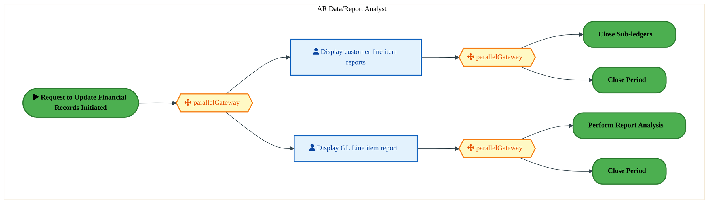

<a href="https://mermaid.live/view#pako:eNqlVe-P4jYQ_VesrFa0UtDlJ4F8qMQGcjppK52Wu-uHUp1MYoO1jp3azrIU8b_fmATYULZS23xAzPO892ZGnmTvFLIkTurc3--ZYCZF-4HZkIoMUjRYYU0GLmqBb1gxvOJED2wOlcIs2F_HND-qX22axXJcMb6z6IKsJUFfP7loCkTuIo2FHmqiGB24g1qxCqtdJrlUNvuOjKlHj27d0YNUJVGXBM9L_CIGKmeCXOAwiZIotzxNCinKniiN6ZgWg4MtjsttscHKHMtvNPkVv_7GSrOBmGKuCeRsTMUf8Ypw26NRjcWKRr2chsG09REwsEWNCybWgEceQAqL5wsUe4cDOtzfL8XZFH2ZLQWCp-BY6xmhSBuA5y8GUcZ5ehdl0zz2XG2UfCbpXTBPZmHgFraTFFr3XDvc4Zaw9cakK8nLLnW4tT2kQf3qqtc08Fy1g98rLyLKi1M2CsbB-Oz0kPiZn52cKKX_ywnmqr5g_dx5zcM8yGdnLz8exZn3d71Tm7MomfrXcyLqhRXkjWie5-H8Mqr5KPa990Uf8nDkZVeia2zIFu8ugpMsOgvmcZL7ybuCrd91lc3qs5LFSTCcx3l8Fkwe_HwavCsYTf1o3FUIOmuF6w3iWJDv3u9LZ_qEZtjgD0-klnCPpgLznTZL54-WYB_hQx7FKcVDO380Y7rm0F3RaCMrAOzGIGZIhdRRRffpwW36x0f0eEXs88KfzsQj4Yn82RBtkJHoa13CiFHOBBYFbD-cFbDPGn2CdwyDoxKkfn6jFYFUxqUmaNGshpyUa6KuyozPKZ_hJSLL_ukITgGnUlWoNyt2JZP8o8x4vz_1hJWSWz3E3KAaK8w54R_be7N0Doc3nMl_4PjevyPBCrd_hI-Gw1-g0C4M2nDSheM2jLpw0oajfhj3k5MuDNvQ905OXgdcxcGby2_rOS19Dw5uw-H5xdeDo9twfBse3YaT2_D4tO49dHIThRY72HEdWJ0Ks9JJ987xCwhfyZJQ3HDjHFwHN0YudqJw0uOXwmmOV37GMCxw1YKHH7gCVo4=" title="View full diagram">&#128065; View Diagram</a>

Page 13<a href="#toc">↑ Back to TOC</a>OR-140 — Process Receipts

#### BUSINESS ARCHITECTURE — 3.2.12 OR-140-140_Reconcile_Bank_Information — OR-140-140_Reconcile_Bank_Information

**Swim Lanes**: AR Cash Analyst | **Tasks**: 3 | **Gateways**: 2

> **Legend**: ● Start · ● End · User Task · Service Task · ◇ Gateway · Sub-Process

```mermaid
%%{init: {'theme': 'base', 'themeVariables': {'fontSize': '14px', 'fontFamily': 'Segoe UI, Arial, sans-serif','primaryColor': '#e8f0fe', 'primaryBorderColor': '#0071c5','lineColor': '#37474F', 'secondaryColor': '#f5f8fc'}, 'flowchart': {'useMaxWidth': false, 'htmlLabels': true, 'curve': 'basis', 'nodeSpacing': 40, 'rankSpacing': 50}} }%%
flowchart TD
    classDef startEvt fill:#4CAF50,stroke:#2E7D32,color:#000,font-weight:bold,stroke-width:2px,rx:20,ry:20
    classDef endEvt fill:#C62828,stroke:#B71C1C,color:#fff,font-weight:bold,stroke-width:2px,rx:20,ry:20
    classDef userTask fill:#E3F2FD,stroke:#1565C0,stroke-width:2px,color:#0D47A1
    classDef serviceTask fill:#FFF3E0,stroke:#E65100,stroke-width:2px,color:#BF360C
    classDef gateway fill:#FFF9C4,stroke:#F57F17,stroke-width:2px,color:#E65100
    classDef subProc fill:#F3E5F5,stroke:#7B1FA2,stroke-width:2px,color:#4A148C
    subgraph lane_0["AR Cash Analyst"]
        n1["fa:fa-user Match bank Statement Transactions with Corresponding SAP Transactions"]
        n2["fa:fa-user Make Necessary Adjustments in SAP for Reconciling Discrepancies"]
        n3[["fa:fa-cog Collect Bank Statements"]]
        n4(["fa:fa-play Request to Reconcile Bank Information Initiated"])
        n5(["fa:fa-stop Bank Information Reconciled"])
        n6{{"fa:fa-code-branch Validation Successful?"}}
        n7{{"fa:fa-code-branch exclusiveGateway"}}
    end
    n1 --> n6
    n4 --> n3
    n2 --> n7
    n3 --> n1
    n6 -->|"No"| n2
    n7 --> n5
    n6 -->|"Yes"| n7
    class n1 userTask
    class n2 userTask
    class n3 serviceTask
    class n4 startEvt
    class n5 endEvt
    class n6 gateway
    class n7 gateway
```

<a href="https://mermaid.live/view#pako:eNqlVW2P4jYQ_itWVitaKUh5JTQfWkEg1Um902m5XlUdVWWcCbhr7NR2FjiW_16bhAS420_NhyjzZOZ5ZsYzydEhogAndR4fj5RTnaLjQG9gC4MUDVZYwcBFDfAZS4pXDNTA-pSC6wX9enbzo2pv3SyW4y1lB4suYC0A_f7ORRMTyFykMFdDBZKWA3dQSbrF8pAJJqT1foBx6ZVntfbVVMgCZO_geYlPYhPKKIceDpMoiXIbp4AIXtyQlnE5LsngZJNjYkc2WOpz-rWC93j_By30xtglZgqMz0Zv2W94BczWqGVtMVLLl0szqLI63DRsUWFC-drgkWcgiflzD8Xe6YROj49L3omiT7MlR-YiDCs1gxIpbeD5i0YlZSx9iLJJHnuu0lI8Q_oQzJNZGLjEVpKa0j3XNne4A7re6HQlWNG6Dne2hjSo9q7cp4HnyoO532kBL3qlbBSMg3GnNE38zM8uSmVZ_i8l01f5CavnVmse5kE-67T8eBRn3rd8lzJnUTLx7_sE8oUSuCLN8zyc962aj2Lfe5t0mocjL7sjXWMNO3zoCX_Koo4wj5PcT94kbPTus6xXH6UgF8JwHudxR5hM_XwSvEkYTfxo3GZoeNYSVxvEMIe_vS9LZ_KEMqw2aMIxOyi9dP5qPO3FfeNQ4rTEQ9t49B5rskErM4xooU2JW-Bm8sxwKkw0FVyhHdUblAkpQVVmWcy8osXk443PrUJwr_AM6AMQUMosGpoU_9RKWxmFKD9TlUKiJ7uJhDJLP6OKSKiwseGOO_zSkROxNmkxBkSj6U3-NuY6KPqhC6qYOcIn-LcGpZEWnSw0FO-4yWWLbVHmmWpqGAvD9uMVW9yzKS2qbwM7zvvI0fHYJ1_AcGVaaJr_GTNaNKGLmtg-lTX7ZemcTlexyfdjYU9YregL_NqMZx9lFrh54D4aDn826q0ZNWbYmkFjJq0ZNma7Unxkzdel80EsnVfj3MJJ4xXfef1pj-u1IzuPutW_rPgNHHwfDq_X9-ZN1H0Ab-C4_VbdgKPLvt6gyQV1XGcL5rxo4aRH5_yvMv-zAkpcM-2cXAfXWiwOnDjp-Zvu1JU5IZhRbFZt24Cn_wBFW0Nb" title="View full diagram">&#128065; View Diagram</a>

#### BUSINESS ARCHITECTURE — 3.2.13 OR-140-150_Update_General_Ledger — OR-140-150_Update_General_Ledger

**Swim Lanes**: AR Cash Analyst | **Tasks**: 3 | **Gateways**: 2

> **Legend**: ● Start · ● End · User Task · Service Task · ◇ Gateway · Sub-Process

```mermaid
%%{init: {'theme': 'base', 'themeVariables': {'fontSize': '14px', 'fontFamily': 'Segoe UI, Arial, sans-serif','primaryColor': '#e8f0fe', 'primaryBorderColor': '#0071c5','lineColor': '#37474F', 'secondaryColor': '#f5f8fc'}, 'flowchart': {'useMaxWidth': false, 'htmlLabels': true, 'curve': 'basis', 'nodeSpacing': 40, 'rankSpacing': 50}} }%%
flowchart TD
    classDef startEvt fill:#4CAF50,stroke:#2E7D32,color:#000,font-weight:bold,stroke-width:2px,rx:20,ry:20
    classDef endEvt fill:#C62828,stroke:#B71C1C,color:#fff,font-weight:bold,stroke-width:2px,rx:20,ry:20
    classDef userTask fill:#E3F2FD,stroke:#1565C0,stroke-width:2px,color:#0D47A1
    classDef serviceTask fill:#FFF3E0,stroke:#E65100,stroke-width:2px,color:#BF360C
    classDef gateway fill:#FFF9C4,stroke:#F57F17,stroke-width:2px,color:#E65100
    classDef subProc fill:#F3E5F5,stroke:#7B1FA2,stroke-width:2px,color:#4A148C
    subgraph lane_0["AR Cash Analyst"]
        n1["fa:fa-user Validate Entries"]
        n2["fa:fa-user Post Approved Journal Entries to the General Ledger"]
        n3["fa:fa-user Make Corrections"]
        n4(["fa:fa-play Request to Update General Ledger Initiated"])
        n5(["fa:fa-stop General Ledger Updated"])
        n6{{"fa:fa-code-branch Validation Successful?"}}
        n7{{"fa:fa-code-branch exclusiveGateway"}}
    end
    n2 --> n5
    n1 --> n6
    n4 --> n1
    n7 --> n2
    n6 -->|"Yes"| n7
    n6 -->|"No"| n3
    n3 --> n7
    class n1 userTask
    class n2 userTask
    class n3 userTask
    class n4 startEvt
    class n5 endEvt
    class n6 gateway
    class n7 gateway
```

<a href="https://mermaid.live/view#pako:eNqlVV2P2jgU_StWRiO2UpDySWgetmICqVpNq6r0Q6ulqkxyDdYYO2s7DCzlv69NEpiwM0_NA-KenHvOvTe5zsEpRAlO6tzeHiinOkWHgV7DBgYpGiyxgoGLGuAblhQvGaiB5RDB9Zz-e6L5UbWzNIvleEPZ3qJzWAlAX9-5aGISmYsU5mqoQFIycAeVpBss95lgQlr2DYyJR05u7a07IUuQF4LnJX4Rm1RGOVzgMImSKLd5CgrBy54oicmYFIOjLY6Jx2KNpT6VXyv4gHffaanXJiaYKTCctd6we7wEZnvUsrZYUcttNwyqrA83A5tXuKB8ZfDIM5DE_OECxd7xiI63twt-NkVfpguOzFUwrNQUCFLawLOtRoQylt5E2SSPPVdpKR4gvQlmyTQM3MJ2kprWPdcOd_gIdLXW6VKwsqUOH20PaVDtXLlLA8-Ve_N75QW8vDhlo2AcjM9Od4mf-VnnRAj5LSczV_kFq4fWaxbmQT49e_nxKM68_-t1bU6jZOJfzwnklhbwRDTP83B2GdVsFPvey6J3eTjysivRFdbwiPcXwddZdBbM4yT3kxcFG7_rKuvlJymKTjCcxXl8Fkzu_HwSvCgYTfxo3FZodFYSV2vEMIef3t8LZ_IZZVit0YRjtld64fxomPbiviEQnBI8tINH3zCjpWkNzbiWFFSfHPTJn4TSaFJVUmyhRO9FLY1Dl4m0QGbr0VvgIA18D-UKZF8v7Ot9wA-AMiElFJoKfmUe_XFmV8xM_jP8U4MpwPh8rU41963QO3MYUYOXRufVE6H4IqS0qK7TGrHrpNHh0CXZ4264NAtbrLt5mWrRvC4KUIrU7M3COR6f5CbP58KuYLWiW3jbvEuXLLNtzR8eoOHwT1NyG_pNOGrDqAnbF54nTRi04ciGvxbOX_Yx_jK3r_CP4gSHLRw22cmT99IadvvYg4Pn4fB5ODofVT04bk-VHjjqNquHJh3quM4G5AbT0kkPzumrYr48JRBcM-0cXQfXWsz3vHDS0-nr1KenOaXYLMWmAY__ARoHIrE=" title="View full diagram">&#128065; View Diagram</a>

Page 14<a href="#toc">↑ Back to TOC</a>OR-140 — Process Receipts

### 3.3 Business Roles & Responsibilities

| Role / Lane | Processes Involved | Description |
|------------|-------------------|-------------|
| AR Cash Applier | OR-140-010_Receive_Electronic_Payment, OR-140-110_Perform_Cash_Application, OR-140-120_Monitor_Unapplied_Cash,  | |
| AR Cash Analyst | OR-140-030_Receive_Lockbox_Payment, OR-140-040_Receive_Bill-of-Exchange, OR-140-060_Deposit_Funds, OR-140-070_Evaluate_Discount, OR-140-080_Manage_Bill-of-Exchange, OR-140-090_Post_Customer_Payment, OR-140-140_Reconcile_Bank_Information, OR-140-150_Update_General_Ledger | |
| Accounts Receivable Analyst | OR-140-050_Receive_Customer_Down_Payment,  | |
| AR Data/Report Analyst | OR-140-130_Update_Financial_Records,  | |

Page 15<a href="#toc">↑ Back to TOC</a>OR-140 — Process Receipts

## 4. Data Architecture (TOGAF "D")

### 4.1 Data Flows — Source to Target

*Data flows with DB platform details will be populated when tower architects complete the extended flow template columns (42-47) via the Input Portal.*

### 4.2 Data Flow Diagrams

> **DATA ARCHITECTURE** — Database-to-database data flows. Applications (blue) sit above their hosting databases (green cylinders). Thick arrows show data movement between databases.

### 4.3 Data Lineage

*Data lineage (source schema/object → target schema/object mappings) will be populated when tower architects provide validated schema details via the Input Portal.*

### 4.4 RICEFW Data Objects

Data-centric RICEFW objects (Reports and Conversions) from the Object Tracker:

| Object ID | Type | Description | Status | Source → Target | Complexity |
|-----------|------|-------------|--------|----------------|----------|
| FPRR1514_IP | Report | To generate reports out of the ITT documents that was created | 10. Object Complete |  | 03.Medium |
| FPRR1514_IF | Report | To generate reports out of the ITT documents that was created | 10. Object Complete |  | 04.Low |
| FPRR1240 | Report | Custom report for Revenue Recognition by Stage for Product/Services Sale​ act... | 10. Object Complete |  | 03.Medium |
| FPRR1211 | Report | Report for searching on and viewing government contract timesheets for Intel ... | 10. Object Complete |  | 03.Medium |
| FPRR1210 | Report | Report for searching on and viewing government contract timesheet changes for... | 10. Object Complete |  | 03.Medium |
| FPRR0907_IP | Report | Workflow Status Report ( Order Request / Approval Request / Others ) | 10. Object Complete |  | 03.Medium |
| FPRR0907_IF | Report | Workflow Status Report ( Order Request / Approval Request / Others ) | 10. Object Complete |  | 04.Low |
| FPRR0497 | Report | CFR - Report to support multiple Treasury Funding requests from Multiple Inte... | 10. Object Complete |  | 03.Medium |
| FPRR0496 | Report | TPR-Report to support multiple Treasury Payment Requests from Multiple Intel ... | 10. Object Complete |  | 03.Medium |
| FPRR0461 | Report | Inter-company Outage Pre-consolidate Report (ACDOCA) | 10. Object Complete | NA → NA | 03.Medium |
| FPRR0380 | Report | GL Interface – Reconciliation Report/Dashboard | 10. Object Complete | NA → NA | 02.High |
| FPRR0327_IP | Report | Report to display the requests/change IDs and status of the workflow approval... | 10. Object Complete | NA → NA | 02.High |
| FPRR0327_IF | Report | Report to display the requests/change IDs and status of the workflow approval... | 10. Object Complete | NA → NA | 03.Medium |
| FPRR0288_IP | Report | Operational Report to display whether supporting documents are attached to JEs | 10. Object Complete | NA → NA | 03.Medium |
| FPRR0288_IF | Report | Operational Report to display whether supporting documents are attached to JEs | 10. Object Complete | NA → NA | 03.Medium |
| FPRR0288_CFIN | Report | Operational Report to display whether supporting documents are attached to JEs | 10. Object Complete | NA → NA | 02.High |
| FPRR0027 | Report | In House Cash – Loan Account balance Detailed report | 10. Object Complete | NA → NA | 01.Very High |
| FPRM003 | Conversion | Revenue Recognition Rules | 10. Object Complete |  | N/A |
| FPRM002 | Conversion | Revenue Contracts | 10. Object Complete |  | N/A |
| FPRM001 | Conversion | Bank Master | 10. Object Complete | ECC → CFIN | N/A |
| FPRC1724_IP | Conversion | Creation of output template with consumption data | 06. Dev In Progress |  | 02.High |
| FPRC1724_IF | Conversion | Creation of output template with consumption data | 06. Dev In Progress |  | 03.Medium |
| FPRC1565 | Conversion | Convert active delegate relationships for Timesheet approval | 10. Object Complete |  | 02.High |
| FPRC1493 | Conversion | Conversion of WIP values as per Component structure in S/4 - IP | 10. Object Complete |  | 02.High |
| FPRC1491 | Conversion | Conversion of WIP values as per Component structure in S/4 - Back End IF | 10. Object Complete |  | 02.High |
| FPRC1464_IP | Conversion | Project Actuals Conversion (Non- Intel Federal) | 10. Object Complete |  | 02.High |
| FPRC1464_IF | Conversion | Project Actuals Conversion (Non- Intel Federal) | 10. Object Complete |  | 02.High |
| FPRC1442 | Conversion | Conversion of Actual Labor hours for Intel Federal Projects | 10. Object Complete |  | 02.High |
| FPRC1441 | Conversion | Conversion of ECC project hierarchy (WBS element master data) to S/4HANA proj... | 10. Object Complete |  | 02.High |
| FPRC1212 | Conversion | Project Actuals Conversion including Intel Federal | 10. Object Complete |  | 03.Medium |
| FPRC0908_IP | Conversion | Project Budget Conversion | 10. Object Complete |  | 03.Medium |
| FPRC0908_IF | Conversion | Project Budget Conversion | 10. Object Complete |  | 03.Medium |
| FPRC0196_IP | Conversion | Asset Transaction data conversion | 10. Object Complete | NA → NA | 02.High |
| FPRC0196_IF | Conversion | Asset Transaction data conversion | 10. Object Complete | NA → NA | 02.High |
| FPRC0195_IP | Conversion | Asset Master data conversion | 10. Object Complete | NA → NA | 03.Medium |
| FPRC0195_IF | Conversion | Asset Master data conversion | 10. Object Complete | NA → NA | 03.Medium |
| FPRC0174_IP | Conversion | Conversion of ECC project hierarchy (WBS element master data) to S/4HANA proj... | 10. Object Complete | ECC → S4 | 02.High |
| FPRC0174_IF | Conversion | Conversion of ECC project hierarchy (WBS element master data) to S/4HANA proj... | 10. Object Complete | ECC → S4 | 03.Medium |
| FPRC0117 | Conversion | Conversion – In House Cash: Current Account creation and Current Account Bala... | 10. Object Complete | ECC → CFIN | 02.High |
| FPRC0116 | Conversion | Conversion – Migration of Existing Bank Guarantees and Intercompany Loans to ... | 10. Object Complete | Quantum → CFIN | 03.Medium |
| FPRC0035_IP | Conversion | Convert existing ECC & MDG hierarchy to S4HANA PPM hierarchy (Portfolio & buc... | 10. Object Complete |  → MDG | 03.Medium |
| FPRC0035_IF | Conversion | Convert existing ECC & MDG hierarchy to S4HANA PPM hierarchy (Portfolio & buc... | 10. Object Complete |  → MDG | 04.Low |

### 4.5 Data Governance & Quality

| Concern | Approach |
|---------|----------|
| Data Ownership | Per-entity owners listed in Section 3.1 |
| Data Classification | Financial data classified as Intel Confidential |
| Data Retention | Per Intel corporate retention policies |
| Data Quality | Validated at source; reconciliation at target |

Page 16<a href="#toc">↑ Back to TOC</a>OR-140 — Process Receipts

## 5. Application Architecture (TOGAF "A")

### 5.4 Component Overview

#### System Inventory

| System | IAPM ID | Status |
|--------|---------|--------|

### 5.5 RICEFW Inventory

| Object ID | Type | Description | Status | Source → Target | Boundary App | Complexity |
|-----------|------|-------------|--------|----------------|-------------|----------|
| FPRW1449 | Workflow | TPR : Workflow to handle Memo creation and cancellation process | 10. Object Complete | NA → NA | NA | 03.Medium |
| FPRW1444 | Workflow | TFR: Workflow to handle Memo creation and cancellation process | 10. Object Complete |  |  | 03.Medium |
| FPRW1064_IP | Workflow | Custom Workflow will also be created with some predefined process/rules for a... | 10. Object Complete |  |  | 01.Very High |
| FPRW1064_IF | Workflow | Custom Workflow will also be created with some predefined process/rules for a... | 10. Object Complete |  |  | 02.High |
| FPRW0930 | Workflow | Workflow for Counterparty Approval | 10. Object Complete |  |  | 03.Medium |
| FPRW0906_IP | Workflow | Custom workflow: Change Order Create and Change Approval | 10. Object Complete |  |  | 03.Medium |
| FPRW0906_IF | Workflow | Custom workflow: Change Order Create and Change Approval | 10. Object Complete |  |  | 03.Medium |
| FPRW0904_IP | Workflow | Custom Workflow - WBS Element Request approval with WBS Element creation | 10. Object Complete |  |  | 03.Medium |
| FPRW0904_IF | Workflow | Custom Workflow - WBS Element Request approval with WBS Element creation | 10. Object Complete |  |  | 03.Medium |
| FPRW0900_IP | Workflow | Custom Workflow: Approval for Project creation and create a Project def and l... | 10. Object Complete |  |  | 03.Medium |
| FPRW0900_IF | Workflow | Custom Workflow: Approval for Project creation and create a Project def and l... | 10. Object Complete |  |  | 03.Medium |
| FPRW0445_IP | Workflow | Project budget approval workflow (Capex)​ | 10. Object Complete |  |  | 03.Medium |
| FPRW0445_IF | Workflow | Project budget approval workflow (Capex)​ | 10. Object Complete |  |  | 03.Medium |
| FPRW0325_IP | Workflow | Custom workflow to manage the approval process in bulk/individual requests | 10. Object Complete | NA → NA | NA | 02.High |
| FPRW0325_IF | Workflow | Custom workflow to manage the approval process in bulk/individual requests | 10. Object Complete | NA → NA | NA | 02.High |
| FPRW0165_IP | Workflow | Workflow is required to trigger the approvers based on the business requireme... | 10. Object Complete | NA → NA | NA | 02.High |
| FPRW0165_IF | Workflow | Workflow is required to trigger the approvers based on the business requireme... | 10. Object Complete | NA → NA | NA | 03.Medium |
| FPRW0165_CFIN | Workflow | Workflow is required to trigger the approvers based on the business requireme... | 10. Object Complete | NA → NA | NA | 02.High |
| FPRR1514_IP | Report | To generate reports out of the ITT documents that was created | 10. Object Complete |  |  | 03.Medium |
| FPRR1514_IF | Report | To generate reports out of the ITT documents that was created | 10. Object Complete |  |  | 04.Low |
| FPRR1240 | Report | Custom report for Revenue Recognition by Stage for Product/Services Sale​ act... | 10. Object Complete |  |  | 03.Medium |
| FPRR1211 | Report | Report for searching on and viewing government contract timesheets for Intel ... | 10. Object Complete |  |  | 03.Medium |
| FPRR1210 | Report | Report for searching on and viewing government contract timesheet changes for... | 10. Object Complete |  |  | 03.Medium |
| FPRR0907_IP | Report | Workflow Status Report ( Order Request / Approval Request / Others ) | 10. Object Complete |  |  | 03.Medium |
| FPRR0907_IF | Report | Workflow Status Report ( Order Request / Approval Request / Others ) | 10. Object Complete |  |  | 04.Low |
| FPRR0497 | Report | CFR - Report to support multiple Treasury Funding requests from Multiple Inte... | 10. Object Complete |  |  | 03.Medium |
| FPRR0496 | Report | TPR-Report to support multiple Treasury Payment Requests from Multiple Intel ... | 10. Object Complete |  |  | 03.Medium |
| FPRR0461 | Report | Inter-company Outage Pre-consolidate Report (ACDOCA) | 10. Object Complete | NA → NA |  | 03.Medium |
| FPRR0380 | Report | GL Interface – Reconciliation Report/Dashboard | 10. Object Complete | NA → NA | NA | 02.High |
| FPRR0327_IP | Report | Report to display the requests/change IDs and status of the workflow approval... | 10. Object Complete | NA → NA | NA | 02.High |
| FPRR0327_IF | Report | Report to display the requests/change IDs and status of the workflow approval... | 10. Object Complete | NA → NA | NA | 03.Medium |
| FPRR0288_IP | Report | Operational Report to display whether supporting documents are attached to JEs | 10. Object Complete | NA → NA | NA | 03.Medium |
| FPRR0288_IF | Report | Operational Report to display whether supporting documents are attached to JEs | 10. Object Complete | NA → NA | NA | 03.Medium |
| FPRR0288_CFIN | Report | Operational Report to display whether supporting documents are attached to JEs | 10. Object Complete | NA → NA | NA | 02.High |
| FPRR0027 | Report | In House Cash – Loan Account balance Detailed report | 10. Object Complete | NA → NA | NA | 01.Very High |
| FPRM003 | Conversion | Revenue Recognition Rules | 10. Object Complete |  |  | N/A |
| FPRM002 | Conversion | Revenue Contracts | 10. Object Complete |  |  | N/A |
| FPRM001 | Conversion | Bank Master | 10. Object Complete | ECC → CFIN |  | N/A |
| FPRI1725_IP | Interface | Interface to be developed to transfer the files from Denodo to FS share path ... | 10. Object Complete |  | Workday | 03.Medium |
| FPRI1725_IF | Interface | Interface to be developed to transfer the files from Denodo to FS share path ... | 10. Object Complete |  | Workday | 04.Low |
| FPRI1704 | Interface | Automated Tool MUP Excess Capacity calculation and associated PCOS/OCOS Split... | 10. Object Complete |  | NA | 03.Medium |
| FPRI1670 | Interface | Import Dot process/stage details from MDG into S4. ​ | 10. Object Complete |  | NA | 03.Medium |
| FPRI1669 | Interface | Import Xeus/Mars volumes from ECA into S4.​ | 10. Object Complete |  | NA | 03.Medium |
| FPRI1504 | Interface | Asset Delete from EMS to S4 through APIGEE | 10. Object Complete |  | Equipment Management System | 03.Medium |
| FPRI1503 | Interface | Asset Display from EMS to S4 through APIGEE | 10. Object Complete |  | Equipment Management System | 03.Medium |
| FPRI1502 | Interface | Asset Change from EMS to S4 through APIGEE | 10. Object Complete |  | Equipment Management System | 03.Medium |
| FPRI1463 | Interface | Interface to upload payroll data from Workday to S/4 IP for legal entity 199 ... | 10. Object Complete |  | Workday | 03.Medium |
| FPRI1447 | Interface | GL Interface –Create Inbound IDOCs to CFIN from IF system | 10. Object Complete | IF → CFIN | NA | 03.Medium |
| FPRI1446 | Interface | GL Interface –Create Inbound IDOCs to CFIN from IP system | 10. Object Complete | IP → CFIN | NA | 03.Medium |
| FPRI1439 | Interface | Receive planned production quantities per production version from ECA to S/4 ... | 10. Object Complete |  | NA | 03.Medium |
| FPRI1338 | Interface | Outbound Interface to view the Cleared Customer Invoices from CFIN System to ... | 10. Object Complete | S/4 → WOM | SAP Commerce Cloud | 03.Medium |
| FPRI1315 | Interface | Asset Create from EMS to S4 through APIGEE | 10. Object Complete |  | Equipment Management System | 03.Medium |
| FPRI1306 | Interface | Interface for importing GL transactional data from SAP CFIN system into SAP IF | 10. Object Complete | CFIN → S/4 | NA | 03.Medium |
| FPRI1305 | Interface | Interface for importing GL transactional data from SAP CFIN system into SAP IP | 10. Object Complete | CFIN → S/4 | NA | 03.Medium |
| FPRI1288 | Interface | Activity Inbound interface from ECA to S4 IP | 10. Object Complete | ECA → S/4 | NA | 03.Medium |
| FPRI1287 | Interface | Production quantity update in WAC custom table from ECA to S4 IF | 10. Object Complete | ECA → S/4 | NA | 03.Medium |
| FPRI1286_IP | Interface | Interface between SAP IP and IF boxes for Outbound IDOC flow_IP | 10. Object Complete | MULESOFT → S/4 | NA | 03.Medium |
| FPRI1286_IF | Interface | Interface between SAP IP and IF boxes for Outbound IDOC flow_IF | 10. Object Complete | MULESOFT → S/4 | NA | 04.Low |
| FPRI1273 | Interface | Activity Quantity Inbound interface from ECA to S4 IF | 10. Object Complete | ECA → S/4 | NA | 03.Medium |
| FPRI1241 | Interface | Disti Rebate percentage of gross for Unissued Returns and Intransit Deferral | 10. Object Complete | ECA → S/4 | NA | 03.Medium |
| FPRI1238 | Interface | Pull Foundry WBS from HAT and create in LE 199 in IP S/4 for Foundry Employee... | 10. Object Complete | Head Count Assignment Tool → S/4 | Head Count Assignment Tool | 03.Medium |
| FPRI1105 | Interface | Interface for automatic creation of B2B customer related payment advice | 10. Object Complete |  | OpenText | 03.Medium |
| FPRI0981_IP | Interface | Interface of SAP PPM module to SPEED | 10. Object Complete | ECA → S/4 | SPEED | 03.Medium |
| FPRI0981_IF | Interface | Interface of SAP PPM module to SPEED | 10. Object Complete | ECA → S/4 | SPEED | 04.Low |
| FPRI0913_IP | Interface | Export the Planning data from the SAC table to PPM standard tables using the ... | 10. Object Complete | SAC → S/4 | NA | 02.High |
| FPRI0913_IF | Interface | Export the Planning data from the SAC table to PPM standard tables using the ... | 10. Object Complete | SAC → S/4 | NA | 03.Medium |
| FPRI0909_IP | Interface | Interface for importing the Headcount details by Person# and WBS element comb... | 10. Object Complete | ECA → S/4 | Head Count Assignment Tool | 03.Medium |
| FPRI0909_IF | Interface | Interface for importing the Headcount details by Person# and WBS element comb... | 10. Object Complete | ECA → S/4 | Head Count Assignment Tool | 04.Low |
| FPRI0895 | Interface | Import Tool Sharing Forecasted Data from FCS to S4 & derive FTQ data by Capex... | 10. Object Complete | FCS → S/4 | MOR/FCS/SCS | 02.High |
| FPRI0894 | Interface | Planned Volume from IP-BY will be utilized as a KP26 quantity to split 'Overh... | 10. Object Complete | ICS → S/4 | JDA/Blue Yonder ESP/OP (ALTR); Module Planning for Supply Chain on Blue Yonde... | 02.High |
| FPRI0869 | Interface | Interface for automatic creation of WOM related payment advice | 10. Object Complete | S/4 → WOM | SAP Commerce Cloud | 03.Medium |
| FPRI0867 | Interface | Outbound Interface to view the open & Cleared Customer Invoices from CFIN Sys... | 10. Object Complete | S/4 → WOM | SAP Commerce Cloud | 03.Medium |
| FPRI0866 | Interface | Interface to Obtains the payer associated to the sold to from CFIN System to ... | 10. Object Complete | S/4 → WOM | SAP Commerce Cloud | 03.Medium |
| FPRI0865 | Interface | Interface to transfer the Uploaded WCP Grant Amount from CFIN to WOM and Defe... | 10. Object Complete | S/4 → WOM | SAP Commerce Cloud | 03.Medium |
| FPRI0864_IP | Interface | Interface between SAP IP and IF boxes for Inbound IDOC flow_IP | 10. Object Complete | MULESOFT → S/4 | NA | 03.Medium |
| FPRI0864_IF | Interface | Interface between SAP IP and IF boxes for Inbound IDOC flow_IF | 10. Object Complete | MULESOFT → S/4 | NA | 04.Low |
| FPRI0863_IP | Interface | Interface between SAP & ECA to provide information for auto certification in ... | 10. Object Complete | ECA → BLACKLINE | Task - Blackline | 03.Medium |
| FPRI0863_IF | Interface | Interface between SAP & ECA to provide information for auto certification in ... | 10. Object Complete | ECA → BLACKLINE | Task - Blackline | 04.Low |
| FPRI0863_CFIN | Interface | Interface between SAP & ECA to provide information for auto certification in ... | 10. Object Complete | ECA → BLACKLINE | Task - Blackline | 03.Medium |
| FPRI0862 | Interface | Interface to transfer the details of selected invoice from WOM to CFIN ( Inbo... | 10. Object Complete | WOM → S/4 | SAP Commerce Cloud | 03.Medium |
| FPRI0778_IP | Interface | Continue to auto-certify a BL task when the related JE is approved | 10. Object Complete | BLACKLINE → S/4 | Task - Blackline | 03.Medium |
| FPRI0778_IF | Interface | Continue to auto-certify a BL task when the related JE is approved | 10. Object Complete | BLACKLINE → S/4 | Task - Blackline | 03.Medium |
| FPRI0778_CFIN | Interface | Continue to auto-certify a BL task when the related JE is approved | 10. Object Complete | BLACKLINE → S/4 | Task - Blackline | 02.High |
| FPRI0770_IP | Interface | To enable auto-certify a BL [Blackline] task when the related JE is approved | 10. Object Complete | BLACKLINE → ECA | Task - Blackline | 03.Medium |
| FPRI0770_IF | Interface | To enable auto-certify a BL [Blackline] task when the related JE is approved | 10. Object Complete | BLACKLINE → ECA | Task - Blackline | 03.Medium |
| FPRI0770_CFIN | Interface | To enable auto-certify a BL [Blackline] task when the related JE is approved | 10. Object Complete | BLACKLINE → ECA | Task - Blackline | 02.High |
| FPRI0704 | Interface | IF-IP Integration Actual Cost - Inbound Interface | 10. Object Complete | OpenText → S/4 | NA | 02.High |
| FPRI0703 | Interface | IF-IP Integration Actual Cost - Outbound Interface | 10. Object Complete | S/4 → OpenText | NA | 02.High |
| FPRI0696_IP | Interface | Interface between ONESOURCE and Readsoft Process Director built on the back o... | 10. Object Complete | ONESOURCE → READSOFT | OneSource Indirect Tax Suite; Readsoft - Process Director Accounts Payable IP | 02.High |
| FPRI0696_IF | Interface | Interface between ONESOURCE and Readsoft Process Director built on the back o... | 10. Object Complete | ONESOURCE → READSOFT | OneSource Indirect Tax Suite; Readsoft - Process Director Accounts Payable IF | 03.Medium |
| FPRI0695 | Interface | Reference Interest Rates - S4 converted data from MDG to CFIN | 10. Object Complete | S/4 MDG → CFIN | Treasury Suite | 03.Medium |
| FPRI0694 | Interface | Exchange Rates N - S4 converted data from MuleSoft to Treasury Suite | 10. Object Complete | MULESOFT → TREASURY SUITE | Treasury Suite | 03.Medium |
| FPRI0693 | Interface | Exchange Rates L - S4 converted data from MuleSoft to Treasury Suite | 10. Object Complete | Treasury Suite → MULESOFT | Treasury Suite | 03.Medium |
| FPRI0600_IP | Interface | Continuation to use Blackline Account Reconciliations Tool (ART), Blackline M... | 10. Object Complete | BLACKLINE → S/4 | Matching - Blackline; Close Reconciliation Tool - Blackline; Task - Blackline | 04.Low |
| FPRI0600_IF | Interface | Continuation to use Blackline Account Reconciliations Tool (ART), Blackline M... | 10. Object Complete | BLACKLINE → S/4 | Matching - Blackline; Close Reconciliation Tool - Blackline; Task - Blackline | 04.Low |
| FPRI0600_CFIN | Interface | Continuation to use Blackline Account Reconciliations Tool (ART), Blackline M... | 10. Object Complete | BLACKLINE → S/4 | Matching - Blackline; Close Reconciliation Tool - Blackline; Task - Blackline | 03.Medium |
| FPRI0599_IP | Interface | ServiceNow Asset change | 10. Object Complete | SERVICENOW → S/4 | ServiceNow Cloud Lab | 03.Medium |
| FPRI0599_IF | Interface | ServiceNow Asset change | 10. Object Complete | SERVICENOW → S/4 | ServiceNow Cloud Lab | 04.Low |
| FPRI0598 | Interface | N rate from Mulesoft to MDG | 10. Object Complete | MULESOFT → S/4 MDG | Bloomberg Professional | 04.Low |
| FPRI0597 | Interface | N rate from Mulesoft to Bloomberg | 10. Object Complete | MULESOFT → BLOOMBERG | Bloomberg Professional | 03.Medium |
| FPRI0596 | Interface | N rate from Mulesoft to Treasury Suite | 10. Object Complete | MULESOFT → TREASURY SUITE | Treasury Suite | 03.Medium |
| FPRI0554 | Interface | SKF Interface to get file from ECA and send to S4 via BODS - IF | 10. Object Complete | ECA → S/4 | Wafer Starts Per Week; ISA-VS2012 US (MAPPS); ISA-VS2008 Asia (ATMPS CR and D... | 02.High |
| FPRI0545 | Interface | IF-IP Integration - Interface to send Cost Idoc from S4 If to S4 IP | 10. Object Complete | S/4 → S/4 | NA | 03.Medium |
| FPRI0544 | Interface | IF-IP Integration - Interface to receive Cost Idoc from S4 If to S4 IP | 10. Object Complete | S/4 → S/4 | NA | 03.Medium |
| FPRI0533 | Interface | Reference Interest Rates from MuleSoft to S4 MDG | 10. Object Complete | Bloomberg → S/4 MDG | Bloomberg Professional | 03.Medium |
| FPRI0532 | Interface | Request for Reference Interest Rates from MuleSoft to Bloomberg | 10. Object Complete | MULESOFT → BLOOMBERG | Bloomberg Professional | 03.Medium |
| FPRI0531 | Interface | L Rates from MuleSoft to S4 MDG | 10. Object Complete | Bloomberg → S/4 MDG | Bloomberg Professional | 03.Medium |
| FPRI0530 | Interface | Request for L Rates from MuleSoft to Bloomberg | 10. Object Complete | MULESOFT → BLOOMBERG | Bloomberg Professional | 03.Medium |
| FPRI0529 | Interface | L Rates from MuleSoft to Quantum | 10. Object Complete | MULESOFT → QUANTUM | FIS Quantum | 03.Medium |
| FPRI0528 | Interface | L Rates from MuleSoft to Treasury Suite | 10. Object Complete | MULESOFT → TREASURY SUITE | Treasury Suite | 03.Medium |
| FPRI0527 | Interface | Reference Interest Rates from MuleSoft to Quantum | 10. Object Complete | MULESOFT → QUANTUM | FIS Quantum | 03.Medium |
| FPRI0526 | Interface | Reference Interest Rates from MuleSoft to Treasury Suite | 10. Object Complete | MULESOFT → TREASURY SUITE | Treasury Suite | 03.Medium |
| FPRI0505 | Interface | Interface – Copp Clark Holiday Calendar Integration with SAP | 10. Object Complete | Copp Clark → S/4 | Copp Clark Holiday Data Service | 03.Medium |
| FPRI0379 | Interface | GL Interface – File processing in MuleSoft-Payroll | 10. Object Complete | PAYROLL → S/4 | NA | 02.High |
| FPRI0378_IP | Interface | GL Interface - SAP API IP | 10. Object Complete | API → S/4 | Design and Sales Acceleration E-Commerce (Demo Depot); Flex One-Stop Tool | 02.High |
| FPRI0378_IF | Interface | GL Interface - SAP API IF | 10. Object Complete | API → S/4 | Design and Sales Acceleration E-Commerce (Demo Depot); Flex One-Stop Tool | 03.Medium |
| FPRI0377 | Interface | GL Interface - File Processing in Mulesoft | 10. Object Complete | CONCUR → S/4 | Workday; ADP Payroll GAR; ADP Payroll EMEA; ICOST - Integrated Cost of Sales ... | 02.High |
| FPRI0376 | Interface | GL Interface - File Processing in Mulesoft | 10. Object Complete | ICOST → S/4 | Workday; ADP Payroll GAR; ADP Payroll EMEA; ICOST - Integrated Cost of Sales ... | 02.High |
| FPRI0323_IP | Interface | Create a common API for Asset updates, transfer, retire and Mass upload | 10. Object Complete |  | ServiceNow Cloud | 02.High |
| FPRI0323_IF | Interface | Create a common API for Asset updates, transfer, retire and Mass upload | 10. Object Complete |  | ServiceNow Cloud | 03.Medium |
| FPRI0227 | Interface | Outbound Interface from CFIN to QTM in relation to not only QTM payment ackno... | 10. Object Complete | S/4 → Quantum | FIS Quantum | 03.Medium |
| FPRI0226 | Interface | Inbound Interface from QTM to CFIN in relation to QTM payment files and MT me... | 10. Object Complete | Quantum → S/4 | FIS Quantum | 03.Medium |
| FPRI0224 | Interface | Outbound Interface - SAP to Quantum for Transmitting Cash Management Relevant... | 10. Object Complete | S/4 → Quantum | FIS Quantum | 02.High |
| FPRI0188 | Interface | Inbound Interface from EMS to S/4 to create WBS element and Update WBS elemen... | 10. Object Complete | XEUS → S/4 | Equipment Management System | 02.High |
| FPRF0230 | Form | Invoice output Layout - America | 10. Object Complete | NA → NA | NA | 02.High |
| FPRE1723_IP | Enhancement | Intel BRF+ - Create Function Modules in S/4HANA(FM and BRF+) | 10. Object Complete |  |  | 04.Low |
| FPRE1723_IF | Enhancement | Intel BRF+ - Create Function Modules in S/4HANA(FM and BRF+) | 10. Object Complete |  |  | 04.Low |
| FPRE1722_IP | Enhancement | Intel BRF+ - Create Function Modules in S/4HANA (FM and components) | 10. Object Complete |  |  | 04.Low |
| FPRE1722_IF | Enhancement | Intel BRF+ - Create Function Modules in S/4HANA (FM and components) | 10. Object Complete |  |  | 04.Low |
| FPRE1711 | Enhancement | BADI Enhancement to change Order Type from Product cost Collector from IP & I... | 10. Object Complete |  |  | 03.Medium |
| FPRE1706 | Enhancement | Enhancement to create Cash Management relevant data from F110 Payment Run for... | 10. Object Complete |  |  | 03.Medium |
| FPRE1705 | Enhancement | Enhancement to do Cash App post EBS load with the corresponding payment advice. | 10. Object Complete |  |  | 03.Medium |
| FPRE1695 | Enhancement | Custom Fiori app - Change WBS Element Request Form with ALV Input​ | 10. Object Complete |  |  | 03.Medium |
| FPRE1671_IP | Enhancement | S4, Perform required calculations, summarizations, mappings and post the allo... | 10. Object Complete |  |  | 03.Medium |
| FPRE1671_IF | Enhancement | S4, Perform required calculations, summarizations, mappings and post the allo... | 10. Object Complete |  |  | 04.Low |
| FPRE1661_IP | Enhancement | WBS transfer tool | 10. Object Complete |  |  | 02.High |
| FPRE1661_IF | Enhancement | WBS transfer tool | 09. FUT Overdue |  |  | 03.Medium |
| FPRE1660 | Enhancement | Enhancement for Revenue Recognition by Stage postings for Product/Services Sa... | 10. Object Complete |  |  | 02.High |
| FPRE1659 | Enhancement | Enhancement for Revenue Recognition by Stage postings for Product/Services Sa... | 10. Object Complete |  |  | 02.High |
| FPRE1650_IP | Enhancement | (FTQ Input to drive Disaggregation to Allocation Cycle) for Forecast.​ | 10. Object Complete |  |  | 03.Medium |
| FPRE1650_IF | Enhancement | (FTQ Input to drive Disaggregation to Allocation Cycle) for Forecast.​ | 10. Object Complete |  |  | 04.Low |
| FPRE1620_IP | Enhancement | Implement OSS Note 2358961 to allow COGS split based on Aux CCS at time of de... | 99. Rejected/Cancelled/On Hold |  |  | 03.Medium |
| FPRE1620_IF | Enhancement | Implement OSS Note 2358961 to allow COGS split based on Aux CCS at time of de... | 99. Rejected/Cancelled/On Hold |  |  | 04.Low |
| FPRE1600 | Enhancement | Custom Fiori app - Create WBS Element Request Form with ALV Input​ | 10. Object Complete |  |  | 03.Medium |
| FPRE1599_IP | Enhancement | Update existing custom table ZTFPR_ACRENG02 to store the calculation of PO li... | 09. FUT Overdue |  |  | 03.Medium |
| FPRE1599_IF | Enhancement | Update existing custom table ZTFPR_ACRENG02 to store the calculation of PO li... | 09. FUT Overdue |  |  | 04.Low |
| FPRE1564 | Enhancement | Employee Notification for timesheet entry | 10. Object Complete |  |  | 03.Medium |
| FPRE1563 | Enhancement | Manager notification for timesheet approval | 10. Object Complete |  |  | 03.Medium |
| FPRE1562 | Enhancement | Manage Delegates for approval | 10. Object Complete |  |  | 03.Medium |
| FPRE1561 | Enhancement | Timesheet approval | 10. Object Complete |  |  | 02.High |
| FPRE1560 | Enhancement | Timesheet entry for Intel Federal employees | 10. Object Complete |  |  | 01.Very High |
| FPRE1553 | Enhancement | Custom Fiori app - Change WBS Element Request Form with ALV Input​ | 10. Object Complete |  |  | 03.Medium |
| FPRE1519_IP | Enhancement | Project Change Order - Edit and Submit of draft request with change functiona... | 10. Object Complete |  |  | 02.High |
| FPRE1519_IF | Enhancement | Project Change Order - Edit and Submit of draft request with change functiona... | 10. Object Complete |  |  | 03.Medium |
| FPRE1518_IP | Enhancement | Project Change Order - Change existing Purchase Orders during creation of Pro... | 10. Object Complete |  |  | 02.High |
| FPRE1518_IF | Enhancement | Project Change Order - Change existing Purchase Orders during creation of Pro... | 10. Object Complete |  |  | 03.Medium |
| FPRE1517_IP | Enhancement | Project Change Order - Create Purchase Orders during creation of Project Chan... | 10. Object Complete |  |  | 02.High |
| FPRE1517_IF | Enhancement | Project Change Order - Create Purchase Orders during creation of Project Chan... | 10. Object Complete |  |  | 03.Medium |
| FPRE1516_IP | Enhancement | Enhancement to enable user decision action to be taken from email directly fo... | 10. Object Complete |  |  | 03.Medium |
| FPRE1516_IF | Enhancement | Enhancement to enable user decision action to be taken from email directly fo... | 10. Object Complete |  |  | 04.Low |
| FPRE1515_IP | Enhancement | Enhancement to display popup screen to trigger project creation workflow | 10. Object Complete |  |  | 03.Medium |
| FPRE1515_IF | Enhancement | Enhancement to display popup screen to trigger project creation workflow | 10. Object Complete |  |  | 04.Low |
| FPRE1513_IP | Enhancement | Generate and download JV file for JE posting | 10. Object Complete |  |  | 03.Medium |
| FPRE1513_IF | Enhancement | Generate and download JV file for JE posting | 10. Object Complete |  |  | 04.Low |
| FPRE1513_CFIN | Enhancement | Generate and download JV file for JE posting | 99. Rejected/Cancelled/On Hold |  |  | 03.Medium |
| FPRE1512_IP | Enhancement | Query confirm ITT document to determine the Capital/Expense and tax code manu... | 10. Object Complete |  |  | 03.Medium |
| FPRE1512_IF | Enhancement | Query confirm ITT document to determine the Capital/Expense and tax code manu... | 10. Object Complete |  |  | 04.Low |
| FPRE1511_IP | Enhancement | Query existing draft ITT document and make changes | 10. Object Complete |  |  | 03.Medium |
| FPRE1511_IF | Enhancement | Query existing draft ITT document and make changes | 10. Object Complete |  |  | 04.Low |
| FPRE1510_IP | Enhancement | ITT document creation | 10. Object Complete |  |  | 03.Medium |
| FPRE1510_IF | Enhancement | ITT document creation | 10. Object Complete |  |  | 04.Low |
| FPRE1448 | Enhancement | FIORI screen to take care of TPR Display/ Change/ cancellation options | 10. Object Complete | NA → NA | NA | 03.Medium |
| FPRE1443 | Enhancement | FIORI screen to take care of TFR Display/ Change/ cancellation options | 10. Object Complete |  |  | 03.Medium |
| FPRE1438 | Enhancement | Update mixing ratio for Procurement alternative for Cross site transfer based... | 10. Object Complete |  |  | 03.Medium |
| FPRE1419 | Enhancement | Update Procurement alternatives based on production version & PIR for cross s... | 10. Object Complete |  |  | 03.Medium |
| FPRE1328 | Enhancement | Legal Valuation standard cost calculation enhancement | 99. Rejected/Cancelled/On Hold |  |  | 03.Medium |
| FPRE1239 | Enhancement | Enhancement for Revenue Recognition by Stage postings for Product/Services Sa... | 10. Object Complete |  |  | 02.High |
| FPRE1235_IP | Enhancement | Add custom fields to CJI3 and CJI5 reports (SAP S/4HANA Project Systems modul... | 10. Object Complete |  |  | 03.Medium |
| FPRE1235_IF | Enhancement | Add custom fields to CJI3 and CJI5 reports (SAP S/4HANA Project Systems modul... | 10. Object Complete |  |  | 04.Low |
| FPRE1209 | Enhancement | Upload adjustments to time sheet entries in bulk for Intel Federal. | 10. Object Complete |  |  | 02.High |
| FPRE1104_IP | Enhancement | WBS with custom attributes will be created in the PS module. The master data ... | 10. Object Complete |  |  | 02.High |
| FPRE1104_IF | Enhancement | WBS with custom attributes will be created in the PS module. The master data ... | 10. Object Complete |  |  | 03.Medium |
| FPRE1025_IP | Enhancement | Custom Fiori app will be created using Free style model to display WBS/AUC re... | 10. Object Complete |  |  | 03.Medium |
| FPRE1025_IF | Enhancement | Custom Fiori app will be created using Free style model to display WBS/AUC re... | 10. Object Complete |  |  | 04.Low |
| FPRE0942_IP | Enhancement | Interface of SAP PPM module to ATLAS | 10. Object Complete | S4 → ATLAS | NA | 03.Medium |
| FPRE0942_IF | Enhancement | Interface of SAP PPM module to ATLAS | 10. Object Complete | S4 → ATLAS | NA | 04.Low |
| FPRE0931_IP | Enhancement | Rebuild Boundary Application ITT in S/4 | 10. Object Complete |  |  | 03.Medium |
| FPRE0931_IF | Enhancement | Rebuild Boundary Application ITT in S/4 | 10. Object Complete |  |  | 03.Medium |
| FPRE0931_CFIN | Enhancement | Rebuild Boundary Application ITT in S/4 | 10. Object Complete |  |  | 02.High |
| FPRE0929 | Enhancement | Fiori UI for Counterparty Maintenance and User Exit to trigger replication to... | 10. Object Complete |  |  | 02.High |
| FPRE0928 | Enhancement | Enhancement for automatic derivation and population of Purpose Of Payment (PO... | 10. Object Complete |  |  | 03.Medium |
| FPRE0899_IP | Enhancement | Custom Enhancement to disaggregate: Owner CC-DPN $ to WBS elements using Cape... | 10. Object Complete |  |  | 02.High |
| FPRE0899_IF | Enhancement | Custom Enhancement to disaggregate:Owner CC-DPN $ to WBS elements using Capex... | 10. Object Complete |  |  | 03.Medium |
| FPRE0892 | Enhancement | Derive ICS FTQ data by Capex WBS L2 & Mfr. Process Node CC​ | 10. Object Complete |  |  | 03.Medium |
| FPRE0891 | Enhancement | Split from primary Cost centers to PCOS & R&D/OCOS | 99. Rejected/Cancelled/On Hold |  |  | 04.Low |
| FPRE0890_IP | Enhancement | Investment type creation and automatic settlement rule generation for Opex Pr... | 10. Object Complete |  |  | 03.Medium |
| FPRE0890_IF | Enhancement | Investment type creation and automatic settlement rule generation for Opex Pr... | 10. Object Complete |  |  | 04.Low |
| FPRE0889_IP | Enhancement | Custom table needs to be created to hold allocation %s based on LOB Profit ce... | 10. Object Complete |  |  | 04.Low |
| FPRE0889_IF | Enhancement | Custom table needs to be created to hold allocation %s based on LOB Profit ce... | 10. Object Complete |  |  | 04.Low |
| FPRE0888_IP | Enhancement | Mass Update Fields in WBS Elements | 10. Object Complete |  |  | 02.High |
| FPRE0888_IF | Enhancement | Mass Update Fields in WBS Elements | 10. Object Complete |  |  | 03.Medium |
| FPRE0887_IP | Enhancement | WBS Element field synchronization to AUC and Fixed assets - Construction ID -... | 10. Object Complete |  |  | 03.Medium |
| FPRE0887_IF | Enhancement | WBS Element field synchronization to AUC and Fixed assets - Construction ID -... | 10. Object Complete |  |  | 04.Low |
| FPRE0886_IP | Enhancement | Project Change Order - Create Project Change Order via custom Fiori Screens w... | 10. Object Complete |  |  | 02.High |
| FPRE0886_IF | Enhancement | Project Change Order - Create Project Change Order via custom Fiori Screens w... | 10. Object Complete |  |  | 03.Medium |
| FPRE0885 | Enhancement | Custom Fiori app - Create WBS Element Request Form with ALV Input​ | 10. Object Complete |  |  | 03.Medium |
| FPRE0884_IP | Enhancement | Custom Fiori app - CPA (Project Budget) approval request using PPM Item decis... | 10. Object Complete |  |  | 02.High |
| FPRE0884_IF | Enhancement | Custom Fiori app - CPA (Project Budget) approval request using PPM Item decis... | 10. Object Complete |  |  | 03.Medium |
| FPRE0883_IP | Enhancement | (FTQ Input to drive Disaggregation to Allocation Cycle) for Actuals.​ | 10. Object Complete |  |  | 03.Medium |
| FPRE0883_IF | Enhancement | (FTQ Input to drive Disaggregation to Allocation Cycle) for Actuals.​ | 10. Object Complete |  |  | 04.Low |
| FPRE0882 | Enhancement | Derive FCS FTQ data by Capex WBS L2 & Mfr. Process Node CC​ | 10. Object Complete |  |  | 03.Medium |
| FPRE0881 | Enhancement | DMEE User Exits Required in the payment files- APAC​ | 10. Object Complete |  |  | 04.Low |
| FPRE0880 | Enhancement | Cash concentration functionality for cross-currency current accounts | 09. FUT Overdue |  |  | 04.Low |
| FPRE0879 | Enhancement | File Formatting and processing to support MBC and APM integration | 10. Object Complete |  |  | 04.Low |
| FPRE0877_IP | Enhancement | Automation to set TECO and CLSD status on Project/ WBS | 10. Object Complete |  |  | 02.High |
| FPRE0877_IF | Enhancement | Automation to set TECO and CLSD status on Project/ WBS | 10. Object Complete |  |  | 03.Medium |
| FPRE0870 | Enhancement | Smart Exporter Interface to CFIN | 10. Object Complete | EY Smart Exporter Tool → S4 | EY Smart Exporter Tool | 04.Low |
| FPRE0827 | Enhancement | MT3xx and MT5xx Files - Adjust SWIFT Parameters for MBC | 10. Object Complete |  |  | 04.Low |
| FPRE0786 | Enhancement | Enhancement to Mass upload of WOM payment advice. | 10. Object Complete |  |  | 03.Medium |
| FPRE0785 | Enhancement | Enhancement to upload WCP Grant Amount in CFIN sys | 10. Object Complete |  |  | 03.Medium |
| FPRE0784_IP | Enhancement | Reclass program for XIU/ SIU to reclass expense to inventory accounts (cost c... | 10. Object Complete |  |  | 03.Medium |
| FPRE0784_IF | Enhancement | Reclass program for XIU/ SIU to reclass expense to inventory accounts (cost c... | 10. Object Complete |  |  | 04.Low |
| FPRE0783_IP | Enhancement | Asset creation from PO (S4 / Ariba / EMS, etc.) | 10. Object Complete | Ariba → S4 |  | 03.Medium |
| FPRE0783_IF | Enhancement | Asset creation from PO (S4 / Ariba / EMS, etc.) | 10. Object Complete | Ariba → S4 |  | 04.Low |
| FPRE0781_IP | Enhancement | Import Standard Cost from S4 tables into SAC using Custom CDS view. | 10. Object Complete |  |  | 03.Medium |
| FPRE0781_IF | Enhancement | Import Standard Cost from S4 tables into SAC using Custom CDS view. | 10. Object Complete |  |  | 04.Low |
| FPRE0780_IP | Enhancement | Read the workday file from AL11 in IP, IF | 10. Object Complete |  |  | 03.Medium |
| FPRE0780_IF | Enhancement | Read the workday file from AL11 in IP, IF | 10. Object Complete |  |  | 04.Low |
| FPRE0779_IP | Enhancement | Enhance the details in workday file to meet AE format in IP, IF | 10. Object Complete |  |  | 03.Medium |
| FPRE0779_IF | Enhancement | Enhance the details in workday file to meet AE format in IP, IF | 10. Object Complete |  |  | 04.Low |
| FPRE0777_IP | Enhancement | Add a field in ACDOCA to store Cert ID to continue auto-certify a BL task whe... | 10. Object Complete |  |  | 04.Low |
| FPRE0777_IF | Enhancement | Add a field in ACDOCA to store Cert ID to continue auto-certify a BL task whe... | 10. Object Complete |  |  | 04.Low |
| FPRE0777_CFIN | Enhancement | Add a field in ACDOCA to store Cert ID to continue auto-certify a BL task whe... | 10. Object Complete |  |  | 04.Low |
| FPRE0764_IP | Enhancement | Import Headcount details by cost center and update in S4 for HR benefits spen... | 10. Object Complete |  |  | 03.Medium |
| FPRE0764_IF | Enhancement | Import Headcount details by cost center and update in S4 for HR benefits spen... | 10. Object Complete |  |  | 04.Low |
| FPRE0763 | Enhancement | Placeholder - BADI for Memo Records with different Planning Levels/Types gene... | 10. Object Complete |  |  | 03.Medium |
| FPRE0761 | Enhancement | Branch Name and Address for Payments instead of entity Name and Address | 10. Object Complete |  |  | 03.Medium |
| FPRE0760_IP | Enhancement | SAP RAR and TM Integration to trigger POD Event | 10. Object Complete |  |  | 03.Medium |
| FPRE0760_IF | Enhancement | SAP RAR and TM Integration to trigger POD Event | 10. Object Complete |  |  | 04.Low |
| FPRE0702 | Enhancement | Calculation of variance to be loaded for Group Actual Costing | 10. Object Complete |  |  | 03.Medium |
| FPRE0701_IP | Enhancement | Mixed Costing ratio auto update | 10. Object Complete |  |  | 03.Medium |
| FPRE0701_IF | Enhancement | Mixed Costing ratio auto update | 10. Object Complete |  |  | 04.Low |
| FPRE0700_IP | Enhancement | Representative material ID – Q2-Q8 Forecast | 10. Object Complete |  |  | 03.Medium |
| FPRE0700_IF | Enhancement | Representative material ID – Q2-Q8 Forecast | 10. Object Complete |  |  | 04.Low |
| FPRE0699 | Enhancement | Enhancement for Excess Capacity – Fixed Spending Adjustment | 10. Object Complete |  |  | 02.High |
| FPRE0698 | Enhancement | Legal Valuation standard cost calculation enhancement | 10. Object Complete |  |  | 04.Low |
| FPRE0697 | Enhancement | RAR Balance sheet posting with MM & Sold To ID | 10. Object Complete |  |  | 03.Medium |
| FPRE0648_IP | Enhancement | RD04 - Intercompany invoice billing posting to different GL accounts | 10. Object Complete |  |  | 03.Medium |
| FPRE0648_IF | Enhancement | RD04 - Intercompany invoice billing posting to different GL accounts | 10. Object Complete |  |  | 04.Low |
| FPRE0647_IP | Enhancement | Intercompany - Subledger Posting template & Approval Workflow | 10. Object Complete |  |  | 03.Medium |
| FPRE0647_IF | Enhancement | Intercompany - Subledger Posting template & Approval Workflow | 10. Object Complete |  |  | 04.Low |
| FPRE0647_CFIN | Enhancement | Intercompany - Subledger Posting template & Approval Workflow | 10. Object Complete |  |  | 03.Medium |
| FPRE0646_IP | Enhancement | An automated solution to record the depreciation amount in a monthly basis fo... | 10. Object Complete |  |  | 03.Medium |
| FPRE0646_IF | Enhancement | An automated solution to record the depreciation amount in a monthly basis fo... | 10. Object Complete |  |  | 04.Low |
| FPRE0645_IP | Enhancement | Need to identify a Mass settlement upload tool. Today, the capital life cycle... | 10. Object Complete |  |  | 01.Very High |
| FPRE0645_IF | Enhancement | Need to identify a Mass settlement upload tool. Today, the capital life cycle... | 10. Object Complete |  |  | 03.Medium |
| FPRE0624 | Enhancement | Portal Remittance Automation- Retrofitting | 10. Object Complete |  |  | 04.Low |
| FPRE0623 | Enhancement | Payment Advice Bot Success & Exception Report | 10. Object Complete |  |  | 04.Low |
| FPRE0622 | Enhancement | Exception Handling & Trigger Set up | 10. Object Complete |  |  | 04.Low |
| FPRE0621 | Enhancement | Payment Advice CSV Creation & Upload | 10. Object Complete |  |  | 04.Low |
| FPRE0620 | Enhancement | Model Integration & Export | 10. Object Complete |  |  | 04.Low |
| FPRE0619 | Enhancement | UiPath OCR - Model Validation | 10. Object Complete |  |  | 04.Low |
| FPRE0618 | Enhancement | UiPath OCR - Iterative Model Training | 10. Object Complete |  |  | 04.Low |
| FPRE0617 | Enhancement | UiPath OCR - Classification & Extraction | 10. Object Complete |  |  | 04.Low |
| FPRE0616 | Enhancement | UiPath OCR - Taxonomy & Digitize | 10. Object Complete |  |  | 04.Low |
| FPRE0605_IP | Enhancement | H2RA - 13th month bonus & Quarterly Performance Bonus (QPB) bonus accrual pos... | 10. Object Complete |  |  | 03.Medium |
| FPRE0605_IF | Enhancement | H2RA - 13th month bonus & Quarterly Performance Bonus (QPB) bonus accrual pos... | 10. Object Complete |  |  | 04.Low |
| FPRE0604_IP | Enhancement | H2RA - Annual Performance Bonus (APB) ER taxes accrual & Quarterly Performanc... | 10. Object Complete |  |  | 03.Medium |
| FPRE0604_IF | Enhancement | H2RA - Annual Performance Bonus (APB) ER taxes accrual & Quarterly Performanc... | 10. Object Complete |  |  | 04.Low |
| FPRE0602 | Enhancement | Reclassification of Vendor transactions from Default to Actual within CFIN | 10. Object Complete |  |  | 03.Medium |
| FPRE0601 | Enhancement | Reclassification of Customer transactions from Default to Actual within CFIN | 10. Object Complete |  |  | 03.Medium |
| FPRE0574_IP | Enhancement | Margin analysis Dimensions creation | 10. Object Complete |  |  | 04.Low |
| FPRE0573_IP | Enhancement | Mass Asset Documents Reversal | 10. Object Complete |  |  | 02.High |
| FPRE0573_IF | Enhancement | Mass Asset Documents Reversal | 10. Object Complete |  |  | 03.Medium |
| FPRE0572_IP | Enhancement | Mass Asset Capitalization | 10. Object Complete |  |  | 02.High |
| FPRE0572_IF | Enhancement | Mass Asset Capitalization | 10. Object Complete |  |  | 03.Medium |
| FPRE0571_IP | Enhancement | DSD Matrix Rules to Update Depreciation Start Date in the Direct Cap Asset Ma... | 10. Object Complete |  |  | 03.Medium |
| FPRE0571_IF | Enhancement | DSD Matrix Rules to Update Depreciation Start Date in the Direct Cap Asset Ma... | 10. Object Complete |  |  | 03.Medium |
| FPRE0551 | Enhancement | SKF Actual Driver volume update from actual activity confirmation Automation | 10. Object Complete |  |  | 03.Medium |
| FPRE0550 | Enhancement | Enhancement to update additive cost in IP based on Idoc of IF cost | 10. Object Complete |  |  | 03.Medium |
| FPRE0549 | Enhancement | Enhancement to a) update Cost and Production volume in custom table, b) calcu... | 10. Object Complete |  | BY-PDH | 03.Medium |
| FPRE0500_IP | Enhancement | Rule for Transaction Price Allocation in BRIM vs SD | 10. Object Complete |  |  | 03.Medium |
| FPRE0500_IF | Enhancement | Rule for Transaction Price Allocation in BRIM vs SD | 10. Object Complete |  |  | 03.Medium |
| FPRE0499_IP | Enhancement | Substitution and Validation rule user exit | 10. Object Complete |  |  | 03.Medium |
| FPRE0499_IF | Enhancement | Substitution and Validation rule user exit | 10. Object Complete |  |  | 04.Low |
| FPRE0495_IP | Enhancement | Custom Fields in WBS element Master Data | 10. Object Complete |  |  | 03.Medium |
| FPRE0495_IF | Enhancement | Custom Fields in WBS element Master Data | 10. Object Complete |  |  | 04.Low |
| FPRE0477 | Enhancement | Rebate for Direct Customer to Rebate of Intransit deferrals for Direct & Dist... | 10. Object Complete | NA → NA |  | 03.Medium |
| FPRE0476 | Enhancement | Accounting for Stock Rotation | 10. Object Complete | NA → NA |  | 03.Medium |
| FPRE0475 | Enhancement | Accounting for reserves for unissued returns credit note & Rebate Return Accr... | 10. Object Complete | NA → NA |  | 03.Medium |
| FPRE0474 | Enhancement | Accounting for technical return reserve | 10. Object Complete | NA → NA |  | 03.Medium |
| FPRE0462 | Enhancement | Enhancement to develop automatic creation of payment advice number in the AR ... | 10. Object Complete | NA → NA |  | 03.Medium |
| FPRE0430 | Enhancement | Enhancement for automatic creation of MT210 (pre-advice) message for IC settl... | 10. Object Complete | NA → NA | NA | 03.Medium |
| FPRE0429_IP | Enhancement | Utility program to look up inactive cost center and derive replacement cost c... | 10. Object Complete | NA → NA | NA | 04.Low |
| FPRE0429_IF | Enhancement | Utility program to look up inactive cost center and derive replacement cost c... | 10. Object Complete | NA → NA | NA | 04.Low |
| FPRE0429_CFIN | Enhancement | Utility program to look up inactive cost center and derive replacement cost c... | 10. Object Complete | NA → NA | NA | 03.Medium |
| FPRE0428_IP | Enhancement | Program to replace inactive cost centers in Assets | 10. Object Complete | NA → NA | NA | 03.Medium |
| FPRE0428_IF | Enhancement | Program to replace inactive cost centers in Assets | 10. Object Complete | NA → NA | NA | 04.Low |
| FPRE0425 | Enhancement | Treasury Funding - Enhancement to support multiple Treasury Funding scenarios... | 10. Object Complete |  |  | 02.High |
| FPRE0407_IP | Enhancement | Period Close in CFin, IP & IF | 10. Object Complete |  | NA | 04.Low |
| FPRE0407_IF | Enhancement | Period Close in CFin, IP & IF | 10. Object Complete |  | NA | 04.Low |
| FPRE0407_CFIN | Enhancement | Period Close in CFin, IP & IF | 10. Object Complete |  | NA | 03.Medium |
| FPRE0375_IP | Enhancement | GL Interface – IDOC status from IF & IP | 10. Object Complete | NA → NA |  | 03.Medium |
| FPRE0375_IF | Enhancement | GL Interface – IDOC status from IF & IP | 10. Object Complete | NA → NA |  | 04.Low |
| FPRE0375_CFIN | Enhancement | GL Interface – IDOC status from IF & IP | 10. Object Complete | NA → NA |  | 03.Medium |
| FPRE0374_IP | Enhancement | GL Interface- Managing 999+ GL line items | 10. Object Complete | NA → NA |  | 04.Low |
| FPRE0374_IF | Enhancement | GL Interface- Managing 999+ GL line items | 10. Object Complete | NA → NA |  | 04.Low |
| FPRE0374_CFIN | Enhancement | GL Interface- Managing 999+ GL line items | 10. Object Complete | NA → NA |  | 03.Medium |
| FPRE0373 | Enhancement | GL Interface – Splitting of enriched files and populating staging table | 10. Object Complete | NA → NA |  | 02.High |
| FPRE0372 | Enhancement | GL Interface - Incoming file processing and Simulation | 10. Object Complete | NA → NA |  | 02.High |
| FPRE0360_IP | Enhancement | Reclassify GL Accounts for Balance Carryforwards - IP | 10. Object Complete |  |  | 04.Low |
| FPRE0360_IF | Enhancement | Reclassify GL Accounts for Balance Carryforwards - IF | 10. Object Complete |  |  | 04.Low |
| FPRE0328_IP | Enhancement | Validations on Asset updates, transfer and retirement | 10. Object Complete | NA → NA | NA | 03.Medium |
| FPRE0328_IF | Enhancement | Validations on Asset updates, transfer and retirement | 10. Object Complete | NA → NA | NA | 04.Low |
| FPRE0326_IP | Enhancement | Mass upload tool to asset update, transfer and retire (S4 Fiori functionality... | 10. Object Complete | NA → NA | NA | 03.Medium |
| FPRE0326_IF | Enhancement | Mass upload tool to asset update, transfer and retire (S4 Fiori functionality... | 10. Object Complete | NA → NA | NA | 04.Low |
| FPRE0324_IP | Enhancement | Custom Fiori App for Asset update, transfer, scrap, and retire based on Repor... | 10. Object Complete | NA → NA | NA | 02.High |
| FPRE0324_IF | Enhancement | Custom Fiori App for Asset update, transfer, scrap, and retire based on Repor... | 10. Object Complete | NA → NA | NA | 03.Medium |
| FPRE0322_IP | Enhancement | Fiori Dashboard to display/edit pre-paid amortization for PO​ | 10. Object Complete | NA → NA | NA | 02.High |
| FPRE0322_IF | Enhancement | Fiori Dashboard to display/edit pre-paid amortization for PO​ | 10. Object Complete | NA → NA | NA | 03.Medium |
| FPRE0321_IP | Enhancement | Fiori Dashboard to display/edit accruals for PO​ | 10. Object Complete | NA → NA | NA | 02.High |
| FPRE0321_IF | Enhancement | Fiori Dashboard to display/edit accruals for PO​ | 10. Object Complete | NA → NA | NA | 03.Medium |
| FPRE0320_IP | Enhancement | Enhancement to read PO data and create manual accrual object​ | 10. Object Complete | NA → NA | NA | 03.Medium |
| FPRE0320_IF | Enhancement | Enhancement to read PO data and create manual accrual object​ | 10. Object Complete | NA → NA | NA | 04.Low |
| FPRE0319_IP | Enhancement | Enhancement for accrual posting notification​ | 10. Object Complete | NA → NA | NA | 03.Medium |
| FPRE0319_IF | Enhancement | Enhancement for accrual posting notification​ | 10. Object Complete | NA → NA | NA | 03.Medium |
| FPRE0315_IP | Enhancement | Activation of custom enhancement tab on portfolio bucket for custom fields. | 10. Object Complete | NA → NA | NA | 03.Medium |
| FPRE0315_IF | Enhancement | Activation of custom enhancement tab on portfolio bucket for custom fields. | 10. Object Complete | NA → NA | NA | 04.Low |
| FPRE0314_IP | Enhancement | Smart numbering for portfolio items. | 10. Object Complete | NA → NA | NA | 03.Medium |
| FPRE0314_IF | Enhancement | Smart numbering for portfolio items. | 10. Object Complete | NA → NA | NA | 04.Low |
| FPRE0289_IP | Enhancement | Update XREF1, XREF2 and XREF3 fields in subledger line items | 10. Object Complete | NA → NA | NA | 04.Low |
| FPRE0289_IF | Enhancement | Update XREF1, XREF2 and XREF3 fields in subledger line items | 10. Object Complete | NA → NA | NA | 04.Low |
| FPRE0289_CFIN | Enhancement | Update XREF1, XREF2 and XREF3 fields in subledger line items | 10. Object Complete | NA → NA | NA | 03.Medium |
| FPRE0287_IP | Enhancement | Need to enhance Fiori screen to capture business process and the approver whi... | 10. Object Complete | NA → NA | NA | 04.Low |
| FPRE0287_IF | Enhancement | Need to enhance Fiori screen to capture business process and the approver whi... | 10. Object Complete | NA → NA | NA | 04.Low |
| FPRE0287_CFIN | Enhancement | Need to enhance Fiori screen to capture business process and the approver whi... | 10. Object Complete | NA → NA | NA | 03.Medium |
| FPRE0286_IP | Enhancement | Mass upload of the same supporting document as an attachment to multiple JEs | 10. Object Complete | NA → NA |  | 04.Low |
| FPRE0286_IF | Enhancement | Mass upload of the same supporting document as an attachment to multiple JEs | 10. Object Complete | NA → NA |  | 04.Low |
| FPRE0286_CFIN | Enhancement | Mass upload of the same supporting document as an attachment to multiple JEs | 10. Object Complete | NA → NA |  | 03.Medium |
| FPRE0285 | Enhancement | Cash App rules engine for matching incoming payments with payment advice | 10. Object Complete |  | NA | 01.Very High |
| FPRE0284 | Enhancement | Mass upload of payment advice | 10. Object Complete |  | NA | 03.Medium |
| FPRE0282 | Enhancement | RPA BOT for collecting and transforming customer payment advice into standard... | 10. Object Complete |  | NA | 04.Low |
| FPRE0240 | Enhancement | Treasury Payment/funding Request - Enhancement to support multiple Treasury P... | 10. Object Complete | NA → NA | NA | 02.High |
| FPRE0049 | Enhancement | Enhancement - Custom Fields in Manage bank Accounts | 10. Object Complete | NA → NA | NA | 03.Medium |
| FPRC1724_IP | Conversion | Creation of output template with consumption data | 06. Dev In Progress |  |  | 02.High |
| FPRC1724_IF | Conversion | Creation of output template with consumption data | 06. Dev In Progress |  |  | 03.Medium |
| FPRC1565 | Conversion | Convert active delegate relationships for Timesheet approval | 10. Object Complete |  |  | 02.High |
| FPRC1493 | Conversion | Conversion of WIP values as per Component structure in S/4 - IP | 10. Object Complete |  |  | 02.High |
| FPRC1491 | Conversion | Conversion of WIP values as per Component structure in S/4 - Back End IF | 10. Object Complete |  |  | 02.High |
| FPRC1464_IP | Conversion | Project Actuals Conversion (Non- Intel Federal) | 10. Object Complete |  |  | 02.High |
| FPRC1464_IF | Conversion | Project Actuals Conversion (Non- Intel Federal) | 10. Object Complete |  |  | 02.High |
| FPRC1442 | Conversion | Conversion of Actual Labor hours for Intel Federal Projects | 10. Object Complete |  |  | 02.High |
| FPRC1441 | Conversion | Conversion of ECC project hierarchy (WBS element master data) to S/4HANA proj... | 10. Object Complete |  |  | 02.High |
| FPRC1212 | Conversion | Project Actuals Conversion including Intel Federal | 10. Object Complete |  |  | 03.Medium |
| FPRC0908_IP | Conversion | Project Budget Conversion | 10. Object Complete |  |  | 03.Medium |
| FPRC0908_IF | Conversion | Project Budget Conversion | 10. Object Complete |  |  | 03.Medium |
| FPRC0196_IP | Conversion | Asset Transaction data conversion | 10. Object Complete | NA → NA | NA | 02.High |
| FPRC0196_IF | Conversion | Asset Transaction data conversion | 10. Object Complete | NA → NA | NA | 02.High |
| FPRC0195_IP | Conversion | Asset Master data conversion | 10. Object Complete | NA → NA | NA | 03.Medium |
| FPRC0195_IF | Conversion | Asset Master data conversion | 10. Object Complete | NA → NA | NA | 03.Medium |
| FPRC0174_IP | Conversion | Conversion of ECC project hierarchy (WBS element master data) to S/4HANA proj... | 10. Object Complete | ECC → S4 | ECC | 02.High |
| FPRC0174_IF | Conversion | Conversion of ECC project hierarchy (WBS element master data) to S/4HANA proj... | 10. Object Complete | ECC → S4 | ECC | 03.Medium |
| FPRC0117 | Conversion | Conversion – In House Cash: Current Account creation and Current Account Bala... | 10. Object Complete | ECC → CFIN | ECC | 02.High |
| FPRC0116 | Conversion | Conversion – Migration of Existing Bank Guarantees and Intercompany Loans to ... | 10. Object Complete | Quantum → CFIN | Quantum | 03.Medium |
| FPRC0035_IP | Conversion | Convert existing ECC & MDG hierarchy to S4HANA PPM hierarchy (Portfolio & buc... | 10. Object Complete |  → MDG |  | 03.Medium |
| FPRC0035_IF | Conversion | Convert existing ECC & MDG hierarchy to S4HANA PPM hierarchy (Portfolio & buc... | 10. Object Complete |  → MDG |  | 04.Low |
| FPRE1741 | Enhancement | Mobile timesheet approval for Intel Federal employees. | 01. Pending Approval |  |  | 01.Very High |

**Summary**: 17 Reports, 86 Interfaces, 25 Conversions, 220 Enhancements, 1 Forms, 18 Workflows

#### 5.5.2 Boundary Application Dependencies

The following RICEFW objects integrate with **boundary applications** (external systems outside the S/4 HANA core):

| RICEFW ID | Description | Boundary Application | Source → Target |
|-----------|------------|---------------------|----------------|
| FPRI1725_IP | Interface to be developed to transfer the files from Denodo to FS share path ... | Workday |  |
| FPRI1725_IF | Interface to be developed to transfer the files from Denodo to FS share path ... | Workday |  |
| FPRI1504 | Asset Delete from EMS to S4 through APIGEE | Equipment Management System |  |
| FPRI1503 | Asset Display from EMS to S4 through APIGEE | Equipment Management System |  |
| FPRI1502 | Asset Change from EMS to S4 through APIGEE | Equipment Management System |  |
| FPRI1463 | Interface to upload payroll data from Workday to S/4 IP for legal entity 199 ... | Workday |  |
| FPRI1338 | Outbound Interface to view the Cleared Customer Invoices from CFIN System to ... | SAP Commerce Cloud | S/4 → WOM |
| FPRI1315 | Asset Create from EMS to S4 through APIGEE | Equipment Management System |  |
| FPRI1238 | Pull Foundry WBS from HAT and create in LE 199 in IP S/4 for Foundry Employee... | Head Count Assignment Tool | Head Count Assignment Tool → S/4 |
| FPRI1105 | Interface for automatic creation of B2B customer related payment advice | OpenText |  |
| FPRI0981_IP | Interface of SAP PPM module to SPEED | SPEED | ECA → S/4 |
| FPRI0981_IF | Interface of SAP PPM module to SPEED | SPEED | ECA → S/4 |
| FPRI0909_IP | Interface for importing the Headcount details by Person# and WBS element comb... | Head Count Assignment Tool | ECA → S/4 |
| FPRI0909_IF | Interface for importing the Headcount details by Person# and WBS element comb... | Head Count Assignment Tool | ECA → S/4 |
| FPRI0895 | Import Tool Sharing Forecasted Data from FCS to S4 & derive FTQ data by Capex... | MOR/FCS/SCS | FCS → S/4 |
| FPRI0894 | Planned Volume from IP-BY will be utilized as a KP26 quantity to split 'Overh... | JDA/Blue Yonder ESP/OP (ALTR); Module Planning for Supply Chain on Blue Yonde... | ICS → S/4 |
| FPRI0869 | Interface for automatic creation of WOM related payment advice | SAP Commerce Cloud | S/4 → WOM |
| FPRI0867 | Outbound Interface to view the open & Cleared Customer Invoices from CFIN Sys... | SAP Commerce Cloud | S/4 → WOM |
| FPRI0866 | Interface to Obtains the payer associated to the sold to from CFIN System to ... | SAP Commerce Cloud | S/4 → WOM |
| FPRI0865 | Interface to transfer the Uploaded WCP Grant Amount from CFIN to WOM and Defe... | SAP Commerce Cloud | S/4 → WOM |
| FPRI0863_IP | Interface between SAP & ECA to provide information for auto certification in ... | Task - Blackline | ECA → BLACKLINE |
| FPRI0863_IF | Interface between SAP & ECA to provide information for auto certification in ... | Task - Blackline | ECA → BLACKLINE |
| FPRI0863_CFIN | Interface between SAP & ECA to provide information for auto certification in ... | Task - Blackline | ECA → BLACKLINE |
| FPRI0862 | Interface to transfer the details of selected invoice from WOM to CFIN ( Inbo... | SAP Commerce Cloud | WOM → S/4 |
| FPRI0778_IP | Continue to auto-certify a BL task when the related JE is approved | Task - Blackline | BLACKLINE → S/4 |
| FPRI0778_IF | Continue to auto-certify a BL task when the related JE is approved | Task - Blackline | BLACKLINE → S/4 |
| FPRI0778_CFIN | Continue to auto-certify a BL task when the related JE is approved | Task - Blackline | BLACKLINE → S/4 |
| FPRI0770_IP | To enable auto-certify a BL [Blackline] task when the related JE is approved | Task - Blackline | BLACKLINE → ECA |
| FPRI0770_IF | To enable auto-certify a BL [Blackline] task when the related JE is approved | Task - Blackline | BLACKLINE → ECA |
| FPRI0770_CFIN | To enable auto-certify a BL [Blackline] task when the related JE is approved | Task - Blackline | BLACKLINE → ECA |
| FPRI0696_IP | Interface between ONESOURCE and Readsoft Process Director built on the back o... | OneSource Indirect Tax Suite; Readsoft - Process Director Accounts Payable IP | ONESOURCE → READSOFT |
| FPRI0696_IF | Interface between ONESOURCE and Readsoft Process Director built on the back o... | OneSource Indirect Tax Suite; Readsoft - Process Director Accounts Payable IF | ONESOURCE → READSOFT |
| FPRI0695 | Reference Interest Rates - S4 converted data from MDG to CFIN | Treasury Suite | S/4 MDG → CFIN |
| FPRI0694 | Exchange Rates N - S4 converted data from MuleSoft to Treasury Suite | Treasury Suite | MULESOFT → TREASURY SUITE |
| FPRI0693 | Exchange Rates L - S4 converted data from MuleSoft to Treasury Suite | Treasury Suite | Treasury Suite → MULESOFT |
| FPRI0600_IP | Continuation to use Blackline Account Reconciliations Tool (ART), Blackline M... | Matching - Blackline; Close Reconciliation Tool - Blackline; Task - Blackline | BLACKLINE → S/4 |
| FPRI0600_IF | Continuation to use Blackline Account Reconciliations Tool (ART), Blackline M... | Matching - Blackline; Close Reconciliation Tool - Blackline; Task - Blackline | BLACKLINE → S/4 |
| FPRI0600_CFIN | Continuation to use Blackline Account Reconciliations Tool (ART), Blackline M... | Matching - Blackline; Close Reconciliation Tool - Blackline; Task - Blackline | BLACKLINE → S/4 |
| FPRI0599_IP | ServiceNow Asset change | ServiceNow Cloud Lab | SERVICENOW → S/4 |
| FPRI0599_IF | ServiceNow Asset change | ServiceNow Cloud Lab | SERVICENOW → S/4 |
| FPRI0598 | N rate from Mulesoft to MDG | Bloomberg Professional | MULESOFT → S/4 MDG |
| FPRI0597 | N rate from Mulesoft to Bloomberg | Bloomberg Professional | MULESOFT → BLOOMBERG |
| FPRI0596 | N rate from Mulesoft to Treasury Suite | Treasury Suite | MULESOFT → TREASURY SUITE |
| FPRI0554 | SKF Interface to get file from ECA and send to S4 via BODS - IF | Wafer Starts Per Week; ISA-VS2012 US (MAPPS); ISA-VS2008 Asia (ATMPS CR and D... | ECA → S/4 |
| FPRI0533 | Reference Interest Rates from MuleSoft to S4 MDG | Bloomberg Professional | Bloomberg → S/4 MDG |
| FPRI0532 | Request for Reference Interest Rates from MuleSoft to Bloomberg | Bloomberg Professional | MULESOFT → BLOOMBERG |
| FPRI0531 | L Rates from MuleSoft to S4 MDG | Bloomberg Professional | Bloomberg → S/4 MDG |
| FPRI0530 | Request for L Rates from MuleSoft to Bloomberg | Bloomberg Professional | MULESOFT → BLOOMBERG |
| FPRI0529 | L Rates from MuleSoft to Quantum | FIS Quantum | MULESOFT → QUANTUM |
| FPRI0528 | L Rates from MuleSoft to Treasury Suite | Treasury Suite | MULESOFT → TREASURY SUITE |
| FPRI0527 | Reference Interest Rates from MuleSoft to Quantum | FIS Quantum | MULESOFT → QUANTUM |
| FPRI0526 | Reference Interest Rates from MuleSoft to Treasury Suite | Treasury Suite | MULESOFT → TREASURY SUITE |
| FPRI0505 | Interface – Copp Clark Holiday Calendar Integration with SAP | Copp Clark Holiday Data Service | Copp Clark → S/4 |
| FPRI0378_IP | GL Interface - SAP API IP | Design and Sales Acceleration E-Commerce (Demo Depot); Flex One-Stop Tool | API → S/4 |
| FPRI0378_IF | GL Interface - SAP API IF | Design and Sales Acceleration E-Commerce (Demo Depot); Flex One-Stop Tool | API → S/4 |
| FPRI0377 | GL Interface - File Processing in Mulesoft | Workday; ADP Payroll GAR; ADP Payroll EMEA; ICOST - Integrated Cost of Sales ... | CONCUR → S/4 |
| FPRI0376 | GL Interface - File Processing in Mulesoft | Workday; ADP Payroll GAR; ADP Payroll EMEA; ICOST - Integrated Cost of Sales ... | ICOST → S/4 |
| FPRI0323_IP | Create a common API for Asset updates, transfer, retire and Mass upload | ServiceNow Cloud |  |
| FPRI0323_IF | Create a common API for Asset updates, transfer, retire and Mass upload | ServiceNow Cloud |  |
| FPRI0227 | Outbound Interface from CFIN to QTM in relation to not only QTM payment ackno... | FIS Quantum | S/4 → Quantum |
| FPRI0226 | Inbound Interface from QTM to CFIN in relation to QTM payment files and MT me... | FIS Quantum | Quantum → S/4 |
| FPRI0224 | Outbound Interface - SAP to Quantum for Transmitting Cash Management Relevant... | FIS Quantum | S/4 → Quantum |
| FPRI0188 | Inbound Interface from EMS to S/4 to create WBS element and Update WBS elemen... | Equipment Management System | XEUS → S/4 |
| FPRE0870 | Smart Exporter Interface to CFIN | EY Smart Exporter Tool | EY Smart Exporter Tool → S4 |
| FPRE0549 | Enhancement to a) update Cost and Production volume in custom table, b) calcu... | BY-PDH |  |
| FPRC0174_IP | Conversion of ECC project hierarchy (WBS element master data) to S/4HANA proj... | ECC | ECC → S4 |
| FPRC0174_IF | Conversion of ECC project hierarchy (WBS element master data) to S/4HANA proj... | ECC | ECC → S4 |
| FPRC0117 | Conversion – In House Cash: Current Account creation and Current Account Bala... | ECC | ECC → CFIN |
| FPRC0116 | Conversion – Migration of Existing Bank Guarantees and Intercompany Loans to ... | Quantum | Quantum → CFIN |

Page 17<a href="#toc">↑ Back to TOC</a>OR-140 — Process Receipts

### 5.6 Integration Patterns

*Integration patterns will be populated when tower architects provide validated middleware and protocol details via the extended flow template.*

## 6. Technology Architecture (TOGAF "T")

### 6.1 Platform & Infrastructure

> **TECHNOLOGY / PLATFORM ARCHITECTURE** — Platforms (green) host applications (blue). Thick arrows show platform-to-platform integration flows.

#### Platform Inventory

*Platform inventory will be populated when tower architects provide validated technology platform details via the extended flow template.*

### 6.2 SAP Development Object Status

| Metric | DEV | QAS | PRD |
|--------|-----|-----|-----|
| Transport Requests | — | — | — |
| Custom Code Objects | — | — | — |
| CDS Views | — | — | — |
| Fiori Apps | — | — | — |
| BAdIs / Enhancements | — | — | — |

### 6.3 NFRs & Design Principles

| Category | Requirement | Target / SLA | Priority |
|----------|-------------|-------------|----------|
| Performance | Month-end batch costing/closing completes within SLA window | < 4 hours end-to-end batch window | High |
| Availability | S/4 HANA finance modules available during business hours | 99.9% (Mon-Fri 06:00-22:00 PST) | High |
| Scalability | Support 2x transaction volume growth over 3-year horizon | Handle 500K+ journal entries/day | Medium |
| Recoverability | RPO/RTO for financial systems meets audit requirements | RPO < 1 hour, RTO < 4 hours | High |
| Data Volume | Support growing data volumes from legacy migration + BAU | 50M+ records in material ledger | Medium |
| Latency | Near-real-time posting for financial transactions | < 5 seconds for online postings | Medium |
| Concurrency | Support concurrent month-end users across time zones | 200+ concurrent finance users | Medium |

### 6.4 Security & Governance

| Concern | Approach | Standard / Policy | Owner |
|---------|----------|--------------------|-------|
| Authentication | Single Sign-On (SSO) via Intel corporate Azure AD identity | Intel IT Security Policy - Identity Management | IT Security |
| Authorization | Role-based access control (RBAC) with SAP authorization objects | Intel SAP Security Standards - Role Design | SAP Security Team |
| Data Classification | All financial/operational data classified per Intel Data Classification Standard | Intel Data Classification Policy | Data Governance |
| Data Encryption (at rest) | AES-256 encryption for SAP HANA database and file storage | Intel Encryption Standard | Infrastructure Security |
| Data Encryption (in transit) | TLS 1.3 for all system-to-system and user-to-system communication | Intel Network Security Policy | Network Engineering |
| Network Segmentation | SAP systems in dedicated network zones with firewall controls | Intel Network Architecture Standard | Network Security |
| API Security | OAuth 2.0 / certificate-based authentication for all API integrations | Intel API Security Guidelines | Integration Architecture |
| Audit Logging | Comprehensive audit trail for all data changes and user actions (SAP Security Audit Log) | SOX Compliance / Intel Audit Policy | Internal Audit |
| Certificate Management | Automated certificate lifecycle management for system-to-system trust | Intel PKI Standard | Certificate Authority Team |
| Compliance | SOX controls, export control (EAR/ITAR) screening, data privacy (GDPR) | Intel Corporate Compliance Framework | Compliance Office |

Page 18<a href="#toc">↑ Back to TOC</a>OR-140 — Process Receipts

## 7. Project Context

### 7.1 Project Roadmap & Go-Live Plan

| ID | Description | FS | TDD | Build | FUT | Status |
|----|-------------|----|-----|-------|-----|--------|
| FPRW1449 | TPR : Workflow to handle Memo creation and cancellation process | 2025-07-16 00:00:00 (100%) | 2025-09-05 00:00:00 (100%) | 2025-09-05 00:00:00 (100%) | 2025-11-05 00:00:00 (100%) | 1. On Track |
| FPRW1444 | TFR: Workflow to handle Memo creation and cancellation process | 2025-06-11 00:00:00 (100%) | 2025-09-05 00:00:00 (100%) | 2025-09-05 00:00:00 (100%) | 2025-10-08 00:00:00 (100%) | 1. On Track |
| FPRW1064_IP | Custom Workflow will also be created with some predefined process/rules for a... | 2025-03-21 00:00:00 (100%) | 2025-11-21 00:00:00 (100%) | 2025-11-21 00:00:00 (100%) | 2026-02-04 00:00:00 (100%) | 1. On Track |
| FPRW1064_IF | Custom Workflow will also be created with some predefined process/rules for a... | 2025-03-21 00:00:00 (100%) | 2025-11-05 00:00:00 (100%) | 2025-11-05 00:00:00 (100%) | 2026-02-04 00:00:00 (100%) | 1. On Track |
| FPRW0930 | Workflow for Counterparty Approval | 2025-04-04 00:00:00 (100%) | 2025-12-12 00:00:00 (100%) | 2025-12-12 00:00:00 (100%) | 2025-12-03 00:00:00 (100%) | 5. Not Dispositioned |
| FPRW0906_IP | Custom workflow: Change Order Create and Change Approval | 2025-03-21 00:00:00 (100%) | 2025-11-21 00:00:00 (100%) | 2025-11-21 00:00:00 (100%) | 2026-03-12 00:00:00 (100%) | 1. On Track |
| FPRW0906_IF | Custom workflow: Change Order Create and Change Approval | 2025-03-21 00:00:00 (100%) | 2025-11-21 00:00:00 (100%) | 2025-11-21 00:00:00 (100%) | 2026-03-12 00:00:00 (100%) | 1. On Track |
| FPRW0904_IP | Custom Workflow - WBS Element Request approval with WBS Element creation | 2025-03-21 00:00:00 (100%) | 2025-10-03 00:00:00 (100%) | 2025-10-03 00:00:00 (100%) | 2025-11-05 00:00:00 (100%) | 1. On Track |
| FPRW0904_IF | Custom Workflow - WBS Element Request approval with WBS Element creation | 2025-03-21 00:00:00 (100%) | 2025-10-03 00:00:00 (100%) | 2025-10-03 00:00:00 (100%) | 2025-11-05 00:00:00 (100%) | 1. On Track |
| FPRW0900_IP | Custom Workflow: Approval for Project creation and create a Project def and l... | 2025-02-21 00:00:00 (100%) | 2025-09-05 00:00:00 (100%) | 2025-09-05 00:00:00 (100%) | 2025-11-05 00:00:00 (100%) | 3. Off Track |
| FPRW0900_IF | Custom Workflow: Approval for Project creation and create a Project def and l... | 2025-02-21 00:00:00 (100%) | 2025-09-05 00:00:00 (100%) | 2025-09-05 00:00:00 (100%) | 2025-11-05 00:00:00 (100%) | 1. On Track |
| FPRW0445_IP | Project budget approval workflow (Capex)​ | 2024-08-23 00:00:00 (100%) | 2025-08-29 00:00:00 (100%) | 2025-08-29 00:00:00 (100%) | 2025-09-10 00:00:00 (100%) | 1. On Track |
| FPRW0445_IF | Project budget approval workflow (Capex)​ | 2024-08-23 00:00:00 (100%) | 2025-08-29 00:00:00 (100%) | 2025-08-29 00:00:00 (100%) | 2025-09-10 00:00:00 (100%) | 1. On Track |
| FPRW0325_IP | Custom workflow to manage the approval process in bulk/individual requests | 2024-07-26 00:00:00 (100%) | 2025-02-21 00:00:00 (100%) | 2025-02-21 00:00:00 (100%) | 2025-03-21 00:00:00 (100%) |  |
| FPRW0325_IF | Custom workflow to manage the approval process in bulk/individual requests | 2024-07-26 00:00:00 (100%) | 2025-02-21 00:00:00 (100%) | 2025-02-21 00:00:00 (100%) | 2025-03-21 00:00:00 (100%) |  |
| FPRW0165_IP | Workflow is required to trigger the approvers based on the business requireme... | 2024-05-10 00:00:00 (100%) | 2024-08-16 00:00:00 (100%) | 2024-08-16 00:00:00 (100%) | 2024-09-16 00:00:00 (100%) |  |
| FPRW0165_IF | Workflow is required to trigger the approvers based on the business requireme... | 2024-05-10 00:00:00 (100%) | 2024-08-16 00:00:00 (100%) | 2024-08-16 00:00:00 (100%) | 2024-09-16 00:00:00 (100%) |  |
| FPRW0165_CFIN | Workflow is required to trigger the approvers based on the business requireme... | 2024-05-10 00:00:00 (100%) | 2024-08-16 00:00:00 (100%) | 2024-08-16 00:00:00 (100%) | 2024-09-16 00:00:00 (100%) |  |
| FPRR1514_IP | To generate reports out of the ITT documents that was created | 2025-08-13 00:00:00 (100%) | 2025-11-21 00:00:00 (100%) | 2025-11-21 00:00:00 (100%) | 2025-12-03 00:00:00 (100%) | 4. Completed |
| FPRR1514_IF | To generate reports out of the ITT documents that was created | 2025-08-13 00:00:00 (100%) | 2025-11-21 00:00:00 (100%) | 2025-11-21 00:00:00 (100%) | 2025-12-03 00:00:00 (100%) | 4. Completed |

*... and 347 more objects (see full Object Tracker)*

Page 19<a href="#toc">↑ Back to TOC</a>OR-140 — Process Receipts

### 7.2 RAID Log

*RAID items will be auto-populated from the Smartsheet RAID log when matched to this capability.*

### 7.3 Recommendations & Next Steps

| # | Category | Recommendation | Priority | Owner | Target Date | Status |
|---|----------|---------------|----------|-------|-------------|--------|
| 1 | Architecture | Complete extended flow attributes (Data Entity, Integration Pattern, Tech Platform) in Flows tab for full BDAT coverage | High | Tower Architect | 2026-Q2 | Open |
| 2 | Data | Define data ownership and classification for all 0 flow chains to satisfy Data Architecture (TOGAF D) requirements | Medium | Data Architect | 2026-Q3 | Open |
| 3 | Testing | Develop integration test scenarios covering all 0 flow chains for FUT/SIT readiness | High | Test Lead | 2026-Q3 | Open |
| 4 | Business Architecture | Review and validate Business Architecture process steps against latest Signavio/BIC process models | Medium | Business Analyst | 2026-Q2 | Open |
| 5 | Security | Complete security review for API integrations and data flows per Intel Security Architecture standards | Medium | Security Architect | 2026-Q3 | Open |

---
*OR-140 — Architecture Document (TOGAF BDAT) · Finance Plan To Report · Generated: April 2026*

Page 20<a href="#toc">↑ Back to TOC</a>OR-140 — Process Receipts

