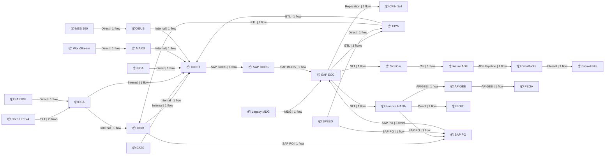

  <h1 style="font-size:36px; margin-top:24px;">Finance Plan To Report (FPR)</h1>
  <h2 style="font-size:24px;">TOGAF BDAT — Systems Integration Summary</h2>
  
Tower: Finance Plan To Report (FPR) · R1 – R5

  
IAO Program · R1 – R5 
  Generated: April 2026 
  Sajiv Francis

  
IAO Architecture Pipeline — Intel Confidential

Page 1<a href="#toc">↑ Back to TOC</a>Finance Plan To Report (FPR)

## Table of Contents

- [1. Executive Summary](#1-executive-summary)
- [2. Capability Inventory](#2-capability-inventory)
- [3. Current-State Architecture](#3-current-state-architecture)
   - [3.1 System Integration Map](#31-system-integration-map)
   - [3.2 ArchiMate Application View](#32-archimate-application-view)
   - [3.3 Data Entities](#33-data-entities)
   - [3.4 Integration Patterns](#34-integration-patterns)
   - [3.5 Technology Stack](#35-technology-stack)
- [4. Future-State Architecture](#4-future-state-architecture)
   - [4.1 System Integration Map](#41-system-integration-map)
   - [4.2 ArchiMate Application View](#42-archimate-application-view)
   - [4.3 Data Entities](#43-data-entities)
   - [4.4 Integration Patterns](#44-integration-patterns)
   - [4.5 Technology Stack](#45-technology-stack)
- [5. Transformation Analysis](#5-transformation-analysis)
   - [5.1 System Landscape Changes](#51-system-landscape-changes)
   - [5.2 Integration Complexity](#52-integration-complexity)
- [6. System Inventory](#6-system-inventory)

Page 2<a href="#toc">↑ Back to TOC</a>Finance Plan To Report (FPR)

## 1 Executive Summary

This document provides a **L0** summary view of the systems architecture for **Tower: Finance Plan To Report (FPR) · R1 – R5**.

| Metric | Current-State | Future-State | Delta |
|--------|:---:|:---:|:---:|
| **Unique Systems** | 26 | 42 | +16 |
| **System Connections** | 31 | 53 | +22 |
| **Total Flow Hops** | 36 | 114 | +78 |
| **Capabilities Covered** | 19 | 19 | — |

Page 3<a href="#toc">↑ Back to TOC</a>Finance Plan To Report (FPR)

## 2 Capability Inventory

The following **19** capabilities are aggregated in this summary.
Click a capability ID to view its full TOGAF BDAT architecture document.

| # | Capability ID | Capability Name | L1 Process Group | Current Hops | Future Hops |
|:---:|:---:|---|---|:---:|:---:|
| 1 | [DC-010](towers/FPR/DC Manage Accounting and Control Data/DC-010/output/docs/systems-architecture/DC-010-Architecture.html) | Perform Transaction Processing | DC Manage Accounting and Control Data | 0 | 0 |
| 2 | [DC-020](towers/FPR/DC Manage Accounting and Control Data/DC-020/output/docs/systems-architecture/DC-020-Architecture.html) | Manage the General Ledger | DC Manage Accounting and Control Data | 0 | 0 |
| 3 | [DC-030](towers/FPR/DC Manage Accounting and Control Data/DC-030/output/docs/systems-architecture/DC-030-Architecture.html) | Perform Closing | DC Manage Accounting and Control Data | 0 | 0 |
| 4 | [DC-040](towers/FPR/DC Manage Accounting and Control Data/DC-040/output/docs/systems-architecture/DC-040-Architecture.html) | Perform Fixed Asset Accounting | DC Manage Accounting and Control Data | 0 | 0 |
| 5 | [DC-050](towers/FPR/DC Manage Accounting and Control Data/DC-050/output/docs/systems-architecture/DC-050-Architecture.html) | Project Accounting | DC Manage Accounting and Control Data | 0 | 0 |
| 6 | [DC-060](towers/FPR/DC Manage Accounting and Control Data/DC-060/output/docs/systems-architecture/DC-060-Architecture.html) | Manage Taxes | DC Manage Accounting and Control Data | 0 | 0 |
| 7 | [DC-100](towers/FPR/DC Manage Accounting and Control Data/DC-100/output/docs/systems-architecture/DC-100-Architecture.html) | Revenue Recognition | DC Manage Accounting and Control Data | 0 | 0 |
| 8 | [DC-110](towers/FPR/DC Manage Accounting and Control Data/DC-110/output/docs/systems-architecture/DC-110-Architecture.html) | Manage Intercompany | DC Manage Accounting and Control Data | 0 | 0 |
| 9 | [DC-120](towers/FPR/DC Manage Accounting and Control Data/DC-120/output/docs/systems-architecture/DC-120-Architecture.html) | Maintenance & Management Accounting | DC Manage Accounting and Control Data | 0 | 0 |
| 10 | [DS-010](towers/FPR/DS Provide Decision Support/DS-010/output/docs/systems-architecture/DS-010-Architecture.html) | Perform Overhead Accounting and Allocation | DS Provide Decision Support | 0 | 0 |
| 11 | [DS-020](towers/FPR/DS Provide Decision Support/DS-020/output/docs/systems-architecture/DS-020-Architecture.html) | Perform Product Costing and Inventory Valuation | DS Provide Decision Support | 36 | 114 |
| 12 | [DS-030](towers/FPR/DS Provide Decision Support/DS-030/output/docs/systems-architecture/DS-030-Architecture.html) | Perform Customer and Product Profitability Analysis | DS Provide Decision Support | 0 | 0 |
| 13 | [MB-060](towers/FPR/MB Plan and Manage Business/MB-060/output/docs/systems-architecture/MB-060-Architecture.html) | Plan the Business | MB Plan and Manage Business | 0 | 0 |
| 14 | [MB-070](towers/FPR/MB Plan and Manage Business/MB-070/output/docs/systems-architecture/MB-070-Architecture.html) | Prepare Budgets | MB Plan and Manage Business | 0 | 0 |
| 15 | [MR-010](towers/FPR/MR Manage Capital and Risk/MR-010/output/docs/systems-architecture/MR-010-Architecture.html) | Manage Liquidity | MR Manage Capital and Risk | 0 | 0 |
| 16 | [MR-020](towers/FPR/MR Manage Capital and Risk/MR-020/output/docs/systems-architecture/MR-020-Architecture.html) | Manage Capital Structure | MR Manage Capital and Risk | 0 | 0 |
| 17 | [MR-030](towers/FPR/MR Manage Capital and Risk/MR-030/output/docs/systems-architecture/MR-030-Architecture.html) | Manage Financial Risk | MR Manage Capital and Risk | 0 | 0 |
| 18 | [MR-070](towers/FPR/MR Manage Capital and Risk/MR-070/output/docs/systems-architecture/MR-070-Architecture.html) | In-House Banking | MR Manage Capital and Risk | 0 | 0 |
| 19 | [OR-140](towers/FPR/OR Receivables Management/OR-140/output/docs/systems-architecture/OR-140-Architecture.html) | Process Receipts | OR Receivables Management | 0 | 0 |

Page 4<a href="#toc">↑ Back to TOC</a>Finance Plan To Report (FPR)

## 3 Current-State Architecture

Aggregated current-state view of **26** systems with **31** unique connections across **36** flow hops.

Page 5<a href="#toc">↑ Back to TOC</a>Finance Plan To Report (FPR)

### 3.1 System Integration Map

Page 6<a href="#toc">↑ Back to TOC</a>Finance Plan To Report (FPR)

### 3.2 ArchiMate Application View

```mermaid
graph TB
    %% -- ArchiMate-inspired style classes --
    classDef business      fill:#FFFFB5,stroke:#B8860B,stroke-width:2px,color:#000
    classDef app           fill:#B5FFFF,stroke:#0077B6,stroke-width:2px,color:#000
    classDef data          fill:#B5D8FF,stroke:#0077B6,stroke-width:1px,color:#000,stroke-dasharray: 5 5
    classDef middleware    fill:#FFD6A5,stroke:#E76F00,stroke-width:2px,color:#000
    classDef eol           fill:#FFB5B5,stroke:#CC0000,stroke-width:2px,color:#000

    subgraph AL["📦 Application Layer — Systems Integration"]
        direction LR
        SCA_APIGEE["📦 APIGEE"]
        SCA_Azure_ADF["📦 Azure ADF"]
        SCA_BOBJ["📦 BOBJ"]
        SCA_CFIN_S_4["📦 CFIN S/4"]
        SCA_CIBR["📦 CIBR"]
        SCA_Corp___IP_S_4["📦 Corp / IP S/4"]
        SCA_DataBricks["📦 DataBricks"]
        SCA_EATS["📦 EATS"]
        SCA_ECA["📦 ECA"]
        SCA_EDW["📦 EDW"]
        SCA_FCA["📦 FCA"]
        SCA_Finance_HANA["📦 Finance HANA"]
        SCA_ICOST["📦 ICOST"]
        SCA_Legacy_MDG["📦 Legacy MDG"]
        SCA_MARS["📦 MARS"]
        SCA_MES_300["📦 MES 300"]
        SCA_PEGA["📦 PEGA"]
        SCA_SAP_BODS["📦 SAP BODS"]
        SCA_SAP_ECC["📦 SAP ECC"]
        SCA_SAP_IBP["📦 SAP IBP"]
        SCA_SAP_PO["📦 SAP PO"]
        SCA_SPEED["📦 SPEED"]
        SCA_SideCar["📦 SideCar"]
        SCA_SnowFlake["📦 SnowFlake"]
        SCA_WorkStream["📦 WorkStream"]
        SCA_XEUS["📦 XEUS"]
    end

    SCA_APIGEE -->|"APIGEE"| SCA_PEGA
    SCA_Azure_ADF -->|"ADF Pipeline"| SCA_DataBricks
    SCA_CIBR -->|"Internal"| SCA_ICOST
    SCA_CIBR -->|"SAP PO"| SCA_SAP_PO
    SCA_Corp___IP_S_4 -->|"SLT"| SCA_ECA
    SCA_DataBricks -->|"Internal"| SCA_SnowFlake
    SCA_EATS -->|"Internal"| SCA_ICOST
    SCA_ECA -->|"Internal"| SCA_CIBR
    SCA_ECA -->|"Internal"| SCA_ICOST
    SCA_EDW -->|"ETL"| SCA_CIBR
    SCA_EDW -->|"ETL"| SCA_ICOST
    SCA_FCA -->|"Direct"| SCA_ICOST
    SCA_Finance_HANA -->|"APIGEE"| SCA_APIGEE
    SCA_Finance_HANA -->|"Direct"| SCA_BOBJ
    SCA_Finance_HANA -->|"SAP PO"| SCA_SAP_PO
    SCA_ICOST -->|"SAP BODS"| SCA_SAP_BODS
    SCA_Legacy_MDG -->|"MDG"| SCA_SAP_ECC
    SCA_MARS -->|"Internal"| SCA_ICOST
    SCA_MES_300 -->|"Direct"| SCA_XEUS
    SCA_SAP_BODS -->|"SAP BODS"| SCA_SAP_ECC
    SCA_SAP_ECC -->|"Replication"| SCA_CFIN_S_4
    SCA_SAP_ECC -->|"ETL"| SCA_EDW
    SCA_SAP_ECC -->|"SLT"| SCA_Finance_HANA
    SCA_SAP_ECC -->|"SLT"| SCA_SideCar
    SCA_SAP_IBP -->|"Direct"| SCA_ECA
    SCA_SAP_PO -->|"SAP PO"| SCA_SAP_ECC
    SCA_SPEED -->|"Direct"| SCA_EDW
    SCA_SPEED -->|"SAP PO"| SCA_SAP_PO
    SCA_SideCar -->|"CIF"| SCA_Azure_ADF
    SCA_WorkStream -->|"Direct"| SCA_MARS
    SCA_XEUS -->|"Internal"| SCA_ICOST

    class SCA_APIGEE app
    class SCA_Azure_ADF app
    class SCA_BOBJ app
    class SCA_CFIN_S_4 app
    class SCA_CIBR app
    class SCA_Corp___IP_S_4 app
    class SCA_DataBricks app
    class SCA_EATS app
    class SCA_ECA app
    class SCA_EDW app
    class SCA_FCA app
    class SCA_Finance_HANA app
    class SCA_ICOST app
    class SCA_Legacy_MDG app
    class SCA_MARS app
    class SCA_MES_300 app
    class SCA_PEGA app
    class SCA_SAP_BODS app
    class SCA_SAP_ECC app
    class SCA_SAP_IBP app
    class SCA_SAP_PO app
    class SCA_SPEED app
    class SCA_SideCar app
    class SCA_SnowFlake app
    class SCA_WorkStream app
    class SCA_XEUS app
    style BL fill:#FFFFF0,stroke:#B8860B,stroke-width:2px
    style AL fill:#F0FFFF,stroke:#0077B6,stroke-width:2px
```

Page 7<a href="#toc">↑ Back to TOC</a>Finance Plan To Report (FPR)

### 3.3 Data Entities

*No data entity information in current-state flows.*

Page 8<a href="#toc">↑ Back to TOC</a>Finance Plan To Report (FPR)

### 3.4 Integration Patterns

*No integration pattern information in current-state flows.*

Page 9<a href="#toc">↑ Back to TOC</a>Finance Plan To Report (FPR)

### 3.5 Technology Stack

*No technology platform information in current-state flows.*

Page 10<a href="#toc">↑ Back to TOC</a>Finance Plan To Report (FPR)

## 4 Future-State Architecture

Aggregated future-state view of **42** systems with **53** unique connections across **114** flow hops.

Page 11<a href="#toc">↑ Back to TOC</a>Finance Plan To Report (FPR)

### 4.1 System Integration Map

```mermaid
graph LR
    SF_ATCR["📦 ATCR"]
    SF_CFIN_S_4_HANA["📦 CFIN S/4 HANA"]
    SF_Capacity_Forecast_Data_Store["📦 Capacity Forecast Data Store"]
    SF_Corp___IP_S_4_HANA["📦 Corp / IP S/4 HANA"]
    SF_DMOCR["📦 DMOCR"]
    SF_DXCR["📦 DXCR"]
    SF_ECA_ADLS["📦 ECA-ADLS"]
    SF_ECA_DataBricks["📦 ECA-DataBricks"]
    SF_ECA_SnowFlake["📦 ECA-SnowFlake"]
    SF_ECM__Windchill_["📦 ECM (Windchill)"]
    SF_FCS["📦 FCS"]
    SF_GraphiteConnect["📦 GraphiteConnect"]
    SF_ICS__Phoenix_["📦 ICS (Phoenix)"]
    SF_IF_Blue_Yonder["📦 IF Blue Yonder"]
    SF_IF_PDH_Consumptional["📦 IF PDH Consumptional"]
    SF_IF_PDH_Foundational["📦 IF PDH Foundational"]
    SF_IF_PDH_Raw["📦 IF PDH Raw"]
    SF_IF_S_4_HANA["📦 IF S/4 HANA"]
    SF_IP_Blue_Yonder["📦 IP Blue Yonder"]
    SF_IP_PDH_Consumptional["📦 IP PDH Consumptional"]
    SF_IP_PDH_Foundational["📦 IP PDH Foundational"]
    SF_IP_PDH_Raw["📦 IP PDH Raw"]
    SF_MARS["📦 MARS"]
    SF_MES_300["📦 MES 300"]
    SF_PDF_SMH["📦 PDF-SMH"]
    SF_PDH_Consumptional["📦 PDH Consumptional"]
    SF_PDH_Foundational["📦 PDH Foundational"]
    SF_PDH_Raw["📦 PDH Raw"]
    SF_PDM_Translator["📦 PDM Translator"]
    SF_Power_BI__DARC_["📦 Power BI (DARC)"]
    SF_SAP_Ariba["📦 SAP Ariba"]
    SF_SAP_BOBJ["📦 SAP BOBJ"]
    SF_SAP_IBP["📦 SAP IBP"]
    SF_SAP_PAPM["📦 SAP PAPM"]
    SF_SAP_S_4_MDG["📦 SAP S/4 MDG"]
    SF_SAP_SAC["📦 SAP SAC"]
    SF_SCS["📦 SCS"]
    SF_SPEED["📦 SPEED"]
    SF_SideCar["📦 SideCar"]
    SF_WSPW["📦 WSPW"]
    SF_WorkStream["📦 WorkStream"]
    SF_XEUS["📦 XEUS"]

    SF_ATCR -->|"Direct | 1 flow"| SF_Capacity_Forecast_Data_Store
    SF_CFIN_S_4_HANA -->|"SLT | 1 flow"| SF_SideCar
    SF_Capacity_Forecast_Data_Store -->|"ADF / DB Unity Catalog / Third Party (e.g., Denodo) | 6 flows"| SF_ECA_ADLS
    SF_Corp___IP_S_4_HANA -->|"SLT | 1 flow"| SF_SideCar
    SF_DMOCR -->|"Direct | 1 flow"| SF_Capacity_Forecast_Data_Store
    SF_DXCR -->|"Direct | 1 flow"| SF_Capacity_Forecast_Data_Store
    SF_ECA_ADLS -->|"Unity Catalog | 8 flows"| SF_ECA_DataBricks
    SF_ECA_DataBricks -->|"Snowflake Connector / Snowpipe | 8 flows"| SF_ECA_SnowFlake
    SF_ECA_SnowFlake -->|"MuleSoft/BODS | 1 flow"| SF_CFIN_S_4_HANA
    SF_ECA_SnowFlake -->|"MuleSoft/BODS | 2 flows"| SF_Corp___IP_S_4_HANA
    SF_ECA_SnowFlake -->|"MuleSoft/BODS | 9 flows"| SF_IF_S_4_HANA
    SF_ECA_SnowFlake -->|"Snowflake Connector / Snowpipe | 1 flow"| SF_Power_BI__DARC_
    SF_ECA_SnowFlake -->|"Remote Function Adapter / MuleSoft / SAP Integration Suite | 5 flows"| SF_SAP_PAPM
    SF_ECM__Windchill_ -->|"PDM Translator | 1 flow"| SF_PDM_Translator
    SF_FCS -->|"Direct | 1 flow"| SF_Capacity_Forecast_Data_Store
    SF_GraphiteConnect -->|"MuleSoft & Reltio | 1 flow"| SF_SAP_S_4_MDG
    SF_ICS__Phoenix_ -->|"Direct | 1 flow"| SF_Capacity_Forecast_Data_Store
    SF_IF_Blue_Yonder -->|"ADF / DB Unity Catalog / Connectors /Third Party (e.g., APIs with Mule) | 3 flows"| SF_IF_PDH_Raw
    SF_IF_PDH_Consumptional -->|"Snowflake Connector / Snowpipe | 5 flows"| SF_ECA_SnowFlake
    SF_IF_PDH_Foundational -->|"Unity Catalog | 5 flows"| SF_IF_PDH_Consumptional
    SF_IF_PDH_Raw -->|"ADF / DB Unity Catalog / Third Party (e.g., Denodo) | 5 flows"| SF_IF_PDH_Foundational
    SF_IF_S_4_HANA -->|"SLT | 2 flows"| SF_CFIN_S_4_HANA
    SF_IF_S_4_HANA -->|"SLT | 1 flow"| SF_SideCar
    SF_IP_Blue_Yonder -->|"ADF / DB Unity Catalog / Connectors /Third Party (e.g., APIs with Mule) | 3 flows"| SF_IP_PDH_Raw
    SF_IP_PDH_Consumptional -->|"Snowflake Connector / Snowpipe | 2 flows"| SF_ECA_SnowFlake
    SF_IP_PDH_Foundational -->|"Unity Catalog | 2 flows"| SF_IP_PDH_Consumptional
    SF_IP_PDH_Raw -->|"ADF / DB Unity Catalog / Third Party (e.g., Denodo) | 2 flows"| SF_IP_PDH_Foundational
    SF_MARS -->|"Direct | 1 flow"| SF_PDF_SMH
    SF_MES_300 -->|"Direct | 1 flow"| SF_XEUS
    SF_PDF_SMH -->|"EAI Connector | 2 flows"| SF_IF_S_4_HANA
    SF_PDH_Consumptional -->|"Snowflake Connector / Snowpipe | 1 flow"| SF_ECA_SnowFlake
    SF_PDH_Foundational -->|"Unity Catalog | 1 flow"| SF_IP_PDH_Consumptional
    SF_PDH_Raw -->|"ADF / DB Unity Catalog / Third Party (e.g., Denodo) | 1 flow"| SF_IP_PDH_Foundational
    SF_PDM_Translator -->|"PDM Translator | 2 flows"| SF_SAP_S_4_MDG
    SF_SAP_Ariba -->|"Apigee / MuleSoft | 1 flow"| SF_Corp___IP_S_4_HANA
    SF_SAP_Ariba -->|"Apigee / MuleSoft | 1 flow"| SF_IF_S_4_HANA
    SF_SAP_IBP -->|"ADF / DB Unity Catalog / Connectors /Third Party (e.g., APIs with Mule) | 2 flows"| SF_IF_PDH_Raw
    SF_SAP_PAPM -->|"SAP Integration Suite / Smart Data Integration/BTP Destinations (HTTP) | 1 flow"| SF_Corp___IP_S_4_HANA
    SF_SAP_PAPM -->|"SAP Integration Suite / Smart Data Integration/BTP Destinations (HTTP) | 1 flow"| SF_IF_S_4_HANA
    SF_SAP_S_4_MDG -->|"DRF (Data Replication Framework) with Web Services (SOAP/File/Idoc/RFC) | 3 flows"| SF_Corp___IP_S_4_HANA
    SF_SAP_S_4_MDG -->|"DRF (Data Replication Framework) with Web Services (SOAP/File/Idoc/RFC) | 3 flows"| SF_IF_S_4_HANA
    SF_SAP_SAC -->|"SAP Odata services with connector | 1 flow"| SF_CFIN_S_4_HANA
    SF_SAP_SAC -->|"SAP Odata services with connector | 1 flow"| SF_Corp___IP_S_4_HANA
    SF_SAP_SAC -->|"SAC Data Export Service (API) - Direct Write (Speed Layer in Snowflake / Use ADF / MuleSoft for DataBricks | 3 flows"| SF_ECA_SnowFlake
    SF_SAP_SAC -->|"SAP Odata services with connector | 1 flow"| SF_IF_S_4_HANA
    SF_SCS -->|"Direct | 1 flow"| SF_Capacity_Forecast_Data_Store
    SF_SPEED -->|"ADF Rest API / SFTP(Blob) | 1 flow"| SF_ECA_ADLS
    SF_SPEED -->|"PDM Translator | 1 flow"| SF_PDM_Translator
    SF_SideCar -->|"ADF Rest API / SFTP(Blob) | 1 flow"| SF_ECA_ADLS
    SF_SideCar -->|"1 flow"| SF_SAP_BOBJ
    SF_WSPW -->|"Direct | 1 flow"| SF_ECA_SnowFlake
    SF_WorkStream -->|"Direct | 1 flow"| SF_MARS
    SF_XEUS -->|"Direct | 1 flow"| SF_PDF_SMH
```

Page 12<a href="#toc">↑ Back to TOC</a>Finance Plan To Report (FPR)

### 4.2 ArchiMate Application View

```mermaid
graph TB
    %% -- ArchiMate-inspired style classes --
    classDef business      fill:#FFFFB5,stroke:#B8860B,stroke-width:2px,color:#000
    classDef app           fill:#B5FFFF,stroke:#0077B6,stroke-width:2px,color:#000
    classDef data          fill:#B5D8FF,stroke:#0077B6,stroke-width:1px,color:#000,stroke-dasharray: 5 5
    classDef middleware    fill:#FFD6A5,stroke:#E76F00,stroke-width:2px,color:#000
    classDef eol           fill:#FFB5B5,stroke:#CC0000,stroke-width:2px,color:#000

    subgraph AL["📦 Application Layer — Systems Integration"]
        direction LR
        SFA_ATCR["📦 ATCR"]
        SFA_CFIN_S_4_HANA["📦 CFIN S/4 HANA"]
        SFA_Capacity_Forecast_Data_Store["📦 Capacity Forecast Data Store"]
        SFA_Corp___IP_S_4_HANA["📦 Corp / IP S/4 HANA"]
        SFA_DMOCR["📦 DMOCR"]
        SFA_DXCR["📦 DXCR"]
        SFA_ECA_ADLS["📦 ECA-ADLS"]
        SFA_ECA_DataBricks["📦 ECA-DataBricks"]
        SFA_ECA_SnowFlake["📦 ECA-SnowFlake"]
        SFA_ECM__Windchill_["📦 ECM (Windchill)"]
        SFA_FCS["📦 FCS"]
        SFA_GraphiteConnect["📦 GraphiteConnect"]
        SFA_ICS__Phoenix_["📦 ICS (Phoenix)"]
        SFA_IF_Blue_Yonder["📦 IF Blue Yonder"]
        SFA_IF_PDH_Consumptional["📦 IF PDH Consumptional"]
        SFA_IF_PDH_Foundational["📦 IF PDH Foundational"]
        SFA_IF_PDH_Raw["📦 IF PDH Raw"]
        SFA_IF_S_4_HANA["📦 IF S/4 HANA"]
        SFA_IP_Blue_Yonder["📦 IP Blue Yonder"]
        SFA_IP_PDH_Consumptional["📦 IP PDH Consumptional"]
        SFA_IP_PDH_Foundational["📦 IP PDH Foundational"]
        SFA_IP_PDH_Raw["📦 IP PDH Raw"]
        SFA_MARS["📦 MARS"]
        SFA_MES_300["📦 MES 300"]
        SFA_PDF_SMH["📦 PDF-SMH"]
        SFA_PDH_Consumptional["📦 PDH Consumptional"]
        SFA_PDH_Foundational["📦 PDH Foundational"]
        SFA_PDH_Raw["📦 PDH Raw"]
        SFA_PDM_Translator["📦 PDM Translator"]
        SFA_Power_BI__DARC_["📦 Power BI (DARC)"]
        SFA_SAP_Ariba["📦 SAP Ariba"]
        SFA_SAP_BOBJ["📦 SAP BOBJ"]
        SFA_SAP_IBP["📦 SAP IBP"]
        SFA_SAP_PAPM["📦 SAP PAPM"]
        SFA_SAP_S_4_MDG["📦 SAP S/4 MDG"]
        SFA_SAP_SAC["📦 SAP SAC"]
        SFA_SCS["📦 SCS"]
        SFA_SPEED["📦 SPEED"]
        SFA_SideCar["📦 SideCar"]
        SFA_WSPW["📦 WSPW"]
        SFA_WorkStream["📦 WorkStream"]
        SFA_XEUS["📦 XEUS"]
    end

    SFA_ATCR -->|"Direct"| SFA_Capacity_Forecast_Data_Store
    SFA_CFIN_S_4_HANA -->|"SLT"| SFA_SideCar
    SFA_Capacity_Forecast_Data_Store -->|"ADF / DB Unity Catalog / Third Party (e.g., Denodo)"| SFA_ECA_ADLS
    SFA_Corp___IP_S_4_HANA -->|"SLT"| SFA_SideCar
    SFA_DMOCR -->|"Direct"| SFA_Capacity_Forecast_Data_Store
    SFA_DXCR -->|"Direct"| SFA_Capacity_Forecast_Data_Store
    SFA_ECA_ADLS -->|"Unity Catalog"| SFA_ECA_DataBricks
    SFA_ECA_DataBricks -->|"Snowflake Connector / Snowpipe"| SFA_ECA_SnowFlake
    SFA_ECA_SnowFlake -->|"MuleSoft/BODS"| SFA_CFIN_S_4_HANA
    SFA_ECA_SnowFlake -->|"MuleSoft/BODS"| SFA_Corp___IP_S_4_HANA
    SFA_ECA_SnowFlake -->|"MuleSoft/BODS"| SFA_IF_S_4_HANA
    SFA_ECA_SnowFlake -->|"Snowflake Connector / Snowpipe"| SFA_Power_BI__DARC_
    SFA_ECA_SnowFlake -->|"Remote Function Adapter / MuleSoft / SAP Integration Suite"| SFA_SAP_PAPM
    SFA_ECM__Windchill_ -->|"PDM Translator"| SFA_PDM_Translator
    SFA_FCS -->|"Direct"| SFA_Capacity_Forecast_Data_Store
    SFA_GraphiteConnect -->|"MuleSoft & Reltio"| SFA_SAP_S_4_MDG
    SFA_ICS__Phoenix_ -->|"Direct"| SFA_Capacity_Forecast_Data_Store
    SFA_IF_Blue_Yonder -->|"ADF / DB Unity Catalog / Connectors /Third Party (e.g., APIs with Mule)"| SFA_IF_PDH_Raw
    SFA_IF_PDH_Consumptional -->|"Snowflake Connector / Snowpipe"| SFA_ECA_SnowFlake
    SFA_IF_PDH_Foundational -->|"Unity Catalog"| SFA_IF_PDH_Consumptional
    SFA_IF_PDH_Raw -->|"ADF / DB Unity Catalog / Third Party (e.g., Denodo)"| SFA_IF_PDH_Foundational
    SFA_IF_S_4_HANA -->|"SLT"| SFA_CFIN_S_4_HANA
    SFA_IF_S_4_HANA -->|"SLT"| SFA_SideCar
    SFA_IP_Blue_Yonder -->|"ADF / DB Unity Catalog / Connectors /Third Party (e.g., APIs with Mule)"| SFA_IP_PDH_Raw
    SFA_IP_PDH_Consumptional -->|"Snowflake Connector / Snowpipe"| SFA_ECA_SnowFlake
    SFA_IP_PDH_Foundational -->|"Unity Catalog"| SFA_IP_PDH_Consumptional
    SFA_IP_PDH_Raw -->|"ADF / DB Unity Catalog / Third Party (e.g., Denodo)"| SFA_IP_PDH_Foundational
    SFA_MARS -->|"Direct"| SFA_PDF_SMH
    SFA_MES_300 -->|"Direct"| SFA_XEUS
    SFA_PDF_SMH -->|"EAI Connector"| SFA_IF_S_4_HANA
    SFA_PDH_Consumptional -->|"Snowflake Connector / Snowpipe"| SFA_ECA_SnowFlake
    SFA_PDH_Foundational -->|"Unity Catalog"| SFA_IP_PDH_Consumptional
    SFA_PDH_Raw -->|"ADF / DB Unity Catalog / Third Party (e.g., Denodo)"| SFA_IP_PDH_Foundational
    SFA_PDM_Translator -->|"PDM Translator"| SFA_SAP_S_4_MDG
    SFA_SAP_Ariba -->|"Apigee / MuleSoft"| SFA_Corp___IP_S_4_HANA
    SFA_SAP_Ariba -->|"Apigee / MuleSoft"| SFA_IF_S_4_HANA
    SFA_SAP_IBP -->|"ADF / DB Unity Catalog / Connectors /Third Party (e.g., APIs with Mule)"| SFA_IF_PDH_Raw
    SFA_SAP_PAPM -->|"SAP Integration Suite / Smart Data Integration/BTP Destinations (HTTP)"| SFA_Corp___IP_S_4_HANA
    SFA_SAP_PAPM -->|"SAP Integration Suite / Smart Data Integration/BTP Destinations (HTTP)"| SFA_IF_S_4_HANA
    SFA_SAP_S_4_MDG -->|"DRF (Data Replication Framework) with Web Services (SOAP/File/Idoc/RFC)"| SFA_Corp___IP_S_4_HANA
    SFA_SAP_S_4_MDG -->|"DRF (Data Replication Framework) with Web Services (SOAP/File/Idoc/RFC)"| SFA_IF_S_4_HANA
    SFA_SAP_SAC -->|"SAP Odata services with connector"| SFA_CFIN_S_4_HANA
    SFA_SAP_SAC -->|"SAP Odata services with connector"| SFA_Corp___IP_S_4_HANA
    SFA_SAP_SAC -->|"SAC Data Export Service (API) - Direct Write (Speed Layer in Snowflake / Use ADF / MuleSoft for DataBricks"| SFA_ECA_SnowFlake
    SFA_SAP_SAC -->|"SAP Odata services with connector"| SFA_IF_S_4_HANA
    SFA_SCS -->|"Direct"| SFA_Capacity_Forecast_Data_Store
    SFA_SPEED -->|"ADF Rest API / SFTP(Blob)"| SFA_ECA_ADLS
    SFA_SPEED -->|"PDM Translator"| SFA_PDM_Translator
    SFA_SideCar -->|"ADF Rest API / SFTP(Blob)"| SFA_ECA_ADLS
    SFA_SideCar -->|"1×"| SFA_SAP_BOBJ
    SFA_WSPW -->|"Direct"| SFA_ECA_SnowFlake
    SFA_WorkStream -->|"Direct"| SFA_MARS
    SFA_XEUS -->|"Direct"| SFA_PDF_SMH

    class SFA_ATCR app
    class SFA_CFIN_S_4_HANA app
    class SFA_Capacity_Forecast_Data_Store app
    class SFA_Corp___IP_S_4_HANA app
    class SFA_DMOCR app
    class SFA_DXCR app
    class SFA_ECA_ADLS app
    class SFA_ECA_DataBricks app
    class SFA_ECA_SnowFlake app
    class SFA_ECM__Windchill_ app
    class SFA_FCS app
    class SFA_GraphiteConnect app
    class SFA_ICS__Phoenix_ app
    class SFA_IF_Blue_Yonder app
    class SFA_IF_PDH_Consumptional app
    class SFA_IF_PDH_Foundational app
    class SFA_IF_PDH_Raw app
    class SFA_IF_S_4_HANA app
    class SFA_IP_Blue_Yonder app
    class SFA_IP_PDH_Consumptional app
    class SFA_IP_PDH_Foundational app
    class SFA_IP_PDH_Raw app
    class SFA_MARS app
    class SFA_MES_300 app
    class SFA_PDF_SMH app
    class SFA_PDH_Consumptional app
    class SFA_PDH_Foundational app
    class SFA_PDH_Raw app
    class SFA_PDM_Translator app
    class SFA_Power_BI__DARC_ app
    class SFA_SAP_Ariba app
    class SFA_SAP_BOBJ app
    class SFA_SAP_IBP app
    class SFA_SAP_PAPM app
    class SFA_SAP_S_4_MDG app
    class SFA_SAP_SAC app
    class SFA_SCS app
    class SFA_SPEED app
    class SFA_SideCar app
    class SFA_WSPW app
    class SFA_WorkStream app
    class SFA_XEUS app
    style BL fill:#FFFFF0,stroke:#B8860B,stroke-width:2px
    style AL fill:#F0FFFF,stroke:#0077B6,stroke-width:2px
```

Page 13<a href="#toc">↑ Back to TOC</a>Finance Plan To Report (FPR)

### 4.3 Data Entities

*No data entity information in future-state flows.*

Page 14<a href="#toc">↑ Back to TOC</a>Finance Plan To Report (FPR)

### 4.4 Integration Patterns

*No integration pattern information in future-state flows.*

Page 15<a href="#toc">↑ Back to TOC</a>Finance Plan To Report (FPR)

### 4.5 Technology Stack

*No technology platform information in future-state flows.*

Page 16<a href="#toc">↑ Back to TOC</a>Finance Plan To Report (FPR)

## 5 Transformation Analysis

Page 17<a href="#toc">↑ Back to TOC</a>Finance Plan To Report (FPR)

### 5.1 System Landscape Changes

**New Systems (35):** ATCR, CFIN S/4 HANA, Capacity Forecast Data Store, Corp / IP S/4 HANA, DMOCR, DXCR, ECA-ADLS, ECA-DataBricks, ECA-SnowFlake, ECM (Windchill), FCS, GraphiteConnect, ICS (Phoenix), IF Blue Yonder, IF PDH Consumptional, IF PDH Foundational, IF PDH Raw, IF S/4 HANA, IP Blue Yonder, IP PDH Consumptional, IP PDH Foundational, IP PDH Raw, PDF-SMH, PDH Consumptional, PDH Foundational, PDH Raw, PDM Translator, Power BI (DARC), SAP Ariba, SAP BOBJ, SAP PAPM, SAP S/4 MDG, SAP SAC, SCS, WSPW

**Retiring Systems (19):** APIGEE, Azure ADF, BOBJ, CFIN S/4, CIBR, Corp / IP S/4, DataBricks, EATS, ECA, EDW, FCA, Finance HANA, ICOST, Legacy MDG, PEGA, SAP BODS, SAP ECC, SAP PO, SnowFlake

**Continuing Systems:** 7

**New Connections (51):**

| Source | Target |
|---|---|
| ATCR | Capacity Forecast Data Store |
| CFIN S/4 HANA | SideCar |
| Capacity Forecast Data Store | ECA-ADLS |
| Corp / IP S/4 HANA | SideCar |
| DMOCR | Capacity Forecast Data Store |
| DXCR | Capacity Forecast Data Store |
| ECA-ADLS | ECA-DataBricks |
| ECA-DataBricks | ECA-SnowFlake |
| ECA-SnowFlake | CFIN S/4 HANA |
| ECA-SnowFlake | Corp / IP S/4 HANA |
| ECA-SnowFlake | IF S/4 HANA |
| ECA-SnowFlake | Power BI (DARC) |
| ECA-SnowFlake | SAP PAPM |
| ECM (Windchill) | PDM Translator |
| FCS | Capacity Forecast Data Store |
| GraphiteConnect | SAP S/4 MDG |
| ICS (Phoenix) | Capacity Forecast Data Store |
| IF Blue Yonder | IF PDH Raw |
| IF PDH Consumptional | ECA-SnowFlake |
| IF PDH Foundational | IF PDH Consumptional |
| IF PDH Raw | IF PDH Foundational |
| IF S/4 HANA | CFIN S/4 HANA |
| IF S/4 HANA | SideCar |
| IP Blue Yonder | IP PDH Raw |
| IP PDH Consumptional | ECA-SnowFlake |
| IP PDH Foundational | IP PDH Consumptional |
| IP PDH Raw | IP PDH Foundational |
| MARS | PDF-SMH |
| PDF-SMH | IF S/4 HANA |
| PDH Consumptional | ECA-SnowFlake |
| PDH Foundational | IP PDH Consumptional |
| PDH Raw | IP PDH Foundational |
| PDM Translator | SAP S/4 MDG |
| SAP Ariba | Corp / IP S/4 HANA |
| SAP Ariba | IF S/4 HANA |
| SAP IBP | IF PDH Raw |
| SAP PAPM | Corp / IP S/4 HANA |
| SAP PAPM | IF S/4 HANA |
| SAP S/4 MDG | Corp / IP S/4 HANA |
| SAP S/4 MDG | IF S/4 HANA |
| SAP SAC | CFIN S/4 HANA |
| SAP SAC | Corp / IP S/4 HANA |
| SAP SAC | ECA-SnowFlake |
| SAP SAC | IF S/4 HANA |
| SCS | Capacity Forecast Data Store |
| SPEED | ECA-ADLS |
| SPEED | PDM Translator |
| SideCar | ECA-ADLS |
| SideCar | SAP BOBJ |
| WSPW | ECA-SnowFlake |
| XEUS | PDF-SMH |

**Removed Connections (29):**

| Source | Target |
|---|---|
| APIGEE | PEGA |
| Azure ADF | DataBricks |
| CIBR | ICOST |
| CIBR | SAP PO |
| Corp / IP S/4 | ECA |
| DataBricks | SnowFlake |
| EATS | ICOST |
| ECA | CIBR |
| ECA | ICOST |
| EDW | CIBR |
| EDW | ICOST |
| FCA | ICOST |
| Finance HANA | APIGEE |
| Finance HANA | BOBJ |
| Finance HANA | SAP PO |
| ICOST | SAP BODS |
| Legacy MDG | SAP ECC |
| MARS | ICOST |
| SAP BODS | SAP ECC |
| SAP ECC | CFIN S/4 |
| SAP ECC | EDW |
| SAP ECC | Finance HANA |
| SAP ECC | SideCar |
| SAP IBP | ECA |
| SAP PO | SAP ECC |
| SPEED | EDW |
| SPEED | SAP PO |
| SideCar | Azure ADF |
| XEUS | ICOST |

Page 18<a href="#toc">↑ Back to TOC</a>Finance Plan To Report (FPR)

### 5.2 Integration Complexity

| System | Current Connections | Future Connections | Delta |
|---|:---:|:---:|:---:|
| APIGEE | 2 | 0 | -2 |
| ATCR | 0 | 1 | +1 |
| Azure ADF | 2 | 0 | -2 |
| BOBJ | 1 | 0 | -1 |
| CFIN S/4 | 1 | 0 | -1 |
| CFIN S/4 HANA | 0 | 4 | +4 |
| CIBR | 4 | 0 | -4 |
| Capacity Forecast Data Store | 0 | 7 | +7 |
| Corp / IP S/4 | 1 | 0 | -1 |
| Corp / IP S/4 HANA | 0 | 6 | +6 |
| DMOCR | 0 | 1 | +1 |
| DXCR | 0 | 1 | +1 |
| DataBricks | 2 | 0 | -2 |
| EATS | 1 | 0 | -1 |
| ECA | 4 | 0 | -4 |
| ECA-ADLS | 0 | 4 | +4 |
| ECA-DataBricks | 0 | 2 | +2 |
| ECA-SnowFlake | 0 | 11 | +11 |
| ECM (Windchill) | 0 | 1 | +1 |
| EDW | 4 | 0 | -4 |
| FCA | 1 | 0 | -1 |
| FCS | 0 | 1 | +1 |
| Finance HANA | 4 | 0 | -4 |
| GraphiteConnect | 0 | 1 | +1 |
| ICOST | 8 | 0 | -8 |
| ICS (Phoenix) | 0 | 1 | +1 |
| IF Blue Yonder | 0 | 1 | +1 |
| IF PDH Consumptional | 0 | 2 | +2 |
| IF PDH Foundational | 0 | 2 | +2 |
| IF PDH Raw | 0 | 3 | +3 |
| IF S/4 HANA | 0 | 8 | +8 |
| IP Blue Yonder | 0 | 1 | +1 |
| IP PDH Consumptional | 0 | 3 | +3 |
| IP PDH Foundational | 0 | 3 | +3 |
| IP PDH Raw | 0 | 2 | +2 |
| Legacy MDG | 1 | 0 | -1 |
| MARS | 2 | 2 | — |
| MES 300 | 1 | 1 | — |
| PDF-SMH | 0 | 3 | +3 |
| PDH Consumptional | 0 | 1 | +1 |
| PDH Foundational | 0 | 1 | +1 |
| PDH Raw | 0 | 1 | +1 |
| PDM Translator | 0 | 3 | +3 |
| PEGA | 1 | 0 | -1 |
| Power BI (DARC) | 0 | 1 | +1 |
| SAP Ariba | 0 | 2 | +2 |
| SAP BOBJ | 0 | 1 | +1 |
| SAP BODS | 2 | 0 | -2 |
| SAP ECC | 7 | 0 | -7 |
| SAP IBP | 1 | 1 | — |
| SAP PAPM | 0 | 3 | +3 |
| SAP PO | 4 | 0 | -4 |
| SAP S/4 MDG | 0 | 4 | +4 |
| SAP SAC | 0 | 4 | +4 |
| SCS | 0 | 1 | +1 |
| SPEED | 2 | 2 | — |
| SideCar | 2 | 5 | +3 |
| SnowFlake | 1 | 0 | -1 |
| WSPW | 0 | 1 | +1 |
| WorkStream | 1 | 1 | — |
| XEUS | 2 | 2 | — |

Page 19<a href="#toc">↑ Back to TOC</a>Finance Plan To Report (FPR)

## 6 System Inventory

| # | System | IAPM ID | Status |
|:---:|---|---|---|
| 1 | APIGEE | 22790 | Deployed |
| 2 | ATCR | - | N/A |
| 3 | Azure ADF | 25794 | Deployed |
| 4 | BOBJ | 17651 | Deployed |
| 5 | CFIN S/4 | 41052 | Deployed |
| 6 | CFIN S/4 HANA | 41052 | Deployed |
| 7 | CIBR | 237 | Deployed |
| 8 | Capacity Forecast Data Store | 37284 | Deployed |
| 9 | Corp / IP S/4 | 41363 | Developing |
| 10 | Corp / IP S/4 HANA | 41363 | Developing |
| 11 | DMOCR | 13284 | Deployed |
| 12 | DXCR | 13284 | Deployed |
| 13 | DataBricks | 41458 | Deployed |
| 14 | EATS | 119 | End of Life |
| 15 | ECA | 43119 | Deployed |
| 16 | ECA-ADLS | 43119 | Deployed |
| 17 | ECA-DataBricks | 43119 | Deployed |
| 18 | ECA-SnowFlake | 43119 | Deployed |
| 19 | ECM (Windchill) | 38775 | Deployed |
| 20 | EDW | 4010 | Deployed |
| 21 | FCA | 44990 | Deployed |
| 22 | FCS | 9297 | End of Life |
| 23 | Finance HANA | 42993 | Deployed |
| 24 | GraphiteConnect | 36398 | Deployed |
| 25 | ICOST | 9008 | Deployed |
| 26 | ICS (Phoenix) | 19477 | Deployed |
| 27 | IF Blue Yonder | 41040 | Deployed |
| 28 | IF PDH Consumptional | 40747 | Deployed |
| 29 | IF PDH Foundational | 40747 | Deployed |
| 30 | IF PDH Raw | 40747 | Deployed |
| 31 | IF S/4 HANA | 41363 | Developing |
| 32 | IP Blue Yonder | 41039 | Deployed |
| 33 | IP PDH Consumptional | 40750 | Developing |
| 34 | IP PDH Foundational | 40750 | Developing |
| 35 | IP PDH Raw | 40750 | Developing |
| 36 | Legacy MDG | 40068 | Deployed |
| 37 | MARS | 33537 | Deployed |
| 38 | MES 300 | 41275 | Deployed |
| 39 | PDF-SMH | 59283 | Developing |
| 40 | PDH Consumptional | 40747 | Deployed |
| 41 | PDH Foundational | 40747 | Deployed |
| 42 | PDH Raw | 40747 | Deployed |
| 43 | PDM Translator | - | N/A |
| 44 | PEGA | 43163 | Deployed |
| 45 | Power BI (DARC) | 63659 | Deployed |
| 46 | SAP Ariba | 19569 | Deployed |
| 47 | SAP BOBJ | 11377 | End of Life |
| 48 | SAP BODS | 19207 | Deployed |
| 49 | SAP ECC | 23736 | Deployed |
| 50 | SAP IBP | 40709 | Deployed |
| 51 | SAP PAPM | 41401 | Developing |
| 52 | SAP PO | 21195 | Deployed |
| 53 | SAP S/4 MDG | 40068 | Deployed |
| 54 | SAP SAC | 37401 | Deployed |
| 55 | SCS | 21327 | End of Life |
| 56 | SPEED | 31517 | Deployed |
| 57 | SideCar | 42993 | Deployed |
| 58 | SnowFlake | 35811 | Deployed |
| 59 | WSPW | 4119 | Deployed |
| 60 | WorkStream | 37871 | Deployed |
| 61 | XEUS | 35612 | Deployed |

