  <img src="data:image/svg+xml;base64,PHN2ZyB4bWxucz0iaHR0cDovL3d3dy53My5vcmcvMjAwMC9zdmciIHZpZXdCb3g9IjAgMCA4MDAgNDgwIiB3aWR0aD0iODAwIiBoZWlnaHQ9IjQ4MCI+DQogIDxkZWZzPg0KICAgIDxsaW5lYXJHcmFkaWVudCBpZD0iYmciIHgxPSIwJSIgeTE9IjAlIiB4Mj0iMTAwJSIgeTI9IjEwMCUiPg0KICAgICAgPHN0b3Agb2Zmc2V0PSIwJSIgc3R5bGU9InN0b3AtY29sb3I6IzAwNzFjNTtzdG9wLW9wYWNpdHk6MSIvPg0KICAgICAgPHN0b3Agb2Zmc2V0PSIxMDAlIiBzdHlsZT0ic3RvcC1jb2xvcjojMDBhZWVmO3N0b3Atb3BhY2l0eToxIi8+DQogICAgPC9saW5lYXJHcmFkaWVudD4NCiAgICA8bGluZWFyR3JhZGllbnQgaWQ9ImFjY2VudCIgeDE9IjAlIiB5MT0iMCUiIHgyPSIwJSIgeTI9IjEwMCUiPg0KICAgICAgPHN0b3Agb2Zmc2V0PSIwJSIgc3R5bGU9InN0b3AtY29sb3I6I2ZmZmZmZjtzdG9wLW9wYWNpdHk6MC4xNSIvPg0KICAgICAgPHN0b3Agb2Zmc2V0PSIxMDAlIiBzdHlsZT0ic3RvcC1jb2xvcjojZmZmZmZmO3N0b3Atb3BhY2l0eTowLjAyIi8+DQogICAgPC9saW5lYXJHcmFkaWVudD4NCiAgICA8cGF0dGVybiBpZD0iZ3JpZCIgd2lkdGg9IjQwIiBoZWlnaHQ9IjQwIiBwYXR0ZXJuVW5pdHM9InVzZXJTcGFjZU9uVXNlIj4NCiAgICAgIDxwYXRoIGQ9Ik0gNDAgMCBMIDAgMCAwIDQwIiBmaWxsPSJub25lIiBzdHJva2U9InJnYmEoMjU1LDI1NSwyNTUsMC4wNykiIHN0cm9rZS13aWR0aD0iMC41Ii8+DQogICAgPC9wYXR0ZXJuPg0KICA8L2RlZnM+DQoNCiAgPCEtLSBCYWNrZ3JvdW5kIC0tPg0KICA8cmVjdCB3aWR0aD0iODAwIiBoZWlnaHQ9IjQ4MCIgZmlsbD0idXJsKCNiZykiIHJ4PSI4Ii8+DQogIDxyZWN0IHdpZHRoPSI4MDAiIGhlaWdodD0iNDgwIiBmaWxsPSJ1cmwoI2dyaWQpIiByeD0iOCIvPg0KICA8cmVjdCB3aWR0aD0iODAwIiBoZWlnaHQ9IjQ4MCIgZmlsbD0idXJsKCNhY2NlbnQpIiByeD0iOCIvPg0KDQogIDwhLS0gRGVjb3JhdGl2ZSBjaXJjdWl0L2FyY2hpdGVjdHVyZSBsaW5lcyAtLT4NCiAgPGcgc3Ryb2tlPSJyZ2JhKDI1NSwyNTUsMjU1LDAuMTIpIiBzdHJva2Utd2lkdGg9IjEuNSIgZmlsbD0ibm9uZSI+DQogICAgPHBhdGggZD0iTSAwIDEwMCBMIDEyMCAxMDAgTCAxNjAgMTQwIEwgMjgwIDE0MCIvPg0KICAgIDxwYXRoIGQ9Ik0gMCAyNjAgTCA4MCAyNjAgTCAxMjAgMjIwIEwgMjAwIDIyMCBMIDI0MCAyNjAgTCAzNjAgMjYwIi8+DQogICAgPHBhdGggZD0iTSA1MjAgMTAwIEwgNjAwIDEwMCBMIDY0MCA2MCBMIDgwMCA2MCIvPg0KICAgIDxwYXRoIGQ9Ik0gNDQwIDM0MCBMIDU2MCAzNDAgTCA2MDAgMzAwIEwgNzIwIDMwMCBMIDc2MCAzNDAgTCA4MDAgMzQwIi8+DQogICAgPHBhdGggZD0iTSA2MDAgNDAwIEwgNjgwIDQwMCBMIDcyMCA0NDAiLz4NCiAgICA8cGF0aCBkPSJNIDAgNDAwIEwgNDAgNDAwIEwgODAgMzYwIi8+DQogICAgPHBhdGggZD0iTSAyMDAgNDIwIEwgMzIwIDQyMCBMIDM2MCAzODAgTCA0ODAgMzgwIi8+DQogICAgPHBhdGggZD0iTSA2NTAgNDQwIEwgNzUwIDQ0MCBMIDgwMCA0ODAiLz4NCiAgPC9nPg0KDQogIDwhLS0gRGVjb3JhdGl2ZSBub2RlcyAtLT4NCiAgPGcgZmlsbD0icmdiYSgyNTUsMjU1LDI1NSwwLjE4KSI+DQogICAgPGNpcmNsZSBjeD0iMTIwIiBjeT0iMTAwIiByPSI0Ii8+DQogICAgPGNpcmNsZSBjeD0iMjgwIiBjeT0iMTQwIiByPSI0Ii8+DQogICAgPGNpcmNsZSBjeD0iMjAwIiBjeT0iMjIwIiByPSI0Ii8+DQogICAgPGNpcmNsZSBjeD0iMzYwIiBjeT0iMjYwIiByPSI0Ii8+DQogICAgPGNpcmNsZSBjeD0iNjAwIiBjeT0iMTAwIiByPSI0Ii8+DQogICAgPGNpcmNsZSBjeD0iNzIwIiBjeT0iMzAwIiByPSI0Ii8+DQogICAgPGNpcmNsZSBjeD0iNTYwIiBjeT0iMzQwIiByPSI0Ii8+DQogICAgPGNpcmNsZSBjeD0iODAiIGN5PSIzNjAiIHI9IjQiLz4NCiAgICA8Y2lyY2xlIGN4PSI0ODAiIGN5PSIzODAiIHI9IjQiLz4NCiAgICA8Y2lyY2xlIGN4PSIzMjAiIGN5PSI0MjAiIHI9IjQiLz4NCiAgPC9nPg0KDQogIDwhLS0gVE9HQUYgQkRBVCBib3hlcyAtLT4NCiAgPGcgZm9udC1mYW1pbHk9IlNlZ29lIFVJLCBBcmlhbCwgc2Fucy1zZXJpZiIgZm9udC1zaXplPSIxNCIgZm9udC13ZWlnaHQ9IjYwMCI+DQogICAgPCEtLSBCIC0tPg0KICAgIDxyZWN0IHg9IjE1MCIgeT0iMTQwIiB3aWR0aD0iMTIwIiBoZWlnaHQ9IjQwIiByeD0iNSIgZmlsbD0icmdiYSgyNTUsMjU1LDI1NSwwLjE4KSIgc3Ryb2tlPSJyZ2JhKDI1NSwyNTUsMjU1LDAuMykiIHN0cm9rZS13aWR0aD0iMSIvPg0KICAgIDx0ZXh0IHg9IjIxMCIgeT0iMTY1IiB0ZXh0LWFuY2hvcj0ibWlkZGxlIiBmaWxsPSIjZmZmIj5CdXNpbmVzczwvdGV4dD4NCiAgICA8IS0tIEQgLS0+DQogICAgPHJlY3QgeD0iMjkwIiB5PSIxNDAiIHdpZHRoPSIxMjAiIGhlaWdodD0iNDAiIHJ4PSI1IiBmaWxsPSJyZ2JhKDI1NSwyNTUsMjU1LDAuMTgpIiBzdHJva2U9InJnYmEoMjU1LDI1NSwyNTUsMC4zKSIgc3Ryb2tlLXdpZHRoPSIxIi8+DQogICAgPHRleHQgeD0iMzUwIiB5PSIxNjUiIHRleHQtYW5jaG9yPSJtaWRkbGUiIGZpbGw9IiNmZmYiPkRhdGE8L3RleHQ+DQogICAgPCEtLSBBIC0tPg0KICAgIDxyZWN0IHg9IjQzMCIgeT0iMTQwIiB3aWR0aD0iMTIwIiBoZWlnaHQ9IjQwIiByeD0iNSIgZmlsbD0icmdiYSgyNTUsMjU1LDI1NSwwLjE4KSIgc3Ryb2tlPSJyZ2JhKDI1NSwyNTUsMjU1LDAuMykiIHN0cm9rZS13aWR0aD0iMSIvPg0KICAgIDx0ZXh0IHg9IjQ5MCIgeT0iMTY1IiB0ZXh0LWFuY2hvcj0ibWlkZGxlIiBmaWxsPSIjZmZmIj5BcHBsaWNhdGlvbjwvdGV4dD4NCiAgICA8IS0tIFQgLS0+DQogICAgPHJlY3QgeD0iNTcwIiB5PSIxNDAiIHdpZHRoPSIxMjAiIGhlaWdodD0iNDAiIHJ4PSI1IiBmaWxsPSJyZ2JhKDI1NSwyNTUsMjU1LDAuMTgpIiBzdHJva2U9InJnYmEoMjU1LDI1NSwyNTUsMC4zKSIgc3Ryb2tlLXdpZHRoPSIxIi8+DQogICAgPHRleHQgeD0iNjMwIiB5PSIxNjUiIHRleHQtYW5jaG9yPSJtaWRkbGUiIGZpbGw9IiNmZmYiPlRlY2hub2xvZ3k8L3RleHQ+DQogIDwvZz4NCg0KICA8IS0tIENvbm5lY3RpbmcgbGluZXMgYmV0d2VlbiBCREFUIGJveGVzIC0tPg0KICA8ZyBzdHJva2U9InJnYmEoMjU1LDI1NSwyNTUsMC4yNSkiIHN0cm9rZS13aWR0aD0iMSI+DQogICAgPGxpbmUgeDE9IjI3MCIgeTE9IjE2MCIgeDI9IjI5MCIgeTI9IjE2MCIvPg0KICAgIDxsaW5lIHgxPSI0MTAiIHkxPSIxNjAiIHgyPSI0MzAiIHkyPSIxNjAiLz4NCiAgICA8bGluZSB4MT0iNTUwIiB5MT0iMTYwIiB4Mj0iNTcwIiB5Mj0iMTYwIi8+DQogIDwvZz4NCg0KICA8IS0tIE1haW4gdGl0bGUgLS0+DQogIDx0ZXh0IHg9IjQwMCIgeT0iMjYwIiB0ZXh0LWFuY2hvcj0ibWlkZGxlIiBmb250LWZhbWlseT0iU2Vnb2UgVUksIEFyaWFsLCBzYW5zLXNlcmlmIiBmb250LXNpemU9IjM2IiBmb250LXdlaWdodD0iNzAwIiBmaWxsPSIjZmZmZmZmIiBsZXR0ZXItc3BhY2luZz0iMSI+DQogICAgSUFPIEFyY2hpdGVjdHVyZQ0KICA8L3RleHQ+DQogIDx0ZXh0IHg9IjQwMCIgeT0iMzAwIiB0ZXh0LWFuY2hvcj0ibWlkZGxlIiBmb250LWZhbWlseT0iU2Vnb2UgVUksIEFyaWFsLCBzYW5zLXNlcmlmIiBmb250LXNpemU9IjE4IiBmb250LXdlaWdodD0iNDAwIiBmaWxsPSJyZ2JhKDI1NSwyNTUsMjU1LDAuOCkiIGxldHRlci1zcGFjaW5nPSIyIj4NCiAgICBUT0dBRiBCREFUIMK3IElBTyBQcm9ncmFtIMK3IElETSAyLjANCiAgPC90ZXh0Pg0KDQogIDwhLS0gQm90dG9tIGFjY2VudCBiYXIgLS0+DQogIDxyZWN0IHg9IjI4MCIgeT0iMzQwIiB3aWR0aD0iMjQwIiBoZWlnaHQ9IjMiIHJ4PSIxLjUiIGZpbGw9InJnYmEoMjU1LDI1NSwyNTUsMC40KSIvPg0KDQogIDwhLS0gSW50ZWwgdGV4dCAtLT4NCiAgPHRleHQgeD0iNDAwIiB5PSIzODAiIHRleHQtYW5jaG9yPSJtaWRkbGUiIGZvbnQtZmFtaWx5PSJTZWdvZSBVSSwgQXJpYWwsIHNhbnMtc2VyaWYiIGZvbnQtc2l6ZT0iMTMiIGZpbGw9InJnYmEoMjU1LDI1NSwyNTUsMC41KSIgbGV0dGVyLXNwYWNpbmc9IjMiPg0KICAgIElOVEVMIENPTkZJREVOVElBTA0KICA8L3RleHQ+DQo8L3N2Zz4NCg==" alt="IAO Architecture" style="width:100%; border-radius:8px;" />
  <h1 style="font-size:36px; margin-top:24px;">L-060 — Manage Storage & Internal Movement of Inventory - FTS (IF)</h1>
  <h2 style="font-size:24px;">Architecture Document (TOGAF BDAT)</h2>
  
Forecast to Stock (IF) (FTS-IF) Tower 
  Capability L-060 · L Logistics and Inventory Management - FTS (IF)

  
IAO Program · R1 – R5 
  Generated: April 2026 
  Sajiv Francis

  
IAO Architecture Pipeline — Intel Confidential

Page 1<a href="#toc">↑ Back to TOC</a>L-060 — Manage Storage & Internal Movement of Inventory - FTS (IF)

## Table of Contents

<nav class="toc">
<ol>
  <li><a href="#1-executive-summary">1. Executive Summary</a></li>
  <li><a href="#2-business-context-objectives">2. Business Context &amp; Objectives</a>
    <ul>
      <li><a href="#21-classification">2.1 Classification</a></li>
      <li><a href="#22-business-drivers">2.2 Business Drivers</a></li>
      <li><a href="#23-success-criteria">2.3 Success Criteria</a></li>
      <li><a href="#24-companion-documents">2.4 Companion Documents</a></li>
    </ul>
  </li>
  <li><a href="#3-business-architecture-togaf-b">3. Business Architecture (TOGAF &ldquo;B&rdquo;)</a>
    <ul>
      <li><a href="#31-business-process-overview">3.1 Business Process Overview</a></li>
      <li><a href="#32-business-process-diagrams">3.2 Business Process Diagrams</a></li>
      <li><a href="#33-business-roles-responsibilities">3.3 Business Roles &amp; Responsibilities</a></li>
    </ul>
  </li>
  <li><a href="#4-data-architecture-togaf-d">4. Data Architecture (TOGAF &ldquo;D&rdquo;)</a>
    <ul>
      <li><a href="#41-data-entities-ownership">4.1 Data Entities &amp; Ownership</a></li>
      <li><a href="#42-data-flow-diagrams">4.2 Data Flow Diagrams</a></li>
      <li><a href="#43-data-lineage">4.3 Data Lineage</a></li>
      <li><a href="#44-ricefw-data-objects">4.4 RICEFW Data Objects</a></li>
      <li><a href="#45-data-governance-quality">4.5 Data Governance &amp; Quality</a></li>
    </ul>
  </li>
  <li><a href="#5-application-architecture-togaf-a">5. Application Architecture (TOGAF &ldquo;A&rdquo;)</a>
    <ul>
      <li><a href="#54-component-overview">5.4 Component Overview</a></li>
      <li><a href="#55-development-object-inventory">5.5 Development Object Inventory</a>
        <ul>
          <li><a href="#551-sap-development-objects">5.5.1 SAP Development Objects</a></li>
          <li><a href="#552-eca-development-objects">5.5.2 ECA Development Objects</a></li>
          <li><a href="#553-interface-objects">5.5.3 Interface Objects</a></li>
          <li><a href="#554-middleware-objects">5.5.4 Middleware Objects</a></li>
          <li><a href="#555-scheduling-batch-objects">5.5.5 Scheduling &amp; Batch Objects</a></li>
          <li><a href="#556-boundary-application-dependencies">5.5.6 Boundary Application Dependencies</a></li>
        </ul>
      </li>
      <li><a href="#56-integration-patterns">5.6 Integration Patterns</a></li>
    </ul>
  </li>
  <li><a href="#6-technology-architecture-togaf-t">6. Technology Architecture (TOGAF &ldquo;T&rdquo;)</a>
    <ul>
      <li><a href="#61-platform-infrastructure">6.1 Platform &amp; Infrastructure</a></li>
      <li><a href="#62-sap-development-object-status">6.2 SAP Development Object Status</a></li>
      <li><a href="#63-nfrs-design-principles">6.3 NFRs &amp; Design Principles</a></li>
      <li><a href="#64-security-governance">6.4 Security &amp; Governance</a></li>
      <li><a href="#65-eca-development-object-status">6.5 ECA Development Object Status</a></li>
    </ul>
  </li>
  <li><a href="#7-project-context">7. Project Context</a>
    <ul>
      <li><a href="#71-project-roadmap-go-live-plan">7.1 Project Roadmap &amp; Go-Live Plan</a></li>
      <li><a href="#72-raid-log">7.2 RAID Log</a></li>
      <li><a href="#73-recommendations-next-steps">7.3 Recommendations &amp; Next Steps</a></li>
    </ul>
  </li>
</ol>
</nav>

Page 2<a href="#toc">↑ Back to TOC</a>L-060 — Manage Storage & Internal Movement of Inventory - FTS (IF)

## 1. Executive Summary

This Architecture Document defines the **Business, Data, Application, and Technology** (BDAT) architecture for **L-060 Manage Storage & Internal Movement of Inventory - FTS (IF)** within the IAO program. It includes 5 BPMN process diagram(s) in Section 3.

| Dimension | Value |
|-----------|-------|
| **Tower** | Forecast to Stock (IF) (FTS-IF) |
| **Process Group** | L Logistics and Inventory Management - FTS (IF) |
| **Capability** | L-060 - Manage Storage & Internal Movement of Inventory - FTS (IF) |
| **Release** | R1 – R5 |
| **Total Systems** | 0 |
| **System Status** | 0 Deployed, 0 Developing, 0 EOL, 0 Pending IAPM |
| **RICEFW Objects** | 2 Reports, 18 Interfaces, 3 Conversions, 19 Enhancements, 9 Forms, 3 Workflows |

> All system nodes in architecture diagrams are **IAPM-linked** — click any node to open its IAPM page. Diagrams require `securityLevel: 'loose'` for click events.

Page 3<a href="#toc">↑ Back to TOC</a>L-060 — Manage Storage & Internal Movement of Inventory - FTS (IF)

## 2. Business Context & Objectives

### 2.1 Classification

| Level | Value |
|-------|-------|
| **L0 Tower** | Forecast to Stock (IF) |
| **L1 Process** | L Logistics and Inventory Management - FTS (IF) |
| **L2 Capability** | L-060 - Manage Storage & Internal Movement of Inventory - FTS (IF) |

### 2.2 Business Drivers

| # | Driver | Description | Strategic Alignment | Priority |
|---|--------|-------------|---------------------|----------|
| 1 | Intel Foundry Supply Chain Integration | Integrate Intel Foundry manufacturing and logistics into unified S/4 HANA supply chain | IDM 2.0 Foundry Enablement | High |
| 2 | Warehouse & Logistics Modernization | Modernize warehouse management and shipping processes with EWM integration | Supply Chain Digital Transformation | High |
| 3 | Production Planning Optimization | Enable MRP-driven production planning with real-time material availability | Manufacturing Excellence | Medium |
| 4 | L-060 Process Migration | Migrate Manage Storage & Internal Movement of Inventory - FTS (IF) business processes and 0 integrated systems from legacy to S/4 HANA target architecture | IDM 2.0 Supply Chain (Intel Foundry) | High |

Page 4<a href="#toc">↑ Back to TOC</a>L-060 — Manage Storage & Internal Movement of Inventory - FTS (IF)

### 2.3 Success Criteria

| Metric | Target | Measure | Baseline | Owner |
|--------|--------|---------|----------|-------|
| Order Fulfillment Lead Time | < 48 hours | Time from production completion to shipment dispatch | 72 hours (legacy) | Logistics Manager |
| Inventory Accuracy | > 99.5% | Physical vs system inventory match rate | 97.8% (current) | Warehouse Manager |
| MRP Planning Cycle | < 4 hours | End-to-end MRP run including exception processing | 8 hours (legacy) | Planning Lead |
| L-060 Migration Completeness | 100% flow chains validated | All 0 flow chains verified in target state | 0% (pre-migration) | Tower Architect |

### 2.4 Companion Documents

| Document | Description |
|----------|-------------|
| **Business Architecture** | Included in this document (Section 3) — process flows from BPMN diagrams |
| **This Document** | Full BDAT Architecture — Business + Data + Application + Technology |

Page 5<a href="#toc">↑ Back to TOC</a>L-060 — Manage Storage & Internal Movement of Inventory - FTS (IF)

## 3. Business Architecture (TOGAF "B")

### 3.1 Business Process Overview

This capability includes **5 business process(es)** modeled in BPMN 2.0, covering the end-to-end workflow for L-060 Manage Storage & Internal Movement of Inventory - FTS (IF).

| # | Step ID | Process Name | Lanes | Tasks | Gateways |
|---|---------|--------------|-------|-------|----------|
| 1 | L-060-020_Receive_Request_for_Material_Movement_-_FTS_(IF) | L-060-020_Receive_Request_for_Material_Movement_-_FTS_(IF) | Warehouse Operator | 18 | 5 |
| 2 | L-060-080_Confirm_Material_Receipt_by_Requester_-_FTS_(IF) | L-060-080_Confirm_Material_Receipt_by_Requester_-_FTS_(IF) | 3PL Inventory Manager (Receiving Plant), 3PL Inventory Manager (Supplying Plant), EWM Delivery Plant, Inventory Manager, LOG IF - Warehouse Operator EWM | 19 | 13 |
| 3 | L-060-130_Manage_Inventory_Placement_and_Movement_-_FTS_(IF) | L-060-130_Manage_Inventory_Placement_and_Movement_-_FTS_(IF) | 3PL Inventory Manager, Inventory Manager | 2 | 0 |
| 4 | L-060-150_Perform_Cycle_Count_-_FTS_(IF) | L-060-150_Perform_Cycle_Count_-_FTS_(IF) | Warehouse Operator | 9 | 2 |
| 5 | L-060-240_Manage_Packaging_Specification_-_FTS_(IF) | L-060-240_Manage_Packaging_Specification_-_FTS_(IF) | Warehouse Manager | 11 | 6 |

Page 6<a href="#toc">↑ Back to TOC</a>L-060 — Manage Storage & Internal Movement of Inventory - FTS (IF)

### 3.2 Business Process Diagrams

#### BUSINESS ARCHITECTURE — 3.2.1 L-060-020_Receive_Request_for_Material_Movement_-_FTS_(IF) — L-060-020_Receive_Request_for_Material_Movement_-_FTS_(IF)

**Swim Lanes**: Warehouse Operator | **Tasks**: 18 | **Gateways**: 5

> **Legend**: ● Start · ● End · User Task · Service Task · ◇ Gateway · Sub-Process

<a href="https://mermaid.live/view#pako:eNqlWG2P2kYQ_isrRycSCVK_Yo4PrXhzhRRyUbgmqkJVLfYarJhdurY56IX_3ll712BjR0mPD3f4mZnnmZ2dsdc8az4LiDbU7u6eIxqlQ_TcSbdkRzpD1FnjhHS6qAA-YR7hdUySjvAJGU2X0b-5m2Hvj8JNYB7eRfFJoEuyYQT9Me-iEQTGXZRgmvQSwqOw0-3sebTD_DRhMePC-xUZhHqYq0nTmPGA8IuDrruG70BoHFFygS3Xdm1PxCXEZzSokIZOOAj9zlkkF7Mnf4t5mqefJWSBj5-jIN3CdYjjhIDPNt3F7_CaxGKNKc8E5mf8oIoRJUKHQsGWe-xHdAO4rQPEMf16gRz9fEbnu7sVLUXR43RFEXz8GCfJlIQoSQGeHVIURnE8fGVPRp6jd5OUs69k-MqcuVPL7PpiJUNYut4Vxe09kWizTYdrFgfStfck1jA098cuPw5NvctP8LemRWhwUZr0zYE5KJXGrjExJkopDMMXKUFd-SNOvkqtmeWZ3rTUMpy-M9Fv-dQyp7Y7Mup1IvwQ-eSK1PM8a3Yp1azvGHo76diz-vqkRrrBKXnCpwvh_cQuCT3H9Qy3lbDQq2eZrT9w5itCa-Z4Tknojg1vZLYS2iPDHsgMgWfD8X6LYkzJ3_qXlfYZc7JlUFf0sCccp4yvtL8KZ_GhBviEeBjinqg9euTRZgP_P5J_MpKkKKJoMf_9AaUMTDCAIdiWKfOhmJzt0HwhLLPPiyqp-WOkOSP204jRikBO_UAJWkCdxfBDBNhHlMGdpJa_9TKpMU79rUDyL1Vq-0WlgaII07xWGqdKOuEE1og-sCSF4UeTLaYbgi6blvct0CzYgUh2kWwMX0hQAFX-fo2f0TDiu7pATnuIMProoaWPKQXXXxaYZlBr4Jdehd7jaU8AfPv2bVXJ_V-VhyYMGSS09KFP95BSlXTwpWT12UaVZ07XLKMBmpI4OhB-gpjroPtq0OxI_Ayiyl1Ri8_35WbPVJPVSA39Raw3jVXhNqrc0wiGO1pnDUu9zFeFwGys00OWfrdQhtWqexPaImy3MtRa7JpHQuU4v892a6gRBrlRKuOTupLzAqXGoovR-Eh8As5ll4oJhWNLJKpXtmSxpZ_gsXdztxRNPw8ITaPwlA_lDr4jFtZuVbNjCtEwoZdJhunCm8L9NdT1DWL8ZqSMAdBXRx2WvWcJ8I5hoGBy2gbHuH9dlmsfw7NJrVDElMmVGatFB8Dy5vrOrV9okpTtG0I_wLOF5lVi_KrfSfpECBWJc1gnesd8LGY-QVECd6HdPiYNasbPqZXmUvZ75ObPkRcT-0PMVo25wnNpo-9R2M_Pl-4OSG8NuiA_zhI4niYJsBAKJ2aGfltp5_N1pNMcCeeHIPNT2PeYHDAtNr5o9zwXmj-Rbtj6zWzk6MeQyoH8Xhx16mFuc1h992_1Bj-rB3NUfKEm6vV-hbu9vLSKS0OepahRXA_U5X1xbdoKcCXgSMCWBKZykAKGJYGBvDaUg5Qw-yqjvgTKHKyah0zCKJOQombJqUsPlZXhSA-VlpmHfIMbg-pfcR6oT8JK-wau9ZDqU6jqrFZpOtL5PUOvKw0zX7zJPe067c2zE61o6w0gpzDcutqfRFqkQZVS7Z8sgyqkoexuPZnLvIkjNMxOQVvukSv98ocZWFShTbW9StGtZWBIB9OqU80LJvfqFC_6T729VGCzGbaaYbsZdprhfjPsNsOD65ehiuW-1QLt2Woy2k1mu8lqN9ntJqfddF--C1frrsv31ipqNKJmI2o1orZ6_avCTjPcb4bdZnigYK2r7Qjf4SjQhs9a_gMK_MgSkBBncaqduxrOUrY8UV8b5j80aNk-gMhphOH9b1eA5_8Ay3ma3w==" title="View full diagram">&#128065; View Diagram</a>

Page 7<a href="#toc">↑ Back to TOC</a>L-060 — Manage Storage & Internal Movement of Inventory - FTS (IF)

#### BUSINESS ARCHITECTURE — 3.2.2 L-060-080_Confirm_Material_Receipt_by_Requester_-_FTS_(IF) — L-060-080_Confirm_Material_Receipt_by_Requester_-_FTS_(IF)

**Swim Lanes**: 3PL Inventory Manager (Receiving Plant) · 3PL Inventory Manager (Supplying Plant) · EWM Delivery Plant · Inventory Manager · LOG IF - Warehouse Operator EWM | **Tasks**: 19 | **Gateways**: 13

```mermaid
%%{init: {'theme': 'base', 'themeVariables': {'fontSize': '14px', 'fontFamily': 'Segoe UI, Arial, sans-serif','primaryColor': '#e8f0fe', 'primaryBorderColor': '#0071c5','lineColor': '#37474F', 'secondaryColor': '#f5f8fc'}, 'flowchart': {'useMaxWidth': false, 'htmlLabels': true, 'curve': 'basis', 'nodeSpacing': 40, 'rankSpacing': 50}} }%%
flowchart LR
    classDef startEvt fill:#4CAF50,stroke:#2E7D32,color:#000,font-weight:bold,stroke-width:2px,rx:20,ry:20
    classDef endEvt fill:#C62828,stroke:#B71C1C,color:#fff,font-weight:bold,stroke-width:2px,rx:20,ry:20
    classDef userTask fill:#E3F2FD,stroke:#1565C0,stroke-width:2px,color:#0D47A1
    classDef serviceTask fill:#FFF3E0,stroke:#E65100,stroke-width:2px,color:#BF360C
    classDef gateway fill:#FFF9C4,stroke:#F57F17,stroke-width:2px,color:#E65100
    classDef subProc fill:#F3E5F5,stroke:#7B1FA2,stroke-width:2px,color:#4A148C
    subgraph lane_0["3PL Inventory Manager (Receiving Plant)"]
        n15[["fa:fa-cog Updates Pick/Pack in 3PL"]]
        n16[["fa:fa-cog Receipt of Goods in 3PL"]]
    end
    subgraph lane_1["3PL Inventory Manager (Supplying Plant)"]
        n10[["fa:fa-cog Initiate Pick/Pack Updates 3PL"]]
        n11[["fa:fa-cog Loading PGI/3PL"]]
        n12[["fa:fa-cog Updates 3PL and 3B14C Deletes the delivery"]]
        n13[["fa:fa-cog Update Pick/pack Acknowledgement from 3PL"]]
        n14[["fa:fa-cog Move Inventory From Vendor Consigned to Unrestricted"]]
        n27{{"fa:fa-code-branch Was 3B14 relevant for this process?"}}
        n28{{"fa:fa-code-branch Can 3PL Fulfill the Request?"}}
        n29{{"fa:fa-code-branch Is the Stock Vendor Consigned or Intel Owned?"}}
        n35{{"fa:fa-arrows-alt inclusiveGateway"}}
    end
    subgraph lane_2["EWM Delivery Plant"]
        n17[["fa:fa-cog Created Outbound Delivery in EWM"]]
        n18[["fa:fa-cog Pick/Pack Updated in EWM"]]
        n19[["fa:fa-cog Perform PGI in EWM"]]
    end
    subgraph lane_3["Inventory Manager"]
        n1["fa:fa-user Trigger 3B14R Signal"]
        n2[["fa:fa-cog Trigger STO from 3PL tool SGP"]]
        n3[["fa:fa-cog Creation of Inbound Delivery"]]
        n4[["fa:fa-cog Goods Receipt for Unrestricted stock"]]
        n5[["fa:fa-cog Complete Pick/Pack Updates"]]
        n6[["fa:fa-cog Trigger Post Goods Issue"]]
        n7[["fa:fa-cog Deleted Outbound Delivery"]]
        n8[["fa:fa-cog Update stock from Vendor consigned to unrestricted"]]
        n9[["fa:fa-cog Creation of Outbound Delivery"]]
        n20(["fa:fa-play Confirm Material Receipt Request Received and Process Initiated"])
        n21(["fa:fa-stop Goods Receipt Completed"])
        n22(["fa:fa-stop Delivery Deleted"])
        n23{{"fa:fa-code-branch exclusiveGateway"}}
        n24{{"fa:fa-code-branch Spares and Rinchem or Silicon Process?"}}
        n25{{"fa:fa-code-branch Is it Offsite 3PL or Onsite 3PL?"}}
        n26{{"fa:fa-code-branch Is the Receiving Location Offsite or Onsite Location?"}}
        n30{{"fa:fa-arrows-alt parallelGateway"}}
        n31{{"fa:fa-arrows-alt parallelGateway"}}
        n32{{"fa:fa-arrows-alt parallelGateway"}}
        n33{{"fa:fa-arrows-alt parallelGateway"}}
        n34{{"fa:fa-arrows-alt Request for Material Type ?"}}
        n36[["fa:fa-folder-open Create Stock Transfer Order"]]
        n37[["fa:fa-folder-open Run MRP"]]
    end
    subgraph lane_4["LOG IF - Warehouse Operator EWM"]
        n38[["fa:fa-folder-open Inbound Delivery Distribution to EWM"]]
    end
    n20 --> n34
    n5 --> n32
    n4 --> n21
    n3 --> n26
    n23 --> n4
    n30 --> n9
    n6 --> n24
    n37 --> n36
    n34 -->|"Spares and Rinchem"| n37
    n7 --> n22
    n1 -->|"3B14R"| n12
    n12 -->|"3B14C"| n27
    n13 --> n28
    n28 -->|"Yes"| n10
    n24 -->|"Spares & Rinchem Process"| n3
    n29 -->|"Intel Owned"| n35
    n36 --> n30
    n17 --> n18
    n18 --> n19
    n35 --> n13
    n8 --> n35
    n14 -->|"4C1"| n8
    n2 --> n30
    n9 --> n25
    n11 -->|"3B2"| n32
    n25 -->|"Offsite




3B12R"| n29
    n25 -->|"Onsight"| n17
    n29 -->|"Vendor Consigned"| n14
    n27 -->|"Yes"| n7
    n27 -->|"No"| n31
    n31 --> n33
    n10 -->|"3B13"| n31
    n33 --> n5
    n33 --> n11
    n19 --> n32
    n32 --> n6
    n26 -->|"3B2
















Offsite"| n15
    n26 -->|"Onsite"| n38
    n38 --> n23
    n16 -->|"4B2"| n23
    n24 -->|"Silicon Process"| n23
    n34 -->|"Silicon"| n2
    n28 -->|"No"| n1
    n15 --> n16
    class n1 userTask
    class n2 serviceTask
    class n3 serviceTask
    class n4 serviceTask
    class n5 serviceTask
    class n6 serviceTask
    class n7 serviceTask
    class n8 serviceTask
    class n9 serviceTask
    class n10 serviceTask
    class n11 serviceTask
    class n12 serviceTask
    class n13 serviceTask
    class n14 serviceTask
    class n15 serviceTask
    class n16 serviceTask
    class n17 serviceTask
    class n18 serviceTask
    class n19 serviceTask
    class n20 startEvt
    class n21 endEvt
    class n22 endEvt
    class n23 gateway
    class n24 gateway
    class n25 gateway
    class n26 gateway
    class n27 gateway
    class n28 gateway
    class n29 gateway
    class n30 gateway
    class n31 gateway
    class n32 gateway
    class n33 gateway
    class n34 gateway
    class n35 gateway
    class n36 subProc
    class n37 subProc
    class n38 subProc
```

> **Legend**: ● Start · ● End · User Task · Service Task · ◇ Gateway · Sub-Process

<a href="https://mermaid.live/view#pako:eNqlWG1v47gR_iuEF9vcATZO1Itl-0OLxIkDA0ljxNlbFJeiYCTKFiKTKiU5cXP57x1KpGzRVBfYxkAAzsszMw-HQ0kfg4jHdDAbfP36kbK0nKGPi3JLd_Rihi5eSEEvhqgR_E5ESl4yWlxIm4Szcp3-pzbDfv4uzaRsQXZpdpDSNd1wir4th-gSHLMhKggrRgUVaXIxvMhFuiPiMOcZF9L6C50kTlJHU6orLmIqjgaOE-IoANcsZfQo9kI_9BfSr6ARZ3EHNAmSSRJdfMrkMv4WbYko6_Srgt6T9-9pXG5hnZCsoGCzLXfZHXmhmayxFJWURZXYazLSQsZhQNg6J1HKNiD3HRAJwl6PosD5_ESfX78-szYount8Zgj-oowUxTVNUFGC-GZfoiTNstkXf365CJxhUQr-Smdf3Jvw2nOHkaxkBqU7Q0nu6I2mm205e-FZrExHb7KGmZu_D8X7zHWG4gD_jViUxcdI87E7cSdtpKsQz_FcR0qS5P-KBLyKJ1K8qlg33sJdXLexcDAO5s45ni7z2g8vsckTFfs0oiegi8XCuzlSdTMOsNMPerXwxs7cAN2Qkr6RwxFwOvdbwEUQLnDYC9jEM7OsXlaCRxrQuwkWQQsYXuHFpdsL6F9if6IyBJyNIPkWZYTRfzl_PA-81R1asj1lJRcHdE8Y2VCBfnmkEU330G9oBablr8-DfzYI8o_h4A9wTcgsIaOIb9C3PIaKC7RKo9ffViR6RSlDgAxeHbdx160OkpeIJ-iW87g484LGsuWN-_NeV3meHXrzdroJLGEipZD5SeK6FEv2uOt8x0lcB7pd_maxdu0UybwJi5F3hf05uqYZlVKYgCimWbqn4mACeTagJuNcZnwZvTL-ltF4A1OUwTEUfGdL3-_i3PM9PWFwIb1-B8K5QHPOinTDaIxKjr4xQaG10qiksQHphh8fR8iYjl5gUEVb9J0UdX1IQHl7InMC1HKbFiiHLqZF8bfnwefnKdLEjjQndUegRZXJ1q95eqT_riCjM4ipHWLZsLsuOXB1ViAslqykGXp4g6WJ6QVHTCIEfytGJCuhTaOsKmCzbptzfvTqaVgXmL_5fi-3u97ipjmN3gy7-zMXFNBj9FCVL7yCjmmd4ZQAmLm9k6672dFxj9vUcKMC9monm_rMoac4DwDOTqJRWxtDDnD0JNKNPK2yRx7RGnaCZF0H4_Boh_XTQ9ve0Js8Q-vblVGRZ6Ex5UwOmSXrMml4GgekGUl6RskOPj0KcMFCQxkIxlic810uz_f5eDH8xvZyV7woVRrLoqio4WU0TDNLLA1juE2s86QupyFXHZLodApU_VNg2k_4j1JxnV9a3zyDCxMOZpJC-91DSvKprqVfHfpmvYec5AxdNcOkHeMys19P4fERHurLjS3V23Pm5hpu7clTFJv2nn3y0Pe-MdG4-XY3eNADrusCH2HSwLOxnFLrNEthR3TNZ9Mv6J1-aYkekqRIYZPlsQGsB6ZXZzDj_zlEj08FdzxqdllDH2G16myYOtZhCtWSLKOZnSQP_4yT-zNO3s84-VYn3a1yaLSt_HTIKToj5eToJ_AwTMWI55Sp6a9urSfYhCKBgfAgX1nMeRfaER4rhu4fVz8c3z543z3couUCjeDmFnTLYUijh5wKAhNdXQGnASf2gOZ0RdepnBgvVd0nMEPslwkMATQa_VVyqQSBWrtq7TdrVz26M0-txxpACbS_pwCnaj1W9q0-VAE0gFdH-PN5cH70ngd_SgdlqBxdnRlWfvVFVpviVuWe6Oa1ztUwWFcw0RVMlPE_5NUgYRytMVL7SzsT1CBoEtTWU2V98kzTGAS6VEWGpwNgVRPWueCJEmj6PLUfWEdRBi0m1jn6c1xHa8syYk1V2a3jkT-3SVOz5wZKo8bLM9M_oNNtqHanZ8bywtqWDYOhyYn57NeY6aZwQ2MLQlPxd97k2LYhVuVpXrBz3HLPsFU7HhhrrA3w1Gh6T5HXNvn4hCv2o5-mrS4xMCGaQd1kqPfKU7vqttVoa19tTqs59mT3TupaeYZVozUbXpHa0qB7bXzyAizPmX7x74jd07f3jsbr1fi9mqBXM-7VhL2aSa9m2quBBupV4X5VPw24nwfcTwTuZwL3U4H7ucD9ZOB-NuBe0B-xunKsPjh1pa5V6ulvMV2xbxcHdvHYLg7t4oldPLWK4a6yirFd7NrF9io9e5WevUq4GdRXpq44tIsnWjwYDnZU7EgaD2Yfg_pTLnzujWlCqqwcfA4HpCr5-sCiwaz-5Dmo6heO65TAQ8iuEX7-F7F860M=" title="View full diagram">&#128065; View Diagram</a>

Page 8<a href="#toc">↑ Back to TOC</a>L-060 — Manage Storage & Internal Movement of Inventory - FTS (IF)

#### BUSINESS ARCHITECTURE — 3.2.3 L-060-130_Manage_Inventory_Placement_and_Movement_-_FTS_(IF) — L-060-130_Manage_Inventory_Placement_and_Movement_-_FTS_(IF)

**Swim Lanes**: 3PL Inventory Manager · Inventory Manager | **Tasks**: 2 | **Gateways**: 0

> **Legend**: ● Start · ● End · User Task · Service Task · ◇ Gateway · Sub-Process

<a href="https://mermaid.live/view#pako:eNqlVF1r2zAU_SvCJXgDh_kzzvwwSJwYCiuUpdsemjEUW0pEZclIytfS_PdJsRMnacMepgeDjs49556LrJ2V8wJZidXp7AgjKgE7Wy1QiewE2DMoke2AGvgBBYEziqRtOJgzNSF_DjQvrDaGZrAMloRuDTpBc47A93sHDHQhdYCETHYlEgTbjl0JUkKxTTnlwrDvUB-7-ODWHA25KJBoCa4be3mkSylhqIWDOIzDzNRJlHNWXIjiCPdxbu9Nc5Sv8wUU6tD-UqIHuPlJCrXQewypRJqzUCX9CmeImoxKLA2WL8XqOAwijQ_TA5tUMCdsrvHQ1ZCA7KWFIne_B_tOZ8pOpuBpNGVAr5xCKUcIA6k0PF4pgAmlyV2YDrLIdaQS_AUld_44HgW-k5skiY7uOma43TUi84VKZpwWDbW7NhkSv9o4YpP4riO2-nvlhVjROqU9v-_3T07D2Eu99OiEMf4vJz1X8QTlS-M1DjI_G528vKgXpe5bvWPMURgPvOs5IbEiOToTzbIsGLejGvciz70tOsyCnpteic6hQmu4bQU_p-FJMIvizItvCtZ-110uZ4-C50fBYBxl0UkwHnrZwL8pGA68sN90qHXmAlYLQCFDv93nqRU8fgX3bIWY4mILHiCDcySm1q-abxbznjUPwwTDbs7n4IGv0FkJFrwERkVxMPkUgkctraRWOJcIPpwkKqoHY8IgKQHH4BvKEVnpm63NFTK_ci2pKcUyV4QzbUYU0YeFVv1Yq-or914iT9v8I41_maa2fxPIJNGBTK53A4VtIKl41fYO1aG2kX2vYxaAbveLHmuz9cz2dWqFqTe1XnWDDe7XtPDsKhjy2YW9OPFvngSnx-ACDpv_1nKsEokSksJKdtbhLdbvdYEwXFJl7R0LLhWfbFluJYc3y1pWhU47IlAPvqzB_V-9i-VI" title="View full diagram">&#128065; View Diagram</a>

Page 9<a href="#toc">↑ Back to TOC</a>L-060 — Manage Storage & Internal Movement of Inventory - FTS (IF)

#### BUSINESS ARCHITECTURE — 3.2.4 L-060-150_Perform_Cycle_Count_-_FTS_(IF) — L-060-150_Perform_Cycle_Count_-_FTS_(IF)

**Swim Lanes**: Warehouse Operator | **Tasks**: 9 | **Gateways**: 2

> **Legend**: ● Start · ● End · User Task · Service Task · ◇ Gateway · Sub-Process

<a href="https://mermaid.live/view#pako:eNqlVtuOqzYU_RWL0SgzEqm4hoSHVgkJ1VSd09HkXFSdVJUDJrHGsaltMpPm5N9rcwmBZnoeygNiLe-99sVmw9FIWIqM0Li9PWKKZQiOA7lFOzQIwWANBRqYoCI-Q47hmiAx0DYZo3KJ_y7NbC9_02aai-EOk4Nml2jDEPj0YIKpciQmEJCKoUAcZwNzkHO8g_wQMcK4tr5B48zKymj10ozxFPHWwLICO_GVK8EUtbQbeIEXaz-BEkbTjmjmZ-MsGZx0coS9JlvIZZl-IdAjfPuCU7lVOINEIGWzlTvyK1wjomuUvNBcUvB90wwsdByqGrbMYYLpRvGepSgO6UtL-dbpBE63tyt6Dgo-zlcUqCshUIg5yoCQil7sJcgwIeGNF01j3zKF5OwFhTfOIpi7jpnoSkJVumXq5g5fEd5sZbhmJK1Nh6-6htDJ30z-FjqWyQ_q3ouFaNpGikbO2BmfI80CO7KjJlKWZf8rkuor_wjFSx1r4cZOPD_Hsv2RH1n_1mvKnHvB1O73CfE9TtCFaBzH7qJt1WLk29b7orPYHVlRT3QDJXqFh1ZwEnlnwdgPYjt4V7CK18-yWD9xljSC7sKP_bNgMLPjqfOuoDe1vXGdodLZcJhvAYEU_Wl9XRlfIEdbpvoKfssRh5LxlfFHZawvaiubDIYZHOreg4cUUYmzA8g5S4tECrDHELQij0y95H0Np6sRcaT6A6JDQtSdFVSCuyi6Bw90r8QZP4A5S4qdei7FZ1AmW_ALWwPGwSOkBSRdebcrP00k3usAT9uDwAkkV4S7Al5PQAi8oVVmCmYqbPms3r6un9_1e0Jc2e7qknTqzzGYI328hM59jsSLZHlXY9TTYELWAiz7rwp-6MoEXZklkuBZzSuts5RQFgJg-t0-jHt9yNUm71X0Z_RXgTlKy1a0GXadJ1_P3gnbNJv8Ab1-Zx86h826O4vkRL1ASz3FrglcHB6lcX-poU_spzzV0Vv7z5AUCNw9xPe94-0cj23aKRqu1axVx61untrytvqfVsbpdOnrXvdFbwkpBN6jn6sx0LqpQVk9UBcMhz-qk1dDr4J-Df0K2k6N7Qo3MKjgpIaj2tpurK2aqLFTQ7fGkx6262QaPK7gqFku_b-tjA9sZXxTy33-dyTKheBiaOmcm2HdoZ3rtHud9q7T_nV6dJ0OrtPj6_Tk8pPQrcg6f1W7vP0O7zQfgi7tNrRhGjvEdxCnRng0yr8g9aeUogwWRBon04CFZMsDTYyw_FswivJYzzFUQ3xXkad_ADDF_Cg=" title="View full diagram">&#128065; View Diagram</a>

Page 10<a href="#toc">↑ Back to TOC</a>L-060 — Manage Storage & Internal Movement of Inventory - FTS (IF)

#### BUSINESS ARCHITECTURE — 3.2.5 L-060-240_Manage_Packaging_Specification_-_FTS_(IF) — L-060-240_Manage_Packaging_Specification_-_FTS_(IF)

**Swim Lanes**: Warehouse Manager | **Tasks**: 11 | **Gateways**: 6

> **Legend**: ● Start · ● End · User Task · Service Task · ◇ Gateway · Sub-Process

<a href="https://mermaid.live/view#pako:eNqlVmtv4jgU_StWqopdKUh5EsiHXVEgO5XKqBKdVqthtTKJA1aTGDkOj2X473udFyQNq2oWqRU-vufce09ujE-KzwKiuMr9_YkmVLjo1BMbEpOei3ornJKeigrgFXOKVxFJezImZIlY0H_yMN3aHmSYxDwc0-go0QVZM4K-PapoDMRIRSlO0n5KOA17am_LaYz5ccIixmX0HRmGWphnK7ceGA8IvwRomqP7NlAjmpALbDqWY3mSlxKfJUFDNLTDYej3zrK4iO39DeYiLz9LyRwf3mggNrAOcZQSiNmIOHrCKxLJHgXPJOZnfFeZQVOZJwHDFlvs02QNuKUBxHHyfoFs7XxG5_v7ZVInRS_TZYLg40c4TackRKkAeLYTKKRR5N5Zk7Fna2oqOHsn7p0xc6amofqyExda11Rpbn9P6Hoj3BWLgjK0v5c9uMb2oPKDa2gqP8L_Vi6SBJdMk4ExNIZ1pgdHn-iTKlMYhv8rE_jKX3D6XuaamZ7hTetcuj2wJ9pHvarNqeWM9bZPhO-oT65EPc8zZxerZgNb126LPnjmQJu0RNdYkD0-XgRHE6sW9GzH052bgkW-dpXZ6pkzvxI0Z7Zn14LOg-6NjZuC1li3hmWFoLPmeLtBEU7I39r3pfKGOdkw8BXNcYLXhC-Vv4pY-Ul0CAmxG-K-tB5NGOfEFwjeWDTjnHE0xQIjmqAXEm8jaLtJN5r0b9uI4QA9Y_8dr2GY0WJLfBpSHwvKbmmYTY3ZQcC8oYVgHMpFT6wkYwDbzcQkEeiVkn0qS5yDtDwq4Esq2o1arUY5gehblTapdpM69gXdfZo8uEEurCLB51Scpsoc00TAH_pCQIOr8NwSIb2QJj2RHYnQlEBAlKIQnqF8mpU5Td3h91rYZ2v0AgdRGuYJpIPFwxcMzd7maEcxmjx6wL8WGAEfnhjHMDS1_zkt5CyGWtbYP6LFEeTi1uTJ6Xxm2yz6Dy_rkUF7Kja5cEtFDvArjmjwGZUW1_il7h62jwhewSDLG8m7z2dE0h_hh40CPQD-r9cC5kUgFWx7M38xbR_o1ul0cT8g_RXY72_QV7K_ePn7Ujmfr0l2N6l4Wz2WwQR84Ay6OeTgR1lKd-SP4jxr05yfow1_jjbqpn3J4BR4ZVEWE8TCTmPgvCi-wFChfv83ORYVoJeAUwGDEjArwCkAo1q3CHa5HpRro1zb5XrQ2reKdUUv1atos1gOq2S5-o-l8pUtlR-wbuN_kjTfqNR1q7Wh11LDQrrqa1TWVe2X2_qorVSmrvFRE7cqvGrcagfWpVz_qkkjq1_zBmx0w2Y3bHXDdjc86Iadbnh4fTlolm7U96smbpZ3oSZqVReCJmx3w4Nu2OmGh93wqIIVVYkJjzENFPek5DdtuI0HJMRZJJSzquBMsMUx8RU3v5Eq2VYelVOK4aIQF-D5X5-DtoE=" title="View full diagram">&#128065; View Diagram</a>

Page 11<a href="#toc">↑ Back to TOC</a>L-060 — Manage Storage & Internal Movement of Inventory - FTS (IF)

### 3.3 Business Roles & Responsibilities

| Role / Lane | Processes Involved | Description |
|------------|-------------------|-------------|
| Warehouse Operator | L-060-020_Receive_Request_for_Material_Movement_-_FTS_(IF), L-060-150_Perform_Cycle_Count_-_FTS_(IF),  | |
| 3PL Inventory Manager (Receiving Plant) | L-060-080_Confirm_Material_Receipt_by_Requester_-_FTS_(IF),  | |
| 3PL Inventory Manager (Supplying Plant) | L-060-080_Confirm_Material_Receipt_by_Requester_-_FTS_(IF),  | |
| EWM Delivery Plant | L-060-080_Confirm_Material_Receipt_by_Requester_-_FTS_(IF),  | |
| Inventory Manager | L-060-080_Confirm_Material_Receipt_by_Requester_-_FTS_(IF), L-060-130_Manage_Inventory_Placement_and_Movement_-_FTS_(IF),  | |
| LOG IF - Warehouse Operator EWM | L-060-080_Confirm_Material_Receipt_by_Requester_-_FTS_(IF),  | |
| 3PL Inventory Manager | L-060-130_Manage_Inventory_Placement_and_Movement_-_FTS_(IF),  | |
| Warehouse Manager | L-060-240_Manage_Packaging_Specification_-_FTS_(IF) | |

Page 12<a href="#toc">↑ Back to TOC</a>L-060 — Manage Storage & Internal Movement of Inventory - FTS (IF)

## 4. Data Architecture (TOGAF "D")

### 4.1 Data Flows — Source to Target

*Data flows with DB platform details will be populated when tower architects complete the extended flow template columns (42-47) via the Input Portal.*

### 4.2 Data Flow Diagrams

> **DATA ARCHITECTURE** — Database-to-database data flows. Applications (blue) sit above their hosting databases (green cylinders). Thick arrows show data movement between databases.

### 4.3 Data Lineage

*Data lineage (source schema/object → target schema/object mappings) will be populated when tower architects provide validated schema details via the Input Portal.*

### 4.4 RICEFW Data Objects

Data-centric RICEFW objects (Reports and Conversions) from the Object Tracker:

| Object ID | Type | Description | Status | Source → Target | Complexity |
|-----------|------|-------------|--------|----------------|----------|
| LOGR1176_IF | Report | ISM - International Traffic Report | 10. Object Complete |  | 03.Medium |
| LOGR0833_IF | Report | Email Notification for deletion of Shipping Memos | 10. Object Complete |  | 04.Low |
| LOGC0972_IF | Conversion | Open Inventory Conversion for IP and IF (as applicable) , Batch Characteristi... | 10. Object Complete |  | 02.High |
| LOGC0946_IF | Conversion | Open Inventory Conversion for IP and IF (as applicable) , ECC to S4 | 10. Object Complete |  | 02.High |
| FTSC1550 | Conversion | Inventory Conversion | 02. FS Unplanned |  | 03.Medium |

### 4.5 Data Governance & Quality

| Concern | Approach |
|---------|----------|
| Data Ownership | Per-entity owners listed in Section 3.1 |
| Data Classification | Financial data classified as Intel Confidential |
| Data Retention | Per Intel corporate retention policies |
| Data Quality | Validated at source; reconciliation at target |

Page 13<a href="#toc">↑ Back to TOC</a>L-060 — Manage Storage & Internal Movement of Inventory - FTS (IF)

## 5. Application Architecture (TOGAF "A")

### 5.4 Component Overview

#### System Inventory

| System | IAPM ID | Status |
|--------|---------|--------|

### 5.5 Development Object Inventory

**Summary**: 54 SAP, 18 Interfaces | RICEFW: 2 Reports, 18 Interfaces, 3 Conversions, 19 Enhancements, 9 Forms, 3 Workflows

#### 5.5.1 SAP Development Objects

SAP platform objects (Reports, Interfaces, Conversions, Enhancements, Forms, Workflows) developed on S/4, MDG, or S/4 BOT:

| Object ID | Type | Description | Status | Dev System | Complexity |
|-----------|------|-------------|--------|-----------|----------|
| LOGW1078_IF | Workflow | ISM Workflows - Capital/AMT | 10. Object Complete | 01.S4 | 03.Medium |
| LOGW1077_IF | Workflow | ISM Workflows - EIMS/Lab | 10. Object Complete | 01.S4 | 03.Medium |
| LOGW1076_IF | Workflow | ISM Workflows - Non-inventory | 10. Object Complete | 01.S4 | 03.Medium |
| LOGR1176_IF | Report | ISM - International Traffic Report | 10. Object Complete | 01.S4 | 03.Medium |
| LOGR0833_IF | Report | Email Notification for deletion of Shipping Memos | 10. Object Complete | 01.S4 | 04.Low |
| LOGI1718 | Interface | To align on batch attributes for straddle in S4 | 10. Object Complete | 01.S4 | 03.Medium |
| LOGI1677 | Interface | Send 4C1 Inventory Reconciliation Snapshot to IP | 10. Object Complete | 01.S4 | 03.Medium |
| LOGI1676 | Interface | Send 4C1 Inventory movement Stock type change and cycle count to IP | 10. Object Complete | 01.S4 | 03.Medium |
| LOGI1555 | Interface | Straddle Plant to be automatically complete the Goods Receipt and write of th... | 10. Object Complete | 01.S4 | 03.Medium |
| LOGI1091 | Interface | STO based Outbound Delivery Notification Confirmation for Delivery Note Deletion | 10. Object Complete | 01.S4 | 03.Medium |
| LOGI1081_IF | Interface | Interface + Enhancement - Reprinting of Carrier Label | 10. Object Complete | 01.S4 | 04.Low |
| LOGI1079_IF | Interface | Interface from S4 ISM to Service Now | 10. Object Complete | 01.S4 | 04.Low |
| LOGI1074_IF | Interface | Send data via API to retrieve the tracking ID - interface + Enhancement | 10. Object Complete | 01.S4 | 04.Low |
| LOGI1062 | Interface | STO based outbound delivery notification request for delivery note cancellation | 10. Object Complete | 01.S4 | 03.Medium |
| LOGI1053 | Interface | STO based Outbound Delivery Notification from 3PL to S/4 for confirming Pick/... | 10. Object Complete | 01.S4 | 03.Medium |
| LOGI1043 | Interface | Inventory Movement from 3PL to S/4 - 4C1 Cycle Count | 10. Object Complete | 01.S4 | 03.Medium |
| LOGI1041 | Interface | STO based Outbound Delivery PGI confirmation from 3PL to S/4 - 3B2 | 10. Object Complete | 01.S4 | 03.Medium |
| LOGI1040 | Interface | STO based Outbound Delivery PGI confirmation for returns from S/4 to 3PL - 3B2 | 10. Object Complete | 01.S4 | 03.Medium |
| LOGI1038 | Interface | STO based Outbound Delivery Notification from S/4 to 3PL - 3B12 | 10. Object Complete | 01.S4 | 03.Medium |
| LOGI1037 | Interface | Inventory Movement from S/4 to 3PL – 4C1 (Outbound) | 10. Object Complete | 01.S4 | 03.Medium |
| LOGI0836_IF | Interface | Interface from S4 to NDA (IPLA –Intel Pre Release License Agreements) | 10. Object Complete | 01.S4 | 04.Low |
| LOGI0237_IF | Interface | Inventory Reconciliation snapshot (4C1) from 3PL WMS to SAP S/4 | 10. Object Complete | 01.S4 | 03.Medium |
| LOGF1525 | Form | Consolidated Commercial Invoice for WIP | 10. Object Complete | 01.S4 | 04.Low |
| LOGF1524 | Form | Commercial Invoice for WIP | 10. Object Complete | 01.S4 | 04.Low |
| LOGF1523 | Form | Packing list for WIP | 10. Object Complete | 01.S4 | 04.Low |
| LOGF1100_IF | Form | Printing of Standard Shipping Label | 10. Object Complete | 01.S4 | 03.Medium |
| LOGF0359_IF | Form | ISM - Generate Commercial Invoice - IF/IP | 10. Object Complete | 01.S4 | 03.Medium |
| LOGF0358_IF | Form | ISM - Generate Traveler Document - IF/IP | 10. Object Complete | 01.S4 | 03.Medium |
| LOGF0352_IF | Form | ISM - IPLA | 10. Object Complete | 01.S4 | 03.Medium |
| LOGF0351_IF | Form | ISM - Custom China Special label | 10. Object Complete | 01.S4 | 03.Medium |
| LOGF0350_IF | Form | ISM - India GST DC | 10. Object Complete | 01.S4 | 03.Medium |
| LOGE1690 | Enhancement | Custom Enhancement for Storage Location and Storage Type Restriction LOG IF a... | 10. Object Complete | 01.S4 | 03.Medium |
| LOGE1572_IF | Enhancement | SAP GUI T-code to Move stock from Blocked to unblock Status | 10. Object Complete | 01.S4 | 03.Medium |
| LOGE1569_IF | Enhancement | Enhancement to change billing status based on ship reason in ISM | 10. Object Complete | 01.S4 | 04.Low |
| LOGE1554 | Enhancement | Straddle Plant to be automatically complete the Goods Receipt and write of th... | 10. Object Complete | 01.S4 | 03.Medium |
| LOGE1453 | Enhancement | Trigger the request for cancellation 3B14R and cancel the demand on STO based... | 10. Object Complete | 01.S4 | 03.Medium |
| LOGE1450 | Enhancement | Inbound idoc processing logic during 3B2 and 3B13 | 10. Object Complete | 01.S4 | 03.Medium |
| LOGE1415 | Enhancement | Suppress Batch and serial number validation in MIGO/MB26 for movement type 261 | 10. Object Complete | 01.S4 | 03.Medium |
| LOGE1414 | Enhancement | Creation of outbound Delivery for WIP inventory from STO | 10. Object Complete | 01.S4 | 03.Medium |
| LOGE1177_IF | Enhancement | India GST E-invoicing | 10. Object Complete | 01.S4 | 04.Low |
| LOGE1118_IF | Enhancement | ISM – MY Security Check Fiori app - IF | 10. Object Complete | 01.S4 | 03.Medium |
| LOGE1117_IF | Enhancement | ISM – Employee acknowledgement - IF | 10. Object Complete | 01.S4 | 03.Medium |
| LOGE1090_IF | Enhancement | PGI confirmation for non-inventory Intel freight shipments via email | 10. Object Complete | 01.S4 | 04.Low |
| LOGE1080_IF | Enhancement | Email notifications to be triggered as part of ISM Workflows | 10. Object Complete | 01.S4 | 03.Medium |
| LOGE1054 | Enhancement | Email/Text Trigger to Factory Technician and Post Goods Issue upon all WO con... | 10. Object Complete | 01.S4 | 02.High |
| LOGE1052_IF | Enhancement | Custom fields required on delivery screen | 10. Object Complete | 01.S4 | 04.Low |
| LOGE0935_IF | Enhancement | Fiori App - Shipping Memo | 09. FUT Overdue | 01.S4 | 02.High |
| LOGE0835_IP | Enhancement | Interface to get the AMT (Asset Management Tool) data on the ISM | 10. Object Complete | 01.S4 | 03.Medium |
| LOGE0239_IF | Enhancement | Inventory Reconciliation snapshot (4C1) from 3PL WMS to SAP S/4 - Table Creation | 10. Object Complete | 01.S4 | 04.Low |
| LOGE0190_IF | Enhancement | Delivery Split for STO in S/4 | 10. Object Complete | 01.S4 | 04.Low |
| LOGC0972_IF | Conversion | Open Inventory Conversion for IP and IF (as applicable) , Batch Characteristi... | 10. Object Complete | 01.S4 | 02.High |
| LOGC0946_IF | Conversion | Open Inventory Conversion for IP and IF (as applicable) , ECC to S4 | 10. Object Complete | 01.S4 | 02.High |
| FTSC1550 | Conversion | Inventory Conversion | 02. FS Unplanned | 01.S4 | 03.Medium |
| LOGI1738 | Interface | Interface to send data to Factory Comm to activate the Mobile text receiving ... | 04. FS In Progress | 01.S4 | 02.High |

#### 5.5.3 Interface Objects

Holistic view of all interface objects by L2 capability — includes ECA → S/4, S/4 → ECA, boundary system, and inter-platform interfaces with middleware and integration approach:

| Object ID | Description | Source → Target | Middleware | Approach | Status |
|-----------|-------------|----------------|-----------|----------|--------|
| LOGI1718 | To align on batch attributes for straddle in S4 |  | NA |  | 10. Object Complete |
| LOGI1677 | Send 4C1 Inventory Reconciliation Snapshot to IP |  | SFT |  | 10. Object Complete |
| LOGI1676 | Send 4C1 Inventory movement Stock type change and cycle count to IP |  | SFT |  | 10. Object Complete |
| LOGI1555 | Straddle Plant to be automatically complete the Goods Receipt and write of th... |  | MuleSoft |  | 10. Object Complete |
| LOGI1091 | STO based Outbound Delivery Notification Confirmation for Delivery Note Deletion | S/4 → OpenText | MULESOFT |  | 10. Object Complete |
| LOGI1081_IF | Interface + Enhancement - Reprinting of Carrier Label | S/4 → Redwood | APIGEE |  | 10. Object Complete |
| LOGI1079_IF | Interface from S4 ISM to Service Now | S/4 ISM → Service Now | NA |  | 10. Object Complete |
| LOGI1074_IF | Send data via API to retrieve the tracking ID - interface + Enhancement | S/4 → Redwood | APIGEE |  | 10. Object Complete |
| LOGI1062 | STO based outbound delivery notification request for delivery note cancellation | OpenText → S/4 | MULESOFT |  | 10. Object Complete |
| LOGI1053 | STO based Outbound Delivery Notification from 3PL to S/4 for confirming Pick/... | OpenText → S/4 | MULESOFT |  | 10. Object Complete |
| LOGI1043 | Inventory Movement from 3PL to S/4 - 4C1 Cycle Count | OpenText → S/4 | MULESOFT |  | 10. Object Complete |
| LOGI1041 | STO based Outbound Delivery PGI confirmation from 3PL to S/4 - 3B2 | OpenText → S/4 | MULESOFT |  | 10. Object Complete |
| LOGI1040 | STO based Outbound Delivery PGI confirmation for returns from S/4 to 3PL - 3B2 | S/4 → OpenText | MULESOFT |  | 10. Object Complete |
| LOGI1038 | STO based Outbound Delivery Notification from S/4 to 3PL - 3B12 | S/4 → OpenText | MULESOFT |  | 10. Object Complete |
| LOGI1037 | Inventory Movement from S/4 to 3PL – 4C1 (Outbound) | S/4 → OpenText | MULESOFT |  | 10. Object Complete |
| LOGI0836_IF | Interface from S4 to NDA (IPLA –Intel Pre Release License Agreements) | S/4 → NDA | NA |  | 10. Object Complete |
| LOGI0237_IF | Inventory Reconciliation snapshot (4C1) from 3PL WMS to SAP S/4 | 3PL → S/4 | MULESOFT |  | 10. Object Complete |
| LOGI1738 | Interface to send data to Factory Comm to activate the Mobile text receiving ... |  | NA |  | 04. FS In Progress |

#### 5.5.5 Scheduling & Batch Objects

*Scheduling and batch job objects (AutoSys, CWA) will be populated when job scheduler metadata is available. This section will map batch dependencies to RICEFW and ECA objects.*

#### 5.5.6 Boundary Application Dependencies

The following development objects integrate with **boundary applications** (external systems outside the S/4 HANA core):

| Object ID | Description | Boundary Application | Source → Target |
|-----------|------------|---------------------|----------------|
| LOGI1091 | STO based Outbound Delivery Notification Confirmation for Delivery Note Deletion | OpenText | S/4 → OpenText |
| LOGI1081_IF | Interface + Enhancement - Reprinting of Carrier Label | Redwood | S/4 → Redwood |
| LOGI1079_IF | Interface from S4 ISM to Service Now | ServiceNow Cloud | S/4 ISM → Service Now |
| LOGI1074_IF | Send data via API to retrieve the tracking ID - interface + Enhancement | Redwood | S/4 → Redwood |
| LOGI1062 | STO based outbound delivery notification request for delivery note cancellation | OpenText | OpenText → S/4 |
| LOGI1053 | STO based Outbound Delivery Notification from 3PL to S/4 for confirming Pick/... | OpenText | OpenText → S/4 |
| LOGI1043 | Inventory Movement from 3PL to S/4 - 4C1 Cycle Count | OpenText | OpenText → S/4 |
| LOGI1041 | STO based Outbound Delivery PGI confirmation from 3PL to S/4 - 3B2 | OpenText | OpenText → S/4 |
| LOGI1040 | STO based Outbound Delivery PGI confirmation for returns from S/4 to 3PL - 3B2 | OpenText | S/4 → OpenText |
| LOGI1038 | STO based Outbound Delivery Notification from S/4 to 3PL - 3B12 | OpenText | S/4 → OpenText |
| LOGI1037 | Inventory Movement from S/4 to 3PL – 4C1 (Outbound) | OpenText | S/4 → OpenText |
| LOGI0836_IF | Interface from S4 to NDA (IPLA –Intel Pre Release License Agreements) | LAWMAS Agiloft Contract Lifecycle Management | S/4 → NDA |
| LOGI0237_IF | Inventory Reconciliation snapshot (4C1) from 3PL WMS to SAP S/4 | OpenText | 3PL → S/4 |
| LOGE0835_IP | Interface to get the AMT (Asset Management Tool) data on the ISM | Asset Management Tool 2.0 |  |
| LOGI1738 | Interface to send data to Factory Comm to activate the Mobile text receiving ... | Factory Communications |  |

Page 14<a href="#toc">↑ Back to TOC</a>L-060 — Manage Storage & Internal Movement of Inventory - FTS (IF)

### 5.6 Integration Patterns

*Integration patterns will be populated when tower architects provide validated middleware and protocol details via the extended flow template.*

## 6. Technology Architecture (TOGAF "T")

### 6.1 Platform & Infrastructure

> **TECHNOLOGY / PLATFORM ARCHITECTURE** — Platforms (green) host applications (blue). Thick arrows show platform-to-platform integration flows.

#### Platform Inventory

*Platform inventory will be populated when tower architects provide validated technology platform details via the extended flow template.*

### 6.2 SAP Development Object Status

| Metric | DEV | QAS | PRD |
|--------|-----|-----|-----|
| Transport Requests | — | — | — |
| Custom Code Objects | — | — | — |
| CDS Views | — | — | — |
| Fiori Apps | — | — | — |
| BAdIs / Enhancements | — | — | — |

### 6.3 NFRs & Design Principles

| Category | Requirement | Target / SLA | Priority |
|----------|-------------|-------------|----------|
| Performance | MRP/production planning run completes within defined window | < 4 hours full MRP run | High |
| Availability | Manufacturing execution systems available 24/7 | 99.95% (24x7 operations) | High |
| Scalability | Support production volume increases from new product lines | Handle 10K+ production orders/day | High |
| Recoverability | Production systems recover within shift change window | RPO < 15 min, RTO < 2 hours | High |
| Data Volume | Support high-frequency material movement transactions | 100K+ material documents/day | Medium |
| Latency | Real-time inventory visibility for warehouse operations | < 2 seconds for RF/scanner transactions | High |
| Concurrency | Support factory floor workers across multiple shifts/sites | 500+ concurrent warehouse users | Medium |

### 6.4 Security & Governance

| Concern | Approach | Standard / Policy | Owner |
|---------|----------|--------------------|-------|
| Authentication | Single Sign-On (SSO) via Intel corporate Azure AD identity | Intel IT Security Policy - Identity Management | IT Security |
| Authorization | Role-based access control (RBAC) with SAP authorization objects | Intel SAP Security Standards - Role Design | SAP Security Team |
| Data Classification | All financial/operational data classified per Intel Data Classification Standard | Intel Data Classification Policy | Data Governance |
| Data Encryption (at rest) | AES-256 encryption for SAP HANA database and file storage | Intel Encryption Standard | Infrastructure Security |
| Data Encryption (in transit) | TLS 1.3 for all system-to-system and user-to-system communication | Intel Network Security Policy | Network Engineering |
| Network Segmentation | SAP systems in dedicated network zones with firewall controls | Intel Network Architecture Standard | Network Security |
| API Security | OAuth 2.0 / certificate-based authentication for all API integrations | Intel API Security Guidelines | Integration Architecture |
| Audit Logging | Comprehensive audit trail for all data changes and user actions (SAP Security Audit Log) | SOX Compliance / Intel Audit Policy | Internal Audit |
| Certificate Management | Automated certificate lifecycle management for system-to-system trust | Intel PKI Standard | Certificate Authority Team |
| Compliance | SOX controls, export control (EAR/ITAR) screening, data privacy (GDPR) | Intel Corporate Compliance Framework | Compliance Office |

### 6.5 ECA Development Object Status

*ECA development object status will be auto-populated when Snowflake SELECT access is provisioned for the PDH-IF and PDH-IP curated layers. This section will provide a DEV/QAS/PRD maturity assessment equivalent to §6.2 for SAP objects.*

Page 15<a href="#toc">↑ Back to TOC</a>L-060 — Manage Storage & Internal Movement of Inventory - FTS (IF)

## 7. Project Context

### 7.1 Project Roadmap & Go-Live Plan

| ID | Description | FS | TDD | Build | FUT | Status |
|----|-------------|----|-----|-------|-----|--------|
| LOGW1078_IF | ISM Workflows - Capital/AMT | 2025-06-11 00:00:00 (100%) | 2025-11-21 00:00:00 (100%) | 2025-11-21 00:00:00 (100%) | 2025-11-05 00:00:00 (100%) | 4. Completed |
| LOGW1077_IF | ISM Workflows - EIMS/Lab | 2025-06-11 00:00:00 (100%) | 2025-09-24 00:00:00 (100%) | 2025-09-24 00:00:00 (100%) | 2025-12-03 00:00:00 (100%) | 4. Completed |
| LOGW1076_IF | ISM Workflows - Non-inventory | 2025-06-11 00:00:00 (100%) | 2025-09-24 00:00:00 (100%) | 2025-09-24 00:00:00 (100%) | 2025-11-05 00:00:00 (100%) | 1. On Track |
| LOGR1176_IF | ISM - International Traffic Report | 2025-04-18 00:00:00 (100%) | 2025-08-13 00:00:00 (100%) | 2025-08-13 00:00:00 (100%) | 2025-11-05 00:00:00 (100%) | 4. Completed |
| LOGR0833_IF | Email Notification for deletion of Shipping Memos | 2025-02-28 00:00:00 (100%) | 2025-09-05 00:00:00 (100%) | 2025-09-05 00:00:00 (100%) | 2025-11-05 00:00:00 (100%) | 4. Completed |
| LOGI1718 | To align on batch attributes for straddle in S4 | 2026-02-04 00:00:00 (100%) | 2026-03-19 00:00:00 (100%) | 2026-03-19 00:00:00 (100%) | 2026-03-27 00:00:00 (100%) | 4. Completed |
| LOGI1677 | Send 4C1 Inventory Reconciliation Snapshot to IP | 2026-01-23 00:00:00 (100%) | 2026-02-24 00:00:00 (100%) | 2026-02-24 00:00:00 (100%) | 2026-03-20 00:00:00 (100%) | 3. Off Track |
| LOGI1676 | Send 4C1 Inventory movement Stock type change and cycle count to IP | 2026-01-23 00:00:00 (100%) | 2026-02-24 00:00:00 (100%) | 2026-02-24 00:00:00 (100%) | 2026-03-20 00:00:00 (100%) | 3. Off Track |
| LOGI1555 | Straddle Plant to be automatically complete the Goods Receipt and write of th... | 2025-09-26 00:00:00 (100%) | 2025-11-28 00:00:00 (100%) | 2025-11-28 00:00:00 (100%) | 2026-03-20 00:00:00 (100%) | 4. Completed |
| LOGI1091 | STO based Outbound Delivery Notification Confirmation for Delivery Note Deletion | 2025-03-11 00:00:00 (100%) | 2025-07-11 00:00:00 (100%) | 2025-07-11 00:00:00 (100%) | 2025-09-26 00:00:00 (100%) |  |
| LOGI1081_IF | Interface + Enhancement - Reprinting of Carrier Label | 2025-04-25 00:00:00 (100%) | 2025-05-15 00:00:00 (100%) | 2025-05-15 00:00:00 (100%) | 2025-10-08 00:00:00 (100%) |  |
| LOGI1079_IF | Interface from S4 ISM to Service Now | 2025-05-30 00:00:00 (100%) | 2025-05-30 00:00:00 (100%) | 2025-05-30 00:00:00 (100%) | 2025-10-17 00:00:00 (100%) |  |
| LOGI1074_IF | Send data via API to retrieve the tracking ID - interface + Enhancement | 2025-03-28 00:00:00 (100%) | 2025-05-15 00:00:00 (100%) | 2025-05-15 00:00:00 (100%) | 2025-10-08 00:00:00 (100%) | 3. Off Track |
| LOGI1062 | STO based outbound delivery notification request for delivery note cancellation | 2025-03-11 00:00:00 (100%) | 2025-07-11 00:00:00 (100%) | 2025-07-11 00:00:00 (100%) | 2025-09-26 00:00:00 (100%) |  |
| LOGI1053 | STO based Outbound Delivery Notification from 3PL to S/4 for confirming Pick/... | 2025-03-21 00:00:00 (100%) | 2025-05-30 00:00:00 (100%) | 2025-05-30 00:00:00 (100%) | 2025-08-13 00:00:00 (100%) | 3. Off Track |
| LOGI1043 | Inventory Movement from 3PL to S/4 - 4C1 Cycle Count | 2025-04-18 00:00:00 (100%) | 2025-05-30 00:00:00 (100%) | 2025-05-30 00:00:00 (100%) | 2025-09-26 00:00:00 (100%) | 1. On Track |
| LOGI1041 | STO based Outbound Delivery PGI confirmation from 3PL to S/4 - 3B2 | 2025-03-28 00:00:00 (100%) | 2025-05-30 00:00:00 (100%) | 2025-05-30 00:00:00 (100%) | 2025-09-26 00:00:00 (100%) |  |
| LOGI1040 | STO based Outbound Delivery PGI confirmation for returns from S/4 to 3PL - 3B2 | 2025-04-04 00:00:00 (100%) | 2025-09-05 00:00:00 (100%) | 2025-09-05 00:00:00 (100%) | 2025-12-03 00:00:00 (100%) | 4. Completed |
| LOGI1038 | STO based Outbound Delivery Notification from S/4 to 3PL - 3B12 | 2025-03-14 00:00:00 (100%) | 2025-04-11 00:00:00 (100%) | 2025-04-11 00:00:00 (100%) | 2025-07-16 00:00:00 (100%) | 2. At Risk |
| LOGI1037 | Inventory Movement from S/4 to 3PL – 4C1 (Outbound) | 2025-05-02 00:00:00 (100%) | 2025-06-20 00:00:00 (100%) | 2025-06-20 00:00:00 (100%) | 2025-08-13 00:00:00 (100%) |  |

*... and 34 more objects (see full Object Tracker)*

Page 16<a href="#toc">↑ Back to TOC</a>L-060 — Manage Storage & Internal Movement of Inventory - FTS (IF)

### 7.2 RAID Log

*RAID items will be auto-populated from the Smartsheet RAID log when matched to this capability.*

### 7.3 Recommendations & Next Steps

| # | Category | Recommendation | Priority | Owner | Target Date | Status |
|---|----------|---------------|----------|-------|-------------|--------|
| 1 | Architecture | Complete extended flow attributes (Data Entity, Integration Pattern, Tech Platform) in Flows tab for full BDAT coverage | High | Tower Architect | 2026-Q2 | Open |
| 2 | Data | Define data ownership and classification for all 0 flow chains to satisfy Data Architecture (TOGAF D) requirements | Medium | Data Architect | 2026-Q3 | Open |
| 3 | Testing | Develop integration test scenarios covering all 0 flow chains for FUT/SIT readiness | High | Test Lead | 2026-Q3 | Open |
| 4 | Business Architecture | Review and validate Business Architecture process steps against latest Signavio/BIC process models | Medium | Business Analyst | 2026-Q2 | Open |
| 5 | Security | Complete security review for API integrations and data flows per Intel Security Architecture standards | Medium | Security Architect | 2026-Q3 | Open |

---
*L-060 — Architecture Document (TOGAF BDAT) · Forecast to Stock (IF) · Generated: April 2026*

Page 17<a href="#toc">↑ Back to TOC</a>L-060 — Manage Storage & Internal Movement of Inventory - FTS (IF)

