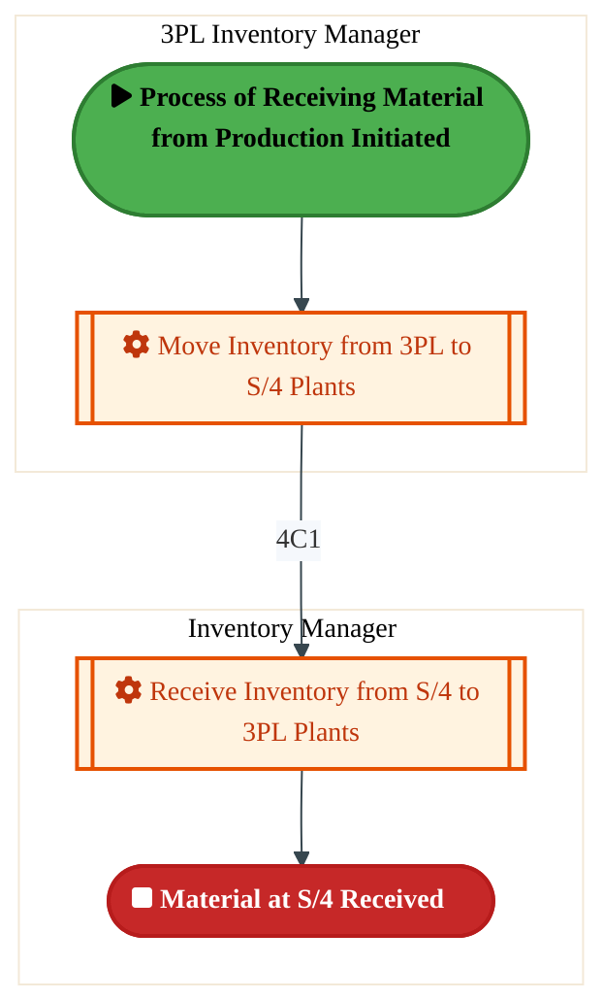

<div style="text-align:center; padding-top:20px;">
  
  <h1 style="font-size:36px; margin-top:24px;">L-060 — Manage Storage & Internal Movement of Inventory - FTS (IF)</h1>
  <h2 style="font-size:24px;">Architecture Document (TOGAF BDAT)</h2>
  <p style="font-size:18px; color:#555;">Forecast to Stock (IF) (FTS-IF) Tower<br/>
  Capability L-060 · L Logistics and Inventory Management - FTS (IF)</p>
  <p style="font-size:14px; color:#888;">IAO Program · Release 3<br/>
  Generated: March 2026<br/>
  Sajiv Francis</p>
  <p style="font-size:12px; color:#aaa;">IAO Architecture Pipeline — Intel Confidential</p>
</div>

<style>
@media print {
  @page { margin: 0.75in; }
  .mermaid { page-break-inside: avoid; overflow: visible; }
  pre, table { page-break-inside: avoid; }
  h2, h3, h4 { page-break-after: avoid; }
}
.mermaid { overflow: visible; }
.mermaid svg { max-width: 100%; height: auto !important; }
.page-footer {
  padding-top: 8px;
  border-top: 1px solid #ddd;
  display: flex;
  justify-content: space-between;
  align-items: center;
  font-size: 11px;
  color: #888;
  position: fixed;
  bottom: 0;
  left: 0;
  right: 0;
  padding: 6px 20px;
  background: #fff;
}
@media print {
  .page-footer { position: fixed; bottom: 0; left: 0.75in; right: 0.75in; }
}
.page-footer a { color: #00aeef; text-decoration: none; font-weight: 500; }
.page-footer a:hover { color: #0071c5; text-decoration: underline; }
</style>

<div class="page-footer"><span>Page 1</span><span><a href="#toc">↑ Back to TOC</a></span><span>L-060 — Manage Storage & Internal Movement of Inventory - FTS (IF)</span></div>
<div style="page-break-before: always;"></div>

<a id="toc"></a>

## Table of Contents

1. [Executive Summary](#1-executive-summary)
2. [Business Context & Objectives](#2-business-context--objectives)
   - 2.1 [Classification](#21-classification)
   - 2.2 [Business Drivers](#22-business-drivers)
   - 2.3 [Success Criteria](#23-success-criteria)
   - 2.4 [Companion Documents](#24-companion-documents)
3. [Business Architecture (TOGAF "B")](#3-business-architecture-togaf-b)
   - 3.1 [Business Process Overview](#31-business-process-overview)
   - 3.2 [Business Process Diagrams](#32-business-process-diagrams)
   - 3.3 [Business Roles & Responsibilities](#33-business-roles--responsibilities)
4. [Data Architecture (TOGAF "D")](#4-data-architecture-togaf-d)
   - 4.1 [Data Entities & Ownership](#41-data-entities--ownership)
   - 4.2 [Data Flow Diagrams](#42-data-flow-diagrams)
   - 4.3 [Data Lineage](#43-data-lineage)
   - 4.4 [RICEFW Data Objects](#44-ricefw-data-objects)
   - 4.5 [Data Governance & Quality](#45-data-governance--quality)
5. [Application Architecture (TOGAF "A")](#5-application-architecture-togaf-a)
   - 5.1 [Current-State Application Landscape](#51-current-state--current-state-application-landscape)
   - 5.2 [Future-State Application Landscape](#52-future-state--future-state-application-landscape)
   - 5.3 [Change Impact Summary](#53-change-impact-summary)
   - 5.4 [Component Overview](#54-component-overview)
   - 5.5 [RICEFW Inventory](#55-ricefw-inventory)
   - 5.6 [Integration Patterns](#56-integration-patterns)
6. [Technology Architecture (TOGAF "T")](#6-technology-architecture-togaf-t)
   - 6.1 [Platform & Infrastructure](#61-platform--infrastructure)
   - 6.2 [SAP Development Object Status](#62-sap-development-object-status)
   - 6.3 [NFRs & Design Principles](#63-nfrs--design-principles)
   - 6.4 [Security & Governance](#64-security--governance)
7. [Project Context](#7-project-context)
   - 7.1 [Project Roadmap & Go-Live Plan](#71-project-roadmap--go-live-plan)
   - 7.2 [RAID Log](#72-raid-log)
   - 7.3 [Recommendations & Next Steps](#73-recommendations--next-steps)

<div class="page-footer"><span>Page 2</span><span><a href="#toc">↑ Back to TOC</a></span><span>L-060 — Manage Storage & Internal Movement of Inventory - FTS (IF)</span></div>
<div style="page-break-before: always;"></div>

## 1. Executive Summary

This Architecture Document defines the **Business, Data, Application, and Technology** (BDAT) architecture for **L-060 Manage Storage & Internal Movement of Inventory - FTS (IF)** within the IAO program. It includes 5 BPMN process diagram(s) in Section 3.
| Dimension | Value |
|-----------|-------|
| **Tower** | Forecast to Stock (IF) (FTS-IF) |
| **Process Group** | L Logistics and Inventory Management - FTS (IF) |
| **Capability** | L-060 - Manage Storage & Internal Movement of Inventory - FTS (IF) |
| **Release** | Release 3 |
| **Total Systems** | 0 |
| **System Status** | 0 Deployed, 0 Developing, 0 EOL, 0 Pending IAPM |
| **RICEFW Objects** | 2 Reports, 18 Interfaces, 3 Conversions, 19 Enhancements, 9 Forms, 3 Workflows |
**Change Summary**: 0 new flow chains, 0 removed, 0 modified, 0 unchanged between Current-State and Future-State states.

> All system nodes in architecture diagrams are **IAPM-linked** — click any node to open its IAPM page. Diagrams require `securityLevel: "loose"` for click events.

<div class="page-footer"><span>Page 3</span><span><a href="#toc">↑ Back to TOC</a></span><span>L-060 — Manage Storage & Internal Movement of Inventory - FTS (IF)</span></div>
<div style="page-break-before: always;"></div>

## 2. Business Context & Objectives

### 2.1 Classification

| Level | Value |
|-------|-------|
| **L0 Tower** | Forecast to Stock (IF) |
| **L1 Process** | L Logistics and Inventory Management - FTS (IF) |
| **L2 Capability** | L-060 - Manage Storage & Internal Movement of Inventory - FTS (IF) |

### 2.2 Business Drivers

| # | Driver | Description | Strategic Alignment | Priority |
|---|--------|-------------|---------------------|----------|
| 1 | Intel Foundry Supply Chain Integration | Integrate Intel Foundry manufacturing and logistics into unified S/4 HANA supply chain | IDM 2.0 Foundry Enablement | High |
| 2 | Warehouse & Logistics Modernization | Modernize warehouse management and shipping processes with EWM integration | Supply Chain Digital Transformation | High |
| 3 | Production Planning Optimization | Enable MRP-driven production planning with real-time material availability | Manufacturing Excellence | Medium |
| 4 | L-060 Process Migration | Migrate Manage Storage & Internal Movement of Inventory - FTS (IF) business processes and 0 integrated systems from legacy to S/4 HANA target architecture | IDM 2.0 Supply Chain (Intel Foundry) | High |

<div class="page-footer"><span>Page 4</span><span><a href="#toc">↑ Back to TOC</a></span><span>L-060 — Manage Storage & Internal Movement of Inventory - FTS (IF)</span></div>
<div style="page-break-before: always;"></div>

### 2.3 Success Criteria

| Metric | Target | Measure | Baseline | Owner |
|--------|--------|---------|----------|-------|
| Order Fulfillment Lead Time | < 48 hours | Time from production completion to shipment dispatch | 72 hours (legacy) | Logistics Manager |
| Inventory Accuracy | > 99.5% | Physical vs system inventory match rate | 97.8% (current) | Warehouse Manager |
| MRP Planning Cycle | < 4 hours | End-to-end MRP run including exception processing | 8 hours (legacy) | Planning Lead |
| L-060 Migration Completeness | 100% flow chains validated | All 0 flow chains verified in target state | 0% (pre-migration) | Tower Architect |

### 2.4 Companion Documents

| Document | Description |
|----------|-------------|
| **Business Architecture** | Included in this document (Section 3) — process flows from BPMN diagrams |
| **This Document** | Full BDAT Architecture — Business + Data + Application + Technology |

<div class="page-footer"><span>Page 5</span><span><a href="#toc">↑ Back to TOC</a></span><span>L-060 — Manage Storage & Internal Movement of Inventory - FTS (IF)</span></div>
<div style="page-break-before: always;"></div>

## 3. Business Architecture (TOGAF "B")

### 3.1 Business Process Overview

This capability includes **5 business process(es)** modeled in BPMN 2.0, covering the end-to-end workflow for L-060 Manage Storage & Internal Movement of Inventory - FTS (IF).

| # | Step ID | Process Name | Lanes | Tasks | Gateways |
|---|---------|--------------|-------|-------|----------|
| 1 | L-060-020_Receive_Request_for_Material_Movement_-_FTS_(IF) | L-060-020_Receive_Request_for_Material_Movement_-_FTS_(IF) | Warehouse Operator | 18 | 5 |
| 2 | L-060-080_Confirm_Material_Receipt_by_Requester_-_FTS_(IF) | L-060-080_Confirm_Material_Receipt_by_Requester_-_FTS_(IF) | 3PL Inventory Manager (Receiving Plant), 3PL Inventory Manager (Supplying Plant), EWM Delivery Plant, Inventory Manager, LOG IF - Warehouse Operator EWM | 19 | 13 |
| 3 | L-060-130_Manage_Inventory_Placement_and_Movement_-_FTS_(IF) | L-060-130_Manage_Inventory_Placement_and_Movement_-_FTS_(IF) | 3PL Inventory Manager, Inventory Manager | 2 | 0 |
| 4 | L-060-150_Perform_Cycle_Count_-_FTS_(IF) | L-060-150_Perform_Cycle_Count_-_FTS_(IF) | Warehouse Operator | 9 | 2 |
| 5 | L-060-240_Manage_Packaging_Specification_-_FTS_(IF) | L-060-240_Manage_Packaging_Specification_-_FTS_(IF) | Warehouse Manager | 11 | 6 |

### 3.2 Business Process Diagrams

<div class="page-footer"><span>Page 6</span><span><a href="#toc">↑ Back to TOC</a></span><span>L-060 — Manage Storage & Internal Movement of Inventory - FTS (IF)</span></div>
<div style="page-break-before: always;"></div>

#### BUSINESS ARCHITECTURE — 3.2.1 L-060-020_Receive_Request_for_Material_Movement_-_FTS_(IF) — L-060-020_Receive_Request_for_Material_Movement_-_FTS_(IF)

**Swim Lanes**: Warehouse Operator | **Tasks**: 18 | **Gateways**: 5

```mermaid
%%{init: {"theme": "base", "themeVariables": {"fontSize": "14px", "fontFamily": "Segoe UI, Arial, sans-serif","primaryColor": "#e8f0fe", "primaryBorderColor": "#0071c5","lineColor": "#37474F", "secondaryColor": "#f5f8fc"}, "flowchart": {"useMaxWidth": false, "htmlLabels": true, "curve": "basis", "nodeSpacing": 40, "rankSpacing": 50}} }%%
flowchart TD
    classDef startEvt fill:#4CAF50,stroke:#2E7D32,color:#000,font-weight:bold,stroke-width:2px,rx:20,ry:20
    classDef endEvt fill:#C62828,stroke:#B71C1C,color:#fff,font-weight:bold,stroke-width:2px,rx:20,ry:20
    classDef userTask fill:#E3F2FD,stroke:#1565C0,stroke-width:2px,color:#0D47A1
    classDef serviceTask fill:#FFF3E0,stroke:#E65100,stroke-width:2px,color:#BF360C
    classDef gateway fill:#FFF9C4,stroke:#F57F17,stroke-width:2px,color:#E65100
    classDef subProc fill:#F3E5F5,stroke:#7B1FA2,stroke-width:2px,color:#4A148C
    subgraph Warehouse Operator
        n1["fa:fa-user Trigger Request in MIGO to Transfer Stock from IM to EWM"]
        n2["fa:fa-user Trigger Request in MIGO Transaction to Transfer from One Material into Another"]
        n3["fa:fa-user Trigger Request in MIGO Transaction to Transfer Batch to Batch"]
        n4["fa:fa-user Trigger Request in MIGO to Transfer Stock from EWM to IM"]
        n5["fa:fa-user Create Posting Change Warehouse Task to Move Stock to Blocked Stock"]
        n6["fa:fa-user Confirm Posting Change Task via RF Scanner /Manual to Change Stock Type to..."]
        n7["fa:fa-user Trigger Request in MIGO Transaction to perform Scrapping"]
        n8[["fa:fa-cog Create Inbound Delivery"]]
        n9[["fa:fa-cog Execute Transfer Posting from MIGO to Transfer Material"]]
        n10[["fa:fa-cog Execute Transfer Posting from MIGO to Transfer Batch to Batch"]]
        n11[["fa:fa-cog Distribute Inbound Delivery to EWM"]]
        n12[["fa:fa-cog Create Outbound Delivery"]]
        n13[["fa:fa-cog Distribute Outbound Delivery to EWM"]]
        n14[["fa:fa-cog Distribute Posting Change Delivery to Change Material Number and Attributes"]]
        n15[["fa:fa-cog Distribute Posting Change Delivery to Change Batch"]]
        n16["Receive Request to Initiate Scrapping from Vendor"]
        n17["Identify Movement of Material into Extended Warehouse Management (EWM) or..."]
        n18["Move Stock to Disposal Bin for Scrapping"]
        n19(["fa:fa-play Request for Material Movement Initiated"])
        n20(["fa:fa-stop Material Movement Planning for Transfer Between Storage Locations is Completed"])
        n21(["fa:fa-stop Material Movement Planning for Material Transfer is Completed"])
        n22(["fa:fa-stop Material Movement Planning for Batch Transfer is Completed"])
        n23(["fa:fa-stop Planning for Scrapping is Completed"])
        n24{{"fa:fa-code-branch Business Scenario ?"}}
        n25{{"fa:fa-code-branch Product Relevant for Receiving in EWM ?"}}
        n26{{"fa:fa-code-branch exclusiveGateway"}}
        n27{{"fa:fa-code-branch Storage Location ?"}}
        n28{{"fa:fa-code-branch exclusiveGateway"}}
    end
    n2 --> n9
    n3 --> n10
    n1 --> n8
    n19 --> n24
    n17 --> n25
    n4 --> n12
    n12 --> n13
    n8 --> n11
    n11 --> n26
    n26 --> n20
    n13 --> n26
    n9 --> n14
    n14 --> n21
    n10 --> n15
    n15 --> n22
    n24 -->|"Material to Material Transfer"| n2
    n24 -->|"Batch to Batch Transfer"| n3
    n25 -->|"No (Receiving in IM)"| n4
    n24 -->|"Transfer Material 
Between Storage Locations"| n17
    n25 -->|"Yes"| n1
    n6 --> n28
    n5 --> n6
    n16 --> n27
    n24 -->|"Scrapping Process"| n16
    n27 -->|"EWM"| n5
    n28 --> n18
    n7 --> n28
    n18 --> n23
    n27 -->|"IM"| n7
    class n1 userTask
    class n2 userTask
    class n3 userTask
    class n4 userTask
    class n5 userTask
    class n6 userTask
    class n7 userTask
    class n8 serviceTask
    class n9 serviceTask
    class n10 serviceTask
    class n11 serviceTask
    class n12 serviceTask
    class n13 serviceTask
    class n14 serviceTask
    class n15 serviceTask
    class n19 startEvt
    class n20 endEvt
    class n21 endEvt
    class n22 endEvt
    class n23 endEvt
    class n24 gateway
    class n25 gateway
    class n26 gateway
    class n27 gateway
    class n28 gateway
```

> **Legend**: <span style="color:#000;background:#4CAF50;padding:2px 6px;border-radius:10px;font-weight:bold;font-size:9pt">● Start</span> · <span style="color:#fff;background:#C62828;padding:2px 6px;border-radius:10px;font-weight:bold;font-size:9pt">● End</span> · <span style="background:#E3F2FD;padding:2px 6px;border:1px solid #1565C0;font-size:9pt">User Task</span> · <span style="background:#FFF3E0;padding:2px 6px;border:1px solid #E65100;font-size:9pt">Service Task</span> · <span style="background:#FFF9C4;padding:2px 6px;border:1px solid #F57F17;font-size:9pt">◇ Gateway</span> · <span style="background:#F3E5F5;padding:2px 6px;border:1px solid #7B1FA2;font-size:9pt">Sub-Process</span>



<div style="text-align:center; margin:4px 0 8px 0; font-size:11px;"><a href="https://mermaid.live/view#pako:eNqlWG2P2jgQ_itWqhWtBL04L4Tlw514S4VUulXZa3Uq98EkDkQNNuckLNyW_37jxAkkJFV7y4dd8szM84zHM07Cs-Zxn2pD7e7uOWRhMkTPnWRLd7QzRJ01iWmni3LgMxEhWUc07kifgLNkGf6buWFrf5RuEnPJLoxOEl3SDafoz3kXjSAw6qKYsLgXUxEGnW5nL8IdEacJj7iQ3q_oINCDTE2Zxlz4VFwcdN3Bng2hUcjoBTYdy7FcGRdTjzO_QhrYwSDwOmeZXMSfvC0RSZZ-GtMFOX4J_WQL1wGJYgo-22QXvSdrGsk1JiKVmJeKQ1GMMJY6DAq23BMvZBvALR0gQdi3C2Tr5zM6392tWCmKHqcrhuDjRSSOpzRAcQLw7JCgIIyi4StrMnJtvRsngn-jw1fGzJmaRteTKxnC0vWuLG7viYabbTJc88hXrr0nuYahsT92xXFo6F1xgr81Lcr8i9KkbwyMQak0dvAETwqlIAhepAR1FY8k_qa0ZqZruNNSC9t9e6Lf8hXLnFrOCNfrRMUh9OgVqeu65uxSqlnfxno76dg1-_qkRrohCX0ipwvh_cQqCV3bcbHTSpjr1bNM1x8F9wpCc2a7dknojLE7MloJrRG2BipD4NkIst-iL0TQLYdyooc9FSThIneQH4a_rrSADAPSk_VGjyLcbOD_J_pPSuMEhQwt5u8eUMLBBEMXgG2ZcA8KKPgOzRfSMvuyWGl_X5EaP0eaMRIvCTmrCGTUD4yiBdRWDjxEgH3EOJweoiplvkxqTBJvK5HsS5XaelFpoCjSNK-Vxq6STgSFNaKPPE5g4NFkS9iGXu1Y1qtAs-AHqthlshF8oX4OVPn7NX7OglDs6gIZ7SEk6JOLlh5hDFx_WxCWQq2BX3nleo-nPQXw7du3VSXnf1UeOjDgkNDSg97cQ0pV0sHXktXjm6I8c7bmKfPRlEbhgYoTxFwH3VeDZkfqpRBV7kqx-GxfbvasaLIaKdZfxHrTWBVuXOWehjDQ4TptWOplvioERmOdHtLkh4XCZqvuTWiLsNXKUGuxax4FleP8Id2toUYE5EaJio_rSvYLlBqLLkfjE_UoOJddKicUHlVCWb2yJfMt_Qy3Ol47bbBs-rlPWRIGp2wod_Ad8aB2VM2OCUTDhF4mGaaLbHL311DXN4iLm5HCA6Cvjjose89j4B3DQMHktA0Ovn9dlmsfwf2oWKGMKZMrMy4W7QPLm-uTW7_QxAnfN4R-jOC8yKrExVW_0-SJUiYTF7BO9J57RM58jMIYTqHdPqINavjX1EpzKfsjcuPXyPOJ_Slms8Zc4bm00Y8orOfnS3f7tLcGXZAfpzE8ksYxsFAGT8kc_bHSzufrSLs5Ep4Z_NRLYN8jeiAs3_i83bNcWHZHumHrN7PRoxdBKgf6Ln-8qYc5zWH13b_VG_yqHsxR_oUZqNf7HU57dWnml1g9PzGcXw-Ky_v82rAKwFGArQBLERiFgxLApgIG6hoXDkrC6BcZ9RVQ5mDWPFQSuExCiRolp648iqywrTyKtIws5DscDEX_yueB-iSstO_gWg-p3oWqzsUqDVs5f-DodaVh5os3madVp725d6IVaz0AMgrs1NX-osqiDEUpi_1TZSgKiQu7U0_mMm_ysRlmJ6ct98hRftnNDCxFoY1iewtFp5YBVg6GWaea50zO1ZO77L_ijaUCG82w2QxbzbDdDPebYacZHly_AFUs960WaM9WE243Ge0ms91ktZvsdtN9-f5brbuu3lWrKG5EjUbUbESt4pWvCtvNcL8ZdprhQQFrXW1HxY6EvjZ81rIfTbSh5tOApFGinbsaSRO-PDFPG2Y_Lmjp3ofIaUjgnW-Xg-f_AHPglvw=" title="View Full Diagram">&#128065; View Full Diagram</a></div>

<div class="page-footer"><span>Page 7</span><span><a href="#toc">↑ Back to TOC</a></span><span>L-060 — Manage Storage & Internal Movement of Inventory - FTS (IF)</span></div>
<div style="page-break-before: always;"></div>

#### BUSINESS ARCHITECTURE — 3.2.2 L-060-080_Confirm_Material_Receipt_by_Requester_-_FTS_(IF) — L-060-080_Confirm_Material_Receipt_by_Requester_-_FTS_(IF)

**Swim Lanes**: 3PL Inventory Manager (Receiving Plant) · 3PL Inventory Manager (Supplying Plant) · EWM Delivery Plant · Inventory Manager · LOG IF - Warehouse Operator EWM | **Tasks**: 19 | **Gateways**: 13

> **Legend**: <span style="color:#000;background:#4CAF50;padding:2px 6px;border-radius:10px;font-weight:bold;font-size:9pt">● Start</span> · <span style="color:#fff;background:#C62828;padding:2px 6px;border-radius:10px;font-weight:bold;font-size:9pt">● End</span> · <span style="background:#E3F2FD;padding:2px 6px;border:1px solid #1565C0;font-size:9pt">User Task</span> · <span style="background:#FFF3E0;padding:2px 6px;border:1px solid #E65100;font-size:9pt">Service Task</span> · <span style="background:#FFF9C4;padding:2px 6px;border:1px solid #F57F17;font-size:9pt">◇ Gateway</span> · <span style="background:#F3E5F5;padding:2px 6px;border:1px solid #7B1FA2;font-size:9pt">Sub-Process</span>

```mermaid
%%{init: {"theme": "base", "themeVariables": {"fontSize": "14px", "fontFamily": "Segoe UI, Arial, sans-serif","primaryColor": "#e8f0fe", "primaryBorderColor": "#0071c5","lineColor": "#37474F", "secondaryColor": "#f5f8fc"}, "flowchart": {"useMaxWidth": false, "htmlLabels": true, "curve": "basis", "nodeSpacing": 40, "rankSpacing": 50}} }%%
flowchart LR
    classDef startEvt fill:#4CAF50,stroke:#2E7D32,color:#000,font-weight:bold,stroke-width:2px,rx:20,ry:20
    classDef endEvt fill:#C62828,stroke:#B71C1C,color:#fff,font-weight:bold,stroke-width:2px,rx:20,ry:20
    classDef userTask fill:#E3F2FD,stroke:#1565C0,stroke-width:2px,color:#0D47A1
    classDef serviceTask fill:#FFF3E0,stroke:#E65100,stroke-width:2px,color:#BF360C
    classDef gateway fill:#FFF9C4,stroke:#F57F17,stroke-width:2px,color:#E65100
    classDef subProc fill:#F3E5F5,stroke:#7B1FA2,stroke-width:2px,color:#4A148C
    subgraph 3PL Inventory Manager (Receiving Plant)
        n15[["fa:fa-cog Updates Pick/Pack in 3PL"]]
        n16[["fa:fa-cog Receipt of Goods in 3PL"]]
    end
    subgraph 3PL Inventory Manager (Supplying Plant)
        n10[["fa:fa-cog Initiate Pick/Pack Updates 3PL"]]
        n11[["fa:fa-cog Loading PGI/3PL"]]
        n12[["fa:fa-cog Updates 3PL and 3B14C Deletes the delivery"]]
        n13[["fa:fa-cog Update Pick/pack Acknowledgement from 3PL"]]
        n14[["fa:fa-cog Move Inventory From Vendor Consigned to Unrestricted"]]
        n27{{"fa:fa-code-branch Was 3B14 relevant for this process?"}}
        n28{{"fa:fa-code-branch Can 3PL Fulfill the Request?"}}
        n29{{"fa:fa-code-branch Is the Stock Vendor Consigned or Intel Owned?"}}
        n35{{"fa:fa-arrows-alt inclusiveGateway"}}
    end
    subgraph EWM Delivery Plant
        n17[["fa:fa-cog Created Outbound Delivery in EWM"]]
        n18[["fa:fa-cog Pick/Pack Updated in EWM"]]
        n19[["fa:fa-cog Perform PGI in EWM"]]
    end
    subgraph Inventory Manager
        n1["fa:fa-user Trigger 3B14R Signal"]
        n2[["fa:fa-cog Trigger STO from 3PL tool SGP"]]
        n3[["fa:fa-cog Creation of Inbound Delivery"]]
        n4[["fa:fa-cog Goods Receipt for Unrestricted stock"]]
        n5[["fa:fa-cog Complete Pick/Pack Updates"]]
        n6[["fa:fa-cog Trigger Post Goods Issue"]]
        n7[["fa:fa-cog Deleted Outbound Delivery"]]
        n8[["fa:fa-cog Update stock from Vendor consigned to unrestricted"]]
        n9[["fa:fa-cog Creation of Outbound Delivery"]]
        n20(["fa:fa-play Confirm Material Receipt Request Received and Process Initiated"])
        n21(["fa:fa-stop Goods Receipt Completed"])
        n22(["fa:fa-stop Delivery Deleted"])
        n23{{"fa:fa-code-branch exclusiveGateway"}}
        n24{{"fa:fa-code-branch Spares and Rinchem or Silicon Process?"}}
        n25{{"fa:fa-code-branch Is it Offsite 3PL or Onsite 3PL?"}}
        n26{{"fa:fa-code-branch Is the Receiving Location Offsite or Onsite Location?"}}
        n30{{"fa:fa-arrows-alt parallelGateway"}}
        n31{{"fa:fa-arrows-alt parallelGateway"}}
        n32{{"fa:fa-arrows-alt parallelGateway"}}
        n33{{"fa:fa-arrows-alt parallelGateway"}}
        n34{{"fa:fa-arrows-alt Request for Material Type ?"}}
        n36[["fa:fa-folder-open Create Stock Transfer Order"]]
        n37[["fa:fa-folder-open Run MRP"]]
    end
    subgraph LOG IF - Warehouse Operator EWM
        n38[["fa:fa-folder-open Inbound Delivery Distribution to EWM"]]
    end
    n20 --> n34
    n5 --> n32
    n4 --> n21
    n3 --> n26
    n23 --> n4
    n30 --> n9
    n6 --> n24
    n37 --> n36
    n34 -->|"Spares and Rinchem"| n37
    n7 --> n22
    n1 -->|"3B14R"| n12
    n12 -->|"3B14C"| n27
    n13 --> n28
    n28 -->|"Yes"| n10
    n24 -->|"Spares & Rinchem Process"| n3
    n29 -->|"Intel Owned"| n35
    n36 --> n30
    n17 --> n18
    n18 --> n19
    n35 --> n13
    n8 --> n35
    n14 -->|"4C1"| n8
    n2 --> n30
    n9 --> n25
    n11 -->|"3B2"| n32
    n25 -->|"Offsite

3B12R"| n29
    n25 -->|"Onsight"| n17
    n29 -->|"Vendor Consigned"| n14
    n27 -->|"Yes"| n7
    n27 -->|"No"| n31
    n31 --> n33
    n10 -->|"3B13"| n31
    n33 --> n5
    n33 --> n11
    n19 --> n32
    n32 --> n6
    n26 -->|"3B2

Offsite"| n15
    n26 -->|"Onsite"| n38
    n38 --> n23
    n16 -->|"4B2"| n23
    n24 -->|"Silicon Process"| n23
    n34 -->|"Silicon"| n2
    n28 -->|"No"| n1
    n15 --> n16
    class n1 userTask
    class n2 serviceTask
    class n3 serviceTask
    class n4 serviceTask
    class n5 serviceTask
    class n6 serviceTask
    class n7 serviceTask
    class n8 serviceTask
    class n9 serviceTask
    class n10 serviceTask
    class n11 serviceTask
    class n12 serviceTask
    class n13 serviceTask
    class n14 serviceTask
    class n15 serviceTask
    class n16 serviceTask
    class n17 serviceTask
    class n18 serviceTask
    class n19 serviceTask
    class n20 startEvt
    class n21 endEvt
    class n22 endEvt
    class n23 gateway
    class n24 gateway
    class n25 gateway
    class n26 gateway
    class n27 gateway
    class n28 gateway
    class n29 gateway
    class n30 gateway
    class n31 gateway
    class n32 gateway
    class n33 gateway
    class n34 gateway
    class n35 gateway
    class n36 subProc
    class n37 subProc
    class n38 subProc
```

<div style="text-align:center; margin:4px 0 8px 0; font-size:11px;"><a href="https://mermaid.live/view#pako:eNqlWNtu4zYQ_RVCi21awEZNXSzbDy0SJw4MJI0RZ3dRNH1gJMoWIosqJTlxs_n3DiVSlmhqW2xjIADncmbmcDiU9GYFLKTWzPr48S1O42KG3s6KLd3Rsxk6eyI5PRugWvCZ8Jg8JTQ_EzYRS4t1_Hdlht3sVZgJ2YLs4uQgpGu6YRR9Wg7QOTgmA5STNB_mlMfR2eAs4_GO8MOcJYwL6w90Eo2iKppUXTAeUn40GI18HHjgmsQpPYod3_XdhfDLacDSsAMaedEkCs7eRXIJewm2hBdV-mVOb8nrlzgstrCOSJJTsNkWu-SGPNFE1FjwUsiCku8VGXEu4qRA2DojQZxuQO6OQMRJ-nwUeaP3d_T-8eNj2gRFN_ePKYK_ICF5fkkjlBcgvtoXKIqTZPbBnZ8vvNEgLzh7prMP9pV_6diDQFQyg9JHA0Hu8IXGm20xe2JJKE2HL6KGmZ29DvjrzB4N-AH-a7FoGh4jzcf2xJ40kS58PMdzFSmKov8VCXjlDyR_lrGunIW9uGxiYW_szUeneKrMS9c_xzpPlO_jgLZAF4uFc3Wk6mrs4VE_6MXCGY_mGuiGFPSFHI6A07nbAC48f4H9XsA6np5l-bTiLFCAzpW38BpA_wIvzu1eQPccuxOZIeBsOMm2yFndoGW6p2nB-AHdkpRsKEc_3tOAxntoM7RKSFr8VHuJvxR7f_zxaEVkFpFhwDboUxZClTlaxcHzzysSPKM4FbCP1p9_tt3GXbcqQlYgFqFrxsL8xAua6b_lui6zLDmYcx11gy5h8sSQbStZlb4hY9x1vmEkrKJcL382WNtmWkTSJA2Rc4HdObqkCRVSmHQopEm8p_ygAzkmoDrjTGR8Hjyn7CWh4QamZQrHjbOdKX23i3PL9rRF30J4fQaSGUdzlubxJqUhKhj6lHIKLRQHBQ01SNt_eztChnT4BAMp2KIvJK_qQxzK2xORE6AW2zhHGXQrzfNfH6339zbSxIw0J1UXoEWZiBaveLqnf5WQ0QnE1AyxrNldFwy4OikQFsu0oAm6e4Gljul4R0zCOXvJhyQpoDWDpMxhs67r83z0Om3Sqy-3Yperna0bsr0nfndP5pwCYojuyuKJldAljSecBkDSt3TSdde7OOxxm2pulMP-7EQjnzicFnRy4trIDa4YyOiBxxtxJEUv3KM1ME4SgG5vWjcT5bB-uGvaGHqQJWh9vdKqcAzUxSwVA2SZdtnTPLWDUI8bNX9Ep7ZbHi5MaBwNQRt5c7bLxDk-HSOa39hc7orlhUxjmecl1by0JqlnhqFJNLeJcW5U5dTkysMQtE972X_ap_2E_1sq9ujHxjdL4AKEAxjF0HK3kJJ4Smvol4e7Xu8hJzErV_XQaMa1yKw91m18hIf6Mm1L1facuNmaW3PaJMW6vWOeMPS1bxzUbq7ZDR7cgOuqwHuYKPCsK6bROk5i2BFV88mU83qnXFyguyjKY9hkcWwA6y5VqxOY8TeH5fG6v2FBvcsK-girVCdDc2QcmlAtSRKamEly8Pc42d_j5HyPk2t0Ut0qhkbTyg-HjKITUlpHP4KHW8qHLKOpnPjydnqATcgjGAh34hVEn3e-GeG-TNHt_epbI_vm7hotF2gIFzOnWwazGd1llBOY4tW0bwWZmIPoExVdxmJKPJVVb8DcMF8acPDRcPiL4E8KPLm25dqt17Z8_E4duR4rAClQ_o4EnMr1WNo3el8GUABOFeHro3V63B6tr8JBGkpHW2WGpV91eVWmuFHZLd280tkKBqsKJqqCiTT-XVwHAmakNFpqPzRzQB7-OkFlPZXWreeV2sBTpUoyHBUAy5qwygVPpEDR58j9wCqKNGgwscrRneMqWlOWFmsqy24cj_zZdZqKPduTGjlSHlP1Azrtmmp7emIsLqltUTPo65zoz3W1mWoK29e2wNcVv7E6x6YNsSxP8YJHxy13NFu54562xsoAT7WmdyR5TZOPW1yl__ZTtFUlejpEPZzrDNVeOXJX7aYaZe3KzWk0x57s3kNdK0ezqrV6w0tSGxpUr41bL7HinKmX947Ybr-BdzROr8bt1Xi9mnGvxu_VTHo1014NNFCvCver-mnA_TzgfiJwPxO4nwrczwXuJwP3swH3gvoQ1ZVj-dGoK7WNUkd9T-mKXbPYM4vHZrFvFk_M4qlRDHeVUYzNYtssNlfpmKt0zFXCzSC_FHXFvlk8UWJrYO0o35E4tGZvVvU51ppZIY1ImRTW-8AiZcHWhzSwZtVnS6usXjIuYwIPHrta-P4P2Y7Xyg==" title="View Full Diagram">&#128065; View Full Diagram</a></div>

<div class="page-footer"><span>Page 8</span><span><a href="#toc">↑ Back to TOC</a></span><span>L-060 — Manage Storage & Internal Movement of Inventory - FTS (IF)</span></div>
<div style="page-break-before: always;"></div>

#### BUSINESS ARCHITECTURE — 3.2.3 L-060-130_Manage_Inventory_Placement_and_Movement_-_FTS_(IF) — L-060-130_Manage_Inventory_Placement_and_Movement_-_FTS_(IF)

**Swim Lanes**: 3PL Inventory Manager · Inventory Manager | **Tasks**: 2 | **Gateways**: 0

> **Legend**: <span style="color:#000;background:#4CAF50;padding:2px 6px;border-radius:10px;font-weight:bold;font-size:9pt">● Start</span> · <span style="color:#fff;background:#C62828;padding:2px 6px;border-radius:10px;font-weight:bold;font-size:9pt">● End</span> · <span style="background:#E3F2FD;padding:2px 6px;border:1px solid #1565C0;font-size:9pt">User Task</span> · <span style="background:#FFF3E0;padding:2px 6px;border:1px solid #E65100;font-size:9pt">Service Task</span> · <span style="background:#FFF9C4;padding:2px 6px;border:1px solid #F57F17;font-size:9pt">◇ Gateway</span> · <span style="background:#F3E5F5;padding:2px 6px;border:1px solid #7B1FA2;font-size:9pt">Sub-Process</span>



<div style="text-align:center; margin:4px 0 8px 0; font-size:11px;"><a href="https://mermaid.live/view#pako:eNqlVFtv2jAY_StWKpRNClquhOVhEgQiVVqlanTbQ-mDSWyw6tjIdriM8t9nk0CAlr3MD5F8fHzOd77Y3lk5L5CVWJ3OjjCiErCz1QKVyE6APYMS2Q6ogV9QEDijSNqGgzlTE_LnQPPC5cbQDJbBktCtQSdozhH4ee-Agd5IHSAhk12JBMG2Yy8FKaHYppxyYdh3qI9dfHBrloZcFEi0BNeNvTzSWylhqIWDOIzDzOyTKOesuBDFEe7j3N6b4ihf5wso1KH8SqIHuPlNCrXQcwypRJqzUCX9DmeImoxKVAbLK7E6NoNI48N0wyZLmBM213joakhA9tpCkbvfg32nM2UnU_A0mjKgR06hlCOEgVQaHq8UwITS5C5MB1nkOlIJ_oqSO38cjwLfyU2SREd3HdPc7hqR-UIlM06LhtpdmwyJv9w4YpP4riO2-nvlhVjROqU9v-_3T07D2Eu99OiEMf4vJ91X8QTla-M1DjI_G528vKgXpe57vWPMURgPvOs-IbEiOToTzbIsGLetGvciz70tOsyCnpteic6hQmu4bQW_puFJMIvizItvCtZ-11VWs0fB86NgMI6y6CQYD71s4N8UDAde2G8q1DpzAZcLEDx-B_dshZjiYgseIINzJGqOGcx7fp5aGCYYdnM-Bw98hc74WPDyIKE4mHwJwSOFTMmp9fJyJhF8OkksqW6GCYCkBByDHyhHZKVPs3ZWyFzfWlJTiipXhDNtRhTRi4VW_Vyr6mN2leJfCfzLBLXluxCmeh3CZPkwRNiGkIov23qhOuxtZD-qkgWg2_2mW9lMPTN9m1ph6k2tN11gg_s1LTz75YZ8djAvVvybK8Hp0l_AYXM_LccqkSghKaxkZx3eXP0uFwjDiipr71iwUnyyZbmVHN4mq1oWOu2IQN3ssgb3fwE9Wt2B" title="View Full Diagram">&#128065; View Full Diagram</a></div>

<div class="page-footer"><span>Page 9</span><span><a href="#toc">↑ Back to TOC</a></span><span>L-060 — Manage Storage & Internal Movement of Inventory - FTS (IF)</span></div>
<div style="page-break-before: always;"></div>

#### BUSINESS ARCHITECTURE — 3.2.4 L-060-150_Perform_Cycle_Count_-_FTS_(IF) — L-060-150_Perform_Cycle_Count_-_FTS_(IF)

**Swim Lanes**: Warehouse Operator | **Tasks**: 9 | **Gateways**: 2

```mermaid
%%{init: {"theme": "base", "themeVariables": {"fontSize": "14px", "fontFamily": "Segoe UI, Arial, sans-serif","primaryColor": "#e8f0fe", "primaryBorderColor": "#0071c5","lineColor": "#37474F", "secondaryColor": "#f5f8fc"}, "flowchart": {"useMaxWidth": false, "htmlLabels": true, "curve": "basis", "nodeSpacing": 40, "rankSpacing": 50}} }%%
flowchart TD
    classDef startEvt fill:#4CAF50,stroke:#2E7D32,color:#000,font-weight:bold,stroke-width:2px,rx:20,ry:20
    classDef endEvt fill:#C62828,stroke:#B71C1C,color:#fff,font-weight:bold,stroke-width:2px,rx:20,ry:20
    classDef userTask fill:#E3F2FD,stroke:#1565C0,stroke-width:2px,color:#0D47A1
    classDef serviceTask fill:#FFF3E0,stroke:#E65100,stroke-width:2px,color:#BF360C
    classDef gateway fill:#FFF9C4,stroke:#F57F17,stroke-width:2px,color:#E65100
    classDef subProc fill:#F3E5F5,stroke:#7B1FA2,stroke-width:2px,color:#4A148C
    subgraph Warehouse Operator
        n1["fa:fa-user Identify products via Warehouse Monitor"]
        n2["fa:fa-user Create Cycle Count (CC) Inventory Document via Batch Job or Manual"]
        n3["fa:fa-user Activate Physical Inventory Document"]
        n4["fa:fa-user Assign Counter for Counting"]
        n5["fa:fa-user Perform Count via RF Devices or Desktop"]
        n6["fa:fa-user Post Count of Physical Inventory Document."]
        n7["fa:fa-user Set Recount Status in Inventory Document"]
        n8["fa:fa-user Approval Required for Post Count"]
        n9[["fa:fa-cog Create New Physical Inventory Document"]]
        n10(["fa:fa-play Start Physical Inventory Cycle Count"])
        n11["Update Inventory Value (IF)"]
        n12{{"fa:fa-code-branch Recounting Required ?"}}
        n13{{"fa:fa-code-branch exclusiveGateway"}}
    end
    n3 --> n4
    n4 --> n5
    n5 --> n12
    n1 --> n2
    n7 --> n9
    n6 --> n11
    n10 --> n1
    n2 --> n13
    n9 --> n13
    n13 --> n3
    n8 --> n6
    n12 -->|"No"| n8
    n12 -->|"Yes"| n7
    class n1 userTask
    class n2 userTask
    class n3 userTask
    class n4 userTask
    class n5 userTask
    class n6 userTask
    class n7 userTask
    class n8 userTask
    class n9 serviceTask
    class n10 startEvt
    class n11 startEvt
    class n12 gateway
    class n13 gateway
```

> **Legend**: <span style="color:#000;background:#4CAF50;padding:2px 6px;border-radius:10px;font-weight:bold;font-size:9pt">● Start</span> · <span style="color:#fff;background:#C62828;padding:2px 6px;border-radius:10px;font-weight:bold;font-size:9pt">● End</span> · <span style="background:#E3F2FD;padding:2px 6px;border:1px solid #1565C0;font-size:9pt">User Task</span> · <span style="background:#FFF3E0;padding:2px 6px;border:1px solid #E65100;font-size:9pt">Service Task</span> · <span style="background:#FFF9C4;padding:2px 6px;border:1px solid #F57F17;font-size:9pt">◇ Gateway</span> · <span style="background:#F3E5F5;padding:2px 6px;border:1px solid #7B1FA2;font-size:9pt">Sub-Process</span>



<div style="text-align:center; margin:4px 0 8px 0; font-size:11px;"><a href="https://mermaid.live/view#pako:eNqllluPozYUx7-KxWiUGYlUXEPCQ6uEhGpWne1oshdVmz44xiTWEJvaJpdm891rcwkhzXQfygPi_Dnndy4Yw9FALMFGaNzfHwklMgTHnlzjDe6FoLeEAvdMUAlfICdwmWHR0z4po3JO_i7dbC_fazetxXBDsoNW53jFMPj8ZIKxCsxMICAVfYE5SXtmL-dkA_khYhnj2vsOD1MrLbPVtyaMJ5i3DpYV2MhXoRmhuJXdwAu8WMcJjBhNOtDUT4cp6p10cRnboTXksiy_EPgZ7r-SRK6VncJMYOWzlpvsN7jEme5R8kJrqODbZhhE6DxUDWyeQ0ToSumepSQO6Vsr-dbpBE739wt6Tgo-TRcUqANlUIgpToGQSp5tJUhJloV3XjSOfcsUkrM3HN45s2DqOibSnYSqdcvUw-3vMFmtZbhkWVK79ne6h9DJ9ybfh45l8oM6X-XCNGkzRQNn6AzPmSaBHdlRkylN0_-VSc2Vf4Lirc41c2Mnnp5z2f7Aj6x_85o2p14wtq_nhPmWIHwBjePYnbWjmg1823ofOondgRVdQVdQ4h08tMBR5J2BsR_EdvAusMp3XWWxfOEMNUB35sf-GRhM7HjsvAv0xrY3rCtUnBWH-Rp8hRyvmRon-D3HHErGKwd9UPvbwkhhmMK-njd4SjCVJD2AnLOkQFKALYEXhGemXmwFMP68YDhdRsSxmgmIDihTZ1ZQCR6i6BE80a2CM34AU4aKjbou4RMo0Rp8YEvAOHiGtIBZF-928WMkyVYneFkfBEEwuwHuArwrgBBkRavKlJmqtOW1euO6cX437gVz5bupW9Klv8ZgivWSErr2KRZvkuVdxuCKwYSsASz9rw5-6mKCLmaOJXhVe5TmzCWUhQCE_nAOw6s55Oohb1X2V_xXQThOylG0FXaDR9_O0Yitmof8Ee9-8BwuGbb1cIbkmXpp5nrnugW4WDyK8XjJ0Cv2c57o7K3_F5gVGDw8xY_dqm3neGzLTnB_qfZXtdzq4alH3nb_y8I4nS5j3duxeI-yQpAt_rV69dswtTlWF9QF_f7PauXVpleZfm36lWk7tW1XdmMGlTmqzUHtbTfeVi3UtlObbm2Prmy7Lqaxh5U5aG6X8d8Xxke2ML6r29f6H1iUN4KLjUrX3GzQHdm5Lbu3Ze-27N-WB7fl4LY8vC2PLj8D3Y6s85e0q9vv6E6z-Xdlt5EN09hgvoEkMcKjUf75qL-jBKewyKRxMg1YSDY_UGSE5R-CUZTLekqg2rg3lXj6B9hO-EU=" title="View Full Diagram">&#128065; View Full Diagram</a></div>

<div class="page-footer"><span>Page 10</span><span><a href="#toc">↑ Back to TOC</a></span><span>L-060 — Manage Storage & Internal Movement of Inventory - FTS (IF)</span></div>
<div style="page-break-before: always;"></div>

#### BUSINESS ARCHITECTURE — 3.2.5 L-060-240_Manage_Packaging_Specification_-_FTS_(IF) — L-060-240_Manage_Packaging_Specification_-_FTS_(IF)

**Swim Lanes**: Warehouse Manager | **Tasks**: 11 | **Gateways**: 6

```mermaid
%%{init: {"theme": "base", "themeVariables": {"fontSize": "14px", "fontFamily": "Segoe UI, Arial, sans-serif","primaryColor": "#e8f0fe", "primaryBorderColor": "#0071c5","lineColor": "#37474F", "secondaryColor": "#f5f8fc"}, "flowchart": {"useMaxWidth": false, "htmlLabels": true, "curve": "basis", "nodeSpacing": 40, "rankSpacing": 50}} }%%
flowchart TD
    classDef startEvt fill:#4CAF50,stroke:#2E7D32,color:#000,font-weight:bold,stroke-width:2px,rx:20,ry:20
    classDef endEvt fill:#C62828,stroke:#B71C1C,color:#fff,font-weight:bold,stroke-width:2px,rx:20,ry:20
    classDef userTask fill:#E3F2FD,stroke:#1565C0,stroke-width:2px,color:#0D47A1
    classDef serviceTask fill:#FFF3E0,stroke:#E65100,stroke-width:2px,color:#BF360C
    classDef gateway fill:#FFF9C4,stroke:#F57F17,stroke-width:2px,color:#E65100
    classDef subProc fill:#F3E5F5,stroke:#7B1FA2,stroke-width:2px,color:#4A148C
    subgraph Warehouse Manager
        n1["fa:fa-user Correct the Error Data in Template"]
        n2["fa:fa-user Upload Packaging Specification Template"]
        n3["fa:fa-user Extend Storage Location and Warehouse Management Views in Material Master"]
        n4["fa:fa-user Create Packaging Specification"]
        n5["fa:fa-user Activate Packaging Specification"]
        n6["fa:fa-user Activate Uploaded Packaging Specification"]
        n7["fa:fa-user Maintain Header, Content and Level Details for the Material"]
        n8[["fa:fa-cog Transfer Master Data to EWM via CIF"]]
        n9["Extract Material Data from Legacy System"]
        n10["Populate Packaging Specification Template with Data"]
        n11["Validate Packaging Specification Template"]
        n12(["fa:fa-play Product Master Creation Initiated"])
        n13(["fa:fa-stop Packaging Specification Created"])
        n14{{"fa:fa-code-branch New Material ?"}}
        n15{{"fa:fa-code-branch Error Found ?"}}
        n16{{"fa:fa-code-branch exclusiveGateway"}}
        n17{{"fa:fa-code-branch exclusiveGateway"}}
        n18{{"fa:fa-code-branch exclusiveGateway"}}
        n19{{"fa:fa-code-branch Huge Volume of Material ?"}}
    end
    n10 --> n11
    n11 --> n17
    n16 --> n13
    n17 --> n2
    n1 --> n17
    n5 --> n16
    n2 --> n15
    n6 --> n16
    n4 --> n7
    n7 --> n5
    n3 --> n8
    n15 -->|"No"| n1
    n15 -->|"Yes"| n6
    n14 -->|"Yes"| n18
    n18 --> n3
    n9 --> n18
    n8 --> n19
    n14 -->|"No"| n9
    n19 -->|"No"| n4
    n12 --> n14
    n19 -->|"Yes"| n10
    class n1 userTask
    class n2 userTask
    class n3 userTask
    class n4 userTask
    class n5 userTask
    class n6 userTask
    class n7 userTask
    class n8 serviceTask
    class n12 startEvt
    class n13 endEvt
    class n14 gateway
    class n15 gateway
    class n16 gateway
    class n17 gateway
    class n18 gateway
    class n19 gateway
```

> **Legend**: <span style="color:#000;background:#4CAF50;padding:2px 6px;border-radius:10px;font-weight:bold;font-size:9pt">● Start</span> · <span style="color:#fff;background:#C62828;padding:2px 6px;border-radius:10px;font-weight:bold;font-size:9pt">● End</span> · <span style="background:#E3F2FD;padding:2px 6px;border:1px solid #1565C0;font-size:9pt">User Task</span> · <span style="background:#FFF3E0;padding:2px 6px;border:1px solid #E65100;font-size:9pt">Service Task</span> · <span style="background:#FFF9C4;padding:2px 6px;border:1px solid #F57F17;font-size:9pt">◇ Gateway</span> · <span style="background:#F3E5F5;padding:2px 6px;border:1px solid #7B1FA2;font-size:9pt">Sub-Process</span>



<div style="text-align:center; margin:4px 0 8px 0; font-size:11px;"><a href="https://mermaid.live/view#pako:eNqlVmtv4jgU_StWqopdKUh5EsiHXVEgO5XKqBKdVqthP5jEAatJjByHxzD8973OC5KGVTWL1Co-vufce48dxyfFZwFRXOX-_kQTKlx06okNiUnPRb0VTklPRQXwijnFq4ikPRkTskQs6I88TLe2BxkmMQ_HNDpKdEHWjKBvjyoaAzFSUYqTtJ8STsOe2ttyGmN-nLCIcRl9R4ahFubZyqkHxgPCLwGa5ui-DdSIJuQCm47lWJ7kpcRnSdAQDe1wGPq9sywuYnt_g7nIy89SMseHNxqIDYxDHKUEYjYijp7wikSyR8EzifkZ31Vm0FTmScCwxRb7NFkDbmkAcZy8XyBbO5_R-f5-mdRJ0ct0mSD4-RFO0ykJUSoAnu0ECmkUuXfWZOzZmpoKzt6Je2fMnKlpqL7sxIXWNVWa298Tut4Id8WioAzt72UPrrE9qPzgGprKj_C_lYskwSXTZGAMjWGd6cHRJ_qkyhSG4f_KBL7yF5y-l7lmpmd40zqXbg_sifZRr2pzajljve0T4TvqkytRz_PM2cWq2cDWtduiD5450CYt0TUWZI-PF8HRxKoFPdvxdOemYJGvXWW2eubMrwTNme3ZtaDzoHtj46agNdatYVkh6Kw53m7QG-Zkw8BONMcJXhNezMtfon9fKiF2Q9yXdqMJ45z4AsFbimacM46mWGBEE_RC4m0ErS6Vf67oRpP-bRsxHKBn7L_jNWxgtNgSn4bUx4KyWxpmU2N2ELDH0EIwDrWiJ1aSMYDtTmKSCPRKyT6VJc5BWh4P8JDCUzOL1WqUE4i-VWmTajepY1_Q3afJgxvkwioSfE7FaarMMU0E_KEvBDS4CuuWCOmFNOmJ7EiEpgQCohSFsIZyNStzmrrD77Wwz9boBQ6fNMwTSAeLxRcMzd7maEcxmjx6wL8WGAEfVoxj2DS1_zkt5CyGWtbYP6LFEeTiZmpdA-oz22bRf3hZbxm0p2KTC7dU5AZ-xRENPqPS4hq_1d3D9BHBaxdkeSN59_kekfRH-JhRoAfA__1awLwIpIJtb-YvdtsHunU6XdwPSH8F9vsb9JXsL17-uVTO52uS3U0q3laPZbADPnAG3Rxy8KMspTvyV3GGtWnOr9GGv0YbddO-ZHAKvLIoiwliYacxcF4UD7CpUL__h9wWFaCXgFMBgxIwK8ApAKMatwh2OR6UY6Mc2-V40Jq3inFFL9WraLMYDqtkufrPpfKVLZWfMG7jf5M0n6jUdas1oddSw0K66mtU1lXNl9P6qK1Upq7xURO3Krxq3GoH1qVcf8mkkdUXvAEb3bDZDVvdsN0ND7phpxseXl8ImqUb9Z2qiZvl_aeJWtUloAnb3fCgG3a64WE3PKpgRVViwmNMA8U9KfntGm7gAQlxFgnlrCo4E2xxTHzFzW-hSraVR-WUYrgcxAV4_hf8sbKe" title="View Full Diagram">&#128065; View Full Diagram</a></div>

<div class="page-footer"><span>Page 11</span><span><a href="#toc">↑ Back to TOC</a></span><span>L-060 — Manage Storage & Internal Movement of Inventory - FTS (IF)</span></div>
<div style="page-break-before: always;"></div>

### 3.3 Business Roles & Responsibilities

| Role / Lane | Processes Involved | Description |
|------------|-------------------|-------------|
| Warehouse Operator | L-060-020_Receive_Request_for_Material_Movement_-_FTS_(IF), L-060-150_Perform_Cycle_Count_-_FTS_(IF),  | |
| 3PL Inventory Manager (Receiving Plant) | L-060-080_Confirm_Material_Receipt_by_Requester_-_FTS_(IF),  | |
| 3PL Inventory Manager (Supplying Plant) | L-060-080_Confirm_Material_Receipt_by_Requester_-_FTS_(IF),  | |
| EWM Delivery Plant | L-060-080_Confirm_Material_Receipt_by_Requester_-_FTS_(IF),  | |
| Inventory Manager | L-060-080_Confirm_Material_Receipt_by_Requester_-_FTS_(IF), L-060-130_Manage_Inventory_Placement_and_Movement_-_FTS_(IF),  | |
| LOG IF - Warehouse Operator EWM | L-060-080_Confirm_Material_Receipt_by_Requester_-_FTS_(IF),  | |
| 3PL Inventory Manager | L-060-130_Manage_Inventory_Placement_and_Movement_-_FTS_(IF),  | |
| Warehouse Manager | L-060-240_Manage_Packaging_Specification_-_FTS_(IF) | |

<div class="page-footer"><span>Page 12</span><span><a href="#toc">↑ Back to TOC</a></span><span>L-060 — Manage Storage & Internal Movement of Inventory - FTS (IF)</span></div>
<div style="page-break-before: always;"></div>

## 4. Data Architecture (TOGAF "D")

### 4.1 Data Entities & Ownership

The following data entities are derived from the system integration flows for L-060. Tower architects should validate ownership and classification.

| # | Data Entity | Source System | Target System | Data Owner | Classification | Volume | Master/Transaction |
|---|-------------|---------------|---------------|------------|----------------|--------|-------------------|

<div class="page-footer"><span>Page 13</span><span><a href="#toc">↑ Back to TOC</a></span><span>L-060 — Manage Storage & Internal Movement of Inventory - FTS (IF)</span></div>
<div style="page-break-before: always;"></div>

### 4.2 Data Flow Diagrams

> **DATA ARCHITECTURE** — Database-to-database data flows. Applications (blue) sit above their hosting databases (green cylinders). Thick arrows show data movement between databases.

### 4.3 Data Lineage

Data lineage traces the origin and transformation path of key data objects across integrated systems.

| # | Source System | Source Schema/Object | Target System | Target Schema/Object | Transformation |
|---|-------------|---------------------|---------------|---------------------|---------------|

> *Lineage detail will be refined when tower architects validate source/target schema object mappings.*

### 4.4 RICEFW Data Objects

Data-centric RICEFW objects (Reports and Conversions) from the Object Tracker:

| Object ID | Type | Description | Status | Source | Target | Complexity |
|-----------|------|-------------|--------|--------|--------|-----------|
| LOGR1176_IF | Report | ISM - International Traffic Report | 10. Object Complete |  |  | 03.Medium |
| LOGR0833_IF | Report | Email Notification for deletion of Shipping Memos | 10. Object Complete |  |  | 04.Low |
| LOGC0972_IF | Conversion | Open Inventory Conversion for IP and IF (as applicable) , Batch Characteristi... | 10. Object Complete |  |  | 02.High |
| LOGC0946_IF | Conversion | Open Inventory Conversion for IP and IF (as applicable) , ECC to S4 | 10. Object Complete |  |  | 02.High |
| FTSC1550 | Conversion | Inventory Conversion | 02. FS Unplanned |  |  | 03.Medium |

### 4.5 Data Governance & Quality

| Concern | Approach |
|---------|----------|
| Data Ownership | Per-entity owners listed in Section 3.1 |
| Data Classification | Financial data classified as Intel Confidential |
| Data Retention | Per Intel corporate retention policies |
| Data Quality | Validated at source; reconciliation at target |

<div class="page-footer"><span>Page 14</span><span><a href="#toc">↑ Back to TOC</a></span><span>L-060 — Manage Storage & Internal Movement of Inventory - FTS (IF)</span></div>
<div style="page-break-before: always;"></div>

## 5. Application Architecture (TOGAF "A")

### 5.1 Current-State — Current-State Application Landscape

#### Overview

The Current-State architecture represents the **current / legacy** landscape for L-060.

#### Current-State Flow Narrative

*(No current-state flows defined.)*

### 5.2 Future-State — Future-State Application Landscape

#### Overview

The Future-State architecture represents the **target** landscape for L-060.

#### Future-State Flow Narrative

*(No future-state flows defined.)*

### 5.3 Change Impact Summary

| Change Type | Flow Chain | Detail |
|-------------|-----------|--------|

**Totals**: 0 new - 0 removed - 0 modified - 0 unchanged

### 5.4 Component Overview

#### System Inventory

| System | IAPM ID | Status |
|--------|---------|--------|

<div class="page-footer"><span>Page 15</span><span><a href="#toc">↑ Back to TOC</a></span><span>L-060 — Manage Storage & Internal Movement of Inventory - FTS (IF)</span></div>
<div style="page-break-before: always;"></div>

### 5.5 RICEFW Inventory

| Object ID | Type | Description | Status | Source → Target | Middleware | Complexity |
|-----------|------|-------------|--------|----------------|-----------|-----------|
| LOGW1078_IF | Workflow | ISM Workflows - Capital/AMT | 10. Object Complete |  | NA | 03.Medium |
| LOGW1077_IF | Workflow | ISM Workflows - EIMS/Lab | 10. Object Complete |  | NA | 03.Medium |
| LOGW1076_IF | Workflow | ISM Workflows - Non-inventory | 10. Object Complete |  | NA | 03.Medium |
| LOGR1176_IF | Report | ISM - International Traffic Report | 10. Object Complete |  | NA | 03.Medium |
| LOGR0833_IF | Report | Email Notification for deletion of Shipping Memos | 10. Object Complete |  | NA | 04.Low |
| LOGI1718 | Interface | To align on batch attributes for straddle in S4 | 08. FUT In Progress |  | NA | 03.Medium |
| LOGI1677 | Interface | Send 4C1 Inventory Reconciliation Snapshot to IP | 10. Object Complete |  | SFT | 03.Medium |
| LOGI1676 | Interface | Send 4C1 Inventory movement Stock type change and cycle count to IP | 10. Object Complete |  | SFT | 03.Medium |
| LOGI1555 | Interface | Straddle Plant to be automatically complete the Goods Receipt and write of th... | 09. FUT Overdue |  | MuleSoft | 03.Medium |
| LOGI1091 | Interface | STO based Outbound Delivery Notification Confirmation for Delivery Note Deletion | 10. Object Complete | S/4 → OpenText | MULESOFT | 03.Medium |
| LOGI1081_IF | Interface | Interface + Enhancement - Reprinting of Carrier Label | 10. Object Complete | S/4 → Redwood | APIGEE | 04.Low |
| LOGI1079_IF | Interface | Interface from S4 ISM to Service Now | 10. Object Complete | S/4 ISM → Service Now | NA | 04.Low |
| LOGI1074_IF | Interface | Send data via API to retrieve the tracking ID - interface + Enhancement | 10. Object Complete | S/4 → Redwood | APIGEE | 04.Low |
| LOGI1062 | Interface | STO based outbound delivery notification request for delivery note cancellation | 10. Object Complete | OpenText → S/4 | MULESOFT | 03.Medium |
| LOGI1053 | Interface | STO based Outbound Delivery Notification from 3PL to S/4 for confirming Pick/... | 10. Object Complete | OpenText → S/4 | MULESOFT | 03.Medium |
| LOGI1043 | Interface | Inventory Movement from 3PL to S/4 - 4C1 Cycle Count | 10. Object Complete | OpenText → S/4 | MULESOFT | 03.Medium |
| LOGI1041 | Interface | STO based Outbound Delivery PGI confirmation from 3PL to S/4 - 3B2 | 10. Object Complete | OpenText → S/4 | MULESOFT | 03.Medium |
| LOGI1040 | Interface | STO based Outbound Delivery PGI confirmation for returns from S/4 to 3PL - 3B2 | 10. Object Complete | S/4 → OpenText | MULESOFT | 03.Medium |
| LOGI1038 | Interface | STO based Outbound Delivery Notification from S/4 to 3PL - 3B12 | 10. Object Complete | S/4 → OpenText | MULESOFT | 03.Medium |
| LOGI1037 | Interface | Inventory Movement from S/4 to 3PL – 4C1 (Outbound) | 10. Object Complete | S/4 → OpenText | MULESOFT | 03.Medium |
| LOGI0836_IF | Interface | Interface from S4 to NDA (IPLA –Intel Pre Release License Agreements) | 10. Object Complete | S/4 → NDA | NA | 04.Low |
| LOGI0237_IF | Interface | Inventory Reconciliation snapshot (4C1) from 3PL WMS to SAP S/4 | 10. Object Complete | 3PL → S/4 | MULESOFT | 03.Medium |
| LOGF1525 | Form | Consolidated Commercial Invoice for WIP | 10. Object Complete |  | NA | 04.Low |
| LOGF1524 | Form | Commercial Invoice for WIP | 10. Object Complete |  | NA | 04.Low |
| LOGF1523 | Form | Packing list for WIP | 10. Object Complete |  | NA | 04.Low |
| LOGF1100_IF | Form | Printing of Standard Shipping Label | 10. Object Complete |  | NA | 03.Medium |
| LOGF0359_IF | Form | ISM - Generate Commercial Invoice - IF/IP | 10. Object Complete | NA → NA | NA | 03.Medium |
| LOGF0358_IF | Form | ISM - Generate Traveler Document - IF/IP | 10. Object Complete | NA → NA | NA | 03.Medium |
| LOGF0352_IF | Form | ISM - IPLA | 10. Object Complete | NA → NA | NA | 03.Medium |
| LOGF0351_IF | Form | ISM - Custom China Special label | 10. Object Complete | NA → NA | NA | 03.Medium |
| LOGF0350_IF | Form | ISM - India GST DC | 10. Object Complete | NA → NA | NA | 03.Medium |
| LOGE1690 | Enhancement | Custom Enhancement for Storage Location and Storage Type Restriction LOG IF a... | 07. FUT Roadblock |  | NA | 03.Medium |
| LOGE1572_IF | Enhancement | SAP GUI T-code to Move stock from Blocked to unblock Status | 10. Object Complete |  | NA | 03.Medium |
| LOGE1569_IF | Enhancement | Enhancement to change billing status based on ship reason in ISM | 10. Object Complete |  | NA | 04.Low |
| LOGE1554 | Enhancement | Straddle Plant to be automatically complete the Goods Receipt and write of th... | 09. FUT Overdue |  | NA | 03.Medium |
| LOGE1453 | Enhancement | Trigger the request for cancellation 3B14R and cancel the demand on STO based... | 10. Object Complete |  | NA | 03.Medium |
| LOGE1450 | Enhancement | Inbound idoc processing logic during 3B2 and 3B13 | 10. Object Complete |  | NA | 03.Medium |
| LOGE1415 | Enhancement | Suppress Batch and serial number validation in MIGO/MB26 for movement type 261 | 08. FUT In Progress |  | NA | 03.Medium |
| LOGE1414 | Enhancement | Creation of outbound Delivery for WIP inventory from STO | 10. Object Complete |  | NA | 03.Medium |
| LOGE1177_IF | Enhancement | India GST E-invoicing | 10. Object Complete |  | NA | 04.Low |
| LOGE1118_IF | Enhancement | ISM – MY Security Check Fiori app - IF | 10. Object Complete |  | NA | 03.Medium |
| LOGE1117_IF | Enhancement | ISM – Employee acknowledgement - IF | 10. Object Complete |  | NA | 03.Medium |
| LOGE1090_IF | Enhancement | PGI confirmation for non-inventory Intel freight shipments via email | 10. Object Complete |  | NA | 04.Low |
| LOGE1080_IF | Enhancement | Email notifications to be triggered as part of ISM Workflows | 10. Object Complete |  | NA | 03.Medium |
| LOGE1054 | Enhancement | Email/Text Trigger to Factory Technician and Post Goods Issue upon all WO con... | 10. Object Complete |  | NA | 02.High |
| LOGE1052_IF | Enhancement | Custom fields required on delivery screen | 10. Object Complete |  | NA | 04.Low |
| LOGE0935_IF | Enhancement | Fiori App - Shipping Memo | 08. FUT In Progress |  | NA | 02.High |
| LOGE0835_IP | Enhancement | Interface to get the AMT (Asset Management Tool) data on the ISM | 10. Object Complete |  | NA | 03.Medium |
| LOGE0239_IF | Enhancement | Inventory Reconciliation snapshot (4C1) from 3PL WMS to SAP S/4 - Table Creation | 10. Object Complete | NA → NA | NA | 04.Low |
| LOGE0190_IF | Enhancement | Delivery Split for STO in S/4 | 10. Object Complete | NA → NA | NA | 04.Low |
| LOGC0972_IF | Conversion | Open Inventory Conversion for IP and IF (as applicable) , Batch Characteristi... | 10. Object Complete |  | NA | 02.High |
| LOGC0946_IF | Conversion | Open Inventory Conversion for IP and IF (as applicable) , ECC to S4 | 10. Object Complete |  | NA | 02.High |
| FTSC1550 | Conversion | Inventory Conversion | 02. FS Unplanned |  | NA | 03.Medium |
| LOGI1738 | Interface | Interface to send data to Factory Comm to activate the Mobile text receiving ... | 02. FS Unplanned |  | NA | 02.High |

**Summary**: 2 Reports, 18 Interfaces, 3 Conversions, 19 Enhancements, 9 Forms, 3 Workflows

<div class="page-footer"><span>Page 16</span><span><a href="#toc">↑ Back to TOC</a></span><span>L-060 — Manage Storage & Internal Movement of Inventory - FTS (IF)</span></div>
<div style="page-break-before: always;"></div>

### 5.6 Integration Patterns

Integration patterns identified from the system flow analysis for L-060:

| # | Pattern | Flow Chain | Middleware | Protocol | Auth |
|---|---------|-----------|-----------|----------|------|

> *Integration pattern details will be refined when tower architects validate middleware assignments.*

<div class="page-footer"><span>Page 17</span><span><a href="#toc">↑ Back to TOC</a></span><span>L-060 — Manage Storage & Internal Movement of Inventory - FTS (IF)</span></div>
<div style="page-break-before: always;"></div>

## 6. Technology Architecture (TOGAF "T")

### 6.1 Platform & Infrastructure

> **TECHNOLOGY / PLATFORM ARCHITECTURE** — Platforms (green) host applications (blue). Thick arrows show platform-to-platform integration flows.

#### Platform Inventory

Platform landscape inferred from integrated systems for L-060:

| # | Platform | Type | Systems Using | Environment |
|---|----------|------|--------------|-------------|
| 1 | SAP S/4HANA | On-Premise (HEC) | SAP S/4 modules | DEV, QAS, PRD |
| 2 | SAP BTP (Integration Suite) | Cloud / PaaS | CPI, API Management | DEV, QAS, PRD |
| 3 | MuleSoft Anypoint | Cloud / iPaaS | API-led integrations | DEV, QAS, PRD |

> *Platform assignments will be validated when tower architects populate technology platform columns.*

<div class="page-footer"><span>Page 18</span><span><a href="#toc">↑ Back to TOC</a></span><span>L-060 — Manage Storage & Internal Movement of Inventory - FTS (IF)</span></div>
<div style="page-break-before: always;"></div>

### 6.2 SAP Development Object Status

**Capability RICEFW Status** (54 objects)
*Data source: Smartsheet Object Tracker (cached 2026-03-27)*

| Status | Count | % |
|--------|------:|----:|
| 10. Object Complete | 46 | 85.2% |
| 08. FUT In Progress | 3 | 5.6% |
| 09. FUT Overdue | 2 | 3.7% |
| 02. FS Unplanned | 2 | 3.7% |
| 07. FUT Roadblock | 1 | 1.9% |
| **Total** | **54** | **100%** |

**RICEFW by Type:**

| Type | Count |
|------|------:|
| Report (R) | 2 |
| Interface (I) | 18 |
| Conversion (C) | 3 |
| Enhancement (E) | 19 |
| Form (F) | 9 |
| Workflow (W) | 3 |
| **Total** | **54** |

**Technical Complexity:**

| Complexity | Count |
|------------|------:|
| 02.High | 5 |
| 03.Medium | 35 |
| 04.Low | 14 |

**Active (Non-Complete) Objects:**

| Object ID | Type | Description | Status | Complexity |
|-----------|------|-------------|--------|------------|
| LOGI1718 | 02.Interface | To align on batch attributes for straddle in S4 | 08. FUT In Progress | 03.Medium |
| LOGI1555 | 02.Interface | Straddle Plant to be automatically complete the Goods Receipt and write of the i... | 09. FUT Overdue | 03.Medium |
| LOGE1690 | 04.Enhancement | Custom Enhancement for Storage Location and Storage Type Restriction LOG IF and ... | 07. FUT Roadblock | 03.Medium |
| LOGE1554 | 04.Enhancement | Straddle Plant to be automatically complete the Goods Receipt and write of the i... | 09. FUT Overdue | 03.Medium |
| LOGE1415 | 04.Enhancement | Suppress Batch and serial number validation in MIGO/MB26 for movement type 261 | 08. FUT In Progress | 03.Medium |
| LOGE0935_IF | 04.Enhancement | Fiori App - Shipping Memo | 08. FUT In Progress | 02.High |
| FTSC1550 | 03.Conversion | Inventory Conversion | 02. FS Unplanned | 03.Medium |
| LOGI1738 | 02.Interface | Interface to send data to Factory Comm to activate the Mobile text receiving cap... | 02. FS Unplanned | 02.High |

**Tower Context:** FTS-IF has 265 total RICEFW objects (209 complete, 56 active/other)

### 6.3 NFRs & Design Principles

| Category | Requirement | Target / SLA | Priority |
|----------|-------------|-------------|----------|
| Performance | MRP/production planning run completes within defined window | < 4 hours full MRP run | High |
| Availability | Manufacturing execution systems available 24/7 | 99.95% (24x7 operations) | High |
| Scalability | Support production volume increases from new product lines | Handle 10K+ production orders/day | High |
| Recoverability | Production systems recover within shift change window | RPO < 15 min, RTO < 2 hours | High |
| Data Volume | Support high-frequency material movement transactions | 100K+ material documents/day | Medium |
| Latency | Real-time inventory visibility for warehouse operations | < 2 seconds for RF/scanner transactions | High |
| Concurrency | Support factory floor workers across multiple shifts/sites | 500+ concurrent warehouse users | Medium |

### 6.4 Security & Governance

| Concern | Approach | Standard / Policy | Owner |
|---------|----------|--------------------|-------|
| Authentication | Single Sign-On (SSO) via Intel corporate Azure AD identity | Intel IT Security Policy - Identity Management | IT Security |
| Authorization | Role-based access control (RBAC) with SAP authorization objects | Intel SAP Security Standards - Role Design | SAP Security Team |
| Data Classification | All financial/operational data classified per Intel Data Classification Standard | Intel Data Classification Policy | Data Governance |
| Data Encryption (at rest) | AES-256 encryption for SAP HANA database and file storage | Intel Encryption Standard | Infrastructure Security |
| Data Encryption (in transit) | TLS 1.3 for all system-to-system and user-to-system communication | Intel Network Security Policy | Network Engineering |
| Network Segmentation | SAP systems in dedicated network zones with firewall controls | Intel Network Architecture Standard | Network Security |
| API Security | OAuth 2.0 / certificate-based authentication for all API integrations | Intel API Security Guidelines | Integration Architecture |
| Audit Logging | Comprehensive audit trail for all data changes and user actions (SAP Security Audit Log) | SOX Compliance / Intel Audit Policy | Internal Audit |
| Certificate Management | Automated certificate lifecycle management for system-to-system trust | Intel PKI Standard | Certificate Authority Team |
| Compliance | SOX controls, export control (EAR/ITAR) screening, data privacy (GDPR) | Intel Corporate Compliance Framework | Compliance Office |

<div class="page-footer"><span>Page 19</span><span><a href="#toc">↑ Back to TOC</a></span><span>L-060 — Manage Storage & Internal Movement of Inventory - FTS (IF)</span></div>
<div style="page-break-before: always;"></div>

## 7. Project Context

### 7.1 Project Roadmap & Go-Live Plan

*52 objects with timeline data (source: Object Tracker)*

| ID | Description | FS | TDD | Build | FUT | Status |
|----|-------------|----|-----|-------|-----|--------|
| LOGW1078_IF | ISM Workflows - Capital/AMT | Jun-25 (100%) | Nov-25 (100%) | Nov-25 (100%) | Nov-25 (100%) | 4. Completed |
| LOGW1077_IF | ISM Workflows - EIMS/Lab | Jun-25 (100%) | Sep-25 (100%) | Sep-25 (100%) | Dec-25 (100%) | 4. Completed |
| LOGW1076_IF | ISM Workflows - Non-inventory | Jun-25 (100%) | Sep-25 (100%) | Sep-25 (100%) | Nov-25 (100%) | 1. On Track |
| LOGR1176_IF | ISM - International Traffic Report | Apr-25 (100%) | Aug-25 (100%) | Aug-25 (100%) | Nov-25 (100%) | 4. Completed |
| LOGR0833_IF | Email Notification for deletion of Shipping Memos | Feb-25 (100%) | Sep-25 (100%) | Sep-25 (100%) | Nov-25 (100%) | 4. Completed |
| LOGI1718 | To align on batch attributes for straddle in S4 | Feb-26 (100%) | Mar-26 (100%) | Mar-26 (100%) | Mar-26 (5%) | 3. Off Track |
| LOGI1677 | Send 4C1 Inventory Reconciliation Snapshot to IP | Jan-26 (100%) | Feb-26 (100%) | Feb-26 (100%) | Mar-26 (100%) | 3. Off Track |
| LOGI1676 | Send 4C1 Inventory movement Stock type change and cycle count to IP | Jan-26 (100%) | Feb-26 (100%) | Feb-26 (100%) | Mar-26 (100%) | 3. Off Track |
| LOGI1555 | Straddle Plant to be automatically complete the Goods Receipt and write of the inventory | Sep-25 (100%) | Nov-25 (100%) | Nov-25 (100%) | Mar-26 (45%) | 3. Off Track |
| LOGI1091 | STO based Outbound Delivery Notification Confirmation for Delivery Note Deletion | Mar-25 (100%) | Jul-25 (100%) | Jul-25 (100%) | Sep-25 (100%) |  |
| LOGI1081_IF | Interface + Enhancement - Reprinting of Carrier Label | Apr-25 (100%) | May-25 (100%) | May-25 (100%) | Oct-25 (100%) |  |
| LOGI1079_IF | Interface from S4 ISM to Service Now | May-25 (100%) | May-25 (100%) | May-25 (100%) | Oct-25 (100%) |  |
| LOGI1074_IF | Send data via API to retrieve the tracking ID - interface + Enhancement | Mar-25 (100%) | May-25 (100%) | May-25 (100%) | Oct-25 (100%) | 3. Off Track |
| LOGI1062 | STO based outbound delivery notification request for delivery note cancellation | Mar-25 (100%) | Jul-25 (100%) | Jul-25 (100%) | Sep-25 (100%) |  |
| LOGI1053 | STO based Outbound Delivery Notification from 3PL to S/4 for confirming Pick/Pack - 3B13 | Mar-25 (100%) | May-25 (100%) | May-25 (100%) | Aug-25 (100%) | 3. Off Track |
| LOGI1043 | Inventory Movement from 3PL to S/4 - 4C1 Cycle Count | Apr-25 (100%) | May-25 (100%) | May-25 (100%) | Sep-25 (100%) | 1. On Track |
| LOGI1041 | STO based Outbound Delivery PGI confirmation from 3PL to S/4 - 3B2 | Mar-25 (100%) | May-25 (100%) | May-25 (100%) | Sep-25 (100%) |  |
| LOGI1040 | STO based Outbound Delivery PGI confirmation for returns from S/4 to 3PL - 3B2 | Apr-25 (100%) | Sep-25 (100%) | Sep-25 (100%) | Dec-25 (100%) | 4. Completed |
| LOGI1038 | STO based Outbound Delivery Notification from S/4 to 3PL - 3B12 | Mar-25 (100%) | Apr-25 (100%) | Apr-25 (100%) | Jul-25 (100%) | 2. At Risk |
| LOGI1037 | Inventory Movement from S/4 to 3PL – 4C1 (Outbound) | May-25 (100%) | Jun-25 (100%) | Jun-25 (100%) | Aug-25 (100%) |  |
| LOGI0836_IF | Interface from S4 to NDA (IPLA –Intel Pre Release License Agreements) | Apr-25 (100%) | Jun-25 (100%) | Jun-25 (100%) | Jan-26 (100%) | 4. Completed |
| LOGI0237_IF | Inventory Reconciliation snapshot (4C1) from 3PL WMS to SAP S/4 | Jun-24 (100%) | Jan-25 (100%) | Jan-25 (100%) | Sep-25 (100%) |  |
| LOGF1525 | Consolidated Commercial Invoice for WIP | Aug-25 (100%) | Nov-25 (100%) | Nov-25 (100%) | Feb-26 (100%) | 3. Off Track |
| LOGF1524 | Commercial Invoice for WIP | Aug-25 (100%) | Dec-25 (100%) | Dec-25 (100%) | Feb-26 (100%) | 1. On Track |
| LOGF1523 | Packing list for WIP | Aug-25 (100%) | Nov-25 (100%) | Nov-25 (100%) | Dec-25 (100%) | 3. Off Track |
| LOGF1100_IF | Printing of Standard Shipping Label | Apr-25 (100%) | May-25 (100%) | May-25 (100%) | Sep-25 (100%) |  |
| LOGF0359_IF | ISM - Generate Commercial Invoice - IF/IP | Sep-24 (100%) | Feb-25 (100%) | Feb-25 (100%) | Apr-25 (100%) |  |
| LOGF0358_IF | ISM - Generate Traveler Document - IF/IP | Sep-24 (100%) | Feb-25 (100%) | Feb-25 (100%) | Apr-25 (100%) | 1. On Track |
| LOGF0352_IF | ISM - IPLA | Sep-24 (100%) | May-25 (100%) | May-25 (100%) | Jul-25 (100%) |  |
| LOGF0351_IF | ISM - Custom China Special label | Sep-24 (100%) | May-25 (100%) | May-25 (100%) | Jul-25 (100%) |  |

*... and 22 more objects (see full Object Tracker)*

### 7.2 RAID Log

*Live data from Smartsheet Master RAID Log — extracted 2026-03-27*

**Mapped sub-tower(s):** 7.6 FTS IF - Logistics & Inventory Management

**RAID Summary:** 102 open items (12 capability-specific, 90 tower-level), 439 closed

| Severity | Capability | Tower-Wide | Total Open |
|----------|----------:|-----------:|-----------:|
| P1 - High | 0 | 6 | 6 |
| P2 - Medium | 12 | 69 | 81 |
| P3 - Low | 0 | 15 | 15 |
| **Total** | **12** | **90** | **102** |

**Capability-Specific RAID Items:**

| RAID ID | Type | Severity | Title | Status | Assigned To | Due Date |
|---------|------|----------|-------|--------|-------------|----------|
| 03294 |  | P2 - Medium | Factory portal application is not ready from FTS and this is... | In Progress | FTS IF | 2026-02-27 |
| 02987 |  | P2 - Medium | LOGF1525 - Consolidated Commercial Invoice for WIP Awaiting ... | In Progress | FTS IF | 2025-11-06 |
| 03716 | Risk | P2 - Medium | Raising RAID to track the progress of FUT for LOGE1690 as it... | In Progress | FTS IF | 2026-03-13 |
| 03518 | Action | P2 - Medium | Batch Attributes for WIP Straddle-LOGI1718 | Not Started |  | 2026-02-06 |
| 02419 | Key Decision | P2 - Medium | Batch classification details clarification required LOGC0972... | Not Started | FTS IF | 2025-10-15 |
| 03231 | Risk | P2 - Medium | Need LE Sample Data (Shipping Point & Delivery Route) for va... | Not Started | FTS IF | 2026-02-10 |
| 03704 | Risk | P2 - Medium | ASN Data from CIBR via e2Open needs to incorporate new attri... | In Progress | Data Foundation Program ( | 2026-03-10 |
| 02133 | Action | P2 - Medium | clarification on storage location xref for one to many scena... | Not Started | FTS IF |  |
| 02315 | Action | P2 - Medium | Need Approval on Preload file | Not Started | FTS IF |  |
| 03685 |  | P2 - Medium | Rinchem ITC1 Test Scenario/Case Readiness | In Progress | FTS IF |  |
| 03515 | Risk | P2 - Medium | Need E2E test data for STO of IM to IM (Interfactory shipmen... | In Progress | FTS IF | 2026-03-06 |
| 03779 | Risk | P2 - Medium | Chem 3PL PIP Enhancement to support FTZ | In Progress | FTS IF | 2026-04-17 |

**Other FTS-IF Tower RAID Items** (90 open):

| RAID ID | Type | Severity | Title | Status | Assigned To | Due Date |
|---------|------|----------|-------|--------|-------------|----------|
| 03578 | Risk | P1 - High | HBI Process Flow Change impact Assessment | In Progress | FTS IF | 2026-03-27 |
| 03591 | Risk | P1 - High | R3 E2E scenario execution | In Progress | Test Management | 2026-04-03 |
| 03600 | Risk | P1 - High | Error lifecycle functionality within PDF application is miss... | In Progress | FTS IF | 2026-05-01 |
| 03601 | Risk | P1 - High | Traceability functionality within PDF application is missing... | In Progress | FTS IF | 2026-05-15 |
| 03757 | Risk | P1 - High | IF Planning data not available in ITC1 until W4, leaving too... | In Progress | FTS IF | 2026-04-03 |
| 03762 | Risk | P1 - High | FTS-IF (esp SCP) related test cases/sequencing are not accur... | In Progress | FTS IF | 2026-04-03 |
| 01355 | Action | P2 - Medium | PDF SMHe product development approach does not appear to hav... | To Be Reviewed | FTS IF | 2026-04-03 |
| 01658 | Risk | P2 - Medium | Under Intel Review | In Progress |  | 2025-07-18 |
| 01709 | Action | P2 - Medium | No PAY1 or ENG1 storage locations defined or configured for ... | Not Started |  | 2025-08-08 |
| 01733 | Risk | P2 - Medium | Tariffs impacts Item/BOM design which is impacting ERP/SCP (... | In Progress | E2E | 2026-03-06 |
| 01769 | Action | P2 - Medium | Approach and duration for PDF SMH application refreshes to s... | In Progress | FTS IF | 2026-04-01 |
| 01857 | Action | P2 - Medium | TF Signavio Flows Update Request | In Progress | FTS IF | 2026-01-30 |
| 03079 | Action | P2 - Medium | Request for PDH Design WTF | In Progress | FTS IP | 2026-03-04 |
| 03128 | Risk | P2 - Medium | Application Health Monitoring | In Progress | FTS IF | 2026-05-13 |
| 03157 |  | P2 - Medium | Split Logic to Segregate IF & IP data from EWM tables | Not Started |  | 2025-12-04 |
| 03205 | Action | P2 - Medium | Provide an update WW50 on the production rollout plan for th... | In Progress | FTS IF | 2026-03-06 |
| 03241 | Risk | P2 - Medium | Materials Planning Policy for Constrained Materials | In Progress | FTS IP | 2026-07-31 |
| 03292 | Risk | P2 - Medium | SCP IF BY ESP Solves during ITC1 | In Progress | FTS IF | 2026-01-09 |
| 03308 | Action | P2 - Medium | Missing information for Anafi material master | Not Started | FTS IF |  |
| 03314 | Risk | P2 - Medium | Executive lock cause performance issues in IF Dev | In Progress | FTS IF | 2026-04-17 |
| 03331 | Risk | P2 - Medium | Clarity on finalized SAP S/4 Plant and storage location mapp... | In Progress | Master Data | 2026-02-20 |
| 03334 | Issue | P2 - Medium | Application Monitoring - Connectors Health Monitoring | In Progress | FTS IF | 2026-05-15 |
| 03368 | Issue | P2 - Medium | Infrastructure resources support PDF SMH ability to provide ... | In Progress | FTS IF | 2026-03-27 |
| 03398 | Action | P2 - Medium | Kafka Admin Password for both IF and IP | In Progress | FTS IF | 2026-04-03 |
| 03703 | Risk | P2 - Medium | For FUT: Factory Automation Apps waiting on Heartbeat Loader... | In Progress | FTS IF | 2026-03-24 |
| 03713 | Risk | P2 - Medium | Lack of TRDI data impacting delivery of ECA report by ITC2 | In Progress | FTS IF | 2026-03-27 |
| 03718 | Risk | P2 - Medium | Storage Location Logic for Non-MMID Parts. | In Progress | PTP | 2026-03-27 |
| 03732 | Risk | P2 - Medium | Production scheduling systems will likely only provide mock ... | Not Started |  | 2026-03-27 |
| 03526 | Action | P2 - Medium | Review process for post-validation of system changes | In Progress | FTS IP | 2026-04-03 |
| 02088 | Risk | P2 - Medium | Equipment Master Conversion help needed | In Progress | FTS IF | 2026-03-31 |
| | | | *... and 60 more tower-level items* | | | |

### 7.3 Recommendations & Next Steps

| # | Category | Recommendation | Priority | Owner | Target Date | Status |
|---|----------|---------------|----------|-------|-------------|--------|
| 1 | Architecture | Complete extended flow attributes (Data Entity, Integration Pattern, Tech Platform) in Flows tab for full BDAT coverage | High | Tower Architect | 2026-Q2 | Open |
| 2 | Data | Define data ownership and classification for all 0 flow chains to satisfy Data Architecture (TOGAF D) requirements | Medium | Data Architect | 2026-Q3 | Open |
| 3 | Testing | Develop integration test scenarios covering all 0 flow chains for FUT/SIT readiness | High | Test Lead | 2026-Q3 | Open |
| 4 | Business Architecture | Review and validate Business Architecture process steps against latest Signavio/BIC process models | Medium | Business Analyst | 2026-Q2 | Open |
| 5 | Security | Complete security review for API integrations and data flows per Intel Security Architecture standards | Medium | Security Architect | 2026-Q3 | Open |

---
*L-060 — Architecture Document (TOGAF BDAT) · Forecast to Stock (IF) · Generated: March 2026*

