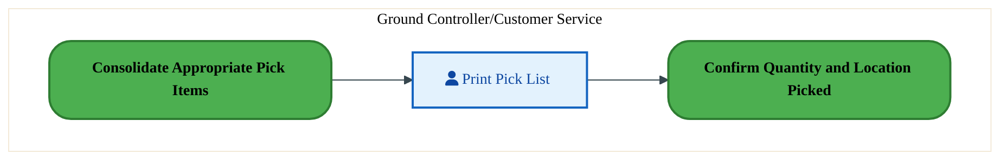
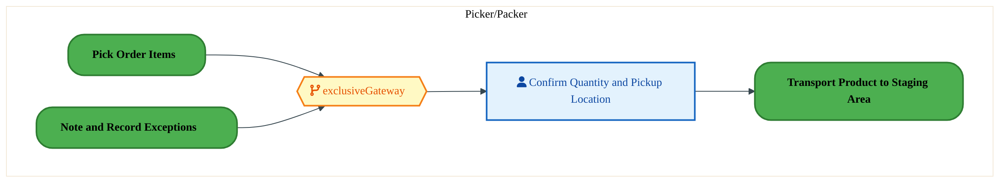
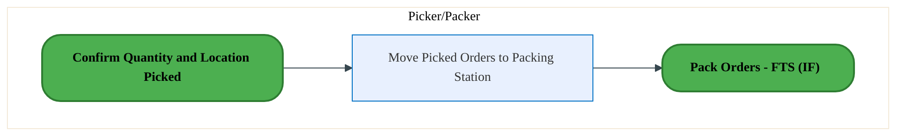

  <img src="data:image/svg+xml;base64,PHN2ZyB4bWxucz0iaHR0cDovL3d3dy53My5vcmcvMjAwMC9zdmciIHZpZXdCb3g9IjAgMCA4MDAgNDgwIiB3aWR0aD0iODAwIiBoZWlnaHQ9IjQ4MCI+DQogIDxkZWZzPg0KICAgIDxsaW5lYXJHcmFkaWVudCBpZD0iYmciIHgxPSIwJSIgeTE9IjAlIiB4Mj0iMTAwJSIgeTI9IjEwMCUiPg0KICAgICAgPHN0b3Agb2Zmc2V0PSIwJSIgc3R5bGU9InN0b3AtY29sb3I6IzAwNzFjNTtzdG9wLW9wYWNpdHk6MSIvPg0KICAgICAgPHN0b3Agb2Zmc2V0PSIxMDAlIiBzdHlsZT0ic3RvcC1jb2xvcjojMDBhZWVmO3N0b3Atb3BhY2l0eToxIi8+DQogICAgPC9saW5lYXJHcmFkaWVudD4NCiAgICA8bGluZWFyR3JhZGllbnQgaWQ9ImFjY2VudCIgeDE9IjAlIiB5MT0iMCUiIHgyPSIwJSIgeTI9IjEwMCUiPg0KICAgICAgPHN0b3Agb2Zmc2V0PSIwJSIgc3R5bGU9InN0b3AtY29sb3I6I2ZmZmZmZjtzdG9wLW9wYWNpdHk6MC4xNSIvPg0KICAgICAgPHN0b3Agb2Zmc2V0PSIxMDAlIiBzdHlsZT0ic3RvcC1jb2xvcjojZmZmZmZmO3N0b3Atb3BhY2l0eTowLjAyIi8+DQogICAgPC9saW5lYXJHcmFkaWVudD4NCiAgICA8cGF0dGVybiBpZD0iZ3JpZCIgd2lkdGg9IjQwIiBoZWlnaHQ9IjQwIiBwYXR0ZXJuVW5pdHM9InVzZXJTcGFjZU9uVXNlIj4NCiAgICAgIDxwYXRoIGQ9Ik0gNDAgMCBMIDAgMCAwIDQwIiBmaWxsPSJub25lIiBzdHJva2U9InJnYmEoMjU1LDI1NSwyNTUsMC4wNykiIHN0cm9rZS13aWR0aD0iMC41Ii8+DQogICAgPC9wYXR0ZXJuPg0KICA8L2RlZnM+DQoNCiAgPCEtLSBCYWNrZ3JvdW5kIC0tPg0KICA8cmVjdCB3aWR0aD0iODAwIiBoZWlnaHQ9IjQ4MCIgZmlsbD0idXJsKCNiZykiIHJ4PSI4Ii8+DQogIDxyZWN0IHdpZHRoPSI4MDAiIGhlaWdodD0iNDgwIiBmaWxsPSJ1cmwoI2dyaWQpIiByeD0iOCIvPg0KICA8cmVjdCB3aWR0aD0iODAwIiBoZWlnaHQ9IjQ4MCIgZmlsbD0idXJsKCNhY2NlbnQpIiByeD0iOCIvPg0KDQogIDwhLS0gRGVjb3JhdGl2ZSBjaXJjdWl0L2FyY2hpdGVjdHVyZSBsaW5lcyAtLT4NCiAgPGcgc3Ryb2tlPSJyZ2JhKDI1NSwyNTUsMjU1LDAuMTIpIiBzdHJva2Utd2lkdGg9IjEuNSIgZmlsbD0ibm9uZSI+DQogICAgPHBhdGggZD0iTSAwIDEwMCBMIDEyMCAxMDAgTCAxNjAgMTQwIEwgMjgwIDE0MCIvPg0KICAgIDxwYXRoIGQ9Ik0gMCAyNjAgTCA4MCAyNjAgTCAxMjAgMjIwIEwgMjAwIDIyMCBMIDI0MCAyNjAgTCAzNjAgMjYwIi8+DQogICAgPHBhdGggZD0iTSA1MjAgMTAwIEwgNjAwIDEwMCBMIDY0MCA2MCBMIDgwMCA2MCIvPg0KICAgIDxwYXRoIGQ9Ik0gNDQwIDM0MCBMIDU2MCAzNDAgTCA2MDAgMzAwIEwgNzIwIDMwMCBMIDc2MCAzNDAgTCA4MDAgMzQwIi8+DQogICAgPHBhdGggZD0iTSA2MDAgNDAwIEwgNjgwIDQwMCBMIDcyMCA0NDAiLz4NCiAgICA8cGF0aCBkPSJNIDAgNDAwIEwgNDAgNDAwIEwgODAgMzYwIi8+DQogICAgPHBhdGggZD0iTSAyMDAgNDIwIEwgMzIwIDQyMCBMIDM2MCAzODAgTCA0ODAgMzgwIi8+DQogICAgPHBhdGggZD0iTSA2NTAgNDQwIEwgNzUwIDQ0MCBMIDgwMCA0ODAiLz4NCiAgPC9nPg0KDQogIDwhLS0gRGVjb3JhdGl2ZSBub2RlcyAtLT4NCiAgPGcgZmlsbD0icmdiYSgyNTUsMjU1LDI1NSwwLjE4KSI+DQogICAgPGNpcmNsZSBjeD0iMTIwIiBjeT0iMTAwIiByPSI0Ii8+DQogICAgPGNpcmNsZSBjeD0iMjgwIiBjeT0iMTQwIiByPSI0Ii8+DQogICAgPGNpcmNsZSBjeD0iMjAwIiBjeT0iMjIwIiByPSI0Ii8+DQogICAgPGNpcmNsZSBjeD0iMzYwIiBjeT0iMjYwIiByPSI0Ii8+DQogICAgPGNpcmNsZSBjeD0iNjAwIiBjeT0iMTAwIiByPSI0Ii8+DQogICAgPGNpcmNsZSBjeD0iNzIwIiBjeT0iMzAwIiByPSI0Ii8+DQogICAgPGNpcmNsZSBjeD0iNTYwIiBjeT0iMzQwIiByPSI0Ii8+DQogICAgPGNpcmNsZSBjeD0iODAiIGN5PSIzNjAiIHI9IjQiLz4NCiAgICA8Y2lyY2xlIGN4PSI0ODAiIGN5PSIzODAiIHI9IjQiLz4NCiAgICA8Y2lyY2xlIGN4PSIzMjAiIGN5PSI0MjAiIHI9IjQiLz4NCiAgPC9nPg0KDQogIDwhLS0gVE9HQUYgQkRBVCBib3hlcyAtLT4NCiAgPGcgZm9udC1mYW1pbHk9IlNlZ29lIFVJLCBBcmlhbCwgc2Fucy1zZXJpZiIgZm9udC1zaXplPSIxNCIgZm9udC13ZWlnaHQ9IjYwMCI+DQogICAgPCEtLSBCIC0tPg0KICAgIDxyZWN0IHg9IjE1MCIgeT0iMTQwIiB3aWR0aD0iMTIwIiBoZWlnaHQ9IjQwIiByeD0iNSIgZmlsbD0icmdiYSgyNTUsMjU1LDI1NSwwLjE4KSIgc3Ryb2tlPSJyZ2JhKDI1NSwyNTUsMjU1LDAuMykiIHN0cm9rZS13aWR0aD0iMSIvPg0KICAgIDx0ZXh0IHg9IjIxMCIgeT0iMTY1IiB0ZXh0LWFuY2hvcj0ibWlkZGxlIiBmaWxsPSIjZmZmIj5CdXNpbmVzczwvdGV4dD4NCiAgICA8IS0tIEQgLS0+DQogICAgPHJlY3QgeD0iMjkwIiB5PSIxNDAiIHdpZHRoPSIxMjAiIGhlaWdodD0iNDAiIHJ4PSI1IiBmaWxsPSJyZ2JhKDI1NSwyNTUsMjU1LDAuMTgpIiBzdHJva2U9InJnYmEoMjU1LDI1NSwyNTUsMC4zKSIgc3Ryb2tlLXdpZHRoPSIxIi8+DQogICAgPHRleHQgeD0iMzUwIiB5PSIxNjUiIHRleHQtYW5jaG9yPSJtaWRkbGUiIGZpbGw9IiNmZmYiPkRhdGE8L3RleHQ+DQogICAgPCEtLSBBIC0tPg0KICAgIDxyZWN0IHg9IjQzMCIgeT0iMTQwIiB3aWR0aD0iMTIwIiBoZWlnaHQ9IjQwIiByeD0iNSIgZmlsbD0icmdiYSgyNTUsMjU1LDI1NSwwLjE4KSIgc3Ryb2tlPSJyZ2JhKDI1NSwyNTUsMjU1LDAuMykiIHN0cm9rZS13aWR0aD0iMSIvPg0KICAgIDx0ZXh0IHg9IjQ5MCIgeT0iMTY1IiB0ZXh0LWFuY2hvcj0ibWlkZGxlIiBmaWxsPSIjZmZmIj5BcHBsaWNhdGlvbjwvdGV4dD4NCiAgICA8IS0tIFQgLS0+DQogICAgPHJlY3QgeD0iNTcwIiB5PSIxNDAiIHdpZHRoPSIxMjAiIGhlaWdodD0iNDAiIHJ4PSI1IiBmaWxsPSJyZ2JhKDI1NSwyNTUsMjU1LDAuMTgpIiBzdHJva2U9InJnYmEoMjU1LDI1NSwyNTUsMC4zKSIgc3Ryb2tlLXdpZHRoPSIxIi8+DQogICAgPHRleHQgeD0iNjMwIiB5PSIxNjUiIHRleHQtYW5jaG9yPSJtaWRkbGUiIGZpbGw9IiNmZmYiPlRlY2hub2xvZ3k8L3RleHQ+DQogIDwvZz4NCg0KICA8IS0tIENvbm5lY3RpbmcgbGluZXMgYmV0d2VlbiBCREFUIGJveGVzIC0tPg0KICA8ZyBzdHJva2U9InJnYmEoMjU1LDI1NSwyNTUsMC4yNSkiIHN0cm9rZS13aWR0aD0iMSI+DQogICAgPGxpbmUgeDE9IjI3MCIgeTE9IjE2MCIgeDI9IjI5MCIgeTI9IjE2MCIvPg0KICAgIDxsaW5lIHgxPSI0MTAiIHkxPSIxNjAiIHgyPSI0MzAiIHkyPSIxNjAiLz4NCiAgICA8bGluZSB4MT0iNTUwIiB5MT0iMTYwIiB4Mj0iNTcwIiB5Mj0iMTYwIi8+DQogIDwvZz4NCg0KICA8IS0tIE1haW4gdGl0bGUgLS0+DQogIDx0ZXh0IHg9IjQwMCIgeT0iMjYwIiB0ZXh0LWFuY2hvcj0ibWlkZGxlIiBmb250LWZhbWlseT0iU2Vnb2UgVUksIEFyaWFsLCBzYW5zLXNlcmlmIiBmb250LXNpemU9IjM2IiBmb250LXdlaWdodD0iNzAwIiBmaWxsPSIjZmZmZmZmIiBsZXR0ZXItc3BhY2luZz0iMSI+DQogICAgSUFPIEFyY2hpdGVjdHVyZQ0KICA8L3RleHQ+DQogIDx0ZXh0IHg9IjQwMCIgeT0iMzAwIiB0ZXh0LWFuY2hvcj0ibWlkZGxlIiBmb250LWZhbWlseT0iU2Vnb2UgVUksIEFyaWFsLCBzYW5zLXNlcmlmIiBmb250LXNpemU9IjE4IiBmb250LXdlaWdodD0iNDAwIiBmaWxsPSJyZ2JhKDI1NSwyNTUsMjU1LDAuOCkiIGxldHRlci1zcGFjaW5nPSIyIj4NCiAgICBUT0dBRiBCREFUIMK3IElBTyBQcm9ncmFtIMK3IElETSAyLjANCiAgPC90ZXh0Pg0KDQogIDwhLS0gQm90dG9tIGFjY2VudCBiYXIgLS0+DQogIDxyZWN0IHg9IjI4MCIgeT0iMzQwIiB3aWR0aD0iMjQwIiBoZWlnaHQ9IjMiIHJ4PSIxLjUiIGZpbGw9InJnYmEoMjU1LDI1NSwyNTUsMC40KSIvPg0KDQogIDwhLS0gSW50ZWwgdGV4dCAtLT4NCiAgPHRleHQgeD0iNDAwIiB5PSIzODAiIHRleHQtYW5jaG9yPSJtaWRkbGUiIGZvbnQtZmFtaWx5PSJTZWdvZSBVSSwgQXJpYWwsIHNhbnMtc2VyaWYiIGZvbnQtc2l6ZT0iMTMiIGZpbGw9InJnYmEoMjU1LDI1NSwyNTUsMC41KSIgbGV0dGVyLXNwYWNpbmc9IjMiPg0KICAgIElOVEVMIENPTkZJREVOVElBTA0KICA8L3RleHQ+DQo8L3N2Zz4NCg==" alt="IAO Architecture" style="width:100%; border-radius:8px;" />
  <h1 style="font-size:36px; margin-top:24px;">LO-160 — Pick Orders - FTS (IF)</h1>
  <h2 style="font-size:24px;">Architecture Document (TOGAF BDAT)</h2>
  
Forecast to Stock (IF) (FTS-IF) Tower 
  Capability LO-160 · LO Logistics Management Outbound - FTS (IF)

  
IAO Program · Release 3 
  Generated: March 2026 
  Sajiv Francis

  
IAO Architecture Pipeline — Intel Confidential

Page 1<a href="#toc">↑ Back to TOC</a>LO-160 — Pick Orders - FTS (IF)

## Table of Contents

<nav class="toc">
<ol>
  <li><a href="#1-executive-summary">1. Executive Summary</a></li>
  <li><a href="#2-business-context-objectives">2. Business Context &amp; Objectives</a>
    <ul>
      <li><a href="#21-classification">2.1 Classification</a></li>
      <li><a href="#22-business-drivers">2.2 Business Drivers</a></li>
      <li><a href="#23-success-criteria">2.3 Success Criteria</a></li>
      <li><a href="#24-companion-documents">2.4 Companion Documents</a></li>
    </ul>
  </li>
  <li><a href="#3-business-architecture-togaf-b">3. Business Architecture (TOGAF &ldquo;B&rdquo;)</a>
    <ul>
      <li><a href="#31-business-process-overview">3.1 Business Process Overview</a></li>
      <li><a href="#32-business-process-diagrams">3.2 Business Process Diagrams</a></li>
      <li><a href="#33-business-roles-responsibilities">3.3 Business Roles &amp; Responsibilities</a></li>
    </ul>
  </li>
  <li><a href="#4-data-architecture-togaf-d">4. Data Architecture (TOGAF &ldquo;D&rdquo;)</a>
    <ul>
      <li><a href="#41-data-entities-ownership">4.1 Data Entities &amp; Ownership</a></li>
      <li><a href="#42-data-flow-diagrams">4.2 Data Flow Diagrams</a></li>
      <li><a href="#43-data-lineage">4.3 Data Lineage</a></li>
      <li><a href="#44-ricefw-data-objects">4.4 RICEFW Data Objects</a></li>
      <li><a href="#45-data-governance-quality">4.5 Data Governance &amp; Quality</a></li>
    </ul>
  </li>
  <li><a href="#5-application-architecture-togaf-a">5. Application Architecture (TOGAF &ldquo;A&rdquo;)</a>
    <ul>
      <li><a href="#51-current-state-current-state-application-landscape">5.1 Current-State Application Landscape</a></li>
      <li><a href="#52-future-state-future-state-application-landscape">5.2 Future-State Application Landscape</a></li>
      <li><a href="#53-change-impact-summary">5.3 Change Impact Summary</a></li>
      <li><a href="#54-component-overview">5.4 Component Overview</a></li>
      <li><a href="#55-ricefw-inventory">5.5 RICEFW Inventory</a></li>
      <li><a href="#56-integration-patterns">5.6 Integration Patterns</a></li>
    </ul>
  </li>
  <li><a href="#6-technology-architecture-togaf-t">6. Technology Architecture (TOGAF &ldquo;T&rdquo;)</a>
    <ul>
      <li><a href="#61-platform-infrastructure">6.1 Platform &amp; Infrastructure</a></li>
      <li><a href="#62-sap-development-object-status">6.2 SAP Development Object Status</a></li>
      <li><a href="#63-nfrs-design-principles">6.3 NFRs &amp; Design Principles</a></li>
      <li><a href="#64-security-governance">6.4 Security &amp; Governance</a></li>
    </ul>
  </li>
  <li><a href="#7-project-context">7. Project Context</a>
    <ul>
      <li><a href="#71-project-roadmap-go-live-plan">7.1 Project Roadmap &amp; Go-Live Plan</a></li>
      <li><a href="#72-raid-log">7.2 RAID Log</a></li>
      <li><a href="#73-recommendations-next-steps">7.3 Recommendations &amp; Next Steps</a></li>
    </ul>
  </li>
</ol>
</nav>

Page 2<a href="#toc">↑ Back to TOC</a>LO-160 — Pick Orders - FTS (IF)

## 1. Executive Summary

This Architecture Document defines the **Business, Data, Application, and Technology** (BDAT) architecture for **LO-160 Pick Orders - FTS (IF)** within the IAO program. It includes 10 BPMN process diagram(s) in Section 3.

| Dimension | Value |
|-----------|-------|
| **Tower** | Forecast to Stock (IF) (FTS-IF) |
| **Process Group** | LO Logistics Management Outbound - FTS (IF) |
| **Capability** | LO-160 - Pick Orders - FTS (IF) |
| **Release** | Release 3 |
| **Total Systems** | 0 |
| **System Status** | 0 Deployed, 0 Developing, 0 EOL, 0 Pending IAPM |
| **RICEFW Objects** | 2 Reports, 18 Interfaces, 3 Conversions, 19 Enhancements, 9 Forms, 3 Workflows |

**Change Summary**: 0 new flow chains, 0 removed, 0 modified, 0 unchanged between Current-State and Future-State states.

> All system nodes in architecture diagrams are **IAPM-linked** — click any node to open its IAPM page. Diagrams require `securityLevel: 'loose'` for click events.

Page 3<a href="#toc">↑ Back to TOC</a>LO-160 — Pick Orders - FTS (IF)

## 2. Business Context & Objectives

### 2.1 Classification

| Level | Value |
|-------|-------|
| **L0 Tower** | Forecast to Stock (IF) |
| **L1 Process** | LO Logistics Management Outbound - FTS (IF) |
| **L2 Capability** | LO-160 - Pick Orders - FTS (IF) |

### 2.2 Business Drivers

| # | Driver | Description | Strategic Alignment | Priority |
|---|--------|-------------|---------------------|----------|
| 1 | Intel Foundry Supply Chain Integration | Integrate Intel Foundry manufacturing and logistics into unified S/4 HANA supply chain | IDM 2.0 Foundry Enablement | High |
| 2 | Warehouse & Logistics Modernization | Modernize warehouse management and shipping processes with EWM integration | Supply Chain Digital Transformation | High |
| 3 | Production Planning Optimization | Enable MRP-driven production planning with real-time material availability | Manufacturing Excellence | Medium |
| 4 | LO-160 Process Migration | Migrate Pick Orders - FTS (IF) business processes and 0 integrated systems from legacy to S/4 HANA target architecture | IDM 2.0 Supply Chain (Intel Foundry) | High |

Page 4<a href="#toc">↑ Back to TOC</a>LO-160 — Pick Orders - FTS (IF)

### 2.3 Success Criteria

| Metric | Target | Measure | Baseline | Owner |
|--------|--------|---------|----------|-------|
| Order Fulfillment Lead Time | < 48 hours | Time from production completion to shipment dispatch | 72 hours (legacy) | Logistics Manager |
| Inventory Accuracy | > 99.5% | Physical vs system inventory match rate | 97.8% (current) | Warehouse Manager |
| MRP Planning Cycle | < 4 hours | End-to-end MRP run including exception processing | 8 hours (legacy) | Planning Lead |
| LO-160 Migration Completeness | 100% flow chains validated | All 0 flow chains verified in target state | 0% (pre-migration) | Tower Architect |

### 2.4 Companion Documents

| Document | Description |
|----------|-------------|
| **Business Architecture** | Included in this document (Section 3) — process flows from BPMN diagrams |
| **This Document** | Full BDAT Architecture — Business + Data + Application + Technology |

Page 5<a href="#toc">↑ Back to TOC</a>LO-160 — Pick Orders - FTS (IF)

## 3. Business Architecture (TOGAF "B")

### 3.1 Business Process Overview

This capability includes **10 business process(es)** modeled in BPMN 2.0, covering the end-to-end workflow for LO-160 Pick Orders - FTS (IF).

| # | Step ID | Process Name | Lanes | Tasks | Gateways |
|---|---------|--------------|-------|-------|----------|
| 1 | LO-160-020_Plan_Daily_Pick_Flow_-_FTS_(IF) | LO-160-020_Plan_Daily_Pick_Flow_-_FTS_(IF) | Picker/Packer | 3 | 0 |
| 2 | LO-160-030_Consolidate_Appropriate_Pick_Items_-_FTS_(IF) | LO-160-030_Consolidate_Appropriate_Pick_Items_-_FTS_(IF) | Picker/Packer | 4 | 4 |
| 3 | LO-160-030_Consolidate_Appropriate_Pick_Items_-_FTS_(IF)_GXO | LO-160-030_Consolidate_Appropriate_Pick_Items_-_FTS_(IF)_GXO | Picker/Packer | 5 | 6 |
| 4 | LO-160-040_Generate_Pick_Tickets_-_FTS_(IF) | LO-160-040_Generate_Pick_Tickets_-_FTS_(IF) | Ground Controller/Customer Service | 1 | 0 |
| 5 | LO-160-050_Pick_Order_Items_-_FTS_(IF) | LO-160-050_Pick_Order_Items_-_FTS_(IF) | Picker/Packer | 4 | 3 |
| 6 | LO-160-050_Pick_Order_Items_-_FTS_(IF)_GXO | LO-160-050_Pick_Order_Items_-_FTS_(IF)_GXO | Picker/Packer | 5 | 4 |
| 7 | LO-160-070_Note_and_Record_Exceptions_-_FTS_(IF) | LO-160-070_Note_and_Record_Exceptions_-_FTS_(IF) | Picker/Packer | 6 | 2 |
| 8 | LO-160-070_Note_and_Record_Exceptions_-_FTS_(IF)_GXO | LO-160-070_Note_and_Record_Exceptions_-_FTS_(IF)_GXO | Picker/Packer | 7 | 3 |
| 9 | LO-160-080_Confirm_Quantity_and_Location_Picked_-_FTS_(IF) | LO-160-080_Confirm_Quantity_and_Location_Picked_-_FTS_(IF) | Picker/Packer | 1 | 1 |
| 10 | LO-160-090_Transport_Product_to_Staging_Area_-_FTS_(IF) | LO-160-090_Transport_Product_to_Staging_Area_-_FTS_(IF) | Picker/Packer | 1 | 0 |

Page 6<a href="#toc">↑ Back to TOC</a>LO-160 — Pick Orders - FTS (IF)

### 3.2 Business Process Diagrams

#### BUSINESS ARCHITECTURE — 3.2.1 LO-160-020_Plan_Daily_Pick_Flow_-_FTS_(IF) — LO-160-020_Plan_Daily_Pick_Flow_-_FTS_(IF)

**Swim Lanes**: Picker/Packer | **Tasks**: 3 | **Gateways**: 0

```mermaid
%%{init: {'theme': 'base', 'themeVariables': {'fontSize': '14px', 'fontFamily': 'Segoe UI, Arial, sans-serif','primaryColor': '#e8f0fe', 'primaryBorderColor': '#0071c5','lineColor': '#37474F', 'secondaryColor': '#f5f8fc'}, 'flowchart': {'useMaxWidth': false, 'htmlLabels': true, 'curve': 'basis', 'nodeSpacing': 40, 'rankSpacing': 50}} }%%
flowchart TD
    classDef startEvt fill:#4CAF50,stroke:#2E7D32,color:#000,font-weight:bold,stroke-width:2px,rx:20,ry:20
    classDef endEvt fill:#C62828,stroke:#B71C1C,color:#fff,font-weight:bold,stroke-width:2px,rx:20,ry:20
    classDef userTask fill:#E3F2FD,stroke:#1565C0,stroke-width:2px,color:#0D47A1
    classDef serviceTask fill:#FFF3E0,stroke:#E65100,stroke-width:2px,color:#BF360C
    classDef gateway fill:#FFF9C4,stroke:#F57F17,stroke-width:2px,color:#E65100
    classDef subProc fill:#F3E5F5,stroke:#7B1FA2,stroke-width:2px,color:#4A148C
    subgraph Picker/Packer
        n1["fa:fa-user Get Pick Plan for All Schedule Deliveries"]
        n2["Update Pick Plan"]
        n3["Plan and Allocate Resources"]
        n4["Consolidate Appropriate Pick Items"]
        n5["Allocate Inventory to Shipments/Deliveries"]
    end
    n3 --> n2
    n5 --> n1
    n1 --> n3
    n2 --> n4
    class n1 userTask
    class n4 startEvt
    class n5 startEvt
```

> **Legend**: ● Start · ● End · User Task · Service Task · ◇ Gateway · Sub-Process

<a href="https://mermaid.live/view#pako:eNqlVE2PmzAQ_SsWqxUXouVzSTlUSkioVmqlVbNtD90eHBgHK8ZGtsluGuW_1yYJ2aTdUzkA83jz3sxge-eUogInc25vd5RTnaGdq2towM2Qu8QKXA8dgO9YUrxkoFzLIYLrBf3d04K4fbU0ixW4oWxr0QWsBKBvDx6amETmIYW5GimQlLie20raYLnNBRPSsm9gTHzSux0_TYWsQJ4Jvp8GZWJSGeVwhqM0TuPC5ikoBa8uRElCxqR097Y4Jl7KGkvdl98p-IJff9BK1yYmmCkwnFo37DNeArM9atlZrOzk5jQMqqwPNwNbtLikfGXw2DeQxHx9hhJ_v0f729tnPpiip9kzR-YqGVZqBgQpbeD5RiNCGctu4nxSJL6ntBRryG7CeTqLQq-0nWSmdd-zwx29AF3VOlsKVh2poxfbQxa2r558zULfk1tzv_ICXp2d8vtwHI4Hp2ka5EF-ciKE_JeTmat8wmp99JpHRVjMBq8guU9y_2-9U5uzOJ0E13MCuaElvBEtiiKan0c1v08C_33RaRHd-_mV6ApreMHbs-CHPB4EiyQtgvRdwYPfdZXd8lGK8iQYzZMiGQTTaVBMwncF40kQj48VGp2VxG2NHmm5Bnn3iO3j8M1ePPj57BCcETyyo0afQPdU9MgwR0RINGEMLcoaqo4BmgGjG7PjQD07v96ohEblW1uZKZyzLxmRYfSamFdWU5SW_BWU6GR5LRcbci64Eoz2mpO2lcJs40H_QUNzlZOYnEH3gW-AayG3SAu0qGnbmFDd_aN8s5QPLzxCo9FH08oxTA7hcfnw4BBGxzA8hPGb32Y5p-V6AcfD3ryAkwF2PKcB2WBaOdnO6Q9Hc4BWQHDHtLP3HNxpsdjy0sn6Q8Tp-lHPKDb_tjmA-z8yIcAR" title="View full diagram">&#128065; View Diagram</a>

#### BUSINESS ARCHITECTURE — 3.2.2 LO-160-030_Consolidate_Appropriate_Pick_Items_-_FTS_(IF) — LO-160-030_Consolidate_Appropriate_Pick_Items_-_FTS_(IF)

**Swim Lanes**: Picker/Packer | **Tasks**: 4 | **Gateways**: 4

```mermaid
%%{init: {'theme': 'base', 'themeVariables': {'fontSize': '14px', 'fontFamily': 'Segoe UI, Arial, sans-serif','primaryColor': '#e8f0fe', 'primaryBorderColor': '#0071c5','lineColor': '#37474F', 'secondaryColor': '#f5f8fc'}, 'flowchart': {'useMaxWidth': false, 'htmlLabels': true, 'curve': 'basis', 'nodeSpacing': 40, 'rankSpacing': 50}} }%%
flowchart TD
    classDef startEvt fill:#4CAF50,stroke:#2E7D32,color:#000,font-weight:bold,stroke-width:2px,rx:20,ry:20
    classDef endEvt fill:#C62828,stroke:#B71C1C,color:#fff,font-weight:bold,stroke-width:2px,rx:20,ry:20
    classDef userTask fill:#E3F2FD,stroke:#1565C0,stroke-width:2px,color:#0D47A1
    classDef serviceTask fill:#FFF3E0,stroke:#E65100,stroke-width:2px,color:#BF360C
    classDef gateway fill:#FFF9C4,stroke:#F57F17,stroke-width:2px,color:#E65100
    classDef subProc fill:#F3E5F5,stroke:#7B1FA2,stroke-width:2px,color:#4A148C
    subgraph Picker/Packer
        n1["fa:fa-user Create Waves"]
        n2["fa:fa-user Release Waves"]
        n3[["fa:fa-cog Release Waves"]]
        n4[["fa:fa-cog Create Picking Warehouse Task"]]
        n5["Generate Pick Tickets"]
        n6["Note and Record Exceptions - FTS (IF)"]
        n7["Plan Daily Pick Flow"]
        n8{{"fa:fa-code-branch Type of Wave Release?"}}
        n9{{"fa:fa-code-branch exclusiveGateway"}}
        n10{{"fa:fa-code-branch Wave?"}}
        n11{{"fa:fa-arrows-alt parallelGateway"}}
    end
    n7 --> n10
    n1 --> n8
    n2 --> n9
    n3 --> n9
    n9 --> n4
    n8 -->|"Manual"| n2
    n4 --> n11
    n11 --> n6
    n11 --> n5
    n10 -->|"Yes"| n1
    n8 -->|"Automated"| n3
    n10 -->|"No"| n9
    class n1 userTask
    class n2 userTask
    class n3 serviceTask
    class n4 serviceTask
    class n5 startEvt
    class n6 startEvt
    class n7 startEvt
    class n8 gateway
    class n9 gateway
    class n10 gateway
    class n11 gateway
```

> **Legend**: ● Start · ● End · User Task · Service Task · ◇ Gateway · Sub-Process

<a href="https://mermaid.live/view#pako:eNqlVV2P4jYU_StWRiNaKVHjfJCQh1ZMIKuVuqtRoV1VSx9McgPWGBs5CR9l-e-1SQIkwzw1D8A9Pueeey-2czJSkYERGc_PJ8ppGaHToFzDBgYRGixJAQMT1cBfRFKyZFAMNCcXvJzRfy807G0PmqaxhGwoO2p0BisB6M_PJhorITNRQXhhFSBpPjAHW0k3RB5jwYTU7CcIczu_uDVLL0JmIG8E2w5w6ispoxxusBt4gZdoXQGp4Fknae7nYZ4Ozro4JvbpmsjyUn5VwBdy-Eazcq3inLACFGddbtjvZAlM91jKSmNpJXftMGihfbga2GxLUspXCvdsBUnC326Qb5_P6Pz8vOBXUzSfLDhST8pIUUwgR0Wp4OmuRDllLHry4nHi22ZRSvEG0ZMzDSauY6a6k0i1bpt6uNYe6GpdRkvBsoZq7XUPkbM9mPIQObYpj-qz5wU8uznFQyd0wqvTS4BjHLdOeZ7_Lyc1VzknxVvjNXUTJ5lcvbA_9GP7fb62zYkXjHF_TiB3NIW7pEmSuNPbqKZDH9sfJ31J3KEd95KuSAl7crwlHMXeNWHiBwkOPkxY-_WrrJavUqRtQnfqJ_41YfCCk7HzYUJvjL2wqVDlWUmyXaNXmr6B_OWV6K96TT8cf18YOYlyYulRo1iCagV9IzsoFsY_d0SnS_wDGKjT_Ijpfr9SU7F6x7ynel1q465rVTtfKSSshbJD-t_qSX2l_AQcZKtAc91i2StmqGhfhaIQnqlSUnUJoOkhhW1JBS-QhZL5DP30Ofm5KwuU7JURjiZEXT91_kQdvi4rPJ1u5WdgLdW5TddoftwCEvml47b93xbG-XwnHT2WwiFlVUF38KneUT0Vth_LtFPfAeMbl0gp9oVFWIm2RBLGgL0zUIe6_sEDZFm_arMmxnUcNqFTh6MmdLvhqA69Jgx1-GNhfCG8Imxh_FD6ZslrbHBr0_gMe7HfxnaT62-9j1Qi3PMYV6XYqLayy6rbl30VF3x0d9R0b-0V04Gdx7B7f310VrwPV_zr1dyBh4_h4DEctldMBx09RFXDD2HcwoZpbEBuCM2M6GRcXsbqhZ1BTipWGmfTIGqQsyNPjejy0jKqbaaUE0rUXbKpwfN_ii57rQ==" title="View full diagram">&#128065; View Diagram</a>

Page 7<a href="#toc">↑ Back to TOC</a>LO-160 — Pick Orders - FTS (IF)

#### BUSINESS ARCHITECTURE — 3.2.3 LO-160-030_Consolidate_Appropriate_Pick_Items_-_FTS_(IF)_GXO — LO-160-030_Consolidate_Appropriate_Pick_Items_-_FTS_(IF)_GXO

**Swim Lanes**: Picker/Packer | **Tasks**: 5 | **Gateways**: 6

```mermaid
%%{init: {'theme': 'base', 'themeVariables': {'fontSize': '14px', 'fontFamily': 'Segoe UI, Arial, sans-serif','primaryColor': '#e8f0fe', 'primaryBorderColor': '#0071c5','lineColor': '#37474F', 'secondaryColor': '#f5f8fc'}, 'flowchart': {'useMaxWidth': false, 'htmlLabels': true, 'curve': 'basis', 'nodeSpacing': 40, 'rankSpacing': 50}} }%%
flowchart TD
    classDef startEvt fill:#4CAF50,stroke:#2E7D32,color:#000,font-weight:bold,stroke-width:2px,rx:20,ry:20
    classDef endEvt fill:#C62828,stroke:#B71C1C,color:#fff,font-weight:bold,stroke-width:2px,rx:20,ry:20
    classDef userTask fill:#E3F2FD,stroke:#1565C0,stroke-width:2px,color:#0D47A1
    classDef serviceTask fill:#FFF3E0,stroke:#E65100,stroke-width:2px,color:#BF360C
    classDef gateway fill:#FFF9C4,stroke:#F57F17,stroke-width:2px,color:#E65100
    classDef subProc fill:#F3E5F5,stroke:#7B1FA2,stroke-width:2px,color:#4A148C
    subgraph Picker/Packer
        n1["fa:fa-user Create Waves"]
        n2["fa:fa-user Release Waves"]
        n3[["fa:fa-cog Release Waves"]]
        n4[["fa:fa-cog Create Picking Warehouse Task"]]
        n5[["fa:fa-cog Send Pick warehouse task to Kommand Autostore"]]
        n6["Generate Pick Tickets"]
        n7["Note and Record Exceptions - FTS (IF)"]
        n8["Plan Daily Pick Flow"]
        n9{{"fa:fa-code-branch Type of Wave Release?"}}
        n10{{"fa:fa-code-branch exclusiveGateway"}}
        n11{{"fa:fa-code-branch Wave?"}}
        n12{{"fa:fa-code-branch AutoStore Relevant?"}}
        n13{{"fa:fa-code-branch exclusiveGateway"}}
        n14{{"fa:fa-arrows-alt parallelGateway"}}
    end
    n8 --> n11
    n1 --> n9
    n2 --> n10
    n3 --> n10
    n10 --> n4
    n9 -->|"Manual"| n2
    n4 --> n12
    n14 --> n6
    n11 -->|"Yes"| n1
    n9 -->|"Automated"| n3
    n11 -->|"No"| n10
    n12 -->|"Yes"| n5
    n12 -->|"No"| n14
    n14 --> n7
    n5 --> n13
    n13 --> n7
    n13 --> n6
    class n1 userTask
    class n2 userTask
    class n3 serviceTask
    class n4 serviceTask
    class n5 serviceTask
    class n6 startEvt
    class n7 startEvt
    class n8 startEvt
    class n9 gateway
    class n10 gateway
    class n11 gateway
    class n12 gateway
    class n13 gateway
    class n14 gateway
```

> **Legend**: ● Start · ● End · User Task · Service Task · ◇ Gateway · Sub-Process

<a href="https://mermaid.live/view#pako:eNqlVluP4jYY_StWRiNaKai5EshDKwbIarXd1WihXVVLH0zyBaJxbGSbW1n-e21ygWTCS8sDzHe-c853SeLJ2YhZAkZoPD-fM5rJEJ17cgM59ELUW2EBPRMVwJ-YZ3hFQPQ0J2VUzrN_rjTb2x41TWMRzjNy0ugc1gzQHx9NNFZCYiKBqegL4FnaM3tbnuWYnyaMMK7ZTzBMrfRarUy9MJ4AvxEsK7BjX0lJRuEGu4EXeJHWCYgZTRqmqZ8O07h30c0Rdog3mMtr-zsBn_HxW5bIjYpTTAQozkbm5He8AqJnlHynsXjH99UyMqHrULWw-RbHGV0r3LMUxDF9u0G-dbmgy_PzktZF0WK6pEh9YoKFmEKKhFTwbC9RmhESPnmTceRbppCcvUH45MyCqeuYsZ4kVKNbpl5u_wDZeiPDFSNJSe0f9Ayhsz2a_Bg6lslP6rtVC2hyqzQZOENnWFd6CeyJPakqpWn6vyqpvfIFFm9lrZkbOdG0rmX7A39ivferxpx6wdhu7wn4PovhzjSKInd2W9Vs4NvWY9OXyB1Yk5bpGks44NPNcDTxasPIDyI7eGhY1Gt3uVu9chZXhu7Mj_zaMHixo7Hz0NAb296w7FD5rDnebtBrFr8B_-UV658ipz_U_r40UhymuK9XjSYc1CjoG96DWBp_3xGdJvErEFBPcxfT_V5TY7Z-x7ynek1qWV33qu58peCwYaoc0lerJfWb0rm6J69CdKhVUl9jydAnludYpcc7yYRkHFpWA-X0ASjwqjha6G3J1lyBon1hiqK9vqrDgSdodoxhKzNGBeqjaDFHP32Mfm7Khkr2SjBFU6xOssI_Us9xkzU6n2_jJNBfqSMg3qDFaQuIpdflVZv8bWlcLveX0OrWwjEmO5Ht4UNxd7ZldrdMl3pXwunm6o3O9Uavve0xle-U7n9rzrvJMOfsIPqYSLTFHBMC5J1IXf3iDzpE_f6veroytot4VIZOmS4fOOq2YtsqAK-MRzr8sTQ-Y7rDZGn8UBZlyiulVWyXwKCK7VL7l77vldBueert5WqS5Jp127IvrFDVrTktP7-dqBReq6OgjP2y47qU28xX8eDuNNIbrE7hBux0w-79CdvIeA8z_sPMoP6_1oCDbnjYDY-q87k5ltUN292w0w273bBXwYZp5MBznCVGeDauLz7q5SiBFO-INC6mgfUjdKKxEV5fEIzdNlHKaYbVuZ0X4OVfDLLqyA==" title="View full diagram">&#128065; View Diagram</a>

#### BUSINESS ARCHITECTURE — 3.2.4 LO-160-040_Generate_Pick_Tickets_-_FTS_(IF) — LO-160-040_Generate_Pick_Tickets_-_FTS_(IF)

**Swim Lanes**: Ground Controller/Customer Service | **Tasks**: 1 | **Gateways**: 0

> **Legend**: ● Start · ● End · User Task · Service Task · ◇ Gateway · Sub-Process

<a href="https://mermaid.live/view#pako:eNqlVE2P2jAU_CtWViiXoOaT0BwqQSDVSltpK7btofRgHBssHDuynQUW8d9rJxAWqj01hyiezJt5bxL76CBRYidzBoMj5VRn4OjqDa6wmwF3BRV2PdABP6GkcMWwci2HCK4X9K2lBXG9tzSLFbCi7GDRBV4LDH48emBiCpkHFORqqLCkxPXcWtIKykMumJCW_YDHxCet2_nVVMgSyyvB99MAJaaUUY6vcJTGaVzYOoWR4OWNKEnImCD3ZJtjYoc2UOq2_Ubhb3D_i5Z6Y9YEMoUNZ6Mr9gRXmNkZtWwshhr5egmDKuvDTWCLGiLK1waPfQNJyLdXKPFPJ3AaDJa8NwUvsyUH5kIMKjXDBCht4PmrBoQylj3E-aRIfE9pKbY4ewjn6SwKPWQnyczovmfDHe4wXW90thKsPFOHOztDFtZ7T-6z0PfkwdzvvDAvr075KByH495pmgZ5kF-cCCH_5WRylS9Qbc9e86gIi1nvFSSjJPf_1buMOYvTSXCfE5avFOF3okVRRPNrVPNREvgfi06LaOTnd6JrqPEOHq6Cn_O4FyyStAjSDwU7v_sum9WzFOgiGM2TIukF02lQTMIPBeNJEI_PHRqdtYT1BnyVouElyM23kIIxLD_ljdKiwhIsukS6Anvx4PfSITAjcGjzB8-Scg2eKdqCJ6r00vnzjhsarlElVFbgewO5pvoAoLF6EghqKnhbiMvbqqirUoLR0mQHJnUthdmo9rk1etS4Un2N-eG6Bx6A4fCLcT0vo275_iNbzuW3uYHDfo_cwFEPO55j8qggLZ3s6LSHlDnISkxgw7Rz8hzYaLE4cORk7WZ2mto2P6PQZFx14OkvQuOdsw==" title="View full diagram">&#128065; View Diagram</a>

Page 8<a href="#toc">↑ Back to TOC</a>LO-160 — Pick Orders - FTS (IF)

#### BUSINESS ARCHITECTURE — 3.2.5 LO-160-050_Pick_Order_Items_-_FTS_(IF) — LO-160-050_Pick_Order_Items_-_FTS_(IF)

**Swim Lanes**: Picker/Packer | **Tasks**: 4 | **Gateways**: 3

```mermaid
%%{init: {'theme': 'base', 'themeVariables': {'fontSize': '14px', 'fontFamily': 'Segoe UI, Arial, sans-serif','primaryColor': '#e8f0fe', 'primaryBorderColor': '#0071c5','lineColor': '#37474F', 'secondaryColor': '#f5f8fc'}, 'flowchart': {'useMaxWidth': false, 'htmlLabels': true, 'curve': 'basis', 'nodeSpacing': 40, 'rankSpacing': 50}} }%%
flowchart TD
    classDef startEvt fill:#4CAF50,stroke:#2E7D32,color:#000,font-weight:bold,stroke-width:2px,rx:20,ry:20
    classDef endEvt fill:#C62828,stroke:#B71C1C,color:#fff,font-weight:bold,stroke-width:2px,rx:20,ry:20
    classDef userTask fill:#E3F2FD,stroke:#1565C0,stroke-width:2px,color:#0D47A1
    classDef serviceTask fill:#FFF3E0,stroke:#E65100,stroke-width:2px,color:#BF360C
    classDef gateway fill:#FFF9C4,stroke:#F57F17,stroke-width:2px,color:#E65100
    classDef subProc fill:#F3E5F5,stroke:#7B1FA2,stroke-width:2px,color:#4A148C
    subgraph Picker/Packer
        n1["fa:fa-user Perform Pickup (by RF Console)"]
        n2["fa:fa-user Perform Pickup (by SAP GUI)"]
        n3["Match Pick List with Physical Items"]
        n4["Pick the Product from Storage Bin"]
        n5["Note and Record Exceptions"]
        n6["Confirm Quantity and Location Picked"]
        n7["Generate Pick Ticket"]
        n8{{"fa:fa-code-branch Pick Method ?"}}
        n9{{"fa:fa-code-branch exclusiveGateway"}}
        n10{{"fa:fa-code-branch Any Exception?"}}
    end
    n8 -->|"RF Pickup"| n1
    n1 --> n9
    n2 --> n9
    n9 --> n4
    n4 --> n10
    n10 -->|"No"| n6
    n7 --> n3
    n3 --> n8
    n8 -->|"GUI Pickup"| n2
    n10 -->|"Yes"| n5
    class n1 userTask
    class n2 userTask
    class n5 startEvt
    class n6 startEvt
    class n7 startEvt
    class n8 gateway
    class n9 gateway
    class n10 gateway
```

> **Legend**: ● Start · ● End · User Task · Service Task · ◇ Gateway · Sub-Process

<a href="https://mermaid.live/view#pako:eNqlVVuPozYY_SsWo1FaiWiBQMjw0Co3RiPNrLKb2Varpg-O-UisATuyzSRsNv-9NpALaUZ9KA8J3_E557uAzd4iPAErsu7v95RRFaF9R60hh06EOkssoWOjGvgDC4qXGciO4aScqTn9UdFcf7MzNIPFOKdZadA5rDigb082GmphZiOJmexKEDTt2J2NoDkW5ZhnXBj2HQxSJ62yNUsjLhIQZ4LjhC4JtDSjDM5wL_RDPzY6CYSzpGWaBukgJZ2DKS7jW7LGQlXlFxJe8O5Pmqi1jlOcSdCctcqzZ7yEzPSoRGEwUoj34zCoNHmYHth8gwllK437joYEZm9nKHAOB3S4v1-wU1L0OlkwpC-SYSknkCKpNDx9VyilWRbd-eNhHDi2VIK_QXTnTcNJz7OJ6STSrTu2GW53C3S1VtGSZ0lD7W5ND5G32dliF3mOLUr9e5ULWHLONO57A29wyjQK3bE7PmZK0_R_ZdJzFa9YvjW5pr3YiyenXG7QD8bOv_2ObU78cOhezwnEOyVwYRrHcW96HtW0H7jOx6ajuNd3xlemK6xgi8uz4cPYPxnGQRi74YeGdb7rKovlTHByNOxNgzg4GYYjNx56Hxr6Q9cfNBVqn5XAmzWaUfIG4tMMm796zVzM_WthpThKcdeMGs1ApFzkFb3YoF-WJfoaozFnkmfw68L6-0Lq_ad0Ppyhx29PV7qe1r1gReqi0DOVCm2p0uG6lJTgDD0pyGVb5GtRRddnB9KjSQqiX0DBczRXXOAVoBFlbUmgJZ-5AoRZgr7qzSwSNN0R2Ciq-2lz-5qru0ypbuBLgZmiqqx0z5xgw68HmLRVoVY9AgOhH3_dzKthqTZrsN8fB2XOxu5S7-5j8y-g1jxBvy-sw-FC8nBbAjuSFZK-w2P9vl2pXOe2bMjKc-MXqfQ2rm_YAHW7v_1cWPpZ149vYf3Ufs2qa1Z1UU3otcOHOvSb0K9D1zmKncb7M69M-w0e1rxeE_bqcHBVkH57Livyrk2_g6wWgov9Ywo-nhst2LsNB6ezswX3b8PhbXhwPANa6MNNVFffwJZt5SByTBMr2lvVZ1F_OhNIcZEp62BbuFB8XjJiRdXnwyo2iVZOKNa7Oq_Bwz8i8ljP" title="View full diagram">&#128065; View Diagram</a>

Page 9<a href="#toc">↑ Back to TOC</a>LO-160 — Pick Orders - FTS (IF)

#### BUSINESS ARCHITECTURE — 3.2.6 LO-160-050_Pick_Order_Items_-_FTS_(IF)_GXO — LO-160-050_Pick_Order_Items_-_FTS_(IF)_GXO

**Swim Lanes**: Picker/Packer | **Tasks**: 5 | **Gateways**: 4

```mermaid
%%{init: {'theme': 'base', 'themeVariables': {'fontSize': '14px', 'fontFamily': 'Segoe UI, Arial, sans-serif','primaryColor': '#e8f0fe', 'primaryBorderColor': '#0071c5','lineColor': '#37474F', 'secondaryColor': '#f5f8fc'}, 'flowchart': {'useMaxWidth': false, 'htmlLabels': true, 'curve': 'basis', 'nodeSpacing': 40, 'rankSpacing': 50}} }%%
flowchart TD
    classDef startEvt fill:#4CAF50,stroke:#2E7D32,color:#000,font-weight:bold,stroke-width:2px,rx:20,ry:20
    classDef endEvt fill:#C62828,stroke:#B71C1C,color:#fff,font-weight:bold,stroke-width:2px,rx:20,ry:20
    classDef userTask fill:#E3F2FD,stroke:#1565C0,stroke-width:2px,color:#0D47A1
    classDef serviceTask fill:#FFF3E0,stroke:#E65100,stroke-width:2px,color:#BF360C
    classDef gateway fill:#FFF9C4,stroke:#F57F17,stroke-width:2px,color:#E65100
    classDef subProc fill:#F3E5F5,stroke:#7B1FA2,stroke-width:2px,color:#4A148C
    subgraph Picker/Packer
        n1["Perform Pickup by Kommand Auto Store"]
        n2["fa:fa-user Perform Pickup (by RF Console)"]
        n3["fa:fa-user Perform Pickup (by SAP GUI)"]
        n4["Match Pick List with Physical Items"]
        n5["Pick the Product from Storage Bin"]
        n6["Note and Record Exceptions"]
        n7["Confirm Quantity and Location Picked"]
        n8["Generate Pick Ticket"]
        n9{{"fa:fa-code-branch Pick Method ?"}}
        n10{{"fa:fa-code-branch exclusiveGateway"}}
        n11{{"fa:fa-code-branch Any Exception?"}}
        n12{{"fa:fa-code-branch Relevant for Autostore?"}}
    end
    n9 -->|"RF Pickup"| n2
    n2 --> n10
    n10 --> n5
    n5 --> n11
    n11 -->|"No"| n7
    n8 --> n4
    n4 --> n9
    n11 -->|"Yes"| n6
    n9 -->|"GUI Pickup"| n12
    n3 --> n10
    n1 --> n10
    n12 -->|"GUI Pickup"| n3
    n12 -->|"Autostore Pickup"| n1
    class n2 userTask
    class n3 userTask
    class n6 startEvt
    class n7 startEvt
    class n8 startEvt
    class n9 gateway
    class n10 gateway
    class n11 gateway
    class n12 gateway
```

> **Legend**: ● Start · ● End · User Task · Service Task · ◇ Gateway · Sub-Process

<a href="https://mermaid.live/view#pako:eNqlVl2P6jYQ_StWVitaKahJSAjkoRVfWa26e0WXva2q0geTTMDaxEa2w0e5_Pfa-QCSy6oPzQPg4zlnfMajCScjYjEYgfH4eCKUyACdOnIDGXQC1FlhAR0TlcDvmBO8SkF0dEzCqFyQf4ow290edJjGQpyR9KjRBawZoK_PJhopYmoiganoCuAk6ZidLScZ5scJSxnX0Q8wSKykyFZtjRmPgV8DLMu3I09RU0LhCvd813dDzRMQMRo3RBMvGSRR56wPl7J9tMFcFsfPBbziwx8klhu1TnAqQMVsZJa-4BWk2qPkucainO_qYhCh81BVsMUWR4SuFe5aCuKYflwhzzqf0fnxcUkvSdH7dEmReqIUCzGFBAmp4NlOooSkafDgTkahZ5lCcvYBwYMz86c9x4y0k0BZt0xd3O4eyHojgxVL4yq0u9ceAmd7MPkhcCyTH9VnKxfQ-Jpp0ncGzuCSaezbE3tSZ0qS5H9lUnXl71h8VLlmvdAJp5dcttf3Jtb3erXNqeuP7HadgO9IBDeiYRj2ZtdSzfqebX0uOg57fWvSEl1jCXt8vAoOJ-5FMPT80PY_FSzztU-Zr-acRbVgb-aF3kXQH9vhyPlU0B3Z7qA6odJZc7zdoDmJPoD_NMf6q9zTD7X_Whpz4AnjWRGTb9HqiH5lWYZpjEa5ZGghGYel8fcNy1GsBAcJ7uoLQi2BH5TCW4gmjAqWwo9Nau8_qYvRHD19fW7xXMV7xTIqraAXIiTaE6mWm6MgEU7Rs4RMNEmedqfD1cRBqqBxHqm25SwrTOE1oDGhTUpfUb4wCUj7f1MjgMdodohgK4ny04z1VaxymRBl4LccU0nkseC9sAjr-LLscZM1UKwnoMBV05Rm3nWUbEYNT6e6UHqidldqJtTmX0FuWIx-WRrn8-1dWvc5cIjSXJAdPJVt2qbZ92kjerw6_y6Xc5_0BinsVCWQutWifYTunhu2mh3lDzpE3e7P35aGapXy9pfGN9Va1a6jd7Wnam1bJeBVa6_at-t9u5L7wgodv8IHZZxbLd1yOWyz_gRR0Pqtw6lGvD2dXR-v1z5ee-3cF-i19y81aqS5GQe6FPUYbMC9-3D_8ipowP59eHAfHtYjrYGqO7gL2_dhp4YN08iAZ5jERnAyire_-ocQQ4LzVBpn08CqCIsjjYygeEsa-TZWzCnBanhlJXj-F3GFn5c=" title="View full diagram">&#128065; View Diagram</a>

Page 10<a href="#toc">↑ Back to TOC</a>LO-160 — Pick Orders - FTS (IF)

#### BUSINESS ARCHITECTURE — 3.2.7 LO-160-070_Note_and_Record_Exceptions_-_FTS_(IF) — LO-160-070_Note_and_Record_Exceptions_-_FTS_(IF)

**Swim Lanes**: Picker/Packer | **Tasks**: 6 | **Gateways**: 2

```mermaid
%%{init: {'theme': 'base', 'themeVariables': {'fontSize': '14px', 'fontFamily': 'Segoe UI, Arial, sans-serif','primaryColor': '#e8f0fe', 'primaryBorderColor': '#0071c5','lineColor': '#37474F', 'secondaryColor': '#f5f8fc'}, 'flowchart': {'useMaxWidth': false, 'htmlLabels': true, 'curve': 'basis', 'nodeSpacing': 40, 'rankSpacing': 50}} }%%
flowchart TD
    classDef startEvt fill:#4CAF50,stroke:#2E7D32,color:#000,font-weight:bold,stroke-width:2px,rx:20,ry:20
    classDef endEvt fill:#C62828,stroke:#B71C1C,color:#fff,font-weight:bold,stroke-width:2px,rx:20,ry:20
    classDef userTask fill:#E3F2FD,stroke:#1565C0,stroke-width:2px,color:#0D47A1
    classDef serviceTask fill:#FFF3E0,stroke:#E65100,stroke-width:2px,color:#BF360C
    classDef gateway fill:#FFF9C4,stroke:#F57F17,stroke-width:2px,color:#E65100
    classDef subProc fill:#F3E5F5,stroke:#7B1FA2,stroke-width:2px,color:#4A148C
    subgraph Picker/Packer
        n1["fa:fa-user Record Change in Quantity"]
        n2["fa:fa-user Record Change in Handling Unit"]
        n3["fa:fa-user Record Change in Batches"]
        n4["Record Discrepancy in Pick Items and Physical Product"]
        n5["Check Products in Storage Bins"]
        n6["Check Pick details"]
        n7["Confirm Quantity and Location Picked"]
        n8["Pick Order Items"]
        n9{{"fa:fa-code-branch Change Type?"}}
        n10{{"fa:fa-code-branch exclusiveGateway"}}
    end
    n5 --> n4
    n10 --> n7
    n2 --> n10
    n1 --> n10
    n8 --> n6
    n6 --> n5
    n4 --> n9
    n9 -->|"Batches"| n3
    n3 --> n10
    n9 -->|"Quantity"| n1
    n9 -->|"Handling Unit"| n2
    class n1 userTask
    class n2 userTask
    class n3 userTask
    class n7 startEvt
    class n8 startEvt
    class n9 gateway
    class n10 gateway
```

> **Legend**: ● Start · ● End · User Task · Service Task · ◇ Gateway · Sub-Process

<a href="https://mermaid.live/view#pako:eNqlVU2T2jgQ_SsqT01xMbX-xODDpsDgZKqS2tkwSQ5hD0JuY9XYMiXJM3gJ_z0StvHgnak5LAegn16_12pL7aNBygSM0Li9PVJGZYiOI5lBAaMQjbZYwMhEDfAdc4q3OYiR5qQlk2v675lme_uDpmksxgXNa42uYVcC-nZnorlKzE0kMBNjAZymI3O057TAvI7KvOSafQPT1ErPbu3SouQJ8J5gWYFNfJWaUwY97AZe4MU6TwApWXIlmvrpNCWjky4uL59Jhrk8l18J-IIPP2giMxWnOBegOJks8s94C7neo-SVxkjFn7pmUKF9mGrYeo8JZTuFe5aCOGaPPeRbpxM63d5u2MUUPSw3DKkPybEQS0iRkApePUmU0jwPb7xoHvuWKSQvHyG8cVbB0nVMoncSqq1bpm7u-BnoLpPhtsyTljp-1nsInf3B5IfQsUxeq--BF7Ckd4omztSZXpwWgR3ZUeeUpun_clJ95Q9YPLZeKzd24uXFy_YnfmT9V6_b5tIL5vawT8CfKIEXonEcu6u-VauJb1tviy5id2JFA9EdlvCM615wFnkXwdgPYjt4U7DxG1ZZbe95STpBd-XH_kUwWNjx3HlT0Jvb3rStUOnsON5n6J6SR-B_3GP906zpD7N_bowUhyke61ajr-rM8wRFGWY7QJShvyvMJJX1xvjnRZbzTtYnzBJ1rXbomxoB16nuO6kLLEkG4jrJU0ktc0kF4bDHjNSarveF7iQUAilPdJ_VghKcI9W9pCIDb1_JRBmojHZZaIm1LDlW5gvKBraTnq9tEpCY5gNOoDklSykvLs06l_K5JFjSsikRkuusqco6a_6lh1KzgWvG7HjsGqUn6nirZgLJukY91Hv4sDFOp5eP0no9BQ4krwR9go_NKe3T1D1u_jAfjcd_qj63oW01cdDGThPaVrc-iKdNPGnDSRP6beg14awNZzr8tTEuT_qXOhXtmjsQ7rj9MVRke7A4OG2K4by4Trraboxcwc7rsPs6HFwm7BU8fR2edSPhuhCrgw3TKIAXmCZGeDTO70P1zkwgxVUujZNp4EqW65oRIzy_N4xqn6jMJcXqOhcNePoN6AJXIg==" title="View full diagram">&#128065; View Diagram</a>

Page 11<a href="#toc">↑ Back to TOC</a>LO-160 — Pick Orders - FTS (IF)

#### BUSINESS ARCHITECTURE — 3.2.8 LO-160-070_Note_and_Record_Exceptions_-_FTS_(IF)_GXO — LO-160-070_Note_and_Record_Exceptions_-_FTS_(IF)_GXO

**Swim Lanes**: Picker/Packer | **Tasks**: 7 | **Gateways**: 3

```mermaid
%%{init: {'theme': 'base', 'themeVariables': {'fontSize': '14px', 'fontFamily': 'Segoe UI, Arial, sans-serif','primaryColor': '#e8f0fe', 'primaryBorderColor': '#0071c5','lineColor': '#37474F', 'secondaryColor': '#f5f8fc'}, 'flowchart': {'useMaxWidth': false, 'htmlLabels': true, 'curve': 'basis', 'nodeSpacing': 40, 'rankSpacing': 50}} }%%
flowchart TD
    classDef startEvt fill:#4CAF50,stroke:#2E7D32,color:#000,font-weight:bold,stroke-width:2px,rx:20,ry:20
    classDef endEvt fill:#C62828,stroke:#B71C1C,color:#fff,font-weight:bold,stroke-width:2px,rx:20,ry:20
    classDef userTask fill:#E3F2FD,stroke:#1565C0,stroke-width:2px,color:#0D47A1
    classDef serviceTask fill:#FFF3E0,stroke:#E65100,stroke-width:2px,color:#BF360C
    classDef gateway fill:#FFF9C4,stroke:#F57F17,stroke-width:2px,color:#E65100
    classDef subProc fill:#F3E5F5,stroke:#7B1FA2,stroke-width:2px,color:#4A148C
    subgraph Picker/Packer
        n1["fa:fa-user Record Change in Quantity"]
        n2["fa:fa-user Record Change in Handling Unit"]
        n3["fa:fa-user Record Change in Batches"]
        n4["Record Discrepancy in Pick Items and Physical Product"]
        n5["Check Products in Storage Bins"]
        n6["Check Pick details"]
        n7["Discrepancy details are received from Kommand Autostore"]
        n8["Confirm Quantity and Location Picked"]
        n9["Pick Order Items"]
        n10{{"fa:fa-code-branch Change Type?"}}
        n11{{"fa:fa-code-branch exclusiveGateway"}}
        n12{{"fa:fa-code-branch Pick Method?"}}
    end
    n5 --> n4
    n11 --> n8
    n2 --> n11
    n1 --> n11
    n6 --> n5
    n4 --> n10
    n10 -->|"Batches"| n3
    n10 -->|"Quantity"| n1
    n3 --> n11
    n10 -->|"Handling Unit"| n2
    n7 --> n8
    n12 --> n6
    n9 --> n12
    n12 --> n7
    class n1 userTask
    class n2 userTask
    class n3 userTask
    class n8 startEvt
    class n9 startEvt
    class n10 gateway
    class n11 gateway
    class n12 gateway
```

> **Legend**: ● Start · ● End · User Task · Service Task · ◇ Gateway · Sub-Process

<a href="https://mermaid.live/view#pako:eNqlVcGS2jgQ_RWVp6a4mFrL2JjxYVNg8G5qk9rZMEkOYQ9CbmPV2DIlyTMQwr-vhG3AXqZyiA9AP73Xr7uRpYNFywSs0Lq_PzDOVIgOA5VBAYMQDdZEwsBGNfCFCEbWOciB4aQlV0v2_UTD3nZnaAaLScHyvUGXsCkBfX5vo6kW5jaShMuhBMHSgT3YClYQsY_KvBSGfQeT1ElPbs3SrBQJiAvBcQJMfS3NGYcLPAq8wIuNTgItedJJmvrpJKWDoykuL19pRoQ6lV9J-Eh2X1miMh2nJJegOZkq8g9kDbnpUYnKYLQSL-0wmDQ-XA9suSWU8Y3GPUdDgvDnC-Q7xyM63t-v-NkUPc1XHOmH5kTKOaRIKg0vXhRKWZ6Hd140jX3HlkqUzxDeuYtgPnJtajoJdeuObYY7fAW2yVS4LvOkoQ5fTQ-hu93ZYhe6ji32-rPnBTy5OEVjd-JOzk6zAEc4ap3SNP0lJz1X8UTkc-O1GMVuPD97YX_sR87_87Vtzr1givtzAvHCKFwljeN4tLiMajH2sfN20lk8GjtRL-mGKHgl-0vCh8g7J4z9IMbBmwlrv36V1fpRlLRNOFr4sX9OGMxwPHXfTOhNsTdpKtR5NoJsM_TI6DOI3x6J-arXzMPxt5WVkjAlQzNq9EnveZGgKCN8A4hx9E9FuGJqv7L-vVK5P1H9SXiiX6sN-qyPgK509BPpjCiageyKPC1qmHMmqYAt4XRv6KYv9F5BIZH2RI_ZXjJKcqSnl1S05-3rNFEGWtEsS5NiqUpBtPmM8Z7t-MI3NgkowvIeJ9Cc65oaEiICkAAK7AUSlIqyQH-VRWFqnFaqlNoTuokmxqzkKRPFeeqnnj6UlChW1r1C0lU9aNWpuL_N6VZPosvAzuHQjtyczcO1Pl1o1o78ab-FdyvreLyW4NsS2NG8krqjP-r93pe5t2Wn-j6CysrkykkfIvUP7qPh8Hf9JzchxnU8aWK3DjFu13vxuI79JvSaZaelOwb4sbLOO-uH3oX9xcs-16tt5lHfuWX39reWuA0l6NaOm-LHTfzQZHR768HV-286bM-9Duzehke34cn5SujAD7dh3VpziHVhfBt2W9iyrQJEQVhihQfrdLHryz-BlFS5so62RfRuX-45tcLTBWhV20Qr54zoc6moweN_YryTYQ==" title="View full diagram">&#128065; View Diagram</a>

#### BUSINESS ARCHITECTURE — 3.2.9 LO-160-080_Confirm_Quantity_and_Location_Picked_-_FTS_(IF) — LO-160-080_Confirm_Quantity_and_Location_Picked_-_FTS_(IF)

**Swim Lanes**: Picker/Packer | **Tasks**: 1 | **Gateways**: 1

> **Legend**: ● Start · ● End · User Task · Service Task · ◇ Gateway · Sub-Process

<a href="https://mermaid.live/view#pako:eNqlVEuP2jAQ_itWViiXoOZJaA6VIJBqpW1Ly7Y9lB6MY4NFYke2w6Mo_712wmOhu6fmkGQ-z3zfzHjso4V4jq3E6vWOlFGVgKOt1rjEdgLsJZTYdkAH_ICCwmWBpW18CGdqTv-0bl5Y7Y2bwTJY0uJg0DlecQy-PzpgpAMLB0jIZF9iQYnt2JWgJRSHlBdcGO8HPCQuadVOS2MuciyuDq4beyjSoQVl-AoHcRiHmYmTGHGW35CSiAwJshuTXMF3aA2FatOvJf4E9z9prtbaJrCQWPusVVk8wSUuTI1K1AZDtdiem0Gl0WG6YfMKIspWGg9dDQnINlcocpsGNL3egl1EwfNkwYB-UAGlnGACpNLwdKsAoUWRPITpKItcRyrBNzh58KfxJPAdZCpJdOmuY5rb32G6WqtkyYv85NrfmRoSv9o7Yp_4riMO-n2nhVl-VUoH_tAfXpTGsZd66VmJEPJfSrqv4hnKzUlrGmR-NrloedEgSt1_-c5lTsJ45N33CYstRfgFaZZlwfTaqukg8ty3ScdZMHDTO9IVVHgHD1fC92l4IcyiOPPiNwk7vfss6-VMcHQmDKZRFl0I47GXjfw3CcORFw5PGWqelYDVGswo2mDxbgbNp1szD_N-LSwCEwL7ptUg5YxQUYKvNWSKqgOALG9j6wo8cQQV5Wxh_X5B4GuCZz2vsuJ6LHXSeY0UUBzMFVzp-dWnFcPbkECHfOYKt-Tf9CkTOZjuEa4Mu7z1DbWv0QdfzOkFjwqXdx7R8XguwVw9_aVOBq0B3qOilnSLP3Z7s7CapovS09v9MA_0-x90CScz7MzoZEadeRogFtystjtlGM4TegP7l-N4Awevw-HrcHQeK8uxSixKSHMrOVrt5akv2BwTWBfKahwL1orPDwxZSXvJWHWV68gJhXrvyw5s_gKxg8sP" title="View full diagram">&#128065; View Diagram</a>

#### BUSINESS ARCHITECTURE — 3.2.10 LO-160-090_Transport_Product_to_Staging_Area_-_FTS_(IF) — LO-160-090_Transport_Product_to_Staging_Area_-_FTS_(IF)

**Swim Lanes**: Picker/Packer | **Tasks**: 1 | **Gateways**: 0

> **Legend**: ● Start · ● End · User Task · Service Task · ◇ Gateway · Sub-Process

<a href="https://mermaid.live/view#pako:eNqlVMuO2jAU_RUrI5RWCmqehGZRCQKWRppRqZi2i9KFcWywcGxkOzyK-PfaPMIM1azqRRIfn3vOvTe2Dx6WFfEKr9M5MMFMAQ6-WZKa-AXw50gTPwBn4AdSDM050b7jUCnMlP050aJ0vXM0h0FUM7536JQsJAHfHwMwsIE8ABoJ3dVEMeoH_lqxGql9KblUjv1A-jSkJ7fL0lCqiqgbIQzzCGc2lDNBbnCSp3kKXZwmWIrqjSjNaJ9i_-iS43KLl0iZU_qNJs9o95NVZmnnFHFNLGdpav6E5oS7Go1qHIYbtbk2g2nnI2zDpmuEmVhYPA0tpJBY3aAsPB7BsdOZidYUvIxmAtiBOdJ6RCjQxsLjjQGUcV48pOUAZmGgjZIrUjzE43yUxAF2lRS29DBwze1uCVssTTGXvLpQu1tXQxGvd4HaFXEYqL193nkRUd2cyl7cj_ut0zCPyqi8OlFK_8vJ9lW9IL26eI0TGMNR6xVlvawM_9W7ljlK80F03yeiNgyTV6IQwmR8a9W4l0Xh-6JDmPTC8k50gQzZov1N8HOZtoIwy2GUvyt49rvPsplPlMRXwWScwawVzIcRHMTvCqaDKO1fMrQ6C4XWSzBheEXUpwlyr_OaGyL6NfOe5YacCRX46g6JBkYCR7X7D0wNMkyKmff7VVhswxzhyu8C-DIFHx7hx7e8xPJKKShTNfjWIGGY2QMkKvAk8Un24ttG2a11_hAJ6Ha_2AQv0-g8jV81ys7abf8GTlrYC7yaqBqxyisO3unesXdTRShquPGOgYcaI6d7gb3idD69Zl3ZfzliyLatPoPHv50mi5c=" title="View full diagram">&#128065; View Diagram</a>

Page 12<a href="#toc">↑ Back to TOC</a>LO-160 — Pick Orders - FTS (IF)

### 3.3 Business Roles & Responsibilities

| Role / Lane | Processes Involved | Description |
|------------|-------------------|-------------|
| Picker/Packer | LO-160-020_Plan_Daily_Pick_Flow_-_FTS_(IF), LO-160-030_Consolidate_Appropriate_Pick_Items_-_FTS_(IF), LO-160-030_Consolidate_Appropriate_Pick_Items_-_FTS_(IF)_GXO, LO-160-050_Pick_Order_Items_-_FTS_(IF), LO-160-050_Pick_Order_Items_-_FTS_(IF)_GXO, LO-160-070_Note_and_Record_Exceptions_-_FTS_(IF), LO-160-070_Note_and_Record_Exceptions_-_FTS_(IF)_GXO, LO-160-080_Confirm_Quantity_and_Location_Picked_-_FTS_(IF), LO-160-090_Transport_Product_to_Staging_Area_-_FTS_(IF) | |
| Ground Controller/Customer Service | LO-160-040_Generate_Pick_Tickets_-_FTS_(IF),  | |

Page 13<a href="#toc">↑ Back to TOC</a>LO-160 — Pick Orders - FTS (IF)

## 4. Data Architecture (TOGAF "D")

### 4.1 Data Entities & Ownership

The following data entities are derived from the system integration flows for LO-160. Tower architects should validate ownership and classification.

| # | Data Entity | Source System | Target System | Data Owner | Classification | Volume | Master/Transaction |
|---|-------------|---------------|---------------|------------|----------------|--------|-------------------|

Page 14<a href="#toc">↑ Back to TOC</a>LO-160 — Pick Orders - FTS (IF)

### 4.2 Data Flow Diagrams

> **DATA ARCHITECTURE** — Database-to-database data flows. Applications (blue) sit above their hosting databases (green cylinders). Thick arrows show data movement between databases.

### 4.3 Data Lineage

Data lineage traces the origin and transformation path of key data objects across integrated systems.

| # | Source System | Source Schema/Object | Target System | Target Schema/Object | Transformation |
|---|-------------|---------------------|---------------|---------------------|---------------|

> *Lineage detail will be refined when tower architects validate source/target schema object mappings.*

### 4.4 RICEFW Data Objects

Data-centric RICEFW objects (Reports and Conversions) from the Object Tracker:

| Object ID | Type | Description | Status | Source | Target | Complexity |
|-----------|------|-------------|--------|--------|--------|-----------|
| LOGR1176_IF | Report | ISM - International Traffic Report | 10. Object Complete |  |  | 03.Medium |
| LOGR0833_IF | Report | Email Notification for deletion of Shipping Memos | 10. Object Complete |  |  | 04.Low |
| LOGC0972_IF | Conversion | Open Inventory Conversion for IP and IF (as applicable) , Batch Characteristi... | 10. Object Complete |  |  | 02.High |
| LOGC0946_IF | Conversion | Open Inventory Conversion for IP and IF (as applicable) , ECC to S4 | 10. Object Complete |  |  | 02.High |
| FTSC1550 | Conversion | Inventory Conversion | 02. FS Unplanned |  |  | 03.Medium |

### 4.5 Data Governance & Quality

| Concern | Approach |
|---------|----------|
| Data Ownership | Per-entity owners listed in Section 3.1 |
| Data Classification | Financial data classified as Intel Confidential |
| Data Retention | Per Intel corporate retention policies |
| Data Quality | Validated at source; reconciliation at target |

Page 15<a href="#toc">↑ Back to TOC</a>LO-160 — Pick Orders - FTS (IF)

## 5. Application Architecture (TOGAF "A")

### 5.1 Current-State — Current-State Application Landscape

#### Overview

The Current-State architecture represents the **current / legacy** landscape for LO-160.

#### Current-State Flow Narrative

*(No current-state flows defined.)*

### 5.2 Future-State — Future-State Application Landscape

#### Overview

The Future-State architecture represents the **target** landscape for LO-160.

#### Future-State Flow Narrative

*(No future-state flows defined.)*

### 5.3 Change Impact Summary

| Change Type | Flow Chain | Detail |
|-------------|-----------|--------|

**Totals**: 0 new - 0 removed - 0 modified - 0 unchanged

### 5.4 Component Overview

#### System Inventory

| System | IAPM ID | Status |
|--------|---------|--------|

Page 16<a href="#toc">↑ Back to TOC</a>LO-160 — Pick Orders - FTS (IF)

### 5.5 RICEFW Inventory

| Object ID | Type | Description | Status | Source → Target | Middleware | Complexity |
|-----------|------|-------------|--------|----------------|-----------|-----------|
| LOGW1078_IF | Workflow | ISM Workflows - Capital/AMT | 10. Object Complete |  | NA | 03.Medium |
| LOGW1077_IF | Workflow | ISM Workflows - EIMS/Lab | 10. Object Complete |  | NA | 03.Medium |
| LOGW1076_IF | Workflow | ISM Workflows - Non-inventory | 10. Object Complete |  | NA | 03.Medium |
| LOGR1176_IF | Report | ISM - International Traffic Report | 10. Object Complete |  | NA | 03.Medium |
| LOGR0833_IF | Report | Email Notification for deletion of Shipping Memos | 10. Object Complete |  | NA | 04.Low |
| LOGI1718 | Interface | To align on batch attributes for straddle in S4 | 08. FUT In Progress |  | NA | 03.Medium |
| LOGI1677 | Interface | Send 4C1 Inventory Reconciliation Snapshot to IP | 10. Object Complete |  | SFT | 03.Medium |
| LOGI1676 | Interface | Send 4C1 Inventory movement Stock type change and cycle count to IP | 10. Object Complete |  | SFT | 03.Medium |
| LOGI1555 | Interface | Straddle Plant to be automatically complete the Goods Receipt and write of th... | 09. FUT Overdue |  | MuleSoft | 03.Medium |
| LOGI1091 | Interface | STO based Outbound Delivery Notification Confirmation for Delivery Note Deletion | 10. Object Complete | S/4 → OpenText | MULESOFT | 03.Medium |
| LOGI1081_IF | Interface | Interface + Enhancement - Reprinting of Carrier Label | 10. Object Complete | S/4 → Redwood | APIGEE | 04.Low |
| LOGI1079_IF | Interface | Interface from S4 ISM to Service Now | 10. Object Complete | S/4 ISM → Service Now | NA | 04.Low |
| LOGI1074_IF | Interface | Send data via API to retrieve the tracking ID - interface + Enhancement | 10. Object Complete | S/4 → Redwood | APIGEE | 04.Low |
| LOGI1062 | Interface | STO based outbound delivery notification request for delivery note cancellation | 10. Object Complete | OpenText → S/4 | MULESOFT | 03.Medium |
| LOGI1053 | Interface | STO based Outbound Delivery Notification from 3PL to S/4 for confirming Pick/... | 10. Object Complete | OpenText → S/4 | MULESOFT | 03.Medium |
| LOGI1043 | Interface | Inventory Movement from 3PL to S/4 - 4C1 Cycle Count | 10. Object Complete | OpenText → S/4 | MULESOFT | 03.Medium |
| LOGI1041 | Interface | STO based Outbound Delivery PGI confirmation from 3PL to S/4 - 3B2 | 10. Object Complete | OpenText → S/4 | MULESOFT | 03.Medium |
| LOGI1040 | Interface | STO based Outbound Delivery PGI confirmation for returns from S/4 to 3PL - 3B2 | 10. Object Complete | S/4 → OpenText | MULESOFT | 03.Medium |
| LOGI1038 | Interface | STO based Outbound Delivery Notification from S/4 to 3PL - 3B12 | 10. Object Complete | S/4 → OpenText | MULESOFT | 03.Medium |
| LOGI1037 | Interface | Inventory Movement from S/4 to 3PL – 4C1 (Outbound) | 10. Object Complete | S/4 → OpenText | MULESOFT | 03.Medium |
| LOGI0836_IF | Interface | Interface from S4 to NDA (IPLA –Intel Pre Release License Agreements) | 10. Object Complete | S/4 → NDA | NA | 04.Low |
| LOGI0237_IF | Interface | Inventory Reconciliation snapshot (4C1) from 3PL WMS to SAP S/4 | 10. Object Complete | 3PL → S/4 | MULESOFT | 03.Medium |
| LOGF1525 | Form | Consolidated Commercial Invoice for WIP | 10. Object Complete |  | NA | 04.Low |
| LOGF1524 | Form | Commercial Invoice for WIP | 10. Object Complete |  | NA | 04.Low |
| LOGF1523 | Form | Packing list for WIP | 10. Object Complete |  | NA | 04.Low |
| LOGF1100_IF | Form | Printing of Standard Shipping Label | 10. Object Complete |  | NA | 03.Medium |
| LOGF0359_IF | Form | ISM - Generate Commercial Invoice - IF/IP | 10. Object Complete | NA → NA | NA | 03.Medium |
| LOGF0358_IF | Form | ISM - Generate Traveler Document - IF/IP | 10. Object Complete | NA → NA | NA | 03.Medium |
| LOGF0352_IF | Form | ISM - IPLA | 10. Object Complete | NA → NA | NA | 03.Medium |
| LOGF0351_IF | Form | ISM - Custom China Special label | 10. Object Complete | NA → NA | NA | 03.Medium |
| LOGF0350_IF | Form | ISM - India GST DC | 10. Object Complete | NA → NA | NA | 03.Medium |
| LOGE1690 | Enhancement | Custom Enhancement for Storage Location and Storage Type Restriction LOG IF a... | 07. FUT Roadblock |  | NA | 03.Medium |
| LOGE1572_IF | Enhancement | SAP GUI T-code to Move stock from Blocked to unblock Status | 10. Object Complete |  | NA | 03.Medium |
| LOGE1569_IF | Enhancement | Enhancement to change billing status based on ship reason in ISM | 10. Object Complete |  | NA | 04.Low |
| LOGE1554 | Enhancement | Straddle Plant to be automatically complete the Goods Receipt and write of th... | 09. FUT Overdue |  | NA | 03.Medium |
| LOGE1453 | Enhancement | Trigger the request for cancellation 3B14R and cancel the demand on STO based... | 10. Object Complete |  | NA | 03.Medium |
| LOGE1450 | Enhancement | Inbound idoc processing logic during 3B2 and 3B13 | 10. Object Complete |  | NA | 03.Medium |
| LOGE1415 | Enhancement | Suppress Batch and serial number validation in MIGO/MB26 for movement type 261 | 08. FUT In Progress |  | NA | 03.Medium |
| LOGE1414 | Enhancement | Creation of outbound Delivery for WIP inventory from STO | 10. Object Complete |  | NA | 03.Medium |
| LOGE1177_IF | Enhancement | India GST E-invoicing | 10. Object Complete |  | NA | 04.Low |
| LOGE1118_IF | Enhancement | ISM – MY Security Check Fiori app - IF | 10. Object Complete |  | NA | 03.Medium |
| LOGE1117_IF | Enhancement | ISM – Employee acknowledgement - IF | 10. Object Complete |  | NA | 03.Medium |
| LOGE1090_IF | Enhancement | PGI confirmation for non-inventory Intel freight shipments via email | 10. Object Complete |  | NA | 04.Low |
| LOGE1080_IF | Enhancement | Email notifications to be triggered as part of ISM Workflows | 10. Object Complete |  | NA | 03.Medium |
| LOGE1054 | Enhancement | Email/Text Trigger to Factory Technician and Post Goods Issue upon all WO con... | 10. Object Complete |  | NA | 02.High |
| LOGE1052_IF | Enhancement | Custom fields required on delivery screen | 10. Object Complete |  | NA | 04.Low |
| LOGE0935_IF | Enhancement | Fiori App - Shipping Memo | 08. FUT In Progress |  | NA | 02.High |
| LOGE0835_IP | Enhancement | Interface to get the AMT (Asset Management Tool) data on the ISM | 10. Object Complete |  | NA | 03.Medium |
| LOGE0239_IF | Enhancement | Inventory Reconciliation snapshot (4C1) from 3PL WMS to SAP S/4 - Table Creation | 10. Object Complete | NA → NA | NA | 04.Low |
| LOGE0190_IF | Enhancement | Delivery Split for STO in S/4 | 10. Object Complete | NA → NA | NA | 04.Low |
| LOGC0972_IF | Conversion | Open Inventory Conversion for IP and IF (as applicable) , Batch Characteristi... | 10. Object Complete |  | NA | 02.High |
| LOGC0946_IF | Conversion | Open Inventory Conversion for IP and IF (as applicable) , ECC to S4 | 10. Object Complete |  | NA | 02.High |
| FTSC1550 | Conversion | Inventory Conversion | 02. FS Unplanned |  | NA | 03.Medium |
| LOGI1738 | Interface | Interface to send data to Factory Comm to activate the Mobile text receiving ... | 02. FS Unplanned |  | NA | 02.High |

**Summary**: 2 Reports, 18 Interfaces, 3 Conversions, 19 Enhancements, 9 Forms, 3 Workflows

Page 17<a href="#toc">↑ Back to TOC</a>LO-160 — Pick Orders - FTS (IF)

### 5.6 Integration Patterns

Integration patterns identified from the system flow analysis for LO-160:

| # | Pattern | Flow Chain | Middleware | Protocol | Auth |
|---|---------|-----------|-----------|----------|------|

> *Integration pattern details will be refined when tower architects validate middleware assignments.*

Page 18<a href="#toc">↑ Back to TOC</a>LO-160 — Pick Orders - FTS (IF)

## 6. Technology Architecture (TOGAF "T")

### 6.1 Platform & Infrastructure

> **TECHNOLOGY / PLATFORM ARCHITECTURE** — Platforms (green) host applications (blue). Thick arrows show platform-to-platform integration flows.

#### Platform Inventory

Platform landscape inferred from integrated systems for LO-160:

| # | Platform | Type | Systems Using | Environment |
|---|----------|------|--------------|-------------|
| 1 | SAP S/4HANA | On-Premise (HEC) | SAP S/4 modules | DEV, QAS, PRD |
| 2 | SAP BTP (Integration Suite) | Cloud / PaaS | CPI, API Management | DEV, QAS, PRD |
| 3 | MuleSoft Anypoint | Cloud / iPaaS | API-led integrations | DEV, QAS, PRD |

> *Platform assignments will be validated when tower architects populate technology platform columns.*

Page 19<a href="#toc">↑ Back to TOC</a>LO-160 — Pick Orders - FTS (IF)

### 6.2 SAP Development Object Status

| Metric | DEV | QAS | PRD |
|--------|-----|-----|-----|
| Transport Requests | — | — | — |
| Custom Code Objects | — | — | — |
| CDS Views | — | — | — |
| Fiori Apps | — | — | — |
| BAdIs / Enhancements | — | — | — |

### 6.3 NFRs & Design Principles

| Category | Requirement | Target / SLA | Priority |
|----------|-------------|-------------|----------|
| Performance | MRP/production planning run completes within defined window | < 4 hours full MRP run | High |
| Availability | Manufacturing execution systems available 24/7 | 99.95% (24x7 operations) | High |
| Scalability | Support production volume increases from new product lines | Handle 10K+ production orders/day | High |
| Recoverability | Production systems recover within shift change window | RPO < 15 min, RTO < 2 hours | High |
| Data Volume | Support high-frequency material movement transactions | 100K+ material documents/day | Medium |
| Latency | Real-time inventory visibility for warehouse operations | < 2 seconds for RF/scanner transactions | High |
| Concurrency | Support factory floor workers across multiple shifts/sites | 500+ concurrent warehouse users | Medium |

### 6.4 Security & Governance

| Concern | Approach | Standard / Policy | Owner |
|---------|----------|--------------------|-------|
| Authentication | Single Sign-On (SSO) via Intel corporate Azure AD identity | Intel IT Security Policy - Identity Management | IT Security |
| Authorization | Role-based access control (RBAC) with SAP authorization objects | Intel SAP Security Standards - Role Design | SAP Security Team |
| Data Classification | All financial/operational data classified per Intel Data Classification Standard | Intel Data Classification Policy | Data Governance |
| Data Encryption (at rest) | AES-256 encryption for SAP HANA database and file storage | Intel Encryption Standard | Infrastructure Security |
| Data Encryption (in transit) | TLS 1.3 for all system-to-system and user-to-system communication | Intel Network Security Policy | Network Engineering |
| Network Segmentation | SAP systems in dedicated network zones with firewall controls | Intel Network Architecture Standard | Network Security |
| API Security | OAuth 2.0 / certificate-based authentication for all API integrations | Intel API Security Guidelines | Integration Architecture |
| Audit Logging | Comprehensive audit trail for all data changes and user actions (SAP Security Audit Log) | SOX Compliance / Intel Audit Policy | Internal Audit |
| Certificate Management | Automated certificate lifecycle management for system-to-system trust | Intel PKI Standard | Certificate Authority Team |
| Compliance | SOX controls, export control (EAR/ITAR) screening, data privacy (GDPR) | Intel Corporate Compliance Framework | Compliance Office |

Page 20<a href="#toc">↑ Back to TOC</a>LO-160 — Pick Orders - FTS (IF)

## 7. Project Context

### 7.1 Project Roadmap & Go-Live Plan

| ID | Description | FS | TDD | Build | FUT | Status |
|----|-------------|----|-----|-------|-----|--------|
| LOGW1078_IF | ISM Workflows - Capital/AMT | Jun-25 (100%) | Nov-25 (100%) | Nov-25 (100%) | Nov-25 (100%) | 4. Completed |
| LOGW1077_IF | ISM Workflows - EIMS/Lab | Jun-25 (100%) | Sep-25 (100%) | Sep-25 (100%) | Dec-25 (100%) | 4. Completed |
| LOGW1076_IF | ISM Workflows - Non-inventory | Jun-25 (100%) | Sep-25 (100%) | Sep-25 (100%) | Nov-25 (100%) | 1. On Track |
| LOGR1176_IF | ISM - International Traffic Report | Apr-25 (100%) | Aug-25 (100%) | Aug-25 (100%) | Nov-25 (100%) | 4. Completed |
| LOGR0833_IF | Email Notification for deletion of Shipping Memos | Feb-25 (100%) | Sep-25 (100%) | Sep-25 (100%) | Nov-25 (100%) | 4. Completed |
| LOGI1718 | To align on batch attributes for straddle in S4 | Feb-26 (100%) | Mar-26 (100%) | Mar-26 (100%) | Mar-26 (5%) | 3. Off Track |
| LOGI1677 | Send 4C1 Inventory Reconciliation Snapshot to IP | Jan-26 (100%) | Feb-26 (100%) | Feb-26 (100%) | Mar-26 (100%) | 3. Off Track |
| LOGI1676 | Send 4C1 Inventory movement Stock type change and cycle count to IP | Jan-26 (100%) | Feb-26 (100%) | Feb-26 (100%) | Mar-26 (100%) | 3. Off Track |
| LOGI1555 | Straddle Plant to be automatically complete the Goods Receipt and write of th... | Sep-25 (100%) | Nov-25 (100%) | Nov-25 (100%) | Mar-26 (45%) | 3. Off Track |
| LOGI1091 | STO based Outbound Delivery Notification Confirmation for Delivery Note Deletion | Mar-25 (100%) | Jul-25 (100%) | Jul-25 (100%) | Sep-25 (100%) |  |
| LOGI1081_IF | Interface + Enhancement - Reprinting of Carrier Label | Apr-25 (100%) | May-25 (100%) | May-25 (100%) | Oct-25 (100%) |  |
| LOGI1079_IF | Interface from S4 ISM to Service Now | May-25 (100%) | May-25 (100%) | May-25 (100%) | Oct-25 (100%) |  |
| LOGI1074_IF | Send data via API to retrieve the tracking ID - interface + Enhancement | Mar-25 (100%) | May-25 (100%) | May-25 (100%) | Oct-25 (100%) | 3. Off Track |
| LOGI1062 | STO based outbound delivery notification request for delivery note cancellation | Mar-25 (100%) | Jul-25 (100%) | Jul-25 (100%) | Sep-25 (100%) |  |
| LOGI1053 | STO based Outbound Delivery Notification from 3PL to S/4 for confirming Pick/... | Mar-25 (100%) | May-25 (100%) | May-25 (100%) | Aug-25 (100%) | 3. Off Track |
| LOGI1043 | Inventory Movement from 3PL to S/4 - 4C1 Cycle Count | Apr-25 (100%) | May-25 (100%) | May-25 (100%) | Sep-25 (100%) | 1. On Track |
| LOGI1041 | STO based Outbound Delivery PGI confirmation from 3PL to S/4 - 3B2 | Mar-25 (100%) | May-25 (100%) | May-25 (100%) | Sep-25 (100%) |  |
| LOGI1040 | STO based Outbound Delivery PGI confirmation for returns from S/4 to 3PL - 3B2 | Apr-25 (100%) | Sep-25 (100%) | Sep-25 (100%) | Dec-25 (100%) | 4. Completed |
| LOGI1038 | STO based Outbound Delivery Notification from S/4 to 3PL - 3B12 | Mar-25 (100%) | Apr-25 (100%) | Apr-25 (100%) | Jul-25 (100%) | 2. At Risk |
| LOGI1037 | Inventory Movement from S/4 to 3PL – 4C1 (Outbound) | May-25 (100%) | Jun-25 (100%) | Jun-25 (100%) | Aug-25 (100%) |  |

*... and 34 more objects (see full Object Tracker)*

Page 21<a href="#toc">↑ Back to TOC</a>LO-160 — Pick Orders - FTS (IF)

### 7.2 RAID Log

Standard RAID items for LO-160 (Forecast to Stock (IF)):

| # | Category | Description | Status | Owner | Priority |
|---|----------|-------------|--------|-------|----------|
| 1 | Risk | Data migration completeness — validate all legacy Pick Orders - FTS (IF) data maps to S/4 target structures | Open | Tower Architect | High |
| 2 | Risk | Integration testing coverage — ensure all 0 integrated systems are validated end-to-end | Open | Integration Lead | High |
| 3 | Assumption | Target SAP S/4HANA system available in DEV/QAS per release schedule | Active | SAP Basis | Medium |
| 4 | Issue | API access provisioning — SAP OData, Smartsheet, and IAPM API credentials required for automation | Open | EA Pipeline Team | High |
| 5 | Dependency | Upstream BPMN process models validated and signed off by business process owners | Active | Process Owner | Medium |

> *Live RAID data will be auto-populated from the Smartsheet RAID log via API integration.*

### 7.3 Recommendations & Next Steps

| # | Category | Recommendation | Priority | Owner | Target Date | Status |
|---|----------|---------------|----------|-------|-------------|--------|
| 1 | Architecture | Complete extended flow attributes (Data Entity, Integration Pattern, Tech Platform) in Flows tab for full BDAT coverage | High | Tower Architect | 2026-Q2 | Open |
| 2 | Data | Define data ownership and classification for all 0 flow chains to satisfy Data Architecture (TOGAF D) requirements | Medium | Data Architect | 2026-Q3 | Open |
| 3 | Testing | Develop integration test scenarios covering all 0 flow chains for FUT/SIT readiness | High | Test Lead | 2026-Q3 | Open |
| 4 | Business Architecture | Review and validate Business Architecture process steps against latest Signavio/BIC process models | Medium | Business Analyst | 2026-Q2 | Open |
| 5 | Security | Complete security review for API integrations and data flows per Intel Security Architecture standards | Medium | Security Architect | 2026-Q3 | Open |

---
*LO-160 — Architecture Document (TOGAF BDAT) · Forecast to Stock (IF) · Generated: March 2026*

Page 22<a href="#toc">↑ Back to TOC</a>LO-160 — Pick Orders - FTS (IF)

