

  <img src="data:image/svg+xml;base64,PHN2ZyB4bWxucz0iaHR0cDovL3d3dy53My5vcmcvMjAwMC9zdmciIHZpZXdCb3g9IjAgMCA4MDAgNDgwIiB3aWR0aD0iODAwIiBoZWlnaHQ9IjQ4MCI+DQogIDxkZWZzPg0KICAgIDxsaW5lYXJHcmFkaWVudCBpZD0iYmciIHgxPSIwJSIgeTE9IjAlIiB4Mj0iMTAwJSIgeTI9IjEwMCUiPg0KICAgICAgPHN0b3Agb2Zmc2V0PSIwJSIgc3R5bGU9InN0b3AtY29sb3I6IzAwNzFjNTtzdG9wLW9wYWNpdHk6MSIvPg0KICAgICAgPHN0b3Agb2Zmc2V0PSIxMDAlIiBzdHlsZT0ic3RvcC1jb2xvcjojMDBhZWVmO3N0b3Atb3BhY2l0eToxIi8+DQogICAgPC9saW5lYXJHcmFkaWVudD4NCiAgICA8bGluZWFyR3JhZGllbnQgaWQ9ImFjY2VudCIgeDE9IjAlIiB5MT0iMCUiIHgyPSIwJSIgeTI9IjEwMCUiPg0KICAgICAgPHN0b3Agb2Zmc2V0PSIwJSIgc3R5bGU9InN0b3AtY29sb3I6I2ZmZmZmZjtzdG9wLW9wYWNpdHk6MC4xNSIvPg0KICAgICAgPHN0b3Agb2Zmc2V0PSIxMDAlIiBzdHlsZT0ic3RvcC1jb2xvcjojZmZmZmZmO3N0b3Atb3BhY2l0eTowLjAyIi8+DQogICAgPC9saW5lYXJHcmFkaWVudD4NCiAgICA8cGF0dGVybiBpZD0iZ3JpZCIgd2lkdGg9IjQwIiBoZWlnaHQ9IjQwIiBwYXR0ZXJuVW5pdHM9InVzZXJTcGFjZU9uVXNlIj4NCiAgICAgIDxwYXRoIGQ9Ik0gNDAgMCBMIDAgMCAwIDQwIiBmaWxsPSJub25lIiBzdHJva2U9InJnYmEoMjU1LDI1NSwyNTUsMC4wNykiIHN0cm9rZS13aWR0aD0iMC41Ii8+DQogICAgPC9wYXR0ZXJuPg0KICA8L2RlZnM+DQoNCiAgPCEtLSBCYWNrZ3JvdW5kIC0tPg0KICA8cmVjdCB3aWR0aD0iODAwIiBoZWlnaHQ9IjQ4MCIgZmlsbD0idXJsKCNiZykiIHJ4PSI4Ii8+DQogIDxyZWN0IHdpZHRoPSI4MDAiIGhlaWdodD0iNDgwIiBmaWxsPSJ1cmwoI2dyaWQpIiByeD0iOCIvPg0KICA8cmVjdCB3aWR0aD0iODAwIiBoZWlnaHQ9IjQ4MCIgZmlsbD0idXJsKCNhY2NlbnQpIiByeD0iOCIvPg0KDQogIDwhLS0gRGVjb3JhdGl2ZSBjaXJjdWl0L2FyY2hpdGVjdHVyZSBsaW5lcyAtLT4NCiAgPGcgc3Ryb2tlPSJyZ2JhKDI1NSwyNTUsMjU1LDAuMTIpIiBzdHJva2Utd2lkdGg9IjEuNSIgZmlsbD0ibm9uZSI+DQogICAgPHBhdGggZD0iTSAwIDEwMCBMIDEyMCAxMDAgTCAxNjAgMTQwIEwgMjgwIDE0MCIvPg0KICAgIDxwYXRoIGQ9Ik0gMCAyNjAgTCA4MCAyNjAgTCAxMjAgMjIwIEwgMjAwIDIyMCBMIDI0MCAyNjAgTCAzNjAgMjYwIi8+DQogICAgPHBhdGggZD0iTSA1MjAgMTAwIEwgNjAwIDEwMCBMIDY0MCA2MCBMIDgwMCA2MCIvPg0KICAgIDxwYXRoIGQ9Ik0gNDQwIDM0MCBMIDU2MCAzNDAgTCA2MDAgMzAwIEwgNzIwIDMwMCBMIDc2MCAzNDAgTCA4MDAgMzQwIi8+DQogICAgPHBhdGggZD0iTSA2MDAgNDAwIEwgNjgwIDQwMCBMIDcyMCA0NDAiLz4NCiAgICA8cGF0aCBkPSJNIDAgNDAwIEwgNDAgNDAwIEwgODAgMzYwIi8+DQogICAgPHBhdGggZD0iTSAyMDAgNDIwIEwgMzIwIDQyMCBMIDM2MCAzODAgTCA0ODAgMzgwIi8+DQogICAgPHBhdGggZD0iTSA2NTAgNDQwIEwgNzUwIDQ0MCBMIDgwMCA0ODAiLz4NCiAgPC9nPg0KDQogIDwhLS0gRGVjb3JhdGl2ZSBub2RlcyAtLT4NCiAgPGcgZmlsbD0icmdiYSgyNTUsMjU1LDI1NSwwLjE4KSI+DQogICAgPGNpcmNsZSBjeD0iMTIwIiBjeT0iMTAwIiByPSI0Ii8+DQogICAgPGNpcmNsZSBjeD0iMjgwIiBjeT0iMTQwIiByPSI0Ii8+DQogICAgPGNpcmNsZSBjeD0iMjAwIiBjeT0iMjIwIiByPSI0Ii8+DQogICAgPGNpcmNsZSBjeD0iMzYwIiBjeT0iMjYwIiByPSI0Ii8+DQogICAgPGNpcmNsZSBjeD0iNjAwIiBjeT0iMTAwIiByPSI0Ii8+DQogICAgPGNpcmNsZSBjeD0iNzIwIiBjeT0iMzAwIiByPSI0Ii8+DQogICAgPGNpcmNsZSBjeD0iNTYwIiBjeT0iMzQwIiByPSI0Ii8+DQogICAgPGNpcmNsZSBjeD0iODAiIGN5PSIzNjAiIHI9IjQiLz4NCiAgICA8Y2lyY2xlIGN4PSI0ODAiIGN5PSIzODAiIHI9IjQiLz4NCiAgICA8Y2lyY2xlIGN4PSIzMjAiIGN5PSI0MjAiIHI9IjQiLz4NCiAgPC9nPg0KDQogIDwhLS0gVE9HQUYgQkRBVCBib3hlcyAtLT4NCiAgPGcgZm9udC1mYW1pbHk9IlNlZ29lIFVJLCBBcmlhbCwgc2Fucy1zZXJpZiIgZm9udC1zaXplPSIxNCIgZm9udC13ZWlnaHQ9IjYwMCI+DQogICAgPCEtLSBCIC0tPg0KICAgIDxyZWN0IHg9IjE1MCIgeT0iMTQwIiB3aWR0aD0iMTIwIiBoZWlnaHQ9IjQwIiByeD0iNSIgZmlsbD0icmdiYSgyNTUsMjU1LDI1NSwwLjE4KSIgc3Ryb2tlPSJyZ2JhKDI1NSwyNTUsMjU1LDAuMykiIHN0cm9rZS13aWR0aD0iMSIvPg0KICAgIDx0ZXh0IHg9IjIxMCIgeT0iMTY1IiB0ZXh0LWFuY2hvcj0ibWlkZGxlIiBmaWxsPSIjZmZmIj5CdXNpbmVzczwvdGV4dD4NCiAgICA8IS0tIEQgLS0+DQogICAgPHJlY3QgeD0iMjkwIiB5PSIxNDAiIHdpZHRoPSIxMjAiIGhlaWdodD0iNDAiIHJ4PSI1IiBmaWxsPSJyZ2JhKDI1NSwyNTUsMjU1LDAuMTgpIiBzdHJva2U9InJnYmEoMjU1LDI1NSwyNTUsMC4zKSIgc3Ryb2tlLXdpZHRoPSIxIi8+DQogICAgPHRleHQgeD0iMzUwIiB5PSIxNjUiIHRleHQtYW5jaG9yPSJtaWRkbGUiIGZpbGw9IiNmZmYiPkRhdGE8L3RleHQ+DQogICAgPCEtLSBBIC0tPg0KICAgIDxyZWN0IHg9IjQzMCIgeT0iMTQwIiB3aWR0aD0iMTIwIiBoZWlnaHQ9IjQwIiByeD0iNSIgZmlsbD0icmdiYSgyNTUsMjU1LDI1NSwwLjE4KSIgc3Ryb2tlPSJyZ2JhKDI1NSwyNTUsMjU1LDAuMykiIHN0cm9rZS13aWR0aD0iMSIvPg0KICAgIDx0ZXh0IHg9IjQ5MCIgeT0iMTY1IiB0ZXh0LWFuY2hvcj0ibWlkZGxlIiBmaWxsPSIjZmZmIj5BcHBsaWNhdGlvbjwvdGV4dD4NCiAgICA8IS0tIFQgLS0+DQogICAgPHJlY3QgeD0iNTcwIiB5PSIxNDAiIHdpZHRoPSIxMjAiIGhlaWdodD0iNDAiIHJ4PSI1IiBmaWxsPSJyZ2JhKDI1NSwyNTUsMjU1LDAuMTgpIiBzdHJva2U9InJnYmEoMjU1LDI1NSwyNTUsMC4zKSIgc3Ryb2tlLXdpZHRoPSIxIi8+DQogICAgPHRleHQgeD0iNjMwIiB5PSIxNjUiIHRleHQtYW5jaG9yPSJtaWRkbGUiIGZpbGw9IiNmZmYiPlRlY2hub2xvZ3k8L3RleHQ+DQogIDwvZz4NCg0KICA8IS0tIENvbm5lY3RpbmcgbGluZXMgYmV0d2VlbiBCREFUIGJveGVzIC0tPg0KICA8ZyBzdHJva2U9InJnYmEoMjU1LDI1NSwyNTUsMC4yNSkiIHN0cm9rZS13aWR0aD0iMSI+DQogICAgPGxpbmUgeDE9IjI3MCIgeTE9IjE2MCIgeDI9IjI5MCIgeTI9IjE2MCIvPg0KICAgIDxsaW5lIHgxPSI0MTAiIHkxPSIxNjAiIHgyPSI0MzAiIHkyPSIxNjAiLz4NCiAgICA8bGluZSB4MT0iNTUwIiB5MT0iMTYwIiB4Mj0iNTcwIiB5Mj0iMTYwIi8+DQogIDwvZz4NCg0KICA8IS0tIE1haW4gdGl0bGUgLS0+DQogIDx0ZXh0IHg9IjQwMCIgeT0iMjYwIiB0ZXh0LWFuY2hvcj0ibWlkZGxlIiBmb250LWZhbWlseT0iU2Vnb2UgVUksIEFyaWFsLCBzYW5zLXNlcmlmIiBmb250LXNpemU9IjM2IiBmb250LXdlaWdodD0iNzAwIiBmaWxsPSIjZmZmZmZmIiBsZXR0ZXItc3BhY2luZz0iMSI+DQogICAgSUFPIEFyY2hpdGVjdHVyZQ0KICA8L3RleHQ+DQogIDx0ZXh0IHg9IjQwMCIgeT0iMzAwIiB0ZXh0LWFuY2hvcj0ibWlkZGxlIiBmb250LWZhbWlseT0iU2Vnb2UgVUksIEFyaWFsLCBzYW5zLXNlcmlmIiBmb250LXNpemU9IjE4IiBmb250LXdlaWdodD0iNDAwIiBmaWxsPSJyZ2JhKDI1NSwyNTUsMjU1LDAuOCkiIGxldHRlci1zcGFjaW5nPSIyIj4NCiAgICBUT0dBRiBCREFUIMK3IElBTyBQcm9ncmFtIMK3IElETSAyLjANCiAgPC90ZXh0Pg0KDQogIDwhLS0gQm90dG9tIGFjY2VudCBiYXIgLS0+DQogIDxyZWN0IHg9IjI4MCIgeT0iMzQwIiB3aWR0aD0iMjQwIiBoZWlnaHQ9IjMiIHJ4PSIxLjUiIGZpbGw9InJnYmEoMjU1LDI1NSwyNTUsMC40KSIvPg0KDQogIDwhLS0gSW50ZWwgdGV4dCAtLT4NCiAgPHRleHQgeD0iNDAwIiB5PSIzODAiIHRleHQtYW5jaG9yPSJtaWRkbGUiIGZvbnQtZmFtaWx5PSJTZWdvZSBVSSwgQXJpYWwsIHNhbnMtc2VyaWYiIGZvbnQtc2l6ZT0iMTMiIGZpbGw9InJnYmEoMjU1LDI1NSwyNTUsMC41KSIgbGV0dGVyLXNwYWNpbmc9IjMiPg0KICAgIElOVEVMIENPTkZJREVOVElBTA0KICA8L3RleHQ+DQo8L3N2Zz4NCg==" alt="IAO Architecture" style="width:100%; border-radius:8px;" />
  <h1 style="font-size:36px; margin-top:24px;">M-090 — Schedule Production (IF)</h1>
  <h2 style="font-size:24px;">Architecture Document (TOGAF BDAT)</h2>
  
Forecast to Stock (IF) (FTS-IF) Tower 
  Capability M-090 · M Mfg. Schedule and Execution (IF)

  
IAO Program · R1 – R5 
  Generated: April 2026 
  Sajiv Francis

  
IAO Architecture Pipeline — Intel Confidential

Page 1<a href="#toc">↑ Back to TOC</a>M-090 — Schedule Production (IF)

## Table of Contents

<nav class="toc">
<ol>
  <li><a href="#1-executive-summary">1. Executive Summary</a></li>
  <li><a href="#2-business-context-objectives">2. Business Context &amp; Objectives</a>
    <ul>
      <li><a href="#21-classification">2.1 Classification</a></li>
      <li><a href="#22-business-drivers">2.2 Business Drivers</a></li>
      <li><a href="#23-success-criteria">2.3 Success Criteria</a></li>
      <li><a href="#24-companion-documents">2.4 Companion Documents</a></li>
    </ul>
  </li>
  <li><a href="#3-business-architecture-togaf-b">3. Business Architecture (TOGAF &ldquo;B&rdquo;)</a>
    <ul>
      <li><a href="#31-business-process-overview">3.1 Business Process Overview</a></li>
      <li><a href="#32-business-process-diagrams">3.2 Business Process Diagrams</a></li>
      <li><a href="#33-business-roles-responsibilities">3.3 Business Roles &amp; Responsibilities</a></li>
    </ul>
  </li>
  <li><a href="#4-data-architecture-togaf-d">4. Data Architecture (TOGAF &ldquo;D&rdquo;)</a>
    <ul>
      <li><a href="#41-data-entities-ownership">4.1 Data Entities &amp; Ownership</a></li>
      <li><a href="#42-data-flow-diagrams">4.2 Data Flow Diagrams</a></li>
      <li><a href="#43-data-lineage">4.3 Data Lineage</a></li>
      <li><a href="#44-ricefw-data-objects">4.4 RICEFW Data Objects</a></li>
      <li><a href="#45-data-governance-quality">4.5 Data Governance &amp; Quality</a></li>
    </ul>
  </li>
  <li><a href="#5-application-architecture-togaf-a">5. Application Architecture (TOGAF &ldquo;A&rdquo;)</a>
    <ul>
      <li><a href="#54-component-overview">5.4 Component Overview</a></li>
      <li><a href="#55-ricefw-inventory">5.5 RICEFW Inventory</a>
        <ul>
          <li><a href="#551-eca-dependencies">5.5.1 ECA Dependencies</a></li>
          <li><a href="#552-boundary-application-dependencies">5.5.2 Boundary Application Dependencies</a></li>
        </ul>
      </li>
      <li><a href="#56-integration-patterns">5.6 Integration Patterns</a></li>
    </ul>
  </li>
  <li><a href="#6-technology-architecture-togaf-t">6. Technology Architecture (TOGAF &ldquo;T&rdquo;)</a>
    <ul>
      <li><a href="#61-platform-infrastructure">6.1 Platform &amp; Infrastructure</a></li>
      <li><a href="#62-sap-development-object-status">6.2 SAP Development Object Status</a></li>
      <li><a href="#63-nfrs-design-principles">6.3 NFRs &amp; Design Principles</a></li>
      <li><a href="#64-security-governance">6.4 Security &amp; Governance</a></li>
    </ul>
  </li>
  <li><a href="#7-project-context">7. Project Context</a>
    <ul>
      <li><a href="#71-project-roadmap-go-live-plan">7.1 Project Roadmap &amp; Go-Live Plan</a></li>
      <li><a href="#72-raid-log">7.2 RAID Log</a></li>
      <li><a href="#73-recommendations-next-steps">7.3 Recommendations &amp; Next Steps</a></li>
    </ul>
  </li>
</ol>
</nav>

Page 2<a href="#toc">↑ Back to TOC</a>M-090 — Schedule Production (IF)

## 1. Executive Summary

This Architecture Document defines the **Business, Data, Application, and Technology** (BDAT) architecture for **M-090 Schedule Production (IF)** within the IAO program. It includes 12 BPMN process diagram(s) in Section 3.

| Dimension | Value |
|-----------|-------|
| **Tower** | Forecast to Stock (IF) (FTS-IF) |
| **Process Group** | M Mfg. Schedule and Execution (IF) |
| **Capability** | M-090 - Schedule Production (IF) |
| **Release** | R1 – R5 |
| **Total Systems** | 0 |
| **System Status** | 0 Deployed, 0 Developing, 0 EOL, 0 Pending IAPM |
| **RICEFW Objects** | 5 Reports, 92 Interfaces, 31 Conversions, 118 Enhancements, 15 Forms, 4 Workflows |

> All system nodes in architecture diagrams are **IAPM-linked** — click any node to open its IAPM page. Diagrams require `securityLevel: 'loose'` for click events.

Page 3<a href="#toc">↑ Back to TOC</a>M-090 — Schedule Production (IF)

## 2. Business Context & Objectives

### 2.1 Classification

| Level | Value |
|-------|-------|
| **L0 Tower** | Forecast to Stock (IF) |
| **L1 Process** | M Mfg. Schedule and Execution (IF) |
| **L2 Capability** | M-090 - Schedule Production (IF) |

### 2.2 Business Drivers

| # | Driver | Description | Strategic Alignment | Priority |
|---|--------|-------------|---------------------|----------|
| 1 | Intel Foundry Supply Chain Integration | Integrate Intel Foundry manufacturing and logistics into unified S/4 HANA supply chain | IDM 2.0 Foundry Enablement | High |
| 2 | Warehouse & Logistics Modernization | Modernize warehouse management and shipping processes with EWM integration | Supply Chain Digital Transformation | High |
| 3 | Production Planning Optimization | Enable MRP-driven production planning with real-time material availability | Manufacturing Excellence | Medium |
| 4 | M-090 Process Migration | Migrate Schedule Production (IF) business processes and 0 integrated systems from legacy to S/4 HANA target architecture | IDM 2.0 Supply Chain (Intel Foundry) | High |

Page 4<a href="#toc">↑ Back to TOC</a>M-090 — Schedule Production (IF)

### 2.3 Success Criteria

| Metric | Target | Measure | Baseline | Owner |
|--------|--------|---------|----------|-------|
| Order Fulfillment Lead Time | < 48 hours | Time from production completion to shipment dispatch | 72 hours (legacy) | Logistics Manager |
| Inventory Accuracy | > 99.5% | Physical vs system inventory match rate | 97.8% (current) | Warehouse Manager |
| MRP Planning Cycle | < 4 hours | End-to-end MRP run including exception processing | 8 hours (legacy) | Planning Lead |
| M-090 Migration Completeness | 100% flow chains validated | All 0 flow chains verified in target state | 0% (pre-migration) | Tower Architect |

### 2.4 Companion Documents

| Document | Description |
|----------|-------------|
| **Business Architecture** | Included in this document (Section 3) — process flows from BPMN diagrams |
| **This Document** | Full BDAT Architecture — Business + Data + Application + Technology |

Page 5<a href="#toc">↑ Back to TOC</a>M-090 — Schedule Production (IF)

## 3. Business Architecture (TOGAF "B")

### 3.1 Business Process Overview

This capability includes **12 business process(es)** modeled in BPMN 2.0, covering the end-to-end workflow for M-090 Schedule Production (IF).

| # | Step ID | Process Name | Lanes | Tasks | Gateways |
|---|---------|--------------|-------|-------|----------|
| 1 | M-090-050_Identify_Consumable_Material_Requirements_(IF) | M-090-050_Identify_Consumable_Material_Requirements_(IF) | Batch User, Boundary Apps, Master Data Steward, Production Scheduler | 9 | 10 |
| 2 | M-090-060_Schedule_Consumable_Material_Requirements_(IF) | M-090-060_Schedule_Consumable_Material_Requirements_(IF) | FTS IF - Materials Planner, LOG IF Batch User, Material Handler, PTP System ID | 13 | 1 |
| 3 | M-090-080_Re-schedule_Planned_Order_(IF) | M-090-080_Re-schedule_Planned_Order_(IF) | Boundary Apps, FTS IF - Production Scheduler, IT Department | 6 | 4 |
| 4 | M-090-090_Check_for_Material_Availability_(IF) | M-090-090_Check_for_Material_Availability_(IF) | FTS IF - Production Planner | 11 | 7 |
| 5 | M-090-110_Initiate_Production_Order_Creation_(IF) | M-090-110_Initiate_Production_Order_Creation_(IF) | FTS IF - Materials Planner, Factory Supervisor, IT Department | 14 | 8 |
| 6 | M-090-180_Expedite_Missing_Material_(IF) | M-090-180_Expedite_Missing_Material_(IF) | FTS IF - Production Planner | 11 | 7 |
| 7 | M-090-210_Identify_Change_in_Production_Data_(IF) | M-090-210_Identify_Change_in_Production_Data_(IF) | FTS IF - Batch User, FTS IF - Production - Master Data Steward, FTS IF - System Batch ID (RFC User), IT Department, Production Supervisor | 10 | 2 |
| 8 | M-090-250_Execute_Change_(IF) | M-090-250_Execute_Change_(IF) | FTS IF - Batch User, FTS IF - System Batch ID (RFC User), IT Department, Master Data Steward - Production, Production Supervisor | 10 | 2 |
| 9 | M-090-280_Process_Work_Centers_(IF) | M-090-280_Process_Work_Centers_(IF) | FTS IF - Production - Cost Accountant, FTS IF - Production - Master Data Steward | 9 | 0 |
| 10 | M-090-290_Process_Routing_(IF) | M-090-290_Process_Routing_(IF) | FTS IF - Batch User, FTS IF - Production - Master Data Steward, IT Department, Production Supervisor | 13 | 5 |
| 11 | M-090-300_Process_Reference_Operation_Set_(IF) | M-090-300_Process_Reference_Operation_Set_(IF) | IT Department, Master Data Steward - Production, Production Supervisor | 35 | 8 |
| 12 | M-090-430_Process_Production_Version_(IF) | M-090-430_Process_Production_Version_(IF) | FTS IF - Production - Master Data Steward, FTS IF Batch System ID, IT Department, Production Supervisor | 13 | 5 |

Page 6<a href="#toc">↑ Back to TOC</a>M-090 — Schedule Production (IF)

### 3.2 Business Process Diagrams

#### BUSINESS ARCHITECTURE — 3.2.1 M-090-050_Identify_Consumable_Material_Requirements_(IF) — M-090-050_Identify_Consumable_Material_Requirements_(IF)

**Swim Lanes**: Batch User · Boundary Apps · Master Data Steward · Production Scheduler | **Tasks**: 9 | **Gateways**: 10

> **Legend**: ● Start · ● End · User Task · Service Task · ◇ Gateway · Sub-Process

```mermaid
%%{init: {'theme': 'base', 'themeVariables': {'fontSize': '14px', 'fontFamily': 'Segoe UI, Arial, sans-serif','primaryColor': '#e8f0fe', 'primaryBorderColor': '#0071c5','lineColor': '#37474F', 'secondaryColor': '#f5f8fc'}, 'flowchart': {'useMaxWidth': false, 'htmlLabels': true, 'curve': 'basis', 'nodeSpacing': 40, 'rankSpacing': 50}} }%%
flowchart LR
    classDef startEvt fill:#4CAF50,stroke:#2E7D32,color:#000,font-weight:bold,stroke-width:2px,rx:20,ry:20
    classDef endEvt fill:#C62828,stroke:#B71C1C,color:#fff,font-weight:bold,stroke-width:2px,rx:20,ry:20
    classDef userTask fill:#E3F2FD,stroke:#1565C0,stroke-width:2px,color:#0D47A1
    classDef serviceTask fill:#FFF3E0,stroke:#E65100,stroke-width:2px,color:#BF360C
    classDef gateway fill:#FFF9C4,stroke:#F57F17,stroke-width:2px,color:#E65100
    classDef subProc fill:#F3E5F5,stroke:#7B1FA2,stroke-width:2px,color:#4A148C
    subgraph lane_0["Batch User"]
        n4[["fa:fa-cog Perform Dependent Demand MRP"]]
        n7["Maintain Forecasting Data for Auto Reorder Point"]
        n8["Maintain Consumption Data"]
        n9["Perform Material Requirement Planning Run"]
        n11(["fa:fa-stop Purchase Requisition Created"])
        n17{{"fa:fa-code-branch exclusiveGateway"}}
        n18{{"fa:fa-arrows-alt UPI Demand?"}}
        n19{{"fa:fa-arrows-alt parallelGateway"}}
        n21{{"fa:fa-arrows-alt inclusiveGateway"}}
    end
    subgraph lane_1["Boundary Apps"]
        n1[["fa:fa-cog Perform Planning for Materials"]]
        n2[["fa:fa-cog Perform Planning for Materials"]]
        n3[["fa:fa-cog Perform Planning for Materials"]]
        n10(["fa:fa-play Planning for Materials Initiated"])
        n12{{"fa:fa-code-branch Type of Demand?"}}
        n13{{"fa:fa-code-branch exclusiveGateway"}}
        n14{{"fa:fa-code-branch Types of Commodities?"}}
        n15{{"fa:fa-code-branch exclusiveGateway"}}
        n20{{"fa:fa-arrows-alt MRP Path?"}}
    end
    subgraph lane_2["Master Data Steward"]
        n6["Maintain Fix Reorder Point-"]
        n16{{"fa:fa-code-branch MRP Type?"}}
    end
    subgraph lane_3["Production Scheduler"]
        n5["Create Planned Orders"]
    end
    n6 --> n9
    n9 --> n17
    n2 --> n13
    n10 --> n20
    n7 --> n17
    n8 --> n17
    n15 --> n3
    n13 --> n14
    n14 -->|"SUBS, EMIB, MEM, IHS"| n15
    n19 --> n21
    n14 -->|"UPI, FG"| n5
    n18 --> n4
    n18 --> n15
    n16 --> n6
    n16 --> n7
    n16 --> n8
    n3 --> n19
    n17 --> n21
    n21 --> n11
    n20 -->|"Path 3,4 ,6"| n16
    n20 -->|"Path 1,2"| n12
    n4 --> n19
    n12 -->|"Engineering Demand"| n2
    n1 --> n13
    n12 -->|"Revenue Demand"| n1
    n5 --> n18
    class n1 serviceTask
    class n2 serviceTask
    class n3 serviceTask
    class n4 serviceTask
    class n10 startEvt
    class n11 endEvt
    class n12 gateway
    class n13 gateway
    class n14 gateway
    class n15 gateway
    class n16 gateway
    class n17 gateway
    class n18 gateway
    class n19 gateway
    class n20 gateway
    class n21 gateway
```

<a href="https://mermaid.live/view#pako:eNqlV-uP4jYQ_1esnFa0UpDiPAjLh5545brSoaLltv1wVJU3ccDaxE7tZBfK8b93nAePXNBJt0gg5uf5zYzn4TgHIxQRNUbG3d2BcZaP0KGXb2lKeyPUeyaK9kxUAX8SychzQlVP68SC5yv2X6mG3Wyn1TQWkJQle42u6EZQ9PRgojEQExMpwlVfUcnintnLJEuJ3E9FIqTW_kCHsRWX3uqliZARlWcFy_Jx6AE1YZyeYcd3fTfQPEVDwaMro7EXD-Owd9TBJeIt3BKZl-EXii7I7i8W5VuQY5IoCjrbPE0-k2ea6D3mstBYWMjXJhlMaT8cErbKSMj4BnDXAkgS_nKGPOt4RMe7uzU_OUWfH9ccwSdMiFIzGiOVAzx_zVHMkmT0wZ2OA88yVS7FCx19sOf-zLHNUO9kBFu3TJ3c_htlm20-ehZJVKv23_QeRna2M-VuZFum3MNvyxfl0dnTdGAP7eHJ08THUzxtPMVx_C5PkFf5haiX2tfcCexgdvKFvYE3tb6312xz5vpj3M4Tla8spBdGgyBw5udUzQcetm4bnQTOwJq2jG5ITt_I_mzwfuqeDAaeH2D_psHKXzvK4nkpRdgYdOZe4J0M-hMcjO2bBt0xdod1hGBnI0m2RQnh9B_r69qYkDzcoidIw9r4u1LSH-5-hcWYjGLSD8UGLamMhUzRjGZQbcpz-JcSHqHF4xKIl0wfiAvCeA5fFAhJQ6Jy6Fw0IzlBYAWNi1ygR1oOIFoKUL32Pby0MBVcFWmWM8FLC9eq96DaxLaArOujAEz_WzAJZwqEuYSdcu39seDXVIx_OW1R5SJDy0LCMCla8RUrXU4lBbMRUH-95PqHwzk9Ee0_w4hCHukuTArFXumnqgPWxvF4SRueaURK8ab6JMnR0_KhTufHNuG-k5ARSZKEJt1ebNxJYvxWbFDRrvbAuj1EUZ55aJxlqpW_7g45JVxXuimJavWI_Q6u8w4uts41zxKY0G4WeoBHFeuqu91d9y_7jCIR36qi83Pd4t52prS3qUhTEUGkVH3n0vspl7bV2Tow5GhJ8u3HH_aMXY6ugjxW477SXmR03TmDqxOC7a7Pgn6rzQbdO9Ex6Uz8OCZHnxFSREVYTvQq3NKoSNoHngda1bBXTUEj9IcO6tz1J_N8gPr93-DwqcX7SsR-Ldu17NQytiqgeZxxv0UYtmTsVcDJgFMruA3gauDb2lg9TVYmmi8eJiZazBcmevh9tTa-aRONah2djdtcOHZMFHwq1U_adShuSz6bq_c-aMl-Sx7WchN5kyvst8Kxca1xAqw6Pt1xyDFdZA6qLQ06NbBpV8t2vey2Xdq1-pxv4G4HI64fRuWklsSGh9tla3iP9JXygl5ymmDrQuHhxQNbW7q4Vlyt2DdXnJsr7s0VaKzmnneN4_pOdo3azcXkGna6Ybcb9rrhQTfsd8PDbvi-E4Zyd8K4gQ3TSKlMCYuM0cEo3ybgjSOiMSmS3DiaBoELx2rPQ2NU3rqNIouAOWMETom0Ao__A_Fo8K4=" title="View full diagram">&#128065; View Diagram</a>

Page 7<a href="#toc">↑ Back to TOC</a>M-090 — Schedule Production (IF)

#### BUSINESS ARCHITECTURE — 3.2.2 M-090-060_Schedule_Consumable_Material_Requirements_(IF) — M-090-060_Schedule_Consumable_Material_Requirements_(IF)

**Swim Lanes**: FTS IF - Materials Planner · LOG IF Batch User · Material Handler · PTP System ID | **Tasks**: 13 | **Gateways**: 1

> **Legend**: ● Start · ● End · User Task · Service Task · ◇ Gateway · Sub-Process

```mermaid
%%{init: {'theme': 'base', 'themeVariables': {'fontSize': '14px', 'fontFamily': 'Segoe UI, Arial, sans-serif','primaryColor': '#e8f0fe', 'primaryBorderColor': '#0071c5','lineColor': '#37474F', 'secondaryColor': '#f5f8fc'}, 'flowchart': {'useMaxWidth': false, 'htmlLabels': true, 'curve': 'basis', 'nodeSpacing': 40, 'rankSpacing': 50}} }%%
flowchart LR
    classDef startEvt fill:#4CAF50,stroke:#2E7D32,color:#000,font-weight:bold,stroke-width:2px,rx:20,ry:20
    classDef endEvt fill:#C62828,stroke:#B71C1C,color:#fff,font-weight:bold,stroke-width:2px,rx:20,ry:20
    classDef userTask fill:#E3F2FD,stroke:#1565C0,stroke-width:2px,color:#0D47A1
    classDef serviceTask fill:#FFF3E0,stroke:#E65100,stroke-width:2px,color:#BF360C
    classDef gateway fill:#FFF9C4,stroke:#F57F17,stroke-width:2px,color:#E65100
    classDef subProc fill:#F3E5F5,stroke:#7B1FA2,stroke-width:2px,color:#4A148C
    subgraph lane_0["FTS IF - Materials Planner"]
        n1["fa:fa-user Perform Reservation Review by 3PL"]
        n4[["fa:fa-cog Create SAP Reservation with 201 Movement"]]
        n5[["fa:fa-cog Send Material by 3PL"]]
        n6[["fa:fa-cog Receive goods into the Warehouse"]]
        n15(["fa:fa-stop Schedule Consumable Material Requirements Completed"])
        n16(["fa:fa-stop Schedule Consumable Material Requirements Completed"])
    end
    subgraph lane_1["LOG IF Batch User"]
        n7[["fa:fa-cog Create Outbound Delivery"]]
        n8[["fa:fa-cog Perform Batch Determination (Move material from consigned stock to Intel..."]]
        n9[["fa:fa-cog Pick/Pack"]]
        n10[["fa:fa-cog Perform Goods Issue"]]
        n11[["fa:fa-cog Perform GI against Reservation by 3PL"]]
        n17{{"fa:fa-code-branch w/ offsite 3PL?"}}
    end
    subgraph lane_2["Material Handler"]
        n2[["fa:fa-cog Place Order on New UI(PM) for Factory Portal Replacement"]]
        n3[["fa:fa-cog Acknowledge Receipt"]]
        n14(["fa:fa-play Process initiated to schedule Consumable Material Requirements"])
    end
    subgraph lane_3["PTP System ID"]
        n12[["fa:fa-cog Generate STO for Replenishment from Offsite based by ROP MRP"]]
        n13[["fa:fa-cog Receive STO"]]
    end
    n14 --> n2
    n2 --> n4
    n4 --> n1
    n1 --> n5
    n11 --> n17
    n12 --> n13
    n13 --> n7
    n7 --> n8
    n8 --> n9
    n9 --> n10
    n10 --> n6
    n6 --> n16
    n5 --> n3
    n3 -->|"Pass Through Hand-off  drop and go
 (triggered by New UI Portal with unloading sloc)

RICEFW"| n11
    n17 -->|"YES"| n15
    n17 -->|"NO"| n12
    class n1 userTask
    class n2 serviceTask
    class n3 serviceTask
    class n4 serviceTask
    class n5 serviceTask
    class n6 serviceTask
    class n7 serviceTask
    class n8 serviceTask
    class n9 serviceTask
    class n10 serviceTask
    class n11 serviceTask
    class n12 serviceTask
    class n13 serviceTask
    class n14 startEvt
    class n15 endEvt
    class n16 endEvt
    class n17 gateway
```

<a href="https://mermaid.live/view#pako:eNqtV-1v4jYY_1esnCp6EtwlISGUD5sokBtSe0XQ7jQd02QSJ7EINmc7pazH_77HeYGSI9ukjQ-I5-33vPqxeTUCHhJjYFxdvVJG1QC9tlRCNqQ1QK0VlqTVRgXjVywoXqVEtrROxJla0D9zNcvZvmg1zfPxhqZ7zV2QmBP0NG2jIRimbSQxkx1JBI1a7dZW0A0W-xFPudDa70g_MqPcWym65SIk4qRgmp4VuGCaUkZO7K7neI6v7SQJOAvPQCM36kdB66CDS_kuSLBQefiZJPf45QsNVQJ0hFNJQCdRm_QOr0iqc1Qi07wgE89VMajUfhgUbLHFAWUx8B0TWAKz9YnlmocDOlxdLdnRKbqbLxmCT5BiKcckQlIBe_KsUETTdPDOGQ1912xLJfiaDN7ZE2_ctduBzmQAqZttXdzOjtA4UYMVT8NStbPTOQzs7UtbvAxssy328F3zRVh48jTq2X27f_R061kja1R5iqLoP3mCuopHLNelr0nXt_3x0Zfl9tyR-SNelebY8YZWvU5EPNOAvAH1fb87OZVq0nMtsxn01u_2zFENNMaK7PD-BHgzco6Avuv5ltcIWPirR5mtZoIHFWB34vruEdC7tfyh3QjoDC2nX0YIOLHA2wSlmJE_zK9Lw39coKmPOugeYtYHSaIZCBkRS-P3wkh_mAW6ER5EuKN7gGZERFxs0JzoAmJFOYPfz5Ts0GqPurO7c2vn69E84DEaCQLe0GI4OwPYUZUg27TQPX-GjcAUgLxFcc9RFjB3x7BPbt9a9M4t5iQg9JmgmPNQIsoUR7B70BcsSMIhr5q15V4fzaXiW7QIEhJmKUEjzmS20evqFMCcfMuoyOOWoLDZpkSRECDfv4Xs_Z-QUIBLfdW9unv4pPt6i1WQoCdZb6d3sSEPmVrxDKo6JinUSexrBemfW1VDUDgZQ2xiQ1nRy2vdQ7SpMokE3yDYn5LGjISwnXiwRlD-KVMk_fDhQ83RTc0RDdYfZzhY1xtkXg7oU97fqZTZDy21GiymCMeYMqnOJvLiUFne6-sJIySdFexnKMDuI-JRJCkUEox-XhqHw9-2yYZIjq3-BbMwrXfJrgWb4gCapO8tBMF9hsP2NL2e3b9HkAPycaC42KMZFyqfna1Wv3CMuueow2DN-C4lYUyKA7KtG1jOaWgBFFzALiJSnyCqKGQQ6lbKfzvJ_zi_XfA2e5yhxV4qskHTcW0V1cryicC2yvfJ40NeCZ06YVQm2l0xeg9lY_STI9RtnT_M0P18Vs-0e3lhAPJJ8xg1FAZ1Oj9Bn0raLkinJEupVWkXpFuRJW15FaM0t7oVo1swKgWvIPsl2S_Im5K8Ka3NytosGL2S7pXyinYLunKW-_oOhYcrBz0mgmdxkk9lB4YaoVDAsgIKdicYXCtB45iIopbFIFaDl2_xjKUch_BeQTLlAbR7yebT0cT_sjS-69SrGL3S62-TRSFx65LPD4XAfnMl6lpWT4Eztv32Pj-TdBslTqPEbZT0GiVeo6TfKLlplEAPG0VWs6i5DFZzHWCYq0fjOd8tH3jn3N5Frle9fYy2sYHrANPQGLwa-Qsf_gWEJMJZqoxD28CZ4os9C4xB_hI2sm0IlmOKYRFsCubhLxjq4S0=" title="View full diagram">&#128065; View Diagram</a>

Page 8<a href="#toc">↑ Back to TOC</a>M-090 — Schedule Production (IF)

#### BUSINESS ARCHITECTURE — 3.2.3 M-090-080_Re-schedule_Planned_Order_(IF) — M-090-080_Re-schedule_Planned_Order_(IF)

**Swim Lanes**: Boundary Apps · FTS IF - Production Scheduler · IT Department | **Tasks**: 6 | **Gateways**: 4

> **Legend**: ● Start · ● End · User Task · Service Task · ◇ Gateway · Sub-Process

```mermaid
%%{init: {'theme': 'base', 'themeVariables': {'fontSize': '14px', 'fontFamily': 'Segoe UI, Arial, sans-serif','primaryColor': '#e8f0fe', 'primaryBorderColor': '#0071c5','lineColor': '#37474F', 'secondaryColor': '#f5f8fc'}, 'flowchart': {'useMaxWidth': false, 'htmlLabels': true, 'curve': 'basis', 'nodeSpacing': 40, 'rankSpacing': 50}} }%%
flowchart LR
    classDef startEvt fill:#4CAF50,stroke:#2E7D32,color:#000,font-weight:bold,stroke-width:2px,rx:20,ry:20
    classDef endEvt fill:#C62828,stroke:#B71C1C,color:#fff,font-weight:bold,stroke-width:2px,rx:20,ry:20
    classDef userTask fill:#E3F2FD,stroke:#1565C0,stroke-width:2px,color:#0D47A1
    classDef serviceTask fill:#FFF3E0,stroke:#E65100,stroke-width:2px,color:#BF360C
    classDef gateway fill:#FFF9C4,stroke:#F57F17,stroke-width:2px,color:#E65100
    classDef subProc fill:#F3E5F5,stroke:#7B1FA2,stroke-width:2px,color:#4A148C
    subgraph lane_0["Boundary Apps"]
        n5["Create Production Plan for Next Run"]
        n7(["fa:fa-play Initiated Process for Re-schedule Planned Order"])
    end
    subgraph lane_1["FTS IF - Production Scheduler"]
        n1["fa:fa-user Compare Material, Plant, Date, Quantity"]
        n2["fa:fa-user Create New Planned Order"]
        n3["fa:fa-user Update Planned Order Quantity"]
        n4["fa:fa-user Update Planned Order Date"]
        n8(["fa:fa-stop New Planned Order Created"])
        n9(["fa:fa-stop No change Required"])
        n10(["fa:fa-stop Planned Order Date Updated"])
        n11{{"fa:fa-code-branch Planned Order Exists?"}}
        n12{{"fa:fa-code-branch Quantity matches ?"}}
        n13{{"fa:fa-code-branch Date Matches?"}}
        n14{{"fa:fa-code-branch exclusiveGateway"}}
    end
    subgraph lane_2["IT Department"]
        n6["Perform Staging of Updated Production Plan"]
    end
    n7 --> n5
    n5 --> n6
    n6 --> n1
    n1 --> n11
    n2 --> n8
    n11 -->|"Yes"| n12
    n11 -->|"No"| n2
    n13 -->|"No"| n4
    n13 -->|"Yes"| n9
    n12 -->|"No"| n3
    n14 --> n13
    n3 --> n14
    n12 -->|"Yes"| n14
    n4 --> n10
    class n1 userTask
    class n2 userTask
    class n3 userTask
    class n4 userTask
    class n7 startEvt
    class n8 endEvt
    class n9 endEvt
    class n10 endEvt
    class n11 gateway
    class n12 gateway
    class n13 gateway
    class n14 gateway
```

<a href="https://mermaid.live/view#pako:eNqlVm1v8jYU_StWqopNClJeCc2HTTSQqdLTrit9Nk1jmkzigNXEzmynwHj477PzBglBmrR8QLrn-px7fLl2ctQiGiPN1-7vj5hg4YPjSGxRhkY-GK0hRyMdVMCvkGG4ThEfqTUJJWKJ_ymXmU6-V8sUFsIMpweFLtGGIvD1SQczSUx1wCHhY44YTkb6KGc4g-wQ0JQytfoOTRMjKavVqUfKYsTOCwzDMyNXUlNM0Bm2PcdzQsXjKKIk7ogmbjJNotFJmUvpLtpCJkr7BUfPcP8bjsVWxglMOZJrtiJLv8A1StUeBSsUFhXss2kG5qoOkQ1b5jDCZCNxx5AQg-TjDLnG6QRO9_cr0hYFX95WBMgnSiHnc5QALiS8-BQgwWnq3znBLHQNnQtGP5B_Zy28uW3pkdqJL7du6Kq54x3Cm63w1zSN66XjndqDb-V7ne19y9DZQf72aiESnysFE2tqTdtKj54ZmEFTKUmS_1VJ9pW9Q_5R11rYoRXO21qmO3ED41qv2ebc8WZmv0-IfeIIXYiGYWgvzq1aTFzTuC36GNoTI-iJbqBAO3g4Cz4ETisYul5oejcFq3p9l8X6ldGoEbQXbui2gt6jGc6sm4LOzHSmtUOps2Ew34IUEvSX8cdKe6RFOdRglud8pf1ZrVMPcWU6YEjuBcjicREJTAl4lVSQUAZe0F6At4J0Sd53kpVAP4HjPJUteJKHHkuJWGlEiPOS-4bGPNqiuEhRKUhk_md1HqXY95WaHKohz6aUD9-X4CkE40tby1qOde2YrRs1OiCgWQ4ZAs_SUXVrqOpCB3MJ6OCXQgZYHLoaVk-jaskL2l1ZvyDZXdLXPC77eEm4Uc75D0xlt8uanvvOBc2v7dW-43OHS95Dn0eBvFHIBsn_6O8CsyuCafQY185qz1dM83hsmOqtMF7Ley3a9gQWe8wF_3GlnU6XXGuY27QQZFDICeDgimgPE0ufzxXpiuMMc9A-SguOP9FP1fk-024Mq5qcp3cwR3LoRIaI6P5nE5l-RUweiAwsBdzI6x3QpOle_9C13LYY8cB4_IM8qHXoVuGkDidVWN94xKzDJraqeNqky_y3lfY7kvfAN9XyfuaFlokWt7u408cbpYcmYXUJdoM7tbUGsOvY6RNbb02mYV5emGqrzYuiA1vDsD0MO8Ow175aO_C0fgt2wIch0DQGUbN5a3Rhaxi2h2GngTVdyxDLII41_6iVH1jyIyxGCSxSoZ10DRaCLg8k0vzyQ0QryqGbYyjHN6vA078uEQ_P" title="View full diagram">&#128065; View Diagram</a>

Page 9<a href="#toc">↑ Back to TOC</a>M-090 — Schedule Production (IF)

#### BUSINESS ARCHITECTURE — 3.2.4 M-090-090_Check_for_Material_Availability_(IF) — M-090-090_Check_for_Material_Availability_(IF)

**Swim Lanes**: FTS IF - Production Planner | **Tasks**: 11 | **Gateways**: 7

> **Legend**: ● Start · ● End · User Task · Service Task · ◇ Gateway · Sub-Process

```mermaid
%%{init: {'theme': 'base', 'themeVariables': {'fontSize': '14px', 'fontFamily': 'Segoe UI, Arial, sans-serif','primaryColor': '#e8f0fe', 'primaryBorderColor': '#0071c5','lineColor': '#37474F', 'secondaryColor': '#f5f8fc'}, 'flowchart': {'useMaxWidth': false, 'htmlLabels': true, 'curve': 'basis', 'nodeSpacing': 40, 'rankSpacing': 50}} }%%
flowchart TD
    classDef startEvt fill:#4CAF50,stroke:#2E7D32,color:#000,font-weight:bold,stroke-width:2px,rx:20,ry:20
    classDef endEvt fill:#C62828,stroke:#B71C1C,color:#fff,font-weight:bold,stroke-width:2px,rx:20,ry:20
    classDef userTask fill:#E3F2FD,stroke:#1565C0,stroke-width:2px,color:#0D47A1
    classDef serviceTask fill:#FFF3E0,stroke:#E65100,stroke-width:2px,color:#BF360C
    classDef gateway fill:#FFF9C4,stroke:#F57F17,stroke-width:2px,color:#E65100
    classDef subProc fill:#F3E5F5,stroke:#7B1FA2,stroke-width:2px,color:#4A148C
    subgraph lane_0["FTS IF - Production Planner"]
        n1["fa:fa-user Sum Requirements for all Planned Orders in Run at Item Level"]
        n2["fa:fa-user Check Item Availability in Local Plant and 3PL"]
        n3["fa:fa-user Check Lot Availability in Local Plant and 3PL"]
        n4[["fa:fa-cog Check Planned Order-Current Date and X Weeks/Date"]]
        n5[["fa:fa-cog Check Sales Order (SO) Line Pegging for Planned Orders"]]
        n6[["fa:fa-cog Retrieve Component and Component Lot Info from Assembly Build Record (ABR) Table"]]
        n7[["fa:fa-cog Determine Intel Lots/Customer Lot SAP Batch and Plant where Current Stock Exists"]]
        n8[["fa:fa-cog Check Silicon Components in BOM"]]
        n9["Send Alert and Report to Required Owners"]
        n10["Check if Plant is Non DMRA/External App (Configurable at Plant Level)"]
        n11["Check Local Supplying Plant"]
        n12(["fa:fa-play Request Received to Check for Material Availability"])
        n13(["fa:fa-stop Alert Sent to Required Owners"])
        n14(["fa:fa-stop Material Availability Checked"])
        n15{{"fa:fa-code-branch Silicon Components Exists in Planned Order?"}}
        n16{{"fa:fa-code-branch exclusiveGateway"}}
        n17{{"fa:fa-code-branch Lot Availability Exists?"}}
        n18{{"fa:fa-code-branch Item Availability Exists?"}}
        n19{{"fa:fa-code-branch exclusiveGateway"}}
        n20{{"fa:fa-code-branch Lot Level Instructions Received?"}}
        n21{{"fa:fa-code-branch exclusiveGateway"}}
    end
    n4 --> n8
    n6 --> n7
    n7 --> n16
    n16 --> n20
    n15 -->|"Yes"| n5
    n8 --> n15
    n3 --> n17
    n2 --> n18
    n19 --> n9
    n17 -->|"No"| n19
    n1 --> n2
    n18 -->|"No"| n19
    n20 -->|"Yes"| n3
    n20 -->|"No"| n1
    n9 --> n13
    n18 --> n21
    n5 --> n6
    n21 --> n14
    n12 --> n4
    n17 -->|"Yes"| n21
    n15 -->|"No"| n10
    n10 --> n11
    n11 --> n16
    class n1 userTask
    class n2 userTask
    class n3 userTask
    class n4 serviceTask
    class n5 serviceTask
    class n6 serviceTask
    class n7 serviceTask
    class n8 serviceTask
    class n12 startEvt
    class n13 endEvt
    class n14 endEvt
    class n15 gateway
    class n16 gateway
    class n17 gateway
    class n18 gateway
    class n19 gateway
    class n20 gateway
    class n21 gateway
```

<a href="https://mermaid.live/view#pako:eNqlV9tu4zYQ_RVCQeAEsBFdLccPLXxTESDZBHHabbEpClqibCK0qFJUYjfrf-9QouRIkR-29YPhOeScmTkcjuR3I-QRMcbG-fk7Tagco_ee3JAt6Y1Rb4Uz0uujEvgNC4pXjGQ9tSfmiVzSf4ptlpvu1DaFBXhL2V6hS7LmBP1600cTcGR9lOEkG2RE0LjX76WCbrHYzzjjQu0-I6PYjItoemnKRUTEcYNp-lbogSujCTnCju_6bqD8MhLyJGqQxl48isPeQSXH-Fu4wUIW6ecZucO7rzSSG7BjzDICezZyy27xijBVoxS5wsJcvFZi0EzFSUCwZYpDmqwBd02ABE5ejpBnHg7ocH7-nNRB0dP8OUHwCRnOsjmJUSYBXrxKFFPGxmfubBJ4Zj-Tgr-Q8Zm98OeO3Q9VJWMo3ewrcQdvhK43crziLNJbB2-qhrGd7vpiN7bNvtjDdysWSaJjpNnQHtmjOtLUt2bWrIoUx_H_igS6iiecvehYCyewg3kdy_KG3sz8zFeVOXf9idXWiYhXGpIPpEEQOIujVIuhZ5mnSaeBMzRnLdI1luQN74-E1zO3Jgw8P7D8k4RlvHaW-epB8LAidBZe4NWE_tQKJvZJQndiuSOdIfCsBU43iOGE_GV-ezaCpyW6CdAAAX-Uh5LyBD3AakLEs_Fn6aU-iQWbYzyO8UAdAlrmW_RI_s6pgLubyAzFXCDMmHaO0L26XhmiCXrME4QlupFki27JK2FNYrtJPNuQ8KXcPHnFlOEVZVTuFdEtD3EZQCKcRMh5uG1SOV1Ut1z-OJP7raYK-VozNUobzHIhoHI0h8MuSH5HXwl5ya4UAGwf6bwuuiWGaVeSoYvl_SW6hcmDHsh6Dfe80LOpZYtz2OR8JFJQUBfN-DblCdGVHS2lw00ScxQLDtpmGdmu2B5Nc8oi8A5hHqKLyfTxEj2pOdyK5jejzYkkYqvyvUkkYYo8u5rlmeRbqEaFWk4e0BTLcFOkUUr9tiECEtTCLSUHFRY7msl2baNOveD4YAQfSyq6a3p_13K-Bt8lzCQ0YUSUKjySlMNPyaueBU3fklLTjz2ubkQZjMY6Z5qhLxB0fvc4uVrsoOoEOmeSpuhixpOYrnOh1FINXu4vOvyyxWvVvGXnLfM0ZXt1zIVTa7d9UVefMhgjKmeSSXVIhL5C7lBHyaaa5A7aTT0BG00OjJcfKZ0jJZxRqqVZqmPoFKXh7LacOyOWGZGo7ey9vx-PMiKDFTzMoCk6DrPsBHWmjb7_-dk4HD4yDrsZyS5keQb6_FJO37ab3-32aTyUaXyKOup2_zyoTvhf_6esbfN01kWnwf2DwV8O7qzukHZ02_rR6HB_yh-JiwaDn-BKanNYmr42_dK0htq29Hr16IYGUMD3Z-MPAo31HWahXhhpz8p2tF0x29quAlvXJXBd2b4m_sILXqte0BlU5ujEPttsZea0FyoPjesELKfBrNTVgFfalRa2zsRyKwddk9suocqgZqpVq1Ko5TQ1Z73Tap5A8c6gRKjelRqw3Q073bD78fWoseKdXBmeXPFProxOroBi1ZtsE3f0W2cTdTtRr3oha8LDbtjvhkfd8HUnDB3UCVsVbPQNeFBuMY2M8btR_AGCP0kRiXHOpHHoGziXfLlPQmNc_FEw8jQCzznF8P62LcHDv1HKNWg=" title="View full diagram">&#128065; View Diagram</a>

Page 10<a href="#toc">↑ Back to TOC</a>M-090 — Schedule Production (IF)

#### BUSINESS ARCHITECTURE — 3.2.5 M-090-110_Initiate_Production_Order_Creation_(IF) — M-090-110_Initiate_Production_Order_Creation_(IF)

**Swim Lanes**: FTS IF - Materials Planner · Factory Supervisor · IT Department | **Tasks**: 14 | **Gateways**: 8

> **Legend**: ● Start · ● End · User Task · Service Task · ◇ Gateway · Sub-Process

```mermaid
%%{init: {'theme': 'base', 'themeVariables': {'fontSize': '14px', 'fontFamily': 'Segoe UI, Arial, sans-serif','primaryColor': '#e8f0fe', 'primaryBorderColor': '#0071c5','lineColor': '#37474F', 'secondaryColor': '#f5f8fc'}, 'flowchart': {'useMaxWidth': false, 'htmlLabels': true, 'curve': 'basis', 'nodeSpacing': 40, 'rankSpacing': 50}} }%%
flowchart LR
    classDef startEvt fill:#4CAF50,stroke:#2E7D32,color:#000,font-weight:bold,stroke-width:2px,rx:20,ry:20
    classDef endEvt fill:#C62828,stroke:#B71C1C,color:#fff,font-weight:bold,stroke-width:2px,rx:20,ry:20
    classDef userTask fill:#E3F2FD,stroke:#1565C0,stroke-width:2px,color:#0D47A1
    classDef serviceTask fill:#FFF3E0,stroke:#E65100,stroke-width:2px,color:#BF360C
    classDef gateway fill:#FFF9C4,stroke:#F57F17,stroke-width:2px,color:#E65100
    classDef subProc fill:#F3E5F5,stroke:#7B1FA2,stroke-width:2px,color:#4A148C
    subgraph lane_0["FTS IF - Materials Planner"]
        n1[["fa:fa-cog Create Production Order"]]
        n16["_Release Production Order"]
        n19{{"fa:fa-code-branch Production Order Exists?"}}
        n20{{"fa:fa-code-branch exclusiveGateway"}}
    end
    subgraph lane_1["Factory Supervisor"]
        n2["Determine Data Elements"]
        n3["Receive Operation Table for Manufacturing (MFG) Stage"]
        n15(["fa:fa-play Lot Creation Request Received"])
        n21{{"fa:fa-arrows-alt parallelGateway"}}
        n22{{"fa:fa-arrows-alt parallelGateway"}}
    end
    subgraph lane_2["IT Department"]
        n4["Create Copy of Operation Table"]
        n5["Filter Lot Owner From Operation Table (TD)"]
        n6["Check if Operation is for Production Start in Moveout Operation"]
        n7["Check Production Order Exists for the Stage (ASSM)"]
        n8["Determine Start Date"]
        n9["Determine Production Version"]
        n10["Determine Enterprise Resource Planning (ERP) Routing"]
        n11["Determine Plant"]
        n12["Determine Unique Product ID"]
        n13["Determine Order Type"]
        n14["Determine Die Level Cherry Picking (DLCP) to UPI Mapping"]
        n17{{"fa:fa-code-branch DLCP Applicable?"}}
        n18{{"fa:fa-code-branch exclusiveGateway"}}
        n23{{"fa:fa-arrows-alt parallelGateway"}}
        n24{{"fa:fa-arrows-alt parallelGateway"}}
    end
    n4 --> n5
    n5 --> n6
    n23 --> n7
    n24 --> n13
    n8 --> n23
    n19 -->|"Yes"| n20
    n24 --> n10
    n24 --> n9
    n9 --> n23
    n13 --> n17
    n10 --> n23
    n24 --> n11
    n24 --> n12
    n11 --> n23
    n12 --> n23
    n6 --> n24
    n24 --> n8
    n19 -->|"No"| n1
    n1 --> n20
    n20 --> n16
    n7 --> n19
    n15 --> n21
    n21 --> n2
    n21 --> n3
    n2 --> n22
    n22 --> n4
    n3 --> n22
    n14 --> n18
    n17 -->|"Yes"| n14
    n17 -->|"No"| n18
    n18 --> n23
    class n1 serviceTask
    class n15 startEvt
    class n16 startEvt
    class n17 gateway
    class n18 gateway
    class n19 gateway
    class n20 gateway
    class n21 gateway
    class n22 gateway
    class n23 gateway
    class n24 gateway
```

<a href="https://mermaid.live/view#pako:eNqlV21v4jgQ_itWqopWAinOCwE-3IkCWVVqrxW0ezptTys3OGDVxDnHact1-e83zhvEhQ-7xweEH888M_N4xgkfViSW1BpZ5-cfLGFqhD46ak03tDNCnWeS0U4XlcBXIhl55jTraJtYJGrB_i3MsJe-azONhWTD-FajC7oSFD1ed9EYHHkXZSTJehmVLO50O6lkGyK3E8GF1NZndBDbcRGt2roScknl3sC2Axz54MpZQvewG3iBF2q_jEYiWbZIYz8exFFnp5Pj4i1aE6mK9POM3pL3P9lSrWEdE55RsFmrDb8hz5TrGpXMNRbl8rUWg2U6TgKCLVISsWQFuGcDJEnysod8e7dDu_Pzp6QJim7mTwmCT8RJlk1pjDIF8OxVoZhxPjrzJuPQt7uZkuKFjs6cWTB1nW6kKxlB6XZXi9t7o2y1VqNnwZeVae9N1zBy0veufB85dldu4duIRZPlPtKk7wycQRPpKsATPKkjxXH8vyKBrvKBZC9VrJkbOuG0iYX9vj-xP_PVZU69YIxNnah8ZRE9IA3D0J3tpZr1fWyfJr0K3b49MUhXRNE3st0TDideQxj6QYiDk4RlPDPL_PleiqgmdGd-6DeEwRUOx85JQm-MvUGVIfCsJEnXiJOEfre_PVnhwwJdh6iHbiFnPUgZuofNhMon6-_SSX8S_A2MYzKKSS8SKzSRFOwRJLXMI8VEgu70OIFPy6kPTt_nlFOY9GPGh7bDj499hCXtPUPXR-tPXmj2zjKV_f5k7XYH7o593J2-RzzP2Cv9Up7J3g269pgoWItCIiXkFi3yVLdHJoxcHbCZUtBrA3cFmhJF0IzDHZaorG3oguGcRhTiozvgIkUdD_qeQ7GQIHqSxxAslzDa6OI2_HKJFoqsqKGNf9Gon3JorBuhyiPQdHP6T04zhapAS_C9PEwW75UhUoq3rEe4QimRhHPKP-lSOjk_53RCTC3U9QOaUnBUWp92XR5sV500EekWidhUqW3v67NhHIQvFLh7gzZFoRSbT-JePEwv2766FSdrGr0gdhiFZcVBHHTZQt-ciCXoVrxSkau9cZswaAhPtGhBDM-28kTRxXixuDWSGrQaqYwM7WSUPWxZHUT7SmX2KS9st8xnCfyCZx4M4JxmIpcRLSe86LjZ_P4SzaFKWBk0uB0VXIzTw-0xeEwY9GGdHrqeGtZuy7oU6mGbmq3utWeLUXRDXylHILWEkbxn0UuR-fRmAqkrgR7vr2GO0vRzBcHxK0F7onGachbpXjFvEjz42ZuknBj3V8bM-8UxSzzU6_0GE1Et_XLZr5aOW66Del2ZY7cCBuXaqdd4qIEfT9ZfFK6wH_o-NV1NYFithyZVFRvXwbFtWDSU2ASc2gWbpI4B9Ku1Z1AMzIL-EEU9daiauKmmSg7X0gXVui4PV9I6TbI1hbFuqqu2m_0KqDN1jX1cF9-kHhhngT1zpy6qcTHOs3hx0MUevN60d_zmDbGN90_gQf1S04YHx-HhURi0Pgrj47BzHHaPw14NW11rA7cHYUtr9GEV_y3g_8eSxiTnytp1LZIrsdgmkTUq3sGtPF2C55QReHBtSnD3H90q6uA=" title="View full diagram">&#128065; View Diagram</a>

Page 11<a href="#toc">↑ Back to TOC</a>M-090 — Schedule Production (IF)

#### BUSINESS ARCHITECTURE — 3.2.6 M-090-180_Expedite_Missing_Material_(IF) — M-090-180_Expedite_Missing_Material_(IF)

**Swim Lanes**: FTS IF - Production Planner | **Tasks**: 11 | **Gateways**: 7

> **Legend**: ● Start · ● End · User Task · Service Task · ◇ Gateway · Sub-Process

```mermaid
%%{init: {'theme': 'base', 'themeVariables': {'fontSize': '14px', 'fontFamily': 'Segoe UI, Arial, sans-serif','primaryColor': '#e8f0fe', 'primaryBorderColor': '#0071c5','lineColor': '#37474F', 'secondaryColor': '#f5f8fc'}, 'flowchart': {'useMaxWidth': false, 'htmlLabels': true, 'curve': 'basis', 'nodeSpacing': 40, 'rankSpacing': 50}} }%%
flowchart TD
    classDef startEvt fill:#4CAF50,stroke:#2E7D32,color:#000,font-weight:bold,stroke-width:2px,rx:20,ry:20
    classDef endEvt fill:#C62828,stroke:#B71C1C,color:#fff,font-weight:bold,stroke-width:2px,rx:20,ry:20
    classDef userTask fill:#E3F2FD,stroke:#1565C0,stroke-width:2px,color:#0D47A1
    classDef serviceTask fill:#FFF3E0,stroke:#E65100,stroke-width:2px,color:#BF360C
    classDef gateway fill:#FFF9C4,stroke:#F57F17,stroke-width:2px,color:#E65100
    classDef subProc fill:#F3E5F5,stroke:#7B1FA2,stroke-width:2px,color:#4A148C
    subgraph lane_0["FTS IF - Production Planner"]
        n1["fa:fa-user Sum Requirements for all planned orders in run at Item level"]
        n2["fa:fa-user Check Item Availability in Local Plant and 3PL"]
        n3["fa:fa-user Check Lot Availability in Local Plant and 3PL"]
        n4[["fa:fa-cog Check Planned Order-Current Date and X Weeks/Date"]]
        n5[["fa:fa-cog Check Sales Order (SO) Line Pegging for Planned Orders"]]
        n6[["fa:fa-cog Retrieve Component and Component Lot Info from Assembly Build Record (ABR) Table"]]
        n7[["fa:fa-cog Determine Intel Lots/Customer Lot SAP Batch and Plant where Current Stock Exists"]]
        n8[["fa:fa-cog Check Silicon Components in BOM"]]
        n9["Send Alert and Report to Required Owners"]
        n10["Check if Plant is Non DMRA/External App (Configurable at Plant Level)"]
        n11["Check Local Supplying Plant"]
        n12(["fa:fa-play Request Received to Check for Material Availability"])
        n13(["fa:fa-stop Alert Sent to Required Owners"])
        n14(["fa:fa-stop Material Availability Checked"])
        n15{{"fa:fa-code-branch Silicon Components Exists in Planned Order?"}}
        n16{{"fa:fa-code-branch exclusiveGateway"}}
        n17{{"fa:fa-code-branch Lot Availability Exists?"}}
        n18{{"fa:fa-code-branch Item Availability Exists?"}}
        n19{{"fa:fa-code-branch exclusiveGateway"}}
        n20{{"fa:fa-code-branch Lot Level Instructions Received?"}}
        n21{{"fa:fa-code-branch exclusiveGateway"}}
    end
    n4 --> n8
    n6 --> n7
    n7 --> n16
    n16 --> n20
    n15 -->|"Yes"| n5
    n8 --> n15
    n3 --> n17
    n2 --> n18
    n19 --> n9
    n17 -->|"No"| n19
    n1 --> n2
    n20 -->|"Yes"| n3
    n20 -->|"No"| n1
    n9 --> n13
    n5 --> n6
    n21 --> n14
    n12 --> n4
    n17 -->|"Yes"| n21
    n15 -->|"No"| n10
    n10 --> n11
    n11 --> n16
    n18 -->|"No"| n19
    n18 -->|"Yes"| n21
    class n1 userTask
    class n2 userTask
    class n3 userTask
    class n4 serviceTask
    class n5 serviceTask
    class n6 serviceTask
    class n7 serviceTask
    class n8 serviceTask
    class n12 startEvt
    class n13 endEvt
    class n14 endEvt
    class n15 gateway
    class n16 gateway
    class n17 gateway
    class n18 gateway
    class n19 gateway
    class n20 gateway
    class n21 gateway
```

<a href="https://mermaid.live/view#pako:eNqlV21v6jYU_itWqopWAjUJCaF82MRbpkrtbVW63U2302QSB6waO7OdFtbLf99xXqBJw4e78QHhxz7Pc87jYye8W5GIiTWyzs_fKad6hN47ek02pDNCnSVWpNNFBfAblhQvGVEdsyYRXC_oP_kyx0u3ZpnBQryhbGfQBVkJgn696aIxBLIuUpirniKSJp1uJ5V0g-VuKpiQZvUZGSZ2kquVUxMhYyKPC2w7cCIfQhnl5Aj3Ay_wQhOnSCR4XCNN_GSYRJ29SY6Jt2iNpc7TzxS5w9uvNNZrGCeYKQJr1nrDbvGSMFOjlpnBoky-VmZQZXQ4GLZIcUT5CnDPBkhi_nKEfHu_R_vz82d-EEVPs2eO4BMxrNSMJEhpgOevGiWUsdGZNx2Hvt1VWooXMjpz58Gs73YjU8kISre7xtzeG6GrtR4tBYvLpb03U8PITbdduR25dlfu4LuhRXh8VJoO3KE7PChNAmfqTCulJEn-lxL4Kp-weim15v3QDWcHLccf-FP7M19V5swLxk7TJyJfaUQ-kIZh2J8frZoPfMc-TToJ-wN72iBdYU3e8O5IeD31DoShH4ROcJKw0GtmmS0fpIgqwv7cD_0DYTBxwrF7ktAbO96wzBB4VhKna8QwJ3_Z356t8GmBbkLUQ8AfZ5GmgqMHmOVEPlt_FlHmwx1YnOBRgntmE9Ai26BH8ndGJZxdrhVKhESYMZTmwTHKj5dClCOZcYQ1utFkgxh5JaxO7NaJp2sSvRSLx6-YMrykjOqdIboVEWZ5dhphHqP-w22dqt9GdSv0jzN53w5UkViVTA9lafemtN40kxIqRzPY7Jzkd_SVkBd1ZQBg-0jnt9EtMNx2BRm6WNxfolu4edADWa3gnOd-1gRVg3NQ53wkWlJwF03FJhWclJUdR8aHG54IlEgB3ipFNku2Q5OMshiiI9gwdDGePF6iJ3MPN9SCutqMaCI3Jt8brgkz5OpqmiktNlCNkVqMH9AE62idp1FY_bYmEhIsjVtoAS7Mt1TpZm3DVr9g--AKPpaUd9fk_q4RfA2xC7iT0JgRWbjwSFIBP7WoehY8feOFpx973JyIQowmZc5UoS8gOrt7HF_Nt1A1h84Zpym6mAqe0FUmjVumwYv1t6bDLxu8zoG36LxFlqZsZ7Y5D2qsdi8O1cNp2uU5E6XNJhH6CrlDHQWbaZI7aDfzBKw1OTBefqTsHylhj9LSmoXZhlZTasFeI7hVsciIxM1g__39uJUx6S3hYQZN0bKZRSeYPa31_c_P1n7_kXHQzki2EcsU-PNLcfs2w4L2sE_XQ5HGJ9Vhe_jni-pE_PV_ytq1T2eddxqcP7j4i4tbHTqkqe46P6oO56f4wT3U6_0ER7IcDophUA6DYugMyrFTzlePbmgAA3x_tv4g0Fjf4S4sJ4ZlZDXul-OK2S3HlbBzXQDX1Tgoib-InNc5TJQZVDx2I4F-c6IiKPFSx6nW-cW4qtAt-R2v0isz9ZqJVYKu0_SiUjyYZJech5VO09fhqWqHJ9TylwfjRvXSVIPddrjfDnsf35NqM_7JmcHJmeDkzPDkDJhcvdLW8X75-llHvVbUr97M6vCgHQ7a4WE7fN0KQ4-1wk4FW10LnpgbTGNr9G7l_4Tg31JMEpwxbe27Fs60WOx4ZI3yfwxWlsYQOaMYXuQ2Bbj_FyA9OQ0=" title="View full diagram">&#128065; View Diagram</a>

Page 12<a href="#toc">↑ Back to TOC</a>M-090 — Schedule Production (IF)

#### BUSINESS ARCHITECTURE — 3.2.7 M-090-210_Identify_Change_in_Production_Data_(IF) — M-090-210_Identify_Change_in_Production_Data_(IF)

**Swim Lanes**: FTS IF - Batch User · FTS IF - Production - Master Data Steward · FTS IF - System Batch ID (RFC User) · IT Department · Production Supervisor | **Tasks**: 10 | **Gateways**: 2

> **Legend**: ● Start · ● End · User Task · Service Task · ◇ Gateway · Sub-Process

```mermaid
%%{init: {'theme': 'base', 'themeVariables': {'fontSize': '14px', 'fontFamily': 'Segoe UI, Arial, sans-serif','primaryColor': '#e8f0fe', 'primaryBorderColor': '#0071c5','lineColor': '#37474F', 'secondaryColor': '#f5f8fc'}, 'flowchart': {'useMaxWidth': false, 'htmlLabels': true, 'curve': 'basis', 'nodeSpacing': 40, 'rankSpacing': 50}} }%%
flowchart LR
    classDef startEvt fill:#4CAF50,stroke:#2E7D32,color:#000,font-weight:bold,stroke-width:2px,rx:20,ry:20
    classDef endEvt fill:#C62828,stroke:#B71C1C,color:#fff,font-weight:bold,stroke-width:2px,rx:20,ry:20
    classDef userTask fill:#E3F2FD,stroke:#1565C0,stroke-width:2px,color:#0D47A1
    classDef serviceTask fill:#FFF3E0,stroke:#E65100,stroke-width:2px,color:#BF360C
    classDef gateway fill:#FFF9C4,stroke:#F57F17,stroke-width:2px,color:#E65100
    classDef subProc fill:#F3E5F5,stroke:#7B1FA2,stroke-width:2px,color:#4A148C
    subgraph lane_0["FTS IF - Batch User"]
        n5[["fa:fa-cog Update All Routings Which use Reference Operation Set​ Automatically"]]
        n12(["fa:fa-stop Change in Production Data Identified"])
        n14{{"fa:fa-code-branch exclusiveGateway"}}
    end
    subgraph lane_1["FTS IF - Production - Master Data Steward"]
        n4["fa:fa-user Resolve Error with IT and Manufacturing"]
    end
    subgraph lane_2["FTS IF - System Batch ID (RFC User)"]
        n10["Call BAPI to Update Reference Operation Set​"]
    end
    subgraph lane_3["IT Department"]
        n3["fa:fa-user Identify Stage Specific Flow Plan/Routes Updates​"]
        n6["Send Alert Notification"]
        n7["Determine Reference Operation Set by Flow plan/Route Name and Stage and Plant​"]
        n8["Determine Changes at Operation, Area or Module Level​"]
        n9["Prepare Application Performance Interface (API) Structure for API Calls​"]
        n13{{"fa:fa-code-branch If Failure"}}
    end
    subgraph lane_4["Production Supervisor"]
        n1["fa:fa-user Update Flow Plans and Routes"]
        n2["fa:fa-user Perform Changes in Flow/Plan"]
        n11(["fa:fa-play Request Sent to Initiate Flow/Plan"])
    end
    n11 --> n2
    n3 --> n7
    n7 --> n8
    n8 --> n9
    n10 --> n13
    n5 --> n12
    n2 --> n1
    n1 --> n3
    n6 --> n4
    n4 --> n14
    n14 --> n5
    n9 --> n10
    n13 -->|"Yes"| n6
    n13 -->|"No"| n14
    class n1 userTask
    class n2 userTask
    class n3 userTask
    class n4 userTask
    class n5 serviceTask
    class n11 startEvt
    class n12 endEvt
    class n13 gateway
    class n14 gateway
```

<a href="https://mermaid.live/view#pako:eNqlVttu4kgQ_ZWSRxETCTS-BsLDSgTwCmkuUZjZ0WpYrRq7DK1pbG93Owmb4d-32jcwS3YelocoVa4-dapO9eXFirIYrbF1dfXCU67H8NLTW9xhbwy9NVPY60Pl-I1JztYCVc_EJFmql_zvMszx82cTZnwh23GxN94lbjKEL4s-TGih6INiqRoolDzp9Xu55Dsm99NMZNJEv8FRYidltvrTXSZjlMcA2x46UUBLBU_x6PaG_tAPzTqFUZbGHdAkSEZJ1DsYciJ7irZM6pJ-ofADe_7KY70lO2FCIcVs9U68Z2sUpkYtC-OLCvnYNIMrkyelhi1zFvF0Q37fJpdk6fejK7APBzhcXa3SNim8f1ilQL9IMKVmmIDS5J4_aki4EOM3_nQSBnZfaZl9x_Ebdz6ceW4_MpWMqXS7b5o7eEK-2erxOhNxHTp4MjWM3fy5L5_Hrt2Xe_p7lgvT-JhpeuOO3FGb6W7oTJ1pkylJkv-VifoqPzP1vc4190I3nLW5nOAmmNr_xmvKnPnDiXPeJ5SPPMIT0DAMvfmxVfObwLFfB70LvRt7ega6YRqf2P4IeDv1W8AwGIbO8FXAKt85y2J9L7OoAfTmQRi0gMM7J5y4rwL6E8cf1QwJZyNZvgXBUvzT_rayws9LWIQwgDumoy18oX6srD-qaPNLg28UlbBxwgZRtoEveUzFwUQIeMgKTROp4OuW01LSBh4wQYlphPApR8k0z1JYol4Vrm2vYVLobEfOiAmxpyynaRz3bZtH6SyH6ZalGwSeAlUeF1GJNWOawSLGVPOEY0wY16cY_svLkWuMgzVtHGKGz5EoFH_EXytdVtbhUC2jyb3UGOe0MSfpB_CBKY2y4rE0YDLutstvqzCzSg1RmXhEmEuZSXjieguLz8DSmJDSImGRLiT1sMV4hZB7Smi5Jw67WrDFDN4-hNNSuOsuFcfoO6Vew93kfgE6a8T7T5V-RsUjUCphhjkdMDtSopvU69Zfa7WnZjFSc5ljRMpFENLJBfcE-M5MEaqamjrjUELeEOSS2NDQIR11HzMjflTS7gYOKXCGpM-OjvDXqoT1vsqet9nhI9thKUrF0vxnuOlLbEadJNWUKmD6mMXcSMiA9P5AkyMQ3uMjiktYt4R1L00naUfluairgnuUSSZ3zJBfpJSLBgXhLal4TRRlYaYGgULACGskvtg4x7u8HxYJhIwLwvjpTvBLhu0GWBa5OS9VdnZIOF3V6zlrRVZlSyuluwvd7sK68LattPsNyDsDcpbROZ4XpOSe5P6rQKVJ4lSbWV_Qa4M3LBqA67NiCQYGg1-IR217lTmszWFljmpzVJm3zWK7sh2vdgS13aC5td3EV2YTfVOZfm36dXBjO7UjqO3b-rvdfC-5_lhZv5um_iC88w8fs9LfIJa3iWHR3KIdt3vZ7V12-5fdwel92s3qtE-Srt-tnw9dr9fcoV2337itvrWjLch4bI1frPIBSY_MGBNWCG0d-haju2a5TyNrXD60rKIcyRlnNNy7ynn4B6_SWtc=" title="View full diagram">&#128065; View Diagram</a>

Page 13<a href="#toc">↑ Back to TOC</a>M-090 — Schedule Production (IF)

#### BUSINESS ARCHITECTURE — 3.2.8 M-090-250_Execute_Change_(IF) — M-090-250_Execute_Change_(IF)

**Swim Lanes**: FTS IF - Batch User · FTS IF - System Batch ID (RFC User) · IT Department · Master Data Steward - Production · Production Supervisor | **Tasks**: 10 | **Gateways**: 2

> **Legend**: ● Start · ● End · User Task · Service Task · ◇ Gateway · Sub-Process

```mermaid
%%{init: {'theme': 'base', 'themeVariables': {'fontSize': '14px', 'fontFamily': 'Segoe UI, Arial, sans-serif','primaryColor': '#e8f0fe', 'primaryBorderColor': '#0071c5','lineColor': '#37474F', 'secondaryColor': '#f5f8fc'}, 'flowchart': {'useMaxWidth': false, 'htmlLabels': true, 'curve': 'basis', 'nodeSpacing': 40, 'rankSpacing': 50}} }%%
flowchart LR
    classDef startEvt fill:#4CAF50,stroke:#2E7D32,color:#000,font-weight:bold,stroke-width:2px,rx:20,ry:20
    classDef endEvt fill:#C62828,stroke:#B71C1C,color:#fff,font-weight:bold,stroke-width:2px,rx:20,ry:20
    classDef userTask fill:#E3F2FD,stroke:#1565C0,stroke-width:2px,color:#0D47A1
    classDef serviceTask fill:#FFF3E0,stroke:#E65100,stroke-width:2px,color:#BF360C
    classDef gateway fill:#FFF9C4,stroke:#F57F17,stroke-width:2px,color:#E65100
    classDef subProc fill:#F3E5F5,stroke:#7B1FA2,stroke-width:2px,color:#4A148C
    subgraph lane_0["FTS IF - Batch User"]
        n5[["fa:fa-cog Update All Routings Which use Reference Operation Set​ Automatically"]]
        n12(["fa:fa-stop Change Executed in Production Order"])
    end
    subgraph lane_1["FTS IF - System Batch ID (RFC User)"]
        n10["Call BAPI to Update Reference Op Set​"]
    end
    subgraph lane_2["IT Department"]
        n3["fa:fa-user Identify Stage Specific Flow Plan/Routes Updates​"]
        n6["Send Alert Notification"]
        n7["Determine Reference Operation Set by Flow plan/Route Name and Stage and Plant​"]
        n8["Determine Changes at Operation, Area or Module Level​"]
        n9["Prepare Application Performance Interface (API) Structure for API Calls​"]
        n13{{"fa:fa-code-branch exclusiveGateway"}}
        n14{{"fa:fa-code-branch If Failure"}}
    end
    subgraph lane_3["Master Data Steward - Production"]
        n4["fa:fa-user Resolve Error with IT and Manufacturing"]
    end
    subgraph lane_4["Production Supervisor"]
        n1["fa:fa-user Update Flow Plans and Routes"]
        n2["fa:fa-user Perform Changes in Flow/Plan"]
        n11(["fa:fa-play Request Sent to Initiate Flow/Plan"])
    end
    n11 --> n2
    n3 --> n7
    n7 --> n8
    n8 --> n9
    n9 --> n10
    n5 --> n12
    n2 --> n1
    n1 --> n3
    n4 --> n13
    n14 -->|"Yes"| n6
    n6 --> n4
    n10 --> n14
    n13 --> n5
    n14 -->|"No"| n13
    class n1 userTask
    class n2 userTask
    class n3 userTask
    class n4 userTask
    class n5 serviceTask
    class n11 startEvt
    class n12 endEvt
    class n13 gateway
    class n14 gateway
```

<a href="https://mermaid.live/view#pako:eNqlVm1v4kYQ_isrRxE5CXS2sYHwoRIBXCEluSgkPVVHVS32GFZZbHd3TaAc_72zfsUU1A_1B8SMZ55nXtd7MPw4AGNo3N4eWMTUkBxaag0baA1Ja0kltNokV_xGBaNLDrKlbcI4UnP2d2ZmOclOm2mdRzeM77V2DqsYyPusTUboyNtE0kh2JAgWttqtRLANFftxzGOhrW9gEJphxla8eohFAKI2MM2-5bvoylkEtbrbd_qOp_0k-HEUNEBDNxyEfuuog-Pxp7-mQmXhpxKe6O47C9Qa5ZByCWizVhv-SJfAdY5KpFrnp2JbFoNJzRNhweYJ9Vm0Qr1jokrQ6KNWuebxSI63t4uoIiWPr4uI4ONzKuUEQiIVqqdbRULG-fDGGY8812xLJeIPGN7Y0_6ka7d9nckQUzfburidT2CrtRouYx4Upp1PncPQTnZtsRvaZlvs8feMC6KgZhr37IE9qJge-tbYGpdMYRj-Lyasq3ij8qPgmnY925tUXJbbc8fmv_HKNCdOf2Sd1wnElvlwAup5Xndal2racy3zOuiD1-2Z4zPQFVXwSfc14P3YqQA9t-9Z_auAOd95lOnyRcR-Cdidup5bAfYfLG9kXwV0RpYzKCJEnJWgyZpwGsGf5o-F4b3NycwjHfJAlb8m71iPhfFHbq2fyP2BViEdhrTjxyvyngSYHBlxTl7jVOFESvJ9zdAVe0NeIQQBkQ_kWwKCKhZHZA5qkdqmuSSjVMUbVPqU8z2ynNJY9l3FI1WckPGaRisg0x34qYKAsIhgCYLUz0C_6eVFiC85BE7gpQSt0wTne6lgU-Q5m5C7V2-c5fulmbClyzLGEMnD6GVGVFzmfJpcnVXlfCUGG9Fmb2QCCS7kBiLVZOtWWevZJrMALVi4J3NFMft5Aj4LmU883HTygoBfddVBFjHJsxgyyB5CzjEabBLg0fAcKw2RNaNp2EfDCSgQGzzyrvWOLPc5e1Kxk2e6AUKRIY9S_9OxqUvRDBokeVcloapm0Sc4UBIL8oT95UAeYQv8EtY9Yr0IXUmcwCThRVbkBUQYiw3Vwc8i5Aop_rvD9n3BEAXOTIoeaEJ0R3VvLxbO6h4O9awH0FniwYvDAjufp5Jt4dd8rxfG8Xjq5lx2m4XEo4wjde1wZUj0FDxRnE9BJlRRDBp5RIBTW898M1anOTevIGO-xXURArP8ZArp37LGPNEoxXJgBXBX_2tYnazA1ZbN00QfjzI-OxOsJnmxH9WMyow4H9Smo910LPpWTQXuuAb5qkHOGK36eMBB3GPCf6UgFU5opPSOzvBywcooSoDz0wFhSKfzC8ZRyN1c7BdiPxcHhTjIxftCvM9FqzicI7eQSzC7kEuuXOwWolO8LWUrU_xcGL_rIv3EtS1e9HJDp7QzC8dKUQTtngM9xxlOyZB9PHQY5UezobYvq7uX1c5ltXv6-WyyWtUNpKm3i9tCU9stP5lNtVOqjbaxwROEssAYHozsvoh3ygBCmnJlHNsGxU_LfB_5xjC7VxlpNpITRnG4N7ny-A9MUFWg" title="View full diagram">&#128065; View Diagram</a>

Page 14<a href="#toc">↑ Back to TOC</a>M-090 — Schedule Production (IF)

#### BUSINESS ARCHITECTURE — 3.2.9 M-090-280_Process_Work_Centers_(IF) — M-090-280_Process_Work_Centers_(IF)

**Swim Lanes**: FTS IF - Production - Cost Accountant · FTS IF - Production - Master Data Steward | **Tasks**: 9 | **Gateways**: 0

> **Legend**: ● Start · ● End · User Task · Service Task · ◇ Gateway · Sub-Process

<a href="https://mermaid.live/view#pako:eNqlVl2PmzgU_SsWo1F2JSLxGQgPK2VIqKptpdVktn3oVJUDJrHGsVPbZCY7yn_fayAkpOSpPEQ5h3vO9b0XG96tXBTESqz7-3fKqU7Q-0hvyJaMEjRaYUVGNmqIL1hSvGJEjUxMKbhe0v_qMDfYvZkww2V4S9nBsEuyFgT9-9FGMxAyGynM1VgRScuRPdpJusXykAompIm-I3HplHW29taDkAWR5wDHidw8BCmjnJxpPwqiIDM6RXLBi55pGZZxmY-OZnFMvOYbLHW9_EqRz_jtKy30BnCJmSIQs9Fb9gmvCDM1alkZLq_k_tQMqkweDg1b7nBO-Rr4wAFKYv5ypkLneETH-_tn3iVFnx6fOYIrZ1ipOSmR0kAv9hqVlLHkLkhnWejYSkvxQpI7bxHNfc_OTSUJlO7YprnjV0LXG52sBCva0PGrqSHxdm-2fEs8x5YH-L3KRXhxzpROvNiLu0wPkZu66SlTWZa_lQn6Kp-wemlzLfzMy-ZdLjechKnzq9-pzHkQzdzrPhG5pzm5MM2yzF-cW7WYhK5z2_Qh8ydOemW6xpq84sPZcJoGnWEWRpkb3TRs8l2vslr9I0V-MvQXYRZ2htGDm828m4bBzA3idoXgs5Z4t0EMc_LD-fZsZU9L9DFDYwT-RZVrKjiAVCiNZnkuKq4x18_W90ZvLj4BWYmTEo_NOIxwTwuClhAJ26NAXzCriOpromFNnSclXAMHakip6Z7qA3o67IhC-wGneNgpE3JbMYygW-acgTL6sum3TpeLNYRByi3sdPRIflZUkgL-MLKHYtFXIV_aRZncly6u80dns2Mw4YtYlEqC6_6dLEH8ZyOGHTI0APfmAD5jZSznWGNoLDxMsujX4_bbUOcmSEhQUpgZ5egD4URi1niUcOdirX0vr-_VObQ9vRqAfyO6P3_0NznUWR9FpeHc6nsENzwunwez7r4qvKHqPzVXfXLPE1Na7HrTbds2NCgeovH4L-hNC12nwdMWTxs4aaHXQLc9Xrjf4OCkbqDfwqCBYQsnDYxaGDUwbmHcWl8cCcbwdBT2aG-Y9ofpYJgOh-nJMB0N0_EwPb08cPsVOd07q8-77fvFsq0t7FlMCyt5t-pvBviuKEiJK6ato23hSovlgedWUr9brWpXwHDnFMOO2zbk8X9YBrfA" title="View full diagram">&#128065; View Diagram</a>

Page 15<a href="#toc">↑ Back to TOC</a>M-090 — Schedule Production (IF)

#### BUSINESS ARCHITECTURE — 3.2.10 M-090-290_Process_Routing_(IF) — M-090-290_Process_Routing_(IF)

**Swim Lanes**: FTS IF - Batch User · FTS IF - Production - Master Data Steward · IT Department · Production Supervisor | **Tasks**: 13 | **Gateways**: 5

> **Legend**: ● Start · ● End · User Task · Service Task · ◇ Gateway · Sub-Process

```mermaid
%%{init: {'theme': 'base', 'themeVariables': {'fontSize': '14px', 'fontFamily': 'Segoe UI, Arial, sans-serif','primaryColor': '#e8f0fe', 'primaryBorderColor': '#0071c5','lineColor': '#37474F', 'secondaryColor': '#f5f8fc'}, 'flowchart': {'useMaxWidth': false, 'htmlLabels': true, 'curve': 'basis', 'nodeSpacing': 40, 'rankSpacing': 50}} }%%
flowchart LR
    classDef startEvt fill:#4CAF50,stroke:#2E7D32,color:#000,font-weight:bold,stroke-width:2px,rx:20,ry:20
    classDef endEvt fill:#C62828,stroke:#B71C1C,color:#fff,font-weight:bold,stroke-width:2px,rx:20,ry:20
    classDef userTask fill:#E3F2FD,stroke:#1565C0,stroke-width:2px,color:#0D47A1
    classDef serviceTask fill:#FFF3E0,stroke:#E65100,stroke-width:2px,color:#BF360C
    classDef gateway fill:#FFF9C4,stroke:#F57F17,stroke-width:2px,color:#E65100
    classDef subProc fill:#F3E5F5,stroke:#7B1FA2,stroke-width:2px,color:#4A148C
    subgraph lane_0["FTS IF - Batch User"]
        n6["fa:fa-user Create UPID Specific Routing Group by Assigning Reference Operation Set"]
        n7["fa:fa-user Create Alternate Routing with Group Counter by Assigning Reference Operation Set"]
        n8["fa:fa-user Create Production Version"]
        n19{{"fa:fa-code-branch exclusiveGateway"}}
        n20{{"fa:fa-code-branch Routing Group Exists for UPI at the Plant?"}}
    end
    subgraph lane_1["FTS IF - Production - Master Data Steward"]
        n5["fa:fa-user Resolve Error with IT and Manufacturing"]
    end
    subgraph lane_2["IT Department"]
        n3["fa:fa-user Separate Operations By Stage And Assign Stage"]
        n4["fa:fa-user Publish MES Routing with SFPID and Stage"]
        n9["Send Alert Notification"]
        n10["Identify Unique Product Identifier (UPI) from SFPID, Stage and Plant"]
        n11["Identify Reference Operation Set by MES Route Name, Stage and Plant"]
        n12["Check Reference Operation Set Already Assigned to UPI at Plant"]
        n13["Check Routing Group Exists for UPI at Plant"]
        n15(["fa:fa-stop Process Routing Created"])
        n16{{"fa:fa-code-branch Reference Operation Set Already Assigned to UPI at Plant?"}}
        n17{{"fa:fa-code-branch If Failure Occurs?"}}
        n18{{"fa:fa-code-branch exclusiveGateway"}}
    end
    subgraph lane_3["Production Supervisor"]
        n1["fa:fa-user Assign New Shop Floor Production ID (SFPID) With MES Route"]
        n2["fa:fa-user Load MES Routing by SFPID"]
        n14(["fa:fa-play Routing Creation Required"])
    end
    n1 --> n2
    n14 --> n1
    n11 --> n12
    n6 --> n19
    n4 --> n10
    n2 --> n3
    n19 --> n8
    n8 --> n17
    n7 --> n19
    n3 --> n4
    n20 -->|"Yes"| n7
    n20 -->|"No"| n6
    n10 --> n11
    n12 --> n16
    n5 --> n18
    n18 --> n15
    n16 -->|"No"| n13
    n16 -->|"Yes"| n18
    n17 -->|"Yes"| n9
    n17 -->|"No"| n18
    n13 --> n20
    n9 --> n5
    class n1 userTask
    class n2 userTask
    class n3 userTask
    class n4 userTask
    class n5 userTask
    class n6 userTask
    class n7 userTask
    class n8 userTask
    class n14 startEvt
    class n15 endEvt
    class n16 gateway
    class n17 gateway
    class n18 gateway
    class n19 gateway
    class n20 gateway
```

<a href="https://mermaid.live/view#pako:eNqlV_9v2jgU_1esTBWbBFISEgL8cBMFMlXaelWzbjodp5NJHLAa7Mx22nId__s9kziQLGi6HT-0vI_f-7zvTni1Yp4Qa2pdXb1SRtUUvfbUluxIb4p6ayxJr49K4AsWFK8zIntaJ-VMRfSfo5rj5S9aTWMh3tFsr9GIbDhBDzd9NAPDrI8kZnIgiaBpr9_LBd1hsZ_zjAut_YaMUzs9equOrrlIiDgp2HbgxD6YZpSREzwMvMALtZ0kMWdJgzT103Ea9w46uIw_x1ss1DH8QpJP-OUrTdQW5BRnkoDOVu2yj3hNMp2jEoXG4kI8mWJQqf0wKFiU45iyDeCeDZDA7PEE-fbhgA5XVytWO0Uf71cMwSfOsJQLkiKpAF4-KZTSLJu-8eaz0Lf7Ugn-SKZv3GWwGLr9WGcyhdTtvi7u4JnQzVZN1zxLKtXBs85h6uYvffEyde2-2MPfli_CkpOn-cgdu-Pa03XgzJ258ZSm6f_yBHUVn7F8rHwth6EbLmpfjj_y5_aPfCbNhRfMnHadiHiiMTkjDcNwuDyVajnyHfsy6XU4HNnzFukGK_KM9yfCydyrCUM_CJ3gImHprx1lsb4TPDaEw6Uf-jVhcO2EM_cioTdzvHEVIfBsBM63KMOM_G3_ubLCzxG6CdEAXWMVb9ED1GNl_VVq6w8bgVKKpyke6OKjuSCQHHq4u1mgKCcxTWmM7nmhYDbRB8GLHK33aCYl3TAN3ZOUCMJign7PicCKcoYiopo-gk4fs0wRwfQ3w_9M1bZyMucFg-NfcDbudAblTYr4aPGFCAn_m1bO5PXV2OkrbbCGpYSCkZc4KyR9Ih_Knq-sw-HMzLW7zZoVW75QqSRKudCFRVghuBLRHTRJvT8Rwpp1ddE57-JZGgP0CUtdogVWGEU6OpE0k_KbpbgnkmdPBC2FgEiOxb75jDBLgIkVKY5VISDomuNCQC6wgt2C5HAF7Qhr1X_YdBppNd2BumUSXe8hXryBEQDfZXtLoMnkNZnuinVG5RZ9WkbNiYlCPa06jw6SCZBERPvJCFykt1zpkT4G0poAvS43CeRD0z16YPRbUY8NqnAKYbyFFr5DqeC70nG_ykX7P7a0Reuc016YYD3mJi2CbvGO_IxVN2G-JfHjRcpZBpOfmPUhCVLcTF8X4fBE-JPZ7bL239a9kornum4xkbLmKrdQj-e7c7PRhe35xZTet7bTCbr5b1IUYpoVAhzE8ISWPxiO_-ttcGFXdFXPdjYqcv08krx1CTvNSa9W4pY8o2gL1QwzDuU_44Fxf3scvnfoq96AenaatG6T9iPHSWN7YOqOLK1gvFMz8wwec40mavf35FtBxXk76_SZgwaD38C1Eb1SdoxcnTtGYVTJk0o2-tUjkrmlPDT2k1IeV_K4Ug8qOWjRDUvZM2y2lr-vrD-IXFnfQb99cMuP-Mj4syvCOoEqIMdo-JVsInJMSL4BRk1qZ9g-MMGcOILWyaR9YLhqiypR80rFqjr5Z28aujnmDasBu93wsBv2umG_Gx51w0E3PO6GYYrMC28T96uX0yY6Mm9oTTjohsfd8KQThjmpYKtv7YjYYZpY01fr-BsHfgclJMVFpqxD38KF4tGexdb0-FvAKvIELBcUw_2wK8HDv8t-Kv8=" title="View full diagram">&#128065; View Diagram</a>

Page 16<a href="#toc">↑ Back to TOC</a>M-090 — Schedule Production (IF)

#### BUSINESS ARCHITECTURE — 3.2.11 M-090-300_Process_Reference_Operation_Set_(IF) — M-090-300_Process_Reference_Operation_Set_(IF)

**Swim Lanes**: IT Department · Master Data Steward - Production · Production Supervisor | **Tasks**: 35 | **Gateways**: 8

> **Legend**: ● Start · ● End · User Task · Service Task · ◇ Gateway · Sub-Process

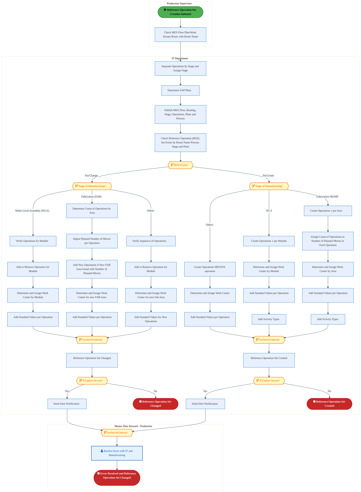

<a href="https://mermaid.live/view#pako:eNqlWG1vozgQ_isWqypdHVGxeUvy4U5pXk6V2m616W51up5ODpiEK4Echra5bv77jcGGQOlu282HqgzzzDPzzNgYnjQv8Zk20o6OnsI4zEboqZet2Yb1Rqi3pJz1dFQavtI0pMuI8Z7wCZI4W4T_FW7Y2j4KN2Gb000Y7YR1wVYJQ1_OdDQGYKQjTmPe5ywNg57e26bhhqa7SRIlqfD-wAaBERRs8tZpkvosrR0Mw8WeDdAojFltNl3LteYCx5mXxH4jaGAHg8Dr7UVyUfLgrWmaFennnF3Qx5vQz9ZwHdCIM_BZZ5vonC5ZJGrM0lzYvDy9V2KEXPDEINhiS70wXoHdMsCU0viuNtnGfo_2R0e3cUWKrqe3MYKfF1HOpyxAPAPz7D5DQRhFow_WZDy3DZ1naXLHRh_IzJ2aRPdEJSMo3dCFuP0HFq7W2WiZRL507T-IGkZk-6injyNi6OkO_ra4WOzXTBOHDMigYjp18QRPFFMQBD_FBLqm15TfSa6ZOSfzacWFbceeGM_jqTKnljvGbZ1Yeh967CDofD43Z7VUM8fGxstBT-emY0xaQVc0Yw90VwccTqwq4Nx259h9MWDJ184yX16liacCmjN7blcB3VM8H5MXA1pjbA1khhBnldLtGkU0Zn8bf95qZ9doyrYwKxsWZ7faX6Wf-MUEbi-gt2gcMRixyyQLg9CjWZjETUfztY42OE5SBuqgT1uWFh4cYQT_wypmtOntgPeY83AVo0mSxxlKgkMY5egy3ywBCvYrKChmPrpI7hlHYYxm1FvX3s3ALgSesoylG1jqiIrES5qbJL1DExACgi53HSkNREq-jxYZFVuBj77SKAdCUUBNlhPDWDaBw-9UfpH4ecSa_th4ZY4S3EGJcSNEl4SdNWLR969iH921fDsTNQtJ_sl5VjWhbkvZjh-qgy2p6yV7OOQMg8IyH58WeaIAavDRQ5itX2p9Z3T7NVoGSYriA7LOSM57-49diQSWz2wDqdb-BXWntoO6Ewv2b85ijzU72PIfvoOEGG9Shy47RobgF3QRsGZPW0DSuS4uZouTmwVKupcvMV_VhSZGTdjYy8L7MNuh692WtbN5zaC0IM47chGzMFkz7w66FLC0aGvdqOPPnxYfod8Zmj2GPCtW3uckB4Uu6YYh8RxgnAvCVZmjWADtrXvwtu2jCR6-d8pN4xUqm2JYugoXJZez4LcQ5HuINY1XzxDlIwmea63JgpJr4aQkhaGFF-NylS-jkK_FNKI5nLT0og1wBtNLiH4QWC-7UPaj7FArYnO2FuOrrr6Z7jG4BXQU0D7Pki36cdUfD-GD18IrmQ_hlvH0pODi2N5fwsETHqOlYmI7p3EeUC_LU1Dht1ttvz9E4240jLOc5GcI0o1gj16U8_Ce_V6eo9ow86fStN5HanfDzgLYE8MoT0FiDw7zz4t03g6Es1TXeU0snAvKxdKd0oxCwZAoLM--GDk_955vNbgaB3FyhnHgSQRPhVmawsZcPEfh_CdmtiFZayaHraEq0TKWX8DfNqaW-9YWvCCI2Bfq0tEi34rTPE9am7RV7bdqKRdr76TYCxcZrIWN3GELSerNtiWEUwuxjeB4_93VJS7O4I03bC60qhLYY1C__6t4HCiDUxoseW2Xl468lHeVt1teDuTlsLzE8s0BTn_SYCqDKQ0qPJb82FYGSYgVI1YJKcigvDYViYxgKg6rIP12q_3B-EnZ-1vtm1ixKqKMgIfKIPNWb3rwjzRgFdOQMT_BZ4KUF_EIUd6yKKIyJDIlq_Ig0kNVSWSVRFVJpJLWM8ab83FBp5I1JZupYpkylllpKtmw6hKRBZOqYMlGVOMIbolciXiZnJT7dKmhUsg0WiViJZlSmTgtD0umZVYlqs4pD1NlUck0bKdlKlUoTD06Z_csEk9QtllGO3QMWn0s8sSkLSOcGVP5OvjL6ZeLq8KtklCmZjltngMYOoZTuQyvSpC9sJTSll3PXjkk6oZUXAFlpeawTXgwYHjQjnqZFDfM6obTojPbNxSiGoVmwsW7vchGfdNomGEvUF9wmnZXfm1pWged1mGXFdoiP080zbjbTLrNZrfZ6jbb3Wan2-wqs6ZrGzgv0dDXRk9a8ZUQviT6LKB5lGl7XaN5lix2saeNiq9pWr71ATkNKTwjNqVx_z_58Uiy" title="View full diagram">&#128065; View Diagram</a>

Page 17<a href="#toc">↑ Back to TOC</a>M-090 — Schedule Production (IF)

#### BUSINESS ARCHITECTURE — 3.2.12 M-090-430_Process_Production_Version_(IF) — M-090-430_Process_Production_Version_(IF)

**Swim Lanes**: FTS IF - Production - Master Data Steward · FTS IF Batch System ID · IT Department · Production Supervisor | **Tasks**: 13 | **Gateways**: 5

> **Legend**: ● Start · ● End · User Task · Service Task · ◇ Gateway · Sub-Process

```mermaid
%%{init: {'theme': 'base', 'themeVariables': {'fontSize': '14px', 'fontFamily': 'Segoe UI, Arial, sans-serif','primaryColor': '#e8f0fe', 'primaryBorderColor': '#0071c5','lineColor': '#37474F', 'secondaryColor': '#f5f8fc'}, 'flowchart': {'useMaxWidth': false, 'htmlLabels': true, 'curve': 'basis', 'nodeSpacing': 40, 'rankSpacing': 50}} }%%
flowchart LR
    classDef startEvt fill:#4CAF50,stroke:#2E7D32,color:#000,font-weight:bold,stroke-width:2px,rx:20,ry:20
    classDef endEvt fill:#C62828,stroke:#B71C1C,color:#fff,font-weight:bold,stroke-width:2px,rx:20,ry:20
    classDef userTask fill:#E3F2FD,stroke:#1565C0,stroke-width:2px,color:#0D47A1
    classDef serviceTask fill:#FFF3E0,stroke:#E65100,stroke-width:2px,color:#BF360C
    classDef gateway fill:#FFF9C4,stroke:#F57F17,stroke-width:2px,color:#E65100
    classDef subProc fill:#F3E5F5,stroke:#7B1FA2,stroke-width:2px,color:#4A148C
    subgraph lane_0["FTS IF - Production - Master Data Steward"]
        n5["fa:fa-user Resolve Error with IT and Manufacturing"]
    end
    subgraph lane_1["FTS IF Batch System ID"]
        n6["fa:fa-user Create Production Version"]
        n7["fa:fa-user Create UPID Specific Routing Group by Assigning Reference Operation Set"]
        n8["fa:fa-user Create Alternate Routing with Group Counter by Assigning Reference Operation Set"]
        n19{{"fa:fa-code-branch exclusiveGateway"}}
        n20{{"fa:fa-code-branch Routing Group Exists for UPI at the Plant?"}}
    end
    subgraph lane_2["IT Department"]
        n3["fa:fa-user Separate Operations By Stage And Assign Stage"]
        n4["fa:fa-user Publish MES Routing with SFPID and Stage"]
        n9["Send Alert Notification"]
        n10["Identify Unique Product Identifier (UPI) from SFPID, Stage and Plant"]
        n11["Identify Reference Operation Set by MES Route Name, Stage and Plant"]
        n12["Check Reference Operation Set Already Assigned to UPI at Plant"]
        n13["Check Routing Group Exists for UPI at Plant"]
        n15(["fa:fa-stop Process Routing Created"])
        n16{{"fa:fa-code-branch Reference Operation Set Already Assigned to UPI at Plant?"}}
        n17{{"fa:fa-code-branch exclusiveGateway"}}
        n18{{"fa:fa-code-branch If Failure Occurs?"}}
    end
    subgraph lane_3["Production Supervisor"]
        n1["fa:fa-user Assign New Shop Floor Production ID (SFPID) With MES Route"]
        n2["fa:fa-user Load MES Routing by SFPID"]
        n14(["fa:fa-play Routing Creation Required"])
    end
    n1 --> n2
    n14 --> n1
    n11 --> n12
    n4 --> n10
    n2 --> n3
    n19 --> n6
    n17 --> n15
    n8 --> n19
    n3 --> n4
    n20 -->|"Yes"| n8
    n16 -->|"Yes"| n17
    n12 --> n16
    n20 -->|"No"| n7
    n10 --> n11
    n7 --> n19
    n16 -->|"No"| n13
    n13 --> n20
    n9 --> n5
    n6 --> n18
    n18 -->|"Yes"| n9
    n5 --> n17
    n18 -->|"No"| n17
    class n1 userTask
    class n2 userTask
    class n3 userTask
    class n4 userTask
    class n5 userTask
    class n6 userTask
    class n7 userTask
    class n8 userTask
    class n14 startEvt
    class n15 endEvt
    class n16 gateway
    class n17 gateway
    class n18 gateway
    class n19 gateway
    class n20 gateway
```

<a href="https://mermaid.live/view#pako:eNqlV2tv4jgU_StWRhUzEkhJSAjlw44okBHStFM189BqWa1M4oDVYGdspy3b4b_vNYkDyQaNdpYPLT6595z7smNerZgnxJpYV1evlFE1Qa89tSU70pug3hpL0uujEviKBcXrjMietkk5UxH9-2jmePmLNtNYiHc022s0IhtO0JdlH03BMesjiZkcSCJo2uv3ckF3WOxnPONCW78h49ROj2rVoxsuEiJOBrYdOLEPrhll5AQPAy_wQu0nScxZ0iBN_XScxr2DDi7jz_EWC3UMv5DkFr98o4nawjrFmSRgs1W77CNek0znqEShsbgQT6YYVGodBgWLchxTtgHcswESmD2eIN8-HNDh6mrFalH08WHFEHziDEs5JymSCuDFk0IpzbLJG282DX27L5Xgj2Tyxl0E86Hbj3UmE0jd7uviDp4J3WzVZM2zpDIdPOscJm7-0hcvE9fuiz38bWkRlpyUZiN37I5rpZvAmTkzo5Sm6f9SgrqKz1g-VlqLYeiG81rL8Uf-zP43n0lz7gVTp10nIp5oTM5IwzAcLk6lWox8x75MehMOR_asRbrBijzj_YnweubVhKEfhE5wkbDUa0dZrO8Fjw3hcOGHfk0Y3Djh1L1I6E0db1xFCDwbgfMtyjAjf9l_rKzwc4SWIRog4E-KWFHOYHGLpSICzbHCKNK5iGRl_Vly6A_zwTXFkxQPdEvQA5E8eyJoIQQX6JmqLVp-RpglwMSKFMeqEDC8NQdMTFdAzimgG6ziLYr2EMcOLedN9VFTfSYIFPw8g69ESPjf9Ao6vb7cL-coyklMUxqjB14oCBR9ELzI0XqPplLSDdPQA0mJICwm6FNOBD7qREQ1NcadGtMMqsn0N8N_LFEpMuMF08X-72LO9eurkdPH7GANBwVUjbzEWSHpE_lQzuHKOhzO3Fy7262Z--KFSiVRCv2EEiGsEBzT6B76pN6fCC800oUywADMSQ6n0I6wVuDDZpUibaarU-cq0c0eBg9voHYwRGVdSqDJ5DWZ7ot1RuUW3S6iZqmjULdZD2QHyTWQRETrZATO0juu9CwcA2kVXO-YZQL50HSPvjD6vajHDlU4hTDeQsXeoVTwXSncr3LR-scKtmidc9oLrdfzYdIi6A7vyM9YdRNmWxI_XqScZjCfiZk7kiDFTbO7CIcnwp-MSpe3_7bulVQ813WLiZQ1V7lX9Dnz7txtdGFYfzGl963N4AS_tIeccbfbMkUhplkhIK4Y3u3y53tFV_Xs6IqKXL-SJBet-jUnvdoSd-QZRVuoZphxKP8ZD4z72-PwvUPf9A6oZ6dJ6zZpP3KcNHYPTN2RpRWMd2pmnsGbrtFELf9AvhdUnLezTp85aDD4DaTN0ivXjllXzx1jYJ5Xb0Xmluuhsb8u1yOzDip7vwLG1fq6Wg_LtWfobL3-sbJ-J3Jl_QB7QzRqPXAC86QKwRm1Oe740bI2tCtDk1zQiqXWqBydOqsqSnMHYlWWJqlRRVQHO24FaxT8yjBoGxrF4OyyoZtjLlkN2O2Gh92w1w373fCoGw664XE3DFNk7rxN3K_up010ZC5pTTjohsfd8HUnDLNQwVbf2hGxwzSxJq_W8WcO_BRKSIqLTFmHvoULxaM9i63J8eeAVeQJeM4phvNhV4KHfwBjKixE" title="View full diagram">&#128065; View Diagram</a>

Page 18<a href="#toc">↑ Back to TOC</a>M-090 — Schedule Production (IF)

### 3.3 Business Roles & Responsibilities

| Role / Lane | Processes Involved | Description |
|------------|-------------------|-------------|
| Batch User | M-090-050_Identify_Consumable_Material_Requirements_(IF),  | |
| Boundary Apps | M-090-050_Identify_Consumable_Material_Requirements_(IF), M-090-080_Re-schedule_Planned_Order_(IF),  | |
| Master Data Steward | M-090-050_Identify_Consumable_Material_Requirements_(IF),  | |
| Production Scheduler | M-090-050_Identify_Consumable_Material_Requirements_(IF),  | |
| FTS IF - Materials Planner | M-090-060_Schedule_Consumable_Material_Requirements_(IF), M-090-110_Initiate_Production_Order_Creation_(IF),  | |
| LOG IF Batch User | M-090-060_Schedule_Consumable_Material_Requirements_(IF),  | |
| Material Handler | M-090-060_Schedule_Consumable_Material_Requirements_(IF),  | |
| PTP System ID | M-090-060_Schedule_Consumable_Material_Requirements_(IF),  | |
| FTS IF - Production Scheduler | M-090-080_Re-schedule_Planned_Order_(IF),  | |
| IT Department | M-090-080_Re-schedule_Planned_Order_(IF), M-090-110_Initiate_Production_Order_Creation_(IF), M-090-210_Identify_Change_in_Production_Data_(IF), M-090-250_Execute_Change_(IF), M-090-290_Process_Routing_(IF), M-090-300_Process_Reference_Operation_Set_(IF), M-090-430_Process_Production_Version_(IF) | |
| FTS IF - Production Planner | M-090-090_Check_for_Material_Availability_(IF), M-090-180_Expedite_Missing_Material_(IF),  | |
| Factory Supervisor | M-090-110_Initiate_Production_Order_Creation_(IF),  | |
| FTS IF - Batch User | M-090-210_Identify_Change_in_Production_Data_(IF), M-090-250_Execute_Change_(IF), M-090-290_Process_Routing_(IF),  | |
| FTS IF - Production - Master Data Steward | M-090-210_Identify_Change_in_Production_Data_(IF), M-090-280_Process_Work_Centers_(IF), M-090-290_Process_Routing_(IF), M-090-430_Process_Production_Version_(IF) | |
| FTS IF - System Batch ID (RFC User) | M-090-210_Identify_Change_in_Production_Data_(IF), M-090-250_Execute_Change_(IF),  | |
| Production Supervisor | M-090-210_Identify_Change_in_Production_Data_(IF), M-090-250_Execute_Change_(IF), M-090-290_Process_Routing_(IF), M-090-300_Process_Reference_Operation_Set_(IF), M-090-430_Process_Production_Version_(IF) | |
| Master Data Steward - Production | M-090-250_Execute_Change_(IF), M-090-300_Process_Reference_Operation_Set_(IF),  | |
| FTS IF - Production - Cost Accountant | M-090-280_Process_Work_Centers_(IF),  | |
| FTS IF Batch System ID | M-090-430_Process_Production_Version_(IF) | |

Page 19<a href="#toc">↑ Back to TOC</a>M-090 — Schedule Production (IF)

## 4. Data Architecture (TOGAF "D")

### 4.1 Data Flows — Source to Target

*Data flows with DB platform details will be populated when tower architects complete the extended flow template columns (42-47) via the Input Portal.*

Page 20<a href="#toc">↑ Back to TOC</a>M-090 — Schedule Production (IF)

### 4.2 Data Flow Diagrams

> **DATA ARCHITECTURE** — Database-to-database data flows. Applications (blue) sit above their hosting databases (green cylinders). Thick arrows show data movement between databases.

### 4.3 Data Lineage

*Data lineage (source schema/object → target schema/object mappings) will be populated when tower architects provide validated schema details via the Input Portal.*

### 4.4 RICEFW Data Objects

Data-centric RICEFW objects (Reports and Conversions) from the Object Tracker:

| Object ID | Type | Description | Status | Source | Target | Complexity |
|-----------|------|-------------|--------|--------|--------|-----------|
| LOGR1176_IF | Report | ISM - International Traffic Report | 10. Object Complete |  |  | 03.Medium |
| LOGR0833_IF | Report | Email Notification for deletion of Shipping Memos | 10. Object Complete |  |  | 04.Low |
| FTSR1466 | Report | Custom ABAP report for SIMS PO Exceptions​ | 10. Object Complete |  |  | 03.Medium |
| FTSR1364 | Report | Factory Portal - Warranty Claim (Warranty Dashboard​​) | 10. Object Complete |  |  | 02.High |
| FTSR1011 | Report | Report- Custom Fiori report to show full parts tracking status dashboard (wor... | 10. Object Complete |  |  | 02.High |
| LOGM024_IF | Conversion | Create/Upload Vehicle resource | 10. Object Complete |  |  | N/A |
| LOGM023_IF | Conversion | Update Business Share | 10. Object Complete |  |  | N/A |
| LOGM022_IF | Conversion | Upload Transportation Allocation | 10. Object Complete |  |  | N/A |
| LOGM021_IF | Conversion | Upload Schedules | 10. Object Complete |  |  | N/A |
| LOGM019_IF | Conversion | Default Routes | 10. Object Complete |  |  | N/A |
| LOGM018_IF | Conversion | Upload Rate Table | 10. Object Complete |  |  | N/A |
| LOGM016_IF | Conversion | Create and review Charge Calculation Sheet | 10. Object Complete |  |  | N/A |
| LOGM015_IF | Conversion | Create and review Freight Agreement | 10. Object Complete |  |  | N/A |
| LOGM012_IF | Conversion | Creation of Location based on BP, Shipping points, plants | 10. Object Complete |  |  | N/A |
| LOGM008_IF | Conversion | Location creation-ocean ports, airports | 10. Object Complete |  |  | N/A |
| LOGM007_IF | Conversion | Storage Bin Upload | 10. Object Complete | WIINGS | EWM | N/A |
| LOGM006_IF | Conversion | Product Master conversion (additional EWM attribution) | 10. Object Complete | WIINGS, ECC WM | EWM | N/A |
| LOGM005_IF | Conversion | UPLOAD TRANSPORTATION ZONES (TM) | 10. Object Complete |  |  | N/A |
| LOGM004_IF | Conversion | UPLOAD TRANSPORTATION LANES | 10. Object Complete |  |  | N/A |
| LOGC0972_IF | Conversion | Open Inventory Conversion for IP and IF (as applicable) , Batch Characteristi... | 10. Object Complete |  |  | 02.High |
| LOGC0971 | Conversion | Open Inventory Conversion for IP and IF (as applicable) , WIINGs to EWM | 10. Object Complete |  |  | 02.High |
| LOGC0970 | Conversion | Open Inventory Conversion for IP and IF (as applicable) , ECC/WM to EWM | 10. Object Complete |  |  | 02.High |
| LOGC0946_IF | Conversion | Open Inventory Conversion for IP and IF (as applicable) , ECC to S4 | 10. Object Complete |  |  | 02.High |
| FTSM0986 | Conversion | Convert Equipment Warranty information to SAP S/4 Equipment Master – reusable... | 10. Object Complete |  |  | 02.High |
| FTSM019 | Conversion | Conversion of Inflight Work Orders | 10. Object Complete |  |  | N/A |
| FTSM018 | Conversion | Conversion of General Task List | 10. Object Complete |  |  | N/A |
| FTSM017_IF | Conversion | Manual Conversion of Functional Locations (FLOC) | 10. Object Complete |  |  | 03.Medium |
| FTSM016 | Conversion | Equipment Master | 10. Object Complete | MES, SAP ME, EMS, EDFIT, Workstream, NIT, ECM | S4 | N/A |
| FTSM011 | Conversion | Catalogs | 10. Object Complete |  | S4 | N/A |
| FTSM010 | Conversion | Maintenance Plans | 10. Object Complete | ME | S4 | N/A |
| FTSM009 | Conversion | Maintenance Items | 10. Object Complete | NA | S4 | N/A |
| FTSM008 | Conversion | Equipment Class | 10. Object Complete | NA | S4 | N/A |
| FTSM007 | Conversion | Characteristics | 10. Object Complete | NA | S4 | N/A |
| FTSM002_IF | Conversion | Work Center | 10. Object Complete | Fuzion, ME, Manual | S4 | N/A |
| FTSC1550 | Conversion | Inventory Conversion | 02. FS Unplanned |  |  | 03.Medium |
| FTSC0052_IF | Conversion | Conversion of Reference Operation Sets to S/4 | 10. Object Complete | ECC | S4 | 02.High |

### 4.5 Data Governance & Quality

| Concern | Approach |
|---------|----------|
| Data Ownership | Per-entity owners listed in Section 3.1 |
| Data Classification | Financial data classified as Intel Confidential |
| Data Retention | Per Intel corporate retention policies |
| Data Quality | Validated at source; reconciliation at target |

Page 21<a href="#toc">↑ Back to TOC</a>M-090 — Schedule Production (IF)

## 5. Application Architecture (TOGAF "A")

### 5.4 Component Overview

#### System Inventory

| System | IAPM ID | Status |
|--------|---------|--------|

Page 22<a href="#toc">↑ Back to TOC</a>M-090 — Schedule Production (IF)

### 5.5 RICEFW Inventory

| Object ID | Type | Description | Status | Source → Target | Middleware | Boundary App | Interface Approach | Complexity |
|-----------|------|-------------|--------|----------------|-----------|-------------|-------------------|-----------|
| LOGW1078_IF | Workflow | ISM Workflows - Capital/AMT | 10. Object Complete |  | NA |  |  | 03.Medium |
| LOGW1077_IF | Workflow | ISM Workflows - EIMS/Lab | 10. Object Complete |  | NA |  |  | 03.Medium |
| LOGW1076_IF | Workflow | ISM Workflows - Non-inventory | 10. Object Complete |  | NA |  |  | 03.Medium |
| LOGR1176_IF | Report | ISM - International Traffic Report | 10. Object Complete |  | NA |  |  | 03.Medium |
| LOGR0833_IF | Report | Email Notification for deletion of Shipping Memos | 10. Object Complete |  | NA |  |  | 04.Low |
| LOGM024_IF | Conversion | Create/Upload Vehicle resource | 10. Object Complete |  | NA |  |  | N/A |
| LOGM023_IF | Conversion | Update Business Share | 10. Object Complete |  | NA |  |  | N/A |
| LOGM022_IF | Conversion | Upload Transportation Allocation | 10. Object Complete |  | NA |  |  | N/A |
| LOGM021_IF | Conversion | Upload Schedules | 10. Object Complete |  | NA |  |  | N/A |
| LOGM019_IF | Conversion | Default Routes | 10. Object Complete |  | NA |  |  | N/A |
| LOGM018_IF | Conversion | Upload Rate Table | 10. Object Complete |  | NA |  |  | N/A |
| LOGM016_IF | Conversion | Create and review Charge Calculation Sheet | 10. Object Complete |  | NA |  |  | N/A |
| LOGM015_IF | Conversion | Create and review Freight Agreement | 10. Object Complete |  | NA |  |  | N/A |
| LOGM012_IF | Conversion | Creation of Location based on BP, Shipping points, plants | 10. Object Complete |  | NA |  |  | N/A |
| LOGM008_IF | Conversion | Location creation-ocean ports, airports | 10. Object Complete |  | NA |  |  | N/A |
| LOGM007_IF | Conversion | Storage Bin Upload | 10. Object Complete | WIINGS → EWM | NA | WIINGS |  | N/A |
| LOGM006_IF | Conversion | Product Master conversion (additional EWM attribution) | 10. Object Complete | WIINGS, ECC WM → EWM | NA | WIINGS |  | N/A |
| LOGM005_IF | Conversion | UPLOAD TRANSPORTATION ZONES (TM) | 10. Object Complete |  | NA |  |  | N/A |
| LOGM004_IF | Conversion | UPLOAD TRANSPORTATION LANES | 10. Object Complete |  | NA |  |  | N/A |
| LOGI1718 | Interface | To align on batch attributes for straddle in S4 | 10. Object Complete |  | NA | NA |  | 03.Medium |
| LOGI1708 | Interface | Wrapper program for Inbound interface from Kommand AS to SAP | 10. Object Complete |  | Apigee | Kommand Autostore |  | 03.Medium |
| LOGI1677 | Interface | Send 4C1 Inventory Reconciliation Snapshot to IP | 10. Object Complete |  | SFT | NA |  | 03.Medium |
| LOGI1676 | Interface | Send 4C1 Inventory movement Stock type change and cycle count to IP | 10. Object Complete |  | SFT | NA |  | 03.Medium |
| LOGI1675 | Interface | Interface for SiGaC to extract inventory data from EWM to meet their existing... | 06. Dev In Progress |  | NA | SiGaC (Site Gas and Chemical) |  | 03.Medium |
| LOGI1626 | Interface | Inventory adjustment data in XML format from Kommand auto-store to SAP EWM | 06. Dev In Progress |  | APIGEE | Kommand Autostore |  | 03.Medium |
| LOGI1595 | Interface | Summary Reconciliation and Inventory Snapshot data in XML format from SAP EWM... | 10. Object Complete |  | APIGEE | Kommand Autostore |  | 02.High |
| LOGI1594 | Interface | Pickresult(Pick Warehouse task confirmation) data in XML format from SAP EWM ... | 06. Dev In Progress |  | APIGEE | Kommand Autostore |  | 02.High |
| LOGI1593 | Interface | Replenresult(Putaway warehouse task confirmation) data in XML format from SAP... | 06. Dev In Progress |  | APIGEE | Kommand Autostore |  | 02.High |
| LOGI1591 | Interface | MergePick (Pick Warehouse task)data in XML format from SAP EWM to Kommand aut... | 10. Object Complete |  | APIGEE | Kommand Autostore |  | 03.Medium |
| LOGI1589 | Interface | MergeReplen(Putaway Warehouse task) data in XML format from SAP EWM to Komman... | 10. Object Complete |  | APIGEE | Kommand Autostore |  | 03.Medium |
| LOGI1587 | Interface | MergeItem (Product master)data in XML format from SAP EWM to Kommand auto-store | 10. Object Complete |  | APIGEE | Kommand Autostore |  | 03.Medium |
| LOGI1555 | Interface | Straddle Plant to be automatically complete the Goods Receipt and write of th... | 10. Object Complete |  | MuleSoft | NA |  | 03.Medium |
| LOGI1091 | Interface | STO based Outbound Delivery Notification Confirmation for Delivery Note Deletion | 10. Object Complete | S/4 → OpenText | MULESOFT | OpenText |  | 03.Medium |
| LOGI1084 | Interface | Interface to SiGac for capturing the consumption of Chems and Gases against a... | 10. Object Complete | SIGAC → S/4 | APIGEE | SiGaC (Site Gas and Chemical) |  | 03.Medium |
| LOGI1081_IF | Interface | Interface + Enhancement - Reprinting of Carrier Label | 10. Object Complete | S/4 → Redwood | APIGEE | Redwood |  | 04.Low |
| LOGI1079_IF | Interface | Interface from S4 ISM to Service Now | 10. Object Complete | S/4 ISM → Service Now | NA | ServiceNow Cloud |  | 04.Low |
| LOGI1074_IF | Interface | Send data via API to retrieve the tracking ID - interface + Enhancement | 10. Object Complete | S/4 → Redwood | APIGEE | Redwood |  | 04.Low |
| LOGI1062 | Interface | STO based outbound delivery notification request for delivery note cancellation | 10. Object Complete | OpenText → S/4 | MULESOFT | OpenText |  | 03.Medium |
| LOGI1053 | Interface | STO based Outbound Delivery Notification from 3PL to S/4 for confirming Pick/... | 10. Object Complete | OpenText → S/4 | MULESOFT | OpenText |  | 03.Medium |
| LOGI1043 | Interface | Inventory Movement from 3PL to S/4 - 4C1 Cycle Count | 10. Object Complete | OpenText → S/4 | MULESOFT | OpenText |  | 03.Medium |
| LOGI1041 | Interface | STO based Outbound Delivery PGI confirmation from 3PL to S/4 - 3B2 | 10. Object Complete | OpenText → S/4 | MULESOFT | OpenText |  | 03.Medium |
| LOGI1040 | Interface | STO based Outbound Delivery PGI confirmation for returns from S/4 to 3PL - 3B2 | 10. Object Complete | S/4 → OpenText | MULESOFT | OpenText |  | 03.Medium |
| LOGI1038 | Interface | STO based Outbound Delivery Notification from S/4 to 3PL - 3B12 | 10. Object Complete | S/4 → OpenText | MULESOFT | OpenText |  | 03.Medium |
| LOGI1037 | Interface | Inventory Movement from S/4 to 3PL – 4C1 (Outbound) | 10. Object Complete | S/4 → OpenText | MULESOFT | OpenText |  | 03.Medium |
| LOGI0836_IF | Interface | Interface from S4 to NDA (IPLA –Intel Pre Release License Agreements) | 10. Object Complete | S/4 → NDA | NA | LAWMAS Agiloft Contract Lifecycle Management |  | 04.Low |
| LOGI0237_IF | Interface | Inventory Reconciliation snapshot (4C1) from 3PL WMS to SAP S/4 | 10. Object Complete | 3PL → S/4 | MULESOFT | OpenText |  | 03.Medium |
| LOGF1614_IF | Form | TM-Bill of lading print output ( NSO/ Prospal STO's) | 10. Object Complete |  | NA |  |  | 04.Low |
| LOGF1525 | Form | Consolidated Commercial Invoice for WIP | 10. Object Complete |  | NA |  |  | 04.Low |
| LOGF1524 | Form | Commercial Invoice for WIP | 10. Object Complete |  | NA |  |  | 04.Low |
| LOGF1523 | Form | Packing list for WIP | 10. Object Complete |  | NA |  |  | 04.Low |
| LOGF1100_IF | Form | Printing of Standard Shipping Label | 10. Object Complete |  | NA |  |  | 03.Medium |
| LOGF1089 | Form | Creation of Forms for Cycle count | 10. Object Complete |  | NA |  |  | 03.Medium |
| LOGF1057 | Form | Print Pick List | 10. Object Complete |  | NA |  |  | 02.High |
| LOGF1056 | Form | Print Return Label | 10. Object Complete |  | NA |  |  | 03.Medium |
| LOGF1055 | Form | Print Pick Label (PM-EWM) | 10. Object Complete |  | NA |  |  | 02.High |
| LOGF0359_IF | Form | ISM - Generate Commercial Invoice - IF/IP | 10. Object Complete | NA → NA | NA |  |  | 03.Medium |
| LOGF0358_IF | Form | ISM - Generate Traveler Document - IF/IP | 10. Object Complete | NA → NA | NA |  |  | 03.Medium |
| LOGF0352_IF | Form | ISM - IPLA | 10. Object Complete | NA → NA | NA |  |  | 03.Medium |
| LOGF0351_IF | Form | ISM - Custom China Special label | 10. Object Complete | NA → NA | NA |  |  | 03.Medium |
| LOGF0350_IF | Form | ISM - India GST DC | 10. Object Complete | NA → NA | NA |  |  | 03.Medium |
| LOGE1691 | Enhancement | Custom Enhancement for Storage Location and Storage Type Restriction LOG IF a... | 10. Object Complete |  | NA |  |  | 03.Medium |
| LOGE1690 | Enhancement | Custom Enhancement for Storage Location and Storage Type Restriction LOG IF a... | 10. Object Complete |  | NA |  |  | 03.Medium |
| LOGE1601 | Enhancement | Interface between ECD (Excursion Containment Disposition) and SAP S/4 EWM for... | 10. Object Complete |  | NA |  |  | 02.High |
| LOGE1596 | Enhancement | Summary Reconciliation and Inventory Snapshot data in XML format from SAP EWM... | 10. Object Complete |  | NA |  |  | 03.Medium |
| LOGE1592 | Enhancement | MergePick (Pick Warehouse task)data in XML format from SAP EWM to Kommand aut... | 10. Object Complete |  | NA |  |  | 03.Medium |
| LOGE1590 | Enhancement | MergeReplen(Putaway Warehouse task) data in XML format from SAP EWM to Komman... | 10. Object Complete |  | NA |  |  | 03.Medium |
| LOGE1588 | Enhancement | MergeItem (Product master)data in XML format from SAP EWM to Kommand auto-store | 10. Object Complete |  | NA |  |  | 03.Medium |
| LOGE1572_IF | Enhancement | SAP GUI T-code to Move stock from Blocked to unblock Status | 10. Object Complete |  | NA |  |  | 03.Medium |
| LOGE1569_IF | Enhancement | Enhancement to change billing status based on ship reason in ISM | 10. Object Complete |  | NA |  |  | 04.Low |
| LOGE1554 | Enhancement | Straddle Plant to be automatically complete the Goods Receipt and write of th... | 10. Object Complete |  | NA |  |  | 03.Medium |
| LOGE1526_IF | Enhancement | Automatic HAWB assignment for Freight Forwarders( ISM/ Prospal STO's) | 10. Object Complete |  | NA |  |  | 03.Medium |
| LOGE1522 | Enhancement | WIP HU overpacking validation for unique TU | 10. Object Complete |  | NA |  |  | 03.Medium |
| LOGE1521 | Enhancement | WIP Overpack Label Printing | 10. Object Complete |  | NA |  |  | 03.Medium |
| LOGE1520 | Enhancement | Enhancement to enable WIP movement for receiving between Factory to EWM Wareh... | 10. Object Complete |  | NA |  |  | 03.Medium |
| LOGE1453 | Enhancement | Trigger the request for cancellation 3B14R and cancel the demand on STO based... | 10. Object Complete |  | NA |  |  | 03.Medium |
| LOGE1450 | Enhancement | Inbound idoc processing logic during 3B2 and 3B13 | 10. Object Complete |  | NA |  |  | 03.Medium |
| LOGE1415 | Enhancement | Suppress Batch and serial number validation in MIGO/MB26 for movement type 261 | 10. Object Complete |  | NA |  |  | 03.Medium |
| LOGE1414 | Enhancement | Creation of outbound Delivery for WIP inventory from STO | 10. Object Complete |  | NA |  |  | 03.Medium |
| LOGE1276_IF | Enhancement | TM:Replace VTRC and integrate with parcel carrier to retrieve the package lev... | 10. Object Complete |  | NA |  |  | 04.Low |
| LOGE1255 | Enhancement | Visibility of New & Old Part Number during RF picking/ issue process | 10. Object Complete |  | NA |  |  | 03.Medium |
| LOGE1254 | Enhancement | Print Product Label in SAP EWM after physical inventory document posting | 10. Object Complete |  | NA |  |  | 03.Medium |
| LOGE1177_IF | Enhancement | India GST E-invoicing | 10. Object Complete |  | NA |  |  | 04.Low |
| LOGE1118_IF | Enhancement | ISM – MY Security Check Fiori app - IF | 10. Object Complete |  | NA |  |  | 03.Medium |
| LOGE1117_IF | Enhancement | ISM – Employee acknowledgement - IF | 10. Object Complete |  | NA |  |  | 03.Medium |
| LOGE1090_IF | Enhancement | PGI confirmation for non-inventory Intel freight shipments via email | 10. Object Complete |  | NA |  |  | 04.Low |
| LOGE1080_IF | Enhancement | Email notifications to be triggered as part of ISM Workflows | 10. Object Complete |  | NA |  |  | 03.Medium |
| LOGE1061 | Enhancement | Enhancement for Pop-Up message during Decontamination Process (Copper to Non-... | 10. Object Complete |  | NA |  |  | 03.Medium |
| LOGE1059 | Enhancement | RF Capability for Rejection of the Returns to Factory and send notification | 10. Object Complete |  | NA |  |  | 03.Medium |
| LOGE1058 | Enhancement | Determine Warehouse Process type for PM Returns | 10. Object Complete |  | NA |  |  | 04.Low |
| LOGE1054 | Enhancement | Email/Text Trigger to Factory Technician and Post Goods Issue upon all WO con... | 10. Object Complete |  | NA |  |  | 02.High |
| LOGE1052_IF | Enhancement | Custom fields required on delivery screen | 10. Object Complete |  | NA |  |  | 04.Low |
| LOGE0935_IF | Enhancement | Fiori App - Shipping Memo | 09. FUT Overdue |  | NA |  |  | 02.High |
| LOGE0835_IP | Enhancement | Interface to get the AMT (Asset Management Tool) data on the ISM | 10. Object Complete |  | NA | Asset Management Tool 2.0 |  | 03.Medium |
| LOGE0405_IF | Enhancement | Dangerous Goods indicator from the delivery header text to be transmitted to ... | 10. Object Complete | NA → NA | NA |  |  | 04.Low |
| LOGE0403_IF | Enhancement | In SAP TM, update FU and FO Transportation Cockpit w/ custom fields Purchase ... | 10. Object Complete | NA → NA | NA |  |  | 03.Medium |
| LOGE0239_IF | Enhancement | Inventory Reconciliation snapshot (4C1) from 3PL WMS to SAP S/4 - Table Creation | 10. Object Complete | NA → NA | NA | NA |  | 04.Low |
| LOGE0190_IF | Enhancement | Delivery Split for STO in S/4 | 10. Object Complete | NA → NA | NA | NA |  | 04.Low |
| LOGC0972_IF | Conversion | Open Inventory Conversion for IP and IF (as applicable) , Batch Characteristi... | 10. Object Complete |  | NA |  |  | 02.High |
| LOGC0971 | Conversion | Open Inventory Conversion for IP and IF (as applicable) , WIINGs to EWM | 10. Object Complete |  | NA |  |  | 02.High |
| LOGC0970 | Conversion | Open Inventory Conversion for IP and IF (as applicable) , ECC/WM to EWM | 10. Object Complete |  | NA |  |  | 02.High |
| LOGC0946_IF | Conversion | Open Inventory Conversion for IP and IF (as applicable) , ECC to S4 | 10. Object Complete |  | NA |  |  | 02.High |
| FTSW1372 | Workflow | Factory Portal - Equipment to Parts Management (Custom Fields – Part Check ou... | 03. FS Not Started |  | NA |  |  | 03.Medium |
| FTSR1466 | Report | Custom ABAP report for SIMS PO Exceptions​ | 10. Object Complete |  | NA |  |  | 03.Medium |
| FTSR1364 | Report | Factory Portal - Warranty Claim (Warranty Dashboard​​) | 10. Object Complete |  | NA |  |  | 02.High |
| FTSR1011 | Report | Report- Custom Fiori report to show full parts tracking status dashboard (wor... | 10. Object Complete |  | NA |  |  | 02.High |
| FTSM0986 | Conversion | Convert Equipment Warranty information to SAP S/4 Equipment Master – reusable... | 10. Object Complete |  | NA |  |  | 02.High |
| FTSM019 | Conversion | Conversion of Inflight Work Orders | 10. Object Complete |  | NA | ME, XEUS, MARS |  | N/A |
| FTSM018 | Conversion | Conversion of General Task List | 10. Object Complete |  | NA | ME, EMS |  | N/A |
| FTSM017_IF | Conversion | Manual Conversion of Functional Locations (FLOC) | 10. Object Complete |  | NA | ME, EMS |  | 03.Medium |
| FTSM016 | Conversion | Equipment Master | 10. Object Complete | MES, SAP ME, EMS, EDFIT, Workstream, NIT, ECM → S4 | NA | MES, SAP ME, EMS, EDFIT, Workstream, NIT, ECM |  | N/A |
| FTSM011 | Conversion | Catalogs | 10. Object Complete |  → S4 | NA |  |  | N/A |
| FTSM010 | Conversion | Maintenance Plans | 10. Object Complete | ME → S4 | NA | ME |  | N/A |
| FTSM009 | Conversion | Maintenance Items | 10. Object Complete | NA → S4 | NA |  |  | N/A |
| FTSM008 | Conversion | Equipment Class | 10. Object Complete | NA → S4 | NA |  |  | N/A |
| FTSM007 | Conversion | Characteristics | 10. Object Complete | NA → S4 | NA |  |  | N/A |
| FTSM002_IF | Conversion | Work Center | 10. Object Complete | Fuzion, ME, Manual → S4 | NA | ME |  | N/A |
| FTSI1702 | Interface | Interface to transfer Vendor details from S4 to DMRA on a daily basis | 02. FS Unplanned | S/4 → DMRA | MULESOFT | Direct Materials Replenishment Automation - DMRA |  | 03.Medium |
| FTSI1680 | Interface | An interface from Prospal to create lot level STO in S4 for the straddle solu... | 10. Object Complete |  | APIGEE | Prospal-Product Shipment Planning and Logistics; Global Master Production Con... |  | 03.Medium |
| FTSI1667 | Interface | Interface to transfer BOM details from S4 to DMRA on a daily basis | 02. FS Unplanned | S/4 → DMRA | MULESOFT | Direct Materials Replenishment Automation - DMRA |  | 03.Medium |
| FTSI1654 | Interface | Interface to transfer Material Master details from S4 to DMRA on a daily basis | 02. FS Unplanned | S/4 → DMRA | MULESOFT | Direct Materials Replenishment Automation - DMRA |  | 04.Low |
| FTSI1652 | Interface | Interface to transfer STO Change & Delete from S4 to DMRA on a daily basis | 02. FS Unplanned | S/4 → DMRA | MULESOFT | Direct Materials Replenishment Automation - DMRA |  | 04.Low |
| FTSI1651 | Interface | Interface to transfer STO details from S4 to DMRA on a daily basis - STO create | 02. FS Unplanned | S/4 → DMRA | MULESOFT | Direct Materials Replenishment Automation - DMRA |  | 04.Low |
| FTSI1647 | Interface | New Interface required from APPS/XEUS for each different site with S/4 using ... | 10. Object Complete |  | BODS | FFS / APPS |  | 03.Medium |
| FTSI1646 | Interface | New Interface required from FFS/MARS for each different site with S/4 using B... | 10. Object Complete |  | BODS | FFS / APPS |  | 03.Medium |
| FTSI1610 | Interface | Interface from SMH to S/4 to Transfer DP and Stack Orders from Interim Locati... | 10. Object Complete |  | APIGEE | PDF-SMH (Sapience Manufacturing Hub) Integration Platform - IF |  | 03.Medium |
| FTSI1602 | Interface | Interface from SGP to S4 to get Inventory status | 10. Object Complete |  | APIGEE | Starts Game Planner |  | 03.Medium |
| FTSI1580 | Interface | Interface between SMH to S/4 to Trigger UNDO START event, which will Reverse ... | 10. Object Complete |  | APIGEE | PDF-SMH (Sapience Manufacturing Hub) Integration Platform - IF |  | 03.Medium |
| FTSI1578 | Interface | Interface to send Lot attribute signal to Workstream from SAP S4 - Mulesoft R... | 06. Dev In Progress |  | MuleSoft | Workstream |  | 02.High |
| FTSI1574 | Interface | A new interface for the Believe Handheld application will allow users to fetc... | 10. Object Complete |  | APIGEE | Believe |  | 03.Medium |
| FTSI1573 | Interface | interface between S4 and ECA via BODS to post consumption of DTC and EMIB Die... | 10. Object Complete |  | MULESOFT | NA |  | 03.Medium |
| FTSI1538 | Interface | CMMS – get location info from CMMS | 02. FS Unplanned |  | NA | Collateral MMS |  | 03.Medium |
| FTSI1537 | Interface | CMMS – Get Collateral Details | 02. FS Unplanned |  | NA | Collateral MMS |  | 03.Medium |
| FTSI1536 | Interface | CMMS – Collateral Conversion | 02. FS Unplanned |  | NA | Collateral MMS |  | 03.Medium |
| FTSI1527 | Interface | Interface to get Cu flag from XEUS | 10. Object Complete |  | MULESOFT | XEUS Loader Framework |  | 03.Medium |
| FTSI1473 | Interface | MDG to S4 for SFP, Stage, UPI | 10. Object Complete |  | BODS | NA |  | 03.Medium |
| FTSI1471 | Interface | MDG to S4 for MES Site Code to Plant | 10. Object Complete |  | MULESOFT | NA |  | 03.Medium |
| FTSI1469 | Interface | Inventory Conversion for R3 | 10. Object Complete |  | APIGEE | PDF-SMH (Sapience Manufacturing Hub) Integration Platform - IF |  | 03.Medium |
| FTSI1455 | Interface | Interface from FSCO for lot level material staging by shift​ | 10. Object Complete |  | BODS | FSM Tactical Planning+FS (Potential: FSCO) |  | 03.Medium |
| FTSI1454 | Interface | Interface from PDH to S4 for lot level STR assignment​ | 10. Object Complete |  | MULESOFT | NA |  | 03.Medium |
| FTSI1431 | Interface | Interface to transfer batch SLED details from S4 to DMRA on a daily basis | 06. Dev In Progress | S/4 → DMRA | MULESOFT | Direct Materials Replenishment Automation - DMRA |  | 03.Medium |
| FTSI1371 | Interface | CMMS – Equipment create and update (status and collateral name) | 04. FS In Progress |  → S/4 | MULESOFT | Collateral MMS |  | 03.Medium |
| FTSI1370 | Interface | Factory Portal - Equipment to Parts Management (Custom Fields – Part Check ou... | 04. FS In Progress |  → S/4 | MULESOFT | Factory Communications |  | 03.Medium |
| FTSI1355 | Interface | CMMS – Equipment with MMS flag (S4 to CMMS) | 06. Dev Not Started |  → S/4 | MULESOFT | Collateral MMS |  | 03.Medium |
| FTSI1326 | Interface | Interface to send Lot create & Lot attribute signal to Workstream from SAP S4 | 06. Dev In Progress |  | MULESOFT | Workstream |  | 02.High |
| FTSI1323 | Interface | M-100-170_API 9 is to provide Shipping details Ship Server | 10. Object Complete |  | MULESOFT | ShipServer |  | 03.Medium |
| FTSI1321 | Interface | M-100-170_API 6 is to get Shippable lots from Work Stream | 06. Dev In Progress |  | MULESOFT | Workstream |  | 03.Medium |
| FTSI1320 | Interface | M-100-170_API 7 is for Precheck Request and Response to Ship Server | 10. Object Complete |  | MULESOFT | ShipServer |  | 03.Medium |
| FTSI1319 | Interface | M-100-170_API4 is to provide Shipping details to ULT from S4 | 10. Object Complete |  | MULESOFT | Unit Level Traceability |  | 03.Medium |
| FTSI1318 | Interface | M-100-170_API3 is to provide Shipping details to WorkStream from S4 | 06. Dev In Progress |  | MULESOFT | Workstream |  | 03.Medium |
| FTSI1317 | Interface | M-100-170_API 11 is to get Shippable lots from Ship server | 10. Object Complete |  | MULESOFT | ShipServer |  | 03.Medium |
| FTSI1159 | Interface | Interface from ECA to S4 to maintain POLP table | 10. Object Complete | ECA → S/4 | BODS | NA |  | 03.Medium |
| FTSI1158 | Interface | Interface from SMH to S4 to handle movement of lots from Revenue to TD | 10. Object Complete | PDF → S/4 | MULESOFT | PDF-SMH (Sapience Manufacturing Hub) Integration Platform - IF |  | 03.Medium |
| FTSI1157 | Interface | Custom program for STO generation for Raw Silicon | 10. Object Complete | 3PL → S/4 | APIGEE | Starts Game Planner |  | 03.Medium |
| FTSI1021 | Interface | Interface to be developed from ECA to SAP which helps to upload PIR via BAPI | 06. Dev In Progress | ECA → S/4 | APIGEE | SIMS BI Portal |  | 03.Medium |
| FTSI1020 | Interface | IMO - Interface from NBS to S4 to induct stock from IMO plant to S4 | 10. Object Complete | NBS → S/4 | APIGEE | IMO - NBS |  | 03.Medium |
| FTSI1016 | Interface | IMR - Interface between SAP S/4 and SAP ME to replicate production orders. Th... | 10. Object Complete | S/4 → SAP ME | NA | SAP Manufacturing Execution |  | 03.Medium |
| FTSI1008 | Interface | Interface S/4 with EMS | 10. Object Complete | EMS → S/4 | MULESOFT | Equipment Management System |  | 03.Medium |
| FTSI1007 | Interface | Interface S/4 with XEUS | 10. Object Complete | XEUS/Mars → S/4 | APIGEE | XEUS Loader Framework; ATM MARS |  | 02.High |
| FTSI0985 | Interface | Claim Status Update from e2open to SAP S4 (Inbound Interface) | 10. Object Complete | E2Open → S/4 | MULESOFT | E2open |  | 03.Medium |
| FTSI0983 | Interface | SAP Warranty Claim Document to e2open (Outbound Interface) | 10. Object Complete | S/4 → E2Open | MULESOFT | E2open |  | 03.Medium |
| FTSI0924 | Interface | Interface: SAP ME to S/4 to Create & Maintain Notifications | 10. Object Complete | SAP ME → S/4 | NA | SAP Manufacturing Execution |  | 03.Medium |
| FTSI0860 | Interface | Interface to create Kanban trigger from DMRA and get Reservation created and ... | 06. Dev In Progress | DMRA → S/4 | MULESOFT | Direct Materials Replenishment Automation - DMRA |  | 01.Very High |
| FTSI0830 | Interface | Shipserver Interface to S4 to get handling units for the logical ship | 10. Object Complete | MPL → S/4 | MULESOFT | ShipServer |  | 03.Medium |
| FTSI0689 | Interface | Interface between PDF and S4 to handle DLCP update in S4 based on the DLCP UP... | 10. Object Complete | MES → S/4 | MULESOFT | PDF-SMH (Sapience Manufacturing Hub) Integration Platform - IF |  | 03.Medium |
| FTSI0686 | Interface | Interface between PDF and S4 to handle production order merge events in S4 ba... | 10. Object Complete | MES → S/4 | APIGEE | PDF-SMH (Sapience Manufacturing Hub) Integration Platform - IF |  | 02.High |
| FTSI0677 | Interface | API from SHIP server to validate shipment readiness” | 09. FUT Overdue | PDF → S/4 | MULESOFT | ShipServer |  | 01.Very High |
| FTSI0676 | Interface | Interface between PDF and S4 to handle undo complete in S4 based on the UNDO ... | 10. Object Complete | PDF → S/4 | APIGEE | PDF-SMH (Sapience Manufacturing Hub) Integration Platform - IF |  | 03.Medium |
| FTSI0675 | Interface | Interface between PDF and S4 to handle mid stage transfers in S4 based on the... | 10. Object Complete | MES → S/4 | APIGEE | PDF-SMH (Sapience Manufacturing Hub) Integration Platform - IF |  | 03.Medium |
| FTSI0674 | Interface | Interface between PDF and S4 to handle undo move and scrap in S4 based on the... | 10. Object Complete | MES → S/4 | APIGEE | PDF-SMH (Sapience Manufacturing Hub) Integration Platform - IF |  | 03.Medium |
| FTSI0484 | Interface | Interface between PDF and S4 to handle quantity or batch attribute updates ba... | 10. Object Complete | MES → S/4 | APIGEE | PDF-SMH (Sapience Manufacturing Hub) Integration Platform - IF |  | 03.Medium |
| FTSI0483 | Interface | Interface between PDF and S4 to handle production order split events in S4 ba... | 10. Object Complete | MES → S/4 | APIGEE | PDF-SMH (Sapience Manufacturing Hub) Integration Platform - IF |  | 02.High |
| FTSI0481 | Interface | Interface between PDF and S4 to handle production order complete events in S4... | 10. Object Complete | MES → S/4 | APIGEE | PDF-SMH (Sapience Manufacturing Hub) Integration Platform - IF |  | 03.Medium |
| FTSI0422 | Interface | Interface between PDF and S4 for production order process in S4 based on the ... | 10. Object Complete | PDF → S/4 | APIGEE | PDF-SMH (Sapience Manufacturing Hub) Integration Platform - IF |  | 02.High |
| FTSI0421 | Interface | Custom RFC triggered in S4 by PDF to determine activity values and post confi... | 10. Object Complete | PDF → S/4 | APIGEE | PDF-SMH (Sapience Manufacturing Hub) Integration Platform - IF |  | 03.Medium |
| FTSI0420 | Interface | Custom RFC triggered in S4 by PDF to post goods movement in S4 based on the R... | 10. Object Complete | PDF → S/4 | APIGEE | PDF-SMH (Sapience Manufacturing Hub) Integration Platform - IF |  | 03.Medium |
| FTSI0338 | Interface | Interface from MES staging database to S/4 to create/update reference operati... | 10. Object Complete | MES → S/4 | APIGEE | PDF-SMH (Sapience Manufacturing Hub) Integration Platform - IF |  | 02.High |
| FTSI0311 | Interface | Production plan from ECA planning data hub (PDH) to S/4 to create planned Orders | 10. Object Complete | PDH (ECA) → S/4 | BODS | NA |  | 03.Medium |
| FTSI0310 | Interface | Network Plan from ECA Planning Data Hub to S/4 for STO Creation | 10. Object Complete | PDH (ECA) → S/4 | BODS | NA |  | 03.Medium |
| FTSI0308 | Interface | Interface from PDF to S/4 to update Lot level out date on Production orders | 10. Object Complete | MES → S/4 | APIGEE | PDF-SMH (Sapience Manufacturing Hub) Integration Platform - IF |  | 02.High |
| FTSI0050 | Interface | Interface to transfer Purchase Requisitions created in IBP/MAPPS/other system... | 10. Object Complete | ECA → S/4 | BODS | NA |  | 03.Medium |
| FTSF1361 | Form | Factory Portal - Returns Order Flow (Form-Based (CRD) Return Order​) | 10. Object Complete |  | NA |  |  | 03.Medium |
| FTSE1645 | Enhancement | Wafer Stock management for Reclaim Purposes | 10. Object Complete |  | NA |  |  | 03.Medium |
| FTSE1641 | Enhancement | Enhancement to create a program which can query on Master Data, Batch & STO d... | 02. FS Unplanned |  | NA |  |  | 03.Medium |
| FTSE1582 | Enhancement | A Custom table to map and capture the relationship between RSQ Batch ID/STO# ... | 10. Object Complete |  | NA |  |  | 04.Low |
| FTSE1581 | Enhancement | Automated Batch Status Update Based on MRB Release Date using custom program. | 10. Object Complete |  | NA |  |  | 03.Medium |
| FTSE1579 | Enhancement | Custom tables to store Board Failure Form details | 10. Object Complete |  | NA |  |  | 03.Medium |
| FTSE1577 | Enhancement | Perform Auto batch determination at the time of STO creation – DMRA | 09. FUT Overdue |  | NA |  |  | 02.High |
| FTSE1549 | Enhancement | Custom Attributes for AMT/ISM | 02. FS Unplanned |  | NA |  |  | 03.Medium |
| FTSE1548 | Enhancement | Automation for Product Conversions – Equipment Structure update | 02. FS Unplanned |  | NA |  |  | 03.Medium |
| FTSE1547 | Enhancement | Automation for Product Conversions – Work Order Closure | 02. FS Unplanned |  | NA |  |  | 03.Medium |
| FTSE1546 | Enhancement | Automation for Product Conversions – Parts Request and Return | 02. FS Unplanned |  | NA |  |  | 03.Medium |
| FTSE1545 | Enhancement | Automation for Product Conversions – Explode BOM | 02. FS Unplanned |  | NA |  |  | 03.Medium |
| FTSE1544 | Enhancement | Automation for Product Conversions – create Work Order | 02. FS Unplanned |  | NA |  |  | 03.Medium |
| FTSE1543 | Enhancement | PM inbound from AMT | 02. FS Unplanned |  | NA |  |  | 03.Medium |
| FTSE1542 | Enhancement | PM outbound to AMT | 02. FS Unplanned |  | NA |  |  | 03.Medium |
| FTSE1541 | Enhancement | Send SAP notification on Work Order update | 02. FS Unplanned |  | NA |  |  | 03.Medium |
| FTSE1540 | Enhancement | Send SAP notification on Equipment update | 02. FS Unplanned |  | NA |  |  | 03.Medium |
| FTSE1539 | Enhancement | Custom Fiori UI – Move Equipment SRoom to SRoom (screen) | 02. FS Unplanned |  | NA |  |  | 03.Medium |
| FTSE1528 | Enhancement | Warranty claim for non E2O supplier | 10. Object Complete |  | NA |  |  | 03.Medium |
| FTSE1480 | Enhancement | B2B SLOC Mapping Table | 10. Object Complete |  | NA |  |  | 04.Low |
| FTSE1479 | Enhancement | Table for SFP/Operation for KM2/KM5 | 10. Object Complete |  | NA |  |  | 04.Low |
| FTSE1478 | Enhancement | Table for All Shippable Mid Stage and End Stage Operations | 10. Object Complete |  | NA |  |  | 04.Low |
| FTSE1477 | Enhancement | Enhancement - Lot Level Exception UI | 09. FUT Overdue |  | NA |  |  | 01.Very High |
| FTSE1476 | Enhancement | Lot to STR Mapping table | 10. Object Complete |  | NA |  |  | 04.Low |
| FTSE1475 | Enhancement | Non Revenue Shipping Demand Screen (Custom Table) | 10. Object Complete |  | NA |  |  | 04.Low |
| FTSE1474 | Enhancement | Non Revenue Shipping Demand Screen | 10. Object Complete |  | NA |  |  | 02.High |
| FTSE1472 | Enhancement | Custom Table for SFP, Stage, UPI Mapping | 10. Object Complete |  | NA |  |  | 04.Low |
| FTSE1470 | Enhancement | Custom Table for MES Facility, MES Site Code to Plant | 10. Object Complete |  | NA |  |  | 04.Low |
| FTSE1468 | Enhancement | Custom table to store PO Lot Pegging (POLP) | 10. Object Complete |  | NA |  |  | 04.Low |
| FTSE1467 | Enhancement | Custom Report for Operating Supplies Reservations​ | 06. Dev In Progress |  | NA |  |  | 02.High |
| FTSE1456 | Enhancement | Custom Table to store FSCO lot level material staging​ | 10. Object Complete |  | NA |  |  | 04.Low |
| FTSE1451 | Enhancement | Enhancement required for triggering Interface between S4 and SAP ME from the ... | 10. Object Complete |  | NA |  |  | 03.Medium |
| FTSE1435 | Enhancement | Custom Table - Cross Site Ref Op sets will be maintained at a higher level in... | 10. Object Complete |  | NA |  |  | 03.Medium |
| FTSE1433 | Enhancement | Custom Program to assign Routings to Items based on Item Characteristics​​ | 10. Object Complete |  | NA |  |  | 03.Medium |
| FTSE1432 | Enhancement | Custom Enhancement to Issue out stock in S4 | 10. Object Complete |  | NA |  |  | 03.Medium |
| FTSE1413 | Enhancement | Reusable Mass Upload Program for Equipment Master Warranty | 10. Object Complete |  | NA |  |  | 03.Medium |
| FTSE1385 | Enhancement | Factory Portal - Preventative Maintenance (AT) (Schedule Maintenance Plan) | 10. Object Complete |  | NA |  |  | 01.Very High |
| FTSE1383 | Enhancement | Factory Portal - Preventative Maintenance (AT) (Set Maintenance Counte) | 10. Object Complete |  | NA |  |  | 01.Very High |
| FTSE1382 | Enhancement | Factory Portal - Preventative Maintenance (AT) (Set Maintenance Cycle​) | 10. Object Complete |  | NA |  |  | 01.Very High |
| FTSE1381 | Enhancement | Factory Portal - Preventative Maintenance (AT) (Create Maintenance Plan) | 10. Object Complete |  | NA |  |  | 01.Very High |
| FTSE1379 | Enhancement | Factory Portal - Part list (Part list creation / modify (IA05​) | 10. Object Complete |  | NA |  |  | 01.Very High |
| FTSE1378 | Enhancement | Factory Portal - Functional Location​ (FLOC creation / Update (IL01 and IL02)​​) | 10. Object Complete |  | NA |  |  | 01.Very High |
| FTSE1376 | Enhancement | Factory Portal - Admin (Notifications​) | 10. Object Complete |  | NA |  |  | 01.Very High |
| FTSE1374 | Enhancement | Factory Portal - Admin (Admin Screen - My Profile) - Contacts custom Table En... | 10. Object Complete |  | NA |  |  | 01.Very High |
| FTSE1373 | Enhancement | Factory Portal - Admin (Admin Screen - My Profile) - Fiori Enhancement | 10. Object Complete |  | NA |  |  | 01.Very High |
| FTSE1369 | Enhancement | Factory Portal - Equipment to Parts Management (Custom Fields – Part Check ou... | 04. FS In Progress |  | NA |  |  | 01.Very High |
| FTSE1368 | Enhancement | Factory Portal - Equipment to Parts Management (Equipment Management (details... | 10. Object Complete |  | NA |  |  | 01.Very High |
| FTSE1367 | Enhancement | Factory Portal - Equipment to Parts Management (Equipment/ Entity/ Sub-Entity... | 10. Object Complete |  | NA |  |  | 01.Very High |
| FTSE1366 | Enhancement | Factory Portal - Operating Supply (Reserve Ops Suppl​​​) | 10. Object Complete |  | NA |  |  | 01.Very High |
| FTSE1365 | Enhancement | Factory Portal - Operating Supply (Search for Ops Supply​​​) | 10. Object Complete |  | NA |  |  | 01.Very High |
| FTSE1363 | Enhancement | Factory Portal - Warranty Claim (Create Warranty Claim – Detailed Vie​) | 10. Object Complete |  | NA |  |  | 01.Very High |
| FTSE1360 | Enhancement | Custom Fiori UI – HAZMAT Enhancement to pull data | 10. Object Complete |  | NA |  |  | 03.Medium |
| FTSE1359 | Enhancement | Factory Portal - Returns Order Flow (Prevent TECO until after parts have been... | 10. Object Complete |  | NA |  |  | 01.Very High |
| FTSE1358 | Enhancement | Factory Portal - Returns Order Flow (Form-Based (CRD) Return Order​) | 10. Object Complete |  | NA |  |  | 01.Very High |
| FTSE1354 | Enhancement | Factory Portal - Work Order Flow ( Confirm and Submit Parts (Table Extension ... | 10. Object Complete |  | NA |  |  | 01.Very High |
| FTSE1353 | Enhancement | Factory Portal - Work Order Flow ( Confirm and Submit Parts (Fiori Enhancemen... | 10. Object Complete |  | NA |  |  | 01.Very High |
| FTSE1351 | Enhancement | Factory Portal - Work Order Flow ( Add component to work order ) | 10. Object Complete |  | NA |  |  | 01.Very High |
| FTSE1350 | Enhancement | Factory Portal - Work Order Flow ( Search Parts ) | 10. Object Complete |  | NA |  |  | 01.Very High |
| FTSE1349 | Enhancement | Factory Portal - Work Order Flow ( Change Color of WO, Equipment, and CRD & e... | 10. Object Complete |  | NA |  |  | 01.Very High |
| FTSE1348 | Enhancement | Factory Portal - Work Order Flow ( Show Work Order – Single Work Order View +... | 10. Object Complete |  | NA |  |  | 01.Very High |
| FTSE1347 | Enhancement | Factory Portal - Work Order Flow ( Search work orders - ​List View ) | 10. Object Complete |  | NA |  |  | 01.Very High |
| FTSE1344 | Enhancement | Factory Portal - Work Order Flow ( Home Page - View S/4 work orders ) | 10. Object Complete |  | NA |  |  | 01.Very High |
| FTSE1325 | Enhancement | M-100-170_Create Manual ship FIORI UI in S4 | 06. Dev In Progress |  | NA |  |  | 01.Very High |
| FTSE1160 | Enhancement | Custom Utility for Engineering Planners to create Rev Eng Planned Orders in S4 | 10. Object Complete |  | NA |  |  | 03.Medium |
| FTSE1125 | Enhancement | Custom table in S4 to store merging orders and surviving order association fr... | 10. Object Complete |  | NA |  |  | 04.Low |
| FTSE1119 | Enhancement | Custom Table required to support enhancement to store lot attributes when Lot... | 07. FUT Roadblock |  | NA | Workstream |  | 03.Medium |
| FTSE1019 | Enhancement | WIINGS factory portal UI to send signal for raw material consumption in S4 | 10. Object Complete |  | NA |  |  | 02.High |
| FTSE1010 | Enhancement | Update the Copper/Heavy Metal flag (User Status) for the tools on placement a... | 10. Object Complete |  | NA |  |  | 03.Medium |
| FTSE0996 | Enhancement | Create Purchase Requisition with multiple purchase req document types from Wo... | 10. Object Complete |  | NA |  |  | 03.Medium |
| FTSE0995 | Enhancement | Enhancement to update rejection reason and text in maintenance work order fro... | 10. Object Complete |  | NA |  |  | 03.Medium |
| FTSE0993 | Enhancement | Auto Roll Function to add Item/Part through Batch job in Master Warranty | 10. Object Complete |  | NA |  |  | 03.Medium |
| FTSE0992 | Enhancement | Custom Fields Enhancement in WTY Claim | 10. Object Complete |  | NA |  |  | 03.Medium |
| FTSE0991 | Enhancement | Claim Generation from Maintenance Work Order per Item | 10. Object Complete |  | NA |  |  | 03.Medium |
| FTSE0990 | Enhancement | Create PR with Free of Charge from approved claim status – MMID & Non-MMID | 10. Object Complete |  | NA |  |  | 03.Medium |
| FTSE0989 | Enhancement | Warranty validation at Equipment level & Item/Part level in Work Order | 10. Object Complete |  | NA |  |  | 03.Medium |
| FTSE0988 | Enhancement | Convert Item/Part Warranty information upload to SAP S/4 Master Warranty | 10. Object Complete |  | NA |  |  | 02.High |
| FTSE0984 | Enhancement | SAP Warranty Claim Document to e2open (Outbound Interface) | 10. Object Complete |  | NA |  |  | 03.Medium |
| FTSE0982 | Enhancement | SAP PM enhancement to capture reason codes for returns (dropdown) | 10. Object Complete |  | NA |  |  | 02.High |
| FTSE0925 | Enhancement | Enhancement: Batch process to create Equipment from Material BOM after GR | 10. Object Complete |  | NA |  |  | 03.Medium |
| FTSE0507 | Enhancement | Custom Program to read planned orders and build instruction data and generate... | 10. Object Complete |  | NA |  |  | 03.Medium |
| FTSE0506 | Enhancement | Custom table to store planned orders and pegged sales orders in S4 | 10. Object Complete |  | NA |  |  | 03.Medium |
| FTSE0423 | Enhancement | Create custom table in SAP to store the build instruction data | 10. Object Complete |  | NA |  |  | 04.Low |
| FTSC1550 | Conversion | Inventory Conversion | 02. FS Unplanned |  | NA |  |  | 03.Medium |
| FTSC0052_IF | Conversion | Conversion of Reference Operation Sets to S/4 | 10. Object Complete | ECC → S4 | NA | ECC |  | 02.High |
| LOGI1738 | Interface | Interface to send data to Factory Comm to activate the Mobile text receiving ... | 04. FS In Progress |  | NA | Factory Communications |  | 02.High |

**Summary**: 5 Reports, 92 Interfaces, 31 Conversions, 118 Enhancements, 15 Forms, 4 Workflows

#### 5.5.2 Boundary Application Dependencies

The following RICEFW objects integrate with **boundary applications** (external systems outside the S/4 HANA core):

| RICEFW Object ID | Description | Boundary Application | IAPM ID | Source → Target |
|-------------------|------------|---------------------|---------|----------------|
| LOGM007_IF | Storage Bin Upload | WIINGS |  | WIINGS → EWM |
| LOGM006_IF | Product Master conversion (additional EWM attribution) | WIINGS |  | WIINGS, ECC WM → EWM |
| LOGI1708 | Wrapper program for Inbound interface from Kommand AS to SAP | Kommand Autostore | 63174.0 |  |
| LOGI1675 | Interface for SiGaC to extract inventory data from EWM to meet their existing... | SiGaC (Site Gas and Chemical) | 12015.0 |  |
| LOGI1626 | Inventory adjustment data in XML format from Kommand auto-store to SAP EWM | Kommand Autostore | 63174.0 |  |
| LOGI1595 | Summary Reconciliation and Inventory Snapshot data in XML format from SAP EWM... | Kommand Autostore | 63174.0 |  |
| LOGI1594 | Pickresult(Pick Warehouse task confirmation) data in XML format from SAP EWM ... | Kommand Autostore | 63174.0 |  |
| LOGI1593 | Replenresult(Putaway warehouse task confirmation) data in XML format from SAP... | Kommand Autostore | 63174.0 |  |
| LOGI1591 | MergePick (Pick Warehouse task)data in XML format from SAP EWM to Kommand aut... | Kommand Autostore | 63174.0 |  |
| LOGI1589 | MergeReplen(Putaway Warehouse task) data in XML format from SAP EWM to Komman... | Kommand Autostore | 63174.0 |  |
| LOGI1587 | MergeItem (Product master)data in XML format from SAP EWM to Kommand auto-store | Kommand Autostore | 63174.0 |  |
| LOGI1091 | STO based Outbound Delivery Notification Confirmation for Delivery Note Deletion | OpenText | 12842.0 | S/4 → OpenText |
| LOGI1084 | Interface to SiGac for capturing the consumption of Chems and Gases against a... | SiGaC (Site Gas and Chemical) | 12015.0 | SIGAC → S/4 |
| LOGI1081_IF | Interface + Enhancement - Reprinting of Carrier Label | Redwood | 56974.0 | S/4 → Redwood |
| LOGI1079_IF | Interface from S4 ISM to Service Now | ServiceNow Cloud | 23476.0 | S/4 ISM → Service Now |
| LOGI1074_IF | Send data via API to retrieve the tracking ID - interface + Enhancement | Redwood | 56974.0 | S/4 → Redwood |
| LOGI1062 | STO based outbound delivery notification request for delivery note cancellation | OpenText | 12842.0 | OpenText → S/4 |
| LOGI1053 | STO based Outbound Delivery Notification from 3PL to S/4 for confirming Pick/... | OpenText | 12842.0 | OpenText → S/4 |
| LOGI1043 | Inventory Movement from 3PL to S/4 - 4C1 Cycle Count | OpenText | 12842.0 | OpenText → S/4 |
| LOGI1041 | STO based Outbound Delivery PGI confirmation from 3PL to S/4 - 3B2 | OpenText | 12842.0 | OpenText → S/4 |
| LOGI1040 | STO based Outbound Delivery PGI confirmation for returns from S/4 to 3PL - 3B2 | OpenText | 12842.0 | S/4 → OpenText |
| LOGI1038 | STO based Outbound Delivery Notification from S/4 to 3PL - 3B12 | OpenText | 12842.0 | S/4 → OpenText |
| LOGI1037 | Inventory Movement from S/4 to 3PL – 4C1 (Outbound) | OpenText | 12842.0 | S/4 → OpenText |
| LOGI0836_IF | Interface from S4 to NDA (IPLA –Intel Pre Release License Agreements) | LAWMAS Agiloft Contract Lifecycle Management | 35641.0 | S/4 → NDA |
| LOGI0237_IF | Inventory Reconciliation snapshot (4C1) from 3PL WMS to SAP S/4 | OpenText | 12842.0 | 3PL → S/4 |
| LOGE0835_IP | Interface to get the AMT (Asset Management Tool) data on the ISM | Asset Management Tool 2.0 | 14310.0 |  |
| FTSM019 | Conversion of Inflight Work Orders | ME, XEUS, MARS |  |  |
| FTSM018 | Conversion of General Task List | ME, EMS |  |  |
| FTSM017_IF | Manual Conversion of Functional Locations (FLOC) | ME, EMS |  |  |
| FTSM016 | Equipment Master | MES, SAP ME, EMS, EDFIT, Workstream, NIT, ECM |  | MES, SAP ME, EMS, EDFIT, Workstream, NIT, ECM → S4 |
| FTSM010 | Maintenance Plans | ME |  | ME → S4 |
| FTSM002_IF | Work Center | ME |  | Fuzion, ME, Manual → S4 |
| FTSI1702 | Interface to transfer Vendor details from S4 to DMRA on a daily basis | Direct Materials Replenishment Automation - DMRA | 12918.0 | S/4 → DMRA |
| FTSI1680 | An interface from Prospal to create lot level STO in S4 for the straddle solu... | Prospal-Product Shipment Planning and Logistics; Global Master Production Con... | 12630; 16134 |  |
| FTSI1667 | Interface to transfer BOM details from S4 to DMRA on a daily basis | Direct Materials Replenishment Automation - DMRA | 12918.0 | S/4 → DMRA |
| FTSI1654 | Interface to transfer Material Master details from S4 to DMRA on a daily basis | Direct Materials Replenishment Automation - DMRA | 12918.0 | S/4 → DMRA |
| FTSI1652 | Interface to transfer STO Change & Delete from S4 to DMRA on a daily basis | Direct Materials Replenishment Automation - DMRA | 12918.0 | S/4 → DMRA |
| FTSI1651 | Interface to transfer STO details from S4 to DMRA on a daily basis - STO create | Direct Materials Replenishment Automation - DMRA | 12918.0 | S/4 → DMRA |
| FTSI1647 | New Interface required from APPS/XEUS for each different site with S/4 using ... | FFS / APPS | 32287.0 |  |
| FTSI1646 | New Interface required from FFS/MARS for each different site with S/4 using B... | FFS / APPS | 32287.0 |  |
| FTSI1610 | Interface from SMH to S/4 to Transfer DP and Stack Orders from Interim Locati... | PDF-SMH (Sapience Manufacturing Hub) Integration Platform - IF | 41627.0 |  |
| FTSI1602 | Interface from SGP to S4 to get Inventory status | Starts Game Planner | 31279.0 |  |
| FTSI1580 | Interface between SMH to S/4 to Trigger UNDO START event, which will Reverse ... | PDF-SMH (Sapience Manufacturing Hub) Integration Platform - IF | 41627.0 |  |
| FTSI1578 | Interface to send Lot attribute signal to Workstream from SAP S4 - Mulesoft R... | Workstream | 31348.0 |  |
| FTSI1574 | A new interface for the Believe Handheld application will allow users to fetc... | Believe | 5881.0 |  |
| FTSI1538 | CMMS – get location info from CMMS | Collateral MMS | 30889.0 |  |
| FTSI1537 | CMMS – Get Collateral Details | Collateral MMS | 30889.0 |  |
| FTSI1536 | CMMS – Collateral Conversion | Collateral MMS | 30889.0 |  |
| FTSI1527 | Interface to get Cu flag from XEUS | XEUS Loader Framework | 35612.0 |  |
| FTSI1469 | Inventory Conversion for R3 | PDF-SMH (Sapience Manufacturing Hub) Integration Platform - IF | 41627.0 |  |
| FTSI1455 | Interface from FSCO for lot level material staging by shift​ | FSM Tactical Planning+FS (Potential: FSCO) | 14349.0 |  |
| FTSI1431 | Interface to transfer batch SLED details from S4 to DMRA on a daily basis | Direct Materials Replenishment Automation - DMRA | 12918.0 | S/4 → DMRA |
| FTSI1371 | CMMS – Equipment create and update (status and collateral name) | Collateral MMS | 30889.0 |  → S/4 |
| FTSI1370 | Factory Portal - Equipment to Parts Management (Custom Fields – Part Check ou... | Factory Communications | 11807.0 |  → S/4 |
| FTSI1355 | CMMS – Equipment with MMS flag (S4 to CMMS) | Collateral MMS | 30889.0 |  → S/4 |
| FTSI1326 | Interface to send Lot create & Lot attribute signal to Workstream from SAP S4 | Workstream | 31348.0 |  |
| FTSI1323 | M-100-170_API 9 is to provide Shipping details Ship Server | ShipServer | 7129.0 |  |
| FTSI1321 | M-100-170_API 6 is to get Shippable lots from Work Stream | Workstream | 31348.0 |  |
| FTSI1320 | M-100-170_API 7 is for Precheck Request and Response to Ship Server | ShipServer | 7129.0 |  |
| FTSI1319 | M-100-170_API4 is to provide Shipping details to ULT from S4 | Unit Level Traceability | 16110.0 |  |
| FTSI1318 | M-100-170_API3 is to provide Shipping details to WorkStream from S4 | Workstream | 31348.0 |  |
| FTSI1317 | M-100-170_API 11 is to get Shippable lots from Ship server | ShipServer | 7129.0 |  |
| FTSI1158 | Interface from SMH to S4 to handle movement of lots from Revenue to TD | PDF-SMH (Sapience Manufacturing Hub) Integration Platform - IF | 41627.0 | PDF → S/4 |
| FTSI1157 | Custom program for STO generation for Raw Silicon | Starts Game Planner | 31279.0 | 3PL → S/4 |
| FTSI1021 | Interface to be developed from ECA to SAP which helps to upload PIR via BAPI | SIMS BI Portal | NA | ECA → S/4 |
| FTSI1020 | IMO - Interface from NBS to S4 to induct stock from IMO plant to S4 | IMO - NBS | 4982.0 | NBS → S/4 |
| FTSI1016 | IMR - Interface between SAP S/4 and SAP ME to replicate production orders. Th... | SAP Manufacturing Execution | 14162.0 | S/4 → SAP ME |
| FTSI1008 | Interface S/4 with EMS | Equipment Management System | 4012.0 | EMS → S/4 |
| FTSI1007 | Interface S/4 with XEUS | XEUS Loader Framework; ATM MARS | 35612; 32079 | XEUS/Mars → S/4 |
| FTSI0985 | Claim Status Update from e2open to SAP S4 (Inbound Interface) | E2open | 12208.0 | E2Open → S/4 |
| FTSI0983 | SAP Warranty Claim Document to e2open (Outbound Interface) | E2open | 12208.0 | S/4 → E2Open |
| FTSI0924 | Interface: SAP ME to S/4 to Create & Maintain Notifications | SAP Manufacturing Execution | 14162.0 | SAP ME → S/4 |
| FTSI0860 | Interface to create Kanban trigger from DMRA and get Reservation created and ... | Direct Materials Replenishment Automation - DMRA | 12918.0 | DMRA → S/4 |
| FTSI0830 | Shipserver Interface to S4 to get handling units for the logical ship | ShipServer | 7129.0 | MPL → S/4 |
| FTSI0689 | Interface between PDF and S4 to handle DLCP update in S4 based on the DLCP UP... | PDF-SMH (Sapience Manufacturing Hub) Integration Platform - IF | 41627.0 | MES → S/4 |
| FTSI0686 | Interface between PDF and S4 to handle production order merge events in S4 ba... | PDF-SMH (Sapience Manufacturing Hub) Integration Platform - IF | 41627.0 | MES → S/4 |
| FTSI0677 | API from SHIP server to validate shipment readiness” | ShipServer | 7129.0 | PDF → S/4 |
| FTSI0676 | Interface between PDF and S4 to handle undo complete in S4 based on the UNDO ... | PDF-SMH (Sapience Manufacturing Hub) Integration Platform - IF | 41627.0 | PDF → S/4 |
| FTSI0675 | Interface between PDF and S4 to handle mid stage transfers in S4 based on the... | PDF-SMH (Sapience Manufacturing Hub) Integration Platform - IF | 41627.0 | MES → S/4 |
| FTSI0674 | Interface between PDF and S4 to handle undo move and scrap in S4 based on the... | PDF-SMH (Sapience Manufacturing Hub) Integration Platform - IF | 41627.0 | MES → S/4 |
| FTSI0484 | Interface between PDF and S4 to handle quantity or batch attribute updates ba... | PDF-SMH (Sapience Manufacturing Hub) Integration Platform - IF | 41627.0 | MES → S/4 |
| FTSI0483 | Interface between PDF and S4 to handle production order split events in S4 ba... | PDF-SMH (Sapience Manufacturing Hub) Integration Platform - IF | 41627.0 | MES → S/4 |
| FTSI0481 | Interface between PDF and S4 to handle production order complete events in S4... | PDF-SMH (Sapience Manufacturing Hub) Integration Platform - IF | 41627.0 | MES → S/4 |
| FTSI0422 | Interface between PDF and S4 for production order process in S4 based on the ... | PDF-SMH (Sapience Manufacturing Hub) Integration Platform - IF | 41627.0 | PDF → S/4 |
| FTSI0421 | Custom RFC triggered in S4 by PDF to determine activity values and post confi... | PDF-SMH (Sapience Manufacturing Hub) Integration Platform - IF | 41627.0 | PDF → S/4 |
| FTSI0420 | Custom RFC triggered in S4 by PDF to post goods movement in S4 based on the R... | PDF-SMH (Sapience Manufacturing Hub) Integration Platform - IF | 41627.0 | PDF → S/4 |
| FTSI0338 | Interface from MES staging database to S/4 to create/update reference operati... | PDF-SMH (Sapience Manufacturing Hub) Integration Platform - IF | 41627.0 | MES → S/4 |
| FTSI0308 | Interface from PDF to S/4 to update Lot level out date on Production orders | PDF-SMH (Sapience Manufacturing Hub) Integration Platform - IF | 41627.0 | MES → S/4 |
| FTSE1119 | Custom Table required to support enhancement to store lot attributes when Lot... | Workstream | 31348.0 |  |
| FTSC0052_IF | Conversion of Reference Operation Sets to S/4 | ECC |  | ECC → S4 |
| LOGI1738 | Interface to send data to Factory Comm to activate the Mobile text receiving ... | Factory Communications | 11807.0 |  |

Page 23<a href="#toc">↑ Back to TOC</a>M-090 — Schedule Production (IF)

### 5.6 Integration Patterns

*Integration patterns will be populated when tower architects provide validated middleware and protocol details via the extended flow template.*

Page 24<a href="#toc">↑ Back to TOC</a>M-090 — Schedule Production (IF)

## 6. Technology Architecture (TOGAF "T")

### 6.1 Platform & Infrastructure

> **TECHNOLOGY / PLATFORM ARCHITECTURE** — Platforms (green) host applications (blue). Thick arrows show platform-to-platform integration flows.

#### Platform Inventory

*Platform inventory will be populated when tower architects provide validated technology platform details via the extended flow template.*

Page 25<a href="#toc">↑ Back to TOC</a>M-090 — Schedule Production (IF)

### 6.2 SAP Development Object Status

| Metric | DEV | QAS | PRD |
|--------|-----|-----|-----|
| Transport Requests | — | — | — |
| Custom Code Objects | — | — | — |
| CDS Views | — | — | — |
| Fiori Apps | — | — | — |
| BAdIs / Enhancements | — | — | — |

### 6.3 NFRs & Design Principles

| Category | Requirement | Target / SLA | Priority |
|----------|-------------|-------------|----------|
| Performance | MRP/production planning run completes within defined window | < 4 hours full MRP run | High |
| Availability | Manufacturing execution systems available 24/7 | 99.95% (24x7 operations) | High |
| Scalability | Support production volume increases from new product lines | Handle 10K+ production orders/day | High |
| Recoverability | Production systems recover within shift change window | RPO < 15 min, RTO < 2 hours | High |
| Data Volume | Support high-frequency material movement transactions | 100K+ material documents/day | Medium |
| Latency | Real-time inventory visibility for warehouse operations | < 2 seconds for RF/scanner transactions | High |
| Concurrency | Support factory floor workers across multiple shifts/sites | 500+ concurrent warehouse users | Medium |

### 6.4 Security & Governance

| Concern | Approach | Standard / Policy | Owner |
|---------|----------|--------------------|-------|
| Authentication | Single Sign-On (SSO) via Intel corporate Azure AD identity | Intel IT Security Policy - Identity Management | IT Security |
| Authorization | Role-based access control (RBAC) with SAP authorization objects | Intel SAP Security Standards - Role Design | SAP Security Team |
| Data Classification | All financial/operational data classified per Intel Data Classification Standard | Intel Data Classification Policy | Data Governance |
| Data Encryption (at rest) | AES-256 encryption for SAP HANA database and file storage | Intel Encryption Standard | Infrastructure Security |
| Data Encryption (in transit) | TLS 1.3 for all system-to-system and user-to-system communication | Intel Network Security Policy | Network Engineering |
| Network Segmentation | SAP systems in dedicated network zones with firewall controls | Intel Network Architecture Standard | Network Security |
| API Security | OAuth 2.0 / certificate-based authentication for all API integrations | Intel API Security Guidelines | Integration Architecture |
| Audit Logging | Comprehensive audit trail for all data changes and user actions (SAP Security Audit Log) | SOX Compliance / Intel Audit Policy | Internal Audit |
| Certificate Management | Automated certificate lifecycle management for system-to-system trust | Intel PKI Standard | Certificate Authority Team |
| Compliance | SOX controls, export control (EAR/ITAR) screening, data privacy (GDPR) | Intel Corporate Compliance Framework | Compliance Office |

Page 26<a href="#toc">↑ Back to TOC</a>M-090 — Schedule Production (IF)

## 7. Project Context

### 7.1 Project Roadmap & Go-Live Plan

| ID | Description | FS | TDD | Build | FUT | Status |
|----|-------------|----|-----|-------|-----|--------|
| LOGW1078_IF | ISM Workflows - Capital/AMT | 2025-06-11 00:00:00 (100%) | 2025-11-21 00:00:00 (100%) | 2025-11-21 00:00:00 (100%) | 2025-11-05 00:00:00 (100%) | 4. Completed |
| LOGW1077_IF | ISM Workflows - EIMS/Lab | 2025-06-11 00:00:00 (100%) | 2025-09-24 00:00:00 (100%) | 2025-09-24 00:00:00 (100%) | 2025-12-03 00:00:00 (100%) | 4. Completed |
| LOGW1076_IF | ISM Workflows - Non-inventory | 2025-06-11 00:00:00 (100%) | 2025-09-24 00:00:00 (100%) | 2025-09-24 00:00:00 (100%) | 2025-11-05 00:00:00 (100%) | 1. On Track |
| LOGR1176_IF | ISM - International Traffic Report | 2025-04-18 00:00:00 (100%) | 2025-08-13 00:00:00 (100%) | 2025-08-13 00:00:00 (100%) | 2025-11-05 00:00:00 (100%) | 4. Completed |
| LOGR0833_IF | Email Notification for deletion of Shipping Memos | 2025-02-28 00:00:00 (100%) | 2025-09-05 00:00:00 (100%) | 2025-09-05 00:00:00 (100%) | 2025-11-05 00:00:00 (100%) | 4. Completed |
| LOGM024_IF | Create/Upload Vehicle resource | 2025-05-16 00:00:00 (100%) | — | — | 2025-09-10 00:00:00 (100%) |  |
| LOGM023_IF | Update Business Share | 2025-06-11 00:00:00 (100%) | — | — | 2025-09-26 00:00:00 (100%) |  |
| LOGM022_IF | Upload Transportation Allocation | 2025-06-11 00:00:00 (100%) | — | — | 2025-09-26 00:00:00 (100%) |  |
| LOGM021_IF | Upload Schedules | 2025-08-01 00:00:00 (100%) | — | — | 2025-09-10 00:00:00 (100%) |  |
| LOGM019_IF | Default Routes | 2025-05-16 00:00:00 (100%) | — | — | 2025-09-10 00:00:00 (100%) |  |
| LOGM018_IF | Upload Rate Table | 2025-06-11 00:00:00 (100%) | — | — | 2025-09-26 00:00:00 (100%) |  |
| LOGM016_IF | Create and review Charge Calculation Sheet | 2025-06-11 00:00:00 (100%) | — | — | 2025-09-26 00:00:00 (100%) |  |
| LOGM015_IF | Create and review Freight Agreement | 2025-06-11 00:00:00 (100%) | — | — | 2025-09-26 00:00:00 (100%) |  |
| LOGM012_IF | Creation of Location based on BP, Shipping points, plants | 2025-05-16 00:00:00 (100%) | — | — | 2025-09-10 00:00:00 (100%) |  |
| LOGM008_IF | Location creation-ocean ports, airports | 2025-05-16 00:00:00 (100%) | — | — | 2025-09-10 00:00:00 (100%) | 1. On Track |
| LOGM007_IF | Storage Bin Upload | 2025-07-16 00:00:00 (100%) | — | — | 2025-10-08 00:00:00 (100%) |  |
| LOGM006_IF | Product Master conversion (additional EWM attribution) | 2025-07-16 00:00:00 (100%) | — | — | 2025-10-08 00:00:00 (100%) |  |
| LOGM005_IF | UPLOAD TRANSPORTATION ZONES (TM) | 2025-06-11 00:00:00 (100%) | — | — | 2025-09-26 00:00:00 (100%) |  |
| LOGM004_IF | UPLOAD TRANSPORTATION LANES | 2025-06-11 00:00:00 (100%) | — | — | 2025-09-26 00:00:00 (100%) |  |
| LOGI1718 | To align on batch attributes for straddle in S4 | 2026-02-04 00:00:00 (100%) | 2026-03-19 00:00:00 (100%) | 2026-03-19 00:00:00 (100%) | 2026-03-27 00:00:00 (100%) | 4. Completed |

*... and 245 more objects (see full Object Tracker)*

Page 27<a href="#toc">↑ Back to TOC</a>M-090 — Schedule Production (IF)

### 7.2 RAID Log

| # | Object ID | Category | RAID Description | Status | Assigned To | Created |
|---|-----------|----------|-----------------|--------|-------------|---------|
| 1 | FTSI1326 | TD Automation | 01584 | 06. Dev In Progress | Sateesh Kumar | 07/09/25 |
| 2 | FTSI1323 | TD Automation | 01584 | 10. Object Complete | Sateesh Kumar | 07/09/25 |
| 3 | FTSI1321 | TD Automation | 01584 | 06. Dev In Progress | Sateesh Kumar | 07/09/25 |
| 4 | FTSI1320 | TD Automation | 01584 | 10. Object Complete | Sateesh Kumar | 07/09/25 |
| 5 | FTSI1318 | TD Automation | 01584 | 06. Dev In Progress | Sateesh Kumar | 07/09/25 |
| 6 | FTSI1317 | TD Automation | 01584 | 10. Object Complete | Sateesh Kumar | 07/09/25 |
| 7 | FTSI1157 | TD Automation | 01584 | 10. Object Complete | Sateesh Kumar | 07/09/25 |
| 8 | FTSI1021 | SIMS | 01584 | 06. Dev In Progress | Sateesh Kumar | 07/09/25 |
| 9 | FTSI1020 | IMO | 01584 | 10. Object Complete | Sateesh Kumar | 07/09/25 |
| 10 | FTSI1007 | PM | 01584 | 10. Object Complete | Sateesh Kumar | 07/09/25 |
| 11 | FTSI0924 | PM | 01584 | 10. Object Complete | Sateesh Kumar | 07/09/25 |
| 12 | FTSI0860 | TD Automation | 01584 | 06. Dev In Progress | Sateesh Kumar | 07/09/25 |

### 7.3 Recommendations & Next Steps

| # | Category | Recommendation | Priority | Owner | Target Date | Status |
|---|----------|---------------|----------|-------|-------------|--------|
| 1 | Architecture | Complete extended flow attributes (Data Entity, Integration Pattern, Tech Platform) in Flows tab for full BDAT coverage | High | Tower Architect | 2026-Q2 | Open |
| 2 | Data | Define data ownership and classification for all 0 flow chains to satisfy Data Architecture (TOGAF D) requirements | Medium | Data Architect | 2026-Q3 | Open |
| 3 | Testing | Develop integration test scenarios covering all 0 flow chains for FUT/SIT readiness | High | Test Lead | 2026-Q3 | Open |
| 4 | Business Architecture | Review and validate Business Architecture process steps against latest Signavio/BIC process models | Medium | Business Analyst | 2026-Q2 | Open |
| 5 | Security | Complete security review for API integrations and data flows per Intel Security Architecture standards | Medium | Security Architect | 2026-Q3 | Open |

---
*M-090 — Architecture Document (TOGAF BDAT) · Forecast to Stock (IF) · Generated: April 2026*

Page 28<a href="#toc">↑ Back to TOC</a>M-090 — Schedule Production (IF)

