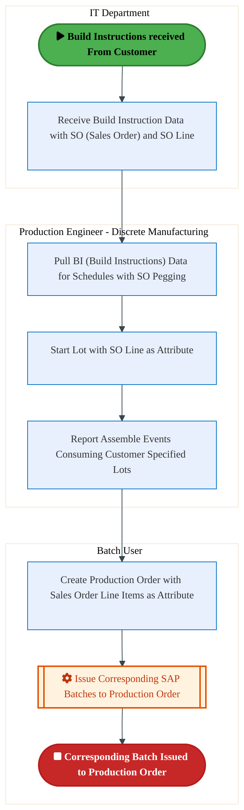
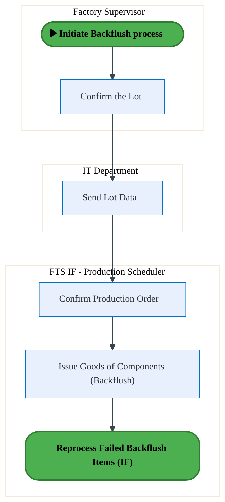
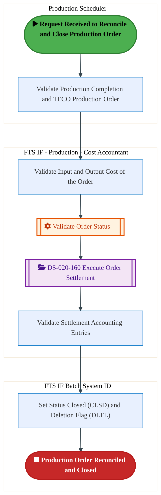

  
  <img src="data:image/svg+xml;base64,PHN2ZyB4bWxucz0iaHR0cDovL3d3dy53My5vcmcvMjAwMC9zdmciIHZpZXdCb3g9IjAgMCA4MDAgNDgwIiB3aWR0aD0iODAwIiBoZWlnaHQ9IjQ4MCI+CiAgPGRlZnM+CiAgICA8bGluZWFyR3JhZGllbnQgaWQ9ImJnIiB4MT0iMCUiIHkxPSIwJSIgeDI9IjEwMCUiIHkyPSIxMDAlIj4KICAgICAgPHN0b3Agb2Zmc2V0PSIwJSIgc3R5bGU9InN0b3AtY29sb3I6IzAwNzFjNTtzdG9wLW9wYWNpdHk6MSIvPgogICAgICA8c3RvcCBvZmZzZXQ9IjEwMCUiIHN0eWxlPSJzdG9wLWNvbG9yOiMwMGFlZWY7c3RvcC1vcGFjaXR5OjEiLz4KICAgIDwvbGluZWFyR3JhZGllbnQ+CiAgICA8bGluZWFyR3JhZGllbnQgaWQ9ImFjY2VudCIgeDE9IjAlIiB5MT0iMCUiIHgyPSIwJSIgeTI9IjEwMCUiPgogICAgICA8c3RvcCBvZmZzZXQ9IjAlIiBzdHlsZT0ic3RvcC1jb2xvcjojZmZmZmZmO3N0b3Atb3BhY2l0eTowLjE1Ii8+CiAgICAgIDxzdG9wIG9mZnNldD0iMTAwJSIgc3R5bGU9InN0b3AtY29sb3I6I2ZmZmZmZjtzdG9wLW9wYWNpdHk6MC4wMiIvPgogICAgPC9saW5lYXJHcmFkaWVudD4KICAgIDxwYXR0ZXJuIGlkPSJncmlkIiB3aWR0aD0iNDAiIGhlaWdodD0iNDAiIHBhdHRlcm5Vbml0cz0idXNlclNwYWNlT25Vc2UiPgogICAgICA8cGF0aCBkPSJNIDQwIDAgTCAwIDAgMCA0MCIgZmlsbD0ibm9uZSIgc3Ryb2tlPSJyZ2JhKDI1NSwyNTUsMjU1LDAuMDcpIiBzdHJva2Utd2lkdGg9IjAuNSIvPgogICAgPC9wYXR0ZXJuPgogIDwvZGVmcz4KCiAgPCEtLSBCYWNrZ3JvdW5kIC0tPgogIDxyZWN0IHdpZHRoPSI4MDAiIGhlaWdodD0iNDgwIiBmaWxsPSJ1cmwoI2JnKSIgcng9IjgiLz4KICA8cmVjdCB3aWR0aD0iODAwIiBoZWlnaHQ9IjQ4MCIgZmlsbD0idXJsKCNncmlkKSIgcng9IjgiLz4KICA8cmVjdCB3aWR0aD0iODAwIiBoZWlnaHQ9IjQ4MCIgZmlsbD0idXJsKCNhY2NlbnQpIiByeD0iOCIvPgoKICA8IS0tIERlY29yYXRpdmUgY2lyY3VpdC9hcmNoaXRlY3R1cmUgbGluZXMgLS0+CiAgPGcgc3Ryb2tlPSJyZ2JhKDI1NSwyNTUsMjU1LDAuMTIpIiBzdHJva2Utd2lkdGg9IjEuNSIgZmlsbD0ibm9uZSI+CiAgICA8cGF0aCBkPSJNIDAgMTAwIEwgMTIwIDEwMCBMIDE2MCAxNDAgTCAyODAgMTQwIi8+CiAgICA8cGF0aCBkPSJNIDAgMjYwIEwgODAgMjYwIEwgMTIwIDIyMCBMIDIwMCAyMjAgTCAyNDAgMjYwIEwgMzYwIDI2MCIvPgogICAgPHBhdGggZD0iTSA1MjAgMTAwIEwgNjAwIDEwMCBMIDY0MCA2MCBMIDgwMCA2MCIvPgogICAgPHBhdGggZD0iTSA0NDAgMzQwIEwgNTYwIDM0MCBMIDYwMCAzMDAgTCA3MjAgMzAwIEwgNzYwIDM0MCBMIDgwMCAzNDAiLz4KICAgIDxwYXRoIGQ9Ik0gNjAwIDQwMCBMIDY4MCA0MDAgTCA3MjAgNDQwIi8+CiAgICA8cGF0aCBkPSJNIDAgNDAwIEwgNDAgNDAwIEwgODAgMzYwIi8+CiAgICA8cGF0aCBkPSJNIDIwMCA0MjAgTCAzMjAgNDIwIEwgMzYwIDM4MCBMIDQ4MCAzODAiLz4KICAgIDxwYXRoIGQ9Ik0gNjUwIDQ0MCBMIDc1MCA0NDAgTCA4MDAgNDgwIi8+CiAgPC9nPgoKICA8IS0tIERlY29yYXRpdmUgbm9kZXMgLS0+CiAgPGcgZmlsbD0icmdiYSgyNTUsMjU1LDI1NSwwLjE4KSI+CiAgICA8Y2lyY2xlIGN4PSIxMjAiIGN5PSIxMDAiIHI9IjQiLz4KICAgIDxjaXJjbGUgY3g9IjI4MCIgY3k9IjE0MCIgcj0iNCIvPgogICAgPGNpcmNsZSBjeD0iMjAwIiBjeT0iMjIwIiByPSI0Ii8+CiAgICA8Y2lyY2xlIGN4PSIzNjAiIGN5PSIyNjAiIHI9IjQiLz4KICAgIDxjaXJjbGUgY3g9IjYwMCIgY3k9IjEwMCIgcj0iNCIvPgogICAgPGNpcmNsZSBjeD0iNzIwIiBjeT0iMzAwIiByPSI0Ii8+CiAgICA8Y2lyY2xlIGN4PSI1NjAiIGN5PSIzNDAiIHI9IjQiLz4KICAgIDxjaXJjbGUgY3g9IjgwIiBjeT0iMzYwIiByPSI0Ii8+CiAgICA8Y2lyY2xlIGN4PSI0ODAiIGN5PSIzODAiIHI9IjQiLz4KICAgIDxjaXJjbGUgY3g9IjMyMCIgY3k9IjQyMCIgcj0iNCIvPgogIDwvZz4KCiAgPCEtLSBUT0dBRiBCREFUIGJveGVzIC0tPgogIDxnIGZvbnQtZmFtaWx5PSJTZWdvZSBVSSwgQXJpYWwsIHNhbnMtc2VyaWYiIGZvbnQtc2l6ZT0iMTQiIGZvbnQtd2VpZ2h0PSI2MDAiPgogICAgPCEtLSBCIC0tPgogICAgPHJlY3QgeD0iMTUwIiB5PSIxNDAiIHdpZHRoPSIxMjAiIGhlaWdodD0iNDAiIHJ4PSI1IiBmaWxsPSJyZ2JhKDI1NSwyNTUsMjU1LDAuMTgpIiBzdHJva2U9InJnYmEoMjU1LDI1NSwyNTUsMC4zKSIgc3Ryb2tlLXdpZHRoPSIxIi8+CiAgICA8dGV4dCB4PSIyMTAiIHk9IjE2NSIgdGV4dC1hbmNob3I9Im1pZGRsZSIgZmlsbD0iI2ZmZiI+QnVzaW5lc3M8L3RleHQ+CiAgICA8IS0tIEQgLS0+CiAgICA8cmVjdCB4PSIyOTAiIHk9IjE0MCIgd2lkdGg9IjEyMCIgaGVpZ2h0PSI0MCIgcng9IjUiIGZpbGw9InJnYmEoMjU1LDI1NSwyNTUsMC4xOCkiIHN0cm9rZT0icmdiYSgyNTUsMjU1LDI1NSwwLjMpIiBzdHJva2Utd2lkdGg9IjEiLz4KICAgIDx0ZXh0IHg9IjM1MCIgeT0iMTY1IiB0ZXh0LWFuY2hvcj0ibWlkZGxlIiBmaWxsPSIjZmZmIj5EYXRhPC90ZXh0PgogICAgPCEtLSBBIC0tPgogICAgPHJlY3QgeD0iNDMwIiB5PSIxNDAiIHdpZHRoPSIxMjAiIGhlaWdodD0iNDAiIHJ4PSI1IiBmaWxsPSJyZ2JhKDI1NSwyNTUsMjU1LDAuMTgpIiBzdHJva2U9InJnYmEoMjU1LDI1NSwyNTUsMC4zKSIgc3Ryb2tlLXdpZHRoPSIxIi8+CiAgICA8dGV4dCB4PSI0OTAiIHk9IjE2NSIgdGV4dC1hbmNob3I9Im1pZGRsZSIgZmlsbD0iI2ZmZiI+QXBwbGljYXRpb248L3RleHQ+CiAgICA8IS0tIFQgLS0+CiAgICA8cmVjdCB4PSI1NzAiIHk9IjE0MCIgd2lkdGg9IjEyMCIgaGVpZ2h0PSI0MCIgcng9IjUiIGZpbGw9InJnYmEoMjU1LDI1NSwyNTUsMC4xOCkiIHN0cm9rZT0icmdiYSgyNTUsMjU1LDI1NSwwLjMpIiBzdHJva2Utd2lkdGg9IjEiLz4KICAgIDx0ZXh0IHg9IjYzMCIgeT0iMTY1IiB0ZXh0LWFuY2hvcj0ibWlkZGxlIiBmaWxsPSIjZmZmIj5UZWNobm9sb2d5PC90ZXh0PgogIDwvZz4KCiAgPCEtLSBDb25uZWN0aW5nIGxpbmVzIGJldHdlZW4gQkRBVCBib3hlcyAtLT4KICA8ZyBzdHJva2U9InJnYmEoMjU1LDI1NSwyNTUsMC4yNSkiIHN0cm9rZS13aWR0aD0iMSI+CiAgICA8bGluZSB4MT0iMjcwIiB5MT0iMTYwIiB4Mj0iMjkwIiB5Mj0iMTYwIi8+CiAgICA8bGluZSB4MT0iNDEwIiB5MT0iMTYwIiB4Mj0iNDMwIiB5Mj0iMTYwIi8+CiAgICA8bGluZSB4MT0iNTUwIiB5MT0iMTYwIiB4Mj0iNTcwIiB5Mj0iMTYwIi8+CiAgPC9nPgoKICA8IS0tIE1haW4gdGl0bGUgLS0+CiAgPHRleHQgeD0iNDAwIiB5PSIyNjAiIHRleHQtYW5jaG9yPSJtaWRkbGUiIGZvbnQtZmFtaWx5PSJTZWdvZSBVSSwgQXJpYWwsIHNhbnMtc2VyaWYiIGZvbnQtc2l6ZT0iMzYiIGZvbnQtd2VpZ2h0PSI3MDAiIGZpbGw9IiNmZmZmZmYiIGxldHRlci1zcGFjaW5nPSIxIj4KICAgIElBTyBBcmNoaXRlY3R1cmUKICA8L3RleHQ+CiAgPHRleHQgeD0iNDAwIiB5PSIzMDAiIHRleHQtYW5jaG9yPSJtaWRkbGUiIGZvbnQtZmFtaWx5PSJTZWdvZSBVSSwgQXJpYWwsIHNhbnMtc2VyaWYiIGZvbnQtc2l6ZT0iMTgiIGZvbnQtd2VpZ2h0PSI0MDAiIGZpbGw9InJnYmEoMjU1LDI1NSwyNTUsMC44KSIgbGV0dGVyLXNwYWNpbmc9IjIiPgogICAgVE9HQUYgQkRBVCDCtyBJQU8gUHJvZ3JhbSDCtyBJRE0gMi4wCiAgPC90ZXh0PgoKICA8IS0tIEJvdHRvbSBhY2NlbnQgYmFyIC0tPgogIDxyZWN0IHg9IjI4MCIgeT0iMzQwIiB3aWR0aD0iMjQwIiBoZWlnaHQ9IjMiIHJ4PSIxLjUiIGZpbGw9InJnYmEoMjU1LDI1NSwyNTUsMC40KSIvPgoKICA8IS0tIEludGVsIHRleHQgLS0+CiAgPHRleHQgeD0iNDAwIiB5PSIzODAiIHRleHQtYW5jaG9yPSJtaWRkbGUiIGZvbnQtZmFtaWx5PSJTZWdvZSBVSSwgQXJpYWwsIHNhbnMtc2VyaWYiIGZvbnQtc2l6ZT0iMTMiIGZpbGw9InJnYmEoMjU1LDI1NSwyNTUsMC41KSIgbGV0dGVyLXNwYWNpbmc9IjMiPgogICAgSU5URUwgQ09ORklERU5USUFMCiAgPC90ZXh0Pgo8L3N2Zz4K" alt="IAO Architecture" style="width:100%; border-radius:8px;" />
  <h1 style="font-size:36px; margin-top:24px;">M-100 — Execute Production (IF)</h1>
  <h2 style="font-size:24px;">Architecture Document (TOGAF BDAT)</h2>
  
Forecast to Stock (IF) (FTS-IF) Tower 
  Capability M-100 · M Mfg. Schedule and Execution (IF)

  
IAO Program · R1 – R5 
  Generated: April 2026 
  Sajiv Francis

  
IAO Architecture Pipeline — Intel Confidential

Page 1<a href="#toc">↑ Back to TOC</a>M-100 — Execute Production (IF)

## Table of Contents

<nav class="toc">
<ol>
  <li><a href="#1-executive-summary">1. Executive Summary</a></li>
  <li><a href="#2-business-context-objectives">2. Business Context &amp; Objectives</a>
    <ul>
      <li><a href="#21-classification">2.1 Classification</a></li>
      <li><a href="#22-business-drivers">2.2 Business Drivers</a></li>
      <li><a href="#23-success-criteria">2.3 Success Criteria</a></li>
      <li><a href="#24-companion-documents">2.4 Companion Documents</a></li>
    </ul>
  </li>
  <li><a href="#3-business-architecture-togaf-b">3. Business Architecture (TOGAF &ldquo;B&rdquo;)</a>
    <ul>
      <li><a href="#31-business-process-overview">3.1 Business Process Overview</a></li>
      <li><a href="#32-business-process-diagrams">3.2 Business Process Diagrams</a></li>
      <li><a href="#33-business-roles-responsibilities">3.3 Business Roles &amp; Responsibilities</a></li>
    </ul>
  </li>
  <li><a href="#4-data-architecture-togaf-d">4. Data Architecture (TOGAF &ldquo;D&rdquo;)</a>
    <ul>
      <li><a href="#41-data-entities-ownership">4.1 Data Entities &amp; Ownership</a></li>
      <li><a href="#42-data-flow-diagrams">4.2 Data Flow Diagrams</a></li>
      <li><a href="#43-data-lineage">4.3 Data Lineage</a></li>
      <li><a href="#44-ricefw-data-objects">4.4 RICEFW Data Objects</a></li>
      <li><a href="#45-data-governance-quality">4.5 Data Governance &amp; Quality</a></li>
    </ul>
  </li>
  <li><a href="#5-application-architecture-togaf-a">5. Application Architecture (TOGAF &ldquo;A&rdquo;)</a>
    <ul>
      <li><a href="#51-current-state-current-state-application-landscape">5.1 Current-State Application Landscape</a></li>
      <li><a href="#52-future-state-future-state-application-landscape">5.2 Future-State Application Landscape</a></li>
      <li><a href="#53-change-impact-summary">5.3 Change Impact Summary</a></li>
      <li><a href="#54-component-overview">5.4 Component Overview</a></li>
      <li><a href="#55-ricefw-inventory">5.5 RICEFW Inventory</a></li>
      <li><a href="#56-integration-patterns">5.6 Integration Patterns</a></li>
    </ul>
  </li>
  <li><a href="#6-technology-architecture-togaf-t">6. Technology Architecture (TOGAF &ldquo;T&rdquo;)</a>
    <ul>
      <li><a href="#61-platform-infrastructure">6.1 Platform &amp; Infrastructure</a></li>
      <li><a href="#62-sap-development-object-status">6.2 SAP Development Object Status</a></li>
      <li><a href="#63-nfrs-design-principles">6.3 NFRs &amp; Design Principles</a></li>
      <li><a href="#64-security-governance">6.4 Security &amp; Governance</a></li>
    </ul>
  </li>
  <li><a href="#7-project-context">7. Project Context</a>
    <ul>
      <li><a href="#71-project-roadmap-go-live-plan">7.1 Project Roadmap &amp; Go-Live Plan</a></li>
      <li><a href="#72-raid-log">7.2 RAID Log</a></li>
      <li><a href="#73-recommendations-next-steps">7.3 Recommendations &amp; Next Steps</a></li>
    </ul>
  </li>
</ol>
</nav>

Page 2<a href="#toc">↑ Back to TOC</a>M-100 — Execute Production (IF)

## 1. Executive Summary

This Architecture Document defines the **Business, Data, Application, and Technology** (BDAT) architecture for **M-100 Execute Production (IF)** within the IAO program. It includes 9 BPMN process diagram(s) in Section 3.

| Dimension | Value |
|-----------|-------|
| **Tower** | Forecast to Stock (IF) (FTS-IF) |
| **Process Group** | M Mfg. Schedule and Execution (IF) |
| **Capability** | M-100 - Execute Production (IF) |
| **Release** | R1 – R5 |
| **Total Systems** | 0 |
| **System Status** | 0 Deployed, 0 Developing, 0 EOL, 0 Pending IAPM |
| **RICEFW Objects** | 5 Reports, 92 Interfaces, 31 Conversions, 118 Enhancements, 15 Forms, 4 Workflows |

**Change Summary**: 0 new flow chains, 0 removed, 0 modified, 0 unchanged between Current-State and Future-State states.

> All system nodes in architecture diagrams are **IAPM-linked** — click any node to open its IAPM page. Diagrams require `securityLevel: 'loose'` for click events.

Page 3<a href="#toc">↑ Back to TOC</a>M-100 — Execute Production (IF)

## 2. Business Context & Objectives

### 2.1 Classification

| Level | Value |
|-------|-------|
| **L0 Tower** | Forecast to Stock (IF) |
| **L1 Process** | M Mfg. Schedule and Execution (IF) |
| **L2 Capability** | M-100 - Execute Production (IF) |

### 2.2 Business Drivers

| # | Driver | Description | Strategic Alignment | Priority |
|---|--------|-------------|---------------------|----------|
| 1 | Intel Foundry Supply Chain Integration | Integrate Intel Foundry manufacturing and logistics into unified S/4 HANA supply chain | IDM 2.0 Foundry Enablement | High |
| 2 | Warehouse & Logistics Modernization | Modernize warehouse management and shipping processes with EWM integration | Supply Chain Digital Transformation | High |
| 3 | Production Planning Optimization | Enable MRP-driven production planning with real-time material availability | Manufacturing Excellence | Medium |
| 4 | M-100 Process Migration | Migrate Execute Production (IF) business processes and 0 integrated systems from legacy to S/4 HANA target architecture | IDM 2.0 Supply Chain (Intel Foundry) | High |

Page 4<a href="#toc">↑ Back to TOC</a>M-100 — Execute Production (IF)

### 2.3 Success Criteria

| Metric | Target | Measure | Baseline | Owner |
|--------|--------|---------|----------|-------|
| Order Fulfillment Lead Time | < 48 hours | Time from production completion to shipment dispatch | 72 hours (legacy) | Logistics Manager |
| Inventory Accuracy | > 99.5% | Physical vs system inventory match rate | 97.8% (current) | Warehouse Manager |
| MRP Planning Cycle | < 4 hours | End-to-end MRP run including exception processing | 8 hours (legacy) | Planning Lead |
| M-100 Migration Completeness | 100% flow chains validated | All 0 flow chains verified in target state | 0% (pre-migration) | Tower Architect |

### 2.4 Companion Documents

| Document | Description |
|----------|-------------|
| **Business Architecture** | Included in this document (Section 3) — process flows from BPMN diagrams |
| **This Document** | Full BDAT Architecture — Business + Data + Application + Technology |

Page 5<a href="#toc">↑ Back to TOC</a>M-100 — Execute Production (IF)

## 3. Business Architecture (TOGAF "B")

### 3.1 Business Process Overview

This capability includes **9 business process(es)** modeled in BPMN 2.0, covering the end-to-end workflow for M-100 Execute Production (IF).

| # | Step ID | Process Name | Lanes | Tasks | Gateways |
|---|---------|--------------|-------|-------|----------|
| 1 | M-100-070_Issue_Materials_for_Production_Order_(IF) | M-100-070_Issue_Materials_for_Production_Order_(IF) | Batch User, IT Department, Production Engineer - Discrete Manufacturing | 6 | 0 |
| 2 | M-100-140_Confirm_Completion_of_Production_Operation_Order_(IF) | M-100-140_Confirm_Completion_of_Production_Operation_Order_(IF) | FTS IF Batch System ID, Factory Supervisor, IT Department | 20 | 9 |
| 3 | M-100-150_Backflush_Raw_Materials_(IF) | M-100-150_Backflush_Raw_Materials_(IF) | FTS IF - Production Scheduler, Factory Supervisor, IT Department | 4 | 0 |
| 4 | M-100-160_Reprocess_Failed_Backflush_Items_(IF) | M-100-160_Reprocess_Failed_Backflush_Items_(IF) | FTS IF - Production Scheduler | 3 | 0 |
| 5 | M-100-180_Assign_Batch_Number_and_Link_to_Order_(IF) | M-100-180_Assign_Batch_Number_and_Link_to_Order_(IF) | Batch User, Factory Supervisor, IT Department | 13 | 2 |
| 6 | M-100-220_Transfer_Materials_from_Quality_Inspection_to_Stock_(IF) | M-100-220_Transfer_Materials_from_Quality_Inspection_to_Stock_(IF) | Boundary Apps, FTS IF Batch System ID, Factory Supervisor, IT Department | 23 | 16 |
| 7 | M-100-230_Rework_(IF) | M-100-230_Rework_(IF) | FTS IF - Production Scheduler, Factory Supervisor, IT Department | 23 | 3 |
| 8 | M-100-240_Reconcile_and_Close_Production_Order_(IF) | M-100-240_Reconcile_and_Close_Production_Order_(IF) | FTS IF - Production - Cost Accountant, FTS IF Batch System ID, Production Scheduler | 5 | 0 |
| 9 | M-100-250_Archive_Production_Order_(IF) | M-100-250_Archive_Production_Order_(IF) | FTS IF - Firefighter ID | 4 | 0 |

Page 6<a href="#toc">↑ Back to TOC</a>M-100 — Execute Production (IF)

### 3.2 Business Process Diagrams

#### BUSINESS ARCHITECTURE — 3.2.1 M-100-070_Issue_Materials_for_Production_Order_(IF) — M-100-070_Issue_Materials_for_Production_Order_(IF)

**Swim Lanes**: Batch User · IT Department · Production Engineer - Discrete Manufacturing | **Tasks**: 6 | **Gateways**: 0

> **Legend**: ● Start · ● End · User Task · Service Task · ◇ Gateway · Sub-Process

<a href="https://mermaid.live/view#pako:eNqlVV2L6zYQ_SuDlyW74IDt2HHqh0LixBDYy12ave3D3VIUW07E2pKR5GTTJf-9o9hxvhooNA-BGY3OmXPGkr6sVGTUiqzHxy_GmY7gq6fXtKS9CHpLomjPhibxO5GMLAuqeqYmF1wv2N-HMtevPk2ZySWkZMXOZBd0JSj8mNswxo2FDYpw1VdUsrxn9yrJSiJ3sSiENNUPdJQ7-YGtXZoImVF5KnCc0E0D3FowTk_pQeiHfmL2KZoKnl2A5kE-ytPe3jRXiG26JlIf2q8V_UY-_2CZXmOck0JRrFnrsnghS1oYjVrWJpfWcnM0gynDw9GwRUVSxleY9x1MScI_TqnA2e9h__j4zjtSeJu-c8BfWhClpjQHpTE922jIWVFED348TgLHVlqKDxo9eLNwOvDs1CiJULpjG3P7W8pWax0tRZG1pf2t0RB51actPyPPseUO_6-4KM9OTPHQG3mjjmkSurEbH5nyPP9fTOirfCPqo-WaDRIvmXZcbjAMYucW7yhz6odj99onKjcspWegSZIMZierZsPAde6DTpLB0ImvQFdE0y3ZnQB_if0OMAnCxA3vAjZ8113Wy1cp0iPgYBYkQQcYTtxk7N0F9MeuP2o7RJyVJNUaCsLpX87Pd2tCdLqGH2jDu_VnU2R-3P2JizmJctJPxQrmStUUYiElVRUeA_wSYTF-hcN2qkALwAazOtVMcPhujhbinQMOES-WFJ25qYQt02tYEDz8beIFzyDMNS0VEAVjrSVb1ppetjh66lpUWlRX3TXCDn1nd9p7bsDw8_03d1xEn7_BlFZ4kkrK9SW7h8u_0ZSyDYVJzYoM5hxH0FJMiSatrO_wdCbtGQjPTNJIvEQMT3qqAr-eG1QFsiHMIJGihLhG3eV_kGJ6PdM_4yskR5v7MGUqlRRn8o3wOiepriWad9nXwOyuiwImc3i6beq5EZsLCQv8FrLaaD1Kf6Wr1Q2gj4ALcz_Bi9Bd6WHm96cdHPyuBO4aK0VLfCpgtsGxKBw8V3Vphn50BBYVTVnO0CmkUB1S5w8Pod__FafYhl4TDtpw0IR-G_pNGLThsAnbq4S7TThqw6AJh2dH2NScXTQXK2F3VV-kR-2tatkW6ikJy6zoyzq8lPiaZjQndaGtvW2RWovFjqdWdHhRrLrK8IxNGcH5l01y_w-b42tT" title="View full diagram">&#128065; View Diagram</a>

Page 7<a href="#toc">↑ Back to TOC</a>M-100 — Execute Production (IF)

#### BUSINESS ARCHITECTURE — 3.2.2 M-100-140_Confirm_Completion_of_Production_Operation_Order_(IF) — M-100-140_Confirm_Completion_of_Production_Operation_Order_(IF)

**Swim Lanes**: FTS IF Batch System ID · Factory Supervisor · IT Department | **Tasks**: 20 | **Gateways**: 9

```mermaid
%%{init: {'theme': 'base', 'themeVariables': {'fontSize': '14px', 'fontFamily': 'Segoe UI, Arial, sans-serif','primaryColor': '#e8f0fe', 'primaryBorderColor': '#0071c5','lineColor': '#37474F', 'secondaryColor': '#f5f8fc'}, 'flowchart': {'useMaxWidth': false, 'htmlLabels': true, 'curve': 'basis', 'nodeSpacing': 40, 'rankSpacing': 50}} }%%
flowchart LR
    classDef startEvt fill:#4CAF50,stroke:#2E7D32,color:#000,font-weight:bold,stroke-width:2px,rx:20,ry:20
    classDef endEvt fill:#C62828,stroke:#B71C1C,color:#fff,font-weight:bold,stroke-width:2px,rx:20,ry:20
    classDef userTask fill:#E3F2FD,stroke:#1565C0,stroke-width:2px,color:#0D47A1
    classDef serviceTask fill:#FFF3E0,stroke:#E65100,stroke-width:2px,color:#BF360C
    classDef gateway fill:#FFF9C4,stroke:#F57F17,stroke-width:2px,color:#E65100
    classDef subProc fill:#F3E5F5,stroke:#7B1FA2,stroke-width:2px,color:#4A148C
    subgraph lane_0["FTS IF Batch System ID"]
        n13["-120 Post IM (Inventory Management) Transfers"]
        n14["-130 Post Confirmation"]
        n15["-150 Perform Inventory Splits"]
        n16["-140 Perform Order Splits"]
        n17["-170 Perform Inventory Merge"]
        n18["-160 Perform Order Merge"]
        n19["-180 Post IM Scrap"]
        n20["-190 Post Confirmation"]
        n24(["fa:fa-stop Confirmation Posted"])
        n25(["fa:fa-stop Inventory Splits Performed"])
        n26(["fa:fa-stop Inventory Merge Performed"])
        n27(["fa:fa-stop Confirmation Posted"])
        n29{{"fa:fa-code-branch exclusiveGateway"}}
        n30{{"fa:fa-code-branch Call RFC?"}}
        n31{{"fa:fa-code-branch If Failure occurs?"}}
        n32{{"fa:fa-code-branch If Failure occurs?"}}
        n33{{"fa:fa-code-branch If Failure occurs?"}}
        n34{{"fa:fa-code-branch If Failure occurs?"}}
    end
    subgraph lane_1["Factory Supervisor"]
        n2["-010 Determine Data Elements"]
        n21(["fa:fa-play Lot Creation Request Received"])
    end
    subgraph lane_2["IT Department"]
        n1["-200 Report Error And Hold Next Events"]
        n3["-020 Filter Lot Owner From Operation Table (Non-TD ENG exclude)"]
        n4["-030 Check if Operation is for Production Start in Moveout Operation"]
        n5["-040 Go to Production Order Create"]
        n6["-050 Determine Transaction Relevance"]
        n7["-060 Determine Event"]
        n8["-070 Determine Lot WIP or Inventory"]
        n9["-080 Determine S/4 API Sequence"]
        n10["-090 Determine Scrap for Reject Events"]
        n11["-100 Assign Attributes"]
        n12["-110 Call Relevant RFC(Remote Function Call)/BAPI"]
        n22(["fa:fa-stop Production Order created"])
        n23(["fa:fa-stop Error Reported And Hold Next Events"])
        n28{{"fa:fa-code-branch IF Operation Is For Production Start"}}
        n35{{"fa:fa-arrows-alt parallelGateway"}}
        n36{{"fa:fa-arrows-alt parallelGateway"}}
    end
    n3 --> n4
    n4 --> n28
    n28 --> n5
    n28 --> n35
    n35 --> n6
    n35 --> n7
    n35 --> n8
    n35 --> n9
    n35 --> n10
    n35 --> n11
    n35 --> n12
    n12 --> n36
    n6 --> n36
    n7 --> n36
    n8 --> n36
    n9 --> n36
    n10 --> n36
    n11 --> n36
    n13 --> n14
    n19 --> n20
    n36 --> n30
    n16 --> n15
    n18 --> n17
    n30 -->|"RFC Move"| n13
    n14 --> n31
    n15 --> n32
    n17 --> n33
    n20 --> n34
    n31 -->|"No"| n24
    n32 -->|"No"| n25
    n33 -->|"No"| n26
    n34 -->|"No"| n27
    n30 -->|"RFC Split"| n16
    n30 -->|"RFC Merge"| n18
    n30 -->|"Reject"| n19
    n34 -->|"Yes"| n29
    n32 -->|"Yes"| n29
    n33 -->|"Yes"| n29
    n31 -->|"Yes"| n29
    n1 --> n23
    n29 --> n1
    n5 --> n22
    n2 --> n3
    n21 --> n2
    class n21 startEvt
    class n22 endEvt
    class n23 endEvt
    class n24 endEvt
    class n25 endEvt
    class n26 endEvt
    class n27 endEvt
    class n28 gateway
    class n29 gateway
    class n30 gateway
    class n31 gateway
    class n32 gateway
    class n33 gateway
    class n34 gateway
    class n35 gateway
    class n36 gateway
```

> **Legend**: ● Start · ● End · User Task · Service Task · ◇ Gateway · Sub-Process

<a href="https://mermaid.live/view#pako:eNqlWGtv4kYU_SsjryISCbQev-FDKwJ4i7TJRiHtqipVNTFjcGM8dDwmoVn-e--MH8BgVG2bD1HmzD33NXeO7bwbEVtQY2BcXb0nWSIG6L0jVnRNOwPUeSY57XRRCfxCeEKeU5p3pE3MMjFL_lZm2Nm8STOJhWSdpDuJzuiSUfTztIuGQEy7KCdZ3sspT-JOt7PhyZrw3YiljEvrDzSIzVhFq7ZuGV9QfjAwTR9HLlDTJKMH2PYd3wklL6cRyxYnTmM3DuKos5fJpew1WhEuVPpFTu_I29dkIVawjkmaU7BZiXX6mTzTVNYoeCGxqODbuhlJLuNk0LDZhkRJtgTcMQHiJHs5QK6536P91dU8a4Kiz4_zDMFPlJI8H9MY5QLgyVagOEnTwQdnNAxds5sLzl7o4IM18ce21Y1kJQMo3ezK5vZeabJcicEzSxeVae9V1jCwNm9d_jawzC7fwW8tFs0Wh0gjzwqsoIl06-MRHtWR4jj-X5Ggr_yJ5C9VrIkdWuG4iYVdzx2Z5_7qMseOP8R6nyjfJhE9chqGoT05tGriudi87PQ2tD1zpDldEkFfye7gsD9yGoeh64fYv-iwjKdnWTw_cBbVDu2JG7qNQ_8Wh0ProkNniJ2gyhD8LDnZrFBKMvqH-dvcCJ9maBqiWyKiFZrtckHXaDqeG7-XBPmTYRsMe9gy0QPLBZreoetptqWZYHyH7khGlnB_M3GDnmBQ85jyXOM7im9X_BHL4oSviUhYphm6ytAFQ8pjxiGVJs5skyZCd-wpe-dg_0Ve6nZbX9n6bb7vKF9SzTxQ5p7uus20r0yDQ3tmETT51MgylVH_X3tgOddgGZNBTHq5YJsTU0WmC2DcHFNcjaJ3ra7hnOldZKpCLxP978-y__5eU-RDofcM0wJDR9-itMiTLf1U3pq5sd8f0WyznTYiaYoew9GPuj1ut5_GKCRJWnCKWASqm58Rrf9KtP8r0fl-Imht21XG8iqTqDzzYiNFLWdcmyw5gSY20ZgKytfwmENjIgiapOr6avfFwocT3qQgZp8ZjC2n5Qk_0r8KCnP8SCMKR3d01hcSlMGnTxB6A88lGU67QzI3yzTB4YbB82zCOeNomC3QT_CIQPf0DbDteZZKmUxQpjBJoSiV5JfXDP4KOYM7C50oE36S7xbo-p5lvacxmtx_KuduQW9OHSqpMkGqRisavaAkPvKR5AguAwIlXhSRQmbyKYuSDN2xLWWFOBifelW6ZoJOfWJIsGMPpaqovmqyorTNdI-PS-kriaoTSOkWxkVjKZUzvWOW6tuplRI30z-2kp37On1AUGAjAqckJXNmcEyafXTQ8GGKZnIcznLBSvPM_glDSqNq4yP9k0btp4rVOMBjEA3zPFlmaCgET54LQXVDNdMYZrqUg7InQurC9SNdM0FRWGRlw6TFzcdbSFcbdEuTsrPTidTpnOmZrfHKmS0HmC4uDe-Ji-CCAIRHUzfNUdgydbqWuAdXBBJ5zXskFQhuG5RN0wva6n0fqbnbmY16vR_gtlRLp1xaQbW2ghJwtbVdA7ZbAp629rV1oK372hqbOoB1wKoAbFU51DE9be1r60Bb97U1TJ0GYB2o2oTrPuHKh9WkXSdRA7gCcN0pXKWBm9aosN_mBgy50p258U2Gqu2rs7DrRuCqEXbTiLrQmmLVhdRp2rgKcc-Uc6vZsLSN5jxtbaM5WEfbaC1DvaaUdXitZZZvXXI_ONtXOlJu9vWov0rFkGH7egXnO_bFHXxppzpwq-lkdb5176vWW3Xr6xGslzX_6HVfofXX2yluVV9ap6jdijqtqNuKeq2o34oG9cfNKdxvheGMWmHcDlvtsN0OO-2w2w57NWx0jTU8i0iyMAbvhvrXgzEwFjQmRSqMfdcghWCzXRYZA_WJbhSbBTDHCYG3mXUJ7v8BBpEQBQ==" title="View full diagram">&#128065; View Diagram</a>

Page 8<a href="#toc">↑ Back to TOC</a>M-100 — Execute Production (IF)

#### BUSINESS ARCHITECTURE — 3.2.3 M-100-150_Backflush_Raw_Materials_(IF) — M-100-150_Backflush_Raw_Materials_(IF)

**Swim Lanes**: FTS IF - Production Scheduler · Factory Supervisor · IT Department | **Tasks**: 4 | **Gateways**: 0

> **Legend**: ● Start · ● End · User Task · Service Task · ◇ Gateway · Sub-Process

<a href="https://mermaid.live/view#pako:eNqlVF1r2zAU_SvCpaQDB_wZZ34YJE40AhsbS7c9rGMo9lUiKktGkttmJf99UuJ8dt3L_GC4R-eec--VfZ-9Ulbg5d719TMTzOTouWdWUEMvR70F0dDz0Q74RhQjCw665zhUCjNnv7e0MGmeHM1hmNSMrx06h6UE9HXmo5FN5D7SROi-BsVoz-81itVErQvJpXLsKxjSgG7duqOxVBWoIyEIsrBMbSpnAo5wnCVZgl2ehlKK6kyUpnRIy97GFcflY7kiymzLbzV8JE_fWWVWNqaEa7Cclan5B7IA7no0qnVY2aqH_TCYdj7CDmzekJKJpcWTwEKKiPsjlAabDdpcX9-Jgym6ndwJZJ-SE60nQJE2Fp4-GEQZ5_lVUoxwGvjaKHkP-VU0zSZx5Jeuk9y2HvhuuP1HYMuVyReSVx21_-h6yKPmyVdPeRT4am3fF14gqqNTMYiG0fDgNM7CIiz2TpTS_3Kyc1W3RN93XtMYR3hy8ArTQVoEL_X2bU6SbBRezgnUAyvhRBRjHE-Po5oO0jB4XXSM40FQXIguiYFHsj4Kvi2SgyBOMxxmrwru_C6rbBeflSz3gvE0xelBMBuHeBS9KpiMwmTYVWh1loo0K8SJgF_BjzsP387RDKM-svpVWxomBZqXK6haDurO-7nLc4-ILb2QgjJVn7I_uf_onJlY5kzrFtB7KSuNJEWFrBspQBiNbsakvKe81as352kDm_YFGtsoaI0wYRwqdCCjmYHaZs_wMc1-eX9rLHSNkdJItUbztnFXrOVFjeFJN3YBoQ_SnBPSG8ugJKek33B7mTO7vpi92JOKulJt3pt_1hO5edyiCTT2p6ztEM6d3PHcproa0IQY8rI_kaJ-_52tugvDXRh1YbwLky6MdmHchckuHJx8VE5wvyLO4MEB9nyvBlUTVnn5s7fd0XaPV0BJy4238T3SGjlfi9LLt7vMa5vKjmfCiO283oGbP2Ft59U=" title="View full diagram">&#128065; View Diagram</a>

#### BUSINESS ARCHITECTURE — 3.2.4 M-100-160_Reprocess_Failed_Backflush_Items_(IF) — M-100-160_Reprocess_Failed_Backflush_Items_(IF)

**Swim Lanes**: FTS IF - Production Scheduler | **Tasks**: 3 | **Gateways**: 0

```mermaid
%%{init: {'theme': 'base', 'themeVariables': {'fontSize': '14px', 'fontFamily': 'Segoe UI, Arial, sans-serif','primaryColor': '#e8f0fe', 'primaryBorderColor': '#0071c5','lineColor': '#37474F', 'secondaryColor': '#f5f8fc'}, 'flowchart': {'useMaxWidth': false, 'htmlLabels': true, 'curve': 'basis', 'nodeSpacing': 40, 'rankSpacing': 50}} }%%
flowchart TD
    classDef startEvt fill:#4CAF50,stroke:#2E7D32,color:#000,font-weight:bold,stroke-width:2px,rx:20,ry:20
    classDef endEvt fill:#C62828,stroke:#B71C1C,color:#fff,font-weight:bold,stroke-width:2px,rx:20,ry:20
    classDef userTask fill:#E3F2FD,stroke:#1565C0,stroke-width:2px,color:#0D47A1
    classDef serviceTask fill:#FFF3E0,stroke:#E65100,stroke-width:2px,color:#BF360C
    classDef gateway fill:#FFF9C4,stroke:#F57F17,stroke-width:2px,color:#E65100
    classDef subProc fill:#F3E5F5,stroke:#7B1FA2,stroke-width:2px,color:#4A148C
    subgraph lane_0["FTS IF - Production Scheduler"]
        n1["fa:fa-user Perform Good Issue Against the Production Order"]
        n2["Monitor Post Processing of Error Records from Automatic Goods Movement"]
        n3["Identifying the Error Caused by the Posting"]
        n4(["fa:fa-stop Failed Backflush Reprocessed"])
        n5["Backflush Raw Materials"]
    end
    n5 --> n2
    n3 --> n1
    n2 --> n3
    n1 --> n4
    class n1 userTask
    class n4 endEvt
    class n5 startEvt
```

> **Legend**: ● Start · ● End · User Task · Service Task · ◇ Gateway · Sub-Process

<a href="https://mermaid.live/view#pako:eNqlVNuO2jAQ_RUrK0QrBSlXQvNQCQKpkLrqqmzbh1JVJrHBwrGR7XAp4t87JtyrfWoeoszxzDkzE8_snUKWxEmdVmvPBDMp2rfNglSknaL2DGvSdlEDfMeK4Rknum19qBRmwv4c3fxotbVuFstxxfjOohMylwR9G7uoD4HcRRoL3dFEMdp22yvFKqx2meRSWe8n0qMePaqdjgZSlURdHTwv8YsYQjkT5AqHSZREuY3TpJCivCOlMe3Ron2wyXG5KRZYmWP6tSbPePuDlWYBNsVcE_BZmIp_xjPCbY1G1RYrarU-N4NpqyOgYZMVLpiYAx55ACksllco9g4HdGi1puIiil6HU4HgKTjWekgo0gbg0dogyjhPn6Ksn8eeq42SS5I-BaNkGAZuYStJoXTPtc3tbAibL0w6k7w8uXY2toY0WG1dtU0Dz1U7eD9oEVFelbJu0At6F6VB4md-dlailP6XEvRVvWK9PGmNwjzIhxctP-7Gmfcv37nMYZT0_cc-EbVmBbkhzfM8HF1bNerGvvc26SAPu172QDrHhmzw7kr4IYsuhHmc5H7yJmGj95hlPXtRsjgThqM4jy-EycDP-8GbhFHfj3qnDIFnrvBqgTgW5Lf3c-rkrxM0zlEHAX9ZF4ZJgSbFgpQ1J2rq_Gri7CN8cKc4pbhjfwN6IYpKVaFPUpZorHVNUH-OmdAGwUDf8n2xk3bPFQDXs4SFIIFIQogtj2gNNxxJikZKwcFXmDhVakSVrFC_NrLChhVHQY2e5Rq2hjD3vCHwjkuAGd1ZLptJQ5ZhyLpEs12THWjC-X1w9O5SoTZyhXLMOIQMcLGkvNYLSGjVpElKiHx_ExpD5I0f3qBnuAN2MemLBoxJ8yFi1Ol8hCaczLAxT1dTBI0Znky_MaObK2HB8yjcwdFpFu_A-LIMHNepiKowK5107xzXLqzmklBcc-McXAdDkyc7UTjpcT059aqEMoYMw62pGvDwFzyW32w=" title="View full diagram">&#128065; View Diagram</a>

Page 9<a href="#toc">↑ Back to TOC</a>M-100 — Execute Production (IF)

#### BUSINESS ARCHITECTURE — 3.2.5 M-100-180_Assign_Batch_Number_and_Link_to_Order_(IF) — M-100-180_Assign_Batch_Number_and_Link_to_Order_(IF)

**Swim Lanes**: Batch User · Factory Supervisor · IT Department | **Tasks**: 13 | **Gateways**: 2

```mermaid
%%{init: {'theme': 'base', 'themeVariables': {'fontSize': '14px', 'fontFamily': 'Segoe UI, Arial, sans-serif','primaryColor': '#e8f0fe', 'primaryBorderColor': '#0071c5','lineColor': '#37474F', 'secondaryColor': '#f5f8fc'}, 'flowchart': {'useMaxWidth': false, 'htmlLabels': true, 'curve': 'basis', 'nodeSpacing': 40, 'rankSpacing': 50}} }%%
flowchart LR
    classDef startEvt fill:#4CAF50,stroke:#2E7D32,color:#000,font-weight:bold,stroke-width:2px,rx:20,ry:20
    classDef endEvt fill:#C62828,stroke:#B71C1C,color:#fff,font-weight:bold,stroke-width:2px,rx:20,ry:20
    classDef userTask fill:#E3F2FD,stroke:#1565C0,stroke-width:2px,color:#0D47A1
    classDef serviceTask fill:#FFF3E0,stroke:#E65100,stroke-width:2px,color:#BF360C
    classDef gateway fill:#FFF9C4,stroke:#F57F17,stroke-width:2px,color:#E65100
    classDef subProc fill:#F3E5F5,stroke:#7B1FA2,stroke-width:2px,color:#4A148C
    subgraph lane_0["Batch User"]
        n1["fa:fa-user Update Output Batch with Lot Number"]
        n2["fa:fa-user Assign Batch Attributes"]
        n13["Create Production Order and Automatic Output Batch Generated"]
        n15(["fa:fa-stop Batch Attributes Assigned"])
    end
    subgraph lane_1["Factory Supervisor"]
        n3["Determine Data Elements"]
        n14(["fa:fa-play Manufacturing (MFG) Operation Table Received"])
    end
    subgraph lane_2["IT Department"]
        n4["Create Copy of Operation Table"]
        n5["Filter Lot Owner From Operation Table (TD)"]
        n6["Check if Operation is for Production Start in Moveout Operation"]
        n7["Determine Start Date"]
        n8["Determine Production Version"]
        n9["Determine Enterprise Resource Planning (ERP) Routing"]
        n10["Determine Plant"]
        n11["Determine Unique Product ID"]
        n12["Determine Order Type"]
        n16{{"fa:fa-arrows-alt parallelGateway"}}
        n17{{"fa:fa-arrows-alt parallelGateway"}}
    end
    n4 --> n5
    n5 --> n6
    n17 --> n12
    n7 --> n16
    n17 --> n9
    n17 --> n8
    n8 --> n16
    n12 --> n16
    n9 --> n16
    n17 --> n10
    n17 --> n11
    n10 --> n16
    n11 --> n16
    n6 --> n17
    n17 --> n7
    n3 --> n4
    n14 --> n3
    n16 --> n13
    n13 --> n1
    n1 --> n2
    n2 --> n15
    class n1 userTask
    class n2 userTask
    class n14 startEvt
    class n15 endEvt
    class n16 gateway
    class n17 gateway
```

> **Legend**: ● Start · ● End · User Task · Service Task · ◇ Gateway · Sub-Process

<a href="https://mermaid.live/view#pako:eNqlVmFv6jYU_StWnipaKUhJSAjNh0kUSFWpXZ9K-_ZhnSaTOGDV2JntlDLEf981SYC4r9Km8aHqPbnnnnuPHTs7JxM5cRLn4mJHOdUJ2vX0iqxJL0G9BVak56Ia-IElxQtGVM_kFILrOf37kOaH5YdJM1iK15RtDTonS0HQy52LxkBkLlKYq74ikhY9t1dKusZyOxFMSJP9jYwKrzioNY9uhMyJPCV4XuxnEVAZ5eQED-IwDlPDUyQTPO8ULaJiVGS9vWmOiU22wlIf2q8UecAfv9FcryAuMFMEclZ6ze7xgjAzo5aVwbJKvrdmUGV0OBg2L3FG-RLw0ANIYv52giJvv0f7i4tXfhRF90-vHMEvY1ipKSmQ0gDP3jUqKGPJt3AyTiPPVVqKN5J8C2bxdBC4mZkkgdE915jb3xC6XOlkIVjepPY3ZoYkKD9c-ZEEniu38NfSIjw_KU2GwSgYHZVuYn_iT1qloij-lxL4Kp-xemu0ZoM0SKdHLT8aRhPvc712zGkYj33bJyLfaUbOiqZpOpidrJoNI9_7uuhNOhh6E6voEmuywdtTwetJeCyYRnHqx18WrPXsLqvFdymytuBgFqXRsWB846fj4MuC4dgPR02HUGcpcblCDHPyp_f7q3ODdbZCL2DDq_NHnWR-3IdnBU4K3Deeo5cyh5nQY6XLSqOatKF6he6FRr9W64XND7r8sVJ0yRviWGtJF5UmytIcAGkiiVGCcfMq01Rw9GheVIR5jsaVFmusadZt5JZwIoGUW-Wiy2MTSovyk3rT1YF3VRNhK__MKeNGijMt5BbNq9LsGSWsiU3zU6KJXMMBgqZYYzRjcLBxbY8ZnvoqGWyTB8yrAqpXEl5wdPmQ3l6hx9KMZMZ_NqcieiIZoe__olVj_N0zmpISDgCj3hUPTxZPRLlForCluvmRmZwyGOuw1I8bsBqlUqw_dXj5PL3qcodGa0WyN0TPVahChZDnKzw3hxWiHD2IdyJgXY_J3YJxx-KaBUZbLY86WWcyP4hUn2ped7JnHP6DG0IZx5WoZAYVwFd-WJnZ0_cr9AQNQmStqdcVBYplvO93Ml44_as6dofuplZ20MmuX4HnbWmN6g93u3YrYSnFRvUx0wiWHjNG2G19Dr06-_05Kf5vpONG4yHq93-BPdGEUR0Om9CP69gPGqCN7YRrKx418cjODyzg-ouCvmcDfgt4NsW3gGETx1aJNh7UYdg-bjwYtHHLPwIN4dhBHbaetCNFZye8SWpvtg4c_ByGHtrrvYtHzVXcRYftfdSF4xZ2XGcN-wzT3El2zuFjDD7YclLgimln7zoYjt35lmdOcvhocarDZTClGI6ddQ3u_wG3CBLc" title="View full diagram">&#128065; View Diagram</a>

Page 10<a href="#toc">↑ Back to TOC</a>M-100 — Execute Production (IF)

#### BUSINESS ARCHITECTURE — 3.2.6 M-100-220_Transfer_Materials_from_Quality_Inspection_to_Stock_(IF) — M-100-220_Transfer_Materials_from_Quality_Inspection_to_Stock_(IF)

**Swim Lanes**: Boundary Apps · FTS IF Batch System ID · Factory Supervisor · IT Department | **Tasks**: 23 | **Gateways**: 16

```mermaid
%%{init: {'theme': 'base', 'themeVariables': {'fontSize': '14px', 'fontFamily': 'Segoe UI, Arial, sans-serif','primaryColor': '#e8f0fe', 'primaryBorderColor': '#0071c5','lineColor': '#37474F', 'secondaryColor': '#f5f8fc'}, 'flowchart': {'useMaxWidth': false, 'htmlLabels': true, 'curve': 'basis', 'nodeSpacing': 40, 'rankSpacing': 50}} }%%
flowchart LR
    classDef startEvt fill:#4CAF50,stroke:#2E7D32,color:#000,font-weight:bold,stroke-width:2px,rx:20,ry:20
    classDef endEvt fill:#C62828,stroke:#B71C1C,color:#fff,font-weight:bold,stroke-width:2px,rx:20,ry:20
    classDef userTask fill:#E3F2FD,stroke:#1565C0,stroke-width:2px,color:#0D47A1
    classDef serviceTask fill:#FFF3E0,stroke:#E65100,stroke-width:2px,color:#BF360C
    classDef gateway fill:#FFF9C4,stroke:#F57F17,stroke-width:2px,color:#E65100
    classDef subProc fill:#F3E5F5,stroke:#7B1FA2,stroke-width:2px,color:#4A148C
    subgraph lane_0["Boundary Apps"]
        n1["Schedule Out Dates for WIP Lot"]
        n2["Send Projected Available Dates From W/S for Unusable Lots"]
        n3["Provide Data of Unusable Lot Which are Going to be Available"]
        n4["Send Projected Available Dates From MES for Unusable Lots"]
        n24(["fa:fa-play Data Transfer Process to be Initiated"])
        n31["Adjust Schedule (IF)"]
        n32{{"fa:fa-code-branch exclusiveGateway"}}
        n43{{"fa:fa-arrows-alt parallelGateway"}}
        n44{{"fa:fa-arrows-alt parallelGateway"}}
    end
    subgraph lane_1["FTS IF Batch System ID"]
        n20["Perform Goods Movement to Set Batch as Unrestricted"]
        n21["Perform Goods movement to Set Batch as Unrestricted"]
        n22["Perform Goods Movement to Set Batch as Restricted"]
        n23["Perform Goods Movement to Set Batch as Restricted"]
        n27(["fa:fa-stop Batch Set as Unestricted"])
        n28(["fa:fa-stop Batch Set as Unestricted"])
        n29(["fa:fa-stop Batch Set as Restricted"])
        n30(["fa:fa-stop Batch Set as Restricted"])
        n38{{"fa:fa-code-branch exclusiveGateway"}}
        n39{{"fa:fa-code-branch If Failure occurs?"}}
        n40{{"fa:fa-code-branch If Failure occurs?"}}
        n41{{"fa:fa-code-branch If Failure occurs?"}}
        n42{{"fa:fa-code-branch If Failure occurs?"}}
    end
    subgraph lane_2["Factory Supervisor"]
        n5["Send Transaction Data"]
        n6["Send Transaction Data"]
        n25(["fa:fa-play Request Initiated to Transfer Materials from Quality Inspection to Stock"])
        n33{{"fa:fa-code-branch System Used to Send Transaction Data ?"}}
        n34{{"fa:fa-code-branch exclusiveGateway"}}
    end
    subgraph lane_3["IT Department"]
        n7["Check MRB Summary"]
        n8["Check Reel PHQ Values"]
        n9["Check Lot Expiration"]
        n10["Check Aged Attributes"]
        n11["Check TRDI/SFGI Hold Attributes"]
        n12["Determine if Lot is Usable/Not Usable"]
        n13["Determine if Lot is Inventory or WIP"]
        n14["Determine if Lot is Inventory or WIP"]
        n15["Report Error and Hold Next Transaction"]
        n16["Determine SAP Production Order"]
        n17["Determine SAP Material, Batch, Plant, Storage Locations, Movement Type​"]
        n18["Determine SAP Production Order"]
        n19["Determine SAP Material, Batch, Plant"]
        n26(["fa:fa-stop Error Reported and Hold Next Transaction"])
        n35{{"fa:fa-code-branch Determine Lot?"}}
        n36{{"fa:fa-code-branch Determine Lot?"}}
        n37{{"fa:fa-code-branch Determine Lot?"}}
        n45{{"fa:fa-arrows-alt parallelGateway"}}
        n46{{"fa:fa-arrows-alt parallelGateway"}}
        n47{{"fa:fa-arrows-alt parallelGateway"}}
    end
    n5 --> n34
    n45 --> n7
    n45 --> n8
    n45 --> n9
    n45 --> n10
    n10 --> n46
    n9 --> n46
    n8 --> n46
    n7 --> n46
    n35 -->|"Not Usable"| n14
    n13 --> n36
    n36 -->|"WIP"| n16
    n36 -->|"Inventory"| n17
    n45 --> n11
    n11 --> n46
    n25 --> n33
    n6 --> n34
    n34 --> n45
    n3 --> n4
    n24 --> n44
    n44 --> n3
    n44 --> n2
    n46 --> n47
    n1 --> n31
    n37 -->|"WIP"| n18
    n37 -->|"Inventory"| n19
    n20 --> n39
    n39 -->|"No"| n27
    n41 -->|"No"| n29
    n42 -->|"No"| n30
    n16 --> n23
    n23 --> n42
    n22 --> n41
    n21 --> n40
    n40 -->|"No"| n28
    n33 -->|"MES"| n5
    n33 -->|"Workstream"| n6
    n35 -->|"Usable"| n13
    n42 --> n38
    n41 --> n38
    n40 --> n38
    n39 --> n38
    n47 --> n12
    n12 --> n35
    n47 -->|"Rules"| n32
    n38 --> n15
    n15 --> n26
    n2 --> n43
    n14 --> n37
    n19 --> n20
    n17 --> n22
    n18 --> n21
    n4 --> n43
    n43 --> n32
    n32 --> n1
    class n24 startEvt
    class n25 startEvt
    class n26 endEvt
    class n27 endEvt
    class n28 endEvt
    class n29 endEvt
    class n30 endEvt
    class n31 startEvt
    class n32 gateway
    class n33 gateway
    class n34 gateway
    class n35 gateway
    class n36 gateway
    class n37 gateway
    class n38 gateway
    class n39 gateway
    class n40 gateway
    class n41 gateway
    class n42 gateway
    class n43 gateway
    class n44 gateway
    class n45 gateway
    class n46 gateway
    class n47 gateway
```

> **Legend**: ● Start · ● End · User Task · Service Task · ◇ Gateway · Sub-Process

<a href="https://mermaid.live/view#pako:eNqtWFtv2zYU_iuEiiAdYKO6WrYfNji21Rpo2tROm4d5GGiJitXIkiZSTrzU_32HEilbjNy13vIQhB_Pnd85ZPSs-WlAtKF2cfEcJREboudLtiYbcjlElytMyWUHVcAXnEd4FRN6yWXCNGGL6O9SzLCzJy7GMQ9vonjH0QW5Twn6POugESjGHURxQruU5FF42bnM8miD8904jdOcS78i_VAPS29i6yrNA5IfBHTdNXwHVOMoIQfYcm3X9rgeJX6aBA2joRP2Q_9yz4OL00d_jXNWhl9Qco2f7qKArWEd4pgSkFmzTfwer0jMc2R5wTG_yLeyGBHlfhIo2CLDfpTcA27rAOU4eThAjr7fo_3FxTKpnaL382WC4MePMaUTEiLKAJ5uGQqjOB6-sscjz9E7lOXpAxm-MqfuxDI7Ps9kCKnrHV7c7iOJ7tdsuErjQIh2H3kOQzN76uRPQ1Pv5Dv4rfgiSXDwNO6ZfbNfe7pyjbExlp7CMPxPnqCu-S2mD8LX1PJMb1L7MpyeM9Zf2pNpTmx3ZKh1Ivk28smRUc_zrOmhVNOeY-injV55Vk8fK0bvMSOPeHcwOBjbtUHPcT3DPWmw8qdGWaxu8tSXBq2p4zm1QffK8EbmSYP2yLD7IkKwc5_jbI1inJA_9d-X2lValKRGoyyjS-2PSo7_JAZsL_w1CYqYoI8FQxNIi6IwzdHd7Aa9T1lT3uTywAUEoX4lPiMBGm1xFPOuFrpenm7Q3ZtFaeRzUtByDywpri0wBVa2UVBqYpSGDXF0t478NcI5QW9T6ArEUrQiB3dNa_YPBnY9_dfATPs1GAvxMMTdLIYjLqO7hQalIcm5A59QKsKZwcCLwHwANn45zo5XdhR8LShDdYFfz7xflCKYz8_SF5-i3RW4gazJkx8XNNqStxXNltp-f5ytdVDDeZ4-0i6OGcpwjuOYxCeU7J9Tgmq2MYon5t0u0MxDV5hBrIsdZWSDZhOljJx6NySHam_gBNOAout0C7dAwnjtFoQJfUzhNHIC3I78qpDHVowXVjZnWDF_PJb5KRvW_2DDPVCLsjSTFQTdMv5jtWM2mf0z9Qbf05ufUrP089T6Z5HZGrSrzULkQQcXMABSH-5Q-ptKaP1cReNcRfPnFU-0EWekh32WwlxeFBm_omiaN-niyKFWDh8QjtKknEZNsd6PiZmOMtfm5K8CzvIwwziP6zl3DQh_dcFtwAfnpwLHEduBMM1I5YKznqX-g0oDq71IYk58ppWj1oiRWnHL_llOnag3797ZLZoQmHeMN22zOC5sj9fEf0DX8ys4kA1_PzZF-rXInJAY3bz7hL7gGCrYFBvUYvwSmz5lUY55fsrFq9dio3t-WTHoqVXBVGuGUcvdziezNwvv7Qy9gyfVaQ3OrAmBw9vAKxdFYRlHBGOivPDefIBV9aeiZ53QmyVbKBfnafUqUNTs89Q4t-ckS-FhO4XLKEcY6FAm9oE8sWNiKIq9hr_F6GZZ6DrW4VoOikq-XH_kT39F1VVVa5J3qhHXQTdAFtbhvM7xPX8d-OXh0c5h2N_uMrIsTF1fKeb750c2-MHIlI7uKXO6qmRVViDV90ra6FinvckOEcGZvujM3jlK7hlKtnPOa6d3jpJ75hMpcVC3-ysfV2JtC8BV1n1lPVDWhvi3AP6oALsngIGy7itrV1lbpcVvS-244b_xhpUeLBFzrdETGmW3ctEXO3VTV_tqdoYhbRtKNKYskCWAnlIwyxYajgTEWhqQ-3WFBWApa1OuhQdbBilCsmSMlqum21d3lHTlYZnibCwJWIO61qWkWRfGUDbq8zabG1Z97iJsU-ZlykLIxExTADIRUxZb2rB1xWudmCU24N-gcsdRN-7S_AGedwRvyv0XZDomktXIhb__GlkfA7oCWANVQtDXkFka0qjTkIAQ5vCvFK2KJoUt0QyGFDYE3cyaf6JEMmZDsqdmh4jIrA9CRGTWEQknpqy7rdi0ZUPVYQmvxx8kSibLLzdN3DmB98TXlybqtqL9VnTQhlp6K2q0RwG5iE8eTdhqh-122GmHe-2w2w732-FBKwzUa4WNdrg9S7s9S7s9S7s9S7s9S7vOUutoG7gFcRRow2et_GKqDbWAhLiImbbvaLhg6WKX-Nqw_LKoFVkAmpMIwzt3U4H7fwA405kp" title="View full diagram">&#128065; View Diagram</a>

Page 11<a href="#toc">↑ Back to TOC</a>M-100 — Execute Production (IF)

#### BUSINESS ARCHITECTURE — 3.2.7 M-100-230_Rework_(IF) — M-100-230_Rework_(IF)

**Swim Lanes**: FTS IF - Production Scheduler · Factory Supervisor · IT Department | **Tasks**: 23 | **Gateways**: 3

```mermaid
%%{init: {'theme': 'base', 'themeVariables': {'fontSize': '14px', 'fontFamily': 'Segoe UI, Arial, sans-serif','primaryColor': '#e8f0fe', 'primaryBorderColor': '#0071c5','lineColor': '#37474F', 'secondaryColor': '#f5f8fc'}, 'flowchart': {'useMaxWidth': false, 'htmlLabels': true, 'curve': 'basis', 'nodeSpacing': 40, 'rankSpacing': 50}} }%%
flowchart LR
    classDef startEvt fill:#4CAF50,stroke:#2E7D32,color:#000,font-weight:bold,stroke-width:2px,rx:20,ry:20
    classDef endEvt fill:#C62828,stroke:#B71C1C,color:#fff,font-weight:bold,stroke-width:2px,rx:20,ry:20
    classDef userTask fill:#E3F2FD,stroke:#1565C0,stroke-width:2px,color:#0D47A1
    classDef serviceTask fill:#FFF3E0,stroke:#E65100,stroke-width:2px,color:#BF360C
    classDef gateway fill:#FFF9C4,stroke:#F57F17,stroke-width:2px,color:#E65100
    classDef subProc fill:#F3E5F5,stroke:#7B1FA2,stroke-width:2px,color:#4A148C
    subgraph lane_0["FTS IF - Production Scheduler"]
        n21["Rework Production Order goods receipt"]
        n22["Rework Operation Confirmed"]
        n23["Rework Production Order created"]
        n28(["fa:fa-stop Rework Completed"])
    end
    subgraph lane_1["Factory Supervisor"]
        n1["Create Rework Lot"]
        n2["Create Rework Lot"]
        n3["Move/Rejects on Rework lot"]
        n4["Complete Rework Lot"]
        n24(["fa:fa-play Initiate Rework Process"])
    end
    subgraph lane_2["IT Department"]
        n5["Check For Rework Attributes"]
        n6["Determine Rework Order Type"]
        n7["Determine Production Version"]
        n8["Call (RFC) Production Order Create workflow"]
        n9["Identify Rework Production Order"]
        n10["Identify WorkCenter"]
        n11["Prepare Activity Values"]
        n12["Call (RFC)Operation Confirmation Workflow"]
        n13["Manage Failure and Reprocessing"]
        n14["Identify Last Operation Of Rework"]
        n15["Identify Rework Production Order"]
        n16["Call (RFC) Lot Complete Workflow"]
        n17["Report Error and Hold Next Transaction"]
        n18["Report Error and Hold Next Transaction"]
        n19["Manage Failures and Reprocessing"]
        n20["-23o Report Error and Hold Next Transaction"]
        n25(["fa:fa-stop Report and Hold the Event"])
        n26(["fa:fa-stop Report and Hold The Event"])
        n27(["fa:fa-stop Report and Hold the Event"])
        n29{{"fa:fa-code-branch Failure Occurs?"}}
        n30{{"fa:fa-code-branch Failure Occurs?"}}
        n31{{"fa:fa-code-branch Failure Occurs?"}}
    end
    n24 --> n1
    n1 --> n2
    n2 --> n5
    n5 --> n6
    n6 --> n7
    n7 --> n8
    n8 --> n29
    n29 -->|"No"| n23
    n23 --> n19
    n3 --> n9
    n9 --> n10
    n10 --> n11
    n11 --> n12
    n12 --> n30
    n30 -->|"No"| n22
    n22 --> n13
    n4 --> n14
    n14 --> n15
    n13 --> n4
    n17 --> n25
    n29 -->|"Yes"| n17
    n18 --> n26
    n16 --> n31
    n20 --> n27
    n31 -->|"Yes"| n20
    n21 --> n28
    n31 -->|"No"| n21
    n30 -->|"Yes"| n18
    n19 --> n3
    n15 --> n16
    class n24 startEvt
    class n25 endEvt
    class n26 endEvt
    class n27 endEvt
    class n28 endEvt
    class n29 gateway
    class n30 gateway
    class n31 gateway
```

> **Legend**: ● Start · ● End · User Task · Service Task · ◇ Gateway · Sub-Process

<a href="https://mermaid.live/view#pako:eNqlV21v4jgQ_itWVhW7EujivBDgw51oILpK3e2q9FqdjtPJJA7kGuLIdtpyLf_9xsQOkJartseHlpk8z8w844ltnq2YJdQaWWdnz1mRyRF67sgVXdPOCHUWRNBOF9WOW8Izssip6ChMygo5y_7ZwbBXPimY8kVkneUb5Z3RJaPot4suGgMx7yJBCtETlGdpp9spebYmfBOynHGF_kQHqZ3usulH54wnlO8Bth3g2AdqnhV073YDL_AixRM0ZkVyFDT100Ead7aquJw9xivC5a78StCv5OkuS-QK7JTkggJmJdf5JVnQXGmUvFK-uOIPphmZUHkKaNisJHFWLMHv2eDipLjfu3x7u0Xbs7N50SRFl9fzAsEnzokQE5oiIcE9fZAozfJ89MkLx5Fvd4Xk7J6OPjnTYOI63VgpGYF0u6ua23uk2XIlRwuWJxrae1QaRk751OVPI8fu8g38beWiRbLPFPadgTNoMp0HOMShyZSm6f_KBH3lN0Tc61xTN3KiSZML-30_tF_HMzInXjDG7T5R_pDF9CBoFEXudN-qad_H9umg55Hbt8NW0CWR9JFs9gGHodcEjPwgwsHJgHW-dpXV4jtnsQnoTv3IbwIG5zgaOycDemPsDXSFEGfJSblCOSnoX_Yfcyu6maGLCPUQxE-qWGasQLN4RZMqp3xu_Vnz1KdwMOCv6SPj94foK_UeoSVjiUCcxjQrZYvn7HlXJeVkRwtZkWZ8TZMW2P2PJDGn0Nk2Y_AZKCkZpaQnJCuRZodsXea0hn-p8TCob_VB6YpILBnfoFlVqokQrCVeYcJdehP_krV1vg9R4r6yB_rTNf2bxlIgkKaxeRvrqXBaw-mc3l58mcPIXcAmmx2UoMaGCvFuD1TxFzdoQkvYN9a0aOXxVTErGt-jiHETeywlzxaVpOIY3AfwBKrma9hKDbhewZtNSY_BwRH4YMlvKRfw_xg9UHWQPEefr6Pwy-sJ0f1XGdXmeEweKo0JaMvSDToxY61Vtw8pd0AI4fsrlBqO71y1jqIxBHvI5AbdkrxqdwY7R_W_ehtq4-7N6vFueEhBlhRFJMsrSEaKBISU9RrD6dBieIfVXxIhD96_q1S3oMXxf7xJ_eNFgSFtXr5TWoLdW14yOLqmnMNIKSW_wmmAvtEniW7gxBNkl7FFHHyUOHzVPfFO-xy1-D3HZegjCR3_1ba0C9LQ4daDpg_1m_blkNh_h3hzihh8NOPw-dkQ1XWttwBR8aqZsqsYbinil7m13R7uZfaHWPgHWc1-BXsd6vV-hqXUNq5NxzyuTV-bfm32tdmvzUCbQW0OtDnQoYYm1lA5XubWNza3XtSpZB64ugaD1LYxh_qxbWq0taMpWleNTdlY1-0aimu3cjcCNRKbYkw_PBPKOEwPsK6uAWjZjt_W-bvaqV4UwkBNS0wDse6ga5Q4WppjKC5uBTPXN7g5aOigDTUacVt8U5ChYN1aIx7rBcb9g7vSbkjM1ffY7-tr6rG3_6Y3eNM7eNM7NLe9IzfoeNONjdvqWms480iWWKNna_cLCH4lJTQlVS6tbdcilWSzTRFbo90vBasqE2BOMgKH9rp2bv8FBKIXrA==" title="View full diagram">&#128065; View Diagram</a>

Page 12<a href="#toc">↑ Back to TOC</a>M-100 — Execute Production (IF)

#### BUSINESS ARCHITECTURE — 3.2.8 M-100-240_Reconcile_and_Close_Production_Order_(IF) — M-100-240_Reconcile_and_Close_Production_Order_(IF)

**Swim Lanes**: FTS IF - Production - Cost Accountant · FTS IF Batch System ID · Production Scheduler | **Tasks**: 5 | **Gateways**: 0

> **Legend**: ● Start · ● End · User Task · Service Task · ◇ Gateway · Sub-Process

<a href="https://mermaid.live/view#pako:eNqlVdFuozgU_RWLqkorEQkIhCwPKyUQpEpddTR0Zx-mq5VjLolVx2Zt0yZb5d_XDgSSzHRfloco53LvOedeY_vDIaIEJ3Fubz8opzpBHyO9gS2MEjRaYQUjF7WBb1hSvGKgRjanElwX9J9jmh_WO5tmYzneUra30QLWAtDvDy6am0LmIoW5GiuQtBq5o1rSLZb7VDAhbfYNzCqvOqp1rxZCliCHBM-LfRKZUkY5DOFJHMZhbusUEMHLC9IqqmYVGR2sOSbeyQZLfbTfKPgN7_6gpd4YXGGmwORs9JY94hUw26OWjY2RRr6dhkGV1eFmYEWNCeVrEw89E5KYvw6hyDsc0OH29oX3oug5e-HIPIRhpTKokNImvHzTqKKMJTdhOs8jz1VaildIboJlnE0Cl9hOEtO659rhjt-Brjc6WQlWdqnjd9tDEtQ7V-6SwHPl3vxeaQEvB6V0GsyCWa-0iP3UT09KVVX9LyUzV_mM1WuntZzkQZ71Wn40jVLvR75Tm1kYz_3rOYF8owTOSPM8nyyHUS2nke99TrrIJ1MvvSJdYw3veD8Q_pKGPWEexbkff0rY6l27bFZfpCAnwskyyqOeMF74-Tz4lDCc--Gsc2h41hLXG8Qwh7-87y9O_lyghxyNkeEvG6Kp4AakQmk0J0Q0XGOuX5w_23r7cP-7qatwUuExEWv0DTNamobRk91QqNBYN8pUnJdMTEWf98DrRiPMS_TUaPv3qCYqZM6BluRSLzwvLkBrZo4L3vszmwItuZYU1GXdbPBZme8M5FjUwFFWjL3AG_tTDy13QJrBeU89uDef9s8m5w-TW2BNNqjYKw1b9JBdWohMnqHthoJSJhSU6C59LLL74wQyYHCcec7wGt1lj_nj_SVFfNd3obSoz9eptf3VnkuEMkNsGVsNw3H_nx0EhvWMqiAbKBt2PfrgfPRn6anY1p1xq_m8TJ9-MHbJNB3aqJnZGl_h7wbMshv3QN-Mdy2GToZGfsZ63RifoPH4V_NddjBqYdzBWQvDDvotnHVw2sKgg0ELJx0MWxidbUfLcHZoXLyZ9sfuRTjuTsiL4Oy0qR3X2YLcYlo6yYdzvAvNfVlChRumnYPr4EaLYs-JkxzvDKep7XJkFJvl3LbBw79uaVvD" title="View full diagram">&#128065; View Diagram</a>

#### BUSINESS ARCHITECTURE — 3.2.9 M-100-250_Archive_Production_Order_(IF) — M-100-250_Archive_Production_Order_(IF)

**Swim Lanes**: FTS IF - Firefighter ID | **Tasks**: 4 | **Gateways**: 0

```mermaid
%%{init: {'theme': 'base', 'themeVariables': {'fontSize': '14px', 'fontFamily': 'Segoe UI, Arial, sans-serif','primaryColor': '#e8f0fe', 'primaryBorderColor': '#0071c5','lineColor': '#37474F', 'secondaryColor': '#f5f8fc'}, 'flowchart': {'useMaxWidth': false, 'htmlLabels': true, 'curve': 'basis', 'nodeSpacing': 40, 'rankSpacing': 50}} }%%
flowchart TD
    classDef startEvt fill:#4CAF50,stroke:#2E7D32,color:#000,font-weight:bold,stroke-width:2px,rx:20,ry:20
    classDef endEvt fill:#C62828,stroke:#B71C1C,color:#fff,font-weight:bold,stroke-width:2px,rx:20,ry:20
    classDef userTask fill:#E3F2FD,stroke:#1565C0,stroke-width:2px,color:#0D47A1
    classDef serviceTask fill:#FFF3E0,stroke:#E65100,stroke-width:2px,color:#BF360C
    classDef gateway fill:#FFF9C4,stroke:#F57F17,stroke-width:2px,color:#E65100
    classDef subProc fill:#F3E5F5,stroke:#7B1FA2,stroke-width:2px,color:#4A148C
    subgraph lane_0["FTS IF - Firefighter ID"]
        n1["fa:fa-user Activate deletion flag in the order"]
        n2["fa:fa-user Activate deletion indicator in the order"]
        n3["fa:fa-user Execute archiving session"]
        n4["Store Production Order in Archive Repository"]
        n5(["fa:fa-play Initiate Archive Production Order Process"])
        n6(["fa:fa-stop Production Order Archive Successfully"])
    end
    n2 --> n3
    n1 --> n2
    n5 --> n1
    n3 --> n4
    n4 --> n6
    class n1 userTask
    class n2 userTask
    class n3 userTask
    class n5 startEvt
    class n6 endEvt
```

> **Legend**: ● Start · ● End · User Task · Service Task · ◇ Gateway · Sub-Process

<a href="https://mermaid.live/view#pako:eNqllduO2jAQhl_FympFKwUpR0JzUYkFIq3UqlXZthfdqjLOGKw1TmQ7LHTFu3dMAix7aC-aC8T8zHz_eBybB49VJXi5d3n5IJSwOXno2SWsoJeT3pwa6PmkFb5RLehcgum5HF4pOxO_92lhUm9cmtMKuhJy69QZLCogX699MsJC6RNDlekb0IL3_F6txYrq7biSlXbZFzDkAd-7dT9dVboEfUoIgixkKZZKoeAkx1mSJYWrM8AqVZ5BecqHnPV2rjlZ3bMl1XbffmPgI918F6VdYsypNIA5S7uSH-gcpFuj1Y3TWKPXh2EI43wUDmxWUybUAvUkQElTdXeS0mC3I7vLy1t1NCU3k1tF8GGSGjMBToxFebq2hAsp84tkPCrSwDdWV3eQX0TTbBJHPnMryXHpge-G278HsVjafF7Jskvt37s15FG98fUmjwJfb_HziReo8uQ0HkTDaHh0usrCcTg-OHHO_8sJ56pvqLnrvKZxERWTo1eYDtJx8Jx3WOYkyUbh0zmBXgsGj6BFUcTT06imgzQMXodeFfEgGD-BLqiFe7o9Ad-NkyOwSLMizF4Ftn5Pu2zmn3XFDsB4mhbpEZhdhcUoehWYjMJk2HWInIWm9ZJIquBX8OPWK25m5LogfVIIDdxtCmhyPbn1frYV7lEhJnKac9p3G0BGzIo1LpGUIMGKShEu6YIIRfAkk_25Oq-P_lUvVCkYtZX-CyQ-h0w3wBpkUM2WYo0nA7fSGISdVyVYNUMwEBxg2bC93SdHd1ajfTGQL1BXRmDa9rw6fXM0rSVu6DVeYcJ1fih8BnXbhH0g5u0jzuDEMbaqn5cdeLOGuXLeSLk9MfCAtV9URPr99ziLLgzbMOrCtA27d1zFbZh0YdKGg0fvliMcztSZHL0sxy_L6fG6OZMH3c3g-d4K9IqK0ssfvP1tj_8IJXDaSOvtfI82tpptFfPy_a3oNXWJQ54Iii_rqhV3fwCXggTp" title="View full diagram">&#128065; View Diagram</a>

Page 13<a href="#toc">↑ Back to TOC</a>M-100 — Execute Production (IF)

### 3.3 Business Roles & Responsibilities

| Role / Lane | Processes Involved | Description |
|------------|-------------------|-------------|
| Batch User | M-100-070_Issue_Materials_for_Production_Order_(IF), M-100-180_Assign_Batch_Number_and_Link_to_Order_(IF),  | |
| IT Department | M-100-070_Issue_Materials_for_Production_Order_(IF), M-100-140_Confirm_Completion_of_Production_Operation_Order_(IF), M-100-150_Backflush_Raw_Materials_(IF), M-100-180_Assign_Batch_Number_and_Link_to_Order_(IF), M-100-220_Transfer_Materials_from_Quality_Inspection_to_Stock_(IF), M-100-230_Rework_(IF),  | |
| Production Engineer - Discrete Manufacturing | M-100-070_Issue_Materials_for_Production_Order_(IF),  | |
| FTS IF Batch System ID | M-100-140_Confirm_Completion_of_Production_Operation_Order_(IF), M-100-220_Transfer_Materials_from_Quality_Inspection_to_Stock_(IF), M-100-240_Reconcile_and_Close_Production_Order_(IF),  | |
| Factory Supervisor | M-100-140_Confirm_Completion_of_Production_Operation_Order_(IF), M-100-150_Backflush_Raw_Materials_(IF), M-100-180_Assign_Batch_Number_and_Link_to_Order_(IF), M-100-220_Transfer_Materials_from_Quality_Inspection_to_Stock_(IF), M-100-230_Rework_(IF),  | |
| FTS IF - Production Scheduler | M-100-150_Backflush_Raw_Materials_(IF), M-100-160_Reprocess_Failed_Backflush_Items_(IF), M-100-230_Rework_(IF),  | |
| Boundary Apps | M-100-220_Transfer_Materials_from_Quality_Inspection_to_Stock_(IF),  | |
| FTS IF - Production - Cost Accountant | M-100-240_Reconcile_and_Close_Production_Order_(IF),  | |
| Production Scheduler | M-100-240_Reconcile_and_Close_Production_Order_(IF),  | |
| FTS IF - Firefighter ID | M-100-250_Archive_Production_Order_(IF) | |

Page 14<a href="#toc">↑ Back to TOC</a>M-100 — Execute Production (IF)

## 4. Data Architecture (TOGAF "D")

### 4.1 Data Entities & Ownership

The following data entities are derived from the system integration flows for M-100. Tower architects should validate ownership and classification.

| # | Data Entity | Source System | Target System | Data Owner | Classification | Volume | Master/Transaction |
|---|-------------|---------------|---------------|------------|----------------|--------|-------------------|

Page 15<a href="#toc">↑ Back to TOC</a>M-100 — Execute Production (IF)

### 4.2 Data Flow Diagrams

> **DATA ARCHITECTURE** — Database-to-database data flows. Applications (blue) sit above their hosting databases (green cylinders). Thick arrows show data movement between databases.

### 4.3 Data Lineage

Data lineage traces the origin and transformation path of key data objects across integrated systems.

| # | Source System | Source Schema/Object | Target System | Target Schema/Object | Transformation |
|---|-------------|---------------------|---------------|---------------------|---------------|

> *Lineage detail will be refined when tower architects validate source/target schema object mappings.*

### 4.4 RICEFW Data Objects

Data-centric RICEFW objects (Reports and Conversions) from the Object Tracker:

| Object ID | Type | Description | Status | Source | Target | Complexity |
|-----------|------|-------------|--------|--------|--------|-----------|
| LOGR1176_IF | Report | ISM - International Traffic Report | 10. Object Complete |  |  | 03.Medium |
| LOGR0833_IF | Report | Email Notification for deletion of Shipping Memos | 10. Object Complete |  |  | 04.Low |
| FTSR1466 | Report | Custom ABAP report for SIMS PO Exceptions​ | 10. Object Complete |  |  | 03.Medium |
| FTSR1364 | Report | Factory Portal - Warranty Claim (Warranty Dashboard​​) | 10. Object Complete |  |  | 02.High |
| FTSR1011 | Report | Report- Custom Fiori report to show full parts tracking status dashboard (wor... | 10. Object Complete |  |  | 02.High |
| LOGM024_IF | Conversion | Create/Upload Vehicle resource | 10. Object Complete |  |  | N/A |
| LOGM023_IF | Conversion | Update Business Share | 10. Object Complete |  |  | N/A |
| LOGM022_IF | Conversion | Upload Transportation Allocation | 10. Object Complete |  |  | N/A |
| LOGM021_IF | Conversion | Upload Schedules | 10. Object Complete |  |  | N/A |
| LOGM019_IF | Conversion | Default Routes | 10. Object Complete |  |  | N/A |
| LOGM018_IF | Conversion | Upload Rate Table | 10. Object Complete |  |  | N/A |
| LOGM016_IF | Conversion | Create and review Charge Calculation Sheet | 10. Object Complete |  |  | N/A |
| LOGM015_IF | Conversion | Create and review Freight Agreement | 10. Object Complete |  |  | N/A |
| LOGM012_IF | Conversion | Creation of Location based on BP, Shipping points, plants | 10. Object Complete |  |  | N/A |
| LOGM008_IF | Conversion | Location creation-ocean ports, airports | 10. Object Complete |  |  | N/A |
| LOGM007_IF | Conversion | Storage Bin Upload | 10. Object Complete | WIINGS | EWM | N/A |
| LOGM006_IF | Conversion | Product Master conversion (additional EWM attribution) | 10. Object Complete | WIINGS, ECC WM | EWM | N/A |
| LOGM005_IF | Conversion | UPLOAD TRANSPORTATION ZONES (TM) | 10. Object Complete |  |  | N/A |
| LOGM004_IF | Conversion | UPLOAD TRANSPORTATION LANES | 10. Object Complete |  |  | N/A |
| LOGC0972_IF | Conversion | Open Inventory Conversion for IP and IF (as applicable) , Batch Characteristi... | 10. Object Complete |  |  | 02.High |
| LOGC0971 | Conversion | Open Inventory Conversion for IP and IF (as applicable) , WIINGs to EWM | 10. Object Complete |  |  | 02.High |
| LOGC0970 | Conversion | Open Inventory Conversion for IP and IF (as applicable) , ECC/WM to EWM | 10. Object Complete |  |  | 02.High |
| LOGC0946_IF | Conversion | Open Inventory Conversion for IP and IF (as applicable) , ECC to S4 | 10. Object Complete |  |  | 02.High |
| FTSM0986 | Conversion | Convert Equipment Warranty information to SAP S/4 Equipment Master – reusable... | 10. Object Complete |  |  | 02.High |
| FTSM019 | Conversion | Conversion of Inflight Work Orders | 10. Object Complete |  |  | N/A |
| FTSM018 | Conversion | Conversion of General Task List | 10. Object Complete |  |  | N/A |
| FTSM017_IF | Conversion | Manual Conversion of Functional Locations (FLOC) | 10. Object Complete |  |  | 03.Medium |
| FTSM016 | Conversion | Equipment Master | 10. Object Complete | MES, SAP ME, EMS, EDFIT, Workstream, NIT, ECM | S4 | N/A |
| FTSM011 | Conversion | Catalogs | 10. Object Complete |  | S4 | N/A |
| FTSM010 | Conversion | Maintenance Plans | 10. Object Complete | ME | S4 | N/A |
| FTSM009 | Conversion | Maintenance Items | 10. Object Complete | NA | S4 | N/A |
| FTSM008 | Conversion | Equipment Class | 10. Object Complete | NA | S4 | N/A |
| FTSM007 | Conversion | Characteristics | 10. Object Complete | NA | S4 | N/A |
| FTSM002_IF | Conversion | Work Center | 10. Object Complete | Fuzion, ME, Manual | S4 | N/A |
| FTSC1550 | Conversion | Inventory Conversion | 02. FS Unplanned |  |  | 03.Medium |
| FTSC0052_IF | Conversion | Conversion of Reference Operation Sets to S/4 | 10. Object Complete | ECC | S4 | 02.High |

### 4.5 Data Governance & Quality

| Concern | Approach |
|---------|----------|
| Data Ownership | Per-entity owners listed in Section 3.1 |
| Data Classification | Financial data classified as Intel Confidential |
| Data Retention | Per Intel corporate retention policies |
| Data Quality | Validated at source; reconciliation at target |

Page 16<a href="#toc">↑ Back to TOC</a>M-100 — Execute Production (IF)

## 5. Application Architecture (TOGAF "A")

### 5.1 Current-State — Current-State Application Landscape

#### Overview

The Current-State architecture represents the **current / legacy** landscape for M-100.

#### Current-State Flow Narrative

*(No current-state flows defined.)*

### 5.2 Future-State — Future-State Application Landscape

#### Overview

The Future-State architecture represents the **target** landscape for M-100.

#### Future-State Flow Narrative

*(No future-state flows defined.)*

### 5.3 Change Impact Summary

| Change Type | Flow Chain | Detail |
|-------------|-----------|--------|

**Totals**: 0 new - 0 removed - 0 modified - 0 unchanged

### 5.4 Component Overview

#### System Inventory

| System | IAPM ID | Status |
|--------|---------|--------|

Page 17<a href="#toc">↑ Back to TOC</a>M-100 — Execute Production (IF)

### 5.5 RICEFW Inventory

| Object ID | Type | Description | Status | Source → Target | Middleware | Complexity |
|-----------|------|-------------|--------|----------------|-----------|-----------|
| LOGW1078_IF | Workflow | ISM Workflows - Capital/AMT | 10. Object Complete |  | NA | 03.Medium |
| LOGW1077_IF | Workflow | ISM Workflows - EIMS/Lab | 10. Object Complete |  | NA | 03.Medium |
| LOGW1076_IF | Workflow | ISM Workflows - Non-inventory | 10. Object Complete |  | NA | 03.Medium |
| LOGR1176_IF | Report | ISM - International Traffic Report | 10. Object Complete |  | NA | 03.Medium |
| LOGR0833_IF | Report | Email Notification for deletion of Shipping Memos | 10. Object Complete |  | NA | 04.Low |
| LOGM024_IF | Conversion | Create/Upload Vehicle resource | 10. Object Complete |  | NA | N/A |
| LOGM023_IF | Conversion | Update Business Share | 10. Object Complete |  | NA | N/A |
| LOGM022_IF | Conversion | Upload Transportation Allocation | 10. Object Complete |  | NA | N/A |
| LOGM021_IF | Conversion | Upload Schedules | 10. Object Complete |  | NA | N/A |
| LOGM019_IF | Conversion | Default Routes | 10. Object Complete |  | NA | N/A |
| LOGM018_IF | Conversion | Upload Rate Table | 10. Object Complete |  | NA | N/A |
| LOGM016_IF | Conversion | Create and review Charge Calculation Sheet | 10. Object Complete |  | NA | N/A |
| LOGM015_IF | Conversion | Create and review Freight Agreement | 10. Object Complete |  | NA | N/A |
| LOGM012_IF | Conversion | Creation of Location based on BP, Shipping points, plants | 10. Object Complete |  | NA | N/A |
| LOGM008_IF | Conversion | Location creation-ocean ports, airports | 10. Object Complete |  | NA | N/A |
| LOGM007_IF | Conversion | Storage Bin Upload | 10. Object Complete | WIINGS → EWM | NA | N/A |
| LOGM006_IF | Conversion | Product Master conversion (additional EWM attribution) | 10. Object Complete | WIINGS, ECC WM → EWM | NA | N/A |
| LOGM005_IF | Conversion | UPLOAD TRANSPORTATION ZONES (TM) | 10. Object Complete |  | NA | N/A |
| LOGM004_IF | Conversion | UPLOAD TRANSPORTATION LANES | 10. Object Complete |  | NA | N/A |
| LOGI1718 | Interface | To align on batch attributes for straddle in S4 | 08. FUT In Progress |  | NA | 03.Medium |
| LOGI1708 | Interface | Wrapper program for Inbound interface from Kommand AS to SAP | 10. Object Complete |  | Apigee | 03.Medium |
| LOGI1677 | Interface | Send 4C1 Inventory Reconciliation Snapshot to IP | 10. Object Complete |  | SFT | 03.Medium |
| LOGI1676 | Interface | Send 4C1 Inventory movement Stock type change and cycle count to IP | 10. Object Complete |  | SFT | 03.Medium |
| LOGI1675 | Interface | Interface for SiGaC to extract inventory data from EWM to meet their existing... | 06. Dev In Progress |  | NA | 03.Medium |
| LOGI1626 | Interface | Inventory adjustment data in XML format from Kommand auto-store to SAP EWM | 06. Dev In Progress |  | APIGEE | 03.Medium |
| LOGI1595 | Interface | Summary Reconciliation and Inventory Snapshot data in XML format from SAP EWM... | 10. Object Complete |  | APIGEE | 02.High |
| LOGI1594 | Interface | Pickresult(Pick Warehouse task confirmation) data in XML format from SAP EWM ... | 06. Dev In Progress |  | APIGEE | 02.High |
| LOGI1593 | Interface | Replenresult(Putaway warehouse task confirmation) data in XML format from SAP... | 06. Dev In Progress |  | APIGEE | 02.High |
| LOGI1591 | Interface | MergePick (Pick Warehouse task)data in XML format from SAP EWM to Kommand aut... | 10. Object Complete |  | APIGEE | 03.Medium |
| LOGI1589 | Interface | MergeReplen(Putaway Warehouse task) data in XML format from SAP EWM to Komman... | 10. Object Complete |  | APIGEE | 03.Medium |
| LOGI1587 | Interface | MergeItem (Product master)data in XML format from SAP EWM to Kommand auto-store | 10. Object Complete |  | APIGEE | 03.Medium |
| LOGI1555 | Interface | Straddle Plant to be automatically complete the Goods Receipt and write of th... | 09. FUT Overdue |  | MuleSoft | 03.Medium |
| LOGI1091 | Interface | STO based Outbound Delivery Notification Confirmation for Delivery Note Deletion | 10. Object Complete | S/4 → OpenText | MULESOFT | 03.Medium |
| LOGI1084 | Interface | Interface to SiGac for capturing the consumption of Chems and Gases against a... | 10. Object Complete | SIGAC → S/4 | APIGEE | 03.Medium |
| LOGI1081_IF | Interface | Interface + Enhancement - Reprinting of Carrier Label | 10. Object Complete | S/4 → Redwood | APIGEE | 04.Low |
| LOGI1079_IF | Interface | Interface from S4 ISM to Service Now | 10. Object Complete | S/4 ISM → Service Now | NA | 04.Low |
| LOGI1074_IF | Interface | Send data via API to retrieve the tracking ID - interface + Enhancement | 10. Object Complete | S/4 → Redwood | APIGEE | 04.Low |
| LOGI1062 | Interface | STO based outbound delivery notification request for delivery note cancellation | 10. Object Complete | OpenText → S/4 | MULESOFT | 03.Medium |
| LOGI1053 | Interface | STO based Outbound Delivery Notification from 3PL to S/4 for confirming Pick/... | 10. Object Complete | OpenText → S/4 | MULESOFT | 03.Medium |
| LOGI1043 | Interface | Inventory Movement from 3PL to S/4 - 4C1 Cycle Count | 10. Object Complete | OpenText → S/4 | MULESOFT | 03.Medium |
| LOGI1041 | Interface | STO based Outbound Delivery PGI confirmation from 3PL to S/4 - 3B2 | 10. Object Complete | OpenText → S/4 | MULESOFT | 03.Medium |
| LOGI1040 | Interface | STO based Outbound Delivery PGI confirmation for returns from S/4 to 3PL - 3B2 | 10. Object Complete | S/4 → OpenText | MULESOFT | 03.Medium |
| LOGI1038 | Interface | STO based Outbound Delivery Notification from S/4 to 3PL - 3B12 | 10. Object Complete | S/4 → OpenText | MULESOFT | 03.Medium |
| LOGI1037 | Interface | Inventory Movement from S/4 to 3PL – 4C1 (Outbound) | 10. Object Complete | S/4 → OpenText | MULESOFT | 03.Medium |
| LOGI0836_IF | Interface | Interface from S4 to NDA (IPLA –Intel Pre Release License Agreements) | 10. Object Complete | S/4 → NDA | NA | 04.Low |
| LOGI0237_IF | Interface | Inventory Reconciliation snapshot (4C1) from 3PL WMS to SAP S/4 | 10. Object Complete | 3PL → S/4 | MULESOFT | 03.Medium |
| LOGF1614_IF | Form | TM-Bill of lading print output ( NSO/ Prospal STO's) | 10. Object Complete |  | NA | 04.Low |
| LOGF1525 | Form | Consolidated Commercial Invoice for WIP | 10. Object Complete |  | NA | 04.Low |
| LOGF1524 | Form | Commercial Invoice for WIP | 10. Object Complete |  | NA | 04.Low |
| LOGF1523 | Form | Packing list for WIP | 10. Object Complete |  | NA | 04.Low |
| LOGF1100_IF | Form | Printing of Standard Shipping Label | 10. Object Complete |  | NA | 03.Medium |
| LOGF1089 | Form | Creation of Forms for Cycle count | 10. Object Complete |  | NA | 03.Medium |
| LOGF1057 | Form | Print Pick List | 10. Object Complete |  | NA | 02.High |
| LOGF1056 | Form | Print Return Label | 10. Object Complete |  | NA | 03.Medium |
| LOGF1055 | Form | Print Pick Label (PM-EWM) | 10. Object Complete |  | NA | 02.High |
| LOGF0359_IF | Form | ISM - Generate Commercial Invoice - IF/IP | 10. Object Complete | NA → NA | NA | 03.Medium |
| LOGF0358_IF | Form | ISM - Generate Traveler Document - IF/IP | 10. Object Complete | NA → NA | NA | 03.Medium |
| LOGF0352_IF | Form | ISM - IPLA | 10. Object Complete | NA → NA | NA | 03.Medium |
| LOGF0351_IF | Form | ISM - Custom China Special label | 10. Object Complete | NA → NA | NA | 03.Medium |
| LOGF0350_IF | Form | ISM - India GST DC | 10. Object Complete | NA → NA | NA | 03.Medium |
| LOGE1691 | Enhancement | Custom Enhancement for Storage Location and Storage Type Restriction LOG IF a... | 08. FUT In Progress |  | NA | 03.Medium |
| LOGE1690 | Enhancement | Custom Enhancement for Storage Location and Storage Type Restriction LOG IF a... | 07. FUT Roadblock |  | NA | 03.Medium |
| LOGE1601 | Enhancement | Interface between ECD (Excursion Containment Disposition) and SAP S/4 EWM for... | 06. Dev In Progress |  | NA | 02.High |
| LOGE1596 | Enhancement | Summary Reconciliation and Inventory Snapshot data in XML format from SAP EWM... | 10. Object Complete |  | NA | 03.Medium |
| LOGE1592 | Enhancement | MergePick (Pick Warehouse task)data in XML format from SAP EWM to Kommand aut... | 10. Object Complete |  | NA | 03.Medium |
| LOGE1590 | Enhancement | MergeReplen(Putaway Warehouse task) data in XML format from SAP EWM to Komman... | 10. Object Complete |  | NA | 03.Medium |
| LOGE1588 | Enhancement | MergeItem (Product master)data in XML format from SAP EWM to Kommand auto-store | 10. Object Complete |  | NA | 03.Medium |
| LOGE1572_IF | Enhancement | SAP GUI T-code to Move stock from Blocked to unblock Status | 10. Object Complete |  | NA | 03.Medium |
| LOGE1569_IF | Enhancement | Enhancement to change billing status based on ship reason in ISM | 10. Object Complete |  | NA | 04.Low |
| LOGE1554 | Enhancement | Straddle Plant to be automatically complete the Goods Receipt and write of th... | 09. FUT Overdue |  | NA | 03.Medium |
| LOGE1526_IF | Enhancement | Automatic HAWB assignment for Freight Forwarders( ISM/ Prospal STO's) | 10. Object Complete |  | NA | 03.Medium |
| LOGE1522 | Enhancement | WIP HU overpacking validation for unique TU | 10. Object Complete |  | NA | 03.Medium |
| LOGE1521 | Enhancement | WIP Overpack Label Printing | 10. Object Complete |  | NA | 03.Medium |
| LOGE1520 | Enhancement | Enhancement to enable WIP movement for receiving between Factory to EWM Wareh... | 10. Object Complete |  | NA | 03.Medium |
| LOGE1453 | Enhancement | Trigger the request for cancellation 3B14R and cancel the demand on STO based... | 10. Object Complete |  | NA | 03.Medium |
| LOGE1450 | Enhancement | Inbound idoc processing logic during 3B2 and 3B13 | 10. Object Complete |  | NA | 03.Medium |
| LOGE1415 | Enhancement | Suppress Batch and serial number validation in MIGO/MB26 for movement type 261 | 08. FUT In Progress |  | NA | 03.Medium |
| LOGE1414 | Enhancement | Creation of outbound Delivery for WIP inventory from STO | 10. Object Complete |  | NA | 03.Medium |
| LOGE1276_IF | Enhancement | TM:Replace VTRC and integrate with parcel carrier to retrieve the package lev... | 10. Object Complete |  | NA | 04.Low |
| LOGE1255 | Enhancement | Visibility of New & Old Part Number during RF picking/ issue process | 10. Object Complete |  | NA | 03.Medium |
| LOGE1254 | Enhancement | Print Product Label in SAP EWM after physical inventory document posting | 10. Object Complete |  | NA | 03.Medium |
| LOGE1177_IF | Enhancement | India GST E-invoicing | 10. Object Complete |  | NA | 04.Low |
| LOGE1118_IF | Enhancement | ISM – MY Security Check Fiori app - IF | 10. Object Complete |  | NA | 03.Medium |
| LOGE1117_IF | Enhancement | ISM – Employee acknowledgement - IF | 10. Object Complete |  | NA | 03.Medium |
| LOGE1090_IF | Enhancement | PGI confirmation for non-inventory Intel freight shipments via email | 10. Object Complete |  | NA | 04.Low |
| LOGE1080_IF | Enhancement | Email notifications to be triggered as part of ISM Workflows | 10. Object Complete |  | NA | 03.Medium |
| LOGE1061 | Enhancement | Enhancement for Pop-Up message during Decontamination Process (Copper to Non-... | 10. Object Complete |  | NA | 03.Medium |
| LOGE1059 | Enhancement | RF Capability for Rejection of the Returns to Factory and send notification | 10. Object Complete |  | NA | 03.Medium |
| LOGE1058 | Enhancement | Determine Warehouse Process type for PM Returns | 10. Object Complete |  | NA | 04.Low |
| LOGE1054 | Enhancement | Email/Text Trigger to Factory Technician and Post Goods Issue upon all WO con... | 10. Object Complete |  | NA | 02.High |
| LOGE1052_IF | Enhancement | Custom fields required on delivery screen | 10. Object Complete |  | NA | 04.Low |
| LOGE0935_IF | Enhancement | Fiori App - Shipping Memo | 08. FUT In Progress |  | NA | 02.High |
| LOGE0835_IP | Enhancement | Interface to get the AMT (Asset Management Tool) data on the ISM | 10. Object Complete |  | NA | 03.Medium |
| LOGE0405_IF | Enhancement | Dangerous Goods indicator from the delivery header text to be transmitted to ... | 10. Object Complete | NA → NA | NA | 04.Low |
| LOGE0403_IF | Enhancement | In SAP TM, update FU and FO Transportation Cockpit w/ custom fields Purchase ... | 10. Object Complete | NA → NA | NA | 03.Medium |
| LOGE0239_IF | Enhancement | Inventory Reconciliation snapshot (4C1) from 3PL WMS to SAP S/4 - Table Creation | 10. Object Complete | NA → NA | NA | 04.Low |
| LOGE0190_IF | Enhancement | Delivery Split for STO in S/4 | 10. Object Complete | NA → NA | NA | 04.Low |
| LOGC0972_IF | Conversion | Open Inventory Conversion for IP and IF (as applicable) , Batch Characteristi... | 10. Object Complete |  | NA | 02.High |
| LOGC0971 | Conversion | Open Inventory Conversion for IP and IF (as applicable) , WIINGs to EWM | 10. Object Complete |  | NA | 02.High |
| LOGC0970 | Conversion | Open Inventory Conversion for IP and IF (as applicable) , ECC/WM to EWM | 10. Object Complete |  | NA | 02.High |
| LOGC0946_IF | Conversion | Open Inventory Conversion for IP and IF (as applicable) , ECC to S4 | 10. Object Complete |  | NA | 02.High |
| FTSW1372 | Workflow | Factory Portal - Equipment to Parts Management (Custom Fields – Part Check ou... | 03. FS Not Started |  | NA | 03.Medium |
| FTSR1466 | Report | Custom ABAP report for SIMS PO Exceptions​ | 10. Object Complete |  | NA | 03.Medium |
| FTSR1364 | Report | Factory Portal - Warranty Claim (Warranty Dashboard​​) | 10. Object Complete |  | NA | 02.High |
| FTSR1011 | Report | Report- Custom Fiori report to show full parts tracking status dashboard (wor... | 10. Object Complete |  | NA | 02.High |
| FTSM0986 | Conversion | Convert Equipment Warranty information to SAP S/4 Equipment Master – reusable... | 10. Object Complete |  | NA | 02.High |
| FTSM019 | Conversion | Conversion of Inflight Work Orders | 10. Object Complete |  | NA | N/A |
| FTSM018 | Conversion | Conversion of General Task List | 10. Object Complete |  | NA | N/A |
| FTSM017_IF | Conversion | Manual Conversion of Functional Locations (FLOC) | 10. Object Complete |  | NA | 03.Medium |
| FTSM016 | Conversion | Equipment Master | 10. Object Complete | MES, SAP ME, EMS, EDFIT, Workstream, NIT, ECM → S4 | NA | N/A |
| FTSM011 | Conversion | Catalogs | 10. Object Complete |  → S4 | NA | N/A |
| FTSM010 | Conversion | Maintenance Plans | 10. Object Complete | ME → S4 | NA | N/A |
| FTSM009 | Conversion | Maintenance Items | 10. Object Complete | NA → S4 | NA | N/A |
| FTSM008 | Conversion | Equipment Class | 10. Object Complete | NA → S4 | NA | N/A |
| FTSM007 | Conversion | Characteristics | 10. Object Complete | NA → S4 | NA | N/A |
| FTSM002_IF | Conversion | Work Center | 10. Object Complete | Fuzion, ME, Manual → S4 | NA | N/A |
| FTSI1702 | Interface | Interface to transfer Vendor details from S4 to DMRA on a daily basis | 02. FS Unplanned | S/4 → DMRA | MULESOFT | 03.Medium |
| FTSI1680 | Interface | An interface from Prospal to create lot level STO in S4 for the straddle solu... | 10. Object Complete |  | APIGEE | 03.Medium |
| FTSI1667 | Interface | Interface to transfer BOM details from S4 to DMRA on a daily basis | 02. FS Unplanned | S/4 → DMRA | MULESOFT | 03.Medium |
| FTSI1654 | Interface | Interface to transfer Material Master details from S4 to DMRA on a daily basis | 02. FS Unplanned | S/4 → DMRA | MULESOFT | 04.Low |
| FTSI1652 | Interface | Interface to transfer STO Change & Delete from S4 to DMRA on a daily basis | 02. FS Unplanned | S/4 → DMRA | MULESOFT | 04.Low |
| FTSI1651 | Interface | Interface to transfer STO details from S4 to DMRA on a daily basis - STO create | 02. FS Unplanned | S/4 → DMRA | MULESOFT | 04.Low |
| FTSI1647 | Interface | New Interface required from APPS/XEUS for each different site with S/4 using ... | 10. Object Complete |  | BODS | 03.Medium |
| FTSI1646 | Interface | New Interface required from FFS/MARS for each different site with S/4 using B... | 10. Object Complete |  | BODS | 03.Medium |
| FTSI1610 | Interface | Interface from SMH to S/4 to Transfer DP and Stack Orders from Interim Locati... | 10. Object Complete |  | APIGEE | 03.Medium |
| FTSI1602 | Interface | Interface from SGP to S4 to get Inventory status | 10. Object Complete |  | APIGEE | 03.Medium |
| FTSI1580 | Interface | Interface between SMH to S/4 to Trigger UNDO START event, which will Reverse ... | 10. Object Complete |  | APIGEE | 03.Medium |
| FTSI1578 | Interface | Interface to send Lot attribute signal to Workstream from SAP S4 - Mulesoft R... | 06. Dev In Progress |  | MuleSoft | 02.High |
| FTSI1574 | Interface | A new interface for the Believe Handheld application will allow users to fetc... | 10. Object Complete |  | APIGEE | 03.Medium |
| FTSI1573 | Interface | interface between S4 and ECA via BODS to post consumption of DTC and EMIB Die... | 10. Object Complete |  | MULESOFT | 03.Medium |
| FTSI1538 | Interface | CMMS – get location info from CMMS | 02. FS Unplanned |  | NA | 03.Medium |
| FTSI1537 | Interface | CMMS – Get Collateral Details | 02. FS Unplanned |  | NA | 03.Medium |
| FTSI1536 | Interface | CMMS – Collateral Conversion | 02. FS Unplanned |  | NA | 03.Medium |
| FTSI1527 | Interface | Interface to get Cu flag from XEUS | 10. Object Complete |  | MULESOFT | 03.Medium |
| FTSI1473 | Interface | MDG to S4 for SFP, Stage, UPI | 10. Object Complete |  | BODS | 03.Medium |
| FTSI1471 | Interface | MDG to S4 for MES Site Code to Plant | 10. Object Complete |  | MULESOFT | 03.Medium |
| FTSI1469 | Interface | Inventory Conversion for R3 | 10. Object Complete |  | APIGEE | 03.Medium |
| FTSI1455 | Interface | Interface from FSCO for lot level material staging by shift​ | 10. Object Complete |  | BODS | 03.Medium |
| FTSI1454 | Interface | Interface from PDH to S4 for lot level STR assignment​ | 10. Object Complete |  | MULESOFT | 03.Medium |
| FTSI1431 | Interface | Interface to transfer batch SLED details from S4 to DMRA on a daily basis | 06. Dev In Progress | S/4 → DMRA | MULESOFT | 03.Medium |
| FTSI1371 | Interface | CMMS – Equipment create and update (status and collateral name) | 04. FS In Progress |  → S/4 | MULESOFT | 03.Medium |
| FTSI1370 | Interface | Factory Portal - Equipment to Parts Management (Custom Fields – Part Check ou... | 04. FS In Progress |  → S/4 | MULESOFT | 03.Medium |
| FTSI1355 | Interface | CMMS – Equipment with MMS flag (S4 to CMMS) | 06. Dev Not Started |  → S/4 | MULESOFT | 03.Medium |
| FTSI1326 | Interface | Interface to send Lot create & Lot attribute signal to Workstream from SAP S4 | 06. Dev In Progress |  | MULESOFT | 02.High |
| FTSI1323 | Interface | M-100-170_API 9 is to provide Shipping details Ship Server | 06. Dev In Progress |  | MULESOFT | 03.Medium |
| FTSI1321 | Interface | M-100-170_API 6 is to get Shippable lots from Work Stream | 06. Dev In Progress |  | MULESOFT | 03.Medium |
| FTSI1320 | Interface | M-100-170_API 7 is for Precheck Request and Response to Ship Server | 06. Dev In Progress |  | MULESOFT | 03.Medium |
| FTSI1319 | Interface | M-100-170_API4 is to provide Shipping details to ULT from S4 | 10. Object Complete |  | MULESOFT | 03.Medium |
| FTSI1318 | Interface | M-100-170_API3 is to provide Shipping details to WorkStream from S4 | 06. Dev In Progress |  | MULESOFT | 03.Medium |
| FTSI1317 | Interface | M-100-170_API 11 is to get Shippable lots from Ship server | 06. Dev In Progress |  | MULESOFT | 03.Medium |
| FTSI1159 | Interface | Interface from ECA to S4 to maintain POLP table | 10. Object Complete | ECA → S/4 | BODS | 03.Medium |
| FTSI1158 | Interface | Interface from SMH to S4 to handle movement of lots from Revenue to TD | 10. Object Complete | PDF → S/4 | MULESOFT | 03.Medium |
| FTSI1157 | Interface | Custom program for STO generation for Raw Silicon | 10. Object Complete | 3PL → S/4 | APIGEE | 03.Medium |
| FTSI1021 | Interface | Interface to be developed from ECA to SAP which helps to upload PIR via BAPI | 06. Dev In Progress | ECA → S/4 | APIGEE | 03.Medium |
| FTSI1020 | Interface | IMO - Interface from NBS to S4 to induct stock from IMO plant to S4 | 10. Object Complete | NBS → S/4 | APIGEE | 03.Medium |
| FTSI1016 | Interface | IMR - Interface between SAP S/4 and SAP ME to replicate production orders. Th... | 10. Object Complete | S/4 → SAP ME | NA | 03.Medium |
| FTSI1008 | Interface | Interface S/4 with EMS | 10. Object Complete | EMS → S/4 | MULESOFT | 03.Medium |
| FTSI1007 | Interface | Interface S/4 with XEUS | 10. Object Complete | XEUS/Mars → S/4 | APIGEE | 02.High |
| FTSI0985 | Interface | Claim Status Update from e2open to SAP S4 (Inbound Interface) | 10. Object Complete | E2Open → S/4 | MULESOFT | 03.Medium |
| FTSI0983 | Interface | SAP Warranty Claim Document to e2open (Outbound Interface) | 10. Object Complete | S/4 → E2Open | MULESOFT | 03.Medium |
| FTSI0924 | Interface | Interface: SAP ME to S/4 to Create & Maintain Notifications | 10. Object Complete | SAP ME → S/4 | NA | 03.Medium |
| FTSI0860 | Interface | Interface to create Kanban trigger from DMRA and get Reservation created and ... | 06. Dev In Progress | DMRA → S/4 | MULESOFT | 01.Very High |
| FTSI0830 | Interface | Shipserver Interface to S4 to get handling units for the logical ship | 06. Dev In Progress | MPL → S/4 | MULESOFT | 03.Medium |
| FTSI0689 | Interface | Interface between PDF and S4 to handle DLCP update in S4 based on the DLCP UP... | 10. Object Complete | MES → S/4 | MULESOFT | 03.Medium |
| FTSI0686 | Interface | Interface between PDF and S4 to handle production order merge events in S4 ba... | 10. Object Complete | MES → S/4 | APIGEE | 02.High |
| FTSI0677 | Interface | API from SHIP server to validate shipment readiness” | 06. Dev In Progress | PDF → S/4 | MULESOFT | 01.Very High |
| FTSI0676 | Interface | Interface between PDF and S4 to handle undo complete in S4 based on the UNDO ... | 10. Object Complete | PDF → S/4 | APIGEE | 03.Medium |
| FTSI0675 | Interface | Interface between PDF and S4 to handle mid stage transfers in S4 based on the... | 10. Object Complete | MES → S/4 | APIGEE | 03.Medium |
| FTSI0674 | Interface | Interface between PDF and S4 to handle undo move and scrap in S4 based on the... | 10. Object Complete | MES → S/4 | APIGEE | 03.Medium |
| FTSI0484 | Interface | Interface between PDF and S4 to handle quantity or batch attribute updates ba... | 10. Object Complete | MES → S/4 | APIGEE | 03.Medium |
| FTSI0483 | Interface | Interface between PDF and S4 to handle production order split events in S4 ba... | 10. Object Complete | MES → S/4 | APIGEE | 02.High |
| FTSI0481 | Interface | Interface between PDF and S4 to handle production order complete events in S4... | 10. Object Complete | MES → S/4 | APIGEE | 03.Medium |
| FTSI0422 | Interface | Interface between PDF and S4 for production order process in S4 based on the ... | 10. Object Complete | PDF → S/4 | APIGEE | 02.High |
| FTSI0421 | Interface | Custom RFC triggered in S4 by PDF to determine activity values and post confi... | 10. Object Complete | PDF → S/4 | APIGEE | 03.Medium |
| FTSI0420 | Interface | Custom RFC triggered in S4 by PDF to post goods movement in S4 based on the R... | 10. Object Complete | PDF → S/4 | APIGEE | 03.Medium |
| FTSI0338 | Interface | Interface from MES staging database to S/4 to create/update reference operati... | 10. Object Complete | MES → S/4 | APIGEE | 02.High |
| FTSI0311 | Interface | Production plan from ECA planning data hub (PDH) to S/4 to create planned Orders | 10. Object Complete | PDH (ECA) → S/4 | BODS | 03.Medium |
| FTSI0310 | Interface | Network Plan from ECA Planning Data Hub to S/4 for STO Creation | 10. Object Complete | PDH (ECA) → S/4 | BODS | 03.Medium |
| FTSI0308 | Interface | Interface from PDF to S/4 to update Lot level out date on Production orders | 10. Object Complete | MES → S/4 | APIGEE | 02.High |
| FTSI0050 | Interface | Interface to transfer Purchase Requisitions created in IBP/MAPPS/other system... | 10. Object Complete | ECA → S/4 | BODS | 03.Medium |
| FTSF1361 | Form | Factory Portal - Returns Order Flow (Form-Based (CRD) Return Order​) | 10. Object Complete |  | NA | 03.Medium |
| FTSE1645 | Enhancement | Wafer Stock management for Reclaim Purposes | 10. Object Complete |  | NA | 03.Medium |
| FTSE1641 | Enhancement | Enhancement to create a program which can query on Master Data, Batch & STO d... | 02. FS Unplanned |  | NA | 03.Medium |
| FTSE1582 | Enhancement | A Custom table to map and capture the relationship between RSQ Batch ID/STO# ... | 10. Object Complete |  | NA | 04.Low |
| FTSE1581 | Enhancement | Automated Batch Status Update Based on MRB Release Date using custom program. | 10. Object Complete |  | NA | 03.Medium |
| FTSE1579 | Enhancement | Custom tables to store Board Failure Form details | 10. Object Complete |  | NA | 03.Medium |
| FTSE1577 | Enhancement | Perform Auto batch determination at the time of STO creation – DMRA | 09. FUT Overdue |  | NA | 02.High |
| FTSE1549 | Enhancement | Custom Attributes for AMT/ISM | 02. FS Unplanned |  | NA | 03.Medium |
| FTSE1548 | Enhancement | Automation for Product Conversions – Equipment Structure update | 02. FS Unplanned |  | NA | 03.Medium |
| FTSE1547 | Enhancement | Automation for Product Conversions – Work Order Closure | 02. FS Unplanned |  | NA | 03.Medium |
| FTSE1546 | Enhancement | Automation for Product Conversions – Parts Request and Return | 02. FS Unplanned |  | NA | 03.Medium |
| FTSE1545 | Enhancement | Automation for Product Conversions – Explode BOM | 02. FS Unplanned |  | NA | 03.Medium |
| FTSE1544 | Enhancement | Automation for Product Conversions – create Work Order | 02. FS Unplanned |  | NA | 03.Medium |
| FTSE1543 | Enhancement | PM inbound from AMT | 02. FS Unplanned |  | NA | 03.Medium |
| FTSE1542 | Enhancement | PM outbound to AMT | 02. FS Unplanned |  | NA | 03.Medium |
| FTSE1541 | Enhancement | Send SAP notification on Work Order update | 02. FS Unplanned |  | NA | 03.Medium |
| FTSE1540 | Enhancement | Send SAP notification on Equipment update | 02. FS Unplanned |  | NA | 03.Medium |
| FTSE1539 | Enhancement | Custom Fiori UI – Move Equipment SRoom to SRoom (screen) | 02. FS Unplanned |  | NA | 03.Medium |
| FTSE1528 | Enhancement | Warranty claim for non E2O supplier | 10. Object Complete |  | NA | 03.Medium |
| FTSE1480 | Enhancement | B2B SLOC Mapping Table | 10. Object Complete |  | NA | 04.Low |
| FTSE1479 | Enhancement | Table for SFP/Operation for KM2/KM5 | 10. Object Complete |  | NA | 04.Low |
| FTSE1478 | Enhancement | Table for All Shippable Mid Stage and End Stage Operations | 10. Object Complete |  | NA | 04.Low |
| FTSE1477 | Enhancement | Enhancement - Lot Level Exception UI | 09. FUT Overdue |  | NA | 01.Very High |
| FTSE1476 | Enhancement | Lot to STR Mapping table | 10. Object Complete |  | NA | 04.Low |
| FTSE1475 | Enhancement | Non Revenue Shipping Demand Screen (Custom Table) | 10. Object Complete |  | NA | 04.Low |
| FTSE1474 | Enhancement | Non Revenue Shipping Demand Screen | 10. Object Complete |  | NA | 02.High |
| FTSE1472 | Enhancement | Custom Table for SFP, Stage, UPI Mapping | 10. Object Complete |  | NA | 04.Low |
| FTSE1470 | Enhancement | Custom Table for MES Facility, MES Site Code to Plant | 10. Object Complete |  | NA | 04.Low |
| FTSE1468 | Enhancement | Custom table to store PO Lot Pegging (POLP) | 10. Object Complete |  | NA | 04.Low |
| FTSE1467 | Enhancement | Custom Report for Operating Supplies Reservations​ | 06. Dev In Progress |  | NA | 02.High |
| FTSE1456 | Enhancement | Custom Table to store FSCO lot level material staging​ | 10. Object Complete |  | NA | 04.Low |
| FTSE1451 | Enhancement | Enhancement required for triggering Interface between S4 and SAP ME from the ... | 10. Object Complete |  | NA | 03.Medium |
| FTSE1435 | Enhancement | Custom Table - Cross Site Ref Op sets will be maintained at a higher level in... | 10. Object Complete |  | NA | 03.Medium |
| FTSE1433 | Enhancement | Custom Program to assign Routings to Items based on Item Characteristics​​ | 10. Object Complete |  | NA | 03.Medium |
| FTSE1432 | Enhancement | Custom Enhancement to Issue out stock in S4 | 10. Object Complete |  | NA | 03.Medium |
| FTSE1413 | Enhancement | Reusable Mass Upload Program for Equipment Master Warranty | 10. Object Complete |  | NA | 03.Medium |
| FTSE1385 | Enhancement | Factory Portal - Preventative Maintenance (AT) (Schedule Maintenance Plan) | 10. Object Complete |  | NA | 01.Very High |
| FTSE1383 | Enhancement | Factory Portal - Preventative Maintenance (AT) (Set Maintenance Counte) | 10. Object Complete |  | NA | 01.Very High |
| FTSE1382 | Enhancement | Factory Portal - Preventative Maintenance (AT) (Set Maintenance Cycle​) | 10. Object Complete |  | NA | 01.Very High |
| FTSE1381 | Enhancement | Factory Portal - Preventative Maintenance (AT) (Create Maintenance Plan) | 10. Object Complete |  | NA | 01.Very High |
| FTSE1379 | Enhancement | Factory Portal - Part list (Part list creation / modify (IA05​) | 10. Object Complete |  | NA | 01.Very High |
| FTSE1378 | Enhancement | Factory Portal - Functional Location​ (FLOC creation / Update (IL01 and IL02)​​) | 10. Object Complete |  | NA | 01.Very High |
| FTSE1376 | Enhancement | Factory Portal - Admin (Notifications​) | 10. Object Complete |  | NA | 01.Very High |
| FTSE1374 | Enhancement | Factory Portal - Admin (Admin Screen - My Profile) - Contacts custom Table En... | 10. Object Complete |  | NA | 01.Very High |
| FTSE1373 | Enhancement | Factory Portal - Admin (Admin Screen - My Profile) - Fiori Enhancement | 10. Object Complete |  | NA | 01.Very High |
| FTSE1369 | Enhancement | Factory Portal - Equipment to Parts Management (Custom Fields – Part Check ou... | 04. FS In Progress |  | NA | 01.Very High |
| FTSE1368 | Enhancement | Factory Portal - Equipment to Parts Management (Equipment Management (details... | 10. Object Complete |  | NA | 01.Very High |
| FTSE1367 | Enhancement | Factory Portal - Equipment to Parts Management (Equipment/ Entity/ Sub-Entity... | 10. Object Complete |  | NA | 01.Very High |
| FTSE1366 | Enhancement | Factory Portal - Operating Supply (Reserve Ops Suppl​​​) | 10. Object Complete |  | NA | 01.Very High |
| FTSE1365 | Enhancement | Factory Portal - Operating Supply (Search for Ops Supply​​​) | 10. Object Complete |  | NA | 01.Very High |
| FTSE1363 | Enhancement | Factory Portal - Warranty Claim (Create Warranty Claim – Detailed Vie​) | 10. Object Complete |  | NA | 01.Very High |
| FTSE1360 | Enhancement | Custom Fiori UI – HAZMAT Enhancement to pull data | 10. Object Complete |  | NA | 03.Medium |
| FTSE1359 | Enhancement | Factory Portal - Returns Order Flow (Prevent TECO until after parts have been... | 10. Object Complete |  | NA | 01.Very High |
| FTSE1358 | Enhancement | Factory Portal - Returns Order Flow (Form-Based (CRD) Return Order​) | 10. Object Complete |  | NA | 01.Very High |
| FTSE1354 | Enhancement | Factory Portal - Work Order Flow ( Confirm and Submit Parts (Table Extension ... | 10. Object Complete |  | NA | 01.Very High |
| FTSE1353 | Enhancement | Factory Portal - Work Order Flow ( Confirm and Submit Parts (Fiori Enhancemen... | 10. Object Complete |  | NA | 01.Very High |
| FTSE1351 | Enhancement | Factory Portal - Work Order Flow ( Add component to work order ) | 10. Object Complete |  | NA | 01.Very High |
| FTSE1350 | Enhancement | Factory Portal - Work Order Flow ( Search Parts ) | 10. Object Complete |  | NA | 01.Very High |
| FTSE1349 | Enhancement | Factory Portal - Work Order Flow ( Change Color of WO, Equipment, and CRD & e... | 10. Object Complete |  | NA | 01.Very High |
| FTSE1348 | Enhancement | Factory Portal - Work Order Flow ( Show Work Order – Single Work Order View +... | 10. Object Complete |  | NA | 01.Very High |
| FTSE1347 | Enhancement | Factory Portal - Work Order Flow ( Search work orders - ​List View ) | 10. Object Complete |  | NA | 01.Very High |
| FTSE1344 | Enhancement | Factory Portal - Work Order Flow ( Home Page - View S/4 work orders ) | 10. Object Complete |  | NA | 01.Very High |
| FTSE1325 | Enhancement | M-100-170_Create Manual ship FIORI UI in S4 | 06. Dev In Progress |  | NA | 01.Very High |
| FTSE1160 | Enhancement | Custom Utility for Engineering Planners to create Rev Eng Planned Orders in S4 | 10. Object Complete |  | NA | 03.Medium |
| FTSE1125 | Enhancement | Custom table in S4 to store merging orders and surviving order association fr... | 10. Object Complete |  | NA | 04.Low |
| FTSE1119 | Enhancement | Custom Table required to support enhancement to store lot attributes when Lot... | 07. FUT Roadblock |  | NA | 03.Medium |
| FTSE1019 | Enhancement | WIINGS factory portal UI to send signal for raw material consumption in S4 | 10. Object Complete |  | NA | 02.High |
| FTSE1010 | Enhancement | Update the Copper/Heavy Metal flag (User Status) for the tools on placement a... | 10. Object Complete |  | NA | 03.Medium |
| FTSE0996 | Enhancement | Create Purchase Requisition with multiple purchase req document types from Wo... | 10. Object Complete |  | NA | 03.Medium |
| FTSE0995 | Enhancement | Enhancement to update rejection reason and text in maintenance work order fro... | 10. Object Complete |  | NA | 03.Medium |
| FTSE0993 | Enhancement | Auto Roll Function to add Item/Part through Batch job in Master Warranty | 10. Object Complete |  | NA | 03.Medium |
| FTSE0992 | Enhancement | Custom Fields Enhancement in WTY Claim | 10. Object Complete |  | NA | 03.Medium |
| FTSE0991 | Enhancement | Claim Generation from Maintenance Work Order per Item | 10. Object Complete |  | NA | 03.Medium |
| FTSE0990 | Enhancement | Create PR with Free of Charge from approved claim status – MMID & Non-MMID | 10. Object Complete |  | NA | 03.Medium |
| FTSE0989 | Enhancement | Warranty validation at Equipment level & Item/Part level in Work Order | 10. Object Complete |  | NA | 03.Medium |
| FTSE0988 | Enhancement | Convert Item/Part Warranty information upload to SAP S/4 Master Warranty | 10. Object Complete |  | NA | 02.High |
| FTSE0984 | Enhancement | SAP Warranty Claim Document to e2open (Outbound Interface) | 10. Object Complete |  | NA | 03.Medium |
| FTSE0982 | Enhancement | SAP PM enhancement to capture reason codes for returns (dropdown) | 10. Object Complete |  | NA | 02.High |
| FTSE0925 | Enhancement | Enhancement: Batch process to create Equipment from Material BOM after GR | 10. Object Complete |  | NA | 03.Medium |
| FTSE0507 | Enhancement | Custom Program to read planned orders and build instruction data and generate... | 10. Object Complete |  | NA | 03.Medium |
| FTSE0506 | Enhancement | Custom table to store planned orders and pegged sales orders in S4 | 10. Object Complete |  | NA | 03.Medium |
| FTSE0423 | Enhancement | Create custom table in SAP to store the build instruction data | 10. Object Complete |  | NA | 04.Low |
| FTSC1550 | Conversion | Inventory Conversion | 02. FS Unplanned |  | NA | 03.Medium |
| FTSC0052_IF | Conversion | Conversion of Reference Operation Sets to S/4 | 10. Object Complete | ECC → S4 | NA | 02.High |
| LOGI1738 | Interface | Interface to send data to Factory Comm to activate the Mobile text receiving ... | 02. FS Unplanned |  | NA | 02.High |

**Summary**: 5 Reports, 92 Interfaces, 31 Conversions, 118 Enhancements, 15 Forms, 4 Workflows

Page 18<a href="#toc">↑ Back to TOC</a>M-100 — Execute Production (IF)

### 5.6 Integration Patterns

Integration patterns identified from the system flow analysis for M-100:

| # | Pattern | Flow Chain | Middleware | Protocol | Auth |
|---|---------|-----------|-----------|----------|------|

> *Integration pattern details will be refined when tower architects validate middleware assignments.*

Page 19<a href="#toc">↑ Back to TOC</a>M-100 — Execute Production (IF)

## 6. Technology Architecture (TOGAF "T")

### 6.1 Platform & Infrastructure

> **TECHNOLOGY / PLATFORM ARCHITECTURE** — Platforms (green) host applications (blue). Thick arrows show platform-to-platform integration flows.

#### Platform Inventory

Platform landscape inferred from integrated systems for M-100:

| # | Platform | Type | Systems Using | Environment |
|---|----------|------|--------------|-------------|
| 1 | SAP S/4HANA | On-Premise (HEC) | SAP S/4 modules | DEV, QAS, PRD |
| 2 | SAP BTP (Integration Suite) | Cloud / PaaS | CPI, API Management | DEV, QAS, PRD |
| 3 | MuleSoft Anypoint | Cloud / iPaaS | API-led integrations | DEV, QAS, PRD |

> *Platform assignments will be validated when tower architects populate technology platform columns.*

Page 20<a href="#toc">↑ Back to TOC</a>M-100 — Execute Production (IF)

### 6.2 SAP Development Object Status

**Capability RICEFW — Active Items** (56 of 265 objects)
*Data source: Smartsheet Object Tracker (cached 2026-04-06)*

> **Completion Context:** 209 of 265 objects (79%) are complete/closed. The **56 active items** below require attention. See the **RICEFW Register** for full detail.
>
> | Type | Completed | Active | Total |
> |------|----------:|-------:|------:|
> | Report (R) | 5 | 0 | 5 |
> | Interface (I) | 62 | 30 | 92 |
> | Conversion (C) | 30 | 1 | 31 |
> | Enhancement (E) | 94 | 24 | 118 |
> | Form (F) | 15 | 0 | 15 |
> | Workflow (W) | 3 | 1 | 4 |
> | **Total** | **209** | **56** | **265** |

| Status | Count | % |
|--------|------:|----:|
| 02. FS Unplanned | 22 | 39.3% |
| 06. Dev In Progress | 19 | 33.9% |
| 08. FUT In Progress | 4 | 7.1% |
| 09. FUT Overdue | 4 | 7.1% |
| 04. FS In Progress | 3 | 5.4% |
| 07. FUT Roadblock | 2 | 3.6% |
| 03. FS Not Started | 1 | 1.8% |
| 06. Dev Not Started | 1 | 1.8% |
| **Total Active** | **56** | **100%** |

**Active RICEFW by Type:**

| Type | Count |
|------|------:|
| Interface (I) | 30 |
| Conversion (C) | 1 |
| Enhancement (E) | 24 |
| Workflow (W) | 1 |
| **Total** | **56** |

**Technical Complexity:**

| Complexity | Count |
|------------|------:|
| 01.Very High | 5 |
| 02.High | 9 |
| 03.Medium | 39 |
| 04.Low | 3 |

**Objects Requiring Attention:**

| Object ID | Type | Description | Status | Complexity |
|-----------|------|-------------|--------|------------|
| LOGI1718 | 02.Interface | To align on batch attributes for straddle in S4 | 08. FUT In Progress | 03.Medium |
| LOGI1675 | 02.Interface | Interface for SiGaC to extract inventory data from EWM to meet their existing bu... | 06. Dev In Progress | 03.Medium |
| LOGI1626 | 02.Interface | Inventory adjustment  data in XML format from Kommand auto-store to SAP EWM | 06. Dev In Progress | 03.Medium |
| LOGI1594 | 02.Interface | Pickresult(Pick Warehouse task confirmation) data in XML format from SAP EWM to ... | 06. Dev In Progress | 02.High |
| LOGI1593 | 02.Interface | Replenresult(Putaway warehouse task confirmation) data in XML format from SAP EW... | 06. Dev In Progress | 02.High |
| LOGI1555 | 02.Interface | Straddle Plant to be automatically complete the Goods Receipt and write of the i... | 09. FUT Overdue | 03.Medium |
| LOGE1691 | 04.Enhancement | Custom Enhancement for Storage Location and Storage Type Restriction LOG IF and ... | 08. FUT In Progress | 03.Medium |
| LOGE1690 | 04.Enhancement | Custom Enhancement for Storage Location and Storage Type Restriction LOG IF and ... | 07. FUT Roadblock | 03.Medium |
| LOGE1601 | 04.Enhancement | Interface between ECD (Excursion Containment Disposition) and SAP S/4 EWM for In... | 06. Dev In Progress | 02.High |
| LOGE1554 | 04.Enhancement | Straddle Plant to be automatically complete the Goods Receipt and write of the i... | 09. FUT Overdue | 03.Medium |
| LOGE1415 | 04.Enhancement | Suppress Batch and serial number validation in MIGO/MB26 for movement type 261 | 08. FUT In Progress | 03.Medium |
| LOGE0935_IF | 04.Enhancement | Fiori App - Shipping Memo | 08. FUT In Progress | 02.High |
| FTSW1372 | 06.Workflow | Factory Portal - Equipment to Parts Management (Custom Fields – Part Check out &... | 03. FS Not Started | 03.Medium |
| FTSI1702 | 02.Interface | Interface to transfer Vendor details from S4 to DMRA on a daily basis | 02. FS Unplanned | 03.Medium |
| FTSI1667 | 02.Interface | Interface to transfer BOM details from S4 to DMRA on a daily basis | 02. FS Unplanned | 03.Medium |
| FTSI1654 | 02.Interface | Interface to transfer Material Master details from S4 to DMRA on a daily basis | 02. FS Unplanned | 04.Low |
| FTSI1652 | 02.Interface | Interface to transfer STO Change  & Delete from S4 to DMRA on a daily basis | 02. FS Unplanned | 04.Low |
| FTSI1651 | 02.Interface | Interface to transfer STO details from S4 to DMRA on a daily basis - STO create | 02. FS Unplanned | 04.Low |
| FTSI1578 | 02.Interface | Interface to send Lot attribute signal to Workstream from SAP S4 - Mulesoft Requ... | 06. Dev In Progress | 02.High |
| FTSI1538 | 02.Interface | CMMS – get location info from CMMS | 02. FS Unplanned | 03.Medium |
| FTSI1537 | 02.Interface | CMMS – Get Collateral Details | 02. FS Unplanned | 03.Medium |
| FTSI1536 | 02.Interface | CMMS – Collateral Conversion | 02. FS Unplanned | 03.Medium |
| FTSI1431 | 02.Interface | Interface to transfer batch SLED details from S4 to DMRA on a daily basis | 06. Dev In Progress | 03.Medium |
| FTSI1371 | 02.Interface | CMMS – Equipment create and update (status and collateral name) | 04. FS In Progress | 03.Medium |
| FTSI1370 | 02.Interface | Factory Portal - Equipment to Parts Management (Custom Fields – Part Check out &... | 04. FS In Progress | 03.Medium |
| FTSI1355 | 02.Interface | CMMS – Equipment with MMS flag (S4 to CMMS) | 06. Dev Not Started | 03.Medium |
| FTSI1326 | 02.Interface | Interface to send Lot create & Lot attribute signal to Workstream from SAP S4 | 06. Dev In Progress | 02.High |
| FTSI1323 | 02.Interface | M-100-170_API 9 is to provide Shipping details Ship Server | 06. Dev In Progress | 03.Medium |
| FTSI1321 | 02.Interface | M-100-170_API 6 is to get Shippable lots from Work Stream | 06. Dev In Progress | 03.Medium |
| FTSI1320 | 02.Interface | M-100-170_API 7 is for Precheck Request and Response to Ship Server | 06. Dev In Progress | 03.Medium |
| FTSI1318 | 02.Interface | M-100-170_API3 is to provide Shipping details to WorkStream from S4 | 06. Dev In Progress | 03.Medium |
| FTSI1317 | 02.Interface | M-100-170_API 11 is to get Shippable lots from Ship server | 06. Dev In Progress | 03.Medium |
| FTSI1021 | 02.Interface | Interface to be developed from ECA to SAP which helps to upload PIR via BAPI | 06. Dev In Progress | 03.Medium |
| FTSI0860 | 02.Interface | Interface to create Kanban trigger from DMRA and get Reservation created and sha... | 06. Dev In Progress | 01.Very High |
| FTSI0830 | 02.Interface | Shipserver Interface to S4 to get handling units for the logical ship | 06. Dev In Progress | 03.Medium |
| FTSI0677 | 02.Interface | API from SHIP server to validate shipment readiness” | 06. Dev In Progress | 01.Very High |
| FTSE1641 | 04.Enhancement | Enhancement to create a program which can query on  Master Data, Batch & STO det... | 02. FS Unplanned | 03.Medium |
| FTSE1577 | 04.Enhancement | Perform Auto batch determination at the time of STO creation – DMRA | 09. FUT Overdue | 02.High |
| FTSE1549 | 04.Enhancement | Custom Attributes for AMT/ISM | 02. FS Unplanned | 03.Medium |
| FTSE1548 | 04.Enhancement | Automation for Product Conversions – Equipment Structure update | 02. FS Unplanned | 03.Medium |
| FTSE1547 | 04.Enhancement | Automation for Product Conversions – Work Order Closure | 02. FS Unplanned | 03.Medium |
| FTSE1546 | 04.Enhancement | Automation for Product Conversions – Parts Request and Return | 02. FS Unplanned | 03.Medium |
| FTSE1545 | 04.Enhancement | Automation for Product Conversions – Explode BOM | 02. FS Unplanned | 03.Medium |
| FTSE1544 | 04.Enhancement | Automation for Product Conversions – create Work Order | 02. FS Unplanned | 03.Medium |
| FTSE1543 | 04.Enhancement | PM inbound from AMT | 02. FS Unplanned | 03.Medium |
| FTSE1542 | 04.Enhancement | PM outbound to AMT | 02. FS Unplanned | 03.Medium |
| FTSE1541 | 04.Enhancement | Send SAP notification on Work Order update | 02. FS Unplanned | 03.Medium |
| FTSE1540 | 04.Enhancement | Send SAP notification on Equipment update | 02. FS Unplanned | 03.Medium |
| FTSE1539 | 04.Enhancement | Custom Fiori UI – Move Equipment SRoom to SRoom (screen) | 02. FS Unplanned | 03.Medium |
| FTSE1477 | 04.Enhancement | Enhancement - Lot Level Exception UI | 09. FUT Overdue | 01.Very High |
| | | *... and 6 more active objects* | | |

**Tower Context:** FTS-IF has 56 active / 209 completed RICEFW objects

### 6.3 NFRs & Design Principles

| Category | Requirement | Target / SLA | Priority |
|----------|-------------|-------------|----------|
| Performance | MRP/production planning run completes within defined window | < 4 hours full MRP run | High |
| Availability | Manufacturing execution systems available 24/7 | 99.95% (24x7 operations) | High |
| Scalability | Support production volume increases from new product lines | Handle 10K+ production orders/day | High |
| Recoverability | Production systems recover within shift change window | RPO < 15 min, RTO < 2 hours | High |
| Data Volume | Support high-frequency material movement transactions | 100K+ material documents/day | Medium |
| Latency | Real-time inventory visibility for warehouse operations | < 2 seconds for RF/scanner transactions | High |
| Concurrency | Support factory floor workers across multiple shifts/sites | 500+ concurrent warehouse users | Medium |

### 6.4 Security & Governance

| Concern | Approach | Standard / Policy | Owner |
|---------|----------|--------------------|-------|
| Authentication | Single Sign-On (SSO) via Intel corporate Azure AD identity | Intel IT Security Policy - Identity Management | IT Security |
| Authorization | Role-based access control (RBAC) with SAP authorization objects | Intel SAP Security Standards - Role Design | SAP Security Team |
| Data Classification | All financial/operational data classified per Intel Data Classification Standard | Intel Data Classification Policy | Data Governance |
| Data Encryption (at rest) | AES-256 encryption for SAP HANA database and file storage | Intel Encryption Standard | Infrastructure Security |
| Data Encryption (in transit) | TLS 1.3 for all system-to-system and user-to-system communication | Intel Network Security Policy | Network Engineering |
| Network Segmentation | SAP systems in dedicated network zones with firewall controls | Intel Network Architecture Standard | Network Security |
| API Security | OAuth 2.0 / certificate-based authentication for all API integrations | Intel API Security Guidelines | Integration Architecture |
| Audit Logging | Comprehensive audit trail for all data changes and user actions (SAP Security Audit Log) | SOX Compliance / Intel Audit Policy | Internal Audit |
| Certificate Management | Automated certificate lifecycle management for system-to-system trust | Intel PKI Standard | Certificate Authority Team |
| Compliance | SOX controls, export control (EAR/ITAR) screening, data privacy (GDPR) | Intel Corporate Compliance Framework | Compliance Office |

Page 21<a href="#toc">↑ Back to TOC</a>M-100 — Execute Production (IF)

## 7. Project Context

### 7.1 Project Roadmap & Go-Live Plan

*30 active objects with timeline data (source: Object Tracker)*
*209 completed objects excluded — see RICEFW Register for full detail.*

| ID | Description | FS | TDD | Build | FUT | Status |
|----|-------------|----|-----|-------|-----|--------|
| LOGI1718 | To align on batch attributes for straddle in S4 | Feb-26 (100%) | Mar-26 (100%) | Mar-26 (100%) | Mar-26 (5%) | 3. Off Track |
| LOGI1675 | Interface for SiGaC to extract inventory data from EWM to meet their existing business needs​ | Jan-26 (100%) | Feb-26 (100%) | Feb-26 (100%) | Mar-26 (100%) | 4. Completed |
| LOGI1626 | Inventory adjustment data in XML format from Kommand auto-store to SAP EWM | Nov-25 (100%) | Nov-25 (100%) | Dec-25 (100%) | Mar-26 (77%) | 1. On Track |
| LOGI1594 | Pickresult(Pick Warehouse task confirmation) data in XML format from SAP EWM to Kommand auto-store | Aug-25 (100%) | Oct-25 (100%) | Oct-25 (100%) | Mar-26 (80%) | 1. On Track |
| LOGI1593 | Replenresult(Putaway warehouse task confirmation) data in XML format from SAP EWM to Kommand auto-store | Aug-25 (100%) | Sep-25 (100%) | Sep-25 (100%) | Mar-26 (80%) | 1. On Track |
| LOGI1555 | Straddle Plant to be automatically complete the Goods Receipt and write of the inventory | Sep-25 (100%) | Nov-25 (100%) | Nov-25 (100%) | Mar-26 (45%) | 3. Off Track |
| LOGE1691 | Custom Enhancement for Storage Location and Storage Type Restriction LOG IF and LOG EWM IF Security Roles | Feb-26 (100%) | Mar-26 (100%) | Mar-26 (100%) | Mar-26 (25%) | 3. Off Track |
| LOGE1690 | Custom Enhancement for Storage Location and Storage Type Restriction LOG IF and LOG EWM IF Security Roles | Feb-26 (100%) | Mar-26 (100%) | Mar-26 (100%) | Mar-26 (0%) | 3. Off Track |
| LOGE1601 | Interface between ECD (Excursion Containment Disposition) and SAP S/4 EWM for Inventory status and change (Block/Un-block) | Oct-25 (100%) | Feb-26 (83%) | Feb-26 (83%) | Mar-26 (90%) | 1. On Track |
| LOGE1554 | Straddle Plant to be automatically complete the Goods Receipt and write of the inventory | Sep-25 (100%) | Jan-26 (100%) | Jan-26 (100%) | Mar-26 (45%) | 3. Off Track |
| LOGE1415 | Suppress Batch and serial number validation in MIGO/MB26 for movement type 261 | Jul-25 (100%) | Oct-25 (100%) | Oct-25 (100%) | Mar-26 (99%) | 2. At Risk |
| LOGE0935_IF | Fiori App - Shipping Memo | May-25 (100%) | Oct-25 (100%) | Oct-25 (100%) | Mar-26 (30%) | 2. At Risk |
| FTSI1578 | Interface to send Lot attribute signal to Workstream from SAP S4 - Mulesoft Requirement | Sep-25 (100%) | — | — | — | 5. Not Dispositioned |
| FTSI1431 | Interface to transfer batch SLED details from S4 to DMRA on a daily basis | Aug-25 (100%) | Oct-25 (100%) | Oct-25 (100%) | — | 5. Not Dispositioned |
| FTSI1355 | CMMS – Equipment with MMS flag (S4 to CMMS) | Jun-25 (100%) | — | — | — | 5. Not Dispositioned |
| FTSI1326 | Interface to send Lot create & Lot attribute signal to Workstream from SAP S4 | Jun-25 (100%) | Aug-25 (100%) | Aug-25 (100%) | — | 5. Not Dispositioned |
| FTSI1323 | M-100-170_API 9 is to provide Shipping details Ship Server | Jul-25 (100%) | Oct-25 (100%) | Oct-25 (100%) | Feb-26 (100%) | 1. On Track |
| FTSI1321 | M-100-170_API 6 is to get Shippable lots from Work Stream | Jul-25 (100%) | Sep-25 (100%) | Sep-25 (100%) | Jan-26 (0%) | 5. Not Dispositioned |
| FTSI1320 | M-100-170_API 7 is for Precheck Request and Response to Ship Server | Jul-25 (100%) | Sep-25 (100%) | Sep-25 (100%) | Feb-26 (100%) | 1. On Track |
| FTSI1318 | M-100-170_API3 is to provide Shipping details to WorkStream from S4 | Jul-25 (100%) | Sep-25 (100%) | Sep-25 (100%) | Jan-26 (0%) | 5. Not Dispositioned |
| FTSI1317 | M-100-170_API 11 is to get Shippable lots from Ship server | Jul-25 (100%) | Sep-25 (100%) | Sep-25 (100%) | Feb-26 (100%) | 1. On Track |
| FTSI1021 | Interface to be developed from ECA to SAP which helps to upload PIR via BAPI | Mar-25 (100%) | May-25 (100%) | May-25 (100%) | — | 5. Not Dispositioned |
| FTSI0860 | Interface to create Kanban trigger from DMRA and get Reservation created and shared to 3 PL to get inventory to shop floor. | Mar-25 (100%) | — | — | — | 5. Not Dispositioned |
| FTSI0830 | Shipserver Interface to S4 to get handling units for the logical ship | May-25 (100%) | Oct-25 (100%) | Oct-25 (100%) | Mar-26 (100%) | 1. On Track |
| FTSI0677 | API from SHIP server to validate shipment readiness” | May-25 (100%) | Oct-25 (100%) | Oct-25 (100%) | Mar-26 (45%) | 3. Off Track |
| FTSE1577 | Perform Auto batch determination at the time of STO creation – DMRA | Sep-25 (100%) | Oct-25 (100%) | Oct-25 (100%) | Nov-25 (45%) | 1. On Track |
| FTSE1477 | Enhancement - Lot Level Exception UI | Aug-25 (100%) | Dec-25 (100%) | Dec-25 (100%) | Mar-26 (72%) | 3. Off Track |
| FTSE1467 | Custom Report for Operating Supplies Reservations​ | Jul-25 (100%) | Oct-25 (75%) | Oct-25 (75%) | Feb-26 (100%) | 1. On Track |
| FTSE1325 | M-100-170_Create Manual ship FIORI UI in S4 | Aug-25 (100%) | Dec-25 (50%) | Dec-25 (50%) | Mar-26 (50%) | 3. Off Track |
| FTSE1119 | Custom Table required to support enhancement to store lot attributes when Lot create signal sent S4 to Workstream”. | Mar-25 (100%) | May-25 (100%) | May-25 (100%) | Sep-25 (25%) | 3. Off Track |

### 7.2 RAID Log

*Live data from Smartsheet Master RAID Log — extracted 2026-04-06*

**Mapped sub-tower(s):** 7.1 FTS IF - ALL, 7.4 FTS IF - EWM, 7.5 FTS IF - TM, 7.6 FTS IF - Logistics & Inventory Management, 7.7 FTS IF - Manufacturing & MES Integration, 7.8 FTS IF - MRP & Planning Integration, 7.9 FTS IF - Plant Maintenance

**RAID Summary:** 103 open items (22 capability-specific, 81 tower-level), 448 closed

| Severity | Capability | Tower-Wide | Total Open |
|----------|----------:|-----------:|-----------:|
| P1 - High | 1 | 8 | 9 |
| P2 - Medium | 19 | 59 | 78 |
| P3 - Low | 2 | 14 | 16 |
| **Total** | **22** | **81** | **103** |

**Capability-Specific RAID Items:**

| RAID ID | Type | Severity | Title | Status | Assigned To | Due Date |
|---------|------|----------|-------|--------|-------------|----------|
| 03716 | Risk | P1 - High | Raising RAID to track the progress of FUT for LOGE1690 as it... | In Progress | FTS IF | 2026-03-13 |
| 03294 |  | P2 - Medium | Factory portal application is not ready from FTS and this is... | In Progress | FTS IF | 2026-02-27 |
| 02987 |  | P2 - Medium | LOGF1525 - Consolidated Commercial Invoice for WIP Awaiting ... | In Progress | FTS IF | 2025-11-06 |
| 03518 | Action | P2 - Medium | Batch Attributes for WIP Straddle-LOGI1718 | Not Started |  | 2026-02-06 |
| 02315 | Action | P2 - Medium | Need Approval on Preload file | Not Started | FTS IF |  |
| 02419 | Key Decision | P2 - Medium | Batch classification details clarification required LOGC0972... | Not Started | FTS IF | 2025-10-15 |
| 03752 | Risk | P2 - Medium | IF-LOGE1691-Enhancement to restrict access based on Storage ... | In Progress | Security & Controls | 2026-03-24 |
| 01857 | Action | P2 - Medium | TF Signavio Flows Update Request | In Progress | FTS IF | 2026-01-30 |
| 03157 |  | P2 - Medium | Split Logic to Segregate IF & IP data from EWM tables | Not Started |  | 2025-12-04 |
| 03231 | Risk | P2 - Medium | Need LE Sample Data (Shipping Point & Delivery Route) for va... | Not Started | FTS IF | 2026-02-10 |
| 03331 | Risk | P2 - Medium | Clarity on finalized SAP S/4 Plant and storage location mapp... | In Progress | Master Data | 2026-04-10 |
| 03703 | Risk | P2 - Medium | For FUT: Factory Automation Apps waiting on Heartbeat Loader... | In Progress | FTS IF | 2026-03-24 |
| 02088 | Risk | P2 - Medium | Equipment Master Conversion help needed | In Progress | FTS IF | 2026-03-31 |
| 03539 | Risk | P2 - Medium | TPTD coming back into scope for SAP PM poses risk for R3 | Roadblock / At Risk | FTS IF | 2026-03-27 |
| 02133 | Action | P2 - Medium | clarification on storage location xref for one to many scena... | Not Started | FTS IF |  |
| 03671 | Risk | P2 - Medium | [WIINGS] - R4 GFM US EWM Warehouses Structure | Roadblock / At Risk | FTS IF | 2026-04-30 |
| 03685 |  | P2 - Medium | Rinchem ITC1 Test Scenario/Case Readiness | In Progress | FTS IF |  |
| 03515 | Risk | P2 - Medium | Need E2E test data for STO of IM to IM (Interfactory shipmen... | In Progress | FTS IF | 2026-04-03 |
| 03779 | Risk | P2 - Medium | [WIINGS] - Chem 3PL PIP Enhancement to support FTZ | In Progress | FTS IF | 2026-04-17 |
| 03799 | Issue | P2 - Medium | INT-CR1463 - Awaiting FS walk-through from FTS IF team | In Progress | FTS IF | 2026-03-31 |
| 03061 | Risk | P3 - Low | Athena Operational Team needed to handle data updates during... | In Progress | FTS IF | 2026-03-06 |
| 03404 | Risk | P3 - Low | [WIINGS] EWM labels updates | Not Started | FTS IF | 2026-04-03 |

**Other FTS-IF Tower RAID Items** (81 open):

| RAID ID | Type | Severity | Title | Status | Assigned To | Due Date |
|---------|------|----------|-------|--------|-------------|----------|
| 03578 | Risk | P1 - High | HBI Process Flow Change impact Assessment | In Progress | FTS IF | 2026-03-27 |
| 03591 | Risk | P1 - High | R3 E2E scenario execution | In Progress | Test Management | 2026-04-15 |
| 03600 | Risk | P1 - High | Error lifecycle functionality within PDF application is miss... | In Progress | FTS IF | 2026-05-01 |
| 03601 | Risk | P1 - High | Traceability functionality within PDF application is missing... | In Progress | FTS IF | 2026-05-15 |
| 03757 | Risk | P1 - High | IF Planning data not available in ITC1 until W4, leaving too... | In Progress | FTS IF | 2026-04-10 |
| 03762 | Risk | P1 - High | FTS-IF (esp SCP) related test cases/sequencing are not accur... | In Progress | FTS IF | 2026-04-10 |
| 03806 | Risk | P1 - High | Delay in Manufacturing Execution Design Impacts Training Del... | In Progress | CM & Comms | 2026-04-24 |
| 03805 | Key Decision | P1 - High | BY - OTC IF : Replace virtual plant on SO with actual plant | Not Started | E2E | 2026-04-03 |
| 01355 | Action | P2 - Medium | PDF SMHe product development approach does not appear to hav... | To Be Reviewed | FTS IF | 2026-04-03 |
| 01658 | Risk | P2 - Medium | Under Intel Review | In Progress |  | 2025-07-18 |
| 01709 | Action | P2 - Medium | No PAY1 or ENG1 storage locations defined or configured for ... | Not Started |  | 2025-08-08 |
| 01733 | Risk | P2 - Medium | Tariffs impacts Item/BOM design which is impacting ERP/SCP (... | In Progress | E2E | 2026-03-06 |
| 03079 | Action | P2 - Medium | Request for PDH Design WTF | In Progress | FTS IP | 2026-03-04 |
| 03128 | Risk | P2 - Medium | Application Health Monitoring | In Progress | FTS IF | 2026-05-13 |
| 03205 | Action | P2 - Medium | Provide an update WW50 on the production rollout plan for th... | In Progress | FTS IF | 2026-03-06 |
| 03241 | Risk | P2 - Medium | Materials Planning Policy for Constrained Materials | In Progress | FTS IP | 2026-07-31 |
| 03292 | Risk | P2 - Medium | SCP IF BY ESP Solves during ITC1 | In Progress | FTS IF | 2026-01-09 |
| 03308 | Action | P2 - Medium | Missing information for Anafi material master | Not Started | FTS IF |  |
| 03314 | Risk | P2 - Medium | Executive lock cause performance issues in IF Dev | In Progress | FTS IF | 2026-04-17 |
| 03334 | Issue | P2 - Medium | Application Monitoring - Connectors Health Monitoring | In Progress | FTS IF | 2026-05-15 |
| 03398 | Action | P2 - Medium | Kafka Admin Password for both IF and IP | In Progress | FTS IF | 2026-04-07 |
| 03713 | Risk | P2 - Medium | Lack of TRDI data impacting delivery of ECA report by ITC2 | In Progress | FTS IF | 2026-03-27 |
| 03732 | Risk | P2 - Medium | Production scheduling systems will likely only provide mock ... | Not Started |  | 2026-04-10 |
| 03526 | Action | P2 - Medium | Review process for post-validation of system changes | In Progress | FTS IP | 2026-04-17 |
| 02856 | Risk | P2 - Medium | SMH IF and (IP) Entra ID issue | In Progress | FTS IF | 2026-04-10 |
| 03543 | Risk | P2 - Medium | SME's lack level of knowledge for BE SCP | In Progress | CM & Comms | 2026-04-03 |
| 03560 | Issue | P2 - Medium | Apigee Endpoints for different ITC's | In Progress | Technology | 2026-02-28 |
| 03579 | Risk | P2 - Medium | FTS-IF ECA reports as risk due to open TD & data source ques... | In Progress | FTS IF | 2026-03-27 |
| 03610 | Action | P2 - Medium | Schedule follow-up with Mike Lange (re: CR1690 fix to missin... | In Progress | FTS IF | 2026-02-27 |
| 03615 | Risk | P2 - Medium | Limited site data could impact IF S4 custom table Z_FTS_POLP... | In Progress | FTS IF | 2026-05-01 |
| | | | *... and 51 more tower-level items* | | | |

### 7.3 Recommendations & Next Steps

| # | Category | Recommendation | Priority | Owner | Target Date | Status |
|---|----------|---------------|----------|-------|-------------|--------|
| 1 | Architecture | Complete extended flow attributes (Data Entity, Integration Pattern, Tech Platform) in Flows tab for full BDAT coverage | High | Tower Architect | 2026-Q2 | Open |
| 2 | Data | Define data ownership and classification for all 0 flow chains to satisfy Data Architecture (TOGAF D) requirements | Medium | Data Architect | 2026-Q3 | Open |
| 3 | Testing | Develop integration test scenarios covering all 0 flow chains for FUT/SIT readiness | High | Test Lead | 2026-Q3 | Open |
| 4 | Business Architecture | Review and validate Business Architecture process steps against latest Signavio/BIC process models | Medium | Business Analyst | 2026-Q2 | Open |
| 5 | Security | Complete security review for API integrations and data flows per Intel Security Architecture standards | Medium | Security Architect | 2026-Q3 | Open |

---
*M-100 — Architecture Document (TOGAF BDAT) · Forecast to Stock (IF) · Generated: April 2026*

Page 22<a href="#toc">↑ Back to TOC</a>M-100 — Execute Production (IF)

