  <img src="data:image/svg+xml;base64,PHN2ZyB4bWxucz0iaHR0cDovL3d3dy53My5vcmcvMjAwMC9zdmciIHZpZXdCb3g9IjAgMCA4MDAgNDgwIiB3aWR0aD0iODAwIiBoZWlnaHQ9IjQ4MCI+DQogIDxkZWZzPg0KICAgIDxsaW5lYXJHcmFkaWVudCBpZD0iYmciIHgxPSIwJSIgeTE9IjAlIiB4Mj0iMTAwJSIgeTI9IjEwMCUiPg0KICAgICAgPHN0b3Agb2Zmc2V0PSIwJSIgc3R5bGU9InN0b3AtY29sb3I6IzAwNzFjNTtzdG9wLW9wYWNpdHk6MSIvPg0KICAgICAgPHN0b3Agb2Zmc2V0PSIxMDAlIiBzdHlsZT0ic3RvcC1jb2xvcjojMDBhZWVmO3N0b3Atb3BhY2l0eToxIi8+DQogICAgPC9saW5lYXJHcmFkaWVudD4NCiAgICA8bGluZWFyR3JhZGllbnQgaWQ9ImFjY2VudCIgeDE9IjAlIiB5MT0iMCUiIHgyPSIwJSIgeTI9IjEwMCUiPg0KICAgICAgPHN0b3Agb2Zmc2V0PSIwJSIgc3R5bGU9InN0b3AtY29sb3I6I2ZmZmZmZjtzdG9wLW9wYWNpdHk6MC4xNSIvPg0KICAgICAgPHN0b3Agb2Zmc2V0PSIxMDAlIiBzdHlsZT0ic3RvcC1jb2xvcjojZmZmZmZmO3N0b3Atb3BhY2l0eTowLjAyIi8+DQogICAgPC9saW5lYXJHcmFkaWVudD4NCiAgICA8cGF0dGVybiBpZD0iZ3JpZCIgd2lkdGg9IjQwIiBoZWlnaHQ9IjQwIiBwYXR0ZXJuVW5pdHM9InVzZXJTcGFjZU9uVXNlIj4NCiAgICAgIDxwYXRoIGQ9Ik0gNDAgMCBMIDAgMCAwIDQwIiBmaWxsPSJub25lIiBzdHJva2U9InJnYmEoMjU1LDI1NSwyNTUsMC4wNykiIHN0cm9rZS13aWR0aD0iMC41Ii8+DQogICAgPC9wYXR0ZXJuPg0KICA8L2RlZnM+DQoNCiAgPCEtLSBCYWNrZ3JvdW5kIC0tPg0KICA8cmVjdCB3aWR0aD0iODAwIiBoZWlnaHQ9IjQ4MCIgZmlsbD0idXJsKCNiZykiIHJ4PSI4Ii8+DQogIDxyZWN0IHdpZHRoPSI4MDAiIGhlaWdodD0iNDgwIiBmaWxsPSJ1cmwoI2dyaWQpIiByeD0iOCIvPg0KICA8cmVjdCB3aWR0aD0iODAwIiBoZWlnaHQ9IjQ4MCIgZmlsbD0idXJsKCNhY2NlbnQpIiByeD0iOCIvPg0KDQogIDwhLS0gRGVjb3JhdGl2ZSBjaXJjdWl0L2FyY2hpdGVjdHVyZSBsaW5lcyAtLT4NCiAgPGcgc3Ryb2tlPSJyZ2JhKDI1NSwyNTUsMjU1LDAuMTIpIiBzdHJva2Utd2lkdGg9IjEuNSIgZmlsbD0ibm9uZSI+DQogICAgPHBhdGggZD0iTSAwIDEwMCBMIDEyMCAxMDAgTCAxNjAgMTQwIEwgMjgwIDE0MCIvPg0KICAgIDxwYXRoIGQ9Ik0gMCAyNjAgTCA4MCAyNjAgTCAxMjAgMjIwIEwgMjAwIDIyMCBMIDI0MCAyNjAgTCAzNjAgMjYwIi8+DQogICAgPHBhdGggZD0iTSA1MjAgMTAwIEwgNjAwIDEwMCBMIDY0MCA2MCBMIDgwMCA2MCIvPg0KICAgIDxwYXRoIGQ9Ik0gNDQwIDM0MCBMIDU2MCAzNDAgTCA2MDAgMzAwIEwgNzIwIDMwMCBMIDc2MCAzNDAgTCA4MDAgMzQwIi8+DQogICAgPHBhdGggZD0iTSA2MDAgNDAwIEwgNjgwIDQwMCBMIDcyMCA0NDAiLz4NCiAgICA8cGF0aCBkPSJNIDAgNDAwIEwgNDAgNDAwIEwgODAgMzYwIi8+DQogICAgPHBhdGggZD0iTSAyMDAgNDIwIEwgMzIwIDQyMCBMIDM2MCAzODAgTCA0ODAgMzgwIi8+DQogICAgPHBhdGggZD0iTSA2NTAgNDQwIEwgNzUwIDQ0MCBMIDgwMCA0ODAiLz4NCiAgPC9nPg0KDQogIDwhLS0gRGVjb3JhdGl2ZSBub2RlcyAtLT4NCiAgPGcgZmlsbD0icmdiYSgyNTUsMjU1LDI1NSwwLjE4KSI+DQogICAgPGNpcmNsZSBjeD0iMTIwIiBjeT0iMTAwIiByPSI0Ii8+DQogICAgPGNpcmNsZSBjeD0iMjgwIiBjeT0iMTQwIiByPSI0Ii8+DQogICAgPGNpcmNsZSBjeD0iMjAwIiBjeT0iMjIwIiByPSI0Ii8+DQogICAgPGNpcmNsZSBjeD0iMzYwIiBjeT0iMjYwIiByPSI0Ii8+DQogICAgPGNpcmNsZSBjeD0iNjAwIiBjeT0iMTAwIiByPSI0Ii8+DQogICAgPGNpcmNsZSBjeD0iNzIwIiBjeT0iMzAwIiByPSI0Ii8+DQogICAgPGNpcmNsZSBjeD0iNTYwIiBjeT0iMzQwIiByPSI0Ii8+DQogICAgPGNpcmNsZSBjeD0iODAiIGN5PSIzNjAiIHI9IjQiLz4NCiAgICA8Y2lyY2xlIGN4PSI0ODAiIGN5PSIzODAiIHI9IjQiLz4NCiAgICA8Y2lyY2xlIGN4PSIzMjAiIGN5PSI0MjAiIHI9IjQiLz4NCiAgPC9nPg0KDQogIDwhLS0gVE9HQUYgQkRBVCBib3hlcyAtLT4NCiAgPGcgZm9udC1mYW1pbHk9IlNlZ29lIFVJLCBBcmlhbCwgc2Fucy1zZXJpZiIgZm9udC1zaXplPSIxNCIgZm9udC13ZWlnaHQ9IjYwMCI+DQogICAgPCEtLSBCIC0tPg0KICAgIDxyZWN0IHg9IjE1MCIgeT0iMTQwIiB3aWR0aD0iMTIwIiBoZWlnaHQ9IjQwIiByeD0iNSIgZmlsbD0icmdiYSgyNTUsMjU1LDI1NSwwLjE4KSIgc3Ryb2tlPSJyZ2JhKDI1NSwyNTUsMjU1LDAuMykiIHN0cm9rZS13aWR0aD0iMSIvPg0KICAgIDx0ZXh0IHg9IjIxMCIgeT0iMTY1IiB0ZXh0LWFuY2hvcj0ibWlkZGxlIiBmaWxsPSIjZmZmIj5CdXNpbmVzczwvdGV4dD4NCiAgICA8IS0tIEQgLS0+DQogICAgPHJlY3QgeD0iMjkwIiB5PSIxNDAiIHdpZHRoPSIxMjAiIGhlaWdodD0iNDAiIHJ4PSI1IiBmaWxsPSJyZ2JhKDI1NSwyNTUsMjU1LDAuMTgpIiBzdHJva2U9InJnYmEoMjU1LDI1NSwyNTUsMC4zKSIgc3Ryb2tlLXdpZHRoPSIxIi8+DQogICAgPHRleHQgeD0iMzUwIiB5PSIxNjUiIHRleHQtYW5jaG9yPSJtaWRkbGUiIGZpbGw9IiNmZmYiPkRhdGE8L3RleHQ+DQogICAgPCEtLSBBIC0tPg0KICAgIDxyZWN0IHg9IjQzMCIgeT0iMTQwIiB3aWR0aD0iMTIwIiBoZWlnaHQ9IjQwIiByeD0iNSIgZmlsbD0icmdiYSgyNTUsMjU1LDI1NSwwLjE4KSIgc3Ryb2tlPSJyZ2JhKDI1NSwyNTUsMjU1LDAuMykiIHN0cm9rZS13aWR0aD0iMSIvPg0KICAgIDx0ZXh0IHg9IjQ5MCIgeT0iMTY1IiB0ZXh0LWFuY2hvcj0ibWlkZGxlIiBmaWxsPSIjZmZmIj5BcHBsaWNhdGlvbjwvdGV4dD4NCiAgICA8IS0tIFQgLS0+DQogICAgPHJlY3QgeD0iNTcwIiB5PSIxNDAiIHdpZHRoPSIxMjAiIGhlaWdodD0iNDAiIHJ4PSI1IiBmaWxsPSJyZ2JhKDI1NSwyNTUsMjU1LDAuMTgpIiBzdHJva2U9InJnYmEoMjU1LDI1NSwyNTUsMC4zKSIgc3Ryb2tlLXdpZHRoPSIxIi8+DQogICAgPHRleHQgeD0iNjMwIiB5PSIxNjUiIHRleHQtYW5jaG9yPSJtaWRkbGUiIGZpbGw9IiNmZmYiPlRlY2hub2xvZ3k8L3RleHQ+DQogIDwvZz4NCg0KICA8IS0tIENvbm5lY3RpbmcgbGluZXMgYmV0d2VlbiBCREFUIGJveGVzIC0tPg0KICA8ZyBzdHJva2U9InJnYmEoMjU1LDI1NSwyNTUsMC4yNSkiIHN0cm9rZS13aWR0aD0iMSI+DQogICAgPGxpbmUgeDE9IjI3MCIgeTE9IjE2MCIgeDI9IjI5MCIgeTI9IjE2MCIvPg0KICAgIDxsaW5lIHgxPSI0MTAiIHkxPSIxNjAiIHgyPSI0MzAiIHkyPSIxNjAiLz4NCiAgICA8bGluZSB4MT0iNTUwIiB5MT0iMTYwIiB4Mj0iNTcwIiB5Mj0iMTYwIi8+DQogIDwvZz4NCg0KICA8IS0tIE1haW4gdGl0bGUgLS0+DQogIDx0ZXh0IHg9IjQwMCIgeT0iMjYwIiB0ZXh0LWFuY2hvcj0ibWlkZGxlIiBmb250LWZhbWlseT0iU2Vnb2UgVUksIEFyaWFsLCBzYW5zLXNlcmlmIiBmb250LXNpemU9IjM2IiBmb250LXdlaWdodD0iNzAwIiBmaWxsPSIjZmZmZmZmIiBsZXR0ZXItc3BhY2luZz0iMSI+DQogICAgSUFPIEFyY2hpdGVjdHVyZQ0KICA8L3RleHQ+DQogIDx0ZXh0IHg9IjQwMCIgeT0iMzAwIiB0ZXh0LWFuY2hvcj0ibWlkZGxlIiBmb250LWZhbWlseT0iU2Vnb2UgVUksIEFyaWFsLCBzYW5zLXNlcmlmIiBmb250LXNpemU9IjE4IiBmb250LXdlaWdodD0iNDAwIiBmaWxsPSJyZ2JhKDI1NSwyNTUsMjU1LDAuOCkiIGxldHRlci1zcGFjaW5nPSIyIj4NCiAgICBUT0dBRiBCREFUIMK3IElBTyBQcm9ncmFtIMK3IElETSAyLjANCiAgPC90ZXh0Pg0KDQogIDwhLS0gQm90dG9tIGFjY2VudCBiYXIgLS0+DQogIDxyZWN0IHg9IjI4MCIgeT0iMzQwIiB3aWR0aD0iMjQwIiBoZWlnaHQ9IjMiIHJ4PSIxLjUiIGZpbGw9InJnYmEoMjU1LDI1NSwyNTUsMC40KSIvPg0KDQogIDwhLS0gSW50ZWwgdGV4dCAtLT4NCiAgPHRleHQgeD0iNDAwIiB5PSIzODAiIHRleHQtYW5jaG9yPSJtaWRkbGUiIGZvbnQtZmFtaWx5PSJTZWdvZSBVSSwgQXJpYWwsIHNhbnMtc2VyaWYiIGZvbnQtc2l6ZT0iMTMiIGZpbGw9InJnYmEoMjU1LDI1NSwyNTUsMC41KSIgbGV0dGVyLXNwYWNpbmc9IjMiPg0KICAgIElOVEVMIENPTkZJREVOVElBTA0KICA8L3RleHQ+DQo8L3N2Zz4NCg==" alt="IAO Architecture" style="width:100%; border-radius:8px;" />
  <h1 style="font-size:36px; margin-top:24px;">PE-050 — Maintain Work Order Historical Documentation (IF)</h1>
  <h2 style="font-size:24px;">Architecture Document (TOGAF BDAT)</h2>
  
Forecast to Stock (IF) (FTS-IF) Tower 
  Capability PE-050 · PE Manage Plant, Equipment and Facilities (IF)

  
IAO Program · R1 – R5 
  Generated: April 2026 
  Sajiv Francis

  
IAO Architecture Pipeline — Intel Confidential

Page 1<a href="#toc">↑ Back to TOC</a>PE-050 — Maintain Work Order Historical Documentation (IF)

## Table of Contents

<nav class="toc">
<ol>
  <li><a href="#1-executive-summary">1. Executive Summary</a></li>
  <li><a href="#2-business-context-objectives">2. Business Context &amp; Objectives</a>
    <ul>
      <li><a href="#21-classification">2.1 Classification</a></li>
      <li><a href="#22-business-drivers">2.2 Business Drivers</a></li>
      <li><a href="#23-success-criteria">2.3 Success Criteria</a></li>
      <li><a href="#24-companion-documents">2.4 Companion Documents</a></li>
    </ul>
  </li>
  <li><a href="#3-business-architecture-togaf-b">3. Business Architecture (TOGAF &ldquo;B&rdquo;)</a>
    <ul>
      <li><a href="#31-business-process-overview">3.1 Business Process Overview</a></li>
      <li><a href="#32-business-process-diagrams">3.2 Business Process Diagrams</a></li>
      <li><a href="#33-business-roles-responsibilities">3.3 Business Roles &amp; Responsibilities</a></li>
    </ul>
  </li>
  <li><a href="#4-data-architecture-togaf-d">4. Data Architecture (TOGAF &ldquo;D&rdquo;)</a>
    <ul>
      <li><a href="#41-data-entities-ownership">4.1 Data Entities &amp; Ownership</a></li>
      <li><a href="#42-data-flow-diagrams">4.2 Data Flow Diagrams</a></li>
      <li><a href="#43-data-lineage">4.3 Data Lineage</a></li>
      <li><a href="#44-ricefw-data-objects">4.4 RICEFW Data Objects</a></li>
      <li><a href="#45-data-governance-quality">4.5 Data Governance &amp; Quality</a></li>
    </ul>
  </li>
  <li><a href="#5-application-architecture-togaf-a">5. Application Architecture (TOGAF &ldquo;A&rdquo;)</a>
    <ul>
      <li><a href="#54-component-overview">5.4 Component Overview</a></li>
      <li><a href="#55-development-object-inventory">5.5 Development Object Inventory</a>
        <ul>
          <li><a href="#551-sap-development-objects">5.5.1 SAP Development Objects</a></li>
          <li><a href="#552-eca-development-objects">5.5.2 ECA Development Objects</a></li>
          <li><a href="#553-interface-objects">5.5.3 Interface Objects</a></li>
          <li><a href="#554-middleware-objects">5.5.4 Middleware Objects</a></li>
          <li><a href="#555-scheduling-batch-objects">5.5.5 Scheduling &amp; Batch Objects</a></li>
          <li><a href="#556-boundary-application-dependencies">5.5.6 Boundary Application Dependencies</a></li>
        </ul>
      </li>
      <li><a href="#56-integration-patterns">5.6 Integration Patterns</a></li>
    </ul>
  </li>
  <li><a href="#6-technology-architecture-togaf-t">6. Technology Architecture (TOGAF &ldquo;T&rdquo;)</a>
    <ul>
      <li><a href="#61-platform-infrastructure">6.1 Platform &amp; Infrastructure</a></li>
      <li><a href="#62-sap-development-object-status">6.2 SAP Development Object Status</a></li>
      <li><a href="#63-nfrs-design-principles">6.3 NFRs &amp; Design Principles</a></li>
      <li><a href="#64-security-governance">6.4 Security &amp; Governance</a></li>
      <li><a href="#65-eca-development-object-status">6.5 ECA Development Object Status</a></li>
    </ul>
  </li>
  <li><a href="#7-project-context">7. Project Context</a>
    <ul>
      <li><a href="#71-project-roadmap-go-live-plan">7.1 Project Roadmap &amp; Go-Live Plan</a></li>
      <li><a href="#72-raid-log">7.2 RAID Log</a></li>
      <li><a href="#73-recommendations-next-steps">7.3 Recommendations &amp; Next Steps</a></li>
    </ul>
  </li>
</ol>
</nav>

Page 2<a href="#toc">↑ Back to TOC</a>PE-050 — Maintain Work Order Historical Documentation (IF)

## 1. Executive Summary

This Architecture Document defines the **Business, Data, Application, and Technology** (BDAT) architecture for **PE-050 Maintain Work Order Historical Documentation (IF)** within the IAO program. It includes 3 BPMN process diagram(s) in Section 3.

| Dimension | Value |
|-----------|-------|
| **Tower** | Forecast to Stock (IF) (FTS-IF) |
| **Process Group** | PE Manage Plant, Equipment and Facilities (IF) |
| **Capability** | PE-050 - Maintain Work Order Historical Documentation (IF) |
| **Release** | R1 – R5 |
| **Total Systems** | 0 |
| **System Status** | 0 Deployed, 0 Developing, 0 EOL, 0 Pending IAPM |
| **RICEFW Objects** | 5 Reports, 92 Interfaces, 31 Conversions, 118 Enhancements, 15 Forms, 4 Workflows |

> All system nodes in architecture diagrams are **IAPM-linked** — click any node to open its IAPM page. Diagrams require `securityLevel: 'loose'` for click events.

Page 3<a href="#toc">↑ Back to TOC</a>PE-050 — Maintain Work Order Historical Documentation (IF)

## 2. Business Context & Objectives

### 2.1 Classification

| Level | Value |
|-------|-------|
| **L0 Tower** | Forecast to Stock (IF) |
| **L1 Process** | PE Manage Plant, Equipment and Facilities (IF) |
| **L2 Capability** | PE-050 - Maintain Work Order Historical Documentation (IF) |

### 2.2 Business Drivers

| # | Driver | Description | Strategic Alignment | Priority |
|---|--------|-------------|---------------------|----------|
| 1 | Intel Foundry Supply Chain Integration | Integrate Intel Foundry manufacturing and logistics into unified S/4 HANA supply chain | IDM 2.0 Foundry Enablement | High |
| 2 | Warehouse & Logistics Modernization | Modernize warehouse management and shipping processes with EWM integration | Supply Chain Digital Transformation | High |
| 3 | Production Planning Optimization | Enable MRP-driven production planning with real-time material availability | Manufacturing Excellence | Medium |
| 4 | PE-050 Process Migration | Migrate Maintain Work Order Historical Documentation (IF) business processes and 0 integrated systems from legacy to S/4 HANA target architecture | IDM 2.0 Supply Chain (Intel Foundry) | High |

Page 4<a href="#toc">↑ Back to TOC</a>PE-050 — Maintain Work Order Historical Documentation (IF)

### 2.3 Success Criteria

| Metric | Target | Measure | Baseline | Owner |
|--------|--------|---------|----------|-------|
| Order Fulfillment Lead Time | < 48 hours | Time from production completion to shipment dispatch | 72 hours (legacy) | Logistics Manager |
| Inventory Accuracy | > 99.5% | Physical vs system inventory match rate | 97.8% (current) | Warehouse Manager |
| MRP Planning Cycle | < 4 hours | End-to-end MRP run including exception processing | 8 hours (legacy) | Planning Lead |
| PE-050 Migration Completeness | 100% flow chains validated | All 0 flow chains verified in target state | 0% (pre-migration) | Tower Architect |

### 2.4 Companion Documents

| Document | Description |
|----------|-------------|
| **Business Architecture** | Included in this document (Section 3) — process flows from BPMN diagrams |
| **This Document** | Full BDAT Architecture — Business + Data + Application + Technology |

Page 5<a href="#toc">↑ Back to TOC</a>PE-050 — Maintain Work Order Historical Documentation (IF)

## 3. Business Architecture (TOGAF "B")

### 3.1 Business Process Overview

This capability includes **3 business process(es)** modeled in BPMN 2.0, covering the end-to-end workflow for PE-050 Maintain Work Order Historical Documentation (IF).

| # | Step ID | Process Name | Lanes | Tasks | Gateways |
|---|---------|--------------|-------|-------|----------|
| 1 | PE-050-010_Analyze_Job_Documentation | PE-050-010_Analyze_Job_Documentation | FTS IF - Maintenance Technician | 2 | 0 |
| 2 | PE-050-020_Maintain_Work_Order_Data | PE-050-020_Maintain_Work_Order_Data | FTS IF - PM Maintenance Technician | 2 | 0 |
| 3 | PE-050-060_Update_Files,_Plan_and_History | PE-050-060_Update_Files,_Plan_and_History | FTS IF - PM Maintenance Planner | 3 | 0 |

Page 6<a href="#toc">↑ Back to TOC</a>PE-050 — Maintain Work Order Historical Documentation (IF)

### 3.2 Business Process Diagrams

#### BUSINESS ARCHITECTURE — 3.2.1 PE-050-010_Analyze_Job_Documentation — PE-050-010_Analyze_Job_Documentation

**Swim Lanes**: FTS IF - Maintenance Technician | **Tasks**: 2 | **Gateways**: 0

> **Legend**: ● Start · ● End · User Task · Service Task · ◇ Gateway · Sub-Process

<a href="https://mermaid.live/view#pako:eNqlVF2P2jAQ_CtWToiXICUhITQPlSAQ6aReWx307qFUlXHWYOHY1Hb4KOK_1-bzoL2nRgKxw-zM7CbxziOyBC_zGo0dE8xkaNc0c6igmaHmFGto-ugIvGDF8JSDbjoOlcKM2O8DLYyXG0dzWIErxrcOHcFMAvr26KOebeQ-0ljolgbFaNNvLhWrsNrmkkvl2A_QpQE9uJ3-6ktVgroSgiANSWJbORNwhdtpnMaF69NApChvRGlCu5Q09y4cl2syx8oc4tcanvDmlZVmbmuKuQbLmZuKf8JT4G5Go2qHkVqtzstg2vkIu7DREhMmZhaPAwspLBZXKAn2e7RvNCbiYorGg4lA9iIcaz0AirSx8HBlEGWcZw9x3iuSwNdGyQVkD9EwHbQjn7hJMjt64LvlttbAZnOTTSUvT9TW2s2QRcuNrzZZFPhqa7_vvECUV6e8E3Wj7sWpn4Z5mJ-dKKX_5WT3qsZYL05ew3YRFYOLV5h0kjz4W-885iBOe-H9nkCtGIE3okVRtIfXVQ07SRi8L9ov2p0gvxOdYQNrvL0Kfsjji2CRpEWYvit49LtPWU-_KknOgu1hUiQXwbQfFr3oXcG4F8bdU0KrM1N4OUccC_gZfJ94xXiEHgvUQk-YCQMCCwJoDGQuGGFYTLwfx053idA2PMOKwRrpJRCNqFSI1tzFqkAYJCkydpP6ti2ybfkcyAIRWS05WBvQ2pEH2OBbbttyD1HsB71KtUBf3Hv6D2Z8DfNZGkYZwYZJgbAo0QvmrLQ3AT3Drxq0OQR9M-FFyT66xx8iQq3WR-t_KsNjGZ3K-Fi-fXos9_KW3cDxBfZ8rwJVYVZ62c47HHP2KCyB4pobb-97uDZytBXEyw7HgVcvXeoBw_YuVUdw_weAebC8" title="View full diagram">&#128065; View Diagram</a>

#### BUSINESS ARCHITECTURE — 3.2.2 PE-050-020_Maintain_Work_Order_Data — PE-050-020_Maintain_Work_Order_Data

**Swim Lanes**: FTS IF - PM Maintenance Technician | **Tasks**: 2 | **Gateways**: 0

> **Legend**: ● Start · ● End · User Task · Service Task · ◇ Gateway · Sub-Process

<a href="https://mermaid.live/view#pako:eNqlVE1v4zYQ_SuEgsAXOdBn5NWhgCNb6BYNEKyz3cOmKMbU0CZMkS5J2fEG_u8l5a912pyqg-F5mnlv5onDt4CqBoMyuL1945LbkrwN7BJbHJRkMAeDg5AcgD9Ac5gLNAOfw5S0M_6jT4uz9atP81gNLRc7j85woZB8_RySsSsUITEgzdCg5mwQDtaat6B3lRJK--wbHLGI9WrHVw9KN6gvCVFUxDR3pYJLvMBpkRVZ7esMUiWbK1KWsxGjg71vTqgtXYK2ffudwUd4_cYbu3QxA2HQ5SxtK36HOQo_o9Wdx2inNyczuPE60hk2WwPlcuHwLHKQBrm6QHm035P97e2LPIuS58mLJO6hAoyZICPGOni6sYRxIcqbrBrXeRQaq9UKy5tkWkzSJKR-ktKNHoXe3OEW-WJpy7kSzTF1uPUzlMn6NdSvZRKFeud-32mhbC5K1X0ySkZnpYciruLqpMQY-19Kzlf9DGZ11JqmdVJPzlpxfp9X0b_5TmNOsmIcv_cJ9YZT_Im0rut0erFqep_H0cekD3V6H1XvSBdgcQu7C-GnKjsT1nlRx8WHhAe991128yet6IkwneZ1fiYsHuJ6nHxImI3jbHTs0PEsNKyXRIDEv6LvL0H9PCOfazIkT4_kEbi0KEFSJM9Il5JTDvIl-PNQ7B8ZuxoGJYOh_xakWiJdkQlYIBr_7rh2myytIYqRb0qvSL9khClNxtQddaA7ArIhlWrXAp0WGnPNn1zzf8ENx21f83XdOFtJy41xe0C2F_rGy1tFKKxtp9F1InAD0p5e3N3dXYukTuRIV3N35YTkyRnSq_zKjVV6d52fufyxBLH7geQ3NScTRTs_J1iuLv64NTj8kRkZDn9xXh3D-BAmxzA5hOlP39jnnM72FZz8N5ye9_sKzs5wEAYt6hZ4E5RvQX_Buku4QQadsME-DKCzaraTNCj7iyjoejsmHNz5aA_g_h9t6dn6" title="View full diagram">&#128065; View Diagram</a>

#### BUSINESS ARCHITECTURE — 3.2.3 PE-050-060_Update_Files,_Plan_and_History — PE-050-060_Update_Files,_Plan_and_History

**Swim Lanes**: FTS IF - PM Maintenance Planner | **Tasks**: 3 | **Gateways**: 0

```mermaid
%%{init: {'theme': 'base', 'themeVariables': {'fontSize': '14px', 'fontFamily': 'Segoe UI, Arial, sans-serif','primaryColor': '#e8f0fe', 'primaryBorderColor': '#0071c5','lineColor': '#37474F', 'secondaryColor': '#f5f8fc'}, 'flowchart': {'useMaxWidth': false, 'htmlLabels': true, 'curve': 'basis', 'nodeSpacing': 40, 'rankSpacing': 50}} }%%
flowchart TD
    classDef startEvt fill:#4CAF50,stroke:#2E7D32,color:#000,font-weight:bold,stroke-width:2px,rx:20,ry:20
    classDef endEvt fill:#C62828,stroke:#B71C1C,color:#fff,font-weight:bold,stroke-width:2px,rx:20,ry:20
    classDef userTask fill:#E3F2FD,stroke:#1565C0,stroke-width:2px,color:#0D47A1
    classDef serviceTask fill:#FFF3E0,stroke:#E65100,stroke-width:2px,color:#BF360C
    classDef gateway fill:#FFF9C4,stroke:#F57F17,stroke-width:2px,color:#E65100
    classDef subProc fill:#F3E5F5,stroke:#7B1FA2,stroke-width:2px,color:#4A148C
    subgraph lane_0["FTS IF - PM Maintenance Planner"]
        n1["fa:fa-user Update Task Lists"]
        n2["fa:fa-user Update Existing Schedule or Reschedule of Plan"]
        n3["fa:fa-user Update Equipment Records in the Event of Replacement with Parts/Tools"]
        n4(["fa:fa-stop Files, Plans and History Updated"])
        n5["Maintain Work Order Data"]
    end
    n5 --> n1
    n1 --> n2
    n2 --> n3
    n3 --> n4
    class n1 userTask
    class n2 userTask
    class n3 userTask
    class n4 endEvt
    class n5 startEvt
```

> **Legend**: ● Start · ● End · User Task · Service Task · ◇ Gateway · Sub-Process

<a href="https://mermaid.live/view#pako:eNqlVO9v4jgQ_VdGqSr2pKDLz4bNh5UoEO1KW121dG8_bE8rk4zBqrFztlPgKv73s0MIhWs_XSRQ5vHmvZnBnhevlBV6uXd9_cIEMzm8DMwK1zjIYbAgGgc-HIA_iWJkwVEPHIdKYebsn5YWJvXW0RxWkDXjO4fOcSkRvn_xYWwTuQ-aCD3UqBgd-INasTVRu4nkUjn2FY5oQFu37qdbqSpUJ0IQZGGZ2lTOBJ7gOEuypHB5GkspqjNRmtIRLQd7VxyXm3JFlGnLbzTeke0PVpmVjSnhGi1nZdb8K1kgdz0a1TisbNTzcRhMOx9hBzavScnE0uJJYCFFxNMJSoP9HvbX14-iN4WH6aMA-5ScaD1FCtpYePZsgDLO86tkMi7SwNdGySfMr6JZNo0jv3Sd5Lb1wHfDHW6QLVcmX0heddThxvWQR_XWV9s8Cny1s98XXiiqk9PkJhpFo97pNgsn4eToRCn9X052ruqB6KfOaxYXUTHtvcL0Jp0E_9U7tjlNsnF4OSdUz6zEV6JFUcSz06hmN2kYvC96W8Q3weRCdEkMbsjuJPhxkvSCRZoVYfau4MHvsspmca9keRSMZ2mR9oLZbViMo3cFk3GYjLoKrc5SkXoFnAj8Ffx89IqHOXwpYAj3d3BHmDAoiCgR7i1DoHr0_jpkukeENoGSnJKh-yPge13ZRqGd3VemjT5nR2-yZ1vLtAcZ5uUKq4YjSAXfUPcRbb3PpeK3pf5uWL1GYWx-aa-zBibALhOYPTvQKn3DmpMSW86GmRXc21uhf3-Qkl8Um3zoLbSRNRTMriK_LUUDERV8tmVLteu8K5v926v01Ga347Mf-CHVE_zh1gtMiSG9kb0nhxeRwnD4yc6zC8NDGHVhdAjjLowPYfLqTLiU4104g6O34fhtOOmu7hmY9rvD8701qjVhlZe_eO2Wtpu8Qkoabry975HGyPlOlF7ebjOvaWczZcQesvUB3P8L7Ybspw==" title="View full diagram">&#128065; View Diagram</a>

Page 7<a href="#toc">↑ Back to TOC</a>PE-050 — Maintain Work Order Historical Documentation (IF)

### 3.3 Business Roles & Responsibilities

| Role / Lane | Processes Involved | Description |
|------------|-------------------|-------------|
| FTS IF - Maintenance Technician | PE-050-010_Analyze_Job_Documentation,  | |
| FTS IF - PM Maintenance Technician | PE-050-020_Maintain_Work_Order_Data,  | |
| FTS IF - PM Maintenance Planner | PE-050-060_Update_Files,_Plan_and_History | |

Page 8<a href="#toc">↑ Back to TOC</a>PE-050 — Maintain Work Order Historical Documentation (IF)

## 4. Data Architecture (TOGAF "D")

### 4.1 Data Flows — Source to Target

*Data flows with DB platform details will be populated when tower architects complete the extended flow template columns (42-47) via the Input Portal.*

### 4.2 Data Flow Diagrams

> **DATA ARCHITECTURE** — Database-to-database data flows. Applications (blue) sit above their hosting databases (green cylinders). Thick arrows show data movement between databases.

### 4.3 Data Lineage

*Data lineage (source schema/object → target schema/object mappings) will be populated when tower architects provide validated schema details via the Input Portal.*

### 4.4 RICEFW Data Objects

Data-centric RICEFW objects (Reports and Conversions) from the Object Tracker:

| Object ID | Type | Description | Status | Source → Target | Complexity |
|-----------|------|-------------|--------|----------------|----------|
| LOGR1176_IF | Report | ISM - International Traffic Report | 10. Object Complete |  | 03.Medium |
| LOGR0833_IF | Report | Email Notification for deletion of Shipping Memos | 10. Object Complete |  | 04.Low |
| FTSR1466 | Report | Custom ABAP report for SIMS PO Exceptions​ | 10. Object Complete |  | 03.Medium |
| FTSR1364 | Report | Factory Portal - Warranty Claim (Warranty Dashboard​​) | 10. Object Complete |  | 02.High |
| FTSR1011 | Report | Report- Custom Fiori report to show full parts tracking status dashboard (wor... | 10. Object Complete |  | 02.High |
| LOGM024_IF | Conversion | Create/Upload Vehicle resource | 10. Object Complete |  | N/A |
| LOGM023_IF | Conversion | Update Business Share | 10. Object Complete |  | N/A |
| LOGM022_IF | Conversion | Upload Transportation Allocation | 10. Object Complete |  | N/A |
| LOGM021_IF | Conversion | Upload Schedules | 10. Object Complete |  | N/A |
| LOGM019_IF | Conversion | Default Routes | 10. Object Complete |  | N/A |
| LOGM018_IF | Conversion | Upload Rate Table | 10. Object Complete |  | N/A |
| LOGM016_IF | Conversion | Create and review Charge Calculation Sheet | 10. Object Complete |  | N/A |
| LOGM015_IF | Conversion | Create and review Freight Agreement | 10. Object Complete |  | N/A |
| LOGM012_IF | Conversion | Creation of Location based on BP, Shipping points, plants | 10. Object Complete |  | N/A |
| LOGM008_IF | Conversion | Location creation-ocean ports, airports | 10. Object Complete |  | N/A |
| LOGM007_IF | Conversion | Storage Bin Upload | 10. Object Complete | WIINGS → EWM | N/A |
| LOGM006_IF | Conversion | Product Master conversion (additional EWM attribution) | 10. Object Complete | WIINGS, ECC WM → EWM | N/A |
| LOGM005_IF | Conversion | UPLOAD TRANSPORTATION ZONES (TM) | 10. Object Complete |  | N/A |
| LOGM004_IF | Conversion | UPLOAD TRANSPORTATION LANES | 10. Object Complete |  | N/A |
| LOGC0972_IF | Conversion | Open Inventory Conversion for IP and IF (as applicable) , Batch Characteristi... | 10. Object Complete |  | 02.High |
| LOGC0971 | Conversion | Open Inventory Conversion for IP and IF (as applicable) , WIINGs to EWM | 10. Object Complete |  | 02.High |
| LOGC0970 | Conversion | Open Inventory Conversion for IP and IF (as applicable) , ECC/WM to EWM | 10. Object Complete |  | 02.High |
| LOGC0946_IF | Conversion | Open Inventory Conversion for IP and IF (as applicable) , ECC to S4 | 10. Object Complete |  | 02.High |
| FTSM0986 | Conversion | Convert Equipment Warranty information to SAP S/4 Equipment Master – reusable... | 10. Object Complete |  | 02.High |
| FTSM019 | Conversion | Conversion of Inflight Work Orders | 10. Object Complete |  | N/A |
| FTSM018 | Conversion | Conversion of General Task List | 10. Object Complete |  | N/A |
| FTSM017_IF | Conversion | Manual Conversion of Functional Locations (FLOC) | 10. Object Complete |  | 03.Medium |
| FTSM016 | Conversion | Equipment Master | 10. Object Complete | MES, SAP ME, EMS, EDFIT, Workstream, NIT, ECM → S4 | N/A |
| FTSM011 | Conversion | Catalogs | 10. Object Complete |  → S4 | N/A |
| FTSM010 | Conversion | Maintenance Plans | 10. Object Complete | ME → S4 | N/A |
| FTSM009 | Conversion | Maintenance Items | 10. Object Complete | NA → S4 | N/A |
| FTSM008 | Conversion | Equipment Class | 10. Object Complete | NA → S4 | N/A |
| FTSM007 | Conversion | Characteristics | 10. Object Complete | NA → S4 | N/A |
| FTSM002_IF | Conversion | Work Center | 10. Object Complete | Fuzion, ME, Manual → S4 | N/A |
| FTSC1550 | Conversion | Inventory Conversion | 02. FS Unplanned |  | 03.Medium |
| FTSC0052_IF | Conversion | Conversion of Reference Operation Sets to S/4 | 10. Object Complete | ECC → S4 | 02.High |

### 4.5 Data Governance & Quality

| Concern | Approach |
|---------|----------|
| Data Ownership | Per-entity owners listed in Section 3.1 |
| Data Classification | Financial data classified as Intel Confidential |
| Data Retention | Per Intel corporate retention policies |
| Data Quality | Validated at source; reconciliation at target |

Page 9<a href="#toc">↑ Back to TOC</a>PE-050 — Maintain Work Order Historical Documentation (IF)

## 5. Application Architecture (TOGAF "A")

### 5.4 Component Overview

#### System Inventory

| System | IAPM ID | Status |
|--------|---------|--------|

### 5.5 Development Object Inventory

**Summary**: 258 SAP, 5 ECA, 92 Interfaces, 2 Middleware | RICEFW: 5 Reports, 92 Interfaces, 31 Conversions, 118 Enhancements, 15 Forms, 4 Workflows

#### 5.5.1 SAP Development Objects

SAP platform objects (Reports, Interfaces, Conversions, Enhancements, Forms, Workflows) developed on S/4, MDG, or S/4 BOT:

| Object ID | Type | Description | Status | Dev System | Complexity |
|-----------|------|-------------|--------|-----------|----------|
| LOGW1078_IF | Workflow | ISM Workflows - Capital/AMT | 10. Object Complete | 01.S4 | 03.Medium |
| LOGW1077_IF | Workflow | ISM Workflows - EIMS/Lab | 10. Object Complete | 01.S4 | 03.Medium |
| LOGW1076_IF | Workflow | ISM Workflows - Non-inventory | 10. Object Complete | 01.S4 | 03.Medium |
| LOGR1176_IF | Report | ISM - International Traffic Report | 10. Object Complete | 01.S4 | 03.Medium |
| LOGR0833_IF | Report | Email Notification for deletion of Shipping Memos | 10. Object Complete | 01.S4 | 04.Low |
| LOGM024_IF | Conversion | Create/Upload Vehicle resource | 10. Object Complete | 01.S4 | N/A |
| LOGM023_IF | Conversion | Update Business Share | 10. Object Complete | 01.S4 | N/A |
| LOGM022_IF | Conversion | Upload Transportation Allocation | 10. Object Complete | 01.S4 | N/A |
| LOGM021_IF | Conversion | Upload Schedules | 10. Object Complete | 01.S4 | N/A |
| LOGM019_IF | Conversion | Default Routes | 10. Object Complete | 01.S4 | N/A |
| LOGM018_IF | Conversion | Upload Rate Table | 10. Object Complete | 01.S4 | N/A |
| LOGM016_IF | Conversion | Create and review Charge Calculation Sheet | 10. Object Complete | 01.S4 | N/A |
| LOGM015_IF | Conversion | Create and review Freight Agreement | 10. Object Complete | 01.S4 | N/A |
| LOGM012_IF | Conversion | Creation of Location based on BP, Shipping points, plants | 10. Object Complete | 01.S4 | N/A |
| LOGM008_IF | Conversion | Location creation-ocean ports, airports | 10. Object Complete | 01.S4 | N/A |
| LOGM007_IF | Conversion | Storage Bin Upload | 10. Object Complete | 01.S4 | N/A |
| LOGM006_IF | Conversion | Product Master conversion (additional EWM attribution) | 10. Object Complete | 01.S4 | N/A |
| LOGM005_IF | Conversion | UPLOAD TRANSPORTATION ZONES (TM) | 10. Object Complete | 01.S4 | N/A |
| LOGM004_IF | Conversion | UPLOAD TRANSPORTATION LANES | 10. Object Complete | 01.S4 | N/A |
| LOGI1718 | Interface | To align on batch attributes for straddle in S4 | 10. Object Complete | 01.S4 | 03.Medium |
| LOGI1677 | Interface | Send 4C1 Inventory Reconciliation Snapshot to IP | 10. Object Complete | 01.S4 | 03.Medium |
| LOGI1676 | Interface | Send 4C1 Inventory movement Stock type change and cycle count to IP | 10. Object Complete | 01.S4 | 03.Medium |
| LOGI1675 | Interface | Interface for SiGaC to extract inventory data from EWM to meet their existing... | 06. Dev In Progress | 01.S4 | 03.Medium |
| LOGI1626 | Interface | Inventory adjustment data in XML format from Kommand auto-store to SAP EWM | 06. Dev In Progress | 01.S4 | 03.Medium |
| LOGI1595 | Interface | Summary Reconciliation and Inventory Snapshot data in XML format from SAP EWM... | 10. Object Complete | 01.S4 | 02.High |
| LOGI1594 | Interface | Pickresult(Pick Warehouse task confirmation) data in XML format from SAP EWM ... | 06. Dev In Progress | 01.S4 | 02.High |
| LOGI1593 | Interface | Replenresult(Putaway warehouse task confirmation) data in XML format from SAP... | 06. Dev In Progress | 01.S4 | 02.High |
| LOGI1591 | Interface | MergePick (Pick Warehouse task)data in XML format from SAP EWM to Kommand aut... | 10. Object Complete | 01.S4 | 03.Medium |
| LOGI1589 | Interface | MergeReplen(Putaway Warehouse task) data in XML format from SAP EWM to Komman... | 10. Object Complete | 01.S4 | 03.Medium |
| LOGI1587 | Interface | MergeItem (Product master)data in XML format from SAP EWM to Kommand auto-store | 10. Object Complete | 01.S4 | 03.Medium |
| LOGI1555 | Interface | Straddle Plant to be automatically complete the Goods Receipt and write of th... | 10. Object Complete | 01.S4 | 03.Medium |
| LOGI1091 | Interface | STO based Outbound Delivery Notification Confirmation for Delivery Note Deletion | 10. Object Complete | 01.S4 | 03.Medium |
| LOGI1084 | Interface | Interface to SiGac for capturing the consumption of Chems and Gases against a... | 10. Object Complete | 01.S4 | 03.Medium |
| LOGI1081_IF | Interface | Interface + Enhancement - Reprinting of Carrier Label | 10. Object Complete | 01.S4 | 04.Low |
| LOGI1079_IF | Interface | Interface from S4 ISM to Service Now | 10. Object Complete | 01.S4 | 04.Low |
| LOGI1074_IF | Interface | Send data via API to retrieve the tracking ID - interface + Enhancement | 10. Object Complete | 01.S4 | 04.Low |
| LOGI1062 | Interface | STO based outbound delivery notification request for delivery note cancellation | 10. Object Complete | 01.S4 | 03.Medium |
| LOGI1053 | Interface | STO based Outbound Delivery Notification from 3PL to S/4 for confirming Pick/... | 10. Object Complete | 01.S4 | 03.Medium |
| LOGI1043 | Interface | Inventory Movement from 3PL to S/4 - 4C1 Cycle Count | 10. Object Complete | 01.S4 | 03.Medium |
| LOGI1041 | Interface | STO based Outbound Delivery PGI confirmation from 3PL to S/4 - 3B2 | 10. Object Complete | 01.S4 | 03.Medium |
| LOGI1040 | Interface | STO based Outbound Delivery PGI confirmation for returns from S/4 to 3PL - 3B2 | 10. Object Complete | 01.S4 | 03.Medium |
| LOGI1038 | Interface | STO based Outbound Delivery Notification from S/4 to 3PL - 3B12 | 10. Object Complete | 01.S4 | 03.Medium |
| LOGI1037 | Interface | Inventory Movement from S/4 to 3PL – 4C1 (Outbound) | 10. Object Complete | 01.S4 | 03.Medium |
| LOGI0836_IF | Interface | Interface from S4 to NDA (IPLA –Intel Pre Release License Agreements) | 10. Object Complete | 01.S4 | 04.Low |
| LOGI0237_IF | Interface | Inventory Reconciliation snapshot (4C1) from 3PL WMS to SAP S/4 | 10. Object Complete | 01.S4 | 03.Medium |
| LOGF1614_IF | Form | TM-Bill of lading print output ( NSO/ Prospal STO's) | 10. Object Complete | 01.S4 | 04.Low |
| LOGF1525 | Form | Consolidated Commercial Invoice for WIP | 10. Object Complete | 01.S4 | 04.Low |
| LOGF1524 | Form | Commercial Invoice for WIP | 10. Object Complete | 01.S4 | 04.Low |
| LOGF1523 | Form | Packing list for WIP | 10. Object Complete | 01.S4 | 04.Low |
| LOGF1100_IF | Form | Printing of Standard Shipping Label | 10. Object Complete | 01.S4 | 03.Medium |
| LOGF1089 | Form | Creation of Forms for Cycle count | 10. Object Complete | 01.S4 | 03.Medium |
| LOGF1057 | Form | Print Pick List | 10. Object Complete | 01.S4 | 02.High |
| LOGF1056 | Form | Print Return Label | 10. Object Complete | 01.S4 | 03.Medium |
| LOGF1055 | Form | Print Pick Label (PM-EWM) | 10. Object Complete | 01.S4 | 02.High |
| LOGF0359_IF | Form | ISM - Generate Commercial Invoice - IF/IP | 10. Object Complete | 01.S4 | 03.Medium |
| LOGF0358_IF | Form | ISM - Generate Traveler Document - IF/IP | 10. Object Complete | 01.S4 | 03.Medium |
| LOGF0352_IF | Form | ISM - IPLA | 10. Object Complete | 01.S4 | 03.Medium |
| LOGF0351_IF | Form | ISM - Custom China Special label | 10. Object Complete | 01.S4 | 03.Medium |
| LOGF0350_IF | Form | ISM - India GST DC | 10. Object Complete | 01.S4 | 03.Medium |
| LOGE1691 | Enhancement | Custom Enhancement for Storage Location and Storage Type Restriction LOG IF a... | 10. Object Complete | 01.S4 | 03.Medium |
| LOGE1690 | Enhancement | Custom Enhancement for Storage Location and Storage Type Restriction LOG IF a... | 10. Object Complete | 01.S4 | 03.Medium |
| LOGE1601 | Enhancement | Interface between ECD (Excursion Containment Disposition) and SAP S/4 EWM for... | 10. Object Complete | 01.S4 | 02.High |
| LOGE1596 | Enhancement | Summary Reconciliation and Inventory Snapshot data in XML format from SAP EWM... | 10. Object Complete | 01.S4 | 03.Medium |
| LOGE1592 | Enhancement | MergePick (Pick Warehouse task)data in XML format from SAP EWM to Kommand aut... | 10. Object Complete | 01.S4 | 03.Medium |
| LOGE1590 | Enhancement | MergeReplen(Putaway Warehouse task) data in XML format from SAP EWM to Komman... | 10. Object Complete | 01.S4 | 03.Medium |
| LOGE1588 | Enhancement | MergeItem (Product master)data in XML format from SAP EWM to Kommand auto-store | 10. Object Complete | 01.S4 | 03.Medium |
| LOGE1572_IF | Enhancement | SAP GUI T-code to Move stock from Blocked to unblock Status | 10. Object Complete | 01.S4 | 03.Medium |
| LOGE1569_IF | Enhancement | Enhancement to change billing status based on ship reason in ISM | 10. Object Complete | 01.S4 | 04.Low |
| LOGE1554 | Enhancement | Straddle Plant to be automatically complete the Goods Receipt and write of th... | 10. Object Complete | 01.S4 | 03.Medium |
| LOGE1526_IF | Enhancement | Automatic HAWB assignment for Freight Forwarders( ISM/ Prospal STO's) | 10. Object Complete | 01.S4 | 03.Medium |
| LOGE1522 | Enhancement | WIP HU overpacking validation for unique TU | 10. Object Complete | 01.S4 | 03.Medium |
| LOGE1521 | Enhancement | WIP Overpack Label Printing | 10. Object Complete | 01.S4 | 03.Medium |
| LOGE1520 | Enhancement | Enhancement to enable WIP movement for receiving between Factory to EWM Wareh... | 10. Object Complete | 01.S4 | 03.Medium |
| LOGE1453 | Enhancement | Trigger the request for cancellation 3B14R and cancel the demand on STO based... | 10. Object Complete | 01.S4 | 03.Medium |
| LOGE1450 | Enhancement | Inbound idoc processing logic during 3B2 and 3B13 | 10. Object Complete | 01.S4 | 03.Medium |
| LOGE1415 | Enhancement | Suppress Batch and serial number validation in MIGO/MB26 for movement type 261 | 10. Object Complete | 01.S4 | 03.Medium |
| LOGE1414 | Enhancement | Creation of outbound Delivery for WIP inventory from STO | 10. Object Complete | 01.S4 | 03.Medium |
| LOGE1276_IF | Enhancement | TM:Replace VTRC and integrate with parcel carrier to retrieve the package lev... | 10. Object Complete | 01.S4 | 04.Low |
| LOGE1255 | Enhancement | Visibility of New & Old Part Number during RF picking/ issue process | 10. Object Complete | 01.S4 | 03.Medium |
| LOGE1254 | Enhancement | Print Product Label in SAP EWM after physical inventory document posting | 10. Object Complete | 01.S4 | 03.Medium |
| LOGE1177_IF | Enhancement | India GST E-invoicing | 10. Object Complete | 01.S4 | 04.Low |
| LOGE1118_IF | Enhancement | ISM – MY Security Check Fiori app - IF | 10. Object Complete | 01.S4 | 03.Medium |
| LOGE1117_IF | Enhancement | ISM – Employee acknowledgement - IF | 10. Object Complete | 01.S4 | 03.Medium |
| LOGE1090_IF | Enhancement | PGI confirmation for non-inventory Intel freight shipments via email | 10. Object Complete | 01.S4 | 04.Low |
| LOGE1080_IF | Enhancement | Email notifications to be triggered as part of ISM Workflows | 10. Object Complete | 01.S4 | 03.Medium |
| LOGE1061 | Enhancement | Enhancement for Pop-Up message during Decontamination Process (Copper to Non-... | 10. Object Complete | 01.S4 | 03.Medium |
| LOGE1059 | Enhancement | RF Capability for Rejection of the Returns to Factory and send notification | 10. Object Complete | 01.S4 | 03.Medium |
| LOGE1058 | Enhancement | Determine Warehouse Process type for PM Returns | 10. Object Complete | 01.S4 | 04.Low |
| LOGE1054 | Enhancement | Email/Text Trigger to Factory Technician and Post Goods Issue upon all WO con... | 10. Object Complete | 01.S4 | 02.High |
| LOGE1052_IF | Enhancement | Custom fields required on delivery screen | 10. Object Complete | 01.S4 | 04.Low |
| LOGE0935_IF | Enhancement | Fiori App - Shipping Memo | 09. FUT Overdue | 01.S4 | 02.High |
| LOGE0835_IP | Enhancement | Interface to get the AMT (Asset Management Tool) data on the ISM | 10. Object Complete | 01.S4 | 03.Medium |
| LOGE0405_IF | Enhancement | Dangerous Goods indicator from the delivery header text to be transmitted to ... | 10. Object Complete | 01.S4 | 04.Low |
| LOGE0403_IF | Enhancement | In SAP TM, update FU and FO Transportation Cockpit w/ custom fields Purchase ... | 10. Object Complete | 01.S4 | 03.Medium |
| LOGE0239_IF | Enhancement | Inventory Reconciliation snapshot (4C1) from 3PL WMS to SAP S/4 - Table Creation | 10. Object Complete | 01.S4 | 04.Low |
| LOGE0190_IF | Enhancement | Delivery Split for STO in S/4 | 10. Object Complete | 01.S4 | 04.Low |
| LOGC0972_IF | Conversion | Open Inventory Conversion for IP and IF (as applicable) , Batch Characteristi... | 10. Object Complete | 01.S4 | 02.High |
| LOGC0971 | Conversion | Open Inventory Conversion for IP and IF (as applicable) , WIINGs to EWM | 10. Object Complete | 01.S4 | 02.High |
| LOGC0970 | Conversion | Open Inventory Conversion for IP and IF (as applicable) , ECC/WM to EWM | 10. Object Complete | 01.S4 | 02.High |
| LOGC0946_IF | Conversion | Open Inventory Conversion for IP and IF (as applicable) , ECC to S4 | 10. Object Complete | 01.S4 | 02.High |
| FTSW1372 | Workflow | Factory Portal - Equipment to Parts Management (Custom Fields – Part Check ou... | 03. FS Not Started | 01.S4 | 03.Medium |
| FTSR1466 | Report | Custom ABAP report for SIMS PO Exceptions​ | 10. Object Complete | 01.S4 | 03.Medium |
| FTSR1364 | Report | Factory Portal - Warranty Claim (Warranty Dashboard​​) | 10. Object Complete | 01.S4 | 02.High |
| FTSR1011 | Report | Report- Custom Fiori report to show full parts tracking status dashboard (wor... | 10. Object Complete | 01.S4 | 02.High |
| FTSM0986 | Conversion | Convert Equipment Warranty information to SAP S/4 Equipment Master – reusable... | 10. Object Complete | 01.S4 | 02.High |
| FTSM019 | Conversion | Conversion of Inflight Work Orders | 10. Object Complete | 01.S4 | N/A |
| FTSM018 | Conversion | Conversion of General Task List | 10. Object Complete | 01.S4 | N/A |
| FTSM017_IF | Conversion | Manual Conversion of Functional Locations (FLOC) | 10. Object Complete | 01.S4 | 03.Medium |
| FTSM016 | Conversion | Equipment Master | 10. Object Complete | 01.S4 | N/A |
| FTSM011 | Conversion | Catalogs | 10. Object Complete | 01.S4 | N/A |
| FTSM010 | Conversion | Maintenance Plans | 10. Object Complete | 01.S4 | N/A |
| FTSM009 | Conversion | Maintenance Items | 10. Object Complete | 01.S4 | N/A |
| FTSM008 | Conversion | Equipment Class | 10. Object Complete | 01.S4 | N/A |
| FTSM007 | Conversion | Characteristics | 10. Object Complete | 01.S4 | N/A |
| FTSM002_IF | Conversion | Work Center | 10. Object Complete | 01.S4 | N/A |
| FTSI1702 | Interface | Interface to transfer Vendor details from S4 to DMRA on a daily basis | 02. FS Unplanned | 01.S4 | 03.Medium |
| FTSI1680 | Interface | An interface from Prospal to create lot level STO in S4 for the straddle solu... | 10. Object Complete | 01.S4 | 03.Medium |
| FTSI1667 | Interface | Interface to transfer BOM details from S4 to DMRA on a daily basis | 02. FS Unplanned | 01.S4 | 03.Medium |
| FTSI1654 | Interface | Interface to transfer Material Master details from S4 to DMRA on a daily basis | 02. FS Unplanned | 01.S4 | 04.Low |
| FTSI1652 | Interface | Interface to transfer STO Change & Delete from S4 to DMRA on a daily basis | 02. FS Unplanned | 01.S4 | 04.Low |
| FTSI1651 | Interface | Interface to transfer STO details from S4 to DMRA on a daily basis - STO create | 02. FS Unplanned | 01.S4 | 04.Low |
| FTSI1647 | Interface | New Interface required from APPS/XEUS for each different site with S/4 using ... | 10. Object Complete | 01.S4 | 03.Medium |
| FTSI1646 | Interface | New Interface required from FFS/MARS for each different site with S/4 using B... | 10. Object Complete | 01.S4 | 03.Medium |
| FTSI1610 | Interface | Interface from SMH to S/4 to Transfer DP and Stack Orders from Interim Locati... | 10. Object Complete | 01.S4 | 03.Medium |
| FTSI1602 | Interface | Interface from SGP to S4 to get Inventory status | 10. Object Complete | 01.S4 | 03.Medium |
| FTSI1580 | Interface | Interface between SMH to S/4 to Trigger UNDO START event, which will Reverse ... | 10. Object Complete | 01.S4 | 03.Medium |
| FTSI1574 | Interface | A new interface for the Believe Handheld application will allow users to fetc... | 10. Object Complete | 01.S4 | 03.Medium |
| FTSI1573 | Interface | interface between S4 and ECA via BODS to post consumption of DTC and EMIB Die... | 10. Object Complete | 01.S4 | 03.Medium |
| FTSI1538 | Interface | CMMS – get location info from CMMS | 02. FS Unplanned | 01.S4 | 03.Medium |
| FTSI1537 | Interface | CMMS – Get Collateral Details | 02. FS Unplanned | 01.S4 | 03.Medium |
| FTSI1536 | Interface | CMMS – Collateral Conversion | 02. FS Unplanned | 01.S4 | 03.Medium |
| FTSI1527 | Interface | Interface to get Cu flag from XEUS | 10. Object Complete | 01.S4 | 03.Medium |
| FTSI1473 | Interface | MDG to S4 for SFP, Stage, UPI | 10. Object Complete | 01.S4 | 03.Medium |
| FTSI1471 | Interface | MDG to S4 for MES Site Code to Plant | 10. Object Complete | 01.S4 | 03.Medium |
| FTSI1469 | Interface | Inventory Conversion for R3 | 10. Object Complete | 01.S4 | 03.Medium |
| FTSI1455 | Interface | Interface from FSCO for lot level material staging by shift​ | 10. Object Complete | 01.S4 | 03.Medium |
| FTSI1454 | Interface | Interface from PDH to S4 for lot level STR assignment​ | 10. Object Complete | 01.S4 | 03.Medium |
| FTSI1431 | Interface | Interface to transfer batch SLED details from S4 to DMRA on a daily basis | 06. Dev In Progress | 01.S4 | 03.Medium |
| FTSI1371 | Interface | CMMS – Equipment create and update (status and collateral name) | 04. FS In Progress | 01.S4 | 03.Medium |
| FTSI1370 | Interface | Factory Portal - Equipment to Parts Management (Custom Fields – Part Check ou... | 04. FS In Progress | 01.S4 | 03.Medium |
| FTSI1355 | Interface | CMMS – Equipment with MMS flag (S4 to CMMS) | 06. Dev Not Started | 01.S4 | 03.Medium |
| FTSI1326 | Interface | Interface to send Lot create & Lot attribute signal to Workstream from SAP S4 | 06. Dev In Progress | 01.S4 | 02.High |
| FTSI1323 | Interface | M-100-170_API 9 is to provide Shipping details Ship Server | 10. Object Complete | 01.S4 | 03.Medium |
| FTSI1321 | Interface | M-100-170_API 6 is to get Shippable lots from Work Stream | 06. Dev In Progress | 01.S4 | 03.Medium |
| FTSI1320 | Interface | M-100-170_API 7 is for Precheck Request and Response to Ship Server | 10. Object Complete | 01.S4 | 03.Medium |
| FTSI1319 | Interface | M-100-170_API4 is to provide Shipping details to ULT from S4 | 10. Object Complete | 01.S4 | 03.Medium |
| FTSI1318 | Interface | M-100-170_API3 is to provide Shipping details to WorkStream from S4 | 06. Dev In Progress | 01.S4 | 03.Medium |
| FTSI1317 | Interface | M-100-170_API 11 is to get Shippable lots from Ship server | 10. Object Complete | 01.S4 | 03.Medium |
| FTSI1158 | Interface | Interface from SMH to S4 to handle movement of lots from Revenue to TD | 10. Object Complete | 01.S4 | 03.Medium |
| FTSI1157 | Interface | Custom program for STO generation for Raw Silicon | 10. Object Complete | 01.S4 | 03.Medium |
| FTSI1020 | Interface | IMO - Interface from NBS to S4 to induct stock from IMO plant to S4 | 10. Object Complete | 01.S4 | 03.Medium |
| FTSI1016 | Interface | IMR - Interface between SAP S/4 and SAP ME to replicate production orders. Th... | 10. Object Complete | 01.S4 | 03.Medium |
| FTSI1008 | Interface | Interface S/4 with EMS | 10. Object Complete | 01.S4 | 03.Medium |
| FTSI1007 | Interface | Interface S/4 with XEUS | 10. Object Complete | 01.S4 | 02.High |
| FTSI0985 | Interface | Claim Status Update from e2open to SAP S4 (Inbound Interface) | 10. Object Complete | 01.S4 | 03.Medium |
| FTSI0983 | Interface | SAP Warranty Claim Document to e2open (Outbound Interface) | 10. Object Complete | 01.S4 | 03.Medium |
| FTSI0924 | Interface | Interface: SAP ME to S/4 to Create & Maintain Notifications | 10. Object Complete | 01.S4 | 03.Medium |
| FTSI0860 | Interface | Interface to create Kanban trigger from DMRA and get Reservation created and ... | 06. Dev In Progress | 01.S4 | 01.Very High |
| FTSI0830 | Interface | Shipserver Interface to S4 to get handling units for the logical ship | 10. Object Complete | 01.S4 | 03.Medium |
| FTSI0689 | Interface | Interface between PDF and S4 to handle DLCP update in S4 based on the DLCP UP... | 10. Object Complete | 01.S4 | 03.Medium |
| FTSI0686 | Interface | Interface between PDF and S4 to handle production order merge events in S4 ba... | 10. Object Complete | 01.S4 | 02.High |
| FTSI0677 | Interface | API from SHIP server to validate shipment readiness” | 09. FUT Overdue | 01.S4 | 01.Very High |
| FTSI0676 | Interface | Interface between PDF and S4 to handle undo complete in S4 based on the UNDO ... | 10. Object Complete | 01.S4 | 03.Medium |
| FTSI0675 | Interface | Interface between PDF and S4 to handle mid stage transfers in S4 based on the... | 10. Object Complete | 01.S4 | 03.Medium |
| FTSI0674 | Interface | Interface between PDF and S4 to handle undo move and scrap in S4 based on the... | 10. Object Complete | 01.S4 | 03.Medium |
| FTSI0484 | Interface | Interface between PDF and S4 to handle quantity or batch attribute updates ba... | 10. Object Complete | 01.S4 | 03.Medium |
| FTSI0483 | Interface | Interface between PDF and S4 to handle production order split events in S4 ba... | 10. Object Complete | 01.S4 | 02.High |
| FTSI0481 | Interface | Interface between PDF and S4 to handle production order complete events in S4... | 10. Object Complete | 01.S4 | 03.Medium |
| FTSI0422 | Interface | Interface between PDF and S4 for production order process in S4 based on the ... | 10. Object Complete | 01.S4 | 02.High |
| FTSI0421 | Interface | Custom RFC triggered in S4 by PDF to determine activity values and post confi... | 10. Object Complete | 01.S4 | 03.Medium |
| FTSI0420 | Interface | Custom RFC triggered in S4 by PDF to post goods movement in S4 based on the R... | 10. Object Complete | 01.S4 | 03.Medium |
| FTSI0338 | Interface | Interface from MES staging database to S/4 to create/update reference operati... | 10. Object Complete | 01.S4 | 02.High |
| FTSI0308 | Interface | Interface from PDF to S/4 to update Lot level out date on Production orders | 10. Object Complete | 01.S4 | 02.High |
| FTSF1361 | Form | Factory Portal - Returns Order Flow (Form-Based (CRD) Return Order​) | 10. Object Complete | 01.S4 | 03.Medium |
| FTSE1645 | Enhancement | Wafer Stock management for Reclaim Purposes | 10. Object Complete | 01.S4 | 03.Medium |
| FTSE1641 | Enhancement | Enhancement to create a program which can query on Master Data, Batch & STO d... | 02. FS Unplanned | 01.S4 | 03.Medium |
| FTSE1582 | Enhancement | A Custom table to map and capture the relationship between RSQ Batch ID/STO# ... | 10. Object Complete | 01.S4 | 04.Low |
| FTSE1581 | Enhancement | Automated Batch Status Update Based on MRB Release Date using custom program. | 10. Object Complete | 01.S4 | 03.Medium |
| FTSE1579 | Enhancement | Custom tables to store Board Failure Form details | 10. Object Complete | 01.S4 | 03.Medium |
| FTSE1577 | Enhancement | Perform Auto batch determination at the time of STO creation – DMRA | 09. FUT Overdue | 01.S4 | 02.High |
| FTSE1549 | Enhancement | Custom Attributes for AMT/ISM | 02. FS Unplanned | 01.S4 | 03.Medium |
| FTSE1548 | Enhancement | Automation for Product Conversions – Equipment Structure update | 02. FS Unplanned | 01.S4 | 03.Medium |
| FTSE1547 | Enhancement | Automation for Product Conversions – Work Order Closure | 02. FS Unplanned | 01.S4 | 03.Medium |
| FTSE1546 | Enhancement | Automation for Product Conversions – Parts Request and Return | 02. FS Unplanned | 01.S4 | 03.Medium |
| FTSE1545 | Enhancement | Automation for Product Conversions – Explode BOM | 02. FS Unplanned | 01.S4 | 03.Medium |
| FTSE1544 | Enhancement | Automation for Product Conversions – create Work Order | 02. FS Unplanned | 01.S4 | 03.Medium |
| FTSE1543 | Enhancement | PM inbound from AMT | 02. FS Unplanned | 01.S4 | 03.Medium |
| FTSE1542 | Enhancement | PM outbound to AMT | 02. FS Unplanned | 01.S4 | 03.Medium |
| FTSE1541 | Enhancement | Send SAP notification on Work Order update | 02. FS Unplanned | 01.S4 | 03.Medium |
| FTSE1540 | Enhancement | Send SAP notification on Equipment update | 02. FS Unplanned | 01.S4 | 03.Medium |
| FTSE1539 | Enhancement | Custom Fiori UI – Move Equipment SRoom to SRoom (screen) | 02. FS Unplanned | 01.S4 | 03.Medium |
| FTSE1528 | Enhancement | Warranty claim for non E2O supplier | 10. Object Complete | 01.S4 | 03.Medium |
| FTSE1480 | Enhancement | B2B SLOC Mapping Table | 10. Object Complete | 01.S4 | 04.Low |
| FTSE1479 | Enhancement | Table for SFP/Operation for KM2/KM5 | 10. Object Complete | 01.S4 | 04.Low |
| FTSE1478 | Enhancement | Table for All Shippable Mid Stage and End Stage Operations | 10. Object Complete | 01.S4 | 04.Low |
| FTSE1477 | Enhancement | Enhancement - Lot Level Exception UI | 09. FUT Overdue | 01.S4 | 01.Very High |
| FTSE1476 | Enhancement | Lot to STR Mapping table | 10. Object Complete | 01.S4 | 04.Low |
| FTSE1475 | Enhancement | Non Revenue Shipping Demand Screen (Custom Table) | 10. Object Complete | 01.S4 | 04.Low |
| FTSE1474 | Enhancement | Non Revenue Shipping Demand Screen | 10. Object Complete | 01.S4 | 02.High |
| FTSE1472 | Enhancement | Custom Table for SFP, Stage, UPI Mapping | 10. Object Complete | 01.S4 | 04.Low |
| FTSE1470 | Enhancement | Custom Table for MES Facility, MES Site Code to Plant | 10. Object Complete | 01.S4 | 04.Low |
| FTSE1468 | Enhancement | Custom table to store PO Lot Pegging (POLP) | 10. Object Complete | 01.S4 | 04.Low |
| FTSE1467 | Enhancement | Custom Report for Operating Supplies Reservations​ | 06. Dev In Progress | 01.S4 | 02.High |
| FTSE1456 | Enhancement | Custom Table to store FSCO lot level material staging​ | 10. Object Complete | 01.S4 | 04.Low |
| FTSE1451 | Enhancement | Enhancement required for triggering Interface between S4 and SAP ME from the ... | 10. Object Complete | 01.S4 | 03.Medium |
| FTSE1435 | Enhancement | Custom Table - Cross Site Ref Op sets will be maintained at a higher level in... | 10. Object Complete | 01.S4 | 03.Medium |
| FTSE1433 | Enhancement | Custom Program to assign Routings to Items based on Item Characteristics​​ | 10. Object Complete | 01.S4 | 03.Medium |
| FTSE1432 | Enhancement | Custom Enhancement to Issue out stock in S4 | 10. Object Complete | 01.S4 | 03.Medium |
| FTSE1413 | Enhancement | Reusable Mass Upload Program for Equipment Master Warranty | 10. Object Complete | 01.S4 | 03.Medium |
| FTSE1385 | Enhancement | Factory Portal - Preventative Maintenance (AT) (Schedule Maintenance Plan) | 10. Object Complete | 01.S4 | 01.Very High |
| FTSE1383 | Enhancement | Factory Portal - Preventative Maintenance (AT) (Set Maintenance Counte) | 10. Object Complete | 01.S4 | 01.Very High |
| FTSE1382 | Enhancement | Factory Portal - Preventative Maintenance (AT) (Set Maintenance Cycle​) | 10. Object Complete | 01.S4 | 01.Very High |
| FTSE1381 | Enhancement | Factory Portal - Preventative Maintenance (AT) (Create Maintenance Plan) | 10. Object Complete | 01.S4 | 01.Very High |
| FTSE1379 | Enhancement | Factory Portal - Part list (Part list creation / modify (IA05​) | 10. Object Complete | 01.S4 | 01.Very High |
| FTSE1378 | Enhancement | Factory Portal - Functional Location​ (FLOC creation / Update (IL01 and IL02)​​) | 10. Object Complete | 01.S4 | 01.Very High |
| FTSE1376 | Enhancement | Factory Portal - Admin (Notifications​) | 10. Object Complete | 01.S4 | 01.Very High |
| FTSE1374 | Enhancement | Factory Portal - Admin (Admin Screen - My Profile) - Contacts custom Table En... | 10. Object Complete | 01.S4 | 01.Very High |
| FTSE1373 | Enhancement | Factory Portal - Admin (Admin Screen - My Profile) - Fiori Enhancement | 10. Object Complete | 01.S4 | 01.Very High |
| FTSE1369 | Enhancement | Factory Portal - Equipment to Parts Management (Custom Fields – Part Check ou... | 04. FS In Progress | 01.S4 | 01.Very High |
| FTSE1368 | Enhancement | Factory Portal - Equipment to Parts Management (Equipment Management (details... | 10. Object Complete | 01.S4 | 01.Very High |
| FTSE1367 | Enhancement | Factory Portal - Equipment to Parts Management (Equipment/ Entity/ Sub-Entity... | 10. Object Complete | 01.S4 | 01.Very High |
| FTSE1366 | Enhancement | Factory Portal - Operating Supply (Reserve Ops Suppl​​​) | 10. Object Complete | 01.S4 | 01.Very High |
| FTSE1365 | Enhancement | Factory Portal - Operating Supply (Search for Ops Supply​​​) | 10. Object Complete | 01.S4 | 01.Very High |
| FTSE1363 | Enhancement | Factory Portal - Warranty Claim (Create Warranty Claim – Detailed Vie​) | 10. Object Complete | 01.S4 | 01.Very High |
| FTSE1360 | Enhancement | Custom Fiori UI – HAZMAT Enhancement to pull data | 10. Object Complete | 01.S4 | 03.Medium |
| FTSE1359 | Enhancement | Factory Portal - Returns Order Flow (Prevent TECO until after parts have been... | 10. Object Complete | 01.S4 | 01.Very High |
| FTSE1358 | Enhancement | Factory Portal - Returns Order Flow (Form-Based (CRD) Return Order​) | 10. Object Complete | 01.S4 | 01.Very High |
| FTSE1354 | Enhancement | Factory Portal - Work Order Flow ( Confirm and Submit Parts (Table Extension ... | 10. Object Complete | 01.S4 | 01.Very High |
| FTSE1353 | Enhancement | Factory Portal - Work Order Flow ( Confirm and Submit Parts (Fiori Enhancemen... | 10. Object Complete | 01.S4 | 01.Very High |
| FTSE1351 | Enhancement | Factory Portal - Work Order Flow ( Add component to work order ) | 10. Object Complete | 01.S4 | 01.Very High |
| FTSE1350 | Enhancement | Factory Portal - Work Order Flow ( Search Parts ) | 10. Object Complete | 01.S4 | 01.Very High |
| FTSE1349 | Enhancement | Factory Portal - Work Order Flow ( Change Color of WO, Equipment, and CRD & e... | 10. Object Complete | 01.S4 | 01.Very High |
| FTSE1348 | Enhancement | Factory Portal - Work Order Flow ( Show Work Order – Single Work Order View +... | 10. Object Complete | 01.S4 | 01.Very High |
| FTSE1347 | Enhancement | Factory Portal - Work Order Flow ( Search work orders - ​List View ) | 10. Object Complete | 01.S4 | 01.Very High |
| FTSE1344 | Enhancement | Factory Portal - Work Order Flow ( Home Page - View S/4 work orders ) | 10. Object Complete | 01.S4 | 01.Very High |
| FTSE1325 | Enhancement | M-100-170_Create Manual ship FIORI UI in S4 | 06. Dev In Progress | 01.S4 | 01.Very High |
| FTSE1160 | Enhancement | Custom Utility for Engineering Planners to create Rev Eng Planned Orders in S4 | 10. Object Complete | 01.S4 | 03.Medium |
| FTSE1125 | Enhancement | Custom table in S4 to store merging orders and surviving order association fr... | 10. Object Complete | 01.S4 | 04.Low |
| FTSE1119 | Enhancement | Custom Table required to support enhancement to store lot attributes when Lot... | 07. FUT Roadblock | 01.S4 | 03.Medium |
| FTSE1019 | Enhancement | WIINGS factory portal UI to send signal for raw material consumption in S4 | 10. Object Complete | 01.S4 | 02.High |
| FTSE1010 | Enhancement | Update the Copper/Heavy Metal flag (User Status) for the tools on placement a... | 10. Object Complete | 01.S4 | 03.Medium |
| FTSE0996 | Enhancement | Create Purchase Requisition with multiple purchase req document types from Wo... | 10. Object Complete | 01.S4 | 03.Medium |
| FTSE0995 | Enhancement | Enhancement to update rejection reason and text in maintenance work order fro... | 10. Object Complete | 01.S4 | 03.Medium |
| FTSE0993 | Enhancement | Auto Roll Function to add Item/Part through Batch job in Master Warranty | 10. Object Complete | 01.S4 | 03.Medium |
| FTSE0992 | Enhancement | Custom Fields Enhancement in WTY Claim | 10. Object Complete | 01.S4 | 03.Medium |
| FTSE0991 | Enhancement | Claim Generation from Maintenance Work Order per Item | 10. Object Complete | 01.S4 | 03.Medium |
| FTSE0990 | Enhancement | Create PR with Free of Charge from approved claim status – MMID & Non-MMID | 10. Object Complete | 01.S4 | 03.Medium |
| FTSE0989 | Enhancement | Warranty validation at Equipment level & Item/Part level in Work Order | 10. Object Complete | 01.S4 | 03.Medium |
| FTSE0988 | Enhancement | Convert Item/Part Warranty information upload to SAP S/4 Master Warranty | 10. Object Complete | 01.S4 | 02.High |
| FTSE0984 | Enhancement | SAP Warranty Claim Document to e2open (Outbound Interface) | 10. Object Complete | 01.S4 | 03.Medium |
| FTSE0982 | Enhancement | SAP PM enhancement to capture reason codes for returns (dropdown) | 10. Object Complete | 01.S4 | 02.High |
| FTSE0925 | Enhancement | Enhancement: Batch process to create Equipment from Material BOM after GR | 10. Object Complete | 01.S4 | 03.Medium |
| FTSE0507 | Enhancement | Custom Program to read planned orders and build instruction data and generate... | 10. Object Complete | 01.S4 | 03.Medium |
| FTSE0506 | Enhancement | Custom table to store planned orders and pegged sales orders in S4 | 10. Object Complete | 01.S4 | 03.Medium |
| FTSE0423 | Enhancement | Create custom table in SAP to store the build instruction data | 10. Object Complete | 01.S4 | 04.Low |
| FTSC1550 | Conversion | Inventory Conversion | 02. FS Unplanned | 01.S4 | 03.Medium |
| FTSC0052_IF | Conversion | Conversion of Reference Operation Sets to S/4 | 10. Object Complete | 01.S4 | 02.High |
| LOGI1738 | Interface | Interface to send data to Factory Comm to activate the Mobile text receiving ... | 04. FS In Progress | 01.S4 | 02.High |

#### 5.5.2 ECA Development Objects

**Enterprise Cloud Analytics (ECA)** platform objects (Databricks/Snowflake) — views, tables, and ETL jobs with Source or Target System = ECA:

| Object ID | Type | Description | Status | Source → Target | Complexity |
|-----------|------|-------------|--------|----------------|----------|
| FTSI1159 | Interface | Interface from ECA to S4 to maintain POLP table | 10. Object Complete | ECA → S/4 | 03.Medium |
| FTSI1021 | Interface | Interface to be developed from ECA to SAP which helps to upload PIR via BAPI | 06. Dev In Progress | ECA → S/4 | 03.Medium |
| FTSI0311 | Interface | Production plan from ECA planning data hub (PDH) to S/4 to create planned Orders | 10. Object Complete | PDH (ECA) → S/4 | 03.Medium |
| FTSI0310 | Interface | Network Plan from ECA Planning Data Hub to S/4 for STO Creation | 10. Object Complete | PDH (ECA) → S/4 | 03.Medium |
| FTSI0050 | Interface | Interface to transfer Purchase Requisitions created in IBP/MAPPS/other system... | 10. Object Complete | ECA → S/4 | 03.Medium |

#### 5.5.3 Interface Objects

Holistic view of all interface objects by L2 capability — includes ECA → S/4, S/4 → ECA, boundary system, and inter-platform interfaces with middleware and integration approach:

| Object ID | Description | Source → Target | Middleware | Approach | Status |
|-----------|-------------|----------------|-----------|----------|--------|
| LOGI1718 | To align on batch attributes for straddle in S4 |  | NA |  | 10. Object Complete |
| LOGI1708 | Wrapper program for Inbound interface from Kommand AS to SAP |  | Apigee |  | 10. Object Complete |
| LOGI1677 | Send 4C1 Inventory Reconciliation Snapshot to IP |  | SFT |  | 10. Object Complete |
| LOGI1676 | Send 4C1 Inventory movement Stock type change and cycle count to IP |  | SFT |  | 10. Object Complete |
| LOGI1675 | Interface for SiGaC to extract inventory data from EWM to meet their existing... |  | NA |  | 06. Dev In Progress |
| LOGI1626 | Inventory adjustment data in XML format from Kommand auto-store to SAP EWM |  | APIGEE |  | 06. Dev In Progress |
| LOGI1595 | Summary Reconciliation and Inventory Snapshot data in XML format from SAP EWM... |  | APIGEE |  | 10. Object Complete |
| LOGI1594 | Pickresult(Pick Warehouse task confirmation) data in XML format from SAP EWM ... |  | APIGEE |  | 06. Dev In Progress |
| LOGI1593 | Replenresult(Putaway warehouse task confirmation) data in XML format from SAP... |  | APIGEE |  | 06. Dev In Progress |
| LOGI1591 | MergePick (Pick Warehouse task)data in XML format from SAP EWM to Kommand aut... |  | APIGEE |  | 10. Object Complete |
| LOGI1589 | MergeReplen(Putaway Warehouse task) data in XML format from SAP EWM to Komman... |  | APIGEE |  | 10. Object Complete |
| LOGI1587 | MergeItem (Product master)data in XML format from SAP EWM to Kommand auto-store |  | APIGEE |  | 10. Object Complete |
| LOGI1555 | Straddle Plant to be automatically complete the Goods Receipt and write of th... |  | MuleSoft |  | 10. Object Complete |
| LOGI1091 | STO based Outbound Delivery Notification Confirmation for Delivery Note Deletion | S/4 → OpenText | MULESOFT |  | 10. Object Complete |
| LOGI1084 | Interface to SiGac for capturing the consumption of Chems and Gases against a... | SIGAC → S/4 | APIGEE |  | 10. Object Complete |
| LOGI1081_IF | Interface + Enhancement - Reprinting of Carrier Label | S/4 → Redwood | APIGEE |  | 10. Object Complete |
| LOGI1079_IF | Interface from S4 ISM to Service Now | S/4 ISM → Service Now | NA |  | 10. Object Complete |
| LOGI1074_IF | Send data via API to retrieve the tracking ID - interface + Enhancement | S/4 → Redwood | APIGEE |  | 10. Object Complete |
| LOGI1062 | STO based outbound delivery notification request for delivery note cancellation | OpenText → S/4 | MULESOFT |  | 10. Object Complete |
| LOGI1053 | STO based Outbound Delivery Notification from 3PL to S/4 for confirming Pick/... | OpenText → S/4 | MULESOFT |  | 10. Object Complete |
| LOGI1043 | Inventory Movement from 3PL to S/4 - 4C1 Cycle Count | OpenText → S/4 | MULESOFT |  | 10. Object Complete |
| LOGI1041 | STO based Outbound Delivery PGI confirmation from 3PL to S/4 - 3B2 | OpenText → S/4 | MULESOFT |  | 10. Object Complete |
| LOGI1040 | STO based Outbound Delivery PGI confirmation for returns from S/4 to 3PL - 3B2 | S/4 → OpenText | MULESOFT |  | 10. Object Complete |
| LOGI1038 | STO based Outbound Delivery Notification from S/4 to 3PL - 3B12 | S/4 → OpenText | MULESOFT |  | 10. Object Complete |
| LOGI1037 | Inventory Movement from S/4 to 3PL – 4C1 (Outbound) | S/4 → OpenText | MULESOFT |  | 10. Object Complete |
| LOGI0836_IF | Interface from S4 to NDA (IPLA –Intel Pre Release License Agreements) | S/4 → NDA | NA |  | 10. Object Complete |
| LOGI0237_IF | Inventory Reconciliation snapshot (4C1) from 3PL WMS to SAP S/4 | 3PL → S/4 | MULESOFT |  | 10. Object Complete |
| FTSI1702 | Interface to transfer Vendor details from S4 to DMRA on a daily basis | S/4 → DMRA | MULESOFT |  | 02. FS Unplanned |
| FTSI1680 | An interface from Prospal to create lot level STO in S4 for the straddle solu... |  | APIGEE |  | 10. Object Complete |
| FTSI1667 | Interface to transfer BOM details from S4 to DMRA on a daily basis | S/4 → DMRA | MULESOFT |  | 02. FS Unplanned |
| FTSI1654 | Interface to transfer Material Master details from S4 to DMRA on a daily basis | S/4 → DMRA | MULESOFT |  | 02. FS Unplanned |
| FTSI1652 | Interface to transfer STO Change & Delete from S4 to DMRA on a daily basis | S/4 → DMRA | MULESOFT |  | 02. FS Unplanned |
| FTSI1651 | Interface to transfer STO details from S4 to DMRA on a daily basis - STO create | S/4 → DMRA | MULESOFT |  | 02. FS Unplanned |
| FTSI1647 | New Interface required from APPS/XEUS for each different site with S/4 using ... |  | BODS |  | 10. Object Complete |
| FTSI1646 | New Interface required from FFS/MARS for each different site with S/4 using B... |  | BODS |  | 10. Object Complete |
| FTSI1610 | Interface from SMH to S/4 to Transfer DP and Stack Orders from Interim Locati... |  | APIGEE |  | 10. Object Complete |
| FTSI1602 | Interface from SGP to S4 to get Inventory status |  | APIGEE |  | 10. Object Complete |
| FTSI1580 | Interface between SMH to S/4 to Trigger UNDO START event, which will Reverse ... |  | APIGEE |  | 10. Object Complete |
| FTSI1578 | Interface to send Lot attribute signal to Workstream from SAP S4 - Mulesoft R... |  | MuleSoft |  | 06. Dev In Progress |
| FTSI1574 | A new interface for the Believe Handheld application will allow users to fetc... |  | APIGEE |  | 10. Object Complete |
| FTSI1573 | interface between S4 and ECA via BODS to post consumption of DTC and EMIB Die... |  | MULESOFT |  | 10. Object Complete |
| FTSI1538 | CMMS – get location info from CMMS |  | NA |  | 02. FS Unplanned |
| FTSI1537 | CMMS – Get Collateral Details |  | NA |  | 02. FS Unplanned |
| FTSI1536 | CMMS – Collateral Conversion |  | NA |  | 02. FS Unplanned |
| FTSI1527 | Interface to get Cu flag from XEUS |  | MULESOFT |  | 10. Object Complete |
| FTSI1473 | MDG to S4 for SFP, Stage, UPI |  | BODS |  | 10. Object Complete |
| FTSI1471 | MDG to S4 for MES Site Code to Plant |  | MULESOFT |  | 10. Object Complete |
| FTSI1469 | Inventory Conversion for R3 |  | APIGEE |  | 10. Object Complete |
| FTSI1455 | Interface from FSCO for lot level material staging by shift​ |  | BODS |  | 10. Object Complete |
| FTSI1454 | Interface from PDH to S4 for lot level STR assignment​ |  | MULESOFT |  | 10. Object Complete |
| FTSI1431 | Interface to transfer batch SLED details from S4 to DMRA on a daily basis | S/4 → DMRA | MULESOFT |  | 06. Dev In Progress |
| FTSI1371 | CMMS – Equipment create and update (status and collateral name) |  → S/4 | MULESOFT |  | 04. FS In Progress |
| FTSI1370 | Factory Portal - Equipment to Parts Management (Custom Fields – Part Check ou... |  → S/4 | MULESOFT |  | 04. FS In Progress |
| FTSI1355 | CMMS – Equipment with MMS flag (S4 to CMMS) |  → S/4 | MULESOFT |  | 06. Dev Not Started |
| FTSI1326 | Interface to send Lot create & Lot attribute signal to Workstream from SAP S4 |  | MULESOFT |  | 06. Dev In Progress |
| FTSI1323 | M-100-170_API 9 is to provide Shipping details Ship Server |  | MULESOFT |  | 10. Object Complete |
| FTSI1321 | M-100-170_API 6 is to get Shippable lots from Work Stream |  | MULESOFT |  | 06. Dev In Progress |
| FTSI1320 | M-100-170_API 7 is for Precheck Request and Response to Ship Server |  | MULESOFT |  | 10. Object Complete |
| FTSI1319 | M-100-170_API4 is to provide Shipping details to ULT from S4 |  | MULESOFT |  | 10. Object Complete |
| FTSI1318 | M-100-170_API3 is to provide Shipping details to WorkStream from S4 |  | MULESOFT |  | 06. Dev In Progress |
| FTSI1317 | M-100-170_API 11 is to get Shippable lots from Ship server |  | MULESOFT |  | 10. Object Complete |
| FTSI1159 | Interface from ECA to S4 to maintain POLP table | ECA → S/4 | BODS |  | 10. Object Complete |
| FTSI1158 | Interface from SMH to S4 to handle movement of lots from Revenue to TD | PDF → S/4 | MULESOFT |  | 10. Object Complete |
| FTSI1157 | Custom program for STO generation for Raw Silicon | 3PL → S/4 | APIGEE |  | 10. Object Complete |
| FTSI1021 | Interface to be developed from ECA to SAP which helps to upload PIR via BAPI | ECA → S/4 | APIGEE |  | 06. Dev In Progress |
| FTSI1020 | IMO - Interface from NBS to S4 to induct stock from IMO plant to S4 | NBS → S/4 | APIGEE |  | 10. Object Complete |
| FTSI1016 | IMR - Interface between SAP S/4 and SAP ME to replicate production orders. Th... | S/4 → SAP ME | NA |  | 10. Object Complete |
| FTSI1008 | Interface S/4 with EMS | EMS → S/4 | MULESOFT |  | 10. Object Complete |
| FTSI1007 | Interface S/4 with XEUS | XEUS/Mars → S/4 | APIGEE |  | 10. Object Complete |
| FTSI0985 | Claim Status Update from e2open to SAP S4 (Inbound Interface) | E2Open → S/4 | MULESOFT |  | 10. Object Complete |
| FTSI0983 | SAP Warranty Claim Document to e2open (Outbound Interface) | S/4 → E2Open | MULESOFT |  | 10. Object Complete |
| FTSI0924 | Interface: SAP ME to S/4 to Create & Maintain Notifications | SAP ME → S/4 | NA |  | 10. Object Complete |
| FTSI0860 | Interface to create Kanban trigger from DMRA and get Reservation created and ... | DMRA → S/4 | MULESOFT |  | 06. Dev In Progress |
| FTSI0830 | Shipserver Interface to S4 to get handling units for the logical ship | MPL → S/4 | MULESOFT |  | 10. Object Complete |
| FTSI0689 | Interface between PDF and S4 to handle DLCP update in S4 based on the DLCP UP... | MES → S/4 | MULESOFT |  | 10. Object Complete |
| FTSI0686 | Interface between PDF and S4 to handle production order merge events in S4 ba... | MES → S/4 | APIGEE |  | 10. Object Complete |
| FTSI0677 | API from SHIP server to validate shipment readiness” | PDF → S/4 | MULESOFT |  | 09. FUT Overdue |
| FTSI0676 | Interface between PDF and S4 to handle undo complete in S4 based on the UNDO ... | PDF → S/4 | APIGEE |  | 10. Object Complete |
| FTSI0675 | Interface between PDF and S4 to handle mid stage transfers in S4 based on the... | MES → S/4 | APIGEE |  | 10. Object Complete |
| FTSI0674 | Interface between PDF and S4 to handle undo move and scrap in S4 based on the... | MES → S/4 | APIGEE |  | 10. Object Complete |
| FTSI0484 | Interface between PDF and S4 to handle quantity or batch attribute updates ba... | MES → S/4 | APIGEE |  | 10. Object Complete |
| FTSI0483 | Interface between PDF and S4 to handle production order split events in S4 ba... | MES → S/4 | APIGEE |  | 10. Object Complete |
| FTSI0481 | Interface between PDF and S4 to handle production order complete events in S4... | MES → S/4 | APIGEE |  | 10. Object Complete |
| FTSI0422 | Interface between PDF and S4 for production order process in S4 based on the ... | PDF → S/4 | APIGEE |  | 10. Object Complete |
| FTSI0421 | Custom RFC triggered in S4 by PDF to determine activity values and post confi... | PDF → S/4 | APIGEE |  | 10. Object Complete |
| FTSI0420 | Custom RFC triggered in S4 by PDF to post goods movement in S4 based on the R... | PDF → S/4 | APIGEE |  | 10. Object Complete |
| FTSI0338 | Interface from MES staging database to S/4 to create/update reference operati... | MES → S/4 | APIGEE |  | 10. Object Complete |
| FTSI0311 | Production plan from ECA planning data hub (PDH) to S/4 to create planned Orders | PDH (ECA) → S/4 | BODS |  | 10. Object Complete |
| FTSI0310 | Network Plan from ECA Planning Data Hub to S/4 for STO Creation | PDH (ECA) → S/4 | BODS |  | 10. Object Complete |
| FTSI0308 | Interface from PDF to S/4 to update Lot level out date on Production orders | MES → S/4 | APIGEE |  | 10. Object Complete |
| FTSI0050 | Interface to transfer Purchase Requisitions created in IBP/MAPPS/other system... | ECA → S/4 | BODS |  | 10. Object Complete |
| LOGI1738 | Interface to send data to Factory Comm to activate the Mobile text receiving ... |  | NA |  | 04. FS In Progress |

#### 5.5.4 Middleware Objects

**MuleSoft** integration objects (Development System = MuleSoft):

| Object ID | Description | Status | Source → Target | Complexity |
|-----------|-------------|--------|----------------|----------|
| LOGI1708 | Wrapper program for Inbound interface from Kommand AS to SAP | 10. Object Complete |  | 03.Medium |
| FTSI1578 | Interface to send Lot attribute signal to Workstream from SAP S4 - Mulesoft R... | 06. Dev In Progress |  | 02.High |

#### 5.5.5 Scheduling & Batch Objects

*Scheduling and batch job objects (AutoSys, CWA) will be populated when job scheduler metadata is available. This section will map batch dependencies to RICEFW and ECA objects.*

#### 5.5.6 Boundary Application Dependencies

The following development objects integrate with **boundary applications** (external systems outside the S/4 HANA core):

| Object ID | Description | Boundary Application | Source → Target |
|-----------|------------|---------------------|----------------|
| LOGM007_IF | Storage Bin Upload | WIINGS | WIINGS → EWM |
| LOGM006_IF | Product Master conversion (additional EWM attribution) | WIINGS | WIINGS, ECC WM → EWM |
| LOGI1708 | Wrapper program for Inbound interface from Kommand AS to SAP | Kommand Autostore |  |
| LOGI1675 | Interface for SiGaC to extract inventory data from EWM to meet their existing... | SiGaC (Site Gas and Chemical) |  |
| LOGI1626 | Inventory adjustment data in XML format from Kommand auto-store to SAP EWM | Kommand Autostore |  |
| LOGI1595 | Summary Reconciliation and Inventory Snapshot data in XML format from SAP EWM... | Kommand Autostore |  |
| LOGI1594 | Pickresult(Pick Warehouse task confirmation) data in XML format from SAP EWM ... | Kommand Autostore |  |
| LOGI1593 | Replenresult(Putaway warehouse task confirmation) data in XML format from SAP... | Kommand Autostore |  |
| LOGI1591 | MergePick (Pick Warehouse task)data in XML format from SAP EWM to Kommand aut... | Kommand Autostore |  |
| LOGI1589 | MergeReplen(Putaway Warehouse task) data in XML format from SAP EWM to Komman... | Kommand Autostore |  |
| LOGI1587 | MergeItem (Product master)data in XML format from SAP EWM to Kommand auto-store | Kommand Autostore |  |
| LOGI1091 | STO based Outbound Delivery Notification Confirmation for Delivery Note Deletion | OpenText | S/4 → OpenText |
| LOGI1084 | Interface to SiGac for capturing the consumption of Chems and Gases against a... | SiGaC (Site Gas and Chemical) | SIGAC → S/4 |
| LOGI1081_IF | Interface + Enhancement - Reprinting of Carrier Label | Redwood | S/4 → Redwood |
| LOGI1079_IF | Interface from S4 ISM to Service Now | ServiceNow Cloud | S/4 ISM → Service Now |
| LOGI1074_IF | Send data via API to retrieve the tracking ID - interface + Enhancement | Redwood | S/4 → Redwood |
| LOGI1062 | STO based outbound delivery notification request for delivery note cancellation | OpenText | OpenText → S/4 |
| LOGI1053 | STO based Outbound Delivery Notification from 3PL to S/4 for confirming Pick/... | OpenText | OpenText → S/4 |
| LOGI1043 | Inventory Movement from 3PL to S/4 - 4C1 Cycle Count | OpenText | OpenText → S/4 |
| LOGI1041 | STO based Outbound Delivery PGI confirmation from 3PL to S/4 - 3B2 | OpenText | OpenText → S/4 |
| LOGI1040 | STO based Outbound Delivery PGI confirmation for returns from S/4 to 3PL - 3B2 | OpenText | S/4 → OpenText |
| LOGI1038 | STO based Outbound Delivery Notification from S/4 to 3PL - 3B12 | OpenText | S/4 → OpenText |
| LOGI1037 | Inventory Movement from S/4 to 3PL – 4C1 (Outbound) | OpenText | S/4 → OpenText |
| LOGI0836_IF | Interface from S4 to NDA (IPLA –Intel Pre Release License Agreements) | LAWMAS Agiloft Contract Lifecycle Management | S/4 → NDA |
| LOGI0237_IF | Inventory Reconciliation snapshot (4C1) from 3PL WMS to SAP S/4 | OpenText | 3PL → S/4 |
| LOGE0835_IP | Interface to get the AMT (Asset Management Tool) data on the ISM | Asset Management Tool 2.0 |  |
| FTSM019 | Conversion of Inflight Work Orders | ME, XEUS, MARS |  |
| FTSM018 | Conversion of General Task List | ME, EMS |  |
| FTSM017_IF | Manual Conversion of Functional Locations (FLOC) | ME, EMS |  |
| FTSM016 | Equipment Master | MES, SAP ME, EMS, EDFIT, Workstream, NIT, ECM | MES, SAP ME, EMS, EDFIT, Workstream, NIT, ECM → S4 |
| FTSM010 | Maintenance Plans | ME | ME → S4 |
| FTSM002_IF | Work Center | ME | Fuzion, ME, Manual → S4 |
| FTSI1702 | Interface to transfer Vendor details from S4 to DMRA on a daily basis | Direct Materials Replenishment Automation - DMRA | S/4 → DMRA |
| FTSI1680 | An interface from Prospal to create lot level STO in S4 for the straddle solu... | Prospal-Product Shipment Planning and Logistics; Global Master Production Con... |  |
| FTSI1667 | Interface to transfer BOM details from S4 to DMRA on a daily basis | Direct Materials Replenishment Automation - DMRA | S/4 → DMRA |
| FTSI1654 | Interface to transfer Material Master details from S4 to DMRA on a daily basis | Direct Materials Replenishment Automation - DMRA | S/4 → DMRA |
| FTSI1652 | Interface to transfer STO Change & Delete from S4 to DMRA on a daily basis | Direct Materials Replenishment Automation - DMRA | S/4 → DMRA |
| FTSI1651 | Interface to transfer STO details from S4 to DMRA on a daily basis - STO create | Direct Materials Replenishment Automation - DMRA | S/4 → DMRA |
| FTSI1647 | New Interface required from APPS/XEUS for each different site with S/4 using ... | FFS / APPS |  |
| FTSI1646 | New Interface required from FFS/MARS for each different site with S/4 using B... | FFS / APPS |  |
| FTSI1610 | Interface from SMH to S/4 to Transfer DP and Stack Orders from Interim Locati... | PDF-SMH (Sapience Manufacturing Hub) Integration Platform - IF |  |
| FTSI1602 | Interface from SGP to S4 to get Inventory status | Starts Game Planner |  |
| FTSI1580 | Interface between SMH to S/4 to Trigger UNDO START event, which will Reverse ... | PDF-SMH (Sapience Manufacturing Hub) Integration Platform - IF |  |
| FTSI1578 | Interface to send Lot attribute signal to Workstream from SAP S4 - Mulesoft R... | Workstream |  |
| FTSI1574 | A new interface for the Believe Handheld application will allow users to fetc... | Believe |  |
| FTSI1538 | CMMS – get location info from CMMS | Collateral MMS |  |
| FTSI1537 | CMMS – Get Collateral Details | Collateral MMS |  |
| FTSI1536 | CMMS – Collateral Conversion | Collateral MMS |  |
| FTSI1527 | Interface to get Cu flag from XEUS | XEUS Loader Framework |  |
| FTSI1469 | Inventory Conversion for R3 | PDF-SMH (Sapience Manufacturing Hub) Integration Platform - IF |  |
| FTSI1455 | Interface from FSCO for lot level material staging by shift​ | FSM Tactical Planning+FS (Potential: FSCO) |  |
| FTSI1431 | Interface to transfer batch SLED details from S4 to DMRA on a daily basis | Direct Materials Replenishment Automation - DMRA | S/4 → DMRA |
| FTSI1371 | CMMS – Equipment create and update (status and collateral name) | Collateral MMS |  → S/4 |
| FTSI1370 | Factory Portal - Equipment to Parts Management (Custom Fields – Part Check ou... | Factory Communications |  → S/4 |
| FTSI1355 | CMMS – Equipment with MMS flag (S4 to CMMS) | Collateral MMS |  → S/4 |
| FTSI1326 | Interface to send Lot create & Lot attribute signal to Workstream from SAP S4 | Workstream |  |
| FTSI1323 | M-100-170_API 9 is to provide Shipping details Ship Server | ShipServer |  |
| FTSI1321 | M-100-170_API 6 is to get Shippable lots from Work Stream | Workstream |  |
| FTSI1320 | M-100-170_API 7 is for Precheck Request and Response to Ship Server | ShipServer |  |
| FTSI1319 | M-100-170_API4 is to provide Shipping details to ULT from S4 | Unit Level Traceability |  |
| FTSI1318 | M-100-170_API3 is to provide Shipping details to WorkStream from S4 | Workstream |  |
| FTSI1317 | M-100-170_API 11 is to get Shippable lots from Ship server | ShipServer |  |
| FTSI1158 | Interface from SMH to S4 to handle movement of lots from Revenue to TD | PDF-SMH (Sapience Manufacturing Hub) Integration Platform - IF | PDF → S/4 |
| FTSI1157 | Custom program for STO generation for Raw Silicon | Starts Game Planner | 3PL → S/4 |
| FTSI1021 | Interface to be developed from ECA to SAP which helps to upload PIR via BAPI | SIMS BI Portal | ECA → S/4 |
| FTSI1020 | IMO - Interface from NBS to S4 to induct stock from IMO plant to S4 | IMO - NBS | NBS → S/4 |
| FTSI1016 | IMR - Interface between SAP S/4 and SAP ME to replicate production orders. Th... | SAP Manufacturing Execution | S/4 → SAP ME |
| FTSI1008 | Interface S/4 with EMS | Equipment Management System | EMS → S/4 |
| FTSI1007 | Interface S/4 with XEUS | XEUS Loader Framework; ATM MARS | XEUS/Mars → S/4 |
| FTSI0985 | Claim Status Update from e2open to SAP S4 (Inbound Interface) | E2open | E2Open → S/4 |
| FTSI0983 | SAP Warranty Claim Document to e2open (Outbound Interface) | E2open | S/4 → E2Open |
| FTSI0924 | Interface: SAP ME to S/4 to Create & Maintain Notifications | SAP Manufacturing Execution | SAP ME → S/4 |
| FTSI0860 | Interface to create Kanban trigger from DMRA and get Reservation created and ... | Direct Materials Replenishment Automation - DMRA | DMRA → S/4 |
| FTSI0830 | Shipserver Interface to S4 to get handling units for the logical ship | ShipServer | MPL → S/4 |
| FTSI0689 | Interface between PDF and S4 to handle DLCP update in S4 based on the DLCP UP... | PDF-SMH (Sapience Manufacturing Hub) Integration Platform - IF | MES → S/4 |
| FTSI0686 | Interface between PDF and S4 to handle production order merge events in S4 ba... | PDF-SMH (Sapience Manufacturing Hub) Integration Platform - IF | MES → S/4 |
| FTSI0677 | API from SHIP server to validate shipment readiness” | ShipServer | PDF → S/4 |
| FTSI0676 | Interface between PDF and S4 to handle undo complete in S4 based on the UNDO ... | PDF-SMH (Sapience Manufacturing Hub) Integration Platform - IF | PDF → S/4 |
| FTSI0675 | Interface between PDF and S4 to handle mid stage transfers in S4 based on the... | PDF-SMH (Sapience Manufacturing Hub) Integration Platform - IF | MES → S/4 |
| FTSI0674 | Interface between PDF and S4 to handle undo move and scrap in S4 based on the... | PDF-SMH (Sapience Manufacturing Hub) Integration Platform - IF | MES → S/4 |
| FTSI0484 | Interface between PDF and S4 to handle quantity or batch attribute updates ba... | PDF-SMH (Sapience Manufacturing Hub) Integration Platform - IF | MES → S/4 |
| FTSI0483 | Interface between PDF and S4 to handle production order split events in S4 ba... | PDF-SMH (Sapience Manufacturing Hub) Integration Platform - IF | MES → S/4 |
| FTSI0481 | Interface between PDF and S4 to handle production order complete events in S4... | PDF-SMH (Sapience Manufacturing Hub) Integration Platform - IF | MES → S/4 |
| FTSI0422 | Interface between PDF and S4 for production order process in S4 based on the ... | PDF-SMH (Sapience Manufacturing Hub) Integration Platform - IF | PDF → S/4 |
| FTSI0421 | Custom RFC triggered in S4 by PDF to determine activity values and post confi... | PDF-SMH (Sapience Manufacturing Hub) Integration Platform - IF | PDF → S/4 |
| FTSI0420 | Custom RFC triggered in S4 by PDF to post goods movement in S4 based on the R... | PDF-SMH (Sapience Manufacturing Hub) Integration Platform - IF | PDF → S/4 |
| FTSI0338 | Interface from MES staging database to S/4 to create/update reference operati... | PDF-SMH (Sapience Manufacturing Hub) Integration Platform - IF | MES → S/4 |
| FTSI0308 | Interface from PDF to S/4 to update Lot level out date on Production orders | PDF-SMH (Sapience Manufacturing Hub) Integration Platform - IF | MES → S/4 |
| FTSE1119 | Custom Table required to support enhancement to store lot attributes when Lot... | Workstream |  |
| FTSC0052_IF | Conversion of Reference Operation Sets to S/4 | ECC | ECC → S4 |
| LOGI1738 | Interface to send data to Factory Comm to activate the Mobile text receiving ... | Factory Communications |  |

Page 10<a href="#toc">↑ Back to TOC</a>PE-050 — Maintain Work Order Historical Documentation (IF)

### 5.6 Integration Patterns

*Integration patterns will be populated when tower architects provide validated middleware and protocol details via the extended flow template.*

## 6. Technology Architecture (TOGAF "T")

### 6.1 Platform & Infrastructure

> **TECHNOLOGY / PLATFORM ARCHITECTURE** — Platforms (green) host applications (blue). Thick arrows show platform-to-platform integration flows.

#### Platform Inventory

*Platform inventory will be populated when tower architects provide validated technology platform details via the extended flow template.*

### 6.2 SAP Development Object Status

| Metric | DEV | QAS | PRD |
|--------|-----|-----|-----|
| Transport Requests | — | — | — |
| Custom Code Objects | — | — | — |
| CDS Views | — | — | — |
| Fiori Apps | — | — | — |
| BAdIs / Enhancements | — | — | — |

### 6.3 NFRs & Design Principles

| Category | Requirement | Target / SLA | Priority |
|----------|-------------|-------------|----------|
| Performance | MRP/production planning run completes within defined window | < 4 hours full MRP run | High |
| Availability | Manufacturing execution systems available 24/7 | 99.95% (24x7 operations) | High |
| Scalability | Support production volume increases from new product lines | Handle 10K+ production orders/day | High |
| Recoverability | Production systems recover within shift change window | RPO < 15 min, RTO < 2 hours | High |
| Data Volume | Support high-frequency material movement transactions | 100K+ material documents/day | Medium |
| Latency | Real-time inventory visibility for warehouse operations | < 2 seconds for RF/scanner transactions | High |
| Concurrency | Support factory floor workers across multiple shifts/sites | 500+ concurrent warehouse users | Medium |

### 6.4 Security & Governance

| Concern | Approach | Standard / Policy | Owner |
|---------|----------|--------------------|-------|
| Authentication | Single Sign-On (SSO) via Intel corporate Azure AD identity | Intel IT Security Policy - Identity Management | IT Security |
| Authorization | Role-based access control (RBAC) with SAP authorization objects | Intel SAP Security Standards - Role Design | SAP Security Team |
| Data Classification | All financial/operational data classified per Intel Data Classification Standard | Intel Data Classification Policy | Data Governance |
| Data Encryption (at rest) | AES-256 encryption for SAP HANA database and file storage | Intel Encryption Standard | Infrastructure Security |
| Data Encryption (in transit) | TLS 1.3 for all system-to-system and user-to-system communication | Intel Network Security Policy | Network Engineering |
| Network Segmentation | SAP systems in dedicated network zones with firewall controls | Intel Network Architecture Standard | Network Security |
| API Security | OAuth 2.0 / certificate-based authentication for all API integrations | Intel API Security Guidelines | Integration Architecture |
| Audit Logging | Comprehensive audit trail for all data changes and user actions (SAP Security Audit Log) | SOX Compliance / Intel Audit Policy | Internal Audit |
| Certificate Management | Automated certificate lifecycle management for system-to-system trust | Intel PKI Standard | Certificate Authority Team |
| Compliance | SOX controls, export control (EAR/ITAR) screening, data privacy (GDPR) | Intel Corporate Compliance Framework | Compliance Office |

### 6.5 ECA Development Object Status

| Metric | Count |
|--------|-------|
| ECA Objects (this capability) | 5 |
| ECA Interfaces | 5 |
| Total ECA + SAP Interface Dependencies | 92 |

Page 11<a href="#toc">↑ Back to TOC</a>PE-050 — Maintain Work Order Historical Documentation (IF)

## 7. Project Context

### 7.1 Project Roadmap & Go-Live Plan

| ID | Description | FS | TDD | Build | FUT | Status |
|----|-------------|----|-----|-------|-----|--------|
| LOGW1078_IF | ISM Workflows - Capital/AMT | 2025-06-11 00:00:00 (100%) | 2025-11-21 00:00:00 (100%) | 2025-11-21 00:00:00 (100%) | 2025-11-05 00:00:00 (100%) | 4. Completed |
| LOGW1077_IF | ISM Workflows - EIMS/Lab | 2025-06-11 00:00:00 (100%) | 2025-09-24 00:00:00 (100%) | 2025-09-24 00:00:00 (100%) | 2025-12-03 00:00:00 (100%) | 4. Completed |
| LOGW1076_IF | ISM Workflows - Non-inventory | 2025-06-11 00:00:00 (100%) | 2025-09-24 00:00:00 (100%) | 2025-09-24 00:00:00 (100%) | 2025-11-05 00:00:00 (100%) | 1. On Track |
| LOGR1176_IF | ISM - International Traffic Report | 2025-04-18 00:00:00 (100%) | 2025-08-13 00:00:00 (100%) | 2025-08-13 00:00:00 (100%) | 2025-11-05 00:00:00 (100%) | 4. Completed |
| LOGR0833_IF | Email Notification for deletion of Shipping Memos | 2025-02-28 00:00:00 (100%) | 2025-09-05 00:00:00 (100%) | 2025-09-05 00:00:00 (100%) | 2025-11-05 00:00:00 (100%) | 4. Completed |
| LOGM024_IF | Create/Upload Vehicle resource | 2025-05-16 00:00:00 (100%) | — | — | 2025-09-10 00:00:00 (100%) |  |
| LOGM023_IF | Update Business Share | 2025-06-11 00:00:00 (100%) | — | — | 2025-09-26 00:00:00 (100%) |  |
| LOGM022_IF | Upload Transportation Allocation | 2025-06-11 00:00:00 (100%) | — | — | 2025-09-26 00:00:00 (100%) |  |
| LOGM021_IF | Upload Schedules | 2025-08-01 00:00:00 (100%) | — | — | 2025-09-10 00:00:00 (100%) |  |
| LOGM019_IF | Default Routes | 2025-05-16 00:00:00 (100%) | — | — | 2025-09-10 00:00:00 (100%) |  |
| LOGM018_IF | Upload Rate Table | 2025-06-11 00:00:00 (100%) | — | — | 2025-09-26 00:00:00 (100%) |  |
| LOGM016_IF | Create and review Charge Calculation Sheet | 2025-06-11 00:00:00 (100%) | — | — | 2025-09-26 00:00:00 (100%) |  |
| LOGM015_IF | Create and review Freight Agreement | 2025-06-11 00:00:00 (100%) | — | — | 2025-09-26 00:00:00 (100%) |  |
| LOGM012_IF | Creation of Location based on BP, Shipping points, plants | 2025-05-16 00:00:00 (100%) | — | — | 2025-09-10 00:00:00 (100%) |  |
| LOGM008_IF | Location creation-ocean ports, airports | 2025-05-16 00:00:00 (100%) | — | — | 2025-09-10 00:00:00 (100%) | 1. On Track |
| LOGM007_IF | Storage Bin Upload | 2025-07-16 00:00:00 (100%) | — | — | 2025-10-08 00:00:00 (100%) |  |
| LOGM006_IF | Product Master conversion (additional EWM attribution) | 2025-07-16 00:00:00 (100%) | — | — | 2025-10-08 00:00:00 (100%) |  |
| LOGM005_IF | UPLOAD TRANSPORTATION ZONES (TM) | 2025-06-11 00:00:00 (100%) | — | — | 2025-09-26 00:00:00 (100%) |  |
| LOGM004_IF | UPLOAD TRANSPORTATION LANES | 2025-06-11 00:00:00 (100%) | — | — | 2025-09-26 00:00:00 (100%) |  |
| LOGI1718 | To align on batch attributes for straddle in S4 | 2026-02-04 00:00:00 (100%) | 2026-03-19 00:00:00 (100%) | 2026-03-19 00:00:00 (100%) | 2026-03-27 00:00:00 (100%) | 4. Completed |

*... and 245 more objects (see full Object Tracker)*

Page 12<a href="#toc">↑ Back to TOC</a>PE-050 — Maintain Work Order Historical Documentation (IF)

### 7.2 RAID Log

| # | Object ID | Category | RAID Description | Status | Assigned To |
|---|-----------|----------|-----------------|--------|-------------|
| 1 | FTSI1326 | TD Automation | 01584 | 06. Dev In Progress | Sateesh Kumar |
| 2 | FTSI1323 | TD Automation | 01584 | 10. Object Complete | Sateesh Kumar |
| 3 | FTSI1321 | TD Automation | 01584 | 06. Dev In Progress | Sateesh Kumar |
| 4 | FTSI1320 | TD Automation | 01584 | 10. Object Complete | Sateesh Kumar |
| 5 | FTSI1318 | TD Automation | 01584 | 06. Dev In Progress | Sateesh Kumar |
| 6 | FTSI1317 | TD Automation | 01584 | 10. Object Complete | Sateesh Kumar |
| 7 | FTSI1157 | TD Automation | 01584 | 10. Object Complete | Sateesh Kumar |
| 8 | FTSI1021 | SIMS | 01584 | 06. Dev In Progress | Sateesh Kumar |
| 9 | FTSI1020 | IMO | 01584 | 10. Object Complete | Sateesh Kumar |
| 10 | FTSI1007 | PM | 01584 | 10. Object Complete | Sateesh Kumar |
| 11 | FTSI0924 | PM | 01584 | 10. Object Complete | Sateesh Kumar |
| 12 | FTSI0860 | TD Automation | 01584 | 06. Dev In Progress | Sateesh Kumar |

### 7.3 Recommendations & Next Steps

| # | Category | Recommendation | Priority | Owner | Target Date | Status |
|---|----------|---------------|----------|-------|-------------|--------|
| 1 | Architecture | Complete extended flow attributes (Data Entity, Integration Pattern, Tech Platform) in Flows tab for full BDAT coverage | High | Tower Architect | 2026-Q2 | Open |
| 2 | Data | Define data ownership and classification for all 0 flow chains to satisfy Data Architecture (TOGAF D) requirements | Medium | Data Architect | 2026-Q3 | Open |
| 3 | Testing | Develop integration test scenarios covering all 0 flow chains for FUT/SIT readiness | High | Test Lead | 2026-Q3 | Open |
| 4 | Business Architecture | Review and validate Business Architecture process steps against latest Signavio/BIC process models | Medium | Business Analyst | 2026-Q2 | Open |
| 5 | Security | Complete security review for API integrations and data flows per Intel Security Architecture standards | Medium | Security Architect | 2026-Q3 | Open |

---
*PE-050 — Architecture Document (TOGAF BDAT) · Forecast to Stock (IF) · Generated: April 2026*

Page 13<a href="#toc">↑ Back to TOC</a>PE-050 — Maintain Work Order Historical Documentation (IF)

