

  <img src="data:image/svg+xml;base64,PHN2ZyB4bWxucz0iaHR0cDovL3d3dy53My5vcmcvMjAwMC9zdmciIHZpZXdCb3g9IjAgMCA4MDAgNDgwIiB3aWR0aD0iODAwIiBoZWlnaHQ9IjQ4MCI+DQogIDxkZWZzPg0KICAgIDxsaW5lYXJHcmFkaWVudCBpZD0iYmciIHgxPSIwJSIgeTE9IjAlIiB4Mj0iMTAwJSIgeTI9IjEwMCUiPg0KICAgICAgPHN0b3Agb2Zmc2V0PSIwJSIgc3R5bGU9InN0b3AtY29sb3I6IzAwNzFjNTtzdG9wLW9wYWNpdHk6MSIvPg0KICAgICAgPHN0b3Agb2Zmc2V0PSIxMDAlIiBzdHlsZT0ic3RvcC1jb2xvcjojMDBhZWVmO3N0b3Atb3BhY2l0eToxIi8+DQogICAgPC9saW5lYXJHcmFkaWVudD4NCiAgICA8bGluZWFyR3JhZGllbnQgaWQ9ImFjY2VudCIgeDE9IjAlIiB5MT0iMCUiIHgyPSIwJSIgeTI9IjEwMCUiPg0KICAgICAgPHN0b3Agb2Zmc2V0PSIwJSIgc3R5bGU9InN0b3AtY29sb3I6I2ZmZmZmZjtzdG9wLW9wYWNpdHk6MC4xNSIvPg0KICAgICAgPHN0b3Agb2Zmc2V0PSIxMDAlIiBzdHlsZT0ic3RvcC1jb2xvcjojZmZmZmZmO3N0b3Atb3BhY2l0eTowLjAyIi8+DQogICAgPC9saW5lYXJHcmFkaWVudD4NCiAgICA8cGF0dGVybiBpZD0iZ3JpZCIgd2lkdGg9IjQwIiBoZWlnaHQ9IjQwIiBwYXR0ZXJuVW5pdHM9InVzZXJTcGFjZU9uVXNlIj4NCiAgICAgIDxwYXRoIGQ9Ik0gNDAgMCBMIDAgMCAwIDQwIiBmaWxsPSJub25lIiBzdHJva2U9InJnYmEoMjU1LDI1NSwyNTUsMC4wNykiIHN0cm9rZS13aWR0aD0iMC41Ii8+DQogICAgPC9wYXR0ZXJuPg0KICA8L2RlZnM+DQoNCiAgPCEtLSBCYWNrZ3JvdW5kIC0tPg0KICA8cmVjdCB3aWR0aD0iODAwIiBoZWlnaHQ9IjQ4MCIgZmlsbD0idXJsKCNiZykiIHJ4PSI4Ii8+DQogIDxyZWN0IHdpZHRoPSI4MDAiIGhlaWdodD0iNDgwIiBmaWxsPSJ1cmwoI2dyaWQpIiByeD0iOCIvPg0KICA8cmVjdCB3aWR0aD0iODAwIiBoZWlnaHQ9IjQ4MCIgZmlsbD0idXJsKCNhY2NlbnQpIiByeD0iOCIvPg0KDQogIDwhLS0gRGVjb3JhdGl2ZSBjaXJjdWl0L2FyY2hpdGVjdHVyZSBsaW5lcyAtLT4NCiAgPGcgc3Ryb2tlPSJyZ2JhKDI1NSwyNTUsMjU1LDAuMTIpIiBzdHJva2Utd2lkdGg9IjEuNSIgZmlsbD0ibm9uZSI+DQogICAgPHBhdGggZD0iTSAwIDEwMCBMIDEyMCAxMDAgTCAxNjAgMTQwIEwgMjgwIDE0MCIvPg0KICAgIDxwYXRoIGQ9Ik0gMCAyNjAgTCA4MCAyNjAgTCAxMjAgMjIwIEwgMjAwIDIyMCBMIDI0MCAyNjAgTCAzNjAgMjYwIi8+DQogICAgPHBhdGggZD0iTSA1MjAgMTAwIEwgNjAwIDEwMCBMIDY0MCA2MCBMIDgwMCA2MCIvPg0KICAgIDxwYXRoIGQ9Ik0gNDQwIDM0MCBMIDU2MCAzNDAgTCA2MDAgMzAwIEwgNzIwIDMwMCBMIDc2MCAzNDAgTCA4MDAgMzQwIi8+DQogICAgPHBhdGggZD0iTSA2MDAgNDAwIEwgNjgwIDQwMCBMIDcyMCA0NDAiLz4NCiAgICA8cGF0aCBkPSJNIDAgNDAwIEwgNDAgNDAwIEwgODAgMzYwIi8+DQogICAgPHBhdGggZD0iTSAyMDAgNDIwIEwgMzIwIDQyMCBMIDM2MCAzODAgTCA0ODAgMzgwIi8+DQogICAgPHBhdGggZD0iTSA2NTAgNDQwIEwgNzUwIDQ0MCBMIDgwMCA0ODAiLz4NCiAgPC9nPg0KDQogIDwhLS0gRGVjb3JhdGl2ZSBub2RlcyAtLT4NCiAgPGcgZmlsbD0icmdiYSgyNTUsMjU1LDI1NSwwLjE4KSI+DQogICAgPGNpcmNsZSBjeD0iMTIwIiBjeT0iMTAwIiByPSI0Ii8+DQogICAgPGNpcmNsZSBjeD0iMjgwIiBjeT0iMTQwIiByPSI0Ii8+DQogICAgPGNpcmNsZSBjeD0iMjAwIiBjeT0iMjIwIiByPSI0Ii8+DQogICAgPGNpcmNsZSBjeD0iMzYwIiBjeT0iMjYwIiByPSI0Ii8+DQogICAgPGNpcmNsZSBjeD0iNjAwIiBjeT0iMTAwIiByPSI0Ii8+DQogICAgPGNpcmNsZSBjeD0iNzIwIiBjeT0iMzAwIiByPSI0Ii8+DQogICAgPGNpcmNsZSBjeD0iNTYwIiBjeT0iMzQwIiByPSI0Ii8+DQogICAgPGNpcmNsZSBjeD0iODAiIGN5PSIzNjAiIHI9IjQiLz4NCiAgICA8Y2lyY2xlIGN4PSI0ODAiIGN5PSIzODAiIHI9IjQiLz4NCiAgICA8Y2lyY2xlIGN4PSIzMjAiIGN5PSI0MjAiIHI9IjQiLz4NCiAgPC9nPg0KDQogIDwhLS0gVE9HQUYgQkRBVCBib3hlcyAtLT4NCiAgPGcgZm9udC1mYW1pbHk9IlNlZ29lIFVJLCBBcmlhbCwgc2Fucy1zZXJpZiIgZm9udC1zaXplPSIxNCIgZm9udC13ZWlnaHQ9IjYwMCI+DQogICAgPCEtLSBCIC0tPg0KICAgIDxyZWN0IHg9IjE1MCIgeT0iMTQwIiB3aWR0aD0iMTIwIiBoZWlnaHQ9IjQwIiByeD0iNSIgZmlsbD0icmdiYSgyNTUsMjU1LDI1NSwwLjE4KSIgc3Ryb2tlPSJyZ2JhKDI1NSwyNTUsMjU1LDAuMykiIHN0cm9rZS13aWR0aD0iMSIvPg0KICAgIDx0ZXh0IHg9IjIxMCIgeT0iMTY1IiB0ZXh0LWFuY2hvcj0ibWlkZGxlIiBmaWxsPSIjZmZmIj5CdXNpbmVzczwvdGV4dD4NCiAgICA8IS0tIEQgLS0+DQogICAgPHJlY3QgeD0iMjkwIiB5PSIxNDAiIHdpZHRoPSIxMjAiIGhlaWdodD0iNDAiIHJ4PSI1IiBmaWxsPSJyZ2JhKDI1NSwyNTUsMjU1LDAuMTgpIiBzdHJva2U9InJnYmEoMjU1LDI1NSwyNTUsMC4zKSIgc3Ryb2tlLXdpZHRoPSIxIi8+DQogICAgPHRleHQgeD0iMzUwIiB5PSIxNjUiIHRleHQtYW5jaG9yPSJtaWRkbGUiIGZpbGw9IiNmZmYiPkRhdGE8L3RleHQ+DQogICAgPCEtLSBBIC0tPg0KICAgIDxyZWN0IHg9IjQzMCIgeT0iMTQwIiB3aWR0aD0iMTIwIiBoZWlnaHQ9IjQwIiByeD0iNSIgZmlsbD0icmdiYSgyNTUsMjU1LDI1NSwwLjE4KSIgc3Ryb2tlPSJyZ2JhKDI1NSwyNTUsMjU1LDAuMykiIHN0cm9rZS13aWR0aD0iMSIvPg0KICAgIDx0ZXh0IHg9IjQ5MCIgeT0iMTY1IiB0ZXh0LWFuY2hvcj0ibWlkZGxlIiBmaWxsPSIjZmZmIj5BcHBsaWNhdGlvbjwvdGV4dD4NCiAgICA8IS0tIFQgLS0+DQogICAgPHJlY3QgeD0iNTcwIiB5PSIxNDAiIHdpZHRoPSIxMjAiIGhlaWdodD0iNDAiIHJ4PSI1IiBmaWxsPSJyZ2JhKDI1NSwyNTUsMjU1LDAuMTgpIiBzdHJva2U9InJnYmEoMjU1LDI1NSwyNTUsMC4zKSIgc3Ryb2tlLXdpZHRoPSIxIi8+DQogICAgPHRleHQgeD0iNjMwIiB5PSIxNjUiIHRleHQtYW5jaG9yPSJtaWRkbGUiIGZpbGw9IiNmZmYiPlRlY2hub2xvZ3k8L3RleHQ+DQogIDwvZz4NCg0KICA8IS0tIENvbm5lY3RpbmcgbGluZXMgYmV0d2VlbiBCREFUIGJveGVzIC0tPg0KICA8ZyBzdHJva2U9InJnYmEoMjU1LDI1NSwyNTUsMC4yNSkiIHN0cm9rZS13aWR0aD0iMSI+DQogICAgPGxpbmUgeDE9IjI3MCIgeTE9IjE2MCIgeDI9IjI5MCIgeTI9IjE2MCIvPg0KICAgIDxsaW5lIHgxPSI0MTAiIHkxPSIxNjAiIHgyPSI0MzAiIHkyPSIxNjAiLz4NCiAgICA8bGluZSB4MT0iNTUwIiB5MT0iMTYwIiB4Mj0iNTcwIiB5Mj0iMTYwIi8+DQogIDwvZz4NCg0KICA8IS0tIE1haW4gdGl0bGUgLS0+DQogIDx0ZXh0IHg9IjQwMCIgeT0iMjYwIiB0ZXh0LWFuY2hvcj0ibWlkZGxlIiBmb250LWZhbWlseT0iU2Vnb2UgVUksIEFyaWFsLCBzYW5zLXNlcmlmIiBmb250LXNpemU9IjM2IiBmb250LXdlaWdodD0iNzAwIiBmaWxsPSIjZmZmZmZmIiBsZXR0ZXItc3BhY2luZz0iMSI+DQogICAgSUFPIEFyY2hpdGVjdHVyZQ0KICA8L3RleHQ+DQogIDx0ZXh0IHg9IjQwMCIgeT0iMzAwIiB0ZXh0LWFuY2hvcj0ibWlkZGxlIiBmb250LWZhbWlseT0iU2Vnb2UgVUksIEFyaWFsLCBzYW5zLXNlcmlmIiBmb250LXNpemU9IjE4IiBmb250LXdlaWdodD0iNDAwIiBmaWxsPSJyZ2JhKDI1NSwyNTUsMjU1LDAuOCkiIGxldHRlci1zcGFjaW5nPSIyIj4NCiAgICBUT0dBRiBCREFUIMK3IElBTyBQcm9ncmFtIMK3IElETSAyLjANCiAgPC90ZXh0Pg0KDQogIDwhLS0gQm90dG9tIGFjY2VudCBiYXIgLS0+DQogIDxyZWN0IHg9IjI4MCIgeT0iMzQwIiB3aWR0aD0iMjQwIiBoZWlnaHQ9IjMiIHJ4PSIxLjUiIGZpbGw9InJnYmEoMjU1LDI1NSwyNTUsMC40KSIvPg0KDQogIDwhLS0gSW50ZWwgdGV4dCAtLT4NCiAgPHRleHQgeD0iNDAwIiB5PSIzODAiIHRleHQtYW5jaG9yPSJtaWRkbGUiIGZvbnQtZmFtaWx5PSJTZWdvZSBVSSwgQXJpYWwsIHNhbnMtc2VyaWYiIGZvbnQtc2l6ZT0iMTMiIGZpbGw9InJnYmEoMjU1LDI1NSwyNTUsMC41KSIgbGV0dGVyLXNwYWNpbmc9IjMiPg0KICAgIElOVEVMIENPTkZJREVOVElBTA0KICA8L3RleHQ+DQo8L3N2Zz4NCg==" alt="IAO Architecture" style="width:100%; border-radius:8px;" />
  <h1 style="font-size:36px; margin-top:24px;">PE-060 — Maintain and Manage Master Maintenance Records (IF)</h1>
  <h2 style="font-size:24px;">Architecture Document (TOGAF BDAT)</h2>
  
Forecast to Stock (IF) (FTS-IF) Tower 
  Capability PE-060 · PE Manage Plant, Equipment and Facilities (IF)

  
IAO Program · R1 – R5 
  Generated: April 2026 
  Sajiv Francis

  
IAO Architecture Pipeline — Intel Confidential

Page 1<a href="#toc">↑ Back to TOC</a>PE-060 — Maintain and Manage Master Maintenance Records (IF)

## Table of Contents

<nav class="toc">
<ol>
  <li><a href="#1-executive-summary">1. Executive Summary</a></li>
  <li><a href="#2-business-context-objectives">2. Business Context &amp; Objectives</a>
    <ul>
      <li><a href="#21-classification">2.1 Classification</a></li>
      <li><a href="#22-business-drivers">2.2 Business Drivers</a></li>
      <li><a href="#23-success-criteria">2.3 Success Criteria</a></li>
      <li><a href="#24-companion-documents">2.4 Companion Documents</a></li>
    </ul>
  </li>
  <li><a href="#3-business-architecture-togaf-b">3. Business Architecture (TOGAF &ldquo;B&rdquo;)</a>
    <ul>
      <li><a href="#31-business-process-overview">3.1 Business Process Overview</a></li>
      <li><a href="#32-business-process-diagrams">3.2 Business Process Diagrams</a></li>
      <li><a href="#33-business-roles-responsibilities">3.3 Business Roles &amp; Responsibilities</a></li>
    </ul>
  </li>
  <li><a href="#4-data-architecture-togaf-d">4. Data Architecture (TOGAF &ldquo;D&rdquo;)</a>
    <ul>
      <li><a href="#41-data-entities-ownership">4.1 Data Entities &amp; Ownership</a></li>
      <li><a href="#42-data-flow-diagrams">4.2 Data Flow Diagrams</a></li>
      <li><a href="#43-data-lineage">4.3 Data Lineage</a></li>
      <li><a href="#44-ricefw-data-objects">4.4 RICEFW Data Objects</a></li>
      <li><a href="#45-data-governance-quality">4.5 Data Governance &amp; Quality</a></li>
    </ul>
  </li>
  <li><a href="#5-application-architecture-togaf-a">5. Application Architecture (TOGAF &ldquo;A&rdquo;)</a>
    <ul>
      <li><a href="#54-component-overview">5.4 Component Overview</a></li>
      <li><a href="#55-ricefw-inventory">5.5 RICEFW Inventory</a></li>
      <li><a href="#56-integration-patterns">5.6 Integration Patterns</a></li>
    </ul>
  </li>
  <li><a href="#6-technology-architecture-togaf-t">6. Technology Architecture (TOGAF &ldquo;T&rdquo;)</a>
    <ul>
      <li><a href="#61-platform-infrastructure">6.1 Platform &amp; Infrastructure</a></li>
      <li><a href="#62-sap-development-object-status">6.2 SAP Development Object Status</a></li>
      <li><a href="#63-nfrs-design-principles">6.3 NFRs &amp; Design Principles</a></li>
      <li><a href="#64-security-governance">6.4 Security &amp; Governance</a></li>
    </ul>
  </li>
  <li><a href="#7-project-context">7. Project Context</a>
    <ul>
      <li><a href="#71-project-roadmap-go-live-plan">7.1 Project Roadmap &amp; Go-Live Plan</a></li>
      <li><a href="#72-raid-log">7.2 RAID Log</a></li>
      <li><a href="#73-recommendations-next-steps">7.3 Recommendations &amp; Next Steps</a></li>
    </ul>
  </li>
</ol>
</nav>

Page 2<a href="#toc">↑ Back to TOC</a>PE-060 — Maintain and Manage Master Maintenance Records (IF)

## 1. Executive Summary

This Architecture Document defines the **Business, Data, Application, and Technology** (BDAT) architecture for **PE-060 Maintain and Manage Master Maintenance Records (IF)** within the IAO program. It includes 17 BPMN process diagram(s) in Section 3.

| Dimension | Value |
|-----------|-------|
| **Tower** | Forecast to Stock (IF) (FTS-IF) |
| **Process Group** | PE Manage Plant, Equipment and Facilities (IF) |
| **Capability** | PE-060 - Maintain and Manage Master Maintenance Records (IF) |
| **Release** | R1 – R5 |
| **Total Systems** | 0 |
| **System Status** | 0 Deployed, 0 Developing, 0 EOL, 0 Pending IAPM |
| **RICEFW Objects** | 5 Reports, 92 Interfaces, 31 Conversions, 118 Enhancements, 15 Forms, 4 Workflows |

> All system nodes in architecture diagrams are **IAPM-linked** — click any node to open its IAPM page. Diagrams require `securityLevel: 'loose'` for click events.

Page 3<a href="#toc">↑ Back to TOC</a>PE-060 — Maintain and Manage Master Maintenance Records (IF)

## 2. Business Context & Objectives

### 2.1 Classification

| Level | Value |
|-------|-------|
| **L0 Tower** | Forecast to Stock (IF) |
| **L1 Process** | PE Manage Plant, Equipment and Facilities (IF) |
| **L2 Capability** | PE-060 - Maintain and Manage Master Maintenance Records (IF) |

### 2.2 Business Drivers

| # | Driver | Description | Strategic Alignment | Priority |
|---|--------|-------------|---------------------|----------|
| 1 | Intel Foundry Supply Chain Integration | Integrate Intel Foundry manufacturing and logistics into unified S/4 HANA supply chain | IDM 2.0 Foundry Enablement | High |
| 2 | Warehouse & Logistics Modernization | Modernize warehouse management and shipping processes with EWM integration | Supply Chain Digital Transformation | High |
| 3 | Production Planning Optimization | Enable MRP-driven production planning with real-time material availability | Manufacturing Excellence | Medium |
| 4 | PE-060 Process Migration | Migrate Maintain and Manage Master Maintenance Records (IF) business processes and 0 integrated systems from legacy to S/4 HANA target architecture | IDM 2.0 Supply Chain (Intel Foundry) | High |

Page 4<a href="#toc">↑ Back to TOC</a>PE-060 — Maintain and Manage Master Maintenance Records (IF)

### 2.3 Success Criteria

| Metric | Target | Measure | Baseline | Owner |
|--------|--------|---------|----------|-------|
| Order Fulfillment Lead Time | < 48 hours | Time from production completion to shipment dispatch | 72 hours (legacy) | Logistics Manager |
| Inventory Accuracy | > 99.5% | Physical vs system inventory match rate | 97.8% (current) | Warehouse Manager |
| MRP Planning Cycle | < 4 hours | End-to-end MRP run including exception processing | 8 hours (legacy) | Planning Lead |
| PE-060 Migration Completeness | 100% flow chains validated | All 0 flow chains verified in target state | 0% (pre-migration) | Tower Architect |

### 2.4 Companion Documents

| Document | Description |
|----------|-------------|
| **Business Architecture** | Included in this document (Section 3) — process flows from BPMN diagrams |
| **This Document** | Full BDAT Architecture — Business + Data + Application + Technology |

Page 5<a href="#toc">↑ Back to TOC</a>PE-060 — Maintain and Manage Master Maintenance Records (IF)

## 3. Business Architecture (TOGAF "B")

### 3.1 Business Process Overview

This capability includes **17 business process(es)** modeled in BPMN 2.0, covering the end-to-end workflow for PE-060 Maintain and Manage Master Maintenance Records (IF).

| # | Step ID | Process Name | Lanes | Tasks | Gateways |
|---|---------|--------------|-------|-------|----------|
| 1 | PE-060-020_Create_and_Maintain_Maintenance_Master_Records | PE-060-020_Create_and_Maintain_Maintenance_Master_Records | FTS IF - PM Maintenance Planner | 4 | 3 |
| 2 | PE-060-030_Maintain_Process_Equipment_Records | PE-060-030_Maintain_Process_Equipment_Records | FTS IF - PM Maintenance Planner | 12 | 11 |
| 3 | PE-060-040_Record_Installation_and_Dismantling_of_Equipment | PE-060-040_Record_Installation_and_Dismantling_of_Equipment | Boundary Apps, FTS IF - PM Master Data Admin, FTS IF PM - Module Engineer | 10 | 4 |
| 4 | PE-060-050_Process_Serial_Number | PE-060-050_Process_Serial_Number | FTS IF - Maintenance Planner | 3 | 2 |
| 5 | PE-060-060_Maintain_Equipment_Warranty_Process | PE-060-060_Maintain_Equipment_Warranty_Process | FTS – IF Master Data Admin | 3 | 2 |
| 6 | PE-060-070_Maintain_Warranty_Assignment | PE-060-070_Maintain_Warranty_Assignment | FTS – IF Master Data Admin | 2 | 0 |
| 7 | PE-060-080_Return_to_Manufacturer | PE-060-080_Return_to_Manufacturer | FTS IF - Maintenance Technician, Warehouse Supervisor | 2 | 0 |
| 8 | PE-060-090_Create_and_Maintain_Functional_Locations_Master_Records | PE-060-090_Create_and_Maintain_Functional_Locations_Master_Records | FTS – IF Master Data Admin | 9 | 5 |
| 9 | PE-060-110_Maintain_Equipment_Bill_of_Materials | PE-060-110_Maintain_Equipment_Bill_of_Materials | FTS – IF Master Data Admin | 5 | 4 |
| 10 | PE-060-130_Maintain_Spare_Parts_List | PE-060-130_Maintain_Spare_Parts_List | FTS IF - Intel Data Admin | 1 | 0 |
| 11 | PE-060-140_Maintain_Process_Materials_Master | PE-060-140_Maintain_Process_Materials_Master | Intel Data Admin | 1 | 1 |
| 12 | PE-060-150_Maintain_Bill_of_Materials_Documents | PE-060-150_Maintain_Bill_of_Materials_Documents | FTS IF - PM Maintenance Planner | 2 | 0 |
| 13 | PE-060-160_Develop_and_Update_Standard_Tasks_for_Normal_Repairs | PE-060-160_Develop_and_Update_Standard_Tasks_for_Normal_Repairs | FTS IF - PM Maintenance Planner | 1 | 1 |
| 14 | PE-060-170_Maintain_Equipment_Task_List | PE-060-170_Maintain_Equipment_Task_List | FTS IF - PM Maintenance Supervisor, FTS IF PM - Module Engineer | 10 | 5 |
| 15 | PE-060-190_Maintain_General_Task_List | PE-060-190_Maintain_General_Task_List | FTS IF - PM Maintenance Supervisor | 9 | 5 |
| 16 | PE-060-250_Process_Work_Centers | PE-060-250_Process_Work_Centers | FTS IF - Intel Data Admin | 1 | 0 |
| 17 | PE-060-290_Maintain_Other_Characteristics | PE-060-290_Maintain_Other_Characteristics | FTS IF - PM Maintenance Planner | 10 | 7 |

Page 6<a href="#toc">↑ Back to TOC</a>PE-060 — Maintain and Manage Master Maintenance Records (IF)

### 3.2 Business Process Diagrams

#### BUSINESS ARCHITECTURE — 3.2.1 PE-060-020_Create_and_Maintain_Maintenance_Master_Records — PE-060-020_Create_and_Maintain_Maintenance_Master_Records

**Swim Lanes**: FTS IF - PM Maintenance Planner | **Tasks**: 4 | **Gateways**: 3

> **Legend**: ● Start · ● End · User Task · Service Task · ◇ Gateway · Sub-Process

```mermaid
%%{init: {'theme': 'base', 'themeVariables': {'fontSize': '14px', 'fontFamily': 'Segoe UI, Arial, sans-serif','primaryColor': '#e8f0fe', 'primaryBorderColor': '#0071c5','lineColor': '#37474F', 'secondaryColor': '#f5f8fc'}, 'flowchart': {'useMaxWidth': false, 'htmlLabels': true, 'curve': 'basis', 'nodeSpacing': 40, 'rankSpacing': 50}} }%%
flowchart TD
    classDef startEvt fill:#4CAF50,stroke:#2E7D32,color:#000,font-weight:bold,stroke-width:2px,rx:20,ry:20
    classDef endEvt fill:#C62828,stroke:#B71C1C,color:#fff,font-weight:bold,stroke-width:2px,rx:20,ry:20
    classDef userTask fill:#E3F2FD,stroke:#1565C0,stroke-width:2px,color:#0D47A1
    classDef serviceTask fill:#FFF3E0,stroke:#E65100,stroke-width:2px,color:#BF360C
    classDef gateway fill:#FFF9C4,stroke:#F57F17,stroke-width:2px,color:#E65100
    classDef subProc fill:#F3E5F5,stroke:#7B1FA2,stroke-width:2px,color:#4A148C
    subgraph lane_0["FTS IF - PM Maintenance Planner"]
        n1["fa:fa-user Create and Maintain Maintenance Master Record"]
        n2["fa:fa-user Delete Maintenance Master Record"]
        n3["fa:fa-user Maintain Maintenance Master Record"]
        n4["fa:fa-user Identify Maintenance Master Record"]
        n5(["fa:fa-stop Completed Deletion of Maintenance Master Record"])
        n6["Identify Maintenance Work Required"]
        n7["Process Maintenance Control Data"]
        n8{{"fa:fa-code-branch Does Maintenance Master Record Exist?"}}
        n9{{"fa:fa-code-branch Delete Master Record?"}}
        n10{{"fa:fa-code-branch exclusiveGateway"}}
    end
    n1 --> n10
    n10 --> n6
    n2 --> n5
    n4 --> n8
    n7 --> n4
    n8 -->|"Yes"| n9
    n8 -->|"No"| n1
    n3 --> n10
    n9 -->|"Yes"| n2
    n9 -->|"No"| n3
    class n1 userTask
    class n2 userTask
    class n3 userTask
    class n4 userTask
    class n5 endEvt
    class n6 startEvt
    class n7 startEvt
    class n8 gateway
    class n9 gateway
    class n10 gateway
```

<a href="https://mermaid.live/view#pako:eNqlVWuP6jYQ_StWVitaKUh5kmw-tGITUq3UvVqVba-qUlUmmYC1xqa2swvl8t9rk_BICtWtigRiDnPOmZng8c4qeAlWYt3f7wgjKkG7gVrCCgYJGsyxhIGNGuAXLAieU5ADk1Nxpqbkr0OaG6w3Js1gOV4RujXoFBYc0M9PNhprIrWRxEwOJQhSDezBWpAVFtuUUy5M9h3ElVMd3NqfHrkoQZwTHCdyi1BTKWFwhv0oiILc8CQUnJUd0Sqs4qoY7E1xlH8USyzUofxawjPefCalWuq4wlSCzlmqFf0Rz4GaHpWoDVbU4v04DCKND9MDm65xQdhC44GjIYHZ2xkKnf0e7e_vZ-xkil6zGUP6VVAsZQYVkkrDk3eFKkJpchek4zx0bKkEf4PkzptEme_Zhekk0a07thnu8APIYqmSOadlmzr8MD0k3npji03iObbY6s-eF7Dy7JSOvNiLT06PkZu66dGpqqr_5aTnKl6xfGu9Jn7u5dnJyw1HYer8U-_YZhZEY7c_JxDvpIAL0TzP_cl5VJNR6Dq3RR9zf-SkPdEFVvCBt2fBhzQ4CeZhlLvRTcHGr19lPX8RvDgK-pMwD0-C0aObj72bgsHYDeK2Qq2zEHi9RBQz-MP5bWblr1P0lKMhenlGz5gwBQyzAtCLzmAgZtbvDdO8mKsJFU4qPDQPAqUCdKMIs7Kh6ndH4xlLpdN-0gdHlF0lr6uUAQUFX0v2u-T_6h106U8lMEWq7dfSw29OfKn4GqV8tTbVl00XhDPEq38V-_ZCbaTFrlbwmYs3TfmzJgJ6FUSaY_4OIGWHkuqTJThFGVa4y4h3u2PNZh8P53qjFEuUcZC3K0WTDZHq-5m1319IPdyQOj7BC4E-1XWuc2FT0FqSd_ihOTdnmt4szRfmouHwOyNxjJ0GGLWx14RhGwZNGLdh1IRBG8Ym_DKzfgU5s77onnr4J36A213B_J73Q4_u9fCW7l8cYtPAcXl1YO867F-Hg-tw2K7gDjg63QEdOLoOx8el1UEfrqJ69i1s2dYKxAqT0kp21uEe13d9CRWuqbL2toVrxadbVljJ4b6z6nWpmRnBeg2tGnD_N1RGmPU=" title="View full diagram">&#128065; View Diagram</a>

Page 7<a href="#toc">↑ Back to TOC</a>PE-060 — Maintain and Manage Master Maintenance Records (IF)

#### BUSINESS ARCHITECTURE — 3.2.2 PE-060-030_Maintain_Process_Equipment_Records — PE-060-030_Maintain_Process_Equipment_Records

**Swim Lanes**: FTS IF - PM Maintenance Planner | **Tasks**: 12 | **Gateways**: 11

> **Legend**: ● Start · ● End · User Task · Service Task · ◇ Gateway · Sub-Process

```mermaid
%%{init: {'theme': 'base', 'themeVariables': {'fontSize': '14px', 'fontFamily': 'Segoe UI, Arial, sans-serif','primaryColor': '#e8f0fe', 'primaryBorderColor': '#0071c5','lineColor': '#37474F', 'secondaryColor': '#f5f8fc'}, 'flowchart': {'useMaxWidth': false, 'htmlLabels': true, 'curve': 'basis', 'nodeSpacing': 40, 'rankSpacing': 50}} }%%
flowchart TD
    classDef startEvt fill:#4CAF50,stroke:#2E7D32,color:#000,font-weight:bold,stroke-width:2px,rx:20,ry:20
    classDef endEvt fill:#C62828,stroke:#B71C1C,color:#fff,font-weight:bold,stroke-width:2px,rx:20,ry:20
    classDef userTask fill:#E3F2FD,stroke:#1565C0,stroke-width:2px,color:#0D47A1
    classDef serviceTask fill:#FFF3E0,stroke:#E65100,stroke-width:2px,color:#BF360C
    classDef gateway fill:#FFF9C4,stroke:#F57F17,stroke-width:2px,color:#E65100
    classDef subProc fill:#F3E5F5,stroke:#7B1FA2,stroke-width:2px,color:#4A148C
    subgraph lane_0["FTS IF - PM Maintenance Planner"]
        n1["fa:fa-user Assign Equipment Class/Characteristics"]
        n2["fa:fa-user Process Equipment"]
        n3["fa:fa-user Uninstall Equipment from Functional Location"]
        n4["fa:fa-user Update Equipment Status"]
        n5["fa:fa-user Display Equipment List"]
        n6["fa:fa-user Create MMID for Serialization"]
        n7["fa:fa-user Install Equipment into Functional Location"]
        n8["fa:fa-user Display Equipment"]
        n9["fa:fa-user Update Status in EMS"]
        n10["fa:fa-user Request MMID Creation"]
        n11["Send MMID to SAP S/4 HANA"]
        n12["Receive Equipment Records"]
        n13(["fa:fa-stop Current Status Recorded"])
        n14(["fa:fa-stop Process Equipment Records"])
        n15(["fa:fa-stop Current Status Recorded"])
        n16["Maintain Equipment Warranty Process"]
        n17["Identify Maintenance Work Required"]
        n18["Maintain Equipment Bill of Materials"]
        n19["Measure Point Process"]
        n20["Maintain Equipment Task List"]
        n21["Create and Maintain Maintenance Master Records"]
        n22["Process Serial Number"]
        n23["Create and Maintain Functional Locations Master Records"]
        n24["Record Installation and Dismantling of Equipment"]
        n25["Maintain Other Characteristics"]
        n26{{"fa:fa-code-branch Install/Uninstall?"}}
        n27{{"fa:fa-code-branch Display Equipment?"}}
        n28{{"fa:fa-code-branch Install or Process Equipment?"}}
        n29{{"fa:fa-code-branch Assign Class/Characteristics?"}}
        n30{{"fa:fa-code-branch exclusiveGateway"}}
        n31{{"fa:fa-code-branch exclusiveGateway"}}
        n32{{"fa:fa-code-branch exclusiveGateway"}}
        n33{{"fa:fa-code-branch exclusiveGateway"}}
        n34{{"fa:fa-code-branch exclusiveGateway"}}
        n35{{"fa:fa-arrows-alt parallelGateway"}}
        n36{{"fa:fa-arrows-alt parallelGateway"}}
    end
    n3 --> n4
    n2 --> n27
    n24 --> n26
    n35 -->|"EMS"| n9
    n23 --> n28
    n11 --> n28
    n35 -->|"NIT"| n12
    n4 --> n35
    n21 --> n10
    n8 --> n5
    n6 -->|"MDG"| n11
    n36 --> n16
    n10 --> n31
    n22 --> n31
    n31 --> n6
    n32 --> n1
    n33 --> n7
    n26 -->|"Install"| n33
    n26 -->|"Uninstall"| n3
    n30 -->|"Process Equipment"| n2
    n28 --> n30
    n30 -->|"Install Equipment"| n33
    n7 --> n34
    n34 --> n29
    n5 --> n34
    n27 -->|"No"| n34
    n27 -->|"Yes"| n8
    n35 --> n29
    n25 --> n32
    n29 -->|"No"| n36
    n29 -->|"Yes"| n32
    n36 --> n20
    n36 --> n19
    n36 --> n18
    n36 --> n17
    n9 --> n13
    n12 --> n14
    n1 --> n15
    class n1 userTask
    class n2 userTask
    class n3 userTask
    class n4 userTask
    class n5 userTask
    class n6 userTask
    class n7 userTask
    class n8 userTask
    class n9 userTask
    class n10 userTask
    class n13 endEvt
    class n14 endEvt
    class n15 endEvt
    class n16 startEvt
    class n17 startEvt
    class n18 startEvt
    class n19 startEvt
    class n20 startEvt
    class n21 startEvt
    class n22 startEvt
    class n23 startEvt
    class n24 startEvt
    class n25 startEvt
    class n26 gateway
    class n27 gateway
    class n28 gateway
    class n29 gateway
    class n30 gateway
    class n31 gateway
    class n32 gateway
    class n33 gateway
    class n34 gateway
    class n35 gateway
    class n36 gateway
```

<a href="https://mermaid.live/view#pako:eNqlWP2P2jYY_lesVCc2CdTE-YQfNnFAupNKdyrXVdNumkxwwLqQUNu5O3rlf5-dxCEJTqvd-AGRx-_zvH6_nIQXI8o22JgYV1cvJCV8Al4GfIf3eDABgzVieDAEJfAHogStE8wG0ibOUr4iXwszyzk8SzOJhWhPkqNEV3ibYfDpZgimgpgMAUMpGzFMSTwYDg6U7BE9zrIko9L6DQ5iMy68VUvXGd1gejYwTd-KXEFNSIrPsO07vhNKHsNRlm5aorEbB3E0OMnNJdlTtEOUF9vPGV6i589kw3fiOkYJw8Jmx_fJe7TGiYyR01xiUU4fVTIIk35SkbDVAUUk3QrcMQVEUfpwhlzzdAKnq6v7tHYK7ub3KRCfKEGMzXEMGBfw4pGDmCTJ5I0zm4auOWScZg948gYu_LkNh5GMZCJCN4cyuaMnTLY7PllnyaYyHT3JGCbw8DykzxNoDulRfHd84XRz9jTzYACD2tO1b82smfIUx_H_8iTySu8Qe6h8LewQhvPal-V67sy81FNhzh1_anXzhOkjiXBDNAxDe3FO1cJzLbNf9Dq0PXPWEd0ijp_Q8Sw4njm1YOj6oeX3Cpb-urvM17c0i5SgvXBDtxb0r61wCnsFnanlBNUOhc6WosMOJCjF_5h_3Rvh3QrchGAEbpdgiUjKcYrSCINbYZFiem_8XTLlJ7UEIUaTGI1kIcCUMbJNweJLTg57nHIwk_t9OxMdiSIuJpFxErG2BGxLyKgwY2eNtrXdtv6UklQ0dpI0fMY024MwTyNOshQl4H0WIfmzLeR0hA4bUaKGyoojnne26rY5c8IOiSjqmfReBNimeG3KjGLpZrm8mYM4o2CF5VFFvmo26LeZNxdxitJkP44z-MGe29ZjbVbKXAiHYLFcdRrAbDM-4i85ZryMsIj2YkeWbJqVOCJKIxHEanoLVm8d8Nv0w7RjK7vjI44weWwWRyDisO5Ux7J_qvfCeHYAs5zScykrEt4I1s9NmtOhXXRgw12L6L7On2yJYrAQaY7KZ0TFqc6Pyn8nONkONxthSOJjay4_Z_ShSDuhha8mKdC7uhaHBshiIcOL_uv6kl2wxIjlVIx9Juj6PUFTL18cnZejAGXdqwFAsvqK2YxmiRgv2khTYCibQVWnnBzwId-vu4cStHscaYaFfd-jU7afWFEDWLAKWTFKe1Ew8XSwlcnsmSjoNpP0u3iyEafAd89D7-VFtZV8VBqtRVtEO-X_bX3k_XpvnE5Noq8nXoz8BTH4rkeQaU7lC42xXqO6I2jvA10N29Rr4OcoyZk4Ad6Vd9EuzXodDb6OZr-O5ryO5p5p4nzIntgIJRwcRB6TBCc9JO-_kcRRXP5IbTAa_SLujdUlLC-hr66dCvCUvSuBb_dGcV_4Ju4fyrJSgkEFWFYHqKkfbu4KqgWrlcqJ7SqtimpVz0BpUF6rda8SWs7flUKWcuFVRLVdy6yklQWEHcCufNUBVgb1ehVXnRHlvJqVYgO23V2tZ7ZcV2Jmtax55hFmKh-witc2u7yLZ4K2e7_iqXLaqnyqSm7HAPqqJlmpdLHwJ2bFSruKDUmoNOvdjzuaXndBadYUVTdodgs57gJBF1CFGVfXKheWKqQKSTWV23iwlqh6oWjBUA_betjRw64e9vSwr4cDPTzWw6Lh9bhdvaK1UUeLulrUq18o27jfgwc9-FiPQ7MHt3pw2IPbPbjTg7s9uKfe4dqwr4cDPTzWwmKetbClh6EetvWwo4ddPVxHaQyNPaZ7RDbG5MUo_o8R_9lscIzyhBunoYFynq2OaWRMiv8tjLx4VZgTJF4n9yV4-hd-lpbG" title="View full diagram">&#128065; View Diagram</a>

Page 8<a href="#toc">↑ Back to TOC</a>PE-060 — Maintain and Manage Master Maintenance Records (IF)

#### BUSINESS ARCHITECTURE — 3.2.3 PE-060-040_Record_Installation_and_Dismantling_of_Equipment — PE-060-040_Record_Installation_and_Dismantling_of_Equipment

**Swim Lanes**: Boundary Apps · FTS IF - PM Master Data Admin · FTS IF PM - Module Engineer | **Tasks**: 10 | **Gateways**: 4

> **Legend**: ● Start · ● End · User Task · Service Task · ◇ Gateway · Sub-Process

```mermaid
%%{init: {'theme': 'base', 'themeVariables': {'fontSize': '14px', 'fontFamily': 'Segoe UI, Arial, sans-serif','primaryColor': '#e8f0fe', 'primaryBorderColor': '#0071c5','lineColor': '#37474F', 'secondaryColor': '#f5f8fc'}, 'flowchart': {'useMaxWidth': false, 'htmlLabels': true, 'curve': 'basis', 'nodeSpacing': 40, 'rankSpacing': 50}} }%%
flowchart LR
    classDef startEvt fill:#4CAF50,stroke:#2E7D32,color:#000,font-weight:bold,stroke-width:2px,rx:20,ry:20
    classDef endEvt fill:#C62828,stroke:#B71C1C,color:#fff,font-weight:bold,stroke-width:2px,rx:20,ry:20
    classDef userTask fill:#E3F2FD,stroke:#1565C0,stroke-width:2px,color:#0D47A1
    classDef serviceTask fill:#FFF3E0,stroke:#E65100,stroke-width:2px,color:#BF360C
    classDef gateway fill:#FFF9C4,stroke:#F57F17,stroke-width:2px,color:#E65100
    classDef subProc fill:#F3E5F5,stroke:#7B1FA2,stroke-width:2px,color:#4A148C
    subgraph lane_0["Boundary Apps"]
        n9["fa:fa-user Assign Equipment to 6D Team"]
    end
    subgraph lane_1["FTS IF - PM Master Data Admin"]
        n1["fa:fa-user Uninstall Equipment from Functional Location"]
        n2["fa:fa-user Install Equipment into Functional Location"]
        n3["fa:fa-user Identify Equipment for Install/Uninstall"]
        n4["fa:fa-user Update Equipment System Status"]
        n5["fa:fa-user Install Equipment into New Functional Location"]
        n6["fa:fa-user Temporary Storage Location"]
        n7["fa:fa-user Identify Functional Location"]
        n8["fa:fa-user Update Equipment System Status"]
        n11(["fa:fa-stop Equipment Decommission"])
        n12["Maintain Other Characteristics"]
        n13["Maintain Process Equipment Records"]
        n14["Maintain Process Equipment Records"]
        n15{{"fa:fa-code-branch Install or Uninstall Equipment?"}}
        n16{{"fa:fa-code-branch Decommission or Reinstall Equipment?"}}
        n17{{"fa:fa-code-branch Installation Location Known?"}}
        n18{{"fa:fa-code-branch exclusiveGateway"}}
    end
    subgraph lane_2["FTS IF PM - Module Engineer"]
        n10["fa:fa-user Select Reason Code for Decommission"]
    end
    n2 --> n12
    n14 --> n3
    n3 --> n15
    n15 -->|"Uninstall"| n1
    n4 --> n13
    n10 --> n9
    n5 --> n4
    n1 --> n16
    n6 --> n8
    n8 --> n7
    n15 -->|"Install"| n2
    n16 -->|"Reinstall"| n17
    n17 -->|"Yes"| n18
    n17 -->|"No"| n6
    n7 --> n18
    n18 --> n5
    n9 --> n11
    n16 -->|"Decommission"| n10
    class n1 userTask
    class n2 userTask
    class n3 userTask
    class n4 userTask
    class n5 userTask
    class n6 userTask
    class n7 userTask
    class n8 userTask
    class n9 userTask
    class n10 userTask
    class n11 endEvt
    class n12 startEvt
    class n13 startEvt
    class n14 startEvt
    class n15 gateway
    class n16 gateway
    class n17 gateway
    class n18 gateway
```

<a href="https://mermaid.live/view#pako:eNqlVttu4zYQ_RVCQeAWkFHdpeihhWNbRdBku4izWxR1UdASZRORSJek4rhe__uS1sWSIjfF1oCd8MzMOTPDEcWDFtMEaaF2fX3ABIsQHEZig3I0CsFoBTka6aAEPkOG4SpDfKR8UkrEAv9zcjOd7atyU1gEc5ztFbpAa4rApzsdTGRgpgMOCR9zxHA60kdbhnPI9lOaUaa8r1CQGulJrTLdUpYgdnYwDN-MXRmaYYLOsO07vhOpOI5iSpIOaeqmQRqPjiq5jO7iDWTilH7B0QN8_Q0nYiPXKcw4kj4bkWf3cIUyVaNghcLigr3UzcBc6RDZsMUWxpisJe4YEmKQPJ8h1zgewfH6ekkaUXD_uCRAfuIMcj5DKeBCwvMXAVKcZeGVM51ErqFzwegzCq-suT-zLT1WlYSydENXzR3vEF5vRLiiWVK5jneqhtDavursNbQMne3lb08LkeSsNPWswAoapVvfnJrTWilN0_-lJPvKniB_rrTmdmRFs0bLdD13arzlq8ucOf7E7PcJsRccoxZpFEX2_NyqueeaxmXS28j2jGmPdA0F2sH9mfBm6jSEketHpn-RsNTrZ1msPjIa14T23I3chtC_NaOJdZHQmZhOUGUoedYMbjcggwT9Zfyx1G5pcRpqMNlu-VL7s_RTH3IjzSkMUzhWbQcTzvGagPnfBd7miAggKPBm4AnBvImTkzAkZEqm6GkB7iIwBh8fwAPkQjLOoIBgkuSYdIXNrvAngokc5yxraaeM5iAqSCwwJTAD9zSG6t8ukdUluntDg4ks4l0au0eTyFCc7tvp0Ib9hybdLonTK2qbyCFpUSz2sic5WAgoit5GuP-pjA9o934pXpfqCeVbytT2L4T8u0YXwvwLHXhXL_j2qk3zuyaYC7ptRc3kUZznWA7kSe_7dpTa8wcoOyK_4Ff5amFgKo9IGMuJw1zguC9jtwPUU4Y4b2k9Si2W9IOcbwlyD4e6IPVWHK_kuR5vmv2kg6P-01I7Htss3jBLuyeK6hG9T-X_a0Kn7Wz2FfxC6I68oQiGKdBrnBUcv6Cfy6PwHHbhiLDOR4Q8IMbggSZFJieFrOXrGLFeJ43uWC1QhmLVdchlolOZx-mJ7I1JT59YYDz-UU1MtTadErCrtV3Z3druKuDLUms94V8kXJmraLMON40SuKnWbrl0anPl7lVrr1wH1TIol35f-66l3CTuVcZmz8vEmmC_sv-OeGkJ-pYP9GSok_Gr5Bq_Kp26FTeV3exn0G25kmq_ylTV9Su8A1vDsD0MO8OwOwx7w7A_DAfD8M0wLPd4GDerS1EXtZprWRe3L-DOBdytbxhd2BuG_WE4qGFN13LEcogTLTxop8u4vLAnKIVFJrSjrsFC0MWexFp4urRqxekUn2Eon9-8BI9fAU1Uyv0=" title="View full diagram">&#128065; View Diagram</a>

Page 9<a href="#toc">↑ Back to TOC</a>PE-060 — Maintain and Manage Master Maintenance Records (IF)

#### BUSINESS ARCHITECTURE — 3.2.4 PE-060-050_Process_Serial_Number — PE-060-050_Process_Serial_Number

**Swim Lanes**: FTS IF - Maintenance Planner | **Tasks**: 3 | **Gateways**: 2

> **Legend**: ● Start · ● End · User Task · Service Task · ◇ Gateway · Sub-Process

```mermaid
%%{init: {'theme': 'base', 'themeVariables': {'fontSize': '14px', 'fontFamily': 'Segoe UI, Arial, sans-serif','primaryColor': '#e8f0fe', 'primaryBorderColor': '#0071c5','lineColor': '#37474F', 'secondaryColor': '#f5f8fc'}, 'flowchart': {'useMaxWidth': false, 'htmlLabels': true, 'curve': 'basis', 'nodeSpacing': 40, 'rankSpacing': 50}} }%%
flowchart TD
    classDef startEvt fill:#4CAF50,stroke:#2E7D32,color:#000,font-weight:bold,stroke-width:2px,rx:20,ry:20
    classDef endEvt fill:#C62828,stroke:#B71C1C,color:#fff,font-weight:bold,stroke-width:2px,rx:20,ry:20
    classDef userTask fill:#E3F2FD,stroke:#1565C0,stroke-width:2px,color:#0D47A1
    classDef serviceTask fill:#FFF3E0,stroke:#E65100,stroke-width:2px,color:#BF360C
    classDef gateway fill:#FFF9C4,stroke:#F57F17,stroke-width:2px,color:#E65100
    classDef subProc fill:#F3E5F5,stroke:#7B1FA2,stroke-width:2px,color:#4A148C
    subgraph FTS IF - Maintenance Planner
        n1["fa:fa-user Change Equipment Using Material and Serial Number"]
        n2["fa:fa-user Create Equipment Using Material and Serial Number"]
        n3["fa:fa-user Display Equipment Using Material and Serial Number"]
        n4["Maintain Bill of Materials Documents"]
        n5["Maintain Process Equipment Records"]
        n6{{"fa:fa-code-branch Does Equipment Exist?"}}
        n7{{"fa:fa-code-branch exclusiveGateway"}}
    end
    n5 --> n6
    n6 -->|"Yes"| n1
    n6 -->|"No"| n2
    n1 --> n7
    n2 --> n7
    n7 --> n3
    n3 --> n4
    class n1 userTask
    class n2 userTask
    class n3 userTask
    class n4 startEvt
    class n5 startEvt
    class n6 gateway
    class n7 gateway
```

<a href="https://mermaid.live/view#pako:eNqlVduO2jAQ_RUrK8RLkHIlNA-tIJBqpW61KrutqlJVJhmDtY5DbYdLWf69NiHcuvuyjQTKnMw5ZzzxOFsrK3OwYqvV2lJOVYy2bTWHAtoxak-xhLaNauArFhRPGci2ySElV2P6Z5_mBou1STNYigvKNgYdw6wE9Hhro74mMhtJzGVHgqCkbbcXghZYbJKSlcJk30CPOGTvdng0KEUO4pTgOJGbhZrKKIcT7EdBFKSGJyEreX4hSkLSI1l7Z4pj5SqbY6H25VcS7vD6G83VXMcEMwk6Z64K9glPgZk1KlEZLKvEsmkGlcaH64aNFzijfKbxwNGQwPzpBIXObod2rdaEH03Rw3DCkb4yhqUcAkFSaXi0VIhQxuKbIOmnoWNLJconiG-8UTT0PTszK4n10h3bNLezAjqbq3hasvyQ2lmZNcTeYm2Ldew5ttjo_ysv4PnJKel6Pa93dBpEbuImjRMh5L-cdF_FA5ZPB6-Rn3rp8Ojlht0wcf7Va5Y5DKK-e90nEEuawZlomqb-6NSqUTd0nddFB6nfdZIr0RlWsMKbk-C7JDgKpmGUutGrgrXfdZXV9F6UWSPoj8I0PApGAzfte68KBn036B0q1DozgRdzxDCHX86PiZU-jNFtijroDlOugGOeAbrXjzmIifWzppmLuzqb4JjgjnkLKJljPgM0-l3RRQFcoUept6eWUWDmEWGeo3F9-7kqptdq3pWaAE18s5p_qTakcsF0_98qF2i5fT_0Dw10z1FJjmSJhmVWGVV5yQrPWeZ1gZRnJXzR54fIrzjd7bap3ByUnake9WyuHeCcOlpTqT5MrN3ujBq9TIV1xipJl_Cx3oQnlh7T-oaHqNN5r80PYdeEzxPrO-jqnvWbvsI_l3vYO8BuzY4OoXcZRnXoH0K_DoOzDW0UmkG-gL2XYf9lODiecRdw-DLcbYbyAo0a1LKtAkSBaW7FW2v_QdIfrRwIrpiydraFK1WONzyz4v3BbVWLXDOHFOt5Kmpw9xej-jkE" title="View full diagram">&#128065; View Diagram</a>

#### BUSINESS ARCHITECTURE — 3.2.5 PE-060-060_Maintain_Equipment_Warranty_Process — PE-060-060_Maintain_Equipment_Warranty_Process

**Swim Lanes**: FTS – IF Master Data Admin | **Tasks**: 3 | **Gateways**: 2

> **Legend**: ● Start · ● End · User Task · Service Task · ◇ Gateway · Sub-Process

```mermaid
%%{init: {'theme': 'base', 'themeVariables': {'fontSize': '14px', 'fontFamily': 'Segoe UI, Arial, sans-serif','primaryColor': '#e8f0fe', 'primaryBorderColor': '#0071c5','lineColor': '#37474F', 'secondaryColor': '#f5f8fc'}, 'flowchart': {'useMaxWidth': false, 'htmlLabels': true, 'curve': 'basis', 'nodeSpacing': 40, 'rankSpacing': 50}} }%%
flowchart TD
    classDef startEvt fill:#4CAF50,stroke:#2E7D32,color:#000,font-weight:bold,stroke-width:2px,rx:20,ry:20
    classDef endEvt fill:#C62828,stroke:#B71C1C,color:#fff,font-weight:bold,stroke-width:2px,rx:20,ry:20
    classDef userTask fill:#E3F2FD,stroke:#1565C0,stroke-width:2px,color:#0D47A1
    classDef serviceTask fill:#FFF3E0,stroke:#E65100,stroke-width:2px,color:#BF360C
    classDef gateway fill:#FFF9C4,stroke:#F57F17,stroke-width:2px,color:#E65100
    classDef subProc fill:#F3E5F5,stroke:#7B1FA2,stroke-width:2px,color:#4A148C
    subgraph lane_0["FTS – IF Master Data Admin"]
        n1["fa:fa-user Create Equipment Master Warranty"]
        n2["fa:fa-user Process Equipment Master Warranty"]
        n3["fa:fa-user Display Equipment Master Warranty"]
        n4["Maintain Warranty Assignment"]
        n5["Maintain Process Equipment Records"]
        n6{{"fa:fa-code-branch Does Equipment Master Warranty Exist?"}}
        n7{{"fa:fa-code-branch exclusiveGateway"}}
    end
    n3 --> n4
    n5 --> n6
    n2 --> n7
    n7 --> n3
    n1 --> n7
    n6 -->|"No"| n1
    n6 -->|"Yes"| n2
    class n1 userTask
    class n2 userTask
    class n3 userTask
    class n4 startEvt
    class n5 startEvt
    class n6 gateway
    class n7 gateway
```

<a href="https://mermaid.live/view#pako:eNqlVduO2jAQ_RUrK8RLkHIlNA-t2IRUlbpVVbZdVaWqTDIBax2H2g6Xsvx7bUKAsGy1UiOBmOM558wMtrM10jIDIzQ6nS1hRIZo25VzKKAbou4UC-iaqAa-YU7wlILo6py8ZHJM_uzTbG-x1mkaS3BB6EajY5iVgL5-MNFQEamJBGaiJ4CTvGt2F5wUmG-ikpZcZ9_AILfyvdth6bbkGfBTgmUFduorKiUMTrAbeIGXaJ6AtGRZSzT380Gedne6OFqu0jnmcl9-JeAOrx9IJucqzjEVoHLmsqAf8RSo7lHySmNpxZfNMIjQPkwNbLzAKWEzhXuWgjhmjyfIt3Y7tOt0Juxoiu7jCUPqSSkWIoYcCang0VKinFAa3njRMPEtU0hePkJ444yC2HXMVHcSqtYtUw-3twIym8twWtLskNpb6R5CZ7E2-Tp0LJNv1PeFF7Ds5BT1nYEzODrdBnZkR41Tnuf_5aTmyu-xeDx4jdzESeKjl-33_ch6rte0GXvB0L6cE_AlSeFMNEkSd3Qa1ajv29bLoreJ27eiC9EZlrDCm5Pgm8g7CiZ-kNjBi4K132WV1fQzL9NG0B35iX8UDG7tZOi8KOgNbW9wqFDpzDhezBHFDH5ZPyZGcj9Gk8qxbBd9SNAdFhI4irHEaJgVhE2MnzVTP8xWhByHOe7pPwJFHFSjaPS7IosCmGzoD5irHSs3bbLTJut-QIjXst02OyZiQdWEX8n2FPsOEybV55iChkKQGdPsdrZ_nv28zi_qIuCZaHP6221ToL7xelNlkc5RXMI_WkSjNRHy3cTY7c6kgutSsE5pJcgS3te768RS56_-wVzU671V7R5Cvw77h9Cpw-AQBnXoHkK7vdrX4dPE-FROjCe1egF_B7HHnbOdqjWaE9qCneuwex32jpdXC_avw_3mtLXQoEEN0yiAF5hkRrg19m8a9TbKIMcVlcbONHAly_GGpUa4v5GNapEpZkywOihFDe7-AlIcK-U=" title="View full diagram">&#128065; View Diagram</a>

#### BUSINESS ARCHITECTURE — 3.2.6 PE-060-070_Maintain_Warranty_Assignment — PE-060-070_Maintain_Warranty_Assignment

**Swim Lanes**: FTS – IF Master Data Admin | **Tasks**: 2 | **Gateways**: 0

> **Legend**: ● Start · ● End · User Task · Service Task · ◇ Gateway · Sub-Process

```mermaid
%%{init: {'theme': 'base', 'themeVariables': {'fontSize': '14px', 'fontFamily': 'Segoe UI, Arial, sans-serif','primaryColor': '#e8f0fe', 'primaryBorderColor': '#0071c5','lineColor': '#37474F', 'secondaryColor': '#f5f8fc'}, 'flowchart': {'useMaxWidth': false, 'htmlLabels': true, 'curve': 'basis', 'nodeSpacing': 40, 'rankSpacing': 50}} }%%
flowchart TD
    classDef startEvt fill:#4CAF50,stroke:#2E7D32,color:#000,font-weight:bold,stroke-width:2px,rx:20,ry:20
    classDef endEvt fill:#C62828,stroke:#B71C1C,color:#fff,font-weight:bold,stroke-width:2px,rx:20,ry:20
    classDef userTask fill:#E3F2FD,stroke:#1565C0,stroke-width:2px,color:#0D47A1
    classDef serviceTask fill:#FFF3E0,stroke:#E65100,stroke-width:2px,color:#BF360C
    classDef gateway fill:#FFF9C4,stroke:#F57F17,stroke-width:2px,color:#E65100
    classDef subProc fill:#F3E5F5,stroke:#7B1FA2,stroke-width:2px,color:#4A148C
    subgraph lane_0["FTS – IF Master Data Admin"]
        n1["fa:fa-user Assign Master Warranty to Equipment"]
        n2["fa:fa-user Assign Warranty Dates to Equipment"]
        n3["Maintain Process Equipment Records"]
        n4["Maintain Equipment Warranty Process"]
    end
    n4 --> n1
    n1 --> n2
    n2 --> n3
    class n1 userTask
    class n2 userTask
    class n3 startEvt
    class n4 startEvt
```

<a href="https://mermaid.live/view#pako:eNqlVFtv2jAU_itWKpSXIOVKWB4mQcBSpVWaRrc-jGkyyTFYdRxmOwWG-O-zuSSFtXtZJBDn47v4HDveO0VdgpM5vd6eCaYztHf1CipwM-QuiALXQyfgG5GMLDgo13JoLfSM_T7Sgni9tTSLYVIxvrPoDJY1oK_3HhoZIfeQIkL1FUhGXc9dS1YRuctrXkvLvoMh9ekx7fzXuJYlyI7g-2lQJEbKmYAOjtI4jbHVKShqUV6Z0oQOaeEe7OJ4vSlWROrj8hsFD2T7xEq9MjUlXIHhrHTFP5EFcNujlo3Fika-XIbBlM0RZmCzNSmYWBo89g0kiXjuoMQ_HNCh15uLNhQ9TuYCmafgRKkJUKS0gacvGlHGeXYX5yOc-J7Ssn6G7C6cppMo9ArbSWZa9z073P4G2HKls0XNyzO1v7E9ZOF668ltFvqe3JnvmywQZZeUD8JhOGyTxmmQB_kliVL6X0lmrvKRqOdz1jTCIZ60WUEySHL_b79Lm5M4HQW3cwL5wgp4ZYoxjqbdqKaDJPDfNx3jaODnN6ZLomFDdp3hhzxuDXGS4iB91_CUd7vKZvFZ1sXFMJomOGkN03GAR-G7hvEoiIfnFRqfpSTrFeJEwE__-9zBjzM0b0I_iNA9Rg9EaZBoQjRBo7JiYu78OCntIwIjoCSjpG83Ao2UYktxET0Rac6p3iFdo-mvhq0rEPpaH76pb4UmFtQ_5JGRPxAmtPkgOw9QquOiL-YFlaW61sSvNR23zTzbtCJzlk8_RIz6_Y-m53MZnMrwXIanMnq1UZZzOaBXcPg2HLUv6RUct7DjORXIirDSyfbO8ZY0N2kJlDRcOwfPIY2uZztRONnxNnGadWlGOGHEbHJ1Ag9_AEnxxag=" title="View full diagram">&#128065; View Diagram</a>

Page 10<a href="#toc">↑ Back to TOC</a>PE-060 — Maintain and Manage Master Maintenance Records (IF)

#### BUSINESS ARCHITECTURE — 3.2.7 PE-060-080_Return_to_Manufacturer — PE-060-080_Return_to_Manufacturer

**Swim Lanes**: FTS IF - Maintenance Technician · Warehouse Supervisor | **Tasks**: 2 | **Gateways**: 0

> **Legend**: ● Start · ● End · User Task · Service Task · ◇ Gateway · Sub-Process

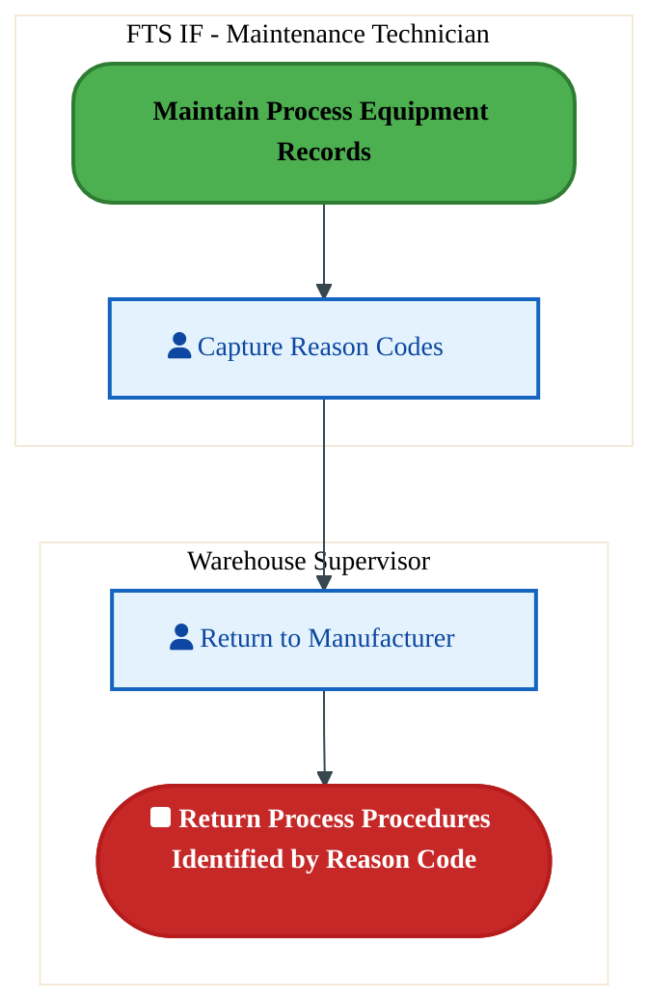

<a href="https://mermaid.live/view#pako:eNqlVFtv2jAU_itWKpRNClKuhOVhEgQiVVqlqbD1YUyTcY6J1WBntlNgiP8-m2th7dMiAfLH-S7nxPbWIaIEJ3M6nS3jTGdo6-oKluBmyJ1jBa6HDsB3LBme16BcW0MF1xP2Z18WxM3allmswEtWbyw6gYUA9O3eQwNDrD2kMFddBZJR13MbyZZYbnJRC2mr76BPfbp3O_41FLIEeSnw_TQgiaHWjMMFjtI4jQvLU0AEL69EaUL7lLg7G64WK1JhqffxWwUPeP3ESl2ZNcW1AlNT6WX9Bc-htj1q2VqMtPLlNAymrA83A5s0mDC-MHjsG0hi_nyBEn-3Q7tOZ8bPpmg6mnFkHlJjpUZAkdIGHr9oRFldZ3dxPigS31NaimfI7sJxOopCj9hOMtO679nhdlfAFpXO5qIuj6Xdle0hC5u1J9dZ6HtyY75vvICXF6e8F_bD_tlpmAZ5kJ-cKKX_5WTmKqdYPR-9xlERFqOzV5D0ktz_V-_U5ihOB8HtnEC-MAKvRIuiiMaXUY17SeC_Lzosop6f34gusIYV3lwEP-XxWbBI0iJI3xU8-N2mbOdfpSAnwWicFMlZMB0GxSB8VzAeBHH_mNDoLCRuKlRjDr_8HzOnmE7QfYG66AEzroFjTgBNgVScEYb5zPl5YNqHB4ZAcUZx174IlONGtxLQI2AlOMrNxlXXhNgQ9sLmg2wHoBQa_25ZswSuDZGYU3jhmI30Vk5r-4QlVMLYoknb2HemhLz2Cq_DPYLJxpEWpjPeUkxs1BtK9OHMUVo0J84p6P63NDSF7kuTl1EGJZpvXjdsBD_ehOcx6nY_m2kdl-FhGR2XwWEZvnrFFjxt7Ss4fBuOjkfuCozPZ97xnCXIJWalk22d_e1qbuASKG5r7ew8B7daTDacONn-FnLapjQ7dsSwGfryAO7-AmrR2Hg=" title="View full diagram">&#128065; View Diagram</a>

Page 11<a href="#toc">↑ Back to TOC</a>PE-060 — Maintain and Manage Master Maintenance Records (IF)

#### BUSINESS ARCHITECTURE — 3.2.8 PE-060-090_Create_and_Maintain_Functional_Locations_Master_Records — PE-060-090_Create_and_Maintain_Functional_Locations_Master_Records

**Swim Lanes**: FTS – IF Master Data Admin | **Tasks**: 9 | **Gateways**: 5

> **Legend**: ● Start · ● End · User Task · Service Task · ◇ Gateway · Sub-Process

```mermaid
%%{init: {'theme': 'base', 'themeVariables': {'fontSize': '14px', 'fontFamily': 'Segoe UI, Arial, sans-serif','primaryColor': '#e8f0fe', 'primaryBorderColor': '#0071c5','lineColor': '#37474F', 'secondaryColor': '#f5f8fc'}, 'flowchart': {'useMaxWidth': false, 'htmlLabels': true, 'curve': 'basis', 'nodeSpacing': 40, 'rankSpacing': 50}} }%%
flowchart TD
    classDef startEvt fill:#4CAF50,stroke:#2E7D32,color:#000,font-weight:bold,stroke-width:2px,rx:20,ry:20
    classDef endEvt fill:#C62828,stroke:#B71C1C,color:#fff,font-weight:bold,stroke-width:2px,rx:20,ry:20
    classDef userTask fill:#E3F2FD,stroke:#1565C0,stroke-width:2px,color:#0D47A1
    classDef serviceTask fill:#FFF3E0,stroke:#E65100,stroke-width:2px,color:#BF360C
    classDef gateway fill:#FFF9C4,stroke:#F57F17,stroke-width:2px,color:#E65100
    classDef subProc fill:#F3E5F5,stroke:#7B1FA2,stroke-width:2px,color:#4A148C
    subgraph lane_0["FTS – IF Master Data Admin"]
        n1["fa:fa-user Identify Functional Location Hierarchy"]
        n2["fa:fa-user Create Functional Location"]
        n3["fa:fa-user Assign Class/Characteristics"]
        n4["fa:fa-user Process Functional Location"]
        n5["fa:fa-user Update Class/Characteristics if Required"]
        n6["fa:fa-user Uninstall Equipment from Functional Location"]
        n7["fa:fa-user Update Functional Location Status"]
        n8["fa:fa-user Display Functional Location"]
        n9["fa:fa-user Install Equipment into New Functional Location"]
        n10["Maintain Process Equipment Records"]
        n11["Process Work Centers"]
        n12["Maintain Other Characteristics"]
        n13{{"fa:fa-code-branch Does Functional Location Exist?"}}
        n14{{"fa:fa-code-branch Delete Functional Location?"}}
        n15{{"fa:fa-code-branch exclusiveGateway"}}
        n16{{"fa:fa-code-branch exclusiveGateway"}}
        n17{{"fa:fa-code-branch exclusiveGateway"}}
    end
    n1 --> n2
    n2 --> n15
    n4 --> n14
    n5 --> n16
    n12 --> n15
    n11 --> n13
    n8 --> n10
    n13 -->|"No"| n1
    n7 --> n16
    n13 -->|"Yes"| n4
    n6 --> n9
    n9 --> n7
    n16 --> n8
    n17 --> n5
    n3 --> n17
    n15 --> n3
    n14 -->|"Yes"| n6
    n14 -->|"No"| n17
    class n1 userTask
    class n2 userTask
    class n3 userTask
    class n4 userTask
    class n5 userTask
    class n6 userTask
    class n7 userTask
    class n8 userTask
    class n9 userTask
    class n10 startEvt
    class n11 startEvt
    class n12 startEvt
    class n13 gateway
    class n14 gateway
    class n15 gateway
    class n16 gateway
    class n17 gateway
```

<a href="https://mermaid.live/view#pako:eNqlVl2P4jYU_StWRiNeghrnk8lDKyaQdqSd3WqZ7aoqVWUSG6xxHGo7A5Tlv9eGBCaZ0FHbSKDck3POvb5xbO-trMyxFVu3t3vKqYrBfqBWuMCDGAwWSOKBDU7AL0hQtGBYDgyHlFzN6F9HGvTXW0MzWIoKynYGneFlicGXBxuMtZDZQCIuhxILSgb2YC1ogcQuKVkpDPsGj4hDjtnqR_elyLG4EBwnglmgpYxyfIG9yI_81Ogkzkqet0xJQEYkGxxMcazcZCsk1LH8SuJHtP1Kc7XSMUFMYs1ZqYJ9QAvMzBiVqAyWVeKlaQaVJg_XDZutUUb5UuO-oyGB-PMFCpzDARxub-f8nBQ8TeYc6CtjSMoJJkAqDU9fFCCUsfjGT8Zp4NhSifIZxzfuNJp4rp2ZkcR66I5tmjvcYLpcqXhRsrymDjdmDLG73tpiG7uOLXb6v5ML8_ySKQndkTs6Z7qPYAKTJhMh5H9l0n0VT0g-17mmXuqmk3MuGIRB4rz1a4Y58aMx7PYJixea4VemaZp600urpmEAneum96kXOknHdIkU3qDdxfAu8c-GaRClMLpqeMrXrbJa_CzKrDH0pkEanA2je5iO3auG_hj6o7pC7bMUaL0CDHH8h_Pb3EqfZmBeuQ70wEMKHpFUWIAJUgiM84LyufX7SWkuDrWAoJigoXkR4CHHXFGyA2nFM0VLjhj4UGbI3IKfKBZIZKtd28JtWyQC6171GbRlXls2lpIuOUhMf75L9BeAMl03lYpmsi3020LTRSzl-wmDtu7LOjd19iYElIDP-M-KCpy3TcKOCadcf5eMgalmrwvdPUBEWbxfTdRbTV_bZwqpqtODUVs9oXLN0O79rHed1_2meMpVCT7izftW0My1R6QF-nd-Cxenz3pxFXmnbmjmW8P9WopnkGguFl2a-9r7k95N9Lz6pzkBvf2-GZnZnoYLvcBmKzApce_MANOttvlhbh0Or138Ky6Y4f6X88Yh6HfA24xVkr7gH0_rSFcW_jdZ9G9lel0_3XAIhsPv9cdbh-4phEEd-3Xs13FQx2Ej7wpgbQi9GhjVsdMQPAN8m1sfy7n1Tcc1HnWdG96vWB6JTQnhiXhXh3enMGpk9eNRE9e-TX1enebMr0fUlAv9Ttqw-6CpO3q1kps-NjtYC3b7Ya8f9vvhoB8O--GoHx71w3f9MHTO54w2Dq_g7hXca7bMNuz3w0E_HPbDUQNbtlVgUSCaW_HeOh469cE0xwRVTFkH20KVKmc7nlnx8XBmVcdldkKR3jOLE3j4G_GBbPo=" title="View full diagram">&#128065; View Diagram</a>

Page 12<a href="#toc">↑ Back to TOC</a>PE-060 — Maintain and Manage Master Maintenance Records (IF)

#### BUSINESS ARCHITECTURE — 3.2.9 PE-060-110_Maintain_Equipment_Bill_of_Materials — PE-060-110_Maintain_Equipment_Bill_of_Materials

**Swim Lanes**: FTS – IF Master Data Admin | **Tasks**: 5 | **Gateways**: 4

> **Legend**: ● Start · ● End · User Task · Service Task · ◇ Gateway · Sub-Process

```mermaid
%%{init: {'theme': 'base', 'themeVariables': {'fontSize': '14px', 'fontFamily': 'Segoe UI, Arial, sans-serif','primaryColor': '#e8f0fe', 'primaryBorderColor': '#0071c5','lineColor': '#37474F', 'secondaryColor': '#f5f8fc'}, 'flowchart': {'useMaxWidth': false, 'htmlLabels': true, 'curve': 'basis', 'nodeSpacing': 40, 'rankSpacing': 50}} }%%
flowchart TD
    classDef startEvt fill:#4CAF50,stroke:#2E7D32,color:#000,font-weight:bold,stroke-width:2px,rx:20,ry:20
    classDef endEvt fill:#C62828,stroke:#B71C1C,color:#fff,font-weight:bold,stroke-width:2px,rx:20,ry:20
    classDef userTask fill:#E3F2FD,stroke:#1565C0,stroke-width:2px,color:#0D47A1
    classDef serviceTask fill:#FFF3E0,stroke:#E65100,stroke-width:2px,color:#BF360C
    classDef gateway fill:#FFF9C4,stroke:#F57F17,stroke-width:2px,color:#E65100
    classDef subProc fill:#F3E5F5,stroke:#7B1FA2,stroke-width:2px,color:#4A148C
    subgraph lane_0["FTS – IF Master Data Admin"]
        n1["fa:fa-user Create BOM"]
        n2["fa:fa-user Add Components"]
        n3["fa:fa-user Display BOM"]
        n4["fa:fa-user Mark BOM for Deletion"]
        n5["fa:fa-user Process BOM"]
        n6(["fa:fa-stop BOM is Deleted"])
        n7["Maintain Bill of Materials Documents"]
        n8["Maintain Process Equipment Records"]
        n9["Maintain Process Materials Master"]
        n10{{"fa:fa-code-branch BOM Exists?"}}
        n11{{"fa:fa-code-branch Delete BOM?"}}
        n12{{"fa:fa-code-branch exclusiveGateway"}}
        n13{{"fa:fa-code-branch exclusiveGateway"}}
    end
    n8 --> n10
    n3 --> n7
    n9 --> n12
    n2 --> n13
    n1 --> n12
    n12 --> n2
    n13 --> n3
    n5 --> n13
    n4 --> n6
    n10 -->|"Yes"| n11
    n11 -->|"Yes"| n4
    n11 -->|"No"| n5
    n10 -->|"No"| n1
    class n1 userTask
    class n2 userTask
    class n3 userTask
    class n4 userTask
    class n5 userTask
    class n6 endEvt
    class n7 startEvt
    class n8 startEvt
    class n9 startEvt
    class n10 gateway
    class n11 gateway
    class n12 gateway
    class n13 gateway
```

<a href="https://mermaid.live/view#pako:eNqlVtuO6jYU_RUroxGtFKRcCZOHVhBIdaTSVodpq6pUlUnswRrHTm1nBsrh349NEiAh81AVCcReXmvti9EORyvjObJi6_HxSBhRMTiO1A4VaBSD0RZKNLJBDfwGBYFbiuTIcDBnak3-PdPcoNwbmsFSWBB6MOgavXAEfv1kg5kWUhtIyORYIkHwyB6VghRQHBJOuTDsBzTFDj5na47mXORIXAmOE7lZqKWUMHSF_SiIgtToJMo4yzumOMRTnI1OpjjK37MdFOpcfiXRCu5_J7na6RhDKpHm7FRBf4RbRE2PSlQGyyrx1g6DSJOH6YGtS5gR9qLxwNGQgOz1CoXO6QROj48bdkkKnhcbBvQro1DKBcJAKg0v3xTAhNL4IUhmaejYUgn-iuIHbxktfM_OTCexbt2xzXDH74i87FS85TRvqON300PslXtb7GPPscVBf_ZyIZZfMyUTb-pNL5nmkZu4SZsJY_y_Mum5imcoX5tcSz_10sUllxtOwsS592vbXATRzO3PCYk3kqEb0zRN_eV1VMtJ6Dofm85Tf-IkPdMXqNA7PFwNn5LgYpiGUepGHxrW-fpVVttfBM9aQ38ZpuHFMJq76cz70DCYucG0qVD7vAhY7gCFDP3t_Lmx0uc12FSe4_rgUwpWUCokwAIqCGZ5QdjG-qtWmhdztQDDGMOxuQiQCKQbBfOfV12a16XN8hwkvCg5Q0zJLtXvUhdEllQP7s4y6PJWULwaEsBcixBFivBerWFXYcaHpLx3nnxzIUrFy7MrkbUpyjX32xtypLkrSJjSbzDXlwE41sXomekVpEU8q4r7Jqe3qraQ5T8VKQ0ZfNaLReQ9zdOQ5pqpvqje7TjHY9uK2brjrd4b2e7c0XJPpJLfb6zT6VbhDivq5o3wTuENK9A-o5Ukb-iH-qffl_n_VaZ3Sv2FTcF4_J3pron9Oo6a8Kk59prYa2K_id3eudsQLnHj1_LDnj6o40lLd0z8ZWP9gfSNfTEzbE_c3knQP_iJn_Gwb9Xgt6vJ1N0uuw7sDcP-MBwMw-EwPGk2eQeMLo-SDjwdhp-GYd1qsxO7sDsMe8Ow38KWbRVIFJDkVny0zn8f9F-MHGFYUWWdbAtWiq8PLLPi82PWqspcKxcE6u1X1ODpKzMPrws=" title="View full diagram">&#128065; View Diagram</a>

#### BUSINESS ARCHITECTURE — 3.2.10 PE-060-130_Maintain_Spare_Parts_List — PE-060-130_Maintain_Spare_Parts_List

**Swim Lanes**: FTS IF - Intel Data Admin | **Tasks**: 1 | **Gateways**: 0

> **Legend**: ● Start · ● End · User Task · Service Task · ◇ Gateway · Sub-Process

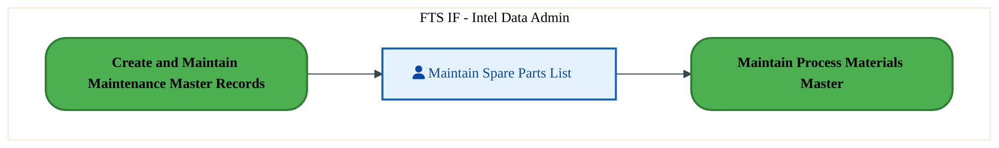

<a href="https://mermaid.live/view#pako:eNqlVFtr2zAU_ivCJfjFBl_jzA-DxI6g0MJYuu1hGUOxjxJRWQ6S0iQL-e-TcrGbjD7NYCN9_i46x5IPTtXW4OTOYHBggukcHVy9ggbcHLkLosD10Bn4TiQjCw7KtRzaCj1jf060MFnvLM1imDSM7y06g2UL6Nujh8ZGyD2kiFC-Asmo67lryRoi90XLW2nZDzCiAT2lXV5NWlmD7AlBkIVVaqScCejhOEuyBFudgqoV9Y0pTemIVu7RLo6322pFpD4tf6Pgmex-sFqvzJwSrsBwVrrhT2QB3Nao5cZi1Ua-XZvBlM0RpmGzNamYWBo8CQwkiXjtoTQ4HtFxMJiLLhS9lHOBzFVxolQJFClt4OmbRpRxnj8kxRingae0bF8hf4imWRlHXmUryU3pgWeb62-BLVc6X7S8vlD9ra0hj9Y7T-7yKPDk3jzvskDUfVIxjEbRqEuaZGERFtckSul_JZm-yheiXi9Z0xhHuOyywnSYFsG_ftcyyyQbh_d9AvnGKnhnijGOp32rpsM0DD42neB4GBR3pkuiYUv2veGnIukMcZrhMPvQ8Jx3v8rN4otsq6thPE1x2hlmkxCPow8Nk3GYjC4rND5LSdYrxImA38HPuYNfZugRIx89Cg0clUQTNK4bJubOr7PGXiI0VEpySnz7CdAzYUKbG5ldKQF9MXtNoSem9K0qMqqOagsApYxWgz2xdqTM8FYSG0khwXAQEXUfdBqAIKKCiw59NQdS1qrTm214HogQ-f5nE3-Zxufp-09vOdfNdANH3cm5geMOdjynAdkQVjv5wTn9uszvrQZKNlw7R88hG93O9qJy8tMRdzbr2lRTMmI635zB419Ki6ME" title="View full diagram">&#128065; View Diagram</a>

Page 13<a href="#toc">↑ Back to TOC</a>PE-060 — Maintain and Manage Master Maintenance Records (IF)

#### BUSINESS ARCHITECTURE — 3.2.11 PE-060-140_Maintain_Process_Materials_Master — PE-060-140_Maintain_Process_Materials_Master

**Swim Lanes**: Intel Data Admin | **Tasks**: 1 | **Gateways**: 1

> **Legend**: ● Start · ● End · User Task · Service Task · ◇ Gateway · Sub-Process

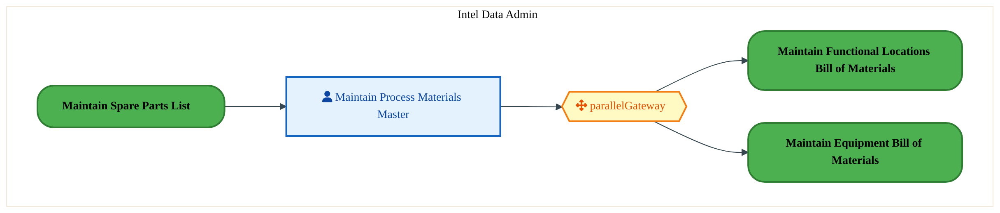

<a href="https://mermaid.live/view#pako:eNqlVNuK2zAQ_RXhJfjFAV_j1A-FxInLwi4Udts-NKVMbCkRK0upJG-SBv97pTj37tKHGhw0J3POmRlL2jmlqLCTOb3ejnKqM7Rz9RLX2M2QOweFXQ91wFeQFOYMK9fmEMH1E_29Twvi1camWayAmrKtRZ_wQmD05d5DI0NkHlLAVV9hSYnruStJa5DbXDAhbfYdHhKf7N0Of42FrLA8J_h-GpSJoTLK8RmO0jiNC8tTuBS8uhIlCRmS0m1tcUysyyVIvS-_UfgRNt9opZcmJsAUNjlLXbMHmGNme9SysVjZyNfjMKiyPtwM7GkFJeULg8e-gSTwlzOU-G2L2l5vxk-m6Hky48g8JQOlJpggpQ08fdWIUMayuzgfFYnvKS3FC87uwmk6iUKvtJ1kpnXfs8PtrzFdLHU2F6w6pPbXtocsXG08uclC35Nb83vjhXl1dsoH4TAcnpzGaZAH-dGJEPJfTmau8hnUy8FrGhVhMTl5Bckgyf2_9Y5tTuJ0FNzOCctXWuIL0aIooul5VNNBEvjvi46LaODnN6IL0HgN27Pghzw-CRZJWgTpu4Kd322VzfyzFOVRMJomRXISTMdBMQrfFYxHQTw8VGh0FhJWS8SA45_-95lzzzVmaAIa0KiqKZ85P7pU-_DAZBDICPTt5NEjUK7Ni2wxWCkDaGxPn10ps7xmh4Z9okx_NXRVY67R2DSBBDmTr1nRJatoeKmp4MDQgyjBLtW_BOJLAXNsJEafzWFQ6IEqfZ2a7HbHBkFKsVZ9YBoZCjCG2afuM86ctu04ZqN3Cx6jfv-jmc8hDLowOYRJF0bXYXjxUS3luJmv4PB0cq_g6G04fhtOjjvQ8Zwayxpo5WQ7Z3_Pmru4wgQapp3Wc6DR4mnLSyfb30dOs6oMc0LBbJO6A9s_SBHaSw==" title="View full diagram">&#128065; View Diagram</a>

#### BUSINESS ARCHITECTURE — 3.2.12 PE-060-150_Maintain_Bill_of_Materials_Documents — PE-060-150_Maintain_Bill_of_Materials_Documents

**Swim Lanes**: FTS IF - PM Maintenance Planner | **Tasks**: 2 | **Gateways**: 0

> **Legend**: ● Start · ● End · User Task · Service Task · ◇ Gateway · Sub-Process

```mermaid
%%{init: {'theme': 'base', 'themeVariables': {'fontSize': '14px', 'fontFamily': 'Segoe UI, Arial, sans-serif','primaryColor': '#e8f0fe', 'primaryBorderColor': '#0071c5','lineColor': '#37474F', 'secondaryColor': '#f5f8fc'}, 'flowchart': {'useMaxWidth': false, 'htmlLabels': true, 'curve': 'basis', 'nodeSpacing': 40, 'rankSpacing': 50}} }%%
flowchart TD
    classDef startEvt fill:#4CAF50,stroke:#2E7D32,color:#000,font-weight:bold,stroke-width:2px,rx:20,ry:20
    classDef endEvt fill:#C62828,stroke:#B71C1C,color:#fff,font-weight:bold,stroke-width:2px,rx:20,ry:20
    classDef userTask fill:#E3F2FD,stroke:#1565C0,stroke-width:2px,color:#0D47A1
    classDef serviceTask fill:#FFF3E0,stroke:#E65100,stroke-width:2px,color:#BF360C
    classDef gateway fill:#FFF9C4,stroke:#F57F17,stroke-width:2px,color:#E65100
    classDef subProc fill:#F3E5F5,stroke:#7B1FA2,stroke-width:2px,color:#4A148C
    subgraph FTS IF - PM Maintenance Planner
        n1["fa:fa-user Select Document Number"]
        n2["fa:fa-user Enter/Attach Document Type, Part, and Version"]
        n3["Maintain Document Process"]
        n4["Process Serial Number"]
    end
    n1 --> n2
    n2 --> n3
    n4 --> n1
    class n1 userTask
    class n2 userTask
    class n3 startEvt
    class n4 startEvt
```

<a href="https://mermaid.live/view#pako:eNqlVNuO2jAQ_RUrK5SXoOZKaB4qQSDSSt0KCbp9KFVlnDFY6zjIdhZYxL_X5paFdp8aCZQ5mXPOzGTivUPqEpzM6XT2TDCdob2rV1CBmyF3gRW4HjoBz1gyvOCgXJtDa6Gn7O2YFsTrrU2zWIErxncWncKyBvT90UMDQ-QeUliorgLJqOu5a8kqLHd5zWtpsx-gT316dDs_GtayBNkm-H4akMRQORPQwlEap3FheQpILcobUZrQPiXuwRbH6w1ZYamP5TcKnvD2Byv1ysQUcwUmZ6Ur_hUvgNsetWwsRhr5ehkGU9ZHmIFN15gwsTR47BtIYvHSQol_OKBDpzMXV1M0G80FMhfhWKkRUKS0gcevGlHGefYQ54Mi8T2lZf0C2UM4TkdR6BHbSWZa9z073O4G2HKls0XNy3Nqd2N7yML11pPbLPQ9uTP_d14gytYp74X9sH91GqZBHuQXJ0rpfzmZucoZVi9nr3FUhMXo6hUkvST3_9a7tDmK00FwPyeQr4zAO9GiKKJxO6pxLwn8j0WHRdTz8zvRJdawwbtW8HMeXwWLJC2C9EPBk999lc1iImtyEYzGSZFcBdNhUAzCDwXjQRD3zxUanaXE6xXiWMBv_-fcKWZT9FigLpo8oSfMhAaBBQE0MRkC5Nz5dWLaSwSGQHFGcde-CDQFDkSjUU2aCoRG35pqcU8JbyljYyA_DbTGZNUSZ7u1-RYmZmM9hEWJnkEqVotbpcgoHSs0v5ZqxwJK3abGJvX8wBRpj4f72szKnm5EgLrdL6bOcxiewugcxqfw_dZYymUPb-Dw33B0_RZv4PgKO55TgawwK51s7xwPQ3NglkBxw7Vz8Bzc6Hq6E8TJjoeG06xLs2Ajhs27rE7g4Q9DjruC" title="View full diagram">&#128065; View Diagram</a>

#### BUSINESS ARCHITECTURE — 3.2.13 PE-060-160_Develop_and_Update_Standard_Tasks_for_Normal_Repairs — PE-060-160_Develop_and_Update_Standard_Tasks_for_Normal_Repairs

**Swim Lanes**: FTS IF - PM Maintenance Planner | **Tasks**: 1 | **Gateways**: 1

> **Legend**: ● Start · ● End · User Task · Service Task · ◇ Gateway · Sub-Process

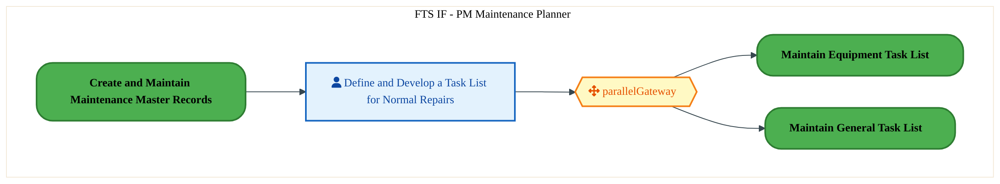

<a href="https://mermaid.live/view#pako:eNqlVNtu2kAQ_ZWVo4gXI_kaUz9UIgZHkUIVhbR9KFU12GNYZVm7u8utiH_vGHNv8lRLRp7DmXNmZi8bKytztGLr9nbDJTcx27TMFGfYillrDBpbNmuAb6A4jAXqVs0pSmmG_M-O5gbVqqbVWAozLtY1OsRJiezro826lChspkHqtkbFi5bdqhSfgVonpShVzb7BTuEUO7f9X_elylGdCI4TuVlIqYJLPMF-FERBWudpzEqZX4gWYdEpsta2Lk6Uy2wKyuzKn2scwOo7z82U4gKERuJMzUw8wRhF3aNR8xrL5mpxGAbXtY-kgQ0ryLicEB44BCmQbycodLZbtr29HcmjKXvtjSSjJxOgdQ8Lpg3B_YVhBRcivgmSbho6tjaqfMP4xutHPd-zs7qTmFp37Hq47SXyydTE41Lke2p7WfcQe9XKVqvYc2y1pt8rL5T5ySm58zpe5-h0H7mJmxyciqL4Lyeaq3oF_bb36vupl_aOXm54FybOv3qHNntB1HWv54RqwTM8E03T1O-fRtW_C13nY9H71L9zkivRCRhcwvok-CkJjoJpGKVu9KFg43dd5Xz8rMrsIOj3wzQ8Ckb3btr1PhQMum7Q2VdIOhMF1ZQJkPjL-TGy0tche0xZmz0P2AC4NChBZsieiSFRjayfTWb9SJcSCogLaNcLwagyOisMZE6fCxRlxYDtJvnENe2HUrEvpZqBYC9YAVf6Us0jtZ0lvaz_e86rGUpzErhk--fsB6TaSPcDbkDcRCGtwq64Y9p5gwPQhnp4oVOt8qvKws3m0CgoVS51G4RhFZClQPHQrO7I2m6bHNr_zYcMWLv9mea0D90mDPdh2ITeZeifrXWdctjjF7B3PNAXsP8-HLwPh4eNadnWDGlheG7FG2t3_dIVnWMBc2GsrW3B3JTDtcyseHdNWfMqp8weB9o9swbc_gXPyOB6" title="View full diagram">&#128065; View Diagram</a>

Page 14<a href="#toc">↑ Back to TOC</a>PE-060 — Maintain and Manage Master Maintenance Records (IF)

#### BUSINESS ARCHITECTURE — 3.2.14 PE-060-170_Maintain_Equipment_Task_List — PE-060-170_Maintain_Equipment_Task_List

**Swim Lanes**: FTS IF - PM Maintenance Supervisor · FTS IF PM - Module Engineer | **Tasks**: 10 | **Gateways**: 5

> **Legend**: ● Start · ● End · User Task · Service Task · ◇ Gateway · Sub-Process

```mermaid
%%{init: {'theme': 'base', 'themeVariables': {'fontSize': '14px', 'fontFamily': 'Segoe UI, Arial, sans-serif','primaryColor': '#e8f0fe', 'primaryBorderColor': '#0071c5','lineColor': '#37474F', 'secondaryColor': '#f5f8fc'}, 'flowchart': {'useMaxWidth': false, 'htmlLabels': true, 'curve': 'basis', 'nodeSpacing': 40, 'rankSpacing': 50}} }%%
flowchart LR
    classDef startEvt fill:#4CAF50,stroke:#2E7D32,color:#000,font-weight:bold,stroke-width:2px,rx:20,ry:20
    classDef endEvt fill:#C62828,stroke:#B71C1C,color:#fff,font-weight:bold,stroke-width:2px,rx:20,ry:20
    classDef userTask fill:#E3F2FD,stroke:#1565C0,stroke-width:2px,color:#0D47A1
    classDef serviceTask fill:#FFF3E0,stroke:#E65100,stroke-width:2px,color:#BF360C
    classDef gateway fill:#FFF9C4,stroke:#F57F17,stroke-width:2px,color:#E65100
    classDef subProc fill:#F3E5F5,stroke:#7B1FA2,stroke-width:2px,color:#4A148C
    subgraph lane_0["FTS IF - PM Maintenance Supervisor"]
        n1["Assign Components to Operations if Required"]
        n2["Display Equipment Task List"]
        n3["fa:fa-user Identify Equipment Task List"]
        n4["fa:fa-user Update Equipment Task List Information"]
        n5["fa:fa-user Unassign Task Equipment List from Maintenance Plan"]
        n6["fa:fa-user Mark Equipment Task List for Deletion"]
        n7["fa:fa-user Create Equipment Task List"]
        n8["fa:fa-user Assign Maintenance Strategy"]
        n9["fa:fa-user Assign Operations if Required"]
        n11(["fa:fa-stop Equipment Task List Complete"])
        n12(["fa:fa-stop Equipment Task List Deleted"])
        n13["Maintain Process Equipment Records"]
        n14{{"fa:fa-code-branch Does Equipment Task List Exist?"}}
        n15{{"fa:fa-code-branch Delete Equipment Task List?"}}
        n16{{"fa:fa-code-branch Preventative Maintenance Task List?"}}
        n17{{"fa:fa-code-branch exclusiveGateway"}}
        n18{{"fa:fa-code-branch exclusiveGateway"}}
    end
    subgraph lane_1["FTS IF PM - Module Engineer"]
        n10["fa:fa-user Select Equipment"]
    end
    n13 --> n3
    n3 --> n14
    n14 -->|"Yes"| n15
    n5 --> n6
    n10 --> n7
    n7 --> n16
    n8 --> n17
    n17 --> n9
    n9 --> n1
    n1 --> n18
    n2 --> n11
    n18 --> n2
    n14 -->|"No"| n10
    n6 --> n12
    n16 -->|"No"| n17
    n16 -->|"Yes"| n8
    n4 --> n18
    n15 -->|"No"| n5
    n15 -->|"Yes"| n4
    class n3 userTask
    class n4 userTask
    class n5 userTask
    class n6 userTask
    class n7 userTask
    class n8 userTask
    class n9 userTask
    class n10 userTask
    class n11 endEvt
    class n12 endEvt
    class n13 startEvt
    class n14 gateway
    class n15 gateway
    class n16 gateway
    class n17 gateway
    class n18 gateway
```

<a href="https://mermaid.live/view#pako:eNqlVm1v6jYU_itWqopNClIS8kLzYRMFMlUqW1Xu3TSNaTKJA1aDndlOC-Py33ccktCkQeo0JJDO4_M85y0c52jEPCFGaNzeHimjKkTHgdqSHRmEaLDGkgxMdAZ-xYLidUbkQPuknKkl_ad0s918r900FuEdzQ4aXZINJ-jrg4kmQMxMJDGTQ0kETQfmIBd0h8VhyjMutPcNGadWWkarju65SIi4OFhWYMceUDPKyAUeBW7gRponScxZ0hJNvXScxoOTTi7jb_EWC1WmX0iywPvfaKK2YKc4kwR8tmqXPeI1yXSNShQaiwvxWjeDSh2HQcOWOY4p2wDuWgAJzF4ukGedTuh0e7tiTVD0-LxiCD5xhqWckRRJBfD8VaGUZll4404nkWeZUgn-QsIbZx7MRo4Z60pCKN0ydXOHb4Rutipc8yypXIdvuobQyfem2IeOZYoD_HZiEZZcIk19Z-yMm0j3gT21p3WkNE3_VyToq_iC5UsVaz6KnGjWxLI935taH_XqMmduMLG7fSLilcbknWgURaP5pVVz37Ot66L30ci3ph3RDVbkDR8ugndTtxGMvCCyg6uC53jdLIv1k-BxLTiae5HXCAb3djRxrgq6E9sdVxmCzkbgfIsyzMhf1h8rI_qyRA8RGqKnBVpgyhRhmMUELYtcd0ZysTL-PJP1h9nAmUhJNwxN-S7njDAlkeLoF_DHinImEU3RM_m7oIIkbbID5BmVeQa9mYNDvgM2Knv_SKVqO4_AOcVhiod66ughAV-afoLotolf8wTG0UdDDyzlYldm3ZbwOhIMn0suqRelUiQVfNdq3RM0ty3nt-UWWLz05gPZoBnJyMeEgrbCVJArNbVp4zatGlxrzgqmRjaHNu-ul_eZEdv2dw1XKp731qmfHKiSAPX791znE9yyP2XUFlU_LWVd8EX6v0KkfMd_huUtEtnJ1T0e63j6mhquYdHGWzTjRPbGnu_h98eVcTq9V_GuqJSJ9ul8UPD7FZ4EeQUitPyVtIZ2XSnoVyL7OCskyPx03kxd2vi_0mDl920U-7JRYJ8M0YInRQY9YBu4VEl3lVjtp2wJDYvVpWGNdxMMxoyGwx9gN1R2Zdpufe5q4NvK-J3ArL_p4VQn3tnTrx2tsx1UdlAJ1efjyq7P7crhrrLvqvP6uDLHle1UdnNe6TndPH_m5zSrhc_8itg4-h3HoHtQV1qHdjup2F5bwevitYD77s7Rna3v2hbs9sNeP-z3w0E_PO6H7_phmGA_blfvI23U6UVHzXtSG3frK7wNe_2w3w8H_fC4hg3T2BG4fmhihEejfAmGF-WEpLjIlHEyDVwovjyw2AjLl0WjKG-yGcXwj9udwdO_AP-Vvg==" title="View full diagram">&#128065; View Diagram</a>

Page 15<a href="#toc">↑ Back to TOC</a>PE-060 — Maintain and Manage Master Maintenance Records (IF)

#### BUSINESS ARCHITECTURE — 3.2.15 PE-060-190_Maintain_General_Task_List — PE-060-190_Maintain_General_Task_List

**Swim Lanes**: FTS IF - PM Maintenance Supervisor | **Tasks**: 9 | **Gateways**: 5

> **Legend**: ● Start · ● End · User Task · Service Task · ◇ Gateway · Sub-Process

```mermaid
%%{init: {'theme': 'base', 'themeVariables': {'fontSize': '14px', 'fontFamily': 'Segoe UI, Arial, sans-serif','primaryColor': '#e8f0fe', 'primaryBorderColor': '#0071c5','lineColor': '#37474F', 'secondaryColor': '#f5f8fc'}, 'flowchart': {'useMaxWidth': false, 'htmlLabels': true, 'curve': 'basis', 'nodeSpacing': 40, 'rankSpacing': 50}} }%%
flowchart TD
    classDef startEvt fill:#4CAF50,stroke:#2E7D32,color:#000,font-weight:bold,stroke-width:2px,rx:20,ry:20
    classDef endEvt fill:#C62828,stroke:#B71C1C,color:#fff,font-weight:bold,stroke-width:2px,rx:20,ry:20
    classDef userTask fill:#E3F2FD,stroke:#1565C0,stroke-width:2px,color:#0D47A1
    classDef serviceTask fill:#FFF3E0,stroke:#E65100,stroke-width:2px,color:#BF360C
    classDef gateway fill:#FFF9C4,stroke:#F57F17,stroke-width:2px,color:#E65100
    classDef subProc fill:#F3E5F5,stroke:#7B1FA2,stroke-width:2px,color:#4A148C
    subgraph lane_0["FTS IF - PM Maintenance Supervisor"]
        n1["Assign Components to Operations if Required"]
        n2["Display General Task List"]
        n3["fa:fa-user Identify General Task List"]
        n4["fa:fa-user Update General Task List Information"]
        n5["fa:fa-user Unassign General Task List from Maintenance Plan"]
        n6["fa:fa-user Mark General Task List for Deletion"]
        n7["fa:fa-user Create General Task List"]
        n8["fa:fa-user Assign Maintenance Strategy"]
        n9["fa:fa-user Assign Operations if Required"]
        n10(["fa:fa-stop General Task List Complete"])
        n11(["fa:fa-stop General Task List Deleted"])
        n12["Develop and Update Standard Tasks for Normal Repairs"]
        n13{{"fa:fa-code-branch Does General Task List Exist?"}}
        n14{{"fa:fa-code-branch Delete General Task List?"}}
        n15{{"fa:fa-code-branch Preventative Maintenance Task List?"}}
        n16{{"fa:fa-code-branch exclusiveGateway"}}
        n17{{"fa:fa-code-branch exclusiveGateway"}}
    end
    n3 --> n13
    n13 -->|"Yes"| n14
    n5 --> n6
    n7 --> n15
    n8 --> n16
    n16 --> n9
    n9 --> n1
    n1 --> n17
    n2 --> n10
    n17 --> n2
    n6 --> n11
    n15 -->|"No"| n16
    n15 -->|"Yes"| n8
    n13 -->|"No"| n7
    n12 --> n3
    n4 --> n17
    n14 -->|"Yes"| n4
    n14 -->|"No"| n5
    class n3 userTask
    class n4 userTask
    class n5 userTask
    class n6 userTask
    class n7 userTask
    class n8 userTask
    class n9 userTask
    class n10 endEvt
    class n11 endEvt
    class n12 startEvt
    class n13 gateway
    class n14 gateway
    class n15 gateway
    class n16 gateway
    class n17 gateway
```

<a href="https://mermaid.live/view#pako:eNqlVu-P4jYQ_VesrFa0UpCSkB9sPrRigZxWur2uyt6dqlJVJpmAtcFObcNCOf732sGBTcjqWpUPEfM8783Mc2TnYKUsAyu2bm8PhBIZo0NPrmANvRj1FlhAz0Yn4AvmBC8KED2dkzMqZ-TvKs31y51O01iC16TYa3QGSwbo84ONRopY2EhgKvoCOMl7dq_kZI35fswKxnX2DQxzJ6-qmaV7xjPglwTHidw0UNSCULjAg8iP_ETzBKSMZg3RPMiHedo76uYK9pquMJdV-xsBj3j3lWRypeIcFwJUzkqui494AYWeUfKNxtIN39ZmEKHrUGXYrMQpoUuF-46COKYvFyhwjkd0vL2d03NR9DyZU6R-aYGFmECOhFTwdCtRTooivvHHoyRwbCE5e4H4xptGk4Fnp3qSWI3u2Nrc_iuQ5UrGC1ZkJrX_qmeIvXJn813sOTbfq2erFtDsUmkcekNveK50H7ljd1xXyvP8f1VSvvJnLF5Mrekg8ZLJuZYbhMHYudarx5z40cht-wR8S1J4I5okyWB6sWoaBq7zvuh9MgidcUt0iSW84v1F8G7snwWTIErc6F3BU712l5vFE2dpLTiYBklwFozu3WTkvSvoj1x_aDpUOkuOyxUqMIU_nd_nVvI8Qw8J6qOnR_SICZVAMU0BzTaldkYwPrf-OJH1j7qKMxKCLCkas3XJKFApkGToF5WPJWFUIJKjX-GvDeGQNcmeIk-IKAvlzQegilCgyvmPRMhm6kCl5jjOcV_vOXrIVB2Sf5fmN2mfy0xtxTUJPdCc8XXVb1MgaAlQfBr2WiLnbN2w7EmZ2hQLm2KPmL90CTGOJlDAdTNRkz_m0DlNkzRsksxmNfZWqp2C5b7Ju-vk_ZttdZ0fzlwhWdkxo35X1ISgiD--ZbrfZVbOVBUbxOpVgi0UioRpVu_0TGJ9RmeVgKis_aQ3ulCtl5hw0ep8cDjU9fVF1V-oozZdoQkD0dHLdKeeP8-t4_Gthv-ORtX4tcoVP-jmP3E1HpXK_C00tu99pbBbCXZpsRFK5sPpXGrTov9KUwf-6Q8doH7_J-2jid0K-Da3fgNl9TftjlkJTpmhCSNDDEw8NHG97oYn4M7Ed2a9XjZhZGLPxE69bvQ9Exs198wPTJ-f2KnNsL1QDzBsT2YYdWXXlK4d8FuduX5L0G8vGMHgzZmvja3vugbsd8NBNxx2w1E3POyG77ph1zH3fhN1O1Hv_D3SxAf1VdmE_W446IbDbjiqYcu21qDOAJJZ8cGqPjbVB2kGOd4U0jraFt5INtvT1IqrjzJrU50lE4LVXbk-gcd_ANShZFw=" title="View full diagram">&#128065; View Diagram</a>

#### BUSINESS ARCHITECTURE — 3.2.16 PE-060-250_Process_Work_Centers — PE-060-250_Process_Work_Centers

**Swim Lanes**: FTS IF - Intel Data Admin | **Tasks**: 1 | **Gateways**: 0

> **Legend**: ● Start · ● End · User Task · Service Task · ◇ Gateway · Sub-Process

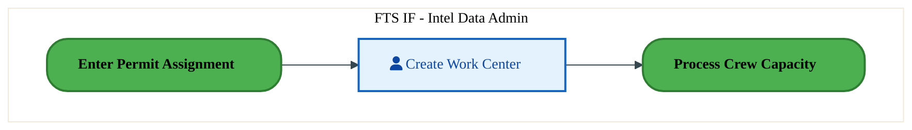

<a href="https://mermaid.live/view#pako:eNqlVE2L2zAU_CvCS_DFAX_GqQ8Fx7ZgoYVCtt1DU4piPyUishwkZZM05L9XyoezSdlTfTDWeN7Me2PJB6fuGnAyZzA4MMF0hg6uXkILbobcOVHgeugM_CCSkTkH5VoO7YSesj8nWhCvd5ZmMUxaxvcWncKiA_T92UO5KeQeUkSooQLJqOu5a8laIvdFxztp2U8wpj49uV1eTTrZgLwRfD8N6sSUcibgBkdpnMbY1imoO9HcidKEjmntHm1zvNvWSyL1qf2Ngq9k98oavTRrSrgCw1nqln8hc-B2Ri03Fqs38u0aBlPWR5jApmtSM7EweOwbSBKxukGJfzyi42AwE70peilnApmr5kSpEihS2sDVm0aUcZ49xUWOE99TWnYryJ7CKi2j0KvtJJkZ3fdsuMMtsMVSZ_OONxfqcGtnyML1zpO7LPQ9uTf3By8Qzc2pGIXjcNw7TdKgCIqrE6X0v5xMrvKFqNXFq4pwiMveK0hGSeH_q3cds4zTPHjMCeQbq-GdKMY4qm5RVaMk8D8WneBo5BcPoguiYUv2N8FPRdwL4iTFQfqh4NnvscvN_Jvs6qtgVCU46QXTSYDz8EPBOA_i8aVDo7OQZL1EnAj47f-cOfhlip4xGqJnoYGjkmiC8qZlYub8OtfYSwSGSklGydB-AlRIMCOi106uUAGmUt7TQ0O3DYNSlrtFBbHbV-_vaZGhVbYafQPZMo1ypdhCtEaxJ5rNdX4QERoOP5tWLsvgvAzfRWXB6xa5g8P-PNzBUQ87ntOaFghrnOzgnH5I5qfVACUbrp2j55CN7qZ7UTvZ6eA6m3VjEigZMXm2Z_D4Fw2Tk5k=" title="View full diagram">&#128065; View Diagram</a>

Page 16<a href="#toc">↑ Back to TOC</a>PE-060 — Maintain and Manage Master Maintenance Records (IF)

#### BUSINESS ARCHITECTURE — 3.2.17 PE-060-290_Maintain_Other_Characteristics — PE-060-290_Maintain_Other_Characteristics

**Swim Lanes**: FTS IF - PM Maintenance Planner | **Tasks**: 10 | **Gateways**: 7

> **Legend**: ● Start · ● End · User Task · Service Task · ◇ Gateway · Sub-Process

```mermaid
%%{init: {'theme': 'base', 'themeVariables': {'fontSize': '14px', 'fontFamily': 'Segoe UI, Arial, sans-serif','primaryColor': '#e8f0fe', 'primaryBorderColor': '#0071c5','lineColor': '#37474F', 'secondaryColor': '#f5f8fc'}, 'flowchart': {'useMaxWidth': false, 'htmlLabels': true, 'curve': 'basis', 'nodeSpacing': 40, 'rankSpacing': 50}} }%%
flowchart TD
    classDef startEvt fill:#4CAF50,stroke:#2E7D32,color:#000,font-weight:bold,stroke-width:2px,rx:20,ry:20
    classDef endEvt fill:#C62828,stroke:#B71C1C,color:#fff,font-weight:bold,stroke-width:2px,rx:20,ry:20
    classDef userTask fill:#E3F2FD,stroke:#1565C0,stroke-width:2px,color:#0D47A1
    classDef serviceTask fill:#FFF3E0,stroke:#E65100,stroke-width:2px,color:#BF360C
    classDef gateway fill:#FFF9C4,stroke:#F57F17,stroke-width:2px,color:#E65100
    classDef subProc fill:#F3E5F5,stroke:#7B1FA2,stroke-width:2px,color:#4A148C
    subgraph lane_0["FTS IF - PM Maintenance Planner"]
        n1["fa:fa-user Create Characteristics"]
        n2["fa:fa-user Create Class"]
        n3["fa:fa-user Maintain Characteristics"]
        n4["fa:fa-user Assign Characteristics to Class"]
        n5["fa:fa-user Display Characteristics"]
        n6["fa:fa-user Display Class"]
        n7["fa:fa-user Identify Equipment Characteristics"]
        n8["fa:fa-user Delete Characteristics"]
        n9["fa:fa-user Delete Class"]
        n10["fa:fa-user Maintain Class"]
        n11(["fa:fa-play Class/Characteristic Required"])
        n12(["fa:fa-stop Characteristics Deleted"])
        n13(["fa:fa-stop Class Deleted"])
        n14["Maintain Process Equipment Records"]
        n15["Create and Maintain Functional Locations Master Records"]
        n16{{"fa:fa-code-branch Do Characteristics Exist?"}}
        n17{{"fa:fa-code-branch Delete Characteristic?"}}
        n18{{"fa:fa-code-branch exclusiveGateway"}}
        n19{{"fa:fa-code-branch Does Class Exist?"}}
        n20{{"fa:fa-code-branch Delete Class?"}}
        n21{{"fa:fa-code-branch exclusiveGateway"}}
        n22{{"fa:fa-arrows-alt parallelGateway"}}
    end
    n11 --> n7
    n7 --> n16
    n8 --> n12
    n1 --> n18
    n18 --> n5
    n5 --> n19
    n9 --> n13
    n20 -->|"Yes"| n9
    n10 --> n21
    n4 --> n21
    n21 --> n6
    n22 --> n15
    n22 --> n14
    n20 -->|"No"| n10
    n17 -->|"No"| n3
    n16 -->|"No"| n1
    n16 -->|"Yes"| n17
    n17 -->|"Yes"| n8
    n19 -->|"Yes"| n20
    n19 -->|"No"| n2
    n6 --> n22
    n3 --> n18
    n2 --> n4
    class n1 userTask
    class n2 userTask
    class n3 userTask
    class n4 userTask
    class n5 userTask
    class n6 userTask
    class n7 userTask
    class n8 userTask
    class n9 userTask
    class n10 userTask
    class n11 startEvt
    class n12 endEvt
    class n13 endEvt
    class n14 startEvt
    class n15 startEvt
    class n16 gateway
    class n17 gateway
    class n18 gateway
    class n19 gateway
    class n20 gateway
    class n21 gateway
    class n22 gateway
```

<a href="https://mermaid.live/view#pako:eNqlV39v6jYU_SpWqopNClri_CR_bKJApkqvU_XavadpTJNJHLBqHGabFsbju88GhzQh6aQtEij3-J577r12YudgZWWOrcS6vT0QRmQCDgO5wms8SMBggQQe2OAMfEGcoAXFYqB9ipLJJ_L3yc31NzvtprEUrQnda_QJL0sMfr23wVgRqQ0EYmIoMCfFwB5sOFkjvp-UtOTa-wbHhVOc1MzQXclzzGsHx4ncLFBUShiuYS_yIz_VPIGzkuWNoEVQxEU2OOrkaPmWrRCXp_S3Aj-g3VeSy5WyC0QFVj4ruaaf0AJTXaPkW41lW_5aNYMIrcNUw542KCNsqXDfURBH7KWGAud4BMfb2zm7iILn6ZwBdWUUCTHFBRBSwbNXCQpCaXLjT8Zp4NhC8vIFJzdwFk09aGe6kkSV7ti6ucM3TJYrmSxKmhvX4ZuuIYGbnc13CXRsvlf_LS3M8lppEsIYxhelu8iduJNKqSiK_6Wk-sqfkXgxWjMvhen0ouUGYTBxruNVZU79aOy2-4T5K8nwu6BpmnqzulWzMHCd_qB3qRc6k1bQJZL4De3rgKOJfwmYBlHqRr0Bz3rtLLeLR15mVUBvFqTBJWB056Zj2BvQH7t-bDJUcZYcbVaAIob_dH6fW-nzE7hPwRA8PoAHRJjEDLEMg0flwTCfW3-cmfpiriIUKCnQUE8EmHCsCgUTtQJRJtWTJyTJRJMCuym6sKaj13Q85aJ-H0f3m6SxEGR5RQGy7BIMmtwpERuq5uxDvbCHcx09anre55hJUuzB7K8t2ayV8bFQ3BLCFP9bp0fdlOvUXKev1R2-7ncX57rUH5qJgM9YVcVxrrjfvyfDmixkubmamHOOVzSvTdOafc56CVwq0A8JVr51lz-rtzbP21XpuTdLEbG87kC6ZZkkJUMUfCozpG-FGhUq5Z5I4eFQ5ap3uuFCvauzFZiWV8XOdurmp7l1PL7nRz38rgm_IsfdZLzL6FaQV_zz-T3Upo36csbC9LozV-h8nKtmXnHc_5QihDUNcV6-iSGiEmxUNyjF9IqkdqDzjVqwYDj8UT1_xo7OphsaOzY2rPyNHVe2cQiMHZjxkbFHxvaMDR0NfJtbv2G1NL4phyqQc_aEZsdhfsuGRrrKDEITOmgDflvrl_Ik5TqVVtQcqJJzwxahjVdJu1E7UjVy6cuoNQCd9ogRqTobmnor22t12lTnv9vq9HRUW3wDht2w1w373XDQDYfdcNQNx93wqBtWi6Abdy8HtCYOzWGqiXqdqN8TI-jBw-pc0oSjbjjuhkedsFqZnbDbDcMKtmxrjfkakdxKDtbpO0B9K-S4QFsqraNtoa0sn_Yss5LTednabnLFnBKkjjHrM3j8Bzs-32Q=" title="View full diagram">&#128065; View Diagram</a>

Page 17<a href="#toc">↑ Back to TOC</a>PE-060 — Maintain and Manage Master Maintenance Records (IF)

### 3.3 Business Roles & Responsibilities

| Role / Lane | Processes Involved | Description |
|------------|-------------------|-------------|
| FTS IF - PM Maintenance Planner | PE-060-020_Create_and_Maintain_Maintenance_Master_Records, PE-060-030_Maintain_Process_Equipment_Records, PE-060-150_Maintain_Bill_of_Materials_Documents, PE-060-160_Develop_and_Update_Standard_Tasks_for_Normal_Repairs, PE-060-290_Maintain_Other_Characteristics | |
| Boundary Apps | PE-060-040_Record_Installation_and_Dismantling_of_Equipment,  | |
| FTS IF - PM Master Data Admin | PE-060-040_Record_Installation_and_Dismantling_of_Equipment,  | |
| FTS IF PM - Module Engineer | PE-060-040_Record_Installation_and_Dismantling_of_Equipment, PE-060-170_Maintain_Equipment_Task_List,  | |
| FTS IF - Maintenance Planner | PE-060-050_Process_Serial_Number,  | |
| FTS – IF Master Data Admin | PE-060-060_Maintain_Equipment_Warranty_Process, PE-060-070_Maintain_Warranty_Assignment, PE-060-090_Create_and_Maintain_Functional_Locations_Master_Records, PE-060-110_Maintain_Equipment_Bill_of_Materials,  | |
| FTS IF - Maintenance Technician | PE-060-080_Return_to_Manufacturer,  | |
| Warehouse Supervisor | PE-060-080_Return_to_Manufacturer,  | |
| FTS IF - Intel Data Admin | PE-060-130_Maintain_Spare_Parts_List, PE-060-250_Process_Work_Centers,  | |
| Intel Data Admin | PE-060-140_Maintain_Process_Materials_Master,  | |
| FTS IF - PM Maintenance Supervisor | PE-060-170_Maintain_Equipment_Task_List, PE-060-190_Maintain_General_Task_List,  | |

Page 18<a href="#toc">↑ Back to TOC</a>PE-060 — Maintain and Manage Master Maintenance Records (IF)

## 4. Data Architecture (TOGAF "D")

### 4.1 Data Flows — Source to Target

The following data flows are derived from the system integration hops for PE-060. Each row shows source application on its database flowing to a target application on its database.

| # | Flow Chain | Hop | Source App | Source DB | Target App | Target DB | Data Description | Frequency | Classification |
|---|-----------|-----|-----------|----------|-----------|----------|-----------------|-----------|---------------|

> *DB platforms will be populated when tower architects complete the extended flow template columns (42-47).*

Page 19<a href="#toc">↑ Back to TOC</a>PE-060 — Maintain and Manage Master Maintenance Records (IF)

### 4.2 Data Flow Diagrams

> **DATA ARCHITECTURE** — Database-to-database data flows. Applications (blue) sit above their hosting databases (green cylinders). Thick arrows show data movement between databases.

### 4.3 Data Lineage

Data lineage traces the origin and transformation path of key data objects across integrated systems.

| # | Source System | Source Schema/Object | Target System | Target Schema/Object | Transformation |
|---|-------------|---------------------|---------------|---------------------|---------------|

> *Lineage detail will be refined when tower architects validate source/target schema object mappings.*

### 4.4 RICEFW Data Objects

Data-centric RICEFW objects (Reports and Conversions) from the Object Tracker:

| Object ID | Type | Description | Status | Source | Target | Complexity |
|-----------|------|-------------|--------|--------|--------|-----------|
| LOGR1176_IF | Report | ISM - International Traffic Report | 10. Object Complete |  |  | 03.Medium |
| LOGR0833_IF | Report | Email Notification for deletion of Shipping Memos | 10. Object Complete |  |  | 04.Low |
| FTSR1466 | Report | Custom ABAP report for SIMS PO Exceptions​ | 10. Object Complete |  |  | 03.Medium |
| FTSR1364 | Report | Factory Portal - Warranty Claim (Warranty Dashboard​​) | 10. Object Complete |  |  | 02.High |
| FTSR1011 | Report | Report- Custom Fiori report to show full parts tracking status dashboard (wor... | 10. Object Complete |  |  | 02.High |
| LOGM024_IF | Conversion | Create/Upload Vehicle resource | 10. Object Complete |  |  | N/A |
| LOGM023_IF | Conversion | Update Business Share | 10. Object Complete |  |  | N/A |
| LOGM022_IF | Conversion | Upload Transportation Allocation | 10. Object Complete |  |  | N/A |
| LOGM021_IF | Conversion | Upload Schedules | 10. Object Complete |  |  | N/A |
| LOGM019_IF | Conversion | Default Routes | 10. Object Complete |  |  | N/A |
| LOGM018_IF | Conversion | Upload Rate Table | 10. Object Complete |  |  | N/A |
| LOGM016_IF | Conversion | Create and review Charge Calculation Sheet | 10. Object Complete |  |  | N/A |
| LOGM015_IF | Conversion | Create and review Freight Agreement | 10. Object Complete |  |  | N/A |
| LOGM012_IF | Conversion | Creation of Location based on BP, Shipping points, plants | 10. Object Complete |  |  | N/A |
| LOGM008_IF | Conversion | Location creation-ocean ports, airports | 10. Object Complete |  |  | N/A |
| LOGM007_IF | Conversion | Storage Bin Upload | 10. Object Complete | WIINGS | EWM | N/A |
| LOGM006_IF | Conversion | Product Master conversion (additional EWM attribution) | 10. Object Complete | WIINGS, ECC WM | EWM | N/A |
| LOGM005_IF | Conversion | UPLOAD TRANSPORTATION ZONES (TM) | 10. Object Complete |  |  | N/A |
| LOGM004_IF | Conversion | UPLOAD TRANSPORTATION LANES | 10. Object Complete |  |  | N/A |
| LOGC0972_IF | Conversion | Open Inventory Conversion for IP and IF (as applicable) , Batch Characteristi... | 10. Object Complete |  |  | 02.High |
| LOGC0971 | Conversion | Open Inventory Conversion for IP and IF (as applicable) , WIINGs to EWM | 10. Object Complete |  |  | 02.High |
| LOGC0970 | Conversion | Open Inventory Conversion for IP and IF (as applicable) , ECC/WM to EWM | 10. Object Complete |  |  | 02.High |
| LOGC0946_IF | Conversion | Open Inventory Conversion for IP and IF (as applicable) , ECC to S4 | 10. Object Complete |  |  | 02.High |
| FTSM0986 | Conversion | Convert Equipment Warranty information to SAP S/4 Equipment Master – reusable... | 10. Object Complete |  |  | 02.High |
| FTSM019 | Conversion | Conversion of Inflight Work Orders | 10. Object Complete |  |  | N/A |
| FTSM018 | Conversion | Conversion of General Task List | 10. Object Complete |  |  | N/A |
| FTSM017_IF | Conversion | Manual Conversion of Functional Locations (FLOC) | 10. Object Complete |  |  | 03.Medium |
| FTSM016 | Conversion | Equipment Master | 10. Object Complete | MES, SAP ME, EMS, EDFIT, Workstream, NIT, ECM | S4 | N/A |
| FTSM011 | Conversion | Catalogs | 10. Object Complete |  | S4 | N/A |
| FTSM010 | Conversion | Maintenance Plans | 10. Object Complete | ME | S4 | N/A |
| FTSM009 | Conversion | Maintenance Items | 10. Object Complete | NA | S4 | N/A |
| FTSM008 | Conversion | Equipment Class | 10. Object Complete | NA | S4 | N/A |
| FTSM007 | Conversion | Characteristics | 10. Object Complete | NA | S4 | N/A |
| FTSM002_IF | Conversion | Work Center | 10. Object Complete | Fuzion, ME, Manual | S4 | N/A |
| FTSC1550 | Conversion | Inventory Conversion | 02. FS Unplanned |  |  | 03.Medium |
| FTSC0052_IF | Conversion | Conversion of Reference Operation Sets to S/4 | 10. Object Complete | ECC | S4 | 02.High |

### 4.5 Data Governance & Quality

| Concern | Approach |
|---------|----------|
| Data Ownership | Per-entity owners listed in Section 3.1 |
| Data Classification | Financial data classified as Intel Confidential |
| Data Retention | Per Intel corporate retention policies |
| Data Quality | Validated at source; reconciliation at target |

Page 20<a href="#toc">↑ Back to TOC</a>PE-060 — Maintain and Manage Master Maintenance Records (IF)

## 5. Application Architecture (TOGAF "A")

### 5.4 Component Overview

#### System Inventory

| System | IAPM ID | Status |
|--------|---------|--------|

Page 21<a href="#toc">↑ Back to TOC</a>PE-060 — Maintain and Manage Master Maintenance Records (IF)

### 5.5 RICEFW Inventory

| Object ID | Type | Description | Status | Source → Target | Middleware | Complexity |
|-----------|------|-------------|--------|----------------|-----------|-----------|
| LOGW1078_IF | Workflow | ISM Workflows - Capital/AMT | 10. Object Complete |  | NA | 03.Medium |
| LOGW1077_IF | Workflow | ISM Workflows - EIMS/Lab | 10. Object Complete |  | NA | 03.Medium |
| LOGW1076_IF | Workflow | ISM Workflows - Non-inventory | 10. Object Complete |  | NA | 03.Medium |
| LOGR1176_IF | Report | ISM - International Traffic Report | 10. Object Complete |  | NA | 03.Medium |
| LOGR0833_IF | Report | Email Notification for deletion of Shipping Memos | 10. Object Complete |  | NA | 04.Low |
| LOGM024_IF | Conversion | Create/Upload Vehicle resource | 10. Object Complete |  | NA | N/A |
| LOGM023_IF | Conversion | Update Business Share | 10. Object Complete |  | NA | N/A |
| LOGM022_IF | Conversion | Upload Transportation Allocation | 10. Object Complete |  | NA | N/A |
| LOGM021_IF | Conversion | Upload Schedules | 10. Object Complete |  | NA | N/A |
| LOGM019_IF | Conversion | Default Routes | 10. Object Complete |  | NA | N/A |
| LOGM018_IF | Conversion | Upload Rate Table | 10. Object Complete |  | NA | N/A |
| LOGM016_IF | Conversion | Create and review Charge Calculation Sheet | 10. Object Complete |  | NA | N/A |
| LOGM015_IF | Conversion | Create and review Freight Agreement | 10. Object Complete |  | NA | N/A |
| LOGM012_IF | Conversion | Creation of Location based on BP, Shipping points, plants | 10. Object Complete |  | NA | N/A |
| LOGM008_IF | Conversion | Location creation-ocean ports, airports | 10. Object Complete |  | NA | N/A |
| LOGM007_IF | Conversion | Storage Bin Upload | 10. Object Complete | WIINGS → EWM | NA | N/A |
| LOGM006_IF | Conversion | Product Master conversion (additional EWM attribution) | 10. Object Complete | WIINGS, ECC WM → EWM | NA | N/A |
| LOGM005_IF | Conversion | UPLOAD TRANSPORTATION ZONES (TM) | 10. Object Complete |  | NA | N/A |
| LOGM004_IF | Conversion | UPLOAD TRANSPORTATION LANES | 10. Object Complete |  | NA | N/A |
| LOGI1718 | Interface | To align on batch attributes for straddle in S4 | 10. Object Complete |  | NA | 03.Medium |
| LOGI1708 | Interface | Wrapper program for Inbound interface from Kommand AS to SAP | 10. Object Complete |  | Apigee | 03.Medium |
| LOGI1677 | Interface | Send 4C1 Inventory Reconciliation Snapshot to IP | 10. Object Complete |  | SFT | 03.Medium |
| LOGI1676 | Interface | Send 4C1 Inventory movement Stock type change and cycle count to IP | 10. Object Complete |  | SFT | 03.Medium |
| LOGI1675 | Interface | Interface for SiGaC to extract inventory data from EWM to meet their existing... | 06. Dev In Progress |  | NA | 03.Medium |
| LOGI1626 | Interface | Inventory adjustment data in XML format from Kommand auto-store to SAP EWM | 06. Dev In Progress |  | APIGEE | 03.Medium |
| LOGI1595 | Interface | Summary Reconciliation and Inventory Snapshot data in XML format from SAP EWM... | 10. Object Complete |  | APIGEE | 02.High |
| LOGI1594 | Interface | Pickresult(Pick Warehouse task confirmation) data in XML format from SAP EWM ... | 06. Dev In Progress |  | APIGEE | 02.High |
| LOGI1593 | Interface | Replenresult(Putaway warehouse task confirmation) data in XML format from SAP... | 06. Dev In Progress |  | APIGEE | 02.High |
| LOGI1591 | Interface | MergePick (Pick Warehouse task)data in XML format from SAP EWM to Kommand aut... | 10. Object Complete |  | APIGEE | 03.Medium |
| LOGI1589 | Interface | MergeReplen(Putaway Warehouse task) data in XML format from SAP EWM to Komman... | 10. Object Complete |  | APIGEE | 03.Medium |
| LOGI1587 | Interface | MergeItem (Product master)data in XML format from SAP EWM to Kommand auto-store | 10. Object Complete |  | APIGEE | 03.Medium |
| LOGI1555 | Interface | Straddle Plant to be automatically complete the Goods Receipt and write of th... | 10. Object Complete |  | MuleSoft | 03.Medium |
| LOGI1091 | Interface | STO based Outbound Delivery Notification Confirmation for Delivery Note Deletion | 10. Object Complete | S/4 → OpenText | MULESOFT | 03.Medium |
| LOGI1084 | Interface | Interface to SiGac for capturing the consumption of Chems and Gases against a... | 10. Object Complete | SIGAC → S/4 | APIGEE | 03.Medium |
| LOGI1081_IF | Interface | Interface + Enhancement - Reprinting of Carrier Label | 10. Object Complete | S/4 → Redwood | APIGEE | 04.Low |
| LOGI1079_IF | Interface | Interface from S4 ISM to Service Now | 10. Object Complete | S/4 ISM → Service Now | NA | 04.Low |
| LOGI1074_IF | Interface | Send data via API to retrieve the tracking ID - interface + Enhancement | 10. Object Complete | S/4 → Redwood | APIGEE | 04.Low |
| LOGI1062 | Interface | STO based outbound delivery notification request for delivery note cancellation | 10. Object Complete | OpenText → S/4 | MULESOFT | 03.Medium |
| LOGI1053 | Interface | STO based Outbound Delivery Notification from 3PL to S/4 for confirming Pick/... | 10. Object Complete | OpenText → S/4 | MULESOFT | 03.Medium |
| LOGI1043 | Interface | Inventory Movement from 3PL to S/4 - 4C1 Cycle Count | 10. Object Complete | OpenText → S/4 | MULESOFT | 03.Medium |
| LOGI1041 | Interface | STO based Outbound Delivery PGI confirmation from 3PL to S/4 - 3B2 | 10. Object Complete | OpenText → S/4 | MULESOFT | 03.Medium |
| LOGI1040 | Interface | STO based Outbound Delivery PGI confirmation for returns from S/4 to 3PL - 3B2 | 10. Object Complete | S/4 → OpenText | MULESOFT | 03.Medium |
| LOGI1038 | Interface | STO based Outbound Delivery Notification from S/4 to 3PL - 3B12 | 10. Object Complete | S/4 → OpenText | MULESOFT | 03.Medium |
| LOGI1037 | Interface | Inventory Movement from S/4 to 3PL – 4C1 (Outbound) | 10. Object Complete | S/4 → OpenText | MULESOFT | 03.Medium |
| LOGI0836_IF | Interface | Interface from S4 to NDA (IPLA –Intel Pre Release License Agreements) | 10. Object Complete | S/4 → NDA | NA | 04.Low |
| LOGI0237_IF | Interface | Inventory Reconciliation snapshot (4C1) from 3PL WMS to SAP S/4 | 10. Object Complete | 3PL → S/4 | MULESOFT | 03.Medium |
| LOGF1614_IF | Form | TM-Bill of lading print output ( NSO/ Prospal STO's) | 10. Object Complete |  | NA | 04.Low |
| LOGF1525 | Form | Consolidated Commercial Invoice for WIP | 10. Object Complete |  | NA | 04.Low |
| LOGF1524 | Form | Commercial Invoice for WIP | 10. Object Complete |  | NA | 04.Low |
| LOGF1523 | Form | Packing list for WIP | 10. Object Complete |  | NA | 04.Low |
| LOGF1100_IF | Form | Printing of Standard Shipping Label | 10. Object Complete |  | NA | 03.Medium |
| LOGF1089 | Form | Creation of Forms for Cycle count | 10. Object Complete |  | NA | 03.Medium |
| LOGF1057 | Form | Print Pick List | 10. Object Complete |  | NA | 02.High |
| LOGF1056 | Form | Print Return Label | 10. Object Complete |  | NA | 03.Medium |
| LOGF1055 | Form | Print Pick Label (PM-EWM) | 10. Object Complete |  | NA | 02.High |
| LOGF0359_IF | Form | ISM - Generate Commercial Invoice - IF/IP | 10. Object Complete | NA → NA | NA | 03.Medium |
| LOGF0358_IF | Form | ISM - Generate Traveler Document - IF/IP | 10. Object Complete | NA → NA | NA | 03.Medium |
| LOGF0352_IF | Form | ISM - IPLA | 10. Object Complete | NA → NA | NA | 03.Medium |
| LOGF0351_IF | Form | ISM - Custom China Special label | 10. Object Complete | NA → NA | NA | 03.Medium |
| LOGF0350_IF | Form | ISM - India GST DC | 10. Object Complete | NA → NA | NA | 03.Medium |
| LOGE1691 | Enhancement | Custom Enhancement for Storage Location and Storage Type Restriction LOG IF a... | 10. Object Complete |  | NA | 03.Medium |
| LOGE1690 | Enhancement | Custom Enhancement for Storage Location and Storage Type Restriction LOG IF a... | 10. Object Complete |  | NA | 03.Medium |
| LOGE1601 | Enhancement | Interface between ECD (Excursion Containment Disposition) and SAP S/4 EWM for... | 10. Object Complete |  | NA | 02.High |
| LOGE1596 | Enhancement | Summary Reconciliation and Inventory Snapshot data in XML format from SAP EWM... | 10. Object Complete |  | NA | 03.Medium |
| LOGE1592 | Enhancement | MergePick (Pick Warehouse task)data in XML format from SAP EWM to Kommand aut... | 10. Object Complete |  | NA | 03.Medium |
| LOGE1590 | Enhancement | MergeReplen(Putaway Warehouse task) data in XML format from SAP EWM to Komman... | 10. Object Complete |  | NA | 03.Medium |
| LOGE1588 | Enhancement | MergeItem (Product master)data in XML format from SAP EWM to Kommand auto-store | 10. Object Complete |  | NA | 03.Medium |
| LOGE1572_IF | Enhancement | SAP GUI T-code to Move stock from Blocked to unblock Status | 10. Object Complete |  | NA | 03.Medium |
| LOGE1569_IF | Enhancement | Enhancement to change billing status based on ship reason in ISM | 10. Object Complete |  | NA | 04.Low |
| LOGE1554 | Enhancement | Straddle Plant to be automatically complete the Goods Receipt and write of th... | 10. Object Complete |  | NA | 03.Medium |
| LOGE1526_IF | Enhancement | Automatic HAWB assignment for Freight Forwarders( ISM/ Prospal STO's) | 10. Object Complete |  | NA | 03.Medium |
| LOGE1522 | Enhancement | WIP HU overpacking validation for unique TU | 10. Object Complete |  | NA | 03.Medium |
| LOGE1521 | Enhancement | WIP Overpack Label Printing | 10. Object Complete |  | NA | 03.Medium |
| LOGE1520 | Enhancement | Enhancement to enable WIP movement for receiving between Factory to EWM Wareh... | 10. Object Complete |  | NA | 03.Medium |
| LOGE1453 | Enhancement | Trigger the request for cancellation 3B14R and cancel the demand on STO based... | 10. Object Complete |  | NA | 03.Medium |
| LOGE1450 | Enhancement | Inbound idoc processing logic during 3B2 and 3B13 | 10. Object Complete |  | NA | 03.Medium |
| LOGE1415 | Enhancement | Suppress Batch and serial number validation in MIGO/MB26 for movement type 261 | 10. Object Complete |  | NA | 03.Medium |
| LOGE1414 | Enhancement | Creation of outbound Delivery for WIP inventory from STO | 10. Object Complete |  | NA | 03.Medium |
| LOGE1276_IF | Enhancement | TM:Replace VTRC and integrate with parcel carrier to retrieve the package lev... | 10. Object Complete |  | NA | 04.Low |
| LOGE1255 | Enhancement | Visibility of New & Old Part Number during RF picking/ issue process | 10. Object Complete |  | NA | 03.Medium |
| LOGE1254 | Enhancement | Print Product Label in SAP EWM after physical inventory document posting | 10. Object Complete |  | NA | 03.Medium |
| LOGE1177_IF | Enhancement | India GST E-invoicing | 10. Object Complete |  | NA | 04.Low |
| LOGE1118_IF | Enhancement | ISM – MY Security Check Fiori app - IF | 10. Object Complete |  | NA | 03.Medium |
| LOGE1117_IF | Enhancement | ISM – Employee acknowledgement - IF | 10. Object Complete |  | NA | 03.Medium |
| LOGE1090_IF | Enhancement | PGI confirmation for non-inventory Intel freight shipments via email | 10. Object Complete |  | NA | 04.Low |
| LOGE1080_IF | Enhancement | Email notifications to be triggered as part of ISM Workflows | 10. Object Complete |  | NA | 03.Medium |
| LOGE1061 | Enhancement | Enhancement for Pop-Up message during Decontamination Process (Copper to Non-... | 10. Object Complete |  | NA | 03.Medium |
| LOGE1059 | Enhancement | RF Capability for Rejection of the Returns to Factory and send notification | 10. Object Complete |  | NA | 03.Medium |
| LOGE1058 | Enhancement | Determine Warehouse Process type for PM Returns | 10. Object Complete |  | NA | 04.Low |
| LOGE1054 | Enhancement | Email/Text Trigger to Factory Technician and Post Goods Issue upon all WO con... | 10. Object Complete |  | NA | 02.High |
| LOGE1052_IF | Enhancement | Custom fields required on delivery screen | 10. Object Complete |  | NA | 04.Low |
| LOGE0935_IF | Enhancement | Fiori App - Shipping Memo | 09. FUT Overdue |  | NA | 02.High |
| LOGE0835_IP | Enhancement | Interface to get the AMT (Asset Management Tool) data on the ISM | 10. Object Complete |  | NA | 03.Medium |
| LOGE0405_IF | Enhancement | Dangerous Goods indicator from the delivery header text to be transmitted to ... | 10. Object Complete | NA → NA | NA | 04.Low |
| LOGE0403_IF | Enhancement | In SAP TM, update FU and FO Transportation Cockpit w/ custom fields Purchase ... | 10. Object Complete | NA → NA | NA | 03.Medium |
| LOGE0239_IF | Enhancement | Inventory Reconciliation snapshot (4C1) from 3PL WMS to SAP S/4 - Table Creation | 10. Object Complete | NA → NA | NA | 04.Low |
| LOGE0190_IF | Enhancement | Delivery Split for STO in S/4 | 10. Object Complete | NA → NA | NA | 04.Low |
| LOGC0972_IF | Conversion | Open Inventory Conversion for IP and IF (as applicable) , Batch Characteristi... | 10. Object Complete |  | NA | 02.High |
| LOGC0971 | Conversion | Open Inventory Conversion for IP and IF (as applicable) , WIINGs to EWM | 10. Object Complete |  | NA | 02.High |
| LOGC0970 | Conversion | Open Inventory Conversion for IP and IF (as applicable) , ECC/WM to EWM | 10. Object Complete |  | NA | 02.High |
| LOGC0946_IF | Conversion | Open Inventory Conversion for IP and IF (as applicable) , ECC to S4 | 10. Object Complete |  | NA | 02.High |
| FTSW1372 | Workflow | Factory Portal - Equipment to Parts Management (Custom Fields – Part Check ou... | 03. FS Not Started |  | NA | 03.Medium |
| FTSR1466 | Report | Custom ABAP report for SIMS PO Exceptions​ | 10. Object Complete |  | NA | 03.Medium |
| FTSR1364 | Report | Factory Portal - Warranty Claim (Warranty Dashboard​​) | 10. Object Complete |  | NA | 02.High |
| FTSR1011 | Report | Report- Custom Fiori report to show full parts tracking status dashboard (wor... | 10. Object Complete |  | NA | 02.High |
| FTSM0986 | Conversion | Convert Equipment Warranty information to SAP S/4 Equipment Master – reusable... | 10. Object Complete |  | NA | 02.High |
| FTSM019 | Conversion | Conversion of Inflight Work Orders | 10. Object Complete |  | NA | N/A |
| FTSM018 | Conversion | Conversion of General Task List | 10. Object Complete |  | NA | N/A |
| FTSM017_IF | Conversion | Manual Conversion of Functional Locations (FLOC) | 10. Object Complete |  | NA | 03.Medium |
| FTSM016 | Conversion | Equipment Master | 10. Object Complete | MES, SAP ME, EMS, EDFIT, Workstream, NIT, ECM → S4 | NA | N/A |
| FTSM011 | Conversion | Catalogs | 10. Object Complete |  → S4 | NA | N/A |
| FTSM010 | Conversion | Maintenance Plans | 10. Object Complete | ME → S4 | NA | N/A |
| FTSM009 | Conversion | Maintenance Items | 10. Object Complete | NA → S4 | NA | N/A |
| FTSM008 | Conversion | Equipment Class | 10. Object Complete | NA → S4 | NA | N/A |
| FTSM007 | Conversion | Characteristics | 10. Object Complete | NA → S4 | NA | N/A |
| FTSM002_IF | Conversion | Work Center | 10. Object Complete | Fuzion, ME, Manual → S4 | NA | N/A |
| FTSI1702 | Interface | Interface to transfer Vendor details from S4 to DMRA on a daily basis | 02. FS Unplanned | S/4 → DMRA | MULESOFT | 03.Medium |
| FTSI1680 | Interface | An interface from Prospal to create lot level STO in S4 for the straddle solu... | 10. Object Complete |  | APIGEE | 03.Medium |
| FTSI1667 | Interface | Interface to transfer BOM details from S4 to DMRA on a daily basis | 02. FS Unplanned | S/4 → DMRA | MULESOFT | 03.Medium |
| FTSI1654 | Interface | Interface to transfer Material Master details from S4 to DMRA on a daily basis | 02. FS Unplanned | S/4 → DMRA | MULESOFT | 04.Low |
| FTSI1652 | Interface | Interface to transfer STO Change & Delete from S4 to DMRA on a daily basis | 02. FS Unplanned | S/4 → DMRA | MULESOFT | 04.Low |
| FTSI1651 | Interface | Interface to transfer STO details from S4 to DMRA on a daily basis - STO create | 02. FS Unplanned | S/4 → DMRA | MULESOFT | 04.Low |
| FTSI1647 | Interface | New Interface required from APPS/XEUS for each different site with S/4 using ... | 10. Object Complete |  | BODS | 03.Medium |
| FTSI1646 | Interface | New Interface required from FFS/MARS for each different site with S/4 using B... | 10. Object Complete |  | BODS | 03.Medium |
| FTSI1610 | Interface | Interface from SMH to S/4 to Transfer DP and Stack Orders from Interim Locati... | 10. Object Complete |  | APIGEE | 03.Medium |
| FTSI1602 | Interface | Interface from SGP to S4 to get Inventory status | 10. Object Complete |  | APIGEE | 03.Medium |
| FTSI1580 | Interface | Interface between SMH to S/4 to Trigger UNDO START event, which will Reverse ... | 10. Object Complete |  | APIGEE | 03.Medium |
| FTSI1578 | Interface | Interface to send Lot attribute signal to Workstream from SAP S4 - Mulesoft R... | 06. Dev In Progress |  | MuleSoft | 02.High |
| FTSI1574 | Interface | A new interface for the Believe Handheld application will allow users to fetc... | 10. Object Complete |  | APIGEE | 03.Medium |
| FTSI1573 | Interface | interface between S4 and ECA via BODS to post consumption of DTC and EMIB Die... | 10. Object Complete |  | MULESOFT | 03.Medium |
| FTSI1538 | Interface | CMMS – get location info from CMMS | 02. FS Unplanned |  | NA | 03.Medium |
| FTSI1537 | Interface | CMMS – Get Collateral Details | 02. FS Unplanned |  | NA | 03.Medium |
| FTSI1536 | Interface | CMMS – Collateral Conversion | 02. FS Unplanned |  | NA | 03.Medium |
| FTSI1527 | Interface | Interface to get Cu flag from XEUS | 10. Object Complete |  | MULESOFT | 03.Medium |
| FTSI1473 | Interface | MDG to S4 for SFP, Stage, UPI | 10. Object Complete |  | BODS | 03.Medium |
| FTSI1471 | Interface | MDG to S4 for MES Site Code to Plant | 10. Object Complete |  | MULESOFT | 03.Medium |
| FTSI1469 | Interface | Inventory Conversion for R3 | 10. Object Complete |  | APIGEE | 03.Medium |
| FTSI1455 | Interface | Interface from FSCO for lot level material staging by shift​ | 10. Object Complete |  | BODS | 03.Medium |
| FTSI1454 | Interface | Interface from PDH to S4 for lot level STR assignment​ | 10. Object Complete |  | MULESOFT | 03.Medium |
| FTSI1431 | Interface | Interface to transfer batch SLED details from S4 to DMRA on a daily basis | 06. Dev In Progress | S/4 → DMRA | MULESOFT | 03.Medium |
| FTSI1371 | Interface | CMMS – Equipment create and update (status and collateral name) | 04. FS In Progress |  → S/4 | MULESOFT | 03.Medium |
| FTSI1370 | Interface | Factory Portal - Equipment to Parts Management (Custom Fields – Part Check ou... | 04. FS In Progress |  → S/4 | MULESOFT | 03.Medium |
| FTSI1355 | Interface | CMMS – Equipment with MMS flag (S4 to CMMS) | 06. Dev Not Started |  → S/4 | MULESOFT | 03.Medium |
| FTSI1326 | Interface | Interface to send Lot create & Lot attribute signal to Workstream from SAP S4 | 06. Dev In Progress |  | MULESOFT | 02.High |
| FTSI1323 | Interface | M-100-170_API 9 is to provide Shipping details Ship Server | 10. Object Complete |  | MULESOFT | 03.Medium |
| FTSI1321 | Interface | M-100-170_API 6 is to get Shippable lots from Work Stream | 06. Dev In Progress |  | MULESOFT | 03.Medium |
| FTSI1320 | Interface | M-100-170_API 7 is for Precheck Request and Response to Ship Server | 10. Object Complete |  | MULESOFT | 03.Medium |
| FTSI1319 | Interface | M-100-170_API4 is to provide Shipping details to ULT from S4 | 10. Object Complete |  | MULESOFT | 03.Medium |
| FTSI1318 | Interface | M-100-170_API3 is to provide Shipping details to WorkStream from S4 | 06. Dev In Progress |  | MULESOFT | 03.Medium |
| FTSI1317 | Interface | M-100-170_API 11 is to get Shippable lots from Ship server | 10. Object Complete |  | MULESOFT | 03.Medium |
| FTSI1159 | Interface | Interface from ECA to S4 to maintain POLP table | 10. Object Complete | ECA → S/4 | BODS | 03.Medium |
| FTSI1158 | Interface | Interface from SMH to S4 to handle movement of lots from Revenue to TD | 10. Object Complete | PDF → S/4 | MULESOFT | 03.Medium |
| FTSI1157 | Interface | Custom program for STO generation for Raw Silicon | 10. Object Complete | 3PL → S/4 | APIGEE | 03.Medium |
| FTSI1021 | Interface | Interface to be developed from ECA to SAP which helps to upload PIR via BAPI | 06. Dev In Progress | ECA → S/4 | APIGEE | 03.Medium |
| FTSI1020 | Interface | IMO - Interface from NBS to S4 to induct stock from IMO plant to S4 | 10. Object Complete | NBS → S/4 | APIGEE | 03.Medium |
| FTSI1016 | Interface | IMR - Interface between SAP S/4 and SAP ME to replicate production orders. Th... | 10. Object Complete | S/4 → SAP ME | NA | 03.Medium |
| FTSI1008 | Interface | Interface S/4 with EMS | 10. Object Complete | EMS → S/4 | MULESOFT | 03.Medium |
| FTSI1007 | Interface | Interface S/4 with XEUS | 10. Object Complete | XEUS/Mars → S/4 | APIGEE | 02.High |
| FTSI0985 | Interface | Claim Status Update from e2open to SAP S4 (Inbound Interface) | 10. Object Complete | E2Open → S/4 | MULESOFT | 03.Medium |
| FTSI0983 | Interface | SAP Warranty Claim Document to e2open (Outbound Interface) | 10. Object Complete | S/4 → E2Open | MULESOFT | 03.Medium |
| FTSI0924 | Interface | Interface: SAP ME to S/4 to Create & Maintain Notifications | 10. Object Complete | SAP ME → S/4 | NA | 03.Medium |
| FTSI0860 | Interface | Interface to create Kanban trigger from DMRA and get Reservation created and ... | 06. Dev In Progress | DMRA → S/4 | MULESOFT | 01.Very High |
| FTSI0830 | Interface | Shipserver Interface to S4 to get handling units for the logical ship | 10. Object Complete | MPL → S/4 | MULESOFT | 03.Medium |
| FTSI0689 | Interface | Interface between PDF and S4 to handle DLCP update in S4 based on the DLCP UP... | 10. Object Complete | MES → S/4 | MULESOFT | 03.Medium |
| FTSI0686 | Interface | Interface between PDF and S4 to handle production order merge events in S4 ba... | 10. Object Complete | MES → S/4 | APIGEE | 02.High |
| FTSI0677 | Interface | API from SHIP server to validate shipment readiness” | 09. FUT Overdue | PDF → S/4 | MULESOFT | 01.Very High |
| FTSI0676 | Interface | Interface between PDF and S4 to handle undo complete in S4 based on the UNDO ... | 10. Object Complete | PDF → S/4 | APIGEE | 03.Medium |
| FTSI0675 | Interface | Interface between PDF and S4 to handle mid stage transfers in S4 based on the... | 10. Object Complete | MES → S/4 | APIGEE | 03.Medium |
| FTSI0674 | Interface | Interface between PDF and S4 to handle undo move and scrap in S4 based on the... | 10. Object Complete | MES → S/4 | APIGEE | 03.Medium |
| FTSI0484 | Interface | Interface between PDF and S4 to handle quantity or batch attribute updates ba... | 10. Object Complete | MES → S/4 | APIGEE | 03.Medium |
| FTSI0483 | Interface | Interface between PDF and S4 to handle production order split events in S4 ba... | 10. Object Complete | MES → S/4 | APIGEE | 02.High |
| FTSI0481 | Interface | Interface between PDF and S4 to handle production order complete events in S4... | 10. Object Complete | MES → S/4 | APIGEE | 03.Medium |
| FTSI0422 | Interface | Interface between PDF and S4 for production order process in S4 based on the ... | 10. Object Complete | PDF → S/4 | APIGEE | 02.High |
| FTSI0421 | Interface | Custom RFC triggered in S4 by PDF to determine activity values and post confi... | 10. Object Complete | PDF → S/4 | APIGEE | 03.Medium |
| FTSI0420 | Interface | Custom RFC triggered in S4 by PDF to post goods movement in S4 based on the R... | 10. Object Complete | PDF → S/4 | APIGEE | 03.Medium |
| FTSI0338 | Interface | Interface from MES staging database to S/4 to create/update reference operati... | 10. Object Complete | MES → S/4 | APIGEE | 02.High |
| FTSI0311 | Interface | Production plan from ECA planning data hub (PDH) to S/4 to create planned Orders | 10. Object Complete | PDH (ECA) → S/4 | BODS | 03.Medium |
| FTSI0310 | Interface | Network Plan from ECA Planning Data Hub to S/4 for STO Creation | 10. Object Complete | PDH (ECA) → S/4 | BODS | 03.Medium |
| FTSI0308 | Interface | Interface from PDF to S/4 to update Lot level out date on Production orders | 10. Object Complete | MES → S/4 | APIGEE | 02.High |
| FTSI0050 | Interface | Interface to transfer Purchase Requisitions created in IBP/MAPPS/other system... | 10. Object Complete | ECA → S/4 | BODS | 03.Medium |
| FTSF1361 | Form | Factory Portal - Returns Order Flow (Form-Based (CRD) Return Order​) | 10. Object Complete |  | NA | 03.Medium |
| FTSE1645 | Enhancement | Wafer Stock management for Reclaim Purposes | 10. Object Complete |  | NA | 03.Medium |
| FTSE1641 | Enhancement | Enhancement to create a program which can query on Master Data, Batch & STO d... | 02. FS Unplanned |  | NA | 03.Medium |
| FTSE1582 | Enhancement | A Custom table to map and capture the relationship between RSQ Batch ID/STO# ... | 10. Object Complete |  | NA | 04.Low |
| FTSE1581 | Enhancement | Automated Batch Status Update Based on MRB Release Date using custom program. | 10. Object Complete |  | NA | 03.Medium |
| FTSE1579 | Enhancement | Custom tables to store Board Failure Form details | 10. Object Complete |  | NA | 03.Medium |
| FTSE1577 | Enhancement | Perform Auto batch determination at the time of STO creation – DMRA | 09. FUT Overdue |  | NA | 02.High |
| FTSE1549 | Enhancement | Custom Attributes for AMT/ISM | 02. FS Unplanned |  | NA | 03.Medium |
| FTSE1548 | Enhancement | Automation for Product Conversions – Equipment Structure update | 02. FS Unplanned |  | NA | 03.Medium |
| FTSE1547 | Enhancement | Automation for Product Conversions – Work Order Closure | 02. FS Unplanned |  | NA | 03.Medium |
| FTSE1546 | Enhancement | Automation for Product Conversions – Parts Request and Return | 02. FS Unplanned |  | NA | 03.Medium |
| FTSE1545 | Enhancement | Automation for Product Conversions – Explode BOM | 02. FS Unplanned |  | NA | 03.Medium |
| FTSE1544 | Enhancement | Automation for Product Conversions – create Work Order | 02. FS Unplanned |  | NA | 03.Medium |
| FTSE1543 | Enhancement | PM inbound from AMT | 02. FS Unplanned |  | NA | 03.Medium |
| FTSE1542 | Enhancement | PM outbound to AMT | 02. FS Unplanned |  | NA | 03.Medium |
| FTSE1541 | Enhancement | Send SAP notification on Work Order update | 02. FS Unplanned |  | NA | 03.Medium |
| FTSE1540 | Enhancement | Send SAP notification on Equipment update | 02. FS Unplanned |  | NA | 03.Medium |
| FTSE1539 | Enhancement | Custom Fiori UI – Move Equipment SRoom to SRoom (screen) | 02. FS Unplanned |  | NA | 03.Medium |
| FTSE1528 | Enhancement | Warranty claim for non E2O supplier | 10. Object Complete |  | NA | 03.Medium |
| FTSE1480 | Enhancement | B2B SLOC Mapping Table | 10. Object Complete |  | NA | 04.Low |
| FTSE1479 | Enhancement | Table for SFP/Operation for KM2/KM5 | 10. Object Complete |  | NA | 04.Low |
| FTSE1478 | Enhancement | Table for All Shippable Mid Stage and End Stage Operations | 10. Object Complete |  | NA | 04.Low |
| FTSE1477 | Enhancement | Enhancement - Lot Level Exception UI | 09. FUT Overdue |  | NA | 01.Very High |
| FTSE1476 | Enhancement | Lot to STR Mapping table | 10. Object Complete |  | NA | 04.Low |
| FTSE1475 | Enhancement | Non Revenue Shipping Demand Screen (Custom Table) | 10. Object Complete |  | NA | 04.Low |
| FTSE1474 | Enhancement | Non Revenue Shipping Demand Screen | 10. Object Complete |  | NA | 02.High |
| FTSE1472 | Enhancement | Custom Table for SFP, Stage, UPI Mapping | 10. Object Complete |  | NA | 04.Low |
| FTSE1470 | Enhancement | Custom Table for MES Facility, MES Site Code to Plant | 10. Object Complete |  | NA | 04.Low |
| FTSE1468 | Enhancement | Custom table to store PO Lot Pegging (POLP) | 10. Object Complete |  | NA | 04.Low |
| FTSE1467 | Enhancement | Custom Report for Operating Supplies Reservations​ | 06. Dev In Progress |  | NA | 02.High |
| FTSE1456 | Enhancement | Custom Table to store FSCO lot level material staging​ | 10. Object Complete |  | NA | 04.Low |
| FTSE1451 | Enhancement | Enhancement required for triggering Interface between S4 and SAP ME from the ... | 10. Object Complete |  | NA | 03.Medium |
| FTSE1435 | Enhancement | Custom Table - Cross Site Ref Op sets will be maintained at a higher level in... | 10. Object Complete |  | NA | 03.Medium |
| FTSE1433 | Enhancement | Custom Program to assign Routings to Items based on Item Characteristics​​ | 10. Object Complete |  | NA | 03.Medium |
| FTSE1432 | Enhancement | Custom Enhancement to Issue out stock in S4 | 10. Object Complete |  | NA | 03.Medium |
| FTSE1413 | Enhancement | Reusable Mass Upload Program for Equipment Master Warranty | 10. Object Complete |  | NA | 03.Medium |
| FTSE1385 | Enhancement | Factory Portal - Preventative Maintenance (AT) (Schedule Maintenance Plan) | 10. Object Complete |  | NA | 01.Very High |
| FTSE1383 | Enhancement | Factory Portal - Preventative Maintenance (AT) (Set Maintenance Counte) | 10. Object Complete |  | NA | 01.Very High |
| FTSE1382 | Enhancement | Factory Portal - Preventative Maintenance (AT) (Set Maintenance Cycle​) | 10. Object Complete |  | NA | 01.Very High |
| FTSE1381 | Enhancement | Factory Portal - Preventative Maintenance (AT) (Create Maintenance Plan) | 10. Object Complete |  | NA | 01.Very High |
| FTSE1379 | Enhancement | Factory Portal - Part list (Part list creation / modify (IA05​) | 10. Object Complete |  | NA | 01.Very High |
| FTSE1378 | Enhancement | Factory Portal - Functional Location​ (FLOC creation / Update (IL01 and IL02)​​) | 10. Object Complete |  | NA | 01.Very High |
| FTSE1376 | Enhancement | Factory Portal - Admin (Notifications​) | 10. Object Complete |  | NA | 01.Very High |
| FTSE1374 | Enhancement | Factory Portal - Admin (Admin Screen - My Profile) - Contacts custom Table En... | 10. Object Complete |  | NA | 01.Very High |
| FTSE1373 | Enhancement | Factory Portal - Admin (Admin Screen - My Profile) - Fiori Enhancement | 10. Object Complete |  | NA | 01.Very High |
| FTSE1369 | Enhancement | Factory Portal - Equipment to Parts Management (Custom Fields – Part Check ou... | 04. FS In Progress |  | NA | 01.Very High |
| FTSE1368 | Enhancement | Factory Portal - Equipment to Parts Management (Equipment Management (details... | 10. Object Complete |  | NA | 01.Very High |
| FTSE1367 | Enhancement | Factory Portal - Equipment to Parts Management (Equipment/ Entity/ Sub-Entity... | 10. Object Complete |  | NA | 01.Very High |
| FTSE1366 | Enhancement | Factory Portal - Operating Supply (Reserve Ops Suppl​​​) | 10. Object Complete |  | NA | 01.Very High |
| FTSE1365 | Enhancement | Factory Portal - Operating Supply (Search for Ops Supply​​​) | 10. Object Complete |  | NA | 01.Very High |
| FTSE1363 | Enhancement | Factory Portal - Warranty Claim (Create Warranty Claim – Detailed Vie​) | 10. Object Complete |  | NA | 01.Very High |
| FTSE1360 | Enhancement | Custom Fiori UI – HAZMAT Enhancement to pull data | 10. Object Complete |  | NA | 03.Medium |
| FTSE1359 | Enhancement | Factory Portal - Returns Order Flow (Prevent TECO until after parts have been... | 10. Object Complete |  | NA | 01.Very High |
| FTSE1358 | Enhancement | Factory Portal - Returns Order Flow (Form-Based (CRD) Return Order​) | 10. Object Complete |  | NA | 01.Very High |
| FTSE1354 | Enhancement | Factory Portal - Work Order Flow ( Confirm and Submit Parts (Table Extension ... | 10. Object Complete |  | NA | 01.Very High |
| FTSE1353 | Enhancement | Factory Portal - Work Order Flow ( Confirm and Submit Parts (Fiori Enhancemen... | 10. Object Complete |  | NA | 01.Very High |
| FTSE1351 | Enhancement | Factory Portal - Work Order Flow ( Add component to work order ) | 10. Object Complete |  | NA | 01.Very High |
| FTSE1350 | Enhancement | Factory Portal - Work Order Flow ( Search Parts ) | 10. Object Complete |  | NA | 01.Very High |
| FTSE1349 | Enhancement | Factory Portal - Work Order Flow ( Change Color of WO, Equipment, and CRD & e... | 10. Object Complete |  | NA | 01.Very High |
| FTSE1348 | Enhancement | Factory Portal - Work Order Flow ( Show Work Order – Single Work Order View +... | 10. Object Complete |  | NA | 01.Very High |
| FTSE1347 | Enhancement | Factory Portal - Work Order Flow ( Search work orders - ​List View ) | 10. Object Complete |  | NA | 01.Very High |
| FTSE1344 | Enhancement | Factory Portal - Work Order Flow ( Home Page - View S/4 work orders ) | 10. Object Complete |  | NA | 01.Very High |
| FTSE1325 | Enhancement | M-100-170_Create Manual ship FIORI UI in S4 | 06. Dev In Progress |  | NA | 01.Very High |
| FTSE1160 | Enhancement | Custom Utility for Engineering Planners to create Rev Eng Planned Orders in S4 | 10. Object Complete |  | NA | 03.Medium |
| FTSE1125 | Enhancement | Custom table in S4 to store merging orders and surviving order association fr... | 10. Object Complete |  | NA | 04.Low |
| FTSE1119 | Enhancement | Custom Table required to support enhancement to store lot attributes when Lot... | 07. FUT Roadblock |  | NA | 03.Medium |
| FTSE1019 | Enhancement | WIINGS factory portal UI to send signal for raw material consumption in S4 | 10. Object Complete |  | NA | 02.High |
| FTSE1010 | Enhancement | Update the Copper/Heavy Metal flag (User Status) for the tools on placement a... | 10. Object Complete |  | NA | 03.Medium |
| FTSE0996 | Enhancement | Create Purchase Requisition with multiple purchase req document types from Wo... | 10. Object Complete |  | NA | 03.Medium |
| FTSE0995 | Enhancement | Enhancement to update rejection reason and text in maintenance work order fro... | 10. Object Complete |  | NA | 03.Medium |
| FTSE0993 | Enhancement | Auto Roll Function to add Item/Part through Batch job in Master Warranty | 10. Object Complete |  | NA | 03.Medium |
| FTSE0992 | Enhancement | Custom Fields Enhancement in WTY Claim | 10. Object Complete |  | NA | 03.Medium |
| FTSE0991 | Enhancement | Claim Generation from Maintenance Work Order per Item | 10. Object Complete |  | NA | 03.Medium |
| FTSE0990 | Enhancement | Create PR with Free of Charge from approved claim status – MMID & Non-MMID | 10. Object Complete |  | NA | 03.Medium |
| FTSE0989 | Enhancement | Warranty validation at Equipment level & Item/Part level in Work Order | 10. Object Complete |  | NA | 03.Medium |
| FTSE0988 | Enhancement | Convert Item/Part Warranty information upload to SAP S/4 Master Warranty | 10. Object Complete |  | NA | 02.High |
| FTSE0984 | Enhancement | SAP Warranty Claim Document to e2open (Outbound Interface) | 10. Object Complete |  | NA | 03.Medium |
| FTSE0982 | Enhancement | SAP PM enhancement to capture reason codes for returns (dropdown) | 10. Object Complete |  | NA | 02.High |
| FTSE0925 | Enhancement | Enhancement: Batch process to create Equipment from Material BOM after GR | 10. Object Complete |  | NA | 03.Medium |
| FTSE0507 | Enhancement | Custom Program to read planned orders and build instruction data and generate... | 10. Object Complete |  | NA | 03.Medium |
| FTSE0506 | Enhancement | Custom table to store planned orders and pegged sales orders in S4 | 10. Object Complete |  | NA | 03.Medium |
| FTSE0423 | Enhancement | Create custom table in SAP to store the build instruction data | 10. Object Complete |  | NA | 04.Low |
| FTSC1550 | Conversion | Inventory Conversion | 02. FS Unplanned |  | NA | 03.Medium |
| FTSC0052_IF | Conversion | Conversion of Reference Operation Sets to S/4 | 10. Object Complete | ECC → S4 | NA | 02.High |
| LOGI1738 | Interface | Interface to send data to Factory Comm to activate the Mobile text receiving ... | 04. FS In Progress |  | NA | 02.High |

**Summary**: 5 Reports, 92 Interfaces, 31 Conversions, 118 Enhancements, 15 Forms, 4 Workflows

Page 22<a href="#toc">↑ Back to TOC</a>PE-060 — Maintain and Manage Master Maintenance Records (IF)

### 5.6 Integration Patterns

Integration patterns identified from the system flow analysis for PE-060:

| # | Pattern | Flow Chain | Middleware | Protocol | Auth |
|---|---------|-----------|-----------|----------|------|

> *Integration pattern details will be refined when tower architects validate middleware assignments.*

Page 23<a href="#toc">↑ Back to TOC</a>PE-060 — Maintain and Manage Master Maintenance Records (IF)

## 6. Technology Architecture (TOGAF "T")

### 6.1 Platform & Infrastructure

> **TECHNOLOGY / PLATFORM ARCHITECTURE** — Platforms (green) host applications (blue). Thick arrows show platform-to-platform integration flows.

#### Platform Inventory

Platform landscape inferred from integrated systems for PE-060:

| # | Platform | Type | Systems Using | Environment |
|---|----------|------|--------------|-------------|
| 1 | SAP S/4HANA | On-Premise (HEC) | SAP S/4 modules | DEV, QAS, PRD |
| 2 | SAP BTP (Integration Suite) | Cloud / PaaS | CPI, API Management | DEV, QAS, PRD |
| 3 | MuleSoft Anypoint | Cloud / iPaaS | API-led integrations | DEV, QAS, PRD |

> *Platform assignments will be validated when tower architects populate technology platform columns.*

Page 24<a href="#toc">↑ Back to TOC</a>PE-060 — Maintain and Manage Master Maintenance Records (IF)

### 6.2 SAP Development Object Status

| Metric | DEV | QAS | PRD |
|--------|-----|-----|-----|
| Transport Requests | — | — | — |
| Custom Code Objects | — | — | — |
| CDS Views | — | — | — |
| Fiori Apps | — | — | — |
| BAdIs / Enhancements | — | — | — |

### 6.3 NFRs & Design Principles

| Category | Requirement | Target / SLA | Priority |
|----------|-------------|-------------|----------|
| Performance | MRP/production planning run completes within defined window | < 4 hours full MRP run | High |
| Availability | Manufacturing execution systems available 24/7 | 99.95% (24x7 operations) | High |
| Scalability | Support production volume increases from new product lines | Handle 10K+ production orders/day | High |
| Recoverability | Production systems recover within shift change window | RPO < 15 min, RTO < 2 hours | High |
| Data Volume | Support high-frequency material movement transactions | 100K+ material documents/day | Medium |
| Latency | Real-time inventory visibility for warehouse operations | < 2 seconds for RF/scanner transactions | High |
| Concurrency | Support factory floor workers across multiple shifts/sites | 500+ concurrent warehouse users | Medium |

### 6.4 Security & Governance

| Concern | Approach | Standard / Policy | Owner |
|---------|----------|--------------------|-------|
| Authentication | Single Sign-On (SSO) via Intel corporate Azure AD identity | Intel IT Security Policy - Identity Management | IT Security |
| Authorization | Role-based access control (RBAC) with SAP authorization objects | Intel SAP Security Standards - Role Design | SAP Security Team |
| Data Classification | All financial/operational data classified per Intel Data Classification Standard | Intel Data Classification Policy | Data Governance |
| Data Encryption (at rest) | AES-256 encryption for SAP HANA database and file storage | Intel Encryption Standard | Infrastructure Security |
| Data Encryption (in transit) | TLS 1.3 for all system-to-system and user-to-system communication | Intel Network Security Policy | Network Engineering |
| Network Segmentation | SAP systems in dedicated network zones with firewall controls | Intel Network Architecture Standard | Network Security |
| API Security | OAuth 2.0 / certificate-based authentication for all API integrations | Intel API Security Guidelines | Integration Architecture |
| Audit Logging | Comprehensive audit trail for all data changes and user actions (SAP Security Audit Log) | SOX Compliance / Intel Audit Policy | Internal Audit |
| Certificate Management | Automated certificate lifecycle management for system-to-system trust | Intel PKI Standard | Certificate Authority Team |
| Compliance | SOX controls, export control (EAR/ITAR) screening, data privacy (GDPR) | Intel Corporate Compliance Framework | Compliance Office |

Page 25<a href="#toc">↑ Back to TOC</a>PE-060 — Maintain and Manage Master Maintenance Records (IF)

## 7. Project Context

### 7.1 Project Roadmap & Go-Live Plan

| ID | Description | FS | TDD | Build | FUT | Status |
|----|-------------|----|-----|-------|-----|--------|
| LOGW1078_IF | ISM Workflows - Capital/AMT | 2025-06-11 00:00:00 (100%) | 2025-11-21 00:00:00 (100%) | 2025-11-21 00:00:00 (100%) | 2025-11-05 00:00:00 (100%) | 4. Completed |
| LOGW1077_IF | ISM Workflows - EIMS/Lab | 2025-06-11 00:00:00 (100%) | 2025-09-24 00:00:00 (100%) | 2025-09-24 00:00:00 (100%) | 2025-12-03 00:00:00 (100%) | 4. Completed |
| LOGW1076_IF | ISM Workflows - Non-inventory | 2025-06-11 00:00:00 (100%) | 2025-09-24 00:00:00 (100%) | 2025-09-24 00:00:00 (100%) | 2025-11-05 00:00:00 (100%) | 1. On Track |
| LOGR1176_IF | ISM - International Traffic Report | 2025-04-18 00:00:00 (100%) | 2025-08-13 00:00:00 (100%) | 2025-08-13 00:00:00 (100%) | 2025-11-05 00:00:00 (100%) | 4. Completed |
| LOGR0833_IF | Email Notification for deletion of Shipping Memos | 2025-02-28 00:00:00 (100%) | 2025-09-05 00:00:00 (100%) | 2025-09-05 00:00:00 (100%) | 2025-11-05 00:00:00 (100%) | 4. Completed |
| LOGM024_IF | Create/Upload Vehicle resource | 2025-05-16 00:00:00 (100%) | — | — | 2025-09-10 00:00:00 (100%) |  |
| LOGM023_IF | Update Business Share | 2025-06-11 00:00:00 (100%) | — | — | 2025-09-26 00:00:00 (100%) |  |
| LOGM022_IF | Upload Transportation Allocation | 2025-06-11 00:00:00 (100%) | — | — | 2025-09-26 00:00:00 (100%) |  |
| LOGM021_IF | Upload Schedules | 2025-08-01 00:00:00 (100%) | — | — | 2025-09-10 00:00:00 (100%) |  |
| LOGM019_IF | Default Routes | 2025-05-16 00:00:00 (100%) | — | — | 2025-09-10 00:00:00 (100%) |  |
| LOGM018_IF | Upload Rate Table | 2025-06-11 00:00:00 (100%) | — | — | 2025-09-26 00:00:00 (100%) |  |
| LOGM016_IF | Create and review Charge Calculation Sheet | 2025-06-11 00:00:00 (100%) | — | — | 2025-09-26 00:00:00 (100%) |  |
| LOGM015_IF | Create and review Freight Agreement | 2025-06-11 00:00:00 (100%) | — | — | 2025-09-26 00:00:00 (100%) |  |
| LOGM012_IF | Creation of Location based on BP, Shipping points, plants | 2025-05-16 00:00:00 (100%) | — | — | 2025-09-10 00:00:00 (100%) |  |
| LOGM008_IF | Location creation-ocean ports, airports | 2025-05-16 00:00:00 (100%) | — | — | 2025-09-10 00:00:00 (100%) | 1. On Track |
| LOGM007_IF | Storage Bin Upload | 2025-07-16 00:00:00 (100%) | — | — | 2025-10-08 00:00:00 (100%) |  |
| LOGM006_IF | Product Master conversion (additional EWM attribution) | 2025-07-16 00:00:00 (100%) | — | — | 2025-10-08 00:00:00 (100%) |  |
| LOGM005_IF | UPLOAD TRANSPORTATION ZONES (TM) | 2025-06-11 00:00:00 (100%) | — | — | 2025-09-26 00:00:00 (100%) |  |
| LOGM004_IF | UPLOAD TRANSPORTATION LANES | 2025-06-11 00:00:00 (100%) | — | — | 2025-09-26 00:00:00 (100%) |  |
| LOGI1718 | To align on batch attributes for straddle in S4 | 2026-02-04 00:00:00 (100%) | 2026-03-19 00:00:00 (100%) | 2026-03-19 00:00:00 (100%) | 2026-03-27 00:00:00 (100%) | 4. Completed |

*... and 245 more objects (see full Object Tracker)*

Page 26<a href="#toc">↑ Back to TOC</a>PE-060 — Maintain and Manage Master Maintenance Records (IF)

### 7.2 RAID Log

| # | Object ID | Category | RAID Description | Status | Assigned To | Created |
|---|-----------|----------|-----------------|--------|-------------|---------|
| 1 | FTSI1326 | TD Automation | 01584 | 06. Dev In Progress | Sateesh Kumar | 07/09/25 |
| 2 | FTSI1323 | TD Automation | 01584 | 10. Object Complete | Sateesh Kumar | 07/09/25 |
| 3 | FTSI1321 | TD Automation | 01584 | 06. Dev In Progress | Sateesh Kumar | 07/09/25 |
| 4 | FTSI1320 | TD Automation | 01584 | 10. Object Complete | Sateesh Kumar | 07/09/25 |
| 5 | FTSI1318 | TD Automation | 01584 | 06. Dev In Progress | Sateesh Kumar | 07/09/25 |
| 6 | FTSI1317 | TD Automation | 01584 | 10. Object Complete | Sateesh Kumar | 07/09/25 |
| 7 | FTSI1157 | TD Automation | 01584 | 10. Object Complete | Sateesh Kumar | 07/09/25 |
| 8 | FTSI1021 | SIMS | 01584 | 06. Dev In Progress | Sateesh Kumar | 07/09/25 |
| 9 | FTSI1020 | IMO | 01584 | 10. Object Complete | Sateesh Kumar | 07/09/25 |
| 10 | FTSI1007 | PM | 01584 | 10. Object Complete | Sateesh Kumar | 07/09/25 |
| 11 | FTSI0924 | PM | 01584 | 10. Object Complete | Sateesh Kumar | 07/09/25 |
| 12 | FTSI0860 | TD Automation | 01584 | 06. Dev In Progress | Sateesh Kumar | 07/09/25 |

### 7.3 Recommendations & Next Steps

| # | Category | Recommendation | Priority | Owner | Target Date | Status |
|---|----------|---------------|----------|-------|-------------|--------|
| 1 | Architecture | Complete extended flow attributes (Data Entity, Integration Pattern, Tech Platform) in Flows tab for full BDAT coverage | High | Tower Architect | 2026-Q2 | Open |
| 2 | Data | Define data ownership and classification for all 0 flow chains to satisfy Data Architecture (TOGAF D) requirements | Medium | Data Architect | 2026-Q3 | Open |
| 3 | Testing | Develop integration test scenarios covering all 0 flow chains for FUT/SIT readiness | High | Test Lead | 2026-Q3 | Open |
| 4 | Business Architecture | Review and validate Business Architecture process steps against latest Signavio/BIC process models | Medium | Business Analyst | 2026-Q2 | Open |
| 5 | Security | Complete security review for API integrations and data flows per Intel Security Architecture standards | Medium | Security Architect | 2026-Q3 | Open |

---
*PE-060 — Architecture Document (TOGAF BDAT) · Forecast to Stock (IF) · Generated: April 2026*

Page 27<a href="#toc">↑ Back to TOC</a>PE-060 — Maintain and Manage Master Maintenance Records (IF)

