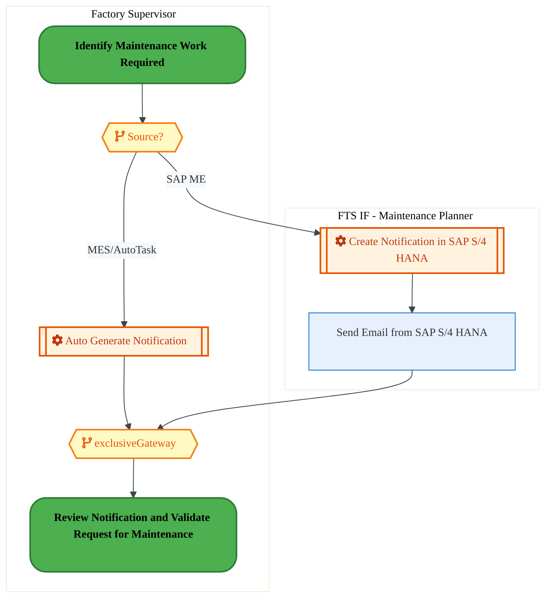
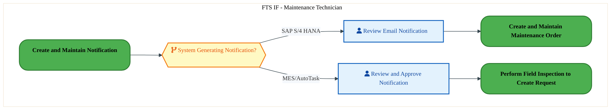
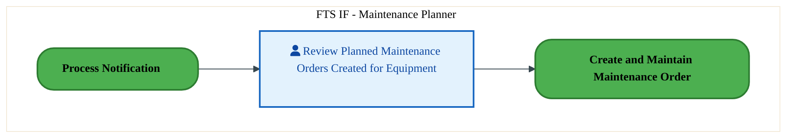
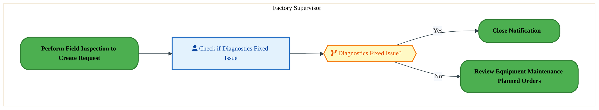
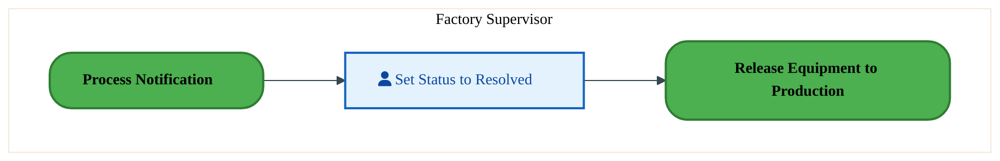
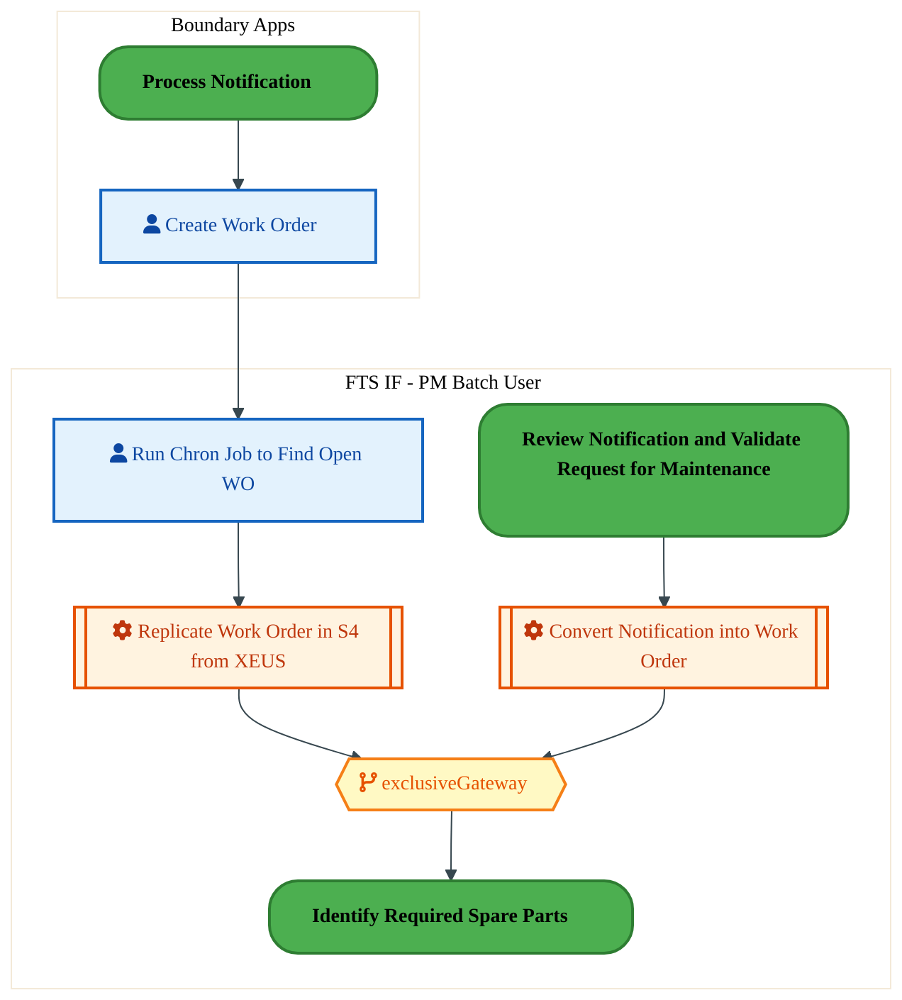

  <img src="data:image/svg+xml;base64,PHN2ZyB4bWxucz0iaHR0cDovL3d3dy53My5vcmcvMjAwMC9zdmciIHZpZXdCb3g9IjAgMCA4MDAgNDgwIiB3aWR0aD0iODAwIiBoZWlnaHQ9IjQ4MCI+DQogIDxkZWZzPg0KICAgIDxsaW5lYXJHcmFkaWVudCBpZD0iYmciIHgxPSIwJSIgeTE9IjAlIiB4Mj0iMTAwJSIgeTI9IjEwMCUiPg0KICAgICAgPHN0b3Agb2Zmc2V0PSIwJSIgc3R5bGU9InN0b3AtY29sb3I6IzAwNzFjNTtzdG9wLW9wYWNpdHk6MSIvPg0KICAgICAgPHN0b3Agb2Zmc2V0PSIxMDAlIiBzdHlsZT0ic3RvcC1jb2xvcjojMDBhZWVmO3N0b3Atb3BhY2l0eToxIi8+DQogICAgPC9saW5lYXJHcmFkaWVudD4NCiAgICA8bGluZWFyR3JhZGllbnQgaWQ9ImFjY2VudCIgeDE9IjAlIiB5MT0iMCUiIHgyPSIwJSIgeTI9IjEwMCUiPg0KICAgICAgPHN0b3Agb2Zmc2V0PSIwJSIgc3R5bGU9InN0b3AtY29sb3I6I2ZmZmZmZjtzdG9wLW9wYWNpdHk6MC4xNSIvPg0KICAgICAgPHN0b3Agb2Zmc2V0PSIxMDAlIiBzdHlsZT0ic3RvcC1jb2xvcjojZmZmZmZmO3N0b3Atb3BhY2l0eTowLjAyIi8+DQogICAgPC9saW5lYXJHcmFkaWVudD4NCiAgICA8cGF0dGVybiBpZD0iZ3JpZCIgd2lkdGg9IjQwIiBoZWlnaHQ9IjQwIiBwYXR0ZXJuVW5pdHM9InVzZXJTcGFjZU9uVXNlIj4NCiAgICAgIDxwYXRoIGQ9Ik0gNDAgMCBMIDAgMCAwIDQwIiBmaWxsPSJub25lIiBzdHJva2U9InJnYmEoMjU1LDI1NSwyNTUsMC4wNykiIHN0cm9rZS13aWR0aD0iMC41Ii8+DQogICAgPC9wYXR0ZXJuPg0KICA8L2RlZnM+DQoNCiAgPCEtLSBCYWNrZ3JvdW5kIC0tPg0KICA8cmVjdCB3aWR0aD0iODAwIiBoZWlnaHQ9IjQ4MCIgZmlsbD0idXJsKCNiZykiIHJ4PSI4Ii8+DQogIDxyZWN0IHdpZHRoPSI4MDAiIGhlaWdodD0iNDgwIiBmaWxsPSJ1cmwoI2dyaWQpIiByeD0iOCIvPg0KICA8cmVjdCB3aWR0aD0iODAwIiBoZWlnaHQ9IjQ4MCIgZmlsbD0idXJsKCNhY2NlbnQpIiByeD0iOCIvPg0KDQogIDwhLS0gRGVjb3JhdGl2ZSBjaXJjdWl0L2FyY2hpdGVjdHVyZSBsaW5lcyAtLT4NCiAgPGcgc3Ryb2tlPSJyZ2JhKDI1NSwyNTUsMjU1LDAuMTIpIiBzdHJva2Utd2lkdGg9IjEuNSIgZmlsbD0ibm9uZSI+DQogICAgPHBhdGggZD0iTSAwIDEwMCBMIDEyMCAxMDAgTCAxNjAgMTQwIEwgMjgwIDE0MCIvPg0KICAgIDxwYXRoIGQ9Ik0gMCAyNjAgTCA4MCAyNjAgTCAxMjAgMjIwIEwgMjAwIDIyMCBMIDI0MCAyNjAgTCAzNjAgMjYwIi8+DQogICAgPHBhdGggZD0iTSA1MjAgMTAwIEwgNjAwIDEwMCBMIDY0MCA2MCBMIDgwMCA2MCIvPg0KICAgIDxwYXRoIGQ9Ik0gNDQwIDM0MCBMIDU2MCAzNDAgTCA2MDAgMzAwIEwgNzIwIDMwMCBMIDc2MCAzNDAgTCA4MDAgMzQwIi8+DQogICAgPHBhdGggZD0iTSA2MDAgNDAwIEwgNjgwIDQwMCBMIDcyMCA0NDAiLz4NCiAgICA8cGF0aCBkPSJNIDAgNDAwIEwgNDAgNDAwIEwgODAgMzYwIi8+DQogICAgPHBhdGggZD0iTSAyMDAgNDIwIEwgMzIwIDQyMCBMIDM2MCAzODAgTCA0ODAgMzgwIi8+DQogICAgPHBhdGggZD0iTSA2NTAgNDQwIEwgNzUwIDQ0MCBMIDgwMCA0ODAiLz4NCiAgPC9nPg0KDQogIDwhLS0gRGVjb3JhdGl2ZSBub2RlcyAtLT4NCiAgPGcgZmlsbD0icmdiYSgyNTUsMjU1LDI1NSwwLjE4KSI+DQogICAgPGNpcmNsZSBjeD0iMTIwIiBjeT0iMTAwIiByPSI0Ii8+DQogICAgPGNpcmNsZSBjeD0iMjgwIiBjeT0iMTQwIiByPSI0Ii8+DQogICAgPGNpcmNsZSBjeD0iMjAwIiBjeT0iMjIwIiByPSI0Ii8+DQogICAgPGNpcmNsZSBjeD0iMzYwIiBjeT0iMjYwIiByPSI0Ii8+DQogICAgPGNpcmNsZSBjeD0iNjAwIiBjeT0iMTAwIiByPSI0Ii8+DQogICAgPGNpcmNsZSBjeD0iNzIwIiBjeT0iMzAwIiByPSI0Ii8+DQogICAgPGNpcmNsZSBjeD0iNTYwIiBjeT0iMzQwIiByPSI0Ii8+DQogICAgPGNpcmNsZSBjeD0iODAiIGN5PSIzNjAiIHI9IjQiLz4NCiAgICA8Y2lyY2xlIGN4PSI0ODAiIGN5PSIzODAiIHI9IjQiLz4NCiAgICA8Y2lyY2xlIGN4PSIzMjAiIGN5PSI0MjAiIHI9IjQiLz4NCiAgPC9nPg0KDQogIDwhLS0gVE9HQUYgQkRBVCBib3hlcyAtLT4NCiAgPGcgZm9udC1mYW1pbHk9IlNlZ29lIFVJLCBBcmlhbCwgc2Fucy1zZXJpZiIgZm9udC1zaXplPSIxNCIgZm9udC13ZWlnaHQ9IjYwMCI+DQogICAgPCEtLSBCIC0tPg0KICAgIDxyZWN0IHg9IjE1MCIgeT0iMTQwIiB3aWR0aD0iMTIwIiBoZWlnaHQ9IjQwIiByeD0iNSIgZmlsbD0icmdiYSgyNTUsMjU1LDI1NSwwLjE4KSIgc3Ryb2tlPSJyZ2JhKDI1NSwyNTUsMjU1LDAuMykiIHN0cm9rZS13aWR0aD0iMSIvPg0KICAgIDx0ZXh0IHg9IjIxMCIgeT0iMTY1IiB0ZXh0LWFuY2hvcj0ibWlkZGxlIiBmaWxsPSIjZmZmIj5CdXNpbmVzczwvdGV4dD4NCiAgICA8IS0tIEQgLS0+DQogICAgPHJlY3QgeD0iMjkwIiB5PSIxNDAiIHdpZHRoPSIxMjAiIGhlaWdodD0iNDAiIHJ4PSI1IiBmaWxsPSJyZ2JhKDI1NSwyNTUsMjU1LDAuMTgpIiBzdHJva2U9InJnYmEoMjU1LDI1NSwyNTUsMC4zKSIgc3Ryb2tlLXdpZHRoPSIxIi8+DQogICAgPHRleHQgeD0iMzUwIiB5PSIxNjUiIHRleHQtYW5jaG9yPSJtaWRkbGUiIGZpbGw9IiNmZmYiPkRhdGE8L3RleHQ+DQogICAgPCEtLSBBIC0tPg0KICAgIDxyZWN0IHg9IjQzMCIgeT0iMTQwIiB3aWR0aD0iMTIwIiBoZWlnaHQ9IjQwIiByeD0iNSIgZmlsbD0icmdiYSgyNTUsMjU1LDI1NSwwLjE4KSIgc3Ryb2tlPSJyZ2JhKDI1NSwyNTUsMjU1LDAuMykiIHN0cm9rZS13aWR0aD0iMSIvPg0KICAgIDx0ZXh0IHg9IjQ5MCIgeT0iMTY1IiB0ZXh0LWFuY2hvcj0ibWlkZGxlIiBmaWxsPSIjZmZmIj5BcHBsaWNhdGlvbjwvdGV4dD4NCiAgICA8IS0tIFQgLS0+DQogICAgPHJlY3QgeD0iNTcwIiB5PSIxNDAiIHdpZHRoPSIxMjAiIGhlaWdodD0iNDAiIHJ4PSI1IiBmaWxsPSJyZ2JhKDI1NSwyNTUsMjU1LDAuMTgpIiBzdHJva2U9InJnYmEoMjU1LDI1NSwyNTUsMC4zKSIgc3Ryb2tlLXdpZHRoPSIxIi8+DQogICAgPHRleHQgeD0iNjMwIiB5PSIxNjUiIHRleHQtYW5jaG9yPSJtaWRkbGUiIGZpbGw9IiNmZmYiPlRlY2hub2xvZ3k8L3RleHQ+DQogIDwvZz4NCg0KICA8IS0tIENvbm5lY3RpbmcgbGluZXMgYmV0d2VlbiBCREFUIGJveGVzIC0tPg0KICA8ZyBzdHJva2U9InJnYmEoMjU1LDI1NSwyNTUsMC4yNSkiIHN0cm9rZS13aWR0aD0iMSI+DQogICAgPGxpbmUgeDE9IjI3MCIgeTE9IjE2MCIgeDI9IjI5MCIgeTI9IjE2MCIvPg0KICAgIDxsaW5lIHgxPSI0MTAiIHkxPSIxNjAiIHgyPSI0MzAiIHkyPSIxNjAiLz4NCiAgICA8bGluZSB4MT0iNTUwIiB5MT0iMTYwIiB4Mj0iNTcwIiB5Mj0iMTYwIi8+DQogIDwvZz4NCg0KICA8IS0tIE1haW4gdGl0bGUgLS0+DQogIDx0ZXh0IHg9IjQwMCIgeT0iMjYwIiB0ZXh0LWFuY2hvcj0ibWlkZGxlIiBmb250LWZhbWlseT0iU2Vnb2UgVUksIEFyaWFsLCBzYW5zLXNlcmlmIiBmb250LXNpemU9IjM2IiBmb250LXdlaWdodD0iNzAwIiBmaWxsPSIjZmZmZmZmIiBsZXR0ZXItc3BhY2luZz0iMSI+DQogICAgSUFPIEFyY2hpdGVjdHVyZQ0KICA8L3RleHQ+DQogIDx0ZXh0IHg9IjQwMCIgeT0iMzAwIiB0ZXh0LWFuY2hvcj0ibWlkZGxlIiBmb250LWZhbWlseT0iU2Vnb2UgVUksIEFyaWFsLCBzYW5zLXNlcmlmIiBmb250LXNpemU9IjE4IiBmb250LXdlaWdodD0iNDAwIiBmaWxsPSJyZ2JhKDI1NSwyNTUsMjU1LDAuOCkiIGxldHRlci1zcGFjaW5nPSIyIj4NCiAgICBUT0dBRiBCREFUIMK3IElBTyBQcm9ncmFtIMK3IElETSAyLjANCiAgPC90ZXh0Pg0KDQogIDwhLS0gQm90dG9tIGFjY2VudCBiYXIgLS0+DQogIDxyZWN0IHg9IjI4MCIgeT0iMzQwIiB3aWR0aD0iMjQwIiBoZWlnaHQ9IjMiIHJ4PSIxLjUiIGZpbGw9InJnYmEoMjU1LDI1NSwyNTUsMC40KSIvPg0KDQogIDwhLS0gSW50ZWwgdGV4dCAtLT4NCiAgPHRleHQgeD0iNDAwIiB5PSIzODAiIHRleHQtYW5jaG9yPSJtaWRkbGUiIGZvbnQtZmFtaWx5PSJTZWdvZSBVSSwgQXJpYWwsIHNhbnMtc2VyaWYiIGZvbnQtc2l6ZT0iMTMiIGZpbGw9InJnYmEoMjU1LDI1NSwyNTUsMC41KSIgbGV0dGVyLXNwYWNpbmc9IjMiPg0KICAgIElOVEVMIENPTkZJREVOVElBTA0KICA8L3RleHQ+DQo8L3N2Zz4NCg==" alt="IAO Architecture" style="width:100%; border-radius:8px;" />
  <h1 style="font-size:36px; margin-top:24px;">PE-070 — Identify and Plan Plant Maintenance (IF)</h1>
  <h2 style="font-size:24px;">Architecture Document (TOGAF BDAT)</h2>
  
Forecast to Stock (IF) (FTS-IF) Tower 
  Capability PE-070 · PE Manage Plant, Equipment and Facilities (IF)

  
IAO Program · R1 – R5 
  Generated: April 2026 
  Sajiv Francis

  
IAO Architecture Pipeline — Intel Confidential

Page 1<a href="#toc">↑ Back to TOC</a>PE-070 — Identify and Plan Plant Maintenance (IF)

## Table of Contents

<nav class="toc">
<ol>
  <li><a href="#1-executive-summary">1. Executive Summary</a></li>
  <li><a href="#2-business-context-objectives">2. Business Context &amp; Objectives</a>
    <ul>
      <li><a href="#21-classification">2.1 Classification</a></li>
      <li><a href="#22-business-drivers">2.2 Business Drivers</a></li>
      <li><a href="#23-success-criteria">2.3 Success Criteria</a></li>
      <li><a href="#24-companion-documents">2.4 Companion Documents</a></li>
    </ul>
  </li>
  <li><a href="#3-business-architecture-togaf-b">3. Business Architecture (TOGAF &ldquo;B&rdquo;)</a>
    <ul>
      <li><a href="#31-business-process-overview">3.1 Business Process Overview</a></li>
      <li><a href="#32-business-process-diagrams">3.2 Business Process Diagrams</a></li>
      <li><a href="#33-business-roles-responsibilities">3.3 Business Roles &amp; Responsibilities</a></li>
    </ul>
  </li>
  <li><a href="#4-data-architecture-togaf-d">4. Data Architecture (TOGAF &ldquo;D&rdquo;)</a>
    <ul>
      <li><a href="#41-data-entities-ownership">4.1 Data Entities &amp; Ownership</a></li>
      <li><a href="#42-data-flow-diagrams">4.2 Data Flow Diagrams</a></li>
      <li><a href="#43-data-lineage">4.3 Data Lineage</a></li>
      <li><a href="#44-ricefw-data-objects">4.4 RICEFW Data Objects</a></li>
      <li><a href="#45-data-governance-quality">4.5 Data Governance &amp; Quality</a></li>
    </ul>
  </li>
  <li><a href="#5-application-architecture-togaf-a">5. Application Architecture (TOGAF &ldquo;A&rdquo;)</a>
    <ul>
      <li><a href="#54-component-overview">5.4 Component Overview</a></li>
      <li><a href="#55-development-object-inventory">5.5 Development Object Inventory</a>
        <ul>
          <li><a href="#551-sap-development-objects">5.5.1 SAP Development Objects</a></li>
          <li><a href="#552-eca-development-objects">5.5.2 ECA Development Objects</a></li>
          <li><a href="#553-interface-objects">5.5.3 Interface Objects</a></li>
          <li><a href="#554-middleware-objects">5.5.4 Middleware Objects</a></li>
          <li><a href="#555-scheduling-batch-objects">5.5.5 Scheduling &amp; Batch Objects</a></li>
          <li><a href="#556-boundary-application-dependencies">5.5.6 Boundary Application Dependencies</a></li>
        </ul>
      </li>
      <li><a href="#56-integration-patterns">5.6 Integration Patterns</a></li>
    </ul>
  </li>
  <li><a href="#6-technology-architecture-togaf-t">6. Technology Architecture (TOGAF &ldquo;T&rdquo;)</a>
    <ul>
      <li><a href="#61-platform-infrastructure">6.1 Platform &amp; Infrastructure</a></li>
      <li><a href="#62-sap-development-object-status">6.2 SAP Development Object Status</a></li>
      <li><a href="#63-nfrs-design-principles">6.3 NFRs &amp; Design Principles</a></li>
      <li><a href="#64-security-governance">6.4 Security &amp; Governance</a></li>
      <li><a href="#65-eca-development-object-status">6.5 ECA Development Object Status</a></li>
    </ul>
  </li>
  <li><a href="#7-project-context">7. Project Context</a>
    <ul>
      <li><a href="#71-project-roadmap-go-live-plan">7.1 Project Roadmap &amp; Go-Live Plan</a></li>
      <li><a href="#72-raid-log">7.2 RAID Log</a></li>
      <li><a href="#73-recommendations-next-steps">7.3 Recommendations &amp; Next Steps</a></li>
    </ul>
  </li>
</ol>
</nav>

Page 2<a href="#toc">↑ Back to TOC</a>PE-070 — Identify and Plan Plant Maintenance (IF)

## 1. Executive Summary

This Architecture Document defines the **Business, Data, Application, and Technology** (BDAT) architecture for **PE-070 Identify and Plan Plant Maintenance (IF)** within the IAO program. It includes 13 BPMN process diagram(s) in Section 3.

| Dimension | Value |
|-----------|-------|
| **Tower** | Forecast to Stock (IF) (FTS-IF) |
| **Process Group** | PE Manage Plant, Equipment and Facilities (IF) |
| **Capability** | PE-070 - Identify and Plan Plant Maintenance (IF) |
| **Release** | R1 – R5 |
| **Total Systems** | 0 |
| **System Status** | 0 Deployed, 0 Developing, 0 EOL, 0 Pending IAPM |
| **RICEFW Objects** | 2 Reports, 12 Interfaces, 11 Conversions, 53 Enhancements, 1 Forms, 1 Workflows |

> All system nodes in architecture diagrams are **IAPM-linked** — click any node to open its IAPM page. Diagrams require `securityLevel: 'loose'` for click events.

Page 3<a href="#toc">↑ Back to TOC</a>PE-070 — Identify and Plan Plant Maintenance (IF)

## 2. Business Context & Objectives

### 2.1 Classification

| Level | Value |
|-------|-------|
| **L0 Tower** | Forecast to Stock (IF) |
| **L1 Process** | PE Manage Plant, Equipment and Facilities (IF) |
| **L2 Capability** | PE-070 - Identify and Plan Plant Maintenance (IF) |

### 2.2 Business Drivers

| # | Driver | Description | Strategic Alignment | Priority |
|---|--------|-------------|---------------------|----------|
| 1 | Intel Foundry Supply Chain Integration | Integrate Intel Foundry manufacturing and logistics into unified S/4 HANA supply chain | IDM 2.0 Foundry Enablement | High |
| 2 | Warehouse & Logistics Modernization | Modernize warehouse management and shipping processes with EWM integration | Supply Chain Digital Transformation | High |
| 3 | Production Planning Optimization | Enable MRP-driven production planning with real-time material availability | Manufacturing Excellence | Medium |
| 4 | PE-070 Process Migration | Migrate Identify and Plan Plant Maintenance (IF) business processes and 0 integrated systems from legacy to S/4 HANA target architecture | IDM 2.0 Supply Chain (Intel Foundry) | High |

Page 4<a href="#toc">↑ Back to TOC</a>PE-070 — Identify and Plan Plant Maintenance (IF)

### 2.3 Success Criteria

| Metric | Target | Measure | Baseline | Owner |
|--------|--------|---------|----------|-------|
| Order Fulfillment Lead Time | < 48 hours | Time from production completion to shipment dispatch | 72 hours (legacy) | Logistics Manager |
| Inventory Accuracy | > 99.5% | Physical vs system inventory match rate | 97.8% (current) | Warehouse Manager |
| MRP Planning Cycle | < 4 hours | End-to-end MRP run including exception processing | 8 hours (legacy) | Planning Lead |
| PE-070 Migration Completeness | 100% flow chains validated | All 0 flow chains verified in target state | 0% (pre-migration) | Tower Architect |

### 2.4 Companion Documents

| Document | Description |
|----------|-------------|
| **Business Architecture** | Included in this document (Section 3) — process flows from BPMN diagrams |
| **This Document** | Full BDAT Architecture — Business + Data + Application + Technology |

Page 5<a href="#toc">↑ Back to TOC</a>PE-070 — Identify and Plan Plant Maintenance (IF)

## 3. Business Architecture (TOGAF "B")

### 3.1 Business Process Overview

This capability includes **13 business process(es)** modeled in BPMN 2.0, covering the end-to-end workflow for PE-070 Identify and Plan Plant Maintenance (IF).

| # | Step ID | Process Name | Lanes | Tasks | Gateways |
|---|---------|--------------|-------|-------|----------|
| 1 | PE-070-010_Identify_Maintenance_Work_Required | PE-070-010_Identify_Maintenance_Work_Required | Boundary Apps | 2 | 0 |
| 2 | PE-070-020_Create_and_Maintain_Notification | PE-070-020_Create_and_Maintain_Notification | FTS IF - Maintenance Planner, Factory Supervisor | 3 | 2 |
| 3 | PE-070-030_Review_Notification_and_Validate_Request_for_Maintenance | PE-070-030_Review_Notification_and_Validate_Request_for_Maintenance | FTS IF - Maintenance Technician | 2 | 1 |
| 4 | PE-070-040_Review_Equipment_Maintenance_Planned_Orders | PE-070-040_Review_Equipment_Maintenance_Planned_Orders | FTS IF - Maintenance Planner | 1 | 0 |
| 5 | PE-070-070_Perform_Field_Inspection_to_Create_Work_Request | PE-070-070_Perform_Field_Inspection_to_Create_Work_Request | Factory Supervisor | 2 | 0 |
| 6 | PE-070-080_Check_Warranty | PE-070-080_Check_Warranty | FTS IF - Batch User, FTS IF - PM Maintenance Technician, Finance Manager, PTP IF Batch user | 11 | 18 |
| 7 | PE-070-090_Process_Notification | PE-070-090_Process_Notification | Factory Supervisor | 1 | 1 |
| 8 | PE-070-100_Close_Notification | PE-070-100_Close_Notification | Factory Supervisor | 1 | 0 |
| 9 | PE-070-110_Create_and_Maintain_Maintenance_Order | PE-070-110_Create_and_Maintain_Maintenance_Order | Boundary Apps, FTS IF - PM Batch User | 4 | 1 |
| 10 | PE-070-120_Review_Maintenance_Plan | PE-070-120_Review_Maintenance_Plan | FTS IF - Maintenance Planner | 4 | 0 |
| 11 | PE-070-130_Create_Maintenance_Plan | PE-070-130_Create_Maintenance_Plan | FTS IF - Maintenance Planner | 7 | 3 |
| 12 | PE-070-150_Define_Requirements_for_Each_Operation_and_Create_Job_Plan | PE-070-150_Define_Requirements_for_Each_Operation_and_Create_Job_Plan | Boundary Apps | 6 | 1 |
| 13 | PE-070-160_Identify_Required_Spare_Parts | PE-070-160_Identify_Required_Spare_Parts | FTS IF - PM Maintenance Technician | 2 | 0 |

Page 6<a href="#toc">↑ Back to TOC</a>PE-070 — Identify and Plan Plant Maintenance (IF)

### 3.2 Business Process Diagrams

#### BUSINESS ARCHITECTURE — 3.2.1 PE-070-010_Identify_Maintenance_Work_Required — PE-070-010_Identify_Maintenance_Work_Required

**Swim Lanes**: Boundary Apps | **Tasks**: 2 | **Gateways**: 0

> **Legend**: ● Start · ● End · User Task · Service Task · ◇ Gateway · Sub-Process

<a href="https://mermaid.live/view#pako:eNqlVGur2jAY_iuhB3GDCr1a1w8Dbe0YbGPMs50PxzFi-kaDMenS1MvE_77Uar0MP63Qap48l7xv0-wtInOwYqvT2TPBdIz2Xb2AFXRj1J3hEro2aoAfWDE841B2aw6VQk_YnyPNDYptTauxDK8Y39XoBOYS0PePNhoaIbdRiUXZK0Ex2rW7hWIrrHaJ5FLV7CcYUIce005TI6lyUBeC40QuCY2UMwEX2I-CKMhqXQlEivzGlIZ0QEn3UC-Oyw1ZYKWPy69K-Iy3LyzXCzOmmJdgOAu94p_wDHhdo1ZVjZFKrc_NYGWdI0zDJgUmTMwNHjgGUlgsL1DoHA7o0OlMRRuKntOpQOYiHJdlChSV2sDjtUaUcR4_BckwCx271EouIX7yxlHqezapK4lN6Y5dN7e3ATZf6HgmeX6i9jZ1DbFXbG21jT3HVjvzvMsCkV-Skr438AZt0ihyEzc5J1FK_yvJ9FU943J5yhr7mZelbZYb9sPE-dfvXGYaREP3vk-g1ozAlWmWZf740qpxP3Sdx6ajzO87yZ3pHGvY4N3F8F0StIZZGGVu9NCwybtfZTX7qiQ5G_rjMAtbw2jkZkPvoWEwdIPBaYXGZ65wsUAcC_jlvE6tkayOmxoNi6KcWj8bXn0J99XMUxxT3CNyjlLQQMxOk5KjVG4Emu3QtdqIr9XerXpYaYk-gABleoO-SM0oI1gzKe50_ptWV3DTw2_wu4JSm18CbA05olKhz5gJDQILAuhFqqXxeHvlERiLREGdhEXesM19H9sozO5t_ggf9XrvTd2nodsMvdPQa4bB1aupOVcb6GbGezjjtx_nDRy0sGVbK1ArzHIr3lvH09GcoDlQXHFtHWwLm2ZOdoJY8fEUsaoiN7WmDJuXu2rAw1-5ZcKx" title="View full diagram">&#128065; View Diagram</a>

Page 7<a href="#toc">↑ Back to TOC</a>PE-070 — Identify and Plan Plant Maintenance (IF)

#### BUSINESS ARCHITECTURE — 3.2.2 PE-070-020_Create_and_Maintain_Notification — PE-070-020_Create_and_Maintain_Notification

**Swim Lanes**: FTS IF - Maintenance Planner · Factory Supervisor | **Tasks**: 3 | **Gateways**: 2

> **Legend**: ● Start · ● End · User Task · Service Task · ◇ Gateway · Sub-Process

<a href="https://mermaid.live/view#pako:eNqlVduO2zYQ_RVCi4VfZERXy9VDCq0spQt0g0W0SR7ioqCpkU0sTboU5Usc_3tJS77I3X2qHgzM4ZlzZsZDaW8RUYIVW_f3e8qpitF-oBawhEGMBjNcw8BGLfANS4pnDOqB4VSCq4L-PNLcYLU1NIPleEnZzqAFzAWgr482SnQis1GNeT2sQdJqYA9Wki6x3KWCCWnYdzCunOro1h09CFmCvBAcJ3JJqFMZ5XCB_SiIgtzk1UAEL3uiVViNKzI4mOKY2JAFlupYflPDE95-p6Va6LjCrAbNWagl-xPPgJkelWwMRhq5Pg2D1saH64EVK0won2s8cDQkMX-9QKFzOKDD_f2Un03Ry2TKkX4Iw3U9gQrVSsPZWqGKMhbfBWmSh45dKyleIb7zsmjiezYxncS6dcc2wx1ugM4XKp4JVnbU4cb0EHurrS23sefYcqd_b7yAlxendOSNvfHZ6SFyUzc9OVVV9b-c9FzlC65fO6_Mz718cvZyw1GYOv_VO7U5CaLEvZ0TyDUlcCWa57mfXUaVjULXeV_0IfdHTnojOscKNnh3EfwtDc6CeRjlbvSuYOt3W2Uze5aCnAT9LMzDs2D04OaJ965gkLjBuKtQ68wlXi0Qwxz-dn5MrfylQI85GqInTLkCjjkB9KyPOcip9VebZh7u_dD0CscVHhIxR6kE3SX6LBStKMGKCo4oR0XyjIoPAfoj-Zzo_GsBX-cXeldQtsSUoUqK5S29ZWvOW-W6plxMlJA7VDQr88fV4qZIt19k0iiBPoHu5bbWm9oCnfYF1hQ2_Y6wLvcbZrQ0-V_gnwZqvehCXo-rX0GolR5L4Fpk1xvqdyFfjxJUQtnPGe33l6pLGM70hScLVIhGEvh9ah0OV-TobTJsCWtquoZP7fJdss7j5CEaDj9quy702tDvQrcNoy4cmfDX1HrKig9mjuaKTK1fmtcRopYfdKH_drr5h5-yY6J3tdXG7uru9U68d0-C83utB4dvw6PTReyh0Qm1bGsJUu9iacV76_gR0h-qEircMGUdbAvrrosdJ1Z8fFlbzcqswYRivZTLFjz8C-geMIQ=" title="View full diagram">&#128065; View Diagram</a>

#### BUSINESS ARCHITECTURE — 3.2.3 PE-070-030_Review_Notification_and_Validate_Request_for_Maintenance — PE-070-030_Review_Notification_and_Validate_Request_for_Maintenance

**Swim Lanes**: FTS IF - Maintenance Technician | **Tasks**: 2 | **Gateways**: 1

> **Legend**: ● Start · ● End · User Task · Service Task · ◇ Gateway · Sub-Process

<a href="https://mermaid.live/view#pako:eNqlVV2P4jYU_StWRiNegjafhM1Dq0wg7Uid3dFmtn0oVWWca7DGsVPbwFCW_16bz4UOfWkkUO7hnnPuvfgmG4_IBrzcu7_fMMFMjjY9M4cWejnqTbGGno_2wK9YMTzloHsuh0phavb3Li1MujeX5rAKt4yvHVrDTAL6-uijwhK5jzQWuq9BMdrze51iLVbrUnKpXPYdDGlAd26Hnx6kakCdE4IgC0lqqZwJOMNxlmRJ5XgaiBTNhShN6ZCS3tYVx-WKzLEyu_IXGp7w22-sMXMbU8w12Jy5afkveArc9WjUwmFkoZbHYTDtfIQdWN1hwsTM4klgIYXF6xlKg-0Wbe_vJ-Jkil5GE4HsRTjWegQUaWPh8dIgyjjP75KyqNLA10bJV8jvonE2iiOfuE5y23rgu-H2V8Bmc5NPJW8Oqf2V6yGPujdfveVR4Ku1_b7yAtGcncpBNIyGJ6eHLCzD8uhEKf1fTnau6gXr14PXOK6ianTyCtNBWgb_1ju2OUqyIryeE6glI_CdaFVV8fg8qvEgDYPbog9VPAjKK9EZNrDC67PgxzI5CVZpVoXZTcG933WVi-mzkuQoGI_TKj0JZg9hVUQ3BZMiTIaHCq3OTOFujjgW8Gfw-8SrXmr0WKE-esJMGBBYEEAvQOaCEYbFxPtjz3SXCC2B4pzivvsj0BdYMlihcYsZR5-kYZQRbJi8YkXvsrBoUNF1Si7hP7ix5ZYK7Dx3hF2R9nNR7We3yJe0xNKeQVGpWlQx4A16FLoD4gyQkegg-QX-WoA2l9z0huXtIgebzbFD97TrT-2-kjmq19pAi34CAcqyxOxC4seJt93uRez-7G9Eivr9H6zgIQz3YXwIo32YHMKBC79NvKdx_aFYGOnO8MT7ZvOuEuriGdUfEvRz8anYJXy_BM7luFYXcPQ-HJ8eLRdw8j6cvg8Pjivi-V4Lyh6gxss33u5FYF8WDVC84Mbb-h62jdVrQbx898D0Fl1jmSOG7Tlu9-D2H9D1DSM=" title="View full diagram">&#128065; View Diagram</a>

#### BUSINESS ARCHITECTURE — 3.2.4 PE-070-040_Review_Equipment_Maintenance_Planned_Orders — PE-070-040_Review_Equipment_Maintenance_Planned_Orders

**Swim Lanes**: FTS IF - Maintenance Planner | **Tasks**: 1 | **Gateways**: 0

> **Legend**: ● Start · ● End · User Task · Service Task · ◇ Gateway · Sub-Process

<a href="https://mermaid.live/view#pako:eNqlVNuO2jAU_BUrK5SXIOVKaB4qQcDSSt12VWj7UKrKJMdgbWJT2-FSxL_X5hIWVvvUSIniyZyZcyZx9k4hSnAyp9PZM850hvauXkINbobcOVHgeugEfCeSkXkFyrUcKriesL9HWhCvtpZmMUxqVu0sOoGFAPTt0UMDU1h5SBGuugoko67nriSridzlohLSsh-gT316dDs_GgpZgrwSfD8NisSUVozDFY7SOI2xrVNQCF7eiNKE9mnhHmxzldgUSyL1sf1GwRPZ_mClXpo1JZUCw1nquvpE5lDZGbVsLFY0cn0Jgynrw01gkxUpGF8YPPYNJAl_uUKJfzigQ6cz460pmo5mHJmjqIhSI6BIaQOP1xpRVlXZQ5wPcOJ7SkvxAtlDOE5HUegVdpLMjO57NtzuBthiqbO5qMoztbuxM2ThauvJbRb6ntyZ650X8PLqlPfCfthvnYZpkAf5xYlS-l9OJlc5Jerl7DWOcIhHrVeQ9JLcf6t3GXMUp4PgPieQa1bAK1GMcTS-RjXuJYH_vugQRz0_vxNdEA0bsrsKfsjjVhAnKQ7SdwVPfvddNvNnKYqLYDROcNIKpsMAD8J3BeNBEPfPHRqdhSSrJaoIh9_-z5mDpxP0iFEXPRHGNXDCC0DP5jEHOXN-ncrswQPDpiSjpGvfAvoKawabM7W8Kf9id5ZCuQSTQ4mokGj8p2GrGri-1QyN5omGCD-LmPOt2m1ZZMpsHqAU-iw0o6wgmgnesswXebrhEep2P5rmz8vgtAxf5WvBy3d1A4ftJrqBoxZ2PKcGWRNWOtneOf7FzJ-uBEqaSjsHzyGNFpMdL5zsuNudZlWaUUeMmJdQn8DDP57LqAk=" title="View full diagram">&#128065; View Diagram</a>

#### BUSINESS ARCHITECTURE — 3.2.5 PE-070-070_Perform_Field_Inspection_to_Create_Work_Request — PE-070-070_Perform_Field_Inspection_to_Create_Work_Request

**Swim Lanes**: Factory Supervisor | **Tasks**: 2 | **Gateways**: 0

> **Legend**: ● Start · ● End · User Task · Service Task · ◇ Gateway · Sub-Process

<a href="https://mermaid.live/view#pako:eNqlVMuO2jAU_RUrI8QmqHkSmkUlCESq1KlGZTpdlKoyzjVYGJvaDo8i_r02jzDQzqpZRLkn557je-J47xFZgZd7rdaeCWZytG-bOSyhnaP2FGto--gEvGDF8JSDbjsOlcKM2e8jLUxWW0dzWImXjO8cOoaZBPT1o4_6tpH7SGOhOxoUo22_vVJsidWukFwqx36AHg3o0e38aiBVBepKCIIsJKlt5UzAFY6zJEtK16eBSFHdiNKU9ihpH9ziuNyQOVbmuPxawyPefmOVmduaYq7BcuZmyT_hKXA3o1G1w0it1pcwmHY-wgY2XmHCxMziSWAhhcXiCqXB4YAOrdZENKboeTgRyF6EY62HQJE2Fh6tDaKM8_whKfplGvjaKLmA_CEaZcM48ombJLejB74Lt7MBNpubfCp5daZ2Nm6GPFptfbXNo8BXO3u_8wJRXZ2KbtSLeo3TIAuLsLg4UUr_y8nmqp6xXpy9RnEZlcPGK0y7aRH8rXcZc5hk_fA-J1BrRuCVaFmW8ega1aibhsHbooMy7gbFnegMG9jg3VXwfZE0gmWalWH2puDJ736V9fRJSXIRjEdpmTaC2SAs-9Gbgkk_THrnFVqdmcKrOeJYwM_g-8QrMTFS7dC4XrkktFQT78eJ7C4RWg7FOcUdlz16AkWlWqLH0fhdvzbymNuQ4ZmQ2jCib5uj2-YvsGawQcUcyIIzbe7YsWW7KUFr9FkaRhnBhklxy0os6yz0moSwqNAL5qyy2VunXzVouyWlQo-YCQMCCwKNkt2xpweRoE7ngx3zXIanMjqX0amMX30Ox7lswxs4-jccN7_iDZw0sOd7S1BLzCov33vHs9CelxVQXHPjHXwP25zHO0G8_HhmePXKzehCV3h5Ag9_AG3Ivjo=" title="View full diagram">&#128065; View Diagram</a>

Page 8<a href="#toc">↑ Back to TOC</a>PE-070 — Identify and Plan Plant Maintenance (IF)

#### BUSINESS ARCHITECTURE — 3.2.6 PE-070-080_Check_Warranty — PE-070-080_Check_Warranty

**Swim Lanes**: FTS IF - Batch User · FTS IF - PM Maintenance Technician · Finance Manager · PTP IF Batch user | **Tasks**: 11 | **Gateways**: 18

> **Legend**: ● Start · ● End · User Task · Service Task · ◇ Gateway · Sub-Process

<a href="https://mermaid.live/view#pako:eNqtWG1v2zYQ_iuEiyIpYDd6tWx_2JDY1hCgWb04WTEsw0BLlK1FJjWKipNl-e87SpRs09SGdQvQJjrec_fc8e5I6bUXsZj0Jr33719TmooJej0TG7IlZxN0tsIFOeujWvAj5ileZaQ4kzoJo2KZ_lGp2V7-LNWkLMTbNHuR0iVZM4Lur_voEoBZHxWYFoOC8DQ565_lPN1i_jJlGeNS-x0ZJVZSeVNLV4zHhO8VLCuwIx-gWUrJXuwGXuCFEleQiNH4yGjiJ6MkOnuT5DK2izaYi4p-WZAb_PwljcUGnhOcFQR0NmKbfcIrkskYBS-lLCr5U5OMtJB-KCRsmeMopWuQexaIOKaPe5Fvvb2ht_fvH2jrFH26faAIfqIMF8WMJKgQIJ4_CZSkWTZ5500vQ9_qF4KzRzJ558yDmev0IxnJBEK3-jK5gx1J1xsxWbEsVqqDnYxh4uTPff48caw-f4H_NV-ExntP06Ezckatp6vAntrTxlOSJP_JE-SV3-HiUfmau6ETzlpftj_0p9apvSbMmRdc2nqeCH9KI3JgNAxDd75P1Xzo21a30avQHVpTzegaC7LDL3uD46nXGgz9ILSDToO1P51luVpwFjUG3bkf-q3B4MoOL51Og96l7Y0UQ7Cz5jjfoAxT8qv180MvvFui6xAN0BUW0QbdQz4eer_U2vKHej-DVoInCR5EbI3u8xiCQ9MMp1s0Y1G5JVSgpcCiLAB4iPSPkVNODMjzGceJ-KBBh0boLRElp2hxiy7Q4rMGCY4hd9AzxTYVmj8NNDIG9wVzQIsXdE0TxrdYpIyilKL572WaV6wxjdENLgThe-U7Ob0QAD5-_Ki5sb3z1k8hWK4nYZqxgsQA-nAI8nUQ45xEIn0iF1eQkMeY7SAZUBakKGCRipSWp1aGmpXvmfKukKeIQEO0Edbp0fUdB9RbnemGRI8yCwfZuobBnyrkIdAFYEohiVsSy_W7DWe7-VO9TYeKo9fX_TbFZLACX1CsYUpxBodEXEcEv-s6RN8-9N7eDg2MzQbIc5SVBST0u7phNZhrfR3MNsOuKfrh_vKTTs51OtQF2V4s5HC_p_FhoZ0YcL-OptdJc1nC8QHHYAyNNn8WMN_hzxO3_te5HXa4LVAV7JQ9EW5yF5hx-zL7hzR5B9sCOmxXDHAmUI45zjKSnbCFqE1D0z4cmosbGAOyhClwIeiORBuaRimmxwVstw0lD7B2Erb9DGmuOhomArT0Z3kx0Trg2MCCcDmY9rHWHf0jdENcT6sFywdlrrGQNCq68A-FGV5XfXow7eI0woJpvm1nPw_yDE41rdcPu_tojrj_x_xy5CG1fIFRu0VlXg1e1eS3JaVwIdISJWO8m08_o3O1GbC5wJRt84wAxw-aut9ZjIKxDAHN-AX-RCuCVpyVcGeRLECQcxaXUZXrk2nTUeEzJotNFGiDYctvbq5nJ8igkw5py7ysynynNuGkTcbGKm_3LK8Lo3Qsa4W-Ree7VGxaYyiSO7piz3DaqVpAMZEDGiZtFSuc1aQ-4I57y_p3vVWDHCMopV3zo6MjZXPIo0B24A2meK13j3t8yi9YIVANgBcH2Y0x3BPOv1xwkkBmYXMj2U76ncQey0oEDg3ihmyZ1F6WeZ6lB047eMrjbnG3kJOjvmyVJ5etsfHeE3JC0HeMxTAib3VW1jFEtcqaUMIBKxEXJ3cle6S15pEH0G_bck5PGtIDqCJWX4PUQDkchIYR5o7-7XHRphFGEBoMvoHf6tmz62dfPbuBfP7zofcTgUvon_II1le-Z_WC0yw4OsRtVtza-Kh5tjUTXrPg6SaG-koDaYkOO70OOyBNrI1tlQqvCWSsUtPQ9dRzw9IZKcOXOcysJzhZq5bXago8jv8e8ED1lql5Nihfi6x5d4PLV80oaJ5VQE7j0PUV5TZ9CuG0OVBBO822OpYSaAi3cepax-m0fX2h4enZekXoOzBS9AI91MZ2mwNF0200PUXTHWsCpyHe5GKoF9tJgfjavg8Vsi0gxbLdRr3UPEtfUfydhq6t2Nitpt49I32hMW63WVTZcpr6s5scjPT6qq7v8FL3G6nO0ZrkwYuvzE7zwn8kdsxi9_Bl_mjF61zxO1eGnStB58qoc2XcuQL56Vxy2s84x3JXfXI5lnpGqW-UDo3SwCgdGaVjMzfoTLPc7pB3xOi4HXKvQ-43X12OxUOzODCLR2bx2CiGUWIU22axYxa7ZrFnFpujdM1RuuYoXXOUrjlKzxylZ47Sa6Ps9XtbuDjiNO5NXnvVJ174DByTBJeZ6L31e7gUbPlCo96k-hTaK6uvC7MUw5VpWwvf_gK0COu9" title="View full diagram">&#128065; View Diagram</a>

Page 9<a href="#toc">↑ Back to TOC</a>PE-070 — Identify and Plan Plant Maintenance (IF)

#### BUSINESS ARCHITECTURE — 3.2.7 PE-070-090_Process_Notification — PE-070-090_Process_Notification

**Swim Lanes**: Factory Supervisor | **Tasks**: 1 | **Gateways**: 1

> **Legend**: ● Start · ● End · User Task · Service Task · ◇ Gateway · Sub-Process

<a href="https://mermaid.live/view#pako:eNqlVFtv2jAU_itWqoqXICUhaVgeNtFApEprV5Vu0zSmyTjHYNWxU9vhMsp_n821sPZpeYjwx3c558T2yiOyBC_zLi9XTDCToVXLTKGCVoZaY6yh5aMt8A0rhsccdMtxqBRmyP5saGFcLxzNYQWuGF86dAgTCejrjY96Vsh9pLHQbQ2K0ZbfqhWrsFrmkkvl2BfQpQHdpO3-upaqBHUkBEEaksRKORNwhDtpnMaF02kgUpQnpjShXUpaa1ccl3Myxcpsym803OLFd1aaqV1TzDVYztRU_DMeA3c9GtU4jDRqth8G0y5H2IENa0yYmFg8DiyksHg6QkmwXqP15eVIHELRY38kkH0Ix1r3gSJtLDyYGUQZ59lFnPeKJPC1UfIJsotokPY7kU9cJ5ltPfDdcNtzYJOpycaSlztqe-56yKJ64atFFgW-Wtr3WRaI8piUX0XdqHtIuk7DPMz3SZTS_0qyc1WPWD_tsgadIir6h6wwuUry4F-_fZv9OO2F53MCNWMEXpkWRdEZHEc1uErC4H3T66JzFeRnphNsYI6XR8MPeXwwLJK0CNN3Dbd551U243slyd6wM0iK5GCYXodFL3rXMO6FcXdXofWZKFxPEccCfgc_R16BiZFqiYZN7SahpRp5v7Zk94jQcijOKG672aN8CuQJMYr6DE-E1IYRjQq2gBLdaN3AqTiy4geYMZijwXPD6gqEQbeYCQMCCwLo3tYhrPaLO4v6VNyx4pxLDehOGkYZwYZJccqJLeceFJWqslUAt1UIXQNxTGQkyhXYT4Ee4LkBbU61yWq1b83dUe2xPWVk-l5jn0beer1V2-2-_SFi1G5_tDPaLRO3fBl5P8C28mI7OMPv5AaOdnC4VSevvrUD93v8BI4OB_oE7rwNx2_DyX5jer5XgaowK71s5W2uX3tFl0Bxw4239j3cGDlcCuJlm2vKa-rSKt1oFK624Povu_nijg==" title="View full diagram">&#128065; View Diagram</a>

#### BUSINESS ARCHITECTURE — 3.2.8 PE-070-100_Close_Notification — PE-070-100_Close_Notification

**Swim Lanes**: Factory Supervisor | **Tasks**: 1 | **Gateways**: 0

> **Legend**: ● Start · ● End · User Task · Service Task · ◇ Gateway · Sub-Process

<a href="https://mermaid.live/view#pako:eNqlVE2P2jAU_CtWViiXIOWT0BwqQSBSpbaqlm17KFVlnGew1rFT24GliP9em8-Fak_NIYon82bem8TeeUTW4BVer7djgpkC7Xyzggb8AvkLrMEP0BH4hhXDCw7adxwqhZmxPwdalLYvjuawCjeMbx06g6UE9PVDgEa2kAdIY6H7GhSjfuC3ijVYbUvJpXLsBxjSkB7cTq_GUtWgroQwzCOS2VLOBFzhJE_ztHJ1GogU9Y0ozeiQEn_vmuNyQ1ZYmUP7nYZP-OU7q83KrinmGixnZRr-ES-AuxmN6hxGOrU-h8G08xE2sFmLCRNLi6ehhRQWz1coC_d7tO_15uJiip4mc4HsRTjWegIUaWPh6dogyjgvHtJyVGVhoI2Sz1A8xNN8ksQBcZMUdvQwcOH2N8CWK1MsJK9P1P7GzVDE7UugXoo4DNTW3u-8QNRXp3IQD-PhxWmcR2VUnp0opf_lZHNVT1g_n7ymSRVXk4tXlA2yMvxX7zzmJM1H0X1OoNaMwCvRqqqS6TWq6SCLwrdFx1UyCMs70SU2sMHbq-C7Mr0IVlleRfmbgke_-y67xRclyVkwmWZVdhHMx1E1it8UTEdROjx1aHWWCrcrxLGAX-GPuVdhYqTaolnXuiS0VHPv55HsLhFZDsUFxX2XPZqBQTODTaeRkegRtORrqG9LYlvyCBzs7kbT3x1rGxDG0e0IdUcMk-K2ILEFbjzQGn2WhlFG8A3L_mDHB5Ggfv-97eq0jI7L-FVcDjz_JjdwfNkTN3Bygb3Aa0A1mNVesfMOh5I9uGqguOPG2wce7oycbQXxisPm9bq2th96wrDNtDmC-7_ZIJft" title="View full diagram">&#128065; View Diagram</a>

Page 10<a href="#toc">↑ Back to TOC</a>PE-070 — Identify and Plan Plant Maintenance (IF)

#### BUSINESS ARCHITECTURE — 3.2.9 PE-070-110_Create_and_Maintain_Maintenance_Order — PE-070-110_Create_and_Maintain_Maintenance_Order

**Swim Lanes**: Boundary Apps · FTS IF - PM Batch User | **Tasks**: 4 | **Gateways**: 1

> **Legend**: ● Start · ● End · User Task · Service Task · ◇ Gateway · Sub-Process

<a href="https://mermaid.live/view#pako:eNqlVV1v6kYQ_SsjRxEvRvIndv1QCQyuUjVNFJKbK12qarHHsIrZdXdtPor4793F5sPc5Kl-QJqzZ86ZGXbsvZHyDI3IuL_fU0arCPa9aokr7EXQmxOJPRMa4BsRlMwLlD3NyTmrpvTfI832yq2maSwhK1rsNDrFBUd4ezBhqBILEyRhsi9R0Lxn9kpBV0TsYl5wodl3GOZWfnRrj0ZcZCguBMsK7NRXqQVleIHdwAu8ROdJTDnLOqK5n4d52jvo4gq-SZdEVMfya4mPZPtOs2qp4pwUEhVnWa2KP8gcC91jJWqNpbVYn4ZBpfZhamDTkqSULRTuWQoShH1cIN86HOBwfz9jZ1N4Hc8YqCctiJRjzEFWCp6sK8hpUUR3XjxMfMuUleAfGN05k2DsOmaqO4lU65aph9vfIF0sq2jOi6yl9je6h8gpt6bYRo5lip36vfFCll2c4oETOuHZaRTYsR2fnPI8_19Oaq7ilciP1mviJk4yPnvZ_sCPrZ_1Tm2OvWBo384JxZqmeCWaJIk7uYxqMvBt62vRUeIOrPhGdEEq3JDdRfCX2DsLJn6Q2MGXgo3fbZX1_Fnw9CToTvzEPwsGIzsZOl8KekPbC9sKlc5CkHIJBWH4t_VjZox4fbzUMCxLOTP-anj6YY46zkmUk74eO8QCVVvwzsUHPOnd6bIDxdY1opTwJ69oTlNSUc7OLHVLPivCVnnJ6xQeEujD8yOMSJUu4U3e6tvdal5qBvFScAa_8zlUHBLKMngqkcH7UzfT_XFOTfkCYs7WqFbmukigTEl0WrtW8LoKL1gWOvF6GEoBph7kgq_g--RteqPgK4GHDJmy3Kn8f2oqMAO10wLhWW3qzegHiv6Ca4qbbplE9fiNFDTT5loGpdo7LuCRqA6QEZZiVync7y-lZ9ifq3eJmi9u06KWdI2_NVd1ZhwON38Tc6Df_1UNvg2DJnTacNCEbht6TRi2YdiEfhu63VO7Cb2rW67B03Z3YOdz2L3e3M6J9-WJf34rduDB53DwORyettswjRWKFaGZEe2N4zdMfecyzEldVMbBNEhd8emOpUZ0fNcbdan_tjEl6vavGvDwH-35RKc=" title="View full diagram">&#128065; View Diagram</a>

#### BUSINESS ARCHITECTURE — 3.2.10 PE-070-120_Review_Maintenance_Plan — PE-070-120_Review_Maintenance_Plan

**Swim Lanes**: FTS IF - Maintenance Planner | **Tasks**: 4 | **Gateways**: 0

```mermaid
%%{init: {'theme': 'base', 'themeVariables': {'fontSize': '14px', 'fontFamily': 'Segoe UI, Arial, sans-serif','primaryColor': '#e8f0fe', 'primaryBorderColor': '#0071c5','lineColor': '#37474F', 'secondaryColor': '#f5f8fc'}, 'flowchart': {'useMaxWidth': false, 'htmlLabels': true, 'curve': 'basis', 'nodeSpacing': 40, 'rankSpacing': 50}} }%%
flowchart TD
    classDef startEvt fill:#4CAF50,stroke:#2E7D32,color:#000,font-weight:bold,stroke-width:2px,rx:20,ry:20
    classDef endEvt fill:#C62828,stroke:#B71C1C,color:#fff,font-weight:bold,stroke-width:2px,rx:20,ry:20
    classDef userTask fill:#E3F2FD,stroke:#1565C0,stroke-width:2px,color:#0D47A1
    classDef serviceTask fill:#FFF3E0,stroke:#E65100,stroke-width:2px,color:#BF360C
    classDef gateway fill:#FFF9C4,stroke:#F57F17,stroke-width:2px,color:#E65100
    classDef subProc fill:#F3E5F5,stroke:#7B1FA2,stroke-width:2px,color:#4A148C
    subgraph FTS IF - Maintenance Planner
        n1["fa:fa-user Create Maintenance Strategy"]
        n2["fa:fa-user Assign Maintenance Strategy to Task List"]
        n3["fa:fa-user Maintain Maintenance Package"]
        n4["fa:fa-user Display Strategies Through Task List"]
        n5["Create Maintenance Plan"]
        n6["Create and Maintain Maintenance Order"]
    end
    n6 --> n1
    n1 --> n2
    n3 --> n4
    n4 --> n5
    n2 --> n3
    class n1 userTask
    class n2 userTask
    class n3 userTask
    class n4 userTask
    class n5 startEvt
    class n6 startEvt
```

> **Legend**: ● Start · ● End · User Task · Service Task · ◇ Gateway · Sub-Process

<a href="https://mermaid.live/view#pako:eNqlVV2PojAU_SsNE8MLJnyKy8MmijaZZCa7ie7uw7rZVGihsRbTlnFc43_fVhAHV5-WBMI93HPOvbdQjlZW5dhKrMHgSDlVCTjaqsRbbCfAXiOJbQc0wHckKFozLG2TQyquFvTPOc0Ld-8mzWAQbSk7GHSBiwqDb88OmGgic4BEXA4lFpTYjr0TdIvEIa1YJUz2Ex4Tl5zd2kfTSuRYXBNcN_aySFMZ5fgKB3EYh9DwJM4qnvdESUTGJLNPpjhW7bMSCXUuv5b4Fb3_oLkqdUwQk1jnlGrLXtAaM9OjErXBslq8XYZBpfHhemCLHcooLzQeuhoSiG-uUOSeTuA0GKx4ZwqWsxUH-sgYknKGCZBKw_M3BQhlLHkK0wmMXEcqUW1w8uTP41ngO5npJNGtu44Z7nCPaVGqZF2xvE0d7k0Pib97d8R74ruOOOjrjRfm-dUpHfljf9w5TWMv9dKLEyHkv5z0XMUSyU3rNQ-gD2edlxeNotT9V-_S5iyMJ97tnLB4oxn-IAohDObXUc1Hkec-Fp3CYOSmN6IFUniPDlfBT2nYCcIohl78ULDxu62yXn8VVXYRDOYRjDrBeOrBif9QMJx44bitUOsUAu1KwBDHv92fKwsuF-AZgiF4RZQrzBHPMPiqH3MsVtavhmYO7ulsghKChmYVQCqw7rJHWyihoeLQ5_l93kRKWvC7PKAqcF6IFypVXyToi5zZ-uxXjbINKnCfGPaJMyp3TK9Ma0mxBMtSVHVRPnKOtMCdXs2I-omjayLi-f0Sv5g9p6Pp76a54SMwHH7WI25Drwn9NgyaMGzDsAmjNvSbMPjwyhiFy6fSg_37cHAfDu_DUbe59OBRB1uOtcVii2huJUfrvLvrP0COCaqZsk6OhWpVLQ48s5LzLmjVu1yPbUaRfjm3DXj6Cz1a_hA=" title="View full diagram">&#128065; View Diagram</a>

Page 11<a href="#toc">↑ Back to TOC</a>PE-070 — Identify and Plan Plant Maintenance (IF)

#### BUSINESS ARCHITECTURE — 3.2.11 PE-070-130_Create_Maintenance_Plan — PE-070-130_Create_Maintenance_Plan

**Swim Lanes**: FTS IF - Maintenance Planner | **Tasks**: 7 | **Gateways**: 3

```mermaid
%%{init: {'theme': 'base', 'themeVariables': {'fontSize': '14px', 'fontFamily': 'Segoe UI, Arial, sans-serif','primaryColor': '#e8f0fe', 'primaryBorderColor': '#0071c5','lineColor': '#37474F', 'secondaryColor': '#f5f8fc'}, 'flowchart': {'useMaxWidth': false, 'htmlLabels': true, 'curve': 'basis', 'nodeSpacing': 40, 'rankSpacing': 50}} }%%
flowchart TD
    classDef startEvt fill:#4CAF50,stroke:#2E7D32,color:#000,font-weight:bold,stroke-width:2px,rx:20,ry:20
    classDef endEvt fill:#C62828,stroke:#B71C1C,color:#fff,font-weight:bold,stroke-width:2px,rx:20,ry:20
    classDef userTask fill:#E3F2FD,stroke:#1565C0,stroke-width:2px,color:#0D47A1
    classDef serviceTask fill:#FFF3E0,stroke:#E65100,stroke-width:2px,color:#BF360C
    classDef gateway fill:#FFF9C4,stroke:#F57F17,stroke-width:2px,color:#E65100
    classDef subProc fill:#F3E5F5,stroke:#7B1FA2,stroke-width:2px,color:#4A148C
    subgraph lane_0["FTS IF - Maintenance Planner"]
        n1["fa:fa-user Create Single Cycle Maintenance Plan-Counter/Non-Counter"]
        n2["fa:fa-user Change/Mass Change Maintenance Plan"]
        n3["fa:fa-user Set Deletion Flag"]
        n4["fa:fa-user Determine Maintenance Plan Type"]
        n5["fa:fa-user Create Strategy-Based Maintenance Plan (Performance/Time Based)"]
        n6["fa:fa-user Create Multiple Counter/Dimension-Based Maintenance Plan"]
        n7["fa:fa-user Schedule Maintenance Plan"]
        n8(["fa:fa-stop Maintenance Plan Deleted"])
        n9["Create and Maintain Maintenance Order"]
        n10["Create and Maintain Notification"]
        n11["Review Maintenance Plan"]
        n12{{"fa:fa-code-branch Single Cycle/ Strategy/ Multiple Counter?"}}
        n13{{"fa:fa-code-branch exclusiveGateway"}}
        n14{{"fa:fa-code-branch exclusiveGateway"}}
    end
    n5 --> n13
    n6 --> n13
    n1 --> n13
    n13 --> n2
    n2 --> n7
    n4 --> n12
    n11 --> n4
    n12 -->|"Strategy"| n5
    n12 -->|"Multiple Counter"| n6
    n7 --> n14
    n14 --> n3
    n14 --> n9
    n14 --> n10
    n3 --> n8
    n12 -->|"Single Cycle"| n1
    class n1 userTask
    class n2 userTask
    class n3 userTask
    class n4 userTask
    class n5 userTask
    class n6 userTask
    class n7 userTask
    class n8 endEvt
    class n9 startEvt
    class n10 startEvt
    class n11 startEvt
    class n12 gateway
    class n13 gateway
    class n14 gateway
```

> **Legend**: ● Start · ● End · User Task · Service Task · ◇ Gateway · Sub-Process

<a href="https://mermaid.live/view#pako:eNqlVmuP4jYU_StWRiN2pUTkSZh8aAWBVCt1tqNC2w-lqkxyA9YYBzkOj7L899qQhEkIWlVFGib35J5z7r0Odk5anCWgBdrz84kwIgJ06ok1bKAXoN4S59DT0RX4HXOClxTynspJMyZm5J9LmuVuDypNYRHeEHpU6AxWGaDfvuhoJIlURzlmuZEDJ2lP72052WB-DDOacZX9BMPUTC9u5a1xxhPgtwTT9K3Yk1RKGNxgx3d9N1K8HOKMJQ3R1EuHadw7q-Joto_XmItL-UUOr_jwB0nEWsYppjnInLXY0J_xEqjqUfBCYXHBd9UwSK58mBzYbItjwlYSd00Jcczeb5Bnns_o_Py8YLUpmk8WDMlPTHGeTyBFuZDwdCdQSigNntxwFHmmnguevUPwZE_9iWPrseokkK2buhqusQeyWotgmdGkTDX2qofA3h50fghsU-dH-d3yApbcnMKBPbSHtdPYt0IrrJzSNP1fTnKufI7z99Jr6kR2NKm9LG_ghea9XtXmxPVHVntOwHckhg-iURQ509uopgPPMh-LjiNnYIYt0RUWsMfHm-BL6NaCkedHlv9Q8OrXrrJYvvEsrgSdqRd5taA_tqKR_VDQHVnusKxQ6qw43q4RxQz-Nv9caNF8hr5EyECvmDABDLMY0Ju8zYAvtL-uNPVhlsxOcZBiQ60CCjnILtFMPpMUUHiM5XdbwwizQgK8_zWrr5uidkt0jdkK-q-y7fL6TrPJd5r8GQg0AQqCZAxFFK-a2W4zewKyno38ud-ZoPlxC02u192-4PLf6miM5V6W3Ot8egOeZnyjkP6cbABdEj83tQed2q8FFWSrhltOcSL5LJetPXBrivqt0cRrSAr6vYEOP9W0XGTb-44u44VEsj5_oL1IVlk2ZmVl8q9B_0VtuK1nynzA-5oJkpIYq4VsUdRz-CvsCOy_04pln05VL-oUMpZyH43XjUe2X69g_27ePy608_mjntOtB4eYFjnZwU_Xn32b5v5XmtxPrxfMQ4bxg3Iu40ErttqxcwXsMravoV-Gbple3bZKvlvFl_xvC60aykL7Joto320P6pI1KLP80qPWLE2dVvzSiq1yz2NlC8O7mj4s28Xx41auRlEdDg3Y7oadbtjthr1ueNAN-93wsDwnG-BLfVA3mzEf4NYD3K7OnCbsdMNuBWu6tpFbICaJFpy0y3uYfFdLIMVyibWzruFCZLMji7Xg8r6iFdtEMicEy2NkcwXP_wKSWSJF" title="View full diagram">&#128065; View Diagram</a>

Page 12<a href="#toc">↑ Back to TOC</a>PE-070 — Identify and Plan Plant Maintenance (IF)

#### BUSINESS ARCHITECTURE — 3.2.12 PE-070-150_Define_Requirements_for_Each_Operation_and_Create_Job_Plan — PE-070-150_Define_Requirements_for_Each_Operation_and_Create_Job_Plan

**Swim Lanes**: Boundary Apps | **Tasks**: 6 | **Gateways**: 1

```mermaid
%%{init: {'theme': 'base', 'themeVariables': {'fontSize': '14px', 'fontFamily': 'Segoe UI, Arial, sans-serif','primaryColor': '#e8f0fe', 'primaryBorderColor': '#0071c5','lineColor': '#37474F', 'secondaryColor': '#f5f8fc'}, 'flowchart': {'useMaxWidth': false, 'htmlLabels': true, 'curve': 'basis', 'nodeSpacing': 40, 'rankSpacing': 50}} }%%
flowchart TD
    classDef startEvt fill:#4CAF50,stroke:#2E7D32,color:#000,font-weight:bold,stroke-width:2px,rx:20,ry:20
    classDef endEvt fill:#C62828,stroke:#B71C1C,color:#fff,font-weight:bold,stroke-width:2px,rx:20,ry:20
    classDef userTask fill:#E3F2FD,stroke:#1565C0,stroke-width:2px,color:#0D47A1
    classDef serviceTask fill:#FFF3E0,stroke:#E65100,stroke-width:2px,color:#BF360C
    classDef gateway fill:#FFF9C4,stroke:#F57F17,stroke-width:2px,color:#E65100
    classDef subProc fill:#F3E5F5,stroke:#7B1FA2,stroke-width:2px,color:#4A148C
    subgraph Boundary Apps
        n1["fa:fa-user Identify Maintenance Tasks Required for Job"]
        n2["fa:fa-user Identify Internal and External Resources (FSE)"]
        n3["fa:fa-user Identify Maintenance Skill Required to Perform Job"]
        n4["fa:fa-user Identify Parts Required for Job from Spec"]
        n5["fa:fa-user Add/Update Task List Job Plan in Work Order"]
        n6["fa:fa-user Link Steps from Task List If Required"]
        n7["Identify Required Spare Parts"]
        n8["Consult Equipment Files/Data"]
        n9["Maintain General Task List"]
        n10{{"fa:fa-code-branch exclusiveGateway"}}
    end
    n8 --> n1
    n1 --> n3
    n3 --> n2
    n2 --> n4
    n4 --> n10
    n6 --> n7
    n10 --> n5
    n9 --> n10
    n5 --> n6
    class n1 userTask
    class n2 userTask
    class n3 userTask
    class n4 userTask
    class n5 userTask
    class n6 userTask
    class n7 startEvt
    class n8 startEvt
    class n9 startEvt
    class n10 gateway
```

> **Legend**: ● Start · ● End · User Task · Service Task · ◇ Gateway · Sub-Process

<a href="https://mermaid.live/view#pako:eNqlVWuP4jYU_StWRiNaKWjzJEw-VOKV1VSz6mjZ7X5Yqsok14NFYqe2MwNF_PfaSQgbBqSVGgnEPTk-996DfX2wUp6BFVv39wfKqIrRYaA2UMAgRoM1ljCwUQP8iQXF6xzkwHAIZ2pJ_61pblDuDM1gCS5ovjfoEl44oK-PNprohbmNJGZyKEFQMrAHpaAFFvsZz7kw7DsYE4fU2dpXUy4yEGeC40RuGuqlOWVwhv0oiILErJOQcpb1RElIxiQdHE1xOX9LN1iouvxKwie8-0YztdExwbkEzdmoIn_Ca8hNj0pUBksr8Xoyg0qTh2nDliVOKXvReOBoSGC2PUOhczyi4_39inVJ0Zf5iiH9pDmWcg4ESaXhxatChOZ5fBfMJkno2FIJvoX4zltEc9-zU9NJrFt3bGPu8A3oy0bFa55nLXX4ZnqIvXJni13sObbY6--LXMCyc6bZyBt74y7TNHJn7uyUiRDyvzJpX8UXLLdtroWfeMm8y-WGo3DmvNc7tTkPool76ROIV5rCD6JJkviLs1WLUeg6t0WniT9yZheiL1jBG96fBR9mQSeYhFHiRjcFm3yXVVbrZ8HTk6C_CJOwE4ymbjLxbgoGEzcYtxVqnReByw3KMYO_ne8ra8qrelOjSVnKlfVXwzMPc_VrgmOCh8Z29JgBU5Ts0SdMmQKGWQrI-CbRZ_inogIyRLhAv_N1X8e7ofOoVQTDOcIsQ4tdG3wGySuRgkS_JMvFr30p_ydKWm61SeeSFEfPIHRhxfvKghtyz_rsvO8KEcELtCwh7auEfZVJln34WmZ6C9TuoCcqVb38WZuOKEPfuNiiP8z06euM-jpPlG3RUkEpm8RnsUfS1dZXiLRC10RXvp4cApqe-vSxps84k1Wu0EKTy0IvRQnVQ_jDHCvcZz9odu2z_qCPwEDof6sr6mLrOIfDqRlzAQzXeoSlGwS7NK8kfYWPzQlZWcdjs0zPkOYHG6Ph8Dct0YZuE_pt6Deh14ZeEwZtGLRr2_PDRk0cnbScJg7b-OGCHjbx6IfTZwo4TZ0e7F2H_etwcB0Or8Oj63DUTfUePL4OP1yHtQfteLJsqwBRYJpZ8cGqL2F9UWdAsN4Q1tG2cKX4cs9SK64vK6uqd_WcYj1DigY8_geWBIIN" title="View full diagram">&#128065; View Diagram</a>

#### BUSINESS ARCHITECTURE — 3.2.13 PE-070-160_Identify_Required_Spare_Parts — PE-070-160_Identify_Required_Spare_Parts

**Swim Lanes**: FTS IF - PM Maintenance Technician | **Tasks**: 2 | **Gateways**: 0

```mermaid
%%{init: {'theme': 'base', 'themeVariables': {'fontSize': '14px', 'fontFamily': 'Segoe UI, Arial, sans-serif','primaryColor': '#e8f0fe', 'primaryBorderColor': '#0071c5','lineColor': '#37474F', 'secondaryColor': '#f5f8fc'}, 'flowchart': {'useMaxWidth': false, 'htmlLabels': true, 'curve': 'basis', 'nodeSpacing': 40, 'rankSpacing': 50}} }%%
flowchart TD
    classDef startEvt fill:#4CAF50,stroke:#2E7D32,color:#000,font-weight:bold,stroke-width:2px,rx:20,ry:20
    classDef endEvt fill:#C62828,stroke:#B71C1C,color:#fff,font-weight:bold,stroke-width:2px,rx:20,ry:20
    classDef userTask fill:#E3F2FD,stroke:#1565C0,stroke-width:2px,color:#0D47A1
    classDef serviceTask fill:#FFF3E0,stroke:#E65100,stroke-width:2px,color:#BF360C
    classDef gateway fill:#FFF9C4,stroke:#F57F17,stroke-width:2px,color:#E65100
    classDef subProc fill:#F3E5F5,stroke:#7B1FA2,stroke-width:2px,color:#4A148C
    subgraph FTS IF - PM Maintenance Technician
        n1["fa:fa-user Manually Add Stock Items to Work Order"]
        n2["fa:fa-user Reserve Stock Automatically Items Available on Site"]
        n3["Identify Asset Acquisition"]
        n4["Define Requirements for Each Operation and Create Job Plan"]
    end
    n4 --> n1
    n1 --> n2
    n2 --> n3
    class n1 userTask
    class n2 userTask
    class n3 startEvt
    class n4 startEvt
```

> **Legend**: ● Start · ● End · User Task · Service Task · ◇ Gateway · Sub-Process

<a href="https://mermaid.live/view#pako:eNqlVNtu2zgQ_ZWBgsAvMqBr5OqhgCJbQBYNGtTZ9qFZLGhqaBOmSJekkriB_31JX2Pv5mn1IGiOzpwzM7y8BVS1GJTB9fUbl9yW8DawC-xwUMJgRgwOQtgB34nmZCbQDDyHKWmn_PeWFmerV0_zWEM6LtYeneJcIfx5F0LlEkUIhkgzNKg5G4SDleYd0etaCaU9-wpHLGJbt_2vW6Vb1CdCFBUxzV2q4BJPcFpkRdb4PINUyfZMlOVsxOhg44sT6oUuiLbb8nuD9-T1B2_twsWMCIOOs7Cd-EJmKHyPVvceo71-PgyDG-8j3cCmK0K5nDs8ixykiVyeoDzabGBzff0kj6bwOH6S4B4qiDFjZGCsgyfPFhgXorzK6qrJo9BYrZZYXiWTYpwmIfWdlK71KPTDHb4gny9sOVOi3VOHL76HMlm9hvq1TKJQr937wgtle3Kqb5JRMjo63RZxHdcHJ8bY_3Jyc9WPxCz3XpO0SZrx0SvOb_I6-rfeoc1xVlTx5ZxQP3OK70Sbpkknp1FNbvI4-lj0tklvovpCdE4svpD1SfBTnR0Fm7xo4uJDwZ3fZZX97EErehBMJ3mTHwWL27ipkg8FsyrORvsKnc5ck9UCBJH4d_TzKWgep3DXwBAe7uGecGlREkkRHpEuJKecyKfgr12yf2TschgpGRn6tXApsidCrKFqW5haRZdwZ7EzYBX8UHoJX_0pO5dIziW-oV8D3GdXvVUdsZxuVXda1TPhwt8NoCRMucVzvdTp3bUoLWeuDmPQQkV_9dxwy9VF-ZnjuoG6I-58HUe7m0daA0xpmBC6gK8r1MTnAZEt1BrdUsIfagYP4t0o3I7ffcgMhsPPbiz7MN6FyT5MdmH6bjk957CNz-Dkv-H0eJTP4OwIB2HQoe4Ib4PyLdjepe6-bZGRXthgEwbEjXS6ljQot3dO0K9a19SYE7cVuh24-QebO9JK" title="View full diagram">&#128065; View Diagram</a>

Page 13<a href="#toc">↑ Back to TOC</a>PE-070 — Identify and Plan Plant Maintenance (IF)

### 3.3 Business Roles & Responsibilities

| Role / Lane | Processes Involved | Description |
|------------|-------------------|-------------|
| Boundary Apps | PE-070-010_Identify_Maintenance_Work_Required, PE-070-110_Create_and_Maintain_Maintenance_Order, PE-070-150_Define_Requirements_for_Each_Operation_and_Create_Job_Plan,  | |
| FTS IF - Maintenance Planner | PE-070-020_Create_and_Maintain_Notification, PE-070-040_Review_Equipment_Maintenance_Planned_Orders, PE-070-120_Review_Maintenance_Plan, PE-070-130_Create_Maintenance_Plan,  | |
| Factory Supervisor | PE-070-020_Create_and_Maintain_Notification, PE-070-070_Perform_Field_Inspection_to_Create_Work_Request, PE-070-090_Process_Notification, PE-070-100_Close_Notification,  | |
| FTS IF - Maintenance Technician | PE-070-030_Review_Notification_and_Validate_Request_for_Maintenance,  | |
| FTS IF - Batch User | PE-070-080_Check_Warranty,  | |
| FTS IF - PM Maintenance Technician | PE-070-080_Check_Warranty, PE-070-160_Identify_Required_Spare_Parts | |
| Finance Manager | PE-070-080_Check_Warranty,  | |
| PTP IF Batch user | PE-070-080_Check_Warranty,  | |
| FTS IF - PM Batch User | PE-070-110_Create_and_Maintain_Maintenance_Order,  | |

Page 14<a href="#toc">↑ Back to TOC</a>PE-070 — Identify and Plan Plant Maintenance (IF)

## 4. Data Architecture (TOGAF "D")

### 4.1 Data Flows — Source to Target

*Data flows with DB platform details will be populated when tower architects complete the extended flow template columns (42-47) via the Input Portal.*

### 4.2 Data Flow Diagrams

> **DATA ARCHITECTURE** — Database-to-database data flows. Applications (blue) sit above their hosting databases (green cylinders). Thick arrows show data movement between databases.

### 4.3 Data Lineage

*Data lineage (source schema/object → target schema/object mappings) will be populated when tower architects provide validated schema details via the Input Portal.*

### 4.4 RICEFW Data Objects

Data-centric RICEFW objects (Reports and Conversions) from the Object Tracker:

| Object ID | Type | Description | Status | Source → Target | Complexity |
|-----------|------|-------------|--------|----------------|----------|
| FTSR1364 | Report | Factory Portal - Warranty Claim (Warranty Dashboard​​) | 10. Object Complete |  | 02.High |
| FTSR1011 | Report | Report- Custom Fiori report to show full parts tracking status dashboard (wor... | 10. Object Complete |  | 02.High |
| FTSM0986 | Conversion | Convert Equipment Warranty information to SAP S/4 Equipment Master – reusable... | 10. Object Complete |  | 02.High |
| FTSM019 | Conversion | Conversion of Inflight Work Orders | 10. Object Complete |  | N/A |
| FTSM018 | Conversion | Conversion of General Task List | 10. Object Complete |  | N/A |
| FTSM017_IF | Conversion | Manual Conversion of Functional Locations (FLOC) | 10. Object Complete |  | 03.Medium |
| FTSM016 | Conversion | Equipment Master | 10. Object Complete | MES, SAP ME, EMS, EDFIT, Workstream, NIT, ECM → S4 | N/A |
| FTSM011 | Conversion | Catalogs | 10. Object Complete |  → S4 | N/A |
| FTSM010 | Conversion | Maintenance Plans | 10. Object Complete | ME → S4 | N/A |
| FTSM009 | Conversion | Maintenance Items | 10. Object Complete | NA → S4 | N/A |
| FTSM008 | Conversion | Equipment Class | 10. Object Complete | NA → S4 | N/A |
| FTSM007 | Conversion | Characteristics | 10. Object Complete | NA → S4 | N/A |
| FTSM002_IF | Conversion | Work Center | 10. Object Complete | Fuzion, ME, Manual → S4 | N/A |

### 4.5 Data Governance & Quality

| Concern | Approach |
|---------|----------|
| Data Ownership | Per-entity owners listed in Section 3.1 |
| Data Classification | Financial data classified as Intel Confidential |
| Data Retention | Per Intel corporate retention policies |
| Data Quality | Validated at source; reconciliation at target |

Page 15<a href="#toc">↑ Back to TOC</a>PE-070 — Identify and Plan Plant Maintenance (IF)

## 5. Application Architecture (TOGAF "A")

### 5.4 Component Overview

#### System Inventory

| System | IAPM ID | Status |
|--------|---------|--------|

### 5.5 Development Object Inventory

**Summary**: 80 SAP, 12 Interfaces | RICEFW: 2 Reports, 12 Interfaces, 11 Conversions, 53 Enhancements, 1 Forms, 1 Workflows

#### 5.5.1 SAP Development Objects

SAP platform objects (Reports, Interfaces, Conversions, Enhancements, Forms, Workflows) developed on S/4, MDG, or S/4 BOT:

| Object ID | Type | Description | Status | Dev System | Complexity |
|-----------|------|-------------|--------|-----------|----------|
| FTSW1372 | Workflow | Factory Portal - Equipment to Parts Management (Custom Fields – Part Check ou... | 03. FS Not Started | 01.S4 | 03.Medium |
| FTSR1364 | Report | Factory Portal - Warranty Claim (Warranty Dashboard​​) | 10. Object Complete | 01.S4 | 02.High |
| FTSR1011 | Report | Report- Custom Fiori report to show full parts tracking status dashboard (wor... | 10. Object Complete | 01.S4 | 02.High |
| FTSM0986 | Conversion | Convert Equipment Warranty information to SAP S/4 Equipment Master – reusable... | 10. Object Complete | 01.S4 | 02.High |
| FTSM019 | Conversion | Conversion of Inflight Work Orders | 10. Object Complete | 01.S4 | N/A |
| FTSM018 | Conversion | Conversion of General Task List | 10. Object Complete | 01.S4 | N/A |
| FTSM017_IF | Conversion | Manual Conversion of Functional Locations (FLOC) | 10. Object Complete | 01.S4 | 03.Medium |
| FTSM016 | Conversion | Equipment Master | 10. Object Complete | 01.S4 | N/A |
| FTSM011 | Conversion | Catalogs | 10. Object Complete | 01.S4 | N/A |
| FTSM010 | Conversion | Maintenance Plans | 10. Object Complete | 01.S4 | N/A |
| FTSM009 | Conversion | Maintenance Items | 10. Object Complete | 01.S4 | N/A |
| FTSM008 | Conversion | Equipment Class | 10. Object Complete | 01.S4 | N/A |
| FTSM007 | Conversion | Characteristics | 10. Object Complete | 01.S4 | N/A |
| FTSM002_IF | Conversion | Work Center | 10. Object Complete | 01.S4 | N/A |
| FTSI1538 | Interface | CMMS – get location info from CMMS | 02. FS Unplanned | 01.S4 | 03.Medium |
| FTSI1537 | Interface | CMMS – Get Collateral Details | 02. FS Unplanned | 01.S4 | 03.Medium |
| FTSI1536 | Interface | CMMS – Collateral Conversion | 02. FS Unplanned | 01.S4 | 03.Medium |
| FTSI1527 | Interface | Interface to get Cu flag from XEUS | 10. Object Complete | 01.S4 | 03.Medium |
| FTSI1371 | Interface | CMMS – Equipment create and update (status and collateral name) | 04. FS In Progress | 01.S4 | 03.Medium |
| FTSI1370 | Interface | Factory Portal - Equipment to Parts Management (Custom Fields – Part Check ou... | 04. FS In Progress | 01.S4 | 03.Medium |
| FTSI1355 | Interface | CMMS – Equipment with MMS flag (S4 to CMMS) | 06. Dev Not Started | 01.S4 | 03.Medium |
| FTSI1008 | Interface | Interface S/4 with EMS | 10. Object Complete | 01.S4 | 03.Medium |
| FTSI1007 | Interface | Interface S/4 with XEUS | 10. Object Complete | 01.S4 | 02.High |
| FTSI0985 | Interface | Claim Status Update from e2open to SAP S4 (Inbound Interface) | 10. Object Complete | 01.S4 | 03.Medium |
| FTSI0983 | Interface | SAP Warranty Claim Document to e2open (Outbound Interface) | 10. Object Complete | 01.S4 | 03.Medium |
| FTSI0924 | Interface | Interface: SAP ME to S/4 to Create & Maintain Notifications | 10. Object Complete | 01.S4 | 03.Medium |
| FTSF1361 | Form | Factory Portal - Returns Order Flow (Form-Based (CRD) Return Order​) | 10. Object Complete | 01.S4 | 03.Medium |
| FTSE1579 | Enhancement | Custom tables to store Board Failure Form details | 10. Object Complete | 01.S4 | 03.Medium |
| FTSE1549 | Enhancement | Custom Attributes for AMT/ISM | 02. FS Unplanned | 01.S4 | 03.Medium |
| FTSE1548 | Enhancement | Automation for Product Conversions – Equipment Structure update | 02. FS Unplanned | 01.S4 | 03.Medium |
| FTSE1547 | Enhancement | Automation for Product Conversions – Work Order Closure | 02. FS Unplanned | 01.S4 | 03.Medium |
| FTSE1546 | Enhancement | Automation for Product Conversions – Parts Request and Return | 02. FS Unplanned | 01.S4 | 03.Medium |
| FTSE1545 | Enhancement | Automation for Product Conversions – Explode BOM | 02. FS Unplanned | 01.S4 | 03.Medium |
| FTSE1544 | Enhancement | Automation for Product Conversions – create Work Order | 02. FS Unplanned | 01.S4 | 03.Medium |
| FTSE1543 | Enhancement | PM inbound from AMT | 02. FS Unplanned | 01.S4 | 03.Medium |
| FTSE1542 | Enhancement | PM outbound to AMT | 02. FS Unplanned | 01.S4 | 03.Medium |
| FTSE1541 | Enhancement | Send SAP notification on Work Order update | 02. FS Unplanned | 01.S4 | 03.Medium |
| FTSE1540 | Enhancement | Send SAP notification on Equipment update | 02. FS Unplanned | 01.S4 | 03.Medium |
| FTSE1539 | Enhancement | Custom Fiori UI – Move Equipment SRoom to SRoom (screen) | 02. FS Unplanned | 01.S4 | 03.Medium |
| FTSE1528 | Enhancement | Warranty claim for non E2O supplier | 10. Object Complete | 01.S4 | 03.Medium |
| FTSE1451 | Enhancement | Enhancement required for triggering Interface between S4 and SAP ME from the ... | 10. Object Complete | 01.S4 | 03.Medium |
| FTSE1413 | Enhancement | Reusable Mass Upload Program for Equipment Master Warranty | 10. Object Complete | 01.S4 | 03.Medium |
| FTSE1385 | Enhancement | Factory Portal - Preventative Maintenance (AT) (Schedule Maintenance Plan) | 10. Object Complete | 01.S4 | 01.Very High |
| FTSE1383 | Enhancement | Factory Portal - Preventative Maintenance (AT) (Set Maintenance Counte) | 10. Object Complete | 01.S4 | 01.Very High |
| FTSE1382 | Enhancement | Factory Portal - Preventative Maintenance (AT) (Set Maintenance Cycle​) | 10. Object Complete | 01.S4 | 01.Very High |
| FTSE1381 | Enhancement | Factory Portal - Preventative Maintenance (AT) (Create Maintenance Plan) | 10. Object Complete | 01.S4 | 01.Very High |
| FTSE1379 | Enhancement | Factory Portal - Part list (Part list creation / modify (IA05​) | 10. Object Complete | 01.S4 | 01.Very High |
| FTSE1378 | Enhancement | Factory Portal - Functional Location​ (FLOC creation / Update (IL01 and IL02)​​) | 10. Object Complete | 01.S4 | 01.Very High |
| FTSE1376 | Enhancement | Factory Portal - Admin (Notifications​) | 10. Object Complete | 01.S4 | 01.Very High |
| FTSE1374 | Enhancement | Factory Portal - Admin (Admin Screen - My Profile) - Contacts custom Table En... | 10. Object Complete | 01.S4 | 01.Very High |
| FTSE1373 | Enhancement | Factory Portal - Admin (Admin Screen - My Profile) - Fiori Enhancement | 10. Object Complete | 01.S4 | 01.Very High |
| FTSE1369 | Enhancement | Factory Portal - Equipment to Parts Management (Custom Fields – Part Check ou... | 04. FS In Progress | 01.S4 | 01.Very High |
| FTSE1368 | Enhancement | Factory Portal - Equipment to Parts Management (Equipment Management (details... | 10. Object Complete | 01.S4 | 01.Very High |
| FTSE1367 | Enhancement | Factory Portal - Equipment to Parts Management (Equipment/ Entity/ Sub-Entity... | 10. Object Complete | 01.S4 | 01.Very High |
| FTSE1366 | Enhancement | Factory Portal - Operating Supply (Reserve Ops Suppl​​​) | 10. Object Complete | 01.S4 | 01.Very High |
| FTSE1365 | Enhancement | Factory Portal - Operating Supply (Search for Ops Supply​​​) | 10. Object Complete | 01.S4 | 01.Very High |
| FTSE1363 | Enhancement | Factory Portal - Warranty Claim (Create Warranty Claim – Detailed Vie​) | 10. Object Complete | 01.S4 | 01.Very High |
| FTSE1360 | Enhancement | Custom Fiori UI – HAZMAT Enhancement to pull data | 10. Object Complete | 01.S4 | 03.Medium |
| FTSE1359 | Enhancement | Factory Portal - Returns Order Flow (Prevent TECO until after parts have been... | 10. Object Complete | 01.S4 | 01.Very High |
| FTSE1358 | Enhancement | Factory Portal - Returns Order Flow (Form-Based (CRD) Return Order​) | 10. Object Complete | 01.S4 | 01.Very High |
| FTSE1354 | Enhancement | Factory Portal - Work Order Flow ( Confirm and Submit Parts (Table Extension ... | 10. Object Complete | 01.S4 | 01.Very High |
| FTSE1353 | Enhancement | Factory Portal - Work Order Flow ( Confirm and Submit Parts (Fiori Enhancemen... | 10. Object Complete | 01.S4 | 01.Very High |
| FTSE1351 | Enhancement | Factory Portal - Work Order Flow ( Add component to work order ) | 10. Object Complete | 01.S4 | 01.Very High |
| FTSE1350 | Enhancement | Factory Portal - Work Order Flow ( Search Parts ) | 10. Object Complete | 01.S4 | 01.Very High |
| FTSE1349 | Enhancement | Factory Portal - Work Order Flow ( Change Color of WO, Equipment, and CRD & e... | 10. Object Complete | 01.S4 | 01.Very High |
| FTSE1348 | Enhancement | Factory Portal - Work Order Flow ( Show Work Order – Single Work Order View +... | 10. Object Complete | 01.S4 | 01.Very High |
| FTSE1347 | Enhancement | Factory Portal - Work Order Flow ( Search work orders - ​List View ) | 10. Object Complete | 01.S4 | 01.Very High |
| FTSE1344 | Enhancement | Factory Portal - Work Order Flow ( Home Page - View S/4 work orders ) | 10. Object Complete | 01.S4 | 01.Very High |
| FTSE1010 | Enhancement | Update the Copper/Heavy Metal flag (User Status) for the tools on placement a... | 10. Object Complete | 01.S4 | 03.Medium |
| FTSE0996 | Enhancement | Create Purchase Requisition with multiple purchase req document types from Wo... | 10. Object Complete | 01.S4 | 03.Medium |
| FTSE0995 | Enhancement | Enhancement to update rejection reason and text in maintenance work order fro... | 10. Object Complete | 01.S4 | 03.Medium |
| FTSE0993 | Enhancement | Auto Roll Function to add Item/Part through Batch job in Master Warranty | 10. Object Complete | 01.S4 | 03.Medium |
| FTSE0992 | Enhancement | Custom Fields Enhancement in WTY Claim | 10. Object Complete | 01.S4 | 03.Medium |
| FTSE0991 | Enhancement | Claim Generation from Maintenance Work Order per Item | 10. Object Complete | 01.S4 | 03.Medium |
| FTSE0990 | Enhancement | Create PR with Free of Charge from approved claim status – MMID & Non-MMID | 10. Object Complete | 01.S4 | 03.Medium |
| FTSE0989 | Enhancement | Warranty validation at Equipment level & Item/Part level in Work Order | 10. Object Complete | 01.S4 | 03.Medium |
| FTSE0988 | Enhancement | Convert Item/Part Warranty information upload to SAP S/4 Master Warranty | 10. Object Complete | 01.S4 | 02.High |
| FTSE0984 | Enhancement | SAP Warranty Claim Document to e2open (Outbound Interface) | 10. Object Complete | 01.S4 | 03.Medium |
| FTSE0982 | Enhancement | SAP PM enhancement to capture reason codes for returns (dropdown) | 10. Object Complete | 01.S4 | 02.High |
| FTSE0925 | Enhancement | Enhancement: Batch process to create Equipment from Material BOM after GR | 10. Object Complete | 01.S4 | 03.Medium |

#### 5.5.3 Interface Objects

Holistic view of all interface objects by L2 capability — includes ECA → S/4, S/4 → ECA, boundary system, and inter-platform interfaces with middleware and integration approach:

| Object ID | Description | Source → Target | Middleware | Approach | Status |
|-----------|-------------|----------------|-----------|----------|--------|
| FTSI1538 | CMMS – get location info from CMMS |  | NA |  | 02. FS Unplanned |
| FTSI1537 | CMMS – Get Collateral Details |  | NA |  | 02. FS Unplanned |
| FTSI1536 | CMMS – Collateral Conversion |  | NA |  | 02. FS Unplanned |
| FTSI1527 | Interface to get Cu flag from XEUS |  | MULESOFT |  | 10. Object Complete |
| FTSI1371 | CMMS – Equipment create and update (status and collateral name) |  → S/4 | MULESOFT |  | 04. FS In Progress |
| FTSI1370 | Factory Portal - Equipment to Parts Management (Custom Fields – Part Check ou... |  → S/4 | MULESOFT |  | 04. FS In Progress |
| FTSI1355 | CMMS – Equipment with MMS flag (S4 to CMMS) |  → S/4 | MULESOFT |  | 06. Dev Not Started |
| FTSI1008 | Interface S/4 with EMS | EMS → S/4 | MULESOFT |  | 10. Object Complete |
| FTSI1007 | Interface S/4 with XEUS | XEUS/Mars → S/4 | APIGEE |  | 10. Object Complete |
| FTSI0985 | Claim Status Update from e2open to SAP S4 (Inbound Interface) | E2Open → S/4 | MULESOFT |  | 10. Object Complete |
| FTSI0983 | SAP Warranty Claim Document to e2open (Outbound Interface) | S/4 → E2Open | MULESOFT |  | 10. Object Complete |
| FTSI0924 | Interface: SAP ME to S/4 to Create & Maintain Notifications | SAP ME → S/4 | NA |  | 10. Object Complete |

#### 5.5.5 Scheduling & Batch Objects

*Scheduling and batch job objects (AutoSys, CWA) will be populated when job scheduler metadata is available. This section will map batch dependencies to RICEFW and ECA objects.*

#### 5.5.6 Boundary Application Dependencies

The following development objects integrate with **boundary applications** (external systems outside the S/4 HANA core):

| Object ID | Description | Boundary Application | Source → Target |
|-----------|------------|---------------------|----------------|
| FTSM019 | Conversion of Inflight Work Orders | ME, XEUS, MARS |  |
| FTSM018 | Conversion of General Task List | ME, EMS |  |
| FTSM017_IF | Manual Conversion of Functional Locations (FLOC) | ME, EMS |  |
| FTSM016 | Equipment Master | MES, SAP ME, EMS, EDFIT, Workstream, NIT, ECM | MES, SAP ME, EMS, EDFIT, Workstream, NIT, ECM → S4 |
| FTSM010 | Maintenance Plans | ME | ME → S4 |
| FTSM002_IF | Work Center | ME | Fuzion, ME, Manual → S4 |
| FTSI1538 | CMMS – get location info from CMMS | Collateral MMS |  |
| FTSI1537 | CMMS – Get Collateral Details | Collateral MMS |  |
| FTSI1536 | CMMS – Collateral Conversion | Collateral MMS |  |
| FTSI1527 | Interface to get Cu flag from XEUS | XEUS Loader Framework |  |
| FTSI1371 | CMMS – Equipment create and update (status and collateral name) | Collateral MMS |  → S/4 |
| FTSI1370 | Factory Portal - Equipment to Parts Management (Custom Fields – Part Check ou... | Factory Communications |  → S/4 |
| FTSI1355 | CMMS – Equipment with MMS flag (S4 to CMMS) | Collateral MMS |  → S/4 |
| FTSI1008 | Interface S/4 with EMS | Equipment Management System | EMS → S/4 |
| FTSI1007 | Interface S/4 with XEUS | XEUS Loader Framework; ATM MARS | XEUS/Mars → S/4 |
| FTSI0985 | Claim Status Update from e2open to SAP S4 (Inbound Interface) | E2open | E2Open → S/4 |
| FTSI0983 | SAP Warranty Claim Document to e2open (Outbound Interface) | E2open | S/4 → E2Open |
| FTSI0924 | Interface: SAP ME to S/4 to Create & Maintain Notifications | SAP Manufacturing Execution | SAP ME → S/4 |

Page 16<a href="#toc">↑ Back to TOC</a>PE-070 — Identify and Plan Plant Maintenance (IF)

### 5.6 Integration Patterns

*Integration patterns will be populated when tower architects provide validated middleware and protocol details via the extended flow template.*

## 6. Technology Architecture (TOGAF "T")

### 6.1 Platform & Infrastructure

> **TECHNOLOGY / PLATFORM ARCHITECTURE** — Platforms (green) host applications (blue). Thick arrows show platform-to-platform integration flows.

#### Platform Inventory

*Platform inventory will be populated when tower architects provide validated technology platform details via the extended flow template.*

### 6.2 SAP Development Object Status

| Metric | DEV | QAS | PRD |
|--------|-----|-----|-----|
| Transport Requests | — | — | — |
| Custom Code Objects | — | — | — |
| CDS Views | — | — | — |
| Fiori Apps | — | — | — |
| BAdIs / Enhancements | — | — | — |

### 6.3 NFRs & Design Principles

| Category | Requirement | Target / SLA | Priority |
|----------|-------------|-------------|----------|
| Performance | MRP/production planning run completes within defined window | < 4 hours full MRP run | High |
| Availability | Manufacturing execution systems available 24/7 | 99.95% (24x7 operations) | High |
| Scalability | Support production volume increases from new product lines | Handle 10K+ production orders/day | High |
| Recoverability | Production systems recover within shift change window | RPO < 15 min, RTO < 2 hours | High |
| Data Volume | Support high-frequency material movement transactions | 100K+ material documents/day | Medium |
| Latency | Real-time inventory visibility for warehouse operations | < 2 seconds for RF/scanner transactions | High |
| Concurrency | Support factory floor workers across multiple shifts/sites | 500+ concurrent warehouse users | Medium |

### 6.4 Security & Governance

| Concern | Approach | Standard / Policy | Owner |
|---------|----------|--------------------|-------|
| Authentication | Single Sign-On (SSO) via Intel corporate Azure AD identity | Intel IT Security Policy - Identity Management | IT Security |
| Authorization | Role-based access control (RBAC) with SAP authorization objects | Intel SAP Security Standards - Role Design | SAP Security Team |
| Data Classification | All financial/operational data classified per Intel Data Classification Standard | Intel Data Classification Policy | Data Governance |
| Data Encryption (at rest) | AES-256 encryption for SAP HANA database and file storage | Intel Encryption Standard | Infrastructure Security |
| Data Encryption (in transit) | TLS 1.3 for all system-to-system and user-to-system communication | Intel Network Security Policy | Network Engineering |
| Network Segmentation | SAP systems in dedicated network zones with firewall controls | Intel Network Architecture Standard | Network Security |
| API Security | OAuth 2.0 / certificate-based authentication for all API integrations | Intel API Security Guidelines | Integration Architecture |
| Audit Logging | Comprehensive audit trail for all data changes and user actions (SAP Security Audit Log) | SOX Compliance / Intel Audit Policy | Internal Audit |
| Certificate Management | Automated certificate lifecycle management for system-to-system trust | Intel PKI Standard | Certificate Authority Team |
| Compliance | SOX controls, export control (EAR/ITAR) screening, data privacy (GDPR) | Intel Corporate Compliance Framework | Compliance Office |

### 6.5 ECA Development Object Status

*ECA development object status will be auto-populated when Snowflake SELECT access is provisioned for the PDH-IF and PDH-IP curated layers. This section will provide a DEV/QAS/PRD maturity assessment equivalent to §6.2 for SAP objects.*

Page 17<a href="#toc">↑ Back to TOC</a>PE-070 — Identify and Plan Plant Maintenance (IF)

## 7. Project Context

### 7.1 Project Roadmap & Go-Live Plan

| ID | Description | FS | TDD | Build | FUT | Status |
|----|-------------|----|-----|-------|-----|--------|
| FTSW1372 | Factory Portal - Equipment to Parts Management (Custom Fields – Part Check ou... | — | — | — | — | 5. Not Dispositioned |
| FTSR1364 | Factory Portal - Warranty Claim (Warranty Dashboard​​) | 2025-08-13 00:00:00 (100%) | 2025-12-03 00:00:00 (100%) | 2025-12-03 00:00:00 (100%) | 2026-01-07 00:00:00 (100%) | 4. Completed |
| FTSR1011 | Report- Custom Fiori report to show full parts tracking status dashboard (wor... | 2025-03-21 00:00:00 (100%) | 2025-05-30 00:00:00 (100%) | 2025-05-30 00:00:00 (100%) | 2025-08-13 00:00:00 (100%) | 1. On Track |
| FTSM0986 | Convert Equipment Warranty information to SAP S/4 Equipment Master – reusable... | 2025-06-11 00:00:00 (100%) | — | — | 2025-07-16 00:00:00 (100%) |  |
| FTSM019 | Conversion of Inflight Work Orders | 2025-06-06 00:00:00 (100%) | — | — | 2025-06-27 00:00:00 (100%) |  |
| FTSM018 | Conversion of General Task List | 2025-01-17 00:00:00 (100%) | — | — | 2025-06-06 00:00:00 (100%) |  |
| FTSM017_IF | Manual Conversion of Functional Locations (FLOC) | 2025-04-18 00:00:00 (100%) | — | — | 2025-05-09 00:00:00 (100%) |  |
| FTSM016 | Equipment Master | 2025-05-20 00:00:00 (100%) | — | — | 2025-05-30 00:00:00 (100%) |  |
| FTSM011 | Catalogs | 2025-02-07 00:00:00 (100%) | — | — | 2025-04-18 00:00:00 (100%) |  |
| FTSM010 | Maintenance Plans | 2025-01-24 00:00:00 (100%) | — | — | 2025-06-11 00:00:00 (100%) | 1. On Track |
| FTSM009 | Maintenance Items | 2025-01-24 00:00:00 (100%) | — | — | 2025-06-11 00:00:00 (100%) | 1. On Track |
| FTSM008 | Equipment Class | 2025-01-10 00:00:00 (100%) | — | — | 2025-04-18 00:00:00 (100%) |  |
| FTSM007 | Characteristics | 2025-01-10 00:00:00 (100%) | — | — | 2025-04-18 00:00:00 (100%) |  |
| FTSM002_IF | Work Center | 2025-01-10 00:00:00 (100%) | — | — | 2025-05-02 00:00:00 (100%) |  |
| FTSI1538 | CMMS – get location info from CMMS | — | — | — | — | 5. Not Dispositioned |
| FTSI1537 | CMMS – Get Collateral Details | — | — | — | — | 5. Not Dispositioned |
| FTSI1536 | CMMS – Collateral Conversion | — | — | — | — | 5. Not Dispositioned |
| FTSI1527 | Interface to get Cu flag from XEUS | 2025-08-13 00:00:00 (100%) | 2025-10-03 00:00:00 (100%) | 2025-10-03 00:00:00 (100%) | 2025-11-05 00:00:00 (100%) | 1. On Track |
| FTSI1371 | CMMS – Equipment create and update (status and collateral name) | — | — | — | — | 5. Not Dispositioned |
| FTSI1370 | Factory Portal - Equipment to Parts Management (Custom Fields – Part Check ou... | — | — | — | — | 5. Not Dispositioned |

*... and 60 more objects (see full Object Tracker)*

Page 18<a href="#toc">↑ Back to TOC</a>PE-070 — Identify and Plan Plant Maintenance (IF)

### 7.2 RAID Log

| # | Object ID | Category | RAID Description | Status | Assigned To |
|---|-----------|----------|-----------------|--------|-------------|
| 1 | FTSI1007 | PM | 01584 | 10. Object Complete | Sateesh Kumar |
| 2 | FTSI0924 | PM | 01584 | 10. Object Complete | Sateesh Kumar |

### 7.3 Recommendations & Next Steps

| # | Category | Recommendation | Priority | Owner | Target Date | Status |
|---|----------|---------------|----------|-------|-------------|--------|
| 1 | Architecture | Complete extended flow attributes (Data Entity, Integration Pattern, Tech Platform) in Flows tab for full BDAT coverage | High | Tower Architect | 2026-Q2 | Open |
| 2 | Data | Define data ownership and classification for all 0 flow chains to satisfy Data Architecture (TOGAF D) requirements | Medium | Data Architect | 2026-Q3 | Open |
| 3 | Testing | Develop integration test scenarios covering all 0 flow chains for FUT/SIT readiness | High | Test Lead | 2026-Q3 | Open |
| 4 | Business Architecture | Review and validate Business Architecture process steps against latest Signavio/BIC process models | Medium | Business Analyst | 2026-Q2 | Open |
| 5 | Security | Complete security review for API integrations and data flows per Intel Security Architecture standards | Medium | Security Architect | 2026-Q3 | Open |

---
*PE-070 — Architecture Document (TOGAF BDAT) · Forecast to Stock (IF) · Generated: April 2026*

Page 19<a href="#toc">↑ Back to TOC</a>PE-070 — Identify and Plan Plant Maintenance (IF)

