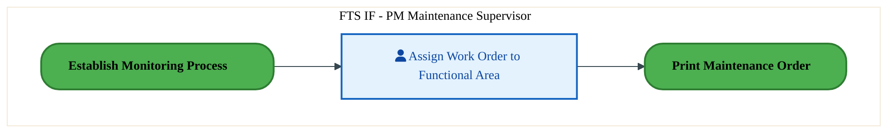
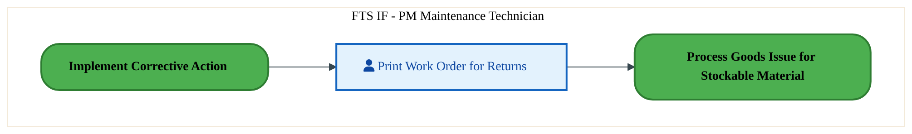
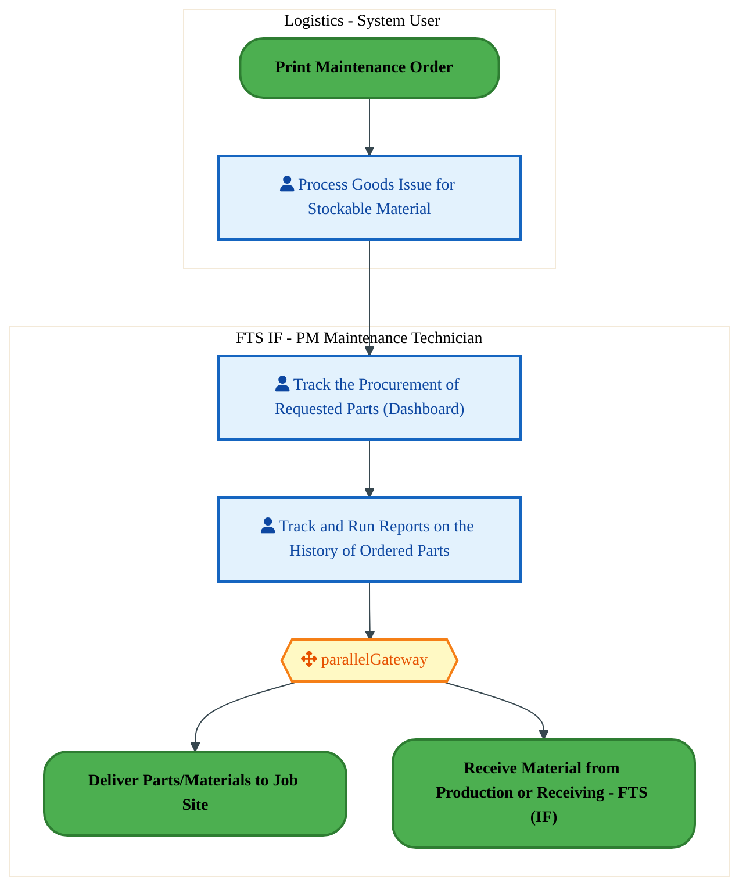
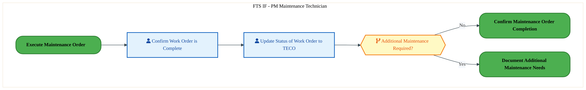
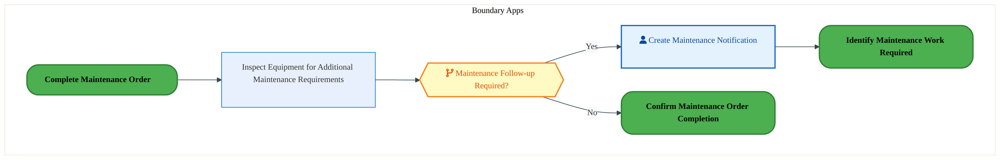
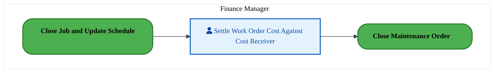
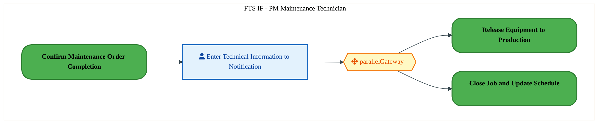

  
  <h1 style="font-size:36px; margin-top:24px;">PE-090 — Execute Plant Maintenance (IF)</h1>
  <h2 style="font-size:24px;">Architecture Document (TOGAF BDAT)</h2>
  
Forecast to Stock (IF) (FTS-IF) Tower 
  Capability PE-090 · PE Manage Plant, Equipment and Facilities (IF)

  
IAO Program · Release 3 
  Generated: March 2026 
  Sajiv Francis

  
IAO Architecture Pipeline — Intel Confidential

Page 1<a href="#toc">↑ Back to TOC</a>PE-090 — Execute Plant Maintenance (IF)

## Table of Contents

1. [Executive Summary](#1-executive-summary)
2. [Business Context & Objectives](#2-business-context--objectives)
   - 2.1 [Classification](#21-classification)
   - 2.2 [Business Drivers](#22-business-drivers)
   - 2.3 [Success Criteria](#23-success-criteria)
   - 2.4 [Companion Documents](#24-companion-documents)
3. [Business Architecture (TOGAF "B")](#3-business-architecture-togaf-b)
   - 3.1 [Business Process Overview](#31-business-process-overview)
   - 3.2 [Business Process Diagrams](#32-business-process-diagrams)
   - 3.3 [Business Roles & Responsibilities](#33-business-roles--responsibilities)
4. [Data Architecture (TOGAF "D")](#4-data-architecture-togaf-d)
   - 4.1 [Data Entities & Ownership](#41-data-entities--ownership)
   - 4.2 [Data Flow Diagrams](#42-data-flow-diagrams)
   - 4.3 [Data Lineage](#43-data-lineage)
   - 4.4 [RICEFW Data Objects](#44-ricefw-data-objects)
   - 4.5 [Data Governance & Quality](#45-data-governance--quality)
5. [Application Architecture (TOGAF "A")](#5-application-architecture-togaf-a)
   - 5.1 [Current-State Application Landscape](#51-current-state--current-state-application-landscape)
   - 5.2 [Future-State Application Landscape](#52-future-state--future-state-application-landscape)
   - 5.3 [Change Impact Summary](#53-change-impact-summary)
   - 5.4 [Component Overview](#54-component-overview)
   - 5.5 [RICEFW Inventory](#55-ricefw-inventory)
   - 5.6 [Integration Patterns](#56-integration-patterns)
6. [Technology Architecture (TOGAF "T")](#6-technology-architecture-togaf-t)
   - 6.1 [Platform & Infrastructure](#61-platform--infrastructure)
   - 6.2 [SAP Development Object Status](#62-sap-development-object-status)
   - 6.3 [NFRs & Design Principles](#63-nfrs--design-principles)
   - 6.4 [Security & Governance](#64-security--governance)
7. [Project Context](#7-project-context)
   - 7.1 [Project Roadmap & Go-Live Plan](#71-project-roadmap--go-live-plan)
   - 7.2 [RAID Log](#72-raid-log)
   - 7.3 [Recommendations & Next Steps](#73-recommendations--next-steps)

Page 2<a href="#toc">↑ Back to TOC</a>PE-090 — Execute Plant Maintenance (IF)

## 1. Executive Summary

This Architecture Document defines the **Business, Data, Application, and Technology** (BDAT) architecture for **PE-090 Execute Plant Maintenance (IF)** within the IAO program. It includes 12 BPMN process diagram(s) in Section 3.
| Dimension | Value |
|-----------|-------|
| **Tower** | Forecast to Stock (IF) (FTS-IF) |
| **Process Group** | PE Manage Plant, Equipment and Facilities (IF) |
| **Capability** | PE-090 - Execute Plant Maintenance (IF) |
| **Release** | Release 3 |
| **Total Systems** | 0 |
| **System Status** | 0 Deployed, 0 Developing, 0 EOL, 0 Pending IAPM |
| **RICEFW Objects** | 2 Reports, 12 Interfaces, 11 Conversions, 53 Enhancements, 1 Forms, 1 Workflows |
**Change Summary**: 0 new flow chains, 0 removed, 0 modified, 0 unchanged between Current-State and Future-State states.

> All system nodes in architecture diagrams are **IAPM-linked** — click any node to open its IAPM page. Diagrams require `securityLevel: 'loose'` for click events.

Page 3<a href="#toc">↑ Back to TOC</a>PE-090 — Execute Plant Maintenance (IF)

## 2. Business Context & Objectives

### 2.1 Classification

| Level | Value |
|-------|-------|
| **L0 Tower** | Forecast to Stock (IF) |
| **L1 Process** | PE Manage Plant, Equipment and Facilities (IF) |
| **L2 Capability** | PE-090 - Execute Plant Maintenance (IF) |

### 2.2 Business Drivers

| # | Driver | Description | Strategic Alignment | Priority |
|---|--------|-------------|---------------------|----------|
| 1 | Intel Foundry Supply Chain Integration | Integrate Intel Foundry manufacturing and logistics into unified S/4 HANA supply chain | IDM 2.0 Foundry Enablement | High |
| 2 | Warehouse & Logistics Modernization | Modernize warehouse management and shipping processes with EWM integration | Supply Chain Digital Transformation | High |
| 3 | Production Planning Optimization | Enable MRP-driven production planning with real-time material availability | Manufacturing Excellence | Medium |
| 4 | PE-090 Process Migration | Migrate Execute Plant Maintenance (IF) business processes and 0 integrated systems from legacy to S/4 HANA target architecture | IDM 2.0 Supply Chain (Intel Foundry) | High |

Page 4<a href="#toc">↑ Back to TOC</a>PE-090 — Execute Plant Maintenance (IF)

### 2.3 Success Criteria

| Metric | Target | Measure | Baseline | Owner |
|--------|--------|---------|----------|-------|
| Order Fulfillment Lead Time | < 48 hours | Time from production completion to shipment dispatch | 72 hours (legacy) | Logistics Manager |
| Inventory Accuracy | > 99.5% | Physical vs system inventory match rate | 97.8% (current) | Warehouse Manager |
| MRP Planning Cycle | < 4 hours | End-to-end MRP run including exception processing | 8 hours (legacy) | Planning Lead |
| PE-090 Migration Completeness | 100% flow chains validated | All 0 flow chains verified in target state | 0% (pre-migration) | Tower Architect |

### 2.4 Companion Documents

| Document | Description |
|----------|-------------|
| **Business Architecture** | Included in this document (Section 3) — process flows from BPMN diagrams |
| **This Document** | Full BDAT Architecture — Business + Data + Application + Technology |

Page 5<a href="#toc">↑ Back to TOC</a>PE-090 — Execute Plant Maintenance (IF)

## 3. Business Architecture (TOGAF "B")

### 3.1 Business Process Overview

This capability includes **12 business process(es)** modeled in BPMN 2.0, covering the end-to-end workflow for PE-090 Execute Plant Maintenance (IF).

| # | Step ID | Process Name | Lanes | Tasks | Gateways |
|---|---------|--------------|-------|-------|----------|
| 1 | PE-090-020_Establish_Monitoring_Process | PE-090-020_Establish_Monitoring_Process | FTS IF - PM Maintenance Technician | 2 | 0 |
| 2 | PE-090-030_Implement_Corrective_Action | PE-090-030_Implement_Corrective_Action | FTS IF - PM Maintenance Supervisor | 1 | 0 |
| 3 | PE-090-040_Print_Maintenance_Order | PE-090-040_Print_Maintenance_Order | FTS IF - PM Maintenance Technician | 1 | 0 |
| 4 | PE-090-050_Process_Goods_Issue_to_Stock_Material | PE-090-050_Process_Goods_Issue_to_Stock_Material | FTS IF - PM Maintenance Technician, Logistics - System User | 3 | 1 |
| 5 | PE-090-070_Execute_Maintenance_Order | PE-090-070_Execute_Maintenance_Order | FTS IF - PM Maintenance Technician | 2 | 0 |
| 6 | PE-090-080_Complete_Maintenance_Order | PE-090-080_Complete_Maintenance_Order | FTS IF - PM Maintenance Technician | 2 | 1 |
| 7 | PE-090-090_Document_Additional_Maintenance_Needs | PE-090-090_Document_Additional_Maintenance_Needs | Boundary Apps | 2 | 1 |
| 8 | PE-090-120_Settle_Maintenance_Order | PE-090-120_Settle_Maintenance_Order | Finance Manager | 1 | 0 |
| 9 | PE-090-130_Close_Maintenance_Order | PE-090-130_Close_Maintenance_Order | FTS IF - PM Maintenance Technician | 2 | 0 |
| 10 | PE-090-140_Record_Maintenance_History_and_Close_Notification | PE-090-140_Record_Maintenance_History_and_Close_Notification | FTS IF - PM Maintenance Technician | 1 | 1 |
| 11 | PE-090-150_Release_Equipment_to_Production | PE-090-150_Release_Equipment_to_Production | Boundary Apps | 1 | 0 |
| 12 | PE-090-160_Return_Unused_Parts_to_Stock | PE-090-160_Return_Unused_Parts_to_Stock | FTS IF - Maintenance Technician | 2 | 0 |

### 3.2 Business Process Diagrams

Page 6<a href="#toc">↑ Back to TOC</a>PE-090 — Execute Plant Maintenance (IF)

#### BUSINESS ARCHITECTURE — 3.2.1 PE-090-020_Establish_Monitoring_Process — PE-090-020_Establish_Monitoring_Process

**Swim Lanes**: FTS IF - PM Maintenance Technician | **Tasks**: 2 | **Gateways**: 0

> **Legend**: ● Start · ● End · User Task · Service Task · ◇ Gateway · Sub-Process

<a href="https://mermaid.live/view#pako:eNqlVNuO2jAQ_RUrK0QrBSlXQvNQCQJRVyraVaHdh9IH40zAwtiR7XAp4t9rc4d2n5qHKD6Zc87MZDI7h4gCnNRpNHaUU52iXVPPYQnNFDWnWEHTRUfgB5YUTxmopo0pBdcj-vsQ5kfVxoZZLMdLyrYWHcFMAPr-7KKuITIXKcxVS4GkZdNtVpIusdxmgglpo5-gU3rlwe30qidkAfIa4HmJT2JDZZTDFQ6TKIlyy1NABC_uRMu47JSkubfJMbEmcyz1If1awRBv3mih5-ZcYqbAxMz1kn3FU2C2Ri1ri5Fars7NoMr6cNOwUYUJ5TODR56BJOaLKxR7-z3aNxoTfjFF4_6EI3MRhpXqQ4mUNvBgpVFJGUufoqybx56rtBQLSJ-CQdIPA5fYSlJTuufa5rbWQGdznU4FK06hrbWtIQ2qjSs3aeC5cmvuD17Ai6tT1g46Qefi1Ev8zM_OTmVZ_peT6ascY7U4eQ3CPMj7Fy8_bseZ97feucx-lHT9xz6BXFECN6J5noeDa6sG7dj33hft5WHbyx5EZ1jDGm-vgp-y6CKYx0nuJ-8KHv0es6ynr1KQs2A4iPP4Ipj0_LwbvCsYdf2oc8rQ6MwkruYoH4_Qc45a6HWIhphyDRxzAmgMZM4poZgfCfbi_s-JU-K0xC3bf_QNVhTWaNR9RW9CLtCL_ZHQF6q0kNuJ8-uGGdwzh8KsACHRC58JM8u3dFPeTIJS9_zww0WgYqaht6kONkBqTQU3lI83nMhQnpcVMzuFa5QJKYFougLUJafoY7CZ2uMDD1Gr9dkkezoGx-NpUrh_PEY3n8SC51G8g4N_w-Hld7yDowvsuM4S5BLTwkl3zmEfmp1ZQIlrpp296-Bai9GWEyc97A2nrgozY32KzedcHsH9H0E3vUE=" title="View Full Diagram">&#128065; View Full Diagram</a>

```mermaid
%%{init: {'theme': 'base', 'themeVariables': {'fontSize': '14px', 'fontFamily': 'Segoe UI, Arial, sans-serif','primaryColor': '#e8f0fe', 'primaryBorderColor': '#0071c5','lineColor': '#37474F', 'secondaryColor': '#f5f8fc'}, 'flowchart': {'useMaxWidth': false, 'htmlLabels': true, 'curve': 'basis', 'nodeSpacing': 40, 'rankSpacing': 50}} }%%
flowchart TD
    classDef startEvt fill:#4CAF50,stroke:#2E7D32,color:#000,font-weight:bold,stroke-width:2px,rx:20,ry:20
    classDef endEvt fill:#C62828,stroke:#B71C1C,color:#fff,font-weight:bold,stroke-width:2px,rx:20,ry:20
    classDef userTask fill:#E3F2FD,stroke:#1565C0,stroke-width:2px,color:#0D47A1
    classDef serviceTask fill:#FFF3E0,stroke:#E65100,stroke-width:2px,color:#BF360C
    classDef gateway fill:#FFF9C4,stroke:#F57F17,stroke-width:2px,color:#E65100
    classDef subProc fill:#F3E5F5,stroke:#7B1FA2,stroke-width:2px,color:#4A148C
    subgraph FTS IF - PM Maintenance Technician
        n1["fa:fa-user Review SAP Work Order History"]
        n2["fa:fa-user Monitor Ongoing Work Order Progress"]
        n3(["fa:fa-play Maintenance Execution"])
        n4["Implement Corrective Action"]
    end
    n3 --> n2
    n2 --> n1
    n1 --> n4
    class n1 userTask
    class n2 userTask
    class n3 startEvt
    class n4 startEvt
```

#### BUSINESS ARCHITECTURE — 3.2.2 PE-090-030_Implement_Corrective_Action — PE-090-030_Implement_Corrective_Action

**Swim Lanes**: FTS IF - PM Maintenance Supervisor | **Tasks**: 1 | **Gateways**: 0

> **Legend**: ● Start · ● End · User Task · Service Task · ◇ Gateway · Sub-Process

<a href="https://mermaid.live/view#pako:eNqlVE2P2jAU_CtWViiXRMonoTlUghBLKxV1JbbdQ-nBJDZYOHZkOwsU8d9r8xEWqj01BxQP82bem9g-OJWosZM7g8GBcqpzcHD1GjfYzYG7RAq7HjgDP5GkaMmwci2HCK7n9M-JFibtztIsBlFD2d6ic7wSGPx49sDYFDIPKMSVr7CkxPXcVtIGyX0hmJCW_YRHJCAnt8tfEyFrLG-EIMjCKjWljHJ8g-MsyRJo6xSuBK_vRElKRqRyj7Y5JrbVGkl9ar9TeIZ2b7TWa7MmiClsOGvdsG9oiZmdUcvOYlUn369hUGV9uAls3qKK8pXBk8BAEvHNDUqD4xEcB4MF703B63TBgXkqhpSaYgKUNnD5rgGhjOVPSTGGaeApLcUG509RmU3jyKvsJLkZPfBsuP4W09Va50vB6gvV39oZ8qjdeXKXR4En9-b3wQvz-uZUDKNRNOqdJllYhMXViRDyX04mV_mK1ObiVcYwgtPeK0yHaRH8q3cdc5pk4_AxJyzfaYU_iEII4_IWVTlMw-Bz0QmMh0HxILpCGm_R_ib4pUh6QZhmMMw-FTz7PXbZLV-kqK6CcZnCtBfMJiEcR58KJuMwGV06NDorido1gK9z8AyBD15mYIYo15gjXmEw71obiBLyXGAfHv5aOATlBPk2fzBWiq44eBNyA77bQwS0ALDjlaaCI2bOI0YL5_cHgcgIvEjjcud1qr0nxoZYmq27ZFStwUyYG0OYuhWw02OlerbZcucXHgPf_2p6vCzD8zL6EKAFrxvnDo76U3IHxz3seE6DZYNo7eQH53RNmausxgR1TDtHz0GdFvM9r5z8dJydrq3Np59SZFJuzuDxL6g1nP4=" title="View Full Diagram">&#128065; View Full Diagram</a>

#### BUSINESS ARCHITECTURE — 3.2.3 PE-090-040_Print_Maintenance_Order — PE-090-040_Print_Maintenance_Order

**Swim Lanes**: FTS IF - PM Maintenance Technician | **Tasks**: 1 | **Gateways**: 0

> **Legend**: ● Start · ● End · User Task · Service Task · ◇ Gateway · Sub-Process

<a href="https://mermaid.live/view#pako:eNqlVE2P2jAU_CtWViiXIOWT0BwqQSAVUlddFdo9lB6M8wwWiY1sB5Yi_nttPsJCtafmAHh4M_PeKM8Hh4gSnMzpdA6MM52hg6tXUIObIXeBFbgeOgM_sWR4UYFybQ0VXE_Zn1NZEG_ebJnFClyzam_RKSwFoB8TDw0MsfKQwlx1FUhGXc_dSFZjuc9FJaStfoI-9enJ7fLXUMgS5K3A99OAJIZaMQ43OErjNC4sTwERvLwTpQntU-IebXOV2JEVlvrUfqPgGb-9slKvzJniSoGpWem6-ooXUNkZtWwsRhq5vYbBlPXhJrDpBhPGlwaPfQNJzNc3KPGPR3TsdOa8NUWz0Zwj85AKKzUCipQ28HirEWVVlT3F-aBIfE9pKdaQPYXjdBSFHrGTZGZ037PhdnfAliudLURVXkq7OztDFm7ePPmWhb4n9-bzwQt4eXPKe2E_7LdOwzTIg_zqRCn9LyeTq5xhtb54jaMiLEatV5D0ktz_V-865ihOB8FjTiC3jMA70aIoovEtqnEvCfyPRYdF1PPzB9El1rDD-5vgpzxuBYskLYL0Q8Gz32OXzeJFCnIVjMZJkbSC6TAoBuGHgvEgiPuXDo3OUuLNChWzKZoUqItentEzZlwDx5wAmgFZcUYY5meCfXjwa-5QnFHctfmjF2nq0auQa_TN7hCiQqLvoBvJ1dz5_Y4YGqLtG5RCX4QoFZoo1cCJMNWCrO3CG38NdoXvuZHhTupNZa4G45YLKYFotgU0MF-Ct8Xm5Tv_4BHqdj-bbi_H4HwM30VpwesrdAeH7b7cwVELO55Tg6wxK53s4JwuLHOplUBxU2nn6Dm40WK658TJTovtNJvSjDVi2ORdn8HjX-zFoGY=" title="View Full Diagram">&#128065; View Full Diagram</a>

Page 7<a href="#toc">↑ Back to TOC</a>PE-090 — Execute Plant Maintenance (IF)

#### BUSINESS ARCHITECTURE — 3.2.4 PE-090-050_Process_Goods_Issue_to_Stock_Material — PE-090-050_Process_Goods_Issue_to_Stock_Material

**Swim Lanes**: FTS IF - PM Maintenance Technician · Logistics - System User | **Tasks**: 3 | **Gateways**: 1

> **Legend**: ● Start · ● End · User Task · Service Task · ◇ Gateway · Sub-Process

<a href="https://mermaid.live/view#pako:eNqlVU2P4jgQ_SultFrMSkGTT8LmMBINZLZX09pWw-wehj0YxwYLYzO20zSL-O9rEwIdlj4tB6R6qXqv6jnl7D0sS-Ll3v39nglmcth3zJKsSSeHzhxp0vGhBv5EiqE5J7rjcqgUZsL-OaaFyebNpTmsQGvGdw6dkIUk8P3Rh4Et5D5oJHRXE8Vox-9sFFsjtRtKLpXLviN9GtCj2unRg1QlUZeEIMhCnNpSzgS5wHGWZEnh6jTBUpQtUprSPsWdg2uOyy1eImWO7VeaPKG3v1hpljamiGtic5Zmzb-hOeFuRqMqh-FKvTZmMO10hDVsskGYiYXFk8BCConVBUqDwwEO9_czcRaF6WgmwP4wR1qPCAVtLDx-NUAZ5_ldMhwUaeBro-SK5HfROBvFkY_dJLkdPfCdud0tYYulyeeSl6fU7tbNkEebN1-95VHgq539v9IiorwoDXtRP-qflR6ycBgOGyVK6f9Ssr6qKdKrk9Y4LqJidNYK0146DP7L14w5SrJBeO0TUa8Mk3ekRVHE44tV414aBh-TPhRxLxhekS6QIVu0uxD-OkzOhEWaFWH2IWGtd91lNX9WEjeE8Tgt0jNh9hAWg-hDwmQQJv1Th5ZnodBmCcV0Ao8FdOH5CZ4QE4YIJDCBKcFLwTBDoi5wPxH9mHkU5RR1nf8wVQivwC4tuJ4qZZdXGJAUXsjPimhDSni2L5-GTyOkl3OJVPnLzPv7HWF8ixCJEl4qYVk20lVLcdT4jWkj1c7x_-E2tmFvMyaWcUQ4e7V0x8efn-wZuItBg5Hwu5zDhBnSLkpt0QvBxFZBkw5UybUbrKywYbYHqaDOsctn_XLGfXosrgbK9vtmIqSU3Oou4gY2SCHOCf9avw4z73Coa-zCXJ3HN7mwczKsrcRkZz1cw3drzTuJsO2Zs55oDV-lLDU8al0RoLbXiZF45e7R80TtTnuW5lnZA28d-9HZc-K5PdGDbveL1T6FYR1GpzCrw6QdpqcwrsPsFEZ1GL97sx1hs9EtOLoNx7fh5HzZteD0Nty7DWfN0nq-tyZqjVjp5Xvv-Gmyn6-SUFRx4x18D1VGTnYCe_nxCveqTWkrRwzZk1zX4OFfhvo7Xg==" title="View Full Diagram">&#128065; View Full Diagram</a>

#### BUSINESS ARCHITECTURE — 3.2.5 PE-090-070_Execute_Maintenance_Order — PE-090-070_Execute_Maintenance_Order

**Swim Lanes**: FTS IF - PM Maintenance Technician | **Tasks**: 2 | **Gateways**: 0

> **Legend**: ● Start · ● End · User Task · Service Task · ◇ Gateway · Sub-Process

<a href="https://mermaid.live/view#pako:eNqlVE2P2jAQ_StWViiXoOZzQ3OoBIFIWxV1JdjuYenBOBNiEWxkO3wU8d9rBwgf1Z6aQ5R5fvPezMT2wSI8ByuxOp0DZVQl6GCrElZgJ8ieYwm2g07ALywonlcgbcMpOFMT-qeheeF6Z2gGy_CKVnuDTmDBAb29OKivEysHScxkV4Kghe3Ya0FXWOxTXnFh2E_QK9yicTsvDbjIQVwJrht7JNKpFWVwhYM4jMPM5EkgnOV3okVU9ApiH01xFd-SEgvVlF9LGOPdO81VqeMCVxI0p1Sr6geeQ2V6VKI2GKnF5jIMKo0P0wObrDGhbKHx0NWQwGx5hSL3eETHTmfGWlM0Hc4Y0g-psJRDKJBUGh5tFCpoVSVPYdrPIteRSvAlJE_-KB4GvkNMJ4lu3XXMcLtboItSJXNe5Wdqd2t6SPz1zhG7xHcdsdfvBy9g-dUpffZ7fq91GsRe6qUXp6Io_stJz1VMsVyevUZB5mfD1suLnqPU_Vfv0uYwjPve45xAbCiBG9Esy4LRdVSj58hzPxcdZMGzmz6ILrCCLd5fBb-mYSuYRXHmxZ8Knvweq6znr4KTi2AwirKoFYwHXtb3PxUM-17YO1eodRYCr0uUTSfoJUNd9DpGY0yZAoYZATQFUjJKKGanBPMw72NmFTgpcNfMH412QGoFTR5652I5s37fsP2Plk74Ar2tc3xLRhOFVS3RJfxpjiF6L4Gh73yOqEQpX60rUJBr3VvhQOte1u6KbiTuiwg1dwgV3WjtV30S5JexrsJcFBIp3jhNqII2SW_h0wcLUbf7Tfd8Dr1T6J9D_xQGN__HcC778g72bzfX3UrQHs87OGxhy7FWIFaY5lZysJr7Ud-hORS4rpR1dCxcKz7ZM2IlzT1i1c2UhxTr37s6gce_rqfCFg==" title="View Full Diagram">&#128065; View Full Diagram</a>

```mermaid
%%{init: {'theme': 'base', 'themeVariables': {'fontSize': '14px', 'fontFamily': 'Segoe UI, Arial, sans-serif','primaryColor': '#e8f0fe', 'primaryBorderColor': '#0071c5','lineColor': '#37474F', 'secondaryColor': '#f5f8fc'}, 'flowchart': {'useMaxWidth': false, 'htmlLabels': true, 'curve': 'basis', 'nodeSpacing': 40, 'rankSpacing': 50}} }%%
flowchart TD
    classDef startEvt fill:#4CAF50,stroke:#2E7D32,color:#000,font-weight:bold,stroke-width:2px,rx:20,ry:20
    classDef endEvt fill:#C62828,stroke:#B71C1C,color:#fff,font-weight:bold,stroke-width:2px,rx:20,ry:20
    classDef userTask fill:#E3F2FD,stroke:#1565C0,stroke-width:2px,color:#0D47A1
    classDef serviceTask fill:#FFF3E0,stroke:#E65100,stroke-width:2px,color:#BF360C
    classDef gateway fill:#FFF9C4,stroke:#F57F17,stroke-width:2px,color:#E65100
    classDef subProc fill:#F3E5F5,stroke:#7B1FA2,stroke-width:2px,color:#4A148C
    subgraph FTS IF - PM Maintenance Technician
        n1["fa:fa-user Execute Main Work"]
        n2[["fa:fa-cog Update Main Work Status in Work Order When Job is Completed"]]
        n3["Complete Maintenance Order"]
        n4["Deliver Parts/Materials to Job Site"]
    end
    n4 --> n1
    n1 --> n2
    n2 --> n3
    class n1 userTask
    class n2 serviceTask
    class n3 startEvt
    class n4 startEvt
```

#### BUSINESS ARCHITECTURE — 3.2.6 PE-090-080_Complete_Maintenance_Order — PE-090-080_Complete_Maintenance_Order

**Swim Lanes**: FTS IF - PM Maintenance Technician | **Tasks**: 2 | **Gateways**: 1

> **Legend**: ● Start · ● End · User Task · Service Task · ◇ Gateway · Sub-Process

<a href="https://mermaid.live/view#pako:eNqlVU2P2jAQ_StWVisuQconoTm0YgORKnXbVWFbVaUH44zB2sSmtrNAWf57bcJX6O6pOaDMy7z3ZkYes3WIKMBJndvbLeNMp2jb0QuooJOizgwr6LioAb5hyfCsBNWxOVRwPWZ_9ml-tFzbNIvluGLlxqJjmAtAjx9dNDDE0kUKc9VVIBntuJ2lZBWWm0yUQtrsG-hTj-7dDp_uhCxAnhM8L_FJbKgl43CGwyRKotzyFBDBi5YojWmfks7OFleKFVlgqffl1wru8fo7K_TCxBSXCkzOQlflJzyD0vaoZW0xUsvn4zCYsj7cDGy8xITxucEjz0AS86czFHu7Hdrd3k75yRRNhlOOzENKrNQQKFLawKNnjSgry_QmygZ57LlKS_EE6U0wSoZh4BLbSWpa91w73O4K2Hyh05koi0Nqd2V7SIPl2pXrNPBcuTG_V17Ai7NT1gv6Qf_kdJf4mZ8dnSil_-Vk5ionWD0dvEZhHuTDk5cf9-LM-1fv2OYwSgb-9ZxAPjMCF6J5noej86hGvdj33ha9y8Oel12JzrGGFd6cBd9l0Ukwj5PcT94UbPyuq6xnD1KQo2A4ivP4JJjc-fkgeFMwGvhR_1Ch0ZlLvFygfDJGH3PURQ_36B4zroFjTgBNgCw4IwzzhmAf7v-cOhSnFHft_FEmOGWyQt-FfEJf7BYhpgxaLUvQMHV-XVCDNvVxWZjRoLHGulZI0EsNLdBklH1p80PDHwpSV8A1GhQF00xwXLZq_gxQqDYtMrRjmZepjdOhVKPUZsWGNVoDqU2J_7Daqb3t9tiYveC6M7OiZPFWhV_hd80kFB-mzm7XqJidaV54jLrd92bIh7Bnw5ep81lMnRfTyRX8A9QeDw-437CDQxg0Ye_i_Nic49604OB1ODzdHS04eh2OX4d7xx1wXKcCWWFWOOnW2d_05t-gAIrrUjs718G1FuMNJ066vxGden9Ehgybg1o14O4v3fACmQ==" title="View Full Diagram">&#128065; View Full Diagram</a>

Page 8<a href="#toc">↑ Back to TOC</a>PE-090 — Execute Plant Maintenance (IF)

#### BUSINESS ARCHITECTURE — 3.2.7 PE-090-090_Document_Additional_Maintenance_Needs — PE-090-090_Document_Additional_Maintenance_Needs

**Swim Lanes**: Boundary Apps | **Tasks**: 2 | **Gateways**: 1

> **Legend**: ● Start · ● End · User Task · Service Task · ◇ Gateway · Sub-Process

<a href="https://mermaid.live/view#pako:eNqlVF1vmzAU_SsWVZUXIgGBkPGwKSFBqrR209KtmpY9OHCdWDU2s02TLM1_n02-Sto-jQeED-eec-_Vvd46uSjASZzr6y3lVCdo29FLKKGToM4cK-i4aA_8wJLiOQPVsRwiuJ7Svw3ND6u1pVkswyVlG4tOYSEAfb9x0dAEMhcpzFVXgaSk43YqSUssN6lgQlr2FQyIRxq3w6-RkAXIM8HzYj-PTCijHM5wLw7jMLNxCnLBi5YoiciA5J2dTY6JVb7EUjfp1wpu8fqBFnppzgQzBYaz1CX7jOfAbI1a1hbLa_l0bAZV1oebhk0rnFO-MHjoGUhi_niGIm-3Q7vr6xk_maL78Ywj8-QMKzUGgpQ28ORJI0IZS67CdJhFnqu0FI-QXAWTeNwL3NxWkpjSPdc2t7sCuljqZC5YcaB2V7aGJKjWrlwngefKjXlfeAEvzk5pPxgEg5PTKPZTPz06EUL-y8n0Vd5j9XjwmvSyIBufvPyoH6Xea71jmeMwHvqXfQL5RHN4IZplWW9ybtWkH_ne-6KjrNf30gvRBdawwpuz4Ic0PAlmUZz58buCe7_LLOv5Vynyo2BvEmXRSTAe-dkweFcwHPrh4JCh0VlIXC3RSNTNLKNhVan9P_tw_9fMITghuGtbjVIJphR0iynXwDHPAd0JTQnNsaaCz5zfL2IDE3vDVQW5RpM_Na1K4GYqhETDoqCWj1lL6hsYlgRLU22pnpFKBSdUlq2IL3ZnUSrKisHrBEKbQGHUKNm0wh6EfDy6Fe2YqHFq9OC1VZvb326P3bG3Wndu9jJftqIywcxOduvqZPdp5ux2exGzJ_sPHqFu96Pp2OEY7I_9w7Fvj88z507MnGfTjAPs71nhBesnqIb2crIt-bgrLbh3uhhacPg2HL0N948D7rhOCbLEtHCSrdNc4-aqL4Dgmmln5zq41mK64bmTNNedU1eFiRxTbKaw3IO7fz02-lA=" title="View Full Diagram">&#128065; View Full Diagram</a>

#### BUSINESS ARCHITECTURE — 3.2.8 PE-090-120_Settle_Maintenance_Order — PE-090-120_Settle_Maintenance_Order

**Swim Lanes**: Finance Manager | **Tasks**: 1 | **Gateways**: 0

> **Legend**: ● Start · ● End · User Task · Service Task · ◇ Gateway · Sub-Process

<a href="https://mermaid.live/view#pako:eNqlVE2P2jAU_CtWViiXIOWT0BwqQSBSq1atym730O3BOM9gYWxkO7AU8d9rBwgL1Z6aQxKPxzPvjWwfPCJr8Aqv1zswwUyBDr5Zwhr8AvlzrMEP0An4iRXDcw7adxwqhZmxPy0tSjevjuawCq8Z3zt0BgsJ6OlTgEZ2IQ-QxkL3NShG_cDfKLbGal9KLpVjP8CQhrR1O0-NpapBXQlhmEcks0s5E3CFkzzN08qt00CkqG9EaUaHlPhHVxyXO7LEyrTlNxq-4tdnVpulHVPMNVjO0qz5FzwH7no0qnEYadT2EgbTzkfYwGYbTJhYWDwNLaSwWF2hLDwe0bHXexGdKXqcvAhkH8Kx1hOgSBsLT7cGUcZ58ZCWoyoLA22UXEHxEE_zSRIHxHVS2NbDwIXb3wFbLE0xl7w-U_s710MRb14D9VrEYaD29n3nBaK-OpWDeBgPO6dxHpVReXGilP6Xk81VPWK9OntNkyquJp1XlA2yMvxX79LmJM1H0X1OoLaMwBvRqqqS6TWq6SCLwvdFx1UyCMs70QU2sMP7q-CHMu0EqyyvovxdwZPffZXN_LuS5CKYTLMq6wTzcVSN4ncF01GUDs8VWp2FwpslqpjAggD6igVegDrNukdEv148iguK-y5sNANjOKBnqVbomzsxqJTaoNECM2G_7eAHEGBbq-L9fiMUW6GSS-1MmDBwMmw1bolJR_ws5wiLGj1tapsgmpEl1A2Hjm432ulHJKjf_2iLPQ-j0zB-E5sDL9vlBo67s3EDJx3sBd4a1Bqz2isOXns52QusBoobbrxj4OHGyNleEK9oD7HXtOVOGLbZrk_g8S9r25lG" title="View Full Diagram">&#128065; View Full Diagram</a>

#### BUSINESS ARCHITECTURE — 3.2.9 PE-090-130_Close_Maintenance_Order — PE-090-130_Close_Maintenance_Order

**Swim Lanes**: FTS IF - PM Maintenance Technician | **Tasks**: 2 | **Gateways**: 0

> **Legend**: ● Start · ● End · User Task · Service Task · ◇ Gateway · Sub-Process

<a href="https://mermaid.live/view#pako:eNqllF1v2jAUhv_KUaqKTQpSPhuWi0kQiDRp1arRbRfrLoxzDBbGZrbTllX899l8BOjUq-Uiwm_Oed5zDrZfAqoaDMrg-vqFS25LeOnZBa6wV0JvRgz2QtgL34nmZCbQ9HwMU9JO-Z9dWJytn32Y12qy4mLj1SnOFcK3TyEMXaIIwRBp-gY1Z72wt9Z8RfSmUkJpH32FAxaxndvh00jpBvUpIIqKmOYuVXCJJzktsiKrfZ5BqmRzAWU5GzDa2_rihHqiC6LtrvzW4C15_sEbu3BrRoRBF7OwK_GZzFD4Hq1uvUZb_XgcBjfeR7qBTdeEcjl3ehY5SRO5PEl5tN3C9vr6QXamcD9-kOAeKogxY2RgrJMnjxYYF6K8yqphnUehsVotsbxKJsU4TULqOyld61Hoh9t_Qj5f2HKmRHMI7T_5Hspk_Rzq5zKJQr1x71deKJuTU3WTDJJB5zQq4iqujk6Msf9ycnPV98QsD16TtE7qcecV5zd5Ff3LO7Y5zoph_HpOqB85xTNoXdfp5DSqyU0eR29DR3V6E1WvoHNi8YlsTsAPVdYB67yo4-JN4N7vdZXt7E4regSmk7zOO2Axiuth8iYwG8bZ4FCh48w1WS-gvp_Cpxr6cHcLt4RLi5JIinCPdCE55UTuE_wj458PASMlI30_f6gWSJcwJpbAV_zdcu1Or7QGFIMfSi_hiz9YwJSGIXXbm9ANENlApVZrgc4IjXkIfp3xk5-dAVVzGLWG-yCohDII7nY453rUt3XjJgxTS2xrwCqoPk_HjnkOTd91UGPVurNvLvrdM3dGjQO8PwNkLn-K1gr8N6Or3239_Q-ZQb__0c3qsIz3y-SwTPbL9Ox_9THH_XwhJ-eb8uJLejhqF2LWnfUgDFaoV4Q3QfkS7G5Vd_M2yEgrbLANA9JaNd1IGpS72ydod3Mcc-I2xWovbv8CZ17VRg==" title="View Full Diagram">&#128065; View Full Diagram</a>

```mermaid
%%{init: {'theme': 'base', 'themeVariables': {'fontSize': '14px', 'fontFamily': 'Segoe UI, Arial, sans-serif','primaryColor': '#e8f0fe', 'primaryBorderColor': '#0071c5','lineColor': '#37474F', 'secondaryColor': '#f5f8fc'}, 'flowchart': {'useMaxWidth': false, 'htmlLabels': true, 'curve': 'basis', 'nodeSpacing': 40, 'rankSpacing': 50}} }%%
flowchart TD
    classDef startEvt fill:#4CAF50,stroke:#2E7D32,color:#000,font-weight:bold,stroke-width:2px,rx:20,ry:20
    classDef endEvt fill:#C62828,stroke:#B71C1C,color:#fff,font-weight:bold,stroke-width:2px,rx:20,ry:20
    classDef userTask fill:#E3F2FD,stroke:#1565C0,stroke-width:2px,color:#0D47A1
    classDef serviceTask fill:#FFF3E0,stroke:#E65100,stroke-width:2px,color:#BF360C
    classDef gateway fill:#FFF9C4,stroke:#F57F17,stroke-width:2px,color:#E65100
    classDef subProc fill:#F3E5F5,stroke:#7B1FA2,stroke-width:2px,color:#4A148C
    subgraph FTS IF - PM Maintenance Technician
        n1["fa:fa-user Check Data Requirements of Work Order for Accuracy and Completeness"]
        n2[["fa:fa-cog Business Close the Work Order and Update Status to CLSD"]]
        n3(["fa:fa-stop Completed Maintenance Order Closed"])
        n4["Settle Maintenance Order"]
    end
    n4 --> n1
    n1 --> n2
    n2 --> n3
    class n1 userTask
    class n2 serviceTask
    class n3 endEvt
    class n4 startEvt
```

#### BUSINESS ARCHITECTURE — 3.2.10 PE-090-140_Record_Maintenance_History_and_Close_Notification — PE-090-140_Record_Maintenance_History_and_Close_Notification

**Swim Lanes**: FTS IF - PM Maintenance Technician | **Tasks**: 1 | **Gateways**: 1

> **Legend**: ● Start · ● End · User Task · Service Task · ◇ Gateway · Sub-Process

<a href="https://mermaid.live/view#pako:eNqlVF1v2jAU_StWKsRLkPLZsDxMgkCmTutWDbo9jD0Y5xqsOnbmOAWG-O-zCR-Ftk_LA-KenHuO74ntrUNkAU7qdDpbJphO0barl1BCN0XdOa6h66IW-IEVw3MOdddyqBR6wv7uaX5UrS3NYjkuGd9YdAILCejxzkUD08hdVGNR92pQjHbdbqVYidUmk1wqy76BPvXo3u3waihVAepM8LzEJ7Fp5UzAGQ6TKIly21cDkaK4EKUx7VPS3dnFcbkiS6z0fvlNDfd4_ZMVemlqinkNhrPUJf-C58DtjFo1FiONej6GwWrrI0xgkwoTJhYGjzwDKSyezlDs7XZo1-nMxMkUTUczgcxDOK7rEVBUawOPnzWijPP0JsoGeey5tVbyCdKbYJyMwsAldpLUjO65NtzeCthiqdO55MWB2lvZGdKgWrtqnQaeqzbm98oLRHF2ym6DftA_OQ0TP_OzoxOl9L-cTK5qiuung9c4zIN8dPLy49s4817rHcccRcnAv84J1DMj8EI0z_NwfI5qfBv73vuiwzy89bIr0QXWsMKbs-CHLDoJ5nGS-8m7gq3f9Sqb-YOS5CgYjuM8PgkmQz8fBO8KRgM_6h9WaHQWCldLlE8n6C5HPfRwj-4xExoEFgTQFMhSMMKwaBvsI_xfM4filOKezR-NDVsdmZijO0GlKrFmUiAt0VepGTUvbD1zfr_QCYzOd-Bgjj0a_2lYVYLQtsXMVjTkdUNoGjIuDf2znCMsCvRYFSZbNCFLKBoOl_TI0qWgTJUXQ32zJx1lsqw4vDaJt9vjeFgpuap7mGtUYYU5B_6p_ZQzZ7dre8xmb_-ICPV6H006h9Jvy_hQxm0ZXJbhiw9rW44b-gIOTqf3Ag7fhqO34fi4Cx3XKcF8H1Y46dbZ37XmPi6A4oZrZ-c6uNFyshHESfd3ktPsMx4xbLZK2YK7f5qE26I=" title="View Full Diagram">&#128065; View Full Diagram</a>

Page 9<a href="#toc">↑ Back to TOC</a>PE-090 — Execute Plant Maintenance (IF)

#### BUSINESS ARCHITECTURE — 3.2.11 PE-090-150_Release_Equipment_to_Production — PE-090-150_Release_Equipment_to_Production

**Swim Lanes**: Boundary Apps | **Tasks**: 1 | **Gateways**: 0

> **Legend**: ● Start · ● End · User Task · Service Task · ◇ Gateway · Sub-Process

<a href="https://mermaid.live/view#pako:eNqlVE2P2jAU_CtWViiXIOWT0BwqQUjUSt1qVXbbQ-nBODZYOHZqOwsU8d9rBwgL1Z6aQxRP5s28N7FzcJCosJM5g8GBcqozcHD1GtfYzYC7hAq7HjgB36GkcMmwci2HCK7n9E9HC-JmZ2kWK2FN2d6ic7wSGLx89sDEFDIPKMjVUGFJieu5jaQ1lPtcMCEt-wGPiU86t_OrqZAVlleC76cBSkwpoxxf4SiN07i0dQojwasbUZKQMUHu0TbHxBatodRd-63Cj3D3g1Z6bdYEMoUNZ61r9gUuMbMzatlaDLXy9RIGVdaHm8DmDUSUrwwe-waSkG-uUOIfj-A4GCx4bwqeZwsOzIUYVGqGCVDawMWrBoQylj3E-aRMfE9pKTY4ewiLdBaFHrKTZGZ037PhDreYrtY6WwpWnanDrZ0hC5udJ3dZ6Htyb-53XphXV6d8FI7Dce80TYM8yC9OhJD_cjK5ymeoNmevIirDctZ7Bckoyf1_9S5jzuJ0EtznhOUrRfiNaFmWUXGNqhglgf--6LSMRn5-J7qCGm_h_ir4IY97wTJJyyB9V_Dkd99lu3ySAl0EoyIpk14wnQblJHxXMJ4E8fjcodFZSdiswVS03V4Gk6ZRp3f24sHPhUNgRuDQRg2-Yd1KDorfLW1qzDXQAsxPiS2cX2_qQlN3Jr9wU1qBJ7P_VMfXAm1u2VHHRuYEgkdIucYccoTBJ6q0MD1BXoGcCYXBV6EpoQhqKngvYbbb6YFHYDj8aJo-L4PTMnwTngUvm-YGDvsTcgNHPex4To1lDWnlZAen-0WZ31iFCWyZdo6eA1st5nuOnKw7yk7bVOazzyg0Cdcn8PgXVyuc3Q==" title="View Full Diagram">&#128065; View Full Diagram</a>

#### BUSINESS ARCHITECTURE — 3.2.12 PE-090-160_Return_Unused_Parts_to_Stock — PE-090-160_Return_Unused_Parts_to_Stock

**Swim Lanes**: FTS IF - Maintenance Technician | **Tasks**: 2 | **Gateways**: 0

> **Legend**: ● Start · ● End · User Task · Service Task · ◇ Gateway · Sub-Process

<a href="https://mermaid.live/view#pako:eNqlVE2PmzAQ_SsWq4hWAonPkHKolJAgrdSVqk22PTQ9ODAEa41NbbNJGuW_18530u6pHBDzePPezDB4axW8BCu1er0tYUSlaGurGhqwU2QvsATbQQfgGxYELyhI23AqztSU_N7T_KhdG5rBctwQujHoFJYc0Mujg4Y6kTpIYiZdCYJUtmO3gjRYbDJOuTDsBxhUXrV3O74acVGCuBA8L_GLWKdSwuACh0mURLnJk1BwVt6IVnE1qAp7Z4qjfFXUWKh9-Z2EJ7z-TkpV67jCVILm1KqhX_ACqOlRic5gRSfeTsMg0vgwPbBpiwvClhqPPA0JzF4vUOztdmjX683Z2RTNxnOG9FVQLOUYKiSVhidvClWE0vQhyoZ57DlSCf4K6UMwScZh4BSmk1S37jlmuO4KyLJW6YLT8kh1V6aHNGjXjlingeeIjb7feQErL05ZPxgEg7PTKPEzPzs5VVX1X056rmKG5evRaxLmQT4-e_lxP868v_VObY6jZOjfzwnEGyngSjTP83ByGdWkH_ve-6KjPOx72Z3oEitY4c1F8FMWnQXzOMn95F3Bg999ld3iq-DFSTCcxHl8FkxGfj4M3hWMhn40OFaodZYCtzXKZ1P0mCMXPWHCFDDMCkAzKGpGCoLZgW0u5v-YWxVOK-ya4aNnUJ1g6IXpqERf9ZJJpLh-kNJVteDdsp5bP6_yg9v8DLdaALQOlpyhTC-7vE0IP5wzpOLtyTHjTUtBgSZ_vGJHmvwMVKsBmvzqSNsAU_uKBC-7QhHOzvJ6Tw8PLEKu-1nXdgz9Qxgew-AQXq-K4ZyW7wYO_g2Hx5_iBozOf6XlWA2IBpPSSrfW_vzTZ2QJFe6osnaOhTvFpxtWWOn-nLC6ttQ7NSZYf77mAO7-AKQxt78=" title="View Full Diagram">&#128065; View Full Diagram</a>

Page 10<a href="#toc">↑ Back to TOC</a>PE-090 — Execute Plant Maintenance (IF)

### 3.3 Business Roles & Responsibilities

| Role / Lane | Processes Involved | Description |
|------------|-------------------|-------------|
| FTS IF - PM Maintenance Technician | PE-090-020_Establish_Monitoring_Process, PE-090-040_Print_Maintenance_Order, PE-090-050_Process_Goods_Issue_to_Stock_Material, PE-090-070_Execute_Maintenance_Order, PE-090-080_Complete_Maintenance_Order, PE-090-130_Close_Maintenance_Order, PE-090-140_Record_Maintenance_History_and_Close_Notification,  | |
| FTS IF - PM Maintenance Supervisor | PE-090-030_Implement_Corrective_Action,  | |
| Logistics - System User | PE-090-050_Process_Goods_Issue_to_Stock_Material,  | |
| Boundary Apps | PE-090-090_Document_Additional_Maintenance_Needs, PE-090-150_Release_Equipment_to_Production,  | |
| Finance Manager | PE-090-120_Settle_Maintenance_Order,  | |
| FTS IF - Maintenance Technician | PE-090-160_Return_Unused_Parts_to_Stock | |

Page 11<a href="#toc">↑ Back to TOC</a>PE-090 — Execute Plant Maintenance (IF)

## 4. Data Architecture (TOGAF "D")

### 4.1 Data Entities & Ownership

The following data entities are derived from the system integration flows for PE-090. Tower architects should validate ownership and classification.

| # | Data Entity | Source System | Target System | Data Owner | Classification | Volume | Master/Transaction |
|---|-------------|---------------|---------------|------------|----------------|--------|-------------------|

Page 12<a href="#toc">↑ Back to TOC</a>PE-090 — Execute Plant Maintenance (IF)

### 4.2 Data Flow Diagrams

> **DATA ARCHITECTURE** — Database-to-database data flows. Applications (blue) sit above their hosting databases (green cylinders). Thick arrows show data movement between databases.

### 4.3 Data Lineage

Data lineage traces the origin and transformation path of key data objects across integrated systems.

| # | Source System | Source Schema/Object | Target System | Target Schema/Object | Transformation |
|---|-------------|---------------------|---------------|---------------------|---------------|

> *Lineage detail will be refined when tower architects validate source/target schema object mappings.*

### 4.4 RICEFW Data Objects

Data-centric RICEFW objects (Reports and Conversions) from the Object Tracker:

| Object ID | Type | Description | Status | Source | Target | Complexity |
|-----------|------|-------------|--------|--------|--------|-----------|
| FTSR1364 | Report | Factory Portal - Warranty Claim (Warranty Dashboard​​) | 10. Object Complete |  |  | 02.High |
| FTSR1011 | Report | Report- Custom Fiori report to show full parts tracking status dashboard (wor... | 10. Object Complete |  |  | 02.High |
| FTSM0986 | Conversion | Convert Equipment Warranty information to SAP S/4 Equipment Master – reusable... | 10. Object Complete |  |  | 02.High |
| FTSM019 | Conversion | Conversion of Inflight Work Orders | 10. Object Complete |  |  | N/A |
| FTSM018 | Conversion | Conversion of General Task List | 10. Object Complete |  |  | N/A |
| FTSM017_IF | Conversion | Manual Conversion of Functional Locations (FLOC) | 10. Object Complete |  |  | 03.Medium |
| FTSM016 | Conversion | Equipment Master | 10. Object Complete | MES, SAP ME, EMS, EDFIT, Workstream, NIT, ECM | S4 | N/A |
| FTSM011 | Conversion | Catalogs | 10. Object Complete |  | S4 | N/A |
| FTSM010 | Conversion | Maintenance Plans | 10. Object Complete | ME | S4 | N/A |
| FTSM009 | Conversion | Maintenance Items | 10. Object Complete | NA | S4 | N/A |
| FTSM008 | Conversion | Equipment Class | 10. Object Complete | NA | S4 | N/A |
| FTSM007 | Conversion | Characteristics | 10. Object Complete | NA | S4 | N/A |
| FTSM002_IF | Conversion | Work Center | 10. Object Complete | Fuzion, ME, Manual | S4 | N/A |

### 4.5 Data Governance & Quality

| Concern | Approach |
|---------|----------|
| Data Ownership | Per-entity owners listed in Section 3.1 |
| Data Classification | Financial data classified as Intel Confidential |
| Data Retention | Per Intel corporate retention policies |
| Data Quality | Validated at source; reconciliation at target |

Page 13<a href="#toc">↑ Back to TOC</a>PE-090 — Execute Plant Maintenance (IF)

## 5. Application Architecture (TOGAF "A")

### 5.1 Current-State — Current-State Application Landscape

#### Overview

The Current-State architecture represents the **current / legacy** landscape for PE-090.

#### Current-State Flow Narrative

*(No current-state flows defined.)*

### 5.2 Future-State — Future-State Application Landscape

#### Overview

The Future-State architecture represents the **target** landscape for PE-090.

#### Future-State Flow Narrative

*(No future-state flows defined.)*

### 5.3 Change Impact Summary

| Change Type | Flow Chain | Detail |
|-------------|-----------|--------|

**Totals**: 0 new - 0 removed - 0 modified - 0 unchanged

### 5.4 Component Overview

#### System Inventory

| System | IAPM ID | Status |
|--------|---------|--------|

Page 14<a href="#toc">↑ Back to TOC</a>PE-090 — Execute Plant Maintenance (IF)

### 5.5 RICEFW Inventory

| Object ID | Type | Description | Status | Source → Target | Middleware | Complexity |
|-----------|------|-------------|--------|----------------|-----------|-----------|
| FTSW1372 | Workflow | Factory Portal - Equipment to Parts Management (Custom Fields – Part Check ou... | 03. FS Not Started |  | NA | 03.Medium |
| FTSR1364 | Report | Factory Portal - Warranty Claim (Warranty Dashboard​​) | 10. Object Complete |  | NA | 02.High |
| FTSR1011 | Report | Report- Custom Fiori report to show full parts tracking status dashboard (wor... | 10. Object Complete |  | NA | 02.High |
| FTSM0986 | Conversion | Convert Equipment Warranty information to SAP S/4 Equipment Master – reusable... | 10. Object Complete |  | NA | 02.High |
| FTSM019 | Conversion | Conversion of Inflight Work Orders | 10. Object Complete |  | NA | N/A |
| FTSM018 | Conversion | Conversion of General Task List | 10. Object Complete |  | NA | N/A |
| FTSM017_IF | Conversion | Manual Conversion of Functional Locations (FLOC) | 10. Object Complete |  | NA | 03.Medium |
| FTSM016 | Conversion | Equipment Master | 10. Object Complete | MES, SAP ME, EMS, EDFIT, Workstream, NIT, ECM → S4 | NA | N/A |
| FTSM011 | Conversion | Catalogs | 10. Object Complete |  → S4 | NA | N/A |
| FTSM010 | Conversion | Maintenance Plans | 10. Object Complete | ME → S4 | NA | N/A |
| FTSM009 | Conversion | Maintenance Items | 10. Object Complete | NA → S4 | NA | N/A |
| FTSM008 | Conversion | Equipment Class | 10. Object Complete | NA → S4 | NA | N/A |
| FTSM007 | Conversion | Characteristics | 10. Object Complete | NA → S4 | NA | N/A |
| FTSM002_IF | Conversion | Work Center | 10. Object Complete | Fuzion, ME, Manual → S4 | NA | N/A |
| FTSI1538 | Interface | CMMS – get location info from CMMS | 02. FS Unplanned |  | NA | 03.Medium |
| FTSI1537 | Interface | CMMS – Get Collateral Details | 02. FS Unplanned |  | NA | 03.Medium |
| FTSI1536 | Interface | CMMS – Collateral Conversion | 02. FS Unplanned |  | NA | 03.Medium |
| FTSI1527 | Interface | Interface to get Cu flag from XEUS | 10. Object Complete |  | MULESOFT | 03.Medium |
| FTSI1371 | Interface | CMMS – Equipment create and update (status and collateral name) | 04. FS In Progress |  → S/4 | MULESOFT | 03.Medium |
| FTSI1370 | Interface | Factory Portal - Equipment to Parts Management (Custom Fields – Part Check ou... | 04. FS In Progress |  → S/4 | MULESOFT | 03.Medium |
| FTSI1355 | Interface | CMMS – Equipment with MMS flag (S4 to CMMS) | 06. Dev Not Started |  → S/4 | MULESOFT | 03.Medium |
| FTSI1008 | Interface | Interface S/4 with EMS | 10. Object Complete | EMS → S/4 | MULESOFT | 03.Medium |
| FTSI1007 | Interface | Interface S/4 with XEUS | 10. Object Complete | XEUS/Mars → S/4 | APIGEE | 02.High |
| FTSI0985 | Interface | Claim Status Update from e2open to SAP S4 (Inbound Interface) | 10. Object Complete | E2Open → S/4 | MULESOFT | 03.Medium |
| FTSI0983 | Interface | SAP Warranty Claim Document to e2open (Outbound Interface) | 10. Object Complete | S/4 → E2Open | MULESOFT | 03.Medium |
| FTSI0924 | Interface | Interface: SAP ME to S/4 to Create & Maintain Notifications | 10. Object Complete | SAP ME → S/4 | NA | 03.Medium |
| FTSF1361 | Form | Factory Portal - Returns Order Flow (Form-Based (CRD) Return Order​) | 10. Object Complete |  | NA | 03.Medium |
| FTSE1579 | Enhancement | Custom tables to store Board Failure Form details | 10. Object Complete |  | NA | 03.Medium |
| FTSE1549 | Enhancement | Custom Attributes for AMT/ISM | 02. FS Unplanned |  | NA | 03.Medium |
| FTSE1548 | Enhancement | Automation for Product Conversions – Equipment Structure update | 02. FS Unplanned |  | NA | 03.Medium |
| FTSE1547 | Enhancement | Automation for Product Conversions – Work Order Closure | 02. FS Unplanned |  | NA | 03.Medium |
| FTSE1546 | Enhancement | Automation for Product Conversions – Parts Request and Return | 02. FS Unplanned |  | NA | 03.Medium |
| FTSE1545 | Enhancement | Automation for Product Conversions – Explode BOM | 02. FS Unplanned |  | NA | 03.Medium |
| FTSE1544 | Enhancement | Automation for Product Conversions – create Work Order | 02. FS Unplanned |  | NA | 03.Medium |
| FTSE1543 | Enhancement | PM inbound from AMT | 02. FS Unplanned |  | NA | 03.Medium |
| FTSE1542 | Enhancement | PM outbound to AMT | 02. FS Unplanned |  | NA | 03.Medium |
| FTSE1541 | Enhancement | Send SAP notification on Work Order update | 02. FS Unplanned |  | NA | 03.Medium |
| FTSE1540 | Enhancement | Send SAP notification on Equipment update | 02. FS Unplanned |  | NA | 03.Medium |
| FTSE1539 | Enhancement | Custom Fiori UI – Move Equipment SRoom to SRoom (screen) | 02. FS Unplanned |  | NA | 03.Medium |
| FTSE1528 | Enhancement | Warranty claim for non E2O supplier | 10. Object Complete |  | NA | 03.Medium |
| FTSE1451 | Enhancement | Enhancement required for triggering Interface between S4 and SAP ME from the ... | 10. Object Complete |  | NA | 03.Medium |
| FTSE1413 | Enhancement | Reusable Mass Upload Program for Equipment Master Warranty | 10. Object Complete |  | NA | 03.Medium |
| FTSE1385 | Enhancement | Factory Portal - Preventative Maintenance (AT) (Schedule Maintenance Plan) | 10. Object Complete |  | NA | 01.Very High |
| FTSE1383 | Enhancement | Factory Portal - Preventative Maintenance (AT) (Set Maintenance Counte) | 10. Object Complete |  | NA | 01.Very High |
| FTSE1382 | Enhancement | Factory Portal - Preventative Maintenance (AT) (Set Maintenance Cycle​) | 10. Object Complete |  | NA | 01.Very High |
| FTSE1381 | Enhancement | Factory Portal - Preventative Maintenance (AT) (Create Maintenance Plan) | 10. Object Complete |  | NA | 01.Very High |
| FTSE1379 | Enhancement | Factory Portal - Part list (Part list creation / modify (IA05​) | 10. Object Complete |  | NA | 01.Very High |
| FTSE1378 | Enhancement | Factory Portal - Functional Location​ (FLOC creation / Update (IL01 and IL02)​​) | 10. Object Complete |  | NA | 01.Very High |
| FTSE1376 | Enhancement | Factory Portal - Admin (Notifications​) | 10. Object Complete |  | NA | 01.Very High |
| FTSE1374 | Enhancement | Factory Portal - Admin (Admin Screen - My Profile) - Contacts custom Table En... | 10. Object Complete |  | NA | 01.Very High |
| FTSE1373 | Enhancement | Factory Portal - Admin (Admin Screen - My Profile) - Fiori Enhancement | 10. Object Complete |  | NA | 01.Very High |
| FTSE1369 | Enhancement | Factory Portal - Equipment to Parts Management (Custom Fields – Part Check ou... | 04. FS In Progress |  | NA | 01.Very High |
| FTSE1368 | Enhancement | Factory Portal - Equipment to Parts Management (Equipment Management (details... | 10. Object Complete |  | NA | 01.Very High |
| FTSE1367 | Enhancement | Factory Portal - Equipment to Parts Management (Equipment/ Entity/ Sub-Entity... | 10. Object Complete |  | NA | 01.Very High |
| FTSE1366 | Enhancement | Factory Portal - Operating Supply (Reserve Ops Suppl​​​) | 10. Object Complete |  | NA | 01.Very High |
| FTSE1365 | Enhancement | Factory Portal - Operating Supply (Search for Ops Supply​​​) | 10. Object Complete |  | NA | 01.Very High |
| FTSE1363 | Enhancement | Factory Portal - Warranty Claim (Create Warranty Claim – Detailed Vie​) | 10. Object Complete |  | NA | 01.Very High |
| FTSE1360 | Enhancement | Custom Fiori UI – HAZMAT Enhancement to pull data | 10. Object Complete |  | NA | 03.Medium |
| FTSE1359 | Enhancement | Factory Portal - Returns Order Flow (Prevent TECO until after parts have been... | 10. Object Complete |  | NA | 01.Very High |
| FTSE1358 | Enhancement | Factory Portal - Returns Order Flow (Form-Based (CRD) Return Order​) | 10. Object Complete |  | NA | 01.Very High |
| FTSE1354 | Enhancement | Factory Portal - Work Order Flow ( Confirm and Submit Parts (Table Extension ... | 10. Object Complete |  | NA | 01.Very High |
| FTSE1353 | Enhancement | Factory Portal - Work Order Flow ( Confirm and Submit Parts (Fiori Enhancemen... | 10. Object Complete |  | NA | 01.Very High |
| FTSE1351 | Enhancement | Factory Portal - Work Order Flow ( Add component to work order ) | 10. Object Complete |  | NA | 01.Very High |
| FTSE1350 | Enhancement | Factory Portal - Work Order Flow ( Search Parts ) | 10. Object Complete |  | NA | 01.Very High |
| FTSE1349 | Enhancement | Factory Portal - Work Order Flow ( Change Color of WO, Equipment, and CRD & e... | 10. Object Complete |  | NA | 01.Very High |
| FTSE1348 | Enhancement | Factory Portal - Work Order Flow ( Show Work Order – Single Work Order View +... | 10. Object Complete |  | NA | 01.Very High |
| FTSE1347 | Enhancement | Factory Portal - Work Order Flow ( Search work orders - ​List View ) | 10. Object Complete |  | NA | 01.Very High |
| FTSE1344 | Enhancement | Factory Portal - Work Order Flow ( Home Page - View S/4 work orders ) | 10. Object Complete |  | NA | 01.Very High |
| FTSE1010 | Enhancement | Update the Copper/Heavy Metal flag (User Status) for the tools on placement a... | 10. Object Complete |  | NA | 03.Medium |
| FTSE0996 | Enhancement | Create Purchase Requisition with multiple purchase req document types from Wo... | 10. Object Complete |  | NA | 03.Medium |
| FTSE0995 | Enhancement | Enhancement to update rejection reason and text in maintenance work order fro... | 10. Object Complete |  | NA | 03.Medium |
| FTSE0993 | Enhancement | Auto Roll Function to add Item/Part through Batch job in Master Warranty | 10. Object Complete |  | NA | 03.Medium |
| FTSE0992 | Enhancement | Custom Fields Enhancement in WTY Claim | 10. Object Complete |  | NA | 03.Medium |
| FTSE0991 | Enhancement | Claim Generation from Maintenance Work Order per Item | 10. Object Complete |  | NA | 03.Medium |
| FTSE0990 | Enhancement | Create PR with Free of Charge from approved claim status – MMID & Non-MMID | 10. Object Complete |  | NA | 03.Medium |
| FTSE0989 | Enhancement | Warranty validation at Equipment level & Item/Part level in Work Order | 10. Object Complete |  | NA | 03.Medium |
| FTSE0988 | Enhancement | Convert Item/Part Warranty information upload to SAP S/4 Master Warranty | 10. Object Complete |  | NA | 02.High |
| FTSE0984 | Enhancement | SAP Warranty Claim Document to e2open (Outbound Interface) | 10. Object Complete |  | NA | 03.Medium |
| FTSE0982 | Enhancement | SAP PM enhancement to capture reason codes for returns (dropdown) | 10. Object Complete |  | NA | 02.High |
| FTSE0925 | Enhancement | Enhancement: Batch process to create Equipment from Material BOM after GR | 10. Object Complete |  | NA | 03.Medium |

**Summary**: 2 Reports, 12 Interfaces, 11 Conversions, 53 Enhancements, 1 Forms, 1 Workflows

Page 15<a href="#toc">↑ Back to TOC</a>PE-090 — Execute Plant Maintenance (IF)

### 5.6 Integration Patterns

Integration patterns identified from the system flow analysis for PE-090:

| # | Pattern | Flow Chain | Middleware | Protocol | Auth |
|---|---------|-----------|-----------|----------|------|

> *Integration pattern details will be refined when tower architects validate middleware assignments.*

Page 16<a href="#toc">↑ Back to TOC</a>PE-090 — Execute Plant Maintenance (IF)

## 6. Technology Architecture (TOGAF "T")

### 6.1 Platform & Infrastructure

> **TECHNOLOGY / PLATFORM ARCHITECTURE** — Platforms (green) host applications (blue). Thick arrows show platform-to-platform integration flows.

#### Platform Inventory

Platform landscape inferred from integrated systems for PE-090:

| # | Platform | Type | Systems Using | Environment |
|---|----------|------|--------------|-------------|
| 1 | SAP S/4HANA | On-Premise (HEC) | SAP S/4 modules | DEV, QAS, PRD |
| 2 | SAP BTP (Integration Suite) | Cloud / PaaS | CPI, API Management | DEV, QAS, PRD |
| 3 | MuleSoft Anypoint | Cloud / iPaaS | API-led integrations | DEV, QAS, PRD |

> *Platform assignments will be validated when tower architects populate technology platform columns.*

Page 17<a href="#toc">↑ Back to TOC</a>PE-090 — Execute Plant Maintenance (IF)

### 6.2 SAP Development Object Status

**Capability RICEFW Status** (80 objects)
*Data source: Smartsheet Object Tracker (cached 2026-03-27)*

| Status | Count | % |
|--------|------:|----:|
| 10. Object Complete | 61 | 76.2% |
| 02. FS Unplanned | 14 | 17.5% |
| 04. FS In Progress | 3 | 3.8% |
| 03. FS Not Started | 1 | 1.2% |
| 06. Dev Not Started | 1 | 1.2% |
| **Total** | **80** | **100%** |

**RICEFW by Type:**

| Type | Count |
|------|------:|
| Report (R) | 2 |
| Interface (I) | 12 |
| Conversion (C) | 11 |
| Enhancement (E) | 53 |
| Form (F) | 1 |
| Workflow (W) | 1 |
| **Total** | **80** |

**Technical Complexity:**

| Complexity | Count |
|------------|------:|
| 01.Very High | 25 |
| 02.High | 6 |
| 03.Medium | 40 |
| N/A | 9 |

**Active (Non-Complete) Objects:**

| Object ID | Type | Description | Status | Complexity |
|-----------|------|-------------|--------|------------|
| FTSW1372 | 06.Workflow | Factory Portal - Equipment to Parts Management (Custom Fields – Part Check out &... | 03. FS Not Started | 03.Medium |
| FTSI1538 | 02.Interface | CMMS – get location info from CMMS | 02. FS Unplanned | 03.Medium |
| FTSI1537 | 02.Interface | CMMS – Get Collateral Details | 02. FS Unplanned | 03.Medium |
| FTSI1536 | 02.Interface | CMMS – Collateral Conversion | 02. FS Unplanned | 03.Medium |
| FTSI1371 | 02.Interface | CMMS – Equipment create and update (status and collateral name) | 04. FS In Progress | 03.Medium |
| FTSI1370 | 02.Interface | Factory Portal - Equipment to Parts Management (Custom Fields – Part Check out &... | 04. FS In Progress | 03.Medium |
| FTSI1355 | 02.Interface | CMMS – Equipment with MMS flag (S4 to CMMS) | 06. Dev Not Started | 03.Medium |
| FTSE1549 | 04.Enhancement | Custom Attributes for AMT/ISM | 02. FS Unplanned | 03.Medium |
| FTSE1548 | 04.Enhancement | Automation for Product Conversions – Equipment Structure update | 02. FS Unplanned | 03.Medium |
| FTSE1547 | 04.Enhancement | Automation for Product Conversions – Work Order Closure | 02. FS Unplanned | 03.Medium |
| FTSE1546 | 04.Enhancement | Automation for Product Conversions – Parts Request and Return | 02. FS Unplanned | 03.Medium |
| FTSE1545 | 04.Enhancement | Automation for Product Conversions – Explode BOM | 02. FS Unplanned | 03.Medium |
| FTSE1544 | 04.Enhancement | Automation for Product Conversions – create Work Order | 02. FS Unplanned | 03.Medium |
| FTSE1543 | 04.Enhancement | PM inbound from AMT | 02. FS Unplanned | 03.Medium |
| FTSE1542 | 04.Enhancement | PM outbound to AMT | 02. FS Unplanned | 03.Medium |
| FTSE1541 | 04.Enhancement | Send SAP notification on Work Order update | 02. FS Unplanned | 03.Medium |
| FTSE1540 | 04.Enhancement | Send SAP notification on Equipment update | 02. FS Unplanned | 03.Medium |
| FTSE1539 | 04.Enhancement | Custom Fiori UI – Move Equipment SRoom to SRoom (screen) | 02. FS Unplanned | 03.Medium |
| FTSE1369 | 04.Enhancement | Factory Portal - Equipment to Parts Management (Custom Fields – Part Check out &... | 04. FS In Progress | 01.Very High |

**Tower Context:** FTS-IF has 265 total RICEFW objects (209 complete, 56 active/other)

### 6.3 NFRs & Design Principles

| Category | Requirement | Target / SLA | Priority |
|----------|-------------|-------------|----------|
| Performance | MRP/production planning run completes within defined window | < 4 hours full MRP run | High |
| Availability | Manufacturing execution systems available 24/7 | 99.95% (24x7 operations) | High |
| Scalability | Support production volume increases from new product lines | Handle 10K+ production orders/day | High |
| Recoverability | Production systems recover within shift change window | RPO < 15 min, RTO < 2 hours | High |
| Data Volume | Support high-frequency material movement transactions | 100K+ material documents/day | Medium |
| Latency | Real-time inventory visibility for warehouse operations | < 2 seconds for RF/scanner transactions | High |
| Concurrency | Support factory floor workers across multiple shifts/sites | 500+ concurrent warehouse users | Medium |

### 6.4 Security & Governance

| Concern | Approach | Standard / Policy | Owner |
|---------|----------|--------------------|-------|
| Authentication | Single Sign-On (SSO) via Intel corporate Azure AD identity | Intel IT Security Policy - Identity Management | IT Security |
| Authorization | Role-based access control (RBAC) with SAP authorization objects | Intel SAP Security Standards - Role Design | SAP Security Team |
| Data Classification | All financial/operational data classified per Intel Data Classification Standard | Intel Data Classification Policy | Data Governance |
| Data Encryption (at rest) | AES-256 encryption for SAP HANA database and file storage | Intel Encryption Standard | Infrastructure Security |
| Data Encryption (in transit) | TLS 1.3 for all system-to-system and user-to-system communication | Intel Network Security Policy | Network Engineering |
| Network Segmentation | SAP systems in dedicated network zones with firewall controls | Intel Network Architecture Standard | Network Security |
| API Security | OAuth 2.0 / certificate-based authentication for all API integrations | Intel API Security Guidelines | Integration Architecture |
| Audit Logging | Comprehensive audit trail for all data changes and user actions (SAP Security Audit Log) | SOX Compliance / Intel Audit Policy | Internal Audit |
| Certificate Management | Automated certificate lifecycle management for system-to-system trust | Intel PKI Standard | Certificate Authority Team |
| Compliance | SOX controls, export control (EAR/ITAR) screening, data privacy (GDPR) | Intel Corporate Compliance Framework | Compliance Office |

Page 18<a href="#toc">↑ Back to TOC</a>PE-090 — Execute Plant Maintenance (IF)

## 7. Project Context

### 7.1 Project Roadmap & Go-Live Plan

*62 objects with timeline data (source: Object Tracker)*

| ID | Description | FS | TDD | Build | FUT | Status |
|----|-------------|----|-----|-------|-----|--------|
| FTSR1364 | Factory Portal - Warranty Claim (Warranty Dashboard​​) | Aug-25 (100%) | Dec-25 (100%) | Dec-25 (100%) | Jan-26 (100%) | 4. Completed |
| FTSR1011 | Report- Custom Fiori report to show full parts tracking status dashboard (workbench reporting) | Mar-25 (100%) | May-25 (100%) | May-25 (100%) | Aug-25 (100%) | 1. On Track |
| FTSM0986 | Convert Equipment Warranty information to SAP S/4 Equipment Master – reusable mass upload | Jun-25 (100%) | — | — | Jul-25 (100%) |  |
| FTSM019 | Conversion of Inflight Work Orders | Jun-25 (100%) | — | — | Jun-25 (100%) |  |
| FTSM018 | Conversion of General Task List | Jan-25 (100%) | — | — | Jun-25 (100%) |  |
| FTSM017_IF | Manual Conversion of Functional Locations (FLOC) | Apr-25 (100%) | — | — | May-25 (100%) |  |
| FTSM016 | Equipment Master | May-25 (100%) | — | — | May-25 (100%) |  |
| FTSM011 | Catalogs | Feb-25 (100%) | — | — | Apr-25 (100%) |  |
| FTSM010 | Maintenance Plans | Jan-25 (100%) | — | — | Jun-25 (100%) | 1. On Track |
| FTSM009 | Maintenance Items | Jan-25 (100%) | — | — | Jun-25 (100%) | 1. On Track |
| FTSM008 | Equipment Class | Jan-25 (100%) | — | — | Apr-25 (100%) |  |
| FTSM007 | Characteristics | Jan-25 (100%) | — | — | Apr-25 (100%) |  |
| FTSM002_IF | Work Center | Jan-25 (100%) | — | — | May-25 (100%) |  |
| FTSI1527 | Interface to get Cu flag from XEUS | Aug-25 (100%) | Oct-25 (100%) | Oct-25 (100%) | Nov-25 (100%) | 1. On Track |
| FTSI1355 | CMMS – Equipment with MMS flag (S4 to CMMS) | Jun-25 (100%) | — | — | — | 5. Not Dispositioned |
| FTSI1008 | Interface S/4 with EMS | Mar-25 (100%) | Apr-25 (100%) | Apr-25 (100%) | Jul-25 (100%) | 1. On Track |
| FTSI1007 | Interface S/4 with XEUS | Apr-25 (100%) | Aug-25 (100%) | Aug-25 (100%) | Oct-25 (100%) | 5. Not Dispositioned |
| FTSI0985 | Claim Status Update from e2open to SAP S4 (Inbound Interface) | Feb-25 (100%) | Apr-25 (100%) | Apr-25 (100%) | Jul-25 (100%) | 4. Completed |
| FTSI0983 | SAP Warranty Claim Document to e2open (Outbound Interface) | Feb-25 (100%) | Apr-25 (100%) | Apr-25 (100%) | Oct-25 (100%) |  |
| FTSI0924 | Interface: SAP ME to S/4 to Create & Maintain Notifications | Feb-25 (100%) | Apr-25 (100%) | Apr-25 (100%) | Dec-25 (100%) | 1. On Track |
| FTSF1361 | Factory Portal - Returns Order Flow (Form-Based (CRD) Return Order​) | Jun-25 (100%) | Aug-25 (100%) | Aug-25 (100%) | Oct-25 (100%) |  |
| FTSE1579 | Custom tables to store Board Failure Form details | Aug-25 (100%) | Nov-25 (100%) | Nov-25 (100%) | Dec-25 (100%) | 4. Completed |
| FTSE1528 | Warranty claim for non E2O supplier | Aug-25 (100%) | Nov-25 (100%) | Nov-25 (100%) | Dec-25 (100%) | 4. Completed |
| FTSE1451 | Enhancement required for triggering Interface between S4 and SAP ME from the save user exit of a work order with conditions to check the Order Type and Release Status | Jun-25 (100%) | Sep-25 (100%) | Sep-25 (100%) | Oct-25 (100%) |  |
| FTSE1413 | Reusable Mass Upload Program for Equipment Master Warranty | Jul-25 (100%) | Nov-25 (100%) | Nov-25 (100%) | Dec-25 (100%) | 4. Completed |
| FTSE1385 | Factory Portal - Preventative Maintenance (AT) (Schedule Maintenance Plan) | Jul-25 (100%) | Dec-25 (100%) | Dec-25 (100%) | Mar-26 (100%) | 1. On Track |
| FTSE1383 | Factory Portal - Preventative Maintenance (AT) (Set Maintenance Counte) | Jul-25 (100%) | Nov-25 (100%) | Nov-25 (100%) | Dec-25 (100%) | 4. Completed |
| FTSE1382 | Factory Portal - Preventative Maintenance (AT) (Set Maintenance Cycle​) | Jul-25 (100%) | Nov-25 (100%) | Nov-25 (100%) | Dec-25 (100%) | 1. On Track |
| FTSE1381 | Factory Portal - Preventative Maintenance (AT) (Create Maintenance Plan) | Aug-25 (100%) | Nov-25 (100%) | Nov-25 (100%) | Dec-25 (100%) | 1. On Track |
| FTSE1379 | Factory Portal - Part list (Part list creation / modify (IA05​) | Aug-25 (100%) | Oct-25 (100%) | Oct-25 (100%) | Nov-25 (100%) | 1. On Track |

*... and 32 more objects (see full Object Tracker)*

### 7.2 RAID Log

*Live data from Smartsheet Master RAID Log — extracted 2026-03-27*

**Mapped sub-tower(s):** 7.9 FTS IF - Plant Maintenance

**RAID Summary:** 102 open items (2 capability-specific, 100 tower-level), 439 closed

| Severity | Capability | Tower-Wide | Total Open |
|----------|----------:|-----------:|-----------:|
| P1 - High | 0 | 6 | 6 |
| P2 - Medium | 2 | 79 | 81 |
| P3 - Low | 0 | 15 | 15 |
| **Total** | **2** | **100** | **102** |

**Capability-Specific RAID Items:**

| RAID ID | Type | Severity | Title | Status | Assigned To | Due Date |
|---------|------|----------|-------|--------|-------------|----------|
| 02088 | Risk | P2 - Medium | Equipment Master Conversion help needed | In Progress | FTS IF | 2026-03-31 |
| 03539 | Risk | P2 - Medium | TPTD coming back into scope for SAP PM poses risk for R3 | Roadblock / At Risk | FTS IF | 2026-03-27 |

**Other FTS-IF Tower RAID Items** (100 open):

| RAID ID | Type | Severity | Title | Status | Assigned To | Due Date |
|---------|------|----------|-------|--------|-------------|----------|
| 03578 | Risk | P1 - High | HBI Process Flow Change impact Assessment | In Progress | FTS IF | 2026-03-27 |
| 03591 | Risk | P1 - High | R3 E2E scenario execution | In Progress | Test Management | 2026-04-03 |
| 03600 | Risk | P1 - High | Error lifecycle functionality within PDF application is miss... | In Progress | FTS IF | 2026-05-01 |
| 03601 | Risk | P1 - High | Traceability functionality within PDF application is missing... | In Progress | FTS IF | 2026-05-15 |
| 03757 | Risk | P1 - High | IF Planning data not available in ITC1 until W4, leaving too... | In Progress | FTS IF | 2026-04-03 |
| 03762 | Risk | P1 - High | FTS-IF (esp SCP) related test cases/sequencing are not accur... | In Progress | FTS IF | 2026-04-03 |
| 01355 | Action | P2 - Medium | PDF SMHe product development approach does not appear to hav... | To Be Reviewed | FTS IF | 2026-04-03 |
| 01658 | Risk | P2 - Medium | Under Intel Review | In Progress |  | 2025-07-18 |
| 01709 | Action | P2 - Medium | No PAY1 or ENG1 storage locations defined or configured for ... | Not Started |  | 2025-08-08 |
| 01733 | Risk | P2 - Medium | Tariffs impacts Item/BOM design which is impacting ERP/SCP (... | In Progress | E2E | 2026-03-06 |
| 01769 | Action | P2 - Medium | Approach and duration for PDF SMH application refreshes to s... | In Progress | FTS IF | 2026-04-01 |
| 01857 | Action | P2 - Medium | TF Signavio Flows Update Request | In Progress | FTS IF | 2026-01-30 |
| 03079 | Action | P2 - Medium | Request for PDH Design WTF | In Progress | FTS IP | 2026-03-04 |
| 03128 | Risk | P2 - Medium | Application Health Monitoring | In Progress | FTS IF | 2026-05-13 |
| 03157 |  | P2 - Medium | Split Logic to Segregate IF & IP data from EWM tables | Not Started |  | 2025-12-04 |
| 03205 | Action | P2 - Medium | Provide an update WW50 on the production rollout plan for th... | In Progress | FTS IF | 2026-03-06 |
| 03231 | Risk | P2 - Medium | Need LE Sample Data (Shipping Point & Delivery Route) for va... | Not Started | FTS IF | 2026-02-10 |
| 03241 | Risk | P2 - Medium | Materials Planning Policy for Constrained Materials | In Progress | FTS IP | 2026-07-31 |
| 03292 | Risk | P2 - Medium | SCP IF BY ESP Solves during ITC1 | In Progress | FTS IF | 2026-01-09 |
| 03294 |  | P2 - Medium | Factory portal application is not ready from FTS and this is... | In Progress | FTS IF | 2026-02-27 |
| 03308 | Action | P2 - Medium | Missing information for Anafi material master | Not Started | FTS IF |  |
| 03314 | Risk | P2 - Medium | Executive lock cause performance issues in IF Dev | In Progress | FTS IF | 2026-04-17 |
| 03331 | Risk | P2 - Medium | Clarity on finalized SAP S/4 Plant and storage location mapp... | In Progress | Master Data | 2026-02-20 |
| 03334 | Issue | P2 - Medium | Application Monitoring - Connectors Health Monitoring | In Progress | FTS IF | 2026-05-15 |
| 03368 | Issue | P2 - Medium | Infrastructure resources support PDF SMH ability to provide ... | In Progress | FTS IF | 2026-03-27 |
| 03398 | Action | P2 - Medium | Kafka Admin Password for both IF and IP | In Progress | FTS IF | 2026-04-03 |
| 02987 |  | P2 - Medium | LOGF1525 - Consolidated Commercial Invoice for WIP Awaiting ... | In Progress | FTS IF | 2025-11-06 |
| 03703 | Risk | P2 - Medium | For FUT: Factory Automation Apps waiting on Heartbeat Loader... | In Progress | FTS IF | 2026-03-24 |
| 03704 | Risk | P2 - Medium | ASN Data from CIBR via e2Open needs to incorporate new attri... | In Progress | Data Foundation Program ( | 2026-03-10 |
| 03713 | Risk | P2 - Medium | Lack of TRDI data impacting delivery of ECA report by ITC2 | In Progress | FTS IF | 2026-03-27 |
| | | | *... and 70 more tower-level items* | | | |

### 7.3 Recommendations & Next Steps

| # | Category | Recommendation | Priority | Owner | Target Date | Status |
|---|----------|---------------|----------|-------|-------------|--------|
| 1 | Architecture | Complete extended flow attributes (Data Entity, Integration Pattern, Tech Platform) in Flows tab for full BDAT coverage | High | Tower Architect | 2026-Q2 | Open |
| 2 | Data | Define data ownership and classification for all 0 flow chains to satisfy Data Architecture (TOGAF D) requirements | Medium | Data Architect | 2026-Q3 | Open |
| 3 | Testing | Develop integration test scenarios covering all 0 flow chains for FUT/SIT readiness | High | Test Lead | 2026-Q3 | Open |
| 4 | Business Architecture | Review and validate Business Architecture process steps against latest Signavio/BIC process models | Medium | Business Analyst | 2026-Q2 | Open |
| 5 | Security | Complete security review for API integrations and data flows per Intel Security Architecture standards | Medium | Security Architect | 2026-Q3 | Open |

---
*PE-090 — Architecture Document (TOGAF BDAT) · Forecast to Stock (IF) · Generated: March 2026*

