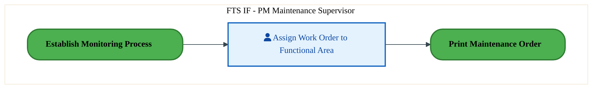
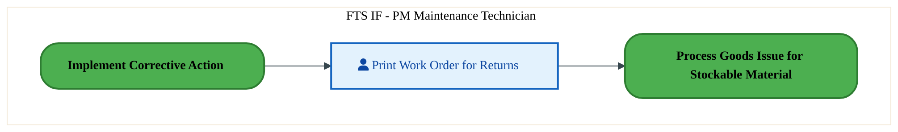
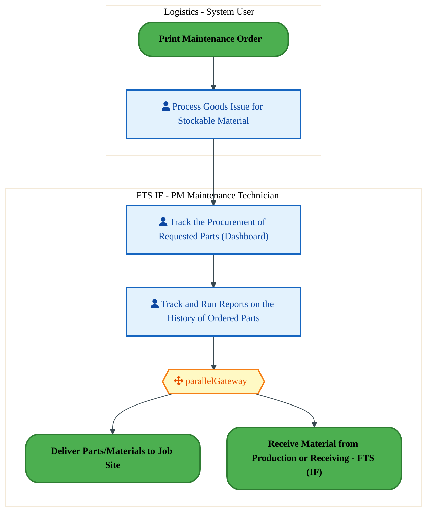
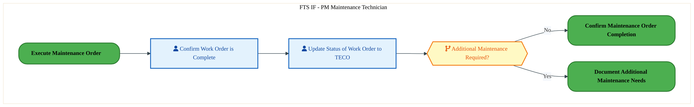
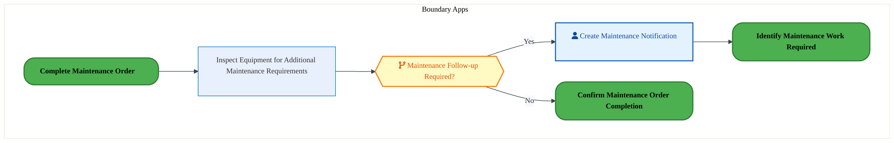
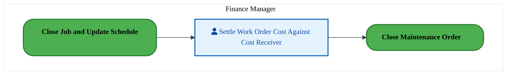
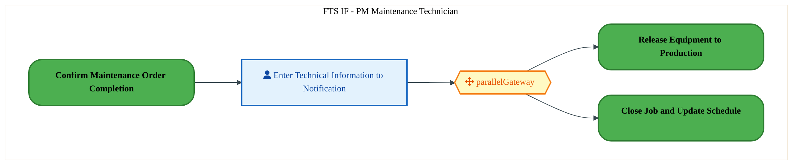

  <img src="data:image/svg+xml;base64,PHN2ZyB4bWxucz0iaHR0cDovL3d3dy53My5vcmcvMjAwMC9zdmciIHZpZXdCb3g9IjAgMCA4MDAgNDgwIiB3aWR0aD0iODAwIiBoZWlnaHQ9IjQ4MCI+DQogIDxkZWZzPg0KICAgIDxsaW5lYXJHcmFkaWVudCBpZD0iYmciIHgxPSIwJSIgeTE9IjAlIiB4Mj0iMTAwJSIgeTI9IjEwMCUiPg0KICAgICAgPHN0b3Agb2Zmc2V0PSIwJSIgc3R5bGU9InN0b3AtY29sb3I6IzAwNzFjNTtzdG9wLW9wYWNpdHk6MSIvPg0KICAgICAgPHN0b3Agb2Zmc2V0PSIxMDAlIiBzdHlsZT0ic3RvcC1jb2xvcjojMDBhZWVmO3N0b3Atb3BhY2l0eToxIi8+DQogICAgPC9saW5lYXJHcmFkaWVudD4NCiAgICA8bGluZWFyR3JhZGllbnQgaWQ9ImFjY2VudCIgeDE9IjAlIiB5MT0iMCUiIHgyPSIwJSIgeTI9IjEwMCUiPg0KICAgICAgPHN0b3Agb2Zmc2V0PSIwJSIgc3R5bGU9InN0b3AtY29sb3I6I2ZmZmZmZjtzdG9wLW9wYWNpdHk6MC4xNSIvPg0KICAgICAgPHN0b3Agb2Zmc2V0PSIxMDAlIiBzdHlsZT0ic3RvcC1jb2xvcjojZmZmZmZmO3N0b3Atb3BhY2l0eTowLjAyIi8+DQogICAgPC9saW5lYXJHcmFkaWVudD4NCiAgICA8cGF0dGVybiBpZD0iZ3JpZCIgd2lkdGg9IjQwIiBoZWlnaHQ9IjQwIiBwYXR0ZXJuVW5pdHM9InVzZXJTcGFjZU9uVXNlIj4NCiAgICAgIDxwYXRoIGQ9Ik0gNDAgMCBMIDAgMCAwIDQwIiBmaWxsPSJub25lIiBzdHJva2U9InJnYmEoMjU1LDI1NSwyNTUsMC4wNykiIHN0cm9rZS13aWR0aD0iMC41Ii8+DQogICAgPC9wYXR0ZXJuPg0KICA8L2RlZnM+DQoNCiAgPCEtLSBCYWNrZ3JvdW5kIC0tPg0KICA8cmVjdCB3aWR0aD0iODAwIiBoZWlnaHQ9IjQ4MCIgZmlsbD0idXJsKCNiZykiIHJ4PSI4Ii8+DQogIDxyZWN0IHdpZHRoPSI4MDAiIGhlaWdodD0iNDgwIiBmaWxsPSJ1cmwoI2dyaWQpIiByeD0iOCIvPg0KICA8cmVjdCB3aWR0aD0iODAwIiBoZWlnaHQ9IjQ4MCIgZmlsbD0idXJsKCNhY2NlbnQpIiByeD0iOCIvPg0KDQogIDwhLS0gRGVjb3JhdGl2ZSBjaXJjdWl0L2FyY2hpdGVjdHVyZSBsaW5lcyAtLT4NCiAgPGcgc3Ryb2tlPSJyZ2JhKDI1NSwyNTUsMjU1LDAuMTIpIiBzdHJva2Utd2lkdGg9IjEuNSIgZmlsbD0ibm9uZSI+DQogICAgPHBhdGggZD0iTSAwIDEwMCBMIDEyMCAxMDAgTCAxNjAgMTQwIEwgMjgwIDE0MCIvPg0KICAgIDxwYXRoIGQ9Ik0gMCAyNjAgTCA4MCAyNjAgTCAxMjAgMjIwIEwgMjAwIDIyMCBMIDI0MCAyNjAgTCAzNjAgMjYwIi8+DQogICAgPHBhdGggZD0iTSA1MjAgMTAwIEwgNjAwIDEwMCBMIDY0MCA2MCBMIDgwMCA2MCIvPg0KICAgIDxwYXRoIGQ9Ik0gNDQwIDM0MCBMIDU2MCAzNDAgTCA2MDAgMzAwIEwgNzIwIDMwMCBMIDc2MCAzNDAgTCA4MDAgMzQwIi8+DQogICAgPHBhdGggZD0iTSA2MDAgNDAwIEwgNjgwIDQwMCBMIDcyMCA0NDAiLz4NCiAgICA8cGF0aCBkPSJNIDAgNDAwIEwgNDAgNDAwIEwgODAgMzYwIi8+DQogICAgPHBhdGggZD0iTSAyMDAgNDIwIEwgMzIwIDQyMCBMIDM2MCAzODAgTCA0ODAgMzgwIi8+DQogICAgPHBhdGggZD0iTSA2NTAgNDQwIEwgNzUwIDQ0MCBMIDgwMCA0ODAiLz4NCiAgPC9nPg0KDQogIDwhLS0gRGVjb3JhdGl2ZSBub2RlcyAtLT4NCiAgPGcgZmlsbD0icmdiYSgyNTUsMjU1LDI1NSwwLjE4KSI+DQogICAgPGNpcmNsZSBjeD0iMTIwIiBjeT0iMTAwIiByPSI0Ii8+DQogICAgPGNpcmNsZSBjeD0iMjgwIiBjeT0iMTQwIiByPSI0Ii8+DQogICAgPGNpcmNsZSBjeD0iMjAwIiBjeT0iMjIwIiByPSI0Ii8+DQogICAgPGNpcmNsZSBjeD0iMzYwIiBjeT0iMjYwIiByPSI0Ii8+DQogICAgPGNpcmNsZSBjeD0iNjAwIiBjeT0iMTAwIiByPSI0Ii8+DQogICAgPGNpcmNsZSBjeD0iNzIwIiBjeT0iMzAwIiByPSI0Ii8+DQogICAgPGNpcmNsZSBjeD0iNTYwIiBjeT0iMzQwIiByPSI0Ii8+DQogICAgPGNpcmNsZSBjeD0iODAiIGN5PSIzNjAiIHI9IjQiLz4NCiAgICA8Y2lyY2xlIGN4PSI0ODAiIGN5PSIzODAiIHI9IjQiLz4NCiAgICA8Y2lyY2xlIGN4PSIzMjAiIGN5PSI0MjAiIHI9IjQiLz4NCiAgPC9nPg0KDQogIDwhLS0gVE9HQUYgQkRBVCBib3hlcyAtLT4NCiAgPGcgZm9udC1mYW1pbHk9IlNlZ29lIFVJLCBBcmlhbCwgc2Fucy1zZXJpZiIgZm9udC1zaXplPSIxNCIgZm9udC13ZWlnaHQ9IjYwMCI+DQogICAgPCEtLSBCIC0tPg0KICAgIDxyZWN0IHg9IjE1MCIgeT0iMTQwIiB3aWR0aD0iMTIwIiBoZWlnaHQ9IjQwIiByeD0iNSIgZmlsbD0icmdiYSgyNTUsMjU1LDI1NSwwLjE4KSIgc3Ryb2tlPSJyZ2JhKDI1NSwyNTUsMjU1LDAuMykiIHN0cm9rZS13aWR0aD0iMSIvPg0KICAgIDx0ZXh0IHg9IjIxMCIgeT0iMTY1IiB0ZXh0LWFuY2hvcj0ibWlkZGxlIiBmaWxsPSIjZmZmIj5CdXNpbmVzczwvdGV4dD4NCiAgICA8IS0tIEQgLS0+DQogICAgPHJlY3QgeD0iMjkwIiB5PSIxNDAiIHdpZHRoPSIxMjAiIGhlaWdodD0iNDAiIHJ4PSI1IiBmaWxsPSJyZ2JhKDI1NSwyNTUsMjU1LDAuMTgpIiBzdHJva2U9InJnYmEoMjU1LDI1NSwyNTUsMC4zKSIgc3Ryb2tlLXdpZHRoPSIxIi8+DQogICAgPHRleHQgeD0iMzUwIiB5PSIxNjUiIHRleHQtYW5jaG9yPSJtaWRkbGUiIGZpbGw9IiNmZmYiPkRhdGE8L3RleHQ+DQogICAgPCEtLSBBIC0tPg0KICAgIDxyZWN0IHg9IjQzMCIgeT0iMTQwIiB3aWR0aD0iMTIwIiBoZWlnaHQ9IjQwIiByeD0iNSIgZmlsbD0icmdiYSgyNTUsMjU1LDI1NSwwLjE4KSIgc3Ryb2tlPSJyZ2JhKDI1NSwyNTUsMjU1LDAuMykiIHN0cm9rZS13aWR0aD0iMSIvPg0KICAgIDx0ZXh0IHg9IjQ5MCIgeT0iMTY1IiB0ZXh0LWFuY2hvcj0ibWlkZGxlIiBmaWxsPSIjZmZmIj5BcHBsaWNhdGlvbjwvdGV4dD4NCiAgICA8IS0tIFQgLS0+DQogICAgPHJlY3QgeD0iNTcwIiB5PSIxNDAiIHdpZHRoPSIxMjAiIGhlaWdodD0iNDAiIHJ4PSI1IiBmaWxsPSJyZ2JhKDI1NSwyNTUsMjU1LDAuMTgpIiBzdHJva2U9InJnYmEoMjU1LDI1NSwyNTUsMC4zKSIgc3Ryb2tlLXdpZHRoPSIxIi8+DQogICAgPHRleHQgeD0iNjMwIiB5PSIxNjUiIHRleHQtYW5jaG9yPSJtaWRkbGUiIGZpbGw9IiNmZmYiPlRlY2hub2xvZ3k8L3RleHQ+DQogIDwvZz4NCg0KICA8IS0tIENvbm5lY3RpbmcgbGluZXMgYmV0d2VlbiBCREFUIGJveGVzIC0tPg0KICA8ZyBzdHJva2U9InJnYmEoMjU1LDI1NSwyNTUsMC4yNSkiIHN0cm9rZS13aWR0aD0iMSI+DQogICAgPGxpbmUgeDE9IjI3MCIgeTE9IjE2MCIgeDI9IjI5MCIgeTI9IjE2MCIvPg0KICAgIDxsaW5lIHgxPSI0MTAiIHkxPSIxNjAiIHgyPSI0MzAiIHkyPSIxNjAiLz4NCiAgICA8bGluZSB4MT0iNTUwIiB5MT0iMTYwIiB4Mj0iNTcwIiB5Mj0iMTYwIi8+DQogIDwvZz4NCg0KICA8IS0tIE1haW4gdGl0bGUgLS0+DQogIDx0ZXh0IHg9IjQwMCIgeT0iMjYwIiB0ZXh0LWFuY2hvcj0ibWlkZGxlIiBmb250LWZhbWlseT0iU2Vnb2UgVUksIEFyaWFsLCBzYW5zLXNlcmlmIiBmb250LXNpemU9IjM2IiBmb250LXdlaWdodD0iNzAwIiBmaWxsPSIjZmZmZmZmIiBsZXR0ZXItc3BhY2luZz0iMSI+DQogICAgSUFPIEFyY2hpdGVjdHVyZQ0KICA8L3RleHQ+DQogIDx0ZXh0IHg9IjQwMCIgeT0iMzAwIiB0ZXh0LWFuY2hvcj0ibWlkZGxlIiBmb250LWZhbWlseT0iU2Vnb2UgVUksIEFyaWFsLCBzYW5zLXNlcmlmIiBmb250LXNpemU9IjE4IiBmb250LXdlaWdodD0iNDAwIiBmaWxsPSJyZ2JhKDI1NSwyNTUsMjU1LDAuOCkiIGxldHRlci1zcGFjaW5nPSIyIj4NCiAgICBUT0dBRiBCREFUIMK3IElBTyBQcm9ncmFtIMK3IElETSAyLjANCiAgPC90ZXh0Pg0KDQogIDwhLS0gQm90dG9tIGFjY2VudCBiYXIgLS0+DQogIDxyZWN0IHg9IjI4MCIgeT0iMzQwIiB3aWR0aD0iMjQwIiBoZWlnaHQ9IjMiIHJ4PSIxLjUiIGZpbGw9InJnYmEoMjU1LDI1NSwyNTUsMC40KSIvPg0KDQogIDwhLS0gSW50ZWwgdGV4dCAtLT4NCiAgPHRleHQgeD0iNDAwIiB5PSIzODAiIHRleHQtYW5jaG9yPSJtaWRkbGUiIGZvbnQtZmFtaWx5PSJTZWdvZSBVSSwgQXJpYWwsIHNhbnMtc2VyaWYiIGZvbnQtc2l6ZT0iMTMiIGZpbGw9InJnYmEoMjU1LDI1NSwyNTUsMC41KSIgbGV0dGVyLXNwYWNpbmc9IjMiPg0KICAgIElOVEVMIENPTkZJREVOVElBTA0KICA8L3RleHQ+DQo8L3N2Zz4NCg==" alt="IAO Architecture" style="width:100%; border-radius:8px;" />
  <h1 style="font-size:36px; margin-top:24px;">PE-090 — Execute Plant Maintenance (IF)</h1>
  <h2 style="font-size:24px;">Architecture Document (TOGAF BDAT)</h2>
  
Forecast to Stock (IF) (FTS-IF) Tower 
  Capability PE-090 · PE Manage Plant, Equipment and Facilities (IF)

  
IAO Program · R1 – R5 
  Generated: April 2026 
  Sajiv Francis

  
IAO Architecture Pipeline — Intel Confidential

Page 1<a href="#toc">↑ Back to TOC</a>PE-090 — Execute Plant Maintenance (IF)

## Table of Contents

<nav class="toc">
<ol>
  <li><a href="#1-executive-summary">1. Executive Summary</a></li>
  <li><a href="#2-business-context-objectives">2. Business Context &amp; Objectives</a>
    <ul>
      <li><a href="#21-classification">2.1 Classification</a></li>
      <li><a href="#22-business-drivers">2.2 Business Drivers</a></li>
      <li><a href="#23-success-criteria">2.3 Success Criteria</a></li>
      <li><a href="#24-companion-documents">2.4 Companion Documents</a></li>
    </ul>
  </li>
  <li><a href="#3-business-architecture-togaf-b">3. Business Architecture (TOGAF &ldquo;B&rdquo;)</a>
    <ul>
      <li><a href="#31-business-process-overview">3.1 Business Process Overview</a></li>
      <li><a href="#32-business-process-diagrams">3.2 Business Process Diagrams</a></li>
      <li><a href="#33-business-roles-responsibilities">3.3 Business Roles &amp; Responsibilities</a></li>
    </ul>
  </li>
  <li><a href="#4-data-architecture-togaf-d">4. Data Architecture (TOGAF &ldquo;D&rdquo;)</a>
    <ul>
      <li><a href="#41-data-entities-ownership">4.1 Data Entities &amp; Ownership</a></li>
      <li><a href="#42-data-flow-diagrams">4.2 Data Flow Diagrams</a></li>
      <li><a href="#43-data-lineage">4.3 Data Lineage</a></li>
      <li><a href="#44-ricefw-data-objects">4.4 RICEFW Data Objects</a></li>
      <li><a href="#45-data-governance-quality">4.5 Data Governance &amp; Quality</a></li>
    </ul>
  </li>
  <li><a href="#5-application-architecture-togaf-a">5. Application Architecture (TOGAF &ldquo;A&rdquo;)</a>
    <ul>
      <li><a href="#54-component-overview">5.4 Component Overview</a></li>
      <li><a href="#55-ricefw-inventory">5.5 RICEFW Inventory</a>
        <ul>
          <li><a href="#551-eca-dependencies">5.5.1 ECA Dependencies</a></li>
          <li><a href="#552-boundary-application-dependencies">5.5.2 Boundary Application Dependencies</a></li>
        </ul>
      </li>
      <li><a href="#56-integration-patterns">5.6 Integration Patterns</a></li>
    </ul>
  </li>
  <li><a href="#6-technology-architecture-togaf-t">6. Technology Architecture (TOGAF &ldquo;T&rdquo;)</a>
    <ul>
      <li><a href="#61-platform-infrastructure">6.1 Platform &amp; Infrastructure</a></li>
      <li><a href="#62-sap-development-object-status">6.2 SAP Development Object Status</a></li>
      <li><a href="#63-nfrs-design-principles">6.3 NFRs &amp; Design Principles</a></li>
      <li><a href="#64-security-governance">6.4 Security &amp; Governance</a></li>
    </ul>
  </li>
  <li><a href="#7-project-context">7. Project Context</a>
    <ul>
      <li><a href="#71-project-roadmap-go-live-plan">7.1 Project Roadmap &amp; Go-Live Plan</a></li>
      <li><a href="#72-raid-log">7.2 RAID Log</a></li>
      <li><a href="#73-recommendations-next-steps">7.3 Recommendations &amp; Next Steps</a></li>
    </ul>
  </li>
</ol>
</nav>

Page 2<a href="#toc">↑ Back to TOC</a>PE-090 — Execute Plant Maintenance (IF)

## 1. Executive Summary

This Architecture Document defines the **Business, Data, Application, and Technology** (BDAT) architecture for **PE-090 Execute Plant Maintenance (IF)** within the IAO program. It includes 12 BPMN process diagram(s) in Section 3.

| Dimension | Value |
|-----------|-------|
| **Tower** | Forecast to Stock (IF) (FTS-IF) |
| **Process Group** | PE Manage Plant, Equipment and Facilities (IF) |
| **Capability** | PE-090 - Execute Plant Maintenance (IF) |
| **Release** | R1 – R5 |
| **Total Systems** | 0 |
| **System Status** | 0 Deployed, 0 Developing, 0 EOL, 0 Pending IAPM |
| **RICEFW Objects** | 2 Reports, 12 Interfaces, 11 Conversions, 53 Enhancements, 1 Forms, 1 Workflows |

> All system nodes in architecture diagrams are **IAPM-linked** — click any node to open its IAPM page. Diagrams require `securityLevel: 'loose'` for click events.

Page 3<a href="#toc">↑ Back to TOC</a>PE-090 — Execute Plant Maintenance (IF)

## 2. Business Context & Objectives

### 2.1 Classification

| Level | Value |
|-------|-------|
| **L0 Tower** | Forecast to Stock (IF) |
| **L1 Process** | PE Manage Plant, Equipment and Facilities (IF) |
| **L2 Capability** | PE-090 - Execute Plant Maintenance (IF) |

### 2.2 Business Drivers

| # | Driver | Description | Strategic Alignment | Priority |
|---|--------|-------------|---------------------|----------|
| 1 | Intel Foundry Supply Chain Integration | Integrate Intel Foundry manufacturing and logistics into unified S/4 HANA supply chain | IDM 2.0 Foundry Enablement | High |
| 2 | Warehouse & Logistics Modernization | Modernize warehouse management and shipping processes with EWM integration | Supply Chain Digital Transformation | High |
| 3 | Production Planning Optimization | Enable MRP-driven production planning with real-time material availability | Manufacturing Excellence | Medium |
| 4 | PE-090 Process Migration | Migrate Execute Plant Maintenance (IF) business processes and 0 integrated systems from legacy to S/4 HANA target architecture | IDM 2.0 Supply Chain (Intel Foundry) | High |

Page 4<a href="#toc">↑ Back to TOC</a>PE-090 — Execute Plant Maintenance (IF)

### 2.3 Success Criteria

| Metric | Target | Measure | Baseline | Owner |
|--------|--------|---------|----------|-------|
| Order Fulfillment Lead Time | < 48 hours | Time from production completion to shipment dispatch | 72 hours (legacy) | Logistics Manager |
| Inventory Accuracy | > 99.5% | Physical vs system inventory match rate | 97.8% (current) | Warehouse Manager |
| MRP Planning Cycle | < 4 hours | End-to-end MRP run including exception processing | 8 hours (legacy) | Planning Lead |
| PE-090 Migration Completeness | 100% flow chains validated | All 0 flow chains verified in target state | 0% (pre-migration) | Tower Architect |

### 2.4 Companion Documents

| Document | Description |
|----------|-------------|
| **Business Architecture** | Included in this document (Section 3) — process flows from BPMN diagrams |
| **This Document** | Full BDAT Architecture — Business + Data + Application + Technology |

Page 5<a href="#toc">↑ Back to TOC</a>PE-090 — Execute Plant Maintenance (IF)

## 3. Business Architecture (TOGAF "B")

### 3.1 Business Process Overview

This capability includes **12 business process(es)** modeled in BPMN 2.0, covering the end-to-end workflow for PE-090 Execute Plant Maintenance (IF).

| # | Step ID | Process Name | Lanes | Tasks | Gateways |
|---|---------|--------------|-------|-------|----------|
| 1 | PE-090-020_Establish_Monitoring_Process | PE-090-020_Establish_Monitoring_Process | FTS IF - PM Maintenance Technician | 2 | 0 |
| 2 | PE-090-030_Implement_Corrective_Action | PE-090-030_Implement_Corrective_Action | FTS IF - PM Maintenance Supervisor | 1 | 0 |
| 3 | PE-090-040_Print_Maintenance_Order | PE-090-040_Print_Maintenance_Order | FTS IF - PM Maintenance Technician | 1 | 0 |
| 4 | PE-090-050_Process_Goods_Issue_to_Stock_Material | PE-090-050_Process_Goods_Issue_to_Stock_Material | FTS IF - PM Maintenance Technician, Logistics - System User | 3 | 1 |
| 5 | PE-090-070_Execute_Maintenance_Order | PE-090-070_Execute_Maintenance_Order | FTS IF - PM Maintenance Technician | 2 | 0 |
| 6 | PE-090-080_Complete_Maintenance_Order | PE-090-080_Complete_Maintenance_Order | FTS IF - PM Maintenance Technician | 2 | 1 |
| 7 | PE-090-090_Document_Additional_Maintenance_Needs | PE-090-090_Document_Additional_Maintenance_Needs | Boundary Apps | 2 | 1 |
| 8 | PE-090-120_Settle_Maintenance_Order | PE-090-120_Settle_Maintenance_Order | Finance Manager | 1 | 0 |
| 9 | PE-090-130_Close_Maintenance_Order | PE-090-130_Close_Maintenance_Order | FTS IF - PM Maintenance Technician | 2 | 0 |
| 10 | PE-090-140_Record_Maintenance_History_and_Close_Notification | PE-090-140_Record_Maintenance_History_and_Close_Notification | FTS IF - PM Maintenance Technician | 1 | 1 |
| 11 | PE-090-150_Release_Equipment_to_Production | PE-090-150_Release_Equipment_to_Production | Boundary Apps | 1 | 0 |
| 12 | PE-090-160_Return_Unused_Parts_to_Stock | PE-090-160_Return_Unused_Parts_to_Stock | FTS IF - Maintenance Technician | 2 | 0 |

Page 6<a href="#toc">↑ Back to TOC</a>PE-090 — Execute Plant Maintenance (IF)

### 3.2 Business Process Diagrams

#### BUSINESS ARCHITECTURE — 3.2.1 PE-090-020_Establish_Monitoring_Process — PE-090-020_Establish_Monitoring_Process

**Swim Lanes**: FTS IF - PM Maintenance Technician | **Tasks**: 2 | **Gateways**: 0

> **Legend**: ● Start · ● End · User Task · Service Task · ◇ Gateway · Sub-Process

<a href="https://mermaid.live/view#pako:eNqlVNuO2jAQ_RUrK0QrBSlXQvNQCQJRVyraVaHtQ6kq40zAwrEj29yK-Pfa3KHdp-Yhwoc558yMJ7NziCjASZ1GY0c51SnaNfUcKmimqDnFCpouOgLfsKR4ykA1bUwpuB7R34cwP6o3NsxiOa4o21p0BDMB6Ouzi7qGyFykMFctBZKWTbdZS1phuc0EE9JGP0Gn9MqD2-mvnpAFyGuA5yU-iQ2VUQ5XOEyiJMotTwERvLgTLeOyU5Lm3ibHxJrMsdSH9JcKhnjznRZ6bs4lZgpMzFxX7DOeArM1arm0GFnK1bkZVFkfbho2qjGhfGbwyDOQxHxxhWJvv0f7RmPCL6Zo3J9wZB7CsFJ9KJHSBh6sNCopY-lTlHXz2HOVlmIB6VMwSPph4BJbSWpK91zb3NYa6Gyu06lgxSm0tbY1pEG9ceUmDTxXbs37wQt4cXXK2kEn6Fyceomf-dnZqSzL_3IyfZVjrBYnr0GYB3n_4uXH7Tjz_tY7l9mPkq7_2CeQK0rgRjTP83BwbdWgHfve26K9PGx72YPoDGtY4-1V8EMWXQTzOMn95E3Bo99jlsvpqxTkLBgO4jy-CCY9P-8GbwpGXT_qnDI0OjOJ6zlimMMv78fEyccj9JyjFnodoiGmXAPHnAAaA5lzSijmE-fnkWwf7htOidMSt-xdoC-worBGo-4r-i7kAr3Yjwp9okoLub1nBvfMoTDrQEj0wmfCzPUt3ZQ6k6DUPT98dxGomWnubbaDDZClpsIm-_6GExnKc1Uzs1-4RpmQEoimK0Bdcoo-BpsJPv7gIWq1PppkT8fgeDxNDfePx-jmeix4Hss7OPg3HF4-zTs4usCO61QgK0wLJ905h91o9mcBJV4y7exdBy-1GG05cdLDDnGWdWHmrU-xudrqCO7_AGDwwSQ=" title="View full diagram">&#128065; View Diagram</a>

#### BUSINESS ARCHITECTURE — 3.2.2 PE-090-030_Implement_Corrective_Action — PE-090-030_Implement_Corrective_Action

**Swim Lanes**: FTS IF - PM Maintenance Supervisor | **Tasks**: 1 | **Gateways**: 0

> **Legend**: ● Start · ● End · User Task · Service Task · ◇ Gateway · Sub-Process

<a href="https://mermaid.live/view#pako:eNqlVE2P2jAU_CtWViiXIOWT0BwqQcBSpaKuxLZ7KFVlkmewMDaynQWK-O-1-QgL1Z6aA4qHeTPvTWwfvErW4BVep3NggpkCHXyzhDX4BfLnRIMfoDPwgyhG5hy07zhUCjNlf060KN3sHM1hmKwZ3zt0CgsJ6PuXAA1sIQ-QJkJ3NShG_cDfKLYmal9KLpVjP0GfhvTkdvlrKFUN6kYIwzyqMlvKmYAbnORpnmJXp6GSor4TpRnt08o_uua43FZLosyp_UbDhOxeWW2Wdk0J12A5S7PmX8kcuJvRqMZhVaPermEw7XyEDWy6IRUTC4unoYUUEasblIXHIzp2OjPRmqKX0Uwg-1ScaD0CirSx8PjNIMo4L57ScoCzMNBGyRUUT_E4HyVxULlJCjt6GLhwu1tgi6Up5pLXF2p362Yo4s0uULsiDgO1t78PXiDqm1PZi_txv3Ua5lEZlVcnSul_Odlc1QvRq4vXOMExHrVeUdbLyvBfveuYozQfRI85gXpjFbwTxRgn41tU414WhR-LDnHSC8sH0QUxsCX7m-CnMm0FcZbjKP9Q8Oz32GUzf1ayugom4wxnrWA-jPAg_lAwHURp_9Kh1VkoslkiTgT8Dn_OPPwyRV8w6qLnCZoQJgwIIipA02bjktFSzbxf52L3iMjWUFJQ0nXfAg20ZguBXqVaoW_uQCEjEW5EZZgUhNuzCeReILYCz8oa3dmdau-JiSWO7Taec6aXaCLt7SFt3QK5JEDrlm233_lFJKjb_Wx7vCyj8zJ-F6YDr5voDo7bE3MHJy3sBd4a1Jqw2isO3unKstdaDZQ03HjHwCONkdO9qLzidLS9ZlPbbTBixCa-PoPHvzCooOE=" title="View full diagram">&#128065; View Diagram</a>

#### BUSINESS ARCHITECTURE — 3.2.3 PE-090-040_Print_Maintenance_Order — PE-090-040_Print_Maintenance_Order

**Swim Lanes**: FTS IF - PM Maintenance Technician | **Tasks**: 1 | **Gateways**: 0

> **Legend**: ● Start · ● End · User Task · Service Task · ◇ Gateway · Sub-Process

<a href="https://mermaid.live/view#pako:eNqlVE2P2jAQ_StWViiXIOWT0BwqQSAVUlddFdo9lKoyzhgsjI1sB5Yi_nttPgvVnppDEr_Me29m4vHeI7IGr_BarT0TzBRo75sFrMAvkD_DGvwAnYDvWDE846B9F0OlMGP2-xgWpes3F-awCq8Y3zl0DHMJ6NsoQD1L5AHSWOi2BsWoH_hrxVZY7UrJpXLRT9ClIT26nT_1papB3QLCMI9IZqmcCbjBSZ7maeV4GogU9Z0ozWiXEv_gkuNySxZYmWP6jYZn_PbKarOwa4q5BhuzMCv-Gc-AuxqNahxGGrW5NINp5yNsw8ZrTJiYWzwNLaSwWN6gLDwc0KHVmoqrKZoMpgLZi3Cs9QAo0sbCw41BlHFePKVlr8rCQBsll1A8xcN8kMQBcZUUtvQwcM1tb4HNF6aYSV6fQ9tbV0MRr98C9VbEYaB29v7gBaK-OZWduBt3r079PCqj8uJEKf0vJ9tXNcF6efYaJlVcDa5eUdbJyvBfvUuZgzTvRY99ArVhBP4SraoqGd5aNexkUfi-aL9KOmH5IDrHBrZ4dxP8UKZXwSrLqyh_V_Dk95hlM3tRklwEk2FWZVfBvB9VvfhdwbQXpd1zhlZnrvB6gTgW8Cv8MfWqyRiNKtRGL8_oGTNhQGBBAE2ALAQjDIup9_NEdpeILIfiguK2-xfoRVkKepVqib64eUJUKvQVTKOEvifGluhqAK3RJylrjUZaN3AkjI0kSzf8NgUDbpzvuYnljlZrbo8J61ZKpYAYtgHUsw95y9BuxNOLSFC7_dFme15Gp2X8V1sdeNlOd3B8nZ07OLnCXuCtQK0wq71i7x0PL3vA1UBxw413CDzcGDneCeIVxyH3mnVtyxowbHu_OoGHP5sypEk=" title="View full diagram">&#128065; View Diagram</a>

Page 7<a href="#toc">↑ Back to TOC</a>PE-090 — Execute Plant Maintenance (IF)

#### BUSINESS ARCHITECTURE — 3.2.4 PE-090-050_Process_Goods_Issue_to_Stock_Material — PE-090-050_Process_Goods_Issue_to_Stock_Material

**Swim Lanes**: FTS IF - PM Maintenance Technician · Logistics - System User | **Tasks**: 3 | **Gateways**: 1

> **Legend**: ● Start · ● End · User Task · Service Task · ◇ Gateway · Sub-Process

<a href="https://mermaid.live/view#pako:eNqlVVuP6jYQ_itWVitOpaDmSmgeKrFATvforLpaOO1Dt6qMMwELY1PbWZYi_nvHhMsJZZ-ah0jzZeb75uJxdh5TJXi5d3-_45LbnOw6dgEr6OSkM6MGOj5pgN-o5nQmwHScT6WknfB_Dm5hsn53bg4r6IqLrUMnMFdAvj36ZICBwieGStM1oHnV8TtrzVdUb4dKKO2876BfBdVB7fjpQekS9MUhCLKQpRgquIQLHGdJlhQuzgBTsmyRVmnVr1hn75ITasMWVNtD-rWBJ_r-Oy_tAu2KCgPos7Ar8ZXOQLgara4dxmr9dmoGN05HYsMma8q4nCOeBAhpKpcXKA32e7K_v3-VZ1EyHb1Kgg8T1JgRVMRYhMdvllRciPwuGQ6KNPCN1WoJ-V00zkZx5DNXSY6lB75rbncDfL6w-UyJ8uja3bga8mj97uv3PAp8vcX3lRbI8qI07EX9qH9WesjCYTg8KVVV9b-UsK96Ss3yqDWOi6gYnbXCtJcOg__yncocJdkgvO4T6DfO4DvSoiji8aVV414aBh-TPhRxLxhekc6phQ3dXgh_GiZnwiLNijD7kLDRu86ynj1rxU6E8Tgt0jNh9hAWg-hDwmQQJv1jhsgz13S9IIJK-Cv449UrphPyWJAueX4iT5RLC5JKBmQKbCE541S-en82we6REcZUNK9o182CTDVlS4ILTFx-tcZFlpaoirzA3zUYCyV5xoNoyKcRNYuZorr8oU0Y3yKksiQvtUSWtXLRSh40fuHGKr11_L-67T2xtxkTZByB4G9Id_j84xPOw10ShlhFvqgZmXAL7aAUg16AAUaRkzuptFq5wsqaWY45KE0aH1xEbJnr3afH4qqgbLc7VUS1VhvTpcKSNdVUCBCfm6Px6u33TQwuz63ZhJjPVzXHgjkzqDXZYjNX5Bv2qC0XtvvnxgDGkM9KlYY8GlMDqTDviVVs6e7Xc3Vtmh7SPGucf-sUHLp8djynKnuk2_0ZtY9m2JjR0cwaM2mb6dGMGzM7mlFjxt-deEd42vQWHN2G49twcr4EW3B6G-7dhrPTMnu-twK9orz08p13-GXhb62EitbCenvfo7VVk61kXn642r16XWLkiFOc6qoB9_8CAG1DJQ==" title="View full diagram">&#128065; View Diagram</a>

#### BUSINESS ARCHITECTURE — 3.2.5 PE-090-070_Execute_Maintenance_Order — PE-090-070_Execute_Maintenance_Order

**Swim Lanes**: FTS IF - PM Maintenance Technician | **Tasks**: 2 | **Gateways**: 0

> **Legend**: ● Start · ● End · User Task · Service Task · ◇ Gateway · Sub-Process

<a href="https://mermaid.live/view#pako:eNqlVNuO2jAQ_RUrK8RLUHPd0DxUgkCkVkVdCbb7sFSVcSZgYWxkO1yK-PfaAcKl2qfmATHHZ86ZGV8ODhEFOKnTah0opzpFh7ZewAraKWrPsIK2i07ATywpnjFQbcspBddj-qem-dF6Z2kWy_GKsr1FxzAXgF6_uqhnEpmLFOaqo0DSsu2215KusNxngglp2U_QLb2ydjsv9YUsQF4Jnpf4JDapjHK4wmESJVFu8xQQwYs70TIuuyVpH21xTGzJAktdl18pGOHdGy30wsQlZgoMZ6FX7DueAbM9allZjFRycxkGVdaHm4GN15hQPjd45BlIYr68QrF3PKJjqzXljSmaDKYcmY8wrNQASqS0gYcbjUrKWPoUZb089lylpVhC-hQMk0EYuMR2kprWPdcOt7MFOl_odCZYcaZ2traHNFjvXLlLA8-Ve_P74AW8uDplz0E36DZO_cTP_OziVJblfzmZucoJVsuz1zDMg3zQePnxc5x5_-pd2hxESc9_nBPIDSVwI5rneTi8jmr4HPvex6L9PHz2sgfROdawxfur4OcsagTzOMn95EPBk99jldXsRQpyEQyHcR43gknfz3vBh4JRz4-65wqNzlzi9QIxzOG39z518skYfc1RB72M0AhTroFjTgBNgCw4JRTzqfPrlGw_7pucEqcl7ti9QMMdkEpDnYrehFzes4P3hk7EHL2uC3xLRmONdaXQJfxhryR6WwBH38QMUYUysVoz0FAY3Vvh0Ohe1u7qriXui4gMdwCMboz2i7kV6tPIVGEfDYW0qJ3GVEOTZI7z6Q-PUKfzxfR8Dv1TGJzD4BSGN3tlOZczegcHtwftbiVsruodHDWw4zorkCtMCyc9OPVbad7TAkpcMe0cXQdXWoz3nDhp_aY4VT3lAcVmq1cn8PgXDJ_F-Q==" title="View full diagram">&#128065; View Diagram</a>

```mermaid
%%{init: {'theme': 'base', 'themeVariables': {'fontSize': '14px', 'fontFamily': 'Segoe UI, Arial, sans-serif','primaryColor': '#e8f0fe', 'primaryBorderColor': '#0071c5','lineColor': '#37474F', 'secondaryColor': '#f5f8fc'}, 'flowchart': {'useMaxWidth': false, 'htmlLabels': true, 'curve': 'basis', 'nodeSpacing': 40, 'rankSpacing': 50}} }%%
flowchart TD
    classDef startEvt fill:#4CAF50,stroke:#2E7D32,color:#000,font-weight:bold,stroke-width:2px,rx:20,ry:20
    classDef endEvt fill:#C62828,stroke:#B71C1C,color:#fff,font-weight:bold,stroke-width:2px,rx:20,ry:20
    classDef userTask fill:#E3F2FD,stroke:#1565C0,stroke-width:2px,color:#0D47A1
    classDef serviceTask fill:#FFF3E0,stroke:#E65100,stroke-width:2px,color:#BF360C
    classDef gateway fill:#FFF9C4,stroke:#F57F17,stroke-width:2px,color:#E65100
    classDef subProc fill:#F3E5F5,stroke:#7B1FA2,stroke-width:2px,color:#4A148C
    subgraph FTS IF - PM Maintenance Technician
        n1["fa:fa-user Execute Main Work"]
        n2[["fa:fa-cog Update Main Work Status in Work Order When Job is Completed"]]
        n3["Complete Maintenance Order"]
        n4["Deliver Parts/Materials to Job Site"]
    end
    n4 --> n1
    n1 --> n2
    n2 --> n3
    class n1 userTask
    class n2 serviceTask
    class n3 startEvt
    class n4 startEvt
```

#### BUSINESS ARCHITECTURE — 3.2.6 PE-090-080_Complete_Maintenance_Order — PE-090-080_Complete_Maintenance_Order

**Swim Lanes**: FTS IF - PM Maintenance Technician | **Tasks**: 2 | **Gateways**: 1

> **Legend**: ● Start · ● End · User Task · Service Task · ◇ Gateway · Sub-Process

<a href="https://mermaid.live/view#pako:eNqlVV2P2jgU_StWRiNegpRPQvOwFROINNJOWy20VbVUK-NcgzWOzdrODCzlv9cmfEyYmafNA-Ie7jnn3ouvs_OIrMDLvdvbHRPM5GjXMyuooZej3gJr6PmoBb5hxfCCg-65HCqFmbL_Dmlhst64NIeVuGZ869ApLCWgr_c-Glki95HGQvc1KEZ7fm-tWI3VtpBcKpd9A0Ma0IPb8ac7qSpQl4QgyEKSWipnAi5wnCVZUjqeBiJF1RGlKR1S0tu74rh8JiuszKH8RsMD3nxnlVnZmGKuweasTM3_xAvgrkejGoeRRj2dhsG08xF2YNM1JkwsLZ4EFlJYPF6gNNjv0f72di7Opmg2ngtkH8Kx1mOgSBsLT54Moozz_CYpRmUa-Noo-Qj5TTTJxnHkE9dJblsPfDfc_jOw5crkC8mrY2r_2fWQR-uNrzZ5FPhqaz-vvEBUF6diEA2j4dnpLguLsDg5UUr_l5Odq5ph_Xj0msRlVI7PXmE6SIvgtd6pzXGSjcLrOYF6YgReiJZlGU8uo5oM0jB4X_SujAdBcSW6xAae8fYi-KFIzoJlmpVh9q5g63ddZbP4oiQ5CcaTtEzPgtldWI6idwWTUZgMjxVanaXC6xXiWMA_wd9zr5xN0X2J-ujLA3rATBgQWBBAMyArwQjDYu79bMnuEaHlUJxT3Hf_BSqkoEzV6LtUj-iz2yjEtEXrNQcDXWrUpX5dV3ZMaGqwaTSS9KWGkWg2KT53-bHljyVpahAGjaqKGSYF5p2yPwFUuktLLO1U5svU1ulYqlXqslLLmmyANLbEV6xu6mC3OzXmLrv-wq4rWb1X4V_wb8MUVB_n3n7fqtj9ab-IFPX7f9ghH8OBC3_NvU9y7v2ynVzBP0Af8PiIhy07OoZRGw5enCWXc9qhDhy9Dcfne6QDJ2_D6dvw4LQPnu_VoGrMKi_feYdb374ZKqC44cbb-x5ujJxuBfHyw-3oNYcjMmbYHtq6Bfe_AU0zBnw=" title="View full diagram">&#128065; View Diagram</a>

Page 8<a href="#toc">↑ Back to TOC</a>PE-090 — Execute Plant Maintenance (IF)

#### BUSINESS ARCHITECTURE — 3.2.7 PE-090-090_Document_Additional_Maintenance_Needs — PE-090-090_Document_Additional_Maintenance_Needs

**Swim Lanes**: Boundary Apps | **Tasks**: 2 | **Gateways**: 1

> **Legend**: ● Start · ● End · User Task · Service Task · ◇ Gateway · Sub-Process

<a href="https://mermaid.live/view#pako:eNqlVF1vmzAU_SsWVZQXIgGBkPGwKSFBqrRu09qtmpZpcuA6sWJsZpumWZr_Ppt8lbR9Gg8IH849596re711clGAkzidzpZyqhO07eollNBNUHeOFXRdtAe-Y0nxnIHqWg4RXN_Svw3ND6tHS7NYhkvKNha9hYUA9O3aRSMTyFykMFc9BZKSrtutJC2x3KSCCWnZVzAkHmncDr_GQhYgzwTPi_08MqGMcjjD_TiMw8zGKcgFL1qiJCJDknd3Njkm1vkSS92kXyu4wY_3tNBLcyaYKTCcpS7ZRzwHZmvUsrZYXsuHYzOosj7cNOy2wjnlC4OHnoEk5qszFHm7Hdp1OjN-MkV3kxlH5skZVmoCBClt4OmDRoQyllyF6SiLPFdpKVaQXAXTeNIP3NxWkpjSPdc2t7cGuljqZC5YcaD21raGJKgeXfmYBJ4rN-Z94QW8ODulg2AYDE9O49hP_fToRAj5LyfTV3mH1ergNe1nQTY5efnRIEq9l3rHMidhPPIv-wTygebwTDTLsv703KrpIPK9t0XHWX_gpReiC6xhjTdnwXdpeBLMojjz4zcF936XWdbzL1LkR8H-NMqik2A89rNR8KZgOPLD4SFDo7OQuFoihjn89n7OnLGom6FGo6pSM-fXnmcf7pvfBCcE92zbUSrBlIVuMOUaOOY5oE9CU0JzrKng7djAxF5zVUGu0fRPTasSuJkQIdGoKKjlY9aS-gqGJcHSLtLoG6lUcEJl2Yr4bPcXpaKsGLxMILQJFEaNkk0r7F7I1dGtaMdEjVOjBy-t2tzBdnvsjr3henOzo_myFZUJZvazV1cnuw8zZ7fbi5id2X_wCPV6703HDsdgfxwcjgN7fJo5n8TMeTLNOMD-nhVesH6AamjPp9ySj3vTgvunS6IFh6_D0evw4DjsjuuUIEtMCyfZOs2Vbq79AgiumXZ2roNrLW43PHeS5upz6qowkROKzUSWe3D3DyOD_jM=" title="View full diagram">&#128065; View Diagram</a>

#### BUSINESS ARCHITECTURE — 3.2.8 PE-090-120_Settle_Maintenance_Order — PE-090-120_Settle_Maintenance_Order

**Swim Lanes**: Finance Manager | **Tasks**: 1 | **Gateways**: 0

> **Legend**: ● Start · ● End · User Task · Service Task · ◇ Gateway · Sub-Process

<a href="https://mermaid.live/view#pako:eNqlVE2P2jAU_CtWViiXIOWT0BwqQSBSq65ald3uoVSVSZ7BwtjIdvgo4r_XDhAWKk71IYkn45n3RrYPTikqcDKn0zlQTnWGDq5ewArcDLkzrMD10An4gSXFMwbKtRwiuJ7QPw0tiNc7S7NYgVeU7S06gbkA9PrJQwOzkHlIYa66CiQlrueuJV1huc8FE9Kyn6BPfNK4nX8NhaxAXgm-nwZlYpYyyuEKR2mcxoVdp6AUvLoRJQnpk9I92uKY2JYLLHVTfq3gGe_eaKUXZk4wU2A4C71iX_AMmO1Ry9piZS03lzCosj7cBDZZ45LyucFj30AS8-UVSvzjER07nSlvTdHLaMqRGSXDSo2AIKUNPN5oRChj2VOcD4rE95SWYgnZUzhOR1HolbaTzLTuezbc7hbofKGzmWDVmdrd2h6ycL3z5C4LfU_uzfPOC3h1dcp7YT_st07DNMiD_OJECPkvJ5OrfMFqefYaR0VYjFqvIOkluf-v3qXNUZwOgvucQG5oCe9Ei6KIxteoxr0k8B-LDouo5-d3onOsYYv3V8EPedwKFklaBOlDwZPffZX17JsU5UUwGidF0gqmw6AYhA8F40EQ988VGp25xOsFYpjDb__n1Ckox7wE9Iw5noOcOr9OTDt4YAgEZwR3bfBoAlozQG9CLtFXe3pQLpRGgzmm3LybyXcogW7uhUIjlDOhrA_lGk6ejcYtMWqJn8UMYV6h13Vl0kSTcgFVzaClm013-uAR6nY_mmLP0-A0Dd9FaMHL1rmBw_ac3MBRCzueswK5wrRysoPTXFTmMquA4Jpp5-g5uNZisuelkzUH2qmbckcUm5xXJ_D4F8uunSk=" title="View full diagram">&#128065; View Diagram</a>

#### BUSINESS ARCHITECTURE — 3.2.9 PE-090-130_Close_Maintenance_Order — PE-090-130_Close_Maintenance_Order

**Swim Lanes**: FTS IF - PM Maintenance Technician | **Tasks**: 2 | **Gateways**: 0

> **Legend**: ● Start · ● End · User Task · Service Task · ◇ Gateway · Sub-Process

<a href="https://mermaid.live/view#pako:eNqllF1v2jAUhv_KUaqKTQpSPhuWi0kQiDRp1abRbRfrNBnnGCyMzWynLav477P5CNCpV8sFwm_OeV6fEx8_B1Q1GJTB9fUzl9yW8NyzC1xhr4TejBjshbAXvhHNyUyg6fkYpqSd8j-7sDhbP_kwr9VkxcXGq1OcK4SvH0IYukQRgiHS9A1qznphb635iuhNpYTSPvoKByxiO7fDq5HSDepTQBQVMc1dquAST3JaZEVW-zyDVMnmAspyNmC0t_WbE-qRLoi2u-23Bm_J03fe2IVbMyIMupiFXYmPZIbC12h16zXa6odjM7jxPtI1bLomlMu507PISZrI5UnKo-0WttfX97IzhbvxvQT3UEGMGSMDY508ebDAuBDlVVYN6zwKjdVqieVVMinGaRJSX0npSo9C39z-I_L5wpYzJZpDaP_R11Am66dQP5VJFOqN-33hhbI5OVU3ySAZdE6jIq7i6ujEGPsvJ9dXfUfM8uA1SeukHndecX6TV9G_vGOZ46wYxi_7hPqBUzyD1nWdTk6tmtzkcfQ6dFSnN1H1AjonFh_J5gR8V2UdsM6LOi5eBe79Xu6ynX3Wih6B6SSv8w5YjOJ6mLwKzIZxNjjs0HHmmqwXIIjEX9GP-6C-m8KHGvrw-RZuCZcWJZEU4Q7pQnLKibwPfu6T_SNjl8NIyUjffwuoFkiXMCaWwBf83XLtJllaA4rBd6WX8MkPGTClYUjdUSd0A0Q2UKnVWqDzQmMu-cmPzoCqOYxaw30QVEIZBHdTnHM96uu6cd2GqSW2NWAVVB-nY8c8h6ZvOqixat3ZNxcl75k7o8YB3p4BMpc_RWsF_pvR7d-Nwf6PzKDff-96dVjG-2VyWCb7ZXr2jX3M8WxfyMn5Ab14kx7G7kLMurkPwmCFekV4E5TPwe6Gdbdwg4y0wgbbMCCtVdONpEG5u4mCdtfHMSfugKz24vYvlzjZKQ==" title="View full diagram">&#128065; View Diagram</a>

#### BUSINESS ARCHITECTURE — 3.2.10 PE-090-140_Record_Maintenance_History_and_Close_Notification — PE-090-140_Record_Maintenance_History_and_Close_Notification

**Swim Lanes**: FTS IF - PM Maintenance Technician | **Tasks**: 1 | **Gateways**: 1

> **Legend**: ● Start · ● End · User Task · Service Task · ◇ Gateway · Sub-Process

<a href="https://mermaid.live/view#pako:eNqlVEtv2zgQ_iuEgsAXGdAzcnUo4MjWIsVmG6zT9lAvFmNqaBOhSJWi4ngN__eSlh910pxWB8Pz6XtwhhS3HlUVerl3fb3lkpucbAdmhTUOcjJYQIsDn_TAV9AcFgLbgeMwJc2M_7enhUnz4mgOK6HmYuPQGS4Vki93PhlbofBJC7Idtqg5G_iDRvMa9KZQQmnHvsIRC9g-7fDqVukK9ZkQBFlIUysVXOIZjrMkS0qna5EqWV2YspSNGB3s3OKEWtMVaLNfftfiPbx845VZ2ZqBaNFyVqYWf8IChevR6M5htNPPx2Hw1uVIO7BZA5TLpcWTwEIa5NMZSoPdjuyur-fyFEoeJ3NJ7EMFtO0EGWmNhafPhjAuRH6VFOMyDfzWaPWE-VU0zSZx5FPXSW5bD3w33OEa-XJl8oUS1YE6XLse8qh58fVLHgW-3tjfV1koq3NScRONotEp6TYLi7A4JjHG_leSnat-hPbpkDWNy6icnLLC9CYtgrd-xzYnSTYOX88J9TOn-ItpWZbx9Dyq6U0aBu-b3pbxTVC8Ml2CwTVszoYfiuRkWKZZGWbvGvZ5r1fZLR60okfDeJqW6ckwuw3LcfSuYTIOk9FhhdZnqaFZEQES_w2-z73ycUbuSjIkD_fkHrg0KEFSJI9IV5JTDnLu_dOL3SNDq2GQMxi6vSBTK9BHMghyJ5nSNRiuJDGK_KUMZ_aFqy99IuvzNwq0VwCZ_uh4U6M0TmL7rDr6VhBbQSGUpX9SCwKyIl-ays6ZzOgKq07gJT1xdCUZ1_VFX5_dV08KVTcC34ak2-2xPdBardshCEMa0CAEij_6bZ17u12vsQe__yMTMhx-tNM5lGFfpocy7cvosox_2WQnOR7uCzg6fckXcPx7OPk9nB5PpOd7Ndr94ZWXb739vWvv5goZdMJ4O9-DzqjZRlIv399PXref8YSDPTZ1D-5-Ah_v34U=" title="View full diagram">&#128065; View Diagram</a>

Page 9<a href="#toc">↑ Back to TOC</a>PE-090 — Execute Plant Maintenance (IF)

#### BUSINESS ARCHITECTURE — 3.2.11 PE-090-150_Release_Equipment_to_Production — PE-090-150_Release_Equipment_to_Production

**Swim Lanes**: Boundary Apps | **Tasks**: 1 | **Gateways**: 0

> **Legend**: ● Start · ● End · User Task · Service Task · ◇ Gateway · Sub-Process

<a href="https://mermaid.live/view#pako:eNqlVE2P2jAU_CtWViiXIOWT0BwqQSBqpW5Vld32UKrKODZYOHZqOwsU8d9rJxAWqj01B4Qn82beGz3n6CBRYidzBoMj5VRn4OjqDa6wmwF3BRV2PdAB36CkcMWwci2HCK4X9E9LC-J6b2kWK2BF2cGiC7wWGDx_9MDEFDIPKMjVUGFJieu5taQVlIdcMCEt-wGPiU9at_OrqZAllleC76cBSkwpoxxf4SiN07iwdQojwcsbUZKQMUHuyTbHxA5toNRt-43Cj3D_nZZ6Y84EMoUNZ6Mr9gmuMLMzatlYDDXy5RIGVdaHm8AWNUSUrw0e-waSkG-vUOKfTuA0GCx5bwqeZksOzIMYVGqGCVDawPMXDQhlLHuI80mR-J7SUmxx9hDO01kUeshOkpnRfc-GO9xhut7obCVYeaYOd3aGLKz3ntxnoe_Jg_m988K8vDrlo3AcjnunaRrkQX5xIoT8l5PJVT5BtT17zaMiLGa9V5CMktz_V-8y5ixOJ8F9Tli-UIRfiRZFEc2vUc1HSeC_LTotopGf34muocY7eLgKvsvjXrBI0iJI3xTs_O67bFZfpEAXwWieFEkvmE6DYhK-KRhPgnh87tDorCWsN4BBjn_5P5bOVDTtUoNJXaul87Pj2YcH5jWBGYFDGzv4inUjOZj_bmhdYa6BFmDRpXdbF5q6M_mZm9ISfDG7qFq-Fmh7y45aNjK3ETxCyjXmkCMMPlClhWkL8hLkTCgMPgtNCUVQU8F7CbN63R8egeHwvWn6fAy6Y_gqSAteFugGDvvbcgNHPex4ToVlBWnpZEen_VyZT1qJCWyYdk6eAxstFgeOnKy91k5Tl2YFZhSatKsOPP0FzkGgwA==" title="View full diagram">&#128065; View Diagram</a>

#### BUSINESS ARCHITECTURE — 3.2.12 PE-090-160_Return_Unused_Parts_to_Stock — PE-090-160_Return_Unused_Parts_to_Stock

**Swim Lanes**: FTS IF - Maintenance Technician | **Tasks**: 2 | **Gateways**: 0

```mermaid
%%{init: {'theme': 'base', 'themeVariables': {'fontSize': '14px', 'fontFamily': 'Segoe UI, Arial, sans-serif','primaryColor': '#e8f0fe', 'primaryBorderColor': '#0071c5','lineColor': '#37474F', 'secondaryColor': '#f5f8fc'}, 'flowchart': {'useMaxWidth': false, 'htmlLabels': true, 'curve': 'basis', 'nodeSpacing': 40, 'rankSpacing': 50}} }%%
flowchart TD
    classDef startEvt fill:#4CAF50,stroke:#2E7D32,color:#000,font-weight:bold,stroke-width:2px,rx:20,ry:20
    classDef endEvt fill:#C62828,stroke:#B71C1C,color:#fff,font-weight:bold,stroke-width:2px,rx:20,ry:20
    classDef userTask fill:#E3F2FD,stroke:#1565C0,stroke-width:2px,color:#0D47A1
    classDef serviceTask fill:#FFF3E0,stroke:#E65100,stroke-width:2px,color:#BF360C
    classDef gateway fill:#FFF9C4,stroke:#F57F17,stroke-width:2px,color:#E65100
    classDef subProc fill:#F3E5F5,stroke:#7B1FA2,stroke-width:2px,color:#4A148C
    subgraph lane_0["FTS IF - Maintenance Technician"]
        n1["fa:fa-user Return Unused Parts to Pass-through"]
        n2["fa:fa-user Capture Reason Codes"]
        n3(["fa:fa-stop Return Complete"])
        n4["Release Equipment to Production"]
    end
    n4 --> n2
    n1 --> n3
    n2 --> n1
    class n1 userTask
    class n2 userTask
    class n3 endEvt
    class n4 startEvt
```

> **Legend**: ● Start · ● End · User Task · Service Task · ◇ Gateway · Sub-Process

<a href="https://mermaid.live/view#pako:eNqlVNuOmzAQ_RWLVUQrgcQ1pDxUSkiQVupKq022fWiqyjFDsNbY1DabpFH-vSbXTdp9Kg-IOZw5Z2YYvLWIKMBKrV5vSznVKdrauoIa7BTZC6zAdtAB-IolxQsGyu44peB6Sn_vaX7UrDtah-W4pmzToVNYCkDP9w4amkTmIIW5chVIWtqO3UhaY7nJBBOyY9_BoPTKvdvx1UjIAuSF4HmJT2KTyiiHCxwmURLlXZ4CInhxJVrG5aAk9q4rjokVqbDU-_JbBQ94_Y0WujJxiZkCw6l0zb7gBbCuRy3bDiOtfD0Ng6rOh5uBTRtMKF8aPPIMJDF_uUCxt9uhXa8352dTNBvPOTIXYVipMZRIaQNPXjUqKWPpXZQN89hzlJbiBdK7YJKMw8AhXSepad1zuuG6K6DLSqcLwYoj1V11PaRBs3bkOg08R27M_cYLeHFxyvrBIBicnUaJn_nZyaksy_9yMnOVM6xejl6TMA_y8dnLj_tx5v2td2pzHCVD_3ZOIF8pgTeieZ6Hk8uoJv3Y994XHeVh38tuRJdYwwpvLoKfsugsmMdJ7ifvCh78bqtsF49SkJNgOInz-CyYjPx8GLwrGA39aHCs0OgsJW4qxDCHn973uZXPpug-Ry56wJRr4JgTQDMgFaeEYj63fhwyu4v7JqHEaYnd7kOgJ9Ct5OiZm6hAj2bhFNLCPCjl6kqKdlld5wfX-RlujAAYHawER5lZfHWdEH44ZygtmpNjJuqGgQZD_viGHRnyEzCjBmjyq6VNDVzvK5KiaImm4tKP2dnDA4-Q6342tR1D_xCGxzA4hG_XpuOcFvEKDv4Nh8cf5AqMzn-o5Vg1yBrTwkq31v4sNOdlASVumbZ2joVbLaYbTqx0f2ZYbVOY_RpTbD5lfQB3fwCGFLui" title="View full diagram">&#128065; View Diagram</a>

Page 10<a href="#toc">↑ Back to TOC</a>PE-090 — Execute Plant Maintenance (IF)

### 3.3 Business Roles & Responsibilities

| Role / Lane | Processes Involved | Description |
|------------|-------------------|-------------|
| FTS IF - PM Maintenance Technician | PE-090-020_Establish_Monitoring_Process, PE-090-040_Print_Maintenance_Order, PE-090-050_Process_Goods_Issue_to_Stock_Material, PE-090-070_Execute_Maintenance_Order, PE-090-080_Complete_Maintenance_Order, PE-090-130_Close_Maintenance_Order, PE-090-140_Record_Maintenance_History_and_Close_Notification,  | |
| FTS IF - PM Maintenance Supervisor | PE-090-030_Implement_Corrective_Action,  | |
| Logistics - System User | PE-090-050_Process_Goods_Issue_to_Stock_Material,  | |
| Boundary Apps | PE-090-090_Document_Additional_Maintenance_Needs, PE-090-150_Release_Equipment_to_Production,  | |
| Finance Manager | PE-090-120_Settle_Maintenance_Order,  | |
| FTS IF - Maintenance Technician | PE-090-160_Return_Unused_Parts_to_Stock | |

Page 11<a href="#toc">↑ Back to TOC</a>PE-090 — Execute Plant Maintenance (IF)

## 4. Data Architecture (TOGAF "D")

### 4.1 Data Flows — Source to Target

*Data flows with DB platform details will be populated when tower architects complete the extended flow template columns (42-47) via the Input Portal.*

### 4.2 Data Flow Diagrams

> **DATA ARCHITECTURE** — Database-to-database data flows. Applications (blue) sit above their hosting databases (green cylinders). Thick arrows show data movement between databases.

### 4.3 Data Lineage

*Data lineage (source schema/object → target schema/object mappings) will be populated when tower architects provide validated schema details via the Input Portal.*

### 4.4 RICEFW Data Objects

Data-centric RICEFW objects (Reports and Conversions) from the Object Tracker:

| Object ID | Type | Description | Status | Source | Target | Complexity |
|-----------|------|-------------|--------|--------|--------|-----------|
| FTSR1364 | Report | Factory Portal - Warranty Claim (Warranty Dashboard​​) | 10. Object Complete |  |  | 02.High |
| FTSR1011 | Report | Report- Custom Fiori report to show full parts tracking status dashboard (wor... | 10. Object Complete |  |  | 02.High |
| FTSM0986 | Conversion | Convert Equipment Warranty information to SAP S/4 Equipment Master – reusable... | 10. Object Complete |  |  | 02.High |
| FTSM019 | Conversion | Conversion of Inflight Work Orders | 10. Object Complete |  |  | N/A |
| FTSM018 | Conversion | Conversion of General Task List | 10. Object Complete |  |  | N/A |
| FTSM017_IF | Conversion | Manual Conversion of Functional Locations (FLOC) | 10. Object Complete |  |  | 03.Medium |
| FTSM016 | Conversion | Equipment Master | 10. Object Complete | MES, SAP ME, EMS, EDFIT, Workstream, NIT, ECM | S4 | N/A |
| FTSM011 | Conversion | Catalogs | 10. Object Complete |  | S4 | N/A |
| FTSM010 | Conversion | Maintenance Plans | 10. Object Complete | ME | S4 | N/A |
| FTSM009 | Conversion | Maintenance Items | 10. Object Complete | NA | S4 | N/A |
| FTSM008 | Conversion | Equipment Class | 10. Object Complete | NA | S4 | N/A |
| FTSM007 | Conversion | Characteristics | 10. Object Complete | NA | S4 | N/A |
| FTSM002_IF | Conversion | Work Center | 10. Object Complete | Fuzion, ME, Manual | S4 | N/A |

### 4.5 Data Governance & Quality

| Concern | Approach |
|---------|----------|
| Data Ownership | Per-entity owners listed in Section 3.1 |
| Data Classification | Financial data classified as Intel Confidential |
| Data Retention | Per Intel corporate retention policies |
| Data Quality | Validated at source; reconciliation at target |

Page 12<a href="#toc">↑ Back to TOC</a>PE-090 — Execute Plant Maintenance (IF)

## 5. Application Architecture (TOGAF "A")

### 5.4 Component Overview

#### System Inventory

| System | IAPM ID | Status |
|--------|---------|--------|

### 5.5 RICEFW Inventory

| Object ID | Type | Description | Status | Source → Target | Middleware | Boundary App | Interface Approach | Complexity |
|-----------|------|-------------|--------|----------------|-----------|-------------|-------------------|-----------|
| FTSW1372 | Workflow | Factory Portal - Equipment to Parts Management (Custom Fields – Part Check ou... | 03. FS Not Started |  | NA |  |  | 03.Medium |
| FTSR1364 | Report | Factory Portal - Warranty Claim (Warranty Dashboard​​) | 10. Object Complete |  | NA |  |  | 02.High |
| FTSR1011 | Report | Report- Custom Fiori report to show full parts tracking status dashboard (wor... | 10. Object Complete |  | NA |  |  | 02.High |
| FTSM0986 | Conversion | Convert Equipment Warranty information to SAP S/4 Equipment Master – reusable... | 10. Object Complete |  | NA |  |  | 02.High |
| FTSM019 | Conversion | Conversion of Inflight Work Orders | 10. Object Complete |  | NA | ME, XEUS, MARS |  | N/A |
| FTSM018 | Conversion | Conversion of General Task List | 10. Object Complete |  | NA | ME, EMS |  | N/A |
| FTSM017_IF | Conversion | Manual Conversion of Functional Locations (FLOC) | 10. Object Complete |  | NA | ME, EMS |  | 03.Medium |
| FTSM016 | Conversion | Equipment Master | 10. Object Complete | MES, SAP ME, EMS, EDFIT, Workstream, NIT, ECM → S4 | NA | MES, SAP ME, EMS, EDFIT, Workstream, NIT, ECM |  | N/A |
| FTSM011 | Conversion | Catalogs | 10. Object Complete |  → S4 | NA |  |  | N/A |
| FTSM010 | Conversion | Maintenance Plans | 10. Object Complete | ME → S4 | NA | ME |  | N/A |
| FTSM009 | Conversion | Maintenance Items | 10. Object Complete | NA → S4 | NA |  |  | N/A |
| FTSM008 | Conversion | Equipment Class | 10. Object Complete | NA → S4 | NA |  |  | N/A |
| FTSM007 | Conversion | Characteristics | 10. Object Complete | NA → S4 | NA |  |  | N/A |
| FTSM002_IF | Conversion | Work Center | 10. Object Complete | Fuzion, ME, Manual → S4 | NA | ME |  | N/A |
| FTSI1538 | Interface | CMMS – get location info from CMMS | 02. FS Unplanned |  | NA | Collateral MMS |  | 03.Medium |
| FTSI1537 | Interface | CMMS – Get Collateral Details | 02. FS Unplanned |  | NA | Collateral MMS |  | 03.Medium |
| FTSI1536 | Interface | CMMS – Collateral Conversion | 02. FS Unplanned |  | NA | Collateral MMS |  | 03.Medium |
| FTSI1527 | Interface | Interface to get Cu flag from XEUS | 10. Object Complete |  | MULESOFT | XEUS Loader Framework |  | 03.Medium |
| FTSI1371 | Interface | CMMS – Equipment create and update (status and collateral name) | 04. FS In Progress |  → S/4 | MULESOFT | Collateral MMS |  | 03.Medium |
| FTSI1370 | Interface | Factory Portal - Equipment to Parts Management (Custom Fields – Part Check ou... | 04. FS In Progress |  → S/4 | MULESOFT | Factory Communications |  | 03.Medium |
| FTSI1355 | Interface | CMMS – Equipment with MMS flag (S4 to CMMS) | 06. Dev Not Started |  → S/4 | MULESOFT | Collateral MMS |  | 03.Medium |
| FTSI1008 | Interface | Interface S/4 with EMS | 10. Object Complete | EMS → S/4 | MULESOFT | Equipment Management System |  | 03.Medium |
| FTSI1007 | Interface | Interface S/4 with XEUS | 10. Object Complete | XEUS/Mars → S/4 | APIGEE | XEUS Loader Framework; ATM MARS |  | 02.High |
| FTSI0985 | Interface | Claim Status Update from e2open to SAP S4 (Inbound Interface) | 10. Object Complete | E2Open → S/4 | MULESOFT | E2open |  | 03.Medium |
| FTSI0983 | Interface | SAP Warranty Claim Document to e2open (Outbound Interface) | 10. Object Complete | S/4 → E2Open | MULESOFT | E2open |  | 03.Medium |
| FTSI0924 | Interface | Interface: SAP ME to S/4 to Create & Maintain Notifications | 10. Object Complete | SAP ME → S/4 | NA | SAP Manufacturing Execution |  | 03.Medium |
| FTSF1361 | Form | Factory Portal - Returns Order Flow (Form-Based (CRD) Return Order​) | 10. Object Complete |  | NA |  |  | 03.Medium |
| FTSE1579 | Enhancement | Custom tables to store Board Failure Form details | 10. Object Complete |  | NA |  |  | 03.Medium |
| FTSE1549 | Enhancement | Custom Attributes for AMT/ISM | 02. FS Unplanned |  | NA |  |  | 03.Medium |
| FTSE1548 | Enhancement | Automation for Product Conversions – Equipment Structure update | 02. FS Unplanned |  | NA |  |  | 03.Medium |
| FTSE1547 | Enhancement | Automation for Product Conversions – Work Order Closure | 02. FS Unplanned |  | NA |  |  | 03.Medium |
| FTSE1546 | Enhancement | Automation for Product Conversions – Parts Request and Return | 02. FS Unplanned |  | NA |  |  | 03.Medium |
| FTSE1545 | Enhancement | Automation for Product Conversions – Explode BOM | 02. FS Unplanned |  | NA |  |  | 03.Medium |
| FTSE1544 | Enhancement | Automation for Product Conversions – create Work Order | 02. FS Unplanned |  | NA |  |  | 03.Medium |
| FTSE1543 | Enhancement | PM inbound from AMT | 02. FS Unplanned |  | NA |  |  | 03.Medium |
| FTSE1542 | Enhancement | PM outbound to AMT | 02. FS Unplanned |  | NA |  |  | 03.Medium |
| FTSE1541 | Enhancement | Send SAP notification on Work Order update | 02. FS Unplanned |  | NA |  |  | 03.Medium |
| FTSE1540 | Enhancement | Send SAP notification on Equipment update | 02. FS Unplanned |  | NA |  |  | 03.Medium |
| FTSE1539 | Enhancement | Custom Fiori UI – Move Equipment SRoom to SRoom (screen) | 02. FS Unplanned |  | NA |  |  | 03.Medium |
| FTSE1528 | Enhancement | Warranty claim for non E2O supplier | 10. Object Complete |  | NA |  |  | 03.Medium |
| FTSE1451 | Enhancement | Enhancement required for triggering Interface between S4 and SAP ME from the ... | 10. Object Complete |  | NA |  |  | 03.Medium |
| FTSE1413 | Enhancement | Reusable Mass Upload Program for Equipment Master Warranty | 10. Object Complete |  | NA |  |  | 03.Medium |
| FTSE1385 | Enhancement | Factory Portal - Preventative Maintenance (AT) (Schedule Maintenance Plan) | 10. Object Complete |  | NA |  |  | 01.Very High |
| FTSE1383 | Enhancement | Factory Portal - Preventative Maintenance (AT) (Set Maintenance Counte) | 10. Object Complete |  | NA |  |  | 01.Very High |
| FTSE1382 | Enhancement | Factory Portal - Preventative Maintenance (AT) (Set Maintenance Cycle​) | 10. Object Complete |  | NA |  |  | 01.Very High |
| FTSE1381 | Enhancement | Factory Portal - Preventative Maintenance (AT) (Create Maintenance Plan) | 10. Object Complete |  | NA |  |  | 01.Very High |
| FTSE1379 | Enhancement | Factory Portal - Part list (Part list creation / modify (IA05​) | 10. Object Complete |  | NA |  |  | 01.Very High |
| FTSE1378 | Enhancement | Factory Portal - Functional Location​ (FLOC creation / Update (IL01 and IL02)​​) | 10. Object Complete |  | NA |  |  | 01.Very High |
| FTSE1376 | Enhancement | Factory Portal - Admin (Notifications​) | 10. Object Complete |  | NA |  |  | 01.Very High |
| FTSE1374 | Enhancement | Factory Portal - Admin (Admin Screen - My Profile) - Contacts custom Table En... | 10. Object Complete |  | NA |  |  | 01.Very High |
| FTSE1373 | Enhancement | Factory Portal - Admin (Admin Screen - My Profile) - Fiori Enhancement | 10. Object Complete |  | NA |  |  | 01.Very High |
| FTSE1369 | Enhancement | Factory Portal - Equipment to Parts Management (Custom Fields – Part Check ou... | 04. FS In Progress |  | NA |  |  | 01.Very High |
| FTSE1368 | Enhancement | Factory Portal - Equipment to Parts Management (Equipment Management (details... | 10. Object Complete |  | NA |  |  | 01.Very High |
| FTSE1367 | Enhancement | Factory Portal - Equipment to Parts Management (Equipment/ Entity/ Sub-Entity... | 10. Object Complete |  | NA |  |  | 01.Very High |
| FTSE1366 | Enhancement | Factory Portal - Operating Supply (Reserve Ops Suppl​​​) | 10. Object Complete |  | NA |  |  | 01.Very High |
| FTSE1365 | Enhancement | Factory Portal - Operating Supply (Search for Ops Supply​​​) | 10. Object Complete |  | NA |  |  | 01.Very High |
| FTSE1363 | Enhancement | Factory Portal - Warranty Claim (Create Warranty Claim – Detailed Vie​) | 10. Object Complete |  | NA |  |  | 01.Very High |
| FTSE1360 | Enhancement | Custom Fiori UI – HAZMAT Enhancement to pull data | 10. Object Complete |  | NA |  |  | 03.Medium |
| FTSE1359 | Enhancement | Factory Portal - Returns Order Flow (Prevent TECO until after parts have been... | 10. Object Complete |  | NA |  |  | 01.Very High |
| FTSE1358 | Enhancement | Factory Portal - Returns Order Flow (Form-Based (CRD) Return Order​) | 10. Object Complete |  | NA |  |  | 01.Very High |
| FTSE1354 | Enhancement | Factory Portal - Work Order Flow ( Confirm and Submit Parts (Table Extension ... | 10. Object Complete |  | NA |  |  | 01.Very High |
| FTSE1353 | Enhancement | Factory Portal - Work Order Flow ( Confirm and Submit Parts (Fiori Enhancemen... | 10. Object Complete |  | NA |  |  | 01.Very High |
| FTSE1351 | Enhancement | Factory Portal - Work Order Flow ( Add component to work order ) | 10. Object Complete |  | NA |  |  | 01.Very High |
| FTSE1350 | Enhancement | Factory Portal - Work Order Flow ( Search Parts ) | 10. Object Complete |  | NA |  |  | 01.Very High |
| FTSE1349 | Enhancement | Factory Portal - Work Order Flow ( Change Color of WO, Equipment, and CRD & e... | 10. Object Complete |  | NA |  |  | 01.Very High |
| FTSE1348 | Enhancement | Factory Portal - Work Order Flow ( Show Work Order – Single Work Order View +... | 10. Object Complete |  | NA |  |  | 01.Very High |
| FTSE1347 | Enhancement | Factory Portal - Work Order Flow ( Search work orders - ​List View ) | 10. Object Complete |  | NA |  |  | 01.Very High |
| FTSE1344 | Enhancement | Factory Portal - Work Order Flow ( Home Page - View S/4 work orders ) | 10. Object Complete |  | NA |  |  | 01.Very High |
| FTSE1010 | Enhancement | Update the Copper/Heavy Metal flag (User Status) for the tools on placement a... | 10. Object Complete |  | NA |  |  | 03.Medium |
| FTSE0996 | Enhancement | Create Purchase Requisition with multiple purchase req document types from Wo... | 10. Object Complete |  | NA |  |  | 03.Medium |
| FTSE0995 | Enhancement | Enhancement to update rejection reason and text in maintenance work order fro... | 10. Object Complete |  | NA |  |  | 03.Medium |
| FTSE0993 | Enhancement | Auto Roll Function to add Item/Part through Batch job in Master Warranty | 10. Object Complete |  | NA |  |  | 03.Medium |
| FTSE0992 | Enhancement | Custom Fields Enhancement in WTY Claim | 10. Object Complete |  | NA |  |  | 03.Medium |
| FTSE0991 | Enhancement | Claim Generation from Maintenance Work Order per Item | 10. Object Complete |  | NA |  |  | 03.Medium |
| FTSE0990 | Enhancement | Create PR with Free of Charge from approved claim status – MMID & Non-MMID | 10. Object Complete |  | NA |  |  | 03.Medium |
| FTSE0989 | Enhancement | Warranty validation at Equipment level & Item/Part level in Work Order | 10. Object Complete |  | NA |  |  | 03.Medium |
| FTSE0988 | Enhancement | Convert Item/Part Warranty information upload to SAP S/4 Master Warranty | 10. Object Complete |  | NA |  |  | 02.High |
| FTSE0984 | Enhancement | SAP Warranty Claim Document to e2open (Outbound Interface) | 10. Object Complete |  | NA |  |  | 03.Medium |
| FTSE0982 | Enhancement | SAP PM enhancement to capture reason codes for returns (dropdown) | 10. Object Complete |  | NA |  |  | 02.High |
| FTSE0925 | Enhancement | Enhancement: Batch process to create Equipment from Material BOM after GR | 10. Object Complete |  | NA |  |  | 03.Medium |

**Summary**: 2 Reports, 12 Interfaces, 11 Conversions, 53 Enhancements, 1 Forms, 1 Workflows

#### 5.5.2 Boundary Application Dependencies

The following RICEFW objects integrate with **boundary applications** (external systems outside the S/4 HANA core):

| RICEFW Object ID | Description | Boundary Application | IAPM ID | Source → Target |
|-------------------|------------|---------------------|---------|----------------|
| FTSM019 | Conversion of Inflight Work Orders | ME, XEUS, MARS |  |  |
| FTSM018 | Conversion of General Task List | ME, EMS |  |  |
| FTSM017_IF | Manual Conversion of Functional Locations (FLOC) | ME, EMS |  |  |
| FTSM016 | Equipment Master | MES, SAP ME, EMS, EDFIT, Workstream, NIT, ECM |  | MES, SAP ME, EMS, EDFIT, Workstream, NIT, ECM → S4 |
| FTSM010 | Maintenance Plans | ME |  | ME → S4 |
| FTSM002_IF | Work Center | ME |  | Fuzion, ME, Manual → S4 |
| FTSI1538 | CMMS – get location info from CMMS | Collateral MMS | 30889.0 |  |
| FTSI1537 | CMMS – Get Collateral Details | Collateral MMS | 30889.0 |  |
| FTSI1536 | CMMS – Collateral Conversion | Collateral MMS | 30889.0 |  |
| FTSI1527 | Interface to get Cu flag from XEUS | XEUS Loader Framework | 35612.0 |  |
| FTSI1371 | CMMS – Equipment create and update (status and collateral name) | Collateral MMS | 30889.0 |  → S/4 |
| FTSI1370 | Factory Portal - Equipment to Parts Management (Custom Fields – Part Check ou... | Factory Communications | 11807.0 |  → S/4 |
| FTSI1355 | CMMS – Equipment with MMS flag (S4 to CMMS) | Collateral MMS | 30889.0 |  → S/4 |
| FTSI1008 | Interface S/4 with EMS | Equipment Management System | 4012.0 | EMS → S/4 |
| FTSI1007 | Interface S/4 with XEUS | XEUS Loader Framework; ATM MARS | 35612; 32079 | XEUS/Mars → S/4 |
| FTSI0985 | Claim Status Update from e2open to SAP S4 (Inbound Interface) | E2open | 12208.0 | E2Open → S/4 |
| FTSI0983 | SAP Warranty Claim Document to e2open (Outbound Interface) | E2open | 12208.0 | S/4 → E2Open |
| FTSI0924 | Interface: SAP ME to S/4 to Create & Maintain Notifications | SAP Manufacturing Execution | 14162.0 | SAP ME → S/4 |

Page 13<a href="#toc">↑ Back to TOC</a>PE-090 — Execute Plant Maintenance (IF)

### 5.6 Integration Patterns

*Integration patterns will be populated when tower architects provide validated middleware and protocol details via the extended flow template.*

## 6. Technology Architecture (TOGAF "T")

### 6.1 Platform & Infrastructure

> **TECHNOLOGY / PLATFORM ARCHITECTURE** — Platforms (green) host applications (blue). Thick arrows show platform-to-platform integration flows.

#### Platform Inventory

*Platform inventory will be populated when tower architects provide validated technology platform details via the extended flow template.*

### 6.2 SAP Development Object Status

| Metric | DEV | QAS | PRD |
|--------|-----|-----|-----|
| Transport Requests | — | — | — |
| Custom Code Objects | — | — | — |
| CDS Views | — | — | — |
| Fiori Apps | — | — | — |
| BAdIs / Enhancements | — | — | — |

### 6.3 NFRs & Design Principles

| Category | Requirement | Target / SLA | Priority |
|----------|-------------|-------------|----------|
| Performance | MRP/production planning run completes within defined window | < 4 hours full MRP run | High |
| Availability | Manufacturing execution systems available 24/7 | 99.95% (24x7 operations) | High |
| Scalability | Support production volume increases from new product lines | Handle 10K+ production orders/day | High |
| Recoverability | Production systems recover within shift change window | RPO < 15 min, RTO < 2 hours | High |
| Data Volume | Support high-frequency material movement transactions | 100K+ material documents/day | Medium |
| Latency | Real-time inventory visibility for warehouse operations | < 2 seconds for RF/scanner transactions | High |
| Concurrency | Support factory floor workers across multiple shifts/sites | 500+ concurrent warehouse users | Medium |

### 6.4 Security & Governance

| Concern | Approach | Standard / Policy | Owner |
|---------|----------|--------------------|-------|
| Authentication | Single Sign-On (SSO) via Intel corporate Azure AD identity | Intel IT Security Policy - Identity Management | IT Security |
| Authorization | Role-based access control (RBAC) with SAP authorization objects | Intel SAP Security Standards - Role Design | SAP Security Team |
| Data Classification | All financial/operational data classified per Intel Data Classification Standard | Intel Data Classification Policy | Data Governance |
| Data Encryption (at rest) | AES-256 encryption for SAP HANA database and file storage | Intel Encryption Standard | Infrastructure Security |
| Data Encryption (in transit) | TLS 1.3 for all system-to-system and user-to-system communication | Intel Network Security Policy | Network Engineering |
| Network Segmentation | SAP systems in dedicated network zones with firewall controls | Intel Network Architecture Standard | Network Security |
| API Security | OAuth 2.0 / certificate-based authentication for all API integrations | Intel API Security Guidelines | Integration Architecture |
| Audit Logging | Comprehensive audit trail for all data changes and user actions (SAP Security Audit Log) | SOX Compliance / Intel Audit Policy | Internal Audit |
| Certificate Management | Automated certificate lifecycle management for system-to-system trust | Intel PKI Standard | Certificate Authority Team |
| Compliance | SOX controls, export control (EAR/ITAR) screening, data privacy (GDPR) | Intel Corporate Compliance Framework | Compliance Office |

Page 14<a href="#toc">↑ Back to TOC</a>PE-090 — Execute Plant Maintenance (IF)

## 7. Project Context

### 7.1 Project Roadmap & Go-Live Plan

| ID | Description | FS | TDD | Build | FUT | Status |
|----|-------------|----|-----|-------|-----|--------|
| FTSW1372 | Factory Portal - Equipment to Parts Management (Custom Fields – Part Check ou... | — | — | — | — | 5. Not Dispositioned |
| FTSR1364 | Factory Portal - Warranty Claim (Warranty Dashboard​​) | 2025-08-13 00:00:00 (100%) | 2025-12-03 00:00:00 (100%) | 2025-12-03 00:00:00 (100%) | 2026-01-07 00:00:00 (100%) | 4. Completed |
| FTSR1011 | Report- Custom Fiori report to show full parts tracking status dashboard (wor... | 2025-03-21 00:00:00 (100%) | 2025-05-30 00:00:00 (100%) | 2025-05-30 00:00:00 (100%) | 2025-08-13 00:00:00 (100%) | 1. On Track |
| FTSM0986 | Convert Equipment Warranty information to SAP S/4 Equipment Master – reusable... | 2025-06-11 00:00:00 (100%) | — | — | 2025-07-16 00:00:00 (100%) |  |
| FTSM019 | Conversion of Inflight Work Orders | 2025-06-06 00:00:00 (100%) | — | — | 2025-06-27 00:00:00 (100%) |  |
| FTSM018 | Conversion of General Task List | 2025-01-17 00:00:00 (100%) | — | — | 2025-06-06 00:00:00 (100%) |  |
| FTSM017_IF | Manual Conversion of Functional Locations (FLOC) | 2025-04-18 00:00:00 (100%) | — | — | 2025-05-09 00:00:00 (100%) |  |
| FTSM016 | Equipment Master | 2025-05-20 00:00:00 (100%) | — | — | 2025-05-30 00:00:00 (100%) |  |
| FTSM011 | Catalogs | 2025-02-07 00:00:00 (100%) | — | — | 2025-04-18 00:00:00 (100%) |  |
| FTSM010 | Maintenance Plans | 2025-01-24 00:00:00 (100%) | — | — | 2025-06-11 00:00:00 (100%) | 1. On Track |
| FTSM009 | Maintenance Items | 2025-01-24 00:00:00 (100%) | — | — | 2025-06-11 00:00:00 (100%) | 1. On Track |
| FTSM008 | Equipment Class | 2025-01-10 00:00:00 (100%) | — | — | 2025-04-18 00:00:00 (100%) |  |
| FTSM007 | Characteristics | 2025-01-10 00:00:00 (100%) | — | — | 2025-04-18 00:00:00 (100%) |  |
| FTSM002_IF | Work Center | 2025-01-10 00:00:00 (100%) | — | — | 2025-05-02 00:00:00 (100%) |  |
| FTSI1538 | CMMS – get location info from CMMS | — | — | — | — | 5. Not Dispositioned |
| FTSI1537 | CMMS – Get Collateral Details | — | — | — | — | 5. Not Dispositioned |
| FTSI1536 | CMMS – Collateral Conversion | — | — | — | — | 5. Not Dispositioned |
| FTSI1527 | Interface to get Cu flag from XEUS | 2025-08-13 00:00:00 (100%) | 2025-10-03 00:00:00 (100%) | 2025-10-03 00:00:00 (100%) | 2025-11-05 00:00:00 (100%) | 1. On Track |
| FTSI1371 | CMMS – Equipment create and update (status and collateral name) | — | — | — | — | 5. Not Dispositioned |
| FTSI1370 | Factory Portal - Equipment to Parts Management (Custom Fields – Part Check ou... | — | — | — | — | 5. Not Dispositioned |

*... and 60 more objects (see full Object Tracker)*

Page 15<a href="#toc">↑ Back to TOC</a>PE-090 — Execute Plant Maintenance (IF)

### 7.2 RAID Log

| # | Object ID | Category | RAID Description | Status | Assigned To | Created |
|---|-----------|----------|-----------------|--------|-------------|---------|
| 1 | FTSI1007 | PM | 01584 | 10. Object Complete | Sateesh Kumar | 07/09/25 |
| 2 | FTSI0924 | PM | 01584 | 10. Object Complete | Sateesh Kumar | 07/09/25 |

### 7.3 Recommendations & Next Steps

| # | Category | Recommendation | Priority | Owner | Target Date | Status |
|---|----------|---------------|----------|-------|-------------|--------|
| 1 | Architecture | Complete extended flow attributes (Data Entity, Integration Pattern, Tech Platform) in Flows tab for full BDAT coverage | High | Tower Architect | 2026-Q2 | Open |
| 2 | Data | Define data ownership and classification for all 0 flow chains to satisfy Data Architecture (TOGAF D) requirements | Medium | Data Architect | 2026-Q3 | Open |
| 3 | Testing | Develop integration test scenarios covering all 0 flow chains for FUT/SIT readiness | High | Test Lead | 2026-Q3 | Open |
| 4 | Business Architecture | Review and validate Business Architecture process steps against latest Signavio/BIC process models | Medium | Business Analyst | 2026-Q2 | Open |
| 5 | Security | Complete security review for API integrations and data flows per Intel Security Architecture standards | Medium | Security Architect | 2026-Q3 | Open |

---
*PE-090 — Architecture Document (TOGAF BDAT) · Forecast to Stock (IF) · Generated: April 2026*

Page 16<a href="#toc">↑ Back to TOC</a>PE-090 — Execute Plant Maintenance (IF)

