  
  <h1 style="font-size:36px; margin-top:24px;">PLB-020 — Supply Planning & Management (IF)</h1>
  <h2 style="font-size:24px;">Architecture Document (TOGAF BDAT)</h2>
  
Forecast to Stock (IF) (FTS-IF) Tower 
  Capability PLB-020 · PLB Supply Chain Planning (IF)

  
IAO Program · Release 3 
  Generated: March 2026 
  Sajiv Francis

  
IAO Architecture Pipeline — Intel Confidential

Page 1<a href="#toc">↑ Back to TOC</a>PLB-020 — Supply Planning & Management (IF)

## Table of Contents

1. [Executive Summary](#1-executive-summary)
2. [Business Context & Objectives](#2-business-context--objectives)
   - 2.1 [Classification](#21-classification)
   - 2.2 [Business Drivers](#22-business-drivers)
   - 2.3 [Success Criteria](#23-success-criteria)
   - 2.4 [Companion Documents](#24-companion-documents)
3. [Business Architecture (TOGAF "B")](#3-business-architecture-togaf-b)
   - 3.1 [Business Process Overview](#31-business-process-overview)
   - 3.2 [Business Process Diagrams](#32-business-process-diagrams)
   - 3.3 [Business Roles & Responsibilities](#33-business-roles--responsibilities)
4. [Data Architecture (TOGAF "D")](#4-data-architecture-togaf-d)
   - 4.1 [Data Entities & Ownership](#41-data-entities--ownership)
   - 4.2 [Data Flow Diagrams](#42-data-flow-diagrams)
   - 4.3 [Data Lineage](#43-data-lineage)
   - 4.4 [RICEFW Data Objects](#44-ricefw-data-objects)
   - 4.5 [Data Governance & Quality](#45-data-governance--quality)
5. [Application Architecture (TOGAF "A")](#5-application-architecture-togaf-a)
   - 5.1 [Current-State Application Landscape](#51-current-state--current-state-application-landscape)
   - 5.2 [Future-State Application Landscape](#52-future-state--future-state-application-landscape)
   - 5.3 [Change Impact Summary](#53-change-impact-summary)
   - 5.4 [Component Overview](#54-component-overview)
   - 5.5 [RICEFW Inventory](#55-ricefw-inventory)
   - 5.6 [Integration Patterns](#56-integration-patterns)
6. [Technology Architecture (TOGAF "T")](#6-technology-architecture-togaf-t)
   - 6.1 [Platform & Infrastructure](#61-platform--infrastructure)
   - 6.2 [SAP Development Object Status](#62-sap-development-object-status)
   - 6.3 [NFRs & Design Principles](#63-nfrs--design-principles)
   - 6.4 [Security & Governance](#64-security--governance)
7. [Project Context](#7-project-context)
   - 7.1 [Project Roadmap & Go-Live Plan](#71-project-roadmap--go-live-plan)
   - 7.2 [RAID Log](#72-raid-log)
   - 7.3 [Recommendations & Next Steps](#73-recommendations--next-steps)

Page 2<a href="#toc">↑ Back to TOC</a>PLB-020 — Supply Planning & Management (IF)

## 1. Executive Summary

This Architecture Document defines the **Business, Data, Application, and Technology** (BDAT) architecture for **PLB-020 Supply Planning & Management (IF)** within the IAO program. It includes 3 BPMN process diagram(s) in Section 3.
| Dimension | Value |
|-----------|-------|
| **Tower** | Forecast to Stock (IF) (FTS-IF) |
| **Process Group** | PLB Supply Chain Planning (IF) |
| **Capability** | PLB-020 - Supply Planning & Management (IF) |
| **Release** | Release 3 |
| **Total Systems** | 0 |
| **System Status** | 0 Deployed, 0 Developing, 0 EOL, 0 Pending IAPM |
| **RICEFW Objects** | 2 Reports, 18 Interfaces, 3 Conversions, 19 Enhancements, 9 Forms, 3 Workflows |
**Change Summary**: 0 new flow chains, 0 removed, 0 modified, 0 unchanged between Current-State and Future-State states.

> All system nodes in architecture diagrams are **IAPM-linked** — click any node to open its IAPM page. Diagrams require `securityLevel: 'loose'` for click events.

Page 3<a href="#toc">↑ Back to TOC</a>PLB-020 — Supply Planning & Management (IF)

## 2. Business Context & Objectives

### 2.1 Classification

| Level | Value |
|-------|-------|
| **L0 Tower** | Forecast to Stock (IF) |
| **L1 Process** | PLB Supply Chain Planning (IF) |
| **L2 Capability** | PLB-020 - Supply Planning & Management (IF) |

### 2.2 Business Drivers

| # | Driver | Description | Strategic Alignment | Priority |
|---|--------|-------------|---------------------|----------|
| 1 | Intel Foundry Supply Chain Integration | Integrate Intel Foundry manufacturing and logistics into unified S/4 HANA supply chain | IDM 2.0 Foundry Enablement | High |
| 2 | Warehouse & Logistics Modernization | Modernize warehouse management and shipping processes with EWM integration | Supply Chain Digital Transformation | High |
| 3 | Production Planning Optimization | Enable MRP-driven production planning with real-time material availability | Manufacturing Excellence | Medium |
| 4 | PLB-020 Process Migration | Migrate Supply Planning & Management (IF) business processes and 0 integrated systems from legacy to S/4 HANA target architecture | IDM 2.0 Supply Chain (Intel Foundry) | High |

Page 4<a href="#toc">↑ Back to TOC</a>PLB-020 — Supply Planning & Management (IF)

### 2.3 Success Criteria

| Metric | Target | Measure | Baseline | Owner |
|--------|--------|---------|----------|-------|
| Order Fulfillment Lead Time | < 48 hours | Time from production completion to shipment dispatch | 72 hours (legacy) | Logistics Manager |
| Inventory Accuracy | > 99.5% | Physical vs system inventory match rate | 97.8% (current) | Warehouse Manager |
| MRP Planning Cycle | < 4 hours | End-to-end MRP run including exception processing | 8 hours (legacy) | Planning Lead |
| PLB-020 Migration Completeness | 100% flow chains validated | All 0 flow chains verified in target state | 0% (pre-migration) | Tower Architect |

### 2.4 Companion Documents

| Document | Description |
|----------|-------------|
| **Business Architecture** | Included in this document (Section 3) — process flows from BPMN diagrams |
| **This Document** | Full BDAT Architecture — Business + Data + Application + Technology |

Page 5<a href="#toc">↑ Back to TOC</a>PLB-020 — Supply Planning & Management (IF)

## 3. Business Architecture (TOGAF "B")

### 3.1 Business Process Overview

This capability includes **3 business process(es)** modeled in BPMN 2.0, covering the end-to-end workflow for PLB-020 Supply Planning & Management (IF).

| # | Step ID | Process Name | Lanes | Tasks | Gateways |
|---|---------|--------------|-------|-------|----------|
| 1 | PLB-020-010_Supply_Parameter_&amp;_Data_Management_(010)_(IF) | PLB-020-010_Supply_Parameter_&amp;_Data_Management_(010)_(IF) | Boundary Apps, Master Data Steward, Material Planner, PTP Batch user | 17 | 14 |
| 2 | PLB-020-090_Product_Data_Management_(IF) | PLB-020-090_Product_Data_Management_(IF) | Boundary Apps, Master Data Steward, Material Planner, PTP Batch user | 17 | 14 |
| 3 | PLB-020-120_Master_Production_Scheduling_(IF) | PLB-020-120_Master_Production_Scheduling_(IF) | Boundary Apps, FTS IF - Production Scheduler, Factory Supervisor, IT Department | 13 | 5 |

### 3.2 Business Process Diagrams

Page 6<a href="#toc">↑ Back to TOC</a>PLB-020 — Supply Planning & Management (IF)

#### BUSINESS ARCHITECTURE — 3.2.1 PLB-020-010_Supply_Parameter_&amp;_Data_Management_(010)_(IF) — PLB-020-010_Supply_Parameter_&amp;_Data_Management_(010)_(IF)

**Swim Lanes**: Boundary Apps · Master Data Steward · Material Planner · PTP Batch user | **Tasks**: 17 | **Gateways**: 14

> **Legend**: ● Start · ● End · User Task · Service Task · ◇ Gateway · Sub-Process

<a href="https://mermaid.live/edit#pako:eNqtWG1vozgQ_isWqyp3EpEwhpDkw53yxm6lzTZKdnN32uwHF0xilQBnIG2um_9-NtiEULKnbS9Sq_jxPPPMjMc25FnzYp9oQ-3m5plGNBuC5062I3vSGYLOPU5JRwclsMaM4vuQpB1hE8RRtqL_FGbQSp6EmcBcvKfhUaArso0J-HKrgxEnhjpIcZR2U8Jo0NE7CaN7zI6TOIyZsH5H-oERFGpyahwzn7CzgWE40LM5NaQROcPIsRzLFbyUeHHkXzgN7KAfeJ2TCC6MH70dZlkRfp6SOX76g_rZjo8DHKaE2-yyffgR35NQ5JixXGBezg6qGDQVOhEv2CrBHo22HLcMDjEcPZwh2zidwOnmZhNVouDjchMB_vFCnKZTEoA04_DskIGAhuHwnTUZubahpxmLH8jwnTlzpsjUPZHJkKdu6KK43UdCt7tseB-HvjTtPoochmbypLOnoWno7Mj_N7RI5J-VJj2zb_YrpbEDJ3CilIIgeJMSryv7jNMHqTVDrulOKy1o9-yJ8dKfSnNqOSPYrBNhB-qRmlPXddHsXKpZz4bGdadjF_WMScPpFmfkER_PDgcTq3Lo2o4LnasOS71mlPn9gsWecohmtmtXDp0xdEfmVYfWCFp9GSH3s2U42YFxnBe9DEZJkpZz4hPZX79utAAPA9z14i1YEBbEbA8WIY4i3n2Aj8CcZye2XLrRvn2rcXtv4Dpv4ML-LxU5CXnZ21nglp8_lI98zv-1xjft5-ezuE-693y_eTvw-ZgQEAfAJ3sc-b9vtNOpzuq1s8iTF-YpPZD3ZRM0ac51sVSoTeL9PvZ5pCR9Idl_lSRCZxpmLH5MuzjMwHy5KFP8864mxPdyo1XmOOUVBFOcYbAS_plfd16VXuxNbkyjjP8Blz6BJSnOWLCIOciLXk9l0J6KCuo_IiqXtFxowuq9cBnOLBKhuzEjHs9CtMQBhzkv9BxHOQ7DY9kiqhLrdSPKt3kzL71Z7T0-JQlPkUQZ_yYaTThodPiAE5fEI3yJZc4-uBOlTS8VoMENz0tQC7RYPRHdKM_iHy0MhHUXkzhK832S0TgqXDRsRX1UGtWiLMnfOWX8RucZVTtxmUcNLqrnlDN-jaWk5KZU6DXMrZ8zt3_OvCcSod4DWJcLKqq0xxn1ilVdU3xRiR_2DHTe4KvRMabxujMGvo5mttPq4X6gaRaLa-OAaSge116cUeh12tb_oI2M1oPuy-JWbq0XBNhKSDDja0XCK8ep2Uqi0bUEXx5gi88LMMYZz0-cKzXf_csjgmd_IPzpbrEEfNcu7poX3-B88fHSJOdOLw4HMGHk8rqrIokQ6HZ_EztYjqFZAuqJK7LluCfHfUkYyHGvMT8ox0jxoSQgpACjoQBhAzClBVQUJIPqK4aMGqmoTSniyLEjHViKILNAUBFU2IphFpTvG231ZbzSwWx-O9bBfDbXwe2H1Ub7LjSUM6vhDMFmOMoZ7zgduO8LvioYMuRktds_TS8FzEHTYg0LC3TVxaJ0ofJFSBr8RdLSt92c-RSXEyosmRRUhlBVSGUJG2NTArACTCU6KysGe82ZT3flhHIp18lUiZnNsWrPqjWspobTnJEa1VrYEl-SA4lyIk-AwsZu2syiLX_p49eXuCnPdr3rC7MuxczrFmZpYdWe5EUx1RvMBWy2w6gdtuovLRcz9tWZ3tUZ5-pM_-oM39zq_fISH8h3wcvsDPVCdAnDdthsh1E7bLXDdjvca4eddrjfDg9aYdSeJWrPErVniaosNV3bE7bH1NeGz1rxCwn_FcUnAc7DTDvpGuaPFatj5GnD4pcELU98zpxSzK-YfQme_gXcS2wg" title="Edit in Mermaid Live">&#9998; Edit in Mermaid Live</a>

Page 7<a href="#toc">↑ Back to TOC</a>PLB-020 — Supply Planning & Management (IF)

#### BUSINESS ARCHITECTURE — 3.2.2 PLB-020-090_Product_Data_Management_(IF) — PLB-020-090_Product_Data_Management_(IF)

**Swim Lanes**: Boundary Apps · Master Data Steward · Material Planner · PTP Batch user | **Tasks**: 17 | **Gateways**: 14

> **Legend**: ● Start · ● End · User Task · Service Task · ◇ Gateway · Sub-Process

<a href="https://mermaid.live/edit#pako:eNqtWG1vozgQ_isWqyp3EpGwgZDkw53yxm6lzTZKdnN32u4HF0xqlQBnIG2um_9-NtiEUNjTtheplfx4npl5xmMbeNa82CfaWLu6eqYRzcbguZfdkz3pjUHvDqekp4MS2GJG8V1I0p6wCeIo29B_CjNoJU_CTGAu3tPwKNAN2cUEfLnWwYQTQx2kOEr7KWE06Om9hNE9ZsdZHMZMWL8jw8AIimhyahozn7CzgWE40LM5NaQROcOmYzmWK3gp8eLIv3Aa2MEw8HonkVwYP3r3mGVF-nlKlvjpD-pn93wc4DAl3OY-24cf8R0JhcaM5QLzcnZQxaCpiBPxgm0S7NFox3HL4BDD0cMZso3TCZyurm6jKij4uL6NAP95IU7TOQlAmnF4cchAQMNw_M6aTVzb0NOMxQ9k_A4tnLmJdE8oGXPphi6K238kdHefje_i0Jem_UehYYySJ509jZGhsyP_34hFIv8caTZAQzSsIk0dOIMzFSkIgjdF4nVln3H6IGMtTBe58yoWtAf2zHjpT8mcW84ENutE2IF6pObUdV1zcS7VYmBDo9vp1DUHxqzhdIcz8oiPZ4ejmVU5dG3HhU6nwzJeM8v8bsViTzk0F7ZrVw6dKXQnqNOhNYHWUGbI_ewYTu7BNM6LXgaTJEnLOfGL7K9fb7UAjwPc9-IdWBEWxGwPViGOIt59gI_AkqsTWy691b59q3EHb-A6b-DC4S8VOQl52dtZ4JqfP5SPfM7_tcZH9vPzObhP-nd8v3n34PMxISAOwJzsceT_fqudTnXWoJ1FnrwwT-mBvC-boElzuoOlItos3u9jn2dK0hchh68KaZpnGmYsfkz7OMzAcr0CmZD4p1ELxPdyo1WWOOUVBHOcYbAR_plfd16VXuxNbkyjjP8Blz6BNSnOWLCKOciLXpcyapcikhKl-I-MyiUtF5qwei9cprOIROpuzIjHVYiWOOAw54Ve4ijHYXgsW0QGBdttI8u3eUOX3qz2Hp-ThEskUSYbTThodPiIE9fEI3yJpWYf3IjSppcRoMENz0tQS7RYPZHdJM_iHy0MhHUXszhK832S0TgqXDRsRX2UjGpR1uTvnDJ-o3NF1U5c51GDa9Y15YxfYykpuSkV8Rrm1s-Z2z9nPhBCqPcAtuWCiirtcUa9YlW3FF9U4oc9A503-Gp0DDJed8bA19FQO62e7geaZrG4Ng6YhuJx7cUZZb4utvU_xDaN1oPuy-q64ww3YSshwYyvFQk7jlPUSqJRl8CXB9jq8wpMccb1iXOl5nt4eURw9QfCn-5Wa8B37eqmefGNzhcfL01y7vTicAAzRi6vuyqTyAT9_m9iB8sxRCWgnrgiW44HcjyUhJEcDxrzo3JsKr5pCOA7P0tUc6_mt9p3fgqqiEYjIoQNAEkLaCqfMsmhYkgVplKBZJaOHDvSQRVTqjKhIigZioEcmfbmy3Sjg8XyeqqD5WKpg-sPmyJ_VEW3Gs5M2ExHOeMdqAP3fcEfdRbo0_wyABo1LbawsFD1gFKuqQCZEbSVgZKnUoTNsawQUh5Qc2zJHP5alPKh05z5dFOmrXAZA1Y1Vr1WrastmWtyIFFO5OYsvNhNm0W04-9j_GYRl9jZTrUdQs38Bt3V25aJom4LVFpYTe9SY7XSZiMqspszqiqj2pO8qL96g7mAUTtstsNW_aXlYsbunBl0zjidM8POGd546v3yEh_Jd8FLdYZ6IbqEYTuM2mGzHbbaYbsdHrTDTjs8bIdHrbDZrtJsV2m2qzQrlZqu7QnbY-pr42et-ELCv6L4JMB5mGknXcP8sWJzjDxtXHxJ0PLE58w5xfyK2Zfg6V95-muh" title="Edit in Mermaid Live">&#9998; Edit in Mermaid Live</a>

Page 8<a href="#toc">↑ Back to TOC</a>PLB-020 — Supply Planning & Management (IF)

```mermaid
%%{init: {'theme': 'base', 'themeVariables': {'fontSize': '14px', 'fontFamily': 'Segoe UI, Arial, sans-serif','primaryColor': '#e8f0fe', 'primaryBorderColor': '#0071c5','lineColor': '#37474F', 'secondaryColor': '#f5f8fc'}, 'flowchart': {'useMaxWidth': false, 'htmlLabels': true, 'curve': 'basis', 'nodeSpacing': 40, 'rankSpacing': 50}} }%%
flowchart LR
    classDef startEvt fill:#4CAF50,stroke:#2E7D32,color:#000,font-weight:bold,stroke-width:2px,rx:20,ry:20
    classDef endEvt fill:#C62828,stroke:#B71C1C,color:#fff,font-weight:bold,stroke-width:2px,rx:20,ry:20
    classDef userTask fill:#E3F2FD,stroke:#1565C0,stroke-width:2px,color:#0D47A1
    classDef serviceTask fill:#FFF3E0,stroke:#E65100,stroke-width:2px,color:#BF360C
    classDef gateway fill:#FFF9C4,stroke:#F57F17,stroke-width:2px,color:#E65100
    classDef subProc fill:#F3E5F5,stroke:#7B1FA2,stroke-width:2px,color:#4A148C
    subgraph Boundary Apps
        n5[["fa:fa-cog Perform Planning for Materials"]]
        n6[["fa:fa-cog Perform Planning for Materials"]]
        n7[["fa:fa-cog Perform Planning for Materials"]]
        n18(["fa:fa-play Planning for Materials Initiated"])
        n25{{"fa:fa-code-branch Type of Demand?"}}
        n26{{"fa:fa-code-branch exclusiveGateway"}}
        n27{{"fa:fa-code-branch Types of Commodities?"}}
        n28{{"fa:fa-code-branch exclusiveGateway"}}
        n33{{"fa:fa-arrows-alt MRP type X0?"}}
    end
    subgraph Master Data Steward
        n3["fa:fa-user Maintain Fix Reorder Point"]
        n29{{"fa:fa-code-branch MRP Type?"}}
    end
    subgraph Material Planner
        n1["fa:fa-user Enter Forecasting values Manually for MRP Type VV"]
        n2["fa:fa-user Enter Forecasting values Manually for MRP Type V2"]
        n4[["fa:fa-cog Perform Dependent Demand MRP"]]
        n9["Receive Planned Orders"]
        n10["Maintain Forecasting Data for Auto Reorder Point"]
        n11["Maintain Consumption Data"]
        n12["Perform Material Requirement Planning Run"]
        n13["Receive Purchase Requisition"]
        n14["Receive Purchase Requisition"]
        n15["Receive Purchase Requisition"]
        n16["Pick Values Automatically Via Consumption for MRP Type VV"]
        n17["Pick Values Automatically Via Consumption for MRP Type V2"]
        n20{{"fa:fa-code-branch exclusiveGateway"}}
        n21{{"fa:fa-code-branch exclusiveGateway"}}
        n22{{"fa:fa-code-branch Consumption History Available?"}}
        n23{{"fa:fa-code-branch exclusiveGateway"}}
        n24{{"fa:fa-code-branch Consumption History Available?"}}
        n30{{"fa:fa-arrows-alt UPI Demand?"}}
        n31{{"fa:fa-arrows-alt parallelGateway"}}
        n32{{"fa:fa-arrows-alt inclusiveGateway"}}
    end
    subgraph PTP Batch user
        n8[["fa:fa-cog Convert PR to PO"]]
        n19(["fa:fa-stop Purchase Order Created"])
    end
    n3 --> n12
    n12 --> n20
    n5 --> n26
    n8 --> n19
    n6 --> n26
    n9 --> n30
    n30 -->|"MRP Type PD"| n4
    n10 --> n20
    n11 --> n20
    n20 --> n13
    n32 --> n8
    n13 --> n32
    n28 --> n7
    n7 --> n14
    n15 --> n31
    n26 --> n27
    n27 -->|"SUBS, EMIB, MEM, IHS"| n28
    n14 --> n31
    n31 --> n32
    n27 -->|"UPI, FG"| n9
    n30 -->|"MRP Type ND"| n28
    n29 -->|"MRP Type V1"| n3
    n18 --> n33
    n4 --> n15
    n16 --> n21
    n1 --> n21
    n17 --> n23
    n2 --> n23
    n24 -->|"YES"| n17
    n24 -->|"NO"| n2
    n21 --> n11
    n23 --> n10
    n25 -->|"Revenue Demand"| n5
    n25 -->|"Engineering Demand"| n6
    n22 -->|"YES"| n16
    n29 -->|"MRP Type VV"| n22
    n29 -->|"MRP Type V2"| n24
    n22 -->|"NO"| n1
    n33 -->|"YES"| n25
    n33 -->|"NO"| n29
    class n1 userTask
    class n2 userTask
    class n3 userTask
    class n4 serviceTask
    class n5 serviceTask
    class n6 serviceTask
    class n7 serviceTask
    class n8 serviceTask
    class n18 startEvt
    class n19 endEvt
    class n20 gateway
    class n21 gateway
    class n22 gateway
    class n23 gateway
    class n24 gateway
    class n25 gateway
    class n26 gateway
    class n27 gateway
    class n28 gateway
    class n29 gateway
    class n30 gateway
    class n31 gateway
    class n32 gateway
    class n33 gateway
```

#### BUSINESS ARCHITECTURE — 3.2.3 PLB-020-120_Master_Production_Scheduling_(IF) — PLB-020-120_Master_Production_Scheduling_(IF)

**Swim Lanes**: Boundary Apps · FTS IF - Production Scheduler · Factory Supervisor · IT Department | **Tasks**: 13 | **Gateways**: 5

```mermaid
%%{init: {'theme': 'base', 'themeVariables': {'fontSize': '14px', 'fontFamily': 'Segoe UI, Arial, sans-serif','primaryColor': '#e8f0fe', 'primaryBorderColor': '#0071c5','lineColor': '#37474F', 'secondaryColor': '#f5f8fc'}, 'flowchart': {'useMaxWidth': false, 'htmlLabels': true, 'curve': 'basis', 'nodeSpacing': 40, 'rankSpacing': 50}} }%%
flowchart LR
    classDef startEvt fill:#4CAF50,stroke:#2E7D32,color:#000,font-weight:bold,stroke-width:2px,rx:20,ry:20
    classDef endEvt fill:#C62828,stroke:#B71C1C,color:#fff,font-weight:bold,stroke-width:2px,rx:20,ry:20
    classDef userTask fill:#E3F2FD,stroke:#1565C0,stroke-width:2px,color:#0D47A1
    classDef serviceTask fill:#FFF3E0,stroke:#E65100,stroke-width:2px,color:#BF360C
    classDef gateway fill:#FFF9C4,stroke:#F57F17,stroke-width:2px,color:#E65100
    classDef subProc fill:#F3E5F5,stroke:#7B1FA2,stroke-width:2px,color:#4A148C
    subgraph Boundary Apps
        n1[["fa:fa-cog Create Production Plan with SO Pegging"]]
        n2[["fa:fa-cog Receive Production Order Data with Out Dates"]]
        n14(["fa:fa-play Initiate master Production Scheduling"])
        n16(["fa:fa-stop Updated Production Order Data"])
        n21{{"fa:fa-code-branch Plan Type?"}}
    end
    subgraph FTS IF - Production Scheduler
        n7[["fa:fa-cog Create Planned Orders"]]
        n8[["fa:fa-cog Trigger Lot /Production order created"]]
        n9[["fa:fa-cog Receive Stock Transfer Requisitions"]]
        n18(["fa:fa-stop STR to STO Converted"])
        n20["Production Order Confirmation / Lot Complete receive from MES"]
        n24{{"fa:fa-arrows-alt parallelGateway"}}
    end
    subgraph Factory Supervisor
        n10[["fa:fa-cog Perform Scheduling"]]
        n11[["fa:fa-cog Receive/ Create Lots with SO Pegging"]]
        n12[["fa:fa-cog Trigger Production Order to SAP"]]
        n13[["fa:fa-cog Receive Stock Transfer Plan"]]
        n19(["fa:fa-stop Stock Transfer Plan Received"])
        n22{{"fa:fa-code-branch exclusiveGateway"}}
        n25{{"fa:fa-arrows-alt parallelGateway"}}
    end
    subgraph IT Department
        n3[["fa:fa-cog Divide Production Plan into Stages"]]
        n4[["fa:fa-cog Send ABR Data"]]
        n5[["fa:fa-cog Received Updated Plan Order"]]
        n6[["fa:fa-cog Stock Transfer Plan"]]
        n15(["fa:fa-play ABR Data to be send from ECA"])
        n17(["fa:fa-stop Planned Order Data Updated in ECA"])
        n23{{"fa:fa-arrows-alt parallelGateway"}}
    end
    n14 --> n21
    n1 --> n3
    n3 --> n7
    n11 --> n12
    n15 --> n4
    n22 --> n10
    n10 --> n25
    n25 --> n11
    n25 --> n5
    n21 -->|"Production Plan"| n1
    n21 -->|"Network Plan"| n6
    n6 --> n23
    n23 --> n9
    n23 --> n13
    n24 --> n8
    n25 --> n24
    n12 --> n24
    n2 --> n16
    n5 --> n17
    n9 --> n18
    n7 --> n22
    n4 --> n22
    n13 --> n19
    n8 --> n20
    n20 --> n2
    class n1 serviceTask
    class n2 serviceTask
    class n3 serviceTask
    class n4 serviceTask
    class n5 serviceTask
    class n6 serviceTask
    class n7 serviceTask
    class n8 serviceTask
    class n9 serviceTask
    class n10 serviceTask
    class n11 serviceTask
    class n12 serviceTask
    class n13 serviceTask
    class n14 startEvt
    class n15 startEvt
    class n16 endEvt
    class n17 endEvt
    class n18 endEvt
    class n19 endEvt
    class n20 startEvt
    class n21 gateway
    class n22 gateway
    class n23 gateway
    class n24 gateway
    class n25 gateway
```

> **Legend**: ● Start · ● End · User Task · Service Task · ◇ Gateway · Sub-Process

<a href="https://mermaid.live/edit#pako:eNqlV1Fv4kYQ_isrRxGtBIptbAw8tCKAq0i5Jgq59uFyD4u9hlWM112vIZTjv3fW9gJe7F7V4yHRfjPzzcw33sEcjICFxBgbt7cHmlAxRoeOWJMN6YxRZ4kz0umiEvgDc4qXMck60idiiVjQvws3y0k_pJvEfLyh8V6iC7JiBH1-6KIJBMZdlOEk62WE06jT7aScbjDfT1nMuPS-IcPIjIpsleme8ZDws4NpelbgQmhME3KG-57jOb6My0jAkrBGGrnRMAo6R1lczHbBGnNRlJ9n5BP--JOGYg3nCMcZAZ-12MSPeEli2aPgucSCnG-VGDSTeRIQbJHigCYrwB0TII6T9zPkmscjOt7eviWnpOjx5S1B8AlinGUzEqFMADzfChTROB7fONOJ75rdTHD2TsY39tyb9e1uIDsZQ-tmV4rb2xG6WovxksVh5drbyR7GdvrR5R9j2-zyPfzVcpEkPGeaDuyhPTxluvesqTVVmaIo-qFMoCt_xdl7lWve921_dspluQN3al7zqTZnjjexdJ0I39KAXJD6vt-fn6WaD1zLbCe99_sDc6qRrrAgO7w_E46mzonQdz3f8loJy3x6lfnymbNAEfbnru-eCL17y5_YrYTOxHKGVYXAs-I4XaN7lhfPMpqkaVba5Cexvnx5MyI8jnAvYCs05QRaQZA7zANBWYKeY5ygHRVrtHhCz2S1gmfyzfj69YLDrnO8kIDQbY3kSV49NMMCl1RPuZAnkmlMlvPTiSqNQdAHWCFUVrTBmQCKC85FsCZhHpfl_HxJMjiTZIKl6HMaAkXYXJAWbFuHw7mZkPSWcBeDdSnD6z4lv74Zx2MZANdAU9l_XaAHH_Ua6iT8IovXrDrkSKDOojhdmmE95JXT1QpaeGQC3V1kK5YcCgrCUKMYNc9pIVjwDoSwTiOIfSF_5TSjku1qPENN2cXrCxIM_j2hKUu2hJdJa4KaEHKlPHhHlG9wAd0VXUzZJo0JyMCruiLONujTfAGEl3zOeUCYc7bLejgWKMUcxzGJfytv4r8OCQeCwU1Y5KncBRm7nIxl1kV6JjxifFN_2mqaWI2q3qmhQmvZd-6PZTfP9ko1KfXkWY_u_6exyodLjxzp47wOUXRXY7Wb7wn5COI8g4CrQZRh7o9O7-EVzQj4iw1JxAWzpsKMbml4vchoIjUUeHW1epx6_AIyo8n9i9oRl65uo-Dhec_ITMXEtMCBluP7E3K1fagqko_CksCXGVRZ3JP5dKKvQU-bbm29lCyqYpo0ENj9_zkrWOOo1_tFLlMFlOd-deyXR09ZK7NlK8AtAac623blYCoHs0rgKo8qwrI04ORQ5PhWW0Wl4N8gSnf6nYgd4-9nj0HlMajyqk7sqpWRdrZODpUUQ60uW_Vm2RqgelUpVWdKrVF1VoxeFa_Ec7SzpUpSNQ4rByWmrcS8eAeRI7t4U6pZ7FZLv9XitFrcVsug1eK1WoatllGrBR6mVlO7Cla7DFa7DnAz1It6HXdb8EH1sl1HvUZ02IiOmlCYeWM-uAHVu2wdtpvhfjPsNMOugo2usSHw7U9DY3wwil-D8IsxJBHOY2EcuwbOBVvsk8AYF7-ajLzYUzOK4TtgU4LHfwB0PIEh" title="Edit in Mermaid Live">&#9998; Edit in Mermaid Live</a>

Page 9<a href="#toc">↑ Back to TOC</a>PLB-020 — Supply Planning & Management (IF)

### 3.3 Business Roles & Responsibilities

| Role / Lane | Processes Involved | Description |
|------------|-------------------|-------------|
| Boundary Apps | PLB-020-010_Supply_Parameter_&amp;_Data_Management_(010)_(IF), PLB-020-090_Product_Data_Management_(IF), PLB-020-120_Master_Production_Scheduling_(IF) | |
| Master Data Steward | PLB-020-010_Supply_Parameter_&amp;_Data_Management_(010)_(IF), PLB-020-090_Product_Data_Management_(IF),  | |
| Material Planner | PLB-020-010_Supply_Parameter_&amp;_Data_Management_(010)_(IF), PLB-020-090_Product_Data_Management_(IF),  | |
| PTP Batch user | PLB-020-010_Supply_Parameter_&amp;_Data_Management_(010)_(IF), PLB-020-090_Product_Data_Management_(IF),  | |
| FTS IF - Production Scheduler | PLB-020-120_Master_Production_Scheduling_(IF) | |
| Factory Supervisor | PLB-020-120_Master_Production_Scheduling_(IF) | |
| IT Department | PLB-020-120_Master_Production_Scheduling_(IF) | |

Page 10<a href="#toc">↑ Back to TOC</a>PLB-020 — Supply Planning & Management (IF)

## 4. Data Architecture (TOGAF "D")

### 4.1 Data Entities & Ownership

The following data entities are derived from the system integration flows for PLB-020. Tower architects should validate ownership and classification.

| # | Data Entity | Source System | Target System | Data Owner | Classification | Volume | Master/Transaction |
|---|-------------|---------------|---------------|------------|----------------|--------|-------------------|

Page 11<a href="#toc">↑ Back to TOC</a>PLB-020 — Supply Planning & Management (IF)

### 4.2 Data Flow Diagrams

> **DATA ARCHITECTURE** — Database-to-database data flows. Applications (blue) sit above their hosting databases (green cylinders). Thick arrows show data movement between databases.

### 4.3 Data Lineage

Data lineage traces the origin and transformation path of key data objects across integrated systems.

| # | Source System | Source Schema/Object | Target System | Target Schema/Object | Transformation |
|---|-------------|---------------------|---------------|---------------------|---------------|

> *Lineage detail will be refined when tower architects validate source/target schema object mappings.*

### 4.4 RICEFW Data Objects

Data-centric RICEFW objects (Reports and Conversions) from the Object Tracker:

| Object ID | Type | Description | Status | Source | Target | Complexity |
|-----------|------|-------------|--------|--------|--------|-----------|
| LOGR1176_IF | Report | ISM - International Traffic Report | 10. Object Complete |  |  | 03.Medium |
| LOGR0833_IF | Report | Email Notification for deletion of Shipping Memos | 10. Object Complete |  |  | 04.Low |
| LOGC0972_IF | Conversion | Open Inventory Conversion for IP and IF (as applicable) , Batch Characteristi... | 10. Object Complete |  |  | 02.High |
| LOGC0946_IF | Conversion | Open Inventory Conversion for IP and IF (as applicable) , ECC to S4 | 10. Object Complete |  |  | 02.High |
| FTSC1550 | Conversion | Inventory Conversion | 02. FS Unplanned |  |  | 03.Medium |

### 4.5 Data Governance & Quality

| Concern | Approach |
|---------|----------|
| Data Ownership | Per-entity owners listed in Section 3.1 |
| Data Classification | Financial data classified as Intel Confidential |
| Data Retention | Per Intel corporate retention policies |
| Data Quality | Validated at source; reconciliation at target |

Page 12<a href="#toc">↑ Back to TOC</a>PLB-020 — Supply Planning & Management (IF)

## 5. Application Architecture (TOGAF "A")

### 5.1 Current-State — Current-State Application Landscape

#### Overview

The Current-State architecture represents the **current / legacy** landscape for PLB-020.

#### Current-State Flow Narrative

*(No current-state flows defined.)*

### 5.2 Future-State — Future-State Application Landscape

#### Overview

The Future-State architecture represents the **target** landscape for PLB-020.

#### Future-State Flow Narrative

*(No future-state flows defined.)*

### 5.3 Change Impact Summary

| Change Type | Flow Chain | Detail |
|-------------|-----------|--------|

**Totals**: 0 new - 0 removed - 0 modified - 0 unchanged

### 5.4 Component Overview

#### System Inventory

| System | IAPM ID | Status |
|--------|---------|--------|

Page 13<a href="#toc">↑ Back to TOC</a>PLB-020 — Supply Planning & Management (IF)

### 5.5 RICEFW Inventory

| Object ID | Type | Description | Status | Source → Target | Middleware | Complexity |
|-----------|------|-------------|--------|----------------|-----------|-----------|
| LOGW1078_IF | Workflow | ISM Workflows - Capital/AMT | 10. Object Complete |  | NA | 03.Medium |
| LOGW1077_IF | Workflow | ISM Workflows - EIMS/Lab | 10. Object Complete |  | NA | 03.Medium |
| LOGW1076_IF | Workflow | ISM Workflows - Non-inventory | 10. Object Complete |  | NA | 03.Medium |
| LOGR1176_IF | Report | ISM - International Traffic Report | 10. Object Complete |  | NA | 03.Medium |
| LOGR0833_IF | Report | Email Notification for deletion of Shipping Memos | 10. Object Complete |  | NA | 04.Low |
| LOGI1718 | Interface | To align on batch attributes for straddle in S4 | 08. FUT In Progress |  | NA | 03.Medium |
| LOGI1677 | Interface | Send 4C1 Inventory Reconciliation Snapshot to IP | 10. Object Complete |  | SFT | 03.Medium |
| LOGI1676 | Interface | Send 4C1 Inventory movement Stock type change and cycle count to IP | 10. Object Complete |  | SFT | 03.Medium |
| LOGI1555 | Interface | Straddle Plant to be automatically complete the Goods Receipt and write of th... | 09. FUT Overdue |  | MuleSoft | 03.Medium |
| LOGI1091 | Interface | STO based Outbound Delivery Notification Confirmation for Delivery Note Deletion | 10. Object Complete | S/4 → OpenText | MULESOFT | 03.Medium |
| LOGI1081_IF | Interface | Interface + Enhancement - Reprinting of Carrier Label | 10. Object Complete | S/4 → Redwood | APIGEE | 04.Low |
| LOGI1079_IF | Interface | Interface from S4 ISM to Service Now | 10. Object Complete | S/4 ISM → Service Now | NA | 04.Low |
| LOGI1074_IF | Interface | Send data via API to retrieve the tracking ID - interface + Enhancement | 10. Object Complete | S/4 → Redwood | APIGEE | 04.Low |
| LOGI1062 | Interface | STO based outbound delivery notification request for delivery note cancellation | 10. Object Complete | OpenText → S/4 | MULESOFT | 03.Medium |
| LOGI1053 | Interface | STO based Outbound Delivery Notification from 3PL to S/4 for confirming Pick/... | 10. Object Complete | OpenText → S/4 | MULESOFT | 03.Medium |
| LOGI1043 | Interface | Inventory Movement from 3PL to S/4 - 4C1 Cycle Count | 10. Object Complete | OpenText → S/4 | MULESOFT | 03.Medium |
| LOGI1041 | Interface | STO based Outbound Delivery PGI confirmation from 3PL to S/4 - 3B2 | 10. Object Complete | OpenText → S/4 | MULESOFT | 03.Medium |
| LOGI1040 | Interface | STO based Outbound Delivery PGI confirmation for returns from S/4 to 3PL - 3B2 | 10. Object Complete | S/4 → OpenText | MULESOFT | 03.Medium |
| LOGI1038 | Interface | STO based Outbound Delivery Notification from S/4 to 3PL - 3B12 | 10. Object Complete | S/4 → OpenText | MULESOFT | 03.Medium |
| LOGI1037 | Interface | Inventory Movement from S/4 to 3PL – 4C1 (Outbound) | 10. Object Complete | S/4 → OpenText | MULESOFT | 03.Medium |
| LOGI0836_IF | Interface | Interface from S4 to NDA (IPLA –Intel Pre Release License Agreements) | 10. Object Complete | S/4 → NDA | NA | 04.Low |
| LOGI0237_IF | Interface | Inventory Reconciliation snapshot (4C1) from 3PL WMS to SAP S/4 | 10. Object Complete | 3PL → S/4 | MULESOFT | 03.Medium |
| LOGF1525 | Form | Consolidated Commercial Invoice for WIP | 10. Object Complete |  | NA | 04.Low |
| LOGF1524 | Form | Commercial Invoice for WIP | 10. Object Complete |  | NA | 04.Low |
| LOGF1523 | Form | Packing list for WIP | 10. Object Complete |  | NA | 04.Low |
| LOGF1100_IF | Form | Printing of Standard Shipping Label | 10. Object Complete |  | NA | 03.Medium |
| LOGF0359_IF | Form | ISM - Generate Commercial Invoice - IF/IP | 10. Object Complete | NA → NA | NA | 03.Medium |
| LOGF0358_IF | Form | ISM - Generate Traveler Document - IF/IP | 10. Object Complete | NA → NA | NA | 03.Medium |
| LOGF0352_IF | Form | ISM - IPLA | 10. Object Complete | NA → NA | NA | 03.Medium |
| LOGF0351_IF | Form | ISM - Custom China Special label | 10. Object Complete | NA → NA | NA | 03.Medium |
| LOGF0350_IF | Form | ISM - India GST DC | 10. Object Complete | NA → NA | NA | 03.Medium |
| LOGE1690 | Enhancement | Custom Enhancement for Storage Location and Storage Type Restriction LOG IF a... | 07. FUT Roadblock |  | NA | 03.Medium |
| LOGE1572_IF | Enhancement | SAP GUI T-code to Move stock from Blocked to unblock Status | 10. Object Complete |  | NA | 03.Medium |
| LOGE1569_IF | Enhancement | Enhancement to change billing status based on ship reason in ISM | 10. Object Complete |  | NA | 04.Low |
| LOGE1554 | Enhancement | Straddle Plant to be automatically complete the Goods Receipt and write of th... | 09. FUT Overdue |  | NA | 03.Medium |
| LOGE1453 | Enhancement | Trigger the request for cancellation 3B14R and cancel the demand on STO based... | 10. Object Complete |  | NA | 03.Medium |
| LOGE1450 | Enhancement | Inbound idoc processing logic during 3B2 and 3B13 | 10. Object Complete |  | NA | 03.Medium |
| LOGE1415 | Enhancement | Suppress Batch and serial number validation in MIGO/MB26 for movement type 261 | 08. FUT In Progress |  | NA | 03.Medium |
| LOGE1414 | Enhancement | Creation of outbound Delivery for WIP inventory from STO | 10. Object Complete |  | NA | 03.Medium |
| LOGE1177_IF | Enhancement | India GST E-invoicing | 10. Object Complete |  | NA | 04.Low |
| LOGE1118_IF | Enhancement | ISM – MY Security Check Fiori app - IF | 10. Object Complete |  | NA | 03.Medium |
| LOGE1117_IF | Enhancement | ISM – Employee acknowledgement - IF | 10. Object Complete |  | NA | 03.Medium |
| LOGE1090_IF | Enhancement | PGI confirmation for non-inventory Intel freight shipments via email | 10. Object Complete |  | NA | 04.Low |
| LOGE1080_IF | Enhancement | Email notifications to be triggered as part of ISM Workflows | 10. Object Complete |  | NA | 03.Medium |
| LOGE1054 | Enhancement | Email/Text Trigger to Factory Technician and Post Goods Issue upon all WO con... | 10. Object Complete |  | NA | 02.High |
| LOGE1052_IF | Enhancement | Custom fields required on delivery screen | 10. Object Complete |  | NA | 04.Low |
| LOGE0935_IF | Enhancement | Fiori App - Shipping Memo | 08. FUT In Progress |  | NA | 02.High |
| LOGE0835_IP | Enhancement | Interface to get the AMT (Asset Management Tool) data on the ISM | 10. Object Complete |  | NA | 03.Medium |
| LOGE0239_IF | Enhancement | Inventory Reconciliation snapshot (4C1) from 3PL WMS to SAP S/4 - Table Creation | 10. Object Complete | NA → NA | NA | 04.Low |
| LOGE0190_IF | Enhancement | Delivery Split for STO in S/4 | 10. Object Complete | NA → NA | NA | 04.Low |
| LOGC0972_IF | Conversion | Open Inventory Conversion for IP and IF (as applicable) , Batch Characteristi... | 10. Object Complete |  | NA | 02.High |
| LOGC0946_IF | Conversion | Open Inventory Conversion for IP and IF (as applicable) , ECC to S4 | 10. Object Complete |  | NA | 02.High |
| FTSC1550 | Conversion | Inventory Conversion | 02. FS Unplanned |  | NA | 03.Medium |
| LOGI1738 | Interface | Interface to send data to Factory Comm to activate the Mobile text receiving ... | 02. FS Unplanned |  | NA | 02.High |

**Summary**: 2 Reports, 18 Interfaces, 3 Conversions, 19 Enhancements, 9 Forms, 3 Workflows

Page 14<a href="#toc">↑ Back to TOC</a>PLB-020 — Supply Planning & Management (IF)

### 5.6 Integration Patterns

Integration patterns identified from the system flow analysis for PLB-020:

| # | Pattern | Flow Chain | Middleware | Protocol | Auth |
|---|---------|-----------|-----------|----------|------|

> *Integration pattern details will be refined when tower architects validate middleware assignments.*

Page 15<a href="#toc">↑ Back to TOC</a>PLB-020 — Supply Planning & Management (IF)

## 6. Technology Architecture (TOGAF "T")

### 6.1 Platform & Infrastructure

> **TECHNOLOGY / PLATFORM ARCHITECTURE** — Platforms (green) host applications (blue). Thick arrows show platform-to-platform integration flows.

#### Platform Inventory

Platform landscape inferred from integrated systems for PLB-020:

| # | Platform | Type | Systems Using | Environment |
|---|----------|------|--------------|-------------|
| 1 | SAP S/4HANA | On-Premise (HEC) | SAP S/4 modules | DEV, QAS, PRD |
| 2 | SAP BTP (Integration Suite) | Cloud / PaaS | CPI, API Management | DEV, QAS, PRD |
| 3 | MuleSoft Anypoint | Cloud / iPaaS | API-led integrations | DEV, QAS, PRD |

> *Platform assignments will be validated when tower architects populate technology platform columns.*

Page 16<a href="#toc">↑ Back to TOC</a>PLB-020 — Supply Planning & Management (IF)

### 6.2 SAP Development Object Status

**Capability RICEFW Status** (54 objects)
*Data source: Smartsheet Object Tracker (cached 2026-03-26)*

| Status | Count | % |
|--------|------:|----:|
| 10. Object Complete | 46 | 85.2% |
| 08. FUT In Progress | 3 | 5.6% |
| 09. FUT Overdue | 2 | 3.7% |
| 02. FS Unplanned | 2 | 3.7% |
| 07. FUT Roadblock | 1 | 1.9% |
| **Total** | **54** | **100%** |

**RICEFW by Type:**

| Type | Count |
|------|------:|
| Report (R) | 2 |
| Interface (I) | 18 |
| Conversion (C) | 3 |
| Enhancement (E) | 19 |
| Form (F) | 9 |
| Workflow (W) | 3 |
| **Total** | **54** |

**Technical Complexity:**

| Complexity | Count |
|------------|------:|
| 02.High | 5 |
| 03.Medium | 35 |
| 04.Low | 14 |

**Active (Non-Complete) Objects:**

| Object ID | Type | Description | Status | Complexity |
|-----------|------|-------------|--------|------------|
| LOGI1718 | 02.Interface | To align on batch attributes for straddle in S4 | 08. FUT In Progress | 03.Medium |
| LOGI1555 | 02.Interface | Straddle Plant to be automatically complete the Goods Receipt and write of the i... | 09. FUT Overdue | 03.Medium |
| LOGE1690 | 04.Enhancement | Custom Enhancement for Storage Location and Storage Type Restriction LOG IF and ... | 07. FUT Roadblock | 03.Medium |
| LOGE1554 | 04.Enhancement | Straddle Plant to be automatically complete the Goods Receipt and write of the i... | 09. FUT Overdue | 03.Medium |
| LOGE1415 | 04.Enhancement | Suppress Batch and serial number validation in MIGO/MB26 for movement type 261 | 08. FUT In Progress | 03.Medium |
| LOGE0935_IF | 04.Enhancement | Fiori App - Shipping Memo | 08. FUT In Progress | 02.High |
| FTSC1550 | 03.Conversion | Inventory Conversion | 02. FS Unplanned | 03.Medium |
| LOGI1738 | 02.Interface | Interface to send data to Factory Comm to activate the Mobile text receiving cap... | 02. FS Unplanned | 02.High |

**Tower Context:** FTS-IF has 265 total RICEFW objects (209 complete, 56 active/other)

### 6.3 NFRs & Design Principles

| Category | Requirement | Target / SLA | Priority |
|----------|-------------|-------------|----------|
| Performance | MRP/production planning run completes within defined window | < 4 hours full MRP run | High |
| Availability | Manufacturing execution systems available 24/7 | 99.95% (24x7 operations) | High |
| Scalability | Support production volume increases from new product lines | Handle 10K+ production orders/day | High |
| Recoverability | Production systems recover within shift change window | RPO < 15 min, RTO < 2 hours | High |
| Data Volume | Support high-frequency material movement transactions | 100K+ material documents/day | Medium |
| Latency | Real-time inventory visibility for warehouse operations | < 2 seconds for RF/scanner transactions | High |
| Concurrency | Support factory floor workers across multiple shifts/sites | 500+ concurrent warehouse users | Medium |

### 6.4 Security & Governance

| Concern | Approach | Standard / Policy | Owner |
|---------|----------|--------------------|-------|
| Authentication | Single Sign-On (SSO) via Intel corporate Azure AD identity | Intel IT Security Policy - Identity Management | IT Security |
| Authorization | Role-based access control (RBAC) with SAP authorization objects | Intel SAP Security Standards - Role Design | SAP Security Team |
| Data Classification | All financial/operational data classified per Intel Data Classification Standard | Intel Data Classification Policy | Data Governance |
| Data Encryption (at rest) | AES-256 encryption for SAP HANA database and file storage | Intel Encryption Standard | Infrastructure Security |
| Data Encryption (in transit) | TLS 1.3 for all system-to-system and user-to-system communication | Intel Network Security Policy | Network Engineering |
| Network Segmentation | SAP systems in dedicated network zones with firewall controls | Intel Network Architecture Standard | Network Security |
| API Security | OAuth 2.0 / certificate-based authentication for all API integrations | Intel API Security Guidelines | Integration Architecture |
| Audit Logging | Comprehensive audit trail for all data changes and user actions (SAP Security Audit Log) | SOX Compliance / Intel Audit Policy | Internal Audit |
| Certificate Management | Automated certificate lifecycle management for system-to-system trust | Intel PKI Standard | Certificate Authority Team |
| Compliance | SOX controls, export control (EAR/ITAR) screening, data privacy (GDPR) | Intel Corporate Compliance Framework | Compliance Office |

Page 17<a href="#toc">↑ Back to TOC</a>PLB-020 — Supply Planning & Management (IF)

## 7. Project Context

### 7.1 Project Roadmap & Go-Live Plan

*52 objects with timeline data (source: Object Tracker)*

| ID | Description | FS | TDD | Build | FUT | Status |
|----|-------------|----|-----|-------|-----|--------|
| LOGW1078_IF | ISM Workflows - Capital/AMT | Jun-25 (100%) | Nov-25 (100%) | Nov-25 (100%) | Nov-25 (100%) | 4. Completed |
| LOGW1077_IF | ISM Workflows - EIMS/Lab | Jun-25 (100%) | Sep-25 (100%) | Sep-25 (100%) | Dec-25 (100%) | 4. Completed |
| LOGW1076_IF | ISM Workflows - Non-inventory | Jun-25 (100%) | Sep-25 (100%) | Sep-25 (100%) | Nov-25 (100%) | 1. On Track |
| LOGR1176_IF | ISM - International Traffic Report | Apr-25 (100%) | Aug-25 (100%) | Aug-25 (100%) | Nov-25 (100%) | 4. Completed |
| LOGR0833_IF | Email Notification for deletion of Shipping Memos | Feb-25 (100%) | Sep-25 (100%) | Sep-25 (100%) | Nov-25 (100%) | 4. Completed |
| LOGI1718 | To align on batch attributes for straddle in S4 | Feb-26 (100%) | Mar-26 (100%) | Mar-26 (100%) | Mar-26 (5%) | 3. Off Track |
| LOGI1677 | Send 4C1 Inventory Reconciliation Snapshot to IP | Jan-26 (100%) | Feb-26 (100%) | Feb-26 (100%) | Mar-26 (100%) | 3. Off Track |
| LOGI1676 | Send 4C1 Inventory movement Stock type change and cycle count to IP | Jan-26 (100%) | Feb-26 (100%) | Feb-26 (100%) | Mar-26 (100%) | 3. Off Track |
| LOGI1555 | Straddle Plant to be automatically complete the Goods Receipt and write of the inventory | Sep-25 (100%) | Nov-25 (100%) | Nov-25 (100%) | Mar-26 (45%) | 3. Off Track |
| LOGI1091 | STO based Outbound Delivery Notification Confirmation for Delivery Note Deletion | Mar-25 (100%) | Jul-25 (100%) | Jul-25 (100%) | Sep-25 (100%) |  |
| LOGI1081_IF | Interface + Enhancement - Reprinting of Carrier Label | Apr-25 (100%) | May-25 (100%) | May-25 (100%) | Oct-25 (100%) |  |
| LOGI1079_IF | Interface from S4 ISM to Service Now | May-25 (100%) | May-25 (100%) | May-25 (100%) | Oct-25 (100%) |  |
| LOGI1074_IF | Send data via API to retrieve the tracking ID - interface + Enhancement | Mar-25 (100%) | May-25 (100%) | May-25 (100%) | Oct-25 (100%) | 3. Off Track |
| LOGI1062 | STO based outbound delivery notification request for delivery note cancellation | Mar-25 (100%) | Jul-25 (100%) | Jul-25 (100%) | Sep-25 (100%) |  |
| LOGI1053 | STO based Outbound Delivery Notification from 3PL to S/4 for confirming Pick/Pack - 3B13 | Mar-25 (100%) | May-25 (100%) | May-25 (100%) | Aug-25 (100%) | 3. Off Track |
| LOGI1043 | Inventory Movement from 3PL to S/4 - 4C1 Cycle Count | Apr-25 (100%) | May-25 (100%) | May-25 (100%) | Sep-25 (100%) | 1. On Track |
| LOGI1041 | STO based Outbound Delivery PGI confirmation from 3PL to S/4 - 3B2 | Mar-25 (100%) | May-25 (100%) | May-25 (100%) | Sep-25 (100%) |  |
| LOGI1040 | STO based Outbound Delivery PGI confirmation for returns from S/4 to 3PL - 3B2 | Apr-25 (100%) | Sep-25 (100%) | Sep-25 (100%) | Dec-25 (100%) | 4. Completed |
| LOGI1038 | STO based Outbound Delivery Notification from S/4 to 3PL - 3B12 | Mar-25 (100%) | Apr-25 (100%) | Apr-25 (100%) | Jul-25 (100%) | 2. At Risk |
| LOGI1037 | Inventory Movement from S/4 to 3PL – 4C1 (Outbound) | May-25 (100%) | Jun-25 (100%) | Jun-25 (100%) | Aug-25 (100%) |  |
| LOGI0836_IF | Interface from S4 to NDA (IPLA –Intel Pre Release License Agreements) | Apr-25 (100%) | Jun-25 (100%) | Jun-25 (100%) | Jan-26 (100%) | 4. Completed |
| LOGI0237_IF | Inventory Reconciliation snapshot (4C1) from 3PL WMS to SAP S/4 | Jun-24 (100%) | Jan-25 (100%) | Jan-25 (100%) | Sep-25 (100%) |  |
| LOGF1525 | Consolidated Commercial Invoice for WIP | Aug-25 (100%) | Nov-25 (100%) | Nov-25 (100%) | Feb-26 (100%) | 3. Off Track |
| LOGF1524 | Commercial Invoice for WIP | Aug-25 (100%) | Dec-25 (100%) | Dec-25 (100%) | Feb-26 (100%) | 1. On Track |
| LOGF1523 | Packing list for WIP | Aug-25 (100%) | Nov-25 (100%) | Nov-25 (100%) | Dec-25 (100%) | 3. Off Track |
| LOGF1100_IF | Printing of Standard Shipping Label | Apr-25 (100%) | May-25 (100%) | May-25 (100%) | Sep-25 (100%) |  |
| LOGF0359_IF | ISM - Generate Commercial Invoice - IF/IP | Sep-24 (100%) | Feb-25 (100%) | Feb-25 (100%) | Apr-25 (100%) |  |
| LOGF0358_IF | ISM - Generate Traveler Document - IF/IP | Sep-24 (100%) | Feb-25 (100%) | Feb-25 (100%) | Apr-25 (100%) | 1. On Track |
| LOGF0352_IF | ISM - IPLA | Sep-24 (100%) | May-25 (100%) | May-25 (100%) | Jul-25 (100%) |  |
| LOGF0351_IF | ISM - Custom China Special label | Sep-24 (100%) | May-25 (100%) | May-25 (100%) | Jul-25 (100%) |  |

*... and 22 more objects (see full Object Tracker)*

### 7.2 RAID Log

*Live data from Smartsheet Master RAID Log — extracted 2026-03-26*

**Mapped sub-tower(s):** 7.6 FTS IF - Logistics & Inventory Management

**RAID Summary:** 102 open items (12 capability-specific, 90 tower-level), 439 closed

| Severity | Capability | Tower-Wide | Total Open |
|----------|----------:|-----------:|-----------:|
| P1 - High | 0 | 6 | 6 |
| P2 - Medium | 12 | 69 | 81 |
| P3 - Low | 0 | 15 | 15 |
| **Total** | **12** | **90** | **102** |

**Capability-Specific RAID Items:**

| RAID ID | Type | Severity | Title | Status | Assigned To | Due Date |
|---------|------|----------|-------|--------|-------------|----------|
| 03294 |  | P2 - Medium | Factory portal application is not ready from FTS and this is... | In Progress | FTS IF | 2026-02-27 |
| 02987 |  | P2 - Medium | LOGF1525 - Consolidated Commercial Invoice for WIP Awaiting ... | In Progress | FTS IF | 2025-11-06 |
| 03716 | Risk | P2 - Medium | Raising RAID to track the progress of FUT for LOGE1690 as it... | In Progress | FTS IF | 2026-03-13 |
| 03518 | Action | P2 - Medium | Batch Attributes for WIP Straddle-LOGI1718 | Not Started |  | 2026-02-06 |
| 02419 | Key Decision | P2 - Medium | Batch classification details clarification required LOGC0972... | Not Started | FTS IF | 2025-10-15 |
| 03231 | Risk | P2 - Medium | Need LE Sample Data (Shipping Point & Delivery Route) for va... | Not Started | FTS IF | 2026-02-10 |
| 03704 | Risk | P2 - Medium | ASN Data from CIBR via e2Open needs to incorporate new attri... | In Progress | Data Foundation Program ( | 2026-03-10 |
| 02133 | Action | P2 - Medium | clarification on storage location xref for one to many scena... | Not Started | FTS IF |  |
| 02315 | Action | P2 - Medium | Need Approval on Preload file | Not Started | FTS IF |  |
| 03685 |  | P2 - Medium | Rinchem ITC1 Test Scenario/Case Readiness | In Progress | FTS IF |  |
| 03515 | Risk | P2 - Medium | Need E2E test data for STO of IM to IM (Interfactory shipmen... | In Progress | FTS IF | 2026-03-06 |
| 03779 | Risk | P2 - Medium | Chem 3PL PIP Enhancement to support FTZ | In Progress | FTS IF | 2026-04-17 |

**Other FTS-IF Tower RAID Items** (90 open):

| RAID ID | Type | Severity | Title | Status | Assigned To | Due Date |
|---------|------|----------|-------|--------|-------------|----------|
| 03578 | Risk | P1 - High | HBI Process Flow Change impact Assessment | In Progress | FTS IF | 2026-03-27 |
| 03591 | Risk | P1 - High | R3 E2E scenario execution | In Progress | Test Management | 2026-04-03 |
| 03600 | Risk | P1 - High | Error lifecycle functionality within PDF application is miss... | In Progress | FTS IF | 2026-05-01 |
| 03601 | Risk | P1 - High | Traceability functionality within PDF application is missing... | In Progress | FTS IF | 2026-05-15 |
| 03757 | Risk | P1 - High | IF Planning data not available in ITC1 until W4, leaving too... | In Progress | FTS IF | 2026-04-03 |
| 03762 | Risk | P1 - High | FTS-IF (esp SCP) related test cases/sequencing are not accur... | In Progress | FTS IF | 2026-04-03 |
| 01355 | Action | P2 - Medium | PDF SMHe product development approach does not appear to hav... | To Be Reviewed | FTS IF | 2026-04-03 |
| 01658 | Risk | P2 - Medium | Under Intel Review | In Progress |  | 2025-07-18 |
| 01709 | Action | P2 - Medium | No PAY1 or ENG1 storage locations defined or configured for ... | Not Started |  | 2025-08-08 |
| 01733 | Risk | P2 - Medium | Tariffs impacts Item/BOM design which is impacting ERP/SCP (... | In Progress | E2E | 2026-03-06 |
| 01769 | Action | P2 - Medium | Approach and duration for PDF SMH application refreshes to s... | In Progress | FTS IF | 2026-04-01 |
| 01857 | Action | P2 - Medium | TF Signavio Flows Update Request | In Progress | FTS IF | 2026-01-30 |
| 03079 | Action | P2 - Medium | Request for PDH Design WTF | In Progress | FTS IP | 2026-03-04 |
| 03128 | Risk | P2 - Medium | Application Health Monitoring | In Progress | FTS IF | 2026-05-13 |
| 03157 |  | P2 - Medium | Split Logic to Segregate IF & IP data from EWM tables | Not Started |  | 2025-12-04 |
| 03205 | Action | P2 - Medium | Provide an update WW50 on the production rollout plan for th... | In Progress | FTS IF | 2026-03-06 |
| 03241 | Risk | P2 - Medium | Materials Planning Policy for Constrained Materials | In Progress | FTS IP | 2026-07-31 |
| 03292 | Risk | P2 - Medium | SCP IF BY ESP Solves during ITC1 | In Progress | FTS IF | 2026-01-09 |
| 03308 | Action | P2 - Medium | Missing information for Anafi material master | Not Started | FTS IF |  |
| 03314 | Risk | P2 - Medium | Executive lock cause performance issues in IF Dev | In Progress | FTS IF | 2026-04-17 |
| 03331 | Risk | P2 - Medium | Clarity on finalized SAP S/4 Plant and storage location mapp... | In Progress | Master Data | 2026-02-20 |
| 03334 | Issue | P2 - Medium | Application Monitoring - Connectors Health Monitoring | In Progress | FTS IF | 2026-05-15 |
| 03368 | Issue | P2 - Medium | Infrastructure resources support PDF SMH ability to provide ... | In Progress | FTS IF | 2026-03-27 |
| 03398 | Action | P2 - Medium | Kafka Admin Password for both IF and IP | In Progress | FTS IF | 2026-04-03 |
| 03703 | Risk | P2 - Medium | For FUT: Factory Automation Apps waiting on Heartbeat Loader... | In Progress | FTS IF | 2026-03-24 |
| 03713 | Risk | P2 - Medium | Lack of TRDI data impacting delivery of ECA report by ITC2 | In Progress | FTS IF | 2026-03-27 |
| 03718 | Risk | P2 - Medium | Storage Location Logic for Non-MMID Parts. | In Progress | PTP | 2026-03-27 |
| 03732 | Risk | P2 - Medium | Production scheduling systems will likely only provide mock ... | Not Started |  | 2026-03-27 |
| 03526 | Action | P2 - Medium | Review process for post-validation of system changes | In Progress | FTS IP | 2026-04-03 |
| 02088 | Risk | P2 - Medium | Equipment Master Conversion help needed | In Progress | FTS IF | 2026-03-31 |
| | | | *... and 60 more tower-level items* | | | |

### 7.3 Recommendations & Next Steps

| # | Category | Recommendation | Priority | Owner | Target Date | Status |
|---|----------|---------------|----------|-------|-------------|--------|
| 1 | Architecture | Complete extended flow attributes (Data Entity, Integration Pattern, Tech Platform) in Flows tab for full BDAT coverage | High | Tower Architect | 2026-Q2 | Open |
| 2 | Data | Define data ownership and classification for all 0 flow chains to satisfy Data Architecture (TOGAF D) requirements | Medium | Data Architect | 2026-Q3 | Open |
| 3 | Testing | Develop integration test scenarios covering all 0 flow chains for FUT/SIT readiness | High | Test Lead | 2026-Q3 | Open |
| 4 | Business Architecture | Review and validate Business Architecture process steps against latest Signavio/BIC process models | Medium | Business Analyst | 2026-Q2 | Open |
| 5 | Security | Complete security review for API integrations and data flows per Intel Security Architecture standards | Medium | Security Architect | 2026-Q3 | Open |

---
*PLB-020 — Architecture Document (TOGAF BDAT) · Forecast to Stock (IF) · Generated: March 2026*

