  <img src="data:image/svg+xml;base64,PHN2ZyB4bWxucz0iaHR0cDovL3d3dy53My5vcmcvMjAwMC9zdmciIHZpZXdCb3g9IjAgMCA4MDAgNDgwIiB3aWR0aD0iODAwIiBoZWlnaHQ9IjQ4MCI+DQogIDxkZWZzPg0KICAgIDxsaW5lYXJHcmFkaWVudCBpZD0iYmciIHgxPSIwJSIgeTE9IjAlIiB4Mj0iMTAwJSIgeTI9IjEwMCUiPg0KICAgICAgPHN0b3Agb2Zmc2V0PSIwJSIgc3R5bGU9InN0b3AtY29sb3I6IzAwNzFjNTtzdG9wLW9wYWNpdHk6MSIvPg0KICAgICAgPHN0b3Agb2Zmc2V0PSIxMDAlIiBzdHlsZT0ic3RvcC1jb2xvcjojMDBhZWVmO3N0b3Atb3BhY2l0eToxIi8+DQogICAgPC9saW5lYXJHcmFkaWVudD4NCiAgICA8bGluZWFyR3JhZGllbnQgaWQ9ImFjY2VudCIgeDE9IjAlIiB5MT0iMCUiIHgyPSIwJSIgeTI9IjEwMCUiPg0KICAgICAgPHN0b3Agb2Zmc2V0PSIwJSIgc3R5bGU9InN0b3AtY29sb3I6I2ZmZmZmZjtzdG9wLW9wYWNpdHk6MC4xNSIvPg0KICAgICAgPHN0b3Agb2Zmc2V0PSIxMDAlIiBzdHlsZT0ic3RvcC1jb2xvcjojZmZmZmZmO3N0b3Atb3BhY2l0eTowLjAyIi8+DQogICAgPC9saW5lYXJHcmFkaWVudD4NCiAgICA8cGF0dGVybiBpZD0iZ3JpZCIgd2lkdGg9IjQwIiBoZWlnaHQ9IjQwIiBwYXR0ZXJuVW5pdHM9InVzZXJTcGFjZU9uVXNlIj4NCiAgICAgIDxwYXRoIGQ9Ik0gNDAgMCBMIDAgMCAwIDQwIiBmaWxsPSJub25lIiBzdHJva2U9InJnYmEoMjU1LDI1NSwyNTUsMC4wNykiIHN0cm9rZS13aWR0aD0iMC41Ii8+DQogICAgPC9wYXR0ZXJuPg0KICA8L2RlZnM+DQoNCiAgPCEtLSBCYWNrZ3JvdW5kIC0tPg0KICA8cmVjdCB3aWR0aD0iODAwIiBoZWlnaHQ9IjQ4MCIgZmlsbD0idXJsKCNiZykiIHJ4PSI4Ii8+DQogIDxyZWN0IHdpZHRoPSI4MDAiIGhlaWdodD0iNDgwIiBmaWxsPSJ1cmwoI2dyaWQpIiByeD0iOCIvPg0KICA8cmVjdCB3aWR0aD0iODAwIiBoZWlnaHQ9IjQ4MCIgZmlsbD0idXJsKCNhY2NlbnQpIiByeD0iOCIvPg0KDQogIDwhLS0gRGVjb3JhdGl2ZSBjaXJjdWl0L2FyY2hpdGVjdHVyZSBsaW5lcyAtLT4NCiAgPGcgc3Ryb2tlPSJyZ2JhKDI1NSwyNTUsMjU1LDAuMTIpIiBzdHJva2Utd2lkdGg9IjEuNSIgZmlsbD0ibm9uZSI+DQogICAgPHBhdGggZD0iTSAwIDEwMCBMIDEyMCAxMDAgTCAxNjAgMTQwIEwgMjgwIDE0MCIvPg0KICAgIDxwYXRoIGQ9Ik0gMCAyNjAgTCA4MCAyNjAgTCAxMjAgMjIwIEwgMjAwIDIyMCBMIDI0MCAyNjAgTCAzNjAgMjYwIi8+DQogICAgPHBhdGggZD0iTSA1MjAgMTAwIEwgNjAwIDEwMCBMIDY0MCA2MCBMIDgwMCA2MCIvPg0KICAgIDxwYXRoIGQ9Ik0gNDQwIDM0MCBMIDU2MCAzNDAgTCA2MDAgMzAwIEwgNzIwIDMwMCBMIDc2MCAzNDAgTCA4MDAgMzQwIi8+DQogICAgPHBhdGggZD0iTSA2MDAgNDAwIEwgNjgwIDQwMCBMIDcyMCA0NDAiLz4NCiAgICA8cGF0aCBkPSJNIDAgNDAwIEwgNDAgNDAwIEwgODAgMzYwIi8+DQogICAgPHBhdGggZD0iTSAyMDAgNDIwIEwgMzIwIDQyMCBMIDM2MCAzODAgTCA0ODAgMzgwIi8+DQogICAgPHBhdGggZD0iTSA2NTAgNDQwIEwgNzUwIDQ0MCBMIDgwMCA0ODAiLz4NCiAgPC9nPg0KDQogIDwhLS0gRGVjb3JhdGl2ZSBub2RlcyAtLT4NCiAgPGcgZmlsbD0icmdiYSgyNTUsMjU1LDI1NSwwLjE4KSI+DQogICAgPGNpcmNsZSBjeD0iMTIwIiBjeT0iMTAwIiByPSI0Ii8+DQogICAgPGNpcmNsZSBjeD0iMjgwIiBjeT0iMTQwIiByPSI0Ii8+DQogICAgPGNpcmNsZSBjeD0iMjAwIiBjeT0iMjIwIiByPSI0Ii8+DQogICAgPGNpcmNsZSBjeD0iMzYwIiBjeT0iMjYwIiByPSI0Ii8+DQogICAgPGNpcmNsZSBjeD0iNjAwIiBjeT0iMTAwIiByPSI0Ii8+DQogICAgPGNpcmNsZSBjeD0iNzIwIiBjeT0iMzAwIiByPSI0Ii8+DQogICAgPGNpcmNsZSBjeD0iNTYwIiBjeT0iMzQwIiByPSI0Ii8+DQogICAgPGNpcmNsZSBjeD0iODAiIGN5PSIzNjAiIHI9IjQiLz4NCiAgICA8Y2lyY2xlIGN4PSI0ODAiIGN5PSIzODAiIHI9IjQiLz4NCiAgICA8Y2lyY2xlIGN4PSIzMjAiIGN5PSI0MjAiIHI9IjQiLz4NCiAgPC9nPg0KDQogIDwhLS0gVE9HQUYgQkRBVCBib3hlcyAtLT4NCiAgPGcgZm9udC1mYW1pbHk9IlNlZ29lIFVJLCBBcmlhbCwgc2Fucy1zZXJpZiIgZm9udC1zaXplPSIxNCIgZm9udC13ZWlnaHQ9IjYwMCI+DQogICAgPCEtLSBCIC0tPg0KICAgIDxyZWN0IHg9IjE1MCIgeT0iMTQwIiB3aWR0aD0iMTIwIiBoZWlnaHQ9IjQwIiByeD0iNSIgZmlsbD0icmdiYSgyNTUsMjU1LDI1NSwwLjE4KSIgc3Ryb2tlPSJyZ2JhKDI1NSwyNTUsMjU1LDAuMykiIHN0cm9rZS13aWR0aD0iMSIvPg0KICAgIDx0ZXh0IHg9IjIxMCIgeT0iMTY1IiB0ZXh0LWFuY2hvcj0ibWlkZGxlIiBmaWxsPSIjZmZmIj5CdXNpbmVzczwvdGV4dD4NCiAgICA8IS0tIEQgLS0+DQogICAgPHJlY3QgeD0iMjkwIiB5PSIxNDAiIHdpZHRoPSIxMjAiIGhlaWdodD0iNDAiIHJ4PSI1IiBmaWxsPSJyZ2JhKDI1NSwyNTUsMjU1LDAuMTgpIiBzdHJva2U9InJnYmEoMjU1LDI1NSwyNTUsMC4zKSIgc3Ryb2tlLXdpZHRoPSIxIi8+DQogICAgPHRleHQgeD0iMzUwIiB5PSIxNjUiIHRleHQtYW5jaG9yPSJtaWRkbGUiIGZpbGw9IiNmZmYiPkRhdGE8L3RleHQ+DQogICAgPCEtLSBBIC0tPg0KICAgIDxyZWN0IHg9IjQzMCIgeT0iMTQwIiB3aWR0aD0iMTIwIiBoZWlnaHQ9IjQwIiByeD0iNSIgZmlsbD0icmdiYSgyNTUsMjU1LDI1NSwwLjE4KSIgc3Ryb2tlPSJyZ2JhKDI1NSwyNTUsMjU1LDAuMykiIHN0cm9rZS13aWR0aD0iMSIvPg0KICAgIDx0ZXh0IHg9IjQ5MCIgeT0iMTY1IiB0ZXh0LWFuY2hvcj0ibWlkZGxlIiBmaWxsPSIjZmZmIj5BcHBsaWNhdGlvbjwvdGV4dD4NCiAgICA8IS0tIFQgLS0+DQogICAgPHJlY3QgeD0iNTcwIiB5PSIxNDAiIHdpZHRoPSIxMjAiIGhlaWdodD0iNDAiIHJ4PSI1IiBmaWxsPSJyZ2JhKDI1NSwyNTUsMjU1LDAuMTgpIiBzdHJva2U9InJnYmEoMjU1LDI1NSwyNTUsMC4zKSIgc3Ryb2tlLXdpZHRoPSIxIi8+DQogICAgPHRleHQgeD0iNjMwIiB5PSIxNjUiIHRleHQtYW5jaG9yPSJtaWRkbGUiIGZpbGw9IiNmZmYiPlRlY2hub2xvZ3k8L3RleHQ+DQogIDwvZz4NCg0KICA8IS0tIENvbm5lY3RpbmcgbGluZXMgYmV0d2VlbiBCREFUIGJveGVzIC0tPg0KICA8ZyBzdHJva2U9InJnYmEoMjU1LDI1NSwyNTUsMC4yNSkiIHN0cm9rZS13aWR0aD0iMSI+DQogICAgPGxpbmUgeDE9IjI3MCIgeTE9IjE2MCIgeDI9IjI5MCIgeTI9IjE2MCIvPg0KICAgIDxsaW5lIHgxPSI0MTAiIHkxPSIxNjAiIHgyPSI0MzAiIHkyPSIxNjAiLz4NCiAgICA8bGluZSB4MT0iNTUwIiB5MT0iMTYwIiB4Mj0iNTcwIiB5Mj0iMTYwIi8+DQogIDwvZz4NCg0KICA8IS0tIE1haW4gdGl0bGUgLS0+DQogIDx0ZXh0IHg9IjQwMCIgeT0iMjYwIiB0ZXh0LWFuY2hvcj0ibWlkZGxlIiBmb250LWZhbWlseT0iU2Vnb2UgVUksIEFyaWFsLCBzYW5zLXNlcmlmIiBmb250LXNpemU9IjM2IiBmb250LXdlaWdodD0iNzAwIiBmaWxsPSIjZmZmZmZmIiBsZXR0ZXItc3BhY2luZz0iMSI+DQogICAgSUFPIEFyY2hpdGVjdHVyZQ0KICA8L3RleHQ+DQogIDx0ZXh0IHg9IjQwMCIgeT0iMzAwIiB0ZXh0LWFuY2hvcj0ibWlkZGxlIiBmb250LWZhbWlseT0iU2Vnb2UgVUksIEFyaWFsLCBzYW5zLXNlcmlmIiBmb250LXNpemU9IjE4IiBmb250LXdlaWdodD0iNDAwIiBmaWxsPSJyZ2JhKDI1NSwyNTUsMjU1LDAuOCkiIGxldHRlci1zcGFjaW5nPSIyIj4NCiAgICBUT0dBRiBCREFUIMK3IElBTyBQcm9ncmFtIMK3IElETSAyLjANCiAgPC90ZXh0Pg0KDQogIDwhLS0gQm90dG9tIGFjY2VudCBiYXIgLS0+DQogIDxyZWN0IHg9IjI4MCIgeT0iMzQwIiB3aWR0aD0iMjQwIiBoZWlnaHQ9IjMiIHJ4PSIxLjUiIGZpbGw9InJnYmEoMjU1LDI1NSwyNTUsMC40KSIvPg0KDQogIDwhLS0gSW50ZWwgdGV4dCAtLT4NCiAgPHRleHQgeD0iNDAwIiB5PSIzODAiIHRleHQtYW5jaG9yPSJtaWRkbGUiIGZvbnQtZmFtaWx5PSJTZWdvZSBVSSwgQXJpYWwsIHNhbnMtc2VyaWYiIGZvbnQtc2l6ZT0iMTMiIGZpbGw9InJnYmEoMjU1LDI1NSwyNTUsMC41KSIgbGV0dGVyLXNwYWNpbmc9IjMiPg0KICAgIElOVEVMIENPTkZJREVOVElBTA0KICA8L3RleHQ+DQo8L3N2Zz4NCg==" alt="IAO Architecture" style="width:100%; border-radius:8px;" />
  <h1 style="font-size:36px; margin-top:24px;">L-060 — Manage Storage & Internal Movement of Inventory - FTS (IP)</h1>
  <h2 style="font-size:24px;">Architecture Document (TOGAF BDAT)</h2>
  
Forecast to Stock (IP) (FTS-IP) Tower 
  Capability L-060 · L Logistics and Inventory Management - FTS (IP)

  
IAO Program · R1 – R5 
  Generated: April 2026 
  Sajiv Francis

  
IAO Architecture Pipeline — Intel Confidential

Page 1<a href="#toc">↑ Back to TOC</a>L-060 — Manage Storage & Internal Movement of Inventory - FTS (IP)

## Table of Contents

<nav class="toc">
<ol>
  <li><a href="#1-executive-summary">1. Executive Summary</a></li>
  <li><a href="#2-business-context-objectives">2. Business Context &amp; Objectives</a>
    <ul>
      <li><a href="#21-classification">2.1 Classification</a></li>
      <li><a href="#22-business-drivers">2.2 Business Drivers</a></li>
      <li><a href="#23-success-criteria">2.3 Success Criteria</a></li>
      <li><a href="#24-companion-documents">2.4 Companion Documents</a></li>
    </ul>
  </li>
  <li><a href="#3-business-architecture-togaf-b">3. Business Architecture (TOGAF &ldquo;B&rdquo;)</a>
    <ul>
      <li><a href="#31-business-process-overview">3.1 Business Process Overview</a></li>
      <li><a href="#32-business-process-diagrams">3.2 Business Process Diagrams</a></li>
      <li><a href="#33-business-roles-responsibilities">3.3 Business Roles &amp; Responsibilities</a></li>
    </ul>
  </li>
  <li><a href="#4-data-architecture-togaf-d">4. Data Architecture (TOGAF &ldquo;D&rdquo;)</a>
    <ul>
      <li><a href="#41-data-entities-ownership">4.1 Data Entities &amp; Ownership</a></li>
      <li><a href="#42-data-flow-diagrams">4.2 Data Flow Diagrams</a></li>
      <li><a href="#43-data-lineage">4.3 Data Lineage</a></li>
      <li><a href="#44-ricefw-data-objects">4.4 RICEFW Data Objects</a></li>
      <li><a href="#45-data-governance-quality">4.5 Data Governance &amp; Quality</a></li>
    </ul>
  </li>
  <li><a href="#5-application-architecture-togaf-a">5. Application Architecture (TOGAF &ldquo;A&rdquo;)</a>
    <ul>
      <li><a href="#54-component-overview">5.4 Component Overview</a></li>
      <li><a href="#55-ricefw-inventory">5.5 RICEFW Inventory</a>
        <ul>
          <li><a href="#551-eca-dependencies">5.5.1 ECA Dependencies</a></li>
          <li><a href="#552-boundary-application-dependencies">5.5.2 Boundary Application Dependencies</a></li>
        </ul>
      </li>
      <li><a href="#56-integration-patterns">5.6 Integration Patterns</a></li>
    </ul>
  </li>
  <li><a href="#6-technology-architecture-togaf-t">6. Technology Architecture (TOGAF &ldquo;T&rdquo;)</a>
    <ul>
      <li><a href="#61-platform-infrastructure">6.1 Platform &amp; Infrastructure</a></li>
      <li><a href="#62-sap-development-object-status">6.2 SAP Development Object Status</a></li>
      <li><a href="#63-nfrs-design-principles">6.3 NFRs &amp; Design Principles</a></li>
      <li><a href="#64-security-governance">6.4 Security &amp; Governance</a></li>
    </ul>
  </li>
  <li><a href="#7-project-context">7. Project Context</a>
    <ul>
      <li><a href="#71-project-roadmap-go-live-plan">7.1 Project Roadmap &amp; Go-Live Plan</a></li>
      <li><a href="#72-raid-log">7.2 RAID Log</a></li>
      <li><a href="#73-recommendations-next-steps">7.3 Recommendations &amp; Next Steps</a></li>
    </ul>
  </li>
</ol>
</nav>

Page 2<a href="#toc">↑ Back to TOC</a>L-060 — Manage Storage & Internal Movement of Inventory - FTS (IP)

## 1. Executive Summary

This Architecture Document defines the **Business, Data, Application, and Technology** (BDAT) architecture for **L-060 Manage Storage & Internal Movement of Inventory - FTS (IP)** within the IAO program. It includes 7 BPMN process diagram(s) in Section 3.

| Dimension | Value |
|-----------|-------|
| **Tower** | Forecast to Stock (IP) (FTS-IP) |
| **Process Group** | L Logistics and Inventory Management - FTS (IP) |
| **Capability** | L-060 - Manage Storage & Internal Movement of Inventory - FTS (IP) |
| **Release** | R1 – R5 |
| **Total Systems** | 0 |
| **System Status** | 0 Deployed, 0 Developing, 0 EOL, 0 Pending IAPM |
| **RICEFW Objects** | 2 Reports, 20 Interfaces, 3 Conversions, 17 Enhancements, 6 Forms, 3 Workflows |

> All system nodes in architecture diagrams are **IAPM-linked** — click any node to open its IAPM page. Diagrams require `securityLevel: 'loose'` for click events.

Page 3<a href="#toc">↑ Back to TOC</a>L-060 — Manage Storage & Internal Movement of Inventory - FTS (IP)

## 2. Business Context & Objectives

### 2.1 Classification

| Level | Value |
|-------|-------|
| **L0 Tower** | Forecast to Stock (IP) |
| **L1 Process** | L Logistics and Inventory Management - FTS (IP) |
| **L2 Capability** | L-060 - Manage Storage & Internal Movement of Inventory - FTS (IP) |

### 2.2 Business Drivers

| # | Driver | Description | Strategic Alignment | Priority |
|---|--------|-------------|---------------------|----------|
| 1 | Intel Products Supply Chain Unification | Consolidate Intel Products manufacturing and logistics onto S/4 HANA platform | IDM 2.0 Products Transformation | High |
| 2 | End-to-End Traceability | Enable lot/batch traceability from raw material to finished goods shipment | Quality & Compliance | High |
| 3 | Demand-Supply Matching | Implement responsive demand and supply matching (RDSM) for IP product lines | Supply Chain Agility | Medium |
| 4 | L-060 Process Migration | Migrate Manage Storage & Internal Movement of Inventory - FTS (IP) business processes and 0 integrated systems from legacy to S/4 HANA target architecture | IDM 2.0 Supply Chain (Intel Products) | High |

Page 4<a href="#toc">↑ Back to TOC</a>L-060 — Manage Storage & Internal Movement of Inventory - FTS (IP)

### 2.3 Success Criteria

| Metric | Target | Measure | Baseline | Owner |
|--------|--------|---------|----------|-------|
| Production Schedule Adherence | > 95% | Percentage of production orders completed on schedule | 88% (current) | Production Manager |
| Material Availability Rate | > 98% | Materials available at point of need for production | 94% (current) | Materials Planning |
| Shipping On-Time Delivery | > 97% | Orders shipped within committed delivery window | 93% (current) | Logistics Lead |
| L-060 Migration Completeness | 100% flow chains validated | All 0 flow chains verified in target state | 0% (pre-migration) | Tower Architect |

### 2.4 Companion Documents

| Document | Description |
|----------|-------------|
| **Business Architecture** | Included in this document (Section 3) — process flows from BPMN diagrams |
| **This Document** | Full BDAT Architecture — Business + Data + Application + Technology |

Page 5<a href="#toc">↑ Back to TOC</a>L-060 — Manage Storage & Internal Movement of Inventory - FTS (IP)

## 3. Business Architecture (TOGAF "B")

### 3.1 Business Process Overview

This capability includes **7 business process(es)** modeled in BPMN 2.0, covering the end-to-end workflow for L-060 Manage Storage & Internal Movement of Inventory - FTS (IP).

| # | Step ID | Process Name | Lanes | Tasks | Gateways |
|---|---------|--------------|-------|-------|----------|
| 1 | L-060-010_Identify_Need_to_Move_Material_within_Facility_-_FTS_(IP) | L-060-010_Identify_Need_to_Move_Material_within_Facility_-_FTS_(IP) | Inventory Manager, Planner, Trade Execution Analyst | 20 | 6 |
| 2 | L-060-020_Receive_Request_for_Material_Movement_-_FTS_(IP) | L-060-020_Receive_Request_for_Material_Movement_-_FTS_(IP) | Inventory Manager, Planner, Trade Execution Analyst | 22 | 6 |
| 3 | L-060-030_Receive_Material_from_Production_or_Receiving_-_FTS_(IP) | L-060-030_Receive_Material_from_Production_or_Receiving_-_FTS_(IP) | 3PL Inventory Manager, Inventory Manager, Receiving Specialist, Warehouse Clerk | 7 | 2 |
| 4 | L-060-040_Create_Transfer_posting_for_Plant-to-Plant_Transfer_-_FTS_(IP) | L-060-040_Create_Transfer_posting_for_Plant-to-Plant_Transfer_-_FTS_(IP) | 3PL Inventory Manager, Inventory Manager, Planner, Trade Execution Analyst | 30 | 7 |
| 5 | L-060-050_Create_Transfer_posting_for_Intra-Facility_Transfer_-_FTS_(IP) | L-060-050_Create_Transfer_posting_for_Intra-Facility_Transfer_-_FTS_(IP) | 3PL Inventory Manager, Inventory Manager | 9 | 4 |
| 6 | L-060-080_Confirm_Material_Receipt_by_Requester_-_FTS_(IP) | L-060-080_Confirm_Material_Receipt_by_Requester_-_FTS_(IP) | 3PL Inventory Manager (Receiving Plant), 3PL Inventory Manager (Supplying Plant), Inventory Manager, Planner, Trade Execution Analyst | 32 | 9 |
| 7 | L-060-130_Manage_Inventory_Placement_and_Movement_-_FTS_(IP) | L-060-130_Manage_Inventory_Placement_and_Movement_-_FTS_(IP) | 3PL Inventory Manager, Warehouse Operator | 10 | 2 |

Page 6<a href="#toc">↑ Back to TOC</a>L-060 — Manage Storage & Internal Movement of Inventory - FTS (IP)

### 3.2 Business Process Diagrams

#### BUSINESS ARCHITECTURE — 3.2.1 L-060-010_Identify_Need_to_Move_Material_within_Facility_-_FTS_(IP) — L-060-010_Identify_Need_to_Move_Material_within_Facility_-_FTS_(IP)

**Swim Lanes**: Inventory Manager · Planner · Trade Execution Analyst | **Tasks**: 20 | **Gateways**: 6

```mermaid
%%{init: {'theme': 'base', 'themeVariables': {'fontSize': '14px', 'fontFamily': 'Segoe UI, Arial, sans-serif','primaryColor': '#e8f0fe', 'primaryBorderColor': '#0071c5','lineColor': '#37474F', 'secondaryColor': '#f5f8fc'}, 'flowchart': {'useMaxWidth': false, 'htmlLabels': true, 'curve': 'basis', 'nodeSpacing': 40, 'rankSpacing': 50}} }%%
flowchart LR
    classDef startEvt fill:#4CAF50,stroke:#2E7D32,color:#000,font-weight:bold,stroke-width:2px,rx:20,ry:20
    classDef endEvt fill:#C62828,stroke:#B71C1C,color:#fff,font-weight:bold,stroke-width:2px,rx:20,ry:20
    classDef userTask fill:#E3F2FD,stroke:#1565C0,stroke-width:2px,color:#0D47A1
    classDef serviceTask fill:#FFF3E0,stroke:#E65100,stroke-width:2px,color:#BF360C
    classDef gateway fill:#FFF9C4,stroke:#F57F17,stroke-width:2px,color:#E65100
    classDef subProc fill:#F3E5F5,stroke:#7B1FA2,stroke-width:2px,color:#4A148C
    subgraph lane_0["Inventory Manager"]
        n1["fa:fa-user Request to Move Non Inventorised Material"]
        n2["fa:fa-user Perform Manager Approval"]
        n3["fa:fa-user Submit Shipping Memo"]
        n4["fa:fa-user Perform Packing Process"]
        n5["fa:fa-user Print Commercial Invoice Packing List (CIPL)"]
        n6["fa:fa-user Perform Transfer Posting One Step"]
        n7["fa:fa-user Update Docking Process"]
        n8["fa:fa-user Print Box Label"]
        n14[["fa:fa-cog Create Shipping Memo In Fiori App"]]
        n15[["fa:fa-cog Perform Boundary apps Check"]]
        n16[["fa:fa-cog Verify Approval Requirement from Custom Table"]]
        n17[["fa:fa-cog Perform Post Goods Issue"]]
        n18[["fa:fa-cog Trigger Email to the Originator and Recipient of Shipping Memo"]]
        n19[["fa:fa-cog Create Delivery"]]
        n22(["fa:fa-stop Posting Change Completed"])
        n23(["fa:fa-stop Shipping Memo Updated with PGI Complete Status"])
        n27{{"fa:fa-code-branch Delivery Blocked ?"}}
        n28{{"fa:fa-code-branch Movement Type ?"}}
        n29{{"fa:fa-code-branch Manual Transport Coordination?"}}
        n30{{"fa:fa-code-branch exclusiveGateway"}}
        n31{{"fa:fa-code-branch Approved?"}}
        n33[["fa:fa-folder-open Coordinate Transportation - FTS (IP)"]]
    end
    subgraph lane_1["Planner"]
        n13["fa:fa-user Request To Move The Inventorised Material"]
        n21(["fa:fa-play Business Scenario Identified"])
        n26(["fa:fa-stop STO Created"])
        n32{{"fa:fa-arrows-alt Request for Material Type?"}}
        n34[["fa:fa-folder-open Create Stock Transfer Order (STO)"]]
    end
    subgraph lane_2["Trade Execution Analyst"]
        n9["fa:fa-user Perform GTS Check On Delivery"]
        n10["fa:fa-user Add Delivery In GTS Monitor"]
        n11["fa:fa-user Hold Request for Shipping Memo In Queue"]
        n12["fa:fa-user Perform GTS Check"]
        n20[["fa:fa-cog Perform GTS Approval"]]
        n24(["fa:fa-stop Delivery Queue Monitored"])
        n25(["fa:fa-stop Shipping Memo Queue Monitored"])
    end
    n6 --> n22
    n34 --> n26
    n28 -->|"Within Plant"| n6
    n13 --> n28
    n1 --> n14
    n14 --> n15
    n15 --> n16
    n9 --> n27
    n18 --> n23
    n5 --> n9
    n27 -->|"Yes"| n10
    n4 --> n8
    n28 -->|"Plant to Plant in Same Company Code"| n34
    n29 -->|"No"| n33
    n7 --> n30
    n33 --> n30
    n30 --> n4
    n32 -->|"Non-Inventorised"| n1
    n10 --> n24
    n27 -->|"No"| n17
    n29 -->|"Yes"| n7
    n21 --> n32
    n16 --> n3
    n3 --> n19
    n2 --> n20
    n20 --> n31
    n31 -->|"No"| n11
    n31 -->|"Yes"| n29
    n11 --> n25
    n17 --> n18
    n19 --> n2
    n8 --> n12
    n12 --> n5
    n32 -->|"Inventorised"| n13
    class n1 userTask
    class n2 userTask
    class n3 userTask
    class n4 userTask
    class n5 userTask
    class n6 userTask
    class n7 userTask
    class n8 userTask
    class n9 userTask
    class n10 userTask
    class n11 userTask
    class n12 userTask
    class n13 userTask
    class n14 serviceTask
    class n15 serviceTask
    class n16 serviceTask
    class n17 serviceTask
    class n18 serviceTask
    class n19 serviceTask
    class n20 serviceTask
    class n21 startEvt
    class n22 endEvt
    class n23 endEvt
    class n24 endEvt
    class n25 endEvt
    class n26 endEvt
    class n27 gateway
    class n28 gateway
    class n29 gateway
    class n30 gateway
    class n31 gateway
    class n32 gateway
    class n33 subProc
    class n34 subProc
```

> **Legend**: ● Start · ● End · User Task · Service Task · ◇ Gateway · Sub-Process

<a href="https://mermaid.live/view#pako:eNqlWGtv2zYU_SuEi8ApYAN6WrI_bLAduwuQNFntthiaYWAkyiYikxolJfFS__ddyqRkyVI7YPmQxIe855774KXkt17AQ9Kb9C4u3iij2QS99bMt2ZH-BPUfcUr6A3QEvmBB8WNM0r7cE3GWreg_xTbTSV7lNokt8Y7Ge4muyIYT9Pl6gKZgGA9Qilk6TImgUX_QTwTdYbGf85gLufsd8SMjKryppRkXIRHVBsPwzMAF05gyUsG253jOUtqlJOAsrJFGbuRHQf8gxcX8JdhikRXy85Tc4tevNMy28DnCcUpgzzbbxTf4kcQyxkzkEgty8ayTQVPph0HCVgkOKNsA7hgACcyeKsg1Dgd0uLh4YKVTdPPpgSH4CWKcplckQmkG8OI5QxGN48k7Zz5dusYgzQR_IpN31sK7sq1BICOZQOjGQCZ3-ELoZptNHnkcqq3DFxnDxEpeB-J1YhkDsYffDV-EhZWn-cjyLb_0NPPMuTnXnqIo-l-eIK9ijdMn5WthL63lVenLdEfu3Djn02FeOd7UbOaJiGcakBPS5XJpL6pULUauaXSTzpb2yJg3SDc4Iy94XxGO505JuHS9pel1Eh79NVXmj_eCB5rQXrhLtyT0ZuZyanUSOlPT8ZVC4NkInGxRjBn5y_j20Ltmz4RlXOzRLWZ4Q8RD78_jXvnDTNgS4UmEhzL16BP5OydphjKObvkzQR85Q5qBpiQEkozI41hnseos90REXOy0RzRNEsGfm0Z23WiVP-5ohlZbmiRwDtAt2fG6gdPu5R4HT9JAJpCkad3GbdgIyjI057sdEQGEIYPj0B4lyQ2F6C_n1_c37-tEo3bnazi6aSQBnmaS4I4RtMpIUrf26tafkxDyiK74D5T7bcpn_BUVE6ZRRedbuTvgGzQXRPLXcgmhoiWFMspygHnN3q3b6-hmPC8mIsJJkqL5lgRPTctR3fKLnM_7suJFQ1EB4x_ER4Lv0DxPM_izlldBk8trVyFTiz5wHqboOk3zMzO_brYWdCO7brHDNJadDNcPugOQMgxtjDALQVZAEypF8eis5Wrk49bMXpGYPhOxb-y2rMtyN4SZlF0x32K2IbLxkphkJAS796d2dsOuXrlju4TohWZbdP_huuSBTsNZnjbZvLe3SnNIho_QpMG2FI1mMTQe8P360DscTg39dkM5CooKrvcJObcad1hhlkMHFCck4UIeO7iSZREoZ00S22gnIa9BnKcg-8Nx5DbNzHazY_-R8MyNXZUzgruJiCFPCKukkUpvoRMN0XK9QpfX9--rWsN92DZu5Sy9h__Y2ZC126fsWk3ZNTTof5myZtUlSQzXzwwyw2BwoFVAGDxewRkPgYRG9LzDRs0OW9-pZm5uta0qp1gI_pIOcZyVouFIlvqKhjjLsdORYzWUMmi-am7eyac0dAlyfp5gec2AYUjQ4pUEeVGfKcPxPs3qmRq3D-sPUMliiMGUPj3Cp6Uy6qbTMKzODUxQSXHL4UGXN2vcuEl_g8hrOTsbxr_npJhlpyTWT4Q3GsJoH5hy-8mdWzNxGn1QBlfI0bGd94_7wwnVaVxWko3QcPiLHJHqs-0oYKQAy5fA94feVxhzlCF5lKCu38FU7TBtZeJr4PjZdPRnxWm6GnAVoCnGisHTG3wF2ApQBmMtylOi_iBpocVUj25MufKb6gvZ8to5_gOBrPDuOPox28PfkBREthZtjZXlR35c0FK8owdbe7TtJmAcAc1kWyUTG54OlKNyHbKyspxmjEqA6TWV6eDLBZV4WxfTVNXV0pVSs0yjcqmVW0qDrUXZZkPD2YLWYGlOU4mwymKrhJlle-hqq8-q1mapWslym_k7z5198sAu-06_qNRgqx2222GnHXbb4VE77LXDfjs8boehI9rxjjjNjkDNjkjhWJ68htWX3O6lUfeS173kdy-NO5egHzuXzPJdu45b6r24jtqtqNOKuq3oqBX19EtnHfbb4XErDPOiFTbbYasdtvXbah12NNwb9ODtCh6-w97krVd89wPfD4Ukwnmc9Q6DHs4zvtqzoDcpviPp5cXj7RXFcNXvjuDhXwGbuCI=" title="View full diagram">&#128065; View Diagram</a>

Page 7<a href="#toc">↑ Back to TOC</a>L-060 — Manage Storage & Internal Movement of Inventory - FTS (IP)

#### BUSINESS ARCHITECTURE — 3.2.2 L-060-020_Receive_Request_for_Material_Movement_-_FTS_(IP) — L-060-020_Receive_Request_for_Material_Movement_-_FTS_(IP)

**Swim Lanes**: Inventory Manager · Planner · Trade Execution Analyst | **Tasks**: 22 | **Gateways**: 6

```mermaid
%%{init: {'theme': 'base', 'themeVariables': {'fontSize': '14px', 'fontFamily': 'Segoe UI, Arial, sans-serif','primaryColor': '#e8f0fe', 'primaryBorderColor': '#0071c5','lineColor': '#37474F', 'secondaryColor': '#f5f8fc'}, 'flowchart': {'useMaxWidth': false, 'htmlLabels': true, 'curve': 'basis', 'nodeSpacing': 40, 'rankSpacing': 50}} }%%
flowchart LR
    classDef startEvt fill:#4CAF50,stroke:#2E7D32,color:#000,font-weight:bold,stroke-width:2px,rx:20,ry:20
    classDef endEvt fill:#C62828,stroke:#B71C1C,color:#fff,font-weight:bold,stroke-width:2px,rx:20,ry:20
    classDef userTask fill:#E3F2FD,stroke:#1565C0,stroke-width:2px,color:#0D47A1
    classDef serviceTask fill:#FFF3E0,stroke:#E65100,stroke-width:2px,color:#BF360C
    classDef gateway fill:#FFF9C4,stroke:#F57F17,stroke-width:2px,color:#E65100
    classDef subProc fill:#F3E5F5,stroke:#7B1FA2,stroke-width:2px,color:#4A148C
    subgraph lane_0["Inventory Manager"]
        n1["fa:fa-user Request to Move Non-Inventorised Material"]
        n2["fa:fa-user Perform Manager Approval"]
        n3["fa:fa-user Submit Shipping Memo"]
        n4["fa:fa-user Perform Packing Process"]
        n5["fa:fa-user Print Commercial Invoice Packing List (CIPL)"]
        n6["fa:fa-user Update Docking Process"]
        n7["fa:fa-user Print Box Label"]
        n12[["fa:fa-cog Send Transfer Posting Information to 3PL Operator through Interface (EDI)"]]
        n13[["fa:fa-cog Create Shipping Memo in Fiori App"]]
        n14[["fa:fa-cog Perform NDA Check"]]
        n15[["fa:fa-cog Verify Approval Requirement from Custom Table"]]
        n16[["fa:fa-cog Create Delivery"]]
        n17[["fa:fa-cog Perform Post Goods Issue"]]
        n18[["fa:fa-cog Complete Post Goods Issue"]]
        n19[["fa:fa-cog Mark Post Goods Issue as Failed"]]
        n20[["fa:fa-cog Trigger Email to the Originator and Recipient of Shipping Memo"]]
        n24(["fa:fa-stop Transmission of EDI Completed Successfully"])
        n25(["fa:fa-stop Shipping Memo Updated with PGI Complete Status"])
        n26(["fa:fa-stop Delivery Sent to Delivery Queue for Monitoring"])
        n29{{"fa:fa-code-branch Approved?"}}
        n30{{"fa:fa-code-branch Delivery Blocked ?"}}
        n31{{"fa:fa-code-branch Security Check Successful (on Acknowledgement Screen) ?"}}
        n32{{"fa:fa-code-branch Manual Transport Coordination?"}}
        n33{{"fa:fa-code-branch exclusiveGateway"}}
        n35[["fa:fa-folder-open Coordinate Transportation - FTS (IP)"]]
    end
    subgraph lane_1["Planner"]
        n11["fa:fa-user Create Request for Inventorised Material Movement"]
        n22[["fa:fa-cog Create Delivery for STO"]]
        n23(["fa:fa-play Business Scenario Identified"])
        n34{{"fa:fa-arrows-alt Request for Material Type?"}}
        n36[["fa:fa-folder-open Create Stock Transfer Order (STO)"]]
    end
    subgraph lane_2["Trade Execution Analyst"]
        n8["fa:fa-user Perform GTS Check on Delivery"]
        n9["fa:fa-user Add Delivery in GTS Monitor"]
        n10["fa:fa-user Hold Request for Shipping Memo in Queue"]
        n21[["fa:fa-cog Perform EIMS/GTS Approval"]]
        n27(["fa:fa-stop Delivery Queue Monitored"])
        n28(["fa:fa-stop Shipping Memo Queue Monitored"])
    end
    n23 --> n34
    n36 --> n22
    n12 --> n24
    n1 --> n13
    n13 --> n14
    n14 --> n15
    n15 --> n21
    n2 --> n3
    n29 -->|"Yes"| n2
    n3 --> n16
    n30 -->|"No"| n17
    n17 --> n31
    n18 --> n20
    n30 -->|"Yes"| n9
    n8 --> n30
    n16 --> n32
    n32 -->|"No"| n35
    n4 --> n7
    n7 --> n5
    n9 --> n27
    n20 --> n25
    n6 --> n33
    n35 --> n33
    n33 --> n4
    n10 --> n28
    n11 --> n36
    n32 -->|"Yes"| n6
    n31 -->|"Yes"| n18
    n31 -->|"No"| n19
    n5 --> n8
    n21 --> n29
    n19 --> n26
    n34 -->|"Non-Inventorised"| n1
    n29 -->|"No"| n10
    n34 -->|"Inventorised"| n11
    n22 -->|"3B12R"| n12
    class n1 userTask
    class n2 userTask
    class n3 userTask
    class n4 userTask
    class n5 userTask
    class n6 userTask
    class n7 userTask
    class n8 userTask
    class n9 userTask
    class n10 userTask
    class n11 userTask
    class n12 serviceTask
    class n13 serviceTask
    class n14 serviceTask
    class n15 serviceTask
    class n16 serviceTask
    class n17 serviceTask
    class n18 serviceTask
    class n19 serviceTask
    class n20 serviceTask
    class n21 serviceTask
    class n22 serviceTask
    class n23 startEvt
    class n24 endEvt
    class n25 endEvt
    class n26 endEvt
    class n27 endEvt
    class n28 endEvt
    class n29 gateway
    class n30 gateway
    class n31 gateway
    class n32 gateway
    class n33 gateway
    class n34 gateway
    class n35 subProc
    class n36 subProc
```

> **Legend**: ● Start · ● End · User Task · Service Task · ◇ Gateway · Sub-Process

<a href="https://mermaid.live/view#pako:eNqlWG1v2zYQ_iuEisApYGN6tWx_2OA3dQaSxovTDkMzDIxE2URkUaOkJF7q_76jRMqWLHUf1g9t9dzdc7wX3kl-13wWEG2iXV2905hmE_Tey3ZkT3oT1HvCKen1UQl8xZzip4ikPaETsjjb0H8KNcNO3oSawDy8p9FBoBuyZQR9WfXRFAyjPkpxnA5SwmnY6_cSTveYH-YsYlxofyCjUA8Lb1I0Yzwg_KSg667hO2Aa0ZicYMu1XdsTdinxWRzUSEMnHIV-7ygOF7FXf4d5Vhw_T8ktfvudBtkOnkMcpQR0dtk-usFPJBIxZjwXmJ_zF5UMmgo_MSRsk2CfxlvAbR0gjuPnE-ToxyM6Xl09xpVTdHP_GCP440c4TRckRGkG8PIlQyGNoskHez71HL2fZpw9k8kHc-kuLLPvi0gmELreF8kdvBK63WWTJxYFUnXwKmKYmMlbn79NTL3PD_B3wxeJg5On-dAcmaPK08w15sZceQrD8H95grzyB5w-S19LyzO9ReXLcIbOXL_kU2EubHdqNPNE-Av1yRmp53nW8pSq5dAx9G7SmWcN9XmDdIsz8ooPJ8Lx3K4IPcf1DLeTsPTXPGX-tObMV4TW0vGcitCdGd7U7CS0p4Y9kicEni3HyQ5FOCZ_6d8etVX8QuKM8QO6xTHeEv6o_Vnqij-xASohnoR4IFKP7snfOUkzlDF0y14I-szigWKgKQmAJCPiOtZZzDrLmvCQ8b3yiKZJwtlL08iqG23ypz3N0GZHkwTuAbole1Y3sNu9rLH_LAxEAkma1m2chg2ncYbmbL8n3IcwEATHoD0qkhsK0V_PV-ubj3WiYZ3oSxJAJtCC_cC32-Z7xt5QMSMadTC_Vdo-26IN3Dn0AHMhDYUpSzPhZhWLiHFGWSxKZK1v0F1COIbqoGzHWb7dgQ5UKMQQ0_VysRJR1PxYdT9zTkQctawjGiOPQsFF4Zr2dt1eFeHzYormO-I_N_Wduv5XMb8PVUcUDUc5rAdITcjZHs3zNIN_HsSqaHINW8--IBF9IfzQ1HbbTypyiT4xFqRolab5hZNRwwnbJxEBN_9lN67b3WL-fGGDcIo8TCMSNKxNvW79wOlW3JzlHrRFqWGFojsAaVwUG0N33BOfJlQkjoUX16ZGbl9X5JDcpOyrPU1T0UdgDH1SxRnARfRFL4d5FImcfjxnchpM9b4pL0WAXmm2Q-tPJ1K0yXCWp022YYNNVVJ0fzGDKuC3nED2oH4wluAtA3oz3jbZxu_vpxQGZPAEUfo72Wok-OVROx7Px4_erl_5nEVwuSGaC0Oj3XBDYNfT7FDeg7M0omtI89R_jtkrVH5bNvvG54TEHy_ZzXZ2mKU53JeidAnjYojBC45oByjiBYnVTkLe_ChPIbxP5QJrmp1d1hA2N-EDlpD45Iqc_JdDaIC8hw26Xq3P5gxMrrZlJDbNGv4XX6ygxg6S11qtIlH01hVUbCiRy8YuMn84JQq-zcNd845Yp15MIljtM8hTDPWDQpEYXl0ZWgXgi4a0uLznnWfZp2xjztlrOsBRVgugOvPDISEX1Rp2pF3O5gz68LQL7sRrLbqGEP4752Ivg2FA0PINurMo2TTG0SFtJG3Uvlo_QXHLbgbDszl7ZjmuW06D4JRq2COCQV7ZRtX1uuGvEHgtZRcrqZgBjVob7TN-ubrd_CRcn7151OzcrslTDhp54otKm6Mfzr9O46o80GdoMPhZ9IwErGEJmKYEDFMCSsMonw1LPUsKo1KwJeAowJEUhvIqnarHsXj-_qj9QWAmfwdAHUYSDdWzLhU_s0LPcJUHVzIqD8ZIutSbpsrHWAqkoqUUDZkAqzqEWXdqqbBkmOoM8ghKOpYHUGJTl4BSUH5UFiynCcjwq7wqhpECZCmsYfOoKshKYDQExqgpUSlVeZGnUXqm9GUquaECrHzYFVP9Jb3kbdZa-dOb5pemla0Kz5oZ5n0pM8--XERvqi-2Gmy2w1Y7bLfDTjs8bIfddnjUDo_bYah4O94RJ9zVs-_LusjqFtndIqdbNOwWud2iUbdo3CmCu9MpMrpF3dmAsad-sKjjtvxxoY46reiwFXVb0VErOlZf7vW21Nthox0222GrHbbbYUd98tfhoYK1vgafqPD2H2iTd634AQ1-ZAtIiPMo0459DecZ2xxiX5sUPzRpefHuvaAY1v--BI__Ai0MIXg=" title="View full diagram">&#128065; View Diagram</a>

Page 8<a href="#toc">↑ Back to TOC</a>L-060 — Manage Storage & Internal Movement of Inventory - FTS (IP)

#### BUSINESS ARCHITECTURE — 3.2.3 L-060-030_Receive_Material_from_Production_or_Receiving_-_FTS_(IP) — L-060-030_Receive_Material_from_Production_or_Receiving_-_FTS_(IP)

**Swim Lanes**: 3PL Inventory Manager · Inventory Manager · Receiving Specialist · Warehouse Clerk | **Tasks**: 7 | **Gateways**: 2

> **Legend**: ● Start · ● End · User Task · Service Task · ◇ Gateway · Sub-Process

<a href="https://mermaid.live/view#pako:eNqlVlFvozgQ_isWVZVWIhIQCCkPd0pIqCp1q6rp3Wq1OZ0cMMGqY3O2kzaXzX-_IUAobHL3cHmINDPffDPzeTDsjVgkxAiM6-s95VQHaN_TGVmTXoB6S6xIz0Sl43csKV4yonoFJhVcz-nfR5jt5h8FrPBFeE3ZrvDOyUoQ9NuDicaQyEykMFd9RSRNe2Yvl3SN5S4UTMgCfUVGqZUeq1WhiZAJkQ3Asnw79iCVUU4a98B3fTcq8hSJBU9apKmXjtK4dyiaY-I9zrDUx_Y3inzBH19pojOwU8wUAUym1-wRLwkrZtRyU_jijdzWYlBV1OEg2DzHMeUr8LsWuCTmb43Lsw4HdLi-XvBTUfT4suAIfjHDSk1JipQG92yrUUoZC67ccBx5lqm0FG8kuHJm_nTgmHExSQCjW2Yhbv-d0FWmg6VgSQXtvxczBE7-YcqPwLFMuYP_Ti3Ck6ZSOHRGzuhUaeLboR3WldI0_V-VQFf5itVbVWs2iJxoeqple0MvtH7mq8ecuv7Y7upE5JbG5BNpFEWDWSPVbOjZ1mXSSTQYWmGHdIU1ece7hvAudE-EkedHtn-RsKzX7XKzfJYirgkHMy_yToT-xI7GzkVCd2y7o6pD4FlJnGeIYU7-tL4vjMHzI3rgW8K1kDv0BXO8InJh_FHiix8ffgdcioMU92OxQnM4bnQvRKLQC4kJzTUKBU-pXGNNBYfcz8k-5B5hW_KpznO2UzTGjO3apeyipVdYd4XjgkwB9TpnRJMEUY5m0wd34nRSnP2-aS8h_SWkxxkiHzHbKCh7Xx7GwjgcyjTo_5waNpT-DyW8thLPQum2Ep3h725OeKVF3lHtnnAiobkEsm7_tTXnJCLcAGiekxhuPKp0u7tBu7tQEiAH0ZdiAyc2JQzEgMluHibT206j7vnUybTBXWhtAIlfsSSZgGcThYzIt875tKnrXahFECkaz5867ThnNg5QSAsE-9oBjxqRcwYP3TjZwgLAwswzmueFYE9C0xTWrdgodANEt-WEhflC_toQOEaooZtzKDu3z2_Wa0Zlgp7hft2hR7GCc6CxQjfQ2W21NglqJPn1zOJxG_X7v8CJVeagNO3qcuJOafuV6ZfmsDJHFbrmOpL9WBjfiFoYPyC7CgwrnFUDrcpRA-yqjlfZbjdeMz-JI7Fb-b0Sd_fpkipG-nSVtiLOxcjgYsS9GPEuRoYXI6PT67DlvqveXO05rPNgEKO61ttup3YbprEmcAnSxAj2xvGbBr57EpLiDdPGwTTwRov5jsdGcHz3G5s8gcwpxfA4rUvn4R9YdeW3" title="View full diagram">&#128065; View Diagram</a>

Page 9<a href="#toc">↑ Back to TOC</a>L-060 — Manage Storage & Internal Movement of Inventory - FTS (IP)

#### BUSINESS ARCHITECTURE — 3.2.4 L-060-040_Create_Transfer_posting_for_Plant-to-Plant_Transfer_-_FTS_(IP) — L-060-040_Create_Transfer_posting_for_Plant-to-Plant_Transfer_-_FTS_(IP)

**Swim Lanes**: 3PL Inventory Manager · Inventory Manager · Planner · Trade Execution Analyst | **Tasks**: 30 | **Gateways**: 7

> **Legend**: ● Start · ● End · User Task · Service Task · ◇ Gateway · Sub-Process

<a href="https://mermaid.live/view#pako:eNqlWG1P6zgW_itWr64AqdXEidO3D7sqfWErwaV7y8xoNaxWIXHaiDTOOAnQZfjvc5zYSeM6lx0tH6A8Puc5rz52_d7zWUB7097Xr-9REuVT9H6R7-mBXkzRxZOX0Ys-qoBfPB55TzHNLoRMyJJ8G_23FMMkfRNiAlt5hyg-CnRLd4yin9d9NAPFuI8yL8kGGeVReNG_SHl08PhxzmLGhfQXOg6tsLQml64ZDyhvBCxrhH0XVOMooQ3sjMiIrIReRn2WBC3S0A3HoX_xIZyL2au_93heul9k9M57-zUK8j38H3pxRkFmnx_iW--JxiLGnBcC8wv-opIRZcJOAgnbpp4fJTvAiQUQ95LnBnKtjw_08fXrY1IbRbffHxMEP37sZdmChijLAV6-5CiM4nj6hcxnK9fqZzlnz3T6xV6OFo7d90UkUwjd6ovkDl5ptNvn0ycWB1J08CpimNrpW5-_TW2rz4_wW7NFk6CxNB_aY3tcW7oe4TmeK0thGP5fliCv_MHLnqWtpbOyV4vaFnaH7tw651NhLshohvU8Uf4S-fSEdLVaOcsmVcuhi61u0uuVM7TmGunOy-mrd2wIJ3NSE67c0QqPOgkre7qXxdOGM18ROkt35daEo2u8mtmdhGSGyVh6CDw77qV7FHsJ_Y_122PP2dyidfJCk5zxI7rzEm9H-WPv35W8-EkwiIXeNPQGIv1ow6MkR9fsDZW93Ja1TbLz9eZWoxz9Vgv6bIc2kf8Mzf3Txiv_gnBLetyWnrNDGtOcog3LcnTDWJChdZYVtNGDljRFLEL5JFqnHcF3-ntBwUrO0B17oegbS-p8RRkNgCSnYgC1WYiWB8pDxg_KIpqlKWcvupLbVtoWT4coR9t9lKaQFHRHD6ytMDRbkVlEomVolrV1RsYKscOBch_CEMEx2BA1yW0E0V-KEl61icZtop_TADKBFuwHtid_oZOw1Ra-oQnlwoKhmybt_thC9dEDDM0sFFagSYRH60Qkx8sjqCBUUzT-fSooGUf5nrNitwcZKGboQfiXy8X6SutD29L6kFPhUKtAKErQKoLeEDXW9bHW9bJe3xYzNN9T_1mXt9vyv4jD7Vg3T9mbEYezE7IYcnZA8yLL4c-DOEd1Lsfo-4LG0QvlR12amD3t3nCVmvuXN2qlN2zr3Xn8-UwHzTK08qKYBrq2NkweeLQTm2x5AGlRarhfoHsAo6Qstgfd8Z36URqJxLHwbIe1yDtnjxxZyDyz7Imul4QRP8DA-CQXjn1ZK0I1U629qm0WoNco36PNzbpxaJt7eSE23NUpm6OxqYKLTVJOtRr4Z0EhyVBmGHRwU4MWLoNqsRGN7axGctvXXgU6w_j9vUlLQAdPsE39vexpGvz9sffxcSo_McvXXl_HMHAgH7oiscyKWwo3rig_VhsOZqwv_A2LGF0iGAwz_zlhr9Bju2pbbX1OaXJ1xo7N7DDfC9iY5exJGReDFa6Zou9g6pyR2GYS-ubHRQbh3VTXCF3tZJOFcH-ifMBSmjSmaGO_mnYDtHrYosv15urTA1Kc3xv4lJxdArTDSZsfZd9sH-41peGPD1PjQVqNsvsEmgkcKYVnCYM9rB_UuGnGNIbblmKHvU3BqaA202YuWQc5G5QftP4kpKmJxzl7zQZenNfU5e5QbA_HlJ7VdNhRHHlU5NCtzdF0L76CoEvI2-eVEfcSUAwoWr5BD5eFnSVefMxyLenYfCu4gR6omh40g2bun6pq17dZEDQVhoNNUByq4aAparemf0DoraSdnZHltNFIyA-sQy2FdTmaTOqOZT6zluu77U9C9-TS1dJzu0ZkNRGlyfNRNvzhoP5EefQ_GhWBr6K3arzq05045glSl_qkPeu2gh5Fg8HfxJaWgD2pAIdIwKn-V1-_4IMEsAKwBGylMRbAH4-9fwkn_wAjylglqEy5Us9RehOp942VarbSs6UiqX1QqiMJYOmDM9G5lA9YeYclmVPrygidoWKXAFEREtx2jKgIZK5qJlsy1ckcSUAZt2W6HUfPlaTGaoHIEIlSHWv_E2lMeS2ZVQIIqYmTwelsLc04emQqTWO1YGm1GOoLSsNWwWLpAanzqNKhyubI1nGUFayqBBds5FxD_r5XWagzOmoLOJVJpW_LpNSFcqS4uBsWnFZkRF9tDvqKThkbt4zZ1aJKqCwlVrZkx2FLT_hZsrFKCJY1xYpTJgjX-ZAJInV7SCuEnDwCCNvq8aMF22bYMcPEDLtmeGiGR2Z4bIYnZhjCNuMdceKOQHFHpLgjVNwRK-4IFrrx5ImovTTuXpp0LsEs7VzC3Ut295LTvUS6l9zupWH3Unc27O5s2N3ZcLqzAftAPWK2cVs-OLZRx4gSI-oa0aERHRnRsXrja8MTIwzz0whjM2ybYccMEzPsqjfDNjxUcK_fgxcf-IYc9KbvvfIFHl7pAxp6RZz3Pvo9r8jZ9pj4vWn5Ut0ryi-ei8iDO-mhAj_-BFekae4=" title="View full diagram">&#128065; View Diagram</a>

Page 10<a href="#toc">↑ Back to TOC</a>L-060 — Manage Storage & Internal Movement of Inventory - FTS (IP)

#### BUSINESS ARCHITECTURE — 3.2.5 L-060-050_Create_Transfer_posting_for_Intra-Facility_Transfer_-_FTS_(IP) — L-060-050_Create_Transfer_posting_for_Intra-Facility_Transfer_-_FTS_(IP)

**Swim Lanes**: 3PL Inventory Manager · Inventory Manager | **Tasks**: 9 | **Gateways**: 4

```mermaid
%%{init: {'theme': 'base', 'themeVariables': {'fontSize': '14px', 'fontFamily': 'Segoe UI, Arial, sans-serif','primaryColor': '#e8f0fe', 'primaryBorderColor': '#0071c5','lineColor': '#37474F', 'secondaryColor': '#f5f8fc'}, 'flowchart': {'useMaxWidth': false, 'htmlLabels': true, 'curve': 'basis', 'nodeSpacing': 40, 'rankSpacing': 50}} }%%
flowchart LR
    classDef startEvt fill:#4CAF50,stroke:#2E7D32,color:#000,font-weight:bold,stroke-width:2px,rx:20,ry:20
    classDef endEvt fill:#C62828,stroke:#B71C1C,color:#fff,font-weight:bold,stroke-width:2px,rx:20,ry:20
    classDef userTask fill:#E3F2FD,stroke:#1565C0,stroke-width:2px,color:#0D47A1
    classDef serviceTask fill:#FFF3E0,stroke:#E65100,stroke-width:2px,color:#BF360C
    classDef gateway fill:#FFF9C4,stroke:#F57F17,stroke-width:2px,color:#E65100
    classDef subProc fill:#F3E5F5,stroke:#7B1FA2,stroke-width:2px,color:#4A148C
    subgraph lane_0["3PL Inventory Manager"]
        n2["fa:fa-user Update Stock Location/Status 3PL"]
        n3["fa:fa-user Request Stock Posting in Third Party Logistics (3PL)"]
        n4["fa:fa-user Receive Signal at 3PL Warehouse to Perform Transfer Posting Physically"]
    end
    subgraph lane_1["Inventory Manager"]
        n1["fa:fa-user Perform Transfer Posting in MIGO for intra-facility Transfer Movement Type 311"]
        n5[["fa:fa-cog Initiate Transfer from S/4 to Move the Inventory (Hold/Unhold)"]]
        n6[["fa:fa-cog Post Material Document and Move Inventory"]]
        n7[["fa:fa-cog Move Inventory to the Designated Location (if applicable)"]]
        n8[["fa:fa-cog Complete Transfer Posting"]]
        n9["Receive Request for Intra-facility Transfer Via Email"]
        n10(["fa:fa-play Transfer Initiated"])
        n11(["fa:fa-stop Inventory Movement Completed"])
        n12(["fa:fa-stop Transfer Posting Completed"])
        n13{{"fa:fa-code-branch 3PL Managed Warehouse?"}}
        n14{{"fa:fa-code-branch exclusiveGateway"}}
        n15{{"fa:fa-arrows-alt parallelGateway"}}
        n16{{"fa:fa-arrows-alt inclusiveGateway"}}
    end
    n6 --> n13
    n10 --> n15
    n15 --> n9
    n7 --> n11
    n15 --> n5
    n3 --> n2
    n9 --> n1
    n13 -->|"No"| n14
    n14 --> n8
    n16 --> n14
    n16 --> n7
    n1 --> n6
    n2 --> n16
    n8 --> n12
    n5 -->|"EDI 4C1"| n3
    n13 -->|"EDI 4C1







Yes"| n4
    n4 --> n16
    class n1 userTask
    class n2 userTask
    class n3 userTask
    class n4 userTask
    class n5 serviceTask
    class n6 serviceTask
    class n7 serviceTask
    class n8 serviceTask
    class n10 startEvt
    class n11 endEvt
    class n12 endEvt
    class n13 gateway
    class n14 gateway
    class n15 gateway
    class n16 gateway
```

> **Legend**: ● Start · ● End · User Task · Service Task · ◇ Gateway · Sub-Process

<a href="https://mermaid.live/view#pako:eNqlVmtv4jgU_StWqoqOBGqehPJhVy2Q2UrtLhraGa2G1cpNHLBq7IxtaFmG_77XEAeSgvbDgkR7z73n3IftOBsnFRlx-s7l5YZyqvto09JzsiCtPmq9YEVabbQHvmJJ8QsjqmVicsH1hP6zC_PC4t2EGSzBC8rWBp2QmSDo-b6NboHI2khhrjqKSJq32q1C0gWW64FgQproC9LL3XyXrXTdCZkReQhw3dhLI6AyyskBDuIwDhPDUyQVPKuJ5lHey9PW1hTHxFs6x1Lvyl8q8ojfv9FMz8HOMVMEYuZ6wR7wC2GmRy2XBkuXcmWHQZXJw2FgkwKnlM8AD12AJOavByhyt1u0vbyc8iopevgy5Qg-KcNKDUmOlAZ4tNIop4z1L8LBbRK5baWleCX9C38UDwO_nZpO-tC62zbD7bwROpvr_otgWRnaeTM99P3ivS3f-77blmv4beQiPDtkGnT9nt-rMt3F3sAb2Ex5nv-vTDBX-YTVa5lrFCR-MqxyeVE3Grgf9WybwzC-9ZpzInJFU3IkmiRJMDqMatSNPPe86F0SdN1BQ3SGNXnD64PgzSCsBJMoTrz4rOA-X7PK5ctYitQKBqMoiSrB-M5Lbv2zguGtF_bKCkFnJnExRwxz8rf7feoE4wd0z1eEayHX6BFzPCNy6vy1jzcf7kNYjvs57pjxo-cig_bQRIv0FT2IFGsq-PVEY71UCOTq5KBO_kJ-LInSJXsslIY9jShHT3MqMzSGTbsG0RkFR6rQFeh9qguGTcGU0BWUQ2ccM4S1KQF9w5LMBQQgLdCYyFzIBXqCY6Ry4Ni04_la0RQztq5SwFY-NSkPkv7HlLx6XWeTQq-P95__QOCF_7XEnRwONqPQdxX7KFbwROQaPa0LggLPq6eKvle5UjGD5aOamiWp-LkUCzS5Dk33RgvBE_Zola9-g2N3_czn8MdM91i7W9c2VUO_mphnLBqKdLmrC_NsL1yJNmTiukw91pRlKhoSZVZNk6zaR-iK5ggXBYN1gcugWV2vLjsQi4KR487LKTdoN8CyG8XuQDP_-zPz_0oxGi0wZY0ldq-q9AXDRwS7BBkQPh0zvANDaVEcHzW7xraJD1y_wf2wlc4yg83mMKaMdF6Amc53J2O_d7PDCfl16my3x-TwNJm8p2ypYIKf9w-3Ji060LCU4k11MNOowBLOF2FnSN2TJMrPpaqOJ--iTucX02ppe24JRBaI9sBNacel32v4bXywN_3SvCnDbfTO_XPq_C6mzk8zJesI94E9a9vCwgYQW3tvdkvTL8Ot3SttW0dU5h0N71E48HbJg2ZR1snr3z-J2sXbUsJ6rt3tYgqyt2oN9k_DwWk4PA1Hx_drzdM964nPenpnPbD69oWnjnvly0kd9U-igb2363B4Go5Ow10LO21nQSQ8RDKnv3F2r7jwGpyRHC-ZdrZtBy-1mKx56vR3r4LOcnevDimGe2exB7f_AmIskcs=" title="View full diagram">&#128065; View Diagram</a>

Page 11<a href="#toc">↑ Back to TOC</a>L-060 — Manage Storage & Internal Movement of Inventory - FTS (IP)

#### BUSINESS ARCHITECTURE — 3.2.6 L-060-080_Confirm_Material_Receipt_by_Requester_-_FTS_(IP) — L-060-080_Confirm_Material_Receipt_by_Requester_-_FTS_(IP)

**Swim Lanes**: 3PL Inventory Manager (Receiving Plant) · 3PL Inventory Manager (Supplying Plant) · Inventory Manager · Planner · Trade Execution Analyst | **Tasks**: 32 | **Gateways**: 9

```mermaid
%%{init: {'theme': 'base', 'themeVariables': {'fontSize': '14px', 'fontFamily': 'Segoe UI, Arial, sans-serif','primaryColor': '#e8f0fe', 'primaryBorderColor': '#0071c5','lineColor': '#37474F', 'secondaryColor': '#f5f8fc'}, 'flowchart': {'useMaxWidth': false, 'htmlLabels': true, 'curve': 'basis', 'nodeSpacing': 40, 'rankSpacing': 50}} }%%
flowchart LR
    classDef startEvt fill:#4CAF50,stroke:#2E7D32,color:#000,font-weight:bold,stroke-width:2px,rx:20,ry:20
    classDef endEvt fill:#C62828,stroke:#B71C1C,color:#fff,font-weight:bold,stroke-width:2px,rx:20,ry:20
    classDef userTask fill:#E3F2FD,stroke:#1565C0,stroke-width:2px,color:#0D47A1
    classDef serviceTask fill:#FFF3E0,stroke:#E65100,stroke-width:2px,color:#BF360C
    classDef gateway fill:#FFF9C4,stroke:#F57F17,stroke-width:2px,color:#E65100
    classDef subProc fill:#F3E5F5,stroke:#7B1FA2,stroke-width:2px,color:#4A148C
    subgraph lane_0["3PL Inventory Manager (Receiving Plant)"]
        n11["fa:fa-user Receive Inventory Physically"]
        n30[["fa:fa-cog Receive Advanced Shipping Notification (ASN) from Supplying 3PL plant"]]
    end
    subgraph lane_1["3PL Inventory Manager (Supplying Plant)"]
        n9["fa:fa-user Print Box Label"]
        n10["fa:fa-user After successful GTS check Print CIPL (GTS Check L4 L-060-040-090)"]
        n28[["fa:fa-cog Picking/Packing"]]
        n29[["fa:fa-cog Trigger Post Goods Issue"]]
        n45{{"fa:fa-arrows-alt parallelGateway"}}
        n46{{"fa:fa-arrows-alt OpenText Middleware"}}
        n47{{"fa:fa-arrows-alt parallelGateway"}}
    end
    subgraph lane_2["Inventory Manager"]
        n1["fa:fa-user Request to Move Non Inventoried Material"]
        n2["fa:fa-user Receive Manager Approval"]
        n3["fa:fa-user Submit Shipping Memo"]
        n4["fa:fa-user Perform Packing Process"]
        n5["fa:fa-user Print Commercial Invoice Packing List (CIPL)"]
        n6["fa:fa-user Update Docking Process"]
        n7["fa:fa-user Print Box Label"]
        n8["fa:fa-user Generate CIPL"]
        n16[["fa:fa-cog Send Delivery Note Information to 3PL Operator through Interface (EDI)"]]
        n17[["fa:fa-cog Complete Goods Receipt"]]
        n18[["fa:fa-cog Complete Picking/ Packing"]]
        n19[["fa:fa-cog Complete Post Goods Issue"]]
        n20[["fa:fa-cog Create Shipping Memo in Fiori App"]]
        n21[["fa:fa-cog Perform NDA Check"]]
        n22[["fa:fa-cog Verify Approval Requirement from Custom Table"]]
        n23[["fa:fa-cog Create Delivery"]]
        n24[["fa:fa-cog Perform Post Goods Issue"]]
        n25[["fa:fa-cog Complete Post Goods Issue"]]
        n26[["fa:fa-cog Mark Post Goods Issue As Failed"]]
        n27[["fa:fa-cog Trigger Email to the Originator and Recipient of Shipping Memo"]]
        n34(["fa:fa-stop Goods Receipt Completed"])
        n35(["fa:fa-stop Shipping Documents Generated"])
        n36(["fa:fa-stop Shipping Memo Updated with PGI Complete Status"])
        n37(["fa:fa-stop Delivery Sent to Delivery Queue for Monitoring"])
        n40{{"fa:fa-code-branch Approved?"}}
        n41{{"fa:fa-code-branch Delivery Blocked ?"}}
        n42{{"fa:fa-code-branch Security Check Successful (on Acknowledgement Screen)?"}}
        n43{{"fa:fa-code-branch Manual Transport Coordination?"}}
        n44{{"fa:fa-code-branch exclusiveGateway"}}
        n49[["fa:fa-folder-open Coordinate Transportation - FTS (IP)"]]
    end
    subgraph lane_3["Planner"]
        n15["fa:fa-user Create Delivery for STO"]
        n32["Request to Move Inventorised Material"]
        n33(["fa:fa-play Confirm Material Receipt Request Received"])
        n48{{"fa:fa-arrows-alt Request for Material Type?"}}
        n50[["fa:fa-folder-open Create Stock Transfer Order (STO)"]]
    end
    subgraph lane_4["Trade Execution Analyst"]
        n12["fa:fa-user Perform GTS Check on Delivery"]
        n13["fa:fa-user Add Delivery in GTS Monitor"]
        n14["fa:fa-user Hold Request for Shipping Memo in Queue"]
        n31[["fa:fa-cog Perform EIMS/GTS Approval"]]
        n38(["fa:fa-stop Delivery Queue Monitored to Fix Issues"])
        n39(["fa:fa-stop Shipping Memo Queue Monitored"])
    end
    n17 --> n34
    n30 --> n11
    n1 --> n20
    n20 --> n21
    n21 --> n22
    n22 --> n31
    n31 --> n40
    n2 --> n3
    n3 --> n23
    n40 -->|"Yes"| n2
    n12 --> n41
    n41 -->|"No"| n24
    n24 --> n42
    n25 --> n27
    n42 -->|"Successful"| n25
    n42 -->|"Failure"| n26
    n40 -->|"No"| n14
    n41 -->|"Yes"| n13
    n16 -->|"EDI 3B12 R"| n28
    n23 --> n43
    n43 -->|"No"| n49
    n4 --> n7
    n7 --> n5
    n5 --> n12
    n13 --> n38
    n27 --> n36
    n26 --> n37
    n14 --> n39
    n49 --> n44
    n6 --> n44
    n44 --> n4
    n9 --> n47
    n10 --> n29
    n29 -->|"EDI 3B2 PGI"| n46
    n45 --> n18
    n46 --> n19
    n19 --> n35
    n48 -->|"Non-Inventorised"| n1
    n45 --> n9
    n47 --> n8
    n18 --> n47
    n43 -->|"Yes"| n6
    n11 --> n17
    n46 -->|"EDI 3B2 ASN"| n30
    n32 --> n50
    n33 --> n48
    n50 --> n15
    n15 --> n16
    n48 -->|"Inventorised"| n32
    n28 -->|"3B13"| n45
    n8 --> n10
    class n1 userTask
    class n2 userTask
    class n3 userTask
    class n4 userTask
    class n5 userTask
    class n6 userTask
    class n7 userTask
    class n8 userTask
    class n9 userTask
    class n10 userTask
    class n11 userTask
    class n12 userTask
    class n13 userTask
    class n14 userTask
    class n15 userTask
    class n16 serviceTask
    class n17 serviceTask
    class n18 serviceTask
    class n19 serviceTask
    class n20 serviceTask
    class n21 serviceTask
    class n22 serviceTask
    class n23 serviceTask
    class n24 serviceTask
    class n25 serviceTask
    class n26 serviceTask
    class n27 serviceTask
    class n28 serviceTask
    class n29 serviceTask
    class n30 serviceTask
    class n31 serviceTask
    class n33 startEvt
    class n34 endEvt
    class n35 endEvt
    class n36 endEvt
    class n37 endEvt
    class n38 endEvt
    class n39 endEvt
    class n40 gateway
    class n41 gateway
    class n42 gateway
    class n43 gateway
    class n44 gateway
    class n45 gateway
    class n46 gateway
    class n47 gateway
    class n48 gateway
    class n49 subProc
    class n50 subProc
```

> **Legend**: ● Start · ● End · User Task · Service Task · ◇ Gateway · Sub-Process

<a href="https://mermaid.live/view#pako:eNqlWXtv4kgS_yotRqMkEmjdfmDgjzsRArlIeXADu6vT5nRy7Da0Ytzetp3AZfPdt9ruNrhpz2jvIk0yVFf96l3VNh-9kEWkN-l9_fpBU1pM0MdFsSU7cjFBFy9BTi76qCb8EnAavCQkvxA8MUuLFf1vxYbdbC_YBG0R7GhyENQV2TCCfr7roykIJn2UB2k-yAmn8UX_IuN0F_DDjCWMC-4vZBRbcaVNHl0zHhF-ZLAsH4ceiCY0JUey47u-uxByOQlZGrVAYy8exeHFpzAuYe_hNuBFZX6Zk4dg_yuNii18joMkJ8CzLXbJffBCEuFjwUtBC0v-poJBc6EnhYCtsiCk6QborgUkHqSvR5JnfX6iz69fn9NGKbr_9pwi-AmTIM9vSIzyAsjztwLFNEkmX9zZdOFZ_bzg7JVMvthz_8ax-6HwZAKuW30R3ME7oZttMXlhSSRZB-_Ch4md7ft8P7GtPj_Ab00XSaOjptnQHtmjRtO1j2d4pjTFcfx_aYK48nWQv0pdc2dhL24aXdgbejPrHE-5eeP6U6zHifA3GpIT0MVi4cyPoZoPPWx1g14vnKE100A3QUHeg8MRcDxzG8CF5y-w3wlY69OtLF-WnIUK0Jl7C68B9K_xYmp3ArpT7I6khYCz4UG2RUmQkv9Yvz33nOU9ukvfSFowfkAPQRpsCEeX30hI6BvUG1oCa3H13Pt3jSB-UoxBMg4mcTAQGUE1NzkBWm4POQ2DJDm0JR3rt0Y0ZJtGchq9BWlIIrTa0iwTeh9ZQWOAKChL0eV09XiFYs52aFVmWXIQHML0TFgHKqQOqESTo7jb0SOcydFx288lp2mBrtkeVW2sBcVqM0_jAn7nZRiSPI_LBN2uVyjckvBV4szuwKRLQZ1V1HsX3Q-soTWwXPg3tjRb7FE7dEsavoLdPy2D6u8xCDX3uM295nQjHF6yvEC3jEU5usvzkmhirvfxocQCztl7PgiSAmUBh1yS5LYu7Ofe5-ep0NAo9JSRdE32BXqgUZSAHCe6oP_XtHWk1wZPz1KrJUcv2N9LAoEoGHpgUH6PUGMKgUIVPoBmsVW0DJirXtXSNMs4e9OFnLbQqnzZ0eJY5g9kx9oCrlZzhMeM75BMMxJzAAqqLeOZ6nTGdjvCQ3BD-MZgyjUg9xScvxQFqBXZsA30cxZBJNAN-45u_y_0yKjNe0tSwoUCYYmWsGG7fleQe3RDEgg45BiGg5g2IjD1gIBEigaHkgM8xlGx5azcbIEHEhkH4Prl_ObuSqt27LeVQMSyhAB03SBVgrNCFxp1CKmGROaOxOMuue-3pK2NzBknImStCkI0RQsKtSuKUJfH2tyQBfV4M60Hj85vt_l_EVeqQ1PdVe9QDjc2SHM1kWdlXsCftbi96ViO0XaVR53bNVv6owB5_2NgtRJ7CPjrmQya5mgR0IREurRvHrDzHXCLeoRbLXoCIk2rigygfqGgaEZF4Fh8NgJaQ8O9bMAhuFm7IBsPhU1Xp2KeJtbogA4uRcbypufOZIddslWB1ZMgQu-02KLl7d0xyqsiKMpcR_M1tKZ1V8J9CE9D-GdJIMyQaBjF8IQARVy1zimaax33hHieGLzAjTjcypok0d_1vYLN_I3O6wQmGnhzJmibBVcE7um0OMhNvTou9UsYPtPwNWXvUCKbuitWISckvToDd8zgsD9K6Ks1fMozxkV64dlElA1MtjMQ1wxC9mFS5uBdx4o-GT4xXLoJHzBYz0dV5Ki_nqgDtICbyeXd8uqH1yux4sTtKT3butpe0tq_Svpq_aQtTLFm9QXdLOe8czs7zrHk4FoIuWJpTGF8KPamfRS4XOB6J7gj461ESVWVqiDXh4zoKfKsjljLwV1A7dXRjiEmT-IxFO6h66cfB1pcDUAwImi-h4qs8jRNg-SQF1rgbfMl4njZBMmTKXwqql1YptHJ3oU1IyBko2qC2sXlH-B6K2hnG6vqfC2JHctqfvew-kmoPrlkteRGXfOmHi_SYigeqKgF3dfD_Wxqjb87AzWoo3CTLrhRoMHgb2KAS4Jj1QSMFUf9WT3awn8kQTHYisNWBFtiKg5HcrgNhmRQ5xJAfXYrFX889_4lPP4DTpQtUtBVyC6WnI-sZlRu2K7kbIzypBJfidpS9DgcawhPZxDrtBTPAuJ0qNsoNWNXN0kZj5VbeChP4GaHnGtw5luNOVI2ykC4TSCcthJ3rA5qRuWLTKKyXLqKm7BJXKdRpLKuvLGHkqAQsdTgNBrH0jbl51D77KqIy8-Kv0FUdaMQ7XErHLbY0rWXTYyVI8puVyrFCgNLLU6TtFETsXRwOoTrVGjAjXMyHkoPHmnGN4lQSVUmYlna2G-ZeOIVvAmoJBxV_I4sYq8hqLQr9Z7qQeUVVoEY6m6eueg0Ba9YoNKcOq4KTnqHT9_aiEZXb6taZNtMdsxk10z2zOShmeybySMzeWwmQ72Z6R1-4g5HcYenuMNV3OErdP_Ju7v2kd99NOo-GncewYzuPMLdR3b3kdN95HYfed1H3dGwu6Nhd0fD7o6G0x0Npzsa0JXqnXSb7sr3x22qZ6QOjVTfSB0ZqWMTFZaPfGXbJmMz2TaTHTPZNZM9M3loJvtm8shMHqsXxu2hYSlyr9-DN0PwoBr1Jh-96usX-IomInFQJkXvs98LyoKtDmnYm1RfU_TK6unvhgZwGd3VxM8_AaneBnU=" title="View full diagram">&#128065; View Diagram</a>

Page 12<a href="#toc">↑ Back to TOC</a>L-060 — Manage Storage & Internal Movement of Inventory - FTS (IP)

#### BUSINESS ARCHITECTURE — 3.2.7 L-060-130_Manage_Inventory_Placement_and_Movement_-_FTS_(IP) — L-060-130_Manage_Inventory_Placement_and_Movement_-_FTS_(IP)

**Swim Lanes**: 3PL Inventory Manager · Warehouse Operator | **Tasks**: 10 | **Gateways**: 2

```mermaid
%%{init: {'theme': 'base', 'themeVariables': {'fontSize': '14px', 'fontFamily': 'Segoe UI, Arial, sans-serif','primaryColor': '#e8f0fe', 'primaryBorderColor': '#0071c5','lineColor': '#37474F', 'secondaryColor': '#f5f8fc'}, 'flowchart': {'useMaxWidth': false, 'htmlLabels': true, 'curve': 'basis', 'nodeSpacing': 40, 'rankSpacing': 50}} }%%
flowchart LR
    classDef startEvt fill:#4CAF50,stroke:#2E7D32,color:#000,font-weight:bold,stroke-width:2px,rx:20,ry:20
    classDef endEvt fill:#C62828,stroke:#B71C1C,color:#fff,font-weight:bold,stroke-width:2px,rx:20,ry:20
    classDef userTask fill:#E3F2FD,stroke:#1565C0,stroke-width:2px,color:#0D47A1
    classDef serviceTask fill:#FFF3E0,stroke:#E65100,stroke-width:2px,color:#BF360C
    classDef gateway fill:#FFF9C4,stroke:#F57F17,stroke-width:2px,color:#E65100
    classDef subProc fill:#F3E5F5,stroke:#7B1FA2,stroke-width:2px,color:#4A148C
    subgraph lane_0["3PL Inventory Manager"]
        n1["fa:fa-user Perform the Batch Merge Physically"]
        n2[["fa:fa-cog Trigger W-Lot Request"]]
        n3[["fa:fa-cog Pass on the Inventory Count Information from 3PL to Intel SAP System"]]
        n10["3PL Performs the Cycle Count Physically of the Inventory"]
    end
    subgraph lane_1["Warehouse Operator"]
        n4[["fa:fa-cog Send Request for Batch Information to 3PL"]]
        n5[["fa:fa-cog Post Movement Type 309"]]
        n6[["fa:fa-cog Merge Batch"]]
        n7[["fa:fa-cog Trigger Email"]]
        n8[["fa:fa-cog Inventory Cycle Count Captured in Ztable in SAP"]]
        n9[["fa:fa-cog Inventory Reconciliation of 3PL With Data in SAP"]]
        n11(["fa:fa-play Inventory Placement and Movement Management Initiated"])
        n12(["fa:fa-stop Batch Merge Completed"])
        n13(["fa:fa-stop Error Handling Completed"])
        n14(["fa:fa-stop Data Sent to ECA"])
        n15{{"fa:fa-code-branch Is Material Document Created Successfully?"}}
        n16{{"fa:fa-code-branch exclusiveGateway"}}
    end
    n4 --> n1
    n1 --> n2
    n5 --> n15
    n15 -->|"Yes"| n6
    n6 --> n12
    n7 --> n13
    n11 --> n16
    n15 -->|"No"| n7
    n2 -->|"Via MuleSoft"| n5
    n16 -->|"Batch Consolidation"| n4
    n16 -->|"Request for cycle count"| n10
    n8 --> n9
    n9 --> n14
    n10 --> n3
    n3 -->|"Daily 4C1 Recon"| n8
    class n1 userTask
    class n2 serviceTask
    class n3 serviceTask
    class n4 serviceTask
    class n5 serviceTask
    class n6 serviceTask
    class n7 serviceTask
    class n8 serviceTask
    class n9 serviceTask
    class n11 startEvt
    class n12 endEvt
    class n13 endEvt
    class n14 endEvt
    class n15 gateway
    class n16 gateway
```

> **Legend**: ● Start · ● End · User Task · Service Task · ◇ Gateway · Sub-Process

<a href="https://mermaid.live/view#pako:eNqlVltv6kYQ_isrRxGtBJKvGHhoRQxuIyUtCumJ2kNVLWYMqyxeurtOQnP47531BbALT_UDYr-Z-Wbm2-unlYgVWCPr9vaTZUyPyGdHb2ALnRHpLKmCTpeUwBcqGV1yUB3jk4pMz9k_hZvj7z6Mm8FiumV8b9A5rAWQ3-67ZIyBvEsUzVRPgWRpp9vZSbalch8JLqTxvoFBaqdFtsp0J-QK5MnBtkMnCTCUswxOsBf6oR-bOAWJyFYN0jRIB2nSOZjiuHhPNlTqovxcwSP9eGErvcFxSrkC9NnoLX-gS-CmRy1zgyW5fKvFYMrkyVCw-Y4mLFsj7tsISZq9nqDAPhzI4fZ2kR2TkoenRUbwSzhVagIpURrh6ZsmKeN8dONH4ziwu0pL8QqjG3caTjy3m5hORti63TXi9t6BrTd6tBR8Vbn23k0PI3f30ZUfI9fuyj3-tnJBtjplivruwB0cM92FTuREdaY0Tf9XJtRVPlP1WuWaerEbT465nKAfRPZ_-eo2J344dto6gXxjCZyRxnHsTU9STfuBY18nvYu9vh21SNdUwzvdnwiHkX8kjIMwdsKrhGW-dpX5ciZFUhN60yAOjoThnROP3auE_tjxB1WFyLOWdLchnGbwl_11YXmzB3KfvUGmhdyTR5rRNciF9Wfpb77MQbeUjlLaM_KTGchUyC3BXUvuqE425BHkGshss1csoZzvm-Hu12N8ItbkWbI1piAvvQehyRP8nYPSGHEe4jVDZqgCEVmR8VRrJPJM49gUQzVDeyrFlpiGtEBcAyfz8YzM90rDtpXBqXuvulEFebRPOFTEp3aISJupj_3hwr-kqxHshUrYCBSM_LoDSTGsqYrfbHGOVLUYBAuqlD3vDpvCglt9BC2lBIY_ijc8T7GF5_0OiGcPWzH9Zkw5e0W-lmN4eeamW8p4y3XQdD2bpTNJI7rTuYQVYRn5Q5vD3vzDOWqRDa-RPZkjOGGclYrgvJgpfGF6QyZU08tsjvPdkW7HcVee-GacJqVUFOU_6lbuguLvPd5ZmA1WSPr9Oal7IlVa7Bo7IRLbHYcLQV4raColTvXPmBwvnfX1OL8VVzQ7N_XhophG47Z_8Pl5EnAFvSVeIGY1KWxNg7kuyUQkedFhJMH0R-Z5koBSaY4r_seFdTicE_YvE8JHwnPF3uCn8sA7hR13RuaTXu8HpKiGTjl0q2FQWYPaXADfFtbvoBbWN1yslaFfOdaBYTX26sCK2Om3mX4RBVFY4W4Ff2GUPOYc5iLVhcOxhH7lUU5pJDIlOFsVS65w9NuO5_s2KdZ7YtZ74exUR3k2KOsbVsNhVe6RzC6Buh-v4p7gXtsTP3LKxV9wDs5uB6NofSs2YPf8amtYvKsW_6oluGrpX7WEVy2Dq5bhVQtOcP2maeJu9f5oot5F1L-IBvWF3YT7NWx1rS3gMcxW1ujTKl6r-KJdQUpzrq1D16K5FvN9llij4lVn5TtcLjBhFC-FbQke_gUXjH8F" title="View full diagram">&#128065; View Diagram</a>

Page 13<a href="#toc">↑ Back to TOC</a>L-060 — Manage Storage & Internal Movement of Inventory - FTS (IP)

### 3.3 Business Roles & Responsibilities

| Role / Lane | Processes Involved | Description |
|------------|-------------------|-------------|
| Inventory Manager | L-060-010_Identify_Need_to_Move_Material_within_Facility_-_FTS_(IP), L-060-020_Receive_Request_for_Material_Movement_-_FTS_(IP), L-060-030_Receive_Material_from_Production_or_Receiving_-_FTS_(IP), L-060-040_Create_Transfer_posting_for_Plant-to-Plant_Transfer_-_FTS_(IP), L-060-050_Create_Transfer_posting_for_Intra-Facility_Transfer_-_FTS_(IP), L-060-080_Confirm_Material_Receipt_by_Requester_-_FTS_(IP),  | |
| Planner | L-060-010_Identify_Need_to_Move_Material_within_Facility_-_FTS_(IP), L-060-020_Receive_Request_for_Material_Movement_-_FTS_(IP), L-060-040_Create_Transfer_posting_for_Plant-to-Plant_Transfer_-_FTS_(IP), L-060-080_Confirm_Material_Receipt_by_Requester_-_FTS_(IP),  | |
| Trade Execution Analyst | L-060-010_Identify_Need_to_Move_Material_within_Facility_-_FTS_(IP), L-060-020_Receive_Request_for_Material_Movement_-_FTS_(IP), L-060-040_Create_Transfer_posting_for_Plant-to-Plant_Transfer_-_FTS_(IP), L-060-080_Confirm_Material_Receipt_by_Requester_-_FTS_(IP),  | |
| 3PL Inventory Manager | L-060-030_Receive_Material_from_Production_or_Receiving_-_FTS_(IP), L-060-040_Create_Transfer_posting_for_Plant-to-Plant_Transfer_-_FTS_(IP), L-060-050_Create_Transfer_posting_for_Intra-Facility_Transfer_-_FTS_(IP), L-060-130_Manage_Inventory_Placement_and_Movement_-_FTS_(IP) | |
| Receiving Specialist | L-060-030_Receive_Material_from_Production_or_Receiving_-_FTS_(IP),  | |
| Warehouse Clerk | L-060-030_Receive_Material_from_Production_or_Receiving_-_FTS_(IP),  | |
| 3PL Inventory Manager (Receiving Plant) | L-060-080_Confirm_Material_Receipt_by_Requester_-_FTS_(IP),  | |
| 3PL Inventory Manager (Supplying Plant) | L-060-080_Confirm_Material_Receipt_by_Requester_-_FTS_(IP),  | |
| Warehouse Operator | L-060-130_Manage_Inventory_Placement_and_Movement_-_FTS_(IP) | |

Page 14<a href="#toc">↑ Back to TOC</a>L-060 — Manage Storage & Internal Movement of Inventory - FTS (IP)

## 4. Data Architecture (TOGAF "D")

### 4.1 Data Flows — Source to Target

*Data flows with DB platform details will be populated when tower architects complete the extended flow template columns (42-47) via the Input Portal.*

### 4.2 Data Flow Diagrams

> **DATA ARCHITECTURE** — Database-to-database data flows. Applications (blue) sit above their hosting databases (green cylinders). Thick arrows show data movement between databases.

### 4.3 Data Lineage

*Data lineage (source schema/object → target schema/object mappings) will be populated when tower architects provide validated schema details via the Input Portal.*

### 4.4 RICEFW Data Objects

Data-centric RICEFW objects (Reports and Conversions) from the Object Tracker:

| Object ID | Type | Description | Status | Source → Target | Complexity |
|-----------|------|-------------|--------|----------------|----------|
| LOGR1176_IP | Report | ISM - International Traffic Report | 10. Object Complete |  | 02.High |
| LOGR0833_IP | Report | Email Notification for deletion of Shipping Memos | 10. Object Complete |  | 03.Medium |
| LOGC1500 | Conversion | IM Stock conversion from Non SAP system to S4 system | 10. Object Complete |  | 02.High |
| LOGC0972_IP | Conversion | Open Inventory Conversion for IP and IF (as applicable) , Batch Characteristi... | 10. Object Complete |  | 02.High |
| LOGC0946_IP | Conversion | Open Inventory Conversion for IP and IF (as applicable) , ECC to S4 | 10. Object Complete |  | 02.High |

### 4.5 Data Governance & Quality

| Concern | Approach |
|---------|----------|
| Data Ownership | Per-entity owners listed in Section 3.1 |
| Data Classification | Financial data classified as Intel Confidential |
| Data Retention | Per Intel corporate retention policies |
| Data Quality | Validated at source; reconciliation at target |

Page 15<a href="#toc">↑ Back to TOC</a>L-060 — Manage Storage & Internal Movement of Inventory - FTS (IP)

## 5. Application Architecture (TOGAF "A")

### 5.4 Component Overview

#### System Inventory

| System | IAPM ID | Status |
|--------|---------|--------|

### 5.5 RICEFW Inventory

| Object ID | Type | Description | Status | Source → Target | Boundary App | Complexity |
|-----------|------|-------------|--------|----------------|-------------|----------|
| LOGW1078_IP | Workflow | ISM Workflows - Capital/AMT | 10. Object Complete |  |  | 03.Medium |
| LOGW1077_IP | Workflow | ISM Workflows - EIMS/Lab | 10. Object Complete |  |  | 03.Medium |
| LOGW1076_IP | Workflow | ISM Workflows - Non-inventory | 10. Object Complete |  |  | 02.High |
| LOGR1176_IP | Report | ISM - International Traffic Report | 10. Object Complete |  |  | 02.High |
| LOGR0833_IP | Report | Email Notification for deletion of Shipping Memos | 10. Object Complete |  |  | 03.Medium |
| LOGI1679 | Interface | Receive 4C1 Inventory movement Stock type change and cycle count from IF | 10. Object Complete |  | NA | 03.Medium |
| LOGI1678 | Interface | Receive 4C1 Inventory Reconciliation Snapshot from IF | 10. Object Complete |  | NA | 03.Medium |
| LOGI1576 | Interface | ECD_Interface between S4 to ECD for inventory status response | 10. Object Complete |  | Excursion Containment Disposition | 03.Medium |
| LOGI1575 | Interface | ECD_Interface between S4 to 3PL for inventory status webservice​ | 10. Object Complete |  | NA | 03.Medium |
| LOGI1571 | Interface | ECD_Interface from ECD to S4 for Inventory status call​ | 10. Object Complete |  | Excursion Containment Disposition | 03.Medium |
| LOGI1295 | Interface | ECD_Interface between S/4 and ECD for completion status | 10. Object Complete |  | Excursion Containment Disposition | 03.Medium |
| LOGI1291 | Interface | ECD_Interface between S/4 and 3PL to send plant/batch level hold/unhold infor... | 10. Object Complete |  | NA | 03.Medium |
| LOGI1290 | Interface | ECD_Interface from ECD to S4 for Inventory Hold/unhold request | 10. Object Complete |  | Excursion Containment Disposition | 03.Medium |
| LOGI1272 | Interface | Response to goods receipt posting from SAP to 3PL - EDI 4C1B | 10. Object Complete | S/4 → WMS (3PL) | OpenText | 03.Medium |
| LOGI1267 | Interface | Inventory Reconciliation with Consignment hub – EDI 4C1 with version control | 10. Object Complete | OpenText → S/4 | OpenText | 03.Medium |
| LOGI1081_IP | Interface | Interface + Enhancement - Reprinting of Carrier Label | 10. Object Complete | S/4 → Redwood | Redwood | 03.Medium |
| LOGI1079_IP | Interface | Interface from S4 ISM to Service Now | 10. Object Complete | S/4 ISM → Service Now | ServiceNow Cloud | 03.Medium |
| LOGI1074_IP | Interface | Send data via API to retrieve the tracking ID - interface + Enhancement | 10. Object Complete | S/4 → Redwood | Redwood | 03.Medium |
| LOGI0951 | Interface | Inbound interface to receive Finished Goods “Goods Receipt” (4B2) signal from... | 10. Object Complete | OpenText → S/4 | OpenText | 03.Medium |
| LOGI0950 | Interface | Interface to receive 4B2 signal from Factory and return shipments from ODM/OS... | 10. Object Complete | OpenText → S/4 | OpenText | 03.Medium |
| LOGI0933 | Interface | W-lot inventory error handling | 10. Object Complete |  | NA | 03.Medium |
| LOGI0836_IP | Interface | Interface from S4 to NDA (IPLA –Intel Pre Release License Agreements) | 10. Object Complete | S/4 → NDA | LAWMAS Agiloft Contract Lifecycle Management | 03.Medium |
| LOGI0335 | Interface | Outbound PIP signal to 3PL for material document transfer – EDI 4C1 | 10. Object Complete | S/4 → OpenText | OpenText | 02.High |
| LOGI0237_IP | Interface | Inventory Reconciliation snapshot (4C1) from 3PL WMS to SAP S/4 | 10. Object Complete | 3PL → S/4 | OpenText | 02.High |
| LOGF1100_IP | Form | Printing of Standard Shipping Label | 10. Object Complete |  |  | 02.High |
| LOGF0359_IP | Form | ISM - Generate Commercial Invoice - IF/IP | 10. Object Complete | NA → NA |  | 02.High |
| LOGF0358_IP | Form | ISM - Generate Traveler Document - IF/IP | 10. Object Complete | NA → NA |  | 02.High |
| LOGF0352_IP | Form | ISM - IPLA | 10. Object Complete |  |  | 02.High |
| LOGF0351_IP | Form | ISM - Custom China Special label | 10. Object Complete |  |  | 02.High |
| LOGF0350_IP | Form | ISM - India GST DC | 10. Object Complete |  |  | 02.High |
| LOGE1686 | Enhancement | IP custom table for reconciliation data | 10. Object Complete |  |  | 03.Medium |
| LOGE1572_IP | Enhancement | SAP GUI T-code to Move stock from Blocked to unblock Status | 10. Object Complete |  |  | 02.High |
| LOGE1569_IP | Enhancement | Enhancement to change billing status based on ship reason in ISM | 10. Object Complete |  |  | 03.Medium |
| LOGE1327 | Enhancement | ECD_Enhancement to retrieve plant details for material/batch and update custo... | 09. FUT Overdue |  |  | 02.High |
| LOGE1253 | Enhancement | Inventory Reconciliation with Consignment hub – EDI 4C1 with version control | 10. Object Complete |  |  | 03.Medium |
| LOGE1177_IP | Enhancement | India GST E-invoicing | 10. Object Complete |  |  | 03.Medium |
| LOGE1118_IP | Enhancement | ISM – MY Security Check Fiori app - IF | 10. Object Complete |  |  | 02.High |
| LOGE1117_IP | Enhancement | ISM – Employee acknowledgement - IP | 10. Object Complete |  |  | 02.High |
| LOGE1090_IP | Enhancement | PGI confirmation for non-inventory Intel freight shipments via email | 10. Object Complete |  |  | 03.Medium |
| LOGE1080_IP | Enhancement | Email notifications to be triggered as part of ISM Workflows | 10. Object Complete |  |  | 02.High |
| LOGE1052_IP | Enhancement | Custom fields required on delivery screen | 10. Object Complete |  |  | 03.Medium |
| LOGE0945 | Enhancement | Update COF, COA and FVR in 3PL WMS - EDI 4C1B | 10. Object Complete |  |  | 03.Medium |
| LOGE0936 | Enhancement | Validate receiving consigned materials into consignment hub – EDI 4B2 CSGN | 10. Object Complete |  |  | 03.Medium |
| LOGE0935_IP | Enhancement | Fiori App - Shipping Memo | 09. FUT Overdue |  |  | 01.Very High |
| LOGE0835_IF | Enhancement | Interface to get the AMT (Asset Management Tool) data on the ISM | 10. Object Complete |  | Asset Management Tool 2.0 | 04.Low |
| LOGE0239_IP | Enhancement | Inventory Reconciliation snapshot (4C1) from 3PL WMS to SAP S/4 - Table Creation | 10. Object Complete | NA → NA | NA | 03.Medium |
| LOGE0190_IP | Enhancement | Delivery Split for STO in S/4 | 10. Object Complete | NA → NA | NA | 03.Medium |
| LOGC1500 | Conversion | IM Stock conversion from Non SAP system to S4 system | 10. Object Complete |  |  | 02.High |
| LOGC0972_IP | Conversion | Open Inventory Conversion for IP and IF (as applicable) , Batch Characteristi... | 10. Object Complete |  |  | 02.High |
| LOGC0946_IP | Conversion | Open Inventory Conversion for IP and IF (as applicable) , ECC to S4 | 10. Object Complete |  |  | 02.High |
| LOGI1584 | Interface | Interface to post inventory in SAP S/4HANA from ECA via MuleSoft. | 06. Dev In Progress |  | NA | 03.Medium |

**Summary**: 2 Reports, 20 Interfaces, 3 Conversions, 17 Enhancements, 6 Forms, 3 Workflows

#### 5.5.2 Boundary Application Dependencies

The following RICEFW objects integrate with **boundary applications** (external systems outside the S/4 HANA core):

| RICEFW ID | Description | Boundary Application | Source → Target |
|-----------|------------|---------------------|----------------|
| LOGI1576 | ECD_Interface between S4 to ECD for inventory status response | Excursion Containment Disposition |  |
| LOGI1571 | ECD_Interface from ECD to S4 for Inventory status call​ | Excursion Containment Disposition |  |
| LOGI1295 | ECD_Interface between S/4 and ECD for completion status | Excursion Containment Disposition |  |
| LOGI1290 | ECD_Interface from ECD to S4 for Inventory Hold/unhold request | Excursion Containment Disposition |  |
| LOGI1272 | Response to goods receipt posting from SAP to 3PL - EDI 4C1B | OpenText | S/4 → WMS (3PL) |
| LOGI1267 | Inventory Reconciliation with Consignment hub – EDI 4C1 with version control | OpenText | OpenText → S/4 |
| LOGI1081_IP | Interface + Enhancement - Reprinting of Carrier Label | Redwood | S/4 → Redwood |
| LOGI1079_IP | Interface from S4 ISM to Service Now | ServiceNow Cloud | S/4 ISM → Service Now |
| LOGI1074_IP | Send data via API to retrieve the tracking ID - interface + Enhancement | Redwood | S/4 → Redwood |
| LOGI0951 | Inbound interface to receive Finished Goods “Goods Receipt” (4B2) signal from... | OpenText | OpenText → S/4 |
| LOGI0950 | Interface to receive 4B2 signal from Factory and return shipments from ODM/OS... | OpenText | OpenText → S/4 |
| LOGI0836_IP | Interface from S4 to NDA (IPLA –Intel Pre Release License Agreements) | LAWMAS Agiloft Contract Lifecycle Management | S/4 → NDA |
| LOGI0335 | Outbound PIP signal to 3PL for material document transfer – EDI 4C1 | OpenText | S/4 → OpenText |
| LOGI0237_IP | Inventory Reconciliation snapshot (4C1) from 3PL WMS to SAP S/4 | OpenText | 3PL → S/4 |
| LOGE0835_IF | Interface to get the AMT (Asset Management Tool) data on the ISM | Asset Management Tool 2.0 |  |

Page 16<a href="#toc">↑ Back to TOC</a>L-060 — Manage Storage & Internal Movement of Inventory - FTS (IP)

### 5.6 Integration Patterns

*Integration patterns will be populated when tower architects provide validated middleware and protocol details via the extended flow template.*

## 6. Technology Architecture (TOGAF "T")

### 6.1 Platform & Infrastructure

> **TECHNOLOGY / PLATFORM ARCHITECTURE** — Platforms (green) host applications (blue). Thick arrows show platform-to-platform integration flows.

#### Platform Inventory

*Platform inventory will be populated when tower architects provide validated technology platform details via the extended flow template.*

### 6.2 SAP Development Object Status

| Metric | DEV | QAS | PRD |
|--------|-----|-----|-----|
| Transport Requests | — | — | — |
| Custom Code Objects | — | — | — |
| CDS Views | — | — | — |
| Fiori Apps | — | — | — |
| BAdIs / Enhancements | — | — | — |

### 6.3 NFRs & Design Principles

| Category | Requirement | Target / SLA | Priority |
|----------|-------------|-------------|----------|
| Performance | MRP/production planning run completes within defined window | < 4 hours full MRP run | High |
| Availability | Manufacturing execution systems available 24/7 | 99.95% (24x7 operations) | High |
| Scalability | Support production volume increases from new product lines | Handle 10K+ production orders/day | High |
| Recoverability | Production systems recover within shift change window | RPO < 15 min, RTO < 2 hours | High |
| Data Volume | Support high-frequency material movement transactions | 100K+ material documents/day | Medium |
| Latency | Real-time inventory visibility for warehouse operations | < 2 seconds for RF/scanner transactions | High |
| Concurrency | Support factory floor workers across multiple shifts/sites | 500+ concurrent warehouse users | Medium |

### 6.4 Security & Governance

| Concern | Approach | Standard / Policy | Owner |
|---------|----------|--------------------|-------|
| Authentication | Single Sign-On (SSO) via Intel corporate Azure AD identity | Intel IT Security Policy - Identity Management | IT Security |
| Authorization | Role-based access control (RBAC) with SAP authorization objects | Intel SAP Security Standards - Role Design | SAP Security Team |
| Data Classification | All financial/operational data classified per Intel Data Classification Standard | Intel Data Classification Policy | Data Governance |
| Data Encryption (at rest) | AES-256 encryption for SAP HANA database and file storage | Intel Encryption Standard | Infrastructure Security |
| Data Encryption (in transit) | TLS 1.3 for all system-to-system and user-to-system communication | Intel Network Security Policy | Network Engineering |
| Network Segmentation | SAP systems in dedicated network zones with firewall controls | Intel Network Architecture Standard | Network Security |
| API Security | OAuth 2.0 / certificate-based authentication for all API integrations | Intel API Security Guidelines | Integration Architecture |
| Audit Logging | Comprehensive audit trail for all data changes and user actions (SAP Security Audit Log) | SOX Compliance / Intel Audit Policy | Internal Audit |
| Certificate Management | Automated certificate lifecycle management for system-to-system trust | Intel PKI Standard | Certificate Authority Team |
| Compliance | SOX controls, export control (EAR/ITAR) screening, data privacy (GDPR) | Intel Corporate Compliance Framework | Compliance Office |

Page 17<a href="#toc">↑ Back to TOC</a>L-060 — Manage Storage & Internal Movement of Inventory - FTS (IP)

## 7. Project Context

### 7.1 Project Roadmap & Go-Live Plan

| ID | Description | FS | TDD | Build | FUT | Status |
|----|-------------|----|-----|-------|-----|--------|
| LOGW1078_IP | ISM Workflows - Capital/AMT | 2025-06-11 00:00:00 (100%) | 2025-09-24 00:00:00 (100%) | 2025-09-24 00:00:00 (100%) | 2025-11-07 00:00:00 (100%) | 1. On Track |
| LOGW1077_IP | ISM Workflows - EIMS/Lab | 2025-06-11 00:00:00 (100%) | 2025-09-24 00:00:00 (100%) | 2025-09-24 00:00:00 (100%) | 2025-12-03 00:00:00 (100%) | 4. Completed |
| LOGW1076_IP | ISM Workflows - Non-inventory | 2025-06-11 00:00:00 (100%) | 2025-09-24 00:00:00 (100%) | 2025-09-24 00:00:00 (100%) | 2025-11-07 00:00:00 (100%) | 1. On Track |
| LOGR1176_IP | ISM - International Traffic Report | 2025-04-18 00:00:00 (100%) | 2025-08-13 00:00:00 (100%) | 2025-08-13 00:00:00 (100%) | 2025-11-05 00:00:00 (100%) | 4. Completed |
| LOGR0833_IP | Email Notification for deletion of Shipping Memos | 2025-02-28 00:00:00 (100%) | 2025-09-05 00:00:00 (100%) | 2025-09-05 00:00:00 (100%) | 2025-11-05 00:00:00 (100%) | 1. On Track |
| LOGI1679 | Receive 4C1 Inventory movement Stock type change and cycle count from IF | 2026-01-23 00:00:00 (100%) | 2026-02-24 00:00:00 (100%) | 2026-02-24 00:00:00 (100%) | 2026-03-20 00:00:00 (100%) | 3. Off Track |
| LOGI1678 | Receive 4C1 Inventory Reconciliation Snapshot from IF | 2026-01-23 00:00:00 (100%) | 2026-02-24 00:00:00 (100%) | 2026-02-24 00:00:00 (100%) | 2026-03-20 00:00:00 (100%) | 3. Off Track |
| LOGI1576 | ECD_Interface between S4 to ECD for inventory status response | 2025-09-26 00:00:00 (100%) | 2025-11-05 00:00:00 (100%) | 2025-11-05 00:00:00 (100%) | 2026-03-25 00:00:00 (100%) | 4. Completed |
| LOGI1575 | ECD_Interface between S4 to 3PL for inventory status webservice​ | 2025-09-10 00:00:00 (100%) | 2026-01-16 00:00:00 (100%) | 2026-01-16 00:00:00 (100%) | 2026-03-25 00:00:00 (100%) | 4. Completed |
| LOGI1571 | ECD_Interface from ECD to S4 for Inventory status call​ | 2025-09-10 00:00:00 (100%) | 2025-11-05 00:00:00 (100%) | 2025-11-05 00:00:00 (100%) | 2026-01-07 00:00:00 (100%) | 1. On Track |
| LOGI1295 | ECD_Interface between S/4 and ECD for completion status | 2025-08-13 00:00:00 (100%) | 2025-10-08 00:00:00 (100%) | 2025-10-08 00:00:00 (100%) | 2026-03-27 00:00:00 (100%) | 3. Off Track |
| LOGI1291 | ECD_Interface between S/4 and 3PL to send plant/batch level hold/unhold infor... | 2025-05-16 00:00:00 (100%) | 2026-01-16 00:00:00 (100%) | 2026-01-16 00:00:00 (100%) | 2026-03-27 00:00:00 (100%) | 3. Off Track |
| LOGI1290 | ECD_Interface from ECD to S4 for Inventory Hold/unhold request | 2025-05-16 00:00:00 (100%) | 2025-10-03 00:00:00 (100%) | 2025-10-03 00:00:00 (100%) | 2026-03-27 00:00:00 (100%) | 4. Completed |
| LOGI1272 | Response to goods receipt posting from SAP to 3PL - EDI 4C1B | 2025-02-28 00:00:00 (100%) | 2025-04-11 00:00:00 (100%) | 2025-04-11 00:00:00 (100%) | 2025-08-13 00:00:00 (100%) |  |
| LOGI1267 | Inventory Reconciliation with Consignment hub – EDI 4C1 with version control | 2025-03-28 00:00:00 (100%) | 2025-05-15 00:00:00 (100%) | 2025-05-15 00:00:00 (100%) | 2025-09-19 00:00:00 (100%) | 1. On Track |
| LOGI1081_IP | Interface + Enhancement - Reprinting of Carrier Label | 2025-04-25 00:00:00 (100%) | 2025-05-15 00:00:00 (100%) | 2025-05-15 00:00:00 (100%) | 2025-10-08 00:00:00 (100%) |  |
| LOGI1079_IP | Interface from S4 ISM to Service Now | 2025-05-30 00:00:00 (100%) | 2025-05-30 00:00:00 (100%) | 2025-05-30 00:00:00 (100%) | 2025-10-17 00:00:00 (100%) | 4. Completed |
| LOGI1074_IP | Send data via API to retrieve the tracking ID - interface + Enhancement | 2025-03-28 00:00:00 (100%) | 2025-05-15 00:00:00 (100%) | 2025-05-15 00:00:00 (100%) | 2025-10-08 00:00:00 (100%) | 3. Off Track |
| LOGI0951 | Inbound interface to receive Finished Goods “Goods Receipt” (4B2) signal from... | 2025-02-28 00:00:00 (100%) | 2025-05-15 00:00:00 (100%) | 2025-05-15 00:00:00 (100%) | 2025-08-13 00:00:00 (100%) |  |
| LOGI0950 | Interface to receive 4B2 signal from Factory and return shipments from ODM/OS... | 2025-02-28 00:00:00 (100%) | 2025-05-15 00:00:00 (100%) | 2025-05-15 00:00:00 (100%) | 2025-08-13 00:00:00 (100%) |  |

*... and 31 more objects (see full Object Tracker)*

Page 18<a href="#toc">↑ Back to TOC</a>L-060 — Manage Storage & Internal Movement of Inventory - FTS (IP)

### 7.2 RAID Log

*RAID items will be auto-populated from the Smartsheet RAID log when matched to this capability.*

### 7.3 Recommendations & Next Steps

| # | Category | Recommendation | Priority | Owner | Target Date | Status |
|---|----------|---------------|----------|-------|-------------|--------|
| 1 | Architecture | Complete extended flow attributes (Data Entity, Integration Pattern, Tech Platform) in Flows tab for full BDAT coverage | High | Tower Architect | 2026-Q2 | Open |
| 2 | Data | Define data ownership and classification for all 0 flow chains to satisfy Data Architecture (TOGAF D) requirements | Medium | Data Architect | 2026-Q3 | Open |
| 3 | Testing | Develop integration test scenarios covering all 0 flow chains for FUT/SIT readiness | High | Test Lead | 2026-Q3 | Open |
| 4 | Business Architecture | Review and validate Business Architecture process steps against latest Signavio/BIC process models | Medium | Business Analyst | 2026-Q2 | Open |
| 5 | Security | Complete security review for API integrations and data flows per Intel Security Architecture standards | Medium | Security Architect | 2026-Q3 | Open |

---
*L-060 — Architecture Document (TOGAF BDAT) · Forecast to Stock (IP) · Generated: April 2026*

Page 19<a href="#toc">↑ Back to TOC</a>L-060 — Manage Storage & Internal Movement of Inventory - FTS (IP)

