<div style="text-align:center; padding-top:20px;">
  
  <h1 style="font-size:36px; margin-top:24px;">L-060 — Manage Storage & Internal Movement of Inventory - FTS (IP)</h1>
  <h2 style="font-size:24px;">Architecture Document (TOGAF BDAT)</h2>
  <p style="font-size:18px; color:#555;">Forecast to Stock (IP) (FTS-IP) Tower<br/>
  Capability L-060 · L Logistics and Inventory Management - FTS (IP)</p>
  <p style="font-size:14px; color:#888;">IAO Program · Release 3<br/>
  Generated: March 2026<br/>
  Sajiv Francis</p>
  <p style="font-size:12px; color:#aaa;">IAO Architecture Pipeline — Intel Confidential</p>
</div>

<style>
@media print {
  @page { margin: 0.75in; }
  .mermaid { page-break-inside: avoid; overflow: visible; }
  pre, table { page-break-inside: avoid; }
  h2, h3, h4 { page-break-after: avoid; }
}
.mermaid { overflow: visible; }
.mermaid svg { max-width: 100%; height: auto !important; }
.page-footer {
  padding-top: 8px;
  border-top: 1px solid #ddd;
  display: flex;
  justify-content: space-between;
  align-items: center;
  font-size: 11px;
  color: #888;
  position: fixed;
  bottom: 0;
  left: 0;
  right: 0;
  padding: 6px 20px;
  background: #fff;
}
@media print {
  .page-footer { position: fixed; bottom: 0; left: 0.75in; right: 0.75in; }
}
.page-footer a { color: #00aeef; text-decoration: none; font-weight: 500; }
.page-footer a:hover { color: #0071c5; text-decoration: underline; }
</style>

<div class="page-footer"><span>Page 1</span><span><a href="#toc">↑ Back to TOC</a></span><span>L-060 — Manage Storage & Internal Movement of Inventory - FTS (IP)</span></div>
<div style="page-break-before: always;"></div>

<a id="toc"></a>

## Table of Contents

1. [Executive Summary](#1-executive-summary)
2. [Business Context & Objectives](#2-business-context--objectives)
   - 2.1 [Classification](#21-classification)
   - 2.2 [Business Drivers](#22-business-drivers)
   - 2.3 [Success Criteria](#23-success-criteria)
   - 2.4 [Companion Documents](#24-companion-documents)
3. [Business Architecture (TOGAF "B")](#3-business-architecture-togaf-b)
   - 3.1 [Business Process Overview](#31-business-process-overview)
   - 3.2 [Business Process Diagrams](#32-business-process-diagrams)
   - 3.3 [Business Roles & Responsibilities](#33-business-roles--responsibilities)
4. [Data Architecture (TOGAF "D")](#4-data-architecture-togaf-d)
   - 4.1 [Data Entities & Ownership](#41-data-entities--ownership)
   - 4.2 [Data Flow Diagrams](#42-data-flow-diagrams)
   - 4.3 [Data Lineage](#43-data-lineage)
   - 4.4 [RICEFW Data Objects](#44-ricefw-data-objects)
   - 4.5 [Data Governance & Quality](#45-data-governance--quality)
5. [Application Architecture (TOGAF "A")](#5-application-architecture-togaf-a)
   - 5.1 [Current-State Application Landscape](#51-current-state--current-state-application-landscape)
   - 5.2 [Future-State Application Landscape](#52-future-state--future-state-application-landscape)
   - 5.3 [Change Impact Summary](#53-change-impact-summary)
   - 5.4 [Component Overview](#54-component-overview)
   - 5.5 [RICEFW Inventory](#55-ricefw-inventory)
   - 5.6 [Integration Patterns](#56-integration-patterns)
6. [Technology Architecture (TOGAF "T")](#6-technology-architecture-togaf-t)
   - 6.1 [Platform & Infrastructure](#61-platform--infrastructure)
   - 6.2 [SAP Development Object Status](#62-sap-development-object-status)
   - 6.3 [NFRs & Design Principles](#63-nfrs--design-principles)
   - 6.4 [Security & Governance](#64-security--governance)
7. [Project Context](#7-project-context)
   - 7.1 [Project Roadmap & Go-Live Plan](#71-project-roadmap--go-live-plan)
   - 7.2 [RAID Log](#72-raid-log)
   - 7.3 [Recommendations & Next Steps](#73-recommendations--next-steps)

<div class="page-footer"><span>Page 2</span><span><a href="#toc">↑ Back to TOC</a></span><span>L-060 — Manage Storage & Internal Movement of Inventory - FTS (IP)</span></div>
<div style="page-break-before: always;"></div>

## 1. Executive Summary

This Architecture Document defines the **Business, Data, Application, and Technology** (BDAT) architecture for **L-060 Manage Storage & Internal Movement of Inventory - FTS (IP)** within the IAO program. It includes 7 BPMN process diagram(s) in Section 3.
| Dimension | Value |
|-----------|-------|
| **Tower** | Forecast to Stock (IP) (FTS-IP) |
| **Process Group** | L Logistics and Inventory Management - FTS (IP) |
| **Capability** | L-060 - Manage Storage & Internal Movement of Inventory - FTS (IP) |
| **Release** | Release 3 |
| **Total Systems** | 0 |
| **System Status** | 0 Deployed, 0 Developing, 0 EOL, 0 Pending IAPM |
| **RICEFW Objects** | 2 Reports, 20 Interfaces, 3 Conversions, 17 Enhancements, 6 Forms, 3 Workflows |
**Change Summary**: 0 new flow chains, 0 removed, 0 modified, 0 unchanged between Current-State and Future-State states.

> All system nodes in architecture diagrams are **IAPM-linked** — click any node to open its IAPM page. Diagrams require `securityLevel: 'loose'` for click events.

<div class="page-footer"><span>Page 3</span><span><a href="#toc">↑ Back to TOC</a></span><span>L-060 — Manage Storage & Internal Movement of Inventory - FTS (IP)</span></div>
<div style="page-break-before: always;"></div>

## 2. Business Context & Objectives

### 2.1 Classification

| Level | Value |
|-------|-------|
| **L0 Tower** | Forecast to Stock (IP) |
| **L1 Process** | L Logistics and Inventory Management - FTS (IP) |
| **L2 Capability** | L-060 - Manage Storage & Internal Movement of Inventory - FTS (IP) |

### 2.2 Business Drivers

| # | Driver | Description | Strategic Alignment | Priority |
|---|--------|-------------|---------------------|----------|
| 1 | Intel Products Supply Chain Unification | Consolidate Intel Products manufacturing and logistics onto S/4 HANA platform | IDM 2.0 Products Transformation | High |
| 2 | End-to-End Traceability | Enable lot/batch traceability from raw material to finished goods shipment | Quality & Compliance | High |
| 3 | Demand-Supply Matching | Implement responsive demand and supply matching (RDSM) for IP product lines | Supply Chain Agility | Medium |
| 4 | L-060 Process Migration | Migrate Manage Storage & Internal Movement of Inventory - FTS (IP) business processes and 0 integrated systems from legacy to S/4 HANA target architecture | IDM 2.0 Supply Chain (Intel Products) | High |

<div class="page-footer"><span>Page 4</span><span><a href="#toc">↑ Back to TOC</a></span><span>L-060 — Manage Storage & Internal Movement of Inventory - FTS (IP)</span></div>
<div style="page-break-before: always;"></div>

### 2.3 Success Criteria

| Metric | Target | Measure | Baseline | Owner |
|--------|--------|---------|----------|-------|
| Production Schedule Adherence | > 95% | Percentage of production orders completed on schedule | 88% (current) | Production Manager |
| Material Availability Rate | > 98% | Materials available at point of need for production | 94% (current) | Materials Planning |
| Shipping On-Time Delivery | > 97% | Orders shipped within committed delivery window | 93% (current) | Logistics Lead |
| L-060 Migration Completeness | 100% flow chains validated | All 0 flow chains verified in target state | 0% (pre-migration) | Tower Architect |

### 2.4 Companion Documents

| Document | Description |
|----------|-------------|
| **Business Architecture** | Included in this document (Section 3) — process flows from BPMN diagrams |
| **This Document** | Full BDAT Architecture — Business + Data + Application + Technology |

<div class="page-footer"><span>Page 5</span><span><a href="#toc">↑ Back to TOC</a></span><span>L-060 — Manage Storage & Internal Movement of Inventory - FTS (IP)</span></div>
<div style="page-break-before: always;"></div>

## 3. Business Architecture (TOGAF "B")

### 3.1 Business Process Overview

This capability includes **7 business process(es)** modeled in BPMN 2.0, covering the end-to-end workflow for L-060 Manage Storage & Internal Movement of Inventory - FTS (IP).

| # | Step ID | Process Name | Lanes | Tasks | Gateways |
|---|---------|--------------|-------|-------|----------|
| 1 | L-060-010_Identify_Need_to_Move_Material_within_Facility_-_FTS_(IP) | L-060-010_Identify_Need_to_Move_Material_within_Facility_-_FTS_(IP) | Inventory Manager, Planner, Trade Execution Analyst | 20 | 6 |
| 2 | L-060-020_Receive_Request_for_Material_Movement_-_FTS_(IP) | L-060-020_Receive_Request_for_Material_Movement_-_FTS_(IP) | Inventory Manager, Planner, Trade Execution Analyst | 22 | 6 |
| 3 | L-060-030_Receive_Material_from_Production_or_Receiving_-_FTS_(IP) | L-060-030_Receive_Material_from_Production_or_Receiving_-_FTS_(IP) | 3PL Inventory Manager, Inventory Manager, Receiving Specialist, Warehouse Clerk | 7 | 2 |
| 4 | L-060-040_Create_Transfer_posting_for_Plant-to-Plant_Transfer_-_FTS_(IP) | L-060-040_Create_Transfer_posting_for_Plant-to-Plant_Transfer_-_FTS_(IP) | 3PL Inventory Manager, Inventory Manager, Planner, Trade Execution Analyst | 30 | 7 |
| 5 | L-060-050_Create_Transfer_posting_for_Intra-Facility_Transfer_-_FTS_(IP) | L-060-050_Create_Transfer_posting_for_Intra-Facility_Transfer_-_FTS_(IP) | 3PL Inventory Manager, Inventory Manager | 9 | 4 |
| 6 | L-060-080_Confirm_Material_Receipt_by_Requester_-_FTS_(IP) | L-060-080_Confirm_Material_Receipt_by_Requester_-_FTS_(IP) | 3PL Inventory Manager (Receiving Plant), 3PL Inventory Manager (Supplying Plant), Inventory Manager, Planner, Trade Execution Analyst | 32 | 9 |
| 7 | L-060-130_Manage_Inventory_Placement_and_Movement_-_FTS_(IP) | L-060-130_Manage_Inventory_Placement_and_Movement_-_FTS_(IP) | 3PL Inventory Manager, Warehouse Operator | 10 | 2 |

### 3.2 Business Process Diagrams

<div class="page-footer"><span>Page 6</span><span><a href="#toc">↑ Back to TOC</a></span><span>L-060 — Manage Storage & Internal Movement of Inventory - FTS (IP)</span></div>
<div style="page-break-before: always;"></div>

#### BUSINESS ARCHITECTURE — 3.2.1 L-060-010_Identify_Need_to_Move_Material_within_Facility_-_FTS_(IP) — L-060-010_Identify_Need_to_Move_Material_within_Facility_-_FTS_(IP)

**Swim Lanes**: Inventory Manager · Planner · Trade Execution Analyst | **Tasks**: 20 | **Gateways**: 6

> **Legend**: <span style="color:#000;background:#4CAF50;padding:2px 6px;border-radius:10px;font-weight:bold;font-size:9pt">● Start</span> · <span style="color:#fff;background:#C62828;padding:2px 6px;border-radius:10px;font-weight:bold;font-size:9pt">● End</span> · <span style="background:#E3F2FD;padding:2px 6px;border:1px solid #1565C0;font-size:9pt">User Task</span> · <span style="background:#FFF3E0;padding:2px 6px;border:1px solid #E65100;font-size:9pt">Service Task</span> · <span style="background:#FFF9C4;padding:2px 6px;border:1px solid #F57F17;font-size:9pt">◇ Gateway</span> · <span style="background:#F3E5F5;padding:2px 6px;border:1px solid #7B1FA2;font-size:9pt">Sub-Process</span>


<div style="text-align:center; margin:4px 0 8px 0; font-size:11px;"><a href="https://mermaid.live/edit#pako:eNqlWF1vozgU_SsWoyodKZH4DCQPu0rS0K3UTruTzIxW031wwSRWic0aaJvt5L_vNTEQCMyutHloyrHPved--AJ51wIeEm2qXVy8U0azKXofZFuyI4MpGjzhlAyG6Ah8xYLip5ikA7kn4ixb0b-LbYadvMltEvPxjsZ7ia7IhhP05WaIZkCMhyjFLB2lRNBoMBwkgu6w2C94zIXc_YF4kR4V3tTSnIuQiHqDrrtG4AA1pozUsOXaru1LXkoCzsKG0ciJvCgYHKS4mL8GWyyyQn6ekjv89o2G2RauIxynBPZss118i59ILGPMRC6xIBcvZTJoKv0wSNgqwQFlG8BtHSCB2XMNOfrhgA4XF4-scopuPz8yBJ8gxml6RSKUZgAvXzIU0TiefrAXM9_Rh2km-DOZfjCX7pVlDgMZyRRC14cyuaNXQjfbbPrE41BtHb3KGKZm8jYUb1NTH4o9_G35IiysPS3Gpmd6lae5ayyMRekpiqL_5QnyKtY4fVa-lpZv-leVL8MZOwv93F4Z5pXtzox2noh4oQE5Mer7vrWsU7UcO4beb3TuW2N90TK6wRl5xfva4GRhVwZ9x_UNt9fg0V9bZf70IHhQGrSWju9UBt254c_MXoP2zLA9pRDsbAROtuiGvRCWcbFHd5jhDRHHdflhxvdHLcLTCI9kutFn8ldO0gxlHN3xF4I-cVbRaUpCsJAReQQftT9PrJhNKw9ERFzsSndoliSCv7RJVpO0yp92NEOrLU0S6H10R3a8SbC7vTzg4FkSZNJImjY5TosjKMvQgu92RAQQhgyOQ0tURm4pRH-5uHm4_dg0NO52vobjmkYS4GkmDdwzglYZSZpst8n-koSQR3TFf6Lc61I-52-omCrNvYb9vdod8A1aCCLtN3IJoSKfQhllOYDe4DtNfhndnOfFFEQ4SVK02JLguc0cN5lf5UzeVxUvGooKGPkgPhJ8hxZ5msHXWo7_ti23W4VMLbrmPEzRTZrmZzSvSVsLupFdt9xhGstOhlsOugeQMgxtjDALQVZAEypF8eis5RrGJ52ZvSIxfSFi39ptmpfVbggzqbpiscVsQ2TjJTHJSAi8j6c8q8VrVu7YLiF6pdkWPVzfVHag03CWp21r7vt7rTkkoydo0mBbiUbzGBoP7P36qB0Op0SvmyhHQVHB9T4h56xJDwuzHDqgOCEJF_LYwW1YFoFy1jZi6d1GyFsQ5ynIvj6O2TbN6KYd-4-EZ26supwR3I-IGPGEsFoaqfUWOtEI-esVurx5-FjXGu6BrRH7EGPGmoPV6p6sazVZ19CU_2WyGnVnJDHcZuaQDQbDAq0CwuAxCs51CEZoRM-7atzuqvW9auD2Vsus84iF4K_pCMdZJRqOYaWvaIKzvNo9eVWDKIOGq2flvXwaQ5cg56dJhf0hQcs3EuRFKWYMx_s0O3E76R7K11CxYljBND49qqfl0ZvUWRjW5wMmpTRxx-EhlosWsXXH_A2ibeTpbOj-npNiZp0aMf9FeKsJ9O7BKLef3FsbFLtV-yq4Qk4Z23nPOD-dRL3kqnpsjEajX-QoVNeWrYCxAkxPAj8etW8wzigrzk72qP0AqtphWIrilcDx2rDLa2XTcErAUUBpYqIsuOUGTwGWAhRhUopylag_SFpoMdRjGVOuvLb6Qra8vRz_gUBWeHcc8Zjt4TskhSGrFG1OFPMTPy6UUtyjB6v0aFltQD8CpSXLrCyx0ekQOSovQ1Ys027HqAQYbltZGXy1oBJvlcU0VHVL6UqpUaVRuSyVm0qDVYqyjJaGs4VSg1naNJQIsyq2SphRtUdZbXWtam1UqpUsp52_89xZJw_jsu_Kl5AGbHbDVjdsd8NONzzuht1u2OuGJ90wdEQ33hOn0ROo0RMpHMuTV6zmktO_NO5fcvuXvP6lSe8S9GPvklG9RzdxU73zNlGrE7U7UacTHXeibvlC2YS9bnjSCcO86ISNbtjshq3yTbQJ2yWsDTV4i4KH7FCbvmvF7zrw209IIpzHmXYYajjP-GrPAm1a_P6h5cVj7BXFcHvfHcHDPymkrHY=" title="Edit in Mermaid Live">&#9998; Edit in Mermaid Live</a></div>

<div class="page-footer"><span>Page 7</span><span><a href="#toc">↑ Back to TOC</a></span><span>L-060 — Manage Storage & Internal Movement of Inventory - FTS (IP)</span></div>
<div style="page-break-before: always;"></div>

#### BUSINESS ARCHITECTURE — 3.2.2 L-060-020_Receive_Request_for_Material_Movement_-_FTS_(IP) — L-060-020_Receive_Request_for_Material_Movement_-_FTS_(IP)

**Swim Lanes**: Inventory Manager · Planner · Trade Execution Analyst | **Tasks**: 22 | **Gateways**: 6

> **Legend**: <span style="color:#000;background:#4CAF50;padding:2px 6px;border-radius:10px;font-weight:bold;font-size:9pt">● Start</span> · <span style="color:#fff;background:#C62828;padding:2px 6px;border-radius:10px;font-weight:bold;font-size:9pt">● End</span> · <span style="background:#E3F2FD;padding:2px 6px;border:1px solid #1565C0;font-size:9pt">User Task</span> · <span style="background:#FFF3E0;padding:2px 6px;border:1px solid #E65100;font-size:9pt">Service Task</span> · <span style="background:#FFF9C4;padding:2px 6px;border:1px solid #F57F17;font-size:9pt">◇ Gateway</span> · <span style="background:#F3E5F5;padding:2px 6px;border:1px solid #7B1FA2;font-size:9pt">Sub-Process</span>


<div style="text-align:center; margin:4px 0 8px 0; font-size:11px;"><a href="https://mermaid.live/edit#pako:eNqlWNtu4zYQ_RXCi8BZwEZ1l-2HFr5payDZuHF2i6LpAyNRNhFZVCkpiZv1v3cokbIlS-lD87ALnZk5w7lwRvJ7z2cB6U16V1fvNKbZBL33sx3Zk_4E9Z9wSvoDVALfMaf4KSJpX-iELM429J9CTbeSN6EmMA_vaXQQ6IZsGUHfVgM0BcNogFIcp8OUcBr2B_2E0z3mhzmLGBfan8go1MLCmxTNGA8IPylomqv7NphGNCYn2HQt1_KEXUp8Fgc10tAOR6HfP4rDRezV32GeFcfPU3KL336nQbaD5xBHKQGdXbaPbvATiUSMGc8F5uf8RSWDpsJPDAnbJNin8RZwSwOI4_j5BNna8YiOV1ePceUU3dw_xgj-_Ain6YKEKM0AXr5kKKRRNPlkzaeerQ3SjLNnMvlkLN2FaQx8EckEQtcGIrnDV0K3u2zyxKJAqg5fRQwTI3kb8LeJoQ34Af5t-CJxcPI0d4yRMao8zVx9rs-VpzAM_5cnyCt_wOmz9LU0PcNbVL5027Hn2iWfCnNhuVO9mSfCX6hPzkg9zzOXp1QtHVvXuklnnulo8wbpFmfkFR9OhOO5VRF6tuvpbidh6a95yvxpzZmvCM2l7dkVoTvTvanRSWhNdWskTwg8W46THVrFLyTOGD-gWxzjLeGlXPzF-p-PvRBPQjwU6Ub35O-cpBnKGLplLwR9ZfFQmdOUBMCQEXEFH3t_nbEYdZY14SHje-UOTZOEs5emkVk32uRPe5qhzY4mCfQ-uiV7Vjew2r2ssf8sDETSSJrWbeyGDadxhuZsvyfchzBEbhi0REVyQyH66_lqffO5TuTUib4lAWQCLdgHvt023zP2hoq5UNfVjT8rbZ9t0QbuGXqAWZCGwpSlmXCzikXEOKMsFiUy1zfoLiEcQ3VQtuMs34pqQ4VCDDFdLxcrEUXNj1n3M-dExFHLOqIx8igUXBSuaW_V7VURvi6maL4j_nNT367rfxcz-1B1RNFwlMNKgNSEnO3RPE8z-O9BrIcml9N69gWJ6Avhh6a2235SkUv0hbEgRas0zS-cjBpO2D6JCLj5L7tx3e4W8-cLG4RT5GEakaBhbWh16wdOt-LmLPegLUoNaxPdAUjjotgYuuOe-DShInEsvLg2NXLruiKH5CZlX-1pmoo-AmPokyrOAC6iL3o5zKNI5PTzOZPdYKr3TXkpAvRKsx1afzmRok2GszxtsjkNNlVJ0f3FDKqA33IC2YP6wViCNwvozXjbZBu_v59SGJDhE0Tp72SrkeCXx97xeD5-tHb9yucsgssN0VwY6u2GGwL7nWaH8h6cpRFdQ5qn_nPMXqHy27LZNz4nJP58yW60s8MszeG-FKVLGBdDDF5qRDtAES9IzHYS8uZHeQrhfSmXVtPs7LKGsK0JH7KExCdX5OS_HEJD5D1s0PVqfTZnYHI1FtA6wnFcXzuNvSOvslo_otCta6fYSiJ_jf1jfDgZCr7Nw13zXpin_ksiWOEzyE0MNYPikBheURlaBeCLhrS4sOfdZlqnDGPO2Ws6xFFWC6A688MhIRcVcjpSLedxBr13mv934vUVXUMIH-YZ9AOClm_QiEV1pjGODml25nbUvkK_QBHLrgWrs3l6ZjmuW06D4JRe2BeCQV7NxmLT6oa_QrC1NF2snuKuN-qrt8_y5ep285NwffaGUbNzuyZMOVDkiS-qa4w-nHOdxlVJoLfQcPiz6BMJmE4JGIYEdEMCSkMvn3VTPUsKvVKwJGArwJYUuvIqnarHsXj-8dj7g8Ds_QGAOowkctSzJhW_skJPd5UHVzIqD_pIutSapsrHWAqkoqkUdZkAszqEUXdqqrBkmOoM8ghKOpYHUGJDk4BSUH5UFky7Ccjwq7wqhpECZClMp3lUFWQl0BsCfdSUqJSqvMjTKD1D-jKUXFcBVj6siqn-Ml7yNmut_GlN80vTylaFZ850476UGWdfJaI31ddYDTbaYbMdttphux122mG3HR61w-N2GCrejnfECXf17NuxLjK7RVa3yO4WOd0it1s06haNO0VwdzpFereoOxsw9tSPEXXckj8c1FG7FXVaUbcVHbWiY_VVXm9LrR3W22GjHTbbYasdttXnfB12FNwb9OBTFN7yg97kvVf8OAY_oAUkxHmU9Y6DHs4ztjnEfm9S_IjUy4t37AXFsPL3JXj8F1O1Fcw=" title="Edit in Mermaid Live">&#9998; Edit in Mermaid Live</a></div>

<div class="page-footer"><span>Page 8</span><span><a href="#toc">↑ Back to TOC</a></span><span>L-060 — Manage Storage & Internal Movement of Inventory - FTS (IP)</span></div>
<div style="page-break-before: always;"></div>

#### BUSINESS ARCHITECTURE — 3.2.3 L-060-030_Receive_Material_from_Production_or_Receiving_-_FTS_(IP) — L-060-030_Receive_Material_from_Production_or_Receiving_-_FTS_(IP)

**Swim Lanes**: 3PL Inventory Manager · Inventory Manager · Receiving Specialist · Warehouse Clerk | **Tasks**: 7 | **Gateways**: 2

```mermaid
%%{init: {'theme': 'base', 'themeVariables': {'fontSize': '14px', 'fontFamily': 'Segoe UI, Arial, sans-serif','primaryColor': '#e8f0fe', 'primaryBorderColor': '#0071c5','lineColor': '#37474F', 'secondaryColor': '#f5f8fc'}, 'flowchart': {'useMaxWidth': false, 'htmlLabels': true, 'curve': 'basis', 'nodeSpacing': 40, 'rankSpacing': 50}} }%%
flowchart LR
    classDef startEvt fill:#4CAF50,stroke:#2E7D32,color:#000,font-weight:bold,stroke-width:2px,rx:20,ry:20
    classDef endEvt fill:#C62828,stroke:#B71C1C,color:#fff,font-weight:bold,stroke-width:2px,rx:20,ry:20
    classDef userTask fill:#E3F2FD,stroke:#1565C0,stroke-width:2px,color:#0D47A1
    classDef serviceTask fill:#FFF3E0,stroke:#E65100,stroke-width:2px,color:#BF360C
    classDef gateway fill:#FFF9C4,stroke:#F57F17,stroke-width:2px,color:#E65100
    classDef subProc fill:#F3E5F5,stroke:#7B1FA2,stroke-width:2px,color:#4A148C
    subgraph 3PL Inventory Manager
        n6[["fa:fa-cog Send Goods Receipt Confirmation"]]
        n7["Receive Inventory Physically"]
        n10["Transactions Completed in EDI4B2"]
        n12{{"fa:fa-code-branch exclusiveGateway"}}
    end
    subgraph Inventory Manager
        n5[["fa:fa-cog Post Goods Receipt"]]
        n9(["fa:fa-stop Goods Receipt Generated"])
    end
    subgraph Receiving Specialist
        n3[["fa:fa-cog Create Inbound Delivery (IBD)"]]
        n4[["fa:fa-cog Create IBD"]]
    end
    subgraph Warehouse Clerk
        n1[["fa:fa-cog Receive Receipt of ASN"]]
        n2[["fa:fa-cog Send ASN to 3PL"]]
        n8(["fa:fa-play Advanced Shipping Notification (ASN) Creation Request Sent"])
        n11{{"fa:fa-code-branch Third Party Logistics (3PL) Managed Warehouse ?"}}
    end
    n1 --> n3
    n3 --> n11
    n2 --> n7
    n7 --> n6
    n8 --> n1
    n11 -->|"Yes"| n2
    n6 --> n10
    n10 --> n12
    n12 --> n5
    n4 --> n12
    n11 -->|"No"| n4
    n5 --> n9
    class n1 serviceTask
    class n2 serviceTask
    class n3 serviceTask
    class n4 serviceTask
    class n5 serviceTask
    class n6 serviceTask
    class n8 startEvt
    class n9 endEvt
    class n10 startEvt
    class n11 gateway
    class n12 gateway
```

> **Legend**: <span style="color:#000;background:#4CAF50;padding:2px 6px;border-radius:10px;font-weight:bold;font-size:9pt">● Start</span> · <span style="color:#fff;background:#C62828;padding:2px 6px;border-radius:10px;font-weight:bold;font-size:9pt">● End</span> · <span style="background:#E3F2FD;padding:2px 6px;border:1px solid #1565C0;font-size:9pt">User Task</span> · <span style="background:#FFF3E0;padding:2px 6px;border:1px solid #E65100;font-size:9pt">Service Task</span> · <span style="background:#FFF9C4;padding:2px 6px;border:1px solid #F57F17;font-size:9pt">◇ Gateway</span> · <span style="background:#F3E5F5;padding:2px 6px;border:1px solid #7B1FA2;font-size:9pt">Sub-Process</span>



<div style="text-align:center; margin:4px 0 8px 0; font-size:11px;"><a href="https://mermaid.live/edit#pako:eNqlVk1vo0gQ_SstosiJhCXAYBwOu7KxiSJloijOzGg1nkMbCtMK7ma72068Hv_3LQz4g4n3sj5YqqpX71VVFw1bIxYJGIFxfb1lnOmAbDs6gyV0AtKZUwUdk1SOb1QyOs9BdUpMKriesn_2MNstPkpY6YvokuWb0juFhQDy9cEkQ0zMTaIoV10FkqUds1NItqRyE4pcyBJ9BYPUSvdqdWgkZALyCLAs3449TM0Zh6O757u-G5V5CmLBkzPS1EsHadzZlcXl4j3OqNT78lcKvtCP7yzRGdopzRUgJtPL_JHOIS971HJV-uKVXDfDYKrU4TiwaUFjxhfody10Scrfji7P2u3I7vp6xg-i5PFlxgn-4pwqNYaUKI3uyVqTlOV5cOWGw8izTKWleIPgypn4455jxmUnAbZumeVwu-_AFpkO5iJPamj3vewhcIoPU34EjmXKDf63tIAnR6Ww7wycwUFp5NuhHTZKaZr-LyWcq3yl6q3WmvQiJxoftGyv74XW73xNm2PXH9rtOYFcsxhOSKMo6k2Oo5r0Pdu6TDqKen0rbJEuqIZ3ujkS3oXugTDy_Mj2LxJWeu0qV_NnKeKGsDfxIu9A6I_saOhcJHSHtjuoK0SehaRFRnrPj-SBr4FrITfkC-V0AbLClD_e__FjZqQ0SGk3FgsyxSMm90IkirxADKzQJBQ8ZXJJNRN8Zvz8eZLsY-4etoYTkedso1hM83yD8BO0bSH8FVdc0bgkU0i9LHLQkBDGyWT84I6cVoqz3R7LS6A7x_Q4I_AR5yuFsvfVAcyM3a5Kw_pbE_iv7r3z7p-F0ufdtxq-uznglRZFa1L3wEFiQQlm3V4qp5oXPuBkWkCMFxpT-kShd15RKAEJsYe5WOHJjCHHprGVm4fR-LZVnPt56mh8xP1ezncqIRP4uJEwB_l2Ovtzuuacm2ZFSobTp1YJzifbhCiiRbmILfDgOMwix4domKzxcHEZphkrinJCT0KzFFep3BZyg0S3VVel-QJ_rwCPCzX0cd5V5fbnW_OaMZmQZ7wvN-RRLHDwLFbkBiu7rXcjOZnHn58sFbdJt_sHnlJt9irTri8b7lS2X5t-ZfZrc1CjG6492a-Z8ReomfELs-tAv8ZZDdCqHQ3ArnW82nbb8Yb5SeyJ3drvVbi7k0unbOnkajyLOBcjvYsR92LEuxjpX4wMDq-3M_dd_SY678P6HIzDqK_pc7fTuA3TWAJecCwxgq2x_0bB75gEUrrKtbEzDbrSYrrhsRHs3-XGqkgwc8woPkLLyrn7FyCa1iU=" title="Edit in Mermaid Live">&#9998; Edit in Mermaid Live</a></div>

<div class="page-footer"><span>Page 9</span><span><a href="#toc">↑ Back to TOC</a></span><span>L-060 — Manage Storage & Internal Movement of Inventory - FTS (IP)</span></div>
<div style="page-break-before: always;"></div>

#### BUSINESS ARCHITECTURE — 3.2.4 L-060-040_Create_Transfer_posting_for_Plant-to-Plant_Transfer_-_FTS_(IP) — L-060-040_Create_Transfer_posting_for_Plant-to-Plant_Transfer_-_FTS_(IP)

**Swim Lanes**: 3PL Inventory Manager · Inventory Manager · Planner · Trade Execution Analyst | **Tasks**: 30 | **Gateways**: 7

```mermaid
%%{init: {'theme': 'base', 'themeVariables': {'fontSize': '14px', 'fontFamily': 'Segoe UI, Arial, sans-serif','primaryColor': '#e8f0fe', 'primaryBorderColor': '#0071c5','lineColor': '#37474F', 'secondaryColor': '#f5f8fc'}, 'flowchart': {'useMaxWidth': false, 'htmlLabels': true, 'curve': 'basis', 'nodeSpacing': 40, 'rankSpacing': 50}} }%%
flowchart LR
    classDef startEvt fill:#4CAF50,stroke:#2E7D32,color:#000,font-weight:bold,stroke-width:2px,rx:20,ry:20
    classDef endEvt fill:#C62828,stroke:#B71C1C,color:#fff,font-weight:bold,stroke-width:2px,rx:20,ry:20
    classDef userTask fill:#E3F2FD,stroke:#1565C0,stroke-width:2px,color:#0D47A1
    classDef serviceTask fill:#FFF3E0,stroke:#E65100,stroke-width:2px,color:#BF360C
    classDef gateway fill:#FFF9C4,stroke:#F57F17,stroke-width:2px,color:#E65100
    classDef subProc fill:#F3E5F5,stroke:#7B1FA2,stroke-width:2px,color:#4A148C
    subgraph 3PL Inventory Manager
        n1["fa:fa-user Print Box Label"]
        n2["fa:fa-user Print CIPL"]
        n17[["fa:fa-cog Picking/Packing"]]
        n18[["fa:fa-cog Complete Post Goods Issue"]]
    end
    subgraph Inventory Manager
        n3["fa:fa-user Request to Move Non Inventorised Material"]
        n4["fa:fa-user Perform Manager Approval"]
        n5["fa:fa-user Submit Shipping Memo"]
        n6["fa:fa-user Perform Packing Process"]
        n7["fa:fa-user Print Commercial Invoice Packing List (CIPL)"]
        n8["fa:fa-user Update Docking Process"]
        n9["fa:fa-user Print Box Label"]
        n10["fa:fa-user Generate CIPL"]
        n19[["fa:fa-cog Send Transfer Posting Information to 3PL Operator through Interface (EDI)"]]
        n20[["fa:fa-cog Create Shipping Memo in Fiori App"]]
        n21[["fa:fa-cog Perform NDA Check"]]
        n22[["fa:fa-cog Verify Approval Requirement from Custom Table"]]
        n23[["fa:fa-cog Create Delivery"]]
        n24[["fa:fa-cog Perform Post Goods Issue"]]
        n25[["fa:fa-cog Complete Post Goods Issue"]]
        n26[["fa:fa-cog Mark Post Goods Issue As Failed"]]
        n27[["fa:fa-cog Trigger Email to the Originator and Recipient of Shipping Memo"]]
        n28[["fa:fa-cog Complete Picking/ Packing"]]
        n29[["fa:fa-cog Confirmed Post Goods Issue"]]
        n32(["fa:fa-stop Shipping Memo Updated with PGI Complete Status"])
        n33(["fa:fa-stop Delivery Sent to Delivery Queue for Monitoring"])
        n34(["fa:fa-stop Post Goods Issue Process Completed"])
        n38{{"fa:fa-code-branch Approved?"}}
        n39{{"fa:fa-code-branch Delivery Blocked ?"}}
        n40{{"fa:fa-code-branch Security Check Successful ( on Acknowledgement Screen)?"}}
        n41{{"fa:fa-code-branch Manual Transport Coordination?"}}
        n42{{"fa:fa-code-branch exclusiveGateway"}}
        n45[["fa:fa-folder-open Coordinate Transportation - FTS (IP)"]]
    end
    subgraph Planner
        n15["fa:fa-user Create Delivery for STO"]
        n16["fa:fa-user Request to Move Inventorised Material from One Plant to Another"]
        n31(["fa:fa-play Request Received to Move Material from Plant-to-Plant"])
        n44{{"fa:fa-arrows-alt Request for Material Type?"}}
        n46[["fa:fa-folder-open Create Stock Transfer Order (STO)"]]
    end
    subgraph Trade Execution Analyst
        n11["fa:fa-user Perform GTS Check on delivery"]
        n12["fa:fa-user Add Delivery in GTS monitor"]
        n13["fa:fa-user Hold Request for Shipping Memo in Queue"]
        n14["fa:fa-user Add Delivery to GTS Monitor Queue"]
        n30[["fa:fa-cog Perform EIMS/GTS Approval"]]
        n35(["fa:fa-stop Delivery Queue Monitored"])
        n36(["fa:fa-stop Shipping Memo Queue Monitored"])
        n37(["fa:fa-stop Delivery Queue Monitored to Fix Issues"])
        n43{{"fa:fa-code-branch GTS Check?"}}
    end
    n46 --> n15
    n29 --> n34
    n3 --> n20
    n20 --> n21
    n21 --> n22
    n38 -->|"Yes"| n4
    n4 --> n5
    n5 --> n23
    n39 -->|"No"| n24
    n24 --> n40
    n25 --> n27
    n11 --> n39
    n39 -->|"Yes"| n12
    n14 --> n37
    n13 --> n36
    n23 --> n41
    n41 -->|"No"| n45
    n9 --> n7
    n12 --> n35
    n27 --> n32
    n26 --> n33
    n38 -->|"No"| n13
    n45 --> n42
    n8 --> n42
    n42 --> n6
    n6 --> n9
    n44 -->|"Non-Inventorised"| n3
    n41 -->|"Yes"| n8
    n40 -->|"No"| n26
    n40 -->|"Yes"| n25
    n16 --> n46
    n22 --> n30
    n30 --> n38
    n19 -->|"EDI 3B12 R"| n17
    n17 -->|"EDI 3B13"| n28
    n28 --> n1
    n43 -->|"Failure"| n14
    n43 -->|"Successful"| n2
    n18 -->|"EDI 3B2"| n29
    n7 --> n11
    n1 --> n10
    n44 -->|"Inventorised"| n16
    n15 --> n19
    n2 --> n18
    n10 --> n43
    n31 --> n44
    class n1 userTask
    class n2 userTask
    class n3 userTask
    class n4 userTask
    class n5 userTask
    class n6 userTask
    class n7 userTask
    class n8 userTask
    class n9 userTask
    class n10 userTask
    class n11 userTask
    class n12 userTask
    class n13 userTask
    class n14 userTask
    class n15 userTask
    class n16 userTask
    class n17 serviceTask
    class n18 serviceTask
    class n19 serviceTask
    class n20 serviceTask
    class n21 serviceTask
    class n22 serviceTask
    class n23 serviceTask
    class n24 serviceTask
    class n25 serviceTask
    class n26 serviceTask
    class n27 serviceTask
    class n28 serviceTask
    class n29 serviceTask
    class n30 serviceTask
    class n31 startEvt
    class n32 endEvt
    class n33 endEvt
    class n34 endEvt
    class n35 endEvt
    class n36 endEvt
    class n37 endEvt
    class n38 gateway
    class n39 gateway
    class n40 gateway
    class n41 gateway
    class n42 gateway
    class n43 gateway
    class n44 gateway
    class n45 subProc
    class n46 subProc
```

> **Legend**: <span style="color:#000;background:#4CAF50;padding:2px 6px;border-radius:10px;font-weight:bold;font-size:9pt">● Start</span> · <span style="color:#fff;background:#C62828;padding:2px 6px;border-radius:10px;font-weight:bold;font-size:9pt">● End</span> · <span style="background:#E3F2FD;padding:2px 6px;border:1px solid #1565C0;font-size:9pt">User Task</span> · <span style="background:#FFF3E0;padding:2px 6px;border:1px solid #E65100;font-size:9pt">Service Task</span> · <span style="background:#FFF9C4;padding:2px 6px;border:1px solid #F57F17;font-size:9pt">◇ Gateway</span> · <span style="background:#F3E5F5;padding:2px 6px;border:1px solid #7B1FA2;font-size:9pt">Sub-Process</span>



<div style="text-align:center; margin:4px 0 8px 0; font-size:11px;"><a href="https://mermaid.live/edit#pako:eNqlWFtv6zYS_iuEDw6SADZqSpRvD104vmQNJCfe47RF0ewDI1G2EFlUKSmJm-a_71AiZYum0habhyT-OPPNlUOa7x2fB6wz6Xz9-h4lUT5B7xf5ju3ZxQRdPNGMXXRRBfxMRUSfYpZdSJmQJ_km-qMUwyR9k2ISW9J9FB8kumFbztBPqy6agmLcRRlNsl7GRBRedC9SEe2pOMx4zIWU_sJGYT8sramlay4CJo4C_f4Q-x6oxlHCjrA7JEOylHoZ83kSNEhDLxyF_sWHdC7mr_6Oirx0v8jYHX37JQryHXwOaZwxkNnl-_iWPrFYxpiLQmJ-IV50MqJM2kkgYZuU-lGyBZz0ARI0eT5CXv_jA318_fqY1EbR7ffHBMGPH9Msm7MQZTnAi5cchVEcT76Q2XTp9btZLvgzm3xxFsO563R9GckEQu93ZXJ7ryza7vLJE48DJdp7lTFMnPStK94mTr8rDvDbsMWS4GhpNnBGzqi2dD3EMzzTlsIw_L8sQV7FA82ela2Fu3SW89oW9gberH_Op8Ock-EUm3li4iXy2Qnpcrl0F8dULQYe7reTXi_dQX9mkG5pzl7p4Ug4npGacOkNl3jYSljZM70sntaC-5rQXXhLryYcXuPl1GklJFNMRspD4NkKmu6Qu75Fq-SFJTkXB3RHE7plopKRPwn-7bET0klIezLlaC2iJEfX_A2V_fvY-e-JrGOTna3Wt00xPPytFvT5Fq0j_xka-oc1Lf-CcEN61JSe8X0as5yhNc9ydMN5kKFVlhXsqAdtaET5WYRu0-vv7PeCAXPO0R1_YegbT2r1KGMBMORMDppmUMSInYmQi702h6ZpKviLqeQ1lTbF0z7K0WYXpSkkAt2xPW8qDOxWVOaQbA2WZU2dobUqfL9nwocwZHAcGr8muY0g-ktZtqsm0ahJ9FMaQCbQnH9ie_wPugf3m8I3LGFCWrB00LjZExuoOHqA4ZiF0go0hvRolcjk0DyCCkI1Zaffp5KSC5TvBC-2sjGgmCGF8C8X89WV0XtO3-g9waRDjQKhKEHLCHpD1tjUx0anq3p9m0_RbMf8Z1Peacr_LA-xQ908ZW9GAs5IyGIo-B7NiiyHPw_yvDS5XKvvcxZHL0wcTGli97R9k1Vq3j_enJXeoKl3R8XzmQ6aZmhJo5gFprYxQB5EtJWbbLEHaVlquEegewCjpCw2he74zvwojWTieHi2wxrkrfNGjSlkn1PO2NRLwkjsYWD8RS5c57JWhGqmRntV2yxAr1G-Q-ub1dGhTU7zQm64q1M212DTBZebpJxqNfCfgkGSocww6OBGBi1cBtVgIwbbWY3Utq-9CkyG0fv7MS0B6z3BNvV3qqdZ8K_HzsfHqfzYLl97fR3DwIF8mIqkb1fcMLhZRfmh2nAwY33pb1jE6BLBYJj6zwl_hR7bVttq4wvGkqszdmxnh_lewMYsZ0_KhRyscJ2UfQdT54zEsZOwNz8uMgjvproumGonmyyEexITPZ6y5GiKHe1X066Hlg8bdLlaX312KK5jmiTNw944kIyZUfbK5uHeGMaDzw9Q6-FZja_7hJVelMLThMO-FU1yFx8bMI3hJqXZYT8zcCqozTSZS9ZeznvlP0ZPEnKsAxWCv2Y9Guc1dbkjNNvDIWVndRy0FEQdDzl06PE4updfL9Al5O3TaoB8wNDiDdq1rOE0ofEhy08Tje2n_w3UumpuUAuO8_1U1biaTYPgWFU4wCTFvhoChqJxO_o3hNtI1NlZWE4Vg4R8Yh3qJ62rEWRTd_v2s2mxutv8IHVPLlcNPa9tFFaTT5k8H1mDTwfyXygP_6ZRGfgyeqvGqDnFiWufFHWpT1qybiXoS9Tr_Si3sQKccQW4RAFu9Vl_nYJ_FIA1gBXgaI2RBP587PwqnfwTjGhjlaA25Sk9V-uNld43Xqo5Ws9RiqT2QasOFYCVD-7Y5NI-YO0dVmRurasidAeaXQFER0hw0zGiI1C5qpkcxVQnc6gAbdxR6XZdM1eKGusFokIkWnVkfCbKmPZaMesEEFITJ73TeVqacc3IdJpGeqFv1GJgLmgNRweLlQekzqNOhy6bq1rH1VawrhJcpJF7Dfn7XmWhzuiwKeBWJrW-o5JSF8pV4vIOWAhWkRFz9XigV3Ta2KhhzKkWdUJVKbG2pToO982EnyUb64RgVVOsOVWCcJ0PlSBSt4eyQsjJl3ppWz9mNGDHDrt2mNhhzw4P7PDQDo_s8NgOQ9h2vCVO3BIobokUt4SKW2LFLcFCN548-TSXRu1L49YlmKWtS7h9yWlfctuXSPuS1740aF9qz4bTng2nPRtuezZgH-hHySbuqAfEJupaUWJFPSs6sKJDKzrSb3ZNeGyFYX5aYWyHHTvs2mFihz39BtiEBxrudDvwsgPfhIPO5L1TvqjDq3vAQlrEeeej26FFzjeHxO9MypfnTlF-wZxHFO6h-wr8-B9PuVpc" title="Edit in Mermaid Live">&#9998; Edit in Mermaid Live</a></div>

<div class="page-footer"><span>Page 10</span><span><a href="#toc">↑ Back to TOC</a></span><span>L-060 — Manage Storage & Internal Movement of Inventory - FTS (IP)</span></div>
<div style="page-break-before: always;"></div>

#### BUSINESS ARCHITECTURE — 3.2.5 L-060-050_Create_Transfer_posting_for_Intra-Facility_Transfer_-_FTS_(IP) — L-060-050_Create_Transfer_posting_for_Intra-Facility_Transfer_-_FTS_(IP)

**Swim Lanes**: 3PL Inventory Manager · Inventory Manager | **Tasks**: 9 | **Gateways**: 4

```mermaid
%%{init: {'theme': 'base', 'themeVariables': {'fontSize': '14px', 'fontFamily': 'Segoe UI, Arial, sans-serif','primaryColor': '#e8f0fe', 'primaryBorderColor': '#0071c5','lineColor': '#37474F', 'secondaryColor': '#f5f8fc'}, 'flowchart': {'useMaxWidth': false, 'htmlLabels': true, 'curve': 'basis', 'nodeSpacing': 40, 'rankSpacing': 50}} }%%
flowchart LR
    classDef startEvt fill:#4CAF50,stroke:#2E7D32,color:#000,font-weight:bold,stroke-width:2px,rx:20,ry:20
    classDef endEvt fill:#C62828,stroke:#B71C1C,color:#fff,font-weight:bold,stroke-width:2px,rx:20,ry:20
    classDef userTask fill:#E3F2FD,stroke:#1565C0,stroke-width:2px,color:#0D47A1
    classDef serviceTask fill:#FFF3E0,stroke:#E65100,stroke-width:2px,color:#BF360C
    classDef gateway fill:#FFF9C4,stroke:#F57F17,stroke-width:2px,color:#E65100
    classDef subProc fill:#F3E5F5,stroke:#7B1FA2,stroke-width:2px,color:#4A148C
    subgraph 3PL Inventory Manager
        n2["fa:fa-user Update Stock Location/Status 3PL"]
        n3["fa:fa-user Request Stock Posting in Third Party Logistics (3PL)"]
        n4["fa:fa-user Receive Signal at 3PL Warehouse to Perform Transfer Posting Physically"]
    end
    subgraph Inventory Manager
        n1["fa:fa-user Perform Transfer Posting in MIGO for intra-facility Transfer Movement Type 311"]
        n5[["fa:fa-cog Initiate Transfer from S/4 to Move the Inventory (Hold/Unhold)"]]
        n6[["fa:fa-cog Post Material Document and Move Inventory"]]
        n7[["fa:fa-cog Move Inventory to the Designated Location (if applicable)"]]
        n8[["fa:fa-cog Complete Transfer Posting"]]
        n9["Receive Request for Intra-facility Transfer Via Email"]
        n10(["fa:fa-play Transfer Initiated"])
        n11(["fa:fa-stop Inventory Movement Completed"])
        n12(["fa:fa-stop Transfer Posting Completed"])
        n13{{"fa:fa-code-branch 3PL Managed Warehouse?"}}
        n14{{"fa:fa-code-branch exclusiveGateway"}}
        n15{{"fa:fa-arrows-alt parallelGateway"}}
        n16{{"fa:fa-arrows-alt inclusiveGateway"}}
    end
    n6 --> n13
    n10 --> n15
    n15 --> n9
    n7 --> n11
    n15 --> n5
    n3 --> n2
    n9 --> n1
    n13 -->|"No"| n14
    n14 --> n8
    n16 --> n14
    n16 --> n7
    n1 --> n6
    n2 --> n16
    n8 --> n12
    n5 -->|"EDI 4C1"| n3
    n13 -->|"EDI 4C1

Yes"| n4
    n4 --> n16
    class n1 userTask
    class n2 userTask
    class n3 userTask
    class n4 userTask
    class n5 serviceTask
    class n6 serviceTask
    class n7 serviceTask
    class n8 serviceTask
    class n10 startEvt
    class n11 endEvt
    class n12 endEvt
    class n13 gateway
    class n14 gateway
    class n15 gateway
    class n16 gateway
```

> **Legend**: <span style="color:#000;background:#4CAF50;padding:2px 6px;border-radius:10px;font-weight:bold;font-size:9pt">● Start</span> · <span style="color:#fff;background:#C62828;padding:2px 6px;border-radius:10px;font-weight:bold;font-size:9pt">● End</span> · <span style="background:#E3F2FD;padding:2px 6px;border:1px solid #1565C0;font-size:9pt">User Task</span> · <span style="background:#FFF3E0;padding:2px 6px;border:1px solid #E65100;font-size:9pt">Service Task</span> · <span style="background:#FFF9C4;padding:2px 6px;border:1px solid #F57F17;font-size:9pt">◇ Gateway</span> · <span style="background:#F3E5F5;padding:2px 6px;border:1px solid #7B1FA2;font-size:9pt">Sub-Process</span>



<div style="text-align:center; margin:4px 0 8px 0; font-size:11px;"><a href="https://mermaid.live/edit#pako:eNqlVltv4jgY_StWRhUdCdRcCc3Drlogs5XaXTS0M1oN-2ASB6waO2s7tCzDf187iQNJYV8WJFqf7zvnu_i6txKWIiuyrq72mGIZgX1PrtEG9SLQW0KBen1QAd8gx3BJkOhpn4xROcf_lG6On79rN43FcIPJTqNztGIIvDz0wZ0ikj4QkIqBQBxnvX4v53gD-W7MCOPa-xMaZXZWRqtN94yniB8dbDt0kkBRCaboCHuhH_qx5gmUMJq2RLMgG2VJ76CTI-wtWUMuy_QLgZ7g-3ecyrUaZ5AIpHzWckMe4RIRXaPkhcaSgm9NM7DQcahq2DyHCaYrhfu2gjikr0cosA8HcLi6WtAmKHj8uqBAfRIChZigDAip4OlWggwTEn3yx3dxYPeF5OwVRZ_caTjx3H6iK4lU6XZfN3fwhvBqLaMlI2ntOnjTNURu_t7n75Fr9_lO_XZiIZoeI42H7sgdNZHuQ2fsjE2kLMv-VyTVV_4MxWsda-rFbjxpYjnBMBjbH_VMmRM_vHO6fUJ8ixN0IhrHsTc9tmo6DBz7suh97A3tcUd0BSV6g7uj4O3YbwTjIIyd8KJgFa-bZbGccZYYQW8axEEjGN478Z17UdC_c_xRnaHSWXGYr4E3ewQPdIuoZHwHniCFK8QrH_2h7o-FlcEogwPdcvCSp6okMJcseQWPLIESM3ozl1AWQmstrL9OyF6b_BX9XSAha_aMCanWMcAUPK8xT8FMLdSdEl1hZUgEuFZ6n9uCflcwQXir0sErCgmAsiznO-RozZQDkAzMEM8Y34BntXVEpjgm7Gy9EziBhOyaEGr5drrzX51x2rlcDKTqe3r48gdQVvW_5HCQqQ1MsKq18X1iW3XyUQmedzkCnuO0yw5-NLEStlJZYYn1NDT8jLMNmN_4umKtBdRJepL89W9qe9280LX6ozt6qj1sa-usVbES6bMUTFhSlHlBmlbCjWhHJmzLtH11WjqjCRJ6piRKm7UDrnEGYJ4TNRfq0O9mN2rLjtkmJ-i08rrLHdqtYpnFYVad7v_Dhf5_wxBMNxCTdt8d-7oJnxN4QjBTkCrC51OGc2QIyfLTFWTm2BTxget2uB-W0kWmt98f25SiwVIxk2pzVws3Pe6KXxfW4XBK9s-T0XtCCqE6-KU6xLq04EiDnLM3MYBEghxytacQuUAaniVheilUsyXpEAwGv-hS67Fj10BggKACbutxWNudjt34e9XQrYe3tbvxLs0_F9bvbGH91F0yBr9yHJmxSczvAKEZV8NhPXRrdzMe1WOTR1DHnU4egD92yuBeNyljpO3vn0iU_iYVvx2rvEV0Qub2bMHuedg7D_vn4eD0Hm1Zhhct4UXL6KJFzb552LRxp36EtFH3LOqZ-7kN--fh4Dw8NLDVtzaIq0MktaK9VT5l1XM3RRksiLQOfQsWks13NLGi8slnFeVdOsFQ3TWbCjz8C0p8igQ=" title="Edit in Mermaid Live">&#9998; Edit in Mermaid Live</a></div>

<div class="page-footer"><span>Page 11</span><span><a href="#toc">↑ Back to TOC</a></span><span>L-060 — Manage Storage & Internal Movement of Inventory - FTS (IP)</span></div>
<div style="page-break-before: always;"></div>

#### BUSINESS ARCHITECTURE — 3.2.6 L-060-080_Confirm_Material_Receipt_by_Requester_-_FTS_(IP) — L-060-080_Confirm_Material_Receipt_by_Requester_-_FTS_(IP)

**Swim Lanes**: 3PL Inventory Manager (Receiving Plant) · 3PL Inventory Manager (Supplying Plant) · Inventory Manager · Planner · Trade Execution Analyst | **Tasks**: 32 | **Gateways**: 9

> **Legend**: <span style="color:#000;background:#4CAF50;padding:2px 6px;border-radius:10px;font-weight:bold;font-size:9pt">● Start</span> · <span style="color:#fff;background:#C62828;padding:2px 6px;border-radius:10px;font-weight:bold;font-size:9pt">● End</span> · <span style="background:#E3F2FD;padding:2px 6px;border:1px solid #1565C0;font-size:9pt">User Task</span> · <span style="background:#FFF3E0;padding:2px 6px;border:1px solid #E65100;font-size:9pt">Service Task</span> · <span style="background:#FFF9C4;padding:2px 6px;border:1px solid #F57F17;font-size:9pt">◇ Gateway</span> · <span style="background:#F3E5F5;padding:2px 6px;border:1px solid #7B1FA2;font-size:9pt">Sub-Process</span>

```mermaid
%%{init: {'theme': 'base', 'themeVariables': {'fontSize': '14px', 'fontFamily': 'Segoe UI, Arial, sans-serif','primaryColor': '#e8f0fe', 'primaryBorderColor': '#0071c5','lineColor': '#37474F', 'secondaryColor': '#f5f8fc'}, 'flowchart': {'useMaxWidth': false, 'htmlLabels': true, 'curve': 'basis', 'nodeSpacing': 40, 'rankSpacing': 50}} }%%
flowchart LR
    classDef startEvt fill:#4CAF50,stroke:#2E7D32,color:#000,font-weight:bold,stroke-width:2px,rx:20,ry:20
    classDef endEvt fill:#C62828,stroke:#B71C1C,color:#fff,font-weight:bold,stroke-width:2px,rx:20,ry:20
    classDef userTask fill:#E3F2FD,stroke:#1565C0,stroke-width:2px,color:#0D47A1
    classDef serviceTask fill:#FFF3E0,stroke:#E65100,stroke-width:2px,color:#BF360C
    classDef gateway fill:#FFF9C4,stroke:#F57F17,stroke-width:2px,color:#E65100
    classDef subProc fill:#F3E5F5,stroke:#7B1FA2,stroke-width:2px,color:#4A148C
    subgraph 3PL Inventory Manager (Receiving Plant)
        n11["fa:fa-user Receive Inventory Physically"]
        n30[["fa:fa-cog Receive Advanced Shipping Notification (ASN) from Supplying 3PL plant"]]
    end
    subgraph 3PL Inventory Manager (Supplying Plant)
        n9["fa:fa-user Print Box Label"]
        n10["fa:fa-user After successful GTS check Print CIPL (GTS Check L4 L-060-040-090)"]
        n28[["fa:fa-cog Picking/Packing"]]
        n29[["fa:fa-cog Trigger Post Goods Issue"]]
        n45{{"fa:fa-arrows-alt parallelGateway"}}
        n46{{"fa:fa-arrows-alt OpenText Middleware"}}
        n47{{"fa:fa-arrows-alt parallelGateway"}}
    end
    subgraph Inventory Manager
        n1["fa:fa-user Request to Move Non Inventoried Material"]
        n2["fa:fa-user Receive Manager Approval"]
        n3["fa:fa-user Submit Shipping Memo"]
        n4["fa:fa-user Perform Packing Process"]
        n5["fa:fa-user Print Commercial Invoice Packing List (CIPL)"]
        n6["fa:fa-user Update Docking Process"]
        n7["fa:fa-user Print Box Label"]
        n8["fa:fa-user Generate CIPL"]
        n16[["fa:fa-cog Send Delivery Note Information to 3PL Operator through Interface (EDI)"]]
        n17[["fa:fa-cog Complete Goods Receipt"]]
        n18[["fa:fa-cog Complete Picking/ Packing"]]
        n19[["fa:fa-cog Complete Post Goods Issue"]]
        n20[["fa:fa-cog Create Shipping Memo in Fiori App"]]
        n21[["fa:fa-cog Perform NDA Check"]]
        n22[["fa:fa-cog Verify Approval Requirement from Custom Table"]]
        n23[["fa:fa-cog Create Delivery"]]
        n24[["fa:fa-cog Perform Post Goods Issue"]]
        n25[["fa:fa-cog Complete Post Goods Issue"]]
        n26[["fa:fa-cog Mark Post Goods Issue As Failed"]]
        n27[["fa:fa-cog Trigger Email to the Originator and Recipient of Shipping Memo"]]
        n34(["fa:fa-stop Goods Receipt Completed"])
        n35(["fa:fa-stop Shipping Documents Generated"])
        n36(["fa:fa-stop Shipping Memo Updated with PGI Complete Status"])
        n37(["fa:fa-stop Delivery Sent to Delivery Queue for Monitoring"])
        n40{{"fa:fa-code-branch Approved?"}}
        n41{{"fa:fa-code-branch Delivery Blocked ?"}}
        n42{{"fa:fa-code-branch Security Check Successful (on Acknowledgement Screen)?"}}
        n43{{"fa:fa-code-branch Manual Transport Coordination?"}}
        n44{{"fa:fa-code-branch exclusiveGateway"}}
        n49[["fa:fa-folder-open Coordinate Transportation - FTS (IP)"]]
    end
    subgraph Planner
        n15["fa:fa-user Create Delivery for STO"]
        n32["Request to Move Inventorised Material"]
        n33(["fa:fa-play Confirm Material Receipt Request Received"])
        n48{{"fa:fa-arrows-alt Request for Material Type?"}}
        n50[["fa:fa-folder-open Create Stock Transfer Order (STO)"]]
    end
    subgraph Trade Execution Analyst
        n12["fa:fa-user Perform GTS Check on Delivery"]
        n13["fa:fa-user Add Delivery in GTS Monitor"]
        n14["fa:fa-user Hold Request for Shipping Memo in Queue"]
        n31[["fa:fa-cog Perform EIMS/GTS Approval"]]
        n38(["fa:fa-stop Delivery Queue Monitored to Fix Issues"])
        n39(["fa:fa-stop Shipping Memo Queue Monitored"])
    end
    n17 --> n34
    n30 --> n11
    n1 --> n20
    n20 --> n21
    n21 --> n22
    n22 --> n31
    n31 --> n40
    n2 --> n3
    n3 --> n23
    n40 -->|"Yes"| n2
    n12 --> n41
    n41 -->|"No"| n24
    n24 --> n42
    n25 --> n27
    n42 -->|"Successful"| n25
    n42 -->|"Failure"| n26
    n40 -->|"No"| n14
    n41 -->|"Yes"| n13
    n16 -->|"EDI 3B12 R"| n28
    n23 --> n43
    n43 -->|"No"| n49
    n4 --> n7
    n7 --> n5
    n5 --> n12
    n13 --> n38
    n27 --> n36
    n26 --> n37
    n14 --> n39
    n49 --> n44
    n6 --> n44
    n44 --> n4
    n9 --> n47
    n10 --> n29
    n29 -->|"EDI 3B2 PGI"| n46
    n45 --> n18
    n46 --> n19
    n19 --> n35
    n48 -->|"Non-Inventorised"| n1
    n45 --> n9
    n47 --> n8
    n18 --> n47
    n43 -->|"Yes"| n6
    n11 --> n17
    n46 -->|"EDI 3B2 ASN"| n30
    n32 --> n50
    n33 --> n48
    n50 --> n15
    n15 --> n16
    n48 -->|"Inventorised"| n32
    n28 -->|"3B13"| n45
    n8 --> n10
    class n1 userTask
    class n2 userTask
    class n3 userTask
    class n4 userTask
    class n5 userTask
    class n6 userTask
    class n7 userTask
    class n8 userTask
    class n9 userTask
    class n10 userTask
    class n11 userTask
    class n12 userTask
    class n13 userTask
    class n14 userTask
    class n15 userTask
    class n16 serviceTask
    class n17 serviceTask
    class n18 serviceTask
    class n19 serviceTask
    class n20 serviceTask
    class n21 serviceTask
    class n22 serviceTask
    class n23 serviceTask
    class n24 serviceTask
    class n25 serviceTask
    class n26 serviceTask
    class n27 serviceTask
    class n28 serviceTask
    class n29 serviceTask
    class n30 serviceTask
    class n31 serviceTask
    class n33 startEvt
    class n34 endEvt
    class n35 endEvt
    class n36 endEvt
    class n37 endEvt
    class n38 endEvt
    class n39 endEvt
    class n40 gateway
    class n41 gateway
    class n42 gateway
    class n43 gateway
    class n44 gateway
    class n45 gateway
    class n46 gateway
    class n47 gateway
    class n48 gateway
    class n49 subProc
    class n50 subProc
```

<div style="text-align:center; margin:4px 0 8px 0; font-size:11px;"><a href="https://mermaid.live/edit#pako:eNqlWVtv67gR_iuEDw6SADZW1MWy_dDCcew0QC7usXcXi00fGImyiciiSkmJ3Wz-e4cSKVu0lHbbACc5Hs59vpmh5I9ewEPam_S-f_9gCcsn6OMi39IdvZigixeS0Ys-qgi_EMHIS0yzC8kT8SRfsX-VbNhN95JN0hZkx-KDpK7ohlP0810fTUEw7qOMJNkgo4JFF_2LVLAdEYcZj7mQ3N_oKLKi0po6uuYipOLIYFk-DjwQjVlCj2THd313IeUyGvAkbCiNvGgUBRef0rmYvwdbIvLS_SKjD2T_KwvzLXyOSJxR4Nnmu_ievNBYxpiLQtKCQrzpZLBM2kkgYauUBCzZAN21gCRI8nokedbnJ_r8_v05qY2i-x_PCYKfICZZdkMjlOVAnr_lKGJxPPnmzqYLz-pnueCvdPLNnvs3jt0PZCQTCN3qy-QO3inbbPPJC49DxTp4lzFM7HTfF_uJbfXFAX4btmgSHi3NhvbIHtWWrn08wzNtKYqi_8sS5FWsSfaqbM2dhb24qW1hb-jNrHN9Oswb159iM09UvLGAnihdLBbO_Jiq-dDDVrfS64UztGaG0g3J6Ts5HBWOZ26tcOH5C-x3KqzsmV4WL0vBA63QmXsLr1boX-PF1O5U6E6xO1Iegp6NIOkWOct7dJe80STn4oAeSEI2VKDLHzSg7A1ghpYxSfKrSkr-JBj__tyLyCQiA1kFVLHSEy3L7SFjAYnjw3PvHyeSjvV7LRrwTS05Dd9IEtAQrbYsTaXRR56zCFTkjCfocrp6vEKR4Du0KtI0PkgO6XcqXQMTygag778L7qjlLLhxM7alYEmOrvkele3aDAdbTeZplMPvrAgCmmVREaPb9QoFWxq8Kj2zO_DnUlJnJfXeRfcDa2gNLBf-ja2rpn571EzXkgWv4PRPS1L-PQZecY-b3GvBNjLaJc9ydMt5mKG7LCuoIeZ6Hx9ajAjB37MBiXOUEgH1o_FtBeDn3ufnqdCwVegppcma7nP0wMIwBjlBTUH_z1k7L-lZOU8LYgLznwWF4HOOHjjA7BGwpMUZoO0BrMmNYWS9Hd0aPNM0FfzNFHKaQqviZcfyI5wf6I43BVwDZ1REXOyQKi2SPQ4gasp4bdic8d2OigDCkLFxmGC1knsGwV9K0BnAGjYV_ZyGkAl0w7-w7f-Jvhg1eW9pQoU0ID0xOmjYxOwK6o1uaAwJhwLDEJBTRSamGgRQSNnRADPQxwXKt4IXG4kJKGREIPTL-c3dlYFw7DeNQMbSmILqqinKAqe5KTTqENJNiNq7EI-75L5uQ9sYjTNBZcoaCEIsQQsG2JUgNOWxMSsUoB5vptWwMfntJv8v8rp0qNFd9g4TcBuDMpeTd1ZkOfxZy5uZqctp9V3X0eR22z39Twny_sfEGhB7IOL1TAZNM7QgLKahKe23D9X5DrglHuHGip6AyJISkQTwC4BiKZOJ49HZCGgMDfeyVg7JTZuArCOUPp2uKMczxGob0MGFrFhW99yZ7LBLtgRYNQlC9M7yLVre3h2zvMpJXmSmNt_QVrfuSoYP6akJfy8opBkKDaMYbv8A4rJ1TrW51nE3yGeFwQvcdoOtwiQN_2ruEtzOX9u8jmGiQTRngna74IrCHZzlB7WdV8dFfgnDZxq8JvwdILKpumIVCEqTqzPlTrty2B8F9NUaPmUpF7K88NwhYQOT7UyJ266E7oO4yCC6jrV8MnwiuFBTMeCwko-m6NF-NVEHaAG3kcu75dVX1yh5S0qam9bYRUbLl4VerZ-MJSlXq7mU64WcdW5kxznCDK58UB-eRAxGhmavW0YrV0vbRL87ar19aKkSnVrl-pBSsyye1ZFfNaxzwFuV4Qhy8iQfK-GyuX76MrnAH1I03wP4ypJMExIfsvw02Xb7ZeF4kQSxk2l7KmpcTKbhyX6FdSJVqIY0BI0Lyt8g3EaizjZT2eFG4TqW0vzuYfWTNH1ymWrIjbrmSjVGlMcAGEDRgu2rIX42ncZfzjpD1VG4LhHcHNBg8Bc5qBXBsSoCxpqj-qwfT-E_iqAZbM1ha4KtdGoOR3G4tQ7FoM-VAv3ZLU388dz7TUb8B5xoX5SgqzW7WHE-8opRh2G7irN2ylNGfC1qK9HjEKxUeCaDXJuFvOfL06Hpo7KMXdMl7TzWYeGhOoEbHHKuIZgflc6R9lElwq0T4TSNuGN9UDHqWFQRtecqVFynTel1akO66joae6gIWiNWFpza4lj5puMcGp9dnXH1WfPXGjVutEZ73EiHLbdxFWWdYx2I9ttVRrHWgZUVpy7aqM5YMjgdvFUpDMV1cCof2g4eGc7XhdBF1S5iBW3sN1w8iQqe7EsJR4PfUSD2aoIuuzbv6R7UUWGdiKEZ5lmITg14zQJIc6q8anUqOnz65kU2un7j1CDb7WSnney2k7128rCd7LeTR-3kcTsZ8NZO74gTdwSKOyLFHaHijlih-0_evzWP_O6jUffRuPMIZnTnEe4-sruPnO4jt_vI6z7qzobdnQ27Oxt2dzac7mw43dmArtTvlZt0V70DblK9Vuqwleq3Uket1HEbFZaPeu3aJON2st1OdtrJbjvZaycP28l-O3nUTh7rl77NoWFpcq_fgzdA8EAa9iYfvfIrFPiaJaQRKeK899nvkSLnq0MS9CblVw29onzKu2EELqC7ivj5b6XE8u0=" title="Edit in Mermaid Live">&#9998; Edit in Mermaid Live</a></div>

<div class="page-footer"><span>Page 12</span><span><a href="#toc">↑ Back to TOC</a></span><span>L-060 — Manage Storage & Internal Movement of Inventory - FTS (IP)</span></div>
<div style="page-break-before: always;"></div>

#### BUSINESS ARCHITECTURE — 3.2.7 L-060-130_Manage_Inventory_Placement_and_Movement_-_FTS_(IP) — L-060-130_Manage_Inventory_Placement_and_Movement_-_FTS_(IP)

**Swim Lanes**: 3PL Inventory Manager · Warehouse Operator | **Tasks**: 10 | **Gateways**: 2

> **Legend**: <span style="color:#000;background:#4CAF50;padding:2px 6px;border-radius:10px;font-weight:bold;font-size:9pt">● Start</span> · <span style="color:#fff;background:#C62828;padding:2px 6px;border-radius:10px;font-weight:bold;font-size:9pt">● End</span> · <span style="background:#E3F2FD;padding:2px 6px;border:1px solid #1565C0;font-size:9pt">User Task</span> · <span style="background:#FFF3E0;padding:2px 6px;border:1px solid #E65100;font-size:9pt">Service Task</span> · <span style="background:#FFF9C4;padding:2px 6px;border:1px solid #F57F17;font-size:9pt">◇ Gateway</span> · <span style="background:#F3E5F5;padding:2px 6px;border:1px solid #7B1FA2;font-size:9pt">Sub-Process</span>


<div style="text-align:center; margin:4px 0 8px 0; font-size:11px;"><a href="https://mermaid.live/edit#pako:eNqlVluP6jYQ_itWVitaCaRcCfDQig2kXWn3FC3bs2oPfTBhAtaamNoOu5TDf-84Fy4pPDUPCH_zzTcXT-zsrUQswBpY9_d7ljE9IPuWXsEaWgPSmlMFrTYpga9UMjrnoFqGk4pMT9k_Bc3xN5-GZrCYrhnfGXQKSwHk98c2GaIjbxNFM9VRIFnaarc2kq2p3EWCC2nYd9BL7bSIVpkehFyAPBFsO3SSAF05y-AEe6Ef-rHxU5CIbHEhmgZpL01aB5McFx_JikpdpJ8reKafb2yhV7hOKVeAnJVe8yc6B25q1DI3WJLLbd0MpkycDBs23dCEZUvEfRshSbP3ExTYhwM53N_PsmNQ8vQyywg-CadKjSAlSiM83mqSMs4Hd340jAO7rbQU7zC4c8fhyHPbialkgKXbbdPczgew5UoP5oIvKmrnw9QwcDefbfk5cO223OFvIxZki1OkqOv23N4x0kPoRE5UR0rT9H9Fwr7KV6req1hjL3bj0TGWE3SDyP6vXl3myA-HTrNPILcsgTPROI698alV427g2LdFH2Kva0cN0SXV8EF3J8F-5B8F4yCMnfCmYBmvmWU-n0iR1ILeOIiDo2D44MRD96agP3T8XpUh6iwl3ayIN3kij9kWMi3kjjzTjC5BlhzzZM63mZXSQUo7puVkAjIVck3wTSUPVCcr8gxyCWSy2imWUM53M-uvM3f329E_EUvyKtkS9clb50lo8gJ_56A0epy7eJcuE6yciKyIeEo0EnmmcW2SoZqhPZViXVSjBeIaOJkOJ2S6UxrWjQiOjREMtapGFeLRLuFQCZ_KISK9DH2sD4e90cs3KmElsE_ktw1IiuyzoP5lWVN0rxtAMImqm-cVYSGYZCP3oNEdge7PYovnJqb9utsA8ex-w6d76VPuWBGvQQyv79Z4TRlvUHuX1LOdOWtjRDc6l7AgLCN_anOom3-4Lw2x_i2xF3PUJoyzsiO4F2bb3phekRHV9Lqa4_xwlNtwfPtOehNOk7JVFNt_7Fs59sXfR7ybMBosUPTHc1H3JKq02FxMfyTWGw5XnLyG01hK3OpfMTheLsvbfn7Dryh2avLDoRhHwyY_2O9PDVxAZ44XhZkmhaVpMNciGYkkLyqMJJj6yDRPElAqzXHKf55Zh8O5YPe6IHwmPFdsC7-UB9vJ7fg2ZD7pdH5CiWrplEu3WgaVNajNBfB9Zv0BamZ9x2GtDN2KWDuG1dqrHSthp9tU-iIKobDC3Qr-yih5zjlMRaoLwjGFbsUotzQSmRKcLYqRK4h-k3j-3ibFvCdm3guyUx3ZWa_Mr18t-1W6RzG7BOp6vEp7hO_ajviRUw5_odk7uwVMR-vb7wJ2z6-wC4t30-LftAQ3Ld2blvCmpXfT0r9pwQ2uv10ucbf6zrhEvauofxUN6ov5Eu7WsNW21oDHMFtYg71VfJXil-sCUppzbR3aFs21mO6yxBoUX29WvsFxgRGjeBGsS_DwL6aDdz4=" title="Edit in Mermaid Live">&#9998; Edit in Mermaid Live</a></div>

<div class="page-footer"><span>Page 13</span><span><a href="#toc">↑ Back to TOC</a></span><span>L-060 — Manage Storage & Internal Movement of Inventory - FTS (IP)</span></div>
<div style="page-break-before: always;"></div>

### 3.3 Business Roles & Responsibilities

| Role / Lane | Processes Involved | Description |
|------------|-------------------|-------------|
| Inventory Manager | L-060-010_Identify_Need_to_Move_Material_within_Facility_-_FTS_(IP), L-060-020_Receive_Request_for_Material_Movement_-_FTS_(IP), L-060-030_Receive_Material_from_Production_or_Receiving_-_FTS_(IP), L-060-040_Create_Transfer_posting_for_Plant-to-Plant_Transfer_-_FTS_(IP), L-060-050_Create_Transfer_posting_for_Intra-Facility_Transfer_-_FTS_(IP), L-060-080_Confirm_Material_Receipt_by_Requester_-_FTS_(IP),  | |
| Planner | L-060-010_Identify_Need_to_Move_Material_within_Facility_-_FTS_(IP), L-060-020_Receive_Request_for_Material_Movement_-_FTS_(IP), L-060-040_Create_Transfer_posting_for_Plant-to-Plant_Transfer_-_FTS_(IP), L-060-080_Confirm_Material_Receipt_by_Requester_-_FTS_(IP),  | |
| Trade Execution Analyst | L-060-010_Identify_Need_to_Move_Material_within_Facility_-_FTS_(IP), L-060-020_Receive_Request_for_Material_Movement_-_FTS_(IP), L-060-040_Create_Transfer_posting_for_Plant-to-Plant_Transfer_-_FTS_(IP), L-060-080_Confirm_Material_Receipt_by_Requester_-_FTS_(IP),  | |
| 3PL Inventory Manager | L-060-030_Receive_Material_from_Production_or_Receiving_-_FTS_(IP), L-060-040_Create_Transfer_posting_for_Plant-to-Plant_Transfer_-_FTS_(IP), L-060-050_Create_Transfer_posting_for_Intra-Facility_Transfer_-_FTS_(IP), L-060-130_Manage_Inventory_Placement_and_Movement_-_FTS_(IP) | |
| Receiving Specialist | L-060-030_Receive_Material_from_Production_or_Receiving_-_FTS_(IP),  | |
| Warehouse Clerk | L-060-030_Receive_Material_from_Production_or_Receiving_-_FTS_(IP),  | |
| 3PL Inventory Manager (Receiving Plant) | L-060-080_Confirm_Material_Receipt_by_Requester_-_FTS_(IP),  | |
| 3PL Inventory Manager (Supplying Plant) | L-060-080_Confirm_Material_Receipt_by_Requester_-_FTS_(IP),  | |
| Warehouse Operator | L-060-130_Manage_Inventory_Placement_and_Movement_-_FTS_(IP) | |

<div class="page-footer"><span>Page 14</span><span><a href="#toc">↑ Back to TOC</a></span><span>L-060 — Manage Storage & Internal Movement of Inventory - FTS (IP)</span></div>
<div style="page-break-before: always;"></div>

## 4. Data Architecture (TOGAF "D")

### 4.1 Data Entities & Ownership

The following data entities are derived from the system integration flows for L-060. Tower architects should validate ownership and classification.

| # | Data Entity | Source System | Target System | Data Owner | Classification | Volume | Master/Transaction |
|---|-------------|---------------|---------------|------------|----------------|--------|-------------------|

<div class="page-footer"><span>Page 15</span><span><a href="#toc">↑ Back to TOC</a></span><span>L-060 — Manage Storage & Internal Movement of Inventory - FTS (IP)</span></div>
<div style="page-break-before: always;"></div>

### 4.2 Data Flow Diagrams

> **DATA ARCHITECTURE** — Database-to-database data flows. Applications (blue) sit above their hosting databases (green cylinders). Thick arrows show data movement between databases.

### 4.3 Data Lineage

Data lineage traces the origin and transformation path of key data objects across integrated systems.

| # | Source System | Source Schema/Object | Target System | Target Schema/Object | Transformation |
|---|-------------|---------------------|---------------|---------------------|---------------|

> *Lineage detail will be refined when tower architects validate source/target schema object mappings.*

### 4.4 RICEFW Data Objects

Data-centric RICEFW objects (Reports and Conversions) from the Object Tracker:

| Object ID | Type | Description | Status | Source | Target | Complexity |
|-----------|------|-------------|--------|--------|--------|-----------|
| LOGR1176_IP | Report | ISM - International Traffic Report | 10. Object Complete |  |  | 02.High |
| LOGR0833_IP | Report | Email Notification for deletion of Shipping Memos | 10. Object Complete |  |  | 03.Medium |
| LOGC1500 | Conversion | IM Stock conversion from Non SAP system to S4 system | 10. Object Complete |  |  | 02.High |
| LOGC0972_IP | Conversion | Open Inventory Conversion for IP and IF (as applicable) , Batch Characteristi... | 10. Object Complete |  |  | 02.High |
| LOGC0946_IP | Conversion | Open Inventory Conversion for IP and IF (as applicable) , ECC to S4 | 10. Object Complete |  |  | 02.High |

### 4.5 Data Governance & Quality

| Concern | Approach |
|---------|----------|
| Data Ownership | Per-entity owners listed in Section 3.1 |
| Data Classification | Financial data classified as Intel Confidential |
| Data Retention | Per Intel corporate retention policies |
| Data Quality | Validated at source; reconciliation at target |

<div class="page-footer"><span>Page 16</span><span><a href="#toc">↑ Back to TOC</a></span><span>L-060 — Manage Storage & Internal Movement of Inventory - FTS (IP)</span></div>
<div style="page-break-before: always;"></div>

## 5. Application Architecture (TOGAF "A")

### 5.1 Current-State — Current-State Application Landscape

#### Overview

The Current-State architecture represents the **current / legacy** landscape for L-060.

#### Current-State Flow Narrative

*(No current-state flows defined.)*

### 5.2 Future-State — Future-State Application Landscape

#### Overview

The Future-State architecture represents the **target** landscape for L-060.

#### Future-State Flow Narrative

*(No future-state flows defined.)*

### 5.3 Change Impact Summary

| Change Type | Flow Chain | Detail |
|-------------|-----------|--------|

**Totals**: 0 new - 0 removed - 0 modified - 0 unchanged

### 5.4 Component Overview

#### System Inventory

| System | IAPM ID | Status |
|--------|---------|--------|

<div class="page-footer"><span>Page 17</span><span><a href="#toc">↑ Back to TOC</a></span><span>L-060 — Manage Storage & Internal Movement of Inventory - FTS (IP)</span></div>
<div style="page-break-before: always;"></div>

### 5.5 RICEFW Inventory

| Object ID | Type | Description | Status | Source → Target | Middleware | Complexity |
|-----------|------|-------------|--------|----------------|-----------|-----------|
| LOGW1078_IP | Workflow | ISM Workflows - Capital/AMT | 10. Object Complete |  | NA | 03.Medium |
| LOGW1077_IP | Workflow | ISM Workflows - EIMS/Lab | 10. Object Complete |  | NA | 03.Medium |
| LOGW1076_IP | Workflow | ISM Workflows - Non-inventory | 10. Object Complete |  | NA | 02.High |
| LOGR1176_IP | Report | ISM - International Traffic Report | 10. Object Complete |  | NA | 02.High |
| LOGR0833_IP | Report | Email Notification for deletion of Shipping Memos | 10. Object Complete |  | NA | 03.Medium |
| LOGI1679 | Interface | Receive 4C1 Inventory movement Stock type change and cycle count from IF | 10. Object Complete |  | SFT | 03.Medium |
| LOGI1678 | Interface | Receive 4C1 Inventory Reconciliation Snapshot from IF | 10. Object Complete |  | SFT | 03.Medium |
| LOGI1576 | Interface | ECD_Interface between S4 to ECD for inventory status response | 08. FUT In Progress |  | MuleSoft | 03.Medium |
| LOGI1575 | Interface | ECD_Interface between S4 to 3PL for inventory status webservice​ | 08. FUT In Progress |  | MuleSoft | 03.Medium |
| LOGI1571 | Interface | ECD_Interface from ECD to S4 for Inventory status call​ | 10. Object Complete |  | MuleSoft | 03.Medium |
| LOGI1295 | Interface | ECD_Interface between S/4 and ECD for completion status | 08. FUT In Progress |  | MULESOFT | 03.Medium |
| LOGI1291 | Interface | ECD_Interface between S/4 and 3PL to send plant/batch level hold/unhold infor... | 08. FUT In Progress |  | MULESOFT | 03.Medium |
| LOGI1290 | Interface | ECD_Interface from ECD to S4 for Inventory Hold/unhold request | 08. FUT In Progress |  | MULESOFT | 03.Medium |
| LOGI1272 | Interface | Response to goods receipt posting from SAP to 3PL - EDI 4C1B | 10. Object Complete | S/4 → WMS (3PL) | MULESOFT | 03.Medium |
| LOGI1267 | Interface | Inventory Reconciliation with Consignment hub – EDI 4C1 with version control | 10. Object Complete | OpenText → S/4 | MULESOFT | 03.Medium |
| LOGI1081_IP | Interface | Interface + Enhancement - Reprinting of Carrier Label | 10. Object Complete | S/4 → Redwood | APIGEE | 03.Medium |
| LOGI1079_IP | Interface | Interface from S4 ISM to Service Now | 10. Object Complete | S/4 ISM → Service Now | NA | 03.Medium |
| LOGI1074_IP | Interface | Send data via API to retrieve the tracking ID - interface + Enhancement | 10. Object Complete | S/4 → Redwood | APIGEE | 03.Medium |
| LOGI0951 | Interface | Inbound interface to receive Finished Goods “Goods Receipt” (4B2) signal from... | 10. Object Complete | OpenText → S/4 | MULESOFT | 03.Medium |
| LOGI0950 | Interface | Interface to receive 4B2 signal from Factory and return shipments from ODM/OS... | 10. Object Complete | OpenText → S/4 | MULESOFT | 03.Medium |
| LOGI0933 | Interface | W-lot inventory error handling | 10. Object Complete |  | MULESOFT | 03.Medium |
| LOGI0836_IP | Interface | Interface from S4 to NDA (IPLA –Intel Pre Release License Agreements) | 10. Object Complete | S/4 → NDA | NA | 03.Medium |
| LOGI0335 | Interface | Outbound PIP signal to 3PL for material document transfer – EDI 4C1 | 10. Object Complete | S/4 → OpenText | MULESOFT | 02.High |
| LOGI0237_IP | Interface | Inventory Reconciliation snapshot (4C1) from 3PL WMS to SAP S/4 | 10. Object Complete | 3PL → S/4 | MULESOFT | 02.High |
| LOGF1100_IP | Form | Printing of Standard Shipping Label | 10. Object Complete |  | NA | 02.High |
| LOGF0359_IP | Form | ISM - Generate Commercial Invoice - IF/IP | 10. Object Complete | NA → NA | NA | 02.High |
| LOGF0358_IP | Form | ISM - Generate Traveler Document - IF/IP | 10. Object Complete | NA → NA | NA | 02.High |
| LOGF0352_IP | Form | ISM - IPLA | 10. Object Complete |  | NA | 02.High |
| LOGF0351_IP | Form | ISM - Custom China Special label | 10. Object Complete |  | NA | 02.High |
| LOGF0350_IP | Form | ISM - India GST DC | 10. Object Complete |  | NA | 02.High |
| LOGE1686 | Enhancement | IP custom table for reconciliation data | 10. Object Complete |  | NA | 03.Medium |
| LOGE1572_IP | Enhancement | SAP GUI T-code to Move stock from Blocked to unblock Status | 10. Object Complete |  | NA | 02.High |
| LOGE1569_IP | Enhancement | Enhancement to change billing status based on ship reason in ISM | 10. Object Complete |  | NA | 03.Medium |
| LOGE1327 | Enhancement | ECD_Enhancement to retrieve plant details for material/batch and update custo... | 08. FUT In Progress |  | NA | 02.High |
| LOGE1253 | Enhancement | Inventory Reconciliation with Consignment hub – EDI 4C1 with version control | 10. Object Complete |  | NA | 03.Medium |
| LOGE1177_IP | Enhancement | India GST E-invoicing | 10. Object Complete |  | NA | 03.Medium |
| LOGE1118_IP | Enhancement | ISM – MY Security Check Fiori app - IF | 10. Object Complete |  | NA | 02.High |
| LOGE1117_IP | Enhancement | ISM – Employee acknowledgement - IP | 10. Object Complete |  | NA | 02.High |
| LOGE1090_IP | Enhancement | PGI confirmation for non-inventory Intel freight shipments via email | 10. Object Complete |  | NA | 03.Medium |
| LOGE1080_IP | Enhancement | Email notifications to be triggered as part of ISM Workflows | 10. Object Complete |  | NA | 02.High |
| LOGE1052_IP | Enhancement | Custom fields required on delivery screen | 10. Object Complete |  | NA | 03.Medium |
| LOGE0945 | Enhancement | Update COF, COA and FVR in 3PL WMS - EDI 4C1B | 10. Object Complete |  | NA | 03.Medium |
| LOGE0936 | Enhancement | Validate receiving consigned materials into consignment hub – EDI 4B2 CSGN | 10. Object Complete |  | NA | 03.Medium |
| LOGE0935_IP | Enhancement | Fiori App - Shipping Memo | 09. FUT Overdue |  | NA | 01.Very High |
| LOGE0835_IF | Enhancement | Interface to get the AMT (Asset Management Tool) data on the ISM | 10. Object Complete |  | NA | 04.Low |
| LOGE0239_IP | Enhancement | Inventory Reconciliation snapshot (4C1) from 3PL WMS to SAP S/4 - Table Creation | 10. Object Complete | NA → NA | NA | 03.Medium |
| LOGE0190_IP | Enhancement | Delivery Split for STO in S/4 | 10. Object Complete | NA → NA | NA | 03.Medium |
| LOGC1500 | Conversion | IM Stock conversion from Non SAP system to S4 system | 10. Object Complete |  | NA | 02.High |
| LOGC0972_IP | Conversion | Open Inventory Conversion for IP and IF (as applicable) , Batch Characteristi... | 10. Object Complete |  | NA | 02.High |
| LOGC0946_IP | Conversion | Open Inventory Conversion for IP and IF (as applicable) , ECC to S4 | 10. Object Complete |  | NA | 02.High |
| LOGI1584 | Interface | Interface to post inventory in SAP S/4HANA from ECA via MuleSoft. | 06. Dev In Progress |  | MuleSoft | 03.Medium |

**Summary**: 2 Reports, 20 Interfaces, 3 Conversions, 17 Enhancements, 6 Forms, 3 Workflows

<div class="page-footer"><span>Page 18</span><span><a href="#toc">↑ Back to TOC</a></span><span>L-060 — Manage Storage & Internal Movement of Inventory - FTS (IP)</span></div>
<div style="page-break-before: always;"></div>

### 5.6 Integration Patterns

Integration patterns identified from the system flow analysis for L-060:

| # | Pattern | Flow Chain | Middleware | Protocol | Auth |
|---|---------|-----------|-----------|----------|------|

> *Integration pattern details will be refined when tower architects validate middleware assignments.*

<div class="page-footer"><span>Page 19</span><span><a href="#toc">↑ Back to TOC</a></span><span>L-060 — Manage Storage & Internal Movement of Inventory - FTS (IP)</span></div>
<div style="page-break-before: always;"></div>

## 6. Technology Architecture (TOGAF "T")

### 6.1 Platform & Infrastructure

> **TECHNOLOGY / PLATFORM ARCHITECTURE** — Platforms (green) host applications (blue). Thick arrows show platform-to-platform integration flows.

#### Platform Inventory

Platform landscape inferred from integrated systems for L-060:

| # | Platform | Type | Systems Using | Environment |
|---|----------|------|--------------|-------------|
| 1 | SAP S/4HANA | On-Premise (HEC) | SAP S/4 modules | DEV, QAS, PRD |
| 2 | SAP BTP (Integration Suite) | Cloud / PaaS | CPI, API Management | DEV, QAS, PRD |
| 3 | MuleSoft Anypoint | Cloud / iPaaS | API-led integrations | DEV, QAS, PRD |

> *Platform assignments will be validated when tower architects populate technology platform columns.*

<div class="page-footer"><span>Page 20</span><span><a href="#toc">↑ Back to TOC</a></span><span>L-060 — Manage Storage & Internal Movement of Inventory - FTS (IP)</span></div>
<div style="page-break-before: always;"></div>

### 6.2 SAP Development Object Status

**Capability RICEFW Status** (51 objects)
*Data source: Smartsheet Object Tracker (cached 2026-03-26)*

| Status | Count | % |
|--------|------:|----:|
| 10. Object Complete | 43 | 84.3% |
| 08. FUT In Progress | 6 | 11.8% |
| 09. FUT Overdue | 1 | 2.0% |
| 06. Dev In Progress | 1 | 2.0% |
| **Total** | **51** | **100%** |

**RICEFW by Type:**

| Type | Count |
|------|------:|
| Report (R) | 2 |
| Interface (I) | 20 |
| Conversion (C) | 3 |
| Enhancement (E) | 17 |
| Form (F) | 6 |
| Workflow (W) | 3 |
| **Total** | **51** |

**Technical Complexity:**

| Complexity | Count |
|------------|------:|
| 01.Very High | 1 |
| 02.High | 18 |
| 03.Medium | 31 |
| 04.Low | 1 |

**Active (Non-Complete) Objects:**

| Object ID | Type | Description | Status | Complexity |
|-----------|------|-------------|--------|------------|
| LOGI1576 | 02.Interface | ECD_Interface between S4 to ECD for inventory status response | 08. FUT In Progress | 03.Medium |
| LOGI1575 | 02.Interface | ECD_Interface between S4 to 3PL for inventory status webservice​ | 08. FUT In Progress | 03.Medium |
| LOGI1295 | 02.Interface | ECD_Interface between S/4 and ECD for completion status | 08. FUT In Progress | 03.Medium |
| LOGI1291 | 02.Interface | ECD_Interface between S/4 and 3PL to send plant/batch level hold/unhold informat... | 08. FUT In Progress | 03.Medium |
| LOGI1290 | 02.Interface | ECD_Interface from ECD to S4 for Inventory Hold/unhold request | 08. FUT In Progress | 03.Medium |
| LOGE1327 | 04.Enhancement | ECD_Enhancement to retrieve plant details for material/batch and update custom t... | 08. FUT In Progress | 02.High |
| LOGE0935_IP | 04.Enhancement | Fiori App - Shipping Memo | 09. FUT Overdue | 01.Very High |
| LOGI1584 | 02.Interface | Interface to post inventory in SAP S/4HANA from ECA via MuleSoft. | 06. Dev In Progress | 03.Medium |

**Tower Context:** FTS-IP has 101 total RICEFW objects (91 complete, 10 active/other)

### 6.3 NFRs & Design Principles

| Category | Requirement | Target / SLA | Priority |
|----------|-------------|-------------|----------|
| Performance | MRP/production planning run completes within defined window | < 4 hours full MRP run | High |
| Availability | Manufacturing execution systems available 24/7 | 99.95% (24x7 operations) | High |
| Scalability | Support production volume increases from new product lines | Handle 10K+ production orders/day | High |
| Recoverability | Production systems recover within shift change window | RPO < 15 min, RTO < 2 hours | High |
| Data Volume | Support high-frequency material movement transactions | 100K+ material documents/day | Medium |
| Latency | Real-time inventory visibility for warehouse operations | < 2 seconds for RF/scanner transactions | High |
| Concurrency | Support factory floor workers across multiple shifts/sites | 500+ concurrent warehouse users | Medium |

### 6.4 Security & Governance

| Concern | Approach | Standard / Policy | Owner |
|---------|----------|--------------------|-------|
| Authentication | Single Sign-On (SSO) via Intel corporate Azure AD identity | Intel IT Security Policy - Identity Management | IT Security |
| Authorization | Role-based access control (RBAC) with SAP authorization objects | Intel SAP Security Standards - Role Design | SAP Security Team |
| Data Classification | All financial/operational data classified per Intel Data Classification Standard | Intel Data Classification Policy | Data Governance |
| Data Encryption (at rest) | AES-256 encryption for SAP HANA database and file storage | Intel Encryption Standard | Infrastructure Security |
| Data Encryption (in transit) | TLS 1.3 for all system-to-system and user-to-system communication | Intel Network Security Policy | Network Engineering |
| Network Segmentation | SAP systems in dedicated network zones with firewall controls | Intel Network Architecture Standard | Network Security |
| API Security | OAuth 2.0 / certificate-based authentication for all API integrations | Intel API Security Guidelines | Integration Architecture |
| Audit Logging | Comprehensive audit trail for all data changes and user actions (SAP Security Audit Log) | SOX Compliance / Intel Audit Policy | Internal Audit |
| Certificate Management | Automated certificate lifecycle management for system-to-system trust | Intel PKI Standard | Certificate Authority Team |
| Compliance | SOX controls, export control (EAR/ITAR) screening, data privacy (GDPR) | Intel Corporate Compliance Framework | Compliance Office |

<div class="page-footer"><span>Page 21</span><span><a href="#toc">↑ Back to TOC</a></span><span>L-060 — Manage Storage & Internal Movement of Inventory - FTS (IP)</span></div>
<div style="page-break-before: always;"></div>

## 7. Project Context

### 7.1 Project Roadmap & Go-Live Plan

*51 objects with timeline data (source: Object Tracker)*

| ID | Description | FS | TDD | Build | FUT | Status |
|----|-------------|----|-----|-------|-----|--------|
| LOGW1078_IP | ISM Workflows - Capital/AMT | Jun-25 (100%) | Sep-25 (100%) | Sep-25 (100%) | Nov-25 (100%) | 1. On Track |
| LOGW1077_IP | ISM Workflows - EIMS/Lab | Jun-25 (100%) | Sep-25 (100%) | Sep-25 (100%) | Dec-25 (100%) | 4. Completed |
| LOGW1076_IP | ISM Workflows - Non-inventory | Jun-25 (100%) | Sep-25 (100%) | Sep-25 (100%) | Nov-25 (100%) | 1. On Track |
| LOGR1176_IP | ISM - International Traffic Report | Apr-25 (100%) | Aug-25 (100%) | Aug-25 (100%) | Nov-25 (100%) | 4. Completed |
| LOGR0833_IP | Email Notification for deletion of Shipping Memos | Feb-25 (100%) | Sep-25 (100%) | Sep-25 (100%) | Nov-25 (100%) | 1. On Track |
| LOGI1679 | Receive 4C1 Inventory movement Stock type change and cycle count from IF | Jan-26 (100%) | Feb-26 (100%) | Feb-26 (100%) | Mar-26 (100%) | 3. Off Track |
| LOGI1678 | Receive 4C1 Inventory Reconciliation Snapshot from IF | Jan-26 (100%) | Feb-26 (100%) | Feb-26 (100%) | Mar-26 (100%) | 3. Off Track |
| LOGI1576 | ECD_Interface between S4 to ECD for inventory status response | Sep-25 (100%) | Nov-25 (100%) | Nov-25 (100%) | Mar-26 (95%) | 4. Completed |
| LOGI1575 | ECD_Interface between S4 to 3PL for inventory status webservice​ | Sep-25 (100%) | Jan-26 (100%) | Jan-26 (100%) | Mar-26 (95%) | 4. Completed |
| LOGI1571 | ECD_Interface from ECD to S4 for Inventory status call​ | Sep-25 (100%) | Nov-25 (100%) | Nov-25 (100%) | Jan-26 (100%) | 1. On Track |
| LOGI1295 | ECD_Interface between S/4 and ECD for completion status | Aug-25 (100%) | Oct-25 (100%) | Oct-25 (100%) | Mar-26 (5%) | 3. Off Track |
| LOGI1291 | ECD_Interface between S/4 and 3PL to send plant/batch level hold/unhold information for webservice plants to hold/unhold inventory in 3PL | May-25 (100%) | Jan-26 (100%) | Jan-26 (100%) | Mar-26 (30%) | 3. Off Track |
| LOGI1290 | ECD_Interface from ECD to S4 for Inventory Hold/unhold request | May-25 (100%) | Oct-25 (100%) | Oct-25 (100%) | Mar-26 (75%) | 4. Completed |
| LOGI1272 | Response to goods receipt posting from SAP to 3PL - EDI 4C1B | Feb-25 (100%) | Apr-25 (100%) | Apr-25 (100%) | Aug-25 (100%) |  |
| LOGI1267 | Inventory Reconciliation with Consignment hub – EDI 4C1 with version control | Mar-25 (100%) | May-25 (100%) | May-25 (100%) | Sep-25 (100%) | 1. On Track |
| LOGI1081_IP | Interface + Enhancement - Reprinting of Carrier Label | Apr-25 (100%) | May-25 (100%) | May-25 (100%) | Oct-25 (100%) |  |
| LOGI1079_IP | Interface from S4 ISM to Service Now | May-25 (100%) | May-25 (100%) | May-25 (100%) | Oct-25 (100%) | 4. Completed |
| LOGI1074_IP | Send data via API to retrieve the tracking ID - interface + Enhancement | Mar-25 (100%) | May-25 (100%) | May-25 (100%) | Oct-25 (100%) | 3. Off Track |
| LOGI0951 | Inbound interface to receive Finished Goods “Goods Receipt” (4B2) signal from 3PL for interplant shipments to post the Goods Receipt in S/4. | Feb-25 (100%) | May-25 (100%) | May-25 (100%) | Aug-25 (100%) |  |
| LOGI0950 | Interface to receive 4B2 signal from Factory and return shipments from ODM/OSAT/Boxing in S4 | Feb-25 (100%) | May-25 (100%) | May-25 (100%) | Aug-25 (100%) |  |
| LOGI0933 | W-lot inventory error handling | Mar-25 (100%) | Apr-25 (100%) | Apr-25 (100%) | Oct-25 (100%) | 1. On Track |
| LOGI0836_IP | Interface from S4 to NDA (IPLA –Intel Pre Release License Agreements) | Apr-25 (100%) | Jun-25 (100%) | Jun-25 (100%) | Jan-26 (100%) | 4. Completed |
| LOGI0335 | Outbound PIP signal to 3PL for material document transfer – EDI 4C1 | Jul-24 (100%) | Jan-25 (100%) | Jan-25 (100%) | Aug-25 (100%) |  |
| LOGI0237_IP | Inventory Reconciliation snapshot (4C1) from 3PL WMS to SAP S/4 | Jun-24 (100%) | Jan-25 (100%) | Jan-25 (100%) | Aug-25 (100%) |  |
| LOGF1100_IP | Printing of Standard Shipping Label | Apr-25 (100%) | May-25 (100%) | May-25 (100%) | Sep-25 (100%) |  |
| LOGF0359_IP | ISM - Generate Commercial Invoice - IF/IP | Sep-24 (100%) | Feb-25 (100%) | Feb-25 (100%) | Apr-25 (100%) |  |
| LOGF0358_IP | ISM - Generate Traveler Document - IF/IP | Sep-24 (100%) | Feb-25 (100%) | Feb-25 (100%) | Apr-25 (100%) |  |
| LOGF0352_IP | ISM - IPLA | Oct-24 (100%) | Feb-25 (100%) | Feb-25 (100%) | Apr-25 (100%) |  |
| LOGF0351_IP | ISM - Custom China Special label | Oct-24 (100%) | Feb-25 (100%) | Feb-25 (100%) | Apr-25 (100%) | 1. On Track |
| LOGF0350_IP | ISM - India GST DC | Oct-24 (100%) | Feb-25 (100%) | Feb-25 (100%) | Apr-25 (100%) |  |

*... and 21 more objects (see full Object Tracker)*

### 7.2 RAID Log

*Live data from Smartsheet Master RAID Log — extracted 2026-03-26*

**Mapped sub-tower(s):** 8.4 FTS IP - Logistics & Inventory Management

**RAID Summary:** 140 open items (3 capability-specific, 137 tower-level), 444 closed

| Severity | Capability | Tower-Wide | Total Open |
|----------|----------:|-----------:|-----------:|
| P1 - High | 0 | 7 | 7 |
| P2 - Medium | 3 | 87 | 90 |
| P3 - Low | 0 | 12 | 12 |
| **Total** | **3** | **137** | **140** |

**Capability-Specific RAID Items:**

| RAID ID | Type | Severity | Title | Status | Assigned To | Due Date |
|---------|------|----------|-------|--------|-------------|----------|
| 03152 | Action | P2 - Medium | LOGC0972_IP & IF- Test Data to be provided in load files for... | Not Started | FTS IP |  |
| 03503 | Action | P2 - Medium | LOGI1678 and LOGI1679 Queue details | Not Started | FTS IP | 2026-02-03 |
| 03564 | Risk | P2 - Medium | Development of the AMT impacting FPR Capital Tool report | In Progress | FTS IP | 2026-03-27 |

**Other FTS-IP Tower RAID Items** (137 open):

| RAID ID | Type | Severity | Title | Status | Assigned To | Due Date |
|---------|------|----------|-------|--------|-------------|----------|
| 03578 | Risk | P1 - High | HBI Process Flow Change impact Assessment | In Progress | FTS IF | 2026-03-27 |
| 03591 | Risk | P1 - High | R3 E2E scenario execution | In Progress | Test Management | 2026-04-03 |
| 03600 | Risk | P1 - High | Error lifecycle functionality within PDF application is miss... | In Progress | FTS IF | 2026-05-01 |
| 03601 | Risk | P1 - High | Traceability functionality within PDF application is missing... | In Progress | FTS IF | 2026-05-15 |
| 03757 | Risk | P1 - High | IF Planning data not available in ITC1 until W4, leaving too... | In Progress | FTS IF | 2026-04-03 |
| 03764 | Risk | P1 - High | Unable to post IPLA call from postman | Not Started | B-Apps | 2026-03-24 |
| 03767 | Risk | P1 - High | Day 1 OTC Execution - APOP production cutover for allocation... | In Progress | OTC IP | 2026-04-24 |
| 01355 | Action | P2 - Medium | PDF SMHe product development approach does not appear to hav... | To Be Reviewed | FTS IF | 2026-04-03 |
| 01733 | Risk | P2 - Medium | Tariffs impacts Item/BOM design which is impacting ERP/SCP (... | In Progress | E2E | 2026-03-06 |
| 01769 | Action | P2 - Medium | Approach and duration for PDF SMH application refreshes to s... | In Progress | FTS IF | 2026-04-01 |
| 03059 | Risk | P2 - Medium | Operations SME Availability for Change Impact Assessment dev... | In Progress | CM & Comms | 2026-03-17 |
| 03079 | Action | P2 - Medium | Request for PDH Design WTF | In Progress | FTS IP | 2026-03-04 |
| 03128 | Risk | P2 - Medium | Application Health Monitoring | In Progress | FTS IF | 2026-05-13 |
| 03196 | Risk | P2 - Medium | MC1 R3 Data/SCP Readiness | In Progress | Data Readiness | 2026-05-01 |
| 03241 | Risk | P2 - Medium | Materials Planning Policy for Constrained Materials | In Progress | FTS IP | 2026-07-31 |
| 03245 | Action | P2 - Medium | ODM Expedite | Not Started | FTS IP | 2025-12-19 |
| 03246 | Action | P2 - Medium | Expedite Fees | Not Started | FTS IP | 2025-12-19 |
| 03250 | Action | P2 - Medium | Update Commit Date for Holds | In Progress | FTS IP | 2026-03-27 |
| 03251 | Action | P2 - Medium | Out of Cycle Replenishment | In Progress | FTS IP | 2026-03-27 |
| 03267 | Action | P2 - Medium | R3 metrics | In Progress | FTS IP | 2026-03-27 |
| 03276 | Action | P2 - Medium | Biz Documentation | In Progress | FTS IP | 2026-02-27 |
| 03278 | Action | P2 - Medium | Persona validation | In Progress | FTS IP | 2026-02-20 |
| 03334 | Issue | P2 - Medium | Application Monitoring - Connectors Health Monitoring | In Progress | FTS IF | 2026-05-15 |
| 03355 | Risk | P2 - Medium | PTP ECA OSAT Predictive Tool Test Self-Service Query View cr... | In Progress | FTS IP | 2026-04-03 |
| 03368 | Issue | P2 - Medium | Infrastructure resources support PDF SMH ability to provide ... | In Progress | FTS IF | 2026-03-27 |
| 03375 | Action | P2 - Medium | CIBR System Clarification | In Progress | FTS IP | 2026-03-27 |
| 03377 |  | P2 - Medium | KDD Telescoping vs exact network search | In Progress | FTS IP | 2026-03-20 |
| 03406 | Risk | P2 - Medium | Mass Change of Engineering Orders | In Progress | FTS IP | 2026-04-27 |
| 03701 | Risk | P2 - Medium | IP DP (CDP) string test cases has risk of completely beyond ... | In Progress | Test Management | 2026-04-04 |
| 03526 | Action | P2 - Medium | Review process for post-validation of system changes | In Progress | FTS IP | 2026-04-03 |
| | | | *... and 107 more tower-level items* | | | |

### 7.3 Recommendations & Next Steps

| # | Category | Recommendation | Priority | Owner | Target Date | Status |
|---|----------|---------------|----------|-------|-------------|--------|
| 1 | Architecture | Complete extended flow attributes (Data Entity, Integration Pattern, Tech Platform) in Flows tab for full BDAT coverage | High | Tower Architect | 2026-Q2 | Open |
| 2 | Data | Define data ownership and classification for all 0 flow chains to satisfy Data Architecture (TOGAF D) requirements | Medium | Data Architect | 2026-Q3 | Open |
| 3 | Testing | Develop integration test scenarios covering all 0 flow chains for FUT/SIT readiness | High | Test Lead | 2026-Q3 | Open |
| 4 | Business Architecture | Review and validate Business Architecture process steps against latest Signavio/BIC process models | Medium | Business Analyst | 2026-Q2 | Open |
| 5 | Security | Complete security review for API integrations and data flows per Intel Security Architecture standards | Medium | Security Architect | 2026-Q3 | Open |

---
*L-060 — Architecture Document (TOGAF BDAT) · Forecast to Stock (IP) · Generated: March 2026*

