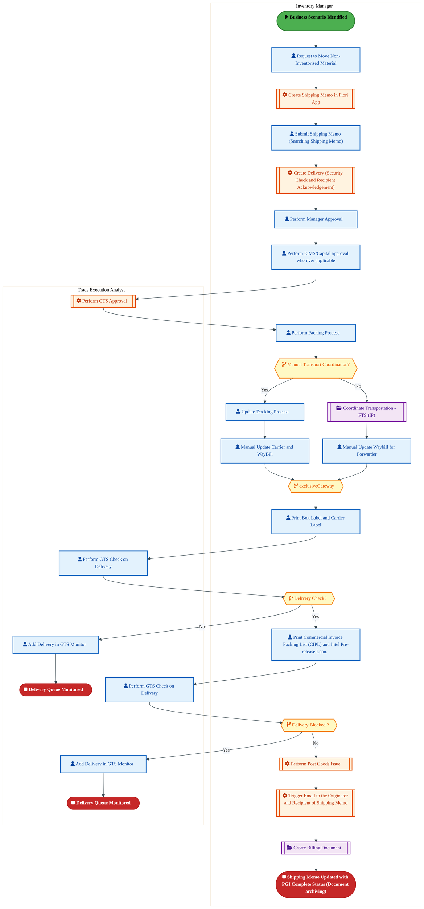
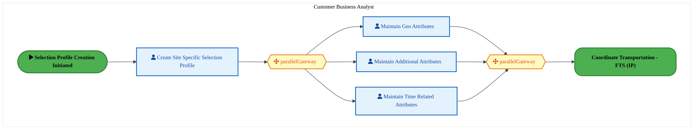
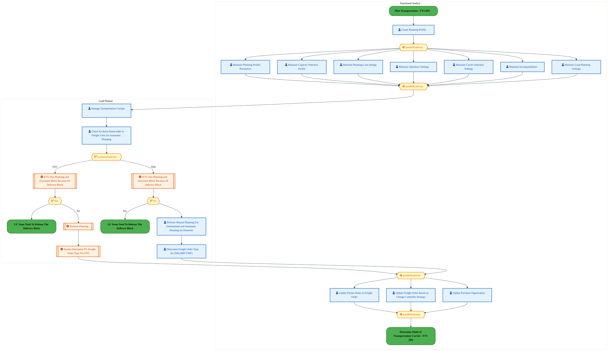

  <img src="data:image/svg+xml;base64,PHN2ZyB4bWxucz0iaHR0cDovL3d3dy53My5vcmcvMjAwMC9zdmciIHZpZXdCb3g9IjAgMCA4MDAgNDgwIiB3aWR0aD0iODAwIiBoZWlnaHQ9IjQ4MCI+DQogIDxkZWZzPg0KICAgIDxsaW5lYXJHcmFkaWVudCBpZD0iYmciIHgxPSIwJSIgeTE9IjAlIiB4Mj0iMTAwJSIgeTI9IjEwMCUiPg0KICAgICAgPHN0b3Agb2Zmc2V0PSIwJSIgc3R5bGU9InN0b3AtY29sb3I6IzAwNzFjNTtzdG9wLW9wYWNpdHk6MSIvPg0KICAgICAgPHN0b3Agb2Zmc2V0PSIxMDAlIiBzdHlsZT0ic3RvcC1jb2xvcjojMDBhZWVmO3N0b3Atb3BhY2l0eToxIi8+DQogICAgPC9saW5lYXJHcmFkaWVudD4NCiAgICA8bGluZWFyR3JhZGllbnQgaWQ9ImFjY2VudCIgeDE9IjAlIiB5MT0iMCUiIHgyPSIwJSIgeTI9IjEwMCUiPg0KICAgICAgPHN0b3Agb2Zmc2V0PSIwJSIgc3R5bGU9InN0b3AtY29sb3I6I2ZmZmZmZjtzdG9wLW9wYWNpdHk6MC4xNSIvPg0KICAgICAgPHN0b3Agb2Zmc2V0PSIxMDAlIiBzdHlsZT0ic3RvcC1jb2xvcjojZmZmZmZmO3N0b3Atb3BhY2l0eTowLjAyIi8+DQogICAgPC9saW5lYXJHcmFkaWVudD4NCiAgICA8cGF0dGVybiBpZD0iZ3JpZCIgd2lkdGg9IjQwIiBoZWlnaHQ9IjQwIiBwYXR0ZXJuVW5pdHM9InVzZXJTcGFjZU9uVXNlIj4NCiAgICAgIDxwYXRoIGQ9Ik0gNDAgMCBMIDAgMCAwIDQwIiBmaWxsPSJub25lIiBzdHJva2U9InJnYmEoMjU1LDI1NSwyNTUsMC4wNykiIHN0cm9rZS13aWR0aD0iMC41Ii8+DQogICAgPC9wYXR0ZXJuPg0KICA8L2RlZnM+DQoNCiAgPCEtLSBCYWNrZ3JvdW5kIC0tPg0KICA8cmVjdCB3aWR0aD0iODAwIiBoZWlnaHQ9IjQ4MCIgZmlsbD0idXJsKCNiZykiIHJ4PSI4Ii8+DQogIDxyZWN0IHdpZHRoPSI4MDAiIGhlaWdodD0iNDgwIiBmaWxsPSJ1cmwoI2dyaWQpIiByeD0iOCIvPg0KICA8cmVjdCB3aWR0aD0iODAwIiBoZWlnaHQ9IjQ4MCIgZmlsbD0idXJsKCNhY2NlbnQpIiByeD0iOCIvPg0KDQogIDwhLS0gRGVjb3JhdGl2ZSBjaXJjdWl0L2FyY2hpdGVjdHVyZSBsaW5lcyAtLT4NCiAgPGcgc3Ryb2tlPSJyZ2JhKDI1NSwyNTUsMjU1LDAuMTIpIiBzdHJva2Utd2lkdGg9IjEuNSIgZmlsbD0ibm9uZSI+DQogICAgPHBhdGggZD0iTSAwIDEwMCBMIDEyMCAxMDAgTCAxNjAgMTQwIEwgMjgwIDE0MCIvPg0KICAgIDxwYXRoIGQ9Ik0gMCAyNjAgTCA4MCAyNjAgTCAxMjAgMjIwIEwgMjAwIDIyMCBMIDI0MCAyNjAgTCAzNjAgMjYwIi8+DQogICAgPHBhdGggZD0iTSA1MjAgMTAwIEwgNjAwIDEwMCBMIDY0MCA2MCBMIDgwMCA2MCIvPg0KICAgIDxwYXRoIGQ9Ik0gNDQwIDM0MCBMIDU2MCAzNDAgTCA2MDAgMzAwIEwgNzIwIDMwMCBMIDc2MCAzNDAgTCA4MDAgMzQwIi8+DQogICAgPHBhdGggZD0iTSA2MDAgNDAwIEwgNjgwIDQwMCBMIDcyMCA0NDAiLz4NCiAgICA8cGF0aCBkPSJNIDAgNDAwIEwgNDAgNDAwIEwgODAgMzYwIi8+DQogICAgPHBhdGggZD0iTSAyMDAgNDIwIEwgMzIwIDQyMCBMIDM2MCAzODAgTCA0ODAgMzgwIi8+DQogICAgPHBhdGggZD0iTSA2NTAgNDQwIEwgNzUwIDQ0MCBMIDgwMCA0ODAiLz4NCiAgPC9nPg0KDQogIDwhLS0gRGVjb3JhdGl2ZSBub2RlcyAtLT4NCiAgPGcgZmlsbD0icmdiYSgyNTUsMjU1LDI1NSwwLjE4KSI+DQogICAgPGNpcmNsZSBjeD0iMTIwIiBjeT0iMTAwIiByPSI0Ii8+DQogICAgPGNpcmNsZSBjeD0iMjgwIiBjeT0iMTQwIiByPSI0Ii8+DQogICAgPGNpcmNsZSBjeD0iMjAwIiBjeT0iMjIwIiByPSI0Ii8+DQogICAgPGNpcmNsZSBjeD0iMzYwIiBjeT0iMjYwIiByPSI0Ii8+DQogICAgPGNpcmNsZSBjeD0iNjAwIiBjeT0iMTAwIiByPSI0Ii8+DQogICAgPGNpcmNsZSBjeD0iNzIwIiBjeT0iMzAwIiByPSI0Ii8+DQogICAgPGNpcmNsZSBjeD0iNTYwIiBjeT0iMzQwIiByPSI0Ii8+DQogICAgPGNpcmNsZSBjeD0iODAiIGN5PSIzNjAiIHI9IjQiLz4NCiAgICA8Y2lyY2xlIGN4PSI0ODAiIGN5PSIzODAiIHI9IjQiLz4NCiAgICA8Y2lyY2xlIGN4PSIzMjAiIGN5PSI0MjAiIHI9IjQiLz4NCiAgPC9nPg0KDQogIDwhLS0gVE9HQUYgQkRBVCBib3hlcyAtLT4NCiAgPGcgZm9udC1mYW1pbHk9IlNlZ29lIFVJLCBBcmlhbCwgc2Fucy1zZXJpZiIgZm9udC1zaXplPSIxNCIgZm9udC13ZWlnaHQ9IjYwMCI+DQogICAgPCEtLSBCIC0tPg0KICAgIDxyZWN0IHg9IjE1MCIgeT0iMTQwIiB3aWR0aD0iMTIwIiBoZWlnaHQ9IjQwIiByeD0iNSIgZmlsbD0icmdiYSgyNTUsMjU1LDI1NSwwLjE4KSIgc3Ryb2tlPSJyZ2JhKDI1NSwyNTUsMjU1LDAuMykiIHN0cm9rZS13aWR0aD0iMSIvPg0KICAgIDx0ZXh0IHg9IjIxMCIgeT0iMTY1IiB0ZXh0LWFuY2hvcj0ibWlkZGxlIiBmaWxsPSIjZmZmIj5CdXNpbmVzczwvdGV4dD4NCiAgICA8IS0tIEQgLS0+DQogICAgPHJlY3QgeD0iMjkwIiB5PSIxNDAiIHdpZHRoPSIxMjAiIGhlaWdodD0iNDAiIHJ4PSI1IiBmaWxsPSJyZ2JhKDI1NSwyNTUsMjU1LDAuMTgpIiBzdHJva2U9InJnYmEoMjU1LDI1NSwyNTUsMC4zKSIgc3Ryb2tlLXdpZHRoPSIxIi8+DQogICAgPHRleHQgeD0iMzUwIiB5PSIxNjUiIHRleHQtYW5jaG9yPSJtaWRkbGUiIGZpbGw9IiNmZmYiPkRhdGE8L3RleHQ+DQogICAgPCEtLSBBIC0tPg0KICAgIDxyZWN0IHg9IjQzMCIgeT0iMTQwIiB3aWR0aD0iMTIwIiBoZWlnaHQ9IjQwIiByeD0iNSIgZmlsbD0icmdiYSgyNTUsMjU1LDI1NSwwLjE4KSIgc3Ryb2tlPSJyZ2JhKDI1NSwyNTUsMjU1LDAuMykiIHN0cm9rZS13aWR0aD0iMSIvPg0KICAgIDx0ZXh0IHg9IjQ5MCIgeT0iMTY1IiB0ZXh0LWFuY2hvcj0ibWlkZGxlIiBmaWxsPSIjZmZmIj5BcHBsaWNhdGlvbjwvdGV4dD4NCiAgICA8IS0tIFQgLS0+DQogICAgPHJlY3QgeD0iNTcwIiB5PSIxNDAiIHdpZHRoPSIxMjAiIGhlaWdodD0iNDAiIHJ4PSI1IiBmaWxsPSJyZ2JhKDI1NSwyNTUsMjU1LDAuMTgpIiBzdHJva2U9InJnYmEoMjU1LDI1NSwyNTUsMC4zKSIgc3Ryb2tlLXdpZHRoPSIxIi8+DQogICAgPHRleHQgeD0iNjMwIiB5PSIxNjUiIHRleHQtYW5jaG9yPSJtaWRkbGUiIGZpbGw9IiNmZmYiPlRlY2hub2xvZ3k8L3RleHQ+DQogIDwvZz4NCg0KICA8IS0tIENvbm5lY3RpbmcgbGluZXMgYmV0d2VlbiBCREFUIGJveGVzIC0tPg0KICA8ZyBzdHJva2U9InJnYmEoMjU1LDI1NSwyNTUsMC4yNSkiIHN0cm9rZS13aWR0aD0iMSI+DQogICAgPGxpbmUgeDE9IjI3MCIgeTE9IjE2MCIgeDI9IjI5MCIgeTI9IjE2MCIvPg0KICAgIDxsaW5lIHgxPSI0MTAiIHkxPSIxNjAiIHgyPSI0MzAiIHkyPSIxNjAiLz4NCiAgICA8bGluZSB4MT0iNTUwIiB5MT0iMTYwIiB4Mj0iNTcwIiB5Mj0iMTYwIi8+DQogIDwvZz4NCg0KICA8IS0tIE1haW4gdGl0bGUgLS0+DQogIDx0ZXh0IHg9IjQwMCIgeT0iMjYwIiB0ZXh0LWFuY2hvcj0ibWlkZGxlIiBmb250LWZhbWlseT0iU2Vnb2UgVUksIEFyaWFsLCBzYW5zLXNlcmlmIiBmb250LXNpemU9IjM2IiBmb250LXdlaWdodD0iNzAwIiBmaWxsPSIjZmZmZmZmIiBsZXR0ZXItc3BhY2luZz0iMSI+DQogICAgSUFPIEFyY2hpdGVjdHVyZQ0KICA8L3RleHQ+DQogIDx0ZXh0IHg9IjQwMCIgeT0iMzAwIiB0ZXh0LWFuY2hvcj0ibWlkZGxlIiBmb250LWZhbWlseT0iU2Vnb2UgVUksIEFyaWFsLCBzYW5zLXNlcmlmIiBmb250LXNpemU9IjE4IiBmb250LXdlaWdodD0iNDAwIiBmaWxsPSJyZ2JhKDI1NSwyNTUsMjU1LDAuOCkiIGxldHRlci1zcGFjaW5nPSIyIj4NCiAgICBUT0dBRiBCREFUIMK3IElBTyBQcm9ncmFtIMK3IElETSAyLjANCiAgPC90ZXh0Pg0KDQogIDwhLS0gQm90dG9tIGFjY2VudCBiYXIgLS0+DQogIDxyZWN0IHg9IjI4MCIgeT0iMzQwIiB3aWR0aD0iMjQwIiBoZWlnaHQ9IjMiIHJ4PSIxLjUiIGZpbGw9InJnYmEoMjU1LDI1NSwyNTUsMC40KSIvPg0KDQogIDwhLS0gSW50ZWwgdGV4dCAtLT4NCiAgPHRleHQgeD0iNDAwIiB5PSIzODAiIHRleHQtYW5jaG9yPSJtaWRkbGUiIGZvbnQtZmFtaWx5PSJTZWdvZSBVSSwgQXJpYWwsIHNhbnMtc2VyaWYiIGZvbnQtc2l6ZT0iMTMiIGZpbGw9InJnYmEoMjU1LDI1NSwyNTUsMC41KSIgbGV0dGVyLXNwYWNpbmc9IjMiPg0KICAgIElOVEVMIENPTkZJREVOVElBTA0KICA8L3RleHQ+DQo8L3N2Zz4NCg==" alt="IAO Architecture" style="width:100%; border-radius:8px;" />
  <h1 style="font-size:36px; margin-top:24px;">LO-180 — Manage Outbound Transportation - FTS (IP)</h1>
  <h2 style="font-size:24px;">Architecture Document (TOGAF BDAT)</h2>
  
Forecast to Stock (IP) (FTS-IP) Tower 
  Capability LO-180 · L Logistics and Inventory Management - FTS (IP)

  
IAO Program · R1 – R5 
  Generated: April 2026 
  Sajiv Francis

  
IAO Architecture Pipeline — Intel Confidential

Page 1<a href="#toc">↑ Back to TOC</a>LO-180 — Manage Outbound Transportation - FTS (IP)

## Table of Contents

<nav class="toc">
<ol>
  <li><a href="#1-executive-summary">1. Executive Summary</a></li>
  <li><a href="#2-business-context-objectives">2. Business Context &amp; Objectives</a>
    <ul>
      <li><a href="#21-classification">2.1 Classification</a></li>
      <li><a href="#22-business-drivers">2.2 Business Drivers</a></li>
      <li><a href="#23-success-criteria">2.3 Success Criteria</a></li>
      <li><a href="#24-companion-documents">2.4 Companion Documents</a></li>
    </ul>
  </li>
  <li><a href="#3-business-architecture-togaf-b">3. Business Architecture (TOGAF &ldquo;B&rdquo;)</a>
    <ul>
      <li><a href="#31-business-process-overview">3.1 Business Process Overview</a></li>
      <li><a href="#32-business-process-diagrams">3.2 Business Process Diagrams</a></li>
      <li><a href="#33-business-roles-responsibilities">3.3 Business Roles &amp; Responsibilities</a></li>
    </ul>
  </li>
  <li><a href="#4-data-architecture-togaf-d">4. Data Architecture (TOGAF &ldquo;D&rdquo;)</a>
    <ul>
      <li><a href="#41-data-entities-ownership">4.1 Data Entities &amp; Ownership</a></li>
      <li><a href="#42-data-flow-diagrams">4.2 Data Flow Diagrams</a></li>
      <li><a href="#43-data-lineage">4.3 Data Lineage</a></li>
      <li><a href="#44-ricefw-data-objects">4.4 RICEFW Data Objects</a></li>
      <li><a href="#45-data-governance-quality">4.5 Data Governance &amp; Quality</a></li>
    </ul>
  </li>
  <li><a href="#5-application-architecture-togaf-a">5. Application Architecture (TOGAF &ldquo;A&rdquo;)</a>
    <ul>
      <li><a href="#51-current-state-current-state-application-landscape">5.1 Current-State Application Landscape</a></li>
      <li><a href="#52-future-state-future-state-application-landscape">5.2 Future-State Application Landscape</a></li>
      <li><a href="#53-change-impact-summary">5.3 Change Impact Summary</a></li>
      <li><a href="#54-component-overview">5.4 Component Overview</a></li>
      <li><a href="#55-ricefw-inventory">5.5 RICEFW Inventory</a></li>
      <li><a href="#56-integration-patterns">5.6 Integration Patterns</a></li>
    </ul>
  </li>
  <li><a href="#6-technology-architecture-togaf-t">6. Technology Architecture (TOGAF &ldquo;T&rdquo;)</a>
    <ul>
      <li><a href="#61-platform-infrastructure">6.1 Platform &amp; Infrastructure</a></li>
      <li><a href="#62-sap-development-object-status">6.2 SAP Development Object Status</a></li>
      <li><a href="#63-nfrs-design-principles">6.3 NFRs &amp; Design Principles</a></li>
      <li><a href="#64-security-governance">6.4 Security &amp; Governance</a></li>
    </ul>
  </li>
  <li><a href="#7-project-context">7. Project Context</a>
    <ul>
      <li><a href="#71-project-roadmap-go-live-plan">7.1 Project Roadmap &amp; Go-Live Plan</a></li>
      <li><a href="#72-raid-log">7.2 RAID Log</a></li>
      <li><a href="#73-recommendations-next-steps">7.3 Recommendations &amp; Next Steps</a></li>
    </ul>
  </li>
</ol>
</nav>

Page 2<a href="#toc">↑ Back to TOC</a>LO-180 — Manage Outbound Transportation - FTS (IP)

## 1. Executive Summary

This Architecture Document defines the **Business, Data, Application, and Technology** (BDAT) architecture for **LO-180 Manage Outbound Transportation - FTS (IP)** within the IAO program. It includes 6 BPMN process diagram(s) in Section 3.

| Dimension | Value |
|-----------|-------|
| **Tower** | Forecast to Stock (IP) (FTS-IP) |
| **Process Group** | L Logistics and Inventory Management - FTS (IP) |
| **Capability** | LO-180 - Manage Outbound Transportation - FTS (IP) |
| **Release** | R1 – R5 |
| **Total Systems** | 0 |
| **System Status** | 0 Deployed, 0 Developing, 0 EOL, 0 Pending IAPM |
| **RICEFW Objects** | 2 Reports, 20 Interfaces, 3 Conversions, 17 Enhancements, 6 Forms, 3 Workflows |

**Change Summary**: 0 new flow chains, 0 removed, 0 modified, 0 unchanged between Current-State and Future-State states.

> All system nodes in architecture diagrams are **IAPM-linked** — click any node to open its IAPM page. Diagrams require `securityLevel: 'loose'` for click events.

Page 3<a href="#toc">↑ Back to TOC</a>LO-180 — Manage Outbound Transportation - FTS (IP)

## 2. Business Context & Objectives

### 2.1 Classification

| Level | Value |
|-------|-------|
| **L0 Tower** | Forecast to Stock (IP) |
| **L1 Process** | L Logistics and Inventory Management - FTS (IP) |
| **L2 Capability** | LO-180 - Manage Outbound Transportation - FTS (IP) |

### 2.2 Business Drivers

| # | Driver | Description | Strategic Alignment | Priority |
|---|--------|-------------|---------------------|----------|
| 1 | Intel Products Supply Chain Unification | Consolidate Intel Products manufacturing and logistics onto S/4 HANA platform | IDM 2.0 Products Transformation | High |
| 2 | End-to-End Traceability | Enable lot/batch traceability from raw material to finished goods shipment | Quality & Compliance | High |
| 3 | Demand-Supply Matching | Implement responsive demand and supply matching (RDSM) for IP product lines | Supply Chain Agility | Medium |
| 4 | LO-180 Process Migration | Migrate Manage Outbound Transportation - FTS (IP) business processes and 0 integrated systems from legacy to S/4 HANA target architecture | IDM 2.0 Supply Chain (Intel Products) | High |

Page 4<a href="#toc">↑ Back to TOC</a>LO-180 — Manage Outbound Transportation - FTS (IP)

### 2.3 Success Criteria

| Metric | Target | Measure | Baseline | Owner |
|--------|--------|---------|----------|-------|
| Production Schedule Adherence | > 95% | Percentage of production orders completed on schedule | 88% (current) | Production Manager |
| Material Availability Rate | > 98% | Materials available at point of need for production | 94% (current) | Materials Planning |
| Shipping On-Time Delivery | > 97% | Orders shipped within committed delivery window | 93% (current) | Logistics Lead |
| LO-180 Migration Completeness | 100% flow chains validated | All 0 flow chains verified in target state | 0% (pre-migration) | Tower Architect |

### 2.4 Companion Documents

| Document | Description |
|----------|-------------|
| **Business Architecture** | Included in this document (Section 3) — process flows from BPMN diagrams |
| **This Document** | Full BDAT Architecture — Business + Data + Application + Technology |

Page 5<a href="#toc">↑ Back to TOC</a>LO-180 — Manage Outbound Transportation - FTS (IP)

## 3. Business Architecture (TOGAF "B")

### 3.1 Business Process Overview

This capability includes **6 business process(es)** modeled in BPMN 2.0, covering the end-to-end workflow for LO-180 Manage Outbound Transportation - FTS (IP).

| # | Step ID | Process Name | Lanes | Tasks | Gateways |
|---|---------|--------------|-------|-------|----------|
| 1 | LO-180-010_Process_Delivery_of_Line_Items_-_FTS_(IP) | LO-180-010_Process_Delivery_of_Line_Items_-_FTS_(IP) | Warehouse Operator | 8 | 2 |
| 2 | LO-180-050_Prepare_Delivery_Schedule_for_Non-orders_-_FTS_(IP) | LO-180-050_Prepare_Delivery_Schedule_for_Non-orders_-_FTS_(IP) | Inventory Manager, Trade Execution Analyst | 19 | 4 |
| 3 | LO-180-070_Plan_Transportation_-_FTS_(IP) | LO-180-070_Plan_Transportation_-_FTS_(IP) | Customer Business Analyst | 4 | 2 |
| 4 | LO-180-130_Coordinate_Transportation_-_FTS_(IP) | LO-180-130_Coordinate_Transportation_-_FTS_(IP) | Functional Analyst, Load Planner | 19 | 7 |
| 5 | LO-180-140_Record_Transportation_Information_-_FTS_(IP) | LO-180-140_Record_Transportation_Information_-_FTS_(IP) | Load Planner | 3 | 0 |
| 6 | LO-180-150_Generate_Shipping_Documentation_-_FTS_(IP) | LO-180-150_Generate_Shipping_Documentation_-_FTS_(IP) | Load Planner | 3 | 2 |

Page 6<a href="#toc">↑ Back to TOC</a>LO-180 — Manage Outbound Transportation - FTS (IP)

### 3.2 Business Process Diagrams

#### BUSINESS ARCHITECTURE — 3.2.1 LO-180-010_Process_Delivery_of_Line_Items_-_FTS_(IP) — LO-180-010_Process_Delivery_of_Line_Items_-_FTS_(IP)

**Swim Lanes**: Warehouse Operator | **Tasks**: 8 | **Gateways**: 2

```mermaid
%%{init: {'theme': 'base', 'themeVariables': {'fontSize': '14px', 'fontFamily': 'Segoe UI, Arial, sans-serif','primaryColor': '#e8f0fe', 'primaryBorderColor': '#0071c5','lineColor': '#37474F', 'secondaryColor': '#f5f8fc'}, 'flowchart': {'useMaxWidth': false, 'htmlLabels': true, 'curve': 'basis', 'nodeSpacing': 40, 'rankSpacing': 50}} }%%
flowchart TD
    classDef startEvt fill:#4CAF50,stroke:#2E7D32,color:#000,font-weight:bold,stroke-width:2px,rx:20,ry:20
    classDef endEvt fill:#C62828,stroke:#B71C1C,color:#fff,font-weight:bold,stroke-width:2px,rx:20,ry:20
    classDef userTask fill:#E3F2FD,stroke:#1565C0,stroke-width:2px,color:#0D47A1
    classDef serviceTask fill:#FFF3E0,stroke:#E65100,stroke-width:2px,color:#BF360C
    classDef gateway fill:#FFF9C4,stroke:#F57F17,stroke-width:2px,color:#E65100
    classDef subProc fill:#F3E5F5,stroke:#7B1FA2,stroke-width:2px,color:#4A148C
    subgraph Warehouse Operator
        n1[["fa:fa-cog Transfer Delivery to TM (Control Key)"]]
        n2[["fa:fa-cog Fetch Organization Structure Details"]]
        n3[["fa:fa-cog Determine Freight Unit Building Rule"]]
        n4[["fa:fa-cog Determine FU Type for ISM (IMF/VMF)"]]
        n5[["fa:fa-cog Check for Back Dated Orders and Update Freight Unit"]]
        n6[["fa:fa-cog Check Delivery Block and Shipment Planning Block Reasons"]]
        n7[["fa:fa-cog Update Freight Unit Based on Controller Strategy"]]
        n8[["fa:fa-cog Check for DG material and Update DG Indicator in Freight Unit"]]
        n9["Plan Transportation - FTS (IP)"]
        n10["Create Delivery Note"]
        n11{{"fa:fa-arrows-alt parallelGateway"}}
        n12{{"fa:fa-arrows-alt parallelGateway"}}
    end
    n1 --> n2
    n2 --> n3
    n11 --> n6
    n11 --> n7
    n11 --> n5
    n5 --> n12
    n6 --> n12
    n7 --> n12
    n10 --> n1
    n3 --> n4
    n4 --> n11
    n11 --> n8
    n8 --> n12
    n12 -->|"Freight Unit
Created"| n9
    class n1 serviceTask
    class n2 serviceTask
    class n3 serviceTask
    class n4 serviceTask
    class n5 serviceTask
    class n6 serviceTask
    class n7 serviceTask
    class n8 serviceTask
    class n9 startEvt
    class n10 startEvt
    class n11 gateway
    class n12 gateway
```

> **Legend**: ● Start · ● End · User Task · Service Task · ◇ Gateway · Sub-Process

<a href="https://mermaid.live/view#pako:eNqlVluP2jgU_itWRiO2UlBzJUweVoJAqtF2tqPCtA9ltfIkDlhj7Mg2w1DKf9_jJNzSZqXV5gHlfOf4O1cfsrcykRMrtm5v95RTHaN9T6_ImvRi1HvGivRsVANfsKT4mRHVMzaF4HpGv1dmblC-GTODpXhN2c6gM7IUBD3d22gEB5mNFOaqr4ikRc_ulZKusdwlgglprG_IsHCKylujGguZE3k2cJzIzUI4yignZ9iPgihIzTlFMsHzK9IiLIZF1juY4JjYZissdRX-RpEH_PaV5noFcoGZImCz0mv2ET8TZnLUcmOwbCNfj8WgyvjhULBZiTPKl4AHDkAS85czFDqHAzrc3i74ySmaTxYcwZMxrNSEFEhpgKevGhWUsfgmSEZp6NhKS_FC4htvGk18z85MJjGk7timuP0tocuVjp8FyxvT_tbkEHvlmy3fYs-x5Q5-W74Iz8-ekoE39IYnT-PITdzk6Kkoiv_lCeoq51i9NL6mfuqlk5MvNxyEifMz3zHNSRCN3HadiHylGbkgTdPUn55LNR2ErtNNOk79gZO0SJdYky3enQnvkuBEmIZR6kadhLW_dpSb50cpsiOhPw3T8EQYjd105HUSBiM3GDYRAs9S4nKFGObkb-fbwvqKJVkJqCv6VBKJtZAL66_a2Dzc_QZGBY4L3M_EEs1hFFVBJJoQRl-J3CEt0PwB_ZZAV6Vg6A-yewcMlxTeNUVKdLZCn-QSc_odayo4msFlyPRGEqDVmDLVYvCvGcCIyDVcU5TKao7QE6wWNN5QlsMVQZ83jLQYgk6GJzTflQQVQqL7GSRy_5C-__KQtpMIrwmSFcleqkNjDC8TaHgOOcFGUQjzHD2VOUBX8bUIB78iPFV1zASIhmm2ouWacI0eoWfcpFfrPhOsBG9XKrpm_UUYELCCWKHqTcsYdBMaAHbLXYtt2JX05ANawwGzeC_TBfie5zQzY4Qo_7f074DZZFRPVCmkrkehj9L5DLrw-K41h2ZYE0kqN8cq_Sk0aZm5-_0xZCyl2Ko-ZhqVWGJIlH2oL-bCOhwuD3n_7RDsu_qFu6jf_x0mvBG9WvSP2kY9aMlRSw4bOaxF90g3aMlRS3adBmhkvxaDRgwardtyN2zkYZuuCv_HwrpqG6-Lni-sH9C1i71ksr_Ynlcar1Pjd2qCTk3YqRl0aqJOzbBTc3f617xO0-nA3eOiv4a9I2zZ1hrWDKa5Fe-t6isHvoRyUuAN09bBtvBGi9mOZ1ZcfQ1Ym-oaTSiGJb2uwcM_Lu_tIw==" title="View full diagram">&#128065; View Diagram</a>

Page 7<a href="#toc">↑ Back to TOC</a>LO-180 — Manage Outbound Transportation - FTS (IP)

#### BUSINESS ARCHITECTURE — 3.2.2 LO-180-050_Prepare_Delivery_Schedule_for_Non-orders_-_FTS_(IP) — LO-180-050_Prepare_Delivery_Schedule_for_Non-orders_-_FTS_(IP)

**Swim Lanes**: Inventory Manager · Trade Execution Analyst | **Tasks**: 19 | **Gateways**: 4

> **Legend**: ● Start · ● End · User Task · Service Task · ◇ Gateway · Sub-Process

<a href="https://mermaid.live/view#pako:eNqlWGtv2zYU_SuEisAJYHeSLFm2P2zwS4WBpMvqdMXQDAMtXdlEZFKjJDte6v--S1uUI0XesC4fAvDwnnMf5CUpvxiBCMEYGldXL4yzbEheWtkaNtAaktaSptBqkxPwK5WMLmNIW8omEjxbsL-OZpaTPCszhfl0w-K9QhewEkA-z9tkhMS4TVLK004KkkWtdiuRbEPlfiJiIZX1O-hHZnT0VkyNhQxBng1M07MCF6kx43CGu57jOb7ipRAIHlZEIzfqR0HroIKLxS5YU5kdw89TuKPPX1iYrXEc0TgFtFlnm_iWLiFWOWYyV1iQy60uBkuVH44FWyQ0YHyFuGMiJCl_OkOueTiQw9XVIy-dkofpIyf4F8Q0TacQkTRDeLbNSMTiePjOmYx812ynmRRPMHxnz7xp124HKpMhpm62VXE7O2CrdTZcijgsTDs7lcPQTp7b8nlom225x_81X8DDs6dJz-7b_dLT2LMm1kR7iqLof3nCusoHmj4VvmZd3_anpS_L7bkT862eTnPqeCOrXieQWxbAK1Hf97uzc6lmPdcyL4uO_W7PnNREVzSDHd2fBQcTpxT0Xc-3vIuCJ3_1KPPlvRSBFuzOXN8tBb2x5Y_si4LOyHL6RYSos5I0WZOYcvjD_PpozPkWeCbkntxRTlcgH43fT7bqj7toEtFhRDuq9OQT_JlDmpFMkDuxBfJR8I5WYCmEKJKBaseqSq-qssiXG5aRxZolCW5pcgcbQa4XQGWwVuPKxE1VyqtK3UvGMzIRmw3IAP0SjEbgepJ7GjwpiVuG4V5P5ve3N4TyEOcziJEGHQkx4AFEbgXl79-_r7rpV918TkJMjEzFSVStBaRplTJoimwsnsmx5Y_OJ1RKhnNHpMq2zBodZCTkRq8KGSWJFNt6YS2rmTWb3y1-mNCEZVgSWlDJbg0StmiGSMwCddrW5OxmOV3MxrytbpWEEeforCiZTlml_4Xux7iBa3Tnn-hIWSKFYBjEF3JH1aFdE-h9LRUCsSITCYpZ3V2ME5_hHlV1RHqF7zXypxAzrNVebUw8pFm2J5M1BE_HTD5BwBKG256MgicudjGEK7zDeHZTF-9XxcuKCtyWH4QIUzJP0xzqtEGV9iDZSu2C2YayWHUfXpnkZwQZp9h6tZhEVM2-Jm6b16V4EuMxNc5TvPPSlCwC4HgNCzIPUYdFDELk3rzmds_cNBNJrcynVQvJjmVrcv9hrjoziUEtR0azPCXX2EK5KhQ5NvsWmTd1F87Lyzn3EDpLvP6C9XlBxjG2ITr56dE4HF4T3WZisaMecJQmQqrjAu9-VTkm-BuRXrMIPAcxlmkLH05ne53m_UvQx73zxtmr3RHhVQiyIxLg5wDhHPUxWtIh_sOCXM_v6xvNHlyQOu1m1XdqlXT5z2y8vJvuBnWwoO8QyOwZ9__R-YjTeJ9mtfZrPjI-YJinfkGirkKVWTtsRmF4Lhf2q1K4E_hmFLWG7363R-c7PVpucxcrwquDuZKcVWuU0tEvOeSg_bxtMPs_88oVxM4mnc6PeGsXY_c0tHrFuFeMPW3vKODbo_ERz4hv6rTSE251wi4nTgp28YziVjF2irFXeKg7-A3Sk5DmaUNTA0VsOlRLx14ytGu3HqPWLmMspAZ67NUMy_T7hQ8dveUUPnQU2qCrDbo1g8FprOf1tPag9coktKCOzSoE7DJYDZQuizW1ypIXNbfcen7FYjmvHo9qhfSjuQLbzXC3GXaaYbcZ7jXDXjPcb4YHzTCWoxm_kKd1IVHrQqbWhVRxP776VKhO9S5PeZen-penBhensMP1l10Vt4qvsCpqN6LdRtTRny1V2G2Ge82w1wz39RdMFR5o2Ggb-IDHx01oDF-M4-8B-JtBCBHN48w4tA2aZ2Kx54ExPH43G_nxoTFlFK-szQk8_A1qtSQ2" title="View full diagram">&#128065; View Diagram</a>

Page 8<a href="#toc">↑ Back to TOC</a>LO-180 — Manage Outbound Transportation - FTS (IP)

#### BUSINESS ARCHITECTURE — 3.2.3 LO-180-070_Plan_Transportation_-_FTS_(IP) — LO-180-070_Plan_Transportation_-_FTS_(IP)

**Swim Lanes**: Customer Business Analyst | **Tasks**: 4 | **Gateways**: 2

> **Legend**: ● Start · ● End · User Task · Service Task · ◇ Gateway · Sub-Process

<a href="https://mermaid.live/view#pako:eNqlVV1r2zAU_SvCpaQDB_wZe34YJE5cChuMJdseljEU-yoRVSQjyU2zkP8-Kc5H3TUPY4YY35N7zrn3WpJ3TikqcDLn9nZHOdUZ2vX0CtbQy1BvgRX0XNQC37CkeMFA9WwOEVxP6e9Dmh_VzzbNYgVeU7a16BSWAtDXBxcNDZG5SGGu-gokJT23V0u6xnKbCyakzb6BlHjk4Hb8ayRkBfKS4HmJX8aGyiiHCxwmURIVlqegFLzqiJKYpKTs7W1xTGzKFZb6UH6j4BN-_k4rvTIxwUyByVnpNfuIF8Bsj1o2Fisb-XQaBlXWh5uBTWtcUr40eOQZSGL-eIFib79H-9vbOT-botl4zpG5SoaVGgNBSht48qQRoYxlN1E-LGLPVVqKR8hugkkyDgO3tJ1kpnXPtcPtb4AuVzpbCFYdU_sb20MW1M-ufM4Cz5Vbc3_lBby6OOWDIA3Ss9Mo8XM_PzkRQv7LycxVzrB6PHpNwiIoxmcvPx7Eufe33qnNcZQM_ddzAvlES3ghWhRFOLmMajKIfe-66KgIB17-SnSJNWzw9iL4Po_OgkWcFH5yVbD1e11ls_gsRXkSDCdxEZ8Fk5FfDIOrgtHQj9JjhUZnKXG9Qgxz-OX9mDt5o7RYg0SjRpmFrxQacsy2Ss-dny3HXtw3qQRnBPftK0C5BNMimlJ7q6GkhJZoCgxKTQVHplZTKXQlgq7EJ0y5Nj90DwINtZZ00WhQXU54hTOja0BfgJkiqqvk6Ap5WFXUlonZVWp8d-bWzLzIv1prJ2CBB3OqUVuHUXj3QmJghyvMIUO5HdXM7GFVC6lbVh8Vsym6e_j8rmuc7HYnYyyl2Kg-ZhrVWGLGgN2362ru7PcvOOm_ccxubR94jPr9D-bdHkO_DZNjmLRh2A2Dbhgdw6AN02MYdcOwG6ZtOHixyK37aXN34OBtOHwbjt6G4_Nx2IEHb8PJaf920PSEOq5j9ssa08rJds7h22W-bxUQ3DDt7F0HN1pMt7x0ssMZ7zR1ZZhjis3WW7fg_g-U50Mv" title="View full diagram">&#128065; View Diagram</a>

Page 9<a href="#toc">↑ Back to TOC</a>LO-180 — Manage Outbound Transportation - FTS (IP)

#### BUSINESS ARCHITECTURE — 3.2.4 LO-180-130_Coordinate_Transportation_-_FTS_(IP) — LO-180-130_Coordinate_Transportation_-_FTS_(IP)

**Swim Lanes**: Functional Analyst · Load Planner | **Tasks**: 19 | **Gateways**: 7

> **Legend**: ● Start · ● End · User Task · Service Task · ◇ Gateway · Sub-Process

<a href="https://mermaid.live/view#pako:eNq1WG1v4jgQ_itWVhV3EmjjvBDgw0kQyF6l7bZa6J5O29PJBAeiJjZynLZsl_9-45AE4iY63a4OqVA_nnnm1YPDqxHyDTUmxtXVa8xiOUGvPbmjKe1NUG9NMtrroxPwhYiYrBOa9ZRMxJlcxt8KMezsX5SYwgKSxslBoUu65RTdX_fRFBSTPsoIywYZFXHU6_f2Ik6JOPg84UJJv6OjyIwKa-XWjIsNFWcB0_Rw6IJqEjN6hm3P8ZxA6WU05GzTII3caBSFvaNyLuHP4Y4IWbifZ_SGvPwRb-QO1hFJMgoyO5kmH8maJipGKXKFhbl4qpIRZ8oOg4Qt9ySM2RZwxwRIEPZ4hlzzeETHq6sHVhtFq_kDQ_AKE5JlcxqhTAK8eJIoipNk8s7xp4Fr9jMp-COdvLMW3ty2-qGKZAKhm32V3MEzjbc7OVnzZFOKDp5VDBNr_9IXLxPL7IsDvGu2KNucLflDa2SNakszD_vYryxFUfRTliCvYkWyx9LWwg6sYF7bwu7Q9c23fFWYc8ebYj1PVDzFIb0gDYLAXpxTtRi62OwmnQX20PQ10i2R9JkczoRj36kJA9cLsNdJeLKne5mv7wQPK0J74QZuTejNcDC1OgmdKXZGpYfAsxVkv0MJYfRv8-uDEeQslDFnJEFTeDtk8sH46ySsXgyDTEQmERmo3CNfUIgN3YE-g25E4BX4RJs6VlPnhsRMwt8bLXRHBEmppCJrEtgdBD5Rh0Ae0JImtHC73QHn3xzweSah9FLCQrPtNnXv95si4FzAQcsouhVbwuJvRBlvKg47jN7uZZzCKBPgdZtBr0PvmoU83YOhdZzEMqaa2qhD7SMnm3Og7SbHnfkVIi4crdLbro_N9iTByGGw_MxhjCPgC0RxzCFpMGo1CtxK0dBAM8j4BoEb_o6wLYWyMWjyJFEuSgHy24PWecqxueqoFKY4uoFRiniEVjBAsz0Xsijb-zrOAQpWS_TL9d2vGo1qQJVDTbNbwXt9rcIBbv6cDUgi0R76G7xNPpzmwYNxPF4qjX5EafwDSrb535RgoLfNC1Wyc3u9qeibY88I1EzLoM_Dx32sDxntwPs7GsI45qoD4J85-AdtULTERVfdw30iK6SmueQp8Id142v82kC4owLUUuViDoOvPi0BcF0z6B5GyplI2KaFvTA65ynNANVMafPj3IzN1l4d9rSguV7eQEPdBO-_3ARaV-Hh15os5Nva7YsgG-JeU_w6QsE9-p1kZ79VOIsXGuZFLWYJFAPNaEhyNdkicDaJn6g4nHZ0-tH_Sz9u0i_hq4iml_n70JZCVbLl6lYjs4pWXaAVJSn6RKF7Vhx9hqmmRvhqR9-6cqls_Yyycz5q6uo7WEP_hzv0iesH2W0X_FMN-qbksF2SvoRJnoEn3ecXBhMaDH6DT21ta2unWpfio3Jta2tHW4-0NS7XXrUuCXFl0C0FxpUBsxQwdQBXFKamgrEGVEEMy_VQc8oqo6gYrXEpYGoEOmEVxVgj9HQDJVCvizR9fzCKYn5X_VjtVPFXBcFVBt2GBOiqjvmuhkCDVA2zSrVyowaqatUqw5KrOCGKrK5TmSNch1z6gS1dFwbUSbeuaRmDrZesCgGPNQFcue5e3GtVs1T3-QZstcN2O-y0w247PGyHvXZ41A6P22Fo1Ha8I07cESjuiBR3hIo7YoUaXzzdNLe87q1R99a4c8sy6yfOJo47cKsDtztwp3qoasJuOzxsh712eNQOj1thaPYSNvpGCt9NJN4Yk1ej-BEDfujY0IjkiTSOfYPAxWF5YKExKR72jby4485jAneq9AQe_wFVBlIh" title="View full diagram">&#128065; View Diagram</a>

Page 10<a href="#toc">↑ Back to TOC</a>LO-180 — Manage Outbound Transportation - FTS (IP)

#### BUSINESS ARCHITECTURE — 3.2.5 LO-180-140_Record_Transportation_Information_-_FTS_(IP) — LO-180-140_Record_Transportation_Information_-_FTS_(IP)

**Swim Lanes**: Load Planner | **Tasks**: 3 | **Gateways**: 0

```mermaid
%%{init: {'theme': 'base', 'themeVariables': {'fontSize': '14px', 'fontFamily': 'Segoe UI, Arial, sans-serif','primaryColor': '#e8f0fe', 'primaryBorderColor': '#0071c5','lineColor': '#37474F', 'secondaryColor': '#f5f8fc'}, 'flowchart': {'useMaxWidth': false, 'htmlLabels': true, 'curve': 'basis', 'nodeSpacing': 40, 'rankSpacing': 50}} }%%
flowchart TD
    classDef startEvt fill:#4CAF50,stroke:#2E7D32,color:#000,font-weight:bold,stroke-width:2px,rx:20,ry:20
    classDef endEvt fill:#C62828,stroke:#B71C1C,color:#fff,font-weight:bold,stroke-width:2px,rx:20,ry:20
    classDef userTask fill:#E3F2FD,stroke:#1565C0,stroke-width:2px,color:#0D47A1
    classDef serviceTask fill:#FFF3E0,stroke:#E65100,stroke-width:2px,color:#BF360C
    classDef gateway fill:#FFF9C4,stroke:#F57F17,stroke-width:2px,color:#E65100
    classDef subProc fill:#F3E5F5,stroke:#7B1FA2,stroke-width:2px,color:#4A148C
    subgraph Load Planner
        n1[["fa:fa-cog Carrier Assigned to FO"]]
        n2[["fa:fa-cog Update Custom fields on Freight Order Subcontracting Tab"]]
        n3[["fa:fa-cog Check Custom BRF+ Table(Enhancement)"]]
        n4["Ship Order (IP)"]
        n5["Determine Mode of Transportation/Carrier FTS (IP)"]
    end
    n5 --> n1
    n1 --> n3
    n3 --> n2
    n2 --> n4
    class n1 serviceTask
    class n2 serviceTask
    class n3 serviceTask
    class n4 startEvt
    class n5 startEvt
```

> **Legend**: ● Start · ● End · User Task · Service Task · ◇ Gateway · Sub-Process

<a href="https://mermaid.live/view#pako:eNqlVNuO2jAQ_RUrK5StGtRcCc1DJQhYWmlXuyps-7BUlUlsYq1jI9tZoIh_r80dKp6aB8Qcz5wzM_bM2ilEiZ3MabXWlFOdgbWrK1xjNwPuFCnsemAH_ECSoinDyrU-RHA9on-2bkE8X1o3i0FUU7ay6AjPBAavDx7omUDmAYW4aissKXE9dy5pjeQqF0xI632Hu8QnW7X9UV_IEsuTg--nQZGYUEY5PsFRGqcxtHEKF4KXF6QkIV1SuBubHBOLokJSb9NvFH5Cy5-01JWxCWIKG59K1-wRTTGzNWrZWKxo5MehGVRZHW4aNpqjgvKZwWPfQBLx9xOU-JsN2LRaE34UBePBhAPzFQwpNcAEKG3g4YcGhDKW3cV5Dya-p7QU7zi7C4fpIAq9wlaSmdJ9zza3vcB0VulsKli5d20vbA1ZOF96cpmFvidX5vdKC_PypJR3wm7YPSr10yAP8oMSIeS_lExf5Rip973WMIIhHBy1gqST5P6_fIcyB3HaC677hOUHLfAZKYQwGp5aNewkgX-btA-jjp9fkc6Qxgu0OhF-zeMjIUxSGKQ3CXd611k20xcpigNhNExgciRM-wHshTcJ414Qd_cZGp6ZRPMKMMTxb_9t4jwKVIIXY3IsJ86vnZv9ePBmjgnKCGoXYgZyJCXFEvSUojOOS6AFgM8m5DwmvIx5nZemEyBvlBa1SR6zUgHBAZTb6wfPdgTBqJmaydISFdo8cDBG0yvW6CqTChfvB9L-d_jZhjB8P-QV4oVZJVx_umKIDcGoovO94v3Dy6fLYhPjMMAay9pMP3gyIwgEAWMzeGoupEaaCv7l0AI4Hl1SmAHY_eEJaLe_md7tzWBnRnsz2pnh3gx3Znx22Tbk7ElenIQ3T6KbJ_FxEVzAyRF2PKc2VSNaOtna2W5is61LTFDDtLPxHNRoMVrxwsm2G8tptnc6oMg8pHoHbv4C8MjiEQ==" title="View full diagram">&#128065; View Diagram</a>

#### BUSINESS ARCHITECTURE — 3.2.6 LO-180-150_Generate_Shipping_Documentation_-_FTS_(IP) — LO-180-150_Generate_Shipping_Documentation_-_FTS_(IP)

**Swim Lanes**: Load Planner | **Tasks**: 3 | **Gateways**: 2

```mermaid
%%{init: {'theme': 'base', 'themeVariables': {'fontSize': '14px', 'fontFamily': 'Segoe UI, Arial, sans-serif','primaryColor': '#e8f0fe', 'primaryBorderColor': '#0071c5','lineColor': '#37474F', 'secondaryColor': '#f5f8fc'}, 'flowchart': {'useMaxWidth': false, 'htmlLabels': true, 'curve': 'basis', 'nodeSpacing': 40, 'rankSpacing': 50}} }%%
flowchart TD
    classDef startEvt fill:#4CAF50,stroke:#2E7D32,color:#000,font-weight:bold,stroke-width:2px,rx:20,ry:20
    classDef endEvt fill:#C62828,stroke:#B71C1C,color:#fff,font-weight:bold,stroke-width:2px,rx:20,ry:20
    classDef userTask fill:#E3F2FD,stroke:#1565C0,stroke-width:2px,color:#0D47A1
    classDef serviceTask fill:#FFF3E0,stroke:#E65100,stroke-width:2px,color:#BF360C
    classDef gateway fill:#FFF9C4,stroke:#F57F17,stroke-width:2px,color:#E65100
    classDef subProc fill:#F3E5F5,stroke:#7B1FA2,stroke-width:2px,color:#4A148C
    subgraph lane_0["Load Planner"]
        n1[["fa:fa-cog Create Freight Order"]]
        n2[["fa:fa-cog Generate Carrier Custom Invoice Form(ZCUS)"]]
        n3[["fa:fa-cog Generate Sales Invoice Summary Form(ZSIS)"]]
        n4(["fa:fa-stop Output Message Status Updated (Success or Failure)"])
        n5["Coordinate Transportation (Planning profiles, Optimizer settings Etc.)"]
        n6{{"fa:fa-code-branch Commodity Type?"}}
        n7{{"fa:fa-code-branch exclusiveGateway"}}
    end
    n5 --> n1
    n1 --> n6
    n2 --> n7
    n3 --> n7
    n7 --> n4
    n6 -->|"ZCUS"| n2
    n6 -->|"ZSIS"| n3
    class n1 serviceTask
    class n2 serviceTask
    class n3 serviceTask
    class n4 endEvt
    class n5 startEvt
    class n6 gateway
    class n7 gateway
```

> **Legend**: ● Start · ● End · User Task · Service Task · ◇ Gateway · Sub-Process

<a href="https://mermaid.live/view#pako:eNqlVdtu4zYQ_RVCQeAEkAtdLVcPLRzZWgTYRRZQ0gJdFwVNUTYRiRRIyrHX63_vUJKvWz9VD4LmzJwznCGH2llE5NSKrfv7HeNMx2g30Cta0UGMBgus6MBGHfAHlgwvSqoGJqYQXGfsexvmBvXGhBksxRUrtwbN6FJQ9PZsowkQSxspzNVQUcmKgT2oJauw3CaiFNJE39Fx4RRttt71JGRO5SnAcSKXhEAtGacn2I-CKEgNT1EieH4hWoTFuCCDvVlcKT7ICkvdLr9R9Ave_MlyvQK7wKWiELPSVfkZL2hpatSyMRhp5PrQDKZMHg4Ny2pMGF8CHjgASczfT1Do7Pdof38_58ek6HU65wgeUmKlprRASgM8W2tUsLKM74JkkoaOrbQU7zS-82bR1PdsYiqJoXTHNs0dflC2XOl4Icq8Dx1-mBpir97YchN7ji238L7KRXl-ypSMvLE3PmZ6itzETQ6ZiqL4X5mgr_IVq_c-18xPvXR6zOWGozBxftY7lDkNool73Scq14zQM9E0Tf3ZqVWzUeg6t0WfUn_kJFeiS6zpB96eBH9NgqNgGkapG90U7PJdr7JZfJWCHAT9WZiGR8HoyU0n3k3BYOIG436FoLOUuF6hEnP6j_Ntbn0WOEdfweRUzq2_uzDzcPcbuAscF3hIxBIlkkJVKJXtzqEXMz1AOGd4l4xPFDQNJ8FSMipR0igtKvTM1wJajlIhq4e_krfs8UrHv6GTYbgejvSsqcwc9zLZ808ywcNRBvLW6KXRdaPRF6oUXgJfY90o9FbnoJ2jh6whBFxISJRiVjaSGsHHM8EQ9BIB9wbjZjmvMJaqFhJ0mODooe0ijCiqpYCNospGL7VmFVxjEs6Z1uBTaKbJL4-XnR7tdqd6czpcgDBZoURUlciZ3qLXbU1_n1v7_Rkp-m8S3ZCyUWxNP3Vn8MSCKe0-eIiGw99gg3vT7cxRb3qdGfWmf2lGnRn05siYP-aW2ca59QPY1w7YmNbhnx1pk_Ns8C483k2Pf9MT9FfQBRge78ALeHSYzgs0OqCWbVVUVpjlVryz2j8T_L1yWuCm1NbetnCjRbblxIrbG9xq2vMzZRgGq-rA_b8ppDqC" title="View full diagram">&#128065; View Diagram</a>

Page 11<a href="#toc">↑ Back to TOC</a>LO-180 — Manage Outbound Transportation - FTS (IP)

### 3.3 Business Roles & Responsibilities

| Role / Lane | Processes Involved | Description |
|------------|-------------------|-------------|
| Warehouse Operator | LO-180-010_Process_Delivery_of_Line_Items_-_FTS_(IP),  | |
| Inventory Manager | LO-180-050_Prepare_Delivery_Schedule_for_Non-orders_-_FTS_(IP),  | |
| Trade Execution Analyst | LO-180-050_Prepare_Delivery_Schedule_for_Non-orders_-_FTS_(IP),  | |
| Customer Business Analyst | LO-180-070_Plan_Transportation_-_FTS_(IP),  | |
| Functional Analyst | LO-180-130_Coordinate_Transportation_-_FTS_(IP),  | |
| Load Planner | LO-180-130_Coordinate_Transportation_-_FTS_(IP), LO-180-140_Record_Transportation_Information_-_FTS_(IP), LO-180-150_Generate_Shipping_Documentation_-_FTS_(IP) | |

Page 12<a href="#toc">↑ Back to TOC</a>LO-180 — Manage Outbound Transportation - FTS (IP)

## 4. Data Architecture (TOGAF "D")

### 4.1 Data Entities & Ownership

The following data entities are derived from the system integration flows for LO-180. Tower architects should validate ownership and classification.

| # | Data Entity | Source System | Target System | Data Owner | Classification | Volume | Master/Transaction |
|---|-------------|---------------|---------------|------------|----------------|--------|-------------------|

Page 13<a href="#toc">↑ Back to TOC</a>LO-180 — Manage Outbound Transportation - FTS (IP)

### 4.2 Data Flow Diagrams

> **DATA ARCHITECTURE** — Database-to-database data flows. Applications (blue) sit above their hosting databases (green cylinders). Thick arrows show data movement between databases.

### 4.3 Data Lineage

Data lineage traces the origin and transformation path of key data objects across integrated systems.

| # | Source System | Source Schema/Object | Target System | Target Schema/Object | Transformation |
|---|-------------|---------------------|---------------|---------------------|---------------|

> *Lineage detail will be refined when tower architects validate source/target schema object mappings.*

### 4.4 RICEFW Data Objects

Data-centric RICEFW objects (Reports and Conversions) from the Object Tracker:

| Object ID | Type | Description | Status | Source | Target | Complexity |
|-----------|------|-------------|--------|--------|--------|-----------|
| LOGR1176_IP | Report | ISM - International Traffic Report | 10. Object Complete |  |  | 02.High |
| LOGR0833_IP | Report | Email Notification for deletion of Shipping Memos | 10. Object Complete |  |  | 03.Medium |
| LOGC1500 | Conversion | IM Stock conversion from Non SAP system to S4 system | 10. Object Complete |  |  | 02.High |
| LOGC0972_IP | Conversion | Open Inventory Conversion for IP and IF (as applicable) , Batch Characteristi... | 10. Object Complete |  |  | 02.High |
| LOGC0946_IP | Conversion | Open Inventory Conversion for IP and IF (as applicable) , ECC to S4 | 10. Object Complete |  |  | 02.High |

### 4.5 Data Governance & Quality

| Concern | Approach |
|---------|----------|
| Data Ownership | Per-entity owners listed in Section 3.1 |
| Data Classification | Financial data classified as Intel Confidential |
| Data Retention | Per Intel corporate retention policies |
| Data Quality | Validated at source; reconciliation at target |

Page 14<a href="#toc">↑ Back to TOC</a>LO-180 — Manage Outbound Transportation - FTS (IP)

## 5. Application Architecture (TOGAF "A")

### 5.1 Current-State — Current-State Application Landscape

#### Overview

The Current-State architecture represents the **current / legacy** landscape for LO-180.

#### Current-State Flow Narrative

*(No current-state flows defined.)*

### 5.2 Future-State — Future-State Application Landscape

#### Overview

The Future-State architecture represents the **target** landscape for LO-180.

#### Future-State Flow Narrative

*(No future-state flows defined.)*

### 5.3 Change Impact Summary

| Change Type | Flow Chain | Detail |
|-------------|-----------|--------|

**Totals**: 0 new - 0 removed - 0 modified - 0 unchanged

### 5.4 Component Overview

#### System Inventory

| System | IAPM ID | Status |
|--------|---------|--------|

Page 15<a href="#toc">↑ Back to TOC</a>LO-180 — Manage Outbound Transportation - FTS (IP)

### 5.5 RICEFW Inventory

| Object ID | Type | Description | Status | Source → Target | Middleware | Complexity |
|-----------|------|-------------|--------|----------------|-----------|-----------|
| LOGW1078_IP | Workflow | ISM Workflows - Capital/AMT | 10. Object Complete |  | NA | 03.Medium |
| LOGW1077_IP | Workflow | ISM Workflows - EIMS/Lab | 10. Object Complete |  | NA | 03.Medium |
| LOGW1076_IP | Workflow | ISM Workflows - Non-inventory | 10. Object Complete |  | NA | 02.High |
| LOGR1176_IP | Report | ISM - International Traffic Report | 10. Object Complete |  | NA | 02.High |
| LOGR0833_IP | Report | Email Notification for deletion of Shipping Memos | 10. Object Complete |  | NA | 03.Medium |
| LOGI1679 | Interface | Receive 4C1 Inventory movement Stock type change and cycle count from IF | 10. Object Complete |  | SFT | 03.Medium |
| LOGI1678 | Interface | Receive 4C1 Inventory Reconciliation Snapshot from IF | 10. Object Complete |  | SFT | 03.Medium |
| LOGI1576 | Interface | ECD_Interface between S4 to ECD for inventory status response | 08. FUT In Progress |  | MuleSoft | 03.Medium |
| LOGI1575 | Interface | ECD_Interface between S4 to 3PL for inventory status webservice​ | 08. FUT In Progress |  | MuleSoft | 03.Medium |
| LOGI1571 | Interface | ECD_Interface from ECD to S4 for Inventory status call​ | 10. Object Complete |  | MuleSoft | 03.Medium |
| LOGI1295 | Interface | ECD_Interface between S/4 and ECD for completion status | 08. FUT In Progress |  | MULESOFT | 03.Medium |
| LOGI1291 | Interface | ECD_Interface between S/4 and 3PL to send plant/batch level hold/unhold infor... | 08. FUT In Progress |  | MULESOFT | 03.Medium |
| LOGI1290 | Interface | ECD_Interface from ECD to S4 for Inventory Hold/unhold request | 08. FUT In Progress |  | MULESOFT | 03.Medium |
| LOGI1272 | Interface | Response to goods receipt posting from SAP to 3PL - EDI 4C1B | 10. Object Complete | S/4 → WMS (3PL) | MULESOFT | 03.Medium |
| LOGI1267 | Interface | Inventory Reconciliation with Consignment hub – EDI 4C1 with version control | 10. Object Complete | OpenText → S/4 | MULESOFT | 03.Medium |
| LOGI1081_IP | Interface | Interface + Enhancement - Reprinting of Carrier Label | 10. Object Complete | S/4 → Redwood | APIGEE | 03.Medium |
| LOGI1079_IP | Interface | Interface from S4 ISM to Service Now | 10. Object Complete | S/4 ISM → Service Now | NA | 03.Medium |
| LOGI1074_IP | Interface | Send data via API to retrieve the tracking ID - interface + Enhancement | 10. Object Complete | S/4 → Redwood | APIGEE | 03.Medium |
| LOGI0951 | Interface | Inbound interface to receive Finished Goods “Goods Receipt” (4B2) signal from... | 10. Object Complete | OpenText → S/4 | MULESOFT | 03.Medium |
| LOGI0950 | Interface | Interface to receive 4B2 signal from Factory and return shipments from ODM/OS... | 10. Object Complete | OpenText → S/4 | MULESOFT | 03.Medium |
| LOGI0933 | Interface | W-lot inventory error handling | 10. Object Complete |  | MULESOFT | 03.Medium |
| LOGI0836_IP | Interface | Interface from S4 to NDA (IPLA –Intel Pre Release License Agreements) | 10. Object Complete | S/4 → NDA | NA | 03.Medium |
| LOGI0335 | Interface | Outbound PIP signal to 3PL for material document transfer – EDI 4C1 | 10. Object Complete | S/4 → OpenText | MULESOFT | 02.High |
| LOGI0237_IP | Interface | Inventory Reconciliation snapshot (4C1) from 3PL WMS to SAP S/4 | 10. Object Complete | 3PL → S/4 | MULESOFT | 02.High |
| LOGF1100_IP | Form | Printing of Standard Shipping Label | 10. Object Complete |  | NA | 02.High |
| LOGF0359_IP | Form | ISM - Generate Commercial Invoice - IF/IP | 10. Object Complete | NA → NA | NA | 02.High |
| LOGF0358_IP | Form | ISM - Generate Traveler Document - IF/IP | 10. Object Complete | NA → NA | NA | 02.High |
| LOGF0352_IP | Form | ISM - IPLA | 10. Object Complete |  | NA | 02.High |
| LOGF0351_IP | Form | ISM - Custom China Special label | 10. Object Complete |  | NA | 02.High |
| LOGF0350_IP | Form | ISM - India GST DC | 10. Object Complete |  | NA | 02.High |
| LOGE1686 | Enhancement | IP custom table for reconciliation data | 10. Object Complete |  | NA | 03.Medium |
| LOGE1572_IP | Enhancement | SAP GUI T-code to Move stock from Blocked to unblock Status | 10. Object Complete |  | NA | 02.High |
| LOGE1569_IP | Enhancement | Enhancement to change billing status based on ship reason in ISM | 10. Object Complete |  | NA | 03.Medium |
| LOGE1327 | Enhancement | ECD_Enhancement to retrieve plant details for material/batch and update custo... | 08. FUT In Progress |  | NA | 02.High |
| LOGE1253 | Enhancement | Inventory Reconciliation with Consignment hub – EDI 4C1 with version control | 10. Object Complete |  | NA | 03.Medium |
| LOGE1177_IP | Enhancement | India GST E-invoicing | 10. Object Complete |  | NA | 03.Medium |
| LOGE1118_IP | Enhancement | ISM – MY Security Check Fiori app - IF | 10. Object Complete |  | NA | 02.High |
| LOGE1117_IP | Enhancement | ISM – Employee acknowledgement - IP | 10. Object Complete |  | NA | 02.High |
| LOGE1090_IP | Enhancement | PGI confirmation for non-inventory Intel freight shipments via email | 10. Object Complete |  | NA | 03.Medium |
| LOGE1080_IP | Enhancement | Email notifications to be triggered as part of ISM Workflows | 10. Object Complete |  | NA | 02.High |
| LOGE1052_IP | Enhancement | Custom fields required on delivery screen | 10. Object Complete |  | NA | 03.Medium |
| LOGE0945 | Enhancement | Update COF, COA and FVR in 3PL WMS - EDI 4C1B | 10. Object Complete |  | NA | 03.Medium |
| LOGE0936 | Enhancement | Validate receiving consigned materials into consignment hub – EDI 4B2 CSGN | 10. Object Complete |  | NA | 03.Medium |
| LOGE0935_IP | Enhancement | Fiori App - Shipping Memo | 09. FUT Overdue |  | NA | 01.Very High |
| LOGE0835_IF | Enhancement | Interface to get the AMT (Asset Management Tool) data on the ISM | 10. Object Complete |  | NA | 04.Low |
| LOGE0239_IP | Enhancement | Inventory Reconciliation snapshot (4C1) from 3PL WMS to SAP S/4 - Table Creation | 10. Object Complete | NA → NA | NA | 03.Medium |
| LOGE0190_IP | Enhancement | Delivery Split for STO in S/4 | 10. Object Complete | NA → NA | NA | 03.Medium |
| LOGC1500 | Conversion | IM Stock conversion from Non SAP system to S4 system | 10. Object Complete |  | NA | 02.High |
| LOGC0972_IP | Conversion | Open Inventory Conversion for IP and IF (as applicable) , Batch Characteristi... | 10. Object Complete |  | NA | 02.High |
| LOGC0946_IP | Conversion | Open Inventory Conversion for IP and IF (as applicable) , ECC to S4 | 10. Object Complete |  | NA | 02.High |
| LOGI1584 | Interface | Interface to post inventory in SAP S/4HANA from ECA via MuleSoft. | 06. Dev In Progress |  | MuleSoft | 03.Medium |

**Summary**: 2 Reports, 20 Interfaces, 3 Conversions, 17 Enhancements, 6 Forms, 3 Workflows

Page 16<a href="#toc">↑ Back to TOC</a>LO-180 — Manage Outbound Transportation - FTS (IP)

### 5.6 Integration Patterns

Integration patterns identified from the system flow analysis for LO-180:

| # | Pattern | Flow Chain | Middleware | Protocol | Auth |
|---|---------|-----------|-----------|----------|------|

> *Integration pattern details will be refined when tower architects validate middleware assignments.*

Page 17<a href="#toc">↑ Back to TOC</a>LO-180 — Manage Outbound Transportation - FTS (IP)

## 6. Technology Architecture (TOGAF "T")

### 6.1 Platform & Infrastructure

> **TECHNOLOGY / PLATFORM ARCHITECTURE** — Platforms (green) host applications (blue). Thick arrows show platform-to-platform integration flows.

#### Platform Inventory

Platform landscape inferred from integrated systems for LO-180:

| # | Platform | Type | Systems Using | Environment |
|---|----------|------|--------------|-------------|
| 1 | SAP S/4HANA | On-Premise (HEC) | SAP S/4 modules | DEV, QAS, PRD |
| 2 | SAP BTP (Integration Suite) | Cloud / PaaS | CPI, API Management | DEV, QAS, PRD |
| 3 | MuleSoft Anypoint | Cloud / iPaaS | API-led integrations | DEV, QAS, PRD |

> *Platform assignments will be validated when tower architects populate technology platform columns.*

Page 18<a href="#toc">↑ Back to TOC</a>LO-180 — Manage Outbound Transportation - FTS (IP)

### 6.2 SAP Development Object Status

| Metric | DEV | QAS | PRD |
|--------|-----|-----|-----|
| Transport Requests | — | — | — |
| Custom Code Objects | — | — | — |
| CDS Views | — | — | — |
| Fiori Apps | — | — | — |
| BAdIs / Enhancements | — | — | — |

### 6.3 NFRs & Design Principles

| Category | Requirement | Target / SLA | Priority |
|----------|-------------|-------------|----------|
| Performance | MRP/production planning run completes within defined window | < 4 hours full MRP run | High |
| Availability | Manufacturing execution systems available 24/7 | 99.95% (24x7 operations) | High |
| Scalability | Support production volume increases from new product lines | Handle 10K+ production orders/day | High |
| Recoverability | Production systems recover within shift change window | RPO < 15 min, RTO < 2 hours | High |
| Data Volume | Support high-frequency material movement transactions | 100K+ material documents/day | Medium |
| Latency | Real-time inventory visibility for warehouse operations | < 2 seconds for RF/scanner transactions | High |
| Concurrency | Support factory floor workers across multiple shifts/sites | 500+ concurrent warehouse users | Medium |

### 6.4 Security & Governance

| Concern | Approach | Standard / Policy | Owner |
|---------|----------|--------------------|-------|
| Authentication | Single Sign-On (SSO) via Intel corporate Azure AD identity | Intel IT Security Policy - Identity Management | IT Security |
| Authorization | Role-based access control (RBAC) with SAP authorization objects | Intel SAP Security Standards - Role Design | SAP Security Team |
| Data Classification | All financial/operational data classified per Intel Data Classification Standard | Intel Data Classification Policy | Data Governance |
| Data Encryption (at rest) | AES-256 encryption for SAP HANA database and file storage | Intel Encryption Standard | Infrastructure Security |
| Data Encryption (in transit) | TLS 1.3 for all system-to-system and user-to-system communication | Intel Network Security Policy | Network Engineering |
| Network Segmentation | SAP systems in dedicated network zones with firewall controls | Intel Network Architecture Standard | Network Security |
| API Security | OAuth 2.0 / certificate-based authentication for all API integrations | Intel API Security Guidelines | Integration Architecture |
| Audit Logging | Comprehensive audit trail for all data changes and user actions (SAP Security Audit Log) | SOX Compliance / Intel Audit Policy | Internal Audit |
| Certificate Management | Automated certificate lifecycle management for system-to-system trust | Intel PKI Standard | Certificate Authority Team |
| Compliance | SOX controls, export control (EAR/ITAR) screening, data privacy (GDPR) | Intel Corporate Compliance Framework | Compliance Office |

Page 19<a href="#toc">↑ Back to TOC</a>LO-180 — Manage Outbound Transportation - FTS (IP)

## 7. Project Context

### 7.1 Project Roadmap & Go-Live Plan

| ID | Description | FS | TDD | Build | FUT | Status |
|----|-------------|----|-----|-------|-----|--------|
| LOGW1078_IP | ISM Workflows - Capital/AMT | Jun-25 (100%) | Sep-25 (100%) | Sep-25 (100%) | Nov-25 (100%) | 1. On Track |
| LOGW1077_IP | ISM Workflows - EIMS/Lab | Jun-25 (100%) | Sep-25 (100%) | Sep-25 (100%) | Dec-25 (100%) | 4. Completed |
| LOGW1076_IP | ISM Workflows - Non-inventory | Jun-25 (100%) | Sep-25 (100%) | Sep-25 (100%) | Nov-25 (100%) | 1. On Track |
| LOGR1176_IP | ISM - International Traffic Report | Apr-25 (100%) | Aug-25 (100%) | Aug-25 (100%) | Nov-25 (100%) | 4. Completed |
| LOGR0833_IP | Email Notification for deletion of Shipping Memos | Feb-25 (100%) | Sep-25 (100%) | Sep-25 (100%) | Nov-25 (100%) | 1. On Track |
| LOGI1679 | Receive 4C1 Inventory movement Stock type change and cycle count from IF | Jan-26 (100%) | Feb-26 (100%) | Feb-26 (100%) | Mar-26 (100%) | 3. Off Track |
| LOGI1678 | Receive 4C1 Inventory Reconciliation Snapshot from IF | Jan-26 (100%) | Feb-26 (100%) | Feb-26 (100%) | Mar-26 (100%) | 3. Off Track |
| LOGI1576 | ECD_Interface between S4 to ECD for inventory status response | Sep-25 (100%) | Nov-25 (100%) | Nov-25 (100%) | Mar-26 (95%) | 4. Completed |
| LOGI1575 | ECD_Interface between S4 to 3PL for inventory status webservice​ | Sep-25 (100%) | Jan-26 (100%) | Jan-26 (100%) | Mar-26 (95%) | 4. Completed |
| LOGI1571 | ECD_Interface from ECD to S4 for Inventory status call​ | Sep-25 (100%) | Nov-25 (100%) | Nov-25 (100%) | Jan-26 (100%) | 1. On Track |
| LOGI1295 | ECD_Interface between S/4 and ECD for completion status | Aug-25 (100%) | Oct-25 (100%) | Oct-25 (100%) | Mar-26 (5%) | 3. Off Track |
| LOGI1291 | ECD_Interface between S/4 and 3PL to send plant/batch level hold/unhold infor... | May-25 (100%) | Jan-26 (100%) | Jan-26 (100%) | Mar-26 (30%) | 3. Off Track |
| LOGI1290 | ECD_Interface from ECD to S4 for Inventory Hold/unhold request | May-25 (100%) | Oct-25 (100%) | Oct-25 (100%) | Mar-26 (75%) | 4. Completed |
| LOGI1272 | Response to goods receipt posting from SAP to 3PL - EDI 4C1B | Feb-25 (100%) | Apr-25 (100%) | Apr-25 (100%) | Aug-25 (100%) |  |
| LOGI1267 | Inventory Reconciliation with Consignment hub – EDI 4C1 with version control | Mar-25 (100%) | May-25 (100%) | May-25 (100%) | Sep-25 (100%) | 1. On Track |
| LOGI1081_IP | Interface + Enhancement - Reprinting of Carrier Label | Apr-25 (100%) | May-25 (100%) | May-25 (100%) | Oct-25 (100%) |  |
| LOGI1079_IP | Interface from S4 ISM to Service Now | May-25 (100%) | May-25 (100%) | May-25 (100%) | Oct-25 (100%) | 4. Completed |
| LOGI1074_IP | Send data via API to retrieve the tracking ID - interface + Enhancement | Mar-25 (100%) | May-25 (100%) | May-25 (100%) | Oct-25 (100%) | 3. Off Track |
| LOGI0951 | Inbound interface to receive Finished Goods “Goods Receipt” (4B2) signal from... | Feb-25 (100%) | May-25 (100%) | May-25 (100%) | Aug-25 (100%) |  |
| LOGI0950 | Interface to receive 4B2 signal from Factory and return shipments from ODM/OS... | Feb-25 (100%) | May-25 (100%) | May-25 (100%) | Aug-25 (100%) |  |

*... and 31 more objects (see full Object Tracker)*

Page 20<a href="#toc">↑ Back to TOC</a>LO-180 — Manage Outbound Transportation - FTS (IP)

### 7.2 RAID Log

Standard RAID items for LO-180 (Forecast to Stock (IP)):

| # | Category | Description | Status | Owner | Priority |
|---|----------|-------------|--------|-------|----------|
| 1 | Risk | Data migration completeness — validate all legacy Manage Outbound Transportation - FTS (IP) data maps to S/4 target structures | Open | Tower Architect | High |
| 2 | Risk | Integration testing coverage — ensure all 0 integrated systems are validated end-to-end | Open | Integration Lead | High |
| 3 | Assumption | Target SAP S/4HANA system available in DEV/QAS per release schedule | Active | SAP Basis | Medium |
| 4 | Issue | API access provisioning — SAP OData, Smartsheet, and IAPM API credentials required for automation | Open | EA Pipeline Team | High |
| 5 | Dependency | Upstream BPMN process models validated and signed off by business process owners | Active | Process Owner | Medium |

> *Live RAID data will be auto-populated from the Smartsheet RAID log via API integration.*

### 7.3 Recommendations & Next Steps

| # | Category | Recommendation | Priority | Owner | Target Date | Status |
|---|----------|---------------|----------|-------|-------------|--------|
| 1 | Architecture | Complete extended flow attributes (Data Entity, Integration Pattern, Tech Platform) in Flows tab for full BDAT coverage | High | Tower Architect | 2026-Q2 | Open |
| 2 | Data | Define data ownership and classification for all 0 flow chains to satisfy Data Architecture (TOGAF D) requirements | Medium | Data Architect | 2026-Q3 | Open |
| 3 | Testing | Develop integration test scenarios covering all 0 flow chains for FUT/SIT readiness | High | Test Lead | 2026-Q3 | Open |
| 4 | Business Architecture | Review and validate Business Architecture process steps against latest Signavio/BIC process models | Medium | Business Analyst | 2026-Q2 | Open |
| 5 | Security | Complete security review for API integrations and data flows per Intel Security Architecture standards | Medium | Security Architect | 2026-Q3 | Open |

---
*LO-180 — Architecture Document (TOGAF BDAT) · Forecast to Stock (IP) · Generated: April 2026*

Page 21<a href="#toc">↑ Back to TOC</a>LO-180 — Manage Outbound Transportation - FTS (IP)

