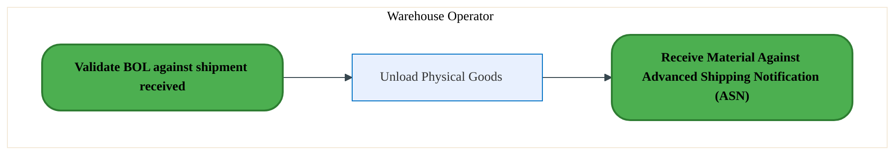
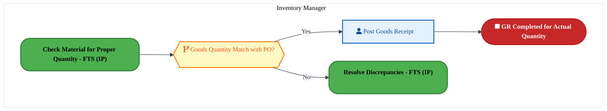

<div style="text-align:center; padding-top:20px;">
  <img src="data:image/svg+xml;base64,PHN2ZyB4bWxucz0iaHR0cDovL3d3dy53My5vcmcvMjAwMC9zdmciIHZpZXdCb3g9IjAgMCA4MDAgNDgwIiB3aWR0aD0iODAwIiBoZWlnaHQ9IjQ4MCI+DQogIDxkZWZzPg0KICAgIDxsaW5lYXJHcmFkaWVudCBpZD0iYmciIHgxPSIwJSIgeTE9IjAlIiB4Mj0iMTAwJSIgeTI9IjEwMCUiPg0KICAgICAgPHN0b3Agb2Zmc2V0PSIwJSIgc3R5bGU9InN0b3AtY29sb3I6IzAwNzFjNTtzdG9wLW9wYWNpdHk6MSIvPg0KICAgICAgPHN0b3Agb2Zmc2V0PSIxMDAlIiBzdHlsZT0ic3RvcC1jb2xvcjojMDBhZWVmO3N0b3Atb3BhY2l0eToxIi8+DQogICAgPC9saW5lYXJHcmFkaWVudD4NCiAgICA8bGluZWFyR3JhZGllbnQgaWQ9ImFjY2VudCIgeDE9IjAlIiB5MT0iMCUiIHgyPSIwJSIgeTI9IjEwMCUiPg0KICAgICAgPHN0b3Agb2Zmc2V0PSIwJSIgc3R5bGU9InN0b3AtY29sb3I6I2ZmZmZmZjtzdG9wLW9wYWNpdHk6MC4xNSIvPg0KICAgICAgPHN0b3Agb2Zmc2V0PSIxMDAlIiBzdHlsZT0ic3RvcC1jb2xvcjojZmZmZmZmO3N0b3Atb3BhY2l0eTowLjAyIi8+DQogICAgPC9saW5lYXJHcmFkaWVudD4NCiAgICA8cGF0dGVybiBpZD0iZ3JpZCIgd2lkdGg9IjQwIiBoZWlnaHQ9IjQwIiBwYXR0ZXJuVW5pdHM9InVzZXJTcGFjZU9uVXNlIj4NCiAgICAgIDxwYXRoIGQ9Ik0gNDAgMCBMIDAgMCAwIDQwIiBmaWxsPSJub25lIiBzdHJva2U9InJnYmEoMjU1LDI1NSwyNTUsMC4wNykiIHN0cm9rZS13aWR0aD0iMC41Ii8+DQogICAgPC9wYXR0ZXJuPg0KICA8L2RlZnM+DQoNCiAgPCEtLSBCYWNrZ3JvdW5kIC0tPg0KICA8cmVjdCB3aWR0aD0iODAwIiBoZWlnaHQ9IjQ4MCIgZmlsbD0idXJsKCNiZykiIHJ4PSI4Ii8+DQogIDxyZWN0IHdpZHRoPSI4MDAiIGhlaWdodD0iNDgwIiBmaWxsPSJ1cmwoI2dyaWQpIiByeD0iOCIvPg0KICA8cmVjdCB3aWR0aD0iODAwIiBoZWlnaHQ9IjQ4MCIgZmlsbD0idXJsKCNhY2NlbnQpIiByeD0iOCIvPg0KDQogIDwhLS0gRGVjb3JhdGl2ZSBjaXJjdWl0L2FyY2hpdGVjdHVyZSBsaW5lcyAtLT4NCiAgPGcgc3Ryb2tlPSJyZ2JhKDI1NSwyNTUsMjU1LDAuMTIpIiBzdHJva2Utd2lkdGg9IjEuNSIgZmlsbD0ibm9uZSI+DQogICAgPHBhdGggZD0iTSAwIDEwMCBMIDEyMCAxMDAgTCAxNjAgMTQwIEwgMjgwIDE0MCIvPg0KICAgIDxwYXRoIGQ9Ik0gMCAyNjAgTCA4MCAyNjAgTCAxMjAgMjIwIEwgMjAwIDIyMCBMIDI0MCAyNjAgTCAzNjAgMjYwIi8+DQogICAgPHBhdGggZD0iTSA1MjAgMTAwIEwgNjAwIDEwMCBMIDY0MCA2MCBMIDgwMCA2MCIvPg0KICAgIDxwYXRoIGQ9Ik0gNDQwIDM0MCBMIDU2MCAzNDAgTCA2MDAgMzAwIEwgNzIwIDMwMCBMIDc2MCAzNDAgTCA4MDAgMzQwIi8+DQogICAgPHBhdGggZD0iTSA2MDAgNDAwIEwgNjgwIDQwMCBMIDcyMCA0NDAiLz4NCiAgICA8cGF0aCBkPSJNIDAgNDAwIEwgNDAgNDAwIEwgODAgMzYwIi8+DQogICAgPHBhdGggZD0iTSAyMDAgNDIwIEwgMzIwIDQyMCBMIDM2MCAzODAgTCA0ODAgMzgwIi8+DQogICAgPHBhdGggZD0iTSA2NTAgNDQwIEwgNzUwIDQ0MCBMIDgwMCA0ODAiLz4NCiAgPC9nPg0KDQogIDwhLS0gRGVjb3JhdGl2ZSBub2RlcyAtLT4NCiAgPGcgZmlsbD0icmdiYSgyNTUsMjU1LDI1NSwwLjE4KSI+DQogICAgPGNpcmNsZSBjeD0iMTIwIiBjeT0iMTAwIiByPSI0Ii8+DQogICAgPGNpcmNsZSBjeD0iMjgwIiBjeT0iMTQwIiByPSI0Ii8+DQogICAgPGNpcmNsZSBjeD0iMjAwIiBjeT0iMjIwIiByPSI0Ii8+DQogICAgPGNpcmNsZSBjeD0iMzYwIiBjeT0iMjYwIiByPSI0Ii8+DQogICAgPGNpcmNsZSBjeD0iNjAwIiBjeT0iMTAwIiByPSI0Ii8+DQogICAgPGNpcmNsZSBjeD0iNzIwIiBjeT0iMzAwIiByPSI0Ii8+DQogICAgPGNpcmNsZSBjeD0iNTYwIiBjeT0iMzQwIiByPSI0Ii8+DQogICAgPGNpcmNsZSBjeD0iODAiIGN5PSIzNjAiIHI9IjQiLz4NCiAgICA8Y2lyY2xlIGN4PSI0ODAiIGN5PSIzODAiIHI9IjQiLz4NCiAgICA8Y2lyY2xlIGN4PSIzMjAiIGN5PSI0MjAiIHI9IjQiLz4NCiAgPC9nPg0KDQogIDwhLS0gVE9HQUYgQkRBVCBib3hlcyAtLT4NCiAgPGcgZm9udC1mYW1pbHk9IlNlZ29lIFVJLCBBcmlhbCwgc2Fucy1zZXJpZiIgZm9udC1zaXplPSIxNCIgZm9udC13ZWlnaHQ9IjYwMCI+DQogICAgPCEtLSBCIC0tPg0KICAgIDxyZWN0IHg9IjE1MCIgeT0iMTQwIiB3aWR0aD0iMTIwIiBoZWlnaHQ9IjQwIiByeD0iNSIgZmlsbD0icmdiYSgyNTUsMjU1LDI1NSwwLjE4KSIgc3Ryb2tlPSJyZ2JhKDI1NSwyNTUsMjU1LDAuMykiIHN0cm9rZS13aWR0aD0iMSIvPg0KICAgIDx0ZXh0IHg9IjIxMCIgeT0iMTY1IiB0ZXh0LWFuY2hvcj0ibWlkZGxlIiBmaWxsPSIjZmZmIj5CdXNpbmVzczwvdGV4dD4NCiAgICA8IS0tIEQgLS0+DQogICAgPHJlY3QgeD0iMjkwIiB5PSIxNDAiIHdpZHRoPSIxMjAiIGhlaWdodD0iNDAiIHJ4PSI1IiBmaWxsPSJyZ2JhKDI1NSwyNTUsMjU1LDAuMTgpIiBzdHJva2U9InJnYmEoMjU1LDI1NSwyNTUsMC4zKSIgc3Ryb2tlLXdpZHRoPSIxIi8+DQogICAgPHRleHQgeD0iMzUwIiB5PSIxNjUiIHRleHQtYW5jaG9yPSJtaWRkbGUiIGZpbGw9IiNmZmYiPkRhdGE8L3RleHQ+DQogICAgPCEtLSBBIC0tPg0KICAgIDxyZWN0IHg9IjQzMCIgeT0iMTQwIiB3aWR0aD0iMTIwIiBoZWlnaHQ9IjQwIiByeD0iNSIgZmlsbD0icmdiYSgyNTUsMjU1LDI1NSwwLjE4KSIgc3Ryb2tlPSJyZ2JhKDI1NSwyNTUsMjU1LDAuMykiIHN0cm9rZS13aWR0aD0iMSIvPg0KICAgIDx0ZXh0IHg9IjQ5MCIgeT0iMTY1IiB0ZXh0LWFuY2hvcj0ibWlkZGxlIiBmaWxsPSIjZmZmIj5BcHBsaWNhdGlvbjwvdGV4dD4NCiAgICA8IS0tIFQgLS0+DQogICAgPHJlY3QgeD0iNTcwIiB5PSIxNDAiIHdpZHRoPSIxMjAiIGhlaWdodD0iNDAiIHJ4PSI1IiBmaWxsPSJyZ2JhKDI1NSwyNTUsMjU1LDAuMTgpIiBzdHJva2U9InJnYmEoMjU1LDI1NSwyNTUsMC4zKSIgc3Ryb2tlLXdpZHRoPSIxIi8+DQogICAgPHRleHQgeD0iNjMwIiB5PSIxNjUiIHRleHQtYW5jaG9yPSJtaWRkbGUiIGZpbGw9IiNmZmYiPlRlY2hub2xvZ3k8L3RleHQ+DQogIDwvZz4NCg0KICA8IS0tIENvbm5lY3RpbmcgbGluZXMgYmV0d2VlbiBCREFUIGJveGVzIC0tPg0KICA8ZyBzdHJva2U9InJnYmEoMjU1LDI1NSwyNTUsMC4yNSkiIHN0cm9rZS13aWR0aD0iMSI+DQogICAgPGxpbmUgeDE9IjI3MCIgeTE9IjE2MCIgeDI9IjI5MCIgeTI9IjE2MCIvPg0KICAgIDxsaW5lIHgxPSI0MTAiIHkxPSIxNjAiIHgyPSI0MzAiIHkyPSIxNjAiLz4NCiAgICA8bGluZSB4MT0iNTUwIiB5MT0iMTYwIiB4Mj0iNTcwIiB5Mj0iMTYwIi8+DQogIDwvZz4NCg0KICA8IS0tIE1haW4gdGl0bGUgLS0+DQogIDx0ZXh0IHg9IjQwMCIgeT0iMjYwIiB0ZXh0LWFuY2hvcj0ibWlkZGxlIiBmb250LWZhbWlseT0iU2Vnb2UgVUksIEFyaWFsLCBzYW5zLXNlcmlmIiBmb250LXNpemU9IjM2IiBmb250LXdlaWdodD0iNzAwIiBmaWxsPSIjZmZmZmZmIiBsZXR0ZXItc3BhY2luZz0iMSI+DQogICAgSUFPIEFyY2hpdGVjdHVyZQ0KICA8L3RleHQ+DQogIDx0ZXh0IHg9IjQwMCIgeT0iMzAwIiB0ZXh0LWFuY2hvcj0ibWlkZGxlIiBmb250LWZhbWlseT0iU2Vnb2UgVUksIEFyaWFsLCBzYW5zLXNlcmlmIiBmb250LXNpemU9IjE4IiBmb250LXdlaWdodD0iNDAwIiBmaWxsPSJyZ2JhKDI1NSwyNTUsMjU1LDAuOCkiIGxldHRlci1zcGFjaW5nPSIyIj4NCiAgICBUT0dBRiBCREFUIMK3IElBTyBQcm9ncmFtIMK3IElETSAyLjANCiAgPC90ZXh0Pg0KDQogIDwhLS0gQm90dG9tIGFjY2VudCBiYXIgLS0+DQogIDxyZWN0IHg9IjI4MCIgeT0iMzQwIiB3aWR0aD0iMjQwIiBoZWlnaHQ9IjMiIHJ4PSIxLjUiIGZpbGw9InJnYmEoMjU1LDI1NSwyNTUsMC40KSIvPg0KDQogIDwhLS0gSW50ZWwgdGV4dCAtLT4NCiAgPHRleHQgeD0iNDAwIiB5PSIzODAiIHRleHQtYW5jaG9yPSJtaWRkbGUiIGZvbnQtZmFtaWx5PSJTZWdvZSBVSSwgQXJpYWwsIHNhbnMtc2VyaWYiIGZvbnQtc2l6ZT0iMTMiIGZpbGw9InJnYmEoMjU1LDI1NSwyNTUsMC41KSIgbGV0dGVyLXNwYWNpbmc9IjMiPg0KICAgIElOVEVMIENPTkZJREVOVElBTA0KICA8L3RleHQ+DQo8L3N2Zz4NCg==" alt="IAO Architecture" style="width:100%; border-radius:8px;" />
  <h1 style="font-size:36px; margin-top:24px;">LI-120 — Receive Materials and Services - FTS (IP)</h1>
  <h2 style="font-size:24px;">Architecture Document (TOGAF BDAT)</h2>
  <p style="font-size:18px; color:#555;">Forecast to Stock (IP) (FTS-IP) Tower<br/>
  Capability LI-120 · LI Logistics Management Inbound - FTS (IP)</p>
  <p style="font-size:14px; color:#888;">IAO Program · Release 3<br/>
  Generated: March 2026<br/>
  Sajiv Francis</p>
  <p style="font-size:12px; color:#aaa;">IAO Architecture Pipeline — Intel Confidential</p>
</div>

<style>
@media print {
  @page { margin: 0.75in; }
  .mermaid { page-break-inside: avoid; overflow: visible; }
  pre, table { page-break-inside: avoid; }
  h2, h3, h4 { page-break-after: avoid; }
}
.mermaid { overflow: visible; }
.mermaid svg { max-width: 100%; height: auto !important; }
nav.toc { margin: 16px 0 24px 0; }
nav.toc ol, nav.toc ul { list-style: none; padding-left: 0; margin: 0; }
nav.toc > ol > li { margin-bottom: 6px; font-weight: 600; font-size: 14px; }
nav.toc > ol > li > ul { padding-left: 28px; margin-top: 4px; }
nav.toc > ol > li > ul > li { font-weight: 400; font-size: 13px; margin-bottom: 2px; }
nav.toc a { color: #0071c5; text-decoration: none; }
nav.toc a:hover { text-decoration: underline; }
</style>


<div class="page-footer"><span>Page 1</span><span><a href="#toc">↑ Back to TOC</a></span><span>LI-120 — Receive Materials and Services - FTS (IP)</span></div>
<div style="page-break-before: always;"></div>


<a id="toc"></a>

## Table of Contents

<nav class="toc">
<ol>
  <li><a href="#1-executive-summary">1. Executive Summary</a></li>
  <li><a href="#2-business-context-objectives">2. Business Context &amp; Objectives</a>
    <ul>
      <li><a href="#21-classification">2.1 Classification</a></li>
      <li><a href="#22-business-drivers">2.2 Business Drivers</a></li>
      <li><a href="#23-success-criteria">2.3 Success Criteria</a></li>
      <li><a href="#24-companion-documents">2.4 Companion Documents</a></li>
    </ul>
  </li>
  <li><a href="#3-business-architecture-togaf-b">3. Business Architecture (TOGAF &ldquo;B&rdquo;)</a>
    <ul>
      <li><a href="#31-business-process-overview">3.1 Business Process Overview</a></li>
      <li><a href="#32-business-process-diagrams">3.2 Business Process Diagrams</a></li>
      <li><a href="#33-business-roles-responsibilities">3.3 Business Roles &amp; Responsibilities</a></li>
    </ul>
  </li>
  <li><a href="#4-data-architecture-togaf-d">4. Data Architecture (TOGAF &ldquo;D&rdquo;)</a>
    <ul>
      <li><a href="#41-data-entities-ownership">4.1 Data Entities &amp; Ownership</a></li>
      <li><a href="#42-data-flow-diagrams">4.2 Data Flow Diagrams</a></li>
      <li><a href="#43-data-lineage">4.3 Data Lineage</a></li>
      <li><a href="#44-ricefw-data-objects">4.4 RICEFW Data Objects</a></li>
      <li><a href="#45-data-governance-quality">4.5 Data Governance &amp; Quality</a></li>
    </ul>
  </li>
  <li><a href="#5-application-architecture-togaf-a">5. Application Architecture (TOGAF &ldquo;A&rdquo;)</a>
    <ul>
      <li><a href="#51-current-state-current-state-application-landscape">5.1 Current-State Application Landscape</a></li>
      <li><a href="#52-future-state-future-state-application-landscape">5.2 Future-State Application Landscape</a></li>
      <li><a href="#53-change-impact-summary">5.3 Change Impact Summary</a></li>
      <li><a href="#54-component-overview">5.4 Component Overview</a></li>
      <li><a href="#55-ricefw-inventory">5.5 RICEFW Inventory</a></li>
      <li><a href="#56-integration-patterns">5.6 Integration Patterns</a></li>
    </ul>
  </li>
  <li><a href="#6-technology-architecture-togaf-t">6. Technology Architecture (TOGAF &ldquo;T&rdquo;)</a>
    <ul>
      <li><a href="#61-platform-infrastructure">6.1 Platform &amp; Infrastructure</a></li>
      <li><a href="#62-sap-development-object-status">6.2 SAP Development Object Status</a></li>
      <li><a href="#63-nfrs-design-principles">6.3 NFRs &amp; Design Principles</a></li>
      <li><a href="#64-security-governance">6.4 Security &amp; Governance</a></li>
    </ul>
  </li>
  <li><a href="#7-project-context">7. Project Context</a>
    <ul>
      <li><a href="#71-project-roadmap-go-live-plan">7.1 Project Roadmap &amp; Go-Live Plan</a></li>
      <li><a href="#72-raid-log">7.2 RAID Log</a></li>
      <li><a href="#73-recommendations-next-steps">7.3 Recommendations &amp; Next Steps</a></li>
    </ul>
  </li>
</ol>
</nav>


<div class="page-footer"><span>Page 2</span><span><a href="#toc">↑ Back to TOC</a></span><span>LI-120 — Receive Materials and Services - FTS (IP)</span></div>
<div style="page-break-before: always;"></div>


## 1. Executive Summary

This Architecture Document defines the **Business, Data, Application, and Technology** (BDAT) architecture for **LI-120 Receive Materials and Services - FTS (IP)** within the IAO program. It includes 7 BPMN process diagram(s) in Section 3.

| Dimension | Value |
|-----------|-------|
| **Tower** | Forecast to Stock (IP) (FTS-IP) |
| **Process Group** | LI Logistics Management Inbound - FTS (IP) |
| **Capability** | LI-120 - Receive Materials and Services - FTS (IP) |
| **Release** | Release 3 |
| **Total Systems** | 0 |
| **System Status** | 0 Deployed, 0 Developing, 0 EOL, 0 Pending IAPM |
| **RICEFW Objects** | 2 Reports, 20 Interfaces, 3 Conversions, 17 Enhancements, 6 Forms, 3 Workflows |

**Change Summary**: 0 new flow chains, 0 removed, 0 modified, 0 unchanged between Current-State and Future-State states.

> All system nodes in architecture diagrams are **IAPM-linked** — click any node to open its IAPM page. Diagrams require `securityLevel: 'loose'` for click events.


<div class="page-footer"><span>Page 3</span><span><a href="#toc">↑ Back to TOC</a></span><span>LI-120 — Receive Materials and Services - FTS (IP)</span></div>
<div style="page-break-before: always;"></div>


## 2. Business Context & Objectives

### 2.1 Classification

| Level | Value |
|-------|-------|
| **L0 Tower** | Forecast to Stock (IP) |
| **L1 Process** | LI Logistics Management Inbound - FTS (IP) |
| **L2 Capability** | LI-120 - Receive Materials and Services - FTS (IP) |

### 2.2 Business Drivers

| # | Driver | Description | Strategic Alignment | Priority |
|---|--------|-------------|---------------------|----------|
| 1 | Intel Products Supply Chain Unification | Consolidate Intel Products manufacturing and logistics onto S/4 HANA platform | IDM 2.0 Products Transformation | High |
| 2 | End-to-End Traceability | Enable lot/batch traceability from raw material to finished goods shipment | Quality & Compliance | High |
| 3 | Demand-Supply Matching | Implement responsive demand and supply matching (RDSM) for IP product lines | Supply Chain Agility | Medium |
| 4 | LI-120 Process Migration | Migrate Receive Materials and Services - FTS (IP) business processes and 0 integrated systems from legacy to S/4 HANA target architecture | IDM 2.0 Supply Chain (Intel Products) | High |


<div class="page-footer"><span>Page 4</span><span><a href="#toc">↑ Back to TOC</a></span><span>LI-120 — Receive Materials and Services - FTS (IP)</span></div>
<div style="page-break-before: always;"></div>


### 2.3 Success Criteria

| Metric | Target | Measure | Baseline | Owner |
|--------|--------|---------|----------|-------|
| Production Schedule Adherence | > 95% | Percentage of production orders completed on schedule | 88% (current) | Production Manager |
| Material Availability Rate | > 98% | Materials available at point of need for production | 94% (current) | Materials Planning |
| Shipping On-Time Delivery | > 97% | Orders shipped within committed delivery window | 93% (current) | Logistics Lead |
| LI-120 Migration Completeness | 100% flow chains validated | All 0 flow chains verified in target state | 0% (pre-migration) | Tower Architect |

### 2.4 Companion Documents

| Document | Description |
|----------|-------------|
| **Business Architecture** | Included in this document (Section 3) — process flows from BPMN diagrams |
| **This Document** | Full BDAT Architecture — Business + Data + Application + Technology |


<div class="page-footer"><span>Page 5</span><span><a href="#toc">↑ Back to TOC</a></span><span>LI-120 — Receive Materials and Services - FTS (IP)</span></div>
<div style="page-break-before: always;"></div>


## 3. Business Architecture (TOGAF "B")

### 3.1 Business Process Overview

This capability includes **7 business process(es)** modeled in BPMN 2.0, covering the end-to-end workflow for LI-120 Receive Materials and Services - FTS (IP).

| # | Step ID | Process Name | Lanes | Tasks | Gateways |
|---|---------|--------------|-------|-------|----------|
| 1 | LI-120-040_Unload_Material_Received_-_FTS_(IP) | LI-120-040_Unload_Material_Received_-_FTS_(IP) | Warehouse Operator | 1 | 0 |
| 2 | LI-120-060_Process_Damaged_Goods_-_FTS_(IP) | LI-120-060_Process_Damaged_Goods_-_FTS_(IP) | Receiving Agent, Warehouse Operator | 6 | 2 |
| 3 | LI-120-080_Receive_Material_Against_Advanced_Shipping_Notification_(ASN)_-_FTS_(IP) | LI-120-080_Receive_Material_Against_Advanced_Shipping_Notification_(ASN)_-_FTS_(IP) | Procurement Agent, Receiving Agent, Transportation Manager (Transportation Management), Warehouse Operator | 18 | 12 |
| 4 | LI-120-170_Check_Material_for_Proper_Quantity_-_FTS_(IP) | LI-120-170_Check_Material_for_Proper_Quantity_-_FTS_(IP) | Inventory Manager | 3 | 1 |
| 5 | LI-120-180_Move_Material_to_Holding_Location​_-_FTS_(IP) | LI-120-180_Move_Material_to_Holding_Location​_-_FTS_(IP) | Inventory Manager | 4 | 3 |
| 6 | LI-120-190_Resolve_Discrepancies_-_FTS_(IP) | LI-120-190_Resolve_Discrepancies_-_FTS_(IP) | 3PL Inventory Manager, Consignment Supplier, Inventory Manager | 16 | 1 |
| 7 | LI-120-220_Receive_Actual_Count_Quantity_-_FTS_(IP) | LI-120-220_Receive_Actual_Count_Quantity_-_FTS_(IP) | Inventory Manager | 1 | 1 |


<div class="page-footer"><span>Page 6</span><span><a href="#toc">↑ Back to TOC</a></span><span>LI-120 — Receive Materials and Services - FTS (IP)</span></div>
<div style="page-break-before: always;"></div>


### 3.2 Business Process Diagrams


#### BUSINESS ARCHITECTURE — 3.2.1 LI-120-040_Unload_Material_Received_-_FTS_(IP) — LI-120-040_Unload_Material_Received_-_FTS_(IP)

**Swim Lanes**: Warehouse Operator | **Tasks**: 1 | **Gateways**: 0

> **Legend**: <span style="color:#000;background:#4CAF50;padding:2px 6px;border-radius:10px;font-weight:bold;font-size:9pt">● Start</span> · <span style="color:#fff;background:#C62828;padding:2px 6px;border-radius:10px;font-weight:bold;font-size:9pt">● End</span> · <span style="background:#E3F2FD;padding:2px 6px;border:1px solid #1565C0;font-size:9pt">User Task</span> · <span style="background:#FFF3E0;padding:2px 6px;border:1px solid #E65100;font-size:9pt">Service Task</span> · <span style="background:#FFF9C4;padding:2px 6px;border:1px solid #F57F17;font-size:9pt">◇ Gateway</span> · <span style="background:#F3E5F5;padding:2px 6px;border:1px solid #7B1FA2;font-size:9pt">Sub-Process</span>



<div style="text-align:center; margin:4px 0 8px 0; font-size:11px;"><a href="https://mermaid.live/view#pako:eNqllEuPmzAUhf-KxSiilYjEM6QsKhESqkrTmVEzj0XThQOXYI2xke28GuW_186DzKSaVVkgfDj-zr1XmJ1V8BKsxOr1doQRlaCdrWpowE6QPccSbAcdhWcsCJ5TkLbxVJypKflzsHlhuzE2o-W4IXRr1CksOKCn7w5K9UbqIImZ7EsQpLIduxWkwWKbccqFcd_AsHKrQ9rp1YiLEsTF4LqxV0R6KyUMLnIQh3GYm30SCs7Kd9AqqoZVYe9NcZSvixoLdSh_KeEH3ryQUtV6XWEqQXtq1dBbPAdqelRiabRiKVbnYRBpcpge2LTFBWELrYeulgRmrxcpcvd7tO_1ZqwLRY_jGUP6KiiWcgwVkkrLk5VCFaE0uQmzNI9cRyrBXyG58SfxOPCdwnSS6NZdxwy3vwayqFUy57Q8Wftr00PitxtHbBLfdcRW36-ygJWXpGzgD_1hlzSKvczLzklVVf1Xkp6reMTy9ZQ1CXI_H3dZXjSIMvdf3rnNcRin3vWcQKxIAW-geZ4Hk8uoJoPIcz-GjvJg4GZX0AVWsMbbC_BLFnbAPIpzL_4QeMy7rnI5fxC8OAODSZRHHTAeeXnqfwgMUy8cnirUnIXAbY1esICa63Gi-xYEVlwcDeZi3q-Z9cQoxyV6qLeSFJiib5yXcmb9fmPzte0nFEBWgH7ojs0xROkCEyYVSssVZgWUaFqTttUfLrrjilSapQhn6FM6vfv8Hhdo3DOmpNQoNLq_RfiEkprQAFNIHMPKbp_-8I4PLED9_ldd-WnpHZf-mzHqVXco3slBJ1uO1YBoMCmtZGcd_kr6z1VChZdUWXvHwkvFp1tWWMnh9FrL1hQ7JlgPtTmK-7_LeZhu" title="View full diagram">&#128065; View Full Diagram</a></div>


<div class="page-footer"><span>Page 7</span><span><a href="#toc">↑ Back to TOC</a></span><span>LI-120 — Receive Materials and Services - FTS (IP)</span></div>
<div style="page-break-before: always;"></div>


#### BUSINESS ARCHITECTURE — 3.2.2 LI-120-060_Process_Damaged_Goods_-_FTS_(IP) — LI-120-060_Process_Damaged_Goods_-_FTS_(IP)

**Swim Lanes**: Receiving Agent · Warehouse Operator | **Tasks**: 6 | **Gateways**: 2

```mermaid
%%{init: {'theme': 'base', 'themeVariables': {'fontSize': '14px', 'fontFamily': 'Segoe UI, Arial, sans-serif','primaryColor': '#e8f0fe', 'primaryBorderColor': '#0071c5','lineColor': '#37474F', 'secondaryColor': '#f5f8fc'}, 'flowchart': {'useMaxWidth': false, 'htmlLabels': true, 'curve': 'basis', 'nodeSpacing': 40, 'rankSpacing': 50}} }%%
flowchart LR
    classDef startEvt fill:#4CAF50,stroke:#2E7D32,color:#000,font-weight:bold,stroke-width:2px,rx:20,ry:20
    classDef endEvt fill:#C62828,stroke:#B71C1C,color:#fff,font-weight:bold,stroke-width:2px,rx:20,ry:20
    classDef userTask fill:#E3F2FD,stroke:#1565C0,stroke-width:2px,color:#0D47A1
    classDef serviceTask fill:#FFF3E0,stroke:#E65100,stroke-width:2px,color:#BF360C
    classDef gateway fill:#FFF9C4,stroke:#F57F17,stroke-width:2px,color:#E65100
    classDef subProc fill:#F3E5F5,stroke:#7B1FA2,stroke-width:2px,color:#4A148C
    subgraph Receiving Agent
        n1["Inspect Materials for Damage"]
        n2["Instruct to Receive Inventory into Block Stock"]
        n3["Complete Goods Receipt into Warehouse Dock"]
        n4["Move Inventory to Block Stock"]
        n7(["fa:fa-stop Damaged Inventory Blocked"])
        n8["Receive Material Against Advanced Shipping Notification (ASN)"]
        n9["Return Material to Supplier"]
        n10["Unload Material Received"]
        n11{{"fa:fa-code-branch Is the Product Damaged ?"}}
        n12{{"fa:fa-code-branch Exception/ Wrong Item Sent?"}}
    end
    subgraph Warehouse Operator
        n5["Inform About Product Damages"]
        n6["Identify the Source of Damage"]
    end
    n2 --> n3
    n3 --> n4
    n10 --> n1
    n11 -->|"No"| n8
    n5 --> n6
    n4 --> n7
    n1 --> n12
    n6 --> n2
    n12 -->|"No"| n11
    n11 -->|"Yes"| n5
    n12 -->|"Yes"| n9
    class n7 endEvt
    class n8 startEvt
    class n9 startEvt
    class n10 startEvt
    class n11 gateway
    class n12 gateway
```

> **Legend**: <span style="color:#000;background:#4CAF50;padding:2px 6px;border-radius:10px;font-weight:bold;font-size:9pt">● Start</span> · <span style="color:#fff;background:#C62828;padding:2px 6px;border-radius:10px;font-weight:bold;font-size:9pt">● End</span> · <span style="background:#E3F2FD;padding:2px 6px;border:1px solid #1565C0;font-size:9pt">User Task</span> · <span style="background:#FFF3E0;padding:2px 6px;border:1px solid #E65100;font-size:9pt">Service Task</span> · <span style="background:#FFF9C4;padding:2px 6px;border:1px solid #F57F17;font-size:9pt">◇ Gateway</span> · <span style="background:#F3E5F5;padding:2px 6px;border:1px solid #7B1FA2;font-size:9pt">Sub-Process</span>



<div style="text-align:center; margin:4px 0 8px 0; font-size:11px;"><a href="https://mermaid.live/view#pako:eNqlVV2PozYU_SsWo1F2JaICgZDhoVW-qCLtTKul21HV9MExdmIN2MiYTLLZ_PdeB0hCZqYv5YHoXu45557LjTlYRKbUiqz7-wMXXEfo0NMbmtNehHorXNKejerEn1hxvMpo2TM1TAqd8O-nMtcvdqbM5GKc82xvsgldS4q-LWw0BmBmoxKLsl9SxVnP7hWK51jtpzKTylTf0RFz2EmteTSRKqXqUuA4oUsCgGZc0Et6EPqhHxtcSYkUaYeUBWzESO9omsvkK9lgpU_tVyV9xLtnnuoNxAxnJYWajc6zL3hFM-NRq8rkSKW27TB4aXQEDCwpMOFiDXnfgZTC4uWSCpzjER3v75fiLIq-fF0KBBfJcFnOKEOlhvR8qxHjWRbd-dNxHDh2qZV8odGdNw9nA88mxkkE1h3bDLf_Svl6o6OVzNKmtP9qPEResbPVLvIcW-3hfqNFRXpRmg69kTc6K01Cd-pOWyXG2P9SgrmqP3D50mjNB7EXz85abjAMps5bvtbmzA_H7u2cqNpyQq9I4zgezC-jmg8D1_mYdBIPhs70hnSNNX3F-wvhw9Q_E8ZBGLvhh4S13m2X1ep3JUlLOJgHcXAmDCduPPY-JPTHrj9qOgSetcLFBn2lhPIt7BMar6nQ9VNzCffvpbUQZUGJRo_gw_y5SsSkQjOc4zVdWv9cVXt1NSwzlGvZ8FK0EFuglWqPOPygSSbJC0o03Lv4AeCnMi8yqin6Vcq0rCkKXQOfsaIbCa8dzd5gfcA-yo7Yf0mFn6Ce4Yjhfqll0dhJr9AnKE0B9vkKNwJYa6sdCEwNc7CNxukWCwIsyYYXhZnnk9SccYI1lwJ9GidPn7ttPJzodKXEhQ3aTqqiyDhV3WLXgepvIpM4vVQ3zaQ3pe7h0PozZ25_BacG2aBFieB8RbA-qXlHretfltbxeA333ofPd4QWxstP6FlJ8LfQNEcJTOyKAQ6Am_26vLffCqowjPdKKzgtDaxUjsYrWemb5squsaGpTkGQs_3JSiIrRSiS7HYjz20ID_X7P8N2NeGgDv0mdJ06dtvYNfGPpfUkl9YPeONNPqjLhk3o12HYohoSr4mHddyGrtcldd-o_WWcwpPgFtE-eLg6BUC3OWc7ydH5oO-kH95Pg_H38257ZHXTXpu2bCunKsc8taKDdfpewzc9pQxXmbaOtoUrLZO9IFZ0-q5ZVZECcsYxrENeJ4__Ap3ZipM=" title="View full diagram">&#128065; View Full Diagram</a></div>


<div class="page-footer"><span>Page 8</span><span><a href="#toc">↑ Back to TOC</a></span><span>LI-120 — Receive Materials and Services - FTS (IP)</span></div>
<div style="page-break-before: always;"></div>


#### BUSINESS ARCHITECTURE — 3.2.3 LI-120-080_Receive_Material_Against_Advanced_Shipping_Notification_(ASN)_-_FTS_(IP) — LI-120-080_Receive_Material_Against_Advanced_Shipping_Notification_(ASN)_-_FTS_(IP)

**Swim Lanes**: Procurement Agent · Receiving Agent · Transportation Manager (Transportation Management) · Warehouse Operator | **Tasks**: 18 | **Gateways**: 12

> **Legend**: <span style="color:#000;background:#4CAF50;padding:2px 6px;border-radius:10px;font-weight:bold;font-size:9pt">● Start</span> · <span style="color:#fff;background:#C62828;padding:2px 6px;border-radius:10px;font-weight:bold;font-size:9pt">● End</span> · <span style="background:#E3F2FD;padding:2px 6px;border:1px solid #1565C0;font-size:9pt">User Task</span> · <span style="background:#FFF3E0;padding:2px 6px;border:1px solid #E65100;font-size:9pt">Service Task</span> · <span style="background:#FFF9C4;padding:2px 6px;border:1px solid #F57F17;font-size:9pt">◇ Gateway</span> · <span style="background:#F3E5F5;padding:2px 6px;border:1px solid #7B1FA2;font-size:9pt">Sub-Process</span>

```mermaid
%%{init: {'theme': 'base', 'themeVariables': {'fontSize': '14px', 'fontFamily': 'Segoe UI, Arial, sans-serif','primaryColor': '#e8f0fe', 'primaryBorderColor': '#0071c5','lineColor': '#37474F', 'secondaryColor': '#f5f8fc'}, 'flowchart': {'useMaxWidth': false, 'htmlLabels': true, 'curve': 'basis', 'nodeSpacing': 40, 'rankSpacing': 50}} }%%
flowchart LR
    classDef startEvt fill:#4CAF50,stroke:#2E7D32,color:#000,font-weight:bold,stroke-width:2px,rx:20,ry:20
    classDef endEvt fill:#C62828,stroke:#B71C1C,color:#fff,font-weight:bold,stroke-width:2px,rx:20,ry:20
    classDef userTask fill:#E3F2FD,stroke:#1565C0,stroke-width:2px,color:#0D47A1
    classDef serviceTask fill:#FFF3E0,stroke:#E65100,stroke-width:2px,color:#BF360C
    classDef gateway fill:#FFF9C4,stroke:#F57F17,stroke-width:2px,color:#E65100
    classDef subProc fill:#F3E5F5,stroke:#7B1FA2,stroke-width:2px,color:#4A148C
    subgraph Procurement Agent
        n2[["fa:fa-cog Send Order Data to Supplier"]]
        n25(["fa:fa-stop Order Data Sent"])
        n29["Create and Process Purchase Order"]
    end
    subgraph Receiving Agent
        n14["Report Physical Goods Arrival in IM"]
        n15["Process Physical Goods in Intel Managed WH from Supplier"]
        n19(["fa:fa-play Physical Goods Arrived at Intel Managed Warehouse"])
        n20(["fa:fa-play Physical Goods Arrived at Warehouse"])
        n24(["fa:fa-stop Physical Goods Sent to 3PL Warehouse"])
        n30{{"fa:fa-code-branch exclusiveGateway"}}
        n31{{"fa:fa-code-branch 3PL or IM?"}}
    end
    subgraph Transportation Manager (Transportation Management)
        n3[["fa:fa-cog Create Freight Unit"]]
        n4[["fa:fa-cog Create Freight Order"]]
        n5[["fa:fa-cog Release/Confirm FO"]]
        n6[["fa:fa-cog Create Freight Unit"]]
        n7[["fa:fa-cog Create Freight Order"]]
        n8[["fa:fa-cog Release/Confirm FO"]]
    end
    subgraph Warehouse Operator
        n1["fa:fa-user Create Inbound Delivery"]
        n9[["fa:fa-cog Create Inbound Delivery"]]
        n10[["fa:fa-cog Perform Goods Receipt against IBD"]]
        n11[["fa:fa-cog Update Inbound Delivery"]]
        n12[["fa:fa-cog Update Inbound Delivery"]]
        n13[["fa:fa-cog Create IBD using Prompt from 3PL PGR"]]
        n16["Validate BOL"]
        n17["Perform Unloading"]
        n18["Perform Physical Inspection"]
        n21(["fa:fa-play ASN Received"])
        n22(["fa:fa-play Intel Managed PGR Data Received"])
        n23(["fa:fa-play Non Intel Managed PGR Data Received"])
        n26(["fa:fa-stop Goods Receipt Completed"])
        n27(["fa:fa-stop ASN Information Sent to 3PL"])
        n28["- Receive materials against PO"]
        n32{{"fa:fa-code-branch TM Managed?"}}
        n33{{"fa:fa-code-branch 3PL Managed?"}}
        n34{{"fa:fa-code-branch TM Relevant?"}}
        n35{{"fa:fa-code-branch exclusiveGateway"}}
        n36{{"fa:fa-code-branch exclusiveGateway"}}
        n37{{"fa:fa-code-branch IBD Creation Auto or Manual?"}}
        n38{{"fa:fa-code-branch exclusiveGateway"}}
        n39{{"fa:fa-code-branch exclusiveGateway"}}
        n40{{"fa:fa-code-branch Supplier Sent ASN?"}}
        n41{{"fa:fa-arrows-alt inclusiveGateway"}}
    end
    n29 --> n2
    n9 --> n32
    n16 --> n17
    n17 --> n18
    n10 --> n26
    n14 --> n40
    n11 --> n33
    n3 --> n4
    n4 --> n5
    n6 --> n7
    n7 --> n8
    n12 --> n35
    n30 --> n14
    n41 --> n36
    n41 --> n34
    n35 --> n16
    n36 --> n12
    n15 --> n30
    n38 --> n41
    n18 --> n10
    n37 -->|"Automatic"| n13
    n13 --> n38
    n39 --> n11
    n8 --> n39
    n21 --> n9
    n2 --> n25
    n23 --> n28
    n20 --> n31
    n31 -->|"3PL"| n24
    n32 -->|"No"| n39
    n33 -->|"Yes"| n27
    n22 --> n37
    n37 -->|"Manual"| n1
    n5 --> n36
    n19 --> n30
    n40 -->|"No"| n37
    n1 --> n38
    n34 -->|"Yes"| n3
    n34 -->|"No"| n35
    n40 -->|"Yes"| n35
    n32 -->|"Yes"| n6
    n33 -->|"No"| n30
    n31 -->|"IM"| n15
    class n1 userTask
    class n2 serviceTask
    class n3 serviceTask
    class n4 serviceTask
    class n5 serviceTask
    class n6 serviceTask
    class n7 serviceTask
    class n8 serviceTask
    class n9 serviceTask
    class n10 serviceTask
    class n11 serviceTask
    class n12 serviceTask
    class n13 serviceTask
    class n19 startEvt
    class n20 startEvt
    class n21 startEvt
    class n22 startEvt
    class n23 startEvt
    class n24 endEvt
    class n25 endEvt
    class n26 endEvt
    class n27 endEvt
    class n28 startEvt
    class n29 startEvt
    class n30 gateway
    class n31 gateway
    class n32 gateway
    class n33 gateway
    class n34 gateway
    class n35 gateway
    class n36 gateway
    class n37 gateway
    class n38 gateway
    class n39 gateway
    class n40 gateway
    class n41 gateway
```

<div style="text-align:center; margin:4px 0 8px 0; font-size:11px;"><a href="https://mermaid.live/view#pako:eNqlWG1v2kgQ_isrVxF3Euhsr1-AD1cRiHuRkgaFptWp9MPGXoNV40Vrk4RL-e83i3eNvdinNpcPRH5m5pmXnRm_vBohi6gxNi4uXpMsKcbotVes6Yb2xqj3SHLa66MS-Ex4Qh5TmveETsyyYpH8c1SznO2LUBNYQDZJuhfogq4YRQ_XfTQBw7SPcpLlg5zyJO71e1uebAjfT1nKuNB-R4exGR-9SdEl4xHlJwXT9K3QBdM0yegJxr7jO4Gwy2nIsqhBGrvxMA57BxFcyp7DNeHFMfxdTm_Jy5ckKtZwHZM0p6CzLjbpDXmkqcix4DuBhTv-pIqR5MJPBgVbbEmYZCvAHRMgTrLvJ8g1Dwd0uLhYZpVTdHO_zBD8hSnJ8xmNUV4AfPVUoDhJ0_E7ZzoJXLOfF5x9p-N39pU_w3Y_FJmMIXWzL4o7eKbJal2MH1kaSdXBs8hhbG9f-vxlbJt9vodfzRfNopOnqWcP7WHl6dK3ptZUeYrj-H95grryTyT_Ln1d4cAOZpUvy_XcqXnOp9KcOf7E0utE-VMS0hppEAT46lSqK8-1zG7SywB75lQjXZGCPpP9iXA0dSrCwPUDy-8kLP3pUe4e55yFihBfuYFbEfqXVjCxOwmdieUMZYTAs-Jku0aCbcdh7LICTVbwW8rFX2Z__bo0YjKOySBkK7SA40V3YljQjBQEFQwtdtttmlC-NL59qxu6v1WWecG2dauF8GF8-72uPgLtKadQLETAh4iJ5jma7zg0dU5LczAqbSAMLYl7GtLkCYbiLAXLAep7umUwGvP1Pk9CkqIPjEU5bAuePMFVkqHr24q8tHLBqoqiaSbUs4Km6JZkZEUj9OUvFHO2qdeiTjU6lWKbQiu0RQEspNBpCadrBn2uF8v8acJOCkc7Ho1CHJE4XTy_6eTA5uvrqTkiOniE3RSuEX0J010OEXwoW39pHA51M6vdTLhiHA7i_cng_Jw_gXIuzpIUCctkqTj6rRUXLd2IuNnNst8CflxA6AHuSVoXO_9poHqybuE2Le5pSqF9_5iyLE74BgV3mr73qyH5vxzS8OdDOq93dfjobks5KRivd3ZFLJaxiuU6e2Q7mOEZTaEJ-L45DaPW-FtsGiNkNq3mlMcMYi-b9Tj72wKRFUmyHKbocqbbW037h230M17tN1m1dxkEBbcssaBgq2wg2uPGEE0__3CvU3jA8JmkydHf5d2NtlB8sZtkCR6ylJEIeDWdYU2nGu5rmBEaiglpatuWtlEmi49ypdJIXx22pttcWpBNueW7zLFm_pFlv0rhacur2QZTKG9Ki3MzXzMTSV5nokLl0qgtPd1UVHOg4kGgT8WDZl613PyuWVBsty-5T7cqy_f6WsTda7HLxOl0Iob8iWTFmYn7tp3tvc3MbzcTs3AcC1H1yQ5KDosfktyR9Czg4ds8j95k5nTc0tSNvWwR6Bs9TKd2UyOcs-d8QNICnhS63FWbFh590GDwJ_yX1_ISq2vLKwHLV4AvgaECTMngKcApAcdUgCVJsQSwVJCXUt-Vl9Kjcij9Ve5sSabUsfRvVXTKnacDSgO70kRpYJVllbbUwCoHPJQxW0pDAlalcQz0x9IQLSVmOlwaP8RCVgYya6wywbLWlqKUjHikzkbGXV3LQqvMbcloK0ZblgIrRmzJmI5L5Yd48lISW0o-sqOgcoqxFPxN89JEHYStKu_rGZfDU6YrZa52BtZIK6hjagFUDaaXydECwrpAMbg6dWXh6lkriadnrbhMvYLiEV3k59ZeiESw6kWwAdv1t7mGBHdKnE6J2ynxOiV-p2TYKRl1SmDGO0VWt6i7DFZ3HaBT1CeDZk3NDtzqwO0OHHfgjvx80ETdVtRrRf1WdNjhryNP2Gfyrb0JW-2w3Q7jdthph9122GuH_XZ42A6PWmGnPUunytLoGxsKz0ZJZIxfjeOHOfh4F9GY7NLCOPQNAmt2sc9CY3z8gGXsjs_Hs4TAq8OmBA__Ast7JGw=" title="View full diagram">&#128065; View Full Diagram</a></div>


<div class="page-footer"><span>Page 9</span><span><a href="#toc">↑ Back to TOC</a></span><span>LI-120 — Receive Materials and Services - FTS (IP)</span></div>
<div style="page-break-before: always;"></div>


#### BUSINESS ARCHITECTURE — 3.2.4 LI-120-170_Check_Material_for_Proper_Quantity_-_FTS_(IP) — LI-120-170_Check_Material_for_Proper_Quantity_-_FTS_(IP)

**Swim Lanes**: Inventory Manager | **Tasks**: 3 | **Gateways**: 1

```mermaid
%%{init: {'theme': 'base', 'themeVariables': {'fontSize': '14px', 'fontFamily': 'Segoe UI, Arial, sans-serif','primaryColor': '#e8f0fe', 'primaryBorderColor': '#0071c5','lineColor': '#37474F', 'secondaryColor': '#f5f8fc'}, 'flowchart': {'useMaxWidth': false, 'htmlLabels': true, 'curve': 'basis', 'nodeSpacing': 40, 'rankSpacing': 50}} }%%
flowchart TD
    classDef startEvt fill:#4CAF50,stroke:#2E7D32,color:#000,font-weight:bold,stroke-width:2px,rx:20,ry:20
    classDef endEvt fill:#C62828,stroke:#B71C1C,color:#fff,font-weight:bold,stroke-width:2px,rx:20,ry:20
    classDef userTask fill:#E3F2FD,stroke:#1565C0,stroke-width:2px,color:#0D47A1
    classDef serviceTask fill:#FFF3E0,stroke:#E65100,stroke-width:2px,color:#BF360C
    classDef gateway fill:#FFF9C4,stroke:#F57F17,stroke-width:2px,color:#E65100
    classDef subProc fill:#F3E5F5,stroke:#7B1FA2,stroke-width:2px,color:#4A148C
    subgraph Inventory Manager
        n1[["fa:fa-cog Perform Goods Receipt to Block Stock"]]
        n2[["fa:fa-cog Perform Goods Receipt"]]
        n3["Validate Quantity of Physical Goods Against Documents Received"]
        n4(["fa:fa-play Physical Goods Arrived at Warehouse"])
        n5(["fa:fa-stop Stock Blocked"])
        n6(["fa:fa-stop GR Completed"])
        n7{{"fa:fa-code-branch Quantity Validation Status?"}}
    end
    n4 --> n3
    n3 --> n7
    n1 --> n5
    n2 --> n6
    n7 -->|"Accepted"| n2
    n7 -->|"Rejected"| n1
    class n1 serviceTask
    class n2 serviceTask
    class n4 startEvt
    class n5 endEvt
    class n6 endEvt
    class n7 gateway
```

> **Legend**: <span style="color:#000;background:#4CAF50;padding:2px 6px;border-radius:10px;font-weight:bold;font-size:9pt">● Start</span> · <span style="color:#fff;background:#C62828;padding:2px 6px;border-radius:10px;font-weight:bold;font-size:9pt">● End</span> · <span style="background:#E3F2FD;padding:2px 6px;border:1px solid #1565C0;font-size:9pt">User Task</span> · <span style="background:#FFF3E0;padding:2px 6px;border:1px solid #E65100;font-size:9pt">Service Task</span> · <span style="background:#FFF9C4;padding:2px 6px;border:1px solid #F57F17;font-size:9pt">◇ Gateway</span> · <span style="background:#F3E5F5;padding:2px 6px;border:1px solid #7B1FA2;font-size:9pt">Sub-Process</span>



<div style="text-align:center; margin:4px 0 8px 0; font-size:11px;"><a href="https://mermaid.live/view#pako:eNqlVVGP2jgQ_itWVivupCAlISE0D3eCQKpKV2lv6bUPpQ_GGYNvHTuyHXY5yn8_mwTC0q500uUhYr6Z-b6ZweMcPCJL8DLv_v7ABDMZOgzMFioYZGiwxhoGPmqBz1gxvOagBy6GSmGW7J9TWBjXLy7MYQWuGN87dAkbCeivDz6a2kTuI42FHmpQjA78Qa1YhdU-l1wqF30HExrQk1rnmklVguoDgiANSWJTORPQw6M0TuPC5WkgUpSvSGlCJ5QMjq44Lp_JFitzKr_R8BG_fGGl2VqbYq7BxmxNxf_Aa-CuR6Mah5FG7c7DYNrpCDuwZY0JExuLx4GFFBZPPZQExyM63t-vxEUUfZqvBLIP4VjrOVCkjYUXO4Mo4zy7i_NpkQS-Nko-QXYXLdL5KPKJ6ySzrQe-G-7wGdhma7K15GUXOnx2PWRR_eKrlywKfLW37xstEGWvlI-jSTS5KM3SMA_zsxKl9H8p2bmqT1g_dVqLUREV84tWmIyTPPiR79zmPE6n4e2cQO0YgSvSoihGi35Ui3ESBm-TzorROMhvSDfYwDPe94Tv8vhCWCRpEaZvErZ6t1U26wclyZlwtEiK5EKYzsJiGr1JGE_DeNJVaHk2Ctdb9EHsQBip9ugjFngDqvW7R4Rfv648ijOKh0Ru0AMoKlWF3ktZavQIBFhtkJFoxiV5Qktj3yvv27crhug_MNykjGzGZ8xZaUeH_mywMMzskaToYbvXjGDeZU83mAlt0FySprItdHw7KC3hFV_8y6WEmtu_4pZGKZeDsEFfsIKttCfLEvx6xZD0DNrIum20bfokdh07vol9_4hyWdUczA-h6eHQz6aE4douN9n2LXdDYFJYRWwa_fvKOx5bArto7Q8Ro-HwNzu1zhy1ZtqZYWsmnRm15rgzU2d-X3lTQqA-Ffjdxtw4H-FvIGfn9dI49quleeWJ3vTElwvpFZx0d8crcPwzMD0vled7FagKs9LLDt7p02E_LyVQ3HDjHX0PN0Yu94J42emK9Zranak5w_bkVy14_Bd-aRuh" title="View full diagram">&#128065; View Full Diagram</a></div>


#### BUSINESS ARCHITECTURE — 3.2.5 LI-120-180_Move_Material_to_Holding_Location​_-_FTS_(IP) — LI-120-180_Move_Material_to_Holding_Location​_-_FTS_(IP)

**Swim Lanes**: Inventory Manager | **Tasks**: 4 | **Gateways**: 3

```mermaid
%%{init: {'theme': 'base', 'themeVariables': {'fontSize': '14px', 'fontFamily': 'Segoe UI, Arial, sans-serif','primaryColor': '#e8f0fe', 'primaryBorderColor': '#0071c5','lineColor': '#37474F', 'secondaryColor': '#f5f8fc'}, 'flowchart': {'useMaxWidth': false, 'htmlLabels': true, 'curve': 'basis', 'nodeSpacing': 40, 'rankSpacing': 50}} }%%
flowchart TD
    classDef startEvt fill:#4CAF50,stroke:#2E7D32,color:#000,font-weight:bold,stroke-width:2px,rx:20,ry:20
    classDef endEvt fill:#C62828,stroke:#B71C1C,color:#fff,font-weight:bold,stroke-width:2px,rx:20,ry:20
    classDef userTask fill:#E3F2FD,stroke:#1565C0,stroke-width:2px,color:#0D47A1
    classDef serviceTask fill:#FFF3E0,stroke:#E65100,stroke-width:2px,color:#BF360C
    classDef gateway fill:#FFF9C4,stroke:#F57F17,stroke-width:2px,color:#E65100
    classDef subProc fill:#F3E5F5,stroke:#7B1FA2,stroke-width:2px,color:#4A148C
    subgraph Inventory Manager
        n1["fa:fa-user Perform Goods Receipt to Block Stock"]
        n2["fa:fa-user Perform Goods Receipt"]
        n3["Move Material to Holding Location"]
        n4["Move Material to Holding Location"]
        n5(["fa:fa-stop GR Completed"])
        n6(["fa:fa-stop Return to Vendor Process Initiated"])
        n7["Resolve Discrepancies - FTS (IP)"]
        n8["Inspect Material for Damage (Prior to Receipt)"]
        n9["Check Material for Proper Quantity - FTS (IP)"]
        n10{{"fa:fa-code-branch Quality and Quantity Check Status?"}}
        n11{{"fa:fa-code-branch Is the Material Correct or Incorrect?"}}
        n12{{"fa:fa-code-branch exclusiveGateway"}}
    end
    n2 --> n5
    n3 --> n6
    n1 --> n4
    n4 --> n7
    n8 --> n12
    n9 --> n12
    n12 --> n10
    n10 -->|"Fail"| n11
    n10 -->|"Pass"| n2
    n11 -->|"Incorrect Material"| n3
    n11 -->|"Correct Material"| n1
    class n1 userTask
    class n2 userTask
    class n5 endEvt
    class n6 endEvt
    class n7 startEvt
    class n8 startEvt
    class n9 startEvt
    class n10 gateway
    class n11 gateway
    class n12 gateway
```

> **Legend**: <span style="color:#000;background:#4CAF50;padding:2px 6px;border-radius:10px;font-weight:bold;font-size:9pt">● Start</span> · <span style="color:#fff;background:#C62828;padding:2px 6px;border-radius:10px;font-weight:bold;font-size:9pt">● End</span> · <span style="background:#E3F2FD;padding:2px 6px;border:1px solid #1565C0;font-size:9pt">User Task</span> · <span style="background:#FFF3E0;padding:2px 6px;border:1px solid #E65100;font-size:9pt">Service Task</span> · <span style="background:#FFF9C4;padding:2px 6px;border:1px solid #F57F17;font-size:9pt">◇ Gateway</span> · <span style="background:#F3E5F5;padding:2px 6px;border:1px solid #7B1FA2;font-size:9pt">Sub-Process</span>



<div style="text-align:center; margin:4px 0 8px 0; font-size:11px;"><a href="https://mermaid.live/view#pako:eNqlVl1v4jgU_StWRhUdKUhJSAjNw67aQLpIU6lburMPyz4Y5wasBjuyHVqG4b_vNQlQKJV2tXmIco_vOffD8U02DpM5OIlzdbXhgpuEbDpmAUvoJKQzoxo6LmmA71RxOitBd6xPIYWZ8B87Nz-s3qybxTK65OXaohOYSyB_jF1yi8TSJZoK3dWgeNFxO5XiS6rWqSylst5fYFB4xS5au3QnVQ7q6OB5sc8ipJZcwBHuxWEcZpangUmRn4gWUTEoWGdrkyvlK1tQZXbp1xoe6NufPDcLtAtaakCfhVmW3-gMSlujUbXFWK1W-2ZwbeMIbNikooyLOeKhh5Ci4uUIRd52S7ZXV1NxCEqeh1NB8GIl1XoIBdEG4dHKkIKXZfIlTG-zyHO1UfIFki_BKB72ApfZShIs3XNtc7uvwOcLk8xkmbeu3VdbQxJUb656SwLPVWu8n8UCkR8jpf1gEAwOke5iP_XTfaSiKP5XJOyreqb6pY016mVBNjzE8qN-lHof9fZlDsP41j_vE6gVZ_BONMuy3ujYqlE_8r3PRe-yXt9Lz0Tn1MArXR8Fb9LwIJhFcebHnwo28c6zrGePSrK9YG8UZdFBML7zs9vgU8Hw1g8HbYaoM1e0WpCxWIEwUq3JAxV0DqpZt5fw_5o6BU0K2rXtJo-gCqmW5F7KXJMnYMArQ4wkd6VkL2Ri8D51_n4nEPwLgVNGDxkPcgWYjQF7nK3-b_hy4BtPvklGDZfilBL-d0p0fUhMG1mR-yeSymVVgoEcPb--c-2fuT6BqZWwIb7j2y6xKNwO0BobyQ2nHwVi5D-BliVmOOSaKaioYBw06ZLseUKux49fT7MbIGMsdAXMHGvCxpEhXeIOketHxdHCFNoWnvFvkJ8uALfkhI2JVrgJv9dUGG7Wn4b3vc1mX7Kd2d0ZTh22sMTS8qjIjyJNnImhpta_Tp3t9r2Qf1lorAkO-mNyqVTK1oo5jgVrjA9awWUteGNlrfkK7puTdqTh7jQPIiDd7i-46a3Za8x-a_qNGbZm2Jhxaw4a0w9a--bM9ltx39sDngV-Tp2M8nLq_LRtOF96xMO8Wzqo-O3Kof5Dd3Z-vXO_9JLX-4lm69rPyBM4uAxH7ew-AfuXwPjwRTmBB5fhm8swtqIdjaewfxkO9rDjOktQS8pzJ9k4u98F_KXIoaB1aZyt69DayMlaMCfZfVadusqROeQUp92yAbf_ALCStAY=" title="View full diagram">&#128065; View Full Diagram</a></div>


<div class="page-footer"><span>Page 10</span><span><a href="#toc">↑ Back to TOC</a></span><span>LI-120 — Receive Materials and Services - FTS (IP)</span></div>
<div style="page-break-before: always;"></div>


#### BUSINESS ARCHITECTURE — 3.2.6 LI-120-190_Resolve_Discrepancies_-_FTS_(IP) — LI-120-190_Resolve_Discrepancies_-_FTS_(IP)

**Swim Lanes**: 3PL Inventory Manager · Consignment Supplier · Inventory Manager | **Tasks**: 16 | **Gateways**: 1

```mermaid
%%{init: {'theme': 'base', 'themeVariables': {'fontSize': '14px', 'fontFamily': 'Segoe UI, Arial, sans-serif','primaryColor': '#e8f0fe', 'primaryBorderColor': '#0071c5','lineColor': '#37474F', 'secondaryColor': '#f5f8fc'}, 'flowchart': {'useMaxWidth': false, 'htmlLabels': true, 'curve': 'basis', 'nodeSpacing': 40, 'rankSpacing': 50}} }%%
flowchart LR
    classDef startEvt fill:#4CAF50,stroke:#2E7D32,color:#000,font-weight:bold,stroke-width:2px,rx:20,ry:20
    classDef endEvt fill:#C62828,stroke:#B71C1C,color:#fff,font-weight:bold,stroke-width:2px,rx:20,ry:20
    classDef userTask fill:#E3F2FD,stroke:#1565C0,stroke-width:2px,color:#0D47A1
    classDef serviceTask fill:#FFF3E0,stroke:#E65100,stroke-width:2px,color:#BF360C
    classDef gateway fill:#FFF9C4,stroke:#F57F17,stroke-width:2px,color:#E65100
    classDef subProc fill:#F3E5F5,stroke:#7B1FA2,stroke-width:2px,color:#4A148C
    subgraph 3PL Inventory Manager
        n11[["fa:fa-cog Receive Delivery Note"]]
        n12[["fa:fa-cog Initiate Pick/Pack"]]
        n13[["fa:fa-cog Initiate Post Goods Issue"]]
        n14[["fa:fa-cog Receive Stock in Warehouse"]]
        n15[["fa:fa-cog Pull Stock Back into Inventory"]]
        n16[["fa:fa-cog Update Batch Information"]]
        n19(["fa:fa-stop Inventory Received"])
    end
    subgraph Consignment Supplier
        n4["fa:fa-user Receive Stock Physically"]
        n10[["fa:fa-cog Perform Post Goods Receipt"]]
    end
    subgraph Inventory Manager
        n1["fa:fa-user Create Consignment Fill-Up Order Type"]
        n2["fa:fa-user Create Outbound Delivery"]
        n3["fa:fa-user Perform Stock in Transit"]
        n5[["fa:fa-cog Complete Pick/Pack"]]
        n6[["fa:fa-cog Complete Post Goods Issue"]]
        n7[["fa:fa-cog Perform 63A Movement Type Transfer Posting"]]
        n8[["fa:fa-cog Perform 63C Movement Type Transfer Posting"]]
        n9[["fa:fa-cog Perform Post Goods Receipt with Reason"]]
        n17(["fa:fa-play Receive Request to Resolve Discrepancies"])
        n18(["fa:fa-stop Consigned Material Received into the Hub"])
        n20{{"fa:fa-code-branch Is the Stock Received at Consignment Supplier?"}}
    end
    n1 --> n2
    n11 --> n12
    n17 --> n1
    n5 --> n13
    n15 --> n14
    n4 --> n10
    n16 --> n19
    n14 -->|"4B2"| n9
    n8 --> n18
    n12 -->|"3B13"| n5
    n20 -->|"Yes"| n4
    n20 -->|"No"| n3
    n10 -->|"4B2 CSGN"| n8
    n6 -->|"Auto"| n7
    n3 --> n15
    n13 -->|"3B2"| n6
    n2 -->|"3B12R"| n11
    n7 -->|"3B2 ASN"| n20
    n9 -->|"4C1B"| n16
    class n1 userTask
    class n2 userTask
    class n3 userTask
    class n4 userTask
    class n5 serviceTask
    class n6 serviceTask
    class n7 serviceTask
    class n8 serviceTask
    class n9 serviceTask
    class n10 serviceTask
    class n11 serviceTask
    class n12 serviceTask
    class n13 serviceTask
    class n14 serviceTask
    class n15 serviceTask
    class n16 serviceTask
    class n17 startEvt
    class n18 endEvt
    class n19 endEvt
    class n20 gateway
```

> **Legend**: <span style="color:#000;background:#4CAF50;padding:2px 6px;border-radius:10px;font-weight:bold;font-size:9pt">● Start</span> · <span style="color:#fff;background:#C62828;padding:2px 6px;border-radius:10px;font-weight:bold;font-size:9pt">● End</span> · <span style="background:#E3F2FD;padding:2px 6px;border:1px solid #1565C0;font-size:9pt">User Task</span> · <span style="background:#FFF3E0;padding:2px 6px;border:1px solid #E65100;font-size:9pt">Service Task</span> · <span style="background:#FFF9C4;padding:2px 6px;border:1px solid #F57F17;font-size:9pt">◇ Gateway</span> · <span style="background:#F3E5F5;padding:2px 6px;border:1px solid #7B1FA2;font-size:9pt">Sub-Process</span>



<div style="text-align:center; margin:4px 0 8px 0; font-size:11px;"><a href="https://mermaid.live/view#pako:eNqlV22P4jYQ_itWTitaCdS8B_KhFYTNdaXdPbTs9lQd98EkDliEOLUddinHf6-dV5Ilq1blA8jPzPPMeDITm5MSkBAprnJzc8IJ5i44DfgW7dHABYM1ZGgwBAXwB6QYrmPEBtInIglf4r9zN81M36SbxHy4x_FRoku0IQi83A3BVBDjIWAwYSOGKI4Gw0FK8R7So0diQqX3JzSO1CiPVppmhIaINg6q6miBJagxTlADG47pmL7kMRSQJGyJRlY0joLBWSYXk9dgCynP088YeoBvX3HIt2IdwZgh4bPl-_gerlEs98hpJrEgo4eqGJjJOIko2DKFAU42AjdVAVGY7BrIUs9ncL65WSV1UHD_tEqA-AQxZGyOIsC4gG8PHEQ4jt1Ppjf1LXXIOCU75H7Sb525oQ8DuRNXbF0dyuKOXhHebLm7JnFYuo5e5R5cPX0b0jdXV4f0KL47sVASNpE8Wx_r4zrSzNE8zasiRVH0vyKJutJnyHZlrFvD1_15HUuzbMtT3-tV25ybzlTr1gnRAw7Qhajv-8ZtU6pb29LUftGZb9iq1xHdQI5e4bERnHhmLehbjq85vYJFvG6W2XpBSVAJGreWb9WCzkzzp3qvoDnVzHGZodDZUJhugbG4B3fJASWc0CN4gAncIFr4yE-iad--rZQIuhEcBWQDnlCA8AGBOYrFj6A8Eo5Wyvfvlxy9zbkT845FJcACB7tfFjDYdQlGH4EwDj4TEjJwx1j2LpB5PbklJ8EO4AR8hRRtiWiWLtFqExdZHJesGcypnDRl6ZLtNvklDWWuM8iDrSBFhO4hxyTp0iY_1TTGSXpR9jLvUDB-LhhikjoPyiMJw5tkLyhgmaVpjFvPyay15Wh0KrHYHhkOYBzLrVympHbKgKjM_rLsuVDKm728z-zD9mmn5VEkS3W5F1908uglBV_kWxg8H1PUzlG_qvAl42uSJWHdh22S0SZV-6r74lm8SBnmbVKnJzyyT2P0Qdfaff4fN61zvea2MQUP5IDyosgyFElGMn0hKN74HZ1xn47333Qm_7YHwCvmW7GA7H1vO01vpzGsO1r8_pUhISTG6QkxEss3B2YBRSlMAoxY0_GFzrgzI2WnoFD0FkfyfK-HpRhScWUAv2frjo6unk7NpkI0WosayOlkOaHog1oI8qvT9dtKOZ87TZ9oYDT6VQSoluVaqwGnBMq1VS6Nyl4BZgmY5VqtHOwSmFRA7vFjpZgzfaX8EA-sNIxLx3HlqJeOxkyEk55WadHV0vKnrLgwmF3DI8nxOku1iQm85efH3FoFskvjNOMFzSkNRplRFVcz6oyK1O0qbpOp_pRbtKpgTkMB02URuDr-k0mVlqfNCpp9cUDKp1NdDFqwfh02rsPmddi6vCK0LHavxem1jHstk16LeCq9Jq3fpPebjH6T2W_qr4TWXwoxGNVVtI2Py2tjG51cQ0W7ljcqZajskThncai4JyX_3yD-W4QoglnMlfNQgaI3l8ckUNz8fq1k-SE9x1CcWfsCPP8DO4nzZg==" title="View full diagram">&#128065; View Full Diagram</a></div>


<div class="page-footer"><span>Page 11</span><span><a href="#toc">↑ Back to TOC</a></span><span>LI-120 — Receive Materials and Services - FTS (IP)</span></div>
<div style="page-break-before: always;"></div>


#### BUSINESS ARCHITECTURE — 3.2.7 LI-120-220_Receive_Actual_Count_Quantity_-_FTS_(IP) — LI-120-220_Receive_Actual_Count_Quantity_-_FTS_(IP)

**Swim Lanes**: Inventory Manager | **Tasks**: 1 | **Gateways**: 1

> **Legend**: <span style="color:#000;background:#4CAF50;padding:2px 6px;border-radius:10px;font-weight:bold;font-size:9pt">● Start</span> · <span style="color:#fff;background:#C62828;padding:2px 6px;border-radius:10px;font-weight:bold;font-size:9pt">● End</span> · <span style="background:#E3F2FD;padding:2px 6px;border:1px solid #1565C0;font-size:9pt">User Task</span> · <span style="background:#FFF3E0;padding:2px 6px;border:1px solid #E65100;font-size:9pt">Service Task</span> · <span style="background:#FFF9C4;padding:2px 6px;border:1px solid #F57F17;font-size:9pt">◇ Gateway</span> · <span style="background:#F3E5F5;padding:2px 6px;border:1px solid #7B1FA2;font-size:9pt">Sub-Process</span>



<div style="text-align:center; margin:4px 0 8px 0; font-size:11px;"><a href="https://mermaid.live/view#pako:eNqlVF1v0zAU_StWpqkgpVI-l5IHUJc2aBKDsQ4Qojy4znVjzbUj22lXSv87dj_Xwp7IQ5R7fM85997YXnlEVuDl3uXliglmcrTqmBpm0MlRZ4I1dHy0Bb5ixfCEg-64HCqFGbFfm7QwaZ5cmsNKPGN86dARTCWgLzc-6lsi95HGQnc1KEY7fqdRbIbVspBcKpd9AT0a0I3bbulaqgrUMSEIspCklsqZgCMcZ0mWlI6ngUhRnYjSlPYo6axdcVwuSI2V2ZTfarjFT99YZWobU8w12JzazPgHPAHuejSqdRhp1Xw_DKadj7ADGzWYMDG1eBJYSGHxeITSYL1G68vLsTiYoofBWCD7EI61HgBF2lh4ODeIMs7zi6Tol2nga6PkI-QX0TAbxJFPXCe5bT3w3XC7C2DT2uQTyatdanfhesij5slXT3kU-Gpp32deIKqjU3EV9aLewek6C4uw2DtRSv_Lyc5VPWD9uPMaxmVUDg5eYXqVFsHfevs2B0nWD8_nBGrOCDwTLcsyHh5HNbxKw-Bl0esyvgqKM9EpNrDAy6PgmyI5CJZpVobZi4Jbv_Mq28mdkmQvGA_TMj0IZtdh2Y9eFEz6YdLbVWh1pgo3NboRcxBGqiW6xQJPQW3X3SPCH2OP4pzirhs3upPaoPdSVhrdAwHWmLH381l69OqQr41s0Pt7VMhZw8FAhahUqE9Mizn63GJhmFla9utn9Niy70FLPgc0YJooaLAgDDTqovJhhF7d3L0-NUwso6iBPNraDbjDv7GxA2psuXubF-nparWv191N3Yk9XaTedXhgW2kLLpip0d2nd2Nvvd5K2L2-_RAJ6nbfWrldGG7DaBemLvw99r6DHnu_7fIZ_lFu4PjZj3Ya-w1-Ake7E3YCxocjfgIn_4bT_Z70fG8GaoZZ5eUrb3Pz2tu5Aopbbry17-HWyNFSEC_f3FBe21SWOWDYbpzZFlz_ATLz3GE=" title="View full diagram">&#128065; View Full Diagram</a></div>


<div class="page-footer"><span>Page 12</span><span><a href="#toc">↑ Back to TOC</a></span><span>LI-120 — Receive Materials and Services - FTS (IP)</span></div>
<div style="page-break-before: always;"></div>


### 3.3 Business Roles & Responsibilities

| Role / Lane | Processes Involved | Description |
|------------|-------------------|-------------|
| Warehouse Operator | LI-120-040_Unload_Material_Received_-_FTS_(IP), LI-120-060_Process_Damaged_Goods_-_FTS_(IP), LI-120-080_Receive_Material_Against_Advanced_Shipping_Notification_(ASN)_-_FTS_(IP),  | |
| Receiving Agent | LI-120-060_Process_Damaged_Goods_-_FTS_(IP), LI-120-080_Receive_Material_Against_Advanced_Shipping_Notification_(ASN)_-_FTS_(IP),  | |
| Procurement Agent | LI-120-080_Receive_Material_Against_Advanced_Shipping_Notification_(ASN)_-_FTS_(IP),  | |
| Transportation Manager (Transportation Management) | LI-120-080_Receive_Material_Against_Advanced_Shipping_Notification_(ASN)_-_FTS_(IP),  | |
| Inventory Manager | LI-120-170_Check_Material_for_Proper_Quantity_-_FTS_(IP), LI-120-180_Move_Material_to_Holding_Location​_-_FTS_(IP), LI-120-190_Resolve_Discrepancies_-_FTS_(IP), LI-120-220_Receive_Actual_Count_Quantity_-_FTS_(IP) | |
| 3PL Inventory Manager | LI-120-190_Resolve_Discrepancies_-_FTS_(IP),  | |
| Consignment Supplier | LI-120-190_Resolve_Discrepancies_-_FTS_(IP),  | |


<div class="page-footer"><span>Page 13</span><span><a href="#toc">↑ Back to TOC</a></span><span>LI-120 — Receive Materials and Services - FTS (IP)</span></div>
<div style="page-break-before: always;"></div>


## 4. Data Architecture (TOGAF "D")

### 4.1 Data Entities & Ownership

The following data entities are derived from the system integration flows for LI-120. Tower architects should validate ownership and classification.

| # | Data Entity | Source System | Target System | Data Owner | Classification | Volume | Master/Transaction |
|---|-------------|---------------|---------------|------------|----------------|--------|-------------------|


<div class="page-footer"><span>Page 14</span><span><a href="#toc">↑ Back to TOC</a></span><span>LI-120 — Receive Materials and Services - FTS (IP)</span></div>
<div style="page-break-before: always;"></div>


### 4.2 Data Flow Diagrams

> **DATA ARCHITECTURE** — Database-to-database data flows. Applications (blue) sit above their hosting databases (green cylinders). Thick arrows show data movement between databases.


### 4.3 Data Lineage

Data lineage traces the origin and transformation path of key data objects across integrated systems.

| # | Source System | Source Schema/Object | Target System | Target Schema/Object | Transformation |
|---|-------------|---------------------|---------------|---------------------|---------------|

> *Lineage detail will be refined when tower architects validate source/target schema object mappings.*

### 4.4 RICEFW Data Objects

Data-centric RICEFW objects (Reports and Conversions) from the Object Tracker:

| Object ID | Type | Description | Status | Source | Target | Complexity |
|-----------|------|-------------|--------|--------|--------|-----------|
| LOGR1176_IP | Report | ISM - International Traffic Report | 10. Object Complete |  |  | 02.High |
| LOGR0833_IP | Report | Email Notification for deletion of Shipping Memos | 10. Object Complete |  |  | 03.Medium |
| LOGC1500 | Conversion | IM Stock conversion from Non SAP system to S4 system | 10. Object Complete |  |  | 02.High |
| LOGC0972_IP | Conversion | Open Inventory Conversion for IP and IF (as applicable) , Batch Characteristi... | 10. Object Complete |  |  | 02.High |
| LOGC0946_IP | Conversion | Open Inventory Conversion for IP and IF (as applicable) , ECC to S4 | 10. Object Complete |  |  | 02.High |

### 4.5 Data Governance & Quality

| Concern | Approach |
|---------|----------|
| Data Ownership | Per-entity owners listed in Section 3.1 |
| Data Classification | Financial data classified as Intel Confidential |
| Data Retention | Per Intel corporate retention policies |
| Data Quality | Validated at source; reconciliation at target |


<div class="page-footer"><span>Page 15</span><span><a href="#toc">↑ Back to TOC</a></span><span>LI-120 — Receive Materials and Services - FTS (IP)</span></div>
<div style="page-break-before: always;"></div>


## 5. Application Architecture (TOGAF "A")

### 5.1 Current-State — Current-State Application Landscape

#### Overview

The Current-State architecture represents the **current / legacy** landscape for LI-120.


#### Current-State Flow Narrative

*(No current-state flows defined.)*


### 5.2 Future-State — Future-State Application Landscape

#### Overview

The Future-State architecture represents the **target** landscape for LI-120.


#### Future-State Flow Narrative

*(No future-state flows defined.)*


### 5.3 Change Impact Summary

| Change Type | Flow Chain | Detail |
|-------------|-----------|--------|

**Totals**: 0 new - 0 removed - 0 modified - 0 unchanged

### 5.4 Component Overview

#### System Inventory

| System | IAPM ID | Status |
|--------|---------|--------|


<div class="page-footer"><span>Page 16</span><span><a href="#toc">↑ Back to TOC</a></span><span>LI-120 — Receive Materials and Services - FTS (IP)</span></div>
<div style="page-break-before: always;"></div>


### 5.5 RICEFW Inventory

| Object ID | Type | Description | Status | Source → Target | Middleware | Complexity |
|-----------|------|-------------|--------|----------------|-----------|-----------|
| LOGW1078_IP | Workflow | ISM Workflows - Capital/AMT | 10. Object Complete |  | NA | 03.Medium |
| LOGW1077_IP | Workflow | ISM Workflows - EIMS/Lab | 10. Object Complete |  | NA | 03.Medium |
| LOGW1076_IP | Workflow | ISM Workflows - Non-inventory | 10. Object Complete |  | NA | 02.High |
| LOGR1176_IP | Report | ISM - International Traffic Report | 10. Object Complete |  | NA | 02.High |
| LOGR0833_IP | Report | Email Notification for deletion of Shipping Memos | 10. Object Complete |  | NA | 03.Medium |
| LOGI1679 | Interface | Receive 4C1 Inventory movement Stock type change and cycle count from IF | 10. Object Complete |  | SFT | 03.Medium |
| LOGI1678 | Interface | Receive 4C1 Inventory Reconciliation Snapshot from IF | 10. Object Complete |  | SFT | 03.Medium |
| LOGI1576 | Interface | ECD_Interface between S4 to ECD for inventory status response | 08. FUT In Progress |  | MuleSoft | 03.Medium |
| LOGI1575 | Interface | ECD_Interface between S4 to 3PL for inventory status webservice​ | 08. FUT In Progress |  | MuleSoft | 03.Medium |
| LOGI1571 | Interface | ECD_Interface from ECD to S4 for Inventory status call​ | 10. Object Complete |  | MuleSoft | 03.Medium |
| LOGI1295 | Interface | ECD_Interface between S/4 and ECD for completion status | 08. FUT In Progress |  | MULESOFT | 03.Medium |
| LOGI1291 | Interface | ECD_Interface between S/4 and 3PL to send plant/batch level hold/unhold infor... | 08. FUT In Progress |  | MULESOFT | 03.Medium |
| LOGI1290 | Interface | ECD_Interface from ECD to S4 for Inventory Hold/unhold request | 08. FUT In Progress |  | MULESOFT | 03.Medium |
| LOGI1272 | Interface | Response to goods receipt posting from SAP to 3PL - EDI 4C1B | 10. Object Complete | S/4 → WMS (3PL) | MULESOFT | 03.Medium |
| LOGI1267 | Interface | Inventory Reconciliation with Consignment hub – EDI 4C1 with version control | 10. Object Complete | OpenText → S/4 | MULESOFT | 03.Medium |
| LOGI1081_IP | Interface | Interface + Enhancement - Reprinting of Carrier Label | 10. Object Complete | S/4 → Redwood | APIGEE | 03.Medium |
| LOGI1079_IP | Interface | Interface from S4 ISM to Service Now | 10. Object Complete | S/4 ISM → Service Now | NA | 03.Medium |
| LOGI1074_IP | Interface | Send data via API to retrieve the tracking ID - interface + Enhancement | 10. Object Complete | S/4 → Redwood | APIGEE | 03.Medium |
| LOGI0951 | Interface | Inbound interface to receive Finished Goods “Goods Receipt” (4B2) signal from... | 10. Object Complete | OpenText → S/4 | MULESOFT | 03.Medium |
| LOGI0950 | Interface | Interface to receive 4B2 signal from Factory and return shipments from ODM/OS... | 10. Object Complete | OpenText → S/4 | MULESOFT | 03.Medium |
| LOGI0933 | Interface | W-lot inventory error handling | 10. Object Complete |  | MULESOFT | 03.Medium |
| LOGI0836_IP | Interface | Interface from S4 to NDA (IPLA –Intel Pre Release License Agreements) | 10. Object Complete | S/4 → NDA | NA | 03.Medium |
| LOGI0335 | Interface | Outbound PIP signal to 3PL for material document transfer – EDI 4C1 | 10. Object Complete | S/4 → OpenText | MULESOFT | 02.High |
| LOGI0237_IP | Interface | Inventory Reconciliation snapshot (4C1) from 3PL WMS to SAP S/4 | 10. Object Complete | 3PL → S/4 | MULESOFT | 02.High |
| LOGF1100_IP | Form | Printing of Standard Shipping Label | 10. Object Complete |  | NA | 02.High |
| LOGF0359_IP | Form | ISM - Generate Commercial Invoice - IF/IP | 10. Object Complete | NA → NA | NA | 02.High |
| LOGF0358_IP | Form | ISM - Generate Traveler Document - IF/IP | 10. Object Complete | NA → NA | NA | 02.High |
| LOGF0352_IP | Form | ISM - IPLA | 10. Object Complete |  | NA | 02.High |
| LOGF0351_IP | Form | ISM - Custom China Special label | 10. Object Complete |  | NA | 02.High |
| LOGF0350_IP | Form | ISM - India GST DC | 10. Object Complete |  | NA | 02.High |
| LOGE1686 | Enhancement | IP custom table for reconciliation data | 10. Object Complete |  | NA | 03.Medium |
| LOGE1572_IP | Enhancement | SAP GUI T-code to Move stock from Blocked to unblock Status | 10. Object Complete |  | NA | 02.High |
| LOGE1569_IP | Enhancement | Enhancement to change billing status based on ship reason in ISM | 10. Object Complete |  | NA | 03.Medium |
| LOGE1327 | Enhancement | ECD_Enhancement to retrieve plant details for material/batch and update custo... | 08. FUT In Progress |  | NA | 02.High |
| LOGE1253 | Enhancement | Inventory Reconciliation with Consignment hub – EDI 4C1 with version control | 10. Object Complete |  | NA | 03.Medium |
| LOGE1177_IP | Enhancement | India GST E-invoicing | 10. Object Complete |  | NA | 03.Medium |
| LOGE1118_IP | Enhancement | ISM – MY Security Check Fiori app - IF | 10. Object Complete |  | NA | 02.High |
| LOGE1117_IP | Enhancement | ISM – Employee acknowledgement - IP | 10. Object Complete |  | NA | 02.High |
| LOGE1090_IP | Enhancement | PGI confirmation for non-inventory Intel freight shipments via email | 10. Object Complete |  | NA | 03.Medium |
| LOGE1080_IP | Enhancement | Email notifications to be triggered as part of ISM Workflows | 10. Object Complete |  | NA | 02.High |
| LOGE1052_IP | Enhancement | Custom fields required on delivery screen | 10. Object Complete |  | NA | 03.Medium |
| LOGE0945 | Enhancement | Update COF, COA and FVR in 3PL WMS - EDI 4C1B | 10. Object Complete |  | NA | 03.Medium |
| LOGE0936 | Enhancement | Validate receiving consigned materials into consignment hub – EDI 4B2 CSGN | 10. Object Complete |  | NA | 03.Medium |
| LOGE0935_IP | Enhancement | Fiori App - Shipping Memo | 09. FUT Overdue |  | NA | 01.Very High |
| LOGE0835_IF | Enhancement | Interface to get the AMT (Asset Management Tool) data on the ISM | 10. Object Complete |  | NA | 04.Low |
| LOGE0239_IP | Enhancement | Inventory Reconciliation snapshot (4C1) from 3PL WMS to SAP S/4 - Table Creation | 10. Object Complete | NA → NA | NA | 03.Medium |
| LOGE0190_IP | Enhancement | Delivery Split for STO in S/4 | 10. Object Complete | NA → NA | NA | 03.Medium |
| LOGC1500 | Conversion | IM Stock conversion from Non SAP system to S4 system | 10. Object Complete |  | NA | 02.High |
| LOGC0972_IP | Conversion | Open Inventory Conversion for IP and IF (as applicable) , Batch Characteristi... | 10. Object Complete |  | NA | 02.High |
| LOGC0946_IP | Conversion | Open Inventory Conversion for IP and IF (as applicable) , ECC to S4 | 10. Object Complete |  | NA | 02.High |
| LOGI1584 | Interface | Interface to post inventory in SAP S/4HANA from ECA via MuleSoft. | 06. Dev In Progress |  | MuleSoft | 03.Medium |

**Summary**: 2 Reports, 20 Interfaces, 3 Conversions, 17 Enhancements, 6 Forms, 3 Workflows


<div class="page-footer"><span>Page 17</span><span><a href="#toc">↑ Back to TOC</a></span><span>LI-120 — Receive Materials and Services - FTS (IP)</span></div>
<div style="page-break-before: always;"></div>


### 5.6 Integration Patterns

Integration patterns identified from the system flow analysis for LI-120:

| # | Pattern | Flow Chain | Middleware | Protocol | Auth |
|---|---------|-----------|-----------|----------|------|

> *Integration pattern details will be refined when tower architects validate middleware assignments.*


<div class="page-footer"><span>Page 18</span><span><a href="#toc">↑ Back to TOC</a></span><span>LI-120 — Receive Materials and Services - FTS (IP)</span></div>
<div style="page-break-before: always;"></div>


## 6. Technology Architecture (TOGAF "T")

### 6.1 Platform & Infrastructure

> **TECHNOLOGY / PLATFORM ARCHITECTURE** — Platforms (green) host applications (blue). Thick arrows show platform-to-platform integration flows.


#### Platform Inventory

Platform landscape inferred from integrated systems for LI-120:

| # | Platform | Type | Systems Using | Environment |
|---|----------|------|--------------|-------------|
| 1 | SAP S/4HANA | On-Premise (HEC) | SAP S/4 modules | DEV, QAS, PRD |
| 2 | SAP BTP (Integration Suite) | Cloud / PaaS | CPI, API Management | DEV, QAS, PRD |
| 3 | MuleSoft Anypoint | Cloud / iPaaS | API-led integrations | DEV, QAS, PRD |

> *Platform assignments will be validated when tower architects populate technology platform columns.*


<div class="page-footer"><span>Page 19</span><span><a href="#toc">↑ Back to TOC</a></span><span>LI-120 — Receive Materials and Services - FTS (IP)</span></div>
<div style="page-break-before: always;"></div>


### 6.2 SAP Development Object Status

| Metric | DEV | QAS | PRD |
|--------|-----|-----|-----|
| Transport Requests | — | — | — |
| Custom Code Objects | — | — | — |
| CDS Views | — | — | — |
| Fiori Apps | — | — | — |
| BAdIs / Enhancements | — | — | — |

### 6.3 NFRs & Design Principles

| Category | Requirement | Target / SLA | Priority |
|----------|-------------|-------------|----------|
| Performance | MRP/production planning run completes within defined window | < 4 hours full MRP run | High |
| Availability | Manufacturing execution systems available 24/7 | 99.95% (24x7 operations) | High |
| Scalability | Support production volume increases from new product lines | Handle 10K+ production orders/day | High |
| Recoverability | Production systems recover within shift change window | RPO < 15 min, RTO < 2 hours | High |
| Data Volume | Support high-frequency material movement transactions | 100K+ material documents/day | Medium |
| Latency | Real-time inventory visibility for warehouse operations | < 2 seconds for RF/scanner transactions | High |
| Concurrency | Support factory floor workers across multiple shifts/sites | 500+ concurrent warehouse users | Medium |

### 6.4 Security & Governance

| Concern | Approach | Standard / Policy | Owner |
|---------|----------|--------------------|-------|
| Authentication | Single Sign-On (SSO) via Intel corporate Azure AD identity | Intel IT Security Policy - Identity Management | IT Security |
| Authorization | Role-based access control (RBAC) with SAP authorization objects | Intel SAP Security Standards - Role Design | SAP Security Team |
| Data Classification | All financial/operational data classified per Intel Data Classification Standard | Intel Data Classification Policy | Data Governance |
| Data Encryption (at rest) | AES-256 encryption for SAP HANA database and file storage | Intel Encryption Standard | Infrastructure Security |
| Data Encryption (in transit) | TLS 1.3 for all system-to-system and user-to-system communication | Intel Network Security Policy | Network Engineering |
| Network Segmentation | SAP systems in dedicated network zones with firewall controls | Intel Network Architecture Standard | Network Security |
| API Security | OAuth 2.0 / certificate-based authentication for all API integrations | Intel API Security Guidelines | Integration Architecture |
| Audit Logging | Comprehensive audit trail for all data changes and user actions (SAP Security Audit Log) | SOX Compliance / Intel Audit Policy | Internal Audit |
| Certificate Management | Automated certificate lifecycle management for system-to-system trust | Intel PKI Standard | Certificate Authority Team |
| Compliance | SOX controls, export control (EAR/ITAR) screening, data privacy (GDPR) | Intel Corporate Compliance Framework | Compliance Office |


<div class="page-footer"><span>Page 20</span><span><a href="#toc">↑ Back to TOC</a></span><span>LI-120 — Receive Materials and Services - FTS (IP)</span></div>
<div style="page-break-before: always;"></div>


## 7. Project Context

### 7.1 Project Roadmap & Go-Live Plan

| ID | Description | FS | TDD | Build | FUT | Status |
|----|-------------|----|-----|-------|-----|--------|
| LOGW1078_IP | ISM Workflows - Capital/AMT | Jun-25 (100%) | Sep-25 (100%) | Sep-25 (100%) | Nov-25 (100%) | 1. On Track |
| LOGW1077_IP | ISM Workflows - EIMS/Lab | Jun-25 (100%) | Sep-25 (100%) | Sep-25 (100%) | Dec-25 (100%) | 4. Completed |
| LOGW1076_IP | ISM Workflows - Non-inventory | Jun-25 (100%) | Sep-25 (100%) | Sep-25 (100%) | Nov-25 (100%) | 1. On Track |
| LOGR1176_IP | ISM - International Traffic Report | Apr-25 (100%) | Aug-25 (100%) | Aug-25 (100%) | Nov-25 (100%) | 4. Completed |
| LOGR0833_IP | Email Notification for deletion of Shipping Memos | Feb-25 (100%) | Sep-25 (100%) | Sep-25 (100%) | Nov-25 (100%) | 1. On Track |
| LOGI1679 | Receive 4C1 Inventory movement Stock type change and cycle count from IF | Jan-26 (100%) | Feb-26 (100%) | Feb-26 (100%) | Mar-26 (100%) | 3. Off Track |
| LOGI1678 | Receive 4C1 Inventory Reconciliation Snapshot from IF | Jan-26 (100%) | Feb-26 (100%) | Feb-26 (100%) | Mar-26 (100%) | 3. Off Track |
| LOGI1576 | ECD_Interface between S4 to ECD for inventory status response | Sep-25 (100%) | Nov-25 (100%) | Nov-25 (100%) | Mar-26 (95%) | 4. Completed |
| LOGI1575 | ECD_Interface between S4 to 3PL for inventory status webservice​ | Sep-25 (100%) | Jan-26 (100%) | Jan-26 (100%) | Mar-26 (95%) | 4. Completed |
| LOGI1571 | ECD_Interface from ECD to S4 for Inventory status call​ | Sep-25 (100%) | Nov-25 (100%) | Nov-25 (100%) | Jan-26 (100%) | 1. On Track |
| LOGI1295 | ECD_Interface between S/4 and ECD for completion status | Aug-25 (100%) | Oct-25 (100%) | Oct-25 (100%) | Mar-26 (5%) | 3. Off Track |
| LOGI1291 | ECD_Interface between S/4 and 3PL to send plant/batch level hold/unhold infor... | May-25 (100%) | Jan-26 (100%) | Jan-26 (100%) | Mar-26 (30%) | 3. Off Track |
| LOGI1290 | ECD_Interface from ECD to S4 for Inventory Hold/unhold request | May-25 (100%) | Oct-25 (100%) | Oct-25 (100%) | Mar-26 (75%) | 4. Completed |
| LOGI1272 | Response to goods receipt posting from SAP to 3PL - EDI 4C1B | Feb-25 (100%) | Apr-25 (100%) | Apr-25 (100%) | Aug-25 (100%) |  |
| LOGI1267 | Inventory Reconciliation with Consignment hub – EDI 4C1 with version control | Mar-25 (100%) | May-25 (100%) | May-25 (100%) | Sep-25 (100%) | 1. On Track |
| LOGI1081_IP | Interface + Enhancement - Reprinting of Carrier Label | Apr-25 (100%) | May-25 (100%) | May-25 (100%) | Oct-25 (100%) |  |
| LOGI1079_IP | Interface from S4 ISM to Service Now | May-25 (100%) | May-25 (100%) | May-25 (100%) | Oct-25 (100%) | 4. Completed |
| LOGI1074_IP | Send data via API to retrieve the tracking ID - interface + Enhancement | Mar-25 (100%) | May-25 (100%) | May-25 (100%) | Oct-25 (100%) | 3. Off Track |
| LOGI0951 | Inbound interface to receive Finished Goods “Goods Receipt” (4B2) signal from... | Feb-25 (100%) | May-25 (100%) | May-25 (100%) | Aug-25 (100%) |  |
| LOGI0950 | Interface to receive 4B2 signal from Factory and return shipments from ODM/OS... | Feb-25 (100%) | May-25 (100%) | May-25 (100%) | Aug-25 (100%) |  |

*... and 31 more objects (see full Object Tracker)*


<div class="page-footer"><span>Page 21</span><span><a href="#toc">↑ Back to TOC</a></span><span>LI-120 — Receive Materials and Services - FTS (IP)</span></div>
<div style="page-break-before: always;"></div>


### 7.2 RAID Log

Standard RAID items for LI-120 (Forecast to Stock (IP)):

| # | Category | Description | Status | Owner | Priority |
|---|----------|-------------|--------|-------|----------|
| 1 | Risk | Data migration completeness — validate all legacy Receive Materials and Services - FTS (IP) data maps to S/4 target structures | Open | Tower Architect | High |
| 2 | Risk | Integration testing coverage — ensure all 0 integrated systems are validated end-to-end | Open | Integration Lead | High |
| 3 | Assumption | Target SAP S/4HANA system available in DEV/QAS per release schedule | Active | SAP Basis | Medium |
| 4 | Issue | API access provisioning — SAP OData, Smartsheet, and IAPM API credentials required for automation | Open | EA Pipeline Team | High |
| 5 | Dependency | Upstream BPMN process models validated and signed off by business process owners | Active | Process Owner | Medium |

> *Live RAID data will be auto-populated from the Smartsheet RAID log via API integration.*

### 7.3 Recommendations & Next Steps

| # | Category | Recommendation | Priority | Owner | Target Date | Status |
|---|----------|---------------|----------|-------|-------------|--------|
| 1 | Architecture | Complete extended flow attributes (Data Entity, Integration Pattern, Tech Platform) in Flows tab for full BDAT coverage | High | Tower Architect | 2026-Q2 | Open |
| 2 | Data | Define data ownership and classification for all 0 flow chains to satisfy Data Architecture (TOGAF D) requirements | Medium | Data Architect | 2026-Q3 | Open |
| 3 | Testing | Develop integration test scenarios covering all 0 flow chains for FUT/SIT readiness | High | Test Lead | 2026-Q3 | Open |
| 4 | Business Architecture | Review and validate Business Architecture process steps against latest Signavio/BIC process models | Medium | Business Analyst | 2026-Q2 | Open |
| 5 | Security | Complete security review for API integrations and data flows per Intel Security Architecture standards | Medium | Security Architect | 2026-Q3 | Open |

---
*LI-120 — Architecture Document (TOGAF BDAT) · Forecast to Stock (IP) · Generated: March 2026*

<div class="page-footer"><span>Page 22</span><span><a href="#toc">↑ Back to TOC</a></span><span>LI-120 — Receive Materials and Services - FTS (IP)</span></div>
