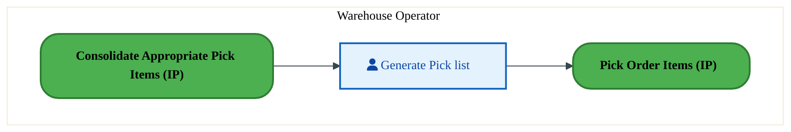
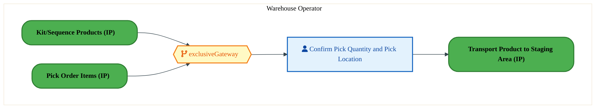

  <img src="data:image/svg+xml;base64,PHN2ZyB4bWxucz0iaHR0cDovL3d3dy53My5vcmcvMjAwMC9zdmciIHZpZXdCb3g9IjAgMCA4MDAgNDgwIiB3aWR0aD0iODAwIiBoZWlnaHQ9IjQ4MCI+DQogIDxkZWZzPg0KICAgIDxsaW5lYXJHcmFkaWVudCBpZD0iYmciIHgxPSIwJSIgeTE9IjAlIiB4Mj0iMTAwJSIgeTI9IjEwMCUiPg0KICAgICAgPHN0b3Agb2Zmc2V0PSIwJSIgc3R5bGU9InN0b3AtY29sb3I6IzAwNzFjNTtzdG9wLW9wYWNpdHk6MSIvPg0KICAgICAgPHN0b3Agb2Zmc2V0PSIxMDAlIiBzdHlsZT0ic3RvcC1jb2xvcjojMDBhZWVmO3N0b3Atb3BhY2l0eToxIi8+DQogICAgPC9saW5lYXJHcmFkaWVudD4NCiAgICA8bGluZWFyR3JhZGllbnQgaWQ9ImFjY2VudCIgeDE9IjAlIiB5MT0iMCUiIHgyPSIwJSIgeTI9IjEwMCUiPg0KICAgICAgPHN0b3Agb2Zmc2V0PSIwJSIgc3R5bGU9InN0b3AtY29sb3I6I2ZmZmZmZjtzdG9wLW9wYWNpdHk6MC4xNSIvPg0KICAgICAgPHN0b3Agb2Zmc2V0PSIxMDAlIiBzdHlsZT0ic3RvcC1jb2xvcjojZmZmZmZmO3N0b3Atb3BhY2l0eTowLjAyIi8+DQogICAgPC9saW5lYXJHcmFkaWVudD4NCiAgICA8cGF0dGVybiBpZD0iZ3JpZCIgd2lkdGg9IjQwIiBoZWlnaHQ9IjQwIiBwYXR0ZXJuVW5pdHM9InVzZXJTcGFjZU9uVXNlIj4NCiAgICAgIDxwYXRoIGQ9Ik0gNDAgMCBMIDAgMCAwIDQwIiBmaWxsPSJub25lIiBzdHJva2U9InJnYmEoMjU1LDI1NSwyNTUsMC4wNykiIHN0cm9rZS13aWR0aD0iMC41Ii8+DQogICAgPC9wYXR0ZXJuPg0KICA8L2RlZnM+DQoNCiAgPCEtLSBCYWNrZ3JvdW5kIC0tPg0KICA8cmVjdCB3aWR0aD0iODAwIiBoZWlnaHQ9IjQ4MCIgZmlsbD0idXJsKCNiZykiIHJ4PSI4Ii8+DQogIDxyZWN0IHdpZHRoPSI4MDAiIGhlaWdodD0iNDgwIiBmaWxsPSJ1cmwoI2dyaWQpIiByeD0iOCIvPg0KICA8cmVjdCB3aWR0aD0iODAwIiBoZWlnaHQ9IjQ4MCIgZmlsbD0idXJsKCNhY2NlbnQpIiByeD0iOCIvPg0KDQogIDwhLS0gRGVjb3JhdGl2ZSBjaXJjdWl0L2FyY2hpdGVjdHVyZSBsaW5lcyAtLT4NCiAgPGcgc3Ryb2tlPSJyZ2JhKDI1NSwyNTUsMjU1LDAuMTIpIiBzdHJva2Utd2lkdGg9IjEuNSIgZmlsbD0ibm9uZSI+DQogICAgPHBhdGggZD0iTSAwIDEwMCBMIDEyMCAxMDAgTCAxNjAgMTQwIEwgMjgwIDE0MCIvPg0KICAgIDxwYXRoIGQ9Ik0gMCAyNjAgTCA4MCAyNjAgTCAxMjAgMjIwIEwgMjAwIDIyMCBMIDI0MCAyNjAgTCAzNjAgMjYwIi8+DQogICAgPHBhdGggZD0iTSA1MjAgMTAwIEwgNjAwIDEwMCBMIDY0MCA2MCBMIDgwMCA2MCIvPg0KICAgIDxwYXRoIGQ9Ik0gNDQwIDM0MCBMIDU2MCAzNDAgTCA2MDAgMzAwIEwgNzIwIDMwMCBMIDc2MCAzNDAgTCA4MDAgMzQwIi8+DQogICAgPHBhdGggZD0iTSA2MDAgNDAwIEwgNjgwIDQwMCBMIDcyMCA0NDAiLz4NCiAgICA8cGF0aCBkPSJNIDAgNDAwIEwgNDAgNDAwIEwgODAgMzYwIi8+DQogICAgPHBhdGggZD0iTSAyMDAgNDIwIEwgMzIwIDQyMCBMIDM2MCAzODAgTCA0ODAgMzgwIi8+DQogICAgPHBhdGggZD0iTSA2NTAgNDQwIEwgNzUwIDQ0MCBMIDgwMCA0ODAiLz4NCiAgPC9nPg0KDQogIDwhLS0gRGVjb3JhdGl2ZSBub2RlcyAtLT4NCiAgPGcgZmlsbD0icmdiYSgyNTUsMjU1LDI1NSwwLjE4KSI+DQogICAgPGNpcmNsZSBjeD0iMTIwIiBjeT0iMTAwIiByPSI0Ii8+DQogICAgPGNpcmNsZSBjeD0iMjgwIiBjeT0iMTQwIiByPSI0Ii8+DQogICAgPGNpcmNsZSBjeD0iMjAwIiBjeT0iMjIwIiByPSI0Ii8+DQogICAgPGNpcmNsZSBjeD0iMzYwIiBjeT0iMjYwIiByPSI0Ii8+DQogICAgPGNpcmNsZSBjeD0iNjAwIiBjeT0iMTAwIiByPSI0Ii8+DQogICAgPGNpcmNsZSBjeD0iNzIwIiBjeT0iMzAwIiByPSI0Ii8+DQogICAgPGNpcmNsZSBjeD0iNTYwIiBjeT0iMzQwIiByPSI0Ii8+DQogICAgPGNpcmNsZSBjeD0iODAiIGN5PSIzNjAiIHI9IjQiLz4NCiAgICA8Y2lyY2xlIGN4PSI0ODAiIGN5PSIzODAiIHI9IjQiLz4NCiAgICA8Y2lyY2xlIGN4PSIzMjAiIGN5PSI0MjAiIHI9IjQiLz4NCiAgPC9nPg0KDQogIDwhLS0gVE9HQUYgQkRBVCBib3hlcyAtLT4NCiAgPGcgZm9udC1mYW1pbHk9IlNlZ29lIFVJLCBBcmlhbCwgc2Fucy1zZXJpZiIgZm9udC1zaXplPSIxNCIgZm9udC13ZWlnaHQ9IjYwMCI+DQogICAgPCEtLSBCIC0tPg0KICAgIDxyZWN0IHg9IjE1MCIgeT0iMTQwIiB3aWR0aD0iMTIwIiBoZWlnaHQ9IjQwIiByeD0iNSIgZmlsbD0icmdiYSgyNTUsMjU1LDI1NSwwLjE4KSIgc3Ryb2tlPSJyZ2JhKDI1NSwyNTUsMjU1LDAuMykiIHN0cm9rZS13aWR0aD0iMSIvPg0KICAgIDx0ZXh0IHg9IjIxMCIgeT0iMTY1IiB0ZXh0LWFuY2hvcj0ibWlkZGxlIiBmaWxsPSIjZmZmIj5CdXNpbmVzczwvdGV4dD4NCiAgICA8IS0tIEQgLS0+DQogICAgPHJlY3QgeD0iMjkwIiB5PSIxNDAiIHdpZHRoPSIxMjAiIGhlaWdodD0iNDAiIHJ4PSI1IiBmaWxsPSJyZ2JhKDI1NSwyNTUsMjU1LDAuMTgpIiBzdHJva2U9InJnYmEoMjU1LDI1NSwyNTUsMC4zKSIgc3Ryb2tlLXdpZHRoPSIxIi8+DQogICAgPHRleHQgeD0iMzUwIiB5PSIxNjUiIHRleHQtYW5jaG9yPSJtaWRkbGUiIGZpbGw9IiNmZmYiPkRhdGE8L3RleHQ+DQogICAgPCEtLSBBIC0tPg0KICAgIDxyZWN0IHg9IjQzMCIgeT0iMTQwIiB3aWR0aD0iMTIwIiBoZWlnaHQ9IjQwIiByeD0iNSIgZmlsbD0icmdiYSgyNTUsMjU1LDI1NSwwLjE4KSIgc3Ryb2tlPSJyZ2JhKDI1NSwyNTUsMjU1LDAuMykiIHN0cm9rZS13aWR0aD0iMSIvPg0KICAgIDx0ZXh0IHg9IjQ5MCIgeT0iMTY1IiB0ZXh0LWFuY2hvcj0ibWlkZGxlIiBmaWxsPSIjZmZmIj5BcHBsaWNhdGlvbjwvdGV4dD4NCiAgICA8IS0tIFQgLS0+DQogICAgPHJlY3QgeD0iNTcwIiB5PSIxNDAiIHdpZHRoPSIxMjAiIGhlaWdodD0iNDAiIHJ4PSI1IiBmaWxsPSJyZ2JhKDI1NSwyNTUsMjU1LDAuMTgpIiBzdHJva2U9InJnYmEoMjU1LDI1NSwyNTUsMC4zKSIgc3Ryb2tlLXdpZHRoPSIxIi8+DQogICAgPHRleHQgeD0iNjMwIiB5PSIxNjUiIHRleHQtYW5jaG9yPSJtaWRkbGUiIGZpbGw9IiNmZmYiPlRlY2hub2xvZ3k8L3RleHQ+DQogIDwvZz4NCg0KICA8IS0tIENvbm5lY3RpbmcgbGluZXMgYmV0d2VlbiBCREFUIGJveGVzIC0tPg0KICA8ZyBzdHJva2U9InJnYmEoMjU1LDI1NSwyNTUsMC4yNSkiIHN0cm9rZS13aWR0aD0iMSI+DQogICAgPGxpbmUgeDE9IjI3MCIgeTE9IjE2MCIgeDI9IjI5MCIgeTI9IjE2MCIvPg0KICAgIDxsaW5lIHgxPSI0MTAiIHkxPSIxNjAiIHgyPSI0MzAiIHkyPSIxNjAiLz4NCiAgICA8bGluZSB4MT0iNTUwIiB5MT0iMTYwIiB4Mj0iNTcwIiB5Mj0iMTYwIi8+DQogIDwvZz4NCg0KICA8IS0tIE1haW4gdGl0bGUgLS0+DQogIDx0ZXh0IHg9IjQwMCIgeT0iMjYwIiB0ZXh0LWFuY2hvcj0ibWlkZGxlIiBmb250LWZhbWlseT0iU2Vnb2UgVUksIEFyaWFsLCBzYW5zLXNlcmlmIiBmb250LXNpemU9IjM2IiBmb250LXdlaWdodD0iNzAwIiBmaWxsPSIjZmZmZmZmIiBsZXR0ZXItc3BhY2luZz0iMSI+DQogICAgSUFPIEFyY2hpdGVjdHVyZQ0KICA8L3RleHQ+DQogIDx0ZXh0IHg9IjQwMCIgeT0iMzAwIiB0ZXh0LWFuY2hvcj0ibWlkZGxlIiBmb250LWZhbWlseT0iU2Vnb2UgVUksIEFyaWFsLCBzYW5zLXNlcmlmIiBmb250LXNpemU9IjE4IiBmb250LXdlaWdodD0iNDAwIiBmaWxsPSJyZ2JhKDI1NSwyNTUsMjU1LDAuOCkiIGxldHRlci1zcGFjaW5nPSIyIj4NCiAgICBUT0dBRiBCREFUIMK3IElBTyBQcm9ncmFtIMK3IElETSAyLjANCiAgPC90ZXh0Pg0KDQogIDwhLS0gQm90dG9tIGFjY2VudCBiYXIgLS0+DQogIDxyZWN0IHg9IjI4MCIgeT0iMzQwIiB3aWR0aD0iMjQwIiBoZWlnaHQ9IjMiIHJ4PSIxLjUiIGZpbGw9InJnYmEoMjU1LDI1NSwyNTUsMC40KSIvPg0KDQogIDwhLS0gSW50ZWwgdGV4dCAtLT4NCiAgPHRleHQgeD0iNDAwIiB5PSIzODAiIHRleHQtYW5jaG9yPSJtaWRkbGUiIGZvbnQtZmFtaWx5PSJTZWdvZSBVSSwgQXJpYWwsIHNhbnMtc2VyaWYiIGZvbnQtc2l6ZT0iMTMiIGZpbGw9InJnYmEoMjU1LDI1NSwyNTUsMC41KSIgbGV0dGVyLXNwYWNpbmc9IjMiPg0KICAgIElOVEVMIENPTkZJREVOVElBTA0KICA8L3RleHQ+DQo8L3N2Zz4NCg==" alt="IAO Architecture" style="width:100%; border-radius:8px;" />
  <h1 style="font-size:36px; margin-top:24px;">LO-160 — Pick Orders - FTS (IP)</h1>
  <h2 style="font-size:24px;">Architecture Document (TOGAF BDAT)</h2>
  
Forecast to Stock (IP) (FTS-IP) Tower 
  Capability LO-160 · LO Logistics Management Outbound - FTS (IP)

  
IAO Program · R1 – R5 
  Generated: April 2026 
  Sajiv Francis

  
IAO Architecture Pipeline — Intel Confidential

Page 1<a href="#toc">↑ Back to TOC</a>LO-160 — Pick Orders - FTS (IP)

## Table of Contents

<nav class="toc">
<ol>
  <li><a href="#1-executive-summary">1. Executive Summary</a></li>
  <li><a href="#2-business-context-objectives">2. Business Context &amp; Objectives</a>
    <ul>
      <li><a href="#21-classification">2.1 Classification</a></li>
      <li><a href="#22-business-drivers">2.2 Business Drivers</a></li>
      <li><a href="#23-success-criteria">2.3 Success Criteria</a></li>
      <li><a href="#24-companion-documents">2.4 Companion Documents</a></li>
    </ul>
  </li>
  <li><a href="#3-business-architecture-togaf-b">3. Business Architecture (TOGAF &ldquo;B&rdquo;)</a>
    <ul>
      <li><a href="#31-business-process-overview">3.1 Business Process Overview</a></li>
      <li><a href="#32-business-process-diagrams">3.2 Business Process Diagrams</a></li>
      <li><a href="#33-business-roles-responsibilities">3.3 Business Roles &amp; Responsibilities</a></li>
    </ul>
  </li>
  <li><a href="#4-data-architecture-togaf-d">4. Data Architecture (TOGAF &ldquo;D&rdquo;)</a>
    <ul>
      <li><a href="#41-data-entities-ownership">4.1 Data Entities &amp; Ownership</a></li>
      <li><a href="#42-data-flow-diagrams">4.2 Data Flow Diagrams</a></li>
      <li><a href="#43-data-lineage">4.3 Data Lineage</a></li>
      <li><a href="#44-ricefw-data-objects">4.4 RICEFW Data Objects</a></li>
      <li><a href="#45-data-governance-quality">4.5 Data Governance &amp; Quality</a></li>
    </ul>
  </li>
  <li><a href="#5-application-architecture-togaf-a">5. Application Architecture (TOGAF &ldquo;A&rdquo;)</a>
    <ul>
      <li><a href="#54-component-overview">5.4 Component Overview</a></li>
      <li><a href="#55-ricefw-inventory">5.5 RICEFW Inventory</a>
        <ul>
          <li><a href="#551-eca-dependencies">5.5.1 ECA Dependencies</a></li>
          <li><a href="#552-boundary-application-dependencies">5.5.2 Boundary Application Dependencies</a></li>
        </ul>
      </li>
      <li><a href="#56-integration-patterns">5.6 Integration Patterns</a></li>
    </ul>
  </li>
  <li><a href="#6-technology-architecture-togaf-t">6. Technology Architecture (TOGAF &ldquo;T&rdquo;)</a>
    <ul>
      <li><a href="#61-platform-infrastructure">6.1 Platform &amp; Infrastructure</a></li>
      <li><a href="#62-sap-development-object-status">6.2 SAP Development Object Status</a></li>
      <li><a href="#63-nfrs-design-principles">6.3 NFRs &amp; Design Principles</a></li>
      <li><a href="#64-security-governance">6.4 Security &amp; Governance</a></li>
    </ul>
  </li>
  <li><a href="#7-project-context">7. Project Context</a>
    <ul>
      <li><a href="#71-project-roadmap-go-live-plan">7.1 Project Roadmap &amp; Go-Live Plan</a></li>
      <li><a href="#72-raid-log">7.2 RAID Log</a></li>
      <li><a href="#73-recommendations-next-steps">7.3 Recommendations &amp; Next Steps</a></li>
    </ul>
  </li>
</ol>
</nav>

Page 2<a href="#toc">↑ Back to TOC</a>LO-160 — Pick Orders - FTS (IP)

## 1. Executive Summary

This Architecture Document defines the **Business, Data, Application, and Technology** (BDAT) architecture for **LO-160 Pick Orders - FTS (IP)** within the IAO program. It includes 4 BPMN process diagram(s) in Section 3.

| Dimension | Value |
|-----------|-------|
| **Tower** | Forecast to Stock (IP) (FTS-IP) |
| **Process Group** | LO Logistics Management Outbound - FTS (IP) |
| **Capability** | LO-160 - Pick Orders - FTS (IP) |
| **Release** | R1 – R5 |
| **Total Systems** | 0 |
| **System Status** | 0 Deployed, 0 Developing, 0 EOL, 0 Pending IAPM |
| **RICEFW Objects** | 2 Reports, 20 Interfaces, 3 Conversions, 17 Enhancements, 6 Forms, 3 Workflows |

> All system nodes in architecture diagrams are **IAPM-linked** — click any node to open its IAPM page. Diagrams require `securityLevel: 'loose'` for click events.

Page 3<a href="#toc">↑ Back to TOC</a>LO-160 — Pick Orders - FTS (IP)

## 2. Business Context & Objectives

### 2.1 Classification

| Level | Value |
|-------|-------|
| **L0 Tower** | Forecast to Stock (IP) |
| **L1 Process** | LO Logistics Management Outbound - FTS (IP) |
| **L2 Capability** | LO-160 - Pick Orders - FTS (IP) |

### 2.2 Business Drivers

| # | Driver | Description | Strategic Alignment | Priority |
|---|--------|-------------|---------------------|----------|
| 1 | Intel Products Supply Chain Unification | Consolidate Intel Products manufacturing and logistics onto S/4 HANA platform | IDM 2.0 Products Transformation | High |
| 2 | End-to-End Traceability | Enable lot/batch traceability from raw material to finished goods shipment | Quality & Compliance | High |
| 3 | Demand-Supply Matching | Implement responsive demand and supply matching (RDSM) for IP product lines | Supply Chain Agility | Medium |
| 4 | LO-160 Process Migration | Migrate Pick Orders - FTS (IP) business processes and 0 integrated systems from legacy to S/4 HANA target architecture | IDM 2.0 Supply Chain (Intel Products) | High |

Page 4<a href="#toc">↑ Back to TOC</a>LO-160 — Pick Orders - FTS (IP)

### 2.3 Success Criteria

| Metric | Target | Measure | Baseline | Owner |
|--------|--------|---------|----------|-------|
| Production Schedule Adherence | > 95% | Percentage of production orders completed on schedule | 88% (current) | Production Manager |
| Material Availability Rate | > 98% | Materials available at point of need for production | 94% (current) | Materials Planning |
| Shipping On-Time Delivery | > 97% | Orders shipped within committed delivery window | 93% (current) | Logistics Lead |
| LO-160 Migration Completeness | 100% flow chains validated | All 0 flow chains verified in target state | 0% (pre-migration) | Tower Architect |

### 2.4 Companion Documents

| Document | Description |
|----------|-------------|
| **Business Architecture** | Included in this document (Section 3) — process flows from BPMN diagrams |
| **This Document** | Full BDAT Architecture — Business + Data + Application + Technology |

Page 5<a href="#toc">↑ Back to TOC</a>LO-160 — Pick Orders - FTS (IP)

## 3. Business Architecture (TOGAF "B")

### 3.1 Business Process Overview

This capability includes **4 business process(es)** modeled in BPMN 2.0, covering the end-to-end workflow for LO-160 Pick Orders - FTS (IP).

| # | Step ID | Process Name | Lanes | Tasks | Gateways |
|---|---------|--------------|-------|-------|----------|
| 1 | LO-160-040_Generate_Pick_Tickets_and_Pack_Lists_-_FTS_(IP) | LO-160-040_Generate_Pick_Tickets_and_Pack_Lists_-_FTS_(IP) | Warehouse Operator | 1 | 0 |
| 2 | LO-160-050_Pick_Order_Items_-_FTS_(IP) | LO-160-050_Pick_Order_Items_-_FTS_(IP) | Warehouse Operator | 2 | 2 |
| 3 | LO-160-070_Note_and_Record_Exceptions_-_FTS_(IP) | LO-160-070_Note_and_Record_Exceptions_-_FTS_(IP) | Warehouse Operator | 3 | 3 |
| 4 | LO-160-080_Confirm_Quantity_and_Location_Picked_-_FTS_(IP) | LO-160-080_Confirm_Quantity_and_Location_Picked_-_FTS_(IP) | Warehouse Operator | 1 | 1 |

Page 6<a href="#toc">↑ Back to TOC</a>LO-160 — Pick Orders - FTS (IP)

### 3.2 Business Process Diagrams

#### BUSINESS ARCHITECTURE — 3.2.1 LO-160-040_Generate_Pick_Tickets_and_Pack_Lists_-_FTS_(IP) — LO-160-040_Generate_Pick_Tickets_and_Pack_Lists_-_FTS_(IP)

**Swim Lanes**: Warehouse Operator | **Tasks**: 1 | **Gateways**: 0

> **Legend**: ● Start · ● End · User Task · Service Task · ◇ Gateway · Sub-Process

<a href="https://mermaid.live/view#pako:eNqlVF1v2jAU_StWKpRNClI-CcvDJAhkqrSplejWhzFNJrkGC8eObFOgiP8-m49Q2Po0P0Tx8fE59x7Z3jmlqMDJnE5nRznVGdq5egE1uBlyZ1iB66Ej8ANLimcMlGs5RHA9oa8HWhA3G0uzWIFryrYWncBcAPp-76GB2cg8pDBXXQWSEtdzG0lrLLe5YEJa9h30iU8ObqeloZAVyAvB99OgTMxWRjlc4CiN07iw-xSUgldXoiQhfVK6e1scE-tygaU-lL9S8A1vnmmlF2ZOMFNgOAtds694Bsz2qOXKYuVKvpzDoMr6cBPYpMEl5XODx76BJObLC5T4-z3adzpT3pqip9GUIzNKhpUaAUFKG3j8ohGhjGV3cT4oEt9TWoolZHfhOB1FoVfaTjLTuu_ZcLtroPOFzmaCVSdqd217yMJm48lNFvqe3JrvjRfw6uKU98J-2G-dhmmQB_nZiRDyX04mV_mE1fLkNY6KsBi1XkHSS3L_b71zm6M4HQS3OYF8oSW8ES2KIhpfohr3ksB_X3RYRD0_vxGdYw1rvL0IfsrjVrBI0iJI3xU8-t1WuZo9SlGeBaNxUiStYDoMikH4rmA8COL-qUKjM5e4WSCGOfz2f06dZyxhIUyu6KEBibWQU-fXkWwHDwyH4Izgrs0efQFuWYAeablEjCp9TQ8N_bD0YG8XutdQK_Th_vHjNS0ytFxwJRitrNqgaaQwF7NV_sdGc8qOPzxC3e5nU9ppGhyn4ZvMLHg-K1dw2F6MKzhqYcdzapA1ppWT7ZzDy2RerwoIXjHt7D0Hr7SYbHnpZIcb7Kwa28GIYhNsfQT3fwCtXpc-" title="View full diagram">&#128065; View Diagram</a>

#### BUSINESS ARCHITECTURE — 3.2.2 LO-160-050_Pick_Order_Items_-_FTS_(IP) — LO-160-050_Pick_Order_Items_-_FTS_(IP)

**Swim Lanes**: Warehouse Operator | **Tasks**: 2 | **Gateways**: 2

```mermaid
%%{init: {'theme': 'base', 'themeVariables': {'fontSize': '14px', 'fontFamily': 'Segoe UI, Arial, sans-serif','primaryColor': '#e8f0fe', 'primaryBorderColor': '#0071c5','lineColor': '#37474F', 'secondaryColor': '#f5f8fc'}, 'flowchart': {'useMaxWidth': false, 'htmlLabels': true, 'curve': 'basis', 'nodeSpacing': 40, 'rankSpacing': 50}} }%%
flowchart TD
    classDef startEvt fill:#4CAF50,stroke:#2E7D32,color:#000,font-weight:bold,stroke-width:2px,rx:20,ry:20
    classDef endEvt fill:#C62828,stroke:#B71C1C,color:#fff,font-weight:bold,stroke-width:2px,rx:20,ry:20
    classDef userTask fill:#E3F2FD,stroke:#1565C0,stroke-width:2px,color:#0D47A1
    classDef serviceTask fill:#FFF3E0,stroke:#E65100,stroke-width:2px,color:#BF360C
    classDef gateway fill:#FFF9C4,stroke:#F57F17,stroke-width:2px,color:#E65100
    classDef subProc fill:#F3E5F5,stroke:#7B1FA2,stroke-width:2px,color:#4A148C
    subgraph Warehouse Operator
        n1["fa:fa-user Scan Box ID / Lot No / Batch No Based on Pick List"]
        n2["Check Products and Handling Units in Storage Bin"]
        n3["Kit/Sequence Products (IP)"]
        n4["Note and Record Exceptions (IP)"]
        n5["Confirm Quantity and Location Picked (IP)"]
        n6["Generate Pick Tickets"]
        n7{{"fa:fa-code-branch Is Type of Product Kit/Sequence?"}}
        n8{{"fa:fa-code-branch Any Exceptions with Picked Products?"}}
    end
    n2 --> n8
    n6 --> n1
    n1 --> n7
    n7 -->|"Yes"| n3
    n7 -->|"No"| n2
    n8 -->|"No"| n5
    n8 -->|"Yes"| n4
    class n1 userTask
    class n3 startEvt
    class n4 startEvt
    class n5 startEvt
    class n6 startEvt
    class n7 gateway
    class n8 gateway
```

> **Legend**: ● Start · ● End · User Task · Service Task · ◇ Gateway · Sub-Process

<a href="https://mermaid.live/view#pako:eNqlVV2P6jYQ_StWVitaKegmISE0D634Srvqdrste3tVlaoyzoRYG-xc21mgXP57x0D4uuxT8xBlTmbOmTMwzsZhMgMnce7vN1xwk5BNyxSwgFZCWjOqoeWSPfAHVZzOStAtm5NLYSb8312aH1Yrm2axlC54ubboBOYSyMcHl_SxsHSJpkK3NSiet9xWpfiCqvVQllLZ7Dvo5V6-Uzu8GkiVgToleF7sswhLSy7gBHfiMA5TW6eBSZFdkOZR3stZa2ubK-WSFVSZXfu1hl_o6hPPTIFxTksNmFOYRflIZ1Baj0bVFmO1emuGwbXVETiwSUUZF3PEQw8hRcXrCYq87ZZs7--n4ihKXkZTQfBiJdV6BDnRBuHxmyE5L8vkLhz208hztVHyFZK7YByPOoHLrJMErXuuHW57CXxemGQmy-yQ2l5aD0lQrVy1SgLPVWu8X2mByE5Kw27QC3pHpUHsD_1ho5Tn-f9SwrmqF6pfD1rjThqko6OWH3Wjofc1X2NzFMZ9_3pOoN44gzPSNE0749Ooxt3I994nHaSdrje8Ip1TA0u6PhF-NwyPhGkUp378LuFe77rLevasJGsIO-MojY6E8cBP-8G7hGHfD3uHDpFnrmhVkJIK-Mf7a-p8ogoKiXMlv1agqJFq6vy9T7aX8DEnp0lO23b2ZMKoIAO5Ig8j8oE8SkOeJD4MqGGFfRzgSmdECvLM2St55Npc0gVINywA36GfrGZGEyoy8hPecO_m5COeEZpwQSbYCZ0DGXBxydBBhp-5-TCBzzUIBieibx6ev73MDTH3SRrYafyO-6syMl4xqAyX4lZBZNuTIudqQX6rqTDcrHfFj5JRW7TzhQ6_Lu1i6Y8g7Axh7_7Fphp9mRZvNs1A7cnYnuFu4-geNHlZV0Bk3vgh5yZ_mDrb7RlL7zZLX6zP_S25KZqGmymdMeHa7h9EQNrt75H1EHb34WFVhL8P40MY2_DL1PkT0NoX_EGu8Ce5g4MD3LuEoyu4YQnP_vFWstn0C7hzPNYu4PA2HN2Gu7fhuNnaC7TXoI7rLEAtKM-cZOPsvlj4Vcsgp3VpnK3r0NrIyVowJ9md7E5dZVg54hQXbrEHt_8BysM9kg==" title="View full diagram">&#128065; View Diagram</a>

#### BUSINESS ARCHITECTURE — 3.2.3 LO-160-070_Note_and_Record_Exceptions_-_FTS_(IP) — LO-160-070_Note_and_Record_Exceptions_-_FTS_(IP)

**Swim Lanes**: Warehouse Operator | **Tasks**: 3 | **Gateways**: 3

```mermaid
%%{init: {'theme': 'base', 'themeVariables': {'fontSize': '14px', 'fontFamily': 'Segoe UI, Arial, sans-serif','primaryColor': '#e8f0fe', 'primaryBorderColor': '#0071c5','lineColor': '#37474F', 'secondaryColor': '#f5f8fc'}, 'flowchart': {'useMaxWidth': false, 'htmlLabels': true, 'curve': 'basis', 'nodeSpacing': 40, 'rankSpacing': 50}} }%%
flowchart TD
    classDef startEvt fill:#4CAF50,stroke:#2E7D32,color:#000,font-weight:bold,stroke-width:2px,rx:20,ry:20
    classDef endEvt fill:#C62828,stroke:#B71C1C,color:#fff,font-weight:bold,stroke-width:2px,rx:20,ry:20
    classDef userTask fill:#E3F2FD,stroke:#1565C0,stroke-width:2px,color:#0D47A1
    classDef serviceTask fill:#FFF3E0,stroke:#E65100,stroke-width:2px,color:#BF360C
    classDef gateway fill:#FFF9C4,stroke:#F57F17,stroke-width:2px,color:#E65100
    classDef subProc fill:#F3E5F5,stroke:#7B1FA2,stroke-width:2px,color:#4A148C
    subgraph Warehouse Operator
        n1["fa:fa-user Note and Record Exceptions"]
        n2["fa:fa-user Change Batch / Handling Unit"]
        n3["Check Products and Handling Units in Storage Bin"]
        n4["Confirm Quantity and Location Picked (IP)"]
        n5["Pick Order Items (IP)"]
        n6["Kit/Sequence Products (IP)"]
        n7{{"fa:fa-code-branch Any Exceptions with Picked Products?"}}
        n8{{"fa:fa-code-branch exclusiveGateway"}}
        n9{{"fa:fa-code-branch exclusiveGateway"}}
    end
    n3 --> n7
    n6 --> n8
    n5 --> n8
    n8 --> n3
    n1 --> n2
    n9 --> n4
    n2 --> n9
    n7 -->|"No"| n9
    n7 -->|"Yes"| n1
    class n1 userTask
    class n2 userTask
    class n4 startEvt
    class n5 startEvt
    class n6 startEvt
    class n7 gateway
    class n8 gateway
    class n9 gateway
```

> **Legend**: ● Start · ● End · User Task · Service Task · ◇ Gateway · Sub-Process

<a href="https://mermaid.live/view#pako:eNqlVV2P4jYU_StWRiNaKWiTkBDIQysIpB3tdne67IeqUlXGuSEWwWZtZ4Cy_PfaJIEJwzxUzUPEObnn3A9x7YNFeApWZN3fHyijKkKHjsphDZ0IdRZYQsdGFfEFC4oXBciOick4UzP6zynM9Tc7E2a4BK9psTfsDJYc0OcHG420sLCRxEx2JQiadezORtA1FvuYF1yY6DsYZE52ylZ_GnORgrgEOE7okkBLC8rgQvdCP_QTo5NAOEtbplmQDTLSOZriCr4lORbqVH4p4Te8-0pTlWuc4UKCjsnVuniHF1CYHpUoDUdK8dQMg0qTh-mBzTaYULbUvO9oSmC2ulCBczyi4_39nJ2Tok-TOUP6IQWWcgIZkkrT0yeFMloU0Z0fj5LAsaUSfAXRnTcNJz3PJqaTSLfu2Ga43S3QZa6iBS_SOrS7NT1E3mZni13kObbY6_dVLmDpJVPc9wbe4JxpHLqxGzeZsiz7X5n0XMUnLFd1rmkv8ZLJOZcb9IPYeenXtDnxw5F7PScQT5TAM9MkSXrTy6im_cB1XjcdJ72-E1-ZLrGCLd5fDIexfzZMgjBxw1cNq3zXVZaLR8FJY9ibBklwNgzHbjLyXjX0R64_qCvUPkuBNzkqMIO_nT_n1lcsIOd6rujDBgRWXMytv6pg8zBXx2Q4ynDXzB695woQZin6qLdBpGi6I7BRlDPZlnltWZxjtgQ0xork6A36VTvoNVuiz_pIaAt7WhjnQFZIN5yWRMlTupZCIsrQTJeKjSdlbQffOHCWUbFGv5eYKar2J493nGBTKnqkZAUp-uHh8ce2NNBS8xF9MGcDelCwljfC-jrsLVVvZvCtBEbgUurL2PBwaCZhTsLuQu-ynsGI7Z_NDm2pypuyGrOf59bx-MxpcNsJdqQoJX2CX6o_3ZVq-F9VepmrH6yHut2fdAc17FdwUMOgDQcV7NXQraBXw2EF_Rp6FRzWMDTw-9x6z-fW95f0HyBP_PPVNRmaw6BFe7dp_3wgtujgNt2_TYfNYrfYwU122LCWba1BrDFNrehgna46fR2mkOGyUNbRtnCp-GzPiBWdrgSr3KRaOaFYb-q6Io__AqvsT0U=" title="View full diagram">&#128065; View Diagram</a>

Page 7<a href="#toc">↑ Back to TOC</a>LO-160 — Pick Orders - FTS (IP)

#### BUSINESS ARCHITECTURE — 3.2.4 LO-160-080_Confirm_Quantity_and_Location_Picked_-_FTS_(IP) — LO-160-080_Confirm_Quantity_and_Location_Picked_-_FTS_(IP)

**Swim Lanes**: Warehouse Operator | **Tasks**: 1 | **Gateways**: 1

> **Legend**: ● Start · ● End · User Task · Service Task · ◇ Gateway · Sub-Process

<a href="https://mermaid.live/view#pako:eNqlVF1v2jAU_StWqiqbFLR8NiwPkyCQqVqndqLbHsY0GecaLBKb2U4LQ_z32YSPwujT8oByD-eec-_NtdcOESU4mXN9vWac6QytXT2DGtwMuROswPVQC3zDkuFJBcq1HCq4HrE_W1oQL5aWZrEC16xaWXQEUwHo662Heiax8pDCXHUUSEZdz11IVmO5ykUlpGVfQZf6dOu2-6svZAnySPD9NCCJSa0YhyMcpXEaFzZPARG8PBGlCe1S4m5scZV4JjMs9bb8RsFnvPzOSj0zMcWVAsOZ6bq6wxOobI9aNhYjjXzaD4Mp68PNwEYLTBifGjz2DSQxnx-hxN9s0Ob6eswPpuhxMObIPKTCSg2AIqUNPHzSiLKqyq7ivFckvqe0FHPIrsJhOohCj9hOMtO679nhdp6BTWc6m4iq3FE7z7aHLFwsPbnMQt-TK_N75gW8PDrlN2E37B6c-mmQB_neiVL6X05mrvIRq_nOaxgVYTE4eAXJTZL7_-rt2xzEaS84nxPIJ0bghWhRFNHwOKrhTRL4r4v2i-jGz89Ep1jDM14dBd_n8UGwSNIiSF8VbP3Oq2wmD1KQvWA0TIrkIJj2g6IXvioY94K4u6vQ6EwlXsxQhTn88n-Mne9YwkyYuaL7BUishRw7P1uyfXhgOBRnFHfs7FEuOGWyRg-MzNGXBnPN9AphXrbInSBYM8FPNUKj8Wh2WC2EWVXTSNkQjbRAI42nZqfNCQaM3tw-vD3Ni0zeVvbeHlV0q6FWF2ixoX1i-t0IfjfACewdLnGT9Xrfj72YOhNTFpkhWJKqUewJPrZfbuxsNm2W2e32hceo0_lgFHZhdBoGbRjuwqQNX26b5ez39wQOD4f1BI4uw_FlONkvneM5Ncgas9LJ1s72ajXXbwkUN5V2Np6DGy1GK06cbHsFOc2iNJkDhs1m1C24-Qva-tNo" title="View full diagram">&#128065; View Diagram</a>

Page 8<a href="#toc">↑ Back to TOC</a>LO-160 — Pick Orders - FTS (IP)

### 3.3 Business Roles & Responsibilities

| Role / Lane | Processes Involved | Description |
|------------|-------------------|-------------|
| Warehouse Operator | LO-160-040_Generate_Pick_Tickets_and_Pack_Lists_-_FTS_(IP), LO-160-050_Pick_Order_Items_-_FTS_(IP), LO-160-070_Note_and_Record_Exceptions_-_FTS_(IP), LO-160-080_Confirm_Quantity_and_Location_Picked_-_FTS_(IP) | |

Page 9<a href="#toc">↑ Back to TOC</a>LO-160 — Pick Orders - FTS (IP)

## 4. Data Architecture (TOGAF "D")

### 4.1 Data Flows — Source to Target

*Data flows with DB platform details will be populated when tower architects complete the extended flow template columns (42-47) via the Input Portal.*

### 4.2 Data Flow Diagrams

> **DATA ARCHITECTURE** — Database-to-database data flows. Applications (blue) sit above their hosting databases (green cylinders). Thick arrows show data movement between databases.

### 4.3 Data Lineage

*Data lineage (source schema/object → target schema/object mappings) will be populated when tower architects provide validated schema details via the Input Portal.*

### 4.4 RICEFW Data Objects

Data-centric RICEFW objects (Reports and Conversions) from the Object Tracker:

| Object ID | Type | Description | Status | Source → Target | Complexity |
|-----------|------|-------------|--------|----------------|----------|
| LOGR1176_IP | Report | ISM - International Traffic Report | 10. Object Complete |  | 02.High |
| LOGR0833_IP | Report | Email Notification for deletion of Shipping Memos | 10. Object Complete |  | 03.Medium |
| LOGC1500 | Conversion | IM Stock conversion from Non SAP system to S4 system | 10. Object Complete |  | 02.High |
| LOGC0972_IP | Conversion | Open Inventory Conversion for IP and IF (as applicable) , Batch Characteristi... | 10. Object Complete |  | 02.High |
| LOGC0946_IP | Conversion | Open Inventory Conversion for IP and IF (as applicable) , ECC to S4 | 10. Object Complete |  | 02.High |

### 4.5 Data Governance & Quality

| Concern | Approach |
|---------|----------|
| Data Ownership | Per-entity owners listed in Section 3.1 |
| Data Classification | Financial data classified as Intel Confidential |
| Data Retention | Per Intel corporate retention policies |
| Data Quality | Validated at source; reconciliation at target |

Page 10<a href="#toc">↑ Back to TOC</a>LO-160 — Pick Orders - FTS (IP)

## 5. Application Architecture (TOGAF "A")

### 5.4 Component Overview

#### System Inventory

| System | IAPM ID | Status |
|--------|---------|--------|

### 5.5 RICEFW Inventory

| Object ID | Type | Description | Status | Source → Target | Boundary App | Complexity |
|-----------|------|-------------|--------|----------------|-------------|----------|
| LOGW1078_IP | Workflow | ISM Workflows - Capital/AMT | 10. Object Complete |  |  | 03.Medium |
| LOGW1077_IP | Workflow | ISM Workflows - EIMS/Lab | 10. Object Complete |  |  | 03.Medium |
| LOGW1076_IP | Workflow | ISM Workflows - Non-inventory | 10. Object Complete |  |  | 02.High |
| LOGR1176_IP | Report | ISM - International Traffic Report | 10. Object Complete |  |  | 02.High |
| LOGR0833_IP | Report | Email Notification for deletion of Shipping Memos | 10. Object Complete |  |  | 03.Medium |
| LOGI1679 | Interface | Receive 4C1 Inventory movement Stock type change and cycle count from IF | 10. Object Complete |  | NA | 03.Medium |
| LOGI1678 | Interface | Receive 4C1 Inventory Reconciliation Snapshot from IF | 10. Object Complete |  | NA | 03.Medium |
| LOGI1576 | Interface | ECD_Interface between S4 to ECD for inventory status response | 10. Object Complete |  | Excursion Containment Disposition | 03.Medium |
| LOGI1575 | Interface | ECD_Interface between S4 to 3PL for inventory status webservice​ | 10. Object Complete |  | NA | 03.Medium |
| LOGI1571 | Interface | ECD_Interface from ECD to S4 for Inventory status call​ | 10. Object Complete |  | Excursion Containment Disposition | 03.Medium |
| LOGI1295 | Interface | ECD_Interface between S/4 and ECD for completion status | 10. Object Complete |  | Excursion Containment Disposition | 03.Medium |
| LOGI1291 | Interface | ECD_Interface between S/4 and 3PL to send plant/batch level hold/unhold infor... | 10. Object Complete |  | NA | 03.Medium |
| LOGI1290 | Interface | ECD_Interface from ECD to S4 for Inventory Hold/unhold request | 10. Object Complete |  | Excursion Containment Disposition | 03.Medium |
| LOGI1272 | Interface | Response to goods receipt posting from SAP to 3PL - EDI 4C1B | 10. Object Complete | S/4 → WMS (3PL) | OpenText | 03.Medium |
| LOGI1267 | Interface | Inventory Reconciliation with Consignment hub – EDI 4C1 with version control | 10. Object Complete | OpenText → S/4 | OpenText | 03.Medium |
| LOGI1081_IP | Interface | Interface + Enhancement - Reprinting of Carrier Label | 10. Object Complete | S/4 → Redwood | Redwood | 03.Medium |
| LOGI1079_IP | Interface | Interface from S4 ISM to Service Now | 10. Object Complete | S/4 ISM → Service Now | ServiceNow Cloud | 03.Medium |
| LOGI1074_IP | Interface | Send data via API to retrieve the tracking ID - interface + Enhancement | 10. Object Complete | S/4 → Redwood | Redwood | 03.Medium |
| LOGI0951 | Interface | Inbound interface to receive Finished Goods “Goods Receipt” (4B2) signal from... | 10. Object Complete | OpenText → S/4 | OpenText | 03.Medium |
| LOGI0950 | Interface | Interface to receive 4B2 signal from Factory and return shipments from ODM/OS... | 10. Object Complete | OpenText → S/4 | OpenText | 03.Medium |
| LOGI0933 | Interface | W-lot inventory error handling | 10. Object Complete |  | NA | 03.Medium |
| LOGI0836_IP | Interface | Interface from S4 to NDA (IPLA –Intel Pre Release License Agreements) | 10. Object Complete | S/4 → NDA | LAWMAS Agiloft Contract Lifecycle Management | 03.Medium |
| LOGI0335 | Interface | Outbound PIP signal to 3PL for material document transfer – EDI 4C1 | 10. Object Complete | S/4 → OpenText | OpenText | 02.High |
| LOGI0237_IP | Interface | Inventory Reconciliation snapshot (4C1) from 3PL WMS to SAP S/4 | 10. Object Complete | 3PL → S/4 | OpenText | 02.High |
| LOGF1100_IP | Form | Printing of Standard Shipping Label | 10. Object Complete |  |  | 02.High |
| LOGF0359_IP | Form | ISM - Generate Commercial Invoice - IF/IP | 10. Object Complete | NA → NA |  | 02.High |
| LOGF0358_IP | Form | ISM - Generate Traveler Document - IF/IP | 10. Object Complete | NA → NA |  | 02.High |
| LOGF0352_IP | Form | ISM - IPLA | 10. Object Complete |  |  | 02.High |
| LOGF0351_IP | Form | ISM - Custom China Special label | 10. Object Complete |  |  | 02.High |
| LOGF0350_IP | Form | ISM - India GST DC | 10. Object Complete |  |  | 02.High |
| LOGE1686 | Enhancement | IP custom table for reconciliation data | 10. Object Complete |  |  | 03.Medium |
| LOGE1572_IP | Enhancement | SAP GUI T-code to Move stock from Blocked to unblock Status | 10. Object Complete |  |  | 02.High |
| LOGE1569_IP | Enhancement | Enhancement to change billing status based on ship reason in ISM | 10. Object Complete |  |  | 03.Medium |
| LOGE1327 | Enhancement | ECD_Enhancement to retrieve plant details for material/batch and update custo... | 09. FUT Overdue |  |  | 02.High |
| LOGE1253 | Enhancement | Inventory Reconciliation with Consignment hub – EDI 4C1 with version control | 10. Object Complete |  |  | 03.Medium |
| LOGE1177_IP | Enhancement | India GST E-invoicing | 10. Object Complete |  |  | 03.Medium |
| LOGE1118_IP | Enhancement | ISM – MY Security Check Fiori app - IF | 10. Object Complete |  |  | 02.High |
| LOGE1117_IP | Enhancement | ISM – Employee acknowledgement - IP | 10. Object Complete |  |  | 02.High |
| LOGE1090_IP | Enhancement | PGI confirmation for non-inventory Intel freight shipments via email | 10. Object Complete |  |  | 03.Medium |
| LOGE1080_IP | Enhancement | Email notifications to be triggered as part of ISM Workflows | 10. Object Complete |  |  | 02.High |
| LOGE1052_IP | Enhancement | Custom fields required on delivery screen | 10. Object Complete |  |  | 03.Medium |
| LOGE0945 | Enhancement | Update COF, COA and FVR in 3PL WMS - EDI 4C1B | 10. Object Complete |  |  | 03.Medium |
| LOGE0936 | Enhancement | Validate receiving consigned materials into consignment hub – EDI 4B2 CSGN | 10. Object Complete |  |  | 03.Medium |
| LOGE0935_IP | Enhancement | Fiori App - Shipping Memo | 09. FUT Overdue |  |  | 01.Very High |
| LOGE0835_IF | Enhancement | Interface to get the AMT (Asset Management Tool) data on the ISM | 10. Object Complete |  | Asset Management Tool 2.0 | 04.Low |
| LOGE0239_IP | Enhancement | Inventory Reconciliation snapshot (4C1) from 3PL WMS to SAP S/4 - Table Creation | 10. Object Complete | NA → NA | NA | 03.Medium |
| LOGE0190_IP | Enhancement | Delivery Split for STO in S/4 | 10. Object Complete | NA → NA | NA | 03.Medium |
| LOGC1500 | Conversion | IM Stock conversion from Non SAP system to S4 system | 10. Object Complete |  |  | 02.High |
| LOGC0972_IP | Conversion | Open Inventory Conversion for IP and IF (as applicable) , Batch Characteristi... | 10. Object Complete |  |  | 02.High |
| LOGC0946_IP | Conversion | Open Inventory Conversion for IP and IF (as applicable) , ECC to S4 | 10. Object Complete |  |  | 02.High |
| LOGI1584 | Interface | Interface to post inventory in SAP S/4HANA from ECA via MuleSoft. | 06. Dev In Progress |  | NA | 03.Medium |

**Summary**: 2 Reports, 20 Interfaces, 3 Conversions, 17 Enhancements, 6 Forms, 3 Workflows

#### 5.5.2 Boundary Application Dependencies

The following RICEFW objects integrate with **boundary applications** (external systems outside the S/4 HANA core):

| RICEFW ID | Description | Boundary Application | Source → Target |
|-----------|------------|---------------------|----------------|
| LOGI1576 | ECD_Interface between S4 to ECD for inventory status response | Excursion Containment Disposition |  |
| LOGI1571 | ECD_Interface from ECD to S4 for Inventory status call​ | Excursion Containment Disposition |  |
| LOGI1295 | ECD_Interface between S/4 and ECD for completion status | Excursion Containment Disposition |  |
| LOGI1290 | ECD_Interface from ECD to S4 for Inventory Hold/unhold request | Excursion Containment Disposition |  |
| LOGI1272 | Response to goods receipt posting from SAP to 3PL - EDI 4C1B | OpenText | S/4 → WMS (3PL) |
| LOGI1267 | Inventory Reconciliation with Consignment hub – EDI 4C1 with version control | OpenText | OpenText → S/4 |
| LOGI1081_IP | Interface + Enhancement - Reprinting of Carrier Label | Redwood | S/4 → Redwood |
| LOGI1079_IP | Interface from S4 ISM to Service Now | ServiceNow Cloud | S/4 ISM → Service Now |
| LOGI1074_IP | Send data via API to retrieve the tracking ID - interface + Enhancement | Redwood | S/4 → Redwood |
| LOGI0951 | Inbound interface to receive Finished Goods “Goods Receipt” (4B2) signal from... | OpenText | OpenText → S/4 |
| LOGI0950 | Interface to receive 4B2 signal from Factory and return shipments from ODM/OS... | OpenText | OpenText → S/4 |
| LOGI0836_IP | Interface from S4 to NDA (IPLA –Intel Pre Release License Agreements) | LAWMAS Agiloft Contract Lifecycle Management | S/4 → NDA |
| LOGI0335 | Outbound PIP signal to 3PL for material document transfer – EDI 4C1 | OpenText | S/4 → OpenText |
| LOGI0237_IP | Inventory Reconciliation snapshot (4C1) from 3PL WMS to SAP S/4 | OpenText | 3PL → S/4 |
| LOGE0835_IF | Interface to get the AMT (Asset Management Tool) data on the ISM | Asset Management Tool 2.0 |  |

Page 11<a href="#toc">↑ Back to TOC</a>LO-160 — Pick Orders - FTS (IP)

### 5.6 Integration Patterns

*Integration patterns will be populated when tower architects provide validated middleware and protocol details via the extended flow template.*

## 6. Technology Architecture (TOGAF "T")

### 6.1 Platform & Infrastructure

> **TECHNOLOGY / PLATFORM ARCHITECTURE** — Platforms (green) host applications (blue). Thick arrows show platform-to-platform integration flows.

#### Platform Inventory

*Platform inventory will be populated when tower architects provide validated technology platform details via the extended flow template.*

### 6.2 SAP Development Object Status

| Metric | DEV | QAS | PRD |
|--------|-----|-----|-----|
| Transport Requests | — | — | — |
| Custom Code Objects | — | — | — |
| CDS Views | — | — | — |
| Fiori Apps | — | — | — |
| BAdIs / Enhancements | — | — | — |

### 6.3 NFRs & Design Principles

| Category | Requirement | Target / SLA | Priority |
|----------|-------------|-------------|----------|
| Performance | MRP/production planning run completes within defined window | < 4 hours full MRP run | High |
| Availability | Manufacturing execution systems available 24/7 | 99.95% (24x7 operations) | High |
| Scalability | Support production volume increases from new product lines | Handle 10K+ production orders/day | High |
| Recoverability | Production systems recover within shift change window | RPO < 15 min, RTO < 2 hours | High |
| Data Volume | Support high-frequency material movement transactions | 100K+ material documents/day | Medium |
| Latency | Real-time inventory visibility for warehouse operations | < 2 seconds for RF/scanner transactions | High |
| Concurrency | Support factory floor workers across multiple shifts/sites | 500+ concurrent warehouse users | Medium |

### 6.4 Security & Governance

| Concern | Approach | Standard / Policy | Owner |
|---------|----------|--------------------|-------|
| Authentication | Single Sign-On (SSO) via Intel corporate Azure AD identity | Intel IT Security Policy - Identity Management | IT Security |
| Authorization | Role-based access control (RBAC) with SAP authorization objects | Intel SAP Security Standards - Role Design | SAP Security Team |
| Data Classification | All financial/operational data classified per Intel Data Classification Standard | Intel Data Classification Policy | Data Governance |
| Data Encryption (at rest) | AES-256 encryption for SAP HANA database and file storage | Intel Encryption Standard | Infrastructure Security |
| Data Encryption (in transit) | TLS 1.3 for all system-to-system and user-to-system communication | Intel Network Security Policy | Network Engineering |
| Network Segmentation | SAP systems in dedicated network zones with firewall controls | Intel Network Architecture Standard | Network Security |
| API Security | OAuth 2.0 / certificate-based authentication for all API integrations | Intel API Security Guidelines | Integration Architecture |
| Audit Logging | Comprehensive audit trail for all data changes and user actions (SAP Security Audit Log) | SOX Compliance / Intel Audit Policy | Internal Audit |
| Certificate Management | Automated certificate lifecycle management for system-to-system trust | Intel PKI Standard | Certificate Authority Team |
| Compliance | SOX controls, export control (EAR/ITAR) screening, data privacy (GDPR) | Intel Corporate Compliance Framework | Compliance Office |

Page 12<a href="#toc">↑ Back to TOC</a>LO-160 — Pick Orders - FTS (IP)

## 7. Project Context

### 7.1 Project Roadmap & Go-Live Plan

| ID | Description | FS | TDD | Build | FUT | Status |
|----|-------------|----|-----|-------|-----|--------|
| LOGW1078_IP | ISM Workflows - Capital/AMT | 2025-06-11 00:00:00 (100%) | 2025-09-24 00:00:00 (100%) | 2025-09-24 00:00:00 (100%) | 2025-11-07 00:00:00 (100%) | 1. On Track |
| LOGW1077_IP | ISM Workflows - EIMS/Lab | 2025-06-11 00:00:00 (100%) | 2025-09-24 00:00:00 (100%) | 2025-09-24 00:00:00 (100%) | 2025-12-03 00:00:00 (100%) | 4. Completed |
| LOGW1076_IP | ISM Workflows - Non-inventory | 2025-06-11 00:00:00 (100%) | 2025-09-24 00:00:00 (100%) | 2025-09-24 00:00:00 (100%) | 2025-11-07 00:00:00 (100%) | 1. On Track |
| LOGR1176_IP | ISM - International Traffic Report | 2025-04-18 00:00:00 (100%) | 2025-08-13 00:00:00 (100%) | 2025-08-13 00:00:00 (100%) | 2025-11-05 00:00:00 (100%) | 4. Completed |
| LOGR0833_IP | Email Notification for deletion of Shipping Memos | 2025-02-28 00:00:00 (100%) | 2025-09-05 00:00:00 (100%) | 2025-09-05 00:00:00 (100%) | 2025-11-05 00:00:00 (100%) | 1. On Track |
| LOGI1679 | Receive 4C1 Inventory movement Stock type change and cycle count from IF | 2026-01-23 00:00:00 (100%) | 2026-02-24 00:00:00 (100%) | 2026-02-24 00:00:00 (100%) | 2026-03-20 00:00:00 (100%) | 3. Off Track |
| LOGI1678 | Receive 4C1 Inventory Reconciliation Snapshot from IF | 2026-01-23 00:00:00 (100%) | 2026-02-24 00:00:00 (100%) | 2026-02-24 00:00:00 (100%) | 2026-03-20 00:00:00 (100%) | 3. Off Track |
| LOGI1576 | ECD_Interface between S4 to ECD for inventory status response | 2025-09-26 00:00:00 (100%) | 2025-11-05 00:00:00 (100%) | 2025-11-05 00:00:00 (100%) | 2026-03-25 00:00:00 (100%) | 4. Completed |
| LOGI1575 | ECD_Interface between S4 to 3PL for inventory status webservice​ | 2025-09-10 00:00:00 (100%) | 2026-01-16 00:00:00 (100%) | 2026-01-16 00:00:00 (100%) | 2026-03-25 00:00:00 (100%) | 4. Completed |
| LOGI1571 | ECD_Interface from ECD to S4 for Inventory status call​ | 2025-09-10 00:00:00 (100%) | 2025-11-05 00:00:00 (100%) | 2025-11-05 00:00:00 (100%) | 2026-01-07 00:00:00 (100%) | 1. On Track |
| LOGI1295 | ECD_Interface between S/4 and ECD for completion status | 2025-08-13 00:00:00 (100%) | 2025-10-08 00:00:00 (100%) | 2025-10-08 00:00:00 (100%) | 2026-03-27 00:00:00 (100%) | 3. Off Track |
| LOGI1291 | ECD_Interface between S/4 and 3PL to send plant/batch level hold/unhold infor... | 2025-05-16 00:00:00 (100%) | 2026-01-16 00:00:00 (100%) | 2026-01-16 00:00:00 (100%) | 2026-03-27 00:00:00 (100%) | 3. Off Track |
| LOGI1290 | ECD_Interface from ECD to S4 for Inventory Hold/unhold request | 2025-05-16 00:00:00 (100%) | 2025-10-03 00:00:00 (100%) | 2025-10-03 00:00:00 (100%) | 2026-03-27 00:00:00 (100%) | 4. Completed |
| LOGI1272 | Response to goods receipt posting from SAP to 3PL - EDI 4C1B | 2025-02-28 00:00:00 (100%) | 2025-04-11 00:00:00 (100%) | 2025-04-11 00:00:00 (100%) | 2025-08-13 00:00:00 (100%) |  |
| LOGI1267 | Inventory Reconciliation with Consignment hub – EDI 4C1 with version control | 2025-03-28 00:00:00 (100%) | 2025-05-15 00:00:00 (100%) | 2025-05-15 00:00:00 (100%) | 2025-09-19 00:00:00 (100%) | 1. On Track |
| LOGI1081_IP | Interface + Enhancement - Reprinting of Carrier Label | 2025-04-25 00:00:00 (100%) | 2025-05-15 00:00:00 (100%) | 2025-05-15 00:00:00 (100%) | 2025-10-08 00:00:00 (100%) |  |
| LOGI1079_IP | Interface from S4 ISM to Service Now | 2025-05-30 00:00:00 (100%) | 2025-05-30 00:00:00 (100%) | 2025-05-30 00:00:00 (100%) | 2025-10-17 00:00:00 (100%) | 4. Completed |
| LOGI1074_IP | Send data via API to retrieve the tracking ID - interface + Enhancement | 2025-03-28 00:00:00 (100%) | 2025-05-15 00:00:00 (100%) | 2025-05-15 00:00:00 (100%) | 2025-10-08 00:00:00 (100%) | 3. Off Track |
| LOGI0951 | Inbound interface to receive Finished Goods “Goods Receipt” (4B2) signal from... | 2025-02-28 00:00:00 (100%) | 2025-05-15 00:00:00 (100%) | 2025-05-15 00:00:00 (100%) | 2025-08-13 00:00:00 (100%) |  |
| LOGI0950 | Interface to receive 4B2 signal from Factory and return shipments from ODM/OS... | 2025-02-28 00:00:00 (100%) | 2025-05-15 00:00:00 (100%) | 2025-05-15 00:00:00 (100%) | 2025-08-13 00:00:00 (100%) |  |

*... and 31 more objects (see full Object Tracker)*

Page 13<a href="#toc">↑ Back to TOC</a>LO-160 — Pick Orders - FTS (IP)

### 7.2 RAID Log

*RAID items will be auto-populated from the Smartsheet RAID log when matched to this capability.*

### 7.3 Recommendations & Next Steps

| # | Category | Recommendation | Priority | Owner | Target Date | Status |
|---|----------|---------------|----------|-------|-------------|--------|
| 1 | Architecture | Complete extended flow attributes (Data Entity, Integration Pattern, Tech Platform) in Flows tab for full BDAT coverage | High | Tower Architect | 2026-Q2 | Open |
| 2 | Data | Define data ownership and classification for all 0 flow chains to satisfy Data Architecture (TOGAF D) requirements | Medium | Data Architect | 2026-Q3 | Open |
| 3 | Testing | Develop integration test scenarios covering all 0 flow chains for FUT/SIT readiness | High | Test Lead | 2026-Q3 | Open |
| 4 | Business Architecture | Review and validate Business Architecture process steps against latest Signavio/BIC process models | Medium | Business Analyst | 2026-Q2 | Open |
| 5 | Security | Complete security review for API integrations and data flows per Intel Security Architecture standards | Medium | Security Architect | 2026-Q3 | Open |

---
*LO-160 — Architecture Document (TOGAF BDAT) · Forecast to Stock (IP) · Generated: April 2026*

Page 14<a href="#toc">↑ Back to TOC</a>LO-160 — Pick Orders - FTS (IP)

