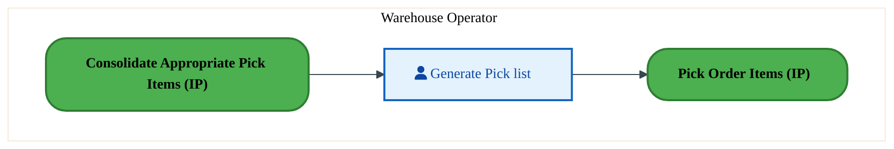
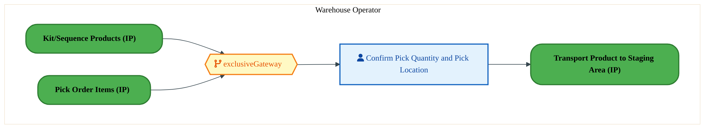

  
  <h1 style="font-size:36px; margin-top:24px;">LO-160 — Pick Orders - FTS (IP)</h1>
  <h2 style="font-size:24px;">Architecture Document (TOGAF BDAT)</h2>
  
Forecast to Stock (IP) (FTS-IP) Tower 
  Capability LO-160 · LO Logistics Management Outbound - FTS (IP)

  
IAO Program · Release 3 
  Generated: March 2026 
  Sajiv Francis

  
IAO Architecture Pipeline — Intel Confidential

Page 1<a href="#toc">↑ Back to TOC</a>LO-160 — Pick Orders - FTS (IP)

## Table of Contents

1. [Executive Summary](#1-executive-summary)
2. [Business Context & Objectives](#2-business-context--objectives)
   - 2.1 [Classification](#21-classification)
   - 2.2 [Business Drivers](#22-business-drivers)
   - 2.3 [Success Criteria](#23-success-criteria)
   - 2.4 [Companion Documents](#24-companion-documents)
3. [Business Architecture (TOGAF "B")](#3-business-architecture-togaf-b)
   - 3.1 [Business Process Overview](#31-business-process-overview)
   - 3.2 [Business Process Diagrams](#32-business-process-diagrams)
   - 3.3 [Business Roles & Responsibilities](#33-business-roles--responsibilities)
4. [Data Architecture (TOGAF "D")](#4-data-architecture-togaf-d)
   - 4.1 [Data Entities & Ownership](#41-data-entities--ownership)
   - 4.2 [Data Flow Diagrams](#42-data-flow-diagrams)
   - 4.3 [Data Lineage](#43-data-lineage)
   - 4.4 [RICEFW Data Objects](#44-ricefw-data-objects)
   - 4.5 [Data Governance & Quality](#45-data-governance--quality)
5. [Application Architecture (TOGAF "A")](#5-application-architecture-togaf-a)
   - 5.1 [Current-State Application Landscape](#51-current-state--current-state-application-landscape)
   - 5.2 [Future-State Application Landscape](#52-future-state--future-state-application-landscape)
   - 5.3 [Change Impact Summary](#53-change-impact-summary)
   - 5.4 [Component Overview](#54-component-overview)
   - 5.5 [RICEFW Inventory](#55-ricefw-inventory)
   - 5.6 [Integration Patterns](#56-integration-patterns)
6. [Technology Architecture (TOGAF "T")](#6-technology-architecture-togaf-t)
   - 6.1 [Platform & Infrastructure](#61-platform--infrastructure)
   - 6.2 [SAP Development Object Status](#62-sap-development-object-status)
   - 6.3 [NFRs & Design Principles](#63-nfrs--design-principles)
   - 6.4 [Security & Governance](#64-security--governance)
7. [Project Context](#7-project-context)
   - 7.1 [Project Roadmap & Go-Live Plan](#71-project-roadmap--go-live-plan)
   - 7.2 [RAID Log](#72-raid-log)
   - 7.3 [Recommendations & Next Steps](#73-recommendations--next-steps)

Page 2<a href="#toc">↑ Back to TOC</a>LO-160 — Pick Orders - FTS (IP)

## 1. Executive Summary

This Architecture Document defines the **Business, Data, Application, and Technology** (BDAT) architecture for **LO-160 Pick Orders - FTS (IP)** within the IAO program. It includes 4 BPMN process diagram(s) in Section 3.
| Dimension | Value |
|-----------|-------|
| **Tower** | Forecast to Stock (IP) (FTS-IP) |
| **Process Group** | LO Logistics Management Outbound - FTS (IP) |
| **Capability** | LO-160 - Pick Orders - FTS (IP) |
| **Release** | Release 3 |
| **Total Systems** | 0 |
| **System Status** | 0 Deployed, 0 Developing, 0 EOL, 0 Pending IAPM |
| **RICEFW Objects** | 2 Reports, 20 Interfaces, 3 Conversions, 17 Enhancements, 6 Forms, 3 Workflows |
**Change Summary**: 0 new flow chains, 0 removed, 0 modified, 0 unchanged between Current-State and Future-State states.

> All system nodes in architecture diagrams are **IAPM-linked** — click any node to open its IAPM page. Diagrams require `securityLevel: 'loose'` for click events.

Page 3<a href="#toc">↑ Back to TOC</a>LO-160 — Pick Orders - FTS (IP)

## 2. Business Context & Objectives

### 2.1 Classification

| Level | Value |
|-------|-------|
| **L0 Tower** | Forecast to Stock (IP) |
| **L1 Process** | LO Logistics Management Outbound - FTS (IP) |
| **L2 Capability** | LO-160 - Pick Orders - FTS (IP) |

### 2.2 Business Drivers

| # | Driver | Description | Strategic Alignment | Priority |
|---|--------|-------------|---------------------|----------|
| 1 | Intel Products Supply Chain Unification | Consolidate Intel Products manufacturing and logistics onto S/4 HANA platform | IDM 2.0 Products Transformation | High |
| 2 | End-to-End Traceability | Enable lot/batch traceability from raw material to finished goods shipment | Quality & Compliance | High |
| 3 | Demand-Supply Matching | Implement responsive demand and supply matching (RDSM) for IP product lines | Supply Chain Agility | Medium |
| 4 | LO-160 Process Migration | Migrate Pick Orders - FTS (IP) business processes and 0 integrated systems from legacy to S/4 HANA target architecture | IDM 2.0 Supply Chain (Intel Products) | High |

Page 4<a href="#toc">↑ Back to TOC</a>LO-160 — Pick Orders - FTS (IP)

### 2.3 Success Criteria

| Metric | Target | Measure | Baseline | Owner |
|--------|--------|---------|----------|-------|
| Production Schedule Adherence | > 95% | Percentage of production orders completed on schedule | 88% (current) | Production Manager |
| Material Availability Rate | > 98% | Materials available at point of need for production | 94% (current) | Materials Planning |
| Shipping On-Time Delivery | > 97% | Orders shipped within committed delivery window | 93% (current) | Logistics Lead |
| LO-160 Migration Completeness | 100% flow chains validated | All 0 flow chains verified in target state | 0% (pre-migration) | Tower Architect |

### 2.4 Companion Documents

| Document | Description |
|----------|-------------|
| **Business Architecture** | Included in this document (Section 3) — process flows from BPMN diagrams |
| **This Document** | Full BDAT Architecture — Business + Data + Application + Technology |

Page 5<a href="#toc">↑ Back to TOC</a>LO-160 — Pick Orders - FTS (IP)

## 3. Business Architecture (TOGAF "B")

### 3.1 Business Process Overview

This capability includes **4 business process(es)** modeled in BPMN 2.0, covering the end-to-end workflow for LO-160 Pick Orders - FTS (IP).

| # | Step ID | Process Name | Lanes | Tasks | Gateways |
|---|---------|--------------|-------|-------|----------|
| 1 | LO-160-040_Generate_Pick_Tickets_and_Pack_Lists_-_FTS_(IP) | LO-160-040_Generate_Pick_Tickets_and_Pack_Lists_-_FTS_(IP) | Warehouse Operator | 1 | 0 |
| 2 | LO-160-050_Pick_Order_Items_-_FTS_(IP) | LO-160-050_Pick_Order_Items_-_FTS_(IP) | Warehouse Operator | 2 | 2 |
| 3 | LO-160-070_Note_and_Record_Exceptions_-_FTS_(IP) | LO-160-070_Note_and_Record_Exceptions_-_FTS_(IP) | Warehouse Operator | 3 | 3 |
| 4 | LO-160-080_Confirm_Quantity_and_Location_Picked_-_FTS_(IP) | LO-160-080_Confirm_Quantity_and_Location_Picked_-_FTS_(IP) | Warehouse Operator | 1 | 1 |

### 3.2 Business Process Diagrams

Page 6<a href="#toc">↑ Back to TOC</a>LO-160 — Pick Orders - FTS (IP)

#### BUSINESS ARCHITECTURE — 3.2.1 LO-160-040_Generate_Pick_Tickets_and_Pack_Lists_-_FTS_(IP) — LO-160-040_Generate_Pick_Tickets_and_Pack_Lists_-_FTS_(IP)

**Swim Lanes**: Warehouse Operator | **Tasks**: 1 | **Gateways**: 0

> **Legend**: ● Start · ● End · User Task · Service Task · ◇ Gateway · Sub-Process

<a href="https://mermaid.live/edit#pako:eNqlVE2P2jAU_CtWViitFKR8EppDJQikWqnVIrHtHkoPJnkGC8eObLNAEf-9Nh9hod1TfYji8XjmvZHtvVOKCpzM6XT2lFOdob2rl1CDmyF3jhW4HjoBP7CkeM5AuZZDBNdT-vtIC-Jma2kWK3BN2c6iU1gIQN8fPTQwG5mHFOaqq0BS4npuI2mN5S4XTEjLfoA-8cnR7bw0FLICeSX4fhqUidnKKIcrHKVxGhd2n4JS8OpGlCSkT0r3YItjYlMusdTH8tcKvuHtC6300swJZgoMZ6lr9hXPgdketVxbrFzL10sYVFkfbgKbNrikfGHw2DeQxHx1hRL_cECHTmfGW1P0PJpxZEbJsFIjIEhpA49fNSKUsewhzgdF4ntKS7GC7CEcp6Mo9ErbSWZa9z0bbncDdLHU2Vyw6kztbmwPWdhsPbnNQt-TO_O98wJeXZ3yXtgP-63TMA3yIL84EUL-y8nkKp-xWp29xlERFqPWK0h6Se7_rXdpcxSng-A-J5CvtIQ3okVRRONrVONeEvjviw6LqOfnd6ILrGGDd1fBT3ncChZJWgTpu4Inv_sq1_OJFOVFMBonRdIKpsOgGITvCsaDIO6fKzQ6C4mbJXrBEpbCxImeGpBYC3ki2MGDnzOH4Izgrs0bfQFuKYAmtFwhRpWeOb_e0ENDPy492RuFHjXUCn14nHy8pUWGlguuBKOVVRs0jRTmMrbK_9hoTtbph0eo2_1sSjtPg9M0fJOTBS_n4wYO28twA0ct7HhODbLGtHKyvXN8jcyLVQHBa6adg-fgtRbTHS-d7HhrnXVjOxhRbMKsT-DhD4W5k1s=" title="Edit in Mermaid Live">&#9998; Edit in Mermaid Live</a>

#### BUSINESS ARCHITECTURE — 3.2.2 LO-160-050_Pick_Order_Items_-_FTS_(IP) — LO-160-050_Pick_Order_Items_-_FTS_(IP)

**Swim Lanes**: Warehouse Operator | **Tasks**: 2 | **Gateways**: 2

```mermaid
%%{init: {'theme': 'base', 'themeVariables': {'fontSize': '14px', 'fontFamily': 'Segoe UI, Arial, sans-serif','primaryColor': '#e8f0fe', 'primaryBorderColor': '#0071c5','lineColor': '#37474F', 'secondaryColor': '#f5f8fc'}, 'flowchart': {'useMaxWidth': false, 'htmlLabels': true, 'curve': 'basis', 'nodeSpacing': 40, 'rankSpacing': 50}} }%%
flowchart TD
    classDef startEvt fill:#4CAF50,stroke:#2E7D32,color:#000,font-weight:bold,stroke-width:2px,rx:20,ry:20
    classDef endEvt fill:#C62828,stroke:#B71C1C,color:#fff,font-weight:bold,stroke-width:2px,rx:20,ry:20
    classDef userTask fill:#E3F2FD,stroke:#1565C0,stroke-width:2px,color:#0D47A1
    classDef serviceTask fill:#FFF3E0,stroke:#E65100,stroke-width:2px,color:#BF360C
    classDef gateway fill:#FFF9C4,stroke:#F57F17,stroke-width:2px,color:#E65100
    classDef subProc fill:#F3E5F5,stroke:#7B1FA2,stroke-width:2px,color:#4A148C
    subgraph Warehouse Operator
        n1["fa:fa-user Scan Box ID / Lot No / Batch No Based on Pick List"]
        n2["Check Products and Handling Units in Storage Bin"]
        n3["Kit/Sequence Products (IP)"]
        n4["Note and Record Exceptions (IP)"]
        n5["Confirm Quantity and Location Picked (IP)"]
        n6["Generate Pick Tickets"]
        n7{{"fa:fa-code-branch Is Type of Product Kit/Sequence?"}}
        n8{{"fa:fa-code-branch Any Exceptions with Picked Products?"}}
    end
    n2 --> n8
    n6 --> n1
    n1 --> n7
    n7 -->|"Yes"| n3
    n7 -->|"No"| n2
    n8 -->|"No"| n5
    n8 -->|"Yes"| n4
    class n1 userTask
    class n3 startEvt
    class n4 startEvt
    class n5 startEvt
    class n6 startEvt
    class n7 gateway
    class n8 gateway
```

> **Legend**: ● Start · ● End · User Task · Service Task · ◇ Gateway · Sub-Process

<a href="https://mermaid.live/edit#pako:eNqlVduO4kYQ_ZWWRyMSyWhtY2Pih0TcnIwymZ2E2ayikIemXcatMd1Od3uAsPz7VgPmtsxT_GC5jqvOqVNQ7Y3DZAZO4tzfb7jgJiGblilgAa2EtGZUQ8sle-BPqjidlaBbNieXwkz4f7s0P6xWNs1iKV3wcm3RCcwlkE8PLuljYekSTYVua1A8b7mtSvEFVeuhLKWy2XfQy718p3Z4NZAqA3VK8LzYZxGWllzACe7EYRymtk4DkyK7IM2jvJez1tY2V8olK6gyu_ZrDb_R1WeemQLjnJYaMKcwi_KRzqC0Ho2qLcZq9dYMg2urI3Bgk4oyLuaIhx5CiorXExR52y3Z3t9PxVGUvIymguDFSqr1CHKiDcLjN0NyXpbJXTjsp5HnaqPkKyR3wTgedQKXWScJWvdcO9z2Evi8MMlMltkhtb20HpKgWrlqlQSeq9Z4v9ICkZ2Uht2gF_SOSoPYH_rDRinP8_-lhHNVL1S_HrTGnTRIR0ctP-pGQ-9bvsbmKIz7_vWcQL1xBmekaZp2xqdRjbuR771POkg7XW94RTqnBpZ0fSL8YRgeCdMoTv34XcK93nWX9exZSdYQdsZRGh0J44Gf9oN3CcO-H_YOHSLPXNGqIJ-pgkLiOMnHChQ1Uu0T7CX8v6dOTpOctu28yYRRQQZyRR5G5AN5lIY8SXwYUMMK-zjANc6IFOSZs1fyyLWZOv-c0QVINywA36GHrGZGEyoy8gvecNfm5BOeC5pwQSbYBp0DGXBxydBBhl-5-TCBf2sQDE5E3z08f3-ZG2LukzSw0_gDd1ZlZLxiUBkuxa2CyLYnRc7VgvxeU2G4We-KHyWjtmjnCx1-W9rF0p9B2AHC3v2LTTX6Mi3ebJqB2tOwPcN9xtE9aPKyroDIvPFDzk3-NHW22zOW3m2Wvlif-1tyUzQNN1M6Y8JV3T-IgLTbPyLrIezuw8N6CH8fxocwtuGXqfMXoLUv-INc4U9yBwcHuHcJR1dwwxKe_cutZLPdF3DneJRdwOFtOLoNd2_DcbOpF2ivQR3XWYBaUJ45ycbZfaXwS5ZBTuvSOFvXobWRk7VgTrI7zZ26yrByxCku2WIPbr8Cf145rw==" title="Edit in Mermaid Live">&#9998; Edit in Mermaid Live</a>

#### BUSINESS ARCHITECTURE — 3.2.3 LO-160-070_Note_and_Record_Exceptions_-_FTS_(IP) — LO-160-070_Note_and_Record_Exceptions_-_FTS_(IP)

**Swim Lanes**: Warehouse Operator | **Tasks**: 3 | **Gateways**: 3

```mermaid
%%{init: {'theme': 'base', 'themeVariables': {'fontSize': '14px', 'fontFamily': 'Segoe UI, Arial, sans-serif','primaryColor': '#e8f0fe', 'primaryBorderColor': '#0071c5','lineColor': '#37474F', 'secondaryColor': '#f5f8fc'}, 'flowchart': {'useMaxWidth': false, 'htmlLabels': true, 'curve': 'basis', 'nodeSpacing': 40, 'rankSpacing': 50}} }%%
flowchart TD
    classDef startEvt fill:#4CAF50,stroke:#2E7D32,color:#000,font-weight:bold,stroke-width:2px,rx:20,ry:20
    classDef endEvt fill:#C62828,stroke:#B71C1C,color:#fff,font-weight:bold,stroke-width:2px,rx:20,ry:20
    classDef userTask fill:#E3F2FD,stroke:#1565C0,stroke-width:2px,color:#0D47A1
    classDef serviceTask fill:#FFF3E0,stroke:#E65100,stroke-width:2px,color:#BF360C
    classDef gateway fill:#FFF9C4,stroke:#F57F17,stroke-width:2px,color:#E65100
    classDef subProc fill:#F3E5F5,stroke:#7B1FA2,stroke-width:2px,color:#4A148C
    subgraph Warehouse Operator
        n1["fa:fa-user Note and Record Exceptions"]
        n2["fa:fa-user Change Batch / Handling Unit"]
        n3["Check Products and Handling Units in Storage Bin"]
        n4["Confirm Quantity and Location Picked (IP)"]
        n5["Pick Order Items (IP)"]
        n6["Kit/Sequence Products (IP)"]
        n7{{"fa:fa-code-branch Any Exceptions with Picked Products?"}}
        n8{{"fa:fa-code-branch exclusiveGateway"}}
        n9{{"fa:fa-code-branch exclusiveGateway"}}
    end
    n3 --> n7
    n6 --> n8
    n5 --> n8
    n8 --> n3
    n1 --> n2
    n9 --> n4
    n2 --> n9
    n7 -->|"No"| n9
    n7 -->|"Yes"| n1
    class n1 userTask
    class n2 userTask
    class n4 startEvt
    class n5 startEvt
    class n6 startEvt
    class n7 gateway
    class n8 gateway
    class n9 gateway
```

> **Legend**: ● Start · ● End · User Task · Service Task · ◇ Gateway · Sub-Process

<a href="https://mermaid.live/edit#pako:eNqlVV2P4jYU_StWRiNaKWiTkBDIQysIpB11uzstu11VpQ_GuSEWwWZtZ4Cy_PfaJAHCMA9V8xBxTu4590Nc-2ARnoIVWY-PB8qoitCho3JYQydCnQWW0LFRRfyBBcWLAmTHxGScqRn95xTm-pudCTNcgte02Bt2BksO6POTjUZaWNhIYia7EgTNOnZnI-gai33MCy5M9AMMMic7Zas_jblIQVwCHCd0SaClBWVwoXuhH_qJ0UkgnKUt0yzIBhnpHE1xBd-SHAt1Kr-U8CvefaGpyjXOcCFBx-RqXbzHCyhMj0qUhiOleGmGQaXJw_TAZhtMKFtq3nc0JTBbXajAOR7R8fFxzs5J0afJnCH9kAJLOYEMSaXp6YtCGS2K6MGPR0ng2FIJvoLowZuGk55nE9NJpFt3bDPc7hboMlfRghdpHdrdmh4ib7OzxS7yHFvs9fsmF7D0kinuewNvcM40Dt3YjZtMWZb9r0x6ruITlqs617SXeMnknMsN-kHsvPZr2pz44ci9nROIF0rgyjRJkt70MqppP3Cdt03HSa_vxDemS6xgi_cXw2Hsnw2TIEzc8E3DKt9tleXiWXDSGPamQRKcDcOxm4y8Nw39kesP6gq1z1LgTY6-YAE51-NEHzcgsOKiCjAPc_-aWxmOMtw180YfuAKEWYp-1xsgUjTdEdgoypmcW39fyby2LM4xWwIaY0Vy9A79rB30ai3RZ30MtIU9LYxzICukm0xLouQpXUshEWVopuvExpOytoNvHDjLqFij30rMFFX7k8d7TrApFT1TsoIUfff0_H1bGmip-Yg-mvMAPSlYyzthfR32C1XvZvC1BEbgUurr2PBwaCZhTr_uQu-vnsGI7a9mh7ZU5U1ZjdmPc-t4vHIa3HeCHSlKSV_gp-qPdqMa_leVXuDqB-uhbvcH3UEN-xUc1DBow0EFezV0K-jVcFhBv4ZeBYc1DA38Nrc-8Ln17TX9J8gTf72uJkNzALRo7z7tnw_BFh3cp_v36bBZ5hY7uMsOG9ayrTWINaapFR2s0_Wmr8AUMlwWyjraFi4Vn-0ZsaLTNWCVm1QrJxTr7VxX5PFfgu1LYg==" title="Edit in Mermaid Live">&#9998; Edit in Mermaid Live</a>

Page 7<a href="#toc">↑ Back to TOC</a>LO-160 — Pick Orders - FTS (IP)

#### BUSINESS ARCHITECTURE — 3.2.4 LO-160-080_Confirm_Quantity_and_Location_Picked_-_FTS_(IP) — LO-160-080_Confirm_Quantity_and_Location_Picked_-_FTS_(IP)

**Swim Lanes**: Warehouse Operator | **Tasks**: 1 | **Gateways**: 1

> **Legend**: ● Start · ● End · User Task · Service Task · ◇ Gateway · Sub-Process

<a href="https://mermaid.live/edit#pako:eNqlVE2P2jAQ_StWVohWCmo-Cc2hEgRSrbrVbsW2eyg9GGcMFolNbWcXivjvtQkfC2VPzQFlHm_em5mMvXGIKMBJnVZrwzjTKdq09RwqaKeoPcUK2i5qgB9YMjwtQbUthwqux-zPjuZHy5WlWSzHFSvXFh3DTAD6fuuivkksXaQwVx0FktG2215KVmG5zkQppGXfQI96dOe2_2sgZAHyRPC8xCexSS0ZhxMcJlES5TZPARG8OBOlMe1R0t7a4krxQuZY6l35tYKvePXECj03McWlAsOZ66q8w1MobY9a1hYjtXw-DIMp68PNwMZLTBifGTzyDCQxX5yg2Ntu0bbVmvCjKXocTjgyDymxUkOgSGkDj541oqws05so6-ex5yotxQLSm2CUDMPAJbaT1LTuuXa4nRdgs7lOp6Is9tTOi-0hDZYrV67SwHPl2vxeeAEvTk5ZN-gFvaPTIPEzPzs4UUr_y8nMVT5itdh7jcI8yIdHLz_uxpn3r96hzWGU9P3LOYF8ZgReieZ5Ho5Ooxp1Y997W3SQh10vuxCdYQ0veH0S_JhFR8E8TnI_eVOw8bussp4-SEEOguEozuOjYDLw837wpmDU96PevkKjM5N4OUdPWMJcmHGi-yVIrIVsCPbh_s-JQ3FKccfOG2WCUyYr9MDIAn2rMddMrxHmRYPcCYI1E3zi_HqlERiNR7O3ainMeprii5popAUaazwze2xOLWD07vbh_XleaPJ2svf2eKJbDZW6QosM7QvTH8bwuwZO4OBwjRtvNod-7GXUmZqyyBzBipS1Ys_wuflaE2e7bbLMPjcvPEKdziejsA_D89BvwmAfxk34esMs57CzZ3BwPKBncHgdjq7D8WHRHNepQFaYFU66cXbXqblyC6C4LrWzdR1cazFec-Kku2vHqZeFyRwybLahasDtX8UFz4U=" title="Edit in Mermaid Live">&#9998; Edit in Mermaid Live</a>

Page 8<a href="#toc">↑ Back to TOC</a>LO-160 — Pick Orders - FTS (IP)

### 3.3 Business Roles & Responsibilities

| Role / Lane | Processes Involved | Description |
|------------|-------------------|-------------|
| Warehouse Operator | LO-160-040_Generate_Pick_Tickets_and_Pack_Lists_-_FTS_(IP), LO-160-050_Pick_Order_Items_-_FTS_(IP), LO-160-070_Note_and_Record_Exceptions_-_FTS_(IP), LO-160-080_Confirm_Quantity_and_Location_Picked_-_FTS_(IP) | |

Page 9<a href="#toc">↑ Back to TOC</a>LO-160 — Pick Orders - FTS (IP)

## 4. Data Architecture (TOGAF "D")

### 4.1 Data Entities & Ownership

The following data entities are derived from the system integration flows for LO-160. Tower architects should validate ownership and classification.

| # | Data Entity | Source System | Target System | Data Owner | Classification | Volume | Master/Transaction |
|---|-------------|---------------|---------------|------------|----------------|--------|-------------------|

Page 10<a href="#toc">↑ Back to TOC</a>LO-160 — Pick Orders - FTS (IP)

### 4.2 Data Flow Diagrams

> **DATA ARCHITECTURE** — Database-to-database data flows. Applications (blue) sit above their hosting databases (green cylinders). Thick arrows show data movement between databases.

### 4.3 Data Lineage

Data lineage traces the origin and transformation path of key data objects across integrated systems.

| # | Source System | Source Schema/Object | Target System | Target Schema/Object | Transformation |
|---|-------------|---------------------|---------------|---------------------|---------------|

> *Lineage detail will be refined when tower architects validate source/target schema object mappings.*

### 4.4 RICEFW Data Objects

Data-centric RICEFW objects (Reports and Conversions) from the Object Tracker:

| Object ID | Type | Description | Status | Source | Target | Complexity |
|-----------|------|-------------|--------|--------|--------|-----------|
| LOGR1176_IP | Report | ISM - International Traffic Report | 10. Object Complete |  |  | 02.High |
| LOGR0833_IP | Report | Email Notification for deletion of Shipping Memos | 10. Object Complete |  |  | 03.Medium |
| LOGC1500 | Conversion | IM Stock conversion from Non SAP system to S4 system | 10. Object Complete |  |  | 02.High |
| LOGC0972_IP | Conversion | Open Inventory Conversion for IP and IF (as applicable) , Batch Characteristi... | 10. Object Complete |  |  | 02.High |
| LOGC0946_IP | Conversion | Open Inventory Conversion for IP and IF (as applicable) , ECC to S4 | 10. Object Complete |  |  | 02.High |

### 4.5 Data Governance & Quality

| Concern | Approach |
|---------|----------|
| Data Ownership | Per-entity owners listed in Section 3.1 |
| Data Classification | Financial data classified as Intel Confidential |
| Data Retention | Per Intel corporate retention policies |
| Data Quality | Validated at source; reconciliation at target |

Page 11<a href="#toc">↑ Back to TOC</a>LO-160 — Pick Orders - FTS (IP)

## 5. Application Architecture (TOGAF "A")

### 5.1 Current-State — Current-State Application Landscape

#### Overview

The Current-State architecture represents the **current / legacy** landscape for LO-160.

#### Current-State Flow Narrative

*(No current-state flows defined.)*

### 5.2 Future-State — Future-State Application Landscape

#### Overview

The Future-State architecture represents the **target** landscape for LO-160.

#### Future-State Flow Narrative

*(No future-state flows defined.)*

### 5.3 Change Impact Summary

| Change Type | Flow Chain | Detail |
|-------------|-----------|--------|

**Totals**: 0 new - 0 removed - 0 modified - 0 unchanged

### 5.4 Component Overview

#### System Inventory

| System | IAPM ID | Status |
|--------|---------|--------|

Page 12<a href="#toc">↑ Back to TOC</a>LO-160 — Pick Orders - FTS (IP)

### 5.5 RICEFW Inventory

| Object ID | Type | Description | Status | Source → Target | Middleware | Complexity |
|-----------|------|-------------|--------|----------------|-----------|-----------|
| LOGW1078_IP | Workflow | ISM Workflows - Capital/AMT | 10. Object Complete |  | NA | 03.Medium |
| LOGW1077_IP | Workflow | ISM Workflows - EIMS/Lab | 10. Object Complete |  | NA | 03.Medium |
| LOGW1076_IP | Workflow | ISM Workflows - Non-inventory | 10. Object Complete |  | NA | 02.High |
| LOGR1176_IP | Report | ISM - International Traffic Report | 10. Object Complete |  | NA | 02.High |
| LOGR0833_IP | Report | Email Notification for deletion of Shipping Memos | 10. Object Complete |  | NA | 03.Medium |
| LOGI1679 | Interface | Receive 4C1 Inventory movement Stock type change and cycle count from IF | 10. Object Complete |  | SFT | 03.Medium |
| LOGI1678 | Interface | Receive 4C1 Inventory Reconciliation Snapshot from IF | 10. Object Complete |  | SFT | 03.Medium |
| LOGI1576 | Interface | ECD_Interface between S4 to ECD for inventory status response | 08. FUT In Progress |  | MuleSoft | 03.Medium |
| LOGI1575 | Interface | ECD_Interface between S4 to 3PL for inventory status webservice​ | 08. FUT In Progress |  | MuleSoft | 03.Medium |
| LOGI1571 | Interface | ECD_Interface from ECD to S4 for Inventory status call​ | 10. Object Complete |  | MuleSoft | 03.Medium |
| LOGI1295 | Interface | ECD_Interface between S/4 and ECD for completion status | 08. FUT In Progress |  | MULESOFT | 03.Medium |
| LOGI1291 | Interface | ECD_Interface between S/4 and 3PL to send plant/batch level hold/unhold infor... | 08. FUT In Progress |  | MULESOFT | 03.Medium |
| LOGI1290 | Interface | ECD_Interface from ECD to S4 for Inventory Hold/unhold request | 08. FUT In Progress |  | MULESOFT | 03.Medium |
| LOGI1272 | Interface | Response to goods receipt posting from SAP to 3PL - EDI 4C1B | 10. Object Complete | S/4 → WMS (3PL) | MULESOFT | 03.Medium |
| LOGI1267 | Interface | Inventory Reconciliation with Consignment hub – EDI 4C1 with version control | 10. Object Complete | OpenText → S/4 | MULESOFT | 03.Medium |
| LOGI1081_IP | Interface | Interface + Enhancement - Reprinting of Carrier Label | 10. Object Complete | S/4 → Redwood | APIGEE | 03.Medium |
| LOGI1079_IP | Interface | Interface from S4 ISM to Service Now | 10. Object Complete | S/4 ISM → Service Now | NA | 03.Medium |
| LOGI1074_IP | Interface | Send data via API to retrieve the tracking ID - interface + Enhancement | 10. Object Complete | S/4 → Redwood | APIGEE | 03.Medium |
| LOGI0951 | Interface | Inbound interface to receive Finished Goods “Goods Receipt” (4B2) signal from... | 10. Object Complete | OpenText → S/4 | MULESOFT | 03.Medium |
| LOGI0950 | Interface | Interface to receive 4B2 signal from Factory and return shipments from ODM/OS... | 10. Object Complete | OpenText → S/4 | MULESOFT | 03.Medium |
| LOGI0933 | Interface | W-lot inventory error handling | 10. Object Complete |  | MULESOFT | 03.Medium |
| LOGI0836_IP | Interface | Interface from S4 to NDA (IPLA –Intel Pre Release License Agreements) | 10. Object Complete | S/4 → NDA | NA | 03.Medium |
| LOGI0335 | Interface | Outbound PIP signal to 3PL for material document transfer – EDI 4C1 | 10. Object Complete | S/4 → OpenText | MULESOFT | 02.High |
| LOGI0237_IP | Interface | Inventory Reconciliation snapshot (4C1) from 3PL WMS to SAP S/4 | 10. Object Complete | 3PL → S/4 | MULESOFT | 02.High |
| LOGF1100_IP | Form | Printing of Standard Shipping Label | 10. Object Complete |  | NA | 02.High |
| LOGF0359_IP | Form | ISM - Generate Commercial Invoice - IF/IP | 10. Object Complete | NA → NA | NA | 02.High |
| LOGF0358_IP | Form | ISM - Generate Traveler Document - IF/IP | 10. Object Complete | NA → NA | NA | 02.High |
| LOGF0352_IP | Form | ISM - IPLA | 10. Object Complete |  | NA | 02.High |
| LOGF0351_IP | Form | ISM - Custom China Special label | 10. Object Complete |  | NA | 02.High |
| LOGF0350_IP | Form | ISM - India GST DC | 10. Object Complete |  | NA | 02.High |
| LOGE1686 | Enhancement | IP custom table for reconciliation data | 10. Object Complete |  | NA | 03.Medium |
| LOGE1572_IP | Enhancement | SAP GUI T-code to Move stock from Blocked to unblock Status | 10. Object Complete |  | NA | 02.High |
| LOGE1569_IP | Enhancement | Enhancement to change billing status based on ship reason in ISM | 10. Object Complete |  | NA | 03.Medium |
| LOGE1327 | Enhancement | ECD_Enhancement to retrieve plant details for material/batch and update custo... | 08. FUT In Progress |  | NA | 02.High |
| LOGE1253 | Enhancement | Inventory Reconciliation with Consignment hub – EDI 4C1 with version control | 10. Object Complete |  | NA | 03.Medium |
| LOGE1177_IP | Enhancement | India GST E-invoicing | 10. Object Complete |  | NA | 03.Medium |
| LOGE1118_IP | Enhancement | ISM – MY Security Check Fiori app - IF | 10. Object Complete |  | NA | 02.High |
| LOGE1117_IP | Enhancement | ISM – Employee acknowledgement - IP | 10. Object Complete |  | NA | 02.High |
| LOGE1090_IP | Enhancement | PGI confirmation for non-inventory Intel freight shipments via email | 10. Object Complete |  | NA | 03.Medium |
| LOGE1080_IP | Enhancement | Email notifications to be triggered as part of ISM Workflows | 10. Object Complete |  | NA | 02.High |
| LOGE1052_IP | Enhancement | Custom fields required on delivery screen | 10. Object Complete |  | NA | 03.Medium |
| LOGE0945 | Enhancement | Update COF, COA and FVR in 3PL WMS - EDI 4C1B | 10. Object Complete |  | NA | 03.Medium |
| LOGE0936 | Enhancement | Validate receiving consigned materials into consignment hub – EDI 4B2 CSGN | 10. Object Complete |  | NA | 03.Medium |
| LOGE0935_IP | Enhancement | Fiori App - Shipping Memo | 09. FUT Overdue |  | NA | 01.Very High |
| LOGE0835_IF | Enhancement | Interface to get the AMT (Asset Management Tool) data on the ISM | 10. Object Complete |  | NA | 04.Low |
| LOGE0239_IP | Enhancement | Inventory Reconciliation snapshot (4C1) from 3PL WMS to SAP S/4 - Table Creation | 10. Object Complete | NA → NA | NA | 03.Medium |
| LOGE0190_IP | Enhancement | Delivery Split for STO in S/4 | 10. Object Complete | NA → NA | NA | 03.Medium |
| LOGC1500 | Conversion | IM Stock conversion from Non SAP system to S4 system | 10. Object Complete |  | NA | 02.High |
| LOGC0972_IP | Conversion | Open Inventory Conversion for IP and IF (as applicable) , Batch Characteristi... | 10. Object Complete |  | NA | 02.High |
| LOGC0946_IP | Conversion | Open Inventory Conversion for IP and IF (as applicable) , ECC to S4 | 10. Object Complete |  | NA | 02.High |
| LOGI1584 | Interface | Interface to post inventory in SAP S/4HANA from ECA via MuleSoft. | 06. Dev In Progress |  | MuleSoft | 03.Medium |

**Summary**: 2 Reports, 20 Interfaces, 3 Conversions, 17 Enhancements, 6 Forms, 3 Workflows

Page 13<a href="#toc">↑ Back to TOC</a>LO-160 — Pick Orders - FTS (IP)

### 5.6 Integration Patterns

Integration patterns identified from the system flow analysis for LO-160:

| # | Pattern | Flow Chain | Middleware | Protocol | Auth |
|---|---------|-----------|-----------|----------|------|

> *Integration pattern details will be refined when tower architects validate middleware assignments.*

Page 14<a href="#toc">↑ Back to TOC</a>LO-160 — Pick Orders - FTS (IP)

## 6. Technology Architecture (TOGAF "T")

### 6.1 Platform & Infrastructure

> **TECHNOLOGY / PLATFORM ARCHITECTURE** — Platforms (green) host applications (blue). Thick arrows show platform-to-platform integration flows.

#### Platform Inventory

Platform landscape inferred from integrated systems for LO-160:

| # | Platform | Type | Systems Using | Environment |
|---|----------|------|--------------|-------------|
| 1 | SAP S/4HANA | On-Premise (HEC) | SAP S/4 modules | DEV, QAS, PRD |
| 2 | SAP BTP (Integration Suite) | Cloud / PaaS | CPI, API Management | DEV, QAS, PRD |
| 3 | MuleSoft Anypoint | Cloud / iPaaS | API-led integrations | DEV, QAS, PRD |

> *Platform assignments will be validated when tower architects populate technology platform columns.*

Page 15<a href="#toc">↑ Back to TOC</a>LO-160 — Pick Orders - FTS (IP)

### 6.2 SAP Development Object Status

**Capability RICEFW Status** (51 objects)
*Data source: Smartsheet Object Tracker (cached 2026-03-26)*

| Status | Count | % |
|--------|------:|----:|
| 10. Object Complete | 43 | 84.3% |
| 08. FUT In Progress | 6 | 11.8% |
| 09. FUT Overdue | 1 | 2.0% |
| 06. Dev In Progress | 1 | 2.0% |
| **Total** | **51** | **100%** |

**RICEFW by Type:**

| Type | Count |
|------|------:|
| Report (R) | 2 |
| Interface (I) | 20 |
| Conversion (C) | 3 |
| Enhancement (E) | 17 |
| Form (F) | 6 |
| Workflow (W) | 3 |
| **Total** | **51** |

**Technical Complexity:**

| Complexity | Count |
|------------|------:|
| 01.Very High | 1 |
| 02.High | 18 |
| 03.Medium | 31 |
| 04.Low | 1 |

**Active (Non-Complete) Objects:**

| Object ID | Type | Description | Status | Complexity |
|-----------|------|-------------|--------|------------|
| LOGI1576 | 02.Interface | ECD_Interface between S4 to ECD for inventory status response | 08. FUT In Progress | 03.Medium |
| LOGI1575 | 02.Interface | ECD_Interface between S4 to 3PL for inventory status webservice​ | 08. FUT In Progress | 03.Medium |
| LOGI1295 | 02.Interface | ECD_Interface between S/4 and ECD for completion status | 08. FUT In Progress | 03.Medium |
| LOGI1291 | 02.Interface | ECD_Interface between S/4 and 3PL to send plant/batch level hold/unhold informat... | 08. FUT In Progress | 03.Medium |
| LOGI1290 | 02.Interface | ECD_Interface from ECD to S4 for Inventory Hold/unhold request | 08. FUT In Progress | 03.Medium |
| LOGE1327 | 04.Enhancement | ECD_Enhancement to retrieve plant details for material/batch and update custom t... | 08. FUT In Progress | 02.High |
| LOGE0935_IP | 04.Enhancement | Fiori App - Shipping Memo | 09. FUT Overdue | 01.Very High |
| LOGI1584 | 02.Interface | Interface to post inventory in SAP S/4HANA from ECA via MuleSoft. | 06. Dev In Progress | 03.Medium |

**Tower Context:** FTS-IP has 101 total RICEFW objects (91 complete, 10 active/other)

### 6.3 NFRs & Design Principles

| Category | Requirement | Target / SLA | Priority |
|----------|-------------|-------------|----------|
| Performance | MRP/production planning run completes within defined window | < 4 hours full MRP run | High |
| Availability | Manufacturing execution systems available 24/7 | 99.95% (24x7 operations) | High |
| Scalability | Support production volume increases from new product lines | Handle 10K+ production orders/day | High |
| Recoverability | Production systems recover within shift change window | RPO < 15 min, RTO < 2 hours | High |
| Data Volume | Support high-frequency material movement transactions | 100K+ material documents/day | Medium |
| Latency | Real-time inventory visibility for warehouse operations | < 2 seconds for RF/scanner transactions | High |
| Concurrency | Support factory floor workers across multiple shifts/sites | 500+ concurrent warehouse users | Medium |

### 6.4 Security & Governance

| Concern | Approach | Standard / Policy | Owner |
|---------|----------|--------------------|-------|
| Authentication | Single Sign-On (SSO) via Intel corporate Azure AD identity | Intel IT Security Policy - Identity Management | IT Security |
| Authorization | Role-based access control (RBAC) with SAP authorization objects | Intel SAP Security Standards - Role Design | SAP Security Team |
| Data Classification | All financial/operational data classified per Intel Data Classification Standard | Intel Data Classification Policy | Data Governance |
| Data Encryption (at rest) | AES-256 encryption for SAP HANA database and file storage | Intel Encryption Standard | Infrastructure Security |
| Data Encryption (in transit) | TLS 1.3 for all system-to-system and user-to-system communication | Intel Network Security Policy | Network Engineering |
| Network Segmentation | SAP systems in dedicated network zones with firewall controls | Intel Network Architecture Standard | Network Security |
| API Security | OAuth 2.0 / certificate-based authentication for all API integrations | Intel API Security Guidelines | Integration Architecture |
| Audit Logging | Comprehensive audit trail for all data changes and user actions (SAP Security Audit Log) | SOX Compliance / Intel Audit Policy | Internal Audit |
| Certificate Management | Automated certificate lifecycle management for system-to-system trust | Intel PKI Standard | Certificate Authority Team |
| Compliance | SOX controls, export control (EAR/ITAR) screening, data privacy (GDPR) | Intel Corporate Compliance Framework | Compliance Office |

Page 16<a href="#toc">↑ Back to TOC</a>LO-160 — Pick Orders - FTS (IP)

## 7. Project Context

### 7.1 Project Roadmap & Go-Live Plan

*51 objects with timeline data (source: Object Tracker)*

| ID | Description | FS | TDD | Build | FUT | Status |
|----|-------------|----|-----|-------|-----|--------|
| LOGW1078_IP | ISM Workflows - Capital/AMT | Jun-25 (100%) | Sep-25 (100%) | Sep-25 (100%) | Nov-25 (100%) | 1. On Track |
| LOGW1077_IP | ISM Workflows - EIMS/Lab | Jun-25 (100%) | Sep-25 (100%) | Sep-25 (100%) | Dec-25 (100%) | 4. Completed |
| LOGW1076_IP | ISM Workflows - Non-inventory | Jun-25 (100%) | Sep-25 (100%) | Sep-25 (100%) | Nov-25 (100%) | 1. On Track |
| LOGR1176_IP | ISM - International Traffic Report | Apr-25 (100%) | Aug-25 (100%) | Aug-25 (100%) | Nov-25 (100%) | 4. Completed |
| LOGR0833_IP | Email Notification for deletion of Shipping Memos | Feb-25 (100%) | Sep-25 (100%) | Sep-25 (100%) | Nov-25 (100%) | 1. On Track |
| LOGI1679 | Receive 4C1 Inventory movement Stock type change and cycle count from IF | Jan-26 (100%) | Feb-26 (100%) | Feb-26 (100%) | Mar-26 (100%) | 3. Off Track |
| LOGI1678 | Receive 4C1 Inventory Reconciliation Snapshot from IF | Jan-26 (100%) | Feb-26 (100%) | Feb-26 (100%) | Mar-26 (100%) | 3. Off Track |
| LOGI1576 | ECD_Interface between S4 to ECD for inventory status response | Sep-25 (100%) | Nov-25 (100%) | Nov-25 (100%) | Mar-26 (95%) | 4. Completed |
| LOGI1575 | ECD_Interface between S4 to 3PL for inventory status webservice​ | Sep-25 (100%) | Jan-26 (100%) | Jan-26 (100%) | Mar-26 (95%) | 4. Completed |
| LOGI1571 | ECD_Interface from ECD to S4 for Inventory status call​ | Sep-25 (100%) | Nov-25 (100%) | Nov-25 (100%) | Jan-26 (100%) | 1. On Track |
| LOGI1295 | ECD_Interface between S/4 and ECD for completion status | Aug-25 (100%) | Oct-25 (100%) | Oct-25 (100%) | Mar-26 (5%) | 3. Off Track |
| LOGI1291 | ECD_Interface between S/4 and 3PL to send plant/batch level hold/unhold information for webservice plants to hold/unhold inventory in 3PL | May-25 (100%) | Jan-26 (100%) | Jan-26 (100%) | Mar-26 (30%) | 3. Off Track |
| LOGI1290 | ECD_Interface from ECD to S4 for Inventory Hold/unhold request | May-25 (100%) | Oct-25 (100%) | Oct-25 (100%) | Mar-26 (75%) | 4. Completed |
| LOGI1272 | Response to goods receipt posting from SAP to 3PL - EDI 4C1B | Feb-25 (100%) | Apr-25 (100%) | Apr-25 (100%) | Aug-25 (100%) |  |
| LOGI1267 | Inventory Reconciliation with Consignment hub – EDI 4C1 with version control | Mar-25 (100%) | May-25 (100%) | May-25 (100%) | Sep-25 (100%) | 1. On Track |
| LOGI1081_IP | Interface + Enhancement - Reprinting of Carrier Label | Apr-25 (100%) | May-25 (100%) | May-25 (100%) | Oct-25 (100%) |  |
| LOGI1079_IP | Interface from S4 ISM to Service Now | May-25 (100%) | May-25 (100%) | May-25 (100%) | Oct-25 (100%) | 4. Completed |
| LOGI1074_IP | Send data via API to retrieve the tracking ID - interface + Enhancement | Mar-25 (100%) | May-25 (100%) | May-25 (100%) | Oct-25 (100%) | 3. Off Track |
| LOGI0951 | Inbound interface to receive Finished Goods “Goods Receipt” (4B2) signal from 3PL for interplant shipments to post the Goods Receipt in S/4. | Feb-25 (100%) | May-25 (100%) | May-25 (100%) | Aug-25 (100%) |  |
| LOGI0950 | Interface to receive 4B2 signal from Factory and return shipments from ODM/OSAT/Boxing in S4 | Feb-25 (100%) | May-25 (100%) | May-25 (100%) | Aug-25 (100%) |  |
| LOGI0933 | W-lot inventory error handling | Mar-25 (100%) | Apr-25 (100%) | Apr-25 (100%) | Oct-25 (100%) | 1. On Track |
| LOGI0836_IP | Interface from S4 to NDA (IPLA –Intel Pre Release License Agreements) | Apr-25 (100%) | Jun-25 (100%) | Jun-25 (100%) | Jan-26 (100%) | 4. Completed |
| LOGI0335 | Outbound PIP signal to 3PL for material document transfer – EDI 4C1 | Jul-24 (100%) | Jan-25 (100%) | Jan-25 (100%) | Aug-25 (100%) |  |
| LOGI0237_IP | Inventory Reconciliation snapshot (4C1) from 3PL WMS to SAP S/4 | Jun-24 (100%) | Jan-25 (100%) | Jan-25 (100%) | Aug-25 (100%) |  |
| LOGF1100_IP | Printing of Standard Shipping Label | Apr-25 (100%) | May-25 (100%) | May-25 (100%) | Sep-25 (100%) |  |
| LOGF0359_IP | ISM - Generate Commercial Invoice - IF/IP | Sep-24 (100%) | Feb-25 (100%) | Feb-25 (100%) | Apr-25 (100%) |  |
| LOGF0358_IP | ISM - Generate Traveler Document - IF/IP | Sep-24 (100%) | Feb-25 (100%) | Feb-25 (100%) | Apr-25 (100%) |  |
| LOGF0352_IP | ISM - IPLA | Oct-24 (100%) | Feb-25 (100%) | Feb-25 (100%) | Apr-25 (100%) |  |
| LOGF0351_IP | ISM - Custom China Special label | Oct-24 (100%) | Feb-25 (100%) | Feb-25 (100%) | Apr-25 (100%) | 1. On Track |
| LOGF0350_IP | ISM - India GST DC | Oct-24 (100%) | Feb-25 (100%) | Feb-25 (100%) | Apr-25 (100%) |  |

*... and 21 more objects (see full Object Tracker)*

### 7.2 RAID Log

*Live data from Smartsheet Master RAID Log — extracted 2026-03-26*

**Mapped sub-tower(s):** 8.4 FTS IP - Logistics & Inventory Management

**RAID Summary:** 140 open items (3 capability-specific, 137 tower-level), 444 closed

| Severity | Capability | Tower-Wide | Total Open |
|----------|----------:|-----------:|-----------:|
| P1 - High | 0 | 7 | 7 |
| P2 - Medium | 3 | 87 | 90 |
| P3 - Low | 0 | 12 | 12 |
| **Total** | **3** | **137** | **140** |

**Capability-Specific RAID Items:**

| RAID ID | Type | Severity | Title | Status | Assigned To | Due Date |
|---------|------|----------|-------|--------|-------------|----------|
| 03152 | Action | P2 - Medium | LOGC0972_IP & IF- Test Data to be provided in load files for... | Not Started | FTS IP |  |
| 03503 | Action | P2 - Medium | LOGI1678 and LOGI1679 Queue details | Not Started | FTS IP | 2026-02-03 |
| 03564 | Risk | P2 - Medium | Development of the AMT impacting FPR Capital Tool report | In Progress | FTS IP | 2026-03-27 |

**Other FTS-IP Tower RAID Items** (137 open):

| RAID ID | Type | Severity | Title | Status | Assigned To | Due Date |
|---------|------|----------|-------|--------|-------------|----------|
| 03578 | Risk | P1 - High | HBI Process Flow Change impact Assessment | In Progress | FTS IF | 2026-03-27 |
| 03591 | Risk | P1 - High | R3 E2E scenario execution | In Progress | Test Management | 2026-04-03 |
| 03600 | Risk | P1 - High | Error lifecycle functionality within PDF application is miss... | In Progress | FTS IF | 2026-05-01 |
| 03601 | Risk | P1 - High | Traceability functionality within PDF application is missing... | In Progress | FTS IF | 2026-05-15 |
| 03757 | Risk | P1 - High | IF Planning data not available in ITC1 until W4, leaving too... | In Progress | FTS IF | 2026-04-03 |
| 03764 | Risk | P1 - High | Unable to post IPLA call from postman | Not Started | B-Apps | 2026-03-24 |
| 03767 | Risk | P1 - High | Day 1 OTC Execution - APOP production cutover for allocation... | In Progress | OTC IP | 2026-04-24 |
| 01355 | Action | P2 - Medium | PDF SMHe product development approach does not appear to hav... | To Be Reviewed | FTS IF | 2026-04-03 |
| 01733 | Risk | P2 - Medium | Tariffs impacts Item/BOM design which is impacting ERP/SCP (... | In Progress | E2E | 2026-03-06 |
| 01769 | Action | P2 - Medium | Approach and duration for PDF SMH application refreshes to s... | In Progress | FTS IF | 2026-04-01 |
| 03059 | Risk | P2 - Medium | Operations SME Availability for Change Impact Assessment dev... | In Progress | CM & Comms | 2026-03-17 |
| 03079 | Action | P2 - Medium | Request for PDH Design WTF | In Progress | FTS IP | 2026-03-04 |
| 03128 | Risk | P2 - Medium | Application Health Monitoring | In Progress | FTS IF | 2026-05-13 |
| 03196 | Risk | P2 - Medium | MC1 R3 Data/SCP Readiness | In Progress | Data Readiness | 2026-05-01 |
| 03241 | Risk | P2 - Medium | Materials Planning Policy for Constrained Materials | In Progress | FTS IP | 2026-07-31 |
| 03245 | Action | P2 - Medium | ODM Expedite | Not Started | FTS IP | 2025-12-19 |
| 03246 | Action | P2 - Medium | Expedite Fees | Not Started | FTS IP | 2025-12-19 |
| 03250 | Action | P2 - Medium | Update Commit Date for Holds | In Progress | FTS IP | 2026-03-27 |
| 03251 | Action | P2 - Medium | Out of Cycle Replenishment | In Progress | FTS IP | 2026-03-27 |
| 03267 | Action | P2 - Medium | R3 metrics | In Progress | FTS IP | 2026-03-27 |
| 03276 | Action | P2 - Medium | Biz Documentation | In Progress | FTS IP | 2026-02-27 |
| 03278 | Action | P2 - Medium | Persona validation | In Progress | FTS IP | 2026-02-20 |
| 03334 | Issue | P2 - Medium | Application Monitoring - Connectors Health Monitoring | In Progress | FTS IF | 2026-05-15 |
| 03355 | Risk | P2 - Medium | PTP ECA OSAT Predictive Tool Test Self-Service Query View cr... | In Progress | FTS IP | 2026-04-03 |
| 03368 | Issue | P2 - Medium | Infrastructure resources support PDF SMH ability to provide ... | In Progress | FTS IF | 2026-03-27 |
| 03375 | Action | P2 - Medium | CIBR System Clarification | In Progress | FTS IP | 2026-03-27 |
| 03377 |  | P2 - Medium | KDD Telescoping vs exact network search | In Progress | FTS IP | 2026-03-20 |
| 03406 | Risk | P2 - Medium | Mass Change of Engineering Orders | In Progress | FTS IP | 2026-04-27 |
| 03701 | Risk | P2 - Medium | IP DP (CDP) string test cases has risk of completely beyond ... | In Progress | Test Management | 2026-04-04 |
| 03526 | Action | P2 - Medium | Review process for post-validation of system changes | In Progress | FTS IP | 2026-04-03 |
| | | | *... and 107 more tower-level items* | | | |

### 7.3 Recommendations & Next Steps

| # | Category | Recommendation | Priority | Owner | Target Date | Status |
|---|----------|---------------|----------|-------|-------------|--------|
| 1 | Architecture | Complete extended flow attributes (Data Entity, Integration Pattern, Tech Platform) in Flows tab for full BDAT coverage | High | Tower Architect | 2026-Q2 | Open |
| 2 | Data | Define data ownership and classification for all 0 flow chains to satisfy Data Architecture (TOGAF D) requirements | Medium | Data Architect | 2026-Q3 | Open |
| 3 | Testing | Develop integration test scenarios covering all 0 flow chains for FUT/SIT readiness | High | Test Lead | 2026-Q3 | Open |
| 4 | Business Architecture | Review and validate Business Architecture process steps against latest Signavio/BIC process models | Medium | Business Analyst | 2026-Q2 | Open |
| 5 | Security | Complete security review for API integrations and data flows per Intel Security Architecture standards | Medium | Security Architect | 2026-Q3 | Open |

---
*LO-160 — Architecture Document (TOGAF BDAT) · Forecast to Stock (IP) · Generated: March 2026*

