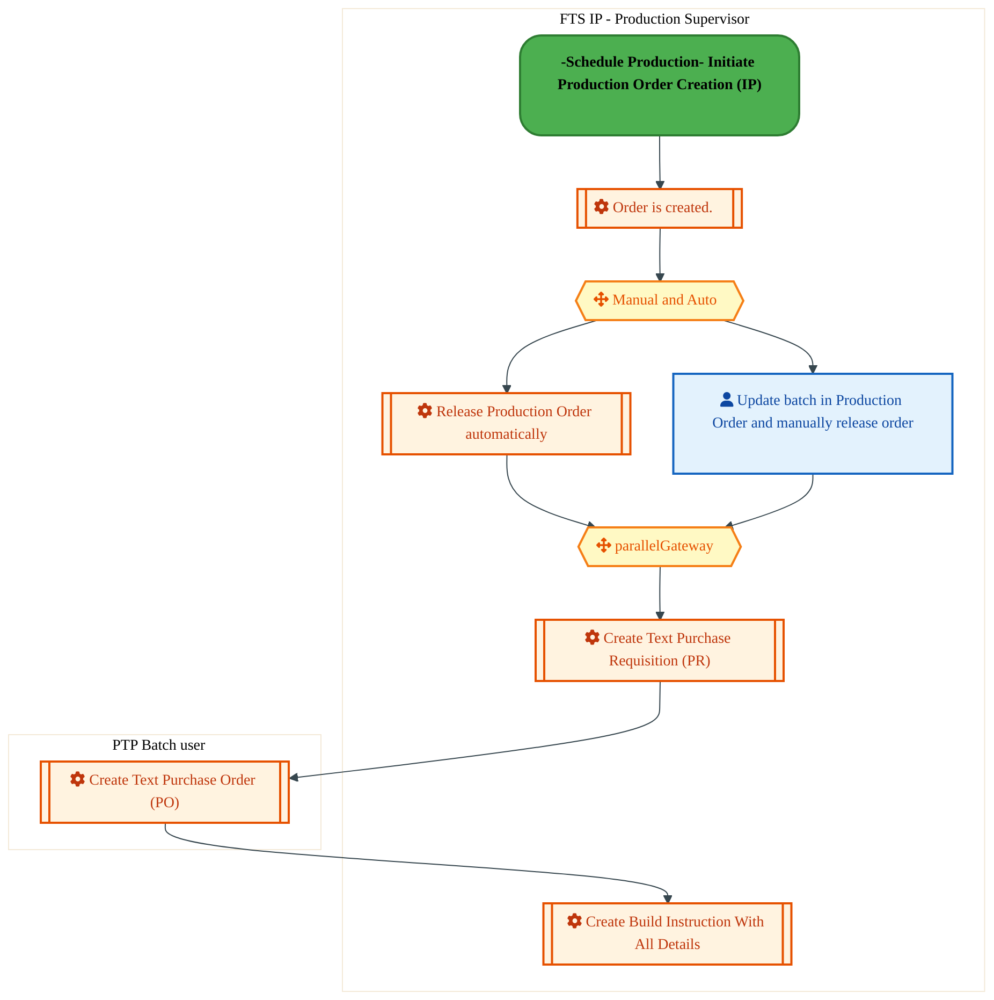

  
  <h1 style="font-size:36px; margin-top:24px;">M-090 — Schedule Production (IP)</h1>
  <h2 style="font-size:24px;">Architecture Document (TOGAF BDAT)</h2>
  
Forecast to Stock (IP) (FTS-IP) Tower 
  Capability M-090 · M Mfg. Schedule and Execution (IP)

  
IAO Program · Release 3 
  Generated: March 2026 
  Sajiv Francis

  
IAO Architecture Pipeline — Intel Confidential

Page 1<a href="#toc">↑ Back to TOC</a>M-090 — Schedule Production (IP)

## Table of Contents

1. [Executive Summary](#1-executive-summary)
2. [Business Context & Objectives](#2-business-context--objectives)
   - 2.1 [Classification](#21-classification)
   - 2.2 [Business Drivers](#22-business-drivers)
   - 2.3 [Success Criteria](#23-success-criteria)
   - 2.4 [Companion Documents](#24-companion-documents)
3. [Business Architecture (TOGAF "B")](#3-business-architecture-togaf-b)
   - 3.1 [Business Process Overview](#31-business-process-overview)
   - 3.2 [Business Process Diagrams](#32-business-process-diagrams)
   - 3.3 [Business Roles & Responsibilities](#33-business-roles--responsibilities)
4. [Data Architecture (TOGAF "D")](#4-data-architecture-togaf-d)
   - 4.1 [Data Entities & Ownership](#41-data-entities--ownership)
   - 4.2 [Data Flow Diagrams](#42-data-flow-diagrams)
   - 4.3 [Data Lineage](#43-data-lineage)
   - 4.4 [RICEFW Data Objects](#44-ricefw-data-objects)
   - 4.5 [Data Governance & Quality](#45-data-governance--quality)
5. [Application Architecture (TOGAF "A")](#5-application-architecture-togaf-a)
   - 5.1 [Current-State Application Landscape](#51-current-state--current-state-application-landscape)
   - 5.2 [Future-State Application Landscape](#52-future-state--future-state-application-landscape)
   - 5.3 [Change Impact Summary](#53-change-impact-summary)
   - 5.4 [Component Overview](#54-component-overview)
   - 5.5 [RICEFW Inventory](#55-ricefw-inventory)
   - 5.6 [Integration Patterns](#56-integration-patterns)
6. [Technology Architecture (TOGAF "T")](#6-technology-architecture-togaf-t)
   - 6.1 [Platform & Infrastructure](#61-platform--infrastructure)
   - 6.2 [SAP Development Object Status](#62-sap-development-object-status)
   - 6.3 [NFRs & Design Principles](#63-nfrs--design-principles)
   - 6.4 [Security & Governance](#64-security--governance)
7. [Project Context](#7-project-context)
   - 7.1 [Project Roadmap & Go-Live Plan](#71-project-roadmap--go-live-plan)
   - 7.2 [RAID Log](#72-raid-log)
   - 7.3 [Recommendations & Next Steps](#73-recommendations--next-steps)

Page 2<a href="#toc">↑ Back to TOC</a>M-090 — Schedule Production (IP)

## 1. Executive Summary

This Architecture Document defines the **Business, Data, Application, and Technology** (BDAT) architecture for **M-090 Schedule Production (IP)** within the IAO program. It includes 4 BPMN process diagram(s) in Section 3.
| Dimension | Value |
|-----------|-------|
| **Tower** | Forecast to Stock (IP) (FTS-IP) |
| **Process Group** | M Mfg. Schedule and Execution (IP) |
| **Capability** | M-090 - Schedule Production (IP) |
| **Release** | Release 3 |
| **Total Systems** | 0 |
| **System Status** | 0 Deployed, 0 Developing, 0 EOL, 0 Pending IAPM |
| **RICEFW Objects** | 2 Reports, 34 Interfaces, 20 Conversions, 35 Enhancements, 7 Forms, 3 Workflows |
**Change Summary**: 0 new flow chains, 0 removed, 0 modified, 0 unchanged between Current-State and Future-State states.

> All system nodes in architecture diagrams are **IAPM-linked** — click any node to open its IAPM page. Diagrams require `securityLevel: 'loose'` for click events.

Page 3<a href="#toc">↑ Back to TOC</a>M-090 — Schedule Production (IP)

## 2. Business Context & Objectives

### 2.1 Classification

| Level | Value |
|-------|-------|
| **L0 Tower** | Forecast to Stock (IP) |
| **L1 Process** | M Mfg. Schedule and Execution (IP) |
| **L2 Capability** | M-090 - Schedule Production (IP) |

### 2.2 Business Drivers

| # | Driver | Description | Strategic Alignment | Priority |
|---|--------|-------------|---------------------|----------|
| 1 | Intel Products Supply Chain Unification | Consolidate Intel Products manufacturing and logistics onto S/4 HANA platform | IDM 2.0 Products Transformation | High |
| 2 | End-to-End Traceability | Enable lot/batch traceability from raw material to finished goods shipment | Quality & Compliance | High |
| 3 | Demand-Supply Matching | Implement responsive demand and supply matching (RDSM) for IP product lines | Supply Chain Agility | Medium |
| 4 | M-090 Process Migration | Migrate Schedule Production (IP) business processes and 0 integrated systems from legacy to S/4 HANA target architecture | IDM 2.0 Supply Chain (Intel Products) | High |

Page 4<a href="#toc">↑ Back to TOC</a>M-090 — Schedule Production (IP)

### 2.3 Success Criteria

| Metric | Target | Measure | Baseline | Owner |
|--------|--------|---------|----------|-------|
| Production Schedule Adherence | > 95% | Percentage of production orders completed on schedule | 88% (current) | Production Manager |
| Material Availability Rate | > 98% | Materials available at point of need for production | 94% (current) | Materials Planning |
| Shipping On-Time Delivery | > 97% | Orders shipped within committed delivery window | 93% (current) | Logistics Lead |
| M-090 Migration Completeness | 100% flow chains validated | All 0 flow chains verified in target state | 0% (pre-migration) | Tower Architect |

### 2.4 Companion Documents

| Document | Description |
|----------|-------------|
| **Business Architecture** | Included in this document (Section 3) — process flows from BPMN diagrams |
| **This Document** | Full BDAT Architecture — Business + Data + Application + Technology |

Page 5<a href="#toc">↑ Back to TOC</a>M-090 — Schedule Production (IP)

## 3. Business Architecture (TOGAF "B")

### 3.1 Business Process Overview

This capability includes **4 business process(es)** modeled in BPMN 2.0, covering the end-to-end workflow for M-090 Schedule Production (IP).

| # | Step ID | Process Name | Lanes | Tasks | Gateways |
|---|---------|--------------|-------|-------|----------|
| 1 | M-090-130_Release_Production_Order_(IP) | M-090-130_Release_Production_Order_(IP) | FTS IP - Production Supervisor, PTP Batch user | 6 | 2 |
| 2 | M-090-280_Process_Work_Centers_(IP) | M-090-280_Process_Work_Centers_(IP) | FTS IP - Production - Master Data Steward | 6 | 0 |
| 3 | M-090-430_Process_Production_Version_(IP) | M-090-430_Process_Production_Version_(IP) | Batch User MDG Team, FTS IP - Production - Master Data Steward | 7 | 6 |
| 4 | M-090-480_Maintain_Master_Data_for_Packaged_Finished_Goods_(IP) | M-090-480_Maintain_Master_Data_for_Packaged_Finished_Goods_(IP) | PDM, Requestor | 49 | 24 |

### 3.2 Business Process Diagrams

Page 6<a href="#toc">↑ Back to TOC</a>M-090 — Schedule Production (IP)

#### BUSINESS ARCHITECTURE — 3.2.1 M-090-130_Release_Production_Order_(IP) — M-090-130_Release_Production_Order_(IP)

**Swim Lanes**: FTS IP - Production Supervisor · PTP Batch user | **Tasks**: 6 | **Gateways**: 2

> **Legend**: ● Start · ● End · User Task · Service Task · ◇ Gateway · Sub-Process

<a href="https://mermaid.live/edit#pako:eNqlVVGP4jYQ_itWVivupKRKQkJCHipBINVKPR1auN7D0QfjOMRax6G2s8Ah_nvtJEDCHlKl8oA038x838zY45wMVKbYiIzn5xNhREbgNJA5LvAgAoMNFHhgggb4C3ICNxSLgY7JSiaX5Gcd5ni7gw7TWAILQo8aXeJticG3FxNMVCI1gYBMWAJzkg3MwY6TAvJjXNKS6-gnHGZ2Vqu1rmnJU8xvAbYdOMhXqZQwfIOHgRd4ic4TGJUs7ZFmfhZmaHDWxdFyj3LIZV1-JfAXePhOUpkrO4NUYBWTy4L-CTeY6h4lrzSGKv5-GQYRWoepgS13EBG2VbhnK4hD9naDfPt8Bufn5zW7ioLVbM2A-iEKhZjhDAip4Pm7BBmhNHry4kni26aQvHzD0ZM7D2ZD10S6k0i1bpt6uNYek20uo01J0zbU2useInd3MPkhcm2TH9X_nRZm6U0pHrmhG16VpoETO_FFKcuy_6Wk5spXULy1WvNh4iazq5bjj_zY_sh3aXPmBRPnfk6YvxOEO6RJkgznt1HNR75jPyadJsORHd-RbqHEe3i8EY5j70qY-EHiBA8JG737KqvNgpfoQjic-4l_JQymTjJxHxJ6E8cL2woVz5bDXQ6S1RK8LIAFFG1aIUlKBpbVTg9DlLwJ1j_m_FgbGYwyaOnZg2-7VPUGNlCiHBDWTf-q9wlAloICsgpSegQcU6x2HNSrtjb-7vC6P67EqNyC1zbyI18lywJKgjShouhyDPscMce6thU-SLCouFoMRfiK_6mIIDXjp8Xr5zsK75cU04rQFLwwNdK2mO9E5mBCKZhhCQkVdzR-n6YpnQiAar70t7vwQEVbS5TjtKLdni2lqUrVJXwYRF1a3cXL4nN_luHpdFGHnJd7YUEqwZf6FOoDmaghro3zuZMz_mXODnI1Z0z_aC7wLUet-N0NWqwWYFpfA30xOsyj_3AqTUufFl8753GVYGNgWb-r423NYWOOWtNvzLA1w8Zs95oFjen3vW5ruo05bs1RY3qt6fS89fJp8PLo9GC3-3L0PMOHHu-hx3_oGT30BNc3vgeHl9enh44vqGEaBeYFJKkRnYz6y6u-zinOYEWlcTYNvXDLI0NGVH-hjKre-BmB6tiLBjz_C6VwgPg=" title="Edit in Mermaid Live">&#9998; Edit in Mermaid Live</a>

#### BUSINESS ARCHITECTURE — 3.2.2 M-090-280_Process_Work_Centers_(IP) — M-090-280_Process_Work_Centers_(IP)

**Swim Lanes**: FTS IP - Production - Master Data Steward | **Tasks**: 6 | **Gateways**: 0

> **Legend**: ● Start · ● End · User Task · Service Task · ◇ Gateway · Sub-Process

<a href="https://mermaid.live/edit#pako:eNqlVdtu2zgQ_RVCQeAUkAFdLVcPCziytSjaokWdbR42-0BLI5sITWpJyokb-N93aMm31HpaATY0R3POcA414ptTyBKc1Lm9fWOCmZS8DcwK1jBIyWBBNQxc0gI_qWJ0wUEPbE4lhZmzX_s0P6pfbZrFcrpmfGvROSwlkL8-uWSCRO4STYUealCsGriDWrE1VdtMcqls9g2MK6_aV-se3UtVgjoleF7iFzFSORNwgsMkSqLc8jQUUpQXolVcjatisLOL4_KlWFFl9stvNHylr4-sNCuMK8o1YM7KrPkXugBuezSqsVjRqM3BDKZtHYGGzWtaMLFEPPIQUlQ8n6DY2-3I7vb2SRyLkofpkyB4FZxqPYWKaIPwbGNIxThPb6Jskseeq42Sz5DeBLNkGgZuYTtJsXXPteYOX4AtVyZdSF52qcMX20Ma1K-uek0Dz1Vb_H9XC0R5qpSNgnEwPla6T_zMzw6Vqqr6X5XQV_VA9XNXaxbmQT491vLjUZx5v-sd2pxGycR_7xOoDSvgTDTP83B2smo2in2vX_Q-D0de9k50SQ280O1J8GMWHQXzOMn9pFewrfd-lc3iu5LFQTCcxXl8FEzu_XwS9ApGEz8adytEnaWi9YrkD3Py6TsZEpQtm8IwKTD4SrUBRabUUDK3Laiy5dlL-H8_ORVNKzq020CmgLlrHBbyA_5tmIISbzhsqDDkUapnkoHADP3k_HMmElyKZArQKyIV1mbC4I_8CQIU5e0qKnxyJnapFV5qHRUyqU1HaFXuvtW2Q8o_XApEPQITNGTDzJY8bGvQvfS4h55LtW5w63qJox7i3FD7hSnJT8obIJ9huzfgh2wMjn6vXHJ31Ks5vnZnhrUG2909bBJSP5xxxyeuNrK-2Llud84oOOntjYjIcPgHWtCFSRt20yX8Ngy6MG7DcReO2jDswqANR10YtmF0NgJW8DD6F3BwHQ6vw9F1OL4Oj67DyfHTegGPu6-g4zprHAvKSid9c_YnG55-JVS04cbZuQ5tjJxvReGk-xPAaeoSPZ4yioO5bsHdf_RBTGg=" title="Edit in Mermaid Live">&#9998; Edit in Mermaid Live</a>

Page 7<a href="#toc">↑ Back to TOC</a>M-090 — Schedule Production (IP)

#### BUSINESS ARCHITECTURE — 3.2.3 M-090-430_Process_Production_Version_(IP) — M-090-430_Process_Production_Version_(IP)

**Swim Lanes**: Batch User MDG Team · FTS IP - Production - Master Data Steward | **Tasks**: 7 | **Gateways**: 6

```mermaid
%%{init: {'theme': 'base', 'themeVariables': {'fontSize': '14px', 'fontFamily': 'Segoe UI, Arial, sans-serif','primaryColor': '#e8f0fe', 'primaryBorderColor': '#0071c5','lineColor': '#37474F', 'secondaryColor': '#f5f8fc'}, 'flowchart': {'useMaxWidth': false, 'htmlLabels': true, 'curve': 'basis', 'nodeSpacing': 40, 'rankSpacing': 50}} }%%
flowchart LR
    classDef startEvt fill:#4CAF50,stroke:#2E7D32,color:#000,font-weight:bold,stroke-width:2px,rx:20,ry:20
    classDef endEvt fill:#C62828,stroke:#B71C1C,color:#fff,font-weight:bold,stroke-width:2px,rx:20,ry:20
    classDef userTask fill:#E3F2FD,stroke:#1565C0,stroke-width:2px,color:#0D47A1
    classDef serviceTask fill:#FFF3E0,stroke:#E65100,stroke-width:2px,color:#BF360C
    classDef gateway fill:#FFF9C4,stroke:#F57F17,stroke-width:2px,color:#E65100
    classDef subProc fill:#F3E5F5,stroke:#7B1FA2,stroke-width:2px,color:#4A148C
    subgraph Batch User MDG Team
        n7[["fa:fa-cog Maintain Material Master (FG/SFG)"]]
        n8(["fa:fa-play Automatic generation of Production Version"])
        n15{{"fa:fa-arrows-alt parallelGateway"}}
    end
    subgraph FTS IP - Production - Master Data Steward
        n1["fa:fa-user Manage Routing 1"]
        n2["fa:fa-user Manage Routing N"]
        n3[["fa:fa-cog Manage Alternative Bill of Material (BOM) - 1"]]
        n4[["fa:fa-cog Manage Alternative Bill of Material (BOM) - N"]]
        n5[["fa:fa-cog Create Production Version N"]]
        n6[["fa:fa-cog Create Production Version 1"]]
        n9(["fa:fa-stop Process Production Version Completed"])
        n10{{"fa:fa-arrows-alt parallelGateway"}}
        n11{{"fa:fa-arrows-alt parallelGateway"}}
        n12{{"fa:fa-arrows-alt parallelGateway"}}
        n13{{"fa:fa-arrows-alt parallelGateway"}}
        n14{{"fa:fa-arrows-alt parallelGateway"}}
    end
    n8 --> n7
    n7 --> n15
    n6 --> n14
    n14 --> n9
    n1 -->|"Routing Data to PV"| n12
    n13 --> n5
    n5 --> n14
    n2 -->|"Routing Data to PV"| n13
    n11 -->|"BOM Data to PV"| n13
    n10 -->|"BOM Data to PV"| n12
    n10 -->|"Work center 1"| n1
    n11 -->|"Work center N"| n2
    n3 --> n10
    n4 --> n11
    n15 --> n4
    n15 --> n3
    n12 -->|"Component Allocation"| n6
    class n1 userTask
    class n2 userTask
    class n3 serviceTask
    class n4 serviceTask
    class n5 serviceTask
    class n6 serviceTask
    class n7 serviceTask
    class n8 startEvt
    class n9 endEvt
    class n10 gateway
    class n11 gateway
    class n12 gateway
    class n13 gateway
    class n14 gateway
    class n15 gateway
```

> **Legend**: ● Start · ● End · User Task · Service Task · ◇ Gateway · Sub-Process

<a href="https://mermaid.live/edit#pako:eNqlVmtv2joY_itWqopWClqcC6H5cCQIpJq09lSj6z6MfTCJA1EdO3KcUsb478fODchgO4eDBPh9_LzPe4kde6uFLMKap11fbxOaCA9se2KFU9zzQG-BctzTQQW8IJ6gBcF5T3FiRsUs-VHSoJ29K5rCApQmZKPQGV4yDL581MFIOhId5Ijm_RzzJO7pvYwnKeIbnxHGFfsKD2MjLqPVU2PGI8z3BMNwYehIV5JQvIct13btQPnlOGQ0OhKNnXgYh72dSo6wdbhCXJTpFzl-QO9fk0ispB0jkmPJWYmUfEILTFSNghcKCwv-1jQjyVUcKhs2y1CY0KXEbUNCHNHXPeQYux3YXV_PaRsUfPo8p0B-QoLyfIJjkAsJT98EiBNCvCvbHwWOoeeCs1fsXZlTd2KZeqgq8WTphq6a21_jZLkS3oKRqKb216oGz8zedf7umYbON_K3EwvTaB_JH5hDc9hGGrvQh34TKY7j_xVJ9pU_o_y1jjW1AjOYtLGgM3B841e9psyJ7Y5gt0-YvyUhPhANgsCa7ls1HTjQOC86DqyB4XdEl0jgNdrsBe98uxUMHDeA7lnBKl43y2LxxFnYCFpTJ3BaQXcMg5F5VtAeQXtYZyh1lhxlKzBGIlyBL7J68DC5B88YpRVDfaj77dtci5EXo37IluABJVTIrxwIrDabHORyBG6C-w-z4P52rn3_fuA-vGndMyLbMCoES5FIQrDEFHM5YhSwGMiSoiIsrRfMc_kvhW4PhKCz3TZKiHO2zvuICJAhjgjB5L5q81zb7SonuRA7dQbPM_DxCfQPY_Wb9CdIIDBTGjw6jNpmX5T9QRQtMfjMCiH3H4AyxwOy-Vvy4zHZ6va1JI-ITIbKrrxhMJYPWLWm7fTN-O-HW5ky7PTYvlzqsSPlHEv5HEuPEw_nF8fBv3XsJn-3XyC5YJlyCXGen3L1WZoRLHDUXRrGf1salRO8xMm8xMm6xMm-cLnTIej3_5L7tjbdyoRObQ9q265taFfAXWMr8-dca5ZtuTEEA08vc-2n6kDDsyq_Rtfp6Jp_0LEanSagXJHnScZvSGaX9JXxVxBiqvY1rDjdYIeUx5LSqNRlwfq1S-v2wFaiLtTu2G2qTeFqtTIqQ8idSFhYvunKSIODF7rqd3OQHcHmadg6PKSOZuyzM87ZmcHZGffszLC9ThzBd_XJf1yb0Rx_xzA8DZunYes0bJ-GnQbWdC3FPEVJpHlbrbxXyrtnhGNUEKHtdA3Jo2i2oaHmlfcvrcgi6TlJkDwu0grc_QMhBl8s" title="Edit in Mermaid Live">&#9998; Edit in Mermaid Live</a>

Page 8<a href="#toc">↑ Back to TOC</a>M-090 — Schedule Production (IP)

#### BUSINESS ARCHITECTURE — 3.2.4 M-090-480_Maintain_Master_Data_for_Packaged_Finished_Goods_(IP) — M-090-480_Maintain_Master_Data_for_Packaged_Finished_Goods_(IP)

**Swim Lanes**: PDM · Requestor | **Tasks**: 49 | **Gateways**: 24

```mermaid
%%{init: {'theme': 'base', 'themeVariables': {'fontSize': '14px', 'fontFamily': 'Segoe UI, Arial, sans-serif','primaryColor': '#e8f0fe', 'primaryBorderColor': '#0071c5','lineColor': '#37474F', 'secondaryColor': '#f5f8fc'}, 'flowchart': {'useMaxWidth': false, 'htmlLabels': true, 'curve': 'basis', 'nodeSpacing': 40, 'rankSpacing': 50}} }%%
flowchart TD
    classDef startEvt fill:#4CAF50,stroke:#2E7D32,color:#000,font-weight:bold,stroke-width:2px,rx:20,ry:20
    classDef endEvt fill:#C62828,stroke:#B71C1C,color:#fff,font-weight:bold,stroke-width:2px,rx:20,ry:20
    classDef userTask fill:#E3F2FD,stroke:#1565C0,stroke-width:2px,color:#0D47A1
    classDef serviceTask fill:#FFF3E0,stroke:#E65100,stroke-width:2px,color:#BF360C
    classDef gateway fill:#FFF9C4,stroke:#F57F17,stroke-width:2px,color:#E65100
    classDef subProc fill:#F3E5F5,stroke:#7B1FA2,stroke-width:2px,color:#4A148C
    subgraph PDM
        n2["fa:fa-user Send Basic and Classification View Attributes and Plant Signal to Translator..."]
        n3[["fa:fa-cog Receive Basic and Classification View Attributes, Plant Signal"]]
        n4[["fa:fa-cog Convert ,Map Basic, Classification View"]]
        n5[["fa:fa-cog Check If MMID exist in the payload from SPEED"]]
        n6[["fa:fa-cog Send 'Create'"]]
        n7[["fa:fa-cog Create MMID"]]
        n8[["fa:fa-cog Receive Error Message from MDG"]]
        n9[["fa:fa-cog Receive Error Message from PLM translator"]]
        n10[["fa:fa-cog Receive Derived Attributes and Extension Signal"]]
        n11[["fa:fa-cog Receive Derived Attributes and Extension Signal"]]
        n12[["fa:fa-cog Receive Derived Attributes, MMID"]]
        n13[["fa:fa-cog Receive Derived Attributes, MMID"]]
        n14[["fa:fa-cog Receive Error Message from MDG"]]
        n15[["fa:fa-cog Receive Error Message from PLM translator"]]
        n16[["fa:fa-cog Bifurcation of Material Create, Extension Process into two Payloads"]]
        n17[["fa:fa-cog Trigger Create Material Process with Basic, Classification View in First Payload"]]
        n50(["fa:fa-play Request for Create and Extension of Material Master Initiated"])
        n51(["fa:fa-stop Request for Create Material Master Ends"])
        n52(["fa:fa-stop Request for Extension of Material Master Completed"])
        n53(["fa:fa-stop Request for Creation of Material Master Completed"])
        n54(["fa:fa-stop Request for Extension of Material Master Ends"])
        n58{{"fa:fa-code-branch exclusiveGateway"}}
        n59{{"fa:fa-code-branch Check If MMID exists?"}}
        n60{{"fa:fa-code-branch exclusiveGateway"}}
        n79{{"fa:fa-arrows-alt parallelGateway"}}
    end
    subgraph Requestor
        n1["Notify PLM Translator by an API on Reference Material Derivation Failure"]
        n18[["fa:fa-cog Derive Material Attributes like Material Description"]]
        n19[["fa:fa-cog Receive Basic, Classification View Attributes"]]
        n20[["fa:fa-cog Check if CR is Activated?"]]
        n21[["fa:fa-cog Update Material"]]
        n22[["fa:fa-cog Trigger CR Approval"]]
        n23[["fa:fa-cog Notify intel IT on Issue via mail and PLM translator via API call"]]
        n24[["fa:fa-cog Generate 'Create CR Type'"]]
        n25[["fa:fa-cog Check If There is Issue with Material Master Derivations"]]
        n26[["fa:fa-cog Generate 'Extend CR Type'"]]
        n27[["fa:fa-cog Copy Plant Level Views and Sales Area from 'Reference Material' to 'SPEED..."]]
        n28[["fa:fa-cog Check if CR Activated?"]]
        n29[["fa:fa-cog Material Extended and Updated"]]
        n30[["fa:fa-cog Trigger CR Approval"]]
        n31[["fa:fa-cog Replicate to Downstream Systems"]]
        n32[["fa:fa-cog Notify intel IT on Issue via mail and PLM Translator by an API"]]
        n33[["fa:fa-cog CR Activation"]]
        n34[["fa:fa-cog Replicate to Downstream Systems"]]
        n35[["fa:fa-cog CR Activation"]]
        n36[["fa:fa-cog Check if Basic ,Classification View Attributes Received?"]]
        n37[["fa:fa-cog Reprocess Change Request"]]
        n38[["fa:fa-cog Reprocess Change Request"]]
        n39[["fa:fa-cog Derive Suitable Reference Material Based on Mentioned Criteria"]]
        n40[["fa:fa-cog Determine the number of Plants in Payload"]]
        n41[["fa:fa-cog Derive Suitable Reference Material Based on Mentioned Criteria for each Plant"]]
        n42[["fa:fa-cog Collate all Plants for which Reference Materials are not Derived"]]
        n43[["fa:fa-cog Notify PLM Translator by an API on Reference Material Derivation Failure"]]
        n44[["fa:fa-cog Receive Error Message from PLM translator"]]
        n45[["fa:fa-cog Collate all Plants for which Reference Materials are Derived"]]
        n46[["fa:fa-cog Check If all the collated Plants are Extended"]]
        n47[["fa:fa-cog Receive Error Message from MDG"]]
        n48["Notify the Requestor via Mail"]
        n49["Notify the Requestor via Mail"]
        n55(["fa:fa-stop Request for Extension of Material Master Completed"])
        n56(["fa:fa-stop Request for Creation of Material Master Completed"])
        n57(["fa:fa-stop Request for Extension of Material Master Ends"])
        n61{{"fa:fa-code-branch CR Activated?"}}
        n62{{"fa:fa-code-branch Required Material Attributes Derived?"}}
        n63{{"fa:fa-code-branch CR Triggered Successfully?"}}
        n64{{"fa:fa-code-branch exclusiveGateway"}}
        n65{{"fa:fa-code-branch CR Activated?"}}
        n66{{"fa:fa-code-branch CR Triggered?"}}
        n67{{"fa:fa-code-branch exclusiveGateway"}}
        n68{{"fa:fa-code-branch Attributes Received ?"}}
        n69{{"fa:fa-code-branch Reprocessing Successful?"}}
        n70{{"fa:fa-code-branch exclusiveGateway"}}
        n71{{"fa:fa-code-branch Reprocessing Successful?"}}
        n72{{"fa:fa-code-branch exclusiveGateway"}}
        n73{{"fa:fa-code-branch Reference Material Derived?"}}
        n74{{"fa:fa-code-branch Single or Multiple Plants?"}}
        n75{{"fa:fa-code-branch Reference Material Derived?"}}
        n76{{"fa:fa-code-branch exclusiveGateway"}}
        n77{{"fa:fa-code-branch All Plants Extended?"}}
        n78{{"fa:fa-code-branch exclusiveGateway"}}
        n80{{"fa:fa-arrows-alt parallelGateway"}}
        n81{{"fa:fa-arrows-alt parallelGateway"}}
    end
    n19 --> n24
    n58 --> n4
    n36 --> n68
    n4 --> n6
    n24 --> n18
    n5 --> n59
    n25 --> n62
    n62 -->|"Yes"| n22
    n29 --> n80
    n28 --> n65
    n30 --> n66
    n31 --> n55
    n80 --> n31
    n34 --> n56
    n81 --> n34
    n59 -->|"Yes"| n58
    n7 --> n58
    n59 -->|"No"| n7
    n68 -->|"Yes"| n19
    n35 --> n20
    n6 --> n36
    n18 --> n25
    n64 --> n23
    n20 --> n61
    n48 --> n21
    n65 -->|"Yes"| n72
    n49 --> n29
    n8 --> n9
    n9 --> n51
    n61 -->|"Yes"| n70
    n61 -->|"No"| n37
    n62 -->|"No"| n64
    n23 --> n8
    n80 --> n10
    n10 --> n11
    n11 --> n52
    n39 --> n73
    n13 --> n53
    n81 --> n12
    n2 --> n3
    n22 --> n63
    n63 -->|"Yes"| n35
    n70 --> n48
    n69 -->|"No"| n64
    n66 -->|"No"| n67
    n66 -->|"Yes"| n33
    n33 --> n28
    n38 --> n71
    n65 -->|"No"| n38
    n72 --> n49
    n71 -->|"No"| n67
    n71 -->|"Yes"| n72
    n14 --> n15
    n15 --> n54
    n32 --> n60
    n69 -->|"Yes"| n70
    n37 --> n69
    n3 --> n16
    n50 --> n2
    n16 --> n17
    n17 --> n5
    n63 -->|"No"| n64
    n12 --> n79
    n79 --> n13
    n79 --> n40
    n73 -->|"Yes"| n76
    n60 --> n14
    n1 --> n60
    n27 --> n46
    n68 -->|"No"| n58
    n40 --> n74
    n74 -->|"Single Plant"| n39
    n74 -->|"Multiple Plants"| n41
    n41 --> n75
    n73 -->|"No"| n1
    n76 --> n26
    n42 --> n43
    n43 --> n47
    n44 --> n57
    n45 --> n76
    n75 -->|"Yes"| n45
    n75 -->|"No"| n42
    n46 --> n77
    n67 --> n32
    n26 --> n78
    n78 --> n27
    n77 -->|"No"| n78
    n77 -->|"Yes"| n30
    n21 --> n81
    n47 --> n44
    class n2 userTask
    class n3 serviceTask
    class n4 serviceTask
    class n5 serviceTask
    class n6 serviceTask
    class n7 serviceTask
    class n8 serviceTask
    class n9 serviceTask
    class n10 serviceTask
    class n11 serviceTask
    class n12 serviceTask
    class n13 serviceTask
    class n14 serviceTask
    class n15 serviceTask
    class n16 serviceTask
    class n17 serviceTask
    class n18 serviceTask
    class n19 serviceTask
    class n20 serviceTask
    class n21 serviceTask
    class n22 serviceTask
    class n23 serviceTask
    class n24 serviceTask
    class n25 serviceTask
    class n26 serviceTask
    class n27 serviceTask
    class n28 serviceTask
    class n29 serviceTask
    class n30 serviceTask
    class n31 serviceTask
    class n32 serviceTask
    class n33 serviceTask
    class n34 serviceTask
    class n35 serviceTask
    class n36 serviceTask
    class n37 serviceTask
    class n38 serviceTask
    class n39 serviceTask
    class n40 serviceTask
    class n41 serviceTask
    class n42 serviceTask
    class n43 serviceTask
    class n44 serviceTask
    class n45 serviceTask
    class n46 serviceTask
    class n47 serviceTask
    class n50 startEvt
    class n51 endEvt
    class n52 endEvt
    class n53 endEvt
    class n54 endEvt
    class n55 endEvt
    class n56 endEvt
    class n57 endEvt
    class n58 gateway
    class n59 gateway
    class n60 gateway
    class n61 gateway
    class n62 gateway
    class n63 gateway
    class n64 gateway
    class n65 gateway
    class n66 gateway
    class n67 gateway
    class n68 gateway
    class n69 gateway
    class n70 gateway
    class n71 gateway
    class n72 gateway
    class n73 gateway
    class n74 gateway
    class n75 gateway
    class n76 gateway
    class n77 gateway
    class n78 gateway
    class n79 gateway
    class n80 gateway
    class n81 gateway
```

> **Legend**: ● Start · ● End · User Task · Service Task · ◇ Gateway · Sub-Process

<a href="https://mermaid.live/edit#pako:eNqtWttu4zgS_RXCg4Z3AachipQo-2EHiS-NAO1B0M7MYjHZB0amYqFlySvJSTyZ_PsWJVK2abIvTvLQaBXJU1WnisWipZdeXCxFb9T78OElzdN6hF769UqsRX-E-ve8Ev0BagV_8DLl95mo-nJOUuT1Iv2rmYbp5llOk7IZX6fZTkoX4qEQ6PfrAbqEhdkAVTyvLipRpkl_0N-U6ZqXu3GRFaWc_YuIEi9ptKmhq6JcinI_wfMYjgNYmqW52IsJo4zO5LpKxEW-PAJNgiRK4v6rNC4rnuIVL-vG_G0l5vz53-myXsFzwrNKwJxVvc4-83uRSR_rcitl8bZ81GSkldSTA2GLDY_T_AHk1ANRyfOve1Hgvb6i1w8f7vJOKbqd3OUI_uKMV9VEJKiqQTx9rFGSZtnoFzq-nAXeoKrL4qsY_eJP2YT4g1h6MgLXvYEk9-JJpA-renRfZEs19eJJ-jDyN8-D8nnke4NyB_8aukS-3Gsah37kR52mK4bHeKw1JUnyJk3Aa3nLq69K15TM_Nmk04WDMBh7p3jazQlll9jkSZSPaSwOQGezGZnuqZqGAfbcoFczEnpjA_SB1-KJ7_aAwzHtAGcBm2HmBGz1mVZu72_KItaAZBrMgg6QXeHZpe8EpJeYRspCwHko-WaFbibzViL_cv_Pu17CRwm_kASjBQQUXUE-xojD_8bSijRJY16nRY7-SMUTuqzrMr3f1qJqptxkPK_RIn3IeYbqAt1CxlYZr4vy48ePd73_Hugif3bK4uIBfRGxSB_FD6sbHOkC6ENseow9LvJHAZtjMOebVsHAhm6ABAbISsRf0XWC5vPrCRLPaVWjNEdQs9CG77KCL1FSFmu0uJlOJwZUeAzV8NoflwLSo29MZYbWZlKj05gY2fmblmVRormoKv4gWovmk0_G2uEPr735PIcKpYNowGDPjjOB4vsolmZyTJ9rkVeSbWvQMH5XNP9H0QY2djF523L6hujg4J3CY6TdVZpsS5XvBeQxJJY8MVWODQ4YlTUG1EB-wx6unwp002Z4ZWowsvW2TB8eoHDorNUaNN5TWq--sQHlfpqlJWwspc_ckd4_OnWbDOrqF_G_rYDpSdHpPE6NQzfnvIL_oWvoPlKQSfB_HoLjPXhVFxsbuIk1zRtKjmD8b8B807Bxsd5kwmIY-Z5hPwtIzzXR5m_08rJPgaW4uId0jFdQIONsW0HafmrPwLve6-vhsqF9maXKVr8aa0PvLJXsQCWHrfRUXfCshuJd8iwT2ckiKNLGYal4go12sAWAyt-KOk12zWbcH3jofgfJiC5vrhGQ-UUkohR5fJBDTSlpgzfjabYtxfEBiY0K35ae_fqDepilX4-Aq7hMNxLZ3K_Dbxy6g--cuAaW79nOxzRB4y8ordBlXEvvxPJXc51R5n_fLA-3ljnbd1SYL-hysymLx9MVRuVWwYFSJjJ0fSuDcV1VW4EeU47WQHzbuBwV0mZMRi6G1DDxjdL-SeSilB6oA12adrvbnBzsvqufuF1BZkjKWrOaGmluvH2unIQhdJnT7OSl0xyz0Sg2O9VSfRaPQJWMfnvSLjjcxuB2JXh76PRPk7kvm71-0_q0jd6RqsidKe40MVK1Y6R1C45gaVqbPOY5QbyfTRpy0ntsMrkNhPRrUjzl0FQLDs3dDsKxNmNA_HNTzlYuTHAjn_ekne5vQt_kRvATmkJHTNv-ffCdu4IqPCdRJ-zEAdU6jFc8h65HlWBzWXTesqG1wi62aS1_gbAVbXAPUg88motcegYP4zJtBs07iGeCw6w1_KbQXBny7foeMhLO2GbPyVbL0fRQ_J5GNme84HBaNnpNXb5ZFLKsaaqyTNsp1z-t0nhlUQzlAipZXtS6TTbh7aX5Pc7NIzX0ffpnGrwDGw4mQsdhILFlfsStrqVWJKF05TOx2BvuGjTa9y9Sb9fiNLVqDvweNyV0-HPzg-Dd2-Hwvdth9o7tcIgdfe3xUXfcz_r2NdKOtIQcsLV8Kq9OsIhTvzoFAW-xjWVxTLZZtjsBoGc112Fwht_h9209WcPOM89xS7EcSehE5dAVHnXIwK-xB5Say9mZtxX8Nq3-eVqJS6u9DJ8GiDnyZwH2wmklK9I2q1PYiaq0nQAEbzYhPM93R2pd7su9rsAnGs-7BEfez91I20X4zGss3P7QxcW_5A1GCYKoFehnErbPYaQEVD2rR189Yz0etM_BUE9QgtBXgtCXgr_vev-R98e_5X1OT1XGRJ4WKGPCQFvjKYFWT7BSp2dEagbBeoYyMNBLIrWEdC4PDYMC7QtTSyNz5m9FM5FplyIDAWvvifJev63IFZ1EW4OVi752IFT2-kSToH3WHlG9RAvCwFDPNKNUh1fbo5bqRzUcdEjYRPLMEeU6YWY41UCoafWJiqYRGawhsRZo7VgHU5tPlH1Mc4EVZkCMYOIuhxS_-lE9h1oQEsNDoolnyhyqDQ6HDs_C0Bhg5kAHrtUSZbivwYmKBDsJoia4S0LlAtVBY9ihnmFXHmC9S7WzWG_Tbp9rojzT-5NUIGpbhF2SK3Cd04FistOukh5rQ7HeWGZQTKaxsop1vquMwMQQUG0dMwPMtFmhzrcO3XDZV2bR0NzXyq6uEFAFxTQUo2qmOtPUTUrGcWhOMQ67ZhbtNrcyigWmP8oGPZEpUn1tLNV5oqmhKi5U0051KewEKgs6iphZSWhgjigzaFdilB2s2wSKRdJtST2jy2hdwLrEZUZdjcyBbkN1sVI8RR1xOnj04P2orAf6vfCRmBy-3D0aoc6RwDkSOkeYcyRyjgydI1AxnUPYPeS7h9w8YDcR2M0EdlOB3VxgNxnYzYbvZsN3s-G72fDdbPhuNnw3G76bDd_Nhu9mw3ezQdxsEDcbxM0GcbNB3GwQNxvEzQZxs0HcbBA3G9TNBnWzQd1s0G9UDDcb1M0GdbNB3WzA0aq_3jmWY_WlzbHUt0qJVUqt0sAqDa1SZpVG-pOXY_HQKoYz2irGdrFvFxO7mNrFgV0c2sXMLrZ7Gdq9ZHYvmd1LZveS2b1kdi-Z3Utm95LZvWR2L5ndy8juZdR52Rv01vD7N0-XvdFLr_nSD74GXIqEQ4fUex30-LYuFrs87o2aL-J62-bVziTl8O513Qpf_w-27YxL" title="Edit in Mermaid Live">&#9998; Edit in Mermaid Live</a>

Page 9<a href="#toc">↑ Back to TOC</a>M-090 — Schedule Production (IP)

### 3.3 Business Roles & Responsibilities

| Role / Lane | Processes Involved | Description |
|------------|-------------------|-------------|
| FTS IP - Production Supervisor | M-090-130_Release_Production_Order_(IP),  | |
| PTP Batch user | M-090-130_Release_Production_Order_(IP),  | |
| FTS IP - Production - Master Data Steward | M-090-280_Process_Work_Centers_(IP), M-090-430_Process_Production_Version_(IP),  | |
| Batch User MDG Team | M-090-430_Process_Production_Version_(IP),  | |
| PDM | M-090-480_Maintain_Master_Data_for_Packaged_Finished_Goods_(IP) | |
| Requestor | M-090-480_Maintain_Master_Data_for_Packaged_Finished_Goods_(IP) | |

Page 10<a href="#toc">↑ Back to TOC</a>M-090 — Schedule Production (IP)

## 4. Data Architecture (TOGAF "D")

### 4.1 Data Entities & Ownership

The following data entities are derived from the system integration flows for M-090. Tower architects should validate ownership and classification.

| # | Data Entity | Source System | Target System | Data Owner | Classification | Volume | Master/Transaction |
|---|-------------|---------------|---------------|------------|----------------|--------|-------------------|

Page 11<a href="#toc">↑ Back to TOC</a>M-090 — Schedule Production (IP)

### 4.2 Data Flow Diagrams

> **DATA ARCHITECTURE** — Database-to-database data flows. Applications (blue) sit above their hosting databases (green cylinders). Thick arrows show data movement between databases.

### 4.3 Data Lineage

Data lineage traces the origin and transformation path of key data objects across integrated systems.

| # | Source System | Source Schema/Object | Target System | Target Schema/Object | Transformation |
|---|-------------|---------------------|---------------|---------------------|---------------|

> *Lineage detail will be refined when tower architects validate source/target schema object mappings.*

### 4.4 RICEFW Data Objects

Data-centric RICEFW objects (Reports and Conversions) from the Object Tracker:

| Object ID | Type | Description | Status | Source | Target | Complexity |
|-----------|------|-------------|--------|--------|--------|-----------|
| LOGR1176_IP | Report | ISM - International Traffic Report | 10. Object Complete |  |  | 02.High |
| LOGR0833_IP | Report | Email Notification for deletion of Shipping Memos | 10. Object Complete |  |  | 03.Medium |
| LOGM024_IP | Conversion | Create/Upload Vehicle resource | 10. Object Complete |  |  | N/A |
| LOGM023_IP | Conversion | Update Business Share | 10. Object Complete |  |  | N/A |
| LOGM022_IP | Conversion | Upload Transportation Allocation | 10. Object Complete |  |  | N/A |
| LOGM021_IP | Conversion | Upload Schedules | 10. Object Complete |  |  | N/A |
| LOGM019_IP | Conversion | Default Routes | 10. Object Complete |  | S4 | N/A |
| LOGM018_IP | Conversion | Upload Rate Table | 10. Object Complete |  |  | N/A |
| LOGM016_IP | Conversion | Create and review Charge Calculation Sheet | 10. Object Complete |  | S4 | N/A |
| LOGM015_IP | Conversion | Create and review Freight Agreement | 10. Object Complete |  | S4 | N/A |
| LOGM012_IP | Conversion | Creation of Location based on BP, Shipping points, plants | 10. Object Complete | ECC | S4 | N/A |
| LOGM008_IP | Conversion | Location creation-ocean ports, airports | 10. Object Complete |  |  | N/A |
| LOGM005_IP | Conversion | UPLOAD TRANSPORTATION ZONES (TM) | 10. Object Complete | TMS | S4 | N/A |
| LOGM004_IP | Conversion | UPLOAD TRANSPORTATION LANES | 10. Object Complete | TMS | S4 | N/A |
| LOGC1500 | Conversion | IM Stock conversion from Non SAP system to S4 system | 10. Object Complete |  |  | 02.High |
| LOGC0972_IP | Conversion | Open Inventory Conversion for IP and IF (as applicable) , Batch Characteristi... | 10. Object Complete |  |  | 02.High |
| LOGC0946_IP | Conversion | Open Inventory Conversion for IP and IF (as applicable) , ECC to S4 | 10. Object Complete |  |  | 02.High |
| FTSM002_IP | Conversion | Work Center | 10. Object Complete | NA | S4 | N/A |
| FTSC1682 | Conversion | Conversion of Intel Products Bailed Inventory & Lot Attributes | 10. Object Complete |  |  | 03.Medium |
| FTSC1559 | Conversion | Conversion of Open PO/Engineering/Rework Orders into Production orders from I... | 10. Object Complete |  |  | 03.Medium |
| FTSC0434 | Conversion | Conversion of Open Production Orders from ECC purchase order data into S4 | 10. Object Complete | ECC | S4 HANA | 03.Medium |
| FTSC0052_IP | Conversion | Conversion of Reference Operation Sets to S/4 | 10. Object Complete | ECC | S4 | 03.Medium |

### 4.5 Data Governance & Quality

| Concern | Approach |
|---------|----------|
| Data Ownership | Per-entity owners listed in Section 3.1 |
| Data Classification | Financial data classified as Intel Confidential |
| Data Retention | Per Intel corporate retention policies |
| Data Quality | Validated at source; reconciliation at target |

Page 12<a href="#toc">↑ Back to TOC</a>M-090 — Schedule Production (IP)

## 5. Application Architecture (TOGAF "A")

### 5.1 Current-State — Current-State Application Landscape

#### Overview

The Current-State architecture represents the **current / legacy** landscape for M-090.

#### Current-State Flow Narrative

*(No current-state flows defined.)*

### 5.2 Future-State — Future-State Application Landscape

#### Overview

The Future-State architecture represents the **target** landscape for M-090.

#### Future-State Flow Narrative

*(No future-state flows defined.)*

### 5.3 Change Impact Summary

| Change Type | Flow Chain | Detail |
|-------------|-----------|--------|

**Totals**: 0 new - 0 removed - 0 modified - 0 unchanged

### 5.4 Component Overview

#### System Inventory

| System | IAPM ID | Status |
|--------|---------|--------|

Page 13<a href="#toc">↑ Back to TOC</a>M-090 — Schedule Production (IP)

### 5.5 RICEFW Inventory

| Object ID | Type | Description | Status | Source → Target | Middleware | Complexity |
|-----------|------|-------------|--------|----------------|-----------|-----------|
| LOGW1078_IP | Workflow | ISM Workflows - Capital/AMT | 10. Object Complete |  | NA | 03.Medium |
| LOGW1077_IP | Workflow | ISM Workflows - EIMS/Lab | 10. Object Complete |  | NA | 03.Medium |
| LOGW1076_IP | Workflow | ISM Workflows - Non-inventory | 10. Object Complete |  | NA | 02.High |
| LOGR1176_IP | Report | ISM - International Traffic Report | 10. Object Complete |  | NA | 02.High |
| LOGR0833_IP | Report | Email Notification for deletion of Shipping Memos | 10. Object Complete |  | NA | 03.Medium |
| LOGM024_IP | Conversion | Create/Upload Vehicle resource | 10. Object Complete |  | NA | N/A |
| LOGM023_IP | Conversion | Update Business Share | 10. Object Complete |  | NA | N/A |
| LOGM022_IP | Conversion | Upload Transportation Allocation | 10. Object Complete |  | NA | N/A |
| LOGM021_IP | Conversion | Upload Schedules | 10. Object Complete |  | NA | N/A |
| LOGM019_IP | Conversion | Default Routes | 10. Object Complete |  → S4 | NA | N/A |
| LOGM018_IP | Conversion | Upload Rate Table | 10. Object Complete |  | NA | N/A |
| LOGM016_IP | Conversion | Create and review Charge Calculation Sheet | 10. Object Complete |  → S4 | NA | N/A |
| LOGM015_IP | Conversion | Create and review Freight Agreement | 10. Object Complete |  → S4 | NA | N/A |
| LOGM012_IP | Conversion | Creation of Location based on BP, Shipping points, plants | 10. Object Complete | ECC → S4 | NA | N/A |
| LOGM008_IP | Conversion | Location creation-ocean ports, airports | 10. Object Complete |  | NA | N/A |
| LOGM005_IP | Conversion | UPLOAD TRANSPORTATION ZONES (TM) | 10. Object Complete | TMS → S4 | NA | N/A |
| LOGM004_IP | Conversion | UPLOAD TRANSPORTATION LANES | 10. Object Complete | TMS → S4 | NA | N/A |
| LOGI1679 | Interface | Receive 4C1 Inventory movement Stock type change and cycle count from IF | 10. Object Complete |  | SFT | 03.Medium |
| LOGI1678 | Interface | Receive 4C1 Inventory Reconciliation Snapshot from IF | 10. Object Complete |  | SFT | 03.Medium |
| LOGI1576 | Interface | ECD_Interface between S4 to ECD for inventory status response | 08. FUT In Progress |  | MuleSoft | 03.Medium |
| LOGI1575 | Interface | ECD_Interface between S4 to 3PL for inventory status webservice​ | 08. FUT In Progress |  | MuleSoft | 03.Medium |
| LOGI1571 | Interface | ECD_Interface from ECD to S4 for Inventory status call​ | 10. Object Complete |  | MuleSoft | 03.Medium |
| LOGI1295 | Interface | ECD_Interface between S/4 and ECD for completion status | 08. FUT In Progress |  | MULESOFT | 03.Medium |
| LOGI1291 | Interface | ECD_Interface between S/4 and 3PL to send plant/batch level hold/unhold infor... | 08. FUT In Progress |  | MULESOFT | 03.Medium |
| LOGI1290 | Interface | ECD_Interface from ECD to S4 for Inventory Hold/unhold request | 08. FUT In Progress |  | MULESOFT | 03.Medium |
| LOGI1272 | Interface | Response to goods receipt posting from SAP to 3PL - EDI 4C1B | 10. Object Complete | S/4 → WMS (3PL) | MULESOFT | 03.Medium |
| LOGI1267 | Interface | Inventory Reconciliation with Consignment hub – EDI 4C1 with version control | 10. Object Complete | OpenText → S/4 | MULESOFT | 03.Medium |
| LOGI1081_IP | Interface | Interface + Enhancement - Reprinting of Carrier Label | 10. Object Complete | S/4 → Redwood | APIGEE | 03.Medium |
| LOGI1079_IP | Interface | Interface from S4 ISM to Service Now | 10. Object Complete | S/4 ISM → Service Now | NA | 03.Medium |
| LOGI1074_IP | Interface | Send data via API to retrieve the tracking ID - interface + Enhancement | 10. Object Complete | S/4 → Redwood | APIGEE | 03.Medium |
| LOGI0951 | Interface | Inbound interface to receive Finished Goods “Goods Receipt” (4B2) signal from... | 10. Object Complete | OpenText → S/4 | MULESOFT | 03.Medium |
| LOGI0950 | Interface | Interface to receive 4B2 signal from Factory and return shipments from ODM/OS... | 10. Object Complete | OpenText → S/4 | MULESOFT | 03.Medium |
| LOGI0933 | Interface | W-lot inventory error handling | 10. Object Complete |  | MULESOFT | 03.Medium |
| LOGI0836_IP | Interface | Interface from S4 to NDA (IPLA –Intel Pre Release License Agreements) | 10. Object Complete | S/4 → NDA | NA | 03.Medium |
| LOGI0335 | Interface | Outbound PIP signal to 3PL for material document transfer – EDI 4C1 | 10. Object Complete | S/4 → OpenText | MULESOFT | 02.High |
| LOGI0237_IP | Interface | Inventory Reconciliation snapshot (4C1) from 3PL WMS to SAP S/4 | 10. Object Complete | 3PL → S/4 | MULESOFT | 02.High |
| LOGF1614_IP | Form | TM-Bill of lading print output ( NSO/ Prospal STO's) | 10. Object Complete |  | NA | 03.Medium |
| LOGF1100_IP | Form | Printing of Standard Shipping Label | 10. Object Complete |  | NA | 02.High |
| LOGF0359_IP | Form | ISM - Generate Commercial Invoice - IF/IP | 10. Object Complete | NA → NA | NA | 02.High |
| LOGF0358_IP | Form | ISM - Generate Traveler Document - IF/IP | 10. Object Complete | NA → NA | NA | 02.High |
| LOGF0352_IP | Form | ISM - IPLA | 10. Object Complete |  | NA | 02.High |
| LOGF0351_IP | Form | ISM - Custom China Special label | 10. Object Complete |  | NA | 02.High |
| LOGF0350_IP | Form | ISM - India GST DC | 10. Object Complete |  | NA | 02.High |
| LOGE1686 | Enhancement | IP custom table for reconciliation data | 10. Object Complete |  | NA | 03.Medium |
| LOGE1572_IP | Enhancement | SAP GUI T-code to Move stock from Blocked to unblock Status | 10. Object Complete |  | NA | 02.High |
| LOGE1569_IP | Enhancement | Enhancement to change billing status based on ship reason in ISM | 10. Object Complete |  | NA | 03.Medium |
| LOGE1526_IP | Enhancement | Automatic HAWB assignment for Freight Forwarders( ISM/ Prospal STO's) | 10. Object Complete |  | NA | 02.High |
| LOGE1327 | Enhancement | ECD_Enhancement to retrieve plant details for material/batch and update custo... | 08. FUT In Progress |  | NA | 02.High |
| LOGE1276_IP | Enhancement | TM:Replace VTRC and integrate with parcel carrier to retrieve the package lev... | 10. Object Complete |  | NA | 03.Medium |
| LOGE1253 | Enhancement | Inventory Reconciliation with Consignment hub – EDI 4C1 with version control | 10. Object Complete |  | NA | 03.Medium |
| LOGE1177_IP | Enhancement | India GST E-invoicing | 10. Object Complete |  | NA | 03.Medium |
| LOGE1118_IP | Enhancement | ISM – MY Security Check Fiori app - IF | 10. Object Complete |  | NA | 02.High |
| LOGE1117_IP | Enhancement | ISM – Employee acknowledgement - IP | 10. Object Complete |  | NA | 02.High |
| LOGE1090_IP | Enhancement | PGI confirmation for non-inventory Intel freight shipments via email | 10. Object Complete |  | NA | 03.Medium |
| LOGE1080_IP | Enhancement | Email notifications to be triggered as part of ISM Workflows | 10. Object Complete |  | NA | 02.High |
| LOGE1052_IP | Enhancement | Custom fields required on delivery screen | 10. Object Complete |  | NA | 03.Medium |
| LOGE0945 | Enhancement | Update COF, COA and FVR in 3PL WMS - EDI 4C1B | 10. Object Complete |  | NA | 03.Medium |
| LOGE0936 | Enhancement | Validate receiving consigned materials into consignment hub – EDI 4B2 CSGN | 10. Object Complete |  | NA | 03.Medium |
| LOGE0935_IP | Enhancement | Fiori App - Shipping Memo | 09. FUT Overdue |  | NA | 01.Very High |
| LOGE0835_IF | Enhancement | Interface to get the AMT (Asset Management Tool) data on the ISM | 10. Object Complete |  | NA | 04.Low |
| LOGE0405_IP | Enhancement | Dangerous Goods indicator from the delivery header text to be transmitted to ... | 10. Object Complete | NA → NA | NA | 03.Medium |
| LOGE0403_IP | Enhancement | In SAP TM, update FU and FO Transportation Cockpit w/ custom fields Purchase ... | 10. Object Complete | NA → NA | NA | 02.High |
| LOGE0239_IP | Enhancement | Inventory Reconciliation snapshot (4C1) from 3PL WMS to SAP S/4 - Table Creation | 10. Object Complete | NA → NA | NA | 03.Medium |
| LOGE0190_IP | Enhancement | Delivery Split for STO in S/4 | 10. Object Complete | NA → NA | NA | 03.Medium |
| LOGC1500 | Conversion | IM Stock conversion from Non SAP system to S4 system | 10. Object Complete |  | NA | 02.High |
| LOGC0972_IP | Conversion | Open Inventory Conversion for IP and IF (as applicable) , Batch Characteristi... | 10. Object Complete |  | NA | 02.High |
| LOGC0946_IP | Conversion | Open Inventory Conversion for IP and IF (as applicable) , ECC to S4 | 10. Object Complete |  | NA | 02.High |
| FTSM002_IP | Conversion | Work Center | 10. Object Complete | NA → S4 | NA | N/A |
| FTSI1693 | Interface | Interface for Reporting Scrap of Semi Finished Goods at OSAT and IF manufactu... | 06. Dev In Progress |  | BODS | 03.Medium |
| FTSI1692 | Interface | Interface for Reporting Scrap of Semi Finished Goods at OSAT and IF manufactu... | 10. Object Complete |  | APIGEE | 03.Medium |
| FTSI1681 | Interface | Enhancement to create Zero Lead Time Order to convert Sorted Wafers into Sort... | 10. Object Complete |  | MULESOFT | 03.Medium |
| FTSI1631 | Interface | Interface to update Remnants in production order | 10. Object Complete |  | APIGEE | 03.Medium |
| FTSI1619 | Interface | Interface to capture Sales Order 3B2 ASN and Virtual 3B2 ASN signals from Int... | 10. Object Complete |  | APIGEE | 02.High |
| LOGI1584 | Interface | Interface to post inventory in SAP S/4HANA from ECA via MuleSoft. | 06. Dev In Progress |  | MuleSoft | 03.Medium |
| FTSI1023 | Interface | Interface to Transfer stock from Unrestricted stock to Block stock and vice v... | 10. Object Complete | E2OPEN → S/4 | APIGEE | 03.Medium |
| FTSI1022 | Interface | Inbound Interface to update projected release quantity and date for lots on q... | 10. Object Complete | FLAT FILE → S/4 | NA | 03.Medium |
| FTSI0725 | Interface | Inbound interface to capture Yield Confirmation and Goods Receipt against Pro... | 10. Object Complete | E2OPEN → S/4 | APIGEE | 03.Medium |
| FTSI0724 | Interface | Inbound interface from e2open to IP SAP S4 HANA system to update Die Quantity... | 10. Object Complete | E2OPEN → S/4 | APIGEE | 02.High |
| FTSI0492 | Interface | Interface between E2Open and S4 for goods issue against production order | 10. Object Complete | E2Open → S/4 | APIGEE | 03.Medium |
| FTSI0491 | Interface | Interface between E2Open and S4 for capturing confirmation of scrap against p... | 10. Object Complete | E2Open → S/4 | APIGEE | 03.Medium |
| FTSI0268 | Interface | Interface to be developed from S/4 to E2Open to transmit Build Instruction​ d... | 10. Object Complete | S/4 → E2Open | MULESOFT | 03.Medium |
| FTSI0210 | Interface | Interface Function to Create Purchase Requisitions from ECA to S/4 | 10. Object Complete | ECA (PDH) → S/4 | BODS | 03.Medium |
| FTSI0209 | Interface | Interface to create Production Order from ECA to S/4 | 10. Object Complete | ECA (PDH) → S/4 | BODS | 03.Medium |
| FTSE1701 | Enhancement | Enhancement to automate updation of Routing_Prod versions with reference to S... | 10. Object Complete |  | NA | 03.Medium |
| FTSE1694 | Enhancement | Enhancement to Introduction of additional restrictions by MRP Area for S4 IP ... | 10. Object Complete |  | NA | 03.Medium |
| FTSE1653 | Enhancement | Enhancement to automate creation of Routing_Prod versions with reference to S... | 10. Object Complete |  | NA | 02.High |
| FTSE1642 | Enhancement | Enhancement to create a user exit (or) Business Add In to update Components a... | 10. Object Complete |  | NA | 03.Medium |
| FTSE1597 | Enhancement | Develop a utility for mass creation of production orders via load file in SAP... | 10. Object Complete |  | NA | 02.High |
| FTSE1586 | Enhancement | Text Purchase Requisition while creating with reference to Production Order O... | 10. Object Complete |  | NA | 03.Medium |
| FTSE1194 | Enhancement | Enhancement in IP SAP HANA system to re-assign the first operation plant to C... | 10. Object Complete |  | NA | 03.Medium |
| FTSE1146 | Enhancement | Enhancement to link KB sales orders / STR to purchase requisition generated b... | 10. Object Complete |  | NA | 04.Low |
| FTSE1144 | Enhancement | Total Quantity’ update for Parent Production Order with reference to Actual G... | 10. Object Complete |  | NA | 03.Medium |
| FTSE1024 | Enhancement | Create a custom table and a custom Fiori app in S4 to manually update the rel... | 10. Object Complete |  | NA | 03.Medium |
| FTSE0593 | Enhancement | Enhancement of standard iDoc to capture and transfer Build Instructions from ... | 10. Object Complete |  | NA | 02.High |
| FTSE0424 | Enhancement | Conversion of Production Versions data into S4 | 10. Object Complete | S4 HANA → S4 HANA | NA | 03.Medium |
| FTSE0198 | Enhancement | Conversion Program for Routings | 10. Object Complete | NA → S4 HANA | NA | 03.Medium |
| FTSC1682 | Conversion | Conversion of Intel Products Bailed Inventory & Lot Attributes | 10. Object Complete |  | NA | 03.Medium |
| FTSC1559 | Conversion | Conversion of Open PO/Engineering/Rework Orders into Production orders from I... | 10. Object Complete |  | NA | 03.Medium |
| FTSC0434 | Conversion | Conversion of Open Production Orders from ECC purchase order data into S4 | 10. Object Complete | ECC → S4 HANA | NA | 03.Medium |
| FTSC0052_IP | Conversion | Conversion of Reference Operation Sets to S/4 | 10. Object Complete | ECC → S4 | NA | 03.Medium |
| FTSE1739 | Enhancement | Develop Utility for mass change of Production Orders in SAP S4 system | 01. Pending Approval |  | NA | 03.Medium |

**Summary**: 2 Reports, 34 Interfaces, 20 Conversions, 35 Enhancements, 7 Forms, 3 Workflows

Page 14<a href="#toc">↑ Back to TOC</a>M-090 — Schedule Production (IP)

### 5.6 Integration Patterns

Integration patterns identified from the system flow analysis for M-090:

| # | Pattern | Flow Chain | Middleware | Protocol | Auth |
|---|---------|-----------|-----------|----------|------|

> *Integration pattern details will be refined when tower architects validate middleware assignments.*

Page 15<a href="#toc">↑ Back to TOC</a>M-090 — Schedule Production (IP)

## 6. Technology Architecture (TOGAF "T")

### 6.1 Platform & Infrastructure

> **TECHNOLOGY / PLATFORM ARCHITECTURE** — Platforms (green) host applications (blue). Thick arrows show platform-to-platform integration flows.

#### Platform Inventory

Platform landscape inferred from integrated systems for M-090:

| # | Platform | Type | Systems Using | Environment |
|---|----------|------|--------------|-------------|
| 1 | SAP S/4HANA | On-Premise (HEC) | SAP S/4 modules | DEV, QAS, PRD |
| 2 | SAP BTP (Integration Suite) | Cloud / PaaS | CPI, API Management | DEV, QAS, PRD |
| 3 | MuleSoft Anypoint | Cloud / iPaaS | API-led integrations | DEV, QAS, PRD |

> *Platform assignments will be validated when tower architects populate technology platform columns.*

Page 16<a href="#toc">↑ Back to TOC</a>M-090 — Schedule Production (IP)

### 6.2 SAP Development Object Status

**Capability RICEFW Status** (101 objects)
*Data source: Smartsheet Object Tracker (cached 2026-03-26)*

| Status | Count | % |
|--------|------:|----:|
| 10. Object Complete | 91 | 90.1% |
| 08. FUT In Progress | 6 | 5.9% |
| 06. Dev In Progress | 2 | 2.0% |
| 09. FUT Overdue | 1 | 1.0% |
| 01. Pending Approval | 1 | 1.0% |
| **Total** | **101** | **100%** |

**RICEFW by Type:**

| Type | Count |
|------|------:|
| Report (R) | 2 |
| Interface (I) | 34 |
| Conversion (C) | 20 |
| Enhancement (E) | 35 |
| Form (F) | 7 |
| Workflow (W) | 3 |
| **Total** | **101** |

**Technical Complexity:**

| Complexity | Count |
|------------|------:|
| 01.Very High | 1 |
| 02.High | 25 |
| 03.Medium | 60 |
| 04.Low | 2 |
| N/A | 13 |

**Active (Non-Complete) Objects:**

| Object ID | Type | Description | Status | Complexity |
|-----------|------|-------------|--------|------------|
| LOGI1576 | 02.Interface | ECD_Interface between S4 to ECD for inventory status response | 08. FUT In Progress | 03.Medium |
| LOGI1575 | 02.Interface | ECD_Interface between S4 to 3PL for inventory status webservice​ | 08. FUT In Progress | 03.Medium |
| LOGI1295 | 02.Interface | ECD_Interface between S/4 and ECD for completion status | 08. FUT In Progress | 03.Medium |
| LOGI1291 | 02.Interface | ECD_Interface between S/4 and 3PL to send plant/batch level hold/unhold informat... | 08. FUT In Progress | 03.Medium |
| LOGI1290 | 02.Interface | ECD_Interface from ECD to S4 for Inventory Hold/unhold request | 08. FUT In Progress | 03.Medium |
| LOGE1327 | 04.Enhancement | ECD_Enhancement to retrieve plant details for material/batch and update custom t... | 08. FUT In Progress | 02.High |
| LOGE0935_IP | 04.Enhancement | Fiori App - Shipping Memo | 09. FUT Overdue | 01.Very High |
| FTSI1693 | 02.Interface | Interface for Reporting Scrap of Semi Finished Goods at OSAT and IF manufacturin... | 06. Dev In Progress | 03.Medium |
| LOGI1584 | 02.Interface | Interface to post inventory in SAP S/4HANA from ECA via MuleSoft. | 06. Dev In Progress | 03.Medium |
| FTSE1739 | 04.Enhancement | Develop Utility for mass change of Production Orders in SAP S4 system | 01. Pending Approval | 03.Medium |

### 6.3 NFRs & Design Principles

| Category | Requirement | Target / SLA | Priority |
|----------|-------------|-------------|----------|
| Performance | MRP/production planning run completes within defined window | < 4 hours full MRP run | High |
| Availability | Manufacturing execution systems available 24/7 | 99.95% (24x7 operations) | High |
| Scalability | Support production volume increases from new product lines | Handle 10K+ production orders/day | High |
| Recoverability | Production systems recover within shift change window | RPO < 15 min, RTO < 2 hours | High |
| Data Volume | Support high-frequency material movement transactions | 100K+ material documents/day | Medium |
| Latency | Real-time inventory visibility for warehouse operations | < 2 seconds for RF/scanner transactions | High |
| Concurrency | Support factory floor workers across multiple shifts/sites | 500+ concurrent warehouse users | Medium |

### 6.4 Security & Governance

| Concern | Approach | Standard / Policy | Owner |
|---------|----------|--------------------|-------|
| Authentication | Single Sign-On (SSO) via Intel corporate Azure AD identity | Intel IT Security Policy - Identity Management | IT Security |
| Authorization | Role-based access control (RBAC) with SAP authorization objects | Intel SAP Security Standards - Role Design | SAP Security Team |
| Data Classification | All financial/operational data classified per Intel Data Classification Standard | Intel Data Classification Policy | Data Governance |
| Data Encryption (at rest) | AES-256 encryption for SAP HANA database and file storage | Intel Encryption Standard | Infrastructure Security |
| Data Encryption (in transit) | TLS 1.3 for all system-to-system and user-to-system communication | Intel Network Security Policy | Network Engineering |
| Network Segmentation | SAP systems in dedicated network zones with firewall controls | Intel Network Architecture Standard | Network Security |
| API Security | OAuth 2.0 / certificate-based authentication for all API integrations | Intel API Security Guidelines | Integration Architecture |
| Audit Logging | Comprehensive audit trail for all data changes and user actions (SAP Security Audit Log) | SOX Compliance / Intel Audit Policy | Internal Audit |
| Certificate Management | Automated certificate lifecycle management for system-to-system trust | Intel PKI Standard | Certificate Authority Team |
| Compliance | SOX controls, export control (EAR/ITAR) screening, data privacy (GDPR) | Intel Corporate Compliance Framework | Compliance Office |

Page 17<a href="#toc">↑ Back to TOC</a>M-090 — Schedule Production (IP)

## 7. Project Context

### 7.1 Project Roadmap & Go-Live Plan

*100 objects with timeline data (source: Object Tracker)*

| ID | Description | FS | TDD | Build | FUT | Status |
|----|-------------|----|-----|-------|-----|--------|
| LOGW1078_IP | ISM Workflows - Capital/AMT | Jun-25 (100%) | Sep-25 (100%) | Sep-25 (100%) | Nov-25 (100%) | 1. On Track |
| LOGW1077_IP | ISM Workflows - EIMS/Lab | Jun-25 (100%) | Sep-25 (100%) | Sep-25 (100%) | Dec-25 (100%) | 4. Completed |
| LOGW1076_IP | ISM Workflows - Non-inventory | Jun-25 (100%) | Sep-25 (100%) | Sep-25 (100%) | Nov-25 (100%) | 1. On Track |
| LOGR1176_IP | ISM - International Traffic Report | Apr-25 (100%) | Aug-25 (100%) | Aug-25 (100%) | Nov-25 (100%) | 4. Completed |
| LOGR0833_IP | Email Notification for deletion of Shipping Memos | Feb-25 (100%) | Sep-25 (100%) | Sep-25 (100%) | Nov-25 (100%) | 1. On Track |
| LOGM024_IP | Create/Upload Vehicle resource | May-25 (100%) | — | — | Sep-25 (100%) |  |
| LOGM023_IP | Update Business Share | Jun-25 (100%) | — | — | Sep-25 (100%) |  |
| LOGM022_IP | Upload Transportation Allocation | Jun-25 (100%) | — | — | Sep-25 (100%) |  |
| LOGM021_IP | Upload Schedules | May-25 (100%) | — | — | Sep-25 (100%) |  |
| LOGM019_IP | Default Routes | May-25 (100%) | — | — | Sep-25 (100%) |  |
| LOGM018_IP | Upload Rate Table | Jun-25 (100%) | — | — | Sep-25 (100%) |  |
| LOGM016_IP | Create and review Charge Calculation Sheet | Jun-25 (100%) | — | — | Sep-25 (100%) |  |
| LOGM015_IP | Create and review Freight Agreement | Jun-25 (100%) | — | — | Sep-25 (100%) |  |
| LOGM012_IP | Creation of Location based on BP, Shipping points, plants | May-25 (100%) | — | — | Sep-25 (100%) |  |
| LOGM008_IP | Location creation-ocean ports, airports | May-25 (100%) | — | — | Sep-25 (100%) |  |
| LOGM005_IP | UPLOAD TRANSPORTATION ZONES (TM) | Jun-25 (100%) | — | — | Sep-25 (100%) |  |
| LOGM004_IP | UPLOAD TRANSPORTATION LANES | Jun-25 (100%) | — | — | Sep-25 (100%) |  |
| LOGI1679 | Receive 4C1 Inventory movement Stock type change and cycle count from IF | Jan-26 (100%) | Feb-26 (100%) | Feb-26 (100%) | Mar-26 (100%) | 3. Off Track |
| LOGI1678 | Receive 4C1 Inventory Reconciliation Snapshot from IF | Jan-26 (100%) | Feb-26 (100%) | Feb-26 (100%) | Mar-26 (100%) | 3. Off Track |
| LOGI1576 | ECD_Interface between S4 to ECD for inventory status response | Sep-25 (100%) | Nov-25 (100%) | Nov-25 (100%) | Mar-26 (95%) | 4. Completed |
| LOGI1575 | ECD_Interface between S4 to 3PL for inventory status webservice​ | Sep-25 (100%) | Jan-26 (100%) | Jan-26 (100%) | Mar-26 (95%) | 4. Completed |
| LOGI1571 | ECD_Interface from ECD to S4 for Inventory status call​ | Sep-25 (100%) | Nov-25 (100%) | Nov-25 (100%) | Jan-26 (100%) | 1. On Track |
| LOGI1295 | ECD_Interface between S/4 and ECD for completion status | Aug-25 (100%) | Oct-25 (100%) | Oct-25 (100%) | Mar-26 (5%) | 3. Off Track |
| LOGI1291 | ECD_Interface between S/4 and 3PL to send plant/batch level hold/unhold information for webservice plants to hold/unhold inventory in 3PL | May-25 (100%) | Jan-26 (100%) | Jan-26 (100%) | Mar-26 (30%) | 3. Off Track |
| LOGI1290 | ECD_Interface from ECD to S4 for Inventory Hold/unhold request | May-25 (100%) | Oct-25 (100%) | Oct-25 (100%) | Mar-26 (75%) | 4. Completed |
| LOGI1272 | Response to goods receipt posting from SAP to 3PL - EDI 4C1B | Feb-25 (100%) | Apr-25 (100%) | Apr-25 (100%) | Aug-25 (100%) |  |
| LOGI1267 | Inventory Reconciliation with Consignment hub – EDI 4C1 with version control | Mar-25 (100%) | May-25 (100%) | May-25 (100%) | Sep-25 (100%) | 1. On Track |
| LOGI1081_IP | Interface + Enhancement - Reprinting of Carrier Label | Apr-25 (100%) | May-25 (100%) | May-25 (100%) | Oct-25 (100%) |  |
| LOGI1079_IP | Interface from S4 ISM to Service Now | May-25 (100%) | May-25 (100%) | May-25 (100%) | Oct-25 (100%) | 4. Completed |
| LOGI1074_IP | Send data via API to retrieve the tracking ID - interface + Enhancement | Mar-25 (100%) | May-25 (100%) | May-25 (100%) | Oct-25 (100%) | 3. Off Track |

*... and 70 more objects (see full Object Tracker)*

### 7.2 RAID Log

*Live data from Smartsheet Master RAID Log — extracted 2026-03-26*

**Mapped sub-tower(s):** 8.1 FTS IP - ALL, 8.4 FTS IP - Logistics & Inventory Management, 8.5 FTS IP - Manufacturing, 8.6 FTS IP - MRP & Planning Integration, 8.7 FTS IP - TM

**RAID Summary:** 140 open items (3 capability-specific, 137 tower-level), 444 closed

| Severity | Capability | Tower-Wide | Total Open |
|----------|----------:|-----------:|-----------:|
| P1 - High | 0 | 7 | 7 |
| P2 - Medium | 3 | 87 | 90 |
| P3 - Low | 0 | 12 | 12 |
| **Total** | **3** | **137** | **140** |

**Capability-Specific RAID Items:**

| RAID ID | Type | Severity | Title | Status | Assigned To | Due Date |
|---------|------|----------|-------|--------|-------------|----------|
| 03152 | Action | P2 - Medium | LOGC0972_IP & IF- Test Data to be provided in load files for... | Not Started | FTS IP |  |
| 03503 | Action | P2 - Medium | LOGI1678 and LOGI1679 Queue details | Not Started | FTS IP | 2026-02-03 |
| 03564 | Risk | P2 - Medium | Development of the AMT impacting FPR Capital Tool report | In Progress | FTS IP | 2026-03-27 |

**Other FTS-IP Tower RAID Items** (137 open):

| RAID ID | Type | Severity | Title | Status | Assigned To | Due Date |
|---------|------|----------|-------|--------|-------------|----------|
| 03578 | Risk | P1 - High | HBI Process Flow Change impact Assessment | In Progress | FTS IF | 2026-03-27 |
| 03591 | Risk | P1 - High | R3 E2E scenario execution | In Progress | Test Management | 2026-04-03 |
| 03600 | Risk | P1 - High | Error lifecycle functionality within PDF application is miss... | In Progress | FTS IF | 2026-05-01 |
| 03601 | Risk | P1 - High | Traceability functionality within PDF application is missing... | In Progress | FTS IF | 2026-05-15 |
| 03757 | Risk | P1 - High | IF Planning data not available in ITC1 until W4, leaving too... | In Progress | FTS IF | 2026-04-03 |
| 03764 | Risk | P1 - High | Unable to post IPLA call from postman | Not Started | B-Apps | 2026-03-24 |
| 03767 | Risk | P1 - High | Day 1 OTC Execution - APOP production cutover for allocation... | In Progress | OTC IP | 2026-04-24 |
| 01355 | Action | P2 - Medium | PDF SMHe product development approach does not appear to hav... | To Be Reviewed | FTS IF | 2026-04-03 |
| 01733 | Risk | P2 - Medium | Tariffs impacts Item/BOM design which is impacting ERP/SCP (... | In Progress | E2E | 2026-03-06 |
| 01769 | Action | P2 - Medium | Approach and duration for PDF SMH application refreshes to s... | In Progress | FTS IF | 2026-04-01 |
| 03059 | Risk | P2 - Medium | Operations SME Availability for Change Impact Assessment dev... | In Progress | CM & Comms | 2026-03-17 |
| 03079 | Action | P2 - Medium | Request for PDH Design WTF | In Progress | FTS IP | 2026-03-04 |
| 03128 | Risk | P2 - Medium | Application Health Monitoring | In Progress | FTS IF | 2026-05-13 |
| 03196 | Risk | P2 - Medium | MC1 R3 Data/SCP Readiness | In Progress | Data Readiness | 2026-05-01 |
| 03241 | Risk | P2 - Medium | Materials Planning Policy for Constrained Materials | In Progress | FTS IP | 2026-07-31 |
| 03245 | Action | P2 - Medium | ODM Expedite | Not Started | FTS IP | 2025-12-19 |
| 03246 | Action | P2 - Medium | Expedite Fees | Not Started | FTS IP | 2025-12-19 |
| 03250 | Action | P2 - Medium | Update Commit Date for Holds | In Progress | FTS IP | 2026-03-27 |
| 03251 | Action | P2 - Medium | Out of Cycle Replenishment | In Progress | FTS IP | 2026-03-27 |
| 03267 | Action | P2 - Medium | R3 metrics | In Progress | FTS IP | 2026-03-27 |
| 03276 | Action | P2 - Medium | Biz Documentation | In Progress | FTS IP | 2026-02-27 |
| 03278 | Action | P2 - Medium | Persona validation | In Progress | FTS IP | 2026-02-20 |
| 03334 | Issue | P2 - Medium | Application Monitoring - Connectors Health Monitoring | In Progress | FTS IF | 2026-05-15 |
| 03355 | Risk | P2 - Medium | PTP ECA OSAT Predictive Tool Test Self-Service Query View cr... | In Progress | FTS IP | 2026-04-03 |
| 03368 | Issue | P2 - Medium | Infrastructure resources support PDF SMH ability to provide ... | In Progress | FTS IF | 2026-03-27 |
| 03375 | Action | P2 - Medium | CIBR System Clarification | In Progress | FTS IP | 2026-03-27 |
| 03377 |  | P2 - Medium | KDD Telescoping vs exact network search | In Progress | FTS IP | 2026-03-20 |
| 03406 | Risk | P2 - Medium | Mass Change of Engineering Orders | In Progress | FTS IP | 2026-04-27 |
| 03701 | Risk | P2 - Medium | IP DP (CDP) string test cases has risk of completely beyond ... | In Progress | Test Management | 2026-04-04 |
| 03526 | Action | P2 - Medium | Review process for post-validation of system changes | In Progress | FTS IP | 2026-04-03 |
| | | | *... and 107 more tower-level items* | | | |

### 7.3 Recommendations & Next Steps

| # | Category | Recommendation | Priority | Owner | Target Date | Status |
|---|----------|---------------|----------|-------|-------------|--------|
| 1 | Architecture | Complete extended flow attributes (Data Entity, Integration Pattern, Tech Platform) in Flows tab for full BDAT coverage | High | Tower Architect | 2026-Q2 | Open |
| 2 | Data | Define data ownership and classification for all 0 flow chains to satisfy Data Architecture (TOGAF D) requirements | Medium | Data Architect | 2026-Q3 | Open |
| 3 | Testing | Develop integration test scenarios covering all 0 flow chains for FUT/SIT readiness | High | Test Lead | 2026-Q3 | Open |
| 4 | Business Architecture | Review and validate Business Architecture process steps against latest Signavio/BIC process models | Medium | Business Analyst | 2026-Q2 | Open |
| 5 | Security | Complete security review for API integrations and data flows per Intel Security Architecture standards | Medium | Security Architect | 2026-Q3 | Open |

---
*M-090 — Architecture Document (TOGAF BDAT) · Forecast to Stock (IP) · Generated: March 2026*

