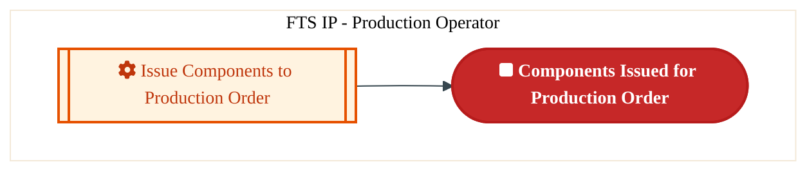
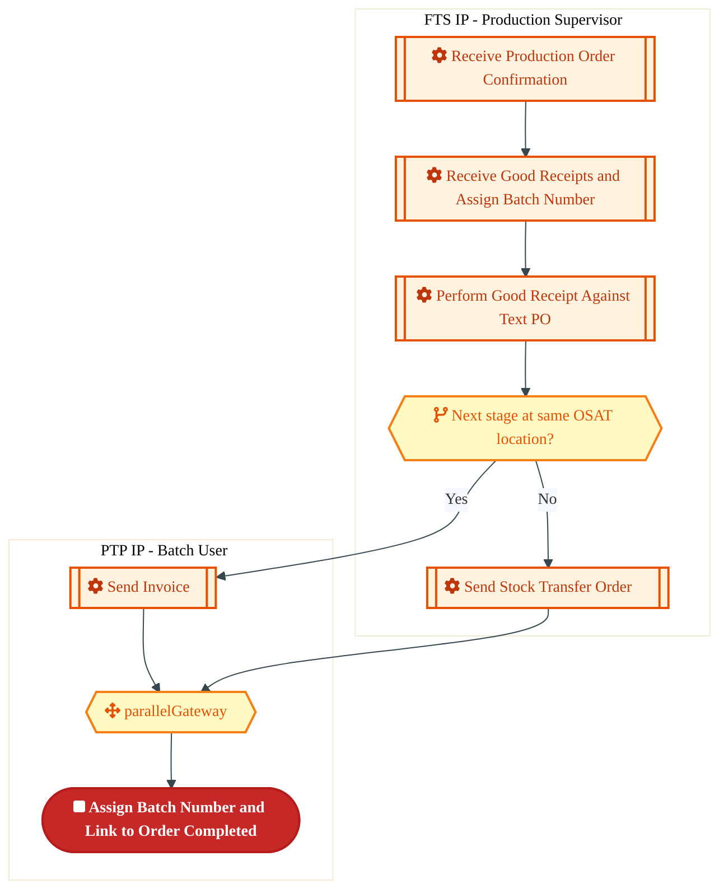
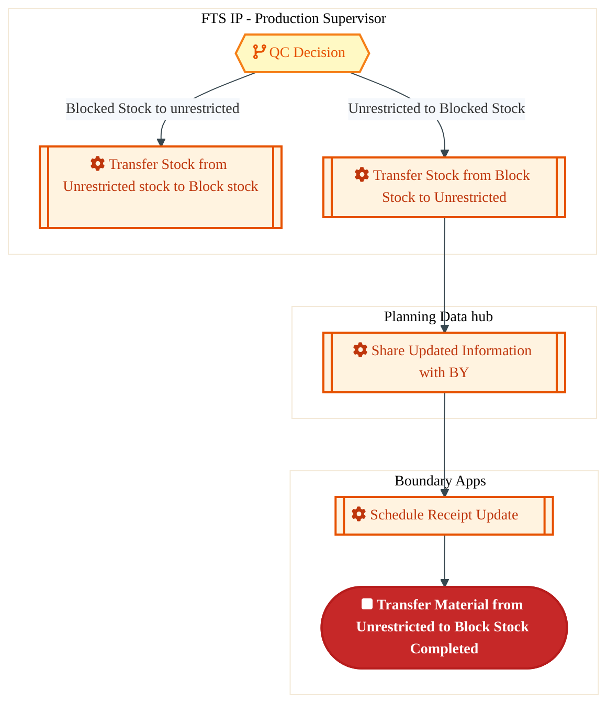
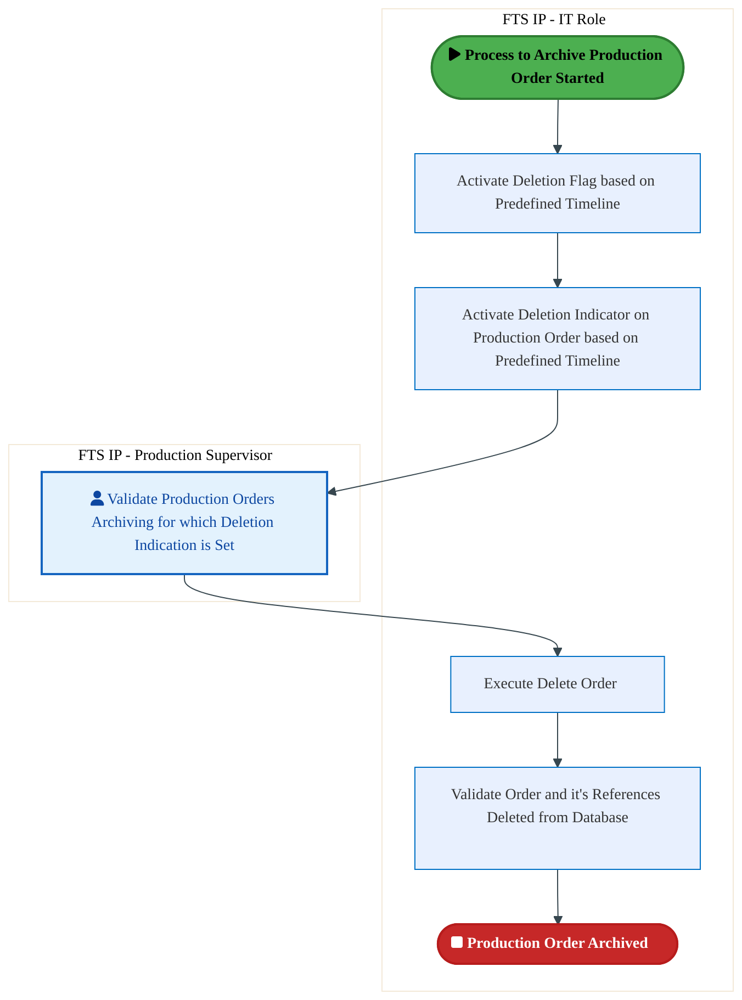

  
  <img src="data:image/svg+xml;base64,PHN2ZyB4bWxucz0iaHR0cDovL3d3dy53My5vcmcvMjAwMC9zdmciIHZpZXdCb3g9IjAgMCA4MDAgNDgwIiB3aWR0aD0iODAwIiBoZWlnaHQ9IjQ4MCI+CiAgPGRlZnM+CiAgICA8bGluZWFyR3JhZGllbnQgaWQ9ImJnIiB4MT0iMCUiIHkxPSIwJSIgeDI9IjEwMCUiIHkyPSIxMDAlIj4KICAgICAgPHN0b3Agb2Zmc2V0PSIwJSIgc3R5bGU9InN0b3AtY29sb3I6IzAwNzFjNTtzdG9wLW9wYWNpdHk6MSIvPgogICAgICA8c3RvcCBvZmZzZXQ9IjEwMCUiIHN0eWxlPSJzdG9wLWNvbG9yOiMwMGFlZWY7c3RvcC1vcGFjaXR5OjEiLz4KICAgIDwvbGluZWFyR3JhZGllbnQ+CiAgICA8bGluZWFyR3JhZGllbnQgaWQ9ImFjY2VudCIgeDE9IjAlIiB5MT0iMCUiIHgyPSIwJSIgeTI9IjEwMCUiPgogICAgICA8c3RvcCBvZmZzZXQ9IjAlIiBzdHlsZT0ic3RvcC1jb2xvcjojZmZmZmZmO3N0b3Atb3BhY2l0eTowLjE1Ii8+CiAgICAgIDxzdG9wIG9mZnNldD0iMTAwJSIgc3R5bGU9InN0b3AtY29sb3I6I2ZmZmZmZjtzdG9wLW9wYWNpdHk6MC4wMiIvPgogICAgPC9saW5lYXJHcmFkaWVudD4KICAgIDxwYXR0ZXJuIGlkPSJncmlkIiB3aWR0aD0iNDAiIGhlaWdodD0iNDAiIHBhdHRlcm5Vbml0cz0idXNlclNwYWNlT25Vc2UiPgogICAgICA8cGF0aCBkPSJNIDQwIDAgTCAwIDAgMCA0MCIgZmlsbD0ibm9uZSIgc3Ryb2tlPSJyZ2JhKDI1NSwyNTUsMjU1LDAuMDcpIiBzdHJva2Utd2lkdGg9IjAuNSIvPgogICAgPC9wYXR0ZXJuPgogIDwvZGVmcz4KCiAgPCEtLSBCYWNrZ3JvdW5kIC0tPgogIDxyZWN0IHdpZHRoPSI4MDAiIGhlaWdodD0iNDgwIiBmaWxsPSJ1cmwoI2JnKSIgcng9IjgiLz4KICA8cmVjdCB3aWR0aD0iODAwIiBoZWlnaHQ9IjQ4MCIgZmlsbD0idXJsKCNncmlkKSIgcng9IjgiLz4KICA8cmVjdCB3aWR0aD0iODAwIiBoZWlnaHQ9IjQ4MCIgZmlsbD0idXJsKCNhY2NlbnQpIiByeD0iOCIvPgoKICA8IS0tIERlY29yYXRpdmUgY2lyY3VpdC9hcmNoaXRlY3R1cmUgbGluZXMgLS0+CiAgPGcgc3Ryb2tlPSJyZ2JhKDI1NSwyNTUsMjU1LDAuMTIpIiBzdHJva2Utd2lkdGg9IjEuNSIgZmlsbD0ibm9uZSI+CiAgICA8cGF0aCBkPSJNIDAgMTAwIEwgMTIwIDEwMCBMIDE2MCAxNDAgTCAyODAgMTQwIi8+CiAgICA8cGF0aCBkPSJNIDAgMjYwIEwgODAgMjYwIEwgMTIwIDIyMCBMIDIwMCAyMjAgTCAyNDAgMjYwIEwgMzYwIDI2MCIvPgogICAgPHBhdGggZD0iTSA1MjAgMTAwIEwgNjAwIDEwMCBMIDY0MCA2MCBMIDgwMCA2MCIvPgogICAgPHBhdGggZD0iTSA0NDAgMzQwIEwgNTYwIDM0MCBMIDYwMCAzMDAgTCA3MjAgMzAwIEwgNzYwIDM0MCBMIDgwMCAzNDAiLz4KICAgIDxwYXRoIGQ9Ik0gNjAwIDQwMCBMIDY4MCA0MDAgTCA3MjAgNDQwIi8+CiAgICA8cGF0aCBkPSJNIDAgNDAwIEwgNDAgNDAwIEwgODAgMzYwIi8+CiAgICA8cGF0aCBkPSJNIDIwMCA0MjAgTCAzMjAgNDIwIEwgMzYwIDM4MCBMIDQ4MCAzODAiLz4KICAgIDxwYXRoIGQ9Ik0gNjUwIDQ0MCBMIDc1MCA0NDAgTCA4MDAgNDgwIi8+CiAgPC9nPgoKICA8IS0tIERlY29yYXRpdmUgbm9kZXMgLS0+CiAgPGcgZmlsbD0icmdiYSgyNTUsMjU1LDI1NSwwLjE4KSI+CiAgICA8Y2lyY2xlIGN4PSIxMjAiIGN5PSIxMDAiIHI9IjQiLz4KICAgIDxjaXJjbGUgY3g9IjI4MCIgY3k9IjE0MCIgcj0iNCIvPgogICAgPGNpcmNsZSBjeD0iMjAwIiBjeT0iMjIwIiByPSI0Ii8+CiAgICA8Y2lyY2xlIGN4PSIzNjAiIGN5PSIyNjAiIHI9IjQiLz4KICAgIDxjaXJjbGUgY3g9IjYwMCIgY3k9IjEwMCIgcj0iNCIvPgogICAgPGNpcmNsZSBjeD0iNzIwIiBjeT0iMzAwIiByPSI0Ii8+CiAgICA8Y2lyY2xlIGN4PSI1NjAiIGN5PSIzNDAiIHI9IjQiLz4KICAgIDxjaXJjbGUgY3g9IjgwIiBjeT0iMzYwIiByPSI0Ii8+CiAgICA8Y2lyY2xlIGN4PSI0ODAiIGN5PSIzODAiIHI9IjQiLz4KICAgIDxjaXJjbGUgY3g9IjMyMCIgY3k9IjQyMCIgcj0iNCIvPgogIDwvZz4KCiAgPCEtLSBUT0dBRiBCREFUIGJveGVzIC0tPgogIDxnIGZvbnQtZmFtaWx5PSJTZWdvZSBVSSwgQXJpYWwsIHNhbnMtc2VyaWYiIGZvbnQtc2l6ZT0iMTQiIGZvbnQtd2VpZ2h0PSI2MDAiPgogICAgPCEtLSBCIC0tPgogICAgPHJlY3QgeD0iMTUwIiB5PSIxNDAiIHdpZHRoPSIxMjAiIGhlaWdodD0iNDAiIHJ4PSI1IiBmaWxsPSJyZ2JhKDI1NSwyNTUsMjU1LDAuMTgpIiBzdHJva2U9InJnYmEoMjU1LDI1NSwyNTUsMC4zKSIgc3Ryb2tlLXdpZHRoPSIxIi8+CiAgICA8dGV4dCB4PSIyMTAiIHk9IjE2NSIgdGV4dC1hbmNob3I9Im1pZGRsZSIgZmlsbD0iI2ZmZiI+QnVzaW5lc3M8L3RleHQ+CiAgICA8IS0tIEQgLS0+CiAgICA8cmVjdCB4PSIyOTAiIHk9IjE0MCIgd2lkdGg9IjEyMCIgaGVpZ2h0PSI0MCIgcng9IjUiIGZpbGw9InJnYmEoMjU1LDI1NSwyNTUsMC4xOCkiIHN0cm9rZT0icmdiYSgyNTUsMjU1LDI1NSwwLjMpIiBzdHJva2Utd2lkdGg9IjEiLz4KICAgIDx0ZXh0IHg9IjM1MCIgeT0iMTY1IiB0ZXh0LWFuY2hvcj0ibWlkZGxlIiBmaWxsPSIjZmZmIj5EYXRhPC90ZXh0PgogICAgPCEtLSBBIC0tPgogICAgPHJlY3QgeD0iNDMwIiB5PSIxNDAiIHdpZHRoPSIxMjAiIGhlaWdodD0iNDAiIHJ4PSI1IiBmaWxsPSJyZ2JhKDI1NSwyNTUsMjU1LDAuMTgpIiBzdHJva2U9InJnYmEoMjU1LDI1NSwyNTUsMC4zKSIgc3Ryb2tlLXdpZHRoPSIxIi8+CiAgICA8dGV4dCB4PSI0OTAiIHk9IjE2NSIgdGV4dC1hbmNob3I9Im1pZGRsZSIgZmlsbD0iI2ZmZiI+QXBwbGljYXRpb248L3RleHQ+CiAgICA8IS0tIFQgLS0+CiAgICA8cmVjdCB4PSI1NzAiIHk9IjE0MCIgd2lkdGg9IjEyMCIgaGVpZ2h0PSI0MCIgcng9IjUiIGZpbGw9InJnYmEoMjU1LDI1NSwyNTUsMC4xOCkiIHN0cm9rZT0icmdiYSgyNTUsMjU1LDI1NSwwLjMpIiBzdHJva2Utd2lkdGg9IjEiLz4KICAgIDx0ZXh0IHg9IjYzMCIgeT0iMTY1IiB0ZXh0LWFuY2hvcj0ibWlkZGxlIiBmaWxsPSIjZmZmIj5UZWNobm9sb2d5PC90ZXh0PgogIDwvZz4KCiAgPCEtLSBDb25uZWN0aW5nIGxpbmVzIGJldHdlZW4gQkRBVCBib3hlcyAtLT4KICA8ZyBzdHJva2U9InJnYmEoMjU1LDI1NSwyNTUsMC4yNSkiIHN0cm9rZS13aWR0aD0iMSI+CiAgICA8bGluZSB4MT0iMjcwIiB5MT0iMTYwIiB4Mj0iMjkwIiB5Mj0iMTYwIi8+CiAgICA8bGluZSB4MT0iNDEwIiB5MT0iMTYwIiB4Mj0iNDMwIiB5Mj0iMTYwIi8+CiAgICA8bGluZSB4MT0iNTUwIiB5MT0iMTYwIiB4Mj0iNTcwIiB5Mj0iMTYwIi8+CiAgPC9nPgoKICA8IS0tIE1haW4gdGl0bGUgLS0+CiAgPHRleHQgeD0iNDAwIiB5PSIyNjAiIHRleHQtYW5jaG9yPSJtaWRkbGUiIGZvbnQtZmFtaWx5PSJTZWdvZSBVSSwgQXJpYWwsIHNhbnMtc2VyaWYiIGZvbnQtc2l6ZT0iMzYiIGZvbnQtd2VpZ2h0PSI3MDAiIGZpbGw9IiNmZmZmZmYiIGxldHRlci1zcGFjaW5nPSIxIj4KICAgIElBTyBBcmNoaXRlY3R1cmUKICA8L3RleHQ+CiAgPHRleHQgeD0iNDAwIiB5PSIzMDAiIHRleHQtYW5jaG9yPSJtaWRkbGUiIGZvbnQtZmFtaWx5PSJTZWdvZSBVSSwgQXJpYWwsIHNhbnMtc2VyaWYiIGZvbnQtc2l6ZT0iMTgiIGZvbnQtd2VpZ2h0PSI0MDAiIGZpbGw9InJnYmEoMjU1LDI1NSwyNTUsMC44KSIgbGV0dGVyLXNwYWNpbmc9IjIiPgogICAgVE9HQUYgQkRBVCDCtyBJQU8gUHJvZ3JhbSDCtyBJRE0gMi4wCiAgPC90ZXh0PgoKICA8IS0tIEJvdHRvbSBhY2NlbnQgYmFyIC0tPgogIDxyZWN0IHg9IjI4MCIgeT0iMzQwIiB3aWR0aD0iMjQwIiBoZWlnaHQ9IjMiIHJ4PSIxLjUiIGZpbGw9InJnYmEoMjU1LDI1NSwyNTUsMC40KSIvPgoKICA8IS0tIEludGVsIHRleHQgLS0+CiAgPHRleHQgeD0iNDAwIiB5PSIzODAiIHRleHQtYW5jaG9yPSJtaWRkbGUiIGZvbnQtZmFtaWx5PSJTZWdvZSBVSSwgQXJpYWwsIHNhbnMtc2VyaWYiIGZvbnQtc2l6ZT0iMTMiIGZpbGw9InJnYmEoMjU1LDI1NSwyNTUsMC41KSIgbGV0dGVyLXNwYWNpbmc9IjMiPgogICAgSU5URUwgQ09ORklERU5USUFMCiAgPC90ZXh0Pgo8L3N2Zz4K" alt="IAO Architecture" style="width:100%; border-radius:8px;" />
  <h1 style="font-size:36px; margin-top:24px;">M-100 — Execute Production (IP)</h1>
  <h2 style="font-size:24px;">Architecture Document (TOGAF BDAT)</h2>
  
Forecast to Stock (IP) (FTS-IP) Tower 
  Capability M-100 · M Mfg. Schedule and Execution (IP)

  
IAO Program · R1 – R5 
  Generated: April 2026 
  Sajiv Francis

  
IAO Architecture Pipeline — Intel Confidential

Page 1<a href="#toc">↑ Back to TOC</a>M-100 — Execute Production (IP)

## Table of Contents

<nav class="toc">
<ol>
  <li><a href="#1-executive-summary">1. Executive Summary</a></li>
  <li><a href="#2-business-context-objectives">2. Business Context &amp; Objectives</a>
    <ul>
      <li><a href="#21-classification">2.1 Classification</a></li>
      <li><a href="#22-business-drivers">2.2 Business Drivers</a></li>
      <li><a href="#23-success-criteria">2.3 Success Criteria</a></li>
      <li><a href="#24-companion-documents">2.4 Companion Documents</a></li>
    </ul>
  </li>
  <li><a href="#3-business-architecture-togaf-b">3. Business Architecture (TOGAF &ldquo;B&rdquo;)</a>
    <ul>
      <li><a href="#31-business-process-overview">3.1 Business Process Overview</a></li>
      <li><a href="#32-business-process-diagrams">3.2 Business Process Diagrams</a></li>
      <li><a href="#33-business-roles-responsibilities">3.3 Business Roles &amp; Responsibilities</a></li>
    </ul>
  </li>
  <li><a href="#4-data-architecture-togaf-d">4. Data Architecture (TOGAF &ldquo;D&rdquo;)</a>
    <ul>
      <li><a href="#41-data-entities-ownership">4.1 Data Entities &amp; Ownership</a></li>
      <li><a href="#42-data-flow-diagrams">4.2 Data Flow Diagrams</a></li>
      <li><a href="#43-data-lineage">4.3 Data Lineage</a></li>
      <li><a href="#44-ricefw-data-objects">4.4 RICEFW Data Objects</a></li>
      <li><a href="#45-data-governance-quality">4.5 Data Governance &amp; Quality</a></li>
    </ul>
  </li>
  <li><a href="#5-application-architecture-togaf-a">5. Application Architecture (TOGAF &ldquo;A&rdquo;)</a>
    <ul>
      <li><a href="#51-current-state-current-state-application-landscape">5.1 Current-State Application Landscape</a></li>
      <li><a href="#52-future-state-future-state-application-landscape">5.2 Future-State Application Landscape</a></li>
      <li><a href="#53-change-impact-summary">5.3 Change Impact Summary</a></li>
      <li><a href="#54-component-overview">5.4 Component Overview</a></li>
      <li><a href="#55-ricefw-inventory">5.5 RICEFW Inventory</a></li>
      <li><a href="#56-integration-patterns">5.6 Integration Patterns</a></li>
    </ul>
  </li>
  <li><a href="#6-technology-architecture-togaf-t">6. Technology Architecture (TOGAF &ldquo;T&rdquo;)</a>
    <ul>
      <li><a href="#61-platform-infrastructure">6.1 Platform &amp; Infrastructure</a></li>
      <li><a href="#62-sap-development-object-status">6.2 SAP Development Object Status</a></li>
      <li><a href="#63-nfrs-design-principles">6.3 NFRs &amp; Design Principles</a></li>
      <li><a href="#64-security-governance">6.4 Security &amp; Governance</a></li>
    </ul>
  </li>
  <li><a href="#7-project-context">7. Project Context</a>
    <ul>
      <li><a href="#71-project-roadmap-go-live-plan">7.1 Project Roadmap &amp; Go-Live Plan</a></li>
      <li><a href="#72-raid-log">7.2 RAID Log</a></li>
      <li><a href="#73-recommendations-next-steps">7.3 Recommendations &amp; Next Steps</a></li>
    </ul>
  </li>
</ol>
</nav>

Page 2<a href="#toc">↑ Back to TOC</a>M-100 — Execute Production (IP)

## 1. Executive Summary

This Architecture Document defines the **Business, Data, Application, and Technology** (BDAT) architecture for **M-100 Execute Production (IP)** within the IAO program. It includes 5 BPMN process diagram(s) in Section 3.

| Dimension | Value |
|-----------|-------|
| **Tower** | Forecast to Stock (IP) (FTS-IP) |
| **Process Group** | M Mfg. Schedule and Execution (IP) |
| **Capability** | M-100 - Execute Production (IP) |
| **Release** | R1 – R5 |
| **Total Systems** | 0 |
| **System Status** | 0 Deployed, 0 Developing, 0 EOL, 0 Pending IAPM |
| **RICEFW Objects** | 2 Reports, 34 Interfaces, 20 Conversions, 35 Enhancements, 7 Forms, 3 Workflows |

**Change Summary**: 0 new flow chains, 0 removed, 0 modified, 0 unchanged between Current-State and Future-State states.

> All system nodes in architecture diagrams are **IAPM-linked** — click any node to open its IAPM page. Diagrams require `securityLevel: 'loose'` for click events.

Page 3<a href="#toc">↑ Back to TOC</a>M-100 — Execute Production (IP)

## 2. Business Context & Objectives

### 2.1 Classification

| Level | Value |
|-------|-------|
| **L0 Tower** | Forecast to Stock (IP) |
| **L1 Process** | M Mfg. Schedule and Execution (IP) |
| **L2 Capability** | M-100 - Execute Production (IP) |

### 2.2 Business Drivers

| # | Driver | Description | Strategic Alignment | Priority |
|---|--------|-------------|---------------------|----------|
| 1 | Intel Products Supply Chain Unification | Consolidate Intel Products manufacturing and logistics onto S/4 HANA platform | IDM 2.0 Products Transformation | High |
| 2 | End-to-End Traceability | Enable lot/batch traceability from raw material to finished goods shipment | Quality & Compliance | High |
| 3 | Demand-Supply Matching | Implement responsive demand and supply matching (RDSM) for IP product lines | Supply Chain Agility | Medium |
| 4 | M-100 Process Migration | Migrate Execute Production (IP) business processes and 0 integrated systems from legacy to S/4 HANA target architecture | IDM 2.0 Supply Chain (Intel Products) | High |

Page 4<a href="#toc">↑ Back to TOC</a>M-100 — Execute Production (IP)

### 2.3 Success Criteria

| Metric | Target | Measure | Baseline | Owner |
|--------|--------|---------|----------|-------|
| Production Schedule Adherence | > 95% | Percentage of production orders completed on schedule | 88% (current) | Production Manager |
| Material Availability Rate | > 98% | Materials available at point of need for production | 94% (current) | Materials Planning |
| Shipping On-Time Delivery | > 97% | Orders shipped within committed delivery window | 93% (current) | Logistics Lead |
| M-100 Migration Completeness | 100% flow chains validated | All 0 flow chains verified in target state | 0% (pre-migration) | Tower Architect |

### 2.4 Companion Documents

| Document | Description |
|----------|-------------|
| **Business Architecture** | Included in this document (Section 3) — process flows from BPMN diagrams |
| **This Document** | Full BDAT Architecture — Business + Data + Application + Technology |

Page 5<a href="#toc">↑ Back to TOC</a>M-100 — Execute Production (IP)

## 3. Business Architecture (TOGAF "B")

### 3.1 Business Process Overview

This capability includes **5 business process(es)** modeled in BPMN 2.0, covering the end-to-end workflow for M-100 Execute Production (IP).

| # | Step ID | Process Name | Lanes | Tasks | Gateways |
|---|---------|--------------|-------|-------|----------|
| 1 | M-100-070_Issue_Materials_for_Production_Order_(IP) | M-100-070_Issue_Materials_for_Production_Order_(IP) | FTS IP - Production Operator | 1 | 0 |
| 2 | M-100-180_Assign_Batch_Number_and_Link_to_Order_(IP) | M-100-180_Assign_Batch_Number_and_Link_to_Order_(IP) | FTS IP - Production Supervisor, PTP IP - Batch User | 5 | 2 |
| 3 | M-100-220_Transfer_Materials_from_Quality_Inspection_to_Stock_(IP) | M-100-220_Transfer_Materials_from_Quality_Inspection_to_Stock_(IP) | Boundary Apps, FTS IP - Production Supervisor, Planning Data hub | 4 | 1 |
| 4 | M-100-240_Reconcile_and_Close_Production_Order_(IP) | M-100-240_Reconcile_and_Close_Production_Order_(IP) | FTS IP - Production Supervisor | 3 | 0 |
| 5 | M-100-250_Archive_Production_Order_(IP) | M-100-250_Archive_Production_Order_(IP) | FTS IP - IT Role, FTS IP - Production Supervisor | 5 | 0 |

Page 6<a href="#toc">↑ Back to TOC</a>M-100 — Execute Production (IP)

### 3.2 Business Process Diagrams

#### BUSINESS ARCHITECTURE — 3.2.1 M-100-070_Issue_Materials_for_Production_Order_(IP) — M-100-070_Issue_Materials_for_Production_Order_(IP)

**Swim Lanes**: FTS IP - Production Operator | **Tasks**: 1 | **Gateways**: 0

> **Legend**: ● Start · ● End · User Task · Service Task · ◇ Gateway · Sub-Process

<a href="https://mermaid.live/view#pako:eNqllF1r2zAUhv-KcAnewAHbsePMF4PEiaCwsUK67aIZQ7GPElFZMpLcJA3575Py3Wy9mi-M_eqc59U5-th6pazAy71OZ8sEMzna-mYJNfg58udEgx-gg_CDKEbmHLTvYqgUZspe92FR0qxdmNMwqRnfOHUKCwno-32AhjaRB0gTobsaFKN-4DeK1URtCsmlctF3MKAh3bsdh0ZSVaAuAWGYRWVqUzkTcJF7WZIl2OVpKKWo3kBpSge09HduclyuyiVRZj_9VsNXsv7JKrO0_5RwDTZmaWr-hcyBuxqNap1Wturl1AymnY-wDZs2pGRiYfUktJIi4vkipeFuh3adzkycTdHjeCaQfUpOtB4DRdpYefJiEGWc53dJMcRpGGij5DPkd_EkG_fioHSV5Lb0MHDN7a6ALZYmn0teHUO7K1dDHjfrQK3zOAzUxr5vvEBUF6eiHw_iwdlplEVFVJycKKX_5WT7qh6Jfj56TXo4xuOzV5T20yL8m3cqc5xkw-i2T6BeWAlXUIxxb3Jp1aSfRuH70BHu9cPiBrogBlZkcwF-KpIzEKcZjrJ3gQe_21m28wclyxOwN0lxegZmowgP43eByTBKBscZWs5CkWaJOBHwO3yaefhxiu4fUBdZftWWhkmBvjWgiJFq5v06pLlHRE82nJKckm4pF-he6xZQIetGChBGIyPfMNzpsoBrQvzhTNBGNtfJe1qFqFT_gnw8QOw-O3yICHW7ny3wqk1OvFrMNyPxcYt6gVeDqgmrvHzr7a8dezVVQEnLjbcLPNIaOd2I0sv3x9Nrm8ou5ZgR27X6IO7-AKnckAU=" title="View full diagram">&#128065; View Diagram</a>

Page 7<a href="#toc">↑ Back to TOC</a>M-100 — Execute Production (IP)

#### BUSINESS ARCHITECTURE — 3.2.2 M-100-180_Assign_Batch_Number_and_Link_to_Order_(IP) — M-100-180_Assign_Batch_Number_and_Link_to_Order_(IP)

**Swim Lanes**: FTS IP - Production Supervisor · PTP IP - Batch User | **Tasks**: 5 | **Gateways**: 2

> **Legend**: ● Start · ● End · User Task · Service Task · ◇ Gateway · Sub-Process

<a href="https://mermaid.live/view#pako:eNqlVVuv4jYQ_itWjo5opSAlISE0D624ZXWk7R60sK2qZVWZZAIWjh3ZDpey_Pe1Sbil8LR5QMw3M983M_YkByvhKViR9fp6IIyoCB1aagU5tCLUWmAJLRtVwF9YELygIFsmJuNMTcl_pzDXL3YmzGAxzgndG3QKSw7oy5uN-jqR2khiJtsSBMladqsQJMdiP-SUCxP9Ar3MyU5qtWvARQriGuA4oZsEOpUSBle4E_qhH5s8CQln6R1pFmS9LGkdTXGUb5MVFupUfinhT7z7m6Rqpe0MUwk6ZqVy-hEvgJoelSgNlpRicx4GkUaH6YFNC5wQttS472hIYLa-QoFzPKLj6-ucXUTRbDRnSD8JxVKOIENSaXi8USgjlEYv_rAfB44tleBriF68cTjqeHZiOol0645thtveAlmuVLTgNK1D21vTQ-QVO1vsIs-xxV7_NrSApVelYdfreb2L0iB0h-7wrJRl2U8p6bmKGZbrWmvcib14dNFyg24wdP7Pd25z5Id9tzknEBuSwA1pHMed8XVU427gOs9JB3Gn6wwbpEusYIv3V8Lfhv6FMA7C2A2fElZ6zSrLxUTw5EzYGQdxcCEMB27c954S-n3X79UVap6lwMUKUczgX-fr3IpnU_Q2QW2k-dMyUYQzNC0LMxXJxdz6ViWah3lfdUKGowy3E75EnyEBsoHbzHezU2jIWUZEjg2kGW4pOo8pPnCeVkahJMIsRX0pyZKhAVbJCn0q8wWIBpV_TzXVtxBNFU_WaKb3RWa6kFM5jbTgPm0CIuMiv6sA9ZeYMKm3CnYKTd4bDOHhcGVIob3QcqZIE6zXbgkI6z84B_Q-7c8Q5clpEn_MreOxotGlPjoPV1c2mU2q86g6_yKhcQjug7bf2IbrS9yos_vLJVIqXjwa6WnUHwlbI8Uvh5cXFBSkmu3XG7betWssBN_KNqYKFVhgSoF-qG78gxaZh9rt3_XJ12anMoPadCuzV5u9yuzWpn_vDSozrM3QmN_n1j8g59Z3zdXAP_ET7N8skxG8Wfk7j_fU03nq8Z96gqeebv3CvAPD80vjDu2dUcu2ctArRVIrOlinD6b-qKaQ4ZIq62hbuFR8umeJFZ0-LFZZpDpzRLC-X3kFHn8A7BJoHw==" title="View full diagram">&#128065; View Diagram</a>

Page 8<a href="#toc">↑ Back to TOC</a>M-100 — Execute Production (IP)

#### BUSINESS ARCHITECTURE — 3.2.3 M-100-220_Transfer_Materials_from_Quality_Inspection_to_Stock_(IP) — M-100-220_Transfer_Materials_from_Quality_Inspection_to_Stock_(IP)

**Swim Lanes**: Boundary Apps · FTS IP - Production Supervisor · Planning Data hub | **Tasks**: 4 | **Gateways**: 1

> **Legend**: ● Start · ● End · User Task · Service Task · ◇ Gateway · Sub-Process

<a href="https://mermaid.live/view#pako:eNqlVVuL4zYU_ivCw5AWHPA1Tv1QSJwYBrow28y0lE0piizFYhzJSPJk0mz-e48cx7nspn2oH4zP7fvO-XTx3iGyoE7qPD7uueAmRfuBKemGDlI0WGFNBy46On7DiuNVRfXA5jApzIL_3ab5Uf1h06wvxxte7ax3QdeSotcnF02gsHKRxkIPNVWcDdxBrfgGq10mK6ls9gMdM4-1bF1oKlVB1TnB8xKfxFBacUHP7jCJkii3dZoSKYorUBazMSODg22ukltSYmXa9htNP-GP33lhSrAZrjSFnNJsql_wilZ2RqMa6yONej-JwbXlESDYosaEizX4Iw9cCou3syv2Dgd0eHxcip4UvcyWAsFDKqz1jDKkDbjn7wYxXlXpQ5RN8thztVHyjaYPwTyZhYFL7CQpjO65VtzhlvJ1adKVrIoudbi1M6RB_eGqjzTwXLWD9w0XFcWZKRsF42DcM00TP_OzExNj7H8xga7qBeu3jmse5kE-67n8eBRn3rd4pzFnUTLxb3Wi6p0TegGa53k4P0s1H8W-dx90mocjL7sBXWNDt3h3Bvwpi3rAPE5yP7kLeOS77bJZPStJToDhPM7jHjCZ-vkkuAsYTfxo3HUIOGuF6xJVWNC_vC9LZyqbdlOjSV3rpfPnMc8-wv8CcYZThodErtGClLRoKop-pYTy2qDXuoA5oeayKP6hL9JG1ugF9q5mVKFPkGsPKmJKbtCrUBQa5sTQAhmJppUkb2hh7DuTm7qiEADoH4_QsMO-N4APXPnLAj09oyECgYqGGC4FWjS1XVYt1fVEwfVEfW9H3m8b062_b681b-YN_xvycjbAumS4ARvt92ewgg5XgEZK9DlDM0q4htGWzuHwr5IE0M4zfAm4K9AMG4zKZnWtQnSzrnCB0G4xC_QkmFQb3Mq45aZE0z_OTfacwkfD4c-w2p0ZHs2oM6Oj2Z01MbLmV9hrVgjg6KVorqT4Cgt0U_HdbXJCaCvCi5Ni27o4z1eR4G4kvBuJ7kbi7s67co5O595xnQ0FEXnhpHun_bvBH7CgDDeVcQ6ugxsjFztBnLT9CzhNK_6MY1jIzdF5-AfZNVgG" title="View full diagram">&#128065; View Diagram</a>

#### BUSINESS ARCHITECTURE — 3.2.4 M-100-240_Reconcile_and_Close_Production_Order_(IP) — M-100-240_Reconcile_and_Close_Production_Order_(IP)

**Swim Lanes**: FTS IP - Production Supervisor | **Tasks**: 3 | **Gateways**: 0

```mermaid
%%{init: {'theme': 'base', 'themeVariables': {'fontSize': '14px', 'fontFamily': 'Segoe UI, Arial, sans-serif','primaryColor': '#e8f0fe', 'primaryBorderColor': '#0071c5','lineColor': '#37474F', 'secondaryColor': '#f5f8fc'}, 'flowchart': {'useMaxWidth': false, 'htmlLabels': true, 'curve': 'basis', 'nodeSpacing': 40, 'rankSpacing': 50}} }%%
flowchart TD
    classDef startEvt fill:#4CAF50,stroke:#2E7D32,color:#000,font-weight:bold,stroke-width:2px,rx:20,ry:20
    classDef endEvt fill:#C62828,stroke:#B71C1C,color:#fff,font-weight:bold,stroke-width:2px,rx:20,ry:20
    classDef userTask fill:#E3F2FD,stroke:#1565C0,stroke-width:2px,color:#0D47A1
    classDef serviceTask fill:#FFF3E0,stroke:#E65100,stroke-width:2px,color:#BF360C
    classDef gateway fill:#FFF9C4,stroke:#F57F17,stroke-width:2px,color:#E65100
    classDef subProc fill:#F3E5F5,stroke:#7B1FA2,stroke-width:2px,color:#4A148C
    subgraph lane_0["FTS IP - Production Supervisor"]
        n1[["fa:fa-cog Validate Production Order for Completion (GR, Yield and Scrap)"]]
        n2["Set Production Order Status to Technically Complete (TECO)(Batch Job)"]
        n3["Close Production Order (CLSD) Based upon Production Order Status if it's..."]
        n4(["fa:fa-play Reconcile and Close Production Order Process Started"])
        n5(["fa:fa-stop Reconcile and Close Production Order Process Completed"])
        n6[["fa:fa-folder-open Calculate Variances"]]
        n7[["fa:fa-folder-open Execute Order Settlement"]]
    end
    n3 --> n5
    n2 --> n6
    n6 --> n7
    n7 --> n3
    n4 --> n1
    n1 --> n2
    class n1 serviceTask
    class n4 startEvt
    class n5 endEvt
    class n6 subProc
    class n7 subProc
```

> **Legend**: ● Start · ● End · User Task · Service Task · ◇ Gateway · Sub-Process

<a href="https://mermaid.live/view#pako:eNqllV2P4jYUhv-KldEoIIVRPgnNRSUIpNpqq11t6FbVTlUZxwZrjB3Zzgx0xH-vTQIBdrmomgvEeePznA_rnLw7SFTYyZzHx3fKqc7Au6s3eIvdDLgrqLDrgVb4CiWFK4aVa88QwXVJ_zkeC-J6Z49ZrYBbyvZWLfFaYPD7Bw9MjSPzgIJcjRSWlLieW0u6hXKfCyakPf2AJ8Qnx2jdq5mQFZb9Ad9PA5QYV0Y57uUojdO4sH4KI8GrKyhJyIQg92CTY-INbaDUx_QbhX-Duz9opTfGJpApbM5s9JZ9hCvMbI1aNlZDjXw9NYMqG4ebhpU1RJSvjR77RpKQv_RS4h8O4PD4-MzPQcFy_syBeRCDSs0xAUobefGqAaGMZQ9xPi0S31NaihecPYSLdB6FHrKVZKZ037PNHb1hut7obCVY1R0dvdkasrDeeXKXhb4n9-b3JhbmVR8pH4eTcHKONEuDPMhPkQgh_yuS6atcQvXSxVpERVjMz7GCZJzk_ve8U5nzOJ0Gt33C8pUifAEtiiJa9K1ajJPAvw-dFdHYz2-ga6jxG9z3wJ_y-AwskrQI0rvANt5tls3qsxToBIwWSZGcgeksKKbhXWA8DeJJl6HhrCWsN4BBjv_2vz07xbIEHz6DETD8qkGaCg7KprZdUUI-O3-1jvbhwTfjQGBG4AiJNfgKGa1MpZeun-xQASIkyMW2ZvgoDn754oE_KWYVgLwCJTIpDA36kh0adIn196xSQ90ooAVYYrThFEHG9ic6BoPlIv80HMygRhvwq1gNr1OODDZnQv0gyUH-sZwPwcwsoQo0tdHvxaYEUO2qp6ena3g8OPejZua6v9gNgSjDxzLvhLX3iJWybKlxZYjDC2TSI5UW9X9DnppyCx3390bMwGE5EjXmIIcMNcxe4HH3csO4uZT0x46LHUaNceuahLVmZoFz3XubjdD-4REYjX42dXVm2Jrjzhy3ZtqZaWtGnRm3ZjeyPGjN8GI2rHgxwVdv4vMOvJKTbl1diePThF2p6Ul1PGeL5RbSysnenePnynzSKkxgw7Rz8BzYaFHuOXKy41p3mtoOxpxCM23bVjz8C9ExQro=" title="View full diagram">&#128065; View Diagram</a>

Page 9<a href="#toc">↑ Back to TOC</a>M-100 — Execute Production (IP)

#### BUSINESS ARCHITECTURE — 3.2.5 M-100-250_Archive_Production_Order_(IP) — M-100-250_Archive_Production_Order_(IP)

**Swim Lanes**: FTS IP - IT Role · FTS IP - Production Supervisor | **Tasks**: 5 | **Gateways**: 0

> **Legend**: ● Start · ● End · User Task · Service Task · ◇ Gateway · Sub-Process

<a href="https://mermaid.live/view#pako:eNqlVWuL6zYQ_SvCy-IWHPAzzvWHQjaJYaGly016--FuKYo8isUqUpDkPLrkv1eKHeexd6HQfAiZ49E5M0eZ8btHZAVe4T0-vjPBTIHefVPDGvwC-UuswQ9QC3zDiuElB-27HCqFmbN_TmlRutm7NIeVeM34waFzWElAfzwHaGwP8gBpLPRAg2LUD_yNYmusDhPJpXLZDzCiIT2pdY-epKpAXRLCMI9IZo9yJuACJ3map6U7p4FIUd2Q0oyOKPGPrjgud6TGypzKbzT8hvd_ssrUNqaYa7A5tVnzX_ESuOvRqMZhpFHbsxlMOx1hDZtvMGFiZfE0tJDC4u0CZeHxiI6Pj6-iF0WL6atA9kM41noKFGlj4dnWIMo4Lx7SybjMwkAbJd-geIhn-TSJA-I6KWzrYeDMHeyArWpTLCWvutTBzvVQxJt9oPZFHAbqYL_vtEBUF6XJMB7Fo17pKY8m0eSsRCn9X0rWV7XA-q3TmiVlXE57rSgbZpPwI9-5zWmaj6N7n0BtGYEr0rIsk9nFqtkwi8LPSZ_KZBhO7khX2MAOHy6EXyZpT1hmeRnlnxK2evdVNssXJcmZMJllZdYT5k9ROY4_JUzHUTrqKrQ8K4U3NeJYwN_h91evXMzR8wsaoOcF-io5vHp_tanuI2KbMSaGbW1DaAocDJMClRyvkBveCtnoRUEF1A5NhRZsDW58bkkSSzLbA2nOHIB-d7N3m5XarG-YswqfnyMsKsSMr9FXoKBAENAdQYWokms0xQa7Om6Zsh8W_SwqRrCRqq1ZVg054a3Uf-9m-JOlp7igeLDh9o7dvYDWyEi7iEjNtvCRfe6GESpL9PMVU35h0kZuPh7r-K7O2Un70UVG1xd5RTNvNu7vreWd11Ev7AYK9bbfV6C7EuzeQdQ6t6sZqT9Y6n4yjeZgepW-ThGjweAXeyddmLRh2oVpG-ZdmLVhN6Ni2IZxF0ZtmFzNhgPPO-EGHvYL8AbOu13lBd4a1BqzyivevdP7x76j7MXjhhvvGHi4MXJ-EMQrTnvaazbOoCnD1vV1Cx7_BdhTM4c=" title="View full diagram">&#128065; View Diagram</a>

Page 10<a href="#toc">↑ Back to TOC</a>M-100 — Execute Production (IP)

### 3.3 Business Roles & Responsibilities

| Role / Lane | Processes Involved | Description |
|------------|-------------------|-------------|
| FTS IP - Production Operator | M-100-070_Issue_Materials_for_Production_Order_(IP),  | |
| FTS IP - Production Supervisor | M-100-180_Assign_Batch_Number_and_Link_to_Order_(IP), M-100-220_Transfer_Materials_from_Quality_Inspection_to_Stock_(IP), M-100-240_Reconcile_and_Close_Production_Order_(IP), M-100-250_Archive_Production_Order_(IP) | |
| PTP IP - Batch User | M-100-180_Assign_Batch_Number_and_Link_to_Order_(IP),  | |
| Boundary Apps | M-100-220_Transfer_Materials_from_Quality_Inspection_to_Stock_(IP),  | |
| Planning Data hub | M-100-220_Transfer_Materials_from_Quality_Inspection_to_Stock_(IP),  | |
| FTS IP - IT Role | M-100-250_Archive_Production_Order_(IP) | |

Page 11<a href="#toc">↑ Back to TOC</a>M-100 — Execute Production (IP)

## 4. Data Architecture (TOGAF "D")

### 4.1 Data Entities & Ownership

The following data entities are derived from the system integration flows for M-100. Tower architects should validate ownership and classification.

| # | Data Entity | Source System | Target System | Data Owner | Classification | Volume | Master/Transaction |
|---|-------------|---------------|---------------|------------|----------------|--------|-------------------|

Page 12<a href="#toc">↑ Back to TOC</a>M-100 — Execute Production (IP)

### 4.2 Data Flow Diagrams

> **DATA ARCHITECTURE** — Database-to-database data flows. Applications (blue) sit above their hosting databases (green cylinders). Thick arrows show data movement between databases.

### 4.3 Data Lineage

Data lineage traces the origin and transformation path of key data objects across integrated systems.

| # | Source System | Source Schema/Object | Target System | Target Schema/Object | Transformation |
|---|-------------|---------------------|---------------|---------------------|---------------|

> *Lineage detail will be refined when tower architects validate source/target schema object mappings.*

### 4.4 RICEFW Data Objects

Data-centric RICEFW objects (Reports and Conversions) from the Object Tracker:

| Object ID | Type | Description | Status | Source | Target | Complexity |
|-----------|------|-------------|--------|--------|--------|-----------|
| LOGR1176_IP | Report | ISM - International Traffic Report | 10. Object Complete |  |  | 02.High |
| LOGR0833_IP | Report | Email Notification for deletion of Shipping Memos | 10. Object Complete |  |  | 03.Medium |
| LOGM024_IP | Conversion | Create/Upload Vehicle resource | 10. Object Complete |  |  | N/A |
| LOGM023_IP | Conversion | Update Business Share | 10. Object Complete |  |  | N/A |
| LOGM022_IP | Conversion | Upload Transportation Allocation | 10. Object Complete |  |  | N/A |
| LOGM021_IP | Conversion | Upload Schedules | 10. Object Complete |  |  | N/A |
| LOGM019_IP | Conversion | Default Routes | 10. Object Complete |  | S4 | N/A |
| LOGM018_IP | Conversion | Upload Rate Table | 10. Object Complete |  |  | N/A |
| LOGM016_IP | Conversion | Create and review Charge Calculation Sheet | 10. Object Complete |  | S4 | N/A |
| LOGM015_IP | Conversion | Create and review Freight Agreement | 10. Object Complete |  | S4 | N/A |
| LOGM012_IP | Conversion | Creation of Location based on BP, Shipping points, plants | 10. Object Complete | ECC | S4 | N/A |
| LOGM008_IP | Conversion | Location creation-ocean ports, airports | 10. Object Complete |  |  | N/A |
| LOGM005_IP | Conversion | UPLOAD TRANSPORTATION ZONES (TM) | 10. Object Complete | TMS | S4 | N/A |
| LOGM004_IP | Conversion | UPLOAD TRANSPORTATION LANES | 10. Object Complete | TMS | S4 | N/A |
| LOGC1500 | Conversion | IM Stock conversion from Non SAP system to S4 system | 10. Object Complete |  |  | 02.High |
| LOGC0972_IP | Conversion | Open Inventory Conversion for IP and IF (as applicable) , Batch Characteristi... | 10. Object Complete |  |  | 02.High |
| LOGC0946_IP | Conversion | Open Inventory Conversion for IP and IF (as applicable) , ECC to S4 | 10. Object Complete |  |  | 02.High |
| FTSM002_IP | Conversion | Work Center | 10. Object Complete | NA | S4 | N/A |
| FTSC1682 | Conversion | Conversion of Intel Products Bailed Inventory & Lot Attributes | 10. Object Complete |  |  | 03.Medium |
| FTSC1559 | Conversion | Conversion of Open PO/Engineering/Rework Orders into Production orders from I... | 10. Object Complete |  |  | 03.Medium |
| FTSC0434 | Conversion | Conversion of Open Production Orders from ECC purchase order data into S4 | 10. Object Complete | ECC | S4 HANA | 03.Medium |
| FTSC0052_IP | Conversion | Conversion of Reference Operation Sets to S/4 | 10. Object Complete | ECC | S4 | 03.Medium |

### 4.5 Data Governance & Quality

| Concern | Approach |
|---------|----------|
| Data Ownership | Per-entity owners listed in Section 3.1 |
| Data Classification | Financial data classified as Intel Confidential |
| Data Retention | Per Intel corporate retention policies |
| Data Quality | Validated at source; reconciliation at target |

Page 13<a href="#toc">↑ Back to TOC</a>M-100 — Execute Production (IP)

## 5. Application Architecture (TOGAF "A")

### 5.1 Current-State — Current-State Application Landscape

#### Overview

The Current-State architecture represents the **current / legacy** landscape for M-100.

#### Current-State Flow Narrative

*(No current-state flows defined.)*

### 5.2 Future-State — Future-State Application Landscape

#### Overview

The Future-State architecture represents the **target** landscape for M-100.

#### Future-State Flow Narrative

*(No future-state flows defined.)*

### 5.3 Change Impact Summary

| Change Type | Flow Chain | Detail |
|-------------|-----------|--------|

**Totals**: 0 new - 0 removed - 0 modified - 0 unchanged

### 5.4 Component Overview

#### System Inventory

| System | IAPM ID | Status |
|--------|---------|--------|

Page 14<a href="#toc">↑ Back to TOC</a>M-100 — Execute Production (IP)

### 5.5 RICEFW Inventory

| Object ID | Type | Description | Status | Source → Target | Middleware | Complexity |
|-----------|------|-------------|--------|----------------|-----------|-----------|
| LOGW1078_IP | Workflow | ISM Workflows - Capital/AMT | 10. Object Complete |  | NA | 03.Medium |
| LOGW1077_IP | Workflow | ISM Workflows - EIMS/Lab | 10. Object Complete |  | NA | 03.Medium |
| LOGW1076_IP | Workflow | ISM Workflows - Non-inventory | 10. Object Complete |  | NA | 02.High |
| LOGR1176_IP | Report | ISM - International Traffic Report | 10. Object Complete |  | NA | 02.High |
| LOGR0833_IP | Report | Email Notification for deletion of Shipping Memos | 10. Object Complete |  | NA | 03.Medium |
| LOGM024_IP | Conversion | Create/Upload Vehicle resource | 10. Object Complete |  | NA | N/A |
| LOGM023_IP | Conversion | Update Business Share | 10. Object Complete |  | NA | N/A |
| LOGM022_IP | Conversion | Upload Transportation Allocation | 10. Object Complete |  | NA | N/A |
| LOGM021_IP | Conversion | Upload Schedules | 10. Object Complete |  | NA | N/A |
| LOGM019_IP | Conversion | Default Routes | 10. Object Complete |  → S4 | NA | N/A |
| LOGM018_IP | Conversion | Upload Rate Table | 10. Object Complete |  | NA | N/A |
| LOGM016_IP | Conversion | Create and review Charge Calculation Sheet | 10. Object Complete |  → S4 | NA | N/A |
| LOGM015_IP | Conversion | Create and review Freight Agreement | 10. Object Complete |  → S4 | NA | N/A |
| LOGM012_IP | Conversion | Creation of Location based on BP, Shipping points, plants | 10. Object Complete | ECC → S4 | NA | N/A |
| LOGM008_IP | Conversion | Location creation-ocean ports, airports | 10. Object Complete |  | NA | N/A |
| LOGM005_IP | Conversion | UPLOAD TRANSPORTATION ZONES (TM) | 10. Object Complete | TMS → S4 | NA | N/A |
| LOGM004_IP | Conversion | UPLOAD TRANSPORTATION LANES | 10. Object Complete | TMS → S4 | NA | N/A |
| LOGI1679 | Interface | Receive 4C1 Inventory movement Stock type change and cycle count from IF | 10. Object Complete |  | SFT | 03.Medium |
| LOGI1678 | Interface | Receive 4C1 Inventory Reconciliation Snapshot from IF | 10. Object Complete |  | SFT | 03.Medium |
| LOGI1576 | Interface | ECD_Interface between S4 to ECD for inventory status response | 08. FUT In Progress |  | MuleSoft | 03.Medium |
| LOGI1575 | Interface | ECD_Interface between S4 to 3PL for inventory status webservice​ | 08. FUT In Progress |  | MuleSoft | 03.Medium |
| LOGI1571 | Interface | ECD_Interface from ECD to S4 for Inventory status call​ | 10. Object Complete |  | MuleSoft | 03.Medium |
| LOGI1295 | Interface | ECD_Interface between S/4 and ECD for completion status | 08. FUT In Progress |  | MULESOFT | 03.Medium |
| LOGI1291 | Interface | ECD_Interface between S/4 and 3PL to send plant/batch level hold/unhold infor... | 08. FUT In Progress |  | MULESOFT | 03.Medium |
| LOGI1290 | Interface | ECD_Interface from ECD to S4 for Inventory Hold/unhold request | 08. FUT In Progress |  | MULESOFT | 03.Medium |
| LOGI1272 | Interface | Response to goods receipt posting from SAP to 3PL - EDI 4C1B | 10. Object Complete | S/4 → WMS (3PL) | MULESOFT | 03.Medium |
| LOGI1267 | Interface | Inventory Reconciliation with Consignment hub – EDI 4C1 with version control | 10. Object Complete | OpenText → S/4 | MULESOFT | 03.Medium |
| LOGI1081_IP | Interface | Interface + Enhancement - Reprinting of Carrier Label | 10. Object Complete | S/4 → Redwood | APIGEE | 03.Medium |
| LOGI1079_IP | Interface | Interface from S4 ISM to Service Now | 10. Object Complete | S/4 ISM → Service Now | NA | 03.Medium |
| LOGI1074_IP | Interface | Send data via API to retrieve the tracking ID - interface + Enhancement | 10. Object Complete | S/4 → Redwood | APIGEE | 03.Medium |
| LOGI0951 | Interface | Inbound interface to receive Finished Goods “Goods Receipt” (4B2) signal from... | 10. Object Complete | OpenText → S/4 | MULESOFT | 03.Medium |
| LOGI0950 | Interface | Interface to receive 4B2 signal from Factory and return shipments from ODM/OS... | 10. Object Complete | OpenText → S/4 | MULESOFT | 03.Medium |
| LOGI0933 | Interface | W-lot inventory error handling | 10. Object Complete |  | MULESOFT | 03.Medium |
| LOGI0836_IP | Interface | Interface from S4 to NDA (IPLA –Intel Pre Release License Agreements) | 10. Object Complete | S/4 → NDA | NA | 03.Medium |
| LOGI0335 | Interface | Outbound PIP signal to 3PL for material document transfer – EDI 4C1 | 10. Object Complete | S/4 → OpenText | MULESOFT | 02.High |
| LOGI0237_IP | Interface | Inventory Reconciliation snapshot (4C1) from 3PL WMS to SAP S/4 | 10. Object Complete | 3PL → S/4 | MULESOFT | 02.High |
| LOGF1614_IP | Form | TM-Bill of lading print output ( NSO/ Prospal STO's) | 10. Object Complete |  | NA | 03.Medium |
| LOGF1100_IP | Form | Printing of Standard Shipping Label | 10. Object Complete |  | NA | 02.High |
| LOGF0359_IP | Form | ISM - Generate Commercial Invoice - IF/IP | 10. Object Complete | NA → NA | NA | 02.High |
| LOGF0358_IP | Form | ISM - Generate Traveler Document - IF/IP | 10. Object Complete | NA → NA | NA | 02.High |
| LOGF0352_IP | Form | ISM - IPLA | 10. Object Complete |  | NA | 02.High |
| LOGF0351_IP | Form | ISM - Custom China Special label | 10. Object Complete |  | NA | 02.High |
| LOGF0350_IP | Form | ISM - India GST DC | 10. Object Complete |  | NA | 02.High |
| LOGE1686 | Enhancement | IP custom table for reconciliation data | 10. Object Complete |  | NA | 03.Medium |
| LOGE1572_IP | Enhancement | SAP GUI T-code to Move stock from Blocked to unblock Status | 10. Object Complete |  | NA | 02.High |
| LOGE1569_IP | Enhancement | Enhancement to change billing status based on ship reason in ISM | 10. Object Complete |  | NA | 03.Medium |
| LOGE1526_IP | Enhancement | Automatic HAWB assignment for Freight Forwarders( ISM/ Prospal STO's) | 10. Object Complete |  | NA | 02.High |
| LOGE1327 | Enhancement | ECD_Enhancement to retrieve plant details for material/batch and update custo... | 08. FUT In Progress |  | NA | 02.High |
| LOGE1276_IP | Enhancement | TM:Replace VTRC and integrate with parcel carrier to retrieve the package lev... | 10. Object Complete |  | NA | 03.Medium |
| LOGE1253 | Enhancement | Inventory Reconciliation with Consignment hub – EDI 4C1 with version control | 10. Object Complete |  | NA | 03.Medium |
| LOGE1177_IP | Enhancement | India GST E-invoicing | 10. Object Complete |  | NA | 03.Medium |
| LOGE1118_IP | Enhancement | ISM – MY Security Check Fiori app - IF | 10. Object Complete |  | NA | 02.High |
| LOGE1117_IP | Enhancement | ISM – Employee acknowledgement - IP | 10. Object Complete |  | NA | 02.High |
| LOGE1090_IP | Enhancement | PGI confirmation for non-inventory Intel freight shipments via email | 10. Object Complete |  | NA | 03.Medium |
| LOGE1080_IP | Enhancement | Email notifications to be triggered as part of ISM Workflows | 10. Object Complete |  | NA | 02.High |
| LOGE1052_IP | Enhancement | Custom fields required on delivery screen | 10. Object Complete |  | NA | 03.Medium |
| LOGE0945 | Enhancement | Update COF, COA and FVR in 3PL WMS - EDI 4C1B | 10. Object Complete |  | NA | 03.Medium |
| LOGE0936 | Enhancement | Validate receiving consigned materials into consignment hub – EDI 4B2 CSGN | 10. Object Complete |  | NA | 03.Medium |
| LOGE0935_IP | Enhancement | Fiori App - Shipping Memo | 09. FUT Overdue |  | NA | 01.Very High |
| LOGE0835_IF | Enhancement | Interface to get the AMT (Asset Management Tool) data on the ISM | 10. Object Complete |  | NA | 04.Low |
| LOGE0405_IP | Enhancement | Dangerous Goods indicator from the delivery header text to be transmitted to ... | 10. Object Complete | NA → NA | NA | 03.Medium |
| LOGE0403_IP | Enhancement | In SAP TM, update FU and FO Transportation Cockpit w/ custom fields Purchase ... | 10. Object Complete | NA → NA | NA | 02.High |
| LOGE0239_IP | Enhancement | Inventory Reconciliation snapshot (4C1) from 3PL WMS to SAP S/4 - Table Creation | 10. Object Complete | NA → NA | NA | 03.Medium |
| LOGE0190_IP | Enhancement | Delivery Split for STO in S/4 | 10. Object Complete | NA → NA | NA | 03.Medium |
| LOGC1500 | Conversion | IM Stock conversion from Non SAP system to S4 system | 10. Object Complete |  | NA | 02.High |
| LOGC0972_IP | Conversion | Open Inventory Conversion for IP and IF (as applicable) , Batch Characteristi... | 10. Object Complete |  | NA | 02.High |
| LOGC0946_IP | Conversion | Open Inventory Conversion for IP and IF (as applicable) , ECC to S4 | 10. Object Complete |  | NA | 02.High |
| FTSM002_IP | Conversion | Work Center | 10. Object Complete | NA → S4 | NA | N/A |
| FTSI1693 | Interface | Interface for Reporting Scrap of Semi Finished Goods at OSAT and IF manufactu... | 06. Dev In Progress |  | BODS | 03.Medium |
| FTSI1692 | Interface | Interface for Reporting Scrap of Semi Finished Goods at OSAT and IF manufactu... | 10. Object Complete |  | APIGEE | 03.Medium |
| FTSI1681 | Interface | Enhancement to create Zero Lead Time Order to convert Sorted Wafers into Sort... | 10. Object Complete |  | MULESOFT | 03.Medium |
| FTSI1631 | Interface | Interface to update Remnants in production order | 10. Object Complete |  | APIGEE | 03.Medium |
| FTSI1619 | Interface | Interface to capture Sales Order 3B2 ASN and Virtual 3B2 ASN signals from Int... | 10. Object Complete |  | APIGEE | 02.High |
| LOGI1584 | Interface | Interface to post inventory in SAP S/4HANA from ECA via MuleSoft. | 06. Dev In Progress |  | MuleSoft | 03.Medium |
| FTSI1023 | Interface | Interface to Transfer stock from Unrestricted stock to Block stock and vice v... | 10. Object Complete | E2OPEN → S/4 | APIGEE | 03.Medium |
| FTSI1022 | Interface | Inbound Interface to update projected release quantity and date for lots on q... | 10. Object Complete | FLAT FILE → S/4 | NA | 03.Medium |
| FTSI0725 | Interface | Inbound interface to capture Yield Confirmation and Goods Receipt against Pro... | 10. Object Complete | E2OPEN → S/4 | APIGEE | 03.Medium |
| FTSI0724 | Interface | Inbound interface from e2open to IP SAP S4 HANA system to update Die Quantity... | 10. Object Complete | E2OPEN → S/4 | APIGEE | 02.High |
| FTSI0492 | Interface | Interface between E2Open and S4 for goods issue against production order | 10. Object Complete | E2Open → S/4 | APIGEE | 03.Medium |
| FTSI0491 | Interface | Interface between E2Open and S4 for capturing confirmation of scrap against p... | 10. Object Complete | E2Open → S/4 | APIGEE | 03.Medium |
| FTSI0268 | Interface | Interface to be developed from S/4 to E2Open to transmit Build Instruction​ d... | 10. Object Complete | S/4 → E2Open | MULESOFT | 03.Medium |
| FTSI0210 | Interface | Interface Function to Create Purchase Requisitions from ECA to S/4 | 10. Object Complete | ECA (PDH) → S/4 | BODS | 03.Medium |
| FTSI0209 | Interface | Interface to create Production Order from ECA to S/4 | 10. Object Complete | ECA (PDH) → S/4 | BODS | 03.Medium |
| FTSE1701 | Enhancement | Enhancement to automate updation of Routing_Prod versions with reference to S... | 10. Object Complete |  | NA | 03.Medium |
| FTSE1694 | Enhancement | Enhancement to Introduction of additional restrictions by MRP Area for S4 IP ... | 10. Object Complete |  | NA | 03.Medium |
| FTSE1653 | Enhancement | Enhancement to automate creation of Routing_Prod versions with reference to S... | 10. Object Complete |  | NA | 02.High |
| FTSE1642 | Enhancement | Enhancement to create a user exit (or) Business Add In to update Components a... | 10. Object Complete |  | NA | 03.Medium |
| FTSE1597 | Enhancement | Develop a utility for mass creation of production orders via load file in SAP... | 10. Object Complete |  | NA | 02.High |
| FTSE1586 | Enhancement | Text Purchase Requisition while creating with reference to Production Order O... | 10. Object Complete |  | NA | 03.Medium |
| FTSE1194 | Enhancement | Enhancement in IP SAP HANA system to re-assign the first operation plant to C... | 10. Object Complete |  | NA | 03.Medium |
| FTSE1146 | Enhancement | Enhancement to link KB sales orders / STR to purchase requisition generated b... | 10. Object Complete |  | NA | 04.Low |
| FTSE1144 | Enhancement | Total Quantity’ update for Parent Production Order with reference to Actual G... | 10. Object Complete |  | NA | 03.Medium |
| FTSE1024 | Enhancement | Create a custom table and a custom Fiori app in S4 to manually update the rel... | 10. Object Complete |  | NA | 03.Medium |
| FTSE0593 | Enhancement | Enhancement of standard iDoc to capture and transfer Build Instructions from ... | 10. Object Complete |  | NA | 02.High |
| FTSE0424 | Enhancement | Conversion of Production Versions data into S4 | 10. Object Complete | S4 HANA → S4 HANA | NA | 03.Medium |
| FTSE0198 | Enhancement | Conversion Program for Routings | 10. Object Complete | NA → S4 HANA | NA | 03.Medium |
| FTSC1682 | Conversion | Conversion of Intel Products Bailed Inventory & Lot Attributes | 10. Object Complete |  | NA | 03.Medium |
| FTSC1559 | Conversion | Conversion of Open PO/Engineering/Rework Orders into Production orders from I... | 10. Object Complete |  | NA | 03.Medium |
| FTSC0434 | Conversion | Conversion of Open Production Orders from ECC purchase order data into S4 | 10. Object Complete | ECC → S4 HANA | NA | 03.Medium |
| FTSC0052_IP | Conversion | Conversion of Reference Operation Sets to S/4 | 10. Object Complete | ECC → S4 | NA | 03.Medium |
| FTSE1739 | Enhancement | Develop Utility for mass change of Production Orders in SAP S4 system | 01. Pending Approval |  | NA | 03.Medium |

**Summary**: 2 Reports, 34 Interfaces, 20 Conversions, 35 Enhancements, 7 Forms, 3 Workflows

Page 15<a href="#toc">↑ Back to TOC</a>M-100 — Execute Production (IP)

### 5.6 Integration Patterns

Integration patterns identified from the system flow analysis for M-100:

| # | Pattern | Flow Chain | Middleware | Protocol | Auth |
|---|---------|-----------|-----------|----------|------|

> *Integration pattern details will be refined when tower architects validate middleware assignments.*

Page 16<a href="#toc">↑ Back to TOC</a>M-100 — Execute Production (IP)

## 6. Technology Architecture (TOGAF "T")

### 6.1 Platform & Infrastructure

> **TECHNOLOGY / PLATFORM ARCHITECTURE** — Platforms (green) host applications (blue). Thick arrows show platform-to-platform integration flows.

#### Platform Inventory

Platform landscape inferred from integrated systems for M-100:

| # | Platform | Type | Systems Using | Environment |
|---|----------|------|--------------|-------------|
| 1 | SAP S/4HANA | On-Premise (HEC) | SAP S/4 modules | DEV, QAS, PRD |
| 2 | SAP BTP (Integration Suite) | Cloud / PaaS | CPI, API Management | DEV, QAS, PRD |
| 3 | MuleSoft Anypoint | Cloud / iPaaS | API-led integrations | DEV, QAS, PRD |

> *Platform assignments will be validated when tower architects populate technology platform columns.*

Page 17<a href="#toc">↑ Back to TOC</a>M-100 — Execute Production (IP)

### 6.2 SAP Development Object Status

**Capability RICEFW — Active Items** (10 of 101 objects)
*Data source: Smartsheet Object Tracker (cached 2026-04-06)*

> **Completion Context:** 91 of 101 objects (90%) are complete/closed. The **10 active items** below require attention. See the **RICEFW Register** for full detail.
>
> | Type | Completed | Active | Total |
> |------|----------:|-------:|------:|
> | Report (R) | 2 | 0 | 2 |
> | Interface (I) | 27 | 7 | 34 |
> | Conversion (C) | 20 | 0 | 20 |
> | Enhancement (E) | 32 | 3 | 35 |
> | Form (F) | 7 | 0 | 7 |
> | Workflow (W) | 3 | 0 | 3 |
> | **Total** | **91** | **10** | **101** |

| Status | Count | % |
|--------|------:|----:|
| 08. FUT In Progress | 6 | 60.0% |
| 06. Dev In Progress | 2 | 20.0% |
| 09. FUT Overdue | 1 | 10.0% |
| 01. Pending Approval | 1 | 10.0% |
| **Total Active** | **10** | **100%** |

**Active RICEFW by Type:**

| Type | Count |
|------|------:|
| Interface (I) | 7 |
| Enhancement (E) | 3 |
| **Total** | **10** |

**Technical Complexity:**

| Complexity | Count |
|------------|------:|
| 01.Very High | 1 |
| 02.High | 1 |
| 03.Medium | 8 |

**Objects Requiring Attention:**

| Object ID | Type | Description | Status | Complexity |
|-----------|------|-------------|--------|------------|
| LOGI1576 | 02.Interface | ECD_Interface between S4 to ECD for inventory status response | 08. FUT In Progress | 03.Medium |
| LOGI1575 | 02.Interface | ECD_Interface between S4 to 3PL for inventory status webservice​ | 08. FUT In Progress | 03.Medium |
| LOGI1295 | 02.Interface | ECD_Interface between S/4 and ECD for completion status | 08. FUT In Progress | 03.Medium |
| LOGI1291 | 02.Interface | ECD_Interface between S/4 and 3PL to send plant/batch level hold/unhold informat... | 08. FUT In Progress | 03.Medium |
| LOGI1290 | 02.Interface | ECD_Interface from ECD to S4 for Inventory Hold/unhold request | 08. FUT In Progress | 03.Medium |
| LOGE1327 | 04.Enhancement | ECD_Enhancement to retrieve plant details for material/batch and update custom t... | 08. FUT In Progress | 02.High |
| LOGE0935_IP | 04.Enhancement | Fiori App - Shipping Memo | 09. FUT Overdue | 01.Very High |
| FTSI1693 | 02.Interface | Interface for Reporting Scrap of Semi Finished Goods at OSAT and IF manufacturin... | 06. Dev In Progress | 03.Medium |
| LOGI1584 | 02.Interface | Interface to post inventory in SAP S/4HANA from ECA via MuleSoft. | 06. Dev In Progress | 03.Medium |
| FTSE1739 | 04.Enhancement | Develop Utility for mass change of Production Orders in SAP S4 system | 01. Pending Approval | 03.Medium |

**Tower Context:** FTS-IP has 10 active / 91 completed RICEFW objects

### 6.3 NFRs & Design Principles

| Category | Requirement | Target / SLA | Priority |
|----------|-------------|-------------|----------|
| Performance | MRP/production planning run completes within defined window | < 4 hours full MRP run | High |
| Availability | Manufacturing execution systems available 24/7 | 99.95% (24x7 operations) | High |
| Scalability | Support production volume increases from new product lines | Handle 10K+ production orders/day | High |
| Recoverability | Production systems recover within shift change window | RPO < 15 min, RTO < 2 hours | High |
| Data Volume | Support high-frequency material movement transactions | 100K+ material documents/day | Medium |
| Latency | Real-time inventory visibility for warehouse operations | < 2 seconds for RF/scanner transactions | High |
| Concurrency | Support factory floor workers across multiple shifts/sites | 500+ concurrent warehouse users | Medium |

### 6.4 Security & Governance

| Concern | Approach | Standard / Policy | Owner |
|---------|----------|--------------------|-------|
| Authentication | Single Sign-On (SSO) via Intel corporate Azure AD identity | Intel IT Security Policy - Identity Management | IT Security |
| Authorization | Role-based access control (RBAC) with SAP authorization objects | Intel SAP Security Standards - Role Design | SAP Security Team |
| Data Classification | All financial/operational data classified per Intel Data Classification Standard | Intel Data Classification Policy | Data Governance |
| Data Encryption (at rest) | AES-256 encryption for SAP HANA database and file storage | Intel Encryption Standard | Infrastructure Security |
| Data Encryption (in transit) | TLS 1.3 for all system-to-system and user-to-system communication | Intel Network Security Policy | Network Engineering |
| Network Segmentation | SAP systems in dedicated network zones with firewall controls | Intel Network Architecture Standard | Network Security |
| API Security | OAuth 2.0 / certificate-based authentication for all API integrations | Intel API Security Guidelines | Integration Architecture |
| Audit Logging | Comprehensive audit trail for all data changes and user actions (SAP Security Audit Log) | SOX Compliance / Intel Audit Policy | Internal Audit |
| Certificate Management | Automated certificate lifecycle management for system-to-system trust | Intel PKI Standard | Certificate Authority Team |
| Compliance | SOX controls, export control (EAR/ITAR) screening, data privacy (GDPR) | Intel Corporate Compliance Framework | Compliance Office |

Page 18<a href="#toc">↑ Back to TOC</a>M-100 — Execute Production (IP)

## 7. Project Context

### 7.1 Project Roadmap & Go-Live Plan

*9 active objects with timeline data (source: Object Tracker)*
*91 completed objects excluded — see RICEFW Register for full detail.*

| ID | Description | FS | TDD | Build | FUT | Status |
|----|-------------|----|-----|-------|-----|--------|
| LOGI1576 | ECD_Interface between S4 to ECD for inventory status response | Sep-25 (100%) | Nov-25 (100%) | Nov-25 (100%) | Mar-26 (95%) | 4. Completed |
| LOGI1575 | ECD_Interface between S4 to 3PL for inventory status webservice​ | Sep-25 (100%) | Jan-26 (100%) | Jan-26 (100%) | Mar-26 (95%) | 4. Completed |
| LOGI1295 | ECD_Interface between S/4 and ECD for completion status | Aug-25 (100%) | Oct-25 (100%) | Oct-25 (100%) | Mar-26 (5%) | 3. Off Track |
| LOGI1291 | ECD_Interface between S/4 and 3PL to send plant/batch level hold/unhold information for webservice plants to hold/unhold inventory in 3PL | May-25 (100%) | Jan-26 (100%) | Jan-26 (100%) | Mar-26 (30%) | 3. Off Track |
| LOGI1290 | ECD_Interface from ECD to S4 for Inventory Hold/unhold request | May-25 (100%) | Oct-25 (100%) | Oct-25 (100%) | Mar-26 (75%) | 4. Completed |
| LOGE1327 | ECD_Enhancement to retrieve plant details for material/batch and update custom table | Jun-25 (100%) | Jan-26 (100%) | Jan-26 (100%) | Mar-26 (35%) | 3. Off Track |
| LOGE0935_IP | Fiori App - Shipping Memo | May-25 (100%) | Oct-25 (100%) | Oct-25 (100%) | Mar-26 (35%) | 2. At Risk |
| FTSI1693 | Interface for Reporting Scrap of Semi Finished Goods at OSAT and IF manufacturing location | Jan-26 (100%) | Feb-26 (100%) | Feb-26 (100%) | Mar-26 (62%) | 2. At Risk |
| LOGI1584 | Interface to post inventory in SAP S/4HANA from ECA via MuleSoft. | Sep-25 (100%) | Apr-26 (100%) | Apr-26 (100%) | Mar-26 (0%) | 3. Off Track |

### 7.2 RAID Log

*Live data from Smartsheet Master RAID Log — extracted 2026-04-06*

**Mapped sub-tower(s):** 8.1 FTS IP - ALL, 8.4 FTS IP - Logistics & Inventory Management, 8.5 FTS IP - Manufacturing, 8.6 FTS IP - MRP & Planning Integration, 8.7 FTS IP - TM

**RAID Summary:** 124 open items (2 capability-specific, 122 tower-level), 463 closed

| Severity | Capability | Tower-Wide | Total Open |
|----------|----------:|-----------:|-----------:|
| P1 - High | 0 | 8 | 8 |
| P2 - Medium | 2 | 70 | 72 |
| P3 - Low | 0 | 13 | 13 |
| **Total** | **2** | **122** | **124** |

**Capability-Specific RAID Items:**

| RAID ID | Type | Severity | Title | Status | Assigned To | Due Date |
|---------|------|----------|-------|--------|-------------|----------|
| 03152 | Action | P2 - Medium | LOGC0972_IP & IF- Test Data to be provided in load files for... | Not Started | FTS IP |  |
| 03503 | Action | P2 - Medium | LOGI1678 and LOGI1679 Queue details | Not Started | FTS IP | 2026-02-03 |

**Other FTS-IP Tower RAID Items** (122 open):

| RAID ID | Type | Severity | Title | Status | Assigned To | Due Date |
|---------|------|----------|-------|--------|-------------|----------|
| 03554 | Action | P1 - High | Mock Cutover S4 Load Files BOM, ITEM, ITEM-PLANT | In Progress | Master Data | 2026-02-18 |
| 03578 | Risk | P1 - High | HBI Process Flow Change impact Assessment | In Progress | FTS IF | 2026-03-27 |
| 03591 | Risk | P1 - High | R3 E2E scenario execution | In Progress | Test Management | 2026-04-15 |
| 03600 | Risk | P1 - High | Error lifecycle functionality within PDF application is miss... | In Progress | FTS IF | 2026-05-01 |
| 03601 | Risk | P1 - High | Traceability functionality within PDF application is missing... | In Progress | FTS IF | 2026-05-15 |
| 03757 | Risk | P1 - High | IF Planning data not available in ITC1 until W4, leaving too... | In Progress | FTS IF | 2026-04-10 |
| 03767 | Risk | P1 - High | Day 1 OTC Execution - APOP production cutover for allocation... | In Progress | OTC IP | 2026-04-24 |
| 03800 | Risk | P1 - High | R3 Roles and Processes require Early Adopter names for upcom... | In Progress | CM & Comms | 2026-04-27 |
| 01355 | Action | P2 - Medium | PDF SMHe product development approach does not appear to hav... | To Be Reviewed | FTS IF | 2026-04-03 |
| 01733 | Risk | P2 - Medium | Tariffs impacts Item/BOM design which is impacting ERP/SCP (... | In Progress | E2E | 2026-03-06 |
| 03079 | Action | P2 - Medium | Request for PDH Design WTF | In Progress | FTS IP | 2026-03-04 |
| 03128 | Risk | P2 - Medium | Application Health Monitoring | In Progress | FTS IF | 2026-05-13 |
| 03196 | Risk | P2 - Medium | MC1 R3 Data/SCP Readiness | In Progress | Data Readiness | 2026-05-01 |
| 03241 | Risk | P2 - Medium | Materials Planning Policy for Constrained Materials | In Progress | FTS IP | 2026-07-31 |
| 03245 | Action | P2 - Medium | ODM Expedite | Not Started | FTS IP | 2025-12-19 |
| 03246 | Action | P2 - Medium | Expedite Fees | Not Started | FTS IP | 2025-12-19 |
| 03250 | Action | P2 - Medium | Update Commit Date for Holds | In Progress | FTS IP | 2026-03-27 |
| 03251 | Action | P2 - Medium | Out of Cycle Replenishment | In Progress | FTS IP | 2026-04-24 |
| 03267 | Action | P2 - Medium | R3 metrics | In Progress | FTS IP | 2026-03-27 |
| 03276 | Action | P2 - Medium | Biz Documentation | In Progress | FTS IP | 2026-02-27 |
| 03278 | Action | P2 - Medium | Persona validation | In Progress | FTS IP | 2026-02-20 |
| 03334 | Issue | P2 - Medium | Application Monitoring - Connectors Health Monitoring | In Progress | FTS IF | 2026-05-15 |
| 03355 | Risk | P2 - Medium | PTP ECA OSAT Predictive Tool Test Self-Service Query View cr... | In Progress | FTS IP | 2026-04-03 |
| 03377 |  | P2 - Medium | KDD Telescoping vs exact network search | In Progress | FTS IP | 2026-03-20 |
| 03701 | Risk | P2 - Medium | IP DP (CDP) string test cases has risk of completely beyond ... | In Progress | Test Management | 2026-04-04 |
| 03526 | Action | P2 - Medium | Review process for post-validation of system changes | In Progress | FTS IP | 2026-04-17 |
| 03560 | Issue | P2 - Medium | Apigee Endpoints for different ITC's | In Progress | Technology | 2026-02-28 |
| 03605 | Issue | P2 - Medium | IP SMH does not have user role that is appropiate for QA or ... | In Progress | FTS IP | 2026-04-17 |
| 03618 | Action | P2 - Medium | Over/Under Delivery Tolerances | In Progress | FTS IP | 2026-04-24 |
| 03623 | Risk | P2 - Medium | Order Complete Signal | In Progress | FTS IP | 2026-04-10 |
| | | | *... and 92 more tower-level items* | | | |

### 7.3 Recommendations & Next Steps

| # | Category | Recommendation | Priority | Owner | Target Date | Status |
|---|----------|---------------|----------|-------|-------------|--------|
| 1 | Architecture | Complete extended flow attributes (Data Entity, Integration Pattern, Tech Platform) in Flows tab for full BDAT coverage | High | Tower Architect | 2026-Q2 | Open |
| 2 | Data | Define data ownership and classification for all 0 flow chains to satisfy Data Architecture (TOGAF D) requirements | Medium | Data Architect | 2026-Q3 | Open |
| 3 | Testing | Develop integration test scenarios covering all 0 flow chains for FUT/SIT readiness | High | Test Lead | 2026-Q3 | Open |
| 4 | Business Architecture | Review and validate Business Architecture process steps against latest Signavio/BIC process models | Medium | Business Analyst | 2026-Q2 | Open |
| 5 | Security | Complete security review for API integrations and data flows per Intel Security Architecture standards | Medium | Security Architect | 2026-Q3 | Open |

---
*M-100 — Architecture Document (TOGAF BDAT) · Forecast to Stock (IP) · Generated: April 2026*

Page 19<a href="#toc">↑ Back to TOC</a>M-100 — Execute Production (IP)

