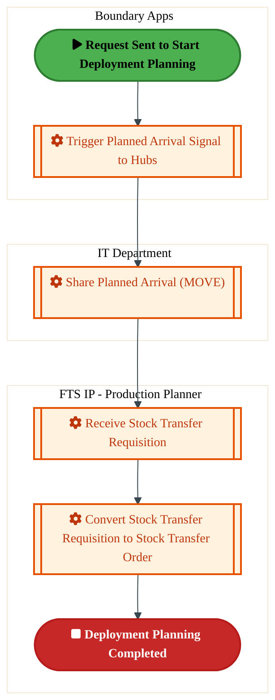

  <img src="data:image/svg+xml;base64,PHN2ZyB4bWxucz0iaHR0cDovL3d3dy53My5vcmcvMjAwMC9zdmciIHZpZXdCb3g9IjAgMCA4MDAgNDgwIiB3aWR0aD0iODAwIiBoZWlnaHQ9IjQ4MCI+DQogIDxkZWZzPg0KICAgIDxsaW5lYXJHcmFkaWVudCBpZD0iYmciIHgxPSIwJSIgeTE9IjAlIiB4Mj0iMTAwJSIgeTI9IjEwMCUiPg0KICAgICAgPHN0b3Agb2Zmc2V0PSIwJSIgc3R5bGU9InN0b3AtY29sb3I6IzAwNzFjNTtzdG9wLW9wYWNpdHk6MSIvPg0KICAgICAgPHN0b3Agb2Zmc2V0PSIxMDAlIiBzdHlsZT0ic3RvcC1jb2xvcjojMDBhZWVmO3N0b3Atb3BhY2l0eToxIi8+DQogICAgPC9saW5lYXJHcmFkaWVudD4NCiAgICA8bGluZWFyR3JhZGllbnQgaWQ9ImFjY2VudCIgeDE9IjAlIiB5MT0iMCUiIHgyPSIwJSIgeTI9IjEwMCUiPg0KICAgICAgPHN0b3Agb2Zmc2V0PSIwJSIgc3R5bGU9InN0b3AtY29sb3I6I2ZmZmZmZjtzdG9wLW9wYWNpdHk6MC4xNSIvPg0KICAgICAgPHN0b3Agb2Zmc2V0PSIxMDAlIiBzdHlsZT0ic3RvcC1jb2xvcjojZmZmZmZmO3N0b3Atb3BhY2l0eTowLjAyIi8+DQogICAgPC9saW5lYXJHcmFkaWVudD4NCiAgICA8cGF0dGVybiBpZD0iZ3JpZCIgd2lkdGg9IjQwIiBoZWlnaHQ9IjQwIiBwYXR0ZXJuVW5pdHM9InVzZXJTcGFjZU9uVXNlIj4NCiAgICAgIDxwYXRoIGQ9Ik0gNDAgMCBMIDAgMCAwIDQwIiBmaWxsPSJub25lIiBzdHJva2U9InJnYmEoMjU1LDI1NSwyNTUsMC4wNykiIHN0cm9rZS13aWR0aD0iMC41Ii8+DQogICAgPC9wYXR0ZXJuPg0KICA8L2RlZnM+DQoNCiAgPCEtLSBCYWNrZ3JvdW5kIC0tPg0KICA8cmVjdCB3aWR0aD0iODAwIiBoZWlnaHQ9IjQ4MCIgZmlsbD0idXJsKCNiZykiIHJ4PSI4Ii8+DQogIDxyZWN0IHdpZHRoPSI4MDAiIGhlaWdodD0iNDgwIiBmaWxsPSJ1cmwoI2dyaWQpIiByeD0iOCIvPg0KICA8cmVjdCB3aWR0aD0iODAwIiBoZWlnaHQ9IjQ4MCIgZmlsbD0idXJsKCNhY2NlbnQpIiByeD0iOCIvPg0KDQogIDwhLS0gRGVjb3JhdGl2ZSBjaXJjdWl0L2FyY2hpdGVjdHVyZSBsaW5lcyAtLT4NCiAgPGcgc3Ryb2tlPSJyZ2JhKDI1NSwyNTUsMjU1LDAuMTIpIiBzdHJva2Utd2lkdGg9IjEuNSIgZmlsbD0ibm9uZSI+DQogICAgPHBhdGggZD0iTSAwIDEwMCBMIDEyMCAxMDAgTCAxNjAgMTQwIEwgMjgwIDE0MCIvPg0KICAgIDxwYXRoIGQ9Ik0gMCAyNjAgTCA4MCAyNjAgTCAxMjAgMjIwIEwgMjAwIDIyMCBMIDI0MCAyNjAgTCAzNjAgMjYwIi8+DQogICAgPHBhdGggZD0iTSA1MjAgMTAwIEwgNjAwIDEwMCBMIDY0MCA2MCBMIDgwMCA2MCIvPg0KICAgIDxwYXRoIGQ9Ik0gNDQwIDM0MCBMIDU2MCAzNDAgTCA2MDAgMzAwIEwgNzIwIDMwMCBMIDc2MCAzNDAgTCA4MDAgMzQwIi8+DQogICAgPHBhdGggZD0iTSA2MDAgNDAwIEwgNjgwIDQwMCBMIDcyMCA0NDAiLz4NCiAgICA8cGF0aCBkPSJNIDAgNDAwIEwgNDAgNDAwIEwgODAgMzYwIi8+DQogICAgPHBhdGggZD0iTSAyMDAgNDIwIEwgMzIwIDQyMCBMIDM2MCAzODAgTCA0ODAgMzgwIi8+DQogICAgPHBhdGggZD0iTSA2NTAgNDQwIEwgNzUwIDQ0MCBMIDgwMCA0ODAiLz4NCiAgPC9nPg0KDQogIDwhLS0gRGVjb3JhdGl2ZSBub2RlcyAtLT4NCiAgPGcgZmlsbD0icmdiYSgyNTUsMjU1LDI1NSwwLjE4KSI+DQogICAgPGNpcmNsZSBjeD0iMTIwIiBjeT0iMTAwIiByPSI0Ii8+DQogICAgPGNpcmNsZSBjeD0iMjgwIiBjeT0iMTQwIiByPSI0Ii8+DQogICAgPGNpcmNsZSBjeD0iMjAwIiBjeT0iMjIwIiByPSI0Ii8+DQogICAgPGNpcmNsZSBjeD0iMzYwIiBjeT0iMjYwIiByPSI0Ii8+DQogICAgPGNpcmNsZSBjeD0iNjAwIiBjeT0iMTAwIiByPSI0Ii8+DQogICAgPGNpcmNsZSBjeD0iNzIwIiBjeT0iMzAwIiByPSI0Ii8+DQogICAgPGNpcmNsZSBjeD0iNTYwIiBjeT0iMzQwIiByPSI0Ii8+DQogICAgPGNpcmNsZSBjeD0iODAiIGN5PSIzNjAiIHI9IjQiLz4NCiAgICA8Y2lyY2xlIGN4PSI0ODAiIGN5PSIzODAiIHI9IjQiLz4NCiAgICA8Y2lyY2xlIGN4PSIzMjAiIGN5PSI0MjAiIHI9IjQiLz4NCiAgPC9nPg0KDQogIDwhLS0gVE9HQUYgQkRBVCBib3hlcyAtLT4NCiAgPGcgZm9udC1mYW1pbHk9IlNlZ29lIFVJLCBBcmlhbCwgc2Fucy1zZXJpZiIgZm9udC1zaXplPSIxNCIgZm9udC13ZWlnaHQ9IjYwMCI+DQogICAgPCEtLSBCIC0tPg0KICAgIDxyZWN0IHg9IjE1MCIgeT0iMTQwIiB3aWR0aD0iMTIwIiBoZWlnaHQ9IjQwIiByeD0iNSIgZmlsbD0icmdiYSgyNTUsMjU1LDI1NSwwLjE4KSIgc3Ryb2tlPSJyZ2JhKDI1NSwyNTUsMjU1LDAuMykiIHN0cm9rZS13aWR0aD0iMSIvPg0KICAgIDx0ZXh0IHg9IjIxMCIgeT0iMTY1IiB0ZXh0LWFuY2hvcj0ibWlkZGxlIiBmaWxsPSIjZmZmIj5CdXNpbmVzczwvdGV4dD4NCiAgICA8IS0tIEQgLS0+DQogICAgPHJlY3QgeD0iMjkwIiB5PSIxNDAiIHdpZHRoPSIxMjAiIGhlaWdodD0iNDAiIHJ4PSI1IiBmaWxsPSJyZ2JhKDI1NSwyNTUsMjU1LDAuMTgpIiBzdHJva2U9InJnYmEoMjU1LDI1NSwyNTUsMC4zKSIgc3Ryb2tlLXdpZHRoPSIxIi8+DQogICAgPHRleHQgeD0iMzUwIiB5PSIxNjUiIHRleHQtYW5jaG9yPSJtaWRkbGUiIGZpbGw9IiNmZmYiPkRhdGE8L3RleHQ+DQogICAgPCEtLSBBIC0tPg0KICAgIDxyZWN0IHg9IjQzMCIgeT0iMTQwIiB3aWR0aD0iMTIwIiBoZWlnaHQ9IjQwIiByeD0iNSIgZmlsbD0icmdiYSgyNTUsMjU1LDI1NSwwLjE4KSIgc3Ryb2tlPSJyZ2JhKDI1NSwyNTUsMjU1LDAuMykiIHN0cm9rZS13aWR0aD0iMSIvPg0KICAgIDx0ZXh0IHg9IjQ5MCIgeT0iMTY1IiB0ZXh0LWFuY2hvcj0ibWlkZGxlIiBmaWxsPSIjZmZmIj5BcHBsaWNhdGlvbjwvdGV4dD4NCiAgICA8IS0tIFQgLS0+DQogICAgPHJlY3QgeD0iNTcwIiB5PSIxNDAiIHdpZHRoPSIxMjAiIGhlaWdodD0iNDAiIHJ4PSI1IiBmaWxsPSJyZ2JhKDI1NSwyNTUsMjU1LDAuMTgpIiBzdHJva2U9InJnYmEoMjU1LDI1NSwyNTUsMC4zKSIgc3Ryb2tlLXdpZHRoPSIxIi8+DQogICAgPHRleHQgeD0iNjMwIiB5PSIxNjUiIHRleHQtYW5jaG9yPSJtaWRkbGUiIGZpbGw9IiNmZmYiPlRlY2hub2xvZ3k8L3RleHQ+DQogIDwvZz4NCg0KICA8IS0tIENvbm5lY3RpbmcgbGluZXMgYmV0d2VlbiBCREFUIGJveGVzIC0tPg0KICA8ZyBzdHJva2U9InJnYmEoMjU1LDI1NSwyNTUsMC4yNSkiIHN0cm9rZS13aWR0aD0iMSI+DQogICAgPGxpbmUgeDE9IjI3MCIgeTE9IjE2MCIgeDI9IjI5MCIgeTI9IjE2MCIvPg0KICAgIDxsaW5lIHgxPSI0MTAiIHkxPSIxNjAiIHgyPSI0MzAiIHkyPSIxNjAiLz4NCiAgICA8bGluZSB4MT0iNTUwIiB5MT0iMTYwIiB4Mj0iNTcwIiB5Mj0iMTYwIi8+DQogIDwvZz4NCg0KICA8IS0tIE1haW4gdGl0bGUgLS0+DQogIDx0ZXh0IHg9IjQwMCIgeT0iMjYwIiB0ZXh0LWFuY2hvcj0ibWlkZGxlIiBmb250LWZhbWlseT0iU2Vnb2UgVUksIEFyaWFsLCBzYW5zLXNlcmlmIiBmb250LXNpemU9IjM2IiBmb250LXdlaWdodD0iNzAwIiBmaWxsPSIjZmZmZmZmIiBsZXR0ZXItc3BhY2luZz0iMSI+DQogICAgSUFPIEFyY2hpdGVjdHVyZQ0KICA8L3RleHQ+DQogIDx0ZXh0IHg9IjQwMCIgeT0iMzAwIiB0ZXh0LWFuY2hvcj0ibWlkZGxlIiBmb250LWZhbWlseT0iU2Vnb2UgVUksIEFyaWFsLCBzYW5zLXNlcmlmIiBmb250LXNpemU9IjE4IiBmb250LXdlaWdodD0iNDAwIiBmaWxsPSJyZ2JhKDI1NSwyNTUsMjU1LDAuOCkiIGxldHRlci1zcGFjaW5nPSIyIj4NCiAgICBUT0dBRiBCREFUIMK3IElBTyBQcm9ncmFtIMK3IElETSAyLjANCiAgPC90ZXh0Pg0KDQogIDwhLS0gQm90dG9tIGFjY2VudCBiYXIgLS0+DQogIDxyZWN0IHg9IjI4MCIgeT0iMzQwIiB3aWR0aD0iMjQwIiBoZWlnaHQ9IjMiIHJ4PSIxLjUiIGZpbGw9InJnYmEoMjU1LDI1NSwyNTUsMC40KSIvPg0KDQogIDwhLS0gSW50ZWwgdGV4dCAtLT4NCiAgPHRleHQgeD0iNDAwIiB5PSIzODAiIHRleHQtYW5jaG9yPSJtaWRkbGUiIGZvbnQtZmFtaWx5PSJTZWdvZSBVSSwgQXJpYWwsIHNhbnMtc2VyaWYiIGZvbnQtc2l6ZT0iMTMiIGZpbGw9InJnYmEoMjU1LDI1NSwyNTUsMC41KSIgbGV0dGVyLXNwYWNpbmc9IjMiPg0KICAgIElOVEVMIENPTkZJREVOVElBTA0KICA8L3RleHQ+DQo8L3N2Zz4NCg==" alt="IAO Architecture" style="width:100%; border-radius:8px;" />
  <h1 style="font-size:36px; margin-top:24px;">PLB-050 — Responsive Demand and Supply Matching (RDSM) (IP)</h1>
  <h2 style="font-size:24px;">Architecture Document (TOGAF BDAT)</h2>
  
Forecast to Stock (IP) (FTS-IP) Tower 
  Capability PLB-050 · PLB Supply Chain Planning (IP)

  
IAO Program · Release 3 
  Generated: March 2026 
  Sajiv Francis

  
IAO Architecture Pipeline — Intel Confidential

Page 1<a href="#toc">↑ Back to TOC</a>PLB-050 — Responsive Demand and Supply Matching (RDSM) (IP)

## Table of Contents

<nav class="toc">
<ol>
  <li><a href="#1-executive-summary">1. Executive Summary</a></li>
  <li><a href="#2-business-context-objectives">2. Business Context &amp; Objectives</a>
    <ul>
      <li><a href="#21-classification">2.1 Classification</a></li>
      <li><a href="#22-business-drivers">2.2 Business Drivers</a></li>
      <li><a href="#23-success-criteria">2.3 Success Criteria</a></li>
      <li><a href="#24-companion-documents">2.4 Companion Documents</a></li>
    </ul>
  </li>
  <li><a href="#3-business-architecture-togaf-b">3. Business Architecture (TOGAF &ldquo;B&rdquo;)</a>
    <ul>
      <li><a href="#31-business-process-overview">3.1 Business Process Overview</a></li>
      <li><a href="#32-business-process-diagrams">3.2 Business Process Diagrams</a></li>
      <li><a href="#33-business-roles-responsibilities">3.3 Business Roles &amp; Responsibilities</a></li>
    </ul>
  </li>
  <li><a href="#4-data-architecture-togaf-d">4. Data Architecture (TOGAF &ldquo;D&rdquo;)</a>
    <ul>
      <li><a href="#41-data-entities-ownership">4.1 Data Entities &amp; Ownership</a></li>
      <li><a href="#42-data-flow-diagrams">4.2 Data Flow Diagrams</a></li>
      <li><a href="#43-data-lineage">4.3 Data Lineage</a></li>
      <li><a href="#44-ricefw-data-objects">4.4 RICEFW Data Objects</a></li>
      <li><a href="#45-data-governance-quality">4.5 Data Governance &amp; Quality</a></li>
    </ul>
  </li>
  <li><a href="#5-application-architecture-togaf-a">5. Application Architecture (TOGAF &ldquo;A&rdquo;)</a>
    <ul>
      <li><a href="#51-current-state-current-state-application-landscape">5.1 Current-State Application Landscape</a></li>
      <li><a href="#52-future-state-future-state-application-landscape">5.2 Future-State Application Landscape</a></li>
      <li><a href="#53-change-impact-summary">5.3 Change Impact Summary</a></li>
      <li><a href="#54-component-overview">5.4 Component Overview</a></li>
      <li><a href="#55-ricefw-inventory">5.5 RICEFW Inventory</a></li>
      <li><a href="#56-integration-patterns">5.6 Integration Patterns</a></li>
    </ul>
  </li>
  <li><a href="#6-technology-architecture-togaf-t">6. Technology Architecture (TOGAF &ldquo;T&rdquo;)</a>
    <ul>
      <li><a href="#61-platform-infrastructure">6.1 Platform &amp; Infrastructure</a></li>
      <li><a href="#62-sap-development-object-status">6.2 SAP Development Object Status</a></li>
      <li><a href="#63-nfrs-design-principles">6.3 NFRs &amp; Design Principles</a></li>
      <li><a href="#64-security-governance">6.4 Security &amp; Governance</a></li>
    </ul>
  </li>
  <li><a href="#7-project-context">7. Project Context</a>
    <ul>
      <li><a href="#71-project-roadmap-go-live-plan">7.1 Project Roadmap &amp; Go-Live Plan</a></li>
      <li><a href="#72-raid-log">7.2 RAID Log</a></li>
      <li><a href="#73-recommendations-next-steps">7.3 Recommendations &amp; Next Steps</a></li>
    </ul>
  </li>
</ol>
</nav>

Page 2<a href="#toc">↑ Back to TOC</a>PLB-050 — Responsive Demand and Supply Matching (RDSM) (IP)

## 1. Executive Summary

This Architecture Document defines the **Business, Data, Application, and Technology** (BDAT) architecture for **PLB-050 Responsive Demand and Supply Matching (RDSM) (IP)** within the IAO program. It includes 2 BPMN process diagram(s) in Section 3.

| Dimension | Value |
|-----------|-------|
| **Tower** | Forecast to Stock (IP) (FTS-IP) |
| **Process Group** | PLB Supply Chain Planning (IP) |
| **Capability** | PLB-050 - Responsive Demand and Supply Matching (RDSM) (IP) |
| **Release** | Release 3 |
| **Total Systems** | 0 |
| **System Status** | 0 Deployed, 0 Developing, 0 EOL, 0 Pending IAPM |
| **RICEFW Objects** | 2 Reports, 34 Interfaces, 20 Conversions, 35 Enhancements, 7 Forms, 3 Workflows |

**Change Summary**: 0 new flow chains, 0 removed, 0 modified, 0 unchanged between Current-State and Future-State states.

> All system nodes in architecture diagrams are **IAPM-linked** — click any node to open its IAPM page. Diagrams require `securityLevel: 'loose'` for click events.

Page 3<a href="#toc">↑ Back to TOC</a>PLB-050 — Responsive Demand and Supply Matching (RDSM) (IP)

## 2. Business Context & Objectives

### 2.1 Classification

| Level | Value |
|-------|-------|
| **L0 Tower** | Forecast to Stock (IP) |
| **L1 Process** | PLB Supply Chain Planning (IP) |
| **L2 Capability** | PLB-050 - Responsive Demand and Supply Matching (RDSM) (IP) |

### 2.2 Business Drivers

| # | Driver | Description | Strategic Alignment | Priority |
|---|--------|-------------|---------------------|----------|
| 1 | Intel Products Supply Chain Unification | Consolidate Intel Products manufacturing and logistics onto S/4 HANA platform | IDM 2.0 Products Transformation | High |
| 2 | End-to-End Traceability | Enable lot/batch traceability from raw material to finished goods shipment | Quality & Compliance | High |
| 3 | Demand-Supply Matching | Implement responsive demand and supply matching (RDSM) for IP product lines | Supply Chain Agility | Medium |
| 4 | PLB-050 Process Migration | Migrate Responsive Demand and Supply Matching (RDSM) (IP) business processes and 0 integrated systems from legacy to S/4 HANA target architecture | IDM 2.0 Supply Chain (Intel Products) | High |

Page 4<a href="#toc">↑ Back to TOC</a>PLB-050 — Responsive Demand and Supply Matching (RDSM) (IP)

### 2.3 Success Criteria

| Metric | Target | Measure | Baseline | Owner |
|--------|--------|---------|----------|-------|
| Production Schedule Adherence | > 95% | Percentage of production orders completed on schedule | 88% (current) | Production Manager |
| Material Availability Rate | > 98% | Materials available at point of need for production | 94% (current) | Materials Planning |
| Shipping On-Time Delivery | > 97% | Orders shipped within committed delivery window | 93% (current) | Logistics Lead |
| PLB-050 Migration Completeness | 100% flow chains validated | All 0 flow chains verified in target state | 0% (pre-migration) | Tower Architect |

### 2.4 Companion Documents

| Document | Description |
|----------|-------------|
| **Business Architecture** | Included in this document (Section 3) — process flows from BPMN diagrams |
| **This Document** | Full BDAT Architecture — Business + Data + Application + Technology |

Page 5<a href="#toc">↑ Back to TOC</a>PLB-050 — Responsive Demand and Supply Matching (RDSM) (IP)

## 3. Business Architecture (TOGAF "B")

### 3.1 Business Process Overview

This capability includes **2 business process(es)** modeled in BPMN 2.0, covering the end-to-end workflow for PLB-050 Responsive Demand and Supply Matching (RDSM) (IP).

| # | Step ID | Process Name | Lanes | Tasks | Gateways |
|---|---------|--------------|-------|-------|----------|
| 1 | PLB-050-040_Response_Management_(IP) | PLB-050-040_Response_Management_(IP) | Boundary Apps, FTS IP - Production Supervisor, PTP IP Batch System User, Planning Data hub | 14 | 3 |
| 2 | PLB-050-080_Deployment_Planning_(IP) | PLB-050-080_Deployment_Planning_(IP) | Boundary Apps, FTS IP - Production Planner, IT Department | 4 | 0 |

Page 6<a href="#toc">↑ Back to TOC</a>PLB-050 — Responsive Demand and Supply Matching (RDSM) (IP)

### 3.2 Business Process Diagrams

#### BUSINESS ARCHITECTURE — 3.2.1 PLB-050-040_Response_Management_(IP) — PLB-050-040_Response_Management_(IP)

**Swim Lanes**: Boundary Apps · FTS IP - Production Supervisor · PTP IP Batch System User · Planning Data hub | **Tasks**: 14 | **Gateways**: 3

```mermaid
%%{init: {'theme': 'base', 'themeVariables': {'fontSize': '14px', 'fontFamily': 'Segoe UI, Arial, sans-serif','primaryColor': '#e8f0fe', 'primaryBorderColor': '#0071c5','lineColor': '#37474F', 'secondaryColor': '#f5f8fc'}, 'flowchart': {'useMaxWidth': false, 'htmlLabels': true, 'curve': 'basis', 'nodeSpacing': 40, 'rankSpacing': 50}} }%%
flowchart LR
    classDef startEvt fill:#4CAF50,stroke:#2E7D32,color:#000,font-weight:bold,stroke-width:2px,rx:20,ry:20
    classDef endEvt fill:#C62828,stroke:#B71C1C,color:#fff,font-weight:bold,stroke-width:2px,rx:20,ry:20
    classDef userTask fill:#E3F2FD,stroke:#1565C0,stroke-width:2px,color:#0D47A1
    classDef serviceTask fill:#FFF3E0,stroke:#E65100,stroke-width:2px,color:#BF360C
    classDef gateway fill:#FFF9C4,stroke:#F57F17,stroke-width:2px,color:#E65100
    classDef subProc fill:#F3E5F5,stroke:#7B1FA2,stroke-width:2px,color:#4A148C
    subgraph Boundary Apps
        n1[["fa:fa-cog Schedule Receipt Update"]]
        n2[["fa:fa-cog Recommend Changes by BY (Push/Pull, Qty Changes, Cancel, Ship to)"]]
        n15(["fa:fa-play Unhappy Path Process Initiated by Intel"])
        n16(["fa:fa-stop Information Updated in BY"])
    end
    subgraph FTS IP - Production Supervisor
        n7[["fa:fa-cog Create Automatic Text PR"]]
        n8[["fa:fa-cog Create Build Instruction for Top Up Quantity"]]
        n9[["fa:fa-cog Release Production Order for Top-up Quantity"]]
        n10[["fa:fa-cog Update Production Order"]]
        n11[["fa:fa-cog Update Build Instructions"]]
        n14["Create Text PO ( Auto via Batch Job)"]
        n17(["fa:fa-stop Order Acknowledgment received in S/4 through PIP 7B6"])
        n19{{"fa:fa-arrows-alt parallelGateway"}}
        n20{{"fa:fa-arrows-alt parallelGateway"}}
    end
    subgraph PTP IP Batch System User
        n12[["fa:fa-cog Update Text PO (PTP)"]]
        n13[["fa:fa-cog Update Commit in Confirmation Tab (Text PO) a: 75K WW4.1 b. 25K WW4.5"]]
    end
    subgraph Planning Data hub
        n3[["fa:fa-cog Join Production Order and Service PO data in Planning Hub"]]
        n4[["fa:fa-cog Make Decision by Intermediate Analyst to Move Forward with Change (Custom??)"]]
        n5[["fa:fa-cog Perform Demand Change Request Process (Custom)"]]
        n6[["fa:fa-cog Create New Order (Top-up)/Update Existing Order"]]
        n18{{"fa:fa-arrows-alt parallelGateway"}}
    end
    n2 --> n4
    n4 --> n5
    n5 --> n6
    n7 --> n14
    n19 --> n8
    n20 --> n7
    n20 --> n19
    n9 --> n20
    n6 --> n18
    n12 --> n11
    n1 --> n16
    n18 -->|"Existing Order"| n10
    n15 --> n2
    n13 --> n3
    n3 --> n1
    n14 --> n19
    n10 --> n12
    n18 -->|"New order"| n9
    class n1 serviceTask
    class n2 serviceTask
    class n3 serviceTask
    class n4 serviceTask
    class n5 serviceTask
    class n6 serviceTask
    class n7 serviceTask
    class n8 serviceTask
    class n9 serviceTask
    class n10 serviceTask
    class n11 serviceTask
    class n12 serviceTask
    class n13 serviceTask
    class n15 startEvt
    class n16 endEvt
    class n17 endEvt
    class n18 gateway
    class n19 gateway
    class n20 gateway
```

> **Legend**: ● Start · ● End · User Task · Service Task · ◇ Gateway · Sub-Process

<a href="https://mermaid.live/view#pako:eNqlV21zm0YQ_is7ZDyyZ6QEEAiJD81ISLROk0aJ7GY6cT-c4BA3Rhw9Dsuqo__ePQF6weJDW33QzL49u_vc3gIvWsBDqrna1dULS5l04aUjY7qmHRc6S5LTThdKxe9EMLJMaN5RPhFP5YL9vXczrOxZuSmdT9Ys2Srtgq44hfvbLowxMOlCTtK8l1PBok63kwm2JmLr8YQL5f2GDiM92merTBMuQiqODrruGIGNoQlL6VHddyzH8lVcTgOehmegkR0No6CzU8UlfBPERMh9-UVOP5HnbyyUMcoRSXKKPrFcJx_JkiaqRykKpQsK8VSTwXKVJ0XCFhkJWLpCvaWjSpD08aiy9d0OdldXD-khKXz8-pAC_oKE5PmURpBLVM-eJEQsSdw3ljf2bb2bS8EfqfvGnDnTvtkNVCcutq53Fbm9DWWrWLpLnoSVa2-jenDN7Lkrnl1T74ot_jdy0TQ8ZvIG5tAcHjJNHMMzvDpTFEX_KxPyKu5I_ljlmvV9058echn2wPb013h1m1PLGRtNnqh4YgE9AfV9vz87UjUb2IbeDjrx-wPda4CuiKQbsj0CjjzrAOjbjm84rYBlvmaVxXIueFAD9me2bx8AnYnhj81WQGtsWMOqQsRZCZLFMOHFfpZhnGV5aVO_1Pj-_UGLiBuRXsBXsAhiGhYJha80oCyTcJ-F2NuD9uefJ0HmeRD68vUahwK8mKQrmsNyC5M_4Hpe5PG7eZHgZf0it7W1Cx5JA4rKRcwykPymAW_Y1wf8LEFa79OYZNkW5kTGoHiheQ63uF0Y1haqbLeppAnC3JzCDI4wueQZOkVcrIlkPK36CoGlWOkxEJtoEOffLeB2Dj2VNyyCffCiyNQU5VycpHPOSfEExQQwLiRXKQO4o88S5l8bvQ4vRk0KloRYLx5xlRIrhzvs4T6DLwVJJZPbBtKoeSgJxXV7WvZntQBrpF7RimTo51AlV6-QmlHGxahXreTNOAvDqr5Ljj7D9Z43eGIEJkQGMXzgSzUlp2FO43TL7sbBY8o3CQ1XOJAShBrjp_KcF-8skLHgxQqHCI_UmQyaEzN6eakxiRB8k_dIIiEjgiQJTX4ub_mDttudXgb93wW9HrH53VyNWNnpYptLuoZ73FOnlZkXyT3whRCvblH_YoiHV5VJxYfH04jV9-GOLOG6grsB4oJj_wrfvllvDVi-BbMS7GOOC20kJE3xiQVTIgnExfKkmEYtHzjmfzWZBDfIolzPqqlQwSi_GvcXhDzv0TqH_UQeKUxpwHIFWq0FsaYh21_FlCRILi4c-MSfKPhcbIgIYcNwq5S7Ca69Aodp_f59k037PNOcCrVLMNmaHPYe3rm_CooZ6hVVoTWxBhfv_G90U_FwXV7Pm3fVkc2eWS4VARev3fA_jl9qQq_3E3JYiVYp2pVol-KgEp1SNGpvY1QqhjWYXspOQzZGlaLyr5_w6aCy1wBGVY5h1IpKriswhkrx40Fr0vFDbazaqSrbrOV-KfcruRIPOaxGlUZdttnMqo6HHxKOTp7XqtSTt4ozi9lq6bdarFaL3WoZtFqcVsuw1TJqtSA_raZ2Fox2Gox2HvAs65fac_2gegE91zoXtcP63excPbqoxqGt1FpXW-PmICzU3Bdt_72C3zQhjUiRSG3X1Qg-nxbbNNDc_Xu9Vuyv6pQR3IXrUrn7BxtuG9w=" title="View full diagram">&#128065; View Diagram</a>

Page 7<a href="#toc">↑ Back to TOC</a>PLB-050 — Responsive Demand and Supply Matching (RDSM) (IP)

#### BUSINESS ARCHITECTURE — 3.2.2 PLB-050-080_Deployment_Planning_(IP) — PLB-050-080_Deployment_Planning_(IP)

**Swim Lanes**: Boundary Apps · FTS IP - Production Planner · IT Department | **Tasks**: 4 | **Gateways**: 0

> **Legend**: ● Start · ● End · User Task · Service Task · ◇ Gateway · Sub-Process

<a href="https://mermaid.live/view#pako:eNqlVcuO2zYU_RVCg4ETQAb0tBwtCtiyhQ7QIIPITReZLGjpUiaGIlWS8ow78L-XtDR-Je6mWti4r3POvSKv3pxSVOCkzv39G-VUp-htpDfQwChFozVWMHJR7_iGJcVrBmpkc4jguqD_HNL8qH21adaX44aynfUWUAtAfz64aGYKmYsU5mqsQFIycketpA2Wu0wwIW32HUyJRw5sQ2guZAXylOB5iV_GppRRDid3mERJlNs6BaXg1QUoicmUlKO9FcfES7nBUh_kdwo-49e_aKU3xiaYKTA5G92wP_AamO1Ry876yk5u34dBleXhZmBFi0vKa-OPPOOSmD-fXLG336P9_f0TP5Ki1eKJI_OUDCu1AIKUNu7lViNCGUvvomyWx56rtBTPkN4Fy2QRBm5pO0lN655rhzt-AVpvdLoWrBpSxy-2hzRoX135mgaeK3fm94oLeHViyibBNJgemeaJn_nZOxMh5H8xmbnKFVbPA9cyzIN8ceTy40mceT_jvbe5iJKZfz0nkFtawhlonufh8jSq5ST2vdug8zyceNkVaI01vODdCfBTFh0B8zjJ_eQmYM93rbJbP0pRvgOGyziPj4DJ3M9nwU3AaOZH00GhwaklbjdoLrrDWUaztlV9zD48_P79ySE4JXhcihqtJK1rkOiRYc6hMldN0i1mqKA1N39aoN-7tXpyfvw4w4g_HDFaZqbwFf7uQGlUANe2pLBHEy2gZWLXWN8B3Zxtg_OxxzEn6kpwvirQwyMaIzOHqis1FXxQJc-o_Uv5X6EEugXDKMpn04zZEMR0YwVRRS3GlfTgsj4TfAtG6-36vp-L6Be7V65wJ6eRKC3aXzVvyJqWgYbqv8bwsLK1Zn629owguhRemKUAP721D5-_fFt-PEk7wvMYjce_mbc_mH5vBoMZ9OZkMMPejAYz6s3zi2URzi7WRSS4GQlvRqKbkfi46C7ck2EnOa7TgGwwrZz0zTl8Z8y3qAKCO6advevgTotix0snPexjp2src3cXFJtxN71z_y-1uizQ" title="View full diagram">&#128065; View Diagram</a>

Page 8<a href="#toc">↑ Back to TOC</a>PLB-050 — Responsive Demand and Supply Matching (RDSM) (IP)

### 3.3 Business Roles & Responsibilities

| Role / Lane | Processes Involved | Description |
|------------|-------------------|-------------|
| Boundary Apps | PLB-050-040_Response_Management_(IP), PLB-050-080_Deployment_Planning_(IP) | |
| FTS IP - Production Supervisor | PLB-050-040_Response_Management_(IP),  | |
| PTP IP Batch System User | PLB-050-040_Response_Management_(IP),  | |
| Planning Data hub | PLB-050-040_Response_Management_(IP),  | |
| FTS IP - Production Planner | PLB-050-080_Deployment_Planning_(IP) | |
| IT Department | PLB-050-080_Deployment_Planning_(IP) | |

Page 9<a href="#toc">↑ Back to TOC</a>PLB-050 — Responsive Demand and Supply Matching (RDSM) (IP)

## 4. Data Architecture (TOGAF "D")

### 4.1 Data Entities & Ownership

The following data entities are derived from the system integration flows for PLB-050. Tower architects should validate ownership and classification.

| # | Data Entity | Source System | Target System | Data Owner | Classification | Volume | Master/Transaction |
|---|-------------|---------------|---------------|------------|----------------|--------|-------------------|

Page 10<a href="#toc">↑ Back to TOC</a>PLB-050 — Responsive Demand and Supply Matching (RDSM) (IP)

### 4.2 Data Flow Diagrams

> **DATA ARCHITECTURE** — Database-to-database data flows. Applications (blue) sit above their hosting databases (green cylinders). Thick arrows show data movement between databases.

### 4.3 Data Lineage

Data lineage traces the origin and transformation path of key data objects across integrated systems.

| # | Source System | Source Schema/Object | Target System | Target Schema/Object | Transformation |
|---|-------------|---------------------|---------------|---------------------|---------------|

> *Lineage detail will be refined when tower architects validate source/target schema object mappings.*

### 4.4 RICEFW Data Objects

Data-centric RICEFW objects (Reports and Conversions) from the Object Tracker:

| Object ID | Type | Description | Status | Source | Target | Complexity |
|-----------|------|-------------|--------|--------|--------|-----------|
| LOGR1176_IP | Report | ISM - International Traffic Report | 10. Object Complete |  |  | 02.High |
| LOGR0833_IP | Report | Email Notification for deletion of Shipping Memos | 10. Object Complete |  |  | 03.Medium |
| LOGM024_IP | Conversion | Create/Upload Vehicle resource | 10. Object Complete |  |  | N/A |
| LOGM023_IP | Conversion | Update Business Share | 10. Object Complete |  |  | N/A |
| LOGM022_IP | Conversion | Upload Transportation Allocation | 10. Object Complete |  |  | N/A |
| LOGM021_IP | Conversion | Upload Schedules | 10. Object Complete |  |  | N/A |
| LOGM019_IP | Conversion | Default Routes | 10. Object Complete |  | S4 | N/A |
| LOGM018_IP | Conversion | Upload Rate Table | 10. Object Complete |  |  | N/A |
| LOGM016_IP | Conversion | Create and review Charge Calculation Sheet | 10. Object Complete |  | S4 | N/A |
| LOGM015_IP | Conversion | Create and review Freight Agreement | 10. Object Complete |  | S4 | N/A |
| LOGM012_IP | Conversion | Creation of Location based on BP, Shipping points, plants | 10. Object Complete | ECC | S4 | N/A |
| LOGM008_IP | Conversion | Location creation-ocean ports, airports | 10. Object Complete |  |  | N/A |
| LOGM005_IP | Conversion | UPLOAD TRANSPORTATION ZONES (TM) | 10. Object Complete | TMS | S4 | N/A |
| LOGM004_IP | Conversion | UPLOAD TRANSPORTATION LANES | 10. Object Complete | TMS | S4 | N/A |
| LOGC1500 | Conversion | IM Stock conversion from Non SAP system to S4 system | 10. Object Complete |  |  | 02.High |
| LOGC0972_IP | Conversion | Open Inventory Conversion for IP and IF (as applicable) , Batch Characteristi... | 10. Object Complete |  |  | 02.High |
| LOGC0946_IP | Conversion | Open Inventory Conversion for IP and IF (as applicable) , ECC to S4 | 10. Object Complete |  |  | 02.High |
| FTSM002_IP | Conversion | Work Center | 10. Object Complete | NA | S4 | N/A |
| FTSC1682 | Conversion | Conversion of Intel Products Bailed Inventory & Lot Attributes | 10. Object Complete |  |  | 03.Medium |
| FTSC1559 | Conversion | Conversion of Open PO/Engineering/Rework Orders into Production orders from I... | 10. Object Complete |  |  | 03.Medium |
| FTSC0434 | Conversion | Conversion of Open Production Orders from ECC purchase order data into S4 | 10. Object Complete | ECC | S4 HANA | 03.Medium |
| FTSC0052_IP | Conversion | Conversion of Reference Operation Sets to S/4 | 10. Object Complete | ECC | S4 | 03.Medium |

### 4.5 Data Governance & Quality

| Concern | Approach |
|---------|----------|
| Data Ownership | Per-entity owners listed in Section 3.1 |
| Data Classification | Financial data classified as Intel Confidential |
| Data Retention | Per Intel corporate retention policies |
| Data Quality | Validated at source; reconciliation at target |

Page 11<a href="#toc">↑ Back to TOC</a>PLB-050 — Responsive Demand and Supply Matching (RDSM) (IP)

## 5. Application Architecture (TOGAF "A")

### 5.1 Current-State — Current-State Application Landscape

#### Overview

The Current-State architecture represents the **current / legacy** landscape for PLB-050.

#### Current-State Flow Narrative

*(No current-state flows defined.)*

### 5.2 Future-State — Future-State Application Landscape

#### Overview

The Future-State architecture represents the **target** landscape for PLB-050.

#### Future-State Flow Narrative

*(No future-state flows defined.)*

### 5.3 Change Impact Summary

| Change Type | Flow Chain | Detail |
|-------------|-----------|--------|

**Totals**: 0 new - 0 removed - 0 modified - 0 unchanged

### 5.4 Component Overview

#### System Inventory

| System | IAPM ID | Status |
|--------|---------|--------|

Page 12<a href="#toc">↑ Back to TOC</a>PLB-050 — Responsive Demand and Supply Matching (RDSM) (IP)

### 5.5 RICEFW Inventory

| Object ID | Type | Description | Status | Source → Target | Middleware | Complexity |
|-----------|------|-------------|--------|----------------|-----------|-----------|
| LOGW1078_IP | Workflow | ISM Workflows - Capital/AMT | 10. Object Complete |  | NA | 03.Medium |
| LOGW1077_IP | Workflow | ISM Workflows - EIMS/Lab | 10. Object Complete |  | NA | 03.Medium |
| LOGW1076_IP | Workflow | ISM Workflows - Non-inventory | 10. Object Complete |  | NA | 02.High |
| LOGR1176_IP | Report | ISM - International Traffic Report | 10. Object Complete |  | NA | 02.High |
| LOGR0833_IP | Report | Email Notification for deletion of Shipping Memos | 10. Object Complete |  | NA | 03.Medium |
| LOGM024_IP | Conversion | Create/Upload Vehicle resource | 10. Object Complete |  | NA | N/A |
| LOGM023_IP | Conversion | Update Business Share | 10. Object Complete |  | NA | N/A |
| LOGM022_IP | Conversion | Upload Transportation Allocation | 10. Object Complete |  | NA | N/A |
| LOGM021_IP | Conversion | Upload Schedules | 10. Object Complete |  | NA | N/A |
| LOGM019_IP | Conversion | Default Routes | 10. Object Complete |  → S4 | NA | N/A |
| LOGM018_IP | Conversion | Upload Rate Table | 10. Object Complete |  | NA | N/A |
| LOGM016_IP | Conversion | Create and review Charge Calculation Sheet | 10. Object Complete |  → S4 | NA | N/A |
| LOGM015_IP | Conversion | Create and review Freight Agreement | 10. Object Complete |  → S4 | NA | N/A |
| LOGM012_IP | Conversion | Creation of Location based on BP, Shipping points, plants | 10. Object Complete | ECC → S4 | NA | N/A |
| LOGM008_IP | Conversion | Location creation-ocean ports, airports | 10. Object Complete |  | NA | N/A |
| LOGM005_IP | Conversion | UPLOAD TRANSPORTATION ZONES (TM) | 10. Object Complete | TMS → S4 | NA | N/A |
| LOGM004_IP | Conversion | UPLOAD TRANSPORTATION LANES | 10. Object Complete | TMS → S4 | NA | N/A |
| LOGI1679 | Interface | Receive 4C1 Inventory movement Stock type change and cycle count from IF | 10. Object Complete |  | SFT | 03.Medium |
| LOGI1678 | Interface | Receive 4C1 Inventory Reconciliation Snapshot from IF | 10. Object Complete |  | SFT | 03.Medium |
| LOGI1576 | Interface | ECD_Interface between S4 to ECD for inventory status response | 08. FUT In Progress |  | MuleSoft | 03.Medium |
| LOGI1575 | Interface | ECD_Interface between S4 to 3PL for inventory status webservice​ | 08. FUT In Progress |  | MuleSoft | 03.Medium |
| LOGI1571 | Interface | ECD_Interface from ECD to S4 for Inventory status call​ | 10. Object Complete |  | MuleSoft | 03.Medium |
| LOGI1295 | Interface | ECD_Interface between S/4 and ECD for completion status | 08. FUT In Progress |  | MULESOFT | 03.Medium |
| LOGI1291 | Interface | ECD_Interface between S/4 and 3PL to send plant/batch level hold/unhold infor... | 08. FUT In Progress |  | MULESOFT | 03.Medium |
| LOGI1290 | Interface | ECD_Interface from ECD to S4 for Inventory Hold/unhold request | 08. FUT In Progress |  | MULESOFT | 03.Medium |
| LOGI1272 | Interface | Response to goods receipt posting from SAP to 3PL - EDI 4C1B | 10. Object Complete | S/4 → WMS (3PL) | MULESOFT | 03.Medium |
| LOGI1267 | Interface | Inventory Reconciliation with Consignment hub – EDI 4C1 with version control | 10. Object Complete | OpenText → S/4 | MULESOFT | 03.Medium |
| LOGI1081_IP | Interface | Interface + Enhancement - Reprinting of Carrier Label | 10. Object Complete | S/4 → Redwood | APIGEE | 03.Medium |
| LOGI1079_IP | Interface | Interface from S4 ISM to Service Now | 10. Object Complete | S/4 ISM → Service Now | NA | 03.Medium |
| LOGI1074_IP | Interface | Send data via API to retrieve the tracking ID - interface + Enhancement | 10. Object Complete | S/4 → Redwood | APIGEE | 03.Medium |
| LOGI0951 | Interface | Inbound interface to receive Finished Goods “Goods Receipt” (4B2) signal from... | 10. Object Complete | OpenText → S/4 | MULESOFT | 03.Medium |
| LOGI0950 | Interface | Interface to receive 4B2 signal from Factory and return shipments from ODM/OS... | 10. Object Complete | OpenText → S/4 | MULESOFT | 03.Medium |
| LOGI0933 | Interface | W-lot inventory error handling | 10. Object Complete |  | MULESOFT | 03.Medium |
| LOGI0836_IP | Interface | Interface from S4 to NDA (IPLA –Intel Pre Release License Agreements) | 10. Object Complete | S/4 → NDA | NA | 03.Medium |
| LOGI0335 | Interface | Outbound PIP signal to 3PL for material document transfer – EDI 4C1 | 10. Object Complete | S/4 → OpenText | MULESOFT | 02.High |
| LOGI0237_IP | Interface | Inventory Reconciliation snapshot (4C1) from 3PL WMS to SAP S/4 | 10. Object Complete | 3PL → S/4 | MULESOFT | 02.High |
| LOGF1614_IP | Form | TM-Bill of lading print output ( NSO/ Prospal STO's) | 10. Object Complete |  | NA | 03.Medium |
| LOGF1100_IP | Form | Printing of Standard Shipping Label | 10. Object Complete |  | NA | 02.High |
| LOGF0359_IP | Form | ISM - Generate Commercial Invoice - IF/IP | 10. Object Complete | NA → NA | NA | 02.High |
| LOGF0358_IP | Form | ISM - Generate Traveler Document - IF/IP | 10. Object Complete | NA → NA | NA | 02.High |
| LOGF0352_IP | Form | ISM - IPLA | 10. Object Complete |  | NA | 02.High |
| LOGF0351_IP | Form | ISM - Custom China Special label | 10. Object Complete |  | NA | 02.High |
| LOGF0350_IP | Form | ISM - India GST DC | 10. Object Complete |  | NA | 02.High |
| LOGE1686 | Enhancement | IP custom table for reconciliation data | 10. Object Complete |  | NA | 03.Medium |
| LOGE1572_IP | Enhancement | SAP GUI T-code to Move stock from Blocked to unblock Status | 10. Object Complete |  | NA | 02.High |
| LOGE1569_IP | Enhancement | Enhancement to change billing status based on ship reason in ISM | 10. Object Complete |  | NA | 03.Medium |
| LOGE1526_IP | Enhancement | Automatic HAWB assignment for Freight Forwarders( ISM/ Prospal STO's) | 10. Object Complete |  | NA | 02.High |
| LOGE1327 | Enhancement | ECD_Enhancement to retrieve plant details for material/batch and update custo... | 08. FUT In Progress |  | NA | 02.High |
| LOGE1276_IP | Enhancement | TM:Replace VTRC and integrate with parcel carrier to retrieve the package lev... | 10. Object Complete |  | NA | 03.Medium |
| LOGE1253 | Enhancement | Inventory Reconciliation with Consignment hub – EDI 4C1 with version control | 10. Object Complete |  | NA | 03.Medium |
| LOGE1177_IP | Enhancement | India GST E-invoicing | 10. Object Complete |  | NA | 03.Medium |
| LOGE1118_IP | Enhancement | ISM – MY Security Check Fiori app - IF | 10. Object Complete |  | NA | 02.High |
| LOGE1117_IP | Enhancement | ISM – Employee acknowledgement - IP | 10. Object Complete |  | NA | 02.High |
| LOGE1090_IP | Enhancement | PGI confirmation for non-inventory Intel freight shipments via email | 10. Object Complete |  | NA | 03.Medium |
| LOGE1080_IP | Enhancement | Email notifications to be triggered as part of ISM Workflows | 10. Object Complete |  | NA | 02.High |
| LOGE1052_IP | Enhancement | Custom fields required on delivery screen | 10. Object Complete |  | NA | 03.Medium |
| LOGE0945 | Enhancement | Update COF, COA and FVR in 3PL WMS - EDI 4C1B | 10. Object Complete |  | NA | 03.Medium |
| LOGE0936 | Enhancement | Validate receiving consigned materials into consignment hub – EDI 4B2 CSGN | 10. Object Complete |  | NA | 03.Medium |
| LOGE0935_IP | Enhancement | Fiori App - Shipping Memo | 09. FUT Overdue |  | NA | 01.Very High |
| LOGE0835_IF | Enhancement | Interface to get the AMT (Asset Management Tool) data on the ISM | 10. Object Complete |  | NA | 04.Low |
| LOGE0405_IP | Enhancement | Dangerous Goods indicator from the delivery header text to be transmitted to ... | 10. Object Complete | NA → NA | NA | 03.Medium |
| LOGE0403_IP | Enhancement | In SAP TM, update FU and FO Transportation Cockpit w/ custom fields Purchase ... | 10. Object Complete | NA → NA | NA | 02.High |
| LOGE0239_IP | Enhancement | Inventory Reconciliation snapshot (4C1) from 3PL WMS to SAP S/4 - Table Creation | 10. Object Complete | NA → NA | NA | 03.Medium |
| LOGE0190_IP | Enhancement | Delivery Split for STO in S/4 | 10. Object Complete | NA → NA | NA | 03.Medium |
| LOGC1500 | Conversion | IM Stock conversion from Non SAP system to S4 system | 10. Object Complete |  | NA | 02.High |
| LOGC0972_IP | Conversion | Open Inventory Conversion for IP and IF (as applicable) , Batch Characteristi... | 10. Object Complete |  | NA | 02.High |
| LOGC0946_IP | Conversion | Open Inventory Conversion for IP and IF (as applicable) , ECC to S4 | 10. Object Complete |  | NA | 02.High |
| FTSM002_IP | Conversion | Work Center | 10. Object Complete | NA → S4 | NA | N/A |
| FTSI1693 | Interface | Interface for Reporting Scrap of Semi Finished Goods at OSAT and IF manufactu... | 06. Dev In Progress |  | BODS | 03.Medium |
| FTSI1692 | Interface | Interface for Reporting Scrap of Semi Finished Goods at OSAT and IF manufactu... | 10. Object Complete |  | APIGEE | 03.Medium |
| FTSI1681 | Interface | Enhancement to create Zero Lead Time Order to convert Sorted Wafers into Sort... | 10. Object Complete |  | MULESOFT | 03.Medium |
| FTSI1631 | Interface | Interface to update Remnants in production order | 10. Object Complete |  | APIGEE | 03.Medium |
| FTSI1619 | Interface | Interface to capture Sales Order 3B2 ASN and Virtual 3B2 ASN signals from Int... | 10. Object Complete |  | APIGEE | 02.High |
| LOGI1584 | Interface | Interface to post inventory in SAP S/4HANA from ECA via MuleSoft. | 06. Dev In Progress |  | MuleSoft | 03.Medium |
| FTSI1023 | Interface | Interface to Transfer stock from Unrestricted stock to Block stock and vice v... | 10. Object Complete | E2OPEN → S/4 | APIGEE | 03.Medium |
| FTSI1022 | Interface | Inbound Interface to update projected release quantity and date for lots on q... | 10. Object Complete | FLAT FILE → S/4 | NA | 03.Medium |
| FTSI0725 | Interface | Inbound interface to capture Yield Confirmation and Goods Receipt against Pro... | 10. Object Complete | E2OPEN → S/4 | APIGEE | 03.Medium |
| FTSI0724 | Interface | Inbound interface from e2open to IP SAP S4 HANA system to update Die Quantity... | 10. Object Complete | E2OPEN → S/4 | APIGEE | 02.High |
| FTSI0492 | Interface | Interface between E2Open and S4 for goods issue against production order | 10. Object Complete | E2Open → S/4 | APIGEE | 03.Medium |
| FTSI0491 | Interface | Interface between E2Open and S4 for capturing confirmation of scrap against p... | 10. Object Complete | E2Open → S/4 | APIGEE | 03.Medium |
| FTSI0268 | Interface | Interface to be developed from S/4 to E2Open to transmit Build Instruction​ d... | 10. Object Complete | S/4 → E2Open | MULESOFT | 03.Medium |
| FTSI0210 | Interface | Interface Function to Create Purchase Requisitions from ECA to S/4 | 10. Object Complete | ECA (PDH) → S/4 | BODS | 03.Medium |
| FTSI0209 | Interface | Interface to create Production Order from ECA to S/4 | 10. Object Complete | ECA (PDH) → S/4 | BODS | 03.Medium |
| FTSE1701 | Enhancement | Enhancement to automate updation of Routing_Prod versions with reference to S... | 10. Object Complete |  | NA | 03.Medium |
| FTSE1694 | Enhancement | Enhancement to Introduction of additional restrictions by MRP Area for S4 IP ... | 10. Object Complete |  | NA | 03.Medium |
| FTSE1653 | Enhancement | Enhancement to automate creation of Routing_Prod versions with reference to S... | 10. Object Complete |  | NA | 02.High |
| FTSE1642 | Enhancement | Enhancement to create a user exit (or) Business Add In to update Components a... | 10. Object Complete |  | NA | 03.Medium |
| FTSE1597 | Enhancement | Develop a utility for mass creation of production orders via load file in SAP... | 10. Object Complete |  | NA | 02.High |
| FTSE1586 | Enhancement | Text Purchase Requisition while creating with reference to Production Order O... | 10. Object Complete |  | NA | 03.Medium |
| FTSE1194 | Enhancement | Enhancement in IP SAP HANA system to re-assign the first operation plant to C... | 10. Object Complete |  | NA | 03.Medium |
| FTSE1146 | Enhancement | Enhancement to link KB sales orders / STR to purchase requisition generated b... | 10. Object Complete |  | NA | 04.Low |
| FTSE1144 | Enhancement | Total Quantity’ update for Parent Production Order with reference to Actual G... | 10. Object Complete |  | NA | 03.Medium |
| FTSE1024 | Enhancement | Create a custom table and a custom Fiori app in S4 to manually update the rel... | 10. Object Complete |  | NA | 03.Medium |
| FTSE0593 | Enhancement | Enhancement of standard iDoc to capture and transfer Build Instructions from ... | 10. Object Complete |  | NA | 02.High |
| FTSE0424 | Enhancement | Conversion of Production Versions data into S4 | 10. Object Complete | S4 HANA → S4 HANA | NA | 03.Medium |
| FTSE0198 | Enhancement | Conversion Program for Routings | 10. Object Complete | NA → S4 HANA | NA | 03.Medium |
| FTSC1682 | Conversion | Conversion of Intel Products Bailed Inventory & Lot Attributes | 10. Object Complete |  | NA | 03.Medium |
| FTSC1559 | Conversion | Conversion of Open PO/Engineering/Rework Orders into Production orders from I... | 10. Object Complete |  | NA | 03.Medium |
| FTSC0434 | Conversion | Conversion of Open Production Orders from ECC purchase order data into S4 | 10. Object Complete | ECC → S4 HANA | NA | 03.Medium |
| FTSC0052_IP | Conversion | Conversion of Reference Operation Sets to S/4 | 10. Object Complete | ECC → S4 | NA | 03.Medium |
| FTSE1739 | Enhancement | Develop Utility for mass change of Production Orders in SAP S4 system | 01. Pending Approval |  | NA | 03.Medium |

**Summary**: 2 Reports, 34 Interfaces, 20 Conversions, 35 Enhancements, 7 Forms, 3 Workflows

Page 13<a href="#toc">↑ Back to TOC</a>PLB-050 — Responsive Demand and Supply Matching (RDSM) (IP)

### 5.6 Integration Patterns

Integration patterns identified from the system flow analysis for PLB-050:

| # | Pattern | Flow Chain | Middleware | Protocol | Auth |
|---|---------|-----------|-----------|----------|------|

> *Integration pattern details will be refined when tower architects validate middleware assignments.*

Page 14<a href="#toc">↑ Back to TOC</a>PLB-050 — Responsive Demand and Supply Matching (RDSM) (IP)

## 6. Technology Architecture (TOGAF "T")

### 6.1 Platform & Infrastructure

> **TECHNOLOGY / PLATFORM ARCHITECTURE** — Platforms (green) host applications (blue). Thick arrows show platform-to-platform integration flows.

#### Platform Inventory

Platform landscape inferred from integrated systems for PLB-050:

| # | Platform | Type | Systems Using | Environment |
|---|----------|------|--------------|-------------|
| 1 | SAP S/4HANA | On-Premise (HEC) | SAP S/4 modules | DEV, QAS, PRD |
| 2 | SAP BTP (Integration Suite) | Cloud / PaaS | CPI, API Management | DEV, QAS, PRD |
| 3 | MuleSoft Anypoint | Cloud / iPaaS | API-led integrations | DEV, QAS, PRD |

> *Platform assignments will be validated when tower architects populate technology platform columns.*

Page 15<a href="#toc">↑ Back to TOC</a>PLB-050 — Responsive Demand and Supply Matching (RDSM) (IP)

### 6.2 SAP Development Object Status

| Metric | DEV | QAS | PRD |
|--------|-----|-----|-----|
| Transport Requests | — | — | — |
| Custom Code Objects | — | — | — |
| CDS Views | — | — | — |
| Fiori Apps | — | — | — |
| BAdIs / Enhancements | — | — | — |

### 6.3 NFRs & Design Principles

| Category | Requirement | Target / SLA | Priority |
|----------|-------------|-------------|----------|
| Performance | MRP/production planning run completes within defined window | < 4 hours full MRP run | High |
| Availability | Manufacturing execution systems available 24/7 | 99.95% (24x7 operations) | High |
| Scalability | Support production volume increases from new product lines | Handle 10K+ production orders/day | High |
| Recoverability | Production systems recover within shift change window | RPO < 15 min, RTO < 2 hours | High |
| Data Volume | Support high-frequency material movement transactions | 100K+ material documents/day | Medium |
| Latency | Real-time inventory visibility for warehouse operations | < 2 seconds for RF/scanner transactions | High |
| Concurrency | Support factory floor workers across multiple shifts/sites | 500+ concurrent warehouse users | Medium |

### 6.4 Security & Governance

| Concern | Approach | Standard / Policy | Owner |
|---------|----------|--------------------|-------|
| Authentication | Single Sign-On (SSO) via Intel corporate Azure AD identity | Intel IT Security Policy - Identity Management | IT Security |
| Authorization | Role-based access control (RBAC) with SAP authorization objects | Intel SAP Security Standards - Role Design | SAP Security Team |
| Data Classification | All financial/operational data classified per Intel Data Classification Standard | Intel Data Classification Policy | Data Governance |
| Data Encryption (at rest) | AES-256 encryption for SAP HANA database and file storage | Intel Encryption Standard | Infrastructure Security |
| Data Encryption (in transit) | TLS 1.3 for all system-to-system and user-to-system communication | Intel Network Security Policy | Network Engineering |
| Network Segmentation | SAP systems in dedicated network zones with firewall controls | Intel Network Architecture Standard | Network Security |
| API Security | OAuth 2.0 / certificate-based authentication for all API integrations | Intel API Security Guidelines | Integration Architecture |
| Audit Logging | Comprehensive audit trail for all data changes and user actions (SAP Security Audit Log) | SOX Compliance / Intel Audit Policy | Internal Audit |
| Certificate Management | Automated certificate lifecycle management for system-to-system trust | Intel PKI Standard | Certificate Authority Team |
| Compliance | SOX controls, export control (EAR/ITAR) screening, data privacy (GDPR) | Intel Corporate Compliance Framework | Compliance Office |

Page 16<a href="#toc">↑ Back to TOC</a>PLB-050 — Responsive Demand and Supply Matching (RDSM) (IP)

## 7. Project Context

### 7.1 Project Roadmap & Go-Live Plan

| ID | Description | FS | TDD | Build | FUT | Status |
|----|-------------|----|-----|-------|-----|--------|
| LOGW1078_IP | ISM Workflows - Capital/AMT | Jun-25 (100%) | Sep-25 (100%) | Sep-25 (100%) | Nov-25 (100%) | 1. On Track |
| LOGW1077_IP | ISM Workflows - EIMS/Lab | Jun-25 (100%) | Sep-25 (100%) | Sep-25 (100%) | Dec-25 (100%) | 4. Completed |
| LOGW1076_IP | ISM Workflows - Non-inventory | Jun-25 (100%) | Sep-25 (100%) | Sep-25 (100%) | Nov-25 (100%) | 1. On Track |
| LOGR1176_IP | ISM - International Traffic Report | Apr-25 (100%) | Aug-25 (100%) | Aug-25 (100%) | Nov-25 (100%) | 4. Completed |
| LOGR0833_IP | Email Notification for deletion of Shipping Memos | Feb-25 (100%) | Sep-25 (100%) | Sep-25 (100%) | Nov-25 (100%) | 1. On Track |
| LOGM024_IP | Create/Upload Vehicle resource | May-25 (100%) | — | — | Sep-25 (100%) |  |
| LOGM023_IP | Update Business Share | Jun-25 (100%) | — | — | Sep-25 (100%) |  |
| LOGM022_IP | Upload Transportation Allocation | Jun-25 (100%) | — | — | Sep-25 (100%) |  |
| LOGM021_IP | Upload Schedules | May-25 (100%) | — | — | Sep-25 (100%) |  |
| LOGM019_IP | Default Routes | May-25 (100%) | — | — | Sep-25 (100%) |  |
| LOGM018_IP | Upload Rate Table | Jun-25 (100%) | — | — | Sep-25 (100%) |  |
| LOGM016_IP | Create and review Charge Calculation Sheet | Jun-25 (100%) | — | — | Sep-25 (100%) |  |
| LOGM015_IP | Create and review Freight Agreement | Jun-25 (100%) | — | — | Sep-25 (100%) |  |
| LOGM012_IP | Creation of Location based on BP, Shipping points, plants | May-25 (100%) | — | — | Sep-25 (100%) |  |
| LOGM008_IP | Location creation-ocean ports, airports | May-25 (100%) | — | — | Sep-25 (100%) |  |
| LOGM005_IP | UPLOAD TRANSPORTATION ZONES (TM) | Jun-25 (100%) | — | — | Sep-25 (100%) |  |
| LOGM004_IP | UPLOAD TRANSPORTATION LANES | Jun-25 (100%) | — | — | Sep-25 (100%) |  |
| LOGI1679 | Receive 4C1 Inventory movement Stock type change and cycle count from IF | Jan-26 (100%) | Feb-26 (100%) | Feb-26 (100%) | Mar-26 (100%) | 3. Off Track |
| LOGI1678 | Receive 4C1 Inventory Reconciliation Snapshot from IF | Jan-26 (100%) | Feb-26 (100%) | Feb-26 (100%) | Mar-26 (100%) | 3. Off Track |
| LOGI1576 | ECD_Interface between S4 to ECD for inventory status response | Sep-25 (100%) | Nov-25 (100%) | Nov-25 (100%) | Mar-26 (95%) | 4. Completed |

*... and 81 more objects (see full Object Tracker)*

Page 17<a href="#toc">↑ Back to TOC</a>PLB-050 — Responsive Demand and Supply Matching (RDSM) (IP)

### 7.2 RAID Log

Standard RAID items for PLB-050 (Forecast to Stock (IP)):

| # | Category | Description | Status | Owner | Priority |
|---|----------|-------------|--------|-------|----------|
| 1 | Risk | Data migration completeness — validate all legacy Responsive Demand and Supply Matching (RDSM) (IP) data maps to S/4 target structures | Open | Tower Architect | High |
| 2 | Risk | Integration testing coverage — ensure all 0 integrated systems are validated end-to-end | Open | Integration Lead | High |
| 3 | Assumption | Target SAP S/4HANA system available in DEV/QAS per release schedule | Active | SAP Basis | Medium |
| 4 | Issue | API access provisioning — SAP OData, Smartsheet, and IAPM API credentials required for automation | Open | EA Pipeline Team | High |
| 5 | Dependency | Upstream BPMN process models validated and signed off by business process owners | Active | Process Owner | Medium |

> *Live RAID data will be auto-populated from the Smartsheet RAID log via API integration.*

### 7.3 Recommendations & Next Steps

| # | Category | Recommendation | Priority | Owner | Target Date | Status |
|---|----------|---------------|----------|-------|-------------|--------|
| 1 | Architecture | Complete extended flow attributes (Data Entity, Integration Pattern, Tech Platform) in Flows tab for full BDAT coverage | High | Tower Architect | 2026-Q2 | Open |
| 2 | Data | Define data ownership and classification for all 0 flow chains to satisfy Data Architecture (TOGAF D) requirements | Medium | Data Architect | 2026-Q3 | Open |
| 3 | Testing | Develop integration test scenarios covering all 0 flow chains for FUT/SIT readiness | High | Test Lead | 2026-Q3 | Open |
| 4 | Business Architecture | Review and validate Business Architecture process steps against latest Signavio/BIC process models | Medium | Business Analyst | 2026-Q2 | Open |
| 5 | Security | Complete security review for API integrations and data flows per Intel Security Architecture standards | Medium | Security Architect | 2026-Q3 | Open |

---
*PLB-050 — Architecture Document (TOGAF BDAT) · Forecast to Stock (IP) · Generated: March 2026*

Page 18<a href="#toc">↑ Back to TOC</a>PLB-050 — Responsive Demand and Supply Matching (RDSM) (IP)

