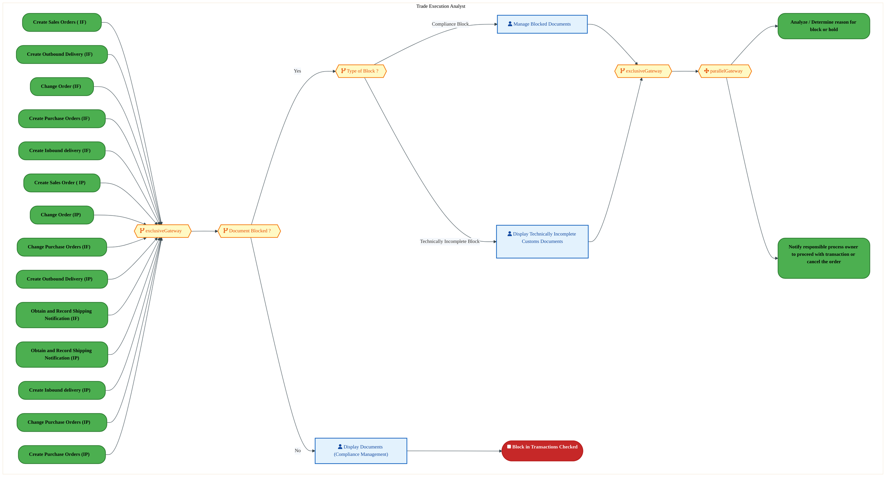
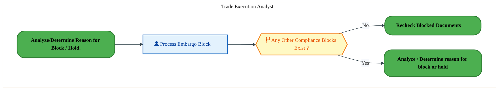
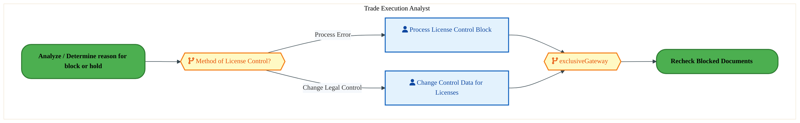

  <img src="data:image/svg+xml;base64,PHN2ZyB4bWxucz0iaHR0cDovL3d3dy53My5vcmcvMjAwMC9zdmciIHZpZXdCb3g9IjAgMCA4MDAgNDgwIiB3aWR0aD0iODAwIiBoZWlnaHQ9IjQ4MCI+DQogIDxkZWZzPg0KICAgIDxsaW5lYXJHcmFkaWVudCBpZD0iYmciIHgxPSIwJSIgeTE9IjAlIiB4Mj0iMTAwJSIgeTI9IjEwMCUiPg0KICAgICAgPHN0b3Agb2Zmc2V0PSIwJSIgc3R5bGU9InN0b3AtY29sb3I6IzAwNzFjNTtzdG9wLW9wYWNpdHk6MSIvPg0KICAgICAgPHN0b3Agb2Zmc2V0PSIxMDAlIiBzdHlsZT0ic3RvcC1jb2xvcjojMDBhZWVmO3N0b3Atb3BhY2l0eToxIi8+DQogICAgPC9saW5lYXJHcmFkaWVudD4NCiAgICA8bGluZWFyR3JhZGllbnQgaWQ9ImFjY2VudCIgeDE9IjAlIiB5MT0iMCUiIHgyPSIwJSIgeTI9IjEwMCUiPg0KICAgICAgPHN0b3Agb2Zmc2V0PSIwJSIgc3R5bGU9InN0b3AtY29sb3I6I2ZmZmZmZjtzdG9wLW9wYWNpdHk6MC4xNSIvPg0KICAgICAgPHN0b3Agb2Zmc2V0PSIxMDAlIiBzdHlsZT0ic3RvcC1jb2xvcjojZmZmZmZmO3N0b3Atb3BhY2l0eTowLjAyIi8+DQogICAgPC9saW5lYXJHcmFkaWVudD4NCiAgICA8cGF0dGVybiBpZD0iZ3JpZCIgd2lkdGg9IjQwIiBoZWlnaHQ9IjQwIiBwYXR0ZXJuVW5pdHM9InVzZXJTcGFjZU9uVXNlIj4NCiAgICAgIDxwYXRoIGQ9Ik0gNDAgMCBMIDAgMCAwIDQwIiBmaWxsPSJub25lIiBzdHJva2U9InJnYmEoMjU1LDI1NSwyNTUsMC4wNykiIHN0cm9rZS13aWR0aD0iMC41Ii8+DQogICAgPC9wYXR0ZXJuPg0KICA8L2RlZnM+DQoNCiAgPCEtLSBCYWNrZ3JvdW5kIC0tPg0KICA8cmVjdCB3aWR0aD0iODAwIiBoZWlnaHQ9IjQ4MCIgZmlsbD0idXJsKCNiZykiIHJ4PSI4Ii8+DQogIDxyZWN0IHdpZHRoPSI4MDAiIGhlaWdodD0iNDgwIiBmaWxsPSJ1cmwoI2dyaWQpIiByeD0iOCIvPg0KICA8cmVjdCB3aWR0aD0iODAwIiBoZWlnaHQ9IjQ4MCIgZmlsbD0idXJsKCNhY2NlbnQpIiByeD0iOCIvPg0KDQogIDwhLS0gRGVjb3JhdGl2ZSBjaXJjdWl0L2FyY2hpdGVjdHVyZSBsaW5lcyAtLT4NCiAgPGcgc3Ryb2tlPSJyZ2JhKDI1NSwyNTUsMjU1LDAuMTIpIiBzdHJva2Utd2lkdGg9IjEuNSIgZmlsbD0ibm9uZSI+DQogICAgPHBhdGggZD0iTSAwIDEwMCBMIDEyMCAxMDAgTCAxNjAgMTQwIEwgMjgwIDE0MCIvPg0KICAgIDxwYXRoIGQ9Ik0gMCAyNjAgTCA4MCAyNjAgTCAxMjAgMjIwIEwgMjAwIDIyMCBMIDI0MCAyNjAgTCAzNjAgMjYwIi8+DQogICAgPHBhdGggZD0iTSA1MjAgMTAwIEwgNjAwIDEwMCBMIDY0MCA2MCBMIDgwMCA2MCIvPg0KICAgIDxwYXRoIGQ9Ik0gNDQwIDM0MCBMIDU2MCAzNDAgTCA2MDAgMzAwIEwgNzIwIDMwMCBMIDc2MCAzNDAgTCA4MDAgMzQwIi8+DQogICAgPHBhdGggZD0iTSA2MDAgNDAwIEwgNjgwIDQwMCBMIDcyMCA0NDAiLz4NCiAgICA8cGF0aCBkPSJNIDAgNDAwIEwgNDAgNDAwIEwgODAgMzYwIi8+DQogICAgPHBhdGggZD0iTSAyMDAgNDIwIEwgMzIwIDQyMCBMIDM2MCAzODAgTCA0ODAgMzgwIi8+DQogICAgPHBhdGggZD0iTSA2NTAgNDQwIEwgNzUwIDQ0MCBMIDgwMCA0ODAiLz4NCiAgPC9nPg0KDQogIDwhLS0gRGVjb3JhdGl2ZSBub2RlcyAtLT4NCiAgPGcgZmlsbD0icmdiYSgyNTUsMjU1LDI1NSwwLjE4KSI+DQogICAgPGNpcmNsZSBjeD0iMTIwIiBjeT0iMTAwIiByPSI0Ii8+DQogICAgPGNpcmNsZSBjeD0iMjgwIiBjeT0iMTQwIiByPSI0Ii8+DQogICAgPGNpcmNsZSBjeD0iMjAwIiBjeT0iMjIwIiByPSI0Ii8+DQogICAgPGNpcmNsZSBjeD0iMzYwIiBjeT0iMjYwIiByPSI0Ii8+DQogICAgPGNpcmNsZSBjeD0iNjAwIiBjeT0iMTAwIiByPSI0Ii8+DQogICAgPGNpcmNsZSBjeD0iNzIwIiBjeT0iMzAwIiByPSI0Ii8+DQogICAgPGNpcmNsZSBjeD0iNTYwIiBjeT0iMzQwIiByPSI0Ii8+DQogICAgPGNpcmNsZSBjeD0iODAiIGN5PSIzNjAiIHI9IjQiLz4NCiAgICA8Y2lyY2xlIGN4PSI0ODAiIGN5PSIzODAiIHI9IjQiLz4NCiAgICA8Y2lyY2xlIGN4PSIzMjAiIGN5PSI0MjAiIHI9IjQiLz4NCiAgPC9nPg0KDQogIDwhLS0gVE9HQUYgQkRBVCBib3hlcyAtLT4NCiAgPGcgZm9udC1mYW1pbHk9IlNlZ29lIFVJLCBBcmlhbCwgc2Fucy1zZXJpZiIgZm9udC1zaXplPSIxNCIgZm9udC13ZWlnaHQ9IjYwMCI+DQogICAgPCEtLSBCIC0tPg0KICAgIDxyZWN0IHg9IjE1MCIgeT0iMTQwIiB3aWR0aD0iMTIwIiBoZWlnaHQ9IjQwIiByeD0iNSIgZmlsbD0icmdiYSgyNTUsMjU1LDI1NSwwLjE4KSIgc3Ryb2tlPSJyZ2JhKDI1NSwyNTUsMjU1LDAuMykiIHN0cm9rZS13aWR0aD0iMSIvPg0KICAgIDx0ZXh0IHg9IjIxMCIgeT0iMTY1IiB0ZXh0LWFuY2hvcj0ibWlkZGxlIiBmaWxsPSIjZmZmIj5CdXNpbmVzczwvdGV4dD4NCiAgICA8IS0tIEQgLS0+DQogICAgPHJlY3QgeD0iMjkwIiB5PSIxNDAiIHdpZHRoPSIxMjAiIGhlaWdodD0iNDAiIHJ4PSI1IiBmaWxsPSJyZ2JhKDI1NSwyNTUsMjU1LDAuMTgpIiBzdHJva2U9InJnYmEoMjU1LDI1NSwyNTUsMC4zKSIgc3Ryb2tlLXdpZHRoPSIxIi8+DQogICAgPHRleHQgeD0iMzUwIiB5PSIxNjUiIHRleHQtYW5jaG9yPSJtaWRkbGUiIGZpbGw9IiNmZmYiPkRhdGE8L3RleHQ+DQogICAgPCEtLSBBIC0tPg0KICAgIDxyZWN0IHg9IjQzMCIgeT0iMTQwIiB3aWR0aD0iMTIwIiBoZWlnaHQ9IjQwIiByeD0iNSIgZmlsbD0icmdiYSgyNTUsMjU1LDI1NSwwLjE4KSIgc3Ryb2tlPSJyZ2JhKDI1NSwyNTUsMjU1LDAuMykiIHN0cm9rZS13aWR0aD0iMSIvPg0KICAgIDx0ZXh0IHg9IjQ5MCIgeT0iMTY1IiB0ZXh0LWFuY2hvcj0ibWlkZGxlIiBmaWxsPSIjZmZmIj5BcHBsaWNhdGlvbjwvdGV4dD4NCiAgICA8IS0tIFQgLS0+DQogICAgPHJlY3QgeD0iNTcwIiB5PSIxNDAiIHdpZHRoPSIxMjAiIGhlaWdodD0iNDAiIHJ4PSI1IiBmaWxsPSJyZ2JhKDI1NSwyNTUsMjU1LDAuMTgpIiBzdHJva2U9InJnYmEoMjU1LDI1NSwyNTUsMC4zKSIgc3Ryb2tlLXdpZHRoPSIxIi8+DQogICAgPHRleHQgeD0iNjMwIiB5PSIxNjUiIHRleHQtYW5jaG9yPSJtaWRkbGUiIGZpbGw9IiNmZmYiPlRlY2hub2xvZ3k8L3RleHQ+DQogIDwvZz4NCg0KICA8IS0tIENvbm5lY3RpbmcgbGluZXMgYmV0d2VlbiBCREFUIGJveGVzIC0tPg0KICA8ZyBzdHJva2U9InJnYmEoMjU1LDI1NSwyNTUsMC4yNSkiIHN0cm9rZS13aWR0aD0iMSI+DQogICAgPGxpbmUgeDE9IjI3MCIgeTE9IjE2MCIgeDI9IjI5MCIgeTI9IjE2MCIvPg0KICAgIDxsaW5lIHgxPSI0MTAiIHkxPSIxNjAiIHgyPSI0MzAiIHkyPSIxNjAiLz4NCiAgICA8bGluZSB4MT0iNTUwIiB5MT0iMTYwIiB4Mj0iNTcwIiB5Mj0iMTYwIi8+DQogIDwvZz4NCg0KICA8IS0tIE1haW4gdGl0bGUgLS0+DQogIDx0ZXh0IHg9IjQwMCIgeT0iMjYwIiB0ZXh0LWFuY2hvcj0ibWlkZGxlIiBmb250LWZhbWlseT0iU2Vnb2UgVUksIEFyaWFsLCBzYW5zLXNlcmlmIiBmb250LXNpemU9IjM2IiBmb250LXdlaWdodD0iNzAwIiBmaWxsPSIjZmZmZmZmIiBsZXR0ZXItc3BhY2luZz0iMSI+DQogICAgSUFPIEFyY2hpdGVjdHVyZQ0KICA8L3RleHQ+DQogIDx0ZXh0IHg9IjQwMCIgeT0iMzAwIiB0ZXh0LWFuY2hvcj0ibWlkZGxlIiBmb250LWZhbWlseT0iU2Vnb2UgVUksIEFyaWFsLCBzYW5zLXNlcmlmIiBmb250LXNpemU9IjE4IiBmb250LXdlaWdodD0iNDAwIiBmaWxsPSJyZ2JhKDI1NSwyNTUsMjU1LDAuOCkiIGxldHRlci1zcGFjaW5nPSIyIj4NCiAgICBUT0dBRiBCREFUIMK3IElBTyBQcm9ncmFtIMK3IElETSAyLjANCiAgPC90ZXh0Pg0KDQogIDwhLS0gQm90dG9tIGFjY2VudCBiYXIgLS0+DQogIDxyZWN0IHg9IjI4MCIgeT0iMzQwIiB3aWR0aD0iMjQwIiBoZWlnaHQ9IjMiIHJ4PSIxLjUiIGZpbGw9InJnYmEoMjU1LDI1NSwyNTUsMC40KSIvPg0KDQogIDwhLS0gSW50ZWwgdGV4dCAtLT4NCiAgPHRleHQgeD0iNDAwIiB5PSIzODAiIHRleHQtYW5jaG9yPSJtaWRkbGUiIGZvbnQtZmFtaWx5PSJTZWdvZSBVSSwgQXJpYWwsIHNhbnMtc2VyaWYiIGZvbnQtc2l6ZT0iMTMiIGZpbGw9InJnYmEoMjU1LDI1NSwyNTUsMC41KSIgbGV0dGVyLXNwYWNpbmc9IjMiPg0KICAgIElOVEVMIENPTkZJREVOVElBTA0KICA8L3RleHQ+DQo8L3N2Zz4NCg==" alt="IAO Architecture" style="width:100%; border-radius:8px;" />
  <h1 style="font-size:36px; margin-top:24px;">GT-030 — Compliance Screening (IF)</h1>
  <h2 style="font-size:24px;">Architecture Document (TOGAF BDAT)</h2>
  
Order To Cash (IF) (OTC-IF) Tower 
  Capability GT-030 · GT Global Trade (IF)

  
IAO Program · Release 3 
  Generated: March 2026 
  Sajiv Francis

  
IAO Architecture Pipeline — Intel Confidential

Page 1<a href="#toc">↑ Back to TOC</a>GT-030 — Compliance Screening (IF)

## Table of Contents

<nav class="toc">
<ol>
  <li><a href="#1-executive-summary">1. Executive Summary</a></li>
  <li><a href="#2-business-context-objectives">2. Business Context &amp; Objectives</a>
    <ul>
      <li><a href="#21-classification">2.1 Classification</a></li>
      <li><a href="#22-business-drivers">2.2 Business Drivers</a></li>
      <li><a href="#23-success-criteria">2.3 Success Criteria</a></li>
      <li><a href="#24-companion-documents">2.4 Companion Documents</a></li>
    </ul>
  </li>
  <li><a href="#3-business-architecture-togaf-b">3. Business Architecture (TOGAF &ldquo;B&rdquo;)</a>
    <ul>
      <li><a href="#31-business-process-overview">3.1 Business Process Overview</a></li>
      <li><a href="#32-business-process-diagrams">3.2 Business Process Diagrams</a></li>
      <li><a href="#33-business-roles-responsibilities">3.3 Business Roles &amp; Responsibilities</a></li>
    </ul>
  </li>
  <li><a href="#4-data-architecture-togaf-d">4. Data Architecture (TOGAF &ldquo;D&rdquo;)</a>
    <ul>
      <li><a href="#41-data-entities-ownership">4.1 Data Entities &amp; Ownership</a></li>
      <li><a href="#42-data-flow-diagrams">4.2 Data Flow Diagrams</a></li>
      <li><a href="#43-data-lineage">4.3 Data Lineage</a></li>
      <li><a href="#44-ricefw-data-objects">4.4 RICEFW Data Objects</a></li>
      <li><a href="#45-data-governance-quality">4.5 Data Governance &amp; Quality</a></li>
    </ul>
  </li>
  <li><a href="#5-application-architecture-togaf-a">5. Application Architecture (TOGAF &ldquo;A&rdquo;)</a>
    <ul>
      <li><a href="#51-current-state-current-state-application-landscape">5.1 Current-State Application Landscape</a></li>
      <li><a href="#52-future-state-future-state-application-landscape">5.2 Future-State Application Landscape</a></li>
      <li><a href="#53-change-impact-summary">5.3 Change Impact Summary</a></li>
      <li><a href="#54-component-overview">5.4 Component Overview</a></li>
      <li><a href="#55-ricefw-inventory">5.5 RICEFW Inventory</a></li>
      <li><a href="#56-integration-patterns">5.6 Integration Patterns</a></li>
    </ul>
  </li>
  <li><a href="#6-technology-architecture-togaf-t">6. Technology Architecture (TOGAF &ldquo;T&rdquo;)</a>
    <ul>
      <li><a href="#61-platform-infrastructure">6.1 Platform &amp; Infrastructure</a></li>
      <li><a href="#62-sap-development-object-status">6.2 SAP Development Object Status</a></li>
      <li><a href="#63-nfrs-design-principles">6.3 NFRs &amp; Design Principles</a></li>
      <li><a href="#64-security-governance">6.4 Security &amp; Governance</a></li>
    </ul>
  </li>
  <li><a href="#7-project-context">7. Project Context</a>
    <ul>
      <li><a href="#71-project-roadmap-go-live-plan">7.1 Project Roadmap &amp; Go-Live Plan</a></li>
      <li><a href="#72-raid-log">7.2 RAID Log</a></li>
      <li><a href="#73-recommendations-next-steps">7.3 Recommendations &amp; Next Steps</a></li>
    </ul>
  </li>
</ol>
</nav>

Page 2<a href="#toc">↑ Back to TOC</a>GT-030 — Compliance Screening (IF)

## 1. Executive Summary

This Architecture Document defines the **Business, Data, Application, and Technology** (BDAT) architecture for **GT-030 Compliance Screening (IF)** within the IAO program. It includes 8 BPMN process diagram(s) in Section 3.

| Dimension | Value |
|-----------|-------|
| **Tower** | Order To Cash (IF) (OTC-IF) |
| **Process Group** | GT Global Trade (IF) |
| **Capability** | GT-030 - Compliance Screening (IF) |
| **Release** | Release 3 |
| **Total Systems** | 0 |
| **System Status** | 0 Deployed, 0 Developing, 0 EOL, 0 Pending IAPM |
| **RICEFW Objects** | 11 Interfaces, 64 Enhancements, 11 Forms, 1 Workflows |

**Change Summary**: 0 new flow chains, 0 removed, 0 modified, 0 unchanged between Current-State and Future-State states.

> All system nodes in architecture diagrams are **IAPM-linked** — click any node to open its IAPM page. Diagrams require `securityLevel: 'loose'` for click events.

Page 3<a href="#toc">↑ Back to TOC</a>GT-030 — Compliance Screening (IF)

## 2. Business Context & Objectives

### 2.1 Classification

| Level | Value |
|-------|-------|
| **L0 Tower** | Order To Cash (IF) |
| **L1 Process** | GT Global Trade (IF) |
| **L2 Capability** | GT-030 - Compliance Screening (IF) |

### 2.2 Business Drivers

| # | Driver | Description | Strategic Alignment | Priority |
|---|--------|-------------|---------------------|----------|
| 1 | Foundry Customer Order Digitization | Digitize end-to-end order capture, pricing, and fulfillment for Intel Foundry customers | IDM 2.0 Foundry Revenue | High |
| 2 | Global Trade Compliance Automation | Automate export/import compliance screening and customs declarations | Global Trade Operations | High |
| 3 | Revenue Recognition Accuracy | Ensure compliant revenue recognition aligned with ASC 606 through S/4 HANA billing | Finance & Compliance | Medium |
| 4 | GT-030 Process Migration | Migrate Compliance Screening (IF) business processes and 0 integrated systems from legacy to S/4 HANA target architecture | IDM 2.0 Order Management (Intel Foundry) | High |

Page 4<a href="#toc">↑ Back to TOC</a>GT-030 — Compliance Screening (IF)

### 2.3 Success Criteria

| Metric | Target | Measure | Baseline | Owner |
|--------|--------|---------|----------|-------|
| Order-to-Cash Cycle Time | < 5 business days | End-to-end cycle from order capture to cash application | 8 business days (legacy) | OTC Process Owner |
| Trade Compliance Screening Rate | 100% | Orders screened for denied parties and export controls | 99.2% (current) | Global Trade Manager |
| Billing Accuracy | > 99.8% | Invoices generated without errors requiring credit/re-bill | 98.5% (current) | Billing Manager |
| GT-030 Migration Completeness | 100% flow chains validated | All 0 flow chains verified in target state | 0% (pre-migration) | Tower Architect |

### 2.4 Companion Documents

| Document | Description |
|----------|-------------|
| **Business Architecture** | Included in this document (Section 3) — process flows from BPMN diagrams |
| **This Document** | Full BDAT Architecture — Business + Data + Application + Technology |

Page 5<a href="#toc">↑ Back to TOC</a>GT-030 — Compliance Screening (IF)

## 3. Business Architecture (TOGAF "B")

### 3.1 Business Process Overview

This capability includes **8 business process(es)** modeled in BPMN 2.0, covering the end-to-end workflow for GT-030 Compliance Screening (IF).

| # | Step ID | Process Name | Lanes | Tasks | Gateways |
|---|---------|--------------|-------|-------|----------|
| 1 | GT-030-010_Business_Partners_Screening_SPL_(IF) | GT-030-010_Business_Partners_Screening_SPL_(IF) | Trade Execution Analyst | 6 | 6 |
| 2 | GT-030-030_Check_if_block_exists_(transactions)_(IF) | GT-030-030_Check_if_block_exists_(transactions)_(IF) | Trade Execution Analyst | 3 | 5 |
| 3 | GT-030-050_Business_decision_on_SPL_analysis_result_+_take_action_(IF) | GT-030-050_Business_decision_on_SPL_analysis_result_+_take_action_(IF) | Trade Execution Analyst | 5 | 6 |
| 4 | GT-030-060_Business_decision_on_Embargo_analysis_result_+_take_action_(IF) | GT-030-060_Business_decision_on_Embargo_analysis_result_+_take_action_(IF) | Trade Execution Analyst | 1 | 1 |
| 5 | GT-030-070_Business_decision_on_License_control_analysis_result_+_take_action_(IF) | GT-030-070_Business_decision_on_License_control_analysis_result_+_take_action_(IF) | Trade Execution Analyst | 2 | 2 |
| 6 | GT-030-090_Recheck_Blocked_Documents_(IF) | GT-030-090_Recheck_Blocked_Documents_(IF) | Trade Execution Analyst | 3 | 5 |
| 7 | GT-030-100_Notify_responsible_process_owner_to_proceed_with_transaction_or_cancel_the_order_(IF) | GT-030-100_Notify_responsible_process_owner_to_proceed_with_transaction_or_cancel_the_order_(IF) | Trade Execution Analyst | 3 | 5 |
| 8 | GT-030-110_Manage_Compliance_Reporting_(including_Audit_Trail)_(IF) | GT-030-110_Manage_Compliance_Reporting_(including_Audit_Trail)_(IF) | Trade Execution Analyst | 10 | 5 |

Page 6<a href="#toc">↑ Back to TOC</a>GT-030 — Compliance Screening (IF)

### 3.2 Business Process Diagrams

#### BUSINESS ARCHITECTURE — 3.2.1 GT-030-010_Business_Partners_Screening_SPL_(IF) — GT-030-010_Business_Partners_Screening_SPL_(IF)

**Swim Lanes**: Trade Execution Analyst | **Tasks**: 6 | **Gateways**: 6

> **Legend**: ● Start · ● End · User Task · Service Task · ◇ Gateway · Sub-Process

<a href="https://mermaid.live/view#pako:eNqlVmtv4jgU_StWRhWtBGqehObDrnhlVamtkOjOaDXdDya5gajBRrZpYRj--1yHJJA0XWl3kUD45J5zfY_jax-MiMdgBMbV1SFlqQrIoaNWsIZOQDoLKqHTJSfgKxUpXWQgOzom4UzN0x95mOVudjpMYyFdp9leo3NYciB_3nfJEIlZl0jKZE-CSJNOt7MR6ZqK_ZhnXOjoLzBIzCTPVjwacRGDOAeYpm9FHlKzlMEZdnzXd0PNkxBxFtdEEy8ZJFHnqCeX8fdoRYXKp7-V8Eh339JYrXCc0EwCxqzUOnugC8h0jUpsNRZtxVtpRip1HoaGzTc0StkScddESFD2eoY883gkx6urF1YlJc-TF0bwE2VUygkkRCqEp2-KJGmWBV_c8TD0zK5Ugr9C8MWe-hPH7ka6kgBLN7va3N47pMuVChY8i4vQ3ruuIbA3u67YBbbZFXv8beQCFp8zjfv2wB5UmUa-NbbGZaYkSf5XJvRVPFP5WuSaOqEdTqpcltf3xuZHvbLMiesPraZPIN7SCC5EwzB0pmerpn3PMj8XHYVO3xw3RJdUwTvdnwXvxm4lGHp-aPmfCp7yNWe5XcwEj0pBZ-qFXiXoj6xwaH8q6A4td1DMEHWWgm5W5FnQGMh0B9FWpZyRIaPZXqpTlP4w6_uLkdAgoT1tOnmkjC6BjDIevUJMZvh2MRDyxfj7gmO3cmZcpip9A_KQSkV6ZDRr0JxW2hOgjf9Ec79XvIgvyT22F2wEZD57IPNIADDcLoQnBfGS6dWZ4xVluraZJMM4FiDlWaDB7NeZE8gUJXPKIu1i4cv-NONrnMhNYyZbic0F5Uv7yDUmvWnk8K-rHFLxTQvrLKqLHfP1JgMFMercXOgMUCZf1x9AbnGqCsQahYgAKnHJEy7IQi8nwT8r3Ih1d--Q_UhTpvB7SpFimYCrI1GITKiidYJlXjBu7xlGJRQJ4y1WsQZx-xX7BBe3I2xmkjxOGmzrcDg7G0NvgU0vwhd1vwFtXVXy7y_G8XhJtNuJsIsyNO4N_jhtxibNaadVHhdv-od0bjvvG253nGb-7uqFyemV2gcV779Nuv9vaWj56Q_6RHq933ThBdAvxnYxdhtjrzG2irFbjh0N_Hwx_gLcXz8RKB8UTL8cW0Xgx32W87xmXLWTz5sQw6q8bhH2xLVMmvcvxfNNlwcOmoH3rN5M8iinJarWqfKosvi7ovh-yTKbQGln6YJTjMvq7Ma4su-Jn9z7YEPRXGom9C8OBr0k5YFYg-122GmH3cszsPbE-_RJ_9MnfnEbqIGD6jpSg-_aYfS2HbfKg7UO2-2w0w677bDXDvdL2Oga2MPWNI2N4GDkN1a81caQ0G2mjGPXoFvF53sWGUF-szO2mxiZk5Tigbs-gcdfe_B7ig==" title="View full diagram">&#128065; View Full Diagram</a>

Page 7<a href="#toc">↑ Back to TOC</a>GT-030 — Compliance Screening (IF)

#### BUSINESS ARCHITECTURE — 3.2.2 GT-030-030_Check_if_block_exists_(transactions)_(IF) — GT-030-030_Check_if_block_exists_(transactions)_(IF)

**Swim Lanes**: Trade Execution Analyst | **Tasks**: 3 | **Gateways**: 5

> **Legend**: ● Start · ● End · User Task · Service Task · ◇ Gateway · Sub-Process

<a href="https://mermaid.live/view#pako:eNqlV2tv4jgU_StWqoqOBNo8Cc2HXVEgq0oz02rp7mq17AeTOMWqcSLbKTAM_32vQwiQR7UPPlT1ybnn3ntsbszeiNKYGIFxe7unnKoA7XtqRdakF6DeEkvS66Mj8BsWFC8ZkT3NSVKu5vRbQbPcbKtpGgvxmrKdRufkNSXo18c-GkMg6yOJuRxIImjS6_cyQddY7CYpS4Vm35BRYiZFtvLRQypiIs4E0_StyINQRjk5w47v-m6o4ySJUh5fiSZeMkqi3kEXx9JNtMJCFeXnknzB299prFawTjCTBDgrtWaf8ZIw3aMSucaiXLyfzKBS5-Fg2DzDEeWvgLsmQALztzPkmYcDOtzeLniVFL1MFxzBJ2JYyilJkFQAz94VSihjwY07GYee2ZdKpG8kuLFn_tSx-5HuJIDWzb42d7Ah9HWlgmXK4pI62OgeAjvb9sU2sM2-2MHfWi7C43OmydAe2aMq04NvTazJKVOSJP8rE_gqXrB8K3PNnNAOp1Uuyxt6E7Opd2pz6vpjq-4TEe80IheiYRg6s7NVs6Fnmd2iD6EzNCc10VesyAbvzoL3E7cSDD0_tPxOwWO-epX58lmk0UnQmXmhVwn6D1Y4tjsF3bHljsoKQedV4GyFXgSOCZptSZQrmnI05pjtpDqy9Idbfy6MBAcJHmjT0RfM8StBDyyN3kiMpmmUrwlXcmH8dRFkXwdNqcwY-PBCohWnEWZshx55lK4zRhRBk1yqdC27xJx2sYqN7iZaiWIekbI-jX-6VnHvKhnIlh07QJRrC7jEkW5fosmK6L4g9NNFrAehhTPfCPoBTaFmsYbpgATBEkxLUoGWhRz8s4KjfJ15CNFfU0WTHQTIDNJQmG8og40kUqJ0w6ErlR4B8HRD1QrGQlWVVo10cwzBhETFvLrO4EOGCRQDXs4xjE70pDlgDHoMazaMNHWFOexhQUJ3Dcr9We0pV8s057DPhNF3InYtdMs88x_5kR5_QLfO9OdcwNiSpKq3ybZbW9OdPdepTrO1Bsc9c_5Bcu9jJxrqeqeflgrDqcJA_QXeFCJG8xXNMhjZqDgEcPyLTW1J5_-r8Eb20Yf70KDff2RFnW2bH-1ag23t96cvm37vD5ZwmiOYNrsMzm9Sfvd-WhiHw2WU3R5FthHLJfTx83Gc1sOc_xbmtoedxko14hpleudALES6kQPMFMqwgLlGWCMbvBWP_3ALDQY_6j7LtV1fnwDvBHhHoL4elmu_5Dvl2jmu3XJ5X3s8qq0tqw6YNcAuGN8XRsfkLjxaGN-BeYooa7BPRdhuKfEHkUemVX_yNS0eVFXY9bKcOuDWAa8ODOtA3Sur4UbdLrvTjYv3zdmByxuF3uvTHeUKttthpx12yyvVFehVd7oreNgO--3wqB2-b4fhXLTjVgdud-BOB-524B29Wh3NWh3dWh3tWh392h39wgEor3TXsN0OO-2w2w57J9joG2u4YGAaG8HeKH4UwQ-nmCQ4Z8o49A2cq3S-45ERFD8ejDyLIXJKMdzp1kfw8DdNgSm2" title="View full diagram">&#128065; View Full Diagram</a>

Page 8<a href="#toc">↑ Back to TOC</a>GT-030 — Compliance Screening (IF)

#### BUSINESS ARCHITECTURE — 3.2.3 GT-030-050_Business_decision_on_SPL_analysis_result_+_take_action_(IF) — GT-030-050_Business_decision_on_SPL_analysis_result_+_take_action_(IF)

**Swim Lanes**: Trade Execution Analyst | **Tasks**: 5 | **Gateways**: 6

> **Legend**: ● Start · ● End · User Task · Service Task · ◇ Gateway · Sub-Process

<a href="https://mermaid.live/view#pako:eNqlVmtv4kYU_SsjRxGJBFo_MfGHVrxcVUpaVLK7WpV-GOxrGMXMoJkhgWX5771jbB6OI1Vdf0DM8T3n3Hvn5b2ViBSsyLq93TPOdET2Lb2EFbQi0ppTBa02OQJfqGR0noNqmZhMcD1l34swx19vTZjBYrpi-c6gU1gIIJ9_b5M-EvM2UZSrjgLJsla7tZZsReVuKHIhTfQN9DI7K9zKVwMhU5DnANsOnSRAas44nGEv9EM_NjwFieDplWgWZL0saR1Mcrl4S5ZU6iL9jYInuv3KUr3EcUZzBRiz1Kv8kc4hNzVquTFYspGvVTOYMj4cGzZd04TxBeK-jZCk_OUMBfbhQA63tzN-MiXPoxkn-CQ5VWoEGVEa4fGrJhnL8-jGH_bjwG4rLcULRDfuOBx5bjsxlURYut02ze28AVssdTQXeVqGdt5MDZG73rblNnLtttzhb80LeHp2Gnbdnts7OQ1CZ-gMK6csy37KCfsqn6l6Kb3GXuzGo5OXE3SDof1erypz5Id9p94nkK8sgQvROI698blV427g2B-LDmKvaw9roguq4Y3uzoIPQ_8kGAdh7IQfCh796llu5hMpkkrQGwdxcBIMB07cdz8U9PuO3yszRJ2FpOsleZY0BTLeQrLRTHDS5zTfKX2MMg93_p5ZGY0y2jFNJ8YelCJPIzKlPDEkSMkEF9mOPDKlyd108nhPBrlIXmbWPxdC7rVQP03JYKNwk6Ga4XOQitwNJvdEi4lQTLNXKCSvZbxrmb8gBzw-CLoeTUkmJBmJZLMCXqP6DRlM0I38AThTzXbBNWcoeMbk6j_Zde9OXKXF-oLz2UiNIGHK9HwoVuscNCD7_oIe1uhFGMOeY7GJBOB4Cpy4aY3cQ24xl9-BfEIrDXKFrSYSm4WWJul5kQr-WeLmu8784afYjr3fV5mbU78zx3MrWRLYJjlO-Cv8dtwWM-twuKQ5zbSvuIFERp4opwtTctHCcs2ZNfNrXcdt1nnercEIjaim7zheM6fPd-RPvJbkZfeLBN7b-v-v6qCZVq3ramkpcmGIB-3xD38gnc4vpuZy7Jfj8uDgbm3s1McF8GNm1bbAD5SqQrwy5Buo4kWvzq3tVgyp0nHso1-3Glf5BBUQVP6iIFa4V8adkqgK80ogqAe4pdATVdrsLpxlcvc0ui9kHaee87G_uJ4-lVv6tLSOhHp-VfFevStl4uHFSW3aXN1QV7DbDHvNsN8MB81wt7x-r8CwCeydPgqu4IdmGKewvMauYacZdpthrxn2m-Gggq22tcKzh7LUivZW8X2I35ApZHSTa-vQtuhGi-mOJ1ZUfEdZm3WKzBGjeL2tjuDhX2x0TLM=" title="View full diagram">&#128065; View Full Diagram</a>

#### BUSINESS ARCHITECTURE — 3.2.4 GT-030-060_Business_decision_on_Embargo_analysis_result_+_take_action_(IF) — GT-030-060_Business_decision_on_Embargo_analysis_result_+_take_action_(IF)

**Swim Lanes**: Trade Execution Analyst | **Tasks**: 1 | **Gateways**: 1

> **Legend**: ● Start · ● End · User Task · Service Task · ◇ Gateway · Sub-Process

<a href="https://mermaid.live/view#pako:eNqlVF2P2joQ_StWViteQpvPDc3DvYJAdK90-6HutlV16YNxxsTCsZHt7EIp_702AbLQ7lPzgDInc86ZGezZeURW4OXe7e2OCWZytBuYGhoY5GiwwBoGPuqAz1gxvOCgBy6HSmHu2fdDWpisNy7NYSVuGN869B6WEtCnf300tkTuI42FHmpQjA78wVqxBqttIblULvsGRjSgB7fjp4lUFag-IQiykKSWypmAHo6zJEtKx9NApKguRGlKR5QM9q44Lp9IjZU5lN9qeIs3X1hlahtTzDXYnNo0_D-8AO56NKp1GGnV42kYTDsfYQd2v8aEiaXFk8BCCotVD6XBfo_2t7dzcTZFD9O5QPYhHGs9BYq0sfDs0SDKOM9vkmJcpoGvjZIryG-iWTaNI5-4TnLbeuC74Q6fgC1rky8kr46pwyfXQx6tN77a5FHgq639vfICUfVOxV00ikZnp0kWFmFxcqKU_pGTnat6wHp19JrFZVROz15hepcWwa96pzanSTYOr-cE6pEReCZalmU860c1u0vD4GXRSRnfBcWV6BIbeMLbXvBNkZwFyzQrw-xFwc7vusp28UFJchKMZ2mZngWzSViOoxcFk3GYjI4VWp2lwusaPShcAZptgLSGSYHGAvOtNl2We0T4_9yjOKd46IaOnD1ojWbNAqulRBMuyWrufXvGiCzjI5AayKr7DBWaStI2IIy-TI1t6sHyO6DXaAoGVGOvHVKAta2GSoUWTgHZl9qekUt20rNf99yPPffgboX_sdRXl9x0tzv15TbTcGHvFqlt_1v03u4hhQrZrDmzIHQytuUN0wb9Pff2-07InvfuRSRoOPzLzuoYhl2YHsPUhT_m3js5937Y-VzBX0Ef8PjZn-00Tof8Ao7ON_oCjn8PJ7-H09PJ9HyvsWPDrPLynXfYv3ZHV0Bxy4239z3cGnm_FcTLD3vKa9eVZU4Ztsen6cD9T1AP4P4=" title="View full diagram">&#128065; View Full Diagram</a>

Page 9<a href="#toc">↑ Back to TOC</a>GT-030 — Compliance Screening (IF)

#### BUSINESS ARCHITECTURE — 3.2.5 GT-030-070_Business_decision_on_License_control_analysis_result_+_take_action_(IF) — GT-030-070_Business_decision_on_License_control_analysis_result_+_take_action_(IF)

**Swim Lanes**: Trade Execution Analyst | **Tasks**: 2 | **Gateways**: 2

> **Legend**: ● Start · ● End · User Task · Service Task · ◇ Gateway · Sub-Process

<a href="https://mermaid.live/view#pako:eNqlVU2P6jYU_StWRiM2Qc0noVm0goRUleZJVWfe66J0YZxrYmFsZDsz8Hj899okgYHOrJoFyj3cc8691x85ekTW4OXe4-ORCWZydByZBrYwytFohTWMfNQB37BieMVBj1wOlcI8s-_ntDDZ7V2awyq8Zfzg0GdYS0Bff_fRzBK5jzQWeqxBMTryRzvFtlgdCsmlctkPMKUBPbv1f82lqkFdE4IgC0lqqZwJuMJxlmRJ5XgaiBT1jShN6ZSS0ckVx-UbabAy5_JbDV_w_i9Wm8bGFHMNNqcxW_6EV8Bdj0a1DiOteh2GwbTzEXZgzztMmFhbPAkspLDYXKE0OJ3Q6fFxKS6m6KVcCmQfwrHWJVCkjYUXrwZRxnn-kBSzKg18bZTcQP4QLbIyjnziOslt64Hvhjt-A7ZuTL6SvO5Tx2-uhzza7X21z6PAVwf7e-cFor46FZNoGk0vTvMsLMJicKKU_i8nO1f1gvWm91rEVVSVF68wnaRF8F-9oc0yyWbh_ZxAvTIC70SrqooX11EtJmkYfC46r-JJUNyJrrGBN3y4Cv5cJBfBKs2qMPtUsPO7r7Jd_aEkGQTjRVqlF8FsHlaz6FPBZBYm075Cq7NWeNegF4VrQIs9kNYwKdBMYH7Qpstyjwj_XnoU5xSP3dCRswet0ZMdltCACruKSnI055Jslt4_75jRLbNosFhfCSU2GFGpBiV9S44t-U8gDZBNpw01KiVptyDMXWpiU891fwf0EyrBgNras4sUYG1bch4rp4DsS2M32i07PR6HMt0VNV7ZQ0Ya9AVMI2sk6X2nvy690-kdf_IxH_aEt5q9wm_dHriy7CnpXkSCxuNfbAV9GHbhpA8nXRj3YerCH0tvWICFUlItvR-Wd5fRD_oJ1pgPVZ8Toz4xujE6by7nPhyqGzj6GI4vF8sNnHwMp8NJuEEnA-r53tauGWa1lx-981fAfilqoLjlxjv5Hm6NfD4I4uXn29Jrd7VllgzbTbztwNO_3LIMgw==" title="View full diagram">&#128065; View Full Diagram</a>

Page 10<a href="#toc">↑ Back to TOC</a>GT-030 — Compliance Screening (IF)

#### BUSINESS ARCHITECTURE — 3.2.6 GT-030-090_Recheck_Blocked_Documents_(IF) — GT-030-090_Recheck_Blocked_Documents_(IF)

**Swim Lanes**: Trade Execution Analyst | **Tasks**: 3 | **Gateways**: 5

> **Legend**: ● Start · ● End · User Task · Service Task · ◇ Gateway · Sub-Process

<a href="https://mermaid.live/view#pako:eNqlVl2P4jYU_StWRiNm1aDmkzB5aMVXqq1mVqudaauq9ME4DrgYG9nOAMvy33sTEj4y4WFbHlB8cs85997E19lbRKbUiq37-z0TzMRo3zELuqKdGHVmWNOOjY7A71gxPONUd4qYTArzwr6WYW6w3hZhBZbgFeO7An2hc0nRbx9tNAAit5HGQnc1VSzr2J21YiusdiPJpSqi72g_c7LSrbo1lCql6hzgOJFLQqByJugZ9qMgCpKCpymRIr0SzcKsn5HOoUiOyw1ZYGXK9HNNn_H2D5aaBawzzDWFmIVZ8Sc8o7yo0ai8wEiu3upmMF34CGjYyxoTJuaABw5ACovlGQqdwwEd7u-n4mSKXsdTgeBHONZ6TDOkDcCTN4Myxnl8F4wGSejY2ii5pPGdN4nGvmeTopIYSnfsorndDWXzhYlnkqdVaHdT1BB7662ttrHn2GoH_w0vKtKz06jn9b3-yWkYuSN3VDtlWfa_nKCv6hXrZeU18RMvGZ-83LAXjpz3enWZ4yAauM0-UfXGCL0QTZLEn5xbNemFrnNbdJj4PWfUEJ1jQzd4dxZ8HAUnwSSMEje6KXj0a2aZzz4rSWpBfxIm4UkwGrrJwLspGAzcoF9lCDpzhdcL9KpwStFkS0lumBRoIDDfaXOMKn7C_WtqZTjOcLdoOvpCyYKSJRpySZY0RWNJ8hUVZmr9fUHy2kl1sEbPWOSY8901zQfa-1gm0BCT5VzJXKToYYYNWaB_5Ex_uGYHDydXbeT6QuEL5RRmTArxHy4IIcSPSjOWoVlREKJbpoHwYGCraUyKnjRtesD6JA3LdkhRvYYABuMKreG5UK2R3Aio2MgjAB3aMLNAF3pIKkSwIJQjGHioHD_XDtF_yqsPrPLxfaXoRzSmhqoVjDBIEmtwzcD2qAUXC9hv1-xHYA9zDQSoIaWE6TJVgV4-PyFcvhVMFwXn3KAfkMFLio55XOu4zi2hyWqG1Vx-l5h7S-wJ9qrQFMEohtedf5eot9_X70lxKHVn0FN4o57hGskMlZ2HCXt-f36eWofDpYLfrlAT6s3xjhe08-iWcCjyjf5ynBdNWnimYaXkRncxlLjGCnYQ5TdIvVYSE7esYHgfL6DrqNv9qZCogKixdp0G0G-svWpdLR-b_PL-t6l1nAJT6xtQ6ntVbFCv_Sr2T6rLQDes7wRVqF8BfpMaHoGwsT6l0asIXjOvYTlifpWz0tFvpvJJlnhwMZyLxOtD6Qr22uGgOiyvwPB0Wl_BvXY4aof77fBjOwyPsh13b-Befahdw347HLTDYTvcq2HLtlYwvTBLrXhvlZ-F8OmY0gzD3rYOtoVzI192glhx-flk5esUmGOG4VRbHcHDv3nTUj8=" title="View full diagram">&#128065; View Full Diagram</a>

Page 11<a href="#toc">↑ Back to TOC</a>GT-030 — Compliance Screening (IF)

#### BUSINESS ARCHITECTURE — 3.2.7 GT-030-100_Notify_responsible_process_owner_to_proceed_with_transaction_or_cancel_the_order_(IF) — GT-030-100_Notify_responsible_process_owner_to_proceed_with_transaction_or_cancel_the_order_(IF)

**Swim Lanes**: Trade Execution Analyst | **Tasks**: 3 | **Gateways**: 5

> **Legend**: ● Start · ● End · User Task · Service Task · ◇ Gateway · Sub-Process

<a href="https://mermaid.live/view#pako:eNqlVl2P4jYU_StWRiN2paDmkzB5aMUEsqq0M13tTFtVyz6Y5AasMXZqOwOU5b_XDgmBDPPS5gFxT-45597r2MneyngOVmzd3u4JIypG-4FawRoGMRossISBjY7AH1gQvKAgByan4Ew9kX_qNDcotybNYCleE7oz6BMsOaDff7XRRBOpjSRmcihBkGJgD0pB1ljsEk65MNk3MC6conZrbt1zkYPoEhwncrNQUylh0MF-FERBangSMs7yC9EiLMZFNjiY4ijfZCssVF1-JeEBb_8kuVrpuMBUgs5ZqTX9jBdATY9KVAbLKvHaDoNI48P0wJ5KnBG21HjgaEhg9tJBoXM4oMPt7ZydTNHzdM6QvjKKpZxCgaTS8OxVoYJQGt8EySQNHVsqwV8gvvFm0dT37Mx0EuvWHdsMd7gBslypeMFp3qQON6aH2Cu3ttjGnmOLnf7teQHLO6dk5I298cnpPnITN2mdiqL4X056ruIZy5fGa-anXjo9ebnhKEyct3ptm9Mgmrj9OYF4JRmciaZp6s-6Uc1Goeu8L3qf-iMn6YkusYIN3nWCd0lwEkzDKHWjdwWPfv0qq8UXwbNW0J-FaXgSjO7ddOK9KxhM3GDcVKh1lgKXK_QscA5otoWsUoQzNGGY7qQ6ZpmLud--za0CxwUeZnyJHrkixQ59BVlyJoneqMhUBFKi3zYMBFIcJZhlQNGUZ9UamPppUpaCv2I6t75_P1P2riq_UasByNGGqLpeJnFmau2p-VrsK_xdgVToi37mG_Y95dkLIgw9TD9pxhkh-HCyl4qXJxLj6siCXBM-njHCdxhNdudyThr1SG3yWSe4mxV6wAwv3zhHWiNZgemkQIu6JdgSqST6oDod-fGyw3E9kqzmtbatkbxMvdvvu7XIYbjQqtnq1OGjXgBpxrmAVumXuXU4nD8nznWJhFdCAuIFmtRFvuG513mwzWglySt8Om6iPs37bzS_o2Eh-EYOMVWoxAJTCvQNSR9pxz8sQsPhz8a3ice92PUaoNmzrI3dNqEft4DfAv4RuGviOxP-mFt_gV6sH_oJb_AmLezRRm3sNLzjtoPTktciXj-rt1nrJLdXwSOv4eDsNDL9nJ2ZF3e8d-8EzTviAgyvgaNrYHR6nV3A4-vwXXv-XpbtXIfd67B3HfZb2LKtNYg1JrkV7636C0Z_5eRQ4Ioq62BbuFL8accyK67f9FZV5po5JVgfwOsjePgXSdfkaw==" title="View full diagram">&#128065; View Full Diagram</a>

Page 12<a href="#toc">↑ Back to TOC</a>GT-030 — Compliance Screening (IF)

```mermaid
%%{init: {'theme': 'base', 'themeVariables': {'fontSize': '14px', 'fontFamily': 'Segoe UI, Arial, sans-serif','primaryColor': '#e8f0fe', 'primaryBorderColor': '#0071c5','lineColor': '#37474F', 'secondaryColor': '#f5f8fc'}, 'flowchart': {'useMaxWidth': false, 'htmlLabels': true, 'curve': 'basis', 'nodeSpacing': 40, 'rankSpacing': 50}} }%%
flowchart TD
    classDef startEvt fill:#4CAF50,stroke:#2E7D32,color:#000,font-weight:bold,stroke-width:2px,rx:20,ry:20
    classDef endEvt fill:#C62828,stroke:#B71C1C,color:#fff,font-weight:bold,stroke-width:2px,rx:20,ry:20
    classDef userTask fill:#E3F2FD,stroke:#1565C0,stroke-width:2px,color:#0D47A1
    classDef serviceTask fill:#FFF3E0,stroke:#E65100,stroke-width:2px,color:#BF360C
    classDef gateway fill:#FFF9C4,stroke:#F57F17,stroke-width:2px,color:#E65100
    classDef subProc fill:#F3E5F5,stroke:#7B1FA2,stroke-width:2px,color:#4A148C
    subgraph Trade Execution Analyst
        n1[["fa:fa-cog Notify Responsible Process Owner to Cancel Document/Approval"]]
        n2[["fa:fa-cog Notify Process Owner to Proceed with Transaction"]]
        n3["Request Partner to Block in MDG"]
        n4(["fa:fa-stop Partner not Blocked"])
        n5(["fa:fa-stop Partner Blocked in MDG"])
        n6(["fa:fa-stop Blocked Transactional Document Managed"])
        n7["Check if block exists (transactions)"]
        n8["Recheck Blocked Documents"]
        n9{{"fa:fa-code-branch Partner Needs to be Blocked?"}}
        n10{{"fa:fa-code-branch Course of Action?"}}
        n11{{"fa:fa-code-branch exclusiveGateway"}}
        n12{{"fa:fa-code-branch exclusiveGateway"}}
        n13{{"fa:fa-arrows-alt parallelGateway"}}
    end
    n7 --> n12
    n8 --> n12
    n12 --> n10
    n2 --> n11
    n1 --> n11
    n11 --> n13
    n13 --> n9
    n9 -->|"Yes"| n3
    n3 --> n5
    n13 --> n6
    n10 -->|"Approve Document"| n2
    n10 -->|"Cancel Document"| n1
    n9 -->|"No"| n4
    class n1 serviceTask
    class n2 serviceTask
    class n4 endEvt
    class n5 endEvt
    class n6 endEvt
    class n7 startEvt
    class n8 startEvt
    class n9 gateway
    class n10 gateway
    class n11 gateway
    class n12 gateway
    class n13 gateway
```

#### BUSINESS ARCHITECTURE — 3.2.8 GT-030-110_Manage_Compliance_Reporting_(including_Audit_Trail)_(IF) — GT-030-110_Manage_Compliance_Reporting_(including_Audit_Trail)_(IF)

**Swim Lanes**: Trade Execution Analyst | **Tasks**: 10 | **Gateways**: 5

> **Legend**: ● Start · ● End · User Task · Service Task · ◇ Gateway · Sub-Process

<a href="https://mermaid.live/view#pako:eNqlV11v4jgU_StWqopWClK-Q_OwK74yGqkzQkt352GYB5M4YDXEke1QGIb_vteQ8OGG6UrLA8LH55x7fXPtmJ2RsJQYkXF_v6MFlRHadeSSrEgnQp05FqRjoiPwD-YUz3MiOoqTsUJO6c8DzfbKjaIpLMYrmm8VOiULRtDfn03UB2FuIoEL0RWE06xjdkpOV5hvhyxnXLHvSC-zskO0emrAeEr4mWBZoZ34IM1pQc6wG3qhFyudIAkr0ivTzM96WdLZq-Ry9pYsMZeH9CtBvuDNN5rKJYwznAsCnKVc5c94TnK1RskrhSUVXzfFoELFKaBg0xIntFgA7lkAcVy8niHf2u_R_v5-VpyCopfRrEDwSXIsxIhkSEiAx2uJMprn0Z037Me-ZQrJ2SuJ7pxxOHIdM1EriWDplqmK230jdLGU0ZzlaU3tvqk1RE65MfkmciyTb-Fbi0WK9BxpGDg9p3eKNAjtoT1sImVZ9r8iQV35CxavdayxGzvx6BTL9gN_aL33a5Y58sK-rdeJ8DVNyIVpHMfu-FyqceDb1m3TQewG1lAzXWBJ3vD2bPg09E6GsR_GdnjT8BhPz7KaTzhLGkN37Mf-yTAc2HHfuWno9W2vV2cIPguOyyV64TglaLwhSSUpK1C_wPlWyCNLfQr7-8zIcJThrir6kfCToL8IFsDPGEfTyTMMcwDIzPhxIXWupSMqyhyq0a9SKlVkmqMRS6oVKaS4VrofK8cbSTgkg_ppyokQRLPwPraYwNYoCNeE_sfCTwRkt0MH7Q4TJqika4KeqZBoUAk4YIQ4ZYEeBhPxeO0Utjt9JdBZZ6eJFr_XrqqfUYrGqznmC3ar-E83CsCTJcRMb8ls6_tJmLDFqVOaaHX4unOU-EptP5zUh3Cf4S1BYf-gIVuVOcVFoqQl4xJOP_QFF3hBVBbg83jp45x9hGTl7-SprnV3u_MKUtKdw4GbLNGk4iWDzFlWW_w5M_b7S6HXLnzZlgfViEhom3cq__eqG7GC_6KCRb4Thu1Cskly6MU1-XQ8rc4yOM-PP-DpoG73D1WhBnAV8GtmXGyLmfFLlUJnNO2Cnsma5Of8jnS_oQc1vdklh-mgmfWbcC1NCLwnnXez6VRM6yN2Y36g93T2xXlX-x5t9ZU0u_QwGzazYV1JpwG8ZuGn0wjonj57vd534pYTCWi-Tms7NIHXPFWvzq1J1tHGvjZ2tbGtjXv6vKUBT9o40MahbtA01RRaV72woBNU3bbHk_ABHs3j8WEEF29OlVhzY7iCnXbYbYe9dthvh4N2OGyHe-3wUzsMdby4r1xP2acr3zXu1Neza9Rt7ijXsNcO--1w0A6HDWyYxorwFaapEe2Mwy0f_gmkJMNVLo29aeBKsum2SIzocBs2qjIF5YhiuKSsjuD-X2pU3iI=" title="View full diagram">&#128065; View Full Diagram</a>

Page 13<a href="#toc">↑ Back to TOC</a>GT-030 — Compliance Screening (IF)

### 3.3 Business Roles & Responsibilities

| Role / Lane | Processes Involved | Description |
|------------|-------------------|-------------|
| Trade Execution Analyst | GT-030-010_Business_Partners_Screening_SPL_(IF), GT-030-030_Check_if_block_exists_(transactions)_(IF), GT-030-050_Business_decision_on_SPL_analysis_result_+_take_action_(IF), GT-030-060_Business_decision_on_Embargo_analysis_result_+_take_action_(IF), GT-030-070_Business_decision_on_License_control_analysis_result_+_take_action_(IF), GT-030-090_Recheck_Blocked_Documents_(IF), GT-030-100_Notify_responsible_process_owner_to_proceed_with_transaction_or_cancel_the_order_(IF), GT-030-110_Manage_Compliance_Reporting_(including_Audit_Trail)_(IF) | |

Page 14<a href="#toc">↑ Back to TOC</a>GT-030 — Compliance Screening (IF)

## 4. Data Architecture (TOGAF "D")

### 4.1 Data Entities & Ownership

The following data entities are derived from the system integration flows for GT-030. Tower architects should validate ownership and classification.

| # | Data Entity | Source System | Target System | Data Owner | Classification | Volume | Master/Transaction |
|---|-------------|---------------|---------------|------------|----------------|--------|-------------------|

Page 15<a href="#toc">↑ Back to TOC</a>GT-030 — Compliance Screening (IF)

### 4.2 Data Flow Diagrams

> **DATA ARCHITECTURE** — Database-to-database data flows. Applications (blue) sit above their hosting databases (green cylinders). Thick arrows show data movement between databases.

### 4.3 Data Lineage

Data lineage traces the origin and transformation path of key data objects across integrated systems.

| # | Source System | Source Schema/Object | Target System | Target Schema/Object | Transformation |
|---|-------------|---------------------|---------------|---------------------|---------------|

> *Lineage detail will be refined when tower architects validate source/target schema object mappings.*

### 4.4 RICEFW Data Objects

Reports and Conversions for this capability will be populated from the Smartsheet Object Tracker via automated API extraction.

| Object ID | Type | Description | Status | Source | Target | Complexity |
|-----------|------|-------------|--------|--------|--------|-----------|
| GT-030-R001 | Report | Compliance Screening (IF) operational report | Planned | SAP S/4HANA | Analytics | Medium |
| GT-030-C001 | Conversion | Legacy data migration for Compliance Screening (IF) | Planned | Legacy ERP | SAP S/4HANA | High |

> *Pending: Smartsheet API integration to auto-populate live RICEFW data (see Build Requirements).*

### 4.5 Data Governance & Quality

| Concern | Approach |
|---------|----------|
| Data Ownership | Per-entity owners listed in Section 3.1 |
| Data Classification | Financial data classified as Intel Confidential |
| Data Retention | Per Intel corporate retention policies |
| Data Quality | Validated at source; reconciliation at target |

Page 16<a href="#toc">↑ Back to TOC</a>GT-030 — Compliance Screening (IF)

## 5. Application Architecture (TOGAF "A")

### 5.1 Current-State — Current-State Application Landscape

#### Overview

The Current-State architecture represents the **current / legacy** landscape for GT-030.

#### Current-State Flow Narrative

*(No current-state flows defined.)*

### 5.2 Future-State — Future-State Application Landscape

#### Overview

The Future-State architecture represents the **target** landscape for GT-030.

#### Future-State Flow Narrative

*(No future-state flows defined.)*

### 5.3 Change Impact Summary

| Change Type | Flow Chain | Detail |
|-------------|-----------|--------|

**Totals**: 0 new - 0 removed - 0 modified - 0 unchanged

### 5.4 Component Overview

#### System Inventory

| System | IAPM ID | Status |
|--------|---------|--------|

Page 17<a href="#toc">↑ Back to TOC</a>GT-030 — Compliance Screening (IF)

### 5.5 RICEFW Inventory

| Object ID | Type | Description | Status | Source → Target | Middleware | Complexity |
|-----------|------|-------------|--------|----------------|-----------|-----------|
| OTCW0638 | Workflow | Dispute Write-off Workflow | 10. Object Complete |  | NA | 03.Medium |
| OTCI1162 | Interface | Inbound interface to change the sales order via Build Instructions | 10. Object Complete |  | MULESOFT | 03.Medium |
| OTCI1161 | Interface | Inbound interface from BY-PDH to S4 to update CMAD in IF sales orders | 10. Object Complete | BY → S/4 | BODS | 03.Medium |
| OTCI1126 | Interface | Inbound interface to create and change sales order via Subcon, STO & SIMS PO | 10. Object Complete |  | MULESOFT | 02.High |
| OTCI0442 | Interface | IF: Interface requirement from SAC to S4 | 10. Object Complete | SAC → S/4 | BODS | 03.Medium |
| OTCF0681_IF | Form | Form development for Intercompany Invoice. | 10. Object Complete |  | NA | 03.Medium |
| OTCF0460_IF | Form | Form Development for Invoice list. | 10. Object Complete | NA → NA | NA | 03.Medium |
| OTCF0431 | Form | Generate Custom Late Payment Interest Charge Output Form | 10. Object Complete | NA → NA | NA | 03.Medium |
| OTCF0290 | Form | Dunning output form customization | 10. Object Complete | NA → NA | NA | 03.Medium |
| OTCE1698 | Enhancement | Additional material attributes for transfer from MDG to GTS to support produc... | 10. Object Complete | NA → NA | NA | 03.Medium |
| OTCE1668_IF | Enhancement | Enhancement to transfer Customs value from S4 to GTS for Sales orders and del... | 10. Object Complete |  | NA | 04.Low |
| OTCE1662 | Enhancement | BADI Enhancement for Dispute Write off (workflow Trigger) | 10. Object Complete |  | NA | 03.Medium |
| OTCE1658 | Enhancement | Dispute Write-off Enhancement | 10. Object Complete |  | NA | 04.Low |
| OTCE1655 | Enhancement | Enhancement to AIF capabilities on access and notifications | 10. Object Complete |  | NA | 03.Medium |
| OTCE1625 | Enhancement | Credit hold release dashboard at line-item level | 10. Object Complete | NA → NA | NA | 01.Very High |
| OTCE1558 | Enhancement | Business users want the capability to have CMIR updated for the specific Mate... | 10. Object Complete |  | NA | 03.Medium |
| OTCE1557 | Enhancement | Business users want the capability to have sales order updated for the specif... | 10. Object Complete |  | NA | 02.High |
| OTCE1200 | Enhancement | Enhancement to transfer fields from Sales Orders to Purchase Requisition duri... | 10. Object Complete |  | NA | 03.Medium |
| OTCE1124 | Enhancement | Enhancement to support Inbound interface to change the ship to party record a... | 10. Object Complete |  | NA | 03.Medium |
| OTCE1123 | Enhancement | Determine Confirmed Delivery date in sales orders at schedule line level base... | 06. Dev In Progress |  | NA | 02.High |
| OTCE1122 | Enhancement | Enhancement for IMR to update the Repair Sales Order post Repair work order i... | 10. Object Complete |  | NA | 03.Medium |
| OTCE1106 | Enhancement | Enhancement to support Inbound interface and manual upload to create the sale... | 10. Object Complete |  | NA | 02.High |
| OTCE1013 | Enhancement | SIMS Enhancement to determine the order type based on the Material Characteri... | 10. Object Complete |  | NA | 04.Low |
| OTCE0974 | Enhancement | Screen enhancement to populate the assignment priority at SO line item | 10. Object Complete |  | NA | 04.Low |
| OTCE0659 | Enhancement | IF : Apply a Delivery Block Hold for Items with Multiple Schedule lines (MSL)... | 10. Object Complete |  | NA | 03.Medium |
| OTCE0651_IF | Enhancement | Enrich the delivery data transfer data from S/4 IF to GTS with the 'new' vs '... | 10. Object Complete |  | NA | 03.Medium |
| OTCE0614_IF | Enhancement | Implement Standard Credit/Collection BADI | 10. Object Complete |  | NA | 04.Low |
| OTCE0486 | Enhancement | Price Swamp: For Order Repricing | 10. Object Complete | NA → NA | NA | 03.Medium |
| OTCE0235 | Enhancement | Credit and Collections - Credit Check Step Configuration | 10. Object Complete | NA → NA | NA | 04.Low |
| OTCE0234 | Enhancement | Implement mapping between customer’s risk class and credit check steps | 10. Object Complete | NA → NA | NA | 03.Medium |
| LOGI1688 | Interface | To capture correct Country of Assembly and Country of Fabrication on FVR and ... | 10. Object Complete |  | MuleSoft | 03.Medium |
| LOGI1534_IF | Interface | BRF+ Extractor( API interface) to fetch the data saved in the BRF+ decision t... | 10. Object Complete |  | NA | 04.Low |
| LOGI0871 | Interface | Interface for Label printing, So in this interface when user will click on pr... | 10. Object Complete | SPECTRUM → S/4 | NA | 02.High |
| LOGI0842_IF | Interface | Interface from SAP S4 to DBaaS to Fetch Actual COF for FVR batch and COA for ... | 10. Object Complete | S/4 → DBaaS | MULESOFT | 04.Low |
| LOGI0800_IF | Interface | Interface to send shipment information to custom broker | 10. Object Complete | S/4 → OpenText | MULESOFT | 04.Low |
| LOGI0663_IF | Interface | Trigger ZCUS (export customs clearance output) and ZXCI to send outputs - ZSI... | 10. Object Complete |  | MULESOFT | 03.Medium |
| LOGI0630_IF | Interface | TM - GTT: GXS sending carrier events back to GTT app “Shipment Tracking”. IF. | 10. Object Complete |  | NA | 04.Low |
| LOGF1673 | Form | Consolidated Export CI for Wafer Die (Ireland) | 10. Object Complete |  | NA | 03.Medium |
| LOGF1672 | Form | Consolidated Export CI for Finished Goods (Ireland) | 10. Object Complete |  | NA | 03.Medium |
| LOGF1149_IF | Form | Consolidated Packing list for Chengdu | 10. Object Complete |  | NA | 03.Medium |
| LOGF0873 | Form | CI/PL document should be printed based on R3 process. | 10. Object Complete |  | NA | 02.High |
| LOGF0356 | Form | Generate Consolidated Bailment Commercial Invoice - Finished Goods (IF and IP) | 10. Object Complete | NA → NA | NA | 02.High |
| LOGF0355 | Form | Generate Consolidated Bailment Commercial Invoice - Wafer/Die (IF and IP) | 10. Object Complete | NA → NA | NA | 03.Medium |
| LOGF0349_IF | Form | ISM - Generate Packing List - IF/IP | 10. Object Complete | NA → NA | NA | 03.Medium |
| LOGE1624 | Enhancement | Development of LCSR tool in Fiori | 10. Object Complete |  | NA | 01.Very High |
| LOGE1509_IF | Enhancement | Tendering- FIORI app for Approval Hierarchy (Assign Delegate) | 10. Object Complete |  | NA | 03.Medium |
| LOGE1488_IF | Enhancement | Invoice notification- Notification to carrier for POD and internal notificati... | 10. Object Complete |  | NA | 03.Medium |
| LOGE1487_IF | Enhancement | Carrier notification- Carrier contact table BRF+ maintenance | 10. Object Complete |  | NA | 03.Medium |
| LOGE1486_IF | Enhancement | Carrier notification- Cancellation email | 10. Object Complete |  | NA | 03.Medium |
| LOGE1485_IF | Enhancement | Carrier notification- Acceptance and Rejection email | 10. Object Complete |  | NA | 03.Medium |
| LOGE1484_IF | Enhancement | Invoice notification- Notification to carrier for Invoice | 10. Object Complete |  | NA | 03.Medium |
| LOGE1483_IF | Enhancement | Invoice notification- Notification to carrier for dispute | 10. Object Complete |  | NA | 03.Medium |
| LOGE1482_IF | Enhancement | Tendering- Internal Notification mail | 10. Object Complete |  | NA | 04.Low |
| LOGE1481_IF | Enhancement | Tendering- Approval Process with Purchase group determination | 10. Object Complete |  | NA | 04.Low |
| LOGE1462_IF | Enhancement | TM - GTT: Send Event # Estimated Time of Arrival (ETA) as a separate event fr... | 10. Object Complete |  | NA | 04.Low |
| LOGE1461_IF | Enhancement | TM - GTT: To propagate events to S/4 TM Freight order reported by GXS by Bypa... | 10. Object Complete |  | NA | 04.Low |
| LOGE1460_IF | Enhancement | TM - GTT: Additional field needs to be captured in S/4 TM Freight Order “Note... | 10. Object Complete |  | NA | 04.Low |
| LOGE1459_IF | Enhancement | TM - GTT: Additional field values sent by carrier through GXS are required in... | 10. Object Complete |  | NA | 04.Low |
| LOGE1297_IF | Enhancement | Disable the Amount field within Subcontracting tab in Freight Order for CW Lo... | 10. Object Complete |  | NA | 04.Low |
| LOGE1256_IF | Enhancement | TM - GTT: Document type T54 (House Airway Bill) number to GTT | 10. Object Complete |  | NA | 04.Low |
| LOGE1251_IF | Enhancement | More determinization of input entry criteria to be added for dedicated carrie... | 10. Object Complete |  | NA | 03.Medium |
| LOGE1250_IF | Enhancement | Creating new Carrier selection strategy methods ZPRE_TAL and ZPOST_TAL to cal... | 10. Object Complete |  | NA | 03.Medium |
| LOGE1197_IF | Enhancement | Carrier notification- Tendering initiation email | 10. Object Complete |  | NA | 03.Medium |
| LOGE1196_IF | Enhancement | Invoice notification- Notification to carrier for POD and internal notificati... | 10. Object Complete |  | NA | 03.Medium |
| LOGE0841 | Enhancement | Enhancement to display an error message in the pack transaction within SAP Ex... | 10. Object Complete |  | NA | 03.Medium |
| LOGE0797_IF | Enhancement | Pre alert notification to Customer | 10. Object Complete |  | NA | 04.Low |
| LOGE0796_IF | Enhancement | Custom transaction to trigger CUSDEC | 10. Object Complete |  | NA | 03.Medium |
| LOGE0792_IF | Enhancement | Enhancement to Update Custom Table form Master data and Manage SOP Data Commu... | 10. Object Complete |  | NA | 04.Low |
| LOGE0791_IF | Enhancement | Creation of Proforma Invoice ZF8 from Freight Order and Save ITN Number in De... | 10. Object Complete |  | NA | 04.Low |
| LOGE0782 | Enhancement | Enhancement to RF Loading Screen for 3PV Validation | 10. Object Complete |  | NA | 02.High |
| LOGE0775 | Enhancement | Enhancement in packing transaction. Should allow user to launch Interface for... | 10. Object Complete |  | NA | 03.Medium |
| LOGE0772_IF | Enhancement | Develop Fiori app to View/Edit/Add SOP data(CMDB). | 10. Object Complete |  | NA | 03.Medium |
| LOGE0766_IF | Enhancement | TM - GTT: Routing of events from GTT to correct S4 system | 10. Object Complete |  | NA | 04.Low |
| LOGE0765_IF | Enhancement | Calling a new BRF+ for Carrier exclusion during Carrier Selection process. Eg... | 10. Object Complete |  | NA | 04.Low |
| LOGE0673_IF | Enhancement | Data code extractor to be extended on S4 TM side​ | 10. Object Complete |  | NA | 04.Low |
| LOGE0632_IF | Enhancement | TM: Custom Determination Class to access Source and Destination country in FU... | 10. Object Complete |  | NA | 03.Medium |
| LOGE0628_IF | Enhancement | CRF freight orders, should have a custom event type “Shipped –CRF". This cust... | 10. Object Complete |  | NA | 03.Medium |
| LOGE0626_IF | Enhancement | FO subcontracting screen for tendering enhancement. Fields include- send for ... | 10. Object Complete |  | NA | 03.Medium |
| LOGE0625_IF | Enhancement | Tendering- FIORI app for Approval Hierarchy (Assign Delegate) | 10. Object Complete |  | NA | 03.Medium |
| LOGE0547_IF | Enhancement | Mass upload – Custom TM program for below items. Resource Downtime upload.Not... | 10. Object Complete | NA → NA | NA | 03.Medium |
| LOGE0546_IF | Enhancement | Mass upload – Custom TM program for below items. Schedule and Default Routes ... | 10. Object Complete | NA → NA | NA | 03.Medium |
| LOGE0511_IF | Enhancement | Mass upload – Custom TM program for below items. Mass upload program to creat... | 10. Object Complete | NA → NA | NA | 03.Medium |
| LOGE0478_IF | Enhancement | Generate Automated Carrier Pre-Alert (ZPRC) from SAP TM. | 10. Object Complete | NA → NA | NA | 04.Low |
| LOGE0459_IF | Enhancement | In SAP TM, Custom carrier selection strategy - Carrier Selection -Custom Stra... | 10. Object Complete | NA → NA | NA | 04.Low |
| LOGE0458_IF | Enhancement | In SAP TM, Custom carrier selection strategy - Carrier Selection -Custom Stra... | 10. Object Complete | NA → NA | NA | 04.Low |
| LOGE0457_IF | Enhancement | In SAP TM, Custom carrier selection strategy - Carrier Selection -Custom Stra... | 10. Object Complete | NA → NA | NA | 04.Low |
| LOGE0456_IF | Enhancement | In SAP TM, Custom carrier selection strategy - Carrier Selection UI enhanceme... | 10. Object Complete | NA → NA | NA | 04.Low |

**Summary**: 11 Interfaces, 64 Enhancements, 11 Forms, 1 Workflows

Page 18<a href="#toc">↑ Back to TOC</a>GT-030 — Compliance Screening (IF)

### 5.6 Integration Patterns

Integration patterns identified from the system flow analysis for GT-030:

| # | Pattern | Flow Chain | Middleware | Protocol | Auth |
|---|---------|-----------|-----------|----------|------|

> *Integration pattern details will be refined when tower architects validate middleware assignments.*

Page 19<a href="#toc">↑ Back to TOC</a>GT-030 — Compliance Screening (IF)

## 6. Technology Architecture (TOGAF "T")

### 6.1 Platform & Infrastructure

> **TECHNOLOGY / PLATFORM ARCHITECTURE** — Platforms (green) host applications (blue). Thick arrows show platform-to-platform integration flows.

#### Platform Inventory

Platform landscape inferred from integrated systems for GT-030:

| # | Platform | Type | Systems Using | Environment |
|---|----------|------|--------------|-------------|
| 1 | SAP S/4HANA | On-Premise (HEC) | SAP S/4 modules | DEV, QAS, PRD |
| 2 | SAP BTP (Integration Suite) | Cloud / PaaS | CPI, API Management | DEV, QAS, PRD |
| 3 | MuleSoft Anypoint | Cloud / iPaaS | API-led integrations | DEV, QAS, PRD |

> *Platform assignments will be validated when tower architects populate technology platform columns.*

Page 20<a href="#toc">↑ Back to TOC</a>GT-030 — Compliance Screening (IF)

### 6.2 SAP Development Object Status

| Metric | DEV | QAS | PRD |
|--------|-----|-----|-----|
| Transport Requests | — | — | — |
| Custom Code Objects | — | — | — |
| CDS Views | — | — | — |
| Fiori Apps | — | — | — |
| BAdIs / Enhancements | — | — | — |

### 6.3 NFRs & Design Principles

| Category | Requirement | Target / SLA | Priority |
|----------|-------------|-------------|----------|
| Performance | Order/transaction processing within interactive SLA | < 3 seconds for online transactions | High |
| Availability | Business-critical systems available during extended hours | 99.9% (06:00-22:00 all time zones) | High |
| Scalability | Support seasonal and promotional volume spikes | Handle 2x baseline transaction volume | Medium |
| Recoverability | Customer-facing systems recover within business impact window | RPO < 30 min, RTO < 2 hours | High |
| Data Volume | Support transactional data growth from business expansion | 10M+ documents/year | Medium |
| Latency | Near-real-time integration for order status updates | < 30 seconds for status propagation | Medium |
| Concurrency | Support global user base across business functions | 300+ concurrent users | Medium |

### 6.4 Security & Governance

| Concern | Approach | Standard / Policy | Owner |
|---------|----------|--------------------|-------|
| Authentication | Single Sign-On (SSO) via Intel corporate Azure AD identity | Intel IT Security Policy - Identity Management | IT Security |
| Authorization | Role-based access control (RBAC) with SAP authorization objects | Intel SAP Security Standards - Role Design | SAP Security Team |
| Data Classification | All financial/operational data classified per Intel Data Classification Standard | Intel Data Classification Policy | Data Governance |
| Data Encryption (at rest) | AES-256 encryption for SAP HANA database and file storage | Intel Encryption Standard | Infrastructure Security |
| Data Encryption (in transit) | TLS 1.3 for all system-to-system and user-to-system communication | Intel Network Security Policy | Network Engineering |
| Network Segmentation | SAP systems in dedicated network zones with firewall controls | Intel Network Architecture Standard | Network Security |
| API Security | OAuth 2.0 / certificate-based authentication for all API integrations | Intel API Security Guidelines | Integration Architecture |
| Audit Logging | Comprehensive audit trail for all data changes and user actions (SAP Security Audit Log) | SOX Compliance / Intel Audit Policy | Internal Audit |
| Certificate Management | Automated certificate lifecycle management for system-to-system trust | Intel PKI Standard | Certificate Authority Team |
| Compliance | SOX controls, export control (EAR/ITAR) screening, data privacy (GDPR) | Intel Corporate Compliance Framework | Compliance Office |

Page 21<a href="#toc">↑ Back to TOC</a>GT-030 — Compliance Screening (IF)

## 7. Project Context

### 7.1 Project Roadmap & Go-Live Plan

| ID | Description | FS | TDD | Build | FUT | Status |
|----|-------------|----|-----|-------|-----|--------|
| OTCW0638 | Dispute Write-off Workflow | Aug-25 (100%) | Nov-25 (100%) | Nov-25 (100%) | Nov-25 (100%) | 2. At Risk |
| OTCI1162 | Inbound interface to change the sales order via Build Instructions | Mar-25 (100%) | Jun-25 (100%) | Jun-25 (100%) | Mar-26 (100%) | 2. At Risk |
| OTCI1161 | Inbound interface from BY-PDH to S4 to update CMAD in IF sales orders | Jun-25 (100%) | Nov-25 (100%) | Nov-25 (100%) | Nov-25 (100%) | 1. On Track |
| OTCI1126 | Inbound interface to create and change sales order via Subcon, STO & SIMS PO | Apr-25 (100%) | Jul-25 (100%) | Jul-25 (100%) | Jan-26 (100%) | 4. Completed |
| OTCI0442 | IF: Interface requirement from SAC to S4 | Sep-24 (100%) | Mar-25 (100%) | Mar-25 (100%) | Dec-25 (100%) | 4. Completed |
| OTCF0681_IF | Form development for Intercompany Invoice. | Nov-24 (100%) | Mar-25 (100%) | Mar-25 (100%) | Jul-25 (100%) |  |
| OTCF0460_IF | Form Development for Invoice list. | Sep-24 (100%) | Jan-25 (100%) | Jan-25 (100%) | Jan-25 (100%) |  |
| OTCF0431 | Generate Custom Late Payment Interest Charge Output Form | Aug-24 (100%) | Jan-25 (100%) | Jan-25 (100%) | May-25 (100%) |  |
| OTCF0290 | Dunning output form customization | Jul-24 (100%) | Jan-25 (100%) | Jan-25 (100%) | Mar-25 (100%) |  |
| OTCE1698 | Additional material attributes for transfer from MDG to GTS to support produc... | Nov-24 (100%) | Mar-25 (100%) | Mar-25 (100%) | Dec-25 (100%) |  |
| OTCE1668_IF | Enhancement to transfer Customs value from S4 to GTS for Sales orders and del... | Jan-26 (100%) | Feb-26 (100%) | Feb-26 (100%) | Mar-26 (100%) | 1. On Track |
| OTCE1662 | BADI Enhancement for Dispute Write off (workflow Trigger) | Nov-25 (100%) | Nov-25 (100%) | Nov-25 (100%) | Nov-25 (100%) | 2. At Risk |
| OTCE1658 | Dispute Write-off Enhancement | Nov-25 (100%) | Nov-25 (100%) | Nov-25 (100%) | Nov-25 (100%) | 2. At Risk |
| OTCE1655 | Enhancement to AIF capabilities on access and notifications | Jun-25 (100%) | Nov-25 (100%) | Nov-25 (100%) | Jan-26 (100%) | 1. On Track |
| OTCE1625 | Credit hold release dashboard at line-item level | Jul-24 (100%) | Sep-25 (100%) | Sep-25 (100%) | Feb-26 (100%) | 1. On Track |
| OTCE1558 | Business users want the capability to have CMIR updated for the specific Mate... | Oct-25 (100%) | Nov-25 (100%) | Nov-25 (100%) | Nov-25 (100%) | 4. Completed |
| OTCE1557 | Business users want the capability to have sales order updated for the specif... | Oct-25 (100%) | Dec-25 (100%) | Dec-25 (100%) | Jan-26 (100%) | 4. Completed |
| OTCE1200 | Enhancement to transfer fields from Sales Orders to Purchase Requisition duri... | Jul-25 (100%) | Nov-25 (100%) | Nov-25 (100%) | Nov-25 (100%) | 4. Completed |
| OTCE1124 | Enhancement to support Inbound interface to change the ship to party record a... | Apr-25 (100%) | Aug-25 (100%) | Aug-25 (100%) | Jan-26 (100%) | 3. Off Track |
| OTCE1123 | Determine Confirmed Delivery date in sales orders at schedule line level base... | Jun-25 (100%) | Nov-25 (60%) | Nov-25 (60%) | Nov-25 (100%) | 4. Completed |

*... and 67 more objects (see full Object Tracker)*

Page 22<a href="#toc">↑ Back to TOC</a>GT-030 — Compliance Screening (IF)

### 7.2 RAID Log

Standard RAID items for GT-030 (Order To Cash (IF)):

| # | Category | Description | Status | Owner | Priority |
|---|----------|-------------|--------|-------|----------|
| 1 | Risk | Data migration completeness — validate all legacy Compliance Screening (IF) data maps to S/4 target structures | Open | Tower Architect | High |
| 2 | Risk | Integration testing coverage — ensure all 0 integrated systems are validated end-to-end | Open | Integration Lead | High |
| 3 | Assumption | Target SAP S/4HANA system available in DEV/QAS per release schedule | Active | SAP Basis | Medium |
| 4 | Issue | API access provisioning — SAP OData, Smartsheet, and IAPM API credentials required for automation | Open | EA Pipeline Team | High |
| 5 | Dependency | Upstream BPMN process models validated and signed off by business process owners | Active | Process Owner | Medium |

> *Live RAID data will be auto-populated from the Smartsheet RAID log via API integration.*

### 7.3 Recommendations & Next Steps

| # | Category | Recommendation | Priority | Owner | Target Date | Status |
|---|----------|---------------|----------|-------|-------------|--------|
| 1 | Architecture | Complete extended flow attributes (Data Entity, Integration Pattern, Tech Platform) in Flows tab for full BDAT coverage | High | Tower Architect | 2026-Q2 | Open |
| 2 | Data | Define data ownership and classification for all 0 flow chains to satisfy Data Architecture (TOGAF D) requirements | Medium | Data Architect | 2026-Q3 | Open |
| 3 | Testing | Develop integration test scenarios covering all 0 flow chains for FUT/SIT readiness | High | Test Lead | 2026-Q3 | Open |
| 4 | Business Architecture | Review and validate Business Architecture process steps against latest Signavio/BIC process models | Medium | Business Analyst | 2026-Q2 | Open |
| 5 | Security | Complete security review for API integrations and data flows per Intel Security Architecture standards | Medium | Security Architect | 2026-Q3 | Open |

---
*GT-030 — Architecture Document (TOGAF BDAT) · Order To Cash (IF) · Generated: March 2026*

Page 23<a href="#toc">↑ Back to TOC</a>GT-030 — Compliance Screening (IF)

