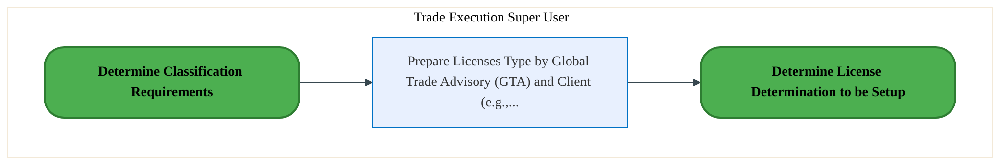
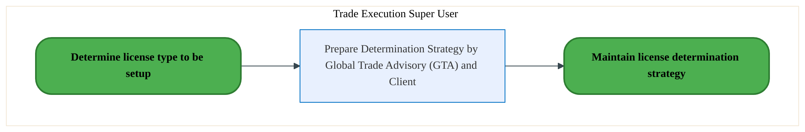
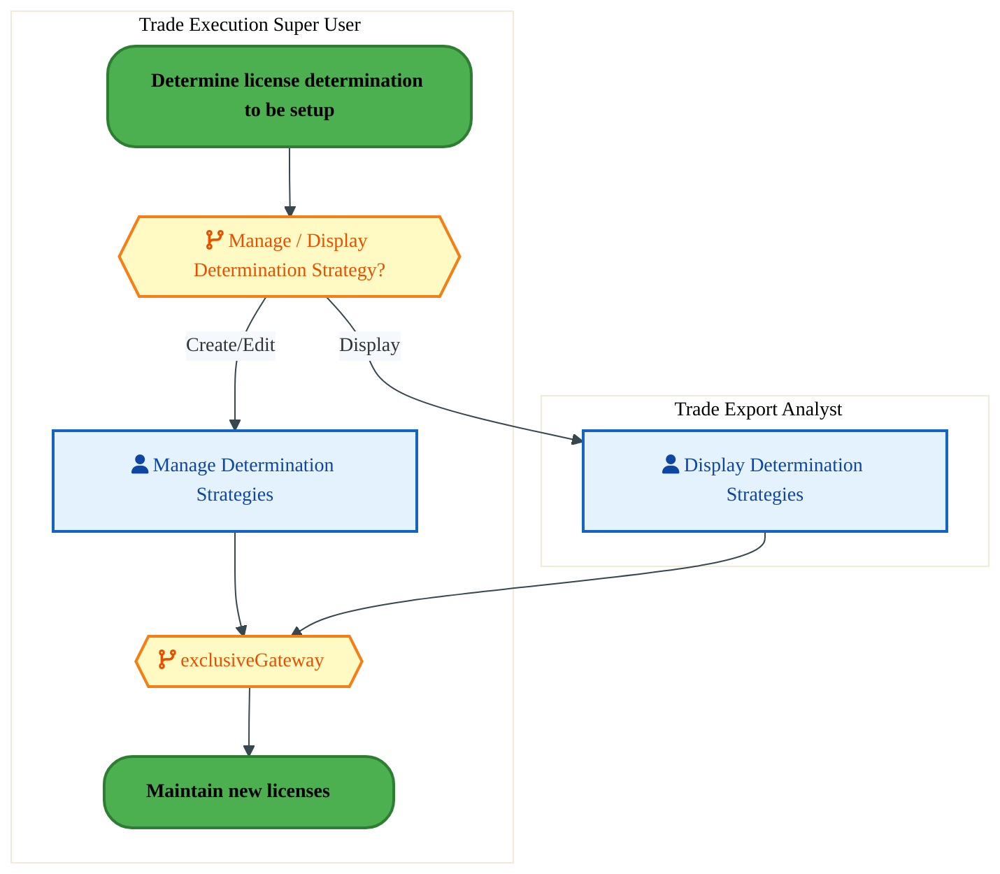
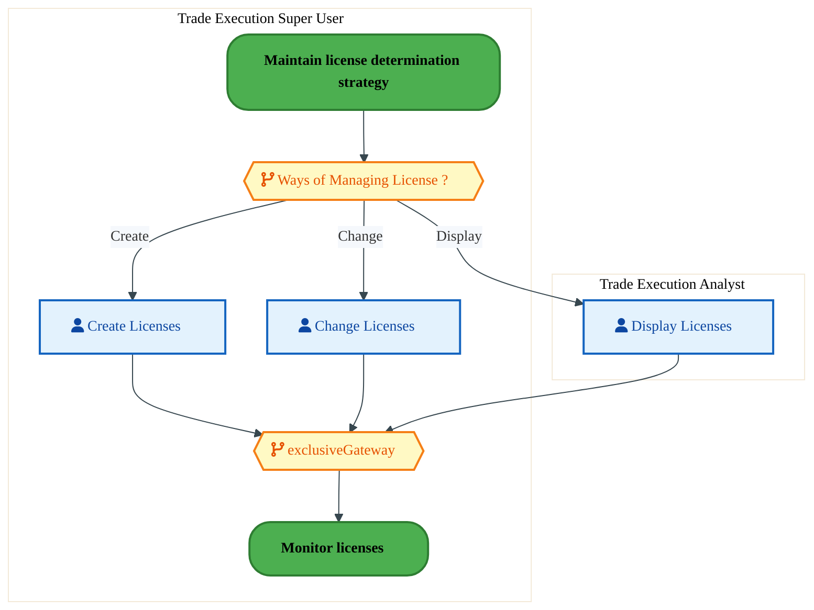

  
  <h1 style="font-size:36px; margin-top:24px;">GT-040 — Manage Licenses (IF)</h1>
  <h2 style="font-size:24px;">Architecture Document (TOGAF BDAT)</h2>
  
Order To Cash (IF) (OTC-IF) Tower 
  Capability GT-040 · GT Global Trade (IF)

  
IAO Program · Release 3 
  Generated: March 2026 
  Sajiv Francis

  
IAO Architecture Pipeline — Intel Confidential

Page 1<a href="#toc">↑ Back to TOC</a>GT-040 — Manage Licenses (IF)

## Table of Contents

<nav class="toc">
<ol>
  <li><a href="#1-executive-summary">1. Executive Summary</a></li>
  <li><a href="#2-business-context-objectives">2. Business Context &amp; Objectives</a>
    <ul>
      <li><a href="#21-classification">2.1 Classification</a></li>
      <li><a href="#22-business-drivers">2.2 Business Drivers</a></li>
      <li><a href="#23-success-criteria">2.3 Success Criteria</a></li>
      <li><a href="#24-companion-documents">2.4 Companion Documents</a></li>
    </ul>
  </li>
  <li><a href="#3-business-architecture-togaf-b">3. Business Architecture (TOGAF &ldquo;B&rdquo;)</a>
    <ul>
      <li><a href="#31-business-process-overview">3.1 Business Process Overview</a></li>
      <li><a href="#32-business-process-diagrams">3.2 Business Process Diagrams</a></li>
      <li><a href="#33-business-roles-responsibilities">3.3 Business Roles &amp; Responsibilities</a></li>
    </ul>
  </li>
  <li><a href="#4-data-architecture-togaf-d">4. Data Architecture (TOGAF &ldquo;D&rdquo;)</a>
    <ul>
      <li><a href="#41-data-entities-ownership">4.1 Data Entities &amp; Ownership</a></li>
      <li><a href="#42-data-flow-diagrams">4.2 Data Flow Diagrams</a></li>
      <li><a href="#43-data-lineage">4.3 Data Lineage</a></li>
      <li><a href="#44-ricefw-data-objects">4.4 RICEFW Data Objects</a></li>
      <li><a href="#45-data-governance-quality">4.5 Data Governance &amp; Quality</a></li>
    </ul>
  </li>
  <li><a href="#5-application-architecture-togaf-a">5. Application Architecture (TOGAF &ldquo;A&rdquo;)</a>
    <ul>
      <li><a href="#51-current-state-current-state-application-landscape">5.1 Current-State Application Landscape</a></li>
      <li><a href="#52-future-state-future-state-application-landscape">5.2 Future-State Application Landscape</a></li>
      <li><a href="#53-change-impact-summary">5.3 Change Impact Summary</a></li>
      <li><a href="#54-component-overview">5.4 Component Overview</a></li>
      <li><a href="#55-ricefw-inventory">5.5 RICEFW Inventory</a></li>
      <li><a href="#56-integration-patterns">5.6 Integration Patterns</a></li>
    </ul>
  </li>
  <li><a href="#6-technology-architecture-togaf-t">6. Technology Architecture (TOGAF &ldquo;T&rdquo;)</a>
    <ul>
      <li><a href="#61-platform-infrastructure">6.1 Platform &amp; Infrastructure</a></li>
      <li><a href="#62-sap-development-object-status">6.2 SAP Development Object Status</a></li>
      <li><a href="#63-nfrs-design-principles">6.3 NFRs &amp; Design Principles</a></li>
      <li><a href="#64-security-governance">6.4 Security &amp; Governance</a></li>
    </ul>
  </li>
  <li><a href="#7-project-context">7. Project Context</a>
    <ul>
      <li><a href="#71-project-roadmap-go-live-plan">7.1 Project Roadmap &amp; Go-Live Plan</a></li>
      <li><a href="#72-raid-log">7.2 RAID Log</a></li>
      <li><a href="#73-recommendations-next-steps">7.3 Recommendations &amp; Next Steps</a></li>
    </ul>
  </li>
</ol>
</nav>

Page 2<a href="#toc">↑ Back to TOC</a>GT-040 — Manage Licenses (IF)

## 1. Executive Summary

This Architecture Document defines the **Business, Data, Application, and Technology** (BDAT) architecture for **GT-040 Manage Licenses (IF)** within the IAO program. It includes 5 BPMN process diagram(s) in Section 3.
| Dimension | Value |
|-----------|-------|
| **Tower** | Order To Cash (IF) (OTC-IF) |
| **Process Group** | GT Global Trade (IF) |
| **Capability** | GT-040 - Manage Licenses (IF) |
| **Release** | Release 3 |
| **Total Systems** | 0 |
| **System Status** | 0 Deployed, 0 Developing, 0 EOL, 0 Pending IAPM |
| **RICEFW Objects** | 11 Interfaces, 64 Enhancements, 11 Forms, 1 Workflows |
**Change Summary**: 0 new flow chains, 0 removed, 0 modified, 0 unchanged between Current-State and Future-State states.

> All system nodes in architecture diagrams are **IAPM-linked** — click any node to open its IAPM page. Diagrams require `securityLevel: 'loose'` for click events.

Page 3<a href="#toc">↑ Back to TOC</a>GT-040 — Manage Licenses (IF)

## 2. Business Context & Objectives

### 2.1 Classification

| Level | Value |
|-------|-------|
| **L0 Tower** | Order To Cash (IF) |
| **L1 Process** | GT Global Trade (IF) |
| **L2 Capability** | GT-040 - Manage Licenses (IF) |

### 2.2 Business Drivers

| # | Driver | Description | Strategic Alignment | Priority |
|---|--------|-------------|---------------------|----------|
| 1 | Foundry Customer Order Digitization | Digitize end-to-end order capture, pricing, and fulfillment for Intel Foundry customers | IDM 2.0 Foundry Revenue | High |
| 2 | Global Trade Compliance Automation | Automate export/import compliance screening and customs declarations | Global Trade Operations | High |
| 3 | Revenue Recognition Accuracy | Ensure compliant revenue recognition aligned with ASC 606 through S/4 HANA billing | Finance & Compliance | Medium |
| 4 | GT-040 Process Migration | Migrate Manage Licenses (IF) business processes and 0 integrated systems from legacy to S/4 HANA target architecture | IDM 2.0 Order Management (Intel Foundry) | High |

Page 4<a href="#toc">↑ Back to TOC</a>GT-040 — Manage Licenses (IF)

### 2.3 Success Criteria

| Metric | Target | Measure | Baseline | Owner |
|--------|--------|---------|----------|-------|
| Order-to-Cash Cycle Time | < 5 business days | End-to-end cycle from order capture to cash application | 8 business days (legacy) | OTC Process Owner |
| Trade Compliance Screening Rate | 100% | Orders screened for denied parties and export controls | 99.2% (current) | Global Trade Manager |
| Billing Accuracy | > 99.8% | Invoices generated without errors requiring credit/re-bill | 98.5% (current) | Billing Manager |
| GT-040 Migration Completeness | 100% flow chains validated | All 0 flow chains verified in target state | 0% (pre-migration) | Tower Architect |

### 2.4 Companion Documents

| Document | Description |
|----------|-------------|
| **Business Architecture** | Included in this document (Section 3) — process flows from BPMN diagrams |
| **This Document** | Full BDAT Architecture — Business + Data + Application + Technology |

Page 5<a href="#toc">↑ Back to TOC</a>GT-040 — Manage Licenses (IF)

## 3. Business Architecture (TOGAF "B")

### 3.1 Business Process Overview

This capability includes **5 business process(es)** modeled in BPMN 2.0, covering the end-to-end workflow for GT-040 Manage Licenses (IF).

| # | Step ID | Process Name | Lanes | Tasks | Gateways |
|---|---------|--------------|-------|-------|----------|
| 1 | GT-040-010_Determine_license_type_to_be_setup_(IF) | GT-040-010_Determine_license_type_to_be_setup_(IF) | Trade Execution Super User | 1 | 0 |
| 2 | GT-040-020_Determine_license_determination_to_be_setup_(IF) | GT-040-020_Determine_license_determination_to_be_setup_(IF) | Trade Execution Super User | 1 | 0 |
| 3 | GT-040-030_Maintain_license_determination_strategy_(IF) | GT-040-030_Maintain_license_determination_strategy_(IF) | Trade Execution Super User, Trade Export Analyst | 2 | 2 |
| 4 | GT-040-040_Maintain_new_licenses_(IF) | GT-040-040_Maintain_new_licenses_(IF) | Trade Execution Analyst, Trade Execution Super User | 3 | 2 |
| 5 | GT-040-050_Monitor_licenses_(IF) | GT-040-050_Monitor_licenses_(IF) | Trade Execution Analyst | 2 | 0 |

Page 6<a href="#toc">↑ Back to TOC</a>GT-040 — Manage Licenses (IF)

### 3.2 Business Process Diagrams

#### BUSINESS ARCHITECTURE — 3.2.1 GT-040-010_Determine_license_type_to_be_setup_(IF) — GT-040-010_Determine_license_type_to_be_setup_(IF)

**Swim Lanes**: Trade Execution Super User | **Tasks**: 1 | **Gateways**: 0

> **Legend**: ● Start · ● End · User Task · Service Task · ◇ Gateway · Sub-Process

<a href="https://mermaid.live/view#pako:eNqlVE2P2jAU_CtWVihbKaB8EppDJQhkVamVVoVtD6UHJ3kBa42d2g6QIv57HQJhodpTc4jiybyZ90a2D0bGczAio9c7EEZUhA6mWsMGzAiZKZZgWqgFvmNBcEpBmg2n4EzNyZ8TzfHLfUNrsARvCK0bdA4rDujls4XGupBaSGIm-xIEKUzLLAXZYFHHnHLRsB9gVNjFye38a8JFDuJKsO3QyQJdSgmDK-yFfugnTZ2EjLP8RrQIilGRmcemOcp32RoLdWq_kvAV73-QXK31usBUguas1YZ-wSnQZkYlqgbLKrG9hEFk48N0YPMSZ4StNO7bGhKYvV6hwD4e0bHXW7LOFC2mS4b0k1Es5RQKJJWGZ1uFCkJp9ODH4ySwLakEf4XowZ2FU8-1smaSSI9uW024_R2Q1VpFKaf5mdrfNTNEbrm3xD5ybUvU-n3nBSy_OsVDd-SOOqdJ6MROfHEqiuK_nHSuYoHl69lr5iVuMu28nGAYxPa_epcxp344du5zArElGbwRTZLEm12jmg0Dx35fdJJ4Qzu-E11hBTtcXwU_xn4nmARh4oTvCrZ-911W6bPg2UXQmwVJ0AmGEycZu-8K-mPHH5071Dorgcs1WgicA5rtIasU4QzNqxIEetFptMTmYc7PpfEsoMQC0BcdEpMg0aIuAaU1eqI8xfQsNM63RHJRo8enxfgDwixHMSXAFHqEwWpgDQaDpfHrjbSrpaegQGz0abuIowuCTz0pjlJAc1BVeVvs3RTHTUikIFlb9Q1-V0ToC4Up2ZXpHdp-MAf1-5-0_3nptcu3u0L_7E7PDex1sGEZG-2OSW5EB-N0fekrLocCV1QZR8vAleLzmmVGdDrmRlXmektMCdbpb1rw-BdGj6XR" title="View full diagram">&#128065; View Full Diagram</a>

#### BUSINESS ARCHITECTURE — 3.2.2 GT-040-020_Determine_license_determination_to_be_setup_(IF) — GT-040-020_Determine_license_determination_to_be_setup_(IF)

**Swim Lanes**: Trade Execution Super User | **Tasks**: 1 | **Gateways**: 0

> **Legend**: ● Start · ● End · User Task · Service Task · ◇ Gateway · Sub-Process

<a href="https://mermaid.live/view#pako:eNqlVF2Lm0AU_SuDS7AFA37G1IdCYuJS6MJCsu1D04dRr8mwkxmZGZPYkP_eMRrzUfapguIczz3n3uPo0ch4DkZkDAZHwoiK0NFUG9iCGSEzxRJMC7XADywITilIs-EUnKkF-XOmOX55aGgNluAtoXWDLmDNAb19s9BEF1ILSczkUIIghWmZpSBbLOqYUy4a9hOMC7s4u3WPplzkIK4E2w6dLNCllDC4wl7oh37S1EnIOMvvRIugGBeZeWqao3yfbbBQ5_YrCS_48JPkaqPXBaYSNGejtvQ7ToE2MypRNVhWid0lDCIbH6YDW5Q4I2ytcd_WkMDs_QoF9umEToPBivWmaDlbMaSPjGIpZ1AgqTQ83ylUEEqjJz-eJIFtSSX4O0RP7jycea6VNZNEenTbasId7oGsNypKOc076nDfzBC55cESh8i1LVHr64MXsPzqFI_csTvunaahEzvxxakoiv9y0rmKJZbvndfcS9xk1ns5wSiI7X_1LmPO_HDiPOYEYkcyuBFNksSbX6OajwLH_lh0mngjO34QXWMFe1xfBb_Efi-YBGHihB8Ktn6PXVbpq-DZRdCbB0nQC4ZTJ5m4Hwr6E8cfdx1qnbXA5QYtBc4BzQ-QVYpwhhZVCQK96TRaYnMw59fKeBVQYgFoBgrEljDc0pXQI65rlNbomfIU005xku-I5KJGn56Xk88IsxzFlABTK-P3jbKrlV8wYUqfiOr8mQSU31nIzuK-0NOFl1agr1R1qS8cpaDfp6rKvkbvzPaGOWg4_KqNu6XXLm93g37YfzV3sNfDhmVstTUmuREdjfNvS__acihwRZVxsgxcKb6oWWZE58_bqMpcDzEjWKe-bcHTX1K_pPU=" title="View full diagram">&#128065; View Full Diagram</a>

Page 7<a href="#toc">↑ Back to TOC</a>GT-040 — Manage Licenses (IF)

#### BUSINESS ARCHITECTURE — 3.2.3 GT-040-030_Maintain_license_determination_strategy_(IF) — GT-040-030_Maintain_license_determination_strategy_(IF)

**Swim Lanes**: Trade Execution Super User · Trade Export Analyst | **Tasks**: 2 | **Gateways**: 2

> **Legend**: ● Start · ● End · User Task · Service Task · ◇ Gateway · Sub-Process

<a href="https://mermaid.live/view#pako:eNqlVduO2jAQ_RUrK5SXoM2V0Dy0glyqSl2pErvtQ-mDSSZgrXEi21mgLP9emxBuhb40EkhzPHPOzHHsbI28KsCIjF5vSxiREdqacgFLMCNkzrAA00It8B1zgmcUhKlzyorJCfm9T3P8eq3TNJbhJaEbjU5gXgF6-WKhkSqkFhKYib4ATkrTMmtOlphv4opWXGc_wLC0y73aYWlc8QL4KcG2QycPVCklDE6wF_qhn-k6AXnFigvSMiiHZW7udHO0WuULzOW-_UbAE17_IIVcqLjEVIDKWcgl_YpnQPWMkjcayxv-1plBhNZhyrBJjXPC5gr3bQVxzF5PUGDvdmjX603ZURQ9J1OG1JNTLEQCJRJSwembRCWhNHrw41EW2JaQvHqF6MFNw8RzrVxPEqnRbUub218BmS9kNKtocUjtr_QMkVuvLb6OXNviG_V_pQWsOCnFA3foDo9K49CJnbhTKsvyv5SUr_wZi9eDVuplbpYctZxgEMT233zdmIkfjpxrn4C_kRzOSLMs89KTVekgcOz7pOPMG9jxFekcS1jhzYnwQ-wfCbMgzJzwLmGrd91lM_vGq7wj9NIgC46E4djJRu5dQn_k-MNDh4pnznG9QM8cF4DSNeSNJBVDk6YGjl6UG22ifpjzc2qUOCpxX_uOnjDDc0AJSOBLwnBbKLkadk5ATI1fZ7Weqn3ChEn1QwxWiCqXmbhO81VaRwhdDiouJGSFZqA2Sjb1ZXGw3XYN6lumP1PnJF90fT6ihIiaqm242fHm09TY7c7YBrfZYJ3TRpA3-Nxu6qlKvfZ3XK0rdSRHDNONkGcK7qWf_2zv3NCjEPNRv_9RDX4InTYcHMJBG3qH0L1cDXT4PjViDkrgMS2InBrviuRq_dDWfs09ew-1XHf-LmD3Nuwd76AL2L8NB92huUAHHWpYxlKZhElhRFtj_8FQH5UCStxQaewsAzeymmxYbkT7i9Vo6kJVJgSrnVm24O4PpXYdXw==" title="View full diagram">&#128065; View Full Diagram</a>

Page 8<a href="#toc">↑ Back to TOC</a>GT-040 — Manage Licenses (IF)

#### BUSINESS ARCHITECTURE — 3.2.4 GT-040-040_Maintain_new_licenses_(IF) — GT-040-040_Maintain_new_licenses_(IF)

**Swim Lanes**: Trade Execution Analyst · Trade Execution Super User | **Tasks**: 3 | **Gateways**: 2

> **Legend**: ● Start · ● End · User Task · Service Task · ◇ Gateway · Sub-Process

<a href="https://mermaid.live/view#pako:eNqlVcuO2jAU_RUrI8QmSHkSmkUrCKSq1JEqMdNZlC5MYifWGAfZDo8y-ffaecCEAXXRSCDd43PPufc6dk5GUqTICI3B4EQYkSE4DWWONmgYguEaCjQ0QQP8hJzANUViqDm4YHJJ_tQ029seNE1jMdwQetToEmUFAs_fTDBVidQEAjIxEogTPDSHW042kB-jghZcsx_QBFu4dmuXZgVPEb8QLCuwE1-lUsLQBXYDL_BinSdQUrC0J4p9PMHJsNLF0WKf5JDLuvxSoEd4eCGpzFWMIRVIcXK5od_hGlHdo-SlxpKS77phEKF9mBrYcgsTwjKFe5aCOGSvF8i3qgpUg8GKnU3B03zFgHoSCoWYIwyEVPBiJwEmlIYPXjSNfcsUkhevKHxwFsHcdcxEdxKq1i1TD3e0RyTLZbguaNpSR3vdQ-hsDyY_hI5l8qP6v_JCLL04RWNn4kzOTrPAjuyoc8IY_5eTmit_guK19Vq4sRPPz162P_Yj66Ne1-bcC6b29ZwQ35EEvRON49hdXEa1GPu2dV90FrtjK7oSzaBEe3i8CH6KvLNg7AexHdwVbPyuqyzXP3iRdILuwo_9s2Aws-Opc1fQm9repK1Q6WQcbnPwxGGKwOKAklKSgoEpg_QoZMPSD3N_rQwMQwxHeuhgTsSWqpa-q2ExgcTK-N2Q1eb_Q3tZbpXAs1J5J2_35aMcsgx9VK-5zhWXIzXfO1xPcR8LddMUHNCbDF8zIGFS_ToKSJFEfEMYrCtWo1QO2bGfOD6dujr0pTZaq2OZ5OAFHgUoMHiEDGbqhHaFgS8ro6re5Qe389EhoaUgO_S1eWsuWefRMh-MRp9VBW0YNKHXhk4TBm1o98OxDt9WRjO2lfGmEq6X6unXS_bVUrvv9Zrbrrk9g_ol1a7d4ezBzm3YvQ1753urB_u34XF30Hpo0KGGaWzUpkKSGuHJqD8y6kOUIgxLKo3KNGApi-WRJUZYX8ZGuU1V5pxA9R5vGrD6C5q1KBU=" title="View full diagram">&#128065; View Full Diagram</a>

#### BUSINESS ARCHITECTURE — 3.2.5 GT-040-050_Monitor_licenses_(IF) — GT-040-050_Monitor_licenses_(IF)

**Swim Lanes**: Trade Execution Analyst | **Tasks**: 2 | **Gateways**: 0

```mermaid
%%{init: {'theme': 'base', 'themeVariables': {'fontSize': '14px', 'fontFamily': 'Segoe UI, Arial, sans-serif','primaryColor': '#e8f0fe', 'primaryBorderColor': '#0071c5','lineColor': '#37474F', 'secondaryColor': '#f5f8fc'}, 'flowchart': {'useMaxWidth': false, 'htmlLabels': true, 'curve': 'basis', 'nodeSpacing': 40, 'rankSpacing': 50}} }%%
flowchart TD
    classDef startEvt fill:#4CAF50,stroke:#2E7D32,color:#000,font-weight:bold,stroke-width:2px,rx:20,ry:20
    classDef endEvt fill:#C62828,stroke:#B71C1C,color:#fff,font-weight:bold,stroke-width:2px,rx:20,ry:20
    classDef userTask fill:#E3F2FD,stroke:#1565C0,stroke-width:2px,color:#0D47A1
    classDef serviceTask fill:#FFF3E0,stroke:#E65100,stroke-width:2px,color:#BF360C
    classDef gateway fill:#FFF9C4,stroke:#F57F17,stroke-width:2px,color:#E65100
    classDef subProc fill:#F3E5F5,stroke:#7B1FA2,stroke-width:2px,color:#4A148C
    subgraph Trade Execution Analyst
        n1["fa:fa-user Display Existing Licenses"]
        n2["fa:fa-user Display Assigned Documents"]
        n3(["fa:fa-stop Licenses Assigned"])
        n4["Maintain new licenses"]
    end
    n4 --> n1
    n2 --> n3
    n1 --> n2
    class n1 userTask
    class n2 userTask
    class n3 endEvt
    class n4 startEvt
```

> **Legend**: ● Start · ● End · User Task · Service Task · ◇ Gateway · Sub-Process

<a href="https://mermaid.live/view#pako:eNqlVNuK2zAQ_RXhJbgFB3yNUz8UEl-gsIVCtu1D0wfFHiViZdlI8iZpyL9XShwnm-4-1WDjOT5zzsxY0sEqmwqsxBqNDpRTlaCDrTZQg50ge4Ul2A46Az-woHjFQNqGQxquFvTPieaF7c7QDFbgmrK9QRewbgB9_-KgmU5kDpKYy7EEQYnt2K2gNRb7tGGNMOwHmBKXnNz6T_NGVCCuBNeNvTLSqYxyuMJBHMZhYfIklA2vXomSiExJaR9NcazZlhss1Kn8TsJXvPtJK7XRMcFMguZsVM0e8QqY6VGJzmBlJ14uw6DS-HA9sEWLS8rXGg9dDQnMn69Q5B6P6DgaLflgip6yJUf6KhmWMgOCpNJw_qIQoYwlD2E6KyLXkUo0z5A8-HmcBb5Tmk4S3brrmOGOt0DXG5WsGlb11PHW9JD47c4Ru8R3HbHXzzsv4NXVKZ34U386OM1jL_XSixMh5L-c9FzFE5bPvVceFH6RDV5eNIlS91-9S5tZGM-8-zmBeKEl3IgWRRHk11Hlk8hz3xedF8HETe9E11jBFu-vgp_ScBAsorjw4ncFz373VXarb6IpL4JBHhXRIBjPvWLmvysYzrxw2leoddYCtxv0JHAFKN9B2SnacDTjmO2lOrPMxb1fS4vghOCxGTrKqGyZbinfUan0OkSPempcglxav2-y_LezZlLSNYcKZU3Z1cDVXVrwYciTqmkH8SFR0z_e8ENN_4opV_pGHLaI3Vej1-T5hYdoPP6s--lD_xwGfeidQ_9m4Aa8LLRXsP82HPQb4BUYDjvQcqwaRI1pZSUH63TW6fOwAoI7pqyjY-FONYs9L63kdCZYXVvp9ZNRrH9VfQaPfwGGErHT" title="View full diagram">&#128065; View Full Diagram</a>

Page 9<a href="#toc">↑ Back to TOC</a>GT-040 — Manage Licenses (IF)

### 3.3 Business Roles & Responsibilities

| Role / Lane | Processes Involved | Description |
|------------|-------------------|-------------|
| Trade Execution Super User | GT-040-010_Determine_license_type_to_be_setup_(IF), GT-040-020_Determine_license_determination_to_be_setup_(IF), GT-040-030_Maintain_license_determination_strategy_(IF), GT-040-040_Maintain_new_licenses_(IF),  | |
| Trade Export Analyst | GT-040-030_Maintain_license_determination_strategy_(IF),  | |
| Trade Execution Analyst | GT-040-040_Maintain_new_licenses_(IF), GT-040-050_Monitor_licenses_(IF) | |

Page 10<a href="#toc">↑ Back to TOC</a>GT-040 — Manage Licenses (IF)

## 4. Data Architecture (TOGAF "D")

### 4.1 Data Entities & Ownership

The following data entities are derived from the system integration flows for GT-040. Tower architects should validate ownership and classification.

| # | Data Entity | Source System | Target System | Data Owner | Classification | Volume | Master/Transaction |
|---|-------------|---------------|---------------|------------|----------------|--------|-------------------|

Page 11<a href="#toc">↑ Back to TOC</a>GT-040 — Manage Licenses (IF)

### 4.2 Data Flow Diagrams

> **DATA ARCHITECTURE** — Database-to-database data flows. Applications (blue) sit above their hosting databases (green cylinders). Thick arrows show data movement between databases.

### 4.3 Data Lineage

Data lineage traces the origin and transformation path of key data objects across integrated systems.

| # | Source System | Source Schema/Object | Target System | Target Schema/Object | Transformation |
|---|-------------|---------------------|---------------|---------------------|---------------|

> *Lineage detail will be refined when tower architects validate source/target schema object mappings.*

### 4.4 RICEFW Data Objects

Reports and Conversions for this capability will be populated from the Smartsheet Object Tracker via automated API extraction.

| Object ID | Type | Description | Status | Source | Target | Complexity |
|-----------|------|-------------|--------|--------|--------|-----------|
| GT-040-R001 | Report | Manage Licenses (IF) operational report | Planned | SAP S/4HANA | Analytics | Medium |
| GT-040-C001 | Conversion | Legacy data migration for Manage Licenses (IF) | Planned | Legacy ERP | SAP S/4HANA | High |

> *Pending: Smartsheet API integration to auto-populate live RICEFW data (see Build Requirements).*

### 4.5 Data Governance & Quality

| Concern | Approach |
|---------|----------|
| Data Ownership | Per-entity owners listed in Section 3.1 |
| Data Classification | Financial data classified as Intel Confidential |
| Data Retention | Per Intel corporate retention policies |
| Data Quality | Validated at source; reconciliation at target |

Page 12<a href="#toc">↑ Back to TOC</a>GT-040 — Manage Licenses (IF)

## 5. Application Architecture (TOGAF "A")

### 5.1 Current-State — Current-State Application Landscape

#### Overview

The Current-State architecture represents the **current / legacy** landscape for GT-040.

#### Current-State Flow Narrative

*(No current-state flows defined.)*

### 5.2 Future-State — Future-State Application Landscape

#### Overview

The Future-State architecture represents the **target** landscape for GT-040.

#### Future-State Flow Narrative

*(No future-state flows defined.)*

### 5.3 Change Impact Summary

| Change Type | Flow Chain | Detail |
|-------------|-----------|--------|

**Totals**: 0 new - 0 removed - 0 modified - 0 unchanged

### 5.4 Component Overview

#### System Inventory

| System | IAPM ID | Status |
|--------|---------|--------|

Page 13<a href="#toc">↑ Back to TOC</a>GT-040 — Manage Licenses (IF)

### 5.5 RICEFW Inventory

| Object ID | Type | Description | Status | Source → Target | Middleware | Complexity |
|-----------|------|-------------|--------|----------------|-----------|-----------|
| OTCW0638 | Workflow | Dispute Write-off Workflow | 10. Object Complete |  | NA | 03.Medium |
| OTCI1162 | Interface | Inbound interface to change the sales order via Build Instructions | 10. Object Complete |  | MULESOFT | 03.Medium |
| OTCI1161 | Interface | Inbound interface from BY-PDH to S4 to update CMAD in IF sales orders | 10. Object Complete | BY → S/4 | BODS | 03.Medium |
| OTCI1126 | Interface | Inbound interface to create and change sales order via Subcon, STO & SIMS PO | 10. Object Complete |  | MULESOFT | 02.High |
| OTCI0442 | Interface | IF: Interface requirement from SAC to S4 | 10. Object Complete | SAC → S/4 | BODS | 03.Medium |
| OTCF0681_IF | Form | Form development for Intercompany Invoice. | 10. Object Complete |  | NA | 03.Medium |
| OTCF0460_IF | Form | Form Development for Invoice list. | 10. Object Complete | NA → NA | NA | 03.Medium |
| OTCF0431 | Form | Generate Custom Late Payment Interest Charge Output Form | 10. Object Complete | NA → NA | NA | 03.Medium |
| OTCF0290 | Form | Dunning output form customization | 10. Object Complete | NA → NA | NA | 03.Medium |
| OTCE1698 | Enhancement | Additional material attributes for transfer from MDG to GTS to support produc... | 10. Object Complete | NA → NA | NA | 03.Medium |
| OTCE1668_IF | Enhancement | Enhancement to transfer Customs value from S4 to GTS for Sales orders and del... | 10. Object Complete |  | NA | 04.Low |
| OTCE1662 | Enhancement | BADI Enhancement for Dispute Write off (workflow Trigger) | 10. Object Complete |  | NA | 03.Medium |
| OTCE1658 | Enhancement | Dispute Write-off Enhancement | 10. Object Complete |  | NA | 04.Low |
| OTCE1655 | Enhancement | Enhancement to AIF capabilities on access and notifications | 10. Object Complete |  | NA | 03.Medium |
| OTCE1625 | Enhancement | Credit hold release dashboard at line-item level | 10. Object Complete | NA → NA | NA | 01.Very High |
| OTCE1558 | Enhancement | Business users want the capability to have CMIR updated for the specific Mate... | 10. Object Complete |  | NA | 03.Medium |
| OTCE1557 | Enhancement | Business users want the capability to have sales order updated for the specif... | 10. Object Complete |  | NA | 02.High |
| OTCE1200 | Enhancement | Enhancement to transfer fields from Sales Orders to Purchase Requisition duri... | 10. Object Complete |  | NA | 03.Medium |
| OTCE1124 | Enhancement | Enhancement to support Inbound interface to change the ship to party record a... | 10. Object Complete |  | NA | 03.Medium |
| OTCE1123 | Enhancement | Determine Confirmed Delivery date in sales orders at schedule line level base... | 06. Dev In Progress |  | NA | 02.High |
| OTCE1122 | Enhancement | Enhancement for IMR to update the Repair Sales Order post Repair work order i... | 10. Object Complete |  | NA | 03.Medium |
| OTCE1106 | Enhancement | Enhancement to support Inbound interface and manual upload to create the sale... | 10. Object Complete |  | NA | 02.High |
| OTCE1013 | Enhancement | SIMS Enhancement to determine the order type based on the Material Characteri... | 10. Object Complete |  | NA | 04.Low |
| OTCE0974 | Enhancement | Screen enhancement to populate the assignment priority at SO line item | 10. Object Complete |  | NA | 04.Low |
| OTCE0659 | Enhancement | IF : Apply a Delivery Block Hold for Items with Multiple Schedule lines (MSL)... | 10. Object Complete |  | NA | 03.Medium |
| OTCE0651_IF | Enhancement | Enrich the delivery data transfer data from S/4 IF to GTS with the 'new' vs '... | 10. Object Complete |  | NA | 03.Medium |
| OTCE0614_IF | Enhancement | Implement Standard Credit/Collection BADI | 10. Object Complete |  | NA | 04.Low |
| OTCE0486 | Enhancement | Price Swamp: For Order Repricing | 10. Object Complete | NA → NA | NA | 03.Medium |
| OTCE0235 | Enhancement | Credit and Collections - Credit Check Step Configuration | 10. Object Complete | NA → NA | NA | 04.Low |
| OTCE0234 | Enhancement | Implement mapping between customer’s risk class and credit check steps | 10. Object Complete | NA → NA | NA | 03.Medium |
| LOGI1688 | Interface | To capture correct Country of Assembly and Country of Fabrication on FVR and ... | 10. Object Complete |  | MuleSoft | 03.Medium |
| LOGI1534_IF | Interface | BRF+ Extractor( API interface) to fetch the data saved in the BRF+ decision t... | 10. Object Complete |  | NA | 04.Low |
| LOGI0871 | Interface | Interface for Label printing, So in this interface when user will click on pr... | 10. Object Complete | SPECTRUM → S/4 | NA | 02.High |
| LOGI0842_IF | Interface | Interface from SAP S4 to DBaaS to Fetch Actual COF for FVR batch and COA for ... | 10. Object Complete | S/4 → DBaaS | MULESOFT | 04.Low |
| LOGI0800_IF | Interface | Interface to send shipment information to custom broker | 10. Object Complete | S/4 → OpenText | MULESOFT | 04.Low |
| LOGI0663_IF | Interface | Trigger ZCUS (export customs clearance output) and ZXCI to send outputs - ZSI... | 10. Object Complete |  | MULESOFT | 03.Medium |
| LOGI0630_IF | Interface | TM - GTT: GXS sending carrier events back to GTT app “Shipment Tracking”. IF. | 10. Object Complete |  | NA | 04.Low |
| LOGF1673 | Form | Consolidated Export CI for Wafer Die (Ireland) | 10. Object Complete |  | NA | 03.Medium |
| LOGF1672 | Form | Consolidated Export CI for Finished Goods (Ireland) | 10. Object Complete |  | NA | 03.Medium |
| LOGF1149_IF | Form | Consolidated Packing list for Chengdu | 10. Object Complete |  | NA | 03.Medium |
| LOGF0873 | Form | CI/PL document should be printed based on R3 process. | 10. Object Complete |  | NA | 02.High |
| LOGF0356 | Form | Generate Consolidated Bailment Commercial Invoice - Finished Goods (IF and IP) | 10. Object Complete | NA → NA | NA | 02.High |
| LOGF0355 | Form | Generate Consolidated Bailment Commercial Invoice - Wafer/Die (IF and IP) | 10. Object Complete | NA → NA | NA | 03.Medium |
| LOGF0349_IF | Form | ISM - Generate Packing List - IF/IP | 10. Object Complete | NA → NA | NA | 03.Medium |
| LOGE1624 | Enhancement | Development of LCSR tool in Fiori | 10. Object Complete |  | NA | 01.Very High |
| LOGE1509_IF | Enhancement | Tendering- FIORI app for Approval Hierarchy (Assign Delegate) | 10. Object Complete |  | NA | 03.Medium |
| LOGE1488_IF | Enhancement | Invoice notification- Notification to carrier for POD and internal notificati... | 10. Object Complete |  | NA | 03.Medium |
| LOGE1487_IF | Enhancement | Carrier notification- Carrier contact table BRF+ maintenance | 10. Object Complete |  | NA | 03.Medium |
| LOGE1486_IF | Enhancement | Carrier notification- Cancellation email | 10. Object Complete |  | NA | 03.Medium |
| LOGE1485_IF | Enhancement | Carrier notification- Acceptance and Rejection email | 10. Object Complete |  | NA | 03.Medium |
| LOGE1484_IF | Enhancement | Invoice notification- Notification to carrier for Invoice | 10. Object Complete |  | NA | 03.Medium |
| LOGE1483_IF | Enhancement | Invoice notification- Notification to carrier for dispute | 10. Object Complete |  | NA | 03.Medium |
| LOGE1482_IF | Enhancement | Tendering- Internal Notification mail | 10. Object Complete |  | NA | 04.Low |
| LOGE1481_IF | Enhancement | Tendering- Approval Process with Purchase group determination | 10. Object Complete |  | NA | 04.Low |
| LOGE1462_IF | Enhancement | TM - GTT: Send Event # Estimated Time of Arrival (ETA) as a separate event fr... | 10. Object Complete |  | NA | 04.Low |
| LOGE1461_IF | Enhancement | TM - GTT: To propagate events to S/4 TM Freight order reported by GXS by Bypa... | 10. Object Complete |  | NA | 04.Low |
| LOGE1460_IF | Enhancement | TM - GTT: Additional field needs to be captured in S/4 TM Freight Order “Note... | 10. Object Complete |  | NA | 04.Low |
| LOGE1459_IF | Enhancement | TM - GTT: Additional field values sent by carrier through GXS are required in... | 10. Object Complete |  | NA | 04.Low |
| LOGE1297_IF | Enhancement | Disable the Amount field within Subcontracting tab in Freight Order for CW Lo... | 10. Object Complete |  | NA | 04.Low |
| LOGE1256_IF | Enhancement | TM - GTT: Document type T54 (House Airway Bill) number to GTT | 10. Object Complete |  | NA | 04.Low |
| LOGE1251_IF | Enhancement | More determinization of input entry criteria to be added for dedicated carrie... | 10. Object Complete |  | NA | 03.Medium |
| LOGE1250_IF | Enhancement | Creating new Carrier selection strategy methods ZPRE_TAL and ZPOST_TAL to cal... | 10. Object Complete |  | NA | 03.Medium |
| LOGE1197_IF | Enhancement | Carrier notification- Tendering initiation email | 10. Object Complete |  | NA | 03.Medium |
| LOGE1196_IF | Enhancement | Invoice notification- Notification to carrier for POD and internal notificati... | 10. Object Complete |  | NA | 03.Medium |
| LOGE0841 | Enhancement | Enhancement to display an error message in the pack transaction within SAP Ex... | 10. Object Complete |  | NA | 03.Medium |
| LOGE0797_IF | Enhancement | Pre alert notification to Customer | 10. Object Complete |  | NA | 04.Low |
| LOGE0796_IF | Enhancement | Custom transaction to trigger CUSDEC | 10. Object Complete |  | NA | 03.Medium |
| LOGE0792_IF | Enhancement | Enhancement to Update Custom Table form Master data and Manage SOP Data Commu... | 10. Object Complete |  | NA | 04.Low |
| LOGE0791_IF | Enhancement | Creation of Proforma Invoice ZF8 from Freight Order and Save ITN Number in De... | 10. Object Complete |  | NA | 04.Low |
| LOGE0782 | Enhancement | Enhancement to RF Loading Screen for 3PV Validation | 10. Object Complete |  | NA | 02.High |
| LOGE0775 | Enhancement | Enhancement in packing transaction. Should allow user to launch Interface for... | 10. Object Complete |  | NA | 03.Medium |
| LOGE0772_IF | Enhancement | Develop Fiori app to View/Edit/Add SOP data(CMDB). | 10. Object Complete |  | NA | 03.Medium |
| LOGE0766_IF | Enhancement | TM - GTT: Routing of events from GTT to correct S4 system | 10. Object Complete |  | NA | 04.Low |
| LOGE0765_IF | Enhancement | Calling a new BRF+ for Carrier exclusion during Carrier Selection process. Eg... | 10. Object Complete |  | NA | 04.Low |
| LOGE0673_IF | Enhancement | Data code extractor to be extended on S4 TM side​ | 10. Object Complete |  | NA | 04.Low |
| LOGE0632_IF | Enhancement | TM: Custom Determination Class to access Source and Destination country in FU... | 10. Object Complete |  | NA | 03.Medium |
| LOGE0628_IF | Enhancement | CRF freight orders, should have a custom event type “Shipped –CRF". This cust... | 10. Object Complete |  | NA | 03.Medium |
| LOGE0626_IF | Enhancement | FO subcontracting screen for tendering enhancement. Fields include- send for ... | 10. Object Complete |  | NA | 03.Medium |
| LOGE0625_IF | Enhancement | Tendering- FIORI app for Approval Hierarchy (Assign Delegate) | 10. Object Complete |  | NA | 03.Medium |
| LOGE0547_IF | Enhancement | Mass upload – Custom TM program for below items. Resource Downtime upload.Not... | 10. Object Complete | NA → NA | NA | 03.Medium |
| LOGE0546_IF | Enhancement | Mass upload – Custom TM program for below items. Schedule and Default Routes ... | 10. Object Complete | NA → NA | NA | 03.Medium |
| LOGE0511_IF | Enhancement | Mass upload – Custom TM program for below items. Mass upload program to creat... | 10. Object Complete | NA → NA | NA | 03.Medium |
| LOGE0478_IF | Enhancement | Generate Automated Carrier Pre-Alert (ZPRC) from SAP TM. | 10. Object Complete | NA → NA | NA | 04.Low |
| LOGE0459_IF | Enhancement | In SAP TM, Custom carrier selection strategy - Carrier Selection -Custom Stra... | 10. Object Complete | NA → NA | NA | 04.Low |
| LOGE0458_IF | Enhancement | In SAP TM, Custom carrier selection strategy - Carrier Selection -Custom Stra... | 10. Object Complete | NA → NA | NA | 04.Low |
| LOGE0457_IF | Enhancement | In SAP TM, Custom carrier selection strategy - Carrier Selection -Custom Stra... | 10. Object Complete | NA → NA | NA | 04.Low |
| LOGE0456_IF | Enhancement | In SAP TM, Custom carrier selection strategy - Carrier Selection UI enhanceme... | 10. Object Complete | NA → NA | NA | 04.Low |

**Summary**: 11 Interfaces, 64 Enhancements, 11 Forms, 1 Workflows

Page 14<a href="#toc">↑ Back to TOC</a>GT-040 — Manage Licenses (IF)

### 5.6 Integration Patterns

Integration patterns identified from the system flow analysis for GT-040:

| # | Pattern | Flow Chain | Middleware | Protocol | Auth |
|---|---------|-----------|-----------|----------|------|

> *Integration pattern details will be refined when tower architects validate middleware assignments.*

Page 15<a href="#toc">↑ Back to TOC</a>GT-040 — Manage Licenses (IF)

## 6. Technology Architecture (TOGAF "T")

### 6.1 Platform & Infrastructure

> **TECHNOLOGY / PLATFORM ARCHITECTURE** — Platforms (green) host applications (blue). Thick arrows show platform-to-platform integration flows.

#### Platform Inventory

Platform landscape inferred from integrated systems for GT-040:

| # | Platform | Type | Systems Using | Environment |
|---|----------|------|--------------|-------------|
| 1 | SAP S/4HANA | On-Premise (HEC) | SAP S/4 modules | DEV, QAS, PRD |
| 2 | SAP BTP (Integration Suite) | Cloud / PaaS | CPI, API Management | DEV, QAS, PRD |
| 3 | MuleSoft Anypoint | Cloud / iPaaS | API-led integrations | DEV, QAS, PRD |

> *Platform assignments will be validated when tower architects populate technology platform columns.*

Page 16<a href="#toc">↑ Back to TOC</a>GT-040 — Manage Licenses (IF)

### 6.2 SAP Development Object Status

| Metric | DEV | QAS | PRD |
|--------|-----|-----|-----|
| Transport Requests | — | — | — |
| Custom Code Objects | — | — | — |
| CDS Views | — | — | — |
| Fiori Apps | — | — | — |
| BAdIs / Enhancements | — | — | — |

### 6.3 NFRs & Design Principles

| Category | Requirement | Target / SLA | Priority |
|----------|-------------|-------------|----------|
| Performance | Order/transaction processing within interactive SLA | < 3 seconds for online transactions | High |
| Availability | Business-critical systems available during extended hours | 99.9% (06:00-22:00 all time zones) | High |
| Scalability | Support seasonal and promotional volume spikes | Handle 2x baseline transaction volume | Medium |
| Recoverability | Customer-facing systems recover within business impact window | RPO < 30 min, RTO < 2 hours | High |
| Data Volume | Support transactional data growth from business expansion | 10M+ documents/year | Medium |
| Latency | Near-real-time integration for order status updates | < 30 seconds for status propagation | Medium |
| Concurrency | Support global user base across business functions | 300+ concurrent users | Medium |

### 6.4 Security & Governance

| Concern | Approach | Standard / Policy | Owner |
|---------|----------|--------------------|-------|
| Authentication | Single Sign-On (SSO) via Intel corporate Azure AD identity | Intel IT Security Policy - Identity Management | IT Security |
| Authorization | Role-based access control (RBAC) with SAP authorization objects | Intel SAP Security Standards - Role Design | SAP Security Team |
| Data Classification | All financial/operational data classified per Intel Data Classification Standard | Intel Data Classification Policy | Data Governance |
| Data Encryption (at rest) | AES-256 encryption for SAP HANA database and file storage | Intel Encryption Standard | Infrastructure Security |
| Data Encryption (in transit) | TLS 1.3 for all system-to-system and user-to-system communication | Intel Network Security Policy | Network Engineering |
| Network Segmentation | SAP systems in dedicated network zones with firewall controls | Intel Network Architecture Standard | Network Security |
| API Security | OAuth 2.0 / certificate-based authentication for all API integrations | Intel API Security Guidelines | Integration Architecture |
| Audit Logging | Comprehensive audit trail for all data changes and user actions (SAP Security Audit Log) | SOX Compliance / Intel Audit Policy | Internal Audit |
| Certificate Management | Automated certificate lifecycle management for system-to-system trust | Intel PKI Standard | Certificate Authority Team |
| Compliance | SOX controls, export control (EAR/ITAR) screening, data privacy (GDPR) | Intel Corporate Compliance Framework | Compliance Office |

Page 17<a href="#toc">↑ Back to TOC</a>GT-040 — Manage Licenses (IF)

## 7. Project Context

### 7.1 Project Roadmap & Go-Live Plan

| ID | Description | FS | TDD | Build | FUT | Status |
|----|-------------|----|-----|-------|-----|--------|
| OTCW0638 | Dispute Write-off Workflow | Aug-25 (100%) | Nov-25 (100%) | Nov-25 (100%) | Nov-25 (100%) | 2. At Risk |
| OTCI1162 | Inbound interface to change the sales order via Build Instructions | Mar-25 (100%) | Jun-25 (100%) | Jun-25 (100%) | Mar-26 (100%) | 2. At Risk |
| OTCI1161 | Inbound interface from BY-PDH to S4 to update CMAD in IF sales orders | Jun-25 (100%) | Nov-25 (100%) | Nov-25 (100%) | Nov-25 (100%) | 1. On Track |
| OTCI1126 | Inbound interface to create and change sales order via Subcon, STO & SIMS PO | Apr-25 (100%) | Jul-25 (100%) | Jul-25 (100%) | Jan-26 (100%) | 4. Completed |
| OTCI0442 | IF: Interface requirement from SAC to S4 | Sep-24 (100%) | Mar-25 (100%) | Mar-25 (100%) | Dec-25 (100%) | 4. Completed |
| OTCF0681_IF | Form development for Intercompany Invoice. | Nov-24 (100%) | Mar-25 (100%) | Mar-25 (100%) | Jul-25 (100%) |  |
| OTCF0460_IF | Form Development for Invoice list. | Sep-24 (100%) | Jan-25 (100%) | Jan-25 (100%) | Jan-25 (100%) |  |
| OTCF0431 | Generate Custom Late Payment Interest Charge Output Form | Aug-24 (100%) | Jan-25 (100%) | Jan-25 (100%) | May-25 (100%) |  |
| OTCF0290 | Dunning output form customization | Jul-24 (100%) | Jan-25 (100%) | Jan-25 (100%) | Mar-25 (100%) |  |
| OTCE1698 | Additional material attributes for transfer from MDG to GTS to support produc... | Nov-24 (100%) | Mar-25 (100%) | Mar-25 (100%) | Dec-25 (100%) |  |
| OTCE1668_IF | Enhancement to transfer Customs value from S4 to GTS for Sales orders and del... | Jan-26 (100%) | Feb-26 (100%) | Feb-26 (100%) | Mar-26 (100%) | 1. On Track |
| OTCE1662 | BADI Enhancement for Dispute Write off (workflow Trigger) | Nov-25 (100%) | Nov-25 (100%) | Nov-25 (100%) | Nov-25 (100%) | 2. At Risk |
| OTCE1658 | Dispute Write-off Enhancement | Nov-25 (100%) | Nov-25 (100%) | Nov-25 (100%) | Nov-25 (100%) | 2. At Risk |
| OTCE1655 | Enhancement to AIF capabilities on access and notifications | Jun-25 (100%) | Nov-25 (100%) | Nov-25 (100%) | Jan-26 (100%) | 1. On Track |
| OTCE1625 | Credit hold release dashboard at line-item level | Jul-24 (100%) | Sep-25 (100%) | Sep-25 (100%) | Feb-26 (100%) | 1. On Track |
| OTCE1558 | Business users want the capability to have CMIR updated for the specific Mate... | Oct-25 (100%) | Nov-25 (100%) | Nov-25 (100%) | Nov-25 (100%) | 4. Completed |
| OTCE1557 | Business users want the capability to have sales order updated for the specif... | Oct-25 (100%) | Dec-25 (100%) | Dec-25 (100%) | Jan-26 (100%) | 4. Completed |
| OTCE1200 | Enhancement to transfer fields from Sales Orders to Purchase Requisition duri... | Jul-25 (100%) | Nov-25 (100%) | Nov-25 (100%) | Nov-25 (100%) | 4. Completed |
| OTCE1124 | Enhancement to support Inbound interface to change the ship to party record a... | Apr-25 (100%) | Aug-25 (100%) | Aug-25 (100%) | Jan-26 (100%) | 3. Off Track |
| OTCE1123 | Determine Confirmed Delivery date in sales orders at schedule line level base... | Jun-25 (100%) | Nov-25 (60%) | Nov-25 (60%) | Nov-25 (100%) | 4. Completed |
*... and 67 more objects (see full Object Tracker)*

Page 18<a href="#toc">↑ Back to TOC</a>GT-040 — Manage Licenses (IF)

### 7.2 RAID Log

Standard RAID items for GT-040 (Order To Cash (IF)):

| # | Category | Description | Status | Owner | Priority |
|---|----------|-------------|--------|-------|----------|
| 1 | Risk | Data migration completeness — validate all legacy Manage Licenses (IF) data maps to S/4 target structures | Open | Tower Architect | High |
| 2 | Risk | Integration testing coverage — ensure all 0 integrated systems are validated end-to-end | Open | Integration Lead | High |
| 3 | Assumption | Target SAP S/4HANA system available in DEV/QAS per release schedule | Active | SAP Basis | Medium |
| 4 | Issue | API access provisioning — SAP OData, Smartsheet, and IAPM API credentials required for automation | Open | EA Pipeline Team | High |
| 5 | Dependency | Upstream BPMN process models validated and signed off by business process owners | Active | Process Owner | Medium |

> *Live RAID data will be auto-populated from the Smartsheet RAID log via API integration.*

### 7.3 Recommendations & Next Steps

| # | Category | Recommendation | Priority | Owner | Target Date | Status |
|---|----------|---------------|----------|-------|-------------|--------|
| 1 | Architecture | Complete extended flow attributes (Data Entity, Integration Pattern, Tech Platform) in Flows tab for full BDAT coverage | High | Tower Architect | 2026-Q2 | Open |
| 2 | Data | Define data ownership and classification for all 0 flow chains to satisfy Data Architecture (TOGAF D) requirements | Medium | Data Architect | 2026-Q3 | Open |
| 3 | Testing | Develop integration test scenarios covering all 0 flow chains for FUT/SIT readiness | High | Test Lead | 2026-Q3 | Open |
| 4 | Business Architecture | Review and validate Business Architecture process steps against latest Signavio/BIC process models | Medium | Business Analyst | 2026-Q2 | Open |
| 5 | Security | Complete security review for API integrations and data flows per Intel Security Architecture standards | Medium | Security Architect | 2026-Q3 | Open |

---
*GT-040 — Architecture Document (TOGAF BDAT) · Order To Cash (IF) · Generated: March 2026*

Page 19<a href="#toc">↑ Back to TOC</a>GT-040 — Manage Licenses (IF)

