  <img src="data:image/svg+xml;base64,PHN2ZyB4bWxucz0iaHR0cDovL3d3dy53My5vcmcvMjAwMC9zdmciIHZpZXdCb3g9IjAgMCA4MDAgNDgwIiB3aWR0aD0iODAwIiBoZWlnaHQ9IjQ4MCI+DQogIDxkZWZzPg0KICAgIDxsaW5lYXJHcmFkaWVudCBpZD0iYmciIHgxPSIwJSIgeTE9IjAlIiB4Mj0iMTAwJSIgeTI9IjEwMCUiPg0KICAgICAgPHN0b3Agb2Zmc2V0PSIwJSIgc3R5bGU9InN0b3AtY29sb3I6IzAwNzFjNTtzdG9wLW9wYWNpdHk6MSIvPg0KICAgICAgPHN0b3Agb2Zmc2V0PSIxMDAlIiBzdHlsZT0ic3RvcC1jb2xvcjojMDBhZWVmO3N0b3Atb3BhY2l0eToxIi8+DQogICAgPC9saW5lYXJHcmFkaWVudD4NCiAgICA8bGluZWFyR3JhZGllbnQgaWQ9ImFjY2VudCIgeDE9IjAlIiB5MT0iMCUiIHgyPSIwJSIgeTI9IjEwMCUiPg0KICAgICAgPHN0b3Agb2Zmc2V0PSIwJSIgc3R5bGU9InN0b3AtY29sb3I6I2ZmZmZmZjtzdG9wLW9wYWNpdHk6MC4xNSIvPg0KICAgICAgPHN0b3Agb2Zmc2V0PSIxMDAlIiBzdHlsZT0ic3RvcC1jb2xvcjojZmZmZmZmO3N0b3Atb3BhY2l0eTowLjAyIi8+DQogICAgPC9saW5lYXJHcmFkaWVudD4NCiAgICA8cGF0dGVybiBpZD0iZ3JpZCIgd2lkdGg9IjQwIiBoZWlnaHQ9IjQwIiBwYXR0ZXJuVW5pdHM9InVzZXJTcGFjZU9uVXNlIj4NCiAgICAgIDxwYXRoIGQ9Ik0gNDAgMCBMIDAgMCAwIDQwIiBmaWxsPSJub25lIiBzdHJva2U9InJnYmEoMjU1LDI1NSwyNTUsMC4wNykiIHN0cm9rZS13aWR0aD0iMC41Ii8+DQogICAgPC9wYXR0ZXJuPg0KICA8L2RlZnM+DQoNCiAgPCEtLSBCYWNrZ3JvdW5kIC0tPg0KICA8cmVjdCB3aWR0aD0iODAwIiBoZWlnaHQ9IjQ4MCIgZmlsbD0idXJsKCNiZykiIHJ4PSI4Ii8+DQogIDxyZWN0IHdpZHRoPSI4MDAiIGhlaWdodD0iNDgwIiBmaWxsPSJ1cmwoI2dyaWQpIiByeD0iOCIvPg0KICA8cmVjdCB3aWR0aD0iODAwIiBoZWlnaHQ9IjQ4MCIgZmlsbD0idXJsKCNhY2NlbnQpIiByeD0iOCIvPg0KDQogIDwhLS0gRGVjb3JhdGl2ZSBjaXJjdWl0L2FyY2hpdGVjdHVyZSBsaW5lcyAtLT4NCiAgPGcgc3Ryb2tlPSJyZ2JhKDI1NSwyNTUsMjU1LDAuMTIpIiBzdHJva2Utd2lkdGg9IjEuNSIgZmlsbD0ibm9uZSI+DQogICAgPHBhdGggZD0iTSAwIDEwMCBMIDEyMCAxMDAgTCAxNjAgMTQwIEwgMjgwIDE0MCIvPg0KICAgIDxwYXRoIGQ9Ik0gMCAyNjAgTCA4MCAyNjAgTCAxMjAgMjIwIEwgMjAwIDIyMCBMIDI0MCAyNjAgTCAzNjAgMjYwIi8+DQogICAgPHBhdGggZD0iTSA1MjAgMTAwIEwgNjAwIDEwMCBMIDY0MCA2MCBMIDgwMCA2MCIvPg0KICAgIDxwYXRoIGQ9Ik0gNDQwIDM0MCBMIDU2MCAzNDAgTCA2MDAgMzAwIEwgNzIwIDMwMCBMIDc2MCAzNDAgTCA4MDAgMzQwIi8+DQogICAgPHBhdGggZD0iTSA2MDAgNDAwIEwgNjgwIDQwMCBMIDcyMCA0NDAiLz4NCiAgICA8cGF0aCBkPSJNIDAgNDAwIEwgNDAgNDAwIEwgODAgMzYwIi8+DQogICAgPHBhdGggZD0iTSAyMDAgNDIwIEwgMzIwIDQyMCBMIDM2MCAzODAgTCA0ODAgMzgwIi8+DQogICAgPHBhdGggZD0iTSA2NTAgNDQwIEwgNzUwIDQ0MCBMIDgwMCA0ODAiLz4NCiAgPC9nPg0KDQogIDwhLS0gRGVjb3JhdGl2ZSBub2RlcyAtLT4NCiAgPGcgZmlsbD0icmdiYSgyNTUsMjU1LDI1NSwwLjE4KSI+DQogICAgPGNpcmNsZSBjeD0iMTIwIiBjeT0iMTAwIiByPSI0Ii8+DQogICAgPGNpcmNsZSBjeD0iMjgwIiBjeT0iMTQwIiByPSI0Ii8+DQogICAgPGNpcmNsZSBjeD0iMjAwIiBjeT0iMjIwIiByPSI0Ii8+DQogICAgPGNpcmNsZSBjeD0iMzYwIiBjeT0iMjYwIiByPSI0Ii8+DQogICAgPGNpcmNsZSBjeD0iNjAwIiBjeT0iMTAwIiByPSI0Ii8+DQogICAgPGNpcmNsZSBjeD0iNzIwIiBjeT0iMzAwIiByPSI0Ii8+DQogICAgPGNpcmNsZSBjeD0iNTYwIiBjeT0iMzQwIiByPSI0Ii8+DQogICAgPGNpcmNsZSBjeD0iODAiIGN5PSIzNjAiIHI9IjQiLz4NCiAgICA8Y2lyY2xlIGN4PSI0ODAiIGN5PSIzODAiIHI9IjQiLz4NCiAgICA8Y2lyY2xlIGN4PSIzMjAiIGN5PSI0MjAiIHI9IjQiLz4NCiAgPC9nPg0KDQogIDwhLS0gVE9HQUYgQkRBVCBib3hlcyAtLT4NCiAgPGcgZm9udC1mYW1pbHk9IlNlZ29lIFVJLCBBcmlhbCwgc2Fucy1zZXJpZiIgZm9udC1zaXplPSIxNCIgZm9udC13ZWlnaHQ9IjYwMCI+DQogICAgPCEtLSBCIC0tPg0KICAgIDxyZWN0IHg9IjE1MCIgeT0iMTQwIiB3aWR0aD0iMTIwIiBoZWlnaHQ9IjQwIiByeD0iNSIgZmlsbD0icmdiYSgyNTUsMjU1LDI1NSwwLjE4KSIgc3Ryb2tlPSJyZ2JhKDI1NSwyNTUsMjU1LDAuMykiIHN0cm9rZS13aWR0aD0iMSIvPg0KICAgIDx0ZXh0IHg9IjIxMCIgeT0iMTY1IiB0ZXh0LWFuY2hvcj0ibWlkZGxlIiBmaWxsPSIjZmZmIj5CdXNpbmVzczwvdGV4dD4NCiAgICA8IS0tIEQgLS0+DQogICAgPHJlY3QgeD0iMjkwIiB5PSIxNDAiIHdpZHRoPSIxMjAiIGhlaWdodD0iNDAiIHJ4PSI1IiBmaWxsPSJyZ2JhKDI1NSwyNTUsMjU1LDAuMTgpIiBzdHJva2U9InJnYmEoMjU1LDI1NSwyNTUsMC4zKSIgc3Ryb2tlLXdpZHRoPSIxIi8+DQogICAgPHRleHQgeD0iMzUwIiB5PSIxNjUiIHRleHQtYW5jaG9yPSJtaWRkbGUiIGZpbGw9IiNmZmYiPkRhdGE8L3RleHQ+DQogICAgPCEtLSBBIC0tPg0KICAgIDxyZWN0IHg9IjQzMCIgeT0iMTQwIiB3aWR0aD0iMTIwIiBoZWlnaHQ9IjQwIiByeD0iNSIgZmlsbD0icmdiYSgyNTUsMjU1LDI1NSwwLjE4KSIgc3Ryb2tlPSJyZ2JhKDI1NSwyNTUsMjU1LDAuMykiIHN0cm9rZS13aWR0aD0iMSIvPg0KICAgIDx0ZXh0IHg9IjQ5MCIgeT0iMTY1IiB0ZXh0LWFuY2hvcj0ibWlkZGxlIiBmaWxsPSIjZmZmIj5BcHBsaWNhdGlvbjwvdGV4dD4NCiAgICA8IS0tIFQgLS0+DQogICAgPHJlY3QgeD0iNTcwIiB5PSIxNDAiIHdpZHRoPSIxMjAiIGhlaWdodD0iNDAiIHJ4PSI1IiBmaWxsPSJyZ2JhKDI1NSwyNTUsMjU1LDAuMTgpIiBzdHJva2U9InJnYmEoMjU1LDI1NSwyNTUsMC4zKSIgc3Ryb2tlLXdpZHRoPSIxIi8+DQogICAgPHRleHQgeD0iNjMwIiB5PSIxNjUiIHRleHQtYW5jaG9yPSJtaWRkbGUiIGZpbGw9IiNmZmYiPlRlY2hub2xvZ3k8L3RleHQ+DQogIDwvZz4NCg0KICA8IS0tIENvbm5lY3RpbmcgbGluZXMgYmV0d2VlbiBCREFUIGJveGVzIC0tPg0KICA8ZyBzdHJva2U9InJnYmEoMjU1LDI1NSwyNTUsMC4yNSkiIHN0cm9rZS13aWR0aD0iMSI+DQogICAgPGxpbmUgeDE9IjI3MCIgeTE9IjE2MCIgeDI9IjI5MCIgeTI9IjE2MCIvPg0KICAgIDxsaW5lIHgxPSI0MTAiIHkxPSIxNjAiIHgyPSI0MzAiIHkyPSIxNjAiLz4NCiAgICA8bGluZSB4MT0iNTUwIiB5MT0iMTYwIiB4Mj0iNTcwIiB5Mj0iMTYwIi8+DQogIDwvZz4NCg0KICA8IS0tIE1haW4gdGl0bGUgLS0+DQogIDx0ZXh0IHg9IjQwMCIgeT0iMjYwIiB0ZXh0LWFuY2hvcj0ibWlkZGxlIiBmb250LWZhbWlseT0iU2Vnb2UgVUksIEFyaWFsLCBzYW5zLXNlcmlmIiBmb250LXNpemU9IjM2IiBmb250LXdlaWdodD0iNzAwIiBmaWxsPSIjZmZmZmZmIiBsZXR0ZXItc3BhY2luZz0iMSI+DQogICAgSUFPIEFyY2hpdGVjdHVyZQ0KICA8L3RleHQ+DQogIDx0ZXh0IHg9IjQwMCIgeT0iMzAwIiB0ZXh0LWFuY2hvcj0ibWlkZGxlIiBmb250LWZhbWlseT0iU2Vnb2UgVUksIEFyaWFsLCBzYW5zLXNlcmlmIiBmb250LXNpemU9IjE4IiBmb250LXdlaWdodD0iNDAwIiBmaWxsPSJyZ2JhKDI1NSwyNTUsMjU1LDAuOCkiIGxldHRlci1zcGFjaW5nPSIyIj4NCiAgICBUT0dBRiBCREFUIMK3IElBTyBQcm9ncmFtIMK3IElETSAyLjANCiAgPC90ZXh0Pg0KDQogIDwhLS0gQm90dG9tIGFjY2VudCBiYXIgLS0+DQogIDxyZWN0IHg9IjI4MCIgeT0iMzQwIiB3aWR0aD0iMjQwIiBoZWlnaHQ9IjMiIHJ4PSIxLjUiIGZpbGw9InJnYmEoMjU1LDI1NSwyNTUsMC40KSIvPg0KDQogIDwhLS0gSW50ZWwgdGV4dCAtLT4NCiAgPHRleHQgeD0iNDAwIiB5PSIzODAiIHRleHQtYW5jaG9yPSJtaWRkbGUiIGZvbnQtZmFtaWx5PSJTZWdvZSBVSSwgQXJpYWwsIHNhbnMtc2VyaWYiIGZvbnQtc2l6ZT0iMTMiIGZpbGw9InJnYmEoMjU1LDI1NSwyNTUsMC41KSIgbGV0dGVyLXNwYWNpbmc9IjMiPg0KICAgIElOVEVMIENPTkZJREVOVElBTA0KICA8L3RleHQ+DQo8L3N2Zz4NCg==" alt="IAO Architecture" style="width:100%; border-radius:8px;" />
  <h1 style="font-size:36px; margin-top:24px;">LO-180 — Manage Outbound Transportation - OTC (IF)</h1>
  <h2 style="font-size:24px;">Architecture Document (TOGAF BDAT)</h2>
  
Order To Cash (IF) (OTC-IF) Tower 
  Capability LO-180 · LO Logistics Management Outbound - OTC (IF)

  
IAO Program · R1 – R5 
  Generated: April 2026 
  Sajiv Francis

  
IAO Architecture Pipeline — Intel Confidential

Page 1<a href="#toc">↑ Back to TOC</a>LO-180 — Manage Outbound Transportation - OTC (IF)

## Table of Contents

<nav class="toc">
<ol>
  <li><a href="#1-executive-summary">1. Executive Summary</a></li>
  <li><a href="#2-business-context-objectives">2. Business Context &amp; Objectives</a>
    <ul>
      <li><a href="#21-classification">2.1 Classification</a></li>
      <li><a href="#22-business-drivers">2.2 Business Drivers</a></li>
      <li><a href="#23-success-criteria">2.3 Success Criteria</a></li>
      <li><a href="#24-companion-documents">2.4 Companion Documents</a></li>
    </ul>
  </li>
  <li><a href="#3-business-architecture-togaf-b">3. Business Architecture (TOGAF &ldquo;B&rdquo;)</a>
    <ul>
      <li><a href="#31-business-process-overview">3.1 Business Process Overview</a></li>
      <li><a href="#32-business-process-diagrams">3.2 Business Process Diagrams</a></li>
      <li><a href="#33-business-roles-responsibilities">3.3 Business Roles &amp; Responsibilities</a></li>
    </ul>
  </li>
  <li><a href="#4-data-architecture-togaf-d">4. Data Architecture (TOGAF &ldquo;D&rdquo;)</a>
    <ul>
      <li><a href="#41-data-entities-ownership">4.1 Data Entities &amp; Ownership</a></li>
      <li><a href="#42-data-flow-diagrams">4.2 Data Flow Diagrams</a></li>
      <li><a href="#43-data-lineage">4.3 Data Lineage</a></li>
      <li><a href="#44-ricefw-data-objects">4.4 RICEFW Data Objects</a></li>
      <li><a href="#45-data-governance-quality">4.5 Data Governance &amp; Quality</a></li>
    </ul>
  </li>
  <li><a href="#5-application-architecture-togaf-a">5. Application Architecture (TOGAF &ldquo;A&rdquo;)</a>
    <ul>
      <li><a href="#54-component-overview">5.4 Component Overview</a></li>
      <li><a href="#55-ricefw-inventory">5.5 RICEFW Inventory</a>
        <ul>
          <li><a href="#551-eca-dependencies">5.5.1 ECA Dependencies</a></li>
          <li><a href="#552-boundary-application-dependencies">5.5.2 Boundary Application Dependencies</a></li>
        </ul>
      </li>
      <li><a href="#56-integration-patterns">5.6 Integration Patterns</a></li>
    </ul>
  </li>
  <li><a href="#6-technology-architecture-togaf-t">6. Technology Architecture (TOGAF &ldquo;T&rdquo;)</a>
    <ul>
      <li><a href="#61-platform-infrastructure">6.1 Platform &amp; Infrastructure</a></li>
      <li><a href="#62-sap-development-object-status">6.2 SAP Development Object Status</a></li>
      <li><a href="#63-nfrs-design-principles">6.3 NFRs &amp; Design Principles</a></li>
      <li><a href="#64-security-governance">6.4 Security &amp; Governance</a></li>
    </ul>
  </li>
  <li><a href="#7-project-context">7. Project Context</a>
    <ul>
      <li><a href="#71-project-roadmap-go-live-plan">7.1 Project Roadmap &amp; Go-Live Plan</a></li>
      <li><a href="#72-raid-log">7.2 RAID Log</a></li>
      <li><a href="#73-recommendations-next-steps">7.3 Recommendations &amp; Next Steps</a></li>
    </ul>
  </li>
</ol>
</nav>

Page 2<a href="#toc">↑ Back to TOC</a>LO-180 — Manage Outbound Transportation - OTC (IF)

## 1. Executive Summary

This Architecture Document defines the **Business, Data, Application, and Technology** (BDAT) architecture for **LO-180 Manage Outbound Transportation - OTC (IF)** within the IAO program. It includes 2 BPMN process diagram(s) in Section 3.

| Dimension | Value |
|-----------|-------|
| **Tower** | Order To Cash (IF) (OTC-IF) |
| **Process Group** | LO Logistics Management Outbound - OTC (IF) |
| **Capability** | LO-180 - Manage Outbound Transportation - OTC (IF) |
| **Release** | R1 – R5 |
| **Total Systems** | 0 |
| **System Status** | 0 Deployed, 0 Developing, 0 EOL, 0 Pending IAPM |
| **RICEFW Objects** | 2 Interfaces, 6 Enhancements, 6 Forms |

> All system nodes in architecture diagrams are **IAPM-linked** — click any node to open its IAPM page. Diagrams require `securityLevel: 'loose'` for click events.

Page 3<a href="#toc">↑ Back to TOC</a>LO-180 — Manage Outbound Transportation - OTC (IF)

## 2. Business Context & Objectives

### 2.1 Classification

| Level | Value |
|-------|-------|
| **L0 Tower** | Order To Cash (IF) |
| **L1 Process** | LO Logistics Management Outbound - OTC (IF) |
| **L2 Capability** | LO-180 - Manage Outbound Transportation - OTC (IF) |

### 2.2 Business Drivers

| # | Driver | Description | Strategic Alignment | Priority |
|---|--------|-------------|---------------------|----------|
| 1 | Foundry Customer Order Digitization | Digitize end-to-end order capture, pricing, and fulfillment for Intel Foundry customers | IDM 2.0 Foundry Revenue | High |
| 2 | Global Trade Compliance Automation | Automate export/import compliance screening and customs declarations | Global Trade Operations | High |
| 3 | Revenue Recognition Accuracy | Ensure compliant revenue recognition aligned with ASC 606 through S/4 HANA billing | Finance & Compliance | Medium |
| 4 | LO-180 Process Migration | Migrate Manage Outbound Transportation - OTC (IF) business processes and 0 integrated systems from legacy to S/4 HANA target architecture | IDM 2.0 Order Management (Intel Foundry) | High |

Page 4<a href="#toc">↑ Back to TOC</a>LO-180 — Manage Outbound Transportation - OTC (IF)

### 2.3 Success Criteria

| Metric | Target | Measure | Baseline | Owner |
|--------|--------|---------|----------|-------|
| Order-to-Cash Cycle Time | < 5 business days | End-to-end cycle from order capture to cash application | 8 business days (legacy) | OTC Process Owner |
| Trade Compliance Screening Rate | 100% | Orders screened for denied parties and export controls | 99.2% (current) | Global Trade Manager |
| Billing Accuracy | > 99.8% | Invoices generated without errors requiring credit/re-bill | 98.5% (current) | Billing Manager |
| LO-180 Migration Completeness | 100% flow chains validated | All 0 flow chains verified in target state | 0% (pre-migration) | Tower Architect |

### 2.4 Companion Documents

| Document | Description |
|----------|-------------|
| **Business Architecture** | Included in this document (Section 3) — process flows from BPMN diagrams |
| **This Document** | Full BDAT Architecture — Business + Data + Application + Technology |

Page 5<a href="#toc">↑ Back to TOC</a>LO-180 — Manage Outbound Transportation - OTC (IF)

## 3. Business Architecture (TOGAF "B")

### 3.1 Business Process Overview

This capability includes **2 business process(es)** modeled in BPMN 2.0, covering the end-to-end workflow for LO-180 Manage Outbound Transportation - OTC (IF).

| # | Step ID | Process Name | Lanes | Tasks | Gateways |
|---|---------|--------------|-------|-------|----------|
| 1 | LO-180-140_Record_Transportation_Information_-_OTC_(IF) | LO-180-140_Record_Transportation_Information_-_OTC_(IF) | Functional Analyst | 6 | 4 |
| 2 | LO-180-150_Generate_Shipping_Documentation_-_OTC_(IF) | LO-180-150_Generate_Shipping_Documentation_-_OTC_(IF) | Load Planner | 5 | 2 |

Page 6<a href="#toc">↑ Back to TOC</a>LO-180 — Manage Outbound Transportation - OTC (IF)

### 3.2 Business Process Diagrams

#### BUSINESS ARCHITECTURE — 3.2.1 LO-180-140_Record_Transportation_Information_-_OTC_(IF) — LO-180-140_Record_Transportation_Information_-_OTC_(IF)

**Swim Lanes**: Functional Analyst | **Tasks**: 6 | **Gateways**: 4

> **Legend**: ● Start · ● End · User Task · Service Task · ◇ Gateway · Sub-Process

<a href="https://mermaid.live/view#pako:eNqlVl1v4jgU_StWqooZKewkISE0D7uigXQqzWqqpbOVdlitTHIDVh07sp0Cy_Df1w4JlLQ8jJYHxD33nnM_sG-ys1KegRVZ19c7woiK0K6nVlBAL0K9BZbQs9EB-BMLghcUZM_E5JypGfm3DnP9cmPCDJbggtCtQWew5IC-3dtorInURhIz2ZcgSN6ze6UgBRbbmFMuTPQVjHInr7M1rlsuMhCnAMcJ3TTQVEoYnOBB6Id-YngSUs6yM9E8yEd52tub4ihfpyssVF1-JeF3vHkimVppO8dUgo5ZqYJ-wQugpkclKoOllXhph0GkycP0wGYlTglbatx3NCQwez5BgbPfo_319Zwdk6LHyZwh_UkplnICOZJKw9MXhXJCaXTlx-MkcGypBH-G6MqbhpOBZ6emk0i37thmuP01kOVKRQtOsya0vzY9RF65scUm8hxbbPV3Jxew7JQpHnojb3TMdBu6sRu3mfI8_1-Z9FzFI5bPTa7pIPGSyTGXGwyD2Hmr17Y58cOx250TiBeSwivRJEkG09OopsPAdS6L3iaDoRN3RJdYwRpvT4I3sX8UTIIwccOLgod83SqrxYPgaSs4mAZJcBQMb91k7F0U9MeuP2oq1DpLgcsVopjBP873uZVULFWEM0zRWH9tpZpbfx-CzYe533VQjqMc91O-RHfAQOju0Ofx0y0aS0mWrACmUMJFoZmvqd45NRZgiImo_3r01Vy_DmNwIVnMmeSUZPp3hqabkusTH9-jnAuU3HU0_J_XeMI5iE8TAh2p4FxqBkoTIa3MvNBMYVVJpDjq_QE429ZKj_qmSiON65hjdK-jPOyMhhclBV3kw909-oS-cKxLZFmHFH44kqTi5dtavpWH7jTSnfLHVzojLRNzvf4IM4Pp1PzhQZ8NpjcNKgXX5w2kjb6WihR6Gwt9XZTSPommKv3l4_lRudntTk1l0F9o4XSFYJPSSpIXuDvcirm1378-YM77ND2TgmdEbdHjtoTfuiz3xMJC8LXsY6pQiQWmFOiFVN7PkfReO_xgI9Tv_6pPdGP6B_OmMb2D6Ta7hQ3O3a57sIOOPWzsYUN3Wr9jgB9z66_Z_Wxu_dCCbz1Pk9rjN56gdXweJ7WjrcVtigtbu0nWtnJzbtcbx0S92otnHu-iZ3DR41_0BBc9w4uesHnenIGj4wPvDL5pV_F5d877sPs-7LWwZVsFiAKTzIp2Vv3Wot9sMshxRZW1ty1cKT7bstSK6qe7VdUXckKwXrrFAdz_B2mp4Sg=" title="View full diagram">&#128065; View Diagram</a>

Page 7<a href="#toc">↑ Back to TOC</a>LO-180 — Manage Outbound Transportation - OTC (IF)

#### BUSINESS ARCHITECTURE — 3.2.2 LO-180-150_Generate_Shipping_Documentation_-_OTC_(IF) — LO-180-150_Generate_Shipping_Documentation_-_OTC_(IF)

**Swim Lanes**: Load Planner | **Tasks**: 5 | **Gateways**: 2

```mermaid
%%{init: {'theme': 'base', 'themeVariables': {'fontSize': '14px', 'fontFamily': 'Segoe UI, Arial, sans-serif','primaryColor': '#e8f0fe', 'primaryBorderColor': '#0071c5','lineColor': '#37474F', 'secondaryColor': '#f5f8fc'}, 'flowchart': {'useMaxWidth': false, 'htmlLabels': true, 'curve': 'basis', 'nodeSpacing': 40, 'rankSpacing': 50}} }%%
flowchart TD
    classDef startEvt fill:#4CAF50,stroke:#2E7D32,color:#000,font-weight:bold,stroke-width:2px,rx:20,ry:20
    classDef endEvt fill:#C62828,stroke:#B71C1C,color:#fff,font-weight:bold,stroke-width:2px,rx:20,ry:20
    classDef userTask fill:#E3F2FD,stroke:#1565C0,stroke-width:2px,color:#0D47A1
    classDef serviceTask fill:#FFF3E0,stroke:#E65100,stroke-width:2px,color:#BF360C
    classDef gateway fill:#FFF9C4,stroke:#F57F17,stroke-width:2px,color:#E65100
    classDef subProc fill:#F3E5F5,stroke:#7B1FA2,stroke-width:2px,color:#4A148C
    subgraph lane_0["Load Planner"]
        n1["fa:fa-user Complete PGI of All the Deliveries"]
        n2[["fa:fa-cog Create Freight Order"]]
        n3[["fa:fa-cog Generate Carrier Pre Alert"]]
        n4[["fa:fa-cog Generate Consolidated Export CI for FG"]]
        n5[["fa:fa-cog Generate Consolidated Export CI for Wafer/Die"]]
        n6(["fa:fa-stop Output Message Status Updated (Success or Failure)"])
        n7["Coordinate Transportation (Planning profiles, Optimizer settings Etc.)"]
        n8{{"fa:fa-code-branch exclusiveGateway"}}
        n9{{"fa:fa-code-branch Type of Commodity?"}}
    end
    n7 --> n2
    n4 --> n8
    n5 --> n8
    n8 --> n6
    n3 --> n8
    n1 --> n9
    n2 --> n1
    n9 -->|"ZSIS"| n4
    n9 -->|"ZPRC"| n3
    n9 -->|"ZSWD"| n5
    class n1 userTask
    class n2 serviceTask
    class n3 serviceTask
    class n4 serviceTask
    class n5 serviceTask
    class n6 endEvt
    class n7 startEvt
    class n8 gateway
    class n9 gateway
```

> **Legend**: ● Start · ● End · User Task · Service Task · ◇ Gateway · Sub-Process

<a href="https://mermaid.live/view#pako:eNqlVW1v4jgQ_itWqopWCntJSAjkw51oIFWlXRUd3au0y-lkkglYNXFkOy0cy3-_MeEt7PHhdPkQZZ6Z55nx2J5srFRkYEXW7e2GFUxHZNPSC1hCKyKtGVXQskkN_EElozMOqmViclHoCft7F-b65cqEGSyhS8bXBp3AXAD5-mSTARK5TRQtVFuBZHnLbpWSLalcx4ILaaJvoJc7-S7b3vUgZAbyFOA4oZsGSOWsgBPcCf3QTwxPQSqKrCGaB3kvT1tbUxwXH-mCSr0rv1Lwha5eWaYXaOeUK8CYhV7yz3QG3KxRy8pgaSXfD81gyuQpsGGTkqasmCPuOwhJWrydoMDZbsn29nZaHJOSl-G0IPiknCo1hJwojfDoXZOccR7d-PEgCRxbaSneILrxRuGw49mpWUmES3ds09z2B7D5QkczwbN9aPvDrCHyypUtV5Hn2HKN74tcUGSnTHHX63m9Y6aH0I3d-JApz_P_lQn7Kl-oetvnGnUSLxkec7lBN4idn_UOyxz64cC97BPId5bCmWiSJJ3RqVWjbuA610Ufkk7XiS9E51TDB12fBPuxfxRMgjBxw6uCdb7LKqvZWIr0INgZBUlwFAwf3GTgXRX0B67f21eIOnNJywXhtIC_nO9T67OgGRmjWYCcWn_WYeYpXPTmNMpp23SdxGJZctBAxo9PRORkwDnBi0uGwNk73jpQTbr3_chPxZzEErApJJG7jSfP5vIh4ZzRaTIeAUsynJhKlJdkLAGzgtQXPP8aTxRKcJbhd0ZGq1LgPYmfSC4kSR4vNIL_rvFKc5C_DBlcSHXvjlJKi5I8V7qsNPkCStE5kImmulLka1lr3k2qNEUXMVVRxisJ9yh4fyYYol4scFyxwpT0gtNAmUKoZqIgd7vNw8lASinwfICyyXOp2RKnp8TjrTX6FBnp9NN9c4d6m81pzRm0ZyicLgisUl4p3NPH-hRPre32jNX_d9bLugRzLPCYLEXG9Pq3Ew_nQ_1RhKTd_hXPxt70a7O3N4Om2avN7t7sNL1ubfb3pleb--td9I35Y2p9mzxNptYPTHXpGP8e7xydnxivw50jOLuDJt1h9jRg73yANDydqx7_qie46unuh2wDDI9TvgH3DvOngfYPqGVbS5BLyjIr2li7fy_-nzPIacW1tbUtWmkxWRepFe3-UVa1O6pDRnF0LGtw-w8dgn8q" title="View full diagram">&#128065; View Diagram</a>

Page 8<a href="#toc">↑ Back to TOC</a>LO-180 — Manage Outbound Transportation - OTC (IF)

### 3.3 Business Roles & Responsibilities

| Role / Lane | Processes Involved | Description |
|------------|-------------------|-------------|
| Functional Analyst | LO-180-140_Record_Transportation_Information_-_OTC_(IF),  | |
| Load Planner | LO-180-150_Generate_Shipping_Documentation_-_OTC_(IF) | |

Page 9<a href="#toc">↑ Back to TOC</a>LO-180 — Manage Outbound Transportation - OTC (IF)

## 4. Data Architecture (TOGAF "D")

### 4.1 Data Flows — Source to Target

*Data flows with DB platform details will be populated when tower architects complete the extended flow template columns (42-47) via the Input Portal.*

### 4.2 Data Flow Diagrams

> **DATA ARCHITECTURE** — Database-to-database data flows. Applications (blue) sit above their hosting databases (green cylinders). Thick arrows show data movement between databases.

### 4.3 Data Lineage

*Data lineage (source schema/object → target schema/object mappings) will be populated when tower architects provide validated schema details via the Input Portal.*

### 4.4 RICEFW Data Objects

*RICEFW data objects (Reports and Conversions) will be auto-populated from the Smartsheet Object Tracker when matched to this capability.*

### 4.5 Data Governance & Quality

| Concern | Approach |
|---------|----------|
| Data Ownership | Per-entity owners listed in Section 3.1 |
| Data Classification | Financial data classified as Intel Confidential |
| Data Retention | Per Intel corporate retention policies |
| Data Quality | Validated at source; reconciliation at target |

Page 10<a href="#toc">↑ Back to TOC</a>LO-180 — Manage Outbound Transportation - OTC (IF)

## 5. Application Architecture (TOGAF "A")

### 5.4 Component Overview

#### System Inventory

| System | IAPM ID | Status |
|--------|---------|--------|

### 5.5 RICEFW Inventory

| Object ID | Type | Description | Status | Source → Target | Middleware | Boundary App | Interface Approach | Complexity |
|-----------|------|-------------|--------|----------------|-----------|-------------|-------------------|-----------|
| LOGI0842_IF | Interface | Interface from SAP S4 to DBaaS to Fetch Actual COF for FVR batch and COA for ... | 10. Object Complete | S/4 → DBaaS | MULESOFT | Supply Chain Trade Re-engineering Data Container for Intel Foundry |  | 04.Low |
| LOGI0800_IF | Interface | Interface to send shipment information to custom broker | 10. Object Complete | S/4 → OpenText | MULESOFT | OpenText |  | 04.Low |
| LOGF1673 | Form | Consolidated Export CI for Wafer Die (Ireland) | 10. Object Complete |  | NA |  |  | 03.Medium |
| LOGF1672 | Form | Consolidated Export CI for Finished Goods (Ireland) | 10. Object Complete |  | NA |  |  | 03.Medium |
| LOGF1149_IF | Form | Consolidated Packing list for Chengdu | 10. Object Complete |  | NA |  |  | 03.Medium |
| LOGF0873 | Form | CI/PL document should be printed based on R3 process. | 10. Object Complete |  | NA |  |  | 02.High |
| LOGF0356 | Form | Generate Consolidated Bailment Commercial Invoice - Finished Goods (IF and IP) | 10. Object Complete | NA → NA | NA |  |  | 02.High |
| LOGF0355 | Form | Generate Consolidated Bailment Commercial Invoice - Wafer/Die (IF and IP) | 10. Object Complete | NA → NA | NA |  |  | 03.Medium |
| LOGE1624 | Enhancement | Development of LCSR tool in Fiori | 10. Object Complete |  | NA |  |  | 01.Very High |
| LOGE0797_IF | Enhancement | Pre alert notification to Customer | 10. Object Complete |  | NA |  |  | 04.Low |
| LOGE0796_IF | Enhancement | Custom transaction to trigger CUSDEC | 10. Object Complete |  | NA |  |  | 03.Medium |
| LOGE0792_IF | Enhancement | Enhancement to Update Custom Table form Master data and Manage SOP Data Commu... | 10. Object Complete |  | NA |  |  | 04.Low |
| LOGE0791_IF | Enhancement | Creation of Proforma Invoice ZF8 from Freight Order and Save ITN Number in De... | 10. Object Complete |  | NA |  |  | 04.Low |
| LOGE0772_IF | Enhancement | Develop Fiori app to View/Edit/Add SOP data(CMDB). | 10. Object Complete |  | NA |  |  | 03.Medium |

**Summary**: 2 Interfaces, 6 Enhancements, 6 Forms

#### 5.5.2 Boundary Application Dependencies

The following RICEFW objects integrate with **boundary applications** (external systems outside the S/4 HANA core):

| RICEFW Object ID | Description | Boundary Application | IAPM ID | Source → Target |
|-------------------|------------|---------------------|---------|----------------|
| LOGI0842_IF | Interface from SAP S4 to DBaaS to Fetch Actual COF for FVR batch and COA for ... | Supply Chain Trade Re-engineering Data Container for Intel Foundry | 53494.0 | S/4 → DBaaS |
| LOGI0800_IF | Interface to send shipment information to custom broker | OpenText | 12842.0 | S/4 → OpenText |

Page 11<a href="#toc">↑ Back to TOC</a>LO-180 — Manage Outbound Transportation - OTC (IF)

### 5.6 Integration Patterns

*Integration patterns will be populated when tower architects provide validated middleware and protocol details via the extended flow template.*

## 6. Technology Architecture (TOGAF "T")

### 6.1 Platform & Infrastructure

> **TECHNOLOGY / PLATFORM ARCHITECTURE** — Platforms (green) host applications (blue). Thick arrows show platform-to-platform integration flows.

#### Platform Inventory

*Platform inventory will be populated when tower architects provide validated technology platform details via the extended flow template.*

### 6.2 SAP Development Object Status

| Metric | DEV | QAS | PRD |
|--------|-----|-----|-----|
| Transport Requests | — | — | — |
| Custom Code Objects | — | — | — |
| CDS Views | — | — | — |
| Fiori Apps | — | — | — |
| BAdIs / Enhancements | — | — | — |

### 6.3 NFRs & Design Principles

| Category | Requirement | Target / SLA | Priority |
|----------|-------------|-------------|----------|
| Performance | Order/transaction processing within interactive SLA | < 3 seconds for online transactions | High |
| Availability | Business-critical systems available during extended hours | 99.9% (06:00-22:00 all time zones) | High |
| Scalability | Support seasonal and promotional volume spikes | Handle 2x baseline transaction volume | Medium |
| Recoverability | Customer-facing systems recover within business impact window | RPO < 30 min, RTO < 2 hours | High |
| Data Volume | Support transactional data growth from business expansion | 10M+ documents/year | Medium |
| Latency | Near-real-time integration for order status updates | < 30 seconds for status propagation | Medium |
| Concurrency | Support global user base across business functions | 300+ concurrent users | Medium |

### 6.4 Security & Governance

| Concern | Approach | Standard / Policy | Owner |
|---------|----------|--------------------|-------|
| Authentication | Single Sign-On (SSO) via Intel corporate Azure AD identity | Intel IT Security Policy - Identity Management | IT Security |
| Authorization | Role-based access control (RBAC) with SAP authorization objects | Intel SAP Security Standards - Role Design | SAP Security Team |
| Data Classification | All financial/operational data classified per Intel Data Classification Standard | Intel Data Classification Policy | Data Governance |
| Data Encryption (at rest) | AES-256 encryption for SAP HANA database and file storage | Intel Encryption Standard | Infrastructure Security |
| Data Encryption (in transit) | TLS 1.3 for all system-to-system and user-to-system communication | Intel Network Security Policy | Network Engineering |
| Network Segmentation | SAP systems in dedicated network zones with firewall controls | Intel Network Architecture Standard | Network Security |
| API Security | OAuth 2.0 / certificate-based authentication for all API integrations | Intel API Security Guidelines | Integration Architecture |
| Audit Logging | Comprehensive audit trail for all data changes and user actions (SAP Security Audit Log) | SOX Compliance / Intel Audit Policy | Internal Audit |
| Certificate Management | Automated certificate lifecycle management for system-to-system trust | Intel PKI Standard | Certificate Authority Team |
| Compliance | SOX controls, export control (EAR/ITAR) screening, data privacy (GDPR) | Intel Corporate Compliance Framework | Compliance Office |

Page 12<a href="#toc">↑ Back to TOC</a>LO-180 — Manage Outbound Transportation - OTC (IF)

## 7. Project Context

### 7.1 Project Roadmap & Go-Live Plan

| ID | Description | FS | TDD | Build | FUT | Status |
|----|-------------|----|-----|-------|-----|--------|
| LOGI0842_IF | Interface from SAP S4 to DBaaS to Fetch Actual COF for FVR batch and COA for ... | 2025-03-28 00:00:00 (100%) | 2025-07-11 00:00:00 (100%) | 2025-07-11 00:00:00 (100%) | 2026-02-04 00:00:00 (100%) | 3. Off Track |
| LOGI0800_IF | Interface to send shipment information to custom broker | 2025-02-21 00:00:00 (100%) | 2025-04-02 00:00:00 (100%) | 2025-04-02 00:00:00 (100%) | 2025-10-03 00:00:00 (100%) | 1. On Track |
| LOGF1673 | Consolidated Export CI for Wafer Die (Ireland) | 2026-01-30 00:00:00 (100%) | 2026-03-04 00:00:00 (100%) | 2026-03-04 00:00:00 (100%) | 2026-03-04 00:00:00 (100%) | 4. Completed |
| LOGF1672 | Consolidated Export CI for Finished Goods (Ireland) | 2026-01-30 00:00:00 (100%) | 2026-02-04 00:00:00 (100%) | 2026-02-04 00:00:00 (100%) | 2026-03-04 00:00:00 (100%) | 1. On Track |
| LOGF1149_IF | Consolidated Packing list for Chengdu | 2025-05-16 00:00:00 (100%) | 2025-08-13 00:00:00 (100%) | 2025-08-13 00:00:00 (100%) | 2025-10-08 00:00:00 (100%) | 3. Off Track |
| LOGF0873 | CI/PL document should be printed based on R3 process. | 2025-07-11 00:00:00 (100%) | 2025-11-28 00:00:00 (100%) | 2025-11-28 00:00:00 (100%) | 2026-02-20 00:00:00 (100%) | 1. On Track |
| LOGF0356 | Generate Consolidated Bailment Commercial Invoice - Finished Goods (IF and IP) | 2024-08-16 00:00:00 (100%) | 2025-01-31 00:00:00 (100%) | 2025-01-31 00:00:00 (100%) | 2025-10-31 00:00:00 (100%) | 4. Completed |
| LOGF0355 | Generate Consolidated Bailment Commercial Invoice - Wafer/Die (IF and IP) | 2024-08-16 00:00:00 (100%) | 2025-02-14 00:00:00 (100%) | 2025-02-14 00:00:00 (100%) | 2025-10-31 00:00:00 (100%) | 4. Completed |
| LOGE1624 | Development of LCSR tool in Fiori | 2025-05-02 00:00:00 (100%) | 2025-10-24 00:00:00 (100%) | 2025-10-24 00:00:00 (100%) | 2026-02-04 00:00:00 (100%) | 1. On Track |
| LOGE0797_IF | Pre alert notification to Customer | 2025-07-11 00:00:00 (100%) | 2025-11-05 00:00:00 (100%) | 2025-11-05 00:00:00 (100%) | 2025-12-03 00:00:00 (100%) | 3. Off Track |
| LOGE0796_IF | Custom transaction to trigger CUSDEC | 2025-02-28 00:00:00 (100%) | 2025-04-02 00:00:00 (100%) | 2025-04-02 00:00:00 (100%) | 2025-06-20 00:00:00 (100%) | 1. On Track |
| LOGE0792_IF | Enhancement to Update Custom Table form Master data and Manage SOP Data Commu... | 2025-05-02 00:00:00 (100%) | 2025-08-08 00:00:00 (100%) | 2025-08-08 00:00:00 (100%) | 2025-10-08 00:00:00 (100%) | 1. On Track |
| LOGE0791_IF | Creation of Proforma Invoice ZF8 from Freight Order and Save ITN Number in De... | 2025-05-16 00:00:00 (100%) | 2025-11-05 00:00:00 (100%) | 2025-11-05 00:00:00 (100%) | 2025-12-03 00:00:00 (100%) | 4. Completed |
| LOGE0772_IF | Develop Fiori app to View/Edit/Add SOP data(CMDB). | 2025-05-16 00:00:00 (100%) | 2025-09-05 00:00:00 (100%) | 2025-09-05 00:00:00 (100%) | 2026-01-30 00:00:00 (100%) | 1. On Track |

Page 13<a href="#toc">↑ Back to TOC</a>LO-180 — Manage Outbound Transportation - OTC (IF)

### 7.2 RAID Log

*RAID items will be auto-populated from the Smartsheet RAID log when matched to this capability.*

### 7.3 Recommendations & Next Steps

| # | Category | Recommendation | Priority | Owner | Target Date | Status |
|---|----------|---------------|----------|-------|-------------|--------|
| 1 | Architecture | Complete extended flow attributes (Data Entity, Integration Pattern, Tech Platform) in Flows tab for full BDAT coverage | High | Tower Architect | 2026-Q2 | Open |
| 2 | Data | Define data ownership and classification for all 0 flow chains to satisfy Data Architecture (TOGAF D) requirements | Medium | Data Architect | 2026-Q3 | Open |
| 3 | Testing | Develop integration test scenarios covering all 0 flow chains for FUT/SIT readiness | High | Test Lead | 2026-Q3 | Open |
| 4 | Business Architecture | Review and validate Business Architecture process steps against latest Signavio/BIC process models | Medium | Business Analyst | 2026-Q2 | Open |
| 5 | Security | Complete security review for API integrations and data flows per Intel Security Architecture standards | Medium | Security Architect | 2026-Q3 | Open |

---
*LO-180 — Architecture Document (TOGAF BDAT) · Order To Cash (IF) · Generated: April 2026*

Page 14<a href="#toc">↑ Back to TOC</a>LO-180 — Manage Outbound Transportation - OTC (IF)

