  
  <h1 style="font-size:36px; margin-top:24px;">LO-180 — Manage Outbound Transportation - OTC (IF)</h1>
  <h2 style="font-size:24px;">Architecture Document (TOGAF BDAT)</h2>
  
Order To Cash (IF) (OTC-IF) Tower 
  Capability LO-180 · LO Logistics Management Outbound - OTC (IF)

  
IAO Program · Release 3 
  Generated: March 2026 
  Sajiv Francis

  
IAO Architecture Pipeline — Intel Confidential

Page 1<a href="#toc">↑ Back to TOC</a>LO-180 — Manage Outbound Transportation - OTC (IF)

## Table of Contents

1. [Executive Summary](#1-executive-summary)
2. [Business Context & Objectives](#2-business-context--objectives)
   - 2.1 [Classification](#21-classification)
   - 2.2 [Business Drivers](#22-business-drivers)
   - 2.3 [Success Criteria](#23-success-criteria)
   - 2.4 [Companion Documents](#24-companion-documents)
3. [Business Architecture (TOGAF "B")](#3-business-architecture-togaf-b)
   - 3.1 [Business Process Overview](#31-business-process-overview)
   - 3.2 [Business Process Diagrams](#32-business-process-diagrams)
   - 3.3 [Business Roles & Responsibilities](#33-business-roles--responsibilities)
4. [Data Architecture (TOGAF "D")](#4-data-architecture-togaf-d)
   - 4.1 [Data Entities & Ownership](#41-data-entities--ownership)
   - 4.2 [Data Flow Diagrams](#42-data-flow-diagrams)
   - 4.3 [Data Lineage](#43-data-lineage)
   - 4.4 [RICEFW Data Objects](#44-ricefw-data-objects)
   - 4.5 [Data Governance & Quality](#45-data-governance--quality)
5. [Application Architecture (TOGAF "A")](#5-application-architecture-togaf-a)
   - 5.1 [Current-State Application Landscape](#51-current-state--current-state-application-landscape)
   - 5.2 [Future-State Application Landscape](#52-future-state--future-state-application-landscape)
   - 5.3 [Change Impact Summary](#53-change-impact-summary)
   - 5.4 [Component Overview](#54-component-overview)
   - 5.5 [RICEFW Inventory](#55-ricefw-inventory)
   - 5.6 [Integration Patterns](#56-integration-patterns)
6. [Technology Architecture (TOGAF "T")](#6-technology-architecture-togaf-t)
   - 6.1 [Platform & Infrastructure](#61-platform--infrastructure)
   - 6.2 [SAP Development Object Status](#62-sap-development-object-status)
   - 6.3 [NFRs & Design Principles](#63-nfrs--design-principles)
   - 6.4 [Security & Governance](#64-security--governance)
7. [Project Context](#7-project-context)
   - 7.1 [Project Roadmap & Go-Live Plan](#71-project-roadmap--go-live-plan)
   - 7.2 [RAID Log](#72-raid-log)
   - 7.3 [Recommendations & Next Steps](#73-recommendations--next-steps)

Page 2<a href="#toc">↑ Back to TOC</a>LO-180 — Manage Outbound Transportation - OTC (IF)

## 1. Executive Summary

This Architecture Document defines the **Business, Data, Application, and Technology** (BDAT) architecture for **LO-180 Manage Outbound Transportation - OTC (IF)** within the IAO program. It includes 2 BPMN process diagram(s) in Section 3.
| Dimension | Value |
|-----------|-------|
| **Tower** | Order To Cash (IF) (OTC-IF) |
| **Process Group** | LO Logistics Management Outbound - OTC (IF) |
| **Capability** | LO-180 - Manage Outbound Transportation - OTC (IF) |
| **Release** | Release 3 |
| **Total Systems** | 0 |
| **System Status** | 0 Deployed, 0 Developing, 0 EOL, 0 Pending IAPM |
| **RICEFW Objects** | 2 Interfaces, 6 Enhancements, 6 Forms |
**Change Summary**: 0 new flow chains, 0 removed, 0 modified, 0 unchanged between Current-State and Future-State states.

> All system nodes in architecture diagrams are **IAPM-linked** — click any node to open its IAPM page. Diagrams require `securityLevel: 'loose'` for click events.

Page 3<a href="#toc">↑ Back to TOC</a>LO-180 — Manage Outbound Transportation - OTC (IF)

## 2. Business Context & Objectives

### 2.1 Classification

| Level | Value |
|-------|-------|
| **L0 Tower** | Order To Cash (IF) |
| **L1 Process** | LO Logistics Management Outbound - OTC (IF) |
| **L2 Capability** | LO-180 - Manage Outbound Transportation - OTC (IF) |

### 2.2 Business Drivers

| # | Driver | Description | Strategic Alignment | Priority |
|---|--------|-------------|---------------------|----------|
| 1 | Foundry Customer Order Digitization | Digitize end-to-end order capture, pricing, and fulfillment for Intel Foundry customers | IDM 2.0 Foundry Revenue | High |
| 2 | Global Trade Compliance Automation | Automate export/import compliance screening and customs declarations | Global Trade Operations | High |
| 3 | Revenue Recognition Accuracy | Ensure compliant revenue recognition aligned with ASC 606 through S/4 HANA billing | Finance & Compliance | Medium |
| 4 | LO-180 Process Migration | Migrate Manage Outbound Transportation - OTC (IF) business processes and 0 integrated systems from legacy to S/4 HANA target architecture | IDM 2.0 Order Management (Intel Foundry) | High |

Page 4<a href="#toc">↑ Back to TOC</a>LO-180 — Manage Outbound Transportation - OTC (IF)

### 2.3 Success Criteria

| Metric | Target | Measure | Baseline | Owner |
|--------|--------|---------|----------|-------|
| Order-to-Cash Cycle Time | < 5 business days | End-to-end cycle from order capture to cash application | 8 business days (legacy) | OTC Process Owner |
| Trade Compliance Screening Rate | 100% | Orders screened for denied parties and export controls | 99.2% (current) | Global Trade Manager |
| Billing Accuracy | > 99.8% | Invoices generated without errors requiring credit/re-bill | 98.5% (current) | Billing Manager |
| LO-180 Migration Completeness | 100% flow chains validated | All 0 flow chains verified in target state | 0% (pre-migration) | Tower Architect |

### 2.4 Companion Documents

| Document | Description |
|----------|-------------|
| **Business Architecture** | Included in this document (Section 3) — process flows from BPMN diagrams |
| **This Document** | Full BDAT Architecture — Business + Data + Application + Technology |

Page 5<a href="#toc">↑ Back to TOC</a>LO-180 — Manage Outbound Transportation - OTC (IF)

## 3. Business Architecture (TOGAF "B")

### 3.1 Business Process Overview

This capability includes **2 business process(es)** modeled in BPMN 2.0, covering the end-to-end workflow for LO-180 Manage Outbound Transportation - OTC (IF).

| # | Step ID | Process Name | Lanes | Tasks | Gateways |
|---|---------|--------------|-------|-------|----------|
| 1 | LO-180-140_Record_Transportation_Information_-_OTC_(IF) | LO-180-140_Record_Transportation_Information_-_OTC_(IF) | Functional Analyst | 6 | 4 |
| 2 | LO-180-150_Generate_Shipping_Documentation_-_OTC_(IF) | LO-180-150_Generate_Shipping_Documentation_-_OTC_(IF) | Load Planner | 5 | 2 |

### 3.2 Business Process Diagrams

Page 6<a href="#toc">↑ Back to TOC</a>LO-180 — Manage Outbound Transportation - OTC (IF)

#### BUSINESS ARCHITECTURE — 3.2.1 LO-180-140_Record_Transportation_Information_-_OTC_(IF) — LO-180-140_Record_Transportation_Information_-_OTC_(IF)

**Swim Lanes**: Functional Analyst | **Tasks**: 6 | **Gateways**: 4

```mermaid
%%{init: {'theme': 'base', 'themeVariables': {'fontSize': '14px', 'fontFamily': 'Segoe UI, Arial, sans-serif','primaryColor': '#e8f0fe', 'primaryBorderColor': '#0071c5','lineColor': '#37474F', 'secondaryColor': '#f5f8fc'}, 'flowchart': {'useMaxWidth': false, 'htmlLabels': true, 'curve': 'basis', 'nodeSpacing': 40, 'rankSpacing': 50}} }%%
flowchart TD
    classDef startEvt fill:#4CAF50,stroke:#2E7D32,color:#000,font-weight:bold,stroke-width:2px,rx:20,ry:20
    classDef endEvt fill:#C62828,stroke:#B71C1C,color:#fff,font-weight:bold,stroke-width:2px,rx:20,ry:20
    classDef userTask fill:#E3F2FD,stroke:#1565C0,stroke-width:2px,color:#0D47A1
    classDef serviceTask fill:#FFF3E0,stroke:#E65100,stroke-width:2px,color:#BF360C
    classDef gateway fill:#FFF9C4,stroke:#F57F17,stroke-width:2px,color:#E65100
    classDef subProc fill:#F3E5F5,stroke:#7B1FA2,stroke-width:2px,color:#4A148C
    subgraph Functional Analyst
        n1[["fa:fa-cog Generate HAWB Assignment Form"]]
        n2[["fa:fa-cog Create Freight Order"]]
        n3[["fa:fa-cog Generate Consolidated Export CI for FG"]]
        n4[["fa:fa-cog Generate Consolidated Export CI for Wafer/Die"]]
        n5[["fa:fa-cog Set Execution Status to 'Ready for Transportation Execution'"]]
        n6[["fa:fa-cog Complete PGI / Load End"]]
        n7(["fa:fa-stop Execution Status Updated on Freight Order"])
        n8["Coordinate Transportation (Planning profiles, Optimizer settings Etc.)"]
        n9{{"fa:fa-code-branch exclusiveGateway"}}
        n10{{"fa:fa-code-branch Commodity Type?"}}
        n11{{"fa:fa-arrows-alt parallelGateway"}}
        n12{{"fa:fa-arrows-alt parallelGateway"}}
    end
    n8 --> n2
    n4 --> n9
    n2 --> n11
    n3 --> n9
    n11 --> n5
    n11 --> n6
    n6 --> n10
    n10 -->|"ZSIS"| n3
    n10 -->|"ZSWD"| n4
    n5 -->|"ZHAF"| n1
    n12 --> n7
    n1 --> n12
    n9 --> n12
    class n1 serviceTask
    class n2 serviceTask
    class n3 serviceTask
    class n4 serviceTask
    class n5 serviceTask
    class n6 serviceTask
    class n7 endEvt
    class n8 startEvt
    class n9 gateway
    class n10 gateway
    class n11 gateway
    class n12 gateway
```

> **Legend**: ● Start · ● End · User Task · Service Task · ◇ Gateway · Sub-Process

<a href="https://mermaid.live/edit#pako:eNqlVltvozgU_isWVcWMRHaAQEh42FVKQqfSrKbadLbSTubBAZNYNTayTZNsJv99bS650PIw2jwgznfO951L8IGDkbAUGaFxe3vAFMsQHEy5QTkyQ2CuoECmBWrgb8gxXBEkTB2TMSoX-N8qzPGKnQ7TWAxzTPYaXaA1Q-DbgwWmikgsICAVA4E4zkzLLDjOId9HjDCuo2_QOLOzKlvjumM8RfwcYNuBk_iKSjBFZ3gYeIEXa55ACaPplWjmZ-MsMY-6OMK2yQZyWZVfCvQn3D3jVG6UnUEikIrZyJx8gStEdI-SlxpLSv7aDgMLnYeqgS0KmGC6VrhnK4hD-nKGfPt4BMfb2yU9JQVPsyUF6pcQKMQMZUBIBc9fJcgwIeGNF01j37aE5OwFhTfuPJgNXSvRnYSqddvSwx1sEV5vZLhiJG1CB1vdQ-gWO4vvQte2-F5dO7kQTc-ZopE7dsenTHeBEzlRmynLsv-VSc2VP0Hx0uSaD2M3np1yOf7Ij-y3em2bMy-YOt05If6KE3QhGsfxcH4e1XzkO3a_6F08HNlRR3QNJdrC_VlwEnknwdgPYifoFazzdassV4-cJa3gcO7H_kkwuHPiqdsr6E0db9xUqHTWHBYbEJc0kZhRSMBUXfZC1gH6R53v35dGBsMMDhK2BveIIq46Ap-nz3dgKgRe0xxRCWLG86Xx48cF1b2mRhxpYsyrvxt81Ueuwxj2JIsYFYzgVN2nYL4rmHrKoweQMQ7i-46G9-sazzBD_NMMo46Ufy21QFIRUVLqYYGFhLIUQDJg_oVguq-UntTpFFoaVjGnaLOjPOqMhuUFQarIx_sH8Al8YVCVSNMOKfhwIgnJire1fCvq7hTSnfLHC52xkomYWnmY6sF0av7wSCClaruAgjP1jCFhga-FxLnawFwdESmVT4C5TH77qIQvdCeHw7mpFA1WSjjZALRLSCnwK7qvT8LSOB4vHzD7fZqaSc5SLPfgaV-gP7os58yCnLOtGEAiQQE5JASRnlTur5HULqtv6BgMBr-rJ7oxvdqcNKZbm06zT-jw2u04te137FFjjxq63fptDfxcGv8sHhZL46cSfOt5nlUer_H4rePzNK4cbS1OU1zQ2k2ytpXJtV1tGR11sQuvPG6vZ9jr8Xo9fq9n1OsJmnfMFTg-veSu4Em7fq-7s9-Hnfdht4UNy8gRzyFOjfBgVF8q6msmRRksiTSOlgFLyRZ7mhhh9UY3yupAzjBUizavweN_SHDdRQ==" title="Edit in Mermaid Live">&#9998; Edit in Mermaid Live</a>

Page 7<a href="#toc">↑ Back to TOC</a>LO-180 — Manage Outbound Transportation - OTC (IF)

#### BUSINESS ARCHITECTURE — 3.2.2 LO-180-150_Generate_Shipping_Documentation_-_OTC_(IF) — LO-180-150_Generate_Shipping_Documentation_-_OTC_(IF)

**Swim Lanes**: Load Planner | **Tasks**: 5 | **Gateways**: 2

> **Legend**: ● Start · ● End · User Task · Service Task · ◇ Gateway · Sub-Process

<a href="https://mermaid.live/edit#pako:eNqlVW1vozgQ_isWVZVWIne8hoQPd0pJqCrtqtGlu5Vucx8cGBKrBiPbtMlm89_PBvJCdvPhdHxAzDPzPDMe28POSFgKRmjc3u5IQWSIdj25hhx6IeotsYCeiRrgK-YELymIno7JWCHn5HsdZnvlRodpLMY5oVuNzmHFAH15MtFYEamJBC5EXwAnWc_slZzkmG8jRhnX0TcwzKyszta6HhhPgZ8CLCuwE19RKSngBLuBF3ix5glIWJF2RDM_G2ZJb6-Lo-wjWWMu6_IrAZ_x5pWkcq3sDFMBKmYtc_oJL4HqNUpeaSyp-PuhGUToPIVq2LzECSlWCvcsBXFcvJ0g39rv0f72dlEck6KXyaJA6kkoFmICGRJSwdN3iTJCaXjjRePYt0whOXuD8MaZBhPXMRO9klAt3TJ1c_sfQFZrGS4ZTdvQ_odeQ-iUG5NvQscy-Va9L3JBkZ4yRQNn6AyPmR4CO7KjQ6Ysy_5XJtVX_oLFW5tr6sZOPDnmsv2BH1k_6x2WOfGCsX3ZJ-DvJIEz0TiO3empVdOBb1vXRR9id2BFF6IrLOEDb0-Co8g7CsZ-ENvBVcEm32WV1XLGWXIQdKd-7B8Fgwc7HjtXBb2x7Q3bCpXOiuNyjT4xnKIZxUUBvHHpp7C_LYwMhxnu606jiOUlBQlo9viEWIbGlCJ1WdEEKHlXNw3EwvjnjO58O_ITtkIRB9UIFPN6s9GzvnCKcM5wu4xHUPVoToS5kudoxkFlBS4veN41HisEoyRV3ymabkqm7kb0hDLGUfx4oeH_d41XnAH_fULgQmpwd5QSkpXouZJlJdFnEAKvAM0llpVAX8pG825eJYlyIV0VJrTicK8E788EA6UXMTWiSKFLelETQOhCsCSsQHf1zqlpgErO1JkAYaLnUpJcTUyujrSUyifQVCa_3Xd3aLjbndacQn-phJM1gk1CK6H29LE5uQtjvz9jjX7NetmWoI-FOiY5S4nc_nniqZnQfBQB6vf_UGejNb3GHLam3zWHjTloTbfrtRtz1JpOY7ZXuhhp88fC-Hv-NF8YP1SqS8fsr6h2uD8xXie1wz-7dzrdYd50YOd8aHQ87lWPd9XjX_UM2sHaAYPjZO_Aw8PM6aCjA2qYRg48xyQ1wp1R_2_VPzmFDFdUGnvTwJVk822RGGH9XzKq-qhOCFbjIm_A_b_DrntH" title="Edit in Mermaid Live">&#9998; Edit in Mermaid Live</a>

Page 8<a href="#toc">↑ Back to TOC</a>LO-180 — Manage Outbound Transportation - OTC (IF)

### 3.3 Business Roles & Responsibilities

| Role / Lane | Processes Involved | Description |
|------------|-------------------|-------------|
| Functional Analyst | LO-180-140_Record_Transportation_Information_-_OTC_(IF),  | |
| Load Planner | LO-180-150_Generate_Shipping_Documentation_-_OTC_(IF) | |

Page 9<a href="#toc">↑ Back to TOC</a>LO-180 — Manage Outbound Transportation - OTC (IF)

## 4. Data Architecture (TOGAF "D")

### 4.1 Data Entities & Ownership

The following data entities are derived from the system integration flows for LO-180. Tower architects should validate ownership and classification.

| # | Data Entity | Source System | Target System | Data Owner | Classification | Volume | Master/Transaction |
|---|-------------|---------------|---------------|------------|----------------|--------|-------------------|

Page 10<a href="#toc">↑ Back to TOC</a>LO-180 — Manage Outbound Transportation - OTC (IF)

### 4.2 Data Flow Diagrams

> **DATA ARCHITECTURE** — Database-to-database data flows. Applications (blue) sit above their hosting databases (green cylinders). Thick arrows show data movement between databases.

### 4.3 Data Lineage

Data lineage traces the origin and transformation path of key data objects across integrated systems.

| # | Source System | Source Schema/Object | Target System | Target Schema/Object | Transformation |
|---|-------------|---------------------|---------------|---------------------|---------------|

> *Lineage detail will be refined when tower architects validate source/target schema object mappings.*

### 4.4 RICEFW Data Objects

Reports and Conversions for this capability will be populated from the Smartsheet Object Tracker via automated API extraction.

| Object ID | Type | Description | Status | Source | Target | Complexity |
|-----------|------|-------------|--------|--------|--------|-----------|
| LO-180-R001 | Report | Manage Outbound Transportation - OTC (IF) operational report | Planned | SAP S/4HANA | Analytics | Medium |
| LO-180-C001 | Conversion | Legacy data migration for Manage Outbound Transportation - OTC (IF) | Planned | Legacy ERP | SAP S/4HANA | High |

> *Pending: Smartsheet API integration to auto-populate live RICEFW data (see Build Requirements).*

### 4.5 Data Governance & Quality

| Concern | Approach |
|---------|----------|
| Data Ownership | Per-entity owners listed in Section 3.1 |
| Data Classification | Financial data classified as Intel Confidential |
| Data Retention | Per Intel corporate retention policies |
| Data Quality | Validated at source; reconciliation at target |

Page 11<a href="#toc">↑ Back to TOC</a>LO-180 — Manage Outbound Transportation - OTC (IF)

## 5. Application Architecture (TOGAF "A")

### 5.1 Current-State — Current-State Application Landscape

#### Overview

The Current-State architecture represents the **current / legacy** landscape for LO-180.

#### Current-State Flow Narrative

*(No current-state flows defined.)*

### 5.2 Future-State — Future-State Application Landscape

#### Overview

The Future-State architecture represents the **target** landscape for LO-180.

#### Future-State Flow Narrative

*(No future-state flows defined.)*

### 5.3 Change Impact Summary

| Change Type | Flow Chain | Detail |
|-------------|-----------|--------|

**Totals**: 0 new - 0 removed - 0 modified - 0 unchanged

### 5.4 Component Overview

#### System Inventory

| System | IAPM ID | Status |
|--------|---------|--------|

Page 12<a href="#toc">↑ Back to TOC</a>LO-180 — Manage Outbound Transportation - OTC (IF)

### 5.5 RICEFW Inventory

| Object ID | Type | Description | Status | Source → Target | Middleware | Complexity |
|-----------|------|-------------|--------|----------------|-----------|-----------|
| LOGI0842_IF | Interface | Interface from SAP S4 to DBaaS to Fetch Actual COF for FVR batch and COA for ... | 10. Object Complete | S/4 → DBaaS | MULESOFT | 04.Low |
| LOGI0800_IF | Interface | Interface to send shipment information to custom broker | 10. Object Complete | S/4 → OpenText | MULESOFT | 04.Low |
| LOGF1673 | Form | Consolidated Export CI for Wafer Die (Ireland) | 10. Object Complete |  | NA | 03.Medium |
| LOGF1672 | Form | Consolidated Export CI for Finished Goods (Ireland) | 10. Object Complete |  | NA | 03.Medium |
| LOGF1149_IF | Form | Consolidated Packing list for Chengdu | 10. Object Complete |  | NA | 03.Medium |
| LOGF0873 | Form | CI/PL document should be printed based on R3 process. | 10. Object Complete |  | NA | 02.High |
| LOGF0356 | Form | Generate Consolidated Bailment Commercial Invoice - Finished Goods (IF and IP) | 10. Object Complete | NA → NA | NA | 02.High |
| LOGF0355 | Form | Generate Consolidated Bailment Commercial Invoice - Wafer/Die (IF and IP) | 10. Object Complete | NA → NA | NA | 03.Medium |
| LOGE1624 | Enhancement | Development of LCSR tool in Fiori | 10. Object Complete |  | NA | 01.Very High |
| LOGE0797_IF | Enhancement | Pre alert notification to Customer | 10. Object Complete |  | NA | 04.Low |
| LOGE0796_IF | Enhancement | Custom transaction to trigger CUSDEC | 10. Object Complete |  | NA | 03.Medium |
| LOGE0792_IF | Enhancement | Enhancement to Update Custom Table form Master data and Manage SOP Data Commu... | 10. Object Complete |  | NA | 04.Low |
| LOGE0791_IF | Enhancement | Creation of Proforma Invoice ZF8 from Freight Order and Save ITN Number in De... | 10. Object Complete |  | NA | 04.Low |
| LOGE0772_IF | Enhancement | Develop Fiori app to View/Edit/Add SOP data(CMDB). | 10. Object Complete |  | NA | 03.Medium |

**Summary**: 2 Interfaces, 6 Enhancements, 6 Forms

Page 13<a href="#toc">↑ Back to TOC</a>LO-180 — Manage Outbound Transportation - OTC (IF)

### 5.6 Integration Patterns

Integration patterns identified from the system flow analysis for LO-180:

| # | Pattern | Flow Chain | Middleware | Protocol | Auth |
|---|---------|-----------|-----------|----------|------|

> *Integration pattern details will be refined when tower architects validate middleware assignments.*

Page 14<a href="#toc">↑ Back to TOC</a>LO-180 — Manage Outbound Transportation - OTC (IF)

## 6. Technology Architecture (TOGAF "T")

### 6.1 Platform & Infrastructure

> **TECHNOLOGY / PLATFORM ARCHITECTURE** — Platforms (green) host applications (blue). Thick arrows show platform-to-platform integration flows.

#### Platform Inventory

Platform landscape inferred from integrated systems for LO-180:

| # | Platform | Type | Systems Using | Environment |
|---|----------|------|--------------|-------------|
| 1 | SAP S/4HANA | On-Premise (HEC) | SAP S/4 modules | DEV, QAS, PRD |
| 2 | SAP BTP (Integration Suite) | Cloud / PaaS | CPI, API Management | DEV, QAS, PRD |
| 3 | MuleSoft Anypoint | Cloud / iPaaS | API-led integrations | DEV, QAS, PRD |

> *Platform assignments will be validated when tower architects populate technology platform columns.*

Page 15<a href="#toc">↑ Back to TOC</a>LO-180 — Manage Outbound Transportation - OTC (IF)

### 6.2 SAP Development Object Status

**Capability RICEFW Status** (14 objects)
*Data source: Smartsheet Object Tracker (cached 2026-03-27)*

| Status | Count | % |
|--------|------:|----:|
| 10. Object Complete | 14 | 100.0% |
| **Total** | **14** | **100%** |

**RICEFW by Type:**

| Type | Count |
|------|------:|
| Interface (I) | 2 |
| Enhancement (E) | 6 |
| Form (F) | 6 |
| **Total** | **14** |

**Technical Complexity:**

| Complexity | Count |
|------------|------:|
| 01.Very High | 1 |
| 02.High | 2 |
| 03.Medium | 6 |
| 04.Low | 5 |

**Tower Context:** OTC-IF has 87 total RICEFW objects (86 complete, 1 active/other)

### 6.3 NFRs & Design Principles

| Category | Requirement | Target / SLA | Priority |
|----------|-------------|-------------|----------|
| Performance | Order/transaction processing within interactive SLA | < 3 seconds for online transactions | High |
| Availability | Business-critical systems available during extended hours | 99.9% (06:00-22:00 all time zones) | High |
| Scalability | Support seasonal and promotional volume spikes | Handle 2x baseline transaction volume | Medium |
| Recoverability | Customer-facing systems recover within business impact window | RPO < 30 min, RTO < 2 hours | High |
| Data Volume | Support transactional data growth from business expansion | 10M+ documents/year | Medium |
| Latency | Near-real-time integration for order status updates | < 30 seconds for status propagation | Medium |
| Concurrency | Support global user base across business functions | 300+ concurrent users | Medium |

### 6.4 Security & Governance

| Concern | Approach | Standard / Policy | Owner |
|---------|----------|--------------------|-------|
| Authentication | Single Sign-On (SSO) via Intel corporate Azure AD identity | Intel IT Security Policy - Identity Management | IT Security |
| Authorization | Role-based access control (RBAC) with SAP authorization objects | Intel SAP Security Standards - Role Design | SAP Security Team |
| Data Classification | All financial/operational data classified per Intel Data Classification Standard | Intel Data Classification Policy | Data Governance |
| Data Encryption (at rest) | AES-256 encryption for SAP HANA database and file storage | Intel Encryption Standard | Infrastructure Security |
| Data Encryption (in transit) | TLS 1.3 for all system-to-system and user-to-system communication | Intel Network Security Policy | Network Engineering |
| Network Segmentation | SAP systems in dedicated network zones with firewall controls | Intel Network Architecture Standard | Network Security |
| API Security | OAuth 2.0 / certificate-based authentication for all API integrations | Intel API Security Guidelines | Integration Architecture |
| Audit Logging | Comprehensive audit trail for all data changes and user actions (SAP Security Audit Log) | SOX Compliance / Intel Audit Policy | Internal Audit |
| Certificate Management | Automated certificate lifecycle management for system-to-system trust | Intel PKI Standard | Certificate Authority Team |
| Compliance | SOX controls, export control (EAR/ITAR) screening, data privacy (GDPR) | Intel Corporate Compliance Framework | Compliance Office |

Page 16<a href="#toc">↑ Back to TOC</a>LO-180 — Manage Outbound Transportation - OTC (IF)

## 7. Project Context

### 7.1 Project Roadmap & Go-Live Plan

*14 objects with timeline data (source: Object Tracker)*

| ID | Description | FS | TDD | Build | FUT | Status |
|----|-------------|----|-----|-------|-----|--------|
| LOGI0842_IF | Interface from SAP S4 to DBaaS to Fetch Actual COF for FVR batch and COA for AVR batch. | Mar-25 (100%) | Jul-25 (100%) | Jul-25 (100%) | Feb-26 (100%) | 3. Off Track |
| LOGI0800_IF | Interface to send shipment information to custom broker | Feb-25 (100%) | Apr-25 (100%) | Apr-25 (100%) | Oct-25 (100%) | 1. On Track |
| LOGF1673 | Consolidated Export CI for Wafer Die (Ireland) | Jan-26 (100%) | Mar-26 (100%) | Mar-26 (100%) | Mar-26 (100%) | 4. Completed |
| LOGF1672 | Consolidated Export CI for Finished Goods (Ireland) | Jan-26 (100%) | Feb-26 (100%) | Feb-26 (100%) | Mar-26 (100%) | 1. On Track |
| LOGF1149_IF | Consolidated Packing list for Chengdu | May-25 (100%) | Aug-25 (100%) | Aug-25 (100%) | Oct-25 (100%) | 3. Off Track |
| LOGF0873 | CI/PL document should be printed based on R3 process. | Jul-25 (100%) | Nov-25 (100%) | Nov-25 (100%) | Feb-26 (100%) | 1. On Track |
| LOGF0356 | Generate Consolidated Bailment Commercial Invoice - Finished Goods (IF and IP) | Aug-24 (100%) | Jan-25 (100%) | Jan-25 (100%) | Oct-25 (100%) | 4. Completed |
| LOGF0355 | Generate Consolidated Bailment Commercial Invoice - Wafer/Die (IF and IP) | Aug-24 (100%) | Feb-25 (100%) | Feb-25 (100%) | Oct-25 (100%) | 4. Completed |
| LOGE1624 | Development of LCSR tool in Fiori | May-25 (100%) | Oct-25 (100%) | Oct-25 (100%) | Feb-26 (100%) | 1. On Track |
| LOGE0797_IF | Pre alert notification to Customer | Jul-25 (100%) | Nov-25 (100%) | Nov-25 (100%) | Dec-25 (100%) | 3. Off Track |
| LOGE0796_IF | Custom transaction to trigger CUSDEC | Feb-25 (100%) | Apr-25 (100%) | Apr-25 (100%) | Jun-25 (100%) | 1. On Track |
| LOGE0792_IF | Enhancement to Update Custom Table form Master data and Manage SOP Data Communication for CMDB | May-25 (100%) | Aug-25 (100%) | Aug-25 (100%) | Oct-25 (100%) | 1. On Track |
| LOGE0791_IF | Creation of Proforma Invoice ZF8 from Freight Order and Save ITN Number in Delivery Special Instruction Text on CI Reprint | May-25 (100%) | Nov-25 (100%) | Nov-25 (100%) | Dec-25 (100%) | 4. Completed |
| LOGE0772_IF | Develop Fiori app to View/Edit/Add SOP data(CMDB). | May-25 (100%) | Sep-25 (100%) | Sep-25 (100%) | Jan-26 (100%) | 1. On Track |

### 7.2 RAID Log

*Live data from Smartsheet Master RAID Log — extracted 2026-03-27*

**Mapped sub-tower(s):** 4.10 OTC IF - Logistics Management Outbound

**RAID Summary:** 14 open items (0 capability-specific, 14 tower-level), 175 closed

| Severity | Capability | Tower-Wide | Total Open |
|----------|----------:|-----------:|-----------:|
| P1 - High | 0 | 1 | 1 |
| P2 - Medium | 0 | 10 | 10 |
| P3 - Low | 0 | 3 | 3 |
| **Total** | **0** | **14** | **14** |

**Other OTC-IF Tower RAID Items** (14 open):

| RAID ID | Type | Severity | Title | Status | Assigned To | Due Date |
|---------|------|----------|-------|--------|-------------|----------|
| 03591 | Risk | P1 - High | R3 E2E scenario execution | In Progress | Test Management | 2026-04-03 |
| 03592 | Risk | P2 - Medium | Lack of Defined IMO Owner for CBA Mask Billing and Materials... | In Progress | E2E | 2026-03-27 |
| 03625 | Risk | P2 - Medium | Item/ BOM MC1 delta load | In Progress | Cutover | 2026-04-10 |
| 03628 | Risk | P2 - Medium | R3 Returns Rework Process Causing Finance Double Counting in... | In Progress | E2E | 2026-03-27 |
| 03634 | Risk | P2 - Medium | Gaps in mapping of ITC test cases to automated controls and ... | Not Started | OTC IF | 2026-03-27 |
| 03736 | Action | P2 - Medium | Golden Data/Test Data Readiness | In Progress | Master Data | 2026-04-22 |
| 03743 | Issue | P2 - Medium | FD-Share with Entitlements -  Interface File Paths for MC1 | Roadblock / At Risk | PMO | 2026-03-20 |
| 03749 | Action | P2 - Medium | Logistics Data Intake and Creation Process Definition | In Progress | Test Management | 2026-03-27 |
| 03756 | Risk | P2 - Medium | LE101-1001 Operation Support Ownership for SIMS/Tester Front... | In Progress | E2E | 2026-04-24 |
| 03758 | Action | P2 - Medium | IMR Repair Order Creation Ownership | In Progress | PTP |  |
| 03763 | Risk | P2 - Medium | IP to IF Regression Testing for LE Merge | Not Started | B-Apps | 2026-03-26 |
| 03315 | Risk | P3 - Low | BPMG – SCP L3/L4 flow standards | In Progress | Business Process Mgmt | 2026-03-27 |
| 03317 | Risk | P3 - Low | BPMG – E2E L3/L4 flow standards | In Progress | Business Process Mgmt | 2026-05-29 |
| 03381 | Risk | P3 - Low | New requirement raised for enabling Israel as virtual site | Not Started | OTC IF | 2026-03-31 |

### 7.3 Recommendations & Next Steps

| # | Category | Recommendation | Priority | Owner | Target Date | Status |
|---|----------|---------------|----------|-------|-------------|--------|
| 1 | Architecture | Complete extended flow attributes (Data Entity, Integration Pattern, Tech Platform) in Flows tab for full BDAT coverage | High | Tower Architect | 2026-Q2 | Open |
| 2 | Data | Define data ownership and classification for all 0 flow chains to satisfy Data Architecture (TOGAF D) requirements | Medium | Data Architect | 2026-Q3 | Open |
| 3 | Testing | Develop integration test scenarios covering all 0 flow chains for FUT/SIT readiness | High | Test Lead | 2026-Q3 | Open |
| 4 | Business Architecture | Review and validate Business Architecture process steps against latest Signavio/BIC process models | Medium | Business Analyst | 2026-Q2 | Open |
| 5 | Security | Complete security review for API integrations and data flows per Intel Security Architecture standards | Medium | Security Architect | 2026-Q3 | Open |

---
*LO-180 — Architecture Document (TOGAF BDAT) · Order To Cash (IF) · Generated: March 2026*

