  
  <h1 style="font-size:36px; margin-top:24px;">LO-190 — Ship/Deliver Orders - OTC (IF)</h1>
  <h2 style="font-size:24px;">Architecture Document (TOGAF BDAT)</h2>
  
Order To Cash (IF) (OTC-IF) Tower 
  Capability LO-190 · LO Logistics Management Outbound - OTC (IF)

  
IAO Program · Release 3 
  Generated: March 2026 
  Sajiv Francis

  
IAO Architecture Pipeline — Intel Confidential

Page 1<a href="#toc">↑ Back to TOC</a>LO-190 — Ship/Deliver Orders - OTC (IF)

## Table of Contents

<nav class="toc">
<ol>
  <li><a href="#1-executive-summary">1. Executive Summary</a></li>
  <li><a href="#2-business-context-objectives">2. Business Context &amp; Objectives</a>
    <ul>
      <li><a href="#21-classification">2.1 Classification</a></li>
      <li><a href="#22-business-drivers">2.2 Business Drivers</a></li>
      <li><a href="#23-success-criteria">2.3 Success Criteria</a></li>
      <li><a href="#24-companion-documents">2.4 Companion Documents</a></li>
    </ul>
  </li>
  <li><a href="#3-business-architecture-togaf-b">3. Business Architecture (TOGAF &ldquo;B&rdquo;)</a>
    <ul>
      <li><a href="#31-business-process-overview">3.1 Business Process Overview</a></li>
      <li><a href="#32-business-process-diagrams">3.2 Business Process Diagrams</a></li>
      <li><a href="#33-business-roles-responsibilities">3.3 Business Roles &amp; Responsibilities</a></li>
    </ul>
  </li>
  <li><a href="#4-data-architecture-togaf-d">4. Data Architecture (TOGAF &ldquo;D&rdquo;)</a>
    <ul>
      <li><a href="#41-data-entities-ownership">4.1 Data Entities &amp; Ownership</a></li>
      <li><a href="#42-data-flow-diagrams">4.2 Data Flow Diagrams</a></li>
      <li><a href="#43-data-lineage">4.3 Data Lineage</a></li>
      <li><a href="#44-ricefw-data-objects">4.4 RICEFW Data Objects</a></li>
      <li><a href="#45-data-governance-quality">4.5 Data Governance &amp; Quality</a></li>
    </ul>
  </li>
  <li><a href="#5-application-architecture-togaf-a">5. Application Architecture (TOGAF &ldquo;A&rdquo;)</a>
    <ul>
      <li><a href="#51-current-state-current-state-application-landscape">5.1 Current-State Application Landscape</a></li>
      <li><a href="#52-future-state-future-state-application-landscape">5.2 Future-State Application Landscape</a></li>
      <li><a href="#53-change-impact-summary">5.3 Change Impact Summary</a></li>
      <li><a href="#54-component-overview">5.4 Component Overview</a></li>
      <li><a href="#55-ricefw-inventory">5.5 RICEFW Inventory</a></li>
      <li><a href="#56-integration-patterns">5.6 Integration Patterns</a></li>
    </ul>
  </li>
  <li><a href="#6-technology-architecture-togaf-t">6. Technology Architecture (TOGAF &ldquo;T&rdquo;)</a>
    <ul>
      <li><a href="#61-platform-infrastructure">6.1 Platform &amp; Infrastructure</a></li>
      <li><a href="#62-sap-development-object-status">6.2 SAP Development Object Status</a></li>
      <li><a href="#63-nfrs-design-principles">6.3 NFRs &amp; Design Principles</a></li>
      <li><a href="#64-security-governance">6.4 Security &amp; Governance</a></li>
    </ul>
  </li>
  <li><a href="#7-project-context">7. Project Context</a>
    <ul>
      <li><a href="#71-project-roadmap-go-live-plan">7.1 Project Roadmap &amp; Go-Live Plan</a></li>
      <li><a href="#72-raid-log">7.2 RAID Log</a></li>
      <li><a href="#73-recommendations-next-steps">7.3 Recommendations &amp; Next Steps</a></li>
    </ul>
  </li>
</ol>
</nav>

Page 2<a href="#toc">↑ Back to TOC</a>LO-190 — Ship/Deliver Orders - OTC (IF)

## 1. Executive Summary

This Architecture Document defines the **Business, Data, Application, and Technology** (BDAT) architecture for **LO-190 Ship/Deliver Orders - OTC (IF)** within the IAO program. It includes 3 BPMN process diagram(s) in Section 3.
| Dimension | Value |
|-----------|-------|
| **Tower** | Order To Cash (IF) (OTC-IF) |
| **Process Group** | LO Logistics Management Outbound - OTC (IF) |
| **Capability** | LO-190 - Ship/Deliver Orders - OTC (IF) |
| **Release** | Release 3 |
| **Total Systems** | 0 |
| **System Status** | 0 Deployed, 0 Developing, 0 EOL, 0 Pending IAPM |
| **RICEFW Objects** | 6 Enhancements, 2 Forms, 1 Workflows |
**Change Summary**: 0 new flow chains, 0 removed, 0 modified, 0 unchanged between Current-State and Future-State states.

> All system nodes in architecture diagrams are **IAPM-linked** — click any node to open its IAPM page. Diagrams require `securityLevel: 'loose'` for click events.

Page 3<a href="#toc">↑ Back to TOC</a>LO-190 — Ship/Deliver Orders - OTC (IF)

## 2. Business Context & Objectives

### 2.1 Classification

| Level | Value |
|-------|-------|
| **L0 Tower** | Order To Cash (IF) |
| **L1 Process** | LO Logistics Management Outbound - OTC (IF) |
| **L2 Capability** | LO-190 - Ship/Deliver Orders - OTC (IF) |

### 2.2 Business Drivers

| # | Driver | Description | Strategic Alignment | Priority |
|---|--------|-------------|---------------------|----------|
| 1 | Foundry Customer Order Digitization | Digitize end-to-end order capture, pricing, and fulfillment for Intel Foundry customers | IDM 2.0 Foundry Revenue | High |
| 2 | Global Trade Compliance Automation | Automate export/import compliance screening and customs declarations | Global Trade Operations | High |
| 3 | Revenue Recognition Accuracy | Ensure compliant revenue recognition aligned with ASC 606 through S/4 HANA billing | Finance & Compliance | Medium |
| 4 | LO-190 Process Migration | Migrate Ship/Deliver Orders - OTC (IF) business processes and 0 integrated systems from legacy to S/4 HANA target architecture | IDM 2.0 Order Management (Intel Foundry) | High |

Page 4<a href="#toc">↑ Back to TOC</a>LO-190 — Ship/Deliver Orders - OTC (IF)

### 2.3 Success Criteria

| Metric | Target | Measure | Baseline | Owner |
|--------|--------|---------|----------|-------|
| Order-to-Cash Cycle Time | < 5 business days | End-to-end cycle from order capture to cash application | 8 business days (legacy) | OTC Process Owner |
| Trade Compliance Screening Rate | 100% | Orders screened for denied parties and export controls | 99.2% (current) | Global Trade Manager |
| Billing Accuracy | > 99.8% | Invoices generated without errors requiring credit/re-bill | 98.5% (current) | Billing Manager |
| LO-190 Migration Completeness | 100% flow chains validated | All 0 flow chains verified in target state | 0% (pre-migration) | Tower Architect |

### 2.4 Companion Documents

| Document | Description |
|----------|-------------|
| **Business Architecture** | Included in this document (Section 3) — process flows from BPMN diagrams |
| **This Document** | Full BDAT Architecture — Business + Data + Application + Technology |

Page 5<a href="#toc">↑ Back to TOC</a>LO-190 — Ship/Deliver Orders - OTC (IF)

## 3. Business Architecture (TOGAF "B")

### 3.1 Business Process Overview

This capability includes **3 business process(es)** modeled in BPMN 2.0, covering the end-to-end workflow for LO-190 Ship/Deliver Orders - OTC (IF).

| # | Step ID | Process Name | Lanes | Tasks | Gateways |
|---|---------|--------------|-------|-------|----------|
| 1 | LO-190-080_Record_Carrier_Information_-_OTC_(IF) | LO-190-080_Record_Carrier_Information_-_OTC_(IF) | Load Planner | 15 | 3 |
| 2 | LO-190-100_Ship_Order_-_OTC_(IF) | LO-190-100_Ship_Order_-_OTC_(IF) | Functional Analyst | 12 | 5 |
| 3 | LO-190-120_Send_Advanced_Shipping_Notice_-_OTC_(IF) | LO-190-120_Send_Advanced_Shipping_Notice_-_OTC_(IF) | Warehouse Operator | 4 | 2 |

Page 6<a href="#toc">↑ Back to TOC</a>LO-190 — Ship/Deliver Orders - OTC (IF)

### 3.2 Business Process Diagrams

#### BUSINESS ARCHITECTURE — 3.2.1 LO-190-080_Record_Carrier_Information_-_OTC_(IF) — LO-190-080_Record_Carrier_Information_-_OTC_(IF)

**Swim Lanes**: Load Planner | **Tasks**: 15 | **Gateways**: 3

```mermaid
%%{init: {'theme': 'base', 'themeVariables': {'fontSize': '14px', 'fontFamily': 'Segoe UI, Arial, sans-serif','primaryColor': '#e8f0fe', 'primaryBorderColor': '#0071c5','lineColor': '#37474F', 'secondaryColor': '#f5f8fc'}, 'flowchart': {'useMaxWidth': false, 'htmlLabels': true, 'curve': 'basis', 'nodeSpacing': 40, 'rankSpacing': 50}} }%%
flowchart TD
    classDef startEvt fill:#4CAF50,stroke:#2E7D32,color:#000,font-weight:bold,stroke-width:2px,rx:20,ry:20
    classDef endEvt fill:#C62828,stroke:#B71C1C,color:#fff,font-weight:bold,stroke-width:2px,rx:20,ry:20
    classDef userTask fill:#E3F2FD,stroke:#1565C0,stroke-width:2px,color:#0D47A1
    classDef serviceTask fill:#FFF3E0,stroke:#E65100,stroke-width:2px,color:#BF360C
    classDef gateway fill:#FFF9C4,stroke:#F57F17,stroke-width:2px,color:#E65100
    classDef subProc fill:#F3E5F5,stroke:#7B1FA2,stroke-width:2px,color:#4A148C
    subgraph Load Planner
        n1[["fa:fa-cog Trigger NCRM"]]
        n2[["fa:fa-cog Generate Carrier List and Send RFQ"]]
        n3[["fa:fa-cog Convert RFQs into Email and Send to Carrier(Included Hyperlink to BN4L 0"]]
        n4[["fa:fa-cog Receive Carrier Response"]]
        n5[["fa:fa-cog Verify Responses in LOM and Send for Approval (Best Carrier Selected)"]]
        n6[["fa:fa-cog Trigger Approval Workflow"]]
        n7[["fa:fa-cog Show RFQs in FO and Send Notification Mail to LOM"]]
        n8[["fa:fa-cog Trigger Mail to Selected Carrier for Final Confirmation"]]
        n9[["fa:fa-cog Receive Confirmation from Carrier"]]
        n10[["fa:fa-cog Update Carrier on FO"]]
        n11[["fa:fa-cog Select Other Response/Trigger Tendering Again"]]
        n12[["fa:fa-cog Trigger Multibid"]]
        n13[["fa:fa-cog Trigger Spot Bid"]]
        n14[["fa:fa-cog Trigger Rejection Mail to Rejected Carrier"]]
        n15[["fa:fa-cog Trigger Email to LOM"]]
        n16["Ship Order - OTC (IF)_R3"]
        n17["Determine Mode of Transportation Carrier OTC (IF)_R3"]
        n18{{"fa:fa-code-branch Approved?"}}
        n19{{"fa:fa-code-branch FO Pickup date 5 Days?"}}
        n20{{"fa:fa-code-branch exclusiveGateway"}}
    end
    n17 --> n1
    n3 --> n4
    n5 --> n6
    n6 --> n18
    n7 --> n8
    n8 --> n9
    n9 --> n10
    n10 --> n16
    n1 --> n19
    n13 --> n20
    n20 --> n2
    n12 --> n20
    n19 -->|"Yes"| n12
    n19 -->|"No"| n13
    n18 -->|"Yes"| n7
    n2 --> n3
    n14 --> n11
    n4 --> n15
    n15 --> n5
    n18 -->|"No"| n14
    n11 --> n20
    class n1 serviceTask
    class n2 serviceTask
    class n3 serviceTask
    class n4 serviceTask
    class n5 serviceTask
    class n6 serviceTask
    class n7 serviceTask
    class n8 serviceTask
    class n9 serviceTask
    class n10 serviceTask
    class n11 serviceTask
    class n12 serviceTask
    class n13 serviceTask
    class n14 serviceTask
    class n15 serviceTask
    class n16 startEvt
    class n17 startEvt
    class n18 gateway
    class n19 gateway
    class n20 gateway
```

> **Legend**: ● Start · ● End · User Task · Service Task · ◇ Gateway · Sub-Process

<a href="https://mermaid.live/view#pako:eNqlV1uP2jgU_itWqhFTCbRxLiTkYVcQSHekuS1MW61KtTKJA94JceQEZijlv-8xiQmk5Gl5mOGc833fudixw14LeUQ1T7u52bOUFR7ad4oVXdOOhzoLktNOF5WOL0Qwskho3pGYmKfFjP04wrCVvUuY9AVkzZKd9M7oklP0-a6LhkBMuignad7LqWBxp9vJBFsTsfN5woVEf6BurMfHbFVoxEVERQ3QdQeHNlATltLabTqWYwWSl9OQp9GFaGzHbhx2DrK4hL-FKyKKY_mbnD6Q968sKlZgxyTJKWBWxTq5JwuayB4LsZG-cCO2ahgsl3lSGNgsIyFLl-C3dHAJkr7WLls_HNDh5maenpKil_E8RfAJE5LnYxqjvAD3ZFugmCWJ98Hyh4Gtd_NC8FfqfTAmztg0uqHsxIPW9a4cbu-NsuWq8BY8iSpo70324BnZe1e8e4beFTv428hF06jO5PcN13BPmUYO9rGvMsVx_L8ywVzFC8lfq1wTMzCC8SkXtvu2r_-qp9ocW84QN-dExZaF9Ew0CAJzUo9q0rex3i46Csy-7jdEl6Sgb2RXCw586yQY2E6AnVbBMl-zys3iWfBQCZoTO7BPgs4IB0OjVdAaYsutKgSdpSDZCt1zEqHnhKQpFWVIflL87dtci4kXk17Il-hFsOWSCvToTx_m2vfvZ0jjEvmJghB0jXwiBAPKPcsLRNIIzWB3oGnwV4NvXvJ9nm4p7GMA5oilBUeTNWFJrQCeSvr2Lg2TTUQj9OcuowIe11cZHT1a90hvZLEus0xpSNm2LnJK84ynOW2w7EvWF3mm7E5gWR-6f3qoa4u5QMMsE3xLEnQ7otC5yjCjCQ0LGn1spOhfH_RJ5SsXr_LpbtCcS9psxd_UyFDwVFf0yAsWs5AUjKfoQQ4SJgQ1N-Tc61Uogir-1I1sNGAp1AfrFTOxPiZoiA5aZn7GQLHga6XaoGP9kv85i873FZeNNimNbVvWjZ7gXqnX-DfV3QsMCFY0XaLhkrBm9dhomckmKdiCRU24eR0-y3iBRr_CrevwKf0XKj5frNJTz74pZF8XKp-aq4uN-8CYrViGnuTNh3ro6cVHt3fBx3-mJmDPoQ5Ax7SgYg2XIXqAGwnxGJLAFZtxUZSLqJakXcbd7-siI9pbgEC4qnY5jf6Ya4fDOX5wHQ87-5mFr5sMHbeCjcZklzfJhn6dTN_htMhhB34qD-WaBvug_AL9ol7vd_hf2WZpWpVpl2a_MvsV2K3siqxMtzQHlTmo0LrKpVcOJYcrWxFwlV1dfvClciiA0QDgY46fc-1vms-1nxLRjDzyMmCqgNugOCpZqX3CWVV1ajTKthWgGo7dFFYZ1RAxvqz6eLfJ7s9u4IuI0RoxWyNWa8RujfRbI05rxG2NDFojsPCtofYp4PYx4PY54PZB4PZJ4P7ptfHS77T4XfWmc-keXHXDNq7cWldbw9FCWKR5e-349g-_ECIaEzhktUNXI5uCz3ZpqHnHt2Rtc7wDxozAy8u6dB7-A72n2sg=" title="View full diagram">&#128065; View Full Diagram</a>

Page 7<a href="#toc">↑ Back to TOC</a>LO-190 — Ship/Deliver Orders - OTC (IF)

#### BUSINESS ARCHITECTURE — 3.2.2 LO-190-100_Ship_Order_-_OTC_(IF) — LO-190-100_Ship_Order_-_OTC_(IF)

**Swim Lanes**: Functional Analyst | **Tasks**: 12 | **Gateways**: 5

```mermaid
%%{init: {'theme': 'base', 'themeVariables': {'fontSize': '14px', 'fontFamily': 'Segoe UI, Arial, sans-serif','primaryColor': '#e8f0fe', 'primaryBorderColor': '#0071c5','lineColor': '#37474F', 'secondaryColor': '#f5f8fc'}, 'flowchart': {'useMaxWidth': false, 'htmlLabels': true, 'curve': 'basis', 'nodeSpacing': 40, 'rankSpacing': 50}} }%%
flowchart TD
    classDef startEvt fill:#4CAF50,stroke:#2E7D32,color:#000,font-weight:bold,stroke-width:2px,rx:20,ry:20
    classDef endEvt fill:#C62828,stroke:#B71C1C,color:#fff,font-weight:bold,stroke-width:2px,rx:20,ry:20
    classDef userTask fill:#E3F2FD,stroke:#1565C0,stroke-width:2px,color:#0D47A1
    classDef serviceTask fill:#FFF3E0,stroke:#E65100,stroke-width:2px,color:#BF360C
    classDef gateway fill:#FFF9C4,stroke:#F57F17,stroke-width:2px,color:#E65100
    classDef subProc fill:#F3E5F5,stroke:#7B1FA2,stroke-width:2px,color:#4A148C
    subgraph Functional Analyst
        n1["fa:fa-user Send Loading Instruction to EWM"]
        n2["fa:fa-user Resolve Block Reason"]
        n3["fa:fa-user Assign HAWB Number Manually"]
        n4[["fa:fa-cog Get FO Ready for Transportation Execution"]]
        n5[["fa:fa-cog Check FO Execution Status"]]
        n6[["fa:fa-cog Select Carrier"]]
        n7[["fa:fa-cog Check if Execution Block in Freight Order"]]
        n8[["fa:fa-cog Propagate GTS Delivery Level Blocks to TM FU as Planning and Execution Block"]]
        n9[["fa:fa-cog Receive 'Loading End' and 'Departure Events' from EWM in FO"]]
        n10[["fa:fa-cog Perform EWM Integration"]]
        n11[["fa:fa-cog Update FU and FO With Tracking ID From Delivery"]]
        n12[["fa:fa-cog Update Freight Order With HAWB Number"]]
        n13(["fa:fa-stop Freight Order Delivered"])
        n14["Coordinate Transportation"]
        n15["Process Delivery of Line Items"]
        n16["Determine Mode of Transportation/Carrier - OTC (IF)"]
        n17{{"fa:fa-code-branch Is There a Block?"}}
        n18{{"fa:fa-code-branch exclusiveGateway"}}
        n19{{"fa:fa-code-branch exclusiveGateway"}}
        n20{{"fa:fa-code-branch exclusiveGateway"}}
        n21{{"fa:fa-code-branch HAWB Assignment?"}}
    end
    n15 --> n8
    n14 --> n18
    n18 --> n7
    n7 --> n17
    n2 --> n19
    n5 --> n13
    n19 --> n6
    n1 --> n4
    n9 --> n5
    n8 --> n18
    n4 --> n9
    n10 --> n1
    n17 -->|"No"| n19
    n11 --> n12
    n3 --> n20
    n12 --> n20
    n20 --> n10
    n6 --> n21
    n17 -->|"Yes"| n2
    n21 -->|"Freight Forwarder"| n3
    n21 -->|"Integrator"| n11
    n16 --> n18
    class n1 userTask
    class n2 userTask
    class n3 userTask
    class n4 serviceTask
    class n5 serviceTask
    class n6 serviceTask
    class n7 serviceTask
    class n8 serviceTask
    class n9 serviceTask
    class n10 serviceTask
    class n11 serviceTask
    class n12 serviceTask
    class n13 endEvt
    class n14 startEvt
    class n15 startEvt
    class n16 startEvt
    class n17 gateway
    class n18 gateway
    class n19 gateway
    class n20 gateway
    class n21 gateway
```

> **Legend**: ● Start · ● End · User Task · Service Task · ◇ Gateway · Sub-Process

<a href="https://mermaid.live/view#pako:eNqlV21v4jgQ_itWVhW7EujySoAPd6JA9iq129VCrzot98EkE4gabGQ7tFyX_37jvADJki97fEDMM_M8Mx5PHPNuhDwCY2Tc3LwnLFEj8t5RG9hCZ0Q6Kyqh0yUF8BcVCV2lIDs6JuZMzZN_8zDL3b3pMI0FdJukB43OYc2BPN11yRiJaZdIymRPgkjiTrezE8mWisOEp1zo6A8wiM04z1a6brmIQJwDTNO3Qg-pacLgDDu-67uB5kkIOYtqorEXD-Kwc9TFpfw13FCh8vIzCQ_07TmJ1AbtmKYSMGajtuk9XUGq16hEprEwE_uqGYnUeRg2bL6jYcLWiLsmQoKylzPkmccjOd7cLNkpKVlMl4zgJ0yplFOIiVQIz_aKxEmajj64k3HgmV2pBH-B0Qd75k8duxvqlYxw6WZXN7f3Csl6o0YrnkZlaO9Vr2Fk79664m1km11xwO9GLmDROdOkbw_swSnTrW9NrEmVKY7j_5UJ-yoWVL6UuWZOYAfTUy7L63sT82e9aplT1x9bzT6B2CchXIgGQeDMzq2a9T3LbBe9DZy-OWmIrqmCV3o4Cw4n7kkw8PzA8lsFi3zNKrPVV8HDStCZeYF3EvRvrWBstwq6Y8sdlBWizlrQ3YYEGQtVwhlNyRi_DlIVAfrDrO9LI6ajmPZ0v8kc95fccxrh-JE7hnmynEsUJ7Pnh6XxzwXXrnO_geTpHshtysMXtKjkrE5w6oSxlMmakT_Hz7fkS7ZdIfRAWUbT9FDnud9PxJCvyWdQJHjUGSLsOxdkgQ-N3HGhaF7r7A3CTP9ClUsZry4z2QDWiUKneDJHhUw2aP06bQ4phIpMqBAJiEasfy1FEl-kKLqTMBKI_Lkgj_psasgM6jI4DzuqB418XszJFNJkD-JA7mEPaSEo9QYtHkjwRKgkX1PKmN5BirvZSN3INKxn-gYhoDjpVDMwY1Enl-lMYYfHTCaAzPbAlOyQWPCtnop8NY8NYctsrAEEblURf8cU4Gxe2SLLqrOedpFetl4W1oB79Zyojd7v8CWf0Cm2EYuoWtJUs6-rXXa-ULyYwaaG8_GkIRXfNdhlZoiQ9umS5iJrwvHFkzCdsz6i9fG2PIzVzzxIed5dHpN7fD2ROwVb2SD0kTAFBWKrIx7wLaLD6zl-KyeU9MjjYkI-3gWfGir--_u5OxH0VsgPN-ROksUGl0RoMTF_LI3j8ZI3uM6DtzDNJBb_uTgSm7ThL9Fs89do1nVavtHFwbPFKb5YG558xQ_cD9Lr_Y5PYWW7hW2dgEEB-KXtl_7Ktkt7WNqlnuVU_GEB9Cu7MN3SLL1eaQ4a2ctqKnHLLP2VnVfzY2l84Uvjx0UVVpnGskvAKezqzYuOBmBX0hXQLwN-yvU3yDxZJW1bpaN6WgIuXmlx0mGY0wyrTgRe-K1Tgn598flbUjesuh3UYPs67FyH3csLQc3jtXr6rR6_1TNo9QxbPbiprS6r3WW3u5zy6lZH3dPlsY57LXi_Bfere1AdHlyHh1dhnLarsFXBRtfY4pFHk8gYvRv5Pwn8txFBTLNUGceuQTPF5wcWGqP8xm1k-Xk_TSiO1rYAj_8BUDr1FQ==" title="View full diagram">&#128065; View Full Diagram</a>

Page 8<a href="#toc">↑ Back to TOC</a>LO-190 — Ship/Deliver Orders - OTC (IF)

#### BUSINESS ARCHITECTURE — 3.2.3 LO-190-120_Send_Advanced_Shipping_Notice_-_OTC_(IF) — LO-190-120_Send_Advanced_Shipping_Notice_-_OTC_(IF)

**Swim Lanes**: Warehouse Operator | **Tasks**: 4 | **Gateways**: 2

```mermaid
%%{init: {'theme': 'base', 'themeVariables': {'fontSize': '14px', 'fontFamily': 'Segoe UI, Arial, sans-serif','primaryColor': '#e8f0fe', 'primaryBorderColor': '#0071c5','lineColor': '#37474F', 'secondaryColor': '#f5f8fc'}, 'flowchart': {'useMaxWidth': false, 'htmlLabels': true, 'curve': 'basis', 'nodeSpacing': 40, 'rankSpacing': 50}} }%%
flowchart TD
    classDef startEvt fill:#4CAF50,stroke:#2E7D32,color:#000,font-weight:bold,stroke-width:2px,rx:20,ry:20
    classDef endEvt fill:#C62828,stroke:#B71C1C,color:#fff,font-weight:bold,stroke-width:2px,rx:20,ry:20
    classDef userTask fill:#E3F2FD,stroke:#1565C0,stroke-width:2px,color:#0D47A1
    classDef serviceTask fill:#FFF3E0,stroke:#E65100,stroke-width:2px,color:#BF360C
    classDef gateway fill:#FFF9C4,stroke:#F57F17,stroke-width:2px,color:#E65100
    classDef subProc fill:#F3E5F5,stroke:#7B1FA2,stroke-width:2px,color:#4A148C
    subgraph Warehouse Operator
        n1[["fa:fa-cog Update Post Goods Issue"]]
        n2[["fa:fa-cog Update Inventory Status"]]
        n3[["fa:fa-cog Send Advanced Shipping Notice"]]
        n4[["fa:fa-cog E-Mail Alert to IT and Business"]]
        n5(["fa:fa-stop ASN Sent"])
        n6(["fa:fa-stop E-Mail Alert Sent"])
        n7["Update/Reset Cummulative Shipped for Customers - OTC (IF)_R3"]
        n8["Process Goods Issue for Stock Material - OTC (IF)_R3"]
        n9{{"fa:fa-code-branch Delivery Stuck in Queue and Update in S/4 Fails?"}}
        n10{{"fa:fa-arrows-alt parallelGateway"}}
    end
    n1 --> n10
    n10 --> n2
    n10 --> n3
    n4 --> n6
    n9 -->|"Yes"| n4
    n3 --> n5
    n8 --> n9
    n2 --> n7
    n9 -->|"No"| n1
    class n1 serviceTask
    class n2 serviceTask
    class n3 serviceTask
    class n4 serviceTask
    class n5 endEvt
    class n6 endEvt
    class n7 startEvt
    class n8 startEvt
    class n9 gateway
    class n10 gateway
```

> **Legend**: ● Start · ● End · User Task · Service Task · ◇ Gateway · Sub-Process

<a href="https://mermaid.live/view#pako:eNqlVV2P2jgU_StWRiNaKVHzSSAPu4JAqpF2pt1mutWqVCuTOGCNiSPbgWEp_32vSfjKDvuyeUDc43PP8b12bnZGxnNiRMb9_Y6WVEVo11NLsiK9CPXmWJKeiRrgDywonjMie5pT8FKl9O8DzfGrV03TWIJXlG01mpIFJ-jrg4lGkMhMJHEpLUkELXpmrxJ0hcU25owLzb4jg8IuDm7t0piLnIgzwbZDJwsgldGSnGEv9EM_0XmSZLzMr0SLoBgUWW-vN8f4JltioQ7bryV5xK_faK6WEBeYSQKcpVqx3_CcMF2jErXGslqsj82gUvuU0LC0whktF4D7NkACly9nKLD3e7S_v5-VJ1P0PJmVCJ6MYSknpEBSATxdK1RQxqI7Px4lgW1KJfgLie7caTjxXDPTlURQum3q5lobQhdLFc05y1uqtdE1RG71aorXyLVNsYXfjhcp87NT3HcH7uDkNA6d2ImPTkVR_C8n6Kt4xvKl9Zp6iZtMTl5O0A9i-996xzInfjhyun0iYk0zciGaJIk3Pbdq2g8c-7boOPH6dtwRXWBFNnh7FhzG_kkwCcLECW8KNn7dXdbzz4JnR0FvGiTBSTAcO8nIvSnojxx_0O4QdBYCV0v0DQuy5NBO9KkiAisuGoJ-Suf795lR4KjAVsYX6GuVQz3oM5cKfeQ8l-hByprMjB8_LpLcN5MeyjUpQX2LUoVVLTtJ3nVSCjcJjfI1LjOSo3RJqwquPHriCo6ok-pfp06tR0wZGjECb4Pi6OEZYRAb1xJeZ9n1Dd6dkqXiFRqlT9pcAe39Ba3foV2ZvMEPgd4U_uELkUShuF6taoYVXZOmHCir4AJw0FsRIZGFPj3H6N1D8v6vLx7IXagNQE2fOmz_su8HgVTx7AU9gpMefv-lMtztzn3KiTWHYZIt0YQw2NThXGpQoiX6vSYgrpvWnh1g6QcfJVCy_HVm7PeXV8Q-y2Ih-EZamClUYYEZI-xj8wKck-Bgmz-lgyzrFy1wjO0GcDux18Z-E_bbcKjDnzPjTwJn-hOWW9xraEEbDppw2IZuE4YdkSd-0LicCXqDFzPhasW9ueLdXPFvrgTt3LwC-2-B4WmaX8GDt-HhcfxcV2UfYcM04OatMM2NaGccvr3wfc5JgWumjL1p4FrxdFtmRnT4Rhn14TpMKIbRsWrA_T88bHm9" title="View full diagram">&#128065; View Full Diagram</a>

Page 9<a href="#toc">↑ Back to TOC</a>LO-190 — Ship/Deliver Orders - OTC (IF)

### 3.3 Business Roles & Responsibilities

| Role / Lane | Processes Involved | Description |
|------------|-------------------|-------------|
| Load Planner | LO-190-080_Record_Carrier_Information_-_OTC_(IF),  | |
| Functional Analyst | LO-190-100_Ship_Order_-_OTC_(IF),  | |
| Warehouse Operator | LO-190-120_Send_Advanced_Shipping_Notice_-_OTC_(IF) | |

Page 10<a href="#toc">↑ Back to TOC</a>LO-190 — Ship/Deliver Orders - OTC (IF)

## 4. Data Architecture (TOGAF "D")

### 4.1 Data Entities & Ownership

The following data entities are derived from the system integration flows for LO-190. Tower architects should validate ownership and classification.

| # | Data Entity | Source System | Target System | Data Owner | Classification | Volume | Master/Transaction |
|---|-------------|---------------|---------------|------------|----------------|--------|-------------------|

Page 11<a href="#toc">↑ Back to TOC</a>LO-190 — Ship/Deliver Orders - OTC (IF)

### 4.2 Data Flow Diagrams

> **DATA ARCHITECTURE** — Database-to-database data flows. Applications (blue) sit above their hosting databases (green cylinders). Thick arrows show data movement between databases.

### 4.3 Data Lineage

Data lineage traces the origin and transformation path of key data objects across integrated systems.

| # | Source System | Source Schema/Object | Target System | Target Schema/Object | Transformation |
|---|-------------|---------------------|---------------|---------------------|---------------|

> *Lineage detail will be refined when tower architects validate source/target schema object mappings.*

### 4.4 RICEFW Data Objects

Reports and Conversions for this capability will be populated from the Smartsheet Object Tracker via automated API extraction.

| Object ID | Type | Description | Status | Source | Target | Complexity |
|-----------|------|-------------|--------|--------|--------|-----------|
| LO-190-R001 | Report | Ship/Deliver Orders - OTC (IF) operational report | Planned | SAP S/4HANA | Analytics | Medium |
| LO-190-C001 | Conversion | Legacy data migration for Ship/Deliver Orders - OTC (IF) | Planned | Legacy ERP | SAP S/4HANA | High |

> *Pending: Smartsheet API integration to auto-populate live RICEFW data (see Build Requirements).*

### 4.5 Data Governance & Quality

| Concern | Approach |
|---------|----------|
| Data Ownership | Per-entity owners listed in Section 3.1 |
| Data Classification | Financial data classified as Intel Confidential |
| Data Retention | Per Intel corporate retention policies |
| Data Quality | Validated at source; reconciliation at target |

Page 12<a href="#toc">↑ Back to TOC</a>LO-190 — Ship/Deliver Orders - OTC (IF)

## 5. Application Architecture (TOGAF "A")

### 5.1 Current-State — Current-State Application Landscape

#### Overview

The Current-State architecture represents the **current / legacy** landscape for LO-190.

#### Current-State Flow Narrative

*(No current-state flows defined.)*

### 5.2 Future-State — Future-State Application Landscape

#### Overview

The Future-State architecture represents the **target** landscape for LO-190.

#### Future-State Flow Narrative

*(No future-state flows defined.)*

### 5.3 Change Impact Summary

| Change Type | Flow Chain | Detail |
|-------------|-----------|--------|

**Totals**: 0 new - 0 removed - 0 modified - 0 unchanged

### 5.4 Component Overview

#### System Inventory

| System | IAPM ID | Status |
|--------|---------|--------|

Page 13<a href="#toc">↑ Back to TOC</a>LO-190 — Ship/Deliver Orders - OTC (IF)

### 5.5 RICEFW Inventory

| Object ID | Type | Description | Status | Source → Target | Middleware | Complexity |
|-----------|------|-------------|--------|----------------|-----------|-----------|
| OTCW0638 | Workflow | Dispute Write-off Workflow | 10. Object Complete |  | NA | 03.Medium |
| OTCF0431 | Form | Generate Custom Late Payment Interest Charge Output Form | 10. Object Complete | NA → NA | NA | 03.Medium |
| OTCF0290 | Form | Dunning output form customization | 10. Object Complete | NA → NA | NA | 03.Medium |
| OTCE1662 | Enhancement | BADI Enhancement for Dispute Write off (workflow Trigger) | 10. Object Complete |  | NA | 03.Medium |
| OTCE1658 | Enhancement | Dispute Write-off Enhancement | 10. Object Complete |  | NA | 04.Low |
| OTCE1625 | Enhancement | Credit hold release dashboard at line-item level | 10. Object Complete | NA → NA | NA | 01.Very High |
| OTCE0614_IF | Enhancement | Implement Standard Credit/Collection BADI | 10. Object Complete |  | NA | 04.Low |
| OTCE0235 | Enhancement | Credit and Collections - Credit Check Step Configuration | 10. Object Complete | NA → NA | NA | 04.Low |
| OTCE0234 | Enhancement | Implement mapping between customer’s risk class and credit check steps | 10. Object Complete | NA → NA | NA | 03.Medium |

**Summary**: 6 Enhancements, 2 Forms, 1 Workflows

Page 14<a href="#toc">↑ Back to TOC</a>LO-190 — Ship/Deliver Orders - OTC (IF)

### 5.6 Integration Patterns

Integration patterns identified from the system flow analysis for LO-190:

| # | Pattern | Flow Chain | Middleware | Protocol | Auth |
|---|---------|-----------|-----------|----------|------|

> *Integration pattern details will be refined when tower architects validate middleware assignments.*

Page 15<a href="#toc">↑ Back to TOC</a>LO-190 — Ship/Deliver Orders - OTC (IF)

## 6. Technology Architecture (TOGAF "T")

### 6.1 Platform & Infrastructure

> **TECHNOLOGY / PLATFORM ARCHITECTURE** — Platforms (green) host applications (blue). Thick arrows show platform-to-platform integration flows.

#### Platform Inventory

Platform landscape inferred from integrated systems for LO-190:

| # | Platform | Type | Systems Using | Environment |
|---|----------|------|--------------|-------------|
| 1 | SAP S/4HANA | On-Premise (HEC) | SAP S/4 modules | DEV, QAS, PRD |
| 2 | SAP BTP (Integration Suite) | Cloud / PaaS | CPI, API Management | DEV, QAS, PRD |
| 3 | MuleSoft Anypoint | Cloud / iPaaS | API-led integrations | DEV, QAS, PRD |

> *Platform assignments will be validated when tower architects populate technology platform columns.*

Page 16<a href="#toc">↑ Back to TOC</a>LO-190 — Ship/Deliver Orders - OTC (IF)

### 6.2 SAP Development Object Status

| Metric | DEV | QAS | PRD |
|--------|-----|-----|-----|
| Transport Requests | — | — | — |
| Custom Code Objects | — | — | — |
| CDS Views | — | — | — |
| Fiori Apps | — | — | — |
| BAdIs / Enhancements | — | — | — |

### 6.3 NFRs & Design Principles

| Category | Requirement | Target / SLA | Priority |
|----------|-------------|-------------|----------|
| Performance | Order/transaction processing within interactive SLA | < 3 seconds for online transactions | High |
| Availability | Business-critical systems available during extended hours | 99.9% (06:00-22:00 all time zones) | High |
| Scalability | Support seasonal and promotional volume spikes | Handle 2x baseline transaction volume | Medium |
| Recoverability | Customer-facing systems recover within business impact window | RPO < 30 min, RTO < 2 hours | High |
| Data Volume | Support transactional data growth from business expansion | 10M+ documents/year | Medium |
| Latency | Near-real-time integration for order status updates | < 30 seconds for status propagation | Medium |
| Concurrency | Support global user base across business functions | 300+ concurrent users | Medium |

### 6.4 Security & Governance

| Concern | Approach | Standard / Policy | Owner |
|---------|----------|--------------------|-------|
| Authentication | Single Sign-On (SSO) via Intel corporate Azure AD identity | Intel IT Security Policy - Identity Management | IT Security |
| Authorization | Role-based access control (RBAC) with SAP authorization objects | Intel SAP Security Standards - Role Design | SAP Security Team |
| Data Classification | All financial/operational data classified per Intel Data Classification Standard | Intel Data Classification Policy | Data Governance |
| Data Encryption (at rest) | AES-256 encryption for SAP HANA database and file storage | Intel Encryption Standard | Infrastructure Security |
| Data Encryption (in transit) | TLS 1.3 for all system-to-system and user-to-system communication | Intel Network Security Policy | Network Engineering |
| Network Segmentation | SAP systems in dedicated network zones with firewall controls | Intel Network Architecture Standard | Network Security |
| API Security | OAuth 2.0 / certificate-based authentication for all API integrations | Intel API Security Guidelines | Integration Architecture |
| Audit Logging | Comprehensive audit trail for all data changes and user actions (SAP Security Audit Log) | SOX Compliance / Intel Audit Policy | Internal Audit |
| Certificate Management | Automated certificate lifecycle management for system-to-system trust | Intel PKI Standard | Certificate Authority Team |
| Compliance | SOX controls, export control (EAR/ITAR) screening, data privacy (GDPR) | Intel Corporate Compliance Framework | Compliance Office |

Page 17<a href="#toc">↑ Back to TOC</a>LO-190 — Ship/Deliver Orders - OTC (IF)

## 7. Project Context

### 7.1 Project Roadmap & Go-Live Plan

| ID | Description | FS | TDD | Build | FUT | Status |
|----|-------------|----|-----|-------|-----|--------|
| OTCW0638 | Dispute Write-off Workflow | Aug-25 (100%) | Nov-25 (100%) | Nov-25 (100%) | Nov-25 (100%) | 2. At Risk |
| OTCF0431 | Generate Custom Late Payment Interest Charge Output Form | Aug-24 (100%) | Jan-25 (100%) | Jan-25 (100%) | May-25 (100%) |  |
| OTCF0290 | Dunning output form customization | Jul-24 (100%) | Jan-25 (100%) | Jan-25 (100%) | Mar-25 (100%) |  |
| OTCE1662 | BADI Enhancement for Dispute Write off (workflow Trigger) | Nov-25 (100%) | Nov-25 (100%) | Nov-25 (100%) | Nov-25 (100%) | 2. At Risk |
| OTCE1658 | Dispute Write-off Enhancement | Nov-25 (100%) | Nov-25 (100%) | Nov-25 (100%) | Nov-25 (100%) | 2. At Risk |
| OTCE1625 | Credit hold release dashboard at line-item level | Jul-24 (100%) | Sep-25 (100%) | Sep-25 (100%) | Feb-26 (100%) | 1. On Track |
| OTCE0614_IF | Implement Standard Credit/Collection BADI | Mar-25 (100%) | Aug-25 (100%) | Apr-25 (100%) | Sep-25 (100%) |  |
| OTCE0235 | Credit and Collections - Credit Check Step Configuration | Jul-24 (100%) | Jan-25 (100%) | Jan-25 (100%) | Jun-25 (100%) |  |
| OTCE0234 | Implement mapping between customer’s risk class and credit check steps | Jul-24 (100%) | Dec-24 (100%) | Dec-24 (100%) | Feb-25 (100%) |  |

Page 18<a href="#toc">↑ Back to TOC</a>LO-190 — Ship/Deliver Orders - OTC (IF)

### 7.2 RAID Log

Standard RAID items for LO-190 (Order To Cash (IF)):

| # | Category | Description | Status | Owner | Priority |
|---|----------|-------------|--------|-------|----------|
| 1 | Risk | Data migration completeness — validate all legacy Ship/Deliver Orders - OTC (IF) data maps to S/4 target structures | Open | Tower Architect | High |
| 2 | Risk | Integration testing coverage — ensure all 0 integrated systems are validated end-to-end | Open | Integration Lead | High |
| 3 | Assumption | Target SAP S/4HANA system available in DEV/QAS per release schedule | Active | SAP Basis | Medium |
| 4 | Issue | API access provisioning — SAP OData, Smartsheet, and IAPM API credentials required for automation | Open | EA Pipeline Team | High |
| 5 | Dependency | Upstream BPMN process models validated and signed off by business process owners | Active | Process Owner | Medium |

> *Live RAID data will be auto-populated from the Smartsheet RAID log via API integration.*

### 7.3 Recommendations & Next Steps

| # | Category | Recommendation | Priority | Owner | Target Date | Status |
|---|----------|---------------|----------|-------|-------------|--------|
| 1 | Architecture | Complete extended flow attributes (Data Entity, Integration Pattern, Tech Platform) in Flows tab for full BDAT coverage | High | Tower Architect | 2026-Q2 | Open |
| 2 | Data | Define data ownership and classification for all 0 flow chains to satisfy Data Architecture (TOGAF D) requirements | Medium | Data Architect | 2026-Q3 | Open |
| 3 | Testing | Develop integration test scenarios covering all 0 flow chains for FUT/SIT readiness | High | Test Lead | 2026-Q3 | Open |
| 4 | Business Architecture | Review and validate Business Architecture process steps against latest Signavio/BIC process models | Medium | Business Analyst | 2026-Q2 | Open |
| 5 | Security | Complete security review for API integrations and data flows per Intel Security Architecture standards | Medium | Security Architect | 2026-Q3 | Open |

---
*LO-190 — Architecture Document (TOGAF BDAT) · Order To Cash (IF) · Generated: March 2026*

Page 19<a href="#toc">↑ Back to TOC</a>LO-190 — Ship/Deliver Orders - OTC (IF)

