  <img src="data:image/svg+xml;base64,PHN2ZyB4bWxucz0iaHR0cDovL3d3dy53My5vcmcvMjAwMC9zdmciIHZpZXdCb3g9IjAgMCA4MDAgNDgwIiB3aWR0aD0iODAwIiBoZWlnaHQ9IjQ4MCI+DQogIDxkZWZzPg0KICAgIDxsaW5lYXJHcmFkaWVudCBpZD0iYmciIHgxPSIwJSIgeTE9IjAlIiB4Mj0iMTAwJSIgeTI9IjEwMCUiPg0KICAgICAgPHN0b3Agb2Zmc2V0PSIwJSIgc3R5bGU9InN0b3AtY29sb3I6IzAwNzFjNTtzdG9wLW9wYWNpdHk6MSIvPg0KICAgICAgPHN0b3Agb2Zmc2V0PSIxMDAlIiBzdHlsZT0ic3RvcC1jb2xvcjojMDBhZWVmO3N0b3Atb3BhY2l0eToxIi8+DQogICAgPC9saW5lYXJHcmFkaWVudD4NCiAgICA8bGluZWFyR3JhZGllbnQgaWQ9ImFjY2VudCIgeDE9IjAlIiB5MT0iMCUiIHgyPSIwJSIgeTI9IjEwMCUiPg0KICAgICAgPHN0b3Agb2Zmc2V0PSIwJSIgc3R5bGU9InN0b3AtY29sb3I6I2ZmZmZmZjtzdG9wLW9wYWNpdHk6MC4xNSIvPg0KICAgICAgPHN0b3Agb2Zmc2V0PSIxMDAlIiBzdHlsZT0ic3RvcC1jb2xvcjojZmZmZmZmO3N0b3Atb3BhY2l0eTowLjAyIi8+DQogICAgPC9saW5lYXJHcmFkaWVudD4NCiAgICA8cGF0dGVybiBpZD0iZ3JpZCIgd2lkdGg9IjQwIiBoZWlnaHQ9IjQwIiBwYXR0ZXJuVW5pdHM9InVzZXJTcGFjZU9uVXNlIj4NCiAgICAgIDxwYXRoIGQ9Ik0gNDAgMCBMIDAgMCAwIDQwIiBmaWxsPSJub25lIiBzdHJva2U9InJnYmEoMjU1LDI1NSwyNTUsMC4wNykiIHN0cm9rZS13aWR0aD0iMC41Ii8+DQogICAgPC9wYXR0ZXJuPg0KICA8L2RlZnM+DQoNCiAgPCEtLSBCYWNrZ3JvdW5kIC0tPg0KICA8cmVjdCB3aWR0aD0iODAwIiBoZWlnaHQ9IjQ4MCIgZmlsbD0idXJsKCNiZykiIHJ4PSI4Ii8+DQogIDxyZWN0IHdpZHRoPSI4MDAiIGhlaWdodD0iNDgwIiBmaWxsPSJ1cmwoI2dyaWQpIiByeD0iOCIvPg0KICA8cmVjdCB3aWR0aD0iODAwIiBoZWlnaHQ9IjQ4MCIgZmlsbD0idXJsKCNhY2NlbnQpIiByeD0iOCIvPg0KDQogIDwhLS0gRGVjb3JhdGl2ZSBjaXJjdWl0L2FyY2hpdGVjdHVyZSBsaW5lcyAtLT4NCiAgPGcgc3Ryb2tlPSJyZ2JhKDI1NSwyNTUsMjU1LDAuMTIpIiBzdHJva2Utd2lkdGg9IjEuNSIgZmlsbD0ibm9uZSI+DQogICAgPHBhdGggZD0iTSAwIDEwMCBMIDEyMCAxMDAgTCAxNjAgMTQwIEwgMjgwIDE0MCIvPg0KICAgIDxwYXRoIGQ9Ik0gMCAyNjAgTCA4MCAyNjAgTCAxMjAgMjIwIEwgMjAwIDIyMCBMIDI0MCAyNjAgTCAzNjAgMjYwIi8+DQogICAgPHBhdGggZD0iTSA1MjAgMTAwIEwgNjAwIDEwMCBMIDY0MCA2MCBMIDgwMCA2MCIvPg0KICAgIDxwYXRoIGQ9Ik0gNDQwIDM0MCBMIDU2MCAzNDAgTCA2MDAgMzAwIEwgNzIwIDMwMCBMIDc2MCAzNDAgTCA4MDAgMzQwIi8+DQogICAgPHBhdGggZD0iTSA2MDAgNDAwIEwgNjgwIDQwMCBMIDcyMCA0NDAiLz4NCiAgICA8cGF0aCBkPSJNIDAgNDAwIEwgNDAgNDAwIEwgODAgMzYwIi8+DQogICAgPHBhdGggZD0iTSAyMDAgNDIwIEwgMzIwIDQyMCBMIDM2MCAzODAgTCA0ODAgMzgwIi8+DQogICAgPHBhdGggZD0iTSA2NTAgNDQwIEwgNzUwIDQ0MCBMIDgwMCA0ODAiLz4NCiAgPC9nPg0KDQogIDwhLS0gRGVjb3JhdGl2ZSBub2RlcyAtLT4NCiAgPGcgZmlsbD0icmdiYSgyNTUsMjU1LDI1NSwwLjE4KSI+DQogICAgPGNpcmNsZSBjeD0iMTIwIiBjeT0iMTAwIiByPSI0Ii8+DQogICAgPGNpcmNsZSBjeD0iMjgwIiBjeT0iMTQwIiByPSI0Ii8+DQogICAgPGNpcmNsZSBjeD0iMjAwIiBjeT0iMjIwIiByPSI0Ii8+DQogICAgPGNpcmNsZSBjeD0iMzYwIiBjeT0iMjYwIiByPSI0Ii8+DQogICAgPGNpcmNsZSBjeD0iNjAwIiBjeT0iMTAwIiByPSI0Ii8+DQogICAgPGNpcmNsZSBjeD0iNzIwIiBjeT0iMzAwIiByPSI0Ii8+DQogICAgPGNpcmNsZSBjeD0iNTYwIiBjeT0iMzQwIiByPSI0Ii8+DQogICAgPGNpcmNsZSBjeD0iODAiIGN5PSIzNjAiIHI9IjQiLz4NCiAgICA8Y2lyY2xlIGN4PSI0ODAiIGN5PSIzODAiIHI9IjQiLz4NCiAgICA8Y2lyY2xlIGN4PSIzMjAiIGN5PSI0MjAiIHI9IjQiLz4NCiAgPC9nPg0KDQogIDwhLS0gVE9HQUYgQkRBVCBib3hlcyAtLT4NCiAgPGcgZm9udC1mYW1pbHk9IlNlZ29lIFVJLCBBcmlhbCwgc2Fucy1zZXJpZiIgZm9udC1zaXplPSIxNCIgZm9udC13ZWlnaHQ9IjYwMCI+DQogICAgPCEtLSBCIC0tPg0KICAgIDxyZWN0IHg9IjE1MCIgeT0iMTQwIiB3aWR0aD0iMTIwIiBoZWlnaHQ9IjQwIiByeD0iNSIgZmlsbD0icmdiYSgyNTUsMjU1LDI1NSwwLjE4KSIgc3Ryb2tlPSJyZ2JhKDI1NSwyNTUsMjU1LDAuMykiIHN0cm9rZS13aWR0aD0iMSIvPg0KICAgIDx0ZXh0IHg9IjIxMCIgeT0iMTY1IiB0ZXh0LWFuY2hvcj0ibWlkZGxlIiBmaWxsPSIjZmZmIj5CdXNpbmVzczwvdGV4dD4NCiAgICA8IS0tIEQgLS0+DQogICAgPHJlY3QgeD0iMjkwIiB5PSIxNDAiIHdpZHRoPSIxMjAiIGhlaWdodD0iNDAiIHJ4PSI1IiBmaWxsPSJyZ2JhKDI1NSwyNTUsMjU1LDAuMTgpIiBzdHJva2U9InJnYmEoMjU1LDI1NSwyNTUsMC4zKSIgc3Ryb2tlLXdpZHRoPSIxIi8+DQogICAgPHRleHQgeD0iMzUwIiB5PSIxNjUiIHRleHQtYW5jaG9yPSJtaWRkbGUiIGZpbGw9IiNmZmYiPkRhdGE8L3RleHQ+DQogICAgPCEtLSBBIC0tPg0KICAgIDxyZWN0IHg9IjQzMCIgeT0iMTQwIiB3aWR0aD0iMTIwIiBoZWlnaHQ9IjQwIiByeD0iNSIgZmlsbD0icmdiYSgyNTUsMjU1LDI1NSwwLjE4KSIgc3Ryb2tlPSJyZ2JhKDI1NSwyNTUsMjU1LDAuMykiIHN0cm9rZS13aWR0aD0iMSIvPg0KICAgIDx0ZXh0IHg9IjQ5MCIgeT0iMTY1IiB0ZXh0LWFuY2hvcj0ibWlkZGxlIiBmaWxsPSIjZmZmIj5BcHBsaWNhdGlvbjwvdGV4dD4NCiAgICA8IS0tIFQgLS0+DQogICAgPHJlY3QgeD0iNTcwIiB5PSIxNDAiIHdpZHRoPSIxMjAiIGhlaWdodD0iNDAiIHJ4PSI1IiBmaWxsPSJyZ2JhKDI1NSwyNTUsMjU1LDAuMTgpIiBzdHJva2U9InJnYmEoMjU1LDI1NSwyNTUsMC4zKSIgc3Ryb2tlLXdpZHRoPSIxIi8+DQogICAgPHRleHQgeD0iNjMwIiB5PSIxNjUiIHRleHQtYW5jaG9yPSJtaWRkbGUiIGZpbGw9IiNmZmYiPlRlY2hub2xvZ3k8L3RleHQ+DQogIDwvZz4NCg0KICA8IS0tIENvbm5lY3RpbmcgbGluZXMgYmV0d2VlbiBCREFUIGJveGVzIC0tPg0KICA8ZyBzdHJva2U9InJnYmEoMjU1LDI1NSwyNTUsMC4yNSkiIHN0cm9rZS13aWR0aD0iMSI+DQogICAgPGxpbmUgeDE9IjI3MCIgeTE9IjE2MCIgeDI9IjI5MCIgeTI9IjE2MCIvPg0KICAgIDxsaW5lIHgxPSI0MTAiIHkxPSIxNjAiIHgyPSI0MzAiIHkyPSIxNjAiLz4NCiAgICA8bGluZSB4MT0iNTUwIiB5MT0iMTYwIiB4Mj0iNTcwIiB5Mj0iMTYwIi8+DQogIDwvZz4NCg0KICA8IS0tIE1haW4gdGl0bGUgLS0+DQogIDx0ZXh0IHg9IjQwMCIgeT0iMjYwIiB0ZXh0LWFuY2hvcj0ibWlkZGxlIiBmb250LWZhbWlseT0iU2Vnb2UgVUksIEFyaWFsLCBzYW5zLXNlcmlmIiBmb250LXNpemU9IjM2IiBmb250LXdlaWdodD0iNzAwIiBmaWxsPSIjZmZmZmZmIiBsZXR0ZXItc3BhY2luZz0iMSI+DQogICAgSUFPIEFyY2hpdGVjdHVyZQ0KICA8L3RleHQ+DQogIDx0ZXh0IHg9IjQwMCIgeT0iMzAwIiB0ZXh0LWFuY2hvcj0ibWlkZGxlIiBmb250LWZhbWlseT0iU2Vnb2UgVUksIEFyaWFsLCBzYW5zLXNlcmlmIiBmb250LXNpemU9IjE4IiBmb250LXdlaWdodD0iNDAwIiBmaWxsPSJyZ2JhKDI1NSwyNTUsMjU1LDAuOCkiIGxldHRlci1zcGFjaW5nPSIyIj4NCiAgICBUT0dBRiBCREFUIMK3IElBTyBQcm9ncmFtIMK3IElETSAyLjANCiAgPC90ZXh0Pg0KDQogIDwhLS0gQm90dG9tIGFjY2VudCBiYXIgLS0+DQogIDxyZWN0IHg9IjI4MCIgeT0iMzQwIiB3aWR0aD0iMjQwIiBoZWlnaHQ9IjMiIHJ4PSIxLjUiIGZpbGw9InJnYmEoMjU1LDI1NSwyNTUsMC40KSIvPg0KDQogIDwhLS0gSW50ZWwgdGV4dCAtLT4NCiAgPHRleHQgeD0iNDAwIiB5PSIzODAiIHRleHQtYW5jaG9yPSJtaWRkbGUiIGZvbnQtZmFtaWx5PSJTZWdvZSBVSSwgQXJpYWwsIHNhbnMtc2VyaWYiIGZvbnQtc2l6ZT0iMTMiIGZpbGw9InJnYmEoMjU1LDI1NSwyNTUsMC41KSIgbGV0dGVyLXNwYWNpbmc9IjMiPg0KICAgIElOVEVMIENPTkZJREVOVElBTA0KICA8L3RleHQ+DQo8L3N2Zz4NCg==" alt="IAO Architecture" style="width:100%; border-radius:8px;" />
  <h1 style="font-size:36px; margin-top:24px;">GT-010 — Manage Global Trade Master Data (IP)</h1>
  <h2 style="font-size:24px;">Architecture Document (TOGAF BDAT)</h2>
  
Order To Cash (IP) (OTC-IP) Tower 
  Capability GT-010 · GT Global Trade (IP)

  
IAO Program · R1 – R5 
  Generated: April 2026 
  Sajiv Francis

  
IAO Architecture Pipeline — Intel Confidential

Page 1<a href="#toc">↑ Back to TOC</a>GT-010 — Manage Global Trade Master Data (IP)

## Table of Contents

<nav class="toc">
<ol>
  <li><a href="#1-executive-summary">1. Executive Summary</a></li>
  <li><a href="#2-business-context-objectives">2. Business Context &amp; Objectives</a>
    <ul>
      <li><a href="#21-classification">2.1 Classification</a></li>
      <li><a href="#22-business-drivers">2.2 Business Drivers</a></li>
      <li><a href="#23-success-criteria">2.3 Success Criteria</a></li>
      <li><a href="#24-companion-documents">2.4 Companion Documents</a></li>
    </ul>
  </li>
  <li><a href="#3-business-architecture-togaf-b">3. Business Architecture (TOGAF &ldquo;B&rdquo;)</a>
    <ul>
      <li><a href="#31-business-process-overview">3.1 Business Process Overview</a></li>
      <li><a href="#32-business-process-diagrams">3.2 Business Process Diagrams</a></li>
      <li><a href="#33-business-roles-responsibilities">3.3 Business Roles &amp; Responsibilities</a></li>
    </ul>
  </li>
  <li><a href="#4-data-architecture-togaf-d">4. Data Architecture (TOGAF &ldquo;D&rdquo;)</a>
    <ul>
      <li><a href="#41-data-entities-ownership">4.1 Data Entities &amp; Ownership</a></li>
      <li><a href="#42-data-flow-diagrams">4.2 Data Flow Diagrams</a></li>
      <li><a href="#43-data-lineage">4.3 Data Lineage</a></li>
      <li><a href="#44-ricefw-data-objects">4.4 RICEFW Data Objects</a></li>
      <li><a href="#45-data-governance-quality">4.5 Data Governance &amp; Quality</a></li>
    </ul>
  </li>
  <li><a href="#5-application-architecture-togaf-a">5. Application Architecture (TOGAF &ldquo;A&rdquo;)</a>
    <ul>
      <li><a href="#54-component-overview">5.4 Component Overview</a></li>
      <li><a href="#55-ricefw-inventory">5.5 RICEFW Inventory</a>
        <ul>
          <li><a href="#551-eca-dependencies">5.5.1 ECA Dependencies</a></li>
          <li><a href="#552-boundary-application-dependencies">5.5.2 Boundary Application Dependencies</a></li>
        </ul>
      </li>
      <li><a href="#56-integration-patterns">5.6 Integration Patterns</a></li>
    </ul>
  </li>
  <li><a href="#6-technology-architecture-togaf-t">6. Technology Architecture (TOGAF &ldquo;T&rdquo;)</a>
    <ul>
      <li><a href="#61-platform-infrastructure">6.1 Platform &amp; Infrastructure</a></li>
      <li><a href="#62-sap-development-object-status">6.2 SAP Development Object Status</a></li>
      <li><a href="#63-nfrs-design-principles">6.3 NFRs &amp; Design Principles</a></li>
      <li><a href="#64-security-governance">6.4 Security &amp; Governance</a></li>
    </ul>
  </li>
  <li><a href="#7-project-context">7. Project Context</a>
    <ul>
      <li><a href="#71-project-roadmap-go-live-plan">7.1 Project Roadmap &amp; Go-Live Plan</a></li>
      <li><a href="#72-raid-log">7.2 RAID Log</a></li>
      <li><a href="#73-recommendations-next-steps">7.3 Recommendations &amp; Next Steps</a></li>
    </ul>
  </li>
</ol>
</nav>

Page 2<a href="#toc">↑ Back to TOC</a>GT-010 — Manage Global Trade Master Data (IP)

## 1. Executive Summary

This Architecture Document defines the **Business, Data, Application, and Technology** (BDAT) architecture for **GT-010 Manage Global Trade Master Data (IP)** within the IAO program. It includes 3 BPMN process diagram(s) in Section 3.

| Dimension | Value |
|-----------|-------|
| **Tower** | Order To Cash (IP) (OTC-IP) |
| **Process Group** | GT Global Trade (IP) |
| **Capability** | GT-010 - Manage Global Trade Master Data (IP) |
| **Release** | R1 – R5 |
| **Total Systems** | 0 |
| **System Status** | 0 Deployed, 0 Developing, 0 EOL, 0 Pending IAPM |
| **RICEFW Objects** | 5 Reports, 71 Interfaces, 20 Conversions, 167 Enhancements, 28 Forms, 1 Workflows |

> All system nodes in architecture diagrams are **IAPM-linked** — click any node to open its IAPM page. Diagrams require `securityLevel: 'loose'` for click events.

Page 3<a href="#toc">↑ Back to TOC</a>GT-010 — Manage Global Trade Master Data (IP)

## 2. Business Context & Objectives

### 2.1 Classification

| Level | Value |
|-------|-------|
| **L0 Tower** | Order To Cash (IP) |
| **L1 Process** | GT Global Trade (IP) |
| **L2 Capability** | GT-010 - Manage Global Trade Master Data (IP) |

### 2.2 Business Drivers

| # | Driver | Description | Strategic Alignment | Priority |
|---|--------|-------------|---------------------|----------|
| 1 | IP Order Management Transformation | Transform Intel Products order management onto S/4 HANA with integrated pricing and ATP | IDM 2.0 Products Revenue | High |
| 2 | Customer Experience Improvement | Reduce order processing time and improve order visibility for IP customers | Customer Centricity | High |
| 3 | Returns & Rebate Automation | Automate returns processing, rebate management, and chargeback handling | Revenue Assurance | Medium |
| 4 | GT-010 Process Migration | Migrate Manage Global Trade Master Data (IP) business processes and 0 integrated systems from legacy to S/4 HANA target architecture | IDM 2.0 Order Management (Intel Products) | High |

Page 4<a href="#toc">↑ Back to TOC</a>GT-010 — Manage Global Trade Master Data (IP)

### 2.3 Success Criteria

| Metric | Target | Measure | Baseline | Owner |
|--------|--------|---------|----------|-------|
| Order Processing Time | < 2 hours | Time from order receipt to order confirmation | 6 hours (current) | Order Management Lead |
| Customer Credit Decision Time | < 15 minutes | Automated credit check and approval for standard orders | 2 hours (manual) | Credit Manager |
| Returns Processing Cycle | < 3 business days | End-to-end returns receipt to credit memo issuance | 7 business days (current) | Returns Manager |
| GT-010 Migration Completeness | 100% flow chains validated | All 0 flow chains verified in target state | 0% (pre-migration) | Tower Architect |

### 2.4 Companion Documents

| Document | Description |
|----------|-------------|
| **Business Architecture** | Included in this document (Section 3) — process flows from BPMN diagrams |
| **This Document** | Full BDAT Architecture — Business + Data + Application + Technology |

Page 5<a href="#toc">↑ Back to TOC</a>GT-010 — Manage Global Trade Master Data (IP)

## 3. Business Architecture (TOGAF "B")

### 3.1 Business Process Overview

This capability includes **3 business process(es)** modeled in BPMN 2.0, covering the end-to-end workflow for GT-010 Manage Global Trade Master Data (IP).

| # | Step ID | Process Name | Lanes | Tasks | Gateways |
|---|---------|--------------|-------|-------|----------|
| 1 | GT-010-010_Maintain_Compliance_Master_Data_(IP) | GT-010-010_Maintain_Compliance_Master_Data_(IP) | Trade IT Analyst | 16 | 9 |
| 2 | GT-010-020_Maintain_General_Customs_Master_Data_(IP) | GT-010-020_Maintain_General_Customs_Master_Data_(IP) | Trade IT Analyst | 31 | 22 |
| 3 | GT-010-060_Maintain_Organizational_Structure_Master_Data_(IP) | GT-010-060_Maintain_Organizational_Structure_Master_Data_(IP) | Trade IT Analyst | 3 | 4 |

Page 6<a href="#toc">↑ Back to TOC</a>GT-010 — Manage Global Trade Master Data (IP)

### 3.2 Business Process Diagrams

#### BUSINESS ARCHITECTURE — 3.2.1 GT-010-010_Maintain_Compliance_Master_Data_(IP) — GT-010-010_Maintain_Compliance_Master_Data_(IP)

**Swim Lanes**: Trade IT Analyst | **Tasks**: 16 | **Gateways**: 9

```mermaid
%%{init: {'theme': 'base', 'themeVariables': {'fontSize': '14px', 'fontFamily': 'Segoe UI, Arial, sans-serif','primaryColor': '#e8f0fe', 'primaryBorderColor': '#0071c5','lineColor': '#37474F', 'secondaryColor': '#f5f8fc'}, 'flowchart': {'useMaxWidth': false, 'htmlLabels': true, 'curve': 'basis', 'nodeSpacing': 40, 'rankSpacing': 50}} }%%
flowchart TD
    classDef startEvt fill:#4CAF50,stroke:#2E7D32,color:#000,font-weight:bold,stroke-width:2px,rx:20,ry:20
    classDef endEvt fill:#C62828,stroke:#B71C1C,color:#fff,font-weight:bold,stroke-width:2px,rx:20,ry:20
    classDef userTask fill:#E3F2FD,stroke:#1565C0,stroke-width:2px,color:#0D47A1
    classDef serviceTask fill:#FFF3E0,stroke:#E65100,stroke-width:2px,color:#BF360C
    classDef gateway fill:#FFF9C4,stroke:#F57F17,stroke-width:2px,color:#E65100
    classDef subProc fill:#F3E5F5,stroke:#7B1FA2,stroke-width:2px,color:#4A148C
    subgraph lane_0["Trade IT Analyst"]
        n1["fa:fa-user Manage SPL Master - Create Manually"]
        n2["fa:fa-user Manage Embargo Situations"]
        n3["fa:fa-user Manage SPL Master - Change Manually"]
        n4["fa:fa-user Manage SPL Master - Display"]
        n5["fa:fa-user Display SPL Change History"]
        n6["fa:fa-user Display Sanctioned Party Lists"]
        n7["fa:fa-user Display Expiring Sanctioned Party List"]
        n8["fa:fa-user Search Upload Logs"]
        n9["fa:fa-user Display Partner in Embargo Countries"]
        n10["fa:fa-user Create Control Classes"]
        n11["fa:fa-user Create Peculiarity Codes"]
        n12["fa:fa-user Setup Control Settings for SAP HANA Search"]
        n13["fa:fa-user Setup Control Settings for Comparison Terms"]
        n14["fa:fa-user Display Upload Logs Control Classes"]
        n15[["fa:fa-cog Load Sanctioned Party Lists from XML File"]]
        n16[["fa:fa-cog Upload Control Classes"]]
        n17(["fa:fa-play Trade Compliance Master Data Management Triggered"])
        n18(["fa:fa-stop Compliance SPL Master Data Maintained"])
        n19(["fa:fa-stop Embargo Management Done"])
        n20(["fa:fa-stop Control Classes Managed"])
        n21(["fa:fa-stop Settings Controlled"])
        n22(["fa:fa-stop Control Classes Uploaded"])
        n23{{"fa:fa-code-branch Type of Master Data?"}}
        n24{{"fa:fa-code-branch Mode of Management?"}}
        n25{{"fa:fa-code-branch exclusiveGateway"}}
        n26{{"fa:fa-code-branch Type of Maintainence?"}}
        n27{{"fa:fa-code-branch exclusiveGateway"}}
        n28{{"fa:fa-code-branch Embargo Situations Update Required?"}}
        n29{{"fa:fa-code-branch exclusiveGateway"}}
        n30{{"fa:fa-code-branch Control Class or Peculiarity Codes?"}}
        n31{{"fa:fa-code-branch exclusiveGateway"}}
    end
    n17 --> n23
    n16 --> n14
    n12 --> n13
    n15 --> n8
    n1 --> n25
    n3 --> n25
    n4 --> n25
    n25 --> n27
    n8 --> n27
    n5 --> n27
    n27 --> n18
    n29 --> n9
    n14 --> n22
    n10 --> n31
    n11 --> n31
    n31 --> n20
    n13 --> n21
    n24 -->|"Create"| n1
    n24 -->|"Change"| n3
    n2 --> n29
    n9 --> n19
    n28 -->|"Yes"| n2
    n23 -->|"Compliance Sanctioned Party List Master Data"| n26
    n28 -->|"No"| n29
    n26 -->|"Manage SPL Master Data"| n24
    n24 -->|"Display"| n4
    n26 -->|"Upload from XML File"| n15
    n26 -->|"Review Change History"| n5
    n26 -->|"Review SPL near Expiry Date"| n7
    n30 -->|"Peculiarity Code"| n11
    n30 -->|"Control Class"| n10
    n23 -->|"Embargo Management"| n28
    n23 -->|"Creation of Control Classes and Peculiarity Codes"| n30
    n23 -->|"Upload of control classes (Received from Content Provider)"| n16
    n23 -->|"Control Settings Compliance Search"| n12
    n7 --> n27
    n6 --> n27
    n26 -->|"Display Overall SPL Master Data"| n6
    class n1 userTask
    class n2 userTask
    class n3 userTask
    class n4 userTask
    class n5 userTask
    class n6 userTask
    class n7 userTask
    class n8 userTask
    class n9 userTask
    class n10 userTask
    class n11 userTask
    class n12 userTask
    class n13 userTask
    class n14 userTask
    class n15 serviceTask
    class n16 serviceTask
    class n17 startEvt
    class n18 endEvt
    class n19 endEvt
    class n20 endEvt
    class n21 endEvt
    class n22 endEvt
    class n23 gateway
    class n24 gateway
    class n25 gateway
    class n26 gateway
    class n27 gateway
    class n28 gateway
    class n29 gateway
    class n30 gateway
    class n31 gateway
```

> **Legend**: ● Start · ● End · User Task · Service Task · ◇ Gateway · Sub-Process

<a href="https://mermaid.live/view#pako:eNqlWGuP4jYU_StWViN2JZDyTuBDKyZAt9LMdrTM9qGlqkzigLUhoU7CDJ3lv_ea2EAco9lukWaEj-859-E3L0ZcJMQYGTc3LzSn1Qi99Ko12ZDeCPWWuCS9PmqAXzGjeJmRssdt0iKv5vSfo5nlbp-5GcdmeEOzPUfnZFUQ9OnnPhoDMeujEufloCSMpr1-b8voBrN9VGQF49ZvSJia6dGb6LotWELY2cA0Ayv2gJrRnJxhJ3ADd8Z5JYmLPGmJpl4apnHvwIPLiqd4jVl1DL8uyT1-_o0m1RraKc5KAjbrapPd4SXJeI4VqzkW12wni0FL7ieHgs23OKb5CnDXBIjh_MsZ8szDAR1ubhb5ySl6nCxyBJ84w2U5ISkqK4CnuwqlNMtGb9xoPPPMflmx4gsZvbGnwcSx-zHPZASpm31e3METoat1NVoWWSJMB088h5G9fe6z55Ft9tke_iu-SJ6cPUW-HdrhydNtYEVWJD2lafq_PEFd2SMuvwhfU2dmzyYnX5bne5HZ1ZNpTtxgbKl1ImxHY3IhOpvNnOm5VFPfs8zrorczxzcjRXSFK_KE92fBYeSeBGdeMLOCq4KNPzXKevnAilgKOlNv5p0Eg1trNravCrpjyw1FhKCzYni7RhnOyV_m54XxyHBC0M-PaJzjbF9WC-PPxpR_cgssUjxK8YBXHt3jHK8Imj_cwdeyAmSAIkYgW95V4yzbt_m2lj_dLDFbFWhOqxpXtMjLNsv5Bq9rnK-ueXVf509ouc2wwvPaPGFzJAp_72lZFUyh-VdoOI95ciRBD7AW9-gOyEqmgZ46fd5SBotdr9GWCNsSc4JZvEaftlmBE3RXrBSPQ71Hrp5Dm-an0YmKOq8YJYqAZbYVxPhHsKpZkaGIT9kOx9JyHkhcZxT2fUgsgl1PZdlqalW9PTmCVgUlKlFaQNf4Ab0ffxiL9BUd55t1omKzhXjKIkePhG3UgFx98S6K_UodvM8nhbhYAQNo-nmCUlZs0O_3d2hGMwIyLR2_rSMC6PpukYK3J9Ix7Gbp85RhEPKYyNUxwRUWi2ZDcjhbGF2tCCMJCL67FAzPgrAstpdSF4tNyNG8gr-uyFARkdPvIoAJFEeh2WbHdyt3QVe92ZZCO42-4Gddiv2Kp6b4XZ7z8nIeo4QMlnCKw8p83G8JKtLL6vy4MA6HS6qrp97D94YqS9NhenomeY6zuqQ78lNzMqk0_7VYxejB0HZcBt_nMtTTumcDFDjhu8VH8ndNYRZ2Ahh-VwCOqae1hhfBntDZpdQAHOu_BgAXpuYLLEo0GPzAZ4sE_AawXAnYAjhZeA0QyrZQ8ETbUdqu0rYF3w4EECpttd8WMVrSoz1sgKGMQLqwJWA2gGNJwFIAR0ZtSgsZtrSwj6JfF0ZzWCyMr2DU6Tsey8c-WR5RLlsGJ2K1ZNsOBfcPvkMCUQZtO1L0YhvT7c2XS7dR8FXtD0XTcXLqi47uXeSs4qrZnS4p0OuqSmLPV44JXiRPNf1IdpQ8de4wYHvNlMeXw1Ha3ET2PMhGXM4JxxQEdXU0IViqWWtVNTamWvfuzt_UJewMEJ8RMCp8a1J3Y5wnunsFnyAdh6KEoBILlViovP1IYgIrV9SXO-EHEdzBdxReje-aDPzuzFHuFJdTSdxMOFFOuUBZab668vz2TEC_7AiD-652_vgXbwa-K8i3Ugu29bCjh1097OlhXw8HejjUw0M9DDuKHr-Sp3UlUetKptaVVGGzvXghtrv8613B6f3dxkPxVm6jQx1qm1rU0qK2FnXkQ7QNu3rY08O-Hg70cKiHh1oYdgctbEnY6BsbuIZjmhijF-P4MxH8lJSQFNdZZRz6Bq6rYr7PY2N0_DnFqI9XhQnF8MrdNODhX9vBzs0=" title="View full diagram">&#128065; View Diagram</a>

Page 7<a href="#toc">↑ Back to TOC</a>GT-010 — Manage Global Trade Master Data (IP)

#### BUSINESS ARCHITECTURE — 3.2.2 GT-010-020_Maintain_General_Customs_Master_Data_(IP) — GT-010-020_Maintain_General_Customs_Master_Data_(IP)

**Swim Lanes**: Trade IT Analyst | **Tasks**: 31 | **Gateways**: 22

```mermaid
%%{init: {'theme': 'base', 'themeVariables': {'fontSize': '14px', 'fontFamily': 'Segoe UI, Arial, sans-serif','primaryColor': '#e8f0fe', 'primaryBorderColor': '#0071c5','lineColor': '#37474F', 'secondaryColor': '#f5f8fc'}, 'flowchart': {'useMaxWidth': false, 'htmlLabels': true, 'curve': 'basis', 'nodeSpacing': 40, 'rankSpacing': 50}} }%%
flowchart TD
    classDef startEvt fill:#4CAF50,stroke:#2E7D32,color:#000,font-weight:bold,stroke-width:2px,rx:20,ry:20
    classDef endEvt fill:#C62828,stroke:#B71C1C,color:#fff,font-weight:bold,stroke-width:2px,rx:20,ry:20
    classDef userTask fill:#E3F2FD,stroke:#1565C0,stroke-width:2px,color:#0D47A1
    classDef serviceTask fill:#FFF3E0,stroke:#E65100,stroke-width:2px,color:#BF360C
    classDef gateway fill:#FFF9C4,stroke:#F57F17,stroke-width:2px,color:#E65100
    classDef subProc fill:#F3E5F5,stroke:#7B1FA2,stroke-width:2px,color:#4A148C
    subgraph lane_0["Trade IT Analyst"]
        n1["fa:fa-user Manage Business Partner"]
        n2["fa:fa-user Create/Update Employee Partner"]
        n3["fa:fa-user Create/Update Customs Broker"]
        n4["fa:fa-user Upload Customs Offices from XML File"]
        n5["fa:fa-user Upload Customs Offices from Official Format"]
        n6["fa:fa-user Maintain Departure and Destination Points"]
        n7["fa:fa-user Maintain Air Cargo Property by Connection Point"]
        n8["fa:fa-user Upload Customs Currency Exchange Rates"]
        n9["fa:fa-user Maintain Exchange Rates Through Worklist"]
        n10["fa:fa-user Create/Upload Customs Office"]
        n11["fa:fa-user Upload Transportation Points"]
        n12["fa:fa-user Upload Exchange Rates"]
        n13["fa:fa-user Manage Tariff Number"]
        n14["fa:fa-user Display Upload Logs - Tariff Number"]
        n15["fa:fa-user Manage Additional Tariff Numbers"]
        n16["fa:fa-user Display Upload Logs - Additional Tariff Numbers"]
        n17["fa:fa-user Maintain Tariff Number Attributes"]
        n18["fa:fa-user Upload Measures"]
        n19["fa:fa-user Manage Properties for Measure Type"]
        n20["fa:fa-user Display Upload Logs - Measures"]
        n21["fa:fa-user Display Upload Logs - Customs Duty Rates"]
        n22["fa:fa-user Manage Duty Rates"]
        n23["fa:fa-user Determine Duty Rates for Tariff No."]
        n24["fa:fa-user Display Upload Logs - Commodity Codes"]
        n25["fa:fa-user Manage Commodity Codes"]
        n26[["fa:fa-cog Upload Tariff Number"]]
        n27[["fa:fa-cog Upload Additional Tariff Numbers"]]
        n28[["fa:fa-cog Upload Duty Rates"]]
        n29[["fa:fa-cog Upload Commodity Codes"]]
        n30["Maintain Customs Office Numbers Process Details"]
        n31["Maintain Validity of Customs Offices"]
        n32(["fa:fa-play General Customs Master Data Maintainence Triggered"])
        n33(["fa:fa-stop Business Partners Maintained"])
        n34(["fa:fa-stop Transportation Points Managed"])
        n35(["fa:fa-stop Exchange Rates Managed"])
        n36(["fa:fa-stop Tariff Codes Managed"])
        n37(["fa:fa-stop Tariff Codes Displayed"])
        n38(["fa:fa-stop Measures Managed"])
        n39(["fa:fa-stop Commodity Codes Managed"])
        n40(["fa:fa-stop Duty Rates Done"])
        n41(["fa:fa-stop Tariff Number Attributes Maintained"])
        n42{{"fa:fa-code-branch Type of Master Data?"}}
        n43{{"fa:fa-code-branch Type of Business Partner?"}}
        n44{{"fa:fa-code-branch Mode of Upload?"}}
        n45{{"fa:fa-code-branch exclusiveGateway"}}
        n46{{"fa:fa-code-branch Type of Transportation Points?"}}
        n47{{"fa:fa-code-branch Mode of Exchange Rates Maintenance?"}}
        n48{{"fa:fa-code-branch exclusiveGateway"}}
        n49{{"fa:fa-code-branch exclusiveGateway"}}
        n50{{"fa:fa-code-branch exclusiveGateway"}}
        n51{{"fa:fa-code-branch Type of tariff ?"}}
        n52{{"fa:fa-code-branch Mode of Management?"}}
        n53{{"fa:fa-code-branch Mode of Management?"}}
        n54{{"fa:fa-code-branch exclusiveGateway"}}
        n55{{"fa:fa-code-branch exclusiveGateway"}}
        n56{{"fa:fa-code-branch Mode of Management?"}}
        n57{{"fa:fa-code-branch Mode of Management?"}}
        n58{{"fa:fa-code-branch Mode of Management?"}}
        n59{{"fa:fa-code-branch exclusiveGateway"}}
        n60{{"fa:fa-code-branch exclusiveGateway"}}
        n61{{"fa:fa-code-branch exclusiveGateway"}}
        n62{{"fa:fa-code-branch exclusiveGateway"}}
        n63{{"fa:fa-code-branch exclusiveGateway"}}
    end
    n32 --> n42
    n30 --> n45
    n4 --> n45
    n5 --> n45
    n26 --> n52
    n27 --> n53
    n13 --> n54
    n55 --> n17
    n18 --> n56
    n28 --> n57
    n22 --> n63
    n63 --> n23
    n29 --> n58
    n31 --> n50
    n54 --> n59
    n59 --> n63
    n54 --> n55
    n59 --> n55
    n14 --> n36
    n16 --> n37
    n19 --> n60
    n20 --> n60
    n60 --> n38
    n24 --> n61
    n25 --> n61
    n61 --> n39
    n6 --> n48
    n7 --> n48
    n48 --> n34
    n8 --> n49
    n9 --> n49
    n49 --> n35
    n51 -->|"Additional Tariff"| n27
    n57 -->|"Manage"| n22
    n10 --> n44
    n11 --> n46
    n42 -->|"Transportation Points"| n11
    n12 --> n47
    n42 -->|"Exchange Rates"| n12
    n50 --> n33
    n1 --> n50
    n2 --> n50
    n3 --> n50
    n43 -->|"Customs Office"| n10
    n43 -->|"Business Partner"| n1
    n43 -->|"Employee Partner"| n2
    n43 -->|"Customs Broker"| n3
    n53 -->|"Display"| n16
    n58 -->|"Manage"| n24
    n46 -->|"Departure and Destination Point"| n6
    n46 -->|"Connection Point"| n7
    n47 -->|"Customs Currency"| n8
    n57 -->|"Display"| n21
    n44 -->|"Official format"| n5
    n44 -->|"XML File"| n4
    n44 -->|"Process Details"| n30
    n23 --> n62
    n62 --> n40
    n42 -->|"Maintain Business Partners"| n43
    n51 -->|"Tariff"| n26
    n47 -->|"Worklist"| n9
    n21 --> n62
    n15 --> n59
    n17 --> n41
    n52 -->|"Manage"| n14
    n52 -->|"Display"| n13
    n56 -->|"Display"| n19
    n56 -->|"Manage"| n20
    n58 -->|"Display"| n25
    n42 -->|"Duty Rates"| n28
    n42 -->|"Measures"| n18
    n42 -->|"Tariff Codes"| n51
    n42 -->|"Commodity Code"| n29
    n53 -->|"Manage"| n15
    n45 --> n31
    class n1 userTask
    class n2 userTask
    class n3 userTask
    class n4 userTask
    class n5 userTask
    class n6 userTask
    class n7 userTask
    class n8 userTask
    class n9 userTask
    class n10 userTask
    class n11 userTask
    class n12 userTask
    class n13 userTask
    class n14 userTask
    class n15 userTask
    class n16 userTask
    class n17 userTask
    class n18 userTask
    class n19 userTask
    class n20 userTask
    class n21 userTask
    class n22 userTask
    class n23 userTask
    class n24 userTask
    class n25 userTask
    class n26 serviceTask
    class n27 serviceTask
    class n28 serviceTask
    class n29 serviceTask
    class n32 startEvt
    class n33 endEvt
    class n34 endEvt
    class n35 endEvt
    class n36 endEvt
    class n37 endEvt
    class n38 endEvt
    class n39 endEvt
    class n40 endEvt
    class n41 endEvt
    class n42 gateway
    class n43 gateway
    class n44 gateway
    class n45 gateway
    class n46 gateway
    class n47 gateway
    class n48 gateway
    class n49 gateway
    class n50 gateway
    class n51 gateway
    class n52 gateway
    class n53 gateway
    class n54 gateway
    class n55 gateway
    class n56 gateway
    class n57 gateway
    class n58 gateway
    class n59 gateway
    class n60 gateway
    class n61 gateway
    class n62 gateway
    class n63 gateway
```

> **Legend**: ● Start · ● End · User Task · Service Task · ◇ Gateway · Sub-Process

<a href="https://mermaid.live/view#pako:eNqlWWFv2zYQ_SuEi8AbYG8iJUqyP2xw7Lgo0GzFkrYDmmGgJcoWIksGJSfxUv_3kRYpWxRpZF6ANtHjvbt7xyMlUa-9qIhpb9y7unpN87Qag9d-taJr2h-D_oKUtD8ANfCFsJQsMlr2hU1S5NVd-s_BDHqbF2EmsDlZp9lOoHd0WVDw-cMATDgxG4CS5OWwpCxN-oP-hqVrwnbTIiuYsH5Hw8RJDtHk0HXBYsqOBo4TwAhzapbm9Ai7gRd4c8EraVTkcctpgpMwifp7kVxWPEcrwqpD-tuS3pKXr2lcrfh1QrKScptVtc4-kgXNhMaKbQUWbdmTKkZaijg5L9jdhkRpvuS453CIkfzxCGFnvwf7q6uHvAkK7mcPOeA_UUbKckYTUFYcvnmqQJJm2fidN53MsTMoK1Y80vE7dBPMXDSIhJIxl-4MRHGHzzRdrqrxoshiaTp8FhrGaPMyYC9j5AzYjv-vxaJ5fIw09VGIwibSdQCncKoiJUnyvyLxurJ7Uj7KWDfuHM1nTSyIfTx1uv6UzJkXTKBeJ8qe0oieOJ3P5-7NsVQ3PoaO3en13PWdqeZ0SSr6THZHh6Op1zic42AOA6vDOp6e5XbxiRWRcuje4DluHAbXcD5BVofeBHqhzJD7WTKyWYGM5PRv59tD756RmIIP92CSk2xXVg-9v2pT8ZNDbpGQcUKGovLgluRkScH1tuRrpCzBJ95jOWVtDmpzpozyavz8eRPzX-BmvcmKHaVmqnuOOt2WVbEuwbWQqRG9NvEzD0LihvF7kvApLkHCijX48_YjmKcZbTvAb3dwuOA7DpgXbE20gvl6wdK84v_AjG644C2jgOQxvyqrNCdVWuTgU8FNyraXwOJlkvKiELYsAO-GDWXVDix2YFrkOY2Oztq-wrPKplvGaB7twM0L30hyPrl_8Fpr6Yws6bQ54H7Fiu1yBb4W7DFLO63kWCbXUGmNCY0SeOfm5aZglb2OEBmZ57RC19jy9_zulCTgt-16ofce1JpvlpabjC9-GexjsSzB8KwDbAw5ieNUKOOd1iLrCftvCf9WZ7bOa5HApKpYuth2i2dutltKSt76uvHIKFt2diqWW8EUF9zvNlpbIOctws2xEXwLVzXlbMsXmqFXEDIqsJprrTWjFWVrvpOeMA6aVbGLnzQHb-q0abFeF3y2xcYQd3Iw99p5jv-tIUXFsll_Wke3KIGRcq4LW_TQSG8VtmU_Mtp3VbVuNqJ_mgZvb0AqL9GNkbjT8bkiaaYVxoWnHr6QLD0EKxL9xqHR0A9Ntof5e0_5nZDXRLFuSVmJ6SUVaVYg36T5ImDpckkZjbnDH089ukeP3MWmc4cuj346XE_jGvdV2SgdMtbI2i3BwvL1kHUzHGbJxgnOceRK6LJCjaW2A1uUkWavtZCF5jka7WRBz4qc6ubQrKWzu9pnzUOvr8eOj-lwwWctWh22SdGAJy3060Nvvz-luuepeu90-J6Zf8v_Fvx68XVY2MyiL1HGAz7R9_Uzs07zzydrbNZO7OB8xp2m5U5ozk1ox1N4mYrRRTTsXEaD52tW1d2ma8PofJXq1l_TvOow3YuZ3mUKL2sm7F-cZ3AxM7yYeVnT-Jc1jQ8vo6HLaO5_pfEzhvoPfvsEw-EvYgtUgCMBLAFPu8baNfJrACsPKJCAKwHoSsBTLqQPGCiLUFr4yocClAWSefrKqS-dIgWgkaSESgmUgKPCSil4pICR5rSxwJpFA0Bp4apMoZTvNlqUUxUWORrgS8BVmSLp1IcKwBrgSy2uSl1G9ZSLQLv2ZAFdVXN57SkHI-3ak4DbSD-E_P7Q6zxnPvS-i1lWdoG0qxdfPah6AapuUmlAKcRT9fOQpFveQL8LjiKrZg10sv4SKlgqB6zK3fSj1hdIu3a1a8-VUfT3ahGlY9Q9zxFmulX36EaUzRZQndJwm6ZVlY18WqvDqKri0DApag48X1HPn6McWL5O6h6QcKtmQgItc3UkcrAK9ZY5zR01NfLkaHM2lMizIW6FdaPjCRQf9fTRzhuHqGAz73KifVV3X_WXo_dX817SeReo47r6ojldKb5enOOZDh9WCxBBLRuIte0KqkWuKoVRd5ahpw-2GqRJ1DeNjvTR0_Zx9N5qzR7WS3b6fikMwk5Nm8MEEbozfPpKUk891E3a7xN1mJG-Pk5r0yQpS-ueHmCLjUEdibdgZIZdM-yZYWyGfTMcmOHQDI_MMN98zbhFJ7QIhRal0CIVWrRCi1hoUQstcqFFL7LoRbZ5tehFFr3IohdZ9PIno5MPIu2hwD4U2odG1iH-HKc-UrVxV35QaqOeEcVG1DeigRENjejIhHqOEYVGFKmvQG3YNcOeGcZm2DfDgRkOzfDICPNHDyMMzbBZJTarxGaV2KwSm1Vis0psVonNKn2zSt-s0jer9BuVvUFvzY9ySRr3xq-9w-ds_sk7pgnZZlVvP-iRbVXc7fKoNz589u1tD5-0ZinhX-PWNbj_F6-xsEY=" title="View full diagram">&#128065; View Diagram</a>

Page 8<a href="#toc">↑ Back to TOC</a>GT-010 — Manage Global Trade Master Data (IP)

#### BUSINESS ARCHITECTURE — 3.2.3 GT-010-060_Maintain_Organizational_Structure_Master_Data_(IP) — GT-010-060_Maintain_Organizational_Structure_Master_Data_(IP)

**Swim Lanes**: Trade IT Analyst | **Tasks**: 3 | **Gateways**: 4

```mermaid
%%{init: {'theme': 'base', 'themeVariables': {'fontSize': '14px', 'fontFamily': 'Segoe UI, Arial, sans-serif','primaryColor': '#e8f0fe', 'primaryBorderColor': '#0071c5','lineColor': '#37474F', 'secondaryColor': '#f5f8fc'}, 'flowchart': {'useMaxWidth': false, 'htmlLabels': true, 'curve': 'basis', 'nodeSpacing': 40, 'rankSpacing': 50}} }%%
flowchart TD
    classDef startEvt fill:#4CAF50,stroke:#2E7D32,color:#000,font-weight:bold,stroke-width:2px,rx:20,ry:20
    classDef endEvt fill:#C62828,stroke:#B71C1C,color:#fff,font-weight:bold,stroke-width:2px,rx:20,ry:20
    classDef userTask fill:#E3F2FD,stroke:#1565C0,stroke-width:2px,color:#0D47A1
    classDef serviceTask fill:#FFF3E0,stroke:#E65100,stroke-width:2px,color:#BF360C
    classDef gateway fill:#FFF9C4,stroke:#F57F17,stroke-width:2px,color:#E65100
    classDef subProc fill:#F3E5F5,stroke:#7B1FA2,stroke-width:2px,color:#4A148C
    subgraph lane_0["Trade IT Analyst"]
        n1["fa:fa-user Manage Business Partner - Change"]
        n2["fa:fa-user Manage Business Partner - Create"]
        n3["fa:fa-user Manage Business Partner - Display"]
        n4(["fa:fa-play Maintain Organizational Structure Master Data in GTS Triggered"])
        n5(["fa:fa-stop Organizational Structure Master Data Maintained"])
        n6{{"fa:fa-code-branch Way of Maintaining Master Data?"}}
        n7{{"fa:fa-code-branch exclusiveGateway"}}
        n8{{"fa:fa-code-branch exclusiveGateway"}}
        n9{{"fa:fa-code-branch Change?"}}
    end
    n4 --> n6
    n6 -->|"Create"| n2
    n8 --> n3
    n2 --> n9
    n3 --> n5
    n1 --> n8
    n7 --> n1
    n6 -->|"Change"| n7
    n6 -->|"Display"| n8
    n9 -->|"No"| n8
    n9 -->|"Yes"| n7
    class n1 userTask
    class n2 userTask
    class n3 userTask
    class n4 startEvt
    class n5 endEvt
    class n6 gateway
    class n7 gateway
    class n8 gateway
    class n9 gateway
```

> **Legend**: ● Start · ● End · User Task · Service Task · ◇ Gateway · Sub-Process

<a href="https://mermaid.live/view#pako:eNqlVWuP2jgU_StWRiNaKUh5kpAPW0EgVaVOWwm2VbWsViZxgjXGQbYzA2X473tNHjzKSKPdSCDu8T3nPri-2RtpmREjMu7v95RTFaF9T63ImvQi1FtiSXomqoHvWFC8ZET2tE9ecjWjv45utrfZajeNJXhN2U6jM1KUBP35yUQjIDITScxlXxJB857Z2wi6xmIXl6wU2vuOhLmVH6M1R-NSZEScHCwrsFMfqIxycoLdwAu8RPMkSUueXYjmfh7mae-gk2Plc7rCQh3TryR5wNsfNFMrsHPMJAGflVqzz3hJmK5RiUpjaSWe2mZQqeNwaNhsg1PKC8A9CyCB-eMJ8q3DAR3u7xe8C4rmkwVH8KQMSzkhOZIK4OmTQjllLLrz4lHiW6ZUonwk0Z0zDSauY6a6kghKt0zd3P4zocVKRcuSZY1r_1nXEDmbrSm2kWOZYgffV7EIz06R4oETOmEXaRzYsR23kfI8_1-RoK9ijuVjE2vqJk4y6WLZ_sCPrd_12jInXjCyr_tExBNNyZlokiTu9NSq6cC3rddFx4k7sOIr0QIr8ox3J8Fh7HWCiR8kdvCqYB3vOstq-U2UaSvoTv3E7wSDsZ2MnFcFvZHthU2GoFMIvFkhhjn5x_prYcwFzgj6NEcjjtlOqoXxd-2qH26DR46jHPd159ED5rggaFxJuCNSom8wYxzwPopXmBfkkuy8mSwINOyS7L6VPKFyw_Duku296-j6EOiUK_igr6LAnP7CipZQL5rBLUxVJQh4SAV6E6wwAr-P8xmaC1oURJAMtN-fifsncanKzds02wx-Uxvs962aXpX9JVz2dIV-QNZl3tHg5p_LfVgYh8OZSHBbhGxTBh17Ih_rgbxihf-JNbzNqifgLDHYCvUP7qF-_w-otDEH2nxZGO3f_gKj0hyFtafbmE5tDhvTrU2_Me3aDBszqE37OkozmRAluDrqRuflpDJszr6UN-GfRJ5LHS-ozqRdTBewcxt2b8Net7MvYL9ZrxfgoF0xF2hwEw1vosMWNUxjTcQa08yI9sbxVQyv64zkuGLKOJgGrlQ52_HUiI6vLKPaZMCcUAybZF2Dh38B0G-EyA==" title="View full diagram">&#128065; View Diagram</a>

Page 9<a href="#toc">↑ Back to TOC</a>GT-010 — Manage Global Trade Master Data (IP)

### 3.3 Business Roles & Responsibilities

| Role / Lane | Processes Involved | Description |
|------------|-------------------|-------------|
| Trade IT Analyst | GT-010-010_Maintain_Compliance_Master_Data_(IP), GT-010-020_Maintain_General_Customs_Master_Data_(IP), GT-010-060_Maintain_Organizational_Structure_Master_Data_(IP) | |

Page 10<a href="#toc">↑ Back to TOC</a>GT-010 — Manage Global Trade Master Data (IP)

## 4. Data Architecture (TOGAF "D")

### 4.1 Data Flows — Source to Target

*Data flows with DB platform details will be populated when tower architects complete the extended flow template columns (42-47) via the Input Portal.*

### 4.2 Data Flow Diagrams

> **DATA ARCHITECTURE** — Database-to-database data flows. Applications (blue) sit above their hosting databases (green cylinders). Thick arrows show data movement between databases.

### 4.3 Data Lineage

*Data lineage (source schema/object → target schema/object mappings) will be populated when tower architects provide validated schema details via the Input Portal.*

### 4.4 RICEFW Data Objects

Data-centric RICEFW objects (Reports and Conversions) from the Object Tracker:

| Object ID | Type | Description | Status | Source → Target | Complexity |
|-----------|------|-------------|--------|----------------|----------|
| OTCR0967 | Report | Developing a report for the 2DN model where we can view the E2E flow in one r... | 10. Object Complete |  | 03.Medium |
| LOGR1252 | Report | 2DN - Inbound Escort Report | 10. Object Complete |  | 02.High |
| LOGR1236 | Report | 2DN - Outbound Escort Report | 06. Dev In Progress |  | 02.High |
| LOGR1173 | Report | 2DN - Outbound Manifest Report | 10. Object Complete |  | 03.Medium |
| LOGR1172 | Report | 2DN - Inbound Manifest Report | 10. Object Complete |  | 03.Medium |
| OTCM028_IP | Conversion | Open Quantity Contract | 10. Object Complete | ECC → S4 | N/A |
| OTCC1341 | Conversion | Payer Profile Data Conversion | 10. Object Complete |  | 03.Medium |
| OTCC1340 | Conversion | Payer Segment Data Conversion | 10. Object Complete |  | 03.Medium |
| OTCC1339 | Conversion | Payer Relationship Data Conversion | 10. Object Complete |  | 03.Medium |
| OTCC1232 | Conversion | Intel Federal Data conversion for Contract ITD costs | 10. Object Complete |  | 03.Medium |
| OTCC1231 | Conversion | Intel Federal Data conversion for Bill Plans | 10. Object Complete |  | 03.Medium |
| OTCC1229 | Conversion | Data conversion of open Federal Contracts from ECC to Dassian S4. | 10. Object Complete |  | 03.Medium |
| OTCC1228 | Conversion | Data conversion for Federal Contracts - Contract Fees/Retention/Incentive Fee... | 10. Object Complete |  | 03.Medium |
| OTCC1227 | Conversion | Data conversion for Intel Federal Contract WBS Assignments | 10. Object Complete |  | 03.Medium |
| OTCC0803 | Conversion | Open Credit Case Conversion | 10. Object Complete |  | 02.High |
| OTCC0802 | Conversion | Custom Z table(DH) DH tables data conversion from ECC to S4 for IP | 10. Object Complete |  | 02.High |
| OTCC0717 | Conversion | Pricing Condition records conversion | 10. Object Complete |  | 01.Very High |
| OTCC0679 | Conversion | Open Dispute Case Conversion | 10. Object Complete |  | 02.High |
| OTCC0678 | Conversion | Collection Master Conversion | 10. Object Complete |  | 02.High |
| OTCC0636 | Conversion | Output Condition (Sales) Conversion for IP R3 release | 10. Object Complete |  | 01.Very High |
| OTCC0564 | Conversion | Customer Material Info Record Conversion for IP R3 release | 10. Object Complete |  | 03.Medium |
| OTCC0563 | Conversion | Open Sales Order Conversion for IP R3 release | 10. Object Complete |  | 02.High |
| LOGM007_IP | Conversion | Storage Bin Upload | 10. Object Complete | WIINGS → EWM | N/A |
| LOGM006_IP | Conversion | Product Master conversion (additional EWM attribution) | 10. Object Complete | WIINGS, ECC WM → EWM | N/A |
| LOGC1313 | Conversion | Conversion of stock upload program | 10. Object Complete |  | 03.Medium |

### 4.5 Data Governance & Quality

| Concern | Approach |
|---------|----------|
| Data Ownership | Per-entity owners listed in Section 3.1 |
| Data Classification | Financial data classified as Intel Confidential |
| Data Retention | Per Intel corporate retention policies |
| Data Quality | Validated at source; reconciliation at target |

Page 11<a href="#toc">↑ Back to TOC</a>GT-010 — Manage Global Trade Master Data (IP)

## 5. Application Architecture (TOGAF "A")

### 5.4 Component Overview

#### System Inventory

| System | IAPM ID | Status |
|--------|---------|--------|

### 5.5 RICEFW Inventory

| Object ID | Type | Description | Status | Source → Target | Boundary App | Complexity |
|-----------|------|-------------|--------|----------------|-------------|----------|
| OTCW1683 | Workflow | Additional WRICEF for Credit Limit Request Workflow | 10. Object Complete |  |  | 03.Medium |
| OTCR0967 | Report | Developing a report for the 2DN model where we can view the E2E flow in one r... | 10. Object Complete |  |  | 03.Medium |
| OTCM028_IP | Conversion | Open Quantity Contract | 10. Object Complete | ECC → S4 |  | N/A |
| OTCI1721 | Interface | Outbound Interface changes to send data from S4 to SF | 10. Object Complete |  | Return For Credit | 03.Medium |
| OTCI1720 | Interface | Inbound Interface to Update Original Flag Interface from SFDC to S4. | 10. Object Complete |  | Return For Credit | 03.Medium |
| OTCI1649 | Interface | Service Interface and Enhancement of the outbound proxy sent to NL brokers - ... | 10. Object Complete |  | NA | 02.High |
| OTCI1648 | Interface | Service Interface and Enhancement of the outbound proxy sent to NL brokers - ... | 10. Object Complete |  | NA | 02.High |
| OTCI1598 | Interface | An outbound Interface to Read the EEPM and DECODER Matrix from S4 to OL | 10. Object Complete |  | Entitlement Orchestration Service | 02.High |
| OTCI1568 | Interface | Inbound Interface from WOM to S4 HANA to send Shipment and tracking information | 10. Object Complete |  | SAP Commerce Cloud | 03.Medium |
| OTCI1498 | Interface | Inbound Interface from WOM to S4 HANA to send Customer Hierarchy | 10. Object Complete |  | SAP Commerce Cloud | 03.Medium |
| OTCI1423 | Interface | Service Interface and Enhancement of the outbound proxy sent to NL brokers - ... | 10. Object Complete |  | NA | 02.High |
| OTCI1259 | Interface | Outbound interface from S4 HANA to WOM to send the product information | 10. Object Complete | S/4 → E-Commerce Cloud | SAP Commerce Cloud | 04.Low |
| OTCI1192 | Interface | Interface for BP Status query in GTS - CAAS | 10. Object Complete | GTS → MULESOFT | Reltio; Enterprise registration and profile management; Webquote; Profisee - ... | 03.Medium |
| OTCI1191 | Interface | Interface for Transactional status query in GTS - CAAS | 10. Object Complete | GTS → MULESOFT | IRC2 Entitlement Management as-a Service; PEGA Integrated Shipping Memo Quest... | 03.Medium |
| OTCI1190 | Interface | Interface for Product Create/ Change in GTS - CAAS | 10. Object Complete | MULESOFT → GTS | IRC2 Entitlement Management as-a Service | 02.High |
| OTCI1189 | Interface | Interface for Product Classification Query in GTS - CAAS | 10. Object Complete | MULESOFT → GTS | Customs Tracker; PEGA Global Trade Request; PEGA Integrated Shipping Memo Que... | 03.Medium |
| OTCI1188 | Interface | Interface for Transactional Create/ Change in GTS - CAAS | 10. Object Complete | MULESOFT → GTS | IRC2 Entitlement Management as-a Service | 03.Medium |
| OTCI1187 | Interface | Interface for BP Create/ Change in GTS - CAAS | 10. Object Complete | MULESOFT → GTS | Reltio; Enterprise registration and profile management; Webquote; Profisee - ... | 02.High |
| OTCI1180 | Interface | EMS_Inbound Interface for Capturing Hardware SO and Line-Item Details into se... | 10. Object Complete | OL → S/4 | Entitlement Hub (SAP EMS, Internal Portal) | 03.Medium |
| OTCI1179 | Interface | EMS_Outbound interface to OL (Orchestration layer) for activation key generat... | 10. Object Complete | S/4 → OL | Entitlement Hub (SAP EMS, Internal Portal) | 03.Medium |
| OTCI1178 | Interface | Interface from Sales Force (SF) to S4 to read the business rules | 10. Object Complete | SF → S/4 | Return For Credit | 03.Medium |
| OTCI0876 | Interface | Inbound interface to S4 HANA from PDH system to get dampened and Non Dampened... | 10. Object Complete | PDH → S/4 | NA | 03.Medium |
| OTCI0716 | Interface | PIP 2A1 Interface to Distribute | 10. Object Complete |  | OpenText | 03.Medium |
| OTCI0711 | Interface | IP - Inbound Interface from CSAR to SAP | 10. Object Complete | CSAR → S/4 | Customer Service Adjustment Request | 02.High |
| OTCI0682 | Interface | Inbound Interface for Receiving PO details from B2B Customer | 10. Object Complete | OpenText → S/4 | OpenText | 03.Medium |
| OTCI0661 | Interface | Inbound KL Order Creation from ALPS to S/4 | 10. Object Complete | ALPS (Intel Product Validation Labs Planning) → S/4 | ALPS (Intel Product Validation Labs Planning) | 03.Medium |
| OTCI0565 | Interface | Outbound Interface development for Invoice data from S4 to CHM | 10. Object Complete | S/4 → CHM | Channel Management | 03.Medium |
| OTCI0540 | Interface | Inbound Interface from WOM to S4 HANA to fetch the list of order Acknowledgem... | 10. Object Complete | WOM → S/4 | SAP Commerce Cloud | 03.Medium |
| OTCI0488 | Interface | Interface development direction inbound for Credit or Debit Memo Requests cre... | 10. Object Complete | CHM → S/4 | Channel Management | 03.Medium |
| OTCI0439 | Interface | Enable PIP 3A6 – transmit order status to the B2B customer (outbound interface) | 10. Object Complete | S/4 → OpenText | OpenText | 03.Medium |
| OTCI0438 | Interface | Enable PIP 3A7 – transmit significant sales order changes to the B2B customer... | 10. Object Complete | S/4 → OpenText | OpenText | 02.High |
| OTCI0435 | Interface | Inbound interface from IRC2 (Intel Registration Center) B-app to S4 against o... | 10. Object Complete | IRC2 → S/4 | IRC2 Entitlement Management as-a Service | 03.Medium |
| OTCI0426 | Interface | Outbound interface to IRC2 (Intel registration center) B-app upon order create | 10. Object Complete | S/4 → IRC2 | IRC2 Entitlement Management as-a Service | 03.Medium |
| OTCI0417 | Interface | Interface to Maintain Customer Part numbers in CMIR in S4 through WOM | 10. Object Complete | S/4 → WOM | SAP Commerce Cloud | 03.Medium |
| OTCI0414 | Interface | Order create 4B3 - Consignment Issue | 10. Object Complete |  | OpenText | 02.High |
| OTCI0413 | Interface | WOM users should be able to verify/simulate orders details before submitting ... | 10. Object Complete | WOM → S/4 | SAP Commerce Cloud | 03.Medium |
| OTCI0298 | Interface | Enable capture of changes on the Return Request from Salesforce into relevant... | 10. Object Complete | SalesForce → S/4 | Return For Credit | 03.Medium |
| OTCI0296 | Interface | Enable EDI : Billing Output Generation | 10. Object Complete | S/4 → OpenText | OpenText | 03.Medium |
| OTCI0294 | Interface | Inbound interface between Sales Force and S4 needed to create Return Order fo... | 10. Object Complete | SalesForce → S/4 | Return For Credit | 02.High |
| OTCI0291 | Interface | Outbound Interface from S4 to Salesforce to update the Return Order status in... | 10. Object Complete | S/4 → SalesForce | Return For Credit | 02.High |
| OTCI0258 | Interface | Enable EDI 855 – Order Acknowledgment to B2B customer | 10. Object Complete | S/4 → OpenText | OpenText | 02.High |
| OTCI0257 | Interface | Enable EDI 865 – Order change acknowledgment to B2B customer | 10. Object Complete | S/4 → OpenText | OpenText | 02.High |
| OTCI0085 | Interface | Outbound Interface from S4HANA to WOM to Share order confirmation data | 10. Object Complete | S/4 → WOM | SAP Commerce Cloud | 02.High |
| OTCI0082 | Interface | Interface between MyDeals and S4 needed for pricing feeds | 10. Object Complete | MyDeals → S/4 | My Deals | 02.High |
| OTCI0081 | Interface | Interface between IPAR and S4 needed for pricing feeds | 10. Object Complete | IPAR → S/4 | Intel Price Administration and Reporting | 02.High |
| OTCI0061 | Interface | Enable WOM - Order Change | 10. Object Complete | Commerce Cloud → S/4 | SAP Commerce Cloud | 01.Very High |
| OTCI0060 | Interface | Enable EDI - Order Change | 10. Object Complete | OpenText → S/4 | OpenText | 02.High |
| OTCI0058 | Interface | Enable MySamples - Sample Order Change | 10. Object Complete | MySamples → S/4 | My Samples ( Future of Samples) | 02.High |
| OTCI0040 | Interface | Enable MySamples - Sample Order Create | 10. Object Complete | MySamples → S/4 | My Samples ( Future of Samples) | 02.High |
| OTCI0038 | Interface | Enable EDI - Order Create | 10. Object Complete | OpenText → S/4 | OpenText | 02.High |
| OTCI0037 | Interface | Enable WOM - Order Create | 10. Object Complete | Commerce Cloud → S/4 | SAP Commerce Cloud | 01.Very High |
| OTCF1714 | Form | Intel Federal Form for Progress Pay (Output type SF1443) | 10. Object Complete |  |  | 03.Medium |
| OTCF1629 | Form | Returns Credit Memo Output item level consolidation | 10. Object Complete |  |  | 03.Medium |
| OTCF0681_IP | Form | Form development for Intercompany Invoice. | 10. Object Complete |  |  | 02.High |
| OTCF0680 | Form | Process IFL Customer Invoice | 10. Object Complete |  |  | 03.Medium |
| OTCF0460_IP | Form | Form Development for Invoice list. | 10. Object Complete | NA → NA |  | 03.Medium |
| OTCF0054_IP | Form | Customer Billing output (Invoice/ Credit/ Debit/ Proforma Invoice) | 10. Object Complete | NA → NA |  | 03.Medium |
| OTCF0046_IP | Form | Send/Transmit Invoice | 10. Object Complete | NA → NA |  | 02.High |
| OTCF0004_IP | Form | Order acknowledgment and confirmation to the customer | 10. Object Complete | NA → NA | NA | 02.High |
| OTCE1710 | Enhancement | Addition of Custom Fiori Tile/Dashboard - MRB,Pending,NPR,Freight Determinati... | 10. Object Complete |  |  | 01.Very High |
| OTCE1709 | Enhancement | Addition of Custom Fiori Tile/Dashboard - Case routing,Required field,Return ... | 10. Object Complete |  |  | 01.Very High |
| OTCE1703 | Enhancement | PRMP Role needs to be sent to CHM from S4 to create Channel Partner Role in CHM | 10. Object Complete |  |  | 02.High |
| OTCE1668_IP | Enhancement | Enhancement to transfer Customs value from S4 to GTS for Sales orders and del... | 10. Object Complete |  |  | 03.Medium |
| OTCE1605 | Enhancement | Custom Routine for VAS Billing with Hardware | 10. Object Complete |  |  | 03.Medium |
| OTCE1585 | Enhancement | Addition of Custom Fiori Tile/Dashboard - EEPM,Decoder,Approval Matrix | 10. Object Complete |  |  | 01.Very High |
| OTCE1505 | Enhancement | Automated Import declaration creation | 10. Object Complete |  |  | 03.Medium |
| OTCE1421 | Enhancement | Data Enhancement for NL Import Broker | 10. Object Complete |  |  | 03.Medium |
| OTCE1420 | Enhancement | NL Broker delivery filtration and Import worklist creatio | 10. Object Complete |  |  | 03.Medium |
| OTCE1248 | Enhancement | IFL Enhancements Add custom fields to enable Dassian flow down | 10. Object Complete |  |  | 04.Low |
| OTCE1199 | Enhancement | Enhancement to determine PO number based on SoldTo & MMID maintained in a BRF... | 10. Object Complete |  |  | 03.Medium |
| OTCE1198 | Enhancement | Enhancement to AIF capabilities on access and notifications | 10. Object Complete |  |  | 02.High |
| OTCE1115 | Enhancement | EMS_Enhancement for S4 validation of hardware and service warranty orders lin... | 10. Object Complete |  |  | 02.High |
| OTCE1112 | Enhancement | Enhancement to restrict ‘plant code’ changes in sale orders in change mode fo... | 10. Object Complete |  |  | 04.Low |
| OTCE1110 | Enhancement | Enhancement to determine the correct source system for integrating B-App data... | 10. Object Complete |  |  | 02.High |
| OTCE1109 | Enhancement | Enhancement to capture the changes in the compliance status of the transactio... | 10. Object Complete |  |  | 02.High |
| OTCE1108 | Enhancement | 2DN_Enhancement to create KB order from staging table & to update staging tab... | 10. Object Complete |  |  | 03.Medium |
| OTCE1098 | Enhancement | BOT to extract input and validate mandatory fields and transform the data int... | 10. Object Complete |  |  | 03.Medium |
| OTCE1097 | Enhancement | BOT to manage ad hoc execution schedules, create an audit trail and capture e... | 10. Object Complete |  |  | 04.Low |
| OTCE1096 | Enhancement | BOT to orchestrate triggers for its execution, create an audit trail and capt... | 10. Object Complete |  |  | 02.High |
| OTCE1095 | Enhancement | BOT to manage queue functionality for human approval of the first document of... | 10. Object Complete |  |  | 01.Very High |
| OTCE1094 | Enhancement | BOT to identify the type of request and open the corresponding Order Type in ... | 10. Object Complete |  |  | 03.Medium |
| OTCE1093 | Enhancement | BOT to manage its execution schedule, create an audit trail and capture evide... | 10. Object Complete |  |  | 03.Medium |
| OTCE1092 | Enhancement | BOT for extracting input data from email validating mandatory fields and tran... | 10. Object Complete |  |  | 02.High |
| OTCE1028 | Enhancement | Determine Confirmed Delivery date in sales orders at schedule line level base... | 10. Object Complete |  |  | 03.Medium |
| OTCE1027 | Enhancement | Enhancement for Sold To and ShipTo determination for SO2 & KB order sales ord... | 10. Object Complete |  |  | 03.Medium |
| OTCE1026 | Enhancement | Enhancement for copying Data / referencing from SO1 to SO2 for SO PO 2DN model. | 10. Object Complete |  |  | 03.Medium |
| OTCE0975 | Enhancement | Implementation of an enhancement to restrict deletion of the material line it... | 10. Object Complete |  |  | 04.Low |
| OTCE0966 | Enhancement | Implementation of an enhancement to add DNI(Do not improve) flag to SO1 after... | 10. Object Complete |  |  | 04.Low |
| OTCE0965 | Enhancement | Implementation of an enhancement to replicate sales order blocks and holds fr... | 10. Object Complete |  |  | 03.Medium |
| OTCE0844 | Enhancement | Enhancement to create Fiori report which will expose custom table data (Non d... | 10. Object Complete |  |  | 03.Medium |
| OTCE0795 | Enhancement | Custom Z table(DH) creation & updates to the outbound order acknowledgements | 10. Object Complete |  |  | 03.Medium |
| OTCE0794 | Enhancement | BOT for compilation of invoices in scheduled mode using pre-defined template | 10. Object Complete |  |  | 03.Medium |
| OTCE0742 | Enhancement | Create CHM condition records(ZADC & ZSDC) from Order SIM output | 10. Object Complete |  |  | 02.High |
| OTCE0741 | Enhancement | Enhancement to standard SAP report V_NLN to generate prices for Order SIM by ... | 10. Object Complete |  |  | 02.High |
| OTCE0737 | Enhancement | Implement Standard BADI to activate Credit Limit Request Workflow | 10. Object Complete |  |  | 04.Low |
| OTCE0721 | Enhancement | BOT Enhancement to Bulk Create Credit/Debit | 10. Object Complete |  |  | 04.Low |
| OTCE0720 | Enhancement | BOT for compilation of invoices in ad-hoc mode to the customer request via e-... | 10. Object Complete |  |  | 01.Very High |
| OTCE0719 | Enhancement | Utility program for open sales order conversion for IP OM team, that will be ... | 06. Dev In Progress |  |  | 01.Very High |
| OTCE0718 | Enhancement | Pricing routines for Order SIM price calculations | 10. Object Complete |  |  | 03.Medium |
| OTCE0715 | Enhancement | PIP 2A1 Interface: Custom Program to update Price catalogue | 10. Object Complete |  |  | 03.Medium |
| OTCE0714 | Enhancement | Requirement is to Update CPN when there is a change in MMID of SOLI MMID trig... | 10. Object Complete |  |  | 03.Medium |
| OTCE0713 | Enhancement | IP End customer CI :Custom Validations to be accommodated for Price masking c... | 10. Object Complete |  |  | 03.Medium |
| OTCE0712 | Enhancement | Sold to party & Ship to party customer codes determination based on DUNS & DU... | 10. Object Complete |  |  | 03.Medium |
| OTCE0683 | Enhancement | Enhancement request for adding End customer partner in Pricing Catalogue and ... | 10. Object Complete |  |  | 03.Medium |
| OTCE0658 | Enhancement | IP-Intel Federal To capture DPAS Rating from Dassian table on Sales Order and... | 10. Object Complete |  |  | 04.Low |
| OTCE0654 | Enhancement | Enhancement for idoc validation and creation of custom basic type, segment fo... | 10. Object Complete |  |  | 03.Medium |
| OTCE0651_IP | Enhancement | Enrich the delivery data transfer data from S/4 IP to GTS with the 'new' vs '... | 10. Object Complete |  |  | 03.Medium |
| OTCE0650 | Enhancement | Enhancement for Legal Control Exception Scenarios | 10. Object Complete |  |  | 03.Medium |
| OTCE0642 | Enhancement | Enrich Intrastat dispatch declaration with missing transactions and missing d... | 10. Object Complete |  |  | 03.Medium |
| OTCE0641 | Enhancement | Enhancement to determine transportation zone based on country key and region ... | 10. Object Complete |  |  | 04.Low |
| OTCE0640 | Enhancement | Enhancement to support inbound interface 4B3 consignment issue | 10. Object Complete |  |  | 03.Medium |
| OTCE0614_IP | Enhancement | Implement Standard Credit/Collection BADI | 10. Object Complete |  |  | 03.Medium |
| OTCE0579 | Enhancement | Enhancement to extend standard table which will record fixed plant and fixed ... | 10. Object Complete |  |  | 03.Medium |
| OTCE0578 | Enhancement | Enhancement to create custom table which will log Blue Yonder Order promiser ... | 10. Object Complete |  |  | 03.Medium |
| OTCE0577 | Enhancement | List of fields that needs to be mapped to Order promiser Adaptor for order co... | 10. Object Complete |  |  | 03.Medium |
| OTCE0576 | Enhancement | Enhancement to update the B2B PO number at the return Order | 10. Object Complete |  |  | 04.Low |
| OTCE0575 | Enhancement | Enhancement to create custom table and field and determining actions on retur... | 10. Object Complete |  |  | 03.Medium |
| OTCE0524 | Enhancement | Enhancement to support inbound interface from IRC2 (Intel Registration Center... | 10. Object Complete |  |  | 04.Low |
| OTCE0523 | Enhancement | Enhancement to put user status hold on IRC2 (Intel Registration Center) relev... | 10. Object Complete |  |  | 04.Low |
| OTCE0522 | Enhancement | Enhancement to put billing block at the line-item level for IRC2 (Intel Regis... | 10. Object Complete |  |  | 04.Low |
| OTCE0489 | Enhancement | Enhancement to support outbound interface from S4 to IRC2 (Intel registration... | 10. Object Complete |  |  | 03.Medium |
| OTCE0444 | Enhancement | Credit/Debit Memo Approval Workflow | 10. Object Complete |  |  | 03.Medium |
| OTCE0443 | Enhancement | Enhancement to include the API custom field, S4 custom fields and append to t... | 10. Object Complete |  |  | 03.Medium |
| OTCE0440 | Enhancement | Implement NCNR (non-cancellable / non reschedule) and NCNRR (non-cancellable ... | 10. Object Complete | NA → NA | NA | 03.Medium |
| OTCE0406 | Enhancement | Implement a warning and hold for the sales order line item having material wi... | 10. Object Complete | NA → NA |  | 03.Medium |
| OTCE0404 | Enhancement | Enhancement to capture business rules for entitlement and Warranty of return ... | 10. Object Complete | NA → NA |  | 03.Medium |
| OTCE0398_IP | Enhancement | Enhance data transfer from SAP S4/HANA to SAP GTS for Customs Declaration Cre... | 10. Object Complete | NA → NA |  | 03.Medium |
| OTCE0191 | Enhancement | Generate Order e-Ack’s in sales order to customer in accordance with specific... | 10. Object Complete | NA → NA | NA | 04.Low |
| OTCE0088 | Enhancement | Determine sale orders to trigger availability check with BY | 10. Object Complete | NA → NA |  | 03.Medium |
| OTCE0087 | Enhancement | Implement sales order cancellation control on order changes through B2B & WOM | 10. Object Complete | NA → NA |  | 03.Medium |
| OTCE0086 | Enhancement | Implement Minimum order quantity (MOQ) and Delivery unit increment check vali... | 10. Object Complete | NA → NA |  | 04.Low |
| OTCE0084 | Enhancement | Notification when Multiple Schedule lines are created | 10. Object Complete | NA → NA |  | 03.Medium |
| OTCE0083 | Enhancement | Price Swamp program for order repricing | 10. Object Complete | NA → NA |  | 03.Medium |
| OTCE0080 | Enhancement | IP: Pricing Date determination based on RGID and CGID | 10. Object Complete | NA → NA |  | 03.Medium |
| OTCE0079 | Enhancement | Implement duplicate PO check validations for order create and change | 10. Object Complete | NA → NA |  | 04.Low |
| OTCE0021 | Enhancement | Credit hold release dashboard at line-item level | 10. Object Complete | NA → NA | NA | 01.Very High |
| OTCE0002_IP | Enhancement | Populate Incoterms and Shipping conditions from Ship to party | 10. Object Complete | NA → NA | NA | 03.Medium |
| OTCC1341 | Conversion | Payer Profile Data Conversion | 10. Object Complete |  |  | 03.Medium |
| OTCC1340 | Conversion | Payer Segment Data Conversion | 10. Object Complete |  |  | 03.Medium |
| OTCC1339 | Conversion | Payer Relationship Data Conversion | 10. Object Complete |  |  | 03.Medium |
| OTCC1232 | Conversion | Intel Federal Data conversion for Contract ITD costs | 10. Object Complete |  |  | 03.Medium |
| OTCC1231 | Conversion | Intel Federal Data conversion for Bill Plans | 10. Object Complete |  |  | 03.Medium |
| OTCC1229 | Conversion | Data conversion of open Federal Contracts from ECC to Dassian S4. | 10. Object Complete |  |  | 03.Medium |
| OTCC1228 | Conversion | Data conversion for Federal Contracts - Contract Fees/Retention/Incentive Fee... | 10. Object Complete |  |  | 03.Medium |
| OTCC1227 | Conversion | Data conversion for Intel Federal Contract WBS Assignments | 10. Object Complete |  |  | 03.Medium |
| OTCC0803 | Conversion | Open Credit Case Conversion | 10. Object Complete |  |  | 02.High |
| OTCC0802 | Conversion | Custom Z table(DH) DH tables data conversion from ECC to S4 for IP | 10. Object Complete |  |  | 02.High |
| OTCC0717 | Conversion | Pricing Condition records conversion | 10. Object Complete |  |  | 01.Very High |
| OTCC0679 | Conversion | Open Dispute Case Conversion | 10. Object Complete |  |  | 02.High |
| OTCC0678 | Conversion | Collection Master Conversion | 10. Object Complete |  |  | 02.High |
| OTCC0636 | Conversion | Output Condition (Sales) Conversion for IP R3 release | 10. Object Complete |  |  | 01.Very High |
| OTCC0564 | Conversion | Customer Material Info Record Conversion for IP R3 release | 10. Object Complete |  |  | 03.Medium |
| OTCC0563 | Conversion | Open Sales Order Conversion for IP R3 release | 10. Object Complete |  |  | 02.High |
| LOGR1252 | Report | 2DN - Inbound Escort Report | 10. Object Complete |  |  | 02.High |
| LOGR1236 | Report | 2DN - Outbound Escort Report | 06. Dev In Progress |  |  | 02.High |
| LOGR1173 | Report | 2DN - Outbound Manifest Report | 10. Object Complete |  |  | 03.Medium |
| LOGR1172 | Report | 2DN - Inbound Manifest Report | 10. Object Complete |  |  | 03.Medium |
| LOGM007_IP | Conversion | Storage Bin Upload | 10. Object Complete | WIINGS → EWM |  | N/A |
| LOGM006_IP | Conversion | Product Master conversion (additional EWM attribution) | 10. Object Complete | WIINGS, ECC WM → EWM |  | N/A |
| LOGI1534_IP | Interface | BRF+ Extractor( API interface) to fetch the data saved in the BRF+ decision t... | 10. Object Complete |  | NA | 03.Medium |
| LOGI1312 | Interface | Label printing data in XML format from SAP EWM to Spectrum/Loftware | 10. Object Complete | S/4 → SPECTRUM | Loftware Spectrum (IP) | 02.High |
| LOGI1300 | Interface | Discrepancy check for FAC receipts | 10. Object Complete |  | Customer Quality & Reliability 360 | 02.High |
| LOGI1271 | Interface | Duplicate ULT checks for Non-CPU returned products | 10. Object Complete | S/4 → ECA | NA | 02.High |
| LOGI1270 | Interface | IWRAP interface for CWP availibilty check(Inbound interface) | 10. Object Complete | IWRAP → S/4 | Integrated Warranty Requirements and Planning | 02.High |
| LOGI1263 | Interface | Retrieve the GES scanned CPU entitlement check details | 10. Object Complete | Entitlement Orchestration Layer → S/4 | Entitlement Orchestration Service | 02.High |
| LOGI1262 | Interface | Entitlement Output processing to perform discrepancy checks | 10. Object Complete | Entitlement Orchestration Layer → S/4 | Entitlement Orchestration Service | 03.Medium |
| LOGI1261 | Interface | Discrepancy resolution results to be sent from Salesforce to SAP | 10. Object Complete | SalesForce → S/4 | Return For Credit | 03.Medium |
| LOGI1067 | Interface | 2DN - S4 – Interface from S/4 to MPL for packing list. | 10. Object Complete | S/4 → MPL | Mark Pack Label Suite (IP) | 03.Medium |
| LOGI1066 | Interface | 2DN - Interface to capture Data for 1st Delivery in 2DN X-Dock Model | 10. Object Complete |  | OpenText | 03.Medium |
| LOGI0875 | Interface | Interface from WOM to S4 HANA to fetch the list of Deliveries for a particula... | 10. Object Complete | WOM → S/4 | SAP Commerce Cloud | 03.Medium |
| LOGI0874 | Interface | Interface from WOM to S4 HANA to fetch the ASN information of delivery. | 10. Object Complete | WOM → S/4 | SAP Commerce Cloud | 02.High |
| LOGI0842_IP | Interface | Interface from SAP S4 to DBaaS to Fetch Actual COF for FVR batch and COA for ... | 10. Object Complete | S/4 → DBaaS | Supply Chain Trade Re-engineering Data Container for Intel Products | 03.Medium |
| LOGI0800_IP | Interface | Interface to send shipment information to custom broker | 10. Object Complete | S/4 → OpenText | OpenText | 03.Medium |
| LOGI0664 | Interface | Trigger ZCUS (export customs clearance output) and ZXCI to send outputs - ZSI... | 10. Object Complete | S/4 → OpenText | OpenText | 02.High |
| LOGI0663_IP | Interface | Trigger ZCUS (export customs clearance output) and ZXCI to send outputs - ZSI... | 10. Object Complete |  | OpenText | 02.High |
| LOGI0630_IP | Interface | TM - GTT: GXS sending carrier events back to GTT app “Shipment Tracking”. IP | 10. Object Complete |  | OpenText | 03.Medium |
| LOGI0612_IP | Interface | Customer ASN interface from outbound delivery | 10. Object Complete | S/4 → OpenText | OpenText | 03.Medium |
| LOGI0610 | Interface | 3B2 Post goods issue interface for Outbound delivery to SAP | 10. Object Complete | S/4 → OpenText | OpenText | 03.Medium |
| LOGI0609 | Interface | 3B13 interface for pick/pack updates for outbound delivery to SAP | 10. Object Complete | S/4 → OpenText | OpenText | 03.Medium |
| LOGI0607 | Interface | 3B14R Cancellation Request from S/4 to 3PL | 10. Object Complete | S/4 → 3PL | Logistics Customers Service Request; OpenText; Customer Master Database | 03.Medium |
| LOGI0418 | Interface | 3B12 Request to 3PL on FO creation | 10. Object Complete | 3PL → S/4 | OpenText | 02.High |
| LOGI0415 | Interface | 3B14C Cancellation Confirmation from 3PL to S/4 | 10. Object Complete | 3PL → S/4 | OpenText | 03.Medium |
| LOGF1632 | Form | TM:Trigger order details/collection details email from a freight order to the... | 10. Object Complete |  |  | 03.Medium |
| LOGF1630 | Form | COO Label - print a Country of Origin (COO) label for the outbound shipment o... | 10. Object Complete |  |  | 03.Medium |
| LOGF1583 | Form | Consolidated Export Commercial Invoice – Finished Goods (IP) | 10. Object Complete | NA → NA |  | 03.Medium |
| LOGF1283 | Form | Packing list form for IP returns (outbound) | 10. Object Complete |  |  | 03.Medium |
| LOGF1282 | Form | Commercial invoice form for IP returns (outbound) | 10. Object Complete |  |  | 03.Medium |
| LOGF1258 | Form | Commercial invoice form for returns logistics | 10. Object Complete |  |  | 02.High |
| LOGF1257 | Form | Packing list form for Returns Logistics | 10. Object Complete |  |  | 02.High |
| LOGF1224 | Form | Enhancement to create Scrapping form Document | 10. Object Complete |  |  | 03.Medium |
| LOGF1220 | Form | Enhancement to generate Shipping labels | 10. Object Complete |  |  | 03.Medium |
| LOGF1219 | Form | Enhancement to create Physical inventory form | 10. Object Complete |  |  | 03.Medium |
| LOGF1216 | Form | Enhancement to generate picklist | 10. Object Complete |  |  | 03.Medium |
| LOGF1149_IP | Form | Consolidated Packing list for Chengdu | 10. Object Complete |  |  | 02.High |
| LOGF0805 | Form | EIAJ form to be generated for OEM customers (Japan) | 10. Object Complete |  |  | 02.High |
| LOGF0353_IP | Form | Generate Consolidated Export Commercial Invoice - Finished Goods (IF and IP) | 10. Object Complete | NA → NA |  | 03.Medium |
| LOGF0349_IP | Form | ISM - Generate Packing List - IF/IP | 10. Object Complete | NA → NA | Integrated Shipping Memo | 02.High |
| LOGF0348_IP | Form | Shipper Letter of instruction (Localization requirement for US) | 10. Object Complete | NA → NA |  | 02.High |
| LOGF0345_IP | Form | Bailment CI and End-Customer CI for IF/IP | 10. Object Complete | NA → NA |  | 03.Medium |
| LOGF0344_IP | Form | Generate Export CI for IF/IP | 10. Object Complete | NA → NA |  | 02.High |
| LOGF0343_IP | Form | Generate Itemised Packing Lists | 10. Object Complete | NA → NA |  | 03.Medium |
| LOGF0342_IP | Form | Generate Packing Lists for Finished Goods - IP and IF | 10. Object Complete | NA → NA |  | 02.High |
| LOGE1713 | Enhancement | Copy Control Routine for Customer Master Special Instructions | 10. Object Complete |  |  | 03.Medium |
| LOGE1609 | Enhancement | Enhancement for Fiori App development to maintain business rules for Dynamic ... | 10. Object Complete |  |  | 01.Very High |
| LOGE1608 | Enhancement | Enhancement for Fiori App development to maintain business rules for Static D... | 10. Object Complete |  |  | 01.Very High |
| LOGE1567 | Enhancement | TM - GTT: SAP S/4 Return Deliveries relevant for TM are not propagating to BN... | 10. Object Complete |  |  | 03.Medium |
| LOGE1535 | Enhancement | New custom Fiori application for Undo Disposition and Confirm Disposition | 10. Object Complete |  |  | 02.High |
| LOGE1509_IP | Enhancement | Tendering- FIORI app for Approval Hierarchy (Assign Delegate) | 10. Object Complete |  |  | 04.Low |
| LOGE1507 | Enhancement | Custom enhancement to enable the integration of both IF(BI1) /IP(DI0) TM syst... | 10. Object Complete |  |  | 02.High |
| LOGE1488_IP | Enhancement | Invoice notification- Notification to carrier for POD and internal notificati... | 10. Object Complete |  |  | 02.High |
| LOGE1487_IP | Enhancement | Carrier notification- Carrier contact table BRF+ maintenance | 10. Object Complete |  |  | 02.High |
| LOGE1486_IP | Enhancement | Carrier notification- Cancellation email | 10. Object Complete |  |  | 02.High |
| LOGE1485_IP | Enhancement | Carrier notification- Acceptance and Rejection email | 10. Object Complete |  |  | 02.High |
| LOGE1484_IP | Enhancement | Invoice notification- Notification to carrier for Invoice | 10. Object Complete |  |  | 02.High |
| LOGE1483_IP | Enhancement | Invoice notification- Notification to carrier for dispute | 10. Object Complete |  |  | 02.High |
| LOGE1482_IP | Enhancement | Tendering- Internal Notification mail | 10. Object Complete |  |  | 03.Medium |
| LOGE1481_IP | Enhancement | Tendering- Approval Process with Purchase group determination | 10. Object Complete |  |  | 03.Medium |
| LOGE1462_IP | Enhancement | TM - GTT: Send Event # Estimated Time of Arrival (ETA) as a separate event fr... | 10. Object Complete |  |  | 03.Medium |
| LOGE1461_IP | Enhancement | TM - GTT: To propagate events to S/4 TM Freight order reported by GXS by Bypa... | 10. Object Complete |  |  | 03.Medium |
| LOGE1460_IP | Enhancement | TM - GTT: Additional field needs to be captured in S/4 TM Freight Order “Note... | 10. Object Complete |  |  | 03.Medium |
| LOGE1459_IP | Enhancement | TM - GTT: Additional field values sent by carrier through GXS are required in... | 10. Object Complete |  |  | 03.Medium |
| LOGE1316 | Enhancement | Mass Upload Program for HAWB/MAWB/ETA update in Freight order | 10. Object Complete |  |  | 02.High |
| LOGE1314 | Enhancement | Enhancement to create Credit Memo Request for the Goods Receipt quantity on p... | 10. Object Complete |  |  | 03.Medium |
| LOGE1311 | Enhancement | Virtual Receiving | 10. Object Complete |  |  | 03.Medium |
| LOGE1310 | Enhancement | Batch job to determine disposition based on static disposition rule table | 10. Object Complete |  |  | 03.Medium |
| LOGE1301 | Enhancement | Enhancement for updating HAWB (House Air waybill) information in EWM Transpor... | 10. Object Complete |  |  | 03.Medium |
| LOGE1298 | Enhancement | Receiving unexpected returned products in the Custom Receiving Screen | 10. Object Complete |  |  | 02.High |
| LOGE1297_IP | Enhancement | Disable the Amount field within Subcontracting tab in Freight Order for CW Lo... | 10. Object Complete |  |  | 03.Medium |
| LOGE1281 | Enhancement | Batch job to determine disposition based on dynamic disposition rule table | 10. Object Complete |  |  | 03.Medium |
| LOGE1280 | Enhancement | Custom screen to request assignment of OPID to planner and capture the detail... | 10. Object Complete |  |  | 01.Very High |
| LOGE1277 | Enhancement | Generate Docking report | 10. Object Complete |  |  | 02.High |
| LOGE1269 | Enhancement | To Perform Undisposition for already dispositioned RMA | 10. Object Complete |  |  | 01.Very High |
| LOGE1268 | Enhancement | Enhancement to create Ship instruction screen.​ | 10. Object Complete |  |  | 03.Medium |
| LOGE1266 | Enhancement | Custom Receiving screen (ZPRDI) to have functionalities to process receiving ... | 10. Object Complete |  |  | 01.Very High |
| LOGE1265 | Enhancement | Custom screen to capture shipment unloading details (Docking) | 10. Object Complete |  |  | 02.High |
| LOGE1260 | Enhancement | Resolution for Discrepancy to be determined based on Business Rules | 10. Object Complete |  |  | 01.Very High |
| LOGE1256_IP | Enhancement | TM - GTT: Document type T54 (House Airway Bill) number to GTT | 10. Object Complete |  |  | 03.Medium |
| LOGE1251_IP | Enhancement | More determinization of input entry criteria to be added for dedicated carrie... | 10. Object Complete |  |  | 03.Medium |
| LOGE1250_IP | Enhancement | Creating new Carrier selection strategy methods ZPRE_TAL and ZPOST_TAL to cal... | 10. Object Complete |  |  | 03.Medium |
| LOGE1221 | Enhancement | Custom Fiori screen to capture shipping details and start the shipping process. | 10. Object Complete |  |  | 02.High |
| LOGE1214 | Enhancement | Update price variance category and its reason in Difference Analyzer | 10. Object Complete |  |  | 03.Medium |
| LOGE1197_IP | Enhancement | Carrier notification- Tendering initiation email | 10. Object Complete |  |  | 02.High |
| LOGE1196_IP | Enhancement | Invoice notification- Notification to carrier for POD and internal notificati... | 10. Object Complete |  |  | 02.High |
| LOGE1150 | Enhancement | TM:Custom BRF+ table for choosing the right the MTR ( Means of transport) dur... | 10. Object Complete |  |  | 04.Low |
| LOGE1148 | Enhancement | 2DN - Trigger Auto packing in 2nd DN of 2DN X-Dock Model | 10. Object Complete |  |  | 03.Medium |
| LOGE1147 | Enhancement | 2DN - S4 – Error Handling program in 2DN X-Dock Model | 10. Object Complete |  |  | 02.High |
| LOGE1130 | Enhancement | Enhancement to Re-Plan the De-linked Freight Units based on Hawb Numbers | 10. Object Complete |  |  | 02.High |
| LOGE1116 | Enhancement | 2DN - Enhancement to capture required fields of 1st Delivery in 2DN X-Dock Model | 10. Object Complete |  |  | 03.Medium |
| LOGE1114 | Enhancement | 2DN - Post 3PL 3B2 or manual Goods Issue from CW or IW - Wrapper Program to c... | 10. Object Complete |  |  | 03.Medium |
| LOGE0979 | Enhancement | Pre-alert summary report for the EMEA customer | 10. Object Complete |  |  | 03.Medium |
| LOGE0838 | Enhancement | Enhancement to update the address and bp form the Custom Partner Function to ... | 10. Object Complete |  |  | 04.Low |
| LOGE0797_IP | Enhancement | Pre alert notification to Customer | 10. Object Complete |  |  | 03.Medium |
| LOGE0796_IP | Enhancement | Custom transaction to trigger CUSDEC | 10. Object Complete |  |  | 02.High |
| LOGE0793 | Enhancement | Upload program to update pick/pack information in sap in case of 3B13 PIP fai... | 10. Object Complete |  |  | 03.Medium |
| LOGE0792_IP | Enhancement | Enhancement to Update Custom Table form Master data and Manage SOP Data Commu... | 10. Object Complete |  |  | 03.Medium |
| LOGE0791_IP | Enhancement | Creation of Proforma Invoice ZF8 from Freight Order and Save ITN Number in De... | 10. Object Complete |  |  | 03.Medium |
| LOGE0772_IP | Enhancement | Develop Fiori app to View/Edit/Add SOP data(CMDB). | 10. Object Complete |  |  | 02.High |
| LOGE0766_IP | Enhancement | TM - GTT: Routing of events from GTT to correct S4 system | 10. Object Complete |  |  | 03.Medium |
| LOGE0765_IP | Enhancement | Calling a new BRF+ for Carrier exclusion during Carrier Selection process. Eg... | 10. Object Complete |  |  | 03.Medium |
| LOGE0690 | Enhancement | TM - GTT: Boundary App - MySample for GTT: re-purposing. Applicable for Intel... | 10. Object Complete |  |  | 03.Medium |
| LOGE0673_IP | Enhancement | Data code extractor to be extended on S4 TM side​ | 10. Object Complete |  |  | 03.Medium |
| LOGE0632_IP | Enhancement | TM: Custom Determination Class to access Source and Destination country in FU... | 10. Object Complete |  |  | 04.Low |
| LOGE0631 | Enhancement | TM - GTT: ETA calculated date to be captured in GTT Delivery App. IP | 10. Object Complete |  |  | 04.Low |
| LOGE0628_IP | Enhancement | CRF freight orders, should have a custom event type “Shipped –CRF". This cust... | 10. Object Complete |  |  | 04.Low |
| LOGE0627 | Enhancement | TM - GTT: Boundary App - WOM fields in GTT for WOM/MySample re-purposing. App... | 10. Object Complete |  |  | 03.Medium |
| LOGE0626_IP | Enhancement | FO subcontracting screen for tendering enhancement. Fields include- send for ... | 10. Object Complete |  |  | 04.Low |
| LOGE0625_IP | Enhancement | Tendering- FIORI app for Approval Hierarchy (Assign Delegate) | 10. Object Complete |  |  | 04.Low |
| LOGE0613 | Enhancement | Development of LCSR tool in Fiori | 10. Object Complete |  | Logistics Customers Service Request | 01.Very High |
| LOGE0611 | Enhancement | 1. Custom fields in Delivery to store Number of Pallets & IPLA indicator fiel... | 10. Object Complete |  |  | 03.Medium |
| LOGE0608 | Enhancement | Custom logic to fetch the details from different source and save in the custo... | 10. Object Complete |  |  | 03.Medium |
| LOGE0581 | Enhancement | Incoterm Location 1 ID field update for Outbound delivery | 10. Object Complete |  |  | 04.Low |
| LOGE0547_IP | Enhancement | Mass upload – Custom TM program for below items. Resource Downtime upload.Not... | 10. Object Complete | NA → NA |  | 04.Low |
| LOGE0546_IP | Enhancement | Mass upload – Custom TM program for below items. Schedule and Default Routes ... | 10. Object Complete | NA → NA |  | 04.Low |
| LOGE0514 | Enhancement | After 3B13 is triggered and Pick & Pack is completed in deliveries, and the H... | 10. Object Complete | NA → NA |  | 03.Medium |
| LOGE0513 | Enhancement | After 3B12 is triggered and YDN0 output type is triggered in the deliveries, ... | 10. Object Complete | NA → NA |  | 03.Medium |
| LOGE0512 | Enhancement | Update Freight Order Number to the delivery documents after carrier is assign... | 10. Object Complete | ECD → S4 | Excursion Containment Disposition | 03.Medium |
| LOGE0511_IP | Enhancement | Mass upload – Custom TM program for below items. Mass upload program to creat... | 10. Object Complete | NA → NA |  | 04.Low |
| LOGE0510 | Enhancement | TM: To show TPT of each stage in a multileg Shipment (Default Routes) and fil... | 10. Object Complete | NA → NA |  | 03.Medium |
| LOGE0478_IP | Enhancement | Generate Automated Carrier Pre-Alert (ZPRC) from SAP TM. | 10. Object Complete | NA → NA |  | 03.Medium |
| LOGE0459_IP | Enhancement | In SAP TM, Custom carrier selection strategy - Carrier Selection -Custom Stra... | 10. Object Complete | NA → NA |  | 03.Medium |
| LOGE0458_IP | Enhancement | In SAP TM, Custom carrier selection strategy - Carrier Selection -Custom Stra... | 10. Object Complete | NA → NA |  | 03.Medium |
| LOGE0457_IP | Enhancement | In SAP TM, Custom carrier selection strategy - Carrier Selection -Custom Stra... | 10. Object Complete | NA → NA |  | 03.Medium |
| LOGE0456_IP | Enhancement | In SAP TM, Custom carrier selection strategy - Carrier Selection UI enhanceme... | 10. Object Complete | NA → NA |  | 03.Medium |
| LOGE0455 | Enhancement | In SAP TM, Post schedule lines updated, enhancement to unblock the Freight unit | 10. Object Complete |  |  | 03.Medium |
| LOGE0454 | Enhancement | In SAP TM, Enhancement to add a Planning Block in the Freight Unit with the B... | 10. Object Complete |  |  | 03.Medium |
| LOGE0453 | Enhancement | In SAP TM, When the Incoterm Location1 ID field is populated in the delivery ... | 10. Object Complete | NA → NA |  | 03.Medium |
| LOGE0402 | Enhancement | In SAP TM, Goods Value to be populated in the Alternate Quantity in the Freig... | 10. Object Complete | NA → NA |  | 03.Medium |
| LOGE0341_IP | Enhancement | Billing document creation to be triggered from the Output of outbound delivery | 10. Object Complete | NA → NA | NA | 03.Medium |
| LOGE0281_IP | Enhancement | Add custom fields Customer Window, Back Dated order fields in Freight Unit St... | 10. Object Complete | NA → NA |  | 04.Low |
| LOGE0065_IP | Enhancement | Create single line delivery for a confirmed sales order confirmed schedule line | 10. Object Complete | NA → NA | NA | 04.Low |
| LOGE0064_IP | Enhancement | Add custom fields Customer Window, Back Dated order fields(And its date chang... | 10. Object Complete | NA → NA |  | 03.Medium |
| LOGC1313 | Conversion | Conversion of stock upload program | 10. Object Complete |  |  | 03.Medium |

**Summary**: 5 Reports, 71 Interfaces, 20 Conversions, 167 Enhancements, 28 Forms, 1 Workflows

#### 5.5.2 Boundary Application Dependencies

The following RICEFW objects integrate with **boundary applications** (external systems outside the S/4 HANA core):

| RICEFW ID | Description | Boundary Application | Source → Target |
|-----------|------------|---------------------|----------------|
| OTCI1721 | Outbound Interface changes to send data from S4 to SF | Return For Credit |  |
| OTCI1720 | Inbound Interface to Update Original Flag Interface from SFDC to S4. | Return For Credit |  |
| OTCI1598 | An outbound Interface to Read the EEPM and DECODER Matrix from S4 to OL | Entitlement Orchestration Service |  |
| OTCI1568 | Inbound Interface from WOM to S4 HANA to send Shipment and tracking information | SAP Commerce Cloud |  |
| OTCI1498 | Inbound Interface from WOM to S4 HANA to send Customer Hierarchy | SAP Commerce Cloud |  |
| OTCI1259 | Outbound interface from S4 HANA to WOM to send the product information | SAP Commerce Cloud | S/4 → E-Commerce Cloud |
| OTCI1192 | Interface for BP Status query in GTS - CAAS | Reltio; Enterprise registration and profile management; Webquote; Profisee - ... | GTS → MULESOFT |
| OTCI1191 | Interface for Transactional status query in GTS - CAAS | IRC2 Entitlement Management as-a Service; PEGA Integrated Shipping Memo Quest... | GTS → MULESOFT |
| OTCI1190 | Interface for Product Create/ Change in GTS - CAAS | IRC2 Entitlement Management as-a Service | MULESOFT → GTS |
| OTCI1189 | Interface for Product Classification Query in GTS - CAAS | Customs Tracker; PEGA Global Trade Request; PEGA Integrated Shipping Memo Que... | MULESOFT → GTS |
| OTCI1188 | Interface for Transactional Create/ Change in GTS - CAAS | IRC2 Entitlement Management as-a Service | MULESOFT → GTS |
| OTCI1187 | Interface for BP Create/ Change in GTS - CAAS | Reltio; Enterprise registration and profile management; Webquote; Profisee - ... | MULESOFT → GTS |
| OTCI1180 | EMS_Inbound Interface for Capturing Hardware SO and Line-Item Details into se... | Entitlement Hub (SAP EMS, Internal Portal) | OL → S/4 |
| OTCI1179 | EMS_Outbound interface to OL (Orchestration layer) for activation key generat... | Entitlement Hub (SAP EMS, Internal Portal) | S/4 → OL |
| OTCI1178 | Interface from Sales Force (SF) to S4 to read the business rules | Return For Credit | SF → S/4 |
| OTCI0716 | PIP 2A1 Interface to Distribute | OpenText |  |
| OTCI0711 | IP - Inbound Interface from CSAR to SAP | Customer Service Adjustment Request | CSAR → S/4 |
| OTCI0682 | Inbound Interface for Receiving PO details from B2B Customer | OpenText | OpenText → S/4 |
| OTCI0661 | Inbound KL Order Creation from ALPS to S/4 | ALPS (Intel Product Validation Labs Planning) | ALPS (Intel Product Validation Labs Planning) → S/4 |
| OTCI0565 | Outbound Interface development for Invoice data from S4 to CHM | Channel Management | S/4 → CHM |
| OTCI0540 | Inbound Interface from WOM to S4 HANA to fetch the list of order Acknowledgem... | SAP Commerce Cloud | WOM → S/4 |
| OTCI0488 | Interface development direction inbound for Credit or Debit Memo Requests cre... | Channel Management | CHM → S/4 |
| OTCI0439 | Enable PIP 3A6 – transmit order status to the B2B customer (outbound interface) | OpenText | S/4 → OpenText |
| OTCI0438 | Enable PIP 3A7 – transmit significant sales order changes to the B2B customer... | OpenText | S/4 → OpenText |
| OTCI0435 | Inbound interface from IRC2 (Intel Registration Center) B-app to S4 against o... | IRC2 Entitlement Management as-a Service | IRC2 → S/4 |
| OTCI0426 | Outbound interface to IRC2 (Intel registration center) B-app upon order create | IRC2 Entitlement Management as-a Service | S/4 → IRC2 |
| OTCI0417 | Interface to Maintain Customer Part numbers in CMIR in S4 through WOM | SAP Commerce Cloud | S/4 → WOM |
| OTCI0414 | Order create 4B3 - Consignment Issue | OpenText |  |
| OTCI0413 | WOM users should be able to verify/simulate orders details before submitting ... | SAP Commerce Cloud | WOM → S/4 |
| OTCI0298 | Enable capture of changes on the Return Request from Salesforce into relevant... | Return For Credit | SalesForce → S/4 |
| OTCI0296 | Enable EDI : Billing Output Generation | OpenText | S/4 → OpenText |
| OTCI0294 | Inbound interface between Sales Force and S4 needed to create Return Order fo... | Return For Credit | SalesForce → S/4 |
| OTCI0291 | Outbound Interface from S4 to Salesforce to update the Return Order status in... | Return For Credit | S/4 → SalesForce |
| OTCI0258 | Enable EDI 855 – Order Acknowledgment to B2B customer | OpenText | S/4 → OpenText |
| OTCI0257 | Enable EDI 865 – Order change acknowledgment to B2B customer | OpenText | S/4 → OpenText |
| OTCI0085 | Outbound Interface from S4HANA to WOM to Share order confirmation data | SAP Commerce Cloud | S/4 → WOM |
| OTCI0082 | Interface between MyDeals and S4 needed for pricing feeds | My Deals | MyDeals → S/4 |
| OTCI0081 | Interface between IPAR and S4 needed for pricing feeds | Intel Price Administration and Reporting | IPAR → S/4 |
| OTCI0061 | Enable WOM - Order Change | SAP Commerce Cloud | Commerce Cloud → S/4 |
| OTCI0060 | Enable EDI - Order Change | OpenText | OpenText → S/4 |
| OTCI0058 | Enable MySamples - Sample Order Change | My Samples ( Future of Samples) | MySamples → S/4 |
| OTCI0040 | Enable MySamples - Sample Order Create | My Samples ( Future of Samples) | MySamples → S/4 |
| OTCI0038 | Enable EDI - Order Create | OpenText | OpenText → S/4 |
| OTCI0037 | Enable WOM - Order Create | SAP Commerce Cloud | Commerce Cloud → S/4 |
| LOGI1312 | Label printing data in XML format from SAP EWM to Spectrum/Loftware | Loftware Spectrum (IP) | S/4 → SPECTRUM |
| LOGI1300 | Discrepancy check for FAC receipts | Customer Quality & Reliability 360 |  |
| LOGI1270 | IWRAP interface for CWP availibilty check(Inbound interface) | Integrated Warranty Requirements and Planning | IWRAP → S/4 |
| LOGI1263 | Retrieve the GES scanned CPU entitlement check details | Entitlement Orchestration Service | Entitlement Orchestration Layer → S/4 |
| LOGI1262 | Entitlement Output processing to perform discrepancy checks | Entitlement Orchestration Service | Entitlement Orchestration Layer → S/4 |
| LOGI1261 | Discrepancy resolution results to be sent from Salesforce to SAP | Return For Credit | SalesForce → S/4 |
| LOGI1067 | 2DN - S4 – Interface from S/4 to MPL for packing list. | Mark Pack Label Suite (IP) | S/4 → MPL |
| LOGI1066 | 2DN - Interface to capture Data for 1st Delivery in 2DN X-Dock Model | OpenText |  |
| LOGI0875 | Interface from WOM to S4 HANA to fetch the list of Deliveries for a particula... | SAP Commerce Cloud | WOM → S/4 |
| LOGI0874 | Interface from WOM to S4 HANA to fetch the ASN information of delivery. | SAP Commerce Cloud | WOM → S/4 |
| LOGI0842_IP | Interface from SAP S4 to DBaaS to Fetch Actual COF for FVR batch and COA for ... | Supply Chain Trade Re-engineering Data Container for Intel Products | S/4 → DBaaS |
| LOGI0800_IP | Interface to send shipment information to custom broker | OpenText | S/4 → OpenText |
| LOGI0664 | Trigger ZCUS (export customs clearance output) and ZXCI to send outputs - ZSI... | OpenText | S/4 → OpenText |
| LOGI0663_IP | Trigger ZCUS (export customs clearance output) and ZXCI to send outputs - ZSI... | OpenText |  |
| LOGI0630_IP | TM - GTT: GXS sending carrier events back to GTT app “Shipment Tracking”. IP | OpenText |  |
| LOGI0612_IP | Customer ASN interface from outbound delivery | OpenText | S/4 → OpenText |
| LOGI0610 | 3B2 Post goods issue interface for Outbound delivery to SAP | OpenText | S/4 → OpenText |
| LOGI0609 | 3B13 interface for pick/pack updates for outbound delivery to SAP | OpenText | S/4 → OpenText |
| LOGI0607 | 3B14R Cancellation Request from S/4 to 3PL | Logistics Customers Service Request; OpenText; Customer Master Database | S/4 → 3PL |
| LOGI0418 | 3B12 Request to 3PL on FO creation | OpenText | 3PL → S/4 |
| LOGI0415 | 3B14C Cancellation Confirmation from 3PL to S/4 | OpenText | 3PL → S/4 |
| LOGF0349_IP | ISM - Generate Packing List - IF/IP | Integrated Shipping Memo | NA → NA |
| LOGE0613 | Development of LCSR tool in Fiori | Logistics Customers Service Request |  |
| LOGE0512 | Update Freight Order Number to the delivery documents after carrier is assign... | Excursion Containment Disposition | ECD → S4 |

Page 12<a href="#toc">↑ Back to TOC</a>GT-010 — Manage Global Trade Master Data (IP)

### 5.6 Integration Patterns

*Integration patterns will be populated when tower architects provide validated middleware and protocol details via the extended flow template.*

## 6. Technology Architecture (TOGAF "T")

### 6.1 Platform & Infrastructure

> **TECHNOLOGY / PLATFORM ARCHITECTURE** — Platforms (green) host applications (blue). Thick arrows show platform-to-platform integration flows.

#### Platform Inventory

*Platform inventory will be populated when tower architects provide validated technology platform details via the extended flow template.*

### 6.2 SAP Development Object Status

| Metric | DEV | QAS | PRD |
|--------|-----|-----|-----|
| Transport Requests | — | — | — |
| Custom Code Objects | — | — | — |
| CDS Views | — | — | — |
| Fiori Apps | — | — | — |
| BAdIs / Enhancements | — | — | — |

### 6.3 NFRs & Design Principles

| Category | Requirement | Target / SLA | Priority |
|----------|-------------|-------------|----------|
| Performance | Order/transaction processing within interactive SLA | < 3 seconds for online transactions | High |
| Availability | Business-critical systems available during extended hours | 99.9% (06:00-22:00 all time zones) | High |
| Scalability | Support seasonal and promotional volume spikes | Handle 2x baseline transaction volume | Medium |
| Recoverability | Customer-facing systems recover within business impact window | RPO < 30 min, RTO < 2 hours | High |
| Data Volume | Support transactional data growth from business expansion | 10M+ documents/year | Medium |
| Latency | Near-real-time integration for order status updates | < 30 seconds for status propagation | Medium |
| Concurrency | Support global user base across business functions | 300+ concurrent users | Medium |

### 6.4 Security & Governance

| Concern | Approach | Standard / Policy | Owner |
|---------|----------|--------------------|-------|
| Authentication | Single Sign-On (SSO) via Intel corporate Azure AD identity | Intel IT Security Policy - Identity Management | IT Security |
| Authorization | Role-based access control (RBAC) with SAP authorization objects | Intel SAP Security Standards - Role Design | SAP Security Team |
| Data Classification | All financial/operational data classified per Intel Data Classification Standard | Intel Data Classification Policy | Data Governance |
| Data Encryption (at rest) | AES-256 encryption for SAP HANA database and file storage | Intel Encryption Standard | Infrastructure Security |
| Data Encryption (in transit) | TLS 1.3 for all system-to-system and user-to-system communication | Intel Network Security Policy | Network Engineering |
| Network Segmentation | SAP systems in dedicated network zones with firewall controls | Intel Network Architecture Standard | Network Security |
| API Security | OAuth 2.0 / certificate-based authentication for all API integrations | Intel API Security Guidelines | Integration Architecture |
| Audit Logging | Comprehensive audit trail for all data changes and user actions (SAP Security Audit Log) | SOX Compliance / Intel Audit Policy | Internal Audit |
| Certificate Management | Automated certificate lifecycle management for system-to-system trust | Intel PKI Standard | Certificate Authority Team |
| Compliance | SOX controls, export control (EAR/ITAR) screening, data privacy (GDPR) | Intel Corporate Compliance Framework | Compliance Office |

Page 13<a href="#toc">↑ Back to TOC</a>GT-010 — Manage Global Trade Master Data (IP)

## 7. Project Context

### 7.1 Project Roadmap & Go-Live Plan

| ID | Description | FS | TDD | Build | FUT | Status |
|----|-------------|----|-----|-------|-----|--------|
| OTCW1683 | Additional WRICEF for Credit Limit Request Workflow | 2025-12-12 00:00:00 (100%) | 2026-02-04 00:00:00 (100%) | 2026-02-04 00:00:00 (100%) | 2026-03-04 00:00:00 (100%) | 1. On Track |
| OTCR0967 | Developing a report for the 2DN model where we can view the E2E flow in one r... | 2025-06-20 00:00:00 (100%) | 2025-11-21 00:00:00 (100%) | 2025-11-21 00:00:00 (100%) | 2026-02-04 00:00:00 (100%) | 1. On Track |
| OTCM028_IP | Open Quantity Contract | 2025-02-11 00:00:00 (100%) | — | — | 2025-02-28 00:00:00 (100%) |  |
| OTCI1721 | Outbound Interface changes to send data from S4 to SF | 2026-02-04 00:00:00 (100%) | 2026-02-24 00:00:00 (100%) | 2026-02-24 00:00:00 (100%) | 2026-03-25 00:00:00 (100%) | 3. Off Track |
| OTCI1720 | Inbound Interface to Update Original Flag Interface from SFDC to S4. | 2026-02-04 00:00:00 (100%) | 2026-02-24 00:00:00 (100%) | 2026-02-24 00:00:00 (100%) | 2026-03-27 00:00:00 (100%) | 3. Off Track |
| OTCI1649 | Service Interface and Enhancement of the outbound proxy sent to NL brokers - ... | 2025-11-05 00:00:00 (100%) | 2025-11-28 00:00:00 (100%) | 2025-11-28 00:00:00 (100%) | 2026-03-04 00:00:00 (100%) | 3. Off Track |
| OTCI1648 | Service Interface and Enhancement of the outbound proxy sent to NL brokers - ... | 2025-11-05 00:00:00 (100%) | 2025-11-28 00:00:00 (100%) | 2025-11-28 00:00:00 (100%) | 2026-03-04 00:00:00 (100%) | 3. Off Track |
| OTCI1598 | An outbound Interface to Read the EEPM and DECODER Matrix from S4 to OL | 2025-09-05 00:00:00 (100%) | 2025-11-05 00:00:00 (100%) | 2025-11-05 00:00:00 (100%) | 2025-12-03 00:00:00 (100%) | 4. Completed |
| OTCI1568 | Inbound Interface from WOM to S4 HANA to send Shipment and tracking information | 2025-08-22 00:00:00 (100%) | 2025-10-03 00:00:00 (100%) | 2025-10-03 00:00:00 (100%) | 2025-11-05 00:00:00 (100%) | 1. On Track |
| OTCI1498 | Inbound Interface from WOM to S4 HANA to send Customer Hierarchy | 2025-06-27 00:00:00 (100%) | 2025-09-05 00:00:00 (100%) | 2025-09-05 00:00:00 (100%) | 2025-09-10 00:00:00 (100%) |  |
| OTCI1423 | Service Interface and Enhancement of the outbound proxy sent to NL brokers - ... | 2025-07-16 00:00:00 (100%) | 2025-10-03 00:00:00 (100%) | 2025-10-03 00:00:00 (100%) | 2026-03-04 00:00:00 (100%) | 3. Off Track |
| OTCI1259 | Outbound interface from S4 HANA to WOM to send the product information | 2025-06-20 00:00:00 (100%) | 2025-09-05 00:00:00 (100%) | 2025-09-05 00:00:00 (100%) | 2025-11-05 00:00:00 (100%) | 4. Completed |
| OTCI1192 | Interface for BP Status query in GTS - CAAS | 2025-06-11 00:00:00 (100%) | 2025-09-05 00:00:00 (100%) | 2025-09-05 00:00:00 (100%) | 2025-12-03 00:00:00 (100%) | 4. Completed |
| OTCI1191 | Interface for Transactional status query in GTS - CAAS | 2025-06-11 00:00:00 (100%) | 2025-09-22 00:00:00 (100%) | 2025-09-22 00:00:00 (100%) | 2025-12-03 00:00:00 (100%) | 4. Completed |
| OTCI1190 | Interface for Product Create/ Change in GTS - CAAS | 2025-05-14 00:00:00 (100%) | 2025-08-08 00:00:00 (100%) | 2025-08-08 00:00:00 (100%) | 2025-12-03 00:00:00 (100%) | 2. At Risk |
| OTCI1189 | Interface for Product Classification Query in GTS - CAAS | 2025-06-11 00:00:00 (100%) | 2025-08-08 00:00:00 (100%) | 2025-08-08 00:00:00 (100%) | 2025-12-03 00:00:00 (100%) | 4. Completed |
| OTCI1188 | Interface for Transactional Create/ Change in GTS - CAAS | 2025-05-14 00:00:00 (100%) | 2025-09-05 00:00:00 (100%) | 2025-09-05 00:00:00 (100%) | 2026-02-04 00:00:00 (100%) | 2. At Risk |
| OTCI1187 | Interface for BP Create/ Change in GTS - CAAS | 2025-05-14 00:00:00 (100%) | 2025-10-03 00:00:00 (100%) | 2025-10-03 00:00:00 (100%) | 2025-12-03 00:00:00 (100%) | 4. Completed |
| OTCI1180 | EMS_Inbound Interface for Capturing Hardware SO and Line-Item Details into se... | 2025-06-11 00:00:00 (100%) | 2025-08-08 00:00:00 (100%) | 2025-08-08 00:00:00 (100%) | 2025-11-05 00:00:00 (100%) | 4. Completed |
| OTCI1179 | EMS_Outbound interface to OL (Orchestration layer) for activation key generat... | 2025-06-27 00:00:00 (100%) | 2025-09-05 00:00:00 (100%) | 2025-09-05 00:00:00 (100%) | 2025-11-05 00:00:00 (100%) | 4. Completed |

*... and 272 more objects (see full Object Tracker)*

Page 14<a href="#toc">↑ Back to TOC</a>GT-010 — Manage Global Trade Master Data (IP)

### 7.2 RAID Log

*RAID items will be auto-populated from the Smartsheet RAID log when matched to this capability.*

### 7.3 Recommendations & Next Steps

| # | Category | Recommendation | Priority | Owner | Target Date | Status |
|---|----------|---------------|----------|-------|-------------|--------|
| 1 | Architecture | Complete extended flow attributes (Data Entity, Integration Pattern, Tech Platform) in Flows tab for full BDAT coverage | High | Tower Architect | 2026-Q2 | Open |
| 2 | Data | Define data ownership and classification for all 0 flow chains to satisfy Data Architecture (TOGAF D) requirements | Medium | Data Architect | 2026-Q3 | Open |
| 3 | Testing | Develop integration test scenarios covering all 0 flow chains for FUT/SIT readiness | High | Test Lead | 2026-Q3 | Open |
| 4 | Business Architecture | Review and validate Business Architecture process steps against latest Signavio/BIC process models | Medium | Business Analyst | 2026-Q2 | Open |
| 5 | Security | Complete security review for API integrations and data flows per Intel Security Architecture standards | Medium | Security Architect | 2026-Q3 | Open |

---
*GT-010 — Architecture Document (TOGAF BDAT) · Order To Cash (IP) · Generated: April 2026*

Page 15<a href="#toc">↑ Back to TOC</a>GT-010 — Manage Global Trade Master Data (IP)

