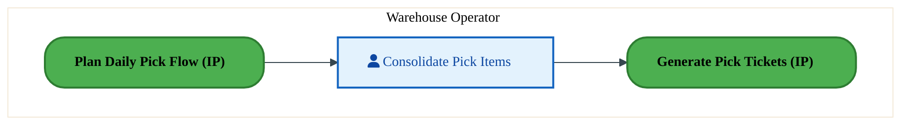
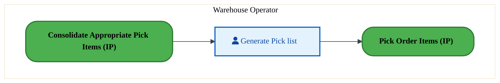
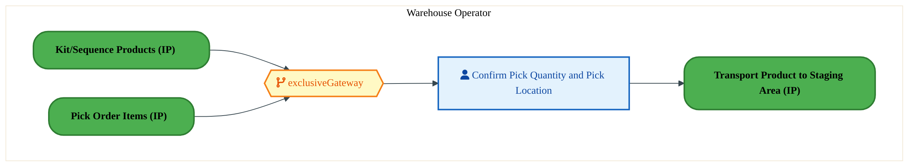

  <img src="data:image/svg+xml;base64,PHN2ZyB4bWxucz0iaHR0cDovL3d3dy53My5vcmcvMjAwMC9zdmciIHZpZXdCb3g9IjAgMCA4MDAgNDgwIiB3aWR0aD0iODAwIiBoZWlnaHQ9IjQ4MCI+DQogIDxkZWZzPg0KICAgIDxsaW5lYXJHcmFkaWVudCBpZD0iYmciIHgxPSIwJSIgeTE9IjAlIiB4Mj0iMTAwJSIgeTI9IjEwMCUiPg0KICAgICAgPHN0b3Agb2Zmc2V0PSIwJSIgc3R5bGU9InN0b3AtY29sb3I6IzAwNzFjNTtzdG9wLW9wYWNpdHk6MSIvPg0KICAgICAgPHN0b3Agb2Zmc2V0PSIxMDAlIiBzdHlsZT0ic3RvcC1jb2xvcjojMDBhZWVmO3N0b3Atb3BhY2l0eToxIi8+DQogICAgPC9saW5lYXJHcmFkaWVudD4NCiAgICA8bGluZWFyR3JhZGllbnQgaWQ9ImFjY2VudCIgeDE9IjAlIiB5MT0iMCUiIHgyPSIwJSIgeTI9IjEwMCUiPg0KICAgICAgPHN0b3Agb2Zmc2V0PSIwJSIgc3R5bGU9InN0b3AtY29sb3I6I2ZmZmZmZjtzdG9wLW9wYWNpdHk6MC4xNSIvPg0KICAgICAgPHN0b3Agb2Zmc2V0PSIxMDAlIiBzdHlsZT0ic3RvcC1jb2xvcjojZmZmZmZmO3N0b3Atb3BhY2l0eTowLjAyIi8+DQogICAgPC9saW5lYXJHcmFkaWVudD4NCiAgICA8cGF0dGVybiBpZD0iZ3JpZCIgd2lkdGg9IjQwIiBoZWlnaHQ9IjQwIiBwYXR0ZXJuVW5pdHM9InVzZXJTcGFjZU9uVXNlIj4NCiAgICAgIDxwYXRoIGQ9Ik0gNDAgMCBMIDAgMCAwIDQwIiBmaWxsPSJub25lIiBzdHJva2U9InJnYmEoMjU1LDI1NSwyNTUsMC4wNykiIHN0cm9rZS13aWR0aD0iMC41Ii8+DQogICAgPC9wYXR0ZXJuPg0KICA8L2RlZnM+DQoNCiAgPCEtLSBCYWNrZ3JvdW5kIC0tPg0KICA8cmVjdCB3aWR0aD0iODAwIiBoZWlnaHQ9IjQ4MCIgZmlsbD0idXJsKCNiZykiIHJ4PSI4Ii8+DQogIDxyZWN0IHdpZHRoPSI4MDAiIGhlaWdodD0iNDgwIiBmaWxsPSJ1cmwoI2dyaWQpIiByeD0iOCIvPg0KICA8cmVjdCB3aWR0aD0iODAwIiBoZWlnaHQ9IjQ4MCIgZmlsbD0idXJsKCNhY2NlbnQpIiByeD0iOCIvPg0KDQogIDwhLS0gRGVjb3JhdGl2ZSBjaXJjdWl0L2FyY2hpdGVjdHVyZSBsaW5lcyAtLT4NCiAgPGcgc3Ryb2tlPSJyZ2JhKDI1NSwyNTUsMjU1LDAuMTIpIiBzdHJva2Utd2lkdGg9IjEuNSIgZmlsbD0ibm9uZSI+DQogICAgPHBhdGggZD0iTSAwIDEwMCBMIDEyMCAxMDAgTCAxNjAgMTQwIEwgMjgwIDE0MCIvPg0KICAgIDxwYXRoIGQ9Ik0gMCAyNjAgTCA4MCAyNjAgTCAxMjAgMjIwIEwgMjAwIDIyMCBMIDI0MCAyNjAgTCAzNjAgMjYwIi8+DQogICAgPHBhdGggZD0iTSA1MjAgMTAwIEwgNjAwIDEwMCBMIDY0MCA2MCBMIDgwMCA2MCIvPg0KICAgIDxwYXRoIGQ9Ik0gNDQwIDM0MCBMIDU2MCAzNDAgTCA2MDAgMzAwIEwgNzIwIDMwMCBMIDc2MCAzNDAgTCA4MDAgMzQwIi8+DQogICAgPHBhdGggZD0iTSA2MDAgNDAwIEwgNjgwIDQwMCBMIDcyMCA0NDAiLz4NCiAgICA8cGF0aCBkPSJNIDAgNDAwIEwgNDAgNDAwIEwgODAgMzYwIi8+DQogICAgPHBhdGggZD0iTSAyMDAgNDIwIEwgMzIwIDQyMCBMIDM2MCAzODAgTCA0ODAgMzgwIi8+DQogICAgPHBhdGggZD0iTSA2NTAgNDQwIEwgNzUwIDQ0MCBMIDgwMCA0ODAiLz4NCiAgPC9nPg0KDQogIDwhLS0gRGVjb3JhdGl2ZSBub2RlcyAtLT4NCiAgPGcgZmlsbD0icmdiYSgyNTUsMjU1LDI1NSwwLjE4KSI+DQogICAgPGNpcmNsZSBjeD0iMTIwIiBjeT0iMTAwIiByPSI0Ii8+DQogICAgPGNpcmNsZSBjeD0iMjgwIiBjeT0iMTQwIiByPSI0Ii8+DQogICAgPGNpcmNsZSBjeD0iMjAwIiBjeT0iMjIwIiByPSI0Ii8+DQogICAgPGNpcmNsZSBjeD0iMzYwIiBjeT0iMjYwIiByPSI0Ii8+DQogICAgPGNpcmNsZSBjeD0iNjAwIiBjeT0iMTAwIiByPSI0Ii8+DQogICAgPGNpcmNsZSBjeD0iNzIwIiBjeT0iMzAwIiByPSI0Ii8+DQogICAgPGNpcmNsZSBjeD0iNTYwIiBjeT0iMzQwIiByPSI0Ii8+DQogICAgPGNpcmNsZSBjeD0iODAiIGN5PSIzNjAiIHI9IjQiLz4NCiAgICA8Y2lyY2xlIGN4PSI0ODAiIGN5PSIzODAiIHI9IjQiLz4NCiAgICA8Y2lyY2xlIGN4PSIzMjAiIGN5PSI0MjAiIHI9IjQiLz4NCiAgPC9nPg0KDQogIDwhLS0gVE9HQUYgQkRBVCBib3hlcyAtLT4NCiAgPGcgZm9udC1mYW1pbHk9IlNlZ29lIFVJLCBBcmlhbCwgc2Fucy1zZXJpZiIgZm9udC1zaXplPSIxNCIgZm9udC13ZWlnaHQ9IjYwMCI+DQogICAgPCEtLSBCIC0tPg0KICAgIDxyZWN0IHg9IjE1MCIgeT0iMTQwIiB3aWR0aD0iMTIwIiBoZWlnaHQ9IjQwIiByeD0iNSIgZmlsbD0icmdiYSgyNTUsMjU1LDI1NSwwLjE4KSIgc3Ryb2tlPSJyZ2JhKDI1NSwyNTUsMjU1LDAuMykiIHN0cm9rZS13aWR0aD0iMSIvPg0KICAgIDx0ZXh0IHg9IjIxMCIgeT0iMTY1IiB0ZXh0LWFuY2hvcj0ibWlkZGxlIiBmaWxsPSIjZmZmIj5CdXNpbmVzczwvdGV4dD4NCiAgICA8IS0tIEQgLS0+DQogICAgPHJlY3QgeD0iMjkwIiB5PSIxNDAiIHdpZHRoPSIxMjAiIGhlaWdodD0iNDAiIHJ4PSI1IiBmaWxsPSJyZ2JhKDI1NSwyNTUsMjU1LDAuMTgpIiBzdHJva2U9InJnYmEoMjU1LDI1NSwyNTUsMC4zKSIgc3Ryb2tlLXdpZHRoPSIxIi8+DQogICAgPHRleHQgeD0iMzUwIiB5PSIxNjUiIHRleHQtYW5jaG9yPSJtaWRkbGUiIGZpbGw9IiNmZmYiPkRhdGE8L3RleHQ+DQogICAgPCEtLSBBIC0tPg0KICAgIDxyZWN0IHg9IjQzMCIgeT0iMTQwIiB3aWR0aD0iMTIwIiBoZWlnaHQ9IjQwIiByeD0iNSIgZmlsbD0icmdiYSgyNTUsMjU1LDI1NSwwLjE4KSIgc3Ryb2tlPSJyZ2JhKDI1NSwyNTUsMjU1LDAuMykiIHN0cm9rZS13aWR0aD0iMSIvPg0KICAgIDx0ZXh0IHg9IjQ5MCIgeT0iMTY1IiB0ZXh0LWFuY2hvcj0ibWlkZGxlIiBmaWxsPSIjZmZmIj5BcHBsaWNhdGlvbjwvdGV4dD4NCiAgICA8IS0tIFQgLS0+DQogICAgPHJlY3QgeD0iNTcwIiB5PSIxNDAiIHdpZHRoPSIxMjAiIGhlaWdodD0iNDAiIHJ4PSI1IiBmaWxsPSJyZ2JhKDI1NSwyNTUsMjU1LDAuMTgpIiBzdHJva2U9InJnYmEoMjU1LDI1NSwyNTUsMC4zKSIgc3Ryb2tlLXdpZHRoPSIxIi8+DQogICAgPHRleHQgeD0iNjMwIiB5PSIxNjUiIHRleHQtYW5jaG9yPSJtaWRkbGUiIGZpbGw9IiNmZmYiPlRlY2hub2xvZ3k8L3RleHQ+DQogIDwvZz4NCg0KICA8IS0tIENvbm5lY3RpbmcgbGluZXMgYmV0d2VlbiBCREFUIGJveGVzIC0tPg0KICA8ZyBzdHJva2U9InJnYmEoMjU1LDI1NSwyNTUsMC4yNSkiIHN0cm9rZS13aWR0aD0iMSI+DQogICAgPGxpbmUgeDE9IjI3MCIgeTE9IjE2MCIgeDI9IjI5MCIgeTI9IjE2MCIvPg0KICAgIDxsaW5lIHgxPSI0MTAiIHkxPSIxNjAiIHgyPSI0MzAiIHkyPSIxNjAiLz4NCiAgICA8bGluZSB4MT0iNTUwIiB5MT0iMTYwIiB4Mj0iNTcwIiB5Mj0iMTYwIi8+DQogIDwvZz4NCg0KICA8IS0tIE1haW4gdGl0bGUgLS0+DQogIDx0ZXh0IHg9IjQwMCIgeT0iMjYwIiB0ZXh0LWFuY2hvcj0ibWlkZGxlIiBmb250LWZhbWlseT0iU2Vnb2UgVUksIEFyaWFsLCBzYW5zLXNlcmlmIiBmb250LXNpemU9IjM2IiBmb250LXdlaWdodD0iNzAwIiBmaWxsPSIjZmZmZmZmIiBsZXR0ZXItc3BhY2luZz0iMSI+DQogICAgSUFPIEFyY2hpdGVjdHVyZQ0KICA8L3RleHQ+DQogIDx0ZXh0IHg9IjQwMCIgeT0iMzAwIiB0ZXh0LWFuY2hvcj0ibWlkZGxlIiBmb250LWZhbWlseT0iU2Vnb2UgVUksIEFyaWFsLCBzYW5zLXNlcmlmIiBmb250LXNpemU9IjE4IiBmb250LXdlaWdodD0iNDAwIiBmaWxsPSJyZ2JhKDI1NSwyNTUsMjU1LDAuOCkiIGxldHRlci1zcGFjaW5nPSIyIj4NCiAgICBUT0dBRiBCREFUIMK3IElBTyBQcm9ncmFtIMK3IElETSAyLjANCiAgPC90ZXh0Pg0KDQogIDwhLS0gQm90dG9tIGFjY2VudCBiYXIgLS0+DQogIDxyZWN0IHg9IjI4MCIgeT0iMzQwIiB3aWR0aD0iMjQwIiBoZWlnaHQ9IjMiIHJ4PSIxLjUiIGZpbGw9InJnYmEoMjU1LDI1NSwyNTUsMC40KSIvPg0KDQogIDwhLS0gSW50ZWwgdGV4dCAtLT4NCiAgPHRleHQgeD0iNDAwIiB5PSIzODAiIHRleHQtYW5jaG9yPSJtaWRkbGUiIGZvbnQtZmFtaWx5PSJTZWdvZSBVSSwgQXJpYWwsIHNhbnMtc2VyaWYiIGZvbnQtc2l6ZT0iMTMiIGZpbGw9InJnYmEoMjU1LDI1NSwyNTUsMC41KSIgbGV0dGVyLXNwYWNpbmc9IjMiPg0KICAgIElOVEVMIENPTkZJREVOVElBTA0KICA8L3RleHQ+DQo8L3N2Zz4NCg==" alt="IAO Architecture" style="width:100%; border-radius:8px;" />
  <h1 style="font-size:36px; margin-top:24px;">LO-160 — Pick Orders - OTC (IP)</h1>
  <h2 style="font-size:24px;">Architecture Document (TOGAF BDAT)</h2>
  
Order To Cash (IP) (OTC-IP) Tower 
  Capability LO-160 · LO Logistics Management Outbound - OTC (IP)

  
IAO Program · R1 – R5 
  Generated: April 2026 
  Sajiv Francis

  
IAO Architecture Pipeline — Intel Confidential

Page 1<a href="#toc">↑ Back to TOC</a>LO-160 — Pick Orders - OTC (IP)

## Table of Contents

<nav class="toc">
<ol>
  <li><a href="#1-executive-summary">1. Executive Summary</a></li>
  <li><a href="#2-business-context-objectives">2. Business Context &amp; Objectives</a>
    <ul>
      <li><a href="#21-classification">2.1 Classification</a></li>
      <li><a href="#22-business-drivers">2.2 Business Drivers</a></li>
      <li><a href="#23-success-criteria">2.3 Success Criteria</a></li>
      <li><a href="#24-companion-documents">2.4 Companion Documents</a></li>
    </ul>
  </li>
  <li><a href="#3-business-architecture-togaf-b">3. Business Architecture (TOGAF &ldquo;B&rdquo;)</a>
    <ul>
      <li><a href="#31-business-process-overview">3.1 Business Process Overview</a></li>
      <li><a href="#32-business-process-diagrams">3.2 Business Process Diagrams</a></li>
      <li><a href="#33-business-roles-responsibilities">3.3 Business Roles &amp; Responsibilities</a></li>
    </ul>
  </li>
  <li><a href="#4-data-architecture-togaf-d">4. Data Architecture (TOGAF &ldquo;D&rdquo;)</a>
    <ul>
      <li><a href="#41-data-entities-ownership">4.1 Data Entities &amp; Ownership</a></li>
      <li><a href="#42-data-flow-diagrams">4.2 Data Flow Diagrams</a></li>
      <li><a href="#43-data-lineage">4.3 Data Lineage</a></li>
      <li><a href="#44-ricefw-data-objects">4.4 RICEFW Data Objects</a></li>
      <li><a href="#45-data-governance-quality">4.5 Data Governance &amp; Quality</a></li>
    </ul>
  </li>
  <li><a href="#5-application-architecture-togaf-a">5. Application Architecture (TOGAF &ldquo;A&rdquo;)</a>
    <ul>
      <li><a href="#54-component-overview">5.4 Component Overview</a></li>
      <li><a href="#55-ricefw-inventory">5.5 RICEFW Inventory</a>
        <ul>
          <li><a href="#551-eca-dependencies">5.5.1 ECA Dependencies</a></li>
          <li><a href="#552-boundary-application-dependencies">5.5.2 Boundary Application Dependencies</a></li>
        </ul>
      </li>
      <li><a href="#56-integration-patterns">5.6 Integration Patterns</a></li>
    </ul>
  </li>
  <li><a href="#6-technology-architecture-togaf-t">6. Technology Architecture (TOGAF &ldquo;T&rdquo;)</a>
    <ul>
      <li><a href="#61-platform-infrastructure">6.1 Platform &amp; Infrastructure</a></li>
      <li><a href="#62-sap-development-object-status">6.2 SAP Development Object Status</a></li>
      <li><a href="#63-nfrs-design-principles">6.3 NFRs &amp; Design Principles</a></li>
      <li><a href="#64-security-governance">6.4 Security &amp; Governance</a></li>
    </ul>
  </li>
  <li><a href="#7-project-context">7. Project Context</a>
    <ul>
      <li><a href="#71-project-roadmap-go-live-plan">7.1 Project Roadmap &amp; Go-Live Plan</a></li>
      <li><a href="#72-raid-log">7.2 RAID Log</a></li>
      <li><a href="#73-recommendations-next-steps">7.3 Recommendations &amp; Next Steps</a></li>
    </ul>
  </li>
</ol>
</nav>

Page 2<a href="#toc">↑ Back to TOC</a>LO-160 — Pick Orders - OTC (IP)

## 1. Executive Summary

This Architecture Document defines the **Business, Data, Application, and Technology** (BDAT) architecture for **LO-160 Pick Orders - OTC (IP)** within the IAO program. It includes 7 BPMN process diagram(s) in Section 3.

| Dimension | Value |
|-----------|-------|
| **Tower** | Order To Cash (IP) (OTC-IP) |
| **Process Group** | LO Logistics Management Outbound - OTC (IP) |
| **Capability** | LO-160 - Pick Orders - OTC (IP) |
| **Release** | R1 – R5 |
| **Total Systems** | 0 |
| **System Status** | 0 Deployed, 0 Developing, 0 EOL, 0 Pending IAPM |
| **RICEFW Objects** | 6 Conversions, 3 Enhancements, 1 Workflows |

> All system nodes in architecture diagrams are **IAPM-linked** — click any node to open its IAPM page. Diagrams require `securityLevel: 'loose'` for click events.

Page 3<a href="#toc">↑ Back to TOC</a>LO-160 — Pick Orders - OTC (IP)

## 2. Business Context & Objectives

### 2.1 Classification

| Level | Value |
|-------|-------|
| **L0 Tower** | Order To Cash (IP) |
| **L1 Process** | LO Logistics Management Outbound - OTC (IP) |
| **L2 Capability** | LO-160 - Pick Orders - OTC (IP) |

### 2.2 Business Drivers

| # | Driver | Description | Strategic Alignment | Priority |
|---|--------|-------------|---------------------|----------|
| 1 | IP Order Management Transformation | Transform Intel Products order management onto S/4 HANA with integrated pricing and ATP | IDM 2.0 Products Revenue | High |
| 2 | Customer Experience Improvement | Reduce order processing time and improve order visibility for IP customers | Customer Centricity | High |
| 3 | Returns & Rebate Automation | Automate returns processing, rebate management, and chargeback handling | Revenue Assurance | Medium |
| 4 | LO-160 Process Migration | Migrate Pick Orders - OTC (IP) business processes and 0 integrated systems from legacy to S/4 HANA target architecture | IDM 2.0 Order Management (Intel Products) | High |

Page 4<a href="#toc">↑ Back to TOC</a>LO-160 — Pick Orders - OTC (IP)

### 2.3 Success Criteria

| Metric | Target | Measure | Baseline | Owner |
|--------|--------|---------|----------|-------|
| Order Processing Time | < 2 hours | Time from order receipt to order confirmation | 6 hours (current) | Order Management Lead |
| Customer Credit Decision Time | < 15 minutes | Automated credit check and approval for standard orders | 2 hours (manual) | Credit Manager |
| Returns Processing Cycle | < 3 business days | End-to-end returns receipt to credit memo issuance | 7 business days (current) | Returns Manager |
| LO-160 Migration Completeness | 100% flow chains validated | All 0 flow chains verified in target state | 0% (pre-migration) | Tower Architect |

### 2.4 Companion Documents

| Document | Description |
|----------|-------------|
| **Business Architecture** | Included in this document (Section 3) — process flows from BPMN diagrams |
| **This Document** | Full BDAT Architecture — Business + Data + Application + Technology |

Page 5<a href="#toc">↑ Back to TOC</a>LO-160 — Pick Orders - OTC (IP)

## 3. Business Architecture (TOGAF "B")

### 3.1 Business Process Overview

This capability includes **7 business process(es)** modeled in BPMN 2.0, covering the end-to-end workflow for LO-160 Pick Orders - OTC (IP).

| # | Step ID | Process Name | Lanes | Tasks | Gateways |
|---|---------|--------------|-------|-------|----------|
| 1 | LO-160-020_Plan_Daily_Pick_Flow_-_OTC_(IP) | LO-160-020_Plan_Daily_Pick_Flow_-_OTC_(IP) | Warehouse Operator | 3 | 0 |
| 2 | LO-160-030_Consolidate_Appropriate_Pick_Items_-_OTC_(IP) | LO-160-030_Consolidate_Appropriate_Pick_Items_-_OTC_(IP) | Warehouse Operator | 1 | 0 |
| 3 | LO-160-040_Generate_Pick_Tickets_-_OTC_(IP) | LO-160-040_Generate_Pick_Tickets_-_OTC_(IP) | Warehouse Operator | 1 | 0 |
| 4 | LO-160-050_Pick_Order_Items_-_OTC_(IP) | LO-160-050_Pick_Order_Items_-_OTC_(IP) | Warehouse Operator | 2 | 2 |
| 5 | LO-160-070_Note_and_Record_Exceptions_-_OTC_(IP) | LO-160-070_Note_and_Record_Exceptions_-_OTC_(IP) | Warehouse Operator | 3 | 3 |
| 6 | LO-160-080_Confirm_Quantity_and_Location_Picked_-_OTC_(IP) | LO-160-080_Confirm_Quantity_and_Location_Picked_-_OTC_(IP) | Warehouse Operator | 1 | 1 |
| 7 | LO-160-090_Transport_Product_to_Staging_Area_-_OTC_(IP) | LO-160-090_Transport_Product_to_Staging_Area_-_OTC_(IP) | Warehouse Operator | 2 | 0 |

Page 6<a href="#toc">↑ Back to TOC</a>LO-160 — Pick Orders - OTC (IP)

### 3.2 Business Process Diagrams

#### BUSINESS ARCHITECTURE — 3.2.1 LO-160-020_Plan_Daily_Pick_Flow_-_OTC_(IP) — LO-160-020_Plan_Daily_Pick_Flow_-_OTC_(IP)

**Swim Lanes**: Warehouse Operator | **Tasks**: 3 | **Gateways**: 0

```mermaid
%%{init: {'theme': 'base', 'themeVariables': {'fontSize': '14px', 'fontFamily': 'Segoe UI, Arial, sans-serif','primaryColor': '#e8f0fe', 'primaryBorderColor': '#0071c5','lineColor': '#37474F', 'secondaryColor': '#f5f8fc'}, 'flowchart': {'useMaxWidth': false, 'htmlLabels': true, 'curve': 'basis', 'nodeSpacing': 40, 'rankSpacing': 50}} }%%
flowchart TD
    classDef startEvt fill:#4CAF50,stroke:#2E7D32,color:#000,font-weight:bold,stroke-width:2px,rx:20,ry:20
    classDef endEvt fill:#C62828,stroke:#B71C1C,color:#fff,font-weight:bold,stroke-width:2px,rx:20,ry:20
    classDef userTask fill:#E3F2FD,stroke:#1565C0,stroke-width:2px,color:#0D47A1
    classDef serviceTask fill:#FFF3E0,stroke:#E65100,stroke-width:2px,color:#BF360C
    classDef gateway fill:#FFF9C4,stroke:#F57F17,stroke-width:2px,color:#E65100
    classDef subProc fill:#F3E5F5,stroke:#7B1FA2,stroke-width:2px,color:#4A148C
    subgraph Warehouse Operator
        n1["fa:fa-user Get Pick Requirements"]
        n2["fa:fa-user Update Pick Plan"]
        n3["fa:fa-user Plan Daily Pick Flow"]
        n4["Consolidate Appropriate Pick Items (IP)"]
        n5["Allocate Inventory to Shipments/Deliveries (IP)"]
    end
    n3 --> n2
    n1 --> n3
    n2 --> n4
    n5 --> n1
    class n1 userTask
    class n2 userTask
    class n3 userTask
    class n4 startEvt
    class n5 startEvt
```

> **Legend**: ● Start · ● End · User Task · Service Task · ◇ Gateway · Sub-Process

<a href="https://mermaid.live/view#pako:eNqlVF2vmjAY_isNJ4YtwYxPcVwsUZDFZMvMPGfnYi5LhSKNtWVt8WPG_75WFA9u52pcGN7H56PvS9ujkbEcGZHR6x0xxTICR1OWaIPMCJhLKJBpgQb4BjmGS4KEqTkFo3KOf59pjl_tNU1jKdxgctDoHK0YAk9TC4yUkFhAQCr6AnFcmJZZcbyB_BAzwrhmP6BhYRfntMtfY8ZzxG8E2w6dLFBSgim6wV7oh36qdQJljOYd0yIohkVmnvTiCNtlJeTyvPxaoM9w_4xzWaq6gEQgxSnlhnyCS0R0j5LXGstqvr0OAwudQ9XA5hXMMF0p3LcVxCFd36DAPp3Aqddb0DYUPCYLCtSTEShEggogpIInWwkKTEj04MejNLAtITlbo-jBnYSJ51qZ7iRSrduWHm5_h_CqlNGSkfxC7e90D5Fb7S2-j1zb4gf1e5eFaH5Ligfu0B22SePQiZ34mlQUxX8lqbnyRyjWl6yJl7pp0mY5wSCI7b_9rm0mfjhy7ueE-BZn6IVpmqbe5DaqySBw7NdNx6k3sOM70xWUaAcPN8P3sd8apkGYOuGrhk3e_Srr5Yyz7GroTYI0aA3DsZOO3FcN_ZHjDy8rVD4rDqsSEEjRT_v7wniGHJVMzRV8qRCHkvGF8aMh64c6ilPAqIB9PXvwEUkww9kafEW_aszVuaVSdBVuV_FU5WoajWimYrtkr0vWBJBAdcQbQao2eFfgK0HMqGAEn31HVcWZOtJtxlSijQBvprO3XWGghCNCWKaZU7pVC2f8ACQD8xJX5z7eJYjgrbpB0J2B2uDNC_VAv_9B9Xgpnab0LqXblP6lDJry5ZbTkusm7sDuv2Hv37Dfnu8OHLSwYRkbxDcQ50Z0NM4XrLqEc1TAmkjjZBmwlmx-oJkRnS8ioz5_pgRDtT82DXj6A5531XA=" title="View full diagram">&#128065; View Diagram</a>

#### BUSINESS ARCHITECTURE — 3.2.2 LO-160-030_Consolidate_Appropriate_Pick_Items_-_OTC_(IP) — LO-160-030_Consolidate_Appropriate_Pick_Items_-_OTC_(IP)

**Swim Lanes**: Warehouse Operator | **Tasks**: 1 | **Gateways**: 0

> **Legend**: ● Start · ● End · User Task · Service Task · ◇ Gateway · Sub-Process

<a href="https://mermaid.live/view#pako:eNqlVNuK2zAU_BXhJbgFB3yNUz8UEjsuCy0byLb70JSi2EexiCwFSdkkDfn3SrluUvapfjDWeM7MOYOknVOJGpzM6XR2lFOdoZ2rG2jBzZA7wwpcDx2BH1hSPGOgXMshgusJ_XOgBfFyY2kWK3FL2daiE5gLQN8fPTQwhcxDCnPVVSApcT13KWmL5TYXTEjLfoA-8cnB7fRrKGQN8krw_TSoElPKKIcrHKVxGpe2TkEleH0jShLSJ5W7t80xsa4aLPWh_ZWCb3jzQmvdmDXBTIHhNLplX_EMmJ1Ry5XFqpV8PYdBlfXhJrDJEleUzw0e-waSmC-uUOLv92jf6Uz5xRQ9F1OOzFMxrFQBBClt4NGrRoQylj3E-aBMfE9pKRaQPYSjtIhCr7KTZGZ037PhdtdA543OZoLVJ2p3bWfIwuXGk5ss9D25Ne87L-D11Snvhf2wf3EapkEe5GcnQsh_OZlc5TNWi5PXKCrDsrh4BUkvyf1_9c5jFnE6CO5zAvlKK3gjWpZlNLpGNeolgf--6LCMen5-JzrHGtZ4exX8lMcXwTJJyyB9V_Dod9_lajaWojoLRqOkTC6C6TAoB-G7gvEgiPunDo3OXOJlgxjm8Nv_OXVesIRGmFzR0xIk1kJOnV9Hsn14YDgEZwR3bfYoF1wJRmszIBrTaoEeNbTqtiQ0JV-AW7UT6dm8QCv04XH88ZYbGe7YNIMKbM71kV2aXX1LNRvs-MEj1O1-Nl2dlsFxGb6Jy4LnbXIDh5czcQNHF9jxnBZki2ntZDvncCmZi6sGgldMO3vPwSstJlteOdnh8Dqrpc2hoNhk2h7B_V9gKpTq" title="View full diagram">&#128065; View Diagram</a>

#### BUSINESS ARCHITECTURE — 3.2.3 LO-160-040_Generate_Pick_Tickets_-_OTC_(IP) — LO-160-040_Generate_Pick_Tickets_-_OTC_(IP)

**Swim Lanes**: Warehouse Operator | **Tasks**: 1 | **Gateways**: 0

> **Legend**: ● Start · ● End · User Task · Service Task · ◇ Gateway · Sub-Process

<a href="https://mermaid.live/view#pako:eNqlVF1v2jAU_StWKpRNClI-CcvDJAhkqrSplejWhzFNJrkGC8eObFOgiP8-m49Q2Po0P0Tx8fE59x7Z3jmlqMDJnE5nRznVGdq5egE1uBlyZ1iB66Ej8ANLimcMlGs5RHA9oa8HWhA3G0uzWIFryrYWncBcAPp-76GB2cg8pDBXXQWSEtdzG0lrLLe5YEJa9h30iU8ObqeloZAVyAvB99OgTMxWRjlc4CiN07iw-xSUgldXoiQhfVK6e1scE-tygaU-lL9S8A1vnmmlF2ZOMFNgOAtds694Bsz2qOXKYuVKvpzDoMr6cBPYpMEl5XODx76BJObLC5T4-z3adzpT3pqip9GUIzNKhpUaAUFKG3j8ohGhjGV3cT4oEt9TWoolZHfhOB1FoVfaTjLTuu_ZcLtroPOFzmaCVSdqd217yMJm48lNFvqe3JrvjRfw6uKU98J-2G-dhmmQB_nZiRDyX04mV_mE1fLkNY6KsBi1XkHSS3L_b71zm6M4HQS3OYF8oSW8ES2KIhpfohr3ksB_X3RYRD0_vxGdYw1rvL0IfsrjVrBI0iJI3xU8-t1WuZo9SlGeBaNxUiStYDoMikH4rmA8COL-qUKjM5e4WSCGOfz2f06dZyxhIUyu6KEBibWQU-fXkWwHDwyH4Izgrs0efQFuWYAeablEjCp9TQ8N_bD0YG8XutdQK_Th_vHjNS0ytFxwJRitrNqgaaQwF7NV_sdGc8qOPzxC3e5nU9ppGhyn4ZvMLHg-K1dw2F6MKzhqYcdzapA1ppWT7ZzDy2RerwoIXjHt7D0Hr7SYbHnpZIcb7Kwa28GIYhNsfQT3fwCtXpc-" title="View full diagram">&#128065; View Diagram</a>

#### BUSINESS ARCHITECTURE — 3.2.4 LO-160-050_Pick_Order_Items_-_OTC_(IP) — LO-160-050_Pick_Order_Items_-_OTC_(IP)

**Swim Lanes**: Warehouse Operator | **Tasks**: 2 | **Gateways**: 2

```mermaid
%%{init: {'theme': 'base', 'themeVariables': {'fontSize': '14px', 'fontFamily': 'Segoe UI, Arial, sans-serif','primaryColor': '#e8f0fe', 'primaryBorderColor': '#0071c5','lineColor': '#37474F', 'secondaryColor': '#f5f8fc'}, 'flowchart': {'useMaxWidth': false, 'htmlLabels': true, 'curve': 'basis', 'nodeSpacing': 40, 'rankSpacing': 50}} }%%
flowchart TD
    classDef startEvt fill:#4CAF50,stroke:#2E7D32,color:#000,font-weight:bold,stroke-width:2px,rx:20,ry:20
    classDef endEvt fill:#C62828,stroke:#B71C1C,color:#fff,font-weight:bold,stroke-width:2px,rx:20,ry:20
    classDef userTask fill:#E3F2FD,stroke:#1565C0,stroke-width:2px,color:#0D47A1
    classDef serviceTask fill:#FFF3E0,stroke:#E65100,stroke-width:2px,color:#BF360C
    classDef gateway fill:#FFF9C4,stroke:#F57F17,stroke-width:2px,color:#E65100
    classDef subProc fill:#F3E5F5,stroke:#7B1FA2,stroke-width:2px,color:#4A148C
    subgraph Warehouse Operator
        n1["fa:fa-user Scan Box ID / Lot No / Batch No Based on Pick List"]
        n2["Check Products and Handling Units in Storage Bin"]
        n3["Kit/Sequence Products (IP)"]
        n4["Note and Record Exceptions (IP)"]
        n5["Confirm Quantity and Location Picked (IP)"]
        n6["Generate Pick Tickets"]
        n7{{"fa:fa-code-branch Is Type of Product Kit/Sequence?"}}
        n8{{"fa:fa-code-branch Any Exceptions with Picked Products?"}}
    end
    n2 --> n8
    n6 --> n1
    n1 --> n7
    n7 -->|"Yes"| n3
    n8 -->|"No"| n5
    n7 -->|"No"| n2
    n8 -->|"Yes"| n4
    class n1 userTask
    class n3 startEvt
    class n4 startEvt
    class n5 startEvt
    class n6 startEvt
    class n7 gateway
    class n8 gateway
```

> **Legend**: ● Start · ● End · User Task · Service Task · ◇ Gateway · Sub-Process

<a href="https://mermaid.live/view#pako:eNqlVV2P6jYQ_StWVitaKegmISE0D634Srvqdrste3tVlaoyzoRYG2yu7SxQLv-9Y0j4uuxT8xBlTs6cmTMwztZhMgMnce7vt1xwk5BtyxSwgFZCWjOqoeWSA_AHVZzOStAty8mlMBP-757mh8u1pVkspQtebiw6gbkE8vHBJX1MLF2iqdBtDYrnLbe1VHxB1WYoS6ks-w56uZfvq9WvBlJloE4Ez4t9FmFqyQWc4E4cxmFq8zQwKbIL0TzKezlr7WxzpVyxgiqzb7_S8Atdf-KZKTDOaakBOYVZlI90BqX1aFRlMVapt2YYXNs6Agc2WVLGxRzx0ENIUfF6giJvtyO7-_upOBYlL6OpIHixkmo9gpxog_D4zZCcl2VyFw77aeS52ij5CsldMI5HncBl1kmC1j3XDre9Aj4vTDKTZVZT2yvrIQmWa1etk8Bz1QbvV7VAZKdKw27QC3rHSoPYH_rDplKe5_-rEs5VvVD9Wtcad9IgHR1r-VE3Gnpf6zU2R2Hc96_nBOqNMzgTTdO0Mz6NatyNfO990UHa6XrDK9E5NbCim5Pgd8PwKJhGcerH7woe6l13Wc2elWSNYGccpdFRMB74aT94VzDs-2Gv7hB15oouC1JSAf94f02dT1RBIXGu5NclKGqkmjp_H8j2Ej5ycprktG1nTyaMCjKQa_IwIh_IozTkSeLDgBpW2McBrnRGpCDPnL2SR67NpVyAcsMC8B36ySpmNKEiIz_hDfduTj7iGaEJF2SCndA5kAEXlwodVPiZmw8T-FyBYHAS-ubh-dtLbojcJ2lgX-N33F-VkfGawdJwKW4lRLY9KXKuFuS3igrDzWaf_CgZtUl7X-jw69Qupv4Iws4QDu5fLNXoS1q83TYDtSdje4a7jaN70ORlswQi88YPOTf5w9TZ7c5UerdV-mJz7m_FTdE03EzpTAnX9vAgAtJuf4-qddg9hPWqCP8QxnUY2_DL1PkT0NoX_EFqvFfjT3IPR1f0Gg6u2I1KePaPtyWbTb-AO8dj7QIOb8PRbbh7G46brb1Aew3quM4C1ILyzEm2zv6LhV-1DHJalcbZuQ6tjJxsBHOS_cnuVMsMM0ec4sItDuDuP8sfPZI=" title="View full diagram">&#128065; View Diagram</a>

Page 7<a href="#toc">↑ Back to TOC</a>LO-160 — Pick Orders - OTC (IP)

#### BUSINESS ARCHITECTURE — 3.2.5 LO-160-070_Note_and_Record_Exceptions_-_OTC_(IP) — LO-160-070_Note_and_Record_Exceptions_-_OTC_(IP)

**Swim Lanes**: Warehouse Operator | **Tasks**: 3 | **Gateways**: 3

```mermaid
%%{init: {'theme': 'base', 'themeVariables': {'fontSize': '14px', 'fontFamily': 'Segoe UI, Arial, sans-serif','primaryColor': '#e8f0fe', 'primaryBorderColor': '#0071c5','lineColor': '#37474F', 'secondaryColor': '#f5f8fc'}, 'flowchart': {'useMaxWidth': false, 'htmlLabels': true, 'curve': 'basis', 'nodeSpacing': 40, 'rankSpacing': 50}} }%%
flowchart TD
    classDef startEvt fill:#4CAF50,stroke:#2E7D32,color:#000,font-weight:bold,stroke-width:2px,rx:20,ry:20
    classDef endEvt fill:#C62828,stroke:#B71C1C,color:#fff,font-weight:bold,stroke-width:2px,rx:20,ry:20
    classDef userTask fill:#E3F2FD,stroke:#1565C0,stroke-width:2px,color:#0D47A1
    classDef serviceTask fill:#FFF3E0,stroke:#E65100,stroke-width:2px,color:#BF360C
    classDef gateway fill:#FFF9C4,stroke:#F57F17,stroke-width:2px,color:#E65100
    classDef subProc fill:#F3E5F5,stroke:#7B1FA2,stroke-width:2px,color:#4A148C
    subgraph Warehouse Operator
        n1["fa:fa-user Note and Record Exceptions"]
        n2["fa:fa-user Change Batch / Handling Unit"]
        n3["Check Products and Handling Units in Storage Bin"]
        n4["Confirm Quantity and Location Picked (IP)"]
        n5["Pick Order Items (IP)"]
        n6["Kit/Sequence Products (IP)"]
        n7{{"fa:fa-code-branch Any Exceptions with Picked Products?"}}
        n8{{"fa:fa-code-branch exclusiveGateway"}}
        n9{{"fa:fa-code-branch exclusiveGateway"}}
    end
    n3 --> n7
    n6 --> n8
    n5 --> n8
    n8 --> n3
    n1 --> n2
    n9 --> n4
    n2 --> n9
    n7 -->|"No"| n9
    n7 -->|"Yes"| n1
    class n1 userTask
    class n2 userTask
    class n4 startEvt
    class n5 startEvt
    class n6 startEvt
    class n7 gateway
    class n8 gateway
    class n9 gateway
```

> **Legend**: ● Start · ● End · User Task · Service Task · ◇ Gateway · Sub-Process

<a href="https://mermaid.live/view#pako:eNqlVV2P4jYU_StWRiNaKWiTkBDIQysIpB3tdne67IeqUlXGuSEWwWZtZ4Cy_PfaJIEJwzxUzUPEObnn3A9x7YNFeApWZN3fHyijKkKHjsphDZ0IdRZYQsdGFfEFC4oXBciOick4UzP6zynM9Tc7E2a4BK9psTfsDJYc0OcHG420sLCRxEx2JQiadezORtA1FvuYF1yY6DsYZE52ylZ_GnORgrgEOE7okkBLC8rgQvdCP_QTo5NAOEtbplmQDTLSOZriCr4lORbqVH4p4Te8-0pTlWuc4UKCjsnVuniHF1CYHpUoDUdK8dQMg0qTh-mBzTaYULbUvO9oSmC2ulCBczyi4_39nJ2Tok-TOUP6IQWWcgIZkkrT0yeFMloU0Z0fj5LAsaUSfAXRnTcNJz3PJqaTSLfu2Ga43S3QZa6iBS_SOrS7NT1E3mZni13kObbY6_dVLmDpJVPc9wbe4JxpHLqxGzeZsiz7X5n0XMUnLFd1rmkv8ZLJOZcb9IPYeenXtDnxw5F7PScQT5TAM9MkSXrTy6im_cB1XjcdJ72-E1-ZLrGCLd5fDIexfzZMgjBxw1cNq3zXVZaLR8FJY9ibBklwNgzHbjLyXjX0R64_qCvUPkuBNzkqMIO_nT_n1lcsIOd6rujDBgRWXMytv6pg8zBXx2Q4ynDXzB695woQZin6qLdBpGi6I7BRlDPZlnltWZxjtgQ0xork6A36VTvoNVuiz_pIaAt7WhjnQFZIN5yWRMlTupZCIsrQTJeKjSdlbQffOHCWUbFGv5eYKar2J493nGBTKnqkZAUp-uHh8ce2NNBS8xF9MGcDelCwljfC-jrsLVVvZvCtBEbgUurL2PBwaCZhTsLuQu-ynsGI7Z_NDm2pypuyGrOf59bx-MxpcNsJdqQoJX2CX6o_3ZVq-F9VepmrH6yHut2fdAc17FdwUMOgDQcV7NXQraBXw2EF_Rp6FRzWMDTw-9x6z-fW95f0HyBP_PPVNRmaw6BFe7dp_3wgtujgNt2_TYfNYrfYwU122LCWba1BrDFNrehgna46fR2mkOGyUNbRtnCp-GzPiBWdrgSr3KRaOaFYb-q6Io__AqvsT0U=" title="View full diagram">&#128065; View Diagram</a>

#### BUSINESS ARCHITECTURE — 3.2.6 LO-160-080_Confirm_Quantity_and_Location_Picked_-_OTC_(IP) — LO-160-080_Confirm_Quantity_and_Location_Picked_-_OTC_(IP)

**Swim Lanes**: Warehouse Operator | **Tasks**: 1 | **Gateways**: 1

> **Legend**: ● Start · ● End · User Task · Service Task · ◇ Gateway · Sub-Process

<a href="https://mermaid.live/view#pako:eNqlVF1v2jAU_StWqiqbFLR8NiwPkyCQqVqndqLbHsY0GecaLBKb2U4LQ_z32YSPwujT8oByD-eec-_NtdcOESU4mXN9vWac6QytXT2DGtwMuROswPVQC3zDkuFJBcq1HCq4HrE_W1oQL5aWZrEC16xaWXQEUwHo662Heiax8pDCXHUUSEZdz11IVmO5ykUlpGVfQZf6dOu2-6svZAnySPD9NCCJSa0YhyMcpXEaFzZPARG8PBGlCe1S4m5scZV4JjMs9bb8RsFnvPzOSj0zMcWVAsOZ6bq6wxOobI9aNhYjjXzaD4Mp68PNwEYLTBifGjz2DSQxnx-hxN9s0Ob6eswPpuhxMObIPKTCSg2AIqUNPHzSiLKqyq7ivFckvqe0FHPIrsJhOohCj9hOMtO679nhdp6BTWc6m4iq3FE7z7aHLFwsPbnMQt-TK_N75gW8PDrlN2E37B6c-mmQB_neiVL6X05mrvIRq_nOaxgVYTE4eAXJTZL7_-rt2xzEaS84nxPIJ0bghWhRFNHwOKrhTRL4r4v2i-jGz89Ep1jDM14dBd_n8UGwSNIiSF8VbP3Oq2wmD1KQvWA0TIrkIJj2g6IXvioY94K4u6vQ6EwlXsxQhTn88n-Mne9YwkyYuaL7BUishRw7P1uyfXhgOBRnFHfs7FEuOGWyRg-MzNGXBnPN9AphXrbInSBYM8FPNUKj8Wh2WC2EWVXTSNkQjbRAI42nZqfNCQaM3tw-vD3Ni0zeVvbeHlV0q6FWF2ixoX1i-t0IfjfACewdLnGT9Xrfj72YOhNTFpkhWJKqUewJPrZfbuxsNm2W2e32hceo0_lgFHZhdBoGbRjuwqQNX26b5ez39wQOD4f1BI4uw_FlONkvneM5Ncgas9LJ1s72ajXXbwkUN5V2Np6DGy1GK06cbHsFOc2iNJkDhs1m1C24-Qva-tNo" title="View full diagram">&#128065; View Diagram</a>

#### BUSINESS ARCHITECTURE — 3.2.7 LO-160-090_Transport_Product_to_Staging_Area_-_OTC_(IP) — LO-160-090_Transport_Product_to_Staging_Area_-_OTC_(IP)

**Swim Lanes**: Warehouse Operator | **Tasks**: 2 | **Gateways**: 0

> **Legend**: ● Start · ● End · User Task · Service Task · ◇ Gateway · Sub-Process

<a href="https://mermaid.live/view#pako:eNqlVF1v2jAU_StWKpROClI-CcvDJAhEqtRqTHTrw5gm49hg4diR7VAY4r_P5iMU1j4tDyj3cM85995ce-cgUWInczqdHeVUZ2Dn6iWusJsBdw4Vdj1wBH5ASeGcYeXaHCK4ntI_h7Qgrjc2zWIFrCjbWnSKFwKD7w8eGBgi84CCXHUVlpS4nltLWkG5zQUT0mbf4T7xycHt9NdQyBLLS4LvpwFKDJVRji9wlMZpXFiewkjw8kqUJKRPkLu3xTHxipZQ6kP5jcJPcPNCS700MYFMYZOz1BV7hHPMbI9aNhZDjVyfh0GV9eFmYNMaIsoXBo99A0nIVxco8fd7sO90Zrw1Bc-jGQfmQQwqNcIEKG3g8VoDQhnL7uJ8UCS-p7QUK5zdheN0FIUesp1kpnXfs8PtvmK6WOpsLlh5Su2-2h6ysN54cpOFvie35vfGC_Py4pT3wn7Yb52GaZAH-dmJEPJfTmau8hmq1clrHBVhMWq9gqSX5P6_euc2R3E6CG7nhOWaIvxGtCiKaHwZ1biXBP7HosMi6vn5jegCavwKtxfBz3ncChZJWgTph4JHv9sqm_lECnQWjMZJkbSC6TAoBuGHgvEgiPunCo3OQsJ6CRjk-Lf_c-a8QImXwswVfK2xhFrImfPrmGwfHpgcAjMCu3b24NmsoiLmxZRTNkgDLcBUw4XZTHMOMbwmh9fkJ7HGYAIZw1pZ4gSilSUaAU0Fv-ZG9y1ZaVG3PCtSvs_-9IYeG3YuOKGyAt8ayDXVWwB5CR4FOuSDCUUro3T_MPnUOptNPr7wGHS7X0z7pzA8htEpDI5h-OYzWfC8nldw-D4cnY7NFRi359bxnArLCtLSyXbO4YY0t2iJCWyYdvaeAxstpluOnOxwkzhNXZqtG1FoPnB1BPd_AbNlw3U=" title="View full diagram">&#128065; View Diagram</a>

Page 8<a href="#toc">↑ Back to TOC</a>LO-160 — Pick Orders - OTC (IP)

### 3.3 Business Roles & Responsibilities

| Role / Lane | Processes Involved | Description |
|------------|-------------------|-------------|
| Warehouse Operator | LO-160-020_Plan_Daily_Pick_Flow_-_OTC_(IP), LO-160-030_Consolidate_Appropriate_Pick_Items_-_OTC_(IP), LO-160-040_Generate_Pick_Tickets_-_OTC_(IP), LO-160-050_Pick_Order_Items_-_OTC_(IP), LO-160-070_Note_and_Record_Exceptions_-_OTC_(IP), LO-160-080_Confirm_Quantity_and_Location_Picked_-_OTC_(IP), LO-160-090_Transport_Product_to_Staging_Area_-_OTC_(IP) | |

Page 9<a href="#toc">↑ Back to TOC</a>LO-160 — Pick Orders - OTC (IP)

## 4. Data Architecture (TOGAF "D")

### 4.1 Data Flows — Source to Target

*Data flows with DB platform details will be populated when tower architects complete the extended flow template columns (42-47) via the Input Portal.*

Page 10<a href="#toc">↑ Back to TOC</a>LO-160 — Pick Orders - OTC (IP)

### 4.2 Data Flow Diagrams

> **DATA ARCHITECTURE** — Database-to-database data flows. Applications (blue) sit above their hosting databases (green cylinders). Thick arrows show data movement between databases.

### 4.3 Data Lineage

*Data lineage (source schema/object → target schema/object mappings) will be populated when tower architects provide validated schema details via the Input Portal.*

### 4.4 RICEFW Data Objects

Data-centric RICEFW objects (Reports and Conversions) from the Object Tracker:

| Object ID | Type | Description | Status | Source | Target | Complexity |
|-----------|------|-------------|--------|--------|--------|-----------|
| OTCC1341 | Conversion | Payer Profile Data Conversion | 10. Object Complete |  |  | 03.Medium |
| OTCC1340 | Conversion | Payer Segment Data Conversion | 10. Object Complete |  |  | 03.Medium |
| OTCC1339 | Conversion | Payer Relationship Data Conversion | 10. Object Complete |  |  | 03.Medium |
| OTCC0803 | Conversion | Open Credit Case Conversion | 10. Object Complete |  |  | 02.High |
| OTCC0679 | Conversion | Open Dispute Case Conversion | 10. Object Complete |  |  | 02.High |
| OTCC0678 | Conversion | Collection Master Conversion | 10. Object Complete |  |  | 02.High |

### 4.5 Data Governance & Quality

| Concern | Approach |
|---------|----------|
| Data Ownership | Per-entity owners listed in Section 3.1 |
| Data Classification | Financial data classified as Intel Confidential |
| Data Retention | Per Intel corporate retention policies |
| Data Quality | Validated at source; reconciliation at target |

Page 11<a href="#toc">↑ Back to TOC</a>LO-160 — Pick Orders - OTC (IP)

## 5. Application Architecture (TOGAF "A")

### 5.4 Component Overview

#### System Inventory

| System | IAPM ID | Status |
|--------|---------|--------|

Page 12<a href="#toc">↑ Back to TOC</a>LO-160 — Pick Orders - OTC (IP)

### 5.5 RICEFW Inventory

| Object ID | Type | Description | Status | Source → Target | Middleware | Boundary App | Interface Approach | Complexity |
|-----------|------|-------------|--------|----------------|-----------|-------------|-------------------|-----------|
| OTCW1683 | Workflow | Additional WRICEF for Credit Limit Request Workflow | 10. Object Complete |  | NA |  |  | 03.Medium |
| OTCE0737 | Enhancement | Implement Standard BADI to activate Credit Limit Request Workflow | 10. Object Complete |  | NA |  |  | 04.Low |
| OTCE0614_IP | Enhancement | Implement Standard Credit/Collection BADI | 10. Object Complete |  | NA |  |  | 03.Medium |
| OTCE0021 | Enhancement | Credit hold release dashboard at line-item level | 10. Object Complete | NA → NA | NA | NA |  | 01.Very High |
| OTCC1341 | Conversion | Payer Profile Data Conversion | 10. Object Complete |  | NA |  |  | 03.Medium |
| OTCC1340 | Conversion | Payer Segment Data Conversion | 10. Object Complete |  | NA |  |  | 03.Medium |
| OTCC1339 | Conversion | Payer Relationship Data Conversion | 10. Object Complete |  | NA |  |  | 03.Medium |
| OTCC0803 | Conversion | Open Credit Case Conversion | 10. Object Complete |  | NA |  |  | 02.High |
| OTCC0679 | Conversion | Open Dispute Case Conversion | 10. Object Complete |  | NA |  |  | 02.High |
| OTCC0678 | Conversion | Collection Master Conversion | 10. Object Complete |  | NA |  |  | 02.High |

**Summary**: 6 Conversions, 3 Enhancements, 1 Workflows

Page 13<a href="#toc">↑ Back to TOC</a>LO-160 — Pick Orders - OTC (IP)

### 5.6 Integration Patterns

*Integration patterns will be populated when tower architects provide validated middleware and protocol details via the extended flow template.*

Page 14<a href="#toc">↑ Back to TOC</a>LO-160 — Pick Orders - OTC (IP)

## 6. Technology Architecture (TOGAF "T")

### 6.1 Platform & Infrastructure

> **TECHNOLOGY / PLATFORM ARCHITECTURE** — Platforms (green) host applications (blue). Thick arrows show platform-to-platform integration flows.

#### Platform Inventory

*Platform inventory will be populated when tower architects provide validated technology platform details via the extended flow template.*

Page 15<a href="#toc">↑ Back to TOC</a>LO-160 — Pick Orders - OTC (IP)

### 6.2 SAP Development Object Status

| Metric | DEV | QAS | PRD |
|--------|-----|-----|-----|
| Transport Requests | — | — | — |
| Custom Code Objects | — | — | — |
| CDS Views | — | — | — |
| Fiori Apps | — | — | — |
| BAdIs / Enhancements | — | — | — |

### 6.3 NFRs & Design Principles

| Category | Requirement | Target / SLA | Priority |
|----------|-------------|-------------|----------|
| Performance | Order/transaction processing within interactive SLA | < 3 seconds for online transactions | High |
| Availability | Business-critical systems available during extended hours | 99.9% (06:00-22:00 all time zones) | High |
| Scalability | Support seasonal and promotional volume spikes | Handle 2x baseline transaction volume | Medium |
| Recoverability | Customer-facing systems recover within business impact window | RPO < 30 min, RTO < 2 hours | High |
| Data Volume | Support transactional data growth from business expansion | 10M+ documents/year | Medium |
| Latency | Near-real-time integration for order status updates | < 30 seconds for status propagation | Medium |
| Concurrency | Support global user base across business functions | 300+ concurrent users | Medium |

### 6.4 Security & Governance

| Concern | Approach | Standard / Policy | Owner |
|---------|----------|--------------------|-------|
| Authentication | Single Sign-On (SSO) via Intel corporate Azure AD identity | Intel IT Security Policy - Identity Management | IT Security |
| Authorization | Role-based access control (RBAC) with SAP authorization objects | Intel SAP Security Standards - Role Design | SAP Security Team |
| Data Classification | All financial/operational data classified per Intel Data Classification Standard | Intel Data Classification Policy | Data Governance |
| Data Encryption (at rest) | AES-256 encryption for SAP HANA database and file storage | Intel Encryption Standard | Infrastructure Security |
| Data Encryption (in transit) | TLS 1.3 for all system-to-system and user-to-system communication | Intel Network Security Policy | Network Engineering |
| Network Segmentation | SAP systems in dedicated network zones with firewall controls | Intel Network Architecture Standard | Network Security |
| API Security | OAuth 2.0 / certificate-based authentication for all API integrations | Intel API Security Guidelines | Integration Architecture |
| Audit Logging | Comprehensive audit trail for all data changes and user actions (SAP Security Audit Log) | SOX Compliance / Intel Audit Policy | Internal Audit |
| Certificate Management | Automated certificate lifecycle management for system-to-system trust | Intel PKI Standard | Certificate Authority Team |
| Compliance | SOX controls, export control (EAR/ITAR) screening, data privacy (GDPR) | Intel Corporate Compliance Framework | Compliance Office |

Page 16<a href="#toc">↑ Back to TOC</a>LO-160 — Pick Orders - OTC (IP)

## 7. Project Context

### 7.1 Project Roadmap & Go-Live Plan

| ID | Description | FS | TDD | Build | FUT | Status |
|----|-------------|----|-----|-------|-----|--------|
| OTCW1683 | Additional WRICEF for Credit Limit Request Workflow | 2025-12-12 00:00:00 (100%) | 2026-02-04 00:00:00 (100%) | 2026-02-04 00:00:00 (100%) | 2026-03-04 00:00:00 (100%) | 1. On Track |
| OTCE0737 | Implement Standard BADI to activate Credit Limit Request Workflow | 2025-07-11 00:00:00 (100%) | 2025-12-03 00:00:00 (100%) | 2025-12-03 00:00:00 (100%) | 2026-03-04 00:00:00 (100%) | 1. On Track |
| OTCE0614_IP | Implement Standard Credit/Collection BADI | 2025-03-14 00:00:00 (100%) | 2025-08-13 00:00:00 (100%) | 2025-04-18 00:00:00 (100%) | 2025-09-05 00:00:00 (100%) |  |
| OTCE0021 | Credit hold release dashboard at line-item level | 2024-07-19 00:00:00 (100%) | 2025-09-05 00:00:00 (100%) | 2025-09-05 00:00:00 (100%) | 2026-02-04 00:00:00 (100%) | 1. On Track |
| OTCC1341 | Payer Profile Data Conversion | 2025-05-02 00:00:00 (100%) | 2025-06-24 00:00:00 (100%) | 2025-08-01 00:00:00 (100%) | 2025-09-10 00:00:00 (100%) |  |
| OTCC1340 | Payer Segment Data Conversion | 2025-05-02 00:00:00 (100%) | 2025-06-24 00:00:00 (100%) | 2025-08-01 00:00:00 (100%) | 2025-09-10 00:00:00 (100%) | 1. On Track |
| OTCC1339 | Payer Relationship Data Conversion | 2025-06-06 00:00:00 (100%) | 2025-10-23 00:00:00 (100%) | 2025-11-05 00:00:00 (100%) | 2025-11-21 00:00:00 (100%) | 4. Completed |
| OTCC0803 | Open Credit Case Conversion | 2025-06-06 00:00:00 (100%) | 2025-10-24 00:00:00 (100%) | 2025-11-05 00:00:00 (100%) | 2025-11-28 00:00:00 (100%) | 4. Completed |
| OTCC0679 | Open Dispute Case Conversion | 2025-06-06 00:00:00 (100%) | 2025-07-29 00:00:00 (100%) | 2025-08-29 00:00:00 (100%) | 2025-10-08 00:00:00 (100%) | 4. Completed |
| OTCC0678 | Collection Master Conversion | 2025-03-21 00:00:00 (100%) | 2025-05-02 00:00:00 (100%) | 2025-06-06 00:00:00 (100%) | 2025-08-29 00:00:00 (100%) |  |

Page 17<a href="#toc">↑ Back to TOC</a>LO-160 — Pick Orders - OTC (IP)

### 7.2 RAID Log

*RAID items will be auto-populated from the Smartsheet RAID log when matched to this capability.*

### 7.3 Recommendations & Next Steps

| # | Category | Recommendation | Priority | Owner | Target Date | Status |
|---|----------|---------------|----------|-------|-------------|--------|
| 1 | Architecture | Complete extended flow attributes (Data Entity, Integration Pattern, Tech Platform) in Flows tab for full BDAT coverage | High | Tower Architect | 2026-Q2 | Open |
| 2 | Data | Define data ownership and classification for all 0 flow chains to satisfy Data Architecture (TOGAF D) requirements | Medium | Data Architect | 2026-Q3 | Open |
| 3 | Testing | Develop integration test scenarios covering all 0 flow chains for FUT/SIT readiness | High | Test Lead | 2026-Q3 | Open |
| 4 | Business Architecture | Review and validate Business Architecture process steps against latest Signavio/BIC process models | Medium | Business Analyst | 2026-Q2 | Open |
| 5 | Security | Complete security review for API integrations and data flows per Intel Security Architecture standards | Medium | Security Architect | 2026-Q3 | Open |

---
*LO-160 — Architecture Document (TOGAF BDAT) · Order To Cash (IP) · Generated: April 2026*

Page 18<a href="#toc">↑ Back to TOC</a>LO-160 — Pick Orders - OTC (IP)

